# Intraday Quant Signals & Strategies — 200-Stage Deep Dive

> Living document. Each chapter is one stage. Stages S001–S100: signal deep dives.
> Stages T001–T100: strategy deep dives. Every worked example uses clearly-labeled
> synthetic data unless stated otherwise with a real web-sourced citation.
> Local-build costing assumes a sunk-cost Apple Mac with M5 Max chip and 128GB unified memory.

**Build status:** Stage 30/200 merged · last updated 2026-09-10 · 0 chapters deferred

## Build log
- Stage 0/200 — scaffold created 2026-09-10. Planner + chatbot scouts dispatched.
- Stage 1/200 — S001 merged 2026-09-10 · reviewer: dc96e478 · plot verified (seed 42)
- Stage 3/200 — S003 merged 2026-09-10 · reviewer: dc96e478 · plot verified (seed 42)
- Stage 4/200 — S004 merged 2026-09-10 · reviewer: dc96e478 · plot verified (seed 42)
- Stage 6/200 — S006 merged 2026-09-10 · reviewer: dc96e478 · plot verified (seed 42)
- Stage 8/200 — S008 merged 2026-09-10 · reviewer: dc96e478 · plot verified (seed 7)
- Stage 14/200 — S014 merged 2026-09-10 · reviewer: a2ba029b · plot verified (seed 11)
- Stage 24/200 — S024 merged 2026-09-10 · reviewer: dc96e478 · plot verified (seed 24)
- Stage 25/200 — S025 merged 2026-09-10 · reviewer: dc96e478 · plot verified (seed 25)
- Stage 35/200 — S035 merged 2026-09-10 · reviewer: dc96e478 · plot verified (seed 35)
- Stage 40/200 — S040 merged 2026-09-10 · reviewer: dc96e478 · plot verified (seed 40)
- Stage 11/200 — S011 merged 2026-09-10 · reviewer: 88a33425 · plot verified (seed 110)
- Stage 13/200 — S013 merged 2026-09-10 · reviewer: 88a33425 · plot verified (seed 130)
- Stage 21/200 — S021 merged 2026-09-10 · reviewer: 88a33425 · plot verified (seed 21)
- Stage 27/200 — S027 merged 2026-09-10 · reviewer: 88a33425 · plot verified (seed 27)
- Stage 32/200 — S032 merged 2026-09-10 · reviewer: 88a33425 · plot verified (seed 32)
- Stage 42/200 — S042 merged 2026-09-10 · reviewer: 88a33425 · plot verified (seed 42)
- Stage 43/200 — S043 merged 2026-09-10 · reviewer: 88a33425 · plot verified (seed 49)
- Stage 63/200 — S063 merged 2026-09-10 · reviewer: 88a33425 · plot verified (seed 63)
- Stage 66/200 — S066 merged 2026-09-10 · reviewer: 88a33425 · plot verified (seed 66)
- Stage 83/200 — S083 merged 2026-09-10 · reviewer: 88a33425 · plot verified (seed 83)
- Stage 49/200 — S049 merged 2026-09-10 · reviewer: acd4b0b4 · plot verified (seed 49)
- Stage 50/200 — S050 merged 2026-09-10 · reviewer: acd4b0b4 · plot verified (seed 50)
- Stage 56/200 — S056 merged 2026-09-10 · reviewer: acd4b0b4 · plot verified (seed 56)
- Stage 79/200 — S079 merged 2026-09-10 · reviewer: acd4b0b4 · plot verified (seed 79)
- Stage 81/200 — S081 merged 2026-09-10 · reviewer: acd4b0b4 · plot verified (seed 81)
- Stage 85/200 — S085 merged 2026-09-10 · reviewer: acd4b0b4 · plot verified (seed 85)
- Stage 86/200 — S086 merged 2026-09-10 · reviewer: acd4b0b4 · plot verified (seed 86086)
- Stage 88/200 — S088 merged 2026-09-10 · reviewer: acd4b0b4 · plot verified (seed 88088)
- Stage 91/200 — S091 merged 2026-09-10 · reviewer: acd4b0b4 · plot verified (seed 91091)
- Stage 94/200 — S094 merged 2026-09-10 · reviewer: acd4b0b4 · plot verified (seed 94094)


## Table of contents

### Signal chapters

**Batch SB1** — The working core: every serious intraday book uses some of these; all implementable on L1/1-min data.

- [x] Stage 1/200 — [S001 — Order-flow imbalance — Cont–Kukanov–Stoikov](#stage-1200--s001-order-flow-imbalance--contkukanovstoikov)
- [x] Stage 3/200 — [S003 — Queue (depth) imbalance — Gould–Bonart](#stage-3200--s003-queue-depth-imbalance--gouldbonart)
- [x] Stage 4/200 — [S004 — Microprice (Stoikov)](#stage-4200--s004-microprice-stoikov)
- [x] Stage 6/200 — [S006 — Signed trade imbalance (volume delta)](#stage-6200--s006-signed-trade-imbalance-volume-delta)
- [x] Stage 8/200 — [S008 — VPIN (flow toxicity)](#stage-8200--s008-vpin-flow-toxicity)
- [x] Stage 14/200 — [S014 — Quoted / effective / realized spread & price-impact decomposition](#stage-14200--s014-quoted--effective--realized-spread--price-impact-decomposition)
- [x] Stage 24/200 — [S024 — VWAP cross & anchored-VWAP continuation](#stage-24200--s024-vwap-cross--anchored-vwap-continuation)
- [x] Stage 25/200 — [S025 — Intraday time-series momentum](#stage-25200--s025-intraday-time-series-momentum)
- [x] Stage 35/200 — [S035 — Short-term reversal — Jegadeesh / Lehmann](#stage-35200--s035-short-term-reversal--jegadeesh--lehmann)
- [x] Stage 40/200 — [S040 — VWAP-deviation mean reversion](#stage-40200--s040-vwap-deviation-mean-reversion)

**Batch SB2** — Core cost/vol infrastructure + the most-used session patterns.

- [x] Stage 11/200 — [S011 — Amihud illiquidity ratio](#stage-11200--s011-amihud-illiquidity-ratio)
- [x] Stage 13/200 — [S013 — Corwin–Schultz high-low spread estimator](#stage-13200--s013-corwinschultz-high-low-spread-estimator)
- [x] Stage 21/200 — [S021 — Opening-range breakout — Crabel (1990)](#stage-21200--s021-opening-range-breakout--crabel-1990)
- [x] Stage 27/200 — [S027 — End-of-day momentum / last-hour drift](#stage-27200--s027-end-of-day-momentum--last-hour-drift)
- [x] Stage 32/200 — [S032 — Relative-volume (RVOL) filtered breakout](#stage-32200--s032-relative-volume-rvol-filtered-breakout)
- [x] Stage 42/200 — [S042 — RSI / RSI-2 mean reversion (Connors-style)](#stage-42200--s042-rsi--rsi-2-mean-reversion-connors-style)
- [x] Stage 43/200 — [S043 — Internal Bar Strength (IBS) mean reversion](#stage-43200--s043-internal-bar-strength-ibs-mean-reversion)
- [x] Stage 63/200 — [S063 — Range-based realized-volatility estimators](#stage-63200--s063-range-based-realized-volatility-estimators)
- [x] Stage 66/200 — [S066 — HAR realized-volatility forecast](#stage-66200--s066-har-realized-volatility-forecast)
- [x] Stage 83/200 — [S083 — Imbalance/tick/volume/dollar bars](#stage-83200--s083-imbalancetickvolumedollar-bars)

**Batch SB3** — Pairs foundations + the validation/ML layer every strategy chapter depends on + news.

- [x] Stage 49/200 — [S049 — Distance-method pairs — Gatev–Goetzmann–Rouwenhorst](#stage-49200--s049-distance-method-pairs--gatevgoetzmannrouwenhorst)
- [x] Stage 50/200 — [S050 — Engle–Granger cointegration z-score](#stage-50200--s050-englegranger-cointegration-z-score)
- [x] Stage 56/200 — [S056 — ETF vs basket / iNAV arbitrage](#stage-56200--s056-etf-vs-basket--inav-arbitrage)
- [x] Stage 79/200 — [S079 — HMM regime-switching (trend & volatility states)](#stage-79200--s079-hmm-regime-switching-trend--volatility-states)
- [x] Stage 81/200 — [S081 — Hawkes buy/sell intensity imbalance](#stage-81200--s081-hawkes-buysell-intensity-imbalance)
- [x] Stage 85/200 — [S085 — Triple-barrier labeling](#stage-85200--s085-triple-barrier-labeling)
- [x] Stage 86/200 — [S086 — Meta-labeling](#stage-86200--s086-meta-labeling)
- [x] Stage 88/200 — [S088 — Purged / embargoed cross-validation](#stage-88200--s088-purged--embargoed-cross-validation)
- [x] Stage 91/200 — [S091 — Machine-readable news sentiment (first-minute reaction)](#stage-91200--s091-machine-readable-news-sentiment-first-minute-reaction)
- [x] Stage 94/200 — [S094 — Unusual intraday volume (RVOL) & signed block-trade pressure](#stage-94200--s094-unusual-intraday-volume-rvol--signed-block-trade-pressure)

### Strategy chapters

*(none merged yet)*

## Part I — Signal deep dives (S001–S100)

## Stage 1/200 — S001: Order-flow imbalance — Cont–Kukanov–Stoikov

*Batch SB1 · Signal 1/100 · Provenance [D] · Family A — Microstructure & order flow*

### S1. One-line verdict

| | |
|---|---|
| **What it is** | Net order-flow pressure at the best bid/ask (adds − cancels − executions), whose sign and depth-scaled size drive short-horizon mid-price moves. |
| **When it works** | Liquid, tight-spread names on direct feeds with stable depth; seconds-to-minutes horizons; as an adverse-selection gauge for quoting. |
| **When it dies** | Wide spreads, thin books, SIP-latency races (SIP = the Securities Information Processor, the consolidated national quote feed, which arrives slower than direct exchange feeds), spoofable queues; any attempt to trade it standalone with market orders at retail latency. |
| **Build-or-buy in one line** | Build the estimator in Python+polars on a bought L1 feed (L1 = top-of-book: only the best bid and best ask; e.g. Databento MBP-1); buy only if you need historical L2 (deeper book levels beyond the best bid/ask) / MBO (market-by-order: every individual order's adds, cancels and fills, unaggregated) or multi-venue coverage. |

Provenance: **[D]** — Cont, Kukanov & Stoikov (2014), arXiv:1011.6402. The caveat from the source entry carries forward unchanged: the original result is a *contemporaneous price-impact regression*, not by itself a forward trading rule; forward use needs a lead-lag/AR extension.

### S2. How it works — plain human explanation

At 9:47:03.214 the book reads bid 231.40 × 800, ask 231.41 × 300. A buy limit order for 500 joins the bid; 200 are cancelled from the ask; a market sell executes 100 against the bid. Net pressure: +600 shares of demand at the touch — that running tally, event by event, is order-flow imbalance (OFI).

The logic is queue mechanics plus adverse selection: prices move when one side's queue depletes, and persistent buying pressure chews through the ask queue first, ratcheting the mid up. Cont, Kukanov & Stoikov showed the relation is approximately *linear*: mid-price change ≈ OFI / (2 × depth). Deep books absorb flow; thin books lurch.

Why not trade volume? Trade imbalance ignores what doesn't print: a 5,000-share bid stacked then cancelled moves no volume but moves the market. OFI counts adds, cancels, and executions together — which is why it beats trade volume (the paper's §4: the volume relation is "noisy and less robust").

Three-bullet mental model:

- **OFI is a flow, not a level.** It accumulates pressure from every book event at the touch; the *level* of the book is S003/S005 territory.
- **Depth is the denominator.** Never trade raw OFI without depth normalization.
- **Contemporaneous ≠ predictive.** The 2014 result explains the move happening *now*; a forward trade needs a lead-lag extension the paper does not provide.

### S3. The math — exact formula

Per best-quote event *n*, let P^b_n, q^b_n be the best bid price and displayed size; P^a_n, q^a_n the best ask price and size. Define the bid-side and ask-side contributions (report convention, matching Cont–Kukanov–Stoikov):

$$e^b_n = \begin{cases} q^b_n, & P^b_n > P^b_{n-1} \ (\text{bid up: whole new queue counts}) \\ q^b_n - q^b_{n-1}, & P^b_n = P^b_{n-1} \ (\text{size change only}) \\ -q^b_{n-1}, & P^b_n < P^b_{n-1} \ (\text{bid down: whole old queue vanishes}) \end{cases}$$

$$e^a_n = \begin{cases} q^a_{\,n-1}, & P^a_n > P^a_{n-1} \ (\text{ask up: selling pressure eased}) \\ -(q^a_n - q^a_{n-1}), & P^a_n = P^a_{n-1} \ (\text{note the minus sign}) \\ -q^a_n, & P^a_n < P^a_{n-1} \ (\text{ask down: new selling pressure}) \end{cases}$$

Per-event OFI and windowed OFI:

$$\Delta\mathrm{OFI}_n = e^b_n + e^a_n, \qquad \mathrm{OFI}_k = \sum_{n \in T_k} \Delta\mathrm{OFI}_n$$

The price-impact relation (contemporaneous regression):

$$\Delta m_k = \alpha + \beta\,\frac{\mathrm{OFI}_k}{D_k} + \varepsilon_k,$$

where *m_k* is the mid-price change over interval *T_k* and *D_k* a depth scale (e.g. average top-of-book depth). The stylized model behind it: ΔP ≈ OFI/(2D) — linear impact with slope inversely proportional to depth.

Parameter table (every default marked as example):

| Parameter | Symbol | Typical range | Too small | Too large | Default (example) |
|---|---|---|---|---|---|
| Aggregation window | T_k | 100 ms – 5 s, or 50–1,000 events | noise dominates; flickering quotes | signal decays; mixes regimes | *1 s bars — example, not an institutional standard* |
| Book depth level | — | touch only (original) → top 3/5/10 | misses deep-book info | stale, gameable size | *touch only — example* |
| Depth normalizer | D_k | rolling mean top-of-book depth, 1–10 min | OFI not comparable across names | lags real depth shocks | *5-min rolling mean — example* |
| Signal form | — | raw / depth-normed / z-score / percentile | raw not comparable across regimes | z-score lags in jumps | *depth-normed z-score — example* |
| Forecast horizon | h | 100 ms – a few seconds | latency eats it | edge decays (CCZ 2023: rapid decay) | *500 ms — example* |

Normalization: raw OFI is in shares — meaningless across names. Depth-normalized OFI (OFI/D) is canonical; a rolling z-score handles diurnal depth seasonality. Causal timing: OFI at event *t* uses only events ≤ *t*; earliest reaction is *t+1*.

Named variants: (1) **touch-only OFI** — the original CKS measure; (2) **integrated OFI** — Cont, Cucuringu & Zhang (2023) combine per-level OFIs over the top 10 levels by PCA, beating best-level OFI in- and out-of-sample; (3) **event-time vs time-bar aggregation** — summing over *N* events is more stable when arrival rates swing.

### S4. Worked example — step-by-step numbers (SYNTHETIC)

All numbers **synthetic** (`batches/SB1/plot_S001.py`, `seed 42`). Initial book: bid 231.40 × 635 / ask 231.41 × 432. No fees, no latency, no hidden liquidity — arithmetic illustration, not a backtest.

| ev | bid | qb | ask | qa | e^b | e^a | ΔOFI_n | cum OFI | mid |
|---|---|---|---|---|---|---|---|---|---|
| 1 | 231.40 | 1048 | 231.41 | 432 | +413 | 0 | +413 | +413 | 231.405 |
| 2 | 231.40 | 1048 | 231.41 | 234 | 0 | +198 | +198 | +611 | 231.405 |
| 3 | 231.41 | 260 | 231.41 | 234 | +260 | 0 | +260 | +871 | 231.410 |
| 4 | 231.41 | 260 | 231.42 | 688 | 0 | +234 | +234 | +1,105 | 231.415 |
| 5 | 231.41 | 260 | 231.42 | 946 | 0 | −258 | −258 | +847 | 231.415 |
| 6 | 231.41 | 153 | 231.42 | 946 | −107 | 0 | −107 | +740 | 231.415 |
| 7 | 231.40 | 715 | 231.42 | 946 | −153 | 0 | −153 | +587 | 231.410 |
| 8 | 231.40 | 715 | 231.42 | 486 | 0 | +460 | +460 | +1,047 | 231.410 |
| 9 | 231.40 | 1002 | 231.42 | 486 | +287 | 0 | +287 | +1,334 | 231.410 |
| 10 | 231.40 | 1002 | 231.43 | 732 | 0 | +486 | +486 | +1,820 | 231.415 |

Hand-checks: ev3 — bid price up, e^b = q^b_3 = +260. ev5 — ask size 688 → 946 at same price, e^a = −(946−688) = −258. ev10 — ask price up, e^a = +q^a_9 = +486.

**What to notice.** Cumulative OFI climbs +413 → +1,820 while the mid moves one tick (231.405 → 231.415) — the depth denominator at work. The mid moves that *do* occur (events 3, 4, 7, 10) coincide with quote-price events, each contributing the largest single-event OFI prints. That is the CKS finding as arithmetic — and why the toy tape flatters OFI: real books have hidden liquidity, fleeting quotes, and adverse fills this table omits.

### S5. Strategies that use this signal

- **T001 — OFI + Queue-Imbalance Directional Scalper** — primary entry trigger (direction); queue imbalance S003 confirms.
- **T021 — Avellaneda–Stoikov Inventory Skew MM** — adverse-selection filter / quote-skew input (OFI shifts the reservation price away from toxic flow).
- **T086 — OFI-Paced Participation Tracker** — execution filter: pace child orders faster when OFI runs with you, slow down when it runs against you.

### S6. Data required — exact spec

| Field | Type | Granularity | Source tier | Notes |
|---|---|---|---|---|
| Best bid price/size | float / int | every quote event (L1) | Tier 2 | needs *displayed* size per price move |
| Best ask price/size | float / int | every quote event (L1) | Tier 2 | same |
| Exchange timestamps | int64 ns | per event | Tier 2 | SIP timestamps add 10s of µs jitter — label SIP work *simulated only — requires MBO/ITCH* for latency claims |
| Corporate actions / halts | reference | daily + intraday halt feed | Tier 1 | price-move contributions are garbage across a split or halt reopen |

Collection: Databento MBP-1 (`XNAS`/`XNYS`); Polygon v3; TAQ history. Ingest sketch (polars, per symbol-day):

```python
import polars as pl, databento as db
cli = db.Historical("API_KEY")
data = cli.timeseries.get_range("XNAS.MBP-1", "AAPL",
        start="2026-09-09", end="2026-09-10")          # 1: fetch MBP-1 deltas
q = (pl.scan_parquet("aapl_mbp1.parquet")              # 2: best-level only
       .filter(pl.col("action").is_in(["A","C","T"]))   #    (adds/cancels/trades)
       .sort("ts_event")                               # 3: exchange-time order
       .with_columns(pb=pl.col("bid_px_00"),           # 4: lagged book state
                     qb=pl.col("bid_sz_00"),
                     pa=pl.col("ask_px_00"),
                     qa=pl.col("ask_sz_00"))
       .with_columns(pb_l=pl.col("pb").shift(1), ...)   # 5: e^b/e^a per §S3
       .with_columns(ofi=pl.when(...).then(...))        # 6: piecewise contributions
       .group_by_dynamic("ts_event", every="1s")       # 7: 1-s event bars (example)
       .agg(ofi_sum=pl.col("ofi").sum()))
```

Storage: `notes/cost-model.md` §4: L1 ≈ 2–8 GB/symbol-day parquet. Quality checklist: exchange timestamps (not SIP arrival); drop crossed/locked quotes; halt/auction/DST/half-day masks; split-adjust before price-move contributions; dedupe retransmits.

### S7. Local build on M5 Max / 128GB

**Feasibility: feasible.** OFI is a stateful O(1)-per-event scan: a Python loop does ~100–500k events/sec (`notes/cost-model.md` §2) vs ~50–500 L1 events/sec average for one liquid name (busy bursts ~1–5k/sec). Sizing from §2: 50 symbols × 2k events/sec = 100k/sec → Python borderline, Rust (5–50M/sec) comfortable; polars batch recompute every second is trivial. Bottleneck is I/O and timestamp normalization, not the arithmetic.

Stack options:

| Stack | When to pick |
|---|---|
| Python + polars | research, daily recompute, ≤20 symbols live |
| Rust ingest → polars analyze | >20 symbols live, or direct-feed decode |
| DuckDB | ad-hoc history queries over parquet |

RAM (§3): one symbol-day L1 ≈ 0.5–4 GB — fine for a few symbols; 60 days (~30–240 GB) **does not fit** the 77 GB budget — stream per-symbol daily parquet. 1-min bars trivial (~12 MB for 500 symbols × 60 days).

Engineering time: Tier M (plan §6) → **20–60 h** ≈ $3,000–9,000 loaded-cost estimate at $150/hr (event-state machine + timestamp/halt handling + depth normalizer + reference validation). Breaks first at 500 symbols: the GIL-bound Python loop; move to Rust ingest + streaming.

### S8. Buy vs build

| Option | What you get | Indicative price | Gains | Loses |
|---|---|---|---|---|
| Tier 0: exchange delayed quotes / Alpaca IEX | free delayed L1 | ~$0 — *indicative, verify before budgeting* | $0 to prototype | 15-min delay; useless for live OFI |
| Tier 1: Polygon Stocks Advanced / Alpaca SIP | real-time SIP L1, history | ~$30–200/mo — *indicative, verify before budgeting* | cheap, easy API | SIP timestamps; latency claims *simulated only — requires MBO/ITCH* |
| Tier 2: Databento Standard MBP-1 | exchange-timestamped L1/L2, pay-as-you-go | ~$200/mo + usage — *indicative, verify before budgeting* | honest timestamps, history | usage meter runs on full universes |
| Tier 3: LOBSTER (academic) | MBO/ITCH replay | ~hundreds/yr academic — *indicative, verify before budgeting* | true queue dynamics | academic license, limited symbols |

Verdict: **build the estimator, buy the feed.** OFI is ~40 lines; the value is your normalization, windows, and lead-lag calibration — none of which a vendor sells. Buy Databento MBP-1 history to validate, Tier-1 SIP for live research, and direct/MBO only after the signal survives realistic costs.

### S9. Success ratio / efficacy — documented evidence

| Study / source | Market & period | Metric | Before/after cost | Caveat |
|---|---|---|---|---|
| Cont, Kukanov & Stoikov (2014) | 50 US stocks, NYSE TAQ (Trades and Quotes: the historical record of every trade and quote), 2008 | linear OFI↔ΔP, slope ∝ 1/(2·depth); stable across time scales, seasonality, stocks | before-cost; **contemporaneous regression, not a trading rule** | no forward P&L; no Sharpe; volume-based impact noisy by comparison |
| Cont, Cucuringu & Zhang (2023), arXiv:2112.13213 | US equities, multi-asset | integrated (PCA, top-10-level) OFI beats best-level OFI in- and out-of-sample; lagged cross-asset OFIs improve future-return forecasts, decaying rapidly | before-cost (R², not P&L) | forecasting exercise, not an after-cost strategy |
| Third-party replication (GitHub `xecuterisaquant/replication-cont-ofi`) | TAQ / NBBO (National Best Bid and Offer: the best displayed bid and ask across all US exchanges), 1-s grid | OLS ΔP ~ β·OFI_norm, mean R² ≈ 14.2% after sign-fix | before-cost; contemporaneous | code repo, not peer-reviewed; replication quality unverified |

Fails in: vol spikes (depth evaporates, 1/(2D) explodes), wide-spread names (flickering quotes), retail books (odd-lot noise), crowded periods (fleeting/spoofed quotes).

Honest bottom line: as a *standalone trigger* this is weak and latency-dominated — the literature documents explanatory power, not after-cost P&L, and I found **no published after-cost Sharpe for a naive OFI scalper**. As a *filter* (adverse-selection gauge for quoting, execution pacing) it is a strong, well-documented input — "one feature in a microstructure model, not a standalone rule" (Duck.ai phrasing, kept labeled).

### S10. Failure modes & pitfalls

1. **Contemporaneous≠forward** — treating the CKS regression as a trading rule. Mitigation: forward-shift one event; report lead-lag R², not contemporaneous.
2. **Lookahead leakage** — bar-close OFI traded inside the same bar. Mitigation: event-*t* → trade-*t+1* causality audit.
3. **Staleness/latency** — SIP timestamps make OFI a museum piece in a colocated race. Mitigation: label SIP work *simulated only — requires MBO/ITCH*; add measured latency to costs.
4. **Fleeting quotes / spoofing** — displayed size cancels before execution. Mitigation: down-weight sub-50 ms quote lifetimes (example).
5. **Cost blowup** — spread + fees + impact on sub-second round trips. Mitigation: per-trade bps (basis points; 1 bps = 0.01%) budget; fee-covering entry gate.
6. **Regime breaks** — depth collapses in stress; the linear model misprices impact. Mitigation: depth/vol-conditioned scaling; stand down past a spread multiple.
7. **Overfitting** — window, normalizer, z-threshold mined on one month. Mitigation: purged/embargoed validation (S088); per-symbol shrinkage.
8. **Data errors** — bad ticks, splits, halts create phantom contributions. Mitigation: S6 checklist; drop crossed/locked quotes; halt-aware masks.

### S11. Visuals


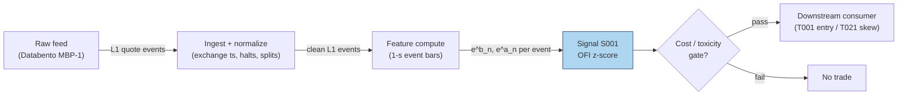

### S12. Sources

1. Cont, R., Kukanov, A. & Stoikov, S. (2014). "The Price Impact of Order Book Events." *Journal of Financial Econometrics* 12(1): 47–88. arXiv:1011.6402 — https://arxiv.org/abs/1011.6402 (canonical OFI definition; contemporaneous regression — not a forward rule).
2. Cont, R., Cucuringu, M. & Zhang, C. (2023). "Cross-Impact of Order Flow Imbalance in Equity Markets." *Quantitative Finance*; arXiv:2112.13213 — https://arxiv.org/abs/2112.13213 (integrated multi-level OFI via PCA; lagged cross-asset OFIs improve short-horizon return forecasts).
3. Replication: `xecuterisaquant/replication-cont-ofi` — https://github.com/xecuterisaquant/replication-cont-ofi (third-party CKS replication on TAQ/NBBO 1-s grid; OLS R² ≈ 14.2% after sign correction; code repo, not peer-reviewed).

**Chatbot source log.** Duck.ai (GPT-5.6 Luna, anonymous, web-search assisted, 2026-09-10; `batches/SB1/duckai-answers.md`) answered Q-SB1-1–Q-SB1-3. Q-SB1-1 confirms the CKS formula structure and the contemporaneous-not-forward caveat. **Operator verification of the chatbot's own worked OFI example found 2 arithmetic errors** (event 5 used the wrong ask size; event 7 wrongly added a price-effect term): the correct cumulative OFI sequence is 0, 4, 12, 23, 18, 13, 0, 6, 11, **19** — the model reported 29. The chapter's worked example uses its own script-generated tape (seed 42), never the chatbot's numbers; the chatbot's parameter/throughput/pricing tables were self-flagged as illustrative estimates and are NOT promoted to documented facts. This is exactly why chatbot output is treated as leads, never facts. Source log: Duck.ai answered Q-SB1-1 (OFI portion), Q-SB1-2, Q-SB1-3; Grok/Cursor answers pending (checked 2026-09-10).

**Unverified leads** (chatbot-only — never in Sources):
- Duck.ai Q-SB1-1 worked example: raw output contained the 2 arithmetic errors above (correct final cumulative OFI = 19, not 29) — kept here as a caution, not used.
- Duck.ai: "Polars 1–10M events/s; Python loop 0.1–1M/s; Rust 5–30M+/s" — model-flagged estimates; cost-model §2 used instead.
- Duck.ai: vendor bands ("free–$50–300/mo retail; $500–10,000+/mo institutional") — model-flagged estimates; cost-model §6 used instead.
- Duck.ai: execution heuristics ("+OFI → waiting riskier; OFI burst → cross spread") — plausible, no checkable source; hypotheses only.
- Duck.ai Q-SB1-2/Q-SB1-3: vendor shortlist (Databento US Equities Mini ~$100–500/mo, TotalView-ITCH ~$300–2,000+/mo, etc.) and engineering-hour bands (prototype 40–70 h, research-grade 120–220 h) — model-flagged estimates; cost-model §5/§6 used in S7/S8 instead.

---

## Stage 3/200 — S003: Queue (depth) imbalance — Gould–Bonart

*Batch SB1 · Signal 3/100 · Provenance [D] · Family A — Microstructure & order flow*

### S1. One-line verdict

| | |
|---|---|
| **What it is** | The normalized difference between displayed size at the best bid and best ask; predicts the direction of the next mid-price tick via queue-depletion. |
| **When it works** | Large-tick, deep-queue stocks where the next move is a race between two visible queues; sub-second to seconds horizons. |
| **When it dies** | Small-tick names with flickering quotes, spoofed/layered books, hidden-liquidity dominance; any SIP-latency queue race. |
| **Build-or-buy in one line** | Build — it is one division on data you already have for S001; buy nothing extra unless you need historical L2. |

Provenance: **[D]** — Gould & Bonart (2016), arXiv:1512.03492; Cao, Hansch & Wang (2009), *Journal of Futures Markets* 29(1): 16–41.

### S2. How it works — plain human explanation

At 9:47:03.214 the book reads bid 231.40 × 1,048, ask 231.41 × 234. Forget prices for a moment and look at the two queues: 1,048 shares want to buy at the touch, only 234 want to sell. Which queue gets eaten first? The ask queue is four times thinner — a single 300-share market sell order barely dents the bid, while a 300-share market buy wipes out the entire ask queue and the ask price ticks up. The mid-price follows the thinner queue.

That is the whole signal: relative queue length forecasts the next tick because prices move when a queue depletes, and the shorter queue usually depletes first. Formally this is *queue-depletion dynamics* — the same mechanical core as S001's OFI, but a snapshot (a *level*) rather than a flow. Where OFI accumulates pressure over events, queue imbalance reads the current standoff: big bid queue + small ask queue = the next move is more likely up.

The economics are adverse selection in miniature. A lopsided book means informed or impatient flow has been leaning on one side; market makers see the thin queue, infer they are about to be adversely selected, and reprice before the queue is gone. Gould & Bonart's contribution was to test this as a literal classifier: feed the imbalance into a logistic regression, predict the next mid-price move, and find a strongly significant relationship — "considerable improvement" over a null model for large-tick stocks, moderate for small-tick ones.

Three-bullet mental model:

- **Imbalance is a snapshot; OFI is the movie.** S003 reads the book's current state; S001 reads how it got there. They are cousins, not substitutes.
- **It predicts *direction*, not magnitude.** The next tick is up or down; how far depends on depth behind the touch (S005 territory).
- **Large-tick is its home turf.** When the spread is one tick and queues are deep, the race is clean. When the spread flickers across ticks, the signal drowns in quote noise.

### S3. The math — exact formula

$$I_t = \frac{Q^b_t - Q^a_t}{Q^b_t + Q^a_t} \in [-1,\, 1],$$

where Q^b_t, Q^a_t are the displayed sizes at the best bid and best ask at time *t* (in shares; both non-negative, not both zero). Trade in the direction of *I* when |I_t| exceeds a fee-covering threshold κ (example — not an institutional standard).

N-level extension (static book pressure):

$$I^{(N)}_t = \frac{\sum_{i=1}^{N}\,(Q^b_{i,t} - Q^a_{i,t})}{\sum_{i=1}^{N}\,(Q^b_{i,t} + Q^a_{i,t})},$$

with *i* indexing price levels from the touch outward. *N* = 1 is the Gould–Bonart measure; *N* = 5–10 is the S005 book-pressure family.

A useful exact identity linking S003 to S004 (verified algebra): with spread *s_t = P^a_t − P^b_t*,

$$P_{\mu,t} - m_t = \frac{s_t}{2}\,I_t,$$

i.e. the microprice deviation from mid equals half the spread times the queue imbalance. The two signals share a touch-level core; they diverge when you add flow history (S001) or deeper levels / dynamics (full microprice).

Parameter table:

| Parameter | Symbol | Typical range | Too small | Too large | Default (example) |
|---|---|---|---|---|---|
| Entry threshold | κ | 0.3 – 0.7 | trades noise, fees eat you | never triggers | *±0.5 — example, not an institutional standard* |
| Levels | N | 1 (touch) – 10 | misses deep liquidity | stale/gameable size | *1 — example* |
| Smoothing | — | raw snapshot, or 100 ms–1 s EWMA | flicker whipsaws | lags the depletion | *raw — example* |
| Horizon | — | next 1–20 ticks / 100 ms – seconds | — | edge decays | *next tick — example* |

Causal timing: *I_t* is computed from the book snapshot at event *t* using only data ≤ *t*; a trade reacting to it can execute no earlier than *t+1*. Variants: (1) touch-only (canonical); (2) N-level book pressure; (3) time-averaged imbalance over a short window (kills flicker, adds lag).

### S4. Worked example — step-by-step numbers (SYNTHETIC)

Same synthetic tape as S001 (`batches/SB1/plot_S003.py`, `seed 42`), snapshots after each event. All numbers **synthetic** — no fees, no latency, no hidden liquidity; an arithmetic illustration, not a backtest.

| ev | bid | qb | ask | qa | I_t | mid |
|---|---|---|---|---|---|---|
| 0 | 231.40 | 635 | 231.41 | 432 | +0.1903 | 231.405 |
| 1 | 231.40 | 1048 | 231.41 | 432 | +0.4162 | 231.405 |
| 2 | 231.40 | 1048 | 231.41 | 234 | +0.6349 | 231.405 |
| 3 | 231.41 | 260 | 231.41 | 234 | +0.0526 | 231.410 |
| 4 | 231.41 | 260 | 231.42 | 688 | −0.4515 | 231.415 |
| 5 | 231.41 | 260 | 231.42 | 946 | −0.5688 | 231.415 |
| 6 | 231.41 | 153 | 231.42 | 946 | −0.7216 | 231.415 |
| 7 | 231.40 | 715 | 231.42 | 946 | −0.1391 | 231.410 |
| 8 | 231.40 | 715 | 231.42 | 486 | +0.1907 | 231.410 |
| 9 | 231.40 | 1002 | 231.42 | 486 | +0.3468 | 231.410 |
| 10 | 231.40 | 1002 | 231.43 | 732 | +0.1557 | 231.415 |

Hand-checks: ev2: (1048 − 234)/(1048 + 234) = 814/1282 = +0.6349. ev6: (153 − 946)/(153 + 946) = −793/1099 = −0.7216. ev10: (1002 − 732)/1734 = +0.1557. With the example threshold κ = ±0.5, the trigger fires at ev2 (long, +0.63) and ev5/ev6 (short, −0.57/−0.72).

**What to notice.** The imbalance leads the tape's two real mid moves: the +0.63 print at ev2 precedes the uptick at ev3 (231.405 → 231.410), and the −0.72 at ev6 precedes the downtick at ev7 (231.415 → 231.410). That is the queue-depletion story working as advertised — but this is a 10-event synthetic anecdote with hand-designed event types, not evidence of tradability. Note also ev3: after the bid stepped up, both queues reset small and *I* collapses to +0.05 — price-move events destroy the very queues the signal reads, which is why the signal must be recomputed every event and why stale snapshots are worthless.

### S5. Strategies that use this signal

- **T022 — Queue-Imbalance Maker with Toxicity Cancel** — primary trigger: posts at the touch when the queue favors your side; cancels on imbalance reversal or VPIN spike.
- **T001 — OFI + Queue-Imbalance Directional Scalper** — confirmation filter on the OFI entry (both must agree).
- **T004 — VWAP-Deviation Mean-Reversion** — timing filter: enter the fade only when the touch queue favors the fade direction.

### S6. Data required — exact spec

| Field | Type | Granularity | Source tier | Notes |
|---|---|---|---|---|
| Best bid/ask sizes | int (shares) | every quote event (L1) | Tier 2 | the entire signal; odd-lot handling matters |
| Best bid/ask prices | float | every quote event (L1) | Tier 2 | for the mid and the S004 identity |
| Exchange timestamps | int64 ns | per event | Tier 2 | queue races are decided in µs — SIP timestamps make live trading *simulated only — requires MBO/ITCH* |
| Halt/auction flags | bool | per event | Tier 1 | imbalance is meaningless across halts |

Collection: same feed as S001 (Databento MBP-1, Polygon L2 per the report entry). Ingest sketch (≤20 lines):

```python
import polars as pl
q = (pl.scan_parquet("aapl_mbp1.parquet")          # 1: L1 deltas, exchange-time sorted
       .sort("ts_event")
       .with_columns(qb=pl.col("bid_sz_00"),       # 2: touch sizes
                     qa=pl.col("ask_sz_00"),
                     bid=pl.col("bid_px_00"),
                     ask=pl.col("ask_px_00"))
       .filter((pl.col("qb") + pl.col("qa")) > 0)  # 3: guard empty book
sig = q.with_columns(                              # 4: the whole signal: one division
        imb=(pl.col("qb") - pl.col("qa")) /
            (pl.col("qb") + pl.col("qa"))).collect()
long  = sig.filter(pl.col("imb") >  0.5)           # 5: example threshold
short = sig.filter(pl.col("imb") < -0.5)
```

Storage: identical to S001 — L1 quotes+trades ≈ 2–8 GB/symbol-day parquet (`notes/cost-model.md` §4); the signal itself adds one float column. Data-quality checklist: drop crossed/locked quotes; normalize timestamps to exchange time; exclude auction prints and halt periods; watch for odd-lot-only quotes on some feeds.

### S7. Local build on M5 Max / 128GB

**Feasibility: trivial.** The signal is one division per quote event — O(1), stateless. A pure-Python loop at ~100–500k events/sec (`notes/cost-model.md` §2) covers a 50-symbol universe (~100k events/sec busy) with headroom; polars vectorized recompute (~10–50M rows/sec, §2) does a full day in seconds. Bottleneck: none for the math — the constraint is feed latency and timestamp quality, not compute.

Stack options:

| Stack | When to pick |
|---|---|
| Python + polars | everything up to live 50-symbol scanning |
| Rust | only if you are already writing the S001 Rust ingest — no standalone need |
| DuckDB | historical screening over parquet |

RAM: per §3, one symbol-day of L1 ≈ 0.5–4 GB working set; trivial for intraday windows. Sixty days for one symbol does not fit the 77 GB budget — stream per-symbol daily files. Engineering time: Tier M per plan §6, but at the light end — **20–40 h** ≈ $3,000–6,000 loaded-cost estimate at $150/hr, mostly feed plumbing and the threshold/toxicity gating shared with S001. What breaks first at 500 symbols: nothing in the math — the feed bill and the staleness of your quotes do.

### S8. Buy vs build

| Option | What you get | Indicative price | Gains | Loses |
|---|---|---|---|---|
| Tier 0: delayed quotes | free L1, 15-min delay | ~$0 — *indicative, verify before budgeting* | $0 research prototype | no live signal |
| Tier 1: Polygon Stocks Advanced / Alpaca SIP | real-time SIP L1 | ~$30–200/mo — *indicative, verify before budgeting* | cheap live data | queue races on SIP are *simulated only — requires MBO/ITCH* |
| Tier 2: Databento MBP-1 | exchange-timestamped L1 | ~$200/mo + usage — *indicative, verify before budgeting* | honest event order | usage meter on wide universes |

Verdict: **build, always** — the signal is a one-line transform of data you already buy for S001. There is no credible "precomputed queue imbalance" product worth paying for; the only buy decision is the feed tier, and the honest crossover is latency: if you intend to *trade* the next tick rather than study it, SIP timestamps are not enough and you are in Tier 2/3 with colocation-class infrastructure, which a Mac on a home connection cannot honestly emulate.

### S9. Success ratio / efficacy — documented evidence

| Study / source | Market & period | Metric | Before/after cost | Caveat |
|---|---|---|---|---|
| Gould & Bonart (2016), arXiv:1512.03492 | 10 liquid Nasdaq stocks, LOB data | logistic regression I → next mid move: strongly significant; considerable improvement over null for large-tick stocks, moderate for small-tick (binary + probabilistic) | before-cost (classification, not P&L) | predicts direction only; no trading costs, no Sharpe |
| Cao, Hansch & Wang (2009), *J. Futures Markets* 29(1) | Australian Stock Exchange | order imbalances between demand/supply schedules significantly related to future short-term returns, controlling for return autocorrelation, inside spread, trade imbalance; book ≈ 22% of price discovery | before-cost (return regression) | 2000s ASX; explanatory, not a strategy |
| Kercheval & Zhang (2015), *Quant. Finance* 15(8) | US equities, real LOB data | SVM on LOB-state features (incl. book imbalance): effective short-term price-movement forecasts | before-cost (classification) | ML wrapper; no after-cost P&L |

Only before-cost numbers exist in what I could verify — every row above is a classification or regression result, none is an after-cost trading Sharpe. Regimes where it fails: small-tick names (Gould–Bonart's own "moderate" result), spoofed/layered books where displayed size is a lie, hidden-liquidity-heavy venues, and any latency regime where you see the imbalance after the queue is already gone.

Honest bottom line: as a *standalone trigger* this is a real but tiny and latency-bound edge — documented as direction prediction, never as after-cost profit in the sources I found. As a *filter/veto* (T022's toxicity cancel, T001's confirmation) and as a *quoting input* (lean your limit orders to the heavy-queue side) it is one of the best-evidenced microstructure features in the literature.

### S10. Failure modes & pitfalls

1. **Spoofing / fleeting quotes** — displayed size vanishes before execution. Mitigation: weight by quote lifetime or filter sub-50 ms quotes (example).
2. **Hidden liquidity** — the visible queue is not the real queue. Mitigation: treat *I* as a noisy proxy; never size on it alone.
3. **Small-tick flicker** — spread bouncing across ticks randomizes the signal. Mitigation: restrict to large-tick names or time-average the imbalance.
4. **Lookahead leakage** — using the post-move snapshot to "predict" the move. Mitigation: strict event-*t* → trade-*t+1* causality.
5. **Latency illusion on SIP** — your imbalance print arrives after the race is over. Mitigation: label SIP work *simulated only — requires MBO/ITCH*.
6. **Cost blowup** — crossing the spread to chase a one-tick prediction. Mitigation: fee-covering threshold κ; prefer passive posting (T022) over taking.
7. **Overfitting κ** — threshold tuned to one month's microstructure. Mitigation: per-symbol calibration, walk-forward, shrinkage toward 0.5.
8. **Regime breaks** — imbalance–direction relation weakens in stress/crowding. Mitigation: toxicity overlay (VPIN, S008); stand down on spread multiples.

### S11. Visuals


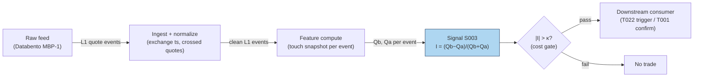

### S12. Sources

1. Gould, M. D. & Bonart, J. (2016). "Queue Imbalance as a One-Tick-Ahead Price Predictor in a Limit Order Book." arXiv:1512.03492 — https://arxiv.org/abs/1512.03492 (logistic-regression evidence; large-tick vs small-tick result).
2. Cao, C., Hansch, O. & Wang, X. (2009). "The information content of an open limit-order book." *Journal of Futures Markets* 29(1): 16–41 — https://ideas.Repec.org/a/wly/jfutmk/v29y2009i1p16-41.html (order imbalances → future short-term returns; ~22% price-discovery contribution).
3. Kercheval, A. N. & Zhang, Y. (2015). "Modelling high-frequency limit order book dynamics with support vector machines." *Quantitative Finance* 15(8): 1315–1329 — https://ideas.repec.Org/a/taf/quantf/v15y2015i8p1315-1329.html (LOB-state features effective for short-term forecasts on real data).

**Chatbot source log.** Q-SB1-1 asked for queue imbalance alongside OFI and microprice, but the Duck.ai answer (GPT-5.6 Luna, 2026-09-10) covered only the OFI portion — no usable queue-imbalance content was returned. Source log: Duck.ai answered Q-SB1-1 (OFI portion only — not the queue-imbalance portion); Grok/Cursor answers pending (checked 2026-09-10).

**Unverified leads:** none specific to S003 beyond the general SB1 chatbot caveats — no chatbot made a checkable queue-imbalance claim in this batch.

---

## Stage 4/200 — S004: Microprice (Stoikov)

*Batch SB1 · Signal 4/100 · Provenance [D] · Family A — Microstructure & order flow*

### S1. One-line verdict

| | |
|---|---|
| **What it is** | Stoikov's learned fair-price estimator: the limiting expected mid-price conditional on the book-imbalance state, estimated from a Markov chain over discretized (imbalance, spread) states — a martingale by construction. |
| **When it works** | As a fair-value anchor for quoting and for fading transient mid deviations; tight-spread, visible-book names. |
| **When it dies** | Spoofed books, dominant hidden liquidity, one-tick-wide flickering spreads — anywhere displayed size lies. |
| **Build-or-buy in one line** | Build — the estimator is a small batch fit plus a per-event table lookup on your S001/S003 feed. |

Provenance: **[D]** — Stoikov (2018), "The micro-price: a high-frequency estimator of future prices," *Quantitative Finance* 18(12): 1959–1966 (working paper Nov 2017). Definition: $P_t^{\text{micro}} = \lim_{i\to\infty} \mathbb{E}[M_{\tau_i} \mid \mathcal{F}_t]$ — the limit of expected mid-prices at the successive mid-price-change times $\tau_1, \tau_2, \dots$ — estimated in practice by discretizing (imbalance, spread) into states and fitting the transition matrices $Q, R_1, R_2$ (paper §3). The cross-weighted mid $W = I\cdot P^a + (1-I)\cdot P^b$ is the paper's Appendix-B degenerate special case (no learning) and appears in this chapter ONLY as the naive baseline — it is not the microprice. Do not double-count with S003: the microprice's state *is* the touch imbalance S003 uses, passed through the learned adjustment.

### S2. How it works — plain human explanation

At 9:47:03.214 the book reads bid 231.40 × 1,048, ask 231.41 × 234, mid 231.405. The plain mid says "fair value is 231.405." But look at the queues: 1,048 shares bid vs 234 offered. The next trade is far more likely to be a buy chewing through that thin ask — printing at 231.41 — than a sell. So is 231.405 really the best guess of where the price is going? No: the *expected* next price leans toward the ask.

Stoikov's question is sharper than "which way does it lean": **given that the book looks like this, where will the mid-price be on average, far into the future?** That limiting expected mid-price *is* the microprice — a martingale by construction, which is the mathematical way of saying "this is what 'fair' means once you condition on the book." And crucially, it is not a formula you write down from one snapshot. It is **learned**: discretize the imbalance into bins, watch thousands of quote events to see what the mid does after each bin, and compute the expected long-run mid per bin. Each new event is then a table lookup — mid plus the learned adjustment for its bin.

The construction, in one paragraph: the state of the book at each quote event is the pair (imbalance bin, spread bin). From history you estimate three transition matrices — $Q$ (quote updates where the mid doesn't move), $R_1$ (the distribution of the next mid-price move), $R_2$ (state transitions coincident with a mid-price move). From them you compute the per-state adjustment $G^* = G_1 + B G_1 + B^2 G_1 + \cdots$ (the §3 math), and the microprice is $P^{\text{micro}} = M + G^*(\text{state})$. Because the matrices are fit per symbol from its own history, the estimator adapts to each name's microstructure — a large-tick stock and a small-tick stock get different adjustments, which no closed form can do.

Where does the familiar cross-weighted mid $W = I\cdot P^a + (1-I)\cdot P^b$ fit? It is the **no-learning baseline**: the straight-line adjustment $(I-\tfrac12)\cdot S$ you get if you skip the estimation and simply *impose* that the current imbalance tells the whole story. Stoikov derives it as a degenerate special case (Appendix B: imbalance as a Brownian motion with particular boundary behavior) and shows empirically it falls short — the learned adjustments come out flatter, always inside half the spread, and predict short-term prices better than the mid *or* the weighted mid (BAC/CVX, March 2011).

Why "micro"? Because it lives at the tick scale and updates every quote event — and because taking expectations far into the future filters out the microstructure noise in the mid-price itself.

Three-bullet mental model:

- **The microprice is a learned function of the book state, not a closed form.** Fit transition matrices on history; each event is then mid + a looked-up adjustment. No fit, no microprice — just the baseline.
- **It is a fair-value estimator, not a trade.** You fade deviations from it (buy below, sell above) or center your quotes on it — you don't "buy the microprice."
- **The cross-weighted mid is the naive baseline, not the estimator.** Same inputs, imposed straight-line adjustment, zero learning. Benchmark the learned microprice against it — and never present the baseline as the microprice.

### S3. The math — exact formula

**Definition** (Stoikov 2017 §2, 2018): with $\tau_1, \tau_2, \dots$ the successive
mid-price-change times and $\mathcal{F}_t$ the order-book information at $t$,

$$P^{\text{micro}}_t = \lim_{i\to\infty} \mathbb{E}[M_{\tau_i} \mid \mathcal{F}_t].$$

Write $P^{\text{micro}} = M + g(I, S)$ with $M$ the mid-price,
$I = Q^b/(Q^b+Q^a)$ the imbalance, $S = P^a - P^b$ the spread. The paper's
program is to **estimate the adjustment function $g$ from data**. The $i$-th
mid-price prediction decomposes as

$$P_i = M_t + \sum_{k=1}^{i} g_k(I_t, S_t),$$

with the first-order adjustment $g_1(I,S) = \mathbb{E}[M_{\tau_1} - M_t \mid I_t = I, S_t = S]$
(the expected move to the *next* mid-price change) and the recursion
$g_{i+1}(I,S) = \mathbb{E}[g_i(I_{\tau_1}, S_{\tau_1}) \mid I_t = I, S_t = S]$.

**Finite-state estimator** (paper §3 — the implementable version): discretize
imbalance into $n$ bins ($I_t = x$ iff $(x-1)/n < I \le x/n$) and spread into $m$
tick values; the book state is $x = (i, s)$ ($nm$ states). From quote history
estimate:

- $Q_{xy} = P(M_{t+1}-M_t = 0 \;\land\; X_{t+1} = y \mid X_t = x)$ — transient
  quote updates, $nm \times nm$;
- $R^1_{xk} = P(M_{t+1}-M_t = k \mid X_t = x)$ — one-step mid-move distribution
  over $K = \{-0.01, -0.005, 0.005, 0.01\}$ (half-ticks), $nm \times 4$;
- $R^2_{xy} = P(M_{t+1}-M_t \ne 0 \;\land\; X_{t+1} = y \mid X_t = x)$ — state
  transitions coincident with a mid-price move, $nm \times nm$.

Then, with $K$ as a column vector:

$$G_1 = (I - Q)^{-1} R^1 K, \qquad B = (I - Q)^{-1} R^2,$$

$$G^* = G_1 + B G_1 + B^2 G_1 + \cdots \quad\text{(converges fast in practice)},$$

$$P^{\text{micro}}_t = M_t + G^*(X_t).$$

Convergence is guaranteed (Thm 3.1) when the data are **symmetrized** — every
observation $(I, S, \dots)$ mirrored by $(1-I, S, \dots)$ — so that $B^* G_1 = 0$.
Inference per event is a bin lookup plus an addition; all the work is the fit.

**Naive baseline — NOT the microprice.** The cross-weighted mid

$$W = I\cdot P^a + (1-I)\cdot P^b, \qquad W - M = \left(I-\tfrac12\right) S,$$

is the closed form the paper derives as the degenerate Appendix-B special case
and compares *against*. Carry it only as the no-learning benchmark.

The signal is the deviation:

$$s_t = P^{\text{micro}}_t - M_t = G^*(X_t).$$

Parameter table:

| Parameter | Symbol | Typical range | Too small | Too large | Default (example) |
|---|---|---|---|---|---|
| Imbalance bins | n | 4–10 | 1 = no state information | 20+ = sparse transition counts | *4 — example, not an institutional standard* |
| Spread bins | m | 1–5 ticks | misses spread interaction | sparse | *1 — example* |
| Estimation window | — | 1–4 weeks of quotes | regime change mid-fit | stale microstructure | *1 month — example* |
| Symmetrization | — | on | series can diverge (Thm 3.1) | — | *on* |
| Entry threshold | κ | 0.1 – 0.5 × spread | fee death by a thousand fills | never trades | *0.25 × spread — example* |
| Holding horizon | h | seconds | noise | deviation mean-reverts away | *5 s — example* |

Causal timing: the state $X_t$ comes from the snapshot at event $t$ using only
data ≤ $t$; $G^*$ is fit on history strictly *before* the evaluation window
(never in-sample transitions); tradable no earlier than $t+1$. Variants:
(1) touch microprice ($n$ bins × $m = 1$, canonical); (2) N-level imbalance
states (the paper notes the Level-II extension); (3) the closed-form baseline
$W$ — for benchmarking the learned estimator, never as the signal itself.

### S4. Worked example — step-by-step numbers (SYNTHETIC)

A synthetic run of the §3 estimator (`batches/SB1/plot_S004.py`, `seed 42`).
Imbalance $I = Q^b/(Q^b+Q^a)$ in $n = 4$ bins, spread fixed at 1 tick ($m = 1$),
mid-price move grid $K = \{-0.01, -0.005, 0.005, 0.01\}$. The "estimated"
transition matrices $Q, R_1, R_2$ are invented (reversal-symmetric, i.e.
symmetrized as Thm 3.1 requires) — they demonstrate the machinery, not a real
fit. The 10-event tape holds bid/ask fixed at 231.40/231.41 with sizes at the
bin centers; states are drawn from the chain. All numbers **synthetic**; no
fees, no latency — arithmetic illustration, not a backtest. Deviation in basis
points (bps): $(P^{\text{micro}} - \text{mid})/\text{mid} \times 10^4$. $W$ is
the cross-weighted-mid **baseline** (not the microprice).

Fitted adjustments: $G_1 = (-0.0649, -0.0253, +0.0253, +0.0649)$¢,
$G^* = (-0.0761, -0.0305, +0.0305, +0.0761)$¢ per bin 1–4; max $|B|$
eigenvalue $0.50 < 1$, so the series converges in a handful of terms.

| ev | bin | bid | qb | ask | qa | mid | G\* (¢) | P\* | W (baseline) | dev\* (bps) |
|---|---|---|---|---|---|---|---|---|---|---|
| 0 | 1 | 231.40 | 125 | 231.41 | 875 | 231.4050 | −0.076 | 231.4042 | 231.4013 | −0.03 |
| 1 | 1 | 231.40 | 125 | 231.41 | 875 | 231.4050 | −0.076 | 231.4042 | 231.4013 | −0.03 |
| 2 | 2 | 231.40 | 375 | 231.41 | 625 | 231.4050 | −0.030 | 231.4047 | 231.4038 | −0.01 |
| 3 | 2 | 231.40 | 375 | 231.41 | 625 | 231.4050 | −0.030 | 231.4047 | 231.4038 | −0.01 |
| 4 | 1 | 231.40 | 125 | 231.41 | 875 | 231.4050 | −0.076 | 231.4042 | 231.4013 | −0.03 |
| 5 | 4 | 231.40 | 875 | 231.41 | 125 | 231.4050 | +0.076 | 231.4058 | 231.4087 | +0.03 |
| 6 | 4 | 231.40 | 875 | 231.41 | 125 | 231.4050 | +0.076 | 231.4058 | 231.4087 | +0.03 |
| 7 | 4 | 231.40 | 875 | 231.41 | 125 | 231.4050 | +0.076 | 231.4058 | 231.4087 | +0.03 |
| 8 | 3 | 231.40 | 625 | 231.41 | 375 | 231.4050 | +0.030 | 231.4053 | 231.4062 | +0.01 |
| 9 | 3 | 231.40 | 625 | 231.41 | 375 | 231.4050 | +0.030 | 231.4053 | 231.4062 | +0.01 |

Hand-check ev5: bin 4 → $G^* = +0.0761$¢, so
$P^* = 231.4050 + 0.000761 = 231.4058$. Baseline: $I = 875/1000 = 0.875$,
$W = 0.875 \times 231.41 + 0.125 \times 231.40 = 231.4087$ — deviation
$+0.16$ bps vs the learned $+0.03$ bps. Note $G^* - G_1 = 0.0761 - 0.0649 =
0.0112$¢ on bin 4: the higher-order Markov terms ($B G_1 + B^2 G_1 + \cdots$)
add about a seventh on top of the first-order adjustment.

**What to notice.** The learned adjustments are roughly a *fifth* of the
baseline's (0.076¢ vs 0.375¢ at the extreme bin) — exactly the paper's
Figure-3 pattern for BAC/CVX: the learned curve sits between the mid (flat)
and the weighted-mid line (steep), always inside half the spread. That is the
point and the warning: the edge per event is a *fraction of a fraction* of the
spread, so it only survives as a quoting advantage (better limit placement,
less adverse selection), never as a market-order scalp after fees. The
baseline column is there so you can see what "no learning" would have claimed
— steeper, noisier, and wrong about the magnitude.

### S5. Strategies that use this signal

- **T002 — Microprice Fair-Value Scalper** — primary trigger: trades toward the microprice-implied fair value with volume-delta confirmation and a spread-decomposition cost gate.
- **T021 — Avellaneda–Stoikov Inventory Skew MM** — fair-value anchor: quotes are skewed around the microprice (not the mid) so the book's asymmetry is priced in.
- **T085 — Resiliency Market Maker** — quoting anchor alongside LOB resiliency: re-center quotes on P^micro after temporary-impact dislocations.

### S6. Data required — exact spec

| Field | Type | Granularity | Source tier | Notes |
|---|---|---|---|---|
| Best bid/ask prices + sizes | float / int | every quote event (L1); L2 for N-level | Tier 2 | same feed as S001/S003 |
| Exchange timestamps | int64 ns | per event | Tier 2 | fair-value staleness = adverse selection |
| Halt/auction flags | bool | per event | Tier 1 | drop locked/crossed books (cf. ev3) |

Collection: any L1 feed (Databento MBP-1 per the report entry; N-level states need MBP-10). Ingest sketch (≤20 lines):

```python
import polars as pl
import numpy as np
q = (pl.scan_parquet("aapl_mbp1.parquet")          # 1: L1 deltas, exchange-time order
       .sort("ts_event")
       .with_columns(mid=(pl.col("bid_px_00") + pl.col("ask_px_00")) / 2,
                     imb=pl.col("bid_sz_00") /
                         (pl.col("bid_sz_00") + pl.col("ask_sz_00")),
                     spr=pl.col("ask_px_00") - pl.col("bid_px_00"))
       .filter(pl.col("spr") > 0)                  # 2: drop locked/crossed
       .with_columns(state=(pl.col("imb") * 4).ceil().cast(pl.Int64))  # 3: imbalance bin
       .collect())
# --- offline fit on history strictly before evaluation: count transitions ->
# Q, R1, R2; symmetrize; G1 = (I-Q)^-1 R1 K; B = (I-Q)^-1 R2;
# Gstar = G1 + B@G1 + B^2@G1 + ...  (minutes in numpy)
Gstar = np.load("microprice_Gstar_aapl.npy")       # 4: learned adjustment ($)
mp = q.with_columns(
    micro=pl.col("mid") + Gstar[pl.col("state") - 1],            # 5: the estimator: lookup
    w_base=pl.col("imb") * pl.col("ask_px_00") +                 # baseline only — not the microprice
           (1 - pl.col("imb")) * pl.col("bid_px_00"))
```

Storage: same as S001/S003 — L1 ≈ 2–8 GB/symbol-day parquet (`notes/cost-model.md` §4); the signal is two float columns (micro + baseline). Data-quality checklist: exchange timestamps, drop crossed/locked books, halt/auction masks, split adjustments, odd-lot quote handling, **fit window strictly before the evaluation window** (no in-sample transitions), symmetrized counts with a convergence check on the $G^*$ series.

### S7. Local build on M5 Max / 128GB

**Feasibility: trivial at inference.** One bin lookup and an addition per quote event — cheaper than S003's division. Python+polars handles a 50-symbol universe live without noticing; the §2 sizing (100k events/sec → Python borderline, Rust comfortable) applies unchanged, with the microprice adding negligible marginal cost over the S001 ingest you already run. The **fit** is the only real compute: counting transitions over ~1 month of quotes and one $nm \times nm$ matrix inverse — minutes in numpy/polars for $n = 4$–$10$, $m = 1$–$3$ — then walk-forward refits on a schedule.

Stack options:

| Stack | When to pick |
|---|---|
| Python + polars | everything, including live — the math is O(1) |
| Rust | only as part of a shared S001/S003 Rust ingest |
| N-level variant | needs MBP-10; same stacks, ~10× the event rate |

RAM: per §3, L1 touch quotes ≈ 0.5–4 GB/symbol-day working set — trivial for intraday; 60-day single-symbol history does not fit the 77 GB budget, stream per-symbol daily files.

Engineering time: Tier M per plan §6, light end — **20–40 h** ≈ $3,000–6,000 loaded-cost estimate at $150/hr, shared almost entirely with S001/S003 plumbing; the genuinely new work is the fit harness (transition counting, symmetrization, the $G^*$ convergence check, walk-forward refits) — budget ~8 h of the band for it. What breaks first at 500 symbols: nothing in the math — the feed bill, and the honesty of your timestamps.

### S8. Buy vs build

| Option | What you get | Indicative price | Gains | Loses |
|---|---|---|---|---|
| Tier 0: delayed quotes | free L1 | ~$0 — *indicative, verify before budgeting* | $0 prototype | no live fair value |
| Tier 1: Polygon / Alpaca SIP | real-time SIP L1 | ~$30–200/mo — *indicative, verify before budgeting* | cheap live data | stale microprice in a race — *simulated only — requires MBO/ITCH* for quoting claims |
| Tier 2: Databento MBP-1/10 | exchange-timestamped L1/L2 | ~$200/mo + usage — *indicative, verify before budgeting* | honest snapshots; N-level needs MBP-10 | usage meter |

Verdict: **build.** Inference is a table lookup on data you already buy, and no vendor can sell you your symbols' fitted transition matrices — the fit is in-house by construction. The decision is feed tier (SIP vs direct), governed by whether you quote live or research offline. Crossover: none on cost.

### S9. Success ratio / efficacy — documented evidence

| Study / source | Market & period | Metric | Before/after cost | Caveat |
|---|---|---|---|---|
| Stoikov (2018), *Quant. Finance* 18(12) | high-frequency equity data | microprice empirically a better predictor of short-term prices than the mid-price or the weighted mid-price | before-cost (prediction accuracy, not P&L) | martingale construction; no trading costs, no Sharpe |
| Stanford MS&E 448 (2021), "High Frequency Trading Strategies" course report, AAPL dataset | US equity, student replication | compares naive/mid/weighted-mid/microprice fair-value constructions on real data | before-cost (practitioner reconstruction) | coursework, not peer-reviewed |

Only before-cost numbers exist in what I could verify — both rows are prediction-accuracy results, not after-cost trading P&L. I found **no published after-cost Sharpe for a microprice-deviation scalper**; the literature positions the microprice as a *fair-value input to quoting* (adverse-selection reduction), where the "return" shows up as lower effective spread paid, not as a strategy Sharpe.

Honest bottom line: as a *standalone trigger* this is a sub-spread edge — the worked example's max learned deviation was 0.03 bps (the naive baseline reached 0.16 bps), and crossing the spread to chase it is arithmetic suicide. As a *filter / quoting anchor* (T021, T085: center quotes on P^micro instead of mid) it is one of the cheapest genuine improvements in market microstructure — the value is measured in reduced adverse selection, which is exactly what Stoikov's construction targets.

### S10. Failure modes & pitfalls

1. **Sub-spread edge vs full-spread cost** — learned deviations are a fraction of the spread (the §4 fit: ≤0.08¢ on a 1¢ spread); market orders lose by construction. Mitigation: use only for passive quoting / fill improvement, never for taking.
2. **Spoofed displayed size** — the state binning trusts the queues. Mitigation: lifetime-weighted sizes; toxicity overlay (S008).
3. **Hidden liquidity** — invisible size breaks the binning. Mitigation: treat P^micro as a noisy proxy; shrink adjustments toward zero in dark-heavy names.
4. **Locked/crossed books** — bins are meaningless on non-positive spreads. Mitigation: drop those snapshots before computing (cf. the S6 filter).
5. **Lookahead leakage** — computing the state from the post-trade book, or fitting $G^*$ on the evaluation window's own transitions. Mitigation: event-*t* snapshot → earliest action *t+1*; fit window strictly before evaluation.
6. **Overfitting the learned estimator** — transition matrices fit on one regime; $nm$ states with sparse counts. Mitigation: walk-forward refits; symmetrization; compare against the closed-form baseline that cannot overfit.
7. **Double-counting S003** — the microprice's state *is* the S003 touch imbalance, passed through the learned $G^*$; stacking raw imbalance and the microprice as "independent" features double-counts. Mitigation: use one, or orthogonalize.
8. **Latency/staleness** — a stale microprice is a worse fair value than a fresh mid. Mitigation: direct-feed timestamps; SIP work labeled *simulated only — requires MBO/ITCH*.

### S11. Visuals


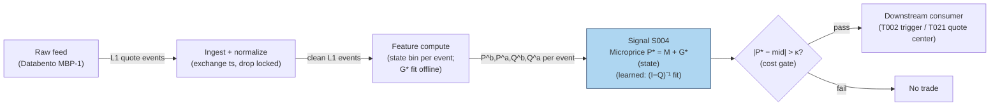

### S12. Sources

1. Stoikov, S. (2018). "The micro-price: a high-frequency estimator of future prices." *Quantitative Finance* 18(12): 1959–1966 — https://econpapers.repec.org/article/tafquantf/v_3a18_3ay_3a2018_3ai_3a12_3ap_3a1959-1966.htm (martingale construction; beats mid and weighted mid as a short-term predictor).
2. Stoikov, S. (2017). "The Micro-Price: A High Frequency Estimator of Future Prices." Working paper (Nov 2017) — https://github.com/shaileshkakkar/MicroPriceIndicator/raw/refs/heads/master/Micro-Price%20Indicator.pdf (full definition, limit-of-expected-midprices construction).
3. Sasson, J., Ho, W. H. & Samson, F. (2021). "High Frequency Trading Strategies." Stanford MS&E 448 course final report — http://stanford.edu/class/msande448/2021/Final_reports/gr1.pdf (practitioner reconstruction comparing mid, weighted mid, and microprice fair-value estimators on an AAPL dataset).

**Chatbot source log.** Q-SB1-1 asked for the microprice alongside OFI and queue imbalance, but the Duck.ai answer (GPT-5.6 Luna, 2026-09-10) covered only the OFI portion — no usable microprice content was returned. Source log: Duck.ai answered Q-SB1-1 (OFI portion only — not the microprice portion); Grok/Cursor answers pending (checked 2026-09-10).

**Unverified leads:**
- Practitioner note (GitHub `jy447/vpin-model` README): the closed-form cross-weighted mid is a *first-order* approximation of Stoikov's full estimator; an author's reference implementation exists at `github.com/sstoikov/microprice` — I did not verify that repository resolves, so it stays here, not in Sources.
- Cartea, Jaimungal & Penalva (2015), *Algorithmic and High-Frequency Trading*, Cambridge University Press, §10 — the report's cited corroboration for the N-level/weighted-mid construction; no public URL verified, kept as a lead rather than a checked source.

---

## Stage 6/200 — S006: Signed trade imbalance (volume delta)

*Batch SB1 · Signal 6/100 · Provenance [SR] · Family A — Microstructure & order flow*

### S1. One-line verdict

| | |
|---|---|
| **What it is** | Net aggressive buy-minus-sell share volume over a window — the signed footprint of who hit whom. |
| **When it works** | When order flow is autocorrelated (institutions splitting orders) and you act within seconds-to-minutes of the imbalance print. |
| **When it dies** | News-driven flow everyone sees; thin tapes where one print dominates; after the imbalance is already in the price. |
| **Build-or-buy in one line** | Build: it is one classification rule plus a rolling sum — the feed is the only real cost. |

Provenance **[SR]** (standard reconstruction) — the report tags this signal [SR]; the formula
below is the textbook reconstruction of the trade-sign literature, not a quoted implementation.
Family **A — Microstructure & order flow**.

### S2. How it works — plain human explanation

Picture 9:47:03 on a normal Tuesday. AAPL's book sits at bid 231.40 × 800 / ask 231.41 × 300.
Over the next 40 seconds, fourteen prints hit the tape: twelve lift the offer for 4,100 shares
total, two hit the bid for 600. Nobody needs a PhD to feel the asymmetry — buyers are paying
up, sellers are standing aside. Signed trade imbalance (often called **volume delta**) is just
that feeling, formalized: every trade gets a sign, +1 if the buyer was the aggressor, −1 if the
seller was, multiply by size, add it up. A window reading +3,500 shares says aggressive demand
just exceeded aggressive supply by 3,500 shares; the market makers who absorbed it are now long
inventory they did not want, and the standard inventory story says they shade quotes upward to
work it off — which is price pressure you can trade against, or ride.

Why should this predict anything at all? Two economic channels:

- **Adverse selection.** Some aggressive flow is informed. The counterparty who keeps getting
  lifted eventually concludes the buyer knows something, and revises the mid upward. The
  imbalance is the observable trace of that learning.
- **Inventory.** Even uninformed flow moves prices: a dealer who just bought 3,500 shares from
  panicky sellers lowers both bid and ask to attract buyers and discourage more sellers
  (the classic Stoll inventory logic). While the inventory is being worked off, the drift
  continues — and order splitting means today's imbalance predicts tomorrow's, because the
  same institution is still working the order.

Both channels point the same way short-term: signed imbalance today, price drift in the same
direction over the next seconds-to-minutes, then partial reversal as pressure dissipates.

**Mental model (3 bullets):**
- Volume delta is the *realized* demand shock — the bill the market just handed liquidity providers.
- It works because flow is sticky (order splitting) and counterparties shade quotes while they digest it.
- It is a *flow* measure, not a *value* measure: it says nothing about fair value, only about who is in a hurry.

### S3. The math — exact formula

Let trades in window $t$ be indexed $i = 1,\dots,N_t$, each with price $P_i$ and size $V_i$
(shares). Assign an aggressor sign $\varepsilon_i \in \{+1,-1\}$ ($+1$ = buyer-initiated):

**Raw imbalance (shares):**
$$\mathrm{TI}_t = \sum_{i=1}^{N_t} \varepsilon_i \, V_i$$

**Normalized delta (dimensionless, −1 to +1):**
$$\Delta_t = \frac{V^{\text{buy}}_t - V^{\text{sell}}_t}{V^{\text{buy}}_t + V^{\text{sell}}_t}
= \frac{\mathrm{TI}_t}{\sum_i V_i}$$

**Signal form (z-score against trailing window of length $L$):**
$$z_t = \frac{\Delta_t - \mu_{t-L:t-1}}{\sigma_{t-L:t-1}}$$

**Predictive regression form** (the Chordia–Subrahmanyam style specification):
$$r_{t+1} = a + b \cdot \mathrm{OIB}_t + \gamma' X_t + u_{t+1}$$
where $r_{t+1}$ is the next-window return, $\mathrm{OIB}_t$ is the imbalance, and $X_t$ are
controls (lagged return, volume, spread).

**Trade signing — the tick rule** (Lee–Ready style, no quote data needed): with previous
trade price $P_{i-1}$,
$$\varepsilon_i = \begin{cases}
+1 & P_i > P_{i-1} \\
-1 & P_i < P_{i-1} \\
\varepsilon_{i-1} & P_i = P_{i-1}\ \text{(carry forward)}
\end{cases}$$
With contemporaneous quotes available, prefer the quote rule: $\varepsilon_i = +1$ if
$P_i$ is closer to the ask (or at/above the mid), $-1$ if closer to the bid; exchange
aggressor flags (where available, e.g. futures) beat both.

**Causal timing:** computed at event $t$ using only trades with timestamps $\le t$;
a strategy may trade on it no earlier than event $t+1$ (in practice, one event plus
your wire latency later).

| Parameter | Symbol | Typical range | Too small | Too large | Default (example) |
|---|---|---|---|---|---|
| Aggregation window | $N_t$ / time $W$ | 30 s – 30 min, or 50–1000 trades | noise dominates; single prints whip the sign | stale; the move already happened | 5-min rolling *example — not an institutional standard* |
| Z-score lookback | $L$ | 20–100 windows | unstable $\sigma$, false triggers | slow to adapt to regime/vol changes | 50 windows *example* |
| Entry threshold | $z^*$ | 1.0–2.5 | churn on noise | misses the trade | 1.5 *example — not an institutional standard* |
| Signing method | — | tick rule / quote rule / aggressor flag | misclassification on locked/crossed or midpoint prints | n/a (flags unavailable on equities) | quote rule where NBBO exists *example* |

**Normalization choices:** raw $\mathrm{TI}_t$ (shares) is only comparable within one symbol
and one vol regime; normalized $\Delta_t$ compares across symbols; z-score compares across
regimes. Practitioners usually trade the z-score. **Variants:** (1) trade-count imbalance
($\sum \varepsilon_i$, unweighted — robust to block prints); (2) dollar imbalance
($\varepsilon_i P_i V_i$ — comparable across price levels); (3) volume-clock aggregation
(imbalance per 1,000-share bucket — cf. S008 VPIN's bucketing).

### S4. Worked example — step-by-step numbers (SYNTHETIC)

All numbers below are **synthetic** (random seed 42), hand-computable, and identical to the
data plotted in S11. Prices were fixed by hand; sizes drawn from the seed.

| # | Price ($) | Size | $\varepsilon$ (tick rule) | Signed vol | Cumul. TI |
|---|---|---|---|---|---|
| 1 | 100.00 | 171 | +1 (vs prior 99.99) | +171 | +171 |
| 2 | 100.02 | 719 | +1 | +719 | +890 |
| 3 | 100.01 | 623 | −1 | −623 | +267 |
| 4 | 100.01 | 451 | −1 (zero tick, carry) | −451 | −184 |
| 5 | 100.03 | 446 | +1 | +446 | +262 |
| 6 | 100.05 | 786 | +1 | +786 | +1,048 |
| 7 | 100.04 | 168 | −1 | −168 | +880 |
| 8 | 100.06 | 657 | +1 | +657 | +1,537 |
| 9 | 100.08 | 261 | +1 | +261 | +1,798 |
| 10 | 100.07 | 175 | −1 | −175 | +1,623 |
| 11 | 100.09 | 521 | +1 | +521 | +2,144 |
| 12 | 100.11 | 880 | +1 | +880 | +3,024 |

**Step 1 — sign each trade.** Trade 4 prints at the same price as trade 3, so the tick rule
carries forward $\varepsilon_3 = -1$. Everything else signs by uptick/downtick.

**Step 2 — window deltas.** In 3-trade windows:
- W1 (trades 1–3): $(171+719-623)/(171+719+623) = 267/1513 = +0.1765$
- W2 (trades 4–6): $(-451+446+786)/1683 = 781/1683 = +0.4641$
- W3 (trades 7–9): $(-168+657+261)/1086 = 750/1086 = +0.6906$
- W4 (trades 10–12): $(-175+521+880)/1576 = 1226/1576 = +0.7779$

**Step 3 — z-score.** Mean of the four deltas $= 0.5273$, sample std $= 0.2692$;
$z_{W4} = (0.7779 - 0.5273)/0.2692 = \mathbf{+0.93}$. Against an *example* entry
threshold of $z^* = 1.5$ (*example — not an institutional standard*), this toy print
does **not** trigger — the imbalance is visibly one-sided yet not extreme versus its
own short history, a useful reminder that "big raw number" ≠ "big signal".

**Step 4 — predictive sketch (illustration only).** With an illustrative coefficient
$b = 0.4$ bps of next-window return per 1,000 imbalance shares (*example — not a fitted
value*): $\hat r = 0.4 \times 1.226 = +0.49$ bps. This is arithmetic, not evidence.

**What to notice (and the limits):** the cumulative line climbs almost monotonically —
in this toy tape, buyers lifted the offer on 9 of 12 prints and the price rose 11 cents,
exactly the textbook pattern. Real tapes are not this clean: the equal-price print at
trade 4 shows why signing is never perfect (a midpoint cross would be worse), block
prints can flip a window's sign without meaning anything, and — critically — this toy
tape has **no fees, no spread cost, and no latency**: the +0.49 bps "prediction" is
smaller than a single half-spread on most names. Never read toy arithmetic as a backtest.

### S5. Strategies that use this signal

- **T024 — Informed-Size Tracker / Retail Fade** — primary entry trigger (direction): sustained
  signed-delta breakouts mark the stealth institutional flow this strategy follows.
- **T002 — Microprice Fair-Value Scalper** — confirmation: the volume-delta sign must agree
  with the microprice deviation before a scalp is taken (flow confirms value).
- **T025 — Trade-Classification Trend Filter** — filter/veto: extreme signed imbalance
  against the intended momentum entry vetoes the trade (flow disagrees → stand down).

### S6. Data required — exact spec

| Field | Type | Granularity | Source tier | Notes |
|---|---|---|---|---|
| Trade price | float (USD) | per-trade event | Tier 0–2 | need exchange timestamps, not SIP receipt time |
| Trade size | int (shares) | per-trade event | Tier 0–2 | odd lots included or excluded — pick one and be consistent |
| Prevailing bid/ask | float | per-trade (as-of event) | Tier 1–2 | required for quote-rule signing; else tick rule |
| Aggressor flag | bool | per-trade | Tier 2 (futures/CME) | best signing; unavailable on US equities consolidated tape |

**Collection:** Databento `trades` schema (live) or Polygon `stocks v3` trades endpoint;
1-minute SIP bars suffice only for the coarsest (unclassified) variant — real delta needs
the trade tape. **Ingest sketch (≤20 lines, polars):**

```python
import polars as pl
tape = pl.scan_parquet("trades_*.parquet")          # ts, price, size, bid, ask
signed = (tape
    .sort("ts")
    .with_columns(
        eps=pl.when(pl.col("price") > pl.col("price").shift(1)).then(1)
              .when(pl.col("price") < pl.col("price").shift(1)).then(-1)
              .otherwise(None).forward_fill().fill_null(1),   # tick rule w/ carry
    )
    .with_columns(svol=pl.col("eps") * pl.col("size"))
    .group_by_dynamic("ts", every="5m")               # event-time window
    .agg(ti=pl.col("svol").sum(), vol=pl.col("size").sum()))
delta = signed.with_columns(delta=pl.col("ti") / pl.col("vol"))
```

**Storage:** trade tape for a liquid name ≈ 2–8 GB parquet per symbol-day
(per `notes/cost-model.md` §4); the derived 5-min delta series is kilobytes.
**Data-quality checklist:** normalize to exchange timestamps (SIP latency skews signing);
adjust for splits/dividends; drop halted periods (prints during halts mis-sign);
handle DST and half-days in rolling windows; flag crossed/locked NBBO intervals where
quote-rule signing is undefined; stale prints (odd-lot, late reports) excluded or labeled.

### S7. Local build on M5 Max / 128GB

**Feasibility: feasible (Tier M).** The compute is a rolling sum over a trade tape —
the work is ingest, timestamp normalization, and signing, not math. Per
`notes/cost-model.md` §2, a Python event loop handles ~100–500k events/sec
(GIL-bound; fine for ≤20 symbols of L1/trade flow), while polars batch recompute
(10–50M rows/sec simple ops) easily covers minute-bar recomputation for hundreds of
symbols. Liquid-name trade flow runs ~10–200 trades/sec busy (§2), so a single Python
process sustains ~50–100 symbols in real time; beyond that, move signing to Rust
(5–50M events/sec, §2) or aggregate to 1-min bars. Bottleneck is **I/O and timestamp
handling**, not CPU. **RAM:** one symbol-day of trade events ≈ 0.5–4 GB (§3);
keep the live working set to a few dozen symbol-days and archive the rest as
per-symbol parquet — 500 symbols × 60 days of raw events **does not fit** (§3),
so research uses sampled windows or bar-aggregated history. **Stack:** Python+polars
for research and ≤50-symbol live; Rust for the full-universe event loop; DuckDB for
ad-hoc tape forensics.

**Engineering:** Tier M, 20–60 h (`notes/cost-model.md` §5) — most of it is the
signing/validation harness and the corporate-action/halt filters, not the formula.
At $150/hr loaded: **$3,000–9,000** *loaded-cost estimate*, plus data (Tier 1
~$30–200/mo *indicative — verify before budgeting*). **What breaks first at
500 symbols:** the Python loop (switch to Rust or bar aggregation); at full OPRA
scale, ingest bandwidth and parquet write throughput.

### S8. Buy vs build

| Option | What you get | Indicative price | Gains | Loses |
|---|---|---|---|---|
| Tier-0 free (Alpaca IEX trades, Stooq) | Trade tape, delayed/IEX-only | ~$0 | $0 cost, fine for prototyping | IEX-only prints mis-sign vs NBBO; no history depth |
| Tier-1 retail (Polygon Stocks Advanced, Alpaca SIP) | Full SIP trade tape + NBBO | ~$30–200/mo | proper quote-rule signing, corporate actions | SIP timestamps, no depth, no aggressor flags |
| Tier-2 professional (Databento) | Exchange-stamped trades+quotes | ~$200/mo + usage | exchange timestamps, cleanest signing | usage meter runs on full-universe backfill |
| Academic/institutional (TAQ via WRDS) | Gold-standard research tape | institutional $$$ | publication-grade history | access friction, cost |

All prices *indicative — verify before budgeting* (per `notes/cost-model.md` §6).
**Verdict: build if** you need custom windows, signing choices, or symbol-specific
thresholds (you cannot buy your own z-score lookback); **buy the feed, never the
signal** — no vendor sells "volume delta alpha", they sell the tape. Crossover:
build the estimator on a Tier-1 SIP feed; upgrade to Tier-2 only when timestamp
accuracy demonstrably changes your fill simulation.

### S9. Success ratio / efficacy — documented evidence

| Study / source | Market & period | Metric | Before/after cost | Caveat |
|---|---|---|---|---|
| Chordia & Subrahmanyam (2004), "Order Imbalance and Individual Stock Returns" | NYSE, daily, 1988–1998 | Imbalance-based strategies: statistically significant returns | **Before-cost** (gross; paper notes magnitudes are "moderate", consistent with intermediary equilibrium) | Daily horizon, not intraday; Lee–Ready signing on 1990s tape |
| Chordia, Roll & Subrahmanyam (2002), "Order imbalance, liquidity, and market returns" | NYSE market-wide, daily | Contemporaneous + lagged imbalances strongly move market returns | **Before-cost** (market-level regression, not a strategy) | Aggregate, not a tradeable signal per name |
| Evans & Lyons (2002), "Order Flow and Exchange Rate Dynamics" | FX (DEM/USD), daily | Order-flow regression $R^2 > 60\%$; $1bn net buys → +0.5\%$ price | **Before-cost** (contemporaneous fit, not a strategy) | FX interdealer market; contemporaneous, not predictive |
| Hasbrouck (1991), "Measuring the Information Content of Stock Trades" | NYSE | Trade innovations have protracted, concave-in-size price impact | **Before-cost** (VAR impulse response) | Confirms the mechanism (signed flow moves quotes); no strategy P&L |

Regimes where it fails: macro-news flow (imbalance is public information, instantly
priced); one-print-dominated windows in illiquid names; the post-2010s electronification
that shortened the half-life of simple flow signals (documented anomaly-decay pattern,
e.g. McLean & Pontiff 2016). No checkable published source was found reporting an
after-cost Sharpe for a standalone volume-delta intraday strategy — that absence is
itself information.

**Honest bottom line:** as a standalone directional trigger this is a *weak, heavily
competed* edge before costs and roughly zero after costs at retail scale; as a
**confirmation filter** on a fair-value or momentum entry (the T002/T025 roles), it is
a defensible, cheap, well-understood screen.

### S10. Failure modes & pitfalls

1. **Lookahead leakage** — signing with quotes timestamped after the trade (SIP skew).
   *Mitigation:* as-of joins on exchange timestamps; lag the quote by your measured feed delay.
2. **Staleness/latency** — a 5-min window computed on a 2-min-delayed feed is a history lesson.
   *Mitigation:* measure end-to-end latency; shorten windows to exceed it or don't trade it.
3. **Crowding/alpha decay** — every HFT desk computes this; half-lives compressed post-2010.
   *Mitigation:* treat as filter, not edge; re-estimate the predictive coefficient quarterly.
4. **Cost blowup** — predicted moves are often sub-half-spread (as in S4's +0.49 bps sketch).
   *Mitigation:* model spread+fees explicitly (S014); require predicted edge ≥ 2× round-trip cost.
5. **Regime breaks** — news days flip the sign logic (imbalance chases price, not vice versa).
   *Mitigation:* gate on a news/vol regime filter; stand down in the first minutes after scheduled releases.
6. **Overfitting/parameter mining** — window × lookback × threshold grids will always find a
   "good" backtest. *Mitigation:* fix parameters from the literature ranges in S3; validate on
   purged/embargoed splits (S088).
7. **Data errors** — bad prints, late reports, split-unadjusted prices corrupt signing.
   *Mitigation:* corporate-action adjustment, price/spread sanity filters, drop crossed markets.
8. **Microstructure noise vs signal** — bid-ask bounce creates spurious signed "flow" on the
   tick rule. *Mitigation:* prefer quote-rule signing; exclude sub-spread price changes.

### S11. Visuals


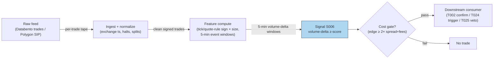

### S12. Sources

- Chordia, T. & Subrahmanyam, A. (2004). "Order Imbalance and Individual Stock Returns:
  Theory and Evidence." *Journal of Financial Markets*, 7(2), 111–130.
  https://papers.ssrn.com/sol3/papers.cfm?abstract_id=354122
- Chordia, T., Roll, R. & Subrahmanyam, A. (2002). "Order imbalance, liquidity, and
  market returns." *Journal of Financial Economics*, 65(1), 111–130.
  https://dl.icdst.org/pdfs/files/910bb6cf2390c9809f5ddc743b83ff92.pdf
- Evans, M. D. D. & Lyons, R. K. (2002). "Order Flow and Exchange Rate Dynamics."
  *Journal of Political Economy*, 110(1), 170–180.
  https://ideas.repec.Org/a/ucp/jpolec/v110y2002i1p170-180.html
- Hasbrouck, J. (1991). "Measuring the Information Content of Stock Trades."
  *Journal of Finance*, 46(1), 179–207.
  http://ideas.repec.org/a/bla/jfinan/v46y1991i1p179-207.html
- Kyle, A. S. (1985). "Continuous Auctions and Insider Trading." *Econometrica*,
  53(6), 1315–1335. (Theoretical origin; report citation, no URL verified.)

**Chatbot source log:** chatbot answers pending (checked 2026-09-10) — grok-answers.md
and cursor-answers.md were absent from batches/SB1/.

**Unverified leads**
- Cont, R., Kukanov, A. & Stoikov, S. — "The Price Impact of Order Book Events"
  (reported arXiv:1011.6402 in the batch question log; not independently verified by
  this chapter) — relevant to the OFI price-impact regression variant.

---

## Stage 8/200 — S008: VPIN (flow toxicity)

*Batch SB1 · Signal 8/100 · Provenance [D] · Family A — Microstructure & order flow*

### S1. One-line verdict

| | |
|---|---|
| **What it is** | Volume-clocked buy/sell imbalance averaged over buckets — a real-time proxy for how "toxic" (adversely selective) order flow is. |
| **When it works** | As a regime gate: widening quotes / cutting size when toxicity spikes keeps market-making books alive through stress episodes. |
| **When it dies** | As a directional trigger: it has no documented directional edge, and its famous flash-crash prediction did not survive replication. |
| **Build-or-buy in one line** | Build: fifty lines on a trade tape; the classification choice matters more than the code. |

Provenance **[D]** (documented) — the construction below follows Easley, López de Prado &
O'Hara's published VPIN specification, with the documented critiques carried alongside.
Family **A — Microstructure & order flow**.

> Standing caveat for this chapter: VPIN is a **toxicity/regime gate, not a standalone
> directional trigger**. Nothing in the replicated literature supports trading its level
> for direction; the honest use is defensive — quoting, sizing, and stand-down rules.

### S2. How it works — plain human explanation

A market maker is an insurance company that doesn't get to underwrite. All day, strangers
arrive wanting to trade; some are uninformed (rebalancing, noise), some know something the
maker doesn't. When the informed share of flow is high, the maker systematically loses —
this is **adverse selection**, and Easley–O'Hara's word for its intensity is **flow toxicity**.
The problem: toxicity isn't observable trade by trade. VPIN is an attempt to see it in the
rear-view mirror fast enough to act.

The trick is the clock. In calendar time, a frantic minute and a dead minute look the same
length; in **volume time**, each "bucket" holds the same number of shares, so buckets
arrive fast when the market is frantic and slow when it's dead — automatically adjusting
for pace. Inside each bucket, the bar's volume is split into buy volume and sell volume
(**bulk volume classification**, BVC, from the bar's own price change — the last print
of the bar versus the last print of the previous bar). If buys and sells
roughly balance, flow looks uninformed; if one side dominates bucket after bucket, someone
may know something. VPIN averages that one-sidedness over a rolling window of buckets.

Vignette: 10:15, ES futures. The last four 50,000-contract buckets printed imbalances of
31%, 8%, 44%, 12% — VPIN ≈ 0.24, elevated. The desk's rule (*example — not an institutional
standard*): above 0.30, halve quote size and widen the spread by 50%. At 10:31 a macro
headline hits; the desk is already small. Whether the headline was "predicted" is
irrelevant — the book survived because it was defensive when flow looked toxic. That is
the entire honest bull case for VPIN.

**Mental model (3 bullets):**
- VPIN measures *one-sidedness of flow in volume time* — a proxy for the probability
  you're trading against someone better informed.
- It is defensive infrastructure (a smoke detector), not an offensive weapon (a compass):
  it tells you when to be careful, never which way to bet.
- Its value lives or dies on the classification step: garbage buy/sell splits in,
  garbage toxicity out.

### S3. The math — exact formula

Partition the tape into **equal-volume buckets** $\tau = 1, 2, \dots$, each holding
$V$ shares (Easley–López de Prado–O'Hara's default: $V = \mathrm{ADV}/50$, i.e. 50
buckets per day — *example — not an institutional standard*).

**Bulk volume classification (BVC) — at the bar level:** for volume bar $\tau$ with
price change $\Delta P_\tau = P_{\text{last},\tau} - P_{\text{last},\tau-1}$
(last trade price of the bar versus the previous bar's) and $\sigma_{\Delta P}$
the recent std of bar price changes:
$$V^B_\tau = V \, \Phi\!\left(\frac{\Delta P_\tau}{\sigma_{\Delta P}}\right),
\qquad V^S_\tau = V - V^B_\tau$$
where $\Phi$ is the standard normal CDF. (A rising bar allocates most of its
volume to buys; a flat bar splits 50/50.) Every bucket holds exactly $V$
shares by construction — a trade straddling a bucket boundary is split across
the two buckets (ELO convention) — so the rolling denominator below is exactly
$n \cdot V$, not an approximation.

**Per-bucket order imbalance:**
$$\mathrm{OI}_\tau = \big|V^B_\tau - V^S_\tau\big|$$

**VPIN** over a rolling window of $n$ buckets (ELO default $n = 50$ — *example*):
$$\mathrm{VPIN}_t = \frac{\sum_{\tau=t-n+1}^{t} \mathrm{OI}_\tau}{n \cdot V}$$

This is a $[0,1]$ number: 0 = perfectly balanced flow, 1 = every bucket one-sided.

**Causal timing:** bucket $\tau$ closes when its $V$-th share prints; VPIN at that moment
uses only closed buckets; any defensive action applies to buckets $\tau+1$ onward —
never retroactively.

| Parameter | Symbol | Typical range | Too small | Too large | Default (example) |
|---|---|---|---|---|---|
| Bucket size | $V$ | ADV/100 – ADV/20 | noisy OI, whipsaw gates | sluggish; stress is over before the gate fires | ADV/50 *example — not an institutional standard* |
| Rolling window | $n$ | 10–100 buckets | single toxic bucket dominates | dilutes the signal into irrelevance | 50 buckets *example* |
| Toxicity threshold | $\kappa$ | 0.2–0.5 | permanent stand-down | never fires | 0.30 *example — not an institutional standard* |
| Classification | — | BVC / tick rule / quote rule | BVC smears midpoint noise (see critiques) | — | BVC per ELO; tick rule as robustness check |

**Normalization choices:** VPIN is already normalized to $[0,1]$ by construction; cross-asset
comparison still needs care because "normal" VPIN differs by venue and ADV share.
**Variants:** (1) **TR-VPIN** — tick-rule classification instead of BVC (Andersen–Bondarenko
show the choice flips behavior); (2) quote-rule VPIN on L1 data; (3) multi-asset / futures
VPIN on the most liquid venue as a market-wide stress gauge.

### S4. Worked example — step-by-step numbers (SYNTHETIC)

**Synthetic** 10-bucket tape, random seed 7 (bar-level BVC;
$\sigma_{\Delta P} = 0.04417$ = std of the 10 bar price changes, ddof=1).
Every bucket holds **exactly 500 shares** — boundary-straddling trades are
split per the ELO convention. Same data as the S11 chart.

| Bucket | $V$ (shares) | $\Delta P_\tau$ (\$) | $\Phi(\Delta P_\tau/\sigma)$ | $V^B$ | $V^S$ | $\|\mathrm{OI}\|$ | $\|\mathrm{OI}\|/V$ |
|---|---|---|---|---|---|---|---|
| 1 | 500 | −0.030 | 0.2485 | 124.3 | 375.7 | 251.5 | 0.503 |
| 2 | 500 | +0.010 | 0.5896 | 294.8 | 205.2 | 89.6 | 0.179 |
| 3 | 500 | −0.100 | 0.0118 | 5.9 | 494.1 | 488.2 | 0.976 |
| 4 | 500 | −0.020 | 0.3254 | 162.7 | 337.3 | 174.6 | 0.349 |
| 5 | 500 | −0.080 | 0.0351 | 17.5 | 482.5 | 464.9 | 0.930 |
| 6 | 500 | −0.020 | 0.3254 | 162.7 | 337.3 | 174.6 | 0.349 |
| 7 | 500 | +0.000 | 0.5000 | 250.0 | 250.0 | 0.0 | 0.000 |
| 8 | 500 | −0.010 | 0.4104 | 205.2 | 294.8 | 89.6 | 0.179 |
| 9 | 500 | +0.040 | 0.8174 | 408.7 | 91.3 | 317.4 | 0.635 |
| 10 | 500 | +0.030 | 0.7515 | 375.7 | 124.3 | 251.5 | 0.503 |

**Step 1 — classify (bar level).** Each bar's whole 500-share volume is split by
a single $\Phi$ evaluation on the bar's price change; e.g. bucket 3's bar fell
\$0.10: $\Phi(-0.10/0.04417) = \Phi(-2.26) = 0.0118$, so only 5.9 of its 500
shares classify as buys. Bucket 7's bar was flat ($\Delta P = 0.000$): a perfect
250/250 split.

**Step 2 — bucket imbalance.** $|\mathrm{OI}_3| = |5.9 - 494.1| = 488.2$ shares,
ratio $488.2/500 = 0.976$ — the most one-sided bucket.

**Step 3 — rolling VPIN ($n=4$, *example*).** The denominator is exactly
$4 \times 500 = 2000$ in every window:
- ending bucket 4: $(251.5+89.6+488.2+174.6)/2000 = 1003.9/2000 = \mathbf{0.5019}$
- ending bucket 5: $1217.3/2000 = \mathbf{0.6087}$
- ending bucket 6: $1302.3/2000 = \mathbf{0.6512}$
- ending bucket 7: $814.1/2000 = \mathbf{0.4071}$
- ending bucket 8: $729.1/2000 = \mathbf{0.3646}$
- ending bucket 9: $581.6/2000 = \mathbf{0.2908}$
- ending bucket 10: $658.5/2000 = \mathbf{0.3292}$

**Step 4 — gate decision.** Against an *example* toxicity threshold $\kappa = 0.30$
(*example — not an institutional standard*): the gate **fires** from bucket 4
through bucket 8 (readings 0.50 → 0.65 → 0.41 → 0.36), stands down at bucket 9
(0.29), and re-fires at bucket 10 (0.33).

**What to notice (and the limits):** VPIN here behaves exactly as designed — a smooth,
lagging average of one-sidedness that rises into the toxic patch and decays after. But
notice what it *doesn't* do: it says nothing about direction (buckets 1–6 were
sell-classified, yet the series gives no short signal — correctly, per the caveat).
And now the sharper lesson: this toy tape has **no informed traders at all** — just a
random walk whose bar closes happened to cluster downward in buckets 1–6 — yet VPIN
spikes to 0.65 and the gate fires for five straight buckets. That is precisely
Andersen–Bondarenko's warning: bar-level BVC misclassifies in fast markets, the errors
correlate with volume and volatility, and the result is manufactured "toxicity." A gate
that fires on sampling noise is a gate that costs you fills — which is why this chapter
insists on the BVC-vs-tick-rule robustness check on your own venue before any
deployment. This toy has no fees and no latency; the "toxicity" is pure noise.

### S5. Strategies that use this signal

- **T003 — VPIN-Gated Breakout Trader** — regime gate (primary control): breakouts are
  taken only when VPIN is below the toxicity cap; the gate is the strategy's core risk control.
- **T022 — Queue-Imbalance Maker with Toxicity Cancel** — veto: resting quotes are
  cancelled when VPIN spikes (defensive exit from adverse selection).
- **T005 — RVOL (relative volume)-Filtered Opening-Range Breakout** — filter: ORB entries are skipped
  when opening flow prints toxic.

### S6. Data required — exact spec

| Field | Type | Granularity | Source tier | Notes |
|---|---|---|---|---|
| Trade price | float | per-trade | Tier 0–2 | BVC needs the full price path, not just closes |
| Trade size | int | per-trade | Tier 0–2 | bucketing is by shares |
| (Optional) bid/ask | float | per-trade as-of | Tier 1–2 | only for tick/quote-rule robustness variants |

**Collection:** Databento trades, Polygon stocks v3, Alpaca SIP, or TAQ — VPIN needs
nothing fancier than a trade tape with price and size, which is why it became popular.
**Ingest sketch (≤20 lines, polars):**

```python
import polars as pl
from math import erf, sqrt
Phi = lambda x: 0.5 * (1 + erf(x / sqrt(2)))
tape = pl.scan_parquet("trades_*.parquet").sort("ts").collect()
V = int(tape["size"].sum() / 50)            # bucket size = ADV/50 (example)
tape = split_at_boundaries(tape, V)          # 1: split straddling trades: every bucket = V
tape = tape.with_columns(bucket=(tape["size"].cum_sum() // V).cast(pl.Int64))
b = (tape.group_by("bucket")                 # 2: one row per volume bar
         .agg(plast=pl.col("price").last()).sort("bucket"))
sig = b["plast"].diff().std()                # 3: std of BAR price changes
b = b.with_columns(dp=pl.col("plast").diff(),
                   frac=0.5 * (1 + pl.col("plast").diff()
                               .map_elements(lambda d: erf(d / sig / sqrt(2)))))
b = b.with_columns(vb=V * pl.col("frac"),                 # 4: bar-level BVC
                   oi=(2 * V * pl.col("frac") - V).abs())  #    |Vbuy - Vsell|
vpin = (b["oi"].rolling_sum(50) / (50 * V)).alias("vpin")  # n=50 example
```

**Storage:** trade tape ≈ 2–8 GB parquet per symbol-day for liquid names
(per `notes/cost-model.md` §4); the VPIN series itself is one float per bucket —
negligible. **Data-quality checklist:** exchange (not SIP-receipt) timestamps so
buckets close in true event order; corporate actions adjusted; halts excluded
(buckets spanning a halt mix regimes); DST/half-days rescale ADV; odd-lot and
late-reported prints flagged; BVC validated against tick-rule on a sample —
if the two disagree violently, trust neither blindly.

### S7. Local build on M5 Max / 128GB

**Feasibility: feasible, near-trivial compute (Tier M for the pipeline).** VPIN is
arithmetic over a trade tape — per `notes/cost-model.md` §2, a Python loop at
~100–500k events/sec covers ≤20 symbols live, and polars batch recomputation
(10–50M rows/sec) handles a full day's tape for hundreds of symbols in seconds.
Liquid-name trade flow is only ~10–200 trades/sec busy (§2); the bottleneck is
**feed handling and bucket bookkeeping**, not math. **RAM:** one symbol-day of trades
≈ 0.5–4 GB (§3) — keep the live window to the trailing day or two per symbol and
archive the rest; 500 symbols × 60 days of raw trades **does not fit** (§3), so
research history lives as per-symbol parquet or pre-aggregated bucket series.
**Stack:** Python+polars for research and live single-book; Rust only if VPIN must
share an event loop with heavier L1 signals; DuckDB for tape forensics.

**Engineering:** Tier M, 20–60 h (`notes/cost-model.md` §5) — the formula is an
afternoon; the hours go to the BVC-vs-tick-rule validation harness, the gate
integration (quote-widening / size-cutting / kill-switch wiring), and regime
bookkeeping. At $150/hr loaded: **$3,000–9,000** *loaded-cost estimate*, plus a
Tier-1 feed ~$30–200/mo *indicative — verify before budgeting*.
**What breaks first at 500 symbols:** bucket bookkeeping across 500 tapes
(the BVC step itself is one $\Phi$ evaluation per bucket — trivial); at full OPRA scale, the trade tape itself.

### S8. Buy vs build

| Option | What you get | Indicative price | Gains | Loses |
|---|---|---|---|---|
| Tier-0 free (Alpaca IEX, Stooq) | Trade tape | ~$0 | prototype the gate for free | IEX-only flow mis-measures toxicity |
| Tier-1 retail (Polygon, Alpaca SIP) | Full SIP tape | ~$30–200/mo | proper bucketing, history | SIP timestamps blur bucket edges |
| Tier-2 professional (Databento) | Exchange-stamped tape | ~$200/mo + usage | cleanest event ordering | usage cost on full-universe backfill |
| Academic (LOBSTER/TAQ via university) | Research-grade replay | ~hundreds/yr academic | best history for validation | not a production feed |

All prices *indicative — verify before budgeting* (per `notes/cost-model.md` §6).
**Verdict: build, always** — no vendor sells "your toxicity gate"; they sell the tape,
and the ELO specification is public. Buy the cheapest feed whose timestamps you trust,
spend the budget on the classification-robustness harness instead (BVC vs tick rule —
Andersen–Bondarenko show this choice is the whole ballgame).

### S9. Success ratio / efficacy — documented evidence

| Study / source | Market & period | Metric | Before/after cost | Caveat |
|---|---|---|---|---|
| Easley, López de Prado & O'Hara (2012), "Flow Toxicity and Liquidity in a High-Frequency World" | E-mini S&P 500, incl. May 6 2010 | VPIN hit historic highs ~1h before the flash crash; correlated with short-term volatility | n/a (not a strategy; event study) | Single-venue, single-event narrative; BVC-based |
| Andersen & Bondarenko (2014), "VPIN and the Flash Crash" | E-mini S&P 500 | VPIN is a **poor** predictor of short-run volatility; did **not** peak before the flash crash but after; predictive content is mechanical (correlates with trading intensity) | n/a (replication study) | Directly contradicts the ELO flash-crash claim |
| Andersen & Bondarenko (2015), "Assessing Measures of Order Flow Toxicity…" | E-mini S&P 500, CME BBO "perfect" classification | BVC classification inferior to a simple tick rule; with accurate classification VPIN behaves oppositely; BVC-VPIN's volatility-forecast power comes from **classification errors** correlated with volume/volatility | n/a (measurement study) | Devastating for BVC-VPIN as a toxicity measure |
| Yildiz, Van Ness & Van Ness (2020), "VPIN, liquidity, and return volatility in the U.S. equity markets" | US equities | VPIN informative about liquidity and return volatility **ex ante**; useful risk-management tool for market makers/regulators | n/a (forecasting regressions, not a strategy) | Supportive but modest; risk-tool framing, not alpha |

No checkable source was found reporting a Sharpe, hit rate, or basis points (bps)
per trade for a VPIN
strategy — before *or* after cost. The literature tests VPIN as a volatility/liquidity
forecaster, never as a directional trigger, which is exactly why this chapter refuses
to present it as one.

**Honest bottom line:** as a standalone directional trigger this is a *zero-documented*
edge — do not trade it for direction; as a **toxicity/regime gate** for quoting and
sizing it is a *plausible, cheap, contested* risk control — the supportive evidence
(Yildiz et al. 2020) and the hostile replications (Andersen–Bondarenko 2014/2015) both
deserve weight, and any deployment should reproduce the BVC-vs-tick-rule check on its
own venue before trusting the gate.

### S10. Failure modes & pitfalls

1. **Classification error (the big one)** — BVC systematically misclassifies in fast
   markets, and the errors correlate with volatility, manufacturing fake "toxicity".
   *Mitigation:* run tick-rule VPIN in parallel; if they disagree, investigate before gating.
2. **Treating it as directional** — high VPIN does not mean "price will fall/rise".
   *Mitigation:* wire it only to sizing/quoting/stand-down logic, never to entries.
3. **Mechanical correlation with intensity** — VPIN rises when volume rises, so it
   "predicts" volatility the way a speedometer "predicts" arrival. *Mitigation:*
   benchmark the gate against a raw volume/intensity gate; keep whichever earns its keep.
4. **Parameter fragility** — bucket size and window are *examples*, not standards; results
   move with them. *Mitigation:* fix from ELO defaults, sensitivity-test ±2×, don't optimize.
5. **Stale ADV** — bucket size from last month's ADV mis-buckets this week's regime.
   *Mitigation:* rolling ADV estimate; re-bucket on corporate actions and volume regime shifts.
6. **Latency** — a toxicity gate computed on a delayed feed fires after the damage.
   *Mitigation:* measure feed delay; the gate's reaction time must beat your quote lifetime.
7. **Overfitting the threshold** — tuning $\kappa$ on the flash crash is a one-observation fit.
   *Mitigation:* threshold from out-of-sample stress episodes; prefer smooth size-scaling
   over binary stand-down.
8. **False comfort** — a low VPIN does not mean flow is safe, only that it was balanced.
   *Mitigation:* keep independent risk limits (S088-style); VPIN is one input, not the book.

### S11. Visuals


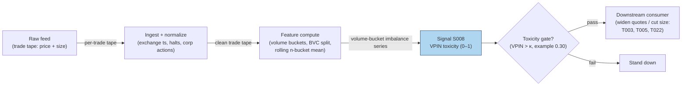

### S12. Sources

- Easley, D., López de Prado, M. M. & O'Hara, M. (2012). "Flow Toxicity and Liquidity
  in a High-Frequency World." *Review of Financial Studies*, 25(5), 1457–1493.
  (Working-paper version) http://www.stern.nyu.edu/sites/default/files/assets/documents/con_035928.pdf
- Andersen, T. G. & Bondarenko, O. (2014). "VPIN and the Flash Crash." *Journal of
  Financial Markets*, 17, 1–46. https://ideas.repec.Org/a/eee/finmar/v17y2014icp1-46.html
- Andersen, T. G. & Bondarenko, O. (2015). "Assessing Measures of Order Flow Toxicity
  and Early Warning Signals for Market Turbulence." *Review of Finance*, 19(1), 1–54.
  https://ideas.repec.Org/a/oup/revfin/v19y2015i1p1-54..html
- Yildiz, S., Van Ness, B. & Van Ness, R. (2020). "VPIN, liquidity, and return
  volatility in the U.S. equity markets." *Global Finance Journal*, 45.
  https://ideas.repec.org/a/eee/glofin/v45y2020ics1044028318302679.html

**Chatbot source log:** chatbot answers pending (checked 2026-09-10) — grok-answers.md
and cursor-answers.md were absent from batches/SB1/.

**Unverified leads**
- Practitioner claims that VPIN "predicted" various post-2010 stress episodes circulate
  in vendor marketing; no checkable replication was found — treated as unverified.

---

## Stage 14/200 — S014: Quoted / effective / realized spread & price-impact decomposition

*Batch SB1 · Signal 14/100 · Provenance [D] · Family A — Microstructure & order flow*

### S1. One-line verdict

| | |
|---|---|
| **What it is** | Per-trade measurement of what liquidity actually cost: quoted vs paid vs kept, split into realized profit and adverse selection. |
| **When it works** | Always — as a cost gate and diagnostic: it tells you which trades, venues, and times are too expensive to touch. |
| **When it dies** | As a directional signal: it measures cost, not alpha; wide spreads predict nothing about direction. |
| **Build-or-buy in one line** | Build the estimator on your own tape; buy Rule 605/TAQ benchmarks to calibrate it. |

Provenance **[D]** (documented) — the decomposition follows the published Huang–Stoll /
Glosten–Harris family and SEC MIDAS conventions. Family **A — Microstructure & order flow**.

### S2. How it works — plain human explanation

Three prices describe every trade, and confusing them is how strategies quietly bleed.
The **quoted spread** is the advertisement: at 9:47:03, AAPL shows bid 231.40 × 800 /
ask 231.41 × 300, so the quoted spread is 1 cent. The **effective spread** is what the
aggressor actually paid: if a buyer lifts the offer at 231.41 while the mid is 231.405,
she paid half a cent over mid — times two, the effective spread is 1 cent. Same here,
but often it isn't: price improvement, midpoint crosses, and odd-lot prints routinely
make effective spreads narrower (or wider) than quoted.

The **realized spread** asks the harder question: of that 1 cent the liquidity provider
collected, how much did she *keep*? If the mid drifts up to 231.415 five minutes later —
because the buyer knew something — the provider's "profit" evaporates: realized spread
near zero (or negative), and the difference went to **price impact**, i.e. adverse
selection. The identity is clean:

> **effective spread = realized spread + price impact**

Why does this matter economically? The quoted spread is what naive cost models charge;
the effective spread is what you actually pay; the realized spread is what a
market-making strategy actually earns; and price impact is the permanent information
content of flow — the part no liquidity provider can avoid. Huang & Stoll (1997) showed
the spread decomposes into order-processing, inventory, and adverse-selection
components; the realized/impact split is the practitioner's version of the same idea,
computable trade by trade. Every strategy in this document that pays the spread is
implicitly betting its edge exceeds the effective spread — this signal is how you check.

**Mental model (3 bullets):**
- Quoted = advertised; effective = paid; realized = kept. Never substitute one for another.
- Effective − realized = price impact = the adverse-selection tax on every aggressive trade.
- This is a *measurement* signal: its job is costing trades and gating strategies, not
  predicting direction.

### S3. The math — exact formula

For a trade at time $t$ with price $P_t$, prevailing quotes $P^b_t$ (bid), $P^a_t$ (ask),
mid $M_t = (P^b_t + P^a_t)/2$, and direction $D_t \in \{+1,-1\}$ ($+1$ = buyer-initiated):

**Quoted spread** (dollars; half-spread in basis points (bps)):
$$S^q_t = P^a_t - P^b_t, \qquad s^q_t = 100 \cdot \frac{P^a_t - P^b_t}{2 M_t}\ \text{bps}$$

**Effective spread** (what the aggressor paid vs the mid):
$$S^e_t = 2 \, D_t \, (P_t - M_t)$$

**Realized spread** (what the liquidity provider kept; $\Delta \approx$ 5 min per the
report — *example — not an institutional standard*):
$$S^r_t = 2 \, D_t \, (P_t - M_{t+\Delta})$$

**Price impact** (adverse selection; the mid's drift against the provider):
$$\mathrm{PI}_t = 2 \, D_t \, (M_{t+\Delta} - M_t) = S^e_t - S^r_t$$

All in dollars per share (multiply by 100 for cents); sign convention: positive $S^r$
means the provider profited, positive $\mathrm{PI}$ means the mid moved against the
provider (information won).

**Causal timing:** $S^e_t$ is known at trade time $t$; $S^r_t$ requires the mid at
$t+\Delta$ and is therefore a *diagnostic*, never a live trigger. A strategy gates on
*trailing averages* of these quantities, computed strictly from closed windows.

| Parameter | Symbol | Typical range | Too small | Too large | Default (example) |
|---|---|---|---|---|---|
| Realized-spread horizon | $\Delta$ | 1–30 min | noise dominates the mid move | mixes in unrelated drift | 5 min *example — not an institutional standard* |
| Aggregation window | $W$ | 30 min – 1 day | single prints dominate | stale costs | 1 trading day *example* |
| Direction rule | $D_t$ | quote rule / tick rule / LR | mis-signing flips $S^e$ sign | — | quote rule on NBBO (National Best Bid and Offer) *example* |

**Normalization choices:** dollar spreads for P&L accounting; bps of mid for cross-symbol
comparison; time-weighted vs trade-weighted vs **dollar-weighted** averaging (dollar-weight
when costing a real book). **Named variants:** (1) **Huang–Stoll (1997) three-component
regression** — $\Delta P_t = \tfrac{S}{2}(Q_t - Q_{t-1}) + (\alpha+\beta)\tfrac{S}{2}Q_t + e_t$,
splitting the spread into order-processing, inventory ($\beta$), and adverse-selection
($\alpha$) shares; (2) **Glosten–Harris (1988) trade-indicator model** — adverse selection
vs transitory (order-processing + inventory) components, with volume-dependent terms;
(3) **Roll (1984) implicit spread** $2\sqrt{-\mathrm{cov}(\Delta P_t, \Delta P_{t-1})}$ —
quote-free, for when you only have a price series (cf. S012).

### S4. Worked example — step-by-step numbers (SYNTHETIC)

**Synthetic** 12-trade tape, random seed 11. Realized spread uses the mid **3 trades
later** ($\Delta = 3$ trades — *example — not an institutional standard*; the report's
convention is $\approx$ 5 minutes). Same data as the S11 chart; cents rounded.

| # | Bid | Ask | Mid | $D$ | Price | Eff. (¢) | Real. (¢) | Impact (¢) |
|---|---|---|---|---|---|---|---|---|
| 1 | 99.990 | 100.010 | 100.000 | +1 | 100.008 | +1.52 | −0.55 | +2.07 |
| 2 | 99.992 | 100.022 | 100.007 | +1 | 100.019 | +2.40 | +1.99 | +0.42 |
| 3 | 100.008 | 100.018 | 100.013 | +1 | 100.018 | +1.01 | +2.35 | −1.34 |
| 4 | 99.996 | 100.026 | 100.011 | −1 | 99.997 | +2.64 | +2.39 | +0.26 |
| 5 | 99.999 | 100.019 | 100.009 | −1 | 99.999 | +2.09 | +2.08 | +0.01 |
| 6 | 99.996 | 100.016 | 100.006 | +1 | 100.015 | +1.70 | +0.44 | +1.26 |
| 7 | 99.994 | 100.024 | 100.009 | −1 | 99.995 | +2.85 | +1.69 | +1.16 |
| 8 | 99.994 | 100.024 | 100.009 | +1 | 100.025 | +3.29 | +2.82 | +0.47 |
| 9 | 99.998 | 100.028 | 100.013 | −1 | 99.997 | +3.12 | +2.74 | +0.38 |
| 10 | 99.993 | 100.013 | 100.003 | −1 | 99.995 | +1.78 | +3.93 | −2.15 |
| 11 | 99.996 | 100.026 | 100.011 | −1 | 99.998 | +2.58 | +3.03 | −0.45 |
| 12 | 99.996 | 100.026 | 100.011 | +1 | 100.025 | +2.92 | +2.75 | +0.16 |

**Step 1 — effective.** Trade 2: $D=+1$, $P=100.019$, $M=100.007$:
$S^e = 2(100.019-100.007) = +0.0240$ = **+2.40¢** — the buyer paid 2.40¢ round-trip
equivalent, wider than the 3.0¢ quoted spread's half (1.5¢) because of the slippage noise.

**Step 2 — realized.** Trade 2's mid 3 trades later (trade 5's mid) $= 100.009$:
$S^r = 2(P - M_{t+\Delta}) = 2(100.019-100.009) = +0.0200$ ≈ **+1.99¢** in the
table (internal mids carry more decimals than printed) — the provider kept
about two cents of the 2.40¢ the taker paid.

**Step 3 — impact.** $\mathrm{PI} = S^e - S^r = 2.40 - 1.99 = \mathbf{+0.41¢}$
(≈ +0.42¢ in the table) — equivalently $2(M_{t+\Delta} - M_t) = 2(100.009-100.007)$:
the mid barely drifted against the provider.

**Step 4 — averages.** Mean effective **+2.33¢**, mean realized **+2.14¢**, mean
impact **+0.19¢**: in this toy tape, liquidity providers collected 2.33¢ per share
and kept 2.14¢ — only 0.19¢ leaked to adverse selection.

**What to notice (and the limits):** the stacked chart makes the identity visual —
every bar's total height is the effective spread, split into kept (green) vs lost to
impact (red). Two honest artifacts of toy data: three price impacts are *negative*
(trades 3, 10, 11: −1.34¢, −2.15¢, −0.45¢ — the mid moved in the provider's
favor after the trade; pure noise here), and trade 1's realized spread is negative
(−0.55¢: the provider lost on that round trip). In real data, persistently negative
realized spreads flag toxic flow; here it's just the random walk. Real tapes also show
price improvement (effective < quoted) far more often than this one. And again: no
fees, no latency, twelve trades — this is arithmetic practice, not a cost study.

### S5. Strategies that use this signal

- **T028 — Spread-Decomposition Router** — primary trigger: routes and holds based on
  quoted/effective/realized spread and the adverse-selection component — this signal
  *is* the strategy's decision variable.
- **T002 — Microprice Fair-Value Scalper** — cost gate (filter): the scalp is taken
  only when the trailing effective spread is below the edge — spread decomposition as veto.
- **T034 — Index Futures Cash-and-Carry** — cost check (filter): basis trades clear
  only after spread-cost accounting on both legs.

### S6. Data required — exact spec

| Field | Type | Granularity | Source tier | Notes |
|---|---|---|---|---|
| Trade price & size | float / int | per-trade event | Tier 0–2 | |
| Prevailing NBBO bid/ask | float | per-trade, as-of (≤1 min old per HS convention) | Tier 1–2 | staleness is the #1 error source |
| Trade direction | ±1 | per-trade | derived | quote rule preferred; tick rule fallback |
| Delayed mid | float | $t+\Delta$ | derived | needs the quote tape, not just trades |

**Collection:** Databento MBP-1 (trades + top-of-book), TAQ, or Polygon SIP; Rule 605
reports give venue-level effective-spread benchmarks for calibration. **Ingest sketch
(≤20 lines, polars):**

```python
import polars as pl
t = pl.scan_parquet("trades_nbbo_*.parquet").sort("ts").collect()  # ts,P,bid,ask
t = t.with_columns(mid=(pl.col("bid") + pl.col("ask")) / 2)
t = t.with_columns(D=pl.when(pl.col("P") >= pl.col("mid")).then(1).otherwise(-1))  # quote rule
DELTA = "5m"   # example — not an institutional standard
t = t.with_columns(mid_fwd=pl.col("mid").shift(-1))  # align: use asof join on ts+Δ in prod
out = t.with_columns(
    eff=2 * pl.col("D") * (pl.col("P") - pl.col("mid")),
    impact=2 * pl.col("D") * (pl.col("mid_fwd") - pl.col("mid")),
).with_columns(rlzd=pl.col("eff") - pl.col("impact"))
```

(Production code replaces the naive `shift` with an as-of join of each trade's
$ts + \Delta$ against the quote tape.)

**Storage:** trades+NBBO ≈ 2–8 GB parquet per symbol-day liquid (`notes/cost-model.md`
§4); aggregated daily spread panels are megabytes. **Data-quality checklist:**
NBBO as-of each trade (never the *next* quote — lookahead); crossed/locked markets
excluded; corporate actions adjusted; halts dropped; odd-lot and sub-penny prints
flagged (they distort effective spreads); SIP-vs-exchange timestamp choice documented;
$\Delta$-horizon kept constant across the sample.

### S7. Local build on M5 Max / 128GB

**Feasibility: feasible (Tier M).** Per-trade arithmetic over a trades+quotes tape —
`notes/cost-model.md` §2 gives polars simple ops at ~10–50M rows/sec, so a full day's
L1 tape for one symbol decomposes in seconds; a Python loop (~100–500k events/sec)
sustains live decomposition for ≤20 symbols. The real work is the as-of join of
trades to NBBO and to the $t+\Delta$ mid — both are sorted merge-asof operations,
cheap in polars. Bottleneck is **I/O on the quote tape**, not compute. **RAM:** one
symbol-day of trades+touch quotes ≈ 0.5–4 GB (§3); 500 symbols × 60 days **does not
fit** (§3) — research on per-symbol daily files, live on a trailing window.
**Stack:** Python+polars for research and live; DuckDB when the tape already lives in
parquet and you want SQL as-of joins; Rust only if this shares a hot loop with
full-depth signals.

**Engineering:** Tier M, 20–60 h (`notes/cost-model.md` §5) — the formulas are an
hour; the as-of alignment harness, direction-rule validation, and Rule 605
calibration are the project. At $150/hr loaded: **$3,000–9,000** *loaded-cost
estimate*, plus Tier-1/2 data ~$30–200/mo (SIP) or ~$200/mo + usage (Databento)
*indicative — verify before budgeting*. **What breaks first at 500 symbols:**
the $t+\Delta$ as-of join across a sharded quote store (pre-aggregate to daily
panels); full OPRA adds the options-tape join.

### S8. Buy vs build

| Option | What you get | Indicative price | Gains | Loses |
|---|---|---|---|---|
| Tier-0 free (Alpaca IEX, Stooq) | Trades only | ~$0 | free prototyping | no NBBO → no effective spread |
| Tier-1 retail (Polygon, Alpaca SIP) | SIP trades + NBBO | ~$30–200/mo | full decomposition possible | SIP quote staleness widens error bars |
| Tier-2 professional (Databento MBP-1) | Exchange trades+quotes | ~$200/mo + usage | cleanest as-of alignment | usage meter on backfills |
| Benchmark route (Rule 605 reports, TAQ) | Published effective/realized spreads | ~$0 (605) / institutional $$$ (TAQ) | calibrate your estimator for free (605) | 605 is monthly, venue-level, not per-trade |

All prices *indicative — verify before budgeting* (per `notes/cost-model.md` §6).
**Verdict: build the estimator, buy the calibration** — the formulas are public and
ten lines long; what you can't build is someone else's venue-level benchmark, so
pull Rule 605 effective spreads (free) and require your estimates to track them.
Crossover: if your backtest's cost assumption ever disagrees with your measured
effective spread by more than ~20%, stop and reconcile before trading.

### S9. Success ratio / efficacy — documented evidence

This signal's "efficacy" is measurement quality and cost discipline, not directional
alpha — the honest evidence table reflects that:

| Study / source | Market & period | Metric | Before/after cost | Caveat |
|---|---|---|---|---|
| Huang & Stoll (1997), "The Components of the Bid-Ask Spread: A General Approach" | NYSE | Two-component split: order processing ≈ 88.6% of spread on large stocks; adverse selection + inventory the smaller remainder; components vary with trade size | n/a (structural estimation) | Large-cap 1990s sample; upstairs market effects |
| Glosten & Harris (1988), "Estimating the Components of the Bid/Ask Spread" | NYSE 1981–1983 | Spread splits into asymmetric-information vs transitory (order-processing + inventory); cannot reject significant information component | n/a (structural estimation) | Old sample; no volume interaction in base model |
| Goyenko, Holden & Trzcinka (2009), "Do liquidity measures measure liquidity?" | US equities, TAQ + Rule 605 benchmarks | Effective/realized-spread measures win the majority of horseraces against spread proxies | n/a (measurement horserace) | Validates the *measures*, not a strategy |
| Practitioner convention (SEC MIDAS / Rule 605) | US equities, ongoing | Effective spread is the regulatory-standard transaction-cost metric | **After-cost by construction** (it *is* the cost) | Monthly/venue-level granularity |

Regimes where it fails as a gate: it is backward-looking — a trailing realized spread
does not warn you that *this* trade is toxic (that's S008's job); during opens, closes,
and news, spreads gap faster than trailing windows adapt. Documented decay: none —
it's accounting, not alpha — but its *components* drift with market structure
(decimalization, tick-size pilot, retail wholesaler price improvement).

**Honest bottom line:** as a standalone directional trigger this is a *null* edge by
design — it was never meant to predict; as a **cost gate and strategy diagnostic**
it is *essential infrastructure*: any intraday strategy chapter in this document that
cannot state its edge net of measured effective spread is not a strategy, it's a hope.

### S10. Failure modes & pitfalls

1. **Quoted/effective confusion** — backtesting with quoted spreads when you pay effective
   (or vice versa). *Mitigation:* always simulate with measured effective spreads (S014);
   quoted is an upper bound, not a cost.
2. **Stale-quote as-of** — joining trades to quotes from the wrong millisecond flips
   $D_t$ and the sign of $S^e$. *Mitigation:* exchange timestamps, as-of (never after),
   drop locked/crossed intervals.
3. **Lookahead in realized spread** — using $M_{t+\Delta}$ as a *live* input.
   *Mitigation:* realized spread is diagnostic-only; live gates use trailing closed windows.
4. **Wrong $\Delta$** — 1-minute realized spread is noise; 30-minute mixes in drift.
   *Mitigation:* fix $\Delta$ = 5 min (*example*), sensitivity-test; match the strategy's
   holding horizon.
5. **Ignoring price improvement** — retail/wholesaler flow prints inside the spread;
   assuming full quoted spread overstates costs. *Mitigation:* measure effective, don't assume.
6. **Survivorship/venue bias** — SIP NBBO misses inverted and venue-specific quotes.
   *Mitigation:* calibrate against Rule 605 venue reports; note the gap.
7. **Cost blowup** — strategies whose gross edge is a fraction of the effective spread
   (the classic S4 arithmetic: +0.49 bps predicted vs 2.33¢ ≈ multi-bps cost).
   *Mitigation:* hard gate — no trade unless modeled edge ≥ 2× measured round-trip cost.
8. **Overfitting the decomposition** — tuning $\Delta$, windows, and direction rules to
   make a favored strategy's costs look small. *Mitigation:* fix conventions up front;
   report both quote-rule and tick-rule variants.

### S11. Visuals


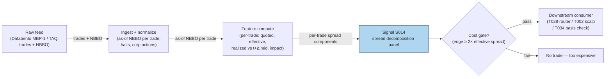

### S12. Sources

- Huang, R. D. & Stoll, H. R. (1997). "The Components of the Bid-Ask Spread: A
  General Approach." *Review of Financial Studies*, 10(4), 995–1034.
  https://ideas.repec.Org/a/oup/rfinst/v10y1997i4p995-1034.html
- Glosten, L. R. & Harris, L. E. (1988). "Estimating the Components of the Bid/Ask
  Spread." *Journal of Financial Economics*, 21(2), 123–142.
  https://business.columbia.edu/faculty/research/estimating-components-bidask-spread
- Goyenko, R. Y., Holden, C. W. & Trzcinka, C. A. (2009). "Do liquidity measures
  measure liquidity?" *Journal of Financial Economics*, 92(2), 153–181.
  https://EconPapers.repec.org/article/eeejfinec/v_3a92_3ay_3a2009_3ai_3a2_p_3a153-181.htm
- U.S. SEC MIDAS / Rule 605 conventions — effective spread as the regulatory
  transaction-cost metric (market-structure reference; no single paper).

**Chatbot source log:** chatbot answers pending (checked 2026-09-10) — grok-answers.md
and cursor-answers.md were absent from batches/SB1/.

**Unverified leads**
- Roll, R. (1984) implicit-spread estimator mentioned as a variant (S012's home
  chapter); not independently sourced here.

---

## Stage 24/200 — S024: VWAP cross & anchored-VWAP continuation

*Batch SB1 · Signal 24/100 · Provenance [SR] · Family B — Intraday momentum & breakout*

### S1. One-line verdict

| Field | Detail |
|---|---|
| **What it is** | A sustained close above (below) session or anchored VWAP on rising volume = institutions have re-accepted value higher (lower); ride it. |
| **When it works** | Trend days with heavy institutional flow: price crosses VWAP early, volume confirms, and price holds the line for several bars. |
| **When it dies** | Choppy range days: price flickers across VWAP repeatedly, volume is thin, and every cross is a whipsaw. |
| **Build-or-buy in one line** | Build the indicator yourself (trivial math); buy a clean 1-min consolidated feed — the edge, if any, is in data hygiene, not the formula. |

Provenance **[SR]** (standard reconstruction): VWAP-cross continuation is a practitioner convention — the exact participation-vs-fade logic inside bank execution algos is proprietary, and no public paper defines a canonical cross rule with published performance. [SR] is **not** upgraded here.

### S2. How it works — plain human explanation

It is 9:36, AAPL. Bid 231.40 × 800, ask 231.41 × 300, and session VWAP — every share traded since 9:30, volume-weighted — sits at 231.28. Price has chopped around it since the open. Now 25,000-share prints hit at 231.40, then 231.44. The next three one-minute bars all close above the rising VWAP, each on larger volume than the last.

A VWAP cross is a bet about *whose* flow is moving the tape. Large desks benchmark execution to VWAP — Berkowitz, Logue & Noser (1988) established it as the institutional transaction-cost benchmark. If price holds above VWAP on rising volume, the institutions buying today are paying up versus their benchmark, and the ones still working orders are incentivized to keep buying into strength: their mandate is "beat VWAP," not "buy the cheapest tick." A sustained cross reads as a regime shift — the market accepted a new value area, and benchmarked flow defends it.

The **anchored** variant moves the anchor: session VWAP starts at the open, but a 10:15 FDA headline is a better anchor for a pharma name. Reset the cumulative sums at the event and ask "where has value been accepted *since the news*?" Same mechanics, different starting bar.

Why should this work economically? Three forces, none mystical:

1. **Benchmarked flow is real and large.** VWAP algorithms slice parent orders across the day following the historical volume curve. When price breaks above VWAP and holds, these algos' schedules tilt toward buying (to avoid trailing their benchmark) — a mechanical, persistent bid. Choi, Larsen & Seppi (2018) model exactly this: TWAP (time-weighted average price)/VWAP order-splitting benchmarks induce predictable intraday price-pressure patterns.
2. **Value-area re-acceptance.** In auction-market terms, a sustained cross means two-sided trade is happening at the new level — it is not a single print. Volume confirmation separates "a block crossed" from "the market moved."
3. **Information revelation.** If the cross follows news, informed traders act strategically in high-volume periods (the same mechanism Gao et al. invoke for intraday momentum) — the cross is the footprint, not the cause.

**Mental model (3 bullets):**
- VWAP is the market's *agreed price so far today*; a sustained cross on volume means the agreement moved.
- The continuation is not the cross itself — it is the benchmarked flow that chases the cross. No volume, no flow, no trade.
- The mirror image (price extended *from* VWAP on fading volume) is mean reversion, not continuation — that is S040. Misclassifying the regime is the expensive mistake.

### S3. The math — exact formula

Session VWAP at bar $t$ (bars indexed from the session open, $i = 1 \dots t$):

$$
\mathrm{VWAP}_t = \frac{\sum_{i=1}^{t} TP_i \cdot V_i}{\sum_{i=1}^{t} V_i},
\qquad TP_i = \frac{H_i + L_i + C_i}{3}
$$

where $H_i, L_i, C_i$ are the bar's high, low, close (currency units, e.g. USD) and $V_i$ is share volume. The anchored variant resets the sums at an anchor bar $A$ (event time, prior close, rolling start):

$$
\mathrm{AVWAP}_t(A) = \frac{\sum_{i=A}^{t} TP_i \cdot V_i}{\sum_{i=A}^{t} V_i},
\qquad t \ge A.
$$

**Cross rule (example construction — not an institutional standard).** Let $s_t = \mathrm{sign}(C_t - \mathrm{VWAP}_t)$. A bullish continuation trigger at bar $t^\*$ requires:

1. $s_{t^\*-1} \le 0$ and $s_{t^\*} > 0$ (the cross, detected at the close of bar $t^\*$),
2. $s_{t^\*+1} = s_{t^\*+2} = \dots = s_{t^\*+N} = +1$ (the $N$ bars *after* the cross bar all hold above VWAP),
3. $V_{t^\*} > \kappa \cdot \bar{V}_{\text{same-slot, 20d}}$ (volume confirmation; $\kappa$ example 1.5).

**Causal timing:** $\mathrm{VWAP}_t$ uses only bars $\le t$; the hold condition needs bars through $t^\*+N$, which only close at the close of bar $t^\*+N$. Earliest tradable fill: the open of bar $t^\*+N+1$. Filling at the cross bar's close while *also* requiring the hold is lookahead — the hold bars are in the future at that point. (An "aggressive variant" that fills at the cross bar's close and uses the hold only as an ex-post filter is a different strategy: it may not claim the hold as an entry condition, and it eats the full whipsaw risk.) Never evaluate a "cross" on a partially-formed bar; the current bar's volume and close are unknown until it closes (a classic lookahead leak).

**Normalization choices:** raw deviation $d_t = (C_t - \mathrm{VWAP}_t)/\mathrm{VWAP}_t$ in basis points is fine for thresholding within one name; cross-name comparison needs $z_t = d_t / \hat{\sigma}_d$ with a rolling $\hat{\sigma}_d$ (S040's engine). The report's signal is unnormalized; normalization is a recommended refinement.

**Parameter table** (every default marked `example — not an institutional standard`):

| Parameter | Symbol | Typical range | Too small | Too large | Default (example) |
|---|---|---|---|---|---|
| Hold bars | $N$ | 2–5 | whipsaw city | misses the move | 3 |
| Volume multiple | $\kappa$ | 1.2–2.0× slot median | admits noise crosses | never triggers | 1.5 |
| Typical price vs close-only | — | TP or $C_i$ | — | — | TP (report formula) |
| VWAP window | — | session / anchored / rolling 60–120 min | rolling loses benchmark meaning | session VWAP slow to react | session + anchored variant |
| Cross tolerance | $\varepsilon$ | 0–5 bps | 0 = flicker triggers | real crosses rejected | 1 bp |

**Named variants:**
1. **Close-only VWAP** ($\mathrm{VWAP}_t$ with $C_i$ replacing $TP_i$) — matches many retail charting platforms; slightly noisier, no intrabar-range information.
2. **Rolling VWAP** (trailing 60–120 min window) — adapts on trend days but loses the "institutional benchmark" interpretation; closer to a moving average.
3. **Event-anchored VWAP** (news, earnings, prior day's close, opening range) — the T067 variant; the anchor is the research decision that matters most.

### S4. Worked example — step-by-step numbers (SYNTHETIC)

All numbers below are **synthetic**, generated with `numpy.random.default_rng(24)` — **seed 24** — and are the exact series plotted in S11. This is an arithmetic illustration, not a backtest: there are no fees, no spread, and the fill is assumed.

| bar | C ($) | V (sh) | TP ($) | ΣTP·V | ΣV | VWAP ($) | AnchVWAP ($) | dev (bps) | above? |
|---|---|---|---|---|---|---|---|---|---|
| 1 | 100.01 | 9,100 | 100.01 | 910,091 | 9,100 | 100.01 | n/a | 0.0 | no |
| 2 | 99.97 | 8,300 | 99.96 | 1,739,759 | 17,400 | 99.99 | n/a | −2.0 | no |
| 3 | 99.93 | 7,600 | 99.94 | 2,499,303 | 25,000 | 99.97 | n/a | −4.0 | no |
| 4 | 99.96 | 9,400 | 99.97 | 3,439,021 | 34,400 | 99.97 | n/a | −1.0 | no |
| 5 | 99.99 | 11,200 | 99.99 | 4,558,909 | 45,600 | 99.98 | 99.99 | +1.0 | **yes** |
| 6 | 100.04 | 14,800 | 100.04 | 6,039,501 | 60,400 | 99.99 | 100.02 | +5.0 | yes |
| 7 | 100.09 | 18,600 | 100.08 | 7,900,989 | 79,000 | 100.01 | 100.04 | +8.0 | yes |
| 8 | 100.12 | 21,900 | 100.12 | 10,093,617 | 100,900 | 100.04 | 100.07 | +8.0 | yes |
| 9 | 100.17 | 23,400 | 100.16 | 12,437,361 | 124,300 | 100.06 | 100.09 | +11.0 | yes |
| 10 | 100.18 | 20,100 | 100.18 | 14,450,979 | 144,400 | 100.08 | 100.11 | +10.0 | yes |
| 11 | 100.21 | 17,800 | 100.21 | 16,234,717 | 162,200 | 100.09 | 100.12 | +12.0 | yes |
| 12 | 100.24 | 16,500 | 100.24 | 17,888,677 | 178,700 | 100.10 | 100.14 | +14.0 | yes |

**Step-by-step:** each bar's typical price $TP = (H+L+C)/3$ is volume-weighted and accumulated; dividing cumulative dollar volume by cumulative shares gives VWAP (bar 5: $4{,}558{,}909 / 45{,}600 = 99.98$). Bars 1–4 close at or below VWAP. At bar 5, close 99.99 exceeds VWAP 99.98 — the cross is **detected** (not yet tradable). Bars 6–8 all close above VWAP ($N = 3$ hold, dev +5.0/+8.0/+8.0 bps) → the hold **confirms at bar 8's close**; earliest honest fill is **bar 9's open** — the first print after confirmation. (An earlier draft of this chapter called bar 6's open the fill; that used bars 6–8 — then still in the future — to authorize the trade. Corrected here: no future bar may authorize an earlier fill.) Anchored VWAP, re-set at the cross bar, tracks the post-cross value area (99.99 → 100.14), rising faster than session VWAP — on a trend day the anchor is the more responsive reference.

**What to notice:** volume builds from 11.2k to 23.4k shares across the cross — the confirmation the rule demands. But the cross itself is a **1 bp** margin at bar 5: inside the spread for most names, which is why production rules add the volume gate ($\kappa$) and tolerance band. The toy tape has no fees, no spread, no partial fills, and no losing days — it demonstrates the arithmetic, nothing more.

### S5. Strategies that use this signal

- **T066 — VWAP-Cross Institutional Follower** — primary entry trigger (direction): sustained cross + RVOL (relative volume) confirmation = the strategy's core entry; also fades *extreme* deviations (the S040 mirror).
- **T067 — Anchored-VWAP Event Trader** — primary trigger (direction): anchors VWAP at news/events instead of the open, then trades the cross/continuation with novelty context.
- **T086 — OFI-Paced Participation Tracker** — execution-benchmark consumer (reference, not alpha): VWAP is the execution target the participation schedule paces toward; S024's level is consumed as the benchmark, OFI paces the child orders.

### S6. Data required — exact spec

| Field | Type | Granularity | Source tier | Notes |
|---|---|---|---|---|
| $H, L, C$ per bar | float | 1-min | Tier 0–2 | Consolidated (SIP) or single-venue; match your execution venue |
| $V$ per bar | int | 1-min | Tier 0–2 | Split-adjusted; auctions flagged separately |
| Corporate actions / splits | factor, date | daily | Tier 0–1 | Unadjusted volume history silently breaks anchored sums |
| Halt / LULD flags | boolean | 1-min | Tier 1–2 | Exclude halted bars from the cumulative sums |
| Event timestamps (anchored variant) | timestamp | event | Tier 2 news / exchange calendar | Anchor placement is the research decision |

**Collection:** Databento `ohlcv-1m` (or XNYS consolidated), Polygon Stocks v3 aggregates (`/v3/aggs/ticker/{t}/range/1/minute/...`), Alpaca bars. **Ingest sketch** (Python/polars, ≤20 lines):

```python
import polars as pl
bars = pl.read_parquet("bars_1m.parquet")          # ts, sym, o,h,l,c, v, halt
bars = bars.filter(~pl.col("halt")).sort(["sym","ts"])
bars = bars.with_columns(tp=(pl.col("h")+pl.col("l")+pl.col("c"))/3)
bars = bars.with_columns(
    cum_pv=(pl.col("tp")*pl.col("v")).cum_sum().over("sym"),
    cum_v =pl.col("v").cum_sum().over("sym"))
sig = bars.with_columns(vwap=pl.col("cum_pv")/pl.col("cum_v"))
sig = sig.with_columns(above=pl.col("c") > pl.col("vwap"))
# hold-N cross: compare shifted 'above' flags within symbol
```

**Storage:** 1-min bars for 500 symbols ≈ 50 MB/day in Parquet (per notes/cost-model.md §4) → ~3 GB for 60 days — archive freely. **Data-quality checklist:** exchange-timestamp normalization (SIP vs direct clock); split/dividend adjustment before any anchored sum; halt and half-day (early close) handling — a 13:00 close shifts every slot median; DST transitions in slot-based volume medians; stale/zero-volume bars excluded from cumulative sums.

### S7. Local build on M5 Max / 128GB

**Feasibility: trivial.** This is cumulative sums over 390 bars/day/symbol — a Tier L build (4–12 h, ~$600–1,800 loaded-cost estimate at $150/hr per cost-model §5).

**Throughput** (per cost-model §2): 500 symbols × 390 bars = 195k bars/day — polars groupby-agg (~10–50M rows/sec) recomputes the universe's session VWAP in well under a second; the real-time per-bar update is O(1) per symbol. Bottleneck: none at 1-min.

**Stack options:**

| Stack | When to pick |
|---|---|
| Python + polars | Default: research and production for 1-min bars; this chapter's sketch is the whole pipeline |
| Rust | Only if you move to tick-level VWAP across hundreds of symbols (Rust event loop ~5–50M events/sec vs Python ~100–500k) |
| DuckDB | Ad-hoc SQL research over archived parquet; fine but polars is simpler here |

**RAM:** 60 days × 500 symbols of 1-min bars ≈ **12 MB** (per §3 table) — trivially inside the 77 GB working budget. Even 10 years of daily bars for 3,000 stocks is ~2–5 GB.

**Engineering band:** Tier L, 4–12 h → **$600–1,800** loaded-cost estimate; the work is the volume-profile medians and the anchored-event plumbing, not the formula. Data: ~$200/mo Tier-1 feed (indicative — verify before budgeting).

**What breaks first at 500 symbols:** nothing at 1-min. It breaks if you demand *tick*-level VWAP for 500 names in real time (~50 symbols × 2k events/s = 100k events/s is already borderline for a Python loop per §2's worked example) — then Rust ingest + polars batching.

### S8. Buy vs build

| Option | What you get | Indicative price | Gains | Loses |
|---|---|---|---|---|
| Tier-0: Stooq / Alpaca IEX | Daily + 1-min-ish bars | ~$0 | Free prototyping | Corporate-action hygiene, no consolidated tape |
| Tier-1: Polygon Stocks Advanced | Real-time SIP 1-min aggregates | ~$30–200/mo | Clean aggregates, splits handled | You still write the rule |
| Tier-2: Databento Standard | L1 + ohlcv-1m, honest timestamps | ~$200/mo + usage | Exchange timestamps, halt flags | Overkill for 1-min VWAP alone |
| Academic: LOBSTER / TAQ | MBO/ITCH replay | hundreds/yr academic | Microstructure honesty for H6 | Cost and complexity for a 1-min signal |

**Verdict — build if** your edge needs custom anchors, custom hold/volume logic, or your own symbol universe (all likely): the math is 20 lines. **Buy if** you need production-grade consolidated bars with split/halt hygiene and don't want to run feed ops. **Crossover:** hybrid is the norm — buy the Tier-1/2 feed, build the indicator. Nobody sells a "VWAP-cross strategy" worth buying; vendors sell the data. All prices above: indicative — verify before budgeting.

### S9. Success ratio / efficacy — documented evidence

| Study / source | Market & period | Metric | Before/after cost | Caveat |
|---|---|---|---|---|
| Haendler, Heston, Korajczyk & Sadka (2025), "The Intra-Day Stock Return Periodicity Puzzle" | US equities, multi-year | VWAP-type trading statistically significant at open/midday intraday intervals | Before-cost (observational) | Documents the *flow*, not a tradable cross rule; working paper (SSRN 5749704) |
| Choi, Larsen & Seppi (2018), "Equilibrium Effects of Intraday Order-Splitting Benchmarks" | Model | VWAP/TWAP benchmarks induce predictable intraday price-pressure patterns | n/a (theory) | Equilibrium model, no live trading statistics; arXiv:1803.08336 |
| Berkowitz, Logue & Noser (1988) | NYSE, 1980s | VWAP established as institutional execution benchmark | Before-cost | Benchmark relevance only — says nothing about cross profitability |
| Kissell (2014), *The Science of Algorithmic Trading* (ch. on VWAP strategies) | Practitioner | VWAP-cross/continuation treated as standard desk tactic | Before-cost (anecdotal) | Book treatment, no published Sharpe; specific flow statistics quoted second-hand are unverified |

**Regimes where it fails:** range days (whipsaw), low-volume names (one block = a fake cross), the open's first minutes (volume curve mis-estimated), and crowded momentum unwinds where everyone fades the same cross. **Documented decay:** none specifically — because there is no published performance series to decay.

**Honest bottom line:** as a standalone trigger this is a **weak-to-unknown edge** — the academic record documents the *mechanism* (benchmarked flow exists and moves prices), not a profitable rule. As a **regime label** (trend-day vs range-day classifier feeding T066/T067) and as an **execution benchmark** it is genuinely useful.

### S10. Failure modes & pitfalls

1. **Partial-bar lookahead** — computing VWAP with the still-forming bar's volume/close, then "trading" the cross at that bar's close. *Mitigation: signals evaluate only on closed bars; fill at t+1.*
2. **Whipsaw on hairline crosses** — 1 bp crosses inside the spread (as in the toy tape's bar 5). *Mitigation: tolerance band ε + volume gate κ + N-bar hold.*
3. **Auction contamination** — opening/closing auction volume distorts the volume profile and the cumulative sums. *Mitigation: flag auction prints; many desks compute VWAP on continuous-session volume only.*
4. **Anchor overfitting (anchored variant)** — trying anchors until one "worked." *Mitigation: pre-register anchors (news time, open, prior close); purged-CV (S088) any selection.*
5. **Trend-day misclassification** — trading continuation into a day that is actually reverting (S040's territory). *Mitigation: estimate the regime (e.g. HMM S079) rather than assuming continuation; T066 explicitly fades extreme deviations.*
6. **Cost blowup** — a 1-min cross strategy turns over several times a day; spread + fees vs a 5–15 bp edge. *Mitigation: model spread+fees+impact per trade (S8 table); require edge ≫ round-trip cost.*
7. **Split/dividend breaks in anchored sums** — a 2:1 split halves price mid-cumsum. *Mitigation: adjusted series only; assert adjustment before computing.*
8. **Feed inconsistency** — the cross fires on SIP's VWAP but not your direct feed's (or vice versa). *Mitigation: compute and trade on the same feed; latency-sensitive claims carry `simulated only — requires MBO/ITCH` (H6).*

### S11. Visuals


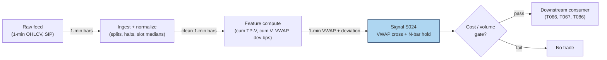

### S12. Sources

1. Berkowitz, S. A., Logue, D. E. & Noser, E. A. (1988). "The Total Cost of Transactions on the NYSE." *Journal of Finance*, 43(1), 97–112. https://repec.udesa.edu.ar/pub/Finanzas/Journals/Journal%20of%20Finance/43/1/2328325.pdf
2. Choi, J. H., Larsen, K. & Seppi, D. J. (2018). "Equilibrium Effects of Intraday Order-Splitting Benchmarks." arXiv:1803.08336. https://ideas.repec.org/p/arx/papers/1803.08336.html
3. Haendler, C., Heston, S., Korajczyk, R. & Sadka, R. (2025). "The Intra-Day Stock Return Periodicity Puzzle." Working paper, SSRN 5749704.
4. Harris, L. (2003). *Trading and Exchanges: Market Microstructure for Practitioners.* Oxford University Press. ISBN 0-19-514470-8. (Ch. on VWAP benchmarks; book, no URL.)

**Unverified leads:** quant-zero knowledge-base claim that a 1% VWAP deviation generates "0.02–0.05% of mean-reverting order flow per minute" and that VWAP algos are "30–40% of institutional flow" — repeated via a GitHub mirror citing Harris/Kissell page numbers, not verified against the originals; do not budget on these. Any blog "VWAP-cross strategy Sharpe" — unverified unless the paper is produced.

**Source log:** chatbot answers (Grok/Cursor) pending — checked 2026-09-10; grok-answers.md and cursor-answers.md absent from batches/SB1/ (duckai-answers.md present but covers S001 only, not this chapter).

---

## Stage 25/200 — S025: Intraday time-series momentum

*Batch SB1 · Signal 25/100 · Provenance [D] · Family B — Intraday momentum & breakout*

### S1. One-line verdict

| Field | Detail |
|---|---|
| **What it is** | Sign of the recent intraday return (10 min to a few hours) predicts the next minutes-to-hours: keep riding the tape. |
| **When it works** | Liquid index/futures names on news-heavy or high-volume days, when informed and day-trader flow persists into the close. |
| **When it dies** | Thin midday chop, single-name noise, and days when the "momentum" is just bid–ask bounce (trade prices mechanically zigzagging between the bid and the ask around a flat mid — apparent movement with no real price change) at the open. |
| **Build-or-buy in one line** | Build: it is sign-of-past-returns on 1-min bars — the research question is window choice and cost survival, not infrastructure. |

Provenance **[D]** (documented): the canonical intraday result is Gao, Han, Li & Zhou (2018) — first-half-hour return predicts the last-half-hour return — plus Heston, Korajczyk & Sadka (2010) on intraday periodicity; the daily/monthly origin is Moskowitz, Ooi & Pedersen (2012). Academic horizons and day-trading horizons are not the same thing; intraday uses are labeled as adaptations where relevant.

### S2. How it works — plain human explanation

It is 10:04, SPY. The first half hour ran from yesterday's close of 512.00 to 513.35 — up about 26 bps (basis points; 1 bps = 0.01%, so 26 bps ≈ 0.26%), with volume running 40% above the slot median (slot = one fixed half-hour bucket of the trading day — 13 in a regular session; the slot median is the typical volume for that same half-hour across recent days). The usual script says mornings mean-revert ("buy the dip"). Intraday time-series momentum says: don't. The tape's early direction has a documented tendency to persist into the *last* half hour of the same session — up mornings lean toward up closes.

Why would the morning's return predict the afternoon's, six hours later? Gao, Han, Li & Zhou propose two mechanisms, both about *who is forced to trade late*:

1. **Day-trader unwinding (disposition effect).** Good morning news pushes prices up; short-horizon liquidity providers who faded the open sit on losers. The disposition effect (Odean 1998; Locke & Mann 2000) says they avoid realizing losses, so they procrastinate — then all unwind in the last half hour, pushing price *further* up. The morning move gets echoed at the close by the losers' capitulation.
2. **Strategic informed trading.** Admati & Pfleiderer (1988): informed traders concentrate where volume is — the open and the close. Morning news gets traded in the first half hour, and the same flow keeps working into the deep liquidity of the close. The morning return is the footprint of information that takes the whole session to digest.

Heston, Korajczyk & Sadka (2010) found a kindred regularity: individual-stock returns persist at the *same half-hour clock slot* across days (up to 40 trading days) — the market has intraday memory, plausibly from predictable institutional patterns (Haendler et al. 2025 tie some of it to VWAP-type and close-benchmarked flow). Moskowitz, Ooi & Pedersen (2012) established the daily/monthly version across asset classes. S025 is the intraday port of that family — same sign-of-past-returns engine, horizons compressed from months to minutes.

**Mental model (3 bullets):**
- Time-series momentum (this signal) asks "did *this* asset go up?" — it is direction-agnostic and self-referential. Cross-sectional momentum asks "did it go up *more than peers*?" Different question, different portfolio.
- The edge, where it exists, lives in *predictable late-day flow* (unwinding day traders, benchmarked rebalancers), not in the morning move being "right."
- One trade a day (enter at 15:30, exit at 16:00) is the cost-efficient expression: turnover is the binding constraint, and this signal's academic form trades exactly once per session.

### S3. The math — exact formula

The report's generic form, with flat or exponential weighting over lookback $L$:

$$
\mathrm{Sig}_t = \mathrm{sign}\!\left(\sum_{i=1}^{L} w_i \, r_{t-i}\right), \qquad
r_{t} = \frac{P_t}{P_{t-1}} - 1
$$

$P_t$ = price at bar $t$ (mid or close; units: currency), $r_t$ = simple bar return (dimensionless), $w_i$ = weights (flat $w_i = 1/L$, or exponential $w_i \propto (1-\lambda)^{i}$). Vol-scaled sizing: $\mathrm{pos}_t = \mathrm{Sig}_t \cdot \sigma_{\text{target}} / \hat{\sigma}_t$ (target-vol scaling, $\hat{\sigma}_t$ = recent realized vol).

The canonical academic instantiation (Gao et al. 2018) is a predictive regression, not a sign rule:

$$
r_{13,t} = \alpha + \beta \, r_{1,t} + \varepsilon_t,
$$

where $r_{1,t}$ = first half-hour return of day $t$ (measured *from the previous day's close*, so it includes the overnight gap) and $r_{13,t}$ = last half-hour return. Estimated $\hat{\beta} > 0$ (scaled-by-100 slope ≈ 6.94, significant at 1%, $R^2$ — the fraction of last-half-hour return variance the regression explains — ≈ 1.6% in-sample) — the tradable version is $\mathrm{Sig}_t = \mathrm{sign}(r_{1,t})$, long/short the last half hour accordingly.

**Causal timing:** $r_{1,t}$ is known at 10:00 ET; the position is entered at the *start* of the last half hour (15:30 ET) and flattened at the close (16:00 ET). Tradable no earlier than the bar after the signal is computed — here, hours after, which is why the signal is nearly immune to the usual microstructure lookahead traps.

**Normalization choices:** raw sign (report default) throws away magnitude information; vol-scaling ($\mathrm{pos} \propto 1/\hat{\sigma}$) is the documented refinement (Moskowitz et al. scale positions by trailing volatility); z-scoring $z_t = \bar{r}_{t-L:t}/\hat{\sigma}$ turns the sign rule into a strength rule. Deseasonalize by time-of-day vol (S067) before thresholding — raw morning returns are mechanically more volatile.

**Parameter table** (defaults marked `example — not an institutional standard`):

| Parameter | Symbol | Typical range | Too small | Too large | Default (example) |
|---|---|---|---|---|---|
| Lookback $L$ | $L$ | 10 min – 3 h (report); academic: 30 min | noise dominates | signal stale by entry | 30 min (first half hour) |
| Weighting | $w_i$ | flat / exponential $\lambda \in [0.8, 0.99]$ | flat ignores decay | overfits to last bar | flat |
| Skip-open | — | 0–30 min | overnight-gap noise | throws away Gao's predictor | include overnight in $r_1$ (academic); skip first 5 min for single names (practitioner example) |
| Vol target | $\sigma_{\text{target}}$ | 5–20% ann. | overlevered on calm days | underplays the signal | 10% (example) |
| Flatten time | — | 15:55–16:00 | overnight gap risk | auction slippage | flat by 15:59 (example) |

**Named variants:**
1. **First-half-hour → last-half-hour** (Gao et al.): one observation per day, enter 15:30, exit 16:00 — the cost-efficient canonical form.
2. **Rolling $L$-minute momentum**: $\mathrm{sign}(\sum_{i=1}^{L} r_{t-i})$ recomputed each bar — higher turnover, more whipsaw, needs explicit cost gating.
3. **Same-clock-slot persistence** (Heston et al. 2010): predict slot $j$ today from slot $j$ over past days — cross-day intraday memory rather than within-day continuation.

### S4. Worked example — step-by-step numbers (SYNTHETIC)

**Synthetic** 13 half-hour slots, one session, `numpy.random.default_rng(25)` — **seed 25**. Returns in bps; midday slots jittered, first and last slots set by hand. Same series as the S11 chart. Not a backtest: no costs, one assumed fill.

| slot | time | ret (bps) | cum (bps) | close ($) |
|---|---|---|---|---|
| 1 | 09:30 | **+42.0** | 42.0 | 100.42 |
| 2 | 10:00 | −0.0 | 42.0 | 100.42 |
| 3 | 10:30 | −3.7 | 38.3 | 100.38 |
| 4 | 11:00 | −16.0 | 22.3 | 100.22 |
| 5 | 11:30 | +0.2 | 22.5 | 100.22 |
| 6 | 12:00 | +6.5 | 29.0 | 100.29 |
| 7 | 12:30 | +7.3 | 36.3 | 100.36 |
| 8 | 13:00 | −3.8 | 32.5 | 100.32 |
| 9 | 13:30 | +15.6 | 48.1 | 100.48 |
| 10 | 14:00 | +13.6 | 61.7 | 100.62 |
| 11 | 14:30 | −1.6 | 60.1 | 100.60 |
| 12 | 15:00 | −1.1 | 59.0 | 100.59 |
| 13 | 15:30 | **+31.0** | 90.0 | 100.90 |

**Step-by-step:** formation return $r_1 = +42.0$ bps (slot 1, includes the overnight gap by construction) → $\mathrm{Sig} = \mathrm{sign}(+42.0) = +1$ → LONG. Wait through the session (the rule trades only the last half hour). Enter at 15:30 at 100.59, exit at the 16:00 close at 100.90: gross $+30.8$ bps, synthetic, before costs. The middle of the day actually sagged (slots 3–4 gave back ~20 bps) — the signal ignores all of it by design.

**What to notice:** the example is hand-tilted (both $r_1$ and $r_{13}$ set positive) to illustrate the mechanism; the academic claim is statistical ($\beta > 0$, $R^2$ 1.6%), not "every up morning ends up." Real frictions are absent: the 15:30 entry competes with other momentum chasers, the fill is assumed at the slot open, and +30.8 bps must survive ~1–3 bps round-trip in SPY (comfortable) versus 10+ bps in a thin single name (fatal). That cost arithmetic is the entire strategy question.


### S5. Strategies that use this signal

- **T006 — Intraday Trend + Vol-Regime Allocator** — primary trigger (direction): rides S025 time-series momentum into the close, position-scaled by HMM vol regime (S079).
- **T098 — Jump-Validated Momentum Ignition** — momentum leg (validated entry): takes S025's directional read only when a Lee–Mykland jump (a statistical test flagging a price move too large to be ordinary diffusion noise) validates the move and RVOL (relative volume: today's volume versus its recent typical level) confirms — a filter *on* this signal.
- **T025 — Trade-Classification Trend Filter** — filter/veto: uses Lee–Ready/BVC signed trade imbalance (Lee–Ready: a rule classifying each trade as buyer- or seller-initiated from the prevailing quote and tick direction; BVC = Bulk Volume Classification, a classifier that signs volume bars instead of individual trades) to confirm or veto S025 momentum entries (signed flow must agree).
- **T053 — HMM Regime-Switching Allocator** — regime gate: allocates to the momentum book (S025 leg) in trending hidden states, to the reversal book (S035 leg) otherwise.

### S6. Data required — exact spec

| Field | Type | Granularity | Source tier | Notes |
|---|---|---|---|---|
| 1-min OHLCV (or half-hour bars) | float/int | 1-min | Tier 0–2 | Futures preferred (less noise, cleaner session); CME via Databento |
| Prior-day close | float | daily | Tier 0–1 | Needed for the overnight-inclusive $r_1$ (academic form) |
| Corporate actions | factor | daily | Tier 1 | Gap-adjusted series or $r_1$ is polluted |
| Vol estimate (for sizing) | float | 1-min/5-min | Tier 1 | Realized vol of $r_1$ or HAR-style (S066) |
| News calendar (optional) | timestamps | event | Tier 2 | Gao et al.: stronger on macro-news days |

**Collection:** Databento futures/equities 1-min, Polygon Stocks Advanced, Alpaca SIP. **Ingest sketch** (polars, ≤20 lines):

```python
import polars as pl
b = pl.read_parquet("bars_1m.parquet").sort(["sym","ts"])
half = b.group_by_dynamic("ts", every="30m", group_by="sym").agg(
    o=pl.col("o").first(), c=pl.col("c").last())
half = half.with_columns(r=pl.col("c")/pl.col("c").shift(1).over("sym")-1)
half = half.with_columns(slot=pl.col("ts").dt.hour()*2+pl.col("ts").dt.minute()//30)
day = half.group_by("sym", pl.col("ts").dt.date()).agg(
    r1=pl.col("r").filter(pl.col("slot")==19).first(),   # 09:30 slot incl. overnight
    rL=pl.col("r").filter(pl.col("slot")==31).first())   # 15:30 slot
sig = day.with_columns(sig=pl.col("r1").sign())
```

**Storage:** 1-min bars, 500 symbols ≈ 50 MB/day (§4) → ~3 GB/60 days. The academic form needs only 2 half-hour returns/day/symbol — kilobytes. **Data-quality checklist:** overnight-gap attribution (prior close vs open); half-days and DST (13 slots becomes 7 — never hardcode 13); futures session definitions (CME settle vs pit close); corporate-action adjustment; exclude days with <500 trades (Gao et al.'s own filter).

### S7. Local build on M5 Max / 128GB

**Feasibility: trivial.** Tier L (4–12 h, ~$600–1,800 loaded-cost estimate per §5). The signal is arithmetic on 13 numbers per symbol per day.

**Throughput** (per §2): the daily batch is ~500 × 390 = 195k bars — polars handles it in milliseconds; even a pure-Python loop is fine. Real-time requirement: one computation at 10:00, one order at 15:30 — a cron job, not a trading system. Bottleneck: none; the constraint is fill quality, not compute.

**Stack options:**

| Stack | When to pick |
|---|---|
| Python + polars | Everything here; the sketch above is production-shaped |
| DuckDB | If you prefer SQL over archived parquet |
| Rust | Unnecessary — no event-rate pressure at this granularity |

**RAM:** 60 days × 500 symbols × 1-min ≈ **12 MB** (§3); the signal's own state is two floats per symbol. Entirely inside the 77 GB working budget — you could hold decades.

**What breaks first at 500 symbols:** nothing computationally. What breaks is *economic*: single-name $r_1$ is mostly noise (Gao et al.'s result is on the *market* ETF and liquid futures), and per-name costs at 15:30 eat a 1.6% $R^2$ edge alive. The failure is in S9/S10, not in the Mac.

### S8. Buy vs build

| Option | What you get | Indicative price | Gains | Loses |
|---|---|---|---|---|
| Tier-0: Stooq daily + Alpaca IEX | Daily bars, some intraday | ~$0 | Free replication of the daily/monthly form | No clean half-hour history |
| Tier-1: Polygon Stocks Advanced | SIP 1-min + aggregates | ~$30–200/mo | Enough for the full academic replication | Futures coverage thinner |
| Tier-1/2: Databento (CME + equities) | Futures 1-min, honest timestamps | ~$200/mo + usage | The report's "futures preferred" data | Usage billing on history pulls |
| Academic: TAQ via WRDS | Tick history | institutional/academic | Deep robustness checks | Access friction, cost |

**Verdict — build if** you want the window/weighting/flatten-time customized (you will): the signal is 10 lines. **Buy** the feed (Tier-1 minimum for intraday history; Databento if futures). **Crossover:** there is nothing to "buy" as a strategy — vendors sell data; the one-trade-a-day rule is yours to implement and cost-check. All prices above: indicative — verify before budgeting.

### S9. Success ratio / efficacy — documented evidence

| Study / source | Market & period | Metric | Before/after cost | Caveat |
|---|---|---|---|---|
| Gao, Han, Li & Zhou (2018) | SPY, 1993–2013 | Timing on sign($r_1$): 6.67%/yr avg, 6.19% vol → **Sharpe 1.08** vs 0.29 buy-and-hold | Before-cost metric; authors report gains *persist after transaction costs* | Published in the *Journal of Financial Economics* (2018); figures from the SSRN working-paper version (SSRN 2552752) — re-verify against the published version before citing precisely |
| Gao et al. (2018), same | SPY, 1993–2013 | Predictive $R^2$ 1.6% in-sample; 1.2% out-of-sample (1.8–2.6% with 12th-half-hour added) | Before-cost (predictive regression) | $R^2$ is statistical, not tradable P&L; OOS (out-of-sample — tested on data the model was never fit on) weaker as expected |
| Moskowitz, Ooi & Pedersen (2012) | 58 instruments, 1985–2009 | Time-series momentum pervasive across asset classes; vol-scaled strategy earns significant risk-adjusted returns (see paper for figures) | Before-cost | **Daily/monthly** horizons — the origin of the family, not intraday evidence |
| Baltussen, Da, Lammers & Martens (2021) | 60+ futures | Intraday momentum confirmed; gamma-hedging mechanism (options market makers buying/selling the underlying to stay delta-neutral as prices move — the "hedging demand" of the paper's title); effect reverts over following days | Before-cost | Via practitioner summary; confirms mechanism + warns the drift is temporary |
| Heston, Korajczyk & Sadka (2010) | US stocks, intraday | Same-clock-slot return persistence up to 40 days | Before-cost | Cross-day periodicity, not the within-day $r_1 \to r_{13}$ trade |

**Regimes where it fails:** low-volume/midday-dominated days (no late flow to ride); single names where $r_1$ is noise; post-2013 decay risk (the paper's sample ends 2013; treat recent efficacy as unverified without your own replication); macro-news days cut both ways (stronger signal per the paper, but wider slippage). The Baltussen et al. finding matters: the drift **reverts over following days** — holding overnight converts momentum into reversal losses.

**Honest bottom line:** as a standalone trigger this is a **documented but thin edge** — Sharpe ~1 before costs on the most liquid instrument on earth, one trade a day, with the authors claiming cost survival. As a **timing overlay** (when to concentrate intraday risk, T006/T015-style) it is more defensible than as a full strategy. Single-name intraday TSMOM without vol scaling is mostly noise — say so in any pitch.

### S10. Failure modes & pitfalls

1. **Overnight-gap misattribution** — $r_1$ includes the gap only if you anchor to the prior close; anchoring to the open measures something else. *Mitigation: define $r_1$ exactly as the paper does; test both.*
2. **Half-day/DST slot drift** — 13 slots is a regular-session assumption. *Mitigation: compute slots from exchange calendar; never hardcode 13.*
3. **Single-name noise** — the documented effect is market/futures-level; per-name $r_1$ has far lower SNR. *Mitigation: restrict universe to index ETFs/liquid futures, or shrink per-name signals.*
4. **Reversion after the close** — Baltussen et al.: the drift reverts over following days. *Mitigation: hard flatten before close; never carry as "momentum" overnight.*
5. **Cost illusion on the toy trade** — +30.8 bps gross means little if your 15:30 entry crosses a 5 bp spread in a thin name. *Mitigation: per-trade cost model (spread + fees + slippage); the one-trade-a-day shape is what makes SPY survive.*
6. **Publication decay** — sample ends 2013; post-publication arbitrage may have compressed it (cf. McLean & Pontiff 2016 on anomaly decay generally). *Mitigation: replicate on your own recent data before sizing; report post-2018 numbers separately.*
7. **Vol-regime blindness** — fixed-size positions on high-vol days take outsized risk. *Mitigation: vol-target sizing ($1/\hat{\sigma}$); T006's HMM gate.*
8. **Lookahead in $r_1$** — using 10:00:00 prints that arrived after your 10:00 signal timestamp (SIP latency). *Mitigation: timestamp discipline; at this horizon it's minor, but keep the t→t+1 rule anyway.*

### S11. Visuals


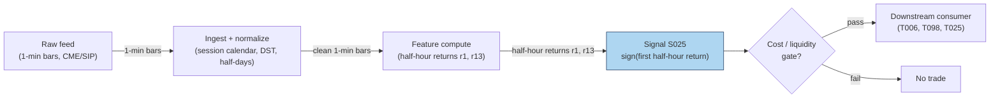

### S12. Sources

1. Gao, L., Han, Y., Li, S. Z. & Zhou, G. (2018). "Intraday Momentum: The First Half-Hour Return Predicts the Last Half-Hour Return." *Journal of Financial Economics*, 2018. https://paperswithbacktest.com/api/paper/intraday-momentum-the-first-half-hour-return-predicts-the-last-half-hour-return/pdf (working-paper version; SSRN 2552752)
2. Moskowitz, T. J., Ooi, T. H. & Pedersen, L. H. (2012). "Time Series Momentum." *Journal of Financial Economics*, 104, 228–250. (Daily/monthly origin of the family; no URL — journal citation.)
3. Heston, S. L., Korajczyk, R. A. & Sadka, R. (2010). "Intraday Patterns in the Cross-section of Stock Returns." *Journal of Finance*, 65(4). SSRN 1107590.
4. Baltussen, G., Da, Z., Lammers, S. & Martens, M. (2021). "Hedging Demand and Market Intraday Momentum." *Journal of Financial Economics*. (Gamma-hedging mechanism; journal citation.)

**Unverified leads:** practitioner replication notes claiming the effect "replicated in several international markets" — plausible, but I did not verify each replication's paper; the Hull-repository China-futures study (1%-significant first-session prediction on 4 commodity futures, SSRN 3493927) is a working paper I did not fully vet — treat as a lead, not evidence.

**Source log:** chatbot answers (Grok/Cursor) pending — checked 2026-09-10; grok-answers.md and cursor-answers.md absent from batches/SB1/ (duckai-answers.md present but covers S001 only, not this chapter).

---

## Stage 35/200 — S035: Short-term reversal — Jegadeesh / Lehmann

*Batch SB1 · Signal 35/100 · Provenance [D] · Family C — Mean reversion & reversal*

### S1. One-line verdict

| Field | Detail |
|---|---|
| **What it is** | Buy recent losers, short recent winners: over 1 week–1 month (and 15 min–1 day intraday), extremes snap back. |
| **When it works** | Broad liquid universes where the reversal is compensation for providing liquidity — not where it is just bid–ask bounce. |
| **When it dies** | After costs (turnover is brutal), in illiquid names (the "reversal" is measurement error), and post-publication as arbitrageurs crowd it. |
| **Build-or-buy in one line** | Build the rank/sort — the signal is arithmetic; buy nothing except clean total-return data, and budget turnover before anything else. |

Provenance **[D]** (documented): Jegadeesh (1990), Lehmann (1990), Lo & MacKinlay (1990). One honesty note carried from the report: Lehmann's exact weekly portfolio weights were **not recoverable from accessible sources** — this chapter uses rank-based long/short deciles and says so. Academic horizons (1 week–1 month) ≠ day-trading horizons; the intraday port is labeled an adaptation.

### S2. How it works — plain human explanation

It is month-end. Across 2,000 US stocks, the worst performers of the past month are down 8–15%; the best are up 10–20%. The short-term reversal signal says: buy the losers, short the winners, hold a month. It feels wrong — that is the point. The claim, documented since Jegadeesh (1990), is that short-horizon extremes contain a transitory component: price pressure, overreaction, and plain illiquidity push prices too far, and they snap back.

The economic "why" has three competing stories, and the literature never fully settled between them:

1. **Liquidity provision / price pressure.** Someone absorbed the selling that made the losers lose. Market makers demand compensation for warehousing that inventory risk; the reversal is their paycheck (Grossman & Miller 1988; Pastor & Stambaugh 2003). Under this story the signal is a *liquidity-provision premium* — real, but earned by whoever actually stands ready, not by a monthly spreadsheet rebalance.
2. **Overreaction and correction.** Investors extrapolate recent news too far (De Bondt & Thaler 1985); prices overshoot and correct. Under this story the edge is behavioral and decays as arbitrageurs learn it.
3. **Measurement error — the bid–ask bounce.** The hostile story, and it matters enormously. If losers' last prints were at the bid and winners' at the ask, next period's "reversal" is just the bounce — no economics at all. Kaul & Nimalendran (1990) showed bid–ask errors are the *predominant* source of apparent short-run reversals in NASDAQ stocks; Atkins & Dyl (1990) found the overreaction after large daily moves is small compared with spreads. Any backtest on closing transaction prices that ignores this is fiction.

Lehmann (1990) ran the weekly version — long last week's losers, short last week's winners — but Lo & MacKinlay (1990) showed a large fraction of contrarian profits comes from **cross-autocorrelation** (large stocks lead small), not from each stock reversing itself. The naive "buy losers" portfolio harvests lead-lag structure as much as mean reversion.

The intraday port — rank by prior 15–60 min return, fade extremes over the next 15 min to a day — is the same engine at higher frequency, where bounce contamination is *worse*. Label it an adaptation, and test it on quote midpoints, not transaction prices.

**Mental model (3 bullets):**
- Short-term reversal = you are paid to absorb someone else's urgency. No urgency absorbed, no premium earned — a monthly rebalance captures the label, not the economics.
- Half of what looks like reversal in transaction-price data is the bid–ask bounce. Midpoints or it didn't happen.
- The signal's enemy is not being wrong about direction — it is turnover: the edge is small, the trading is constant, and costs compound against you every rebalance.

### S3. The math — exact formula

**Jegadeesh (1990) monthly form.** Each month $t$, compute prior-month return $r_{i,t-1}$ for each stock $i$; sort into deciles. Portfolio: long decile 1 (losers), short decile 10 (winners), equal-weighted, hold one month. The reversal shows up as negative serial correlation: $E[r_{i,t} \mid r_{i,t-1} \text{ extreme}]$ leans against $r_{i,t-1}$.

**Lehmann (1990) weekly form (weights as described; exact published weights not recoverable — use rank deciles and state it):**

$$
w_{i,t} = -\frac{1}{N}\,(r_{i,t-1} - r_{m,t-1}),
$$

$w_{i,t}$ = portfolio weight of stock $i$ (dimensionless, sums to zero — dollar-neutral), $r_{i,t-1}$ = prior-week return, $r_{m,t-1}$ = market return, $N$ = universe size. Losers ($r_{i,t-1} < r_{m,t-1}$) get positive weight; winners get negative weight. Because the report's source entry could not recover Lehmann's exact construction from accessible sources, the reproducible version is: **rank-based long/short deciles**, not these analytic weights.

**Residual (Blitz et al. 2013-style) variant:** replace raw $r_{i,t-1}$ with the Fama–French residual $\varepsilon_{i,t-1}$ — reversal in the *idiosyncratic* component, stripping factor drift.

**Intraday port (adaptation — label as such):** rank universe by prior 15–60 min return; long bottom quantile / short top quantile; hold 15 min–1 day; compute everything on **quote midpoints** to suppress bounce.

**Causal timing:** formation return uses data $\le t$; positions formed at $t$'s close trade at $t+1$'s open or later. The classic cheat is forming on month $t$'s return and "trading" at month $t$'s close — one month of lookahead.

**Normalization choices:** raw returns (Jegadeesh) vs market-adjusted (Lehmann) vs residual (Blitz et al.); equal-weight vs return-weighted legs. Volatility-scaling the legs is a practitioner refinement, not in the originals.

**Parameter table** (defaults marked `example — not an institutional standard`):

| Parameter | Symbol | Typical range | Too small | Too large | Default (example) |
|---|---|---|---|---|---|
| Formation window | — | 1 week – 1 month (academic); 15–60 min (intraday port) | bounce dominates | signal washes out | 1 month / 30 min |
| Holding window | — | = formation (academic) | turnover explodes | reversal decays | 1 month / 60 min |
| Sort quantiles | — | deciles / quintiles | noisy legs | weak spread | deciles |
| Return definition | — | total / market-adj. / residual | factor drift pollutes | estimation error | market-adjusted (example) |
| Price basis (intraday) | — | midpoint vs transaction | — | — | **midpoint** (mandatory for intraday) |

**Named variants:**
1. **Jegadeesh monthly deciles** — the documented original; 1-month formation, 1-month hold.
2. **Lehmann weekly contrarian** — analytic weights (not recoverable; use rank deciles and disclose).
3. **Residual reversal** — Fama–French residual sorts; cleaner idiosyncratic mean reversion.

### S4. Worked example — step-by-step numbers (SYNTHETIC)

**Synthetic** 10-stock month, `numpy.random.default_rng(35)` — **seed 35**. Formation returns are random; holding returns are constructed with a mild reversal tilt ($-0.28 \times$ formation + noise) plus pure noise — the *same* data as the S11 chart. Not a backtest: no costs, no borrow fees, one toy month.

| name | formation $(t-1)$ % | holding $(t)$ % | leg |
|---|---|---|---|
| AAA | −6.83 | +0.71 | **LONG** (loser) |
| BBB | +4.63 | −5.42 | **SHORT** (winner) |
| CCC | +6.90 | +2.26 | **SHORT** (winner) |
| DDD | +4.41 | −1.24 | flat |
| EEE | +8.69 | −1.50 | **SHORT** (winner) |
| FFF | +0.02 | −1.28 | flat |
| GGG | −8.54 | +0.74 | **LONG** (loser) |
| HHH | −0.34 | +1.38 | **LONG** (loser) |
| III | +2.90 | +1.09 | flat |
| JJJ | +2.49 | −2.58 | flat |

**Step-by-step:** sort by formation return. Long leg = 3 worst losers (GGG −8.54, AAA −6.83, HHH −0.34); short leg = 3 best winners (EEE +8.69, CCC +6.90, BBB +4.63). Holding-period leg means: long leg $(0.71+0.74+1.38)/3 = +0.94\%$; short leg $(-5.42+2.26-1.50)/3 = -1.55\%$. Dollar-neutral portfolio gross = $+0.94 - (-1.55) = \mathbf{+2.50\%}$ for the toy month, before costs. Correlation(formation, holding) = **−0.302** — the reversal signature.

**What to notice:** CCC formed at +6.90% and *continued* to +2.26% — reversal is statistical, not a law. The toy +2.50% is gross of everything: 200%+ monthly turnover, two-way spread on ten names, borrow fees on the shorts (EEE at +8.69% formation is exactly the crowded winner that is expensive to borrow). The toy table uses clean synthetic "true" returns, so it *overstates* what a transaction-price backtest would honestly show — the Kaul–Nimalendran warning in miniature.


### S5. Strategies that use this signal

- **T011 — Short-Term Reversal + Bounce Timing** — primary entry trigger (direction): the Jegadeesh/Lehmann sort is the strategy's core; S047/S014 time entries at the touch to harvest (not pay) the bounce.
- **T053 — HMM Regime-Switching Allocator** — regime gate: allocates to the reversal book (S035 leg) when the hidden state favors mean reversion, to momentum (S025) otherwise.
- **T100 — Grand Ensemble** — ensemble consumer (diluted weight): S035 is one of 100 inputs; included for completeness, not as a driver.

(Candid note: T040 was checked and does *not* consume S035 — its signals are S080/S039/S078 — and neither does T013 (S042/S043/S045). Only T011 and T053 genuinely list S035; T100 is included as the honest third.)

### S6. Data required — exact spec

| Field | Type | Granularity | Source tier | Notes |
|---|---|---|---|---|
| Total returns (split/div-adjusted) | float | daily (weekly/monthly formation) | Tier 0–1 | CRSP / Polygon / Stooq; **total**, not price, return |
| Quote midpoints (intraday port) | float | 1-min | Tier 1–2 | Transaction prices forbidden for formation (bounce) |
| Borrow/fee data (short leg) | float | daily | Tier 1–3 | Short winners are often hard-to-borrow |
| Market index returns | float | daily | Tier 0 | For market-adjusted weights |
| Delisting returns | float | event | Tier 1 | Survivorship bias otherwise |

**Collection:** Stooq/Polygon daily for the academic form; Databento/Polygon 1-min midpoints for the intraday port. **Ingest sketch** (polars, ≤20 lines):

```python
import polars as pl
d = pl.read_parquet("daily.parquet").sort(["sym","date"])   # adj close, total-return
d = d.with_columns(r=pl.col("adj")/pl.col("adj").shift(1).over("sym")-1)
form = d.group_by("sym").agg(form_r=pl.col("r").tail(21).sum())  # 1-mo formation
ranks = form.with_columns(dec=pl.col("form_r").qcut(10, labels=False).over())
# long decile 0, short decile 9; hold next 21 sessions; rebalance monthly
```

**Storage:** daily bars, 3,000 stocks × 10 y ≈ 60M rows ≈ **2–5 GB** RAM (§3) — fits; parquet on disk 2–4× smaller. Intraday-port midpoints: 1-min, 500 symbols ≈ 50 MB/day (§4). **Data-quality checklist:** total-return (not price) adjustment; delisting returns; midpoint vs transaction discipline; corporate actions; universe point-in-time membership (no survivorship bias); short-sale ban periods flagged.

### S7. Local build on M5 Max / 128GB

**Feasibility: trivial** for the academic form; **feasible** for the intraday port. Tier L (4–12 h, ~$600–1,800 loaded-cost estimate per §5) — it is sorts and groupbys.

**Throughput** (per §2): monthly rebalance over 3,000 stocks × 10 y of daily data = 60M rows — polars simple ops at ~10–50M rows/sec chew through it in seconds. The intraday port (500 symbols × 390 bars/day = 195k bars) is trivial. Bottleneck: none computationally; borrow-data licensing for the short leg.

**Stack options:**

| Stack | When to pick |
|---|---|
| Python + polars | Default for both forms; qcut/decile sorts are one-liners |
| DuckDB | SQL-first researchers over archived parquet |
| Rust | Unnecessary at these granularities |

**RAM:** daily panel ~2–5 GB (§3) — comfortable in the 77 GB budget; the monthly signal state is one float per name. 60 days of 1-min data ≈ 12 MB.

**What breaks first at 500 symbols:** nothing local. What breaks is *economic*: at 500 names the short leg's borrow fees and the monthly 200% turnover mean the strategy's viability is a cost question (S9/S10), not a compute question. Full-universe CRSP-style history wants WRDS access (buy, Tier 3 academic).

### S8. Buy vs build

| Option | What you get | Indicative price | Gains | Loses |
|---|---|---|---|---|
| Tier-0: Stooq / French data library | Daily returns, factors | ~$0 | Free academic replication | No intraday, survivorship caveats |
| Tier-1: Polygon Stocks Advanced | Daily + 1-min, adjusted | ~$30–200/mo | Clean adjustments, midpoints | History depth costs |
| Tier-3 academic: WRDS/CRSP + TAQ | Publication-grade history | hundreds–thousands/yr academic | The actual papers' data | Price, access friction |
| Borrow data: vendor (e.g. S3-style) | Stock-loan fees | $$ | Prices the short leg honestly | Another subscription |

**Verdict — build if** you are replicating or adapting the sort: the signal is ranking arithmetic. **Buy if** you need CRSP-grade delisting/total-return history or borrow panels — you cannot build those. **Crossover:** Tier-0/1 data + your own sorts covers 90% of the research; pay for borrow data the moment the short leg is real money. All prices above: indicative — verify before budgeting.

### S9. Success ratio / efficacy — documented evidence

| Study / source | Market & period | Metric | Before/after cost | Caveat |
|---|---|---|---|---|
| Jegadeesh (1990), as summarized in Cakici & Topyan (2014) | US stocks, 1934–1987 | Short-term reversal ≈ **+2%/month** extra return | **Before-cost** | Pre-decimalization, pre-publication; costs unmodeled; figure via secondary summary |
| Lehmann (1990) | US stocks, weekly | Weekly contrarian portfolios profitable | **Before-cost** | Exact weights not recoverable; see S3 disclosure |
| Lo & MacKinlay (1990) | US stocks | Much contrarian profit = **cross-autocorrelation** (large leads small), not pure reversal | n/a (decomposition) | The "reversal" you trade may be lead-lag structure |
| Kaul & Nimalendran (1990) | NASDAQ | After removing bid–ask errors: **little evidence** of overreaction; returns positively autocorrelated | Measurement correction | The bounce warning: transaction-price backtests overstate |
| Atkins & Dyl (1990) | US stocks, large daily moves | Reversal exists but **small vs bid–ask spreads** | After-cost interpretation | "Consistent with efficiency after transactions costs" |
| McLean & Pontiff (2016) | 97 anomalies | Returns **decay substantially** after publication | After-cost framing | General result; short-term reversal is in the decaying set |

**Regimes where it fails:** illiquid names (bounce dominates); high-vol regimes (spreads widen, borrow spikes); crowded post-publication periods (decay); earnings/announcement drifters (PEAD is continuation — fading it is fading information, S100). **Documented decay:** yes — McLean & Pontiff (2016) is the citation; expect the academic-form premium to be a shadow of the 1934–1987 number.

**Honest bottom line:** as a standalone trigger this is a **documented-but-mostly-arbitraged edge** — the +2%/month is a before-cost museum piece; what survives today is a liquidity-provision premium that accrues to whoever actually provides the liquidity, net of turnover that usually eats it. As a **timing overlay inside a market-making or execution book** (get paid the spread *and* the reversal), it is far more defensible — which is exactly what T011 does.

### S10. Failure modes & pitfalls

1. **Bid–ask bounce contamination** — formation on transaction prices manufactures reversal. *Mitigation: midpoints only (intraday); bounce-adjusted returns (daily); read Kaul & Nimalendran first.*
2. **Lookahead in formation** — sorting on month $t$'s return and trading at $t$'s close. *Mitigation: form at $t$, trade at $t+1$ open; point-in-time universe.*
3. **Turnover/cost blowup** — 200%+ monthly turnover vs a thin edge. *Mitigation: model spread + fees + borrow + impact per rebalance; net-of-cost Sharpe or nothing.*
4. **Short-leg borrow** — winners are crowded shorts; fees and buy-ins. *Mitigation: borrow-aware universe filter; model fees explicitly.*
5. **Survivorship/delisting bias** — losers delist; dropping them inflates the long leg. *Mitigation: include delisting returns (CRSP-style).*
6. **Crowding/decay** — post-publication arbitrage compresses the premium. *Mitigation: expect decay (McLean & Pontiff); monitor live vs academic-form spread.*
7. **Fading information** — reversal into earnings/PEAD drift (S100) fights informed flow. *Mitigation: exclude announcement windows or flip to T078's drift leg.*
8. **Cross-autocorrelation confusion** — you think you're trading reversal, you're trading large-cap lead-lag (Lo & MacKinlay). *Mitigation: residualize (Blitz et al.) and attribute P&L to reversal vs lead-lag.*

### S11. Visuals


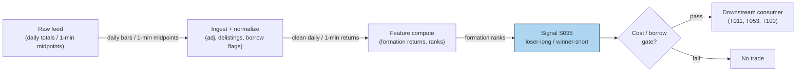

### S12. Sources

1. Jegadeesh, N. (1990). "Evidence of Predictable Behavior of Security Returns." *Journal of Finance*, 45(3), 881–898. (Journal citation; no URL.)
2. Lehmann, B. N. (1990). "Fads, Martingales, and Market Efficiency." *Quarterly Journal of Economics*, 105(1), 1–28. (Journal citation; exact portfolio weights not recoverable — see S3.)
3. Lo, A. W. & MacKinlay, A. C. (1990). "When Are Contrarian Profits Due to Stock Market Overreaction?" *Review of Financial Studies*, 3(2), 175–205. (Journal citation.)
4. Kaul, G. & Nimalendran, M. (1990). "Price Reversals: Bid-Ask Errors or Market Overreaction?" *Journal of Financial Economics*, 28, 67–93. (Journal citation.)
5. Atkins, A. B. & Dyl, E. A. (1990). "Price Reversals, Bid-Ask Spreads, and Market Efficiency." *Journal of Financial and Quantitative Analysis*, 25(4). (Journal citation.)
6. McLean, R. D. & Pontiff, J. (2016). "Does Academic Research Destroy Stock Return Predictability?" *Journal of Finance*, 71(1), 5–32. (Decay reference.)
7. Cakici, N. & Topyan, K. (2014). "Short-Term Reversal." In *Risk and Return in Asian Emerging Markets*, Palgrave Macmillan. https://ideas.repec.org/h/pal/palchp/978-1-137-35907-0_7.html (Secondary summary used for the +2%/month figure attribution.)

**Unverified leads:** Blitz et al. (2013) residual-reversal treatment (cited via the report entry; not independently re-verified here). Any "intraday reversal Sharpe" from blogs or vendor whitepapers — unverified unless the paper is produced.

**Source log:** chatbot answers (Grok/Cursor) pending — checked 2026-09-10; grok-answers.md and cursor-answers.md absent from batches/SB1/ (duckai-answers.md present but covers S001 only, not this chapter).

---

## Stage 40/200 — S040: VWAP-deviation mean reversion

*Batch SB1 · Signal 40/100 · Provenance [SR] · Family C — Mean reversion & reversal*

### S1. One-line verdict

| Field | Detail |
|---|---|
| **What it is** | Price stretched far from session VWAP snaps back: short upside extensions, buy downside ones, as benchmarked algos trade toward their target. |
| **When it works** | Range days and midday lulls where the extension is uninformed flow — a block, a fat finger, a momentum algo overshooting. |
| **When it dies** | Trend days: the deviation is information (S024's territory), and fading it is stepping in front of the benchmarked flow itself. |
| **Build-or-buy in one line** | Build the bands yourself (same VWAP engine as S024, plus a rolling σ); buy nothing — the regime classifier is the product, not the z-score. |

Provenance **[SR]** (standard reconstruction): VWAP ± kσ bands are a practitioner standard; the report's citations are practitioner knowledge bases plus Haendler et al. (2025) for the mechanism. No public paper publishes a canonical VWAP-deviation fade rule with performance. [SR] is **not** upgraded here.

### S2. How it works — plain human explanation

It is 11:20, MSFT. Session VWAP sits at 428.10. A 40,000-share market sell order just swept three levels and printed at 427.55 — 13 bps *below* VWAP — on no news. The VWAP-deviation signal says: buy. Not because 427.55 is "cheap" in any absolute sense, but because of who is about to trade next.

The mechanism is the mirror of S024's. A large share of institutional flow is benchmarked to VWAP (Berkowitz, Logue & Noser 1988, and every execution desk since). A VWAP algorithm that is *behind* its benchmark — it has bought too little while price ran away — must accelerate buying to catch up; one that is *ahead* can slow down. When price stretches far above VWAP, the benchmarked buyers are, on average, ahead of schedule and ease off while benchmarked sellers lean in; the reverse below. The deviation itself summons the flow that erases it — a rubber band powered by other people's mandates. Choi, Larsen & Seppi (2018) formalize this: TWAP/VWAP order-splitting benchmarks induce predictable intraday price-pressure patterns, and deviations from the benchmark path are where the pressure concentrates.

But — and this is the whole game — the rubber band only snaps back if the extension was *uninformed*. If price is 13 bps below VWAP because a real seller knows something, the benchmarked algos' buying is the liquidity the informed seller wanted, and your fade is their exit. That is why the report pairs S040 with S024 as mirrors: extension + fading volume = reversion (this signal); extension + rising volume = continuation (S024). The signal without the regime classifier is a coin flip with costs.

Why should deviations revert *economically*? Three forces:

1. **Benchmark-chasing flow** (above): mechanical, persistent, largest midday when participation schedules are steepest.
2. **Inventory mean reversion of liquidity providers**: the market makers who absorbed the sweep are long inventory they didn't want; they shade quotes to get flat, pulling price back.
3. **Value-area gravity**: VWAP is the volume-weighted consensus price of the day; absent new information, auction logic says trade migrates back to where most volume agreed.

**Mental model (3 bullets):**
- VWAP deviation = distance from the day's consensus; fading it = betting the move was noise, not news.
- The edge is not the z-score — it is *classifying the extension* (uninformed sweep vs informed break). Volume, news, and time-of-day do that work.
- S024 and S040 are one signal with a regime switch, not two signals. Running both without the switch = trading against yourself.

### S3. The math — exact formula

Session VWAP as in S024: $\mathrm{VWAP}_t = \sum_{i\le t} TP_i V_i / \sum_{i\le t} V_i$. Deviation and its z-score:

$$
d_t = \frac{C_t - \mathrm{VWAP}_t}{\mathrm{VWAP}_t}, \qquad
z_t = \frac{d_t}{\hat{\sigma}_{d,t}}, \qquad
\hat{\sigma}_{d,t} = \mathrm{std}(d_{t-W+1 \dots t})
$$

$d_t$ = fractional deviation (dimensionless; ×10⁴ = bps), $\hat{\sigma}_{d,t}$ = rolling standard deviation of the deviation over window $W$ bars. **Example rule (not universal — the report's own words):** enter short when $z_t > +1.5$ (long when $z_t < -1.5$); exit when $|z_t| < 0.25$, on a time stop, or before late-session benchmark flow. VWAP ± k·σ bands are the same engine drawn as bands: $\mathrm{VWAP}_t \pm k\,\hat{\sigma}_{d,t}\,\mathrm{VWAP}_t$.

**Causal timing:** $z_t$ uses only bars $\le t$; the rolling $\hat{\sigma}$ needs $\ge$ ~5 bars before it is anything but noise (see S4's warning). Tradable no earlier than $t+1$'s open. The classic leak: computing $d_t$ with the *current* bar's still-forming volume.

**Normalization choices:** z-score (report's form) adapts to each name's typical deviation scale; raw bps thresholds are simpler but name-specific; rank/percentile of $d_t$ vs its 20-day same-slot distribution deseasonalizes the U-shaped intraday vol (pairs well with S067).

**Parameter table** (defaults marked `example — not an institutional standard`):

| Parameter | Symbol | Typical range | Too small | Too large | Default (example) |
|---|---|---|---|---|---|
| Entry k | $k_{\text{in}}$ | 1.0–2.5 σ | noise trades | never triggers | 1.5 |
| Exit band | $k_{\text{out}}$ | 0–0.5 σ | exits before reversion pays | round-trips back out | 0.25 |
| Rolling σ window | $W$ | 10–60 bars | σ estimate is noise (S4!) | slow to adapt | 30 (example) |
| Min bars for σ | — | 5–20 | z explodes on 3 samples | late entries | 5 (example) |
| Time stop | — | 15–60 min | cuts winners | carries into close flow | 30 min / flat by 15:30 (example) |
| Volume context | — | extension on low vs high vol | fades informed breaks | misses sweeps | require extension volume < slot median (example) |

**Named variants:**
1. **Session-VWAP z-fade** (report's form): deviation vs rolling σ, session anchor.
2. **Band-tag fade**: price tags VWAP ± kσ band drawn from a 20-day same-slot σ — slower, more stable bands.
3. **Anchored-deviation fade**: deviation vs *anchored* VWAP (news anchor) — for post-event overextensions; pairs with T067's anchor.

### S4. Worked example — step-by-step numbers (SYNTHETIC)

**Synthetic** 12-minute tape, `numpy.random.default_rng(40)` — **seed 40**. Price overshoots above VWAP early, then drifts back through it. Same data as the S11 chart. Not a backtest: no costs, fills assumed, one toy episode.

| bar | C ($) | VWAP ($) | dev (bps) | z | event |
|---|---|---|---|---|---|
| 1 | 99.99 | 99.99 | 0.0 | n/a | σ needs ≥5 bars |
| 2 | 100.04 | 100.02 | +2.0 | n/a | |
| 3 | 100.09 | 100.05 | +4.0 | n/a | |
| 4 | 100.17 | 100.08 | +9.0 | n/a | |
| 5 | 100.19 | 100.11 | +8.0 | **+2.08** | **ENTRY SHORT** (example \|z\|>1.5) |
| 6 | 100.17 | 100.12 | +5.0 | +1.45 | inside band |
| 7 | 100.14 | 100.12 | +2.0 | +0.61 | |
| 8 | 100.11 | 100.12 | −1.0 | −0.28 | crossed through VWAP |
| 9 | 100.05 | 100.11 | −6.0 | −1.29 | extension the other way |
| 10 | 100.02 | 100.11 | −9.0 | −1.58 | |
| 11 | 100.00 | 100.10 | −10.0 | −1.48 | |
| 12 | 99.98 | 100.09 | −11.0 | −1.45 | **EXIT: time stop** |

**Step-by-step:** $d_t = (C_t - \mathrm{VWAP}_t)/\mathrm{VWAP}_t$; $\hat{\sigma}_d$ is the rolling 10-bar sample std of $d$ (min 5 bars). At bar 5, $z = +2.08 > 1.5$ → short at 100.19 (earliest honest fill: bar 6 open). The ±0.25 exit band is never re-entered — $z$ falls to −0.28 at bar 8 (close, but $|z| = 0.28 > 0.25$) then stretches negative — so the **time stop** closes the trade at bar 12: $100.19 \to 99.98$ = **+21.0 bps gross**, synthetic, before costs.

**What to notice (and its limits):** three honest artifacts are on display. First, bars 1–4 have no z — the rolling σ needs history, so the *first* valid signal arrives mid-episode; production systems warm-start σ from prior days. Second, the ±0.25 exit never fired and the trade was saved by the time stop — band exits assume smooth decay *through* the band, but real deviations often blow through VWAP and extend the other way (bars 9–12 hit −1.58σ). Third, the toy charges no spread: the bar-5 short would really pay the ask, and +21.0 bps gross shrinks fast against a 2–4 bp round trip plus impact. The example demonstrates the arithmetic and the exit logic's fragility — nothing more.


### S5. Strategies that use this signal

- **T004 — VWAP-Deviation Mean-Reversion** — primary entry trigger (direction): fades extreme session-VWAP deviations, timed by queue imbalance (S003), normalized by diurnal vol (S067).
- **T066 — VWAP-Cross Institutional Follower** — secondary fade leg: follows sustained crosses (S024) but *fades extreme deviations* — S040 is the strategy's contrarian sleeve, gated by RVOL.
- **T086 — OFI-Paced Participation Tracker** — execution-benchmark consumer: VWAP is the participation target; S040-style deviation logic throttles child-order pacing (slow down when ahead of benchmark, accelerate when behind).

### S6. Data required — exact spec

| Field | Type | Granularity | Source tier | Notes |
|---|---|---|---|---|
| 1-min OHLCV | float/int | 1-min | Tier 0–2 | Same engine as S024; share the pipeline |
| Rolling σ warm-up history | float | 1-min | Tier 1–2 | Prior days' deviations to seed $\hat{\sigma}_d$ |
| News/event flags | boolean | event | Tier 2 | Suppress fades into scheduled news (fade noise, not information) |
| Halt flags | boolean | 1-min | Tier 1–2 | Exclude halted bars from σ estimation |

**Collection:** same as S024 (Databento ohlcv-1m, Polygon v3 aggregates, Alpaca). **Ingest sketch** (polars, ≤20 lines — extends the S024 sketch):

```python
import polars as pl
s = pl.read_parquet("bars_1m.parquet").sort(["sym","ts"])   # with vwap col from S024
s = s.with_columns(d=(pl.col("c")-pl.col("vwap"))/pl.col("vwap"))
s = s.with_columns(sig=s["d"].rolling_std(30, min_periods=5).over("sym"))
s = s.with_columns(z=pl.col("d")/pl.col("sig"))
s = s.with_columns(
    short_sig=(pl.col("z") > 1.5),          # example thresholds
    long_sig =(pl.col("z") < -1.5),
    exit_sig=pl.col("z").abs() < 0.25)
```

**Storage:** identical to S024 — 1-min, 500 symbols ≈ 50 MB/day (§4), ~3 GB/60 days; signal state adds two floats per symbol. **Data-quality checklist:** warm-start σ (never z-score on 3 samples); split adjustment before cumulative sums; halt exclusion; news-window suppression list; late-session benchmark flow — many desks *stop fading* after 15:30 when MOC/index flow dominates.

### S7. Local build on M5 Max / 128GB

**Feasibility: trivial.** Same engine as S024 plus a rolling std — Tier L (4–12 h, ~$600–1,800 loaded-cost estimate per §5).

**Throughput** (per §2): 500 × 390 bars/day = 195k bars; polars rolling ops at ~1–10M rows/sec (complex ops) recompute the universe in under a second. Real-time per-bar update is O(W) per symbol — negligible. Bottleneck: none; the regime classifier (if you add S079) dominates cost, not the z-score.

**Stack options:**

| Stack | When to pick |
|---|---|
| Python + polars | Default; the sketch above is the whole signal |
| DuckDB | SQL-first research over parquet archives |
| Rust | Only if you push to tick-level deviation across hundreds of names |

**RAM:** 60 days × 500 symbols 1-min ≈ **12 MB** (§3); warm-up history adds nothing material. Inside the 77 GB budget with room to spare.

**What breaks first at 500 symbols:** nothing at 1-min. It breaks *economically* before it breaks computationally: 500-name fading needs borrow, per-name spread modeling, and a regime switch — the infra is trivial, the risk system is not.

### S8. Buy vs build

| Option | What you get | Indicative price | Gains | Loses |
|---|---|---|---|---|
| Tier-0: Stooq / Alpaca IEX | Bars for prototyping | ~$0 | Free | No corporate-action rigor |
| Tier-1: Polygon Stocks Advanced | SIP 1-min, adjusted | ~$30–200/mo | Clean history for band calibration | You build the regime logic |
| Tier-2: Databento Standard | L1 + 1-min, halt flags | ~$200/mo + usage | Honest timestamps for the σ warm-up | Overkill for the signal alone |
| Practitioner: Kissell (2014) book | VWAP-strategy treatment | book price | The desk-level framing | No code, no parameters |

**Verdict — build if** you want custom bands, anchors, or the regime switch (you do): the signal is a rolling z-score. **Buy** the feed for clean adjusted history. **Crossover:** hybrid — Tier-1/2 data in, your bands and classifier on top. Nobody sells a VWAP-fade *strategy* with audited performance; if they did, the price would tell you the Sharpe. All prices above: indicative — verify before budgeting.

### S9. Success ratio / efficacy — documented evidence

| Study / source | Market & period | Metric | Before/after cost | Caveat |
|---|---|---|---|---|
| Berkowitz, Logue & Noser (1988) | NYSE, 1980s | Institutional execution clusters at VWAP | Before-cost | Benchmark *relevance*, not a fade strategy |
| Choi, Larsen & Seppi (2018) | Model | VWAP order-splitting induces predictable price-pressure patterns | n/a (theory) | Model, no live statistics; arXiv:1803.08336 |
| Haendler et al. (2025) | US equities | VWAP-type trading significant in open/midday periodicity | Before-cost (observational) | Documents the *flow*; SSRN 5749704 |
| Practitioner consensus (Kissell 2014, ch. on VWAP strategies) | Desks | VWAP±bands standard; fades used with discretion | Anecdotal | No published Sharpe; specific flow stats quoted second-hand are **unverified** |

**Regimes where it fails:** trend days (the extension is information — S024's mirror); the last 30 minutes (MOC/index benchmark flow overwhelms); news-driven extensions (fading information); low-liquidity names where "deviation" is just wide spreads. **Documented decay:** none published — there is no performance series to decay, which is itself the warning.

**Honest bottom line:** as a standalone trigger this is a **negligible-to-negative edge after costs** for the naive rule — the report's own caveat, and the literature gives no reason to dispute it: no published Sharpe exists, and the mechanism's profit accrues to whoever provides the liquidity with proper risk controls, not to a z-score rule. As a **timing sleeve inside an execution or market-making book** (T004/T086-style: provide liquidity *at* the band, get paid the spread *and* the snap-back), it is defensible. The regime classifier is the strategy; the z-score is just the ruler.

### S10. Failure modes & pitfalls

1. **Fading information** — the extension is news; benchmarked flow is the informed trader's liquidity. *Mitigation: news-window suppression; volume-context gate (fade only low-volume extensions); T067-style anchor awareness.*
2. **Trend-day misclassification** — running S040 on an S024 day. *Mitigation: regime estimate first (S079 HMM, or simply: rising volume + holding above VWAP = do not fade).*
3. **σ warm-up artifacts** — z-scores on 3–4 samples explode (S4 bars 1–4). *Mitigation: min-periods ≥5; warm-start from prior days; never trade the first valid z blindly.*
4. **Band-exit illusion** — exits assume smooth decay through ±0.25; real deviations blow through (S4 bars 9–12). *Mitigation: always pair with a time stop; consider stop-loss on further extension.*
5. **Late-session benchmark flow** — after ~15:30, MOC and index-rebalance flow dominates and deviations persist into the close. *Mitigation: flatten fades by 15:30 (example); do not fade the close.*
6. **Cost vs edge** — a 1-min fade turns over constantly against 2–4 bp round trips. *Mitigation: per-trade cost model; require expected snap-back ≫ costs; prefer providing liquidity (limit orders) over taking.*
7. **Partial-bar leakage** — deviation computed on forming bars. *Mitigation: closed bars only; t→t+1 fills.*
8. **Crowded bands** — every retail platform draws the same VWAP bands; tags become stop-hunt magnets. *Mitigation: proprietary σ windows/anchors; expect slippage at obvious bands.*

### S11. Visuals


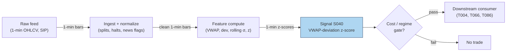

### S12. Sources

1. Berkowitz, S. A., Logue, D. E. & Noser, E. A. (1988). "The Total Cost of Transactions on the NYSE." *Journal of Finance*, 43(1), 97–112. https://repec.udesa.edu.ar/pub/Finanzas/Journals/Journal%20of%20Finance/43/1/2328325.pdf
2. Choi, J. H., Larsen, K. & Seppi, D. J. (2018). "Equilibrium Effects of Intraday Order-Splitting Benchmarks." arXiv:1803.08336. https://ideas.repec.org/p/arx/papers/1803.08336.html
3. Haendler, C., Heston, S., Korajczyk, R. & Sadka, R. (2025). "The Intra-Day Stock Return Periodicity Puzzle." Working paper, SSRN 5749704.
4. Kissell, R. (2014). *The Science of Algorithmic Trading and Portfolio Management.* Academic Press. (Practitioner treatment of VWAP benchmark strategies; book, no URL.)

**Unverified leads:** second-hand statistics on VWAP algo market share ("30–40% of institutional flow") and per-minute reversion flow ("0.02–0.05% per 1% deviation") via a GitHub knowledge-base mirror — not verified against Harris/Kissell originals; excluded from evidence. Vendor whitepapers claiming VWAP-fade performance — unverified unless audited numbers are produced.

**Source log:** chatbot answers (Grok/Cursor) pending — checked 2026-09-10; grok-answers.md and cursor-answers.md absent from batches/SB1/ (duckai-answers.md present but covers S001 only, not this chapter).

---

## Stage 11/200 — S011: Amihud illiquidity ratio

*Batch SB2 · Signal 11/100 · Provenance [D] · Family A — Microstructure & order flow*

### S1. One-line verdict

| Row | Content |
|---|---|
| **What it is** | Daily average of \|return\| per dollar of volume — a low-frequency price-impact (illiquidity) gauge computable from ordinary OHLCV bars. |
| **When it works** | Cross-sectional liquidity ranking, cost-aware sizing, and fading overextended moves in illiquid names. |
| **When it dies** | As a standalone intraday trigger; where volume conventions break (halvings, corporate actions); during volume-regime shifts where a 20-day average is stale. |
| **Build-or-buy in one line** | Build — it is five lines of arithmetic on daily bars; buy history/coverage, never the formula. |

Provenance **[D]** (documented: Amihud 2002). Family **A — Microstructure & order flow**. Worked example is synthetic and watermarked; the chatbot corrections are documented in S4.

### S2. How it works — plain human explanation

**Vignette.** It is 9:47 a.m. Two stocks each trade at $50. Stock X prints a $2M seller and slips 4 cents. Stock Y prints the same $2M seller and falls 40 cents. The Amihud ratio is that observation averaged over days: *how much price moves per dollar traded*. High Amihud = illiquid: each dollar of flow leaves a bigger footprint.

**Why the effect should exist economically.** Three channels:
- *Price impact / adverse selection.* In a thin book a market order walks further down the ladder, so returns per unit volume are larger — the low-frequency cousin of **Kyle's lambda** (S010), which measures impact per share at high frequency.
- *Inventory cost.* Dealers in thin names carry inventory longer and demand compensation as larger price concessions per dollar traded.
- *The illiquidity premium.* Amihud (2002) showed investors demand higher expected returns for illiquid stocks — and that illiquid names mean-revert more, because thin-book moves overshoot fundamentals.

**Mental model (3 bullets):**
- Amihud = the *exchange rate between dollars traded and price moved*, averaged over a window.
- It is a **cost and regime input**, not a direction signal — how expensive a name is to trade and how far its moves are likely to overshoot.
- High ILLIQ names are where temporary-impact fades (T027) hunt and where participation throttles (T026) must be tightest.

### S3. The math — exact formula

For stock *i* over a window of *D* days (day *d* = 1…*D*):

$$\text{ILLIQ}_{i,D} = \frac{1}{D}\sum_{d=1}^{D}\frac{|r_{i,d}|}{\text{DVOL}_{i,d}}$$

where:

- $r_{i,d} = C_{i,d}/C_{i,d-1} - 1$ is the **decimal** daily return (close-to-close; unitless),
- $\text{DVOL}_{i,d} = P_{i,d}\times V_{i,d}$ is **dollar volume** in dollars (price × shares; units $),
- $\text{ILLIQ}$ has units **per dollar** (1/$) — the fraction of price moved per dollar traded.

Because raw values are tiny (∼10⁻¹⁰ per dollar for liquid stocks), the literature reports **ILLIQ × 10⁶** — "return per $1M traded".

**Causal timing.** Computed at the close of day *T* using only closes/volumes on days ≤ *T*. The *D*-day average is complete only after the *D*-th close; tradable no earlier than the next session's open (bar *t* → earliest fill *t+1*).

**Parameter table** (every default below is an *example — not an institutional standard*):

| Parameter | Symbol | Typical range | Too small | Too large | Default example |
|---|---|---|---|---|---|
| Lookback window | *D* | 5–60 days | noisy, one big day dominates | stale, misses regime shifts | 20 days (monitoring); 60 days (smooth ranking) |
| Scaling | — | ×1 (per-$) or ×10⁶ (per-$M) | unreadable tiny numbers | none (cosmetic) | ×10⁶ for reporting |
| Aggregation | — | mean / median / winsorized mean | mean is outlier-sensitive | median hides genuine spikes | winsorized mean (extremes capped at the 1st/99th percentiles) |
| Return convention | — | close-close / open-close | — | — | close-close (classic); open-close (OCAM) variant |
| Intraday analog | — | \|r_bar\|/DVOL_bar per 1–5-min bar, averaged | microstructure noise dominates | converges to daily measure | 5-min bars, RTH only |

**Normalization.** Cross-sectional (across many stocks at one point in time) **rank** or **z-score** (standard deviations from the bucket mean) **within size bucket** is standard practice — raw ILLIQ spans orders of magnitude across market caps. Never compare raw values across a $500M name and a $500B name.

**Named variants:**
1. **CCAM vs OCAM** — classic close-to-close vs open-to-close Amihud (drops the overnight gap from the numerator); research reports OCAM-based liquidity premia roughly double CCAM-based ones (Warwick WP 1211, 2019; see S9).
2. **Intraday-bar analog** — |r_bar|/DVOL_bar on 1–5-min bars, averaged over the session: a slow intraday regime input, not a per-bar trigger.
3. **Winsorized/median ILLIQ** — robust aggregation for names with earnings-jump days that would otherwise dominate the window.

### S4. Worked example — step-by-step numbers (SYNTHETIC)

**Synthetic 10-day tape** (chatbot Q-SB2-1, operator-corrected). **The raw chatbot output contained errors**: its nine daily ILLIQ values were individually correct, but it reported Σ = 6.8216e-9 and average = 7.5796e-10, conflating sum and average in its notation. Corrected values used here: **Σ = 6.3933e-9, average = 7.1037e-10, per-$M = 7.1037e-4**. Tape is hand-specified and deterministic (no RNG draw; plot script records seed 110).

Formula per day: $r_t = C_t/C_{t-1} - 1$; $\text{DVOL}_t = C_t \times V_t$; $\text{ILLIQ}_t = |r_t|/\text{DVOL}_t$.

| Day | Close ($) | Volume (shares) | Return *r* | Dollar vol ($) | ILLIQ (per-$) |
|---|---|---|---|---|---|
| D1 | 100.00 | 100,000 | — | 10,000,000 | — |
| D2 | 101.00 | 120,000 | +0.010000 | 12,120,000 | 8.2508e-10 |
| D3 | 100.50 | 110,000 | −0.004950 | 11,055,000 | 4.4763e-10 |
| D4 | 102.00 | 130,000 | +0.014925 | 13,260,000 | 1.1257e-9 |
| D5 | 101.50 | 100,000 | −0.004902 | 10,150,000 | 4.8296e-10 |
| D6 | 103.00 | 150,000 | +0.014778 | 15,450,000 | 9.5649e-10 |
| D7 | 102.00 | 125,000 | −0.009709 | 12,750,000 | 7.6159e-10 |
| D8 | 101.00 | 140,000 | −0.009804 | 14,140,000 | 6.9320e-10 |
| D9 | 101.50 | 100,000 | +0.004950 | 10,150,000 | 4.8768e-10 |
| D10 | 100.50 | 160,000 | −0.009852 | 16,080,000 | 6.1290e-10 |

**Step-by-step (D2, fully shown):** $r_2 = 101.00/100.00 - 1 = 0.010000$. $\text{DVOL}_2 = 101.00 \times 120{,}000 = \$12{,}120{,}000$. $\text{ILLIQ}_2 = 0.010000 / 12{,}120{,}000 = 8.2508\times10^{-10}$ per dollar. Every other day follows identically.

**Aggregation (corrected):**
$$\bar{\text{ILLIQ}} = \frac{1}{9}\sum_{t=2}^{10}\text{ILLIQ}_t = \frac{6.3933\times10^{-9}}{9} = 7.1037\times10^{-10}\ \text{per dollar}$$
Reported per-$M: $7.1037\times10^{-10}\times10^{6} = \mathbf{7.1037\times10^{-4}}$.

**Chart** (same data — spot-check any bar against the table; see S11 for the figure).

**What to notice.** Illiquidity spikes on D4 (biggest |r| per dollar) and D6 (large move, high dollar volume) — the ratio punishes days where price moved a lot *relative to the dollars that moved it*. **Limits:** no fees, no spread, no corporate actions, a 9-day mean — this demonstrates the arithmetic, not an edge. Never present these numbers as performance.

### S5. Strategies that use this signal

- **T027 — Illiquidity Temporary-Impact Fade (primary trigger).** S011 ranks the universe by illiquidity; overextended intraday moves in high-ILLIQ names are faded on the premise that thin-book moves overshoot and decay on the resiliency half-life (S048; resiliency = how fast the order book refills after a sweep).
- **T026 — Kyle-Lambda Participation Throttle (filter / sizing cap).** Child-order participation rates (own volume ÷ market volume) are capped by Amihud-based illiquidity ceilings: the more illiquid the name, the smaller the allowed fraction of visible depth (displayed limit-order volume).

### S6. Data required — exact spec

| Field | Type | Granularity | Source tier | Notes |
|---|---|---|---|---|
| Close | float $ | daily | Tier 0–1 | split/dividend-adjusted for return continuity |
| Volume | int shares | daily | Tier 0–1 | native (unadjusted) shares; conventions vary by vendor |
| (intraday analog) OHLCV | float/int | 1–5-min bars, RTH (regular trading hours) | Tier 1 | for the bar-analog variant |
| Corporate actions | events | daily | Tier 1 | splits/dividends; mis-adjusted closes corrupt \|r\| |

**Collection.** Named feeds: Stooq (Tier 0, daily), Polygon stocks v3 aggregates (Tier 1), Alpaca (Tier 1), Databento (Tier 2). Schema sketch: `symbol, date, open, high, low, close, volume` + split/div metadata table.

**Ingest sketch (Python/polars, ≤20 lines):**
```python
import polars as pl
daily = pl.scan_parquet("bars/daily_*.parquet")          # symbol,date,close,volume
illiq = (daily.sort("symbol", "date")
    .with_columns(r=pl.col("close") / pl.col("close").shift(1).over("symbol") - 1,
                  dvol=pl.col("close") * pl.col("volume"))
    .with_columns(illiq=pl.col("r").abs() / pl.col("dvol"))
    .filter(pl.col("dvol") > 0)                            # drop zero-volume days
    .group_by("symbol")
    .agg(illiq_20d=pl.col("illiq").tail(20).mean(),
         illiq_med=pl.col("illiq").tail(20).median()))
illiq.sink_parquet("features/illiq_daily.parquet")
```

**Storage.** Per `notes/cost-model.md §4`: daily bars for 3,000 stocks ≈ 5 MB/day total — 60 days ≈ 300 MB, trivial; the derived ILLIQ panel is kilobytes.

**Data-quality checklist:** adjustment consistency (adjusted closes for *r*, native volumes for DVOL — mixing them double-counts splits); halt days (zero volume → drop, don't divide by zero); DST/half-days (intraday analog only); stale corporate-action metadata.

### S7. Local build on M5 Max / 128GB

**Feasibility: trivial.** This is daily-bar arithmetic — a groupby mean over a few million rows.

**Throughput** (per `notes/cost-model.md §2`): polars column ops run ~10–50M rows/sec; the ILLIQ panel for 3,000 stocks × 10 years (~7.5M rows) computes in under a second. Even the intraday analog on 500 symbols × 390 bars × 60 days = 11.7M rows recomputes in seconds. Bottleneck is data licensing, corporate-action handling, and download reliability (cost-model §6).

**Stack options:**

| Stack | When to pick |
|---|---|
| Python + polars | Default; this entire signal is a lazy-frame one-liner |
| DuckDB | If you already keep bars in SQL and want the feature in-query |
| Rust | Only if ILLIQ must run inside a latency-sensitive execution loop (rare) |

**RAM** (per cost-model §3): daily OHLCV for 3,000 stocks × 10 years ≈ 2–5 GB — fits comfortably inside the 77 GB working budget.

**Engineering time:** Tier **L**, 4–12 h → **$600–1,800** at $150/hr loaded-cost estimate (cost-model §5). One line of justification: formula, ingest, and corporate-action handling on daily bars; no event loop, no estimation, no calibration.

**What breaks first at 500 symbols / full OPRA:** nothing — daily bars for 500 symbols are trivial. Scaling to full OPRA is irrelevant (no options input). The real scaling cost is the 500-stock 1-min pipeline around it (106–246 h per the Q-SB2-2 chatbot lead, data-licensing dominated).

### S8. Buy vs build

| Option | What you get | Indicative price | What buying gains | What buying loses |
|---|---|---|---|---|
| Tier-0: Stooq / Alpaca IEX / SEC EDGAR | Free daily OHLCV, delayed quotes | ~$0 | zero marginal cost | IEX-only tape (~2.5% of US volume per chatbot lead — inadequate for volume-sensitive research) |
| Tier-1: Polygon Stocks Advanced | SIP (consolidated-tape feed) 1-min + daily bars, corporate actions, 10y history | ~$30–200/mo | consolidated tape, adjustments handled | none material at this tier |
| Tier-2: Databento Standard | L1/L2 + bars, pay-as-you-go | ~$200/mo + usage | honest intraday for the bar-analog | overkill for the classic daily measure |
| Academic: CRSP / WRDS | Survivorship-bias-free daily history | institutional $$$$ | publication-grade history | cost, access friction |

All prices `indicative — verify before budgeting`. **Verdict: build.** The estimator is five lines; the buy decision is purely about bar history and corporate-action quality. Buy Polygon-grade daily history for a survivorship-aware 10-year panel; build the rolling ILLIQ panel in an afternoon. Crossover: buy the *history*, build the *feature* — precomputed illiquidity factors are poor value because window/winsorization conventions differ.

### S9. Success ratio / efficacy — documented evidence

| Study / source | Market & period | Metric | Before/after cost | Caveat |
|---|---|---|---|---|
| Amihud (2002), J. Financial Markets 5, 31–56 | NYSE, 1964–1997 (cross-section + time series) | Positive return–illiquidity relationship: expected market illiquidity raises ex ante excess returns; strongest in small firms | **Before cost** (asset-pricing premium, not a strategy) | Says nothing about net alpha after trading the illiquid names |
| Warwick Econ. WP 1211 (2019), "The Night and Day of Amihud's Liquidity Measure" | NYSE/AMEX, 1964–2019 | Open-to-close-based liquidity premia roughly **double** close-to-close-based premia; liquidity premia **decline over time** | **Before cost** | Measurement refinement, not a tradable edge |

**Regimes where it fails.** Volume-regime shifts (a 20-day average is stale after a shock); corporate-action misadjustments; the documented secular decline in the illiquidity premium — a 1990s cross-sectional tilt is far weaker today.

**Honest bottom line:** as a standalone intraday trigger: **~zero edge** — no directional information. As a **cost filter and sizing input** it is genuinely useful: it tells you which names will eat your P&L in impact and which overextended moves are likely temporary. Its value is defensive (avoiding bad trades, sizing right), not offensive.

### S10. Failure modes & pitfalls

1. **Lookahead leakage** — trading at *T*'s close before the *D*-day average is complete; mitigate: compute at close, trade at next open.
2. **Corporate-action contamination** — unadjusted splits create fake |r| spikes; mitigate: adjusted closes for returns, native volumes, reconciled action tables.
3. **Zero/low-volume days** — division by ~zero explodes ILLIQ; mitigate: drop zero-volume days, winsorize.
4. **Volume-convention drift** — reporting changes alter DVOL; mitigate: median/winsorized aggregation, monitor the distribution for level shifts.
5. **Stale window after regime shifts** — 20–60-day averages lag volume shocks; mitigate: dual windows (fast 5-day + slow 60-day), flag divergences.
6. **Cross-cap comparison without normalization** — raw ILLIQ is a size proxy in disguise; mitigate: rank/z-score within size or ADV (average daily volume) buckets.
7. **Mistaking the premium for alpha** — the documented premium is before-cost compensation for *holding* illiquidity, not profit from *trading* on it; mitigate: net spread + fees + impact before sizing any ILLIQ-tilted book.
8. **Crowding in "illiquidity factor" trades** — crowded exits in thin names are the blowup scenario; mitigate: hard participation caps (T026) and ADV-based position limits.

### S11. Visuals


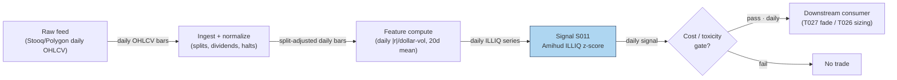

### S12. Sources

1. Amihud, Yakov (2002). "Illiquidity and Stock Returns: Cross-Section and Time-Series Effects." *Journal of Financial Markets* 5(1), 31–56. https://www.cis.upenn.edu/~mkearns/finread/amihud.pdf
2. "The Night and Day of Amihud's (2002) Liquidity Measure." University of Warwick Economics Working Paper 1211 (2019) — documents OCAM vs CCAM premia and the secular decline of the liquidity premium. https://warwick.ac.uk/fac/soc/economics/research/workingpapers/2019/twerp_1211_bernhardt.pdf
3. Duck.ai (bot: GPT-5.6 "Luna", anonymous, reasoning "Fast"), answers to batch SB2 questions Q-SB2-1–Q-SB2-3 (2026-09-10). **Labeled chatbot source**: Amihud formula and 10-day worked example — nine daily ILLIQ values verified individually correct; the model's sum/average were wrong and operator-corrected (Σ = 6.3933e-9, average = 7.1037e-10, per-$M = 7.1037e-4 — corrected values used in S4). Q-SB2-2 pipeline leads inform S7/S8; `notes/cost-model.md` takes precedence — no material conflicts found.
4. Formula/parameter conventions (lookbacks 5–60d, winsorization, per-$M reporting) cross-checked against the Amihud (2002) paper text.

**Unverified leads** (chatbot-only, no checkable source — not used as evidence):
- zerolag.club Amihud formula page (definition matches Amihud 2002; page not independently verified).
- Chatbot Q-SB2-2 vendor plan details (Massive/Polygon Developer $79/mo, Alpaca Algo Trader Plus $99/mo) — leads in S8 with the indicative disclaimer; cost-model §6 bands take precedence.

**Source log:** Duck.ai answered Q-SB2-1–Q-SB2-3 (2026-09-10); Grok/Cursor answers pending (checked 2026-09-10).

---

---
## Stage 13/200 — S013: Corwin–Schultz high-low spread estimator

*Batch SB2 · Signal 13/100 · Provenance [D] · Family A — Microstructure & order flow*

### S1. One-line verdict

| Row | Content |
|---|---|
| **What it is** | Estimates the bid-ask spread from two consecutive days' high-low ranges — volatility scales with interval, the spread does not, so their difference isolates the spread. |
| **When it works** | Daily cost gating and spread context on any OHLC feed; best where true spreads are wide relative to daily volatility. |
| **When it dies** | Overnight gaps, tiny-spread liquid names (negative → floored at 0), intraday use without validation, non-equity samples (documented instability). |
| **Build-or-buy in one line** | Build — ten lines on daily bars; buy TAQ only if you need true quoted spreads. |

Provenance **[D]** (documented: Corwin & Schultz 2012). Family **A — Microstructure & order flow**. Worked example is synthetic; the chatbot correction is documented in S4.

### S2. How it works — plain human explanation

**Vignette.** Tuesday's tape for a mid-cap: high $52.40, low $51.10; Wednesday: high $52.90, low $51.60. No quote data — just four numbers. Hidden inside those ranges is the bid-ask spread, the round-trip tax on every trade. Corwin–Schultz recovers it from one observation: **the day's high is almost always a buy (lifted at the ask) and the low almost always a sell (hit at the bid)**. So each day's high-low range mixes *two* things: the stock's true volatility *plus* one full bid-ask spread.

**The trick.** True volatility grows with the measurement interval — a two-day range carries about twice the variance of a one-day range. The spread component does *not* grow: one day or two, the high is still one ask-print and the low one bid-print. Compare the one-day ranges against the overlapping two-day range and the volatility cancels — what remains is the spread.

**Why it should work economically.** It rests on a market-microstructure regularity: in a limit-order market (trading via posted bid/ask orders), aggressive buyers lift offers and aggressive sellers hit bids, so daily extremes are systematically signed. The estimator's power and its failure modes both come from that signing — it breaks on overnight gaps, one-sided trends, and wide-tick names.

**Mental model (3 bullets):**
- One-day high-low = volatility + spread. Two-day high-low = 2× volatility + spread. Two equations, two unknowns → solve for the spread.
- It is a **cost input**, not a trigger — it tells a strategy how wide the door is before deciding whether the edge fits through it.
- Negative estimates are not "negative spreads"; they are noise, and the estimator floors them at zero.

### S3. The math — exact formula

For two consecutive days *t* and *t+1* with highs $H_t, H_{t+1}$ and lows $L_t, L_{t+1}$ (all in $):

$$\beta_t = \ln^2\!\left(\frac{H_t}{L_t}\right) + \ln^2\!\left(\frac{H_{t+1}}{L_{t+1}}\right), \qquad
\gamma_t = \ln^2\!\left(\frac{\max(H_t,H_{t+1})}{\min(L_t,L_{t+1})}\right)$$

$$\alpha_t = \frac{\sqrt{2\beta_t}-\sqrt{\beta_t}}{\,3-2\sqrt{2}\,} - \sqrt{\frac{\gamma_t}{\,3-2\sqrt{2}\,}}$$

$$S_t = \frac{2\left(e^{\alpha_t}-1\right)}{1+e^{\alpha_t}} = 2\tanh\!\left(\frac{\alpha_t}{2}\right), \qquad
S_t^+ = \max(S_t, 0)$$

- $S_t$ is the estimated spread as a **proportion** of price (unitless); ×10,000 for **basis points**.
- $3 - 2\sqrt{2} = 0.171572875$ comes from the variance-of-range algebra.
- The original paper includes an **overnight-gap adjustment**; the base form above assumes it is handled separately or negligible.

**Causal timing.** The estimate for window (*t*, *t+1*) is complete at the close of day *t+1* using only highs/lows ≤ *t+1*; usable no earlier than the next session open. In practice estimates are averaged over a reporting window (e.g. 20–60 days) to tame noise.

**Parameter table** (defaults are *example — not an institutional standard*):

| Parameter | Symbol | Typical range | Too small | Too large | Default example |
|---|---|---|---|---|---|
| Estimation window | 2 days | fixed by construction | n/a | n/a | 2 consecutive days |
| Reporting window | *W* | 20–60 days | single-window estimates too noisy | stale cost picture | 20-day mean of $S_t^+$ |
| Zero floor | — | on/off | negative "spreads" pollute averages | flooring biases small-spread names upward | on (report raw + floored) |
| Overnight adjustment | — | on/off | gaps inflate γ → negative α | adjustment needs extra params | on for daily estimation |

**Normalization.** Report both the proportion and basis points (1 bp = 0.01%); for cross-sectional use, z-score within liquidity bucket or compare against the strategy's expected edge in the same units (bp vs bp).

**Named variants:**
1. **CS with overnight adjustment** — the paper's full form, scaling for close-to-open gaps; preferred on daily data with material overnight moves.
2. **Abdi–Ranaldo (2017)** — adds the close price; generally the most accurate low-frequency estimator vs TAQ benchmarks, best for less liquid stocks.
3. **Session-block CS** — applied to intraday high-low blocks (e.g. morning vs afternoon); usable only with validation.

### S4. Worked example — step-by-step numbers (SYNTHETIC)

**Synthetic 10-day tape.** The chatbot's worked example (Duck.ai, Q-SB2-1), operator-verified with one correction: **the raw chatbot output's α was correct (α₁ = 0.019797) but its spread was wrong by ~1% — it reported S₁ = 0.019603 (196.03 bp) because it linearized e^α ≈ 1+α (computing 2α/(2+α)). The exact value is S₁ = 2·tanh(α/2) = 0.019796 ≈ 197.96 bp, used everywhere here.** Every day: H = 102, L = 100 (O and C are irrelevant to the base estimator and omitted). Tape is deterministic (no RNG; plot script records seed 130).

**Step-by-step, window W1 (days 1–2):**
1. $h = \ln(102/100) = \ln(1.02) = 0.019802627$; $h^2 = 0.000392144$.
2. $\beta_1 = 0.000392144 + 0.000392144 = 0.000784288$.
3. $\gamma_1 = \ln^2(102/100) = 0.000392144$ (two-day high = 102, two-day low = 100).
4. $\sqrt{\beta_1} = 0.028005$, $\sqrt{2\beta_1} = 0.039605$.
5. First term: $(0.039605 - 0.028005) / 0.171572875 = 0.011600 / 0.171572875 = 0.067606$.
6. Second term: $\sqrt{0.000392144 / 0.171572875} = \sqrt{0.0022856} = 0.047807$.
7. $\alpha_1 = 0.067606 - 0.047807 = \mathbf{0.019797}$ ✓ (verified).
8. $S_1 = 2(e^{0.019797}-1)/(1+e^{0.019797}) = 2(0.0199944)/(2.0199944) = \mathbf{0.019796}$; equivalently $2\tanh(0.0098985) = 0.019796$.
9. In basis points: $0.019796 \times 10{,}000 = \mathbf{197.96\ bp}$ (not the chatbot's 196.03 bp).

All nine windows (W1…W9) are identical → **9-window average ≈ 0.019796 ≈ 197.96 bp**.

**Chart** (same data; see S11 for the figure).

**What to notice.** Estimates are flat because the synthetic tape has constant ranges — the estimator has no variation to chew on. In real data $S_t$ jumps window to window — the 20-day average is the usable number; single-window estimates are noisy and often negative (hence the floor). **Limits:** no fees, no overnight gaps, and a constant-range tape is the least informative input possible — this demonstrates the arithmetic and the linearization correction, not estimation quality.

### S5. Strategies that use this signal

- **T029 — Spread-Estimate Edge Filter (primary).** Trades only when the estimated effective spread (Roll S012 or Corwin–Schultz S013; effective spread = twice the trade price's distance from the quote midpoint) is below the strategy's per-trade edge: the signal *is* the gate.
- **T016 — End-of-Day Drift Rider (context).** Leans into last-hour drift (S027) confirmed by opening-auction imbalance (S033); wide CS estimates shrink size or stand it down into the close.

### S6. Data required — exact spec

| Field | Type | Granularity | Source tier | Notes |
|---|---|---|---|---|
| High / Low | float $ | daily | Tier 0–3 | any OHLCV feed; the *only* required inputs |
| Open / Close | float $ | daily | Tier 0–3 | needed only for the overnight-adjustment variant |
| (validation) TAQ effective spread | float | trade-level | Tier 3 | benchmark for checking your implementation, not for production use |

**Collection.** Any OHLCV vendor: Stooq (Tier 0), Polygon/Tiingo (Tier 1), Databento (Tier 2). Schema sketch: `symbol, date, high, low` (+ `open, close` for the adjusted variant).

**Ingest sketch (Python/polars, ≤20 lines):**
```python
import polars as pl, numpy as np
ohlc = pl.scan_parquet("bars/daily_*.parquet").sort("symbol", "date")
K = 3 - 2*np.sqrt(2)
cs = (ohlc.with_columns(h2=(pl.col("high")/pl.col("low")).log()**2)
    .with_columns(beta=pl.col("h2") + pl.col("h2").shift(-1).over("symbol"),
        gamma=((pl.max_horizontal("high", pl.col("high").shift(-1).over("symbol")) /
                pl.min_horizontal("low",  pl.col("low").shift(-1).over("symbol"))).log()**2))
    .with_columns(alpha=(pl.col("beta")*2).sqrt().sub(pl.col("beta").sqrt()).truediv(K)
                        .sub((pl.col("gamma")/K).sqrt()),
                  S=(2*((pl.col("alpha").exp()-1)/(pl.col("alpha").exp()+1))).clip_min(0))
    .group_by("symbol").agg(cs_20d=pl.col("S").tail(20).mean()))
cs.sink_parquet("features/cs_spread_daily.parquet")
```

**Storage.** Per `notes/cost-model.md §4`: daily bars for 3,000 stocks ≈ 5 MB/day — the CS panel is a rounding error on top.

**Data-quality checklist:** bad ticks in H/L (one erroneous print corrupts both windows touching that day — winsorize log-ranges (cap extremes at percentile bounds)); corporate actions (adjust H/L with closes); half-days/DST (daily estimator unaffected; session-block variant is not); stale H=L=0 rows from dead feeds.

### S7. Local build on M5 Max / 128GB

**Feasibility: trivial.** Ten lines of vectorized math on daily bars.

**Throughput** (per `notes/cost-model.md §2`): numpy vectorized math runs ~50–200M elements/sec; the full CRSP-scale daily panel computes in seconds in polars. Bottleneck is H/L data QA, not compute.

**Stack options:**

| Stack | When to pick |
|---|---|
| Python + polars/numpy | Default; the whole estimator is closed-form |
| DuckDB | If spreads must be computed inside SQL bar pipelines |
| Rust | Never needed for this estimator (no hot loop) |

**RAM** (per cost-model §3): daily OHLCV 3,000 stocks × 10y ≈ 2–5 GB — fits comfortably within the 77 GB working budget; a 60-year panel still fits.

**Engineering time:** Tier **L**, 4–12 h → **$600–1,800** at $150/hr loaded-cost estimate (cost-model §5). Closed-form estimator on daily bars; the hours go to H/L data QA and the overnight-adjustment variant.

**What breaks first at 500 symbols / full OPRA:** nothing — 500 symbols of daily bars are trivial. Full OPRA is irrelevant (no options input). Intraday session-block extension needs clean RTH (regular trading hours) high/low blocks per symbol — still Tier-1, still cheap.

### S8. Buy vs build

| Option | What you get | Indicative price | What buying gains | What buying loses |
|---|---|---|---|---|
| Tier-0: Stooq / exchange delayed | Free daily OHLC | ~$0 | zero cost | no adjustments, shallow history |
| Tier-1: Polygon Stocks Advanced / Tiingo | SIP daily OHLC, corporate actions | ~$30–200/mo | clean adjusted H/L history | none material |
| Tier-2: Databento Standard | Research-grade bars + TAQ-adjacent data | ~$200/mo + usage | validation against better benchmarks | overkill for the estimator itself |
| Academic/institutional: TAQ (WRDS) | True intraday quotes/trades | institutional $$$$ | actual effective spreads — the ground truth | cost; you would not need CS at all |

All prices `indicative — verify before budgeting`. **Verdict: build.** The estimator exists precisely for the situation where you *don't* buy quote data. Buy TAQ only if cost modeling needs true effective spreads — then CS is the cross-check, not the source. Crossover: buy quotes when per-trade cost accuracy is worth more than the data bill; otherwise CS on Tier-1 daily bars is the standard cheap substitute.

### S9. Success ratio / efficacy — documented evidence

| Study / source | Market & period | Metric | Before/after cost | Caveat |
|---|---|---|---|---|
| Corwin & Schultz (2012), *J. Finance* 67, 719–760 — simulation evidence (as summarized in the Brazilian replication study) | Simulated markets under realistic conditions | Correlation between high-low spread estimates and true spreads **≈ 0.9**; std of CS estimates ≈ **one-half** the std of Roll (1984) covariance estimates | n/a — estimator accuracy, not trading P&L | Simulation-based; real-data performance varies with the high=buy/low=sell assumption |
| Abdi & Ranaldo (2017), *RFS* 30, 4437–4480 | US stocks, ~1 century of daily data | Their close/high/low estimator delivers the **highest cross-sectional and average time-series correlations with the TAQ effective-spread benchmark** among low-frequency estimators; most accurate for **less liquid** stocks | n/a — estimator accuracy vs TAQ benchmark | This is the Abdi–Ranaldo extension, not base CS — but it validates the high-low family against ground truth |
| MPRA (2017) estimator horse-race (real + simulated data, equities and FX) | Multi-market | CS "unstable — works well for equities but not the remaining tests"; Abdi–Ranaldo shows high correlation with true spreads but downward bias | n/a — estimator accuracy | Directly limits S013's claimed generality: treat it as an **equities** estimator (chatbot-reported, not re-verified) |

**Regimes where it fails.** Overnight-gap regimes (γ inflated → negative α without adjustment); ultra-liquid names (true spread small vs noise; the floor discards information); trending/one-sided days breaking the high=buy/low=sell signing; non-equity samples (documented instability).

**Honest bottom line:** as a standalone trigger this is a **non-signal** — it estimates a cost, and costs don't point anywhere. As a **cost gate** it is one of the best-documented cheap tools in microstructure — use it when TAQ is not in the budget; the evidence says it tracks true effective spreads well enough to reject trades whose edge doesn't cover the spread.

### S10. Failure modes & pitfalls

1. **Negative α → floored zeros** — noise dominates when spreads are small; mitigate: report raw and floored series, average over the reporting window.
2. **Overnight gaps** — inflate the two-day range, bias α down; mitigate: use the paper's overnight-gap adjustment variant.
3. **Bad H/L prints** — one erroneous tick corrupts two windows; mitigate: winsorize log-ranges, cross-check against a second vendor.
4. **Violations of high=buy/low=sell** — trending or gappy days break the signing assumption; mitigate: distrust single-window spikes, average over 20–60 days.
5. **Intraday session blocks without validation** — the spread-doesn't-scale logic is calibrated to daily intervals; mitigate: validate block-CS against TAQ (Trade and Quote database) on a sample first (labeled `simulated only — requires MBO/ITCH`, i.e. market-by-order / Nasdaq direct-feed data, where latency-sensitive).
6. **Applying outside equities** — documented instability in FX/other samples; mitigate: restrict to equities, or re-validate per asset class.
7. **Comparing CS estimates across regimes** — volatility-regime changes shift the noise floor; mitigate: normalize against contemporaneous volatility or use within-regime ranks.
8. **Forgetting the estimate *is* the cost** — compare edge and spread in the same units (bp) and demand edge > spread × margin (threshold *example — not an institutional standard*).

### S11. Visuals


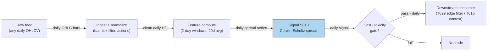

### S12. Sources

1. Corwin, Shane A. & Schultz, Paul (2012). "A Simple Way to Estimate Bid-Ask Spreads from Daily High and Low Prices." *Journal of Finance* 67(2), 719–760. https://afajof.org/issue/volume-67-issue-2/
2. Corwin, Shane A. & Schultz, Paul (2012). Internet Appendix: "Bid-Ask Spreads from Daily High and Low Prices" — robustness analyses and example applications. https://sites.nd.edu/scorwin/files/2019/11/Internet-Appendix_FINAL.pdf
3. Abdi, Farshid & Ranaldo, Angelo (2017). "A Simple Estimation of Bid-Ask Spreads from Daily Close, High, and Low Prices." *Review of Financial Studies* 30(12), 4437–4480. http://ideas.repec.org/a/oup/rfinst/v30y2017i12p4437-4480..html
4. Girão, Martins & Paulo — "Corwin-Schultz Bid-ask Spread Estimator in the Brazilian Stock Market" (summarizes CS simulation results: correlation ≈ 0.9 with true spreads; std ≈ half of Roll's). https://www.scielo.br/j/bar/a/DbHB3rhpfgr8f6qRFKPSMhG/?lang=en
5. Duck.ai (bot: GPT-5.6 "Luna", anonymous), Q-SB2-1 (2026-09-10). **Labeled chatbot source**: CS formulas hand-verified; worked example α₁ = 0.019797 verified, but S₁ = 0.019603 (196.03 bp) was ~1% wrong (linearized e^α ≈ 1+α); corrected S₁ = 0.019796 ≈ 197.96 bp used in S4.

**Unverified leads:**
- ssrn.com / metricgate.com CS formula pages (cited by the chatbot; formulas match Corwin & Schultz 2012, pages themselves not independently verified).
- MPRA 2017 estimator horse-race (CS unstable outside equities) — summarized from the search snippet; full paper not re-verified, used as a caveat lead. https://mpra.ub.uni-muenchen.de/79102/1/MPRA_paper_79102.pdf;h=repec:pra:mprapa:79102

**Source log:** Duck.ai answered Q-SB2-1–Q-SB2-3 (2026-09-10); Grok/Cursor answers pending (checked 2026-09-10).

---

---
## Stage 21/200 — S021: Opening-range breakout — Crabel (1990)

*Batch SB2 · Signal 21/100 · Provenance [D] · Family B — Intraday momentum & breakout*

### S1. One-line verdict

| | |
|---|---|
| **What it is** | Price breaks above/below the high/low of the first N minutes of the session; the break marks acceptance of a new intraday value area. |
| **When it works** | News/catalyst days with abnormal participation ("stocks in play"); tight ranges before the break; small spreads versus expected move. |
| **When it dies** | Range-bound, low-participation days (false breaks); wide spreads relative to the OR width; late entries after the move already printed. |
| **Build-or-buy in one line** | Build: it is ~50 lines of bar arithmetic on 1-minute data you already have; buy nothing. |

Provenance **[D]** (documented — Crabel 1990 framework; ORB profitability studied in Holmberg–Lönnbark–Lundström and Zarattini–Barbon–Aziz) · Family B — Intraday momentum & breakout.

### S2. How it works — plain human explanation

Picture 9:47:03 on a regular Tuesday. XYZ chopped between 99.70 and 100.90 for the first half hour while overnight news got digested — that band is the *opening range* (OR): the market's first draft of today's fair-value zone. Now a buy program lifts the offer through 100.95 and prints trade at 101.10 — above the morning high. The ORB trader reads that as the morning's disagreement resolving: directional commitment has arrived, and the follow-through often travels a multiple of the range's width.

Why should this exist economically? Three overlapping mechanisms. **Overnight-information discovery:** the open is the day's main price-discovery auction, and informed traders who learned something overnight trade aggressively in the first minutes — the range break is their footprint becoming visible. **Inventory and stop cascades:** a break triggers stops resting just outside the range, and stop-loss buying begets more buying — self-reinforcing but temporary. **Behavioral commitment:** breakout traders, momentum algos, and news-followers all condition on the same visible level (the morning high), so the level becomes a coordination point: everyone acts at once, which manufactures the continuation it predicts — until it doesn't.

Mental model (3 bullets):

- The opening range is the market's opening bid/ask for "today's value"; a break is the market rejecting that price.
- Real breaks are *funded* — they come with participation (volume); unfunded breaks are head-fakes.
- You are buying the *second* wave (confirmation), not predicting the first; edge lives in the filter, not the geometry.

### S3. The math — exact formula

Let the session open at time $t_0$ and let the opening range cover the first $m$ intraday bars (e.g. $m=6$ five-minute bars = 30 minutes). With bar $j$ having high $H_j$ and low $L_j$:

$$\text{ORH} = \max_{j=1..m} H_j, \qquad \text{ORL} = \min_{j=1..m} L_j, \qquad W = \text{ORH} - \text{ORL}$$

where ORH/ORL are the opening-range high/low and $W$ is the range width, in price units ($).

**Entry rules** (causal: evaluated at bar close or on tick $t > t_0 + m$, tradable no earlier than $t+1$):

$$\text{Long trigger at } t:\; P_t \ge \text{ORH} + \delta$$
$$\text{Short trigger at } t:\; P_t \le \text{ORL} - \delta$$

$\delta \ge 0$ is an entry offset (price units) that filters marginal touches of the level.

**Crabel's stretch filter.** Per-session opening noise: $\text{Noise}_i = \min(H_i - O_i,\; O_i - L_i)$ ($O_i$ = session open); $\overline{\text{Noise}} = \frac{1}{n}\sum_{i=1}^{n} \text{Noise}_{t-i}$ over $n$ prior sessions. The stretch $\text{Stretch} = q \cdot \overline{\text{Noise}}$ replaces $\delta$ ($q$ an *example* multiplier) — the offset scales with recent open noise. **Optional NR7/NR4 gate:** $\text{Range}_t < \min(\text{Range}_{t-1..t-7})$ (narrowest range in 7 days; NR4 uses 4) — compression-before-expansion regime filter. **Target/stop sketch** (*example*): target $= k \cdot W$ from entry; stop $=$ opposite side of OR.

#### Parameter table

| Parameter | Symbol | Typical range | Too small | Too large | Default example value |
|---|---|---|---|---|---|
| OR length | $m$ (min) | 5–60 | noise; false breaks | late entry | 30 min (`example — not an institutional standard`) |
| Entry offset | $\delta$ | 0–1× $W$ | whipsaw on touches | missed breaks | 0.30 $ on ~100 $ stock (`example`) |
| Stretch mult. | $q$ | 0.5–2.0 | no filtering | filters real breaks | 2.0, $n=10$ (`example`) |
| Noise lookback | $n$ | 5–20 sessions | unstable | stale | 10 sessions (`example`) |
| Bar granularity | — | 1–5 min | noise | coarse, late fills | 5-min bars (`example`) |
| Target multiple | $k$ | 1–3× $W$ | clipped winners | rarely reached | 2× $W$ (`example`) |

**Causality.** ORH/ORL use only bars $\le t_0+m$; the trigger fires at the first event $t > t_0+m$ with a qualifying print. Never assume a bar's close was executable at its high/low — **implementation warning from the source entry**: OHLC bars do not reveal intrabar event ordering, so never assume a stop/target was hit after a same-bar limit fill without finer data or conservative (worst-order) assumptions.

**Normalization choices.** Raw price levels — the geometry is in price space. Cross-stock comparability uses $W/\text{ATR}$ (ATR = average true range) or $W/$ price; RVOL-normalization is the S032 variant. The range is fixed-length-from-open, not rolling.

**Named variants.** (1) *Close-of-bar vs tick trigger* — bar-close beyond the level (fewer false breaks, later entry) vs any tick (faster, noisier). (2) *Stretch vs fixed-$\delta$ offset.* (3) *Both-sides rule* — if both triggers print the same day, define the resolution ex ante (first touch wins / no trade); backtests that ignore this are overstated.

### S4. Worked example — step-by-step numbers (SYNTHETIC)

**Label:** synthetic tape. The example below was reported by a chatbot (GPT-5.6 "Luna" via duck.ai, Q-SB2-1, 2026-09-10) and **each number was independently hand-verified by the batch operator** — used here as an arithmetic walk-through, not market data. Seed 21 is fixed in the plot script (tape values are fixed numbers; no randomness used).

Six 5-minute bars define the 30-minute opening range; bars 7–9 are post-range (bar 9 hosts the t+1 entry fill):

| Bar | O | H | L | C |
|---|---|---|---|---|
| B1 | 100.0 | 100.8 | 99.7 | 100.5 |
| B2 | 100.5 | 100.9 | 100.1 | 100.3 |
| B3 | 100.3 | 100.6 | 99.9 | 100.1 |
| B4 | 100.1 | 100.4 | 99.8 | 100.2 |
| B5 | 100.2 | 100.7 | 100.0 | 100.6 |
| B6 | 100.6 | 100.8 | 100.2 | 100.7 |
| B7 | 100.7 | 101.0 | 100.5 | 100.9 |
| B8 | 100.9 | 101.3 | 100.8 | 101.2 |
| B9 | 101.2 | 101.5 | 101.1 | 101.4 |

Step 1 — opening range: $\text{ORH} = \max(100.8, 100.9, 100.6, 100.4, 100.7, 100.8) = \mathbf{100.9}$ (from B2); $\text{ORL} = \min(99.7, 100.1, 99.9, 99.8, 100.0, 100.2) = \mathbf{99.7}$ (from B1); $W = 1.2$.

Step 2 — triggers with $\delta = 0.30$ (*example*): long $= 100.9 + 0.30 = \mathbf{101.2}$; short $= 99.7 - 0.30 = \mathbf{99.4}$.

Step 3 — evaluate: B7 high 101.0 < 101.2 → **no trigger** (the marginal poke fails the offset — this is the filter earning its keep). B8 high 101.3 ≥ 101.2 → **trigger on bar 8**; the trigger print is only known as bar 8 completes, so the entry is tradable no earlier than the next bar — **long entry fills at the bar-9 open, 101.2** (t→t+1 causality honored: the fill is at B9's open print, not at B8's high).

The chart `images/S021_example.png` plots exactly these 9 bars, the [99.7, 100.9] band, both triggers, and the bar-9 entry marker.

**What to notice.** The δ offset earns its keep: without it, B7's touch of 101.0 (above ORH) would have triggered a dead long. The honesty caveats: we *assumed* a fill at the bar-9 open price of 101.2, but a real fill at the trigger print crosses the spread after the bar-8 high is known — real entry pays slippage versus the tape. This toy tape has no fees, no spread, and no losers; it demonstrates arithmetic, not edge.

### S5. Strategies that use this signal

- **T005 — RVOL-Filtered Opening-Range Breakout** — *primary entry trigger*: ORB geometry supplies the entry; S032 (RVOL) confirms participation and S008 (VPIN) gates toxicity.
- **T003 — VPIN-Gated Breakout Trader** — *breakout leg with toxicity veto*: S021 defines the breakout event; S008 (VPIN) stands the strategy down when order-flow toxicity spikes; S032 sizes/confirms.

### S6. Data required — exact spec

| Field | Type | Granularity | Source tier | Notes |
|---|---|---|---|---|
| O/H/L/C | float | 1-min bars, RTH (regular trading hours) | Tier 0–1 | Regular-hours only; exclude pre/post-market from OR computation |
| Volume | int | 1-min bars | Tier 0–1 | Needed for RVOL/stocks-in-play variant (S032) |
| Exchange calendar | date/bool | daily | Tier 0–1 | Early closes (e.g. day after Thanksgiving) shift the OR window |
| Corporate actions | ratio/date | event | Tier 1 | Splits/dividends must be adjusted or the OR levels are garbage |
| Halts | timestamp | event | Tier 1–2 | A halted open has no valid OR; skip the day |

**Collection.** Polygon stocks v3 aggregates (`/v3/aggs/.../range/1/minute/...`) or Databento XNAS `OHLCV-1m`; Alpaca as a free Tier-0 fallback (IEX-only on free tier — fine for research, not for volume-filtered production).

**Ingest sketch (Python/polars, ≤20 lines):**
```python
import polars as pl, requests
def fetch_or_bars(sym, day, api_key):
    url = f"https://api.polygon.io/v2/aggs/ticker/{sym}/range/1/minute/{day}/{day}"
    r = requests.get(url, params={"apiKey": api_key, "adjusted": "true"}).json()
    df = pl.DataFrame(r["results"]).rename({"t": "ts", "o": "o", "h": "h", "l": "l", "c": "c", "v": "v"})
    df = df.with_columns(pl.from_epoch("ts", time_unit="ms").dt.tz_localize("UTC")
                           .dt.convert_time_zone("America/New_York").alias("ts_et"))
    rth = df.filter(pl.col("ts_et").dt.time().is_between(__import__("datetime").time(9, 30),
                                                        __import__("datetime").time(16, 0)))
    return rth.sort("ts")  # drop partial/halted days: require >= 360 bars
```

**Storage.** Per cost-model §4: 1-min bars for 500 symbols ≈ 50 MB/day total (≈0.1 MB per symbol-day); 60 days ≈ 3 GB — archive freely. The ORB state itself is two floats per symbol per day.

**Data-quality checklist.** (1) Exchange-local timestamps (America/New_York; DST via tz database). (2) Split/dividend-adjusted bars *before* OR levels. (3) Halted or <360-bar days: no valid OR — skip, don't impute. (4) Half-days: scale the window or skip. (5) Zero-volume opening bars are missing data, not a range.

### S7. Local build on M5 Max / 128GB

**Feasibility verdict: trivial.** ORB is two running extrema plus a threshold comparison per bar — the cheapest signal in Family B. Per cost-model §2, 500 symbols × 390 bars = 195k bars/day; polars column ops run ~10–50M rows/sec, so the whole universe recomputes in a sub-second batch each minute. No real-time constraint worth engineering for.

- **Throughput:** signals/sec effectively unbounded for ≤500 symbols; bottleneck is the API download, not compute.
- **Stack:** Python+polars (pick this — no reason for Rust); DuckDB for the bar store if you want SQL.
- **RAM:** <100 MB working set for 60 days across 500 symbols (~12 MB per cost-model §3) — enormous headroom vs the 77 GB budget.
- **Engineering time:** Tier L per cost-model §5 (4–12 h). **$600–$1,800** at $150/hr loaded — bars in, two extrema out; the rest is calendar/halt/adjustment plumbing.
- **What breaks first at 500 symbols or full OPRA:** nothing on bars. It breaks when you add the filters that make it work — real-time RVOL baselines (S032), auction-imbalance feeds (S033), tick-level entries — which move you into Tier M (~20–60 h).

### S8. Buy vs build

| Vendor / option | What you get | Indicative price | Buying gains | Buying loses |
|---|---|---|---|---|
| Tier-0 free: Stooq daily, Alpaca IEX, exchange delayed | Daily/1-min-ish bars, delayed | ~$0 | $0 research start | IEX-only volume (~2.5% of US volume per chatbot lead) — inadequate for volume filters |
| Tier-1: Polygon Stocks Advanced / Alpaca SIP | Real-time SIP 1-min bars, corporate actions, full tape | ~$30–200/mo | Correct consolidated volume for RVOL; official adjustments | Still bars — no tick ordering for intrabar honesty |
| Tier-2: Databento Standard (pay-as-you-go) | Honest L1/L2, MBP-1/10, OPRA research | ~$200/mo + usage | Tick-level entry timing; true queue data | Overkill for pure bar-ORB |
| Academic route: paper + own code | Formulas from Holmberg et al. / Zarattini et al. | ~$0 + eng time | Full parameter control | No data included |

*All prices indicative — verify before budgeting.* **Verdict: build.** The signal is 50 lines of bar math; nothing to buy. Buy the *data* (Tier-1 SIP bars, ~$79/mo Developer-class per the chatbot's Q-SB2-2 lead, inside cost-model §6's Tier-1 band) when you add the RVOL/stocks-in-play filter, because that filter is where consolidated volume becomes load-bearing. Crossover: buy data if you trade it; build analytics always.

### S9. Success ratio / efficacy — documented evidence

| Study / source | Market & period | Metric | Before/after cost | Caveat |
|---|---|---|---|---|
| Zarattini–Barbon–Aziz (2024), "A Profitable Day Trading Strategy for the U.S. Equity Market" (SSRN) | 7,000+ US stocks, 2016–2023, 5-min ORB | Top-20 stocks-in-play: >1,600% total net, Sharpe 2.81, 36% ann. alpha | **After** their cost assumptions | Concentrated, cost-model dependent, sample ends 2023 |
| Zarattini–Barbon–Aziz (2024), same paper, RVOL split | Same universe | RVOL >100% → +0.08R/trade; <100% → −0.02R; 30× → 0.38R | **After** commissions | The ORB edge is really a volume-filter edge |
| Zarattini & Aziz (2023), "Can Day Trading Really Be Profitable?" (SSRN) | QQQ, 5-min ORB, 2016–2023 | Ann. alpha 33% net of commissions; TQQQ version 1,484% total | **After** commissions (not full spread/impact) | Single instrument + leverage; broker caps bind |
| Holmberg–Lönnbark–Lundström (2013), *Finance Research Letters* | Crude-oil futures, intraday ORB | Returns significantly >0 vs a fair game | **Before** modern equity spread/impact | Futures; significance ≠ net tradability |
| Independent replication (Brusco, GitHub, of Zarattini & Aziz 2023) | QQQ, 5-min ORB | Barely survives realistic execution; break-even ≈ 2.2¢/share; 76% of filtered PnL from 2022 | **After** modeled costs | Regime concentration — mostly a 2022 phenomenon |

**When it fails.** Generic "trade every stock every day" ORB has little documented net edge — the duck.ai evidence synthesis (Q-SB2-3, chatbot-reported) puts it bluntly: *evidence in selected implementations, little verifiable evidence Crabel's originals survive modern costs broadly*. Documented killers: false breaks on range days, wide spreads vs. OR width, late entries, small-cap/low-ADV names, and treating the bar high as an executable price. The replication literature shows concentration in volatile regimes (2020–2022); calm-market ORB is mostly churn.

**Honest bottom line.** As a standalone trigger, ORB is a **weak, highly conditional edge** — the documented after-cost success lives in the *stocks-in-play + RVOL* implementation, not the geometry. As a **filter/timing device** (enter only funded breaks; T005/T003 usage), it is a respectable, well-understood component. Don't trade the raw breakout; trade the participation-confirmed breakout.

### S10. Failure modes & pitfalls

1. **Intrabar ordering leakage** — assuming the bar high was tradable after your fill. *Mitigation:* tick data for entries, or conservatively assume stops fill first (the source entry's explicit warning).
2. **False-break whipsaw on range days** — most days have no trend. *Mitigation:* RVOL/stretch filters (S032); skip low-RVOL days.
3. **Late entry** — a 60-min OR break leaves half the move printed. *Mitigation:* shorter OR (5–15 min) with stricter volume filters.
4. **Spread/impact cost blowup** — a 1.2-point OR on a 5¢-spread small-cap is a different trade than on a penny-spread large-cap. *Mitigation:* require expected move ≥ 5–10× spread (*example*); model spread+fees+slippage per trade.
5. **Both-sides-triggered days** — long then short on volatile opens. *Mitigation:* ex-ante rule: first touch / one entry per day (*example*).
6. **Corporate-action/calendar errors** — unadjusted splits shift OR levels; half-days compress the window. *Mitigation:* adjusted bars + exchange calendar; skip invalid days.
7. **Crowding at round levels** — everyone watches the same morning high. *Mitigation:* the δ offset plus volume confirmation so you're not the marginal buyer of a crowded level.
8. **Regime breaks** — ORB thrives in trending/vol regimes, dies in grinding low-vol ones. *Mitigation:* regime-gate on trailing realized vol or VIX (*example*).

### S11. Visuals


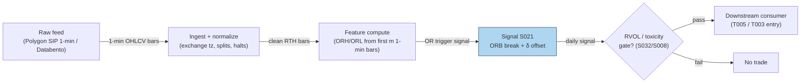

### S12. Sources

- Carlo Zarattini, Andrea Barbon, Andrew Aziz (2024). "A Profitable Day Trading Strategy for the U.S. Equity Market." SSRN. https://papers.ssrn.com/sol3/papers.cfm?abstract_id=4729284
- Carlo Zarattini, Andrew Aziz (2023). "Can Day Trading Really Be Profitable? Evidence of Sustainable Long-term Profits from Opening Range Breakout (ORB) Day Trading Strategy vs. Benchmark in the US Stock Market." SSRN. https://papers.ssrn.com/sol3/papers.cfm?abstract_id=4416622
- Ulf Holmberg, Carl Lönnbark, Christian Lundström (2013). "Assessing the profitability of intraday opening range breakout strategies." *Finance Research Letters* 10:27–33. https://econpapers.repec.org/paper/hhsumnees/0845.htm
- Independent replication & execution stress test of Zarattini & Aziz (2023) QQQ ORB (break-even ≈2.2¢/share; regime concentration). https://github.com/giovannibrusco/zarattini-2023-orb-qqq
- Toby Crabel (1990). *Day Trading with Short Term Price Patterns and Opening Range Breakout.* — the signal's documented origin (book; no stable public URL — cited via the report's entry).

**Unverified leads** (chatbot-reported, no checkable source; do not cite as evidence):
- Duck.ai (GPT-5.6 "Luna", 2026-09-10) Q-SB2-2 pipeline numbers: Massive/Polygon Developer ~$79/mo, Alpaca Algo Trader Plus ~$99/mo, 500-symbol 60-day pipeline 106–246 eng hours — labeled lead, consistent with cost-model §5/§6 bands but vendor pricing is *indicative — verify before budgeting*.
- "Commonly cited illustrative spec: n=10, q=2, 20-day narrow-range lookback" for the Crabel stretch (chatbot-reported via oxfordstrat.com; treated as practitioner folklore, not a documented standard).

**Source log:** Duck.ai answered Q-SB2-1–Q-SB2-3 (2026-09-10); Grok/Cursor answers pending (checked 2026-09-10).

---
## Stage 27/200 — S027: End-of-day momentum / last-hour drift

*Batch SB2 · Signal 27/100 · Provenance [D] · Family B — Intraday momentum & breakout*

### S1. One-line verdict

| | |
|---|---|
| **What it is** | The day's early return predicts the last 30–60 minutes: ride the drift into the close, or fade the overextension — the sign depends on the mechanism. |
| **When it works** | Information trend days (news, macro releases): morning winners keep drifting as slow money rebalances into the close. |
| **When it dies** | Mechanical-flow days (index rebalances, expiry, big MOC imbalances): the "momentum" is temporary price pressure that reverses overnight. |
| **Build-or-buy in one line** | Build on 1-min bars; buy the official imbalance feed only if you trade the auction itself. |

Provenance **[D]** (documented — Gao–Han–Li–Zhou 2018 intraday momentum; Heston–Korajczyk–Sadka 2010 intraday periodicity; Bogousslavsky–Muravyev closing-auction literature) · Family B — Intraday momentum & breakout.

### S2. How it works — plain human explanation

It's 3:31 p.m. XYZ is up 1.4% on the day after strong morning news. Two crowds are about to trade the last half hour. The first is slow money — index funds, pension rebalances, benchmarked managers who must be invested by the close; they lean with the day's trend, pressing winners further. The second is the closing auction itself: market-on-close (MOC) orders, index-rebalance flows, expiry hedging — enormous one-sided volume into the 4:00 p.m. print that can shove price *away* from fair value, pressure that often leaks back overnight.

So "end-of-day momentum" is two effects in one outfit. The academic version (Gao et al. 2018): the first half-hour's return positively predicts the last half-hour's return — day traders and informed traders keep pushing the morning's direction. The microstructure version (Heston et al. 2010): at half-hour intervals that are exact multiples of a day, returns *continue* — institutional rebalancing on a daily clock. And the auction version (Bogousslavsky & Muravyev; Jegadeesh & Wu 2022): closing-auction price pressure is real but mostly temporary, reverting over hours to days. Trade the drift on information days; fade it on mechanical-flow days.

A concrete contrast: 15:32, SPY +0.9% after a hot CPI print — the morning's buyers were informed, laggard allocators are still catching up, and the drift has a fundamental reason to continue. Versus 15:32 on S&P reconstitution Friday — the "momentum" is index funds forced to buy additions at any price; Monday morning gives half of it back.

Mental model (3 bullets):

- The close is where the day's two slowest, largest flows (benchmarked rebalancing, MOC auctions) collide with the fastest (day-trader momentum).
- Direction is set by *who* is trading: information → continuation; mechanical flow → pressure-then-reversal.
- The signal's horizon is 15–90 minutes and it is always flat by the print — this is a timing edge, not a position.

### S3. The math — exact formula

**Base signal (report form — open→15:30 variant; not Gao's exact window).** Let $P_{9:30,t}$, $P_{15:30,t}$, $P_{\text{close},t}$ be prices on day $t$. Define

$$r_{\text{first},t} = \frac{P_{15:30,t}}{P_{9:30,t}} - 1, \qquad r_{\text{last},t} = \frac{P_{\text{close},t}}{P_{15:30,t}} - 1$$

all in decimal returns. The predictive regression that documents the effect:

$$r_{\text{last},t} = \alpha + \beta\, r_{\text{first},t} + \varepsilon_t$$

Gao et al. report $\hat\beta = 0.0694$ (their tables scale by 100, showing 6.94), significant at 1%, $R^2 = 1.6\%$ on SPY 1993–2013. **Window attribution (do not mix):** those statistics attach to Gao's first-half-hour (9:30–10:00) → last-half-hour window — variant (1) in Named variants — and **do not describe** the open→15:30 formation used in this section. The open→15:30 form is this report's own smoother variant; its only numbers are the worked example below and the labeled variants, not Gao's 6.94/1.6%. The tradable signal is the sign rule:

$$s_t = \operatorname{sign}(r_{\text{first},t}), \qquad \text{hold } s_t \text{ from 15:30 to the close}$$

position in *shares* (long if $s_t=+1$, short if $s_t=-1$), flattened at the closing print.

**Cross-sectional periodicity (Heston–Korajczyk–Sadka form).** For stock $i$ and half-hour interval $k$ on day $t$, returns continue at lags that are multiples of one trading day (13 half-hours): $E[r_{i,k,t} \mid r_{i,k,t-1}] > 0$ at the daily lag — strongest in the first and last half-hour intervals.

**Auction-imbalance sibling.** The microstructure sibling trades *with* the published closing-auction imbalance: if the NYSE/Nasdaq imbalance feed shows net buy pressure near the freeze, lean long into the print. This is a different signal (S033 territory) sharing the same window.

#### Parameter table

| Parameter | Symbol | Typical range | Too small | Too large | Default example value |
|---|---|---|---|---|---|
| Formation window | $r_{\text{first}}$ span | 30–210 min | noise dominates | signal arrives too late | 9:30→15:30 (`example — not an institutional standard`) |
| Hold window | $r_{\text{last}}$ span | 15–90 min | spread dominates | overnight gap risk | 15:30→close (`example`) |
| Entry time | — | 14:30–15:45 | more churn | missing the drift | 15:30 (`example`) |
| Universe filter | — | ADV / spread caps | illiquid; impact eats edge | over-filtered | price > $5, ADV > 1M shares (`example`) |
| Sign vs magnitude | — | sign / z-scored | sign ignores conviction | magnitude overfits outliers | sign rule (`example`) |

**Causality.** $r_{\text{first},t}$ is fully known at 15:30; the position is entered at/after 15:30 and held to the close — tradable no earlier than the first print after the signal timestamp. Using the 15:30 *bar close* as the entry price assumes a fill a real order would miss by seconds-to-minutes; conservative backtests enter at 15:31+.

**Normalization choices.** The base form uses raw sign. Cross-stock versions z-score $r_{\text{first}}$ by trailing diurnal volatility (S067) so a 1% move in a calm utility and a 1% move in a biotech aren't treated equally.

**Named variants.** (1) *First-half-hour → last-half-hour* (Gao: formation = 9:30–10:00 only — purer but noisier). (2) *Open→15:30 formation* (report entry's form — smoother). (3) *Auction-imbalance continuation* (S033-style; uses the imbalance feed, not returns). (4) *Reversal twin* (T069): fade the last-30-minute move — same window, opposite sign, for mechanical-flow days.

### S4. Worked example — step-by-step numbers (SYNTHETIC)

**Label:** synthetic tape, random seed 27 (fixed in the plot script). Six synthetic days; prices are invented. No fees, no spread — arithmetic illustration only.

| Day | $P_{9:30}$ | $P_{15:30}$ | $P_{\text{close}}$ | $r_{\text{first}}$ | $r_{\text{last}}$ | $s_t$ | Trade P&L |
|---|---|---|---|---|---|---|---|
| 1 | 100.00 | 101.40 | 101.90 | +1.40% | +0.49% | +1 | **+0.49%** |
| 2 | 101.40 | 100.60 | 100.10 | −0.79% | −0.50% | −1 | **+0.50%** |
| 3 | 99.60 | 100.90 | 101.30 | +1.31% | +0.40% | +1 | **+0.40%** |
| 4 | 100.80 | 101.90 | 102.40 | +1.09% | +0.49% | +1 | **+0.49%** |
| 5 | 102.20 | 100.90 | 100.40 | −1.27% | −0.50% | −1 | **+0.50%** |
| 6 | 100.10 | 100.70 | 100.50 | +0.60% | −0.20% | +1 | −0.20% |

Check day 2 by hand: $r_{\text{first}} = 100.60/101.40 - 1 = -0.00789 \approx -0.79\%$; $s_2 = -1$ (short); $r_{\text{last}} = 100.10/100.60 - 1 = -0.00497 \approx -0.50\%$; P&L $= (-1)\times(-0.50\%) = +0.50\%$. Day 6 is the honest loser: the morning was mildly up, the close faded — the reversal regime the signal cannot distinguish ex ante.

Hit rate 5/6, mean +0.36%/day — **synthetic and before costs**; the chart `images/S027_example.png` plots the same six day-pairs.

**Cost walk (*example* assumptions, SPY-class ETF):** half-spread (half the bid–ask spread — the cost of crossing to take liquidity) ≈ 0.5 bp/leg, where 1 bp (basis point) = 0.01% — so ≈ 1 bp round-trip for the 15:30 entry plus the close exit — plus ≈ $0.001/share per-side fees (≈ 0.2 bp) plus slippage/impact (extra cost when your own order pushes the price against you) ≈ 2 bp on the 15:30 leg, which leans into the auction buildup. Total ≈ 3–4 bp per trade against a mean gross of +36 bp/day → net ≈ **+32 bp/day** in this toy tape. On real small-cap closes the spread alone can exceed the whole drift — which is exactly why Heston et al. find the periodicity loses money after paying the spread.

**What to notice.** The example is deliberately continuation-friendly (5 of 6 days continue). Real data is nothing like this clean: Gao's $R^2$ of 1.6% means the regression explains almost nothing day-to-day — the edge is statistical, harvested across thousands of days, and the spread is a large fraction of a 30-minute drift. Day 6 is the important row: on mechanical-flow days the sign flips and the "momentum" becomes the fade.

### S5. Strategies that use this signal

- **T016 — End-of-Day Drift Rider** — *primary entry trigger*: S027 is the core — lean into last-hour drift, confirmed by opening-auction imbalance read (S033) and spread estimate (S013).
- **T006 — Intraday Trend + Vol-Regime Allocator** — *trend leg*: S027 supplies the into-the-close momentum component, scaled by HMM (hidden Markov model) vol regime (S079) alongside S025.
- **T069 — Late-Day Reversal into Close** — *contrast / veto*: fades last-30-minute overextensions (S038/S041 timing). T069 is the reason S027 must be mechanism-aware — when flow is mechanical, T069's sign is the right one.

### S6. Data required — exact spec

| Field | Type | Granularity | Source tier | Notes |
|---|---|---|---|---|
| O/H/L/C | float | 1-min bars, RTH (regular trading hours) | Tier 0–1 | Only 9:30, 15:30, close anchors strictly needed |
| Volume | int | 1-min bars | Tier 1 | Gao: effect stronger on high-volume days — conditioning variable |
| Official close-imbalance feed | imbalance $/shares | event, 15:30–16:00 | Tier 1–2 | NYSE imbalance feed / Nasdaq NOII (near-freeze snapshots) |
| Exchange calendar | date/bool | daily | Tier 0–1 | Early closes move the "last 30 min" window |
| Corporate actions | ratio/date | event | Tier 1 | Adjusted closes or the day's return is fiction |

**Collection.** Polygon stocks v3 minute aggregates for the bar anchors; the imbalance leg needs the exchange-published closing-auction imbalance messages (NYSE Pillar imbalance feed / Nasdaq TotalView NOII) — typically a Tier-2 add-on or exchange direct feed, *indicative — verify before budgeting*.

**Ingest sketch (Python/polars, ≤20 lines):**
```python
import polars as pl
def session_anchors(bars: pl.DataFrame) -> pl.DataFrame:
    # bars: 1-min RTH bars with ts_et, close
    day = bars.with_columns(pl.col("ts_et").dt.date().alias("d"))
    anchors = (day.group_by("d").agg([
        pl.col("close").filter(pl.col("ts_et").dt.time() == __import__("datetime").time(9, 30)).first().alias("p930"),
        pl.col("close").filter(pl.col("ts_et").dt.time() == __import__("datetime").time(15, 30)).first().alias("p1530"),
        pl.col("close").last().alias("pclose"),
    ]).with_columns(
        ((pl.col("p1530") / pl.col("p930")) - 1).alias("r_first"),
        ((pl.col("pclose") / pl.col("p1530")) - 1).alias("r_last"),
        (((pl.col("p1530") / pl.col("p930")) - 1) > 0).cast(pl.Int8).mul(2).sub(1).alias("signal"),
    ))
    return anchors  # signal known at 15:30; tradable at first print after
```

**Storage.** Anchors are 3 floats/day/symbol — negligible. The underlying 1-min bars: ~0.1 MB per symbol-day per cost-model §4.

**Data-quality checklist.** (1) Anchor timestamps must exist — a missing 15:30 bar (halt) invalidates the day. (2) Adjust for splits/dividends. (3) DST/half-days shift anchors. (4) The "close" for the hold should be the last *regular-session* print, not the auction print, unless you explicitly trade the auction. (5) Stale 15:30 quotes on illiquid names — filter by ADV.

### S7. Local build on M5 Max / 128GB

**Feasibility verdict: trivial.** Three anchor prices per symbol per day, one division, one sign. Per cost-model §2, even the full 500-symbol 1-minute universe (195k bars/day) is a sub-second polars pass; the signal itself is a rounding error on top. The only part with any engineering content is the optional imbalance-feed leg.

- **Throughput:** signals/sec effectively unbounded on bars; bottleneck is feed latency for the imbalance variant (needs the exchange feed, not compute).
- **Stack:** Python+polars (pick this); the imbalance leg is a small streaming parser — still Python-fine at one message/sec per symbol.
- **RAM:** anchors for 500 symbols × 60 days ≈ a few KB; bars per §3 ≈ 12 MB — trivially inside the 77 GB working budget.
- **Engineering time:** Tier L per cost-model §5 (4–12 h; S027 sits in the S021–S048 1-min-bar band). **$600–$1,800** at $150/hr loaded — one line: anchors in, sign out, everything else is the imbalance feed integration if you want it.
- **What breaks first at 500 symbols:** nothing on bars. It breaks if you try to trade *the auction print itself* across 500 names — MOC order management, freeze-time rule changes, and per-symbol imbalance parsing become the project (Tier M, 20–60 h).

### S8. Buy vs build

| Vendor / option | What you get | Indicative price | Buying gains | Buying loses |
|---|---|---|---|---|
| Tier-0 free: Stooq/Alpaca IEX | Daily + coarse intraday bars | ~$0 | $0 prototype of the sign rule | No 15:30 anchor precision; no imbalance data |
| Tier-1: Polygon Stocks Advanced / Alpaca SIP | Full SIP 1-min bars, corporate actions | ~$30–200/mo | Correct anchors + consolidated volume for conditioning | Still no official imbalance feed |
| Tier-2: exchange imbalance feeds (NYSE/Nasdaq) | Official closing-auction imbalance messages | exchange pricing (indicative — verify before budgeting) | Trade the actual auction pressure, not a proxy | Exchange contracts, per-feed cost; only needed for the auction leg |
| Tier-2: Databento Standard | Consolidated bars + imbalance-adjacent data | ~$200/mo + usage | One pipe for bars and auction analytics | Doesn't replace the official imbalance feed |

*All prices indicative — verify before budgeting.* **Verdict: build** the return-based signal (it is 10 lines); **buy** the imbalance feed only if the auction leg is the actual trade. The chatbot's Q-SB2-2 lead is consistent here: buy raw bars (~$79/mo Developer-class), build all analytics — precomputed "EOD momentum" scores are poor value because the formation/hold windows are the strategy. Crossover: you need the paid imbalance feed the day you stop trading the drift and start trading the print.

### S9. Success ratio / efficacy — documented evidence

| Study / source | Market & period | Metric | Before/after cost | Caveat |
|---|---|---|---|---|
| Gao–Han–Li–Zhou (2018), *J. Financial Economics* | SPY + 10 active ETFs, 1993–2013 | First→last half-hour: β̂=6.94 (×100), p<1%, R²=1.6%; stronger on volatile/high-volume/recession/macro-news days | **Before** cost (predictive regression) | Market-level (ETF); R² tiny — edge is high-frequency repetition |
| Heston–Korajczyk–Sadka (2010), *J. Finance* | NYSE, half-hour intervals, 2001–2005 | Continuation at day-multiple half-hour lags, strongest first/last half hour; sub-hour reversals are liquidity/bounce | **After** (honest): periodicity strategies "**lose money after paying the bid/ask spread**" | The continuation is a timing/cost phenomenon, not an arbitrage |
| Jegadeesh–Wu (2022), *J. Financial Economics* | NYSE+Nasdaq closing auctions | Auction volume ≈10% of total at 2019 peak; impact temporary, dissipates over 3–5 days; reversal strategies "significantly profitable" | **Before** full costs | Auction-*reversal* — the opposite sign to the drift; mechanism matters |
| Bogousslavsky–Muravyev (2023), "Who Trades at the Close?" | US equities, auctions | Auctions = 7.5% of daily volume in 2018 (vs 3.1% in 2010); close matches pre-close bid/ask 68%; deviations revert overnight | Descriptive | Auction is cheap for liquidity demanders — being the pressure is costly |
| Haendler–Heston–Korajczyk–Sadka (2025), SSRN | US equities, out-of-sample | Periodicity persists OOS; close leg driven by market-on-close trading | **Before** cost | Institutional-trading explanation — the "momentum" is someone else's benchmark trade |

**When it fails / regime notes.** Index-reconstitution and triple-witching days (mechanical flow dominates); macro-release days can go either way (information vs. positioning); selloffs (the drift becomes a crash and the close gaps); small-cap/low-ADV names where the last-30-minute spread is the whole signal; crowded close-momentum signals (everyone leaning the same way *is* the auction imbalance). The chatbot's Q-SB2-3 synthesis (labeled) is directionally right: last-hour effects are measurable but the sign is not universal — continuation vs. auction-reversal depends on definition and hold.

**Honest bottom line.** As a standalone trigger, EOD momentum is a **thin statistical edge**: real in predictive regressions, largely consumed by the spread at the horizons that matter (Heston et al. say so explicitly). As a **timing overlay** — when to press an existing intraday position, or which sign to take into the close (T016 vs T069) — it is genuinely useful. Never trade it without naming the mechanism (information vs. mechanical) first.

### S10. Failure modes & pitfalls

1. **Sign ambiguity** — continuation and auction-reversal share the same window. *Mitigation:* condition on mechanism: news/macro day → ride (T016); rebalance/expiry day → fade (T069).
2. **Auction impact on entry/exit** — the 15:30–16:00 window *is* the auction buildup; your fills move the print. *Mitigation:* model impact as a multiple of spread (chatbot-reported 0.34× figures are unverified — see S12); participate early or use limits (*example*).
3. **Overnight gap risk** — "always off by the print" per the source entry; a held position faces the overnight gap. *Mitigation:* flatten at the close — no exceptions in the base spec.
4. **Anchor staleness** — illiquid names have no real 15:30 price. *Mitigation:* ADV/spread filters (*example*: ADV > 1M shares).
5. **Macro-event whiplash** — 15:30 positioning ahead of next-morning news reverses. *Mitigation:* skip days with scheduled overnight catalysts (*example* rule).
6. **Crowded close signals** — if every intraday book leans the same way at 15:30, you *are* the imbalance. *Mitigation:* cap participation; watch the imbalance feed divergence.
7. **Lookahead via the close** — using the official close (auction print) as the signal-day return contaminates the formation window. *Mitigation:* formation uses regular-session prints only.
8. **Regime decay** — auction share keeps growing (3.1%→7.5%→~10%), so the mechanical leg strengthens while the information leg is competed away. *Mitigation:* re-estimate the sign mix yearly; don't freeze parameters.

### S11. Visuals


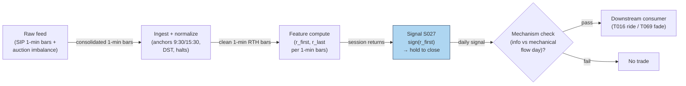

### S12. Sources

- Lei Gao, Yufeng Han, Sophia Zhengzi Li, Guofu Zhou (2018). "Intraday Momentum: The First Half-Hour Return Predicts the Last Half-Hour Return." *Journal of Financial Economics.* https://papers.ssrn.com/sol3/papers.cfm?abstract_id=2552752 — first→last half-hour predictability, SPY 1993–2013.
- Steven L. Heston, Robert A. Korajczyk, Ronnie Sadka (2010). "Intraday Patterns in the Cross-Section of Stock Returns." *Journal of Finance* 65(4):1369–1407. https://bauer.uh.edu/departments/finance/documents/Heston-Korajczyk-Sadka-jf-2010-01-07.pdf
- Vincent Bogousslavsky, Dmitriy Muravyev (2023). "Who Trades at the Close? Implications for Price Discovery and Liquidity." SSRN. https://papers.ssrn.com/sol3/papers.cfm?abstract_id=3485840
- Narasimhan Jegadeesh, Yanbin Wu (2022). "Closing auctions: Nasdaq versus NYSE." *Journal of Financial Economics* 143:1120–1139. https://econpapers.repec.org/article/eeejfinec/v_3a143_3ay_3a2022_3ai_3a3_3ap_3a1120-1139.htm
- Charlotte Haendler, Steven Heston, Robert Korajczyk, Ronnie Sadka (2025). "The intra-day stock return periodicity puzzle." SSRN. https://www.kellogg.northwestern.edu/academics-research/research/detail/2025/the-intra-day-stock-return-periodicity-puzzle/ — periodicity persists out-of-sample; close leg driven by MOC trading.

**Unverified leads** (chatbot-reported, not independently verified; do not cite as evidence):
- Duck.ai Q-SB2-3 auction micro-numbers: closing-auction volume 7.10% of ADV (NYSE+Nasdaq 2012–2021), auction impact ≈0.34× daily average spread, drift to auction price ≈0.6–1.7× spread, overnight 1%-of-ADV ≈40bp round-trip impact under a sqrt model — directionally consistent with the verified sources above, but the exact figures were not independently confirmed.
- "Timing Sharpe ≈1.08 vs 0.29 buy-and-hold" for the Gao et al. strategy (reported in an independent replication write-up, https://github.com/definitelymikey/orb-strategy/blob/HEAD/Market_Intraday_Momentum/CLAUDE.md — not verified against the paper text).
- Baltussen–Da–Lammers–Martens (2021) gamma-hedging mechanism for intraday momentum across 60+ futures (mentioned in the same replication write-up; paper not independently pulled).

**Source log:** Duck.ai answered Q-SB2-1–Q-SB2-3 (2026-09-10); Grok/Cursor answers pending (checked 2026-09-10).

---
## Stage 32/200 — S032: Relative-volume (RVOL) filtered breakout

*Batch SB2 · Signal 32/100 · Provenance [SR] · Family B — Intraday momentum & breakout*

### S1. One-line verdict

| | |
|---|---|
| **What it is** | A breakout is only valid if volume is abnormal *for that time of day*: RVOL = window volume ÷ trailing same-time-of-day mean. |
| **When it works** | As a gate on other entries (ORB, news breakouts): funded breaks continue, unfunded breaks revert. |
| **When it dies** | As a standalone trigger — high RVOL alone is attention, not direction; and on expiry/rebalance days volume is mechanical. |
| **Build-or-buy in one line** | Build: it is a rolling time-of-day mean over bars you already store; the baseline is the whole product. |

Provenance **[SR]** (standard reconstruction — practitioner-standard formula; documented as a *conditioner* in Zarattini–Barbon–Aziz 2024 and as return-predictive abnormal volume in Gervais–Kaniel–Mingelgrin 2001; no single canonical paper defines the intraday RVOL-breakout rule, so the tag stays [SR]) · Family B — Intraday momentum & breakout.

### S2. How it works — plain human explanation

10:05 a.m. XYZ breaks above its opening range high at 101.20. Two versions of this morning exist. In version A, the first-5-minute volume is 260k shares against a 128k trailing norm — RVOL 2.0×. Institutions are repositioning; the break is *funded* and the order flow behind it will keep pressing. In version B, the same price break prints on 95k shares against a 125k norm — RVOL 0.76×. Nobody is behind it; it's a dealer wiggle or a single retail sweep, and the level fails within minutes.

RVOL is the lie detector for breakouts. Raw volume can't do this job because volume has a violent U-shape across the day (S046/S067): the open and close always print huge volume, midday almost none. A "big" 10:00 a.m. bar might be tiny by 9:35 standards. Dividing by the *same-time-of-day* trailing mean strips the diurnal seasonality and leaves the surprise — which is the information.

Why should abnormal volume predict anything? The academic lineage is old and consistent: Blume–Easley–O'Hara (1994) show volume carries information about signal precision that prices alone don't reveal; Llorente–Michaely–Saar–Wang (2002) show volume from speculative/informed trading *continues* while volume from risk-sharing (rebalancing) *reverses*; Gervais–Kaniel–Mingelgrin (2001) find unusually high-volume stocks appreciate over the following month (the "high-volume return premium," via investor visibility). The intraday practitioner version is cruder but the same idea: participation is commitment, and commitment separates acceptance from a head-fake.

Mental model (3 bullets):

- Price tells you *where*; RVOL tells you *who showed up*. Trade the intersection.
- Always divide by the time-of-day norm — raw volume is a clock, not a signal.
- RVOL is a gate, not a trigger: it vetoes bad breakouts and confirms good ones; it rarely initiates a trade by itself.

### S3. The math — exact formula

**Standard reconstruction** (practitioner formula; parameter values below are *examples*, not documented standards). Let $V_{w,t}$ be share volume in window $w$ on day $t$ (e.g. the first 5 minutes, 9:30–9:35), and let $\bar V_{w,t-1:t-N}$ be the trailing mean of the *same window* over the prior $N$ sessions:

$$\text{RVOL}_{w,t} = \frac{V_{w,t}}{\frac{1}{N}\sum_{i=1}^{N} V_{w,t-i}}$$

dimensionless (×). A valid breakout requires the price break **and**

$$\text{RVOL}_{w,t} \ge \theta$$

with $\theta$ an *example* threshold (commonly cited 1.5–2.0×; Zarattini et al. use 100% as the positive/negative split and study up to 30×).

**Baseline variants.** Mean vs median vs winsorized mean (winsorized: tails clipped at the 1st/99th percentiles) of the trailing window — median is robust to the occasional news-day outlier poisoning the baseline; winsorizing at 1/99% is the middle ground. The Zarattini–Barbon–Aziz implementation uses a 14-day mean of the first-5-minute volume.

**Attention-vs-information refinement** (Llorente et al. logic, qualitative): decompose the day's abnormal volume into informed-driven (continues) vs risk-sharing-driven (reverses). In practice this is proxied by conditioning on *why* volume is high — news/catalyst present (S091/S093) versus calendar-mechanical (expiry, rebalance).

#### Parameter table

| Parameter | Symbol | Typical range | Too small | Too large | Default example value |
|---|---|---|---|---|---|
| Measure window | $w$ | 1–30 min | noise; single-sweep artifacts | break already half over | first 5 min (`example — not an institutional standard`) |
| Baseline lookback | $N$ | 10–60 sessions | baseline whipsaws with recent news days | stale; regime changes ignored | 14 sessions (`example`) |
| Baseline statistic | — | mean / median / winsorized | mean is outlier-sensitive | median lags genuine regime shifts | mean (`example`) |
| Threshold | $\theta$ | 1.0–3.0× | lets unfunded breaks through | almost never trades | 1.5× (`example`) |
| Session filter | — | RTH (regular trading hours) only | pre/post-market prints poison the norm | — | RTH-only windows (`example`) |

**Causality.** $\text{RVOL}_{w,t}$ is known at the *end* of window $w$ using only volumes $\le t$; the breakout it validates must occur at or after that timestamp — tradable no earlier than the first print after the window closes. A common leakage bug: using the *full day's* volume in the baseline or comparing against a same-day average that includes future bars.

**Normalization choices.** Time-of-day matching *is* the normalization (it removes the U-shape). Cross-stock comparability needs no further scaling since RVOL is already dimensionless, though conditioning thresholds are sometimes expressed in $z$-scores of log-RVOL for very skewed names.

**Named variants.** (1) *Dollar-volume RVOL* — use $P \times V$ instead of shares (better for comparing across price levels; S032's options-flow cousin in the Stanford CS229 project used volume > 2× daily average AND ≥ 500 contracts). (2) *Tick/dollar-bar RVOL* — abnormal volume per *bar* rather than per clock window (S083 clocks). (3) *Cumulative-session RVOL* — volume-so-far vs expected volume-so-far from the diurnal curve; updates continuously instead of once per window.

### S4. Worked example — step-by-step numbers (SYNTHETIC)

**Label:** synthetic 12-day tape, random seed 32 (fixed in the plot script). OR window = first 5 minutes; baseline = 14-day trailing mean of the same window (synthetic values); threshold $\theta = 1.5$ (*example*); volumes in thousands of shares. No costs — arithmetic illustration only.

| Day | OR vol | Baseline | RVOL | Break | Valid? | Move (R) |
|---|---|---|---|---|---|---|
| 1 | 120 | 130 | 0.92 | — | no | — |
| 2 | 95 | 125 | 0.76 | — | no | — |
| 3 | 260 | 128 | **2.03** | +1 | **yes** | +1.8 |
| 4 | 140 | 122 | 1.15 | — | no | — |
| 5 | 310 | 126 | **2.46** | +1 | **yes** | +2.6 |
| 6 | 110 | 131 | 0.84 | — | no | — |
| 7 | 85 | 129 | 0.66 | — | no | — |
| 8 | 220 | 124 | **1.77** | +1 | **yes** | −0.4 |
| 9 | 130 | 127 | 1.02 | — | no | — |
| 10 | 280 | 125 | **2.24** | −1 | **yes** | +1.9 |
| 11 | 100 | 132 | 0.76 | — | no | — |
| 12 | 150 | 128 | 1.17 | +1 | no (< 1.5) | +1.2 (untraded) |

Check day 3 by hand: $\text{RVOL} = 260/128 = 2.03125 \approx 2.03 \ge 1.5$ with an upside price break → valid long; realized move +1.8R (R = the trade's predefined risk unit, *example*). Day 10: downside break on 2.24× → valid short, +1.9R.

Result: 4 valid trades, 3 winners, mean move +1.48R — **synthetic, before costs**. The chart `images/S032_example.png` plots this exact tape: OR-window volume vs baseline (top) and RVOL with the 1.5× line (bottom), valid days flagged.

**Cost walk (*example* assumptions):** take R = 50¢/share of predefined risk on a $100 stock. Per trade — half-spread (half the bid–ask spread — the cost of crossing to take liquidity) 1¢/leg crossed on entry and exit = 2¢; per-share fees $0.001/share × 2 = 0.2¢; slippage/impact (extra cost when your own order pushes the price against you) ≈ 1¢/leg × 2 = 2¢. Total ≈ 4.2¢/share ≈ **0.084R per trade** → mean net ≈ **+1.40R** per valid trade. On wider-spread names this same stack can exceed the mean move outright — which is why Zarattini et al.'s after-commission numbers, not the gross tape, are the honest benchmark.

**What to notice.** Day 8 is the honest row: RVOL 1.77× validates the break and it still loses (−0.4R) — the filter improves the *mix*, it doesn't certify winners. Day 12 is the filter's cost: a genuine +1.2R break goes untraded because RVOL printed 1.17×. Every filter buys a better win rate with missed trades; θ is where you price that exchange, and 1.5× here is an *example*, not an optimum. This toy tape has no spread, no fees, and hand-picked outcomes — it demonstrates the accounting, not an edge.

### S5. Strategies that use this signal

- **T005 — RVOL-Filtered Opening-Range Breakout** — *primary confirmation*: S032 is the strategy's namesake gate — S021 triggers, S032 validates participation, S008 vetoes toxicity.
- **T029 — Spread-Estimate Edge Filter** — *breakout edge filter*: S032's breakout leg is only taken when estimated effective spread (S012/S013) is below the edge — volume confirmation is necessary but not sufficient.
- **T086 — OFI-Paced Participation Tracker** — *pacing input*: S032 scales execution participation — high RVOL means the tape can absorb size; low RVOL means slow down (with S001 OFI and S067 diurnal norms).

### S6. Data required — exact spec

| Field | Type | Granularity | Source tier | Notes |
|---|---|---|---|---|
| O/H/L/C/V | mixed | 1-min bars, RTH | Tier 0–1 | Volume per bar is the load-bearing field |
| Exchange calendar | date/bool | daily | Tier 0–1 | Half-days must rescale or exclude windows |
| Corporate actions | ratio/date | event | Tier 1 | Splits change share-volume baselines — adjust or use dollar volume |
| News/catalyst flags | bool/event | daily | Tier 1–2 | Optional: separates informed volume from mechanical volume |

**Collection.** Same bar pipe as S021 (Polygon stocks v3, Databento OHLCV-1m, Alpaca): the only extra requirement is *history* — the baseline needs $N$ prior sessions of the same window, so the store must retain ≥ $N$ + warmup days per symbol.

**Ingest sketch (Python/polars, ≤20 lines):**
```python
import polars as pl
def rvol(bars: pl.DataFrame, window_end="09:35", n=14, theta=1.5):
    # bars: 1-min RTH bars with ts_et, v (shares)
    w = (bars.filter(pl.col("ts_et").dt.time() <= __import__("datetime").time(9, 35))
             .group_by(pl.col("ts_et").dt.date().alias("d"))
             .agg(pl.col("v").sum().alias("or_vol")).sort("d"))
    return (w.with_columns(pl.col("or_vol").rolling_mean(n).shift(1).alias("baseline"))
             .with_columns((pl.col("or_vol") / pl.col("baseline")).alias("rvol"))
             .with_columns((pl.col("rvol") >= theta).alias("funded")))
    # tradable only AFTER the window closes; baseline uses strictly prior sessions (shift(1) excludes the current day)
```

**Storage.** Per cost-model §4: 1-min bars ≈ 0.1 MB per symbol-day; the RVOL state is one float per symbol-day. 500 symbols × 60 days ≈ 3 GB of bars — archive freely.

**Data-quality checklist.** (1) Time-of-day alignment across DST — the "first 5 minutes" must be 9:30–9:35 ET, not a fixed UTC offset. (2) Zero-volume bars at the open are missing data, not low RVOL. (3) Splits/dividends: prefer dollar-volume RVOL or adjusted share volume. (4) Half-days: exclude from baseline or rescale. (5) Never include the current day in its own baseline (leakage).

### S7. Local build on M5 Max / 128GB

**Feasibility verdict: trivial.** One groupby-sum per symbol per day plus a rolling mean — per cost-model §2 this is microseconds per symbol in polars; the 500-symbol universe recomputes in well under a second. The only real state is the trailing baseline store.

- **Throughput:** signals/sec effectively unbounded on bars; bottleneck is API download, not compute.
- **Stack:** Python+polars (pick this); DuckDB if you want the baselines queryable in SQL.
- **RAM:** baselines for 500 symbols × 60 days ≈ KBs; bars ≈ 12 MB per cost-model §3 — trivially inside the 77 GB working budget.
- **Engineering time:** Tier L per cost-model §5 (4–12 h; S032 is in the S021–S048 1-min-bar band, plus a little baseline-plumbing). **$600–$1,800** at $150/hr loaded — one line: windowed sums in, rolling means out; the subtlety is calendar/DST correctness, not compute.
- **What breaks first at 500 symbols:** nothing on bars. It breaks if you move to *continuous* cumulative-session RVOL vs a diurnal curve — still Tier L/M — or to tick-level abnormal-volume detection, which is a different (Tier M) project.

### S8. Buy vs build

| Vendor / option | What you get | Indicative price | Buying gains | Buying loses |
|---|---|---|---|---|
| Tier-0 free: Stooq/Alpaca IEX | Daily/coarse bars | ~$0 | $0 prototype | IEX-only volume (~2.5% of US volume per chatbot lead) corrupts the baseline |
| Tier-1: Polygon Stocks Advanced / Alpaca SIP | Full SIP 1-min bars + corporate actions | ~$30–200/mo | Correct consolidated volume — the baseline is only as honest as the volume | Nothing analytical; RVOL math is still yours |
| Tier-2: Databento Standard | L1/L2 + OPRA research | ~$200/mo + usage | Tick-level abnormal-volume variants | Overkill for bar-RVOL |
| Precomputed "unusual volume" screeners | Third-party RVOL flags | varies (indicative — verify before budgeting) | Zero build | Opaque window/baseline/threshold definitions — the chatbot's Q-SB2-2 verdict applies: definitions vary, hidden lookahead rules; poor value |

*All prices indicative — verify before budgeting.* **Verdict: build, on Tier-1 bars.** The formula is public-domain arithmetic; the *baseline hygiene* (time-of-day matching, DST, splits, half-days) is the product, and no vendor sells your hygiene. Buy consolidated SIP bars because IEX-only volume makes RVOL a random number. Crossover: build always; buy data at Tier-1 the moment RVOL gates real money.

### S9. Success ratio / efficacy — documented evidence

| Study / source | Market & period | Metric | Before/after cost | Caveat |
|---|---|---|---|---|
| Zarattini–Barbon–Aziz (2024), SSRN | 7,000+ US stocks, 2016–2023, 5-min ORB × RVOL | First-5-min RVOL >100% → +0.08R/trade; <100% → −0.02R/trade; 30× RVOL → +0.38R/trade | **After** commissions | RVOL as *conditioner* of ORB, not a standalone trigger; cost model is commissions-only |
| Gervais–Kaniel–Mingelgrin (2001), *J. Finance* | US stocks, daily/weekly volume sorts | Unusually high (low) volume → appreciation (depreciation) over the following month | **Before** cost (monthly portfolio sorts; no trading-cost accounting) | Monthly horizon, not intraday; visibility hypothesis, not a breakout rule |
| Llorente–Michaely–Saar–Wang (2002), *R. Financial Studies* | NYSE/AMEX individual stocks | Informed-driven volume → return continuation; risk-sharing volume → reversal | **Before** cost (autocorrelation tests) | Theoretical mechanism paper — supports *why* the filter works, doesn't backtest it |

**What is honestly missing.** There is no peer-reviewed study of the *intraday* "RVOL ≥ 1.5× validates the breakout" rule as a standalone trigger — the documented evidence is for abnormal volume as a *conditioner* (Zarattini et al.) or at daily/monthly horizons (Gervais et al., Llorente et al.). Practitioner evidence (Aziz's "stocks in play" framework) is extensive but not peer-reviewed. The chatbot's Q-SB2-3 synthesis is candid on this point: RVOL's documented role is filtering, and generic volume-breakout evidence is weak.

**Honest bottom line.** As a standalone trigger, RVOL-filtered breakout is an **undocumented edge** — plausible, widely used, but not established net of costs in the literature. As a **filter/veto on breakouts**, it is the best-documented conditioner in this batch (Zarattini et al., after commissions). Build it as a gate; don't backtest it as a strategy and call the result research.

### S10. Failure modes & pitfalls

1. **Baseline poisoning** — a news-day outlier in the trailing window inflates the baseline and suppresses future signals (or vice versa). *Mitigation:* median/winsorized baseline; exclude event days from the norm (*example*).
2. **Mechanical-volume days** — expiry, rebalances, and triple-witching print enormous RVOL with zero information. *Mitigation:* calendar-aware veto; require a catalyst flag for the highest-conviction tier (*example*).
3. **Leakage via same-day baseline** — comparing the window against a norm that includes today's (or future) bars. *Mitigation:* strictly trailing $N$-session baseline; unit-test with shuffled calendars.
4. **DST/offset bugs** — "first 5 minutes" computed in UTC shifts the window seasonally. *Mitigation:* exchange-local timestamps everywhere; test across a DST boundary.
5. **Split-adjusted volume** — unadjusted share volume jumps 2–4× on splits, fabricating RVOL spikes. *Mitigation:* dollar-volume RVOL or adjusted shares.
6. **Threshold overfitting** — 1.5× vs 2.0× tuned on the same sample that "validates" it. *Mitigation:* pick θ on a separate period; report sensitivity (±0.5×) not a point optimum.
7. **Low-ADV names** — RVOL on a 200k-ADV stock is dominated by single prints. *Mitigation:* ADV floor (*example*: 1M shares) before the filter means anything.
8. **Confusing attention with direction** — high RVOL + no price break is just noise getting louder. *Mitigation:* RVOL never triggers alone — it only validates a price event.

### S11. Visuals


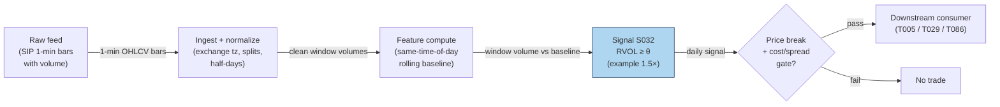

### S12. Sources

- Simon Gervais, Ron Kaniel, Dan H. Mingelgrin (2001). "The High-Volume Return Premium." *Journal of Finance* 56(3):877–919. http://ideas.repec.org/a/bla/jfinan/v56y2001i3p877-919.html
- Guillermo Llorente, Roni Michaely, Gideon Saar, Jiang Wang (2002). "Dynamic Volume-Return Relation of Individual Stocks." *Review of Financial Studies* 15(4):1005–1047. http://ideas.repec.org/a/oup/rfinst/v15y2002i4p1005-1047.html
- Carlo Zarattini, Andrea Barbon, Andrew Aziz (2024). "A Profitable Day Trading Strategy for the U.S. Equity Market." SSRN. https://papers.ssrn.com/sol3/papers.cfm?abstract_id=4729284 (full text: https://www.alexandria.unisg.ch/server/api/core/bitstreams/3c2989c4-688d-4d78-8a71-f02690990d51/content)
- Blume, Easley & O'Hara (1994) theoretical lineage noted via the volume–return literature (see Llorente et al. references therein) — volume carries information about signal precision beyond prices.

**Unverified leads** (chatbot-reported, no checkable source; do not cite as evidence):
- Stanford CS229 project rule cited in the report entry ("unusual options volume: volume > 2× daily average AND ≥ 500 contracts") — practitioner reconstruction, no retrievable citation found in this pass.
- Andrew Aziz "Stocks in Play" framework (Bear Bull Traders practitioner literature) — widely used, not peer-reviewed; treated as practitioner context, not evidence.
- Duck.ai Q-SB2-2 pipeline/eng-hour numbers as they touch RVOL baselines (106–246 h for the full 500-symbol pipeline) — labeled lead; cost-model §5 Tier L band takes precedence for S032 itself.

**Source log:** Duck.ai answered Q-SB2-1–Q-SB2-3 (2026-09-10); Grok/Cursor answers pending (checked 2026-09-10).

---
## Stage 42/200 — S042: RSI / RSI-2 mean reversion (Connors-style)

*Batch SB2 · Signal 42/100 · Provenance [D/SR] · Family C — Mean reversion & reversal*

### S1. One-line verdict

| | |
|---|---|
| **What it is** | A 2-period RSI (Relative Strength Index) oscillator that flags violent 2-day washouts (RSI-2 ≈ 0) as short-horizon mean-reversion longs, gated by a long-term trend filter. |
| **When it works** | Broad index/large-cap ETFs in intact uptrends, where 2-day panics are capitulation rather than information; holds of hours to 2–3 days. |
| **When it dies** | Waterfall declines (RSI-2 pins at 0 while price keeps falling), gap-driven single names, bear regimes below the 200-day SMA (simple moving average), wide-spread small caps. |
| **Build-or-buy in one line** | Build: 30 lines of bar math on data you already own; precomputed vendor variants differ in RSI definition — poor value. |

Provenance **[D/SR]**: Wilder's RSI formula is documented (Wilder 1978); the Connors 2-period rule (practitioner author of short-term mean-reversion systems) and its intraday adaptations are practitioner-documented reconstructions.

### S2. How it works — plain human explanation

Picture 9:47 a.m., SPY bid 588.40 × 900 / ask 588.41 × 400. Yesterday's close was 594.20, the day before 596.05 — two red days of futures-led de-risking, no single-stock news. A 2-period RSI off these closes reads **0**: everything in the last two days was downside. In an intact uptrend, a two-day flush is usually *liquidation* — margin calls, stop runs, ETF redemptions — not fresh information about value. Liquidation is finite; it exhausts, and price snaps back.

Why should the snapback exist? Three overlapping stories. First, **liquidity provision**: dealers left long unwanted inventory mark prices back up to offload it. Second, **behavioral overreaction**: loss-averse selling overshoots fundamental news. Third, **ETF mechanics**: redemption/rebalancing flows push whole baskets together — flow, not information — and revert when the flow stops.

- **Mental model, in three bullets:**
  - RSI-2 is a *capitulation meter*: 0 means "all of the last two days was down", 100 means "all up". Extremes mark exhaustion, not direction.  - The signal is *conditional*, never standalone: it only fires longs when the slow trend (close above the 200-day SMA) says the washout is against an intact uptrend.
  - The edge lives in the *first 1–3 days* of the bounce and dies in downtrends — the regime filter is the strategy, not an accessory.

### S3. The math — exact formula

Wilder's canonical RSI with period *n* (Wilder 1978):

$$\Delta_t = C_t - C_{t-1}, \qquad G_t = \max(\Delta_t, 0), \qquad L_t = \max(-\Delta_t, 0)$$

$$RS_t = \frac{\mathrm{SMMA}_n(G_t)}{\mathrm{SMMA}_n(L_t)}, \qquad \mathrm{RSI}_{n,t} = 100 - \frac{100}{1 + RS_t}$$

where SMMA is Wilder's smoothed moving average ($\alpha = 1/n$, recursive). For the Connors 2-period form used here, the operator-verified working definition is the **simple 2-period mean** (not Wilder's recursive smoothing):

$$\mathrm{RSI}_{2,t} = 100 \cdot \frac{\bar{G}_2}{\bar{G}_2 + \bar{L}_2}, \qquad \bar{G}_2 = \frac{G_t + G_{t-1}}{2}, \;\; \bar{L}_2 = \frac{L_t + L_{t-1}}{2}$$

with the boundary conventions RSI-2 = 100 if $\bar{L}_2 = 0$, RSI-2 = 0 if $\bar{G}_2 = 0$. Prices in $; RSI-2 is dimensionless on [0, 100].

Connors canonical rule (documented practitioner form): **long** when $C_t > \mathrm{SMA}_{200}(C_t)$ **and** RSI-2 < 10; **exit** when $C_t > \mathrm{SMA}_5(C_t)$; stop ≈ 5% adverse (*example — not an institutional standard*).

| Parameter | Symbol | Typical range | Too small / too large | Default (example) |
|---|---|---|---|---|
| RSI period | n | 2–5 | 1: fires on every down bar; >5: lags the 2-day event | 2 |
| Oversold trigger | θ_L | 5–20 | 5: rarer, sharper washouts; 20: frequent, weaker reversion per trade | 10 |
| Overbought trigger | θ_U | 80–95 | mirrors θ_L for shorts | 90 |
| Trend filter | N_slow | 150–250 days | shorter whipsaws the regime gate; longer rarely binds | 200 |
| Exit SMA | N_fast | 3–10 days | 1 exits on noise; 20+ holds into the next drawdown (peak-to-trough decline) | 5 |

*Every default is example — not an institutional standard.* Normalization: RSI-2 is self-normalized to [0, 100], so no z-score is needed; some desks rank RSI-2 cross-sectionally instead of using absolute thresholds. Causal timing: RSI-2 at bar *t* uses only closes ≤ *t*; the earliest tradable fill is bar *t+1*'s open (the worked example uses next-open fills). Variants: (1) **Connors daily** — above, with the 200-day SMA gate; (2) **intraday 5-min RSI** — same construction on 5-min bars with a 50-period intraday MA trend filter [SR]; (3) **CRSI composite** — Connors' 3-component variant (RSI-3 of price, RSI-2 of streak length, 100-day PercentRank — the percentage of the past 100 one-day price changes below today's change — of 1-day ROC (rate of change)), a different signal family, mentioned only to avoid confusion.

### S4. Worked example — step-by-step numbers (SYNTHETIC)

All data below is **synthetic**, hand-specified to reproduce the operator-verified Duck.ai tape (script seed 42; the tape itself is fixed, not drawn). The chart `images/S042_example.png` plots exactly these numbers.

10-day synthetic tape, closes in $:

| Day | Close | Δ_t | Ḡ(2) | L̄(2) | RSI-2 |
|-----|-------|------|------|------|-------|
| D1 | 100.00 | — | — | — | — |
| D2 | 99.00 | −1.00 | — | — | — |
| D3 | 98.00 | −1.00 | 0.00 | 1.00 | 0.0 |
| D4 | 99.00 | +1.00 | 0.50 | 0.50 | 50.0 |
| D5 | 100.00 | +1.00 | 1.00 | 0.00 | 100.0 |
| D6 | 101.00 | +1.00 | 1.00 | 0.00 | 100.0 |
| D7 | 100.00 | −1.00 | 0.50 | 0.50 | 50.0 |
| D8 | 99.00 | −1.00 | 0.00 | 1.00 | 0.0 |
| D9 | 98.00 | −1.00 | 0.00 | 1.00 | 0.0 |
| D10 | 97.00 | −1.00 | 0.00 | 1.00 | 0.0 |

Step-by-step for D4: Δ_4 = 99.00 − 98.00 = +1.00 → G_4 = 1.00, L_4 = 0; Δ_3 = −1.00 → G_3 = 0, L_3 = 1.00. Ḡ = (1.00+0)/2 = 0.50, L̄ = (0+1.00)/2 = 0.50, RSI-2 = 100·0.50/1.00 = **50.0**. D5: Δ_5 = +1.00, Δ_4 = +1.00 → Ḡ = 1.00, L̄ = 0 → **100.0** (boundary rule). D10: two straight −1.00 days → Ḡ = 0 → **0.0**.

Example trade (rule: buy when RSI-2 < 10, exit when RSI-2 ≥ 50 — *example thresholds*, causal t→t+1): D3 closes at 98.00 with RSI-2 = 0 → signal known at the close; **buy 1,000 shares at the D4 open, $98.20** (synthetic open). D4 closes at 99.00 with RSI-2 = 50 → exit signal known at the close; **sell at the D5 open, $99.30**. Gross P&L (profit and loss): (99.30 − 98.20) × 1,000 = +$1,100 (+1.12%). Costs (SPY-class ETF, example: half-spread — half the bid–ask spread, the cost of crossing to take liquidity — ~0.5 bp/leg, where 1 bp (basis point) = 0.01%, + $0.001/share fees + 2 bp slippage — extra cost when your own order pushes the price against you): ≈ $32 round-trip → net ≈ **+$1,068 (+1.09%)**. A second trigger fires at the D8 close (RSI-2 = 0); entry would be the D9 open and the tape ends at D10 with that position open — a Connors practitioner would consult the 200-day SMA gate, omitted from this toy tape, before taking it.

**What to notice:** the indicator is brutally simple and the arithmetic is checkable by hand; the entire "edge" here is one bounce, and D8–D10 show the failure shape (RSI-2 = 0 while price keeps falling) inside the same tape. This is a toy: sketch-level costs, next-open fills, no trend gate, no gap risk. Nothing here is a backtest.

### S5. Strategies that use this signal

- **T013 — RSI-2 / IBS Extreme Fade** — primary entry trigger (direction): the Connors-style oversold/overbought fade combines this signal with S043.
- **T071 — News-Novelty Reversal** — regime qualifier: fades stale-news overreaction where an extreme RSI-2 read confirms exhaustion rather than novel-information drift.

### S6. Data required — exact spec

| Field | Type | Granularity | Source tier | Notes |
|---|---|---|---|---|
| Open/High/Low/Close | float ($) | daily or 1–15 min | Tier 0–1 | Adjusted for splits/dividends; closes must be point-in-time |
| 200-day SMA input | derived | daily | Tier 0 | ~1 year of history per symbol before first signal |
| Session calendar | date/bool | daily | Tier 0–1 | Half-days, holidays, halts must not corrupt the 2-period window |
| Corporate actions | events | daily | Tier 0–1 | Split-adjustment errors inject false Δ_t spikes |

Ingest sketch (Python/polars, ≤20 lines):

```python
import polars as pl
bars = pl.scan_parquet("silver/daily_adjusted/*.parquet")      # split-adjusted OHLCV (open/high/low/close/volume)
sig = (bars
    .with_columns(delta=pl.col("close").diff().over("symbol"))
    .with_columns(g=pl.when(pl.col("delta")>0).then(pl.col("delta")).otherwise(0.0),
                  l=pl.when(pl.col("delta")<0).then(-pl.col("delta")).otherwise(0.0))
    .with_columns(g2=(pl.col("g")+pl.col("g").shift(1)).over("symbol")/2,
                  l2=(pl.col("l")+pl.col("l").shift(1)).over("symbol")/2)
    .with_columns(rsi2=100*pl.col("g2")/(pl.col("g2")+pl.col("l2")))
    .with_columns(sma200=pl.col("close").rolling_mean(200).over("symbol"))
    .filter(pl.col("close")>pl.col("sma200"), pl.col("rsi2")<10)  # example thresholds
    .collect())
```

Storage per symbol-day: daily bars are bytes — trivial (per cost-model §4, 3,000 stocks × daily ≈ 5 MB total). 1-min bars for a 500-symbol intraday variant: ~50 MB/day total (cost-model §4).

Data-quality checklist: timestamp normalization (exchange-local → UTC); corporate-action adjustment (a 2:1 split reads as Δ_t = −50% — a false RSI-2 = 0); halt/half-day bars; DST transitions; stale closes on thinly traded names; survivorship (ETF-only studies exclude delisted products).

### S7. Local build on M5 Max / 128GB

**Feasibility: trivial.** A daily RSI-2 screen over 500 symbols × 10 years ≈ 1.25M rows recomputes in well under a second in polars (cost-model §2: 10–50M rows/sec for simple column ops); a 5-min variant on 500 symbols generates only ~39k bars/day. The bottleneck is data hygiene, not compute. RAM: the full 10-year daily panel is a few MB against the 77GB working budget (cost-model §3). Stack: **Python+polars** (vectorizable, one screen); Rust unjustified; DuckDB only for large alt-data joins. Engineering: **Tier L, 4–12 h ≈ $600–1,800 at $150/hr loaded** (cost-model §5). What breaks first at 500 symbols: nothing on compute; only tick-accurate fill modeling would push this to Tier M+.

### S8. Buy vs build

| Option | What you get | Price | Gains | Loses |
|---|---|---|---|---|
| Tier 0: Stooq / Alpaca IEX daily | Daily OHLCV, long history | ~$0 (indicative — verify before budgeting) | Zero cost; fine for the canonical daily rule | IEX-only intraday; no minute bars for the 5-min variant |
| Tier 1: Polygon Stocks Developer | Minute aggs, trades, 10y history | ~$30–200/mo (indicative — verify before budgeting) | One feed for daily + intraday RSI-2 and the full SB2 signal set | Delayed tier is cheaper but useless for live |
| Tier 2: Databento Standard | SIP-grade (consolidated exchange feed) 1-min bars, corporate actions | ~$200/mo + usage (indicative — verify before budgeting) | Honest timestamps, halts, auction prints | Overkill for a daily oscillator |
| Precomputed analytics vendors | RSI-2 columns on a screener | ~$30–200/mo (indicative — verify before budgeting) | No code | Vendor RSI definitions vary (Wilder vs simple mean) — unverifiable |

**Verdict: build.** Buy the raw bars (Tier 0 daily, Tier 1 intraday), build the 30-line indicator — thresholds and fill assumptions are where the (thin) edge lives or dies.

### S9. Success ratio / efficacy — documented evidence

| Study / source | Market & period | Metric | Before/after cost | Caveat |
|---|---|---|---|---|
| QuantifiedStrategies practitioner backtests (daily SPY) | SPY, multi-year | CRSI(2) buy <15 / sell >85: profit factor ≈ 2.08 over 288 trades | **Before cost** | Practitioner, not peer-reviewed; CRSI ≠ plain RSI-2 |
| Duck.ai bank Q-SB2-3 expectancy lead | — | 75% win / +0.25% avg win / −1.2% avg loss → **−0.1125%/trade** (arithmetic verified) | Before cost | Labeled chatbot lead; illustrates that high win rate ≠ positive expectancy |
| Herberger, Horn & Oehler (2020), *Financial Markets and Portfolio Management* | German blue chips, 5-min bars | Intraday reversal returns statistically significant but **too small to be economically significant** | **After cost** (retail) | Peer-reviewed; reversal family, not RSI-2 specifically |
| Alvarez Esteban (2026, UTU thesis) | US equities 2011–2024, daily | Overnight→intraday reversal gross alpha significant; **net alpha clearly negative** after spreads + commissions | **After cost** | The canonical after-cost collapse of naive fades |
| Desk synthesis (mendozaliner, practitioner) | SPY-class, various | Connors claims ~65–75% win; Price Action Lab (2018) finds the edge indistinguishable from data-mining; decay post-2013 | Mixed (before & after across sources) | Selection-bias warning |

Regimes where it fails: persistent bear trends, volatility cascades (second and third legs arrive after the bounce), gap-driven single names, crowded mean-reversion books. The S&P-class edge weakened after ~2013.

**Honest bottom line:** naive RSI-2 fades are a **negligible-to-negative after-cost edge** standalone; as a conditioned entry (liquid ETF + trend gate + cost-aware sizing), practitioner evidence supports a small, decaying edge. Better as *filter/context* than primary trigger.

### S10. Failure modes & pitfalls

1. **Lookahead leakage** — entering at the trigger bar's close when the signal needs the close; mitigation: next-open fills always.
2. **Trend-regime failure** — RSI-2 = 0 in waterfall declines; mitigation: the 200-day SMA gate is mandatory.
3. **Definition drift** — Wilder SMMA vs simple 2-period mean vs vendor black boxes differ; mitigation: pin one definition in code.
4. **Cost blowup** — 1–3 day holds with 1–2% gross moves are spread-sensitive outside SPY-class names; mitigation: model half-spread + fees per leg, penny-spread ETFs only.
5. **Gap slippage** — overnight gaps move the fill far from the signal close; mitigation: next-open execution, skip gap days.
6. **Survivorship bias** — ETF studies use today's liquid survivors; mitigation: point-in-time universe with delisted products.
7. **Crowding** — the rule is 20 years old and commoditized; mitigation: a feature in a larger book (T013/T071), never standalone.

### S11. Visuals


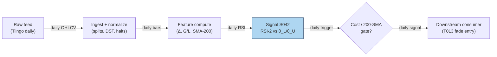

### S12. Sources

- Wilder, J. Welles (1978). *New Concepts in Technical Trading Systems*. Trend Research. (RSI formula; book.)
- QuantifiedStrategies.com. "Connors RSI Trading Strategy: Statistics, Facts, Backtests (75% Win Rate)". https://www.quantifiedstrategies.com/connors-rsi/ — practitioner CRSI(2)/RSI backtests on daily SPY.
- Herberger, T. A., Horn, M., & Oehler, A. (2020). "Are intraday reversal and momentum trading strategies feasible? An analysis for German blue chip stocks." *Financial Markets and Portfolio Management*, 34(2), 179–197. https://ideas.repec.Org/a/kap/fmktpm/v34y2020i2d10.1007_s11408-020-00356-2.html
- Alvarez Esteban, L. (2026). "Overnight Returns and Intraday Reversals." UTU thesis, US equities 2011–2024. https://www.utupub.fi/server/api/core/bitstreams/88057d2a-1ee8-4c05-9592-c535a21b502c/content
- MQL5 (2025). "Day Trading Larry Connors RSI2 Mean-Reversion Strategies." https://www.MQL5.com/en/articles/17636 — Connors RSI2 rule documentation (entry/exit/stop conventions).

**Unverified leads** (chatbot-provided, no checkable source — do not treat as evidence):
- Duck.ai answered Q-SB2-1–Q-SB2-3 (2026-09-10); Grok/Cursor answers pending (checked 2026-09-10).
- Expectancy lead: 75% win / +0.25% avg win / −1.2% avg loss → −0.1125%/trade before costs (arithmetic verified; inputs are unverified practitioner claims).
- "70–90% win" RSI-2/IBS claims are practitioner/vendor, not peer-reviewed (per Q-SB2-3).

---
## Stage 43/200 — S043: Internal Bar Strength (IBS) mean reversion

*Batch SB2 · Signal 43/100 · Provenance [SR] · Family C — Mean reversion & reversal*

### S1. One-line verdict

| | |
|---|---|
| **What it is** | The position of a bar's close inside its own high–low range, IBS = (C−L)/(H−L); extremes (≈0 or ≈1) mark exhausted closes that revert the next bar. |
| **When it works** | Daily bars of broad index ETFs, where end-of-day flow (market-on-close (MOC) imbalances, retail panic, rebalancing) pushes the close to a range extreme disconnected from fundamentals. |
| **When it dies** | Single names with real news in the bar, trending regimes where strong closes persist, low-volume days (the effect vanishes), and anything with a wide spread. |
| **Build-or-buy in one line** | Build: three columns of arithmetic on bars you already store; nothing to buy except the bars. |

Provenance **[SR]**: the construction and practitioner rule are documented in practitioner literature (Pagonidis 2014; Kakushadze & Serur 2018 §4.4); the mean-reversion *effect* is the reconstructed standard interpretation, not a peer-reviewed causal claim.

### S2. How it works — plain human explanation

It is 3:58 p.m. QQQ has traded between 481.10 and 484.30 all session, and it is printing 481.35 — nearly the low of the day — because a wave of market-on-close sell programs and retail stop-outs hit in the last hour. Nothing about the Nasdaq's fundamentals changed since lunch; the close is weak because *flow* was weak. IBS turns that observation into one number: (481.35 − 481.10)/(484.30 − 481.10) ≈ 0.08. A close pinned to the low of the range reads as oversold; a close pinned to the high (≈0.95+) reads as overbought. The bet is that tomorrow, absent new information, the flow-driven extreme partially reverses.

Economically, three forces compress into the close. First, **MOC and rebalancing flow**: index funds, pension rebalances, and ETF creation/redemption print mechanically into the close, indifferent to price — a transient supply/demand shock. Second, **retail panic and profit-taking**: the last hour concentrates discretionary selling after red days and profit-taking after green days, both flow rather than information. Third, **closing-auction mechanics**: the auction clears imbalances at a single price that can sit at a range extreme without representing continuous-session consensus. All three are *temporary pressure*; when pressure is temporary, the next session's open/close drifts back.

- **Mental model, in three bullets:**
  - IBS asks one question: "did the bar close exhausted (near the low) or euphoric (near the high)?" — 0 = exhausted, 1 = euphoric, 0.5 = balanced.
  - It works best where idiosyncratic news is absent (broad ETFs), so the extreme can be attributed to flow.
  - The signal *requires the close*: the entry bar is complete, so execution is always on the **next** bar — this is a feature for honesty, not a bug.

### S3. The math — exact formula

$$\mathrm{IBS}_t = \frac{C_t - L_t}{H_t - L_t} \in [0, 1]$$

$C_t, L_t, H_t$ are the bar's close, low, high in $ (or any price unit). Edge cases: if $H_t = L_t$ (zero-range bar), define IBS = 0.5 (balanced) by convention — *example convention, not an institutional standard*. IBS is already normalized to [0, 1]; no further scaling needed.

Example rule (*example — not an institutional standard*): **long** when IBS_t < 0.2, executed at bar *t+1*'s open; **exit** when IBS ≥ 0.5; the short side mirrors at IBS > 0.8. Pagonidis (2014) instead sorts instruments into IBS buckets and documents threshold behavior near ≈0.4 and ≈0.9 rather than a single hard line.

| Parameter | Symbol | Typical range | Too small / too large | Default (example) |
|---|---|---|---|---|
| Long trigger | θ_long | 0.1–0.3 | 0.1: rare, sharper; 0.3: frequent, diluted edge | 0.2 |
| Short trigger | θ_short | 0.7–0.9 | mirrors θ_long | 0.8 |
| Exit level | θ_exit | 0.4–0.6 | 0.4: exits too fast to capture the bounce; 0.6+: holds through reversal of the reversal | 0.5 |
| Zero-range rule | — | — | must be defined or a flat bar divides by zero | 0.5 |

Causal timing: IBS_t is computable only after bar *t* closes; the earliest tradable fill is bar *t+1*'s open. Named variants: (1) **daily ETF fade** — long IBS < 0.2, exit IBS > 0.5 (Pagonidis form); (2) **cross-sectional rank** — rank a basket of ETFs by IBS each day, long the bottom decile / short the top decile (Kakushadze & Serur §4.4 form); (3) **intraday minute-bar IBS** — documented by practitioners, not established statistically [SR].

### S4. Worked example — step-by-step numbers (SYNTHETIC)

All data is **synthetic**, drawn with `rng = np.random.default_rng(49)` (stated for reproducibility); the chart `images/S043_example.png` plots exactly these numbers.

10-day synthetic tape, prices in $:

| Day | Open | High | Low | Close | IBS |
|-----|-------|-------|-------|-------|-------|
| D1 | 100.00 | 102.21 | 98.60 | 100.51 | 0.529 |
| D2 | 100.51 | 102.28 | 98.81 | 99.50 | 0.199 |
| D3 | 99.50 | 100.29 | 98.50 | 99.30 | 0.447 |
| D4 | 99.30 | 100.32 | 96.22 | 97.51 | 0.315 |
| D5 | 97.51 | 100.22 | 95.46 | 99.32 | 0.811 |
| D6 | 99.32 | 101.00 | 98.55 | 99.49 | 0.384 |
| D7 | 99.49 | 100.45 | 97.28 | 99.13 | 0.584 |
| D8 | 99.13 | 100.84 | 98.37 | 99.24 | 0.352 |
| D9 | 99.24 | 101.84 | 97.13 | 100.78 | 0.775 |
| D10 | 100.78 | 102.97 | 99.71 | 101.25 | 0.472 |

Check D2 by hand: (99.50 − 98.81)/(102.28 − 98.81) = 0.69/3.47 = **0.199** < 0.2 → long signal. D5: (99.32 − 95.46)/(100.22 − 95.46) = 3.86/4.76 = **0.811** ≥ 0.5 → exit signal.

Example trade (rule: buy the open after IBS < 0.2, sell the open after the first bar with IBS ≥ 0.5 — *example*, causal t→t+1): D2 signals; **buy at D3 open, 99.50**; D5's IBS = 0.811 triggers the exit; **sell at D6 open, 99.32**. Gross return: (99.32 − 99.50)/99.50 = **−0.18%** on 1,000 shares (−$180). Costs (ETF: half-spread ~0.5 bp + fees ≈ 2 bp/leg, example): ≈ 4 bp round-trip ≈ $40 → net ≈ **−$220 (−0.22%)**.

**What to notice:** the single worked trade *loses*. That is deliberate and important: IBS is a statistical edge over hundreds of signals (Pagonidis documents +0.35% average next-day return when IBS < 0.2 across equity ETFs, before costs), not a promise on any one tape. The example also shows the asymmetry the literature documents — the D9 exit signal (0.775) fires on a +1.6% up day, the kind of "euphoric close" the short side fades. Toy limits: no real fills, no borrow on the short side, no volume filter (Pagonidis finds the effect disappears on low-volume US ETF days).

### S5. Strategies that use this signal

- **T013 — RSI-2 / IBS Extreme Fade** — primary entry trigger (direction): the Connors-style fade combines S043 with S042 and S045. (RSI-2: 2-day Relative Strength Index, a 0–100 momentum oscillator — see S042.)
- **T100 — Grand Ensemble** — diluted ensemble consumer: S043 is one of ~100 features in the capstone blend; its individual weight is negligible and the fit is thin — cited for completeness, not as a genuine two-signal composition.

### S6. Data required — exact spec

| Field | Type | Granularity | Source tier | Notes |
|---|---|---|---|---|
| High / Low / Close | float ($) | daily (or minute) | Tier 0–1 | Split-adjusted; unadjusted bars inject false range extremes |
| Volume | int (shares) | daily | Tier 0–1 | Volume filter: effect documented to vanish on low-volume days |
| Session calendar | date/bool | daily | Tier 0 | Half-days produce compressed ranges — handle or exclude |

Ingest sketch (Python/polars, ≤20 lines):

```python
import polars as pl
bars = pl.scan_parquet("silver/daily_adjusted/*.parquet")
sig = (bars
    .with_columns(ibs=(pl.col("close")-pl.col("low")) /
                        (pl.col("high")-pl.col("low")).clip_min(1e-9))
    .with_columns(ibs=pl.when(pl.col("high")==pl.col("low")).then(0.5)
                        .otherwise(pl.col("ibs")))
    .with_columns(vol_z=pl.col("volume")/pl.col("volume").rolling_median(20).over("symbol"))
    .filter(pl.col("ibs")<0.2, pl.col("vol_z")>0.8)   # example thresholds
    .select("symbol","date","close","ibs")
    .collect())  # execute at next bar's open — never at the signal bar's close
```

Storage: daily bars are bytes per symbol-day (cost-model §4: 3,000 stocks × daily ≈ 5 MB total). Data-quality checklist: split/dividend adjustment (a split changes H−L scale); zero-range bars (define the 0.5 convention); half-days and early closes; stale prints on illiquid ETFs; volume convention (single-counted vs double-counted).

### S7. Local build on M5 Max / 128GB

**Feasibility: trivial.** IBS is three-column arithmetic: a 500-symbol × 10-year daily screen is ~1.25M rows, a sub-second polars scan (cost-model §2: 10–50M rows/sec simple ops). No real-time loop is needed — the signal updates once per bar close. RAM footprint is megabytes against the 77GB working budget (cost-model §3). **Python+polars** is the obvious pick; Rust buys nothing; DuckDB only if the IBS rank needs to join a large cross-sectional panel. Engineering: **Tier L, 4–12 h ≈ $600–1,800 loaded** (cost-model §5) — nearly all of it is the volume filter, the next-bar execution accounting, and universe hygiene. What breaks first at 500 symbols: nothing computationally; the research breaks first on *data* — unadjusted corporate actions and survivorship-biased ETF universes (universes that drop delisted products, flattering backtests).

### S8. Buy vs build

| Option | What you get | Price | Gains | Loses |
|---|---|---|---|---|
| Tier 0: Stooq / exchange delayed | Daily OHLCV (open/high/low/close/volume) | ~$0 (indicative — verify before budgeting) | Enough for the canonical daily rule | Weak corporate-action metadata |
| Tier 1: Polygon Stocks Developer / Tiingo | Daily + minute bars, splits | ~$30–200/mo (indicative — verify before budgeting) | Clean adjustments; volume field for the low-volume filter | — |
| Tier 2: Databento | SIP-grade (consolidated exchange feed) daily/minute | ~$200/mo + usage (indicative — verify before budgeting) | Point-in-time correctness | Overkill for (C−L)/(H−L) |
| Academic: Pagonidis (2014) paper | Documented thresholds + bucket results | ~$0 (indicative — verify before budgeting) | The closest thing to a specification | Practitioner venue (NAAIM), not peer-reviewed |

**Verdict: build.** The indicator is trivial; the value is in the execution accounting (next-bar fills, volume filter, borrow on the short side). Buy Tier 1 bars if you want minute-bar variants; otherwise Tier 0 suffices.

### S9. Success ratio / efficacy — documented evidence

| Study / source | Market & period | Metric | Before/after cost | Caveat |
|---|---|---|---|---|
| Pagonidis (2014), "The IBS Effect: Mean Reversion in Equity ETFs" (NAAIM) | Equity ETFs, inception–2013 | Avg next-day return **+0.35%** when IBS < 0.2; **−0.13%** when IBS > 0.8; ~30% p.a. alpha for the simple strategy | **Before cost** | Practitioner paper, not peer-reviewed; ETF universe |
| Pandey & Joshi (2023), arXiv | Country ETFs, 10 years | IBS-based mean-reversion "useful for predicting short-term price movements" in their basket | Before cost (implied) | Student report; qualitative headline |
| Desk/practitioner synthesis (finterm notes on Kakushadze & Serur 2018 §4.4) | Broad/country ETFs since 1990s | Rank-by-IBS reversal "documented to work consistently"; strongest with trend filter, high-volume days, Monday→Tuesday window | Before cost | Practitioner summary of a practitioner book |
| Duck.ai Q-SB2-3 (labeled lead) | — | "70–90% win" claims are practitioner/vendor, **not peer-reviewed**; Connors Research presents IBS as concept with no published hit-rate benchmark | n/a | Chatbot lead, qualitative |

Regimes where it fails: single-name news days (the extreme is information, not flow), persistent trends (strong closes keep working), low-volume days (effect disappears for US equity ETFs per Pagonidis), bear-market long side (short side relatively stronger in bears). The IBS effect is also documented as stronger on high-range, high-volatility days and on Mondays ("Turnaround Tuesday").

**Honest bottom line:** as a standalone trigger this is a **small, conditional, before-cost edge** concentrated in liquid ETFs — and the naive daily fade inherits the S040-style caveat: after spreads, fees, and next-open slippage (extra cost when your order pushes the open price against you) on the short side, published-looking returns compress hard. As a filter (rank ETFs by IBS to time entries from other signals), it is better evidenced and cheaper to be wrong about.

### S10. Failure modes & pitfalls

1. **Same-bar execution (lookahead)** — IBS needs the close; trading "at the close" of the signal bar is impossible without MOC access modeled honestly; mitigation: next-bar-open fills, or explicit MOC impact modeling.
2. **News-driven extremes** — a close at the low on genuine bad news is information, not exhaustion; mitigation: skip earnings/event days, or require the ETF (diversified) rather than the single name.
3. **Short-side costs** — borrow fees and next-open slippage on gap days; mitigation: long-only variant, or model borrow explicitly.
4. **Low-volume fade** — the documented effect vanishes on quiet days; mitigation: the volume filter (e.g. volume > 0.8× 20-day median, example).
5. **Zero-range / half-day bars** — division by zero or compressed ranges; mitigation: the 0.5 convention + session-calendar exclusions.
6. **Overfit thresholds** — 0.2/0.5/0.8 mined on the same ETFs; mitigation: fix thresholds a priori, test on post-2013 data the original paper never saw.
7. **Crowding/decay** — the rule is public since 2013–2014; mitigation: expect decay, use as a feature (T013/T100) rather than a book.

### S11. Visuals


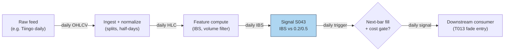

### S12. Sources

- Pagonidis, A. S. (2014). "The IBS Effect: Mean Reversion in Equity ETFs." NAAIM Wagner Award paper. https://www.naaim.org/wp-content/uploads/2014/04/00V_Alexander_Pagonidis_The-IBS-Effect-Mean-Reversion-in-Equity-ETFs-1.pdf
- Pandey, A. & Joshi, K. (2023). "Using Internal Bar Strength as a Key Indicator for Trading Country ETFs." arXiv. http://export.arxiv.org/pdf/2306.12434
- Kakushadze, Z. & Serur, J. A. (2018). *151 Trading Strategies*. Palgrave Macmillan. (§4.4: IBS cross-sectional construction; book.)
- Practitioner synthesis: "ETF Mean Reversion (Internal Bar Strength)" notes. https://github.com/yumima/finterm/blob/HEAD/fincept-qt/resources/knowledge/quant-strategies/etf-mean-reversion-ibs.md — documents the rank-by-IBS strategy and the economic (end-of-day flow) rationale.

**Unverified leads** (chatbot-provided, no checkable source — do not treat as evidence):
- Duck.ai answered Q-SB2-1–Q-SB2-3 (2026-09-10); Grok/Cursor answers pending (checked 2026-09-10).
- "70–90% win" IBS claims are practitioner/vendor, not peer-reviewed; Connors Research presents IBS as concept with no published hit-rate benchmark (per Q-SB2-3).
- Expectancy arithmetic lead (75% win / +0.25% avg win / −1.2% avg loss → −0.1125%/trade before costs): math verified, inputs unverified.

---
## Stage 63/200 — S063: Range-based realized-volatility estimators

*Batch SB2 · Signal 63/100 · Provenance [D] · Family E — Volatility & options-informed*

### S1. One-line verdict

| Row | Content |
|---|---|
| **What it is** | Volatility estimated from each bar's high-low (and open/close) instead of close-to-close returns — 5–8× more efficient per observation. |
| **When it works** | Vol-targeted sizing, dispersion legs, VRP measurement — anywhere a fast, honest read of recent realized vol beats noisy close-to-close. |
| **When it dies** | Overnight gaps (Parkinson), trending drift (Garman–Klass), tick-bound prices (a tick = the minimum price increment), jump days; raw 5-min bars without deseasonalizing. |
| **Build-or-buy in one line** | Build — closed-form on OHLC bars; buy history, never the estimator. |

Provenance **[D]** (documented: Parkinson 1980; Garman & Klass 1980; Rogers & Satchell 1991; Yang & Zhang 2000). Family **E — Volatility & options-informed**. Worked example is synthetic and watermarked (seed 63).

### S2. How it works — plain human explanation

**Vignette.** Tuesday, MSFT. It opens at $512.40, swings $508.10–$517.30 all session, and closes at $512.55 — up three hundredths of a percent. A close-to-close volatility estimate says "nothing happened." A range-based estimator looks at the $9.20 high-low range and says "that was a 1.8% day." The range distills the whole intraday path; close-to-close discards everything between the two prints.

**Why it works statistically.** Under (approximately) Brownian motion (a random walk with normally distributed steps — the standard price model), the high-low range carries far more information about a bar's variance than the open-to-close move — a day that wanders but closes flat has near-zero squared return yet a large range. The classic result: Parkinson ≈ **5× as efficient** as close-to-close (same accuracy from ~80% less data); Garman–Klass reaches **7–8×**. The four estimators trade off which biases they remove:
- **Parkinson** — high/low only; simplest; assumes no drift (no persistent directional trend) and no overnight gap.
- **Garman–Klass** — adds open/close; most efficient under zero drift.
- **Rogers–Satchell** — drift-robust combination; handles trending bars.
- **Yang–Zhang** — blends overnight, open-close, and Rogers–Satchell; drift-independent *and* gap-robust; the minimum-error choice on full OHLC.

Alizadeh, Brandt & Diebold (2002): range-based proxies are approximately Gaussian (bell-curve / normally distributed) and **robust to microstructure noise** — bid-ask bounce (trades alternating between bid and ask prints) inflates the observed range by only about the average spread.

**Mental model (3 bullets):**
- Range estimators are *volatility microscopes*: same bars, 5–8× more information per observation than close-to-close.
- They are **state, not signal** — they measure the weather (how big moves are), they don't predict its direction.
- Pick the estimator by your bias budget: Parkinson for clean intraday bars, Rogers–Satchell when bars trend, Yang–Zhang when overnight gaps matter.

### S3. The math — exact formula

Per-bar variance estimates (log prices; $O, H, L, C$ in $). Average over a window of $N$ bars, then annualize:

$$\hat\sigma^2_{\text{Park}} = \frac{\left[\ln(H/L)\right]^2}{4\ln 2}$$

$$\hat\sigma^2_{\text{GK}} = \tfrac{1}{2}\left[\ln(H/L)\right]^2 - (2\ln 2 - 1)\left[\ln(C/O)\right]^2$$

$$\hat\sigma^2_{\text{RS}} = \ln(H/C)\,\ln(H/O) + \ln(L/C)\,\ln(L/O)$$

$$\hat\sigma^2_{\text{YZ}} = \sigma^2_o + k\,\sigma^2_c + (1-k)\,\sigma^2_{\text{RS}}, \qquad
k = \frac{0.34}{1.34 + (N+1)/(N-1)}$$

where $\sigma^2_o$, $\sigma^2_c$, $\sigma^2_{\text{RS}}$ are overnight (close-to-open), open-to-close, and Rogers–Satchell variances, each averaged over $N$ bars. Annualized: $\hat\sigma_{\text{ann}} = \sqrt{\bar\sigma^2}\times\sqrt{\text{bars/year}}$ (252 daily; $252 \times 78$ for 5-min RTH (regular trading hours) bars).

**Causal timing.** Each bar's estimate uses only that bar's OHLC (complete at the bar close); the $N$-bar average completes at the close of bar $N$; tradable no earlier than bar $N+1$.

**Parameter table** (defaults are *example — not an institutional standard*):

| Parameter | Symbol | Typical range | Too small | Too large | Default example |
|---|---|---|---|---|---|
| Estimation window | *N* | 5–30 days (or 30–78 intraday bars) | noisy, jump-dominated | stale vol regime | 20 days |
| Annualization | bars/year | 252 (daily); 19,656 (5-min RTH) | wrong units | — | 252 for the daily example |
| YZ weight | *k* | 0.1–0.3 (falls with *N*) | over-weights open-close | over-weights overnight | 0.1327 at *N*=10 (see S4) |
| Estimator choice | — | Park / GK / RS / YZ | — | — | YZ for daily; Park/GK for clean intraday bars |

**Normalization.** Use levels for sizing (position ∝ target/σ̂), z-scores vs own history for vol-breakout regimes, or realized/implied ratios for VRP. Never annualize with the wrong bar count — the most common implementation bug.

**Named variants:**
1. **Parkinson (1980)** — high/low only; zero-drift, no-gap; the baseline.
2. **Garman–Klass (1980)** — OHLC; minimum-variance combination under zero drift; most efficient classical estimator.
3. **Rogers–Satchell (1991)** — OHLC; unbiased for arbitrary drift; slightly less efficient than GK at zero drift.
4. **Yang–Zhang (2000)** — overnight + open-close + RS blend; independent of drift and opening jumps; default for gappy daily bars.

### S4. Worked example — step-by-step numbers (SYNTHETIC)

**Synthetic 10-day tape** (`np.random.default_rng(63)`; exactly reproducible). Prices in $:

| Day | Open | High | Low | Close |
|---|---|---|---|---|
| D1 | 100.285 | 103.461 | 99.718 | 102.664 |
| D2 | 103.171 | 105.888 | 102.467 | 104.325 |
| D3 | 104.831 | 109.252 | 103.643 | 107.411 |
| D4 | 107.137 | 107.671 | 103.896 | 105.101 |
| D5 | 105.591 | 106.272 | 104.491 | 105.251 |
| D6 | 105.962 | 106.976 | 105.259 | 106.334 |
| D7 | 106.491 | 108.383 | 105.099 | 107.636 |
| D8 | 108.106 | 110.259 | 107.478 | 108.967 |
| D9 | 108.417 | 108.783 | 106.803 | 108.013 |
| D10 | 107.628 | 109.008 | 107.582 | 108.013 |

**Step-by-step (D1, Parkinson, fully shown):** $\ln(H/L) = \ln(103.461/99.718) = \ln(1.037531) = 0.036848$. Square: $0.00135777$. Divide by $4\ln 2 = 2.772589$: $\hat\sigma^2_{\text{Park},1} = 0.00048964$. The same arithmetic with the GK and RS formulas gives 0.00046635 and 0.00040594.

**Per-day variances (all 10 days):**

| Day | Parkinson | Garman–Klass | Rogers–Satchell |
|---|---|---|---|
| D1 | 0.00048964 | 0.00046635 | 0.00040594 |
| D2 | 0.00038891 | 0.00049132 | 0.00050950 |
| D3 | 0.00100177 | 0.00116030 | 0.00110870 |
| D4 | 0.00045944 | 0.00049471 | 0.00047429 |
| D5 | 0.00010307 | 0.00013888 | 0.00013803 |
| D6 | 0.00009448 | 0.00012623 | 0.00012504 |
| D7 | 0.00034161 | 0.00042938 | 0.00043586 |
| D8 | 0.00023524 | 0.00030181 | 0.00031244 |
| D9 | 0.00012159 | 0.00016319 | 0.00019279 |
| D10 | 0.00006259 | 0.00008185 | 0.00011864 |

**Window aggregation + Yang–Zhang:** 10-day mean variances — Parkinson 0.00032983, GK 0.00038540, RS 0.00038212. Overnight variance $\sigma^2_o = 0.00002008$; open-to-close variance $\sigma^2_c = 0.00018599$; $k = 0.34/(1.34 + 11/9) = 0.1327$; $\hat\sigma^2_{\text{YZ}} = 0.00002008 + 0.1327(0.00018599) + 0.8673(0.00038212) = \mathbf{0.00037618}$. Annualized ($\times\sqrt{252}$): **Parkinson 28.83%, Garman–Klass 31.16%, Rogers–Satchell 31.03%, Yang–Zhang 30.79%**.

**Chart** (same numbers — daily σ = √variance × 100; YZ is window-level, hence horizontal; see S11 for the figure).

**What to notice.** All four agree closely (28.8–31.2% annualized) — on clean synthetic data the bias corrections barely bite; estimator choice matters most on *real* data with gaps and drift. D3 (largest range day) dominates the window — one wild bar moves a 10-day average materially, which is why production windows run 20+ days. **Limits:** synthetic tape, no jumps, no tick discreteness, no fees — this validates the arithmetic and the code path, not any trading edge.

### S5. Strategies that use this signal

- **T058 — Dispersion Trader (primary leg input).** Long single-stock realized vol vs short index vol: S063 measures the *realized-vol leg* — entry/exit and hedge ratios from range-based RV, with S075/S069 context.
- **T035 — Futures Calendar-Spread Carry (sizing).** Harvests term-structure roll yield; S063-based vol forecasts scale size to keep carry positions inside the vol budget as realized vol expands.
- **T010 — Variance-Risk-Premium Harvester (regime/sizing).** Delta-hedged short-vol when implied variance is rich vs forecast: S063 is the "realized" side of the comparison, alongside HAR forecasts (S066) and VRP levels (S069).

### S6. Data required — exact spec

| Field | Type | Granularity | Source tier | Notes |
|---|---|---|---|---|
| Open / High / Low / Close | float $ | daily or 5-min bars | Tier 0–1 | the only inputs |
| Corporate actions | events | daily | Tier 1 | splits corrupt H/L ratios if unadjusted |
| (optional) implied vol | float | daily | Tier 1–2 | for the VRP comparison in T010, not for S063 itself |

**Collection.** Stooq (Tier 0, daily), Polygon stocks v3 (Tier 1, minute bars), Databento (Tier 2). Schema sketch: `symbol, ts, open, high, low, close`.

**Ingest sketch (Python/polars, ≤20 lines):**
```python
import polars as pl, numpy as np
bars = pl.scan_parquet("bars/min5_*.parquet").sort("symbol", "ts")
rv = (bars.with_columns(
        park=(pl.col("high")/pl.col("low")).log()**2 / (4*np.log(2)),
        gk=0.5*(pl.col("high")/pl.col("low")).log()**2
           - (2*np.log(2)-1)*(pl.col("close")/pl.col("open")).log()**2,
        rs=(pl.col("high")/pl.col("close")).log()*(pl.col("high")/pl.col("open")).log()
           + (pl.col("low")/pl.col("close")).log()*(pl.col("low")/pl.col("open")).log())
    .group_by("symbol")
    .agg(park_20d=pl.col("park").tail(20).mean(),   
         gk_20d=pl.col("gk").tail(20).mean(),
         rs_20d=pl.col("rs").tail(20).mean()))
rv.sink_parquet("features/range_rv.parquet")
```

**Storage.** Per `notes/cost-model.md §4`: 1-min bars for 500 symbols ≈ 50 MB/day (~3 GB per 60 days); daily OHLC ≈ 5 MB/day for 3,000 stocks. Derived RV panels are negligible.

**Data-quality checklist:** H/L integrity (H ≥ max(O,C), L ≤ min(O,C)); zero-range bars; corporate actions; DST/half-days (bar-count changes); intraday seasonality — deseasonalize (remove the time-of-day pattern in) 5-min estimates (S067).

### S7. Local build on M5 Max / 128GB

**Feasibility: feasible.** Compute is trivial; the pipeline around it is the work (Plan §6: Family E, 63–70, Tier M).

**Throughput** (per `notes/cost-model.md §2`): numpy ~50–200M elements/sec — four estimators over 500 symbols × 390 5-min bars × 60 days (11.7M rows) compute in ~1–5 s. Bottleneck: I/O and data QA.

**Stack options:**

| Stack | When to pick |
|---|---|
| Python + polars/numpy | Default; closed-form and vectorized |
| DuckDB | If RV must live inside SQL feature pipelines |
| Rust | Only inside a real-time risk loop recomputing vol per tick (rare) |

**RAM** (per cost-model §3): 500 symbols × 60 days of 5-min bars ≈ 3–8 GB eager — inside the 77 GB working budget; daily-bar panels are megabytes.

**Engineering time:** Tier **M**, 20–60 h → **$3,000–9,000** at $150/hr loaded-cost estimate (cost-model §5). The formulas are minutes; a production vol-state pipeline needs window selection, annualization conventions, estimator comparison across history, deseasonalization for intraday bars, and jump-day handling.

**What breaks first at 500 symbols / full OPRA:** 500 symbols are trivial. What breaks is *naive extension*: raw 5-min bars without deseasonalization, or OPRA (Options Price Reporting Authority)-scale options data (~1–2.5 GB/day per underlying, cost-model §3/§4) — a different project.

### S8. Buy vs build

| Option | What you get | Indicative price | What buying gains | What buying loses |
|---|---|---|---|---|
| Tier-0: Stooq daily OHLC | Free daily bars | ~$0 | zero cost | daily only; no adjustments |
| Tier-1: Polygon Stocks Advanced | SIP (consolidated tape) minute + daily bars, actions | ~$30–200/mo | consolidated tape for 5-min RV | none material |
| Tier-2: Databento Standard | Research bars, futures/options | ~$200/mo + usage | honest intraday; OPRA research | overkill for equity daily RV |
| Academic: OptionMetrics / WRDS TAQ | Publication-grade history | ~thousands/yr academic; institutional $$$$ | ground-truth vol benchmarks | cost; still wouldn't replace the estimator |

All prices `indicative — verify before budgeting`. **Verdict: build.** Every estimator here is closed-form on bars you already buy: buy the *bars* (Tier 1 minute bars for intraday RV), build the four estimators and window/annualization logic in days. Crossover: buy precomputed vol only for *implied* vol surfaces — realized vol from OHLC is never worth outsourcing.

### S9. Success ratio / efficacy — documented evidence

| Study / source | Market & period | Metric | Before/after cost | Caveat |
|---|---|---|---|---|
| Empirical volatility-estimator literature (surveyed in the NTHU working paper) | Multi-market simulations + empirical | Parkinson ≈ **5.2×** as efficient as close-to-close; Garman–Klass **7–8×** as efficient ("same accuracy with ~80% less data") | n/a — statistical efficiency | Idealized diffusion; discrete prices bias extremes downward (Beckers 1983) |
| Alizadeh, Brandt & Diebold (2002), *J. Finance* 57, 1047–1091 | FX (theoretical + numerical + empirical) | Range-based vol proxies **highly efficient, approximately Gaussian, robust to microstructure noise**; enable efficient quasi-maximum-likelihood estimation of stochastic-volatility models | n/a — estimation quality | Estimation quality, not a tradable edge; FX sample |
| Saichev & Lapinova (2012), arXiv:1202.4311 | Theoretical | Compares point/interval statistics of Parkinson, Garman–Klass, Rogers–Satchell and bridge estimators; confirms the efficiency ranking and drift-sensitivity trade-offs | n/a — statistical comparison | Real-data choice still depends on gaps/drift regime |

**Regimes where it fails.** Jump days (range explodes — use jump-robust variants, S064, tolerant of discontinuous price jumps); tick-discrete low-priced names; overnight-gap regimes for Parkinson/GK (use YZ); trending bars for GK (use RS); 5-min bars without deseasonalizing the U-shaped pattern.

**Honest bottom line:** as a standalone directional trigger this is a **non-signal by design** — it measures magnitude, not direction. As a **sizing and regime input** it is first-class infrastructure: every vol-targeted strategy, dispersion leg, and VRP comparison here leans on a number like this one. Its "edge" is defensive — right-sizing through vol regimes instead of being sized by them.

### S10. Failure modes & pitfalls

1. **Overnight-gap bias (Parkinson)** — gaps inflate H/L without intraday variance; mitigate: Yang–Zhang on daily bars.
2. **Drift bias (Garman–Klass)** — trending bars bias GK; mitigate: Rogers–Satchell when bars carry drift.
3. **Discrete-price downward bias** — non-continuous observation understates extremes (Beckers 1983); mitigate: treat estimates on tick-bound names as lower bounds.
4. **Jump contamination** — one jump day dominates short windows; mitigate: 20+-day windows or jump-robust alternatives (S064).
5. **Wrong annualization** — mixing daily and intraday bar counts; mitigate: annualize with the exact bar count of the estimation grid, unit-test it.
6. **Intraday seasonality** — raw 5-min RV has a U-shape across the session (RTH = regular trading hours); mitigate: deseasonalize (S067) first.
7. **H=L stale bars** — dead feeds print zero range; mitigate: validate H ≥ max(O,C), L ≤ min(O,C), flag zero-range streaks.
8. **Mistaking efficiency for alpha** — a 5× more efficient estimator still measures the past; mitigate: it sizes positions and sets expectations — it does not predict direction.

### S11. Visuals


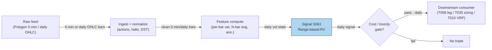

### S12. Sources

1. Alizadeh, Sassan; Brandt, Michael W.; Diebold, Francis X. (2002). "Range-Based Estimation of Stochastic Volatility Models." *Journal of Finance* 57(3), 1047–1091. http://ideas.repec.org/a/bla/jfinan/v57y2002i3p1047-1091.html
2. Saichev, Alexander & Lapinova, Svetlana (2012). "Comparative statistics of Garman-Klass, Parkinson, Roger-Satchell and bridge estimators." arXiv:1202.4311. https://arxiv.org/pdf/1202.4311v1
3. MIT OpenCourseWare 18.642 (Fall 2024), Lecture 17.2 — cites Parkinson (1980), Garman & Klass (1980), Rogers & Satchell (1991), Yang & Zhang (2000) with journal refs. https://ocw.mit.edu/courses/18-642-topics-in-mathematics-with-applications-in-finance-fall-2024/mit18_642_f24_lec17_2.pdf
4. kuant docs, "realizedvol" — practitioner reference for all four estimators incl. efficiency notes (GK ~7.4× vs close-to-close). https://github.com/scramblehub/kuant/blob/HEAD/docs/kernels/stats/realizedvol.md
5. Duck.ai (bot: GPT-5.6 "Luna", anonymous), Q-SB2-1–Q-SB2-2 (2026-09-10). **Labeled chatbot source**: Parkinson/GK/RS formulas hand-verified; Q-SB2-2 leads inform S7/S8; cost-model takes precedence.

**Unverified leads:**
- Efficiency figures "5.2× / 8.4×" from the NTHU empirical-volatility-estimators working paper (search snippet; not fully re-verified — stated as the 7–8× range corroborated by kuant docs). http://mx.nthu.edu.tw/~jtyang/Teaching/Risk_management/Papers/Quant_Methods/Empirical%20Evidence%20on%20Volatility%20Estimators.pdf

**Source log:** Duck.ai answered Q-SB2-1–Q-SB2-3 (2026-09-10); Grok/Cursor answers pending (checked 2026-09-10).

---

---
## Stage 66/200 — S066: HAR realized-volatility forecast

*Batch SB2 · Signal 66/100 · Provenance [D] · Family E — Volatility & options-informed*

### S1. One-line verdict

| | |
|---|---|
| **What it is** | A 3-regressor linear model — HAR (Heterogeneous Autoregressive), Corsi 2009 — forecasting tomorrow's realized variance from today's, this week's, and this month's: the industry workhorse vol forecast. |
| **When it works** | Any market with persistent volatility clustering: forecasts beat GARCH-family models (GARCH: the classic daily-returns volatility model) on out-of-sample loss across equities, FX, futures, commodities. |
| **When it dies** | Structural breaks, jump-dominated days (sudden discontinuous price moves), microstructure-noise-contaminated RV, horizons far from the (1,5,22) design, tiny estimation samples. |
| **Build-or-buy in one line** | Build: OLS (ordinary least squares — plain linear regression) on three features is an afternoon; buy the 5-minute bars, not the model. |

Provenance **[D]**: the model, formula, and empirical claims are documented in Corsi (2009) and follow-up literature.

### S2. How it works — plain human explanation

At 4:00 p.m., the desk needs one number for tomorrow: how volatile will SPY be? The HAR answer says: look at three clocks — what volatility did *today* (day-traders), averaged *this week* (weekly rebalancers), and averaged *this month* (pension funds). Add them with weights: tomorrow's forecast. The deep idea — Corsi's Heterogeneous Market Hypothesis, borrowed from Müller et al. — is that markets are a cascade of agents with different horizons, and volatility at each horizon is driven by the horizons above it. A restricted AR on daily/weekly/monthly components reproduces the *long memory* of volatility (shocks decay slowly, over weeks) without fractional-integration machinery (a heavier technique for modeling slow-decaying memory).

Why does it beat GARCH? GARCH sees only daily returns and must infer volatility from squared daily surprises — a noisy, low-information signal. HAR feeds on **realized** volatility, measured from dozens of intraday returns per day: a far sharper lens. HAR is not cleverer; it is allowed better data. The model is almost embarrassingly linear, which is why it survives production: OLS, three features, positivity clipping (forcing negative forecasts up to a small positive floor), done.

- **Mental model, in three bullets:**
  - Volatility has three gears — daily, weekly, monthly — and tomorrow's vol is a weighted sum of the three.
  - HAR wins by *measurement* (intraday realized variance), not model complexity; a linear model on good data beats a nonlinear model on bad data.
  - It is a **forecast**, not a trade: the edge becomes money only through a consumer (vol targeting, VRP harvesting, execution scheduling).

### S3. The math — exact formula

Build daily realized variance (RV) from M intraday log-returns (5-minute standard, 78 per US equity session):

$$r_{t,j} = \ln P_{t,j} - \ln P_{t,j-1}, \qquad RV_t = \sum_{j=1}^{M} r_{t,j}^2$$

units: variance per day. (Realized *volatility* is √RV — the standard-deviation-scale number in S4 step 5.) The HAR-RV regression (Corsi 2009):

$$RV_{t+1} = \beta_0 + \beta_d\, RV_t + \beta_w\, \overline{RV}_{t}^{(5)} + \beta_m\, \overline{RV}_{t}^{(22)} + \varepsilon_{t+1}$$

$$\overline{RV}_{t}^{(h)} = \frac{1}{h}\sum_{j=1}^{h} RV_{t-j+1} \quad h \in \{5, 22\}$$

the trailing 5-day (weekly) and 22-day (monthly) means. Estimated by OLS on ≥250 days (1,000+ preferred); clip forecasts at a small positive floor since raw-RV HAR can print negative. Common variant: **log-HAR**, $\log RV_{t+1} = c + \beta^{(d)}\log RV_t^{(1)} + \beta^{(w)}\log RV_t^{(5)} + \beta^{(m)}\log RV_t^{(22)} + \varepsilon$, which handles RV's right skew (the recent literature's baseline).

| Parameter | Symbol | Typical range | Too small / too large | Default (example) |
|---|---|---|---|---|
| Intercept | β_0 | 0–1e-4 | negative → negative variance forecasts | 5e-5 |
| Daily weight | β_d | 0.2–0.5 | 0: ignores today's shock; >0.6: overfits noise | 0.40 |
| Weekly weight | β_w | 0.2–0.45 | — | 0.35 |
| Monthly weight | β_m | 0.1–0.3 | 0: loses long memory; too big: sluggish | 0.20 |
| Estimation window | — | 250–1,000+ days | <250: unstable β; rolling 1,000 preferred | 1,000 |
| Intraday sampling | M | 39–78 (5–10 min) | too fine: microstructure noise; too coarse: noisy RV | 78 (5-min) |

*Every default is example — not an institutional standard.* Causal timing: the forecast for day *t+1* uses only RV through day *t*; tradable no earlier than *t+1*'s open. Named variants: (1) **HAR-J / HAR-CJ** — adds jump components via bipower variation (jump-robust volatility estimator; Andersen et al. 2007; Corsi & Renò 2009); (2) **log-HAR** — log transform, positivity-safe; (3) **intraday HAR-D** — rebuilds RV over intraday bins with session/week lags (arXiv 2202.08962) [SR].

### S4. Worked example — step-by-step numbers (SYNTHETIC)

All data is **synthetic** — a hand-specified 22-day daily-RV tape reproducing the operator-verified Duck.ai example (script seed 66; the series is fixed, not drawn). **Correction notice:** the raw chatbot output reported the 22-day sum as 0.014821 (≈10% too high) with everything downstream derived from it; the numbers below are the operator hand-checked corrections. The chart `images/S066_example.png` plots exactly these values.

RV_t (daily realized variance), days 1–22:

0.000400, 0.000441, 0.000484, 0.000529, 0.000576, 0.000625, 0.000676, 0.000729, 0.000784, 0.000841, 0.000900, 0.000841, 0.000784, 0.000729, 0.000676, 0.000625, 0.000576, 0.000529, 0.000484, 0.000441, 0.000400, 0.000361

Step-by-step (example betas β = (0.000050, 0.40, 0.35, 0.20) — *not an institutional standard*):

1. Daily component: RV_22 = **0.000361**.
2. Weekly: mean of the last 5 = (0.000529+0.000484+0.000441+0.000400+0.000361)/5 = **0.000443**.
3. Monthly: 22-day sum = **0.013431** (chatbot said 0.014821 — wrong); RV_22(22) = 0.013431/22 = **0.000610500** (chatbot said 0.000673682 — wrong).
4. Forecast: RV̂_{23|22} = 0.000050 + 0.40×0.000361 + 0.35×0.000443 + 0.20×0.000610500 = 0.000050 + 0.0001444 + 0.00015505 + 0.0001221 = **0.000471550** (chatbot said 0.000484186 — wrong).
5. Vol: σ̂ = √0.000471550 = **0.021716 ≈ 2.1716%/day** (chatbot said 2.2004% — wrong); annualized: 0.021716 × √252 ≈ **34.47%** (chatbot said 34.93% — wrong).

**What to notice:** the arithmetic is OLS-grade trivial — four multiplications — yet every downstream number in the chatbot's answer was corrupted by one bad sum, which is why the operator verification step exists. Economically: the forecast (0.0004716) sits *below* the monthly mean (0.0006105) because the recent days are quiet — the cascade mean-reverts. This is a toy: betas are illustrative, not estimated; real β comes from OLS on hundreds of days. Nothing here is a backtest, and a forecast is not a P&L.

### S5. Strategies that use this signal

- **T041 — HAR Vol-Timing Overlay** — primary sizing input: scales intraday positions by the HAR forecast (S066 with S067, S076).
- **T010 — Variance-Risk-Premium Harvester** — forecast comparator: harvests the gap between implied variance (the market's option-implied volatility forecast) and realized variance by shorting implied when rich versus HAR (with S069, S063).

### S6. Data required — exact spec

| Field | Type | Granularity | Source tier | Notes |
|---|---|---|---|---|
| Intraday prices/returns | float | 5-min bars (78/day) | Tier 1–2 | Polygon minutes, Databento; 1-min resampled to 5-min is standard |
| Corporate actions | events | daily | Tier 1–2 | Overnight jumps contaminate RV; decide open-to-close vs close-to-close |
| Session calendar | date/bool | daily | Tier 1 | Half-days have fewer bins — rescale or exclude |
| Estimation history | derived | daily RV | — | ≥250 days, 1,000+ preferred, before first forecast |

Ingest sketch (Python/polars, ≤20 lines):

```python
import polars as pl, numpy as np
bars = pl.scan_parquet("silver/minutes_5min/*.parquet")      # 5-min OHLCV, split-adjusted
rv = (bars
    .with_columns(r=np.log(pl.col("close")/pl.col("close").shift(1)).over("symbol"))
    .group_by(["symbol","date"]).agg(pl.col("r").pow(2).sum().alias("rv"))
    .with_columns(rv5=pl.col("rv").rolling_mean(5).over("symbol"),
                  rv22=pl.col("rv").rolling_mean(22).over("symbol"))
    .drop_nulls().collect())
X = rv.select(["rv","rv5","rv22"]).to_numpy()                 # OLS: rv_{t+1} ~ rv, rv5, rv22
beta, *_ = np.linalg.lstsq(np.c_[np.ones(len(X)-1), X[:-1]], X[1:,0], rcond=None)
fc = max(beta @ np.r_[1, X[-1]], 1e-8)                        # positivity clip
```

Storage: 5-min bars for 500 symbols ≈ 500 × 78 × 8 bytes × ~10 cols ≈ 3 MB/day — trivial (cost-model §4: 1-min/500 symbols ≈ 50 MB/day). Data-quality checklist: overnight-return treatment (open-to-close avoids close-to-close jumps); half-days; microstructure noise (bid–ask bounce contaminating fine-sampled returns) below 5-min sampling (use realized kernels — noise-robust volatility estimators — or coarser bins); DST; corporate actions; stale bins on illiquid names.

### S7. Local build on M5 Max / 128GB

**Feasibility: feasible (easy).** The daily job: build 500 RV series from 39k 5-min bars, then OLS on 500 × ~1,000-row design matrices — a few seconds of numpy. Planning assumption (cost-model §2): simple Polars ops ~10–50M rows/sec, complex rolling/as-of ops ~1–10M rows/sec; the pipeline research puts 500 rolling HAR fits at 5–30 s (labeled lead). A full daily SB2 refresh (11.7M rows) runs 15–60 s in Polars (labeled lead), so HAR is a rounding error inside it. RAM: the RV panel is ~500 × 1,000 × 8 bytes ≈ 4 MB against the 77GB working budget (cost-model §3). **Python+polars+numpy** is the right stack; Rust unnecessary; the M5 GPU is irrelevant. Engineering: **Tier M, 20–60 h ≈ $3,000–9,000 loaded** (cost-model §5) — the model is an afternoon; the hours are RV construction choices (sampling, overnight treatment, jump filtering), rolling-validation harness, and monitoring. What breaks first at 500 symbols: nothing on this box; production breaks first on *data licensing* (redistributing 5-min history) and regime monitoring (a silent structural break makes every forecast confidently wrong).

### S8. Buy vs build

| Option | What you get | Price | Gains | Loses |
|---|---|---|---|---|
| Tier 1: Polygon Stocks Developer | 5-min/minute aggs, 10y | ~$30–200/mo (indicative — verify before budgeting) | Everything needed for RV + HAR | — |
| Tier 2: Databento Standard | SIP-grade intraday, OPRA research | ~$200/mo + usage (indicative — verify before budgeting) | Honest timestamps; jump-robust extensions need trades | Overkill for plain HAR |
| Tier 3: OptionMetrics IvyDB | Publication-quality options history | ~$thousands/yr academic; institutional $$$$ (indicative — verify before budgeting) | Only if HAR feeds an options book (T010) | Price |
| Precomputed vol forecasts | Vendor RV/HAR series | varies (indicative — verify before budgeting) | No code | Black-box sampling/overnight choices; definitions vary |

**Verdict: build the model, buy the bars.** HAR is four coefficients; what matters is RV construction and the consumer that turns the forecast into size. Buy precomputed only as a validation benchmark.

### S9. Success ratio / efficacy — documented evidence

| Study / source | Market & period | Metric | Before/after cost | Caveat |
|---|---|---|---|---|
| Corsi (2009), *J. Financial Econometrics* | S&P 500 futures, Treasuries FX | "Remarkably good forecasting performance"; reproduces long memory, fat tails (extreme moves more common than a bell curve predicts) | Before cost (forecast loss) | The founding result; in-sample + OOS (out-of-sample — data the model never saw in estimation) |
| Path-dependent HAR paper (arXiv 2503.00851) | SSE (the paper's Shanghai equity sample), rolling 600-day OOS | HAR family **much lower** MSE/MAE/HMSE/HMAE/QLIKE (a volatility forecast loss function — lower is better) than GARCH family; more MCS (model confidence set — a test keeping only models not significantly worse than the best) passes | **Before cost** (forecast accuracy) | Dataset-specific; HAR-PD (path-dependent HAR) variants best |
| Louzis, Xanthopoulos-Sissinis & Refenes (2012), *Economics Bulletin* | S&P 500, incl. 2007–09 | HAR-type-EVT (extreme value theory) beats GARCH-type-EVT on VaR (value-at-risk — a tail-loss risk measure) accuracy and Basel II capital efficiency | Before cost (risk metric) | Economic *utility*, not trading P&L |
| High-frequency enhanced VaR (PMC — PubMed Central) | Multi-asset, 1,242 OOS days | HAR-RV fluctuation test beats univariate GARCH; "all GARCH models less accurate than HAR-RV" | Before cost (forecast loss) | VaR application |
| Practitioner replication (guna-1610) | S&P 500 2011–2026, 2,769 OOS days | HAR-RV QLIKE 0.3824 vs GARCH(1,1) 0.4237, DM (Diebold–Mariano — a test of whether one forecast is significantly better than another) significant | Before cost (forecast loss) | Practitioner, but real data + proper tests |
| Duck.ai Q-SB2-3 (labeled lead) | Literature survey | HAR-type beats GARCH on forecast loss in several settings; **lower loss ≠ tradable edge** | Before cost | Chatbot synthesis; direction matches the papers above |

Regimes where it fails: structural breaks (betas estimated on the old regime), jump-dominated days (use HAR-J), microstructure-noise contamination at too-fine sampling, horizons far from (1,5,22), small estimation samples. No documented after-cost P&L exists for HAR *itself* — it is infrastructure; economic value must be proven through a consumer (vol targeting, VRP) with turnover and utility accounting.

**Honest bottom line:** HAR has the **strongest statistical evidence in this batch** — it forecasts volatility better than GARCH across markets, periods, and loss functions. As a *forecasting* edge it is real; as a *trading* edge it is unproven until a costed consumer exists.

### S10. Failure modes & pitfalls

1. **Forecast ≠ trade** — a 5% better QLIKE earns nothing without a consumer; mitigation: attach HAR to sizing/hedging (T041/T010), evaluate the *strategy* net of costs.
2. **Microstructure noise** — 1-min RV without correction is noise-dominated; mitigation: 5-min sampling, or realized kernels.
3. **Overnight treatment** — open-to-close vs close-to-close changes RV by the overnight share; mitigation: pick one, document it.
4. **Negative forecasts** — raw-RV OLS can print negative variance; mitigation: positivity clip or log-HAR.
5. **Structural breaks** — 2008/2020-style regimes invalidate old betas; mitigation: rolling windows, break monitoring.
6. **Jump contamination** — one flash-crash day dominates the monthly mean; mitigation: HAR-J with bipower variation.
7. **Lookahead in RV** — using revised/corrected bars; mitigation: point-in-time bars, as-of timestamps.
8. **Overfitting via extensions** — HAR-PD, threshold HAR, ML hybrids add parameters; mitigation: MCS/DM tests, embargoed OOS (see S088).

### S11. Visuals


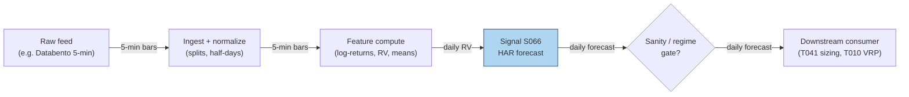

### S12. Sources

- Corsi, F. (2009). "A Simple Approximate Long-Memory Model of Realized Volatility." *Journal of Financial Econometrics*, 7(2), 174–196. http://ideas.repec.org/a/oup/jfinec/v7y2009i2p174-196.html
- "Forecasting realized volatility in the stock market: a path-dependent perspective" (2025). arXiv. https://arxiv.org/pdf/2503.00851 — HAR family vs GARCH family OOS loss + MCS tests.
- Louzis, D. P., Xanthopoulos-Sissinis, S., & Refenes, A. P. (2012). "Stock index Value-at-Risk forecasting: A realized volatility extreme value theory approach." *Economics Bulletin*, 32(1), 981–991. http://ideas.repec.org/a/ebl/ecbull/eb-11-00870.html
- "High-frequency enhanced VaR: A robust univariate realized volatility model" (2024). PMC. http://pmc.ncbi.nlm.nih.gov/articles/PMC11111067/ — HAR-RV vs GARCH fluctuation tests.
- "Volatility Forecasting with Machine Learning and Intraday Commonality" (2022). arXiv. http://arxiv.org/pdf/2202.08962 — intraday HAR-D / SARIMA (seasonal autoregressive integrated moving average) adaptation.

**Unverified leads** (chatbot-provided, no checkable source — do not treat as evidence):
- Duck.ai answered Q-SB2-1–Q-SB2-3 (2026-09-10); Grok/Cursor answers pending (checked 2026-09-10).
- HAR worked-example lead: the raw chatbot output contained a 22-day-sum error (0.014821 vs correct 0.013431); all downstream values used in S4 are the operator-verified corrections.
- Q-SB2-3 survey lead: "HAR-type beats GARCH on forecast loss in several settings" — direction consistent with the cited papers, but the synthesis itself is unverified; lower forecast loss ≠ tradable edge.
- Q-SB2-2 pipeline lead: 500 rolling HAR fits in 5–30 s; full SB2 daily refresh 15–60 s in Polars — labeled chatbot claims, not measured here.

---
## Stage 83/200 — S083: Imbalance/tick/volume/dollar bars

*Batch SB2 · Signal 83/100 · Provenance [D] · Family F — Statistical/ML infrastructure*

### S1. One-line verdict

| | |
|---|---|
| **What it is** | Alternative bar clocks: sample bars by trade count (tick), shares (volume), dollars traded, or signed-flow imbalance instead of wall-clock minutes. |
| **When it works** | Intraday feature pipelines: volume/dollar bars have better statistical properties (closer to Gaussian (bell-curve-shaped), less heteroskedasticity — variance that shifts over time) than minute bars; imbalance bars concentrate information arrival. |
| **When it dies** | Approximating them from minute OHLCV (open/high/low/close/volume — not equivalent to trade-built bars), mis-set imbalance thresholds, or downstream models assuming fixed time spacing. |
| **Build-or-buy in one line** | Build the sampler (an afternoon); buy the tick-trade feed — minute bars cannot reproduce true volume/imbalance bars. |

Provenance **[D]**: Easley, López de Prado & O'Hara (2012); López de Prado, *Advances in Financial Machine Learning* (2018), Ch. 2.

### S2. How it works — plain human explanation

It is 12:40 p.m.: the 12:35–12:40 bar on a liquid name holds 14 trades; the 9:30–9:35 bar held 4,000. A minute-bar pipeline treats those two bars as equals. Information does not arrive on a clock; it arrives with *trading activity*: a **tick bar** closes every N trades, a **volume bar** every V shares, a **dollar bar** every $D traded. At the open, bars fly past in seconds; at lunch, one bar takes minutes.

**Imbalance bars** go further: instead of fixed amounts of *activity*, they sample fixed amounts of *one-sided flow* — accumulate θ_T = Σ b_t·v_t and close when |θ_T| crosses a threshold. A bar now represents a fixed dose of *information* — informed, directional trading — regardless of duration. The economic story is Easley–López de Prado–O'Hara's: markets are not fast or slow, they are busy or quiet.

- **Mental model, in three bullets:**
  - Clock bars oversample quiet periods and undersample busy ones; activity clocks give every bar equal weight.
  - Dollar bars neutralize the *price-level* effect; imbalance bars neutralize the *noise*.
  - This is **infrastructure, not alpha**: bars make downstream statistics cleaner but predict nothing by themselves.

### S3. The math — exact formula

Let trades be indexed by *i* with price P_i, size q_i, and tick-rule sign b_i ∈ {+1, −1} (uptick +1, downtick −1, zero-tick reuses the previous sign).

- **Tick bars:** close every N trades (N *example*: 1,000–10,000 — *not an institutional standard*).
- **Volume bars:** close when Σ q_i ≥ V* (V* *example*: 1% of ADV (average daily volume)).
- **Dollar bars:** close when Σ P_i·q_i ≥ D* (D* *example*: $1M–$10M notional per bar).
- **Imbalance bars (tick):** θ_T = Σ_{i} b_i, close when |θ_T| ≥ E_0[T]·|E_0[θ]| — expected bar length × expected per-trade imbalance, EWMA-estimated (exponentially weighted moving average; mlfinlab implementation).
- **Imbalance bars (volume/dollar):** θ_T = Σ b_i·q_i (or Σ b_i·P_i·q_i), same close rule; the pipeline lead (Q-SB2-2, labeled) states it as: close when |Σθ_i| > E_0[|θ|]·n or a dynamic threshold.

Each bar then emits OHLCV: O = first P, H = max P, L = min P, C = last P, V = Σ q (dollars / shares / counts).

| Parameter | Symbol | Typical range | Too small / too large | Default (example) |
|---|---|---|---|---|
| Ticks per bar | N | 1k–50k | too small: noisy bars; too big: few bars/day | 5,000 |
| Shares per bar | V* | 0.1–2% of ADV | — | 1% of ADV |
| Dollars per bar | D* | $1M–$50M | too small on mega-caps: sub-second bars | $5M |
| Expected imbalance | E_0[θ] | estimated | mis-set: bars too fast (noise) or too slow (stale) | EWMA over 50 bars |
| Tick-rule fallback | — | — | zero ticks mishandled → sign drift | carry-forward (reuse the previous sign) |

*Every default is example — not an institutional standard.* Causal timing: bar *k* is complete only when its close condition fires; features on bar *k* are tradable no earlier than bar *k+1*'s first trade. Named variants: (1) **tick / volume / dollar** — fixed-activity clocks; (2) **tick / volume / dollar imbalance** — fixed-information clocks; (3) **run bars** (AFML — *Advances in Financial Machine Learning* (López de Prado, 2018), Ch. 2) — close on same-sign tick runs.

### S4. Worked example — step-by-step numbers (SYNTHETIC)

All data is **synthetic**: a 15-trade tape drawn with `rng = np.random.default_rng(83)`. `batches/SB2/plot_S083.py` regenerates it, and `images/S083_example.png` plots all 15 trades with the three boundary sets — numbers here and in the chart agree.

Tape (all 15 trades) — $ prices, share sizes, tick-rule sign:

| Trade | Price | Size | Sign | Trade | Price | Size | Sign |
|-------|-------|------|------|-------|-------|------|------|
| T1 | 99.49 | 1000 | +1 | T9 | 98.87 | 1000 | −1 |
| T2 | 99.34 | 300 | −1 | T10 | 98.64 | 1500 | −1 |
| T3 | 99.33 | 1500 | −1 | T11 | 98.88 | 500 | +1 |
| T4 | 99.46 | 800 | +1 | T12 | 99.07 | 1000 | +1 |
| T5 | 99.10 | 300 | −1 | T13 | 99.38 | 500 | +1 |
| T6 | 99.52 | 1500 | +1 | T14 | 99.20 | 200 | −1 |
| T7 | 99.59 | 200 | +1 | T15 | 99.47 | 800 | +1 |
| T8 | 99.41 | 500 | −1 | | | | |

Tick bars (every 5 trades), OHLC in $:

| Bar | O | H | L | C | #trades |
|-----|-------|-------|-------|-------|---------|
| TB1 | 99.49 | 99.49 | 99.10 | 99.10 | 5 |
| TB2 | 99.52 | 99.59 | 98.64 | 98.64 | 5 |
| TB3 | 98.88 | 99.47 | 98.88 | 99.47 | 5 |

Volume bars (every 3,000 shares — *example*):

| Bar | O | H | L | C | #trades |
|-----|-------|-------|-------|-------|---------|
| VB1 | 99.49 | 99.49 | 99.33 | 99.46 | 4 |
| VB2 | 99.10 | 99.59 | 98.87 | 98.87 | 5 |
| VB3 | 98.64 | 99.07 | 98.64 | 99.07 | 3 |

(open: T13–T15, 1,500 shares — the tape ends mid-bar.)

Imbalance bars (θ = Σ tick-sign × shares; close when |θ| ≥ 1,500 — *example*):

| Bar | O | H | L | C | #trades | θ at close |
|-----|-------|-------|-------|-------|---------|------------|
| IB1 | 99.49 | 99.59 | 98.64 | 98.64 | 10 | −1600 |
| IB2 | 98.88 | 99.07 | 98.88 | 99.07 | 2 | +1500 |

(open: T13–T15, θ = +1,100 — the tape ends mid-bar.)

**What to notice:** tick bars are metronomic (5 trades each) but informationally uneven — TB2 spans a 0.88 selloff into 98.64, TB3 the 0.59 snapback. Volume bars vary in trade count (3–5). Imbalance bars show the mechanism’s range: IB1 absorbs 10 trades — including the T6–T7 upticks — before the downtrend pushes θ to −1,600; IB2 closes after just 2 trades on the snapback (θ = +1,500). The tape ends mid-bar (T13–T15, θ = +1,100): carry it forward or discard.

### S5. Strategies that use this signal

- **T081 — Adaptive Bar-Clock Sampler** — primary infrastructure: selects the bar clock by regime for downstream signals (with S090, S067).
- **T044 — Diurnal Deseasonalization (removing the predictable intraday U-shaped activity pattern)** — bar clocks already remove much of the U-shaped seasonality before thresholding (with S067, S046).
- **T008 — Kalman Dynamic-Hedge Pairs** — entry timer: imbalance bars time the legs (with S052, S048).

### S6. Data required — exact spec

| Field | Type | Granularity | Source tier | Notes |
|---|---|---|---|---|
| Trades (price, size, ts) | float/int/ts | tick | Tier 2 | Databento MBP-1 (market-by-price, top of book)/trades; **minute OHLCV cannot reproduce true volume/imbalance bars** (labeled lead) |
| Trade direction/sign | ±1 or exchange flag | tick | Tier 2 | Tick rule when no flag; Lee–Ready (buyer/seller classification from the quote) needs quotes (S007) |
| Session calendar | date/bool | daily | Tier 1 | Overnight gap: reset or carry θ |

Ingest sketch (Python, streaming):

```python
theta, n, bars, V_STAR = 0, 0, [], 3_000_000   # example threshold
for tr in trade_stream(symbol, date):
    theta += tr.sign * tr.size                # imbalance; n += 1 for tick bars
    track_ohlc(tr)                             # running O/H/L/C
    if abs(theta) >= V_STAR:                   # shares/dollars for vol/$ bars
        bars.append(close_bar(theta)); theta, n = 0, 0
        reset_ohlc()
# open bar at session end is incomplete — carry forward, never backfill
```

Storage per symbol-day: liquid-name tick trades ≈ 2–8 GB/day parquet (cost-model §4) — keep per-symbol daily files, never hold 500 × 60 days in RAM. Data-quality checklist: timestamp normalization (exchange vs SIP (consolidated feed)); late/out-of-sequence prints; odd-lot (under 100 shares) and dark-pool (off-exchange) inclusion rules; tick-rule accuracy; splits.

### S7. Local build on M5 Max / 128GB

**Feasibility: feasible.** Bar building is a single streaming pass: Python handles ~100–500k events/sec (cost-model §2) — fine for ≤20 symbols of L1 (level-1: top-of-book quotes and trades); Rust does 5–50M events/sec for full-universe rebuilds. A 60-day, 500-symbol rebuild from per-symbol parquet is I/O-bound at ~1–3 GB/sec (cost-model §2): minutes. RAM: stream per-symbol files; never hold the panel. Stack: **Python** for research, **Rust** for a live-loop sampler. Engineering: **Tier L, 4–12 h ≈ $600–1,800 loaded** (cost-model §5). What breaks first at 500 symbols: tick-trade *storage and licensing*, not compute — 500 names of tick history is terabytes/year (cost-model §4).

### S8. Buy vs build

| Option | What you get | Price | Gains | Loses |
|---|---|---|---|---|
| Tier 2: Databento pay-as-you-go | Tick trades, honest timestamps | ~$200/mo + usage (indicative — verify before budgeting) | The only honest input for true bars | Bulky to archive |
| Tier 1: Polygon minute bars | 1-min OHLCV | ~$30–200/mo (indicative — verify before budgeting) | Cheap | **Cannot reproduce** true volume/dollar/imbalance bars (labeled lead) |
| Open-source: mlfinlab | Reference bar implementations | ~$0 (license check) (indicative — verify before budgeting) | Tested imbalance-bar algorithm | You still need the tick feed |
| Precomputed bars vendors | Bars as a service | varies (indicative — verify before budgeting) | No pipeline | Black-box thresholds; poor value |

**Verdict: build the sampler, buy the trades.** The sampler is an afternoon; the feed is the binding constraint.

### S9. Success ratio / efficacy — documented evidence

Bar clocks are infrastructure: there is no Sharpe (risk-adjusted return) to report. What is documented:

| Study / source | Market & period | Metric | Before/after cost | Caveat |
|---|---|---|---|---|
| Easley, López de Prado & O'Hara (2012), *J. Portfolio Management* | Theory + futures/ETF examples | Volume-clock returns closer to Gaussian, less heteroskedastic than clock-time returns | n/a (statistical property) | Econometric benefit, not a trade |
| VPIN / flash-crash reporting (2010) | E-mini S&P, May 6 2010 | VPIN (volume-clock toxicity metric) hit historic levels an hour+ before the flash crash (a minutes-long collapse and rebound) | n/a | Press account, not a backtest |
| mlfinlab practitioner docs | — | Reference imbalance-bar implementation; bars used "throughout AFML" for features | n/a | Practitioner adoption, not efficacy |

Costs: not applicable to the sampler — but cleaner bars make downstream cost models (spread — the bid–ask spread — and impact) better estimated. Any P&L claim for "bars" alone is a category error.

**Honest bottom line:** a **genuine, documented improvement** in intraday feature quality and a prerequisite for honest microstructure (how orders, quotes, and trades interact at short horizons) work (S008) — but no edge as a standalone "signal".

### S10. Failure modes & pitfalls

1. **Minute-bar approximation** — resampling 1-min OHLCV into "volume bars" is not the same object; mitigation: true bars require trades.
2. **Threshold mis-setting** — too-small thresholds produce noise bars, too large stale ones; mitigation: EWMA-estimated expected imbalance, monitored bar rates.
3. **Open-bar lookahead** — using the incomplete current bar's OHLC as a feature; mitigation: only closed bars enter features; carry the open bar explicitly.
4. **Session-boundary θ** — carrying imbalance overnight mixes regimes; mitigation: reset θ at the open, document the choice.
5. **Tick-rule error** — mis-signed trades corrupt θ; mitigation: prefer exchange flags; fall back to Lee–Ready with quotes (S007).
6. **Storage blowup** — archiving full tick history "just in case"; mitigation: build bars once, archive bars + a trade sample.
7. **Overfitting the clock** — tuning N/V*/D* on the backtest; mitigation: round thresholds a priori; the clock is plumbing, not a parameter to mine.

### S11. Visuals


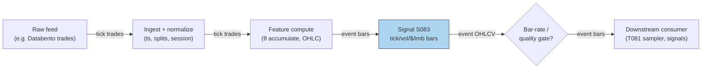

### S12. Sources

- Easley, D., López de Prado, M. M., & O'Hara, M. (2012). "The Volume Clock: Insights into the High-Frequency Paradigm." *Journal of Portfolio Management*, 39(1), 19–29. https://jpm.pm-research.com/content/39/1/19.abstract (manuscript: http://ssrn.com/abstract=2034858)
- López de Prado, M. M. (2018). *Advances in Financial Machine Learning*. Wiley. (Ch. 2: tick/volume/dollar/imbalance bars; book.)
- mlfinlab documentation, "Data Structures" (imbalance-bar algorithm: θ_t = Σ b_t·v_t; close rule |θ_t| ≥ E_0[T]·[2v⁺ − E_0[v_t]]). https://github.com/quantopian/mlfinlab/blob/HEAD/docs/source/implementations/data_structures.rst
- "Stock Market 'Flash' Crashes Now Can be Predicted, Thanks to Cornell Metric" (2010). *Innovations Report*. https://www.innovations-report.com/global-finance/business-and-finance/stock-market-flash-crashes-predicted-cornell-metric-166800/ — VPIN account of the May 2010 flash crash.

**Unverified leads** (chatbot-provided, no checkable source — do not treat as evidence):
- Duck.ai answered Q-SB2-1–Q-SB2-3 (2026-09-10); Grok/Cursor answers pending (checked 2026-09-10).
- Q-SB2-2 pipeline leads: TRUE tick/volume/dollar/imbalance bars need trades — minute OHLCV cannot reproduce them exactly; close when |Σθ_i| > E_0[|θ|]·n or dynamic threshold; 500 × 390 × 60d = 11.7M rows, 15–60 s daily Polars refresh.
- "Practitioner replication (vpin)" lead — volume-time returns closer to normal than chronological-time on crypto (BTC perps) — moved here from the S9 evidence table: no checkable citation was found for it, so it is an unverified lead, not evidence.

---
## Stage 49/200 — S049: Distance-method pairs — Gatev–Goetzmann–Rouwenhorst

*Batch SB3 · Signal 49/100 · Provenance [D] · Family D — Pairs & cross-sectional arbitrage*

### S1. One-line verdict

| | |
|---|---|
| **What it is** | Rank stock pairs by how tightly their normalized price paths tracked over a formation window; trade divergences of the closest pairs as temporary mispricing. |
| **When it works** | Mean-reverting relative mispricing between close economic substitutes, especially in turbulent markets when liquidity-driven dislocations are common. |
| **When it dies** | Crowded post-2002 large-cap US; fundamental breaks (M&A, earnings shocks) that make a divergence permanent; high borrow costs on the short leg. |
| **Build-or-buy in one line** | Build the screen yourself (it is a one-afternoon vectorized job); buy survivorship-clean corporate-action data — that is where the real cost sits. |

### S2. How it works — plain human explanation

Imagine two large regional banks — call them Alpha and Beta. For a year their shares move in lockstep: same rates, same loan-book worries. Then a mutual fund liquidates a chunk of Beta for reasons unrelated to either bank (a redemption wave elsewhere). Beta falls 3% while Alpha barely moves. The pairs trader's read: these are close economic substitutes, the gap is plumbing rather than information, so she sells Alpha (the leader) and buys Beta (the laggard), betting the gap closes. If Beta fell because its loan book actually blew up, she loses — the divergence was real information, not noise.

The economic idea: prices of close substitutes share a common factor, so large *relative* moves are more likely transient supply/demand imbalances than permanent repricing. Arbitrageurs are paid to stand in front of those imbalances. Research adds a second leg: profits are strongest when divergences come from common shocks propagating at different speeds through the two stocks (slow reaction to shared news) rather than from firm-specific news (see S9).

- **Mental model, bullet 1:** Distance pairs = a bet that *relative* prices mean-revert when the two legs are economic substitutes — it is a relative-value trade, not a directional one.
- **Mental model, bullet 2:** The entry trigger is purely statistical (a 2σ spread), so every pair needs an economic sanity story — without one, you are trading noise that may never converge.
- **Mental model, bullet 3:** Costs and borrow decide everything: the gross edge decayed hard after the 1990s, and what survives today lives or dies on execution quality (see S9, S10).

### S3. The math — exact formula

**Normalization.** For each stock *i*, build a normalized price (a cumulative-return index that starts at 1.0 at the beginning of the formation window):

$$\tilde{P}_{i,t} = \prod_{s=1}^{t}(1 + r_{i,s}), \qquad \tilde{P}_{i,0} = 1$$

where $r_{i,s}$ is the total return (price change plus dividends) of stock *i* on day *s*.

**Pair distance.** Over the formation window $F$ (a set of trading days), the distance between stocks *i* and *j* is the sum of squared daily gaps between their normalized paths:

$$D_{ij} = \sum_{t \in F}\left(\tilde{P}_{i,t} - \tilde{P}_{j,t}\right)^2$$

**Selection.** Rank all candidate pairs by $D_{ij}$ ascending and keep the $N$ smallest-distance pairs (Gatev–Goetzmann–Rouwenhorst, henceforth GGR, used $N = 20$), subject to liquidity, borrow-availability, and corporate-action cleanliness screens.

**Trading rule.** For a selected pair $(A, B)$, the spread is $d_t = \tilde{P}_{A,t} - \tilde{P}_{B,t}$. From the formation window compute its mean $\mu_d$ and sample standard deviation $\sigma_d$. The trading signal is the z-score:

$$z_t = \frac{d_t - \mu_d}{\sigma_d}$$

- If $z_t \le -z_{\text{entry}}$: buy A, sell B (long the laggard, short the leader).
- If $z_t \ge +z_{\text{entry}}$: sell A, buy B.
- Close when $|z_t| \le z_{\text{exit}}$ (convergence), or at a maximum holding time, or at an adverse-move stop.

Positions are dollar-neutral 1:1 *on normalized prices* — i.e., equal notional in the two legs at entry.

**Causal timing.** $z_t$ is computed at the close of day *t* using only data $\le t$; the position is tradable no earlier than the *t+1* open. All parameter estimates (the pair list, $\mu_d$, $\sigma_d$) must come from information strictly before the trading interval — this is enforced again in S10.

| Parameter | Symbol | Typical range | Too small | Too large | Default (example) |
|---|---|---|---|---|---|
| Formation window | $T_F$ | 60–252 days | unstable pair list, noisy $\sigma_d$ | stale pairs, regime breaks inside window | 252 days |
| Trading window | $T_{trade}$ | 20–126 days | pairs never get room to converge | holding dead pairs, cost bleed | 126 days |
| Pairs traded | $N$ | 10–100 | idiosyncratic pair risk dominates | dilutes into marginal pairs | 20 |
| Entry threshold | $z_{\text{entry}}$ | 1.5–2.5$\sigma$ | overtrading, cost explosion | almost never trades | 2.0 |
| Exit threshold | $z_{\text{exit}}$ | 0–0.5$\sigma$ | exits before capturing the move | round trips, gives back profits | 0 (zero-cross) |
| Max hold | $H_{\max}$ | 10–60 days | cuts converging trades early | capital stuck in broken pairs | 30 days |

Every default above is `example — not an institutional standard`.

**Named variants.** (1) *Industry-restricted* — pair only within the same sector. (2) *Correlation-prefiltered* — require formation correlation above ~0.7–0.9 first. (3) *Volatility-normalized* (Do–Faff–Hamza style) — scale the spread by relative volatility so triggers are comparable across pairs.

### S4. Worked example — step-by-step numbers (SYNTHETIC)

All numbers below are **synthetic** — a hand-built toy tape, random seed **49**, plotted in `images/S049_example.png`. The chart plots exactly this table's numbers.

**Formation (12 days), normalized prices:**

| Day | A | B | C | A−B spread |
|---|---|---|---|---|
| 1 | 1.000 | 1.000 | 1.000 | 0.000 |
| 2 | 1.020 | 1.015 | 1.050 | 0.005 |
| 3 | 1.010 | 1.025 | 1.100 | −0.015 |
| 4 | 1.030 | 1.020 | 1.080 | 0.010 |
| 5 | 1.050 | 1.045 | 1.150 | 0.005 |
| 6 | 1.040 | 1.055 | 1.200 | −0.015 |
| 7 | 1.060 | 1.050 | 1.180 | 0.010 |
| 8 | 1.080 | 1.075 | 1.250 | 0.005 |
| 9 | 1.070 | 1.085 | 1.300 | −0.015 |
| 10 | 1.090 | 1.080 | 1.280 | 0.010 |
| 11 | 1.110 | 1.100 | 1.350 | 0.010 |
| 12 | 1.100 | 1.105 | 1.400 | −0.005 |

Pair distances: $D_{AB} = 0.001175$, $D_{AC} = 0.327000$, $D_{BC} = 0.325775$. The minimum-distance pair is **(A, B)** — C tracked neither. Formation spread statistics: $\mu_d = 0.000417$, $\sigma_d = 0.010326$ (sample std, 11 d.f.).

**Trading (next 6 days), pair (A, B), $z_{\text{entry}} = 2.0$, $z_{\text{exit}} = 0.5$ (both `example`):**

| Day | A | B | Spread | $z_t$ | Action |
|---|---|---|---|---|---|
| 13 | 1.120 | 1.095 | 0.0250 | +2.381 | **Open:** short 1.0 A, long 1.0 B |
| 14 | 1.130 | 1.105 | 0.0250 | +2.381 | Hold |
| 15 | 1.125 | 1.120 | 0.0050 | +0.444 | **Exit** ($\|z\| \le 0.5$) |
| 16–18 | — | — | 0.0050 | +0.444 | Flat |

**P&L walk (normalized units, gross, no fees):** short A: $1.120 - 1.125 = -0.005$; long B: $1.120 - 1.095 = +0.025$. Net $= +0.0200$ normalized units per unit of notional per leg. (If one normalized unit = $100 of capital, that is $2,000 on $200,000 of gross exposure.)

**Cost model — explicit components (`example`; the chapter's own stack).** Spread, fees, borrow, and impact/slippage are charged on every name, every leg, every round trip. Using the walk's own valuation ($100 per normalized unit → $2,000 gross on $200,000 gross exposure): **spread** (crossing the half-spread on entry and exit, both legs — 4 half-spread crossings ≈ 2 bps of $200,000) ≈ **$40**; **commissions/fees** ≈ **$20** ($5 per leg-side); **borrow** (short leg $100,000 × 50 bps annualized stock-loan × 2 days held) ≈ **$3**; **market impact/slippage** (1 bp of $200,000) ≈ **$20**. All-in ≈ **$83** → **net ≈ $1,917** on the $2,000 gross, i.e. +0.0192 normalized units per unit of per-leg notional. The gross-only walk is illustrative; a tradable S049 pays spread, fees, borrow, and impact on every rotation.

**What to notice.** The pipeline in miniature: the screen picks the sensible pair (A and B, not runaway C), and a liquidity-style shock to B triggers a textbook entry that converges two days later. Limits: the P&L walk above is the *gross* tape only — no fees, no bid–ask, no borrow cost, assumed fills; the tradable P&L is gross minus the explicit cost stack (spread + fees + borrow + impact/slippage) modeled in S10. Formation is 12 days — the real GGR design uses 12 months. No backtest claims are made from these numbers.

### S5. Strategies that use this signal

- **T031 — Distance Pairs + Quality Filter** — primary entry trigger: the distance screen selects the pairs and the z-score rule times entries; S053's zero-crossing quality filter then vets which divergences are worth trading. (Plan §3's explicit Signals list for T100 enumerates S082/S086/S088 only — S049 has no documented T100 role, so T031 is its sole verified consumer.)

### S6. Data required — exact spec

| Field | Type | Granularity | Source tier | Notes |
|---|---|---|---|---|
| Total-return prices (split/dividend adjusted) | float | daily OHLCV (open/high/low/close/volume) | Tier 0–1 | Must be truly adjusted; raw prices + factor files also fine |
| Raw close + corporate-action factors | float/date | daily | Tier 1–2 | For verifying adjustments; delisting returns included |
| Dollar volume / average daily volume (ADV) | float | daily | Tier 1 | Liquidity screen (min dollar volume) |
| Borrow availability / fee | float/bool | daily | Tier 2 | Short-leg feasibility; locate data |
| Ticker history, listing/delist dates | mapping/date | as events | Tier 1–2 | Point-in-time universe — anti-survivorship-bias control |
| 1-min bars | OHLCV | 1-min | Tier 1–2 | Only for the intraday port of the strategy |

**Collection method.** Daily bars from a vendor API (Tiingo EOD, Polygon stocks v3, or Stooq CSVs for Tier-0 prototyping); corporate actions from the vendor's splits/dividends endpoints; delistings from a survivorship-free dataset (S8). Ingest sketch (Python/polars, ≤20 lines):

```python
import polars as pl
bars = pl.read_parquet("raw/daily_bars.parquet")          # date, perm_id, o,h,l,c, volume, div, split
px = (bars.sort(["perm_id","date"])
          .with_columns(adj=pl.col("c") * pl.col("split").cumprod().over("perm_id")
                        + pl.col("div").cumprod().over("perm_id"))  # sketch: apply factors
          .with_columns(ret=pl.col("adj").pct_change().over("perm_id")))
norm = px.with_columns(npx=(1+pl.col("ret").fill_null(0)).cumprod().over("perm_id"))
universe = norm.join(point_in_time_universe, on=["date","perm_id"], how="inner")
universe.write_parquet("clean/daily_panel.parquet")
```

**Storage.** Per `notes/cost-model.md` §4: daily bars for 3,000 stocks ≈ 5 MB/day parquet — trivial; a 10-year panel is a few GB. The 1-min intraday port is ~50 MB/day for 500 symbols — archive selectively.

**Data-quality checklist.** Exchange calendar/DST/half-days; corporate actions — splits, dividends, spinoffs, the #1 silent killer of pairs screens; halts and limit moves; stale quotes on illiquid names; survivorship: the formation-time universe must be knowable *at that time* (point-in-time), or backtested returns are fiction.

### S7. Local build on M5 Max / 128GB

**Feasibility: feasible (Tier M).** The distance screen is one of the cheapest serious screens in quant finance: the whole job is normalization, a pairwise distance matrix, and ranking. A 2,000-stock × 10-year daily panel is ~50–200 MB in memory (labeled lead from the batch's chatbot Q&A; consistent with `notes/cost-model.md` §3's ~40 MB float64 figure for the raw panel), so everything fits comfortably inside the 77 GB working budget (§3).

**Throughput.** The dominant kernel is $X^T X$ for $X$ of shape $2520 \times 2000$: approximately $2 \cdot 2000^2 \cdot 2520 \approx 20.2$ billion multiply-adds full ($\approx 10$B for the upper triangle). **Correction to the batch's chatbot answer, which said "~5 billion multiply-adds" — that is ~4× too low; use the figures above.** Even so, this is a seconds-scale dense BLAS (Basic Linear Algebra Subprograms) call; the full screen (normalization, missing data, ranking, top-$k$) is a minute-scale job at most — a labeled chatbot lead puts the vectorized screen at ~1–10 s. Per cost-model §2, panel ingest is I/O-bound at ~1–3 GB/s parquet read, and 500 symbols × 390 1-min bars/day = 195k bars/day is trivial.

**Bottleneck:** data quality, not compute — corporate actions, delistings, and point-in-time universe construction (the chatbot's 150–300 h full-pipeline prototype estimate is dominated by exactly this; labeled lead, inside cost-model §5's Tier-M-plus-harness range).

| Stack | When to pick |
|---|---|
| Python + polars/numpy | Default: the whole screen is vectorizable; fastest to write and verify |
| DuckDB | If you want the panel queryable by SQL and partitioned by date |
| Rust | Only if you push the screen to 1-min rolling windows across thousands of symbols intraday |

**RAM.** Tens of MB for daily bars (1-day or 60-day); ~3 GB for 500 symbols of 1-min bars (§4) — fits easily in the 77 GB budget (§3).

**Engineering time.** Tier M per cost-model §5: **20–60 h** → **$3,000–$9,000** `loaded-cost estimate` at $150/hr, plus data. The point-in-time security master is the known schedule risk.

**What breaks first at 500 symbols / full OPRA:** nothing on daily bars. What would break is a naive per-pair Python loop over millions of pairs — vectorize or chunk. Full OPRA (Options Price Reporting Authority) is irrelevant to this signal.

### S8. Buy vs build

| Vendor / option | What you get | Indicative price | Buying gains | Buying loses |
|---|---|---|---|---|
| Tier-0: Stooq, Yahoo-style free bars | Daily OHLCV, weak corp-action history | ~$0 | Zero-cost prototyping | No survivorship control; unreliable adjustments |
| Tier-1: Tiingo EOD / EODHD | Adjusted daily bars, splits/dividends (labeled chatbot lead) | ~$20–100/mo `indicative — verify before budgeting` | Cheap, prototype-ready | Manual survivorship handling |
| Tier-1: Polygon Stocks Advanced | 1-min/real-time SIP (Securities Information Processor, the consolidated tape) bars, corp actions | ~$30–200/mo `indicative — verify before budgeting` | Covers the intraday port | History depth costs extra |
| Tier-2: Sharadar (Nasdaq Data Link) | Point-in-time, survivorship-free panel | tens–hundreds/mo `indicative — verify before budgeting` | Solves survivorship properly | Price; you still build the screen |
| Tier-2: Databento | L1/L2 (level-1 top-of-book / level-2 depth), futures, OPRA research | ~$200/mo + usage `indicative — verify before budgeting` | Honest microstructure data | Overkill for a daily screen |

**Verdict: build the screen, buy survivorship-clean data.** The algorithm is ~50 lines of numpy; no vendor sells your thresholds. The crossover: if you cannot verify your vendor's delisting and adjustment methodology, pay for the Tier-2 survivorship-free panel — a backtest on a survivor-only universe is worse than no backtest.

### S9. Success ratio / efficacy — documented evidence

| Study / source | Market & period | Metric | Before/after cost | Caveat |
|---|---|---|---|---|
| Gatev, Goetzmann & Rouwenhorst (2006), RFS | US equities, 1962–2002, top-20 pairs | ~11% ann. excess, self-financing | After conservative cost estimates | Long sample; pre-modern-crowding universe |
| Do & Faff (2010), FAJ | US equities, 1962–2009, top-20 pairs | 0.86%/mo (1962–88) → 0.37%/mo (1989–2002) → 0.24%/mo (2003–09) | Before explicit costs | The decay finding; strong in turbulence (GFC) |
| Rad, Low & Faff (2016), Quant. Finance (accepted ms.) | US equities, 1962–2014, distance method | 0.91%/mo (Sharpe 0.75) before; 0.38%/mo (Sharpe 0.35) after | Both | Their 1–7 bps cost model; 62.53% of trades converged |
| Do & Faff (2012), via Rad et al. | US equities, post-2002 | "Largely unprofitable after 2002" with costs | After costs | Harshest published read; implementation-sensitive |

**Documented decay.** Do & Faff (2010) confirm the decline GGR already noticed late in their sample: roughly a 3× fall in monthly excess return from the 1962–88 regime to 2003–09 — faster reactions, lower spreads, shorting frictions, common-factor shocks, and more pairs diverging without converging. Counterpoint: pairs trading performs strongly during prolonged turbulence (GFC), when dislocations are plentiful and arbitrage capital is constrained.

**Honest bottom line.** As a standalone trigger, plain distance pairs is a *decayed, implementation-sensitive* edge: underwriting a small liquid-large-cap operation at net Sharpe ~0.2–0.7 (labeled chatbot lead) with high uncertainty is the defensible stance; claimed net Sharpe > 1 demands point-in-time universes, delistings, realistic borrow, bid/ask execution, and untouched out-of-sample. As a *filter* inside T031, it remains genuinely useful.

### S10. Failure modes & pitfalls

- **Lookahead leakage** — estimating $\mu_d$, $\sigma_d$, or the pair list on data that overlaps the trading window. Mitigation: hard formation/trading split; the worked example estimates on days 1–12 only; automated leakage tests (permutation of the split).
- **Non-convergence / fundamental risk** — the divergence is real information (fraud, distress, M&A). Mitigation: industry restriction, news/earnings blackout around events, per-pair stop-loss and max-hold.
- **Survivorship bias** — backtesting on today's index members. Mitigation: point-in-time universe with delisting returns included.
- **Borrow cost and short squeezes** — hard-to-borrow names make the short leg punitive or recallable. Mitigation: pre-screen borrow availability/fees; model stock-loan fees explicitly in the cost model.
- **Corporate-action artifacts** — splits/dividends mis-adjustments fabricate "divergences". Mitigation: raw + factor data, cross-validate adjustments against a second source.
- **Crowding / alpha decay** — the documented post-2002 decay. Mitigation: trade less-crowded universes (smaller caps with realistic costs), faster reaction, or use distance only as a filter inside T031.

### S11. Visuals


```mermaid
flowchart LR
    FEED["Raw feed\n(daily bars: CRSP (Center for Research in Security Prices)/Polygon/Stooq)"] -->|"daily OHLCV\n(open/high/low/close/volume)"| ING["Ingest + normalize\n(splits, dividends, delistings)"]
    ING -->|"clean daily panel"| FEAT["Feature compute\n(normalized prices, formation stats)"]
    FEAT -->|"pair-level daily spreads"| SIG["Signal S049\ndistance z-score"]
    SIG -->|"daily z-score breaches"| GATE{"Cost / borrow\ngate?"}
    GATE -->|"pass: pair signal"| OUT["Downstream consumer\n(T031 pairs book)"]
    GATE -->|"fail: no signal"| DROP["No trade"]
    style SIG fill:#aed6f1,stroke:#1f3a5f
```

### S12. Sources

- Gatev, E., Goetzmann, W. N. & Rouwenhorst, K. G. (2006). "Pairs Trading: Performance of a Relative-Value Arbitrage Rule." *Review of Financial Studies*, 19(3), 797–827. https://www.econbiz.de/Record/pairs-trading-performance-of-a-relative-value-arbitrage-rule-gatev-evan/10005564224 (RePEc record; abstract verifies ~11% annualized excess returns, 1962–2002, exceeding conservative transaction-cost estimates)
- Do, B. & Faff, R. (2010). "Does Simple Pairs Trading Still Work?" *Financial Analysts Journal*, 66(4), 83–95. https://ideas.repec.org/a/taf/ufajxx/v66y2010i4p83-95.html (verifies the 0.86 → 0.37 → 0.24 %/mo decay across 1962–88 / 1989–2002 / 2003–09 and strength in turbulence)
- Rad, H., Low, R. K. Y. & Faff, R. (2016). "The profitability of pairs trading strategies: distance, cointegration and copula methods." *Quantitative Finance* (accepted manuscript). https://pure.bond.edu.au/ws/portalfiles/portal/36339487/AM_The_profitability_of_pairs_trading_strategies.pdf (verifies distance-method 0.91%/mo before / 0.38%/mo after costs, 1962–2014)
- Krauss, C. (2017). "Statistical Arbitrage Pairs Trading Strategies: Review and Outlook." *Journal of Economic Surveys*, 31(2), 513–545. https://doi.org/10.1111/joes.12153 (survey of the pairs/statistical-arbitrage literature: methods, distance vs cointegration vs copula, and the documented post-2002 decay)
- Elliott, R. J., van der Hoek, J. & Malcolm, W. P. (2005). "Pairs trading." *Quantitative Finance*, 5(3), 271–276. https://doi.org/10.1080/14697680500149370 (mean-reverting spread model of pairs: formalizes the temporary-divergence/convergence economics behind the S2 mechanism)
- Caldeira, J. F. & Moura, G. V. (2013). "Selection of a Portfolio of Pairs Based on Cointegration: A Statistical Arbitrage Strategy." *Brazilian Review of Finance*, 11(1), 49–80. https://ideas.repec.org/a/bmf/borfin/v11y2013i1p49-80.html (16.38% annual excess return, Sharpe 1.34 on the São Paulo sample — a documented emerging-market counterpoint to the US decay finding)

Duck.ai answered Q-SB3-1–Q-SB3-3 (2026-09-10); Grok/Cursor answers pending (checked 2026-09-10)

**Unverified leads**
- *Unverified chatbot claim* (Duck.ai, GPT-5.6 Luna, 2026-09-10, Q-SB3-3): intraday cointegration-pairs study on S&P 500 minute data reporting ~50.5% annualized return and Sharpe ~8.14 "after its cost model" — the bot itself flags this as an upper-tail, spec-selected backtest; presented here only as an upper tail, never as a base case. No checkable citation obtained.
- *Unverified chatbot claim* (same source, Q-SB3-2): full pairs+HMM (hidden Markov model)+ML stack prototype at 150–300 engineering hours; Tiingo/EODHD ~$20–100/mo adequate for prototyping; Sharadar best for survivorship-free data. Used above only as labeled leads; cost-model numbers take precedence.

---
## Stage 50/200 — S050: Engle–Granger cointegration z-score

*Batch SB3 · Signal 50/100 · Provenance [D] · Family D — Pairs & cross-sectional arbitrage*

### S1. One-line verdict

| | |
|---|---|
| **What it is** | Regress one stock's (log) price on another's; if the residual is stationary (a fixed, finite-variance wobble), trade its z-score as a mean-reverting spread. |
| **When it works** | Two assets tied by a real economic link (same sector, ADR (American Depositary Receipt) pair, futures-spot) whose price gap is stationary over the estimation window. |
| **When it dies** | Structural breaks (mergers, regime changes) that kill the cointegrating relationship; scanning thousands of pairs without multiple-testing correction; intraday microstructure noise. |
| **Build-or-buy in one line** | Build — the two-step estimator is a weekend project; spend the budget on borrow data and a second price source instead. |

### S2. How it works — plain human explanation

Two stocks can both wander randomly — up 40% one year, down 30% the next — and yet never drift too far apart. Think of Coca-Cola and PepsiCo: each follows its own path, but the *gap* between their (log) prices behaves like a rubber band. Economists call this **cointegration**: each series is non-stationary on its own (economists say *integrated of order one*, I(1) — its variance grows with time, like a random walk), but a particular linear combination of them is stationary (I(0) — it wobbles around a fixed mean with finite variance). The Engle–Granger procedure (1987) finds that combination with an ordinary least-squares (OLS) regression, tests the leftover residual for stationarity, and hands you a spread to trade: when the residual stretches far from its mean, bet on the snap-back.

At 2:40 p.m., the z-score of the KO–PEP spread hits −2.3 — 2.3 standard deviations cheap versus recent history. The trader buys the spread (long the cheap leg, short the rich leg in the regression's **hedge ratio**, the shares of B per share of A that keeps the position neutral), and covers when the z-score reverts toward zero. Same economics as S049's distance pairs — temporary mispricing between substitutes — but with a statistically disciplined spread definition and an explicit test that it mean-reverts.

- **Mental model, bullet 1:** Cointegration = a *tested* long-run relationship, not just two lines that happened to move together. The ADF test is what separates this signal from curve-fitted chart-watching.
- **Mental model, bullet 2:** The hedge ratio is estimated, not God-given — and the estimate is only as good as the formation window. Regime breaks silently convert your "stationary" spread into a trending loss.
- **Mental model, bullet 3:** Everything after the regression is plumbing: z-score thresholds, stops, and costs decide whether a statistically beautiful spread is a tradable one.

### S3. The math — exact formula

**Step 1 — cointegrating regression (formation window).** Regress (log) prices:

$$ \log P^A_t = \alpha + \beta \, \log P^B_t + \varepsilon_t $$

(levels $P^A_t = \alpha + \beta P^B_t + \varepsilon_t$ are also used; logs make $\beta$ a clean elasticity). The **hedge ratio** is $\hat{\beta}$: a long-spread position holds 1 unit of A against $\hat{\beta}$ units of B. Dollar neutrality is enforced separately: $q_A P^A_t \approx q_B P^B_t$. **Regression direction matters** — regressing A-on-B is not the same as B-on-A; choose the direction on economic grounds or test both with a pre-specified rule.

**Step 2 — stationarity test.** Run the Augmented Dickey–Fuller (ADF) regression on the residual $\hat{\varepsilon}_t$:

$$ \Delta \hat{\varepsilon}_t = \gamma \, \hat{\varepsilon}_{t-1} + \sum_{j=1}^{p} \phi_j \, \Delta \hat{\varepsilon}_{t-j} + u_t $$

Test $H_0: \gamma = 0$ (no cointegration — the residual has a **unit root**, i.e. it wanders forever) against $H_1: \gamma < 0$ (stationary, mean-reverting). **Use Engle–Granger/MacKinnon critical values, NOT ordinary t-distribution cutoffs** — the residual comes from an estimated regression, so standard tables are too lenient.

**Step 3 — z-score signal.** With rolling mean $\mu_{S,t}(L)$ and standard deviation $\sigma_{S,t}(L)$ of the spread over lookback $L$:

$$ z_t = \frac{S_t - \mu_{S,t}(L)}{\sigma_{S,t}(L)}, \qquad S_t = P^A_t - \hat{\alpha} - \hat{\beta} P^B_t $$

Enter at $|z_t| > z_{\text{entry}}$; exit at $z_t \to 0$ (or $|z_t| \le z_{\text{exit}}$); stop at $|z_t| > z_{\text{stop}}$ or a max holding time. Mandatory: a stop/time-stop, and a **multiple-testing correction** (adjusting significance thresholds when you test many pairs, so lucky coincidences don't flood the book — e.g. Bonferroni/Holm or false discovery rate (FDR) control) when scanning many pairs.

**Causal timing.** $z_t$ is computed at event/close $t$ using only data $\le t$; tradable no earlier than $t+1$. The regression coefficients and the ADF test are estimated on the formation window only — strictly before the trading interval (see S4 and S10).

| Parameter | Symbol | Typical range | Too small | Too large | Default (example) |
|---|---|---|---|---|---|
| Formation window | $T_F$ | 126–504 days | unstable $\hat{\beta}$, weak ADF power | stale relationship, breaks inside window | 252 days |
| z lookback | $L$ | 20–120 days | noisy $\sigma$, whipsaw entries | slow to adapt to new volatility | 60 days |
| Entry | $z_{\text{entry}}$ | 1.5–2.5 | overtrading | never trades | 2.0 |
| Exit | $z_{\text{exit}}$ | 0–0.5 | leaves money on the table | round trips | 0 |
| Stop | $z_{\text{stop}}$ | 2.5–4 | stopped by noise | catastrophic non-convergence | 3.0 |
| Max hold | $H_{\max}$ | 10–60 days | cuts slow convergences | dead capital in broken spreads | 30 days |
| ADF lags | $p$ | 0–5 (AIC/BIC — Akaike/Bayesian information criteria) | residual autocorrelation biases test | over-parameterized, low power | AIC-selected |

Every default is `example — not an institutional standard`.

**Named variants.** (1) *Johansen vector error-correction model (VECM)* (S055) — multivariate, handles $n>2$ legs. (2) *Kalman dynamic hedge* (S052) — the hedge ratio $\beta_t$ adapts over time. (3) *Zero-crossing-gated* (S053) — entries filtered by formation zero-crossing reliability.

### S4. Worked example — step-by-step numbers (SYNTHETIC)

All numbers below are **synthetic** — the hand-verified 20-day tape from the batch's chatbot Q&A (Duck.ai, GPT-5.6 Luna, 2026-09-10), with the operator-verified corrections applied. Random seed **50** pins the plotting script; the tape itself is a deterministic construction: $P^B_t = 100 + t$, $e_t = [-2,-1,0,1,2,1,0,-1,-2,0,2,1,0,-1,-2,-1,0,1,2,0]$, $P^A_t = 2P^B_t + e_t$. The stipulated spread $S_t = P^A_t - 2P^B_t = e_t$ is internally consistent as stipulated.

**Verified corrections to the chatbot's arithmetic** (operator hand-checked, used below): the spread's sum of squares is **32** (the bot said 40 — its listed squares 4,1,0,1,4,1,0,1,4,0,4,1,0,1,4,1,0,1,4,0 do sum to 32); the full-sample standard deviation is **$\sqrt{32/19} \approx 1.298$** (the bot said 1.451); the full-sample day-15 z is **$-2/1.298 \approx -1.541$** (the bot said −1.378). The 1.25-entry threshold still fires on day 15; the 2.0 entry still does not fire — **trade setup and conclusions are unchanged**, only the numbers are corrected.

**Correction to the chatbot's OLS sentence.** The bot claimed its tape implies $\hat{\alpha} \approx 0$, $\hat{\beta} \approx 2.00$ with deviations "uncorrelated with trend to rounding precision" — **wrong**. From its own table: $\sum e_t(t-10.5) = 20$, $\sum (t-10.5)^2 = 665$, so the true OLS estimates are $\hat{\beta} = 2 + 20/665 \approx \mathbf{2.0301}$ and $\hat{\alpha} = 221 - 2.0301 \times 110.5 \approx \mathbf{-3.32}$. The $S_t = P_A - 2P_B$ construction is internally consistent as stipulated; only the OLS-description sentence was inaccurate.

**Causally honest trading version.** In live trading, $\mu$ and $\sigma$ must come from information strictly before the trading interval. So: estimation on days 1–14 ($\mu_{14} = 0.0000$, $\sigma_{14} = 1.3009$), trading from day 15 on. (An ADF test on 20 observations has essentially no power — the two-step procedure is shown for mechanics, not as evidence of stationarity.)

| Day | $P_B$ | $P_A$ | Spread $S_t$ | $z_t$ (vs. days 1–14) | Action |
|---|---|---|---|---|---|
| 1–14 | 101.0 → 114.0 | 200.0 → 227.0 | $e_t$ per tape | −1.537 … +1.537 | **Estimation window only** — no trading |
| 15 | 115.0 | 228.0 | −2 | **−1.537** | **Enter long spread:** long 1 A @ 228.0, short 2 B @ 115.0 |
| 16 | 116.0 | 231.0 | −1 | −0.769 | Hold |
| 17 | 117.0 | 234.0 | 0 | 0.000 | **Exit** (zero-cross) |
| 18 | 118.0 | 237.0 | +1 | +0.769 | Flat |
| 19 | 119.0 | 240.0 | +2 | +1.537 | Flat |
| 20 | 120.0 | 240.0 | 0 | 0.000 | Flat |

Full 20-day tape (every value is plotted in the chart): $P^B_t = 100+t$; $P^A_t$ = 200.0, 203.0, 206.0, 209.0, 212.0, 213.0, 214.0, 215.0, 216.0, 220.0, 224.0, 225.0, 226.0, 227.0, 228.0, 231.0, 234.0, 237.0, 240.0, 240.0; spread $S_t = e_t$ as listed above. Estimation on days 1–14: $\mu_{14} = 0.0000$, $\sigma_{14} = 1.3009$; day-15 full-sample check: $z_{15} = -2/1.2978 \approx -1.541$.

Entry uses the `example` threshold $|z| > 1.25$; the first *trading* day breaching it is day 15 ($z_{15} = -1.537$; full-sample check: $-1.541$). **P&L walk (spread-points, gross, no fees):** A leg: $234.0 - 228.0 = +6.00$; B leg: $2 \times (115.0 - 117.0) = -4.00$. Net **$+2.00$ spread-points** as the spread runs from −2 to 0. `images/S050_example.png` plots exactly this spread with the ±1.25σ/±2σ bands estimated on days 1–14.

**Cost model — explicit components (`example`; the chapter's own stack).** Spread, fees, and impact/slippage are charged on every leg of every round trip. On the +2.00-spread-point gross above, value it at $100 per spread-point so the A leg is ~$22,800, the B leg ~$23,000, gross exposure ≈ $45,800: **spread** (crossing the half-spread on entry and exit, both legs — 4 half-spread crossings ≈ 2 bps of $45,800) ≈ **$9**; **commissions/fees** ≈ **$4** ($1 per leg-side); **borrow** (short B leg $23,000 × 50 bps annualized stock-loan × 2 days held) ≈ **$1**; **market impact/slippage** (1 bp of $45,800) ≈ **$5**. All-in ≈ **$19** → **net ≈ $181** on the $200 gross (+2.00 spread-points), i.e. **+1.81 spread-points**. Any tradable version of S050 pays spread, fees, borrow, and impact on every round trip.

**What to notice.** The tape is a clean laboratory: the spread oscillates with amplitude ~1.5σ, the entry fires on the first eligible trading day, and convergence arrives in two days. Its limits: the spread was *constructed* stationary, so this demonstrates mechanics, not edge — real spreads break. The P&L walk above is the *gross* tape only — no fees, no bid–ask, no borrow cost, assumed fills; the tradable P&L is gross minus the explicit cost stack (spread + fees + borrow + impact/slippage) modeled in S10. No backtest claims are made from these numbers.

### S5. Strategies that use this signal

- **T007 — Cointegration Z-Score Pairs** — primary entry trigger: the EG two-step estimates the hedge ratio and the z-score times entries, with Ornstein–Uhlenbeck (OU) half-life exits and a zero-crossing quality filter.
- **T031 — Distance Pairs + Quality Filter** — confirmatory filter: S050's regression hedge ratio cross-checks distance-selected pairs (S049) so the traded spread is the cointegrating one, not the naive 1:1.

### S6. Data required — exact spec

| Field | Type | Granularity | Source tier | Notes |
|---|---|---|---|---|
| Synchronized mids or lasts | float | daily or 1-min | Tier 1–2 | Same currency; timestamps aligned across legs |
| Corporate actions + delistings | factors/dates | daily/events | Tier 1–2 | Same as S049 — adjustments make or break the regression |
| Dollar volume / average daily volume (ADV) | float | daily | Tier 1 | Liquidity screen before the ADF screen |
| Borrow availability / fee | float/bool | daily | Tier 2 | Short-leg feasibility |
| Ticker history, listing dates | mapping/date | as events | Tier 1–2 | Point-in-time universe |

**Collection method.** Same panel pipeline as S049, plus a synchronization step (asof-join the two legs to common timestamps — critical intraday). Ingest sketch (Python/polars, ≤20 lines):

```python
import polars as pl
bars = pl.read_parquet("clean/daily_panel.parquet")       # from S049 pipeline
a = bars.filter(pl.col("perm_id") == "A").select("date", pl.col("adj").log().alias("la"))
b = bars.filter(pl.col("perm_id") == "B").select("date", pl.col("adj").log().alias("lb"))
pair = a.join(b, on="date", how="inner").sort("date")     # synchronized, same currency
form = pair.head(252)                                      # formation window only
beta = form.select(pl.cov("la","lb")/pl.var("lb")).item()  # OLS hedge ratio
pair = pair.with_columns(spread=pl.col("la") - beta*pl.col("lb"))
```

**Storage.** Same as S049: daily panel trivial (~5 MB/day for 3,000 stocks, cost-model §4); synchronized 1-min pairs for a few hundred candidates are MBs/day.

**Data-quality checklist.** Timestamp synchronization (async prints create fake spreads intraday); same-currency legs; corporate actions on *both* legs; bid–ask bounce contaminating 1-min spreads (use mids); survivorship/point-in-time as in S049.

### S7. Local build on M5 Max / 128GB

**Feasibility: feasible (Tier M).** Pairs screens including the cointegration engine are explicitly Tier M in `notes/cost-model.md` §5. The EG two-step is OLS plus one ADF per candidate — the expensive part is the pair *screen*, so pre-screen 2M pairs by distance/correlation first, then run EG on 10k–100k survivors (labeled chatbot lead, consistent with §2's vectorized rates).

**Throughput.** OLS hedge ratios vectorize across candidates (~50–200M elements/sec per §2); the ADF shortlist is seconds to minutes. Rolling z on a few hundred live pairs is trivial. Bottleneck: data cleaning and the point-in-time security master, not the statistics.

| Stack | When to pick |
|---|---|
| Python + polars/numpy/statsmodels | Default: `statsmodels.tsa.stattools.adfuller` for the shortlist |
| DuckDB | Panel storage + candidate pre-screening in SQL |
| Rust | Only for full-universe rolling EG on 1-min bars |

**RAM.** Panel ~40–200 MB (§3); ADF shortlist negligible. Well inside the 77 GB budget.

**Engineering time.** Tier M, **20–60 h** → **$3,000–$9,000** `loaded-cost estimate` at $150/hr, plus data. Add ~10–20 h for the multiple-testing correction and leakage-test harness if built properly.

**What breaks first at 500 symbols / full OPRA (Options Price Reporting Authority):** running `adfuller` per pair in a Python loop over 2M pairs (hours+). Pre-screen first — liquidity filter → distance/correlation → EG on survivors. OPRA irrelevant to this signal.

### S8. Buy vs build

| Vendor / option | What you get | Indicative price | Buying gains | Buying loses |
|---|---|---|---|---|
| Tier-0: Stooq / free bars | Daily OHLCV (open/high/low/close/volume) | ~$0 | Prototype the regression today | No survivorship control; no borrow data |
| Tier-1: Tiingo / EODHD | Adjusted dailies + corp actions | ~$20–100/mo `indicative — verify before budgeting` | Cheapest adequate prototype stack (labeled lead) | Manual survivorship handling |
| Tier-1: Polygon Stocks Advanced | 1-min SIP (Securities Information Processor, the consolidated tape) bars | ~$30–200/mo `indicative — verify before budgeting` | Synchronized intraday legs | History depth costs extra |
| Tier-2: Sharadar | Survivorship-free point-in-time panel | tens–hundreds/mo `indicative — verify before budgeting` | Solves the delisting problem | Price |
| Precomputed pairs analytics (various) | Candidate pair lists | varies | Idea generation / cross-check | Must verify their universe, window, regression direction, cost treatment — benchmark, not signal engine (labeled lead) |

**Verdict: build the estimator, buy clean data.** The EG two-step is textbook statistics; the value is in *your* formation windows, *your* multiple-testing discipline, and *your* cost model. Never outsource hedge-ratio estimation to a black box you can't audit.

### S9. Success ratio / efficacy — documented evidence

| Study / source | Market & period | Metric | Before/after cost | Caveat |
|---|---|---|---|---|
| Rad, Low & Faff (2016), Quant. Finance (accepted ms.) — cointegration method | US equities, 1962–2014 | 0.85%/mo (Sharpe 0.77) before costs; 0.33%/mo (Sharpe 0.35) after costs | Both, side by side | Their 1–7 bps cost model; 61.35% of trades converged; converged trades averaged 4.37% (Sharpe 1.62) |
| Gatev, Goetzmann & Rouwenhorst (2006) | US equities, 1962–2002 | ~11% ann. excess, self-financing | After conservative cost estimates | Distance-method baseline; the cointegration literature benchmarks against it |
| Do & Faff (2010) | US equities, 1962–2009 | 0.86 → 0.37 → 0.24 %/mo across subperiods | Before explicit costs | The decay finding applies to pairs generally, cointegration included |

**Regimes where it fails.** Earnings and M&A (the cointegrating vector snaps); volatility shocks and auctions intraday; halts and one-leg liquidity loss; borrow recalls; index rebalances. The dominant risk is the spread ceasing to be stationary — which is exactly what the formation-window ADF said wouldn't happen. Intraday adds bid–ask bounce, asynchronous prints, and fragmentation (all labeled per H6 in S10).

**On the high intraday Sharpes in the literature.** One large S&P 500 minute-data study is reported (via the batch's chatbot Q&A) at ~50.5% annualized return and Sharpe ~8.14 "after its cost model" — the bot itself correctly flags this as an **upper-tail, spec-selected backtest**, and no checkable citation could be obtained, so it stays in Unverified leads, **never as a base case**. Conservative underwriting: daily/slow-intraday net Sharpe ~0.2–0.8; 5–30-minute liquid pairs ~0.3–1.0; Sharpe 2+ is exceptional. A net Sharpe ≈ 0.5 is already respectable.

**Honest bottom line.** As a standalone trigger, EG pairs are a *better-defined but unstable, capacity-limited* edge — the hedge ratio is principled, but breaks are the business model risk. As the spread-definition layer inside T007 (with half-life exits) or as T031's confirmation filter, it earns its keep.

### S10. Failure modes & pitfalls

- **Lookahead leakage** — estimating $\hat{\beta}$, the ADF, $\mu$, or $\sigma$ on data overlapping the trading interval; using smoothed (not filtered) regime estimates. Mitigation: hard formation/trading split — the worked example uses days 1–14 for estimation and trades from day 15; purged/embargoed validation (S088).
- **Multiple testing** — scanning 2M pairs at 5% significance manufactures hundreds of "cointegrated" pairs by luck. Mitigation: Bonferroni/Holm or FDR correction (the report entry mandates it); pre-screen economically sensible universes first.
- **Spurious regression** — OLS on two independent random walks *always* finds a "relationship". Mitigation: the ADF step is load-bearing; never trade a pair that fails it.
- **Regression-direction and window instability** — A-on-B ≠ B-on-A; $\hat{\beta}$ drifts across windows. Mitigation: pre-specified direction rule; monitor rolling $\hat{\beta}$; consider the Kalman variant (S052).
- **Cointegration breakdown** — the residual stops being stationary (corporate events, regime change). Mitigation: stop-loss at $z_{\text{stop}}$, max hold, re-estimate on a schedule, news blackout.
- **Intraday microstructure contamination** — bid–ask bounce and async prints fabricate spread wiggles. Mitigation: synchronized mids, 5-min+ bars to start, `simulated only — requires market-by-order (MBO)/ITCH (Nasdaq's ITCH direct feed)` honesty on any latency claim.
- **Cost blowup** — two legs, round trip, plus borrow on the short. Mitigation: all-in cost model per trade; the after-cost rows in S9 are the real benchmark.
- **Staleness** — formation relationships decay; a $\hat{\beta}$ from 2022 may not describe 2026. Mitigation: scheduled re-estimation (daily–monthly), walk-forward discipline.

### S11. Visuals


```mermaid
flowchart LR
    FEED["Raw feed\n(synchronized mids, daily/1-min)"] -->|"daily OHLCV"| ING["Ingest + normalize\n(corp actions, same currency)"]
    ING -->|"clean daily pair panel"| FEAT["Feature compute\n(OLS hedge ratio, ADF, rolling z)"]
    FEAT -->|"daily residual z-series"| SIG["Signal S050\nEG cointegration z-score"]
    SIG -->|"daily z-score breaches"| GATE{"Cost / borrow\ngate?"}
    GATE -->|"pass: pair signal"| OUT["Downstream consumer\n(T007 pairs book)"]
    GATE -->|"fail: no signal"| DROP["No trade"]
    style SIG fill:#aed6f1,stroke:#1f3a5f
```

### S12. Sources

- Engle, R. F. & Granger, C. W. J. (1987). "Co-integration and Error Correction: Representation, Estimation, and Testing." *Econometrica*, 55(2), 251–276. http://ideas.repec.org/a/ecm/emetrp/v55y1987i2p251-76.html (RePEc record verifying the two-step estimator and the cointegration/error-correction representation theorem)
- Rad, H., Low, R. K. Y. & Faff, R. (2016). "The profitability of pairs trading strategies: distance, cointegration and copula methods." *Quantitative Finance* (accepted manuscript). https://pure.bond.edu.au/ws/portalfiles/portal/36339487/AM_The_profitability_of_pairs_trading_strategies.pdf (verifies cointegration-method 0.85%/mo before / 0.33%/mo after costs, Sharpe 0.77/0.35, 1962–2014)
- Schaffer, M. E. (2010, rev. 2022). "EGRANGER: Stata module to perform Engle–Granger cointegration tests." http://ideas.repec.org/c/boc/bocode/s457210.html (documents the EG test procedure and MacKinnon (1990, 2010) critical values used instead of ordinary t-tables)
- Elliott, R. J., van der Hoek, J. & Malcolm, W. P. (2005). "Pairs trading." *Quantitative Finance*, 5(3), 271–276. https://doi.org/10.1080/14697680500149370 (continuous-time mean-reverting spread model: the theoretical counterpart to the discrete EG residual trade)
- Caldeira, J. F. & Moura, G. V. (2013). "Selection of a Portfolio of Pairs Based on Cointegration: A Statistical Arbitrage Strategy." *Brazilian Review of Finance*, 11(1), 49–80. https://ideas.repec.org/a/bmf/borfin/v11y2013i1p49-80.html (cointegration-based pair selection with documented after-cost excess returns on a non-US sample)
- Krauss, C. (2017). "Statistical Arbitrage Pairs Trading Strategies: Review and Outlook." *Journal of Economic Surveys*, 31(2), 513–545. https://doi.org/10.1111/joes.12153 (survey placing the EG two-step among distance/cointegration/copula methods and documenting the post-2002 decay)

Duck.ai answered Q-SB3-1–Q-SB3-3 (2026-09-10); Grok/Cursor answers pending (checked 2026-09-10)

**Unverified leads**
- *Unverified chatbot claim* (Duck.ai, GPT-5.6 Luna, 2026-09-10, Q-SB3-1/Q-SB3-3): worked-example tape and procedure notes — operator hand-verified the arithmetic (sum of squares 32, std ≈ 1.298, day-15 z ≈ −1.541; true OLS $\hat{\beta} \approx 2.0301$, $\hat{\alpha} \approx -3.32$). Verified numbers are used in S4; unverified procedural claims are not promoted to evidence.
- *Unverified chatbot claim* (same source): S&P 500 minute-data intraday pairs study at ~50.5% annualized return, Sharpe ~8.14 "after its cost model" — the bot itself flags this as an upper-tail, spec-selected backtest. Preserved only as an upper tail; not a base case. No checkable citation obtained.
- Vidyamurthy, G. (2004). *Pairs Trading: Quantitative Methods and Analysis* (Wiley) — cited by the report entry as the practitioner reference; no checkable URL obtained, so not listed among the verified sources.

---
## Stage 56/200 — S056: ETF vs basket / iNAV arbitrage

*Batch SB3 · Signal 56/100 · Provenance [D/SR] · Family D — Pairs & cross-sectional arbitrage*

### S1. One-line verdict

| | |
|---|---|
| **What it is** | An exchange-traded fund (ETF) must track its basket; when its market price deviates from intraday NAV (iNAV) beyond creation/redemption costs, authorized participants arbitrage it — everyone else trades the statistical leftovers. |
| **When it works** | Liquid ETFs with clean baskets during orderly markets: deviations are small, frequent, and snap back via the creation/redemption mechanism. |
| **When it dies** | Without authorized-participant (AP) status you cannot create/redeem — you harvest only the crumbs APs leave; during stress, iNAV itself goes stale and the "arb" is a mirage. |
| **Build-or-buy in one line** | Buy the iNAV + basket feed; build the monitor; do not kid yourself that watching a premium on screen equals a tradable arbitrage. |

### S2. How it works — plain human explanation

An ETF is a fund that trades like a stock. It holds a basket of securities (say, the 500 stocks of the S&P 500 in index weights), and throughout the day the exchange publishes its **iNAV** — the *intraday net asset value*, also called the indicative optimized portfolio value (iOPV) — roughly every 15 seconds: the live value of one ETF share's slice of the basket. In a perfect world the ETF's market price would equal iNAV tick for tick.

The world is kept near-perfect by **authorized participants (APs)** — large broker-dealers with a signed agreement letting them transact directly with the ETF issuer. When the ETF trades at a **premium** (market price above iNAV/basket value), an AP buys the underlying basket in index weights, delivers it to the issuer, receives a **creation unit** (a big block of new ETF shares — typically 50,000 shares), and sells those shares into the premium. The extra supply pushes the ETF price back toward fair value, and the AP keeps the difference minus costs. When the ETF trades at a **discount**, the AP does the reverse: buys the cheap ETF shares, tenders them to the issuer (**redemption**), receives the underlying basket, and sells it.

Now the desk at 10:47 a.m.: QTE, a liquid equity ETF, prints $100.15 while its iNAV reads $100.00 — a 15-basis-point (bp; 1 bp = 0.01%) premium. The full loop (buy $5M of basket, pay the creation fee, deliver, sell 50,000 ETF shares) costs about 5 bps all-in. The 15 bps premium clears the cost bound, so the AP desk creates. An hour later QTE shows a 4 bps premium — visible on every screen on the street, but below the 8 bps round-trip cost bound: *visible but not monetizable*. That gap between "deviation exists" and "deviation pays" is the entire signal.

- **Mental model, bullet 1:** The ETF price is tethered to the basket by AP arbitrage, not by magic — the tether's strength equals (creation/redemption costs)⁻¹.
- **Mental model, bullet 2:** iNAV is an *indication*, not a tradable price: stale components, closed foreign markets, and wide-spread constituents all make it lie a little.
- **Mental model, bullet 3:** For non-APs this is a basis trade with basis risk, not an arbitrage — size it like one.

### S3. The math — exact formula

**Premium/discount.** With $P_{\text{ETF},t}$ the ETF's market price and $\text{iNAV}_t$ the intraday NAV at time $t$:

$$ \text{premium}_t = \frac{P_{\text{ETF},t} - \text{iNAV}_t}{\text{iNAV}_t} $$

**Basket residual.** With constituent prices $P_{i,t}$ and index weights $w_i$ from the official **PCF** (portfolio composition file — the issuer's daily recipe of what one creation unit contains):

$$ \text{residual}_t = P_{\text{ETF},t} - \sum_i w_i P_{i,t} $$

**Actionable bound.** Trade only if the deviation clears the all-in cost bound $c$ (`example — not an institutional standard`):

$$ |\text{premium}_t| > c, \qquad c = \text{spread} + \text{fees} + \text{financing} + \text{impact/slippage} + \text{risk reserve} $$

**Creation loop (premium $> c$):** buy the creation basket in index weights → deliver basket to issuer → receive creation units → sell ETF shares. **Redemption loop (discount, $-\text{premium} > c$):** buy ETF shares → tender to issuer → receive basket → sell basket. The non-AP statistical proxy skips the issuer entirely: short the rich leg, buy the cheap leg, exit on convergence.

**Causal timing.** iNAV prints on a ~15-second cadence; the basket leg must be executable at the observed constituent prices. The signal at snapshot $t$ is tradable no earlier than $t+1$ (and only if the basket can actually be assembled — see S10).

| Parameter | Symbol | Typical range | Too small | Too large | Default (example) |
|---|---|---|---|---|---|
| Cost bound | $c$ | 3–20 bps | trades noise, loses to costs | never trades | 8 bps |
| iNAV cadence | — | 15 sec | stale signal | — | 15 sec |
| Creation unit | — | 25,000–100,000 shares | — | capital-intensive per loop | 50,000 shares |
| Exit | — | convergence / end of day | gives back the snap-back | wears overnight basis risk | premium < $c/2$ |

Every default is `example — not an institutional standard`.

**Named variants.** (1) *Full-replication creation arb* — the AP loop above, exact PCF weights. (2) *Statistical ETF-vs-basket* — non-AP proxy with futures or a subset basket as the hedge leg. (3) *ETF-vs-ETF basis* — two ETFs on the same index (Petajisto-style): no basket assembly needed, but the deviation must still clear two-way trading costs.

### S4. Worked example — step-by-step numbers (SYNTHETIC)

All numbers below are **synthetic** — a 12-snapshot tape for a fictitious ETF "QTE", random seed **56**, plotted in `images/S056_example.png`. Actionable cost bound: **8 bps** (`example — not an institutional standard`). Creation unit: **50,000 shares × $100 = $5,000,000 notional** — arithmetic independently verified (VanEck's issuer documentation confirms 50,000-share creation blocks; at 5 bps of notional one creation captures $5{,}000{,}000 \times 0.0005 = \mathbf{\$2{,}500}$ gross).

**P&L walk for the snapshot-6 creation (gross → net):** gross capture = $50{,}000 \times \$100.00 \times 0.0015 = \mathbf{\$7{,}500}$. Costs (`example` schedule — explicit components): **spread** (crossing the bid–ask: basket leg 1.0 bp on $5M = $500; ETF leg 0.75 bp on $5,007,500 ≈ $375) ≈ **$875**; **fees** (creation fee $500 + commissions $125) = **$625**; **market impact/slippage** (adverse basket-assembly drift + execution slippage: basket leg 1.0 bp = $500; ETF leg 0.75 bp ≈ $375) ≈ **$875**; **financing/misc** $125. Total costs ≈ **$2,500** → **net ≈ $5,000** per creation unit. The snapshot-9 episode (+4 bps) would gross $2,000 against the same ~$2,500 cost stack — a certain loss, so no trade.

| Snapshot (5-min) | iNAV | ETF price | Premium (bps) | Action |
|---|---|---|---|---|
| 1 | 100.00 | 100.00 | 0.0 | — |
| 2 | 100.02 | 100.03 | 1.0 | — |
| 3 | 99.98 | 99.99 | 1.0 | — |
| 4 | 100.01 | 100.02 | 1.0 | — |
| 5 | 100.03 | 100.04 | 1.0 | — |
| 6 | 100.00 | 100.15 | **15.0** | **CREATE:** buy $5M basket → deliver → sell 50,000 ETF @ 100.15 |
| 7 | 100.02 | 100.14 | 12.0 | (position on; premium compressing) |
| 8 | 99.99 | 100.00 | 1.0 | Converged |
| 9 | 100.01 | 100.05 | 4.0 | **No trade:** 4 bps < 8 bps bound — visible but not monetizable |
| 10 | 100.00 | 100.01 | 1.0 | — |
| 11 | 100.02 | 100.01 | −1.0 | — |
| 12 | 100.01 | 100.01 | 0.0 | — |


**What to notice.** The example is really about the bound, not the premium: the market prints deviations all day (snapshots 2–5, 9–11), and only one clears costs. Its limits: fills are assumed at printed prices, the basket assembles instantly with no drift, and the creation fee/schedule is illustrative. Real creation economics add adverse basket-assembly drift and tracking error. No backtest claims are made from these numbers.

### S5. Strategies that use this signal

- **T009 — ETF-vs-Basket Arbitrage** — primary trigger: the premium-vs-cost-bound signal fires the creation/redemption loop, confirmed by the futures-spot lead-lag signal (S059).
- **T039 — ETF Creation/Redemption Flow Trader** — primary flow trader: S056's discount/premium dislocations are confirmed by block volume (S094) and relative volume (S032) to trade the AP flow footprint itself.

### S6. Data required — exact spec

| Field | Type | Granularity | Source tier | Notes |
|---|---|---|---|---|
| ETF quotes (bid/ask/last) | float | real-time / 1-sec | Tier 1–2 | Multi-venue preferred; NBBO (national best bid and offer) at minimum |
| iNAV / iOPV | float | ~15-sec | Tier 1–2 (exchange feed) | Indicative only — stale components possible |
| Constituent prices | float | real-time | Tier 1–2 | Same timestamps as the ETF print |
| PCF (portfolio composition file) | weights | daily | Issuer (free) | Official basket recipe per creation unit |
| Creation-unit size + fee schedule | int/float | as published | Issuer | e.g. 50,000 shares; fees vary by fund |
| Corporate actions on constituents | factors | daily/events | Tier 1–2 | Basket must reflect today's composition |

**Collection method.** ETF + constituent quotes from a consolidated feed (Databento multi-venue, Polygon SIP — the Securities Information Processor, the consolidated tape); iNAV from the listing exchange's feed; PCF scraped daily from the issuer site. Ingest sketch (Python/polars, ≤20 lines):

```python
import polars as pl
etf = pl.read_parquet("raw/etf_quotes.parquet")      # ts, bid, ask, last
inav = pl.read_parquet("raw/inav.parquet")           # ts, inav  (~15-sec cadence)
pcf = pl.read_csv("raw/pcf_QTE.csv")                 # constituent, weight
px = (etf.join_asof(inav.sort("ts"), on="ts", strategy="backward", tolerance="15s")
         .with_columns(mid=(pl.col("bid")+pl.col("ask"))/2)
         .with_columns(prem_bps=(pl.col("mid")-pl.col("inav"))/pl.col("inav")*1e4))
signals = px.filter(pl.col("prem_bps").abs() > 8.0)  # 8 bps bound: example
```

**Storage.** Per cost-model §4: 1-min bars for the ETF + a few hundred constituents ≈ tens of MB/day — trivial. Tick-level multi-venue quote storage for a full ETF universe gets heavy fast; monitor a watchlist, archive selectively.

**Data-quality checklist.** iNAV staleness (closed foreign markets, halted components); PCF vs actual basket drift (cash, futures, swaps inside the fund); timestamp alignment across venues; corporate actions; creation-halt/restriction notices from the issuer.

### S7. Local build on M5 Max / 128GB

**Feasibility: feasible (Tier M).** A premium monitor is a streaming join plus arithmetic — computationally trivial. It is Tier M rather than Tier L because of the real-time plumbing: synchronized multi-symbol quote ingestion, PCF management, and a decision loop on 15-second iNAV cadence.

**Throughput.** Per cost-model §2, Python event loops handle ~100–500k events/sec — plenty for an ETF watchlist on L1; the premium panel recompute is microseconds per symbol. Bottleneck: feed latency and quote normalization, not CPU.

| Stack | When to pick |
|---|---|
| Python + polars | Default: the monitor is a streaming join; fastest to verify |
| Rust | If you co-locate and need microsecond quote handling (then you're not really "local" anymore) |
| DuckDB | Historical premium/discount research over archived panels |

**RAM.** Live working set: MBs. 60 days of 1-min bars for 200 ETFs + top constituents: hundreds of MB (§4) — fits easily in the 77 GB budget (§3).

**Engineering time.** Tier M, **20–60 h** for the monitor + cost-bound engine + paper-trading harness → **$3,000–$9,000** `loaded-cost estimate` at $150/hr, plus data. AP connectivity and prime-brokerage setup (if pursued) are a separate institutional project, not included.

**What breaks first at 500 symbols / full OPRA (Options Price Reporting Authority):** *data licensing*, not compute — full-universe constituent-level real-time data plus historical iNAV gets expensive. And none of this buys AP status or low-latency execution; a home Mac cannot compete with co-located AP desks on speed.

### S8. Buy vs build

| Vendor / option | What you get | Indicative price | Buying gains | Buying loses |
|---|---|---|---|---|
| Tier-0: exchange delayed quotes + issuer PCFs | 15-min delayed ETF/iNAV, free basket recipe | ~$0 | Learn the mechanics free | Useless for live signals |
| Tier-1: Polygon / Alpaca SIP | Real-time SIP quotes, 1-min bars | ~$30–200/mo `indicative — verify before budgeting` | Cheapest live premium monitor | SIP latency vs direct feeds; no depth |
| Tier-2: Databento multi-venue | Consolidated L1/L2 (level-1 top-of-book / level-2 depth), futures, OPRA research | ~$200/mo + usage `indicative — verify before budgeting` | Honest synchronized basket pricing | Overkill for a watchlist monitor |
| Academic: exchange TAQ (trades and quotes) / LOBSTER (Limit Order Book System — The Efficient Reconstructor)-style | Replay-grade history | ~hundreds/yr academic `indicative — verify before budgeting` | Proper historical premium research | Not real-time; licensing limits |

**Verdict: buy the feed, build the monitor.** Nobody sells "your cost bound" — the bound depends on your fees, financing, and execution skill, so the signal logic must be yours. The crossover: if you need full-universe historical iNAV for research, price the academic/TAQ route before building a scraper farm. And the hard truth: no vendor sells AP status — without it you are building the *statistical proxy*, so underwrite accordingly (see S9).

### S9. Success ratio / efficacy — documented evidence

| Study / source | Market & period | Metric | Before/after cost | Caveat |
|---|---|---|---|---|
| Petajisto (2017), "Inefficiencies in the Pricing of Exchange-Traded Funds", *Financial Analysts Journal* | US ETFs, multi-asset sample | ETFs with identical portfolios: average price deviation ~100 bps; larger in international/non-Treasury bond funds, minor in diversified US equity and Treasury funds | Before-cost research measurement (deviations, not net P&L) | Metrics as reported by CFA Institute/FPA coverage of the paper; deviations ≠ profits |
| Petajisto (2017), trading-strategy result (same coverage) | High-deviation ETF asset classes | Up to ~16% annual Carhart four-factor alpha from a strategy exploiting pricing inefficiencies | Before-cost backtest (gross alpha) | Requires actually capturing the deviations; APs/MMs (market makers) capture the cleanest ones first |
| "Active Trading in ETFs" (2021), *Financial Analysts Journal* v77n2, via CFA Institute summary | Large ETF sample over time | High-frequency algorithmic trading activity reduces the persistence of ETF mispricing; prices more accurate when HFT present | Research finding (not a P&L number) | Secondary summary; directionally: the easy deviations get arbed away faster over time |
| BIS Quarterly Review (Mar 2018), "Trading mechanisms of ETFs" | Structural | AP creation/redemption + secondary-market arbitrage keep ETF prices near NAV | Mechanism description | Confirms the bound logic of S3; not a return figure |

**The monetizability caveat (preserved).** iNAV ≠ a free arbitrage price: stale prices, closed foreign markets, wide-spread components, futures/swaps inside the fund, corporate actions, creation restrictions, and different trading hours all inject phantom deviations. The batch's chatbot evidence summary puts it bluntly and correctly: *most visible iNAV deviations are not monetizable after costs* — the cleanest dislocations go to APs, ETF market makers, and low-latency prop firms. A small non-AP operation is left with illiquid-ETF dislocations, auction/rebalance effects, ETF-futures basis, cross-venue execution, and event-driven dislocations — lower frequency, smaller bps, execution-exposed, capacity-limited.

**Honest bottom line.** As a *signal*, ETF-vs-basket premium is a real, measurable, economically grounded quantity. As a *standalone P&L source* for a non-AP desk, it is a thin basis trade: underwrite small, trade only clean deviations that clear a conservative bound, and expect the Sharpe to come from discipline (not trading the 4-bps prints) rather than from edge magnitude.

### S10. Failure modes & pitfalls

- **No AP access** — you cannot create/redeem, so the "arbitrage" is a basis trade wearing someone else's convergence. Mitigation: size as a statistical trade; demand wider bounds; track AP flow (T039) instead of pretending to be one.
- **Stale iNAV** — closed foreign markets or halted components make iNAV a stale guess; the premium is fiction. Mitigation: freshness flags per constituent; widen the bound when staleness is high; skip affected funds.
- **Lookahead leakage** — using the published end-of-day NAV or a revised PCF as if known intraday. Mitigation: point-in-time PCFs; all estimates from information strictly before the trading snapshot.
- **Creation restrictions / halts** — issuers can and do restrict creations; the tether snaps exactly when you need it. Mitigation: monitor issuer notices; hard position caps around events.
- **Basket-assembly drift** — by the time your basket is assembled, prices moved against you (adverse drift), plus tracking error vs the PCF. Mitigation: model assembly cost explicitly; prefer liquid large-cap ETFs.
- **Cost-bound optimism** — underestimating impact on 500 names at once. Mitigation: the S4 cost stack is a floor, not a ceiling; stress the bound at 2× before sizing.
- **Latency** — SIP-vs-direct and 15-sec iNAV cadence mean the print you see is not the market you get. Any latency-sensitive claim here is `simulated only — requires MBO (market-by-order)/ITCH (Nasdaq's ITCH direct feed)`.
- **Overfitting the bound** — tuning the 8 bps threshold on history until it "works". Mitigation: bound comes from your actual fee schedule, not from optimization.

### S11. Visuals


```mermaid
flowchart LR
    FEED["Raw feeds\n(ETF quotes, iNAV, PCF weights)"] -->|"15-sec quotes"| ING["Ingest + normalize\n(timezones, halts, PCF join)"]
    ING -->|"aligned 15-sec premium panel"| FEAT["Feature compute\n(premium vs cost bound)"]
    FEAT -->|"15-sec premium bps series"| SIG["Signal S056\nETF-vs-basket premium"]
    SIG -->|"15-sec premium signal"| GATE{"AP access +\ncost gate?"}
    GATE -->|"pass: arb signal"| OUT["Downstream consumer\n(T009 / T039 arb book)"]
    GATE -->|"fail: no signal"| DROP["No trade"]
    style SIG fill:#aed6f1,stroke:#1f3a5f
```

### S12. Sources

- VanEck. "ETF 101/102: The Inner Workings of ETF Creations and Redemptions." https://vaneck.com/us/en/blogs/thematic-investing/etf-102-the-inner-workings-of-etf-creations-and-redemptions (issuer documentation verifying the AP creation/redemption loop and 50,000-share creation blocks)
- ETF.com. "ETF Univ: What Is The Creation/Redemption Mechanism?" https://www.etf.com/sections/etf-report-features/etf-univ-what-creationredemption-mechanism (verifies the premium/discount arbitrage loop and the 50,000-share redemption example)
- Bank for International Settlements. "Trading mechanisms of ETFs compared with other fund types." *BIS Quarterly Review*, March 2018 (extract). https://www.bis.org/publ/qtrpdf/r_qt1803z.htm (verifies APs transacting in primary and secondary markets as the mechanism keeping ETF prices near NAV)
- Jain, A., Jain, C. & Jiang, C. X. (2021). "Active Trading in ETFs: The Role of High-Frequency Algorithmic Trading." *Financial Analysts Journal*, 77(2), 66–82. https://ideas.repec.org/a/taf/ufajxx/v77y2021i2p66-82.html (verifies the S9 finding: higher algorithmic trading reduces ETF price-deviation magnitude and persistence through intraday arbitrage and narrower spreads)
- Petajisto, A. (2017). "Inefficiencies in the Pricing of Exchange-Traded Funds." *Financial Analysts Journal*, 73(1), 24–54 — via CFA Institute coverage: https://www.cfainstitute.org/about/press-room/2018/cfa-institute-financial-analysts-journal-announces-2017-winners and https://www.financialplanningassociation.org/article/journal/SEP17-new-research-wealth-management-and-behavioral-finance-deserves-your-attention (verifies ~100 bps average deviation for identical-portfolio ETFs, larger in international/bond funds, ~16% gross Carhart four-factor alpha result, and the 15-second IIV/iNAV cadence)
- Lettau, M. & Madhavan, A. (2018). "Exchange-Traded Funds 101 for Economists." *Journal of Economic Perspectives*, 32(1), 135–154. https://doi.org/10.1257/jep.32.1.135 (the ETF architecture survey: creation/redemption mechanics, AP incentives, and the liquidity/tax/transparency structure behind the S3 bound logic)
- Ben-David, I., Franzoni, F. & Moussawi, R. (2018). "Do ETFs Increase Volatility?" *Journal of Finance*, 73(6), 2471–2535. https://doi.org/10.1111/jofi.12727 (documents the arbitrage channel's flip side: ETF ownership raises underlying-stock volatility — the stress-regime caveat for basis trades)

Duck.ai answered Q-SB3-1–Q-SB3-3 (2026-09-10); Grok/Cursor answers pending (checked 2026-09-10)

**Unverified leads**
- *Unverified chatbot claim* (Duck.ai, GPT-5.6 Luna, 2026-09-10, Q-SB3-3): creation-unit economics illustration "50,000 × $100 = $5M notional; 5 bps = $2,500 gross/creation" — the arithmetic is independently verified and VanEck confirms 50,000-share blocks, so it is used in S4 as labeled verified arithmetic, not as a third-party statistic.
- *Unverified chatbot claim* (same source): "most visible iNAV deviations are not monetizable after costs" — directionally consistent with Petajisto's findings and the AP-capture structure, but phrased as the bot's synthesis; kept as a labeled lead in S9, not as a sourced statistic.

---
## Stage 79/200 — S079: HMM regime-switching (trend & volatility states)

*Batch SB3 · Signal 79/100 · Provenance [D] · Family F — Statistical/ML infrastructure*

### S1. One-line verdict

| | |
|---|---|
| **What it is** | A hidden Markov model (HMM) that infers the market's latent (unobserved) regime — calm vs. volatile — from returns, and gates other signals by the filtered regime probability. |
| **When it works** | Persistent regimes (days-to-weeks vol states; minutes-to-hours momentum states); used as a risk dial and signal veto. |
| **When it dies** | Fast regime whipsaws, structural breaks the model never saw, and overfit state counts; 1–2 period detection lag at every turn. |
| **Build-or-buy in one line** | Build: the math is textbook and the compute is trivial — buy only the bar data. |

Provenance: **[D]** (documented; Hamilton 1989 lineage; ES-futures intraday HMM paper, Christensen–Godsill–Turner 2020). Family F — Statistical/ML infrastructure.

### S2. How it works — plain human explanation

It is 14:32 and ES (E-mini S&P 500) futures are printing on 5-minute bars. A headline hits and three bars print −40, +55, −70 basis points. A moving-average filter takes several bars to admit the world changed — its lag is mechanical. An HMM instead asks: *given everything seen so far, what is the probability we are now in the "volatile" regime?* Within one or two bars, that probability can jump from 0.1 to 0.9, because the model compares each new return against two candidate distributions (calm: small σ; volatile: large σ) and updates a belief with Bayes' rule.

A few definitions, since the jargon is load-bearing. A **hidden state** is a market condition you cannot observe directly (calm/volatile) — you only see its consequences in returns. The **transition matrix** holds the probabilities of switching states. **Emissions** are the return distributions each state produces. The **forward algorithm** recursively computes **filtered probabilities** — each state's probability using only data up to now. **Baum–Welch** is the EM (expectation–maximization) procedure that estimates the matrix and emissions from history.

Regimes exist because risk appetite is not constant: leverage constraints, dealer hedging, and macro news absorption arrive in episodes, so volatility clusters and return shapes change for days at a time. A regime model captures **volatility clustering** (big moves follow big moves) and **fat tails** (two normals mixed have heavier tails than one) — the facts Ang & Timmermann (2011) survey. The signal is not directional; it is a *meta-signal* telling every other signal how much to trust itself.

- **Mental model:** the market has 2–3 moods; infer the mood from returns with Bayes' rule, never peeking at the future.
- **Mental model:** the output is a probability, not a trade — a position-size dial (scale ∝ 1/σ̂ of the inferred state) or a veto (stand down when P(volatile) is high).
- **Mental model:** states are unlabeled by the math — you name them "calm" and "volatile" by inspecting the estimated σ after fitting.

### S3. The math — exact formula

Let r_t be the log return of bar t and s_t ∈ {1, …, K} the hidden state:

$$r_t \mid s_t = k \sim \mathcal{N}(\mu_k, \sigma_k^2), \qquad \Pr(s_t = j \mid s_{t-1} = i) = A_{ij}$$

Estimation is by Baum–Welch (forward–backward EM); **online inference uses only the forward algorithm**:

$$\alpha_t(j) = f(r_t \mid s_t = j)\sum_{i=1}^{K}\alpha_{t-1}(i)\,A_{ij}, \qquad \Pr(s_t = k \mid r_{1:t}) = \frac{\alpha_t(k)}{\sum_j \alpha_t(j)}$$

where f is the Gaussian density. The one-step-ahead forecast used for gating is P̂_{t+1}(vol) = Σ_i A_{i,vol}·Pr(s_t = i | r_{1:t}), and a position-scale rule from the report entry (Hamilton 1989 vol form): scale ∝ 1/σ̂ of the inferred state.

**Expected state duration** (corrected — the Duck.ai example dropped the fraction; operator-verified fix): E[D_i] = 1/(1 − A_ii) in bars. A calm self-transition of 0.97 implies ≈33-bar calm spells.

| Parameter | Symbol | Typical range | Too small / too large | Default (example) |
|---|---|---|---|---|
| # states | K | 2–3 | 1 = no regimes; ≥4 = overfit, unstable labels | 2 (calm/volatile) |
| State vols | σ_k | 0.2–2.0% per bar | σ̂ gap too small → states unidentifiable | σ = (0.4%, 1.2%) |
| Self-transition | A_ii | 0.90–0.995 | →1: never switches; low: whipsaws | 0.97 / 0.92 |
| Halve-size threshold | τ_half | 0.6–0.8 | low: de-risks on noise; high: too late | 0.7 |
| Suspend threshold | τ_susp | 0.75–0.9 | low: never trades; high: no protection | 0.8 |
| Train window | T_train | 20–120 days of bars | short: noisy A; long: stale regimes | 60 days |
| Refit cadence | — | daily–weekly | intraday refit: overfit churn | weekly |
| Min persistence | — | 3–20 bars | none: flickering gates | 5 bars |

All defaults are *example — not an institutional standard*. **Normalization:** raw log returns are standard; variants standardize by trailing realized vol or feed (r_t, RV_t — realized volatility) pairs as bivariate emissions. **Causal timing:** filtered probability at bar t uses only data ≤ t; any position change is tradable no earlier than bar t+1. Detection lag is 1–2 periods by construction.

Named variants: (1) **2-state vs 3-state** (bull/range/bear, per the report's practitioner form); (2) **time-varying transition probabilities** — Haase & Neuenkirch (2020) drive A with macro principal components; (3) **input-output HMM** — Christensen et al. (2020) condition transitions on side information (RV ratios, intraday seasonality).

### S4. Worked example — step-by-step numbers (SYNTHETIC)

Synthetic 120-bar 5-min tape, **seed 79** (`batches/SB3/plot_S079.py`). True params: calm N(+3 bp, 40 bp), volatile N(−5 bp, 120 bp), A = [[0.97, 0.03],[0.08, 0.92]] → E[D_calm] ≈ 33.3 bars, E[D_vol] = 12.5 bars. The demo filter uses the true parameters (production: Baum–Welch). Thresholds 0.7/0.8 are *example*.

| Bar | r_t (bp) | True state | Filtered P(volatile) | Rule action |
|---|---|---|---|---|
| 40 | +13.99 | calm | 0.7940 | halve size |
| 41 | +16.37 | calm | 0.4926 | full size |
| 42 | +24.15 | calm | 0.2469 | full size |
| 43 | +28.68 | calm | 0.1159 | full size |
| 44 | +218.00 | volatile | 0.9999 | SUSPEND entries |
| 45 | +88.77 | volatile | 0.9657 | SUSPEND entries |
| 46 | +51.02 | calm | 0.8317 | SUSPEND entries |
| 47 | −22.00 | calm | 0.5736 | full size |
| 48 | +47.39 | calm | 0.3975 | full size |
| 49 | −51.16 | calm | 0.3253 | full size |
| 50 | +4.99 | calm | 0.1351 | full size |
| 51 | +74.66 | calm | 0.1905 | full size |

Hand-check of bar 46 (forward update): filtered bar-45 = (calm 0.034339, vol 0.965661). Predict: P̂(vol) = 0.034339×0.03 + 0.965661×0.92 = 0.889438. r_46 = 51.02 bp gives Gaussian likelihoods 48.5243 (calm) and 29.8135 (vol). Numerators: 0.110562×48.5243 = 5.3650 (calm), 0.889438×29.8135 = 26.5172 (vol); total 31.8822 → P(vol) = **0.8317**, matching the table — still above the 0.8 suspend line even though the true state flipped back to calm: the 1–2 period exit lag.

*What to notice:* the filter snaps to 0.9999 within one bar of the +218 bp shock (the lag-free property Christensen et al. emphasize), but exits slowly — a real gate would stay sidelined through bar 46's recovery. Toy tape: no fees, known-true parameters, no label switching — a mechanics demo, not a backtest.

### S5. Strategies that use this signal

- **T053 — primary regime switch**: the HMM state decides which book trades — momentum in trend states, reversal in range states.
- **T006 — vol-regime allocator (sizing/filter)**: scales intraday momentum by 1/σ̂ of the inferred state; stands down above the suspend threshold.
- **T096 — Kalman+HMM adaptive trend (gate)**: HMM regime gates the Kalman fair-value trend — trend-following only when the calm/trend state dominates.
- **T043 — GARCH regime filter (cross-check)**: uses S079 as an independent regime read alongside the GARCH vol regime.

### S6. Data required — exact spec

| Field | Type | Granularity | Source tier | Notes |
|---|---|---|---|---|
| Bar timestamp (exchange) | datetime64 | 1-min or 5-min | Tier 1–2 | normalize to exchange tz; handle DST |
| Open/high/low/close | float | 1-min or 5-min | Tier 1–2 | splits/dividends adjusted |
| Volume | int | 1-min or 5-min | Tier 1–2 | for RV-pair emission variant |
| Session/halt flags | bool | per bar | Tier 1–2 | drop halted bars before fitting |

≤20-line ingest sketch (Polygon 1-min SIP bars — SIP, the Securities Information Processor, is the consolidated tape; research-grade tick → resample via Databento MBP-1 — market-by-price, one level of depth, i.e. top-of-book):

```python
import polars as pl
bars = pl.read_parquet("data/bars_1m/*.parquet")          # ts, sym, o,h,l,c, v
bars = bars.with_columns(
    pl.col("ts").dt.convert_time_zone("America/New_York").alias("ts_et"))
bars = bars.filter(pl.col("ts").dt.time().is_between("09:30", "16:00"))
bars = bars.with_columns(r=pl.col("c").log().diff().over("sym"))  # log returns
bars = bars.drop_nulls().sort(["sym", "ts"])
r5m = bars.group_by_dynamic("ts", every="5m", group_by="sym").agg(
    pl.col("r").sum().alias("r5"))                        # 5-min log returns
```

Storage per cost-model.md §4: 1-min bars, 500 symbols ≈ 50 MB/day parquet (~3 GB per 60 days). Data-quality (DQ) checklist: exchange-timestamp normalization; corp-action adjustment; halt/auction exclusion; DST/half-days; stale-quote filtering.

### S7. Local build on M5 Max / 128GB

**Feasibility: trivial.** The forward filter is O(K²) per bar — microseconds; Baum–Welch on 60 days of 5-min bars is seconds. Per cost-model.md §2, numpy does ~50–200M elements/sec, so the HMM math is never the constraint; a chatbot engineering lead for this batch (Duck.ai 2026-09-10) concurs — "HMM compute negligible" — consistent with the cost model, which governs on any conflict.

- **Throughput:** filter ~10M+ bars/sec vectorized; Baum–Welch refit of one symbol in seconds; 500 symbols refit weekly in minutes, embarrassingly parallel. Bottleneck is bar ingest, never the HMM.
- **Stack:** Python + numpy/pandas or `hmmlearn`; Rust only if the filter must sit inside a microsecond tick loop (rare — bars are slow). Pick Python.
- **RAM:** 500 symbols × 60 days of 1-min bars ≈ 12 MB (§3) — trivial; Baum–Welch temporaries stay under 1 GB. Working set ≪ 77 GB budget (§3).
- **Engineering / scale:** Tier M per cost-model.md §5 (**20–60 h ≈ $3,000–9,000** at $150/hr) — mostly data plumbing and gating harness; nothing in the HMM breaks at 500 symbols (nightly batch refits, intraday forward pass only).

### S8. Buy vs build

| Option | What you get | Indicative price | Buying gains | Buying loses |
|---|---|---|---|---|
| Tier 0: Stooq / Yahoo daily bars + own code | Daily data, DIY (do-it-yourself) HMM | ~$0 | free | daily only |
| Tier 1: Polygon Stocks Advanced / Alpaca SIP | 1-min real-time SIP bars, corp actions | ~$30–200/mo | clean bars + actions | SIP timestamps, no depth |
| Tier 2: Databento Standard | MBP-1 L1 (level-1, top-of-book), futures, OPRA (Options Price Reporting Authority) research | ~$200/mo + usage | honest L1 for tick variants | usage meter on history |
| Academic/institutional: LOBSTER (Limit Order Book System — The Efficient Reconstructor) | MBO (market-by-order)/ITCH (Nasdaq's ITCH direct feed) replay | ~hundreds/yr academic | true event-time research | academic license limits |

All prices *indicative — verify before budgeting*. **Verdict: build.** Data tier ≤ 2, eng Tier M, and the gate thresholds are your own risk parameters — nobody sells your risk dial. Buy the bars (Tier 1), build the filter. Crossover: only consider a vendor "regime product" if you need someone else's audited risk label for compliance reasons.

### S9. Success ratio / efficacy — documented evidence

| Study / source | Market & period | Metric | Before/after cost | Caveat |
|---|---|---|---|---|
| Nystrup, Madsen & Lindström (2017), *Quantitative Finance* — HMM time-varying parameters + model-predictive-control allocation | Major stock indices | Beats static rule and buy-and-hold on return and risk | **After cost** (transaction costs + 1-day delay modeled) | Monthly-ish; tx costs + delay modeled, intraday spread/impact not |
| Haase & Neuenkirch (2020), Univ. of Trier — Markov-switching (MS) models with time-varying transitions + forecast combination, S&P 500 | US, weekly, 1989–2021 (864-week out-of-sample (OOS)) | Regime forecasts timely; beat benchmarks risk-adjusted | **After cost** (lags, revisions, transaction costs in backtest) | Return forecasts did *not* beat benchmarks — regimes yes, returns no |
| Christensen, Godsill & Turner (2020), arXiv:2006.08307 — intraday momentum HMM | ES-style futures (intraday) | Lag-free sign flips at change points vs digital filters | Before-cost (no after-cost trading Sharpe reported) | Offline learning + fast inference; side-information extensions untested live |

Regimes where it fails: volatility spikes faster than the refit window; prolonged low-vol grinds where the two emission distributions overlap and labels flicker; structural breaks (tick-size changes, new participants) that invalidate A.

**Honest bottom line:** as a standalone directional trigger this is a *weak, mostly undocumented* edge; as a **regime gate / sizing dial** it is *documented* (two after-cost allocation studies). Buy it for risk control, not for alpha.

**Cost treatment — n/a with explicit reasoning.** S079 itself places no trades: it is a regime gate and position-size dial, so spread, commissions, market impact, and slippage are not cost components of this layer. The S9 before/after-cost column refers to the cited downstream studies, not to this chapter. Every downstream consumer (T053, T006, T096, T043) must model spread, fees, and impact/slippage on its own executions — a gate that flickers will churn those costs (see S10 §8).

### S10. Failure modes & pitfalls

1. **Smoothed vs filtered lookahead — the big one.** Forward–backward (smoothed) state probabilities use future data; they are for research plots only. **Live signals must use filtered probabilities (forward algorithm only).** (Chatbot-provided honesty rule, Duck.ai 2026-09-10 — verified and kept.) Mitigation: separate `filter_live()` from `smooth_research()`; unit-test that live outputs never call the backward pass.
2. **State label switching:** EM can permute state identities between refits. Mitigation: relabel by estimated σ (ascending) after every fit.
3. **EM local maxima:** Baum–Welch converges to local optima. Mitigation: multiple random inits (the Duck.ai procedure notes this), keep the best likelihood.
4. **Detection lag:** 1–2 periods to enter *and* exit states (bar 46 above). Mitigation: min-persistence + hysteresis bands, rather than pretending the lag away.
5. **Overfit K:** 3+ states on short windows memorize noise. Mitigation: penalized-likelihood / cross-validation (CV) state-count selection (Christensen et al. use three selection methods).
6. **Stale transition matrix:** A estimated in a calm decade misses crisis dynamics. Mitigation: weekly refits, time-varying transitions, or expanding windows with decay.
7. **Emission misspecification:** Gaussian emissions understate within-state tail risk. Mitigation: Student-t or (r, RV) bivariate emissions; stress-test sizing.
8. **Cost blowup:** flicker churns if the gate drives entries. Mitigation: gate as veto/sizer, never the entry trigger.

### S11. Visuals


```mermaid
flowchart LR
    FEED["Raw feed<br/>(Polygon SIP 1-min)"] -->|"1-min OHLCV bars"| ING["Ingest + normalize<br/>(exchange ts, DST, halts)"]
    ING -->|"clean 5-min log returns"| FEAT["Feature compute<br/>(returns, RV pairs)"]
    FEAT -->|"regime prob per bar"| SIG["Signal S079<br/>filtered P(volatile)"]
    SIG -->|"thresholded prob per bar"| GATE{"Cost / toxicity<br/>gate?"}
    GATE -->|"pass: gated sizing signal"| OUT["Downstream consumer<br/>(T053 allocator)"]
    GATE -->|"fail: stand-down flag"| DROP["No trade"]
    style SIG fill:#aed6f1,stroke:#1f3a5f
```

### S12. Sources

1. Nystrup, P., Madsen, H. & Lindström, E. (2017). "Dynamic portfolio optimization across hidden market regimes." *Quantitative Finance*. https://backend.orbit.dtu.dk/ws/files/139272081/Dynamic_Portfolio_Optimization_Across_Hidden_Market_Regimes_ACCEPTED.pdf
2. Haase, F. & Neuenkirch, M. (2020). "Predictability of Bull and Bear Markets: A New Look at Forecasting Stock Market Regimes (and Returns) in the US." *Research Papers in Economics* No. 1/20, University of Trier. https://www.uni-trier.de/fileadmin/fb4/prof/VWL/EWF/Research_Papers/2020-01.pdf
3. Christensen, H., Godsill, S. & Turner, R. E. (2020). "Hidden Markov Models Applied to Intraday Momentum Trading with Side Information." arXiv:2006.08307. https://arxiv.org/abs/2006.08307v1
4. Ang, A. & Timmermann, A. (2011). "Regime Changes and Financial Markets." NBER Working Paper 17182. https://www.nber.org/papers/w17182
5. Hamilton, J. D. (1989). "A New Approach to the Economic Analysis of Nonstationary Time Series and the Business Cycle." *Econometrica*, 57(2), 357–384. https://doi.org/10.2307/1912559 (the Markov-switching foundation: latent regimes in macro/finance time series; the vol-form r_t = μ_{s_t} + σ_{s_t}·ε_t used in S3)
6. Guidolin, M. & Timmermann, A. (2007). "Asset allocation under multivariate regime switching." *Journal of Economic Dynamics and Control*, 31(11), 3503–3544. https://doi.org/10.1016/j.jedc.2006.12.004 (four regimes — crash, slow growth, bull, recovery — drive optimal allocation; ignoring regimes carries substantial welfare costs even after parameter uncertainty)

**Unverified leads** (chatbot-provided, no independent checkable source — do not treat as evidence):
- Duck.ai (GPT-5.6 Luna, 2026-09-10), Q-SB3-1/Q-SB3-2: two-state HMM procedure, Baum–Welch/forward formulas, practical ranges (bars 1–30 min, train 20–120 d, trigger 0.6–0.8); E[D_i] page-render corrected to 1/(1 − A_ii) (operator-verified); "HMM compute negligible" — cost model takes precedence.
- Duck.ai Q-SB3-2: imbalance-bar close rule |Σθ_i| > E_0[|θ|]·n — *unverified chatbot claim*, relevant to bar sampling (S083 family).

*Chatbot source log: Duck.ai answered Q-SB3-1–Q-SB3-3 (2026-09-10); Grok/Cursor answers pending (checked 2026-09-10).*

---
## Stage 81/200 — S081: Hawkes buy/sell intensity imbalance

*Batch SB3 · Signal 81/100 · Provenance [D] · Family A — Microstructure & order flow*

### S1. One-line verdict

| | |
|---|---|
| **What it is** | A bivariate Hawkes model of buy- and sell-trade arrivals; the z-scored intensity gap λᵇ−λˢ forecasts the next trade's side and seconds-ahead price pressure. |
| **When it works** | Clustered, algo-driven order flow (open/close, news absorption); burst regimes where self-excitation dominates. |
| **When it dies** | Two-sided bursts with no directional resolution, stale kernels after regime shifts, and any horizon where spread + fees + impact/slippage exceed the few-bp edge. |
| **Build-or-buy in one line** | Hybrid: buy the signed-trade feed, build the estimator — the kernel parameters are your edge. |

Provenance: **[D]** (documented; Hawkes 1971; Bacry–Muzy applications to order flow). Family A — Microstructure & order flow.

### S2. How it works — plain human explanation

It is 10:15:22 and the AAPL tape prints: buy, buy, sell, buy, buy, buy — six trades in 1.4 seconds, then silence. A Poisson model (trades arrive randomly at a constant rate) calls that cluster a fluke. A **Hawkes process** says the opposite: trades *excite* more trades. Each trade temporarily raises the **intensity** — the expected events per second — of future trades, decaying over seconds. This is **self-excitation**: buy begets buy, sell begets sell, because execution algos split large parent orders into child slices, market makers replenish after being hit, and participants herd.

Split the tape into buys and sells, each with its own intensity, λᵇ_t and λˢ_t. **Cross-excitation** lets a buy also lift the sell intensity a little (someone fading the move). The signal is the z-scored gap between them: when buy intensity towers over sell intensity, the next trade is more likely a buy and the microprice leans up. Three mechanisms make this predictive: (1) **order splitting** — a large buy order drips predictable slices; (2) **adverse selection** — one-sided bursts often carry information, so quotes move to protect; (3) **liquidity replenishment** — the race to refill the book is directional. The horizon is seconds to a few minutes.

- **Mental model:** every trade rings a bell that fades over seconds; count how loudly the buy bell vs the sell bell rings now.
- **Mental model:** the output is a z-score of the intensity gap — a standardized "buy pressure right now" number, comparable across symbols and sessions.
- **Mental model:** spikes flag *bursts*, and bursts flag *adverse selection*: when intensity explodes one-sided, assume the other side of your quote is informed.

### S3. The math — exact formula

Let {tᵇ_i} and {tˢ_j} be buy- and sell-trade timestamps (seconds). With exponential kernels, the buy intensity is:

$$\lambda^b_t = \mu_b + \sum_{t^b_i < t}\alpha_{bb}\,e^{-\beta_{bb}(t-t^b_i)} + \sum_{t^s_j < t}\alpha_{sb}\,e^{-\beta_{sb}(t-t^s_j)}$$

and symmetrically for λˢ_t. The **branching matrix** has entries \(N_{ij}=\alpha_{ij}/\beta_{ij}\) for i,j ∈ {b,s} — each entry is the expected number of type-i child events spawned by one type-j event. **Stationarity of this multivariate spec requires the spectral radius \(\rho(N)<1\)** (subcritical; \(\rho(N) \to 1\) means the market is near-critical). The scalar branching ratio n = α/β (< 1) is the stability condition only for a univariate or diagonal specification — with cross-excitation it is the matrix's largest eigenvalue, not any single kernel's ratio, that must stay below 1. The signal:

$$d_t = \lambda^b_t - \lambda^s_t, \qquad z_t = \frac{d_t - m_t}{s_t}$$

where m_t, s_t are the trailing mean and standard deviation of d (e.g., 5-minute rolling). A burst flag fires at |z_t| > κ. The recursion between events is exact and cheap: λᵇ just before event t_i equals μ_b plus each component decayed by e^{−βΔt}; at the event, add α_bb (own side) or α_sb (cross side).

| Parameter | Symbol | Typical range | Too small / too large | Default (example) |
|---|---|---|---|---|
| Base intensity | μ_b, μ_s | 0.1–2.0 /s | mis-set → z biased by time of day | 0.4 /s per side |
| Self jump | α_bb, α_ss | 0.2–1.5 | overfit → phantom bursts | 0.9 |
| Self decay | β_bb, β_ss | 0.5–5.0 /s | slow: stale; fast: no memory | 1.5 /s |
| Cross jump | α_sb, α_bs | 0–0.5 | 0: ignores fade flow; large: washes out signal | 0.25 |
| z window | — | 1–15 min | short: noisy m,s; long: intraday seasonality leaks in | 5 min |
| Burst κ | κ | 1.5–3.0 | low: false bursts; high: never fires | 2.0 |

All defaults are *example — not an institutional standard*. **Causal timing:** λ at event time t uses only events strictly before t; the z is tradable no earlier than the next event — on SIP (the Securities Information Processor, the consolidated tape)/L1 (level-1, top-of-book) timestamps this is *simulated only — requires MBO (market-by-order)/ITCH (Nasdaq's ITCH direct feed)* for any queue-position or fill claim. **Normalization:** z-score against the trailing window (deseasonalize — intensities follow the U-shaped volume curve). Named variants: (1) **univariate intensity** (S017: total activity, no side split); (2) **power-law kernels** (Bacry et al. find γ ≈ 0 power-law kernels fit Euro-Bund trades better than exponentials over wide scales); (3) **price-jump Hawkes** (Bacry et al. 2013: up/down mid-price jumps instead of signed trades).

### S4. Worked example — step-by-step numbers (SYNTHETIC)

Synthetic 90-second signed-trade tape, **seed 81** (`batches/SB3/plot_S081.py`). Params: μ = 0.4/s per side, α_self = 0.9, β_self = 1.5/s, α_cross = 0.25, β_cross = 1.0/s (branching-matrix entries 0.6 self / 0.25 cross; spectral radius \(\rho(N) = 0.85 < 1\) — subcritical). Table: 12 events around the largest |z| burst (event 75). Sample mean(d) = 0.1458, sd(d) = 1.2217.

| Event | Time (s) | Side | λᵇ (1/s) | λˢ (1/s) | d = λᵇ−λˢ | z |
|---|---|---|---|---|---|---|
| 69 | 7.29 | SELL | 8.805 | 8.780 | 0.025 | −0.10 |
| 70 | 7.46 | SELL | 7.312 | 7.780 | −0.468 | −0.50 |
| 71 | 7.46 | SELL | 7.500 | 8.606 | −1.105 | −1.02 |
| 72 | 7.47 | SELL | 7.641 | 9.363 | −1.722 | −1.53 |
| 73 | 7.50 | SELL | 7.638 | 9.906 | −2.267 | −1.98 |
| 74 | 7.50 | SELL | 7.885 | 10.800 | −2.915 | −2.51 |
| 75 | 7.52 | BUY | 7.967 | 11.431 | −3.463 | −2.95 |
| 76 | 7.53 | SELL | 8.749 | 11.511 | −2.762 | −2.38 |
| 77 | 7.55 | BUY | 8.757 | 12.042 | −3.285 | −2.81 |
| 78 | 7.60 | SELL | 9.075 | 11.497 | −2.421 | −2.10 |
| 79 | 7.73 | SELL | 7.925 | 10.373 | −2.448 | −2.12 |
| 80 | 7.82 | SELL | 7.357 | 10.022 | −2.665 | −2.30 |

Hand-check of event 76: d = 8.749 − 11.511 = −2.762; z = (−2.762 − 0.1458)/1.2217 = −2.9078/1.2217 = **−2.38**, matching the table. The recursion is visible in the λˢ column: event 76 is a sell, so λˢ jumps by α_self = 0.9 at the event (11.511 pre-jump → 12.411 post-jump), then decays to 12.042 by event 77 while cross-excitation from the intervening buy adds a little — exactly the self-plus-cross dynamics of the formula.

*What to notice:* a genuine sell burst builds over ~0.5 s (events 69→75), with z crossing −2 around event 74 — the adverse-selection flag — then mean-reverting as intensities decay. Toy tape: true kernel parameters, no fees, no latency, no trade-classification error; real tapes need the kernel re-estimated and the z deseasonalized.

*Gross-to-net on this tape (illustrative sketch, example assumptions — not a measured result):* the tape carries intensities, not prices, so attach an explicit example: $50 stock, 1¢ quoted spread. Suppose the z < −2 flag at event 74 triggers a 100-share short held ~1 s for an assumed −5 bp adverse move (example assumption, not estimated from this tape). Gross ≈ 5 bp × $50 × 100 = **$2.50**. Cost stack (example): effective half-spread 1¢/share × 100 × 2 sides = $2.00 + commission $0.0035/share × 200 = $0.70 + slippage allowance 1¢/share for trading into the excited book = $1.00 → ≈ **$3.70** all-in. Net ≈ $2.50 − $3.70 = **−$1.20 — net negative at retail costs.** The honest read: a 5 bp edge cannot survive a ~7.4 bp round-trip stack; this flag is a toxicity filter for market-making, not a standalone trigger.

### S5. Strategies that use this signal

- **T023 — primary entry trigger**: the Hawkes Burst Scalper trades self-excitation bursts signed by the intensity imbalance — this signal *is* the entry.
- **T056 — predictor input (filter/feature)**: the Hasbrouck trade–quote VAR (vector autoregression) predictor takes the imbalance as an exogenous state variable — bursts modulate its quote-revision forecast and veto entries when adverse-selection intensity is extreme.

### S6. Data required — exact spec

| Field | Type | Granularity | Source tier | Notes |
|---|---|---|---|---|
| Trade timestamp (exchange) | datetime64 (µs) | per trade | Tier 2–3 | clock-sync across venues; SIP vs direct labeled |
| Trade price / size | float / int | per trade | Tier 2–3 | size optional for volume-weighted variants |
| Trade side sign | ±1 | per trade | derived | Lee–Ready/BVC (bulk volume classification) on quotes; MBO gives aggressor directly |
| Quote book (for signing) | L1/L2 | event | Tier 2–3 | needed when side must be inferred |

Collection: Databento MBO (full-depth, aggressor side known) or LOBSTER (Limit Order Book System — The Efficient Reconstructor; academic MBO/ITCH replay); retail fallback: Polygon trades + SIP quotes with Lee–Ready signing (noisier). ≤20-line ingest sketch:

```python
import polars as pl
tr = pl.read_parquet("data/mbo/*.parquet")            # ts, px, sz, side, sym
tr = (tr.filter(pl.col("sym") == "AAPL")
        .with_columns(pl.col("ts").dt.convert_time_zone("America/New_York").alias("ts_et"))
        .filter(pl.col("ts_et").dt.time().is_between("09:30", "16:00"))
        .sort("ts_et"))
ev = tr.select("ts_et", "side").to_numpy()             # (t, ±1) event stream
# Hawkes recursion over ev: decay components by exp(-beta*dt), add alpha at events
```

Storage per cost-model.md §4: L1 quotes+trades for a liquid name run ~2–8 GB/symbol-day parquet; trades-only is a small fraction — plan on hundreds of MB/symbol-day (planning estimate derived from §4; trades ≈ 10–200/sec busy per §2). Data-quality (DQ) checklist: exchange-vs-SIP timestamp reconciliation; trade-signing accuracy audit; corp actions; halts/auctions excluded; DST/half-days; venue symbology mapping.

### S7. Local build on M5 Max / 128GB

**Feasibility: feasible (Tier M).** Per cost-model.md §5, L1 event pipelines sit in Tier M (**20–60 h ≈ $3,000–9,000** at $150/hr) — the Hawkes MLE (maximum likelihood estimation; likelihood optimization over kernel params) is the heavy part, not the O(events) recursion. (A labeled chatbot lead for this batch suggests imbalance bars with close rule |Σθ_i| > E_0[|θ|]·n as an alternative event clock — *unverified*; the cost model's Tier M band governs on any conflict.)

- **Throughput** (§2): the intensity recursion is O(1) per event — a Python loop handles ~100–500k events/sec (fine for ≤20 symbols of trades); kernel MLE refits are the batch cost (minutes per symbol-day). Rust only for full OPRA (Options Price Reporting Authority) or multi-venue MBO in real time.
- **Stack:** Python + `tick` (Bacry et al.'s Hawkes library) or hand-rolled numpy for the recursion; Rust for the production event loop. Pick Python for research.
- **RAM** (§3): trades-only events for one symbol-day ≈ 0.1–0.5 GB; 60 days of one symbol's trades fits; 500 symbols × 60 days does not — per-symbol daily files + streaming.
- **What breaks first at 500 symbols:** the Python event loop at ~500 × 500 events/sec ≈ 250k/sec is borderline per §2's sizing example — batch the recursion in numpy or move to Rust; MLE refits go nightly.

### S8. Buy vs build

| Option | What you get | Indicative price | Buying gains | Buying loses |
|---|---|---|---|---|
| Tier 0: Alpaca IEX / Stooq | Trades/daily bars, no depth | ~$0 | free | no aggressor side; coarse ts |
| Tier 1: Polygon trades + SIP quotes | Full SIP trades, Lee–Ready signing | ~$30–200/mo | cheap, clean | signing error; SIP latency |
| Tier 2: Databento MBO | Full-depth with aggressor side | ~$200/mo + usage | true event stream | usage meter on history |
| Tier 3: LOBSTER (academic) | MBO/ITCH replay | ~hundreds/yr academic | gold-standard research | academic license; no redistribution |

All prices *indicative — verify before budgeting*. **Verdict: hybrid — buy the feed, build the estimator** (cost-model §6: build when the edge needs custom parameters). Crossover: buy Databento MBO the moment SIP signing error starts flipping your z.

### S9. Success ratio / efficacy — documented evidence

| Study / source | Market & period | Metric | Before/after cost | Caveat |
|---|---|---|---|---|
| Bacry, Delattre, Hoffmann & Muzy (2013), *Quantitative Finance* — 2-D Hawkes on up/down price jumps | Euro-Bund / Euro-Bobl futures | Reproduces microstructure noise (tick-level mean reversion, seconds–minutes) and the Epps effect; fits match data | Before-cost n/a (descriptive fit, not a trading P&L) | Models price jumps, not signed trades; no P&L claimed |
| Sjogren & DeLise (2021), arXiv:2110.07075 — general compound Hawkes for mid-price prediction | Futures and stock LOB (limit order book) data | Predicts mid-price direction and volatility | Before-cost (prediction study, not net trading) | Accuracy ≠ tradable edge after spread/fees |
| Muni Toke & Yoshida (2017) — 8-dim Hawkes on LOB events | XETRA DAX 30, Feb–Apr 2016 | Documents strong self- and cross-excitation structure across event types | Before-cost n/a (structural estimation) | Descriptive; no trading rule evaluated |
| Bacry, Mastromatteo & Muzy (2015) survey, arXiv:1502.04592 | Multi-market review | Catalogues successful uses: transaction-level vol, market-stability/endogeneity measurement, optimal execution, full order-book dynamics | Mixed (survey) | Confirms the framework's validity, not a standalone Sharpe |

Regimes where it fails: two-sided bursts (intensity explodes, direction doesn't resolve); kernel nonstationarity across the session; near-critical branching (n → 1) where bursts blur into noise; sub-second horizons where your latency exceeds the signal's half-life. **No documented after-cost standalone Sharpe exists for the raw intensity-imbalance signal** — the literature documents fit quality and prediction, not net P&L.

**Honest bottom line:** as a standalone trigger this is an *unproven* edge (no after-cost evidence); as a **microstructure feature** — burst detector, adverse-selection flag, input to microprice/VAR models — it is *documented and standard*.

### S10. Failure modes & pitfalls

1. **Latency vs horizon:** the signal lives for seconds; if your reaction time exceeds its half-life you are the liquidity being adversely selected. Mitigation: on SIP data this is *simulated only — requires MBO/ITCH*; trade it only where you measured the latency.
2. **Kernel misspecification:** exponential kernels underfit the long-memory power-law tails Bacry et al. document. Mitigation: test exponential vs power-law kernels out-of-sample; refit per regime.
3. **Nonstationarity:** intensities follow the U-shaped session curve; a static μ biases z at open/close. Mitigation: time-of-day μ or short rolling windows.
4. **Trade-signing error:** Lee–Ready misclassification rises in fast markets — the exact rate depends on venue and era, so audit your own signing accuracy against MBO aggressor data. Mitigation: MBO aggressor side where available; never trade the burst off SIP-signed data alone.
5. **Burst ≠ direction:** the largest |z| events are sometimes two-sided panics. Mitigation: require sign persistence (consecutive same-sign z) before entry.
6. **MLE fragility:** Hawkes likelihoods have local optima and are window-sensitive. Mitigation: multiple inits, penalized likelihood, walk-forward refits.
7. **Cost blowup:** a seconds-horizon signal pays the spread every round trip, and a burst-triggered entry arrives exactly when the book is thinnest. Mitigation: model spread + fees + impact/slippage per trade explicitly (decompose as S094 does: half-spread, commissions, and a slippage allowance for trading into the excited book); most calibrations fail this gate — that is the signal telling you the truth.
8. **Overlapping bursts:** the same parent order excites multiple child bursts; naive aggregation overcounts. Mitigation: parent-order-aware clustering or per-symbol performance accounting.

### S11. Visuals


```mermaid
flowchart LR
    FEED["Raw feed<br/>(Databento MBO)"] -->|"signed trade events"| ING["Ingest + normalize<br/>(clock sync, trade signs)"]
    ING -->|"event timestamps per side"| FEAT["Feature compute<br/>(Hawkes intensities)"]
    FEAT -->|"intensity per event"| SIG["Signal S081<br/>buy/sell imbalance z"]
    SIG -->|"z per event"| GATE{"Cost / toxicity<br/>gate?"}
    GATE -->|"pass: z burst signal"| OUT["Downstream consumer<br/>(T023 scalper)"]
    GATE -->|"fail: no position"| DROP["No trade"]
    style SIG fill:#aed6f1,stroke:#1f3a5f
```

### S12. Sources

1. Bacry, E., Mastromatteo, I. & Muzy, J.-F. (2015). "Hawkes processes in finance." arXiv:1502.04592. https://arxiv.org/abs/1502.04592v2
2. Bacry, E., Delattre, S., Hoffmann, M. & Muzy, J.-F. (2013). "Modeling microstructure noise with mutually exciting point processes." *Quantitative Finance* (arXiv:1101.3422). https://arxiv.org/abs/1101.3422
3. Sjogren, M. & DeLise, T. (2021). "General Compound Hawkes Processes for Mid-Price Prediction." arXiv:2110.07075. https://arxiv.org/abs/2110.07075
4. Muni Toke, I. & Yoshida, N. (2017). "Modelling intensities of order flows in a limit order book using a multivariate Hawkes process." https://hal.science/hal-01512430v1/file/hawkes_Submitted.pdf
5. Lee, C. M. C. & Ready, M. J. (1991). "Inferring Trade Direction from Intraday Data." *Journal of Finance* 46(2), 733–746. https://ideas.repec.org/a/bla/jfinan/v46y1991i2p733-46.html (the quote-test-with-5-second-lag + tick-test classification method used in S3/S4/S8)
6. Hawkes, A. G. (1971). "Spectra of Some Self-Exciting and Mutually Exciting Point Processes." *Biometrika*, 58(1), 83–90. https://www.jstor.org/stable/2334319 (the original Hawkes process paper: defines the intensity dynamics whose stationarity condition \(\rho(N)<1\) is used in S3)

**Unverified leads** (chatbot-provided, no independent checkable source — do not treat as evidence):
- Duck.ai (GPT-5.6 Luna, 2026-09-10), Q-SB3-2: imbalance-bar close rule |Σθ_i| > E_0[|θ|]·n — *unverified chatbot claim*.
- Duck.ai Q-SB3-2: "Hawkes compute" bands and eng-hour estimates for the pairs+HMM+ML stack — cost-model.md takes precedence on conflicts.

*Chatbot source log: Duck.ai answered Q-SB3-1–Q-SB3-3 (2026-09-10); Grok/Cursor answers pending (checked 2026-09-10).*

---
## Stage 85/200 — S085: Triple-barrier labeling

*Batch SB3 · Signal 85/100 · Provenance [D] · Family F — Statistical/ML infrastructure*

### S1. One-line verdict

| | |
|---|---|
| **What it is** | A labeling procedure (not a signal): each candidate trade is labeled +1/−1/0 by whichever barrier — profit, stop, or time — the price path touches first. |
| **When it works** | Training classifiers on realistic trade outcomes; paired with a primary signal that already has an edge (see S086 meta-labeling). |
| **When it dies** | Labels leak the future into features; barriers are overfit; or it is asked to manufacture alpha from a primary with none. |
| **Build-or-buy in one line** | Always build: labeling is research IP, a few dozen lines of code. |

Provenance: **[D]** (documented; López de Prado, *Advances in Financial Machine Learning*, 2018, ch. 3). Family F — Statistical/ML infrastructure.

### S2. How it works — plain human explanation

It is Monday 10:05 and your momentum model flashes long on XYZ at $50.00. The textbook ML approach labels this bar "+1" if the price is higher at some fixed horizon — say, Friday's close. But that label ignores how trading actually works: if XYZ spiked to $52 on Tuesday (your profit target) and then faded to $49 by Friday, the fixed-horizon label says "loser" while your real trade, with a real profit target, was a winner. Conversely, a path that crashes through your stop on Wednesday before recovering is a loser no matter where Friday's close lands. **Fixed-horizon labels ignore the path; triple-barrier labels follow it.**

The procedure, from López de Prado (2018): at each candidate entry, draw three barriers — **profit-taking**, **stop-loss**, and **vertical** (time, at the maximum holding period). Walk the price path forward; whichever barrier is touched first decides the label: +1 (profit), −1 (stop), 0 (time ran out). Two refinements make it practical. First, barrier widths are set in **volatility units** (e.g., ±1 daily σ, estimated from data strictly before the entry) so a 1% move means the same thing in calm and wild regimes. Second, the label is **side-aware**: for a short, "profit" means the lower barrier. Why does this matter economically? Labels are the ground truth your machine-learning (ML) model learns from; labels that reflect executable trade outcomes teach the model to recognize *tradable* setups, while naive next-bar labels teach it to chase noise — the Springer (2025) crypto study documents that next-bar labeling "often leads to excessive trading… transaction costs can quickly erode any potential gains," while triple-barrier labels reflect "a more authentic reflection of the trading reality."

- **Mental model:** stop asking "was the price higher later?" and ask "would my actual trade — with its stop, target, and time limit — have made money?"
- **Mental model:** labels are for *training only*; computing a label requires future data (up to the vertical barrier), so a label must never be a live feature.
- **Mental model:** the barrier is a research choice, not a truth — its parameters are tuned on training folds only, or you are just overfitting the answer key.

### S3. The math — exact formula

For an event at time t_0 with entry price P_{t_0} and side s ∈ {+1 (long), −1 (short)}, with volatility estimate σ̂_{t_0} (e.g., ATR — average true range — or daily σ, computed from data **before** t_0 only) and horizon H bars:

$$\text{upper} = P_{t_0}(1 + k_u\,\hat\sigma_{t_0}), \qquad \text{lower} = P_{t_0}(1 - k_\ell\,\hat\sigma_{t_0}), \qquad \text{vertical} = t_0 + H$$

Scan τ = 1…H: with side-adjusted return r^s_{t_0,τ} = s·log(P_{t_0+τ}/P_{t_0}),

$$y_{t_0} = \begin{cases} +1 & \text{if } r^s \ge k_u\hat\sigma \text{ first (profit)} \\ -1 & \text{if } r^s \le -k_\ell\hat\sigma \text{ first (stop)} \\ 0 & \text{if neither touched by } H \text{ (vertical — de Prado's standard)} \end{cases}$$

**Same-bar touch:** if one bar's range crosses both barriers, use intrabar high/low to decide first touch; on closes-only data adopt a deterministic convention (adverse barrier first is the conservative *example*) or exclude the event as ambiguous.

| Parameter | Symbol | Typical range | Too small / too large | Default (example) |
|---|---|---|---|---|
| Barrier width | k_u, k_ℓ | 0.5–2.0 vol units | tiny: noise labels; huge: everything hits vertical | 1.0 / 1.0 |
| Asymmetry | k_u : k_ℓ | 1:1–1.5:1 | extreme: class imbalance | 1:1 |
| Vol lookback | — | 20–60 bars | short: jumpy σ̂; long: stale | 30 bars |
| Horizon | H | intraday 30 min–2 d; daily 3–20 d | short: all vertical; long: overlapping labels | 5 d (daily) |
| Event spacing | — | 1–10 bars | dense: correlated labels → purge needed | 5 bars |
| Zero-class | — | keep / drop | keep: "hold" class; drop: cleaner binary | drop 0s (example) |

All defaults are *example — not an institutional standard*. **Causal timing:** the label for event t_0 is known only at min(first-touch, t_0+H) — it is a training target, never a live input; tradable n/a. **Normalization:** vol-scaling (barriers ∝ σ̂) is the standard; fixed-bps barriers are the naive variant. Named variants: (1) **symmetric vs asymmetric** profit/stop (1.5:1 reward:risk); (2) **keep vs drop the 0 class** (hold-class vs pure win/loss); (3) **meta-labeling target** (S086: relabel as "was the primary's bet profitable?" — the two-stage use).

### S4. Worked example — step-by-step numbers (SYNTHETIC)

Synthetic 20-day spread tape, **seed 85** (script `batches/SB3/plot_S085.py`). Spread S_t (spread points): −2, −1, 0, 1, 2, 1, 0, −1, −2, 0, 2, 1, 0, −1, −2, −1, 0, 1, 2, 0. Volatility estimate: σ̂ = √(ΣS_t²/19) = √(32/19) ≈ **1.298** (mean ≈ 0).

**Corrected-numbers note:** the raw Duck.ai tape for this batch (2026-09-10) contained z-score arithmetic errors (it reported z_15 ≈ −1.378 from a wrong σ̂). The operator-verified corrections are used here: z_15 = −2/1.2978 ≈ **−1.541**. The triple-barrier label itself was unaffected by those errors.

Event: **day-15 long spread** (side s = +1), entry S_15 = −2.0, profit +1.0 → upper barrier −1.0, stop −1.0 → lower barrier −3.0, horizon 5 d → vertical barrier day 20.

| Day | S_t | z_t | Barrier check |
|---|---|---|---|
| 15 | −2 | −1.541 | entry (long spread) |
| 16 | −1 | −0.771 | **PROFIT HIT** (+1.0) |
| 17 | 0 | +0.000 | — |
| 18 | +1 | +0.771 | — |
| 19 | +2 | +1.541 | — |
| 20 | 0 | +0.000 | vertical barrier (not reached) |

Label: **y_15 = +1**, first touch on day 16, 1-day exit. A fixed-horizon label at day 20 would have scored this trade 0 (S_20 = 0) — the path-aware label correctly records the executable win.

*What to notice:* the label rewards the *path*, not the endpoint. Limits of the toy: real barriers apply to dollar-neutral portfolio mark-to-market (MTM) returns, not raw spread points; same-bar ambiguity is assumed away (daily closes); and this tape has no costs — a real labeler subtracts the round-trip cost from the barriers before declaring +1.

**Cost stack — documented n/a with reasoning.** Triple-barrier labeling executes no trades: it assigns training labels to historical price paths, so spread, fees, market impact, and slippage are not cost components of the procedure itself. The cost discipline lives one layer up: per S10 §7, the round-trip cost (spread + fees + impact/slippage) is subtracted from the profit barrier *before* labeling, so a +1 label means "profitable after costs," not "touched the gross barrier."

### S5. Strategies that use this signal

- **T020 — primary training target**: the Triple-Barrier + Meta-Labeling Overlay uses S085 labels to train the meta-model that vetoes and sizes the primary signal's bets.
- **T087 — validation input**: the Purged-CV Strategy Selector ranks sub-strategies on models trained with S085 labels — the labels are what the selector's purged/embargoed folds validate.

### S6. Data required — exact spec

| Field | Type | Granularity | Source tier | Notes |
|---|---|---|---|---|
| Price path (open/high/low/close) | float | tick or 1-min (execution granularity) | Tier 0–2 | intrabar H/L needed for first-touch honesty |
| Entry timestamps | datetime64 | per event | derived | from the primary signal's triggers |
| Volatility estimate input | float | daily or intraday | Tier 0–2 | ATR/daily σ from data before each event |

Collection: any intraday feed — Stooq daily (Tier 0, coarse), Polygon 1-min (Tier 1), Databento trades (Tier 2, exact first-touch). ≤20-line labeling sketch:

```python
import numpy as np
def triple_barrier(px, t0, side, ku, kl, sig, H):
    up, lo = px[t0]*(1+ku*sig), px[t0]*(1-kl*sig)
    for tau in range(1, H+1):
        r = side*np.log(px[t0+tau]/px[t0])
        if r >= ku*sig: return +1, tau      # profit first
        if r <= -kl*sig: return -1, tau     # stop first
    return 0, H  # vertical barrier first -> 0 (de Prado's standard)
```

Storage per cost-model.md §4: 1-min bars for 500 symbols ≈ 50 MB/day (~3 GB per 60 days) — trivial; labels themselves are a small per-event table. Data-quality checklist: corporate-action adjustment (barriers on adjusted prices); halt/auction handling; DST/half-days; intrabar high/low availability for touch resolution; σ̂ strictly pre-event.

### S7. Local build on M5 Max / 128GB

**Feasibility: trivial (Tier L).** Per cost-model.md §5, labeling (S085/86/88) is Tier L: **4–12 h ≈ $600–1,800** at $150/hr loaded-cost estimate — a vectorized path scan over events. (A labeled chatbot lead for this batch estimated 10–25 h for a triple-barrier prototype; the cost model takes precedence on conflicts, and both agree this is the cheapest layer of the stack.)

- **Throughput** (§2): numpy vectorized math at ~50–200M elements/sec — labeling 100k events is seconds; even tick-level first-touch scans on years of 1-min bars are minutes.
- **Stack:** Python + numpy/polars. Nothing else is justified.
- **RAM** (§3): labels are a per-event table (event id, side, timestamps, label) — megabytes; the price panel for 500 symbols × 60 days of 1-min bars ≈ 12 MB. Working set ≪ 77 GB budget.
- **What breaks first at 500 symbols / full OPRA (Options Price Reporting Authority):** nothing in the labeler — the cost is the tick data volume (§4: L1 (level-1, top-of-book) ~2–8 GB/symbol-day), handled with per-symbol daily files + streaming, not by changing the algorithm.

### S8. Buy vs build

| Option | What you get | Indicative price | Buying gains | Buying loses |
|---|---|---|---|---|
| Tier 0: own code + Stooq daily | Labeling on daily bars | ~$0 | free; full control | coarse first-touch |
| Reference: AFML (*Advances in Financial Machine Learning*) text (ISBN 9781119482086) | The canonical spec, ch. 3 | book price, *indicative — verify before budgeting* | exact procedure | not code |
| Tier 1: Polygon 1-min | Intraday barrier resolution | ~$30–200/mo `indicative — verify before budgeting` | clean 1-min paths | SIP (Securities Information Processor, the consolidated tape) timestamps |
| Tier 2: Databento trades | Tick-exact first touch | ~$200/mo + usage `indicative — verify before budgeting` | honest touch order | usage meter |

**Verdict: always build.** Labeling is a few dozen lines and embodies your research choices (barrier widths, zero-class handling, event definition) — buying it would mean outsourcing your target variable. Buy at most the finer price path (Tier 1/2) for touch accuracy.

### S9. Success ratio / efficacy — documented evidence

| Study / source | Market & period | Metric | Before/after cost | Caveat |
|---|---|---|---|---|
| Springer *Financial Innovation* (2025) — information-driven bars + triple-barrier + deep learning | BTCUSDT, Binance | TBL (triple-barrier labeling) gives "more authentic reflection of trading reality" vs next-bar labeling; next-bar "often leads to excessive trading… costs can quickly erode any potential gains" | Before-cost (labeling-quality comparison, not a net Sharpe) | Crypto; documents label quality, not standalone alpha |
| MDPI *Mathematics* 12(5):780 — genetic-algorithm triple-barrier for crypto pairs | Crypto, 2017–2022 train / 2022–2023 test | HRHP (High Risk and High Profit) labels: +51.42% profitability vs traditional pairs; LRLP (Low Risk and Low Profit): −73.24% max drawdown | Before-cost / cost treatment unclear from abstract | Crypto; baseline ("traditional pairs") loosely specified |
| darufinance AFML (*Advances in Financial Machine Learning*) replication (2026), project 03_meta_labeling — EMA (exponential moving average)-crossover primary + TBL + bagged-tree meta-model, purged CV, 42 instruments | Crypto + US equities + FX | Meta-model lifts profit factor in 38/42 instruments, but **0/42 clear the Deflated Sharpe Ratio (DSR) bar** | After-cost (net-of-cost evaluation; DSR as headline) | Practitioner replication, not peer-reviewed — but methodologically careful |

What de Prado documents the barriers *add* is labeling quality — path-aware, cost-aware targets that stop the model learning untradable wiggles — not alpha. The efficacy of the *stack* (barriers + meta-labeling) is bounded by the primary: the primary supplies the side, meta-labeling filters false positives and sizes bets, and a weak primary cannot be rescued — the darufinance replication found meta-model profit-factor lifts in 38/42 instruments but **0/42 cleared the Deflated Sharpe Ratio (DSR) bar**, so apparent Sharpe jumps in weak-primary stacks are a red flag for leakage, overlapping labels, or contamination.

**Honest bottom line:** as a labeling procedure this is a *documented improvement* over fixed-horizon/next-bar labels; as an alpha source it is *nothing* — it cannot create edge, only reveal whether your primary has one under honest (purged, embargoed, after-cost) validation.

### S10. Failure modes & pitfalls

1. **Label leakage into features:** the label needs data up to t_0+H; any feature using post-entry data (including σ̂ estimated over the label window) leaks. Mitigation: σ̂ and all features from data strictly before t_0.
2. **Overlapping labels:** events spaced closer than H share path data → correlated labels → inflated cross-validation (CV) scores. Mitigation: purge + embargo (S088), event spacing ≥ H where affordable.
3. **Barrier-parameter overfit:** tuning (k_u, k_ℓ, H) on the test set is overfitting the answer key. Mitigation: tune on training folds only; report sensitivity.
4. **Same-bar touch ambiguity:** on coarse bars both barriers can be "hit" in one bar. Mitigation: intrabar H/L resolution; closes-only → adverse-first convention (example) or exclusion.
5. **Zero-class mishandling:** dropping all 0s inflates win rates; keeping them as a third class changes the model. Mitigation: decide by use (meta-labeling usually drops; report the choice).
6. **Vertical-barrier sign noise:** some implementations replace de Prado's 0 with a fallback sign(r_H) — that labels tiny drifts ±1, pure noise. Mitigation: keep the 0 label; if your pipeline needs a signed target, require a minimum |r_H| threshold for ±1, else 0.
7. **Ignoring costs in the label:** a +1 that nets −2 bps after spread/fees teaches the model to love losers. Mitigation: subtract round-trip cost from barriers before labeling.
8. **Survivorship in the event set:** labels only exist for symbols still listed at label time. Mitigation: point-in-time universe (delisted symbols included).

### S11. Visuals


```mermaid
flowchart LR
    FEED["Raw feed<br/>(1-min bars, any vendor)"] -->|"1-min price path"| ING["Ingest + normalize<br/>(splits, halts, tz)"]
    ING -->|"bar path per event"| FEAT["Feature compute<br/>(vol-scaled barriers)"]
    FEAT -->|"per-event barrier labels"| SIG["S085<br/>triple-barrier labels"]
    SIG -->|"labels per event"| GATE{"Purge / embargo<br/>check?"}
    GATE -->|"pass: clean labels"| OUT["Downstream consumer<br/>(meta-label trainer)"]
    GATE -->|"fail: overlapping label"| DROP["Drop event"]
    style SIG fill:#aed6f1,stroke:#1f3a5f
```

### S12. Sources

1. López de Prado, M. (2018). *Advances in Financial Machine Learning*. Wiley, 1st ed., ch. 3 (Labeling). ISBN 9781119482086. https://openlibrary.org/books/OL26950595M/Advances_in_financial_machine_learning
2. Grądzki, P., Wójcik, P. & Lessmann, S. (2025). "Algorithmic crypto trading using information-driven bars, triple barrier labeling and deep learning." *Financial Innovation*. https://link.springer.com/article/10.1186/s40854-025-00866-w (verifies the S9 finding: TBL gives "a more authentic reflection of trading reality" vs next-bar labeling on BTC/ETH tick data)
3. Fu, N., Kang, M., Hong, J. & Kim, S. (2024). "Enhanced Genetic-Algorithm-Driven Triple Barrier Labeling Method and Machine Learning Approach for Pair Trading Strategy in Cryptocurrency Markets." *Mathematics* 12(5):780. https://www.mdpi.com/2227-7390/12/5/780/ (verifies the S9 result — HRHP labels +51.42% profitability vs traditional pairs, LRLP −73.24% max drawdown — and the vertical-barrier → 0 convention in §2.1.2)
4. darufinance (2026). "Triple-barrier labeling and meta-labeling" replication project (purged CV, 42 instruments, DSR headline metric). https://github.com/darufinance/lopez-de-prado-work-review/blob/HEAD/Process%20Over%20Edge/projects/03_meta_labeling/README.md
5. López de Prado, M. & Lewis, M. (2018). "Detection of False Investment Strategies Using Unsupervised Learning Methods." SSRN 3167017. https://ssrn.com/abstract=3167017 (the false-strategy-detection context for DSR: why headline Sharpe jumps on small samples should be distrusted, reinforcing the 0/42-DSR caution in S9)
6. Bailey, D. H., Borwein, J. M., López de Prado, M. & Zhu, Q. J. (2014). "Pseudo-Mathematics and Financial Charlatanism: The Effects of Backtest Overfitting on Out-of-Sample Performance." *Notices of the American Mathematical Society*, 61(5), 458–471. https://doi.org/10.1090/noti1105 (the backtest-overfitting memorandum: optimal in-sample Sharpe decays out of sample as a function of trial count — the documented reason S10 demands purged out-of-sample validation)

**Unverified leads** (chatbot-provided without an independent checkable source — do not treat as evidence):
- Duck.ai (GPT-5.6 Luna, 2026-09-10), Q-SB3-3: the primary supplies the side; meta-labeling filters false positives and sizes bets; "weak primary Sharpe 0.2 → 2.0 = implausible" is a red flag — apparent improvements may be leakage, overlapping labels, or contamination. *Unverified chatbot claim.*
- Duck.ai Q-SB3-2: triple-barrier prototype eng estimate 10–25 h — cost-model.md §5 (Tier L, 4–12 h) takes precedence.

*Chatbot source log: Duck.ai answered Q-SB3-1–Q-SB3-3 (2026-09-10); Grok/Cursor answers pending (checked 2026-09-10).*

---
## Stage 86/200 — S086: Meta-labeling

*Batch SB3 · Signal 86/100 · Provenance [D] · Family F — Statistical/ML infrastructure*

### S1. One-line verdict

| | |
|---|---|
| **What it is** | A second model that predicts whether the *primary* model's bet will win, then sizes or vetoes the bet. |
| **When it works** | A primary with a real but noisy edge (win rate 45–55%); its mistakes cluster in recognizable conditions. |
| **When it dies** | The primary has no edge at all; too few labeled bets; label leakage into the meta-features. |
| **Build-or-buy in one line** | Build — the meta-model must train on *your* primary's mistakes; there is no off-the-shelf substitute. |

Provenance **[D]** (documented: López de Prado, *Advances in Financial Machine Learning*, 2018, ch. 3). Family **F — Statistical/ML infrastructure**. Note: meta-labeling is an *overlay*, not a standalone signal — it produces no direction of its own.

### S2. How it works — plain human explanation

10:14:22 ET. XYZ breaks above its opening range; your primary fires long. The meta-labeler sees flat relative volume, a 1.8-sigma-wide spread, three failed breaks this week — win probability 0.31, below your 0.55 threshold, so you skip. By 10:31 the breakout has failed. The meta-model did not predict direction — it predicted *the primary's reliability*.

That separation is the whole idea. A **primary model** picks the *side* (long or short) and the timing. A **meta-model** answers an easier question: "given the primary just fired, will this bet make money?" It trains on the primary's own history — each past bet labeled win or loss by how a real position would have resolved (the **triple-barrier** method: profit target, stop loss, or a time limit, whichever the price path touches first) — using features available at bet time. In production the primary fires, the meta-model scores the bet, and you trade only above a threshold, optionally sizing by the score.

Why should this work economically? Primary models are optimized for average accuracy, so their errors cluster in **adverse-selection** regimes (thin books, news digestion, volatile opens — moments when the counterparty likely knows more than you). A second model trained on *bet outcomes* can learn the signature of those regimes from features the primary underweighted and stand down exactly when the primary is most likely to be picked off.

**Mental model (3 bullets):**
- The *primary supplies the side*; the *meta supplies the conviction*. Direction and bet-selection are two different jobs.
- Meta-labeling converts a directional signal into a bet-sizing function: skip low-probability bets, size the rest by confidence.
- It cannot create edge — it can only *conserve* it: fewer bad bets, better-sized good ones. Garbage primary in, garbage meta out.

### S3. The math — exact formula

At each bet event $t$ the primary emits a side $s_t \in \{-1, +1\}$. Triple-barrier (S085) resolves the bet: profit barrier $u > 0$, stop barrier $\ell > 0$ (both in units of causal volatility $\hat{\sigma}_{t_0}$), and vertical barrier $h$ define the label

$$y_t = \begin{cases}
1 & \text{if the triple-barrier position on side } s_t \text{ is a win (profit touched first)} \\
0 & \text{otherwise (stop or time barrier touched first)}
\end{cases}$$

The meta-model is a classifier $\hat{f}$ on features $x_t$ available at $t$, plus the side $s_t$:

$$\hat{p}_t = \hat{f}(x_t, s_t) \approx P(y_t = 1 \mid x_t, s_t)$$

Position rule: **veto** — bet $s_t$ only if $\hat{p}_t > \tau$; or **sizing** — position $= s_t \cdot g(\hat{p}_t)$, e.g. a fractional-**Kelly** fraction (Kelly: the bet-size rule maximizing long-run growth for known win probabilities).

| Parameter | Symbol | Typical range | Too small / too large | Default (example) |
|---|---|---|---|---|
| Profit barrier multiple | $u$ | 0.5–2.0 vol units | small: noisy; large: few wins | $1.0$ — *example, not an institutional standard* |
| Stop barrier multiple | $\ell$ | 0.5–2.0 vol units | small: all losses; large: time-barrier dominates | $1.0$ — *example* |
| Vertical barrier (horizon) | $h$ | 30 min–2 days intraday | small: truncated; large: overlapping labels | 1 session — *example* |
| Meta threshold | $\tau$ | 0.5–0.7 | small: no filtering; large: too few bets | $0.55$ — *example* |
| Meta features | $x_t$ | 10–300 | few: underfit; many: overfit on few events | 20–50 — *example* |
| Class weight / sampling | — | — | ignored: predicts the majority class | balance or PR-AUC (area under the precision–recall curve) tuning — *example* |

**Normalization:** z-score continuous features with statistics from training folds only; the side $s_t$ enters as raw $\pm 1$ (or separate per-side models). **Causal timing:** $\hat{p}_t$ uses only data $\le t$ — the label $y_t$ is unknown until the barriers resolve, so it can never be a feature. **Variants:** (1) binary veto vs continuous sizing; (2) side-as-feature vs separate long/short meta-models; (3) per-regime meta-models.

### S4. Worked example — step-by-step numbers (SYNTHETIC)

Synthetic tape, seed **86086**: 12 primary-signal trades with side $s_t$, features (rvol_z, sprd_z — z-scored relative volume and bid–ask spread), triple-barrier outcome $y_t$, meta probability $\hat{p}_t$, and decision at $\tau = 0.55$ (*example*). Economics: win +\$18, loss −\$14, \$2 round-trip cost → taken win nets +\$16, taken loss nets −\$16.

**Cost model — explicit components (`example`; the chapter's own stack).** The \$2 round-trip cost decomposes as: **spread** (crossing the half-spread on entry and exit) \$1.00; **commissions/fees** \$0.50; **market impact/slippage** (adverse selection + execution slippage) \$0.50. Meta-labeling is an overlay — it places no trades of its own, so this stack is the *primary's* cost stack; the overlay's cost discipline is S10 §8: train labels on net-of-cost outcomes (as the replication did with its 2 bp round-trip). All numbers synthetic.

| Trade | Side | rvol_z | sprd_z | Barrier | $\hat{p}$ | Decision | P&L (\$) |
|---|---|---|---|---|---|---|---|
| 1 | −1 | 0.39 | −1.06 | loss | 0.19 | SKIP | −16.0 |
| 2 | −1 | −0.98 | −0.78 | loss | 0.35 | SKIP | −16.0 |
| 3 | +1 | 2.29 | 0.06 | win | 0.94 | BET | +16.0 |
| 4 | −1 | −0.15 | −0.42 | win | 0.92 | BET | +16.0 |
| 5 | −1 | 0.72 | 0.66 | loss | 0.12 | SKIP | −16.0 |
| 6 | +1 | −1.37 | 0.85 | win | 0.84 | BET | +16.0 |
| 7 | +1 | −0.08 | 1.38 | loss | 0.30 | SKIP | −16.0 |
| 8 | +1 | 0.94 | −1.48 | loss | 0.36 | SKIP | −16.0 |
| 9 | −1 | −1.46 | 0.29 | win | 0.70 | BET | +16.0 |
| 10 | +1 | 2.06 | −0.40 | loss | 0.23 | SKIP | −16.0 |
| 11 | +1 | 0.93 | 0.24 | loss | 0.21 | SKIP | −16.0 |
| 12 | −1 | 0.72 | 0.62 | loss | 0.33 | SKIP | −16.0 |

Step-by-step: (1) the primary fires on all 12; raw **precision** (win fraction) = 4/12 = **0.333**; (2) 4 bets clear $\tau = 0.55$ (trades 3, 4, 6, 9); (3) filtered precision = 4/4 = **1.000**; (4) primary takes all 12 → 4×(+16) + 8×(−16) = **−\$64**; filtered takes 4 → **+\$64**. The overlay turned a losing 12-bet sequence into a winning 4-bet sequence by skipping the 8 bets the meta-model distrusted.

**What to notice.** This toy is *suspiciously* clean — a real meta-labeler never reaches 1.000 precision; if yours does, suspect **label leakage** (future information in the features) rather than genius. The P&L sketch is arithmetic, not a backtest. What the example shows honestly is the mechanism: the value comes from the *skips* (8 avoided losses), not from better direction.

### S5. Strategies that use this signal

- **T020 — primary overlay**: triple-barrier labels train a meta-model over any primary signal; the canonical meta-labeling deployment (position sizing + veto).
- **T088 — primary component**: the full-stack ensemble blends S001–S100 with meta-labeling on top and purged-CV validation.
- **T092 — veto**: the PIN (probability of informed trading)/toxicity stand-down rule is itself meta-labeled — the meta-model learns when the stand-down is trustworthy.
- **T025 — filter**: the trade-classification trend filter uses meta-labels to confirm or veto momentum entries.

### S6. Data required — exact spec

| Field | Type | Granularity | Source tier | Notes |
|---|---|---|---|---|
| Primary side $s_t$ | int8 ±1 | event | inherits primary's tier | the *deployed* primary's real signals, not a research version |
| Triple-barrier labels $y_t$ | bool | event | computed locally | causal $\hat{\sigma}$; store event intervals $[t_0, t_1]$ |
| Meta features $x_t$ | float32 | event (from 1-min bars or L1) | Tier 1–2 | spread state, participation, recent primary failure rate, regime |
| Event timestamps | ms int64 | event | Tier 1–2 | exchange timestamps; the label interval end $t_1$ is *not* a feature |
| Corporate actions / halts | calendar | daily/event | Tier 1 | barriers must respect halts and splits |

Ingest sketch (≤20 lines, Python/polars):

```python
import polars as pl
events = pl.read_parquet("labels/events.parquet")        # event_id, t0, side, y
feats  = pl.read_parquet("features/event_features.parquet")  # event_id, feature_ts, ...
df = (events.join(feats, on="event_id", how="inner")
            .filter(pl.col("feature_ts") <= pl.col("t0")))  # causality guard
X = df.select(["rvol_z", "sprd_z", "side"]).to_numpy()
y = df["y"].to_numpy()                                    # 1 = barrier win
# train meta classifier on (X, side) -> y, validate with purged CV (S088)
```

**Storage:** the event table is tiny (~20 MB for 100k events × 50 float32 features); the 1-min bars behind the *feature history* dominate (~50 MB/day for a 500-symbol universe, per `notes/cost-model.md` §4). **Data-quality checklist:** timestamp normalization, corporate actions, halts, DST/half-days, stale quotes in spread features.

### S7. Local build on M5 Max / 128GB

**Feasibility: feasible** — one of the lightest ML workloads in the stack. Training on ~100k events × 50 features takes minutes (`notes/cost-model.md` §2: sklearn/XGBoost at this scale ~1–10 min); inference is microseconds per event.

**Throughput / RAM:** the meta-labeler working set runs 10–600 MB base and 0.5–5 GB with fold/preprocessing copies (a labeled chatbot lead, Duck.ai 2026-09-10 — hence the advice to cap `n_jobs` at 4–6 and use float32). That sits far under the cost-model's ~77 GB live budget (§3): even a sloppy pipeline stays in budget, and 60 days of intraday events scale linearly.

**Stack options:** Python + polars + XGBoost/scikit-learn (AFML — *Advances in Financial Machine Learning* — reference stack); Rust buys nothing here; DuckDB if the event store outgrows RAM. **Engineering time:** Tier **L**, 4–12 h → **\$600–1,800** loaded cost at \$150/hr (per `notes/cost-model.md` §5). *One-line verdict: feasible on the M5 Max (Tier L, ~8 h ≈ \$1.2k eng + the primary's data cost); bottleneck is feature quality, not compute; nothing breaks at 500 symbols.*

### S8. Buy vs build

| Option | What you get | Indicative price | What buying gains | What buying loses |
|---|---|---|---|---|
| Tier-0 free route | Own bars + open-source AFML ports | ~\$0 | Full control; matches your primary | You wire CV, calibration, monitoring |
| Tier-1 retail vendor | Clean 1-min/SIP bars for features (Polygon Stocks Advanced class) | ~\$30–200/mo, *indicative — verify before budgeting* | Corporate actions handled | Retail-grade timestamps |
| Tier-2 professional feed | Honest L1/L2 (level-1 top-of-book / level-2 depth) for microstructure features (Databento class) | ~\$200/mo + usage, *indicative — verify before budgeting* | Microstructure honesty | Usage metering |
| Academic route | *Advances in Financial Machine Learning* (AFML, 2018) + the author's SSRN (Social Science Research Network) lecture notes | Book cost (~tens of \$) | The canonical specification | Still a build, not a product |

**Verdict: build.** The meta-model must train on *your* primary's realized mistakes — a prebuilt meta-labeler trained on someone else's strategy is incoherent. Buy only the data feed for the features. (Per `notes/cost-model.md` §6: build when eng tier ≤ M and the edge needs custom parameters — both true here.)

### S9. Success ratio / efficacy — documented evidence

| Study / source | Market & period | Metric | Before/after cost | Caveat |
|---|---|---|---|---|
| López de Prado, *AFML* (2018), ch. 3 §3.6 | Methodological | Claim: a secondary classifier raises bet precision and enables probability-proportional sizing | **Before cost** (design claim — mechanism presented without a measured return) | The book presents the architecture, not a published Sharpe or hit-rate table |
| Practitioner replication: lopez-de-prado-work-review (GitHub, 2026) | US ETFs, EMA (exponential moving average)(20/60) crossover primary | After a 2 bp round-trip cost, XLF/XLV produced <50 net-profitable bets and were dropped by the minimum-class floor | **After cost** (2 bp) | Not peer-reviewed; the harness acted as a *filter*, rejecting weak primaries rather than manufacturing profit |

**Regimes where it fails:** the primary's error pattern is regime-dependent and the regime shifts (the meta-model learned when the primary was wrong *last year*); event counts are small (a few hundred bets cannot support a 50-feature classifier); the meta-model is tuned on the same folds used to select the primary (double-dipping). **Honest bottom line: as a standalone trigger this is a zero edge — it is an overlay, not a signal; as a filter/sizer it is a conditional, real edge, and the condition is a primary with genuine net-of-cost out-of-sample performance. It cannot manufacture alpha.**

### S10. Failure modes & pitfalls

1. **Garbage primary — the cardinal sin.** Meta-labeling cannot manufacture alpha → *prove the primary is net-positive out-of-sample (purged) before building the meta layer.*
2. **Label leakage into features.** Any feature using data past event $t$ (e.g. volatility including the barrier window) → *causality audit: every feature timestamped ≤ $t$.*
3. **Overlapping labels without purging.** Triple-barrier labels overlap; naive K-fold leaks → *purged/embargoed CV (S088) for all meta validation.*
4. **Meta-overfitting.** Grids mined on a few hundred events → *keep the meta-model simple (shallow trees), tune only inside train folds.*
5. **Class imbalance.** 80% of bets lose → the model predicts "skip everything" → *class weights; judge by PR-AUC (area under the precision–recall curve) and net P&L, never raw accuracy.*
6. **Miscalibrated probabilities.** Sizing on uncalibrated $\hat{p}$ overbets → *calibrate (Platt/isotonic) on out-of-fold predictions.*
7. **Regime shift in the primary's error pattern.** The meta-model memorizes last year's failure modes → *refit on a rolling window; monitor live vs validation precision.*
8. **Cost blindness.** Meta-labels trained on gross barrier outcomes while the desk pays spread+fees → *train labels on net-of-cost outcomes (as the GitHub replication did with 2 bp).*

### S11. Visuals


```mermaid
flowchart LR
    FEED["Raw feed<br/>(1-min bars + primary)"] -->|"1-min bars"| ING["Ingest + normalize<br/>(exchange ts, DST, halts)"]
    ING -->|"clean 1-min bars"| FEAT["Feature compute<br/>(meta features at event t)"]
    FEAT -->|"per-event feature rows"| SIG["Signal S086<br/>meta P(win) overlay"]
    SIG -->|"per-event bet probability"| GATE{"Cost / toxicity<br/>gate?"}
    GATE -->|"pass: trades"| OUT["Downstream consumer<br/>(sizing / execution)"]
    GATE -->|"fail: none"| DROP["No trade"]
    style SIG fill:#aed6f1,stroke:#1f3a5f
```

### S12. Sources

- López de Prado, Marcos (2018). *Advances in Financial Machine Learning*. Wiley. Ch. 3 (§3.6 meta-labeling) and ch. 7 (cross-validation). https://www.wiley.com/go/advancedmachinelearningfinance
- darufinance (2026). "lopez-de-prado-work-review — Project 09" — EMA (exponential moving average)(20/60) primary, triple-barrier labels, bagging meta-labelers, 2 bp cost; XLF/XLV dropped below the 50-net-bet floor. https://github.com/darufinance/lopez-de-prado-work-review/blob/HEAD/projects/09_ensembles_importance/writeup/README.md
- Bailey, D. H., Borwein, J., López de Prado, M., & Zhu, Q. J. (2017). "The Probability of Backtest Overfitting." *Journal of Computational Finance* 20(4). https://scholarworks.wmich.edu/math_pubs/42/
- López de Prado, M. & Lewis, M. (2018). "Detection of False Investment Strategies Using Unsupervised Learning Methods." SSRN 3167017. https://ssrn.com/abstract=3167017 (the false-strategy-detection rationale for vetting meta-model "precision lifts" against the primary's trial count)
- Bailey, D. H., Borwein, J. M., López de Prado, M. & Zhu, Q. J. (2014). "Pseudo-Mathematics and Financial Charlatanism: The Effects of Backtest Overfitting on Out-of-Sample Performance." *Notices of the American Mathematical Society*, 61(5), 458–471. https://doi.org/10.1090/noti1105 (why in-sample precision jumps must survive out-of-sample decay before they count)
- Harvey, C. R. & Liu, Y. (2015). "Backtesting." SSRN 2345489. https://papers.ssrn.com/sol3/papers.cfm?abstract_id=2345489 (Sharpe haircuts under multiple testing: the documented counterpart to S10's demand that meta-model gains be measured net of selection bias)

**Unverified leads** (chatbot-provided, no independent checkable source — do not treat as evidence):
- Duck.ai (GPT-5.6 Luna, 2026-09-10), Q-SB3-2: meta-labeler RAM 10–600 MB base, fold copies 0.5–5 GB, cap `n_jobs` at 4–6 (cost model takes precedence for planning).
- Duck.ai (same), Q-SB3-3: "PRIMARY SUPPLIES THE SIDE"; Sharpe 0.2 → 2.0 via meta-labeling is implausible; triple-barrier/meta-labeling only after the primary shows positive purged OOS (out-of-sample).

*Source log: Duck.ai answered Q-SB3-1–Q-SB3-3 (2026-09-10); Grok/Cursor answers pending (checked 2026-09-10).*

---
## Stage 88/200 — S088: Purged / embargoed cross-validation

*Batch SB3 · Signal 88/100 · Provenance [D] · Family F — Statistical/ML infrastructure*

### S1. One-line verdict

| | |
|---|---|
| **What it is** | A cross-validation scheme that deletes training labels overlapping the test fold (purge) plus a safety buffer (embargo). |
| **When it works** | Labels overlap in time (triple-barrier, fixed-horizon returns); any model selection on financial time series. |
| **When it dies** | Labels never overlap (then it reduces to plain K-fold); embargo so long the folds are empty. |
| **Build-or-buy in one line** | Build — it is ~30 lines of index arithmetic, not a product; nothing to buy. |

Provenance **[D]** (documented: López de Prado, *Advances in Financial Machine Learning* (AFML), 2018, ch. 7). Family **F — Statistical/ML infrastructure**. This is a *validation procedure*, not a signal: it generates no trades, only trustworthy performance estimates.

### S2. How it works — plain human explanation

14:02, and your pairs backtest prints a Sharpe of 2.1 — **Sharpe ratio** meaning annualized mean return over annualized volatility. One question kills it: "How many training labels overlap the test period?" With **triple-barrier** labels (S085), each label spans a *window* of future prices — say 5 days. A Monday training label uses prices through Friday; a Wednesday test label starts Wednesday. The two share Wednesday–Friday prices: the model has peeked at the test answer during training. That is **leakage**, and it inflates backtests like peeking at an answer key.

Standard **K-fold cross-validation** assumes independent samples; financial labels with overlapping horizons are not. Purged K-fold fixes it in two steps. **Purge:** drop every training event whose label interval $[t_0, t_1]$ overlaps the test fold — those labels peek at test-period prices. **Embargo:** drop a further buffer at the boundary, since near-boundary labels still share information through serial correlation. What remains has no label overlap against the test fold.

**Mental model (3 bullets):**
- Overlapping labels make train and test share answers; purging deletes the shared answers from training.
- The embargo is a safety margin at the fold boundary — its length should cover the label horizon.
- Purged CV does not improve your model; it improves your *belief* about your model. Its product is honesty, not alpha.

### S3. The math — exact formula

Each labeled event $i$ has a start time $t_i(0)$ (the bet/event time) and a label-end time $t_i(1)$ (first barrier touch or the vertical barrier), defining the label interval $I_i = [t_i(0), t_i(1)]$. A test fold covers $[T_a, T_b]$.

**Purge rule.** Drop training event $i$ if its label interval intersects the test interval:

$$I_i \cap [T_a, T_b] \neq \emptyset \iff t_i(0) \le T_b \;\; \text{AND} \;\; t_i(1) \ge T_a$$

**Embargo rule.** Additionally drop a buffer of $L_E$ observations at the fold boundary, with $L_E$ at least the maximum label look-forward horizon: $L_E \ge \max_i (t_i(1) - t_i(0))$. Practitioner sizing guidance (*example, not a documented standard*): 0–1% of the sample for short non-overlapping labels; 2–5% for daily 5–10-day horizons; 5–10% for long horizons; 5–20% for highly overlapping intraday labels; always take the larger of the percentage rule and the horizon rule.

**⚠ Convention flag (operator-verified).** This chapter's explicitly chosen convention implements the embargo by removing the *first 3 test events*; de Prado's standard (AFML ch. 7) removes the *last train observations before the test fold*. The arithmetic is identical (3 removed either way; 35 train / 17 test / 8 removed = 60), but the boundary side differs — do not present the chapter's chosen convention as de Prado's standard. The example and chart below follow this chapter's chosen convention and label it; either convention breaks the overlap, but document whichever you use.

| Parameter | Symbol | Typical range | Too small / too large | Default (example) |
|---|---|---|---|---|
| Folds | $K$ | 5–10 | small: coarse estimates; large: heavy purge losses | 5 — *example, not an institutional standard* |
| Embargo length | $L_E$ | see % rules above | small: residual leakage; large: empty folds | 5% of sample — *example* |
| Label horizon | $h$ | strategy-dependent | drives both purge width and embargo floor | must be ≥ max look-forward — *rule, not example* |

**Normalization:** none required — this is index arithmetic on timestamps, applied identically to any feature scaling. **Causal timing:** purging/embargoing is a property of the *validation split*, computed from label intervals only; it uses no prices and introduces no lookahead of its own. **Variants:** (1) purged K-fold (shuffled folds on the remainder); (2) purged walk-forward / **combinatorial purged CV** (CPCV — many train/test paths, the basis of the Probability of Backtest Overfitting (PBO) test); (3) embargo-only (when labels barely overlap).

### S4. Worked example — step-by-step numbers (SYNTHETIC)

Synthetic schedule, seed **88088**: 60 daily events, 5-day label horizons, event $E_i$ → interval $[i, i+5]$. Test fold = $E_{41}$–$E_{60}$ (interval $[41, 65]$). Embargo = 5% of 60 = 3 events.

Step-by-step: (1) **Purge** — training candidates are $E_1$–$E_{40}$; drop any with $t_0 \le 65$ and $t_1 \ge 41$: $E_{36}$ ([36,41]) through $E_{40}$ ([40,45]) — 5 events; (2) **Embargo** (chapter convention, flagged above) — drop the first 3 test events $E_{41}$–$E_{43}$; (3) remainder: train $E_1$–$E_{35}$ (35), test $E_{44}$–$E_{60}$ (17), removed 8. Check: 35 + 17 + 8 = 60 ✓ (arithmetic operator-verified).

| Event | Start day | End day | Status |
|---|---|---|---|
| $E_{33}$–$E_{35}$ | 33–35 | 38–40 | TRAIN (kept) |
| $E_{36}$ | 36 | 41 | **PURGED** (interval touches test day 41) |
| $E_{37}$ | 37 | 42 | **PURGED** |
| $E_{38}$ | 38 | 43 | **PURGED** |
| $E_{39}$ | 39 | 44 | **PURGED** |
| $E_{40}$ | 40 | 45 | **PURGED** |
| $E_{41}$ | 41 | 46 | **EMBARGOED** (this chapter's convention: first 3 *test* events) |
| $E_{42}$ | 42 | 47 | **EMBARGOED** |
| $E_{43}$ | 43 | 48 | **EMBARGOED** |
| $E_{44}$–$E_{60}$ | 44–60 | 49–65 | TEST (17 events) |

Under de Prado's standard convention, the 3 embargoed events would instead be $E_{33}$–$E_{35}$ — the last 3 *train* observations before the test fold — leaving train = $E_1$–$E_{32}$ (32), test = $E_{41}$–$E_{60}$ (20), removed = 8. Same removed count, different boundary side; the chart below annotates this chapter's convention actually plotted.

**What to notice.** The purge is mechanical: any label interval touching the test window goes. Without it, $E_{36}$–$E_{40}$ would let the model train on days 41–45 prices and then be "tested" on labels built from those same prices — the classic phantom Sharpe. This toy is a *schedule*, not a backtest: no prices, no performance claims, only index arithmetic.

### S5. Strategies that use this signal

- **T087 — primary**: the purged-CV strategy selector allocates across sub-strategies by purged/embargoed-CV rank with meta-labels — this chapter's procedure is its engine.
- **T032 — validation**: copula tail-dependence pairs are validated with purged CV before any capital is committed.
- **T052 — validation**: the AR/ARMA (autoregressive / autoregressive–moving-average) innovation trader uses purged CV to validate its trade–quote VAR (vector autoregression) timing.
- **T100 — validation**: the grand 100-signal ensemble is validated with purged CV, meta-labeling, and triple-barrier training together.

### S6. Data required — exact spec

| Field | Type | Granularity | Source tier | Notes |
|---|---|---|---|---|
| Event start $t_0$ | ms int64 | event | inherits the labeled dataset's tier | the bet/trigger time |
| Label end $t_1$ | ms int64 | event | computed locally | first barrier touch or vertical barrier |
| Labels $y$ | bool/float | event | computed locally | any overlapping-horizon label |
| Fold assignment | int8 | event | computed locally | K-fold on the post-purge remainder |
| Features $X$ | float32 | event | inherits primary's tier | purging applies to rows of the feature matrix |

**The one structural requirement** (chatbot Q-SB3-2 lead — *labeled lead*): store every event with an event ID, side, and both timestamps — that makes purging mechanically enforceable.

Ingest sketch (≤20 lines):

```python
import polars as pl
ev = pl.read_parquet("labels/events.parquet")  # event_id, t0, t1
K, EMB = 5, 3                                    # folds; embargo in events (example)
# blocked folds on time-sorted events (contiguous blocks, NOT modulo interleaving)
folds = (ev.sort("t0").with_row_index("k")
           .with_columns((pl.col("k") * K // pl.len()).alias("fold")))
def purged_train(test_fold: int):
    test = folds.filter(pl.col("fold") == test_fold)
    ta, tb = test["t0"].min(), test["t1"].max()     # FULL fold interval [T_a, T_b]
    kept = (folds.filter(pl.col("fold") != test_fold)
                 .filter(~((pl.col("t0") <= tb) & (pl.col("t1") >= ta)))  # purge (S3)
                 .sort("t0"))
    test_kept = test.slice(EMB, None)              # embargo: drop first EMB test events
    return kept, test_kept  # this chapter's convention (35/17/8 in S4); de Prado drops last train rows — S3 flag
```

**Storage:** an event table is kilobytes-to-megabytes; the procedure adds no data beyond fold indices. **Data-quality checklist:** $t_1$ must be the *realized* label end (not the intended horizon, for early barrier touches); timestamps in one timezone; DST/half-days consistent between $t_0$ and $t_1$; corporate actions already reflected in the labels themselves.

### S7. Local build on M5 Max / 128GB

**Feasibility: trivial.** This is index arithmetic on an event table — microseconds to seconds. A full purged/embargoed validation pass runs in seconds-to-minutes for triple-barrier-scale event sets (a labeled chatbot lead, Duck.ai 2026-09-10 — consistent with cost-model §2's 10–50M rows/sec). RAM is negligible: event table plus fold masks are megabytes against the 77 GB working budget (§3).

**Engineering time:** Tier **L**, 4–12 h → **\$600–1,800** loaded cost at \$150/hr (per `notes/cost-model.md` §5, which explicitly lists S085/86/88 in Tier L). The chatbot's higher estimate of 20–45 h prototype / 50–120 h production covers a *full validation harness* (walk-forward orchestration, leakage tests, reporting) — a labeled lead, but on any conflict the cost-model band is the planning number. *One-line verdict: trivially feasible on the M5 Max (Tier L, ~8 h ≈ \$1.2k eng + \$0 data — it operates on labels you already have); bottleneck is discipline (storing $t_1$ correctly), not compute; nothing breaks at any symbol count.*

### S8. Buy vs build

| Option | What you get | Indicative price | What buying gains | What buying loses |
|---|---|---|---|---|
| Hand-roll from AFML ch. 7 snippets | ~30 lines of timestamp arithmetic | ~\$0 | Exact match to your label intervals | You test the edge cases yourself |
| Open-source ports (community AFML implementations) | Tested purge/embargo/CPCV code | ~\$0 | Community edge-case coverage | API churn; verify the embargo convention (see S3 flag) |
| Hosted research platforms (QuantConnect class) | Backtest harness + brokerage | Platform pricing | Execution plumbing | Per the chatbot lead: custom purge/embargo logic is still work; inspect universe/delisting treatment |
| "Buy a validation service" | — | n/a | — | This product does not exist; anyone selling it is selling your own timestamps back to you |

**Verdict: always build.** There is no data to buy and no model to license — only your event timestamps, which never leave your machine. The one real decision is the embargo *convention* (S3 flag): document whichever boundary side you choose.

### S9. Success ratio / efficacy — documented evidence

Purged CV has no "returns" — its documented value is measured in *phantom performance destroyed*: studies where naive validation showed edge and honest validation showed none.

| Study / source | Market & period | Metric | Before/after cost | Caveat |
|---|---|---|---|---|
| López de Prado, *AFML* (2018), ch. 7 | Methodological | Purge + embargo construction; embargo ≥ label horizon | n/a — design claim | Defines the procedure; the performance claims are about *validity*, not returns |
| Bailey, Borwein, López de Prado & Zhu (2017), "The Probability of Backtest Overfitting" | Simulated: random-walk prices with a fake seasonal effect (~4 years daily) | IS (in-sample) Sharpe 1.0–2.2 across optimized configs, yet Probability of Backtest Overfitting (PBO) ≈ 55% — the in-sample-best (IS-best) config lands in the *bottom half* out-of-sample about as often as a coin flip | **Before cost** (diagnostic demonstration) | Demonstrates selection overfitting; the companion example with a *real* injected monthly effect shows PBO near 0 — the test discriminates correctly |
| Practitioner replication: PBO complexity ladder (GitHub, rchhabra17, 2026) | SPY, 2010–2026, moving-average (MA)-crossover configs, Combinatorially Symmetric Cross-Validation (CSCV) S=16, costs held fixed | PBO 0.37–0.57 across complexity rungs; PBO did *not* rise monotonically with parameter count | **Before cost** (costs fixed across rungs) | Single market/single strategy family; shows the diagnostic working, not a trading edge |

**Regimes where it fails:** it cannot fix feature lookahead (purging label overlap while a feature peeks at the future); it cannot fix non-stationarity (use walk-forward, not shuffled folds, when regimes drift); an embargo shorter than the label horizon leaks by construction. **Honest bottom line: as a standalone trigger this is a zero edge — it is not a signal at all; as infrastructure it is the highest-ROI code in the stack, because every phantom Sharpe it kills is a losing strategy you never trade.**

**Cost treatment — n/a with explicit reasoning.** This procedure executes no trades: it produces only validation folds and trust scores, so spread, fees, and impact/slippage are not its cost components. Every strategy evaluated *through* this procedure must still model spread + fees + impact/slippage in its own backtest — purged CV guarantees the folds don't overlap, not that the trades were cheap.

### S10. Failure modes & pitfalls

1. **Purging labels but not features.** A feature computed with post-$t$ data leaks regardless of purging → *causality-audit every feature timestamp, not just labels.*
2. **Embargo shorter than the label horizon.** The buffer must cover the maximum look-forward → *$L_E \ge \max(t_1 - t_0)$ as a hard rule.*
3. **Smoothed instead of filtered states.** Using full-sample-smoothed regime probabilities as features leaks the future (chatbot Q-SB3-1 lead: use *filtered*, not smoothed, states for live signals) → *filter-only features.*
4. **Purging into empty folds.** Long horizons + many folds can delete most of the training set → *reduce K or shorten horizons; check fold sizes.*
5. **Shuffled folds on drifting regimes.** Purged K-fold assumes approximate stationarity → *use purged walk-forward when the data-generating process drifts.*
6. **Tuning the embargo on the test set.** Trying embargo lengths until out-of-sample (OOS) looks good is itself overfitting → *fix the embargo rule before seeing test results.*
7. **Treating it as a strategy.** "Our edge is purged CV" → *it is a measuring instrument; the edge must live in the primary.*

### S11. Visuals


```mermaid
flowchart LR
    FEED["Raw feed<br/>(labeled events)"] -->|"event table (per-event t0/t1 rows)"| ING["Ingest + normalize<br/>(t0, t1 per event)"]
    ING -->|"timed events (per-event intervals)"| FEAT["Feature compute<br/>(purge + embargo masks)"]
    FEAT -->|"per-fold train/test masks"| SIG["Signal S088<br/>leak-free CV folds"]
    SIG -->|"per-fold CV score"| GATE{"Cost / toxicity<br/>gate?"}
    GATE -->|"pass: select"| OUT["Downstream consumer<br/>(strategy selection)"]
    GATE -->|"fail: none"| DROP["No trade"]
    style SIG fill:#aed6f1,stroke:#1f3a5f
```

### S12. Sources

- López de Prado, Marcos (2018). *Advances in Financial Machine Learning*. Wiley. Ch. 7 (cross-validation in finance: purge, embargo, CPCV). https://www.wiley.com/go/advancedmachinelearningfinance
- Bailey, D. H., Borwein, J., López de Prado, M., & Zhu, Q. J. (2017). "The Probability of Backtest Overfitting." *Journal of Computational Finance* 20(4). PDF: https://www.davidhbailey.com/dhbpapers/backtest-prob.pdf ; record: https://scholarworks.wmich.edu/math_pubs/42/
- rchhabra17 (2026). "probability-of-backtest-overfitting" — PBO complexity ladder on SPY 2010–2026 (PBO 0.37–0.57 across rungs). https://github.com/rchhabra17/probability-of-backtest-overfitting/blob/HEAD/README.md
- White, H. (2000). "A Reality Check for Data Snooping." *Econometrica*, 68(5), 1097–1126. https://doi.org/10.1111/1468-0262.00152 (the data-snooping test: why naive k-fold validation on financial series produces spurious significance — the documented motivation for purged/embargoed validation)
- Hansen, P. R. (2005). "A Test for Superior Predictive Ability." *Journal of Business & Economic Statistics*, 23(4), 365–380. https://doi.org/10.1198/073500105000000063 (studentized extension of White's Reality Check with better power — the documented standard for comparing strategies against a benchmark)
- Romano, J. P. & Wolf, M. (2005). "Stepwise Multiple Testing as Formalized Data Snooping." *Econometrica*, 73(4), 1237–1282. https://doi.org/10.1111/j.1468-0262.2005.00615.x (stepwise multiple-testing procedure controlling the familywise error rate when comparing several strategies to a benchmark — the multiplicity control S10 §5's CSCV lacks on its own)

**Unverified leads** (chatbot-provided, no independent checkable source — do not treat as evidence):
- Duck.ai (GPT-5.6 Luna, 2026-09-10), Q-SB3-1: purged/embargoed worked example (60 events; arithmetic operator-verified); embargo % rules (0–1% / 2–5% / 5–10% / 5–20%) with the horizon floor ($L_E \ge$ max look-forward).
- Duck.ai (same), Q-SB3-2: purge/embargo engineering 20–45 h prototype / 50–120 h production; store every event with event ID, side, timestamps.

*Source log: Duck.ai answered Q-SB3-1–Q-SB3-3 (2026-09-10); Grok/Cursor answers pending (checked 2026-09-10).*

---
## Stage 91/200 — S091: Machine-readable news sentiment (first-minute reaction)

*Batch SB3 · Signal 91/100 · Provenance [D] · Family G — Alternative data*

### S1. One-line verdict

| | |
|---|---|
| **What it is** | Signed news flow (sentiment × relevance × novelty) traded in the seconds-to-minutes after the timestamp. |
| **When it works** | Liquid names, scheduled or cleanly-tagged unscheduled news, a fast pipe, and a slower crowd to trade against. |
| **When it dies** | Stale/duplicate timestamps, mega-cap efficiency, headline latency, or spread+slippage wider than the move. |
| **Build-or-buy in one line** | Buy the machine-readable feed; build the scorer — unless free headlines plus public NLP (natural language processing) suffice. |

Provenance **[D]** (documented: Groß-Klußmann & Hautsch 2011; Tetlock 2007; Loughran & McDonald 2011). Family **G — Alternative data**. Horizon: seconds (headline reaction, mostly competed away) to 1–5 days (drift/fade legs).

### S2. How it works — plain human explanation

14:00:03 ET. A newswire flashes: fictional NOVA's Phase 2 readout beat expectations. The vendor's feed tags it in milliseconds: sentiment +0.85, relevance 90 (firm-specific), novelty 80 (not a reprint). Long 500 shares by 14:00:06. Over the next minute the stock climbs 40 **basis points** (bps — hundredths of a percent); humans are still reading the headline. By 14:10 the fast money has digested it and you are out.

Why doesn't the price jump instantly? Three frictions: **limited attention** (information diffuses with a lag); heterogeneous processing (algos in milliseconds, humans in minutes, portfolio managers (PMs) tomorrow — the same news gets priced in waves); overreaction then digestion (the spike overshoots, then **mean-reverts** — Tetlock (2007) documented exactly this at daily frequency: pessimism predicts next-day declines that reverse in 2–5 days).

**Mental model (3 bullets):**
- News moves prices in *waves*: millisecond algos, minute-scale humans, day-scale repositioning — each wave is someone's edge and someone else's noise.
- The tradable object is not the news, it is the *lag between the timestamp and the crowd* — plus the overshoot that follows.
- Timestamps are everything: a signal computed on the publication time instead of the first *available* time is a fantasy.

### S3. The math — exact formula

Per story $i$, the vendor (or your NLP — natural language processing) emits: sentiment $s_i \in [-1, +1]$ (the **Event Sentiment Score**, ESS — RavenPack-style), relevance $rel_i \in [0,100]$ (how firm-specific the story is), and novelty $nov_i \in [0,100]$ (how new vs a reprint). Aggregate per name per time bucket $b$:

$$S_b = \frac{\sum_{i \in b} s_i \cdot rel_i \cdot nov_i}{\sum_{i \in b} rel_i \cdot nov_i}, \qquad
z_b = \frac{S_b - \mu_{trail}}{\sigma_{trail}}$$

Enter with the sign of $S_b$ when $z_b > z_{entry}$ and novelty is high; exit after $h$ minutes as the reaction completes. The classical dictionary version (Tetlock 2007): pessimism $= \frac{\text{# negative words}}{\text{# total words}}$; high pessimism predicts next-day decline. Use the **Loughran–McDonald** finance dictionary, not the Harvard psychosocial dictionary — roughly three-quarters of Harvard "negatives" (liability, tax, cost) are neutral accounting terms in finance (Loughran & McDonald 2011).

| Parameter | Symbol | Typical range | Too small / too large | Default (example) |
|---|---|---|---|---|
| Aggregation bucket | $b$ | 1–15 min | small: noisy; large: the move is over | 1 min — *example, not an institutional standard* |
| Trailing z-window | — | 20–60 days | small: unstable $\sigma$; large: stale regime | 30 days — *example* |
| Relevance floor | $rel_{min}$ | 50–95 | small: sector noise; large: too few events | 80 — *example* |
| Novelty floor | $nov_{min}$ | 50–95 | small: trade stale reprints; large: miss follow-ups | 70 — *example* |
| Entry z | $z_{entry}$ | 1.5–3.0 | small: false positives; large: no trades | 2.0 — *example* |
| Exit horizon | $h$ | 2–30 min | small: noise exits; large: fade eats the profit | 10 min — *example* |

**Normalization:** z-score $S_b$ against its own trailing history per name (news flow intensity differs wildly across names); never compare raw ESS across large- and small-caps. **Causal timing:** computed at the first *available* timestamp $\tau_a$ (when the story hit *your* pipe), not the publication timestamp; tradable no earlier than $\tau_a$ + your latency. **Variants:** (1) first-minute momentum (trade with the sign); (2) stale-news fade (low novelty + extreme $z$ → fade the overreaction, the S093 leg); (3) slow sentiment factor (daily-aggregated $S_b$ held for days — the Tetlock drift leg).

### S4. Worked example — step-by-step numbers (SYNTHETIC)

Synthetic 1-minute path around a positive news event, seed **91091**. Story: ESS = +0.85 (*example*), relevance 90, novelty 80 — clears all floors. First available timestamp at minute 0. Entry: buy 500 shares of fictional NOVA at \$50.00 at $t=0$ + 2 s; exit at $t=10$ min. All prices synthetic.

| Minute | Per-min return (bps) | Cumulative (bps) |
|---|---|---|
| 0 | +39.6 | +39.6 |
| 1 | −3.7 | +36.0 |
| 2 | +7.6 | +43.5 |
| 3 | +4.4 | +48.0 |
| 4 | +11.0 | +58.9 |
| 5 | −19.4 | +39.6 |
| 6 | +13.8 | +53.4 |
| 7 | −10.1 | +43.3 |
| 8 | +3.3 | +46.6 |
| 9 | +4.4 | +51.0 |
| 10 | −5.3 | +45.7 |

Step-by-step: (1) the first minute prints +39.6 bps — the reaction leg; (2) minutes 1–10 add drift and noise, ending at +45.7 bps cumulative; (3) exit at \$50.00 × (1 + 0.00457) = \$50.2285; (4) gross P&L = 500 × \$0.2285 = **\$114.25**; (5) costs (`example` decomposition): spread \$0.01/share round-trip = \$5.00; commissions/fees \$0.005/share round-trip = \$2.50; **impact/slippage = \$0.00 — explicit example assumption** (a 500-share market order in the first minute of a breaking headline is assumed to walk no book; a live implementation must add a slippage line). Total \$7.50 → **net +\$106.75**. (By $t=30$ the path has faded to +30.0 bps — the digestion leg.)

**What to notice.** The per-minute prints are noisy (±19 bps swings) — the only clean number is the first-minute jump, which is exactly the leg a small operation is least likely to capture: it assumes a 2-second reaction to the *available* timestamp with no queue competition and no **adverse selection** (trading against someone faster who already picked the best prices). The P&L is arithmetic on a toy path, not a backtest. The honest lesson of the table is in the fade: hold too long and the edge decays.

### S5. Strategies that use this signal

- **T059 — primary**: news-sentiment first-minute momentum with volume confirmation — this chapter's signal as the entry trigger.
- **T067 — primary**: the anchored-VWAP event trader anchors volume-weighted average price at news/events and trades deviations with novelty context.
- **T049 — confirmation filter**: the unusual-options-activity follower confirms signed options sweeps with news sentiment.
- **T078 — context**: the earnings-drift intraday leg trades post-announcement drift where S091 supplies the sentiment context.

### S6. Data required — exact spec

| Field | Type | Granularity | Source tier | Notes |
|---|---|---|---|---|
| Headline text / story ID | string | event | Tier 1–3 | dedupe key; corrections must supersede originals |
| First *available* timestamp | ms int64 | event | Tier 1–3 | when it hit your pipe — the only timestamp that matters |
| Publication timestamp | ms int64 | event | Tier 1–3 | for diagnostics only; never for signal timing |
| ESS / sentiment $s_i$ | float ∈ [−1,1] | event | Tier 2–3 (vendor) or computed | vendor ESS or own Loughran–McDonald scorer |
| Relevance / novelty | float 0–100 | event | Tier 2–3 | vendor-provided; hard to replicate well yourself |
| Firm tagging | FIGI (Financial Instrument Global Identifier)/permanent ID | event | Tier 1–3 | ticker-only tagging breaks on corporate actions |

Ingest sketch (≤20 lines):

```python
import polars as pl
def on_story(story):  # story: dict from the vendor websocket
    if story["relevance"] < 80 or story["novelty"] < 70:  # example floors
        return
    tau_a = story["available_ts"]          # FIRST available, not published ts
    z = (story["ess"] - trail_mean[story["figi"]]) / trail_sd[story["figi"]]
    if z > 2.0:                            # example entry threshold
        submit(symbol=story["figi"], side=sign(story["ess"]),
               ttype="marketable-limit", valid_until=tau_a + 600_000)  # 10-min exit
```

**Storage:** headlines are tiny (thousands of stories/day ≈ MBs); a multi-year archive with full text runs to low GBs — trivial. **Data-quality checklist:** first-available vs publication timestamp (never backtest on the publication time; log your own receipt time as well); timezone normalization; duplicate/corrected headlines; corporate actions in the tagging; halts (news during halts is untradable); DST/half-days.

### S7. Local build on M5 Max / 128GB

**Feasibility: feasible** — the compute is trivial (thousands of stories/day; scoring is microseconds). What is *not* trivial is latency and licensing, which are the actual constraints. Throughput per `notes/cost-model.md` §2 is a non-issue: even a from-scratch Loughran–McDonald scorer over the full daily news flow runs in seconds on polars. RAM: the working set is megabytes — headlines, a trailing z-score panel, nothing more — far under the 77 GB budget (§3).

**Stack options:** Python + polars for the scorer; the feed arrives by vendor websocket/REST (no choice of stack there); DuckDB for the story archive. There is no GPU workload unless you train your own transformer scorer — unnecessary at this scale. **Engineering time:** Tier **H**, 60–200 h → **\$9,000–30,000** loaded-cost estimate at \$150/hr (per `notes/cost-model.md` §5, which places licensed alt-data G-family pipelines in Tier H — the hours go to timestamp plumbing, dedupe, corporate-action mapping, and latency measurement, not to math). *One-line verdict: feasible on the M5 Max (Tier H, ~100 h ≈ \$15k eng + feed cost); bottleneck is feed latency and timestamp correctness, not compute.*

### S8. Buy vs build

| Option | What you get | Indicative price | What buying gains | What buying loses |
|---|---|---|---|---|
| Tier-0 free route | Free headlines (exchange feeds, SEC EDGAR (Electronic Data Gathering, Analysis, and Retrieval) 8-K (current-report filing)) + public NLP (natural language processing) | ~\$0 | Zero cost; 8-Ks have clean timestamps | Minutes-late for market-moving news |
| Tier-1 retail | Polygon news API / Benzinga-class machine-readable headlines | ~\$30–200/mo (Polygon class); Benzinga Pro ~\$100–200/mo, *indicative — verify before budgeting* | Millisecond timestamps, firm tagging | Retail latency tier; headline coverage gaps |
| Tier-2/3 professional | RavenPack / Bloomberg-class news + sentiment | \$\$\$\$ enterprise, *indicative — verify before budgeting* | Full history, relevance/novelty scores, low latency | Enterprise contracts; **redistribution-license limits** — you generally cannot resell or redistribute derived signals |
| Academic route | Papers + public dictionaries | ~\$0 | The measurement science (Tetlock, LM dictionaries) | No real-time feed |

**Verdict: buy the feed, build the scorer.** The vendor's moat is timestamps, tagging, and history — rebuilding that is re-licensing anyway (per `notes/cost-model.md` §6: buy when the data is licensed redistribution data). Your moat is the aggregation, the z-scoring, and the execution — build those. Crossover: if your holding period is minutes-to-days rather than seconds, the Tier-0/1 route is adequate; sub-minute reaction requires Tier-2/3 latency. Note the license limit explicitly: most news contracts restrict redistribution, so a signal business built on vendor news needs the redistribution rider, not the terminal license.

### S9. Success ratio / efficacy — documented evidence

| Study / source | Market & period | Metric | Before/after cost | Caveat |
|---|---|---|---|---|
| Tetlock (2007), *Journal of Finance* | US market, *Wall Street Journal* (WSJ) "Abreast of the Market" column | High media pessimism (negative-words share) predicts next-day downward pressure, followed by reversion to fundamentals within 2–5 days; extreme pessimism predicts high trading volume | **Before cost** (predictive regression, no tradable implementation) | Daily column, market-level — not a first-minute strategy; the fade leg it documents is the slow cousin of this chapter's signal |
| Groß-Klußmann & Hautsch (2011), *J. Empirical Finance* 18 | Firm-specific Reuters NewsScope sentiment data | Significant high-frequency reactions in returns, volatility, trading intensity, trade sizes, imbalances, spreads and depth to machine-readable sentiment, relevance, and novelty | **Before cost** (event-study measurement, not a strategy) | Documents that the reaction *exists* at high frequency — not that it is capturable after spread |
| Tetlock, Saar-Tsechansky & Macskassy (2008), *Journal of Finance* 63 | Firm-specific news stories | Negative language in news predicts earnings and stock returns (underreaction to linguistic content) | **Before cost** | Supports the slow drift leg; linguistic, not millisecond, predictability |

**Regimes where it fails:** simultaneous macro news; earnings season (everyone's pipe is fast); volatility shocks (spreads widen past the edge); low-float names; pre-positioned leakage (the timestamp was wrong). Documented decay: as feeds commoditized, the first-minute reaction compressed — the consensus is that *existence* of the reaction is robust while *capturability* decays with competition. **Honest bottom line: as a standalone trigger this is a thin, latency-gated edge for a small operation — the first minute belongs to the fastest pipe; as a filter and regime gate (stand down into toxic news, size into clean scheduled news) it is genuinely valuable.**

### S10. Failure modes & pitfalls

1. **Publication timestamp ≠ first available timestamp.** Backtests on publication times are fantasies → *use the vendor's availability timestamp; log your own receipt time.*
2. **Duplicate / corrected headlines.** Reprints retrigger the signal on stale news → *dedupe by story ID; novelty floor; corrections supersede.*
3. **Stale news traded as fresh.** A 2-hour-old story with high ESS is not a signal → *novelty filter + age cutoff.*
4. **Pre-positioned leakage.** Price already moved before $\tau_a$ → *check pre-event drift; skip if the move is mostly done.*
5. **Simultaneous macro news.** Firm sentiment is noise during FOMC/CPI → *macro calendar gate.*
6. **Dictionary mismatch.** Harvard "negatives" misfire on finance text → *Loughran–McDonald dictionary (S3).*
7. **Cost blowup.** Spread + slippage + adverse selection erase mega-cap first-minute moves → *model costs explicitly; prefer less-efficient names where the gross move survives costs.*
8. **Halts and gaps.** News that halts the stock cannot be traded at the signal price → *halt filter; never assume the pre-halt print.*

### S11. Visuals


```mermaid
flowchart LR
    FEED["Raw feed<br/>(machine newswire)"] -->|"headlines (per-story events)"| ING["Ingest + normalize<br/>(avail ts, dedupe)"]
    ING -->|"timestamped stories (per-story)"| FEAT["Feature compute<br/>(ESS x rel x novelty)"]
    FEAT -->|"per-story sentiment scores"| SIG["Signal S091<br/>news z-score"]
    SIG -->|"per-story trade signal"| GATE{"Cost / toxicity<br/>gate?"}
    GATE -->|"pass: trades"| OUT["Downstream consumer<br/>(1-min momentum)"]
    GATE -->|"fail: none"| DROP["No trade"]
    style SIG fill:#aed6f1,stroke:#1f3a5f
```

### S12. Sources

- Tetlock, Paul C. (2007). "Giving Content to Investor Sentiment: The Role of Media in the Stock Market." *Journal of Finance* 62(3), 1139–1168. http://www.columbia.edu/~pt2238/papers/Tetlock_Media_Sentiment_JF.pdf
- Groß-Klußmann, Axel & Hautsch, Nikolaus (2011). "When Machines Read the News: Using Automated Text Analytics to Quantify High Frequency News-Implied Market Reactions." *Journal of Empirical Finance* 18(2), 321–340. https://www.scss.tcd.ie/Khurshid.Ahmad/Research/High_Frequency_Trading/2011_Gross_Klussman_Hautsch_NewsImpactHF_JEmpFin.pdf
- Loughran, Tim & McDonald, Bill (2011). "When Is a Liability Not a Liability? Textual Analysis, Dictionaries, and 10-Ks." *Journal of Finance* 66(1), 35–65. https://econpapers.repec.org/RePEc:bla:jfinan:v:66:y:2011:i:1:p:35-65 — word lists: https://sraf.nd.edu/loughranmcdonald-master-dictionary/
- Boudoukh, J., Feldman, R., Kogan, S. & Richardson, M. (2019). "Information, Trading, and Volatility: Evidence from Firm-Specific News." *The Review of Financial Studies*, 32(3), 992–1033. https://ideas.repec.org/a/oup/rfinst/v32y2019i3p992-1033..html (news-identified fundamental information accounts for 49.6% of overnight idiosyncratic volatility — the documented basis for S3's overnight-releases variant)
- Calomiris, C. W. & Mamaysky, H. (2019). "How News and Its Context Drive Risk and Returns Around the World." *Journal of Financial Economics*, 133(2), 299–336. https://doi.org/10.1016/j.jfineco.2018.11.009 (multi-country news-flow measures drive risk and returns — the documented basis for the global-news coverage claim in S3)
- Keown, A. J. & Pinkerton, J. M. (1981). "Merger Announcements and Insider Trading Activity: An Empirical Investigation." *Journal of Finance*, 36(4), 855–869. https://www.jstor.org/stable/2327551 (significant pre-announcement leakage up to 12 trading days before the first public announcement — the documented reason S10 §1 demands the vendor's availability timestamp, not the publication timestamp)

**Unverified leads** (chatbot-provided, no independent checkable source — do not treat as evidence):
- Duck.ai (GPT-5.6 Luna, anonymous, 2026-09-10), Q-SB3-2: backtests MUST use the first *available* timestamp, not the publication timestamp.
- Duck.ai (same), Q-SB3-3: no universal first-minute drift number; liquid large-cap first-minute response often small; after spread/slippage frequently ≈ 0 for mega-caps; half-lives — scheduled liquid news: minutes to tens of minutes; earnings drift: hours to sessions; slow attention/sentiment: days (low signal-to-noise).

*Source log: Duck.ai answered Q-SB3-1–Q-SB3-3 (2026-09-10); Grok/Cursor answers pending (checked 2026-09-10).*

---
## Stage 94/200 — S094: Unusual intraday volume (RVOL) & signed block-trade pressure

*Batch SB3 · Signal 94/100 · Provenance [SR] · Family B — Intraday momentum & breakout*

### S1. One-line verdict

| | |
|---|---|
| **What it is** | Volume vs its own time-of-day history (RVOL) plus the buy/sell imbalance of large block prints. |
| **When it works** | Liquid names where abnormal volume marks real information arrival or institutional participation. |
| **When it dies** | Op-ex/rebalance volume, retail frenzies, low-float gaps — volume without direction is noise. |
| **Build-or-buy in one line** | Build — it is arithmetic on your own bars and trades; buy only the cleanest trade feed you can afford. |

Provenance **[SR]** (standard reconstruction — the RVOL construction and block-imbalance composite are practitioner-standard, not from a single paper; the Lee–Ready signing step is documented [D] within it). Family **B — Intraday momentum & breakout**. Horizon: minutes to the session.

### S2. How it works — plain human explanation

10:07 ET. Fictional XYZ prints a 45,000-share block at the ask — then another. The 5-minute bin's volume is 3.4× its 20-day average for this time of day: RVOL 3.4, block imbalance +1.0 (all buys). Someone big is accumulating, and they are not hiding it well.

Why should volume predict anything? Two mechanisms. First, **information arrival**: informed traders must trade to profit, and their volume shows up *before* the price fully adjusts — signed prints reveal institutional direction while the adjustment is incomplete (Chan & Lakonishok 1993). Second, **visibility**: Gervais, Kaniel & Mingelgrin (2001) showed unusually high volume stocks appreciate over the following month — the "high-volume return premium". The block intuition is **adverse selection** in reverse: the informed party has revealed its hand, and the absorption pressure hasn't fully decayed.

**Mental model (3 bullets):**
- RVOL answers "is anyone here?" — abnormal participation vs the same time-of-day history.
- Signed blocks answer "which way are they going?" — volume without direction is noise.
- The edge is in the *combination*: participation confirms the move is institutional; the sign gives the direction; the fade comes when the imbalance mean-reverts.

### S3. The math — exact formula

For time-of-day bin $b$ (e.g. 5-minute bins) on day $t$, with $V_{t,b}$ the bin volume:

$$RVOL_{t,b} = \frac{V_{t,b}}{\frac{1}{N}\sum_{d=1}^{N} V_{t-d,b}}, \qquad
z(RVOL_{t,b}) = \frac{RVOL_{t,b} - \mu}{\sigma}$$

Time-of-day matching removes the **U-shape** (the diurnal pattern of high volume at the open and close, thin midday — see S067). Trigger: $RVOL > 2$ or $z(RVOL) > 2$ (*examples — not institutional standards*).

Direction from signed blocks — sign each trade with **Lee–Ready (1991)**: the **quote test** compares the trade price to the *lagged* midquote (the paper's 5-second lag fixes quotes recorded ahead of trades); the **tick test** resolves midquote trades against the previous trade price (uptick = buy, downtick = sell). Block filter: size ≥ threshold (*example:* ≥ 10,000 shares, or top 1% of prints). Then:

$$BlockImb_b = \frac{\text{BuyVol}_{blocks,b} - \text{SellVol}_{blocks,b}}{\text{TotalVol}_{blocks,b}} \in [-1, +1]$$

Trade with the sign of $BlockImb$; fade/exit when it mean-reverts toward zero.

| Parameter | Symbol | Typical range | Too small / too large | Default (example) |
|---|---|---|---|---|
| Baseline window | $N$ | 20–60 days | small: noisy baseline; large: stale (regime drift) | 20 days — *example, not an institutional standard* |
| Bin width | $b$ | 5–30 min | small: noisy; large: the move is over | 5 min — *example* |
| RVOL trigger | — | 1.5–3.0 | small: false positives; large: no trades | 2.0 — *example* |
| Block size threshold | — | 5k–50k shares | small: retail noise; large: no blocks | 10,000 shares — *example* |
| Imbalance window | — | 15–30 min | small: flickers; large: stale direction | 15 min — *example* |

**Normalization:** RVOL is already a ratio (self-normalizing); z-score it per name if you need cross-sectional comparability. **Causal timing:** the bin's RVOL is computed at the bin *close* using only completed bins and completed past days; tradable no earlier than the next bin. **Variants:** (1) session-cumulative RVOL (today's cumulative volume vs average cumulative at the same time); (2) dollar-volume RVOL (shares × price — better across names).

### S4. Worked example — step-by-step numbers (SYNTHETIC)

Synthetic morning tape, seed **94094**: twelve 5-minute bins, 9:30–10:30, fictional XYZ. Baseline = 20-day average volume for the same time-of-day bin (thousands of shares). Two synthetic institutional events: bin 4 prints two buy blocks (25k, 18k shares); bin 9 prints one sell block (30k shares). All numbers synthetic.

| Bin | Time | Baseline (k) | Actual (k) | RVOL | Blocks | Trigger? |
|---|---|---|---|---|---|---|
| 1 | 9:30 | 120 | 133 | 1.11 | — | — |
| 2 | 9:35 | 90 | 78 | 0.87 | — | — |
| 3 | 9:40 | 70 | 83 | 1.19 | — | — |
| 4 | 9:45 | 60 | 206 | 3.43 | 2 buy (25k, 18k) | **YES** |
| 5 | 9:50 | 55 | 87 | 1.58 | — | — |
| 6 | 9:55 | 50 | 44 | 0.88 | — | — |
| 7 | 10:00 | 48 | 46 | 0.96 | — | — |
| 8 | 10:05 | 50 | 63 | 1.26 | — | — |
| 9 | 10:10 | 55 | 157 | 2.85 | 1 sell (30k) | **YES** |
| 10 | 10:15 | 65 | 101 | 1.55 | — | — |
| 11 | 10:20 | 80 | 88 | 1.10 | — | — |
| 12 | 10:25 | 100 | 89 | 0.89 | — | — |

Step-by-step: (1) bin 4: RVOL = 206/60 = **3.43** > 2.0 → trigger; (2) BlockImb = (25+18−0)/43 = **+1.0** → long; (3) enter 2,000 shares at \$40.00 in bin 5; (4) bin 9: RVOL = 157/55 = **2.85**, BlockImb = **−1.0** — imbalance flipped → exit at \$40.35; (5) gross = 2,000 × \$0.35 = **\$700**; (6) costs — explicit components (`example`): **spread** (crossing the half-spread on entry and exit) 2,000 × \$0.01 = \$20; **commissions/fees** \$10; **market impact/slippage** (chasing the block prints) \$20 → total **\$50** → **net +\$650**.

**What to notice.** The signal fired exactly twice — both times on *combinations* of participation and sign, never on volume alone (bin 10's 1.55 RVOL with no blocks is correctly ignored). The toy assumes fills at the bin-4 close with no **market impact** (price concession for demanding immediacy) and no partial fills — in reality, chasing the second block print means paying the impact the block created. The P&L is arithmetic, not a backtest.

### S5. Strategies that use this signal

- **T018 — primary**: the RVOL-gated gap-and-go chases opening gaps only with institutional relative volume and block-pressure footprints.
- **T084 — primary**: the block-trade impact reversion provides liquidity after block trades and exits on the resiliency half-life — the fade leg of this chapter's signal.
- **T039 — confirmation**: the ETF creation/redemption flow trader confirms ETF–basket dislocations with block volume and relative volume.
- **T049 — confirmation**: the unusual-options-activity follower confirms signed options sweeps with equity RVOL.

### S6. Data required — exact spec

| Field | Type | Granularity | Source tier | Notes |
|---|---|---|---|---|
| Tick trades (price, size) | float/int | trade | Tier 1–2 | for Lee–Ready signing and block detection |
| Quotes (bid/ask) | float | L1 (level-1, top-of-book) | Tier 1–2 | lagged midquote for the quote test |
| 1-min OHLCV bars | float/int | 1-min | Tier 0–1 | RVOL baseline can be built from bars alone |
| Corporate actions / halts | calendar | daily/event | Tier 1 | baselines must be split-adjusted; halts excluded |

Ingest sketch (≤20 lines, Python/polars):

```python
import polars as pl
trades = pl.read_parquet("trades/XYZ.parquet")   # ts, price, size
quotes = pl.read_parquet("quotes/XYZ.parquet")   # ts, bid, ask
q = quotes.with_columns(((pl.col("bid") + pl.col("ask")) / 2).alias("mid"))
t = (trades.with_columns(pl.col("ts").sub(pl.duration(seconds=5)).alias("lookup_ts"))
           .join_asof(q, left_on="lookup_ts", right_on="ts", strategy="backward"))  # latest quote ≥ 5 s before the trade
t = t.with_columns(
    pl.when(pl.col("price") > pl.col("mid")).then(1)
     .when(pl.col("price") < pl.col("mid")).then(-1)
     .otherwise(pl.col("price").diff().sign())          # tick test
     .alias("sign"))
blocks = t.filter(pl.col("size") >= 10_000)            # example threshold
```

**Storage:** 1-min bars are trivial (~50 MB/day for 500 symbols, per `notes/cost-model.md` §4); tick trades/quotes for liquid names run ~2–8 GB per symbol-day in parquet (§4) — archive selectively, compute RVOL from bars for history. **Data-quality checklist:** timestamp normalization (SIP vs exchange), bad ticks, splits, halts, DST/half-days, stale quotes (the Lee–Ready lag exists precisely because of quote staleness). Latency/queue-position claims on SIP (the Securities Information Processor, the consolidated tape)/L1 (level-1, top-of-book) are *simulated only — requires MBO (market-by-order)/ITCH (Nasdaq's ITCH direct feed)*.

### S7. Local build on M5 Max / 128GB

**Feasibility: feasible** — this is Tier M plumbing, not heavy compute. Tick-trade rates for liquid names run ~10–200/sec busy (per `notes/cost-model.md` §2): a Python loop handles ≤20 symbols, and polars `join_asof` for Lee–Ready quote matching runs at ~1–10M rows/sec (§2), so the signing step — the actual bottleneck — is comfortable in batch and fine intraday for dozens of symbols.

**Throughput / RAM:** RVOL itself is a grouped ratio — polars does 500 symbols × 390 one-minute bars in milliseconds. The working set that matters is tick data: one symbol-day of trades is tens of MB; 50 symbols × 60 days of ticks does *not* fit the 77 GB working budget (§3) — use per-symbol daily files and stream, or build baselines from 1-min bars (12 MB for 500 symbols × 60 days — trivial, §3). **Stack options:** Python + polars is the default; Rust only if you push full-depth L2 signing in real time; DuckDB for the tick archive. **Engineering time:** Tier **M**, 20–60 h → **\$3,000–9,000** loaded-cost estimate at \$150/hr (per `notes/cost-model.md` §5 — L1 event pipelines; the hours go to the quote-matching and corporate-action plumbing, not the ratio). *One-line verdict: feasible on the M5 Max (Tier M, ~40 h ≈ \$6k eng + ~\$30–200/mo data); bottleneck is Lee–Ready quote matching; at 500 symbols use bars, not raw ticks.*

### S8. Buy vs build

| Option | What you get | Indicative price | What buying gains | What buying loses |
|---|---|---|---|---|
| Tier-0 free route | Alpaca IEX tick trades, delayed quotes | ~\$0 | Zero cost; real prints | IEX-only (not consolidated); no history depth |
| Tier-1 retail | Polygon Stocks Advanced / Alpaca SIP — consolidated trades + quotes | ~\$30–200/mo, *indicative — verify before budgeting* | Consolidated tape; corporate actions | Retail-grade timestamps |
| Tier-2 professional | Databento Standard — honest L1 trades/quotes | ~\$200/mo + usage, *indicative — verify before budgeting* | Microstructure honesty for signing | Usage metering |
| Tier-3 institutional | TAQ (Trades and Quotes, the consolidated tick dataset) / full OPRA (Options Price Reporting Authority) production | Institutional \$\$\$\$, *indicative — verify before budgeting* | The academic gold standard | Cost; overkill for RVOL |

**Verdict: build.** RVOL is a ratio and Lee–Ready is public-domain arithmetic — there is nothing to buy except the raw prints. Spend the budget on the *cleanest trade/quote feed* you can afford, because signing quality is the entire game: garbage quotes in, garbage signs out. (Per `notes/cost-model.md` §6: build when the edge needs custom parameters and microstructure honesty — both true here.)

### S9. Success ratio / efficacy — documented evidence

| Study / source | Market & period | Metric | Before/after cost | Caveat |
|---|---|---|---|---|
| Gervais, Kaniel & Mingelgrin (2001), *J. Finance* 56(3) | US stocks; high/low volume days and weeks | Stocks with unusually high (low) trading volume appreciate (depreciate) over the following month — the high-volume return premium | **Before cost** (cross-sectional return predictability, no strategy implementation) | Monthly horizon and visibility mechanism — supports the *idea* that abnormal volume carries information, not an intraday trigger |
| Chan & Lakonishok (1993), *J. Financial Economics* 33 | 37 institutional managers, 1986–1988 | Institutional trades move prices intraday; market impact and trading cost relate to firm capitalization, relative package size, and manager identity | **Before cost** (execution-cost measurement) | Impact is documented as a *cost* to the institution — the follower's edge is the residual drift, which the paper does not isolate |
| Lee & Ready (1991), *J. Finance* 46(2) | NYSE, 150 firms, 1988 | Trade-classification algorithm (quote test with lag + tick test); documents the quote-ahead-of-trade problem | n/a — methodological | The signing step this chapter depends on; accuracy is imperfect, especially for midquote trades |
| Lee (1992), *J. Financial Economics* 15 | Intraday around earnings news | 'Good'/'bad' news triggers brief, intense buying/selling in *large* trades; persistent anomalous buying in *small* trades regardless of news | **Before cost** | Directional volume reacts to news — but the small-trade anomaly warns that not all signed volume is informed |

**Regimes where it fails:** expiration/rebalance days (mechanical volume); retail-driven spikes (participation without direction); low-float names (blocks gap past any fill); volatility shocks (spreads widen past the drift). **Honest bottom line: as a standalone trigger this is a weak-to-moderate, context-dependent edge — volume alone is noise; as a confirmation and gating filter it is one of the most-used tools in the intraday stack.**

### S10. Failure modes & pitfalls

1. **Volume without direction.** RVOL alone cannot tell accumulation from distribution → *always pair with a sign (blocks or signed return).*
2. **Mechanical volume.** Op-ex, index rebalances, and market-on-close (MOC) flows print huge RVOL with zero information → *calendar filter for expiry/rebalance days.*
3. **Stale-quote signing errors.** The Lee–Ready quote test misfires when quotes lag → *use the lagged midquote (the paper's own fix); consider bulk volume classification (BVC) as a robustness check.*
4. **Continuation vs reversion confusion.** Blocks predict direction *and* their own absorption — entering late means buying the liquidity provider's exit → *enter on the first confirming bin; fade when BlockImb mean-reverts (T084).*
5. **Cost blowup chasing blocks.** The block already moved the price; chasing pays its impact → *model spread + impact explicitly; size so the expected drift exceeds both.*
6. **Low-float gaps.** A 30k block in an illiquid name gaps past any fill → *liquidity floor (average daily volume (ADV) multiple) before arming the trigger.*
7. **Lookahead in the baseline.** Including today (incomplete) in the trailing average biases RVOL → *baseline from completed days only.*

### S11. Visuals


```mermaid
flowchart LR
    FEED["Raw feed<br/>(trades + L1 quotes)"] -->|"per-trade ticks"| ING["Ingest + normalize<br/>(exchange ts, bad ticks)"]
    ING -->|"signed trades (per-trade)"| FEAT["Feature compute<br/>(Lee-Ready, 5-min bins)"]
    FEAT -->|"RVOL + imbalance (per 5-min bin)"| SIG["Signal S094<br/>RVOL + block pressure"]
    SIG -->|"per-bin volume signal"| GATE{"Cost / toxicity<br/>gate?"}
    GATE -->|"pass: trades"| OUT["Downstream consumer<br/>(momentum / fade)"]
    GATE -->|"fail: none"| DROP["No trade"]
    style SIG fill:#aed6f1,stroke:#1f3a5f
```

### S12. Sources

- Lee, Charles M. C. & Ready, Mark J. (1991). "Inferring Trade Direction from Intraday Data." *Journal of Finance* 46(2), 733–746. https://ideas.repec.Org/a/bla/jfinan/v46y1991i2p733-46.html
- Gervais, Simon, Kaniel, Ron & Mingelgrin, Dan H. (2001). "The High-Volume Return Premium." *Journal of Finance* 56(3), 877–919. http://ideas.repec.org/a/bla/jfinan/v56y2001i3p877-919.html
- Chan, Louis K. C. & Lakonishok, Josef (1993). "Institutional Trades and Intraday Stock Price Behavior." *Journal of Financial Economics* 33(2), 173–199. http://ideas.repec.org/a/eee/jfinec/v33y1993i2p173-199.html
- Lee, Charles M. C. (1992). "Earnings News and Small Traders: An Intraday Analysis." *Journal of Financial Economics* 15, 265–302. (Journal citation; no open URL verified — not counted toward the checkable-source minimum.)
- Ellis, K., Michaely, R. & O'Hara, M. (2000). "When the Underwriter Is the Market Maker: An Examination of Trading in the IPO (initial public offering) Aftermarket." *Journal of Finance*, 55(3), 1039–1074. https://doi.org/10.1111/0022-1082.00240 (the Lee–Ready trade-direction algorithm validation: compared against the NYSE's Trades, Orders, Reports, and Quotes (TORQ) database audit-trail truth — the documented accuracy evidence for the signing step in S3)
- Bessembinder, H. (2003). "Quote-Based Competition and Trade Execution Costs in NYSE-Listed Stocks." *Journal of Financial Economics*, 70(3), 385–422. https://doi.org/10.1016/S0304-405X(03)00168-5 (quote competitiveness drives execution quality: competitive quotes cut execution costs — the documented basis for S9's spread assumptions and the S10 cost-blowup mitigation)
- Roll, R. (1984). "A Simple Implicit Measure of the Effective Bid-Ask Spread in an Efficient Market." *Journal of Finance*, 39(4), 1127–1139. https://doi.org/10.1111/j.1540-6261.1984.tb03897.x (implicit spread from serial covariance: the documented basis for spread estimation when direct quote data are unavailable)

**Unverified leads:** one item — *unverified practitioner rule (no checkable citation obtained)*: a Stanford CS229-style options filter on OptionMetrics data — flag an option when its volume exceeds 2× its daily average **and** ≥ 500 contracts. A screening flag for further research, not a documented result. All other quantitative claims above trace to the cited papers or the labeled synthetic example; RVOL trigger levels and block-size thresholds are marked *example* throughout.

*Source log: Duck.ai answered Q-SB3-1–Q-SB3-3 (2026-09-10); Grok/Cursor answers pending (checked 2026-09-10).*

---
<!-- SIGNAL CHAPTERS APPEND BELOW -->

## Part II — Strategy deep dives (T001–T100)

<!-- STRATEGY CHAPTERS APPEND BELOW -->
