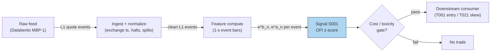
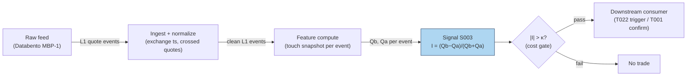
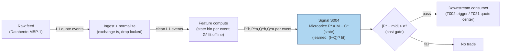
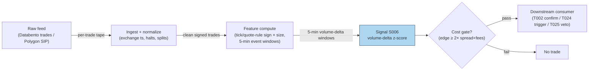
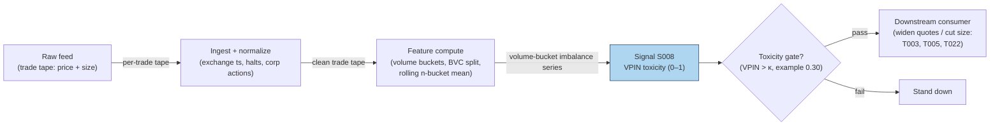
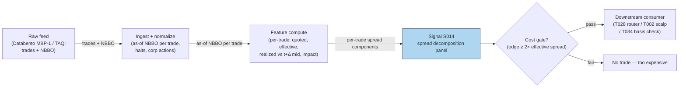
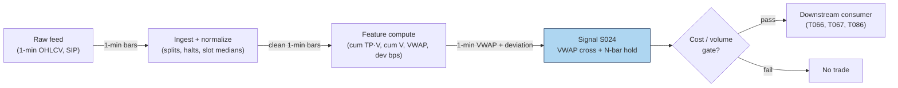
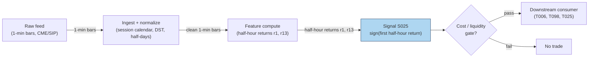
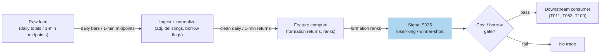
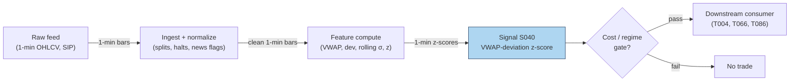

# Intraday Quant Signals & Strategies — 200-Stage Deep Dive

> Living document. Each chapter is one stage. Stages S001–S100: signal deep dives.
> Stages T001–T100: strategy deep dives. Every worked example uses clearly-labeled
> synthetic data unless stated otherwise with a real web-sourced citation.
> Local-build costing assumes a sunk-cost Apple Mac with M5 Max chip and 128GB unified memory.

**Build status:** Stage 10/200 merged · last updated 2026-09-10 · 0 chapters deferred

## Build log
- Stage 0/200 — scaffold created 2026-09-10. Planner + chatbot scouts dispatched.
- Stage 1/200 — S001 merged 2026-09-10 · reviewer: dc96e478 · plot verified (seed 42)
- Stage 3/200 — S003 merged 2026-09-10 · reviewer: dc96e478 · plot verified (seed 42)
- Stage 4/200 — S004 merged 2026-09-10 · reviewer: dc96e478 · plot verified (seed 42)
- Stage 6/200 — S006 merged 2026-09-10 · reviewer: dc96e478 · plot verified (seed 42)
- Stage 8/200 — S008 merged 2026-09-10 · reviewer: dc96e478 · plot verified (seed 7)
- Stage 14/200 — S014 merged 2026-09-10 · reviewer: a2ba029b · plot verified (seed 11)
- Stage 24/200 — S024 merged 2026-09-10 · reviewer: dc96e478 · plot verified (seed 24)
- Stage 25/200 — S025 merged 2026-09-10 · reviewer: dc96e478 · plot verified (seed 25)
- Stage 35/200 — S035 merged 2026-09-10 · reviewer: dc96e478 · plot verified (seed 35)
- Stage 40/200 — S040 merged 2026-09-10 · reviewer: dc96e478 · plot verified (seed 40)


## Table of contents

### Signal chapters

**Batch SB1** — The working core: every serious intraday book uses some of these; all implementable on L1/1-min data.

- [x] Stage 1/200 — [S001 — Order-flow imbalance — Cont–Kukanov–Stoikov](#stage-1200--s001-order-flow-imbalance--contkukanovstoikov)
- [x] Stage 3/200 — [S003 — Queue (depth) imbalance — Gould–Bonart](#stage-3200--s003-queue-depth-imbalance--gouldbonart)
- [x] Stage 4/200 — [S004 — Microprice (Stoikov)](#stage-4200--s004-microprice-stoikov)
- [x] Stage 6/200 — [S006 — Signed trade imbalance (volume delta)](#stage-6200--s006-signed-trade-imbalance-volume-delta)
- [x] Stage 8/200 — [S008 — VPIN (flow toxicity)](#stage-8200--s008-vpin-flow-toxicity)
- [x] Stage 14/200 — [S014 — Quoted / effective / realized spread & price-impact decomposition](#stage-14200--s014-quoted--effective--realized-spread--price-impact-decomposition)
- [x] Stage 24/200 — [S024 — VWAP cross & anchored-VWAP continuation](#stage-24200--s024-vwap-cross--anchored-vwap-continuation)
- [x] Stage 25/200 — [S025 — Intraday time-series momentum](#stage-25200--s025-intraday-time-series-momentum)
- [x] Stage 35/200 — [S035 — Short-term reversal — Jegadeesh / Lehmann](#stage-35200--s035-short-term-reversal--jegadeesh--lehmann)
- [x] Stage 40/200 — [S040 — VWAP-deviation mean reversion](#stage-40200--s040-vwap-deviation-mean-reversion)

### Strategy chapters

*(none merged yet)*

## Part I — Signal deep dives (S001–S100)

## Stage 1/200 — S001: Order-flow imbalance — Cont–Kukanov–Stoikov

*Batch SB1 · Signal 1/100 · Provenance [D] · Family A — Microstructure & order flow*

### S1. One-line verdict

| | |
|---|---|
| **What it is** | Net order-flow pressure at the best bid/ask (adds − cancels − executions), whose sign and depth-scaled size drive short-horizon mid-price moves. |
| **When it works** | Liquid, tight-spread names on direct feeds with stable depth; seconds-to-minutes horizons; as an adverse-selection gauge for quoting. |
| **When it dies** | Wide spreads, thin books, SIP-latency races (SIP = the Securities Information Processor, the consolidated national quote feed, which arrives slower than direct exchange feeds), spoofable queues; any attempt to trade it standalone with market orders at retail latency. |
| **Build-or-buy in one line** | Build the estimator in Python+polars on a bought L1 feed (L1 = top-of-book: only the best bid and best ask; e.g. Databento MBP-1); buy only if you need historical L2 (deeper book levels beyond the best bid/ask) / MBO (market-by-order: every individual order's adds, cancels and fills, unaggregated) or multi-venue coverage. |

Provenance: **[D]** — Cont, Kukanov & Stoikov (2014), arXiv:1011.6402. The caveat from the source entry carries forward unchanged: the original result is a *contemporaneous price-impact regression*, not by itself a forward trading rule; forward use needs a lead-lag/AR extension.

### S2. How it works — plain human explanation

At 9:47:03.214 the book reads bid 231.40 × 800, ask 231.41 × 300. A buy limit order for 500 joins the bid; 200 are cancelled from the ask; a market sell executes 100 against the bid. Net pressure: +600 shares of demand at the touch — that running tally, event by event, is order-flow imbalance (OFI).

The logic is queue mechanics plus adverse selection: prices move when one side's queue depletes, and persistent buying pressure chews through the ask queue first, ratcheting the mid up. Cont, Kukanov & Stoikov showed the relation is approximately *linear*: mid-price change ≈ OFI / (2 × depth). Deep books absorb flow; thin books lurch.

Why not trade volume? Trade imbalance ignores what doesn't print: a 5,000-share bid stacked then cancelled moves no volume but moves the market. OFI counts adds, cancels, and executions together — which is why it beats trade volume (the paper's §4: the volume relation is "noisy and less robust").

Three-bullet mental model:

- **OFI is a flow, not a level.** It accumulates pressure from every book event at the touch; the *level* of the book is S003/S005 territory.
- **Depth is the denominator.** Never trade raw OFI without depth normalization.
- **Contemporaneous ≠ predictive.** The 2014 result explains the move happening *now*; a forward trade needs a lead-lag extension the paper does not provide.

### S3. The math — exact formula

Per best-quote event *n*, let P^b_n, q^b_n be the best bid price and displayed size; P^a_n, q^a_n the best ask price and size. Define the bid-side and ask-side contributions (report convention, matching Cont–Kukanov–Stoikov):

$$e^b_n = \begin{cases} q^b_n, & P^b_n > P^b_{n-1} \ (\text{bid up: whole new queue counts}) \\ q^b_n - q^b_{n-1}, & P^b_n = P^b_{n-1} \ (\text{size change only}) \\ -q^b_{n-1}, & P^b_n < P^b_{n-1} \ (\text{bid down: whole old queue vanishes}) \end{cases}$$

$$e^a_n = \begin{cases} q^a_{\,n-1}, & P^a_n > P^a_{n-1} \ (\text{ask up: selling pressure eased}) \\ -(q^a_n - q^a_{n-1}), & P^a_n = P^a_{n-1} \ (\text{note the minus sign}) \\ -q^a_n, & P^a_n < P^a_{n-1} \ (\text{ask down: new selling pressure}) \end{cases}$$

Per-event OFI and windowed OFI:

$$\Delta\mathrm{OFI}_n = e^b_n + e^a_n, \qquad \mathrm{OFI}_k = \sum_{n \in T_k} \Delta\mathrm{OFI}_n$$

The price-impact relation (contemporaneous regression):

$$\Delta m_k = \alpha + \beta\,\frac{\mathrm{OFI}_k}{D_k} + \varepsilon_k,$$

where *m_k* is the mid-price change over interval *T_k* and *D_k* a depth scale (e.g. average top-of-book depth). The stylized model behind it: ΔP ≈ OFI/(2D) — linear impact with slope inversely proportional to depth.

Parameter table (every default marked as example):

| Parameter | Symbol | Typical range | Too small | Too large | Default (example) |
|---|---|---|---|---|---|
| Aggregation window | T_k | 100 ms – 5 s, or 50–1,000 events | noise dominates; flickering quotes | signal decays; mixes regimes | *1 s bars — example, not an institutional standard* |
| Book depth level | — | touch only (original) → top 3/5/10 | misses deep-book info | stale, gameable size | *touch only — example* |
| Depth normalizer | D_k | rolling mean top-of-book depth, 1–10 min | OFI not comparable across names | lags real depth shocks | *5-min rolling mean — example* |
| Signal form | — | raw / depth-normed / z-score / percentile | raw not comparable across regimes | z-score lags in jumps | *depth-normed z-score — example* |
| Forecast horizon | h | 100 ms – a few seconds | latency eats it | edge decays (CCZ 2023: rapid decay) | *500 ms — example* |

Normalization: raw OFI is in shares — meaningless across names. Depth-normalized OFI (OFI/D) is canonical; a rolling z-score handles diurnal depth seasonality. Causal timing: OFI at event *t* uses only events ≤ *t*; earliest reaction is *t+1*.

Named variants: (1) **touch-only OFI** — the original CKS measure; (2) **integrated OFI** — Cont, Cucuringu & Zhang (2023) combine per-level OFIs over the top 10 levels by PCA, beating best-level OFI in- and out-of-sample; (3) **event-time vs time-bar aggregation** — summing over *N* events is more stable when arrival rates swing.

### S4. Worked example — step-by-step numbers (SYNTHETIC)

All numbers **synthetic** (`batches/SB1/plot_S001.py`, `seed 42`). Initial book: bid 231.40 × 635 / ask 231.41 × 432. No fees, no latency, no hidden liquidity — arithmetic illustration, not a backtest.

| ev | bid | qb | ask | qa | e^b | e^a | ΔOFI_n | cum OFI | mid |
|---|---|---|---|---|---|---|---|---|---|
| 1 | 231.40 | 1048 | 231.41 | 432 | +413 | 0 | +413 | +413 | 231.405 |
| 2 | 231.40 | 1048 | 231.41 | 234 | 0 | +198 | +198 | +611 | 231.405 |
| 3 | 231.41 | 260 | 231.41 | 234 | +260 | 0 | +260 | +871 | 231.410 |
| 4 | 231.41 | 260 | 231.42 | 688 | 0 | +234 | +234 | +1,105 | 231.415 |
| 5 | 231.41 | 260 | 231.42 | 946 | 0 | −258 | −258 | +847 | 231.415 |
| 6 | 231.41 | 153 | 231.42 | 946 | −107 | 0 | −107 | +740 | 231.415 |
| 7 | 231.40 | 715 | 231.42 | 946 | −153 | 0 | −153 | +587 | 231.410 |
| 8 | 231.40 | 715 | 231.42 | 486 | 0 | +460 | +460 | +1,047 | 231.410 |
| 9 | 231.40 | 1002 | 231.42 | 486 | +287 | 0 | +287 | +1,334 | 231.410 |
| 10 | 231.40 | 1002 | 231.43 | 732 | 0 | +486 | +486 | +1,820 | 231.415 |

Hand-checks: ev3 — bid price up, e^b = q^b_3 = +260. ev5 — ask size 688 → 946 at same price, e^a = −(946−688) = −258. ev10 — ask price up, e^a = +q^a_9 = +486.

**What to notice.** Cumulative OFI climbs +413 → +1,820 while the mid moves one tick (231.405 → 231.415) — the depth denominator at work. The mid moves that *do* occur (events 3, 4, 7, 10) coincide with quote-price events, each contributing the largest single-event OFI prints. That is the CKS finding as arithmetic — and why the toy tape flatters OFI: real books have hidden liquidity, fleeting quotes, and adverse fills this table omits.

### S5. Strategies that use this signal

- **T001 — OFI + Queue-Imbalance Directional Scalper** — primary entry trigger (direction); queue imbalance S003 confirms.
- **T021 — Avellaneda–Stoikov Inventory Skew MM** — adverse-selection filter / quote-skew input (OFI shifts the reservation price away from toxic flow).
- **T086 — OFI-Paced Participation Tracker** — execution filter: pace child orders faster when OFI runs with you, slow down when it runs against you.

### S6. Data required — exact spec

| Field | Type | Granularity | Source tier | Notes |
|---|---|---|---|---|
| Best bid price/size | float / int | every quote event (L1) | Tier 2 | needs *displayed* size per price move |
| Best ask price/size | float / int | every quote event (L1) | Tier 2 | same |
| Exchange timestamps | int64 ns | per event | Tier 2 | SIP timestamps add 10s of µs jitter — label SIP work *simulated only — requires MBO/ITCH* for latency claims |
| Corporate actions / halts | reference | daily + intraday halt feed | Tier 1 | price-move contributions are garbage across a split or halt reopen |

Collection: Databento MBP-1 (`XNAS`/`XNYS`); Polygon v3; TAQ history. Ingest sketch (polars, per symbol-day):

```python
import polars as pl, databento as db
cli = db.Historical("API_KEY")
data = cli.timeseries.get_range("XNAS.MBP-1", "AAPL",
        start="2026-09-09", end="2026-09-10")          # 1: fetch MBP-1 deltas
q = (pl.scan_parquet("aapl_mbp1.parquet")              # 2: best-level only
       .filter(pl.col("action").is_in(["A","C","T"]))   #    (adds/cancels/trades)
       .sort("ts_event")                               # 3: exchange-time order
       .with_columns(pb=pl.col("bid_px_00"),           # 4: lagged book state
                     qb=pl.col("bid_sz_00"),
                     pa=pl.col("ask_px_00"),
                     qa=pl.col("ask_sz_00"))
       .with_columns(pb_l=pl.col("pb").shift(1), ...)   # 5: e^b/e^a per §S3
       .with_columns(ofi=pl.when(...).then(...))        # 6: piecewise contributions
       .group_by_dynamic("ts_event", every="1s")       # 7: 1-s event bars (example)
       .agg(ofi_sum=pl.col("ofi").sum()))
```

Storage: `notes/cost-model.md` §4: L1 ≈ 2–8 GB/symbol-day parquet. Quality checklist: exchange timestamps (not SIP arrival); drop crossed/locked quotes; halt/auction/DST/half-day masks; split-adjust before price-move contributions; dedupe retransmits.

### S7. Local build on M5 Max / 128GB

**Feasibility: feasible.** OFI is a stateful O(1)-per-event scan: a Python loop does ~100–500k events/sec (`notes/cost-model.md` §2) vs ~50–500 L1 events/sec average for one liquid name (busy bursts ~1–5k/sec). Sizing from §2: 50 symbols × 2k events/sec = 100k/sec → Python borderline, Rust (5–50M/sec) comfortable; polars batch recompute every second is trivial. Bottleneck is I/O and timestamp normalization, not the arithmetic.

Stack options:

| Stack | When to pick |
|---|---|
| Python + polars | research, daily recompute, ≤20 symbols live |
| Rust ingest → polars analyze | >20 symbols live, or direct-feed decode |
| DuckDB | ad-hoc history queries over parquet |

RAM (§3): one symbol-day L1 ≈ 0.5–4 GB — fine for a few symbols; 60 days (~30–240 GB) **does not fit** the 77 GB budget — stream per-symbol daily parquet. 1-min bars trivial (~12 MB for 500 symbols × 60 days).

Engineering time: Tier M (plan §6) → **20–60 h** ≈ $3,000–9,000 loaded-cost estimate at $150/hr (event-state machine + timestamp/halt handling + depth normalizer + reference validation). Breaks first at 500 symbols: the GIL-bound Python loop; move to Rust ingest + streaming.

### S8. Buy vs build

| Option | What you get | Indicative price | Gains | Loses |
|---|---|---|---|---|
| Tier 0: exchange delayed quotes / Alpaca IEX | free delayed L1 | ~$0 — *indicative, verify before budgeting* | $0 to prototype | 15-min delay; useless for live OFI |
| Tier 1: Polygon Stocks Advanced / Alpaca SIP | real-time SIP L1, history | ~$30–200/mo — *indicative, verify before budgeting* | cheap, easy API | SIP timestamps; latency claims *simulated only — requires MBO/ITCH* |
| Tier 2: Databento Standard MBP-1 | exchange-timestamped L1/L2, pay-as-you-go | ~$200/mo + usage — *indicative, verify before budgeting* | honest timestamps, history | usage meter runs on full universes |
| Tier 3: LOBSTER (academic) | MBO/ITCH replay | ~hundreds/yr academic — *indicative, verify before budgeting* | true queue dynamics | academic license, limited symbols |

Verdict: **build the estimator, buy the feed.** OFI is ~40 lines; the value is your normalization, windows, and lead-lag calibration — none of which a vendor sells. Buy Databento MBP-1 history to validate, Tier-1 SIP for live research, and direct/MBO only after the signal survives realistic costs.

### S9. Success ratio / efficacy — documented evidence

| Study / source | Market & period | Metric | Before/after cost | Caveat |
|---|---|---|---|---|
| Cont, Kukanov & Stoikov (2014) | 50 US stocks, NYSE TAQ (Trades and Quotes: the historical record of every trade and quote), 2008 | linear OFI↔ΔP, slope ∝ 1/(2·depth); stable across time scales, seasonality, stocks | before-cost; **contemporaneous regression, not a trading rule** | no forward P&L; no Sharpe; volume-based impact noisy by comparison |
| Cont, Cucuringu & Zhang (2023), arXiv:2112.13213 | US equities, multi-asset | integrated (PCA, top-10-level) OFI beats best-level OFI in- and out-of-sample; lagged cross-asset OFIs improve future-return forecasts, decaying rapidly | before-cost (R², not P&L) | forecasting exercise, not an after-cost strategy |
| Third-party replication (GitHub `xecuterisaquant/replication-cont-ofi`) | TAQ / NBBO (National Best Bid and Offer: the best displayed bid and ask across all US exchanges), 1-s grid | OLS ΔP ~ β·OFI_norm, mean R² ≈ 14.2% after sign-fix | before-cost; contemporaneous | code repo, not peer-reviewed; replication quality unverified |

Fails in: vol spikes (depth evaporates, 1/(2D) explodes), wide-spread names (flickering quotes), retail books (odd-lot noise), crowded periods (fleeting/spoofed quotes).

Honest bottom line: as a *standalone trigger* this is weak and latency-dominated — the literature documents explanatory power, not after-cost P&L, and I found **no published after-cost Sharpe for a naive OFI scalper**. As a *filter* (adverse-selection gauge for quoting, execution pacing) it is a strong, well-documented input — "one feature in a microstructure model, not a standalone rule" (Duck.ai phrasing, kept labeled).

### S10. Failure modes & pitfalls

1. **Contemporaneous≠forward** — treating the CKS regression as a trading rule. Mitigation: forward-shift one event; report lead-lag R², not contemporaneous.
2. **Lookahead leakage** — bar-close OFI traded inside the same bar. Mitigation: event-*t* → trade-*t+1* causality audit.
3. **Staleness/latency** — SIP timestamps make OFI a museum piece in a colocated race. Mitigation: label SIP work *simulated only — requires MBO/ITCH*; add measured latency to costs.
4. **Fleeting quotes / spoofing** — displayed size cancels before execution. Mitigation: down-weight sub-50 ms quote lifetimes (example).
5. **Cost blowup** — spread + fees + impact on sub-second round trips. Mitigation: per-trade bps (basis points; 1 bps = 0.01%) budget; fee-covering entry gate.
6. **Regime breaks** — depth collapses in stress; the linear model misprices impact. Mitigation: depth/vol-conditioned scaling; stand down past a spread multiple.
7. **Overfitting** — window, normalizer, z-threshold mined on one month. Mitigation: purged/embargoed validation (S088); per-symbol shrinkage.
8. **Data errors** — bad ticks, splits, halts create phantom contributions. Mitigation: S6 checklist; drop crossed/locked quotes; halt-aware masks.

### S11. Visuals




### S12. Sources

1. Cont, R., Kukanov, A. & Stoikov, S. (2014). "The Price Impact of Order Book Events." *Journal of Financial Econometrics* 12(1): 47–88. arXiv:1011.6402 — https://arxiv.org/abs/1011.6402 (canonical OFI definition; contemporaneous regression — not a forward rule).
2. Cont, R., Cucuringu, M. & Zhang, C. (2023). "Cross-Impact of Order Flow Imbalance in Equity Markets." *Quantitative Finance*; arXiv:2112.13213 — https://arxiv.org/abs/2112.13213 (integrated multi-level OFI via PCA; lagged cross-asset OFIs improve short-horizon return forecasts).
3. Replication: `xecuterisaquant/replication-cont-ofi` — https://github.com/xecuterisaquant/replication-cont-ofi (third-party CKS replication on TAQ/NBBO 1-s grid; OLS R² ≈ 14.2% after sign correction; code repo, not peer-reviewed).

**Chatbot source log.** Duck.ai (GPT-5.6 Luna, anonymous, web-search assisted, 2026-09-10; `batches/SB1/duckai-answers.md`) answered Q-SB1-1–Q-SB1-3. Q-SB1-1 confirms the CKS formula structure and the contemporaneous-not-forward caveat. **Operator verification of the chatbot's own worked OFI example found 2 arithmetic errors** (event 5 used the wrong ask size; event 7 wrongly added a price-effect term): the correct cumulative OFI sequence is 0, 4, 12, 23, 18, 13, 0, 6, 11, **19** — the model reported 29. The chapter's worked example uses its own script-generated tape (seed 42), never the chatbot's numbers; the chatbot's parameter/throughput/pricing tables were self-flagged as illustrative estimates and are NOT promoted to documented facts. This is exactly why chatbot output is treated as leads, never facts. Source log: Duck.ai answered Q-SB1-1 (OFI portion), Q-SB1-2, Q-SB1-3; Grok/Cursor answers pending (checked 2026-09-10).

**Unverified leads** (chatbot-only — never in Sources):
- Duck.ai Q-SB1-1 worked example: raw output contained the 2 arithmetic errors above (correct final cumulative OFI = 19, not 29) — kept here as a caution, not used.
- Duck.ai: "Polars 1–10M events/s; Python loop 0.1–1M/s; Rust 5–30M+/s" — model-flagged estimates; cost-model §2 used instead.
- Duck.ai: vendor bands ("free–$50–300/mo retail; $500–10,000+/mo institutional") — model-flagged estimates; cost-model §6 used instead.
- Duck.ai: execution heuristics ("+OFI → waiting riskier; OFI burst → cross spread") — plausible, no checkable source; hypotheses only.
- Duck.ai Q-SB1-2/Q-SB1-3: vendor shortlist (Databento US Equities Mini ~$100–500/mo, TotalView-ITCH ~$300–2,000+/mo, etc.) and engineering-hour bands (prototype 40–70 h, research-grade 120–220 h) — model-flagged estimates; cost-model §5/§6 used in S7/S8 instead.

---

## Stage 3/200 — S003: Queue (depth) imbalance — Gould–Bonart

*Batch SB1 · Signal 3/100 · Provenance [D] · Family A — Microstructure & order flow*

### S1. One-line verdict

| | |
|---|---|
| **What it is** | The normalized difference between displayed size at the best bid and best ask; predicts the direction of the next mid-price tick via queue-depletion. |
| **When it works** | Large-tick, deep-queue stocks where the next move is a race between two visible queues; sub-second to seconds horizons. |
| **When it dies** | Small-tick names with flickering quotes, spoofed/layered books, hidden-liquidity dominance; any SIP-latency queue race. |
| **Build-or-buy in one line** | Build — it is one division on data you already have for S001; buy nothing extra unless you need historical L2. |

Provenance: **[D]** — Gould & Bonart (2016), arXiv:1512.03492; Cao, Hansch & Wang (2009), *Journal of Futures Markets* 29(1): 16–41.

### S2. How it works — plain human explanation

At 9:47:03.214 the book reads bid 231.40 × 1,048, ask 231.41 × 234. Forget prices for a moment and look at the two queues: 1,048 shares want to buy at the touch, only 234 want to sell. Which queue gets eaten first? The ask queue is four times thinner — a single 300-share market sell order barely dents the bid, while a 300-share market buy wipes out the entire ask queue and the ask price ticks up. The mid-price follows the thinner queue.

That is the whole signal: relative queue length forecasts the next tick because prices move when a queue depletes, and the shorter queue usually depletes first. Formally this is *queue-depletion dynamics* — the same mechanical core as S001's OFI, but a snapshot (a *level*) rather than a flow. Where OFI accumulates pressure over events, queue imbalance reads the current standoff: big bid queue + small ask queue = the next move is more likely up.

The economics are adverse selection in miniature. A lopsided book means informed or impatient flow has been leaning on one side; market makers see the thin queue, infer they are about to be adversely selected, and reprice before the queue is gone. Gould & Bonart's contribution was to test this as a literal classifier: feed the imbalance into a logistic regression, predict the next mid-price move, and find a strongly significant relationship — "considerable improvement" over a null model for large-tick stocks, moderate for small-tick ones.

Three-bullet mental model:

- **Imbalance is a snapshot; OFI is the movie.** S003 reads the book's current state; S001 reads how it got there. They are cousins, not substitutes.
- **It predicts *direction*, not magnitude.** The next tick is up or down; how far depends on depth behind the touch (S005 territory).
- **Large-tick is its home turf.** When the spread is one tick and queues are deep, the race is clean. When the spread flickers across ticks, the signal drowns in quote noise.

### S3. The math — exact formula

$$I_t = \frac{Q^b_t - Q^a_t}{Q^b_t + Q^a_t} \in [-1,\, 1],$$

where Q^b_t, Q^a_t are the displayed sizes at the best bid and best ask at time *t* (in shares; both non-negative, not both zero). Trade in the direction of *I* when |I_t| exceeds a fee-covering threshold κ (example — not an institutional standard).

N-level extension (static book pressure):

$$I^{(N)}_t = \frac{\sum_{i=1}^{N}\,(Q^b_{i,t} - Q^a_{i,t})}{\sum_{i=1}^{N}\,(Q^b_{i,t} + Q^a_{i,t})},$$

with *i* indexing price levels from the touch outward. *N* = 1 is the Gould–Bonart measure; *N* = 5–10 is the S005 book-pressure family.

A useful exact identity linking S003 to S004 (verified algebra): with spread *s_t = P^a_t − P^b_t*,

$$P_{\mu,t} - m_t = \frac{s_t}{2}\,I_t,$$

i.e. the microprice deviation from mid equals half the spread times the queue imbalance. The two signals share a touch-level core; they diverge when you add flow history (S001) or deeper levels / dynamics (full microprice).

Parameter table:

| Parameter | Symbol | Typical range | Too small | Too large | Default (example) |
|---|---|---|---|---|---|
| Entry threshold | κ | 0.3 – 0.7 | trades noise, fees eat you | never triggers | *±0.5 — example, not an institutional standard* |
| Levels | N | 1 (touch) – 10 | misses deep liquidity | stale/gameable size | *1 — example* |
| Smoothing | — | raw snapshot, or 100 ms–1 s EWMA | flicker whipsaws | lags the depletion | *raw — example* |
| Horizon | — | next 1–20 ticks / 100 ms – seconds | — | edge decays | *next tick — example* |

Causal timing: *I_t* is computed from the book snapshot at event *t* using only data ≤ *t*; a trade reacting to it can execute no earlier than *t+1*. Variants: (1) touch-only (canonical); (2) N-level book pressure; (3) time-averaged imbalance over a short window (kills flicker, adds lag).

### S4. Worked example — step-by-step numbers (SYNTHETIC)

Same synthetic tape as S001 (`batches/SB1/plot_S003.py`, `seed 42`), snapshots after each event. All numbers **synthetic** — no fees, no latency, no hidden liquidity; an arithmetic illustration, not a backtest.

| ev | bid | qb | ask | qa | I_t | mid |
|---|---|---|---|---|---|---|
| 0 | 231.40 | 635 | 231.41 | 432 | +0.1903 | 231.405 |
| 1 | 231.40 | 1048 | 231.41 | 432 | +0.4162 | 231.405 |
| 2 | 231.40 | 1048 | 231.41 | 234 | +0.6349 | 231.405 |
| 3 | 231.41 | 260 | 231.41 | 234 | +0.0526 | 231.410 |
| 4 | 231.41 | 260 | 231.42 | 688 | −0.4515 | 231.415 |
| 5 | 231.41 | 260 | 231.42 | 946 | −0.5688 | 231.415 |
| 6 | 231.41 | 153 | 231.42 | 946 | −0.7216 | 231.415 |
| 7 | 231.40 | 715 | 231.42 | 946 | −0.1391 | 231.410 |
| 8 | 231.40 | 715 | 231.42 | 486 | +0.1907 | 231.410 |
| 9 | 231.40 | 1002 | 231.42 | 486 | +0.3468 | 231.410 |
| 10 | 231.40 | 1002 | 231.43 | 732 | +0.1557 | 231.415 |

Hand-checks: ev2: (1048 − 234)/(1048 + 234) = 814/1282 = +0.6349. ev6: (153 − 946)/(153 + 946) = −793/1099 = −0.7216. ev10: (1002 − 732)/1734 = +0.1557. With the example threshold κ = ±0.5, the trigger fires at ev2 (long, +0.63) and ev5/ev6 (short, −0.57/−0.72).

**What to notice.** The imbalance leads the tape's two real mid moves: the +0.63 print at ev2 precedes the uptick at ev3 (231.405 → 231.410), and the −0.72 at ev6 precedes the downtick at ev7 (231.415 → 231.410). That is the queue-depletion story working as advertised — but this is a 10-event synthetic anecdote with hand-designed event types, not evidence of tradability. Note also ev3: after the bid stepped up, both queues reset small and *I* collapses to +0.05 — price-move events destroy the very queues the signal reads, which is why the signal must be recomputed every event and why stale snapshots are worthless.

### S5. Strategies that use this signal

- **T022 — Queue-Imbalance Maker with Toxicity Cancel** — primary trigger: posts at the touch when the queue favors your side; cancels on imbalance reversal or VPIN spike.
- **T001 — OFI + Queue-Imbalance Directional Scalper** — confirmation filter on the OFI entry (both must agree).
- **T004 — VWAP-Deviation Mean-Reversion** — timing filter: enter the fade only when the touch queue favors the fade direction.

### S6. Data required — exact spec

| Field | Type | Granularity | Source tier | Notes |
|---|---|---|---|---|
| Best bid/ask sizes | int (shares) | every quote event (L1) | Tier 2 | the entire signal; odd-lot handling matters |
| Best bid/ask prices | float | every quote event (L1) | Tier 2 | for the mid and the S004 identity |
| Exchange timestamps | int64 ns | per event | Tier 2 | queue races are decided in µs — SIP timestamps make live trading *simulated only — requires MBO/ITCH* |
| Halt/auction flags | bool | per event | Tier 1 | imbalance is meaningless across halts |

Collection: same feed as S001 (Databento MBP-1, Polygon L2 per the report entry). Ingest sketch (≤20 lines):

```python
import polars as pl
q = (pl.scan_parquet("aapl_mbp1.parquet")          # 1: L1 deltas, exchange-time sorted
       .sort("ts_event")
       .with_columns(qb=pl.col("bid_sz_00"),       # 2: touch sizes
                     qa=pl.col("ask_sz_00"),
                     bid=pl.col("bid_px_00"),
                     ask=pl.col("ask_px_00"))
       .filter((pl.col("qb") + pl.col("qa")) > 0)  # 3: guard empty book
sig = q.with_columns(                              # 4: the whole signal: one division
        imb=(pl.col("qb") - pl.col("qa")) /
            (pl.col("qb") + pl.col("qa"))).collect()
long  = sig.filter(pl.col("imb") >  0.5)           # 5: example threshold
short = sig.filter(pl.col("imb") < -0.5)
```

Storage: identical to S001 — L1 quotes+trades ≈ 2–8 GB/symbol-day parquet (`notes/cost-model.md` §4); the signal itself adds one float column. Data-quality checklist: drop crossed/locked quotes; normalize timestamps to exchange time; exclude auction prints and halt periods; watch for odd-lot-only quotes on some feeds.

### S7. Local build on M5 Max / 128GB

**Feasibility: trivial.** The signal is one division per quote event — O(1), stateless. A pure-Python loop at ~100–500k events/sec (`notes/cost-model.md` §2) covers a 50-symbol universe (~100k events/sec busy) with headroom; polars vectorized recompute (~10–50M rows/sec, §2) does a full day in seconds. Bottleneck: none for the math — the constraint is feed latency and timestamp quality, not compute.

Stack options:

| Stack | When to pick |
|---|---|
| Python + polars | everything up to live 50-symbol scanning |
| Rust | only if you are already writing the S001 Rust ingest — no standalone need |
| DuckDB | historical screening over parquet |

RAM: per §3, one symbol-day of L1 ≈ 0.5–4 GB working set; trivial for intraday windows. Sixty days for one symbol does not fit the 77 GB budget — stream per-symbol daily files. Engineering time: Tier M per plan §6, but at the light end — **20–40 h** ≈ $3,000–6,000 loaded-cost estimate at $150/hr, mostly feed plumbing and the threshold/toxicity gating shared with S001. What breaks first at 500 symbols: nothing in the math — the feed bill and the staleness of your quotes do.

### S8. Buy vs build

| Option | What you get | Indicative price | Gains | Loses |
|---|---|---|---|---|
| Tier 0: delayed quotes | free L1, 15-min delay | ~$0 — *indicative, verify before budgeting* | $0 research prototype | no live signal |
| Tier 1: Polygon Stocks Advanced / Alpaca SIP | real-time SIP L1 | ~$30–200/mo — *indicative, verify before budgeting* | cheap live data | queue races on SIP are *simulated only — requires MBO/ITCH* |
| Tier 2: Databento MBP-1 | exchange-timestamped L1 | ~$200/mo + usage — *indicative, verify before budgeting* | honest event order | usage meter on wide universes |

Verdict: **build, always** — the signal is a one-line transform of data you already buy for S001. There is no credible "precomputed queue imbalance" product worth paying for; the only buy decision is the feed tier, and the honest crossover is latency: if you intend to *trade* the next tick rather than study it, SIP timestamps are not enough and you are in Tier 2/3 with colocation-class infrastructure, which a Mac on a home connection cannot honestly emulate.

### S9. Success ratio / efficacy — documented evidence

| Study / source | Market & period | Metric | Before/after cost | Caveat |
|---|---|---|---|---|
| Gould & Bonart (2016), arXiv:1512.03492 | 10 liquid Nasdaq stocks, LOB data | logistic regression I → next mid move: strongly significant; considerable improvement over null for large-tick stocks, moderate for small-tick (binary + probabilistic) | before-cost (classification, not P&L) | predicts direction only; no trading costs, no Sharpe |
| Cao, Hansch & Wang (2009), *J. Futures Markets* 29(1) | Australian Stock Exchange | order imbalances between demand/supply schedules significantly related to future short-term returns, controlling for return autocorrelation, inside spread, trade imbalance; book ≈ 22% of price discovery | before-cost (return regression) | 2000s ASX; explanatory, not a strategy |
| Kercheval & Zhang (2015), *Quant. Finance* 15(8) | US equities, real LOB data | SVM on LOB-state features (incl. book imbalance): effective short-term price-movement forecasts | before-cost (classification) | ML wrapper; no after-cost P&L |

Only before-cost numbers exist in what I could verify — every row above is a classification or regression result, none is an after-cost trading Sharpe. Regimes where it fails: small-tick names (Gould–Bonart's own "moderate" result), spoofed/layered books where displayed size is a lie, hidden-liquidity-heavy venues, and any latency regime where you see the imbalance after the queue is already gone.

Honest bottom line: as a *standalone trigger* this is a real but tiny and latency-bound edge — documented as direction prediction, never as after-cost profit in the sources I found. As a *filter/veto* (T022's toxicity cancel, T001's confirmation) and as a *quoting input* (lean your limit orders to the heavy-queue side) it is one of the best-evidenced microstructure features in the literature.

### S10. Failure modes & pitfalls

1. **Spoofing / fleeting quotes** — displayed size vanishes before execution. Mitigation: weight by quote lifetime or filter sub-50 ms quotes (example).
2. **Hidden liquidity** — the visible queue is not the real queue. Mitigation: treat *I* as a noisy proxy; never size on it alone.
3. **Small-tick flicker** — spread bouncing across ticks randomizes the signal. Mitigation: restrict to large-tick names or time-average the imbalance.
4. **Lookahead leakage** — using the post-move snapshot to "predict" the move. Mitigation: strict event-*t* → trade-*t+1* causality.
5. **Latency illusion on SIP** — your imbalance print arrives after the race is over. Mitigation: label SIP work *simulated only — requires MBO/ITCH*.
6. **Cost blowup** — crossing the spread to chase a one-tick prediction. Mitigation: fee-covering threshold κ; prefer passive posting (T022) over taking.
7. **Overfitting κ** — threshold tuned to one month's microstructure. Mitigation: per-symbol calibration, walk-forward, shrinkage toward 0.5.
8. **Regime breaks** — imbalance–direction relation weakens in stress/crowding. Mitigation: toxicity overlay (VPIN, S008); stand down on spread multiples.

### S11. Visuals




### S12. Sources

1. Gould, M. D. & Bonart, J. (2016). "Queue Imbalance as a One-Tick-Ahead Price Predictor in a Limit Order Book." arXiv:1512.03492 — https://arxiv.org/abs/1512.03492 (logistic-regression evidence; large-tick vs small-tick result).
2. Cao, C., Hansch, O. & Wang, X. (2009). "The information content of an open limit-order book." *Journal of Futures Markets* 29(1): 16–41 — https://ideas.Repec.org/a/wly/jfutmk/v29y2009i1p16-41.html (order imbalances → future short-term returns; ~22% price-discovery contribution).
3. Kercheval, A. N. & Zhang, Y. (2015). "Modelling high-frequency limit order book dynamics with support vector machines." *Quantitative Finance* 15(8): 1315–1329 — https://ideas.repec.Org/a/taf/quantf/v15y2015i8p1315-1329.html (LOB-state features effective for short-term forecasts on real data).

**Chatbot source log.** Q-SB1-1 asked for queue imbalance alongside OFI and microprice, but the Duck.ai answer (GPT-5.6 Luna, 2026-09-10) covered only the OFI portion — no usable queue-imbalance content was returned. Source log: Duck.ai answered Q-SB1-1 (OFI portion only — not the queue-imbalance portion); Grok/Cursor answers pending (checked 2026-09-10).

**Unverified leads:** none specific to S003 beyond the general SB1 chatbot caveats — no chatbot made a checkable queue-imbalance claim in this batch.

---

## Stage 4/200 — S004: Microprice (Stoikov)

*Batch SB1 · Signal 4/100 · Provenance [D] · Family A — Microstructure & order flow*

### S1. One-line verdict

| | |
|---|---|
| **What it is** | Stoikov's learned fair-price estimator: the limiting expected mid-price conditional on the book-imbalance state, estimated from a Markov chain over discretized (imbalance, spread) states — a martingale by construction. |
| **When it works** | As a fair-value anchor for quoting and for fading transient mid deviations; tight-spread, visible-book names. |
| **When it dies** | Spoofed books, dominant hidden liquidity, one-tick-wide flickering spreads — anywhere displayed size lies. |
| **Build-or-buy in one line** | Build — the estimator is a small batch fit plus a per-event table lookup on your S001/S003 feed. |

Provenance: **[D]** — Stoikov (2018), "The micro-price: a high-frequency estimator of future prices," *Quantitative Finance* 18(12): 1959–1966 (working paper Nov 2017). Definition: $P_t^{\text{micro}} = \lim_{i\to\infty} \mathbb{E}[M_{\tau_i} \mid \mathcal{F}_t]$ — the limit of expected mid-prices at the successive mid-price-change times $\tau_1, \tau_2, \dots$ — estimated in practice by discretizing (imbalance, spread) into states and fitting the transition matrices $Q, R_1, R_2$ (paper §3). The cross-weighted mid $W = I\cdot P^a + (1-I)\cdot P^b$ is the paper's Appendix-B degenerate special case (no learning) and appears in this chapter ONLY as the naive baseline — it is not the microprice. Do not double-count with S003: the microprice's state *is* the touch imbalance S003 uses, passed through the learned adjustment.

### S2. How it works — plain human explanation

At 9:47:03.214 the book reads bid 231.40 × 1,048, ask 231.41 × 234, mid 231.405. The plain mid says "fair value is 231.405." But look at the queues: 1,048 shares bid vs 234 offered. The next trade is far more likely to be a buy chewing through that thin ask — printing at 231.41 — than a sell. So is 231.405 really the best guess of where the price is going? No: the *expected* next price leans toward the ask.

Stoikov's question is sharper than "which way does it lean": **given that the book looks like this, where will the mid-price be on average, far into the future?** That limiting expected mid-price *is* the microprice — a martingale by construction, which is the mathematical way of saying "this is what 'fair' means once you condition on the book." And crucially, it is not a formula you write down from one snapshot. It is **learned**: discretize the imbalance into bins, watch thousands of quote events to see what the mid does after each bin, and compute the expected long-run mid per bin. Each new event is then a table lookup — mid plus the learned adjustment for its bin.

The construction, in one paragraph: the state of the book at each quote event is the pair (imbalance bin, spread bin). From history you estimate three transition matrices — $Q$ (quote updates where the mid doesn't move), $R_1$ (the distribution of the next mid-price move), $R_2$ (state transitions coincident with a mid-price move). From them you compute the per-state adjustment $G^* = G_1 + B G_1 + B^2 G_1 + \cdots$ (the §3 math), and the microprice is $P^{\text{micro}} = M + G^*(\text{state})$. Because the matrices are fit per symbol from its own history, the estimator adapts to each name's microstructure — a large-tick stock and a small-tick stock get different adjustments, which no closed form can do.

Where does the familiar cross-weighted mid $W = I\cdot P^a + (1-I)\cdot P^b$ fit? It is the **no-learning baseline**: the straight-line adjustment $(I-\tfrac12)\cdot S$ you get if you skip the estimation and simply *impose* that the current imbalance tells the whole story. Stoikov derives it as a degenerate special case (Appendix B: imbalance as a Brownian motion with particular boundary behavior) and shows empirically it falls short — the learned adjustments come out flatter, always inside half the spread, and predict short-term prices better than the mid *or* the weighted mid (BAC/CVX, March 2011).

Why "micro"? Because it lives at the tick scale and updates every quote event — and because taking expectations far into the future filters out the microstructure noise in the mid-price itself.

Three-bullet mental model:

- **The microprice is a learned function of the book state, not a closed form.** Fit transition matrices on history; each event is then mid + a looked-up adjustment. No fit, no microprice — just the baseline.
- **It is a fair-value estimator, not a trade.** You fade deviations from it (buy below, sell above) or center your quotes on it — you don't "buy the microprice."
- **The cross-weighted mid is the naive baseline, not the estimator.** Same inputs, imposed straight-line adjustment, zero learning. Benchmark the learned microprice against it — and never present the baseline as the microprice.

### S3. The math — exact formula

**Definition** (Stoikov 2017 §2, 2018): with $\tau_1, \tau_2, \dots$ the successive
mid-price-change times and $\mathcal{F}_t$ the order-book information at $t$,

$$P^{\text{micro}}_t = \lim_{i\to\infty} \mathbb{E}[M_{\tau_i} \mid \mathcal{F}_t].$$

Write $P^{\text{micro}} = M + g(I, S)$ with $M$ the mid-price,
$I = Q^b/(Q^b+Q^a)$ the imbalance, $S = P^a - P^b$ the spread. The paper's
program is to **estimate the adjustment function $g$ from data**. The $i$-th
mid-price prediction decomposes as

$$P_i = M_t + \sum_{k=1}^{i} g_k(I_t, S_t),$$

with the first-order adjustment $g_1(I,S) = \mathbb{E}[M_{\tau_1} - M_t \mid I_t = I, S_t = S]$
(the expected move to the *next* mid-price change) and the recursion
$g_{i+1}(I,S) = \mathbb{E}[g_i(I_{\tau_1}, S_{\tau_1}) \mid I_t = I, S_t = S]$.

**Finite-state estimator** (paper §3 — the implementable version): discretize
imbalance into $n$ bins ($I_t = x$ iff $(x-1)/n < I \le x/n$) and spread into $m$
tick values; the book state is $x = (i, s)$ ($nm$ states). From quote history
estimate:

- $Q_{xy} = P(M_{t+1}-M_t = 0 \;\land\; X_{t+1} = y \mid X_t = x)$ — transient
  quote updates, $nm \times nm$;
- $R^1_{xk} = P(M_{t+1}-M_t = k \mid X_t = x)$ — one-step mid-move distribution
  over $K = \{-0.01, -0.005, 0.005, 0.01\}$ (half-ticks), $nm \times 4$;
- $R^2_{xy} = P(M_{t+1}-M_t \ne 0 \;\land\; X_{t+1} = y \mid X_t = x)$ — state
  transitions coincident with a mid-price move, $nm \times nm$.

Then, with $K$ as a column vector:

$$G_1 = (I - Q)^{-1} R^1 K, \qquad B = (I - Q)^{-1} R^2,$$

$$G^* = G_1 + B G_1 + B^2 G_1 + \cdots \quad\text{(converges fast in practice)},$$

$$P^{\text{micro}}_t = M_t + G^*(X_t).$$

Convergence is guaranteed (Thm 3.1) when the data are **symmetrized** — every
observation $(I, S, \dots)$ mirrored by $(1-I, S, \dots)$ — so that $B^* G_1 = 0$.
Inference per event is a bin lookup plus an addition; all the work is the fit.

**Naive baseline — NOT the microprice.** The cross-weighted mid

$$W = I\cdot P^a + (1-I)\cdot P^b, \qquad W - M = \left(I-\tfrac12\right) S,$$

is the closed form the paper derives as the degenerate Appendix-B special case
and compares *against*. Carry it only as the no-learning benchmark.

The signal is the deviation:

$$s_t = P^{\text{micro}}_t - M_t = G^*(X_t).$$

Parameter table:

| Parameter | Symbol | Typical range | Too small | Too large | Default (example) |
|---|---|---|---|---|---|
| Imbalance bins | n | 4–10 | 1 = no state information | 20+ = sparse transition counts | *4 — example, not an institutional standard* |
| Spread bins | m | 1–5 ticks | misses spread interaction | sparse | *1 — example* |
| Estimation window | — | 1–4 weeks of quotes | regime change mid-fit | stale microstructure | *1 month — example* |
| Symmetrization | — | on | series can diverge (Thm 3.1) | — | *on* |
| Entry threshold | κ | 0.1 – 0.5 × spread | fee death by a thousand fills | never trades | *0.25 × spread — example* |
| Holding horizon | h | seconds | noise | deviation mean-reverts away | *5 s — example* |

Causal timing: the state $X_t$ comes from the snapshot at event $t$ using only
data ≤ $t$; $G^*$ is fit on history strictly *before* the evaluation window
(never in-sample transitions); tradable no earlier than $t+1$. Variants:
(1) touch microprice ($n$ bins × $m = 1$, canonical); (2) N-level imbalance
states (the paper notes the Level-II extension); (3) the closed-form baseline
$W$ — for benchmarking the learned estimator, never as the signal itself.

### S4. Worked example — step-by-step numbers (SYNTHETIC)

A synthetic run of the §3 estimator (`batches/SB1/plot_S004.py`, `seed 42`).
Imbalance $I = Q^b/(Q^b+Q^a)$ in $n = 4$ bins, spread fixed at 1 tick ($m = 1$),
mid-price move grid $K = \{-0.01, -0.005, 0.005, 0.01\}$. The "estimated"
transition matrices $Q, R_1, R_2$ are invented (reversal-symmetric, i.e.
symmetrized as Thm 3.1 requires) — they demonstrate the machinery, not a real
fit. The 10-event tape holds bid/ask fixed at 231.40/231.41 with sizes at the
bin centers; states are drawn from the chain. All numbers **synthetic**; no
fees, no latency — arithmetic illustration, not a backtest. Deviation in basis
points (bps): $(P^{\text{micro}} - \text{mid})/\text{mid} \times 10^4$. $W$ is
the cross-weighted-mid **baseline** (not the microprice).

Fitted adjustments: $G_1 = (-0.0649, -0.0253, +0.0253, +0.0649)$¢,
$G^* = (-0.0761, -0.0305, +0.0305, +0.0761)$¢ per bin 1–4; max $|B|$
eigenvalue $0.50 < 1$, so the series converges in a handful of terms.

| ev | bin | bid | qb | ask | qa | mid | G\* (¢) | P\* | W (baseline) | dev\* (bps) |
|---|---|---|---|---|---|---|---|---|---|---|
| 0 | 1 | 231.40 | 125 | 231.41 | 875 | 231.4050 | −0.076 | 231.4042 | 231.4013 | −0.03 |
| 1 | 1 | 231.40 | 125 | 231.41 | 875 | 231.4050 | −0.076 | 231.4042 | 231.4013 | −0.03 |
| 2 | 2 | 231.40 | 375 | 231.41 | 625 | 231.4050 | −0.030 | 231.4047 | 231.4038 | −0.01 |
| 3 | 2 | 231.40 | 375 | 231.41 | 625 | 231.4050 | −0.030 | 231.4047 | 231.4038 | −0.01 |
| 4 | 1 | 231.40 | 125 | 231.41 | 875 | 231.4050 | −0.076 | 231.4042 | 231.4013 | −0.03 |
| 5 | 4 | 231.40 | 875 | 231.41 | 125 | 231.4050 | +0.076 | 231.4058 | 231.4087 | +0.03 |
| 6 | 4 | 231.40 | 875 | 231.41 | 125 | 231.4050 | +0.076 | 231.4058 | 231.4087 | +0.03 |
| 7 | 4 | 231.40 | 875 | 231.41 | 125 | 231.4050 | +0.076 | 231.4058 | 231.4087 | +0.03 |
| 8 | 3 | 231.40 | 625 | 231.41 | 375 | 231.4050 | +0.030 | 231.4053 | 231.4062 | +0.01 |
| 9 | 3 | 231.40 | 625 | 231.41 | 375 | 231.4050 | +0.030 | 231.4053 | 231.4062 | +0.01 |

Hand-check ev5: bin 4 → $G^* = +0.0761$¢, so
$P^* = 231.4050 + 0.000761 = 231.4058$. Baseline: $I = 875/1000 = 0.875$,
$W = 0.875 \times 231.41 + 0.125 \times 231.40 = 231.4087$ — deviation
$+0.16$ bps vs the learned $+0.03$ bps. Note $G^* - G_1 = 0.0761 - 0.0649 =
0.0112$¢ on bin 4: the higher-order Markov terms ($B G_1 + B^2 G_1 + \cdots$)
add about a seventh on top of the first-order adjustment.

**What to notice.** The learned adjustments are roughly a *fifth* of the
baseline's (0.076¢ vs 0.375¢ at the extreme bin) — exactly the paper's
Figure-3 pattern for BAC/CVX: the learned curve sits between the mid (flat)
and the weighted-mid line (steep), always inside half the spread. That is the
point and the warning: the edge per event is a *fraction of a fraction* of the
spread, so it only survives as a quoting advantage (better limit placement,
less adverse selection), never as a market-order scalp after fees. The
baseline column is there so you can see what "no learning" would have claimed
— steeper, noisier, and wrong about the magnitude.

### S5. Strategies that use this signal

- **T002 — Microprice Fair-Value Scalper** — primary trigger: trades toward the microprice-implied fair value with volume-delta confirmation and a spread-decomposition cost gate.
- **T021 — Avellaneda–Stoikov Inventory Skew MM** — fair-value anchor: quotes are skewed around the microprice (not the mid) so the book's asymmetry is priced in.
- **T085 — Resiliency Market Maker** — quoting anchor alongside LOB resiliency: re-center quotes on P^micro after temporary-impact dislocations.

### S6. Data required — exact spec

| Field | Type | Granularity | Source tier | Notes |
|---|---|---|---|---|
| Best bid/ask prices + sizes | float / int | every quote event (L1); L2 for N-level | Tier 2 | same feed as S001/S003 |
| Exchange timestamps | int64 ns | per event | Tier 2 | fair-value staleness = adverse selection |
| Halt/auction flags | bool | per event | Tier 1 | drop locked/crossed books (cf. ev3) |

Collection: any L1 feed (Databento MBP-1 per the report entry; N-level states need MBP-10). Ingest sketch (≤20 lines):

```python
import polars as pl
import numpy as np
q = (pl.scan_parquet("aapl_mbp1.parquet")          # 1: L1 deltas, exchange-time order
       .sort("ts_event")
       .with_columns(mid=(pl.col("bid_px_00") + pl.col("ask_px_00")) / 2,
                     imb=pl.col("bid_sz_00") /
                         (pl.col("bid_sz_00") + pl.col("ask_sz_00")),
                     spr=pl.col("ask_px_00") - pl.col("bid_px_00"))
       .filter(pl.col("spr") > 0)                  # 2: drop locked/crossed
       .with_columns(state=(pl.col("imb") * 4).ceil().cast(pl.Int64))  # 3: imbalance bin
       .collect())
# --- offline fit on history strictly before evaluation: count transitions ->
# Q, R1, R2; symmetrize; G1 = (I-Q)^-1 R1 K; B = (I-Q)^-1 R2;
# Gstar = G1 + B@G1 + B^2@G1 + ...  (minutes in numpy)
Gstar = np.load("microprice_Gstar_aapl.npy")       # 4: learned adjustment ($)
mp = q.with_columns(
    micro=pl.col("mid") + Gstar[pl.col("state") - 1],            # 5: the estimator: lookup
    w_base=pl.col("imb") * pl.col("ask_px_00") +                 # baseline only — not the microprice
           (1 - pl.col("imb")) * pl.col("bid_px_00"))
```

Storage: same as S001/S003 — L1 ≈ 2–8 GB/symbol-day parquet (`notes/cost-model.md` §4); the signal is two float columns (micro + baseline). Data-quality checklist: exchange timestamps, drop crossed/locked books, halt/auction masks, split adjustments, odd-lot quote handling, **fit window strictly before the evaluation window** (no in-sample transitions), symmetrized counts with a convergence check on the $G^*$ series.

### S7. Local build on M5 Max / 128GB

**Feasibility: trivial at inference.** One bin lookup and an addition per quote event — cheaper than S003's division. Python+polars handles a 50-symbol universe live without noticing; the §2 sizing (100k events/sec → Python borderline, Rust comfortable) applies unchanged, with the microprice adding negligible marginal cost over the S001 ingest you already run. The **fit** is the only real compute: counting transitions over ~1 month of quotes and one $nm \times nm$ matrix inverse — minutes in numpy/polars for $n = 4$–$10$, $m = 1$–$3$ — then walk-forward refits on a schedule.

Stack options:

| Stack | When to pick |
|---|---|
| Python + polars | everything, including live — the math is O(1) |
| Rust | only as part of a shared S001/S003 Rust ingest |
| N-level variant | needs MBP-10; same stacks, ~10× the event rate |

RAM: per §3, L1 touch quotes ≈ 0.5–4 GB/symbol-day working set — trivial for intraday; 60-day single-symbol history does not fit the 77 GB budget, stream per-symbol daily files.

Engineering time: Tier M per plan §6, light end — **20–40 h** ≈ $3,000–6,000 loaded-cost estimate at $150/hr, shared almost entirely with S001/S003 plumbing; the genuinely new work is the fit harness (transition counting, symmetrization, the $G^*$ convergence check, walk-forward refits) — budget ~8 h of the band for it. What breaks first at 500 symbols: nothing in the math — the feed bill, and the honesty of your timestamps.

### S8. Buy vs build

| Option | What you get | Indicative price | Gains | Loses |
|---|---|---|---|---|
| Tier 0: delayed quotes | free L1 | ~$0 — *indicative, verify before budgeting* | $0 prototype | no live fair value |
| Tier 1: Polygon / Alpaca SIP | real-time SIP L1 | ~$30–200/mo — *indicative, verify before budgeting* | cheap live data | stale microprice in a race — *simulated only — requires MBO/ITCH* for quoting claims |
| Tier 2: Databento MBP-1/10 | exchange-timestamped L1/L2 | ~$200/mo + usage — *indicative, verify before budgeting* | honest snapshots; N-level needs MBP-10 | usage meter |

Verdict: **build.** Inference is a table lookup on data you already buy, and no vendor can sell you your symbols' fitted transition matrices — the fit is in-house by construction. The decision is feed tier (SIP vs direct), governed by whether you quote live or research offline. Crossover: none on cost.

### S9. Success ratio / efficacy — documented evidence

| Study / source | Market & period | Metric | Before/after cost | Caveat |
|---|---|---|---|---|
| Stoikov (2018), *Quant. Finance* 18(12) | high-frequency equity data | microprice empirically a better predictor of short-term prices than the mid-price or the weighted mid-price | before-cost (prediction accuracy, not P&L) | martingale construction; no trading costs, no Sharpe |
| Stanford MS&E 448 (2021), "High Frequency Trading Strategies" course report, AAPL dataset | US equity, student replication | compares naive/mid/weighted-mid/microprice fair-value constructions on real data | before-cost (practitioner reconstruction) | coursework, not peer-reviewed |

Only before-cost numbers exist in what I could verify — both rows are prediction-accuracy results, not after-cost trading P&L. I found **no published after-cost Sharpe for a microprice-deviation scalper**; the literature positions the microprice as a *fair-value input to quoting* (adverse-selection reduction), where the "return" shows up as lower effective spread paid, not as a strategy Sharpe.

Honest bottom line: as a *standalone trigger* this is a sub-spread edge — the worked example's max learned deviation was 0.03 bps (the naive baseline reached 0.16 bps), and crossing the spread to chase it is arithmetic suicide. As a *filter / quoting anchor* (T021, T085: center quotes on P^micro instead of mid) it is one of the cheapest genuine improvements in market microstructure — the value is measured in reduced adverse selection, which is exactly what Stoikov's construction targets.

### S10. Failure modes & pitfalls

1. **Sub-spread edge vs full-spread cost** — learned deviations are a fraction of the spread (the §4 fit: ≤0.08¢ on a 1¢ spread); market orders lose by construction. Mitigation: use only for passive quoting / fill improvement, never for taking.
2. **Spoofed displayed size** — the state binning trusts the queues. Mitigation: lifetime-weighted sizes; toxicity overlay (S008).
3. **Hidden liquidity** — invisible size breaks the binning. Mitigation: treat P^micro as a noisy proxy; shrink adjustments toward zero in dark-heavy names.
4. **Locked/crossed books** — bins are meaningless on non-positive spreads. Mitigation: drop those snapshots before computing (cf. the S6 filter).
5. **Lookahead leakage** — computing the state from the post-trade book, or fitting $G^*$ on the evaluation window's own transitions. Mitigation: event-*t* snapshot → earliest action *t+1*; fit window strictly before evaluation.
6. **Overfitting the learned estimator** — transition matrices fit on one regime; $nm$ states with sparse counts. Mitigation: walk-forward refits; symmetrization; compare against the closed-form baseline that cannot overfit.
7. **Double-counting S003** — the microprice's state *is* the S003 touch imbalance, passed through the learned $G^*$; stacking raw imbalance and the microprice as "independent" features double-counts. Mitigation: use one, or orthogonalize.
8. **Latency/staleness** — a stale microprice is a worse fair value than a fresh mid. Mitigation: direct-feed timestamps; SIP work labeled *simulated only — requires MBO/ITCH*.

### S11. Visuals




### S12. Sources

1. Stoikov, S. (2018). "The micro-price: a high-frequency estimator of future prices." *Quantitative Finance* 18(12): 1959–1966 — https://econpapers.repec.org/article/tafquantf/v_3a18_3ay_3a2018_3ai_3a12_3ap_3a1959-1966.htm (martingale construction; beats mid and weighted mid as a short-term predictor).
2. Stoikov, S. (2017). "The Micro-Price: A High Frequency Estimator of Future Prices." Working paper (Nov 2017) — https://github.com/shaileshkakkar/MicroPriceIndicator/raw/refs/heads/master/Micro-Price%20Indicator.pdf (full definition, limit-of-expected-midprices construction).
3. Sasson, J., Ho, W. H. & Samson, F. (2021). "High Frequency Trading Strategies." Stanford MS&E 448 course final report — http://stanford.edu/class/msande448/2021/Final_reports/gr1.pdf (practitioner reconstruction comparing mid, weighted mid, and microprice fair-value estimators on an AAPL dataset).

**Chatbot source log.** Q-SB1-1 asked for the microprice alongside OFI and queue imbalance, but the Duck.ai answer (GPT-5.6 Luna, 2026-09-10) covered only the OFI portion — no usable microprice content was returned. Source log: Duck.ai answered Q-SB1-1 (OFI portion only — not the microprice portion); Grok/Cursor answers pending (checked 2026-09-10).

**Unverified leads:**
- Practitioner note (GitHub `jy447/vpin-model` README): the closed-form cross-weighted mid is a *first-order* approximation of Stoikov's full estimator; an author's reference implementation exists at `github.com/sstoikov/microprice` — I did not verify that repository resolves, so it stays here, not in Sources.
- Cartea, Jaimungal & Penalva (2015), *Algorithmic and High-Frequency Trading*, Cambridge University Press, §10 — the report's cited corroboration for the N-level/weighted-mid construction; no public URL verified, kept as a lead rather than a checked source.

---

## Stage 6/200 — S006: Signed trade imbalance (volume delta)

*Batch SB1 · Signal 6/100 · Provenance [SR] · Family A — Microstructure & order flow*

### S1. One-line verdict

| | |
|---|---|
| **What it is** | Net aggressive buy-minus-sell share volume over a window — the signed footprint of who hit whom. |
| **When it works** | When order flow is autocorrelated (institutions splitting orders) and you act within seconds-to-minutes of the imbalance print. |
| **When it dies** | News-driven flow everyone sees; thin tapes where one print dominates; after the imbalance is already in the price. |
| **Build-or-buy in one line** | Build: it is one classification rule plus a rolling sum — the feed is the only real cost. |

Provenance **[SR]** (standard reconstruction) — the report tags this signal [SR]; the formula
below is the textbook reconstruction of the trade-sign literature, not a quoted implementation.
Family **A — Microstructure & order flow**.

### S2. How it works — plain human explanation

Picture 9:47:03 on a normal Tuesday. AAPL's book sits at bid 231.40 × 800 / ask 231.41 × 300.
Over the next 40 seconds, fourteen prints hit the tape: twelve lift the offer for 4,100 shares
total, two hit the bid for 600. Nobody needs a PhD to feel the asymmetry — buyers are paying
up, sellers are standing aside. Signed trade imbalance (often called **volume delta**) is just
that feeling, formalized: every trade gets a sign, +1 if the buyer was the aggressor, −1 if the
seller was, multiply by size, add it up. A window reading +3,500 shares says aggressive demand
just exceeded aggressive supply by 3,500 shares; the market makers who absorbed it are now long
inventory they did not want, and the standard inventory story says they shade quotes upward to
work it off — which is price pressure you can trade against, or ride.

Why should this predict anything at all? Two economic channels:

- **Adverse selection.** Some aggressive flow is informed. The counterparty who keeps getting
  lifted eventually concludes the buyer knows something, and revises the mid upward. The
  imbalance is the observable trace of that learning.
- **Inventory.** Even uninformed flow moves prices: a dealer who just bought 3,500 shares from
  panicky sellers lowers both bid and ask to attract buyers and discourage more sellers
  (the classic Stoll inventory logic). While the inventory is being worked off, the drift
  continues — and order splitting means today's imbalance predicts tomorrow's, because the
  same institution is still working the order.

Both channels point the same way short-term: signed imbalance today, price drift in the same
direction over the next seconds-to-minutes, then partial reversal as pressure dissipates.

**Mental model (3 bullets):**
- Volume delta is the *realized* demand shock — the bill the market just handed liquidity providers.
- It works because flow is sticky (order splitting) and counterparties shade quotes while they digest it.
- It is a *flow* measure, not a *value* measure: it says nothing about fair value, only about who is in a hurry.

### S3. The math — exact formula

Let trades in window $t$ be indexed $i = 1,\dots,N_t$, each with price $P_i$ and size $V_i$
(shares). Assign an aggressor sign $\varepsilon_i \in \{+1,-1\}$ ($+1$ = buyer-initiated):

**Raw imbalance (shares):**
$$\mathrm{TI}_t = \sum_{i=1}^{N_t} \varepsilon_i \, V_i$$

**Normalized delta (dimensionless, −1 to +1):**
$$\Delta_t = \frac{V^{\text{buy}}_t - V^{\text{sell}}_t}{V^{\text{buy}}_t + V^{\text{sell}}_t}
= \frac{\mathrm{TI}_t}{\sum_i V_i}$$

**Signal form (z-score against trailing window of length $L$):**
$$z_t = \frac{\Delta_t - \mu_{t-L:t-1}}{\sigma_{t-L:t-1}}$$

**Predictive regression form** (the Chordia–Subrahmanyam style specification):
$$r_{t+1} = a + b \cdot \mathrm{OIB}_t + \gamma' X_t + u_{t+1}$$
where $r_{t+1}$ is the next-window return, $\mathrm{OIB}_t$ is the imbalance, and $X_t$ are
controls (lagged return, volume, spread).

**Trade signing — the tick rule** (Lee–Ready style, no quote data needed): with previous
trade price $P_{i-1}$,
$$\varepsilon_i = \begin{cases}
+1 & P_i > P_{i-1} \\
-1 & P_i < P_{i-1} \\
\varepsilon_{i-1} & P_i = P_{i-1}\ \text{(carry forward)}
\end{cases}$$
With contemporaneous quotes available, prefer the quote rule: $\varepsilon_i = +1$ if
$P_i$ is closer to the ask (or at/above the mid), $-1$ if closer to the bid; exchange
aggressor flags (where available, e.g. futures) beat both.

**Causal timing:** computed at event $t$ using only trades with timestamps $\le t$;
a strategy may trade on it no earlier than event $t+1$ (in practice, one event plus
your wire latency later).

| Parameter | Symbol | Typical range | Too small | Too large | Default (example) |
|---|---|---|---|---|---|
| Aggregation window | $N_t$ / time $W$ | 30 s – 30 min, or 50–1000 trades | noise dominates; single prints whip the sign | stale; the move already happened | 5-min rolling *example — not an institutional standard* |
| Z-score lookback | $L$ | 20–100 windows | unstable $\sigma$, false triggers | slow to adapt to regime/vol changes | 50 windows *example* |
| Entry threshold | $z^*$ | 1.0–2.5 | churn on noise | misses the trade | 1.5 *example — not an institutional standard* |
| Signing method | — | tick rule / quote rule / aggressor flag | misclassification on locked/crossed or midpoint prints | n/a (flags unavailable on equities) | quote rule where NBBO exists *example* |

**Normalization choices:** raw $\mathrm{TI}_t$ (shares) is only comparable within one symbol
and one vol regime; normalized $\Delta_t$ compares across symbols; z-score compares across
regimes. Practitioners usually trade the z-score. **Variants:** (1) trade-count imbalance
($\sum \varepsilon_i$, unweighted — robust to block prints); (2) dollar imbalance
($\varepsilon_i P_i V_i$ — comparable across price levels); (3) volume-clock aggregation
(imbalance per 1,000-share bucket — cf. S008 VPIN's bucketing).

### S4. Worked example — step-by-step numbers (SYNTHETIC)

All numbers below are **synthetic** (random seed 42), hand-computable, and identical to the
data plotted in S11. Prices were fixed by hand; sizes drawn from the seed.

| # | Price ($) | Size | $\varepsilon$ (tick rule) | Signed vol | Cumul. TI |
|---|---|---|---|---|---|
| 1 | 100.00 | 171 | +1 (vs prior 99.99) | +171 | +171 |
| 2 | 100.02 | 719 | +1 | +719 | +890 |
| 3 | 100.01 | 623 | −1 | −623 | +267 |
| 4 | 100.01 | 451 | −1 (zero tick, carry) | −451 | −184 |
| 5 | 100.03 | 446 | +1 | +446 | +262 |
| 6 | 100.05 | 786 | +1 | +786 | +1,048 |
| 7 | 100.04 | 168 | −1 | −168 | +880 |
| 8 | 100.06 | 657 | +1 | +657 | +1,537 |
| 9 | 100.08 | 261 | +1 | +261 | +1,798 |
| 10 | 100.07 | 175 | −1 | −175 | +1,623 |
| 11 | 100.09 | 521 | +1 | +521 | +2,144 |
| 12 | 100.11 | 880 | +1 | +880 | +3,024 |

**Step 1 — sign each trade.** Trade 4 prints at the same price as trade 3, so the tick rule
carries forward $\varepsilon_3 = -1$. Everything else signs by uptick/downtick.

**Step 2 — window deltas.** In 3-trade windows:
- W1 (trades 1–3): $(171+719-623)/(171+719+623) = 267/1513 = +0.1765$
- W2 (trades 4–6): $(-451+446+786)/1683 = 781/1683 = +0.4641$
- W3 (trades 7–9): $(-168+657+261)/1086 = 750/1086 = +0.6906$
- W4 (trades 10–12): $(-175+521+880)/1576 = 1226/1576 = +0.7779$

**Step 3 — z-score.** Mean of the four deltas $= 0.5273$, sample std $= 0.2692$;
$z_{W4} = (0.7779 - 0.5273)/0.2692 = \mathbf{+0.93}$. Against an *example* entry
threshold of $z^* = 1.5$ (*example — not an institutional standard*), this toy print
does **not** trigger — the imbalance is visibly one-sided yet not extreme versus its
own short history, a useful reminder that "big raw number" ≠ "big signal".

**Step 4 — predictive sketch (illustration only).** With an illustrative coefficient
$b = 0.4$ bps of next-window return per 1,000 imbalance shares (*example — not a fitted
value*): $\hat r = 0.4 \times 1.226 = +0.49$ bps. This is arithmetic, not evidence.

**What to notice (and the limits):** the cumulative line climbs almost monotonically —
in this toy tape, buyers lifted the offer on 9 of 12 prints and the price rose 11 cents,
exactly the textbook pattern. Real tapes are not this clean: the equal-price print at
trade 4 shows why signing is never perfect (a midpoint cross would be worse), block
prints can flip a window's sign without meaning anything, and — critically — this toy
tape has **no fees, no spread cost, and no latency**: the +0.49 bps "prediction" is
smaller than a single half-spread on most names. Never read toy arithmetic as a backtest.

### S5. Strategies that use this signal

- **T024 — Informed-Size Tracker / Retail Fade** — primary entry trigger (direction): sustained
  signed-delta breakouts mark the stealth institutional flow this strategy follows.
- **T002 — Microprice Fair-Value Scalper** — confirmation: the volume-delta sign must agree
  with the microprice deviation before a scalp is taken (flow confirms value).
- **T025 — Trade-Classification Trend Filter** — filter/veto: extreme signed imbalance
  against the intended momentum entry vetoes the trade (flow disagrees → stand down).

### S6. Data required — exact spec

| Field | Type | Granularity | Source tier | Notes |
|---|---|---|---|---|
| Trade price | float (USD) | per-trade event | Tier 0–2 | need exchange timestamps, not SIP receipt time |
| Trade size | int (shares) | per-trade event | Tier 0–2 | odd lots included or excluded — pick one and be consistent |
| Prevailing bid/ask | float | per-trade (as-of event) | Tier 1–2 | required for quote-rule signing; else tick rule |
| Aggressor flag | bool | per-trade | Tier 2 (futures/CME) | best signing; unavailable on US equities consolidated tape |

**Collection:** Databento `trades` schema (live) or Polygon `stocks v3` trades endpoint;
1-minute SIP bars suffice only for the coarsest (unclassified) variant — real delta needs
the trade tape. **Ingest sketch (≤20 lines, polars):**

```python
import polars as pl
tape = pl.scan_parquet("trades_*.parquet")          # ts, price, size, bid, ask
signed = (tape
    .sort("ts")
    .with_columns(
        eps=pl.when(pl.col("price") > pl.col("price").shift(1)).then(1)
              .when(pl.col("price") < pl.col("price").shift(1)).then(-1)
              .otherwise(None).forward_fill().fill_null(1),   # tick rule w/ carry
    )
    .with_columns(svol=pl.col("eps") * pl.col("size"))
    .group_by_dynamic("ts", every="5m")               # event-time window
    .agg(ti=pl.col("svol").sum(), vol=pl.col("size").sum()))
delta = signed.with_columns(delta=pl.col("ti") / pl.col("vol"))
```

**Storage:** trade tape for a liquid name ≈ 2–8 GB parquet per symbol-day
(per `notes/cost-model.md` §4); the derived 5-min delta series is kilobytes.
**Data-quality checklist:** normalize to exchange timestamps (SIP latency skews signing);
adjust for splits/dividends; drop halted periods (prints during halts mis-sign);
handle DST and half-days in rolling windows; flag crossed/locked NBBO intervals where
quote-rule signing is undefined; stale prints (odd-lot, late reports) excluded or labeled.

### S7. Local build on M5 Max / 128GB

**Feasibility: feasible (Tier M).** The compute is a rolling sum over a trade tape —
the work is ingest, timestamp normalization, and signing, not math. Per
`notes/cost-model.md` §2, a Python event loop handles ~100–500k events/sec
(GIL-bound; fine for ≤20 symbols of L1/trade flow), while polars batch recompute
(10–50M rows/sec simple ops) easily covers minute-bar recomputation for hundreds of
symbols. Liquid-name trade flow runs ~10–200 trades/sec busy (§2), so a single Python
process sustains ~50–100 symbols in real time; beyond that, move signing to Rust
(5–50M events/sec, §2) or aggregate to 1-min bars. Bottleneck is **I/O and timestamp
handling**, not CPU. **RAM:** one symbol-day of trade events ≈ 0.5–4 GB (§3);
keep the live working set to a few dozen symbol-days and archive the rest as
per-symbol parquet — 500 symbols × 60 days of raw events **does not fit** (§3),
so research uses sampled windows or bar-aggregated history. **Stack:** Python+polars
for research and ≤50-symbol live; Rust for the full-universe event loop; DuckDB for
ad-hoc tape forensics.

**Engineering:** Tier M, 20–60 h (`notes/cost-model.md` §5) — most of it is the
signing/validation harness and the corporate-action/halt filters, not the formula.
At $150/hr loaded: **$3,000–9,000** *loaded-cost estimate*, plus data (Tier 1
~$30–200/mo *indicative — verify before budgeting*). **What breaks first at
500 symbols:** the Python loop (switch to Rust or bar aggregation); at full OPRA
scale, ingest bandwidth and parquet write throughput.

### S8. Buy vs build

| Option | What you get | Indicative price | Gains | Loses |
|---|---|---|---|---|
| Tier-0 free (Alpaca IEX trades, Stooq) | Trade tape, delayed/IEX-only | ~$0 | $0 cost, fine for prototyping | IEX-only prints mis-sign vs NBBO; no history depth |
| Tier-1 retail (Polygon Stocks Advanced, Alpaca SIP) | Full SIP trade tape + NBBO | ~$30–200/mo | proper quote-rule signing, corporate actions | SIP timestamps, no depth, no aggressor flags |
| Tier-2 professional (Databento) | Exchange-stamped trades+quotes | ~$200/mo + usage | exchange timestamps, cleanest signing | usage meter runs on full-universe backfill |
| Academic/institutional (TAQ via WRDS) | Gold-standard research tape | institutional $$$ | publication-grade history | access friction, cost |

All prices *indicative — verify before budgeting* (per `notes/cost-model.md` §6).
**Verdict: build if** you need custom windows, signing choices, or symbol-specific
thresholds (you cannot buy your own z-score lookback); **buy the feed, never the
signal** — no vendor sells "volume delta alpha", they sell the tape. Crossover:
build the estimator on a Tier-1 SIP feed; upgrade to Tier-2 only when timestamp
accuracy demonstrably changes your fill simulation.

### S9. Success ratio / efficacy — documented evidence

| Study / source | Market & period | Metric | Before/after cost | Caveat |
|---|---|---|---|---|
| Chordia & Subrahmanyam (2004), "Order Imbalance and Individual Stock Returns" | NYSE, daily, 1988–1998 | Imbalance-based strategies: statistically significant returns | **Before-cost** (gross; paper notes magnitudes are "moderate", consistent with intermediary equilibrium) | Daily horizon, not intraday; Lee–Ready signing on 1990s tape |
| Chordia, Roll & Subrahmanyam (2002), "Order imbalance, liquidity, and market returns" | NYSE market-wide, daily | Contemporaneous + lagged imbalances strongly move market returns | **Before-cost** (market-level regression, not a strategy) | Aggregate, not a tradeable signal per name |
| Evans & Lyons (2002), "Order Flow and Exchange Rate Dynamics" | FX (DEM/USD), daily | Order-flow regression $R^2 > 60\%$; $1bn net buys → +0.5\%$ price | **Before-cost** (contemporaneous fit, not a strategy) | FX interdealer market; contemporaneous, not predictive |
| Hasbrouck (1991), "Measuring the Information Content of Stock Trades" | NYSE | Trade innovations have protracted, concave-in-size price impact | **Before-cost** (VAR impulse response) | Confirms the mechanism (signed flow moves quotes); no strategy P&L |

Regimes where it fails: macro-news flow (imbalance is public information, instantly
priced); one-print-dominated windows in illiquid names; the post-2010s electronification
that shortened the half-life of simple flow signals (documented anomaly-decay pattern,
e.g. McLean & Pontiff 2016). No checkable published source was found reporting an
after-cost Sharpe for a standalone volume-delta intraday strategy — that absence is
itself information.

**Honest bottom line:** as a standalone directional trigger this is a *weak, heavily
competed* edge before costs and roughly zero after costs at retail scale; as a
**confirmation filter** on a fair-value or momentum entry (the T002/T025 roles), it is
a defensible, cheap, well-understood screen.

### S10. Failure modes & pitfalls

1. **Lookahead leakage** — signing with quotes timestamped after the trade (SIP skew).
   *Mitigation:* as-of joins on exchange timestamps; lag the quote by your measured feed delay.
2. **Staleness/latency** — a 5-min window computed on a 2-min-delayed feed is a history lesson.
   *Mitigation:* measure end-to-end latency; shorten windows to exceed it or don't trade it.
3. **Crowding/alpha decay** — every HFT desk computes this; half-lives compressed post-2010.
   *Mitigation:* treat as filter, not edge; re-estimate the predictive coefficient quarterly.
4. **Cost blowup** — predicted moves are often sub-half-spread (as in S4's +0.49 bps sketch).
   *Mitigation:* model spread+fees explicitly (S014); require predicted edge ≥ 2× round-trip cost.
5. **Regime breaks** — news days flip the sign logic (imbalance chases price, not vice versa).
   *Mitigation:* gate on a news/vol regime filter; stand down in the first minutes after scheduled releases.
6. **Overfitting/parameter mining** — window × lookback × threshold grids will always find a
   "good" backtest. *Mitigation:* fix parameters from the literature ranges in S3; validate on
   purged/embargoed splits (S088).
7. **Data errors** — bad prints, late reports, split-unadjusted prices corrupt signing.
   *Mitigation:* corporate-action adjustment, price/spread sanity filters, drop crossed markets.
8. **Microstructure noise vs signal** — bid-ask bounce creates spurious signed "flow" on the
   tick rule. *Mitigation:* prefer quote-rule signing; exclude sub-spread price changes.

### S11. Visuals




### S12. Sources

- Chordia, T. & Subrahmanyam, A. (2004). "Order Imbalance and Individual Stock Returns:
  Theory and Evidence." *Journal of Financial Markets*, 7(2), 111–130.
  https://papers.ssrn.com/sol3/papers.cfm?abstract_id=354122
- Chordia, T., Roll, R. & Subrahmanyam, A. (2002). "Order imbalance, liquidity, and
  market returns." *Journal of Financial Economics*, 65(1), 111–130.
  https://dl.icdst.org/pdfs/files/910bb6cf2390c9809f5ddc743b83ff92.pdf
- Evans, M. D. D. & Lyons, R. K. (2002). "Order Flow and Exchange Rate Dynamics."
  *Journal of Political Economy*, 110(1), 170–180.
  https://ideas.repec.Org/a/ucp/jpolec/v110y2002i1p170-180.html
- Hasbrouck, J. (1991). "Measuring the Information Content of Stock Trades."
  *Journal of Finance*, 46(1), 179–207.
  http://ideas.repec.org/a/bla/jfinan/v46y1991i1p179-207.html
- Kyle, A. S. (1985). "Continuous Auctions and Insider Trading." *Econometrica*,
  53(6), 1315–1335. (Theoretical origin; report citation, no URL verified.)

**Chatbot source log:** chatbot answers pending (checked 2026-09-10) — grok-answers.md
and cursor-answers.md were absent from batches/SB1/.

**Unverified leads**
- Cont, R., Kukanov, A. & Stoikov, S. — "The Price Impact of Order Book Events"
  (reported arXiv:1011.6402 in the batch question log; not independently verified by
  this chapter) — relevant to the OFI price-impact regression variant.

---

## Stage 8/200 — S008: VPIN (flow toxicity)

*Batch SB1 · Signal 8/100 · Provenance [D] · Family A — Microstructure & order flow*

### S1. One-line verdict

| | |
|---|---|
| **What it is** | Volume-clocked buy/sell imbalance averaged over buckets — a real-time proxy for how "toxic" (adversely selective) order flow is. |
| **When it works** | As a regime gate: widening quotes / cutting size when toxicity spikes keeps market-making books alive through stress episodes. |
| **When it dies** | As a directional trigger: it has no documented directional edge, and its famous flash-crash prediction did not survive replication. |
| **Build-or-buy in one line** | Build: fifty lines on a trade tape; the classification choice matters more than the code. |

Provenance **[D]** (documented) — the construction below follows Easley, López de Prado &
O'Hara's published VPIN specification, with the documented critiques carried alongside.
Family **A — Microstructure & order flow**.

> Standing caveat for this chapter: VPIN is a **toxicity/regime gate, not a standalone
> directional trigger**. Nothing in the replicated literature supports trading its level
> for direction; the honest use is defensive — quoting, sizing, and stand-down rules.

### S2. How it works — plain human explanation

A market maker is an insurance company that doesn't get to underwrite. All day, strangers
arrive wanting to trade; some are uninformed (rebalancing, noise), some know something the
maker doesn't. When the informed share of flow is high, the maker systematically loses —
this is **adverse selection**, and Easley–O'Hara's word for its intensity is **flow toxicity**.
The problem: toxicity isn't observable trade by trade. VPIN is an attempt to see it in the
rear-view mirror fast enough to act.

The trick is the clock. In calendar time, a frantic minute and a dead minute look the same
length; in **volume time**, each "bucket" holds the same number of shares, so buckets
arrive fast when the market is frantic and slow when it's dead — automatically adjusting
for pace. Inside each bucket, the bar's volume is split into buy volume and sell volume
(**bulk volume classification**, BVC, from the bar's own price change — the last print
of the bar versus the last print of the previous bar). If buys and sells
roughly balance, flow looks uninformed; if one side dominates bucket after bucket, someone
may know something. VPIN averages that one-sidedness over a rolling window of buckets.

Vignette: 10:15, ES futures. The last four 50,000-contract buckets printed imbalances of
31%, 8%, 44%, 12% — VPIN ≈ 0.24, elevated. The desk's rule (*example — not an institutional
standard*): above 0.30, halve quote size and widen the spread by 50%. At 10:31 a macro
headline hits; the desk is already small. Whether the headline was "predicted" is
irrelevant — the book survived because it was defensive when flow looked toxic. That is
the entire honest bull case for VPIN.

**Mental model (3 bullets):**
- VPIN measures *one-sidedness of flow in volume time* — a proxy for the probability
  you're trading against someone better informed.
- It is defensive infrastructure (a smoke detector), not an offensive weapon (a compass):
  it tells you when to be careful, never which way to bet.
- Its value lives or dies on the classification step: garbage buy/sell splits in,
  garbage toxicity out.

### S3. The math — exact formula

Partition the tape into **equal-volume buckets** $\tau = 1, 2, \dots$, each holding
$V$ shares (Easley–López de Prado–O'Hara's default: $V = \mathrm{ADV}/50$, i.e. 50
buckets per day — *example — not an institutional standard*).

**Bulk volume classification (BVC) — at the bar level:** for volume bar $\tau$ with
price change $\Delta P_\tau = P_{\text{last},\tau} - P_{\text{last},\tau-1}$
(last trade price of the bar versus the previous bar's) and $\sigma_{\Delta P}$
the recent std of bar price changes:
$$V^B_\tau = V \, \Phi\!\left(\frac{\Delta P_\tau}{\sigma_{\Delta P}}\right),
\qquad V^S_\tau = V - V^B_\tau$$
where $\Phi$ is the standard normal CDF. (A rising bar allocates most of its
volume to buys; a flat bar splits 50/50.) Every bucket holds exactly $V$
shares by construction — a trade straddling a bucket boundary is split across
the two buckets (ELO convention) — so the rolling denominator below is exactly
$n \cdot V$, not an approximation.

**Per-bucket order imbalance:**
$$\mathrm{OI}_\tau = \big|V^B_\tau - V^S_\tau\big|$$

**VPIN** over a rolling window of $n$ buckets (ELO default $n = 50$ — *example*):
$$\mathrm{VPIN}_t = \frac{\sum_{\tau=t-n+1}^{t} \mathrm{OI}_\tau}{n \cdot V}$$

This is a $[0,1]$ number: 0 = perfectly balanced flow, 1 = every bucket one-sided.

**Causal timing:** bucket $\tau$ closes when its $V$-th share prints; VPIN at that moment
uses only closed buckets; any defensive action applies to buckets $\tau+1$ onward —
never retroactively.

| Parameter | Symbol | Typical range | Too small | Too large | Default (example) |
|---|---|---|---|---|---|
| Bucket size | $V$ | ADV/100 – ADV/20 | noisy OI, whipsaw gates | sluggish; stress is over before the gate fires | ADV/50 *example — not an institutional standard* |
| Rolling window | $n$ | 10–100 buckets | single toxic bucket dominates | dilutes the signal into irrelevance | 50 buckets *example* |
| Toxicity threshold | $\kappa$ | 0.2–0.5 | permanent stand-down | never fires | 0.30 *example — not an institutional standard* |
| Classification | — | BVC / tick rule / quote rule | BVC smears midpoint noise (see critiques) | — | BVC per ELO; tick rule as robustness check |

**Normalization choices:** VPIN is already normalized to $[0,1]$ by construction; cross-asset
comparison still needs care because "normal" VPIN differs by venue and ADV share.
**Variants:** (1) **TR-VPIN** — tick-rule classification instead of BVC (Andersen–Bondarenko
show the choice flips behavior); (2) quote-rule VPIN on L1 data; (3) multi-asset / futures
VPIN on the most liquid venue as a market-wide stress gauge.

### S4. Worked example — step-by-step numbers (SYNTHETIC)

**Synthetic** 10-bucket tape, random seed 7 (bar-level BVC;
$\sigma_{\Delta P} = 0.04417$ = std of the 10 bar price changes, ddof=1).
Every bucket holds **exactly 500 shares** — boundary-straddling trades are
split per the ELO convention. Same data as the S11 chart.

| Bucket | $V$ (shares) | $\Delta P_\tau$ (\$) | $\Phi(\Delta P_\tau/\sigma)$ | $V^B$ | $V^S$ | $\|\mathrm{OI}\|$ | $\|\mathrm{OI}\|/V$ |
|---|---|---|---|---|---|---|---|
| 1 | 500 | −0.030 | 0.2485 | 124.3 | 375.7 | 251.5 | 0.503 |
| 2 | 500 | +0.010 | 0.5896 | 294.8 | 205.2 | 89.6 | 0.179 |
| 3 | 500 | −0.100 | 0.0118 | 5.9 | 494.1 | 488.2 | 0.976 |
| 4 | 500 | −0.020 | 0.3254 | 162.7 | 337.3 | 174.6 | 0.349 |
| 5 | 500 | −0.080 | 0.0351 | 17.5 | 482.5 | 464.9 | 0.930 |
| 6 | 500 | −0.020 | 0.3254 | 162.7 | 337.3 | 174.6 | 0.349 |
| 7 | 500 | +0.000 | 0.5000 | 250.0 | 250.0 | 0.0 | 0.000 |
| 8 | 500 | −0.010 | 0.4104 | 205.2 | 294.8 | 89.6 | 0.179 |
| 9 | 500 | +0.040 | 0.8174 | 408.7 | 91.3 | 317.4 | 0.635 |
| 10 | 500 | +0.030 | 0.7515 | 375.7 | 124.3 | 251.5 | 0.503 |

**Step 1 — classify (bar level).** Each bar's whole 500-share volume is split by
a single $\Phi$ evaluation on the bar's price change; e.g. bucket 3's bar fell
\$0.10: $\Phi(-0.10/0.04417) = \Phi(-2.26) = 0.0118$, so only 5.9 of its 500
shares classify as buys. Bucket 7's bar was flat ($\Delta P = 0.000$): a perfect
250/250 split.

**Step 2 — bucket imbalance.** $|\mathrm{OI}_3| = |5.9 - 494.1| = 488.2$ shares,
ratio $488.2/500 = 0.976$ — the most one-sided bucket.

**Step 3 — rolling VPIN ($n=4$, *example*).** The denominator is exactly
$4 \times 500 = 2000$ in every window:
- ending bucket 4: $(251.5+89.6+488.2+174.6)/2000 = 1003.9/2000 = \mathbf{0.5019}$
- ending bucket 5: $1217.3/2000 = \mathbf{0.6087}$
- ending bucket 6: $1302.3/2000 = \mathbf{0.6512}$
- ending bucket 7: $814.1/2000 = \mathbf{0.4071}$
- ending bucket 8: $729.1/2000 = \mathbf{0.3646}$
- ending bucket 9: $581.6/2000 = \mathbf{0.2908}$
- ending bucket 10: $658.5/2000 = \mathbf{0.3292}$

**Step 4 — gate decision.** Against an *example* toxicity threshold $\kappa = 0.30$
(*example — not an institutional standard*): the gate **fires** from bucket 4
through bucket 8 (readings 0.50 → 0.65 → 0.41 → 0.36), stands down at bucket 9
(0.29), and re-fires at bucket 10 (0.33).

**What to notice (and the limits):** VPIN here behaves exactly as designed — a smooth,
lagging average of one-sidedness that rises into the toxic patch and decays after. But
notice what it *doesn't* do: it says nothing about direction (buckets 1–6 were
sell-classified, yet the series gives no short signal — correctly, per the caveat).
And now the sharper lesson: this toy tape has **no informed traders at all** — just a
random walk whose bar closes happened to cluster downward in buckets 1–6 — yet VPIN
spikes to 0.65 and the gate fires for five straight buckets. That is precisely
Andersen–Bondarenko's warning: bar-level BVC misclassifies in fast markets, the errors
correlate with volume and volatility, and the result is manufactured "toxicity." A gate
that fires on sampling noise is a gate that costs you fills — which is why this chapter
insists on the BVC-vs-tick-rule robustness check on your own venue before any
deployment. This toy has no fees and no latency; the "toxicity" is pure noise.

### S5. Strategies that use this signal

- **T003 — VPIN-Gated Breakout Trader** — regime gate (primary control): breakouts are
  taken only when VPIN is below the toxicity cap; the gate is the strategy's core risk control.
- **T022 — Queue-Imbalance Maker with Toxicity Cancel** — veto: resting quotes are
  cancelled when VPIN spikes (defensive exit from adverse selection).
- **T005 — RVOL (relative volume)-Filtered Opening-Range Breakout** — filter: ORB entries are skipped
  when opening flow prints toxic.

### S6. Data required — exact spec

| Field | Type | Granularity | Source tier | Notes |
|---|---|---|---|---|
| Trade price | float | per-trade | Tier 0–2 | BVC needs the full price path, not just closes |
| Trade size | int | per-trade | Tier 0–2 | bucketing is by shares |
| (Optional) bid/ask | float | per-trade as-of | Tier 1–2 | only for tick/quote-rule robustness variants |

**Collection:** Databento trades, Polygon stocks v3, Alpaca SIP, or TAQ — VPIN needs
nothing fancier than a trade tape with price and size, which is why it became popular.
**Ingest sketch (≤20 lines, polars):**

```python
import polars as pl
from math import erf, sqrt
Phi = lambda x: 0.5 * (1 + erf(x / sqrt(2)))
tape = pl.scan_parquet("trades_*.parquet").sort("ts").collect()
V = int(tape["size"].sum() / 50)            # bucket size = ADV/50 (example)
tape = split_at_boundaries(tape, V)          # 1: split straddling trades: every bucket = V
tape = tape.with_columns(bucket=(tape["size"].cum_sum() // V).cast(pl.Int64))
b = (tape.group_by("bucket")                 # 2: one row per volume bar
         .agg(plast=pl.col("price").last()).sort("bucket"))
sig = b["plast"].diff().std()                # 3: std of BAR price changes
b = b.with_columns(dp=pl.col("plast").diff(),
                   frac=0.5 * (1 + pl.col("plast").diff()
                               .map_elements(lambda d: erf(d / sig / sqrt(2)))))
b = b.with_columns(vb=V * pl.col("frac"),                 # 4: bar-level BVC
                   oi=(2 * V * pl.col("frac") - V).abs())  #    |Vbuy - Vsell|
vpin = (b["oi"].rolling_sum(50) / (50 * V)).alias("vpin")  # n=50 example
```

**Storage:** trade tape ≈ 2–8 GB parquet per symbol-day for liquid names
(per `notes/cost-model.md` §4); the VPIN series itself is one float per bucket —
negligible. **Data-quality checklist:** exchange (not SIP-receipt) timestamps so
buckets close in true event order; corporate actions adjusted; halts excluded
(buckets spanning a halt mix regimes); DST/half-days rescale ADV; odd-lot and
late-reported prints flagged; BVC validated against tick-rule on a sample —
if the two disagree violently, trust neither blindly.

### S7. Local build on M5 Max / 128GB

**Feasibility: feasible, near-trivial compute (Tier M for the pipeline).** VPIN is
arithmetic over a trade tape — per `notes/cost-model.md` §2, a Python loop at
~100–500k events/sec covers ≤20 symbols live, and polars batch recomputation
(10–50M rows/sec) handles a full day's tape for hundreds of symbols in seconds.
Liquid-name trade flow is only ~10–200 trades/sec busy (§2); the bottleneck is
**feed handling and bucket bookkeeping**, not math. **RAM:** one symbol-day of trades
≈ 0.5–4 GB (§3) — keep the live window to the trailing day or two per symbol and
archive the rest; 500 symbols × 60 days of raw trades **does not fit** (§3), so
research history lives as per-symbol parquet or pre-aggregated bucket series.
**Stack:** Python+polars for research and live single-book; Rust only if VPIN must
share an event loop with heavier L1 signals; DuckDB for tape forensics.

**Engineering:** Tier M, 20–60 h (`notes/cost-model.md` §5) — the formula is an
afternoon; the hours go to the BVC-vs-tick-rule validation harness, the gate
integration (quote-widening / size-cutting / kill-switch wiring), and regime
bookkeeping. At $150/hr loaded: **$3,000–9,000** *loaded-cost estimate*, plus a
Tier-1 feed ~$30–200/mo *indicative — verify before budgeting*.
**What breaks first at 500 symbols:** bucket bookkeeping across 500 tapes
(the BVC step itself is one $\Phi$ evaluation per bucket — trivial); at full OPRA scale, the trade tape itself.

### S8. Buy vs build

| Option | What you get | Indicative price | Gains | Loses |
|---|---|---|---|---|
| Tier-0 free (Alpaca IEX, Stooq) | Trade tape | ~$0 | prototype the gate for free | IEX-only flow mis-measures toxicity |
| Tier-1 retail (Polygon, Alpaca SIP) | Full SIP tape | ~$30–200/mo | proper bucketing, history | SIP timestamps blur bucket edges |
| Tier-2 professional (Databento) | Exchange-stamped tape | ~$200/mo + usage | cleanest event ordering | usage cost on full-universe backfill |
| Academic (LOBSTER/TAQ via university) | Research-grade replay | ~hundreds/yr academic | best history for validation | not a production feed |

All prices *indicative — verify before budgeting* (per `notes/cost-model.md` §6).
**Verdict: build, always** — no vendor sells "your toxicity gate"; they sell the tape,
and the ELO specification is public. Buy the cheapest feed whose timestamps you trust,
spend the budget on the classification-robustness harness instead (BVC vs tick rule —
Andersen–Bondarenko show this choice is the whole ballgame).

### S9. Success ratio / efficacy — documented evidence

| Study / source | Market & period | Metric | Before/after cost | Caveat |
|---|---|---|---|---|
| Easley, López de Prado & O'Hara (2012), "Flow Toxicity and Liquidity in a High-Frequency World" | E-mini S&P 500, incl. May 6 2010 | VPIN hit historic highs ~1h before the flash crash; correlated with short-term volatility | n/a (not a strategy; event study) | Single-venue, single-event narrative; BVC-based |
| Andersen & Bondarenko (2014), "VPIN and the Flash Crash" | E-mini S&P 500 | VPIN is a **poor** predictor of short-run volatility; did **not** peak before the flash crash but after; predictive content is mechanical (correlates with trading intensity) | n/a (replication study) | Directly contradicts the ELO flash-crash claim |
| Andersen & Bondarenko (2015), "Assessing Measures of Order Flow Toxicity…" | E-mini S&P 500, CME BBO "perfect" classification | BVC classification inferior to a simple tick rule; with accurate classification VPIN behaves oppositely; BVC-VPIN's volatility-forecast power comes from **classification errors** correlated with volume/volatility | n/a (measurement study) | Devastating for BVC-VPIN as a toxicity measure |
| Yildiz, Van Ness & Van Ness (2020), "VPIN, liquidity, and return volatility in the U.S. equity markets" | US equities | VPIN informative about liquidity and return volatility **ex ante**; useful risk-management tool for market makers/regulators | n/a (forecasting regressions, not a strategy) | Supportive but modest; risk-tool framing, not alpha |

No checkable source was found reporting a Sharpe, hit rate, or basis points (bps)
per trade for a VPIN
strategy — before *or* after cost. The literature tests VPIN as a volatility/liquidity
forecaster, never as a directional trigger, which is exactly why this chapter refuses
to present it as one.

**Honest bottom line:** as a standalone directional trigger this is a *zero-documented*
edge — do not trade it for direction; as a **toxicity/regime gate** for quoting and
sizing it is a *plausible, cheap, contested* risk control — the supportive evidence
(Yildiz et al. 2020) and the hostile replications (Andersen–Bondarenko 2014/2015) both
deserve weight, and any deployment should reproduce the BVC-vs-tick-rule check on its
own venue before trusting the gate.

### S10. Failure modes & pitfalls

1. **Classification error (the big one)** — BVC systematically misclassifies in fast
   markets, and the errors correlate with volatility, manufacturing fake "toxicity".
   *Mitigation:* run tick-rule VPIN in parallel; if they disagree, investigate before gating.
2. **Treating it as directional** — high VPIN does not mean "price will fall/rise".
   *Mitigation:* wire it only to sizing/quoting/stand-down logic, never to entries.
3. **Mechanical correlation with intensity** — VPIN rises when volume rises, so it
   "predicts" volatility the way a speedometer "predicts" arrival. *Mitigation:*
   benchmark the gate against a raw volume/intensity gate; keep whichever earns its keep.
4. **Parameter fragility** — bucket size and window are *examples*, not standards; results
   move with them. *Mitigation:* fix from ELO defaults, sensitivity-test ±2×, don't optimize.
5. **Stale ADV** — bucket size from last month's ADV mis-buckets this week's regime.
   *Mitigation:* rolling ADV estimate; re-bucket on corporate actions and volume regime shifts.
6. **Latency** — a toxicity gate computed on a delayed feed fires after the damage.
   *Mitigation:* measure feed delay; the gate's reaction time must beat your quote lifetime.
7. **Overfitting the threshold** — tuning $\kappa$ on the flash crash is a one-observation fit.
   *Mitigation:* threshold from out-of-sample stress episodes; prefer smooth size-scaling
   over binary stand-down.
8. **False comfort** — a low VPIN does not mean flow is safe, only that it was balanced.
   *Mitigation:* keep independent risk limits (S088-style); VPIN is one input, not the book.

### S11. Visuals




### S12. Sources

- Easley, D., López de Prado, M. M. & O'Hara, M. (2012). "Flow Toxicity and Liquidity
  in a High-Frequency World." *Review of Financial Studies*, 25(5), 1457–1493.
  (Working-paper version) http://www.stern.nyu.edu/sites/default/files/assets/documents/con_035928.pdf
- Andersen, T. G. & Bondarenko, O. (2014). "VPIN and the Flash Crash." *Journal of
  Financial Markets*, 17, 1–46. https://ideas.repec.Org/a/eee/finmar/v17y2014icp1-46.html
- Andersen, T. G. & Bondarenko, O. (2015). "Assessing Measures of Order Flow Toxicity
  and Early Warning Signals for Market Turbulence." *Review of Finance*, 19(1), 1–54.
  https://ideas.repec.Org/a/oup/revfin/v19y2015i1p1-54..html
- Yildiz, S., Van Ness, B. & Van Ness, R. (2020). "VPIN, liquidity, and return
  volatility in the U.S. equity markets." *Global Finance Journal*, 45.
  https://ideas.repec.org/a/eee/glofin/v45y2020ics1044028318302679.html

**Chatbot source log:** chatbot answers pending (checked 2026-09-10) — grok-answers.md
and cursor-answers.md were absent from batches/SB1/.

**Unverified leads**
- Practitioner claims that VPIN "predicted" various post-2010 stress episodes circulate
  in vendor marketing; no checkable replication was found — treated as unverified.

---

## Stage 14/200 — S014: Quoted / effective / realized spread & price-impact decomposition

*Batch SB1 · Signal 14/100 · Provenance [D] · Family A — Microstructure & order flow*

### S1. One-line verdict

| | |
|---|---|
| **What it is** | Per-trade measurement of what liquidity actually cost: quoted vs paid vs kept, split into realized profit and adverse selection. |
| **When it works** | Always — as a cost gate and diagnostic: it tells you which trades, venues, and times are too expensive to touch. |
| **When it dies** | As a directional signal: it measures cost, not alpha; wide spreads predict nothing about direction. |
| **Build-or-buy in one line** | Build the estimator on your own tape; buy Rule 605/TAQ benchmarks to calibrate it. |

Provenance **[D]** (documented) — the decomposition follows the published Huang–Stoll /
Glosten–Harris family and SEC MIDAS conventions. Family **A — Microstructure & order flow**.

### S2. How it works — plain human explanation

Three prices describe every trade, and confusing them is how strategies quietly bleed.
The **quoted spread** is the advertisement: at 9:47:03, AAPL shows bid 231.40 × 800 /
ask 231.41 × 300, so the quoted spread is 1 cent. The **effective spread** is what the
aggressor actually paid: if a buyer lifts the offer at 231.41 while the mid is 231.405,
she paid half a cent over mid — times two, the effective spread is 1 cent. Same here,
but often it isn't: price improvement, midpoint crosses, and odd-lot prints routinely
make effective spreads narrower (or wider) than quoted.

The **realized spread** asks the harder question: of that 1 cent the liquidity provider
collected, how much did she *keep*? If the mid drifts up to 231.415 five minutes later —
because the buyer knew something — the provider's "profit" evaporates: realized spread
near zero (or negative), and the difference went to **price impact**, i.e. adverse
selection. The identity is clean:

> **effective spread = realized spread + price impact**

Why does this matter economically? The quoted spread is what naive cost models charge;
the effective spread is what you actually pay; the realized spread is what a
market-making strategy actually earns; and price impact is the permanent information
content of flow — the part no liquidity provider can avoid. Huang & Stoll (1997) showed
the spread decomposes into order-processing, inventory, and adverse-selection
components; the realized/impact split is the practitioner's version of the same idea,
computable trade by trade. Every strategy in this document that pays the spread is
implicitly betting its edge exceeds the effective spread — this signal is how you check.

**Mental model (3 bullets):**
- Quoted = advertised; effective = paid; realized = kept. Never substitute one for another.
- Effective − realized = price impact = the adverse-selection tax on every aggressive trade.
- This is a *measurement* signal: its job is costing trades and gating strategies, not
  predicting direction.

### S3. The math — exact formula

For a trade at time $t$ with price $P_t$, prevailing quotes $P^b_t$ (bid), $P^a_t$ (ask),
mid $M_t = (P^b_t + P^a_t)/2$, and direction $D_t \in \{+1,-1\}$ ($+1$ = buyer-initiated):

**Quoted spread** (dollars; half-spread in basis points (bps)):
$$S^q_t = P^a_t - P^b_t, \qquad s^q_t = 100 \cdot \frac{P^a_t - P^b_t}{2 M_t}\ \text{bps}$$

**Effective spread** (what the aggressor paid vs the mid):
$$S^e_t = 2 \, D_t \, (P_t - M_t)$$

**Realized spread** (what the liquidity provider kept; $\Delta \approx$ 5 min per the
report — *example — not an institutional standard*):
$$S^r_t = 2 \, D_t \, (P_t - M_{t+\Delta})$$

**Price impact** (adverse selection; the mid's drift against the provider):
$$\mathrm{PI}_t = 2 \, D_t \, (M_{t+\Delta} - M_t) = S^e_t - S^r_t$$

All in dollars per share (multiply by 100 for cents); sign convention: positive $S^r$
means the provider profited, positive $\mathrm{PI}$ means the mid moved against the
provider (information won).

**Causal timing:** $S^e_t$ is known at trade time $t$; $S^r_t$ requires the mid at
$t+\Delta$ and is therefore a *diagnostic*, never a live trigger. A strategy gates on
*trailing averages* of these quantities, computed strictly from closed windows.

| Parameter | Symbol | Typical range | Too small | Too large | Default (example) |
|---|---|---|---|---|---|
| Realized-spread horizon | $\Delta$ | 1–30 min | noise dominates the mid move | mixes in unrelated drift | 5 min *example — not an institutional standard* |
| Aggregation window | $W$ | 30 min – 1 day | single prints dominate | stale costs | 1 trading day *example* |
| Direction rule | $D_t$ | quote rule / tick rule / LR | mis-signing flips $S^e$ sign | — | quote rule on NBBO (National Best Bid and Offer) *example* |

**Normalization choices:** dollar spreads for P&L accounting; bps of mid for cross-symbol
comparison; time-weighted vs trade-weighted vs **dollar-weighted** averaging (dollar-weight
when costing a real book). **Named variants:** (1) **Huang–Stoll (1997) three-component
regression** — $\Delta P_t = \tfrac{S}{2}(Q_t - Q_{t-1}) + (\alpha+\beta)\tfrac{S}{2}Q_t + e_t$,
splitting the spread into order-processing, inventory ($\beta$), and adverse-selection
($\alpha$) shares; (2) **Glosten–Harris (1988) trade-indicator model** — adverse selection
vs transitory (order-processing + inventory) components, with volume-dependent terms;
(3) **Roll (1984) implicit spread** $2\sqrt{-\mathrm{cov}(\Delta P_t, \Delta P_{t-1})}$ —
quote-free, for when you only have a price series (cf. S012).

### S4. Worked example — step-by-step numbers (SYNTHETIC)

**Synthetic** 12-trade tape, random seed 11. Realized spread uses the mid **3 trades
later** ($\Delta = 3$ trades — *example — not an institutional standard*; the report's
convention is $\approx$ 5 minutes). Same data as the S11 chart; cents rounded.

| # | Bid | Ask | Mid | $D$ | Price | Eff. (¢) | Real. (¢) | Impact (¢) |
|---|---|---|---|---|---|---|---|---|
| 1 | 99.990 | 100.010 | 100.000 | +1 | 100.008 | +1.52 | −0.55 | +2.07 |
| 2 | 99.992 | 100.022 | 100.007 | +1 | 100.019 | +2.40 | +1.99 | +0.42 |
| 3 | 100.008 | 100.018 | 100.013 | +1 | 100.018 | +1.01 | +2.35 | −1.34 |
| 4 | 99.996 | 100.026 | 100.011 | −1 | 99.997 | +2.64 | +2.39 | +0.26 |
| 5 | 99.999 | 100.019 | 100.009 | −1 | 99.999 | +2.09 | +2.08 | +0.01 |
| 6 | 99.996 | 100.016 | 100.006 | +1 | 100.015 | +1.70 | +0.44 | +1.26 |
| 7 | 99.994 | 100.024 | 100.009 | −1 | 99.995 | +2.85 | +1.69 | +1.16 |
| 8 | 99.994 | 100.024 | 100.009 | +1 | 100.025 | +3.29 | +2.82 | +0.47 |
| 9 | 99.998 | 100.028 | 100.013 | −1 | 99.997 | +3.12 | +2.74 | +0.38 |
| 10 | 99.993 | 100.013 | 100.003 | −1 | 99.995 | +1.78 | +3.93 | −2.15 |
| 11 | 99.996 | 100.026 | 100.011 | −1 | 99.998 | +2.58 | +3.03 | −0.45 |
| 12 | 99.996 | 100.026 | 100.011 | +1 | 100.025 | +2.92 | +2.75 | +0.16 |

**Step 1 — effective.** Trade 2: $D=+1$, $P=100.019$, $M=100.007$:
$S^e = 2(100.019-100.007) = +0.0240$ = **+2.40¢** — the buyer paid 2.40¢ round-trip
equivalent, wider than the 3.0¢ quoted spread's half (1.5¢) because of the slippage noise.

**Step 2 — realized.** Trade 2's mid 3 trades later (trade 5's mid) $= 100.009$:
$S^r = 2(P - M_{t+\Delta}) = 2(100.019-100.009) = +0.0200$ ≈ **+1.99¢** in the
table (internal mids carry more decimals than printed) — the provider kept
about two cents of the 2.40¢ the taker paid.

**Step 3 — impact.** $\mathrm{PI} = S^e - S^r = 2.40 - 1.99 = \mathbf{+0.41¢}$
(≈ +0.42¢ in the table) — equivalently $2(M_{t+\Delta} - M_t) = 2(100.009-100.007)$:
the mid barely drifted against the provider.

**Step 4 — averages.** Mean effective **+2.33¢**, mean realized **+2.14¢**, mean
impact **+0.19¢**: in this toy tape, liquidity providers collected 2.33¢ per share
and kept 2.14¢ — only 0.19¢ leaked to adverse selection.

**What to notice (and the limits):** the stacked chart makes the identity visual —
every bar's total height is the effective spread, split into kept (green) vs lost to
impact (red). Two honest artifacts of toy data: three price impacts are *negative*
(trades 3, 10, 11: −1.34¢, −2.15¢, −0.45¢ — the mid moved in the provider's
favor after the trade; pure noise here), and trade 1's realized spread is negative
(−0.55¢: the provider lost on that round trip). In real data, persistently negative
realized spreads flag toxic flow; here it's just the random walk. Real tapes also show
price improvement (effective < quoted) far more often than this one. And again: no
fees, no latency, twelve trades — this is arithmetic practice, not a cost study.

### S5. Strategies that use this signal

- **T028 — Spread-Decomposition Router** — primary trigger: routes and holds based on
  quoted/effective/realized spread and the adverse-selection component — this signal
  *is* the strategy's decision variable.
- **T002 — Microprice Fair-Value Scalper** — cost gate (filter): the scalp is taken
  only when the trailing effective spread is below the edge — spread decomposition as veto.
- **T034 — Index Futures Cash-and-Carry** — cost check (filter): basis trades clear
  only after spread-cost accounting on both legs.

### S6. Data required — exact spec

| Field | Type | Granularity | Source tier | Notes |
|---|---|---|---|---|
| Trade price & size | float / int | per-trade event | Tier 0–2 | |
| Prevailing NBBO bid/ask | float | per-trade, as-of (≤1 min old per HS convention) | Tier 1–2 | staleness is the #1 error source |
| Trade direction | ±1 | per-trade | derived | quote rule preferred; tick rule fallback |
| Delayed mid | float | $t+\Delta$ | derived | needs the quote tape, not just trades |

**Collection:** Databento MBP-1 (trades + top-of-book), TAQ, or Polygon SIP; Rule 605
reports give venue-level effective-spread benchmarks for calibration. **Ingest sketch
(≤20 lines, polars):**

```python
import polars as pl
t = pl.scan_parquet("trades_nbbo_*.parquet").sort("ts").collect()  # ts,P,bid,ask
t = t.with_columns(mid=(pl.col("bid") + pl.col("ask")) / 2)
t = t.with_columns(D=pl.when(pl.col("P") >= pl.col("mid")).then(1).otherwise(-1))  # quote rule
DELTA = "5m"   # example — not an institutional standard
t = t.with_columns(mid_fwd=pl.col("mid").shift(-1))  # align: use asof join on ts+Δ in prod
out = t.with_columns(
    eff=2 * pl.col("D") * (pl.col("P") - pl.col("mid")),
    impact=2 * pl.col("D") * (pl.col("mid_fwd") - pl.col("mid")),
).with_columns(rlzd=pl.col("eff") - pl.col("impact"))
```

(Production code replaces the naive `shift` with an as-of join of each trade's
$ts + \Delta$ against the quote tape.)

**Storage:** trades+NBBO ≈ 2–8 GB parquet per symbol-day liquid (`notes/cost-model.md`
§4); aggregated daily spread panels are megabytes. **Data-quality checklist:**
NBBO as-of each trade (never the *next* quote — lookahead); crossed/locked markets
excluded; corporate actions adjusted; halts dropped; odd-lot and sub-penny prints
flagged (they distort effective spreads); SIP-vs-exchange timestamp choice documented;
$\Delta$-horizon kept constant across the sample.

### S7. Local build on M5 Max / 128GB

**Feasibility: feasible (Tier M).** Per-trade arithmetic over a trades+quotes tape —
`notes/cost-model.md` §2 gives polars simple ops at ~10–50M rows/sec, so a full day's
L1 tape for one symbol decomposes in seconds; a Python loop (~100–500k events/sec)
sustains live decomposition for ≤20 symbols. The real work is the as-of join of
trades to NBBO and to the $t+\Delta$ mid — both are sorted merge-asof operations,
cheap in polars. Bottleneck is **I/O on the quote tape**, not compute. **RAM:** one
symbol-day of trades+touch quotes ≈ 0.5–4 GB (§3); 500 symbols × 60 days **does not
fit** (§3) — research on per-symbol daily files, live on a trailing window.
**Stack:** Python+polars for research and live; DuckDB when the tape already lives in
parquet and you want SQL as-of joins; Rust only if this shares a hot loop with
full-depth signals.

**Engineering:** Tier M, 20–60 h (`notes/cost-model.md` §5) — the formulas are an
hour; the as-of alignment harness, direction-rule validation, and Rule 605
calibration are the project. At $150/hr loaded: **$3,000–9,000** *loaded-cost
estimate*, plus Tier-1/2 data ~$30–200/mo (SIP) or ~$200/mo + usage (Databento)
*indicative — verify before budgeting*. **What breaks first at 500 symbols:**
the $t+\Delta$ as-of join across a sharded quote store (pre-aggregate to daily
panels); full OPRA adds the options-tape join.

### S8. Buy vs build

| Option | What you get | Indicative price | Gains | Loses |
|---|---|---|---|---|
| Tier-0 free (Alpaca IEX, Stooq) | Trades only | ~$0 | free prototyping | no NBBO → no effective spread |
| Tier-1 retail (Polygon, Alpaca SIP) | SIP trades + NBBO | ~$30–200/mo | full decomposition possible | SIP quote staleness widens error bars |
| Tier-2 professional (Databento MBP-1) | Exchange trades+quotes | ~$200/mo + usage | cleanest as-of alignment | usage meter on backfills |
| Benchmark route (Rule 605 reports, TAQ) | Published effective/realized spreads | ~$0 (605) / institutional $$$ (TAQ) | calibrate your estimator for free (605) | 605 is monthly, venue-level, not per-trade |

All prices *indicative — verify before budgeting* (per `notes/cost-model.md` §6).
**Verdict: build the estimator, buy the calibration** — the formulas are public and
ten lines long; what you can't build is someone else's venue-level benchmark, so
pull Rule 605 effective spreads (free) and require your estimates to track them.
Crossover: if your backtest's cost assumption ever disagrees with your measured
effective spread by more than ~20%, stop and reconcile before trading.

### S9. Success ratio / efficacy — documented evidence

This signal's "efficacy" is measurement quality and cost discipline, not directional
alpha — the honest evidence table reflects that:

| Study / source | Market & period | Metric | Before/after cost | Caveat |
|---|---|---|---|---|
| Huang & Stoll (1997), "The Components of the Bid-Ask Spread: A General Approach" | NYSE | Two-component split: order processing ≈ 88.6% of spread on large stocks; adverse selection + inventory the smaller remainder; components vary with trade size | n/a (structural estimation) | Large-cap 1990s sample; upstairs market effects |
| Glosten & Harris (1988), "Estimating the Components of the Bid/Ask Spread" | NYSE 1981–1983 | Spread splits into asymmetric-information vs transitory (order-processing + inventory); cannot reject significant information component | n/a (structural estimation) | Old sample; no volume interaction in base model |
| Goyenko, Holden & Trzcinka (2009), "Do liquidity measures measure liquidity?" | US equities, TAQ + Rule 605 benchmarks | Effective/realized-spread measures win the majority of horseraces against spread proxies | n/a (measurement horserace) | Validates the *measures*, not a strategy |
| Practitioner convention (SEC MIDAS / Rule 605) | US equities, ongoing | Effective spread is the regulatory-standard transaction-cost metric | **After-cost by construction** (it *is* the cost) | Monthly/venue-level granularity |

Regimes where it fails as a gate: it is backward-looking — a trailing realized spread
does not warn you that *this* trade is toxic (that's S008's job); during opens, closes,
and news, spreads gap faster than trailing windows adapt. Documented decay: none —
it's accounting, not alpha — but its *components* drift with market structure
(decimalization, tick-size pilot, retail wholesaler price improvement).

**Honest bottom line:** as a standalone directional trigger this is a *null* edge by
design — it was never meant to predict; as a **cost gate and strategy diagnostic**
it is *essential infrastructure*: any intraday strategy chapter in this document that
cannot state its edge net of measured effective spread is not a strategy, it's a hope.

### S10. Failure modes & pitfalls

1. **Quoted/effective confusion** — backtesting with quoted spreads when you pay effective
   (or vice versa). *Mitigation:* always simulate with measured effective spreads (S014);
   quoted is an upper bound, not a cost.
2. **Stale-quote as-of** — joining trades to quotes from the wrong millisecond flips
   $D_t$ and the sign of $S^e$. *Mitigation:* exchange timestamps, as-of (never after),
   drop locked/crossed intervals.
3. **Lookahead in realized spread** — using $M_{t+\Delta}$ as a *live* input.
   *Mitigation:* realized spread is diagnostic-only; live gates use trailing closed windows.
4. **Wrong $\Delta$** — 1-minute realized spread is noise; 30-minute mixes in drift.
   *Mitigation:* fix $\Delta$ = 5 min (*example*), sensitivity-test; match the strategy's
   holding horizon.
5. **Ignoring price improvement** — retail/wholesaler flow prints inside the spread;
   assuming full quoted spread overstates costs. *Mitigation:* measure effective, don't assume.
6. **Survivorship/venue bias** — SIP NBBO misses inverted and venue-specific quotes.
   *Mitigation:* calibrate against Rule 605 venue reports; note the gap.
7. **Cost blowup** — strategies whose gross edge is a fraction of the effective spread
   (the classic S4 arithmetic: +0.49 bps predicted vs 2.33¢ ≈ multi-bps cost).
   *Mitigation:* hard gate — no trade unless modeled edge ≥ 2× measured round-trip cost.
8. **Overfitting the decomposition** — tuning $\Delta$, windows, and direction rules to
   make a favored strategy's costs look small. *Mitigation:* fix conventions up front;
   report both quote-rule and tick-rule variants.

### S11. Visuals




### S12. Sources

- Huang, R. D. & Stoll, H. R. (1997). "The Components of the Bid-Ask Spread: A
  General Approach." *Review of Financial Studies*, 10(4), 995–1034.
  https://ideas.repec.Org/a/oup/rfinst/v10y1997i4p995-1034.html
- Glosten, L. R. & Harris, L. E. (1988). "Estimating the Components of the Bid/Ask
  Spread." *Journal of Financial Economics*, 21(2), 123–142.
  https://business.columbia.edu/faculty/research/estimating-components-bidask-spread
- Goyenko, R. Y., Holden, C. W. & Trzcinka, C. A. (2009). "Do liquidity measures
  measure liquidity?" *Journal of Financial Economics*, 92(2), 153–181.
  https://EconPapers.repec.org/article/eeejfinec/v_3a92_3ay_3a2009_3ai_3a2_p_3a153-181.htm
- U.S. SEC MIDAS / Rule 605 conventions — effective spread as the regulatory
  transaction-cost metric (market-structure reference; no single paper).

**Chatbot source log:** chatbot answers pending (checked 2026-09-10) — grok-answers.md
and cursor-answers.md were absent from batches/SB1/.

**Unverified leads**
- Roll, R. (1984) implicit-spread estimator mentioned as a variant (S012's home
  chapter); not independently sourced here.

---

## Stage 24/200 — S024: VWAP cross & anchored-VWAP continuation

*Batch SB1 · Signal 24/100 · Provenance [SR] · Family B — Intraday momentum & breakout*

### S1. One-line verdict

| Field | Detail |
|---|---|
| **What it is** | A sustained close above (below) session or anchored VWAP on rising volume = institutions have re-accepted value higher (lower); ride it. |
| **When it works** | Trend days with heavy institutional flow: price crosses VWAP early, volume confirms, and price holds the line for several bars. |
| **When it dies** | Choppy range days: price flickers across VWAP repeatedly, volume is thin, and every cross is a whipsaw. |
| **Build-or-buy in one line** | Build the indicator yourself (trivial math); buy a clean 1-min consolidated feed — the edge, if any, is in data hygiene, not the formula. |

Provenance **[SR]** (standard reconstruction): VWAP-cross continuation is a practitioner convention — the exact participation-vs-fade logic inside bank execution algos is proprietary, and no public paper defines a canonical cross rule with published performance. [SR] is **not** upgraded here.

### S2. How it works — plain human explanation

It is 9:36, AAPL. Bid 231.40 × 800, ask 231.41 × 300, and session VWAP — every share traded since 9:30, volume-weighted — sits at 231.28. Price has chopped around it since the open. Now 25,000-share prints hit at 231.40, then 231.44. The next three one-minute bars all close above the rising VWAP, each on larger volume than the last.

A VWAP cross is a bet about *whose* flow is moving the tape. Large desks benchmark execution to VWAP — Berkowitz, Logue & Noser (1988) established it as the institutional transaction-cost benchmark. If price holds above VWAP on rising volume, the institutions buying today are paying up versus their benchmark, and the ones still working orders are incentivized to keep buying into strength: their mandate is "beat VWAP," not "buy the cheapest tick." A sustained cross reads as a regime shift — the market accepted a new value area, and benchmarked flow defends it.

The **anchored** variant moves the anchor: session VWAP starts at the open, but a 10:15 FDA headline is a better anchor for a pharma name. Reset the cumulative sums at the event and ask "where has value been accepted *since the news*?" Same mechanics, different starting bar.

Why should this work economically? Three forces, none mystical:

1. **Benchmarked flow is real and large.** VWAP algorithms slice parent orders across the day following the historical volume curve. When price breaks above VWAP and holds, these algos' schedules tilt toward buying (to avoid trailing their benchmark) — a mechanical, persistent bid. Choi, Larsen & Seppi (2018) model exactly this: TWAP (time-weighted average price)/VWAP order-splitting benchmarks induce predictable intraday price-pressure patterns.
2. **Value-area re-acceptance.** In auction-market terms, a sustained cross means two-sided trade is happening at the new level — it is not a single print. Volume confirmation separates "a block crossed" from "the market moved."
3. **Information revelation.** If the cross follows news, informed traders act strategically in high-volume periods (the same mechanism Gao et al. invoke for intraday momentum) — the cross is the footprint, not the cause.

**Mental model (3 bullets):**
- VWAP is the market's *agreed price so far today*; a sustained cross on volume means the agreement moved.
- The continuation is not the cross itself — it is the benchmarked flow that chases the cross. No volume, no flow, no trade.
- The mirror image (price extended *from* VWAP on fading volume) is mean reversion, not continuation — that is S040. Misclassifying the regime is the expensive mistake.

### S3. The math — exact formula

Session VWAP at bar $t$ (bars indexed from the session open, $i = 1 \dots t$):

$$
\mathrm{VWAP}_t = \frac{\sum_{i=1}^{t} TP_i \cdot V_i}{\sum_{i=1}^{t} V_i},
\qquad TP_i = \frac{H_i + L_i + C_i}{3}
$$

where $H_i, L_i, C_i$ are the bar's high, low, close (currency units, e.g. USD) and $V_i$ is share volume. The anchored variant resets the sums at an anchor bar $A$ (event time, prior close, rolling start):

$$
\mathrm{AVWAP}_t(A) = \frac{\sum_{i=A}^{t} TP_i \cdot V_i}{\sum_{i=A}^{t} V_i},
\qquad t \ge A.
$$

**Cross rule (example construction — not an institutional standard).** Let $s_t = \mathrm{sign}(C_t - \mathrm{VWAP}_t)$. A bullish continuation trigger at bar $t^\*$ requires:

1. $s_{t^\*-1} \le 0$ and $s_{t^\*} > 0$ (the cross, detected at the close of bar $t^\*$),
2. $s_{t^\*+1} = s_{t^\*+2} = \dots = s_{t^\*+N} = +1$ (the $N$ bars *after* the cross bar all hold above VWAP),
3. $V_{t^\*} > \kappa \cdot \bar{V}_{\text{same-slot, 20d}}$ (volume confirmation; $\kappa$ example 1.5).

**Causal timing:** $\mathrm{VWAP}_t$ uses only bars $\le t$; the hold condition needs bars through $t^\*+N$, which only close at the close of bar $t^\*+N$. Earliest tradable fill: the open of bar $t^\*+N+1$. Filling at the cross bar's close while *also* requiring the hold is lookahead — the hold bars are in the future at that point. (An "aggressive variant" that fills at the cross bar's close and uses the hold only as an ex-post filter is a different strategy: it may not claim the hold as an entry condition, and it eats the full whipsaw risk.) Never evaluate a "cross" on a partially-formed bar; the current bar's volume and close are unknown until it closes (a classic lookahead leak).

**Normalization choices:** raw deviation $d_t = (C_t - \mathrm{VWAP}_t)/\mathrm{VWAP}_t$ in basis points is fine for thresholding within one name; cross-name comparison needs $z_t = d_t / \hat{\sigma}_d$ with a rolling $\hat{\sigma}_d$ (S040's engine). The report's signal is unnormalized; normalization is a recommended refinement.

**Parameter table** (every default marked `example — not an institutional standard`):

| Parameter | Symbol | Typical range | Too small | Too large | Default (example) |
|---|---|---|---|---|---|
| Hold bars | $N$ | 2–5 | whipsaw city | misses the move | 3 |
| Volume multiple | $\kappa$ | 1.2–2.0× slot median | admits noise crosses | never triggers | 1.5 |
| Typical price vs close-only | — | TP or $C_i$ | — | — | TP (report formula) |
| VWAP window | — | session / anchored / rolling 60–120 min | rolling loses benchmark meaning | session VWAP slow to react | session + anchored variant |
| Cross tolerance | $\varepsilon$ | 0–5 bps | 0 = flicker triggers | real crosses rejected | 1 bp |

**Named variants:**
1. **Close-only VWAP** ($\mathrm{VWAP}_t$ with $C_i$ replacing $TP_i$) — matches many retail charting platforms; slightly noisier, no intrabar-range information.
2. **Rolling VWAP** (trailing 60–120 min window) — adapts on trend days but loses the "institutional benchmark" interpretation; closer to a moving average.
3. **Event-anchored VWAP** (news, earnings, prior day's close, opening range) — the T067 variant; the anchor is the research decision that matters most.

### S4. Worked example — step-by-step numbers (SYNTHETIC)

All numbers below are **synthetic**, generated with `numpy.random.default_rng(24)` — **seed 24** — and are the exact series plotted in S11. This is an arithmetic illustration, not a backtest: there are no fees, no spread, and the fill is assumed.

| bar | C ($) | V (sh) | TP ($) | ΣTP·V | ΣV | VWAP ($) | AnchVWAP ($) | dev (bps) | above? |
|---|---|---|---|---|---|---|---|---|---|
| 1 | 100.01 | 9,100 | 100.01 | 910,091 | 9,100 | 100.01 | n/a | 0.0 | no |
| 2 | 99.97 | 8,300 | 99.96 | 1,739,759 | 17,400 | 99.99 | n/a | −2.0 | no |
| 3 | 99.93 | 7,600 | 99.94 | 2,499,303 | 25,000 | 99.97 | n/a | −4.0 | no |
| 4 | 99.96 | 9,400 | 99.97 | 3,439,021 | 34,400 | 99.97 | n/a | −1.0 | no |
| 5 | 99.99 | 11,200 | 99.99 | 4,558,909 | 45,600 | 99.98 | 99.99 | +1.0 | **yes** |
| 6 | 100.04 | 14,800 | 100.04 | 6,039,501 | 60,400 | 99.99 | 100.02 | +5.0 | yes |
| 7 | 100.09 | 18,600 | 100.08 | 7,900,989 | 79,000 | 100.01 | 100.04 | +8.0 | yes |
| 8 | 100.12 | 21,900 | 100.12 | 10,093,617 | 100,900 | 100.04 | 100.07 | +8.0 | yes |
| 9 | 100.17 | 23,400 | 100.16 | 12,437,361 | 124,300 | 100.06 | 100.09 | +11.0 | yes |
| 10 | 100.18 | 20,100 | 100.18 | 14,450,979 | 144,400 | 100.08 | 100.11 | +10.0 | yes |
| 11 | 100.21 | 17,800 | 100.21 | 16,234,717 | 162,200 | 100.09 | 100.12 | +12.0 | yes |
| 12 | 100.24 | 16,500 | 100.24 | 17,888,677 | 178,700 | 100.10 | 100.14 | +14.0 | yes |

**Step-by-step:** each bar's typical price $TP = (H+L+C)/3$ is volume-weighted and accumulated; dividing cumulative dollar volume by cumulative shares gives VWAP (bar 5: $4{,}558{,}909 / 45{,}600 = 99.98$). Bars 1–4 close at or below VWAP. At bar 5, close 99.99 exceeds VWAP 99.98 — the cross is **detected** (not yet tradable). Bars 6–8 all close above VWAP ($N = 3$ hold, dev +5.0/+8.0/+8.0 bps) → the hold **confirms at bar 8's close**; earliest honest fill is **bar 9's open** — the first print after confirmation. (An earlier draft of this chapter called bar 6's open the fill; that used bars 6–8 — then still in the future — to authorize the trade. Corrected here: no future bar may authorize an earlier fill.) Anchored VWAP, re-set at the cross bar, tracks the post-cross value area (99.99 → 100.14), rising faster than session VWAP — on a trend day the anchor is the more responsive reference.

**What to notice:** volume builds from 11.2k to 23.4k shares across the cross — the confirmation the rule demands. But the cross itself is a **1 bp** margin at bar 5: inside the spread for most names, which is why production rules add the volume gate ($\kappa$) and tolerance band. The toy tape has no fees, no spread, no partial fills, and no losing days — it demonstrates the arithmetic, nothing more.

### S5. Strategies that use this signal

- **T066 — VWAP-Cross Institutional Follower** — primary entry trigger (direction): sustained cross + RVOL (relative volume) confirmation = the strategy's core entry; also fades *extreme* deviations (the S040 mirror).
- **T067 — Anchored-VWAP Event Trader** — primary trigger (direction): anchors VWAP at news/events instead of the open, then trades the cross/continuation with novelty context.
- **T086 — OFI-Paced Participation Tracker** — execution-benchmark consumer (reference, not alpha): VWAP is the execution target the participation schedule paces toward; S024's level is consumed as the benchmark, OFI paces the child orders.

### S6. Data required — exact spec

| Field | Type | Granularity | Source tier | Notes |
|---|---|---|---|---|
| $H, L, C$ per bar | float | 1-min | Tier 0–2 | Consolidated (SIP) or single-venue; match your execution venue |
| $V$ per bar | int | 1-min | Tier 0–2 | Split-adjusted; auctions flagged separately |
| Corporate actions / splits | factor, date | daily | Tier 0–1 | Unadjusted volume history silently breaks anchored sums |
| Halt / LULD flags | boolean | 1-min | Tier 1–2 | Exclude halted bars from the cumulative sums |
| Event timestamps (anchored variant) | timestamp | event | Tier 2 news / exchange calendar | Anchor placement is the research decision |

**Collection:** Databento `ohlcv-1m` (or XNYS consolidated), Polygon Stocks v3 aggregates (`/v3/aggs/ticker/{t}/range/1/minute/...`), Alpaca bars. **Ingest sketch** (Python/polars, ≤20 lines):

```python
import polars as pl
bars = pl.read_parquet("bars_1m.parquet")          # ts, sym, o,h,l,c, v, halt
bars = bars.filter(~pl.col("halt")).sort(["sym","ts"])
bars = bars.with_columns(tp=(pl.col("h")+pl.col("l")+pl.col("c"))/3)
bars = bars.with_columns(
    cum_pv=(pl.col("tp")*pl.col("v")).cum_sum().over("sym"),
    cum_v =pl.col("v").cum_sum().over("sym"))
sig = bars.with_columns(vwap=pl.col("cum_pv")/pl.col("cum_v"))
sig = sig.with_columns(above=pl.col("c") > pl.col("vwap"))
# hold-N cross: compare shifted 'above' flags within symbol
```

**Storage:** 1-min bars for 500 symbols ≈ 50 MB/day in Parquet (per notes/cost-model.md §4) → ~3 GB for 60 days — archive freely. **Data-quality checklist:** exchange-timestamp normalization (SIP vs direct clock); split/dividend adjustment before any anchored sum; halt and half-day (early close) handling — a 13:00 close shifts every slot median; DST transitions in slot-based volume medians; stale/zero-volume bars excluded from cumulative sums.

### S7. Local build on M5 Max / 128GB

**Feasibility: trivial.** This is cumulative sums over 390 bars/day/symbol — a Tier L build (4–12 h, ~$600–1,800 loaded-cost estimate at $150/hr per cost-model §5).

**Throughput** (per cost-model §2): 500 symbols × 390 bars = 195k bars/day — polars groupby-agg (~10–50M rows/sec) recomputes the universe's session VWAP in well under a second; the real-time per-bar update is O(1) per symbol. Bottleneck: none at 1-min.

**Stack options:**

| Stack | When to pick |
|---|---|
| Python + polars | Default: research and production for 1-min bars; this chapter's sketch is the whole pipeline |
| Rust | Only if you move to tick-level VWAP across hundreds of symbols (Rust event loop ~5–50M events/sec vs Python ~100–500k) |
| DuckDB | Ad-hoc SQL research over archived parquet; fine but polars is simpler here |

**RAM:** 60 days × 500 symbols of 1-min bars ≈ **12 MB** (per §3 table) — trivially inside the 77 GB working budget. Even 10 years of daily bars for 3,000 stocks is ~2–5 GB.

**Engineering band:** Tier L, 4–12 h → **$600–1,800** loaded-cost estimate; the work is the volume-profile medians and the anchored-event plumbing, not the formula. Data: ~$200/mo Tier-1 feed (indicative — verify before budgeting).

**What breaks first at 500 symbols:** nothing at 1-min. It breaks if you demand *tick*-level VWAP for 500 names in real time (~50 symbols × 2k events/s = 100k events/s is already borderline for a Python loop per §2's worked example) — then Rust ingest + polars batching.

### S8. Buy vs build

| Option | What you get | Indicative price | Gains | Loses |
|---|---|---|---|---|
| Tier-0: Stooq / Alpaca IEX | Daily + 1-min-ish bars | ~$0 | Free prototyping | Corporate-action hygiene, no consolidated tape |
| Tier-1: Polygon Stocks Advanced | Real-time SIP 1-min aggregates | ~$30–200/mo | Clean aggregates, splits handled | You still write the rule |
| Tier-2: Databento Standard | L1 + ohlcv-1m, honest timestamps | ~$200/mo + usage | Exchange timestamps, halt flags | Overkill for 1-min VWAP alone |
| Academic: LOBSTER / TAQ | MBO/ITCH replay | hundreds/yr academic | Microstructure honesty for H6 | Cost and complexity for a 1-min signal |

**Verdict — build if** your edge needs custom anchors, custom hold/volume logic, or your own symbol universe (all likely): the math is 20 lines. **Buy if** you need production-grade consolidated bars with split/halt hygiene and don't want to run feed ops. **Crossover:** hybrid is the norm — buy the Tier-1/2 feed, build the indicator. Nobody sells a "VWAP-cross strategy" worth buying; vendors sell the data. All prices above: indicative — verify before budgeting.

### S9. Success ratio / efficacy — documented evidence

| Study / source | Market & period | Metric | Before/after cost | Caveat |
|---|---|---|---|---|
| Haendler, Heston, Korajczyk & Sadka (2025), "The Intra-Day Stock Return Periodicity Puzzle" | US equities, multi-year | VWAP-type trading statistically significant at open/midday intraday intervals | Before-cost (observational) | Documents the *flow*, not a tradable cross rule; working paper (SSRN 5749704) |
| Choi, Larsen & Seppi (2018), "Equilibrium Effects of Intraday Order-Splitting Benchmarks" | Model | VWAP/TWAP benchmarks induce predictable intraday price-pressure patterns | n/a (theory) | Equilibrium model, no live trading statistics; arXiv:1803.08336 |
| Berkowitz, Logue & Noser (1988) | NYSE, 1980s | VWAP established as institutional execution benchmark | Before-cost | Benchmark relevance only — says nothing about cross profitability |
| Kissell (2014), *The Science of Algorithmic Trading* (ch. on VWAP strategies) | Practitioner | VWAP-cross/continuation treated as standard desk tactic | Before-cost (anecdotal) | Book treatment, no published Sharpe; specific flow statistics quoted second-hand are unverified |

**Regimes where it fails:** range days (whipsaw), low-volume names (one block = a fake cross), the open's first minutes (volume curve mis-estimated), and crowded momentum unwinds where everyone fades the same cross. **Documented decay:** none specifically — because there is no published performance series to decay.

**Honest bottom line:** as a standalone trigger this is a **weak-to-unknown edge** — the academic record documents the *mechanism* (benchmarked flow exists and moves prices), not a profitable rule. As a **regime label** (trend-day vs range-day classifier feeding T066/T067) and as an **execution benchmark** it is genuinely useful.

### S10. Failure modes & pitfalls

1. **Partial-bar lookahead** — computing VWAP with the still-forming bar's volume/close, then "trading" the cross at that bar's close. *Mitigation: signals evaluate only on closed bars; fill at t+1.*
2. **Whipsaw on hairline crosses** — 1 bp crosses inside the spread (as in the toy tape's bar 5). *Mitigation: tolerance band ε + volume gate κ + N-bar hold.*
3. **Auction contamination** — opening/closing auction volume distorts the volume profile and the cumulative sums. *Mitigation: flag auction prints; many desks compute VWAP on continuous-session volume only.*
4. **Anchor overfitting (anchored variant)** — trying anchors until one "worked." *Mitigation: pre-register anchors (news time, open, prior close); purged-CV (S088) any selection.*
5. **Trend-day misclassification** — trading continuation into a day that is actually reverting (S040's territory). *Mitigation: estimate the regime (e.g. HMM S079) rather than assuming continuation; T066 explicitly fades extreme deviations.*
6. **Cost blowup** — a 1-min cross strategy turns over several times a day; spread + fees vs a 5–15 bp edge. *Mitigation: model spread+fees+impact per trade (S8 table); require edge ≫ round-trip cost.*
7. **Split/dividend breaks in anchored sums** — a 2:1 split halves price mid-cumsum. *Mitigation: adjusted series only; assert adjustment before computing.*
8. **Feed inconsistency** — the cross fires on SIP's VWAP but not your direct feed's (or vice versa). *Mitigation: compute and trade on the same feed; latency-sensitive claims carry `simulated only — requires MBO/ITCH` (H6).*

### S11. Visuals




### S12. Sources

1. Berkowitz, S. A., Logue, D. E. & Noser, E. A. (1988). "The Total Cost of Transactions on the NYSE." *Journal of Finance*, 43(1), 97–112. https://repec.udesa.edu.ar/pub/Finanzas/Journals/Journal%20of%20Finance/43/1/2328325.pdf
2. Choi, J. H., Larsen, K. & Seppi, D. J. (2018). "Equilibrium Effects of Intraday Order-Splitting Benchmarks." arXiv:1803.08336. https://ideas.repec.org/p/arx/papers/1803.08336.html
3. Haendler, C., Heston, S., Korajczyk, R. & Sadka, R. (2025). "The Intra-Day Stock Return Periodicity Puzzle." Working paper, SSRN 5749704.
4. Harris, L. (2003). *Trading and Exchanges: Market Microstructure for Practitioners.* Oxford University Press. ISBN 0-19-514470-8. (Ch. on VWAP benchmarks; book, no URL.)

**Unverified leads:** quant-zero knowledge-base claim that a 1% VWAP deviation generates "0.02–0.05% of mean-reverting order flow per minute" and that VWAP algos are "30–40% of institutional flow" — repeated via a GitHub mirror citing Harris/Kissell page numbers, not verified against the originals; do not budget on these. Any blog "VWAP-cross strategy Sharpe" — unverified unless the paper is produced.

**Source log:** chatbot answers (Grok/Cursor) pending — checked 2026-09-10; grok-answers.md and cursor-answers.md absent from batches/SB1/ (duckai-answers.md present but covers S001 only, not this chapter).

---

## Stage 25/200 — S025: Intraday time-series momentum

*Batch SB1 · Signal 25/100 · Provenance [D] · Family B — Intraday momentum & breakout*

### S1. One-line verdict

| Field | Detail |
|---|---|
| **What it is** | Sign of the recent intraday return (10 min to a few hours) predicts the next minutes-to-hours: keep riding the tape. |
| **When it works** | Liquid index/futures names on news-heavy or high-volume days, when informed and day-trader flow persists into the close. |
| **When it dies** | Thin midday chop, single-name noise, and days when the "momentum" is just bid–ask bounce (trade prices mechanically zigzagging between the bid and the ask around a flat mid — apparent movement with no real price change) at the open. |
| **Build-or-buy in one line** | Build: it is sign-of-past-returns on 1-min bars — the research question is window choice and cost survival, not infrastructure. |

Provenance **[D]** (documented): the canonical intraday result is Gao, Han, Li & Zhou (2018) — first-half-hour return predicts the last-half-hour return — plus Heston, Korajczyk & Sadka (2010) on intraday periodicity; the daily/monthly origin is Moskowitz, Ooi & Pedersen (2012). Academic horizons and day-trading horizons are not the same thing; intraday uses are labeled as adaptations where relevant.

### S2. How it works — plain human explanation

It is 10:04, SPY. The first half hour ran from yesterday's close of 512.00 to 513.35 — up about 26 bps (basis points; 1 bps = 0.01%, so 26 bps ≈ 0.26%), with volume running 40% above the slot median (slot = one fixed half-hour bucket of the trading day — 13 in a regular session; the slot median is the typical volume for that same half-hour across recent days). The usual script says mornings mean-revert ("buy the dip"). Intraday time-series momentum says: don't. The tape's early direction has a documented tendency to persist into the *last* half hour of the same session — up mornings lean toward up closes.

Why would the morning's return predict the afternoon's, six hours later? Gao, Han, Li & Zhou propose two mechanisms, both about *who is forced to trade late*:

1. **Day-trader unwinding (disposition effect).** Good morning news pushes prices up; short-horizon liquidity providers who faded the open sit on losers. The disposition effect (Odean 1998; Locke & Mann 2000) says they avoid realizing losses, so they procrastinate — then all unwind in the last half hour, pushing price *further* up. The morning move gets echoed at the close by the losers' capitulation.
2. **Strategic informed trading.** Admati & Pfleiderer (1988): informed traders concentrate where volume is — the open and the close. Morning news gets traded in the first half hour, and the same flow keeps working into the deep liquidity of the close. The morning return is the footprint of information that takes the whole session to digest.

Heston, Korajczyk & Sadka (2010) found a kindred regularity: individual-stock returns persist at the *same half-hour clock slot* across days (up to 40 trading days) — the market has intraday memory, plausibly from predictable institutional patterns (Haendler et al. 2025 tie some of it to VWAP-type and close-benchmarked flow). Moskowitz, Ooi & Pedersen (2012) established the daily/monthly version across asset classes. S025 is the intraday port of that family — same sign-of-past-returns engine, horizons compressed from months to minutes.

**Mental model (3 bullets):**
- Time-series momentum (this signal) asks "did *this* asset go up?" — it is direction-agnostic and self-referential. Cross-sectional momentum asks "did it go up *more than peers*?" Different question, different portfolio.
- The edge, where it exists, lives in *predictable late-day flow* (unwinding day traders, benchmarked rebalancers), not in the morning move being "right."
- One trade a day (enter at 15:30, exit at 16:00) is the cost-efficient expression: turnover is the binding constraint, and this signal's academic form trades exactly once per session.

### S3. The math — exact formula

The report's generic form, with flat or exponential weighting over lookback $L$:

$$
\mathrm{Sig}_t = \mathrm{sign}\!\left(\sum_{i=1}^{L} w_i \, r_{t-i}\right), \qquad
r_{t} = \frac{P_t}{P_{t-1}} - 1
$$

$P_t$ = price at bar $t$ (mid or close; units: currency), $r_t$ = simple bar return (dimensionless), $w_i$ = weights (flat $w_i = 1/L$, or exponential $w_i \propto (1-\lambda)^{i}$). Vol-scaled sizing: $\mathrm{pos}_t = \mathrm{Sig}_t \cdot \sigma_{\text{target}} / \hat{\sigma}_t$ (target-vol scaling, $\hat{\sigma}_t$ = recent realized vol).

The canonical academic instantiation (Gao et al. 2018) is a predictive regression, not a sign rule:

$$
r_{13,t} = \alpha + \beta \, r_{1,t} + \varepsilon_t,
$$

where $r_{1,t}$ = first half-hour return of day $t$ (measured *from the previous day's close*, so it includes the overnight gap) and $r_{13,t}$ = last half-hour return. Estimated $\hat{\beta} > 0$ (scaled-by-100 slope ≈ 6.94, significant at 1%, $R^2$ — the fraction of last-half-hour return variance the regression explains — ≈ 1.6% in-sample) — the tradable version is $\mathrm{Sig}_t = \mathrm{sign}(r_{1,t})$, long/short the last half hour accordingly.

**Causal timing:** $r_{1,t}$ is known at 10:00 ET; the position is entered at the *start* of the last half hour (15:30 ET) and flattened at the close (16:00 ET). Tradable no earlier than the bar after the signal is computed — here, hours after, which is why the signal is nearly immune to the usual microstructure lookahead traps.

**Normalization choices:** raw sign (report default) throws away magnitude information; vol-scaling ($\mathrm{pos} \propto 1/\hat{\sigma}$) is the documented refinement (Moskowitz et al. scale positions by trailing volatility); z-scoring $z_t = \bar{r}_{t-L:t}/\hat{\sigma}$ turns the sign rule into a strength rule. Deseasonalize by time-of-day vol (S067) before thresholding — raw morning returns are mechanically more volatile.

**Parameter table** (defaults marked `example — not an institutional standard`):

| Parameter | Symbol | Typical range | Too small | Too large | Default (example) |
|---|---|---|---|---|---|
| Lookback $L$ | $L$ | 10 min – 3 h (report); academic: 30 min | noise dominates | signal stale by entry | 30 min (first half hour) |
| Weighting | $w_i$ | flat / exponential $\lambda \in [0.8, 0.99]$ | flat ignores decay | overfits to last bar | flat |
| Skip-open | — | 0–30 min | overnight-gap noise | throws away Gao's predictor | include overnight in $r_1$ (academic); skip first 5 min for single names (practitioner example) |
| Vol target | $\sigma_{\text{target}}$ | 5–20% ann. | overlevered on calm days | underplays the signal | 10% (example) |
| Flatten time | — | 15:55–16:00 | overnight gap risk | auction slippage | flat by 15:59 (example) |

**Named variants:**
1. **First-half-hour → last-half-hour** (Gao et al.): one observation per day, enter 15:30, exit 16:00 — the cost-efficient canonical form.
2. **Rolling $L$-minute momentum**: $\mathrm{sign}(\sum_{i=1}^{L} r_{t-i})$ recomputed each bar — higher turnover, more whipsaw, needs explicit cost gating.
3. **Same-clock-slot persistence** (Heston et al. 2010): predict slot $j$ today from slot $j$ over past days — cross-day intraday memory rather than within-day continuation.

### S4. Worked example — step-by-step numbers (SYNTHETIC)

**Synthetic** 13 half-hour slots, one session, `numpy.random.default_rng(25)` — **seed 25**. Returns in bps; midday slots jittered, first and last slots set by hand. Same series as the S11 chart. Not a backtest: no costs, one assumed fill.

| slot | time | ret (bps) | cum (bps) | close ($) |
|---|---|---|---|---|
| 1 | 09:30 | **+42.0** | 42.0 | 100.42 |
| 2 | 10:00 | −0.0 | 42.0 | 100.42 |
| 3 | 10:30 | −3.7 | 38.3 | 100.38 |
| 4 | 11:00 | −16.0 | 22.3 | 100.22 |
| 5 | 11:30 | +0.2 | 22.5 | 100.22 |
| 6 | 12:00 | +6.5 | 29.0 | 100.29 |
| 7 | 12:30 | +7.3 | 36.3 | 100.36 |
| 8 | 13:00 | −3.8 | 32.5 | 100.32 |
| 9 | 13:30 | +15.6 | 48.1 | 100.48 |
| 10 | 14:00 | +13.6 | 61.7 | 100.62 |
| 11 | 14:30 | −1.6 | 60.1 | 100.60 |
| 12 | 15:00 | −1.1 | 59.0 | 100.59 |
| 13 | 15:30 | **+31.0** | 90.0 | 100.90 |

**Step-by-step:** formation return $r_1 = +42.0$ bps (slot 1, includes the overnight gap by construction) → $\mathrm{Sig} = \mathrm{sign}(+42.0) = +1$ → LONG. Wait through the session (the rule trades only the last half hour). Enter at 15:30 at 100.59, exit at the 16:00 close at 100.90: gross $+30.8$ bps, synthetic, before costs. The middle of the day actually sagged (slots 3–4 gave back ~20 bps) — the signal ignores all of it by design.

**What to notice:** the example is hand-tilted (both $r_1$ and $r_{13}$ set positive) to illustrate the mechanism; the academic claim is statistical ($\beta > 0$, $R^2$ 1.6%), not "every up morning ends up." Real frictions are absent: the 15:30 entry competes with other momentum chasers, the fill is assumed at the slot open, and +30.8 bps must survive ~1–3 bps round-trip in SPY (comfortable) versus 10+ bps in a thin single name (fatal). That cost arithmetic is the entire strategy question.


### S5. Strategies that use this signal

- **T006 — Intraday Trend + Vol-Regime Allocator** — primary trigger (direction): rides S025 time-series momentum into the close, position-scaled by HMM vol regime (S079).
- **T098 — Jump-Validated Momentum Ignition** — momentum leg (validated entry): takes S025's directional read only when a Lee–Mykland jump (a statistical test flagging a price move too large to be ordinary diffusion noise) validates the move and RVOL (relative volume: today's volume versus its recent typical level) confirms — a filter *on* this signal.
- **T025 — Trade-Classification Trend Filter** — filter/veto: uses Lee–Ready/BVC signed trade imbalance (Lee–Ready: a rule classifying each trade as buyer- or seller-initiated from the prevailing quote and tick direction; BVC = Bulk Volume Classification, a classifier that signs volume bars instead of individual trades) to confirm or veto S025 momentum entries (signed flow must agree).
- **T053 — HMM Regime-Switching Allocator** — regime gate: allocates to the momentum book (S025 leg) in trending hidden states, to the reversal book (S035 leg) otherwise.

### S6. Data required — exact spec

| Field | Type | Granularity | Source tier | Notes |
|---|---|---|---|---|
| 1-min OHLCV (or half-hour bars) | float/int | 1-min | Tier 0–2 | Futures preferred (less noise, cleaner session); CME via Databento |
| Prior-day close | float | daily | Tier 0–1 | Needed for the overnight-inclusive $r_1$ (academic form) |
| Corporate actions | factor | daily | Tier 1 | Gap-adjusted series or $r_1$ is polluted |
| Vol estimate (for sizing) | float | 1-min/5-min | Tier 1 | Realized vol of $r_1$ or HAR-style (S066) |
| News calendar (optional) | timestamps | event | Tier 2 | Gao et al.: stronger on macro-news days |

**Collection:** Databento futures/equities 1-min, Polygon Stocks Advanced, Alpaca SIP. **Ingest sketch** (polars, ≤20 lines):

```python
import polars as pl
b = pl.read_parquet("bars_1m.parquet").sort(["sym","ts"])
half = b.group_by_dynamic("ts", every="30m", group_by="sym").agg(
    o=pl.col("o").first(), c=pl.col("c").last())
half = half.with_columns(r=pl.col("c")/pl.col("c").shift(1).over("sym")-1)
half = half.with_columns(slot=pl.col("ts").dt.hour()*2+pl.col("ts").dt.minute()//30)
day = half.group_by("sym", pl.col("ts").dt.date()).agg(
    r1=pl.col("r").filter(pl.col("slot")==19).first(),   # 09:30 slot incl. overnight
    rL=pl.col("r").filter(pl.col("slot")==31).first())   # 15:30 slot
sig = day.with_columns(sig=pl.col("r1").sign())
```

**Storage:** 1-min bars, 500 symbols ≈ 50 MB/day (§4) → ~3 GB/60 days. The academic form needs only 2 half-hour returns/day/symbol — kilobytes. **Data-quality checklist:** overnight-gap attribution (prior close vs open); half-days and DST (13 slots becomes 7 — never hardcode 13); futures session definitions (CME settle vs pit close); corporate-action adjustment; exclude days with <500 trades (Gao et al.'s own filter).

### S7. Local build on M5 Max / 128GB

**Feasibility: trivial.** Tier L (4–12 h, ~$600–1,800 loaded-cost estimate per §5). The signal is arithmetic on 13 numbers per symbol per day.

**Throughput** (per §2): the daily batch is ~500 × 390 = 195k bars — polars handles it in milliseconds; even a pure-Python loop is fine. Real-time requirement: one computation at 10:00, one order at 15:30 — a cron job, not a trading system. Bottleneck: none; the constraint is fill quality, not compute.

**Stack options:**

| Stack | When to pick |
|---|---|
| Python + polars | Everything here; the sketch above is production-shaped |
| DuckDB | If you prefer SQL over archived parquet |
| Rust | Unnecessary — no event-rate pressure at this granularity |

**RAM:** 60 days × 500 symbols × 1-min ≈ **12 MB** (§3); the signal's own state is two floats per symbol. Entirely inside the 77 GB working budget — you could hold decades.

**What breaks first at 500 symbols:** nothing computationally. What breaks is *economic*: single-name $r_1$ is mostly noise (Gao et al.'s result is on the *market* ETF and liquid futures), and per-name costs at 15:30 eat a 1.6% $R^2$ edge alive. The failure is in S9/S10, not in the Mac.

### S8. Buy vs build

| Option | What you get | Indicative price | Gains | Loses |
|---|---|---|---|---|
| Tier-0: Stooq daily + Alpaca IEX | Daily bars, some intraday | ~$0 | Free replication of the daily/monthly form | No clean half-hour history |
| Tier-1: Polygon Stocks Advanced | SIP 1-min + aggregates | ~$30–200/mo | Enough for the full academic replication | Futures coverage thinner |
| Tier-1/2: Databento (CME + equities) | Futures 1-min, honest timestamps | ~$200/mo + usage | The report's "futures preferred" data | Usage billing on history pulls |
| Academic: TAQ via WRDS | Tick history | institutional/academic | Deep robustness checks | Access friction, cost |

**Verdict — build if** you want the window/weighting/flatten-time customized (you will): the signal is 10 lines. **Buy** the feed (Tier-1 minimum for intraday history; Databento if futures). **Crossover:** there is nothing to "buy" as a strategy — vendors sell data; the one-trade-a-day rule is yours to implement and cost-check. All prices above: indicative — verify before budgeting.

### S9. Success ratio / efficacy — documented evidence

| Study / source | Market & period | Metric | Before/after cost | Caveat |
|---|---|---|---|---|
| Gao, Han, Li & Zhou (2018) | SPY, 1993–2013 | Timing on sign($r_1$): 6.67%/yr avg, 6.19% vol → **Sharpe 1.08** vs 0.29 buy-and-hold | Before-cost metric; authors report gains *persist after transaction costs* | Published in the *Journal of Financial Economics* (2018); figures from the SSRN working-paper version (SSRN 2552752) — re-verify against the published version before citing precisely |
| Gao et al. (2018), same | SPY, 1993–2013 | Predictive $R^2$ 1.6% in-sample; 1.2% out-of-sample (1.8–2.6% with 12th-half-hour added) | Before-cost (predictive regression) | $R^2$ is statistical, not tradable P&L; OOS (out-of-sample — tested on data the model was never fit on) weaker as expected |
| Moskowitz, Ooi & Pedersen (2012) | 58 instruments, 1985–2009 | Time-series momentum pervasive across asset classes; vol-scaled strategy earns significant risk-adjusted returns (see paper for figures) | Before-cost | **Daily/monthly** horizons — the origin of the family, not intraday evidence |
| Baltussen, Da, Lammers & Martens (2021) | 60+ futures | Intraday momentum confirmed; gamma-hedging mechanism (options market makers buying/selling the underlying to stay delta-neutral as prices move — the "hedging demand" of the paper's title); effect reverts over following days | Before-cost | Via practitioner summary; confirms mechanism + warns the drift is temporary |
| Heston, Korajczyk & Sadka (2010) | US stocks, intraday | Same-clock-slot return persistence up to 40 days | Before-cost | Cross-day periodicity, not the within-day $r_1 \to r_{13}$ trade |

**Regimes where it fails:** low-volume/midday-dominated days (no late flow to ride); single names where $r_1$ is noise; post-2013 decay risk (the paper's sample ends 2013; treat recent efficacy as unverified without your own replication); macro-news days cut both ways (stronger signal per the paper, but wider slippage). The Baltussen et al. finding matters: the drift **reverts over following days** — holding overnight converts momentum into reversal losses.

**Honest bottom line:** as a standalone trigger this is a **documented but thin edge** — Sharpe ~1 before costs on the most liquid instrument on earth, one trade a day, with the authors claiming cost survival. As a **timing overlay** (when to concentrate intraday risk, T006/T015-style) it is more defensible than as a full strategy. Single-name intraday TSMOM without vol scaling is mostly noise — say so in any pitch.

### S10. Failure modes & pitfalls

1. **Overnight-gap misattribution** — $r_1$ includes the gap only if you anchor to the prior close; anchoring to the open measures something else. *Mitigation: define $r_1$ exactly as the paper does; test both.*
2. **Half-day/DST slot drift** — 13 slots is a regular-session assumption. *Mitigation: compute slots from exchange calendar; never hardcode 13.*
3. **Single-name noise** — the documented effect is market/futures-level; per-name $r_1$ has far lower SNR. *Mitigation: restrict universe to index ETFs/liquid futures, or shrink per-name signals.*
4. **Reversion after the close** — Baltussen et al.: the drift reverts over following days. *Mitigation: hard flatten before close; never carry as "momentum" overnight.*
5. **Cost illusion on the toy trade** — +30.8 bps gross means little if your 15:30 entry crosses a 5 bp spread in a thin name. *Mitigation: per-trade cost model (spread + fees + slippage); the one-trade-a-day shape is what makes SPY survive.*
6. **Publication decay** — sample ends 2013; post-publication arbitrage may have compressed it (cf. McLean & Pontiff 2016 on anomaly decay generally). *Mitigation: replicate on your own recent data before sizing; report post-2018 numbers separately.*
7. **Vol-regime blindness** — fixed-size positions on high-vol days take outsized risk. *Mitigation: vol-target sizing ($1/\hat{\sigma}$); T006's HMM gate.*
8. **Lookahead in $r_1$** — using 10:00:00 prints that arrived after your 10:00 signal timestamp (SIP latency). *Mitigation: timestamp discipline; at this horizon it's minor, but keep the t→t+1 rule anyway.*

### S11. Visuals




### S12. Sources

1. Gao, L., Han, Y., Li, S. Z. & Zhou, G. (2018). "Intraday Momentum: The First Half-Hour Return Predicts the Last Half-Hour Return." *Journal of Financial Economics*, 2018. https://paperswithbacktest.com/api/paper/intraday-momentum-the-first-half-hour-return-predicts-the-last-half-hour-return/pdf (working-paper version; SSRN 2552752)
2. Moskowitz, T. J., Ooi, T. H. & Pedersen, L. H. (2012). "Time Series Momentum." *Journal of Financial Economics*, 104, 228–250. (Daily/monthly origin of the family; no URL — journal citation.)
3. Heston, S. L., Korajczyk, R. A. & Sadka, R. (2010). "Intraday Patterns in the Cross-section of Stock Returns." *Journal of Finance*, 65(4). SSRN 1107590.
4. Baltussen, G., Da, Z., Lammers, S. & Martens, M. (2021). "Hedging Demand and Market Intraday Momentum." *Journal of Financial Economics*. (Gamma-hedging mechanism; journal citation.)

**Unverified leads:** practitioner replication notes claiming the effect "replicated in several international markets" — plausible, but I did not verify each replication's paper; the Hull-repository China-futures study (1%-significant first-session prediction on 4 commodity futures, SSRN 3493927) is a working paper I did not fully vet — treat as a lead, not evidence.

**Source log:** chatbot answers (Grok/Cursor) pending — checked 2026-09-10; grok-answers.md and cursor-answers.md absent from batches/SB1/ (duckai-answers.md present but covers S001 only, not this chapter).

---

## Stage 35/200 — S035: Short-term reversal — Jegadeesh / Lehmann

*Batch SB1 · Signal 35/100 · Provenance [D] · Family C — Mean reversion & reversal*

### S1. One-line verdict

| Field | Detail |
|---|---|
| **What it is** | Buy recent losers, short recent winners: over 1 week–1 month (and 15 min–1 day intraday), extremes snap back. |
| **When it works** | Broad liquid universes where the reversal is compensation for providing liquidity — not where it is just bid–ask bounce. |
| **When it dies** | After costs (turnover is brutal), in illiquid names (the "reversal" is measurement error), and post-publication as arbitrageurs crowd it. |
| **Build-or-buy in one line** | Build the rank/sort — the signal is arithmetic; buy nothing except clean total-return data, and budget turnover before anything else. |

Provenance **[D]** (documented): Jegadeesh (1990), Lehmann (1990), Lo & MacKinlay (1990). One honesty note carried from the report: Lehmann's exact weekly portfolio weights were **not recoverable from accessible sources** — this chapter uses rank-based long/short deciles and says so. Academic horizons (1 week–1 month) ≠ day-trading horizons; the intraday port is labeled an adaptation.

### S2. How it works — plain human explanation

It is month-end. Across 2,000 US stocks, the worst performers of the past month are down 8–15%; the best are up 10–20%. The short-term reversal signal says: buy the losers, short the winners, hold a month. It feels wrong — that is the point. The claim, documented since Jegadeesh (1990), is that short-horizon extremes contain a transitory component: price pressure, overreaction, and plain illiquidity push prices too far, and they snap back.

The economic "why" has three competing stories, and the literature never fully settled between them:

1. **Liquidity provision / price pressure.** Someone absorbed the selling that made the losers lose. Market makers demand compensation for warehousing that inventory risk; the reversal is their paycheck (Grossman & Miller 1988; Pastor & Stambaugh 2003). Under this story the signal is a *liquidity-provision premium* — real, but earned by whoever actually stands ready, not by a monthly spreadsheet rebalance.
2. **Overreaction and correction.** Investors extrapolate recent news too far (De Bondt & Thaler 1985); prices overshoot and correct. Under this story the edge is behavioral and decays as arbitrageurs learn it.
3. **Measurement error — the bid–ask bounce.** The hostile story, and it matters enormously. If losers' last prints were at the bid and winners' at the ask, next period's "reversal" is just the bounce — no economics at all. Kaul & Nimalendran (1990) showed bid–ask errors are the *predominant* source of apparent short-run reversals in NASDAQ stocks; Atkins & Dyl (1990) found the overreaction after large daily moves is small compared with spreads. Any backtest on closing transaction prices that ignores this is fiction.

Lehmann (1990) ran the weekly version — long last week's losers, short last week's winners — but Lo & MacKinlay (1990) showed a large fraction of contrarian profits comes from **cross-autocorrelation** (large stocks lead small), not from each stock reversing itself. The naive "buy losers" portfolio harvests lead-lag structure as much as mean reversion.

The intraday port — rank by prior 15–60 min return, fade extremes over the next 15 min to a day — is the same engine at higher frequency, where bounce contamination is *worse*. Label it an adaptation, and test it on quote midpoints, not transaction prices.

**Mental model (3 bullets):**
- Short-term reversal = you are paid to absorb someone else's urgency. No urgency absorbed, no premium earned — a monthly rebalance captures the label, not the economics.
- Half of what looks like reversal in transaction-price data is the bid–ask bounce. Midpoints or it didn't happen.
- The signal's enemy is not being wrong about direction — it is turnover: the edge is small, the trading is constant, and costs compound against you every rebalance.

### S3. The math — exact formula

**Jegadeesh (1990) monthly form.** Each month $t$, compute prior-month return $r_{i,t-1}$ for each stock $i$; sort into deciles. Portfolio: long decile 1 (losers), short decile 10 (winners), equal-weighted, hold one month. The reversal shows up as negative serial correlation: $E[r_{i,t} \mid r_{i,t-1} \text{ extreme}]$ leans against $r_{i,t-1}$.

**Lehmann (1990) weekly form (weights as described; exact published weights not recoverable — use rank deciles and state it):**

$$
w_{i,t} = -\frac{1}{N}\,(r_{i,t-1} - r_{m,t-1}),
$$

$w_{i,t}$ = portfolio weight of stock $i$ (dimensionless, sums to zero — dollar-neutral), $r_{i,t-1}$ = prior-week return, $r_{m,t-1}$ = market return, $N$ = universe size. Losers ($r_{i,t-1} < r_{m,t-1}$) get positive weight; winners get negative weight. Because the report's source entry could not recover Lehmann's exact construction from accessible sources, the reproducible version is: **rank-based long/short deciles**, not these analytic weights.

**Residual (Blitz et al. 2013-style) variant:** replace raw $r_{i,t-1}$ with the Fama–French residual $\varepsilon_{i,t-1}$ — reversal in the *idiosyncratic* component, stripping factor drift.

**Intraday port (adaptation — label as such):** rank universe by prior 15–60 min return; long bottom quantile / short top quantile; hold 15 min–1 day; compute everything on **quote midpoints** to suppress bounce.

**Causal timing:** formation return uses data $\le t$; positions formed at $t$'s close trade at $t+1$'s open or later. The classic cheat is forming on month $t$'s return and "trading" at month $t$'s close — one month of lookahead.

**Normalization choices:** raw returns (Jegadeesh) vs market-adjusted (Lehmann) vs residual (Blitz et al.); equal-weight vs return-weighted legs. Volatility-scaling the legs is a practitioner refinement, not in the originals.

**Parameter table** (defaults marked `example — not an institutional standard`):

| Parameter | Symbol | Typical range | Too small | Too large | Default (example) |
|---|---|---|---|---|---|
| Formation window | — | 1 week – 1 month (academic); 15–60 min (intraday port) | bounce dominates | signal washes out | 1 month / 30 min |
| Holding window | — | = formation (academic) | turnover explodes | reversal decays | 1 month / 60 min |
| Sort quantiles | — | deciles / quintiles | noisy legs | weak spread | deciles |
| Return definition | — | total / market-adj. / residual | factor drift pollutes | estimation error | market-adjusted (example) |
| Price basis (intraday) | — | midpoint vs transaction | — | — | **midpoint** (mandatory for intraday) |

**Named variants:**
1. **Jegadeesh monthly deciles** — the documented original; 1-month formation, 1-month hold.
2. **Lehmann weekly contrarian** — analytic weights (not recoverable; use rank deciles and disclose).
3. **Residual reversal** — Fama–French residual sorts; cleaner idiosyncratic mean reversion.

### S4. Worked example — step-by-step numbers (SYNTHETIC)

**Synthetic** 10-stock month, `numpy.random.default_rng(35)` — **seed 35**. Formation returns are random; holding returns are constructed with a mild reversal tilt ($-0.28 \times$ formation + noise) plus pure noise — the *same* data as the S11 chart. Not a backtest: no costs, no borrow fees, one toy month.

| name | formation $(t-1)$ % | holding $(t)$ % | leg |
|---|---|---|---|
| AAA | −6.83 | +0.71 | **LONG** (loser) |
| BBB | +4.63 | −5.42 | **SHORT** (winner) |
| CCC | +6.90 | +2.26 | **SHORT** (winner) |
| DDD | +4.41 | −1.24 | flat |
| EEE | +8.69 | −1.50 | **SHORT** (winner) |
| FFF | +0.02 | −1.28 | flat |
| GGG | −8.54 | +0.74 | **LONG** (loser) |
| HHH | −0.34 | +1.38 | **LONG** (loser) |
| III | +2.90 | +1.09 | flat |
| JJJ | +2.49 | −2.58 | flat |

**Step-by-step:** sort by formation return. Long leg = 3 worst losers (GGG −8.54, AAA −6.83, HHH −0.34); short leg = 3 best winners (EEE +8.69, CCC +6.90, BBB +4.63). Holding-period leg means: long leg $(0.71+0.74+1.38)/3 = +0.94\%$; short leg $(-5.42+2.26-1.50)/3 = -1.55\%$. Dollar-neutral portfolio gross = $+0.94 - (-1.55) = \mathbf{+2.50\%}$ for the toy month, before costs. Correlation(formation, holding) = **−0.302** — the reversal signature.

**What to notice:** CCC formed at +6.90% and *continued* to +2.26% — reversal is statistical, not a law. The toy +2.50% is gross of everything: 200%+ monthly turnover, two-way spread on ten names, borrow fees on the shorts (EEE at +8.69% formation is exactly the crowded winner that is expensive to borrow). The toy table uses clean synthetic "true" returns, so it *overstates* what a transaction-price backtest would honestly show — the Kaul–Nimalendran warning in miniature.


### S5. Strategies that use this signal

- **T011 — Short-Term Reversal + Bounce Timing** — primary entry trigger (direction): the Jegadeesh/Lehmann sort is the strategy's core; S047/S014 time entries at the touch to harvest (not pay) the bounce.
- **T053 — HMM Regime-Switching Allocator** — regime gate: allocates to the reversal book (S035 leg) when the hidden state favors mean reversion, to momentum (S025) otherwise.
- **T100 — Grand Ensemble** — ensemble consumer (diluted weight): S035 is one of 100 inputs; included for completeness, not as a driver.

(Candid note: T040 was checked and does *not* consume S035 — its signals are S080/S039/S078 — and neither does T013 (S042/S043/S045). Only T011 and T053 genuinely list S035; T100 is included as the honest third.)

### S6. Data required — exact spec

| Field | Type | Granularity | Source tier | Notes |
|---|---|---|---|---|
| Total returns (split/div-adjusted) | float | daily (weekly/monthly formation) | Tier 0–1 | CRSP / Polygon / Stooq; **total**, not price, return |
| Quote midpoints (intraday port) | float | 1-min | Tier 1–2 | Transaction prices forbidden for formation (bounce) |
| Borrow/fee data (short leg) | float | daily | Tier 1–3 | Short winners are often hard-to-borrow |
| Market index returns | float | daily | Tier 0 | For market-adjusted weights |
| Delisting returns | float | event | Tier 1 | Survivorship bias otherwise |

**Collection:** Stooq/Polygon daily for the academic form; Databento/Polygon 1-min midpoints for the intraday port. **Ingest sketch** (polars, ≤20 lines):

```python
import polars as pl
d = pl.read_parquet("daily.parquet").sort(["sym","date"])   # adj close, total-return
d = d.with_columns(r=pl.col("adj")/pl.col("adj").shift(1).over("sym")-1)
form = d.group_by("sym").agg(form_r=pl.col("r").tail(21).sum())  # 1-mo formation
ranks = form.with_columns(dec=pl.col("form_r").qcut(10, labels=False).over())
# long decile 0, short decile 9; hold next 21 sessions; rebalance monthly
```

**Storage:** daily bars, 3,000 stocks × 10 y ≈ 60M rows ≈ **2–5 GB** RAM (§3) — fits; parquet on disk 2–4× smaller. Intraday-port midpoints: 1-min, 500 symbols ≈ 50 MB/day (§4). **Data-quality checklist:** total-return (not price) adjustment; delisting returns; midpoint vs transaction discipline; corporate actions; universe point-in-time membership (no survivorship bias); short-sale ban periods flagged.

### S7. Local build on M5 Max / 128GB

**Feasibility: trivial** for the academic form; **feasible** for the intraday port. Tier L (4–12 h, ~$600–1,800 loaded-cost estimate per §5) — it is sorts and groupbys.

**Throughput** (per §2): monthly rebalance over 3,000 stocks × 10 y of daily data = 60M rows — polars simple ops at ~10–50M rows/sec chew through it in seconds. The intraday port (500 symbols × 390 bars/day = 195k bars) is trivial. Bottleneck: none computationally; borrow-data licensing for the short leg.

**Stack options:**

| Stack | When to pick |
|---|---|
| Python + polars | Default for both forms; qcut/decile sorts are one-liners |
| DuckDB | SQL-first researchers over archived parquet |
| Rust | Unnecessary at these granularities |

**RAM:** daily panel ~2–5 GB (§3) — comfortable in the 77 GB budget; the monthly signal state is one float per name. 60 days of 1-min data ≈ 12 MB.

**What breaks first at 500 symbols:** nothing local. What breaks is *economic*: at 500 names the short leg's borrow fees and the monthly 200% turnover mean the strategy's viability is a cost question (S9/S10), not a compute question. Full-universe CRSP-style history wants WRDS access (buy, Tier 3 academic).

### S8. Buy vs build

| Option | What you get | Indicative price | Gains | Loses |
|---|---|---|---|---|
| Tier-0: Stooq / French data library | Daily returns, factors | ~$0 | Free academic replication | No intraday, survivorship caveats |
| Tier-1: Polygon Stocks Advanced | Daily + 1-min, adjusted | ~$30–200/mo | Clean adjustments, midpoints | History depth costs |
| Tier-3 academic: WRDS/CRSP + TAQ | Publication-grade history | hundreds–thousands/yr academic | The actual papers' data | Price, access friction |
| Borrow data: vendor (e.g. S3-style) | Stock-loan fees | $$ | Prices the short leg honestly | Another subscription |

**Verdict — build if** you are replicating or adapting the sort: the signal is ranking arithmetic. **Buy if** you need CRSP-grade delisting/total-return history or borrow panels — you cannot build those. **Crossover:** Tier-0/1 data + your own sorts covers 90% of the research; pay for borrow data the moment the short leg is real money. All prices above: indicative — verify before budgeting.

### S9. Success ratio / efficacy — documented evidence

| Study / source | Market & period | Metric | Before/after cost | Caveat |
|---|---|---|---|---|
| Jegadeesh (1990), as summarized in Cakici & Topyan (2014) | US stocks, 1934–1987 | Short-term reversal ≈ **+2%/month** extra return | **Before-cost** | Pre-decimalization, pre-publication; costs unmodeled; figure via secondary summary |
| Lehmann (1990) | US stocks, weekly | Weekly contrarian portfolios profitable | **Before-cost** | Exact weights not recoverable; see S3 disclosure |
| Lo & MacKinlay (1990) | US stocks | Much contrarian profit = **cross-autocorrelation** (large leads small), not pure reversal | n/a (decomposition) | The "reversal" you trade may be lead-lag structure |
| Kaul & Nimalendran (1990) | NASDAQ | After removing bid–ask errors: **little evidence** of overreaction; returns positively autocorrelated | Measurement correction | The bounce warning: transaction-price backtests overstate |
| Atkins & Dyl (1990) | US stocks, large daily moves | Reversal exists but **small vs bid–ask spreads** | After-cost interpretation | "Consistent with efficiency after transactions costs" |
| McLean & Pontiff (2016) | 97 anomalies | Returns **decay substantially** after publication | After-cost framing | General result; short-term reversal is in the decaying set |

**Regimes where it fails:** illiquid names (bounce dominates); high-vol regimes (spreads widen, borrow spikes); crowded post-publication periods (decay); earnings/announcement drifters (PEAD is continuation — fading it is fading information, S100). **Documented decay:** yes — McLean & Pontiff (2016) is the citation; expect the academic-form premium to be a shadow of the 1934–1987 number.

**Honest bottom line:** as a standalone trigger this is a **documented-but-mostly-arbitraged edge** — the +2%/month is a before-cost museum piece; what survives today is a liquidity-provision premium that accrues to whoever actually provides the liquidity, net of turnover that usually eats it. As a **timing overlay inside a market-making or execution book** (get paid the spread *and* the reversal), it is far more defensible — which is exactly what T011 does.

### S10. Failure modes & pitfalls

1. **Bid–ask bounce contamination** — formation on transaction prices manufactures reversal. *Mitigation: midpoints only (intraday); bounce-adjusted returns (daily); read Kaul & Nimalendran first.*
2. **Lookahead in formation** — sorting on month $t$'s return and trading at $t$'s close. *Mitigation: form at $t$, trade at $t+1$ open; point-in-time universe.*
3. **Turnover/cost blowup** — 200%+ monthly turnover vs a thin edge. *Mitigation: model spread + fees + borrow + impact per rebalance; net-of-cost Sharpe or nothing.*
4. **Short-leg borrow** — winners are crowded shorts; fees and buy-ins. *Mitigation: borrow-aware universe filter; model fees explicitly.*
5. **Survivorship/delisting bias** — losers delist; dropping them inflates the long leg. *Mitigation: include delisting returns (CRSP-style).*
6. **Crowding/decay** — post-publication arbitrage compresses the premium. *Mitigation: expect decay (McLean & Pontiff); monitor live vs academic-form spread.*
7. **Fading information** — reversal into earnings/PEAD drift (S100) fights informed flow. *Mitigation: exclude announcement windows or flip to T078's drift leg.*
8. **Cross-autocorrelation confusion** — you think you're trading reversal, you're trading large-cap lead-lag (Lo & MacKinlay). *Mitigation: residualize (Blitz et al.) and attribute P&L to reversal vs lead-lag.*

### S11. Visuals




### S12. Sources

1. Jegadeesh, N. (1990). "Evidence of Predictable Behavior of Security Returns." *Journal of Finance*, 45(3), 881–898. (Journal citation; no URL.)
2. Lehmann, B. N. (1990). "Fads, Martingales, and Market Efficiency." *Quarterly Journal of Economics*, 105(1), 1–28. (Journal citation; exact portfolio weights not recoverable — see S3.)
3. Lo, A. W. & MacKinlay, A. C. (1990). "When Are Contrarian Profits Due to Stock Market Overreaction?" *Review of Financial Studies*, 3(2), 175–205. (Journal citation.)
4. Kaul, G. & Nimalendran, M. (1990). "Price Reversals: Bid-Ask Errors or Market Overreaction?" *Journal of Financial Economics*, 28, 67–93. (Journal citation.)
5. Atkins, A. B. & Dyl, E. A. (1990). "Price Reversals, Bid-Ask Spreads, and Market Efficiency." *Journal of Financial and Quantitative Analysis*, 25(4). (Journal citation.)
6. McLean, R. D. & Pontiff, J. (2016). "Does Academic Research Destroy Stock Return Predictability?" *Journal of Finance*, 71(1), 5–32. (Decay reference.)
7. Cakici, N. & Topyan, K. (2014). "Short-Term Reversal." In *Risk and Return in Asian Emerging Markets*, Palgrave Macmillan. https://ideas.repec.org/h/pal/palchp/978-1-137-35907-0_7.html (Secondary summary used for the +2%/month figure attribution.)

**Unverified leads:** Blitz et al. (2013) residual-reversal treatment (cited via the report entry; not independently re-verified here). Any "intraday reversal Sharpe" from blogs or vendor whitepapers — unverified unless the paper is produced.

**Source log:** chatbot answers (Grok/Cursor) pending — checked 2026-09-10; grok-answers.md and cursor-answers.md absent from batches/SB1/ (duckai-answers.md present but covers S001 only, not this chapter).

---

## Stage 40/200 — S040: VWAP-deviation mean reversion

*Batch SB1 · Signal 40/100 · Provenance [SR] · Family C — Mean reversion & reversal*

### S1. One-line verdict

| Field | Detail |
|---|---|
| **What it is** | Price stretched far from session VWAP snaps back: short upside extensions, buy downside ones, as benchmarked algos trade toward their target. |
| **When it works** | Range days and midday lulls where the extension is uninformed flow — a block, a fat finger, a momentum algo overshooting. |
| **When it dies** | Trend days: the deviation is information (S024's territory), and fading it is stepping in front of the benchmarked flow itself. |
| **Build-or-buy in one line** | Build the bands yourself (same VWAP engine as S024, plus a rolling σ); buy nothing — the regime classifier is the product, not the z-score. |

Provenance **[SR]** (standard reconstruction): VWAP ± kσ bands are a practitioner standard; the report's citations are practitioner knowledge bases plus Haendler et al. (2025) for the mechanism. No public paper publishes a canonical VWAP-deviation fade rule with performance. [SR] is **not** upgraded here.

### S2. How it works — plain human explanation

It is 11:20, MSFT. Session VWAP sits at 428.10. A 40,000-share market sell order just swept three levels and printed at 427.55 — 13 bps *below* VWAP — on no news. The VWAP-deviation signal says: buy. Not because 427.55 is "cheap" in any absolute sense, but because of who is about to trade next.

The mechanism is the mirror of S024's. A large share of institutional flow is benchmarked to VWAP (Berkowitz, Logue & Noser 1988, and every execution desk since). A VWAP algorithm that is *behind* its benchmark — it has bought too little while price ran away — must accelerate buying to catch up; one that is *ahead* can slow down. When price stretches far above VWAP, the benchmarked buyers are, on average, ahead of schedule and ease off while benchmarked sellers lean in; the reverse below. The deviation itself summons the flow that erases it — a rubber band powered by other people's mandates. Choi, Larsen & Seppi (2018) formalize this: TWAP/VWAP order-splitting benchmarks induce predictable intraday price-pressure patterns, and deviations from the benchmark path are where the pressure concentrates.

But — and this is the whole game — the rubber band only snaps back if the extension was *uninformed*. If price is 13 bps below VWAP because a real seller knows something, the benchmarked algos' buying is the liquidity the informed seller wanted, and your fade is their exit. That is why the report pairs S040 with S024 as mirrors: extension + fading volume = reversion (this signal); extension + rising volume = continuation (S024). The signal without the regime classifier is a coin flip with costs.

Why should deviations revert *economically*? Three forces:

1. **Benchmark-chasing flow** (above): mechanical, persistent, largest midday when participation schedules are steepest.
2. **Inventory mean reversion of liquidity providers**: the market makers who absorbed the sweep are long inventory they didn't want; they shade quotes to get flat, pulling price back.
3. **Value-area gravity**: VWAP is the volume-weighted consensus price of the day; absent new information, auction logic says trade migrates back to where most volume agreed.

**Mental model (3 bullets):**
- VWAP deviation = distance from the day's consensus; fading it = betting the move was noise, not news.
- The edge is not the z-score — it is *classifying the extension* (uninformed sweep vs informed break). Volume, news, and time-of-day do that work.
- S024 and S040 are one signal with a regime switch, not two signals. Running both without the switch = trading against yourself.

### S3. The math — exact formula

Session VWAP as in S024: $\mathrm{VWAP}_t = \sum_{i\le t} TP_i V_i / \sum_{i\le t} V_i$. Deviation and its z-score:

$$
d_t = \frac{C_t - \mathrm{VWAP}_t}{\mathrm{VWAP}_t}, \qquad
z_t = \frac{d_t}{\hat{\sigma}_{d,t}}, \qquad
\hat{\sigma}_{d,t} = \mathrm{std}(d_{t-W+1 \dots t})
$$

$d_t$ = fractional deviation (dimensionless; ×10⁴ = bps), $\hat{\sigma}_{d,t}$ = rolling standard deviation of the deviation over window $W$ bars. **Example rule (not universal — the report's own words):** enter short when $z_t > +1.5$ (long when $z_t < -1.5$); exit when $|z_t| < 0.25$, on a time stop, or before late-session benchmark flow. VWAP ± k·σ bands are the same engine drawn as bands: $\mathrm{VWAP}_t \pm k\,\hat{\sigma}_{d,t}\,\mathrm{VWAP}_t$.

**Causal timing:** $z_t$ uses only bars $\le t$; the rolling $\hat{\sigma}$ needs $\ge$ ~5 bars before it is anything but noise (see S4's warning). Tradable no earlier than $t+1$'s open. The classic leak: computing $d_t$ with the *current* bar's still-forming volume.

**Normalization choices:** z-score (report's form) adapts to each name's typical deviation scale; raw bps thresholds are simpler but name-specific; rank/percentile of $d_t$ vs its 20-day same-slot distribution deseasonalizes the U-shaped intraday vol (pairs well with S067).

**Parameter table** (defaults marked `example — not an institutional standard`):

| Parameter | Symbol | Typical range | Too small | Too large | Default (example) |
|---|---|---|---|---|---|
| Entry k | $k_{\text{in}}$ | 1.0–2.5 σ | noise trades | never triggers | 1.5 |
| Exit band | $k_{\text{out}}$ | 0–0.5 σ | exits before reversion pays | round-trips back out | 0.25 |
| Rolling σ window | $W$ | 10–60 bars | σ estimate is noise (S4!) | slow to adapt | 30 (example) |
| Min bars for σ | — | 5–20 | z explodes on 3 samples | late entries | 5 (example) |
| Time stop | — | 15–60 min | cuts winners | carries into close flow | 30 min / flat by 15:30 (example) |
| Volume context | — | extension on low vs high vol | fades informed breaks | misses sweeps | require extension volume < slot median (example) |

**Named variants:**
1. **Session-VWAP z-fade** (report's form): deviation vs rolling σ, session anchor.
2. **Band-tag fade**: price tags VWAP ± kσ band drawn from a 20-day same-slot σ — slower, more stable bands.
3. **Anchored-deviation fade**: deviation vs *anchored* VWAP (news anchor) — for post-event overextensions; pairs with T067's anchor.

### S4. Worked example — step-by-step numbers (SYNTHETIC)

**Synthetic** 12-minute tape, `numpy.random.default_rng(40)` — **seed 40**. Price overshoots above VWAP early, then drifts back through it. Same data as the S11 chart. Not a backtest: no costs, fills assumed, one toy episode.

| bar | C ($) | VWAP ($) | dev (bps) | z | event |
|---|---|---|---|---|---|
| 1 | 99.99 | 99.99 | 0.0 | n/a | σ needs ≥5 bars |
| 2 | 100.04 | 100.02 | +2.0 | n/a | |
| 3 | 100.09 | 100.05 | +4.0 | n/a | |
| 4 | 100.17 | 100.08 | +9.0 | n/a | |
| 5 | 100.19 | 100.11 | +8.0 | **+2.08** | **ENTRY SHORT** (example \|z\|>1.5) |
| 6 | 100.17 | 100.12 | +5.0 | +1.45 | inside band |
| 7 | 100.14 | 100.12 | +2.0 | +0.61 | |
| 8 | 100.11 | 100.12 | −1.0 | −0.28 | crossed through VWAP |
| 9 | 100.05 | 100.11 | −6.0 | −1.29 | extension the other way |
| 10 | 100.02 | 100.11 | −9.0 | −1.58 | |
| 11 | 100.00 | 100.10 | −10.0 | −1.48 | |
| 12 | 99.98 | 100.09 | −11.0 | −1.45 | **EXIT: time stop** |

**Step-by-step:** $d_t = (C_t - \mathrm{VWAP}_t)/\mathrm{VWAP}_t$; $\hat{\sigma}_d$ is the rolling 10-bar sample std of $d$ (min 5 bars). At bar 5, $z = +2.08 > 1.5$ → short at 100.19 (earliest honest fill: bar 6 open). The ±0.25 exit band is never re-entered — $z$ falls to −0.28 at bar 8 (close, but $|z| = 0.28 > 0.25$) then stretches negative — so the **time stop** closes the trade at bar 12: $100.19 \to 99.98$ = **+21.0 bps gross**, synthetic, before costs.

**What to notice (and its limits):** three honest artifacts are on display. First, bars 1–4 have no z — the rolling σ needs history, so the *first* valid signal arrives mid-episode; production systems warm-start σ from prior days. Second, the ±0.25 exit never fired and the trade was saved by the time stop — band exits assume smooth decay *through* the band, but real deviations often blow through VWAP and extend the other way (bars 9–12 hit −1.58σ). Third, the toy charges no spread: the bar-5 short would really pay the ask, and +21.0 bps gross shrinks fast against a 2–4 bp round trip plus impact. The example demonstrates the arithmetic and the exit logic's fragility — nothing more.


### S5. Strategies that use this signal

- **T004 — VWAP-Deviation Mean-Reversion** — primary entry trigger (direction): fades extreme session-VWAP deviations, timed by queue imbalance (S003), normalized by diurnal vol (S067).
- **T066 — VWAP-Cross Institutional Follower** — secondary fade leg: follows sustained crosses (S024) but *fades extreme deviations* — S040 is the strategy's contrarian sleeve, gated by RVOL.
- **T086 — OFI-Paced Participation Tracker** — execution-benchmark consumer: VWAP is the participation target; S040-style deviation logic throttles child-order pacing (slow down when ahead of benchmark, accelerate when behind).

### S6. Data required — exact spec

| Field | Type | Granularity | Source tier | Notes |
|---|---|---|---|---|
| 1-min OHLCV | float/int | 1-min | Tier 0–2 | Same engine as S024; share the pipeline |
| Rolling σ warm-up history | float | 1-min | Tier 1–2 | Prior days' deviations to seed $\hat{\sigma}_d$ |
| News/event flags | boolean | event | Tier 2 | Suppress fades into scheduled news (fade noise, not information) |
| Halt flags | boolean | 1-min | Tier 1–2 | Exclude halted bars from σ estimation |

**Collection:** same as S024 (Databento ohlcv-1m, Polygon v3 aggregates, Alpaca). **Ingest sketch** (polars, ≤20 lines — extends the S024 sketch):

```python
import polars as pl
s = pl.read_parquet("bars_1m.parquet").sort(["sym","ts"])   # with vwap col from S024
s = s.with_columns(d=(pl.col("c")-pl.col("vwap"))/pl.col("vwap"))
s = s.with_columns(sig=s["d"].rolling_std(30, min_periods=5).over("sym"))
s = s.with_columns(z=pl.col("d")/pl.col("sig"))
s = s.with_columns(
    short_sig=(pl.col("z") > 1.5),          # example thresholds
    long_sig =(pl.col("z") < -1.5),
    exit_sig=pl.col("z").abs() < 0.25)
```

**Storage:** identical to S024 — 1-min, 500 symbols ≈ 50 MB/day (§4), ~3 GB/60 days; signal state adds two floats per symbol. **Data-quality checklist:** warm-start σ (never z-score on 3 samples); split adjustment before cumulative sums; halt exclusion; news-window suppression list; late-session benchmark flow — many desks *stop fading* after 15:30 when MOC/index flow dominates.

### S7. Local build on M5 Max / 128GB

**Feasibility: trivial.** Same engine as S024 plus a rolling std — Tier L (4–12 h, ~$600–1,800 loaded-cost estimate per §5).

**Throughput** (per §2): 500 × 390 bars/day = 195k bars; polars rolling ops at ~1–10M rows/sec (complex ops) recompute the universe in under a second. Real-time per-bar update is O(W) per symbol — negligible. Bottleneck: none; the regime classifier (if you add S079) dominates cost, not the z-score.

**Stack options:**

| Stack | When to pick |
|---|---|
| Python + polars | Default; the sketch above is the whole signal |
| DuckDB | SQL-first research over parquet archives |
| Rust | Only if you push to tick-level deviation across hundreds of names |

**RAM:** 60 days × 500 symbols 1-min ≈ **12 MB** (§3); warm-up history adds nothing material. Inside the 77 GB budget with room to spare.

**What breaks first at 500 symbols:** nothing at 1-min. It breaks *economically* before it breaks computationally: 500-name fading needs borrow, per-name spread modeling, and a regime switch — the infra is trivial, the risk system is not.

### S8. Buy vs build

| Option | What you get | Indicative price | Gains | Loses |
|---|---|---|---|---|
| Tier-0: Stooq / Alpaca IEX | Bars for prototyping | ~$0 | Free | No corporate-action rigor |
| Tier-1: Polygon Stocks Advanced | SIP 1-min, adjusted | ~$30–200/mo | Clean history for band calibration | You build the regime logic |
| Tier-2: Databento Standard | L1 + 1-min, halt flags | ~$200/mo + usage | Honest timestamps for the σ warm-up | Overkill for the signal alone |
| Practitioner: Kissell (2014) book | VWAP-strategy treatment | book price | The desk-level framing | No code, no parameters |

**Verdict — build if** you want custom bands, anchors, or the regime switch (you do): the signal is a rolling z-score. **Buy** the feed for clean adjusted history. **Crossover:** hybrid — Tier-1/2 data in, your bands and classifier on top. Nobody sells a VWAP-fade *strategy* with audited performance; if they did, the price would tell you the Sharpe. All prices above: indicative — verify before budgeting.

### S9. Success ratio / efficacy — documented evidence

| Study / source | Market & period | Metric | Before/after cost | Caveat |
|---|---|---|---|---|
| Berkowitz, Logue & Noser (1988) | NYSE, 1980s | Institutional execution clusters at VWAP | Before-cost | Benchmark *relevance*, not a fade strategy |
| Choi, Larsen & Seppi (2018) | Model | VWAP order-splitting induces predictable price-pressure patterns | n/a (theory) | Model, no live statistics; arXiv:1803.08336 |
| Haendler et al. (2025) | US equities | VWAP-type trading significant in open/midday periodicity | Before-cost (observational) | Documents the *flow*; SSRN 5749704 |
| Practitioner consensus (Kissell 2014, ch. on VWAP strategies) | Desks | VWAP±bands standard; fades used with discretion | Anecdotal | No published Sharpe; specific flow stats quoted second-hand are **unverified** |

**Regimes where it fails:** trend days (the extension is information — S024's mirror); the last 30 minutes (MOC/index benchmark flow overwhelms); news-driven extensions (fading information); low-liquidity names where "deviation" is just wide spreads. **Documented decay:** none published — there is no performance series to decay, which is itself the warning.

**Honest bottom line:** as a standalone trigger this is a **negligible-to-negative edge after costs** for the naive rule — the report's own caveat, and the literature gives no reason to dispute it: no published Sharpe exists, and the mechanism's profit accrues to whoever provides the liquidity with proper risk controls, not to a z-score rule. As a **timing sleeve inside an execution or market-making book** (T004/T086-style: provide liquidity *at* the band, get paid the spread *and* the snap-back), it is defensible. The regime classifier is the strategy; the z-score is just the ruler.

### S10. Failure modes & pitfalls

1. **Fading information** — the extension is news; benchmarked flow is the informed trader's liquidity. *Mitigation: news-window suppression; volume-context gate (fade only low-volume extensions); T067-style anchor awareness.*
2. **Trend-day misclassification** — running S040 on an S024 day. *Mitigation: regime estimate first (S079 HMM, or simply: rising volume + holding above VWAP = do not fade).*
3. **σ warm-up artifacts** — z-scores on 3–4 samples explode (S4 bars 1–4). *Mitigation: min-periods ≥5; warm-start from prior days; never trade the first valid z blindly.*
4. **Band-exit illusion** — exits assume smooth decay through ±0.25; real deviations blow through (S4 bars 9–12). *Mitigation: always pair with a time stop; consider stop-loss on further extension.*
5. **Late-session benchmark flow** — after ~15:30, MOC and index-rebalance flow dominates and deviations persist into the close. *Mitigation: flatten fades by 15:30 (example); do not fade the close.*
6. **Cost vs edge** — a 1-min fade turns over constantly against 2–4 bp round trips. *Mitigation: per-trade cost model; require expected snap-back ≫ costs; prefer providing liquidity (limit orders) over taking.*
7. **Partial-bar leakage** — deviation computed on forming bars. *Mitigation: closed bars only; t→t+1 fills.*
8. **Crowded bands** — every retail platform draws the same VWAP bands; tags become stop-hunt magnets. *Mitigation: proprietary σ windows/anchors; expect slippage at obvious bands.*

### S11. Visuals




### S12. Sources

1. Berkowitz, S. A., Logue, D. E. & Noser, E. A. (1988). "The Total Cost of Transactions on the NYSE." *Journal of Finance*, 43(1), 97–112. https://repec.udesa.edu.ar/pub/Finanzas/Journals/Journal%20of%20Finance/43/1/2328325.pdf
2. Choi, J. H., Larsen, K. & Seppi, D. J. (2018). "Equilibrium Effects of Intraday Order-Splitting Benchmarks." arXiv:1803.08336. https://ideas.repec.org/p/arx/papers/1803.08336.html
3. Haendler, C., Heston, S., Korajczyk, R. & Sadka, R. (2025). "The Intra-Day Stock Return Periodicity Puzzle." Working paper, SSRN 5749704.
4. Kissell, R. (2014). *The Science of Algorithmic Trading and Portfolio Management.* Academic Press. (Practitioner treatment of VWAP benchmark strategies; book, no URL.)

**Unverified leads:** second-hand statistics on VWAP algo market share ("30–40% of institutional flow") and per-minute reversion flow ("0.02–0.05% per 1% deviation") via a GitHub knowledge-base mirror — not verified against Harris/Kissell originals; excluded from evidence. Vendor whitepapers claiming VWAP-fade performance — unverified unless audited numbers are produced.

**Source log:** chatbot answers (Grok/Cursor) pending — checked 2026-09-10; grok-answers.md and cursor-answers.md absent from batches/SB1/ (duckai-answers.md present but covers S001 only, not this chapter).

---

<!-- SIGNAL CHAPTERS APPEND BELOW -->

## Part II — Strategy deep dives (T001–T100)

<!-- STRATEGY CHAPTERS APPEND BELOW -->
