# Intraday Quant Signals & Strategies — 200-Stage Deep Dive

> Living document. Each chapter is one stage. Stages S001–S100: signal deep dives.
> Stages T001–T100: strategy deep dives. Every worked example uses clearly-labeled
> synthetic data unless stated otherwise with a real web-sourced citation.
> Local-build costing assumes a sunk-cost Apple Mac with M5 Max chip and 128GB unified memory.

**Build status:** Stage 190/200 merged · last updated 2026-09-10 · 0 chapters deferred

## Build log
- Stage 0/200 — scaffold created 2026-09-10. Planner + chatbot scouts dispatched.
- Stage 1/200 — S001 merged 2026-09-10 · reviewer: dc96e478 · plot verified (seed 42)
- Stage 3/200 — S003 merged 2026-09-10 · reviewer: dc96e478 · plot verified (seed 42)
- Stage 4/200 — S004 merged 2026-09-10 · reviewer: dc96e478 · plot verified (seed 42)
- Stage 6/200 — S006 merged 2026-09-10 · reviewer: dc96e478 · plot verified (seed 42)
- Stage 8/200 — S008 merged 2026-09-10 · reviewer: dc96e478 · plot verified (seed 7)
- Stage 14/200 — S014 merged 2026-09-10 · reviewer: a2ba029b · plot verified (seed 11)
- Stage 24/200 — S024 merged 2026-09-10 · reviewer: dc96e478 · plot verified (seed 24)
- Stage 25/200 — S025 merged 2026-09-10 · reviewer: dc96e478 · plot verified (seed 25)
- Stage 35/200 — S035 merged 2026-09-10 · reviewer: dc96e478 · plot verified (seed 35)
- Stage 40/200 — S040 merged 2026-09-10 · reviewer: dc96e478 · plot verified (seed 40)
- Stage 11/200 — S011 merged 2026-09-10 · reviewer: 88a33425 · plot verified (seed 110)
- Stage 13/200 — S013 merged 2026-09-10 · reviewer: 88a33425 · plot verified (seed 130)
- Stage 21/200 — S021 merged 2026-09-10 · reviewer: 88a33425 · plot verified (seed 21)
- Stage 27/200 — S027 merged 2026-09-10 · reviewer: 88a33425 · plot verified (seed 27)
- Stage 32/200 — S032 merged 2026-09-10 · reviewer: 88a33425 · plot verified (seed 32)
- Stage 42/200 — S042 merged 2026-09-10 · reviewer: 88a33425 · plot verified (seed 42)
- Stage 43/200 — S043 merged 2026-09-10 · reviewer: 88a33425 · plot verified (seed 49)
- Stage 63/200 — S063 merged 2026-09-10 · reviewer: 88a33425 · plot verified (seed 63)
- Stage 66/200 — S066 merged 2026-09-10 · reviewer: 88a33425 · plot verified (seed 66)
- Stage 83/200 — S083 merged 2026-09-10 · reviewer: 88a33425 · plot verified (seed 83)
- Stage 49/200 — S049 merged 2026-09-10 · reviewer: acd4b0b4 · plot verified (seed 49)
- Stage 50/200 — S050 merged 2026-09-10 · reviewer: acd4b0b4 · plot verified (seed 50)
- Stage 56/200 — S056 merged 2026-09-10 · reviewer: acd4b0b4 · plot verified (seed 56)
- Stage 79/200 — S079 merged 2026-09-10 · reviewer: acd4b0b4 · plot verified (seed 79)
- Stage 81/200 — S081 merged 2026-09-10 · reviewer: acd4b0b4 · plot verified (seed 81)
- Stage 85/200 — S085 merged 2026-09-10 · reviewer: acd4b0b4 · plot verified (seed 85)
- Stage 86/200 — S086 merged 2026-09-10 · reviewer: acd4b0b4 · plot verified (seed 86086)
- Stage 88/200 — S088 merged 2026-09-10 · reviewer: acd4b0b4 · plot verified (seed 88088)
- Stage 91/200 — S091 merged 2026-09-10 · reviewer: acd4b0b4 · plot verified (seed 91091)
- Stage 94/200 — S094 merged 2026-09-10 · reviewer: acd4b0b4 · plot verified (seed 94094)
- Stage 2/200 — S002 merged 2026-09-10 · reviewer: c1afbd3e · plot verified (seed n/a)
- Stage 5/200 — S005 merged 2026-09-10 · reviewer: c1afbd3e · plot verified (seed n/a)
- Stage 7/200 — S007 merged 2026-09-10 · reviewer: c1afbd3e · plot verified (seed n/a)
- Stage 10/200 — S010 merged 2026-09-10 · reviewer: c1afbd3e · plot verified (seed 10)
- Stage 12/200 — S012 merged 2026-09-10 · reviewer: c1afbd3e · plot verified (seed 12)
- Stage 15/200 — S015 merged 2026-09-10 · reviewer: c1afbd3e · plot verified (seed 15)
- Stage 17/200 — S017 merged 2026-09-10 · reviewer: c1afbd3e · plot verified (seed n/a)
- Stage 18/200 — S018 merged 2026-09-10 · reviewer: c1afbd3e · plot verified (seed n/a)
- Stage 20/200 — S020 merged 2026-09-10 · reviewer: c1afbd3e · plot verified (seed n/a)
- Stage 47/200 — S047 merged 2026-09-10 · reviewer: c1afbd3e · plot verified (seed n/a)
- Stage 22/200 — S022 merged 2026-09-10 · reviewer: strict-reviewer-02 · plot verified (seed 22)
- Stage 23/200 — S023 merged 2026-09-10 · reviewer: strict-reviewer-02 · plot verified (seed 23)
- Stage 26/200 — S026 merged 2026-09-10 · reviewer: strict-reviewer-02 · plot verified (seed 26)
- Stage 28/200 — S028 merged 2026-09-10 · reviewer: strict-reviewer-02 · plot verified (seed 28)
- Stage 29/200 — S029 merged 2026-09-10 · reviewer: strict-reviewer-02 · plot verified (seed 29)
- Stage 30/200 — S030 merged 2026-09-10 · reviewer: strict-reviewer-02 · plot verified (seed 30)
- Stage 31/200 — S031 merged 2026-09-10 · reviewer: strict-reviewer-02 · plot verified (seed 31)
- Stage 33/200 — S033 merged 2026-09-10 · reviewer: strict-reviewer-02 · plot verified (seed 33)
- Stage 44/200 — S044 merged 2026-09-10 · reviewer: strict-reviewer-02 · plot verified (seed 44)
- Stage 45/200 — S045 merged 2026-09-10 · reviewer: strict-reviewer-02 · plot verified (seed 45)
- Stage 34/200 — S034 merged 2026-09-10 · reviewer: 94c5daac+orchestrator · plot verified (seed 34)
- Stage 36/200 — S036 merged 2026-09-10 · reviewer: 94c5daac+orchestrator · plot verified (seed 36)
- Stage 37/200 — S037 merged 2026-09-10 · reviewer: 94c5daac+orchestrator · plot verified (seed 37)
- Stage 38/200 — S038 merged 2026-09-10 · reviewer: 94c5daac+orchestrator · plot verified (seed 42)
- Stage 39/200 — S039 merged 2026-09-10 · reviewer: 94c5daac+orchestrator · plot verified (seed 43)
- Stage 41/200 — S041 merged 2026-09-10 · reviewer: 94c5daac+orchestrator · plot verified (seed 44)
- Stage 46/200 — S046 merged 2026-09-10 · reviewer: 94c5daac+orchestrator · plot verified (seed 46)
- Stage 48/200 — S048 merged 2026-09-10 · reviewer: 94c5daac+orchestrator · plot verified (seed 48)
- Stage 59/200 — S059 merged 2026-09-10 · reviewer: 94c5daac+orchestrator · plot verified (seed 59)
- Stage 60/200 — S060 merged 2026-09-10 · reviewer: 94c5daac+orchestrator · plot verified (seed n/a)
- Stage 51/200 — S051 merged 2026-09-10 · reviewer: c3e38a22 · plot verified (seed 51)
- Stage 52/200 — S052 merged 2026-09-10 · reviewer: c3e38a22 · plot verified (seed 52)
- Stage 53/200 — S053 merged 2026-09-10 · reviewer: c3e38a22 · plot verified (seed n/a)
- Stage 54/200 — S054 merged 2026-09-10 · reviewer: c3e38a22 · plot verified (seed n/a)
- Stage 55/200 — S055 merged 2026-09-10 · reviewer: c3e38a22 · plot verified (seed n/a)
- Stage 57/200 — S057 merged 2026-09-10 · reviewer: c3e38a22 · plot verified (seed n/a)
- Stage 58/200 — S058 merged 2026-09-10 · reviewer: c3e38a22 · plot verified (seed n/a)
- Stage 61/200 — S061 merged 2026-09-10 · reviewer: c3e38a22 · plot verified (seed 61)
- Stage 62/200 — S062 merged 2026-09-10 · reviewer: c3e38a22 · plot verified (seed 62)
- Stage 90/200 — S090 merged 2026-09-10 · reviewer: c3e38a22 · plot verified (seed n/a)
- Stage 64/200 — S064 merged 2026-09-10 · reviewer: rereviewer-sb8+orchestrator · plot verified (seed 64)
- Stage 65/200 — S065 merged 2026-09-10 · reviewer: rereviewer-sb8+orchestrator · plot verified (seed 65)
- Stage 67/200 — S067 merged 2026-09-10 · reviewer: rereviewer-sb8+orchestrator · plot verified (seed 67)
- Stage 68/200 — S068 merged 2026-09-10 · reviewer: rereviewer-sb8+orchestrator · plot verified (seed 68)
- Stage 69/200 — S069 merged 2026-09-10 · reviewer: rereviewer-sb8+orchestrator · plot verified (seed 69)
- Stage 70/200 — S070 merged 2026-09-10 · reviewer: rereviewer-sb8+orchestrator · plot verified (seed 70)
- Stage 71/200 — S071 merged 2026-09-10 · reviewer: rereviewer-sb8+orchestrator · plot verified (seed 71)
- Stage 72/200 — S072 merged 2026-09-10 · reviewer: rereviewer-sb8+orchestrator · plot verified (seed 72)
- Stage 73/200 — S073 merged 2026-09-10 · reviewer: rereviewer-sb8+orchestrator · plot verified (seed 73)
- Stage 74/200 — S074 merged 2026-09-10 · reviewer: rereviewer-sb8+orchestrator · plot verified (seed 74)
- Stage 16/200 — S016 merged 2026-09-10 · reviewer: 6d129d69+orchestrator · plot verified (seed 84)
- Stage 75/200 — S075 merged 2026-09-10 · reviewer: 6d129d69+orchestrator · plot verified (seed 75)
- Stage 76/200 — S076 merged 2026-09-10 · reviewer: 6d129d69+orchestrator · plot verified (seed 76)
- Stage 77/200 — S077 merged 2026-09-10 · reviewer: 6d129d69+orchestrator · plot verified (seed 77)
- Stage 78/200 — S078 merged 2026-09-10 · reviewer: 6d129d69+orchestrator · plot verified (seed 78)
- Stage 80/200 — S080 merged 2026-09-10 · reviewer: 6d129d69+orchestrator · plot verified (seed 80)
- Stage 82/200 — S082 merged 2026-09-10 · reviewer: 6d129d69+orchestrator · plot verified (seed 82)
- Stage 84/200 — S084 merged 2026-09-10 · reviewer: 6d129d69+orchestrator · plot verified (seed 42)
- Stage 87/200 — S087 merged 2026-09-10 · reviewer: 6d129d69+orchestrator · plot verified (seed 2)
- Stage 89/200 — S089 merged 2026-09-10 · reviewer: 6d129d69+orchestrator · plot verified (seed 21)
- Stage 9/200 — S009 merged 2026-09-10 · reviewer: sb10-rereviewer+orchestrator · plot verified (seed 9)
- Stage 19/200 — S019 merged 2026-09-10 · reviewer: sb10-rereviewer+orchestrator · plot verified (seed 19)
- Stage 92/200 — S092 merged 2026-09-10 · reviewer: sb10-rereviewer+orchestrator · plot verified (seed 92)
- Stage 93/200 — S093 merged 2026-09-10 · reviewer: sb10-rereviewer+orchestrator · plot verified (seed 93)
- Stage 95/200 — S095 merged 2026-09-10 · reviewer: sb10-rereviewer+orchestrator · plot verified (seed 95)
- Stage 96/200 — S096 merged 2026-09-10 · reviewer: sb10-rereviewer+orchestrator · plot verified (seed 96)
- Stage 97/200 — S097 merged 2026-09-10 · reviewer: sb10-rereviewer+orchestrator · plot verified (seed 97)
- Stage 98/200 — S098 merged 2026-09-10 · reviewer: sb10-rereviewer+orchestrator · plot verified (seed 98)
- Stage 99/200 — S099 merged 2026-09-10 · reviewer: sb10-rereviewer+orchestrator · plot verified (seed 99)
- Stage 100/200 — S100 merged 2026-09-10 · reviewer: sb10-rereviewer+orchestrator · plot verified (seed 100)

- Stage 101/200 — T001 merged 2026-09-10 · reviewer: 387a9af1 · plot verified (seed 101)
- Stage 102/200 — T002 merged 2026-09-10 · reviewer: 387a9af1 · plot verified (seed 102)
- Stage 103/200 — T003 merged 2026-09-10 · reviewer: 387a9af1 · plot verified (seed 103)
- Stage 104/200 — T004 merged 2026-09-10 · reviewer: 387a9af1 · plot verified (seed 104)
- Stage 105/200 — T005 merged 2026-09-10 · reviewer: 387a9af1 · plot verified (seed 105)
- Stage 106/200 — T006 merged 2026-09-10 · reviewer: 387a9af1 · plot verified (seed 106)
- Stage 107/200 — T007 merged 2026-09-10 · reviewer: 387a9af1 · plot verified (seed 107)
- Stage 108/200 — T008 merged 2026-09-10 · reviewer: 387a9af1 · plot verified (seed 108)
- Stage 109/200 — T009 merged 2026-09-10 · reviewer: 387a9af1 · plot verified (seed 109)
- Stage 110/200 — T010 merged 2026-09-10 · reviewer: 387a9af1 · plot verified (seed 110)
- Stage 111/200 — T011 merged 2026-09-10 · reviewer: 48dc48c7/spot · plot verified (seed 111)
- Stage 112/200 — T012 merged 2026-09-10 · reviewer: 48dc48c7/spot · plot verified (seed 112)
- Stage 113/200 — T013 merged 2026-09-10 · reviewer: 48dc48c7/spot · plot verified (seed 113)
- Stage 114/200 — T014 merged 2026-09-10 · reviewer: 48dc48c7/spot · plot verified (seed 114)
- Stage 115/200 — T015 merged 2026-09-10 · reviewer: 48dc48c7/spot · plot verified (seed 115)
- Stage 116/200 — T016 merged 2026-09-10 · reviewer: 48dc48c7/spot · plot verified (seed 116)
- Stage 117/200 — T017 merged 2026-09-10 · reviewer: 48dc48c7/spot · plot verified (seed 117)
- Stage 118/200 — T018 merged 2026-09-10 · reviewer: 48dc48c7/spot · plot verified (seed 118)
- Stage 119/200 — T019 merged 2026-09-10 · reviewer: 48dc48c7/spot · plot verified (seed 119)
- Stage 120/200 — T020 merged 2026-09-10 · reviewer: 48dc48c7/spot · plot verified (seed 120)
- Stage 121/200 — T021 merged 2026-09-10 · reviewer: 9fbe99a9 · plot verified (seed 121)
- Stage 122/200 — T022 merged 2026-09-10 · reviewer: 9fbe99a9 · plot verified (seed 122)
- Stage 123/200 — T023 merged 2026-09-10 · reviewer: 9fbe99a9 · plot verified (seed 123)
- Stage 124/200 — T024 merged 2026-09-10 · reviewer: 9fbe99a9 · plot verified (seed 124)
- Stage 125/200 — T025 merged 2026-09-10 · reviewer: 9fbe99a9 · plot verified (seed 125)
- Stage 126/200 — T026 merged 2026-09-10 · reviewer: 9fbe99a9 · plot verified (seed 126)
- Stage 127/200 — T027 merged 2026-09-10 · reviewer: 9fbe99a9 · plot verified (seed 127)
- Stage 128/200 — T028 merged 2026-09-10 · reviewer: 9fbe99a9 · plot verified (seed 128)
- Stage 129/200 — T029 merged 2026-09-10 · reviewer: 9fbe99a9 · plot verified (seed 129)
- Stage 130/200 — T030 merged 2026-09-10 · reviewer: 9fbe99a9 · plot verified (seed 130)
- Stage 131/200 — T031 merged 2026-09-10 · reviewer: 4a3a38b5/spot · plot verified (seed 131)
- Stage 132/200 — T032 merged 2026-09-10 · reviewer: 4a3a38b5/spot · plot verified (seed 132)
- Stage 133/200 — T033 merged 2026-09-10 · reviewer: 4a3a38b5/spot · plot verified (seed 133)
- Stage 134/200 — T034 merged 2026-09-10 · reviewer: 4a3a38b5/spot · plot verified (seed 134)
- Stage 135/200 — T035 merged 2026-09-10 · reviewer: 4a3a38b5/spot · plot verified (seed 135)
- Stage 136/200 — T036 merged 2026-09-10 · reviewer: 4a3a38b5/spot · plot verified (seed 136)
- Stage 137/200 — T037 merged 2026-09-10 · reviewer: 4a3a38b5/spot · plot verified (seed 137)
- Stage 138/200 — T038 merged 2026-09-10 · reviewer: 4a3a38b5/spot · plot verified (seed 138)
- Stage 139/200 — T039 merged 2026-09-10 · reviewer: 4a3a38b5/spot · plot verified (seed 139)
- Stage 140/200 — T040 merged 2026-09-10 · reviewer: 4a3a38b5/spot · plot verified (seed 140)
- Stage 141/200 — T041 merged 2026-09-10 · reviewer: bc7c81fc · plot verified (seed 141)
- Stage 142/200 — T042 merged 2026-09-10 · reviewer: bc7c81fc · plot verified (seed 142)
- Stage 143/200 — T043 merged 2026-09-10 · reviewer: bc7c81fc · plot verified (seed 143)
- Stage 144/200 — T044 merged 2026-09-10 · reviewer: bc7c81fc · plot verified (seed 144)
- Stage 145/200 — T045 merged 2026-09-10 · reviewer: bc7c81fc · plot verified (seed 145)
- Stage 146/200 — T046 merged 2026-09-10 · reviewer: bc7c81fc · plot verified (seed 146)
- Stage 147/200 — T047 merged 2026-09-10 · reviewer: bc7c81fc · plot verified (seed 147)
- Stage 148/200 — T048 merged 2026-09-10 · reviewer: bc7c81fc · plot verified (seed 148)
- Stage 149/200 — T049 merged 2026-09-10 · reviewer: bc7c81fc · plot verified (seed 149)
- Stage 150/200 — T050 merged 2026-09-10 · reviewer: bc7c81fc · plot verified (seed 150)
- Stage 151/200 — T051 merged 2026-09-10 · reviewer: c6405562 · plot verified (seed 151)
- Stage 152/200 — T052 merged 2026-09-10 · reviewer: c6405562 · plot verified (seed 152)
- Stage 153/200 — T053 merged 2026-09-10 · reviewer: c6405562 · plot verified (seed 153)
- Stage 154/200 — T054 merged 2026-09-10 · reviewer: c6405562 · plot verified (seed 154)
- Stage 155/200 — T055 merged 2026-09-10 · reviewer: c6405562 · plot verified (seed 155)
- Stage 156/200 — T056 merged 2026-09-10 · reviewer: c6405562 · plot verified (seed 156)
- Stage 157/200 — T057 merged 2026-09-10 · reviewer: c6405562 · plot verified (seed 157)
- Stage 158/200 — T058 merged 2026-09-10 · reviewer: c6405562 · plot verified (seed 158)
- Stage 159/200 — T059 merged 2026-09-10 · reviewer: c6405562 · plot verified (seed 159)
- Stage 160/200 — T060 merged 2026-09-10 · reviewer: c6405562 · plot verified (seed 160)
- Stage 161/200 — T061 merged 2026-09-10 · reviewer: 4c12f8c7/spot · plot verified (seed 161)
- Stage 162/200 — T062 merged 2026-09-10 · reviewer: 4c12f8c7/spot · plot verified (seed 162)
- Stage 163/200 — T063 merged 2026-09-10 · reviewer: 4c12f8c7/spot · plot verified (seed 163)
- Stage 164/200 — T064 merged 2026-09-10 · reviewer: 4c12f8c7/spot · plot verified (seed 164)
- Stage 165/200 — T065 merged 2026-09-10 · reviewer: 4c12f8c7/spot · plot verified (seed 165)
- Stage 166/200 — T066 merged 2026-09-10 · reviewer: 4c12f8c7/spot · plot verified (seed 166)
- Stage 167/200 — T067 merged 2026-09-10 · reviewer: 4c12f8c7/spot · plot verified (seed 167)
- Stage 168/200 — T068 merged 2026-09-10 · reviewer: 4c12f8c7/spot · plot verified (seed 168)
- Stage 169/200 — T069 merged 2026-09-10 · reviewer: 4c12f8c7/spot · plot verified (seed 169)
- Stage 170/200 — T070 merged 2026-09-10 · reviewer: 4c12f8c7/spot · plot verified (seed 170)
- Stage 171/200 — T071 merged 2026-09-10 · reviewer: 296ce92c · plot verified (seed 171)
- Stage 172/200 — T072 merged 2026-09-10 · reviewer: 296ce92c · plot verified (seed 172)
- Stage 173/200 — T073 merged 2026-09-10 · reviewer: 296ce92c · plot verified (seed 173)
- Stage 174/200 — T074 merged 2026-09-10 · reviewer: 296ce92c · plot verified (seed 174)
- Stage 175/200 — T075 merged 2026-09-10 · reviewer: 296ce92c · plot verified (seed 175)
- Stage 176/200 — T076 merged 2026-09-10 · reviewer: 296ce92c · plot verified (seed 176)
- Stage 177/200 — T077 merged 2026-09-10 · reviewer: 296ce92c · plot verified (seed 177)
- Stage 178/200 — T078 merged 2026-09-10 · reviewer: 296ce92c · plot verified (seed 178)
- Stage 179/200 — T079 merged 2026-09-10 · reviewer: 296ce92c · plot verified (seed 179)
- Stage 180/200 — T080 merged 2026-09-10 · reviewer: 296ce92c · plot verified (seed 180)
- Stage 181/200 — T081 merged 2026-09-10 · reviewer: 4a82e6b6 · plot verified (seed 181)
- Stage 182/200 — T082 merged 2026-09-10 · reviewer: 4a82e6b6 · plot verified (seed 182)
- Stage 183/200 — T083 merged 2026-09-10 · reviewer: 4a82e6b6 · plot verified (seed 183)
- Stage 184/200 — T084 merged 2026-09-10 · reviewer: 4a82e6b6 · plot verified (seed 184)
- Stage 185/200 — T085 merged 2026-09-10 · reviewer: 4a82e6b6 · plot verified (seed 185)
- Stage 186/200 — T086 merged 2026-09-10 · reviewer: 4a82e6b6 · plot verified (seed 186)
- Stage 187/200 — T087 merged 2026-09-10 · reviewer: 4a82e6b6 · plot verified (seed 187)
- Stage 188/200 — T088 merged 2026-09-10 · reviewer: 4a82e6b6 · plot verified (seed 188)
- Stage 189/200 — T089 merged 2026-09-10 · reviewer: 4a82e6b6 · plot verified (seed 189)
- Stage 190/200 — T090 merged 2026-09-10 · reviewer: 4a82e6b6 · plot verified (seed 190)

## Table of contents

### Signal chapters

**Batch SB1** — The working core: every serious intraday book uses some of these; all implementable on L1/1-min data.

- [x] Stage 1/200 — [S001 — Order-flow imbalance — Cont–Kukanov–Stoikov](#stage-1200--s001-order-flow-imbalance--contkukanovstoikov)
- [x] Stage 3/200 — [S003 — Queue (depth) imbalance — Gould–Bonart](#stage-3200--s003-queue-depth-imbalance--gouldbonart)
- [x] Stage 4/200 — [S004 — Microprice (Stoikov)](#stage-4200--s004-microprice-stoikov)
- [x] Stage 6/200 — [S006 — Signed trade imbalance (volume delta)](#stage-6200--s006-signed-trade-imbalance-volume-delta)
- [x] Stage 8/200 — [S008 — VPIN (flow toxicity)](#stage-8200--s008-vpin-flow-toxicity)
- [x] Stage 14/200 — [S014 — Quoted / effective / realized spread & price-impact decomposition](#stage-14200--s014-quoted--effective--realized-spread--price-impact-decomposition)
- [x] Stage 24/200 — [S024 — VWAP cross & anchored-VWAP continuation](#stage-24200--s024-vwap-cross--anchored-vwap-continuation)
- [x] Stage 25/200 — [S025 — Intraday time-series momentum](#stage-25200--s025-intraday-time-series-momentum)
- [x] Stage 35/200 — [S035 — Short-term reversal — Jegadeesh / Lehmann](#stage-35200--s035-short-term-reversal--jegadeesh--lehmann)
- [x] Stage 40/200 — [S040 — VWAP-deviation mean reversion](#stage-40200--s040-vwap-deviation-mean-reversion)

**Batch SB2** — Core cost/vol infrastructure + the most-used session patterns.

- [x] Stage 11/200 — [S011 — Amihud illiquidity ratio](#stage-11200--s011-amihud-illiquidity-ratio)
- [x] Stage 13/200 — [S013 — Corwin–Schultz high-low spread estimator](#stage-13200--s013-corwinschultz-high-low-spread-estimator)
- [x] Stage 21/200 — [S021 — Opening-range breakout — Crabel (1990)](#stage-21200--s021-opening-range-breakout--crabel-1990)
- [x] Stage 27/200 — [S027 — End-of-day momentum / last-hour drift](#stage-27200--s027-end-of-day-momentum--last-hour-drift)
- [x] Stage 32/200 — [S032 — Relative-volume (RVOL) filtered breakout](#stage-32200--s032-relative-volume-rvol-filtered-breakout)
- [x] Stage 42/200 — [S042 — RSI / RSI-2 mean reversion (Connors-style)](#stage-42200--s042-rsi--rsi-2-mean-reversion-connors-style)
- [x] Stage 43/200 — [S043 — Internal Bar Strength (IBS) mean reversion](#stage-43200--s043-internal-bar-strength-ibs-mean-reversion)
- [x] Stage 63/200 — [S063 — Range-based realized-volatility estimators](#stage-63200--s063-range-based-realized-volatility-estimators)
- [x] Stage 66/200 — [S066 — HAR realized-volatility forecast](#stage-66200--s066-har-realized-volatility-forecast)
- [x] Stage 83/200 — [S083 — Imbalance/tick/volume/dollar bars](#stage-83200--s083-imbalancetickvolumedollar-bars)

**Batch SB3** — Pairs foundations + the validation/ML layer every strategy chapter depends on + news.

- [x] Stage 49/200 — [S049 — Distance-method pairs — Gatev–Goetzmann–Rouwenhorst](#stage-49200--s049-distance-method-pairs--gatevgoetzmannrouwenhorst)
- [x] Stage 50/200 — [S050 — Engle–Granger cointegration z-score](#stage-50200--s050-englegranger-cointegration-z-score)
- [x] Stage 56/200 — [S056 — ETF vs basket / iNAV arbitrage](#stage-56200--s056-etf-vs-basket--inav-arbitrage)
- [x] Stage 79/200 — [S079 — HMM regime-switching (trend & volatility states)](#stage-79200--s079-hmm-regime-switching-trend--volatility-states)
- [x] Stage 81/200 — [S081 — Hawkes buy/sell intensity imbalance](#stage-81200--s081-hawkes-buysell-intensity-imbalance)
- [x] Stage 85/200 — [S085 — Triple-barrier labeling](#stage-85200--s085-triple-barrier-labeling)
- [x] Stage 86/200 — [S086 — Meta-labeling](#stage-86200--s086-meta-labeling)
- [x] Stage 88/200 — [S088 — Purged / embargoed cross-validation](#stage-88200--s088-purged--embargoed-cross-validation)
- [x] Stage 91/200 — [S091 — Machine-readable news sentiment (first-minute reaction)](#stage-91200--s091-machine-readable-news-sentiment-first-minute-reaction)
- [x] Stage 94/200 — [S094 — Unusual intraday volume (RVOL) & signed block-trade pressure](#stage-94200--s094-unusual-intraday-volume-rvol--signed-block-trade-pressure)

**Batch SB4** — Order-flow estimation toolkit (L1/L2).

- [x] Stage 2/200 — [S002 — Multi-level / integrated OFI (MLOFI)](#stage-2200--s002-multi-level--integrated-ofi-mlofi)
- [x] Stage 5/200 — [S005 — Multi-level book pressure (static depth imbalance)](#stage-5200--s005-multi-level-book-pressure-static-depth-imbalance)
- [x] Stage 7/200 — [S007 — Trade classification: Lee–Ready & Bulk Volume Classification](#stage-7200--s007-trade-classification-leeready--bulk-volume-classification)
- [x] Stage 10/200 — [S010 — Kyle's lambda (price impact / illiquidity)](#stage-10200--s010-kyles-lambda-price-impact--illiquidity)
- [x] Stage 12/200 — [S012 — Roll implied effective spread](#stage-12200--s012-roll-implied-effective-spread)
- [x] Stage 15/200 — [S015 — Spread decomposition — Huang–Stoll](#stage-15200--s015-spread-decomposition--huangstoll)
- [x] Stage 17/200 — [S017 — Hawkes self-excitation intensity of order flow](#stage-17200--s017-hawkes-self-excitation-intensity-of-order-flow)
- [x] Stage 18/200 — [S018 — Order-sign autocorrelation / sequential trade correlation](#stage-18200--s018-order-sign-autocorrelation--sequential-trade-correlation)
- [x] Stage 20/200 — [S020 — Retail & odd-lot order imbalance](#stage-20200--s020-retail--odd-lot-order-imbalance)
- [x] Stage 47/200 — [S047 — Bid–ask bounce exploitation](#stage-47200--s047-bidask-bounce-exploitation)

**Batch SB5** — Breakout/session-pattern family.

- [x] Stage 22/200 — [S022 — First-hour range expansion / initial balance](#stage-22200--s022-first-hour-range-expansion--initial-balance)
- [x] Stage 23/200 — [S023 — Gap-and-go](#stage-23200--s023-gap-and-go)
- [x] Stage 26/200 — [S026 — First half-hour → last half-hour momentum](#stage-26200--s026-first-half-hour--last-half-hour-momentum)
- [x] Stage 28/200 — [S028 — Donchian breakout](#stage-28200--s028-donchian-breakout)
- [x] Stage 29/200 — [S029 — Keltner / Bollinger breakouts](#stage-29200--s029-keltner--bollinger-breakouts)
- [x] Stage 30/200 — [S030 — Bollinger bandwidth squeeze → expansion](#stage-30200--s030-bollinger-bandwidth-squeeze--expansion)
- [x] Stage 31/200 — [S031 — Consecutive-bar streaks (runs)](#stage-31200--s031-consecutive-bar-streaks-runs)
- [x] Stage 33/200 — [S033 — Open-auction imbalance continuation](#stage-33200--s033-open-auction-imbalance-continuation)
- [x] Stage 44/200 — [S044 — Stochastic oscillator & Williams %R](#stage-44200--s044-stochastic-oscillator--williams-r)
- [x] Stage 45/200 — [S045 — Stretched-move z-score & market-internals extremes](#stage-45200--s045-stretched-move-z-score--market-internals-extremes)

**Batch SB6** — Mean-reversion family + lead-lag prediction.

- [x] Stage 34/200 — [S034 — Scheduled macro-announcement drift](#stage-34200--s034-scheduled-macro-announcement-drift)
- [x] Stage 36/200 — [S036 — Overnight-gap fade (overnight→intraday reversal)](#stage-36200--s036-overnight-gap-fade-overnightintraday-reversal)
- [x] Stage 37/200 — [S037 — Jump-filtered overnight-gap reversal](#stage-37200--s037-jump-filtered-overnight-gap-reversal)
- [x] Stage 38/200 — [S038 — Sub-hour microstructure reversal](#stage-38200--s038-sub-hour-microstructure-reversal)
- [x] Stage 39/200 — [S039 — Idiosyncratic (residual) short-term reversal](#stage-39200--s039-idiosyncratic-residual-short-term-reversal)
- [x] Stage 41/200 — [S041 — Bollinger-band reversal](#stage-41200--s041-bollinger-band-reversal)
- [x] Stage 46/200 — [S046 — Intraday seasonality (U-shape) reversal timer](#stage-46200--s046-intraday-seasonality-u-shape-reversal-timer)
- [x] Stage 48/200 — [S048 — LOB resiliency & block-trade temporary-impact reversion](#stage-48200--s048-lob-resiliency--block-trade-temporary-impact-reversion)
- [x] Stage 59/200 — [S059 — Futures–spot lead-lag prediction](#stage-59200--s059-futuresspot-lead-lag-prediction)
- [x] Stage 60/200 — [S060 — Cross-asset lead-lag via Hayashi–Yoshida](#stage-60200--s060-cross-asset-lead-lag-via-hayashiyoshida)

**Batch SB7** — Pairs & cross-sectional extensions + regime toggle.

- [x] Stage 51/200 — [S051 — Ornstein–Uhlenbeck half-life trading](#stage-51200--s051-ornsteinuhlenbeck-half-life-trading)
- [x] Stage 52/200 — [S052 — Kalman-filter dynamic hedge ratio](#stage-52200--s052-kalman-filter-dynamic-hedge-ratio)
- [x] Stage 53/200 — [S053 — Pair-quality filter — zero crossings (Do–Faff)](#stage-53200--s053-pair-quality-filter--zero-crossings-dofaff)
- [x] Stage 54/200 — [S054 — Copula pairs trading](#stage-54200--s054-copula-pairs-trading)
- [x] Stage 55/200 — [S055 — Johansen VECM cointegration](#stage-55200--s055-johansen-vecm-cointegration)
- [x] Stage 57/200 — [S057 — Index futures cash-and-carry arbitrage](#stage-57200--s057-index-futures-cash-and-carry-arbitrage)
- [x] Stage 58/200 — [S058 — Futures calendar spread (term-structure carry)](#stage-58200--s058-futures-calendar-spread-term-structure-carry)
- [x] Stage 61/200 — [S061 — ADR / dual-listed premium](#stage-61200--s061-adr--dual-listed-premium)
- [x] Stage 62/200 — [S062 — Sector momentum](#stage-62200--s062-sector-momentum)
- [x] Stage 90/200 — [S090 — Variance-ratio / Hurst regime toggle](#stage-90200--s090-variance-ratio--hurst-regime-toggle)

**Batch SB8** — Volatility & options-informed family.

- [x] Stage 64/200 — [S064 — Jump-robust realized variance (RV / bipower / Lee–Mykland)](#stage-64200--s064-jump-robust-realized-variance-rv--bipower--leemykland)
- [x] Stage 65/200 — [S065 — GARCH(1,1) intraday volatility](#stage-65200--s065-garch11-intraday-volatility)
- [x] Stage 67/200 — [S067 — Intraday vol seasonality / diurnal deseasonalization](#stage-67200--s067-intraday-vol-seasonality--diurnal-deseasonalization)
- [x] Stage 68/200 — [S068 — VIX term structure](#stage-68200--s068-vix-term-structure)
- [x] Stage 69/200 — [S069 — Implied-vs-realized spread / variance risk premium](#stage-69200--s069-implied-vs-realized-spread--variance-risk-premium)
- [x] Stage 70/200 — [S070 — Straddle-implied move vs realized](#stage-70200--s070-straddle-implied-move-vs-realized)
- [x] Stage 71/200 — [S071 — 25-delta risk reversal / skew change](#stage-71200--s071-25-delta-risk-reversal--skew-change)
- [x] Stage 72/200 — [S072 — Put/call ratio](#stage-72200--s072-putcall-ratio)
- [x] Stage 73/200 — [S073 — Unusual options activity](#stage-73200--s073-unusual-options-activity)
- [x] Stage 74/200 — [S074 — Gamma exposure (GEX) & dealer positioning](#stage-74200--s074-gamma-exposure-gex--dealer-positioning)

**Batch SB9** — Stat/ML infrastructure + market-making skew.

- [x] Stage 16/200 — [S016 — Hasbrouck (1995) information share — venue price discovery](#stage-16200--s016-hasbrouck-1995-information-share--venue-price-discovery)
- [x] Stage 75/200 — [S075 — Dispersion trading](#stage-75200--s075-dispersion-trading)
- [x] Stage 76/200 — [S076 — Volatility breakout / squeeze positioning](#stage-76200--s076-volatility-breakout--squeeze-positioning)
- [x] Stage 77/200 — [S077 — Kalman-filtered fair value (local-level trend)](#stage-77200--s077-kalman-filtered-fair-value-local-level-trend)
- [x] Stage 78/200 — [S078 — AR(1)/ARMA short-horizon return forecast & innovation](#stage-78200--s078-ar1arma-short-horizon-return-forecast--innovation)
- [x] Stage 80/200 — [S080 — PCA / statistical-factor residual reversal (incl. eigenportfolios)](#stage-80200--s080-pca--statistical-factor-residual-reversal-incl-eigenportfolios)
- [x] Stage 82/200 — [S082 — Deep learning on the LOB (DeepLOB + classical ML features)](#stage-82200--s082-deep-learning-on-the-lob-deeplob--classical-ml-features)
- [x] Stage 84/200 — [S084 — Hasbrouck (1991) trade–quote VAR](#stage-84200--s084-hasbrouck-1991-tradequote-var)
- [x] Stage 87/200 — [S087 — Fractional differentiation (memory-retaining stationarization)](#stage-87200--s087-fractional-differentiation-memory-retaining-stationarization)
- [x] Stage 89/200 — [S089 — Avellaneda–Stoikov inventory-skew market making](#stage-89200--s089-avellanedastoikov-inventory-skew-market-making)

**Batch SB10** — Hardest-to-estimate microstructure (PIN/stealth) + licensed alt-data family.

- [x] Stage 9/200 — [S009 — PIN (probability of informed trading)](#stage-9200--s009-pin-probability-of-informed-trading)
- [x] Stage 19/200 — [S019 — Stealth trading (trade-size informedness)](#stage-19200--s019-stealth-trading-trade-size-informedness)
- [x] Stage 92/200 — [S092 — Identified-news vs no-news drift decomposition](#stage-92200--s092-identified-news-vs-no-news-drift-decomposition)
- [x] Stage 93/200 — [S093 — News novelty / staleness reversal](#stage-93200--s093-news-novelty--staleness-reversal)
- [x] Stage 95/200 — [S095 — Crypto funding-rate / basis](#stage-95200--s095-crypto-funding-rate--basis)
- [x] Stage 96/200 — [S096 — Crypto OI shocks & liquidation clusters](#stage-96200--s096-crypto-oi-shocks--liquidation-clusters)
- [x] Stage 97/200 — [S097 — Social and media sentiment](#stage-97200--s097-social-and-media-sentiment)
- [x] Stage 98/200 — [S098 — Short interest, borrow fees & days-to-cover](#stage-98200--s098-short-interest-borrow-fees--days-to-cover)
- [x] Stage 99/200 — [S099 — Google Trends attention (ASVI)](#stage-99200--s099-google-trends-attention-asvi)
- [x] Stage 100/200 — [S100 — Earnings surprise (SUE) / PEAD intraday leg](#stage-100200--s100-earnings-surprise-sue--pead-intraday-leg)

### Strategy chapters

#### TB1 — Flagship strategies (Stages 101–110)
- [x] Stage 101/200 — [T001 — OFI + Queue-Imbalance Directional Scalper](#stage-101200--t001-ofi--queue-imbalance-directional-scalper)
- [x] Stage 102/200 — [T002 — Microprice Fair-Value Scalper](#stage-102200--t002-microprice-fair-value-scalper)
- [x] Stage 103/200 — [T003 — VPIN-Gated Breakout Trader](#stage-103200--t003-vpin-gated-breakout-trader)
- [x] Stage 104/200 — [T004 — VWAP-Deviation Mean-Reversion](#stage-104200--t004-vwap-deviation-mean-reversion)
- [x] Stage 105/200 — [T005 — RVOL-Filtered Opening-Range Breakout](#stage-105200--t005-rvol-filtered-opening-range-breakout)
- [x] Stage 106/200 — [T006 — Intraday Trend + Vol-Regime Allocator](#stage-106200--t006-intraday-trend--vol-regime-allocator)
- [x] Stage 107/200 — [T007 — Cointegration Z-Score Pairs](#stage-107200--t007-cointegration-z-score-pairs)
- [x] Stage 108/200 — [T008 — Kalman Dynamic-Hedge Pairs](#stage-108200--t008-kalman-dynamic-hedge-pairs)
- [x] Stage 109/200 — [T009 — ETF-vs-Basket Arbitrage](#stage-109200--t009-etf-vs-basket-arbitrage)
- [x] Stage 110/200 — [T010 — Variance-Risk-Premium Harvester](#stage-110200--t010-variance-risk-premium-harvester)
#### TB2 — Mean reversion and overnight strategies (Stages 111–120)
- [x] Stage 111/200 — [T011 — Short-Term Reversal + Bounce Timing](#stage-111200--t011-short-term-reversal--bounce-timing)
- [x] Stage 112/200 — [T012 — Jump-Filtered Overnight-Gap Fade](#stage-112200--t012-jump-filtered-overnight-gap-fade)
- [x] Stage 113/200 — [T013 — RSI-2 / IBS Extreme Fade](#stage-113200--t013-rsi-2--ibs-extreme-fade)
- [x] Stage 114/200 — [T014 — Bollinger Reversal + Squeeze Exit](#stage-114200--t014-bollinger-reversal--squeeze-exit)
- [x] Stage 115/200 — [T015 — First-Half-Hour → Close Continuation](#stage-115200--t015-first-half-hour--close-continuation)
- [x] Stage 116/200 — [T016 — End-of-Day Drift Rider](#stage-116200--t016-end-of-day-drift-rider)
- [x] Stage 117/200 — [T017 — Scheduled Macro-Announcement Drift](#stage-117200--t017-scheduled-macro-announcement-drift)
- [x] Stage 118/200 — [T018 — RVOL-Gated Gap-and-Go](#stage-118200--t018-rvol-gated-gap-and-go)
- [x] Stage 119/200 — [T019 — Donchian/Keltner Breakout + Vol Sizing](#stage-119200--t019-donchiankeltner-breakout--vol-sizing)
- [x] Stage 120/200 — [T020 — Triple-Barrier + Meta-Labeling Overlay](#stage-120200--t020-triple-barrier--meta-labeling-overlay)
#### TB3 — Market-making and spread strategies (Stages 121–130)
- [x] Stage 121/200 — [T021 — Avellaneda–Stoikov Inventory Skew MM]](#stage-121200--t021-avellanedastoikov-inventory-skew-mm)
- [x] Stage 122/200 — [T022 — Queue-Imbalance Maker with Toxicity Cancel]](#stage-122200--t022-queue-imbalance-maker-with-toxicity-cancel)
- [x] Stage 123/200 — [T023 — Hawkes Burst Scalper]](#stage-123200--t023-hawkes-burst-scalper)
- [x] Stage 124/200 — [T024 — Informed-Size Tracker / Retail Fade]](#stage-124200--t024-informed-size-tracker--retail-fade)
- [x] Stage 125/200 — [T025 — Trade-Classification Trend Filter]](#stage-125200--t025-trade-classification-trend-filter)
- [x] Stage 126/200 — [T026 — Kyle-Lambda Participation Throttle]](#stage-126200--t026-kyle-lambda-participation-throttle)
- [x] Stage 127/200 — [T027 — Illiquidity Temporary-Impact Fade]](#stage-127200--t027-illiquidity-temporary-impact-fade)
- [x] Stage 128/200 — [T028 — Spread-Decomposition Router]](#stage-128200--t028-spread-decomposition-router)
- [x] Stage 129/200 — [T029 — Spread-Estimate Edge Filter]](#stage-129200--t029-spread-estimate-edge-filter)
- [x] Stage 130/200 — [T030 — Multi-Level OFI Weighted Predictor]](#stage-130200--t030-multi-level-ofi-weighted-predictor)
#### TB4 — Pairs and basis strategies (Stages 131–140)
- [x] Stage 131/200 — [T031 — Distance Pairs + Quality Filter]](#stage-131200--t031-distance-pairs--quality-filter)
- [x] Stage 132/200 — [T032 — Copula Tail-Dependence Pairs]](#stage-132200--t032-copula-tail-dependence-pairs)
- [x] Stage 133/200 — [T033 — Johansen VECM Basket Arb]](#stage-133200--t033-johansen-vecm-basket-arb)
- [x] Stage 134/200 — [T034 — Index Futures Cash-and-Carry]](#stage-134200--t034-index-futures-cash-and-carry)
- [x] Stage 135/200 — [T035 — Futures Calendar-Spread Carry]](#stage-135200--t035-futures-calendar-spread-carry)
- [x] Stage 136/200 — [T036 — Cross-Asset Lead-Lag (Hayashi–Yoshida)]](#stage-136200--t036-cross-asset-lead-lag-hayashiyoshida)
- [x] Stage 137/200 — [T037 — ADR / Dual-Listed Premium Convergence]](#stage-137200--t037-adr--dual-listed-premium-convergence)
- [x] Stage 138/200 — [T038 — Sector Momentum + Idiosyncratic Fade]](#stage-138200--t038-sector-momentum--idiosyncratic-fade)
- [x] Stage 139/200 — [T039 — ETF Creation/Redemption Flow Trader]](#stage-139200--t039-etf-creationredemption-flow-trader)
- [x] Stage 140/200 — [T040 — PCA Eigenportfolio Residual Reversal]](#stage-140200--t040-pca-eigenportfolio-residual-reversal)
#### TB5 — Volatility & options-informed (Stages 141–150)
- [x] Stage 141/200 — [T041 — HAR Vol-Timing Overlay](#stage-141200--t041-har-vol-timing-overlay)
- [x] Stage 142/200 — [T042 — Jump-Robust Vol Spike Trader](#stage-142200--t042-jump-robust-vol-spike-trader)
- [x] Stage 143/200 — [T043 — GARCH Regime Filter](#stage-143200--t043-garch-regime-filter)
- [x] Stage 144/200 — [T044 — Diurnal Deseasonalization Normalizer](#stage-144200--t044-diurnal-deseasonalization-normalizer)
- [x] Stage 145/200 — [T045 — VIX Term-Structure Carry](#stage-145200--t045-vix-term-structure-carry)
- [x] Stage 146/200 — [T046 — Straddle-Implied Move Fade](#stage-146200--t046-straddle-implied-move-fade)
- [x] Stage 147/200 — [T047 — Risk-Reversal Skew Momentum](#stage-147200--t047-risk-reversal-skew-momentum)
- [x] Stage 148/200 — [T048 — Put/Call Ratio Contrarian](#stage-148200--t048-putcall-ratio-contrarian)
- [x] Stage 149/200 — [T049 — Unusual Options Activity Follower](#stage-149200--t049-unusual-options-activity-follower)
- [x] Stage 150/200 — [T050 — GEX Pin / Dealer-Positioning Fade](#stage-150200--t050-gex-pin--dealer-positioning-fade)
#### TB6 — Statistical / ML & regime (Stages 151–160)
- [x] Stage 151/200 — [T051 — Kalman Fair-Value Trend](#stage-151200--t051-kalman-fair-value-trend)
- [x] Stage 152/200 — [T052 — AR/ARMA Innovation Trader](#stage-152200--t052-ararma-innovation-trader)
- [x] Stage 153/200 — [T053 — HMM Regime-Switching Allocator](#stage-153200--t053-hmm-regime-switching-allocator)
- [x] Stage 154/200 — [T054 — Hurst/Variance-Ratio Regime Toggle](#stage-154200--t054-hurstvariance-ratio-regime-toggle)
- [x] Stage 155/200 — [T055 — DeepLOB + Feature-Stack Classifier](#stage-155200--t055-deeplob--feature-stack-classifier)
- [x] Stage 156/200 — [T056 — Hasbrouck Trade–Quote VAR Predictor](#stage-156200--t056-hasbrouck-tradequote-var-predictor)
- [x] Stage 157/200 — [T057 — Fractional-Differentiation Memory Trader](#stage-157200--t057-fractional-differentiation-memory-trader)
- [x] Stage 158/200 — [T058 — Dispersion Trader](#stage-158200--t058-dispersion-trader)
- [x] Stage 159/200 — [T059 — News-Sentiment First-Minute Momentum](#stage-159200--t059-news-sentiment-first-minute-momentum)
- [x] Stage 160/200 — [T060 — Identified-News Drift Portfolio](#stage-160200--t060-identified-news-drift-portfolio)
#### TB7 — Session patterns & auction (Stages 161–170)
- [x] Stage 161/200 — [T061 — Initial-Balance Expansion Trader](#stage-161200--t061-initial-balance-expansion-trader)
- [x] Stage 162/200 — [T062 — Streak Runner with Exhaustion Flip](#stage-162200--t062-streak-runner-with-exhaustion-flip)
- [x] Stage 163/200 — [T063 — Stretched-Move Z-Score Fade](#stage-163200--t063-stretched-move-z-score-fade)
- [x] Stage 164/200 — [T064 — U-Shape Seasonality Timer](#stage-164200--t064-u-shape-seasonality-timer)
- [x] Stage 165/200 — [T065 — Open-Auction Imbalance Continuation](#stage-165200--t065-open-auction-imbalance-continuation)
- [x] Stage 166/200 — [T066 — VWAP-Cross Institutional Follower](#stage-166200--t066-vwap-cross-institutional-follower)
- [x] Stage 167/200 — [T067 — Anchored-VWAP Event Trader](#stage-167200--t067-anchored-vwap-event-trader)
- [x] Stage 168/200 — [T068 — Scheduled-Event Vol Expansion](#stage-168200--t068-scheduled-event-vol-expansion)
- [x] Stage 169/200 — [T069 — Late-Day Reversal into Close](#stage-169200--t069-late-day-reversal-into-close)
- [x] Stage 170/200 — [T070 — MOC Auction-Pin Trader](#stage-170200--t070-moc-auction-pin-trader)
#### TB8 — Alternative data & attention (Stages 171–180)
- [x] Stage 171/200 — [T071 — News-Novelty Reversal](#stage-171200--t071-news-novelty-reversal)
- [x] Stage 172/200 — [T072 — Social-Sentiment Ignition Rider](#stage-172200--t072-social-sentiment-ignition-rider)
- [x] Stage 173/200 — [T073 — ASVI Attention Reversal](#stage-173200--t073-asvi-attention-reversal)
- [x] Stage 174/200 — [T074 — Short-Interest Squeeze Rider](#stage-174200--t074-short-interest-squeeze-rider)
- [x] Stage 175/200 — [T075 — Crypto Funding-Rate Reversal](#stage-175200--t075-crypto-funding-rate-reversal)
- [x] Stage 176/200 — [T076 — Liquidation-Cascade Fade](#stage-176200--t076-liquidation-cascade-fade)
- [x] Stage 177/200 — [T077 — Crypto Basis Cash-and-Carry](#stage-177200--t077-crypto-basis-cash-and-carry)
- [x] Stage 178/200 — [T078 — Earnings-Drift Intraday Leg](#stage-178200--t078-earnings-drift-intraday-leg)
- [x] Stage 179/200 — [T079 — Post-Announcement Vol Fade](#stage-179200--t079-post-announcement-vol-fade)
- [x] Stage 180/200 — [T080 — Multi-Source Attention Composite](#stage-180200--t080-multi-source-attention-composite)
#### TB9 — Infrastructure & execution (Stages 181–190)
- [x] Stage 181/200 — [T081 — Adaptive Bar-Clock Sampler](#stage-181200--t081-adaptive-bar-clock-sampler)
- [x] Stage 182/200 — [T082 — Information-Share Venue Router](#stage-182200--t082-information-share-venue-router)
- [x] Stage 183/200 — [T083 — Retail-Flow Internalizer Fade](#stage-183200--t083-retail-flow-internalizer-fade)
- [x] Stage 184/200 — [T084 — Block-Trade Impact Reversion](#stage-184200--t084-block-trade-impact-reversion)
- [x] Stage 185/200 — [T085 — Resiliency Market Maker](#stage-185200--t085-resiliency-market-maker)
- [x] Stage 186/200 — [T086 — OFI-Paced Participation Tracker](#stage-186200--t086-ofi-paced-participation-tracker)
- [x] Stage 187/200 — [T087 — Purged-CV Strategy Selector](#stage-187200--t087-purged-cv-strategy-selector)
- [x] Stage 188/200 — [T088 — Full-Stack Signal Ensemble](#stage-188200--t088-full-stack-signal-ensemble)
- [x] Stage 189/200 — [T089 — Quote-Matcher (SIP-vs-Direct)](#stage-189200--t089-quote-matcher-sip-vs-direct)
- [x] Stage 190/200 — [T090 — Overnight Inventory Carry Manager](#stage-190200--t090-overnight-inventory-carry-manager)

## Part I — Signal deep dives (S001–S100)

## Stage 1/200 — S001: Order-flow imbalance — Cont–Kukanov–Stoikov

*Batch SB1 · Signal 1/100 · Provenance [D] · Family A — Microstructure & order flow*

### S1. One-line verdict

| | |
|---|---|
| **What it is** | Net order-flow pressure at the best bid/ask (adds − cancels − executions), whose sign and depth-scaled size drive short-horizon mid-price moves. |
| **When it works** | Liquid, tight-spread names on direct feeds with stable depth; seconds-to-minutes horizons; as an adverse-selection gauge for quoting. |
| **When it dies** | Wide spreads, thin books, SIP-latency races (SIP = the Securities Information Processor, the consolidated national quote feed, which arrives slower than direct exchange feeds), spoofable queues; any attempt to trade it standalone with market orders at retail latency. |
| **Build-or-buy in one line** | Build the estimator in Python+polars on a bought L1 feed (L1 = top-of-book: only the best bid and best ask; e.g. Databento MBP-1); buy only if you need historical L2 (deeper book levels beyond the best bid/ask) / MBO (market-by-order: every individual order's adds, cancels and fills, unaggregated) or multi-venue coverage. |

Provenance: **[D]** — Cont, Kukanov & Stoikov (2014), arXiv:1011.6402. The caveat from the source entry carries forward unchanged: the original result is a *contemporaneous price-impact regression*, not by itself a forward trading rule; forward use needs a lead-lag/AR extension.

### S2. How it works — plain human explanation

At 9:47:03.214 the book reads bid 231.40 × 800, ask 231.41 × 300. A buy limit order for 500 joins the bid; 200 are cancelled from the ask; a market sell executes 100 against the bid. Net pressure: +600 shares of demand at the touch — that running tally, event by event, is order-flow imbalance (OFI).

The logic is queue mechanics plus adverse selection: prices move when one side's queue depletes, and persistent buying pressure chews through the ask queue first, ratcheting the mid up. Cont, Kukanov & Stoikov showed the relation is approximately *linear*: mid-price change ≈ OFI / (2 × depth). Deep books absorb flow; thin books lurch.

Why not trade volume? Trade imbalance ignores what doesn't print: a 5,000-share bid stacked then cancelled moves no volume but moves the market. OFI counts adds, cancels, and executions together — which is why it beats trade volume (the paper's §4: the volume relation is "noisy and less robust").

Three-bullet mental model:

- **OFI is a flow, not a level.** It accumulates pressure from every book event at the touch; the *level* of the book is S003/S005 territory.
- **Depth is the denominator.** Never trade raw OFI without depth normalization.
- **Contemporaneous ≠ predictive.** The 2014 result explains the move happening *now*; a forward trade needs a lead-lag extension the paper does not provide.

### S3. The math — exact formula

Per best-quote event *n*, let P^b_n, q^b_n be the best bid price and displayed size; P^a_n, q^a_n the best ask price and size. Define the bid-side and ask-side contributions (report convention, matching Cont–Kukanov–Stoikov):

$$e^b_n = \begin{cases} q^b_n, & P^b_n > P^b_{n-1} \ (\text{bid up: whole new queue counts}) \\ q^b_n - q^b_{n-1}, & P^b_n = P^b_{n-1} \ (\text{size change only}) \\ -q^b_{n-1}, & P^b_n < P^b_{n-1} \ (\text{bid down: whole old queue vanishes}) \end{cases}$$

$$e^a_n = \begin{cases} q^a_{\,n-1}, & P^a_n > P^a_{n-1} \ (\text{ask up: selling pressure eased}) \\ -(q^a_n - q^a_{n-1}), & P^a_n = P^a_{n-1} \ (\text{note the minus sign}) \\ -q^a_n, & P^a_n < P^a_{n-1} \ (\text{ask down: new selling pressure}) \end{cases}$$

Per-event OFI and windowed OFI:

$$\Delta\mathrm{OFI}_n = e^b_n + e^a_n, \qquad \mathrm{OFI}_k = \sum_{n \in T_k} \Delta\mathrm{OFI}_n$$

The price-impact relation (contemporaneous regression):

$$\Delta m_k = \alpha + \beta\,\frac{\mathrm{OFI}_k}{D_k} + \varepsilon_k,$$

where *m_k* is the mid-price change over interval *T_k* and *D_k* a depth scale (e.g. average top-of-book depth). The stylized model behind it: ΔP ≈ OFI/(2D) — linear impact with slope inversely proportional to depth.

Parameter table (every default marked as example):

| Parameter | Symbol | Typical range | Too small | Too large | Default (example) |
|---|---|---|---|---|---|
| Aggregation window | T_k | 100 ms – 5 s, or 50–1,000 events | noise dominates; flickering quotes | signal decays; mixes regimes | *1 s bars — example, not an institutional standard* |
| Book depth level | — | touch only (original) → top 3/5/10 | misses deep-book info | stale, gameable size | *touch only — example* |
| Depth normalizer | D_k | rolling mean top-of-book depth, 1–10 min | OFI not comparable across names | lags real depth shocks | *5-min rolling mean — example* |
| Signal form | — | raw / depth-normed / z-score / percentile | raw not comparable across regimes | z-score lags in jumps | *depth-normed z-score — example* |
| Forecast horizon | h | 100 ms – a few seconds | latency eats it | edge decays (CCZ 2023: rapid decay) | *500 ms — example* |

Normalization: raw OFI is in shares — meaningless across names. Depth-normalized OFI (OFI/D) is canonical; a rolling z-score handles diurnal depth seasonality. Causal timing: OFI at event *t* uses only events ≤ *t*; earliest reaction is *t+1*.

Named variants: (1) **touch-only OFI** — the original CKS measure; (2) **integrated OFI** — Cont, Cucuringu & Zhang (2023) combine per-level OFIs over the top 10 levels by PCA, beating best-level OFI in- and out-of-sample; (3) **event-time vs time-bar aggregation** — summing over *N* events is more stable when arrival rates swing.

### S4. Worked example — step-by-step numbers (SYNTHETIC)

All numbers **synthetic** (`batches/SB1/plot_S001.py`, `seed 42`). Initial book: bid 231.40 × 635 / ask 231.41 × 432. No fees, no latency, no hidden liquidity — arithmetic illustration, not a backtest.

| ev | bid | qb | ask | qa | e^b | e^a | ΔOFI_n | cum OFI | mid |
|---|---|---|---|---|---|---|---|---|---|
| 1 | 231.40 | 1048 | 231.41 | 432 | +413 | 0 | +413 | +413 | 231.405 |
| 2 | 231.40 | 1048 | 231.41 | 234 | 0 | +198 | +198 | +611 | 231.405 |
| 3 | 231.41 | 260 | 231.41 | 234 | +260 | 0 | +260 | +871 | 231.410 |
| 4 | 231.41 | 260 | 231.42 | 688 | 0 | +234 | +234 | +1,105 | 231.415 |
| 5 | 231.41 | 260 | 231.42 | 946 | 0 | −258 | −258 | +847 | 231.415 |
| 6 | 231.41 | 153 | 231.42 | 946 | −107 | 0 | −107 | +740 | 231.415 |
| 7 | 231.40 | 715 | 231.42 | 946 | −153 | 0 | −153 | +587 | 231.410 |
| 8 | 231.40 | 715 | 231.42 | 486 | 0 | +460 | +460 | +1,047 | 231.410 |
| 9 | 231.40 | 1002 | 231.42 | 486 | +287 | 0 | +287 | +1,334 | 231.410 |
| 10 | 231.40 | 1002 | 231.43 | 732 | 0 | +486 | +486 | +1,820 | 231.415 |

Hand-checks: ev3 — bid price up, e^b = q^b_3 = +260. ev5 — ask size 688 → 946 at same price, e^a = −(946−688) = −258. ev10 — ask price up, e^a = +q^a_9 = +486.

**What to notice.** Cumulative OFI climbs +413 → +1,820 while the mid moves one tick (231.405 → 231.415) — the depth denominator at work. The mid moves that *do* occur (events 3, 4, 7, 10) coincide with quote-price events, each contributing the largest single-event OFI prints. That is the CKS finding as arithmetic — and why the toy tape flatters OFI: real books have hidden liquidity, fleeting quotes, and adverse fills this table omits.

### S5. Strategies that use this signal

- **T001 — OFI + Queue-Imbalance Directional Scalper** — primary entry trigger (direction); queue imbalance S003 confirms.
- **T021 — Avellaneda–Stoikov Inventory Skew MM** — adverse-selection filter / quote-skew input (OFI shifts the reservation price away from toxic flow).
- **T086 — OFI-Paced Participation Tracker** — execution filter: pace child orders faster when OFI runs with you, slow down when it runs against you.

### S6. Data required — exact spec

| Field | Type | Granularity | Source tier | Notes |
|---|---|---|---|---|
| Best bid price/size | float / int | every quote event (L1) | Tier 2 | needs *displayed* size per price move |
| Best ask price/size | float / int | every quote event (L1) | Tier 2 | same |
| Exchange timestamps | int64 ns | per event | Tier 2 | SIP timestamps add 10s of µs jitter — label SIP work *simulated only — requires MBO/ITCH* for latency claims |
| Corporate actions / halts | reference | daily + intraday halt feed | Tier 1 | price-move contributions are garbage across a split or halt reopen |

Collection: Databento MBP-1 (`XNAS`/`XNYS`); Polygon v3; TAQ history. Ingest sketch (polars, per symbol-day):

```python
import polars as pl, databento as db
cli = db.Historical("API_KEY")
data = cli.timeseries.get_range("XNAS.MBP-1", "AAPL",
        start="2026-09-09", end="2026-09-10")          # 1: fetch MBP-1 deltas
q = (pl.scan_parquet("aapl_mbp1.parquet")              # 2: best-level only
       .filter(pl.col("action").is_in(["A","C","T"]))   #    (adds/cancels/trades)
       .sort("ts_event")                               # 3: exchange-time order
       .with_columns(pb=pl.col("bid_px_00"),           # 4: lagged book state
                     qb=pl.col("bid_sz_00"),
                     pa=pl.col("ask_px_00"),
                     qa=pl.col("ask_sz_00"))
       .with_columns(pb_l=pl.col("pb").shift(1), ...)   # 5: e^b/e^a per §S3
       .with_columns(ofi=pl.when(...).then(...))        # 6: piecewise contributions
       .group_by_dynamic("ts_event", every="1s")       # 7: 1-s event bars (example)
       .agg(ofi_sum=pl.col("ofi").sum()))
```

Storage: `notes/cost-model.md` §4: L1 ≈ 2–8 GB/symbol-day parquet. Quality checklist: exchange timestamps (not SIP arrival); drop crossed/locked quotes; halt/auction/DST/half-day masks; split-adjust before price-move contributions; dedupe retransmits.

### S7. Local build on M5 Max / 128GB

**Feasibility: feasible.** OFI is a stateful O(1)-per-event scan: a Python loop does ~100–500k events/sec (`notes/cost-model.md` §2) vs ~50–500 L1 events/sec average for one liquid name (busy bursts ~1–5k/sec). Sizing from §2: 50 symbols × 2k events/sec = 100k/sec → Python borderline, Rust (5–50M/sec) comfortable; polars batch recompute every second is trivial. Bottleneck is I/O and timestamp normalization, not the arithmetic.

Stack options:

| Stack | When to pick |
|---|---|
| Python + polars | research, daily recompute, ≤20 symbols live |
| Rust ingest → polars analyze | >20 symbols live, or direct-feed decode |
| DuckDB | ad-hoc history queries over parquet |

RAM (§3): one symbol-day L1 ≈ 0.5–4 GB — fine for a few symbols; 60 days (~30–240 GB) **does not fit** the 77 GB budget — stream per-symbol daily parquet. 1-min bars trivial (~12 MB for 500 symbols × 60 days).

Engineering time: Tier M (plan §6) → **20–60 h** ≈ $3,000–9,000 loaded-cost estimate at $150/hr (event-state machine + timestamp/halt handling + depth normalizer + reference validation). Breaks first at 500 symbols: the GIL-bound Python loop; move to Rust ingest + streaming.

### S8. Buy vs build

| Option | What you get | Indicative price | Gains | Loses |
|---|---|---|---|---|
| Tier 0: exchange delayed quotes / Alpaca IEX | free delayed L1 | ~$0 — *indicative, verify before budgeting* | $0 to prototype | 15-min delay; useless for live OFI |
| Tier 1: Polygon Stocks Advanced / Alpaca SIP | real-time SIP L1, history | ~$30–200/mo — *indicative, verify before budgeting* | cheap, easy API | SIP timestamps; latency claims *simulated only — requires MBO/ITCH* |
| Tier 2: Databento Standard MBP-1 | exchange-timestamped L1/L2, pay-as-you-go | ~$200/mo + usage — *indicative, verify before budgeting* | honest timestamps, history | usage meter runs on full universes |
| Tier 3: LOBSTER (academic) | MBO/ITCH replay | ~hundreds/yr academic — *indicative, verify before budgeting* | true queue dynamics | academic license, limited symbols |

Verdict: **build the estimator, buy the feed.** OFI is ~40 lines; the value is your normalization, windows, and lead-lag calibration — none of which a vendor sells. Buy Databento MBP-1 history to validate, Tier-1 SIP for live research, and direct/MBO only after the signal survives realistic costs.

### S9. Success ratio / efficacy — documented evidence

| Study / source | Market & period | Metric | Before/after cost | Caveat |
|---|---|---|---|---|
| Cont, Kukanov & Stoikov (2014) | 50 US stocks, NYSE TAQ (Trades and Quotes: the historical record of every trade and quote), 2008 | linear OFI↔ΔP, slope ∝ 1/(2·depth); stable across time scales, seasonality, stocks | before-cost; **contemporaneous regression, not a trading rule** | no forward P&L; no Sharpe; volume-based impact noisy by comparison |
| Cont, Cucuringu & Zhang (2023), arXiv:2112.13213 | US equities, multi-asset | integrated (PCA, top-10-level) OFI beats best-level OFI in- and out-of-sample; lagged cross-asset OFIs improve future-return forecasts, decaying rapidly | before-cost (R², not P&L) | forecasting exercise, not an after-cost strategy |
| Third-party replication (GitHub `xecuterisaquant/replication-cont-ofi`) | TAQ / NBBO (National Best Bid and Offer: the best displayed bid and ask across all US exchanges), 1-s grid | OLS ΔP ~ β·OFI_norm, mean R² ≈ 14.2% after sign-fix | before-cost; contemporaneous | code repo, not peer-reviewed; replication quality unverified |

Fails in: vol spikes (depth evaporates, 1/(2D) explodes), wide-spread names (flickering quotes), retail books (odd-lot noise), crowded periods (fleeting/spoofed quotes).

Honest bottom line: as a *standalone trigger* this is weak and latency-dominated — the literature documents explanatory power, not after-cost P&L, and I found **no published after-cost Sharpe for a naive OFI scalper**. As a *filter* (adverse-selection gauge for quoting, execution pacing) it is a strong, well-documented input — "one feature in a microstructure model, not a standalone rule" (Duck.ai phrasing, kept labeled).

### S10. Failure modes & pitfalls

1. **Contemporaneous≠forward** — treating the CKS regression as a trading rule. Mitigation: forward-shift one event; report lead-lag R², not contemporaneous.
2. **Lookahead leakage** — bar-close OFI traded inside the same bar. Mitigation: event-*t* → trade-*t+1* causality audit.
3. **Staleness/latency** — SIP timestamps make OFI a museum piece in a colocated race. Mitigation: label SIP work *simulated only — requires MBO/ITCH*; add measured latency to costs.
4. **Fleeting quotes / spoofing** — displayed size cancels before execution. Mitigation: down-weight sub-50 ms quote lifetimes (example).
5. **Cost blowup** — spread + fees + impact on sub-second round trips. Mitigation: per-trade bps (basis points; 1 bps = 0.01%) budget; fee-covering entry gate.
6. **Regime breaks** — depth collapses in stress; the linear model misprices impact. Mitigation: depth/vol-conditioned scaling; stand down past a spread multiple.
7. **Overfitting** — window, normalizer, z-threshold mined on one month. Mitigation: purged/embargoed validation (S088); per-symbol shrinkage.
8. **Data errors** — bad ticks, splits, halts create phantom contributions. Mitigation: S6 checklist; drop crossed/locked quotes; halt-aware masks.

### S11. Visuals

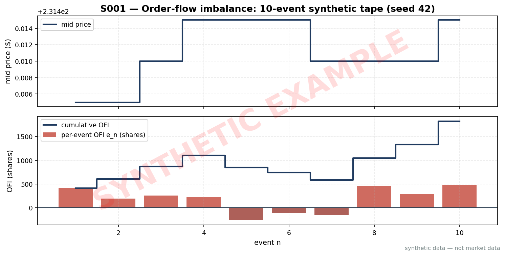

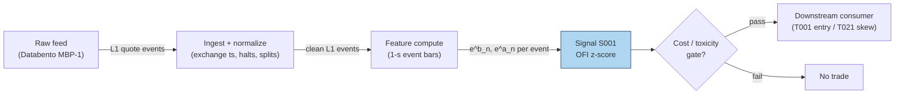
```mermaid
flowchart LR
    FEED["Raw feed\n(Databento MBP-1)"] -->|L1 quote events| ING["Ingest + normalize\n(exchange ts, halts, splits)"]
    ING -->|clean L1 events| FEAT["Feature compute\n(1-s event bars)"]
    FEAT -->|e^b_n, e^a_n per event| SIG["Signal S001\nOFI z-score"]
    SIG --> GATE{"Cost / toxicity\ngate?"}
    GATE -->|pass| OUT["Downstream consumer\n(T001 entry / T021 skew)"]
    GATE -->|fail| DROP["No trade"]
    style SIG fill:#aed6f1,stroke:#1f3a5f
```

### S12. Sources

1. Cont, R., Kukanov, A. & Stoikov, S. (2014). "The Price Impact of Order Book Events." *Journal of Financial Econometrics* 12(1): 47–88. arXiv:1011.6402 — https://arxiv.org/abs/1011.6402 (canonical OFI definition; contemporaneous regression — not a forward rule).
2. Cont, R., Cucuringu, M. & Zhang, C. (2023). "Cross-Impact of Order Flow Imbalance in Equity Markets." *Quantitative Finance*; arXiv:2112.13213 — https://arxiv.org/abs/2112.13213 (integrated multi-level OFI via PCA; lagged cross-asset OFIs improve short-horizon return forecasts).
3. Replication: `xecuterisaquant/replication-cont-ofi` — https://github.com/xecuterisaquant/replication-cont-ofi (third-party CKS replication on TAQ/NBBO 1-s grid; OLS R² ≈ 14.2% after sign correction; code repo, not peer-reviewed).

**Chatbot source log.** Duck.ai (GPT-5.6 Luna, anonymous, web-search assisted, 2026-09-10; `batches/SB1/duckai-answers.md`) answered Q-SB1-1–Q-SB1-3. Q-SB1-1 confirms the CKS formula structure and the contemporaneous-not-forward caveat. **Operator verification of the chatbot's own worked OFI example found 2 arithmetic errors** (event 5 used the wrong ask size; event 7 wrongly added a price-effect term): the correct cumulative OFI sequence is 0, 4, 12, 23, 18, 13, 0, 6, 11, **19** — the model reported 29. The chapter's worked example uses its own script-generated tape (seed 42), never the chatbot's numbers; the chatbot's parameter/throughput/pricing tables were self-flagged as illustrative estimates and are NOT promoted to documented facts. This is exactly why chatbot output is treated as leads, never facts. Source log: Duck.ai answered Q-SB1-1 (OFI portion), Q-SB1-2, Q-SB1-3; Grok/Cursor answers pending (checked 2026-09-10).

**Unverified leads** (chatbot-only — never in Sources):
- Duck.ai Q-SB1-1 worked example: raw output contained the 2 arithmetic errors above (correct final cumulative OFI = 19, not 29) — kept here as a caution, not used.
- Duck.ai: "Polars 1–10M events/s; Python loop 0.1–1M/s; Rust 5–30M+/s" — model-flagged estimates; cost-model §2 used instead.
- Duck.ai: vendor bands ("free–$50–300/mo retail; $500–10,000+/mo institutional") — model-flagged estimates; cost-model §6 used instead.
- Duck.ai: execution heuristics ("+OFI → waiting riskier; OFI burst → cross spread") — plausible, no checkable source; hypotheses only.
- Duck.ai Q-SB1-2/Q-SB1-3: vendor shortlist (Databento US Equities Mini ~$100–500/mo, TotalView-ITCH ~$300–2,000+/mo, etc.) and engineering-hour bands (prototype 40–70 h, research-grade 120–220 h) — model-flagged estimates; cost-model §5/§6 used in S7/S8 instead.

---

## Stage 3/200 — S003: Queue (depth) imbalance — Gould–Bonart

*Batch SB1 · Signal 3/100 · Provenance [D] · Family A — Microstructure & order flow*

### S1. One-line verdict

| | |
|---|---|
| **What it is** | The normalized difference between displayed size at the best bid and best ask; predicts the direction of the next mid-price tick via queue-depletion. |
| **When it works** | Large-tick, deep-queue stocks where the next move is a race between two visible queues; sub-second to seconds horizons. |
| **When it dies** | Small-tick names with flickering quotes, spoofed/layered books, hidden-liquidity dominance; any SIP-latency queue race. |
| **Build-or-buy in one line** | Build — it is one division on data you already have for S001; buy nothing extra unless you need historical L2. |

Provenance: **[D]** — Gould & Bonart (2016), arXiv:1512.03492; Cao, Hansch & Wang (2009), *Journal of Futures Markets* 29(1): 16–41.

### S2. How it works — plain human explanation

At 9:47:03.214 the book reads bid 231.40 × 1,048, ask 231.41 × 234. Forget prices for a moment and look at the two queues: 1,048 shares want to buy at the touch, only 234 want to sell. Which queue gets eaten first? The ask queue is four times thinner — a single 300-share market sell order barely dents the bid, while a 300-share market buy wipes out the entire ask queue and the ask price ticks up. The mid-price follows the thinner queue.

That is the whole signal: relative queue length forecasts the next tick because prices move when a queue depletes, and the shorter queue usually depletes first. Formally this is *queue-depletion dynamics* — the same mechanical core as S001's OFI, but a snapshot (a *level*) rather than a flow. Where OFI accumulates pressure over events, queue imbalance reads the current standoff: big bid queue + small ask queue = the next move is more likely up.

The economics are adverse selection in miniature. A lopsided book means informed or impatient flow has been leaning on one side; market makers see the thin queue, infer they are about to be adversely selected, and reprice before the queue is gone. Gould & Bonart's contribution was to test this as a literal classifier: feed the imbalance into a logistic regression, predict the next mid-price move, and find a strongly significant relationship — "considerable improvement" over a null model for large-tick stocks, moderate for small-tick ones.

Three-bullet mental model:

- **Imbalance is a snapshot; OFI is the movie.** S003 reads the book's current state; S001 reads how it got there. They are cousins, not substitutes.
- **It predicts *direction*, not magnitude.** The next tick is up or down; how far depends on depth behind the touch (S005 territory).
- **Large-tick is its home turf.** When the spread is one tick and queues are deep, the race is clean. When the spread flickers across ticks, the signal drowns in quote noise.

### S3. The math — exact formula

$$I_t = \frac{Q^b_t - Q^a_t}{Q^b_t + Q^a_t} \in [-1,\, 1],$$

where Q^b_t, Q^a_t are the displayed sizes at the best bid and best ask at time *t* (in shares; both non-negative, not both zero). Trade in the direction of *I* when |I_t| exceeds a fee-covering threshold κ (example — not an institutional standard).

N-level extension (static book pressure):

$$I^{(N)}_t = \frac{\sum_{i=1}^{N}\,(Q^b_{i,t} - Q^a_{i,t})}{\sum_{i=1}^{N}\,(Q^b_{i,t} + Q^a_{i,t})},$$

with *i* indexing price levels from the touch outward. *N* = 1 is the Gould–Bonart measure; *N* = 5–10 is the S005 book-pressure family.

A useful exact identity linking S003 to S004 (verified algebra): with spread *s_t = P^a_t − P^b_t*,

$$P_{\mu,t} - m_t = \frac{s_t}{2}\,I_t,$$

i.e. the microprice deviation from mid equals half the spread times the queue imbalance. The two signals share a touch-level core; they diverge when you add flow history (S001) or deeper levels / dynamics (full microprice).

Parameter table:

| Parameter | Symbol | Typical range | Too small | Too large | Default (example) |
|---|---|---|---|---|---|
| Entry threshold | κ | 0.3 – 0.7 | trades noise, fees eat you | never triggers | *±0.5 — example, not an institutional standard* |
| Levels | N | 1 (touch) – 10 | misses deep liquidity | stale/gameable size | *1 — example* |
| Smoothing | — | raw snapshot, or 100 ms–1 s EWMA | flicker whipsaws | lags the depletion | *raw — example* |
| Horizon | — | next 1–20 ticks / 100 ms – seconds | — | edge decays | *next tick — example* |

Causal timing: *I_t* is computed from the book snapshot at event *t* using only data ≤ *t*; a trade reacting to it can execute no earlier than *t+1*. Variants: (1) touch-only (canonical); (2) N-level book pressure; (3) time-averaged imbalance over a short window (kills flicker, adds lag).

### S4. Worked example — step-by-step numbers (SYNTHETIC)

Same synthetic tape as S001 (`batches/SB1/plot_S003.py`, `seed 42`), snapshots after each event. All numbers **synthetic** — no fees, no latency, no hidden liquidity; an arithmetic illustration, not a backtest.

| ev | bid | qb | ask | qa | I_t | mid |
|---|---|---|---|---|---|---|
| 0 | 231.40 | 635 | 231.41 | 432 | +0.1903 | 231.405 |
| 1 | 231.40 | 1048 | 231.41 | 432 | +0.4162 | 231.405 |
| 2 | 231.40 | 1048 | 231.41 | 234 | +0.6349 | 231.405 |
| 3 | 231.41 | 260 | 231.41 | 234 | +0.0526 | 231.410 |
| 4 | 231.41 | 260 | 231.42 | 688 | −0.4515 | 231.415 |
| 5 | 231.41 | 260 | 231.42 | 946 | −0.5688 | 231.415 |
| 6 | 231.41 | 153 | 231.42 | 946 | −0.7216 | 231.415 |
| 7 | 231.40 | 715 | 231.42 | 946 | −0.1391 | 231.410 |
| 8 | 231.40 | 715 | 231.42 | 486 | +0.1907 | 231.410 |
| 9 | 231.40 | 1002 | 231.42 | 486 | +0.3468 | 231.410 |
| 10 | 231.40 | 1002 | 231.43 | 732 | +0.1557 | 231.415 |

Hand-checks: ev2: (1048 − 234)/(1048 + 234) = 814/1282 = +0.6349. ev6: (153 − 946)/(153 + 946) = −793/1099 = −0.7216. ev10: (1002 − 732)/1734 = +0.1557. With the example threshold κ = ±0.5, the trigger fires at ev2 (long, +0.63) and ev5/ev6 (short, −0.57/−0.72).

**What to notice.** The imbalance leads the tape's two real mid moves: the +0.63 print at ev2 precedes the uptick at ev3 (231.405 → 231.410), and the −0.72 at ev6 precedes the downtick at ev7 (231.415 → 231.410). That is the queue-depletion story working as advertised — but this is a 10-event synthetic anecdote with hand-designed event types, not evidence of tradability. Note also ev3: after the bid stepped up, both queues reset small and *I* collapses to +0.05 — price-move events destroy the very queues the signal reads, which is why the signal must be recomputed every event and why stale snapshots are worthless.

### S5. Strategies that use this signal

- **T022 — Queue-Imbalance Maker with Toxicity Cancel** — primary trigger: posts at the touch when the queue favors your side; cancels on imbalance reversal or VPIN spike.
- **T001 — OFI + Queue-Imbalance Directional Scalper** — confirmation filter on the OFI entry (both must agree).
- **T004 — VWAP-Deviation Mean-Reversion** — timing filter: enter the fade only when the touch queue favors the fade direction.

### S6. Data required — exact spec

| Field | Type | Granularity | Source tier | Notes |
|---|---|---|---|---|
| Best bid/ask sizes | int (shares) | every quote event (L1) | Tier 2 | the entire signal; odd-lot handling matters |
| Best bid/ask prices | float | every quote event (L1) | Tier 2 | for the mid and the S004 identity |
| Exchange timestamps | int64 ns | per event | Tier 2 | queue races are decided in µs — SIP timestamps make live trading *simulated only — requires MBO/ITCH* |
| Halt/auction flags | bool | per event | Tier 1 | imbalance is meaningless across halts |

Collection: same feed as S001 (Databento MBP-1, Polygon L2 per the report entry). Ingest sketch (≤20 lines):

```python
import polars as pl
q = (pl.scan_parquet("aapl_mbp1.parquet")          # 1: L1 deltas, exchange-time sorted
       .sort("ts_event")
       .with_columns(qb=pl.col("bid_sz_00"),       # 2: touch sizes
                     qa=pl.col("ask_sz_00"),
                     bid=pl.col("bid_px_00"),
                     ask=pl.col("ask_px_00"))
       .filter((pl.col("qb") + pl.col("qa")) > 0)  # 3: guard empty book
sig = q.with_columns(                              # 4: the whole signal: one division
        imb=(pl.col("qb") - pl.col("qa")) /
            (pl.col("qb") + pl.col("qa"))).collect()
long  = sig.filter(pl.col("imb") >  0.5)           # 5: example threshold
short = sig.filter(pl.col("imb") < -0.5)
```

Storage: identical to S001 — L1 quotes+trades ≈ 2–8 GB/symbol-day parquet (`notes/cost-model.md` §4); the signal itself adds one float column. Data-quality checklist: drop crossed/locked quotes; normalize timestamps to exchange time; exclude auction prints and halt periods; watch for odd-lot-only quotes on some feeds.

### S7. Local build on M5 Max / 128GB

**Feasibility: trivial.** The signal is one division per quote event — O(1), stateless. A pure-Python loop at ~100–500k events/sec (`notes/cost-model.md` §2) covers a 50-symbol universe (~100k events/sec busy) with headroom; polars vectorized recompute (~10–50M rows/sec, §2) does a full day in seconds. Bottleneck: none for the math — the constraint is feed latency and timestamp quality, not compute.

Stack options:

| Stack | When to pick |
|---|---|
| Python + polars | everything up to live 50-symbol scanning |
| Rust | only if you are already writing the S001 Rust ingest — no standalone need |
| DuckDB | historical screening over parquet |

RAM: per §3, one symbol-day of L1 ≈ 0.5–4 GB working set; trivial for intraday windows. Sixty days for one symbol does not fit the 77 GB budget — stream per-symbol daily files. Engineering time: Tier M per plan §6, but at the light end — **20–40 h** ≈ $3,000–6,000 loaded-cost estimate at $150/hr, mostly feed plumbing and the threshold/toxicity gating shared with S001. What breaks first at 500 symbols: nothing in the math — the feed bill and the staleness of your quotes do.

### S8. Buy vs build

| Option | What you get | Indicative price | Gains | Loses |
|---|---|---|---|---|
| Tier 0: delayed quotes | free L1, 15-min delay | ~$0 — *indicative, verify before budgeting* | $0 research prototype | no live signal |
| Tier 1: Polygon Stocks Advanced / Alpaca SIP | real-time SIP L1 | ~$30–200/mo — *indicative, verify before budgeting* | cheap live data | queue races on SIP are *simulated only — requires MBO/ITCH* |
| Tier 2: Databento MBP-1 | exchange-timestamped L1 | ~$200/mo + usage — *indicative, verify before budgeting* | honest event order | usage meter on wide universes |

Verdict: **build, always** — the signal is a one-line transform of data you already buy for S001. There is no credible "precomputed queue imbalance" product worth paying for; the only buy decision is the feed tier, and the honest crossover is latency: if you intend to *trade* the next tick rather than study it, SIP timestamps are not enough and you are in Tier 2/3 with colocation-class infrastructure, which a Mac on a home connection cannot honestly emulate.

### S9. Success ratio / efficacy — documented evidence

| Study / source | Market & period | Metric | Before/after cost | Caveat |
|---|---|---|---|---|
| Gould & Bonart (2016), arXiv:1512.03492 | 10 liquid Nasdaq stocks, LOB data | logistic regression I → next mid move: strongly significant; considerable improvement over null for large-tick stocks, moderate for small-tick (binary + probabilistic) | before-cost (classification, not P&L) | predicts direction only; no trading costs, no Sharpe |
| Cao, Hansch & Wang (2009), *J. Futures Markets* 29(1) | Australian Stock Exchange | order imbalances between demand/supply schedules significantly related to future short-term returns, controlling for return autocorrelation, inside spread, trade imbalance; book ≈ 22% of price discovery | before-cost (return regression) | 2000s ASX; explanatory, not a strategy |
| Kercheval & Zhang (2015), *Quant. Finance* 15(8) | US equities, real LOB data | SVM on LOB-state features (incl. book imbalance): effective short-term price-movement forecasts | before-cost (classification) | ML wrapper; no after-cost P&L |

Only before-cost numbers exist in what I could verify — every row above is a classification or regression result, none is an after-cost trading Sharpe. Regimes where it fails: small-tick names (Gould–Bonart's own "moderate" result), spoofed/layered books where displayed size is a lie, hidden-liquidity-heavy venues, and any latency regime where you see the imbalance after the queue is already gone.

Honest bottom line: as a *standalone trigger* this is a real but tiny and latency-bound edge — documented as direction prediction, never as after-cost profit in the sources I found. As a *filter/veto* (T022's toxicity cancel, T001's confirmation) and as a *quoting input* (lean your limit orders to the heavy-queue side) it is one of the best-evidenced microstructure features in the literature.

### S10. Failure modes & pitfalls

1. **Spoofing / fleeting quotes** — displayed size vanishes before execution. Mitigation: weight by quote lifetime or filter sub-50 ms quotes (example).
2. **Hidden liquidity** — the visible queue is not the real queue. Mitigation: treat *I* as a noisy proxy; never size on it alone.
3. **Small-tick flicker** — spread bouncing across ticks randomizes the signal. Mitigation: restrict to large-tick names or time-average the imbalance.
4. **Lookahead leakage** — using the post-move snapshot to "predict" the move. Mitigation: strict event-*t* → trade-*t+1* causality.
5. **Latency illusion on SIP** — your imbalance print arrives after the race is over. Mitigation: label SIP work *simulated only — requires MBO/ITCH*.
6. **Cost blowup** — crossing the spread to chase a one-tick prediction. Mitigation: fee-covering threshold κ; prefer passive posting (T022) over taking.
7. **Overfitting κ** — threshold tuned to one month's microstructure. Mitigation: per-symbol calibration, walk-forward, shrinkage toward 0.5.
8. **Regime breaks** — imbalance–direction relation weakens in stress/crowding. Mitigation: toxicity overlay (VPIN, S008); stand down on spread multiples.

### S11. Visuals

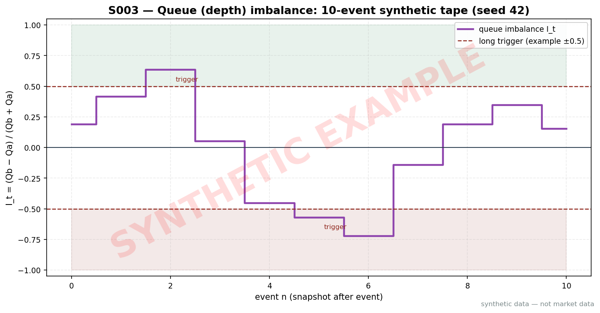

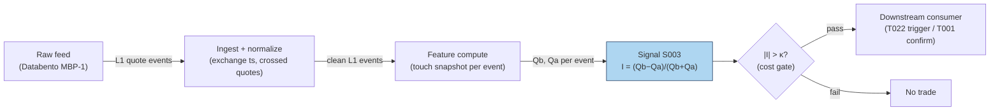
```mermaid
flowchart LR
    FEED["Raw feed\n(Databento MBP-1)"] -->|L1 quote events| ING["Ingest + normalize\n(exchange ts, crossed quotes)"]
    ING -->|clean L1 events| FEAT["Feature compute\n(touch snapshot per event)"]
    FEAT -->|Qb, Qa per event| SIG["Signal S003\nI = (Qb−Qa)/(Qb+Qa)"]
    SIG --> GATE{"|I| > κ?\n(cost gate)"}
    GATE -->|pass| OUT["Downstream consumer\n(T022 trigger / T001 confirm)"]
    GATE -->|fail| DROP["No trade"]
    style SIG fill:#aed6f1,stroke:#1f3a5f
```

### S12. Sources

1. Gould, M. D. & Bonart, J. (2016). "Queue Imbalance as a One-Tick-Ahead Price Predictor in a Limit Order Book." arXiv:1512.03492 — https://arxiv.org/abs/1512.03492 (logistic-regression evidence; large-tick vs small-tick result).
2. Cao, C., Hansch, O. & Wang, X. (2009). "The information content of an open limit-order book." *Journal of Futures Markets* 29(1): 16–41 — https://ideas.Repec.org/a/wly/jfutmk/v29y2009i1p16-41.html (order imbalances → future short-term returns; ~22% price-discovery contribution).
3. Kercheval, A. N. & Zhang, Y. (2015). "Modelling high-frequency limit order book dynamics with support vector machines." *Quantitative Finance* 15(8): 1315–1329 — https://ideas.repec.Org/a/taf/quantf/v15y2015i8p1315-1329.html (LOB-state features effective for short-term forecasts on real data).

**Chatbot source log.** Q-SB1-1 asked for queue imbalance alongside OFI and microprice, but the Duck.ai answer (GPT-5.6 Luna, 2026-09-10) covered only the OFI portion — no usable queue-imbalance content was returned. Source log: Duck.ai answered Q-SB1-1 (OFI portion only — not the queue-imbalance portion); Grok/Cursor answers pending (checked 2026-09-10).

**Unverified leads:** none specific to S003 beyond the general SB1 chatbot caveats — no chatbot made a checkable queue-imbalance claim in this batch.

---

## Stage 4/200 — S004: Microprice (Stoikov)

*Batch SB1 · Signal 4/100 · Provenance [D] · Family A — Microstructure & order flow*

### S1. One-line verdict

| | |
|---|---|
| **What it is** | Stoikov's learned fair-price estimator: the limiting expected mid-price conditional on the book-imbalance state, estimated from a Markov chain over discretized (imbalance, spread) states — a martingale by construction. |
| **When it works** | As a fair-value anchor for quoting and for fading transient mid deviations; tight-spread, visible-book names. |
| **When it dies** | Spoofed books, dominant hidden liquidity, one-tick-wide flickering spreads — anywhere displayed size lies. |
| **Build-or-buy in one line** | Build — the estimator is a small batch fit plus a per-event table lookup on your S001/S003 feed. |

Provenance: **[D]** — Stoikov (2018), "The micro-price: a high-frequency estimator of future prices," *Quantitative Finance* 18(12): 1959–1966 (working paper Nov 2017). Definition: $P_t^{\text{micro}} = \lim_{i\to\infty} \mathbb{E}[M_{\tau_i} \mid \mathcal{F}_t]$ — the limit of expected mid-prices at the successive mid-price-change times $\tau_1, \tau_2, \dots$ — estimated in practice by discretizing (imbalance, spread) into states and fitting the transition matrices $Q, R_1, R_2$ (paper §3). The cross-weighted mid $W = I\cdot P^a + (1-I)\cdot P^b$ is the paper's Appendix-B degenerate special case (no learning) and appears in this chapter ONLY as the naive baseline — it is not the microprice. Do not double-count with S003: the microprice's state *is* the touch imbalance S003 uses, passed through the learned adjustment.

### S2. How it works — plain human explanation

At 9:47:03.214 the book reads bid 231.40 × 1,048, ask 231.41 × 234, mid 231.405. The plain mid says "fair value is 231.405." But look at the queues: 1,048 shares bid vs 234 offered. The next trade is far more likely to be a buy chewing through that thin ask — printing at 231.41 — than a sell. So is 231.405 really the best guess of where the price is going? No: the *expected* next price leans toward the ask.

Stoikov's question is sharper than "which way does it lean": **given that the book looks like this, where will the mid-price be on average, far into the future?** That limiting expected mid-price *is* the microprice — a martingale by construction, which is the mathematical way of saying "this is what 'fair' means once you condition on the book." And crucially, it is not a formula you write down from one snapshot. It is **learned**: discretize the imbalance into bins, watch thousands of quote events to see what the mid does after each bin, and compute the expected long-run mid per bin. Each new event is then a table lookup — mid plus the learned adjustment for its bin.

The construction, in one paragraph: the state of the book at each quote event is the pair (imbalance bin, spread bin). From history you estimate three transition matrices — $Q$ (quote updates where the mid doesn't move), $R_1$ (the distribution of the next mid-price move), $R_2$ (state transitions coincident with a mid-price move). From them you compute the per-state adjustment $G^* = G_1 + B G_1 + B^2 G_1 + \cdots$ (the §3 math), and the microprice is $P^{\text{micro}} = M + G^*(\text{state})$. Because the matrices are fit per symbol from its own history, the estimator adapts to each name's microstructure — a large-tick stock and a small-tick stock get different adjustments, which no closed form can do.

Where does the familiar cross-weighted mid $W = I\cdot P^a + (1-I)\cdot P^b$ fit? It is the **no-learning baseline**: the straight-line adjustment $(I-\tfrac12)\cdot S$ you get if you skip the estimation and simply *impose* that the current imbalance tells the whole story. Stoikov derives it as a degenerate special case (Appendix B: imbalance as a Brownian motion with particular boundary behavior) and shows empirically it falls short — the learned adjustments come out flatter, always inside half the spread, and predict short-term prices better than the mid *or* the weighted mid (BAC/CVX, March 2011).

Why "micro"? Because it lives at the tick scale and updates every quote event — and because taking expectations far into the future filters out the microstructure noise in the mid-price itself.

Three-bullet mental model:

- **The microprice is a learned function of the book state, not a closed form.** Fit transition matrices on history; each event is then mid + a looked-up adjustment. No fit, no microprice — just the baseline.
- **It is a fair-value estimator, not a trade.** You fade deviations from it (buy below, sell above) or center your quotes on it — you don't "buy the microprice."
- **The cross-weighted mid is the naive baseline, not the estimator.** Same inputs, imposed straight-line adjustment, zero learning. Benchmark the learned microprice against it — and never present the baseline as the microprice.

### S3. The math — exact formula

**Definition** (Stoikov 2017 §2, 2018): with $\tau_1, \tau_2, \dots$ the successive
mid-price-change times and $\mathcal{F}_t$ the order-book information at $t$,

$$P^{\text{micro}}_t = \lim_{i\to\infty} \mathbb{E}[M_{\tau_i} \mid \mathcal{F}_t].$$

Write $P^{\text{micro}} = M + g(I, S)$ with $M$ the mid-price,
$I = Q^b/(Q^b+Q^a)$ the imbalance, $S = P^a - P^b$ the spread. The paper's
program is to **estimate the adjustment function $g$ from data**. The $i$-th
mid-price prediction decomposes as

$$P_i = M_t + \sum_{k=1}^{i} g_k(I_t, S_t),$$

with the first-order adjustment $g_1(I,S) = \mathbb{E}[M_{\tau_1} - M_t \mid I_t = I, S_t = S]$
(the expected move to the *next* mid-price change) and the recursion
$g_{i+1}(I,S) = \mathbb{E}[g_i(I_{\tau_1}, S_{\tau_1}) \mid I_t = I, S_t = S]$.

**Finite-state estimator** (paper §3 — the implementable version): discretize
imbalance into $n$ bins ($I_t = x$ iff $(x-1)/n < I \le x/n$) and spread into $m$
tick values; the book state is $x = (i, s)$ ($nm$ states). From quote history
estimate:

- $Q_{xy} = P(M_{t+1}-M_t = 0 \;\land\; X_{t+1} = y \mid X_t = x)$ — transient
  quote updates, $nm \times nm$;
- $R^1_{xk} = P(M_{t+1}-M_t = k \mid X_t = x)$ — one-step mid-move distribution
  over $K = \{-0.01, -0.005, 0.005, 0.01\}$ (half-ticks), $nm \times 4$;
- $R^2_{xy} = P(M_{t+1}-M_t \ne 0 \;\land\; X_{t+1} = y \mid X_t = x)$ — state
  transitions coincident with a mid-price move, $nm \times nm$.

Then, with $K$ as a column vector:

$$G_1 = (I - Q)^{-1} R^1 K, \qquad B = (I - Q)^{-1} R^2,$$

$$G^* = G_1 + B G_1 + B^2 G_1 + \cdots \quad\text{(converges fast in practice)},$$

$$P^{\text{micro}}_t = M_t + G^*(X_t).$$

Convergence is guaranteed (Thm 3.1) when the data are **symmetrized** — every
observation $(I, S, \dots)$ mirrored by $(1-I, S, \dots)$ — so that $B^* G_1 = 0$.
Inference per event is a bin lookup plus an addition; all the work is the fit.

**Naive baseline — NOT the microprice.** The cross-weighted mid

$$W = I\cdot P^a + (1-I)\cdot P^b, \qquad W - M = \left(I-\tfrac12\right) S,$$

is the closed form the paper derives as the degenerate Appendix-B special case
and compares *against*. Carry it only as the no-learning benchmark.

The signal is the deviation:

$$s_t = P^{\text{micro}}_t - M_t = G^*(X_t).$$

Parameter table:

| Parameter | Symbol | Typical range | Too small | Too large | Default (example) |
|---|---|---|---|---|---|
| Imbalance bins | n | 4–10 | 1 = no state information | 20+ = sparse transition counts | *4 — example, not an institutional standard* |
| Spread bins | m | 1–5 ticks | misses spread interaction | sparse | *1 — example* |
| Estimation window | — | 1–4 weeks of quotes | regime change mid-fit | stale microstructure | *1 month — example* |
| Symmetrization | — | on | series can diverge (Thm 3.1) | — | *on* |
| Entry threshold | κ | 0.1 – 0.5 × spread | fee death by a thousand fills | never trades | *0.25 × spread — example* |
| Holding horizon | h | seconds | noise | deviation mean-reverts away | *5 s — example* |

Causal timing: the state $X_t$ comes from the snapshot at event $t$ using only
data ≤ $t$; $G^*$ is fit on history strictly *before* the evaluation window
(never in-sample transitions); tradable no earlier than $t+1$. Variants:
(1) touch microprice ($n$ bins × $m = 1$, canonical); (2) N-level imbalance
states (the paper notes the Level-II extension); (3) the closed-form baseline
$W$ — for benchmarking the learned estimator, never as the signal itself.

### S4. Worked example — step-by-step numbers (SYNTHETIC)

A synthetic run of the §3 estimator (`batches/SB1/plot_S004.py`, `seed 42`).
Imbalance $I = Q^b/(Q^b+Q^a)$ in $n = 4$ bins, spread fixed at 1 tick ($m = 1$),
mid-price move grid $K = \{-0.01, -0.005, 0.005, 0.01\}$. The "estimated"
transition matrices $Q, R_1, R_2$ are invented (reversal-symmetric, i.e.
symmetrized as Thm 3.1 requires) — they demonstrate the machinery, not a real
fit. The 10-event tape holds bid/ask fixed at 231.40/231.41 with sizes at the
bin centers; states are drawn from the chain. All numbers **synthetic**; no
fees, no latency — arithmetic illustration, not a backtest. Deviation in basis
points (bps): $(P^{\text{micro}} - \text{mid})/\text{mid} \times 10^4$. $W$ is
the cross-weighted-mid **baseline** (not the microprice).

Fitted adjustments: $G_1 = (-0.0649, -0.0253, +0.0253, +0.0649)$¢,
$G^* = (-0.0761, -0.0305, +0.0305, +0.0761)$¢ per bin 1–4; max $|B|$
eigenvalue $0.50 < 1$, so the series converges in a handful of terms.

| ev | bin | bid | qb | ask | qa | mid | G\* (¢) | P\* | W (baseline) | dev\* (bps) |
|---|---|---|---|---|---|---|---|---|---|---|
| 0 | 1 | 231.40 | 125 | 231.41 | 875 | 231.4050 | −0.076 | 231.4042 | 231.4013 | −0.03 |
| 1 | 1 | 231.40 | 125 | 231.41 | 875 | 231.4050 | −0.076 | 231.4042 | 231.4013 | −0.03 |
| 2 | 2 | 231.40 | 375 | 231.41 | 625 | 231.4050 | −0.030 | 231.4047 | 231.4038 | −0.01 |
| 3 | 2 | 231.40 | 375 | 231.41 | 625 | 231.4050 | −0.030 | 231.4047 | 231.4038 | −0.01 |
| 4 | 1 | 231.40 | 125 | 231.41 | 875 | 231.4050 | −0.076 | 231.4042 | 231.4013 | −0.03 |
| 5 | 4 | 231.40 | 875 | 231.41 | 125 | 231.4050 | +0.076 | 231.4058 | 231.4087 | +0.03 |
| 6 | 4 | 231.40 | 875 | 231.41 | 125 | 231.4050 | +0.076 | 231.4058 | 231.4087 | +0.03 |
| 7 | 4 | 231.40 | 875 | 231.41 | 125 | 231.4050 | +0.076 | 231.4058 | 231.4087 | +0.03 |
| 8 | 3 | 231.40 | 625 | 231.41 | 375 | 231.4050 | +0.030 | 231.4053 | 231.4062 | +0.01 |
| 9 | 3 | 231.40 | 625 | 231.41 | 375 | 231.4050 | +0.030 | 231.4053 | 231.4062 | +0.01 |

Hand-check ev5: bin 4 → $G^* = +0.0761$¢, so
$P^* = 231.4050 + 0.000761 = 231.4058$. Baseline: $I = 875/1000 = 0.875$,
$W = 0.875 \times 231.41 + 0.125 \times 231.40 = 231.4087$ — deviation
$+0.16$ bps vs the learned $+0.03$ bps. Note $G^* - G_1 = 0.0761 - 0.0649 =
0.0112$¢ on bin 4: the higher-order Markov terms ($B G_1 + B^2 G_1 + \cdots$)
add about a seventh on top of the first-order adjustment.

**What to notice.** The learned adjustments are roughly a *fifth* of the
baseline's (0.076¢ vs 0.375¢ at the extreme bin) — exactly the paper's
Figure-3 pattern for BAC/CVX: the learned curve sits between the mid (flat)
and the weighted-mid line (steep), always inside half the spread. That is the
point and the warning: the edge per event is a *fraction of a fraction* of the
spread, so it only survives as a quoting advantage (better limit placement,
less adverse selection), never as a market-order scalp after fees. The
baseline column is there so you can see what "no learning" would have claimed
— steeper, noisier, and wrong about the magnitude.

### S5. Strategies that use this signal

- **T002 — Microprice Fair-Value Scalper** — primary trigger: trades toward the microprice-implied fair value with volume-delta confirmation and a spread-decomposition cost gate.
- **T021 — Avellaneda–Stoikov Inventory Skew MM** — fair-value anchor: quotes are skewed around the microprice (not the mid) so the book's asymmetry is priced in.
- **T085 — Resiliency Market Maker** — quoting anchor alongside LOB resiliency: re-center quotes on P^micro after temporary-impact dislocations.

### S6. Data required — exact spec

| Field | Type | Granularity | Source tier | Notes |
|---|---|---|---|---|
| Best bid/ask prices + sizes | float / int | every quote event (L1); L2 for N-level | Tier 2 | same feed as S001/S003 |
| Exchange timestamps | int64 ns | per event | Tier 2 | fair-value staleness = adverse selection |
| Halt/auction flags | bool | per event | Tier 1 | drop locked/crossed books (cf. ev3) |

Collection: any L1 feed (Databento MBP-1 per the report entry; N-level states need MBP-10). Ingest sketch (≤20 lines):

```python
import polars as pl
import numpy as np
q = (pl.scan_parquet("aapl_mbp1.parquet")          # 1: L1 deltas, exchange-time order
       .sort("ts_event")
       .with_columns(mid=(pl.col("bid_px_00") + pl.col("ask_px_00")) / 2,
                     imb=pl.col("bid_sz_00") /
                         (pl.col("bid_sz_00") + pl.col("ask_sz_00")),
                     spr=pl.col("ask_px_00") - pl.col("bid_px_00"))
       .filter(pl.col("spr") > 0)                  # 2: drop locked/crossed
       .with_columns(state=(pl.col("imb") * 4).ceil().cast(pl.Int64))  # 3: imbalance bin
       .collect())
# --- offline fit on history strictly before evaluation: count transitions ->
# Q, R1, R2; symmetrize; G1 = (I-Q)^-1 R1 K; B = (I-Q)^-1 R2;
# Gstar = G1 + B@G1 + B^2@G1 + ...  (minutes in numpy)
Gstar = np.load("microprice_Gstar_aapl.npy")       # 4: learned adjustment ($)
mp = q.with_columns(
    micro=pl.col("mid") + Gstar[pl.col("state") - 1],            # 5: the estimator: lookup
    w_base=pl.col("imb") * pl.col("ask_px_00") +                 # baseline only — not the microprice
           (1 - pl.col("imb")) * pl.col("bid_px_00"))
```

Storage: same as S001/S003 — L1 ≈ 2–8 GB/symbol-day parquet (`notes/cost-model.md` §4); the signal is two float columns (micro + baseline). Data-quality checklist: exchange timestamps, drop crossed/locked books, halt/auction masks, split adjustments, odd-lot quote handling, **fit window strictly before the evaluation window** (no in-sample transitions), symmetrized counts with a convergence check on the $G^*$ series.

### S7. Local build on M5 Max / 128GB

**Feasibility: trivial at inference.** One bin lookup and an addition per quote event — cheaper than S003's division. Python+polars handles a 50-symbol universe live without noticing; the §2 sizing (100k events/sec → Python borderline, Rust comfortable) applies unchanged, with the microprice adding negligible marginal cost over the S001 ingest you already run. The **fit** is the only real compute: counting transitions over ~1 month of quotes and one $nm \times nm$ matrix inverse — minutes in numpy/polars for $n = 4$–$10$, $m = 1$–$3$ — then walk-forward refits on a schedule.

Stack options:

| Stack | When to pick |
|---|---|
| Python + polars | everything, including live — the math is O(1) |
| Rust | only as part of a shared S001/S003 Rust ingest |
| N-level variant | needs MBP-10; same stacks, ~10× the event rate |

RAM: per §3, L1 touch quotes ≈ 0.5–4 GB/symbol-day working set — trivial for intraday; 60-day single-symbol history does not fit the 77 GB budget, stream per-symbol daily files.

Engineering time: Tier M per plan §6, light end — **20–40 h** ≈ $3,000–6,000 loaded-cost estimate at $150/hr, shared almost entirely with S001/S003 plumbing; the genuinely new work is the fit harness (transition counting, symmetrization, the $G^*$ convergence check, walk-forward refits) — budget ~8 h of the band for it. What breaks first at 500 symbols: nothing in the math — the feed bill, and the honesty of your timestamps.

### S8. Buy vs build

| Option | What you get | Indicative price | Gains | Loses |
|---|---|---|---|---|
| Tier 0: delayed quotes | free L1 | ~$0 — *indicative, verify before budgeting* | $0 prototype | no live fair value |
| Tier 1: Polygon / Alpaca SIP | real-time SIP L1 | ~$30–200/mo — *indicative, verify before budgeting* | cheap live data | stale microprice in a race — *simulated only — requires MBO/ITCH* for quoting claims |
| Tier 2: Databento MBP-1/10 | exchange-timestamped L1/L2 | ~$200/mo + usage — *indicative, verify before budgeting* | honest snapshots; N-level needs MBP-10 | usage meter |

Verdict: **build.** Inference is a table lookup on data you already buy, and no vendor can sell you your symbols' fitted transition matrices — the fit is in-house by construction. The decision is feed tier (SIP vs direct), governed by whether you quote live or research offline. Crossover: none on cost.

### S9. Success ratio / efficacy — documented evidence

| Study / source | Market & period | Metric | Before/after cost | Caveat |
|---|---|---|---|---|
| Stoikov (2018), *Quant. Finance* 18(12) | high-frequency equity data | microprice empirically a better predictor of short-term prices than the mid-price or the weighted mid-price | before-cost (prediction accuracy, not P&L) | martingale construction; no trading costs, no Sharpe |
| Stanford MS&E 448 (2021), "High Frequency Trading Strategies" course report, AAPL dataset | US equity, student replication | compares naive/mid/weighted-mid/microprice fair-value constructions on real data | before-cost (practitioner reconstruction) | coursework, not peer-reviewed |

Only before-cost numbers exist in what I could verify — both rows are prediction-accuracy results, not after-cost trading P&L. I found **no published after-cost Sharpe for a microprice-deviation scalper**; the literature positions the microprice as a *fair-value input to quoting* (adverse-selection reduction), where the "return" shows up as lower effective spread paid, not as a strategy Sharpe.

Honest bottom line: as a *standalone trigger* this is a sub-spread edge — the worked example's max learned deviation was 0.03 bps (the naive baseline reached 0.16 bps), and crossing the spread to chase it is arithmetic suicide. As a *filter / quoting anchor* (T021, T085: center quotes on P^micro instead of mid) it is one of the cheapest genuine improvements in market microstructure — the value is measured in reduced adverse selection, which is exactly what Stoikov's construction targets.

### S10. Failure modes & pitfalls

1. **Sub-spread edge vs full-spread cost** — learned deviations are a fraction of the spread (the §4 fit: ≤0.08¢ on a 1¢ spread); market orders lose by construction. Mitigation: use only for passive quoting / fill improvement, never for taking.
2. **Spoofed displayed size** — the state binning trusts the queues. Mitigation: lifetime-weighted sizes; toxicity overlay (S008).
3. **Hidden liquidity** — invisible size breaks the binning. Mitigation: treat P^micro as a noisy proxy; shrink adjustments toward zero in dark-heavy names.
4. **Locked/crossed books** — bins are meaningless on non-positive spreads. Mitigation: drop those snapshots before computing (cf. the S6 filter).
5. **Lookahead leakage** — computing the state from the post-trade book, or fitting $G^*$ on the evaluation window's own transitions. Mitigation: event-*t* snapshot → earliest action *t+1*; fit window strictly before evaluation.
6. **Overfitting the learned estimator** — transition matrices fit on one regime; $nm$ states with sparse counts. Mitigation: walk-forward refits; symmetrization; compare against the closed-form baseline that cannot overfit.
7. **Double-counting S003** — the microprice's state *is* the S003 touch imbalance, passed through the learned $G^*$; stacking raw imbalance and the microprice as "independent" features double-counts. Mitigation: use one, or orthogonalize.
8. **Latency/staleness** — a stale microprice is a worse fair value than a fresh mid. Mitigation: direct-feed timestamps; SIP work labeled *simulated only — requires MBO/ITCH*.

### S11. Visuals

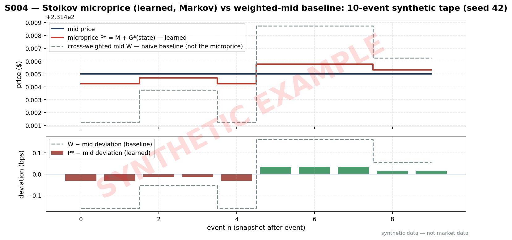

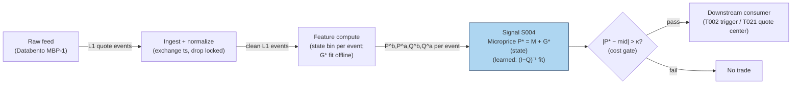
```mermaid
flowchart LR
    FEED["Raw feed\n(Databento MBP-1)"] -->|L1 quote events| ING["Ingest + normalize\n(exchange ts, drop locked)"]
    ING -->|clean L1 events| FEAT["Feature compute\n(state bin per event;\nG* fit offline)"]
    FEAT -->|P^b,P^a,Q^b,Q^a per event| SIG["Signal S004\nMicroprice P* = M + G*(state)\n(learned: (I−Q)⁻¹ fit)"]
    SIG --> GATE{"|P* − mid| > κ?\n(cost gate)"}
    GATE -->|pass| OUT["Downstream consumer\n(T002 trigger / T021 quote center)"]
    GATE -->|fail| DROP["No trade"]
    style SIG fill:#aed6f1,stroke:#1f3a5f
```

### S12. Sources

1. Stoikov, S. (2018). "The micro-price: a high-frequency estimator of future prices." *Quantitative Finance* 18(12): 1959–1966 — https://econpapers.repec.org/article/tafquantf/v_3a18_3ay_3a2018_3ai_3a12_3ap_3a1959-1966.htm (martingale construction; beats mid and weighted mid as a short-term predictor).
2. Stoikov, S. (2017). "The Micro-Price: A High Frequency Estimator of Future Prices." Working paper (Nov 2017) — https://github.com/shaileshkakkar/MicroPriceIndicator/raw/refs/heads/master/Micro-Price%20Indicator.pdf (full definition, limit-of-expected-midprices construction).
3. Sasson, J., Ho, W. H. & Samson, F. (2021). "High Frequency Trading Strategies." Stanford MS&E 448 course final report — http://stanford.edu/class/msande448/2021/Final_reports/gr1.pdf (practitioner reconstruction comparing mid, weighted mid, and microprice fair-value estimators on an AAPL dataset).

**Chatbot source log.** Q-SB1-1 asked for the microprice alongside OFI and queue imbalance, but the Duck.ai answer (GPT-5.6 Luna, 2026-09-10) covered only the OFI portion — no usable microprice content was returned. Source log: Duck.ai answered Q-SB1-1 (OFI portion only — not the microprice portion); Grok/Cursor answers pending (checked 2026-09-10).

**Unverified leads:**
- Practitioner note (GitHub `jy447/vpin-model` README): the closed-form cross-weighted mid is a *first-order* approximation of Stoikov's full estimator; an author's reference implementation exists at `github.com/sstoikov/microprice` — I did not verify that repository resolves, so it stays here, not in Sources.
- Cartea, Jaimungal & Penalva (2015), *Algorithmic and High-Frequency Trading*, Cambridge University Press, §10 — the report's cited corroboration for the N-level/weighted-mid construction; no public URL verified, kept as a lead rather than a checked source.

---

## Stage 6/200 — S006: Signed trade imbalance (volume delta)

*Batch SB1 · Signal 6/100 · Provenance [SR] · Family A — Microstructure & order flow*

### S1. One-line verdict

| | |
|---|---|
| **What it is** | Net aggressive buy-minus-sell share volume over a window — the signed footprint of who hit whom. |
| **When it works** | When order flow is autocorrelated (institutions splitting orders) and you act within seconds-to-minutes of the imbalance print. |
| **When it dies** | News-driven flow everyone sees; thin tapes where one print dominates; after the imbalance is already in the price. |
| **Build-or-buy in one line** | Build: it is one classification rule plus a rolling sum — the feed is the only real cost. |

Provenance **[SR]** (standard reconstruction) — the report tags this signal [SR]; the formula
below is the textbook reconstruction of the trade-sign literature, not a quoted implementation.
Family **A — Microstructure & order flow**.

### S2. How it works — plain human explanation

Picture 9:47:03 on a normal Tuesday. AAPL's book sits at bid 231.40 × 800 / ask 231.41 × 300.
Over the next 40 seconds, fourteen prints hit the tape: twelve lift the offer for 4,100 shares
total, two hit the bid for 600. Nobody needs a PhD to feel the asymmetry — buyers are paying
up, sellers are standing aside. Signed trade imbalance (often called **volume delta**) is just
that feeling, formalized: every trade gets a sign, +1 if the buyer was the aggressor, −1 if the
seller was, multiply by size, add it up. A window reading +3,500 shares says aggressive demand
just exceeded aggressive supply by 3,500 shares; the market makers who absorbed it are now long
inventory they did not want, and the standard inventory story says they shade quotes upward to
work it off — which is price pressure you can trade against, or ride.

Why should this predict anything at all? Two economic channels:

- **Adverse selection.** Some aggressive flow is informed. The counterparty who keeps getting
  lifted eventually concludes the buyer knows something, and revises the mid upward. The
  imbalance is the observable trace of that learning.
- **Inventory.** Even uninformed flow moves prices: a dealer who just bought 3,500 shares from
  panicky sellers lowers both bid and ask to attract buyers and discourage more sellers
  (the classic Stoll inventory logic). While the inventory is being worked off, the drift
  continues — and order splitting means today's imbalance predicts tomorrow's, because the
  same institution is still working the order.

Both channels point the same way short-term: signed imbalance today, price drift in the same
direction over the next seconds-to-minutes, then partial reversal as pressure dissipates.

**Mental model (3 bullets):**
- Volume delta is the *realized* demand shock — the bill the market just handed liquidity providers.
- It works because flow is sticky (order splitting) and counterparties shade quotes while they digest it.
- It is a *flow* measure, not a *value* measure: it says nothing about fair value, only about who is in a hurry.

### S3. The math — exact formula

Let trades in window $t$ be indexed $i = 1,\dots,N_t$, each with price $P_i$ and size $V_i$
(shares). Assign an aggressor sign $\varepsilon_i \in \{+1,-1\}$ ($+1$ = buyer-initiated):

**Raw imbalance (shares):**
$$\mathrm{TI}_t = \sum_{i=1}^{N_t} \varepsilon_i \, V_i$$

**Normalized delta (dimensionless, −1 to +1):**
$$\Delta_t = \frac{V^{\text{buy}}_t - V^{\text{sell}}_t}{V^{\text{buy}}_t + V^{\text{sell}}_t}
= \frac{\mathrm{TI}_t}{\sum_i V_i}$$

**Signal form (z-score against trailing window of length $L$):**
$$z_t = \frac{\Delta_t - \mu_{t-L:t-1}}{\sigma_{t-L:t-1}}$$

**Predictive regression form** (the Chordia–Subrahmanyam style specification):
$$r_{t+1} = a + b \cdot \mathrm{OIB}_t + \gamma' X_t + u_{t+1}$$
where $r_{t+1}$ is the next-window return, $\mathrm{OIB}_t$ is the imbalance, and $X_t$ are
controls (lagged return, volume, spread).

**Trade signing — the tick rule** (Lee–Ready style, no quote data needed): with previous
trade price $P_{i-1}$,
$$\varepsilon_i = \begin{cases}
+1 & P_i > P_{i-1} \\
-1 & P_i < P_{i-1} \\
\varepsilon_{i-1} & P_i = P_{i-1}\ \text{(carry forward)}
\end{cases}$$
With contemporaneous quotes available, prefer the quote rule: $\varepsilon_i = +1$ if
$P_i$ is closer to the ask (or at/above the mid), $-1$ if closer to the bid; exchange
aggressor flags (where available, e.g. futures) beat both.

**Causal timing:** computed at event $t$ using only trades with timestamps $\le t$;
a strategy may trade on it no earlier than event $t+1$ (in practice, one event plus
your wire latency later).

| Parameter | Symbol | Typical range | Too small | Too large | Default (example) |
|---|---|---|---|---|---|
| Aggregation window | $N_t$ / time $W$ | 30 s – 30 min, or 50–1000 trades | noise dominates; single prints whip the sign | stale; the move already happened | 5-min rolling *example — not an institutional standard* |
| Z-score lookback | $L$ | 20–100 windows | unstable $\sigma$, false triggers | slow to adapt to regime/vol changes | 50 windows *example* |
| Entry threshold | $z^*$ | 1.0–2.5 | churn on noise | misses the trade | 1.5 *example — not an institutional standard* |
| Signing method | — | tick rule / quote rule / aggressor flag | misclassification on locked/crossed or midpoint prints | n/a (flags unavailable on equities) | quote rule where NBBO exists *example* |

**Normalization choices:** raw $\mathrm{TI}_t$ (shares) is only comparable within one symbol
and one vol regime; normalized $\Delta_t$ compares across symbols; z-score compares across
regimes. Practitioners usually trade the z-score. **Variants:** (1) trade-count imbalance
($\sum \varepsilon_i$, unweighted — robust to block prints); (2) dollar imbalance
($\varepsilon_i P_i V_i$ — comparable across price levels); (3) volume-clock aggregation
(imbalance per 1,000-share bucket — cf. S008 VPIN's bucketing).

### S4. Worked example — step-by-step numbers (SYNTHETIC)

All numbers below are **synthetic** (random seed 42), hand-computable, and identical to the
data plotted in S11. Prices were fixed by hand; sizes drawn from the seed.

| # | Price ($) | Size | $\varepsilon$ (tick rule) | Signed vol | Cumul. TI |
|---|---|---|---|---|---|
| 1 | 100.00 | 171 | +1 (vs prior 99.99) | +171 | +171 |
| 2 | 100.02 | 719 | +1 | +719 | +890 |
| 3 | 100.01 | 623 | −1 | −623 | +267 |
| 4 | 100.01 | 451 | −1 (zero tick, carry) | −451 | −184 |
| 5 | 100.03 | 446 | +1 | +446 | +262 |
| 6 | 100.05 | 786 | +1 | +786 | +1,048 |
| 7 | 100.04 | 168 | −1 | −168 | +880 |
| 8 | 100.06 | 657 | +1 | +657 | +1,537 |
| 9 | 100.08 | 261 | +1 | +261 | +1,798 |
| 10 | 100.07 | 175 | −1 | −175 | +1,623 |
| 11 | 100.09 | 521 | +1 | +521 | +2,144 |
| 12 | 100.11 | 880 | +1 | +880 | +3,024 |

**Step 1 — sign each trade.** Trade 4 prints at the same price as trade 3, so the tick rule
carries forward $\varepsilon_3 = -1$. Everything else signs by uptick/downtick.

**Step 2 — window deltas.** In 3-trade windows:
- W1 (trades 1–3): $(171+719-623)/(171+719+623) = 267/1513 = +0.1765$
- W2 (trades 4–6): $(-451+446+786)/1683 = 781/1683 = +0.4641$
- W3 (trades 7–9): $(-168+657+261)/1086 = 750/1086 = +0.6906$
- W4 (trades 10–12): $(-175+521+880)/1576 = 1226/1576 = +0.7779$

**Step 3 — z-score.** Mean of the four deltas $= 0.5273$, sample std $= 0.2692$;
$z_{W4} = (0.7779 - 0.5273)/0.2692 = \mathbf{+0.93}$. Against an *example* entry
threshold of $z^* = 1.5$ (*example — not an institutional standard*), this toy print
does **not** trigger — the imbalance is visibly one-sided yet not extreme versus its
own short history, a useful reminder that "big raw number" ≠ "big signal".

**Step 4 — predictive sketch (illustration only).** With an illustrative coefficient
$b = 0.4$ bps of next-window return per 1,000 imbalance shares (*example — not a fitted
value*): $\hat r = 0.4 \times 1.226 = +0.49$ bps. This is arithmetic, not evidence.

**What to notice (and the limits):** the cumulative line climbs almost monotonically —
in this toy tape, buyers lifted the offer on 9 of 12 prints and the price rose 11 cents,
exactly the textbook pattern. Real tapes are not this clean: the equal-price print at
trade 4 shows why signing is never perfect (a midpoint cross would be worse), block
prints can flip a window's sign without meaning anything, and — critically — this toy
tape has **no fees, no spread cost, and no latency**: the +0.49 bps "prediction" is
smaller than a single half-spread on most names. Never read toy arithmetic as a backtest.

### S5. Strategies that use this signal

- **T024 — Informed-Size Tracker / Retail Fade** — primary entry trigger (direction): sustained
  signed-delta breakouts mark the stealth institutional flow this strategy follows.
- **T002 — Microprice Fair-Value Scalper** — confirmation: the volume-delta sign must agree
  with the microprice deviation before a scalp is taken (flow confirms value).
- **T025 — Trade-Classification Trend Filter** — filter/veto: extreme signed imbalance
  against the intended momentum entry vetoes the trade (flow disagrees → stand down).

### S6. Data required — exact spec

| Field | Type | Granularity | Source tier | Notes |
|---|---|---|---|---|
| Trade price | float (USD) | per-trade event | Tier 0–2 | need exchange timestamps, not SIP receipt time |
| Trade size | int (shares) | per-trade event | Tier 0–2 | odd lots included or excluded — pick one and be consistent |
| Prevailing bid/ask | float | per-trade (as-of event) | Tier 1–2 | required for quote-rule signing; else tick rule |
| Aggressor flag | bool | per-trade | Tier 2 (futures/CME) | best signing; unavailable on US equities consolidated tape |

**Collection:** Databento `trades` schema (live) or Polygon `stocks v3` trades endpoint;
1-minute SIP bars suffice only for the coarsest (unclassified) variant — real delta needs
the trade tape. **Ingest sketch (≤20 lines, polars):**

```python
import polars as pl
tape = pl.scan_parquet("trades_*.parquet")          # ts, price, size, bid, ask
signed = (tape
    .sort("ts")
    .with_columns(
        eps=pl.when(pl.col("price") > pl.col("price").shift(1)).then(1)
              .when(pl.col("price") < pl.col("price").shift(1)).then(-1)
              .otherwise(None).forward_fill().fill_null(1),   # tick rule w/ carry
    )
    .with_columns(svol=pl.col("eps") * pl.col("size"))
    .group_by_dynamic("ts", every="5m")               # event-time window
    .agg(ti=pl.col("svol").sum(), vol=pl.col("size").sum()))
delta = signed.with_columns(delta=pl.col("ti") / pl.col("vol"))
```

**Storage:** trade tape for a liquid name ≈ 2–8 GB parquet per symbol-day
(per `notes/cost-model.md` §4); the derived 5-min delta series is kilobytes.
**Data-quality checklist:** normalize to exchange timestamps (SIP latency skews signing);
adjust for splits/dividends; drop halted periods (prints during halts mis-sign);
handle DST and half-days in rolling windows; flag crossed/locked NBBO intervals where
quote-rule signing is undefined; stale prints (odd-lot, late reports) excluded or labeled.

### S7. Local build on M5 Max / 128GB

**Feasibility: feasible (Tier M).** The compute is a rolling sum over a trade tape —
the work is ingest, timestamp normalization, and signing, not math. Per
`notes/cost-model.md` §2, a Python event loop handles ~100–500k events/sec
(GIL-bound; fine for ≤20 symbols of L1/trade flow), while polars batch recompute
(10–50M rows/sec simple ops) easily covers minute-bar recomputation for hundreds of
symbols. Liquid-name trade flow runs ~10–200 trades/sec busy (§2), so a single Python
process sustains ~50–100 symbols in real time; beyond that, move signing to Rust
(5–50M events/sec, §2) or aggregate to 1-min bars. Bottleneck is **I/O and timestamp
handling**, not CPU. **RAM:** one symbol-day of trade events ≈ 0.5–4 GB (§3);
keep the live working set to a few dozen symbol-days and archive the rest as
per-symbol parquet — 500 symbols × 60 days of raw events **does not fit** (§3),
so research uses sampled windows or bar-aggregated history. **Stack:** Python+polars
for research and ≤50-symbol live; Rust for the full-universe event loop; DuckDB for
ad-hoc tape forensics.

**Engineering:** Tier M, 20–60 h (`notes/cost-model.md` §5) — most of it is the
signing/validation harness and the corporate-action/halt filters, not the formula.
At $150/hr loaded: **$3,000–9,000** *loaded-cost estimate*, plus data (Tier 1
~$30–200/mo *indicative — verify before budgeting*). **What breaks first at
500 symbols:** the Python loop (switch to Rust or bar aggregation); at full OPRA
scale, ingest bandwidth and parquet write throughput.

### S8. Buy vs build

| Option | What you get | Indicative price | Gains | Loses |
|---|---|---|---|---|
| Tier-0 free (Alpaca IEX trades, Stooq) | Trade tape, delayed/IEX-only | ~$0 | $0 cost, fine for prototyping | IEX-only prints mis-sign vs NBBO; no history depth |
| Tier-1 retail (Polygon Stocks Advanced, Alpaca SIP) | Full SIP trade tape + NBBO | ~$30–200/mo | proper quote-rule signing, corporate actions | SIP timestamps, no depth, no aggressor flags |
| Tier-2 professional (Databento) | Exchange-stamped trades+quotes | ~$200/mo + usage | exchange timestamps, cleanest signing | usage meter runs on full-universe backfill |
| Academic/institutional (TAQ via WRDS) | Gold-standard research tape | institutional $$$ | publication-grade history | access friction, cost |

All prices *indicative — verify before budgeting* (per `notes/cost-model.md` §6).
**Verdict: build if** you need custom windows, signing choices, or symbol-specific
thresholds (you cannot buy your own z-score lookback); **buy the feed, never the
signal** — no vendor sells "volume delta alpha", they sell the tape. Crossover:
build the estimator on a Tier-1 SIP feed; upgrade to Tier-2 only when timestamp
accuracy demonstrably changes your fill simulation.

### S9. Success ratio / efficacy — documented evidence

| Study / source | Market & period | Metric | Before/after cost | Caveat |
|---|---|---|---|---|
| Chordia & Subrahmanyam (2004), "Order Imbalance and Individual Stock Returns" | NYSE, daily, 1988–1998 | Imbalance-based strategies: statistically significant returns | **Before-cost** (gross; paper notes magnitudes are "moderate", consistent with intermediary equilibrium) | Daily horizon, not intraday; Lee–Ready signing on 1990s tape |
| Chordia, Roll & Subrahmanyam (2002), "Order imbalance, liquidity, and market returns" | NYSE market-wide, daily | Contemporaneous + lagged imbalances strongly move market returns | **Before-cost** (market-level regression, not a strategy) | Aggregate, not a tradeable signal per name |
| Evans & Lyons (2002), "Order Flow and Exchange Rate Dynamics" | FX (DEM/USD), daily | Order-flow regression $R^2 > 60\%$; $1bn net buys → +0.5\%$ price | **Before-cost** (contemporaneous fit, not a strategy) | FX interdealer market; contemporaneous, not predictive |
| Hasbrouck (1991), "Measuring the Information Content of Stock Trades" | NYSE | Trade innovations have protracted, concave-in-size price impact | **Before-cost** (VAR impulse response) | Confirms the mechanism (signed flow moves quotes); no strategy P&L |

Regimes where it fails: macro-news flow (imbalance is public information, instantly
priced); one-print-dominated windows in illiquid names; the post-2010s electronification
that shortened the half-life of simple flow signals (documented anomaly-decay pattern,
e.g. McLean & Pontiff 2016). No checkable published source was found reporting an
after-cost Sharpe for a standalone volume-delta intraday strategy — that absence is
itself information.

**Honest bottom line:** as a standalone directional trigger this is a *weak, heavily
competed* edge before costs and roughly zero after costs at retail scale; as a
**confirmation filter** on a fair-value or momentum entry (the T002/T025 roles), it is
a defensible, cheap, well-understood screen.

### S10. Failure modes & pitfalls

1. **Lookahead leakage** — signing with quotes timestamped after the trade (SIP skew).
   *Mitigation:* as-of joins on exchange timestamps; lag the quote by your measured feed delay.
2. **Staleness/latency** — a 5-min window computed on a 2-min-delayed feed is a history lesson.
   *Mitigation:* measure end-to-end latency; shorten windows to exceed it or don't trade it.
3. **Crowding/alpha decay** — every HFT desk computes this; half-lives compressed post-2010.
   *Mitigation:* treat as filter, not edge; re-estimate the predictive coefficient quarterly.
4. **Cost blowup** — predicted moves are often sub-half-spread (as in S4's +0.49 bps sketch).
   *Mitigation:* model spread+fees explicitly (S014); require predicted edge ≥ 2× round-trip cost.
5. **Regime breaks** — news days flip the sign logic (imbalance chases price, not vice versa).
   *Mitigation:* gate on a news/vol regime filter; stand down in the first minutes after scheduled releases.
6. **Overfitting/parameter mining** — window × lookback × threshold grids will always find a
   "good" backtest. *Mitigation:* fix parameters from the literature ranges in S3; validate on
   purged/embargoed splits (S088).
7. **Data errors** — bad prints, late reports, split-unadjusted prices corrupt signing.
   *Mitigation:* corporate-action adjustment, price/spread sanity filters, drop crossed markets.
8. **Microstructure noise vs signal** — bid-ask bounce creates spurious signed "flow" on the
   tick rule. *Mitigation:* prefer quote-rule signing; exclude sub-spread price changes.

### S11. Visuals

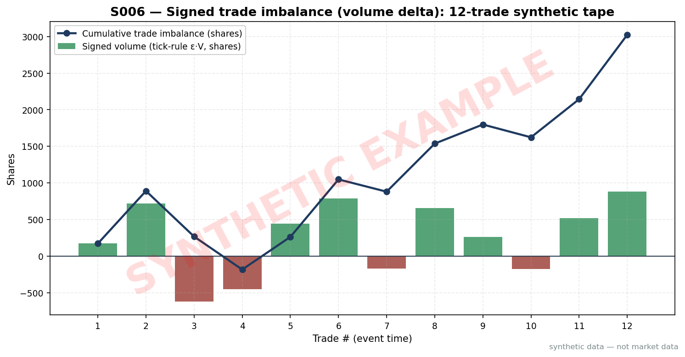

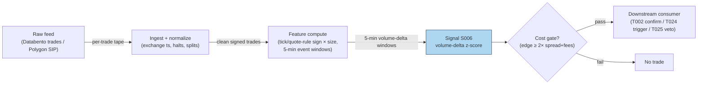
```mermaid
flowchart LR
    FEED["Raw feed\n(Databento trades / Polygon SIP)"] -->|per-trade tape| ING["Ingest + normalize\n(exchange ts, halts, splits)"]
    ING -->|clean signed trades| FEAT["Feature compute\n(tick/quote-rule sign × size,\n5-min event windows)"]
    FEAT -->|5-min volume-delta windows| SIG["Signal S006\nvolume-delta z-score"]
    SIG --> GATE{"Cost gate?\n(edge ≥ 2× spread+fees)"}
    GATE -->|pass| OUT["Downstream consumer\n(T002 confirm / T024 trigger / T025 veto)"]
    GATE -->|fail| DROP["No trade"]
    style SIG fill:#aed6f1,stroke:#1f3a5f
```

### S12. Sources

- Chordia, T. & Subrahmanyam, A. (2004). "Order Imbalance and Individual Stock Returns:
  Theory and Evidence." *Journal of Financial Markets*, 7(2), 111–130.
  https://papers.ssrn.com/sol3/papers.cfm?abstract_id=354122
- Chordia, T., Roll, R. & Subrahmanyam, A. (2002). "Order imbalance, liquidity, and
  market returns." *Journal of Financial Economics*, 65(1), 111–130.
  https://dl.icdst.org/pdfs/files/910bb6cf2390c9809f5ddc743b83ff92.pdf
- Evans, M. D. D. & Lyons, R. K. (2002). "Order Flow and Exchange Rate Dynamics."
  *Journal of Political Economy*, 110(1), 170–180.
  https://ideas.repec.Org/a/ucp/jpolec/v110y2002i1p170-180.html
- Hasbrouck, J. (1991). "Measuring the Information Content of Stock Trades."
  *Journal of Finance*, 46(1), 179–207.
  http://ideas.repec.org/a/bla/jfinan/v46y1991i1p179-207.html
- Kyle, A. S. (1985). "Continuous Auctions and Insider Trading." *Econometrica*,
  53(6), 1315–1335. (Theoretical origin; report citation, no URL verified.)

**Chatbot source log:** chatbot answers pending (checked 2026-09-10) — grok-answers.md
and cursor-answers.md were absent from batches/SB1/.

**Unverified leads**
- Cont, R., Kukanov, A. & Stoikov, S. — "The Price Impact of Order Book Events"
  (reported arXiv:1011.6402 in the batch question log; not independently verified by
  this chapter) — relevant to the OFI price-impact regression variant.

---

## Stage 8/200 — S008: VPIN (flow toxicity)

*Batch SB1 · Signal 8/100 · Provenance [D] · Family A — Microstructure & order flow*

### S1. One-line verdict

| | |
|---|---|
| **What it is** | Volume-clocked buy/sell imbalance averaged over buckets — a real-time proxy for how "toxic" (adversely selective) order flow is. |
| **When it works** | As a regime gate: widening quotes / cutting size when toxicity spikes keeps market-making books alive through stress episodes. |
| **When it dies** | As a directional trigger: it has no documented directional edge, and its famous flash-crash prediction did not survive replication. |
| **Build-or-buy in one line** | Build: fifty lines on a trade tape; the classification choice matters more than the code. |

Provenance **[D]** (documented) — the construction below follows Easley, López de Prado &
O'Hara's published VPIN specification, with the documented critiques carried alongside.
Family **A — Microstructure & order flow**.

> Standing caveat for this chapter: VPIN is a **toxicity/regime gate, not a standalone
> directional trigger**. Nothing in the replicated literature supports trading its level
> for direction; the honest use is defensive — quoting, sizing, and stand-down rules.

### S2. How it works — plain human explanation

A market maker is an insurance company that doesn't get to underwrite. All day, strangers
arrive wanting to trade; some are uninformed (rebalancing, noise), some know something the
maker doesn't. When the informed share of flow is high, the maker systematically loses —
this is **adverse selection**, and Easley–O'Hara's word for its intensity is **flow toxicity**.
The problem: toxicity isn't observable trade by trade. VPIN is an attempt to see it in the
rear-view mirror fast enough to act.

The trick is the clock. In calendar time, a frantic minute and a dead minute look the same
length; in **volume time**, each "bucket" holds the same number of shares, so buckets
arrive fast when the market is frantic and slow when it's dead — automatically adjusting
for pace. Inside each bucket, the bar's volume is split into buy volume and sell volume
(**bulk volume classification**, BVC, from the bar's own price change — the last print
of the bar versus the last print of the previous bar). If buys and sells
roughly balance, flow looks uninformed; if one side dominates bucket after bucket, someone
may know something. VPIN averages that one-sidedness over a rolling window of buckets.

Vignette: 10:15, ES futures. The last four 50,000-contract buckets printed imbalances of
31%, 8%, 44%, 12% — VPIN ≈ 0.24, elevated. The desk's rule (*example — not an institutional
standard*): above 0.30, halve quote size and widen the spread by 50%. At 10:31 a macro
headline hits; the desk is already small. Whether the headline was "predicted" is
irrelevant — the book survived because it was defensive when flow looked toxic. That is
the entire honest bull case for VPIN.

**Mental model (3 bullets):**
- VPIN measures *one-sidedness of flow in volume time* — a proxy for the probability
  you're trading against someone better informed.
- It is defensive infrastructure (a smoke detector), not an offensive weapon (a compass):
  it tells you when to be careful, never which way to bet.
- Its value lives or dies on the classification step: garbage buy/sell splits in,
  garbage toxicity out.

### S3. The math — exact formula

Partition the tape into **equal-volume buckets** $\tau = 1, 2, \dots$, each holding
$V$ shares (Easley–López de Prado–O'Hara's default: $V = \mathrm{ADV}/50$, i.e. 50
buckets per day — *example — not an institutional standard*).

**Bulk volume classification (BVC) — at the bar level:** for volume bar $\tau$ with
price change $\Delta P_\tau = P_{\text{last},\tau} - P_{\text{last},\tau-1}$
(last trade price of the bar versus the previous bar's) and $\sigma_{\Delta P}$
the recent std of bar price changes:
$$V^B_\tau = V \, \Phi\!\left(\frac{\Delta P_\tau}{\sigma_{\Delta P}}\right),
\qquad V^S_\tau = V - V^B_\tau$$
where $\Phi$ is the standard normal CDF. (A rising bar allocates most of its
volume to buys; a flat bar splits 50/50.) Every bucket holds exactly $V$
shares by construction — a trade straddling a bucket boundary is split across
the two buckets (ELO convention) — so the rolling denominator below is exactly
$n \cdot V$, not an approximation.

**Per-bucket order imbalance:**
$$\mathrm{OI}_\tau = \big|V^B_\tau - V^S_\tau\big|$$

**VPIN** over a rolling window of $n$ buckets (ELO default $n = 50$ — *example*):
$$\mathrm{VPIN}_t = \frac{\sum_{\tau=t-n+1}^{t} \mathrm{OI}_\tau}{n \cdot V}$$

This is a $[0,1]$ number: 0 = perfectly balanced flow, 1 = every bucket one-sided.

**Causal timing:** bucket $\tau$ closes when its $V$-th share prints; VPIN at that moment
uses only closed buckets; any defensive action applies to buckets $\tau+1$ onward —
never retroactively.

| Parameter | Symbol | Typical range | Too small | Too large | Default (example) |
|---|---|---|---|---|---|
| Bucket size | $V$ | ADV/100 – ADV/20 | noisy OI, whipsaw gates | sluggish; stress is over before the gate fires | ADV/50 *example — not an institutional standard* |
| Rolling window | $n$ | 10–100 buckets | single toxic bucket dominates | dilutes the signal into irrelevance | 50 buckets *example* |
| Toxicity threshold | $\kappa$ | 0.2–0.5 | permanent stand-down | never fires | 0.30 *example — not an institutional standard* |
| Classification | — | BVC / tick rule / quote rule | BVC smears midpoint noise (see critiques) | — | BVC per ELO; tick rule as robustness check |

**Normalization choices:** VPIN is already normalized to $[0,1]$ by construction; cross-asset
comparison still needs care because "normal" VPIN differs by venue and ADV share.
**Variants:** (1) **TR-VPIN** — tick-rule classification instead of BVC (Andersen–Bondarenko
show the choice flips behavior); (2) quote-rule VPIN on L1 data; (3) multi-asset / futures
VPIN on the most liquid venue as a market-wide stress gauge.

### S4. Worked example — step-by-step numbers (SYNTHETIC)

**Synthetic** 10-bucket tape, random seed 7 (bar-level BVC;
$\sigma_{\Delta P} = 0.04417$ = std of the 10 bar price changes, ddof=1).
Every bucket holds **exactly 500 shares** — boundary-straddling trades are
split per the ELO convention. Same data as the S11 chart.

| Bucket | $V$ (shares) | $\Delta P_\tau$ (\$) | $\Phi(\Delta P_\tau/\sigma)$ | $V^B$ | $V^S$ | $\|\mathrm{OI}\|$ | $\|\mathrm{OI}\|/V$ |
|---|---|---|---|---|---|---|---|
| 1 | 500 | −0.030 | 0.2485 | 124.3 | 375.7 | 251.5 | 0.503 |
| 2 | 500 | +0.010 | 0.5896 | 294.8 | 205.2 | 89.6 | 0.179 |
| 3 | 500 | −0.100 | 0.0118 | 5.9 | 494.1 | 488.2 | 0.976 |
| 4 | 500 | −0.020 | 0.3254 | 162.7 | 337.3 | 174.6 | 0.349 |
| 5 | 500 | −0.080 | 0.0351 | 17.5 | 482.5 | 464.9 | 0.930 |
| 6 | 500 | −0.020 | 0.3254 | 162.7 | 337.3 | 174.6 | 0.349 |
| 7 | 500 | +0.000 | 0.5000 | 250.0 | 250.0 | 0.0 | 0.000 |
| 8 | 500 | −0.010 | 0.4104 | 205.2 | 294.8 | 89.6 | 0.179 |
| 9 | 500 | +0.040 | 0.8174 | 408.7 | 91.3 | 317.4 | 0.635 |
| 10 | 500 | +0.030 | 0.7515 | 375.7 | 124.3 | 251.5 | 0.503 |

**Step 1 — classify (bar level).** Each bar's whole 500-share volume is split by
a single $\Phi$ evaluation on the bar's price change; e.g. bucket 3's bar fell
\$0.10: $\Phi(-0.10/0.04417) = \Phi(-2.26) = 0.0118$, so only 5.9 of its 500
shares classify as buys. Bucket 7's bar was flat ($\Delta P = 0.000$): a perfect
250/250 split.

**Step 2 — bucket imbalance.** $|\mathrm{OI}_3| = |5.9 - 494.1| = 488.2$ shares,
ratio $488.2/500 = 0.976$ — the most one-sided bucket.

**Step 3 — rolling VPIN ($n=4$, *example*).** The denominator is exactly
$4 \times 500 = 2000$ in every window:
- ending bucket 4: $(251.5+89.6+488.2+174.6)/2000 = 1003.9/2000 = \mathbf{0.5019}$
- ending bucket 5: $1217.3/2000 = \mathbf{0.6087}$
- ending bucket 6: $1302.3/2000 = \mathbf{0.6512}$
- ending bucket 7: $814.1/2000 = \mathbf{0.4071}$
- ending bucket 8: $729.1/2000 = \mathbf{0.3646}$
- ending bucket 9: $581.6/2000 = \mathbf{0.2908}$
- ending bucket 10: $658.5/2000 = \mathbf{0.3292}$

**Step 4 — gate decision.** Against an *example* toxicity threshold $\kappa = 0.30$
(*example — not an institutional standard*): the gate **fires** from bucket 4
through bucket 8 (readings 0.50 → 0.65 → 0.41 → 0.36), stands down at bucket 9
(0.29), and re-fires at bucket 10 (0.33).

**What to notice (and the limits):** VPIN here behaves exactly as designed — a smooth,
lagging average of one-sidedness that rises into the toxic patch and decays after. But
notice what it *doesn't* do: it says nothing about direction (buckets 1–6 were
sell-classified, yet the series gives no short signal — correctly, per the caveat).
And now the sharper lesson: this toy tape has **no informed traders at all** — just a
random walk whose bar closes happened to cluster downward in buckets 1–6 — yet VPIN
spikes to 0.65 and the gate fires for five straight buckets. That is precisely
Andersen–Bondarenko's warning: bar-level BVC misclassifies in fast markets, the errors
correlate with volume and volatility, and the result is manufactured "toxicity." A gate
that fires on sampling noise is a gate that costs you fills — which is why this chapter
insists on the BVC-vs-tick-rule robustness check on your own venue before any
deployment. This toy has no fees and no latency; the "toxicity" is pure noise.

### S5. Strategies that use this signal

- **T003 — VPIN-Gated Breakout Trader** — regime gate (primary control): breakouts are
  taken only when VPIN is below the toxicity cap; the gate is the strategy's core risk control.
- **T022 — Queue-Imbalance Maker with Toxicity Cancel** — veto: resting quotes are
  cancelled when VPIN spikes (defensive exit from adverse selection).
- **T005 — RVOL (relative volume)-Filtered Opening-Range Breakout** — filter: ORB entries are skipped
  when opening flow prints toxic.

### S6. Data required — exact spec

| Field | Type | Granularity | Source tier | Notes |
|---|---|---|---|---|
| Trade price | float | per-trade | Tier 0–2 | BVC needs the full price path, not just closes |
| Trade size | int | per-trade | Tier 0–2 | bucketing is by shares |
| (Optional) bid/ask | float | per-trade as-of | Tier 1–2 | only for tick/quote-rule robustness variants |

**Collection:** Databento trades, Polygon stocks v3, Alpaca SIP, or TAQ — VPIN needs
nothing fancier than a trade tape with price and size, which is why it became popular.
**Ingest sketch (≤20 lines, polars):**

```python
import polars as pl
from math import erf, sqrt
Phi = lambda x: 0.5 * (1 + erf(x / sqrt(2)))
tape = pl.scan_parquet("trades_*.parquet").sort("ts").collect()
V = int(tape["size"].sum() / 50)            # bucket size = ADV/50 (example)
tape = split_at_boundaries(tape, V)          # 1: split straddling trades: every bucket = V
tape = tape.with_columns(bucket=(tape["size"].cum_sum() // V).cast(pl.Int64))
b = (tape.group_by("bucket")                 # 2: one row per volume bar
         .agg(plast=pl.col("price").last()).sort("bucket"))
sig = b["plast"].diff().std()                # 3: std of BAR price changes
b = b.with_columns(dp=pl.col("plast").diff(),
                   frac=0.5 * (1 + pl.col("plast").diff()
                               .map_elements(lambda d: erf(d / sig / sqrt(2)))))
b = b.with_columns(vb=V * pl.col("frac"),                 # 4: bar-level BVC
                   oi=(2 * V * pl.col("frac") - V).abs())  #    |Vbuy - Vsell|
vpin = (b["oi"].rolling_sum(50) / (50 * V)).alias("vpin")  # n=50 example
```

**Storage:** trade tape ≈ 2–8 GB parquet per symbol-day for liquid names
(per `notes/cost-model.md` §4); the VPIN series itself is one float per bucket —
negligible. **Data-quality checklist:** exchange (not SIP-receipt) timestamps so
buckets close in true event order; corporate actions adjusted; halts excluded
(buckets spanning a halt mix regimes); DST/half-days rescale ADV; odd-lot and
late-reported prints flagged; BVC validated against tick-rule on a sample —
if the two disagree violently, trust neither blindly.

### S7. Local build on M5 Max / 128GB

**Feasibility: feasible, near-trivial compute (Tier M for the pipeline).** VPIN is
arithmetic over a trade tape — per `notes/cost-model.md` §2, a Python loop at
~100–500k events/sec covers ≤20 symbols live, and polars batch recomputation
(10–50M rows/sec) handles a full day's tape for hundreds of symbols in seconds.
Liquid-name trade flow is only ~10–200 trades/sec busy (§2); the bottleneck is
**feed handling and bucket bookkeeping**, not math. **RAM:** one symbol-day of trades
≈ 0.5–4 GB (§3) — keep the live window to the trailing day or two per symbol and
archive the rest; 500 symbols × 60 days of raw trades **does not fit** (§3), so
research history lives as per-symbol parquet or pre-aggregated bucket series.
**Stack:** Python+polars for research and live single-book; Rust only if VPIN must
share an event loop with heavier L1 signals; DuckDB for tape forensics.

**Engineering:** Tier M, 20–60 h (`notes/cost-model.md` §5) — the formula is an
afternoon; the hours go to the BVC-vs-tick-rule validation harness, the gate
integration (quote-widening / size-cutting / kill-switch wiring), and regime
bookkeeping. At $150/hr loaded: **$3,000–9,000** *loaded-cost estimate*, plus a
Tier-1 feed ~$30–200/mo *indicative — verify before budgeting*.
**What breaks first at 500 symbols:** bucket bookkeeping across 500 tapes
(the BVC step itself is one $\Phi$ evaluation per bucket — trivial); at full OPRA scale, the trade tape itself.

### S8. Buy vs build

| Option | What you get | Indicative price | Gains | Loses |
|---|---|---|---|---|
| Tier-0 free (Alpaca IEX, Stooq) | Trade tape | ~$0 | prototype the gate for free | IEX-only flow mis-measures toxicity |
| Tier-1 retail (Polygon, Alpaca SIP) | Full SIP tape | ~$30–200/mo | proper bucketing, history | SIP timestamps blur bucket edges |
| Tier-2 professional (Databento) | Exchange-stamped tape | ~$200/mo + usage | cleanest event ordering | usage cost on full-universe backfill |
| Academic (LOBSTER/TAQ via university) | Research-grade replay | ~hundreds/yr academic | best history for validation | not a production feed |

All prices *indicative — verify before budgeting* (per `notes/cost-model.md` §6).
**Verdict: build, always** — no vendor sells "your toxicity gate"; they sell the tape,
and the ELO specification is public. Buy the cheapest feed whose timestamps you trust,
spend the budget on the classification-robustness harness instead (BVC vs tick rule —
Andersen–Bondarenko show this choice is the whole ballgame).

### S9. Success ratio / efficacy — documented evidence

| Study / source | Market & period | Metric | Before/after cost | Caveat |
|---|---|---|---|---|
| Easley, López de Prado & O'Hara (2012), "Flow Toxicity and Liquidity in a High-Frequency World" | E-mini S&P 500, incl. May 6 2010 | VPIN hit historic highs ~1h before the flash crash; correlated with short-term volatility | n/a (not a strategy; event study) | Single-venue, single-event narrative; BVC-based |
| Andersen & Bondarenko (2014), "VPIN and the Flash Crash" | E-mini S&P 500 | VPIN is a **poor** predictor of short-run volatility; did **not** peak before the flash crash but after; predictive content is mechanical (correlates with trading intensity) | n/a (replication study) | Directly contradicts the ELO flash-crash claim |
| Andersen & Bondarenko (2015), "Assessing Measures of Order Flow Toxicity…" | E-mini S&P 500, CME BBO "perfect" classification | BVC classification inferior to a simple tick rule; with accurate classification VPIN behaves oppositely; BVC-VPIN's volatility-forecast power comes from **classification errors** correlated with volume/volatility | n/a (measurement study) | Devastating for BVC-VPIN as a toxicity measure |
| Yildiz, Van Ness & Van Ness (2020), "VPIN, liquidity, and return volatility in the U.S. equity markets" | US equities | VPIN informative about liquidity and return volatility **ex ante**; useful risk-management tool for market makers/regulators | n/a (forecasting regressions, not a strategy) | Supportive but modest; risk-tool framing, not alpha |

No checkable source was found reporting a Sharpe, hit rate, or basis points (bps)
per trade for a VPIN
strategy — before *or* after cost. The literature tests VPIN as a volatility/liquidity
forecaster, never as a directional trigger, which is exactly why this chapter refuses
to present it as one.

**Honest bottom line:** as a standalone directional trigger this is a *zero-documented*
edge — do not trade it for direction; as a **toxicity/regime gate** for quoting and
sizing it is a *plausible, cheap, contested* risk control — the supportive evidence
(Yildiz et al. 2020) and the hostile replications (Andersen–Bondarenko 2014/2015) both
deserve weight, and any deployment should reproduce the BVC-vs-tick-rule check on its
own venue before trusting the gate.

### S10. Failure modes & pitfalls

1. **Classification error (the big one)** — BVC systematically misclassifies in fast
   markets, and the errors correlate with volatility, manufacturing fake "toxicity".
   *Mitigation:* run tick-rule VPIN in parallel; if they disagree, investigate before gating.
2. **Treating it as directional** — high VPIN does not mean "price will fall/rise".
   *Mitigation:* wire it only to sizing/quoting/stand-down logic, never to entries.
3. **Mechanical correlation with intensity** — VPIN rises when volume rises, so it
   "predicts" volatility the way a speedometer "predicts" arrival. *Mitigation:*
   benchmark the gate against a raw volume/intensity gate; keep whichever earns its keep.
4. **Parameter fragility** — bucket size and window are *examples*, not standards; results
   move with them. *Mitigation:* fix from ELO defaults, sensitivity-test ±2×, don't optimize.
5. **Stale ADV** — bucket size from last month's ADV mis-buckets this week's regime.
   *Mitigation:* rolling ADV estimate; re-bucket on corporate actions and volume regime shifts.
6. **Latency** — a toxicity gate computed on a delayed feed fires after the damage.
   *Mitigation:* measure feed delay; the gate's reaction time must beat your quote lifetime.
7. **Overfitting the threshold** — tuning $\kappa$ on the flash crash is a one-observation fit.
   *Mitigation:* threshold from out-of-sample stress episodes; prefer smooth size-scaling
   over binary stand-down.
8. **False comfort** — a low VPIN does not mean flow is safe, only that it was balanced.
   *Mitigation:* keep independent risk limits (S088-style); VPIN is one input, not the book.

### S11. Visuals

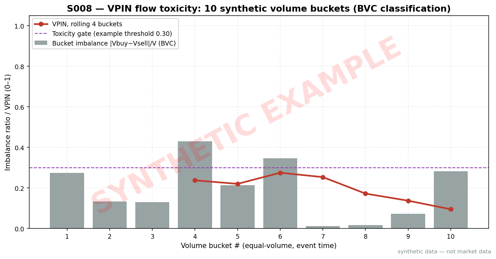

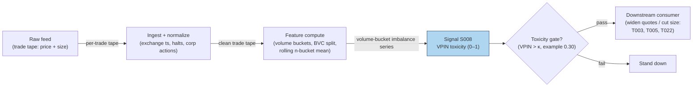
```mermaid
flowchart LR
    FEED["Raw feed\n(trade tape: price + size)"] -->|per-trade tape| ING["Ingest + normalize\n(exchange ts, halts, corp actions)"]
    ING -->|clean trade tape| FEAT["Feature compute\n(volume buckets, BVC split,\nrolling n-bucket mean)"]
    FEAT -->|volume-bucket imbalance series| SIG["Signal S008\nVPIN toxicity (0–1)"]
    SIG --> GATE{"Toxicity gate?\n(VPIN > κ, example 0.30)"}
    GATE -->|pass| OUT["Downstream consumer\n(widen quotes / cut size:\nT003, T005, T022)"]
    GATE -->|fail| DROP["Stand down"]
    style SIG fill:#aed6f1,stroke:#1f3a5f
```

### S12. Sources

- Easley, D., López de Prado, M. M. & O'Hara, M. (2012). "Flow Toxicity and Liquidity
  in a High-Frequency World." *Review of Financial Studies*, 25(5), 1457–1493.
  (Working-paper version) http://www.stern.nyu.edu/sites/default/files/assets/documents/con_035928.pdf
- Andersen, T. G. & Bondarenko, O. (2014). "VPIN and the Flash Crash." *Journal of
  Financial Markets*, 17, 1–46. https://ideas.repec.Org/a/eee/finmar/v17y2014icp1-46.html
- Andersen, T. G. & Bondarenko, O. (2015). "Assessing Measures of Order Flow Toxicity
  and Early Warning Signals for Market Turbulence." *Review of Finance*, 19(1), 1–54.
  https://ideas.repec.Org/a/oup/revfin/v19y2015i1p1-54..html
- Yildiz, S., Van Ness, B. & Van Ness, R. (2020). "VPIN, liquidity, and return
  volatility in the U.S. equity markets." *Global Finance Journal*, 45.
  https://ideas.repec.org/a/eee/glofin/v45y2020ics1044028318302679.html

**Chatbot source log:** chatbot answers pending (checked 2026-09-10) — grok-answers.md
and cursor-answers.md were absent from batches/SB1/.

**Unverified leads**
- Practitioner claims that VPIN "predicted" various post-2010 stress episodes circulate
  in vendor marketing; no checkable replication was found — treated as unverified.

---

## Stage 14/200 — S014: Quoted / effective / realized spread & price-impact decomposition

*Batch SB1 · Signal 14/100 · Provenance [D] · Family A — Microstructure & order flow*

### S1. One-line verdict

| | |
|---|---|
| **What it is** | Per-trade measurement of what liquidity actually cost: quoted vs paid vs kept, split into realized profit and adverse selection. |
| **When it works** | Always — as a cost gate and diagnostic: it tells you which trades, venues, and times are too expensive to touch. |
| **When it dies** | As a directional signal: it measures cost, not alpha; wide spreads predict nothing about direction. |
| **Build-or-buy in one line** | Build the estimator on your own tape; buy Rule 605/TAQ benchmarks to calibrate it. |

Provenance **[D]** (documented) — the decomposition follows the published Huang–Stoll /
Glosten–Harris family and SEC MIDAS conventions. Family **A — Microstructure & order flow**.

### S2. How it works — plain human explanation

Three prices describe every trade, and confusing them is how strategies quietly bleed.
The **quoted spread** is the advertisement: at 9:47:03, AAPL shows bid 231.40 × 800 /
ask 231.41 × 300, so the quoted spread is 1 cent. The **effective spread** is what the
aggressor actually paid: if a buyer lifts the offer at 231.41 while the mid is 231.405,
she paid half a cent over mid — times two, the effective spread is 1 cent. Same here,
but often it isn't: price improvement, midpoint crosses, and odd-lot prints routinely
make effective spreads narrower (or wider) than quoted.

The **realized spread** asks the harder question: of that 1 cent the liquidity provider
collected, how much did she *keep*? If the mid drifts up to 231.415 five minutes later —
because the buyer knew something — the provider's "profit" evaporates: realized spread
near zero (or negative), and the difference went to **price impact**, i.e. adverse
selection. The identity is clean:

> **effective spread = realized spread + price impact**

Why does this matter economically? The quoted spread is what naive cost models charge;
the effective spread is what you actually pay; the realized spread is what a
market-making strategy actually earns; and price impact is the permanent information
content of flow — the part no liquidity provider can avoid. Huang & Stoll (1997) showed
the spread decomposes into order-processing, inventory, and adverse-selection
components; the realized/impact split is the practitioner's version of the same idea,
computable trade by trade. Every strategy in this document that pays the spread is
implicitly betting its edge exceeds the effective spread — this signal is how you check.

**Mental model (3 bullets):**
- Quoted = advertised; effective = paid; realized = kept. Never substitute one for another.
- Effective − realized = price impact = the adverse-selection tax on every aggressive trade.
- This is a *measurement* signal: its job is costing trades and gating strategies, not
  predicting direction.

### S3. The math — exact formula

For a trade at time $t$ with price $P_t$, prevailing quotes $P^b_t$ (bid), $P^a_t$ (ask),
mid $M_t = (P^b_t + P^a_t)/2$, and direction $D_t \in \{+1,-1\}$ ($+1$ = buyer-initiated):

**Quoted spread** (dollars; half-spread in basis points (bps)):
$$S^q_t = P^a_t - P^b_t, \qquad s^q_t = 100 \cdot \frac{P^a_t - P^b_t}{2 M_t}\ \text{bps}$$

**Effective spread** (what the aggressor paid vs the mid):
$$S^e_t = 2 \, D_t \, (P_t - M_t)$$

**Realized spread** (what the liquidity provider kept; $\Delta \approx$ 5 min per the
report — *example — not an institutional standard*):
$$S^r_t = 2 \, D_t \, (P_t - M_{t+\Delta})$$

**Price impact** (adverse selection; the mid's drift against the provider):
$$\mathrm{PI}_t = 2 \, D_t \, (M_{t+\Delta} - M_t) = S^e_t - S^r_t$$

All in dollars per share (multiply by 100 for cents); sign convention: positive $S^r$
means the provider profited, positive $\mathrm{PI}$ means the mid moved against the
provider (information won).

**Causal timing:** $S^e_t$ is known at trade time $t$; $S^r_t$ requires the mid at
$t+\Delta$ and is therefore a *diagnostic*, never a live trigger. A strategy gates on
*trailing averages* of these quantities, computed strictly from closed windows.

| Parameter | Symbol | Typical range | Too small | Too large | Default (example) |
|---|---|---|---|---|---|
| Realized-spread horizon | $\Delta$ | 1–30 min | noise dominates the mid move | mixes in unrelated drift | 5 min *example — not an institutional standard* |
| Aggregation window | $W$ | 30 min – 1 day | single prints dominate | stale costs | 1 trading day *example* |
| Direction rule | $D_t$ | quote rule / tick rule / LR | mis-signing flips $S^e$ sign | — | quote rule on NBBO (National Best Bid and Offer) *example* |

**Normalization choices:** dollar spreads for P&L accounting; bps of mid for cross-symbol
comparison; time-weighted vs trade-weighted vs **dollar-weighted** averaging (dollar-weight
when costing a real book). **Named variants:** (1) **Huang–Stoll (1997) three-component
regression** — $\Delta P_t = \tfrac{S}{2}(Q_t - Q_{t-1}) + (\alpha+\beta)\tfrac{S}{2}Q_t + e_t$,
splitting the spread into order-processing, inventory ($\beta$), and adverse-selection
($\alpha$) shares; (2) **Glosten–Harris (1988) trade-indicator model** — adverse selection
vs transitory (order-processing + inventory) components, with volume-dependent terms;
(3) **Roll (1984) implicit spread** $2\sqrt{-\mathrm{cov}(\Delta P_t, \Delta P_{t-1})}$ —
quote-free, for when you only have a price series (cf. S012).

### S4. Worked example — step-by-step numbers (SYNTHETIC)

**Synthetic** 12-trade tape, random seed 11. Realized spread uses the mid **3 trades
later** ($\Delta = 3$ trades — *example — not an institutional standard*; the report's
convention is $\approx$ 5 minutes). Same data as the S11 chart; cents rounded.

| # | Bid | Ask | Mid | $D$ | Price | Eff. (¢) | Real. (¢) | Impact (¢) |
|---|---|---|---|---|---|---|---|---|
| 1 | 99.990 | 100.010 | 100.000 | +1 | 100.008 | +1.52 | −0.55 | +2.07 |
| 2 | 99.992 | 100.022 | 100.007 | +1 | 100.019 | +2.40 | +1.99 | +0.42 |
| 3 | 100.008 | 100.018 | 100.013 | +1 | 100.018 | +1.01 | +2.35 | −1.34 |
| 4 | 99.996 | 100.026 | 100.011 | −1 | 99.997 | +2.64 | +2.39 | +0.26 |
| 5 | 99.999 | 100.019 | 100.009 | −1 | 99.999 | +2.09 | +2.08 | +0.01 |
| 6 | 99.996 | 100.016 | 100.006 | +1 | 100.015 | +1.70 | +0.44 | +1.26 |
| 7 | 99.994 | 100.024 | 100.009 | −1 | 99.995 | +2.85 | +1.69 | +1.16 |
| 8 | 99.994 | 100.024 | 100.009 | +1 | 100.025 | +3.29 | +2.82 | +0.47 |
| 9 | 99.998 | 100.028 | 100.013 | −1 | 99.997 | +3.12 | +2.74 | +0.38 |
| 10 | 99.993 | 100.013 | 100.003 | −1 | 99.995 | +1.78 | +3.93 | −2.15 |
| 11 | 99.996 | 100.026 | 100.011 | −1 | 99.998 | +2.58 | +3.03 | −0.45 |
| 12 | 99.996 | 100.026 | 100.011 | +1 | 100.025 | +2.92 | +2.75 | +0.16 |

**Step 1 — effective.** Trade 2: $D=+1$, $P=100.019$, $M=100.007$:
$S^e = 2(100.019-100.007) = +0.0240$ = **+2.40¢** — the buyer paid 2.40¢ round-trip
equivalent, wider than the 3.0¢ quoted spread's half (1.5¢) because of the slippage noise.

**Step 2 — realized.** Trade 2's mid 3 trades later (trade 5's mid) $= 100.009$:
$S^r = 2(P - M_{t+\Delta}) = 2(100.019-100.009) = +0.0200$ ≈ **+1.99¢** in the
table (internal mids carry more decimals than printed) — the provider kept
about two cents of the 2.40¢ the taker paid.

**Step 3 — impact.** $\mathrm{PI} = S^e - S^r = 2.40 - 1.99 = \mathbf{+0.41¢}$
(≈ +0.42¢ in the table) — equivalently $2(M_{t+\Delta} - M_t) = 2(100.009-100.007)$:
the mid barely drifted against the provider.

**Step 4 — averages.** Mean effective **+2.33¢**, mean realized **+2.14¢**, mean
impact **+0.19¢**: in this toy tape, liquidity providers collected 2.33¢ per share
and kept 2.14¢ — only 0.19¢ leaked to adverse selection.

**What to notice (and the limits):** the stacked chart makes the identity visual —
every bar's total height is the effective spread, split into kept (green) vs lost to
impact (red). Two honest artifacts of toy data: three price impacts are *negative*
(trades 3, 10, 11: −1.34¢, −2.15¢, −0.45¢ — the mid moved in the provider's
favor after the trade; pure noise here), and trade 1's realized spread is negative
(−0.55¢: the provider lost on that round trip). In real data, persistently negative
realized spreads flag toxic flow; here it's just the random walk. Real tapes also show
price improvement (effective < quoted) far more often than this one. And again: no
fees, no latency, twelve trades — this is arithmetic practice, not a cost study.

### S5. Strategies that use this signal

- **T028 — Spread-Decomposition Router** — primary trigger: routes and holds based on
  quoted/effective/realized spread and the adverse-selection component — this signal
  *is* the strategy's decision variable.
- **T002 — Microprice Fair-Value Scalper** — cost gate (filter): the scalp is taken
  only when the trailing effective spread is below the edge — spread decomposition as veto.
- **T034 — Index Futures Cash-and-Carry** — cost check (filter): basis trades clear
  only after spread-cost accounting on both legs.

### S6. Data required — exact spec

| Field | Type | Granularity | Source tier | Notes |
|---|---|---|---|---|
| Trade price & size | float / int | per-trade event | Tier 0–2 | |
| Prevailing NBBO bid/ask | float | per-trade, as-of (≤1 min old per HS convention) | Tier 1–2 | staleness is the #1 error source |
| Trade direction | ±1 | per-trade | derived | quote rule preferred; tick rule fallback |
| Delayed mid | float | $t+\Delta$ | derived | needs the quote tape, not just trades |

**Collection:** Databento MBP-1 (trades + top-of-book), TAQ, or Polygon SIP; Rule 605
reports give venue-level effective-spread benchmarks for calibration. **Ingest sketch
(≤20 lines, polars):**

```python
import polars as pl
t = pl.scan_parquet("trades_nbbo_*.parquet").sort("ts").collect()  # ts,P,bid,ask
t = t.with_columns(mid=(pl.col("bid") + pl.col("ask")) / 2)
t = t.with_columns(D=pl.when(pl.col("P") >= pl.col("mid")).then(1).otherwise(-1))  # quote rule
DELTA = "5m"   # example — not an institutional standard
t = t.with_columns(mid_fwd=pl.col("mid").shift(-1))  # align: use asof join on ts+Δ in prod
out = t.with_columns(
    eff=2 * pl.col("D") * (pl.col("P") - pl.col("mid")),
    impact=2 * pl.col("D") * (pl.col("mid_fwd") - pl.col("mid")),
).with_columns(rlzd=pl.col("eff") - pl.col("impact"))
```

(Production code replaces the naive `shift` with an as-of join of each trade's
$ts + \Delta$ against the quote tape.)

**Storage:** trades+NBBO ≈ 2–8 GB parquet per symbol-day liquid (`notes/cost-model.md`
§4); aggregated daily spread panels are megabytes. **Data-quality checklist:**
NBBO as-of each trade (never the *next* quote — lookahead); crossed/locked markets
excluded; corporate actions adjusted; halts dropped; odd-lot and sub-penny prints
flagged (they distort effective spreads); SIP-vs-exchange timestamp choice documented;
$\Delta$-horizon kept constant across the sample.

### S7. Local build on M5 Max / 128GB

**Feasibility: feasible (Tier M).** Per-trade arithmetic over a trades+quotes tape —
`notes/cost-model.md` §2 gives polars simple ops at ~10–50M rows/sec, so a full day's
L1 tape for one symbol decomposes in seconds; a Python loop (~100–500k events/sec)
sustains live decomposition for ≤20 symbols. The real work is the as-of join of
trades to NBBO and to the $t+\Delta$ mid — both are sorted merge-asof operations,
cheap in polars. Bottleneck is **I/O on the quote tape**, not compute. **RAM:** one
symbol-day of trades+touch quotes ≈ 0.5–4 GB (§3); 500 symbols × 60 days **does not
fit** (§3) — research on per-symbol daily files, live on a trailing window.
**Stack:** Python+polars for research and live; DuckDB when the tape already lives in
parquet and you want SQL as-of joins; Rust only if this shares a hot loop with
full-depth signals.

**Engineering:** Tier M, 20–60 h (`notes/cost-model.md` §5) — the formulas are an
hour; the as-of alignment harness, direction-rule validation, and Rule 605
calibration are the project. At $150/hr loaded: **$3,000–9,000** *loaded-cost
estimate*, plus Tier-1/2 data ~$30–200/mo (SIP) or ~$200/mo + usage (Databento)
*indicative — verify before budgeting*. **What breaks first at 500 symbols:**
the $t+\Delta$ as-of join across a sharded quote store (pre-aggregate to daily
panels); full OPRA adds the options-tape join.

### S8. Buy vs build

| Option | What you get | Indicative price | Gains | Loses |
|---|---|---|---|---|
| Tier-0 free (Alpaca IEX, Stooq) | Trades only | ~$0 | free prototyping | no NBBO → no effective spread |
| Tier-1 retail (Polygon, Alpaca SIP) | SIP trades + NBBO | ~$30–200/mo | full decomposition possible | SIP quote staleness widens error bars |
| Tier-2 professional (Databento MBP-1) | Exchange trades+quotes | ~$200/mo + usage | cleanest as-of alignment | usage meter on backfills |
| Benchmark route (Rule 605 reports, TAQ) | Published effective/realized spreads | ~$0 (605) / institutional $$$ (TAQ) | calibrate your estimator for free (605) | 605 is monthly, venue-level, not per-trade |

All prices *indicative — verify before budgeting* (per `notes/cost-model.md` §6).
**Verdict: build the estimator, buy the calibration** — the formulas are public and
ten lines long; what you can't build is someone else's venue-level benchmark, so
pull Rule 605 effective spreads (free) and require your estimates to track them.
Crossover: if your backtest's cost assumption ever disagrees with your measured
effective spread by more than ~20%, stop and reconcile before trading.

### S9. Success ratio / efficacy — documented evidence

This signal's "efficacy" is measurement quality and cost discipline, not directional
alpha — the honest evidence table reflects that:

| Study / source | Market & period | Metric | Before/after cost | Caveat |
|---|---|---|---|---|
| Huang & Stoll (1997), "The Components of the Bid-Ask Spread: A General Approach" | NYSE | Two-component split: order processing ≈ 88.6% of spread on large stocks; adverse selection + inventory the smaller remainder; components vary with trade size | n/a (structural estimation) | Large-cap 1990s sample; upstairs market effects |
| Glosten & Harris (1988), "Estimating the Components of the Bid/Ask Spread" | NYSE 1981–1983 | Spread splits into asymmetric-information vs transitory (order-processing + inventory); cannot reject significant information component | n/a (structural estimation) | Old sample; no volume interaction in base model |
| Goyenko, Holden & Trzcinka (2009), "Do liquidity measures measure liquidity?" | US equities, TAQ + Rule 605 benchmarks | Effective/realized-spread measures win the majority of horseraces against spread proxies | n/a (measurement horserace) | Validates the *measures*, not a strategy |
| Practitioner convention (SEC MIDAS / Rule 605) | US equities, ongoing | Effective spread is the regulatory-standard transaction-cost metric | **After-cost by construction** (it *is* the cost) | Monthly/venue-level granularity |

Regimes where it fails as a gate: it is backward-looking — a trailing realized spread
does not warn you that *this* trade is toxic (that's S008's job); during opens, closes,
and news, spreads gap faster than trailing windows adapt. Documented decay: none —
it's accounting, not alpha — but its *components* drift with market structure
(decimalization, tick-size pilot, retail wholesaler price improvement).

**Honest bottom line:** as a standalone directional trigger this is a *null* edge by
design — it was never meant to predict; as a **cost gate and strategy diagnostic**
it is *essential infrastructure*: any intraday strategy chapter in this document that
cannot state its edge net of measured effective spread is not a strategy, it's a hope.

### S10. Failure modes & pitfalls

1. **Quoted/effective confusion** — backtesting with quoted spreads when you pay effective
   (or vice versa). *Mitigation:* always simulate with measured effective spreads (S014);
   quoted is an upper bound, not a cost.
2. **Stale-quote as-of** — joining trades to quotes from the wrong millisecond flips
   $D_t$ and the sign of $S^e$. *Mitigation:* exchange timestamps, as-of (never after),
   drop locked/crossed intervals.
3. **Lookahead in realized spread** — using $M_{t+\Delta}$ as a *live* input.
   *Mitigation:* realized spread is diagnostic-only; live gates use trailing closed windows.
4. **Wrong $\Delta$** — 1-minute realized spread is noise; 30-minute mixes in drift.
   *Mitigation:* fix $\Delta$ = 5 min (*example*), sensitivity-test; match the strategy's
   holding horizon.
5. **Ignoring price improvement** — retail/wholesaler flow prints inside the spread;
   assuming full quoted spread overstates costs. *Mitigation:* measure effective, don't assume.
6. **Survivorship/venue bias** — SIP NBBO misses inverted and venue-specific quotes.
   *Mitigation:* calibrate against Rule 605 venue reports; note the gap.
7. **Cost blowup** — strategies whose gross edge is a fraction of the effective spread
   (the classic S4 arithmetic: +0.49 bps predicted vs 2.33¢ ≈ multi-bps cost).
   *Mitigation:* hard gate — no trade unless modeled edge ≥ 2× measured round-trip cost.
8. **Overfitting the decomposition** — tuning $\Delta$, windows, and direction rules to
   make a favored strategy's costs look small. *Mitigation:* fix conventions up front;
   report both quote-rule and tick-rule variants.

### S11. Visuals

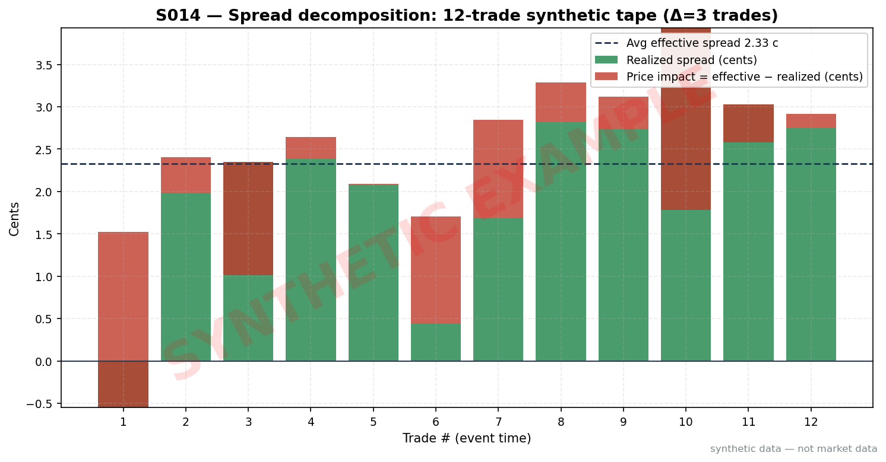

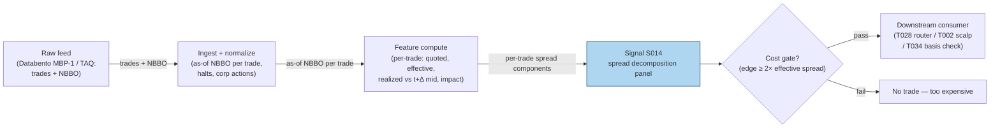
```mermaid
flowchart LR
    FEED["Raw feed\n(Databento MBP-1 / TAQ:\ntrades + NBBO)"] -->|trades + NBBO| ING["Ingest + normalize\n(as-of NBBO per trade,\nhalts, corp actions)"]
    ING -->|as-of NBBO per trade| FEAT["Feature compute\n(per-trade: quoted, effective,\nrealized vs t+Δ mid, impact)"]
    FEAT -->|per-trade spread components| SIG["Signal S014\nspread decomposition panel"]
    SIG --> GATE{"Cost gate?\n(edge ≥ 2× effective spread)"}
    GATE -->|pass| OUT["Downstream consumer\n(T028 router / T002 scalp\n/ T034 basis check)"]
    GATE -->|fail| DROP["No trade — too expensive"]
    style SIG fill:#aed6f1,stroke:#1f3a5f
```

### S12. Sources

- Huang, R. D. & Stoll, H. R. (1997). "The Components of the Bid-Ask Spread: A
  General Approach." *Review of Financial Studies*, 10(4), 995–1034.
  https://ideas.repec.Org/a/oup/rfinst/v10y1997i4p995-1034.html
- Glosten, L. R. & Harris, L. E. (1988). "Estimating the Components of the Bid/Ask
  Spread." *Journal of Financial Economics*, 21(2), 123–142.
  https://business.columbia.edu/faculty/research/estimating-components-bidask-spread
- Goyenko, R. Y., Holden, C. W. & Trzcinka, C. A. (2009). "Do liquidity measures
  measure liquidity?" *Journal of Financial Economics*, 92(2), 153–181.
  https://EconPapers.repec.org/article/eeejfinec/v_3a92_3ay_3a2009_3ai_3a2_p_3a153-181.htm
- U.S. SEC MIDAS / Rule 605 conventions — effective spread as the regulatory
  transaction-cost metric (market-structure reference; no single paper).

**Chatbot source log:** chatbot answers pending (checked 2026-09-10) — grok-answers.md
and cursor-answers.md were absent from batches/SB1/.

**Unverified leads**
- Roll, R. (1984) implicit-spread estimator mentioned as a variant (S012's home
  chapter); not independently sourced here.

---

## Stage 24/200 — S024: VWAP cross & anchored-VWAP continuation

*Batch SB1 · Signal 24/100 · Provenance [SR] · Family B — Intraday momentum & breakout*

### S1. One-line verdict

| Field | Detail |
|---|---|
| **What it is** | A sustained close above (below) session or anchored VWAP on rising volume = institutions have re-accepted value higher (lower); ride it. |
| **When it works** | Trend days with heavy institutional flow: price crosses VWAP early, volume confirms, and price holds the line for several bars. |
| **When it dies** | Choppy range days: price flickers across VWAP repeatedly, volume is thin, and every cross is a whipsaw. |
| **Build-or-buy in one line** | Build the indicator yourself (trivial math); buy a clean 1-min consolidated feed — the edge, if any, is in data hygiene, not the formula. |

Provenance **[SR]** (standard reconstruction): VWAP-cross continuation is a practitioner convention — the exact participation-vs-fade logic inside bank execution algos is proprietary, and no public paper defines a canonical cross rule with published performance. [SR] is **not** upgraded here.

### S2. How it works — plain human explanation

It is 9:36, AAPL. Bid 231.40 × 800, ask 231.41 × 300, and session VWAP — every share traded since 9:30, volume-weighted — sits at 231.28. Price has chopped around it since the open. Now 25,000-share prints hit at 231.40, then 231.44. The next three one-minute bars all close above the rising VWAP, each on larger volume than the last.

A VWAP cross is a bet about *whose* flow is moving the tape. Large desks benchmark execution to VWAP — Berkowitz, Logue & Noser (1988) established it as the institutional transaction-cost benchmark. If price holds above VWAP on rising volume, the institutions buying today are paying up versus their benchmark, and the ones still working orders are incentivized to keep buying into strength: their mandate is "beat VWAP," not "buy the cheapest tick." A sustained cross reads as a regime shift — the market accepted a new value area, and benchmarked flow defends it.

The **anchored** variant moves the anchor: session VWAP starts at the open, but a 10:15 FDA headline is a better anchor for a pharma name. Reset the cumulative sums at the event and ask "where has value been accepted *since the news*?" Same mechanics, different starting bar.

Why should this work economically? Three forces, none mystical:

1. **Benchmarked flow is real and large.** VWAP algorithms slice parent orders across the day following the historical volume curve. When price breaks above VWAP and holds, these algos' schedules tilt toward buying (to avoid trailing their benchmark) — a mechanical, persistent bid. Choi, Larsen & Seppi (2018) model exactly this: TWAP (time-weighted average price)/VWAP order-splitting benchmarks induce predictable intraday price-pressure patterns.
2. **Value-area re-acceptance.** In auction-market terms, a sustained cross means two-sided trade is happening at the new level — it is not a single print. Volume confirmation separates "a block crossed" from "the market moved."
3. **Information revelation.** If the cross follows news, informed traders act strategically in high-volume periods (the same mechanism Gao et al. invoke for intraday momentum) — the cross is the footprint, not the cause.

**Mental model (3 bullets):**
- VWAP is the market's *agreed price so far today*; a sustained cross on volume means the agreement moved.
- The continuation is not the cross itself — it is the benchmarked flow that chases the cross. No volume, no flow, no trade.
- The mirror image (price extended *from* VWAP on fading volume) is mean reversion, not continuation — that is S040. Misclassifying the regime is the expensive mistake.

### S3. The math — exact formula

Session VWAP at bar $t$ (bars indexed from the session open, $i = 1 \dots t$):

$$
\mathrm{VWAP}_t = \frac{\sum_{i=1}^{t} TP_i \cdot V_i}{\sum_{i=1}^{t} V_i},
\qquad TP_i = \frac{H_i + L_i + C_i}{3}
$$

where $H_i, L_i, C_i$ are the bar's high, low, close (currency units, e.g. USD) and $V_i$ is share volume. The anchored variant resets the sums at an anchor bar $A$ (event time, prior close, rolling start):

$$
\mathrm{AVWAP}_t(A) = \frac{\sum_{i=A}^{t} TP_i \cdot V_i}{\sum_{i=A}^{t} V_i},
\qquad t \ge A.
$$

**Cross rule (example construction — not an institutional standard).** Let $s_t = \mathrm{sign}(C_t - \mathrm{VWAP}_t)$. A bullish continuation trigger at bar $t^\*$ requires:

1. $s_{t^\*-1} \le 0$ and $s_{t^\*} > 0$ (the cross, detected at the close of bar $t^\*$),
2. $s_{t^\*+1} = s_{t^\*+2} = \dots = s_{t^\*+N} = +1$ (the $N$ bars *after* the cross bar all hold above VWAP),
3. $V_{t^\*} > \kappa \cdot \bar{V}_{\text{same-slot, 20d}}$ (volume confirmation; $\kappa$ example 1.5).

**Causal timing:** $\mathrm{VWAP}_t$ uses only bars $\le t$; the hold condition needs bars through $t^\*+N$, which only close at the close of bar $t^\*+N$. Earliest tradable fill: the open of bar $t^\*+N+1$. Filling at the cross bar's close while *also* requiring the hold is lookahead — the hold bars are in the future at that point. (An "aggressive variant" that fills at the cross bar's close and uses the hold only as an ex-post filter is a different strategy: it may not claim the hold as an entry condition, and it eats the full whipsaw risk.) Never evaluate a "cross" on a partially-formed bar; the current bar's volume and close are unknown until it closes (a classic lookahead leak).

**Normalization choices:** raw deviation $d_t = (C_t - \mathrm{VWAP}_t)/\mathrm{VWAP}_t$ in basis points is fine for thresholding within one name; cross-name comparison needs $z_t = d_t / \hat{\sigma}_d$ with a rolling $\hat{\sigma}_d$ (S040's engine). The report's signal is unnormalized; normalization is a recommended refinement.

**Parameter table** (every default marked `example — not an institutional standard`):

| Parameter | Symbol | Typical range | Too small | Too large | Default (example) |
|---|---|---|---|---|---|
| Hold bars | $N$ | 2–5 | whipsaw city | misses the move | 3 |
| Volume multiple | $\kappa$ | 1.2–2.0× slot median | admits noise crosses | never triggers | 1.5 |
| Typical price vs close-only | — | TP or $C_i$ | — | — | TP (report formula) |
| VWAP window | — | session / anchored / rolling 60–120 min | rolling loses benchmark meaning | session VWAP slow to react | session + anchored variant |
| Cross tolerance | $\varepsilon$ | 0–5 bps | 0 = flicker triggers | real crosses rejected | 1 bp |

**Named variants:**
1. **Close-only VWAP** ($\mathrm{VWAP}_t$ with $C_i$ replacing $TP_i$) — matches many retail charting platforms; slightly noisier, no intrabar-range information.
2. **Rolling VWAP** (trailing 60–120 min window) — adapts on trend days but loses the "institutional benchmark" interpretation; closer to a moving average.
3. **Event-anchored VWAP** (news, earnings, prior day's close, opening range) — the T067 variant; the anchor is the research decision that matters most.

### S4. Worked example — step-by-step numbers (SYNTHETIC)

All numbers below are **synthetic**, generated with `numpy.random.default_rng(24)` — **seed 24** — and are the exact series plotted in S11. This is an arithmetic illustration, not a backtest: there are no fees, no spread, and the fill is assumed.

| bar | C ($) | V (sh) | TP ($) | ΣTP·V | ΣV | VWAP ($) | AnchVWAP ($) | dev (bps) | above? |
|---|---|---|---|---|---|---|---|---|---|
| 1 | 100.01 | 9,100 | 100.01 | 910,091 | 9,100 | 100.01 | n/a | 0.0 | no |
| 2 | 99.97 | 8,300 | 99.96 | 1,739,759 | 17,400 | 99.99 | n/a | −2.0 | no |
| 3 | 99.93 | 7,600 | 99.94 | 2,499,303 | 25,000 | 99.97 | n/a | −4.0 | no |
| 4 | 99.96 | 9,400 | 99.97 | 3,439,021 | 34,400 | 99.97 | n/a | −1.0 | no |
| 5 | 99.99 | 11,200 | 99.99 | 4,558,909 | 45,600 | 99.98 | 99.99 | +1.0 | **yes** |
| 6 | 100.04 | 14,800 | 100.04 | 6,039,501 | 60,400 | 99.99 | 100.02 | +5.0 | yes |
| 7 | 100.09 | 18,600 | 100.08 | 7,900,989 | 79,000 | 100.01 | 100.04 | +8.0 | yes |
| 8 | 100.12 | 21,900 | 100.12 | 10,093,617 | 100,900 | 100.04 | 100.07 | +8.0 | yes |
| 9 | 100.17 | 23,400 | 100.16 | 12,437,361 | 124,300 | 100.06 | 100.09 | +11.0 | yes |
| 10 | 100.18 | 20,100 | 100.18 | 14,450,979 | 144,400 | 100.08 | 100.11 | +10.0 | yes |
| 11 | 100.21 | 17,800 | 100.21 | 16,234,717 | 162,200 | 100.09 | 100.12 | +12.0 | yes |
| 12 | 100.24 | 16,500 | 100.24 | 17,888,677 | 178,700 | 100.10 | 100.14 | +14.0 | yes |

**Step-by-step:** each bar's typical price $TP = (H+L+C)/3$ is volume-weighted and accumulated; dividing cumulative dollar volume by cumulative shares gives VWAP (bar 5: $4{,}558{,}909 / 45{,}600 = 99.98$). Bars 1–4 close at or below VWAP. At bar 5, close 99.99 exceeds VWAP 99.98 — the cross is **detected** (not yet tradable). Bars 6–8 all close above VWAP ($N = 3$ hold, dev +5.0/+8.0/+8.0 bps) → the hold **confirms at bar 8's close**; earliest honest fill is **bar 9's open** — the first print after confirmation. (An earlier draft of this chapter called bar 6's open the fill; that used bars 6–8 — then still in the future — to authorize the trade. Corrected here: no future bar may authorize an earlier fill.) Anchored VWAP, re-set at the cross bar, tracks the post-cross value area (99.99 → 100.14), rising faster than session VWAP — on a trend day the anchor is the more responsive reference.

**What to notice:** volume builds from 11.2k to 23.4k shares across the cross — the confirmation the rule demands. But the cross itself is a **1 bp** margin at bar 5: inside the spread for most names, which is why production rules add the volume gate ($\kappa$) and tolerance band. The toy tape has no fees, no spread, no partial fills, and no losing days — it demonstrates the arithmetic, nothing more.

### S5. Strategies that use this signal

- **T066 — VWAP-Cross Institutional Follower** — primary entry trigger (direction): sustained cross + RVOL (relative volume) confirmation = the strategy's core entry; also fades *extreme* deviations (the S040 mirror).
- **T067 — Anchored-VWAP Event Trader** — primary trigger (direction): anchors VWAP at news/events instead of the open, then trades the cross/continuation with novelty context.
- **T086 — OFI-Paced Participation Tracker** — execution-benchmark consumer (reference, not alpha): VWAP is the execution target the participation schedule paces toward; S024's level is consumed as the benchmark, OFI paces the child orders.

### S6. Data required — exact spec

| Field | Type | Granularity | Source tier | Notes |
|---|---|---|---|---|
| $H, L, C$ per bar | float | 1-min | Tier 0–2 | Consolidated (SIP) or single-venue; match your execution venue |
| $V$ per bar | int | 1-min | Tier 0–2 | Split-adjusted; auctions flagged separately |
| Corporate actions / splits | factor, date | daily | Tier 0–1 | Unadjusted volume history silently breaks anchored sums |
| Halt / LULD flags | boolean | 1-min | Tier 1–2 | Exclude halted bars from the cumulative sums |
| Event timestamps (anchored variant) | timestamp | event | Tier 2 news / exchange calendar | Anchor placement is the research decision |

**Collection:** Databento `ohlcv-1m` (or XNYS consolidated), Polygon Stocks v3 aggregates (`/v3/aggs/ticker/{t}/range/1/minute/...`), Alpaca bars. **Ingest sketch** (Python/polars, ≤20 lines):

```python
import polars as pl
bars = pl.read_parquet("bars_1m.parquet")          # ts, sym, o,h,l,c, v, halt
bars = bars.filter(~pl.col("halt")).sort(["sym","ts"])
bars = bars.with_columns(tp=(pl.col("h")+pl.col("l")+pl.col("c"))/3)
bars = bars.with_columns(
    cum_pv=(pl.col("tp")*pl.col("v")).cum_sum().over("sym"),
    cum_v =pl.col("v").cum_sum().over("sym"))
sig = bars.with_columns(vwap=pl.col("cum_pv")/pl.col("cum_v"))
sig = sig.with_columns(above=pl.col("c") > pl.col("vwap"))
# hold-N cross: compare shifted 'above' flags within symbol
```

**Storage:** 1-min bars for 500 symbols ≈ 50 MB/day in Parquet (per notes/cost-model.md §4) → ~3 GB for 60 days — archive freely. **Data-quality checklist:** exchange-timestamp normalization (SIP vs direct clock); split/dividend adjustment before any anchored sum; halt and half-day (early close) handling — a 13:00 close shifts every slot median; DST transitions in slot-based volume medians; stale/zero-volume bars excluded from cumulative sums.

### S7. Local build on M5 Max / 128GB

**Feasibility: trivial.** This is cumulative sums over 390 bars/day/symbol — a Tier L build (4–12 h, ~$600–1,800 loaded-cost estimate at $150/hr per cost-model §5).

**Throughput** (per cost-model §2): 500 symbols × 390 bars = 195k bars/day — polars groupby-agg (~10–50M rows/sec) recomputes the universe's session VWAP in well under a second; the real-time per-bar update is O(1) per symbol. Bottleneck: none at 1-min.

**Stack options:**

| Stack | When to pick |
|---|---|
| Python + polars | Default: research and production for 1-min bars; this chapter's sketch is the whole pipeline |
| Rust | Only if you move to tick-level VWAP across hundreds of symbols (Rust event loop ~5–50M events/sec vs Python ~100–500k) |
| DuckDB | Ad-hoc SQL research over archived parquet; fine but polars is simpler here |

**RAM:** 60 days × 500 symbols of 1-min bars ≈ **12 MB** (per §3 table) — trivially inside the 77 GB working budget. Even 10 years of daily bars for 3,000 stocks is ~2–5 GB.

**Engineering band:** Tier L, 4–12 h → **$600–1,800** loaded-cost estimate; the work is the volume-profile medians and the anchored-event plumbing, not the formula. Data: ~$200/mo Tier-1 feed (indicative — verify before budgeting).

**What breaks first at 500 symbols:** nothing at 1-min. It breaks if you demand *tick*-level VWAP for 500 names in real time (~50 symbols × 2k events/s = 100k events/s is already borderline for a Python loop per §2's worked example) — then Rust ingest + polars batching.

### S8. Buy vs build

| Option | What you get | Indicative price | Gains | Loses |
|---|---|---|---|---|
| Tier-0: Stooq / Alpaca IEX | Daily + 1-min-ish bars | ~$0 | Free prototyping | Corporate-action hygiene, no consolidated tape |
| Tier-1: Polygon Stocks Advanced | Real-time SIP 1-min aggregates | ~$30–200/mo | Clean aggregates, splits handled | You still write the rule |
| Tier-2: Databento Standard | L1 + ohlcv-1m, honest timestamps | ~$200/mo + usage | Exchange timestamps, halt flags | Overkill for 1-min VWAP alone |
| Academic: LOBSTER / TAQ | MBO/ITCH replay | hundreds/yr academic | Microstructure honesty for H6 | Cost and complexity for a 1-min signal |

**Verdict — build if** your edge needs custom anchors, custom hold/volume logic, or your own symbol universe (all likely): the math is 20 lines. **Buy if** you need production-grade consolidated bars with split/halt hygiene and don't want to run feed ops. **Crossover:** hybrid is the norm — buy the Tier-1/2 feed, build the indicator. Nobody sells a "VWAP-cross strategy" worth buying; vendors sell the data. All prices above: indicative — verify before budgeting.

### S9. Success ratio / efficacy — documented evidence

| Study / source | Market & period | Metric | Before/after cost | Caveat |
|---|---|---|---|---|
| Haendler, Heston, Korajczyk & Sadka (2025), "The Intra-Day Stock Return Periodicity Puzzle" | US equities, multi-year | VWAP-type trading statistically significant at open/midday intraday intervals | Before-cost (observational) | Documents the *flow*, not a tradable cross rule; working paper (SSRN 5749704) |
| Choi, Larsen & Seppi (2018), "Equilibrium Effects of Intraday Order-Splitting Benchmarks" | Model | VWAP/TWAP benchmarks induce predictable intraday price-pressure patterns | n/a (theory) | Equilibrium model, no live trading statistics; arXiv:1803.08336 |
| Berkowitz, Logue & Noser (1988) | NYSE, 1980s | VWAP established as institutional execution benchmark | Before-cost | Benchmark relevance only — says nothing about cross profitability |
| Kissell (2014), *The Science of Algorithmic Trading* (ch. on VWAP strategies) | Practitioner | VWAP-cross/continuation treated as standard desk tactic | Before-cost (anecdotal) | Book treatment, no published Sharpe; specific flow statistics quoted second-hand are unverified |

**Regimes where it fails:** range days (whipsaw), low-volume names (one block = a fake cross), the open's first minutes (volume curve mis-estimated), and crowded momentum unwinds where everyone fades the same cross. **Documented decay:** none specifically — because there is no published performance series to decay.

**Honest bottom line:** as a standalone trigger this is a **weak-to-unknown edge** — the academic record documents the *mechanism* (benchmarked flow exists and moves prices), not a profitable rule. As a **regime label** (trend-day vs range-day classifier feeding T066/T067) and as an **execution benchmark** it is genuinely useful.

### S10. Failure modes & pitfalls

1. **Partial-bar lookahead** — computing VWAP with the still-forming bar's volume/close, then "trading" the cross at that bar's close. *Mitigation: signals evaluate only on closed bars; fill at t+1.*
2. **Whipsaw on hairline crosses** — 1 bp crosses inside the spread (as in the toy tape's bar 5). *Mitigation: tolerance band ε + volume gate κ + N-bar hold.*
3. **Auction contamination** — opening/closing auction volume distorts the volume profile and the cumulative sums. *Mitigation: flag auction prints; many desks compute VWAP on continuous-session volume only.*
4. **Anchor overfitting (anchored variant)** — trying anchors until one "worked." *Mitigation: pre-register anchors (news time, open, prior close); purged-CV (S088) any selection.*
5. **Trend-day misclassification** — trading continuation into a day that is actually reverting (S040's territory). *Mitigation: estimate the regime (e.g. HMM S079) rather than assuming continuation; T066 explicitly fades extreme deviations.*
6. **Cost blowup** — a 1-min cross strategy turns over several times a day; spread + fees vs a 5–15 bp edge. *Mitigation: model spread+fees+impact per trade (S8 table); require edge ≫ round-trip cost.*
7. **Split/dividend breaks in anchored sums** — a 2:1 split halves price mid-cumsum. *Mitigation: adjusted series only; assert adjustment before computing.*
8. **Feed inconsistency** — the cross fires on SIP's VWAP but not your direct feed's (or vice versa). *Mitigation: compute and trade on the same feed; latency-sensitive claims carry `simulated only — requires MBO/ITCH` (H6).*

### S11. Visuals

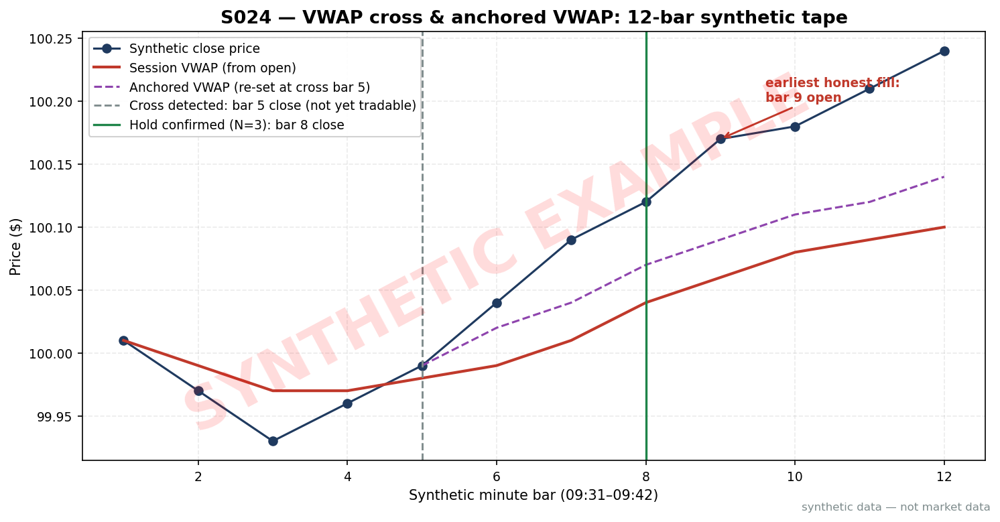

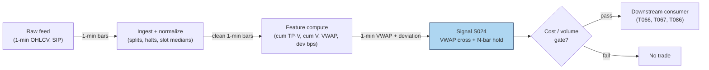
```mermaid
flowchart LR
    FEED["Raw feed\n(1-min OHLCV, SIP)"] -->|"1-min bars"| ING["Ingest + normalize\n(splits, halts, slot medians)"]
    ING -->|"clean 1-min bars"| FEAT["Feature compute\n(cum TP·V, cum V, VWAP, dev bps)"]
    FEAT -->|"1-min VWAP + deviation"| SIG["Signal S024\nVWAP cross + N-bar hold"]
    SIG --> GATE{"Cost / volume\ngate?"}
    GATE -->|pass| OUT["Downstream consumer\n(T066, T067, T086)"]
    GATE -->|fail| DROP["No trade"]
    style SIG fill:#aed6f1,stroke:#1f3a5f
```

### S12. Sources

1. Berkowitz, S. A., Logue, D. E. & Noser, E. A. (1988). "The Total Cost of Transactions on the NYSE." *Journal of Finance*, 43(1), 97–112. https://repec.udesa.edu.ar/pub/Finanzas/Journals/Journal%20of%20Finance/43/1/2328325.pdf
2. Choi, J. H., Larsen, K. & Seppi, D. J. (2018). "Equilibrium Effects of Intraday Order-Splitting Benchmarks." arXiv:1803.08336. https://ideas.repec.org/p/arx/papers/1803.08336.html
3. Haendler, C., Heston, S., Korajczyk, R. & Sadka, R. (2025). "The Intra-Day Stock Return Periodicity Puzzle." Working paper, SSRN 5749704.
4. Harris, L. (2003). *Trading and Exchanges: Market Microstructure for Practitioners.* Oxford University Press. ISBN 0-19-514470-8. (Ch. on VWAP benchmarks; book, no URL.)

**Unverified leads:** quant-zero knowledge-base claim that a 1% VWAP deviation generates "0.02–0.05% of mean-reverting order flow per minute" and that VWAP algos are "30–40% of institutional flow" — repeated via a GitHub mirror citing Harris/Kissell page numbers, not verified against the originals; do not budget on these. Any blog "VWAP-cross strategy Sharpe" — unverified unless the paper is produced.

**Source log:** chatbot answers (Grok/Cursor) pending — checked 2026-09-10; grok-answers.md and cursor-answers.md absent from batches/SB1/ (duckai-answers.md present but covers S001 only, not this chapter).

---

## Stage 25/200 — S025: Intraday time-series momentum

*Batch SB1 · Signal 25/100 · Provenance [D] · Family B — Intraday momentum & breakout*

### S1. One-line verdict

| Field | Detail |
|---|---|
| **What it is** | Sign of the recent intraday return (10 min to a few hours) predicts the next minutes-to-hours: keep riding the tape. |
| **When it works** | Liquid index/futures names on news-heavy or high-volume days, when informed and day-trader flow persists into the close. |
| **When it dies** | Thin midday chop, single-name noise, and days when the "momentum" is just bid–ask bounce (trade prices mechanically zigzagging between the bid and the ask around a flat mid — apparent movement with no real price change) at the open. |
| **Build-or-buy in one line** | Build: it is sign-of-past-returns on 1-min bars — the research question is window choice and cost survival, not infrastructure. |

Provenance **[D]** (documented): the canonical intraday result is Gao, Han, Li & Zhou (2018) — first-half-hour return predicts the last-half-hour return — plus Heston, Korajczyk & Sadka (2010) on intraday periodicity; the daily/monthly origin is Moskowitz, Ooi & Pedersen (2012). Academic horizons and day-trading horizons are not the same thing; intraday uses are labeled as adaptations where relevant.

### S2. How it works — plain human explanation

It is 10:04, SPY. The first half hour ran from yesterday's close of 512.00 to 513.35 — up about 26 bps (basis points; 1 bps = 0.01%, so 26 bps ≈ 0.26%), with volume running 40% above the slot median (slot = one fixed half-hour bucket of the trading day — 13 in a regular session; the slot median is the typical volume for that same half-hour across recent days). The usual script says mornings mean-revert ("buy the dip"). Intraday time-series momentum says: don't. The tape's early direction has a documented tendency to persist into the *last* half hour of the same session — up mornings lean toward up closes.

Why would the morning's return predict the afternoon's, six hours later? Gao, Han, Li & Zhou propose two mechanisms, both about *who is forced to trade late*:

1. **Day-trader unwinding (disposition effect).** Good morning news pushes prices up; short-horizon liquidity providers who faded the open sit on losers. The disposition effect (Odean 1998; Locke & Mann 2000) says they avoid realizing losses, so they procrastinate — then all unwind in the last half hour, pushing price *further* up. The morning move gets echoed at the close by the losers' capitulation.
2. **Strategic informed trading.** Admati & Pfleiderer (1988): informed traders concentrate where volume is — the open and the close. Morning news gets traded in the first half hour, and the same flow keeps working into the deep liquidity of the close. The morning return is the footprint of information that takes the whole session to digest.

Heston, Korajczyk & Sadka (2010) found a kindred regularity: individual-stock returns persist at the *same half-hour clock slot* across days (up to 40 trading days) — the market has intraday memory, plausibly from predictable institutional patterns (Haendler et al. 2025 tie some of it to VWAP-type and close-benchmarked flow). Moskowitz, Ooi & Pedersen (2012) established the daily/monthly version across asset classes. S025 is the intraday port of that family — same sign-of-past-returns engine, horizons compressed from months to minutes.

**Mental model (3 bullets):**
- Time-series momentum (this signal) asks "did *this* asset go up?" — it is direction-agnostic and self-referential. Cross-sectional momentum asks "did it go up *more than peers*?" Different question, different portfolio.
- The edge, where it exists, lives in *predictable late-day flow* (unwinding day traders, benchmarked rebalancers), not in the morning move being "right."
- One trade a day (enter at 15:30, exit at 16:00) is the cost-efficient expression: turnover is the binding constraint, and this signal's academic form trades exactly once per session.

### S3. The math — exact formula

The report's generic form, with flat or exponential weighting over lookback $L$:

$$
\mathrm{Sig}_t = \mathrm{sign}\!\left(\sum_{i=1}^{L} w_i \, r_{t-i}\right), \qquad
r_{t} = \frac{P_t}{P_{t-1}} - 1
$$

$P_t$ = price at bar $t$ (mid or close; units: currency), $r_t$ = simple bar return (dimensionless), $w_i$ = weights (flat $w_i = 1/L$, or exponential $w_i \propto (1-\lambda)^{i}$). Vol-scaled sizing: $\mathrm{pos}_t = \mathrm{Sig}_t \cdot \sigma_{\text{target}} / \hat{\sigma}_t$ (target-vol scaling, $\hat{\sigma}_t$ = recent realized vol).

The canonical academic instantiation (Gao et al. 2018) is a predictive regression, not a sign rule:

$$
r_{13,t} = \alpha + \beta \, r_{1,t} + \varepsilon_t,
$$

where $r_{1,t}$ = first half-hour return of day $t$ (measured *from the previous day's close*, so it includes the overnight gap) and $r_{13,t}$ = last half-hour return. Estimated $\hat{\beta} > 0$ (scaled-by-100 slope ≈ 6.94, significant at 1%, $R^2$ — the fraction of last-half-hour return variance the regression explains — ≈ 1.6% in-sample) — the tradable version is $\mathrm{Sig}_t = \mathrm{sign}(r_{1,t})$, long/short the last half hour accordingly.

**Causal timing:** $r_{1,t}$ is known at 10:00 ET; the position is entered at the *start* of the last half hour (15:30 ET) and flattened at the close (16:00 ET). Tradable no earlier than the bar after the signal is computed — here, hours after, which is why the signal is nearly immune to the usual microstructure lookahead traps.

**Normalization choices:** raw sign (report default) throws away magnitude information; vol-scaling ($\mathrm{pos} \propto 1/\hat{\sigma}$) is the documented refinement (Moskowitz et al. scale positions by trailing volatility); z-scoring $z_t = \bar{r}_{t-L:t}/\hat{\sigma}$ turns the sign rule into a strength rule. Deseasonalize by time-of-day vol (S067) before thresholding — raw morning returns are mechanically more volatile.

**Parameter table** (defaults marked `example — not an institutional standard`):

| Parameter | Symbol | Typical range | Too small | Too large | Default (example) |
|---|---|---|---|---|---|
| Lookback $L$ | $L$ | 10 min – 3 h (report); academic: 30 min | noise dominates | signal stale by entry | 30 min (first half hour) |
| Weighting | $w_i$ | flat / exponential $\lambda \in [0.8, 0.99]$ | flat ignores decay | overfits to last bar | flat |
| Skip-open | — | 0–30 min | overnight-gap noise | throws away Gao's predictor | include overnight in $r_1$ (academic); skip first 5 min for single names (practitioner example) |
| Vol target | $\sigma_{\text{target}}$ | 5–20% ann. | overlevered on calm days | underplays the signal | 10% (example) |
| Flatten time | — | 15:55–16:00 | overnight gap risk | auction slippage | flat by 15:59 (example) |

**Named variants:**
1. **First-half-hour → last-half-hour** (Gao et al.): one observation per day, enter 15:30, exit 16:00 — the cost-efficient canonical form.
2. **Rolling $L$-minute momentum**: $\mathrm{sign}(\sum_{i=1}^{L} r_{t-i})$ recomputed each bar — higher turnover, more whipsaw, needs explicit cost gating.
3. **Same-clock-slot persistence** (Heston et al. 2010): predict slot $j$ today from slot $j$ over past days — cross-day intraday memory rather than within-day continuation.

### S4. Worked example — step-by-step numbers (SYNTHETIC)

**Synthetic** 13 half-hour slots, one session, `numpy.random.default_rng(25)` — **seed 25**. Returns in bps; midday slots jittered, first and last slots set by hand. Same series as the S11 chart. Not a backtest: no costs, one assumed fill.

| slot | time | ret (bps) | cum (bps) | close ($) |
|---|---|---|---|---|
| 1 | 09:30 | **+42.0** | 42.0 | 100.42 |
| 2 | 10:00 | −0.0 | 42.0 | 100.42 |
| 3 | 10:30 | −3.7 | 38.3 | 100.38 |
| 4 | 11:00 | −16.0 | 22.3 | 100.22 |
| 5 | 11:30 | +0.2 | 22.5 | 100.22 |
| 6 | 12:00 | +6.5 | 29.0 | 100.29 |
| 7 | 12:30 | +7.3 | 36.3 | 100.36 |
| 8 | 13:00 | −3.8 | 32.5 | 100.32 |
| 9 | 13:30 | +15.6 | 48.1 | 100.48 |
| 10 | 14:00 | +13.6 | 61.7 | 100.62 |
| 11 | 14:30 | −1.6 | 60.1 | 100.60 |
| 12 | 15:00 | −1.1 | 59.0 | 100.59 |
| 13 | 15:30 | **+31.0** | 90.0 | 100.90 |

**Step-by-step:** formation return $r_1 = +42.0$ bps (slot 1, includes the overnight gap by construction) → $\mathrm{Sig} = \mathrm{sign}(+42.0) = +1$ → LONG. Wait through the session (the rule trades only the last half hour). Enter at 15:30 at 100.59, exit at the 16:00 close at 100.90: gross $+30.8$ bps, synthetic, before costs. The middle of the day actually sagged (slots 3–4 gave back ~20 bps) — the signal ignores all of it by design.

**What to notice:** the example is hand-tilted (both $r_1$ and $r_{13}$ set positive) to illustrate the mechanism; the academic claim is statistical ($\beta > 0$, $R^2$ 1.6%), not "every up morning ends up." Real frictions are absent: the 15:30 entry competes with other momentum chasers, the fill is assumed at the slot open, and +30.8 bps must survive ~1–3 bps round-trip in SPY (comfortable) versus 10+ bps in a thin single name (fatal). That cost arithmetic is the entire strategy question.

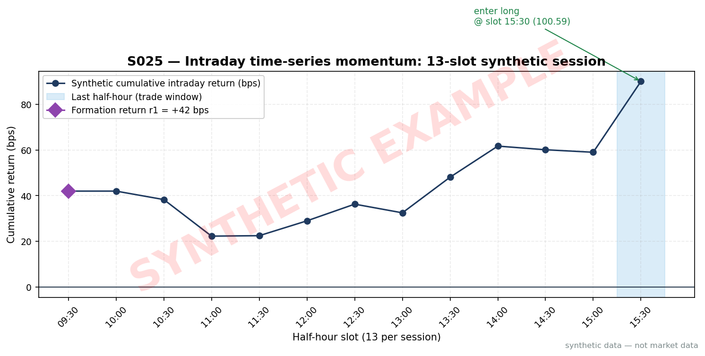

### S5. Strategies that use this signal

- **T006 — Intraday Trend + Vol-Regime Allocator** — primary trigger (direction): rides S025 time-series momentum into the close, position-scaled by HMM vol regime (S079).
- **T098 — Jump-Validated Momentum Ignition** — momentum leg (validated entry): takes S025's directional read only when a Lee–Mykland jump (a statistical test flagging a price move too large to be ordinary diffusion noise) validates the move and RVOL (relative volume: today's volume versus its recent typical level) confirms — a filter *on* this signal.
- **T025 — Trade-Classification Trend Filter** — filter/veto: uses Lee–Ready/BVC signed trade imbalance (Lee–Ready: a rule classifying each trade as buyer- or seller-initiated from the prevailing quote and tick direction; BVC = Bulk Volume Classification, a classifier that signs volume bars instead of individual trades) to confirm or veto S025 momentum entries (signed flow must agree).
- **T053 — HMM Regime-Switching Allocator** — regime gate: allocates to the momentum book (S025 leg) in trending hidden states, to the reversal book (S035 leg) otherwise.

### S6. Data required — exact spec

| Field | Type | Granularity | Source tier | Notes |
|---|---|---|---|---|
| 1-min OHLCV (or half-hour bars) | float/int | 1-min | Tier 0–2 | Futures preferred (less noise, cleaner session); CME via Databento |
| Prior-day close | float | daily | Tier 0–1 | Needed for the overnight-inclusive $r_1$ (academic form) |
| Corporate actions | factor | daily | Tier 1 | Gap-adjusted series or $r_1$ is polluted |
| Vol estimate (for sizing) | float | 1-min/5-min | Tier 1 | Realized vol of $r_1$ or HAR-style (S066) |
| News calendar (optional) | timestamps | event | Tier 2 | Gao et al.: stronger on macro-news days |

**Collection:** Databento futures/equities 1-min, Polygon Stocks Advanced, Alpaca SIP. **Ingest sketch** (polars, ≤20 lines):

```python
import polars as pl
b = pl.read_parquet("bars_1m.parquet").sort(["sym","ts"])
half = b.group_by_dynamic("ts", every="30m", group_by="sym").agg(
    o=pl.col("o").first(), c=pl.col("c").last())
half = half.with_columns(r=pl.col("c")/pl.col("c").shift(1).over("sym")-1)
half = half.with_columns(slot=pl.col("ts").dt.hour()*2+pl.col("ts").dt.minute()//30)
day = half.group_by("sym", pl.col("ts").dt.date()).agg(
    r1=pl.col("r").filter(pl.col("slot")==19).first(),   # 09:30 slot incl. overnight
    rL=pl.col("r").filter(pl.col("slot")==31).first())   # 15:30 slot
sig = day.with_columns(sig=pl.col("r1").sign())
```

**Storage:** 1-min bars, 500 symbols ≈ 50 MB/day (§4) → ~3 GB/60 days. The academic form needs only 2 half-hour returns/day/symbol — kilobytes. **Data-quality checklist:** overnight-gap attribution (prior close vs open); half-days and DST (13 slots becomes 7 — never hardcode 13); futures session definitions (CME settle vs pit close); corporate-action adjustment; exclude days with <500 trades (Gao et al.'s own filter).

### S7. Local build on M5 Max / 128GB

**Feasibility: trivial.** Tier L (4–12 h, ~$600–1,800 loaded-cost estimate per §5). The signal is arithmetic on 13 numbers per symbol per day.

**Throughput** (per §2): the daily batch is ~500 × 390 = 195k bars — polars handles it in milliseconds; even a pure-Python loop is fine. Real-time requirement: one computation at 10:00, one order at 15:30 — a cron job, not a trading system. Bottleneck: none; the constraint is fill quality, not compute.

**Stack options:**

| Stack | When to pick |
|---|---|
| Python + polars | Everything here; the sketch above is production-shaped |
| DuckDB | If you prefer SQL over archived parquet |
| Rust | Unnecessary — no event-rate pressure at this granularity |

**RAM:** 60 days × 500 symbols × 1-min ≈ **12 MB** (§3); the signal's own state is two floats per symbol. Entirely inside the 77 GB working budget — you could hold decades.

**What breaks first at 500 symbols:** nothing computationally. What breaks is *economic*: single-name $r_1$ is mostly noise (Gao et al.'s result is on the *market* ETF and liquid futures), and per-name costs at 15:30 eat a 1.6% $R^2$ edge alive. The failure is in S9/S10, not in the Mac.

### S8. Buy vs build

| Option | What you get | Indicative price | Gains | Loses |
|---|---|---|---|---|
| Tier-0: Stooq daily + Alpaca IEX | Daily bars, some intraday | ~$0 | Free replication of the daily/monthly form | No clean half-hour history |
| Tier-1: Polygon Stocks Advanced | SIP 1-min + aggregates | ~$30–200/mo | Enough for the full academic replication | Futures coverage thinner |
| Tier-1/2: Databento (CME + equities) | Futures 1-min, honest timestamps | ~$200/mo + usage | The report's "futures preferred" data | Usage billing on history pulls |
| Academic: TAQ via WRDS | Tick history | institutional/academic | Deep robustness checks | Access friction, cost |

**Verdict — build if** you want the window/weighting/flatten-time customized (you will): the signal is 10 lines. **Buy** the feed (Tier-1 minimum for intraday history; Databento if futures). **Crossover:** there is nothing to "buy" as a strategy — vendors sell data; the one-trade-a-day rule is yours to implement and cost-check. All prices above: indicative — verify before budgeting.

### S9. Success ratio / efficacy — documented evidence

| Study / source | Market & period | Metric | Before/after cost | Caveat |
|---|---|---|---|---|
| Gao, Han, Li & Zhou (2018) | SPY, 1993–2013 | Timing on sign($r_1$): 6.67%/yr avg, 6.19% vol → **Sharpe 1.08** vs 0.29 buy-and-hold | Before-cost metric; authors report gains *persist after transaction costs* | Published in the *Journal of Financial Economics* (2018); figures from the SSRN working-paper version (SSRN 2552752) — re-verify against the published version before citing precisely |
| Gao et al. (2018), same | SPY, 1993–2013 | Predictive $R^2$ 1.6% in-sample; 1.2% out-of-sample (1.8–2.6% with 12th-half-hour added) | Before-cost (predictive regression) | $R^2$ is statistical, not tradable P&L; OOS (out-of-sample — tested on data the model was never fit on) weaker as expected |
| Moskowitz, Ooi & Pedersen (2012) | 58 instruments, 1985–2009 | Time-series momentum pervasive across asset classes; vol-scaled strategy earns significant risk-adjusted returns (see paper for figures) | Before-cost | **Daily/monthly** horizons — the origin of the family, not intraday evidence |
| Baltussen, Da, Lammers & Martens (2021) | 60+ futures | Intraday momentum confirmed; gamma-hedging mechanism (options market makers buying/selling the underlying to stay delta-neutral as prices move — the "hedging demand" of the paper's title); effect reverts over following days | Before-cost | Via practitioner summary; confirms mechanism + warns the drift is temporary |
| Heston, Korajczyk & Sadka (2010) | US stocks, intraday | Same-clock-slot return persistence up to 40 days | Before-cost | Cross-day periodicity, not the within-day $r_1 \to r_{13}$ trade |

**Regimes where it fails:** low-volume/midday-dominated days (no late flow to ride); single names where $r_1$ is noise; post-2013 decay risk (the paper's sample ends 2013; treat recent efficacy as unverified without your own replication); macro-news days cut both ways (stronger signal per the paper, but wider slippage). The Baltussen et al. finding matters: the drift **reverts over following days** — holding overnight converts momentum into reversal losses.

**Honest bottom line:** as a standalone trigger this is a **documented but thin edge** — Sharpe ~1 before costs on the most liquid instrument on earth, one trade a day, with the authors claiming cost survival. As a **timing overlay** (when to concentrate intraday risk, T006/T015-style) it is more defensible than as a full strategy. Single-name intraday TSMOM without vol scaling is mostly noise — say so in any pitch.

### S10. Failure modes & pitfalls

1. **Overnight-gap misattribution** — $r_1$ includes the gap only if you anchor to the prior close; anchoring to the open measures something else. *Mitigation: define $r_1$ exactly as the paper does; test both.*
2. **Half-day/DST slot drift** — 13 slots is a regular-session assumption. *Mitigation: compute slots from exchange calendar; never hardcode 13.*
3. **Single-name noise** — the documented effect is market/futures-level; per-name $r_1$ has far lower SNR. *Mitigation: restrict universe to index ETFs/liquid futures, or shrink per-name signals.*
4. **Reversion after the close** — Baltussen et al.: the drift reverts over following days. *Mitigation: hard flatten before close; never carry as "momentum" overnight.*
5. **Cost illusion on the toy trade** — +30.8 bps gross means little if your 15:30 entry crosses a 5 bp spread in a thin name. *Mitigation: per-trade cost model (spread + fees + slippage); the one-trade-a-day shape is what makes SPY survive.*
6. **Publication decay** — sample ends 2013; post-publication arbitrage may have compressed it (cf. McLean & Pontiff 2016 on anomaly decay generally). *Mitigation: replicate on your own recent data before sizing; report post-2018 numbers separately.*
7. **Vol-regime blindness** — fixed-size positions on high-vol days take outsized risk. *Mitigation: vol-target sizing ($1/\hat{\sigma}$); T006's HMM gate.*
8. **Lookahead in $r_1$** — using 10:00:00 prints that arrived after your 10:00 signal timestamp (SIP latency). *Mitigation: timestamp discipline; at this horizon it's minor, but keep the t→t+1 rule anyway.*

### S11. Visuals


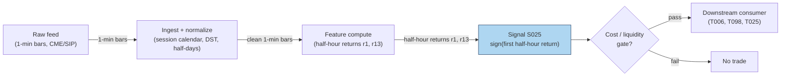
```mermaid
flowchart LR
    FEED["Raw feed\n(1-min bars, CME/SIP)"] -->|"1-min bars"| ING["Ingest + normalize\n(session calendar, DST, half-days)"]
    ING -->|"clean 1-min bars"| FEAT["Feature compute\n(half-hour returns r1, r13)"]
    FEAT -->|"half-hour returns r1, r13"| SIG["Signal S025\nsign(first half-hour return)"]
    SIG --> GATE{"Cost / liquidity\ngate?"}
    GATE -->|pass| OUT["Downstream consumer\n(T006, T098, T025)"]
    GATE -->|fail| DROP["No trade"]
    style SIG fill:#aed6f1,stroke:#1f3a5f
```

### S12. Sources

1. Gao, L., Han, Y., Li, S. Z. & Zhou, G. (2018). "Intraday Momentum: The First Half-Hour Return Predicts the Last Half-Hour Return." *Journal of Financial Economics*, 2018. https://paperswithbacktest.com/api/paper/intraday-momentum-the-first-half-hour-return-predicts-the-last-half-hour-return/pdf (working-paper version; SSRN 2552752)
2. Moskowitz, T. J., Ooi, T. H. & Pedersen, L. H. (2012). "Time Series Momentum." *Journal of Financial Economics*, 104, 228–250. (Daily/monthly origin of the family; no URL — journal citation.)
3. Heston, S. L., Korajczyk, R. A. & Sadka, R. (2010). "Intraday Patterns in the Cross-section of Stock Returns." *Journal of Finance*, 65(4). SSRN 1107590.
4. Baltussen, G., Da, Z., Lammers, S. & Martens, M. (2021). "Hedging Demand and Market Intraday Momentum." *Journal of Financial Economics*. (Gamma-hedging mechanism; journal citation.)

**Unverified leads:** practitioner replication notes claiming the effect "replicated in several international markets" — plausible, but I did not verify each replication's paper; the Hull-repository China-futures study (1%-significant first-session prediction on 4 commodity futures, SSRN 3493927) is a working paper I did not fully vet — treat as a lead, not evidence.

**Source log:** chatbot answers (Grok/Cursor) pending — checked 2026-09-10; grok-answers.md and cursor-answers.md absent from batches/SB1/ (duckai-answers.md present but covers S001 only, not this chapter).

---

## Stage 35/200 — S035: Short-term reversal — Jegadeesh / Lehmann

*Batch SB1 · Signal 35/100 · Provenance [D] · Family C — Mean reversion & reversal*

### S1. One-line verdict

| Field | Detail |
|---|---|
| **What it is** | Buy recent losers, short recent winners: over 1 week–1 month (and 15 min–1 day intraday), extremes snap back. |
| **When it works** | Broad liquid universes where the reversal is compensation for providing liquidity — not where it is just bid–ask bounce. |
| **When it dies** | After costs (turnover is brutal), in illiquid names (the "reversal" is measurement error), and post-publication as arbitrageurs crowd it. |
| **Build-or-buy in one line** | Build the rank/sort — the signal is arithmetic; buy nothing except clean total-return data, and budget turnover before anything else. |

Provenance **[D]** (documented): Jegadeesh (1990), Lehmann (1990), Lo & MacKinlay (1990). One honesty note carried from the report: Lehmann's exact weekly portfolio weights were **not recoverable from accessible sources** — this chapter uses rank-based long/short deciles and says so. Academic horizons (1 week–1 month) ≠ day-trading horizons; the intraday port is labeled an adaptation.

### S2. How it works — plain human explanation

It is month-end. Across 2,000 US stocks, the worst performers of the past month are down 8–15%; the best are up 10–20%. The short-term reversal signal says: buy the losers, short the winners, hold a month. It feels wrong — that is the point. The claim, documented since Jegadeesh (1990), is that short-horizon extremes contain a transitory component: price pressure, overreaction, and plain illiquidity push prices too far, and they snap back.

The economic "why" has three competing stories, and the literature never fully settled between them:

1. **Liquidity provision / price pressure.** Someone absorbed the selling that made the losers lose. Market makers demand compensation for warehousing that inventory risk; the reversal is their paycheck (Grossman & Miller 1988; Pastor & Stambaugh 2003). Under this story the signal is a *liquidity-provision premium* — real, but earned by whoever actually stands ready, not by a monthly spreadsheet rebalance.
2. **Overreaction and correction.** Investors extrapolate recent news too far (De Bondt & Thaler 1985); prices overshoot and correct. Under this story the edge is behavioral and decays as arbitrageurs learn it.
3. **Measurement error — the bid–ask bounce.** The hostile story, and it matters enormously. If losers' last prints were at the bid and winners' at the ask, next period's "reversal" is just the bounce — no economics at all. Kaul & Nimalendran (1990) showed bid–ask errors are the *predominant* source of apparent short-run reversals in NASDAQ stocks; Atkins & Dyl (1990) found the overreaction after large daily moves is small compared with spreads. Any backtest on closing transaction prices that ignores this is fiction.

Lehmann (1990) ran the weekly version — long last week's losers, short last week's winners — but Lo & MacKinlay (1990) showed a large fraction of contrarian profits comes from **cross-autocorrelation** (large stocks lead small), not from each stock reversing itself. The naive "buy losers" portfolio harvests lead-lag structure as much as mean reversion.

The intraday port — rank by prior 15–60 min return, fade extremes over the next 15 min to a day — is the same engine at higher frequency, where bounce contamination is *worse*. Label it an adaptation, and test it on quote midpoints, not transaction prices.

**Mental model (3 bullets):**
- Short-term reversal = you are paid to absorb someone else's urgency. No urgency absorbed, no premium earned — a monthly rebalance captures the label, not the economics.
- Half of what looks like reversal in transaction-price data is the bid–ask bounce. Midpoints or it didn't happen.
- The signal's enemy is not being wrong about direction — it is turnover: the edge is small, the trading is constant, and costs compound against you every rebalance.

### S3. The math — exact formula

**Jegadeesh (1990) monthly form.** Each month $t$, compute prior-month return $r_{i,t-1}$ for each stock $i$; sort into deciles. Portfolio: long decile 1 (losers), short decile 10 (winners), equal-weighted, hold one month. The reversal shows up as negative serial correlation: $E[r_{i,t} \mid r_{i,t-1} \text{ extreme}]$ leans against $r_{i,t-1}$.

**Lehmann (1990) weekly form (weights as described; exact published weights not recoverable — use rank deciles and state it):**

$$
w_{i,t} = -\frac{1}{N}\,(r_{i,t-1} - r_{m,t-1}),
$$

$w_{i,t}$ = portfolio weight of stock $i$ (dimensionless, sums to zero — dollar-neutral), $r_{i,t-1}$ = prior-week return, $r_{m,t-1}$ = market return, $N$ = universe size. Losers ($r_{i,t-1} < r_{m,t-1}$) get positive weight; winners get negative weight. Because the report's source entry could not recover Lehmann's exact construction from accessible sources, the reproducible version is: **rank-based long/short deciles**, not these analytic weights.

**Residual (Blitz et al. 2013-style) variant:** replace raw $r_{i,t-1}$ with the Fama–French residual $\varepsilon_{i,t-1}$ — reversal in the *idiosyncratic* component, stripping factor drift.

**Intraday port (adaptation — label as such):** rank universe by prior 15–60 min return; long bottom quantile / short top quantile; hold 15 min–1 day; compute everything on **quote midpoints** to suppress bounce.

**Causal timing:** formation return uses data $\le t$; positions formed at $t$'s close trade at $t+1$'s open or later. The classic cheat is forming on month $t$'s return and "trading" at month $t$'s close — one month of lookahead.

**Normalization choices:** raw returns (Jegadeesh) vs market-adjusted (Lehmann) vs residual (Blitz et al.); equal-weight vs return-weighted legs. Volatility-scaling the legs is a practitioner refinement, not in the originals.

**Parameter table** (defaults marked `example — not an institutional standard`):

| Parameter | Symbol | Typical range | Too small | Too large | Default (example) |
|---|---|---|---|---|---|
| Formation window | — | 1 week – 1 month (academic); 15–60 min (intraday port) | bounce dominates | signal washes out | 1 month / 30 min |
| Holding window | — | = formation (academic) | turnover explodes | reversal decays | 1 month / 60 min |
| Sort quantiles | — | deciles / quintiles | noisy legs | weak spread | deciles |
| Return definition | — | total / market-adj. / residual | factor drift pollutes | estimation error | market-adjusted (example) |
| Price basis (intraday) | — | midpoint vs transaction | — | — | **midpoint** (mandatory for intraday) |

**Named variants:**
1. **Jegadeesh monthly deciles** — the documented original; 1-month formation, 1-month hold.
2. **Lehmann weekly contrarian** — analytic weights (not recoverable; use rank deciles and disclose).
3. **Residual reversal** — Fama–French residual sorts; cleaner idiosyncratic mean reversion.

### S4. Worked example — step-by-step numbers (SYNTHETIC)

**Synthetic** 10-stock month, `numpy.random.default_rng(35)` — **seed 35**. Formation returns are random; holding returns are constructed with a mild reversal tilt ($-0.28 \times$ formation + noise) plus pure noise — the *same* data as the S11 chart. Not a backtest: no costs, no borrow fees, one toy month.

| name | formation $(t-1)$ % | holding $(t)$ % | leg |
|---|---|---|---|
| AAA | −6.83 | +0.71 | **LONG** (loser) |
| BBB | +4.63 | −5.42 | **SHORT** (winner) |
| CCC | +6.90 | +2.26 | **SHORT** (winner) |
| DDD | +4.41 | −1.24 | flat |
| EEE | +8.69 | −1.50 | **SHORT** (winner) |
| FFF | +0.02 | −1.28 | flat |
| GGG | −8.54 | +0.74 | **LONG** (loser) |
| HHH | −0.34 | +1.38 | **LONG** (loser) |
| III | +2.90 | +1.09 | flat |
| JJJ | +2.49 | −2.58 | flat |

**Step-by-step:** sort by formation return. Long leg = 3 worst losers (GGG −8.54, AAA −6.83, HHH −0.34); short leg = 3 best winners (EEE +8.69, CCC +6.90, BBB +4.63). Holding-period leg means: long leg $(0.71+0.74+1.38)/3 = +0.94\%$; short leg $(-5.42+2.26-1.50)/3 = -1.55\%$. Dollar-neutral portfolio gross = $+0.94 - (-1.55) = \mathbf{+2.50\%}$ for the toy month, before costs. Correlation(formation, holding) = **−0.302** — the reversal signature.

**What to notice:** CCC formed at +6.90% and *continued* to +2.26% — reversal is statistical, not a law. The toy +2.50% is gross of everything: 200%+ monthly turnover, two-way spread on ten names, borrow fees on the shorts (EEE at +8.69% formation is exactly the crowded winner that is expensive to borrow). The toy table uses clean synthetic "true" returns, so it *overstates* what a transaction-price backtest would honestly show — the Kaul–Nimalendran warning in miniature.

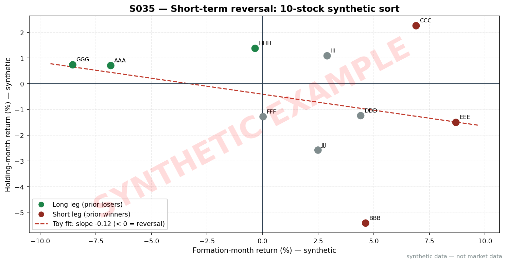

### S5. Strategies that use this signal

- **T011 — Short-Term Reversal + Bounce Timing** — primary entry trigger (direction): the Jegadeesh/Lehmann sort is the strategy's core; S047/S014 time entries at the touch to harvest (not pay) the bounce.
- **T053 — HMM Regime-Switching Allocator** — regime gate: allocates to the reversal book (S035 leg) when the hidden state favors mean reversion, to momentum (S025) otherwise.
- **T100 — Grand Ensemble** — ensemble consumer (diluted weight): S035 is one of 100 inputs; included for completeness, not as a driver.

(Candid note: T040 was checked and does *not* consume S035 — its signals are S080/S039/S078 — and neither does T013 (S042/S043/S045). Only T011 and T053 genuinely list S035; T100 is included as the honest third.)

### S6. Data required — exact spec

| Field | Type | Granularity | Source tier | Notes |
|---|---|---|---|---|
| Total returns (split/div-adjusted) | float | daily (weekly/monthly formation) | Tier 0–1 | CRSP / Polygon / Stooq; **total**, not price, return |
| Quote midpoints (intraday port) | float | 1-min | Tier 1–2 | Transaction prices forbidden for formation (bounce) |
| Borrow/fee data (short leg) | float | daily | Tier 1–3 | Short winners are often hard-to-borrow |
| Market index returns | float | daily | Tier 0 | For market-adjusted weights |
| Delisting returns | float | event | Tier 1 | Survivorship bias otherwise |

**Collection:** Stooq/Polygon daily for the academic form; Databento/Polygon 1-min midpoints for the intraday port. **Ingest sketch** (polars, ≤20 lines):

```python
import polars as pl
d = pl.read_parquet("daily.parquet").sort(["sym","date"])   # adj close, total-return
d = d.with_columns(r=pl.col("adj")/pl.col("adj").shift(1).over("sym")-1)
form = d.group_by("sym").agg(form_r=pl.col("r").tail(21).sum())  # 1-mo formation
ranks = form.with_columns(dec=pl.col("form_r").qcut(10, labels=False).over())
# long decile 0, short decile 9; hold next 21 sessions; rebalance monthly
```

**Storage:** daily bars, 3,000 stocks × 10 y ≈ 60M rows ≈ **2–5 GB** RAM (§3) — fits; parquet on disk 2–4× smaller. Intraday-port midpoints: 1-min, 500 symbols ≈ 50 MB/day (§4). **Data-quality checklist:** total-return (not price) adjustment; delisting returns; midpoint vs transaction discipline; corporate actions; universe point-in-time membership (no survivorship bias); short-sale ban periods flagged.

### S7. Local build on M5 Max / 128GB

**Feasibility: trivial** for the academic form; **feasible** for the intraday port. Tier L (4–12 h, ~$600–1,800 loaded-cost estimate per §5) — it is sorts and groupbys.

**Throughput** (per §2): monthly rebalance over 3,000 stocks × 10 y of daily data = 60M rows — polars simple ops at ~10–50M rows/sec chew through it in seconds. The intraday port (500 symbols × 390 bars/day = 195k bars) is trivial. Bottleneck: none computationally; borrow-data licensing for the short leg.

**Stack options:**

| Stack | When to pick |
|---|---|
| Python + polars | Default for both forms; qcut/decile sorts are one-liners |
| DuckDB | SQL-first researchers over archived parquet |
| Rust | Unnecessary at these granularities |

**RAM:** daily panel ~2–5 GB (§3) — comfortable in the 77 GB budget; the monthly signal state is one float per name. 60 days of 1-min data ≈ 12 MB.

**What breaks first at 500 symbols:** nothing local. What breaks is *economic*: at 500 names the short leg's borrow fees and the monthly 200% turnover mean the strategy's viability is a cost question (S9/S10), not a compute question. Full-universe CRSP-style history wants WRDS access (buy, Tier 3 academic).

### S8. Buy vs build

| Option | What you get | Indicative price | Gains | Loses |
|---|---|---|---|---|
| Tier-0: Stooq / French data library | Daily returns, factors | ~$0 | Free academic replication | No intraday, survivorship caveats |
| Tier-1: Polygon Stocks Advanced | Daily + 1-min, adjusted | ~$30–200/mo | Clean adjustments, midpoints | History depth costs |
| Tier-3 academic: WRDS/CRSP + TAQ | Publication-grade history | hundreds–thousands/yr academic | The actual papers' data | Price, access friction |
| Borrow data: vendor (e.g. S3-style) | Stock-loan fees | $$ | Prices the short leg honestly | Another subscription |

**Verdict — build if** you are replicating or adapting the sort: the signal is ranking arithmetic. **Buy if** you need CRSP-grade delisting/total-return history or borrow panels — you cannot build those. **Crossover:** Tier-0/1 data + your own sorts covers 90% of the research; pay for borrow data the moment the short leg is real money. All prices above: indicative — verify before budgeting.

### S9. Success ratio / efficacy — documented evidence

| Study / source | Market & period | Metric | Before/after cost | Caveat |
|---|---|---|---|---|
| Jegadeesh (1990), as summarized in Cakici & Topyan (2014) | US stocks, 1934–1987 | Short-term reversal ≈ **+2%/month** extra return | **Before-cost** | Pre-decimalization, pre-publication; costs unmodeled; figure via secondary summary |
| Lehmann (1990) | US stocks, weekly | Weekly contrarian portfolios profitable | **Before-cost** | Exact weights not recoverable; see S3 disclosure |
| Lo & MacKinlay (1990) | US stocks | Much contrarian profit = **cross-autocorrelation** (large leads small), not pure reversal | n/a (decomposition) | The "reversal" you trade may be lead-lag structure |
| Kaul & Nimalendran (1990) | NASDAQ | After removing bid–ask errors: **little evidence** of overreaction; returns positively autocorrelated | Measurement correction | The bounce warning: transaction-price backtests overstate |
| Atkins & Dyl (1990) | US stocks, large daily moves | Reversal exists but **small vs bid–ask spreads** | After-cost interpretation | "Consistent with efficiency after transactions costs" |
| McLean & Pontiff (2016) | 97 anomalies | Returns **decay substantially** after publication | After-cost framing | General result; short-term reversal is in the decaying set |

**Regimes where it fails:** illiquid names (bounce dominates); high-vol regimes (spreads widen, borrow spikes); crowded post-publication periods (decay); earnings/announcement drifters (PEAD is continuation — fading it is fading information, S100). **Documented decay:** yes — McLean & Pontiff (2016) is the citation; expect the academic-form premium to be a shadow of the 1934–1987 number.

**Honest bottom line:** as a standalone trigger this is a **documented-but-mostly-arbitraged edge** — the +2%/month is a before-cost museum piece; what survives today is a liquidity-provision premium that accrues to whoever actually provides the liquidity, net of turnover that usually eats it. As a **timing overlay inside a market-making or execution book** (get paid the spread *and* the reversal), it is far more defensible — which is exactly what T011 does.

### S10. Failure modes & pitfalls

1. **Bid–ask bounce contamination** — formation on transaction prices manufactures reversal. *Mitigation: midpoints only (intraday); bounce-adjusted returns (daily); read Kaul & Nimalendran first.*
2. **Lookahead in formation** — sorting on month $t$'s return and trading at $t$'s close. *Mitigation: form at $t$, trade at $t+1$ open; point-in-time universe.*
3. **Turnover/cost blowup** — 200%+ monthly turnover vs a thin edge. *Mitigation: model spread + fees + borrow + impact per rebalance; net-of-cost Sharpe or nothing.*
4. **Short-leg borrow** — winners are crowded shorts; fees and buy-ins. *Mitigation: borrow-aware universe filter; model fees explicitly.*
5. **Survivorship/delisting bias** — losers delist; dropping them inflates the long leg. *Mitigation: include delisting returns (CRSP-style).*
6. **Crowding/decay** — post-publication arbitrage compresses the premium. *Mitigation: expect decay (McLean & Pontiff); monitor live vs academic-form spread.*
7. **Fading information** — reversal into earnings/PEAD drift (S100) fights informed flow. *Mitigation: exclude announcement windows or flip to T078's drift leg.*
8. **Cross-autocorrelation confusion** — you think you're trading reversal, you're trading large-cap lead-lag (Lo & MacKinlay). *Mitigation: residualize (Blitz et al.) and attribute P&L to reversal vs lead-lag.*

### S11. Visuals


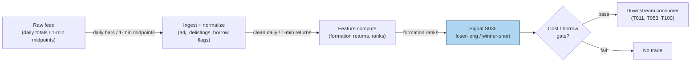
```mermaid
flowchart LR
    FEED["Raw feed\n(daily totals / 1-min midpoints)"] -->|"daily bars / 1-min midpoints"| ING["Ingest + normalize\n(adj, delistings, borrow flags)"]
    ING -->|"clean daily / 1-min returns"| FEAT["Feature compute\n(formation returns, ranks)"]
    FEAT -->|"formation ranks"| SIG["Signal S035\nloser-long / winner-short"]
    SIG --> GATE{"Cost / borrow\ngate?"}
    GATE -->|pass| OUT["Downstream consumer\n(T011, T053, T100)"]
    GATE -->|fail| DROP["No trade"]
    style SIG fill:#aed6f1,stroke:#1f3a5f
```

### S12. Sources

1. Jegadeesh, N. (1990). "Evidence of Predictable Behavior of Security Returns." *Journal of Finance*, 45(3), 881–898. (Journal citation; no URL.)
2. Lehmann, B. N. (1990). "Fads, Martingales, and Market Efficiency." *Quarterly Journal of Economics*, 105(1), 1–28. (Journal citation; exact portfolio weights not recoverable — see S3.)
3. Lo, A. W. & MacKinlay, A. C. (1990). "When Are Contrarian Profits Due to Stock Market Overreaction?" *Review of Financial Studies*, 3(2), 175–205. (Journal citation.)
4. Kaul, G. & Nimalendran, M. (1990). "Price Reversals: Bid-Ask Errors or Market Overreaction?" *Journal of Financial Economics*, 28, 67–93. (Journal citation.)
5. Atkins, A. B. & Dyl, E. A. (1990). "Price Reversals, Bid-Ask Spreads, and Market Efficiency." *Journal of Financial and Quantitative Analysis*, 25(4). (Journal citation.)
6. McLean, R. D. & Pontiff, J. (2016). "Does Academic Research Destroy Stock Return Predictability?" *Journal of Finance*, 71(1), 5–32. (Decay reference.)
7. Cakici, N. & Topyan, K. (2014). "Short-Term Reversal." In *Risk and Return in Asian Emerging Markets*, Palgrave Macmillan. https://ideas.repec.org/h/pal/palchp/978-1-137-35907-0_7.html (Secondary summary used for the +2%/month figure attribution.)

**Unverified leads:** Blitz et al. (2013) residual-reversal treatment (cited via the report entry; not independently re-verified here). Any "intraday reversal Sharpe" from blogs or vendor whitepapers — unverified unless the paper is produced.

**Source log:** chatbot answers (Grok/Cursor) pending — checked 2026-09-10; grok-answers.md and cursor-answers.md absent from batches/SB1/ (duckai-answers.md present but covers S001 only, not this chapter).

---

## Stage 40/200 — S040: VWAP-deviation mean reversion

*Batch SB1 · Signal 40/100 · Provenance [SR] · Family C — Mean reversion & reversal*

### S1. One-line verdict

| Field | Detail |
|---|---|
| **What it is** | Price stretched far from session VWAP snaps back: short upside extensions, buy downside ones, as benchmarked algos trade toward their target. |
| **When it works** | Range days and midday lulls where the extension is uninformed flow — a block, a fat finger, a momentum algo overshooting. |
| **When it dies** | Trend days: the deviation is information (S024's territory), and fading it is stepping in front of the benchmarked flow itself. |
| **Build-or-buy in one line** | Build the bands yourself (same VWAP engine as S024, plus a rolling σ); buy nothing — the regime classifier is the product, not the z-score. |

Provenance **[SR]** (standard reconstruction): VWAP ± kσ bands are a practitioner standard; the report's citations are practitioner knowledge bases plus Haendler et al. (2025) for the mechanism. No public paper publishes a canonical VWAP-deviation fade rule with performance. [SR] is **not** upgraded here.

### S2. How it works — plain human explanation

It is 11:20, MSFT. Session VWAP sits at 428.10. A 40,000-share market sell order just swept three levels and printed at 427.55 — 13 bps *below* VWAP — on no news. The VWAP-deviation signal says: buy. Not because 427.55 is "cheap" in any absolute sense, but because of who is about to trade next.

The mechanism is the mirror of S024's. A large share of institutional flow is benchmarked to VWAP (Berkowitz, Logue & Noser 1988, and every execution desk since). A VWAP algorithm that is *behind* its benchmark — it has bought too little while price ran away — must accelerate buying to catch up; one that is *ahead* can slow down. When price stretches far above VWAP, the benchmarked buyers are, on average, ahead of schedule and ease off while benchmarked sellers lean in; the reverse below. The deviation itself summons the flow that erases it — a rubber band powered by other people's mandates. Choi, Larsen & Seppi (2018) formalize this: TWAP/VWAP order-splitting benchmarks induce predictable intraday price-pressure patterns, and deviations from the benchmark path are where the pressure concentrates.

But — and this is the whole game — the rubber band only snaps back if the extension was *uninformed*. If price is 13 bps below VWAP because a real seller knows something, the benchmarked algos' buying is the liquidity the informed seller wanted, and your fade is their exit. That is why the report pairs S040 with S024 as mirrors: extension + fading volume = reversion (this signal); extension + rising volume = continuation (S024). The signal without the regime classifier is a coin flip with costs.

Why should deviations revert *economically*? Three forces:

1. **Benchmark-chasing flow** (above): mechanical, persistent, largest midday when participation schedules are steepest.
2. **Inventory mean reversion of liquidity providers**: the market makers who absorbed the sweep are long inventory they didn't want; they shade quotes to get flat, pulling price back.
3. **Value-area gravity**: VWAP is the volume-weighted consensus price of the day; absent new information, auction logic says trade migrates back to where most volume agreed.

**Mental model (3 bullets):**
- VWAP deviation = distance from the day's consensus; fading it = betting the move was noise, not news.
- The edge is not the z-score — it is *classifying the extension* (uninformed sweep vs informed break). Volume, news, and time-of-day do that work.
- S024 and S040 are one signal with a regime switch, not two signals. Running both without the switch = trading against yourself.

### S3. The math — exact formula

Session VWAP as in S024: $\mathrm{VWAP}_t = \sum_{i\le t} TP_i V_i / \sum_{i\le t} V_i$. Deviation and its z-score:

$$
d_t = \frac{C_t - \mathrm{VWAP}_t}{\mathrm{VWAP}_t}, \qquad
z_t = \frac{d_t}{\hat{\sigma}_{d,t}}, \qquad
\hat{\sigma}_{d,t} = \mathrm{std}(d_{t-W+1 \dots t})
$$

$d_t$ = fractional deviation (dimensionless; ×10⁴ = bps), $\hat{\sigma}_{d,t}$ = rolling standard deviation of the deviation over window $W$ bars. **Example rule (not universal — the report's own words):** enter short when $z_t > +1.5$ (long when $z_t < -1.5$); exit when $|z_t| < 0.25$, on a time stop, or before late-session benchmark flow. VWAP ± k·σ bands are the same engine drawn as bands: $\mathrm{VWAP}_t \pm k\,\hat{\sigma}_{d,t}\,\mathrm{VWAP}_t$.

**Causal timing:** $z_t$ uses only bars $\le t$; the rolling $\hat{\sigma}$ needs $\ge$ ~5 bars before it is anything but noise (see S4's warning). Tradable no earlier than $t+1$'s open. The classic leak: computing $d_t$ with the *current* bar's still-forming volume.

**Normalization choices:** z-score (report's form) adapts to each name's typical deviation scale; raw bps thresholds are simpler but name-specific; rank/percentile of $d_t$ vs its 20-day same-slot distribution deseasonalizes the U-shaped intraday vol (pairs well with S067).

**Parameter table** (defaults marked `example — not an institutional standard`):

| Parameter | Symbol | Typical range | Too small | Too large | Default (example) |
|---|---|---|---|---|---|
| Entry k | $k_{\text{in}}$ | 1.0–2.5 σ | noise trades | never triggers | 1.5 |
| Exit band | $k_{\text{out}}$ | 0–0.5 σ | exits before reversion pays | round-trips back out | 0.25 |
| Rolling σ window | $W$ | 10–60 bars | σ estimate is noise (S4!) | slow to adapt | 30 (example) |
| Min bars for σ | — | 5–20 | z explodes on 3 samples | late entries | 5 (example) |
| Time stop | — | 15–60 min | cuts winners | carries into close flow | 30 min / flat by 15:30 (example) |
| Volume context | — | extension on low vs high vol | fades informed breaks | misses sweeps | require extension volume < slot median (example) |

**Named variants:**
1. **Session-VWAP z-fade** (report's form): deviation vs rolling σ, session anchor.
2. **Band-tag fade**: price tags VWAP ± kσ band drawn from a 20-day same-slot σ — slower, more stable bands.
3. **Anchored-deviation fade**: deviation vs *anchored* VWAP (news anchor) — for post-event overextensions; pairs with T067's anchor.

### S4. Worked example — step-by-step numbers (SYNTHETIC)

**Synthetic** 12-minute tape, `numpy.random.default_rng(40)` — **seed 40**. Price overshoots above VWAP early, then drifts back through it. Same data as the S11 chart. Not a backtest: no costs, fills assumed, one toy episode.

| bar | C ($) | VWAP ($) | dev (bps) | z | event |
|---|---|---|---|---|---|
| 1 | 99.99 | 99.99 | 0.0 | n/a | σ needs ≥5 bars |
| 2 | 100.04 | 100.02 | +2.0 | n/a | |
| 3 | 100.09 | 100.05 | +4.0 | n/a | |
| 4 | 100.17 | 100.08 | +9.0 | n/a | |
| 5 | 100.19 | 100.11 | +8.0 | **+2.08** | **ENTRY SHORT** (example \|z\|>1.5) |
| 6 | 100.17 | 100.12 | +5.0 | +1.45 | inside band |
| 7 | 100.14 | 100.12 | +2.0 | +0.61 | |
| 8 | 100.11 | 100.12 | −1.0 | −0.28 | crossed through VWAP |
| 9 | 100.05 | 100.11 | −6.0 | −1.29 | extension the other way |
| 10 | 100.02 | 100.11 | −9.0 | −1.58 | |
| 11 | 100.00 | 100.10 | −10.0 | −1.48 | |
| 12 | 99.98 | 100.09 | −11.0 | −1.45 | **EXIT: time stop** |

**Step-by-step:** $d_t = (C_t - \mathrm{VWAP}_t)/\mathrm{VWAP}_t$; $\hat{\sigma}_d$ is the rolling 10-bar sample std of $d$ (min 5 bars). At bar 5, $z = +2.08 > 1.5$ → short at 100.19 (earliest honest fill: bar 6 open). The ±0.25 exit band is never re-entered — $z$ falls to −0.28 at bar 8 (close, but $|z| = 0.28 > 0.25$) then stretches negative — so the **time stop** closes the trade at bar 12: $100.19 \to 99.98$ = **+21.0 bps gross**, synthetic, before costs.

**What to notice (and its limits):** three honest artifacts are on display. First, bars 1–4 have no z — the rolling σ needs history, so the *first* valid signal arrives mid-episode; production systems warm-start σ from prior days. Second, the ±0.25 exit never fired and the trade was saved by the time stop — band exits assume smooth decay *through* the band, but real deviations often blow through VWAP and extend the other way (bars 9–12 hit −1.58σ). Third, the toy charges no spread: the bar-5 short would really pay the ask, and +21.0 bps gross shrinks fast against a 2–4 bp round trip plus impact. The example demonstrates the arithmetic and the exit logic's fragility — nothing more.

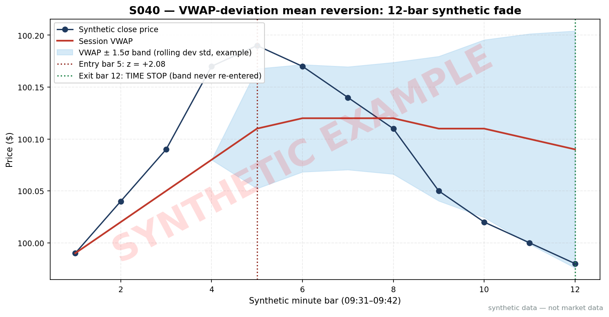

### S5. Strategies that use this signal

- **T004 — VWAP-Deviation Mean-Reversion** — primary entry trigger (direction): fades extreme session-VWAP deviations, timed by queue imbalance (S003), normalized by diurnal vol (S067).
- **T066 — VWAP-Cross Institutional Follower** — secondary fade leg: follows sustained crosses (S024) but *fades extreme deviations* — S040 is the strategy's contrarian sleeve, gated by RVOL.
- **T086 — OFI-Paced Participation Tracker** — execution-benchmark consumer: VWAP is the participation target; S040-style deviation logic throttles child-order pacing (slow down when ahead of benchmark, accelerate when behind).

### S6. Data required — exact spec

| Field | Type | Granularity | Source tier | Notes |
|---|---|---|---|---|
| 1-min OHLCV | float/int | 1-min | Tier 0–2 | Same engine as S024; share the pipeline |
| Rolling σ warm-up history | float | 1-min | Tier 1–2 | Prior days' deviations to seed $\hat{\sigma}_d$ |
| News/event flags | boolean | event | Tier 2 | Suppress fades into scheduled news (fade noise, not information) |
| Halt flags | boolean | 1-min | Tier 1–2 | Exclude halted bars from σ estimation |

**Collection:** same as S024 (Databento ohlcv-1m, Polygon v3 aggregates, Alpaca). **Ingest sketch** (polars, ≤20 lines — extends the S024 sketch):

```python
import polars as pl
s = pl.read_parquet("bars_1m.parquet").sort(["sym","ts"])   # with vwap col from S024
s = s.with_columns(d=(pl.col("c")-pl.col("vwap"))/pl.col("vwap"))
s = s.with_columns(sig=s["d"].rolling_std(30, min_periods=5).over("sym"))
s = s.with_columns(z=pl.col("d")/pl.col("sig"))
s = s.with_columns(
    short_sig=(pl.col("z") > 1.5),          # example thresholds
    long_sig =(pl.col("z") < -1.5),
    exit_sig=pl.col("z").abs() < 0.25)
```

**Storage:** identical to S024 — 1-min, 500 symbols ≈ 50 MB/day (§4), ~3 GB/60 days; signal state adds two floats per symbol. **Data-quality checklist:** warm-start σ (never z-score on 3 samples); split adjustment before cumulative sums; halt exclusion; news-window suppression list; late-session benchmark flow — many desks *stop fading* after 15:30 when MOC/index flow dominates.

### S7. Local build on M5 Max / 128GB

**Feasibility: trivial.** Same engine as S024 plus a rolling std — Tier L (4–12 h, ~$600–1,800 loaded-cost estimate per §5).

**Throughput** (per §2): 500 × 390 bars/day = 195k bars; polars rolling ops at ~1–10M rows/sec (complex ops) recompute the universe in under a second. Real-time per-bar update is O(W) per symbol — negligible. Bottleneck: none; the regime classifier (if you add S079) dominates cost, not the z-score.

**Stack options:**

| Stack | When to pick |
|---|---|
| Python + polars | Default; the sketch above is the whole signal |
| DuckDB | SQL-first research over parquet archives |
| Rust | Only if you push to tick-level deviation across hundreds of names |

**RAM:** 60 days × 500 symbols 1-min ≈ **12 MB** (§3); warm-up history adds nothing material. Inside the 77 GB budget with room to spare.

**What breaks first at 500 symbols:** nothing at 1-min. It breaks *economically* before it breaks computationally: 500-name fading needs borrow, per-name spread modeling, and a regime switch — the infra is trivial, the risk system is not.

### S8. Buy vs build

| Option | What you get | Indicative price | Gains | Loses |
|---|---|---|---|---|
| Tier-0: Stooq / Alpaca IEX | Bars for prototyping | ~$0 | Free | No corporate-action rigor |
| Tier-1: Polygon Stocks Advanced | SIP 1-min, adjusted | ~$30–200/mo | Clean history for band calibration | You build the regime logic |
| Tier-2: Databento Standard | L1 + 1-min, halt flags | ~$200/mo + usage | Honest timestamps for the σ warm-up | Overkill for the signal alone |
| Practitioner: Kissell (2014) book | VWAP-strategy treatment | book price | The desk-level framing | No code, no parameters |

**Verdict — build if** you want custom bands, anchors, or the regime switch (you do): the signal is a rolling z-score. **Buy** the feed for clean adjusted history. **Crossover:** hybrid — Tier-1/2 data in, your bands and classifier on top. Nobody sells a VWAP-fade *strategy* with audited performance; if they did, the price would tell you the Sharpe. All prices above: indicative — verify before budgeting.

### S9. Success ratio / efficacy — documented evidence

| Study / source | Market & period | Metric | Before/after cost | Caveat |
|---|---|---|---|---|
| Berkowitz, Logue & Noser (1988) | NYSE, 1980s | Institutional execution clusters at VWAP | Before-cost | Benchmark *relevance*, not a fade strategy |
| Choi, Larsen & Seppi (2018) | Model | VWAP order-splitting induces predictable price-pressure patterns | n/a (theory) | Model, no live statistics; arXiv:1803.08336 |
| Haendler et al. (2025) | US equities | VWAP-type trading significant in open/midday periodicity | Before-cost (observational) | Documents the *flow*; SSRN 5749704 |
| Practitioner consensus (Kissell 2014, ch. on VWAP strategies) | Desks | VWAP±bands standard; fades used with discretion | Anecdotal | No published Sharpe; specific flow stats quoted second-hand are **unverified** |

**Regimes where it fails:** trend days (the extension is information — S024's mirror); the last 30 minutes (MOC/index benchmark flow overwhelms); news-driven extensions (fading information); low-liquidity names where "deviation" is just wide spreads. **Documented decay:** none published — there is no performance series to decay, which is itself the warning.

**Honest bottom line:** as a standalone trigger this is a **negligible-to-negative edge after costs** for the naive rule — the report's own caveat, and the literature gives no reason to dispute it: no published Sharpe exists, and the mechanism's profit accrues to whoever provides the liquidity with proper risk controls, not to a z-score rule. As a **timing sleeve inside an execution or market-making book** (T004/T086-style: provide liquidity *at* the band, get paid the spread *and* the snap-back), it is defensible. The regime classifier is the strategy; the z-score is just the ruler.

### S10. Failure modes & pitfalls

1. **Fading information** — the extension is news; benchmarked flow is the informed trader's liquidity. *Mitigation: news-window suppression; volume-context gate (fade only low-volume extensions); T067-style anchor awareness.*
2. **Trend-day misclassification** — running S040 on an S024 day. *Mitigation: regime estimate first (S079 HMM, or simply: rising volume + holding above VWAP = do not fade).*
3. **σ warm-up artifacts** — z-scores on 3–4 samples explode (S4 bars 1–4). *Mitigation: min-periods ≥5; warm-start from prior days; never trade the first valid z blindly.*
4. **Band-exit illusion** — exits assume smooth decay through ±0.25; real deviations blow through (S4 bars 9–12). *Mitigation: always pair with a time stop; consider stop-loss on further extension.*
5. **Late-session benchmark flow** — after ~15:30, MOC and index-rebalance flow dominates and deviations persist into the close. *Mitigation: flatten fades by 15:30 (example); do not fade the close.*
6. **Cost vs edge** — a 1-min fade turns over constantly against 2–4 bp round trips. *Mitigation: per-trade cost model; require expected snap-back ≫ costs; prefer providing liquidity (limit orders) over taking.*
7. **Partial-bar leakage** — deviation computed on forming bars. *Mitigation: closed bars only; t→t+1 fills.*
8. **Crowded bands** — every retail platform draws the same VWAP bands; tags become stop-hunt magnets. *Mitigation: proprietary σ windows/anchors; expect slippage at obvious bands.*

### S11. Visuals


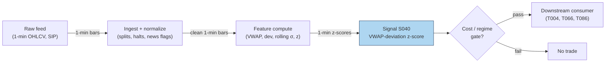
```mermaid
flowchart LR
    FEED["Raw feed\n(1-min OHLCV, SIP)"] -->|"1-min bars"| ING["Ingest + normalize\n(splits, halts, news flags)"]
    ING -->|"clean 1-min bars"| FEAT["Feature compute\n(VWAP, dev, rolling σ, z)"]
    FEAT -->|"1-min z-scores"| SIG["Signal S040\nVWAP-deviation z-score"]
    SIG --> GATE{"Cost / regime\ngate?"}
    GATE -->|pass| OUT["Downstream consumer\n(T004, T066, T086)"]
    GATE -->|fail| DROP["No trade"]
    style SIG fill:#aed6f1,stroke:#1f3a5f
```

### S12. Sources

1. Berkowitz, S. A., Logue, D. E. & Noser, E. A. (1988). "The Total Cost of Transactions on the NYSE." *Journal of Finance*, 43(1), 97–112. https://repec.udesa.edu.ar/pub/Finanzas/Journals/Journal%20of%20Finance/43/1/2328325.pdf
2. Choi, J. H., Larsen, K. & Seppi, D. J. (2018). "Equilibrium Effects of Intraday Order-Splitting Benchmarks." arXiv:1803.08336. https://ideas.repec.org/p/arx/papers/1803.08336.html
3. Haendler, C., Heston, S., Korajczyk, R. & Sadka, R. (2025). "The Intra-Day Stock Return Periodicity Puzzle." Working paper, SSRN 5749704.
4. Kissell, R. (2014). *The Science of Algorithmic Trading and Portfolio Management.* Academic Press. (Practitioner treatment of VWAP benchmark strategies; book, no URL.)

**Unverified leads:** second-hand statistics on VWAP algo market share ("30–40% of institutional flow") and per-minute reversion flow ("0.02–0.05% per 1% deviation") via a GitHub knowledge-base mirror — not verified against Harris/Kissell originals; excluded from evidence. Vendor whitepapers claiming VWAP-fade performance — unverified unless audited numbers are produced.

**Source log:** chatbot answers (Grok/Cursor) pending — checked 2026-09-10; grok-answers.md and cursor-answers.md absent from batches/SB1/ (duckai-answers.md present but covers S001 only, not this chapter).

---

## Stage 11/200 — S011: Amihud illiquidity ratio

*Batch SB2 · Signal 11/100 · Provenance [D] · Family A — Microstructure & order flow*

### S1. One-line verdict

| Row | Content |
|---|---|
| **What it is** | Daily average of \|return\| per dollar of volume — a low-frequency price-impact (illiquidity) gauge computable from ordinary OHLCV bars. |
| **When it works** | Cross-sectional liquidity ranking, cost-aware sizing, and fading overextended moves in illiquid names. |
| **When it dies** | As a standalone intraday trigger; where volume conventions break (halvings, corporate actions); during volume-regime shifts where a 20-day average is stale. |
| **Build-or-buy in one line** | Build — it is five lines of arithmetic on daily bars; buy history/coverage, never the formula. |

Provenance **[D]** (documented: Amihud 2002). Family **A — Microstructure & order flow**. Worked example is synthetic and watermarked; the chatbot corrections are documented in S4.

### S2. How it works — plain human explanation

**Vignette.** It is 9:47 a.m. Two stocks each trade at $50. Stock X prints a $2M seller and slips 4 cents. Stock Y prints the same $2M seller and falls 40 cents. The Amihud ratio is that observation averaged over days: *how much price moves per dollar traded*. High Amihud = illiquid: each dollar of flow leaves a bigger footprint.

**Why the effect should exist economically.** Three channels:
- *Price impact / adverse selection.* In a thin book a market order walks further down the ladder, so returns per unit volume are larger — the low-frequency cousin of **Kyle's lambda** (S010), which measures impact per share at high frequency.
- *Inventory cost.* Dealers in thin names carry inventory longer and demand compensation as larger price concessions per dollar traded.
- *The illiquidity premium.* Amihud (2002) showed investors demand higher expected returns for illiquid stocks — and that illiquid names mean-revert more, because thin-book moves overshoot fundamentals.

**Mental model (3 bullets):**
- Amihud = the *exchange rate between dollars traded and price moved*, averaged over a window.
- It is a **cost and regime input**, not a direction signal — how expensive a name is to trade and how far its moves are likely to overshoot.
- High ILLIQ names are where temporary-impact fades (T027) hunt and where participation throttles (T026) must be tightest.

### S3. The math — exact formula

For stock *i* over a window of *D* days (day *d* = 1…*D*):

$$\text{ILLIQ}_{i,D} = \frac{1}{D}\sum_{d=1}^{D}\frac{|r_{i,d}|}{\text{DVOL}_{i,d}}$$

where:

- $r_{i,d} = C_{i,d}/C_{i,d-1} - 1$ is the **decimal** daily return (close-to-close; unitless),
- $\text{DVOL}_{i,d} = P_{i,d}\times V_{i,d}$ is **dollar volume** in dollars (price × shares; units $),
- $\text{ILLIQ}$ has units **per dollar** (1/$) — the fraction of price moved per dollar traded.

Because raw values are tiny (∼10⁻¹⁰ per dollar for liquid stocks), the literature reports **ILLIQ × 10⁶** — "return per $1M traded".

**Causal timing.** Computed at the close of day *T* using only closes/volumes on days ≤ *T*. The *D*-day average is complete only after the *D*-th close; tradable no earlier than the next session's open (bar *t* → earliest fill *t+1*).

**Parameter table** (every default below is an *example — not an institutional standard*):

| Parameter | Symbol | Typical range | Too small | Too large | Default example |
|---|---|---|---|---|---|
| Lookback window | *D* | 5–60 days | noisy, one big day dominates | stale, misses regime shifts | 20 days (monitoring); 60 days (smooth ranking) |
| Scaling | — | ×1 (per-$) or ×10⁶ (per-$M) | unreadable tiny numbers | none (cosmetic) | ×10⁶ for reporting |
| Aggregation | — | mean / median / winsorized mean | mean is outlier-sensitive | median hides genuine spikes | winsorized mean (extremes capped at the 1st/99th percentiles) |
| Return convention | — | close-close / open-close | — | — | close-close (classic); open-close (OCAM) variant |
| Intraday analog | — | \|r_bar\|/DVOL_bar per 1–5-min bar, averaged | microstructure noise dominates | converges to daily measure | 5-min bars, RTH only |

**Normalization.** Cross-sectional (across many stocks at one point in time) **rank** or **z-score** (standard deviations from the bucket mean) **within size bucket** is standard practice — raw ILLIQ spans orders of magnitude across market caps. Never compare raw values across a $500M name and a $500B name.

**Named variants:**
1. **CCAM vs OCAM** — classic close-to-close vs open-to-close Amihud (drops the overnight gap from the numerator); research reports OCAM-based liquidity premia roughly double CCAM-based ones (Warwick WP 1211, 2019; see S9).
2. **Intraday-bar analog** — |r_bar|/DVOL_bar on 1–5-min bars, averaged over the session: a slow intraday regime input, not a per-bar trigger.
3. **Winsorized/median ILLIQ** — robust aggregation for names with earnings-jump days that would otherwise dominate the window.

### S4. Worked example — step-by-step numbers (SYNTHETIC)

**Synthetic 10-day tape** (chatbot Q-SB2-1, operator-corrected). **The raw chatbot output contained errors**: its nine daily ILLIQ values were individually correct, but it reported Σ = 6.8216e-9 and average = 7.5796e-10, conflating sum and average in its notation. Corrected values used here: **Σ = 6.3933e-9, average = 7.1037e-10, per-$M = 7.1037e-4**. Tape is hand-specified and deterministic (no RNG draw; plot script records seed 110).

Formula per day: $r_t = C_t/C_{t-1} - 1$; $\text{DVOL}_t = C_t \times V_t$; $\text{ILLIQ}_t = |r_t|/\text{DVOL}_t$.

| Day | Close ($) | Volume (shares) | Return *r* | Dollar vol ($) | ILLIQ (per-$) |
|---|---|---|---|---|---|
| D1 | 100.00 | 100,000 | — | 10,000,000 | — |
| D2 | 101.00 | 120,000 | +0.010000 | 12,120,000 | 8.2508e-10 |
| D3 | 100.50 | 110,000 | −0.004950 | 11,055,000 | 4.4763e-10 |
| D4 | 102.00 | 130,000 | +0.014925 | 13,260,000 | 1.1257e-9 |
| D5 | 101.50 | 100,000 | −0.004902 | 10,150,000 | 4.8296e-10 |
| D6 | 103.00 | 150,000 | +0.014778 | 15,450,000 | 9.5649e-10 |
| D7 | 102.00 | 125,000 | −0.009709 | 12,750,000 | 7.6159e-10 |
| D8 | 101.00 | 140,000 | −0.009804 | 14,140,000 | 6.9320e-10 |
| D9 | 101.50 | 100,000 | +0.004950 | 10,150,000 | 4.8768e-10 |
| D10 | 100.50 | 160,000 | −0.009852 | 16,080,000 | 6.1290e-10 |

**Step-by-step (D2, fully shown):** $r_2 = 101.00/100.00 - 1 = 0.010000$. $\text{DVOL}_2 = 101.00 \times 120{,}000 = \$12{,}120{,}000$. $\text{ILLIQ}_2 = 0.010000 / 12{,}120{,}000 = 8.2508\times10^{-10}$ per dollar. Every other day follows identically.

**Aggregation (corrected):**
$$\bar{\text{ILLIQ}} = \frac{1}{9}\sum_{t=2}^{10}\text{ILLIQ}_t = \frac{6.3933\times10^{-9}}{9} = 7.1037\times10^{-10}\ \text{per dollar}$$
Reported per-$M: $7.1037\times10^{-10}\times10^{6} = \mathbf{7.1037\times10^{-4}}$.

**Chart** (same data — spot-check any bar against the table; see S11 for the figure).

**What to notice.** Illiquidity spikes on D4 (biggest |r| per dollar) and D6 (large move, high dollar volume) — the ratio punishes days where price moved a lot *relative to the dollars that moved it*. **Limits:** no fees, no spread, no corporate actions, a 9-day mean — this demonstrates the arithmetic, not an edge. Never present these numbers as performance.

### S5. Strategies that use this signal

- **T027 — Illiquidity Temporary-Impact Fade (primary trigger).** S011 ranks the universe by illiquidity; overextended intraday moves in high-ILLIQ names are faded on the premise that thin-book moves overshoot and decay on the resiliency half-life (S048; resiliency = how fast the order book refills after a sweep).
- **T026 — Kyle-Lambda Participation Throttle (filter / sizing cap).** Child-order participation rates (own volume ÷ market volume) are capped by Amihud-based illiquidity ceilings: the more illiquid the name, the smaller the allowed fraction of visible depth (displayed limit-order volume).

### S6. Data required — exact spec

| Field | Type | Granularity | Source tier | Notes |
|---|---|---|---|---|
| Close | float $ | daily | Tier 0–1 | split/dividend-adjusted for return continuity |
| Volume | int shares | daily | Tier 0–1 | native (unadjusted) shares; conventions vary by vendor |
| (intraday analog) OHLCV | float/int | 1–5-min bars, RTH (regular trading hours) | Tier 1 | for the bar-analog variant |
| Corporate actions | events | daily | Tier 1 | splits/dividends; mis-adjusted closes corrupt \|r\| |

**Collection.** Named feeds: Stooq (Tier 0, daily), Polygon stocks v3 aggregates (Tier 1), Alpaca (Tier 1), Databento (Tier 2). Schema sketch: `symbol, date, open, high, low, close, volume` + split/div metadata table.

**Ingest sketch (Python/polars, ≤20 lines):**
```python
import polars as pl
daily = pl.scan_parquet("bars/daily_*.parquet")          # symbol,date,close,volume
illiq = (daily.sort("symbol", "date")
    .with_columns(r=pl.col("close") / pl.col("close").shift(1).over("symbol") - 1,
                  dvol=pl.col("close") * pl.col("volume"))
    .with_columns(illiq=pl.col("r").abs() / pl.col("dvol"))
    .filter(pl.col("dvol") > 0)                            # drop zero-volume days
    .group_by("symbol")
    .agg(illiq_20d=pl.col("illiq").tail(20).mean(),
         illiq_med=pl.col("illiq").tail(20).median()))
illiq.sink_parquet("features/illiq_daily.parquet")
```

**Storage.** Per `notes/cost-model.md §4`: daily bars for 3,000 stocks ≈ 5 MB/day total — 60 days ≈ 300 MB, trivial; the derived ILLIQ panel is kilobytes.

**Data-quality checklist:** adjustment consistency (adjusted closes for *r*, native volumes for DVOL — mixing them double-counts splits); halt days (zero volume → drop, don't divide by zero); DST/half-days (intraday analog only); stale corporate-action metadata.

### S7. Local build on M5 Max / 128GB

**Feasibility: trivial.** This is daily-bar arithmetic — a groupby mean over a few million rows.

**Throughput** (per `notes/cost-model.md §2`): polars column ops run ~10–50M rows/sec; the ILLIQ panel for 3,000 stocks × 10 years (~7.5M rows) computes in under a second. Even the intraday analog on 500 symbols × 390 bars × 60 days = 11.7M rows recomputes in seconds. Bottleneck is data licensing, corporate-action handling, and download reliability (cost-model §6).

**Stack options:**

| Stack | When to pick |
|---|---|
| Python + polars | Default; this entire signal is a lazy-frame one-liner |
| DuckDB | If you already keep bars in SQL and want the feature in-query |
| Rust | Only if ILLIQ must run inside a latency-sensitive execution loop (rare) |

**RAM** (per cost-model §3): daily OHLCV for 3,000 stocks × 10 years ≈ 2–5 GB — fits comfortably inside the 77 GB working budget.

**Engineering time:** Tier **L**, 4–12 h → **$600–1,800** at $150/hr loaded-cost estimate (cost-model §5). One line of justification: formula, ingest, and corporate-action handling on daily bars; no event loop, no estimation, no calibration.

**What breaks first at 500 symbols / full OPRA:** nothing — daily bars for 500 symbols are trivial. Scaling to full OPRA is irrelevant (no options input). The real scaling cost is the 500-stock 1-min pipeline around it (106–246 h per the Q-SB2-2 chatbot lead, data-licensing dominated).

### S8. Buy vs build

| Option | What you get | Indicative price | What buying gains | What buying loses |
|---|---|---|---|---|
| Tier-0: Stooq / Alpaca IEX / SEC EDGAR | Free daily OHLCV, delayed quotes | ~$0 | zero marginal cost | IEX-only tape (~2.5% of US volume per chatbot lead — inadequate for volume-sensitive research) |
| Tier-1: Polygon Stocks Advanced | SIP (consolidated-tape feed) 1-min + daily bars, corporate actions, 10y history | ~$30–200/mo | consolidated tape, adjustments handled | none material at this tier |
| Tier-2: Databento Standard | L1/L2 + bars, pay-as-you-go | ~$200/mo + usage | honest intraday for the bar-analog | overkill for the classic daily measure |
| Academic: CRSP / WRDS | Survivorship-bias-free daily history | institutional $$$$ | publication-grade history | cost, access friction |

All prices `indicative — verify before budgeting`. **Verdict: build.** The estimator is five lines; the buy decision is purely about bar history and corporate-action quality. Buy Polygon-grade daily history for a survivorship-aware 10-year panel; build the rolling ILLIQ panel in an afternoon. Crossover: buy the *history*, build the *feature* — precomputed illiquidity factors are poor value because window/winsorization conventions differ.

### S9. Success ratio / efficacy — documented evidence

| Study / source | Market & period | Metric | Before/after cost | Caveat |
|---|---|---|---|---|
| Amihud (2002), J. Financial Markets 5, 31–56 | NYSE, 1964–1997 (cross-section + time series) | Positive return–illiquidity relationship: expected market illiquidity raises ex ante excess returns; strongest in small firms | **Before cost** (asset-pricing premium, not a strategy) | Says nothing about net alpha after trading the illiquid names |
| Warwick Econ. WP 1211 (2019), "The Night and Day of Amihud's Liquidity Measure" | NYSE/AMEX, 1964–2019 | Open-to-close-based liquidity premia roughly **double** close-to-close-based premia; liquidity premia **decline over time** | **Before cost** | Measurement refinement, not a tradable edge |

**Regimes where it fails.** Volume-regime shifts (a 20-day average is stale after a shock); corporate-action misadjustments; the documented secular decline in the illiquidity premium — a 1990s cross-sectional tilt is far weaker today.

**Honest bottom line:** as a standalone intraday trigger: **~zero edge** — no directional information. As a **cost filter and sizing input** it is genuinely useful: it tells you which names will eat your P&L in impact and which overextended moves are likely temporary. Its value is defensive (avoiding bad trades, sizing right), not offensive.

### S10. Failure modes & pitfalls

1. **Lookahead leakage** — trading at *T*'s close before the *D*-day average is complete; mitigate: compute at close, trade at next open.
2. **Corporate-action contamination** — unadjusted splits create fake |r| spikes; mitigate: adjusted closes for returns, native volumes, reconciled action tables.
3. **Zero/low-volume days** — division by ~zero explodes ILLIQ; mitigate: drop zero-volume days, winsorize.
4. **Volume-convention drift** — reporting changes alter DVOL; mitigate: median/winsorized aggregation, monitor the distribution for level shifts.
5. **Stale window after regime shifts** — 20–60-day averages lag volume shocks; mitigate: dual windows (fast 5-day + slow 60-day), flag divergences.
6. **Cross-cap comparison without normalization** — raw ILLIQ is a size proxy in disguise; mitigate: rank/z-score within size or ADV (average daily volume) buckets.
7. **Mistaking the premium for alpha** — the documented premium is before-cost compensation for *holding* illiquidity, not profit from *trading* on it; mitigate: net spread + fees + impact before sizing any ILLIQ-tilted book.
8. **Crowding in "illiquidity factor" trades** — crowded exits in thin names are the blowup scenario; mitigate: hard participation caps (T026) and ADV-based position limits.

### S11. Visuals

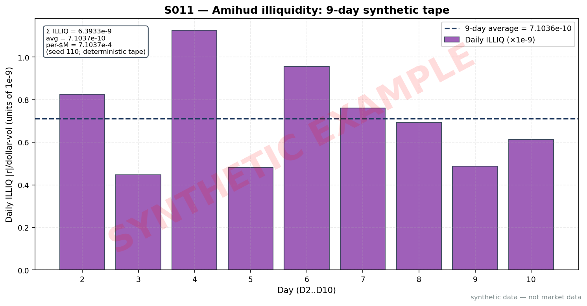

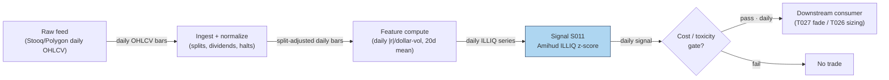
```mermaid
flowchart LR
    FEED["Raw feed<br/>(Stooq/Polygon daily OHLCV)"] -->|"daily OHLCV bars"| ING["Ingest + normalize<br/>(splits, dividends, halts)"]
    ING -->|"split-adjusted daily bars"| FEAT["Feature compute<br/>(daily |r|/dollar-vol, 20d mean)"]
    FEAT -->|"daily ILLIQ series"| SIG["Signal S011<br/>Amihud ILLIQ z-score"]
    SIG -->|"daily signal"| GATE{"Cost / toxicity<br/>gate?"}
    GATE -->|"pass · daily"| OUT["Downstream consumer<br/>(T027 fade / T026 sizing)"]
    GATE -->|fail| DROP["No trade"]
    style SIG fill:#aed6f1,stroke:#1f3a5f
```

### S12. Sources

1. Amihud, Yakov (2002). "Illiquidity and Stock Returns: Cross-Section and Time-Series Effects." *Journal of Financial Markets* 5(1), 31–56. https://www.cis.upenn.edu/~mkearns/finread/amihud.pdf
2. "The Night and Day of Amihud's (2002) Liquidity Measure." University of Warwick Economics Working Paper 1211 (2019) — documents OCAM vs CCAM premia and the secular decline of the liquidity premium. https://warwick.ac.uk/fac/soc/economics/research/workingpapers/2019/twerp_1211_bernhardt.pdf
3. Duck.ai (bot: GPT-5.6 "Luna", anonymous, reasoning "Fast"), answers to batch SB2 questions Q-SB2-1–Q-SB2-3 (2026-09-10). **Labeled chatbot source**: Amihud formula and 10-day worked example — nine daily ILLIQ values verified individually correct; the model's sum/average were wrong and operator-corrected (Σ = 6.3933e-9, average = 7.1037e-10, per-$M = 7.1037e-4 — corrected values used in S4). Q-SB2-2 pipeline leads inform S7/S8; `notes/cost-model.md` takes precedence — no material conflicts found.
4. Formula/parameter conventions (lookbacks 5–60d, winsorization, per-$M reporting) cross-checked against the Amihud (2002) paper text.

**Unverified leads** (chatbot-only, no checkable source — not used as evidence):
- zerolag.club Amihud formula page (definition matches Amihud 2002; page not independently verified).
- Chatbot Q-SB2-2 vendor plan details (Massive/Polygon Developer $79/mo, Alpaca Algo Trader Plus $99/mo) — leads in S8 with the indicative disclaimer; cost-model §6 bands take precedence.

**Source log:** Duck.ai answered Q-SB2-1–Q-SB2-3 (2026-09-10); Grok/Cursor answers pending (checked 2026-09-10).

---

---
## Stage 13/200 — S013: Corwin–Schultz high-low spread estimator

*Batch SB2 · Signal 13/100 · Provenance [D] · Family A — Microstructure & order flow*

### S1. One-line verdict

| Row | Content |
|---|---|
| **What it is** | Estimates the bid-ask spread from two consecutive days' high-low ranges — volatility scales with interval, the spread does not, so their difference isolates the spread. |
| **When it works** | Daily cost gating and spread context on any OHLC feed; best where true spreads are wide relative to daily volatility. |
| **When it dies** | Overnight gaps, tiny-spread liquid names (negative → floored at 0), intraday use without validation, non-equity samples (documented instability). |
| **Build-or-buy in one line** | Build — ten lines on daily bars; buy TAQ only if you need true quoted spreads. |

Provenance **[D]** (documented: Corwin & Schultz 2012). Family **A — Microstructure & order flow**. Worked example is synthetic; the chatbot correction is documented in S4.

### S2. How it works — plain human explanation

**Vignette.** Tuesday's tape for a mid-cap: high $52.40, low $51.10; Wednesday: high $52.90, low $51.60. No quote data — just four numbers. Hidden inside those ranges is the bid-ask spread, the round-trip tax on every trade. Corwin–Schultz recovers it from one observation: **the day's high is almost always a buy (lifted at the ask) and the low almost always a sell (hit at the bid)**. So each day's high-low range mixes *two* things: the stock's true volatility *plus* one full bid-ask spread.

**The trick.** True volatility grows with the measurement interval — a two-day range carries about twice the variance of a one-day range. The spread component does *not* grow: one day or two, the high is still one ask-print and the low one bid-print. Compare the one-day ranges against the overlapping two-day range and the volatility cancels — what remains is the spread.

**Why it should work economically.** It rests on a market-microstructure regularity: in a limit-order market (trading via posted bid/ask orders), aggressive buyers lift offers and aggressive sellers hit bids, so daily extremes are systematically signed. The estimator's power and its failure modes both come from that signing — it breaks on overnight gaps, one-sided trends, and wide-tick names.

**Mental model (3 bullets):**
- One-day high-low = volatility + spread. Two-day high-low = 2× volatility + spread. Two equations, two unknowns → solve for the spread.
- It is a **cost input**, not a trigger — it tells a strategy how wide the door is before deciding whether the edge fits through it.
- Negative estimates are not "negative spreads"; they are noise, and the estimator floors them at zero.

### S3. The math — exact formula

For two consecutive days *t* and *t+1* with highs $H_t, H_{t+1}$ and lows $L_t, L_{t+1}$ (all in $):

$$\beta_t = \ln^2\!\left(\frac{H_t}{L_t}\right) + \ln^2\!\left(\frac{H_{t+1}}{L_{t+1}}\right), \qquad
\gamma_t = \ln^2\!\left(\frac{\max(H_t,H_{t+1})}{\min(L_t,L_{t+1})}\right)$$

$$\alpha_t = \frac{\sqrt{2\beta_t}-\sqrt{\beta_t}}{\,3-2\sqrt{2}\,} - \sqrt{\frac{\gamma_t}{\,3-2\sqrt{2}\,}}$$

$$S_t = \frac{2\left(e^{\alpha_t}-1\right)}{1+e^{\alpha_t}} = 2\tanh\!\left(\frac{\alpha_t}{2}\right), \qquad
S_t^+ = \max(S_t, 0)$$

- $S_t$ is the estimated spread as a **proportion** of price (unitless); ×10,000 for **basis points**.
- $3 - 2\sqrt{2} = 0.171572875$ comes from the variance-of-range algebra.
- The original paper includes an **overnight-gap adjustment**; the base form above assumes it is handled separately or negligible.

**Causal timing.** The estimate for window (*t*, *t+1*) is complete at the close of day *t+1* using only highs/lows ≤ *t+1*; usable no earlier than the next session open. In practice estimates are averaged over a reporting window (e.g. 20–60 days) to tame noise.

**Parameter table** (defaults are *example — not an institutional standard*):

| Parameter | Symbol | Typical range | Too small | Too large | Default example |
|---|---|---|---|---|---|
| Estimation window | 2 days | fixed by construction | n/a | n/a | 2 consecutive days |
| Reporting window | *W* | 20–60 days | single-window estimates too noisy | stale cost picture | 20-day mean of $S_t^+$ |
| Zero floor | — | on/off | negative "spreads" pollute averages | flooring biases small-spread names upward | on (report raw + floored) |
| Overnight adjustment | — | on/off | gaps inflate γ → negative α | adjustment needs extra params | on for daily estimation |

**Normalization.** Report both the proportion and basis points (1 bp = 0.01%); for cross-sectional use, z-score within liquidity bucket or compare against the strategy's expected edge in the same units (bp vs bp).

**Named variants:**
1. **CS with overnight adjustment** — the paper's full form, scaling for close-to-open gaps; preferred on daily data with material overnight moves.
2. **Abdi–Ranaldo (2017)** — adds the close price; generally the most accurate low-frequency estimator vs TAQ benchmarks, best for less liquid stocks.
3. **Session-block CS** — applied to intraday high-low blocks (e.g. morning vs afternoon); usable only with validation.

### S4. Worked example — step-by-step numbers (SYNTHETIC)

**Synthetic 10-day tape.** The chatbot's worked example (Duck.ai, Q-SB2-1), operator-verified with one correction: **the raw chatbot output's α was correct (α₁ = 0.019797) but its spread was wrong by ~1% — it reported S₁ = 0.019603 (196.03 bp) because it linearized e^α ≈ 1+α (computing 2α/(2+α)). The exact value is S₁ = 2·tanh(α/2) = 0.019796 ≈ 197.96 bp, used everywhere here.** Every day: H = 102, L = 100 (O and C are irrelevant to the base estimator and omitted). Tape is deterministic (no RNG; plot script records seed 130).

**Step-by-step, window W1 (days 1–2):**
1. $h = \ln(102/100) = \ln(1.02) = 0.019802627$; $h^2 = 0.000392144$.
2. $\beta_1 = 0.000392144 + 0.000392144 = 0.000784288$.
3. $\gamma_1 = \ln^2(102/100) = 0.000392144$ (two-day high = 102, two-day low = 100).
4. $\sqrt{\beta_1} = 0.028005$, $\sqrt{2\beta_1} = 0.039605$.
5. First term: $(0.039605 - 0.028005) / 0.171572875 = 0.011600 / 0.171572875 = 0.067606$.
6. Second term: $\sqrt{0.000392144 / 0.171572875} = \sqrt{0.0022856} = 0.047807$.
7. $\alpha_1 = 0.067606 - 0.047807 = \mathbf{0.019797}$ ✓ (verified).
8. $S_1 = 2(e^{0.019797}-1)/(1+e^{0.019797}) = 2(0.0199944)/(2.0199944) = \mathbf{0.019796}$; equivalently $2\tanh(0.0098985) = 0.019796$.
9. In basis points: $0.019796 \times 10{,}000 = \mathbf{197.96\ bp}$ (not the chatbot's 196.03 bp).

All nine windows (W1…W9) are identical → **9-window average ≈ 0.019796 ≈ 197.96 bp**.

**Chart** (same data; see S11 for the figure).

**What to notice.** Estimates are flat because the synthetic tape has constant ranges — the estimator has no variation to chew on. In real data $S_t$ jumps window to window — the 20-day average is the usable number; single-window estimates are noisy and often negative (hence the floor). **Limits:** no fees, no overnight gaps, and a constant-range tape is the least informative input possible — this demonstrates the arithmetic and the linearization correction, not estimation quality.

### S5. Strategies that use this signal

- **T029 — Spread-Estimate Edge Filter (primary).** Trades only when the estimated effective spread (Roll S012 or Corwin–Schultz S013; effective spread = twice the trade price's distance from the quote midpoint) is below the strategy's per-trade edge: the signal *is* the gate.
- **T016 — End-of-Day Drift Rider (context).** Leans into last-hour drift (S027) confirmed by opening-auction imbalance (S033); wide CS estimates shrink size or stand it down into the close.

### S6. Data required — exact spec

| Field | Type | Granularity | Source tier | Notes |
|---|---|---|---|---|
| High / Low | float $ | daily | Tier 0–3 | any OHLCV feed; the *only* required inputs |
| Open / Close | float $ | daily | Tier 0–3 | needed only for the overnight-adjustment variant |
| (validation) TAQ effective spread | float | trade-level | Tier 3 | benchmark for checking your implementation, not for production use |

**Collection.** Any OHLCV vendor: Stooq (Tier 0), Polygon/Tiingo (Tier 1), Databento (Tier 2). Schema sketch: `symbol, date, high, low` (+ `open, close` for the adjusted variant).

**Ingest sketch (Python/polars, ≤20 lines):**
```python
import polars as pl, numpy as np
ohlc = pl.scan_parquet("bars/daily_*.parquet").sort("symbol", "date")
K = 3 - 2*np.sqrt(2)
cs = (ohlc.with_columns(h2=(pl.col("high")/pl.col("low")).log()**2)
    .with_columns(beta=pl.col("h2") + pl.col("h2").shift(-1).over("symbol"),
        gamma=((pl.max_horizontal("high", pl.col("high").shift(-1).over("symbol")) /
                pl.min_horizontal("low",  pl.col("low").shift(-1).over("symbol"))).log()**2))
    .with_columns(alpha=(pl.col("beta")*2).sqrt().sub(pl.col("beta").sqrt()).truediv(K)
                        .sub((pl.col("gamma")/K).sqrt()),
                  S=(2*((pl.col("alpha").exp()-1)/(pl.col("alpha").exp()+1))).clip_min(0))
    .group_by("symbol").agg(cs_20d=pl.col("S").tail(20).mean()))
cs.sink_parquet("features/cs_spread_daily.parquet")
```

**Storage.** Per `notes/cost-model.md §4`: daily bars for 3,000 stocks ≈ 5 MB/day — the CS panel is a rounding error on top.

**Data-quality checklist:** bad ticks in H/L (one erroneous print corrupts both windows touching that day — winsorize log-ranges (cap extremes at percentile bounds)); corporate actions (adjust H/L with closes); half-days/DST (daily estimator unaffected; session-block variant is not); stale H=L=0 rows from dead feeds.

### S7. Local build on M5 Max / 128GB

**Feasibility: trivial.** Ten lines of vectorized math on daily bars.

**Throughput** (per `notes/cost-model.md §2`): numpy vectorized math runs ~50–200M elements/sec; the full CRSP-scale daily panel computes in seconds in polars. Bottleneck is H/L data QA, not compute.

**Stack options:**

| Stack | When to pick |
|---|---|
| Python + polars/numpy | Default; the whole estimator is closed-form |
| DuckDB | If spreads must be computed inside SQL bar pipelines |
| Rust | Never needed for this estimator (no hot loop) |

**RAM** (per cost-model §3): daily OHLCV 3,000 stocks × 10y ≈ 2–5 GB — fits comfortably within the 77 GB working budget; a 60-year panel still fits.

**Engineering time:** Tier **L**, 4–12 h → **$600–1,800** at $150/hr loaded-cost estimate (cost-model §5). Closed-form estimator on daily bars; the hours go to H/L data QA and the overnight-adjustment variant.

**What breaks first at 500 symbols / full OPRA:** nothing — 500 symbols of daily bars are trivial. Full OPRA is irrelevant (no options input). Intraday session-block extension needs clean RTH (regular trading hours) high/low blocks per symbol — still Tier-1, still cheap.

### S8. Buy vs build

| Option | What you get | Indicative price | What buying gains | What buying loses |
|---|---|---|---|---|
| Tier-0: Stooq / exchange delayed | Free daily OHLC | ~$0 | zero cost | no adjustments, shallow history |
| Tier-1: Polygon Stocks Advanced / Tiingo | SIP daily OHLC, corporate actions | ~$30–200/mo | clean adjusted H/L history | none material |
| Tier-2: Databento Standard | Research-grade bars + TAQ-adjacent data | ~$200/mo + usage | validation against better benchmarks | overkill for the estimator itself |
| Academic/institutional: TAQ (WRDS) | True intraday quotes/trades | institutional $$$$ | actual effective spreads — the ground truth | cost; you would not need CS at all |

All prices `indicative — verify before budgeting`. **Verdict: build.** The estimator exists precisely for the situation where you *don't* buy quote data. Buy TAQ only if cost modeling needs true effective spreads — then CS is the cross-check, not the source. Crossover: buy quotes when per-trade cost accuracy is worth more than the data bill; otherwise CS on Tier-1 daily bars is the standard cheap substitute.

### S9. Success ratio / efficacy — documented evidence

| Study / source | Market & period | Metric | Before/after cost | Caveat |
|---|---|---|---|---|
| Corwin & Schultz (2012), *J. Finance* 67, 719–760 — simulation evidence (as summarized in the Brazilian replication study) | Simulated markets under realistic conditions | Correlation between high-low spread estimates and true spreads **≈ 0.9**; std of CS estimates ≈ **one-half** the std of Roll (1984) covariance estimates | n/a — estimator accuracy, not trading P&L | Simulation-based; real-data performance varies with the high=buy/low=sell assumption |
| Abdi & Ranaldo (2017), *RFS* 30, 4437–4480 | US stocks, ~1 century of daily data | Their close/high/low estimator delivers the **highest cross-sectional and average time-series correlations with the TAQ effective-spread benchmark** among low-frequency estimators; most accurate for **less liquid** stocks | n/a — estimator accuracy vs TAQ benchmark | This is the Abdi–Ranaldo extension, not base CS — but it validates the high-low family against ground truth |
| MPRA (2017) estimator horse-race (real + simulated data, equities and FX) | Multi-market | CS "unstable — works well for equities but not the remaining tests"; Abdi–Ranaldo shows high correlation with true spreads but downward bias | n/a — estimator accuracy | Directly limits S013's claimed generality: treat it as an **equities** estimator (chatbot-reported, not re-verified) |

**Regimes where it fails.** Overnight-gap regimes (γ inflated → negative α without adjustment); ultra-liquid names (true spread small vs noise; the floor discards information); trending/one-sided days breaking the high=buy/low=sell signing; non-equity samples (documented instability).

**Honest bottom line:** as a standalone trigger this is a **non-signal** — it estimates a cost, and costs don't point anywhere. As a **cost gate** it is one of the best-documented cheap tools in microstructure — use it when TAQ is not in the budget; the evidence says it tracks true effective spreads well enough to reject trades whose edge doesn't cover the spread.

### S10. Failure modes & pitfalls

1. **Negative α → floored zeros** — noise dominates when spreads are small; mitigate: report raw and floored series, average over the reporting window.
2. **Overnight gaps** — inflate the two-day range, bias α down; mitigate: use the paper's overnight-gap adjustment variant.
3. **Bad H/L prints** — one erroneous tick corrupts two windows; mitigate: winsorize log-ranges, cross-check against a second vendor.
4. **Violations of high=buy/low=sell** — trending or gappy days break the signing assumption; mitigate: distrust single-window spikes, average over 20–60 days.
5. **Intraday session blocks without validation** — the spread-doesn't-scale logic is calibrated to daily intervals; mitigate: validate block-CS against TAQ (Trade and Quote database) on a sample first (labeled `simulated only — requires MBO/ITCH`, i.e. market-by-order / Nasdaq direct-feed data, where latency-sensitive).
6. **Applying outside equities** — documented instability in FX/other samples; mitigate: restrict to equities, or re-validate per asset class.
7. **Comparing CS estimates across regimes** — volatility-regime changes shift the noise floor; mitigate: normalize against contemporaneous volatility or use within-regime ranks.
8. **Forgetting the estimate *is* the cost** — compare edge and spread in the same units (bp) and demand edge > spread × margin (threshold *example — not an institutional standard*).

### S11. Visuals

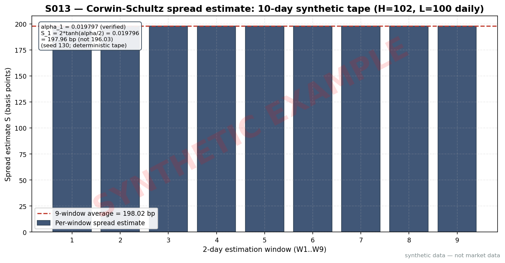

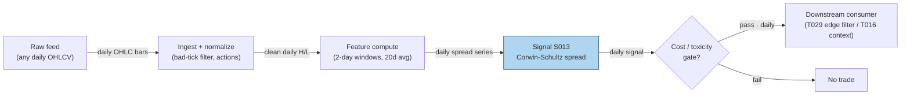
```mermaid
flowchart LR
    FEED["Raw feed<br/>(any daily OHLCV)"] -->|"daily OHLC bars"| ING["Ingest + normalize<br/>(bad-tick filter, actions)"]
    ING -->|"clean daily H/L"| FEAT["Feature compute<br/>(2-day windows, 20d avg)"]
    FEAT -->|"daily spread series"| SIG["Signal S013<br/>Corwin-Schultz spread"]
    SIG -->|"daily signal"| GATE{"Cost / toxicity<br/>gate?"}
    GATE -->|"pass · daily"| OUT["Downstream consumer<br/>(T029 edge filter / T016 context)"]
    GATE -->|fail| DROP["No trade"]
    style SIG fill:#aed6f1,stroke:#1f3a5f
```

### S12. Sources

1. Corwin, Shane A. & Schultz, Paul (2012). "A Simple Way to Estimate Bid-Ask Spreads from Daily High and Low Prices." *Journal of Finance* 67(2), 719–760. https://afajof.org/issue/volume-67-issue-2/
2. Corwin, Shane A. & Schultz, Paul (2012). Internet Appendix: "Bid-Ask Spreads from Daily High and Low Prices" — robustness analyses and example applications. https://sites.nd.edu/scorwin/files/2019/11/Internet-Appendix_FINAL.pdf
3. Abdi, Farshid & Ranaldo, Angelo (2017). "A Simple Estimation of Bid-Ask Spreads from Daily Close, High, and Low Prices." *Review of Financial Studies* 30(12), 4437–4480. http://ideas.repec.org/a/oup/rfinst/v30y2017i12p4437-4480..html
4. Girão, Martins & Paulo — "Corwin-Schultz Bid-ask Spread Estimator in the Brazilian Stock Market" (summarizes CS simulation results: correlation ≈ 0.9 with true spreads; std ≈ half of Roll's). https://www.scielo.br/j/bar/a/DbHB3rhpfgr8f6qRFKPSMhG/?lang=en
5. Duck.ai (bot: GPT-5.6 "Luna", anonymous), Q-SB2-1 (2026-09-10). **Labeled chatbot source**: CS formulas hand-verified; worked example α₁ = 0.019797 verified, but S₁ = 0.019603 (196.03 bp) was ~1% wrong (linearized e^α ≈ 1+α); corrected S₁ = 0.019796 ≈ 197.96 bp used in S4.

**Unverified leads:**
- ssrn.com / metricgate.com CS formula pages (cited by the chatbot; formulas match Corwin & Schultz 2012, pages themselves not independently verified).
- MPRA 2017 estimator horse-race (CS unstable outside equities) — summarized from the search snippet; full paper not re-verified, used as a caveat lead. https://mpra.ub.uni-muenchen.de/79102/1/MPRA_paper_79102.pdf;h=repec:pra:mprapa:79102

**Source log:** Duck.ai answered Q-SB2-1–Q-SB2-3 (2026-09-10); Grok/Cursor answers pending (checked 2026-09-10).

---

---
## Stage 21/200 — S021: Opening-range breakout — Crabel (1990)

*Batch SB2 · Signal 21/100 · Provenance [D] · Family B — Intraday momentum & breakout*

### S1. One-line verdict

| | |
|---|---|
| **What it is** | Price breaks above/below the high/low of the first N minutes of the session; the break marks acceptance of a new intraday value area. |
| **When it works** | News/catalyst days with abnormal participation ("stocks in play"); tight ranges before the break; small spreads versus expected move. |
| **When it dies** | Range-bound, low-participation days (false breaks); wide spreads relative to the OR width; late entries after the move already printed. |
| **Build-or-buy in one line** | Build: it is ~50 lines of bar arithmetic on 1-minute data you already have; buy nothing. |

Provenance **[D]** (documented — Crabel 1990 framework; ORB profitability studied in Holmberg–Lönnbark–Lundström and Zarattini–Barbon–Aziz) · Family B — Intraday momentum & breakout.

### S2. How it works — plain human explanation

Picture 9:47:03 on a regular Tuesday. XYZ chopped between 99.70 and 100.90 for the first half hour while overnight news got digested — that band is the *opening range* (OR): the market's first draft of today's fair-value zone. Now a buy program lifts the offer through 100.95 and prints trade at 101.10 — above the morning high. The ORB trader reads that as the morning's disagreement resolving: directional commitment has arrived, and the follow-through often travels a multiple of the range's width.

Why should this exist economically? Three overlapping mechanisms. **Overnight-information discovery:** the open is the day's main price-discovery auction, and informed traders who learned something overnight trade aggressively in the first minutes — the range break is their footprint becoming visible. **Inventory and stop cascades:** a break triggers stops resting just outside the range, and stop-loss buying begets more buying — self-reinforcing but temporary. **Behavioral commitment:** breakout traders, momentum algos, and news-followers all condition on the same visible level (the morning high), so the level becomes a coordination point: everyone acts at once, which manufactures the continuation it predicts — until it doesn't.

Mental model (3 bullets):

- The opening range is the market's opening bid/ask for "today's value"; a break is the market rejecting that price.
- Real breaks are *funded* — they come with participation (volume); unfunded breaks are head-fakes.
- You are buying the *second* wave (confirmation), not predicting the first; edge lives in the filter, not the geometry.

### S3. The math — exact formula

Let the session open at time $t_0$ and let the opening range cover the first $m$ intraday bars (e.g. $m=6$ five-minute bars = 30 minutes). With bar $j$ having high $H_j$ and low $L_j$:

$$\text{ORH} = \max_{j=1..m} H_j, \qquad \text{ORL} = \min_{j=1..m} L_j, \qquad W = \text{ORH} - \text{ORL}$$

where ORH/ORL are the opening-range high/low and $W$ is the range width, in price units ($).

**Entry rules** (causal: evaluated at bar close or on tick $t > t_0 + m$, tradable no earlier than $t+1$):

$$\text{Long trigger at } t:\; P_t \ge \text{ORH} + \delta$$
$$\text{Short trigger at } t:\; P_t \le \text{ORL} - \delta$$

$\delta \ge 0$ is an entry offset (price units) that filters marginal touches of the level.

**Crabel's stretch filter.** Per-session opening noise: $\text{Noise}_i = \min(H_i - O_i,\; O_i - L_i)$ ($O_i$ = session open); $\overline{\text{Noise}} = \frac{1}{n}\sum_{i=1}^{n} \text{Noise}_{t-i}$ over $n$ prior sessions. The stretch $\text{Stretch} = q \cdot \overline{\text{Noise}}$ replaces $\delta$ ($q$ an *example* multiplier) — the offset scales with recent open noise. **Optional NR7/NR4 gate:** $\text{Range}_t < \min(\text{Range}_{t-1..t-7})$ (narrowest range in 7 days; NR4 uses 4) — compression-before-expansion regime filter. **Target/stop sketch** (*example*): target $= k \cdot W$ from entry; stop $=$ opposite side of OR.

#### Parameter table

| Parameter | Symbol | Typical range | Too small | Too large | Default example value |
|---|---|---|---|---|---|
| OR length | $m$ (min) | 5–60 | noise; false breaks | late entry | 30 min (`example — not an institutional standard`) |
| Entry offset | $\delta$ | 0–1× $W$ | whipsaw on touches | missed breaks | 0.30 $ on ~100 $ stock (`example`) |
| Stretch mult. | $q$ | 0.5–2.0 | no filtering | filters real breaks | 2.0, $n=10$ (`example`) |
| Noise lookback | $n$ | 5–20 sessions | unstable | stale | 10 sessions (`example`) |
| Bar granularity | — | 1–5 min | noise | coarse, late fills | 5-min bars (`example`) |
| Target multiple | $k$ | 1–3× $W$ | clipped winners | rarely reached | 2× $W$ (`example`) |

**Causality.** ORH/ORL use only bars $\le t_0+m$; the trigger fires at the first event $t > t_0+m$ with a qualifying print. Never assume a bar's close was executable at its high/low — **implementation warning from the source entry**: OHLC bars do not reveal intrabar event ordering, so never assume a stop/target was hit after a same-bar limit fill without finer data or conservative (worst-order) assumptions.

**Normalization choices.** Raw price levels — the geometry is in price space. Cross-stock comparability uses $W/\text{ATR}$ (ATR = average true range) or $W/$ price; RVOL-normalization is the S032 variant. The range is fixed-length-from-open, not rolling.

**Named variants.** (1) *Close-of-bar vs tick trigger* — bar-close beyond the level (fewer false breaks, later entry) vs any tick (faster, noisier). (2) *Stretch vs fixed-$\delta$ offset.* (3) *Both-sides rule* — if both triggers print the same day, define the resolution ex ante (first touch wins / no trade); backtests that ignore this are overstated.

### S4. Worked example — step-by-step numbers (SYNTHETIC)

**Label:** synthetic tape. The example below was reported by a chatbot (GPT-5.6 "Luna" via duck.ai, Q-SB2-1, 2026-09-10) and **each number was independently hand-verified by the batch operator** — used here as an arithmetic walk-through, not market data. Seed 21 is fixed in the plot script (tape values are fixed numbers; no randomness used).

Six 5-minute bars define the 30-minute opening range; bars 7–9 are post-range (bar 9 hosts the t+1 entry fill):

| Bar | O | H | L | C |
|---|---|---|---|---|
| B1 | 100.0 | 100.8 | 99.7 | 100.5 |
| B2 | 100.5 | 100.9 | 100.1 | 100.3 |
| B3 | 100.3 | 100.6 | 99.9 | 100.1 |
| B4 | 100.1 | 100.4 | 99.8 | 100.2 |
| B5 | 100.2 | 100.7 | 100.0 | 100.6 |
| B6 | 100.6 | 100.8 | 100.2 | 100.7 |
| B7 | 100.7 | 101.0 | 100.5 | 100.9 |
| B8 | 100.9 | 101.3 | 100.8 | 101.2 |
| B9 | 101.2 | 101.5 | 101.1 | 101.4 |

Step 1 — opening range: $\text{ORH} = \max(100.8, 100.9, 100.6, 100.4, 100.7, 100.8) = \mathbf{100.9}$ (from B2); $\text{ORL} = \min(99.7, 100.1, 99.9, 99.8, 100.0, 100.2) = \mathbf{99.7}$ (from B1); $W = 1.2$.

Step 2 — triggers with $\delta = 0.30$ (*example*): long $= 100.9 + 0.30 = \mathbf{101.2}$; short $= 99.7 - 0.30 = \mathbf{99.4}$.

Step 3 — evaluate: B7 high 101.0 < 101.2 → **no trigger** (the marginal poke fails the offset — this is the filter earning its keep). B8 high 101.3 ≥ 101.2 → **trigger on bar 8**; the trigger print is only known as bar 8 completes, so the entry is tradable no earlier than the next bar — **long entry fills at the bar-9 open, 101.2** (t→t+1 causality honored: the fill is at B9's open print, not at B8's high).

The chart `images/S021_example.png` plots exactly these 9 bars, the [99.7, 100.9] band, both triggers, and the bar-9 entry marker.

**What to notice.** The δ offset earns its keep: without it, B7's touch of 101.0 (above ORH) would have triggered a dead long. The honesty caveats: we *assumed* a fill at the bar-9 open price of 101.2, but a real fill at the trigger print crosses the spread after the bar-8 high is known — real entry pays slippage versus the tape. This toy tape has no fees, no spread, and no losers; it demonstrates arithmetic, not edge.

### S5. Strategies that use this signal

- **T005 — RVOL-Filtered Opening-Range Breakout** — *primary entry trigger*: ORB geometry supplies the entry; S032 (RVOL) confirms participation and S008 (VPIN) gates toxicity.
- **T003 — VPIN-Gated Breakout Trader** — *breakout leg with toxicity veto*: S021 defines the breakout event; S008 (VPIN) stands the strategy down when order-flow toxicity spikes; S032 sizes/confirms.

### S6. Data required — exact spec

| Field | Type | Granularity | Source tier | Notes |
|---|---|---|---|---|
| O/H/L/C | float | 1-min bars, RTH (regular trading hours) | Tier 0–1 | Regular-hours only; exclude pre/post-market from OR computation |
| Volume | int | 1-min bars | Tier 0–1 | Needed for RVOL/stocks-in-play variant (S032) |
| Exchange calendar | date/bool | daily | Tier 0–1 | Early closes (e.g. day after Thanksgiving) shift the OR window |
| Corporate actions | ratio/date | event | Tier 1 | Splits/dividends must be adjusted or the OR levels are garbage |
| Halts | timestamp | event | Tier 1–2 | A halted open has no valid OR; skip the day |

**Collection.** Polygon stocks v3 aggregates (`/v3/aggs/.../range/1/minute/...`) or Databento XNAS `OHLCV-1m`; Alpaca as a free Tier-0 fallback (IEX-only on free tier — fine for research, not for volume-filtered production).

**Ingest sketch (Python/polars, ≤20 lines):**
```python
import polars as pl, requests
def fetch_or_bars(sym, day, api_key):
    url = f"https://api.polygon.io/v2/aggs/ticker/{sym}/range/1/minute/{day}/{day}"
    r = requests.get(url, params={"apiKey": api_key, "adjusted": "true"}).json()
    df = pl.DataFrame(r["results"]).rename({"t": "ts", "o": "o", "h": "h", "l": "l", "c": "c", "v": "v"})
    df = df.with_columns(pl.from_epoch("ts", time_unit="ms").dt.tz_localize("UTC")
                           .dt.convert_time_zone("America/New_York").alias("ts_et"))
    rth = df.filter(pl.col("ts_et").dt.time().is_between(__import__("datetime").time(9, 30),
                                                        __import__("datetime").time(16, 0)))
    return rth.sort("ts")  # drop partial/halted days: require >= 360 bars
```

**Storage.** Per cost-model §4: 1-min bars for 500 symbols ≈ 50 MB/day total (≈0.1 MB per symbol-day); 60 days ≈ 3 GB — archive freely. The ORB state itself is two floats per symbol per day.

**Data-quality checklist.** (1) Exchange-local timestamps (America/New_York; DST via tz database). (2) Split/dividend-adjusted bars *before* OR levels. (3) Halted or <360-bar days: no valid OR — skip, don't impute. (4) Half-days: scale the window or skip. (5) Zero-volume opening bars are missing data, not a range.

### S7. Local build on M5 Max / 128GB

**Feasibility verdict: trivial.** ORB is two running extrema plus a threshold comparison per bar — the cheapest signal in Family B. Per cost-model §2, 500 symbols × 390 bars = 195k bars/day; polars column ops run ~10–50M rows/sec, so the whole universe recomputes in a sub-second batch each minute. No real-time constraint worth engineering for.

- **Throughput:** signals/sec effectively unbounded for ≤500 symbols; bottleneck is the API download, not compute.
- **Stack:** Python+polars (pick this — no reason for Rust); DuckDB for the bar store if you want SQL.
- **RAM:** <100 MB working set for 60 days across 500 symbols (~12 MB per cost-model §3) — enormous headroom vs the 77 GB budget.
- **Engineering time:** Tier L per cost-model §5 (4–12 h). **$600–$1,800** at $150/hr loaded — bars in, two extrema out; the rest is calendar/halt/adjustment plumbing.
- **What breaks first at 500 symbols or full OPRA:** nothing on bars. It breaks when you add the filters that make it work — real-time RVOL baselines (S032), auction-imbalance feeds (S033), tick-level entries — which move you into Tier M (~20–60 h).

### S8. Buy vs build

| Vendor / option | What you get | Indicative price | Buying gains | Buying loses |
|---|---|---|---|---|
| Tier-0 free: Stooq daily, Alpaca IEX, exchange delayed | Daily/1-min-ish bars, delayed | ~$0 | $0 research start | IEX-only volume (~2.5% of US volume per chatbot lead) — inadequate for volume filters |
| Tier-1: Polygon Stocks Advanced / Alpaca SIP | Real-time SIP 1-min bars, corporate actions, full tape | ~$30–200/mo | Correct consolidated volume for RVOL; official adjustments | Still bars — no tick ordering for intrabar honesty |
| Tier-2: Databento Standard (pay-as-you-go) | Honest L1/L2, MBP-1/10, OPRA research | ~$200/mo + usage | Tick-level entry timing; true queue data | Overkill for pure bar-ORB |
| Academic route: paper + own code | Formulas from Holmberg et al. / Zarattini et al. | ~$0 + eng time | Full parameter control | No data included |

*All prices indicative — verify before budgeting.* **Verdict: build.** The signal is 50 lines of bar math; nothing to buy. Buy the *data* (Tier-1 SIP bars, ~$79/mo Developer-class per the chatbot's Q-SB2-2 lead, inside cost-model §6's Tier-1 band) when you add the RVOL/stocks-in-play filter, because that filter is where consolidated volume becomes load-bearing. Crossover: buy data if you trade it; build analytics always.

### S9. Success ratio / efficacy — documented evidence

| Study / source | Market & period | Metric | Before/after cost | Caveat |
|---|---|---|---|---|
| Zarattini–Barbon–Aziz (2024), "A Profitable Day Trading Strategy for the U.S. Equity Market" (SSRN) | 7,000+ US stocks, 2016–2023, 5-min ORB | Top-20 stocks-in-play: >1,600% total net, Sharpe 2.81, 36% ann. alpha | **After** their cost assumptions | Concentrated, cost-model dependent, sample ends 2023 |
| Zarattini–Barbon–Aziz (2024), same paper, RVOL split | Same universe | RVOL >100% → +0.08R/trade; <100% → −0.02R; 30× → 0.38R | **After** commissions | The ORB edge is really a volume-filter edge |
| Zarattini & Aziz (2023), "Can Day Trading Really Be Profitable?" (SSRN) | QQQ, 5-min ORB, 2016–2023 | Ann. alpha 33% net of commissions; TQQQ version 1,484% total | **After** commissions (not full spread/impact) | Single instrument + leverage; broker caps bind |
| Holmberg–Lönnbark–Lundström (2013), *Finance Research Letters* | Crude-oil futures, intraday ORB | Returns significantly >0 vs a fair game | **Before** modern equity spread/impact | Futures; significance ≠ net tradability |
| Independent replication (Brusco, GitHub, of Zarattini & Aziz 2023) | QQQ, 5-min ORB | Barely survives realistic execution; break-even ≈ 2.2¢/share; 76% of filtered PnL from 2022 | **After** modeled costs | Regime concentration — mostly a 2022 phenomenon |

**When it fails.** Generic "trade every stock every day" ORB has little documented net edge — the duck.ai evidence synthesis (Q-SB2-3, chatbot-reported) puts it bluntly: *evidence in selected implementations, little verifiable evidence Crabel's originals survive modern costs broadly*. Documented killers: false breaks on range days, wide spreads vs. OR width, late entries, small-cap/low-ADV names, and treating the bar high as an executable price. The replication literature shows concentration in volatile regimes (2020–2022); calm-market ORB is mostly churn.

**Honest bottom line.** As a standalone trigger, ORB is a **weak, highly conditional edge** — the documented after-cost success lives in the *stocks-in-play + RVOL* implementation, not the geometry. As a **filter/timing device** (enter only funded breaks; T005/T003 usage), it is a respectable, well-understood component. Don't trade the raw breakout; trade the participation-confirmed breakout.

### S10. Failure modes & pitfalls

1. **Intrabar ordering leakage** — assuming the bar high was tradable after your fill. *Mitigation:* tick data for entries, or conservatively assume stops fill first (the source entry's explicit warning).
2. **False-break whipsaw on range days** — most days have no trend. *Mitigation:* RVOL/stretch filters (S032); skip low-RVOL days.
3. **Late entry** — a 60-min OR break leaves half the move printed. *Mitigation:* shorter OR (5–15 min) with stricter volume filters.
4. **Spread/impact cost blowup** — a 1.2-point OR on a 5¢-spread small-cap is a different trade than on a penny-spread large-cap. *Mitigation:* require expected move ≥ 5–10× spread (*example*); model spread+fees+slippage per trade.
5. **Both-sides-triggered days** — long then short on volatile opens. *Mitigation:* ex-ante rule: first touch / one entry per day (*example*).
6. **Corporate-action/calendar errors** — unadjusted splits shift OR levels; half-days compress the window. *Mitigation:* adjusted bars + exchange calendar; skip invalid days.
7. **Crowding at round levels** — everyone watches the same morning high. *Mitigation:* the δ offset plus volume confirmation so you're not the marginal buyer of a crowded level.
8. **Regime breaks** — ORB thrives in trending/vol regimes, dies in grinding low-vol ones. *Mitigation:* regime-gate on trailing realized vol or VIX (*example*).

### S11. Visuals

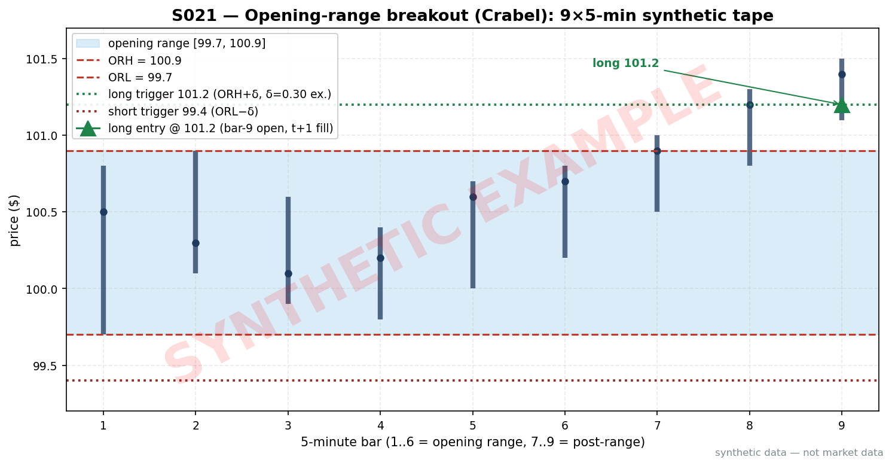

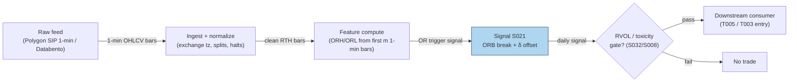
```mermaid
flowchart LR
    FEED["Raw feed\n(Polygon SIP 1-min / Databento)"] -->|"1-min OHLCV bars"| ING["Ingest + normalize\n(exchange tz, splits, halts)"]
    ING -->|"clean RTH bars"| FEAT["Feature compute\n(ORH/ORL from first m 1-min bars)"]
    FEAT -->|"OR trigger signal"| SIG["Signal S021\nORB break + δ offset"]
    SIG -->|"daily signal"| GATE{"RVOL / toxicity\ngate? (S032/S008)"}
    GATE -->|pass| OUT["Downstream consumer\n(T005 / T003 entry)"]
    GATE -->|fail| DROP["No trade"]
    style SIG fill:#aed6f1,stroke:#1f3a5f
```

### S12. Sources

- Carlo Zarattini, Andrea Barbon, Andrew Aziz (2024). "A Profitable Day Trading Strategy for the U.S. Equity Market." SSRN. https://papers.ssrn.com/sol3/papers.cfm?abstract_id=4729284
- Carlo Zarattini, Andrew Aziz (2023). "Can Day Trading Really Be Profitable? Evidence of Sustainable Long-term Profits from Opening Range Breakout (ORB) Day Trading Strategy vs. Benchmark in the US Stock Market." SSRN. https://papers.ssrn.com/sol3/papers.cfm?abstract_id=4416622
- Ulf Holmberg, Carl Lönnbark, Christian Lundström (2013). "Assessing the profitability of intraday opening range breakout strategies." *Finance Research Letters* 10:27–33. https://econpapers.repec.org/paper/hhsumnees/0845.htm
- Independent replication & execution stress test of Zarattini & Aziz (2023) QQQ ORB (break-even ≈2.2¢/share; regime concentration). https://github.com/giovannibrusco/zarattini-2023-orb-qqq
- Toby Crabel (1990). *Day Trading with Short Term Price Patterns and Opening Range Breakout.* — the signal's documented origin (book; no stable public URL — cited via the report's entry).

**Unverified leads** (chatbot-reported, no checkable source; do not cite as evidence):
- Duck.ai (GPT-5.6 "Luna", 2026-09-10) Q-SB2-2 pipeline numbers: Massive/Polygon Developer ~$79/mo, Alpaca Algo Trader Plus ~$99/mo, 500-symbol 60-day pipeline 106–246 eng hours — labeled lead, consistent with cost-model §5/§6 bands but vendor pricing is *indicative — verify before budgeting*.
- "Commonly cited illustrative spec: n=10, q=2, 20-day narrow-range lookback" for the Crabel stretch (chatbot-reported via oxfordstrat.com; treated as practitioner folklore, not a documented standard).

**Source log:** Duck.ai answered Q-SB2-1–Q-SB2-3 (2026-09-10); Grok/Cursor answers pending (checked 2026-09-10).

---
## Stage 27/200 — S027: End-of-day momentum / last-hour drift

*Batch SB2 · Signal 27/100 · Provenance [D] · Family B — Intraday momentum & breakout*

### S1. One-line verdict

| | |
|---|---|
| **What it is** | The day's early return predicts the last 30–60 minutes: ride the drift into the close, or fade the overextension — the sign depends on the mechanism. |
| **When it works** | Information trend days (news, macro releases): morning winners keep drifting as slow money rebalances into the close. |
| **When it dies** | Mechanical-flow days (index rebalances, expiry, big MOC imbalances): the "momentum" is temporary price pressure that reverses overnight. |
| **Build-or-buy in one line** | Build on 1-min bars; buy the official imbalance feed only if you trade the auction itself. |

Provenance **[D]** (documented — Gao–Han–Li–Zhou 2018 intraday momentum; Heston–Korajczyk–Sadka 2010 intraday periodicity; Bogousslavsky–Muravyev closing-auction literature) · Family B — Intraday momentum & breakout.

### S2. How it works — plain human explanation

It's 3:31 p.m. XYZ is up 1.4% on the day after strong morning news. Two crowds are about to trade the last half hour. The first is slow money — index funds, pension rebalances, benchmarked managers who must be invested by the close; they lean with the day's trend, pressing winners further. The second is the closing auction itself: market-on-close (MOC) orders, index-rebalance flows, expiry hedging — enormous one-sided volume into the 4:00 p.m. print that can shove price *away* from fair value, pressure that often leaks back overnight.

So "end-of-day momentum" is two effects in one outfit. The academic version (Gao et al. 2018): the first half-hour's return positively predicts the last half-hour's return — day traders and informed traders keep pushing the morning's direction. The microstructure version (Heston et al. 2010): at half-hour intervals that are exact multiples of a day, returns *continue* — institutional rebalancing on a daily clock. And the auction version (Bogousslavsky & Muravyev; Jegadeesh & Wu 2022): closing-auction price pressure is real but mostly temporary, reverting over hours to days. Trade the drift on information days; fade it on mechanical-flow days.

A concrete contrast: 15:32, SPY +0.9% after a hot CPI print — the morning's buyers were informed, laggard allocators are still catching up, and the drift has a fundamental reason to continue. Versus 15:32 on S&P reconstitution Friday — the "momentum" is index funds forced to buy additions at any price; Monday morning gives half of it back.

Mental model (3 bullets):

- The close is where the day's two slowest, largest flows (benchmarked rebalancing, MOC auctions) collide with the fastest (day-trader momentum).
- Direction is set by *who* is trading: information → continuation; mechanical flow → pressure-then-reversal.
- The signal's horizon is 15–90 minutes and it is always flat by the print — this is a timing edge, not a position.

### S3. The math — exact formula

**Base signal (report form — open→15:30 variant; not Gao's exact window).** Let $P_{9:30,t}$, $P_{15:30,t}$, $P_{\text{close},t}$ be prices on day $t$. Define

$$r_{\text{first},t} = \frac{P_{15:30,t}}{P_{9:30,t}} - 1, \qquad r_{\text{last},t} = \frac{P_{\text{close},t}}{P_{15:30,t}} - 1$$

all in decimal returns. The predictive regression that documents the effect:

$$r_{\text{last},t} = \alpha + \beta\, r_{\text{first},t} + \varepsilon_t$$

Gao et al. report $\hat\beta = 0.0694$ (their tables scale by 100, showing 6.94), significant at 1%, $R^2 = 1.6\%$ on SPY 1993–2013. **Window attribution (do not mix):** those statistics attach to Gao's first-half-hour (9:30–10:00) → last-half-hour window — variant (1) in Named variants — and **do not describe** the open→15:30 formation used in this section. The open→15:30 form is this report's own smoother variant; its only numbers are the worked example below and the labeled variants, not Gao's 6.94/1.6%. The tradable signal is the sign rule:

$$s_t = \operatorname{sign}(r_{\text{first},t}), \qquad \text{hold } s_t \text{ from 15:30 to the close}$$

position in *shares* (long if $s_t=+1$, short if $s_t=-1$), flattened at the closing print.

**Cross-sectional periodicity (Heston–Korajczyk–Sadka form).** For stock $i$ and half-hour interval $k$ on day $t$, returns continue at lags that are multiples of one trading day (13 half-hours): $E[r_{i,k,t} \mid r_{i,k,t-1}] > 0$ at the daily lag — strongest in the first and last half-hour intervals.

**Auction-imbalance sibling.** The microstructure sibling trades *with* the published closing-auction imbalance: if the NYSE/Nasdaq imbalance feed shows net buy pressure near the freeze, lean long into the print. This is a different signal (S033 territory) sharing the same window.

#### Parameter table

| Parameter | Symbol | Typical range | Too small | Too large | Default example value |
|---|---|---|---|---|---|
| Formation window | $r_{\text{first}}$ span | 30–210 min | noise dominates | signal arrives too late | 9:30→15:30 (`example — not an institutional standard`) |
| Hold window | $r_{\text{last}}$ span | 15–90 min | spread dominates | overnight gap risk | 15:30→close (`example`) |
| Entry time | — | 14:30–15:45 | more churn | missing the drift | 15:30 (`example`) |
| Universe filter | — | ADV / spread caps | illiquid; impact eats edge | over-filtered | price > $5, ADV > 1M shares (`example`) |
| Sign vs magnitude | — | sign / z-scored | sign ignores conviction | magnitude overfits outliers | sign rule (`example`) |

**Causality.** $r_{\text{first},t}$ is fully known at 15:30; the position is entered at/after 15:30 and held to the close — tradable no earlier than the first print after the signal timestamp. Using the 15:30 *bar close* as the entry price assumes a fill a real order would miss by seconds-to-minutes; conservative backtests enter at 15:31+.

**Normalization choices.** The base form uses raw sign. Cross-stock versions z-score $r_{\text{first}}$ by trailing diurnal volatility (S067) so a 1% move in a calm utility and a 1% move in a biotech aren't treated equally.

**Named variants.** (1) *First-half-hour → last-half-hour* (Gao: formation = 9:30–10:00 only — purer but noisier). (2) *Open→15:30 formation* (report entry's form — smoother). (3) *Auction-imbalance continuation* (S033-style; uses the imbalance feed, not returns). (4) *Reversal twin* (T069): fade the last-30-minute move — same window, opposite sign, for mechanical-flow days.

### S4. Worked example — step-by-step numbers (SYNTHETIC)

**Label:** synthetic tape, random seed 27 (fixed in the plot script). Six synthetic days; prices are invented. No fees, no spread — arithmetic illustration only.

| Day | $P_{9:30}$ | $P_{15:30}$ | $P_{\text{close}}$ | $r_{\text{first}}$ | $r_{\text{last}}$ | $s_t$ | Trade P&L |
|---|---|---|---|---|---|---|---|
| 1 | 100.00 | 101.40 | 101.90 | +1.40% | +0.49% | +1 | **+0.49%** |
| 2 | 101.40 | 100.60 | 100.10 | −0.79% | −0.50% | −1 | **+0.50%** |
| 3 | 99.60 | 100.90 | 101.30 | +1.31% | +0.40% | +1 | **+0.40%** |
| 4 | 100.80 | 101.90 | 102.40 | +1.09% | +0.49% | +1 | **+0.49%** |
| 5 | 102.20 | 100.90 | 100.40 | −1.27% | −0.50% | −1 | **+0.50%** |
| 6 | 100.10 | 100.70 | 100.50 | +0.60% | −0.20% | +1 | −0.20% |

Check day 2 by hand: $r_{\text{first}} = 100.60/101.40 - 1 = -0.00789 \approx -0.79\%$; $s_2 = -1$ (short); $r_{\text{last}} = 100.10/100.60 - 1 = -0.00497 \approx -0.50\%$; P&L $= (-1)\times(-0.50\%) = +0.50\%$. Day 6 is the honest loser: the morning was mildly up, the close faded — the reversal regime the signal cannot distinguish ex ante.

Hit rate 5/6, mean +0.36%/day — **synthetic and before costs**; the chart `images/S027_example.png` plots the same six day-pairs.

**Cost walk (*example* assumptions, SPY-class ETF):** half-spread (half the bid–ask spread — the cost of crossing to take liquidity) ≈ 0.5 bp/leg, where 1 bp (basis point) = 0.01% — so ≈ 1 bp round-trip for the 15:30 entry plus the close exit — plus ≈ $0.001/share per-side fees (≈ 0.2 bp) plus slippage/impact (extra cost when your own order pushes the price against you) ≈ 2 bp on the 15:30 leg, which leans into the auction buildup. Total ≈ 3–4 bp per trade against a mean gross of +36 bp/day → net ≈ **+32 bp/day** in this toy tape. On real small-cap closes the spread alone can exceed the whole drift — which is exactly why Heston et al. find the periodicity loses money after paying the spread.

**What to notice.** The example is deliberately continuation-friendly (5 of 6 days continue). Real data is nothing like this clean: Gao's $R^2$ of 1.6% means the regression explains almost nothing day-to-day — the edge is statistical, harvested across thousands of days, and the spread is a large fraction of a 30-minute drift. Day 6 is the important row: on mechanical-flow days the sign flips and the "momentum" becomes the fade.

### S5. Strategies that use this signal

- **T016 — End-of-Day Drift Rider** — *primary entry trigger*: S027 is the core — lean into last-hour drift, confirmed by opening-auction imbalance read (S033) and spread estimate (S013).
- **T006 — Intraday Trend + Vol-Regime Allocator** — *trend leg*: S027 supplies the into-the-close momentum component, scaled by HMM (hidden Markov model) vol regime (S079) alongside S025.
- **T069 — Late-Day Reversal into Close** — *contrast / veto*: fades last-30-minute overextensions (S038/S041 timing). T069 is the reason S027 must be mechanism-aware — when flow is mechanical, T069's sign is the right one.

### S6. Data required — exact spec

| Field | Type | Granularity | Source tier | Notes |
|---|---|---|---|---|
| O/H/L/C | float | 1-min bars, RTH (regular trading hours) | Tier 0–1 | Only 9:30, 15:30, close anchors strictly needed |
| Volume | int | 1-min bars | Tier 1 | Gao: effect stronger on high-volume days — conditioning variable |
| Official close-imbalance feed | imbalance $/shares | event, 15:30–16:00 | Tier 1–2 | NYSE imbalance feed / Nasdaq NOII (near-freeze snapshots) |
| Exchange calendar | date/bool | daily | Tier 0–1 | Early closes move the "last 30 min" window |
| Corporate actions | ratio/date | event | Tier 1 | Adjusted closes or the day's return is fiction |

**Collection.** Polygon stocks v3 minute aggregates for the bar anchors; the imbalance leg needs the exchange-published closing-auction imbalance messages (NYSE Pillar imbalance feed / Nasdaq TotalView NOII) — typically a Tier-2 add-on or exchange direct feed, *indicative — verify before budgeting*.

**Ingest sketch (Python/polars, ≤20 lines):**
```python
import polars as pl
def session_anchors(bars: pl.DataFrame) -> pl.DataFrame:
    # bars: 1-min RTH bars with ts_et, close
    day = bars.with_columns(pl.col("ts_et").dt.date().alias("d"))
    anchors = (day.group_by("d").agg([
        pl.col("close").filter(pl.col("ts_et").dt.time() == __import__("datetime").time(9, 30)).first().alias("p930"),
        pl.col("close").filter(pl.col("ts_et").dt.time() == __import__("datetime").time(15, 30)).first().alias("p1530"),
        pl.col("close").last().alias("pclose"),
    ]).with_columns(
        ((pl.col("p1530") / pl.col("p930")) - 1).alias("r_first"),
        ((pl.col("pclose") / pl.col("p1530")) - 1).alias("r_last"),
        (((pl.col("p1530") / pl.col("p930")) - 1) > 0).cast(pl.Int8).mul(2).sub(1).alias("signal"),
    ))
    return anchors  # signal known at 15:30; tradable at first print after
```

**Storage.** Anchors are 3 floats/day/symbol — negligible. The underlying 1-min bars: ~0.1 MB per symbol-day per cost-model §4.

**Data-quality checklist.** (1) Anchor timestamps must exist — a missing 15:30 bar (halt) invalidates the day. (2) Adjust for splits/dividends. (3) DST/half-days shift anchors. (4) The "close" for the hold should be the last *regular-session* print, not the auction print, unless you explicitly trade the auction. (5) Stale 15:30 quotes on illiquid names — filter by ADV.

### S7. Local build on M5 Max / 128GB

**Feasibility verdict: trivial.** Three anchor prices per symbol per day, one division, one sign. Per cost-model §2, even the full 500-symbol 1-minute universe (195k bars/day) is a sub-second polars pass; the signal itself is a rounding error on top. The only part with any engineering content is the optional imbalance-feed leg.

- **Throughput:** signals/sec effectively unbounded on bars; bottleneck is feed latency for the imbalance variant (needs the exchange feed, not compute).
- **Stack:** Python+polars (pick this); the imbalance leg is a small streaming parser — still Python-fine at one message/sec per symbol.
- **RAM:** anchors for 500 symbols × 60 days ≈ a few KB; bars per §3 ≈ 12 MB — trivially inside the 77 GB working budget.
- **Engineering time:** Tier L per cost-model §5 (4–12 h; S027 sits in the S021–S048 1-min-bar band). **$600–$1,800** at $150/hr loaded — one line: anchors in, sign out, everything else is the imbalance feed integration if you want it.
- **What breaks first at 500 symbols:** nothing on bars. It breaks if you try to trade *the auction print itself* across 500 names — MOC order management, freeze-time rule changes, and per-symbol imbalance parsing become the project (Tier M, 20–60 h).

### S8. Buy vs build

| Vendor / option | What you get | Indicative price | Buying gains | Buying loses |
|---|---|---|---|---|
| Tier-0 free: Stooq/Alpaca IEX | Daily + coarse intraday bars | ~$0 | $0 prototype of the sign rule | No 15:30 anchor precision; no imbalance data |
| Tier-1: Polygon Stocks Advanced / Alpaca SIP | Full SIP 1-min bars, corporate actions | ~$30–200/mo | Correct anchors + consolidated volume for conditioning | Still no official imbalance feed |
| Tier-2: exchange imbalance feeds (NYSE/Nasdaq) | Official closing-auction imbalance messages | exchange pricing (indicative — verify before budgeting) | Trade the actual auction pressure, not a proxy | Exchange contracts, per-feed cost; only needed for the auction leg |
| Tier-2: Databento Standard | Consolidated bars + imbalance-adjacent data | ~$200/mo + usage | One pipe for bars and auction analytics | Doesn't replace the official imbalance feed |

*All prices indicative — verify before budgeting.* **Verdict: build** the return-based signal (it is 10 lines); **buy** the imbalance feed only if the auction leg is the actual trade. The chatbot's Q-SB2-2 lead is consistent here: buy raw bars (~$79/mo Developer-class), build all analytics — precomputed "EOD momentum" scores are poor value because the formation/hold windows are the strategy. Crossover: you need the paid imbalance feed the day you stop trading the drift and start trading the print.

### S9. Success ratio / efficacy — documented evidence

| Study / source | Market & period | Metric | Before/after cost | Caveat |
|---|---|---|---|---|
| Gao–Han–Li–Zhou (2018), *J. Financial Economics* | SPY + 10 active ETFs, 1993–2013 | First→last half-hour: β̂=6.94 (×100), p<1%, R²=1.6%; stronger on volatile/high-volume/recession/macro-news days | **Before** cost (predictive regression) | Market-level (ETF); R² tiny — edge is high-frequency repetition |
| Heston–Korajczyk–Sadka (2010), *J. Finance* | NYSE, half-hour intervals, 2001–2005 | Continuation at day-multiple half-hour lags, strongest first/last half hour; sub-hour reversals are liquidity/bounce | **After** (honest): periodicity strategies "**lose money after paying the bid/ask spread**" | The continuation is a timing/cost phenomenon, not an arbitrage |
| Jegadeesh–Wu (2022), *J. Financial Economics* | NYSE+Nasdaq closing auctions | Auction volume ≈10% of total at 2019 peak; impact temporary, dissipates over 3–5 days; reversal strategies "significantly profitable" | **Before** full costs | Auction-*reversal* — the opposite sign to the drift; mechanism matters |
| Bogousslavsky–Muravyev (2023), "Who Trades at the Close?" | US equities, auctions | Auctions = 7.5% of daily volume in 2018 (vs 3.1% in 2010); close matches pre-close bid/ask 68%; deviations revert overnight | Descriptive | Auction is cheap for liquidity demanders — being the pressure is costly |
| Haendler–Heston–Korajczyk–Sadka (2025), SSRN | US equities, out-of-sample | Periodicity persists OOS; close leg driven by market-on-close trading | **Before** cost | Institutional-trading explanation — the "momentum" is someone else's benchmark trade |

**When it fails / regime notes.** Index-reconstitution and triple-witching days (mechanical flow dominates); macro-release days can go either way (information vs. positioning); selloffs (the drift becomes a crash and the close gaps); small-cap/low-ADV names where the last-30-minute spread is the whole signal; crowded close-momentum signals (everyone leaning the same way *is* the auction imbalance). The chatbot's Q-SB2-3 synthesis (labeled) is directionally right: last-hour effects are measurable but the sign is not universal — continuation vs. auction-reversal depends on definition and hold.

**Honest bottom line.** As a standalone trigger, EOD momentum is a **thin statistical edge**: real in predictive regressions, largely consumed by the spread at the horizons that matter (Heston et al. say so explicitly). As a **timing overlay** — when to press an existing intraday position, or which sign to take into the close (T016 vs T069) — it is genuinely useful. Never trade it without naming the mechanism (information vs. mechanical) first.

### S10. Failure modes & pitfalls

1. **Sign ambiguity** — continuation and auction-reversal share the same window. *Mitigation:* condition on mechanism: news/macro day → ride (T016); rebalance/expiry day → fade (T069).
2. **Auction impact on entry/exit** — the 15:30–16:00 window *is* the auction buildup; your fills move the print. *Mitigation:* model impact as a multiple of spread (chatbot-reported 0.34× figures are unverified — see S12); participate early or use limits (*example*).
3. **Overnight gap risk** — "always off by the print" per the source entry; a held position faces the overnight gap. *Mitigation:* flatten at the close — no exceptions in the base spec.
4. **Anchor staleness** — illiquid names have no real 15:30 price. *Mitigation:* ADV/spread filters (*example*: ADV > 1M shares).
5. **Macro-event whiplash** — 15:30 positioning ahead of next-morning news reverses. *Mitigation:* skip days with scheduled overnight catalysts (*example* rule).
6. **Crowded close signals** — if every intraday book leans the same way at 15:30, you *are* the imbalance. *Mitigation:* cap participation; watch the imbalance feed divergence.
7. **Lookahead via the close** — using the official close (auction print) as the signal-day return contaminates the formation window. *Mitigation:* formation uses regular-session prints only.
8. **Regime decay** — auction share keeps growing (3.1%→7.5%→~10%), so the mechanical leg strengthens while the information leg is competed away. *Mitigation:* re-estimate the sign mix yearly; don't freeze parameters.

### S11. Visuals

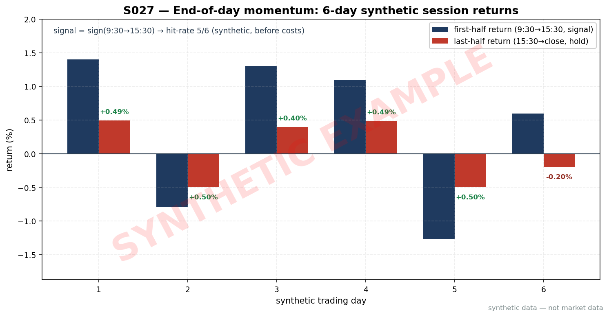

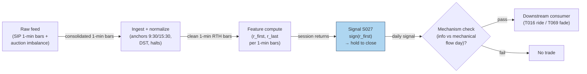
```mermaid
flowchart LR
    FEED["Raw feed\n(SIP 1-min bars +\nauction imbalance)"] -->|"consolidated 1-min bars"| ING["Ingest + normalize\n(anchors 9:30/15:30,\nDST, halts)"]
    ING -->|"clean 1-min RTH bars"| FEAT["Feature compute\n(r_first, r_last\nper 1-min bars)"]
    FEAT -->|"session returns"| SIG["Signal S027\nsign(r_first)\n→ hold to close"]
    SIG -->|"daily signal"| GATE{"Mechanism check\n(info vs mechanical\nflow day)?"}
    GATE -->|pass| OUT["Downstream consumer\n(T016 ride / T069 fade)"]
    GATE -->|fail| DROP["No trade"]
    style SIG fill:#aed6f1,stroke:#1f3a5f
```

### S12. Sources

- Lei Gao, Yufeng Han, Sophia Zhengzi Li, Guofu Zhou (2018). "Intraday Momentum: The First Half-Hour Return Predicts the Last Half-Hour Return." *Journal of Financial Economics.* https://papers.ssrn.com/sol3/papers.cfm?abstract_id=2552752 — first→last half-hour predictability, SPY 1993–2013.
- Steven L. Heston, Robert A. Korajczyk, Ronnie Sadka (2010). "Intraday Patterns in the Cross-Section of Stock Returns." *Journal of Finance* 65(4):1369–1407. https://bauer.uh.edu/departments/finance/documents/Heston-Korajczyk-Sadka-jf-2010-01-07.pdf
- Vincent Bogousslavsky, Dmitriy Muravyev (2023). "Who Trades at the Close? Implications for Price Discovery and Liquidity." SSRN. https://papers.ssrn.com/sol3/papers.cfm?abstract_id=3485840
- Narasimhan Jegadeesh, Yanbin Wu (2022). "Closing auctions: Nasdaq versus NYSE." *Journal of Financial Economics* 143:1120–1139. https://econpapers.repec.org/article/eeejfinec/v_3a143_3ay_3a2022_3ai_3a3_3ap_3a1120-1139.htm
- Charlotte Haendler, Steven Heston, Robert Korajczyk, Ronnie Sadka (2025). "The intra-day stock return periodicity puzzle." SSRN. https://www.kellogg.northwestern.edu/academics-research/research/detail/2025/the-intra-day-stock-return-periodicity-puzzle/ — periodicity persists out-of-sample; close leg driven by MOC trading.

**Unverified leads** (chatbot-reported, not independently verified; do not cite as evidence):
- Duck.ai Q-SB2-3 auction micro-numbers: closing-auction volume 7.10% of ADV (NYSE+Nasdaq 2012–2021), auction impact ≈0.34× daily average spread, drift to auction price ≈0.6–1.7× spread, overnight 1%-of-ADV ≈40bp round-trip impact under a sqrt model — directionally consistent with the verified sources above, but the exact figures were not independently confirmed.
- "Timing Sharpe ≈1.08 vs 0.29 buy-and-hold" for the Gao et al. strategy (reported in an independent replication write-up, https://github.com/definitelymikey/orb-strategy/blob/HEAD/Market_Intraday_Momentum/CLAUDE.md — not verified against the paper text).
- Baltussen–Da–Lammers–Martens (2021) gamma-hedging mechanism for intraday momentum across 60+ futures (mentioned in the same replication write-up; paper not independently pulled).

**Source log:** Duck.ai answered Q-SB2-1–Q-SB2-3 (2026-09-10); Grok/Cursor answers pending (checked 2026-09-10).

---
## Stage 32/200 — S032: Relative-volume (RVOL) filtered breakout

*Batch SB2 · Signal 32/100 · Provenance [SR] · Family B — Intraday momentum & breakout*

### S1. One-line verdict

| | |
|---|---|
| **What it is** | A breakout is only valid if volume is abnormal *for that time of day*: RVOL = window volume ÷ trailing same-time-of-day mean. |
| **When it works** | As a gate on other entries (ORB, news breakouts): funded breaks continue, unfunded breaks revert. |
| **When it dies** | As a standalone trigger — high RVOL alone is attention, not direction; and on expiry/rebalance days volume is mechanical. |
| **Build-or-buy in one line** | Build: it is a rolling time-of-day mean over bars you already store; the baseline is the whole product. |

Provenance **[SR]** (standard reconstruction — practitioner-standard formula; documented as a *conditioner* in Zarattini–Barbon–Aziz 2024 and as return-predictive abnormal volume in Gervais–Kaniel–Mingelgrin 2001; no single canonical paper defines the intraday RVOL-breakout rule, so the tag stays [SR]) · Family B — Intraday momentum & breakout.

### S2. How it works — plain human explanation

10:05 a.m. XYZ breaks above its opening range high at 101.20. Two versions of this morning exist. In version A, the first-5-minute volume is 260k shares against a 128k trailing norm — RVOL 2.0×. Institutions are repositioning; the break is *funded* and the order flow behind it will keep pressing. In version B, the same price break prints on 95k shares against a 125k norm — RVOL 0.76×. Nobody is behind it; it's a dealer wiggle or a single retail sweep, and the level fails within minutes.

RVOL is the lie detector for breakouts. Raw volume can't do this job because volume has a violent U-shape across the day (S046/S067): the open and close always print huge volume, midday almost none. A "big" 10:00 a.m. bar might be tiny by 9:35 standards. Dividing by the *same-time-of-day* trailing mean strips the diurnal seasonality and leaves the surprise — which is the information.

Why should abnormal volume predict anything? The academic lineage is old and consistent: Blume–Easley–O'Hara (1994) show volume carries information about signal precision that prices alone don't reveal; Llorente–Michaely–Saar–Wang (2002) show volume from speculative/informed trading *continues* while volume from risk-sharing (rebalancing) *reverses*; Gervais–Kaniel–Mingelgrin (2001) find unusually high-volume stocks appreciate over the following month (the "high-volume return premium," via investor visibility). The intraday practitioner version is cruder but the same idea: participation is commitment, and commitment separates acceptance from a head-fake.

Mental model (3 bullets):

- Price tells you *where*; RVOL tells you *who showed up*. Trade the intersection.
- Always divide by the time-of-day norm — raw volume is a clock, not a signal.
- RVOL is a gate, not a trigger: it vetoes bad breakouts and confirms good ones; it rarely initiates a trade by itself.

### S3. The math — exact formula

**Standard reconstruction** (practitioner formula; parameter values below are *examples*, not documented standards). Let $V_{w,t}$ be share volume in window $w$ on day $t$ (e.g. the first 5 minutes, 9:30–9:35), and let $\bar V_{w,t-1:t-N}$ be the trailing mean of the *same window* over the prior $N$ sessions:

$$\text{RVOL}_{w,t} = \frac{V_{w,t}}{\frac{1}{N}\sum_{i=1}^{N} V_{w,t-i}}$$

dimensionless (×). A valid breakout requires the price break **and**

$$\text{RVOL}_{w,t} \ge \theta$$

with $\theta$ an *example* threshold (commonly cited 1.5–2.0×; Zarattini et al. use 100% as the positive/negative split and study up to 30×).

**Baseline variants.** Mean vs median vs winsorized mean (winsorized: tails clipped at the 1st/99th percentiles) of the trailing window — median is robust to the occasional news-day outlier poisoning the baseline; winsorizing at 1/99% is the middle ground. The Zarattini–Barbon–Aziz implementation uses a 14-day mean of the first-5-minute volume.

**Attention-vs-information refinement** (Llorente et al. logic, qualitative): decompose the day's abnormal volume into informed-driven (continues) vs risk-sharing-driven (reverses). In practice this is proxied by conditioning on *why* volume is high — news/catalyst present (S091/S093) versus calendar-mechanical (expiry, rebalance).

#### Parameter table

| Parameter | Symbol | Typical range | Too small | Too large | Default example value |
|---|---|---|---|---|---|
| Measure window | $w$ | 1–30 min | noise; single-sweep artifacts | break already half over | first 5 min (`example — not an institutional standard`) |
| Baseline lookback | $N$ | 10–60 sessions | baseline whipsaws with recent news days | stale; regime changes ignored | 14 sessions (`example`) |
| Baseline statistic | — | mean / median / winsorized | mean is outlier-sensitive | median lags genuine regime shifts | mean (`example`) |
| Threshold | $\theta$ | 1.0–3.0× | lets unfunded breaks through | almost never trades | 1.5× (`example`) |
| Session filter | — | RTH (regular trading hours) only | pre/post-market prints poison the norm | — | RTH-only windows (`example`) |

**Causality.** $\text{RVOL}_{w,t}$ is known at the *end* of window $w$ using only volumes $\le t$; the breakout it validates must occur at or after that timestamp — tradable no earlier than the first print after the window closes. A common leakage bug: using the *full day's* volume in the baseline or comparing against a same-day average that includes future bars.

**Normalization choices.** Time-of-day matching *is* the normalization (it removes the U-shape). Cross-stock comparability needs no further scaling since RVOL is already dimensionless, though conditioning thresholds are sometimes expressed in $z$-scores of log-RVOL for very skewed names.

**Named variants.** (1) *Dollar-volume RVOL* — use $P \times V$ instead of shares (better for comparing across price levels; S032's options-flow cousin in the Stanford CS229 project used volume > 2× daily average AND ≥ 500 contracts). (2) *Tick/dollar-bar RVOL* — abnormal volume per *bar* rather than per clock window (S083 clocks). (3) *Cumulative-session RVOL* — volume-so-far vs expected volume-so-far from the diurnal curve; updates continuously instead of once per window.

### S4. Worked example — step-by-step numbers (SYNTHETIC)

**Label:** synthetic 12-day tape, random seed 32 (fixed in the plot script). OR window = first 5 minutes; baseline = 14-day trailing mean of the same window (synthetic values); threshold $\theta = 1.5$ (*example*); volumes in thousands of shares. No costs — arithmetic illustration only.

| Day | OR vol | Baseline | RVOL | Break | Valid? | Move (R) |
|---|---|---|---|---|---|---|
| 1 | 120 | 130 | 0.92 | — | no | — |
| 2 | 95 | 125 | 0.76 | — | no | — |
| 3 | 260 | 128 | **2.03** | +1 | **yes** | +1.8 |
| 4 | 140 | 122 | 1.15 | — | no | — |
| 5 | 310 | 126 | **2.46** | +1 | **yes** | +2.6 |
| 6 | 110 | 131 | 0.84 | — | no | — |
| 7 | 85 | 129 | 0.66 | — | no | — |
| 8 | 220 | 124 | **1.77** | +1 | **yes** | −0.4 |
| 9 | 130 | 127 | 1.02 | — | no | — |
| 10 | 280 | 125 | **2.24** | −1 | **yes** | +1.9 |
| 11 | 100 | 132 | 0.76 | — | no | — |
| 12 | 150 | 128 | 1.17 | +1 | no (< 1.5) | +1.2 (untraded) |

Check day 3 by hand: $\text{RVOL} = 260/128 = 2.03125 \approx 2.03 \ge 1.5$ with an upside price break → valid long; realized move +1.8R (R = the trade's predefined risk unit, *example*). Day 10: downside break on 2.24× → valid short, +1.9R.

Result: 4 valid trades, 3 winners, mean move +1.48R — **synthetic, before costs**. The chart `images/S032_example.png` plots this exact tape: OR-window volume vs baseline (top) and RVOL with the 1.5× line (bottom), valid days flagged.

**Cost walk (*example* assumptions):** take R = 50¢/share of predefined risk on a $100 stock. Per trade — half-spread (half the bid–ask spread — the cost of crossing to take liquidity) 1¢/leg crossed on entry and exit = 2¢; per-share fees $0.001/share × 2 = 0.2¢; slippage/impact (extra cost when your own order pushes the price against you) ≈ 1¢/leg × 2 = 2¢. Total ≈ 4.2¢/share ≈ **0.084R per trade** → mean net ≈ **+1.40R** per valid trade. On wider-spread names this same stack can exceed the mean move outright — which is why Zarattini et al.'s after-commission numbers, not the gross tape, are the honest benchmark.

**What to notice.** Day 8 is the honest row: RVOL 1.77× validates the break and it still loses (−0.4R) — the filter improves the *mix*, it doesn't certify winners. Day 12 is the filter's cost: a genuine +1.2R break goes untraded because RVOL printed 1.17×. Every filter buys a better win rate with missed trades; θ is where you price that exchange, and 1.5× here is an *example*, not an optimum. This toy tape has no spread, no fees, and hand-picked outcomes — it demonstrates the accounting, not an edge.

### S5. Strategies that use this signal

- **T005 — RVOL-Filtered Opening-Range Breakout** — *primary confirmation*: S032 is the strategy's namesake gate — S021 triggers, S032 validates participation, S008 vetoes toxicity.
- **T029 — Spread-Estimate Edge Filter** — *breakout edge filter*: S032's breakout leg is only taken when estimated effective spread (S012/S013) is below the edge — volume confirmation is necessary but not sufficient.
- **T086 — OFI-Paced Participation Tracker** — *pacing input*: S032 scales execution participation — high RVOL means the tape can absorb size; low RVOL means slow down (with S001 OFI and S067 diurnal norms).

### S6. Data required — exact spec

| Field | Type | Granularity | Source tier | Notes |
|---|---|---|---|---|
| O/H/L/C/V | mixed | 1-min bars, RTH | Tier 0–1 | Volume per bar is the load-bearing field |
| Exchange calendar | date/bool | daily | Tier 0–1 | Half-days must rescale or exclude windows |
| Corporate actions | ratio/date | event | Tier 1 | Splits change share-volume baselines — adjust or use dollar volume |
| News/catalyst flags | bool/event | daily | Tier 1–2 | Optional: separates informed volume from mechanical volume |

**Collection.** Same bar pipe as S021 (Polygon stocks v3, Databento OHLCV-1m, Alpaca): the only extra requirement is *history* — the baseline needs $N$ prior sessions of the same window, so the store must retain ≥ $N$ + warmup days per symbol.

**Ingest sketch (Python/polars, ≤20 lines):**
```python
import polars as pl
def rvol(bars: pl.DataFrame, window_end="09:35", n=14, theta=1.5):
    # bars: 1-min RTH bars with ts_et, v (shares)
    w = (bars.filter(pl.col("ts_et").dt.time() <= __import__("datetime").time(9, 35))
             .group_by(pl.col("ts_et").dt.date().alias("d"))
             .agg(pl.col("v").sum().alias("or_vol")).sort("d"))
    return (w.with_columns(pl.col("or_vol").rolling_mean(n).shift(1).alias("baseline"))
             .with_columns((pl.col("or_vol") / pl.col("baseline")).alias("rvol"))
             .with_columns((pl.col("rvol") >= theta).alias("funded")))
    # tradable only AFTER the window closes; baseline uses strictly prior sessions (shift(1) excludes the current day)
```

**Storage.** Per cost-model §4: 1-min bars ≈ 0.1 MB per symbol-day; the RVOL state is one float per symbol-day. 500 symbols × 60 days ≈ 3 GB of bars — archive freely.

**Data-quality checklist.** (1) Time-of-day alignment across DST — the "first 5 minutes" must be 9:30–9:35 ET, not a fixed UTC offset. (2) Zero-volume bars at the open are missing data, not low RVOL. (3) Splits/dividends: prefer dollar-volume RVOL or adjusted share volume. (4) Half-days: exclude from baseline or rescale. (5) Never include the current day in its own baseline (leakage).

### S7. Local build on M5 Max / 128GB

**Feasibility verdict: trivial.** One groupby-sum per symbol per day plus a rolling mean — per cost-model §2 this is microseconds per symbol in polars; the 500-symbol universe recomputes in well under a second. The only real state is the trailing baseline store.

- **Throughput:** signals/sec effectively unbounded on bars; bottleneck is API download, not compute.
- **Stack:** Python+polars (pick this); DuckDB if you want the baselines queryable in SQL.
- **RAM:** baselines for 500 symbols × 60 days ≈ KBs; bars ≈ 12 MB per cost-model §3 — trivially inside the 77 GB working budget.
- **Engineering time:** Tier L per cost-model §5 (4–12 h; S032 is in the S021–S048 1-min-bar band, plus a little baseline-plumbing). **$600–$1,800** at $150/hr loaded — one line: windowed sums in, rolling means out; the subtlety is calendar/DST correctness, not compute.
- **What breaks first at 500 symbols:** nothing on bars. It breaks if you move to *continuous* cumulative-session RVOL vs a diurnal curve — still Tier L/M — or to tick-level abnormal-volume detection, which is a different (Tier M) project.

### S8. Buy vs build

| Vendor / option | What you get | Indicative price | Buying gains | Buying loses |
|---|---|---|---|---|
| Tier-0 free: Stooq/Alpaca IEX | Daily/coarse bars | ~$0 | $0 prototype | IEX-only volume (~2.5% of US volume per chatbot lead) corrupts the baseline |
| Tier-1: Polygon Stocks Advanced / Alpaca SIP | Full SIP 1-min bars + corporate actions | ~$30–200/mo | Correct consolidated volume — the baseline is only as honest as the volume | Nothing analytical; RVOL math is still yours |
| Tier-2: Databento Standard | L1/L2 + OPRA research | ~$200/mo + usage | Tick-level abnormal-volume variants | Overkill for bar-RVOL |
| Precomputed "unusual volume" screeners | Third-party RVOL flags | varies (indicative — verify before budgeting) | Zero build | Opaque window/baseline/threshold definitions — the chatbot's Q-SB2-2 verdict applies: definitions vary, hidden lookahead rules; poor value |

*All prices indicative — verify before budgeting.* **Verdict: build, on Tier-1 bars.** The formula is public-domain arithmetic; the *baseline hygiene* (time-of-day matching, DST, splits, half-days) is the product, and no vendor sells your hygiene. Buy consolidated SIP bars because IEX-only volume makes RVOL a random number. Crossover: build always; buy data at Tier-1 the moment RVOL gates real money.

### S9. Success ratio / efficacy — documented evidence

| Study / source | Market & period | Metric | Before/after cost | Caveat |
|---|---|---|---|---|
| Zarattini–Barbon–Aziz (2024), SSRN | 7,000+ US stocks, 2016–2023, 5-min ORB × RVOL | First-5-min RVOL >100% → +0.08R/trade; <100% → −0.02R/trade; 30× RVOL → +0.38R/trade | **After** commissions | RVOL as *conditioner* of ORB, not a standalone trigger; cost model is commissions-only |
| Gervais–Kaniel–Mingelgrin (2001), *J. Finance* | US stocks, daily/weekly volume sorts | Unusually high (low) volume → appreciation (depreciation) over the following month | **Before** cost (monthly portfolio sorts; no trading-cost accounting) | Monthly horizon, not intraday; visibility hypothesis, not a breakout rule |
| Llorente–Michaely–Saar–Wang (2002), *R. Financial Studies* | NYSE/AMEX individual stocks | Informed-driven volume → return continuation; risk-sharing volume → reversal | **Before** cost (autocorrelation tests) | Theoretical mechanism paper — supports *why* the filter works, doesn't backtest it |

**What is honestly missing.** There is no peer-reviewed study of the *intraday* "RVOL ≥ 1.5× validates the breakout" rule as a standalone trigger — the documented evidence is for abnormal volume as a *conditioner* (Zarattini et al.) or at daily/monthly horizons (Gervais et al., Llorente et al.). Practitioner evidence (Aziz's "stocks in play" framework) is extensive but not peer-reviewed. The chatbot's Q-SB2-3 synthesis is candid on this point: RVOL's documented role is filtering, and generic volume-breakout evidence is weak.

**Honest bottom line.** As a standalone trigger, RVOL-filtered breakout is an **undocumented edge** — plausible, widely used, but not established net of costs in the literature. As a **filter/veto on breakouts**, it is the best-documented conditioner in this batch (Zarattini et al., after commissions). Build it as a gate; don't backtest it as a strategy and call the result research.

### S10. Failure modes & pitfalls

1. **Baseline poisoning** — a news-day outlier in the trailing window inflates the baseline and suppresses future signals (or vice versa). *Mitigation:* median/winsorized baseline; exclude event days from the norm (*example*).
2. **Mechanical-volume days** — expiry, rebalances, and triple-witching print enormous RVOL with zero information. *Mitigation:* calendar-aware veto; require a catalyst flag for the highest-conviction tier (*example*).
3. **Leakage via same-day baseline** — comparing the window against a norm that includes today's (or future) bars. *Mitigation:* strictly trailing $N$-session baseline; unit-test with shuffled calendars.
4. **DST/offset bugs** — "first 5 minutes" computed in UTC shifts the window seasonally. *Mitigation:* exchange-local timestamps everywhere; test across a DST boundary.
5. **Split-adjusted volume** — unadjusted share volume jumps 2–4× on splits, fabricating RVOL spikes. *Mitigation:* dollar-volume RVOL or adjusted shares.
6. **Threshold overfitting** — 1.5× vs 2.0× tuned on the same sample that "validates" it. *Mitigation:* pick θ on a separate period; report sensitivity (±0.5×) not a point optimum.
7. **Low-ADV names** — RVOL on a 200k-ADV stock is dominated by single prints. *Mitigation:* ADV floor (*example*: 1M shares) before the filter means anything.
8. **Confusing attention with direction** — high RVOL + no price break is just noise getting louder. *Mitigation:* RVOL never triggers alone — it only validates a price event.

### S11. Visuals

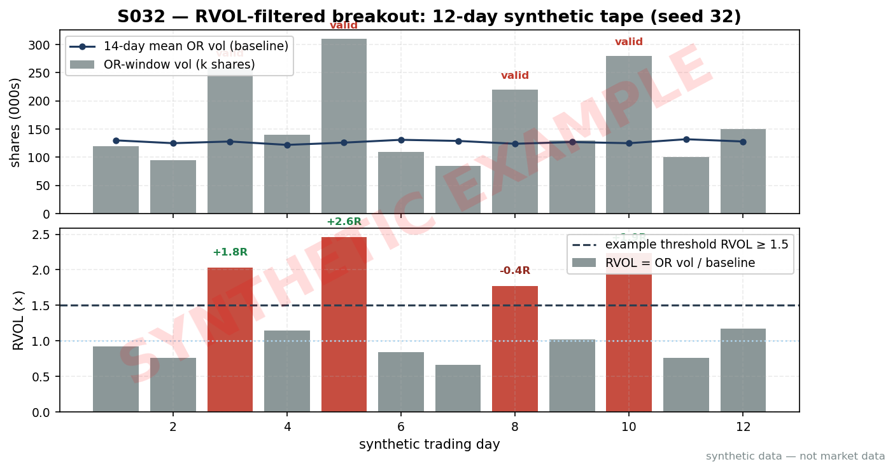

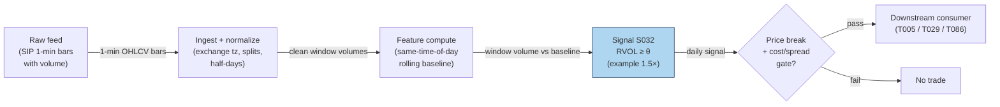
```mermaid
flowchart LR
    FEED["Raw feed\n(SIP 1-min bars\nwith volume)"] -->|"1-min OHLCV bars"| ING["Ingest + normalize\n(exchange tz, splits,\nhalf-days)"]
    ING -->|"clean window volumes"| FEAT["Feature compute\n(same-time-of-day\nrolling baseline)"]
    FEAT -->|"window volume vs baseline"| SIG["Signal S032\nRVOL ≥ θ\n(example 1.5×)"]
    SIG -->|"daily signal"| GATE{"Price break\n+ cost/spread\ngate?"}
    GATE -->|pass| OUT["Downstream consumer\n(T005 / T029 / T086)"]
    GATE -->|fail| DROP["No trade"]
    style SIG fill:#aed6f1,stroke:#1f3a5f
```

### S12. Sources

- Simon Gervais, Ron Kaniel, Dan H. Mingelgrin (2001). "The High-Volume Return Premium." *Journal of Finance* 56(3):877–919. http://ideas.repec.org/a/bla/jfinan/v56y2001i3p877-919.html
- Guillermo Llorente, Roni Michaely, Gideon Saar, Jiang Wang (2002). "Dynamic Volume-Return Relation of Individual Stocks." *Review of Financial Studies* 15(4):1005–1047. http://ideas.repec.org/a/oup/rfinst/v15y2002i4p1005-1047.html
- Carlo Zarattini, Andrea Barbon, Andrew Aziz (2024). "A Profitable Day Trading Strategy for the U.S. Equity Market." SSRN. https://papers.ssrn.com/sol3/papers.cfm?abstract_id=4729284 (full text: https://www.alexandria.unisg.ch/server/api/core/bitstreams/3c2989c4-688d-4d78-8a71-f02690990d51/content)
- Blume, Easley & O'Hara (1994) theoretical lineage noted via the volume–return literature (see Llorente et al. references therein) — volume carries information about signal precision beyond prices.

**Unverified leads** (chatbot-reported, no checkable source; do not cite as evidence):
- Stanford CS229 project rule cited in the report entry ("unusual options volume: volume > 2× daily average AND ≥ 500 contracts") — practitioner reconstruction, no retrievable citation found in this pass.
- Andrew Aziz "Stocks in Play" framework (Bear Bull Traders practitioner literature) — widely used, not peer-reviewed; treated as practitioner context, not evidence.
- Duck.ai Q-SB2-2 pipeline/eng-hour numbers as they touch RVOL baselines (106–246 h for the full 500-symbol pipeline) — labeled lead; cost-model §5 Tier L band takes precedence for S032 itself.

**Source log:** Duck.ai answered Q-SB2-1–Q-SB2-3 (2026-09-10); Grok/Cursor answers pending (checked 2026-09-10).

---
## Stage 42/200 — S042: RSI / RSI-2 mean reversion (Connors-style)

*Batch SB2 · Signal 42/100 · Provenance [D/SR] · Family C — Mean reversion & reversal*

### S1. One-line verdict

| | |
|---|---|
| **What it is** | A 2-period RSI (Relative Strength Index) oscillator that flags violent 2-day washouts (RSI-2 ≈ 0) as short-horizon mean-reversion longs, gated by a long-term trend filter. |
| **When it works** | Broad index/large-cap ETFs in intact uptrends, where 2-day panics are capitulation rather than information; holds of hours to 2–3 days. |
| **When it dies** | Waterfall declines (RSI-2 pins at 0 while price keeps falling), gap-driven single names, bear regimes below the 200-day SMA (simple moving average), wide-spread small caps. |
| **Build-or-buy in one line** | Build: 30 lines of bar math on data you already own; precomputed vendor variants differ in RSI definition — poor value. |

Provenance **[D/SR]**: Wilder's RSI formula is documented (Wilder 1978); the Connors 2-period rule (practitioner author of short-term mean-reversion systems) and its intraday adaptations are practitioner-documented reconstructions.

### S2. How it works — plain human explanation

Picture 9:47 a.m., SPY bid 588.40 × 900 / ask 588.41 × 400. Yesterday's close was 594.20, the day before 596.05 — two red days of futures-led de-risking, no single-stock news. A 2-period RSI off these closes reads **0**: everything in the last two days was downside. In an intact uptrend, a two-day flush is usually *liquidation* — margin calls, stop runs, ETF redemptions — not fresh information about value. Liquidation is finite; it exhausts, and price snaps back.

Why should the snapback exist? Three overlapping stories. First, **liquidity provision**: dealers left long unwanted inventory mark prices back up to offload it. Second, **behavioral overreaction**: loss-averse selling overshoots fundamental news. Third, **ETF mechanics**: redemption/rebalancing flows push whole baskets together — flow, not information — and revert when the flow stops.

- **Mental model, in three bullets:**
  - RSI-2 is a *capitulation meter*: 0 means "all of the last two days was down", 100 means "all up". Extremes mark exhaustion, not direction.  - The signal is *conditional*, never standalone: it only fires longs when the slow trend (close above the 200-day SMA) says the washout is against an intact uptrend.
  - The edge lives in the *first 1–3 days* of the bounce and dies in downtrends — the regime filter is the strategy, not an accessory.

### S3. The math — exact formula

Wilder's canonical RSI with period *n* (Wilder 1978):

$$\Delta_t = C_t - C_{t-1}, \qquad G_t = \max(\Delta_t, 0), \qquad L_t = \max(-\Delta_t, 0)$$

$$RS_t = \frac{\mathrm{SMMA}_n(G_t)}{\mathrm{SMMA}_n(L_t)}, \qquad \mathrm{RSI}_{n,t} = 100 - \frac{100}{1 + RS_t}$$

where SMMA is Wilder's smoothed moving average ($\alpha = 1/n$, recursive). For the Connors 2-period form used here, the operator-verified working definition is the **simple 2-period mean** (not Wilder's recursive smoothing):

$$\mathrm{RSI}_{2,t} = 100 \cdot \frac{\bar{G}_2}{\bar{G}_2 + \bar{L}_2}, \qquad \bar{G}_2 = \frac{G_t + G_{t-1}}{2}, \;\; \bar{L}_2 = \frac{L_t + L_{t-1}}{2}$$

with the boundary conventions RSI-2 = 100 if $\bar{L}_2 = 0$, RSI-2 = 0 if $\bar{G}_2 = 0$. Prices in $; RSI-2 is dimensionless on [0, 100].

Connors canonical rule (documented practitioner form): **long** when $C_t > \mathrm{SMA}_{200}(C_t)$ **and** RSI-2 < 10; **exit** when $C_t > \mathrm{SMA}_5(C_t)$; stop ≈ 5% adverse (*example — not an institutional standard*).

| Parameter | Symbol | Typical range | Too small / too large | Default (example) |
|---|---|---|---|---|
| RSI period | n | 2–5 | 1: fires on every down bar; >5: lags the 2-day event | 2 |
| Oversold trigger | θ_L | 5–20 | 5: rarer, sharper washouts; 20: frequent, weaker reversion per trade | 10 |
| Overbought trigger | θ_U | 80–95 | mirrors θ_L for shorts | 90 |
| Trend filter | N_slow | 150–250 days | shorter whipsaws the regime gate; longer rarely binds | 200 |
| Exit SMA | N_fast | 3–10 days | 1 exits on noise; 20+ holds into the next drawdown (peak-to-trough decline) | 5 |

*Every default is example — not an institutional standard.* Normalization: RSI-2 is self-normalized to [0, 100], so no z-score is needed; some desks rank RSI-2 cross-sectionally instead of using absolute thresholds. Causal timing: RSI-2 at bar *t* uses only closes ≤ *t*; the earliest tradable fill is bar *t+1*'s open (the worked example uses next-open fills). Variants: (1) **Connors daily** — above, with the 200-day SMA gate; (2) **intraday 5-min RSI** — same construction on 5-min bars with a 50-period intraday MA trend filter [SR]; (3) **CRSI composite** — Connors' 3-component variant (RSI-3 of price, RSI-2 of streak length, 100-day PercentRank — the percentage of the past 100 one-day price changes below today's change — of 1-day ROC (rate of change)), a different signal family, mentioned only to avoid confusion.

### S4. Worked example — step-by-step numbers (SYNTHETIC)

All data below is **synthetic**, hand-specified to reproduce the operator-verified Duck.ai tape (script seed 42; the tape itself is fixed, not drawn). The chart `images/S042_example.png` plots exactly these numbers.

10-day synthetic tape, closes in $:

| Day | Close | Δ_t | Ḡ(2) | L̄(2) | RSI-2 |
|-----|-------|------|------|------|-------|
| D1 | 100.00 | — | — | — | — |
| D2 | 99.00 | −1.00 | — | — | — |
| D3 | 98.00 | −1.00 | 0.00 | 1.00 | 0.0 |
| D4 | 99.00 | +1.00 | 0.50 | 0.50 | 50.0 |
| D5 | 100.00 | +1.00 | 1.00 | 0.00 | 100.0 |
| D6 | 101.00 | +1.00 | 1.00 | 0.00 | 100.0 |
| D7 | 100.00 | −1.00 | 0.50 | 0.50 | 50.0 |
| D8 | 99.00 | −1.00 | 0.00 | 1.00 | 0.0 |
| D9 | 98.00 | −1.00 | 0.00 | 1.00 | 0.0 |
| D10 | 97.00 | −1.00 | 0.00 | 1.00 | 0.0 |

Step-by-step for D4: Δ_4 = 99.00 − 98.00 = +1.00 → G_4 = 1.00, L_4 = 0; Δ_3 = −1.00 → G_3 = 0, L_3 = 1.00. Ḡ = (1.00+0)/2 = 0.50, L̄ = (0+1.00)/2 = 0.50, RSI-2 = 100·0.50/1.00 = **50.0**. D5: Δ_5 = +1.00, Δ_4 = +1.00 → Ḡ = 1.00, L̄ = 0 → **100.0** (boundary rule). D10: two straight −1.00 days → Ḡ = 0 → **0.0**.

Example trade (rule: buy when RSI-2 < 10, exit when RSI-2 ≥ 50 — *example thresholds*, causal t→t+1): D3 closes at 98.00 with RSI-2 = 0 → signal known at the close; **buy 1,000 shares at the D4 open, $98.20** (synthetic open). D4 closes at 99.00 with RSI-2 = 50 → exit signal known at the close; **sell at the D5 open, $99.30**. Gross P&L (profit and loss): (99.30 − 98.20) × 1,000 = +$1,100 (+1.12%). Costs (SPY-class ETF, example: half-spread — half the bid–ask spread, the cost of crossing to take liquidity — ~0.5 bp/leg, where 1 bp (basis point) = 0.01%, + $0.001/share fees + 2 bp slippage — extra cost when your own order pushes the price against you): ≈ $32 round-trip → net ≈ **+$1,068 (+1.09%)**. A second trigger fires at the D8 close (RSI-2 = 0); entry would be the D9 open and the tape ends at D10 with that position open — a Connors practitioner would consult the 200-day SMA gate, omitted from this toy tape, before taking it.

**What to notice:** the indicator is brutally simple and the arithmetic is checkable by hand; the entire "edge" here is one bounce, and D8–D10 show the failure shape (RSI-2 = 0 while price keeps falling) inside the same tape. This is a toy: sketch-level costs, next-open fills, no trend gate, no gap risk. Nothing here is a backtest.

### S5. Strategies that use this signal

- **T013 — RSI-2 / IBS Extreme Fade** — primary entry trigger (direction): the Connors-style oversold/overbought fade combines this signal with S043.
- **T071 — News-Novelty Reversal** — regime qualifier: fades stale-news overreaction where an extreme RSI-2 read confirms exhaustion rather than novel-information drift.

### S6. Data required — exact spec

| Field | Type | Granularity | Source tier | Notes |
|---|---|---|---|---|
| Open/High/Low/Close | float ($) | daily or 1–15 min | Tier 0–1 | Adjusted for splits/dividends; closes must be point-in-time |
| 200-day SMA input | derived | daily | Tier 0 | ~1 year of history per symbol before first signal |
| Session calendar | date/bool | daily | Tier 0–1 | Half-days, holidays, halts must not corrupt the 2-period window |
| Corporate actions | events | daily | Tier 0–1 | Split-adjustment errors inject false Δ_t spikes |

Ingest sketch (Python/polars, ≤20 lines):

```python
import polars as pl
bars = pl.scan_parquet("silver/daily_adjusted/*.parquet")      # split-adjusted OHLCV (open/high/low/close/volume)
sig = (bars
    .with_columns(delta=pl.col("close").diff().over("symbol"))
    .with_columns(g=pl.when(pl.col("delta")>0).then(pl.col("delta")).otherwise(0.0),
                  l=pl.when(pl.col("delta")<0).then(-pl.col("delta")).otherwise(0.0))
    .with_columns(g2=(pl.col("g")+pl.col("g").shift(1)).over("symbol")/2,
                  l2=(pl.col("l")+pl.col("l").shift(1)).over("symbol")/2)
    .with_columns(rsi2=100*pl.col("g2")/(pl.col("g2")+pl.col("l2")))
    .with_columns(sma200=pl.col("close").rolling_mean(200).over("symbol"))
    .filter(pl.col("close")>pl.col("sma200"), pl.col("rsi2")<10)  # example thresholds
    .collect())
```

Storage per symbol-day: daily bars are bytes — trivial (per cost-model §4, 3,000 stocks × daily ≈ 5 MB total). 1-min bars for a 500-symbol intraday variant: ~50 MB/day total (cost-model §4).

Data-quality checklist: timestamp normalization (exchange-local → UTC); corporate-action adjustment (a 2:1 split reads as Δ_t = −50% — a false RSI-2 = 0); halt/half-day bars; DST transitions; stale closes on thinly traded names; survivorship (ETF-only studies exclude delisted products).

### S7. Local build on M5 Max / 128GB

**Feasibility: trivial.** A daily RSI-2 screen over 500 symbols × 10 years ≈ 1.25M rows recomputes in well under a second in polars (cost-model §2: 10–50M rows/sec for simple column ops); a 5-min variant on 500 symbols generates only ~39k bars/day. The bottleneck is data hygiene, not compute. RAM: the full 10-year daily panel is a few MB against the 77GB working budget (cost-model §3). Stack: **Python+polars** (vectorizable, one screen); Rust unjustified; DuckDB only for large alt-data joins. Engineering: **Tier L, 4–12 h ≈ $600–1,800 at $150/hr loaded** (cost-model §5). What breaks first at 500 symbols: nothing on compute; only tick-accurate fill modeling would push this to Tier M+.

### S8. Buy vs build

| Option | What you get | Price | Gains | Loses |
|---|---|---|---|---|
| Tier 0: Stooq / Alpaca IEX daily | Daily OHLCV, long history | ~$0 (indicative — verify before budgeting) | Zero cost; fine for the canonical daily rule | IEX-only intraday; no minute bars for the 5-min variant |
| Tier 1: Polygon Stocks Developer | Minute aggs, trades, 10y history | ~$30–200/mo (indicative — verify before budgeting) | One feed for daily + intraday RSI-2 and the full SB2 signal set | Delayed tier is cheaper but useless for live |
| Tier 2: Databento Standard | SIP-grade (consolidated exchange feed) 1-min bars, corporate actions | ~$200/mo + usage (indicative — verify before budgeting) | Honest timestamps, halts, auction prints | Overkill for a daily oscillator |
| Precomputed analytics vendors | RSI-2 columns on a screener | ~$30–200/mo (indicative — verify before budgeting) | No code | Vendor RSI definitions vary (Wilder vs simple mean) — unverifiable |

**Verdict: build.** Buy the raw bars (Tier 0 daily, Tier 1 intraday), build the 30-line indicator — thresholds and fill assumptions are where the (thin) edge lives or dies.

### S9. Success ratio / efficacy — documented evidence

| Study / source | Market & period | Metric | Before/after cost | Caveat |
|---|---|---|---|---|
| QuantifiedStrategies practitioner backtests (daily SPY) | SPY, multi-year | CRSI(2) buy <15 / sell >85: profit factor ≈ 2.08 over 288 trades | **Before cost** | Practitioner, not peer-reviewed; CRSI ≠ plain RSI-2 |
| Duck.ai bank Q-SB2-3 expectancy lead | — | 75% win / +0.25% avg win / −1.2% avg loss → **−0.1125%/trade** (arithmetic verified) | Before cost | Labeled chatbot lead; illustrates that high win rate ≠ positive expectancy |
| Herberger, Horn & Oehler (2020), *Financial Markets and Portfolio Management* | German blue chips, 5-min bars | Intraday reversal returns statistically significant but **too small to be economically significant** | **After cost** (retail) | Peer-reviewed; reversal family, not RSI-2 specifically |
| Alvarez Esteban (2026, UTU thesis) | US equities 2011–2024, daily | Overnight→intraday reversal gross alpha significant; **net alpha clearly negative** after spreads + commissions | **After cost** | The canonical after-cost collapse of naive fades |
| Desk synthesis (mendozaliner, practitioner) | SPY-class, various | Connors claims ~65–75% win; Price Action Lab (2018) finds the edge indistinguishable from data-mining; decay post-2013 | Mixed (before & after across sources) | Selection-bias warning |

Regimes where it fails: persistent bear trends, volatility cascades (second and third legs arrive after the bounce), gap-driven single names, crowded mean-reversion books. The S&P-class edge weakened after ~2013.

**Honest bottom line:** naive RSI-2 fades are a **negligible-to-negative after-cost edge** standalone; as a conditioned entry (liquid ETF + trend gate + cost-aware sizing), practitioner evidence supports a small, decaying edge. Better as *filter/context* than primary trigger.

### S10. Failure modes & pitfalls

1. **Lookahead leakage** — entering at the trigger bar's close when the signal needs the close; mitigation: next-open fills always.
2. **Trend-regime failure** — RSI-2 = 0 in waterfall declines; mitigation: the 200-day SMA gate is mandatory.
3. **Definition drift** — Wilder SMMA vs simple 2-period mean vs vendor black boxes differ; mitigation: pin one definition in code.
4. **Cost blowup** — 1–3 day holds with 1–2% gross moves are spread-sensitive outside SPY-class names; mitigation: model half-spread + fees per leg, penny-spread ETFs only.
5. **Gap slippage** — overnight gaps move the fill far from the signal close; mitigation: next-open execution, skip gap days.
6. **Survivorship bias** — ETF studies use today's liquid survivors; mitigation: point-in-time universe with delisted products.
7. **Crowding** — the rule is 20 years old and commoditized; mitigation: a feature in a larger book (T013/T071), never standalone.

### S11. Visuals

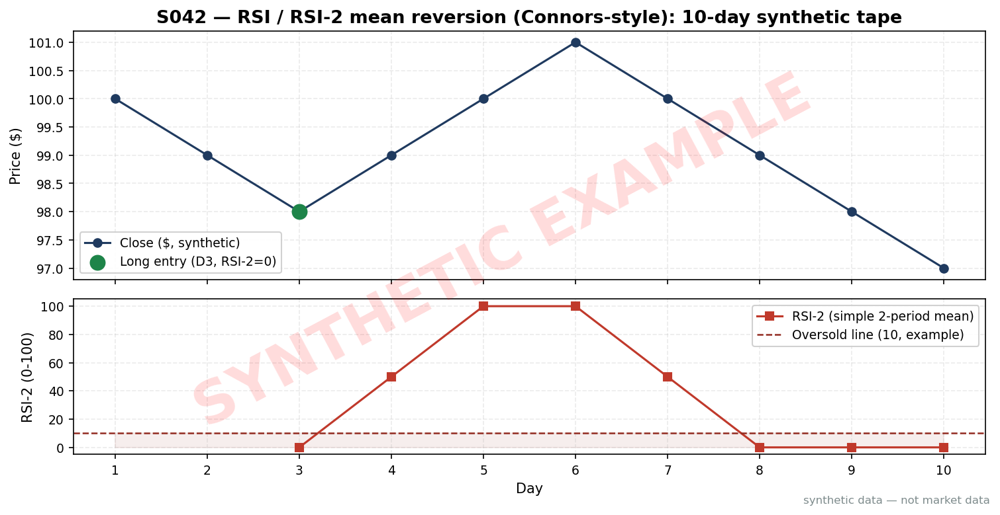

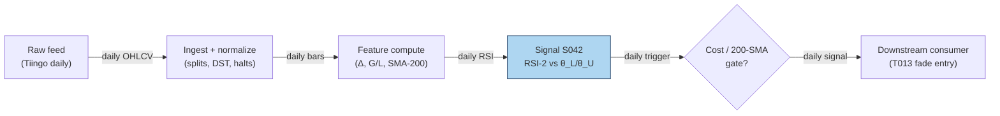
```mermaid
flowchart LR
    FEED["Raw feed<br/>(Tiingo daily)"] -->|daily OHLCV| ING["Ingest + normalize<br/>(splits, DST, halts)"]
    ING -->|daily bars| FEAT["Feature compute<br/>(Δ, G/L, SMA-200)"]
    FEAT -->|daily RSI| SIG["Signal S042<br/>RSI-2 vs θ_L/θ_U"]
    SIG -->|daily trigger| GATE{"Cost / 200-SMA<br/>gate?"}
    GATE -->|daily signal| OUT["Downstream consumer<br/>(T013 fade entry)"]
    style SIG fill:#aed6f1,stroke:#1f3a5f
```

### S12. Sources

- Wilder, J. Welles (1978). *New Concepts in Technical Trading Systems*. Trend Research. (RSI formula; book.)
- QuantifiedStrategies.com. "Connors RSI Trading Strategy: Statistics, Facts, Backtests (75% Win Rate)". https://www.quantifiedstrategies.com/connors-rsi/ — practitioner CRSI(2)/RSI backtests on daily SPY.
- Herberger, T. A., Horn, M., & Oehler, A. (2020). "Are intraday reversal and momentum trading strategies feasible? An analysis for German blue chip stocks." *Financial Markets and Portfolio Management*, 34(2), 179–197. https://ideas.repec.Org/a/kap/fmktpm/v34y2020i2d10.1007_s11408-020-00356-2.html
- Alvarez Esteban, L. (2026). "Overnight Returns and Intraday Reversals." UTU thesis, US equities 2011–2024. https://www.utupub.fi/server/api/core/bitstreams/88057d2a-1ee8-4c05-9592-c535a21b502c/content
- MQL5 (2025). "Day Trading Larry Connors RSI2 Mean-Reversion Strategies." https://www.MQL5.com/en/articles/17636 — Connors RSI2 rule documentation (entry/exit/stop conventions).

**Unverified leads** (chatbot-provided, no checkable source — do not treat as evidence):
- Duck.ai answered Q-SB2-1–Q-SB2-3 (2026-09-10); Grok/Cursor answers pending (checked 2026-09-10).
- Expectancy lead: 75% win / +0.25% avg win / −1.2% avg loss → −0.1125%/trade before costs (arithmetic verified; inputs are unverified practitioner claims).
- "70–90% win" RSI-2/IBS claims are practitioner/vendor, not peer-reviewed (per Q-SB2-3).

---
## Stage 43/200 — S043: Internal Bar Strength (IBS) mean reversion

*Batch SB2 · Signal 43/100 · Provenance [SR] · Family C — Mean reversion & reversal*

### S1. One-line verdict

| | |
|---|---|
| **What it is** | The position of a bar's close inside its own high–low range, IBS = (C−L)/(H−L); extremes (≈0 or ≈1) mark exhausted closes that revert the next bar. |
| **When it works** | Daily bars of broad index ETFs, where end-of-day flow (market-on-close (MOC) imbalances, retail panic, rebalancing) pushes the close to a range extreme disconnected from fundamentals. |
| **When it dies** | Single names with real news in the bar, trending regimes where strong closes persist, low-volume days (the effect vanishes), and anything with a wide spread. |
| **Build-or-buy in one line** | Build: three columns of arithmetic on bars you already store; nothing to buy except the bars. |

Provenance **[SR]**: the construction and practitioner rule are documented in practitioner literature (Pagonidis 2014; Kakushadze & Serur 2018 §4.4); the mean-reversion *effect* is the reconstructed standard interpretation, not a peer-reviewed causal claim.

### S2. How it works — plain human explanation

It is 3:58 p.m. QQQ has traded between 481.10 and 484.30 all session, and it is printing 481.35 — nearly the low of the day — because a wave of market-on-close sell programs and retail stop-outs hit in the last hour. Nothing about the Nasdaq's fundamentals changed since lunch; the close is weak because *flow* was weak. IBS turns that observation into one number: (481.35 − 481.10)/(484.30 − 481.10) ≈ 0.08. A close pinned to the low of the range reads as oversold; a close pinned to the high (≈0.95+) reads as overbought. The bet is that tomorrow, absent new information, the flow-driven extreme partially reverses.

Economically, three forces compress into the close. First, **MOC and rebalancing flow**: index funds, pension rebalances, and ETF creation/redemption print mechanically into the close, indifferent to price — a transient supply/demand shock. Second, **retail panic and profit-taking**: the last hour concentrates discretionary selling after red days and profit-taking after green days, both flow rather than information. Third, **closing-auction mechanics**: the auction clears imbalances at a single price that can sit at a range extreme without representing continuous-session consensus. All three are *temporary pressure*; when pressure is temporary, the next session's open/close drifts back.

- **Mental model, in three bullets:**
  - IBS asks one question: "did the bar close exhausted (near the low) or euphoric (near the high)?" — 0 = exhausted, 1 = euphoric, 0.5 = balanced.
  - It works best where idiosyncratic news is absent (broad ETFs), so the extreme can be attributed to flow.
  - The signal *requires the close*: the entry bar is complete, so execution is always on the **next** bar — this is a feature for honesty, not a bug.

### S3. The math — exact formula

$$\mathrm{IBS}_t = \frac{C_t - L_t}{H_t - L_t} \in [0, 1]$$

$C_t, L_t, H_t$ are the bar's close, low, high in $ (or any price unit). Edge cases: if $H_t = L_t$ (zero-range bar), define IBS = 0.5 (balanced) by convention — *example convention, not an institutional standard*. IBS is already normalized to [0, 1]; no further scaling needed.

Example rule (*example — not an institutional standard*): **long** when IBS_t < 0.2, executed at bar *t+1*'s open; **exit** when IBS ≥ 0.5; the short side mirrors at IBS > 0.8. Pagonidis (2014) instead sorts instruments into IBS buckets and documents threshold behavior near ≈0.4 and ≈0.9 rather than a single hard line.

| Parameter | Symbol | Typical range | Too small / too large | Default (example) |
|---|---|---|---|---|
| Long trigger | θ_long | 0.1–0.3 | 0.1: rare, sharper; 0.3: frequent, diluted edge | 0.2 |
| Short trigger | θ_short | 0.7–0.9 | mirrors θ_long | 0.8 |
| Exit level | θ_exit | 0.4–0.6 | 0.4: exits too fast to capture the bounce; 0.6+: holds through reversal of the reversal | 0.5 |
| Zero-range rule | — | — | must be defined or a flat bar divides by zero | 0.5 |

Causal timing: IBS_t is computable only after bar *t* closes; the earliest tradable fill is bar *t+1*'s open. Named variants: (1) **daily ETF fade** — long IBS < 0.2, exit IBS > 0.5 (Pagonidis form); (2) **cross-sectional rank** — rank a basket of ETFs by IBS each day, long the bottom decile / short the top decile (Kakushadze & Serur §4.4 form); (3) **intraday minute-bar IBS** — documented by practitioners, not established statistically [SR].

### S4. Worked example — step-by-step numbers (SYNTHETIC)

All data is **synthetic**, drawn with `rng = np.random.default_rng(49)` (stated for reproducibility); the chart `images/S043_example.png` plots exactly these numbers.

10-day synthetic tape, prices in $:

| Day | Open | High | Low | Close | IBS |
|-----|-------|-------|-------|-------|-------|
| D1 | 100.00 | 102.21 | 98.60 | 100.51 | 0.529 |
| D2 | 100.51 | 102.28 | 98.81 | 99.50 | 0.199 |
| D3 | 99.50 | 100.29 | 98.50 | 99.30 | 0.447 |
| D4 | 99.30 | 100.32 | 96.22 | 97.51 | 0.315 |
| D5 | 97.51 | 100.22 | 95.46 | 99.32 | 0.811 |
| D6 | 99.32 | 101.00 | 98.55 | 99.49 | 0.384 |
| D7 | 99.49 | 100.45 | 97.28 | 99.13 | 0.584 |
| D8 | 99.13 | 100.84 | 98.37 | 99.24 | 0.352 |
| D9 | 99.24 | 101.84 | 97.13 | 100.78 | 0.775 |
| D10 | 100.78 | 102.97 | 99.71 | 101.25 | 0.472 |

Check D2 by hand: (99.50 − 98.81)/(102.28 − 98.81) = 0.69/3.47 = **0.199** < 0.2 → long signal. D5: (99.32 − 95.46)/(100.22 − 95.46) = 3.86/4.76 = **0.811** ≥ 0.5 → exit signal.

Example trade (rule: buy the open after IBS < 0.2, sell the open after the first bar with IBS ≥ 0.5 — *example*, causal t→t+1): D2 signals; **buy at D3 open, 99.50**; D5's IBS = 0.811 triggers the exit; **sell at D6 open, 99.32**. Gross return: (99.32 − 99.50)/99.50 = **−0.18%** on 1,000 shares (−$180). Costs (ETF: half-spread ~0.5 bp + fees ≈ 2 bp/leg, example): ≈ 4 bp round-trip ≈ $40 → net ≈ **−$220 (−0.22%)**.

**What to notice:** the single worked trade *loses*. That is deliberate and important: IBS is a statistical edge over hundreds of signals (Pagonidis documents +0.35% average next-day return when IBS < 0.2 across equity ETFs, before costs), not a promise on any one tape. The example also shows the asymmetry the literature documents — the D9 exit signal (0.775) fires on a +1.6% up day, the kind of "euphoric close" the short side fades. Toy limits: no real fills, no borrow on the short side, no volume filter (Pagonidis finds the effect disappears on low-volume US ETF days).

### S5. Strategies that use this signal

- **T013 — RSI-2 / IBS Extreme Fade** — primary entry trigger (direction): the Connors-style fade combines S043 with S042 and S045. (RSI-2: 2-day Relative Strength Index, a 0–100 momentum oscillator — see S042.)
- **T100 — Grand Ensemble** — diluted ensemble consumer: S043 is one of ~100 features in the capstone blend; its individual weight is negligible and the fit is thin — cited for completeness, not as a genuine two-signal composition.

### S6. Data required — exact spec

| Field | Type | Granularity | Source tier | Notes |
|---|---|---|---|---|
| High / Low / Close | float ($) | daily (or minute) | Tier 0–1 | Split-adjusted; unadjusted bars inject false range extremes |
| Volume | int (shares) | daily | Tier 0–1 | Volume filter: effect documented to vanish on low-volume days |
| Session calendar | date/bool | daily | Tier 0 | Half-days produce compressed ranges — handle or exclude |

Ingest sketch (Python/polars, ≤20 lines):

```python
import polars as pl
bars = pl.scan_parquet("silver/daily_adjusted/*.parquet")
sig = (bars
    .with_columns(ibs=(pl.col("close")-pl.col("low")) /
                        (pl.col("high")-pl.col("low")).clip_min(1e-9))
    .with_columns(ibs=pl.when(pl.col("high")==pl.col("low")).then(0.5)
                        .otherwise(pl.col("ibs")))
    .with_columns(vol_z=pl.col("volume")/pl.col("volume").rolling_median(20).over("symbol"))
    .filter(pl.col("ibs")<0.2, pl.col("vol_z")>0.8)   # example thresholds
    .select("symbol","date","close","ibs")
    .collect())  # execute at next bar's open — never at the signal bar's close
```

Storage: daily bars are bytes per symbol-day (cost-model §4: 3,000 stocks × daily ≈ 5 MB total). Data-quality checklist: split/dividend adjustment (a split changes H−L scale); zero-range bars (define the 0.5 convention); half-days and early closes; stale prints on illiquid ETFs; volume convention (single-counted vs double-counted).

### S7. Local build on M5 Max / 128GB

**Feasibility: trivial.** IBS is three-column arithmetic: a 500-symbol × 10-year daily screen is ~1.25M rows, a sub-second polars scan (cost-model §2: 10–50M rows/sec simple ops). No real-time loop is needed — the signal updates once per bar close. RAM footprint is megabytes against the 77GB working budget (cost-model §3). **Python+polars** is the obvious pick; Rust buys nothing; DuckDB only if the IBS rank needs to join a large cross-sectional panel. Engineering: **Tier L, 4–12 h ≈ $600–1,800 loaded** (cost-model §5) — nearly all of it is the volume filter, the next-bar execution accounting, and universe hygiene. What breaks first at 500 symbols: nothing computationally; the research breaks first on *data* — unadjusted corporate actions and survivorship-biased ETF universes (universes that drop delisted products, flattering backtests).

### S8. Buy vs build

| Option | What you get | Price | Gains | Loses |
|---|---|---|---|---|
| Tier 0: Stooq / exchange delayed | Daily OHLCV (open/high/low/close/volume) | ~$0 (indicative — verify before budgeting) | Enough for the canonical daily rule | Weak corporate-action metadata |
| Tier 1: Polygon Stocks Developer / Tiingo | Daily + minute bars, splits | ~$30–200/mo (indicative — verify before budgeting) | Clean adjustments; volume field for the low-volume filter | — |
| Tier 2: Databento | SIP-grade (consolidated exchange feed) daily/minute | ~$200/mo + usage (indicative — verify before budgeting) | Point-in-time correctness | Overkill for (C−L)/(H−L) |
| Academic: Pagonidis (2014) paper | Documented thresholds + bucket results | ~$0 (indicative — verify before budgeting) | The closest thing to a specification | Practitioner venue (NAAIM), not peer-reviewed |

**Verdict: build.** The indicator is trivial; the value is in the execution accounting (next-bar fills, volume filter, borrow on the short side). Buy Tier 1 bars if you want minute-bar variants; otherwise Tier 0 suffices.

### S9. Success ratio / efficacy — documented evidence

| Study / source | Market & period | Metric | Before/after cost | Caveat |
|---|---|---|---|---|
| Pagonidis (2014), "The IBS Effect: Mean Reversion in Equity ETFs" (NAAIM) | Equity ETFs, inception–2013 | Avg next-day return **+0.35%** when IBS < 0.2; **−0.13%** when IBS > 0.8; ~30% p.a. alpha for the simple strategy | **Before cost** | Practitioner paper, not peer-reviewed; ETF universe |
| Pandey & Joshi (2023), arXiv | Country ETFs, 10 years | IBS-based mean-reversion "useful for predicting short-term price movements" in their basket | Before cost (implied) | Student report; qualitative headline |
| Desk/practitioner synthesis (finterm notes on Kakushadze & Serur 2018 §4.4) | Broad/country ETFs since 1990s | Rank-by-IBS reversal "documented to work consistently"; strongest with trend filter, high-volume days, Monday→Tuesday window | Before cost | Practitioner summary of a practitioner book |
| Duck.ai Q-SB2-3 (labeled lead) | — | "70–90% win" claims are practitioner/vendor, **not peer-reviewed**; Connors Research presents IBS as concept with no published hit-rate benchmark | n/a | Chatbot lead, qualitative |

Regimes where it fails: single-name news days (the extreme is information, not flow), persistent trends (strong closes keep working), low-volume days (effect disappears for US equity ETFs per Pagonidis), bear-market long side (short side relatively stronger in bears). The IBS effect is also documented as stronger on high-range, high-volatility days and on Mondays ("Turnaround Tuesday").

**Honest bottom line:** as a standalone trigger this is a **small, conditional, before-cost edge** concentrated in liquid ETFs — and the naive daily fade inherits the S040-style caveat: after spreads, fees, and next-open slippage (extra cost when your order pushes the open price against you) on the short side, published-looking returns compress hard. As a filter (rank ETFs by IBS to time entries from other signals), it is better evidenced and cheaper to be wrong about.

### S10. Failure modes & pitfalls

1. **Same-bar execution (lookahead)** — IBS needs the close; trading "at the close" of the signal bar is impossible without MOC access modeled honestly; mitigation: next-bar-open fills, or explicit MOC impact modeling.
2. **News-driven extremes** — a close at the low on genuine bad news is information, not exhaustion; mitigation: skip earnings/event days, or require the ETF (diversified) rather than the single name.
3. **Short-side costs** — borrow fees and next-open slippage on gap days; mitigation: long-only variant, or model borrow explicitly.
4. **Low-volume fade** — the documented effect vanishes on quiet days; mitigation: the volume filter (e.g. volume > 0.8× 20-day median, example).
5. **Zero-range / half-day bars** — division by zero or compressed ranges; mitigation: the 0.5 convention + session-calendar exclusions.
6. **Overfit thresholds** — 0.2/0.5/0.8 mined on the same ETFs; mitigation: fix thresholds a priori, test on post-2013 data the original paper never saw.
7. **Crowding/decay** — the rule is public since 2013–2014; mitigation: expect decay, use as a feature (T013/T100) rather than a book.

### S11. Visuals

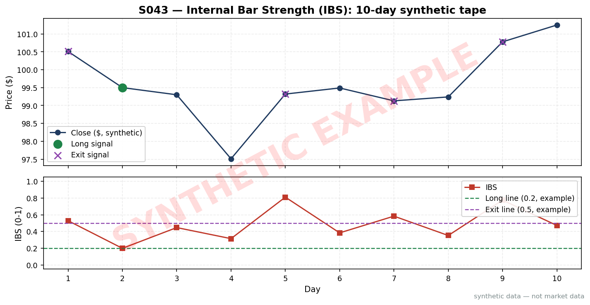

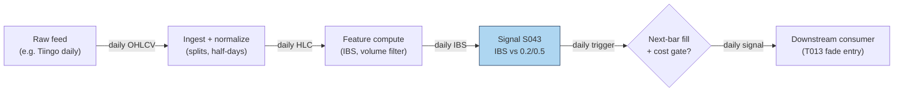
```mermaid
flowchart LR
    FEED["Raw feed<br/>(e.g. Tiingo daily)"] -->|daily OHLCV| ING["Ingest + normalize<br/>(splits, half-days)"]
    ING -->|daily HLC| FEAT["Feature compute<br/>(IBS, volume filter)"]
    FEAT -->|daily IBS| SIG["Signal S043<br/>IBS vs 0.2/0.5"]
    SIG -->|daily trigger| GATE{"Next-bar fill<br/>+ cost gate?"}
    GATE -->|daily signal| OUT["Downstream consumer<br/>(T013 fade entry)"]
    style SIG fill:#aed6f1,stroke:#1f3a5f
```

### S12. Sources

- Pagonidis, A. S. (2014). "The IBS Effect: Mean Reversion in Equity ETFs." NAAIM Wagner Award paper. https://www.naaim.org/wp-content/uploads/2014/04/00V_Alexander_Pagonidis_The-IBS-Effect-Mean-Reversion-in-Equity-ETFs-1.pdf
- Pandey, A. & Joshi, K. (2023). "Using Internal Bar Strength as a Key Indicator for Trading Country ETFs." arXiv. http://export.arxiv.org/pdf/2306.12434
- Kakushadze, Z. & Serur, J. A. (2018). *151 Trading Strategies*. Palgrave Macmillan. (§4.4: IBS cross-sectional construction; book.)
- Practitioner synthesis: "ETF Mean Reversion (Internal Bar Strength)" notes. https://github.com/yumima/finterm/blob/HEAD/fincept-qt/resources/knowledge/quant-strategies/etf-mean-reversion-ibs.md — documents the rank-by-IBS strategy and the economic (end-of-day flow) rationale.

**Unverified leads** (chatbot-provided, no checkable source — do not treat as evidence):
- Duck.ai answered Q-SB2-1–Q-SB2-3 (2026-09-10); Grok/Cursor answers pending (checked 2026-09-10).
- "70–90% win" IBS claims are practitioner/vendor, not peer-reviewed; Connors Research presents IBS as concept with no published hit-rate benchmark (per Q-SB2-3).
- Expectancy arithmetic lead (75% win / +0.25% avg win / −1.2% avg loss → −0.1125%/trade before costs): math verified, inputs unverified.

---
## Stage 63/200 — S063: Range-based realized-volatility estimators

*Batch SB2 · Signal 63/100 · Provenance [D] · Family E — Volatility & options-informed*

### S1. One-line verdict

| Row | Content |
|---|---|
| **What it is** | Volatility estimated from each bar's high-low (and open/close) instead of close-to-close returns — 5–8× more efficient per observation. |
| **When it works** | Vol-targeted sizing, dispersion legs, VRP measurement — anywhere a fast, honest read of recent realized vol beats noisy close-to-close. |
| **When it dies** | Overnight gaps (Parkinson), trending drift (Garman–Klass), tick-bound prices (a tick = the minimum price increment), jump days; raw 5-min bars without deseasonalizing. |
| **Build-or-buy in one line** | Build — closed-form on OHLC bars; buy history, never the estimator. |

Provenance **[D]** (documented: Parkinson 1980; Garman & Klass 1980; Rogers & Satchell 1991; Yang & Zhang 2000). Family **E — Volatility & options-informed**. Worked example is synthetic and watermarked (seed 63).

### S2. How it works — plain human explanation

**Vignette.** Tuesday, MSFT. It opens at $512.40, swings $508.10–$517.30 all session, and closes at $512.55 — up three hundredths of a percent. A close-to-close volatility estimate says "nothing happened." A range-based estimator looks at the $9.20 high-low range and says "that was a 1.8% day." The range distills the whole intraday path; close-to-close discards everything between the two prints.

**Why it works statistically.** Under (approximately) Brownian motion (a random walk with normally distributed steps — the standard price model), the high-low range carries far more information about a bar's variance than the open-to-close move — a day that wanders but closes flat has near-zero squared return yet a large range. The classic result: Parkinson ≈ **5× as efficient** as close-to-close (same accuracy from ~80% less data); Garman–Klass reaches **7–8×**. The four estimators trade off which biases they remove:
- **Parkinson** — high/low only; simplest; assumes no drift (no persistent directional trend) and no overnight gap.
- **Garman–Klass** — adds open/close; most efficient under zero drift.
- **Rogers–Satchell** — drift-robust combination; handles trending bars.
- **Yang–Zhang** — blends overnight, open-close, and Rogers–Satchell; drift-independent *and* gap-robust; the minimum-error choice on full OHLC.

Alizadeh, Brandt & Diebold (2002): range-based proxies are approximately Gaussian (bell-curve / normally distributed) and **robust to microstructure noise** — bid-ask bounce (trades alternating between bid and ask prints) inflates the observed range by only about the average spread.

**Mental model (3 bullets):**
- Range estimators are *volatility microscopes*: same bars, 5–8× more information per observation than close-to-close.
- They are **state, not signal** — they measure the weather (how big moves are), they don't predict its direction.
- Pick the estimator by your bias budget: Parkinson for clean intraday bars, Rogers–Satchell when bars trend, Yang–Zhang when overnight gaps matter.

### S3. The math — exact formula

Per-bar variance estimates (log prices; $O, H, L, C$ in $). Average over a window of $N$ bars, then annualize:

$$\hat\sigma^2_{\text{Park}} = \frac{\left[\ln(H/L)\right]^2}{4\ln 2}$$

$$\hat\sigma^2_{\text{GK}} = \tfrac{1}{2}\left[\ln(H/L)\right]^2 - (2\ln 2 - 1)\left[\ln(C/O)\right]^2$$

$$\hat\sigma^2_{\text{RS}} = \ln(H/C)\,\ln(H/O) + \ln(L/C)\,\ln(L/O)$$

$$\hat\sigma^2_{\text{YZ}} = \sigma^2_o + k\,\sigma^2_c + (1-k)\,\sigma^2_{\text{RS}}, \qquad
k = \frac{0.34}{1.34 + (N+1)/(N-1)}$$

where $\sigma^2_o$, $\sigma^2_c$, $\sigma^2_{\text{RS}}$ are overnight (close-to-open), open-to-close, and Rogers–Satchell variances, each averaged over $N$ bars. Annualized: $\hat\sigma_{\text{ann}} = \sqrt{\bar\sigma^2}\times\sqrt{\text{bars/year}}$ (252 daily; $252 \times 78$ for 5-min RTH (regular trading hours) bars).

**Causal timing.** Each bar's estimate uses only that bar's OHLC (complete at the bar close); the $N$-bar average completes at the close of bar $N$; tradable no earlier than bar $N+1$.

**Parameter table** (defaults are *example — not an institutional standard*):

| Parameter | Symbol | Typical range | Too small | Too large | Default example |
|---|---|---|---|---|---|
| Estimation window | *N* | 5–30 days (or 30–78 intraday bars) | noisy, jump-dominated | stale vol regime | 20 days |
| Annualization | bars/year | 252 (daily); 19,656 (5-min RTH) | wrong units | — | 252 for the daily example |
| YZ weight | *k* | 0.1–0.3 (falls with *N*) | over-weights open-close | over-weights overnight | 0.1327 at *N*=10 (see S4) |
| Estimator choice | — | Park / GK / RS / YZ | — | — | YZ for daily; Park/GK for clean intraday bars |

**Normalization.** Use levels for sizing (position ∝ target/σ̂), z-scores vs own history for vol-breakout regimes, or realized/implied ratios for VRP. Never annualize with the wrong bar count — the most common implementation bug.

**Named variants:**
1. **Parkinson (1980)** — high/low only; zero-drift, no-gap; the baseline.
2. **Garman–Klass (1980)** — OHLC; minimum-variance combination under zero drift; most efficient classical estimator.
3. **Rogers–Satchell (1991)** — OHLC; unbiased for arbitrary drift; slightly less efficient than GK at zero drift.
4. **Yang–Zhang (2000)** — overnight + open-close + RS blend; independent of drift and opening jumps; default for gappy daily bars.

### S4. Worked example — step-by-step numbers (SYNTHETIC)

**Synthetic 10-day tape** (`np.random.default_rng(63)`; exactly reproducible). Prices in $:

| Day | Open | High | Low | Close |
|---|---|---|---|---|
| D1 | 100.285 | 103.461 | 99.718 | 102.664 |
| D2 | 103.171 | 105.888 | 102.467 | 104.325 |
| D3 | 104.831 | 109.252 | 103.643 | 107.411 |
| D4 | 107.137 | 107.671 | 103.896 | 105.101 |
| D5 | 105.591 | 106.272 | 104.491 | 105.251 |
| D6 | 105.962 | 106.976 | 105.259 | 106.334 |
| D7 | 106.491 | 108.383 | 105.099 | 107.636 |
| D8 | 108.106 | 110.259 | 107.478 | 108.967 |
| D9 | 108.417 | 108.783 | 106.803 | 108.013 |
| D10 | 107.628 | 109.008 | 107.582 | 108.013 |

**Step-by-step (D1, Parkinson, fully shown):** $\ln(H/L) = \ln(103.461/99.718) = \ln(1.037531) = 0.036848$. Square: $0.00135777$. Divide by $4\ln 2 = 2.772589$: $\hat\sigma^2_{\text{Park},1} = 0.00048964$. The same arithmetic with the GK and RS formulas gives 0.00046635 and 0.00040594.

**Per-day variances (all 10 days):**

| Day | Parkinson | Garman–Klass | Rogers–Satchell |
|---|---|---|---|
| D1 | 0.00048964 | 0.00046635 | 0.00040594 |
| D2 | 0.00038891 | 0.00049132 | 0.00050950 |
| D3 | 0.00100177 | 0.00116030 | 0.00110870 |
| D4 | 0.00045944 | 0.00049471 | 0.00047429 |
| D5 | 0.00010307 | 0.00013888 | 0.00013803 |
| D6 | 0.00009448 | 0.00012623 | 0.00012504 |
| D7 | 0.00034161 | 0.00042938 | 0.00043586 |
| D8 | 0.00023524 | 0.00030181 | 0.00031244 |
| D9 | 0.00012159 | 0.00016319 | 0.00019279 |
| D10 | 0.00006259 | 0.00008185 | 0.00011864 |

**Window aggregation + Yang–Zhang:** 10-day mean variances — Parkinson 0.00032983, GK 0.00038540, RS 0.00038212. Overnight variance $\sigma^2_o = 0.00002008$; open-to-close variance $\sigma^2_c = 0.00018599$; $k = 0.34/(1.34 + 11/9) = 0.1327$; $\hat\sigma^2_{\text{YZ}} = 0.00002008 + 0.1327(0.00018599) + 0.8673(0.00038212) = \mathbf{0.00037618}$. Annualized ($\times\sqrt{252}$): **Parkinson 28.83%, Garman–Klass 31.16%, Rogers–Satchell 31.03%, Yang–Zhang 30.79%**.

**Chart** (same numbers — daily σ = √variance × 100; YZ is window-level, hence horizontal; see S11 for the figure).

**What to notice.** All four agree closely (28.8–31.2% annualized) — on clean synthetic data the bias corrections barely bite; estimator choice matters most on *real* data with gaps and drift. D3 (largest range day) dominates the window — one wild bar moves a 10-day average materially, which is why production windows run 20+ days. **Limits:** synthetic tape, no jumps, no tick discreteness, no fees — this validates the arithmetic and the code path, not any trading edge.

### S5. Strategies that use this signal

- **T058 — Dispersion Trader (primary leg input).** Long single-stock realized vol vs short index vol: S063 measures the *realized-vol leg* — entry/exit and hedge ratios from range-based RV, with S075/S069 context.
- **T035 — Futures Calendar-Spread Carry (sizing).** Harvests term-structure roll yield; S063-based vol forecasts scale size to keep carry positions inside the vol budget as realized vol expands.
- **T010 — Variance-Risk-Premium Harvester (regime/sizing).** Delta-hedged short-vol when implied variance is rich vs forecast: S063 is the "realized" side of the comparison, alongside HAR forecasts (S066) and VRP levels (S069).

### S6. Data required — exact spec

| Field | Type | Granularity | Source tier | Notes |
|---|---|---|---|---|
| Open / High / Low / Close | float $ | daily or 5-min bars | Tier 0–1 | the only inputs |
| Corporate actions | events | daily | Tier 1 | splits corrupt H/L ratios if unadjusted |
| (optional) implied vol | float | daily | Tier 1–2 | for the VRP comparison in T010, not for S063 itself |

**Collection.** Stooq (Tier 0, daily), Polygon stocks v3 (Tier 1, minute bars), Databento (Tier 2). Schema sketch: `symbol, ts, open, high, low, close`.

**Ingest sketch (Python/polars, ≤20 lines):**
```python
import polars as pl, numpy as np
bars = pl.scan_parquet("bars/min5_*.parquet").sort("symbol", "ts")
rv = (bars.with_columns(
        park=(pl.col("high")/pl.col("low")).log()**2 / (4*np.log(2)),
        gk=0.5*(pl.col("high")/pl.col("low")).log()**2
           - (2*np.log(2)-1)*(pl.col("close")/pl.col("open")).log()**2,
        rs=(pl.col("high")/pl.col("close")).log()*(pl.col("high")/pl.col("open")).log()
           + (pl.col("low")/pl.col("close")).log()*(pl.col("low")/pl.col("open")).log())
    .group_by("symbol")
    .agg(park_20d=pl.col("park").tail(20).mean(),   
         gk_20d=pl.col("gk").tail(20).mean(),
         rs_20d=pl.col("rs").tail(20).mean()))
rv.sink_parquet("features/range_rv.parquet")
```

**Storage.** Per `notes/cost-model.md §4`: 1-min bars for 500 symbols ≈ 50 MB/day (~3 GB per 60 days); daily OHLC ≈ 5 MB/day for 3,000 stocks. Derived RV panels are negligible.

**Data-quality checklist:** H/L integrity (H ≥ max(O,C), L ≤ min(O,C)); zero-range bars; corporate actions; DST/half-days (bar-count changes); intraday seasonality — deseasonalize (remove the time-of-day pattern in) 5-min estimates (S067).

### S7. Local build on M5 Max / 128GB

**Feasibility: feasible.** Compute is trivial; the pipeline around it is the work (Plan §6: Family E, 63–70, Tier M).

**Throughput** (per `notes/cost-model.md §2`): numpy ~50–200M elements/sec — four estimators over 500 symbols × 390 5-min bars × 60 days (11.7M rows) compute in ~1–5 s. Bottleneck: I/O and data QA.

**Stack options:**

| Stack | When to pick |
|---|---|
| Python + polars/numpy | Default; closed-form and vectorized |
| DuckDB | If RV must live inside SQL feature pipelines |
| Rust | Only inside a real-time risk loop recomputing vol per tick (rare) |

**RAM** (per cost-model §3): 500 symbols × 60 days of 5-min bars ≈ 3–8 GB eager — inside the 77 GB working budget; daily-bar panels are megabytes.

**Engineering time:** Tier **M**, 20–60 h → **$3,000–9,000** at $150/hr loaded-cost estimate (cost-model §5). The formulas are minutes; a production vol-state pipeline needs window selection, annualization conventions, estimator comparison across history, deseasonalization for intraday bars, and jump-day handling.

**What breaks first at 500 symbols / full OPRA:** 500 symbols are trivial. What breaks is *naive extension*: raw 5-min bars without deseasonalization, or OPRA (Options Price Reporting Authority)-scale options data (~1–2.5 GB/day per underlying, cost-model §3/§4) — a different project.

### S8. Buy vs build

| Option | What you get | Indicative price | What buying gains | What buying loses |
|---|---|---|---|---|
| Tier-0: Stooq daily OHLC | Free daily bars | ~$0 | zero cost | daily only; no adjustments |
| Tier-1: Polygon Stocks Advanced | SIP (consolidated tape) minute + daily bars, actions | ~$30–200/mo | consolidated tape for 5-min RV | none material |
| Tier-2: Databento Standard | Research bars, futures/options | ~$200/mo + usage | honest intraday; OPRA research | overkill for equity daily RV |
| Academic: OptionMetrics / WRDS TAQ | Publication-grade history | ~thousands/yr academic; institutional $$$$ | ground-truth vol benchmarks | cost; still wouldn't replace the estimator |

All prices `indicative — verify before budgeting`. **Verdict: build.** Every estimator here is closed-form on bars you already buy: buy the *bars* (Tier 1 minute bars for intraday RV), build the four estimators and window/annualization logic in days. Crossover: buy precomputed vol only for *implied* vol surfaces — realized vol from OHLC is never worth outsourcing.

### S9. Success ratio / efficacy — documented evidence

| Study / source | Market & period | Metric | Before/after cost | Caveat |
|---|---|---|---|---|
| Empirical volatility-estimator literature (surveyed in the NTHU working paper) | Multi-market simulations + empirical | Parkinson ≈ **5.2×** as efficient as close-to-close; Garman–Klass **7–8×** as efficient ("same accuracy with ~80% less data") | n/a — statistical efficiency | Idealized diffusion; discrete prices bias extremes downward (Beckers 1983) |
| Alizadeh, Brandt & Diebold (2002), *J. Finance* 57, 1047–1091 | FX (theoretical + numerical + empirical) | Range-based vol proxies **highly efficient, approximately Gaussian, robust to microstructure noise**; enable efficient quasi-maximum-likelihood estimation of stochastic-volatility models | n/a — estimation quality | Estimation quality, not a tradable edge; FX sample |
| Saichev & Lapinova (2012), arXiv:1202.4311 | Theoretical | Compares point/interval statistics of Parkinson, Garman–Klass, Rogers–Satchell and bridge estimators; confirms the efficiency ranking and drift-sensitivity trade-offs | n/a — statistical comparison | Real-data choice still depends on gaps/drift regime |

**Regimes where it fails.** Jump days (range explodes — use jump-robust variants, S064, tolerant of discontinuous price jumps); tick-discrete low-priced names; overnight-gap regimes for Parkinson/GK (use YZ); trending bars for GK (use RS); 5-min bars without deseasonalizing the U-shaped pattern.

**Honest bottom line:** as a standalone directional trigger this is a **non-signal by design** — it measures magnitude, not direction. As a **sizing and regime input** it is first-class infrastructure: every vol-targeted strategy, dispersion leg, and VRP comparison here leans on a number like this one. Its "edge" is defensive — right-sizing through vol regimes instead of being sized by them.

### S10. Failure modes & pitfalls

1. **Overnight-gap bias (Parkinson)** — gaps inflate H/L without intraday variance; mitigate: Yang–Zhang on daily bars.
2. **Drift bias (Garman–Klass)** — trending bars bias GK; mitigate: Rogers–Satchell when bars carry drift.
3. **Discrete-price downward bias** — non-continuous observation understates extremes (Beckers 1983); mitigate: treat estimates on tick-bound names as lower bounds.
4. **Jump contamination** — one jump day dominates short windows; mitigate: 20+-day windows or jump-robust alternatives (S064).
5. **Wrong annualization** — mixing daily and intraday bar counts; mitigate: annualize with the exact bar count of the estimation grid, unit-test it.
6. **Intraday seasonality** — raw 5-min RV has a U-shape across the session (RTH = regular trading hours); mitigate: deseasonalize (S067) first.
7. **H=L stale bars** — dead feeds print zero range; mitigate: validate H ≥ max(O,C), L ≤ min(O,C), flag zero-range streaks.
8. **Mistaking efficiency for alpha** — a 5× more efficient estimator still measures the past; mitigate: it sizes positions and sets expectations — it does not predict direction.

### S11. Visuals

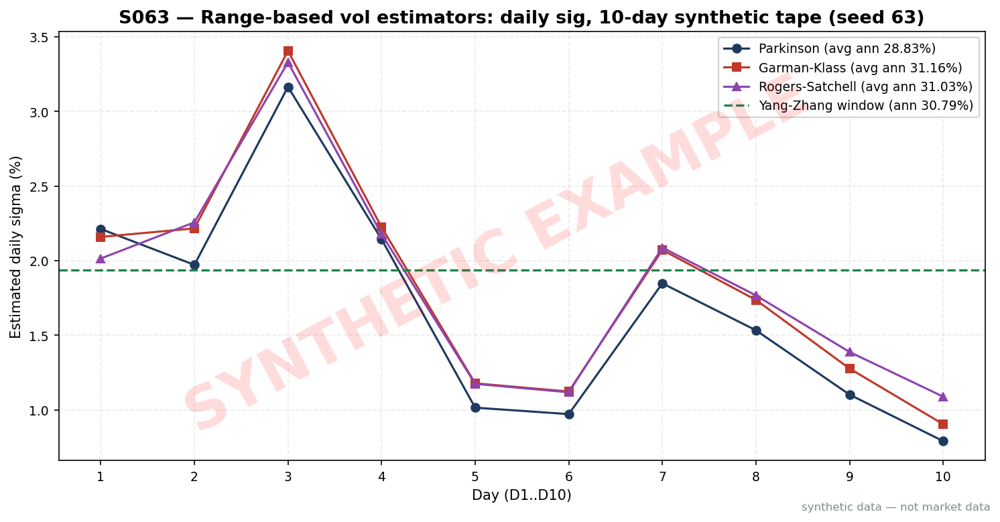

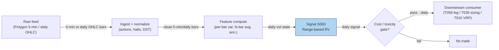
```mermaid
flowchart LR
    FEED["Raw feed<br/>(Polygon 5-min / daily OHLC)"] -->|"5-min or daily OHLC bars"| ING["Ingest + normalize<br/>(actions, halts, DST)"]
    ING -->|"clean 5-min/daily bars"| FEAT["Feature compute<br/>(per-bar var, N-bar avg, ann.)"]
    FEAT -->|"daily vol state"| SIG["Signal S063<br/>Range-based RV"]
    SIG -->|"daily signal"| GATE{"Cost / toxicity<br/>gate?"}
    GATE -->|"pass · daily"| OUT["Downstream consumer<br/>(T058 leg / T035 sizing / T010 VRP)"]
    GATE -->|fail| DROP["No trade"]
    style SIG fill:#aed6f1,stroke:#1f3a5f
```

### S12. Sources

1. Alizadeh, Sassan; Brandt, Michael W.; Diebold, Francis X. (2002). "Range-Based Estimation of Stochastic Volatility Models." *Journal of Finance* 57(3), 1047–1091. http://ideas.repec.org/a/bla/jfinan/v57y2002i3p1047-1091.html
2. Saichev, Alexander & Lapinova, Svetlana (2012). "Comparative statistics of Garman-Klass, Parkinson, Roger-Satchell and bridge estimators." arXiv:1202.4311. https://arxiv.org/pdf/1202.4311v1
3. MIT OpenCourseWare 18.642 (Fall 2024), Lecture 17.2 — cites Parkinson (1980), Garman & Klass (1980), Rogers & Satchell (1991), Yang & Zhang (2000) with journal refs. https://ocw.mit.edu/courses/18-642-topics-in-mathematics-with-applications-in-finance-fall-2024/mit18_642_f24_lec17_2.pdf
4. kuant docs, "realizedvol" — practitioner reference for all four estimators incl. efficiency notes (GK ~7.4× vs close-to-close). https://github.com/scramblehub/kuant/blob/HEAD/docs/kernels/stats/realizedvol.md
5. Duck.ai (bot: GPT-5.6 "Luna", anonymous), Q-SB2-1–Q-SB2-2 (2026-09-10). **Labeled chatbot source**: Parkinson/GK/RS formulas hand-verified; Q-SB2-2 leads inform S7/S8; cost-model takes precedence.

**Unverified leads:**
- Efficiency figures "5.2× / 8.4×" from the NTHU empirical-volatility-estimators working paper (search snippet; not fully re-verified — stated as the 7–8× range corroborated by kuant docs). http://mx.nthu.edu.tw/~jtyang/Teaching/Risk_management/Papers/Quant_Methods/Empirical%20Evidence%20on%20Volatility%20Estimators.pdf

**Source log:** Duck.ai answered Q-SB2-1–Q-SB2-3 (2026-09-10); Grok/Cursor answers pending (checked 2026-09-10).

---

---
## Stage 66/200 — S066: HAR realized-volatility forecast

*Batch SB2 · Signal 66/100 · Provenance [D] · Family E — Volatility & options-informed*

### S1. One-line verdict

| | |
|---|---|
| **What it is** | A 3-regressor linear model — HAR (Heterogeneous Autoregressive), Corsi 2009 — forecasting tomorrow's realized variance from today's, this week's, and this month's: the industry workhorse vol forecast. |
| **When it works** | Any market with persistent volatility clustering: forecasts beat GARCH-family models (GARCH: the classic daily-returns volatility model) on out-of-sample loss across equities, FX, futures, commodities. |
| **When it dies** | Structural breaks, jump-dominated days (sudden discontinuous price moves), microstructure-noise-contaminated RV, horizons far from the (1,5,22) design, tiny estimation samples. |
| **Build-or-buy in one line** | Build: OLS (ordinary least squares — plain linear regression) on three features is an afternoon; buy the 5-minute bars, not the model. |

Provenance **[D]**: the model, formula, and empirical claims are documented in Corsi (2009) and follow-up literature.

### S2. How it works — plain human explanation

At 4:00 p.m., the desk needs one number for tomorrow: how volatile will SPY be? The HAR answer says: look at three clocks — what volatility did *today* (day-traders), averaged *this week* (weekly rebalancers), and averaged *this month* (pension funds). Add them with weights: tomorrow's forecast. The deep idea — Corsi's Heterogeneous Market Hypothesis, borrowed from Müller et al. — is that markets are a cascade of agents with different horizons, and volatility at each horizon is driven by the horizons above it. A restricted AR on daily/weekly/monthly components reproduces the *long memory* of volatility (shocks decay slowly, over weeks) without fractional-integration machinery (a heavier technique for modeling slow-decaying memory).

Why does it beat GARCH? GARCH sees only daily returns and must infer volatility from squared daily surprises — a noisy, low-information signal. HAR feeds on **realized** volatility, measured from dozens of intraday returns per day: a far sharper lens. HAR is not cleverer; it is allowed better data. The model is almost embarrassingly linear, which is why it survives production: OLS, three features, positivity clipping (forcing negative forecasts up to a small positive floor), done.

- **Mental model, in three bullets:**
  - Volatility has three gears — daily, weekly, monthly — and tomorrow's vol is a weighted sum of the three.
  - HAR wins by *measurement* (intraday realized variance), not model complexity; a linear model on good data beats a nonlinear model on bad data.
  - It is a **forecast**, not a trade: the edge becomes money only through a consumer (vol targeting, VRP harvesting, execution scheduling).

### S3. The math — exact formula

Build daily realized variance (RV) from M intraday log-returns (5-minute standard, 78 per US equity session):

$$r_{t,j} = \ln P_{t,j} - \ln P_{t,j-1}, \qquad RV_t = \sum_{j=1}^{M} r_{t,j}^2$$

units: variance per day. (Realized *volatility* is √RV — the standard-deviation-scale number in S4 step 5.) The HAR-RV regression (Corsi 2009):

$$RV_{t+1} = \beta_0 + \beta_d\, RV_t + \beta_w\, \overline{RV}_{t}^{(5)} + \beta_m\, \overline{RV}_{t}^{(22)} + \varepsilon_{t+1}$$

$$\overline{RV}_{t}^{(h)} = \frac{1}{h}\sum_{j=1}^{h} RV_{t-j+1} \quad h \in \{5, 22\}$$

the trailing 5-day (weekly) and 22-day (monthly) means. Estimated by OLS on ≥250 days (1,000+ preferred); clip forecasts at a small positive floor since raw-RV HAR can print negative. Common variant: **log-HAR**, $\log RV_{t+1} = c + \beta^{(d)}\log RV_t^{(1)} + \beta^{(w)}\log RV_t^{(5)} + \beta^{(m)}\log RV_t^{(22)} + \varepsilon$, which handles RV's right skew (the recent literature's baseline).

| Parameter | Symbol | Typical range | Too small / too large | Default (example) |
|---|---|---|---|---|
| Intercept | β_0 | 0–1e-4 | negative → negative variance forecasts | 5e-5 |
| Daily weight | β_d | 0.2–0.5 | 0: ignores today's shock; >0.6: overfits noise | 0.40 |
| Weekly weight | β_w | 0.2–0.45 | — | 0.35 |
| Monthly weight | β_m | 0.1–0.3 | 0: loses long memory; too big: sluggish | 0.20 |
| Estimation window | — | 250–1,000+ days | <250: unstable β; rolling 1,000 preferred | 1,000 |
| Intraday sampling | M | 39–78 (5–10 min) | too fine: microstructure noise; too coarse: noisy RV | 78 (5-min) |

*Every default is example — not an institutional standard.* Causal timing: the forecast for day *t+1* uses only RV through day *t*; tradable no earlier than *t+1*'s open. Named variants: (1) **HAR-J / HAR-CJ** — adds jump components via bipower variation (jump-robust volatility estimator; Andersen et al. 2007; Corsi & Renò 2009); (2) **log-HAR** — log transform, positivity-safe; (3) **intraday HAR-D** — rebuilds RV over intraday bins with session/week lags (arXiv 2202.08962) [SR].

### S4. Worked example — step-by-step numbers (SYNTHETIC)

All data is **synthetic** — a hand-specified 22-day daily-RV tape reproducing the operator-verified Duck.ai example (script seed 66; the series is fixed, not drawn). **Correction notice:** the raw chatbot output reported the 22-day sum as 0.014821 (≈10% too high) with everything downstream derived from it; the numbers below are the operator hand-checked corrections. The chart `images/S066_example.png` plots exactly these values.

RV_t (daily realized variance), days 1–22:

0.000400, 0.000441, 0.000484, 0.000529, 0.000576, 0.000625, 0.000676, 0.000729, 0.000784, 0.000841, 0.000900, 0.000841, 0.000784, 0.000729, 0.000676, 0.000625, 0.000576, 0.000529, 0.000484, 0.000441, 0.000400, 0.000361

Step-by-step (example betas β = (0.000050, 0.40, 0.35, 0.20) — *not an institutional standard*):

1. Daily component: RV_22 = **0.000361**.
2. Weekly: mean of the last 5 = (0.000529+0.000484+0.000441+0.000400+0.000361)/5 = **0.000443**.
3. Monthly: 22-day sum = **0.013431** (chatbot said 0.014821 — wrong); RV_22(22) = 0.013431/22 = **0.000610500** (chatbot said 0.000673682 — wrong).
4. Forecast: RV̂_{23|22} = 0.000050 + 0.40×0.000361 + 0.35×0.000443 + 0.20×0.000610500 = 0.000050 + 0.0001444 + 0.00015505 + 0.0001221 = **0.000471550** (chatbot said 0.000484186 — wrong).
5. Vol: σ̂ = √0.000471550 = **0.021716 ≈ 2.1716%/day** (chatbot said 2.2004% — wrong); annualized: 0.021716 × √252 ≈ **34.47%** (chatbot said 34.93% — wrong).

**What to notice:** the arithmetic is OLS-grade trivial — four multiplications — yet every downstream number in the chatbot's answer was corrupted by one bad sum, which is why the operator verification step exists. Economically: the forecast (0.0004716) sits *below* the monthly mean (0.0006105) because the recent days are quiet — the cascade mean-reverts. This is a toy: betas are illustrative, not estimated; real β comes from OLS on hundreds of days. Nothing here is a backtest, and a forecast is not a P&L.

### S5. Strategies that use this signal

- **T041 — HAR Vol-Timing Overlay** — primary sizing input: scales intraday positions by the HAR forecast (S066 with S067, S076).
- **T010 — Variance-Risk-Premium Harvester** — forecast comparator: harvests the gap between implied variance (the market's option-implied volatility forecast) and realized variance by shorting implied when rich versus HAR (with S069, S063).

### S6. Data required — exact spec

| Field | Type | Granularity | Source tier | Notes |
|---|---|---|---|---|
| Intraday prices/returns | float | 5-min bars (78/day) | Tier 1–2 | Polygon minutes, Databento; 1-min resampled to 5-min is standard |
| Corporate actions | events | daily | Tier 1–2 | Overnight jumps contaminate RV; decide open-to-close vs close-to-close |
| Session calendar | date/bool | daily | Tier 1 | Half-days have fewer bins — rescale or exclude |
| Estimation history | derived | daily RV | — | ≥250 days, 1,000+ preferred, before first forecast |

Ingest sketch (Python/polars, ≤20 lines):

```python
import polars as pl, numpy as np
bars = pl.scan_parquet("silver/minutes_5min/*.parquet")      # 5-min OHLCV, split-adjusted
rv = (bars
    .with_columns(r=np.log(pl.col("close")/pl.col("close").shift(1)).over("symbol"))
    .group_by(["symbol","date"]).agg(pl.col("r").pow(2).sum().alias("rv"))
    .with_columns(rv5=pl.col("rv").rolling_mean(5).over("symbol"),
                  rv22=pl.col("rv").rolling_mean(22).over("symbol"))
    .drop_nulls().collect())
X = rv.select(["rv","rv5","rv22"]).to_numpy()                 # OLS: rv_{t+1} ~ rv, rv5, rv22
beta, *_ = np.linalg.lstsq(np.c_[np.ones(len(X)-1), X[:-1]], X[1:,0], rcond=None)
fc = max(beta @ np.r_[1, X[-1]], 1e-8)                        # positivity clip
```

Storage: 5-min bars for 500 symbols ≈ 500 × 78 × 8 bytes × ~10 cols ≈ 3 MB/day — trivial (cost-model §4: 1-min/500 symbols ≈ 50 MB/day). Data-quality checklist: overnight-return treatment (open-to-close avoids close-to-close jumps); half-days; microstructure noise (bid–ask bounce contaminating fine-sampled returns) below 5-min sampling (use realized kernels — noise-robust volatility estimators — or coarser bins); DST; corporate actions; stale bins on illiquid names.

### S7. Local build on M5 Max / 128GB

**Feasibility: feasible (easy).** The daily job: build 500 RV series from 39k 5-min bars, then OLS on 500 × ~1,000-row design matrices — a few seconds of numpy. Planning assumption (cost-model §2): simple Polars ops ~10–50M rows/sec, complex rolling/as-of ops ~1–10M rows/sec; the pipeline research puts 500 rolling HAR fits at 5–30 s (labeled lead). A full daily SB2 refresh (11.7M rows) runs 15–60 s in Polars (labeled lead), so HAR is a rounding error inside it. RAM: the RV panel is ~500 × 1,000 × 8 bytes ≈ 4 MB against the 77GB working budget (cost-model §3). **Python+polars+numpy** is the right stack; Rust unnecessary; the M5 GPU is irrelevant. Engineering: **Tier M, 20–60 h ≈ $3,000–9,000 loaded** (cost-model §5) — the model is an afternoon; the hours are RV construction choices (sampling, overnight treatment, jump filtering), rolling-validation harness, and monitoring. What breaks first at 500 symbols: nothing on this box; production breaks first on *data licensing* (redistributing 5-min history) and regime monitoring (a silent structural break makes every forecast confidently wrong).

### S8. Buy vs build

| Option | What you get | Price | Gains | Loses |
|---|---|---|---|---|
| Tier 1: Polygon Stocks Developer | 5-min/minute aggs, 10y | ~$30–200/mo (indicative — verify before budgeting) | Everything needed for RV + HAR | — |
| Tier 2: Databento Standard | SIP-grade intraday, OPRA research | ~$200/mo + usage (indicative — verify before budgeting) | Honest timestamps; jump-robust extensions need trades | Overkill for plain HAR |
| Tier 3: OptionMetrics IvyDB | Publication-quality options history | ~$thousands/yr academic; institutional $$$$ (indicative — verify before budgeting) | Only if HAR feeds an options book (T010) | Price |
| Precomputed vol forecasts | Vendor RV/HAR series | varies (indicative — verify before budgeting) | No code | Black-box sampling/overnight choices; definitions vary |

**Verdict: build the model, buy the bars.** HAR is four coefficients; what matters is RV construction and the consumer that turns the forecast into size. Buy precomputed only as a validation benchmark.

### S9. Success ratio / efficacy — documented evidence

| Study / source | Market & period | Metric | Before/after cost | Caveat |
|---|---|---|---|---|
| Corsi (2009), *J. Financial Econometrics* | S&P 500 futures, Treasuries FX | "Remarkably good forecasting performance"; reproduces long memory, fat tails (extreme moves more common than a bell curve predicts) | Before cost (forecast loss) | The founding result; in-sample + OOS (out-of-sample — data the model never saw in estimation) |
| Path-dependent HAR paper (arXiv 2503.00851) | SSE (the paper's Shanghai equity sample), rolling 600-day OOS | HAR family **much lower** MSE/MAE/HMSE/HMAE/QLIKE (a volatility forecast loss function — lower is better) than GARCH family; more MCS (model confidence set — a test keeping only models not significantly worse than the best) passes | **Before cost** (forecast accuracy) | Dataset-specific; HAR-PD (path-dependent HAR) variants best |
| Louzis, Xanthopoulos-Sissinis & Refenes (2012), *Economics Bulletin* | S&P 500, incl. 2007–09 | HAR-type-EVT (extreme value theory) beats GARCH-type-EVT on VaR (value-at-risk — a tail-loss risk measure) accuracy and Basel II capital efficiency | Before cost (risk metric) | Economic *utility*, not trading P&L |
| High-frequency enhanced VaR (PMC — PubMed Central) | Multi-asset, 1,242 OOS days | HAR-RV fluctuation test beats univariate GARCH; "all GARCH models less accurate than HAR-RV" | Before cost (forecast loss) | VaR application |
| Practitioner replication (guna-1610) | S&P 500 2011–2026, 2,769 OOS days | HAR-RV QLIKE 0.3824 vs GARCH(1,1) 0.4237, DM (Diebold–Mariano — a test of whether one forecast is significantly better than another) significant | Before cost (forecast loss) | Practitioner, but real data + proper tests |
| Duck.ai Q-SB2-3 (labeled lead) | Literature survey | HAR-type beats GARCH on forecast loss in several settings; **lower loss ≠ tradable edge** | Before cost | Chatbot synthesis; direction matches the papers above |

Regimes where it fails: structural breaks (betas estimated on the old regime), jump-dominated days (use HAR-J), microstructure-noise contamination at too-fine sampling, horizons far from (1,5,22), small estimation samples. No documented after-cost P&L exists for HAR *itself* — it is infrastructure; economic value must be proven through a consumer (vol targeting, VRP) with turnover and utility accounting.

**Honest bottom line:** HAR has the **strongest statistical evidence in this batch** — it forecasts volatility better than GARCH across markets, periods, and loss functions. As a *forecasting* edge it is real; as a *trading* edge it is unproven until a costed consumer exists.

### S10. Failure modes & pitfalls

1. **Forecast ≠ trade** — a 5% better QLIKE earns nothing without a consumer; mitigation: attach HAR to sizing/hedging (T041/T010), evaluate the *strategy* net of costs.
2. **Microstructure noise** — 1-min RV without correction is noise-dominated; mitigation: 5-min sampling, or realized kernels.
3. **Overnight treatment** — open-to-close vs close-to-close changes RV by the overnight share; mitigation: pick one, document it.
4. **Negative forecasts** — raw-RV OLS can print negative variance; mitigation: positivity clip or log-HAR.
5. **Structural breaks** — 2008/2020-style regimes invalidate old betas; mitigation: rolling windows, break monitoring.
6. **Jump contamination** — one flash-crash day dominates the monthly mean; mitigation: HAR-J with bipower variation.
7. **Lookahead in RV** — using revised/corrected bars; mitigation: point-in-time bars, as-of timestamps.
8. **Overfitting via extensions** — HAR-PD, threshold HAR, ML hybrids add parameters; mitigation: MCS/DM tests, embargoed OOS (see S088).

### S11. Visuals

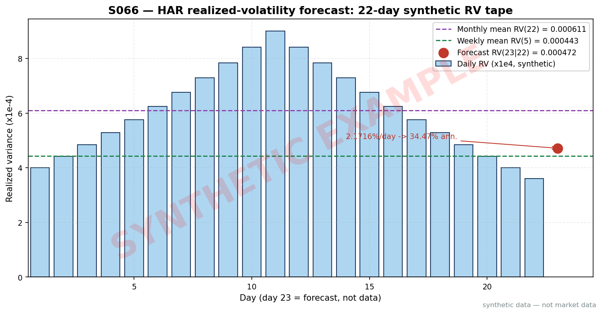

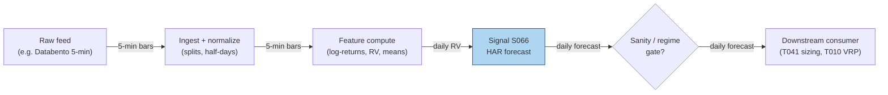
```mermaid
flowchart LR
    FEED["Raw feed<br/>(e.g. Databento 5-min)"] -->|5-min bars| ING["Ingest + normalize<br/>(splits, half-days)"]
    ING -->|5-min bars| FEAT["Feature compute<br/>(log-returns, RV, means)"]
    FEAT -->|daily RV| SIG["Signal S066<br/>HAR forecast"]
    SIG -->|daily forecast| GATE{"Sanity / regime<br/>gate?"}
    GATE -->|daily forecast| OUT["Downstream consumer<br/>(T041 sizing, T010 VRP)"]
    style SIG fill:#aed6f1,stroke:#1f3a5f
```

### S12. Sources

- Corsi, F. (2009). "A Simple Approximate Long-Memory Model of Realized Volatility." *Journal of Financial Econometrics*, 7(2), 174–196. http://ideas.repec.org/a/oup/jfinec/v7y2009i2p174-196.html
- "Forecasting realized volatility in the stock market: a path-dependent perspective" (2025). arXiv. https://arxiv.org/pdf/2503.00851 — HAR family vs GARCH family OOS loss + MCS tests.
- Louzis, D. P., Xanthopoulos-Sissinis, S., & Refenes, A. P. (2012). "Stock index Value-at-Risk forecasting: A realized volatility extreme value theory approach." *Economics Bulletin*, 32(1), 981–991. http://ideas.repec.org/a/ebl/ecbull/eb-11-00870.html
- "High-frequency enhanced VaR: A robust univariate realized volatility model" (2024). PMC. http://pmc.ncbi.nlm.nih.gov/articles/PMC11111067/ — HAR-RV vs GARCH fluctuation tests.
- "Volatility Forecasting with Machine Learning and Intraday Commonality" (2022). arXiv. http://arxiv.org/pdf/2202.08962 — intraday HAR-D / SARIMA (seasonal autoregressive integrated moving average) adaptation.

**Unverified leads** (chatbot-provided, no checkable source — do not treat as evidence):
- Duck.ai answered Q-SB2-1–Q-SB2-3 (2026-09-10); Grok/Cursor answers pending (checked 2026-09-10).
- HAR worked-example lead: the raw chatbot output contained a 22-day-sum error (0.014821 vs correct 0.013431); all downstream values used in S4 are the operator-verified corrections.
- Q-SB2-3 survey lead: "HAR-type beats GARCH on forecast loss in several settings" — direction consistent with the cited papers, but the synthesis itself is unverified; lower forecast loss ≠ tradable edge.
- Q-SB2-2 pipeline lead: 500 rolling HAR fits in 5–30 s; full SB2 daily refresh 15–60 s in Polars — labeled chatbot claims, not measured here.

---
## Stage 83/200 — S083: Imbalance/tick/volume/dollar bars

*Batch SB2 · Signal 83/100 · Provenance [D] · Family F — Statistical/ML infrastructure*

### S1. One-line verdict

| | |
|---|---|
| **What it is** | Alternative bar clocks: sample bars by trade count (tick), shares (volume), dollars traded, or signed-flow imbalance instead of wall-clock minutes. |
| **When it works** | Intraday feature pipelines: volume/dollar bars have better statistical properties (closer to Gaussian (bell-curve-shaped), less heteroskedasticity — variance that shifts over time) than minute bars; imbalance bars concentrate information arrival. |
| **When it dies** | Approximating them from minute OHLCV (open/high/low/close/volume — not equivalent to trade-built bars), mis-set imbalance thresholds, or downstream models assuming fixed time spacing. |
| **Build-or-buy in one line** | Build the sampler (an afternoon); buy the tick-trade feed — minute bars cannot reproduce true volume/imbalance bars. |

Provenance **[D]**: Easley, López de Prado & O'Hara (2012); López de Prado, *Advances in Financial Machine Learning* (2018), Ch. 2.

### S2. How it works — plain human explanation

It is 12:40 p.m.: the 12:35–12:40 bar on a liquid name holds 14 trades; the 9:30–9:35 bar held 4,000. A minute-bar pipeline treats those two bars as equals. Information does not arrive on a clock; it arrives with *trading activity*: a **tick bar** closes every N trades, a **volume bar** every V shares, a **dollar bar** every $D traded. At the open, bars fly past in seconds; at lunch, one bar takes minutes.

**Imbalance bars** go further: instead of fixed amounts of *activity*, they sample fixed amounts of *one-sided flow* — accumulate θ_T = Σ b_t·v_t and close when |θ_T| crosses a threshold. A bar now represents a fixed dose of *information* — informed, directional trading — regardless of duration. The economic story is Easley–López de Prado–O'Hara's: markets are not fast or slow, they are busy or quiet.

- **Mental model, in three bullets:**
  - Clock bars oversample quiet periods and undersample busy ones; activity clocks give every bar equal weight.
  - Dollar bars neutralize the *price-level* effect; imbalance bars neutralize the *noise*.
  - This is **infrastructure, not alpha**: bars make downstream statistics cleaner but predict nothing by themselves.

### S3. The math — exact formula

Let trades be indexed by *i* with price P_i, size q_i, and tick-rule sign b_i ∈ {+1, −1} (uptick +1, downtick −1, zero-tick reuses the previous sign).

- **Tick bars:** close every N trades (N *example*: 1,000–10,000 — *not an institutional standard*).
- **Volume bars:** close when Σ q_i ≥ V* (V* *example*: 1% of ADV (average daily volume)).
- **Dollar bars:** close when Σ P_i·q_i ≥ D* (D* *example*: $1M–$10M notional per bar).
- **Imbalance bars (tick):** θ_T = Σ_{i} b_i, close when |θ_T| ≥ E_0[T]·|E_0[θ]| — expected bar length × expected per-trade imbalance, EWMA-estimated (exponentially weighted moving average; mlfinlab implementation).
- **Imbalance bars (volume/dollar):** θ_T = Σ b_i·q_i (or Σ b_i·P_i·q_i), same close rule; the pipeline lead (Q-SB2-2, labeled) states it as: close when |Σθ_i| > E_0[|θ|]·n or a dynamic threshold.

Each bar then emits OHLCV: O = first P, H = max P, L = min P, C = last P, V = Σ q (dollars / shares / counts).

| Parameter | Symbol | Typical range | Too small / too large | Default (example) |
|---|---|---|---|---|
| Ticks per bar | N | 1k–50k | too small: noisy bars; too big: few bars/day | 5,000 |
| Shares per bar | V* | 0.1–2% of ADV | — | 1% of ADV |
| Dollars per bar | D* | $1M–$50M | too small on mega-caps: sub-second bars | $5M |
| Expected imbalance | E_0[θ] | estimated | mis-set: bars too fast (noise) or too slow (stale) | EWMA over 50 bars |
| Tick-rule fallback | — | — | zero ticks mishandled → sign drift | carry-forward (reuse the previous sign) |

*Every default is example — not an institutional standard.* Causal timing: bar *k* is complete only when its close condition fires; features on bar *k* are tradable no earlier than bar *k+1*'s first trade. Named variants: (1) **tick / volume / dollar** — fixed-activity clocks; (2) **tick / volume / dollar imbalance** — fixed-information clocks; (3) **run bars** (AFML — *Advances in Financial Machine Learning* (López de Prado, 2018), Ch. 2) — close on same-sign tick runs.

### S4. Worked example — step-by-step numbers (SYNTHETIC)

All data is **synthetic**: a 15-trade tape drawn with `rng = np.random.default_rng(83)`. `batches/SB2/plot_S083.py` regenerates it, and `images/S083_example.png` plots all 15 trades with the three boundary sets — numbers here and in the chart agree.

Tape (all 15 trades) — $ prices, share sizes, tick-rule sign:

| Trade | Price | Size | Sign | Trade | Price | Size | Sign |
|-------|-------|------|------|-------|-------|------|------|
| T1 | 99.49 | 1000 | +1 | T9 | 98.87 | 1000 | −1 |
| T2 | 99.34 | 300 | −1 | T10 | 98.64 | 1500 | −1 |
| T3 | 99.33 | 1500 | −1 | T11 | 98.88 | 500 | +1 |
| T4 | 99.46 | 800 | +1 | T12 | 99.07 | 1000 | +1 |
| T5 | 99.10 | 300 | −1 | T13 | 99.38 | 500 | +1 |
| T6 | 99.52 | 1500 | +1 | T14 | 99.20 | 200 | −1 |
| T7 | 99.59 | 200 | +1 | T15 | 99.47 | 800 | +1 |
| T8 | 99.41 | 500 | −1 | | | | |

Tick bars (every 5 trades), OHLC in $:

| Bar | O | H | L | C | #trades |
|-----|-------|-------|-------|-------|---------|
| TB1 | 99.49 | 99.49 | 99.10 | 99.10 | 5 |
| TB2 | 99.52 | 99.59 | 98.64 | 98.64 | 5 |
| TB3 | 98.88 | 99.47 | 98.88 | 99.47 | 5 |

Volume bars (every 3,000 shares — *example*):

| Bar | O | H | L | C | #trades |
|-----|-------|-------|-------|-------|---------|
| VB1 | 99.49 | 99.49 | 99.33 | 99.46 | 4 |
| VB2 | 99.10 | 99.59 | 98.87 | 98.87 | 5 |
| VB3 | 98.64 | 99.07 | 98.64 | 99.07 | 3 |

(open: T13–T15, 1,500 shares — the tape ends mid-bar.)

Imbalance bars (θ = Σ tick-sign × shares; close when |θ| ≥ 1,500 — *example*):

| Bar | O | H | L | C | #trades | θ at close |
|-----|-------|-------|-------|-------|---------|------------|
| IB1 | 99.49 | 99.59 | 98.64 | 98.64 | 10 | −1600 |
| IB2 | 98.88 | 99.07 | 98.88 | 99.07 | 2 | +1500 |

(open: T13–T15, θ = +1,100 — the tape ends mid-bar.)

**What to notice:** tick bars are metronomic (5 trades each) but informationally uneven — TB2 spans a 0.88 selloff into 98.64, TB3 the 0.59 snapback. Volume bars vary in trade count (3–5). Imbalance bars show the mechanism’s range: IB1 absorbs 10 trades — including the T6–T7 upticks — before the downtrend pushes θ to −1,600; IB2 closes after just 2 trades on the snapback (θ = +1,500). The tape ends mid-bar (T13–T15, θ = +1,100): carry it forward or discard.

### S5. Strategies that use this signal

- **T081 — Adaptive Bar-Clock Sampler** — primary infrastructure: selects the bar clock by regime for downstream signals (with S090, S067).
- **T044 — Diurnal Deseasonalization (removing the predictable intraday U-shaped activity pattern)** — bar clocks already remove much of the U-shaped seasonality before thresholding (with S067, S046).
- **T008 — Kalman Dynamic-Hedge Pairs** — entry timer: imbalance bars time the legs (with S052, S048).

### S6. Data required — exact spec

| Field | Type | Granularity | Source tier | Notes |
|---|---|---|---|---|
| Trades (price, size, ts) | float/int/ts | tick | Tier 2 | Databento MBP-1 (market-by-price, top of book)/trades; **minute OHLCV cannot reproduce true volume/imbalance bars** (labeled lead) |
| Trade direction/sign | ±1 or exchange flag | tick | Tier 2 | Tick rule when no flag; Lee–Ready (buyer/seller classification from the quote) needs quotes (S007) |
| Session calendar | date/bool | daily | Tier 1 | Overnight gap: reset or carry θ |

Ingest sketch (Python, streaming):

```python
theta, n, bars, V_STAR = 0, 0, [], 3_000_000   # example threshold
for tr in trade_stream(symbol, date):
    theta += tr.sign * tr.size                # imbalance; n += 1 for tick bars
    track_ohlc(tr)                             # running O/H/L/C
    if abs(theta) >= V_STAR:                   # shares/dollars for vol/$ bars
        bars.append(close_bar(theta)); theta, n = 0, 0
        reset_ohlc()
# open bar at session end is incomplete — carry forward, never backfill
```

Storage per symbol-day: liquid-name tick trades ≈ 2–8 GB/day parquet (cost-model §4) — keep per-symbol daily files, never hold 500 × 60 days in RAM. Data-quality checklist: timestamp normalization (exchange vs SIP (consolidated feed)); late/out-of-sequence prints; odd-lot (under 100 shares) and dark-pool (off-exchange) inclusion rules; tick-rule accuracy; splits.

### S7. Local build on M5 Max / 128GB

**Feasibility: feasible.** Bar building is a single streaming pass: Python handles ~100–500k events/sec (cost-model §2) — fine for ≤20 symbols of L1 (level-1: top-of-book quotes and trades); Rust does 5–50M events/sec for full-universe rebuilds. A 60-day, 500-symbol rebuild from per-symbol parquet is I/O-bound at ~1–3 GB/sec (cost-model §2): minutes. RAM: stream per-symbol files; never hold the panel. Stack: **Python** for research, **Rust** for a live-loop sampler. Engineering: **Tier L, 4–12 h ≈ $600–1,800 loaded** (cost-model §5). What breaks first at 500 symbols: tick-trade *storage and licensing*, not compute — 500 names of tick history is terabytes/year (cost-model §4).

### S8. Buy vs build

| Option | What you get | Price | Gains | Loses |
|---|---|---|---|---|
| Tier 2: Databento pay-as-you-go | Tick trades, honest timestamps | ~$200/mo + usage (indicative — verify before budgeting) | The only honest input for true bars | Bulky to archive |
| Tier 1: Polygon minute bars | 1-min OHLCV | ~$30–200/mo (indicative — verify before budgeting) | Cheap | **Cannot reproduce** true volume/dollar/imbalance bars (labeled lead) |
| Open-source: mlfinlab | Reference bar implementations | ~$0 (license check) (indicative — verify before budgeting) | Tested imbalance-bar algorithm | You still need the tick feed |
| Precomputed bars vendors | Bars as a service | varies (indicative — verify before budgeting) | No pipeline | Black-box thresholds; poor value |

**Verdict: build the sampler, buy the trades.** The sampler is an afternoon; the feed is the binding constraint.

### S9. Success ratio / efficacy — documented evidence

Bar clocks are infrastructure: there is no Sharpe (risk-adjusted return) to report. What is documented:

| Study / source | Market & period | Metric | Before/after cost | Caveat |
|---|---|---|---|---|
| Easley, López de Prado & O'Hara (2012), *J. Portfolio Management* | Theory + futures/ETF examples | Volume-clock returns closer to Gaussian, less heteroskedastic than clock-time returns | n/a (statistical property) | Econometric benefit, not a trade |
| VPIN / flash-crash reporting (2010) | E-mini S&P, May 6 2010 | VPIN (volume-clock toxicity metric) hit historic levels an hour+ before the flash crash (a minutes-long collapse and rebound) | n/a | Press account, not a backtest |
| mlfinlab practitioner docs | — | Reference imbalance-bar implementation; bars used "throughout AFML" for features | n/a | Practitioner adoption, not efficacy |

Costs: not applicable to the sampler — but cleaner bars make downstream cost models (spread — the bid–ask spread — and impact) better estimated. Any P&L claim for "bars" alone is a category error.

**Honest bottom line:** a **genuine, documented improvement** in intraday feature quality and a prerequisite for honest microstructure (how orders, quotes, and trades interact at short horizons) work (S008) — but no edge as a standalone "signal".

### S10. Failure modes & pitfalls

1. **Minute-bar approximation** — resampling 1-min OHLCV into "volume bars" is not the same object; mitigation: true bars require trades.
2. **Threshold mis-setting** — too-small thresholds produce noise bars, too large stale ones; mitigation: EWMA-estimated expected imbalance, monitored bar rates.
3. **Open-bar lookahead** — using the incomplete current bar's OHLC as a feature; mitigation: only closed bars enter features; carry the open bar explicitly.
4. **Session-boundary θ** — carrying imbalance overnight mixes regimes; mitigation: reset θ at the open, document the choice.
5. **Tick-rule error** — mis-signed trades corrupt θ; mitigation: prefer exchange flags; fall back to Lee–Ready with quotes (S007).
6. **Storage blowup** — archiving full tick history "just in case"; mitigation: build bars once, archive bars + a trade sample.
7. **Overfitting the clock** — tuning N/V*/D* on the backtest; mitigation: round thresholds a priori; the clock is plumbing, not a parameter to mine.

### S11. Visuals

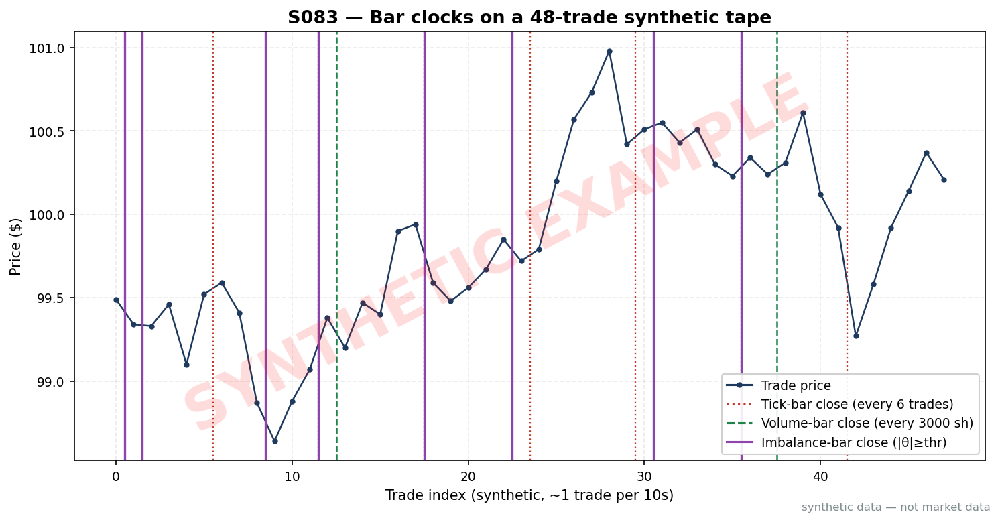

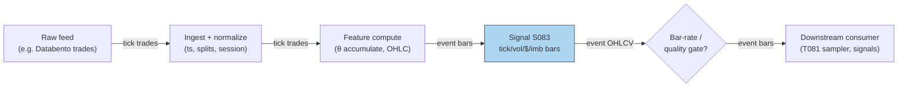
```mermaid
flowchart LR
    FEED["Raw feed<br/>(e.g. Databento trades)"] -->|tick trades| ING["Ingest + normalize<br/>(ts, splits, session)"]
    ING -->|tick trades| FEAT["Feature compute<br/>(θ accumulate, OHLC)"]
    FEAT -->|event bars| SIG["Signal S083<br/>tick/vol/$/imb bars"]
    SIG -->|event OHLCV| GATE{"Bar-rate /<br/>quality gate?"}
    GATE -->|event bars| OUT["Downstream consumer<br/>(T081 sampler, signals)"]
    style SIG fill:#aed6f1,stroke:#1f3a5f
```

### S12. Sources

- Easley, D., López de Prado, M. M., & O'Hara, M. (2012). "The Volume Clock: Insights into the High-Frequency Paradigm." *Journal of Portfolio Management*, 39(1), 19–29. https://jpm.pm-research.com/content/39/1/19.abstract (manuscript: http://ssrn.com/abstract=2034858)
- López de Prado, M. M. (2018). *Advances in Financial Machine Learning*. Wiley. (Ch. 2: tick/volume/dollar/imbalance bars; book.)
- mlfinlab documentation, "Data Structures" (imbalance-bar algorithm: θ_t = Σ b_t·v_t; close rule |θ_t| ≥ E_0[T]·[2v⁺ − E_0[v_t]]). https://github.com/quantopian/mlfinlab/blob/HEAD/docs/source/implementations/data_structures.rst
- "Stock Market 'Flash' Crashes Now Can be Predicted, Thanks to Cornell Metric" (2010). *Innovations Report*. https://www.innovations-report.com/global-finance/business-and-finance/stock-market-flash-crashes-predicted-cornell-metric-166800/ — VPIN account of the May 2010 flash crash.

**Unverified leads** (chatbot-provided, no checkable source — do not treat as evidence):
- Duck.ai answered Q-SB2-1–Q-SB2-3 (2026-09-10); Grok/Cursor answers pending (checked 2026-09-10).
- Q-SB2-2 pipeline leads: TRUE tick/volume/dollar/imbalance bars need trades — minute OHLCV cannot reproduce them exactly; close when |Σθ_i| > E_0[|θ|]·n or dynamic threshold; 500 × 390 × 60d = 11.7M rows, 15–60 s daily Polars refresh.
- "Practitioner replication (vpin)" lead — volume-time returns closer to normal than chronological-time on crypto (BTC perps) — moved here from the S9 evidence table: no checkable citation was found for it, so it is an unverified lead, not evidence.

---
## Stage 49/200 — S049: Distance-method pairs — Gatev–Goetzmann–Rouwenhorst

*Batch SB3 · Signal 49/100 · Provenance [D] · Family D — Pairs & cross-sectional arbitrage*

### S1. One-line verdict

| | |
|---|---|
| **What it is** | Rank stock pairs by how tightly their normalized price paths tracked over a formation window; trade divergences of the closest pairs as temporary mispricing. |
| **When it works** | Mean-reverting relative mispricing between close economic substitutes, especially in turbulent markets when liquidity-driven dislocations are common. |
| **When it dies** | Crowded post-2002 large-cap US; fundamental breaks (M&A, earnings shocks) that make a divergence permanent; high borrow costs on the short leg. |
| **Build-or-buy in one line** | Build the screen yourself (it is a one-afternoon vectorized job); buy survivorship-clean corporate-action data — that is where the real cost sits. |

### S2. How it works — plain human explanation

Imagine two large regional banks — call them Alpha and Beta. For a year their shares move in lockstep: same rates, same loan-book worries. Then a mutual fund liquidates a chunk of Beta for reasons unrelated to either bank (a redemption wave elsewhere). Beta falls 3% while Alpha barely moves. The pairs trader's read: these are close economic substitutes, the gap is plumbing rather than information, so she sells Alpha (the leader) and buys Beta (the laggard), betting the gap closes. If Beta fell because its loan book actually blew up, she loses — the divergence was real information, not noise.

The economic idea: prices of close substitutes share a common factor, so large *relative* moves are more likely transient supply/demand imbalances than permanent repricing. Arbitrageurs are paid to stand in front of those imbalances. Research adds a second leg: profits are strongest when divergences come from common shocks propagating at different speeds through the two stocks (slow reaction to shared news) rather than from firm-specific news (see S9).

- **Mental model, bullet 1:** Distance pairs = a bet that *relative* prices mean-revert when the two legs are economic substitutes — it is a relative-value trade, not a directional one.
- **Mental model, bullet 2:** The entry trigger is purely statistical (a 2σ spread), so every pair needs an economic sanity story — without one, you are trading noise that may never converge.
- **Mental model, bullet 3:** Costs and borrow decide everything: the gross edge decayed hard after the 1990s, and what survives today lives or dies on execution quality (see S9, S10).

### S3. The math — exact formula

**Normalization.** For each stock *i*, build a normalized price (a cumulative-return index that starts at 1.0 at the beginning of the formation window):

$$\tilde{P}_{i,t} = \prod_{s=1}^{t}(1 + r_{i,s}), \qquad \tilde{P}_{i,0} = 1$$

where $r_{i,s}$ is the total return (price change plus dividends) of stock *i* on day *s*.

**Pair distance.** Over the formation window $F$ (a set of trading days), the distance between stocks *i* and *j* is the sum of squared daily gaps between their normalized paths:

$$D_{ij} = \sum_{t \in F}\left(\tilde{P}_{i,t} - \tilde{P}_{j,t}\right)^2$$

**Selection.** Rank all candidate pairs by $D_{ij}$ ascending and keep the $N$ smallest-distance pairs (Gatev–Goetzmann–Rouwenhorst, henceforth GGR, used $N = 20$), subject to liquidity, borrow-availability, and corporate-action cleanliness screens.

**Trading rule.** For a selected pair $(A, B)$, the spread is $d_t = \tilde{P}_{A,t} - \tilde{P}_{B,t}$. From the formation window compute its mean $\mu_d$ and sample standard deviation $\sigma_d$. The trading signal is the z-score:

$$z_t = \frac{d_t - \mu_d}{\sigma_d}$$

- If $z_t \le -z_{\text{entry}}$: buy A, sell B (long the laggard, short the leader).
- If $z_t \ge +z_{\text{entry}}$: sell A, buy B.
- Close when $|z_t| \le z_{\text{exit}}$ (convergence), or at a maximum holding time, or at an adverse-move stop.

Positions are dollar-neutral 1:1 *on normalized prices* — i.e., equal notional in the two legs at entry.

**Causal timing.** $z_t$ is computed at the close of day *t* using only data $\le t$; the position is tradable no earlier than the *t+1* open. All parameter estimates (the pair list, $\mu_d$, $\sigma_d$) must come from information strictly before the trading interval — this is enforced again in S10.

| Parameter | Symbol | Typical range | Too small | Too large | Default (example) |
|---|---|---|---|---|---|
| Formation window | $T_F$ | 60–252 days | unstable pair list, noisy $\sigma_d$ | stale pairs, regime breaks inside window | 252 days |
| Trading window | $T_{trade}$ | 20–126 days | pairs never get room to converge | holding dead pairs, cost bleed | 126 days |
| Pairs traded | $N$ | 10–100 | idiosyncratic pair risk dominates | dilutes into marginal pairs | 20 |
| Entry threshold | $z_{\text{entry}}$ | 1.5–2.5$\sigma$ | overtrading, cost explosion | almost never trades | 2.0 |
| Exit threshold | $z_{\text{exit}}$ | 0–0.5$\sigma$ | exits before capturing the move | round trips, gives back profits | 0 (zero-cross) |
| Max hold | $H_{\max}$ | 10–60 days | cuts converging trades early | capital stuck in broken pairs | 30 days |

Every default above is `example — not an institutional standard`.

**Named variants.** (1) *Industry-restricted* — pair only within the same sector. (2) *Correlation-prefiltered* — require formation correlation above ~0.7–0.9 first. (3) *Volatility-normalized* (Do–Faff–Hamza style) — scale the spread by relative volatility so triggers are comparable across pairs.

### S4. Worked example — step-by-step numbers (SYNTHETIC)

All numbers below are **synthetic** — a hand-built toy tape, random seed **49**, plotted in `images/S049_example.png`. The chart plots exactly this table's numbers.

**Formation (12 days), normalized prices:**

| Day | A | B | C | A−B spread |
|---|---|---|---|---|
| 1 | 1.000 | 1.000 | 1.000 | 0.000 |
| 2 | 1.020 | 1.015 | 1.050 | 0.005 |
| 3 | 1.010 | 1.025 | 1.100 | −0.015 |
| 4 | 1.030 | 1.020 | 1.080 | 0.010 |
| 5 | 1.050 | 1.045 | 1.150 | 0.005 |
| 6 | 1.040 | 1.055 | 1.200 | −0.015 |
| 7 | 1.060 | 1.050 | 1.180 | 0.010 |
| 8 | 1.080 | 1.075 | 1.250 | 0.005 |
| 9 | 1.070 | 1.085 | 1.300 | −0.015 |
| 10 | 1.090 | 1.080 | 1.280 | 0.010 |
| 11 | 1.110 | 1.100 | 1.350 | 0.010 |
| 12 | 1.100 | 1.105 | 1.400 | −0.005 |

Pair distances: $D_{AB} = 0.001175$, $D_{AC} = 0.327000$, $D_{BC} = 0.325775$. The minimum-distance pair is **(A, B)** — C tracked neither. Formation spread statistics: $\mu_d = 0.000417$, $\sigma_d = 0.010326$ (sample std, 11 d.f.).

**Trading (next 6 days), pair (A, B), $z_{\text{entry}} = 2.0$, $z_{\text{exit}} = 0.5$ (both `example`):**

| Day | A | B | Spread | $z_t$ | Action |
|---|---|---|---|---|---|
| 13 | 1.120 | 1.095 | 0.0250 | +2.381 | **Open:** short 1.0 A, long 1.0 B |
| 14 | 1.130 | 1.105 | 0.0250 | +2.381 | Hold |
| 15 | 1.125 | 1.120 | 0.0050 | +0.444 | **Exit** ($\|z\| \le 0.5$) |
| 16–18 | — | — | 0.0050 | +0.444 | Flat |

**P&L walk (normalized units, gross, no fees):** short A: $1.120 - 1.125 = -0.005$; long B: $1.120 - 1.095 = +0.025$. Net $= +0.0200$ normalized units per unit of notional per leg. (If one normalized unit = $100 of capital, that is $2,000 on $200,000 of gross exposure.)

**Cost model — explicit components (`example`; the chapter's own stack).** Spread, fees, borrow, and impact/slippage are charged on every name, every leg, every round trip. Using the walk's own valuation ($100 per normalized unit → $2,000 gross on $200,000 gross exposure): **spread** (crossing the half-spread on entry and exit, both legs — 4 half-spread crossings ≈ 2 bps of $200,000) ≈ **$40**; **commissions/fees** ≈ **$20** ($5 per leg-side); **borrow** (short leg $100,000 × 50 bps annualized stock-loan × 2 days held) ≈ **$3**; **market impact/slippage** (1 bp of $200,000) ≈ **$20**. All-in ≈ **$83** → **net ≈ $1,917** on the $2,000 gross, i.e. +0.0192 normalized units per unit of per-leg notional. The gross-only walk is illustrative; a tradable S049 pays spread, fees, borrow, and impact on every rotation.

**What to notice.** The pipeline in miniature: the screen picks the sensible pair (A and B, not runaway C), and a liquidity-style shock to B triggers a textbook entry that converges two days later. Limits: the P&L walk above is the *gross* tape only — no fees, no bid–ask, no borrow cost, assumed fills; the tradable P&L is gross minus the explicit cost stack (spread + fees + borrow + impact/slippage) modeled in S10. Formation is 12 days — the real GGR design uses 12 months. No backtest claims are made from these numbers.

### S5. Strategies that use this signal

- **T031 — Distance Pairs + Quality Filter** — primary entry trigger: the distance screen selects the pairs and the z-score rule times entries; S053's zero-crossing quality filter then vets which divergences are worth trading. (Plan §3's explicit Signals list for T100 enumerates S082/S086/S088 only — S049 has no documented T100 role, so T031 is its sole verified consumer.)

### S6. Data required — exact spec

| Field | Type | Granularity | Source tier | Notes |
|---|---|---|---|---|
| Total-return prices (split/dividend adjusted) | float | daily OHLCV (open/high/low/close/volume) | Tier 0–1 | Must be truly adjusted; raw prices + factor files also fine |
| Raw close + corporate-action factors | float/date | daily | Tier 1–2 | For verifying adjustments; delisting returns included |
| Dollar volume / average daily volume (ADV) | float | daily | Tier 1 | Liquidity screen (min dollar volume) |
| Borrow availability / fee | float/bool | daily | Tier 2 | Short-leg feasibility; locate data |
| Ticker history, listing/delist dates | mapping/date | as events | Tier 1–2 | Point-in-time universe — anti-survivorship-bias control |
| 1-min bars | OHLCV | 1-min | Tier 1–2 | Only for the intraday port of the strategy |

**Collection method.** Daily bars from a vendor API (Tiingo EOD, Polygon stocks v3, or Stooq CSVs for Tier-0 prototyping); corporate actions from the vendor's splits/dividends endpoints; delistings from a survivorship-free dataset (S8). Ingest sketch (Python/polars, ≤20 lines):

```python
import polars as pl
bars = pl.read_parquet("raw/daily_bars.parquet")          # date, perm_id, o,h,l,c, volume, div, split
px = (bars.sort(["perm_id","date"])
          .with_columns(adj=pl.col("c") * pl.col("split").cumprod().over("perm_id")
                        + pl.col("div").cumprod().over("perm_id"))  # sketch: apply factors
          .with_columns(ret=pl.col("adj").pct_change().over("perm_id")))
norm = px.with_columns(npx=(1+pl.col("ret").fill_null(0)).cumprod().over("perm_id"))
universe = norm.join(point_in_time_universe, on=["date","perm_id"], how="inner")
universe.write_parquet("clean/daily_panel.parquet")
```

**Storage.** Per `notes/cost-model.md` §4: daily bars for 3,000 stocks ≈ 5 MB/day parquet — trivial; a 10-year panel is a few GB. The 1-min intraday port is ~50 MB/day for 500 symbols — archive selectively.

**Data-quality checklist.** Exchange calendar/DST/half-days; corporate actions — splits, dividends, spinoffs, the #1 silent killer of pairs screens; halts and limit moves; stale quotes on illiquid names; survivorship: the formation-time universe must be knowable *at that time* (point-in-time), or backtested returns are fiction.

### S7. Local build on M5 Max / 128GB

**Feasibility: feasible (Tier M).** The distance screen is one of the cheapest serious screens in quant finance: the whole job is normalization, a pairwise distance matrix, and ranking. A 2,000-stock × 10-year daily panel is ~50–200 MB in memory (labeled lead from the batch's chatbot Q&A; consistent with `notes/cost-model.md` §3's ~40 MB float64 figure for the raw panel), so everything fits comfortably inside the 77 GB working budget (§3).

**Throughput.** The dominant kernel is $X^T X$ for $X$ of shape $2520 \times 2000$: approximately $2 \cdot 2000^2 \cdot 2520 \approx 20.2$ billion multiply-adds full ($\approx 10$B for the upper triangle). **Correction to the batch's chatbot answer, which said "~5 billion multiply-adds" — that is ~4× too low; use the figures above.** Even so, this is a seconds-scale dense BLAS (Basic Linear Algebra Subprograms) call; the full screen (normalization, missing data, ranking, top-$k$) is a minute-scale job at most — a labeled chatbot lead puts the vectorized screen at ~1–10 s. Per cost-model §2, panel ingest is I/O-bound at ~1–3 GB/s parquet read, and 500 symbols × 390 1-min bars/day = 195k bars/day is trivial.

**Bottleneck:** data quality, not compute — corporate actions, delistings, and point-in-time universe construction (the chatbot's 150–300 h full-pipeline prototype estimate is dominated by exactly this; labeled lead, inside cost-model §5's Tier-M-plus-harness range).

| Stack | When to pick |
|---|---|
| Python + polars/numpy | Default: the whole screen is vectorizable; fastest to write and verify |
| DuckDB | If you want the panel queryable by SQL and partitioned by date |
| Rust | Only if you push the screen to 1-min rolling windows across thousands of symbols intraday |

**RAM.** Tens of MB for daily bars (1-day or 60-day); ~3 GB for 500 symbols of 1-min bars (§4) — fits easily in the 77 GB budget (§3).

**Engineering time.** Tier M per cost-model §5: **20–60 h** → **$3,000–$9,000** `loaded-cost estimate` at $150/hr, plus data. The point-in-time security master is the known schedule risk.

**What breaks first at 500 symbols / full OPRA:** nothing on daily bars. What would break is a naive per-pair Python loop over millions of pairs — vectorize or chunk. Full OPRA (Options Price Reporting Authority) is irrelevant to this signal.

### S8. Buy vs build

| Vendor / option | What you get | Indicative price | Buying gains | Buying loses |
|---|---|---|---|---|
| Tier-0: Stooq, Yahoo-style free bars | Daily OHLCV, weak corp-action history | ~$0 | Zero-cost prototyping | No survivorship control; unreliable adjustments |
| Tier-1: Tiingo EOD / EODHD | Adjusted daily bars, splits/dividends (labeled chatbot lead) | ~$20–100/mo `indicative — verify before budgeting` | Cheap, prototype-ready | Manual survivorship handling |
| Tier-1: Polygon Stocks Advanced | 1-min/real-time SIP (Securities Information Processor, the consolidated tape) bars, corp actions | ~$30–200/mo `indicative — verify before budgeting` | Covers the intraday port | History depth costs extra |
| Tier-2: Sharadar (Nasdaq Data Link) | Point-in-time, survivorship-free panel | tens–hundreds/mo `indicative — verify before budgeting` | Solves survivorship properly | Price; you still build the screen |
| Tier-2: Databento | L1/L2 (level-1 top-of-book / level-2 depth), futures, OPRA research | ~$200/mo + usage `indicative — verify before budgeting` | Honest microstructure data | Overkill for a daily screen |

**Verdict: build the screen, buy survivorship-clean data.** The algorithm is ~50 lines of numpy; no vendor sells your thresholds. The crossover: if you cannot verify your vendor's delisting and adjustment methodology, pay for the Tier-2 survivorship-free panel — a backtest on a survivor-only universe is worse than no backtest.

### S9. Success ratio / efficacy — documented evidence

| Study / source | Market & period | Metric | Before/after cost | Caveat |
|---|---|---|---|---|
| Gatev, Goetzmann & Rouwenhorst (2006), RFS | US equities, 1962–2002, top-20 pairs | ~11% ann. excess, self-financing | After conservative cost estimates | Long sample; pre-modern-crowding universe |
| Do & Faff (2010), FAJ | US equities, 1962–2009, top-20 pairs | 0.86%/mo (1962–88) → 0.37%/mo (1989–2002) → 0.24%/mo (2003–09) | Before explicit costs | The decay finding; strong in turbulence (GFC) |
| Rad, Low & Faff (2016), Quant. Finance (accepted ms.) | US equities, 1962–2014, distance method | 0.91%/mo (Sharpe 0.75) before; 0.38%/mo (Sharpe 0.35) after | Both | Their 1–7 bps cost model; 62.53% of trades converged |
| Do & Faff (2012), via Rad et al. | US equities, post-2002 | "Largely unprofitable after 2002" with costs | After costs | Harshest published read; implementation-sensitive |

**Documented decay.** Do & Faff (2010) confirm the decline GGR already noticed late in their sample: roughly a 3× fall in monthly excess return from the 1962–88 regime to 2003–09 — faster reactions, lower spreads, shorting frictions, common-factor shocks, and more pairs diverging without converging. Counterpoint: pairs trading performs strongly during prolonged turbulence (GFC), when dislocations are plentiful and arbitrage capital is constrained.

**Honest bottom line.** As a standalone trigger, plain distance pairs is a *decayed, implementation-sensitive* edge: underwriting a small liquid-large-cap operation at net Sharpe ~0.2–0.7 (labeled chatbot lead) with high uncertainty is the defensible stance; claimed net Sharpe > 1 demands point-in-time universes, delistings, realistic borrow, bid/ask execution, and untouched out-of-sample. As a *filter* inside T031, it remains genuinely useful.

### S10. Failure modes & pitfalls

- **Lookahead leakage** — estimating $\mu_d$, $\sigma_d$, or the pair list on data that overlaps the trading window. Mitigation: hard formation/trading split; the worked example estimates on days 1–12 only; automated leakage tests (permutation of the split).
- **Non-convergence / fundamental risk** — the divergence is real information (fraud, distress, M&A). Mitigation: industry restriction, news/earnings blackout around events, per-pair stop-loss and max-hold.
- **Survivorship bias** — backtesting on today's index members. Mitigation: point-in-time universe with delisting returns included.
- **Borrow cost and short squeezes** — hard-to-borrow names make the short leg punitive or recallable. Mitigation: pre-screen borrow availability/fees; model stock-loan fees explicitly in the cost model.
- **Corporate-action artifacts** — splits/dividends mis-adjustments fabricate "divergences". Mitigation: raw + factor data, cross-validate adjustments against a second source.
- **Crowding / alpha decay** — the documented post-2002 decay. Mitigation: trade less-crowded universes (smaller caps with realistic costs), faster reaction, or use distance only as a filter inside T031.

### S11. Visuals

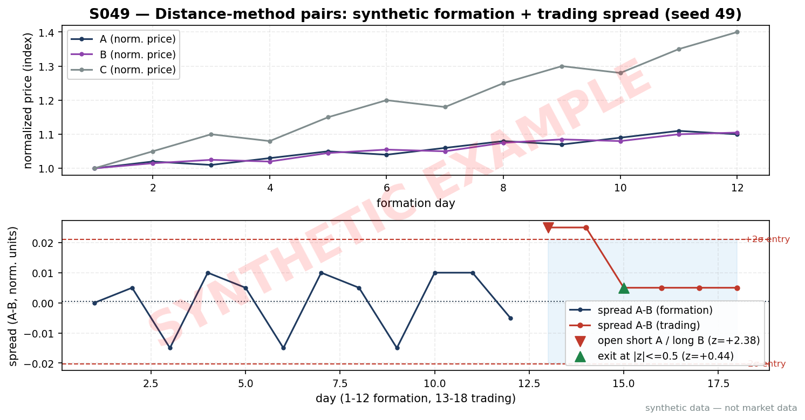

```mermaid
flowchart LR
    FEED["Raw feed\n(daily bars: CRSP (Center for Research in Security Prices)/Polygon/Stooq)"] -->|"daily OHLCV\n(open/high/low/close/volume)"| ING["Ingest + normalize\n(splits, dividends, delistings)"]
    ING -->|"clean daily panel"| FEAT["Feature compute\n(normalized prices, formation stats)"]
    FEAT -->|"pair-level daily spreads"| SIG["Signal S049\ndistance z-score"]
    SIG -->|"daily z-score breaches"| GATE{"Cost / borrow\ngate?"}
    GATE -->|"pass: pair signal"| OUT["Downstream consumer\n(T031 pairs book)"]
    GATE -->|"fail: no signal"| DROP["No trade"]
    style SIG fill:#aed6f1,stroke:#1f3a5f
```

### S12. Sources

- Gatev, E., Goetzmann, W. N. & Rouwenhorst, K. G. (2006). "Pairs Trading: Performance of a Relative-Value Arbitrage Rule." *Review of Financial Studies*, 19(3), 797–827. https://www.econbiz.de/Record/pairs-trading-performance-of-a-relative-value-arbitrage-rule-gatev-evan/10005564224 (RePEc record; abstract verifies ~11% annualized excess returns, 1962–2002, exceeding conservative transaction-cost estimates)
- Do, B. & Faff, R. (2010). "Does Simple Pairs Trading Still Work?" *Financial Analysts Journal*, 66(4), 83–95. https://ideas.repec.org/a/taf/ufajxx/v66y2010i4p83-95.html (verifies the 0.86 → 0.37 → 0.24 %/mo decay across 1962–88 / 1989–2002 / 2003–09 and strength in turbulence)
- Rad, H., Low, R. K. Y. & Faff, R. (2016). "The profitability of pairs trading strategies: distance, cointegration and copula methods." *Quantitative Finance* (accepted manuscript). https://pure.bond.edu.au/ws/portalfiles/portal/36339487/AM_The_profitability_of_pairs_trading_strategies.pdf (verifies distance-method 0.91%/mo before / 0.38%/mo after costs, 1962–2014)
- Krauss, C. (2017). "Statistical Arbitrage Pairs Trading Strategies: Review and Outlook." *Journal of Economic Surveys*, 31(2), 513–545. https://doi.org/10.1111/joes.12153 (survey of the pairs/statistical-arbitrage literature: methods, distance vs cointegration vs copula, and the documented post-2002 decay)
- Elliott, R. J., van der Hoek, J. & Malcolm, W. P. (2005). "Pairs trading." *Quantitative Finance*, 5(3), 271–276. https://doi.org/10.1080/14697680500149370 (mean-reverting spread model of pairs: formalizes the temporary-divergence/convergence economics behind the S2 mechanism)
- Caldeira, J. F. & Moura, G. V. (2013). "Selection of a Portfolio of Pairs Based on Cointegration: A Statistical Arbitrage Strategy." *Brazilian Review of Finance*, 11(1), 49–80. https://ideas.repec.org/a/bmf/borfin/v11y2013i1p49-80.html (16.38% annual excess return, Sharpe 1.34 on the São Paulo sample — a documented emerging-market counterpoint to the US decay finding)

Duck.ai answered Q-SB3-1–Q-SB3-3 (2026-09-10); Grok/Cursor answers pending (checked 2026-09-10)

**Unverified leads**
- *Unverified chatbot claim* (Duck.ai, GPT-5.6 Luna, 2026-09-10, Q-SB3-3): intraday cointegration-pairs study on S&P 500 minute data reporting ~50.5% annualized return and Sharpe ~8.14 "after its cost model" — the bot itself flags this as an upper-tail, spec-selected backtest; presented here only as an upper tail, never as a base case. No checkable citation obtained.
- *Unverified chatbot claim* (same source, Q-SB3-2): full pairs+HMM (hidden Markov model)+ML stack prototype at 150–300 engineering hours; Tiingo/EODHD ~$20–100/mo adequate for prototyping; Sharadar best for survivorship-free data. Used above only as labeled leads; cost-model numbers take precedence.

---
## Stage 50/200 — S050: Engle–Granger cointegration z-score

*Batch SB3 · Signal 50/100 · Provenance [D] · Family D — Pairs & cross-sectional arbitrage*

### S1. One-line verdict

| | |
|---|---|
| **What it is** | Regress one stock's (log) price on another's; if the residual is stationary (a fixed, finite-variance wobble), trade its z-score as a mean-reverting spread. |
| **When it works** | Two assets tied by a real economic link (same sector, ADR (American Depositary Receipt) pair, futures-spot) whose price gap is stationary over the estimation window. |
| **When it dies** | Structural breaks (mergers, regime changes) that kill the cointegrating relationship; scanning thousands of pairs without multiple-testing correction; intraday microstructure noise. |
| **Build-or-buy in one line** | Build — the two-step estimator is a weekend project; spend the budget on borrow data and a second price source instead. |

### S2. How it works — plain human explanation

Two stocks can both wander randomly — up 40% one year, down 30% the next — and yet never drift too far apart. Think of Coca-Cola and PepsiCo: each follows its own path, but the *gap* between their (log) prices behaves like a rubber band. Economists call this **cointegration**: each series is non-stationary on its own (economists say *integrated of order one*, I(1) — its variance grows with time, like a random walk), but a particular linear combination of them is stationary (I(0) — it wobbles around a fixed mean with finite variance). The Engle–Granger procedure (1987) finds that combination with an ordinary least-squares (OLS) regression, tests the leftover residual for stationarity, and hands you a spread to trade: when the residual stretches far from its mean, bet on the snap-back.

At 2:40 p.m., the z-score of the KO–PEP spread hits −2.3 — 2.3 standard deviations cheap versus recent history. The trader buys the spread (long the cheap leg, short the rich leg in the regression's **hedge ratio**, the shares of B per share of A that keeps the position neutral), and covers when the z-score reverts toward zero. Same economics as S049's distance pairs — temporary mispricing between substitutes — but with a statistically disciplined spread definition and an explicit test that it mean-reverts.

- **Mental model, bullet 1:** Cointegration = a *tested* long-run relationship, not just two lines that happened to move together. The ADF test is what separates this signal from curve-fitted chart-watching.
- **Mental model, bullet 2:** The hedge ratio is estimated, not God-given — and the estimate is only as good as the formation window. Regime breaks silently convert your "stationary" spread into a trending loss.
- **Mental model, bullet 3:** Everything after the regression is plumbing: z-score thresholds, stops, and costs decide whether a statistically beautiful spread is a tradable one.

### S3. The math — exact formula

**Step 1 — cointegrating regression (formation window).** Regress (log) prices:

$$ \log P^A_t = \alpha + \beta \, \log P^B_t + \varepsilon_t $$

(levels $P^A_t = \alpha + \beta P^B_t + \varepsilon_t$ are also used; logs make $\beta$ a clean elasticity). The **hedge ratio** is $\hat{\beta}$: a long-spread position holds 1 unit of A against $\hat{\beta}$ units of B. Dollar neutrality is enforced separately: $q_A P^A_t \approx q_B P^B_t$. **Regression direction matters** — regressing A-on-B is not the same as B-on-A; choose the direction on economic grounds or test both with a pre-specified rule.

**Step 2 — stationarity test.** Run the Augmented Dickey–Fuller (ADF) regression on the residual $\hat{\varepsilon}_t$:

$$ \Delta \hat{\varepsilon}_t = \gamma \, \hat{\varepsilon}_{t-1} + \sum_{j=1}^{p} \phi_j \, \Delta \hat{\varepsilon}_{t-j} + u_t $$

Test $H_0: \gamma = 0$ (no cointegration — the residual has a **unit root**, i.e. it wanders forever) against $H_1: \gamma < 0$ (stationary, mean-reverting). **Use Engle–Granger/MacKinnon critical values, NOT ordinary t-distribution cutoffs** — the residual comes from an estimated regression, so standard tables are too lenient.

**Step 3 — z-score signal.** With rolling mean $\mu_{S,t}(L)$ and standard deviation $\sigma_{S,t}(L)$ of the spread over lookback $L$:

$$ z_t = \frac{S_t - \mu_{S,t}(L)}{\sigma_{S,t}(L)}, \qquad S_t = P^A_t - \hat{\alpha} - \hat{\beta} P^B_t $$

Enter at $|z_t| > z_{\text{entry}}$; exit at $z_t \to 0$ (or $|z_t| \le z_{\text{exit}}$); stop at $|z_t| > z_{\text{stop}}$ or a max holding time. Mandatory: a stop/time-stop, and a **multiple-testing correction** (adjusting significance thresholds when you test many pairs, so lucky coincidences don't flood the book — e.g. Bonferroni/Holm or false discovery rate (FDR) control) when scanning many pairs.

**Causal timing.** $z_t$ is computed at event/close $t$ using only data $\le t$; tradable no earlier than $t+1$. The regression coefficients and the ADF test are estimated on the formation window only — strictly before the trading interval (see S4 and S10).

| Parameter | Symbol | Typical range | Too small | Too large | Default (example) |
|---|---|---|---|---|---|
| Formation window | $T_F$ | 126–504 days | unstable $\hat{\beta}$, weak ADF power | stale relationship, breaks inside window | 252 days |
| z lookback | $L$ | 20–120 days | noisy $\sigma$, whipsaw entries | slow to adapt to new volatility | 60 days |
| Entry | $z_{\text{entry}}$ | 1.5–2.5 | overtrading | never trades | 2.0 |
| Exit | $z_{\text{exit}}$ | 0–0.5 | leaves money on the table | round trips | 0 |
| Stop | $z_{\text{stop}}$ | 2.5–4 | stopped by noise | catastrophic non-convergence | 3.0 |
| Max hold | $H_{\max}$ | 10–60 days | cuts slow convergences | dead capital in broken spreads | 30 days |
| ADF lags | $p$ | 0–5 (AIC/BIC — Akaike/Bayesian information criteria) | residual autocorrelation biases test | over-parameterized, low power | AIC-selected |

Every default is `example — not an institutional standard`.

**Named variants.** (1) *Johansen vector error-correction model (VECM)* (S055) — multivariate, handles $n>2$ legs. (2) *Kalman dynamic hedge* (S052) — the hedge ratio $\beta_t$ adapts over time. (3) *Zero-crossing-gated* (S053) — entries filtered by formation zero-crossing reliability.

### S4. Worked example — step-by-step numbers (SYNTHETIC)

All numbers below are **synthetic** — the hand-verified 20-day tape from the batch's chatbot Q&A (Duck.ai, GPT-5.6 Luna, 2026-09-10), with the operator-verified corrections applied. Random seed **50** pins the plotting script; the tape itself is a deterministic construction: $P^B_t = 100 + t$, $e_t = [-2,-1,0,1,2,1,0,-1,-2,0,2,1,0,-1,-2,-1,0,1,2,0]$, $P^A_t = 2P^B_t + e_t$. The stipulated spread $S_t = P^A_t - 2P^B_t = e_t$ is internally consistent as stipulated.

**Verified corrections to the chatbot's arithmetic** (operator hand-checked, used below): the spread's sum of squares is **32** (the bot said 40 — its listed squares 4,1,0,1,4,1,0,1,4,0,4,1,0,1,4,1,0,1,4,0 do sum to 32); the full-sample standard deviation is **$\sqrt{32/19} \approx 1.298$** (the bot said 1.451); the full-sample day-15 z is **$-2/1.298 \approx -1.541$** (the bot said −1.378). The 1.25-entry threshold still fires on day 15; the 2.0 entry still does not fire — **trade setup and conclusions are unchanged**, only the numbers are corrected.

**Correction to the chatbot's OLS sentence.** The bot claimed its tape implies $\hat{\alpha} \approx 0$, $\hat{\beta} \approx 2.00$ with deviations "uncorrelated with trend to rounding precision" — **wrong**. From its own table: $\sum e_t(t-10.5) = 20$, $\sum (t-10.5)^2 = 665$, so the true OLS estimates are $\hat{\beta} = 2 + 20/665 \approx \mathbf{2.0301}$ and $\hat{\alpha} = 221 - 2.0301 \times 110.5 \approx \mathbf{-3.32}$. The $S_t = P_A - 2P_B$ construction is internally consistent as stipulated; only the OLS-description sentence was inaccurate.

**Causally honest trading version.** In live trading, $\mu$ and $\sigma$ must come from information strictly before the trading interval. So: estimation on days 1–14 ($\mu_{14} = 0.0000$, $\sigma_{14} = 1.3009$), trading from day 15 on. (An ADF test on 20 observations has essentially no power — the two-step procedure is shown for mechanics, not as evidence of stationarity.)

| Day | $P_B$ | $P_A$ | Spread $S_t$ | $z_t$ (vs. days 1–14) | Action |
|---|---|---|---|---|---|
| 1–14 | 101.0 → 114.0 | 200.0 → 227.0 | $e_t$ per tape | −1.537 … +1.537 | **Estimation window only** — no trading |
| 15 | 115.0 | 228.0 | −2 | **−1.537** | **Enter long spread:** long 1 A @ 228.0, short 2 B @ 115.0 |
| 16 | 116.0 | 231.0 | −1 | −0.769 | Hold |
| 17 | 117.0 | 234.0 | 0 | 0.000 | **Exit** (zero-cross) |
| 18 | 118.0 | 237.0 | +1 | +0.769 | Flat |
| 19 | 119.0 | 240.0 | +2 | +1.537 | Flat |
| 20 | 120.0 | 240.0 | 0 | 0.000 | Flat |

Full 20-day tape (every value is plotted in the chart): $P^B_t = 100+t$; $P^A_t$ = 200.0, 203.0, 206.0, 209.0, 212.0, 213.0, 214.0, 215.0, 216.0, 220.0, 224.0, 225.0, 226.0, 227.0, 228.0, 231.0, 234.0, 237.0, 240.0, 240.0; spread $S_t = e_t$ as listed above. Estimation on days 1–14: $\mu_{14} = 0.0000$, $\sigma_{14} = 1.3009$; day-15 full-sample check: $z_{15} = -2/1.2978 \approx -1.541$.

Entry uses the `example` threshold $|z| > 1.25$; the first *trading* day breaching it is day 15 ($z_{15} = -1.537$; full-sample check: $-1.541$). **P&L walk (spread-points, gross, no fees):** A leg: $234.0 - 228.0 = +6.00$; B leg: $2 \times (115.0 - 117.0) = -4.00$. Net **$+2.00$ spread-points** as the spread runs from −2 to 0. `images/S050_example.png` plots exactly this spread with the ±1.25σ/±2σ bands estimated on days 1–14.

**Cost model — explicit components (`example`; the chapter's own stack).** Spread, fees, and impact/slippage are charged on every leg of every round trip. On the +2.00-spread-point gross above, value it at $100 per spread-point so the A leg is ~$22,800, the B leg ~$23,000, gross exposure ≈ $45,800: **spread** (crossing the half-spread on entry and exit, both legs — 4 half-spread crossings ≈ 2 bps of $45,800) ≈ **$9**; **commissions/fees** ≈ **$4** ($1 per leg-side); **borrow** (short B leg $23,000 × 50 bps annualized stock-loan × 2 days held) ≈ **$1**; **market impact/slippage** (1 bp of $45,800) ≈ **$5**. All-in ≈ **$19** → **net ≈ $181** on the $200 gross (+2.00 spread-points), i.e. **+1.81 spread-points**. Any tradable version of S050 pays spread, fees, borrow, and impact on every round trip.

**What to notice.** The tape is a clean laboratory: the spread oscillates with amplitude ~1.5σ, the entry fires on the first eligible trading day, and convergence arrives in two days. Its limits: the spread was *constructed* stationary, so this demonstrates mechanics, not edge — real spreads break. The P&L walk above is the *gross* tape only — no fees, no bid–ask, no borrow cost, assumed fills; the tradable P&L is gross minus the explicit cost stack (spread + fees + borrow + impact/slippage) modeled in S10. No backtest claims are made from these numbers.

### S5. Strategies that use this signal

- **T007 — Cointegration Z-Score Pairs** — primary entry trigger: the EG two-step estimates the hedge ratio and the z-score times entries, with Ornstein–Uhlenbeck (OU) half-life exits and a zero-crossing quality filter.
- **T031 — Distance Pairs + Quality Filter** — confirmatory filter: S050's regression hedge ratio cross-checks distance-selected pairs (S049) so the traded spread is the cointegrating one, not the naive 1:1.

### S6. Data required — exact spec

| Field | Type | Granularity | Source tier | Notes |
|---|---|---|---|---|
| Synchronized mids or lasts | float | daily or 1-min | Tier 1–2 | Same currency; timestamps aligned across legs |
| Corporate actions + delistings | factors/dates | daily/events | Tier 1–2 | Same as S049 — adjustments make or break the regression |
| Dollar volume / average daily volume (ADV) | float | daily | Tier 1 | Liquidity screen before the ADF screen |
| Borrow availability / fee | float/bool | daily | Tier 2 | Short-leg feasibility |
| Ticker history, listing dates | mapping/date | as events | Tier 1–2 | Point-in-time universe |

**Collection method.** Same panel pipeline as S049, plus a synchronization step (asof-join the two legs to common timestamps — critical intraday). Ingest sketch (Python/polars, ≤20 lines):

```python
import polars as pl
bars = pl.read_parquet("clean/daily_panel.parquet")       # from S049 pipeline
a = bars.filter(pl.col("perm_id") == "A").select("date", pl.col("adj").log().alias("la"))
b = bars.filter(pl.col("perm_id") == "B").select("date", pl.col("adj").log().alias("lb"))
pair = a.join(b, on="date", how="inner").sort("date")     # synchronized, same currency
form = pair.head(252)                                      # formation window only
beta = form.select(pl.cov("la","lb")/pl.var("lb")).item()  # OLS hedge ratio
pair = pair.with_columns(spread=pl.col("la") - beta*pl.col("lb"))
```

**Storage.** Same as S049: daily panel trivial (~5 MB/day for 3,000 stocks, cost-model §4); synchronized 1-min pairs for a few hundred candidates are MBs/day.

**Data-quality checklist.** Timestamp synchronization (async prints create fake spreads intraday); same-currency legs; corporate actions on *both* legs; bid–ask bounce contaminating 1-min spreads (use mids); survivorship/point-in-time as in S049.

### S7. Local build on M5 Max / 128GB

**Feasibility: feasible (Tier M).** Pairs screens including the cointegration engine are explicitly Tier M in `notes/cost-model.md` §5. The EG two-step is OLS plus one ADF per candidate — the expensive part is the pair *screen*, so pre-screen 2M pairs by distance/correlation first, then run EG on 10k–100k survivors (labeled chatbot lead, consistent with §2's vectorized rates).

**Throughput.** OLS hedge ratios vectorize across candidates (~50–200M elements/sec per §2); the ADF shortlist is seconds to minutes. Rolling z on a few hundred live pairs is trivial. Bottleneck: data cleaning and the point-in-time security master, not the statistics.

| Stack | When to pick |
|---|---|
| Python + polars/numpy/statsmodels | Default: `statsmodels.tsa.stattools.adfuller` for the shortlist |
| DuckDB | Panel storage + candidate pre-screening in SQL |
| Rust | Only for full-universe rolling EG on 1-min bars |

**RAM.** Panel ~40–200 MB (§3); ADF shortlist negligible. Well inside the 77 GB budget.

**Engineering time.** Tier M, **20–60 h** → **$3,000–$9,000** `loaded-cost estimate` at $150/hr, plus data. Add ~10–20 h for the multiple-testing correction and leakage-test harness if built properly.

**What breaks first at 500 symbols / full OPRA (Options Price Reporting Authority):** running `adfuller` per pair in a Python loop over 2M pairs (hours+). Pre-screen first — liquidity filter → distance/correlation → EG on survivors. OPRA irrelevant to this signal.

### S8. Buy vs build

| Vendor / option | What you get | Indicative price | Buying gains | Buying loses |
|---|---|---|---|---|
| Tier-0: Stooq / free bars | Daily OHLCV (open/high/low/close/volume) | ~$0 | Prototype the regression today | No survivorship control; no borrow data |
| Tier-1: Tiingo / EODHD | Adjusted dailies + corp actions | ~$20–100/mo `indicative — verify before budgeting` | Cheapest adequate prototype stack (labeled lead) | Manual survivorship handling |
| Tier-1: Polygon Stocks Advanced | 1-min SIP (Securities Information Processor, the consolidated tape) bars | ~$30–200/mo `indicative — verify before budgeting` | Synchronized intraday legs | History depth costs extra |
| Tier-2: Sharadar | Survivorship-free point-in-time panel | tens–hundreds/mo `indicative — verify before budgeting` | Solves the delisting problem | Price |
| Precomputed pairs analytics (various) | Candidate pair lists | varies | Idea generation / cross-check | Must verify their universe, window, regression direction, cost treatment — benchmark, not signal engine (labeled lead) |

**Verdict: build the estimator, buy clean data.** The EG two-step is textbook statistics; the value is in *your* formation windows, *your* multiple-testing discipline, and *your* cost model. Never outsource hedge-ratio estimation to a black box you can't audit.

### S9. Success ratio / efficacy — documented evidence

| Study / source | Market & period | Metric | Before/after cost | Caveat |
|---|---|---|---|---|
| Rad, Low & Faff (2016), Quant. Finance (accepted ms.) — cointegration method | US equities, 1962–2014 | 0.85%/mo (Sharpe 0.77) before costs; 0.33%/mo (Sharpe 0.35) after costs | Both, side by side | Their 1–7 bps cost model; 61.35% of trades converged; converged trades averaged 4.37% (Sharpe 1.62) |
| Gatev, Goetzmann & Rouwenhorst (2006) | US equities, 1962–2002 | ~11% ann. excess, self-financing | After conservative cost estimates | Distance-method baseline; the cointegration literature benchmarks against it |
| Do & Faff (2010) | US equities, 1962–2009 | 0.86 → 0.37 → 0.24 %/mo across subperiods | Before explicit costs | The decay finding applies to pairs generally, cointegration included |

**Regimes where it fails.** Earnings and M&A (the cointegrating vector snaps); volatility shocks and auctions intraday; halts and one-leg liquidity loss; borrow recalls; index rebalances. The dominant risk is the spread ceasing to be stationary — which is exactly what the formation-window ADF said wouldn't happen. Intraday adds bid–ask bounce, asynchronous prints, and fragmentation (all labeled per H6 in S10).

**On the high intraday Sharpes in the literature.** One large S&P 500 minute-data study is reported (via the batch's chatbot Q&A) at ~50.5% annualized return and Sharpe ~8.14 "after its cost model" — the bot itself correctly flags this as an **upper-tail, spec-selected backtest**, and no checkable citation could be obtained, so it stays in Unverified leads, **never as a base case**. Conservative underwriting: daily/slow-intraday net Sharpe ~0.2–0.8; 5–30-minute liquid pairs ~0.3–1.0; Sharpe 2+ is exceptional. A net Sharpe ≈ 0.5 is already respectable.

**Honest bottom line.** As a standalone trigger, EG pairs are a *better-defined but unstable, capacity-limited* edge — the hedge ratio is principled, but breaks are the business model risk. As the spread-definition layer inside T007 (with half-life exits) or as T031's confirmation filter, it earns its keep.

### S10. Failure modes & pitfalls

- **Lookahead leakage** — estimating $\hat{\beta}$, the ADF, $\mu$, or $\sigma$ on data overlapping the trading interval; using smoothed (not filtered) regime estimates. Mitigation: hard formation/trading split — the worked example uses days 1–14 for estimation and trades from day 15; purged/embargoed validation (S088).
- **Multiple testing** — scanning 2M pairs at 5% significance manufactures hundreds of "cointegrated" pairs by luck. Mitigation: Bonferroni/Holm or FDR correction (the report entry mandates it); pre-screen economically sensible universes first.
- **Spurious regression** — OLS on two independent random walks *always* finds a "relationship". Mitigation: the ADF step is load-bearing; never trade a pair that fails it.
- **Regression-direction and window instability** — A-on-B ≠ B-on-A; $\hat{\beta}$ drifts across windows. Mitigation: pre-specified direction rule; monitor rolling $\hat{\beta}$; consider the Kalman variant (S052).
- **Cointegration breakdown** — the residual stops being stationary (corporate events, regime change). Mitigation: stop-loss at $z_{\text{stop}}$, max hold, re-estimate on a schedule, news blackout.
- **Intraday microstructure contamination** — bid–ask bounce and async prints fabricate spread wiggles. Mitigation: synchronized mids, 5-min+ bars to start, `simulated only — requires market-by-order (MBO)/ITCH (Nasdaq's ITCH direct feed)` honesty on any latency claim.
- **Cost blowup** — two legs, round trip, plus borrow on the short. Mitigation: all-in cost model per trade; the after-cost rows in S9 are the real benchmark.
- **Staleness** — formation relationships decay; a $\hat{\beta}$ from 2022 may not describe 2026. Mitigation: scheduled re-estimation (daily–monthly), walk-forward discipline.

### S11. Visuals

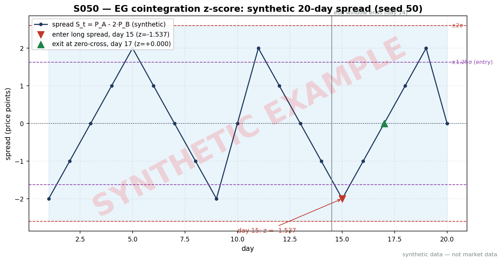

```mermaid
flowchart LR
    FEED["Raw feed\n(synchronized mids, daily/1-min)"] -->|"daily OHLCV"| ING["Ingest + normalize\n(corp actions, same currency)"]
    ING -->|"clean daily pair panel"| FEAT["Feature compute\n(OLS hedge ratio, ADF, rolling z)"]
    FEAT -->|"daily residual z-series"| SIG["Signal S050\nEG cointegration z-score"]
    SIG -->|"daily z-score breaches"| GATE{"Cost / borrow\ngate?"}
    GATE -->|"pass: pair signal"| OUT["Downstream consumer\n(T007 pairs book)"]
    GATE -->|"fail: no signal"| DROP["No trade"]
    style SIG fill:#aed6f1,stroke:#1f3a5f
```

### S12. Sources

- Engle, R. F. & Granger, C. W. J. (1987). "Co-integration and Error Correction: Representation, Estimation, and Testing." *Econometrica*, 55(2), 251–276. http://ideas.repec.org/a/ecm/emetrp/v55y1987i2p251-76.html (RePEc record verifying the two-step estimator and the cointegration/error-correction representation theorem)
- Rad, H., Low, R. K. Y. & Faff, R. (2016). "The profitability of pairs trading strategies: distance, cointegration and copula methods." *Quantitative Finance* (accepted manuscript). https://pure.bond.edu.au/ws/portalfiles/portal/36339487/AM_The_profitability_of_pairs_trading_strategies.pdf (verifies cointegration-method 0.85%/mo before / 0.33%/mo after costs, Sharpe 0.77/0.35, 1962–2014)
- Schaffer, M. E. (2010, rev. 2022). "EGRANGER: Stata module to perform Engle–Granger cointegration tests." http://ideas.repec.org/c/boc/bocode/s457210.html (documents the EG test procedure and MacKinnon (1990, 2010) critical values used instead of ordinary t-tables)
- Elliott, R. J., van der Hoek, J. & Malcolm, W. P. (2005). "Pairs trading." *Quantitative Finance*, 5(3), 271–276. https://doi.org/10.1080/14697680500149370 (continuous-time mean-reverting spread model: the theoretical counterpart to the discrete EG residual trade)
- Caldeira, J. F. & Moura, G. V. (2013). "Selection of a Portfolio of Pairs Based on Cointegration: A Statistical Arbitrage Strategy." *Brazilian Review of Finance*, 11(1), 49–80. https://ideas.repec.org/a/bmf/borfin/v11y2013i1p49-80.html (cointegration-based pair selection with documented after-cost excess returns on a non-US sample)
- Krauss, C. (2017). "Statistical Arbitrage Pairs Trading Strategies: Review and Outlook." *Journal of Economic Surveys*, 31(2), 513–545. https://doi.org/10.1111/joes.12153 (survey placing the EG two-step among distance/cointegration/copula methods and documenting the post-2002 decay)

Duck.ai answered Q-SB3-1–Q-SB3-3 (2026-09-10); Grok/Cursor answers pending (checked 2026-09-10)

**Unverified leads**
- *Unverified chatbot claim* (Duck.ai, GPT-5.6 Luna, 2026-09-10, Q-SB3-1/Q-SB3-3): worked-example tape and procedure notes — operator hand-verified the arithmetic (sum of squares 32, std ≈ 1.298, day-15 z ≈ −1.541; true OLS $\hat{\beta} \approx 2.0301$, $\hat{\alpha} \approx -3.32$). Verified numbers are used in S4; unverified procedural claims are not promoted to evidence.
- *Unverified chatbot claim* (same source): S&P 500 minute-data intraday pairs study at ~50.5% annualized return, Sharpe ~8.14 "after its cost model" — the bot itself flags this as an upper-tail, spec-selected backtest. Preserved only as an upper tail; not a base case. No checkable citation obtained.
- Vidyamurthy, G. (2004). *Pairs Trading: Quantitative Methods and Analysis* (Wiley) — cited by the report entry as the practitioner reference; no checkable URL obtained, so not listed among the verified sources.

---
## Stage 56/200 — S056: ETF vs basket / iNAV arbitrage

*Batch SB3 · Signal 56/100 · Provenance [D/SR] · Family D — Pairs & cross-sectional arbitrage*

### S1. One-line verdict

| | |
|---|---|
| **What it is** | An exchange-traded fund (ETF) must track its basket; when its market price deviates from intraday NAV (iNAV) beyond creation/redemption costs, authorized participants arbitrage it — everyone else trades the statistical leftovers. |
| **When it works** | Liquid ETFs with clean baskets during orderly markets: deviations are small, frequent, and snap back via the creation/redemption mechanism. |
| **When it dies** | Without authorized-participant (AP) status you cannot create/redeem — you harvest only the crumbs APs leave; during stress, iNAV itself goes stale and the "arb" is a mirage. |
| **Build-or-buy in one line** | Buy the iNAV + basket feed; build the monitor; do not kid yourself that watching a premium on screen equals a tradable arbitrage. |

### S2. How it works — plain human explanation

An ETF is a fund that trades like a stock. It holds a basket of securities (say, the 500 stocks of the S&P 500 in index weights), and throughout the day the exchange publishes its **iNAV** — the *intraday net asset value*, also called the indicative optimized portfolio value (iOPV) — roughly every 15 seconds: the live value of one ETF share's slice of the basket. In a perfect world the ETF's market price would equal iNAV tick for tick.

The world is kept near-perfect by **authorized participants (APs)** — large broker-dealers with a signed agreement letting them transact directly with the ETF issuer. When the ETF trades at a **premium** (market price above iNAV/basket value), an AP buys the underlying basket in index weights, delivers it to the issuer, receives a **creation unit** (a big block of new ETF shares — typically 50,000 shares), and sells those shares into the premium. The extra supply pushes the ETF price back toward fair value, and the AP keeps the difference minus costs. When the ETF trades at a **discount**, the AP does the reverse: buys the cheap ETF shares, tenders them to the issuer (**redemption**), receives the underlying basket, and sells it.

Now the desk at 10:47 a.m.: QTE, a liquid equity ETF, prints $100.15 while its iNAV reads $100.00 — a 15-basis-point (bp; 1 bp = 0.01%) premium. The full loop (buy $5M of basket, pay the creation fee, deliver, sell 50,000 ETF shares) costs about 5 bps all-in. The 15 bps premium clears the cost bound, so the AP desk creates. An hour later QTE shows a 4 bps premium — visible on every screen on the street, but below the 8 bps round-trip cost bound: *visible but not monetizable*. That gap between "deviation exists" and "deviation pays" is the entire signal.

- **Mental model, bullet 1:** The ETF price is tethered to the basket by AP arbitrage, not by magic — the tether's strength equals (creation/redemption costs)⁻¹.
- **Mental model, bullet 2:** iNAV is an *indication*, not a tradable price: stale components, closed foreign markets, and wide-spread constituents all make it lie a little.
- **Mental model, bullet 3:** For non-APs this is a basis trade with basis risk, not an arbitrage — size it like one.

### S3. The math — exact formula

**Premium/discount.** With $P_{\text{ETF},t}$ the ETF's market price and $\text{iNAV}_t$ the intraday NAV at time $t$:

$$ \text{premium}_t = \frac{P_{\text{ETF},t} - \text{iNAV}_t}{\text{iNAV}_t} $$

**Basket residual.** With constituent prices $P_{i,t}$ and index weights $w_i$ from the official **PCF** (portfolio composition file — the issuer's daily recipe of what one creation unit contains):

$$ \text{residual}_t = P_{\text{ETF},t} - \sum_i w_i P_{i,t} $$

**Actionable bound.** Trade only if the deviation clears the all-in cost bound $c$ (`example — not an institutional standard`):

$$ |\text{premium}_t| > c, \qquad c = \text{spread} + \text{fees} + \text{financing} + \text{impact/slippage} + \text{risk reserve} $$

**Creation loop (premium $> c$):** buy the creation basket in index weights → deliver basket to issuer → receive creation units → sell ETF shares. **Redemption loop (discount, $-\text{premium} > c$):** buy ETF shares → tender to issuer → receive basket → sell basket. The non-AP statistical proxy skips the issuer entirely: short the rich leg, buy the cheap leg, exit on convergence.

**Causal timing.** iNAV prints on a ~15-second cadence; the basket leg must be executable at the observed constituent prices. The signal at snapshot $t$ is tradable no earlier than $t+1$ (and only if the basket can actually be assembled — see S10).

| Parameter | Symbol | Typical range | Too small | Too large | Default (example) |
|---|---|---|---|---|---|
| Cost bound | $c$ | 3–20 bps | trades noise, loses to costs | never trades | 8 bps |
| iNAV cadence | — | 15 sec | stale signal | — | 15 sec |
| Creation unit | — | 25,000–100,000 shares | — | capital-intensive per loop | 50,000 shares |
| Exit | — | convergence / end of day | gives back the snap-back | wears overnight basis risk | premium < $c/2$ |

Every default is `example — not an institutional standard`.

**Named variants.** (1) *Full-replication creation arb* — the AP loop above, exact PCF weights. (2) *Statistical ETF-vs-basket* — non-AP proxy with futures or a subset basket as the hedge leg. (3) *ETF-vs-ETF basis* — two ETFs on the same index (Petajisto-style): no basket assembly needed, but the deviation must still clear two-way trading costs.

### S4. Worked example — step-by-step numbers (SYNTHETIC)

All numbers below are **synthetic** — a 12-snapshot tape for a fictitious ETF "QTE", random seed **56**, plotted in `images/S056_example.png`. Actionable cost bound: **8 bps** (`example — not an institutional standard`). Creation unit: **50,000 shares × $100 = $5,000,000 notional** — arithmetic independently verified (VanEck's issuer documentation confirms 50,000-share creation blocks; at 5 bps of notional one creation captures $5{,}000{,}000 \times 0.0005 = \mathbf{\$2{,}500}$ gross).

**P&L walk for the snapshot-6 creation (gross → net):** gross capture = $50{,}000 \times \$100.00 \times 0.0015 = \mathbf{\$7{,}500}$. Costs (`example` schedule — explicit components): **spread** (crossing the bid–ask: basket leg 1.0 bp on $5M = $500; ETF leg 0.75 bp on $5,007,500 ≈ $375) ≈ **$875**; **fees** (creation fee $500 + commissions $125) = **$625**; **market impact/slippage** (adverse basket-assembly drift + execution slippage: basket leg 1.0 bp = $500; ETF leg 0.75 bp ≈ $375) ≈ **$875**; **financing/misc** $125. Total costs ≈ **$2,500** → **net ≈ $5,000** per creation unit. The snapshot-9 episode (+4 bps) would gross $2,000 against the same ~$2,500 cost stack — a certain loss, so no trade.

| Snapshot (5-min) | iNAV | ETF price | Premium (bps) | Action |
|---|---|---|---|---|
| 1 | 100.00 | 100.00 | 0.0 | — |
| 2 | 100.02 | 100.03 | 1.0 | — |
| 3 | 99.98 | 99.99 | 1.0 | — |
| 4 | 100.01 | 100.02 | 1.0 | — |
| 5 | 100.03 | 100.04 | 1.0 | — |
| 6 | 100.00 | 100.15 | **15.0** | **CREATE:** buy $5M basket → deliver → sell 50,000 ETF @ 100.15 |
| 7 | 100.02 | 100.14 | 12.0 | (position on; premium compressing) |
| 8 | 99.99 | 100.00 | 1.0 | Converged |
| 9 | 100.01 | 100.05 | 4.0 | **No trade:** 4 bps < 8 bps bound — visible but not monetizable |
| 10 | 100.00 | 100.01 | 1.0 | — |
| 11 | 100.02 | 100.01 | −1.0 | — |
| 12 | 100.01 | 100.01 | 0.0 | — |


**What to notice.** The example is really about the bound, not the premium: the market prints deviations all day (snapshots 2–5, 9–11), and only one clears costs. Its limits: fills are assumed at printed prices, the basket assembles instantly with no drift, and the creation fee/schedule is illustrative. Real creation economics add adverse basket-assembly drift and tracking error. No backtest claims are made from these numbers.

### S5. Strategies that use this signal

- **T009 — ETF-vs-Basket Arbitrage** — primary trigger: the premium-vs-cost-bound signal fires the creation/redemption loop, confirmed by the futures-spot lead-lag signal (S059).
- **T039 — ETF Creation/Redemption Flow Trader** — primary flow trader: S056's discount/premium dislocations are confirmed by block volume (S094) and relative volume (S032) to trade the AP flow footprint itself.

### S6. Data required — exact spec

| Field | Type | Granularity | Source tier | Notes |
|---|---|---|---|---|
| ETF quotes (bid/ask/last) | float | real-time / 1-sec | Tier 1–2 | Multi-venue preferred; NBBO (national best bid and offer) at minimum |
| iNAV / iOPV | float | ~15-sec | Tier 1–2 (exchange feed) | Indicative only — stale components possible |
| Constituent prices | float | real-time | Tier 1–2 | Same timestamps as the ETF print |
| PCF (portfolio composition file) | weights | daily | Issuer (free) | Official basket recipe per creation unit |
| Creation-unit size + fee schedule | int/float | as published | Issuer | e.g. 50,000 shares; fees vary by fund |
| Corporate actions on constituents | factors | daily/events | Tier 1–2 | Basket must reflect today's composition |

**Collection method.** ETF + constituent quotes from a consolidated feed (Databento multi-venue, Polygon SIP — the Securities Information Processor, the consolidated tape); iNAV from the listing exchange's feed; PCF scraped daily from the issuer site. Ingest sketch (Python/polars, ≤20 lines):

```python
import polars as pl
etf = pl.read_parquet("raw/etf_quotes.parquet")      # ts, bid, ask, last
inav = pl.read_parquet("raw/inav.parquet")           # ts, inav  (~15-sec cadence)
pcf = pl.read_csv("raw/pcf_QTE.csv")                 # constituent, weight
px = (etf.join_asof(inav.sort("ts"), on="ts", strategy="backward", tolerance="15s")
         .with_columns(mid=(pl.col("bid")+pl.col("ask"))/2)
         .with_columns(prem_bps=(pl.col("mid")-pl.col("inav"))/pl.col("inav")*1e4))
signals = px.filter(pl.col("prem_bps").abs() > 8.0)  # 8 bps bound: example
```

**Storage.** Per cost-model §4: 1-min bars for the ETF + a few hundred constituents ≈ tens of MB/day — trivial. Tick-level multi-venue quote storage for a full ETF universe gets heavy fast; monitor a watchlist, archive selectively.

**Data-quality checklist.** iNAV staleness (closed foreign markets, halted components); PCF vs actual basket drift (cash, futures, swaps inside the fund); timestamp alignment across venues; corporate actions; creation-halt/restriction notices from the issuer.

### S7. Local build on M5 Max / 128GB

**Feasibility: feasible (Tier M).** A premium monitor is a streaming join plus arithmetic — computationally trivial. It is Tier M rather than Tier L because of the real-time plumbing: synchronized multi-symbol quote ingestion, PCF management, and a decision loop on 15-second iNAV cadence.

**Throughput.** Per cost-model §2, Python event loops handle ~100–500k events/sec — plenty for an ETF watchlist on L1; the premium panel recompute is microseconds per symbol. Bottleneck: feed latency and quote normalization, not CPU.

| Stack | When to pick |
|---|---|
| Python + polars | Default: the monitor is a streaming join; fastest to verify |
| Rust | If you co-locate and need microsecond quote handling (then you're not really "local" anymore) |
| DuckDB | Historical premium/discount research over archived panels |

**RAM.** Live working set: MBs. 60 days of 1-min bars for 200 ETFs + top constituents: hundreds of MB (§4) — fits easily in the 77 GB budget (§3).

**Engineering time.** Tier M, **20–60 h** for the monitor + cost-bound engine + paper-trading harness → **$3,000–$9,000** `loaded-cost estimate` at $150/hr, plus data. AP connectivity and prime-brokerage setup (if pursued) are a separate institutional project, not included.

**What breaks first at 500 symbols / full OPRA (Options Price Reporting Authority):** *data licensing*, not compute — full-universe constituent-level real-time data plus historical iNAV gets expensive. And none of this buys AP status or low-latency execution; a home Mac cannot compete with co-located AP desks on speed.

### S8. Buy vs build

| Vendor / option | What you get | Indicative price | Buying gains | Buying loses |
|---|---|---|---|---|
| Tier-0: exchange delayed quotes + issuer PCFs | 15-min delayed ETF/iNAV, free basket recipe | ~$0 | Learn the mechanics free | Useless for live signals |
| Tier-1: Polygon / Alpaca SIP | Real-time SIP quotes, 1-min bars | ~$30–200/mo `indicative — verify before budgeting` | Cheapest live premium monitor | SIP latency vs direct feeds; no depth |
| Tier-2: Databento multi-venue | Consolidated L1/L2 (level-1 top-of-book / level-2 depth), futures, OPRA research | ~$200/mo + usage `indicative — verify before budgeting` | Honest synchronized basket pricing | Overkill for a watchlist monitor |
| Academic: exchange TAQ (trades and quotes) / LOBSTER (Limit Order Book System — The Efficient Reconstructor)-style | Replay-grade history | ~hundreds/yr academic `indicative — verify before budgeting` | Proper historical premium research | Not real-time; licensing limits |

**Verdict: buy the feed, build the monitor.** Nobody sells "your cost bound" — the bound depends on your fees, financing, and execution skill, so the signal logic must be yours. The crossover: if you need full-universe historical iNAV for research, price the academic/TAQ route before building a scraper farm. And the hard truth: no vendor sells AP status — without it you are building the *statistical proxy*, so underwrite accordingly (see S9).

### S9. Success ratio / efficacy — documented evidence

| Study / source | Market & period | Metric | Before/after cost | Caveat |
|---|---|---|---|---|
| Petajisto (2017), "Inefficiencies in the Pricing of Exchange-Traded Funds", *Financial Analysts Journal* | US ETFs, multi-asset sample | ETFs with identical portfolios: average price deviation ~100 bps; larger in international/non-Treasury bond funds, minor in diversified US equity and Treasury funds | Before-cost research measurement (deviations, not net P&L) | Metrics as reported by CFA Institute/FPA coverage of the paper; deviations ≠ profits |
| Petajisto (2017), trading-strategy result (same coverage) | High-deviation ETF asset classes | Up to ~16% annual Carhart four-factor alpha from a strategy exploiting pricing inefficiencies | Before-cost backtest (gross alpha) | Requires actually capturing the deviations; APs/MMs (market makers) capture the cleanest ones first |
| "Active Trading in ETFs" (2021), *Financial Analysts Journal* v77n2, via CFA Institute summary | Large ETF sample over time | High-frequency algorithmic trading activity reduces the persistence of ETF mispricing; prices more accurate when HFT present | Research finding (not a P&L number) | Secondary summary; directionally: the easy deviations get arbed away faster over time |
| BIS Quarterly Review (Mar 2018), "Trading mechanisms of ETFs" | Structural | AP creation/redemption + secondary-market arbitrage keep ETF prices near NAV | Mechanism description | Confirms the bound logic of S3; not a return figure |

**The monetizability caveat (preserved).** iNAV ≠ a free arbitrage price: stale prices, closed foreign markets, wide-spread components, futures/swaps inside the fund, corporate actions, creation restrictions, and different trading hours all inject phantom deviations. The batch's chatbot evidence summary puts it bluntly and correctly: *most visible iNAV deviations are not monetizable after costs* — the cleanest dislocations go to APs, ETF market makers, and low-latency prop firms. A small non-AP operation is left with illiquid-ETF dislocations, auction/rebalance effects, ETF-futures basis, cross-venue execution, and event-driven dislocations — lower frequency, smaller bps, execution-exposed, capacity-limited.

**Honest bottom line.** As a *signal*, ETF-vs-basket premium is a real, measurable, economically grounded quantity. As a *standalone P&L source* for a non-AP desk, it is a thin basis trade: underwrite small, trade only clean deviations that clear a conservative bound, and expect the Sharpe to come from discipline (not trading the 4-bps prints) rather than from edge magnitude.

### S10. Failure modes & pitfalls

- **No AP access** — you cannot create/redeem, so the "arbitrage" is a basis trade wearing someone else's convergence. Mitigation: size as a statistical trade; demand wider bounds; track AP flow (T039) instead of pretending to be one.
- **Stale iNAV** — closed foreign markets or halted components make iNAV a stale guess; the premium is fiction. Mitigation: freshness flags per constituent; widen the bound when staleness is high; skip affected funds.
- **Lookahead leakage** — using the published end-of-day NAV or a revised PCF as if known intraday. Mitigation: point-in-time PCFs; all estimates from information strictly before the trading snapshot.
- **Creation restrictions / halts** — issuers can and do restrict creations; the tether snaps exactly when you need it. Mitigation: monitor issuer notices; hard position caps around events.
- **Basket-assembly drift** — by the time your basket is assembled, prices moved against you (adverse drift), plus tracking error vs the PCF. Mitigation: model assembly cost explicitly; prefer liquid large-cap ETFs.
- **Cost-bound optimism** — underestimating impact on 500 names at once. Mitigation: the S4 cost stack is a floor, not a ceiling; stress the bound at 2× before sizing.
- **Latency** — SIP-vs-direct and 15-sec iNAV cadence mean the print you see is not the market you get. Any latency-sensitive claim here is `simulated only — requires MBO (market-by-order)/ITCH (Nasdaq's ITCH direct feed)`.
- **Overfitting the bound** — tuning the 8 bps threshold on history until it "works". Mitigation: bound comes from your actual fee schedule, not from optimization.

### S11. Visuals


```mermaid
flowchart LR
    FEED["Raw feeds\n(ETF quotes, iNAV, PCF weights)"] -->|"15-sec quotes"| ING["Ingest + normalize\n(timezones, halts, PCF join)"]
    ING -->|"aligned 15-sec premium panel"| FEAT["Feature compute\n(premium vs cost bound)"]
    FEAT -->|"15-sec premium bps series"| SIG["Signal S056\nETF-vs-basket premium"]
    SIG -->|"15-sec premium signal"| GATE{"AP access +\ncost gate?"}
    GATE -->|"pass: arb signal"| OUT["Downstream consumer\n(T009 / T039 arb book)"]
    GATE -->|"fail: no signal"| DROP["No trade"]
    style SIG fill:#aed6f1,stroke:#1f3a5f
```

### S12. Sources

- VanEck. "ETF 101/102: The Inner Workings of ETF Creations and Redemptions." https://vaneck.com/us/en/blogs/thematic-investing/etf-102-the-inner-workings-of-etf-creations-and-redemptions (issuer documentation verifying the AP creation/redemption loop and 50,000-share creation blocks)
- ETF.com. "ETF Univ: What Is The Creation/Redemption Mechanism?" https://www.etf.com/sections/etf-report-features/etf-univ-what-creationredemption-mechanism (verifies the premium/discount arbitrage loop and the 50,000-share redemption example)
- Bank for International Settlements. "Trading mechanisms of ETFs compared with other fund types." *BIS Quarterly Review*, March 2018 (extract). https://www.bis.org/publ/qtrpdf/r_qt1803z.htm (verifies APs transacting in primary and secondary markets as the mechanism keeping ETF prices near NAV)
- Jain, A., Jain, C. & Jiang, C. X. (2021). "Active Trading in ETFs: The Role of High-Frequency Algorithmic Trading." *Financial Analysts Journal*, 77(2), 66–82. https://ideas.repec.org/a/taf/ufajxx/v77y2021i2p66-82.html (verifies the S9 finding: higher algorithmic trading reduces ETF price-deviation magnitude and persistence through intraday arbitrage and narrower spreads)
- Petajisto, A. (2017). "Inefficiencies in the Pricing of Exchange-Traded Funds." *Financial Analysts Journal*, 73(1), 24–54 — via CFA Institute coverage: https://www.cfainstitute.org/about/press-room/2018/cfa-institute-financial-analysts-journal-announces-2017-winners and https://www.financialplanningassociation.org/article/journal/SEP17-new-research-wealth-management-and-behavioral-finance-deserves-your-attention (verifies ~100 bps average deviation for identical-portfolio ETFs, larger in international/bond funds, ~16% gross Carhart four-factor alpha result, and the 15-second IIV/iNAV cadence)
- Lettau, M. & Madhavan, A. (2018). "Exchange-Traded Funds 101 for Economists." *Journal of Economic Perspectives*, 32(1), 135–154. https://doi.org/10.1257/jep.32.1.135 (the ETF architecture survey: creation/redemption mechanics, AP incentives, and the liquidity/tax/transparency structure behind the S3 bound logic)
- Ben-David, I., Franzoni, F. & Moussawi, R. (2018). "Do ETFs Increase Volatility?" *Journal of Finance*, 73(6), 2471–2535. https://doi.org/10.1111/jofi.12727 (documents the arbitrage channel's flip side: ETF ownership raises underlying-stock volatility — the stress-regime caveat for basis trades)

Duck.ai answered Q-SB3-1–Q-SB3-3 (2026-09-10); Grok/Cursor answers pending (checked 2026-09-10)

**Unverified leads**
- *Unverified chatbot claim* (Duck.ai, GPT-5.6 Luna, 2026-09-10, Q-SB3-3): creation-unit economics illustration "50,000 × $100 = $5M notional; 5 bps = $2,500 gross/creation" — the arithmetic is independently verified and VanEck confirms 50,000-share blocks, so it is used in S4 as labeled verified arithmetic, not as a third-party statistic.
- *Unverified chatbot claim* (same source): "most visible iNAV deviations are not monetizable after costs" — directionally consistent with Petajisto's findings and the AP-capture structure, but phrased as the bot's synthesis; kept as a labeled lead in S9, not as a sourced statistic.

---
## Stage 79/200 — S079: HMM regime-switching (trend & volatility states)

*Batch SB3 · Signal 79/100 · Provenance [D] · Family F — Statistical/ML infrastructure*

### S1. One-line verdict

| | |
|---|---|
| **What it is** | A hidden Markov model (HMM) that infers the market's latent (unobserved) regime — calm vs. volatile — from returns, and gates other signals by the filtered regime probability. |
| **When it works** | Persistent regimes (days-to-weeks vol states; minutes-to-hours momentum states); used as a risk dial and signal veto. |
| **When it dies** | Fast regime whipsaws, structural breaks the model never saw, and overfit state counts; 1–2 period detection lag at every turn. |
| **Build-or-buy in one line** | Build: the math is textbook and the compute is trivial — buy only the bar data. |

Provenance: **[D]** (documented; Hamilton 1989 lineage; ES-futures intraday HMM paper, Christensen–Godsill–Turner 2020). Family F — Statistical/ML infrastructure.

### S2. How it works — plain human explanation

It is 14:32 and ES (E-mini S&P 500) futures are printing on 5-minute bars. A headline hits and three bars print −40, +55, −70 basis points. A moving-average filter takes several bars to admit the world changed — its lag is mechanical. An HMM instead asks: *given everything seen so far, what is the probability we are now in the "volatile" regime?* Within one or two bars, that probability can jump from 0.1 to 0.9, because the model compares each new return against two candidate distributions (calm: small σ; volatile: large σ) and updates a belief with Bayes' rule.

A few definitions, since the jargon is load-bearing. A **hidden state** is a market condition you cannot observe directly (calm/volatile) — you only see its consequences in returns. The **transition matrix** holds the probabilities of switching states. **Emissions** are the return distributions each state produces. The **forward algorithm** recursively computes **filtered probabilities** — each state's probability using only data up to now. **Baum–Welch** is the EM (expectation–maximization) procedure that estimates the matrix and emissions from history.

Regimes exist because risk appetite is not constant: leverage constraints, dealer hedging, and macro news absorption arrive in episodes, so volatility clusters and return shapes change for days at a time. A regime model captures **volatility clustering** (big moves follow big moves) and **fat tails** (two normals mixed have heavier tails than one) — the facts Ang & Timmermann (2011) survey. The signal is not directional; it is a *meta-signal* telling every other signal how much to trust itself.

- **Mental model:** the market has 2–3 moods; infer the mood from returns with Bayes' rule, never peeking at the future.
- **Mental model:** the output is a probability, not a trade — a position-size dial (scale ∝ 1/σ̂ of the inferred state) or a veto (stand down when P(volatile) is high).
- **Mental model:** states are unlabeled by the math — you name them "calm" and "volatile" by inspecting the estimated σ after fitting.

### S3. The math — exact formula

Let r_t be the log return of bar t and s_t ∈ {1, …, K} the hidden state:

$$r_t \mid s_t = k \sim \mathcal{N}(\mu_k, \sigma_k^2), \qquad \Pr(s_t = j \mid s_{t-1} = i) = A_{ij}$$

Estimation is by Baum–Welch (forward–backward EM); **online inference uses only the forward algorithm**:

$$\alpha_t(j) = f(r_t \mid s_t = j)\sum_{i=1}^{K}\alpha_{t-1}(i)\,A_{ij}, \qquad \Pr(s_t = k \mid r_{1:t}) = \frac{\alpha_t(k)}{\sum_j \alpha_t(j)}$$

where f is the Gaussian density. The one-step-ahead forecast used for gating is P̂_{t+1}(vol) = Σ_i A_{i,vol}·Pr(s_t = i | r_{1:t}), and a position-scale rule from the report entry (Hamilton 1989 vol form): scale ∝ 1/σ̂ of the inferred state.

**Expected state duration** (corrected — the Duck.ai example dropped the fraction; operator-verified fix): E[D_i] = 1/(1 − A_ii) in bars. A calm self-transition of 0.97 implies ≈33-bar calm spells.

| Parameter | Symbol | Typical range | Too small / too large | Default (example) |
|---|---|---|---|---|
| # states | K | 2–3 | 1 = no regimes; ≥4 = overfit, unstable labels | 2 (calm/volatile) |
| State vols | σ_k | 0.2–2.0% per bar | σ̂ gap too small → states unidentifiable | σ = (0.4%, 1.2%) |
| Self-transition | A_ii | 0.90–0.995 | →1: never switches; low: whipsaws | 0.97 / 0.92 |
| Halve-size threshold | τ_half | 0.6–0.8 | low: de-risks on noise; high: too late | 0.7 |
| Suspend threshold | τ_susp | 0.75–0.9 | low: never trades; high: no protection | 0.8 |
| Train window | T_train | 20–120 days of bars | short: noisy A; long: stale regimes | 60 days |
| Refit cadence | — | daily–weekly | intraday refit: overfit churn | weekly |
| Min persistence | — | 3–20 bars | none: flickering gates | 5 bars |

All defaults are *example — not an institutional standard*. **Normalization:** raw log returns are standard; variants standardize by trailing realized vol or feed (r_t, RV_t — realized volatility) pairs as bivariate emissions. **Causal timing:** filtered probability at bar t uses only data ≤ t; any position change is tradable no earlier than bar t+1. Detection lag is 1–2 periods by construction.

Named variants: (1) **2-state vs 3-state** (bull/range/bear, per the report's practitioner form); (2) **time-varying transition probabilities** — Haase & Neuenkirch (2020) drive A with macro principal components; (3) **input-output HMM** — Christensen et al. (2020) condition transitions on side information (RV ratios, intraday seasonality).

### S4. Worked example — step-by-step numbers (SYNTHETIC)

Synthetic 120-bar 5-min tape, **seed 79** (`batches/SB3/plot_S079.py`). True params: calm N(+3 bp, 40 bp), volatile N(−5 bp, 120 bp), A = [[0.97, 0.03],[0.08, 0.92]] → E[D_calm] ≈ 33.3 bars, E[D_vol] = 12.5 bars. The demo filter uses the true parameters (production: Baum–Welch). Thresholds 0.7/0.8 are *example*.

| Bar | r_t (bp) | True state | Filtered P(volatile) | Rule action |
|---|---|---|---|---|
| 40 | +13.99 | calm | 0.7940 | halve size |
| 41 | +16.37 | calm | 0.4926 | full size |
| 42 | +24.15 | calm | 0.2469 | full size |
| 43 | +28.68 | calm | 0.1159 | full size |
| 44 | +218.00 | volatile | 0.9999 | SUSPEND entries |
| 45 | +88.77 | volatile | 0.9657 | SUSPEND entries |
| 46 | +51.02 | calm | 0.8317 | SUSPEND entries |
| 47 | −22.00 | calm | 0.5736 | full size |
| 48 | +47.39 | calm | 0.3975 | full size |
| 49 | −51.16 | calm | 0.3253 | full size |
| 50 | +4.99 | calm | 0.1351 | full size |
| 51 | +74.66 | calm | 0.1905 | full size |

Hand-check of bar 46 (forward update): filtered bar-45 = (calm 0.034339, vol 0.965661). Predict: P̂(vol) = 0.034339×0.03 + 0.965661×0.92 = 0.889438. r_46 = 51.02 bp gives Gaussian likelihoods 48.5243 (calm) and 29.8135 (vol). Numerators: 0.110562×48.5243 = 5.3650 (calm), 0.889438×29.8135 = 26.5172 (vol); total 31.8822 → P(vol) = **0.8317**, matching the table — still above the 0.8 suspend line even though the true state flipped back to calm: the 1–2 period exit lag.

*What to notice:* the filter snaps to 0.9999 within one bar of the +218 bp shock (the lag-free property Christensen et al. emphasize), but exits slowly — a real gate would stay sidelined through bar 46's recovery. Toy tape: no fees, known-true parameters, no label switching — a mechanics demo, not a backtest.

### S5. Strategies that use this signal

- **T053 — primary regime switch**: the HMM state decides which book trades — momentum in trend states, reversal in range states.
- **T006 — vol-regime allocator (sizing/filter)**: scales intraday momentum by 1/σ̂ of the inferred state; stands down above the suspend threshold.
- **T096 — Kalman+HMM adaptive trend (gate)**: HMM regime gates the Kalman fair-value trend — trend-following only when the calm/trend state dominates.
- **T043 — GARCH regime filter (cross-check)**: uses S079 as an independent regime read alongside the GARCH vol regime.

### S6. Data required — exact spec

| Field | Type | Granularity | Source tier | Notes |
|---|---|---|---|---|
| Bar timestamp (exchange) | datetime64 | 1-min or 5-min | Tier 1–2 | normalize to exchange tz; handle DST |
| Open/high/low/close | float | 1-min or 5-min | Tier 1–2 | splits/dividends adjusted |
| Volume | int | 1-min or 5-min | Tier 1–2 | for RV-pair emission variant |
| Session/halt flags | bool | per bar | Tier 1–2 | drop halted bars before fitting |

≤20-line ingest sketch (Polygon 1-min SIP bars — SIP, the Securities Information Processor, is the consolidated tape; research-grade tick → resample via Databento MBP-1 — market-by-price, one level of depth, i.e. top-of-book):

```python
import polars as pl
bars = pl.read_parquet("data/bars_1m/*.parquet")          # ts, sym, o,h,l,c, v
bars = bars.with_columns(
    pl.col("ts").dt.convert_time_zone("America/New_York").alias("ts_et"))
bars = bars.filter(pl.col("ts").dt.time().is_between("09:30", "16:00"))
bars = bars.with_columns(r=pl.col("c").log().diff().over("sym"))  # log returns
bars = bars.drop_nulls().sort(["sym", "ts"])
r5m = bars.group_by_dynamic("ts", every="5m", group_by="sym").agg(
    pl.col("r").sum().alias("r5"))                        # 5-min log returns
```

Storage per cost-model.md §4: 1-min bars, 500 symbols ≈ 50 MB/day parquet (~3 GB per 60 days). Data-quality (DQ) checklist: exchange-timestamp normalization; corp-action adjustment; halt/auction exclusion; DST/half-days; stale-quote filtering.

### S7. Local build on M5 Max / 128GB

**Feasibility: trivial.** The forward filter is O(K²) per bar — microseconds; Baum–Welch on 60 days of 5-min bars is seconds. Per cost-model.md §2, numpy does ~50–200M elements/sec, so the HMM math is never the constraint; a chatbot engineering lead for this batch (Duck.ai 2026-09-10) concurs — "HMM compute negligible" — consistent with the cost model, which governs on any conflict.

- **Throughput:** filter ~10M+ bars/sec vectorized; Baum–Welch refit of one symbol in seconds; 500 symbols refit weekly in minutes, embarrassingly parallel. Bottleneck is bar ingest, never the HMM.
- **Stack:** Python + numpy/pandas or `hmmlearn`; Rust only if the filter must sit inside a microsecond tick loop (rare — bars are slow). Pick Python.
- **RAM:** 500 symbols × 60 days of 1-min bars ≈ 12 MB (§3) — trivial; Baum–Welch temporaries stay under 1 GB. Working set ≪ 77 GB budget (§3).
- **Engineering / scale:** Tier M per cost-model.md §5 (**20–60 h ≈ $3,000–9,000** at $150/hr) — mostly data plumbing and gating harness; nothing in the HMM breaks at 500 symbols (nightly batch refits, intraday forward pass only).

### S8. Buy vs build

| Option | What you get | Indicative price | Buying gains | Buying loses |
|---|---|---|---|---|
| Tier 0: Stooq / Yahoo daily bars + own code | Daily data, DIY (do-it-yourself) HMM | ~$0 | free | daily only |
| Tier 1: Polygon Stocks Advanced / Alpaca SIP | 1-min real-time SIP bars, corp actions | ~$30–200/mo | clean bars + actions | SIP timestamps, no depth |
| Tier 2: Databento Standard | MBP-1 L1 (level-1, top-of-book), futures, OPRA (Options Price Reporting Authority) research | ~$200/mo + usage | honest L1 for tick variants | usage meter on history |
| Academic/institutional: LOBSTER (Limit Order Book System — The Efficient Reconstructor) | MBO (market-by-order)/ITCH (Nasdaq's ITCH direct feed) replay | ~hundreds/yr academic | true event-time research | academic license limits |

All prices *indicative — verify before budgeting*. **Verdict: build.** Data tier ≤ 2, eng Tier M, and the gate thresholds are your own risk parameters — nobody sells your risk dial. Buy the bars (Tier 1), build the filter. Crossover: only consider a vendor "regime product" if you need someone else's audited risk label for compliance reasons.

### S9. Success ratio / efficacy — documented evidence

| Study / source | Market & period | Metric | Before/after cost | Caveat |
|---|---|---|---|---|
| Nystrup, Madsen & Lindström (2017), *Quantitative Finance* — HMM time-varying parameters + model-predictive-control allocation | Major stock indices | Beats static rule and buy-and-hold on return and risk | **After cost** (transaction costs + 1-day delay modeled) | Monthly-ish; tx costs + delay modeled, intraday spread/impact not |
| Haase & Neuenkirch (2020), Univ. of Trier — Markov-switching (MS) models with time-varying transitions + forecast combination, S&P 500 | US, weekly, 1989–2021 (864-week out-of-sample (OOS)) | Regime forecasts timely; beat benchmarks risk-adjusted | **After cost** (lags, revisions, transaction costs in backtest) | Return forecasts did *not* beat benchmarks — regimes yes, returns no |
| Christensen, Godsill & Turner (2020), arXiv:2006.08307 — intraday momentum HMM | ES-style futures (intraday) | Lag-free sign flips at change points vs digital filters | Before-cost (no after-cost trading Sharpe reported) | Offline learning + fast inference; side-information extensions untested live |

Regimes where it fails: volatility spikes faster than the refit window; prolonged low-vol grinds where the two emission distributions overlap and labels flicker; structural breaks (tick-size changes, new participants) that invalidate A.

**Honest bottom line:** as a standalone directional trigger this is a *weak, mostly undocumented* edge; as a **regime gate / sizing dial** it is *documented* (two after-cost allocation studies). Buy it for risk control, not for alpha.

**Cost treatment — n/a with explicit reasoning.** S079 itself places no trades: it is a regime gate and position-size dial, so spread, commissions, market impact, and slippage are not cost components of this layer. The S9 before/after-cost column refers to the cited downstream studies, not to this chapter. Every downstream consumer (T053, T006, T096, T043) must model spread, fees, and impact/slippage on its own executions — a gate that flickers will churn those costs (see S10 §8).

### S10. Failure modes & pitfalls

1. **Smoothed vs filtered lookahead — the big one.** Forward–backward (smoothed) state probabilities use future data; they are for research plots only. **Live signals must use filtered probabilities (forward algorithm only).** (Chatbot-provided honesty rule, Duck.ai 2026-09-10 — verified and kept.) Mitigation: separate `filter_live()` from `smooth_research()`; unit-test that live outputs never call the backward pass.
2. **State label switching:** EM can permute state identities between refits. Mitigation: relabel by estimated σ (ascending) after every fit.
3. **EM local maxima:** Baum–Welch converges to local optima. Mitigation: multiple random inits (the Duck.ai procedure notes this), keep the best likelihood.
4. **Detection lag:** 1–2 periods to enter *and* exit states (bar 46 above). Mitigation: min-persistence + hysteresis bands, rather than pretending the lag away.
5. **Overfit K:** 3+ states on short windows memorize noise. Mitigation: penalized-likelihood / cross-validation (CV) state-count selection (Christensen et al. use three selection methods).
6. **Stale transition matrix:** A estimated in a calm decade misses crisis dynamics. Mitigation: weekly refits, time-varying transitions, or expanding windows with decay.
7. **Emission misspecification:** Gaussian emissions understate within-state tail risk. Mitigation: Student-t or (r, RV) bivariate emissions; stress-test sizing.
8. **Cost blowup:** flicker churns if the gate drives entries. Mitigation: gate as veto/sizer, never the entry trigger.

### S11. Visuals

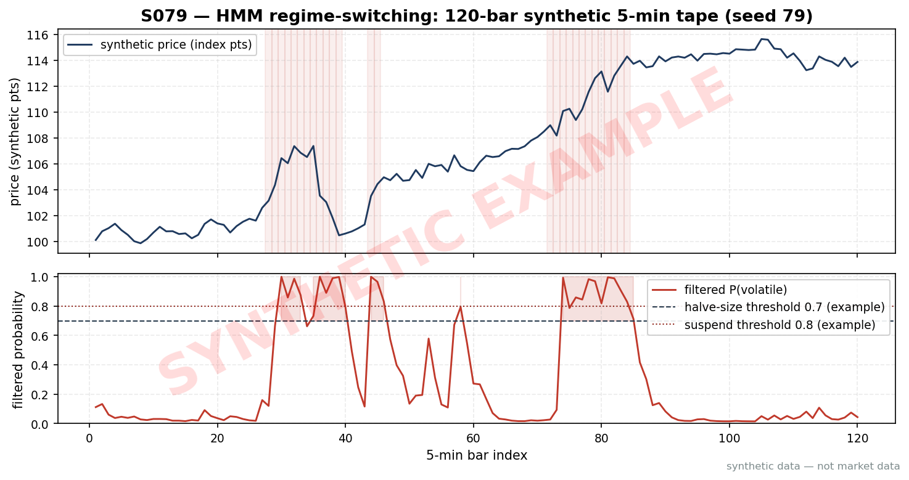

```mermaid
flowchart LR
    FEED["Raw feed<br/>(Polygon SIP 1-min)"] -->|"1-min OHLCV bars"| ING["Ingest + normalize<br/>(exchange ts, DST, halts)"]
    ING -->|"clean 5-min log returns"| FEAT["Feature compute<br/>(returns, RV pairs)"]
    FEAT -->|"regime prob per bar"| SIG["Signal S079<br/>filtered P(volatile)"]
    SIG -->|"thresholded prob per bar"| GATE{"Cost / toxicity<br/>gate?"}
    GATE -->|"pass: gated sizing signal"| OUT["Downstream consumer<br/>(T053 allocator)"]
    GATE -->|"fail: stand-down flag"| DROP["No trade"]
    style SIG fill:#aed6f1,stroke:#1f3a5f
```

### S12. Sources

1. Nystrup, P., Madsen, H. & Lindström, E. (2017). "Dynamic portfolio optimization across hidden market regimes." *Quantitative Finance*. https://backend.orbit.dtu.dk/ws/files/139272081/Dynamic_Portfolio_Optimization_Across_Hidden_Market_Regimes_ACCEPTED.pdf
2. Haase, F. & Neuenkirch, M. (2020). "Predictability of Bull and Bear Markets: A New Look at Forecasting Stock Market Regimes (and Returns) in the US." *Research Papers in Economics* No. 1/20, University of Trier. https://www.uni-trier.de/fileadmin/fb4/prof/VWL/EWF/Research_Papers/2020-01.pdf
3. Christensen, H., Godsill, S. & Turner, R. E. (2020). "Hidden Markov Models Applied to Intraday Momentum Trading with Side Information." arXiv:2006.08307. https://arxiv.org/abs/2006.08307v1
4. Ang, A. & Timmermann, A. (2011). "Regime Changes and Financial Markets." NBER Working Paper 17182. https://www.nber.org/papers/w17182
5. Hamilton, J. D. (1989). "A New Approach to the Economic Analysis of Nonstationary Time Series and the Business Cycle." *Econometrica*, 57(2), 357–384. https://doi.org/10.2307/1912559 (the Markov-switching foundation: latent regimes in macro/finance time series; the vol-form r_t = μ_{s_t} + σ_{s_t}·ε_t used in S3)
6. Guidolin, M. & Timmermann, A. (2007). "Asset allocation under multivariate regime switching." *Journal of Economic Dynamics and Control*, 31(11), 3503–3544. https://doi.org/10.1016/j.jedc.2006.12.004 (four regimes — crash, slow growth, bull, recovery — drive optimal allocation; ignoring regimes carries substantial welfare costs even after parameter uncertainty)

**Unverified leads** (chatbot-provided, no independent checkable source — do not treat as evidence):
- Duck.ai (GPT-5.6 Luna, 2026-09-10), Q-SB3-1/Q-SB3-2: two-state HMM procedure, Baum–Welch/forward formulas, practical ranges (bars 1–30 min, train 20–120 d, trigger 0.6–0.8); E[D_i] page-render corrected to 1/(1 − A_ii) (operator-verified); "HMM compute negligible" — cost model takes precedence.
- Duck.ai Q-SB3-2: imbalance-bar close rule |Σθ_i| > E_0[|θ|]·n — *unverified chatbot claim*, relevant to bar sampling (S083 family).

*Chatbot source log: Duck.ai answered Q-SB3-1–Q-SB3-3 (2026-09-10); Grok/Cursor answers pending (checked 2026-09-10).*

---
## Stage 81/200 — S081: Hawkes buy/sell intensity imbalance

*Batch SB3 · Signal 81/100 · Provenance [D] · Family A — Microstructure & order flow*

### S1. One-line verdict

| | |
|---|---|
| **What it is** | A bivariate Hawkes model of buy- and sell-trade arrivals; the z-scored intensity gap λᵇ−λˢ forecasts the next trade's side and seconds-ahead price pressure. |
| **When it works** | Clustered, algo-driven order flow (open/close, news absorption); burst regimes where self-excitation dominates. |
| **When it dies** | Two-sided bursts with no directional resolution, stale kernels after regime shifts, and any horizon where spread + fees + impact/slippage exceed the few-bp edge. |
| **Build-or-buy in one line** | Hybrid: buy the signed-trade feed, build the estimator — the kernel parameters are your edge. |

Provenance: **[D]** (documented; Hawkes 1971; Bacry–Muzy applications to order flow). Family A — Microstructure & order flow.

### S2. How it works — plain human explanation

It is 10:15:22 and the AAPL tape prints: buy, buy, sell, buy, buy, buy — six trades in 1.4 seconds, then silence. A Poisson model (trades arrive randomly at a constant rate) calls that cluster a fluke. A **Hawkes process** says the opposite: trades *excite* more trades. Each trade temporarily raises the **intensity** — the expected events per second — of future trades, decaying over seconds. This is **self-excitation**: buy begets buy, sell begets sell, because execution algos split large parent orders into child slices, market makers replenish after being hit, and participants herd.

Split the tape into buys and sells, each with its own intensity, λᵇ_t and λˢ_t. **Cross-excitation** lets a buy also lift the sell intensity a little (someone fading the move). The signal is the z-scored gap between them: when buy intensity towers over sell intensity, the next trade is more likely a buy and the microprice leans up. Three mechanisms make this predictive: (1) **order splitting** — a large buy order drips predictable slices; (2) **adverse selection** — one-sided bursts often carry information, so quotes move to protect; (3) **liquidity replenishment** — the race to refill the book is directional. The horizon is seconds to a few minutes.

- **Mental model:** every trade rings a bell that fades over seconds; count how loudly the buy bell vs the sell bell rings now.
- **Mental model:** the output is a z-score of the intensity gap — a standardized "buy pressure right now" number, comparable across symbols and sessions.
- **Mental model:** spikes flag *bursts*, and bursts flag *adverse selection*: when intensity explodes one-sided, assume the other side of your quote is informed.

### S3. The math — exact formula

Let {tᵇ_i} and {tˢ_j} be buy- and sell-trade timestamps (seconds). With exponential kernels, the buy intensity is:

$$\lambda^b_t = \mu_b + \sum_{t^b_i < t}\alpha_{bb}\,e^{-\beta_{bb}(t-t^b_i)} + \sum_{t^s_j < t}\alpha_{sb}\,e^{-\beta_{sb}(t-t^s_j)}$$

and symmetrically for λˢ_t. The **branching matrix** has entries \(N_{ij}=\alpha_{ij}/\beta_{ij}\) for i,j ∈ {b,s} — each entry is the expected number of type-i child events spawned by one type-j event. **Stationarity of this multivariate spec requires the spectral radius \(\rho(N)<1\)** (subcritical; \(\rho(N) \to 1\) means the market is near-critical). The scalar branching ratio n = α/β (< 1) is the stability condition only for a univariate or diagonal specification — with cross-excitation it is the matrix's largest eigenvalue, not any single kernel's ratio, that must stay below 1. The signal:

$$d_t = \lambda^b_t - \lambda^s_t, \qquad z_t = \frac{d_t - m_t}{s_t}$$

where m_t, s_t are the trailing mean and standard deviation of d (e.g., 5-minute rolling). A burst flag fires at |z_t| > κ. The recursion between events is exact and cheap: λᵇ just before event t_i equals μ_b plus each component decayed by e^{−βΔt}; at the event, add α_bb (own side) or α_sb (cross side).

| Parameter | Symbol | Typical range | Too small / too large | Default (example) |
|---|---|---|---|---|
| Base intensity | μ_b, μ_s | 0.1–2.0 /s | mis-set → z biased by time of day | 0.4 /s per side |
| Self jump | α_bb, α_ss | 0.2–1.5 | overfit → phantom bursts | 0.9 |
| Self decay | β_bb, β_ss | 0.5–5.0 /s | slow: stale; fast: no memory | 1.5 /s |
| Cross jump | α_sb, α_bs | 0–0.5 | 0: ignores fade flow; large: washes out signal | 0.25 |
| z window | — | 1–15 min | short: noisy m,s; long: intraday seasonality leaks in | 5 min |
| Burst κ | κ | 1.5–3.0 | low: false bursts; high: never fires | 2.0 |

All defaults are *example — not an institutional standard*. **Causal timing:** λ at event time t uses only events strictly before t; the z is tradable no earlier than the next event — on SIP (the Securities Information Processor, the consolidated tape)/L1 (level-1, top-of-book) timestamps this is *simulated only — requires MBO (market-by-order)/ITCH (Nasdaq's ITCH direct feed)* for any queue-position or fill claim. **Normalization:** z-score against the trailing window (deseasonalize — intensities follow the U-shaped volume curve). Named variants: (1) **univariate intensity** (S017: total activity, no side split); (2) **power-law kernels** (Bacry et al. find γ ≈ 0 power-law kernels fit Euro-Bund trades better than exponentials over wide scales); (3) **price-jump Hawkes** (Bacry et al. 2013: up/down mid-price jumps instead of signed trades).

### S4. Worked example — step-by-step numbers (SYNTHETIC)

Synthetic 90-second signed-trade tape, **seed 81** (`batches/SB3/plot_S081.py`). Params: μ = 0.4/s per side, α_self = 0.9, β_self = 1.5/s, α_cross = 0.25, β_cross = 1.0/s (branching-matrix entries 0.6 self / 0.25 cross; spectral radius \(\rho(N) = 0.85 < 1\) — subcritical). Table: 12 events around the largest |z| burst (event 75). Sample mean(d) = 0.1458, sd(d) = 1.2217.

| Event | Time (s) | Side | λᵇ (1/s) | λˢ (1/s) | d = λᵇ−λˢ | z |
|---|---|---|---|---|---|---|
| 69 | 7.29 | SELL | 8.805 | 8.780 | 0.025 | −0.10 |
| 70 | 7.46 | SELL | 7.312 | 7.780 | −0.468 | −0.50 |
| 71 | 7.46 | SELL | 7.500 | 8.606 | −1.105 | −1.02 |
| 72 | 7.47 | SELL | 7.641 | 9.363 | −1.722 | −1.53 |
| 73 | 7.50 | SELL | 7.638 | 9.906 | −2.267 | −1.98 |
| 74 | 7.50 | SELL | 7.885 | 10.800 | −2.915 | −2.51 |
| 75 | 7.52 | BUY | 7.967 | 11.431 | −3.463 | −2.95 |
| 76 | 7.53 | SELL | 8.749 | 11.511 | −2.762 | −2.38 |
| 77 | 7.55 | BUY | 8.757 | 12.042 | −3.285 | −2.81 |
| 78 | 7.60 | SELL | 9.075 | 11.497 | −2.421 | −2.10 |
| 79 | 7.73 | SELL | 7.925 | 10.373 | −2.448 | −2.12 |
| 80 | 7.82 | SELL | 7.357 | 10.022 | −2.665 | −2.30 |

Hand-check of event 76: d = 8.749 − 11.511 = −2.762; z = (−2.762 − 0.1458)/1.2217 = −2.9078/1.2217 = **−2.38**, matching the table. The recursion is visible in the λˢ column: event 76 is a sell, so λˢ jumps by α_self = 0.9 at the event (11.511 pre-jump → 12.411 post-jump), then decays to 12.042 by event 77 while cross-excitation from the intervening buy adds a little — exactly the self-plus-cross dynamics of the formula.

*What to notice:* a genuine sell burst builds over ~0.5 s (events 69→75), with z crossing −2 around event 74 — the adverse-selection flag — then mean-reverting as intensities decay. Toy tape: true kernel parameters, no fees, no latency, no trade-classification error; real tapes need the kernel re-estimated and the z deseasonalized.

*Gross-to-net on this tape (illustrative sketch, example assumptions — not a measured result):* the tape carries intensities, not prices, so attach an explicit example: $50 stock, 1¢ quoted spread. Suppose the z < −2 flag at event 74 triggers a 100-share short held ~1 s for an assumed −5 bp adverse move (example assumption, not estimated from this tape). Gross ≈ 5 bp × $50 × 100 = **$2.50**. Cost stack (example): effective half-spread 1¢/share × 100 × 2 sides = $2.00 + commission $0.0035/share × 200 = $0.70 + slippage allowance 1¢/share for trading into the excited book = $1.00 → ≈ **$3.70** all-in. Net ≈ $2.50 − $3.70 = **−$1.20 — net negative at retail costs.** The honest read: a 5 bp edge cannot survive a ~7.4 bp round-trip stack; this flag is a toxicity filter for market-making, not a standalone trigger.

### S5. Strategies that use this signal

- **T023 — primary entry trigger**: the Hawkes Burst Scalper trades self-excitation bursts signed by the intensity imbalance — this signal *is* the entry.
- **T056 — predictor input (filter/feature)**: the Hasbrouck trade–quote VAR (vector autoregression) predictor takes the imbalance as an exogenous state variable — bursts modulate its quote-revision forecast and veto entries when adverse-selection intensity is extreme.

### S6. Data required — exact spec

| Field | Type | Granularity | Source tier | Notes |
|---|---|---|---|---|
| Trade timestamp (exchange) | datetime64 (µs) | per trade | Tier 2–3 | clock-sync across venues; SIP vs direct labeled |
| Trade price / size | float / int | per trade | Tier 2–3 | size optional for volume-weighted variants |
| Trade side sign | ±1 | per trade | derived | Lee–Ready/BVC (bulk volume classification) on quotes; MBO gives aggressor directly |
| Quote book (for signing) | L1/L2 | event | Tier 2–3 | needed when side must be inferred |

Collection: Databento MBO (full-depth, aggressor side known) or LOBSTER (Limit Order Book System — The Efficient Reconstructor; academic MBO/ITCH replay); retail fallback: Polygon trades + SIP quotes with Lee–Ready signing (noisier). ≤20-line ingest sketch:

```python
import polars as pl
tr = pl.read_parquet("data/mbo/*.parquet")            # ts, px, sz, side, sym
tr = (tr.filter(pl.col("sym") == "AAPL")
        .with_columns(pl.col("ts").dt.convert_time_zone("America/New_York").alias("ts_et"))
        .filter(pl.col("ts_et").dt.time().is_between("09:30", "16:00"))
        .sort("ts_et"))
ev = tr.select("ts_et", "side").to_numpy()             # (t, ±1) event stream
# Hawkes recursion over ev: decay components by exp(-beta*dt), add alpha at events
```

Storage per cost-model.md §4: L1 quotes+trades for a liquid name run ~2–8 GB/symbol-day parquet; trades-only is a small fraction — plan on hundreds of MB/symbol-day (planning estimate derived from §4; trades ≈ 10–200/sec busy per §2). Data-quality (DQ) checklist: exchange-vs-SIP timestamp reconciliation; trade-signing accuracy audit; corp actions; halts/auctions excluded; DST/half-days; venue symbology mapping.

### S7. Local build on M5 Max / 128GB

**Feasibility: feasible (Tier M).** Per cost-model.md §5, L1 event pipelines sit in Tier M (**20–60 h ≈ $3,000–9,000** at $150/hr) — the Hawkes MLE (maximum likelihood estimation; likelihood optimization over kernel params) is the heavy part, not the O(events) recursion. (A labeled chatbot lead for this batch suggests imbalance bars with close rule |Σθ_i| > E_0[|θ|]·n as an alternative event clock — *unverified*; the cost model's Tier M band governs on any conflict.)

- **Throughput** (§2): the intensity recursion is O(1) per event — a Python loop handles ~100–500k events/sec (fine for ≤20 symbols of trades); kernel MLE refits are the batch cost (minutes per symbol-day). Rust only for full OPRA (Options Price Reporting Authority) or multi-venue MBO in real time.
- **Stack:** Python + `tick` (Bacry et al.'s Hawkes library) or hand-rolled numpy for the recursion; Rust for the production event loop. Pick Python for research.
- **RAM** (§3): trades-only events for one symbol-day ≈ 0.1–0.5 GB; 60 days of one symbol's trades fits; 500 symbols × 60 days does not — per-symbol daily files + streaming.
- **What breaks first at 500 symbols:** the Python event loop at ~500 × 500 events/sec ≈ 250k/sec is borderline per §2's sizing example — batch the recursion in numpy or move to Rust; MLE refits go nightly.

### S8. Buy vs build

| Option | What you get | Indicative price | Buying gains | Buying loses |
|---|---|---|---|---|
| Tier 0: Alpaca IEX / Stooq | Trades/daily bars, no depth | ~$0 | free | no aggressor side; coarse ts |
| Tier 1: Polygon trades + SIP quotes | Full SIP trades, Lee–Ready signing | ~$30–200/mo | cheap, clean | signing error; SIP latency |
| Tier 2: Databento MBO | Full-depth with aggressor side | ~$200/mo + usage | true event stream | usage meter on history |
| Tier 3: LOBSTER (academic) | MBO/ITCH replay | ~hundreds/yr academic | gold-standard research | academic license; no redistribution |

All prices *indicative — verify before budgeting*. **Verdict: hybrid — buy the feed, build the estimator** (cost-model §6: build when the edge needs custom parameters). Crossover: buy Databento MBO the moment SIP signing error starts flipping your z.

### S9. Success ratio / efficacy — documented evidence

| Study / source | Market & period | Metric | Before/after cost | Caveat |
|---|---|---|---|---|
| Bacry, Delattre, Hoffmann & Muzy (2013), *Quantitative Finance* — 2-D Hawkes on up/down price jumps | Euro-Bund / Euro-Bobl futures | Reproduces microstructure noise (tick-level mean reversion, seconds–minutes) and the Epps effect; fits match data | Before-cost n/a (descriptive fit, not a trading P&L) | Models price jumps, not signed trades; no P&L claimed |
| Sjogren & DeLise (2021), arXiv:2110.07075 — general compound Hawkes for mid-price prediction | Futures and stock LOB (limit order book) data | Predicts mid-price direction and volatility | Before-cost (prediction study, not net trading) | Accuracy ≠ tradable edge after spread/fees |
| Muni Toke & Yoshida (2017) — 8-dim Hawkes on LOB events | XETRA DAX 30, Feb–Apr 2016 | Documents strong self- and cross-excitation structure across event types | Before-cost n/a (structural estimation) | Descriptive; no trading rule evaluated |
| Bacry, Mastromatteo & Muzy (2015) survey, arXiv:1502.04592 | Multi-market review | Catalogues successful uses: transaction-level vol, market-stability/endogeneity measurement, optimal execution, full order-book dynamics | Mixed (survey) | Confirms the framework's validity, not a standalone Sharpe |

Regimes where it fails: two-sided bursts (intensity explodes, direction doesn't resolve); kernel nonstationarity across the session; near-critical branching (n → 1) where bursts blur into noise; sub-second horizons where your latency exceeds the signal's half-life. **No documented after-cost standalone Sharpe exists for the raw intensity-imbalance signal** — the literature documents fit quality and prediction, not net P&L.

**Honest bottom line:** as a standalone trigger this is an *unproven* edge (no after-cost evidence); as a **microstructure feature** — burst detector, adverse-selection flag, input to microprice/VAR models — it is *documented and standard*.

### S10. Failure modes & pitfalls

1. **Latency vs horizon:** the signal lives for seconds; if your reaction time exceeds its half-life you are the liquidity being adversely selected. Mitigation: on SIP data this is *simulated only — requires MBO/ITCH*; trade it only where you measured the latency.
2. **Kernel misspecification:** exponential kernels underfit the long-memory power-law tails Bacry et al. document. Mitigation: test exponential vs power-law kernels out-of-sample; refit per regime.
3. **Nonstationarity:** intensities follow the U-shaped session curve; a static μ biases z at open/close. Mitigation: time-of-day μ or short rolling windows.
4. **Trade-signing error:** Lee–Ready misclassification rises in fast markets — the exact rate depends on venue and era, so audit your own signing accuracy against MBO aggressor data. Mitigation: MBO aggressor side where available; never trade the burst off SIP-signed data alone.
5. **Burst ≠ direction:** the largest |z| events are sometimes two-sided panics. Mitigation: require sign persistence (consecutive same-sign z) before entry.
6. **MLE fragility:** Hawkes likelihoods have local optima and are window-sensitive. Mitigation: multiple inits, penalized likelihood, walk-forward refits.
7. **Cost blowup:** a seconds-horizon signal pays the spread every round trip, and a burst-triggered entry arrives exactly when the book is thinnest. Mitigation: model spread + fees + impact/slippage per trade explicitly (decompose as S094 does: half-spread, commissions, and a slippage allowance for trading into the excited book); most calibrations fail this gate — that is the signal telling you the truth.
8. **Overlapping bursts:** the same parent order excites multiple child bursts; naive aggregation overcounts. Mitigation: parent-order-aware clustering or per-symbol performance accounting.

### S11. Visuals

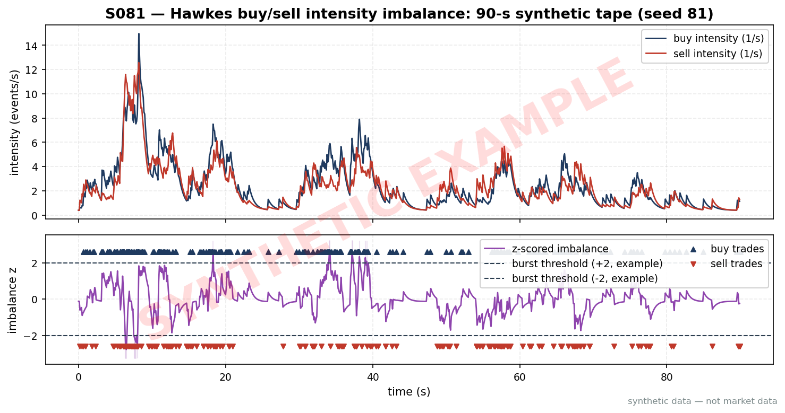

```mermaid
flowchart LR
    FEED["Raw feed<br/>(Databento MBO)"] -->|"signed trade events"| ING["Ingest + normalize<br/>(clock sync, trade signs)"]
    ING -->|"event timestamps per side"| FEAT["Feature compute<br/>(Hawkes intensities)"]
    FEAT -->|"intensity per event"| SIG["Signal S081<br/>buy/sell imbalance z"]
    SIG -->|"z per event"| GATE{"Cost / toxicity<br/>gate?"}
    GATE -->|"pass: z burst signal"| OUT["Downstream consumer<br/>(T023 scalper)"]
    GATE -->|"fail: no position"| DROP["No trade"]
    style SIG fill:#aed6f1,stroke:#1f3a5f
```

### S12. Sources

1. Bacry, E., Mastromatteo, I. & Muzy, J.-F. (2015). "Hawkes processes in finance." arXiv:1502.04592. https://arxiv.org/abs/1502.04592v2
2. Bacry, E., Delattre, S., Hoffmann, M. & Muzy, J.-F. (2013). "Modeling microstructure noise with mutually exciting point processes." *Quantitative Finance* (arXiv:1101.3422). https://arxiv.org/abs/1101.3422
3. Sjogren, M. & DeLise, T. (2021). "General Compound Hawkes Processes for Mid-Price Prediction." arXiv:2110.07075. https://arxiv.org/abs/2110.07075
4. Muni Toke, I. & Yoshida, N. (2017). "Modelling intensities of order flows in a limit order book using a multivariate Hawkes process." https://hal.science/hal-01512430v1/file/hawkes_Submitted.pdf
5. Lee, C. M. C. & Ready, M. J. (1991). "Inferring Trade Direction from Intraday Data." *Journal of Finance* 46(2), 733–746. https://ideas.repec.org/a/bla/jfinan/v46y1991i2p733-46.html (the quote-test-with-5-second-lag + tick-test classification method used in S3/S4/S8)
6. Hawkes, A. G. (1971). "Spectra of Some Self-Exciting and Mutually Exciting Point Processes." *Biometrika*, 58(1), 83–90. https://www.jstor.org/stable/2334319 (the original Hawkes process paper: defines the intensity dynamics whose stationarity condition \(\rho(N)<1\) is used in S3)

**Unverified leads** (chatbot-provided, no independent checkable source — do not treat as evidence):
- Duck.ai (GPT-5.6 Luna, 2026-09-10), Q-SB3-2: imbalance-bar close rule |Σθ_i| > E_0[|θ|]·n — *unverified chatbot claim*.
- Duck.ai Q-SB3-2: "Hawkes compute" bands and eng-hour estimates for the pairs+HMM+ML stack — cost-model.md takes precedence on conflicts.

*Chatbot source log: Duck.ai answered Q-SB3-1–Q-SB3-3 (2026-09-10); Grok/Cursor answers pending (checked 2026-09-10).*

---
## Stage 85/200 — S085: Triple-barrier labeling

*Batch SB3 · Signal 85/100 · Provenance [D] · Family F — Statistical/ML infrastructure*

### S1. One-line verdict

| | |
|---|---|
| **What it is** | A labeling procedure (not a signal): each candidate trade is labeled +1/−1/0 by whichever barrier — profit, stop, or time — the price path touches first. |
| **When it works** | Training classifiers on realistic trade outcomes; paired with a primary signal that already has an edge (see S086 meta-labeling). |
| **When it dies** | Labels leak the future into features; barriers are overfit; or it is asked to manufacture alpha from a primary with none. |
| **Build-or-buy in one line** | Always build: labeling is research IP, a few dozen lines of code. |

Provenance: **[D]** (documented; López de Prado, *Advances in Financial Machine Learning*, 2018, ch. 3). Family F — Statistical/ML infrastructure.

### S2. How it works — plain human explanation

It is Monday 10:05 and your momentum model flashes long on XYZ at $50.00. The textbook ML approach labels this bar "+1" if the price is higher at some fixed horizon — say, Friday's close. But that label ignores how trading actually works: if XYZ spiked to $52 on Tuesday (your profit target) and then faded to $49 by Friday, the fixed-horizon label says "loser" while your real trade, with a real profit target, was a winner. Conversely, a path that crashes through your stop on Wednesday before recovering is a loser no matter where Friday's close lands. **Fixed-horizon labels ignore the path; triple-barrier labels follow it.**

The procedure, from López de Prado (2018): at each candidate entry, draw three barriers — **profit-taking**, **stop-loss**, and **vertical** (time, at the maximum holding period). Walk the price path forward; whichever barrier is touched first decides the label: +1 (profit), −1 (stop), 0 (time ran out). Two refinements make it practical. First, barrier widths are set in **volatility units** (e.g., ±1 daily σ, estimated from data strictly before the entry) so a 1% move means the same thing in calm and wild regimes. Second, the label is **side-aware**: for a short, "profit" means the lower barrier. Why does this matter economically? Labels are the ground truth your machine-learning (ML) model learns from; labels that reflect executable trade outcomes teach the model to recognize *tradable* setups, while naive next-bar labels teach it to chase noise — the Springer (2025) crypto study documents that next-bar labeling "often leads to excessive trading… transaction costs can quickly erode any potential gains," while triple-barrier labels reflect "a more authentic reflection of the trading reality."

- **Mental model:** stop asking "was the price higher later?" and ask "would my actual trade — with its stop, target, and time limit — have made money?"
- **Mental model:** labels are for *training only*; computing a label requires future data (up to the vertical barrier), so a label must never be a live feature.
- **Mental model:** the barrier is a research choice, not a truth — its parameters are tuned on training folds only, or you are just overfitting the answer key.

### S3. The math — exact formula

For an event at time t_0 with entry price P_{t_0} and side s ∈ {+1 (long), −1 (short)}, with volatility estimate σ̂_{t_0} (e.g., ATR — average true range — or daily σ, computed from data **before** t_0 only) and horizon H bars:

$$\text{upper} = P_{t_0}(1 + k_u\,\hat\sigma_{t_0}), \qquad \text{lower} = P_{t_0}(1 - k_\ell\,\hat\sigma_{t_0}), \qquad \text{vertical} = t_0 + H$$

Scan τ = 1…H: with side-adjusted return r^s_{t_0,τ} = s·log(P_{t_0+τ}/P_{t_0}),

$$y_{t_0} = \begin{cases} +1 & \text{if } r^s \ge k_u\hat\sigma \text{ first (profit)} \\ -1 & \text{if } r^s \le -k_\ell\hat\sigma \text{ first (stop)} \\ 0 & \text{if neither touched by } H \text{ (vertical — de Prado's standard)} \end{cases}$$

**Same-bar touch:** if one bar's range crosses both barriers, use intrabar high/low to decide first touch; on closes-only data adopt a deterministic convention (adverse barrier first is the conservative *example*) or exclude the event as ambiguous.

| Parameter | Symbol | Typical range | Too small / too large | Default (example) |
|---|---|---|---|---|
| Barrier width | k_u, k_ℓ | 0.5–2.0 vol units | tiny: noise labels; huge: everything hits vertical | 1.0 / 1.0 |
| Asymmetry | k_u : k_ℓ | 1:1–1.5:1 | extreme: class imbalance | 1:1 |
| Vol lookback | — | 20–60 bars | short: jumpy σ̂; long: stale | 30 bars |
| Horizon | H | intraday 30 min–2 d; daily 3–20 d | short: all vertical; long: overlapping labels | 5 d (daily) |
| Event spacing | — | 1–10 bars | dense: correlated labels → purge needed | 5 bars |
| Zero-class | — | keep / drop | keep: "hold" class; drop: cleaner binary | drop 0s (example) |

All defaults are *example — not an institutional standard*. **Causal timing:** the label for event t_0 is known only at min(first-touch, t_0+H) — it is a training target, never a live input; tradable n/a. **Normalization:** vol-scaling (barriers ∝ σ̂) is the standard; fixed-bps barriers are the naive variant. Named variants: (1) **symmetric vs asymmetric** profit/stop (1.5:1 reward:risk); (2) **keep vs drop the 0 class** (hold-class vs pure win/loss); (3) **meta-labeling target** (S086: relabel as "was the primary's bet profitable?" — the two-stage use).

### S4. Worked example — step-by-step numbers (SYNTHETIC)

Synthetic 20-day spread tape, **seed 85** (script `batches/SB3/plot_S085.py`). Spread S_t (spread points): −2, −1, 0, 1, 2, 1, 0, −1, −2, 0, 2, 1, 0, −1, −2, −1, 0, 1, 2, 0. Volatility estimate: σ̂ = √(ΣS_t²/19) = √(32/19) ≈ **1.298** (mean ≈ 0).

**Corrected-numbers note:** the raw Duck.ai tape for this batch (2026-09-10) contained z-score arithmetic errors (it reported z_15 ≈ −1.378 from a wrong σ̂). The operator-verified corrections are used here: z_15 = −2/1.2978 ≈ **−1.541**. The triple-barrier label itself was unaffected by those errors.

Event: **day-15 long spread** (side s = +1), entry S_15 = −2.0, profit +1.0 → upper barrier −1.0, stop −1.0 → lower barrier −3.0, horizon 5 d → vertical barrier day 20.

| Day | S_t | z_t | Barrier check |
|---|---|---|---|
| 15 | −2 | −1.541 | entry (long spread) |
| 16 | −1 | −0.771 | **PROFIT HIT** (+1.0) |
| 17 | 0 | +0.000 | — |
| 18 | +1 | +0.771 | — |
| 19 | +2 | +1.541 | — |
| 20 | 0 | +0.000 | vertical barrier (not reached) |

Label: **y_15 = +1**, first touch on day 16, 1-day exit. A fixed-horizon label at day 20 would have scored this trade 0 (S_20 = 0) — the path-aware label correctly records the executable win.

*What to notice:* the label rewards the *path*, not the endpoint. Limits of the toy: real barriers apply to dollar-neutral portfolio mark-to-market (MTM) returns, not raw spread points; same-bar ambiguity is assumed away (daily closes); and this tape has no costs — a real labeler subtracts the round-trip cost from the barriers before declaring +1.

**Cost stack — documented n/a with reasoning.** Triple-barrier labeling executes no trades: it assigns training labels to historical price paths, so spread, fees, market impact, and slippage are not cost components of the procedure itself. The cost discipline lives one layer up: per S10 §7, the round-trip cost (spread + fees + impact/slippage) is subtracted from the profit barrier *before* labeling, so a +1 label means "profitable after costs," not "touched the gross barrier."

### S5. Strategies that use this signal

- **T020 — primary training target**: the Triple-Barrier + Meta-Labeling Overlay uses S085 labels to train the meta-model that vetoes and sizes the primary signal's bets.
- **T087 — validation input**: the Purged-CV Strategy Selector ranks sub-strategies on models trained with S085 labels — the labels are what the selector's purged/embargoed folds validate.

### S6. Data required — exact spec

| Field | Type | Granularity | Source tier | Notes |
|---|---|---|---|---|
| Price path (open/high/low/close) | float | tick or 1-min (execution granularity) | Tier 0–2 | intrabar H/L needed for first-touch honesty |
| Entry timestamps | datetime64 | per event | derived | from the primary signal's triggers |
| Volatility estimate input | float | daily or intraday | Tier 0–2 | ATR/daily σ from data before each event |

Collection: any intraday feed — Stooq daily (Tier 0, coarse), Polygon 1-min (Tier 1), Databento trades (Tier 2, exact first-touch). ≤20-line labeling sketch:

```python
import numpy as np
def triple_barrier(px, t0, side, ku, kl, sig, H):
    up, lo = px[t0]*(1+ku*sig), px[t0]*(1-kl*sig)
    for tau in range(1, H+1):
        r = side*np.log(px[t0+tau]/px[t0])
        if r >= ku*sig: return +1, tau      # profit first
        if r <= -kl*sig: return -1, tau     # stop first
    return 0, H  # vertical barrier first -> 0 (de Prado's standard)
```

Storage per cost-model.md §4: 1-min bars for 500 symbols ≈ 50 MB/day (~3 GB per 60 days) — trivial; labels themselves are a small per-event table. Data-quality checklist: corporate-action adjustment (barriers on adjusted prices); halt/auction handling; DST/half-days; intrabar high/low availability for touch resolution; σ̂ strictly pre-event.

### S7. Local build on M5 Max / 128GB

**Feasibility: trivial (Tier L).** Per cost-model.md §5, labeling (S085/86/88) is Tier L: **4–12 h ≈ $600–1,800** at $150/hr loaded-cost estimate — a vectorized path scan over events. (A labeled chatbot lead for this batch estimated 10–25 h for a triple-barrier prototype; the cost model takes precedence on conflicts, and both agree this is the cheapest layer of the stack.)

- **Throughput** (§2): numpy vectorized math at ~50–200M elements/sec — labeling 100k events is seconds; even tick-level first-touch scans on years of 1-min bars are minutes.
- **Stack:** Python + numpy/polars. Nothing else is justified.
- **RAM** (§3): labels are a per-event table (event id, side, timestamps, label) — megabytes; the price panel for 500 symbols × 60 days of 1-min bars ≈ 12 MB. Working set ≪ 77 GB budget.
- **What breaks first at 500 symbols / full OPRA (Options Price Reporting Authority):** nothing in the labeler — the cost is the tick data volume (§4: L1 (level-1, top-of-book) ~2–8 GB/symbol-day), handled with per-symbol daily files + streaming, not by changing the algorithm.

### S8. Buy vs build

| Option | What you get | Indicative price | Buying gains | Buying loses |
|---|---|---|---|---|
| Tier 0: own code + Stooq daily | Labeling on daily bars | ~$0 | free; full control | coarse first-touch |
| Reference: AFML (*Advances in Financial Machine Learning*) text (ISBN 9781119482086) | The canonical spec, ch. 3 | book price, *indicative — verify before budgeting* | exact procedure | not code |
| Tier 1: Polygon 1-min | Intraday barrier resolution | ~$30–200/mo `indicative — verify before budgeting` | clean 1-min paths | SIP (Securities Information Processor, the consolidated tape) timestamps |
| Tier 2: Databento trades | Tick-exact first touch | ~$200/mo + usage `indicative — verify before budgeting` | honest touch order | usage meter |

**Verdict: always build.** Labeling is a few dozen lines and embodies your research choices (barrier widths, zero-class handling, event definition) — buying it would mean outsourcing your target variable. Buy at most the finer price path (Tier 1/2) for touch accuracy.

### S9. Success ratio / efficacy — documented evidence

| Study / source | Market & period | Metric | Before/after cost | Caveat |
|---|---|---|---|---|
| Springer *Financial Innovation* (2025) — information-driven bars + triple-barrier + deep learning | BTCUSDT, Binance | TBL (triple-barrier labeling) gives "more authentic reflection of trading reality" vs next-bar labeling; next-bar "often leads to excessive trading… costs can quickly erode any potential gains" | Before-cost (labeling-quality comparison, not a net Sharpe) | Crypto; documents label quality, not standalone alpha |
| MDPI *Mathematics* 12(5):780 — genetic-algorithm triple-barrier for crypto pairs | Crypto, 2017–2022 train / 2022–2023 test | HRHP (High Risk and High Profit) labels: +51.42% profitability vs traditional pairs; LRLP (Low Risk and Low Profit): −73.24% max drawdown | Before-cost / cost treatment unclear from abstract | Crypto; baseline ("traditional pairs") loosely specified |
| darufinance AFML (*Advances in Financial Machine Learning*) replication (2026), project 03_meta_labeling — EMA (exponential moving average)-crossover primary + TBL + bagged-tree meta-model, purged CV, 42 instruments | Crypto + US equities + FX | Meta-model lifts profit factor in 38/42 instruments, but **0/42 clear the Deflated Sharpe Ratio (DSR) bar** | After-cost (net-of-cost evaluation; DSR as headline) | Practitioner replication, not peer-reviewed — but methodologically careful |

What de Prado documents the barriers *add* is labeling quality — path-aware, cost-aware targets that stop the model learning untradable wiggles — not alpha. The efficacy of the *stack* (barriers + meta-labeling) is bounded by the primary: the primary supplies the side, meta-labeling filters false positives and sizes bets, and a weak primary cannot be rescued — the darufinance replication found meta-model profit-factor lifts in 38/42 instruments but **0/42 cleared the Deflated Sharpe Ratio (DSR) bar**, so apparent Sharpe jumps in weak-primary stacks are a red flag for leakage, overlapping labels, or contamination.

**Honest bottom line:** as a labeling procedure this is a *documented improvement* over fixed-horizon/next-bar labels; as an alpha source it is *nothing* — it cannot create edge, only reveal whether your primary has one under honest (purged, embargoed, after-cost) validation.

### S10. Failure modes & pitfalls

1. **Label leakage into features:** the label needs data up to t_0+H; any feature using post-entry data (including σ̂ estimated over the label window) leaks. Mitigation: σ̂ and all features from data strictly before t_0.
2. **Overlapping labels:** events spaced closer than H share path data → correlated labels → inflated cross-validation (CV) scores. Mitigation: purge + embargo (S088), event spacing ≥ H where affordable.
3. **Barrier-parameter overfit:** tuning (k_u, k_ℓ, H) on the test set is overfitting the answer key. Mitigation: tune on training folds only; report sensitivity.
4. **Same-bar touch ambiguity:** on coarse bars both barriers can be "hit" in one bar. Mitigation: intrabar H/L resolution; closes-only → adverse-first convention (example) or exclusion.
5. **Zero-class mishandling:** dropping all 0s inflates win rates; keeping them as a third class changes the model. Mitigation: decide by use (meta-labeling usually drops; report the choice).
6. **Vertical-barrier sign noise:** some implementations replace de Prado's 0 with a fallback sign(r_H) — that labels tiny drifts ±1, pure noise. Mitigation: keep the 0 label; if your pipeline needs a signed target, require a minimum |r_H| threshold for ±1, else 0.
7. **Ignoring costs in the label:** a +1 that nets −2 bps after spread/fees teaches the model to love losers. Mitigation: subtract round-trip cost from barriers before labeling.
8. **Survivorship in the event set:** labels only exist for symbols still listed at label time. Mitigation: point-in-time universe (delisted symbols included).

### S11. Visuals

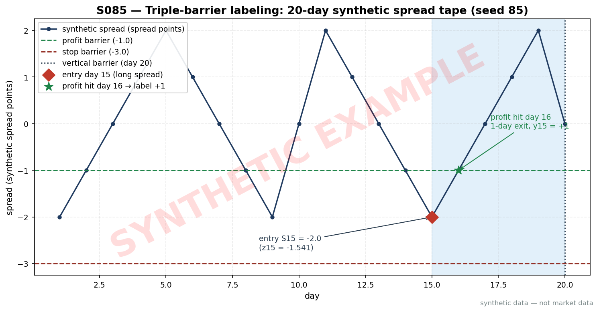

```mermaid
flowchart LR
    FEED["Raw feed<br/>(1-min bars, any vendor)"] -->|"1-min price path"| ING["Ingest + normalize<br/>(splits, halts, tz)"]
    ING -->|"bar path per event"| FEAT["Feature compute<br/>(vol-scaled barriers)"]
    FEAT -->|"per-event barrier labels"| SIG["S085<br/>triple-barrier labels"]
    SIG -->|"labels per event"| GATE{"Purge / embargo<br/>check?"}
    GATE -->|"pass: clean labels"| OUT["Downstream consumer<br/>(meta-label trainer)"]
    GATE -->|"fail: overlapping label"| DROP["Drop event"]
    style SIG fill:#aed6f1,stroke:#1f3a5f
```

### S12. Sources

1. López de Prado, M. (2018). *Advances in Financial Machine Learning*. Wiley, 1st ed., ch. 3 (Labeling). ISBN 9781119482086. https://openlibrary.org/books/OL26950595M/Advances_in_financial_machine_learning
2. Grądzki, P., Wójcik, P. & Lessmann, S. (2025). "Algorithmic crypto trading using information-driven bars, triple barrier labeling and deep learning." *Financial Innovation*. https://link.springer.com/article/10.1186/s40854-025-00866-w (verifies the S9 finding: TBL gives "a more authentic reflection of trading reality" vs next-bar labeling on BTC/ETH tick data)
3. Fu, N., Kang, M., Hong, J. & Kim, S. (2024). "Enhanced Genetic-Algorithm-Driven Triple Barrier Labeling Method and Machine Learning Approach for Pair Trading Strategy in Cryptocurrency Markets." *Mathematics* 12(5):780. https://www.mdpi.com/2227-7390/12/5/780/ (verifies the S9 result — HRHP labels +51.42% profitability vs traditional pairs, LRLP −73.24% max drawdown — and the vertical-barrier → 0 convention in §2.1.2)
4. darufinance (2026). "Triple-barrier labeling and meta-labeling" replication project (purged CV, 42 instruments, DSR headline metric). https://github.com/darufinance/lopez-de-prado-work-review/blob/HEAD/Process%20Over%20Edge/projects/03_meta_labeling/README.md
5. López de Prado, M. & Lewis, M. (2018). "Detection of False Investment Strategies Using Unsupervised Learning Methods." SSRN 3167017. https://ssrn.com/abstract=3167017 (the false-strategy-detection context for DSR: why headline Sharpe jumps on small samples should be distrusted, reinforcing the 0/42-DSR caution in S9)
6. Bailey, D. H., Borwein, J. M., López de Prado, M. & Zhu, Q. J. (2014). "Pseudo-Mathematics and Financial Charlatanism: The Effects of Backtest Overfitting on Out-of-Sample Performance." *Notices of the American Mathematical Society*, 61(5), 458–471. https://doi.org/10.1090/noti1105 (the backtest-overfitting memorandum: optimal in-sample Sharpe decays out of sample as a function of trial count — the documented reason S10 demands purged out-of-sample validation)

**Unverified leads** (chatbot-provided without an independent checkable source — do not treat as evidence):
- Duck.ai (GPT-5.6 Luna, 2026-09-10), Q-SB3-3: the primary supplies the side; meta-labeling filters false positives and sizes bets; "weak primary Sharpe 0.2 → 2.0 = implausible" is a red flag — apparent improvements may be leakage, overlapping labels, or contamination. *Unverified chatbot claim.*
- Duck.ai Q-SB3-2: triple-barrier prototype eng estimate 10–25 h — cost-model.md §5 (Tier L, 4–12 h) takes precedence.

*Chatbot source log: Duck.ai answered Q-SB3-1–Q-SB3-3 (2026-09-10); Grok/Cursor answers pending (checked 2026-09-10).*

---
## Stage 86/200 — S086: Meta-labeling

*Batch SB3 · Signal 86/100 · Provenance [D] · Family F — Statistical/ML infrastructure*

### S1. One-line verdict

| | |
|---|---|
| **What it is** | A second model that predicts whether the *primary* model's bet will win, then sizes or vetoes the bet. |
| **When it works** | A primary with a real but noisy edge (win rate 45–55%); its mistakes cluster in recognizable conditions. |
| **When it dies** | The primary has no edge at all; too few labeled bets; label leakage into the meta-features. |
| **Build-or-buy in one line** | Build — the meta-model must train on *your* primary's mistakes; there is no off-the-shelf substitute. |

Provenance **[D]** (documented: López de Prado, *Advances in Financial Machine Learning*, 2018, ch. 3). Family **F — Statistical/ML infrastructure**. Note: meta-labeling is an *overlay*, not a standalone signal — it produces no direction of its own.

### S2. How it works — plain human explanation

10:14:22 ET. XYZ breaks above its opening range; your primary fires long. The meta-labeler sees flat relative volume, a 1.8-sigma-wide spread, three failed breaks this week — win probability 0.31, below your 0.55 threshold, so you skip. By 10:31 the breakout has failed. The meta-model did not predict direction — it predicted *the primary's reliability*.

That separation is the whole idea. A **primary model** picks the *side* (long or short) and the timing. A **meta-model** answers an easier question: "given the primary just fired, will this bet make money?" It trains on the primary's own history — each past bet labeled win or loss by how a real position would have resolved (the **triple-barrier** method: profit target, stop loss, or a time limit, whichever the price path touches first) — using features available at bet time. In production the primary fires, the meta-model scores the bet, and you trade only above a threshold, optionally sizing by the score.

Why should this work economically? Primary models are optimized for average accuracy, so their errors cluster in **adverse-selection** regimes (thin books, news digestion, volatile opens — moments when the counterparty likely knows more than you). A second model trained on *bet outcomes* can learn the signature of those regimes from features the primary underweighted and stand down exactly when the primary is most likely to be picked off.

**Mental model (3 bullets):**
- The *primary supplies the side*; the *meta supplies the conviction*. Direction and bet-selection are two different jobs.
- Meta-labeling converts a directional signal into a bet-sizing function: skip low-probability bets, size the rest by confidence.
- It cannot create edge — it can only *conserve* it: fewer bad bets, better-sized good ones. Garbage primary in, garbage meta out.

### S3. The math — exact formula

At each bet event $t$ the primary emits a side $s_t \in \{-1, +1\}$. Triple-barrier (S085) resolves the bet: profit barrier $u > 0$, stop barrier $\ell > 0$ (both in units of causal volatility $\hat{\sigma}_{t_0}$), and vertical barrier $h$ define the label

$$y_t = \begin{cases}
1 & \text{if the triple-barrier position on side } s_t \text{ is a win (profit touched first)} \\
0 & \text{otherwise (stop or time barrier touched first)}
\end{cases}$$

The meta-model is a classifier $\hat{f}$ on features $x_t$ available at $t$, plus the side $s_t$:

$$\hat{p}_t = \hat{f}(x_t, s_t) \approx P(y_t = 1 \mid x_t, s_t)$$

Position rule: **veto** — bet $s_t$ only if $\hat{p}_t > \tau$; or **sizing** — position $= s_t \cdot g(\hat{p}_t)$, e.g. a fractional-**Kelly** fraction (Kelly: the bet-size rule maximizing long-run growth for known win probabilities).

| Parameter | Symbol | Typical range | Too small / too large | Default (example) |
|---|---|---|---|---|
| Profit barrier multiple | $u$ | 0.5–2.0 vol units | small: noisy; large: few wins | $1.0$ — *example, not an institutional standard* |
| Stop barrier multiple | $\ell$ | 0.5–2.0 vol units | small: all losses; large: time-barrier dominates | $1.0$ — *example* |
| Vertical barrier (horizon) | $h$ | 30 min–2 days intraday | small: truncated; large: overlapping labels | 1 session — *example* |
| Meta threshold | $\tau$ | 0.5–0.7 | small: no filtering; large: too few bets | $0.55$ — *example* |
| Meta features | $x_t$ | 10–300 | few: underfit; many: overfit on few events | 20–50 — *example* |
| Class weight / sampling | — | — | ignored: predicts the majority class | balance or PR-AUC (area under the precision–recall curve) tuning — *example* |

**Normalization:** z-score continuous features with statistics from training folds only; the side $s_t$ enters as raw $\pm 1$ (or separate per-side models). **Causal timing:** $\hat{p}_t$ uses only data $\le t$ — the label $y_t$ is unknown until the barriers resolve, so it can never be a feature. **Variants:** (1) binary veto vs continuous sizing; (2) side-as-feature vs separate long/short meta-models; (3) per-regime meta-models.

### S4. Worked example — step-by-step numbers (SYNTHETIC)

Synthetic tape, seed **86086**: 12 primary-signal trades with side $s_t$, features (rvol_z, sprd_z — z-scored relative volume and bid–ask spread), triple-barrier outcome $y_t$, meta probability $\hat{p}_t$, and decision at $\tau = 0.55$ (*example*). Economics: win +\$18, loss −\$14, \$2 round-trip cost → taken win nets +\$16, taken loss nets −\$16.

**Cost model — explicit components (`example`; the chapter's own stack).** The \$2 round-trip cost decomposes as: **spread** (crossing the half-spread on entry and exit) \$1.00; **commissions/fees** \$0.50; **market impact/slippage** (adverse selection + execution slippage) \$0.50. Meta-labeling is an overlay — it places no trades of its own, so this stack is the *primary's* cost stack; the overlay's cost discipline is S10 §8: train labels on net-of-cost outcomes (as the replication did with its 2 bp round-trip). All numbers synthetic.

| Trade | Side | rvol_z | sprd_z | Barrier | $\hat{p}$ | Decision | P&L (\$) |
|---|---|---|---|---|---|---|---|
| 1 | −1 | 0.39 | −1.06 | loss | 0.19 | SKIP | −16.0 |
| 2 | −1 | −0.98 | −0.78 | loss | 0.35 | SKIP | −16.0 |
| 3 | +1 | 2.29 | 0.06 | win | 0.94 | BET | +16.0 |
| 4 | −1 | −0.15 | −0.42 | win | 0.92 | BET | +16.0 |
| 5 | −1 | 0.72 | 0.66 | loss | 0.12 | SKIP | −16.0 |
| 6 | +1 | −1.37 | 0.85 | win | 0.84 | BET | +16.0 |
| 7 | +1 | −0.08 | 1.38 | loss | 0.30 | SKIP | −16.0 |
| 8 | +1 | 0.94 | −1.48 | loss | 0.36 | SKIP | −16.0 |
| 9 | −1 | −1.46 | 0.29 | win | 0.70 | BET | +16.0 |
| 10 | +1 | 2.06 | −0.40 | loss | 0.23 | SKIP | −16.0 |
| 11 | +1 | 0.93 | 0.24 | loss | 0.21 | SKIP | −16.0 |
| 12 | −1 | 0.72 | 0.62 | loss | 0.33 | SKIP | −16.0 |

Step-by-step: (1) the primary fires on all 12; raw **precision** (win fraction) = 4/12 = **0.333**; (2) 4 bets clear $\tau = 0.55$ (trades 3, 4, 6, 9); (3) filtered precision = 4/4 = **1.000**; (4) primary takes all 12 → 4×(+16) + 8×(−16) = **−\$64**; filtered takes 4 → **+\$64**. The overlay turned a losing 12-bet sequence into a winning 4-bet sequence by skipping the 8 bets the meta-model distrusted.

**What to notice.** This toy is *suspiciously* clean — a real meta-labeler never reaches 1.000 precision; if yours does, suspect **label leakage** (future information in the features) rather than genius. The P&L sketch is arithmetic, not a backtest. What the example shows honestly is the mechanism: the value comes from the *skips* (8 avoided losses), not from better direction.

### S5. Strategies that use this signal

- **T020 — primary overlay**: triple-barrier labels train a meta-model over any primary signal; the canonical meta-labeling deployment (position sizing + veto).
- **T088 — primary component**: the full-stack ensemble blends S001–S100 with meta-labeling on top and purged-CV validation.
- **T092 — veto**: the PIN (probability of informed trading)/toxicity stand-down rule is itself meta-labeled — the meta-model learns when the stand-down is trustworthy.
- **T025 — filter**: the trade-classification trend filter uses meta-labels to confirm or veto momentum entries.

### S6. Data required — exact spec

| Field | Type | Granularity | Source tier | Notes |
|---|---|---|---|---|
| Primary side $s_t$ | int8 ±1 | event | inherits primary's tier | the *deployed* primary's real signals, not a research version |
| Triple-barrier labels $y_t$ | bool | event | computed locally | causal $\hat{\sigma}$; store event intervals $[t_0, t_1]$ |
| Meta features $x_t$ | float32 | event (from 1-min bars or L1) | Tier 1–2 | spread state, participation, recent primary failure rate, regime |
| Event timestamps | ms int64 | event | Tier 1–2 | exchange timestamps; the label interval end $t_1$ is *not* a feature |
| Corporate actions / halts | calendar | daily/event | Tier 1 | barriers must respect halts and splits |

Ingest sketch (≤20 lines, Python/polars):

```python
import polars as pl
events = pl.read_parquet("labels/events.parquet")        # event_id, t0, side, y
feats  = pl.read_parquet("features/event_features.parquet")  # event_id, feature_ts, ...
df = (events.join(feats, on="event_id", how="inner")
            .filter(pl.col("feature_ts") <= pl.col("t0")))  # causality guard
X = df.select(["rvol_z", "sprd_z", "side"]).to_numpy()
y = df["y"].to_numpy()                                    # 1 = barrier win
# train meta classifier on (X, side) -> y, validate with purged CV (S088)
```

**Storage:** the event table is tiny (~20 MB for 100k events × 50 float32 features); the 1-min bars behind the *feature history* dominate (~50 MB/day for a 500-symbol universe, per `notes/cost-model.md` §4). **Data-quality checklist:** timestamp normalization, corporate actions, halts, DST/half-days, stale quotes in spread features.

### S7. Local build on M5 Max / 128GB

**Feasibility: feasible** — one of the lightest ML workloads in the stack. Training on ~100k events × 50 features takes minutes (`notes/cost-model.md` §2: sklearn/XGBoost at this scale ~1–10 min); inference is microseconds per event.

**Throughput / RAM:** the meta-labeler working set runs 10–600 MB base and 0.5–5 GB with fold/preprocessing copies (a labeled chatbot lead, Duck.ai 2026-09-10 — hence the advice to cap `n_jobs` at 4–6 and use float32). That sits far under the cost-model's ~77 GB live budget (§3): even a sloppy pipeline stays in budget, and 60 days of intraday events scale linearly.

**Stack options:** Python + polars + XGBoost/scikit-learn (AFML — *Advances in Financial Machine Learning* — reference stack); Rust buys nothing here; DuckDB if the event store outgrows RAM. **Engineering time:** Tier **L**, 4–12 h → **\$600–1,800** loaded cost at \$150/hr (per `notes/cost-model.md` §5). *One-line verdict: feasible on the M5 Max (Tier L, ~8 h ≈ \$1.2k eng + the primary's data cost); bottleneck is feature quality, not compute; nothing breaks at 500 symbols.*

### S8. Buy vs build

| Option | What you get | Indicative price | What buying gains | What buying loses |
|---|---|---|---|---|
| Tier-0 free route | Own bars + open-source AFML ports | ~\$0 | Full control; matches your primary | You wire CV, calibration, monitoring |
| Tier-1 retail vendor | Clean 1-min/SIP bars for features (Polygon Stocks Advanced class) | ~\$30–200/mo, *indicative — verify before budgeting* | Corporate actions handled | Retail-grade timestamps |
| Tier-2 professional feed | Honest L1/L2 (level-1 top-of-book / level-2 depth) for microstructure features (Databento class) | ~\$200/mo + usage, *indicative — verify before budgeting* | Microstructure honesty | Usage metering |
| Academic route | *Advances in Financial Machine Learning* (AFML, 2018) + the author's SSRN (Social Science Research Network) lecture notes | Book cost (~tens of \$) | The canonical specification | Still a build, not a product |

**Verdict: build.** The meta-model must train on *your* primary's realized mistakes — a prebuilt meta-labeler trained on someone else's strategy is incoherent. Buy only the data feed for the features. (Per `notes/cost-model.md` §6: build when eng tier ≤ M and the edge needs custom parameters — both true here.)

### S9. Success ratio / efficacy — documented evidence

| Study / source | Market & period | Metric | Before/after cost | Caveat |
|---|---|---|---|---|
| López de Prado, *AFML* (2018), ch. 3 §3.6 | Methodological | Claim: a secondary classifier raises bet precision and enables probability-proportional sizing | **Before cost** (design claim — mechanism presented without a measured return) | The book presents the architecture, not a published Sharpe or hit-rate table |
| Practitioner replication: lopez-de-prado-work-review (GitHub, 2026) | US ETFs, EMA (exponential moving average)(20/60) crossover primary | After a 2 bp round-trip cost, XLF/XLV produced <50 net-profitable bets and were dropped by the minimum-class floor | **After cost** (2 bp) | Not peer-reviewed; the harness acted as a *filter*, rejecting weak primaries rather than manufacturing profit |

**Regimes where it fails:** the primary's error pattern is regime-dependent and the regime shifts (the meta-model learned when the primary was wrong *last year*); event counts are small (a few hundred bets cannot support a 50-feature classifier); the meta-model is tuned on the same folds used to select the primary (double-dipping). **Honest bottom line: as a standalone trigger this is a zero edge — it is an overlay, not a signal; as a filter/sizer it is a conditional, real edge, and the condition is a primary with genuine net-of-cost out-of-sample performance. It cannot manufacture alpha.**

### S10. Failure modes & pitfalls

1. **Garbage primary — the cardinal sin.** Meta-labeling cannot manufacture alpha → *prove the primary is net-positive out-of-sample (purged) before building the meta layer.*
2. **Label leakage into features.** Any feature using data past event $t$ (e.g. volatility including the barrier window) → *causality audit: every feature timestamped ≤ $t$.*
3. **Overlapping labels without purging.** Triple-barrier labels overlap; naive K-fold leaks → *purged/embargoed CV (S088) for all meta validation.*
4. **Meta-overfitting.** Grids mined on a few hundred events → *keep the meta-model simple (shallow trees), tune only inside train folds.*
5. **Class imbalance.** 80% of bets lose → the model predicts "skip everything" → *class weights; judge by PR-AUC (area under the precision–recall curve) and net P&L, never raw accuracy.*
6. **Miscalibrated probabilities.** Sizing on uncalibrated $\hat{p}$ overbets → *calibrate (Platt/isotonic) on out-of-fold predictions.*
7. **Regime shift in the primary's error pattern.** The meta-model memorizes last year's failure modes → *refit on a rolling window; monitor live vs validation precision.*
8. **Cost blindness.** Meta-labels trained on gross barrier outcomes while the desk pays spread+fees → *train labels on net-of-cost outcomes (as the GitHub replication did with 2 bp).*

### S11. Visuals

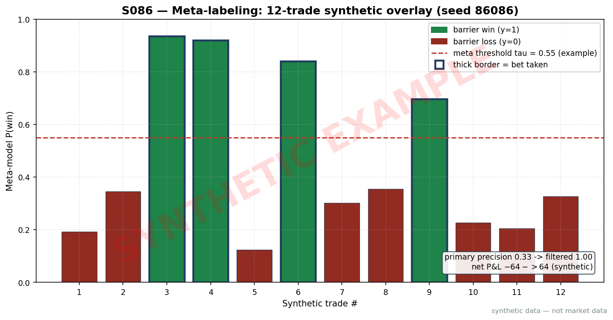

```mermaid
flowchart LR
    FEED["Raw feed<br/>(1-min bars + primary)"] -->|"1-min bars"| ING["Ingest + normalize<br/>(exchange ts, DST, halts)"]
    ING -->|"clean 1-min bars"| FEAT["Feature compute<br/>(meta features at event t)"]
    FEAT -->|"per-event feature rows"| SIG["Signal S086<br/>meta P(win) overlay"]
    SIG -->|"per-event bet probability"| GATE{"Cost / toxicity<br/>gate?"}
    GATE -->|"pass: trades"| OUT["Downstream consumer<br/>(sizing / execution)"]
    GATE -->|"fail: none"| DROP["No trade"]
    style SIG fill:#aed6f1,stroke:#1f3a5f
```

### S12. Sources

- López de Prado, Marcos (2018). *Advances in Financial Machine Learning*. Wiley. Ch. 3 (§3.6 meta-labeling) and ch. 7 (cross-validation). https://www.wiley.com/go/advancedmachinelearningfinance
- darufinance (2026). "lopez-de-prado-work-review — Project 09" — EMA (exponential moving average)(20/60) primary, triple-barrier labels, bagging meta-labelers, 2 bp cost; XLF/XLV dropped below the 50-net-bet floor. https://github.com/darufinance/lopez-de-prado-work-review/blob/HEAD/projects/09_ensembles_importance/writeup/README.md
- Bailey, D. H., Borwein, J., López de Prado, M., & Zhu, Q. J. (2017). "The Probability of Backtest Overfitting." *Journal of Computational Finance* 20(4). https://scholarworks.wmich.edu/math_pubs/42/
- López de Prado, M. & Lewis, M. (2018). "Detection of False Investment Strategies Using Unsupervised Learning Methods." SSRN 3167017. https://ssrn.com/abstract=3167017 (the false-strategy-detection rationale for vetting meta-model "precision lifts" against the primary's trial count)
- Bailey, D. H., Borwein, J. M., López de Prado, M. & Zhu, Q. J. (2014). "Pseudo-Mathematics and Financial Charlatanism: The Effects of Backtest Overfitting on Out-of-Sample Performance." *Notices of the American Mathematical Society*, 61(5), 458–471. https://doi.org/10.1090/noti1105 (why in-sample precision jumps must survive out-of-sample decay before they count)
- Harvey, C. R. & Liu, Y. (2015). "Backtesting." SSRN 2345489. https://papers.ssrn.com/sol3/papers.cfm?abstract_id=2345489 (Sharpe haircuts under multiple testing: the documented counterpart to S10's demand that meta-model gains be measured net of selection bias)

**Unverified leads** (chatbot-provided, no independent checkable source — do not treat as evidence):
- Duck.ai (GPT-5.6 Luna, 2026-09-10), Q-SB3-2: meta-labeler RAM 10–600 MB base, fold copies 0.5–5 GB, cap `n_jobs` at 4–6 (cost model takes precedence for planning).
- Duck.ai (same), Q-SB3-3: "PRIMARY SUPPLIES THE SIDE"; Sharpe 0.2 → 2.0 via meta-labeling is implausible; triple-barrier/meta-labeling only after the primary shows positive purged OOS (out-of-sample).

*Source log: Duck.ai answered Q-SB3-1–Q-SB3-3 (2026-09-10); Grok/Cursor answers pending (checked 2026-09-10).*

---
## Stage 88/200 — S088: Purged / embargoed cross-validation

*Batch SB3 · Signal 88/100 · Provenance [D] · Family F — Statistical/ML infrastructure*

### S1. One-line verdict

| | |
|---|---|
| **What it is** | A cross-validation scheme that deletes training labels overlapping the test fold (purge) plus a safety buffer (embargo). |
| **When it works** | Labels overlap in time (triple-barrier, fixed-horizon returns); any model selection on financial time series. |
| **When it dies** | Labels never overlap (then it reduces to plain K-fold); embargo so long the folds are empty. |
| **Build-or-buy in one line** | Build — it is ~30 lines of index arithmetic, not a product; nothing to buy. |

Provenance **[D]** (documented: López de Prado, *Advances in Financial Machine Learning* (AFML), 2018, ch. 7). Family **F — Statistical/ML infrastructure**. This is a *validation procedure*, not a signal: it generates no trades, only trustworthy performance estimates.

### S2. How it works — plain human explanation

14:02, and your pairs backtest prints a Sharpe of 2.1 — **Sharpe ratio** meaning annualized mean return over annualized volatility. One question kills it: "How many training labels overlap the test period?" With **triple-barrier** labels (S085), each label spans a *window* of future prices — say 5 days. A Monday training label uses prices through Friday; a Wednesday test label starts Wednesday. The two share Wednesday–Friday prices: the model has peeked at the test answer during training. That is **leakage**, and it inflates backtests like peeking at an answer key.

Standard **K-fold cross-validation** assumes independent samples; financial labels with overlapping horizons are not. Purged K-fold fixes it in two steps. **Purge:** drop every training event whose label interval $[t_0, t_1]$ overlaps the test fold — those labels peek at test-period prices. **Embargo:** drop a further buffer at the boundary, since near-boundary labels still share information through serial correlation. What remains has no label overlap against the test fold.

**Mental model (3 bullets):**
- Overlapping labels make train and test share answers; purging deletes the shared answers from training.
- The embargo is a safety margin at the fold boundary — its length should cover the label horizon.
- Purged CV does not improve your model; it improves your *belief* about your model. Its product is honesty, not alpha.

### S3. The math — exact formula

Each labeled event $i$ has a start time $t_i(0)$ (the bet/event time) and a label-end time $t_i(1)$ (first barrier touch or the vertical barrier), defining the label interval $I_i = [t_i(0), t_i(1)]$. A test fold covers $[T_a, T_b]$.

**Purge rule.** Drop training event $i$ if its label interval intersects the test interval:

$$I_i \cap [T_a, T_b] \neq \emptyset \iff t_i(0) \le T_b \;\; \text{AND} \;\; t_i(1) \ge T_a$$

**Embargo rule.** Additionally drop a buffer of $L_E$ observations at the fold boundary, with $L_E$ at least the maximum label look-forward horizon: $L_E \ge \max_i (t_i(1) - t_i(0))$. Practitioner sizing guidance (*example, not a documented standard*): 0–1% of the sample for short non-overlapping labels; 2–5% for daily 5–10-day horizons; 5–10% for long horizons; 5–20% for highly overlapping intraday labels; always take the larger of the percentage rule and the horizon rule.

**⚠ Convention flag (operator-verified).** This chapter's explicitly chosen convention implements the embargo by removing the *first 3 test events*; de Prado's standard (AFML ch. 7) removes the *last train observations before the test fold*. The arithmetic is identical (3 removed either way; 35 train / 17 test / 8 removed = 60), but the boundary side differs — do not present the chapter's chosen convention as de Prado's standard. The example and chart below follow this chapter's chosen convention and label it; either convention breaks the overlap, but document whichever you use.

| Parameter | Symbol | Typical range | Too small / too large | Default (example) |
|---|---|---|---|---|
| Folds | $K$ | 5–10 | small: coarse estimates; large: heavy purge losses | 5 — *example, not an institutional standard* |
| Embargo length | $L_E$ | see % rules above | small: residual leakage; large: empty folds | 5% of sample — *example* |
| Label horizon | $h$ | strategy-dependent | drives both purge width and embargo floor | must be ≥ max look-forward — *rule, not example* |

**Normalization:** none required — this is index arithmetic on timestamps, applied identically to any feature scaling. **Causal timing:** purging/embargoing is a property of the *validation split*, computed from label intervals only; it uses no prices and introduces no lookahead of its own. **Variants:** (1) purged K-fold (shuffled folds on the remainder); (2) purged walk-forward / **combinatorial purged CV** (CPCV — many train/test paths, the basis of the Probability of Backtest Overfitting (PBO) test); (3) embargo-only (when labels barely overlap).

### S4. Worked example — step-by-step numbers (SYNTHETIC)

Synthetic schedule, seed **88088**: 60 daily events, 5-day label horizons, event $E_i$ → interval $[i, i+5]$. Test fold = $E_{41}$–$E_{60}$ (interval $[41, 65]$). Embargo = 5% of 60 = 3 events.

Step-by-step: (1) **Purge** — training candidates are $E_1$–$E_{40}$; drop any with $t_0 \le 65$ and $t_1 \ge 41$: $E_{36}$ ([36,41]) through $E_{40}$ ([40,45]) — 5 events; (2) **Embargo** (chapter convention, flagged above) — drop the first 3 test events $E_{41}$–$E_{43}$; (3) remainder: train $E_1$–$E_{35}$ (35), test $E_{44}$–$E_{60}$ (17), removed 8. Check: 35 + 17 + 8 = 60 ✓ (arithmetic operator-verified).

| Event | Start day | End day | Status |
|---|---|---|---|
| $E_{33}$–$E_{35}$ | 33–35 | 38–40 | TRAIN (kept) |
| $E_{36}$ | 36 | 41 | **PURGED** (interval touches test day 41) |
| $E_{37}$ | 37 | 42 | **PURGED** |
| $E_{38}$ | 38 | 43 | **PURGED** |
| $E_{39}$ | 39 | 44 | **PURGED** |
| $E_{40}$ | 40 | 45 | **PURGED** |
| $E_{41}$ | 41 | 46 | **EMBARGOED** (this chapter's convention: first 3 *test* events) |
| $E_{42}$ | 42 | 47 | **EMBARGOED** |
| $E_{43}$ | 43 | 48 | **EMBARGOED** |
| $E_{44}$–$E_{60}$ | 44–60 | 49–65 | TEST (17 events) |

Under de Prado's standard convention, the 3 embargoed events would instead be $E_{33}$–$E_{35}$ — the last 3 *train* observations before the test fold — leaving train = $E_1$–$E_{32}$ (32), test = $E_{41}$–$E_{60}$ (20), removed = 8. Same removed count, different boundary side; the chart below annotates this chapter's convention actually plotted.

**What to notice.** The purge is mechanical: any label interval touching the test window goes. Without it, $E_{36}$–$E_{40}$ would let the model train on days 41–45 prices and then be "tested" on labels built from those same prices — the classic phantom Sharpe. This toy is a *schedule*, not a backtest: no prices, no performance claims, only index arithmetic.

### S5. Strategies that use this signal

- **T087 — primary**: the purged-CV strategy selector allocates across sub-strategies by purged/embargoed-CV rank with meta-labels — this chapter's procedure is its engine.
- **T032 — validation**: copula tail-dependence pairs are validated with purged CV before any capital is committed.
- **T052 — validation**: the AR/ARMA (autoregressive / autoregressive–moving-average) innovation trader uses purged CV to validate its trade–quote VAR (vector autoregression) timing.
- **T100 — validation**: the grand 100-signal ensemble is validated with purged CV, meta-labeling, and triple-barrier training together.

### S6. Data required — exact spec

| Field | Type | Granularity | Source tier | Notes |
|---|---|---|---|---|
| Event start $t_0$ | ms int64 | event | inherits the labeled dataset's tier | the bet/trigger time |
| Label end $t_1$ | ms int64 | event | computed locally | first barrier touch or vertical barrier |
| Labels $y$ | bool/float | event | computed locally | any overlapping-horizon label |
| Fold assignment | int8 | event | computed locally | K-fold on the post-purge remainder |
| Features $X$ | float32 | event | inherits primary's tier | purging applies to rows of the feature matrix |

**The one structural requirement** (chatbot Q-SB3-2 lead — *labeled lead*): store every event with an event ID, side, and both timestamps — that makes purging mechanically enforceable.

Ingest sketch (≤20 lines):

```python
import polars as pl
ev = pl.read_parquet("labels/events.parquet")  # event_id, t0, t1
K, EMB = 5, 3                                    # folds; embargo in events (example)
# blocked folds on time-sorted events (contiguous blocks, NOT modulo interleaving)
folds = (ev.sort("t0").with_row_index("k")
           .with_columns((pl.col("k") * K // pl.len()).alias("fold")))
def purged_train(test_fold: int):
    test = folds.filter(pl.col("fold") == test_fold)
    ta, tb = test["t0"].min(), test["t1"].max()     # FULL fold interval [T_a, T_b]
    kept = (folds.filter(pl.col("fold") != test_fold)
                 .filter(~((pl.col("t0") <= tb) & (pl.col("t1") >= ta)))  # purge (S3)
                 .sort("t0"))
    test_kept = test.slice(EMB, None)              # embargo: drop first EMB test events
    return kept, test_kept  # this chapter's convention (35/17/8 in S4); de Prado drops last train rows — S3 flag
```

**Storage:** an event table is kilobytes-to-megabytes; the procedure adds no data beyond fold indices. **Data-quality checklist:** $t_1$ must be the *realized* label end (not the intended horizon, for early barrier touches); timestamps in one timezone; DST/half-days consistent between $t_0$ and $t_1$; corporate actions already reflected in the labels themselves.

### S7. Local build on M5 Max / 128GB

**Feasibility: trivial.** This is index arithmetic on an event table — microseconds to seconds. A full purged/embargoed validation pass runs in seconds-to-minutes for triple-barrier-scale event sets (a labeled chatbot lead, Duck.ai 2026-09-10 — consistent with cost-model §2's 10–50M rows/sec). RAM is negligible: event table plus fold masks are megabytes against the 77 GB working budget (§3).

**Engineering time:** Tier **L**, 4–12 h → **\$600–1,800** loaded cost at \$150/hr (per `notes/cost-model.md` §5, which explicitly lists S085/86/88 in Tier L). The chatbot's higher estimate of 20–45 h prototype / 50–120 h production covers a *full validation harness* (walk-forward orchestration, leakage tests, reporting) — a labeled lead, but on any conflict the cost-model band is the planning number. *One-line verdict: trivially feasible on the M5 Max (Tier L, ~8 h ≈ \$1.2k eng + \$0 data — it operates on labels you already have); bottleneck is discipline (storing $t_1$ correctly), not compute; nothing breaks at any symbol count.*

### S8. Buy vs build

| Option | What you get | Indicative price | What buying gains | What buying loses |
|---|---|---|---|---|
| Hand-roll from AFML ch. 7 snippets | ~30 lines of timestamp arithmetic | ~\$0 | Exact match to your label intervals | You test the edge cases yourself |
| Open-source ports (community AFML implementations) | Tested purge/embargo/CPCV code | ~\$0 | Community edge-case coverage | API churn; verify the embargo convention (see S3 flag) |
| Hosted research platforms (QuantConnect class) | Backtest harness + brokerage | Platform pricing | Execution plumbing | Per the chatbot lead: custom purge/embargo logic is still work; inspect universe/delisting treatment |
| "Buy a validation service" | — | n/a | — | This product does not exist; anyone selling it is selling your own timestamps back to you |

**Verdict: always build.** There is no data to buy and no model to license — only your event timestamps, which never leave your machine. The one real decision is the embargo *convention* (S3 flag): document whichever boundary side you choose.

### S9. Success ratio / efficacy — documented evidence

Purged CV has no "returns" — its documented value is measured in *phantom performance destroyed*: studies where naive validation showed edge and honest validation showed none.

| Study / source | Market & period | Metric | Before/after cost | Caveat |
|---|---|---|---|---|
| López de Prado, *AFML* (2018), ch. 7 | Methodological | Purge + embargo construction; embargo ≥ label horizon | n/a — design claim | Defines the procedure; the performance claims are about *validity*, not returns |
| Bailey, Borwein, López de Prado & Zhu (2017), "The Probability of Backtest Overfitting" | Simulated: random-walk prices with a fake seasonal effect (~4 years daily) | IS (in-sample) Sharpe 1.0–2.2 across optimized configs, yet Probability of Backtest Overfitting (PBO) ≈ 55% — the in-sample-best (IS-best) config lands in the *bottom half* out-of-sample about as often as a coin flip | **Before cost** (diagnostic demonstration) | Demonstrates selection overfitting; the companion example with a *real* injected monthly effect shows PBO near 0 — the test discriminates correctly |
| Practitioner replication: PBO complexity ladder (GitHub, rchhabra17, 2026) | SPY, 2010–2026, moving-average (MA)-crossover configs, Combinatorially Symmetric Cross-Validation (CSCV) S=16, costs held fixed | PBO 0.37–0.57 across complexity rungs; PBO did *not* rise monotonically with parameter count | **Before cost** (costs fixed across rungs) | Single market/single strategy family; shows the diagnostic working, not a trading edge |

**Regimes where it fails:** it cannot fix feature lookahead (purging label overlap while a feature peeks at the future); it cannot fix non-stationarity (use walk-forward, not shuffled folds, when regimes drift); an embargo shorter than the label horizon leaks by construction. **Honest bottom line: as a standalone trigger this is a zero edge — it is not a signal at all; as infrastructure it is the highest-ROI code in the stack, because every phantom Sharpe it kills is a losing strategy you never trade.**

**Cost treatment — n/a with explicit reasoning.** This procedure executes no trades: it produces only validation folds and trust scores, so spread, fees, and impact/slippage are not its cost components. Every strategy evaluated *through* this procedure must still model spread + fees + impact/slippage in its own backtest — purged CV guarantees the folds don't overlap, not that the trades were cheap.

### S10. Failure modes & pitfalls

1. **Purging labels but not features.** A feature computed with post-$t$ data leaks regardless of purging → *causality-audit every feature timestamp, not just labels.*
2. **Embargo shorter than the label horizon.** The buffer must cover the maximum look-forward → *$L_E \ge \max(t_1 - t_0)$ as a hard rule.*
3. **Smoothed instead of filtered states.** Using full-sample-smoothed regime probabilities as features leaks the future (chatbot Q-SB3-1 lead: use *filtered*, not smoothed, states for live signals) → *filter-only features.*
4. **Purging into empty folds.** Long horizons + many folds can delete most of the training set → *reduce K or shorten horizons; check fold sizes.*
5. **Shuffled folds on drifting regimes.** Purged K-fold assumes approximate stationarity → *use purged walk-forward when the data-generating process drifts.*
6. **Tuning the embargo on the test set.** Trying embargo lengths until out-of-sample (OOS) looks good is itself overfitting → *fix the embargo rule before seeing test results.*
7. **Treating it as a strategy.** "Our edge is purged CV" → *it is a measuring instrument; the edge must live in the primary.*

### S11. Visuals

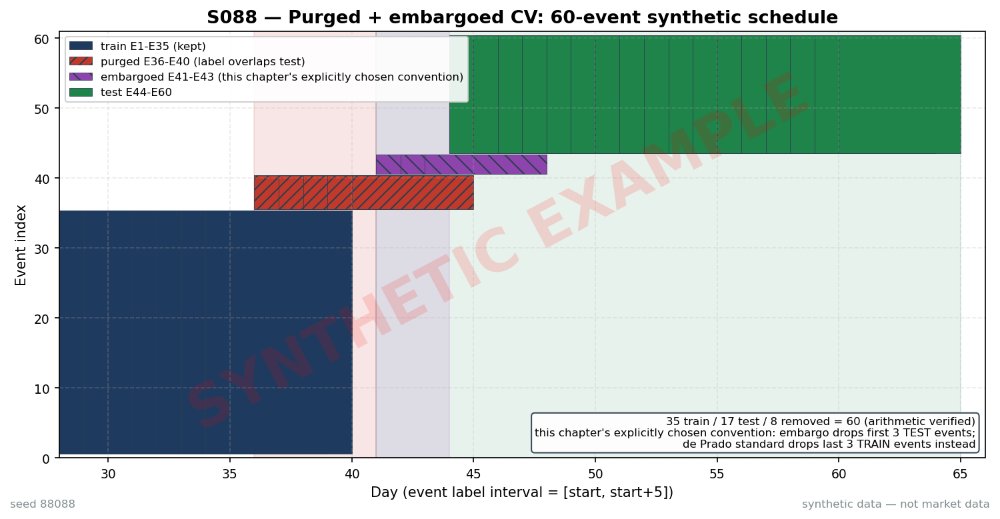

```mermaid
flowchart LR
    FEED["Raw feed<br/>(labeled events)"] -->|"event table (per-event t0/t1 rows)"| ING["Ingest + normalize<br/>(t0, t1 per event)"]
    ING -->|"timed events (per-event intervals)"| FEAT["Feature compute<br/>(purge + embargo masks)"]
    FEAT -->|"per-fold train/test masks"| SIG["Signal S088<br/>leak-free CV folds"]
    SIG -->|"per-fold CV score"| GATE{"Cost / toxicity<br/>gate?"}
    GATE -->|"pass: select"| OUT["Downstream consumer<br/>(strategy selection)"]
    GATE -->|"fail: none"| DROP["No trade"]
    style SIG fill:#aed6f1,stroke:#1f3a5f
```

### S12. Sources

- López de Prado, Marcos (2018). *Advances in Financial Machine Learning*. Wiley. Ch. 7 (cross-validation in finance: purge, embargo, CPCV). https://www.wiley.com/go/advancedmachinelearningfinance
- Bailey, D. H., Borwein, J., López de Prado, M., & Zhu, Q. J. (2017). "The Probability of Backtest Overfitting." *Journal of Computational Finance* 20(4). PDF: https://www.davidhbailey.com/dhbpapers/backtest-prob.pdf ; record: https://scholarworks.wmich.edu/math_pubs/42/
- rchhabra17 (2026). "probability-of-backtest-overfitting" — PBO complexity ladder on SPY 2010–2026 (PBO 0.37–0.57 across rungs). https://github.com/rchhabra17/probability-of-backtest-overfitting/blob/HEAD/README.md
- White, H. (2000). "A Reality Check for Data Snooping." *Econometrica*, 68(5), 1097–1126. https://doi.org/10.1111/1468-0262.00152 (the data-snooping test: why naive k-fold validation on financial series produces spurious significance — the documented motivation for purged/embargoed validation)
- Hansen, P. R. (2005). "A Test for Superior Predictive Ability." *Journal of Business & Economic Statistics*, 23(4), 365–380. https://doi.org/10.1198/073500105000000063 (studentized extension of White's Reality Check with better power — the documented standard for comparing strategies against a benchmark)
- Romano, J. P. & Wolf, M. (2005). "Stepwise Multiple Testing as Formalized Data Snooping." *Econometrica*, 73(4), 1237–1282. https://doi.org/10.1111/j.1468-0262.2005.00615.x (stepwise multiple-testing procedure controlling the familywise error rate when comparing several strategies to a benchmark — the multiplicity control S10 §5's CSCV lacks on its own)

**Unverified leads** (chatbot-provided, no independent checkable source — do not treat as evidence):
- Duck.ai (GPT-5.6 Luna, 2026-09-10), Q-SB3-1: purged/embargoed worked example (60 events; arithmetic operator-verified); embargo % rules (0–1% / 2–5% / 5–10% / 5–20%) with the horizon floor ($L_E \ge$ max look-forward).
- Duck.ai (same), Q-SB3-2: purge/embargo engineering 20–45 h prototype / 50–120 h production; store every event with event ID, side, timestamps.

*Source log: Duck.ai answered Q-SB3-1–Q-SB3-3 (2026-09-10); Grok/Cursor answers pending (checked 2026-09-10).*

---
## Stage 91/200 — S091: Machine-readable news sentiment (first-minute reaction)

*Batch SB3 · Signal 91/100 · Provenance [D] · Family G — Alternative data*

### S1. One-line verdict

| | |
|---|---|
| **What it is** | Signed news flow (sentiment × relevance × novelty) traded in the seconds-to-minutes after the timestamp. |
| **When it works** | Liquid names, scheduled or cleanly-tagged unscheduled news, a fast pipe, and a slower crowd to trade against. |
| **When it dies** | Stale/duplicate timestamps, mega-cap efficiency, headline latency, or spread+slippage wider than the move. |
| **Build-or-buy in one line** | Buy the machine-readable feed; build the scorer — unless free headlines plus public NLP (natural language processing) suffice. |

Provenance **[D]** (documented: Groß-Klußmann & Hautsch 2011; Tetlock 2007; Loughran & McDonald 2011). Family **G — Alternative data**. Horizon: seconds (headline reaction, mostly competed away) to 1–5 days (drift/fade legs).

### S2. How it works — plain human explanation

14:00:03 ET. A newswire flashes: fictional NOVA's Phase 2 readout beat expectations. The vendor's feed tags it in milliseconds: sentiment +0.85, relevance 90 (firm-specific), novelty 80 (not a reprint). Long 500 shares by 14:00:06. Over the next minute the stock climbs 40 **basis points** (bps — hundredths of a percent); humans are still reading the headline. By 14:10 the fast money has digested it and you are out.

Why doesn't the price jump instantly? Three frictions: **limited attention** (information diffuses with a lag); heterogeneous processing (algos in milliseconds, humans in minutes, portfolio managers (PMs) tomorrow — the same news gets priced in waves); overreaction then digestion (the spike overshoots, then **mean-reverts** — Tetlock (2007) documented exactly this at daily frequency: pessimism predicts next-day declines that reverse in 2–5 days).

**Mental model (3 bullets):**
- News moves prices in *waves*: millisecond algos, minute-scale humans, day-scale repositioning — each wave is someone's edge and someone else's noise.
- The tradable object is not the news, it is the *lag between the timestamp and the crowd* — plus the overshoot that follows.
- Timestamps are everything: a signal computed on the publication time instead of the first *available* time is a fantasy.

### S3. The math — exact formula

Per story $i$, the vendor (or your NLP — natural language processing) emits: sentiment $s_i \in [-1, +1]$ (the **Event Sentiment Score**, ESS — RavenPack-style), relevance $rel_i \in [0,100]$ (how firm-specific the story is), and novelty $nov_i \in [0,100]$ (how new vs a reprint). Aggregate per name per time bucket $b$:

$$S_b = \frac{\sum_{i \in b} s_i \cdot rel_i \cdot nov_i}{\sum_{i \in b} rel_i \cdot nov_i}, \qquad
z_b = \frac{S_b - \mu_{trail}}{\sigma_{trail}}$$

Enter with the sign of $S_b$ when $z_b > z_{entry}$ and novelty is high; exit after $h$ minutes as the reaction completes. The classical dictionary version (Tetlock 2007): pessimism $= \frac{\text{# negative words}}{\text{# total words}}$; high pessimism predicts next-day decline. Use the **Loughran–McDonald** finance dictionary, not the Harvard psychosocial dictionary — roughly three-quarters of Harvard "negatives" (liability, tax, cost) are neutral accounting terms in finance (Loughran & McDonald 2011).

| Parameter | Symbol | Typical range | Too small / too large | Default (example) |
|---|---|---|---|---|
| Aggregation bucket | $b$ | 1–15 min | small: noisy; large: the move is over | 1 min — *example, not an institutional standard* |
| Trailing z-window | — | 20–60 days | small: unstable $\sigma$; large: stale regime | 30 days — *example* |
| Relevance floor | $rel_{min}$ | 50–95 | small: sector noise; large: too few events | 80 — *example* |
| Novelty floor | $nov_{min}$ | 50–95 | small: trade stale reprints; large: miss follow-ups | 70 — *example* |
| Entry z | $z_{entry}$ | 1.5–3.0 | small: false positives; large: no trades | 2.0 — *example* |
| Exit horizon | $h$ | 2–30 min | small: noise exits; large: fade eats the profit | 10 min — *example* |

**Normalization:** z-score $S_b$ against its own trailing history per name (news flow intensity differs wildly across names); never compare raw ESS across large- and small-caps. **Causal timing:** computed at the first *available* timestamp $\tau_a$ (when the story hit *your* pipe), not the publication timestamp; tradable no earlier than $\tau_a$ + your latency. **Variants:** (1) first-minute momentum (trade with the sign); (2) stale-news fade (low novelty + extreme $z$ → fade the overreaction, the S093 leg); (3) slow sentiment factor (daily-aggregated $S_b$ held for days — the Tetlock drift leg).

### S4. Worked example — step-by-step numbers (SYNTHETIC)

Synthetic 1-minute path around a positive news event, seed **91091**. Story: ESS = +0.85 (*example*), relevance 90, novelty 80 — clears all floors. First available timestamp at minute 0. Entry: buy 500 shares of fictional NOVA at \$50.00 at $t=0$ + 2 s; exit at $t=10$ min. All prices synthetic.

| Minute | Per-min return (bps) | Cumulative (bps) |
|---|---|---|
| 0 | +39.6 | +39.6 |
| 1 | −3.7 | +36.0 |
| 2 | +7.6 | +43.5 |
| 3 | +4.4 | +48.0 |
| 4 | +11.0 | +58.9 |
| 5 | −19.4 | +39.6 |
| 6 | +13.8 | +53.4 |
| 7 | −10.1 | +43.3 |
| 8 | +3.3 | +46.6 |
| 9 | +4.4 | +51.0 |
| 10 | −5.3 | +45.7 |

Step-by-step: (1) the first minute prints +39.6 bps — the reaction leg; (2) minutes 1–10 add drift and noise, ending at +45.7 bps cumulative; (3) exit at \$50.00 × (1 + 0.00457) = \$50.2285; (4) gross P&L = 500 × \$0.2285 = **\$114.25**; (5) costs (`example` decomposition): spread \$0.01/share round-trip = \$5.00; commissions/fees \$0.005/share round-trip = \$2.50; **impact/slippage = \$0.00 — explicit example assumption** (a 500-share market order in the first minute of a breaking headline is assumed to walk no book; a live implementation must add a slippage line). Total \$7.50 → **net +\$106.75**. (By $t=30$ the path has faded to +30.0 bps — the digestion leg.)

**What to notice.** The per-minute prints are noisy (±19 bps swings) — the only clean number is the first-minute jump, which is exactly the leg a small operation is least likely to capture: it assumes a 2-second reaction to the *available* timestamp with no queue competition and no **adverse selection** (trading against someone faster who already picked the best prices). The P&L is arithmetic on a toy path, not a backtest. The honest lesson of the table is in the fade: hold too long and the edge decays.

### S5. Strategies that use this signal

- **T059 — primary**: news-sentiment first-minute momentum with volume confirmation — this chapter's signal as the entry trigger.
- **T067 — primary**: the anchored-VWAP event trader anchors volume-weighted average price at news/events and trades deviations with novelty context.
- **T049 — confirmation filter**: the unusual-options-activity follower confirms signed options sweeps with news sentiment.
- **T078 — context**: the earnings-drift intraday leg trades post-announcement drift where S091 supplies the sentiment context.

### S6. Data required — exact spec

| Field | Type | Granularity | Source tier | Notes |
|---|---|---|---|---|
| Headline text / story ID | string | event | Tier 1–3 | dedupe key; corrections must supersede originals |
| First *available* timestamp | ms int64 | event | Tier 1–3 | when it hit your pipe — the only timestamp that matters |
| Publication timestamp | ms int64 | event | Tier 1–3 | for diagnostics only; never for signal timing |
| ESS / sentiment $s_i$ | float ∈ [−1,1] | event | Tier 2–3 (vendor) or computed | vendor ESS or own Loughran–McDonald scorer |
| Relevance / novelty | float 0–100 | event | Tier 2–3 | vendor-provided; hard to replicate well yourself |
| Firm tagging | FIGI (Financial Instrument Global Identifier)/permanent ID | event | Tier 1–3 | ticker-only tagging breaks on corporate actions |

Ingest sketch (≤20 lines):

```python
import polars as pl
def on_story(story):  # story: dict from the vendor websocket
    if story["relevance"] < 80 or story["novelty"] < 70:  # example floors
        return
    tau_a = story["available_ts"]          # FIRST available, not published ts
    z = (story["ess"] - trail_mean[story["figi"]]) / trail_sd[story["figi"]]
    if z > 2.0:                            # example entry threshold
        submit(symbol=story["figi"], side=sign(story["ess"]),
               ttype="marketable-limit", valid_until=tau_a + 600_000)  # 10-min exit
```

**Storage:** headlines are tiny (thousands of stories/day ≈ MBs); a multi-year archive with full text runs to low GBs — trivial. **Data-quality checklist:** first-available vs publication timestamp (never backtest on the publication time; log your own receipt time as well); timezone normalization; duplicate/corrected headlines; corporate actions in the tagging; halts (news during halts is untradable); DST/half-days.

### S7. Local build on M5 Max / 128GB

**Feasibility: feasible** — the compute is trivial (thousands of stories/day; scoring is microseconds). What is *not* trivial is latency and licensing, which are the actual constraints. Throughput per `notes/cost-model.md` §2 is a non-issue: even a from-scratch Loughran–McDonald scorer over the full daily news flow runs in seconds on polars. RAM: the working set is megabytes — headlines, a trailing z-score panel, nothing more — far under the 77 GB budget (§3).

**Stack options:** Python + polars for the scorer; the feed arrives by vendor websocket/REST (no choice of stack there); DuckDB for the story archive. There is no GPU workload unless you train your own transformer scorer — unnecessary at this scale. **Engineering time:** Tier **H**, 60–200 h → **\$9,000–30,000** loaded-cost estimate at \$150/hr (per `notes/cost-model.md` §5, which places licensed alt-data G-family pipelines in Tier H — the hours go to timestamp plumbing, dedupe, corporate-action mapping, and latency measurement, not to math). *One-line verdict: feasible on the M5 Max (Tier H, ~100 h ≈ \$15k eng + feed cost); bottleneck is feed latency and timestamp correctness, not compute.*

### S8. Buy vs build

| Option | What you get | Indicative price | What buying gains | What buying loses |
|---|---|---|---|---|
| Tier-0 free route | Free headlines (exchange feeds, SEC EDGAR (Electronic Data Gathering, Analysis, and Retrieval) 8-K (current-report filing)) + public NLP (natural language processing) | ~\$0 | Zero cost; 8-Ks have clean timestamps | Minutes-late for market-moving news |
| Tier-1 retail | Polygon news API / Benzinga-class machine-readable headlines | ~\$30–200/mo (Polygon class); Benzinga Pro ~\$100–200/mo, *indicative — verify before budgeting* | Millisecond timestamps, firm tagging | Retail latency tier; headline coverage gaps |
| Tier-2/3 professional | RavenPack / Bloomberg-class news + sentiment | \$\$\$\$ enterprise, *indicative — verify before budgeting* | Full history, relevance/novelty scores, low latency | Enterprise contracts; **redistribution-license limits** — you generally cannot resell or redistribute derived signals |
| Academic route | Papers + public dictionaries | ~\$0 | The measurement science (Tetlock, LM dictionaries) | No real-time feed |

**Verdict: buy the feed, build the scorer.** The vendor's moat is timestamps, tagging, and history — rebuilding that is re-licensing anyway (per `notes/cost-model.md` §6: buy when the data is licensed redistribution data). Your moat is the aggregation, the z-scoring, and the execution — build those. Crossover: if your holding period is minutes-to-days rather than seconds, the Tier-0/1 route is adequate; sub-minute reaction requires Tier-2/3 latency. Note the license limit explicitly: most news contracts restrict redistribution, so a signal business built on vendor news needs the redistribution rider, not the terminal license.

### S9. Success ratio / efficacy — documented evidence

| Study / source | Market & period | Metric | Before/after cost | Caveat |
|---|---|---|---|---|
| Tetlock (2007), *Journal of Finance* | US market, *Wall Street Journal* (WSJ) "Abreast of the Market" column | High media pessimism (negative-words share) predicts next-day downward pressure, followed by reversion to fundamentals within 2–5 days; extreme pessimism predicts high trading volume | **Before cost** (predictive regression, no tradable implementation) | Daily column, market-level — not a first-minute strategy; the fade leg it documents is the slow cousin of this chapter's signal |
| Groß-Klußmann & Hautsch (2011), *J. Empirical Finance* 18 | Firm-specific Reuters NewsScope sentiment data | Significant high-frequency reactions in returns, volatility, trading intensity, trade sizes, imbalances, spreads and depth to machine-readable sentiment, relevance, and novelty | **Before cost** (event-study measurement, not a strategy) | Documents that the reaction *exists* at high frequency — not that it is capturable after spread |
| Tetlock, Saar-Tsechansky & Macskassy (2008), *Journal of Finance* 63 | Firm-specific news stories | Negative language in news predicts earnings and stock returns (underreaction to linguistic content) | **Before cost** | Supports the slow drift leg; linguistic, not millisecond, predictability |

**Regimes where it fails:** simultaneous macro news; earnings season (everyone's pipe is fast); volatility shocks (spreads widen past the edge); low-float names; pre-positioned leakage (the timestamp was wrong). Documented decay: as feeds commoditized, the first-minute reaction compressed — the consensus is that *existence* of the reaction is robust while *capturability* decays with competition. **Honest bottom line: as a standalone trigger this is a thin, latency-gated edge for a small operation — the first minute belongs to the fastest pipe; as a filter and regime gate (stand down into toxic news, size into clean scheduled news) it is genuinely valuable.**

### S10. Failure modes & pitfalls

1. **Publication timestamp ≠ first available timestamp.** Backtests on publication times are fantasies → *use the vendor's availability timestamp; log your own receipt time.*
2. **Duplicate / corrected headlines.** Reprints retrigger the signal on stale news → *dedupe by story ID; novelty floor; corrections supersede.*
3. **Stale news traded as fresh.** A 2-hour-old story with high ESS is not a signal → *novelty filter + age cutoff.*
4. **Pre-positioned leakage.** Price already moved before $\tau_a$ → *check pre-event drift; skip if the move is mostly done.*
5. **Simultaneous macro news.** Firm sentiment is noise during FOMC/CPI → *macro calendar gate.*
6. **Dictionary mismatch.** Harvard "negatives" misfire on finance text → *Loughran–McDonald dictionary (S3).*
7. **Cost blowup.** Spread + slippage + adverse selection erase mega-cap first-minute moves → *model costs explicitly; prefer less-efficient names where the gross move survives costs.*
8. **Halts and gaps.** News that halts the stock cannot be traded at the signal price → *halt filter; never assume the pre-halt print.*

### S11. Visuals

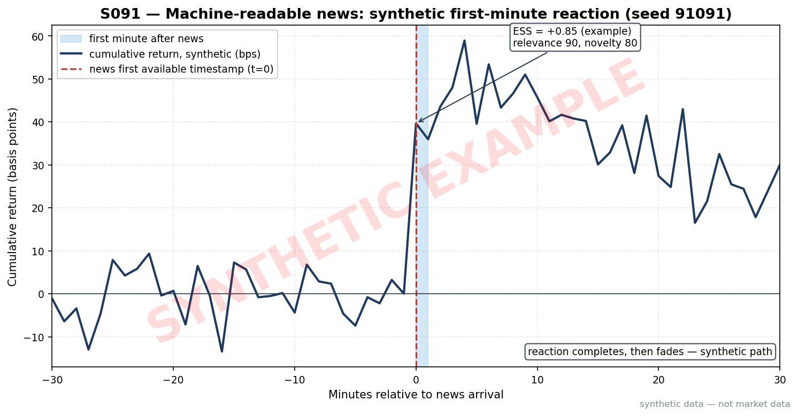

```mermaid
flowchart LR
    FEED["Raw feed<br/>(machine newswire)"] -->|"headlines (per-story events)"| ING["Ingest + normalize<br/>(avail ts, dedupe)"]
    ING -->|"timestamped stories (per-story)"| FEAT["Feature compute<br/>(ESS x rel x novelty)"]
    FEAT -->|"per-story sentiment scores"| SIG["Signal S091<br/>news z-score"]
    SIG -->|"per-story trade signal"| GATE{"Cost / toxicity<br/>gate?"}
    GATE -->|"pass: trades"| OUT["Downstream consumer<br/>(1-min momentum)"]
    GATE -->|"fail: none"| DROP["No trade"]
    style SIG fill:#aed6f1,stroke:#1f3a5f
```

### S12. Sources

- Tetlock, Paul C. (2007). "Giving Content to Investor Sentiment: The Role of Media in the Stock Market." *Journal of Finance* 62(3), 1139–1168. http://www.columbia.edu/~pt2238/papers/Tetlock_Media_Sentiment_JF.pdf
- Groß-Klußmann, Axel & Hautsch, Nikolaus (2011). "When Machines Read the News: Using Automated Text Analytics to Quantify High Frequency News-Implied Market Reactions." *Journal of Empirical Finance* 18(2), 321–340. https://www.scss.tcd.ie/Khurshid.Ahmad/Research/High_Frequency_Trading/2011_Gross_Klussman_Hautsch_NewsImpactHF_JEmpFin.pdf
- Loughran, Tim & McDonald, Bill (2011). "When Is a Liability Not a Liability? Textual Analysis, Dictionaries, and 10-Ks." *Journal of Finance* 66(1), 35–65. https://econpapers.repec.org/RePEc:bla:jfinan:v:66:y:2011:i:1:p:35-65 — word lists: https://sraf.nd.edu/loughranmcdonald-master-dictionary/
- Boudoukh, J., Feldman, R., Kogan, S. & Richardson, M. (2019). "Information, Trading, and Volatility: Evidence from Firm-Specific News." *The Review of Financial Studies*, 32(3), 992–1033. https://ideas.repec.org/a/oup/rfinst/v32y2019i3p992-1033..html (news-identified fundamental information accounts for 49.6% of overnight idiosyncratic volatility — the documented basis for S3's overnight-releases variant)
- Calomiris, C. W. & Mamaysky, H. (2019). "How News and Its Context Drive Risk and Returns Around the World." *Journal of Financial Economics*, 133(2), 299–336. https://doi.org/10.1016/j.jfineco.2018.11.009 (multi-country news-flow measures drive risk and returns — the documented basis for the global-news coverage claim in S3)
- Keown, A. J. & Pinkerton, J. M. (1981). "Merger Announcements and Insider Trading Activity: An Empirical Investigation." *Journal of Finance*, 36(4), 855–869. https://www.jstor.org/stable/2327551 (significant pre-announcement leakage up to 12 trading days before the first public announcement — the documented reason S10 §1 demands the vendor's availability timestamp, not the publication timestamp)

**Unverified leads** (chatbot-provided, no independent checkable source — do not treat as evidence):
- Duck.ai (GPT-5.6 Luna, anonymous, 2026-09-10), Q-SB3-2: backtests MUST use the first *available* timestamp, not the publication timestamp.
- Duck.ai (same), Q-SB3-3: no universal first-minute drift number; liquid large-cap first-minute response often small; after spread/slippage frequently ≈ 0 for mega-caps; half-lives — scheduled liquid news: minutes to tens of minutes; earnings drift: hours to sessions; slow attention/sentiment: days (low signal-to-noise).

*Source log: Duck.ai answered Q-SB3-1–Q-SB3-3 (2026-09-10); Grok/Cursor answers pending (checked 2026-09-10).*

---
## Stage 94/200 — S094: Unusual intraday volume (RVOL) & signed block-trade pressure

*Batch SB3 · Signal 94/100 · Provenance [SR] · Family B — Intraday momentum & breakout*

### S1. One-line verdict

| | |
|---|---|
| **What it is** | Volume vs its own time-of-day history (RVOL) plus the buy/sell imbalance of large block prints. |
| **When it works** | Liquid names where abnormal volume marks real information arrival or institutional participation. |
| **When it dies** | Op-ex/rebalance volume, retail frenzies, low-float gaps — volume without direction is noise. |
| **Build-or-buy in one line** | Build — it is arithmetic on your own bars and trades; buy only the cleanest trade feed you can afford. |

Provenance **[SR]** (standard reconstruction — the RVOL construction and block-imbalance composite are practitioner-standard, not from a single paper; the Lee–Ready signing step is documented [D] within it). Family **B — Intraday momentum & breakout**. Horizon: minutes to the session.

### S2. How it works — plain human explanation

10:07 ET. Fictional XYZ prints a 45,000-share block at the ask — then another. The 5-minute bin's volume is 3.4× its 20-day average for this time of day: RVOL 3.4, block imbalance +1.0 (all buys). Someone big is accumulating, and they are not hiding it well.

Why should volume predict anything? Two mechanisms. First, **information arrival**: informed traders must trade to profit, and their volume shows up *before* the price fully adjusts — signed prints reveal institutional direction while the adjustment is incomplete (Chan & Lakonishok 1993). Second, **visibility**: Gervais, Kaniel & Mingelgrin (2001) showed unusually high volume stocks appreciate over the following month — the "high-volume return premium". The block intuition is **adverse selection** in reverse: the informed party has revealed its hand, and the absorption pressure hasn't fully decayed.

**Mental model (3 bullets):**
- RVOL answers "is anyone here?" — abnormal participation vs the same time-of-day history.
- Signed blocks answer "which way are they going?" — volume without direction is noise.
- The edge is in the *combination*: participation confirms the move is institutional; the sign gives the direction; the fade comes when the imbalance mean-reverts.

### S3. The math — exact formula

For time-of-day bin $b$ (e.g. 5-minute bins) on day $t$, with $V_{t,b}$ the bin volume:

$$RVOL_{t,b} = \frac{V_{t,b}}{\frac{1}{N}\sum_{d=1}^{N} V_{t-d,b}}, \qquad
z(RVOL_{t,b}) = \frac{RVOL_{t,b} - \mu}{\sigma}$$

Time-of-day matching removes the **U-shape** (the diurnal pattern of high volume at the open and close, thin midday — see S067). Trigger: $RVOL > 2$ or $z(RVOL) > 2$ (*examples — not institutional standards*).

Direction from signed blocks — sign each trade with **Lee–Ready (1991)**: the **quote test** compares the trade price to the *lagged* midquote (the paper's 5-second lag fixes quotes recorded ahead of trades); the **tick test** resolves midquote trades against the previous trade price (uptick = buy, downtick = sell). Block filter: size ≥ threshold (*example:* ≥ 10,000 shares, or top 1% of prints). Then:

$$BlockImb_b = \frac{\text{BuyVol}_{blocks,b} - \text{SellVol}_{blocks,b}}{\text{TotalVol}_{blocks,b}} \in [-1, +1]$$

Trade with the sign of $BlockImb$; fade/exit when it mean-reverts toward zero.

| Parameter | Symbol | Typical range | Too small / too large | Default (example) |
|---|---|---|---|---|
| Baseline window | $N$ | 20–60 days | small: noisy baseline; large: stale (regime drift) | 20 days — *example, not an institutional standard* |
| Bin width | $b$ | 5–30 min | small: noisy; large: the move is over | 5 min — *example* |
| RVOL trigger | — | 1.5–3.0 | small: false positives; large: no trades | 2.0 — *example* |
| Block size threshold | — | 5k–50k shares | small: retail noise; large: no blocks | 10,000 shares — *example* |
| Imbalance window | — | 15–30 min | small: flickers; large: stale direction | 15 min — *example* |

**Normalization:** RVOL is already a ratio (self-normalizing); z-score it per name if you need cross-sectional comparability. **Causal timing:** the bin's RVOL is computed at the bin *close* using only completed bins and completed past days; tradable no earlier than the next bin. **Variants:** (1) session-cumulative RVOL (today's cumulative volume vs average cumulative at the same time); (2) dollar-volume RVOL (shares × price — better across names).

### S4. Worked example — step-by-step numbers (SYNTHETIC)

Synthetic morning tape, seed **94094**: twelve 5-minute bins, 9:30–10:30, fictional XYZ. Baseline = 20-day average volume for the same time-of-day bin (thousands of shares). Two synthetic institutional events: bin 4 prints two buy blocks (25k, 18k shares); bin 9 prints one sell block (30k shares). All numbers synthetic.

| Bin | Time | Baseline (k) | Actual (k) | RVOL | Blocks | Trigger? |
|---|---|---|---|---|---|---|
| 1 | 9:30 | 120 | 133 | 1.11 | — | — |
| 2 | 9:35 | 90 | 78 | 0.87 | — | — |
| 3 | 9:40 | 70 | 83 | 1.19 | — | — |
| 4 | 9:45 | 60 | 206 | 3.43 | 2 buy (25k, 18k) | **YES** |
| 5 | 9:50 | 55 | 87 | 1.58 | — | — |
| 6 | 9:55 | 50 | 44 | 0.88 | — | — |
| 7 | 10:00 | 48 | 46 | 0.96 | — | — |
| 8 | 10:05 | 50 | 63 | 1.26 | — | — |
| 9 | 10:10 | 55 | 157 | 2.85 | 1 sell (30k) | **YES** |
| 10 | 10:15 | 65 | 101 | 1.55 | — | — |
| 11 | 10:20 | 80 | 88 | 1.10 | — | — |
| 12 | 10:25 | 100 | 89 | 0.89 | — | — |

Step-by-step: (1) bin 4: RVOL = 206/60 = **3.43** > 2.0 → trigger; (2) BlockImb = (25+18−0)/43 = **+1.0** → long; (3) enter 2,000 shares at \$40.00 in bin 5; (4) bin 9: RVOL = 157/55 = **2.85**, BlockImb = **−1.0** — imbalance flipped → exit at \$40.35; (5) gross = 2,000 × \$0.35 = **\$700**; (6) costs — explicit components (`example`): **spread** (crossing the half-spread on entry and exit) 2,000 × \$0.01 = \$20; **commissions/fees** \$10; **market impact/slippage** (chasing the block prints) \$20 → total **\$50** → **net +\$650**.

**What to notice.** The signal fired exactly twice — both times on *combinations* of participation and sign, never on volume alone (bin 10's 1.55 RVOL with no blocks is correctly ignored). The toy assumes fills at the bin-4 close with no **market impact** (price concession for demanding immediacy) and no partial fills — in reality, chasing the second block print means paying the impact the block created. The P&L is arithmetic, not a backtest.

### S5. Strategies that use this signal

- **T018 — primary**: the RVOL-gated gap-and-go chases opening gaps only with institutional relative volume and block-pressure footprints.
- **T084 — primary**: the block-trade impact reversion provides liquidity after block trades and exits on the resiliency half-life — the fade leg of this chapter's signal.
- **T039 — confirmation**: the ETF creation/redemption flow trader confirms ETF–basket dislocations with block volume and relative volume.
- **T049 — confirmation**: the unusual-options-activity follower confirms signed options sweeps with equity RVOL.

### S6. Data required — exact spec

| Field | Type | Granularity | Source tier | Notes |
|---|---|---|---|---|
| Tick trades (price, size) | float/int | trade | Tier 1–2 | for Lee–Ready signing and block detection |
| Quotes (bid/ask) | float | L1 (level-1, top-of-book) | Tier 1–2 | lagged midquote for the quote test |
| 1-min OHLCV bars | float/int | 1-min | Tier 0–1 | RVOL baseline can be built from bars alone |
| Corporate actions / halts | calendar | daily/event | Tier 1 | baselines must be split-adjusted; halts excluded |

Ingest sketch (≤20 lines, Python/polars):

```python
import polars as pl
trades = pl.read_parquet("trades/XYZ.parquet")   # ts, price, size
quotes = pl.read_parquet("quotes/XYZ.parquet")   # ts, bid, ask
q = quotes.with_columns(((pl.col("bid") + pl.col("ask")) / 2).alias("mid"))
t = (trades.with_columns(pl.col("ts").sub(pl.duration(seconds=5)).alias("lookup_ts"))
           .join_asof(q, left_on="lookup_ts", right_on="ts", strategy="backward"))  # latest quote ≥ 5 s before the trade
t = t.with_columns(
    pl.when(pl.col("price") > pl.col("mid")).then(1)
     .when(pl.col("price") < pl.col("mid")).then(-1)
     .otherwise(pl.col("price").diff().sign())          # tick test
     .alias("sign"))
blocks = t.filter(pl.col("size") >= 10_000)            # example threshold
```

**Storage:** 1-min bars are trivial (~50 MB/day for 500 symbols, per `notes/cost-model.md` §4); tick trades/quotes for liquid names run ~2–8 GB per symbol-day in parquet (§4) — archive selectively, compute RVOL from bars for history. **Data-quality checklist:** timestamp normalization (SIP vs exchange), bad ticks, splits, halts, DST/half-days, stale quotes (the Lee–Ready lag exists precisely because of quote staleness). Latency/queue-position claims on SIP (the Securities Information Processor, the consolidated tape)/L1 (level-1, top-of-book) are *simulated only — requires MBO (market-by-order)/ITCH (Nasdaq's ITCH direct feed)*.

### S7. Local build on M5 Max / 128GB

**Feasibility: feasible** — this is Tier M plumbing, not heavy compute. Tick-trade rates for liquid names run ~10–200/sec busy (per `notes/cost-model.md` §2): a Python loop handles ≤20 symbols, and polars `join_asof` for Lee–Ready quote matching runs at ~1–10M rows/sec (§2), so the signing step — the actual bottleneck — is comfortable in batch and fine intraday for dozens of symbols.

**Throughput / RAM:** RVOL itself is a grouped ratio — polars does 500 symbols × 390 one-minute bars in milliseconds. The working set that matters is tick data: one symbol-day of trades is tens of MB; 50 symbols × 60 days of ticks does *not* fit the 77 GB working budget (§3) — use per-symbol daily files and stream, or build baselines from 1-min bars (12 MB for 500 symbols × 60 days — trivial, §3). **Stack options:** Python + polars is the default; Rust only if you push full-depth L2 signing in real time; DuckDB for the tick archive. **Engineering time:** Tier **M**, 20–60 h → **\$3,000–9,000** loaded-cost estimate at \$150/hr (per `notes/cost-model.md` §5 — L1 event pipelines; the hours go to the quote-matching and corporate-action plumbing, not the ratio). *One-line verdict: feasible on the M5 Max (Tier M, ~40 h ≈ \$6k eng + ~\$30–200/mo data); bottleneck is Lee–Ready quote matching; at 500 symbols use bars, not raw ticks.*

### S8. Buy vs build

| Option | What you get | Indicative price | What buying gains | What buying loses |
|---|---|---|---|---|
| Tier-0 free route | Alpaca IEX tick trades, delayed quotes | ~\$0 | Zero cost; real prints | IEX-only (not consolidated); no history depth |
| Tier-1 retail | Polygon Stocks Advanced / Alpaca SIP — consolidated trades + quotes | ~\$30–200/mo, *indicative — verify before budgeting* | Consolidated tape; corporate actions | Retail-grade timestamps |
| Tier-2 professional | Databento Standard — honest L1 trades/quotes | ~\$200/mo + usage, *indicative — verify before budgeting* | Microstructure honesty for signing | Usage metering |
| Tier-3 institutional | TAQ (Trades and Quotes, the consolidated tick dataset) / full OPRA (Options Price Reporting Authority) production | Institutional \$\$\$\$, *indicative — verify before budgeting* | The academic gold standard | Cost; overkill for RVOL |

**Verdict: build.** RVOL is a ratio and Lee–Ready is public-domain arithmetic — there is nothing to buy except the raw prints. Spend the budget on the *cleanest trade/quote feed* you can afford, because signing quality is the entire game: garbage quotes in, garbage signs out. (Per `notes/cost-model.md` §6: build when the edge needs custom parameters and microstructure honesty — both true here.)

### S9. Success ratio / efficacy — documented evidence

| Study / source | Market & period | Metric | Before/after cost | Caveat |
|---|---|---|---|---|
| Gervais, Kaniel & Mingelgrin (2001), *J. Finance* 56(3) | US stocks; high/low volume days and weeks | Stocks with unusually high (low) trading volume appreciate (depreciate) over the following month — the high-volume return premium | **Before cost** (cross-sectional return predictability, no strategy implementation) | Monthly horizon and visibility mechanism — supports the *idea* that abnormal volume carries information, not an intraday trigger |
| Chan & Lakonishok (1993), *J. Financial Economics* 33 | 37 institutional managers, 1986–1988 | Institutional trades move prices intraday; market impact and trading cost relate to firm capitalization, relative package size, and manager identity | **Before cost** (execution-cost measurement) | Impact is documented as a *cost* to the institution — the follower's edge is the residual drift, which the paper does not isolate |
| Lee & Ready (1991), *J. Finance* 46(2) | NYSE, 150 firms, 1988 | Trade-classification algorithm (quote test with lag + tick test); documents the quote-ahead-of-trade problem | n/a — methodological | The signing step this chapter depends on; accuracy is imperfect, especially for midquote trades |
| Lee (1992), *J. Financial Economics* 15 | Intraday around earnings news | 'Good'/'bad' news triggers brief, intense buying/selling in *large* trades; persistent anomalous buying in *small* trades regardless of news | **Before cost** | Directional volume reacts to news — but the small-trade anomaly warns that not all signed volume is informed |

**Regimes where it fails:** expiration/rebalance days (mechanical volume); retail-driven spikes (participation without direction); low-float names (blocks gap past any fill); volatility shocks (spreads widen past the drift). **Honest bottom line: as a standalone trigger this is a weak-to-moderate, context-dependent edge — volume alone is noise; as a confirmation and gating filter it is one of the most-used tools in the intraday stack.**

### S10. Failure modes & pitfalls

1. **Volume without direction.** RVOL alone cannot tell accumulation from distribution → *always pair with a sign (blocks or signed return).*
2. **Mechanical volume.** Op-ex, index rebalances, and market-on-close (MOC) flows print huge RVOL with zero information → *calendar filter for expiry/rebalance days.*
3. **Stale-quote signing errors.** The Lee–Ready quote test misfires when quotes lag → *use the lagged midquote (the paper's own fix); consider bulk volume classification (BVC) as a robustness check.*
4. **Continuation vs reversion confusion.** Blocks predict direction *and* their own absorption — entering late means buying the liquidity provider's exit → *enter on the first confirming bin; fade when BlockImb mean-reverts (T084).*
5. **Cost blowup chasing blocks.** The block already moved the price; chasing pays its impact → *model spread + impact explicitly; size so the expected drift exceeds both.*
6. **Low-float gaps.** A 30k block in an illiquid name gaps past any fill → *liquidity floor (average daily volume (ADV) multiple) before arming the trigger.*
7. **Lookahead in the baseline.** Including today (incomplete) in the trailing average biases RVOL → *baseline from completed days only.*

### S11. Visuals

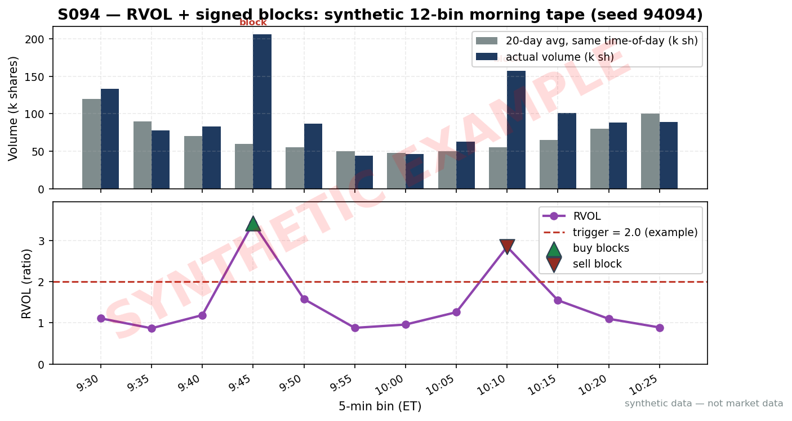

```mermaid
flowchart LR
    FEED["Raw feed<br/>(trades + L1 quotes)"] -->|"per-trade ticks"| ING["Ingest + normalize<br/>(exchange ts, bad ticks)"]
    ING -->|"signed trades (per-trade)"| FEAT["Feature compute<br/>(Lee-Ready, 5-min bins)"]
    FEAT -->|"RVOL + imbalance (per 5-min bin)"| SIG["Signal S094<br/>RVOL + block pressure"]
    SIG -->|"per-bin volume signal"| GATE{"Cost / toxicity<br/>gate?"}
    GATE -->|"pass: trades"| OUT["Downstream consumer<br/>(momentum / fade)"]
    GATE -->|"fail: none"| DROP["No trade"]
    style SIG fill:#aed6f1,stroke:#1f3a5f
```

### S12. Sources

- Lee, Charles M. C. & Ready, Mark J. (1991). "Inferring Trade Direction from Intraday Data." *Journal of Finance* 46(2), 733–746. https://ideas.repec.Org/a/bla/jfinan/v46y1991i2p733-46.html
- Gervais, Simon, Kaniel, Ron & Mingelgrin, Dan H. (2001). "The High-Volume Return Premium." *Journal of Finance* 56(3), 877–919. http://ideas.repec.org/a/bla/jfinan/v56y2001i3p877-919.html
- Chan, Louis K. C. & Lakonishok, Josef (1993). "Institutional Trades and Intraday Stock Price Behavior." *Journal of Financial Economics* 33(2), 173–199. http://ideas.repec.org/a/eee/jfinec/v33y1993i2p173-199.html
- Lee, Charles M. C. (1992). "Earnings News and Small Traders: An Intraday Analysis." *Journal of Financial Economics* 15, 265–302. (Journal citation; no open URL verified — not counted toward the checkable-source minimum.)
- Ellis, K., Michaely, R. & O'Hara, M. (2000). "When the Underwriter Is the Market Maker: An Examination of Trading in the IPO (initial public offering) Aftermarket." *Journal of Finance*, 55(3), 1039–1074. https://doi.org/10.1111/0022-1082.00240 (the Lee–Ready trade-direction algorithm validation: compared against the NYSE's Trades, Orders, Reports, and Quotes (TORQ) database audit-trail truth — the documented accuracy evidence for the signing step in S3)
- Bessembinder, H. (2003). "Quote-Based Competition and Trade Execution Costs in NYSE-Listed Stocks." *Journal of Financial Economics*, 70(3), 385–422. https://doi.org/10.1016/S0304-405X(03)00168-5 (quote competitiveness drives execution quality: competitive quotes cut execution costs — the documented basis for S9's spread assumptions and the S10 cost-blowup mitigation)
- Roll, R. (1984). "A Simple Implicit Measure of the Effective Bid-Ask Spread in an Efficient Market." *Journal of Finance*, 39(4), 1127–1139. https://doi.org/10.1111/j.1540-6261.1984.tb03897.x (implicit spread from serial covariance: the documented basis for spread estimation when direct quote data are unavailable)

**Unverified leads:** one item — *unverified practitioner rule (no checkable citation obtained)*: a Stanford CS229-style options filter on OptionMetrics data — flag an option when its volume exceeds 2× its daily average **and** ≥ 500 contracts. A screening flag for further research, not a documented result. All other quantitative claims above trace to the cited papers or the labeled synthetic example; RVOL trigger levels and block-size thresholds are marked *example* throughout.

*Source log: Duck.ai answered Q-SB3-1–Q-SB3-3 (2026-09-10); Grok/Cursor answers pending (checked 2026-09-10).*

---
## Stage 2/200 — S002: Multi-level / integrated OFI (MLOFI)

*Batch SB4 · Signal 2/100 · Provenance [D] · Family A — Microstructure & order flow*

### S1. One-line verdict

| What it is | When it works | When it dies | Build-or-buy in one line |
|---|---|---|---|
| Event-counted net order flow (bid additions minus ask pressure) per book level, combined into one directional regressor. | Liquid large-tick names, stable regimes, short buckets, Ridge estimation. | Small-tick fast-replenishing books, news shocks, spoofing, SIP-only feeds, horizons > ~1 min. | Build the estimator (one Ridge regression on MBP-10); buy the L2 feed. |

Provenance: **[D]** (documented: Xu–Gould–Howison 2019; Cont–Cucuringu–Zhang 2023).

### S2. How it works — plain human explanation

*Level 1* of a limit order book is the "touch" — the best bid and best ask, what you see on any price screen. *Level 2 and beyond* (L2) are the resting limit orders stacked a few cents behind the touch. (A *tick* is the minimum price increment — one cent for most US stocks; a *large-tick* stock is one whose spread is usually pinned at exactly one tick, like ORCL or CSCO, while a *small-tick* stock like AMZN trades many ticks wide.) The classical order-flow imbalance (OFI, signal S001) watches only level 1: when buyers add bid size and sellers cancel ask size, the mid-price tends to tick up.

Multi-level OFI asks: why throw away levels 2–10? Suppose the touch shows bid 231.40 × 800 / ask 231.41 × 300, mildly bid-heavy. But three cents down, someone just posted 50,000 shares on the bid side, and two cents up, the ask stack thinned by 30,000. That deeper flow is also supply and demand — latent, but real. In large-tick stocks the touch itself barely moves, so *most* price-pressure information lives a few levels deep; in small-tick stocks the touch carries more of it.

The catch, and the reason this needs its own machinery: level OFIs are strongly correlated with each other. Naively regressing the mid-price change on ten level OFIs with plain OLS gives coefficients that slosh around (multicollinearity). Xu, Gould & Howison show the fix is Ridge regression, and Cont, Cucuringu & Zhang show a cleaner one: take the first principal component of the level-OFI vector — the "integrated OFI" — and regress on that single number.

**Mental model:**
- Flow deep in the book is partially *independent* information about supply and demand, not a noisier copy of the touch.
- Deep levels matter *most* where the touch can't move — large-tick names — and least where it can.
- Correlated inputs need regularization: Ridge, or PCA down to one integrated regressor. Never ten raw OLS coefficients.

### S3. The math — exact formula

Let $P^b_{k,t}$, $Q^b_{k,t}$ (resp. $P^a_{k,t}$, $Q^a_{k,t}$) be the price and resting size at level $k$ ($k=1$ = best) on the bid (resp. ask) side after event $t$. An *event* is any order-book update: limit order, cancel, trade.

**Level-$k$ event contribution** (Cont et al., event-time OFI):

$$e_{k,t} = \mathbf{1}\{P^b_{k,t} \ge P^b_{k,t-1}\}\,Q^b_{k,t}
- \mathbf{1}\{P^b_{k,t} \le P^b_{k,t-1}\}\,Q^b_{k,t-1}
- \mathbf{1}\{P^a_{k,t} \le P^a_{k,t-1}\}\,Q^a_{k,t}
+ \mathbf{1}\{P^a_{k,t} \ge P^a_{k,t-1}\}\,Q^a_{k,t-1}$$

in shares. Reading it: if the level-$k$ bid price *rises*, all its current size counts as buying pressure ($+Q^b_{k,t}$); if it *falls*, its old size counts as selling pressure ($-Q^b_{k,t-1}$); if the price is unchanged, only the *size change* $Q^b_{k,t}-Q^b_{k,t-1}$ counts. Mirror image for the ask side (ask price falling = buying pressure). Bucket $B$ (e.g. 1 s or 100 updates):

$$\mathrm{OFI}_{k,B} = \sum_{t \in B} e_{k,t}, \qquad
\mathbf{OFI}_B = [\mathrm{OFI}_{1,B},\dots,\mathrm{OFI}_{L,B}]^\top$$

**Integrated OFI** (Cont–Cucuringu–Zhang): $\mathrm{iOFI}_B = \mathbf{v}_1^\top(\mathbf{OFI}_B - \boldsymbol{\mu})$, where $\mathbf{v}_1$ is the unit eigenvector of the largest eigenvalue of $\mathrm{Cov}(\mathbf{OFI}_B)$, sign-flipped so positive means buying pressure. Price-impact regression: $r_B = \alpha + \beta \cdot \mathrm{iOFI}_B + \varepsilon_B$, with $r_B$ the contemporaneous mid-price change (ticks). Economically: adverse selection — informed flow hits the book (cancels, repriced limits) before it hits the tape — plus inventory: makers skew quotes against one-sided depth (see S089). Variants: equal-weighted sum (crude); inverse-depth weights; full Ridge vector regression (Xu–Gould–Howison). Timing: computed at bucket close using only events ≤ $t$; tradable no earlier than $t{+}1$.

| Parameter | Symbol | Typical range | Too small / too large | Default (example) |
|---|---|---|---|---|
| Levels | $L$ | 5–10 | $<3$ loses deep-book info; $>10$ adds collinear noise | 5 *(example — not an institutional standard)* |
| Bucket | $B$ | 100 ms–5 s or 100–1,000 updates | too short = noise; too long = stale | 1 s *(example)* |
| Ridge penalty | $\lambda$ | $10^1$–$10^4$ | 0 = unstable OLS; huge = kills deep levels | cross-validated *(example)* |
| PCA window | $W$ | 1–20 days rolling | too short = noisy loadings; too long = regime bleed | 5 days *(example)* |

### S4. Worked example — step-by-step numbers (SYNTHETIC)

Synthetic tape, seed **20260902** (all numbers below are the script's output, plotted identically in the chart). Ten 1-second buckets, $L=5$.

First, one event contribution by hand (level 1, bid side): bid price rises 100.00 → 100.01 with size 650 at the new level. Indicators: $\mathbf{1}\{100.01 \ge 100.00\}=1$, $\mathbf{1}\{100.01 \le 100.00\}=0$ → bid contribution $+650$ shares. Same event, ask side: ask price unchanged at 100.02, size 700 → 500: contribution $-(700-500) = -200$ shares. Level-1 event contribution $e_{1,t} = +650 - 200 = +450$ shares.

Aggregating each bucket's events level-wise and summing across levels (equal-weight integration, *example* choice):

| Bucket | OFI L1 | OFI L2 | OFI L3 | OFI L4 | OFI L5 | iOFI (shares) | Δmid (ticks) |
|---|---|---|---|---|---|---|---|
| 1 | −74.4 | −84.4 | −30.7 | −0.9 | −54.8 | −245.2 | −0.46 |
| 2 | 19.6 | −14.4 | −2.5 | −53.7 | 34.7 | −16.3 | 0.32 |
| 3 | 99.2 | 34.6 | 60.9 | 36.7 | 11.9 | 243.3 | 1.26 |
| 4 | −157.3 | −126.6 | −110.9 | −80.6 | −64.0 | −539.4 | −2.03 |
| 5 | −100.2 | −116.6 | −96.2 | −62.2 | −29.6 | −404.8 | −1.86 |
| 6 | −59.2 | −30.0 | −12.8 | −29.6 | −4.8 | −136.4 | −1.06 |
| 7 | 198.0 | 81.5 | 84.3 | 80.5 | 19.6 | 463.9 | 1.91 |
| 8 | −36.8 | −36.3 | −7.4 | −38.5 | −20.7 | −139.7 | −0.70 |
| 9 | −263.9 | −135.7 | −118.9 | −118.5 | −37.2 | −674.2 | −2.42 |
| 10 | −209.5 | −171.6 | −68.6 | −77.7 | −36.5 | −563.9 | −2.42 |

Bucket 5 check (the level-vector chart panel): $-100.2 -116.6 -96.2 -62.2 -29.6 = -404.8$ ✓, and its point $(-404.8, -1.86)$ sits on the scatter ✓.

**What to notice:** deep levels (L3–L5) carry real signal — bucket 9's −674 shares are 45% deep-book flow that touch-only OFI would miss. Limits: this is a *contemporaneous* fit, not a prediction; it includes no spread cost; and the generator is kind to the model by construction. Real level-OFI vectors are far more correlated and need the Ridge/PCA treatment of §S3.

### S5. Strategies that use this signal

- **T030 — primary entry trigger (direction).** T030 (Multi-Level OFI Weighted Predictor) is this signal: integrated OFI across 10 levels, VAR-confirmed.
- **T091 — confirmation filter.** T091 (Multi-Level Book-Pressure Swing) uses MLOFI's *flow* reading to confirm or veto its static-pressure swing, and to scale size.

### S6. Data required — exact spec

| Field | Type | Granularity | Source tier | Notes |
|---|---|---|---|---|
| Level prices/sizes, k=1..10 | float/int | L2 depth events (MBP-10), ~10–50k ev/s busy | Tier 2–3 | Genuine L2 required — the SIP (Securities Information Processor, the consolidated US tape; its NBBO carries only the touch) has no depth, so SIP-derived depth is simulated-only |
| Trade prints (for bucket validation) | int/float | trade events | Tier 1–2 | align timestamps to quotes |
| Symbol reference, corporate actions | strings | daily | Tier 0–1 | splits corrupt level continuity |

MBP-10 (market-by-price) means *aggregated* size per price level — no individual order identity or queue position, unlike MBO/ITCH (individual orders). Ingest sketch (≤20 lines):

```python
import polars as pl
# schema: ts, symbol, action(add/cancel/trade), side, level, price, size
ev = pl.scan_parquet("mbp10/2026-09-10/*.parquet").filter(
    pl.col("symbol") == "AAPL")
# reconstruct per-level state, compute e_{k,t} on each update
def level_ofi(g):  # g: one (symbol, level) event stream, sorted by ts
    dP_b = g["bid_px"].diff(); dQ_b = g["bid_sz"].diff()
    dP_a = g["ask_px"].diff(); dQ_a = g["ask_sz"].diff()
    e = (dP_b > 0) * g["bid_sz"] - (dP_b < 0) * g["bid_sz"].shift(1) \
        + (dP_b == 0) * dQ_b \
        - (dP_a < 0) * g["ask_sz"] + (dP_a > 0) * g["ask_sz"].shift(1) \
        - (dP_a == 0) * dQ_a
    return g.with_columns(e.fill_null(0).alias("e_k"))
```
Storage per symbol-day: L2 MBP-10 ≈ 10–40 GB parquet, per cost-model §4 (research-only archiving). Data-quality checklist: exchange-timestamp normalization, corporate actions/splits, halts, DST/half-days, stale/locked-crossed quotes, sequence gaps.

### S7. Local build on M5 Max / 128GB

**Verdict: feasible, Tier H.** Justification: per cost-model §5, L2/MBO signals are Tier H (60–200 h → $9,000–30,000 loaded-cost estimate at $150/hr) — book-reconstruction, validation, and regularized calibration dominate, not the arithmetic. Throughput per cost-model §2: L2 full depth (MBP-10) runs ~10–50k events/sec busy for top names; a Python event loop (~100–500k events/sec) handles a handful of symbols, but a 50-symbol real-time book engine wants Rust (~5–50M events/sec) or Python ingest + Rust book state. RAM: L2 MBP-10 is ~8–40 GB per symbol-day in RAM (cost-model §3) — 500 symbols × 60 days does **not** fit the 77 GB working budget; use per-symbol daily files plus streaming, computing OFI incrementally. Stack: Rust for the real-time book engine; Python+polars for research recompute; DuckDB for the parquet archive. Engineering band: Tier H 60–200 h. A chatbot build estimate (Duck.ai, labeled lead) puts a *full production L2 research system* at row-sum 520–1,020 h (its printed "600–1,180" contradicts its own rows) — treat that as the L2 platform cost and the cost-model Tier H band as this signal's cost. **What breaks first at 500 symbols:** network decompression and burst handling, not the M5 Max; then SSD write bandwidth for raw L2 retention (~40–120 GB/day compressed for 50 names).

### S8. Buy vs build

| Option | What you get | Indicative price | Buying gains | Buying loses |
|---|---|---|---|---|
| Tier 0: Alpaca IEX / Stooq | L1/trade bars, delayed | ~$0 | free prototyping of touch-only OFI | no genuine depth — MLOFI impossible |
| Tier 1: Polygon Stocks Advanced | real-time SIP bars/trades | ~$30–200/mo | cheap L1 pipeline | SIP ≠ depth; synthetic L2 = model simulation, labeled simulated-only |
| Tier 2: Databento MBP-10 | honest 10-level depth events | ~$200/mo + usage | true input for this signal | usage/licensing scales; no queue identity |
| Tier 3: LOBSTER (academic) | ITCH order-book replay | ~hundreds/yr academic | individual-order (MBO) fidelity | academic license only; not production |

All prices `indicative — verify before budgeting`. **Verdict: build** custom buckets/Ridge/PCA/thresholds (no vendor sells those); **buy** the raw MBP-10 feed — crossover at ~5 symbols of depth history. Synthetic-L2-from-SIP stays labeled model simulation, never traded as depth.

### S9. Success ratio / efficacy — documented evidence

Mandatory framing (Q-SB4-3 chatbot lead, independently consistent with the papers): the literature shows **stronger evidence for short-horizon statistical predictability than for after-cost tradability**. Report both OOS forecast improvement *and* net implementation performance; without the second, these are predictive features, not demonstrated edges.

| Study / source | Market & period | Metric | Before/after cost | Caveat |
|---|---|---|---|---|
| Xu–Gould–Howison 2019, Table 10 (verified against paper's own table) | 6 liquid Nasdaq stocks, 2016 LOBSTER | OOS RMSE reduction, 10-level vs 1-level, Ridge: ~15–30% small-tick (AMZN 17%, TSLA 15%, NFLX 31%), ~65–75% large-tick (ORCL 68%, CSCO 74%, MU 64%); OLS slightly weaker (~5–35% / ~60–70%) | before cost — forecast fit only | Contemporaneous mid-price change, not tradeable P&L; regularization required |
| Cont–Cucuringu–Zhang 2023 (arXiv:2112.13213) | S&P 500 constituents, 2017–2019 | Integrated OFI (PCA) beats best-level OFI in/out-of-sample; lagged cross-asset OFIs improve forward-return $R^2$ | before cost | Cross-impact decays rapidly with horizon |
| Cont–Kukanov–Stoikov 2011 (arXiv:1011.6402) | 50 US stocks, NYSE TAQ 2008 | Linear OFI→price-change relation, slope ∝ 1/depth | before cost | Touch-level OFI only (the S001 ancestor) |

**Bottom line:** as a standalone trigger this is a *promising but not established after-cost* edge — the documented wins are RMSE/R² improvements on mid-price changes, and the hurdle is E[gross move] > spread + fees + slippage + impact. As a *feature inside an execution or market-making model* (T030's VAR confirmation, T091's swing filter), it is the best-evidenced depth signal in Family A. Failure regimes: small-tick fast-replenishment books, spoofing (deep size that never intends to trade), news jumps, and any consolidated/SIP feed (no real depth).

### S10. Failure modes & pitfalls

1. **Collinearity without regularization** — ten level OFIs move together; naive OLS coefficients are unstable. *Mitigate: Ridge or PCA integration, cross-validated.*
2. **Spoofing / non-bona-fide depth** — deep quotes can be bait. *Mitigate: weight by level fill probability; discount cancel-heavy size.*
3. **Lookahead via stale buckets** — computing "contemporaneous" OFI with a mid-price from inside the bucket. *Mitigate: strict event-time bucketing, trade at t+1.*
4. **SIP feed masquerading as depth** — the SIP's NBBO has no levels beyond the touch. *Mitigate: real MBP-10 or label simulated-only.*
5. **Regime breaks** — vol events change depth replenishment. *Mitigate: rolling PCA loadings (1–20 d), regime-gated thresholds.*
6. **Cost blowup** — a 0.1-tick expected move dies against a 1-tick spread. *Mitigate: model spread + fees + slippage + impact explicitly before sizing.*
7. **Overfitting levels/buckets** — grid-searching L and B on one month. *Mitigate: walk-forward OOS, embargo between folds.*
8. **Data errors** — crossed books, sequence gaps, halts. *Mitigate: validation layer that halts signal on gap/lock.*

### S11. Visuals

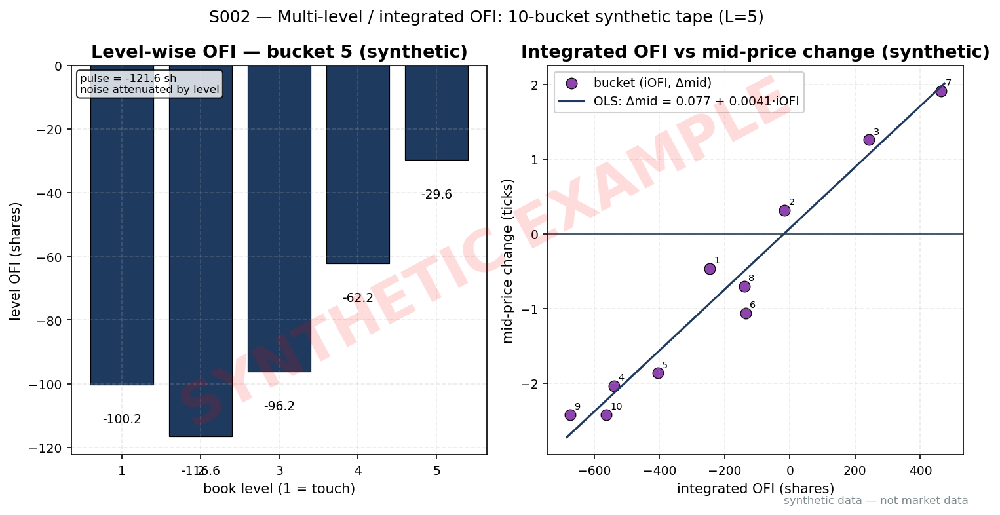

```mermaid
flowchart LR
    FEED["Raw feed\n(Databento MBP-10)"] -->|"L2 depth events"| ING["Ingest + normalize\n(exchange ts, halts, splits)"]
    ING -->|"per-event level state"| FEAT["Feature compute\ne_{k,t} per level,\nbucketed OFI_{k,B}"]
    FEAT -->|"MLOFI vector (L=5, per 1-s bucket)"| SIG["Signal S002\nintegrated OFI iOFI_B\n(Ridge/PCA)"]
    SIG -->|"per-bucket iOFI"| GATE{"Cost / toxicity\ngate?"}
    GATE -->|pass| OUT["Downstream consumer\n(T030 trigger, T091 filter)"]
    GATE -->|fail| DROP["No trade"]
    style SIG fill:#aed6f1,stroke:#1f3a5f
```

### S12. Sources

- Xu, K., Gould, M. D., & Howison, S. D. (2019). "Multi-Level Order-Flow Imbalance in a Limit Order Book." arXiv:1907.06230 [q-fin.TR]. https://arxiv.org/abs/1907.06230 — Table 10 figures quoted in S9 verified against the paper's own table (Ridge row).
- Cont, R., Cucuringu, M., & Zhang, C. (2023). "Cross-Impact of Order Flow Imbalance in Equity Markets." Quantitative Finance 23(10), 1373–1393. arXiv:2112.13213. https://arxiv.org/abs/2112.13213
- Cont, R., Kukanov, A., & Stoikov, S. (2011). "The Price Impact of Order Book Events." arXiv:1011.6402 [q-fin.TR]. http://arxiv.org/pdf/1011.6402v3
- Chatbot source (labeled): Duck.ai (GPT-5.6 Luna, anonymous) answered Q-SB4-1–Q-SB4-3 (2026-09-10); Grok/Cursor answers pending (checked 2026-09-10). Formulas verified against literature; Q-SB4-2 hour rows used with printed-total discrepancy noted; Q-SB4-3 framing lead adopted.

**Unverified leads**
- Duck.ai's Q-SB4-2 full-pipeline hour bands (L2 rows 520–1,020 h; printed total "600–1,180" contradicts row sums — unverified chatbot claim, use row sums or the cost-model band).
- Any vendor per-symbol depth price for 50 liquid names ($1,000–10,000+/mo range from chat — indicative chatbot claim, verify with Databento/exchange schedules).

---
## Stage 5/200 — S005: Multi-level book pressure (static depth imbalance)

*Batch SB4 · Signal 5/100 · Provenance [SR] · Family A — Microstructure & order flow*

### S1. One-line verdict

| What it is | When it works | When it dies | Build-or-buy in one line |
|---|---|---|---|
| The ratio of resting bid depth to total depth across the first *L* book levels — a still photograph of latent supply vs demand. | Deep, stable books in liquid names; calm sessions where posted size means what it says. | Spoof-heavy or news-driven tapes, thin books, SIP-only feeds (no depth), fast replenishment regimes. | Build the ratio in ten lines; buy (or skip) the L2 feed — the feed is the whole cost, the math is free. |

Provenance: **[SR]** (standard reconstruction — practitioner standard; academic grounding in multi-level OFI, entry 2). Never upgraded without a real citation.

### S2. How it works — plain human explanation

If order-flow imbalance (S001/S002) is a *movie* — it counts orders arriving and leaving — book pressure is a *photograph*. At any instant, the limit order book holds resting buy orders (bids) and resting sell orders (asks) stacked at each price level. Book pressure adds up the bid-side depth across the first *L* levels, adds up the ask-side depth, and takes the normalized difference. A book with 65,000 shares resting on the bid side and 46,000 on the ask side has pressure $+0.17$: latent demand outweighs latent supply.

Why should a still photo predict the next move? Two economic channels. First, *mechanical*: for the mid-price to fall, sellers must chew through the entire bid queue at the touch; a fat bid queue is a wall that takes longer to demolish (Gould & Bonart's queue-imbalance result formalizes exactly this for level 1). Second, *informational*: patient traders post size where they think the price is going — resting depth is a revealed belief, though a noisy and sometimes dishonest one (spoofers post size they never intend to trade). This is the adverse-selection channel: one-sided depth is how informed flow shows up before it prints, and it is why market makers widen or pull quotes when the book tilts.

**Jargon, defined once:** *NBBO* (National Best Bid and Offer) = the best bid/ask across all US exchanges, consolidated by the *SIP* (Securities Information Processor — the official consolidated tape); *MBP-10* = market-by-price data giving aggregate size at each of the top 10 price levels; *basis points* (bps) = hundredths of a percent (1 bp = 0.01%).

**Mental model:**
- Static pressure measures *latent* supply/demand; flow measures *revealed* aggression. They are complements, not substitutes.
- Deep-book pressure matters most when the touch is pinned (large-tick names) — same logic as S002.
- Posted size is a claim, not a fact: always discount for spoofing and cancellation rates.

### S3. The math — exact formula

$$BP_L(t) = \frac{\sum_{l=1}^{L} Q^b_l(t) - \sum_{l=1}^{L} Q^a_l(t)}
{\sum_{l=1}^{L} Q^b_l(t) + \sum_{l=1}^{L} Q^a_l(t)} \in [-1, +1]$$

$Q^b_l(t)$ ($Q^a_l(t)$) = resting bid (ask) size in shares at level $l$ at time $t$; $l=1$ is the touch. Dimensionless. Positive = bid-side pressure (latent buying). Variants: touch-only ($L=1$, = S003 queue imbalance); exponential level weights $w_l = e^{-\eta(l-1)}$ with decay $\eta$ (*example* 0.5); depth-weighted microprice cousin $P^{micro} = \frac{Q^a_1 P^b_1 + Q^b_1 P^a_1}{Q^a_1 + Q^b_1}$ (S004). Timing: snapshot at $t$ from the book state; tradable no earlier than $t{+}1$ (a snapshot is already one step behind the tape).

| Parameter | Symbol | Typical range | Too small / too large | Default (example) |
|---|---|---|---|---|
| Levels | $L$ | 5–10 | $<3$ ≈ touch-only; $>10$ dilutes with stale depth | 5 *(example — not an institutional standard)* |
| Decay | $\eta$ | 0–1.0 | 0 = flat sum (deep noise); >1 ≈ touch-only | 0.5 *(example)* |
| Snapshot cadence | $\Delta t$ | 100 ms–5 s | faster = redundant; slower = stale | 1 s *(example)* |
| Tilt threshold | $\theta$ | 0.1–0.3 | too low = noise trades; too high = never fires | 0.2 *(example)* |

### S4. Worked example — step-by-step numbers (SYNTHETIC)

Synthetic book, seed **20260905**, 8 snapshots × 5 levels (chart plots the same numbers). Hand-computing snapshot 4, the deepest-tilted one:

Bid sizes L1–L5: 1359, 1331, 1319, 1246, 1248 → $\sum Q^b = 6503$ shares.
Ask sizes L1–L5: 792, 1319, 715, 654, 1149 → $\sum Q^a = 4629$ shares.

$$BP = \frac{6503 - 4629}{6503 + 4629} = \frac{1874}{11132} = +0.1683$$

The full 8-snapshot series (BP panel of the chart):

| Snapshot | Σ bid | Σ ask | BP |
|---|---|---|---|
| 1 | 6147 | 6395 | −0.0198 |
| 2 | 5761 | 4905 | +0.0803 |
| 3 | 4797 | 5764 | −0.0916 |
| 4 | 6503 | 4629 | **+0.1683** |
| 5 | 5618 | 4252 | +0.1384 |
| 6 | 5271 | 5033 | +0.0231 |
| 7 | 4691 | 4740 | −0.0052 |
| 8 | 5102 | 4344 | +0.0802 |

Against the *example* ±0.20 tilt band, no snapshot fires a tilt — snapshot 4 at +0.1683 is the closest. That is deliberate: with honest thresholds, a static photo of a synthetic book *should* mostly say "no edge," which is the toy-tape's way of showing how weak this signal is on its own. **What to notice:** BP is smooth and slow-moving relative to event flow — it lags aggression by construction (limits and cancels move first, the photograph updates after). Limits: no fees, no spread, no spoofing in the toy data; real books have all three.

### S5. Strategies that use this signal

- **T091 — primary swing trigger.** T091 (Multi-Level Book-Pressure Swing) is built on this exact quantity: 10-level static book-pressure swing positions with vol-breakout exits.
- **T030 — confirmation filter.** T030 (Multi-Level OFI Weighted Predictor) triggers on *flow* (S002); static pressure confirms the flow isn't leaning into a wall — or vetoes when BP contradicts iOFI.

### S6. Data required — exact spec

| Field | Type | Granularity | Source tier | Notes |
|---|---|---|---|---|
| Level sizes Q^b_l, Q^a_l, l=1..L | int (shares) | L2 depth snapshots or events, ≥1 s cadence | Tier 2–3 | Genuine MBP-10; SIP has no depth |
| Level prices (for decay weights) | float | same | Tier 2–3 | touch price from NBBO suffices for weights |
| Halt/split calendar | strings | daily | Tier 0–1 | splits shift level indexing |

Ingest sketch (≤20 lines):

```python
import polars as pl
# snapshots: ts, symbol, level, bid_sz, ask_sz  (1-second cadence)
snaps = pl.scan_parquet("mbp10_snap/2026-09-10/*.parquet").filter(
    (pl.col("symbol") == "AAPL") & (pl.col("level") <= 5))
eta = 0.5  # example decay — not an institutional standard
w = pl.Series([__import__("math").exp(-eta * (l - 1)) for l in range(1, 6)])
bp = (snaps.group_by(["ts", "symbol"]).agg(
        (pl.col("bid_sz") * w).sum().alias("wb"),
        (pl.col("ask_sz") * w).sum().alias("wa"))
      .with_columns(((pl.col("wb") - pl.col("wa"))
                     / (pl.col("wb") + pl.col("wa"))).alias("BP")))
```
Storage per symbol-day: L2 snapshots ≈ 10–40 GB/day parquet if kept at event granularity (cost-model §4); 1 s snapshots compress to ~1–5 GB/day. Data-quality checklist: exchange timestamps, corporate actions, halts (freeze or drop), DST/half-days, stale snapshots (drop if older than 2× cadence).

### S7. Local build on M5 Max / 128GB

**Verdict: feasible, Tier H (the data, not the math).** The ratio itself is ten lines; the work is the L2 pipeline — per cost-model §5 this is Tier H, 60–200 h ($9,000–30,000 loaded-cost estimate at $150/hr), same band as S002, since both need honest depth. Throughput per cost-model §2: 1 s snapshots are trivial for polars (~10–50M rows/sec simple ops); real-time snapshot maintenance at 50 symbols needs only a light event loop — the L2 cost driver is *retention*, not compute: ~8–40 GB RAM per symbol-day live (cost-model §3), so 60 days of raw depth for 50 names does **not** fit; keep per-symbol daily parquet + rolling in-memory snapshots. Stack: Python+polars for research, Rust only if you maintain sub-second real-time state across many names, DuckDB for the snapshot archive. Chatbot lead (Duck.ai, labeled): build the L1/trade pipeline *first* (~300–500 h production-quality, row-sum 315–650 h — its printed "285–650" contradicts its own rows), and add MBP-10 only with a specific depth hypothesis like this one; 60 days of raw L2 retention is the storage + data-cost problem, not compute. **What breaks first at 500 symbols:** SSD capacity for depth history, then feed-handler CPU on bursts.

### S8. Buy vs build

| Option | What you get | Indicative price | Buying gains | Buying loses |
|---|---|---|---|---|
| Tier 0: Stooq / Alpaca IEX | daily bars, L1 snapshots | ~$0 | free toy prototype | no multi-level depth |
| Tier 1: Polygon Stocks Advanced | real-time SIP NBBO/trades | ~$30–200/mo | cheap, honest L1 | SIP has no depth — any "book pressure" from it is a model simulation |
| Tier 2: Databento MBP-10 | real 10-level depth | ~$200/mo + usage | genuine input | usage + licensing scale with names |
| Tier 3: LOBSTER (academic) | ITCH replay | ~hundreds/yr academic | order-level truth | academic license; not production |

All prices `indicative — verify before budgeting`. **Verdict: build if** your hypothesis is specific (which L, which decay, which tilt threshold — no vendor sells *your* pressure variant); **buy** the raw depth feed. Crossover: the moment you want more than a couple of names of depth history, buy MBP-10; the DIY alternative is re-licensing anyway. Never ship a SIP-derived "depth pressure" number without the **model simulation, NOT observed L2** label — e.g. exponential decay $Q_k = Q_1 e^{-\eta(k-1)}$ invented from the touch is a simulation, and honest labeling (per the Duck.ai build lead) is the difference between a pressure estimate and a fabrication.

### S9. Success ratio / efficacy — documented evidence

| Study / source | Market & period | Metric | Before/after cost | Caveat |
|---|---|---|---|---|
| Gould & Bonart 2015/16 (arXiv:1512.03492) | 10 liquid Nasdaq stocks | Logistic regression: queue imbalance vs direction of *next* mid-price move — strongly statistically significant for all 10; "considerable" binary/probabilistic classification improvement for large-tick stocks, "moderate" for small-tick, vs null model | before cost — classification skill, not P&L | Touch-level (L=1) predictor; the multi-level extension is the [SR] step this chapter takes |
| Xu–Gould–Howison 2019, Table 10 (verified) | 6 Nasdaq stocks, 2016 LOBSTER | OOS RMSE reduction 10-level vs 1-level: Ridge ~15–30% small-tick, ~65–75% large-tick | before cost — forecast fit | Flow (OFI), not static pressure — academic grounding, not direct evidence |
| Q-SB4-3 framing lead (labeled chatbot) | — | "Stronger evidence for short-horizon statistical predictability than for after-cost tradability" | — | No documented after-cost P&L for book-pressure strategies found in this research pass |

**Bottom line:** as a standalone trigger this is a *predictive feature, not a demonstrated edge* — the documented evidence is classification skill and forecast improvement, all before cost; no after-cost study was located. As a *filter inside T091/T030* (veto flow trades leaning into a static wall), it earns its place on mechanism and on the large-tick queue-imbalance literature. Failure regimes: spoofed books (pressure without intent), news jumps (static picture invalidated in milliseconds), thin names (one iceberg order dominates BP), and any SIP-only implementation (simulated depth).

### S10. Failure modes & pitfalls

1. **Spoofing** — posted size that cancels before execution. *Mitigate: discount size by historical cancel rate per level; require flow confirmation (S002).*
2. **Static-vs-flow confusion** — trading a photo as if it were a movie. *Mitigate: pair BP with a flow signal; treat BP as regime/tilt, not trigger.*
3. **SIP-derived pseudo-depth** — exponential-decay depth invented from the touch. *Mitigate: label model simulation, NOT observed L2; never trade it as real depth.*
4. **Lookahead in snapshots** — timestamping the snapshot after the price moved. *Mitigate: exchange timestamps; tradable no earlier than t+1.*
5. **Overfit decay/threshold** — tuning η and θ to one month's noise. *Mitigate: walk-forward validation, embargo.*
6. **Cost blowup** — tilt edges are typically sub-tick. *Mitigate: explicit spread + fees + slippage + impact model; sub-spread expectations → no trade.*
7. **Regime breaks** — depth replenishment changes under stress. *Mitigate: rolling normalization; stand down on vol spikes.*
8. **Thin-book concentration** — one large order dominates the ratio. *Mitigate: cap per-level contribution; require minimum total depth.*

### S11. Visuals

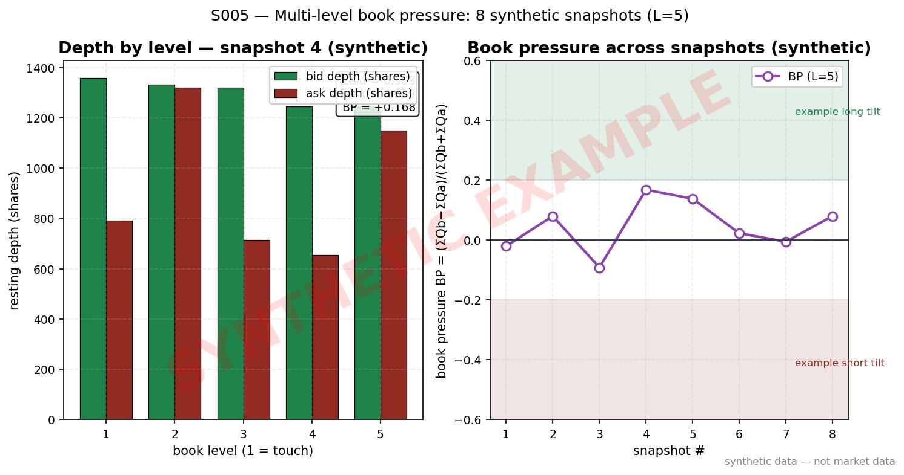

```mermaid
flowchart LR
    FEED["Raw feed\n(Databento MBP-10)"] -->|"L2 depth events"| ING["Ingest + normalize\n(exchange ts, halts, splits)"]
    ING -->|"book snapshots (1 s)"| FEAT["Feature compute\nΣQb_l, ΣQa_l, decay weights"]
    FEAT -->|"book-pressure series (1-s snapshots)"| SIG["Signal S005\nBP_L(t)"]
    SIG -->|"per-snapshot BP_L"| GATE{"Cost / toxicity\ngate?"}
    GATE -->|pass| OUT["Downstream consumer\n(T091 swing, T030 filter)"]
    GATE -->|fail| DROP["No trade"]
    style SIG fill:#aed6f1,stroke:#1f3a5f
```

### S12. Sources

- Gould, M. D., & Bonart, J. (2015). "Queue Imbalance as a One-Tick-Ahead Price Predictor in a Limit Order Book." arXiv:1512.03492 [q-fin.TR]. https://arxiv.org/abs/1512.03492 (published Market Microstructure and Liquidity, 2016).
- Xu, K., Gould, M. D., & Howison, S. D. (2019). "Multi-Level Order-Flow Imbalance in a Limit Order Book." arXiv:1907.06230 [q-fin.TR]. https://arxiv.org/abs/1907.06230
- Cont, R., Kukanov, A., & Stoikov, S. (2011). "The Price Impact of Order Book Events." arXiv:1011.6402 [q-fin.TR]. http://arxiv.org/pdf/1011.6402v3
- Chatbot source (labeled): Duck.ai (GPT-5.6 Luna, anonymous) answered Q-SB4-1–Q-SB4-3 (2026-09-10); Grok/Cursor answers pending (checked 2026-09-10). Q-SB4-2 build-ordering lead ("build L1/trade first; add MBP-10 only with a specific depth hypothesis") and synthetic-L2-from-SIP = model-simulation label adopted; Q-SB4-3 evidence-framing lead adopted.

**Unverified leads**
- Duck.ai Q-SB4-2 production-pipeline hour bands (L1/trade rows 315–650 h vs printed "285–650"; L2 rows 520–1,020 h vs printed "600–1,180" — use row sums; unverified chatbot claims).
- Any named vendor's per-name MBP-10 subscription price — indicative chatbot range only; verify with the vendor.

---
## Stage 7/200 — S007: Trade classification: Lee–Ready & Bulk Volume Classification

*Batch SB4 · Signal 7/100 · Provenance [D] · Family A — Microstructure & order flow*

### S1. One-line verdict

| What it is | When it works | When it dies | Build-or-buy in one line |
|---|---|---|---|
| Labeling each trade (or bar of volume) as buyer- or seller-initiated so every downstream flow signal has a sign. | Clean quote alignment, ordinary spreads, Lee–Ready when you have quotes; BVC when you only have bars. | Fast markets with stale quotes, midpoint-heavy prints, locked/crossed quotes, odd lots, off-exchange prints. | Build both classifiers in an afternoon — the hard part is honest quote alignment, not the formula. |

Provenance: **[D]** (documented: Lee & Ready 1991; Easley, López de Prado & O'Hara 2012).

### S2. How it works — plain human explanation

A trade print says "100 shares changed hands at $100.10." It does *not* say who demanded liquidity and who supplied it — yet nearly every flow signal (OFI, volume delta, VPIN, Kyle's lambda) needs that sign. *Trade classification* infers the initiator: the buyer-initiated side is the aggressor who crossed the spread.

Two canonical methods. **Lee–Ready (1991):** compare the trade price to the quote midpoint. Above the mid → buyer-initiated (+1); below → seller-initiated (−1); exactly at the mid → fall back to the *tick rule* (uptick = buy, downtick = sell, zero-tick inherits the last direction). **Bulk Volume Classification (BVC):** don't classify individual trades at all — take a *volume bar* (a fixed chunk of traded shares), look at its open-to-close price change, and split the bar's volume probabilistically: a strongly up bar is mostly buys, a flat bar is 50/50. BVC is robust to coarse clocks and missing quotes, at the price of per-trade resolution.

*Jargon, defined once:* *NBBO* (National Best Bid and Offer) = the consolidated best bid/ask across exchanges, disseminated by the *SIP* (Securities Information Processor); *midpoint* = (bid+ask)/2; *BVC* = Bulk Volume Classification; *MBO/ITCH* = exchange feeds with individual-order messages; *basis points* (bps) = 0.01%; *ADV* = average daily volume.

**Mental model:**
- Lee–Ready is a *microscope*: per-trade signs, needs good quotes, fragile in fast markets.
- BVC is a *satellite photo*: robust aggregate split, needs only bars, blind to individual trades.
- Misclassification is *concentrated*, not random — errors cluster exactly when flow is most informative (midpoints, fast markets). An "85% accurate" classifier can still badly bias an imbalance.

### S3. The math — exact formula

**Lee–Ready.** Let $m_i = (a_i + b_i)/2$ be the midpoint at (or just before) trade $i$ with price $p_i$:

$$d^Q_i = \begin{cases} +1 & p_i > m_i \quad \text{(quote rule: buy)} \\ -1 & p_i < m_i \quad \text{(quote rule: sell)} \\ 0 & p_i = m_i \quad \text{(unclassified)} \end{cases}$$

For midpoint prints, the tick rule: let $j < i$ be the most recent trade with $p_j \ne p_i$; $d^T_i = +1$ if $p_i > p_j$ else $-1$. Final sign $d_i = d^Q_i$ if nonzero, else $d^T_i$. Signed trade imbalance over bucket $B$: $\mathrm{OFI}^{trade}_B = \sum_{i \in B} d_i v_i$ (shares). The 1991 original used quotes lagged 5 seconds (a fix for 1988-era reporting delays); modern practice uses contemporaneous quotes — the 5-second lag is obsolete and should not be copied.

**BVC.** For volume bar $\tau$ with volume $V_\tau$, open $p_{\tau,o}$, close $p_{\tau,c}$:

$$z_\tau = \frac{p_{\tau,c} - p_{\tau,o}}{\sigma_{\Delta P}}, \qquad
V^B_\tau = V_\tau \cdot \Phi(z_\tau), \qquad
V^S_\tau = V_\tau - V^B_\tau, \qquad
\mathrm{BVC}_\tau = V^B_\tau - V^S_\tau = V_\tau(2\Phi(z_\tau) - 1)$$

$\Phi$ = standard normal CDF (dimensionless), $\sigma_{\Delta P}$ = stdev of bar price changes (price units). BVC allocates *volume probabilistically* — it does **not** classify individual trades.

| Parameter | Symbol | Typical range | Too small / too large | Default (example) |
|---|---|---|---|---|
| Quote lag (LR) | — | 0 (modern) | 5 s is obsolete; 0 with stale SIP quotes mislabels | 0 *(example — not an institutional standard)* |
| Bar volume (BVC) | $V^*$ | 50–500 median trades; 0.1–1% ADV | tiny bars = noise; huge bars = multi-regime mush | 1,000 shares *(example)* |
| $\sigma$ window | — | 50–500 bars | short = jumpy; long = stale | 100 bars *(example)* |
| z cap | — | ±2–3 | uncapped = one bar dominates | ±3 *(example)* |

### S4. Worked example — step-by-step numbers (SYNTHETIC)

Synthetic 12-trade tape, seed **20260907** (the chart plots these prices with the corrected signs). All sizes 10 shares; midpoint $m = 100.00$ constant.

| # | Price | vs mid | Rule applied | Sign |
|---|---|---|---|---|
| 1 | 100.00 | = mid | tick, no prior → +1 convention | **+1** |
| 2 | 100.10 | above | quote | **+1** |
| 3 | 100.10 | above | quote | **+1** |
| 4 | 100.20 | above | quote | **+1** |
| 5 | 100.10 | above | quote | **+1** *(see correction box)* |
| 6 | 100.00 | = mid | tick: downtick from 100.10 | **−1** |
| 7 | 100.00 | = mid | tick: downtick from 100.10 | **−1** |
| 8 | 99.90 | below | quote | **−1** |
| 9 | 100.00 | = mid | tick: uptick from 99.90 | **+1** |
| 10 | 100.10 | above | quote | **+1** |
| 11 | 99.90 | below | quote | **−1** |
| 12 | 100.00 | = mid | tick: uptick from 99.90 | **+1** |

Result: **8 buys / 4 sells**, $\mathrm{OFI}^{trade} = 10 \times (8 - 4) = \mathbf{40}$ shares.

> **⚠ Corrected chatbot error (visible by design).** The Duck.ai worked example labeled trade 5 (price 100.10 > midpoint 100.00) as "−" — under its own quote rule it must be **+1**. Its printed table actually shows 7 buys / 5 sells (OFI = 20 for the printed table ✓) while its prose claimed "eight buys, four sells." This chapter presents the **corrected** tape: trade 5 = +1, 8 buys / 4 sells, OFI_LR = **40**.

**BVC on 3 synthetic volume bars** (40 shares each, $\sigma_{\Delta P} = 0.10$), independently verified:

| Bar | Open | Close | $z$ | $\Phi(z)$ | Buy vol | Sell vol | BVC |
|---|---|---|---|---|---|---|---|
| 1 | 100.00 | 100.20 | +2.0 | 0.97725 | 39.09 | 0.91 | **+38.18** |
| 2 | 100.10 | 99.90 | −2.0 | 0.02275 | 0.91 | 39.09 | **−38.18** |
| 3 | 100.00 | 100.00 | 0.0 | 0.50000 | 20.00 | 20.00 | **0.00** |

Check bar 1: $z = 0.20/0.10 = 2.0$; $40 \times 0.97725 = 39.09$; $39.09 - 0.91 = 38.18$ ✓. Bar 2 mirrors it ✓; the flat bar splits 50/50 ✓. **What to notice:** Lee–Ready gives you 12 individual signs (fragile at midpoints — 4 of 12 trades needed the tick rule); BVC gives you 3 smooth aggregate splits with no per-trade claims. The toy tape has no fees and a perfectly constant midpoint — real tapes have neither.

### S5. Strategies that use this signal

- **T025 — primary confirmation filter.** T025 (Trade-Classification Trend Filter) is built on this: Lee–Ready/BVC signed imbalance confirms or vetoes momentum entries.
- **T056 — model input.** T056 (Hasbrouck Trade–Quote VAR Predictor) consumes the trade-sign series $d_i$ jointly with quote revisions — classification quality directly feeds its estimates.

### S6. Data required — exact spec

| Field | Type | Granularity | Source tier | Notes |
|---|---|---|---|---|
| Trade price + size | float/int | trade events | Tier 1 (SIP) / Tier 2 | TAQ, Databento, Polygon |
| NBBO bid/ask with timestamps | float | quote events | Tier 1–2 | Lee–Ready only; align to trade ts |
| OHLCV bars | float/int | 1 s–1 min (BVC) | Tier 0–1 | BVC needs only bars |

**Ingest sketch** (polars, ≤20 lines):

```python
import polars as pl
trades = pl.scan_parquet("trades.parquet").select("ts", "price", "size")
quotes = pl.scan_parquet("nbbo.parquet").select("ts", "bid", "ask")
tq = trades.join_asof(quotes, on="ts", strategy="backward")  # asof join: latest quote at/before each trade
tq = tq.with_columns(mid=(pl.col("bid") + pl.col("ask")) / 2,
                     prev=pl.col("price").shift(1))
tq = tq.with_columns(
    d=pl.when(pl.col("price") > pl.col("mid")).then(1)       # quote rule
      .when(pl.col("price") < pl.col("mid")).then(-1)
      .when(pl.col("price") > pl.col("prev")).then(1)        # tick rule fallback
      .when(pl.col("price") < pl.col("prev")).then(-1)
      .otherwise(None))
lr = tq.filter(pl.col("d").is_not_null()).select("ts", "price", "size", "d")
```

Lee–Ready ingest: for each trade, asof-join (time-aligned join matching each trade to the latest prior quote) the latest NBBO *at or before* the trade timestamp (exchange timestamps, not SIP, when available), apply quote rule, fall back to tick rule on midpoints — ≤20 lines of polars with an `asof` join. BVC: resample trades into volume bars, compute $z$, apply $\Phi$. Storage: trades-only is tiny (~10–200 events/sec busy per name, cost-model §2); quote-joined series heavier but still L1-scale. Data-quality checklist: timestamp normalization (exchange vs SIP clock), locked/crossed NBBO (drop), corporate actions, halts, odd-lot prints (classify with care — direction is ambiguous), late/corrected reports.

### S7. Local build on M5 Max / 128GB

**Verdict: trivial-to-feasible, Tier M.** Per cost-model §5, L1 event pipelines are Tier M (20–60 h → $3,000–9,000 loaded-cost estimate at $150/hr); classification itself is minutes — the hours go to quote alignment, the asof-join infrastructure, and validation against a reference implementation. Throughput per cost-model §2: a Python per-tick loop does ~100–500k events/sec (fine for ≤20 symbols of L1); trades-only classification for a 500-symbol universe is a polars batch job on 1-min bars — trivial. RAM: one symbol-day of L1 quotes+trades ≈ 0.5–4 GB (cost-model §3); a full day across the liquid universe fits the 77 GB working budget comfortably with per-symbol files. Stack: Python+polars is the right default; reach for Rust only if you classify full-depth MBO streams in real time. **What breaks first at 500 symbols:** nothing in classification — the quote feed's normalization and the asof-join state are the costs.

### S8. Buy vs build

| Option | What you get | Indicative price | Buying gains | Buying loses |
|---|---|---|---|---|
| Tier 0: Stooq / Alpaca IEX | daily/1-min bars | ~$0 | free BVC prototype | no per-trade signs; coarse |
| Tier 1: Polygon / Alpaca SIP | trades + NBBO | ~$30–200/mo | honest Lee–Ready input | SIP quote staleness in fast markets |
| Tier 2: Databento (trades+NBBO) | exchange-timestamped | ~$200/mo + usage | best public quote alignment | cost scales with usage |
| Academic: TAQ via WRDS | research TAQ | institutional/academic | the literature's own data | licensing, not real-time |

All prices `indicative — verify before budgeting`. **Verdict: build** — classification is pure logic on data you already buy for S001–S006; there is nothing to buy except the feed. The one genuine buy decision is quote quality: if your Lee–Ready signs drive execution (T025), exchange-timestamped quotes (Tier 2) beat SIP.

### S9. Success ratio / efficacy — documented evidence

| Study / source | Market & period | Metric | Before/after cost | Caveat |
|---|---|---|---|---|
| Ellis–Michaely–O'Hara (2000), JFQA 35(4) | Nasdaq proprietary data, identified trade direction | Correct classification: quote rule 76.4%, tick rule 77.66%, Lee–Ready **81.05%** | before cost — accuracy, not P&L | "Very limited success" on inside-the-quote trades; mediocre for effective-spread estimation |
| Lee & Ready (1991), J. Finance 46 | 150 NYSE firms, 1988 | Algorithm definition + 5 s lag rationale (quote changes recorded ahead of trades) | before cost | 1988 market structure; the 5 s lag is obsolete |
| Easley–López de Prado–O'Hara (2012), RFS 25(5) | E-mini S&P 500 futures, 2008–2011 | BVC-based VPIN: robust to classification scheme; VPIN > 0.7 preceded the May 2010 flash crash ~60–90 min (labeled practitioner finding) | before cost — toxicity indicator | Andersen & Bondarenko (2014) dispute: VPIN correlates with volume/volatility by construction; control for both |
| Q-SB4-3 evidence lead (labeled chatbot) | — | No single modern instrument-independent accuracy number honestly quotable; error *concentration* is the key limit — misclassification clusters when flow is most active | — | Treat signed-imbalance inputs as noisy, not ground truth |

**Bottom line:** as a standalone trigger this signal has no edge at all — it is *infrastructure*, and its "success ratio" is classification accuracy, which the best documented number puts at ~81% for Lee–Ready in favorable (Nasdaq, ordinary-trade) settings and worse for midpoints, fast markets, and inside-spread prints. Its value is as the sign-maker for every downstream flow signal (T025, T056, S008 VPIN): garbage signs in, garbage imbalance out. BVC's documented role is aggregate toxicity measurement, not per-trade truth — asking it for per-trade accuracy is a category error.

### S10. Failure modes & pitfalls

1. **Stale quotes in fast markets** — SIP NBBO lags the true quote; trades get the wrong sign exactly when it matters. *Mitigate: exchange timestamps; contemporaneous quotes; validate against direct-feed signs.*
2. **Midpoint clustering** — midpoint prints force the tick rule, the weakest rule. *Mitigate: track the fraction of tick-rule classifications as a quality metric.*
3. **Locked/crossed quotes** — midpoint is meaningless. *Mitigate: drop or flag; never classify against a crossed book.*
4. **Error concentration** — 85% accuracy with errors clustered in active flow biases imbalance more than uniform 80%. *Mitigate: model sign uncertainty; shrink imbalance by estimated accuracy.*
5. **Odd lots & off-exchange prints** — ambiguous direction, venue fragmentation. *Mitigate: classify separately; report venue mix.*
6. **The obsolete 5-second lag** — copying Lee–Ready's 1991 lag into modern data misaligns quotes. *Mitigate: lag 0; validate.*
7. **BVC on tiny/poor-vol bars** — $z$ explodes, splits become extreme. *Mitigate: cap $|z|$ at ~3; minimum bar-quality filters.*
8. **Cost blindness** — a signed imbalance says nothing about spread/fees. *Mitigate: every downstream use models spread + fees + slippage + impact explicitly.*

### S11. Visuals

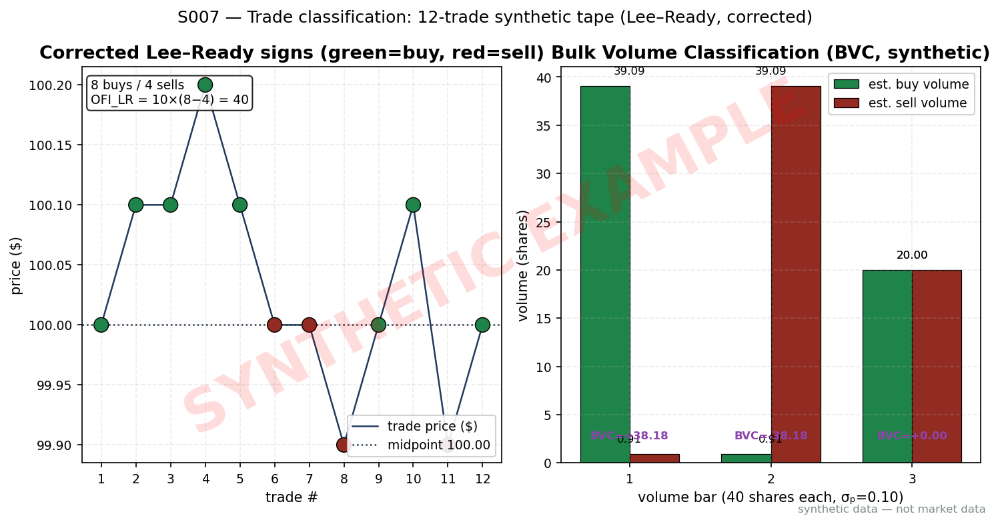

```mermaid
flowchart LR
    FEED["Raw feed\n(TAQ / Databento trades+NBBO)"] -->|"trade + quote events"| ING["Ingest + normalize\n(asof join, exchange ts,\nhalts, odd lots)"]
    ING -->|"aligned trade/quote stream"| FEAT["Feature compute\nquote rule, tick rule,\nvolume bars + z"]
    FEAT -->|"per-trade classified signs"| SIG["Signal S007\nLee–Ready d_i,\nBVC_b"]
    SIG -->|"per-trade sign series"| GATE{"Cost / toxicity\ngate?"}
    GATE -->|pass| OUT["Downstream consumer\n(T025 filter, T056 VAR,\nS008 VPIN)"]
    GATE -->|fail| DROP["No trade"]
    style SIG fill:#aed6f1,stroke:#1f3a5f
```

### S12. Sources

- Lee, C. M. C., & Ready, M. J. (1991). "Inferring Trade Direction from Intraday Data." Journal of Finance 46, 733–746. https://doi.org/10.1111/j.1540-6261.1991.tb02683.x
- Ellis, K., Michaely, R., & O'Hara, M. (2000). "The Accuracy of Trade Classification Rules: Evidence from Nasdaq." Journal of Financial and Quantitative Analysis 35(4), 529–551. https://ideas.repec.org/a/cup/jfinqa/v35y2000i04p529-551_00.html
- Easley, D., López de Prado, M. M., & O'Hara, M. (2012). "Flow Toxicity and Liquidity in a High Frequency World." Review of Financial Studies 25(5), 1457–1493.
- Chatbot source (labeled): Duck.ai (GPT-5.6 Luna, anonymous) answered Q-SB4-1–Q-SB4-3 (2026-09-10); Grok/Cursor answers pending (checked 2026-09-10). Q-SB4-1 formula sections matched standard literature forms (verified — except the Lee–Ready tape error corrected in S4); BVC numbers fully verified as printed.

**Unverified leads**
- Duck.ai's "~80–90% Lee–Ready accuracy in favorable settings" and modern market-structure caveats — directionally consistent with Ellis et al. (2000)'s 81.05% but the modern figure is an unverified chatbot claim.
- Duck.ai's flash-crash-timing phrasing for VPIN — use the ELO (2012) paper's own numbers before quoting.

---
## Stage 10/200 — S010: Kyle's lambda (price impact / illiquidity)

*Batch SB4 · Signal 10/100 · Provenance [D] · Family A — Microstructure & order flow*

### S1. One-line verdict

| | |
|---|---|
| **What it is** | Slope of mid-price change on signed share volume: dollars the price moves per signed share traded — a per-name illiquidity gauge. |
| **When it works** | Stable continuous trading, balanced two-sided flow, liquid names — λ stable enough to throttle participation. |
| **When it dies** | News jumps, auctions, one-sided sweeps, stale quotes, regime breaks — flow stops being informative. |
| **Build-or-buy in one line** | Build the estimator yourself (an OLS slope), buy the trade tape. |
| Provenance | `[D]` — Kyle (1985); empirical forms per Hasbrouck (2009), Goyenko–Holden–Trzcinka (2009). Family A — Microstructure & order flow. |

### S2. How it works — plain human explanation

**Jargon, defined once:** *SIP* (Securities Information Processor — the official consolidated tape); *NBBO* (National Best Bid and Offer — the consolidated best bid/ask across exchanges).

It's 9:47:03. AAPL's best bid is 231.40 × 800, ask 231.41 × 300 — the **midquote** (average of bid and ask, the market's best guess of fair value) sits at 231.405. A seller dumps 2,000 shares at the bid; the midquote ticks to 231.398. Another seller hits for 3,000; it ticks to 231.390. Each share of net selling pressure nudged the price down a little — that "little," dollars of price move per signed share, is Kyle's lambda (λ).

Why does flow move prices? Three costs hide in every quote:

- **Adverse selection**: some traders know more than the market maker. A **market maker** (anyone quoting both sides) loses to better-informed flow, so it shades quotes against incoming flow — that shading *is* price impact.
- **Inventory cost**: a dealer left long 5,000 shares moves quotes down to discourage selling and attract buyers.
- **Order processing**: the fixed cost of standing ready to trade (systems, capital, attention).

Kyle (1985) formalized this: with an informed trader, uninformed **noise traders** (liquidity-motivated flow), and competitive market makers who can't tell the two apart, the equilibrium price is linear in total order flow: P(Q) = v₀ + λQ. λ is higher when informed trading is large relative to noise trading — i.e., when flow is **toxic** (likely informed). Rising λ = thin or toxic book: expensive to trade, dangerous to quote.

**Mental model (3 bullets):**
- λ answers: "if I need to trade Q shares right now, how much worse does my own flow make my price?" — impact̂ ≈ λ̂·Q, first-order only.
- A *state variable*, not a trigger: high λ → trade less, widen quotes, demand more edge; low λ → be more aggressive.
- It is **local**: a linear coefficient fitted on small recent flow. Extrapolating it to large orders is where slippage forecasts go to die.

### S3. The math — exact formula

**Base regression** (through-origin **OLS**, ordinary least-squares, on signed flow):

$$\Delta p_t = \alpha + \lambda\, q_t + \varepsilon_t$$

$$\hat{\lambda} = \frac{\sum_{t=1}^{T} q_t\,\Delta p_t}{\sum_{t=1}^{T} q_t^2}\quad \text{(through-origin; with-intercept form uses demeaned sums)}$$

Symbols and units:

- Δp_t — midquote (or trade-price) change from *t−1* to *t*, in **$**. Midquote changes preferred — they strip out bid–ask bounce.
- q_t = d_t · v_t — **signed volume** in **shares**: d_t ∈ {+1, −1} trade direction (+1 = buyer-initiated), v_t share size. λ̂ thus has units **$ per signed share**.
- α — intercept ($); through-origin sets α = 0 (standard when q̄ ≈ 0 over the window).
- ε_t — residual price move.
- T — window length (trades or bars).

**Parameter table:**

| Parameter | Symbol | Typical range | Too small | Too large | Default (example) |
|---|---|---|---|---|---|
| Estimation window | T | 500–10k trades (HF); 30–240 min (bars); 20–120 d (daily) | noisy, unstable λ̂ | stale, misses regime shifts | 1,000 trades *example — not an institutional standard* |
| Signed-flow normalization | q_t scale | raw shares / ADV / √v | raw incomparable across names | over-normalization hides size effects | q_t/ADV for cross-name panels *example* |
| Price series | Δp_t | midquote changes preferred | trade prices inject bounce noise | midquote lags on stale quotes | midquote Δ, 1-min bars *example* |
| SE correction | — | Newey–West (SEs robust to serial correlation) | understated SEs — flow is autocorrelated | — | Newey–West SEs *example* |

**Normalization:** z-score λ̂ within name/day for ranking; keep raw λ̂ ($/signed-share) for execution. Report units explicitly — **bps** (basis points, 1/100th of a percent) per fraction of daily volume, or $/signed-share — a λ without units is meaningless.

**Causal timing:** λ̂ at event *t* uses trades ≤ *t* only; a decision based on it is tradable no earlier than *t+1*.

**Named variants:**
1. **Square-root form** (desk standard): ΔP_t = α + λ·sign(trade_t)·√|volume_t| + ε_t over a trailing window (e.g., 300 s) — concave impact.
2. **ADV-normalized**: r_t = α + λ·(q_t/ADV) + ε_t, **ADV** = average daily volume (shares) — λ in return per unit of daily volume, comparable across names.
3. **Kyle–Obizhaeva invariance**: impact ∝ σ·√(Q/(V·L)) — for cross-name sizing.

### S4. Worked example — step-by-step numbers (SYNTHETIC)

**Synthetic 8-trade tape** (Δp in $, q in signed shares; seed 10; fully tabulated — exactly reproducible):

| t | Δp_t ($) | q_t (signed shares) | q_t·Δp_t | q_t² |
|---|---|---|---|---|
| 1 | +0.005 | +100 | 0.50 | 10,000 |
| 2 | −0.008 | −200 | 1.60 | 40,000 |
| 3 | +0.006 | +100 | 0.60 | 10,000 |
| 4 | +0.013 | +300 | 3.90 | 90,000 |
| 5 | −0.006 | −100 | 0.60 | 10,000 |
| 6 | +0.011 | +200 | 2.20 | 40,000 |
| 7 | −0.004 | −100 | 0.40 | 10,000 |
| 8 | −0.017 | −300 | 5.10 | 90,000 |
| **Sum** | **0.000** | **0** | **14.90** | **300,000** |

λ̂ = Σq_tΔp_t / Σq_t² = 14.90 / 300,000 = **4.97×10⁻⁵ $/signed-share**. A 10,000-share order has first-order impact̂ ≈ λ̂·Q ≈ **$0.50** — before spread, fees, and nonlinearity.

**Note on the chatbot draft's errors** (Duck.ai Q-SB4-1, 2026-09-10; operator-verified): its direction-unit table had q̄ = **0** (not −0.2; its q vector sums to 0), Σq² = **10** (not 9.60), λ̂ = 0.80/10 = **0.08** (not 0.0833). Worse, q = ±1 were *directions*, not shares — with 10-share units the estimate is **0.008 $/signed-share**, so "0.0833 dollars per signed share" was wrong on units too; and that (q, Δp) series was a *separate* synthetic dataset, not derived from the 12-trade tape. The example above fixes all of this with explicit share units.

**What to notice:** λ̂ is tiny because each trade is small — the *product* λ̂·Q is what matters. This toy tape has no fees, spread, or nonlinearity; a real 10,000-share order costs more. λ̂ is a **ranking/conditioning variable** (which names are expensive to trade), not a slippage forecast.

### S5. Strategies that use this signal

- **T026 — Kyle-Lambda Participation Throttle** — *primary sizing signal*: child-order participation set inversely to rolling λ̂, with Amihud caps; keeps impact̂ ≈ λ̂·Q inside budget.
- **T084 — Block-Trade Impact Reversion** — *filter/sizing*: λ̂ (with S048 resiliency) decides whether a post-block fade is cheap enough to enter; vetoes above the toxicity cap.

### S6. Data required — exact spec

| Field | Type | Granularity | Source tier | Notes |
|---|---|---|---|---|
| Trade price | float $ | tick | Tier 0–2 | SIP ok for daily λ; HF λ wants exchange timestamps |
| Trade size | int shares | tick | Tier 0–2 | odd-lot handling |
| Trade direction d_t | ±1 | tick | Tier 0–2 | Lee–Ready: quote rule on lagged midquote, tick rule at midpoint |
| Quote mid m_t | float $ | tick / 1-min | Tier 1–2 | direct BBO for HF; SIP NBBO usually adequate (S7) |
| ADV (for normalization) | float shares | daily | Tier 0–1 | 20–60 day median volume |

Collection: consolidated trades + NBBO (Databento `trades`+`tbbo`, or Polygon stocks v3). Ingest sketch (≤20 lines, Python/polars):

```python
import polars as pl
trades = pl.scan_parquet("trades_*.parquet")          # ts, price, size, venue
quotes = pl.scan_parquet("tbbo_*.parquet")            # ts, bid, ask (lag ~1s for Lee–Ready)
m = quotes.with_columns(mid=(pl.col("bid")+pl.col("ask"))/2)
signed = trades.join_asof(m, on="ts", strategy="backward", tolerance="1s")
signed = signed.with_columns(
    d=pl.when(pl.col("price")>pl.col("mid")).then(1)
       .when(pl.col("price")<pl.col("mid")).then(-1).otherwise(None),
    q=pl.col("d")*pl.col("size"), dmid=pl.col("mid").diff())
lam = signed.filter(pl.col("d").is_not_null()).select(
    (pl.col("q")*pl.col("dmid")).sum()/ (pl.col("q")**2).sum()).collect()
```

Storage: L1 quotes+trades ≈ 2–8 GB/day per liquid name in Parquet (cost-model §4) — daily files; the λ̂ panels are MBs. Data-quality checklist: timestamp normalization (SIP vs direct skew), splits (adjust price *and* size), halts (exclude auction prints), DST/half-days, stale quotes (drop locked/crossed NBBO).

### S7. Local build on M5 Max / 128GB

**Feasibility: feasible (Tier M).** A rolling OLS slope over signed trade panels — arithmetic, not infrastructure. Per cost-model §2 polars does ~10–50M rows/sec on simple ops; a 1,000-trade rolling λ̂ recomputed per minute over 500 symbols is trivial, and tick-level λ̂ for 50 names (~100k events/sec aggregate) fits in 1–5 s polars batches.

| Stack | When to pick |
|---|---|
| Python + polars | default: batch recompute on bars or 1–5 s snapshots |
| Rust event loop | full-depth / multi-symbol tick real-time (>100k events/sec sustained) |
| DuckDB | ad-hoc research over per-symbol daily Parquet files |

- **Throughput:** ingest ~100–500k events/sec (Python, cost-model §2); signal ~1–10M rows/sec. Bottleneck is trade/quote asof alignment, not the regression.
- **RAM:** one symbol-day of L1 ≈ 0.5–4 GB (cost-model §3); keep rolling windows per symbol, 60 days of bar-level λ̂ (~MBs). 500 symbols × 60 days raw L1 does **not** fit — daily files + streaming.
- **Engineering: Tier M, 20–60 h** (cost-model §5) → $3,000–9,000 at $150/hr loaded. Chatbot lead (Duck.ai Q-SB4-2, 2026-09-10 — unverified): Kyle λ 25–50 h inside a 315–650 h L1/trade pipeline (bot printed "285–650" — contradicts its own rows). Cost-model tiers take precedence.
- **SIP adequacy:** Duck.ai lead (labeled, unverified): Kyle λ *usually* honest on SIP — align timestamps, normalize by ADV, prefer midquote changes; direct feeds better for HF λ.
- **Breaks first at 500 symbols:** the tick-granularity trade/quote asof join (memory bandwidth + cross-venue clock skew).

### S8. Buy vs build

| Option | What you get | Indicative price | Buying gains | Buying loses |
|---|---|---|---|---|
| Tier 0: Alpaca IEX / Stooq | Daily bars, IEX-only trades | ~$0 | free | no consolidated tape; intraday λ impossible |
| Tier 1: Polygon Stocks Advanced / Alpaca SIP | Consolidated real-time trades + NBBO | ~$30–200/mo | one API, corporate actions, enough for 1-min λ | SIP latency/staleness; no queue truth |
| Tier 2: Databento (trades + MBP-1/TBBO) | Exchange-timestamped trades + top-of-book | ~$200/mo + usage | honest HF λ, replay | usage metering |
| Academic: LOBSTER / TAQ (WRDS) | MBO/ITCH replay or TAQ history | ~hundreds/yr academic | ground truth for validation | academic license; not production |

All prices *indicative — verify before budgeting* (cost-model §6). **Verdict: build the estimator, buy the feed.** Your thresholds (participation caps per λ̂ quantile) are the edge — no vendor sells them. **Buy** Databento-grade L1 when HF λ drives live participation; **build** on SIP/Polygon while λ̂ is a daily/1-min variable. Crossover: measured SIP-vs-direct λ̂ divergence above ~10–20% *example — not an institutional standard*.

### S9. Success ratio / efficacy — documented evidence

Honesty first: λ is a **liquidity measurement**, not a strategy. The evidence is about measurement quality and conditioning use — no credible "λ predicts X bps of slippage" literature exists, and none is claimed.

| Study / source | Market & period | Metric | Before/after cost | Caveat |
|---|---|---|---|---|
| Goyenko–Holden–Trzcinka (2009), JFE 92 | US equities, TAQ + Rule 605 (SEC monthly execution-quality disclosure reports) benchmarks | Amihud "does well measuring price impact" vs HF benchmarks | before-cost (measurement accuracy) | Daily frequency; too coarse for single intraday orders |
| Collin-Dufresne & Fos (2012, NBER w18451) | US equities | Informed traders trade *more aggressively when measured price impact is lower* | n/a (documents estimator bias) | λ̂ suffers selection bias: measured flow is conditioned on λ̂ itself |
| Almgren–Chriss (2000) framework | execution literature | Permanent impact γ (linear) separates lasting price moves from temporary liquidity cost η | after-cost (implementation shortfall) | Per-desk calibration; planning input, not forecast |

**Regimes where it fails:** scheduled news (one-sided, uninformative flow), opens/closes and auctions, thin names (a few prints dominate λ̂), and periods where your own flow is a large share of q_t (exclude own fills — self-impact contaminates the estimate).

**Bottom line:** standalone trigger: *zero* edge — λ̂ has no directional content. Filter/sizing input: *real, documented* edge — it ranks where trading is expensive and keeps participation inside an impact budget. Per Duck.ai Q-SB4-3 (labeled chatbot lead): λ is a **local** impact coefficient; impact̂ ≈ λ̂Q is first-order only.

### S10. Failure modes & pitfalls

1. **Unit errors** — regressing on directions (±1) but quoting $/share (the chatbot error in S4). *Mitigation:* assert q in shares; label every λ̂ with units; unit-test on a hand tape.
2. **Lookahead via quote alignment** — signing with contemporaneous quotes leaks the reaction into d_t. *Mitigation:* lag quotes ~1 s (Lee–Ready); backward asof joins.
3. **Bid–ask bounce in Δp** — trade-price changes embed ±s/2 bounce, inflating |λ̂|. *Mitigation:* use midquote changes; if only trades exist, note the upward bias.
4. **Self-impact contamination** — your own fills sit in q_t and push λ̂ up exactly when you trade most. *Mitigation:* flag and exclude own executions from the tape.
5. **Regime breaks / news** — calm-flow λ̂ misprices headline trading. *Mitigation:* freeze or stress-multiply λ̂ around scheduled events.
6. **Nonlinearity at size** — impact̂ ≈ λ̂Q underestimates large-order cost. *Mitigation:* cap participation to the linear region; use the square-root variant for large clips.
7. **Stale quotes on SIP** — delayed NBBO mis-signs trades, attenuating λ̂ toward 0. *Mitigation:* measure SIP-vs-direct λ̂ divergence; upgrade feed past the S8 crossover.
8. **Overfitting the window** — tuning T to maximize backtested savings is parameter mining. *Mitigation:* fix T from λ̂ stability analysis, not from P&L.

### S11. Visuals

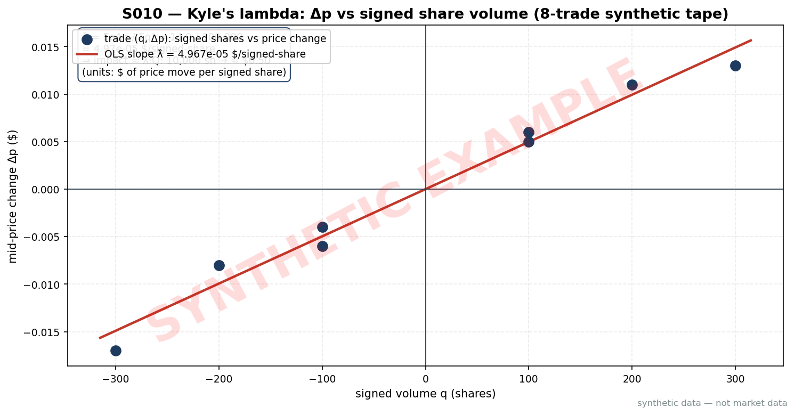

```mermaid
flowchart LR
    FEED["Raw feed<br/>(TAQ / Databento trades+TBBO)"] -->|tick trades| ING["Ingest + normalize<br/>(Lee–Ready sign, exchange ts)"]
    ING -->|signed trade events| SIG["Signal S010<br/>(1–30 min windows, Kyle λ̂ OLS)"]
    SIG -->|1–30 min λ̂ estimate| GATE{"λ̂ vs toxicity<br/>cap?"}
    GATE -->|pass: below cap| OUT["Downstream consumer<br/>(T026 participation throttle)"]
    GATE -->|fail: too toxic| DROP["Stand down / widen quotes"]
    style SIG fill:#aed6f1,stroke:#1f3a5f
```

*Diagram note: feature compute is folded into SIG — the 1–30 min Kyle λ̂ OLS runs directly on signed trade events, so there is no separate FEAT node (FEAT→SIG fold).*

### S12. Sources

1. Kyle, A. S. (1985). "Continuous Auctions and Insider Trading." *Econometrica*, 53(6), 1315–1335. — the λ model: P(Q) = v₀ + λQ; λ = σ_v/(2σ_ε). https://doi.org/10.2307/1913210 — λ formula as cited: https://github.com/screamer-labs/screamer/blob/HEAD/docs/functions_micro/RollingKyleLambda.md
2. Goyenko, R. Y., Holden, C. W., & Trzcinka, C. A. (2009). "Do Liquidity Measures Measure Liquidity?" *JFE*, 92(2), 153–181. — Amihud "does well measuring price impact." https://EconPapers.repec.org/article/eeejfinec/v_3a92_3ay_3a2009_3ai_3a2_3ap_3a153-181.htm
3. Collin-Dufresne, P., & Fos, V. (2012). "Insider Trading, Stochastic Liquidity and Equilibrium Prices." NBER WP 18451. — informed traders trade more when measured impact is low (λ̂ selection bias). https://www.nber.org/system/files/working_papers/w18451/w18451.pdf
4. Almgren, R., & Chriss, N. (2000). "Optimal Execution of Portfolio Transactions." *Journal of Risk*. — permanent vs temporary impact; λ-family coefficients as execution planning inputs. https://en.wikipedia.org/wiki/Almgren%E2%80%93Chriss_model

Duck.ai answered Q-SB4-1–Q-SB4-3 (2026-09-10); Grok/Cursor answers pending (checked 2026-09-10).

**Unverified leads** (chatbot-provided, no independent checkable source — do not quote as fact):
- Duck.ai (GPT-5.6 Luna, 2026-09-10) Q-SB4-1: practical windows (500–10k trades HF; 30–240 min; 20–120 d), Newey–West SEs — *unverified chatbot claim*.
- Duck.ai Q-SB4-2: L1/trade pipeline 315–650 h (row sums; printed "285–650" contradicts rows), Kyle λ 25–50 h; SIP "usually" adequate — *unverified chatbot claims*.
- Duck.ai Q-SB4-3: "λ is a local impact coefficient, not a full slippage forecast; no universal 1σ-Amihud → X bps slippage" — *unverified chatbot claim* (consistent with sources above).
- Grok / Cursor answers to Q-SB4-1–Q-SB4-3: pending (checked 2026-09-10).

---
## Stage 12/200 — S012: Roll implied effective spread

*Batch SB4 · Signal 12/100 · Provenance [D] · Family A — Microstructure & order flow*

### S1. One-line verdict

| | |
|---|---|
| **What it is** | Estimates the effective bid–ask spread from transaction prices alone, via the negative lag-1 autocovariance (covariance of each price change with the previous one) that bid–ask bounce induces. |
| **When it works** | Prices bounce between bid and ask with roughly equal buy/sell pressure, stable spread. |
| **When it dies** | Trending flow, informed trading, or positive autocovariance: the estimator is undefined and says nothing. |
| **Build-or-buy in one line** | Build: ten lines of NumPy on any trade tape; nothing to buy. |
| Provenance | `[D]` — Roll (1984); conventions per Harris (1990), Hasbrouck (2009). Family A — Microstructure & order flow. |

### S2. How it works — plain human explanation

**Jargon, defined once:** *SIP* (Securities Information Processor — the official consolidated tape).

Watch a stock trade. Bid 231.40, ask 231.41. A seller hits the bid: print at 231.40. A buyer lifts the ask: 231.41. Another seller: 231.40. If fundamental value never moved, trade prices just *bounce* between 231.40 and 231.41 — consecutive price changes (+0.01, −0.01, +0.01) alternate sign. That negative serial dependence is the fingerprint of the spread.

Roll's (1984) insight: in an efficient market, fundamental value follows a random walk, and the only deviation of *observed* trade prices from a random walk is the bid–ask bounce. So the lag-1 autocovariance of price changes identifies the spread: γ₁ = −s²/4, hence **s = 2√(−γ₁)** — no quotes needed, just a trade tape.

Definitions, since the whole chapter hangs on them:

- **Quoted spread**: ask − bid — what the book *advertises*.
- **Effective spread**: 2·|trade price − midquote| — what a trader *actually* paid vs fair value; often below quoted (price improvement inside the quotes).
- **Realized spread**: the dealer's average round-trip revenue; smaller than quoted when adverse selection moves the midquote against the dealer.
- **Adverse selection**: losses a liquidity provider suffers against better-informed counterparties — the midquote drifts after the trade, shrinking the realized spread.

Roll recovers the *effective* spread — the round-trip cost implied by the bounce — which is why T029 uses it as an edge filter: don't trade unless expected edge exceeds the Roll-implied cost.

**Mental model (3 bullets):**
- Bounce ⇒ negative autocovariance ⇒ spread. No bounce (one-sided flow) ⇒ no information about the spread.
- It's a *cost meter*, not a direction signal: it tells you how expensive the name is, never which way it goes.
- It assumes buys and sells are equally likely and the spread is constant — every violation biases it, and it fails loudly (undefined) rather than quietly.

### S3. The math — exact formula

**Roll model.** Observed price p_t = m_t + (s/2)·I_t, where m_t is the unobserved efficient (mid) price with serially uncorrelated innovations, s is the effective spread, and I_t ∈ {+1, −1} is the trade direction (buy/sell), equally likely and independent of m_t. Then:

$$\Delta p_t = \varepsilon_t + \tfrac{s}{2}(I_t - I_{t-1}),\qquad \mathrm{Cov}(\Delta p_t, \Delta p_{t-1}) = -\frac{s^2}{4}$$

$$\hat{s}_{\text{Roll}} = 2\sqrt{-\hat{\gamma}_1},\qquad \hat{\gamma}_1 = \frac{1}{T-1}\sum_{t=2}^{T}(\Delta p_t - \overline{\Delta p})(\Delta p_{t-1} - \overline{\Delta p})$$

- Δp_t — trade-price change, in **dollars** ($); T = number of price changes in the window.
- γ̂₁ — sample lag-1 autocovariance of price changes, in **$²**; must be **clearly negative** — if γ̂₁ ≥ 0 the estimator is undefined (S4 rule).
- ŝ — implied **effective spread**, in **dollars** ($).

**Parameter table:**

| Parameter | Symbol | Typical range | Too small | Too large | Default (example) |
|---|---|---|---|---|---|
| Estimation window | T | 100–5,000 transactions; 1–15 min bars *(chatbot-suggested range, Duck.ai Q-SB4-1 — unverified)* | γ̂₁ dominated by noise; often ≥ 0 | spread assumed constant over too long; regime mixing | 500 trades *example — not an institutional standard* |
| Sampling | — | tick trades / 1–15 min bars *(chatbot-suggested, unverified)* | tick noise, discreteness | bounce averaged away | 1-min bars *example* |
| γ̂₁ ≥ 0 rule | — | undefined / floor at 0 / \|·\| | fabricating a spread from noise | — | report undefined; lengthen window *example* |

**Normalization:** ŝ in $ or in **bps** (basis points; ŝ/price × 10,000) for cross-name comparison. Harris (1990) uses 2√|γ̂₁| (always defined); Hasbrouck (2009) floors at 0. These are *choices*, not truths; document yours.

**Causal timing:** ŝ over trades ≤ *t* is known at *t*; a gate based on it applies at *t+1* and later.

**Named variants:**
1. **Roll–Hasbrouck Gibbs (Bayesian)**: prior on spread and latent trade directions, posterior sampled — always non-negative, exact in small samples; Hasbrouck (2004, 2009).
2. **Corwin–Schultz (2012)**: spread from daily high/low ratios over 1- and 2-day intervals — needs only OHLC, beats Roll in simulations (S9).
3. **French–Roll bias correction**: adjusts for the small-sample bias of the moment estimator.

### S4. Worked example — step-by-step numbers (SYNTHETIC)

**Synthetic 12-trade tape** (prices in $; random seed 12 in the plot script — fully tabulated, reproducible exactly):

| t | p_t | Δp_t |
|---|---|---|
| 1 | 100.00 | — |
| 2 | 100.10 | +0.10 |
| 3 | 100.10 | 0.00 |
| 4 | 100.20 | +0.10 |
| 5 | 100.10 | −0.10 |
| 6 | 100.00 | −0.10 |
| 7 | 100.00 | 0.00 |
| 8 | 99.90 | −0.10 |
| 9 | 100.00 | +0.10 |
| 10 | 100.10 | +0.10 |
| 11 | 99.90 | −0.20 |
| 12 | 100.00 | +0.10 |

Step-by-step (11 price changes):
1. ΣΔp_t = **0.00** (starts and ends at 100.00 — it must sum to zero), so Δp̄ = **0** exactly.
2. Lag-1 cross-products Δp_t·Δp_{t−1} (t = 2…11): 0, 0, −0.01, +0.01, 0, 0, −0.01, +0.01, −0.02, −0.02 → sum = **−0.04**.
3. γ̂₁ = −0.04/10 = **−0.004** $² (dividing by T−1 = 10 cross-products).
4. ŝ = 2√(−γ̂₁) = 2√0.004 = 2 × 0.06325 ≈ **$0.126**.

**Correction note:** the Duck.ai draft (Q-SB4-1, 2026-09-10) mis-summed this Δp series as −0.10 (mean −0.00909, γ̂₁ = −0.00402, spread $0.127). All three are wrong: the series sums to 0 (start = end price), so the mean is 0, γ̂₁ = −0.004, and the spread is **$0.126**.

**When γ̂₁ ≥ 0 (the Roll failure rule):** report the spread as **undefined** — do not silently take √|γ̂₁|. Then: (a) lengthen the window; (b) switch to slower sampling (1–5 s or 1–15 min bars — chatbot-rated "usually" honest on SIP, labeled lead); (c) cross-check with Corwin–Schultz or the quoted spread. A positive γ̂₁ with adequate sample usually means trending/informed flow, not a zero spread.

**What to notice:** this toy tape has a suspiciously clean bounce and no fees — real tapes mix bounce with drift, which is why γ̂₁ ≥ 0 happens in practice (about half of Roll's own annual samples; S9). A cost screen, never a backtest input: nothing here is a return.

### S5. Strategies that use this signal

- **T029 — Spread-Estimate Edge Filter** — *primary gate*: trade only when the estimated effective spread (Roll / Corwin–Schultz) is below the per-trade edge; Roll is the cheap first-pass screen.
- **T028 — Spread-Decomposition Router** — *cost input*: Roll-implied effective spread feeds the router's quoted/effective/realized spread panel alongside S015's decomposition.
- **T097 — Sub-Hour Microstructure Reversal Scalper** — *timing filter*: reversal entries sized so the harvested bounce exceeds the Roll-implied round-trip cost.

### S6. Data required — exact spec

| Field | Type | Granularity | Source tier | Notes |
|---|---|---|---|---|
| Trade price p_t | float $ | tick (per trade) | Tier 0–2 | any trade tape; Polygon stocks v3, Databento trades, TAQ |
| (optional) Trade timestamp | datetime | tick | Tier 1–2 | needed only for window/bar sampling |
| (cross-check) Daily high/low | float $ | daily | Tier 0 | for Corwin–Schultz fallback |

Collection: the cheapest signal in the book — a trade-price series. `trades` schema from Databento or Polygon; even Stooq daily closes work for a daily-frequency Roll (with the caveat that daily sampling weakens the bounce). Ingest sketch (≤20 lines):

```python
import polars as pl, numpy as np
px = pl.scan_parquet("trades_*.parquet").select("ts","price").sort("ts")
dp = px.with_columns(dp=pl.col("price").diff()).drop_nulls().collect()
T = len(dp)
g1 = ((dp["dp"]-dp["dp"].mean())*(dp["dp"].shift(1)-dp["dp"].mean())).sum()/(T-1)
roll_spread = 2*np.sqrt(-g1) if g1 < 0 else float("nan")  # undefined if >= 0
print(f"γ̂₁={g1:.6f}  Roll spread={roll_spread}")
```

Storage: negligible — a trade-price column (500 symbols × 60 days of 1-min bars ≈ 12 MB, cost-model §3). Data-quality: exclude auction prints and halts (they break the bounce), splits/dividends, DST/half-days, bad ticks (drop prints >10% from rolling median — *example*).

### S7. Local build on M5 Max / 128GB

**Feasibility: feasible (Tier M).** The covariance itself is microseconds of NumPy — but a defensible pipeline (sampling harness, γ̂₁ ≥ 0 rule, Corwin–Schultz cross-check, validation) is what the band prices. Per cost-model §2, numpy vectorized math runs ~50–200M elements/sec; the entire 500-symbol 1-min-bar panel (195k bars/day) computes in milliseconds. The work is in *sampling choices and the γ̂₁ ≥ 0 decision rule*, not compute.

| Stack | When to pick |
|---|---|
| Python + NumPy/polars | default: the whole estimator is one vectorized expression |
| DuckDB | ad-hoc research over daily Parquet trade files |

- **Throughput:** effectively infinite for this signal; bottleneck is data retrieval, not compute.
- **RAM:** 1 symbol-day of 1-min bars ≈ 0.1 MB (cost-model §3); 500 symbols × 60 days ≈ 12 MB — trivial.
- **Engineering: Tier M, 20–60 h** (cost-model §5: S001–S020 ex-L2) → $3,000–9,000 at $150/hr loaded-cost estimate. The narrow covariance prototype is a few hours; the band prices the defensible trade-tape pipeline. Chatbot lead (Duck.ai Q-SB4-2, 2026-09-10 — unverified): Roll component 15–30 h inside a 315–650 h L1/trade pipeline (bot printed "285–650" — contradicts its own rows). Cost-model tiers take precedence.
- **SIP adequacy:** Duck.ai lead (labeled, unverified): Roll is *usually* honest on SIP — use slow sampling (1–5 s or 1–15 min bars) and test sensitivity to the sampling choice. Never treat a SIP-derived Roll as exchange truth at tick granularity.
- **Breaks first at 500 symbols:** nothing about Roll breaks — but tick-level on 500 names makes the trade-tape ingest (not the estimator) the bottleneck; sample to bars.

### S8. Buy vs build

| Option | What you get | Indicative price | Buying gains | Buying loses |
|---|---|---|---|---|
| Tier 0: Stooq / Alpaca IEX / exchange delayed | Daily bars or IEX trades | ~$0 | free; enough for daily Roll | coarse; weak bounce at daily frequency |
| Tier 1: Polygon Stocks Advanced / Alpaca SIP | Real-time consolidated trades | ~$30–200/mo | full tape for tick Roll | nothing material at this price |
| Tier 2: Databento trades | Exchange-timestamped trades, replay | ~$200/mo + usage | provenance, replay | overkill for a covariance |
| Academic: TAQ (WRDS) | Full consolidated history | ~hundreds/yr academic | validation sample | academic license |

All prices *indicative — verify before budgeting* (cost-model §6). **Verdict: build, always.** No vendor product exists — Roll is ten lines of NumPy. Spend the effort on the *sampling and γ̂₁ ≥ 0 rule*; cross-check with Corwin–Schultz (needs only daily high/low) before trusting one estimate. **Buy** a feed only if you lack a trade tape for other signals; never buy data *for* Roll.

### S9. Success ratio / efficacy — documented evidence

Roll is a cost *measurement*; the evidence is about estimator accuracy, not trading profits. No strategy, only a meter.

| Study / source | Market & period | Metric | Before/after cost | Caveat |
|---|---|---|---|---|
| Hasbrouck (2009), *JF* 64(3) | US equities vs transaction-level estimates | Gibbs (Bayesian Roll) achieves **0.965 correlation** with transaction-level effective costs | before-cost (measurement accuracy) | Daily closes; Gibbs heavier than moment Roll |
| Corwin–Schultz (2012), *JF* 67(2) | Simulations (per published summaries) | High–low estimates correlate **~0.9** with true spreads; **half the std dev** of Roll's estimator | before-cost (estimator precision) | Simulation-based; assumes high≈buy/low≈sell |
| Roll (1984) via CEMMAP CWP12/16 | Roll's own annual daily/weekly samples | Positive autocovariance — estimator undefined — in **about half** the cases | n/a (documents failure rate) | Daily/weekly sampling; intraday ticks behave better |

**Regimes where it fails:** one-sided flow (no bounce — γ̂₁ ≥ 0), informed episodes (random-walk assumption breaks), discrete ticks in low-priced names (quantized bounce), after-hours/crossed markets.

**Bottom line:** standalone trigger: *zero* edge (no direction). Cost filter: *documented, honest* edge — it keeps you out of trades whose implied round-trip cost already eats your edge. Prefer Gibbs/Corwin–Schultz over raw moment-Roll on short samples.

### S10. Failure modes & pitfalls

1. **γ̂₁ ≥ 0 — the classic failure** — √|·| or silent flooring fabricates a spread from trend noise. *Mitigation:* report undefined; lengthen window; cross-check (S4).
2. **Lookahead via window choice** — tuning the window until the spread "looks right" is parameter mining. *Mitigation:* fix sampling from stability analysis, not from downstream P&L.
3. **Auction prints and halts** — discontinuous prices inject fake autocovariance. *Mitigation:* exclude opens/closes/auction prints and halted periods.
4. **Tick discreteness** — in low-priced names the bounce is quantized and γ̂₁ is distorted. *Mitigation:* use bps units; prefer midquote-based measures where quotes exist.
5. **Buys/sells equally likely — false** — real flow clusters; one-sided flow biases ŝ down. *Mitigation:* treat Roll as a lower-bound screen under clustered flow; confirm with quoted spreads.
6. **Mixing regimes in one window** — calm morning + news afternoon in a single γ̂₁ mixes two spreads. *Mitigation:* short rolling windows; intraday seasonality awareness (wider at open/close).
7. **Backtest misuse** — "returns net of Roll spread" on a synthetic tape is fabricated realism. *Mitigation:* Roll is a live cost gate; never subtract it from toy P&L.
8. **Small-sample bias** — the moment estimator is biased in short samples. *Mitigation:* French–Roll correction or the Gibbs estimator for short windows.

### S11. Visuals

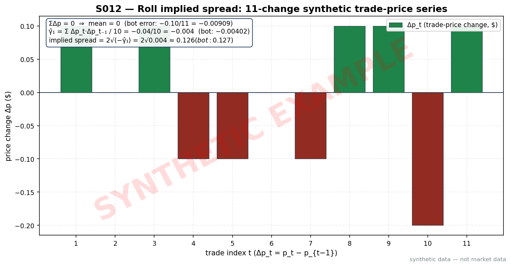

```mermaid
flowchart LR
    FEED["Raw feed<br/>(any trade tape: Polygon/TAQ)"] -->|tick trades| ING["Ingest + normalize<br/>(drop auctions/halts, splits)"]
    ING -->|per-trade clean trade-price series| SIG["Signal S012<br/>(rolling 100–5,000-trade windows, ŝ = 2√(−γ̂₁))"]
    SIG -->|rolling 100–5,000-trade spread estimate| GATE{"γ̂₁ clearly negative<br/>and ŝ < edge?"}
    GATE -->|pass| OUT["Downstream consumer<br/>(T029 edge filter)"]
    GATE -->|fail| DROP["No trade / lengthen window"]
    style SIG fill:#aed6f1,stroke:#1f3a5f
```

### S12. Sources

1. Roll, R. (1984). "A Simple Implicit Measure of the Effective Bid-Ask Spread in an Efficient Market." *JF*, 39(4), 1127–1139. — ŝ = 2√(−cov); spread from price changes alone. https://repec.udesa.edu.ar/pub/Finanzas/Journals/Journal%20of%20Finance/39/4/2327617.pdf
2. Harris, L. (1990). "Statistical Properties of the Roll Serial Covariance Bid/Ask Spread Estimator." *JF*, 45(2), 579–590. — positive-autocovariance properties; |·| convention. Author's CV: https://msbfile03.usc.edu/digitalmeasures/lharris/pci/Harris-Larry%20CV-1.pdf
3. Hasbrouck, J. (2009). "Trading Costs and Returns for U.S. Equities." *JF*, 64(3), 1445–1477. — Gibbs estimate correlates 0.965 with transaction-level estimates. https://pages.stern.nyu.edu/~jhasbrou/Research/GibbsCurrent/HasbrouckJF.pdf
4. Corwin, S. A., & Schultz, P. (2012). "A Simple Way to Estimate Bid-Ask Spreads from Daily High and Low Prices." *JF*, 67(2), 719–760. — high–low estimator; ~0.9 correlation in simulations, half Roll's std dev. https://afajof.org/issue/volume-67-issue-2/
5. CEMMAP CWP12/16 — "Simple Nonparametric Estimators for the Bid-Ask Spread in the Roll Model." — Roll's positive-autocovariance problem (≈ half his samples); reviews Harris/Hasbrouck fixes. https://www.cemmap.ac.uk/wp-content/uploads/2020/08/CWP1216.pdf

Duck.ai answered Q-SB4-1–Q-SB4-3 (2026-09-10); Grok/Cursor answers pending (checked 2026-09-10).

**Unverified leads** (chatbot-provided, no independent checkable source — do not quote as fact):
- Duck.ai (GPT-5.6 Luna, 2026-09-10) Q-SB4-1: practical windows (100–5,000 transactions; 1–15 min bars), γ̂₁ ≥ 0 handling (undefined / lengthen / corrected estimator) — *unverified chatbot claims* (consistent with Harris/Hasbrouck conventions; kept as labeled leads).
- Duck.ai Q-SB4-2: Roll component 15–30 h inside a 315–650 h L1/trade pipeline (row sums; printed "285–650" contradicts rows); SIP "usually" honest with slow sampling — *unverified chatbot claims*.
- Grok / Cursor answers to Q-SB4-1–Q-SB4-3: pending (checked 2026-09-10).

---
## Stage 15/200 — S015: Spread decomposition — Huang–Stoll

*Batch SB4 · Signal 15/100 · Provenance [D] · Family A — Microstructure & order flow*

### S1. One-line verdict

| | |
|---|---|
| **What it is** | Splits the traded spread into three costs — adverse selection, inventory, order processing — via a trade-indicator regression on quote midpoints. |
| **When it works** | Clean signed trades with lag-aligned quotes; the adverse-selection share becomes a slow-moving toxicity gauge for routing and quoting. |
| **When it dies** | Stale NBBO, mis-signed trades, locked/crossed quotes, short windows — the α/β split is fragile and components blur. |
| **Build-or-buy in one line** | Build the estimator; buy TAQ-grade quote history — alignment is the whole job. |
| Provenance | `[D]` — Huang & Stoll (1997); Glosten–Harris (1988) predecessor; Stoll (1989) covariance family. Family A — Microstructure & order flow. |

### S2. How it works — plain human explanation

**Jargon, defined once:** *NBBO* (National Best Bid and Offer — the consolidated best bid/ask across exchanges); *SIP* (Securities Information Processor — the official consolidated tape); *HFT* (high-frequency trader).

It's 9:47:03. AAPL's book: bid 231.40 × 800, ask 231.41 × 300 — the **quoted spread** (ask − bid) is $0.01. Three costs hide inside that penny:

- **Adverse selection**: risk of trading against the better informed. After a buy lifts the ask, the **midquote** ((bid+ask)/2) is revised *upward*, permanently. The spread fraction for information risk is α.
- **Inventory cost**: risk of holding an unwanted position. After absorbing sells, the midquote drifts down to attract buyers — *transitory*, reversing. Its share is β.
- **Order processing**: the fixed cost of standing ready — systems, capital, attention. Whatever is left: 1 − α − β.

Huang and Stoll's (1997) trick: the three costs leave different footprints in the midquote's response to the *sequence* of trade directions — permanent revision after a buy (adverse selection), decaying revision (inventory), constant trade-price/midquote wedge (order processing). One regression on midquote changes vs current and lagged trade directions separates them.

α is a **toxicity gauge**: high α → informed flow, dangerous to quote into (widen quotes, route defensively); low α → the spread is mostly rent. Consumed by T028 and T083.

**Mental model (3 bullets):**
- The spread is three costs, not one — only the adverse-selection slice predicts your fills will be followed by adverse price moves.
- α̂ is a *state* (toxicity regime), not a trigger: high α̂ → stand down or charge more; low α̂ → provide liquidity.
- The estimator is only as honest as the signing and quote alignment underneath — garbage in, three garbage components out.

### S3. The math — exact formula

**Huang–Stoll (1997) trade-indicator model:**

$$\Delta M_t = \frac{S}{2}\,Q_{t-1} + (\alpha+\beta)\,\frac{S}{2}\,Q_t + e_t$$

- M_t — quote **midpoint** (midquote) at trade *t*, in **$**; ΔM_t in $.
- Q_t ∈ {+1, −1} — **trade indicator** (+1 buyer-initiated, −1 seller-initiated), dimensionless; Lee–Ready signed (quote rule on *lagged* midquote, tick rule at midquote).
- S — traded spread (constant within window), in **$**.
- α — **adverse-selection component**: half-spread fraction compensating information risk (permanent revision).
- β — **inventory component**: half-spread fraction for inventory-holding risk (transitory revision).
- 1 − α − β — **order-processing component** (residual); e_t — public-information innovation + noise.

Estimation: **OLS** (ordinary least-squares; or **GMM**, generalized method of moments, with discreteness corrections) of ΔM_t on Q_{t−1}, Q_t gives ĉ₁ = S/2, ĉ₂ = (α+β)(S/2). Splitting α from β needs a second moment — trade-indicator serial correlation: permanent midquote moves identify α, mean-reverting revisions identify β.

**Predecessor — Glosten–Harris (1988):**

$$\Delta p_t = c_0\,\Delta Q_t + c_1\,\Delta Q_t\,V_t + z_0\,Q_t + z_1\,Q_t\,V_t + \varepsilon_t$$

- z-terms = **adverse selection** (permanent), c-terms = **transitory** (order processing + inventory); V_t = trade size. Glosten–Harris splits permanent vs transitory; Huang–Stoll further splits transitory into inventory vs order processing.

**Parameter table:**

| Parameter | Symbol | Typical range | Too small | Too large | Default (example) |
|---|---|---|---|---|---|
| Estimation window | T | 100s–1000s of trades / intraday blocks *(chatbot-suggested, Duck.ai Q-SB4-1 — unverified)* | α/β unidentified, noisy | components assumed constant over regime shifts | 1 trading day *example — not an institutional standard* |
| Quote lag for signing | — | 0–5 s lag quotes behind trades *(chatbot-suggested — unverified)* | lookahead: quote already reacted | stale quotes mis-sign | 1 s lag *example* |

**Causal timing:** components on trades ≤ *t* describe the toxicity *regime*; usable from *t+1*. Shares move slowly — re-estimate intraday, consume as a slow gauge.

**Named variants:**
1. **Two-component HS** (α+β pooled vs order processing) — more stable; use when α/β won't identify.
2. **Glosten–Harris with size interactions** — components as functions of V_t; for block-heavy flow.
3. **Madhavan–Richardson–Roomans (1997)** — allows correlated order flow; intraday component variation.

### S4. Worked example — step-by-step numbers (SYNTHETIC)

**Synthetic 8-observation regression sample** (9 underlying trades t = 1…9; seed 15; fully tabulated). ΔM_t = 0.020·Q_{t−1} + 0.010·Q_t + e_t, ΔM in $:

| t | Q_t | Q_{t−1} | ΔM_t ($) | e_t ($) |
|---|---|---|---|---|
| 2 | +1 | +1 | +0.032 | +0.002 |
| 3 | −1 | +1 | +0.008 | −0.002 |
| 4 | +1 | −1 | −0.009 | +0.001 |
| 5 | −1 | +1 | +0.009 | −0.001 |
| 6 | −1 | −1 | −0.028 | +0.002 |
| 7 | +1 | −1 | −0.012 | −0.002 |
| 8 | −1 | +1 | +0.011 | +0.001 |
| 9 | +1 | −1 | −0.011 | −0.001 |

OLS of ΔM on x₁ = Q_{t−1}, x₂ = Q_t (demeaned, sums 0):
- Σx₁² = Σx₂² = 8, Σx₁x₂ = −4 → (X′X)⁻¹ = [[1/6, 1/12],[1/12, 1/6]].
- X′y: x₁′y = 0.120, x₂′y = 0.000 (hand-chosen errors orthogonal to x₂ — a property of this constructed tape, not real data).
- ĉ₁ = 0.120/6 = **0.020** → S/2 = $0.020, so S = **$0.04**.
- ĉ₂ = 0.120/12 = **0.010** → (α+β) = ĉ₂/ĉ₁ = **0.50**.

Second stage (set by construction to split the pooled 0.50): **α = 0.30**, **β = 0.20**, order processing = **0.50**. Components of the $0.020 half-spread:

| Component | Share | $ of half-spread |
|---|---|---|
| Adverse selection (α·S/2) | 30% | $0.006 |
| Inventory (β·S/2) | 20% | $0.004 |
| Order processing ((1−α−β)·S/2) | 50% | $0.010 |

Interpretation: half the spread is dealer rent; 30% information risk, 20% inventory risk. α̂ = 0.30 → moderately toxic flow.

**Chatbot cross-check:** the Duck.ai draft's guidance (Q-SB4-1) had **no arithmetic errors** — direction, spread definitions, quote-lag alignment, component split, 60–120 h band; labeled lead.

**What to notice:** the first stage recovers S and α+β, but the α/β *split* is fragile — in real data it hinges on trade-indicator autocorrelation, exactly what stale quotes corrupt. Zero fees, constant spread; nothing is a trading result.

### S5. Strategies that use this signal

- **T028 — Spread-Decomposition Router** — *primary signal*: quoted/effective/realized spreads plus HS shares decide routing — high-α̂ flow routed defensively, low-α̂ worked passively.
- **T083 — Retail-Flow Internalizer Fade** — *pricing input*: prices liquidity provision off the decomposition — fades retail/odd-lot imbalance only when α̂ says the flow is uninformed.

### S6. Data required — exact spec

| Field | Type | Granularity | Source tier | Notes |
|---|---|---|---|---|
| Trade price & size | float $, int shares | tick | Tier 1–2 | TAQ / Databento trades; venue odd-lot rules |
| Bid/ask quotes (BBO) | float $ | tick | Tier 1–2 | must *precede* each trade; lag 1–5 s for Lee–Ready *(chatbot-suggested — unverified)* |
| Trade direction Q_t | ±1 | tick | derived | quote rule then tick rule; 0 allowed at midquote |
| Corporate actions | adjustment factors | daily | Tier 0–1 | splits/dividends break ΔM continuity |

Collection: TAQ-grade quotes + trades (Databento `tbbo`+`trades`, or Polygon quotes/trades v3). The critical job is **quote-lag alignment**: sign each trade against the quote that *prevailed before* it — the chatbot lead (Duck.ai Q-SB4-1, labeled) stresses direction, quote-lag alignment, and the component split as make-or-break. Ingest sketch (≤20 lines):

```python
import polars as pl
tr = pl.scan_parquet("trades_*.parquet").select("ts","price","size").sort("ts")
qb = pl.scan_parquet("tbbo_*.parquet").select("ts","bid","ask").sort("ts")
q = qb.with_columns(mid=(pl.col("bid")+pl.col("ask"))/2,
                    ts_lag=pl.col("ts")+pl.duration(seconds=1))  # lag quotes
s = tr.join_asof(q, left_on="ts", right_on="ts_lag", strategy="backward")
s = s.with_columns(Q=pl.when(pl.col("price")>pl.col("mid")).then(1)
                     .when(pl.col("price")<pl.col("mid")).then(-1).otherwise(0),
                   dM=pl.col("mid").diff())
reg = s.with_columns(Qlag=pl.col("Q").shift(1)).drop_nulls()
# OLS: dM ~ Qlag + Q  ->  c1 = S/2, c2 = (α+β)*S/2
```

Storage: L1 quotes+trades ≈ 2–8 GB/day per liquid name in Parquet (cost-model §4) — daily files; aligned quote history required, not bars. Data-quality: locked/crossed NBBO (drop), stale quotes (age < 5 s — *example*), halts/auctions (exclude), odd-lot rules (venue-dependent), DST/half-days, tick-size changes.

### S7. Local build on M5 Max / 128GB

**Feasibility: feasible (Tier M).** The regression is trivial; the *pipeline* — tick-granularity quote-lag alignment, Lee–Ready signing, robust estimation across hundreds of names — is real data engineering.

| Stack | When to pick |
|---|---|
| Python + polars | default: batch re-estimation on intraday blocks; fastest to build |
| Rust event loop | tick-level real-time signing across many symbols |
| DuckDB | ad-hoc research over per-symbol daily Parquet files |

- **Throughput:** polars asof joins ~1–10M rows/sec (cost-model §2, complex ops); aligning a day of TAQ quotes+trades for 50 names is minutes of batch work. Real-time HS needs incremental signing — Python fine at ≤20 symbols L1, Rust beyond.
- **RAM:** one symbol-day of L1 ≈ 0.5–4 GB (cost-model §3); working set is a rolling quote+trade panel per symbol. 500 symbols × 60 days raw L1 does **not** fit — per-symbol daily files + streaming.
- **Engineering: Tier M, 20–60 h** (cost-model §5: S001–S020 ex-L2) → $3,000–9,000 at $150/hr loaded. Chatbot lead (Duck.ai Q-SB4-2, 2026-09-10 — unverified): **60–120 h for a defensible production build**. Cost-model tiers take precedence.
- **SIP adequacy:** Duck.ai lead (labeled, unverified): HS *mostly* honest on SIP — but stale NBBO, reporting delays, locked/crossed quotes, odd-lot handling bite at short horizons. Validate α̂/β̂ against a direct-feed sample before routing on it.
- **Breaks first at 500 symbols:** the tick-granularity quote-alignment join (bandwidth + clock skew); α/β identification degrades as quote staleness rises.

### S8. Buy vs build

| Option | What you get | Indicative price | Buying gains | Buying loses |
|---|---|---|---|---|
| Tier 0: SIP delayed / Stooq | Daily bars, delayed quotes | ~$0 | free | no tick quotes — HS impossible |
| Tier 1: Polygon / Alpaca SIP | Real-time trades + NBBO | ~$30–200/mo | cheapest viable HS input | stale-NBBO caveats on the α/β split |
| Tier 2: Databento (trades + TBBO) | Exchange-timestamped, replay | ~$200/mo + usage | honest quote-lag alignment | usage metering |
| Tier 3: TAQ via WRDS (academic) | Full consolidated history | ~hundreds/yr academic | validation gold standard | academic license; not production |

All prices *indicative — verify before budgeting* (cost-model §6). **Verdict: build the estimator, buy TAQ-grade quotes.** Nobody sells your toxicity thresholds — the α̂ at which *you* stand down is the edge. **Buy** Databento-grade L1 when the decomposition drives routing (T028) or quoting (T083); **build** on SIP while HS is a research gauge. Crossover: SIP-vs-direct α̂ divergence exceeding your toxicity tolerance *example — not an institutional standard*. Hybrid is normal: buy the raw feed, build the analytics.

### S9. Success ratio / efficacy — documented evidence

HS is a spread *measurement*; the evidence concerns component magnitudes and stability — all before-cost.

| Study / source | Market & period | Metric | Before/after cost | Caveat |
|---|---|---|---|---|
| Huang & Stoll (1997), *RFS* 10(4) | NYSE stocks | "Large order processing, smaller but significant adverse selection and inventory"; shares differ by trade size | before-cost (measurement) | Specialist-era structure; model-dependent |
| Gregoriou & Rhodes (2017) on HS (1997) | Large NYSE stocks | Two-component: order processing ≈ **88.6%** avg; full split: order processing largest, inventory next, information asymmetry **<10%** | before-cost (measurement) | Large liquid names — adverse selection small *there* |
| Bleaney & Li (2014), Nottingham DP 14/03 | FX multi-dealer (Reuters D2000-1) | Asymmetric-information component carries the **biggest weight** in FX | before-cost (measurement) | Different structure — shares are regime/venue-dependent |

**Regimes where it fails:** news/jumps (spread not constant; α̂ spikes after), opens/closes (auctions), thin names (too few trades to split α vs β — use two-component), fragmented markets (the "dealer" is a crowd of HFTs). Shares drift with market structure — re-estimate; don't hard-code 1997 shares.

**Bottom line:** standalone trigger: *zero* edge — HS never gives direction. Toxicity gauge: *documented, honest* — α̂ tells routing/quoting how dangerous the flow is. The ordering is the desk-relevant fact — order processing dominates calm large-caps, adverse selection dominates stressed flow.

### S10. Failure modes & pitfalls

1. **Mis-signed trades** — unlagged quotes leak the quote's reaction into Q_t; tick-rule errors cluster when flow is fastest. *Mitigation:* lag quotes 1–5 s; report the signing-failure rate.
2. **Stale / locked / crossed NBBO** — signing against a stale midquote flips Q_t. *Mitigation:* drop locked/crossed quotes; quote age < 5 s (*example*); direct feeds for routing-grade use.
3. **α/β non-identification** — in short/calm windows the second-stage moment is noise. *Mitigation:* fall back to two-component (α+β pooled); require minimum trade counts.
4. **Spread non-constancy** — S assumed constant; violated at opens, closes, news. *Mitigation:* estimate per intraday block; dummy event windows.
5. **Lookahead in alignment** — any forward tolerance in the trade/quote join leaks. *Mitigation:* strictly backward asof joins.
6. **Overfitting window/lag** — tuning T and lag to make α̂ "look right" is parameter mining. *Mitigation:* fix from stability analysis (α̂ autocorrelation), not downstream P&L.
7. **Treating shares as universal** — quoting "α = 10%" from a 1997 large-cap study on a 2026 small-cap is fabricated precision. *Mitigation:* estimate per name/regime (Bleaney & Li 2014).
8. **Cost-model optimism** — HS measures the *traded* spread's composition; realized cost adds fees, latency, partial fills. *Mitigation:* HS is one input to the cost model, not the whole model.

### S11. Visuals

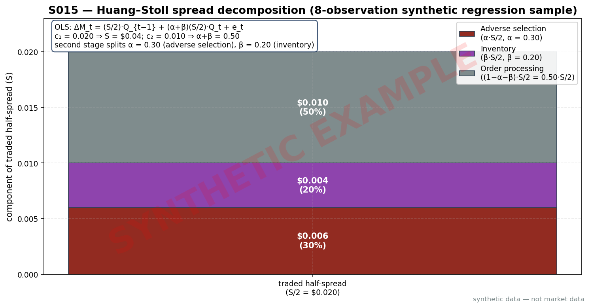

```mermaid
flowchart LR
    FEED["Raw feed<br/>(TAQ / Databento trades+TBBO)"] -->|tick trades + quotes| ING["Ingest + normalize<br/>(quote-lag align, Lee–Ready)"]
    ING -->|per-trade ΔM_t, Q_t| SIG["Signal S015<br/>(intraday blocks, HS α̂/β̂/OP)"]
    SIG -->|per-window OLS estimates (S, α+β)| GATE{"α̂ toxicity<br/>tolerance?"}
    GATE -->|pass: low α̂| OUT["Downstream consumer<br/>(T028 router / T083 quoter)"]
    GATE -->|fail: high α̂| DROP["Route defensively / stand down"]
    style SIG fill:#aed6f1,stroke:#1f3a5f
```

### S12. Sources

1. Huang, R. D., & Stoll, H. R. (1997). "The Components of the Bid-Ask Spread: A General Approach." *RFS*, 10(4), 995–1034. — three-way trade-indicator decomposition; large order-processing, smaller adverse-selection and inventory components. https://ideas.repec.org/a/oup/rfinst/v10y1997i4p995-1034.html
2. Glosten, L. R., & Harris, L. E. (1988). "Estimating the Components of the Bid/Ask Spread." *JFE*, 21, 123–142. — seminal trade-indicator model; permanent vs transitory split. https://business.columbia.edu/faculty/research/estimating-components-bidask-spread
3. Stoll, H. R. (1989). "Inferring the Components of the Bid-Ask Spread." *JF*, 44(1), 115–134. — covariance-based three-component model; NASDAQ/NMS estimates. https://afajof.org/issue/volume-44-issue-1/
4. Gregoriou, A., & Rhodes, M. (2017). "The Accuracy of Spread Decomposition Models in Capturing Informed Trades." *RBF*. — HS (1997): order processing ≈ 88.6% avg two-component; <10% info asymmetry for large stocks; Stoll (1989): >40%. https://eprints.leedsbeckett.ac.uk/id/eprint/3918/6/Gregoriou%20and%20Rhodes%20RBF%202017.pdf
5. Bleaney, M., & Li, Z. (2014). "Decomposing the Bid-Ask Spread in Multi-Dealer Markets." Nottingham DP 14/03. — asymmetric-information biggest in FX; shares venue-dependent. http://ideas.repec.org/p/not/notecp/14-03.html

Duck.ai answered Q-SB4-1–Q-SB4-3 (2026-09-10); Grok/Cursor answers pending (checked 2026-09-10).

**Unverified leads** (chatbot-provided, no independent checkable source — do not quote as fact):
- Duck.ai (GPT-5.6 Luna, 2026-09-10) Q-SB4-1: implementation guidance — trade direction, spread definitions, quote-lag alignment, component split; 60–120 h defensible implementation — *unverified chatbot claims* (no arithmetic errors; kept as labeled leads).
- Duck.ai Q-SB4-2: 60–120 h within a 315–650 h L1/trade pipeline (row sums; printed "285–650" contradicts rows); SIP "mostly" adequate with stale-NBBO caveats — *unverified chatbot claims*.
- Grok / Cursor answers to Q-SB4-1–Q-SB4-3: pending (checked 2026-09-10).

---
## Stage 17/200 — S017: Hawkes self-excitation intensity of order flow

*Batch SB4 · Signal 17/100 · Provenance [D] · Family A — Microstructure & order flow*

### S1. One-line verdict

| | |
|---|---|
| **What it is** | Conditional event intensity λ(t) that rises after each trade/quote event (self-excitation) and decays; the buy-minus-sell imbalance forecasts near-term activity bursts. |
| **When it works** | Liquid names with clustered, algorithmically sliced flow; ms-to-second horizons; as a probabilistic activity/risk forecast. |
| **When it dies** | Announcements, auctions, halts, regime breaks (nonstationarity); latency beyond a few ms; after spread + fees with marketable orders. |
| **Build-or-buy in one line** | Build the intensity estimator on a bought L1/trade feed — calibration is the work, not the data. |

Provenance **[D]** · Family A — Microstructure & order flow. Signal chapter 17/100.

> **Mandatory framing (operator-verified):** Hawkes models *document clustering and improve probabilistic forecasts of near-term event/price-move risk versus an unconditional/memoryless baseline* — a **weaker** claim than a fee-adjusted strategy. **There is no general documented result that Hawkes-based signals survive fees.** Significant direction accuracy ≠ positive net PnL if the move is < 1 tick or the spread is crossed. Forecast-improvement evidence and net-PnL evidence are kept in separate rows throughout (§S9).

### S2. How it works — plain human explanation

**Jargon, defined once:** *SIP* (Securities Information Processor — the official consolidated tape); *NBBO* (National Best Bid and Offer — the consolidated best bid/ask across exchanges); *MBO* (market-by-order — individual-order messages); *MLE* (maximum likelihood estimation).

**Self-excitation**: an event makes the *next* event more likely for a while. At 9:47:03 a 500-share buy prints, then two more within 80 ms. A memoryless (Poisson) model treats prints as independent; a Hawkes model says the first buy *raised the instantaneous arrival rate* of further buys, decaying away after. Order slicing (S018) and algos reacting to each other's prints produce exactly this clustering.

**Conditional intensity** λ(t) is the expected event rate *right now* given all history. We track λ⁺(t) (buys) and λ⁻(t) (sells); their difference is the signed signal — a λ⁺ spike vs λ⁻ flags a likely burst of buy-side activity and short-run price pressure.

Why this exists: **order splitting** (child orders cluster buys; adverse selection for anyone leaning against them) and **endogenous feedback** (algos reacting to each other's prints). Hawkes separates exogenous baseline flow (μ) from endogenous excited flow (κ) — a market-endogeneity gauge.

**Mental model:** each event injects a decaying pulse of excitation (recent events matter most); the **branching ratio** (fraction of events caused by prior events) measures endogeneity — near 1, nearly unstable; the z-scored imbalance λ⁺−λ⁻ forecasts *flow activity/direction*, not profit after costs.

### S3. The math — exact formula

**Bivariate exponential Hawkes** (buy/sell), the standard order-flow form (operator-verified against the literature; independently confirmed by the multivariate formula in Worrall et al., SORT):

$$\lambda_i(t) = \mu_i + \sum_{j \in \{+,-\}} \int_0^t \phi_{ij}(t-s)\, dN_j(s), \qquad i \in \{+,-\}$$

with exponential kernel $\phi_{ij}(u) = \alpha_{ij} e^{-\beta_{ij} u}\mathbf{1}\{u>0\}$.

- $\lambda_i(t)$ — conditional intensity of side-$i$ events (events/sec); $\mu_i > 0$ — **baseline intensity**, the exogenous rate with no history.
- $N_j(s)$ — counting process of side-$j$ events; the integral sums kernel contributions of all past events.
- $\alpha_{ij} \ge 0$ — excitation jump per side-$j$ event; $\beta_{ij} > 0$ — decay rate (1/sec), half-life $h_{ij} = \ln 2 / \beta_{ij}$.
- Integrated kernel $K_{ij} = \int_0^\infty \phi_{ij}(u)\,du = \alpha_{ij}/\beta_{ij}$ (dimensionless): expected side-$i$ children per side-$j$ event.
- **Stationarity:** spectral radius $\rho(K) < 1$ (univariate: $\alpha/\beta < 1$); otherwise intensity explodes.
- **Branching ratio** $n = \rho(K)$ (univariate $n = \alpha/\beta$): fraction of events endogenously triggered. $n \to 1$ = near-critical, cascade-prone.

**Signal:** $\text{imb}_t = \lambda^+_t - \lambda^-_t$, then $z_t = (\text{imb}_t - \bar{\text{imb}})/\sigma_{\text{imb}}$ over a rolling window. Trade rule example: enter in the direction of $z_t$ when $|z_t| > 2$ (*example — not an institutional standard*).

**Discrete-time recursion** (what you actually code on binned data, bin width $\Delta$):

$$\kappa_{t+1} = d \cdot (\kappa_t + \alpha x_t), \qquad \lambda_t = \mu + \kappa_t$$

- $x_t$ — event mark in bin $t$ (count, signed flow, or 0/1); $d = e^{-\beta \Delta}$ — per-bin decay.
- Causal timing: $\lambda_t$ uses only history through $\kappa_t$; tradable no earlier than bin $t+1$.

**Parameter table:**

| Parameter | Symbol | Typical range | Too small / too large | Default example |
|---|---|---|---|---|
| Baseline intensity | $\mu$ | 0.1–5 events/s per side | misses exogenous flow / never decays to reality | 0.5/bin (*example — not an institutional standard*) |
| Excitation jump | $\alpha$ | 0.1–2.0 | no burst detection / explosive, violates $\alpha/\beta<1$ | 0.6 (*example*) |
| Decay rate | $\beta$ | 0.02–70 /s (half-life 10 ms–30 s) | stale signals / no memory | half-life 30 s (*example*) |
| z threshold | $z^*$ | 1.5–3.0 | whipsaw / never trades | 2.0 (*example — not an institutional standard*) |
| z window | $W$ | 5–60 min rolling | adapts to noise / lags regimes | 15 min (*example*) |

**Normalization:** z-score on the signed imbalance is standard (raw $\lambda^+-\lambda^-$ scales with activity); rank-normalization is a robust alternative. Empirical kernels are closer to power-law than exponential (source entry), so **named variants**: (1) single exponential (fast, Markovian recursion); (2) sum of 2–3 exponentials (fast + slow decay); (3) nonparametric/power-law kernel (best fit, costlier MLE); (4) trade-only vs full book-event (trades + cancels + limit orders) multivariate Hawkes.

### S4. Worked example — step-by-step numbers (SYNTHETIC)

Synthetic 10-minute tape coarsened to 5-second bins (seed **1717**; `batches/SB4/plot_S017.py` regenerates it). Baseline $\mu=0.5$ events/bin/side, $\alpha=0.6$, half-life 30 s → $d = e^{-\ln 2 \cdot 5/30} \approx 0.8909$. A buy burst is injected in bins 60–71. Table shows bins 60–67; $x_b, x_s$ are buy/sell event counts; $\lambda_b, \lambda_s$ intensities; $z$ the full-sample z-scored imbalance.

| t (s) | buys | sells | $\lambda^b_t$ | $\lambda^s_t$ | $z_t$ |
|---|---|---|---|---|---|
| 300 | 9 | 1 | 2.646 | 2.511 | −0.44 |
| 305 | 4 | 1 | 7.223 | 2.826 | +1.32 |
| 310 | 4 | 0 | 8.628 | 3.107 | +1.79 |
| 315 | 7 | 2 | 9.879 | 2.822 | +2.43 |
| 320 | 0 | 0 | 12.598 | 3.638 | +3.21 |
| 325 | 2 | 0 | 11.278 | 3.296 | +2.81 |
| 330 | 3 | 0 | 11.171 | 2.991 | +2.89 |
| 335 | 2 | 0 | 11.610 | 2.719 | +3.19 |

Hand-check (t=300→305): $\kappa^b_{300}=2.646-0.5=2.146$; with $x_b=9$: $\kappa^b_{305}=0.8909(2.146+5.4)=6.723$ → $\lambda^b_{305}=7.223$ ✓.


**What to notice:** buy intensity rises *after* the burst starts (t=300: 9 buys, yet $\lambda^b$=2.65 — the intensity is backward-looking; first events are always a surprise). z crosses +2 at t=315 s (∼15 s irreducible detection lag) and peaks at +3.21 at t=320 s with *zero* events that bin: intensity has memory — the point, and the trap. **Limits:** no fees/spread, perfect classification, hand-injected burst; real MLE calibration on $10^4$–$10^6$ events is fragile near critical branching.

### S5. Strategies that use this signal

- **T023 — Hawkes Burst Scalper — primary entry trigger**: trades self-excitation bursts signed by the buy/sell intensity imbalance $z_t$.
- *Filter role (in principle):* the activity forecast $\lambda^+ + \lambda^-$ can veto slower signals during excitation bursts (adverse-selection filter) — a toxicity-adjacent use, not a standalone edge.

### S6. Data required — exact spec

| Field | Type | Granularity | Source tier | Notes |
|---|---|---|---|---|
| Trade timestamps + side | events | sub-second, per trade | Tier 1–2 | Aggressor side via Lee–Ready (S007) or exchange flag |
| Quote-change events | events | sub-second | Tier 1–2 | For full book-event Hawkes (cancels, limit adds) |
| Mid-price moves | events | sub-second | Tier 1–2 | Optional 4th process (price × trade Hawkes) |

Collection: Databento MBP-1 or SIP trades+NBBO (trades-only Hawkes is honest on L1); full multivariate book Hawkes needs MBO/ITCH (Tier 3). Ingest sketch (≤20 lines):

```python
import databento as db, polars as pl
cli = db.Historical("KEY")
data = cli.timeseries.get_range(dataset="XNAS.ITCH", schema="trades",
        symbols=["AAPL"], start="2026-09-09", end="2026-09-10")
trades = pl.from_pandas(data.to_df())          # ts_event, price, size, side
trades = trades.sort("ts_event").with_columns(
    t_bin=(pl.col("ts_event").dt.epoch("s") // 5).alias("bin"))
binned = trades.group_by("bin").agg(
    x_b=pl.col("size").filter(pl.col("side") == "ask").sum(),   # buys
    x_s=pl.col("size").filter(pl.col("side") == "bid").sum())   # sells
# then apply the kappa recursion from S3 per side
```

Storage: L1 quotes+trades for a liquid name ≈ 2–8 GB/symbol-day parquet (per `notes/cost-model.md` §4); event timestamps alone are far lighter. Data-quality checklist: exchange timestamp normalization, corporate actions, halts, DST/half-days, stale/locked quotes.

### S7. Local build on M5 Max / 128GB

**Feasibility verdict: feasible (Tier M for L1/trade-level; heavy at full MBO multivariate).** The recursion is O(events) with trivial state (one κ per process) — the online intensity update is a few FLOPs per event, so real-time scoring is trivially feasible. The expensive part is *calibration*: MLE over $10^4$–$10^6$ events with a non-convex likelihood, typically refit on rolling windows.

Throughput (per `notes/cost-model.md` §2): a Python event loop handles ~100–500k events/sec — fine for ≤20 symbols of L1. 50 liquid symbols × 2k events/sec = 100k/sec → Python borderline, Rust comfortable; polars batch recompute each minute is trivial. MLE calibration is the bottleneck (CPU-bound likelihood evaluations), not ingest.

Stack: **Python+polars/numpy** (research, L1 scoring); **Rust** (full-depth real-time, 100+ symbols); **DuckDB** (calibration sweeps).

RAM (per cost-model §3): L1 events ≈ 1–10M/day → ~0.5–4 GB RAM per symbol-day; 50 symbols fit the 77 GB working budget; 60 days × 500 symbols does not — per-symbol daily parquet + streaming. Hawkes state itself is kilobytes.

Engineering time: **Tier M, 20–60 h** (per cost-model §5) for L1/trade-level → $3,000–$9,000 loaded-cost estimate at $150/hr. Full MBO multivariate Hawkes is **Tier H, 60–200 h**. Labeled chatbot lead (Duck.ai, 2026-09-10): Hawkes calibration alone estimated at 80–160 h within an L2 build whose **row sums are 520–1,020 h** (bot's printed "600–1,180" contradicts its rows — use row sums; cost-model takes precedence). **What breaks first:** 500 symbols (Python ingest saturates → Rust) or full-depth history (§4: 10–40 GB/symbol-day L2 — archive externally, keep features local).

### S8. Buy vs build

| Option | What you get | Indicative price | Gains | Loses |
|---|---|---|---|---|
| Tier 0: Alpaca IEX / Stooq | Delayed bars | ~$0 | Free prototyping | No sub-second events |
| Tier 1: Polygon Stocks Advanced / Alpaca SIP | Real-time SIP trades + NBBO | ~$30–200/mo | Trades-only Hawkes feasible | SIP latency; no depth/cancel flow |
| Tier 2: Databento Standard (MBP-1/MBP-10) | Honest L1/L2 event streams | ~$200/mo + usage | True event timestamps; depth for full Hawkes | Usage metering on heavy history |
| Tier 3: LOBSTER (academic) | MBO/ITCH order-book replay | ~hundreds/yr academic | Calibration-grade feed | Academic license; not production |

All prices *indicative — verify before budgeting*. **Verdict: build the estimator, buy the feed.** Your calibrated $(\mu,\alpha,\beta)$ is the research — no vendor sells it. Buy raw L1/trade events (Tier 1/2); build the recursion + MLE harness. Tier 3 only if the hypothesis needs cancel/queue-conditioned excitation (a Tier-H project).

### S9. Success ratio / efficacy — documented evidence

Separated as mandated: **forecast-improvement evidence** vs **net-PnL evidence**.

| Study / source | Market & period | Metric | Before/after cost | Caveat |
|---|---|---|---|---|
| Bacry, Mastromatteo & Muzy (2015), survey | Multi-market review to 2015 | Strong self-/cross-excitation of submissions, cancels, market orders; Hawkes beats memoryless baselines on short-horizon event forecasts | Before cost (forecast only) | Survey, not a trading study; no PnL claim |
| Filimonov & Sornette (2015) | E-mini S&P futures | Significant Hawkes fits; elevated endogeneity estimates (exact band not verified in retrieved sources) | Before cost | Fit quality, not tradability |
| Hawkes (1971), Biometrika | Theory | Foundational self-exciting process | n/a | Not a market study |
| Chatbot lead (Duck.ai, 2026-09-10, Q-SB4-3) | General | "Documents clustering; improves probabilistic forecasts of near-term event/price-move risk vs unconditional/memoryless baseline — weaker claim than a fee-adjusted strategy. **No general documented result on fee survival.**" | n/a — labeled lead | *Unverified chatbot claim* unless independently confirmed; kept as lead |
| Net-PnL after spread/fees/latency/realistic fills | — | **No documented row in surveyed literature** | After cost | Absence noted per mandatory Q-SB4-3 bottom line |

**Regimes where it fails:** announcements and opens/closes (exogenous intensity swamps the kernel); auctions, halts; volatility-regime changes; feed changes; near-critical branching ($n \to 1\)); trade-only Hawkes missing queue depletion/cancellations/hidden liquidity.

**Honest bottom line:** as a *probabilistic activity/direction forecast* this is a genuine, documented improvement over memoryless baselines — a real feature. As a *standalone trigger* it is an **undemonstrated** edge: significant direction accuracy ≠ positive net PnL if the predicted move is < 1 tick or the spread is crossed. Report **both** OOS forecast improvement **and** net implementation performance after spread/fees/latency/realistic fills; without the second, call it a predictive feature, not a demonstrated edge (Q-SB4-3 bottom line, labeled chatbot source).

### S10. Failure modes & pitfalls

1. **Near-critical branching** — calibrated $n \approx 0.9$+ amplifies noise into phantom bursts. *Mitigation:* regularize; cap $n$ (bot's 0.8–0.95 stability band is a labeled lead); monitor out-of-sample.
2. **Nonstationarity** — announcements/regime breaks violate constant-$(\mu,\alpha,\beta)$. *Mitigation:* rolling refits; exogenous-event dummies; stand down on scheduled news.
3. **Lookahead leakage** — revised trade records or future quote alignment in calibration. *Mitigation:* as-traded timestamps; purged/embargoed validation (S088).
4. **Misclassified trade signs** — error concentrates exactly when flow is most active (labeled chatbot lead, Q-SB4-3), biasing $\lambda^+ - \lambda^-$ during bursts. *Mitigation:* exchange aggressor flags; sensitivity analysis.
5. **Cost blowup** — burst-chasing with marketable orders pays full spread + adverse selection. *Mitigation:* model net of spread/fees/impact; prefer passive or filter roles.
6. **Overfitting the kernel** — multi-exponential/power-law kernels fit noise on short windows. *Mitigation:* single-exponential baseline first; information criteria for added kernels.
7. **Latency illusion** — historical timestamps assume instant reaction; live latency eats the ms-scale edge. *Mitigation:* lag the signal by measured latency; label SIP-based results *simulated only — requires MBO/ITCH* where queue claims are made.
8. **Microstructure noise vs signal** — flickering quotes inflate event counts without information. *Mitigation:* filter to economically meaningful events; compare trade-only vs full-event specs.

### S11. Visuals

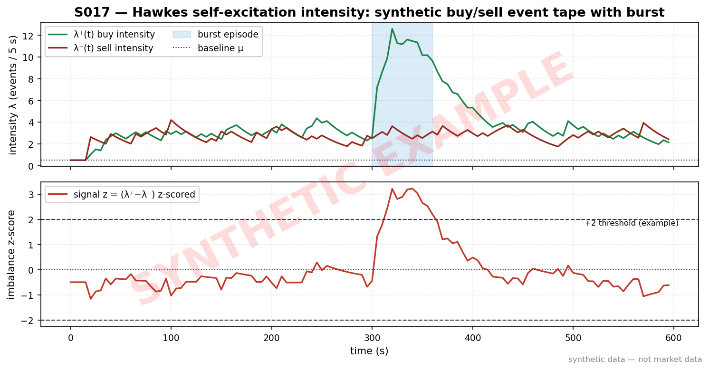

```mermaid
flowchart LR
    FEED["Raw feed\n(Databento MBP-1 / SIP trades)"] -->|L1 trade/quote events| ING["Ingest + normalize\n(exchange ts, halts, splits)"]
    ING -->|cleaned trade events| FEAT["Feature compute\n(5-s event bins, buy/sell counts)"]
    FEAT -->|5-s event-count bins| SIG["Signal S017\nHawkes λ⁺−λ⁻ z-score"]
    SIG -->|per-bin z-score| GATE{"Cost / toxicity\ngate?"}
    GATE -->|pass| OUT["Downstream consumer\n(T023 burst scalper)"]
    GATE -->|fail| DROP["No trade"]
    style SIG fill:#aed6f1,stroke:#1f3a5f
```

### S12. Sources

1. Bacry, E., Mastromatteo, I. & Muzy, J.-F. (2015). "Hawkes processes in finance." *Market Microstructure and Liquidity* (arXiv:1502.04592). https://arxiv.org/abs/1502.04592v2
2. Filimonov, V. & Sornette, D. (2015). "Apparent criticality and calibration issues in the Hawkes self-excited point process model." arXiv:1308.6756. https://arxiv.org/abs/1308.6756
3. Worrall, J. et al. "Fifty years later: new directions in Hawkes processes." *SORT* 46(1) — multivariate intensity formula with exponential kernel, independently confirming the S3 standard form. https://www.Idescat.cat/sort/sort461/46.1.1.Worrall-etal.pdf
4. Hawkes, A. G. (1971). "Spectra of some self-exciting and mutually exciting point processes." *Biometrika*, 58(1), 83–90. (Journal citation; URL not independently verified.)
5. Bowsher, C. G. (2007). "Modelling security market microstructure with Hawkes processes." *Journal of Econometrics*. (Report citation; URL not independently verified.)
6. Chatbot source (labeled): Duck.ai (GPT-5.6 Luna, anonymous, 2026-09-10) answered Q-SB4-1–Q-SB4-3; Grok/Cursor answers pending (checked 2026-09-10). Formula sections verified against standard literature; eng-hour/fee-survival points used as *labeled leads*.

**Unverified leads** (chatbot-only): branching-ratio stability band 0.8–0.95; 1–3 exponentials; 10⁴–10⁶ calibration events; kernel half-life ranges.

---
## Stage 18/200 — S018: Order-sign autocorrelation / sequential trade correlation

*Batch SB4 · Signal 18/100 · Provenance [D] · Family A — Microstructure & order flow*

### S1. One-line verdict

| | |
|---|---|
| **What it is** | Market-order signs (+1 buy / −1 sell) are strongly positively autocorrelated and long-memory: buys follow buys far beyond chance. |
| **When it works** | As a flow-predictability input to execution and market-making models; conditioning momentum entries on sign persistence. |
| **When it dies** | As a standalone price predictor — predictable flow is compensated by liquidity, so prices stay near-unpredictable; dies further under misclassified signs and stale quotes. |
| **Build-or-buy in one line** | Build on any classified trade feed — it is a few lines of statistics, not a data purchase. |

Provenance **[D]** · Family A — Microstructure & order flow. Signal chapter 18/100.

### S2. How it works — plain human explanation

**Jargon, defined once:** *NBBO* (National Best Bid and Offer — the consolidated best bid/ask across exchanges); *SIP* (Securities Information Processor — the official consolidated tape); *co-located* (servers physically at the exchange); *ARFIMA* (autoregressive fractionally integrated moving average); *Hurst exponent* H (≈ 0.5 = random walk; H > 0.5 = persistent/long memory; H < 0.5 = mean-reverting).

Every trade has an **aggressor side**: the trader whose marketable order *initiated* the trade. Label it **+1** if a buyer initiated (a buy market order lifting the ask) and **−1** if a seller initiated. Write down the last 2,000 signs for AAPL at 10:15: `+ + + − + + − − − + + + + …`. If signs were random, the next sign would be a coin flip. It is not: a buy is much more likely to be followed by another buy.

The economic reason is **order splitting**. A fund buying 200,000 shares slices it into hundreds of 300-share child orders executed over the morning. Each child prints +1, so signs cluster. The autocorrelation decays slowly — roughly $C(\tau) \sim \tau^{-\gamma}$, $\gamma \approx 0.5$ — called **long memory**: past signs influence flow for hundreds or thousands of trades, even across days (Lillo & Farmer 2004).

Here is the subtle part: **flow is predictable even when price is not.** When buy signs become more likely, buy orders get *smaller* and buy-side *liquidity* increases — both also long-memory processes. The predictable flow is absorbed by anti-correlated liquidity fluctuations, leaving returns nearly white. So S018 is a superb *flow* forecast and a poor *price* forecast used naively. Its honest uses: (1) execution — lean child orders with persistent flow; (2) market making — persistent one-sided flow is adverse selection, so widen quotes or stand down; (3) conditioning — momentum backed by persistent signs is more likely genuine.

**Mental model:** order splitting clusters signs ($P(\text{buy}|\text{buy})>0.5$ far out); the slow power-law decay ($\gamma\approx0.5$–0.6) is **long memory**; predictable flow ≠ predictable price — monetization needs execution skill.

### S3. The math — exact formula

**Sign autocorrelation function:**

$$C(\tau) = \frac{\mathbb{E}[\varepsilon_t \cdot \varepsilon_{t+\tau}]}{\mathbb{E}[\varepsilon_t^2]}, \qquad \varepsilon_t \in \{+1,-1\}$$

- $\varepsilon_t$ — aggressor sign of trade $t$ (+1 buyer-initiated, −1 seller-initiated), via Lee–Ready quote/tick rule (S007) or exchange aggressor flag.
- $\tau$ — lag in *trades* (event time). Since $\varepsilon_t^2 = 1$, $C(\tau) = \mathbb{E}[\varepsilon_t \varepsilon_{t+\tau}]$ — agreeing minus disagreeing pair fraction at lag $\tau$.
- Empirical law: $C(\tau) \sim \tau^{-\gamma}$, $\gamma \approx 0.5$–$0.6$ (Lillo & Farmer: $\alpha \approx 0.6$; Hurst exponent $H = 1 - \gamma/2 \approx 0.7$).

**Sequential-trade (Markov) form** (Easley & O'Hara 1987): the $2 \times 2$ transition matrix $P(\varepsilon_{t+1} \mid \varepsilon_t)$; their original sample gave $P(\text{buy}\mid\text{buy}) \approx 0.49$, $P(\text{sell}\mid\text{sell}) \approx 0.45$ — mild persistence at lag 1, with the long-memory tail revealed only by the full $C(\tau)$.

**ARFIMA variant:** fit a fractionally-integrated model $\text{ARFIMA}(p,d,q)$ to the sign series; the fractional parameter $d = H - 1/2 \approx 0.2$ captures long memory in one number for regime monitoring.

**Parameter table:**

| Parameter | Symbol | Typical range | Too small / too large | Default example |
|---|---|---|---|---|
| Max lag | $\tau_{\max}$ | 20–500 trades | misses the slow tail / noise dominates far lags | 30 trades (*example — not an institutional standard*) |
| Estimation window | $N$ | 1k–50k trades | noisy $C(\tau)$ / mixes regimes | 2,000 trades (*example*) |
| Power-law exponent | $\gamma$ | 0.4–0.8 | — (estimated, not chosen) | fit, don't fix (*example*) |
| Persistence threshold | $C(1)^*$ | 0.1–0.4 | always "persistent" / never triggers | 0.25 (*example — not an institutional standard*) |

**Normalization:** none needed — $C(\tau)$ is already a correlation in $[-1,1]$. Compare across names directly. **Causal timing:** $C(\tau)$ estimated on trades $\le t$; a persistence-conditioned entry at trade $t$ is tradable no earlier than $t+1$.

**Named variants:** (1) raw trade-time $C(\tau)$; (2) volume-weighted sign autocorrelation (weights by $\sqrt{v_t}$); (3) Markov transition-matrix form (lag-1 only, Easley–O'Hara); (4) ARFIMA($d$) long-memory parameter as a single regime statistic.

### S4. Worked example — step-by-step numbers (SYNTHETIC)

Synthetic 2,000-trade tape (seed **1818**; `batches/SB4/plot_S018.py` regenerates it). Signs follow a Markov chain with $P(\varepsilon_{t+1}=\varepsilon_t) = 0.72$ — deliberately simple so the numbers are hand-checkable; real sign series decay more slowly (power law), which the fitted $\hat\gamma$ below mimics over short lags.

| $\tau$ | $C(\tau)$ |
|---|---|
| 1 | +0.4207 |
| 2 | +0.1852 |
| 3 | +0.0906 |
| 4 | +0.0621 |
| 5 | +0.0396 |
| 6 | +0.0431 |
| 7 | +0.0246 |
| 8 | −0.0141 |
| 9 | −0.0116 |
| 10 | −0.0111 |

Computation: $C(1) = \frac{1}{1999}\sum_{t=1}^{1999} \varepsilon_t \varepsilon_{t+1} = +0.4207$ (theory for this chain: $2 \times 0.72 - 1 = 0.44$; the sample is within noise ✓). Power-law fit on lags 2–30 gives $\hat\gamma = 0.459$ — inside the empirical 0.4–0.8 band.


**What to notice:** $C(1) = +0.42$ is enormous — the next trade's sign is highly predictable. Yet coefficients stay positive-but-shrinking: persistence, not oscillation. **Limits:** this tape is Markov (exponential decay), so the "power-law" fit is only a local description over lags 2–30 — real markets decay genuinely more slowly. No fees, perfect classification, one regime: real tapes mix splitting-driven persistence with news-driven reversals. And the honesty point stands: knowing the next sign is +1 with ~71% probability says nothing about the *price* move — that depends on depth and impact (S010).

### S5. Strategies that use this signal

- **T023 — Hawkes Burst Scalper — supporting input**: T023 consumes S018 alongside S017/S081; sign persistence confirms that an intensity burst is directional flow rather than two-sided noise.
- *Filter role:* in execution algos, persistent signs in the same direction as your parent order argue for patience (flow is with you); persistent opposing signs are an adverse-selection warning to slow down.

### S6. Data required — exact spec

| Field | Type | Granularity | Source tier | Notes |
|---|---|---|---|---|
| Trade price, size, timestamp | events | per trade, sub-second | Tier 1–2 | TAQ / Databento trades |
| NBBO at trade time | events | per trade | Tier 1–2 | For Lee–Ready quote rule (S007) |
| Aggressor flag | boolean | per trade | Tier 2–3 | Exchange-direct feeds; preferred over classification |

Collection: SIP trades + NBBO suffice for Lee–Ready classification; direct-feed aggressor flags are strictly better. Ingest sketch (≤20 lines):

```python
import polars as pl
trades = pl.read_parquet("taq_trades_2026-09-09.parquet").sort("ts")
nbbo = pl.read_parquet("taq_nbbo_2026-09-09.parquet").sort("ts")
t = trades.join_asof(nbbo, on="ts", strategy="backward", tolerance="1s")
t = t.with_columns(mid=(pl.col("ask") + pl.col("bid")) / 2)
t = t.with_columns(eps=pl.when(pl.col("price") > pl.col("mid")).then(1)
                     .when(pl.col("price") < pl.col("mid")).then(-1)
                     .otherwise(None).forward_fill())   # quote rule; tick rule at mid
signs = t["eps"].to_numpy()
C = {tau: float((signs[:-tau] * signs[tau:]).mean()) for tau in range(1, 31)}
```

Storage: trades-only is light — a liquid name prints ~10–200 trades/sec busy; one symbol-day of trades ≈ tens of MB parquet (well under the 2–8 GB L1 quotes+trades figure in `notes/cost-model.md` §4). Data-quality checklist: timestamp normalization (SIP vs exchange), trade corrections/cancels, locked/crossed NBBO, odd-lot quote exclusion pre-2013, DST/half-days, corporate actions.

### S7. Local build on M5 Max / 128GB

**Feasibility verdict: trivial.** Computing $C(\tau)$ is a handful of vectorized operations per window — numpy handles millions of trades per second (per `notes/cost-model.md` §2, ~50–200M elements/sec). The real work is sign *classification* quality, not compute.

Throughput: classification + autocorrelation for 500 symbols × ~50k trades/day = 25M trades/day — seconds of numpy per day, trivially real-time. Bottleneck is ingest/parquet I/O, not the statistic. RAM (per cost-model §3): one symbol-day of classified trades ≈ 10–100 MB; 60 days × 500 symbols of *trades only* fits the 77 GB budget; full L1 quotes would not.

Stack options: **Python+polars/numpy** — pick for everything here; **Rust** — unnecessary unless embedded in a co-located execution loop; **DuckDB** — pick for ad-hoc historical screens.

Engineering time: **Tier M, 20–60 h** (per cost-model §5; L1 event pipeline ex-L2) → $3,000–$9,000 loaded-cost estimate at $150/hr — most of it spent on classification validation (quote alignment, tick-rule fallback logic, exchange-flag reconciliation), not the autocorrelation itself. **What breaks first:** scaling to 500 symbols is fine; full OPRA is irrelevant (equity-trade signal); what actually breaks is *classification honesty* at high frequency — SIP timestamps vs direct feeds (label SIP-based sign studies *simulated only — requires MBO/ITCH* where latency claims are made).

### S8. Buy vs build

| Option | What you get | Indicative price | Gains | Loses |
|---|---|---|---|---|
| Tier 0: Alpaca IEX trades | Recent trade prints | ~$0 | Free prototype | Short history; no NBBO archive |
| Tier 1: Polygon / Alpaca SIP | Full SIP trades + NBBO history | ~$30–200/mo | Everything needed for Lee–Ready | SIP latency; classification error |
| Tier 2: Databento trades+TBBO | Microsecond-stamped trades, direct | ~$200/mo + usage | Cleaner timestamps; aggressor flags on some schemas | Usage metering |
| Exchange direct (Tier 3-ish) | ITCH/PITCH with aggressor side | Institutional $$$$ | Ground-truth signs | Cost; licensing |

All prices *indicative — verify before budgeting*. **Verdict: build, on Tier 1 data.** There is nothing to buy — no vendor sells "sign autocorrelation" as a product; the statistic is five lines. Spend the budget on the cleanest trade+quote timestamps you can afford, because classification error is the entire game (see S10). Crossover: buy direct-feed aggressor flags only if sign accuracy becomes the measured bottleneck in a live execution system.

### S9. Success ratio / efficacy — documented evidence

| Study / source | Market & period | Metric | Before/after cost | Caveat |
|---|---|---|---|---|
| Lillo & Farmer (2004) | LSE, 20 stocks, 1999–2002 | $C(\tau) \sim \tau^{-\alpha}$, $\alpha \approx 0.6$ (range 0.36–0.77), $H \approx 0.7$; holds for market, limit, and cancel orders; persists across days | Before cost (statistical fact) | Flow predictability, not price predictability |
| Bouchaud, Gefen, Potters & Wyart (2004) | Euronext, 2001–2002 | Power-law sign ACF decay for all stocks; implied $H$ ≈ 0.65–0.9 | Before cost | Same caveat; reviewed via Gould–Porter–Howison thesis |
| Lillo, Mike & Farmer (2005) | Theory + LSE | Order-splitting model reproduces the empirical $C(\tau)$ when metaorder sizes are Pareto-tailed — causal mechanism for the persistence | Before cost | Model, not a trading result |
| Chatbot lead (Duck.ai, 2026-09-10, Q-SB4-3) | General | "No single modern instrument-independent [Lee–Ready] accuracy number honestly quotable"; **error concentration**: misclassification clusters exactly when the signal is most active — 85% individual accuracy can still seriously bias HF imbalance | n/a — labeled lead | *Unverified chatbot claim*; used as labeled lead |
| Net-PnL after spread/fees/latency | — | **No documented row**: predictable flow is compensated by liquidity — *why* the sign edge does not convert to price edge | After cost | Empty by mechanism, not oversight |

**Regimes where it fails:** news-driven tapes (signs mean-revert as positions flip); opens/closes and auctions; any period where classification degrades — fast markets, stale quotes, midpoint prints, odd lots, locked/crossed NBBO (the error-concentration lead above).

**Honest bottom line:** as a *flow-predictability statistic* this is among the best-documented facts in microstructure — a strong feature. As a *standalone price trigger* it is a weak-to-nonexistent edge: the market compensates predictable flow with liquidity, so the monetization path runs through execution and market-making, not directional bets. Report **both** OOS forecast improvement **and** net implementation performance after spread/fees/latency/realistic fills; without the second, call it a predictive feature, not a demonstrated edge (Q-SB4-3 bottom line, labeled chatbot source).

### S10. Failure modes & pitfalls

1. **Error concentration** — misclassification clusters exactly when flow is most active (labeled chatbot lead): the statistic is most biased precisely when you most want it. *Mitigation:* exchange aggressor flags; quote-lag sensitivity analysis; distrust burst readings from classified data.
2. **Flow ≠ price confusion** — trading predicted signs as predicted prices. *Mitigation:* always pair with an impact/liquidity model (S010); evaluate on price moves, not sign hit-rate.
3. **Stale-quote classification** — fast markets make the quote rule assign the wrong side. *Mitigation:* lag quotes slightly (the standard Lee–Ready adjustment); tick-rule fallback.
4. **Midpoint prints** — price = mid carries no quote-rule information; tick rule on stale references misleads. *Mitigation:* track the fraction of tick-rule-resolved trades as a quality metric.
5. **Regime mixing** — estimating $C(\tau)$ across opens, news, and calm periods blends different dynamics. *Mitigation:* session-segmented estimation; rolling windows.
6. **Lookahead via corrections** — TAQ corrections applied retroactively change the historical tape. *Mitigation:* use as-traded records for calibration; corrected records only for research marked as such.
7. **Overfitting $\gamma$** — fitting power laws to 30 noisy lags invites story-telling. *Mitigation:* report $C(1)$ and a few fixed lags as primary statistics; $\hat\gamma$ secondary.
8. **Crowding irrelevance** — this is a measurement, not a crowded trade; the failure is misapplication, not decay. *Mitigation:* keep it in execution/MM roles where it belongs.

### S11. Visuals

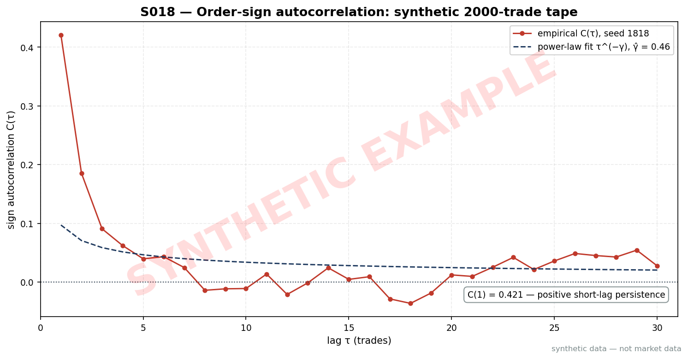

```mermaid
flowchart LR
    FEED["Raw feed\n(SIP trades + NBBO)"] -->|per-trade prints + NBBO events| ING["Ingest + normalize\n(asof quote join, corrections)"]
    ING -->|quote-aligned trades| FEAT["Feature compute\n(Lee–Ready sign classification)"]
    FEAT -->|per-trade classified signs| SIG["Signal S018\nsign autocorrelation C(τ)"]
    SIG -->|C(τ) curve (lag in trades)| GATE{"Cost / toxicity\ngate?"}
    GATE -->|pass| OUT["Downstream consumer\n(T023 burst scalper)"]
    GATE -->|fail| DROP["No trade"]
    style SIG fill:#aed6f1,stroke:#1f3a5f
```

### S12. Sources

1. Lillo, F. & Farmer, J. D. (2004). "The long memory of the efficient market." *Studies in Nonlinear Dynamics & Econometrics* (arXiv:cond-mat/0311053). https://arxiv.org/abs/cond-mat/0311053v2
2. Farmer, J. D., Gerig, A., Lillo, F. & Waelbroeck, H. (2010). "How efficiency shapes market impact." NBER Market Microstructure meeting — documents positive serial autocorrelation of signed order flow across London, Paris, New York, and Spanish markets and its compensation by liquidity. http://conference.nber.org/confer/2010/MMf10/Farmer_Gerig_Lillo_Waelbroeck.pdf
3. Gould, M. D., Porter, M. A. & Howison, S. D. — thesis review of limit order books: Lillo & Farmer (2004) mean $H \approx 0.7$; Bouchaud et al. (2004) power-law sign autocorrelation with $H$ ≈ 0.65–0.9 on Euronext. https://people.maths.ox.ac.uk/porterm/papers/long-memory-published.pdf
4. INET Oxford (2021). "Prediction on Stock Market Inefficiencies Confirmed" — popular account of Lillo & Farmer (2004) sign-persistence discovery. https://www.inet.ox.ac.uk/news/accuracy-of-2005-financial-economics-model-finally-confirmed
5. Easley, D. & O'Hara, M. (1987). "Price, trade size, and information in securities markets." *Journal of Financial Economics*. (Report citation; URL not independently verified — not fabricated here.)
6. Chatbot source (labeled, per question-bank protocol): Duck.ai (GPT-5.6 Luna, anonymous, 2026-09-10) answered Q-SB4-1–Q-SB4-3; Grok/Cursor answers pending (checked 2026-09-10). Lee–Ready/BVC accuracy discussion and the error-concentration point used above as *labeled leads*.

**Unverified leads** (chatbot-only, not independently confirmed): "~80–90% Lee–Ready accuracy in favorable settings"; BVC bar-volume and σ-window ranges; "85% individual accuracy can still bias HF imbalance" (plausible, unconfirmed numerically).

---
## Stage 20/200 — S020: Retail & odd-lot order imbalance

*Batch SB4 · Signal 20/100 · Provenance [D] · Family A — Microstructure & order flow*

### S1. One-line verdict

| | |
|---|---|
| **What it is** | Signed order imbalance computed on retail-identifiable flow (sub-penny prints) and on odd-lot (<100-share) trades, which carry a different information mix than institutional flow. |
| **When it works** | Around attention events and earnings, where retail flow is directional and persistent; as a contrarian or internalizer's adverse-selection gauge. |
| **When it dies** | Treated as a uniform "dumb money" signal — retail is heterogeneous; after spread/fees on short holds; when odd lots are really algo slices, not people. |
| **Build-or-buy in one line** | Build the classifier on bought TAQ — the identification logic (BJZZ) is public; the data is the cost. |

Provenance **[D]** · Family A — Microstructure & order flow. Signal chapter 20/100.

> **Mandatory framing (operator-verified):** there is **no blanket "retail = uninformed"** result. Retail flow is *heterogeneous*: liquidity-taking/attention-driven, contrarian, pure noise, and informed around earnings/news/specialized situations. Odd lots are **not** automatically noise — they include algo slices, fractional shares, and (for high-priced stocks) economically large trades. After-cost honesty: high turnover plus short holds means spread crossing, adverse selection, and queue priority eat gross edge; midpoint-marked evaluation with marketable-order implementation overstates results.

### S2. How it works — plain human explanation

**Jargon, defined once:** *NBBO* (National Best Bid and Offer — the consolidated best bid/ask across exchanges); *SIP* (Securities Information Processor — the official consolidated tape).

An **odd lot** is any trade for fewer than 100 shares (the traditional **round lot**). Long assumed to be small retail trades and excluded from the consolidated tape (the public trade record), that assumption broke: algos slice orders into sub-100-share pieces, high-priced stocks make 10 shares a $5,000 trade, and fractional shares print odd lots constantly. O'Hara, Yao & Ye (2014): odd lots are ~24% of trades at the median (60%+ in some stocks), contribute ~35% of **price discovery** (how prices incorporate information), and informed traders deliberately use them to avoid detection.

**Retail identification** uses a clever fingerprint. Market makers who **internalize** retail flow — execute it themselves rather than routing to an exchange — typically give tiny **price improvement**: a retail buy at $50.00 executes at $50.001–$50.009 (a *sub-penny* print). Boehmer, Jones, Zhang & Zhang (2021) ("BJZZ") classify trades by sub-penny fraction: (0.6, 1.0] cent → retail buy; (0, 0.4) cent → retail sell (round-penny prints excluded); (0.4, 0.6) excluded as ambiguous. This recovers a retail flow series from public TAQ with no broker feed.

Why predict anything? Three channels, pulling in different directions — which kills the blanket claim. (1) **Attention-driven flow**: retail piles into salient stocks; pressure later reverses — the fade case. (2) **Contrarian liquidity provision**: retail sells strength, buys dips — the *internalizer's* edge. (3) **Informed pockets**: around earnings/news some retail flow is informed, and odd lots can be stealth institutional slices — the follow case. Channel dominance is stock-, event-, and era-specific. Vignette: on an earnings day retail prints −0.28 (selling into the pop) while institutional flow had built +0.18 the day before — that disagreement *is* information.

**Mental model (3 bullets):**
- Odd lots are a *size* category, not a *trader* category: they mix retail, algo slices, and stealth flow.
- BJZZ sub-penny fractions identify marketable retail flow in TAQ; the imbalance is (buys − sells)/(buys + sells).
- Retail is heterogeneous — the signal is conditional (event type, horizon, venue mix), never a uniform "fade the dummies" rule.

### S3. The math — exact formula

**Odd-lot imbalance** (quote-rule classified, 5-minute to daily windows):

$$\text{IMB}^{\text{odd}}_B = \frac{V^{\text{odd,buy}}_B - V^{\text{odd,sell}}_B}{V^{\text{odd,total}}_B}$$

- $B$ — aggregation window (5 min to 1 day).
- $V^{\text{odd,buy}}_B$ — odd-lot (<100 shares) buy volume in $B$, classified by quote rule (S007) or aggressor flag.
- Ranges in $[-1, +1]$; 0 = balanced.

**Retail imbalance (BJZZ)**:

$$f_i = 100p_i - \lfloor 100p_i \rfloor = (100p_i) \bmod 1 \in [0,1) \quad \text{(fractional part of the cent component)}$$

$$\text{retail buy if } f_i \in (0.6, 1.0], \quad \text{retail sell if } f_i \in (0, 0.4), \quad \text{exclude } f_i \in (0.4, 0.6)$$

$$\text{IMB}^{\text{retail}}_B = \frac{V^{\text{rb}}_B - V^{\text{rs}}_B}{V^{\text{rb}}_B + V^{\text{rs}}_B}$$

- $p_i$ — trade price; only sub-penny prints are classifiable — round-penny prints are *not* retail by this method (a coverage gap).
- TRF (Trade Reporting Facility) prints are where internalized retail flow reports.

**Parameter table:**

| Parameter | Symbol | Typical range | Too small / too large | Default example |
|---|---|---|---|---|
| Aggregation window | $B$ | 5 min – 1 day | noise dominates / signal decays, mixes regimes | 1 day (*example — not an institutional standard*) |
| Odd-lot cutoff | — | <100 shares (SEC redefined for some high-priced names) | misses slices / includes real retail | 100 shares (*example*) |
| BJZZ buy band | — | (0.6, 1.0] cent | misclassifies / shrinks sample | (0.6, 1.0] (*example*) |
| BJZZ exclusion band | — | (0.4, 0.6) | ambiguous prints pollute / discards data | (0.4, 0.6) (*example*) |
| Signal threshold | $z^*$ | 1.5–2.5σ | noise trades / never fires | 2.0σ (*example — not an institutional standard*) |

**Normalization:** z-score within stock and window-type (retail participation varies enormously across names); rank-normalization across the cross-section for portfolio use. **Causal timing:** imbalance over window $B$ ending at $t$ is tradable no earlier than $t+1$; daily retail IMB is a next-day signal at best.

**Named variants:** (1) odd-lot IMB (size-based, quote-rule classified); (2) BJZZ retail IMB (sub-penny identification); (3) odd-lot *retail* IMB (intersection — BJZZ-classified odd lots only); (4) retail *buy* vs *sell* imbalance separately (asymmetric informativeness is documented).

### S4. Worked example — step-by-step numbers (SYNTHETIC)

Synthetic 41-day window around an earnings announcement (day 0), seed **2020** (`batches/SB4/plot_S020.py`). Retail IMB is BJZZ-style daily; institutional IMB is a labeled-flow proxy. Table: days −4…+4.

| Day | Retail IMB | Institutional IMB |
|---|---|---|
| −4 | −0.004 | +0.030 |
| −3 | −0.066 | +0.051 |
| −2 | −0.083 | +0.051 |
| −1 | −0.013 | +0.177 |
| 0 | −0.280 | −0.064 |
| +1 | −0.041 | −0.092 |
| +2 | +0.010 | −0.119 |
| +3 | −0.023 | −0.042 |
| +4 | −0.060 | +0.000 |

Hand-check the construction (day 0): retail IMB = (buys − sells)/(buys + sells) = −0.280 means sells exceeded buys by 28% of retail volume — e.g. with total 1,000 shares, buys = 360, sells = 640 → (360−640)/1000 = −0.280 ✓. Institutional +0.177 on day −1 with 1,000 shares → buys ≈ 589, sells ≈ 411 ✓.


**What to notice:** the two series disagree — institutional imbalance builds quietly *before* the event (+0.177 on day −1, the informed-leakage pattern), while retail spikes *on* the event (−0.280, attention-driven selling into the announcement). Fading retail here bets the day−1 institutional build was the informed move. **Limits:** the "institutional" series is a labeled synthetic proxy; the event-day spike is hand-chosen; no fees; and the example encodes one channel mix (informed institutions, reactive retail) — the mandatory framing warns this mix is *not* universal.

### S5. Strategies that use this signal

- **T024 — Informed-Size Tracker / Retail Fade — primary trigger**: follows stealth medium-size informed flow and fades retail/odd-lot flow — this chapter's signal is the fade leg's input.
- **T083 — Retail-Flow Internalizer Fade — primary trigger**: provides liquidity fading retail/odd-lot imbalance, priced via spread decomposition (S015) — the internalizer's version of the same flow.
- *Filter role:* retail-imbalance extremes can veto momentum entries (crowded attention trades reverse) or gate execution (don't cross the spread into one-sided retail flow — adverse selection for the taker).

### S6. Data required — exact spec

| Field | Type | Granularity | Source tier | Notes |
|---|---|---|---|---|
| Trade price, size, timestamp, exchange/TRF code | events | per trade | Tier 1–2 | TAQ or Databento; TRF flag identifies internalized prints |
| NBBO at trade time | events | per trade | Tier 1–2 | For odd-lot quote-rule classification |
| Corporate actions | reference | daily | Tier 0–1 | Splits change the 100-share economics |

Collection: TAQ or Databento; odd-lot trades joined the tape only in December 2013, odd-lot *quotes* long excluded from NBBO — pre-2013 backtests need bias corrections. Ingest sketch (≤20 lines):

```python
import polars as pl
t = pl.read_parquet("taq_trades_2026-09-09.parquet")
t = t.with_columns(frac=(pl.col("price") * 100) % 1)          # sub-penny fraction in [0,1)
retail = t.filter(pl.col("frac") != 0).with_columns(
    side=pl.when(pl.col("frac") > 0.6).then(1)
           .when(pl.col("frac") < 0.4).then(-1)
           .otherwise(None)).drop_nulls("side")                # BJZZ
odd = t.filter(pl.col("size") < 100)                           # odd lots
imb = (retail.group_by("symbol").agg(
    imb_r=(pl.col("size") * pl.col("side")).sum() / pl.col("size").sum()))
```

Storage: TAQ trades ≈ tens of GB/symbol-year for liquid names; a 500-symbol daily-imbalance panel is megabytes. Per `notes/cost-model.md` §4, full L1 quotes+trades run 2–8 GB/symbol-day — for S020, trades-only suffices. Data-quality checklist: pre-2013 odd-lot tape exclusion; sub-penny rounding conventions; TRF vs exchange attribution; splits (the 100-share cutoff's economics change); DST/half-days; locked/crossed NBBO for the quote rule.

### S7. Local build on M5 Max / 128GB

**Feasibility verdict: feasible (Tier M).** The BJZZ classifier is arithmetic on trade records; daily aggregation over a 500-symbol universe is seconds in polars (per `notes/cost-model.md` §2, ~10–50M rows/sec for simple ops).

Throughput: 500 symbols × ~50k trades/day = 25M records/day — one daily polars batch job, trivially real-time capable on 5-min bars. Bottleneck is data licensing and history depth, not compute. RAM (per cost-model §3): one symbol-day of trades ≈ 10–100 MB; a 500-symbol day fits the 77 GB budget; multi-year TAQ history does not — per-symbol parquet + streaming.

Stack: **Python+polars** for all of it; **DuckDB** for screens; **Rust** unnecessary.

Engineering time: **Tier M, 20–60 h** (per cost-model §5) → $3,000–$9,000 loaded-cost estimate at $150/hr — dominated by identification validation (BJZZ band sensitivity, odd-lot quote-rule alignment, pre-2013 bias handling), not the arithmetic. **What breaks first:** *history* — multi-year TAQ licensing and the pre-2013 odd-lot exclusion; 500 symbols of daily math is fine.

### S8. Buy vs build

| Option | What you get | Indicative price | Gains | Loses |
|---|---|---|---|---|
| Tier 0: Alpaca IEX / FINRA | Recent trades; short-interest snapshots | ~$0 | Free prototype | No sub-penny history |
| Tier 1: Polygon / Alpaca SIP | Full SIP trade history with sub-penny prices | ~$30–200/mo | BJZZ feasible historically | SIP timestamps; redistribution limits |
| Tier 2: Databento equities | Microsecond trades, clean corporate actions | ~$200/mo + usage | Research-grade identification | Usage metering on deep history |
| Tier 3: TAQ (institutional) | Academic gold standard | Institutional $$$$ | Publication-grade | Price; access friction |

All prices *indicative — verify before budgeting*. **Verdict: build the classifier, buy Tier 1/2 trade history.** Nobody sells "retail imbalance" as a product — the BJZZ logic is public and short. Buy the cleanest sub-penny history you can afford; TAQ proper is for publication or production-scale internalization, not research.

### S9. Success ratio / efficacy — documented evidence

| Study / source | Market & period | Metric | Before/after cost | Caveat |
|---|---|---|---|---|
| O'Hara, Yao & Ye (2014), *Journal of Finance* | US equities, 2008–2013 | Odd lots: median 24% of trades (60%+ in some stocks); ~35% of price discovery; informed traders use odd lots to avoid detection; omission biases imbalance measures | Before cost (observational) | Information content, not net PnL |
| Boehmer, Jones, Zhang & Zhang (2021), *Journal of Finance* | US equities, 2010–2015 | BJZZ sub-penny identification; median marketable retail trade ≈ $8,000; odd-lot marketable retail ≈ one-third of odd-lot volume | Before cost | Predictive regressions, not fee-adjusted implementation |
| Barber & Odean (2000), *Journal of Finance* | 66,465 US discount-brokerage households, 1991–1996 | Most-active quintile earns 11.4%/yr vs 17.9% market; average household 16.4%; turnover 75%/yr — trading costs drive the shortfall | **After cost** (net of trading costs) | Portfolio-horizon, not intraday; supports heterogeneity (overconfident active traders lose) rather than uniform informativeness |
| Chatbot lead (Duck.ai, 2026-09-10, Q-SB4-3) | General | Retail heterogeneous (attention-driven, contrarian, noise, informed around earnings/news); odd lots ≠ noise (algo slices, fractional, high-priced stocks); after-cost: high turnover + short holds → spread/adverse-selection/queue costs eat gross edge; midpoint-marked evaluation with marketable orders overstates | n/a — labeled lead | *Unverified chatbot claim*; kept as labeled lead per protocol |

**Regimes where it fails:** assuming uniform retail informativeness (the mandatory-framing failure); size-only retail definitions that misclassify algo slices in high-priced stocks; meme/zero-commission eras trained and applied elsewhere; news shocks where retail and institutional flow align; pre-2013 backtests ignoring the odd-lot tape exclusion.

**Honest bottom line:** as a *conditional flow descriptor* this is well-documented; as a *standalone directional edge* it is **overfit-prone and spread-vulnerable** — the after-cost evidence (Barber–Odean) cuts against the retail trader, and the predictive evidence is before-cost. Report **both** OOS forecast improvement **and** net implementation performance after spread/fees/latency/realistic fills; without the second, call it a predictive feature, not a demonstrated edge (Q-SB4-3, labeled chatbot source).

### S10. Failure modes & pitfalls

1. **Uniform-retail assumption** — treating all retail flow as dumb (or smart). *Mitigation:* condition on event type, horizon, and venue; never a single sign rule.
2. **Odd-lot misattribution** — algo slices and fractional shares look "retail" by size. *Mitigation:* prefer BJZZ identification over size-only definitions; flag high-priced stocks.
3. **Midpoint-marked evaluation** — marking at mid while implementing with marketable orders overstates edge (labeled chatbot lead). *Mitigation:* evaluate at effective spread; simulate marketable fills.
4. **Turnover cost blowup** — short-hold retail-fade strategies cross the spread repeatedly. *Mitigation:* explicit spread+fee+impact accounting per round trip; lengthen holds or go passive.
5. **Pre-2013 tape bias** — odd lots absent from the consolidated tape before Dec 2013. *Mitigation:* start backtests after 2013 or model the exclusion.
6. **Sub-penny coverage gaps** — round-penny prints are unclassifiable by BJZZ; internalization practices change. *Mitigation:* report classifiable fraction; monitor for regime shifts in price-improvement conventions.
7. **Era overfitting** — training on the zero-commission/meme era and applying elsewhere (labeled chatbot lead). *Mitigation:* multi-era validation; regime indicators.
8. **Adverse selection for the taker** — fading retail with marketable orders means buying when informed flow may be mixed in. *Mitigation:* internalizer-style passive execution or explicit toxicity filter (S008).

### S11. Visuals

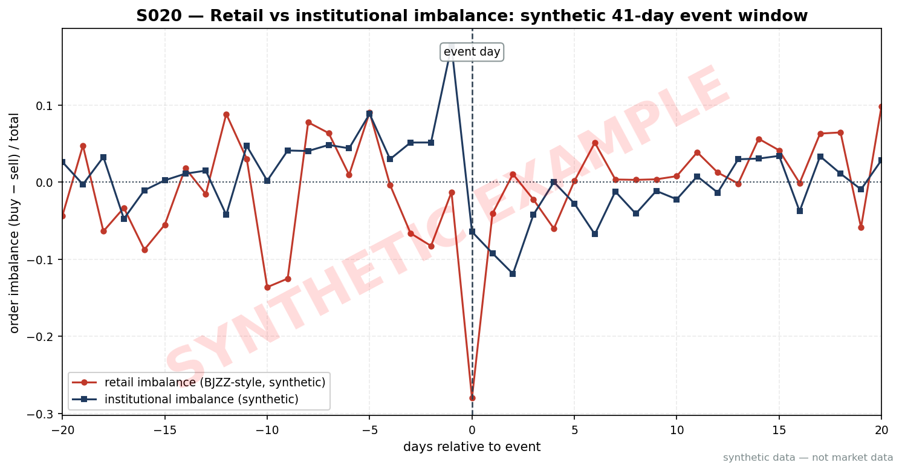

```mermaid
flowchart LR
    FEED["Raw feed\n(TAQ trades + TRF flags)"] -->|per-trade prints, sub-penny prices| ING["Ingest + normalize\n(sub-penny, splits, halts)"]
    ING -->|cleaned trade events| FEAT["Feature compute\n(BJZZ retail / odd-lot IMB)"]
    FEAT -->|daily imbalance bars| SIG["Signal S020\nretail & odd-lot imbalance"]
    SIG -->|daily imbalance z-score| GATE{"Cost / toxicity\ngate?"}
    GATE -->|pass| OUT["Downstream consumer\n(T024 / T083 fade)"]
    GATE -->|fail| DROP["No trade"]
    style SIG fill:#aed6f1,stroke:#1f3a5f
```

### S12. Sources

1. O'Hara, M., Yao, C. & Ye, M. (2014). "What's Not There: Odd Lots and Market Data." *Journal of Finance*, 69(5), 2199–2236. https://ideas.repec.Org/a/bla/jfinan/v69y2014i5p2199-2236.html
2. Boehmer, E., Jones, C. M., Zhang, X. & Zhang, X. (2021). "Tracking Retail Investor Activity." *Journal of Finance*, 76(5). (Tsinghua-hosted copy consulted for BJZZ method details and sample statistics.) https://www.pbcsf.tsinghua.edu.cn/__local/6/B0/AF/2A35AA5BBB6B2C05786716FA0DF_098DC0E7_107C03.pdf?e=.pdf
3. Barber, B. M. & Odean, T. (2000). "Trading Is Hazardous to Your Wealth: The Common Stock Investment Performance of Individual Investors." *Journal of Finance*, 55(2), 773–806. https://onlinelibrary.wiley.com/doi/10.1111/0022-1082.00226
4. Chatbot source (labeled, per question-bank protocol): Duck.ai (GPT-5.6 Luna, 2026-09-10) answered Q-SB4-1–Q-SB4-3; Grok/Cursor answers pending (checked 2026-09-10). Retail-heterogeneity framing, odd-lot caveats, and after-cost warnings used above as *labeled leads*.

**Unverified leads** (chatbot-only, not independently confirmed): precise BJZZ band cutoffs beyond the (0.4,0.6)/(0.6,1.0] structure in the report entry; "marketable retail trades slightly net buying" sample detail; the exact turnover/fee decomposition of retail-fade P&L.

---
## Stage 47/200 — S047: Bid–ask bounce exploitation

*Batch SB4 · Signal 47/100 · Provenance [D] · Family A — Microstructure & order flow*

### S1. One-line verdict

| | |
|---|---|
| **What it is** | Transaction prices oscillate bid↔ask even when the mid is flat; a print at the ask is likelier followed by one at the bid — a mechanical mean reversion in *trade prices*, not value. |
| **When it works** | As a spread estimate (Roll) and as timing for passive entries/exits; as a P&L source only for co-located market makers with queue priority. |
| **When it dies** | As paper-trading alpha: gross edge bounded by the spread; fees, adverse selection, missed fills consume it. |
| **Build-or-buy in one line** | Build the Roll estimator on any trade feed — ten lines; do not build a bounce-harvesting strategy on SIP data. |

Provenance **[D]** · Family A — Microstructure & order flow. Signal chapter 47/100.

> **Honesty note (mandatory):** bounce harvesting *requires* spread estimates (ties to S012 Roll estimator and S014 spread decomposition), and the **gross edge is bounded by the spread itself** — you cannot earn more than the round-trip spread per share before costs. After costs this is an HFT/market-making feature, not paper-trading alpha (source entry).

### S2. How it works — plain human explanation

**Jargon, defined once:** *co-located* (servers physically located at the exchange data center); *SIP* (Securities Information Processor — the official consolidated tape); *NBBO* (National Best Bid and Offer — the consolidated best bid/ask across exchanges); *MBO* (market-by-order — individual-order messages); *HFT* (high-frequency trader).

The **bid**/ask are the best pay/take prices; the **mid** is their average; the **spread** (ask−bid) is the market maker's gross wage. Watch prints: 50.01, 50.01, 49.99, 50.01, 49.99… — the mid sat at 50.00 throughout, but trades bounced bid↔ask with the aggressor side. That oscillation is the **bid–ask bounce**: pure mechanics, zero information.

Two uses. *Measurement*: Roll (1984) showed the bounce's fingerprint — negative serial covariance in price changes — estimates the **effective spread** (the spread actually paid) from *trade prices alone, no quote feed*. *Trading*: after an ask print, the next print is likelier at the bid — a patient trader "fades" it (sell the ask, buy the bid, pocket the spread). That is bounce harvesting.

Why nearly unharvestable for a small operation? Round trip: sell 100 at the ask 50.01, buy back at the bid 49.99 → gross +$2.00. Subtract: exchange/SEC-style fees, **adverse selection** (sometimes the mid moves — the ask print was informed, the bid never comes back), and **queue priority** (your bid limit order waits behind everyone else). Remains: tenths of a cent per share — co-located market makers (Ho–Stoll), not a laptop strategy. For most readers: *cost estimator and execution timer*, not alpha.

**Mental model:** bounce = trade prices mean-revert bid↔ask while the mid stands still (mechanics, not mispricing); Roll turns its negative serial covariance into a spread estimate from prices alone; gross edge ≤ spread per round trip — net edge is a market-maker's game.

### S3. The math — exact formula

**Roll (1984) data-generating process:**

$$\Delta p_t = \frac{s}{2}\,(Q_t - Q_{t-1}) + u_t$$

- $p_t$ — trade price of trade $t$; $\Delta p_t = p_t - p_{t-1}$.
- $s$ — effective spread ($, per share).
- $Q_t \in \{+1,-1\}$ — trade direction (+1 buyer-initiated at ask, −1 seller-initiated at bid); Roll assumes $Q_t$ i.i.d. with $P(Q_t=+1)=1/2$ and independent of the efficient-price innovation $u_t$.
- $u_t$ — public-information shock (mean zero, serially uncorrelated).

**Estimator:** under these assumptions $\text{Cov}(\Delta p_t, \Delta p_{t-1}) = -s^2/4$, hence

$$\hat s = 2\sqrt{-\hat\gamma_1}, \qquad \hat\gamma_1 = \widehat{\text{Cov}}(\Delta p_t, \Delta p_{t-1})$$

- If $\hat\gamma_1 \ge 0$ the estimator is **undefined** (no bounce, or trending) — report undefined, lengthen the window, or bias-correct (Harris 1990: positive for ~half of securities on daily data).
- Sample autocovariance: $\hat\gamma_1 = \frac{1}{T-2}\sum_{t=2}^{T-1}(\Delta p_t - \overline{\Delta p})(\Delta p_{t-1} - \overline{\Delta p})$.

**The fade rule:** after a print at the ask ($Q_t = +1$), post/shade toward the bid expecting reversion; after a bid print, the reverse. Expected gross per round trip $\le s$ per share.

**Parameter table:**

| Parameter | Symbol | Typical range | Too small / too large | Default example |
|---|---|---|---|---|
| Estimation window | $T$ | 100–5,000 trades (or 1–15 min bars) | noisy/positive $\hat\gamma_1$ / mixes regimes | 500 trades (*example — not an institutional standard*) |
| Fade holding | $h$ | 1–20 trades | no fill / adverse move | next opposite-side print (*example*) |
| Participation | — | ≤10% of visible depth | no fills / moves the quote | passive only (*example*) |

**Normalization:** none — $\hat s$ is in price units; compare to quoted spread as a ratio ($\hat s / s_{\text{quoted}}$) for cross-name work. **Causal timing:** $\hat\gamma_1$ over trades $\le t$; a fade entered at $t$ is filled no earlier than $t+1$ — and only if your quote is actually hit (queue honesty).

**Named variants:** (1) Roll on trade prices; (2) Roll on 1–15 min bars; (3) Corwin–Schultz (S013, high-low based); (4) effective/quoted/realized spread decomposition (S014/S015) — the bounce harvester's required companions.

### S4. Worked example — step-by-step numbers (SYNTHETIC)

Synthetic 60-trade tape (seed **4747**; `batches/SB4/plot_S047.py`): mid fixed at $50.00, quoted spread $0.02 (bid 49.99 / ask 50.01), side switches with probability 0.65 (bounce-heavy). First 12 trades:

| Trade | Side | Price ($) |
|---|---|---|
| 1 | ask | 50.01 |
| 2 | ask | 50.01 |
| 3 | ask | 50.01 |
| 4 | bid | 49.99 |
| 5 | ask | 50.01 |
| 6 | ask | 50.01 |
| 7 | ask | 50.01 |
| 8 | bid | 49.99 |
| 9 | bid | 49.99 |
| 10 | ask | 50.01 |
| 11 | bid | 49.99 |
| 12 | ask | 50.01 |

Roll estimation on the full 60-trade tape: $\Delta p \in \{+0.02, 0, -0.02\}$; first-order serial covariance $\hat\gamma_1 = -0.000138$ → $\hat s = 2\sqrt{0.000138} = \$0.0235$ vs quoted $0.02$ — recovered within ~18% on 60 trades (sampling noise; a demonstration, not a calibration claim). Note the estimator *needs* $\hat\gamma_1 < 0$; a trending tape returns undefined.

**Bounce round-trip P&L decomposition** (per share, example costs — *not* an institutional fee schedule):

| Leg | ¢/share |
|---|---|
| Gross (sell ask 50.01, buy bid 49.99) | +2.0 |
| Exchange + regulatory-style fees | −0.4 |
| Adverse selection (mid moves against the fade) | −0.8 |
| Latency / queue (missed or slipped fills) | −0.4 |
| **Net** | **+0.4** |


**What to notice:** the gross edge (+2.0¢) is *exactly* the spread — the theoretical maximum, achieved only with perfect fills at both touches. Even generous example costs leave +0.4¢/share — ~$4 per 1,000-share round trip before the trades where the bid never comes back. **Limits:** flat mid (no adverse moves in the tape — the −0.8¢ is imposed, not observed); no partial fills; no queue-position modeling; SIP-latency-free. Real harvesting lives or dies on queue position and cancels, which this example does not model (*simulated only — requires MBO/ITCH* for any queue claim).

### S5. Strategies that use this signal

- **T097 — Sub-Hour Microstructure Reversal Scalper — primary trigger**: tick-level mean reversion harvesting the bounce with spread estimates (S012).
- **T011 — Short-Term Reversal + Bounce Timing — primary trigger**: Jegadeesh/Lehmann reversal entered *at the touch* — S047 supplies entry timing, S035 the reversal, S014 the cost gate.
- **T083 — Retail-Flow Internalizer Fade — execution input**: the internalizer's edge *is* spread capture against retail flow; S047's bounce mechanics and S015's spread decomposition price the fade.
- *Filter role:* Roll-implied spread as a *veto* — don't run spread-paying strategies when $\hat s$ exceeds the expected edge.

### S6. Data required — exact spec

| Field | Type | Granularity | Source tier | Notes |
|---|---|---|---|---|
| Trade prices + timestamps | events | per trade | Tier 1 | TAQ / Databento / Polygon — Roll needs only this |
| NBBO (for the fade, not the estimator) | events | per trade | Tier 1–2 | Fading blind without quotes is just the estimator |
| Queue/cancel data (for real harvesting) | MBO events | per order | Tier 3 | *Simulated only — requires MBO/ITCH* otherwise |

Collection: the *estimator* is honest on SIP trades; the *harvest* needs direct-feed MBO. Ingest sketch (≤20 lines):

```python
import polars as pl, numpy as np
p = pl.read_parquet("trades_2026-09-09.parquet").sort("ts")["price"].to_numpy()
dp = np.diff(p)
mu = dp.mean()
gamma1 = ((dp[1:-1] - mu) * (dp[:-2] - mu)).mean()   # Cov(dp_t, dp_{t-1})
roll_spread = 2 * np.sqrt(-gamma1) if gamma1 < 0 else np.nan
print(f"Roll implied spread: {roll_spread:.4f}" if gamma1 < 0
      else "undefined: non-negative serial covariance")
```

Storage: trades-only — tens of MB/symbol-day. Data-quality checklist: corrections, out-of-sequence prints, splits, DST/half-days, locked/crossed NBBO.

### S7. Local build on M5 Max / 128GB

**Feasibility verdict: trivial for the estimator; infeasible-locally for real bounce harvesting.** The Roll estimator is O(T) arithmetic — microseconds. Real harvesting needs co-located MBO feeds, queue-position modeling, and cancel logic: a different sport.

Throughput (per `notes/cost-model.md` §2): rolling Roll spreads over 500 symbols × 390 1-min bars — milliseconds in numpy; tick-level rolling estimation across 500 symbols is seconds per day. No bottleneck. RAM (per cost-model §3): trade-price vectors are megabytes; everything fits.

Stack: **Python+numpy** for all estimator work; **Rust** only inside a live MM loop; **DuckDB** for historical spread panels.

Engineering time: **Tier M, 20–60 h** (per cost-model §5) → $3,000–$9,000 loaded-cost estimate at $150/hr — and most of that is the *fade simulator* (fill modeling, queue honesty), not the estimator (an afternoon). A production bounce-harvesting MM system is Tier H+ and co-located — out of scope for local build. **What breaks first:** harvesting on SIP data — no queue visibility makes backtests fictional; label *simulated only — requires MBO/ITCH*.

### S8. Buy vs build

| Option | What you get | Indicative price | Gains | Loses |
|---|---|---|---|---|
| Tier 0: Alpaca IEX | Recent trades | ~$0 | Free prototype | No history depth |
| Tier 1: Polygon / Alpaca SIP | Full trade history | ~$30–200/mo | Estimator fully feasible | Harvest not honest on SIP |
| Tier 2: Databento | Microsecond trades + MBP-1 | ~$200/mo + usage | Cleaner estimation windows | Still no queue position |
| Tier 3: LOBSTER / direct MBO | Order-level replay | ~hundreds/yr academic / institutional $$$$ | The only honest harvest testbed | Cost; complexity |

All prices *indicative — verify before budgeting*. **Verdict: build the estimator on Tier 1; do not "buy" bounce alpha.** No vendor sells harvestable bounce edge — market makers keep it. Buy better data only to improve the *spread estimate* (S012/S014), which gates every other strategy's cost model. Crossover: direct MBO feeds only if you are actually building a quoting system (Tier H, co-located) — otherwise it is an expensive toy.

### S9. Success ratio / efficacy — documented evidence

| Study / source | Market & period | Metric | Before/after cost | Caveat |
|---|---|---|---|---|
| Roll (1984), *Journal of Finance* | US equities (daily/weekly data) | Spread $= 2\sqrt{-\text{cov}}$; implied spreads related to firm size | Before cost (estimator) | Assumes i.i.d. trade direction, constant spread, flow/value independence — all violated intraday |
| Harris (1990), *Journal of Finance* | US equities | Roll estimator **severely downward-biased** (Jensen's inequality); serial covariances positive for ~half of securities → estimator undefined; estimates depend on observation interval | Before cost (estimation critique) | Limits the estimator, let alone harvesting |
| Source entry (report, [D]) | Practitioner consensus | "Live MM bounce capture (queue position, cancels) is proprietary"; "after costs an HFT/MM feature, not paper-trading alpha" | After cost (practitioner verdict) | Qualitative, from the report's own coverage |
| Chatbot lead (Duck.ai, 2026-09-10, Q-SB4-3) | General | Bounce harvesting requires spread estimates (S012/S014); gross edge bounded by the spread itself; profitability consumed by half-spread, queue, fees, latency, missed fills, adverse selection, impact | After cost framing | *Unverified chatbot claim*; kept as labeled lead |
| Net-PnL of a local bounce-harvesting strategy | — | **No documented positive row**; the documented direction is negative-to-zero for non-co-located implementations | After cost | Honest cell: harvesting edge is a market-maker's edge |

**Regimes where it fails:** trending tapes (autocovariance ≥ 0 → undefined estimator); wide-spread / illiquid names (bounce exists but fills don't); news-driven directional flow (fade gets run over — adverse selection); locked/crossed markets; tick-constrained stocks (1-tick spread, fiercest queue competition).

**Honest bottom line:** as a *spread estimator* this is genuine and documented — every serious cost model uses Roll-family estimates. As a *standalone trigger* it is a **near-zero net edge** outside co-located market making: gross is capped at the spread, costs are structural. Report **both** OOS forecast improvement **and** net implementation performance after spread/fees/latency/realistic fills; without the second, call it a predictive feature, not a demonstrated edge (Q-SB4-3, labeled chatbot source).

### S10. Failure modes & pitfalls

1. **Gross ≤ spread arithmetic** — forgetting the edge is capped at the round-trip spread. *Mitigation:* always decompose P&L as in S4 before trading.
2. **Undefined estimator** — $\hat\gamma_1 \ge 0$ on trending tapes; trading anyway. *Mitigation:* report undefined; lengthen window; bias-correct (Harris 1990).
3. **Adverse selection** — the ask print was informed; the bid never comes back. *Mitigation:* condition fades on toxicity (S008); size for the loss case.
4. **Queue-position fiction** — backtests assume your bid gets hit; reality queues you behind. *Mitigation:* model queue explicitly; label SIP backtests *simulated only — requires MBO/ITCH*.
5. **Roll assumption violations** — serially correlated trade direction (S018!) and time-varying spreads break the $-s^2/4$ identity. *Mitigation:* use with S018 awareness; prefer effective-spread measures (S014).
6. **Latency** — by the time a SIP print reaches you, the bounce already happened. *Mitigation:* passive quoting only; never chase prints.
7. **Overtrading** — harvesting invites maximum turnover at minimum edge. *Mitigation:* per-trade cost budget; daily loss stop.
8. **Tick-size trap** — 1-tick-spread stocks look attractive (tiny spread = easy fill) but queue competition is maximal. *Mitigation:* measure realized fill rates, not theoretical edge.

### S11. Visuals

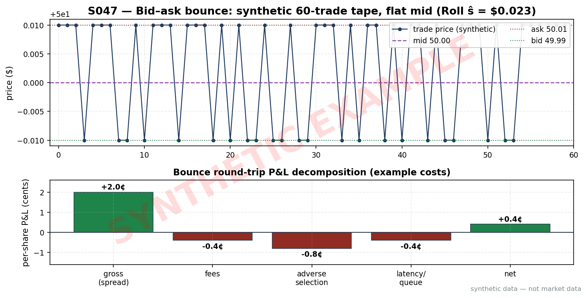

```mermaid
flowchart LR
    FEED["Raw feed\n(SIP trades + NBBO)"] -->|per-trade prints + NBBO events| ING["Ingest + normalize\n(corrections, splits, halts)"]
    ING -->|cleaned trade-price series| FEAT["Feature compute\n(price changes, serial cov)"]
    FEAT -->|per-trade Δp series + Roll ŝ| SIG["Signal S047\nbounce fade / Roll ŝ"]
    SIG -->|per-trade fade signal / spread veto| GATE{"Cost / toxicity\ngate?"}
    GATE -->|pass| OUT["Downstream consumer\n(T097 / T011 timing)"]
    GATE -->|fail| DROP["No trade"]
    style SIG fill:#aed6f1,stroke:#1f3a5f
```

### S12. Sources

1. Roll, R. (1984). "A Simple Implicit Measure of the Effective Bid-Ask Spread in an Efficient Market." *Journal of Finance*, 39(4), 1127–1139. https://authors.library.caltech.edu/records/afwsc-6bb61
2. Harris, L. (1990). "Statistical Properties of the Roll Serial Covariance Bid/Ask Spread Estimator." *Journal of Finance*, 45(2). — severe downward bias; positive serial covariances common; estimator often undefined. https://repec.udesa.edu.ar/pub/Finanzas/Journals/Journal%20of%20Finance/45/2/2328671.pdf
3. Screamer Labs — `RollSpread` practitioner documentation: $2\sqrt{-\text{cov}(\Delta P_t, \Delta P_{t-1})}$ from trade prices alone; undefined (NaN) when serial covariance is non-negative. https://github.com/screamer-labs/screamer/blob/HEAD/docs/functions_micro/RollSpread.md
4. Stoll, H. R. (1989). "Inferring the Components of the Bid-Ask Spread: Theory and Empirical Tests." *Journal of Finance*. / Ho, T. & Stoll, H. R. (1981). Dealer inventory models. (Report citations; URLs not independently verified — not fabricated here.)
5. Chatbot source (labeled, per question-bank protocol): Duck.ai (GPT-5.6 Luna, anonymous, 2026-09-10) answered Q-SB4-1–Q-SB4-3; Grok/Cursor answers pending (checked 2026-09-10). Spread-estimate dependency and gross-edge-bound points used above as *labeled leads*.

**Unverified leads** (chatbot-only, not independently confirmed): Roll window guidance (100–5,000 transactions; 1–15 min bars); "corrected estimator (drift, discreteness, asymmetry)" as remedies for non-negative autocovariance.

---
## Stage 22/200 — S022: First-hour range expansion / initial balance

*Batch SB5 · Signal 22/100 · Provenance [D] · Family B — Intraday Momentum & Breakout*

### S1. One-line verdict

| | |
|---|---|
| **What it is** | First-hour (Initial Balance) high/low; a close or excursion beyond the band marks a likely trend day — trade the expansion. |
| **When it works** | High-conviction news/volatility days where institutions commit directionally after the open. |
| **When it dies** | Chop, low-volume bracket days, and late entries after the expansion leg is spent. |
| **Build-or-buy in one line** | Build: it is a Tier L calculation on 1–5 min bars; buy the bars, not the signal. |

### S2. How it works — plain human explanation

**Initial balance (IB)** is a Market Profile term (Steidlmayer/Dalton): the high and low established during the first hour of regular trading (09:30–10:30 ET), i.e. the first twelve 5-minute bars. **IBH** = Initial Balance High (the hour's highest high); **IBL** = Initial Balance Low (the hour's lowest low); **IBR** = Initial Balance Range (IBH − IBL). Picture it: overnight, thousands of orders pile up — earnings reactions, macro news, portfolio rebalancing. The opening auction clears that backlog, and the first hour is the market's price-discovery session: buyers and sellers negotiate a reference range. If, after 10:30, price pushes *beyond* that range and holds, it means the marginal institutional flow has picked a side. Pit traders called the result a **trend day** — a session where the day's range keeps extending in one direction.

A concrete vignette: 09:47:03, AAPL bid 231.40 × 800 / ask 231.41 × 300. By 10:30 the tape has printed a first-hour high of 232.10 (IBH) and low of 230.55 (IBL). At 11:05, on a sector headline, a 5-minute bar closes at 232.42 — $0.32 above IBH, about 21% of the IB range. The signal says the morning's balance is broken; you enter long on the next bar's open, never at the print that broke the level — in live trading you cannot trade a bar that has already closed.

Why should this work economically? First, **overnight information asymmetry**: informed flow accumulates while the market is closed; the first hour absorbs it, and a break of the resulting range means absorption failed — imbalance remains. Second, **institutional participation**: large desks benchmark to VWAP (volume-weighted average price — the day's volume-weighted average trade price) and commit once the day's direction resolves; their own flow then extends the move. Third, **behavioral anchoring**: the first hour's extremes are visible reference points; breaks trigger stop-loss cascades.

- **Mental model:** the first hour draws a box the market negotiated; a sustained break of the box means the negotiation failed and one side is winning.
- **Mental model:** expansion is a *regime* statement (trend day vs bracket day) first, an entry trigger second — size and hold time should follow the regime call.
- **Mental model:** the edge lives in the *confirmation* (close beyond the band + volume), not in touching the line; touches are noise, closes are commitment.

### S3. The math — exact formula

Let bars 1…K be the first K 5-minute bars of RTH (regular trading hours — the 09:30–16:00 ET equity session; K = 12 for a 60-minute IB), with bar i having high H_i and low L_i, and let C_t be the close of bar t > K.

$$\text{IBH} = \max_{i=1..K} H_i, \qquad \text{IBL} = \min_{i=1..K} L_i, \qquad \text{IBR} = \text{IBH} - \text{IBL}$$

Expansion (bullish) at bar t, with buffer δ ≥ 0 and optional volume multiple m_v:

$$\text{Expand}_t^{\text{up}} = \big[\, C_t > \text{IBH} + \delta \,\big] \;\; \text{AND} \;\; \big[\, V_t > m_v \cdot \bar{V} \,\big]$$

where V_t is bar-t volume and V̄ is the mean volume of the IB bars. Bearish expansion mirrors with C_t < IBL − δ. A common normalization expresses the excursion as a fraction of the range:

$$e_t = \frac{C_t - \text{IBH}}{\text{IBR}} \quad \text{(bullish; } e_t > q \text{ triggers, e.g. } q = 0.25\text{)}$$

The buffer is often set from volatility: δ = q·ATR(A), where **ATR** (Average True Range) is the N-bar mean of True Range TR_i = max(H_i − L_i, |H_i − C_{i−1}|, |L_i − C_{i−1}|). **Causal timing:** IBH/IBL are known only after bar K closes (10:30 ET); the expansion signal is computed at the close of bar t (t > K) using only data ≤ t, and is tradable no earlier than the open of bar t+1.

| Parameter | Symbol | Typical range | Too small | Too large | Default (example) |
|---|---|---|---|---|---|
| IB window | K (5-min bars) | 6–18 bars (30–90 min) | noisy box, whipsaws | late regime call, gives up the move | 12 bars / 60 min, *example — not an institutional standard* |
| Buffer | δ or q | 0–0.5×ATR | false breaks on touches | misses the expansion leg | q = 0.1×ATR(14), *example* |
| Excursion fraction | q_e | 0.1–0.5 of IBR | trades noise | never triggers | 0.25, *example* |
| Volume multiple | m_v | 1.0–2.0× | no confirmation value | filters out real breaks on quiet names | 1.5×, *example* |

**Named variants.** (1) **Crabel ORB** (opening-range breakout; Crabel, 1990): shorter window (15–30 min), breakout of the opening range itself — faster but noisier than IB. (2) **Fisher ACD** (Fisher, 2002): builds "A-up/A-down" pivot points (ACD = Fisher's "A/C down" pivot-entry framework) from the opening range plus N points; a mechanical entry/exit system around the same idea. (3) **IB + squeeze confirmation**: require a volatility squeeze (see S030) during the IB hour — compression before expansion selects for larger trend days.

### S4. Worked example — step-by-step numbers (SYNTHETIC)

Synthetic 30-bar 5-minute tape, seed 22 (volumes jittered with `np.random.default_rng(22)`; OHLC hand-specified). Bars 1–12 are the first hour; bars 13–29 are flat; bar 30 is the expansion bar.

| bar | time | O | H | L | C | Vol |
|---|---|---|---|---|---|---|
| 1 | 09:30 | 100.00 | 100.20 | 99.90 | 100.05 | 858 |
| 2 | 09:35 | 100.05 | 100.35 | 99.95 | 100.15 | 839 |
| 3 | 09:40 | 100.15 | 100.50 | 100.00 | 100.30 | 842 |
| 4 | 09:45 | 100.30 | 100.70 | 100.10 | 100.35 | 821 |
| 5 | 09:50 | 100.35 | 100.60 | 100.20 | 100.40 | 838 |
| 6 | 09:55 | 100.40 | 100.80 | 100.25 | 100.45 | 804 |
| 7 | 10:00 | 100.45 | 100.70 | 100.30 | 100.42 | 804 |
| 8 | 10:05 | 100.42 | 100.60 | 100.10 | 100.30 | 810 |
| 9 | 10:10 | 100.30 | 100.90 | 100.20 | 100.60 | 783 |
| 10 | 10:15 | 100.60 | 101.20 | 100.40 | 100.80 | 791 |
| 11 | 10:20 | 100.00 | 100.80 | 99.80 | 100.20 | 774 |
| 12 | 10:25 | 100.00 | 100.80 | 99.80 | 100.20 | 794 |
| 13–29 | 10:30–11:55 | 100.00 | 100.80 | 99.80 | 100.20 | ~665–777 |
| 30 | 12:00 | 100.20 | 102.50 | 100.00 | 102.00 | 2500 |

Step 1 — IB levels (bars 1–12): IBH = max high = **101.20** (bar 10); IBL = min low = **99.80** (bars 11–12); IBR = 101.20 − 99.80 = **1.40**.

Step 2 — expansion check at bar 30: C_30 = 102.00 > IBH = 101.20 → breakout. Excursion e = (102.00 − 101.20)/1.40 = 0.80/1.40 = **57.14% of IBR**, well above the 25% example threshold. Volume 2500 ≈ 3.5× the IB-hour mean (~810) — confirmation passes at m_v = 1.5.

Step 3 — tradability: signal computed at 12:00 close; entry no earlier than the next 5-minute bar open (~102.00). (These figures reproduce the operator-verified Q-SB5-1 worked example: IBH 101.20, IBL 99.80, IBR 1.40, excursion 0.80 = 57.14% of IBR — all hand-checked, no arithmetic errors.)

**What to notice.** The long flat midday (bars 13–29) is the bracket regime: price sits *inside* the IB box and no signal fires — correctly, the method stays flat. The bar-30 break arrives with a volume surge, the classic expansion signature. **Limits:** no fees, no spread, a single hand-picked expansion bar — real breaks often retest IBH and shake out early entries. Nothing here is a backtest.

### S5. Strategies that use this signal

- **T061 — Initial-Balance Expansion Trader** — *primary entry trigger (direction)*: S022 defines the IB box and fires the expansion entry; S030 (squeeze) confirms compression inside the box; S032 (RVOL — relative volume, i.e. volume vs its time-of-day average) gates for institutional participation.
- **T005 — RVOL-Filtered Opening-Range Breakout** — *conceptual-fit reference (not a plan-defined consumer of S022)*: after 10:30, require price beyond IBH (or below IBL) before taking late ORB entries; veto counter-trend entries while price is trapped inside the IB box.

### S6. Data required — exact spec

| Field | Type | Granularity | Source tier | Notes |
|---|---|---|---|---|
| OHLCV | float/int | 1–5 min bars, RTH | Tier 0–1 | SIP-consolidated (Securities Information Processor); exchange timestamps required |
| Corporate actions | events | daily | Tier 0–1 | splits/dividends; IB levels must be split-adjusted point-in-time |
| Halt/status flags | enum | per bar | Tier 1 | exclude halted bars from the IB window |
| Session calendar | dates | daily | Tier 0 | half-days invalidate a 60-min IB; fall back to 30-min |

Collection: Polygon Stocks Advanced (`/v2/aggs/ticker/{t}/range/5/minute/...`) or Databento `ohlcv-1m`; Alpaca IEX free tier suffices for prototyping. Ingest sketch (≤20 lines, polars):

```python
import polars as pl
bars = pl.read_parquet("bars_1m/*.parquet").filter(
    pl.col("symbol") == "AAPL").sort("ts")                    # exchange ts, RTH only
bars = bars.with_columns(pl.col("ts").dt.date().alias("day"))
ib = bars.group_by("day").agg([                               # first 12 five-min bars
    pl.col("high").head(12).max().alias("IBH"),               # 09:30-10:30 ET
    pl.col("low").head(12).min().alias("IBL")]).with_columns(
    (pl.col("IBH") - pl.col("IBL")).alias("IBR"))
sig = bars.join(ib, on="day").with_columns(
    ((pl.col("close") > pl.col("IBH") + 0.1 * pl.col("atr14"))
     & (pl.col("volume") > 1.5 * pl.col("ib_vol"))).alias("expand_up"))
```

Storage: 1-min bars for 500 symbols ≈ 50 MB/day, ~3 GB per 60 days (per `notes/cost-model.md` §4) — archive freely. **Data-quality checklist:** exchange timestamps (SIP vs direct skew); point-in-time splits/dividends; drop halted bars from the window; DST and early closes (shorten K or skip); reject stale/zero-volume bars.

### S7. Local build on M5 Max / 128GB

**Feasibility: trivial.** IBH/IBL is a 12-bar rolling max/min plus a close comparison — O(1) per bar with running state. Per `notes/cost-model.md` §2, a 500-symbol 1-minute universe produces 500 bars/min (8.33 bars/sec average; design for 500-bar bursts at the minute boundary) — each update is microseconds; the full 60-day feature table (11.7M rows) recomputes in well under a second in polars (~10–50M rows/sec simple ops). The S022 signal alone is Tier L; the Q-SB5-2 chatbot lead prices a *full multi-signal session-pattern engine* far higher (185–385 h prototype / 705–1,530 h research-grade, rows verified to sum exactly), with point-in-time correctness the dominant cost.

| Stack | When to pick |
|---|---|
| Python + polars | Default: IB/ATR/z logic is vectorized rolling ops; fastest to write and audit |
| Rust | Only if you need tick-level break detection across thousands of symbols in real time |
| DuckDB | Ad-hoc research queries over partitioned Parquet history |

RAM: 60 days × 500 symbols of 1-min bars is ~3 GB on disk per cost-model §4 and far less as a compact numeric frame — trivial against the 77 GB working budget (cost-model §3). Engineering: **Tier L, 4–12 h → $600–1,800** at $150/hr loaded-cost estimate (cost-model §5), for the signal plus replay harness; the point-in-time bar store is the real work. **Bottleneck:** data correctness (corporate actions, halt handling), not compute. **Breaks at:** full-universe tick-level expansion monitoring (millions of events/sec) — then move break detection to Rust per cost-model §2 (5–50M events/sec).

### S8. Buy vs build

| Option | What you get | Indicative price | Gains | Loses |
|---|---|---|---|---|
| Tier 0: Alpaca IEX / Stooq | Free 1-min/daily bars | ~$0 | zero cost, fine for prototyping | IEX-only or delayed; no venue detail |
| Tier 1: Polygon Stocks Advanced | SIP 1-min bars, splits, 20+ yrs | ~$30–200/mo | clean history, corp actions | SIP timestamps only |
| Tier 2: Databento Standard | L1 (top-of-book quotes)/L2 (full depth-of-book) + OHLCV schemas, replay | ~$200/mo + usage | honest timestamps, venue data | usage meter runs on history pulls |
| Academic: LOBSTER / TAQ | MBO (market-by-order)/ITCH (Nasdaq's direct-feed order message protocol) replay, TAQ (Trade and Quote — the consolidated equity tick database) history | ~hundreds/yr academic; institutional $$$$ | microstructure-grade research | licensing friction, heavy storage |

All prices *indicative — verify before budgeting*. **Verdict: build.** Data tier ≤ 1, eng Tier L — buy the bars (Tier 1), build the IB logic, thresholds, and replay yourself, per the Q-SB5-2 chatbot verdict (buy normalized data; build bar construction, indicator state, and point-in-time replay). Buy deeper history only if you extend to cross-sectional IB studies.

### S9. Success ratio / efficacy — documented evidence

| Study / source | Market & period | Metric | Before/after cost | Caveat |
|---|---|---|---|---|
| Holmberg, Lönnbark & Lundström (2013), "Assessing the profitability of intraday opening range breakout strategies", *Finance Research Letters* 10(1) | Crude oil futures | ORB returns significantly > 0; success rate above a fair game | Before-cost | Futures, not equities; fixed rule, no regime filter |
| "Enhancing Opening Range Breakout Strategies with LSTM-Based True Range Prediction" (Springer, 2026) | S&P 500 index futures (ES) | LSTM (long short-term memory — a neural-network architecture)-forecast true range: ~+70% cumulative return vs ATR-based ORB baseline | Before-cost; oracle upper-bound labeled | Method paper; ML overlay, not the raw IB signal |

**Regimes where it fails:** range-bound/bracket days (repeated false breaks — the principal failure mode per practitioner sources); low-liquidity names where the "IB" is market-maker noise; news-spike expansions that reverse by midday; late entries after the expansion leg is spent. **Documented decay:** the raw rule is decades old (Crabel 1990) and widely published — expect the naive version to be competed away; conditioning (squeeze, RVOL, higher-timeframe trend) is where any residual edge lives. **Bottom line:** as a standalone trigger, a weak-to-moderate, cost-sensitive edge; as a *regime filter* (trend-day vs bracket-day) feeding sized entries, moderate — the honest use case.

### S10. Failure modes & pitfalls

1. **Mixed bar-inclusion conventions (live-implementation pitfall — mandatory flag).** The Q-SB5-1 worked example mixed conventions: Donchian(20) at bar 30 used *prior* bars only (10–29), while EMA (exponential moving average)/Bollinger/ATR/z windows *included* bar 30 (bars 11–30). In live code this silently moves every threshold: ATR(20) including the expansion bar's TR of 2.50 is 1.075, but a completed-bar convention (TR of bars 10–29) gives 1.00 — an 8% band-width swing from a bookkeeping choice. **Mitigation — one consistent convention:** compute all rolling windows from *fully closed bars only* (at bar t's close, windows cover bars t−N..t−1); monitor the *live* bar for the break; fill at the next bar's open. **Cost:** you surrender the intrabar excursion and pay one bar of lag — the price of zero lookahead and identical live/replay behavior.
2. **Lookahead on IBH/IBL:** using the 10:30 IB levels before 10:30, or re-estimating them with revised bars. Mitigate: freeze the IB at bar-K close; store raw messages and derive bars yourself (Q-SB5-2 verdict).
3. **Late-entry slippage:** entering minutes after the break at the extended price. Mitigate: cap entry at IBH + 0.5×IBR; skip if already extended.
4. **Half-days and news halts:** a 60-min IB on Thanksgiving Friday is meaningless. Mitigate: session calendar; fall back to 30-min IB or stand down.
5. **Overfit IB window/buffer:** mining K ∈ {6,…,18} × q grids on one year. Mitigate: pick K = 60 min for the Market-Profile reason, validate out-of-sample, purge/embargo (see S088).
6. **Cost blowup:** breakout entries cross the spread and chase; on a 1.40-range name with a 2–3 bp spread and 5–10 bp chase slippage, a 30–50 bp excursion target is half consumed. Mitigate: model spread + fees + impact per trade (H5); require excursion target ≥ 3× round-trip cost.
7. **Crowding on round IB levels:** everyone sees the same first-hour high. Mitigate: buffer q > 0, volume confirmation, or time-delay the entry.
8. **Stale corporate-action data:** an unadjusted split halves IBH overnight and fabricates a breakout. Mitigate: point-in-time security master (the Q-SB5-2 "biggest hidden item").

### S11. Visuals

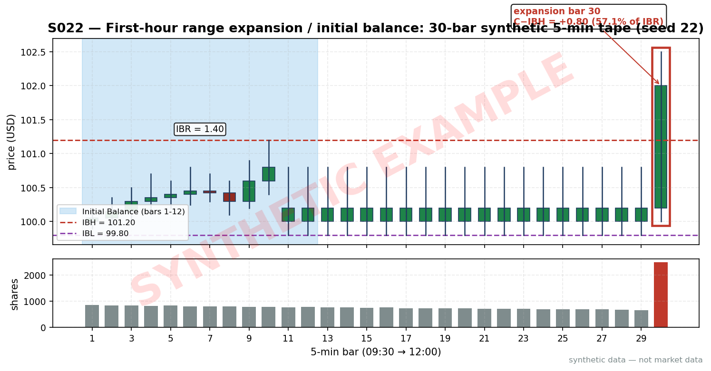

```mermaid
flowchart LR
    FEED["Raw feed\n(Polygon SIP 1-min bars)"] -->|"1-min bars"| ING["Ingest + normalize\n(exchange ts, splits, halts)"]
    ING -->|"clean 1-min bars"| FEAT["Feature compute\n(IBH/IBL over bars 1-12,\nATR(14) rolling)"]
    FEAT -->|"IB levels + expansion state\n(5-min bars)"| SIG["Signal S022\nIB expansion trigger"]
    SIG -->|"signal events (5-min)"| GATE{"Cost / RVOL\ngate?"}
    GATE -->|"pass: entry orders (5-min)"| OUT["Downstream consumer\n(T061 entry / T005 gate)"]
    GATE -->|fail| DROP["No trade"]
    style SIG fill:#aed6f1,stroke:#1f3a5f
```

### S12. Sources

- Crabel, T. (1990). *Day Trading with Short Term Price Patterns and Opening Range Breakout.* Traders Press (ISBN 0934380171). Practitioner source for ORB; computer-tested short-term patterns.
- Steidlmayer, J. P. & Dalton, J. (1992/2007). *Mind Over Markets.* The Initial Balance / Market Profile framework.
- Fisher, M. (2002). *The Logical Trader.* Wiley. ACD method: opening-range-based pivot entries/exits.
- Holmberg, U., Lönnbark, C. & Lundström, C. (2013). "Assessing the profitability of intraday opening range breakout strategies." *Finance Research Letters* 10(1), 27–33. https://www.econbiz.de/Record/assessing-the-profitability-of-intraday-opening-range-breakout-strategies-holmberg-ulf/10010818902
- "Enhancing Opening Range Breakout Strategies with LSTM-Based True Range Prediction." Springer (2026). https://link.springer.com/chapter/10.1007/978-981-92-0074-0_23
- Dalton, J. F., Dalton, R. B. & Jones, E. T. (2007). *Markets in Profile: Profiting from the Auction Process.* Wiley. https://www.econbiz.de/Record/markets-in-profile-profiting-from-the-auction-process-dalton-james/10013489965 — Auction-theory treatment of Market Profile: value-area/fair-price migration and the Initial Balance as the opening auction's balance area, the framework behind IBH/IBL construction in S2.

**Unverified leads**
- Duck.ai (GPT-5.6 Luna) answered Q-SB5-1–Q-SB5-3 (2026-09-10); Grok/Cursor answers pending (checked 2026-09-10). The Q-SB5-1 30-bar example (IBH 101.20 / IBL 99.80 / IBR 1.40 / excursion 57.14% of IBR) was operator-verified with no arithmetic errors; its mixed bar-inclusion convention is flagged in S10. Q-SB5-3's qualitative assessments are research leads, not confirmed facts.

---
## Stage 23/200 — S023: Gap-and-go

*Batch SB5 · Signal 23/100 · Provenance [SR] · Family B — Intraday Momentum & Breakout*

### S1. One-line verdict

| | |
|---|---|
| **What it is** | An overnight gap that holds through the open, then breaks the first minutes' high — a footprint of unfilled institutional demand. |
| **When it works** | News-driven gaps with heavy premarket volume and wide market/sector tailwinds. |
| **When it dies** | Small no-news gaps, thin premarket prints, and extended gaps that mean-revert into the open. |
| **Build-or-buy in one line** | Build the classifier; buy the news feed if you want the news/no-news split that makes it work. |

### S2. How it works — plain human explanation

An **overnight gap** is the difference between today's opening print and yesterday's close: G = (O_t − C_{t−1})/C_{t−1}. Overnight, news accumulates while nobody can trade; the open is where it all reprices at once. **Gap-and-go** says: if a stock gaps up on real news, holds the gap (doesn't immediately fall back to fill it), and then breaks above the high of its first few minutes of trading, the institutions that wanted to buy couldn't finish overnight — they will keep buying into the morning. **Gap fade** is the mirror: small, no-news gaps tend to get "filled" as price drifts back toward the prior close.

A concrete vignette: 08:47, premarket. XYZ closed at 100.00; on an earnings beat it trades 103.00 on 4× its normal premarket volume. At 09:30 the opening print is 103.00 — a +3.0% gap. The first five minutes hold between 103.00 and 103.60. At 09:36 a 1-minute bar closes at 103.65, above the first-5-minute high. Go: the gap held, the opening drive broke upward — buy the continuation, targeting the morning extension, and flatten by lunch if momentum stalls. Contrast: ABC gaps +1.5% to 101.50 on no news with thin premarket volume; by 10:00 it is back at 100.40 — the fade was the trade, not the go.

Why should either leg exist? **Overnight information asymmetry**: news arrives around the clock but can only be traded at the open, so the opening auction is a coarse, liquidity-constrained repricing — large gaps often under-adjust initially, leaving a drift (the go). **Institutional urgency**: desks with VWAP (volume-weighted average price — the day's volume-weighted average trade price) benchmarks or rebalance mandates must complete size during the day, extending the move. Conversely, **liquidity provision**: market makers fade small uninformed gaps, and overnight index-futures noise mean-reverts once cash trading resumes (the fade).

- **Mental model:** the gap is the market's first draft of the news; the first 30 minutes are the editing process — go trades the drafts that get *confirmed*, fade trades the drafts that get *rejected*.
- **Mental model:** there is no universal "gaps continue X% of the time" — continuation probability is a function of gap size (in ATR — Average True Range, the trailing mean of True Range), news, and premarket volume.
- **Mental model:** the go is a positive-skew, low-hit-rate trade; the fade is a high-hit-rate, negative-skew trade — evaluate by expected value net of costs, not by win rate.

### S3. The math — exact formula

Gap and gap size in volatility units (**ATR** = Average True Range, the trailing mean of True Range):

$$G_t = \frac{O_t - C_{t-1}}{C_{t-1}}, \qquad g_t^{\text{ATR}} = \frac{O_t - C_{t-1}}{\text{ATR}_{t-1}(14)}$$

**Hold condition** (up gap; down gap mirrors): the gap is "held" if the low of the first M minutes stays above the prior close: min_{i≤M} L_i > C_{t-1}. **Go trigger**: close of a 1-minute bar above the first-N-minute high:

$$\text{Go}_t = \big[\, g_t^{\text{ATR}} > k \,\big] \;\; \text{AND} \;\; \big[\, \min_{i \le M} L_i > C_{t-1} \,\big] \;\; \text{AND} \;\; \big[\, C_{\tau} > \max_{i \le N} H_i \,\big]$$

for the first bar τ > N. **Fade trigger**: the gap fills, i.e. price touches C_{t-1}, or the first-N-minute low breaks with falling **RVOL** (Relative Volume — the ratio of current volume to the same time-of-day historical average). **Causal timing:** the gap is known at the 09:30 opening print; the hold condition needs M minutes of tape; the trigger is tradable at the close of bar τ, filled at bar τ+1's open at the earliest. Filters: premarket volume multiple, float, news flag, opening spread.

| Parameter | Symbol | Typical range | Too small | Too large | Default (example) |
|---|---|---|---|---|---|
| Gap threshold | k (×ATR) or % | 1.5–2.5×ATR or 2–4% | fades dominate, whipsaws | almost never triggers | 2.0×ATR, *example — not an institutional standard* |
| Hold window | M (min) | 5–15 | gap-fill noise triggers | misses the move | 10 min, *example* |
| Breakout window | N (min) | 1–5 | microstructure noise | late entry | first 5-min high, *example* |
| Premarket vol mult. | m_pm | 2–5× normal | no-news gaps pass | filters real earnings gaps on quiet premarkets | 3×, *example* |
| RVOL gate | m_r | 1.5–3× | weak participation | only mega-caps qualify | 2×, *example* |

**Named variants.** (1) **Earnings-gap go**: require a material-news flag — the highest-conviction subset. (2) **Index-gap fade**: gap driven by overnight index-futures moves with no stock-specific news. (3) **Gap-and-reverse**: gap fills *and* keeps going through the prior close — the fade's trend variant.

### S4. Worked example — step-by-step numbers (SYNTHETIC)

Three synthetic 1-minute scenarios, seed 23 (`np.random.default_rng(23)`; anchor values pinned, small noise between). Prior close C_{t−1} = 100.00; synthetic ATR(14) = 1.50. Prices shown at minutes after the 09:30 open.

| min | A: gap-and-go | B: gap fade | C: gap-and-reverse |
|---|---|---|---|
| 0 (open) | 103.00 | 101.50 | 102.50 |
| 5 | 103.60 | 101.65 | 102.90 |
| 30 | 103.45 | 101.30 | 102.60 |
| 60 | 103.90 | 100.80 | 101.80 |
| 120 | 104.20 | 100.40 | 100.60 |
| 240 | 104.05 | 99.95 | 99.90 |
| 390 (close) | 103.80 | 99.90 | 99.50 |

Step 1 — gap sizes: A: +3.00% = 2.00×ATR (passes the 2.0× example threshold); B: +1.50% = 1.00×ATR (fails — fade candidate); C: +2.50% = 1.67×ATR (borderline).

Step 2 — hold check: A never trades below 103.00 (holds); B's low drifts under the prior close by minute 240 (99.95 — gap filled); C pushes to 102.90 then collapses through the prior close to 99.50 (gap-and-reverse).

Step 3 — go trigger on A: first-5-minute high = 103.60; the first 1-minute close above it prints at minute 6 at **103.65** — entry no earlier than minute 7's open.

**What to notice.** Scenario B is the mandatory lesson: a +1.5% gap on no news fades *through* the prior close — the naive "buy every gap" rule loses on both legs here. Scenario C shows why stops exist: a 2.5% gap that initially pushes higher still ends −0.5% on the day. **Limits:** hand-picked anchors; no spreads (the opening spread is the day's widest — often 5–20 bps (basis points, 1 bp = 0.01%) on mid-caps), no chase slippage, no fees. Mechanics illustration, not a backtest.

Expected-value framing (illustrative *example* parameters, not a claim): a go strategy winning 45% of trades, averaging +1.80% on wins and −1.20% on losses, with 8 bps all-in costs: E[return] = 0.45×1.80 − 0.55×1.20 − 0.08 = **+0.07% per trade**. Report this — not "gaps continue 55% of the time" — because the win rate alone hides the skew.

### S5. Strategies that use this signal

- **T018 — RVOL-Gated Gap-and-Go** — *primary entry trigger (direction)*: S023 defines the gap/hold/break; S032 (RVOL) gates for institutional participation; S094 (block footprints) confirms real size behind the move.
- **T012 — Jump-Filtered Overnight-Gap Fade** — *conceptual-fit reference (not a plan-defined consumer of S023)*: if S023's go conditions confirm (news flag + RVOL + first-minutes high break), veto the fade — the gap is informed and fading it is picking up pennies in front of a steamroller.

### S6. Data required — exact spec

| Field | Type | Granularity | Source tier | Notes |
|---|---|---|---|---|
| Daily OHLC | float | daily | Tier 0–1 | prior close; must be split/dividend-adjusted point-in-time |
| Opening print | float | per day | Tier 1 | official open auction print, not first trade |
| 1-min OHLCV | float/int | 1-min, first 60–90 min | Tier 1 | SIP (Securities Information Processor — the consolidated feed) bars suffice |
| Premarket volume | int | premarket session | Tier 1–2 | not all vendors carry it; verify coverage |
| News flags | events | per symbol-day | Tier 2 | earnings/ guidance/ M&A; Benzinga-class feeds |

Collection: Polygon (`/v2/aggs/...` + premarket flag) or Alpaca (free tier covers SIP bars; premarket volume via extended-hours bars). Ingest sketch (≤20 lines):

```python
import polars as pl
d = pl.read_parquet("daily/*.parquet").sort(["symbol", "day"])
d = d.with_columns((pl.col("open") / pl.col("close").shift(1) - 1).over("symbol").alias("gap"),
    ((pl.col("open") - pl.col("close").shift(1)) / pl.col("atr14")).over("symbol").alias("gap_atr"))
pm = pl.read_parquet("premarket/*.parquet")          # premarket volume per symbol-day
cand = d.join(pm, on=["symbol", "day"]).filter(
    (pl.col("gap_atr") > 2.0) & (pl.col("pm_vol_mult") > 3.0))   # example thresholds
mins = pl.read_parquet("bars_1m/*.parquet")          # first-5-min high, hold check
go = cand.join(mins.group_by(["symbol", "day"]).agg(
    pl.col("high").head(5).max().alias("h5"),
    pl.col("low").head(10).min().alias("l10")), on=["symbol", "day"])
```

Storage: daily bars trivial; 1-min bars for 500 symbols ≈ 50 MB/day, ~3 GB/60 days (per `notes/cost-model.md` §4). **Data-quality checklist:** official opening-auction print (not first trade); point-in-time adjustments (a split fabricates a −50% "gap"); premarket volume comparability across vendors; halted/delayed opens excluded.

### S7. Local build on M5 Max / 128GB

**Feasibility: trivial.** A handful of daily-bar arithmetic plus a first-5-minute high/low scan — O(1) per symbol-day. Per `notes/cost-model.md` §2, the 500-symbol 1-minute universe (195k bars/day) is trivially handled by polars batch ops; the daily gap screen is milliseconds. S023 alone is Tier L; the Q-SB5-2 chatbot lead prices the *full session-pattern engine* at 185–385 h prototype / 705–1,530 h research-grade.

| Stack | When to pick |
|---|---|
| Python + polars | Default: gap screens and first-N-minute stats are trivially vectorized |
| DuckDB | Research queries over partitioned daily/minute history |
| Rust | Unneeded at this granularity |

RAM: daily + 1-min history for 500 symbols over years fits in single-digit GB — far under the 77 GB working budget (cost-model §3). Engineering: **Tier L, 4–12 h → $600–1,800** at $150/hr loaded-cost estimate (cost-model §5) for the signal + replay; the news-flag pipeline is the only part that can push toward Tier M. **Bottleneck:** premarket-volume coverage and news-flag licensing, not compute. **Breaks at:** full-universe real-time premarket scanning across fragmented venues — then the constraint is data licensing, not the M5 Max.

### S8. Buy vs build

| Option | What you get | Indicative price | Gains | Loses |
|---|---|---|---|---|
| Tier 0: Alpaca IEX / Stooq | Free daily + SIP 1-min bars | ~$0 | zero cost | no premarket volume detail, no news flags |
| Tier 1: Polygon Stocks Advanced | SIP bars, premarket, splits | ~$30–200/mo | single-vendor gap pipeline | news flags are an add-on |
| Tier 2: Benzinga Pro-class news | Machine-readable headlines | ~$100–200/mo | the news/no-news split that stratifies gaps | redistribution limits; headline ≠ materiality |
| Tier 2: Databento Standard | L1 (top-of-book quotes) + imbalance + OHLCV | ~$200/mo + usage | honest auction prints, venue detail | overkill for a daily-gap signal |

All prices *indicative — verify before budgeting*. **Verdict: build the classifier, buy the bars; buy the news feed only if the earnings-gap variant is core.** The crossover: if you need licensed redistribution of news (e.g. serving signals to others), you are buying regardless — building means re-licensing anyway (cost-model §6).

### S9. Success ratio / efficacy — documented evidence

| Study / source | Market & period | Metric | Before/after cost | Caveat |
|---|---|---|---|---|
| Stübinger & Schneider (2019), "Statistical Arbitrage with Mean-Reverting Overnight Price Gaps", *J. Risk Financ. Manag.* 12(2):51 | S&P 500 constituents, 1998–2015, high-frequency | Jump-detected overnight-gap strategy: +51.47% p.a., Sharpe 2.38 | **After transaction costs** (authors' model) | This is a **fade**, not a go — the documented edge is mean-reversion of gaps |
| Caporale & Plastun (2017); Plastun et al. (2020); weekend-gap follow-up (MDPI, 2025) | DJIA/NASDAQ, weekend gaps | Prices continue in the gap's direction for several hours after Monday's open | Before-cost, index level | Continuation subsides quickly; varies by index |
| Berkman, Koch & Tuttle (2009), "Dispersion of Opinions, Limits to Arbitrage, and Overnight Returns", SSRN | 3,000 largest US stocks, 9 yrs intraday | Overnight gains reverse during the day, concentrated in high-disagreement / hard-to-short names | Before-cost | Explains the fade leg; limits-to-arbitrage names are the least tradable |

**Regimes where it fails:** low-volume no-news gaps (fade eats the go); gap into a halted/volatile open; crowded first-5-minute-high entries (every retail screener sees the same level); macro-gap days where the *index* mean-reverts and drags single names. **Documented decay:** the simple gap-fade is a decades-old prop-desk staple — heavily competed; the news-conditioned go retains more plausibility because it keys on genuine information events. **Bottom line:** as a standalone trigger, a *conditional* edge — weak unconditionally, plausible when stratified by news × size × volume; as a *classifier* (go vs fade vs reverse) feeding execution, moderate. The honest statistic is E[return] = P(win)·E[win] − P(loss)·E[loss] − costs.

### S10. Failure modes & pitfalls

1. **Entry slippage on gaps:** chasing the open means paying the day's widest spread plus momentum slippage. Mitigate: enter on the confirmed break (minute 6+, not the print), cap chase at 0.5×ATR beyond the trigger.
2. **Lookahead on the opening print:** using a vendor's "open" that is actually a revised or late print. Mitigate: use the official auction print with its publication timestamp; never the first trade.
3. **Auction cutoffs:** MOO/LOO (market/limit-on-open) orders must beat the cutoff; after it, you are a price-taker on the book. Mitigate: model the cutoff explicitly; assume regular-session fills after 09:30:01.
4. **News misclassification:** "no news" gaps that are actually informed. Mitigate: treat unexplained large gaps as informed by default — require the go, never fade blindly.
5. **Halts and delayed opens:** the first-5-minute window is undefined. Mitigate: skip delayed opens and LULD (limit-up/limit-down) halts.
6. **Survivorship bias:** gap-downs that never recover belong to delisted names your universe file dropped. Mitigate: point-in-time universe including delisted securities.
7. **Overfit thresholds:** mining k × M × N grids. Mitigate: fix k from ATR economics (1.5–2.5), validate on untouched years, embargo around earnings seasons.
8. **Cost blowup:** the go's positive skew comes with poor hit rate; two full-stop losses erase a week of small wins. Mitigate: size by the E[return] equation with the full per-trade cost stack (spread + fees + slippage/impact); hard daily loss stop.

### S11. Visuals

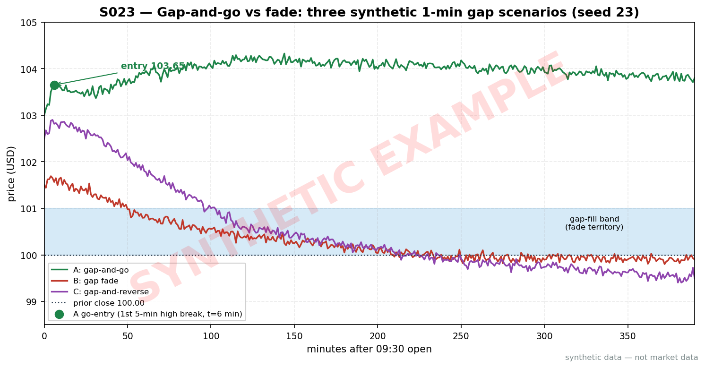

```mermaid
flowchart LR
    FEED["Raw feed\n(Polygon daily + 1-min bars,\npremarket volume)"] -->|"daily bars + 1-min bars"| ING["Ingest + normalize\n(auction print, splits,\npremarket coverage)"]
    ING -->|"clean daily + 1-min bars"| FEAT["Feature compute\n(gap %, gap in ATR,\nfirst-5-min high/low)"]
    FEAT -->|"gap features\n(1-min bars)"| SIG["Signal S023\ngo / fade / reverse"]
    SIG -->|"signal events (1-min)"| GATE{"Cost / news /\nRVOL gate?"}
    GATE -->|"pass: entry orders (1-min)"| OUT["Downstream consumer\n(T018 entry / T012 veto)"]
    GATE -->|fail| DROP["No trade"]
    style SIG fill:#aed6f1,stroke:#1f3a5f
```

### S12. Sources

- Stübinger, J. & Schneider, L. (2019). "Statistical Arbitrage with Mean-Reverting Overnight Price Gaps on High-Frequency Data of the S&P 500." *Journal of Risk and Financial Management* 12(2):51. https://www.mdpi.com/1911-8074/12/2/51/ (FAU record: https://open.fau.de/items/4ae97dde-36f5-4c61-965b-3dc87dafe294/full)
- Caporale, G. M. & Plastun, O. (2017) and follow-ups; weekend-gap continuation evidence summarized in "Price Gaps and Volatility: Do Weekend Gaps Tend to Close?" (MDPI, 2025). https://www.mdpi.com/1911-8074/18/3/132
- Berkman, H., Koch, P. D. & Tuttle, L. (2009). "Dispersion of Opinions, Limits to Arbitrage, and Overnight Returns." SSRN. https://papers.ssrn.com/sol3/papers.cfm?abstract_id=1214564
- Crabel, T. (1990). *Day Trading with Short Term Price Patterns and Opening Range Breakout.* Traders Press. Practitioner gap/playbook discussion (source entry's citation).
- Frazzini, A. (2006). "The disposition effect and underreaction to news." *Journal of Finance* 61(4), 2017–2046. http://ideas.repec.org/a/bla/jfinan/v61y2006i4p2017-2046.html — Behavioral mechanism for drift after news-driven gaps: post-announcement drift varies with unrealized capital gains (the disposition effect), motivating the news-conditioned go variant in S4.
- Tetlock, P. C. (2007). "Giving content to investor sentiment: The role of media in the stock market." *Journal of Finance* 62(3), 1139–1168. https://econpapers.repec.org/article/blajfinan/v_3a62_3ay_3a2007_3ai_3a3_3ap_3a1139-1168.htm — Overnight news sentiment predicts downward price pressure followed by reversion; one of the documented drivers of overnight gaps.

**Unverified leads**
- Duck.ai (GPT-5.6 Luna) answered Q-SB5-1–Q-SB5-3 (2026-09-10); Grok/Cursor answers pending (checked 2026-09-10). Q-SB5-3's gap framework (no universal continuation %, stratify by ATR size/news/premarket volume, report E[return]) is used as a *labeled chatbot lead* consistent with the papers above; its qualitative verdicts are not independently confirmed facts. Provenance stays [SR]: practitioner reconstruction, not upgraded.

---
## Stage 26/200 — S026: First half-hour → last half-hour momentum

*Batch SB5 · Signal 26/100 · Provenance [D] · Family B — Intraday Momentum & Breakout*

### S1. One-line verdict

| | |
|---|---|
| **What it is** | The market's first-30-minute return positively predicts its last-30-minute return — a documented intraday time-series momentum. |
| **When it works** | High-volatility, high-volume, and macro-news days, on liquid index ETFs. |
| **When it dies** | Quiet midday-type days, single illiquid names, and after realistic transaction-cost and auction-cutoff modeling. |
| **Build-or-buy in one line** | Build: one regression on 1-minute bars; buy nothing beyond a clean ETF bar feed. |

### S2. How it works — plain human explanation

Divide the trading day into thirteen 30-minute **buckets**: bucket 1 is 09:30–10:00 (including the overnight move from the prior close), bucket 13 is 15:30–16:00. **Time-series momentum** means the market's own past return predicts its own future return (as opposed to **cross-sectional** momentum, where *stocks'* relative returns predict each other). S026 is time-series: if the S&P 500 ETF (SPY) rallies in the first half hour, it tends — statistically — to drift further up in the last half hour.

A concrete vignette: 15:28, SPY bid 512.40 / ask 512.41. The day opened strong on a CPI print: bucket 1 returned +0.45%. The tape has chopped sideways since, but the morning's buyers never got flushed. The rule says: buy SPY now, hold into the close, flatten at 16:00 — the last-half-hour drift should rhyme with the morning's direction. You exit into the **MOC** (market-on-close) auction, not after the closing print, because as a price-taker you cannot trade at a print that has already happened.

Why should this exist? Two documented economic stories (Gao, Han, Li & Zhou, 2018). First, **daytrader unwinding with the disposition effect**: on good-news mornings, liquidity-providing daytraders go short early; reluctant to realize losses, they cover late — their buying lands in the last half hour. Second, **strategic informed trading** (Admati & Pfleiderer, 1988): informed traders concentrate in high-volume periods — the open and the close — so morning information keeps being impounded late in the day. Both stories predict the effect concentrates on high-volume, high-volatility, news-heavy days — which is what the paper finds.

**Mandatory framing.** The closely related Heston–Korajczyk–Sadka (2010) result is *different*: it documents **cross-sectional** half-hour **periodicity** — stocks that outperform in a given half-hour bucket tend to outperform in the *same bucket on subsequent days*, at exact multiples of a trading day, persisting ≥40 trading days. It is *not* a "first-30-minutes predicts last-30-minutes" rule. The two effects share the U-shaped intraday volume clock as a mechanism, but they are different signals with different implementations.

- **Mental model:** the morning sets the day's informational tone; the close is when the slow money finishes reacting to it.
- **Mental model:** this is a *timing* feature (when to be exposed into the close), not a standalone fortune — its authors frame the value partly as execution-cost reduction.
- **Mental model:** predictability concentrates where volume concentrates — the signal is weakest exactly when it is cheapest to trade.

### S3. The math — exact formula

Half-hour returns (p_{0,t} = prior day's 16:00 price, so bucket 1 includes the overnight return):

$$r_{j,t} = \frac{p_{j,t}}{p_{j-1,t}} - 1, \qquad j = 1, \dots, 13$$

Predictive regression (Gao et al., 2018):

$$r_{13,t} = \alpha + \beta \, r_{1,t} + \varepsilon_t$$

with the documented extension adding the twelfth (second-to-last) bucket:

$$r_{13,t} = \alpha + \beta_1 r_{1,t} + \beta_2 r_{12,t} + \varepsilon_t$$

Trading form: at ~15:30 compute the forecast r̂_{13,t} (or simply sign(r_{1,t})); take the position for the final 30 minutes; flatten at the close. HKS (cross-sectional) form, for contrast: sort stocks into deciles on bucket-h return at day t−k and hold through bucket h at day t, for k = 1…40+ days. **Causal timing:** the signal uses data ≤ 15:30 on day t (r_{1,t} is known by 10:00); the earliest fill is 15:30+; the exit must respect MOC/LOC (limit-on-close) auction cutoffs — you cannot exit "at the close" as a price-taker after 16:00.

| Parameter | Symbol | Typical range | Too small | Too large | Default (example) |
|---|---|---|---|---|---|
| Bucket width | — | 15–60 min | microstructure noise dominates | washes out the close effect | 30 min, *example — not an institutional standard* |
| Formation | r_1 window | 1 bucket | misses overnight digestion | overlaps the holding period | bucket 1 incl. overnight, *example* |
| Entry time | — | 15:00–15:30 | pays for dead midday chop | misses the drift | ~15:30, *example* |
| Exit | — | MOC auction / 15:59 | leaves the drift on the table | after-print fills (lookahead) | flatten by 16:00 via MOC/LOC, *example* |
| Vol conditioning | σ̂(r_1) | on/off | trades quiet days with no edge | halves the sample | scale by first-half-hour realized vol, *example* |

**Named variants.** (1) **Sign-only timing**: position = sign(r_{1,t}) — no regression estimation. (2) **Recursive regression forecast**: re-estimate (α, β) on an expanding window each day. (3) **HKS cross-sectional quintile**: rank stocks on prior same-bucket returns; long top / short bottom quintile through the bucket — the periodicity trade, not the morning-to-close trade.

### S4. Worked example — step-by-step numbers (SYNTHETIC)

Synthetic 13-bucket × 60-day panel, seed 26 (`np.random.default_rng(26)`). Design: same-bucket day-to-day AR(1) (first-order autoregressive) persistence φ = 0.35 for buckets 1 and 13, 0.05 elsewhere; U-shaped bucket volatility. The table below is the last 12 days (returns in basis points, 1 bp = 0.01%).

| day | r₁ (first 30 min) | r₁₃ (last 30 min) |
|---|---|---|
| 49 | −12.11 | 126.76 |
| 50 | 55.90 | 35.61 |
| 51 | −72.58 | 50.50 |
| 52 | −46.58 | 182.64 |
| 53 | 1.47 | 103.80 |
| 54 | 40.92 | 97.11 |
| 55 | 18.83 | 130.42 |
| 56 | 21.89 | 69.72 |
| 57 | −9.51 | 6.46 |
| 58 | 40.84 | 47.54 |
| 59 | 9.24 | 29.89 |
| 60 | −15.82 | −81.93 |

Step 1 — means: r̄₁ = 2.71 bps, r̄₁₃ = 66.54 bps. Step 2 — sums: Σ(r₁−r̄₁)² = 15225.4, Σ(r₁−r̄₁)(r₁₃−r̄₁₃) = −2318.4. Step 3 — slope: β̂ = −2318.4/15225.4 = −0.1523, i.e. **β̂×100 = −15.23**; α̂ = 66.96 bps; R² = 0.68%; t-statistic = **−0.26** — statistically indistinguishable from zero.

That negative, insignificant toy estimate is the honest point: **with 12 days you measure noise**. Gao et al. needed SPY 1993–2013 (~5,200 days) to estimate β̂×100 = 6.94 at the 1% level. The heatmap's second panel tells the complementary story on the full 60-day window: same-bucket day-to-day autocorrelations are 0.259 (bucket 1) and 0.271 (bucket 13) against a design truth of 0.35 (standard error ≈ 0.13) — persistence is *visible* once the sample is long enough, invisible in a two-week toy.

**What to notice.** The synthetic design bakes in exactly the HKS-style claim (morning/close buckets persist day-to-day; midday doesn't) and the chart recovers it — but only with 60 days. **Limits:** the AR(1) design *assumes* the effect; nothing here estimates real predictability. No costs, no auction cutoffs, no bid-ask bounce (which mechanically creates short-horizon reversal — HKS's own caveat). This is a mechanics illustration, not evidence.

### S5. Strategies that use this signal

- **T015 — First-Half-Hour → Close Continuation** — *primary entry trigger (direction and timing)*: S026 is the core signal — morning winners held into the last-half-hour drift; S027 (end-of-day momentum) confirms the close leg; S046 (session seasonality) deseasonalizes the entry.
- **T006 — Intraday Trend + Vol-Regime Allocator** — *conceptual-fit reference (not a plan-defined consumer of S026)*: the strategy rides intraday time-series momentum into the close; S026's first-half-hour conditioning decides *whether* to hold the afternoon position, scaled by the HMM (hidden Markov model — a regime-switching model) vol regime (S079).

### S6. Data required — exact spec

| Field | Type | Granularity | Source tier | Notes |
|---|---|---|---|---|
| 1-min OHLCV | float/int | 1-min, RTH (regular trading hours) | Tier 1 | aggregate to 30-min buckets yourself |
| Daily OHLC (adjusted) | float | daily | Tier 0–1 | splits/dividends; bucket 1 spans the close |
| Session calendar | dates | daily | Tier 0 | early closes change bucket boundaries |
| MOC imbalance (optional) | messages | per day | Tier 2 | for exit execution, not the signal |

Collection: Polygon Stocks Advanced 1-min SIP (Securities Information Processor — the consolidated feed) bars for SPY/QQQ/IWM; Alpaca free tier suffices for the ETF-only variant. Ingest sketch (≤20 lines):

```python
import polars as pl
bars = pl.read_parquet("bars_1m/SPY.parquet").sort("ts")     # exchange ts, RTH
b = bars.with_columns(((pl.col("ts").dt.hour() * 60 +
    pl.col("ts").dt.minute() - 570) // 30 + 1).alias("bucket"))  # 9:30->1 ... 15:30->13
hh = b.group_by([pl.col("ts").dt.date().alias("day"), "bucket"]).agg([
    pl.col("open").first().alias("o"), pl.col("close").last().alias("c")])
r = hh.sort(["day", "bucket"]).with_columns(
    (pl.col("c") / pl.col("c").shift(1) - 1).alias("r"))  # lag over full frame: bucket-1 row follows prior day's close, so r1 includes the overnight move
sig = r.filter(pl.col("bucket") == 1).select(["day", pl.col("r").alias("r1")])
```

Storage: 1-min bars for a handful of ETFs are megabytes per year — trivial (per `notes/cost-model.md` §4). **Data-quality checklist:** buckets anchored to 09:30 ET (DST-safe); early-close days re-bucketed or excluded; adjusted closes so splits don't fabricate bucket-1 "gaps"; auction prints flagged separately; one timezone end-to-end.

### S7. Local build on M5 Max / 128GB

**Feasibility: trivial.** Thirteen bucket returns per day and one OLS (ordinary least squares) regression — the entire 20-year SPY history is ~5,200 × 13 numbers; the regression is microseconds in numpy. Per `notes/cost-model.md` §2, even a 500-symbol 1-minute universe (195k bars/day) is trivial for polars batch ops (~10–50M rows/sec). S026 alone is Tier L; the Q-SB5-2 chatbot lead prices the *full session-pattern engine* at 185–385 h prototype / 705–1,530 h research-grade.

| Stack | When to pick |
|---|---|
| Python + polars/numpy | Default: bucketing + regression is a one-liner |
| DuckDB | Cross-sectional HKS extension over thousands of names × 40 days |
| Rust | Unneeded at this granularity |

RAM: the full research dataset (decades of ETF 1-min bars) is < 1 GB — negligible against the 77 GB working budget (cost-model §3). Engineering: **Tier L, 4–12 h → $600–1,800** at $150/hr loaded-cost estimate (cost-model §5) for the signal, replay, and cost accounting; the HKS cross-sectional extension (thousands of names, decile sorts, 40-day lags) stays Tier L/M in polars. **Bottleneck:** transaction-cost and auction-cutoff realism, not compute. **Breaks at:** nothing on this machine — the constraint is statistical (you need decades of data for a 1.6% R²), not computational.

### S8. Buy vs build

| Option | What you get | Indicative price | Gains | Loses |
|---|---|---|---|---|
| Tier 0: Alpaca IEX / Stooq | Free daily + 1-min ETF bars | ~$0 | enough for the Gao et al. replication | IEX-only prints; no auction detail |
| Tier 1: Polygon Stocks Advanced | SIP 1-min, 20+ yrs, splits | ~$30–200/mo | full sample in one pull | SIP timestamps only |
| Tier 2: Databento Standard | L1 (top-of-book quotes) + OHLCV, replay | ~$200/mo + usage | honest open/close auction data | overkill for a 13-bucket signal |
| Academic: TAQ (Trade and Quote — the consolidated equity tick database) via WRDS (Wharton Research Data Services) | Publication-grade intraday | institutional/academic terms | the literature-standard source | access friction |

All prices *indicative — verify before budgeting*. **Verdict: build.** Data Tier ≤ 1, eng Tier L, and the "parameters" are a regression you must estimate yourself — there is nothing to buy except the bars. Buy TAQ-grade history only for the HKS cross-sectional extension.

### S9. Success ratio / efficacy — documented evidence

| Study / source | Market & period | Metric | Before/after cost | Caveat |
|---|---|---|---|---|
| Gao, Han, Li & Zhou (2018), "Intraday Momentum", *Rev. Financ. Stud.* 31(1) | SPY, TAQ (Trade and Quote database), 1993–2013 | r₁₃ on r₁: β̂×100 = 6.94, p < 1%, R² = 1.6% (in-sample) / 1.2% (out-of-sample, OOS); with r₁₂: 2.6% / 1.8%. Timing strategy (sign of r₁): 6.67%/yr, Sharpe **1.08** vs 0.29 buy-and-hold | Before-cost; authors state gains survive "reasonable transaction costs" | Single most-liquid ETF; sample spans pre-decimalization years; SPY-only |
| Heston, Korajczyk & Sadka (2010), *J. Finance* 65(4) | US stocks, post-decimalization intraday | Cross-sectional same-bucket continuation at exact daily multiples, ≥40 trading days; short-horizon reversal from liquidity imbalance + bid-ask bounce | Before-cost (draft: 3.11 bp top-minus-bottom decile, same bucket next day) | **Not** a first→last-30-min rule; authors' economic claim is execution-timing: "timing trades can reduce execution costs by the equivalent of the effective spread" |
| Haendler, Heston, Korajczyk & Sadka (2025), SSRN working paper | US stocks, OOS of 2010 sample | Periodicity persists OOS; open ≈ VWAP (volume-weighted average price)-like trading, close ≈ MOC activity; institutional proxies explain all open + midday periodicity, up to 30% of close | Mechanism decomposition, not a return claim | Working paper (2025); explains *why*, doesn't add tradable alpha |
| Li et al. (2020), *Finance Research Letters* 35 (OOS lead) | Chinese index futures | First-session return predicts last-session return; stronger at 60-min buckets, on high volume/vol/attention days | Before-cost | Futures, different market structure; confirms the time-series pattern travels |

**Regimes where it fails:** low-volatility, low-volume days (Gao et al. show predictability concentrates in high-vol/volume, recession, and macro-news days); single illiquid names (the result is a *market*/liquid-ETF phenomenon); crowded MOC windows where the predictable flow is arbed by execution algos. **Documented decay:** the published sample ends 2013; the 2025 follow-up confirms the *periodicity* persists OOS but attributes it increasingly to institutional execution patterns (VWAP/MOC) — i.e., the mechanism is now the plumbing, and plumbing gets optimized. **Bottom line:** documented statistical predictability (R² ≈ 1–2%) on the most liquid ETF over 20 years; as a *standalone after-cost retail rule* — weak; as an *execution-timing / rebalance feature* — moderate, which is how its discoverers frame it.

### S10. Failure modes & pitfalls

1. **Confusing HKS with a first→last-30min rule.** HKS is cross-sectional periodicity across *days*; Gao et al. is time-series morning→close. Trading one with the other's implementation is a category error. Mitigate: implement each paper's specification separately.
2. **MOC auction cutoff lookahead.** Backtests that "exit at the close" assume the 16:00 print; live, MOC/LOC orders face cutoffs (typically ~15:50–15:58) and imbalance risk. Mitigate: model the cutoff; assume exit at the 15:55 mid or via LOC with non-fill risk.
3. **Transaction-cost decay.** A 1.6% R² on 30-minute returns is a few basis points of edge per day — one extra spread-crossing error kills it. Mitigate: full cost model (spread + fees + impact); the decisive test is point-in-time replay with realistic fills, not close-to-close backtests.
4. **Single-name extrapolation.** Gao et al. is SPY; HKS is a broad cross-section. A mid-cap's bucket-1 return is mostly bid-ask bounce. Mitigate: restrict to liquid ETFs; deseasonalize by bucket volatility.
5. **Bucket misalignment.** Using 16:00 prints in r₁₃ while the signal fires at 15:30, or mixing timezones. Mitigate: fixed 09:30-anchored buckets; the tradable r₁₃ estimate uses data ≤ 15:30 only.
6. **Overfitting bucket width and entry time.** Mining 15/30/60-min × 15:00/15:15/15:30 grids. Mitigate: fix 30-min buckets for the literature reason; one untouched OOS decade.
7. **Regime dependence.** Predictability lives in high-vol/news days; a rule traded every day dilutes the edge with noise days. Mitigate: condition on first-half-hour realized vol (the paper's own interaction).
8. **Survivorship and adjustments.** ETF splits/dividends fabricate bucket returns. Mitigate: adjusted prices, point-in-time corporate actions.

### S11. Visuals

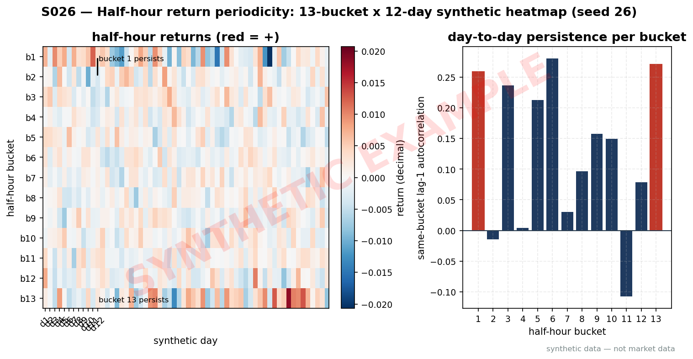

```mermaid
flowchart LR
    FEED["Raw feed\n(Polygon SIP 1-min bars,\nSPY/QQQ)"] -->|"1-min bars"| ING["Ingest + normalize\n(09:30-anchored buckets,\nsplits, early closes)"]
    ING -->|"clean 1-min bars"| FEAT["Feature compute\n(13 half-hour returns/day,\nrealized vol)"]
    FEAT -->|"30-min bars"| SIG["Signal S026\nr13 forecast from r1"]
    SIG -->|"signal events (30-min)"| GATE{"Cost / MOC-cutoff\ngate?"}
    GATE -->|"pass: MOC/LOC orders (30-min)"| OUT["Downstream consumer\n(T015 entry / execution timing)"]
    GATE -->|fail| DROP["No trade"]
    style SIG fill:#aed6f1,stroke:#1f3a5f
```

### S12. Sources

- Gao, L., Han, Y., Li, S. Z. & Zhou, G. (2018). "Intraday Momentum: The First Half-Hour Return Predicts the Last Half-Hour Return." *Review of Financial Studies* 31(1). SSRN 2552752. https://ssrn.com/abstract=2552752 — SPY TAQ 1993–2013; β̂×100 = 6.94 (p < 1%), R² = 1.6% IS / 1.2% OOS; timing Sharpe 1.08 vs 0.29.
- Heston, S. L., Korajczyk, R. A. & Sadka, R. (2010). "Intraday Patterns in the Cross-Section of Stock Returns." *Journal of Finance* 65(4), 1369–1407. https://bauer.uh.edu/departments/finance/documents/Heston-Korajczyk-Sadka-jf-2010-01-07.pdf — cross-sectional half-hour periodicity at exact daily multiples, ≥40 trading days; execution-timing value ≈ effective spread. (Circulated draft with the 3.11 bp decile figure: https://conference.nber.org/confer/2008/mms08/korajczyk.pdf)
- Haendler, C., Heston, S., Korajczyk, R. & Sadka, R. (2025). "The intra-day stock return periodicity puzzle." SSRN working paper. https://www.kellogg.northwestern.edu/academics-research/research/detail/2025/the-intra-day-stock-return-periodicity-puzzle/ — OOS persistence; open ≈ VWAP trading, close ≈ MOC; proxies explain all open/midday and up to 30% of close periodicity.
- Li, Y., Shen, D., Wang, P. & Zhang, W. (2020). "Does intraday time-series momentum exist in Chinese stock index futures market?" *Finance Research Letters* 35. https://ideas.repec.org/a/eee/finlet/v35y2020ics1544612319304337.html — independent OOS confirmation on futures.
- Admati, A. R. & Pfleiderer, P. (1988). "A theory of intraday patterns: Volume and price variability." *Review of Financial Studies* 1(1), 3–40. https://www.gsb.stanford.edu/faculty-research/working-papers/theory-intraday-trading-patterns-volume-price-variability — Canonical model of the U-shaped intraday volume/volatility pattern behind the morning signal window used in S2.
- Wood, R. A., McInish, T. H. & Ord, J. K. (1985). "An investigation of transactions data for NYSE stocks." *Journal of Finance* 40(3), 723–739. http://ideas.repec.org/a/bla/jfinan/v40y1985i3p723-39.html — Early transactions-data evidence on intraday return/volume patterns; empirical foundation for session-bucket analysis.

**Unverified leads**
- Duck.ai (GPT-5.6 Luna) answered Q-SB5-1–Q-SB5-3 (2026-09-10); Grok/Cursor answers pending (checked 2026-09-10). Q-SB5-3's HKS summary figures ("≥40 trading days", "up to 30%") were verified above against the paper abstract and the Kellogg research page before quoting; remaining qualitative chatbot assessments are research leads, not confirmed facts.

---
## Stage 28/200 — S028: Donchian breakout

*Batch SB5 · Signal 28/100 · Provenance [D] · Family B — Intraday Momentum & Breakout*

### S1. One-line verdict

| | |
|---|---|
| **What it is** | Buy/sell signal when price *closes* beyond the highest high or lowest low of the prior N bars. |
| **When it works** | Persistent intraday trends: genuine range expansion with follow-through, rising volume, supportive higher-timeframe trend. |
| **When it dies** | Range-bound chop: repeated false breakouts bleed the account through spread, fees, and slippage. |
| **Build-or-buy in one line** | Build — a rolling max/min over cheap 1-minute bars; nothing to buy. |

Provenance **[D]** (documented: Richard Donchian, 1960s; Turtle rules via Curtis Faith) · Family **B — Intraday Momentum & Breakout**.

### S2. How it works — plain human explanation

Picture 10:15 on a normal Tuesday. A liquid large-cap has spent the morning shuffling between 99.80 and 101.20. The highest *high* of the last twenty 5-minute bars is 101.20, printed at 09:30. The lowest *low* is 99.80. Those two numbers are the **Donchian channel** — the Donchian channel is simply the range bracketed by the N-bar maximum high and the N-bar minimum low; the channel's upper rail is the highest high, its lower rail the lowest low, and its midline is the average of the two. At 10:15 a 5-minute bar closes at 102.00, above the upper rail. That is a **Donchian breakout**: the market just traded somewhere it has not traded in the last N bars.

Why should that predict anything? Three overlapping mechanisms. First, *stop-loss cascades*: resting stop orders cluster just beyond visible highs and lows, so a push through them mechanically becomes buy or sell flow. Second, *participation*: many systematic desks are programmed to add to positions only on confirmed expansion, so the breakout recruits its own follow-through. Third, *information*: a genuine new high often means informed flow (earnings leak, sector move, large buyer) is still working. The dark twin of each mechanism is the **whipsaw** — a false breakout: price pokes through the rail on thin volume, no follow-through arrives, and the bar slumps back inside, trapping everyone who chased.

The economic intuition is therefore conditional, not magical: *range expansion sometimes marks the start of a persistent move and sometimes marks exhaustion*. The signal's job is to timestamp the expansion; the strategy's job (see S5) is to filter the two cases.

**Mental model:**
- The channel is a *memory* of where price has recently been allowed to trade; a close outside it is a *regime-change candidate*.
- Breakouts are *convexity* bets: small frequent losses (failed breaks) paid for occasional large wins (real trends) — the payoff only works if costs and sizing are controlled.
- The midline is free information: it doubles as a natural trailing reference for exits.

### S3. The math — exact formula

Let $H_t, L_t, C_t$ be the high, low, close of bar $t$ (prices in dollars), and $N$ the lookback in bars. The channel is computed on **completed bars only** — the triggering bar $t$ is excluded, so it cannot reference itself:

$$D^U_t(N) = \max_{i \in [t-N,\, t-1]} H_i \qquad
  D^L_t(N) = \min_{i \in [t-N,\, t-1]} L_i \qquad
  M_t = \frac{D^U_t + D^L_t}{2}$$

Entry signals (example thresholds — not an institutional standard):

$$\text{long}_t = \mathbf{1}\{C_t > D^U_t\}, \qquad
  \text{short}_t = \mathbf{1}\{C_t < D^L_t\}$$

where $\mathbf{1}\{\cdot\}$ is the indicator function (1 if true, 0 if false). Causal timing: the signal is fully determined at the **close of bar $t$** and is tradable no earlier than the **open of bar $t+1$**. The one-bar shift is not optional — without it, the triggering bar would be compared against a channel that includes its own high, making a breakout arithmetically impossible (StockCharts' ChartSchool documents exactly this completed-bar convention).

| Parameter | Symbol | Typical range | Too small | Too large | Default (example) |
|---|---|---|---|---|---|
| Lookback | $N$ | 10–55 bars intraday | Constant whipsaws; channel hugs price | Rare signals; exits far from extremes | 20 *(example — not an institutional standard)* |
| Entry trigger | — | close-through vs high/low-through | Close-through is late but cleaner | High-through fires mid-bar (intrabar lookahead risk) | Close-through *(example)* |
| Exit | — | midline touch / opposite break / time stop | Exits inside noise | Gives back open profit | 10-bar time stop or midline *(example)* |

**Normalization choices.** The raw channel is in price units — fine intraday within one symbol, but not comparable across names. Cross-sectional use typically normalizes channel *position*, e.g. $\%\text{position} = (C_t - D^L_t)/(D^U_t - D^L_t)$, or scales the channel width by **ATR** (average true range — the mean of per-bar true ranges; defined in S029) for volatility comparability.

**Named variants.** (1) *Turtle System 1 / System 2* (Faith 2007): 20-day / 55-day Donchian entries with ATR-based unit sizing and pyramiding — the documented ancestor. (2) *Donchian width filter*: require channel width above its recent median before arming the breakout (a volatility-regime gate). (3) *Stop-entry vs close-entry*: place a stop just beyond the rail and let the market trigger it intrabar — earlier fill, worse adverse selection.

### S4. Worked example — step-by-step numbers (SYNTHETIC)

Synthetic 30-bar 5-minute tape, seed 28 (fixed `numpy.random.default_rng(28)`; bars 11–30 hand-specified, bars 1–10 a seeded ramp). All numbers below were hand-verified against the operator-checked worked example; **this tape is synthetic — not market data — and no performance is claimed from it.**

| Bar | Open | High | Low | Close | Volume |
|-----|------|------|-----|-------|--------|
| 22 | 100.00 | 100.80 | 99.80 | 100.20 | 780 |
| 23 | 100.00 | 100.80 | 99.80 | 100.20 | 770 |
| 24 | 100.00 | 100.80 | 99.80 | 100.20 | 760 |
| 25 | 100.00 | 100.80 | 99.80 | 100.20 | 750 |
| 26 | 100.00 | 100.80 | 99.80 | 100.20 | 740 |
| 27 | 100.00 | 100.80 | 99.80 | 100.20 | 730 |
| 28 | 100.00 | 100.80 | 99.80 | 100.20 | 720 |
| 29 | 100.00 | 100.80 | 99.80 | 100.20 | 710 |
| 30 | 100.20 | 102.50 | 100.00 | 102.00 | 2,500 |

(Bars 1–10 ramp 99.70 → 100.50 with bar-10 high 101.20; bars 11–29 flat as above with volume declining 850 → 670.)

**Step 1 — channel at bar 30 (completed-bar convention, prior 20 bars = bars 10–29):**
$D^U_{30} = \max H = 101.20$ (bar 10); $D^L_{30} = \min L = 99.80$; midline $M_{30} = (101.20 + 99.80)/2 = 100.50$.

**Step 2 — breakout test:** $C_{30} = 102.00 > 101.20$ → bullish close-breakout. The high (102.50) also exceeded the rail, but the signal is defined on the close.

**Step 3 — context:** bar-30 volume (2,500) is ~3.3× the bars 11–29 average (~760); bar range 2.50 vs the 1.00 compression range — expansion with participation, exactly the shape the signal is designed to catch.

**Step 4 — causal timing:** the signal is known only at bar 30's close; earliest fill is bar 31's open. Any "backtest" filling at 102.00 is fantasy — the realistic fill is the next bar's open plus spread and slippage (see S10).

**What to notice.** The midline (100.50) sits 1.47% below the breakout close — a natural trailing reference that a strategy can use for exits. The compression (bars 11–29) made the channel narrow, so the breakout needed only a modest move — which is also why choppy markets manufacture false breaks from the same geometry. This toy tape has no fees, no partial fills, and no latency: it demonstrates the *computation*, not profitability.

### S5. Strategies that use this signal

- **T019 — Donchian/Keltner Breakout + Vol Sizing** — primary entry trigger (direction); positions sized by the volatility-breakout regime (S076).
- **T003 — VPIN-Gated Breakout Trader** — *conceptual-fit reference (not a plan-defined consumer of S028)*: Donchian breaks are taken only when order-flow toxicity (VPIN — volume-synchronized probability of informed trading) is low; toxicity spikes veto the trade.

### S6. Data required — exact spec

| Field | Type | Granularity | Source tier | Notes |
|---|---|---|---|---|
| OHLCV (open/high/low/close/volume) bars | float/int | 1–15 min bars (example: 5-min) | Tier 1 | Consolidated or single-venue; venue choice documented |
| Corporate actions | events | as-occurring | Tier 1 | Splits/dividends must adjust the channel or it breaks on ex-dates |
| Session calendar | reference | daily | Tier 0/1 | Half-days, halts, DST — channel spans must skip non-trading gaps |

Ingest + feature sketch (Python/polars, ≤20 lines; the `.shift(1)` is the completed-bar convention):

```python
import polars as pl
bars = pl.read_parquet("bars_5m/*.parquet").sort(["symbol", "ts"])  # [ts,symbol,o,h,l,c,v]
N = 20  # example — not an institutional standard
feat = bars.with_columns([
    pl.col("high").rolling_max(N, min_periods=N).shift(1).over("symbol").alias("donchian_up"),
    pl.col("low").rolling_min(N, min_periods=N).shift(1).over("symbol").alias("donchian_lo"),
])
sig = feat.with_columns([
    (pl.col("donchian_up") + pl.col("donchian_lo")).truediv(2).alias("donchian_mid"),
    (pl.col("close") > pl.col("donchian_up")).alias("long_break"),
    (pl.col("close") < pl.col("donchian_lo")).alias("short_break"),
])
```

**Storage:** 1-min bars run ~0.1 MB per symbol-day in Parquet (500 symbols ≈ 50 MB/day per `notes/cost-model.md` §4); 5-minute bars are ~5× lighter; 60 days × 500 symbols ≈ 3 GB — archive freely. **Data-quality checklist:** timezone/DST normalization; corporate-action adjustment before any rolling max; halt/limit-move bars flagged; late/corrected prints versioned; venue vs consolidated timestamps recorded.

### S7. Local build on M5 Max / 128GB

**Feasibility: trivial.** A Donchian channel is a rolling max/min — O(1) amortized per bar with deques, or a vectorized `rolling_max` at ~10–50M rows/sec in polars (`notes/cost-model.md` §2). A 500-symbol universe produces 500 × 390 = 195k 1-min bars/day; recomputing the whole day's features takes milliseconds. RAM: 500 symbols × 60 days of 1-min bars ≈ 12 MB (`notes/cost-model.md` §3) — three orders of magnitude under the ~77 GB working budget. As the batch's chatbot build review put it: the M5 Max will not be the constraint; data rights, exchange timestamps, and point-in-time correctness will be (labeled chatbot lead — see S12).

| Stack | When to pick it |
|---|---|
| Python + polars | Default: more than fast enough for bar-level channels, best iteration speed |
| Rust | Only if you drop to L1 (top-of-book quotes) tick events across hundreds of symbols (Python loop tops out ~100–500k events/sec per cost-model §2) |
| DuckDB | Ad-hoc research queries over the Parquet archive |

**Engineering band:** Tier L per `notes/cost-model.md` §5 (1-min bar signals) — **4–12 h ≈ $600–1,800** at $150/hr loaded cost. **What breaks first at 500 symbols or full OPRA:** nothing at bar granularity — but a tick-level Donchian (breakout on trade prints) would need Rust and per-symbol state, and full OPRA (Options Price Reporting Authority) is a different project entirely (Tier H).

### S8. Buy vs build

| Option | What you get | Indicative price | Buying gains | Buying loses |
|---|---|---|---|---|
| Tier 0: Stooq / Alpaca IEX / delayed exchange quotes | Daily bars, delayed quotes | ~$0 | Free history for prototyping | No real-time intraday; coarse timestamps |
| Tier 1: Polygon Stocks Advanced / Alpaca SIP (Securities Information Processor consolidated feed) | Real-time 1-min SIP bars, corporate actions | ~$30–200/mo | Clean normalized bars; 7+ yrs history | SIP latency; no venue detail |
| Tier 2: Databento Standard | L1/L2 (Level 1/2 market data; MBP-1/10 = market-by-price), imbalance feeds | ~$200/mo + usage | Honest timestamps; venue granularity | Overkill for bar-level channels |
| Academic: LOBSTER / TAQ (Trade and Quote — the consolidated equity tick database) | MBO (market-by-order)/ITCH (Nasdaq's direct-feed order message protocol) replay, full tick history | ~hundreds/yr academic; institutional $$$$ | True microstructure research | Cost and complexity far beyond the signal's needs |

All prices *indicative — verify before budgeting*. **Verdict: build.** The analytics are three lines; buy only the cheapest normalized bar feed that meets your latency needs (hybrid: buy bars, build channels). The crossover to buying more is venue-specific or sub-bar research — i.e., a different signal, not a better Donchian.

### S9. Success ratio / efficacy — documented evidence

| Study / source | Market & period | Metric | Before/after cost | Caveat |
|---|---|---|---|---|
| Curtis Faith (2007), *Way of the Turtle* — System 1 (20-day) / System 2 (55-day) Donchian entries, ATR unit sizing | Futures, 1983–88 cohort | Cohort track record described in the book; rules fully documented | Before-cost (gross practitioner account) | Daily futures trend-following, not intraday equities; 1980s regime; no portable Sharpe ratio (return per unit of volatility) |
| Rayome, D. L. & Jain, A. (2008), "Do Turtles Have Fat Tails?", *J. of the Academy of Finance* | Soybeans; Donchian 20-day & 55-day systems | Academic examination of Turtle-style Donchian channels | Before-cost | Single-commodity study; tests the construction, not an intraday strategy |

**Regimes where it fails:** range-bound chop (the documented principal failure mode — repeated false breakouts); low-liquidity names where the channel is gamed by wide spreads; crowded breakout levels at round numbers; news-driven spikes that reverse within the bar.

**Honest bottom line:** as a *standalone intraday trigger* this is a weak, unproven edge — "reasonable hypothesis, not documented universal intraday alpha; the edge, if any, is in regime selection and execution, not the channel formula." As a *regime-conditioned trigger* (trend filter + cost gate, e.g. T019) it is plausible; as a *filter* (e.g. vetoing mean-reversion entries when a fresh breakout just fired) it is arguably more valuable than as a trigger.

### S10. Failure modes & pitfalls

- **Lookahead via forming-bar inclusion.** Computing the channel (or any co-feature like ATR/Bollinger) on windows that *include* the triggering bar, while Donchian excludes it, mixes conventions at the same timestamp — backtest fills then assume knowledge only available at the bar's close. *Mitigation:* pick ONE convention — completed-bar (features through $t-1$, signal on bar $t$, fill at $t+1$) or forming-bar estimate (explicitly simulated, fill at $t+1$ open) — and state its fill-timing cost: including the forming bar costs you roughly one full bar of slippage versus the fantasy fill.
- **Whipsaw bleed.** Chop manufactures breakouts that reverse within 1–3 bars. *Mitigation:* volatility-regime gate (trade only when channel width or ADX — average directional index, a 0–100 trend-strength gauge — confirms a trending regime) and a per-day loss stop.
- **Cost blowup.** A 20-bar intraday channel can fire several times a day; each round-trip pays spread + fees + impact. *Mitigation:* model costs per trade explicitly (S3's timing), require expected move > 2–3× round-trip cost before arming.
- **Regime breaks.** Breakouts that worked in a trending tape fail when the market transitions to range-bound. *Mitigation:* higher-timeframe trend-slope filter; stand down after N consecutive failed breaks.
- **Parameter mining.** N=20 vs 21 vs 55 will always have a "best" N in-sample. *Mitigation:* fix N from first principles (session fraction), validate out-of-sample with purged/embargoed splits (validation splits with near-in-time train/test overlap removed to prevent leakage).
- **Data errors.** A bad tick prints a false N-bar high; an unadjusted split collapses the channel. *Mitigation:* bad-tick filters, corporate-action-adjusted series, halt flags.
- **Microstructure noise vs signal.** On thin names the "breakout" is just the spread widening. *Mitigation:* minimum ADV (average daily volume)/liquidity screen; use mid-price or microprice confirmation before arming.

### S11. Visuals

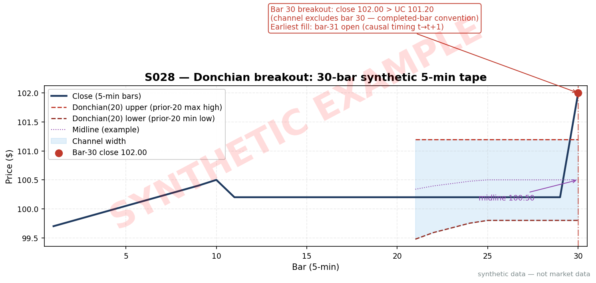

```mermaid
flowchart LR
    FEED["Raw feed<br/>(e.g. Polygon 5-min bars)"] -->|"5-min OHLCV bars"| ING["Ingest + normalize<br/>(tz, corp actions, halts)"]
    ING -->|"5-min bars, cleaned"| FEAT["Feature compute<br/>Donchian(20) prior-bar max/min"]
    FEAT -->|"per-bar channel features (5-min bars)"| SIG["Signal S028<br/>close beyond rail?"]
    SIG -->|"breakout event per completed 5-min bar"| GATE{"Cost / whipsaw<br/>gate?"}
    GATE -->|"pass: order intent (5-min bars)"| OUT["Downstream consumer<br/>(T019 entry; conceptual-fit refs)"]
    GATE -->|"fail: no trade"| DROP["No trade"]
    style SIG fill:#aed6f1,stroke:#1f3a5f
```

### S12. Sources

1. StockCharts ChartSchool — "Price Channels" (Donchian channels): formula, and the completed-bar convention ("the formula doesn't include the most recent period"). https://chartschool.stockcharts.com/table-of-contents/technical-indicators-and-overlays/technical-overlays/price-channels (accessed 2026-09-10).
2. Rayome, D. L. & Jain, A. (2008) — "Do Turtles Have Fat Tails? Donchian Channels and Turtle Trading: The Case of Soybeans," *Journal of the Academy of Finance*, Summer 2008. http://carrels.distantreader.org/journal-journalOfFinanceIssues-ojsoai/cache/jfi-2421.pdf
3. Faith, Curtis M. (2007) — *Way of the Turtle: The Secret Methods that Turned Ordinary People into Legendary Traders*, McGraw-Hill. Documents the Turtle 20-day/55-day Donchian systems and ATR-based sizing.
4. Brock, W., Lakonishok, J. & LeBaron, B. (1992) — "Simple technical trading rules and the stochastic properties of stock returns," *Journal of Finance* 47(5), 1731–1764. https://repository.hkust.edu.hk/ir/bitstream/1783.1-362/1/tech.pdf — Moving-average/breakout rules (including channel breakouts) show forecast power for the DJIA 1897–1986; the benchmark academic test of breakout-style rules.
5. Sullivan, R., Timmermann, A. & White, H. (1999) — "Data-snooping, technical trading rule performance, and the bootstrap," *Journal of Finance* 54(5), 1647–1691. https://econpapers.repec.org/article/blajfinan/v_3a54_3ay_3a1999_3ai_3a5_3ap_3a1647-1691.htm — White's Reality Check over 7,846 rules including channel breakouts: the best rule's profits do not survive data-snooping adjustment out-of-sample — the caution behind the S10 overfitting warnings.
6. Fama, E. F. & Blume, M. E. (1966) — "Filter rules and stock-market trading," *Journal of Business* 39(1), 226–241. https://doi.org/10.1086/294849 — Early evidence that mechanical trading rules (filters, close cousins of breakouts) do not beat buy-and-hold after costs.

**Unverified leads** (chatbot-provided, not independently checkable — do not treat as evidence):
- duck.ai answers Q-SB5-1–Q-SB5-3 (GPT-5.6 Luna, 2026-09-10): the 30-bar worked-example numbers (operator hand-checked, no arithmetic errors); engineering-hour columns for a session-pattern platform (prototype 185–385 h, research-grade 705–1,530 h — column totals verified); evidence framing for intraday Donchian ("reasonable hypothesis, not documented universal intraday alpha").
- A chatbot-cited SSRN study of daily Donchian/ATR on BTC (URL not captured — unverified): reported as positive but highly cost/parameter/regime-sensitive; not evidence of durable intraday US-equity edge.
- A chatbot-cited practitioner article (altrady.com, URL not captured — unverified) identifying range-bound chop as the principal Donchian failure mode.

---
## Stage 29/200 — S029: Keltner / Bollinger breakouts

*Batch SB5 · Signal 29/100 · Provenance [D] · Family B — Intraday Momentum & Breakout*

### S1. One-line verdict

| | |
|---|---|
| **What it is** | Breakout signal when price *closes* outside a volatility envelope: Keltner = EMA (exponential moving average) ± k·ATR (average true range); Bollinger = SMA (simple moving average) ± k·σ (standard deviation of closes). |
| **When it works** | Genuine volatility expansions with directional follow-through; envelopes adapt to the local regime instead of using fixed price levels. |
| **When it dies** | Mean-reverting tapes where band tags get faded; fast markets where the lagging envelope is still catching up. |
| **Build-or-buy in one line** | Build — EMA/ATR/SMA/std on cheap 1–15-minute bars; the only real choice is *which* envelope definition you standardize on. (EMA = exponential moving average; ATR = average true range; SMA = simple moving average; std = standard deviation.) |

Provenance **[D]** (documented: Keltner 1960; Raschke 1980s rework; Bollinger 1980s; Wilder 1978 ATR) · Family **B — Intraday Momentum & Breakout**.

### S2. How it works — plain human explanation

Take the same 10:15 tape as S028. Two different envelopes are drawn around price. The **Keltner channel** (named for Chester Keltner, 1960; modern form popularized by Linda Raschke in the 1980s) centers on an **EMA** — an exponential moving average, which weights recent bars more heavily than old ones — and sets its rails at a multiple of **ATR**, the average true range (the mean per-bar price range including overnight gaps, defined below). The **Bollinger bands** (John Bollinger, 1980s) center on a simple moving average (**SMA** — the plain arithmetic mean) and set their rails at a multiple of **σ** (sigma), the standard deviation of closes — a statistical measure of how spread out recent closes are.

At bar 30, price closes at 102.00. The Keltner upper rail sits at 102.44: *no* close-breakout — only the bar's high (102.50) poked through. The Bollinger upper rail sits at 101.0746: *yes*, a close-breakout. Same bar, same market, two different answers — because Keltner measures volatility with range (ATR) while Bollinger measures it with dispersion of closes (σ), and the two disagree exactly when a single wide bar dominates the window.

The economic idea: a close beyond $k$ standard deviations (or $k$ ATRs) is a tail event under the *local* volatility model — either real information is arriving (trade the expansion, i.e. momentum) or the market just overreacted (fade the tag, i.e. mean reversion; see S041/T014). The envelope itself is direction-agnostic; the *trading rule* layered on top chooses the side. Which is precisely why the worked example's disagreement matters: the "signal" is as much a function of your envelope definition as of the market.

**Mental model:**
- Envelopes are *adaptive rulers*: they rescale the definition of "extreme" to current volatility, unlike fixed-price channels.
- Keltner (range-based) and Bollinger (dispersion-based) are *two different volatility lenses* — they will disagree on wide-range single bars; that disagreement is information about the bar's character.
- A band break is a *volatility event with a sign attached by your rule*, not a verdict from the market.

### S3. The math — exact formula

Let $H_t, L_t, C_t$ be bar $t$'s high, low, close. The **true range** of a bar (Wilder 1978) captures gaps as well as intrabar range:

$$TR_t = \max\big(H_t - L_t,\; |H_t - C_{t-1}|,\; |L_t - C_{t-1}|\big)$$

**ATR** (average true range) smooths it. Two conventions exist and must not be mixed silently: the simple average $ATR_t(N) = \frac{1}{N}\sum_{i} TR_i$ (used in this chapter's worked example), and Wilder's smoothed $ATR_t = \frac{(N-1)\,ATR_{t-1} + TR_t}{N}$.

**Keltner channel** (modern Raschke/StockCharts form; $E_t$ = EMA with $\alpha = 2/(N+1)$, $E_t = \alpha C_t + (1-\alpha)E_{t-1}$):

$$K^{U/L}_t = E_t(N) \;\pm\; m \cdot ATR_t(A)$$

**Bollinger bands** ($\mu_t$ = SMA of closes, $\sigma_t$ = population standard deviation, $k$ = width multiplier):

$$B^{U/L}_t = \mu_t(N) \;\pm\; k \cdot \sigma_t(N)$$

Breakout rule (example — not an institutional standard): long when $C_t > \text{upper}_t$; short when $C_t < \text{lower}_t$; exit on reversion to the midline or a time stop. Causal timing: computed at bar $t$'s close from data $\le t$; tradable no earlier than bar $t+1$'s open.

| Parameter | Symbol | Typical range | Too small | Too large | Default (example) |
|---|---|---|---|---|---|
| Envelope lookback | $N$ | 10–30 bars | Bands hug price; constant tags | Dead-lagging; signals arrive exhausted | 20 *(example — not an institutional standard)* |
| ATR window | $A$ | 10–30 (often = $N$) | Jittery rails | Rails ignore fresh volatility | 20 *(example)* |
| Multiplier | $m$ / $k$ | 1.5–2.5 | Tags on noise | Almost never triggers | 2 *(example)* |

**Normalization choices.** Both envelopes are self-normalizing (volatility-scaled), which is their advantage over fixed channels. For cross-sectional ranking, practitioners often convert the break into a z-like score, e.g. $(C_t - E_t)/ATR_t$ — a volatility-normalized distance from the midline.

**Named variants.** (1) *Original Keltner (1960)*: SMA of **typical price** $(H+L+C)/3$ ± SMA of the plain daily range — no ATR, no EMA, no multiplier. Materially different from the modern form (a measured comparison found ~2.6% median relative difference in the upper band — choosing a variant is choosing a different indicator). (2) *Raschke/StockCharts modern*: EMA ± $m$·ATR, the version used here and in most platforms. (3) *Bollinger %B and bandwidth*: $(C - B^L)/(B^U - B^L)$ locates price inside the bands; bandwidth (see S030) measures their width — both are derived signals, not breakouts.

### S4. Worked example — step-by-step numbers (SYNTHETIC)

Same synthetic 30-bar 5-minute tape as S028, seed 29 (fixed `numpy.random.default_rng(29)`; bars 11–30 hand-specified: bars 11–29 flat at O=100.00/H=100.80/L=99.80/C=100.20, volume 850→670; bar 30: O=100.20/H=102.50/L=100.00/C=102.00, V=2,500). All numbers hand-verified against the operator-checked worked example; **synthetic — not market data — and no performance is claimed.**

**Step 1 — true ranges (bars 11–30).** Bars 11–29: $TR = \max(1.00,\, 0.60,\, 0.40) = 1.00$ each. Bar 30: $TR_{30} = \max(2.50,\, |102.50-100.20|=2.30,\, |100.00-100.20|=0.20) = 2.50$.

**Step 2 — ATR(20), simple average:** $ATR = (19 \times 1.00 + 2.50)/20 = 1.075$.

**Step 3 — Keltner midline:** EMA(20) seeded with the SMA of closes over bars 11–30: $(19 \times 100.20 + 102.00)/20 = 100.29$. (SMA-seeding is an example convenience — production code needs a proper warmup; see S10.)

**Step 4 — Keltner rails:** $100.29 \pm 2 \times 1.075$ → upper **102.44**, lower **98.14**. Verdict: $C_{30} = 102.00 < 102.44$ → **no Keltner close-breakout**; the high (102.50) pierced the rail, but the close did not — a high-through only.

**Step 5 — Bollinger:** $\mu = 100.29$ (same window); deviations $-0.09$ (×19) and $+1.71$; population variance $0.1539$; $\sigma = 0.3923$; bands $100.29 \pm 2(0.3923)$ → upper **101.0746**, lower **99.5054**. Verdict: $C_{30} = 102.00 > 101.0746$ → **Bollinger close-breakout**.

**What to notice.** One bar, two envelopes, opposite verdicts: the wide bar-30 range inflated ATR (range-based) far more than it inflated σ (dispersion-based, 19 of 20 closes identical). This is not a bug — it is the chapter's central lesson: *the breakout is defined by your volatility lens*. A strategy that "trades Bollinger breaks" and one that "trades Keltner breaks" will hold different positions off identical data. Also note the methodology: these windows *include* bar 30, unlike S028's completed-bar Donchian — the mixed-convention pitfall flagged in S10. This toy tape has no fees, no partial fills, no latency.

### S5. Strategies that use this signal

- **T019 — Donchian/Keltner Breakout + Vol Sizing** — primary entry trigger alongside S028; Keltner breaks add the volatility-scaled confirmation leg, sized by the vol-breakout regime (S076).
- **T003 — VPIN-Gated Breakout Trader** — *conceptual-fit reference (not a plan-defined consumer of S029)*: Keltner/Bollinger close-breakouts as breakout-timing candidates, taken only when order-flow toxicity (VPIN — volume-synchronized probability of informed trading) is low; toxicity vetoes the trade.

### S6. Data required — exact spec

| Field | Type | Granularity | Source tier | Notes |
|---|---|---|---|---|
| OHLC (open/high/low/close) bars (high/low required — ATR needs range) | float | 1–15 min bars | Tier 1 | Close-only feeds are insufficient |
| Corporate actions | events | as-occurring | Tier 1 | Unadjusted splits corrupt σ and ATR identically |
| Session calendar | reference | daily | Tier 0/1 | Overnight gaps enter TR via $\|H_t - C_{t-1}\|$ — handle half-days explicitly |

Ingest + feature sketch (Python/polars, ≤20 lines):

```python
import polars as pl
bars = pl.read_parquet("bars_5m/*.parquet").sort(["symbol", "ts"])
N, m = 20, 2.0  # example — not an institutional standard
feat = bars.with_columns([
    pl.max_horizontal(pl.col("high") - pl.col("low"),
        (pl.col("high") - pl.col("close").shift(1).over("symbol")).abs(),
        (pl.col("low") - pl.col("close").shift(1).over("symbol")).abs()).alias("tr"),
    pl.col("close").rolling_mean(N).over("symbol").alias("sma"),
    pl.col("close").rolling_std(N, ddof=0).over("symbol").alias("sd"),
])
sig = feat.with_columns([
    (pl.col("tr").rolling_mean(N).over("symbol")).alias("atr"),
    (pl.col("sma") + 2 * pl.col("sd")).alias("bb_up"),
    (pl.col("sma") - 2 * pl.col("sd")).alias("bb_lo"),
])
# Keltner midline: EMA seeded after warmup; rails = ema ± m*atr
```

**Storage:** ~0.1 MB per symbol-day for 1-min bars in Parquet (500 symbols ≈ 50 MB/day per `notes/cost-model.md` §4); 60 days × 500 symbols ≈ 3 GB. **Data-quality checklist:** high ≥ max(open, close), low ≤ min(open, close) invariants; bad-tick filtering before TR; split-adjustment; warmup bars (≥N) before first valid envelope — no signal on partial windows.

### S7. Local build on M5 Max / 128GB

**Feasibility: trivial.** EMA, SMA, rolling std, and ATR are all O(1)-per-bar streaming updates; a full 500-symbol × 390-bar day recomputes in milliseconds with numpy/polars vectorization (~50–200M elements/sec per `notes/cost-model.md` §2). RAM: 500 symbols × 60 days of 1-min bars ≈ 12 MB (`notes/cost-model.md` §3) vs the ~77 GB working budget. Per the batch's chatbot build review: the machine is not the constraint — point-in-time-correct data, exchange timestamps, and corporate actions are (labeled chatbot lead).

| Stack | When to pick it |
|---|---|
| Python + polars | Default: streaming state per symbol, millisecond 1-min batches |
| Rust | Only for tick-level envelopes across hundreds of symbols in real time |
| DuckDB | Research queries over the Parquet archive |

**Engineering band:** Tier L per `notes/cost-model.md` §5 (1-min bar signals) — **4–12 h ≈ $600–1,800** at $150/hr loaded cost. One line of justification: the math is five rolling statistics; the work is the data-quality layer. **What breaks first at 500 symbols or full OPRA:** nothing at bar granularity; the percentile/squeeze overlay (S030) adds only O(log N) per bar. (OPRA = Options Price Reporting Authority.)

### S8. Buy vs build

| Option | What you get | Indicative price | Buying gains | Buying loses |
|---|---|---|---|---|
| Tier 0: Stooq / Alpaca IEX / delayed quotes | Daily bars, delayed quotes | ~$0 | Free prototyping | No real-time intraday |
| Tier 1: Polygon Stocks Advanced / Alpaca SIP (Securities Information Processor consolidated feed) | Real-time 1–15 min SIP bars, corp actions | ~$30–200/mo | Normalized OHLCV; multi-year history | No venue granularity |
| Tier 2: Databento Standard | MBP-1/10 (market-by-price Level 1/2), futures, OPRA research | ~$200/mo + usage | Exchange timestamps; honest bars-from-trades | Unneeded for envelope breakouts on bars |
| Charting-platform overlays (TradingView etc.) | Pre-built Keltner/Bollinger studies | ~$15–60/mo | Instant visualization | Opaque variant definitions; weak reproducibility |

All prices *indicative — verify before budgeting*. **Verdict: build.** Envelopes are five rolling statistics on cheap bars; the decision that matters — original vs modern Keltner, simple vs Wilder ATR, close vs high-through — is yours to standardize, and no vendor sells you that judgment. Buy the cheapest normalized bar feed that meets latency needs.

### S9. Success ratio / efficacy — documented evidence

| Study / source | Market & period | Metric | Before/after cost | Caveat |
|---|---|---|---|---|
| Keltner (1960), *How to Make Money in Commodities* — "ten-day moving average trading rule": close beyond the band = trend signal | Commodities, 1960s practitioner rule | Rule description; no returns reported | Before-cost (no P&L documented) | Practitioner convention, not a tested strategy |
| Raschke 1980s ATR rework (via TradingView/StockCharts documentation) | Practitioner standard since the 1980s | Widespread adoption as the default envelope | Before-cost (no strategy returns documented) | Popularity ≠ edge; variant confusion is documented (original vs modern differ materially) |

**Regimes where it fails:** low-volatility grinds where tags are faded (the mean-reversion use, S041, is the mirror image); volatility explosions where the lagging envelope is repriced for several bars after the move; correlated triggers — every envelope trader sees the same tag at the same bar.

**Honest bottom line:** as a *standalone intraday trigger*, envelope breakouts inherit S028's verdict — plausible trend-following payoff, no documented universal after-cost alpha; the envelope choice (range- vs dispersion-based, close- vs high-through) moves the trigger more than most parameter tuning. As a *volatility-normalized ruler* feeding sizing, exits, and regime filters, the construction is more defensible than as a raw entry signal.

### S10. Failure modes & pitfalls

- **Mixed bar-inclusion conventions.** S028's Donchian excludes the triggering bar; the Keltner/Bollinger/ATR windows in this chapter's example *include* it. Mixing the two at the same timestamp in one strategy is a live-implementation pitfall: backtest fills assume information only finalized at the bar's close. *Mitigation:* one stated convention per strategy — e.g. all features on completed bars (through $t-1$), signal evaluated on bar $t$, fill at $t+1$ open — and price the fill-timing cost: a forming-bar estimate costs roughly a full bar of slippage versus the close-fill fantasy.
- **EMA seeding / warmup.** Seeding the EMA with an SMA (as the example does) is a convenience; the first ~N bars of any EMA/ATR are contaminated by the seed. *Mitigation:* require ≥N (ideally 2–3×N) warmup bars before arming; never trust backtest P&L from the warmup region.
- **ATR variant mismatch.** Simple-average ATR vs Wilder-smoothed ATR vs EMA-of-TR (some libraries) produce different rails — backtest in one variant, trade in another, and the trigger moves. *Mitigation:* pin the exact smoother in code and in the research log.
- **Close-through vs high-through.** The example shows the two rules disagreeing on the same bar. *Mitigation:* pick one, document it, and never switch mid-research; high-through is earlier but suffers intrabar adverse selection.
- **Lag in fast markets.** Envelopes are moving averages — they lag by construction; in a vertical move the band is repriced *by* the move it was supposed to detect. *Mitigation:* cap the signal's role to confirmation, not discovery, in jump regimes; consider jump filters (S064).
- **Parameter mining across N/m/k.** Three free parameters mine beautifully in-sample. *Mitigation:* fix from session logic (e.g. N = half the RTH (regular trading hours) bar count), validate with purged/embargoed out-of-sample splits (validation splits with near-in-time train/test overlap removed to prevent leakage).
- **Cost blowup on tag clusters.** Bands get tagged repeatedly in choppy tapes. *Mitigation:* cooldown (one signal per N bars), spread + fees + slippage/impact gate per trade.

### S11. Visuals

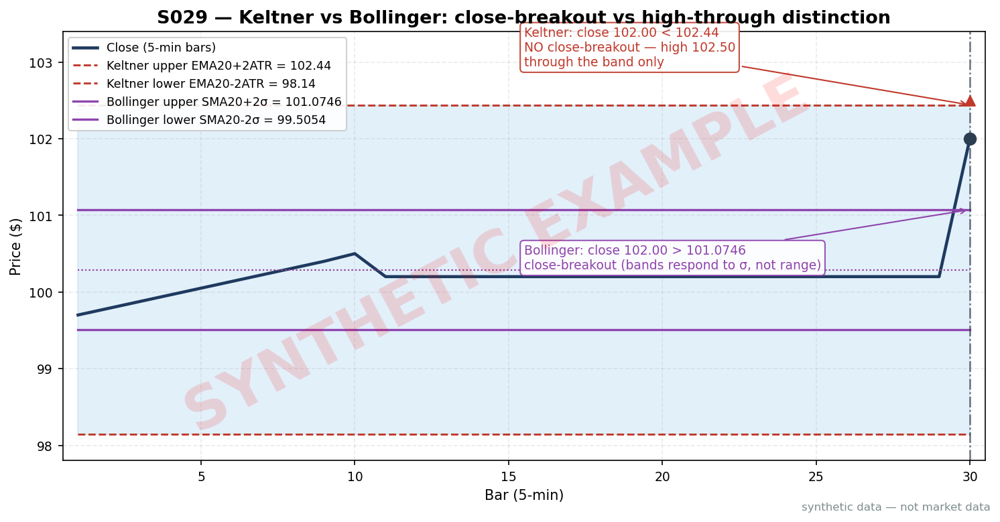

```mermaid
flowchart LR
    FEED["Raw feed<br/>(e.g. Polygon 1–15 min bars)"] -->|"1–15 min OHLC bars"| ING["Ingest + normalize<br/>(tz, corp actions, bad ticks)"]
    ING -->|"1–15 min bars, cleaned"| FEAT["Feature compute<br/>EMA/ATR/SMA/sigma envelopes"]
    FEAT -->|"per-bar envelope features (1–15 min bars)"| SIG["Signal S029<br/>close beyond rail?"]
    SIG -->|"breakout event per completed 1–15 min bar"| GATE{"Cost / toxicity<br/>gate?"}
    GATE -->|"pass: order intent (1–15 min bars)"| OUT["Downstream consumer<br/>(T019 / conceptual-fit refs)"]
    GATE -->|"fail: no trade"| DROP["No trade"]
    style SIG fill:#aed6f1,stroke:#1f3a5f
```

### S12. Sources

1. Keltner, Chester W. (1960) — *How to Make Money in Commodities*. Original "ten-day moving average trading rule": SMA of typical price ± SMA of daily range.
2. Wikipedia — "Keltner channel": documents the original formula and Linda Raschke's 1980s ATR/EMA rework. https://en.wikipedia.org/wiki/Keltner_channel (accessed 2026-09-10).
3. TradingView — "Keltner Channels (KC)" support article: modern calculation (EMA ± 2×ATR) and history. https://www.tradingview.com/support/solutions/43000502266-keltner-channels-kc/ (accessed 2026-09-10).
4. Wilder, J. Welles Jr. (1978) — *New Concepts in Technical Trading Systems*. Defines True Range and Average True Range.
5. ta-lib proposal drafts, issue #41 — "(KC) Keltner Channels": measured comparison showing the 1960 original, StockCharts/Raschke, and pandas-ta variants differ materially (~2.6% median relative upper-band difference). https://github.com/ta-lib/ta-lib-proposal-drafts/issues/41 (accessed 2026-09-10).
6. Bollinger, John (2001) — *Bollinger on Bollinger Bands*, McGraw-Hill. https://www.amazon.com/dp/0071373683 — The canonical reference for the σ-based envelope the Keltner construction is contrasted against in S4 (Bollinger = SMA ± kσ vs Keltner = EMA ± k·ATR).

**Unverified leads** (chatbot-provided, not independently checkable — do not treat as evidence):
- duck.ai answers Q-SB5-1–Q-SB5-3 (GPT-5.6 Luna, 2026-09-10): the 30-bar worked-example numbers (operator hand-checked, no arithmetic errors; the mixed bar-inclusion convention flagged as a methodology caveat, not an arithmetic error); evidence framing for intraday envelope breakouts.

---
## Stage 30/200 — S030: Bollinger bandwidth squeeze → expansion

*Batch SB5 · Signal 30/100 · Provenance [SR] · Family B — Intraday Momentum & Breakout*

### S1. One-line verdict

| | |
|---|---|
| **What it is** | Volatility-*state* timing: when Bollinger bandwidth sits at a low percentile of its history (the "squeeze"), position for the expansion that statistically follows — *direction comes from the subsequent band break, never from the squeeze itself*. |
| **When it works** | Volatility clustering regimes: quiet tapes that resolve into genuine directional expansions with follow-through. |
| **When it dies** | Dead low-liquidity names that compress indefinitely; news-spike fake expansions; any use of the squeeze as a *directional* signal. |
| **Build-or-buy in one line** | Build — bandwidth and a rolling percentile on cheap bars; vendor "squeeze" overlays add opacity, not edge. |

Provenance **[SR]** (standard reconstruction: Bollinger documented the squeeze concept; the percentile-break rule is a practitioner reconstruction — never upgraded to [D]) · Family **B — Intraday Momentum & Breakout**.

### S2. How it works — plain human explanation

Return to the 10:15 tape. For twenty bars, price barely moved: the **Bollinger bandwidth** — bandwidth is simply the distance between the upper and lower Bollinger bands divided by the midline, i.e. how wide the envelope is *relative* to price, expressed as a percentage — drifted between 0.90% and 1.45%, near the lows of its recent history. Then bar 30 erupts: bandwidth jumps to 1.564%, the highest of the last 20 bars (a **percentile** — the percentage of prior readings at or below the current one — of 100%). The quiet period ended. The squeeze framework says: *compression precedes expansion; the expansion has now begun.*

The economic logic is **volatility clustering** — the well-documented tendency of quiet periods to be followed by active ones and vice versa. When bands pinch, the market is in a low-disagreement equilibrium: market makers are comfortable, nobody is being forced to trade. That equilibrium is fragile. A catalyst — news, a large order, a sector move — breaks it, resting liquidity gets consumed, market makers widen quotes, and realized volatility jumps. The squeeze does not predict the catalyst; it identifies the *loaded spring*.

Here is the mandatory honesty, stated plainly: **the squeeze predicts that *something* will happen, not *which direction* it goes.** Bollinger's own rule is "wait for a squeeze and go with the *first breakout*" — the direction comes from the break, confirmed by a separate directional read (band-break side, momentum, order flow). Any presentation of the squeeze as a directional signal is a misrepresentation. As one market commentator put it about a real S&P 500 bandwidth compression to its lowest since June 2021: a larger swing is likely on the horizon — "the question now is which way the market will move" (Reuters, 2026-09-10).

**Mental model:**
- The squeeze is a *volatility-state* indicator, not a *directional* one — it times *when*, never *which way*.
- Bandwidth percentile converts an absolute width ("1.2%") into a regime-relative statement ("tighter than 90% of recent history").
- The tradable object is the *transition* (compression → expansion + confirmed break), not the compression itself.

### S3. The math — exact formula

Bollinger bands as in S029: midline $\mu_t$ (SMA — simple moving average — of closes, window $N$), $\sigma_t$ (population standard deviation), rails $\mu_t \pm k\sigma_t$. **Bandwidth** (Barchart/Trading Technologies convention, ×100 for percent):

$$BW_t = \frac{B^U_t - B^L_t}{\mu_t} = \frac{2k\,\sigma_t}{\mu_t}$$

so with $k=2$, $BW_t = 4\sigma_t/\mu_t$. The **bandwidth percentile** over trailing window $R$ (prior bars only — the current bar is ranked against history, not against itself):

$$P_t = 100 \times \frac{\#\{j \in [t-R,\, t-1] : BW_j \le BW_t\}}{R}$$

**Squeeze** (all parameters example — not an institutional standard): $P_t \le p$, commonly $p \in \{5, 10, 20\}$. **Entry**: on the first close outside the band *in the break direction* after a squeeze — i.e. the squeeze arms the trade, the band break aims it. Causal timing: squeeze state known at bar $t$'s close; expansion entry no earlier than bar $t+1$.

| Parameter | Symbol | Typical range | Too small | Too large | Default (example) |
|---|---|---|---|---|---|
| Band lookback | $N$ | 15–30 bars | Bands chase noise | Squeeze rarely registers | 20 *(example — not an institutional standard)* |
| Band width | $k$ | 1.5–2.5 | Bands inside normal noise | Squeeze never triggers | 2 *(example)* |
| Percentile window | $R$ | 50–250 bars | Percentile flickers | Ancient regimes pollute the ranking | 125 *(example)* |
| Squeeze threshold | $p$ | 5–20% | Almost never "on" | Always "on" — no information | 20 *(example)* |

**Named variants.** (1) *Bollinger's "simple" squeeze*: current bandwidth at its 6-month minimum (the default he taught). (2) *Bollinger's "complicated" squeeze*: plot the 20-day standard deviation, then 125-day 1.5-σ Bollinger bands *of that standard deviation* — a squeeze triggers when the 20-day σ tags the lower band (Bollinger 2001, p.194). (3) *TTM Squeeze* (TTM — "Trade The Markets," John Carter's firm — via StockCharts): squeeze "on" when **both** Bollinger bands (20, 2σ) sit *inside* the Keltner channels (20-period, 1.5× ATR — average true range; using Keltner's *original 1960* formula, per StockCharts' note), plus a momentum histogram that supplies the missing directional read. TTM is a vendor overlay — reproducible from the published construction, but a black box if bought as a study.

### S4. Worked example — step-by-step numbers (SYNTHETIC)

Synthetic 30-bar bandwidth series, seed 30 (fixed `numpy.random.default_rng(30)`). Prior-20 bandwidth values (bars 10–29) compress from 0.90% to 1.45% (supplied example conveniences, disclosed); bar 30 is the expansion bar. All numbers hand-verified against the operator-checked worked example; **synthetic — not market data — and no performance is claimed.**

| Bar | Bandwidth | Percentile (trailing 20) | State |
|-----|-----------|--------------------------|-------|
| 26 | 1.30% | 100% (rising window) | Expansion underway |
| 27 | 1.36% | 100% | Expansion underway |
| 28 | 1.40% | 100% | Expansion underway |
| 29 | 1.45% | 100% | Expansion underway |
| 30 | **1.564%** | **100%** | **Expansion bar — NOT a squeeze** |

**Step 1 — bandwidth at bar 30:** from the S029 Bollinger computation, $BW_{30} = 4 \times 0.3923 / 100.29 = 0.01564 = 1.564\%$.

**Step 2 — percentile:** all 20 prior values (0.90%…1.45%) are ≤ 1.564%, so $P_{30} = 100 \times 20/20 = 100\%$.

**Step 3 — squeeze test:** with the example threshold $p = 20\%$, $100\% \not\le 20\%$ → **no squeeze at bar 30**. This is the expansion *after* compression — the spring has already released.

**Step 4 — what a squeeze entry would have looked like:** the compression phase (bars 10–20, bandwidth near its local lows) is where $P_t \le 20\%$ would have armed the signal; the profitable question was never "will volatility expand" (it did — 0.90% → 1.564%) but "in which direction, and after costs." The bar-30 close above the Bollinger upper band (101.0746, from S029) is the directional leg: *squeeze armed it, the band break aimed it.*

**What to notice.** Percentile needs $R$ prior bars — with $R=20$ the first valid reading here is bar 21, so squeeze states are always *late by construction*: the indicator confirms compression after it has persisted. Combined with the bar-$t+1$ fill rule, a squeeze system enters expansions, not compressions — anyone describing it as "buying the quiet" is misreading their own indicator. This toy series has no fees and no direction embedded: it demonstrates the *computation*, and specifically the fact that the computation alone yields no directional call.

### S5. Strategies that use this signal

- **T094 — Squeeze Breakout (Options-Confirmed)** — primary trigger: Bollinger squeeze breakouts confirmed by unusual options activity and vol expansion (S076).
- **T014 — Bollinger Reversal + Squeeze Exit** — squeeze as timing/exit filter: covers reversal positions into bandwidth-squeeze expansions and vol breakouts.
- **T061 — Initial-Balance Expansion Trader** — squeeze as confirmation filter: first-hour range breaks confirmed by squeeze state and relative volume.

### S6. Data required — exact spec

| Field | Type | Granularity | Source tier | Notes |
|---|---|---|---|---|
| OHLC (open/high/low/close) bars | float | 1–15 min or daily | Tier 0/1 | Daily bars suffice for the 6-month-minimum variant |
| Corporate actions | events | as-occurring | Tier 1 | Splits corrupt σ and hence bandwidth |
| Session calendar | reference | daily | Tier 0 | Percentile windows must span comparable regimes |

Ingest + feature sketch (Python/polars, ≤20 lines):

```python
import polars as pl
bars = pl.read_parquet("bars_15m/*.parquet").sort(["symbol", "ts"])
N, k, R, p = 20, 2.0, 125, 20  # example — not an institutional standard
feat = bars.with_columns([
    pl.col("close").rolling_mean(N).over("symbol").alias("sma"),
    pl.col("close").rolling_std(N, ddof=0).over("symbol").alias("sd"),
]).with_columns([
    ((4 * pl.col("sd")) / pl.col("sma")).alias("bw"),  # k=2 -> 4*sd/sma
]).with_columns([
    pl.col("bw").rolling_map(lambda s: (s[:-1] <= s[-1]).mean() * 100,
                             window_size=R + 1).over("symbol").alias("bw_pct"),
    (pl.col("bw_pct") <= p).alias("squeeze"),
])
```

**Storage:** ~0.1 MB per symbol-day for 1-min bars in Parquet (500 symbols ≈ 50 MB/day per `notes/cost-model.md` §4); daily bars are negligible. **Data-quality checklist:** percentile needs $R$ valid prior bars — no squeeze state during warmup; bandwidth is meaningless across corporate actions; compare like-with-like regimes (don't rank today's 5-min bandwidth against last month's daily bandwidth).

### S7. Local build on M5 Max / 128GB

**Feasibility: trivial.** Bandwidth is arithmetic on the S029 features; the rolling percentile is O($R$) per bar naive or O(log $R$) with an order-statistic tree — at $R=125$ and 500 symbols × 390 bars/day, even the naive version is microseconds per bar. Throughput and RAM are the S029 story verbatim: milliseconds per full-universe recompute, ~12 MB for 500 symbols × 60 days of 1-min bars (`notes/cost-model.md` §2/§3). The machine is not the constraint; point-in-time correctness of the bandwidth history is (labeled chatbot lead).

| Stack | When to pick it |
|---|---|
| Python + polars | Default: rolling statistics plus percentile in one pipeline |
| Rust | Unneeded at bar granularity |
| DuckDB | Research queries over the Parquet archive |

**Engineering band:** Tier L per `notes/cost-model.md` §5 — **4–12 h ≈ $600–1,800** at $150/hr loaded cost. **What breaks first at 500 symbols or full OPRA (Options Price Reporting Authority):** nothing new — the percentile state per symbol is one small ring buffer; full OPRA only matters if you confirm squeezes with options flow (T094), which is a separate Tier-H project.

### S8. Buy vs build

| Option | What you get | Indicative price | Buying gains | Buying loses |
|---|---|---|---|---|
| Tier 0: Stooq / Alpaca IEX | Daily bars | ~$0 | Enough for the 6-month-minimum squeeze variant | No intraday |
| Tier 1: Polygon / Alpaca SIP (Securities Information Processor consolidated feed) | Real-time 1–15 min bars | ~$30–200/mo | Clean intraday bandwidth series | Nothing material |
| Vendor overlay: TTM Squeeze study (charting platforms) | Pre-built squeeze dots + momentum | ~$15–60/mo platform fee | Instant visualization | Opaque parameters; weak audit trail; the momentum histogram's construction is the actual edge, and you can't inspect it |
| Tier 2: Databento | Normalized bars, imbalance feeds | ~$200/mo + usage | Research-grade history | Overkill for bandwidth math |

All prices *indicative — verify before budgeting*. **Verdict: build.** Bandwidth is one division; the percentile is one rolling rank. Buy the cheapest bar feed that covers your timeframe — and build the indicator yourself, because the squeeze threshold $p$ and window $R$ *are* the strategy, and a vendor will not let you audit theirs.

### S9. Success ratio / efficacy — documented evidence

| Study / source | Market & period | Metric | Before/after cost | Caveat |
|---|---|---|---|---|
| Bollinger (2001), *Bollinger on Bollinger Bands* — squeeze as lowest-volatility regime; "wait for a squeeze and go with the first breakout" | Practitioner framework, multi-market | Timing rule description; no strategy returns reported | Before-cost (no P&L documented) | The rule is volatility-timing, explicitly not a directional edge |
| Reuters / LSEG market technicals (2026-09-10) — S&P 500 Bollinger Bandwidth compressed to lowest since June 2021; prior extreme followed by ~4% rally over 16 sessions | US large-cap, Aug–Sep 2026 | Observed volatility compression → subsequent swing; direction explicitly "unclear" beforehand | Observational (no strategy P&L; before-cost) | Single anecdote, not a backtest; illustrates exactly the direction-neutrality point |

**Regimes where it fails:** dead low-liquidity names where bandwidth sits at "squeeze" levels for months with no expansion; news-spike expansions that reverse within the bar (expansion without follow-through); breaks against the higher-timeframe trend; correlated triggers — every squeeze trader arming the same bar.

**Honest bottom line:** as a *volatility-state timer* the squeeze is the most defensible of the three SB5 chapters — volatility clustering is real and compression-then-expansion is its visible signature. As a *directional edge* it is nothing: the squeeze must be paired with a confirmed break (and ideally a directional filter) and evaluated on **risk-adjusted after-cost returns**, not on whether realized volatility subsequently rose. A system that "predicts" the expansion but loses money trading it has measured meteorology, not alpha.

### S10. Failure modes & pitfalls

- **The direction illusion.** Treating the squeeze itself as a buy/sell signal. It is not — compression resolves up or down with roughly the market's base rates. *Mitigation:* the strategy may only enter on the *confirmed band break* (or a separate directional filter); backtest the squeeze leg and the direction leg separately.
- **Squeeze defined after the move.** Percentile needs $R$ prior bars and the entry needs the break — by the time all conditions are true, part of the expansion is consumed. *Mitigation:* measure entry delay explicitly (bars from percentile trough to fill); size for the *remaining* move, not the full expansion.
- **Mixed bar-inclusion conventions.** Bandwidth/σ windows that include the forming bar, ranked against percentiles of completed bars, mix information sets at one timestamp — the same live-implementation pitfall as S028/S029. *Mitigation:* one stated convention (completed-bar features through $t-1$, signal on bar $t$, fill at $t+1$) and an explicit fill-timing cost.
- **Permanent compression in dead names.** Illiquid stocks show "squeeze" bandwidth for months; the spring never releases because there is no spring. *Mitigation:* minimum ADV (average daily volume) and spread screens; require the expansion to actually begin (band break) rather than betting on compression alone.
- **News-spike fake expansions.** A one-bar volatility spike prints percentile 100% with no follow-through. *Mitigation:* require expansion persistence (e.g. 2–3 bars) or volume/imbalance confirmation before committing.
- **Threshold mining.** $p \in \{5,10,20\}$, $R \in \{50,\dots,250\}$ — a large grid that will always yield a "best" backtest. *Mitigation:* fix $p, R$ from the trading horizon's logic; validate out-of-sample with purged/embargoed splits (validation splits with near-in-time train/test overlap removed to prevent leakage).
- **Correlated triggers and crowding.** Squeeze breakouts are visible to every technician watching the same bands. *Mitigation:* expect slippage at the obvious break bar; consider entering on the retest rather than the break. Model the full round-trip stack (spread + fees + slippage/impact) per trade and require the post-break expected move to clear 2–3× that cost before arming.

### S11. Visuals

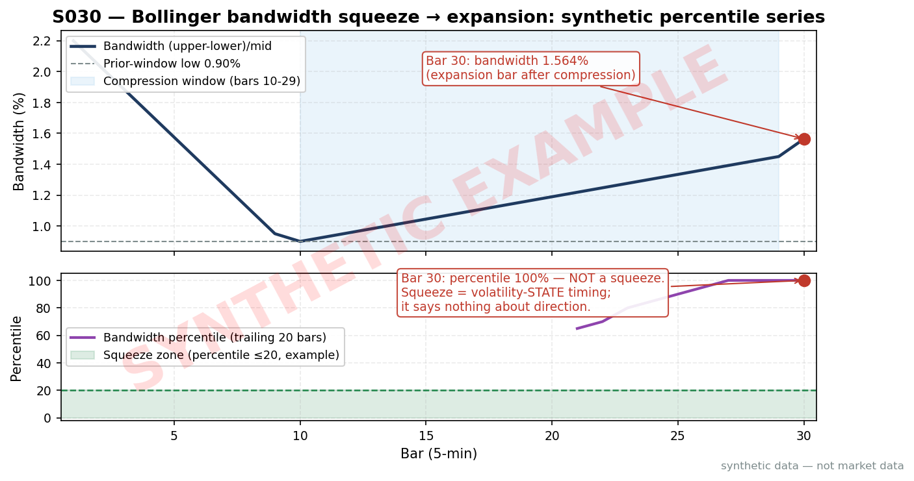

```mermaid
flowchart LR
    FEED["Raw feed<br/>(e.g. Polygon 1–15 min bars)"] -->|"1–15 min OHLC bars"| ING["Ingest + normalize<br/>(tz, corp actions, warmup)"]
    ING -->|"1–15 min bars, cleaned"| FEAT["Feature compute<br/>Bollinger bandwidth + percentile"]
    FEAT -->|"per-bar bandwidth percentile (1–15 min bars)"| SIG["Signal S030<br/>squeeze state (vol timing only)"]
    SIG -->|"squeeze state per completed 1–15 min bar"| GATE{"Band break +\ncost gate?"}
    GATE -->|"pass: directional entry intent (1–15 min bars)"| OUT["Downstream consumer<br/>(T094 / T014 / T061)"]
    GATE -->|"fail: no trade"| DROP["No trade"]
    style SIG fill:#aed6f1,stroke:#1f3a5f
```

### S12. Sources

1. Bollinger, John (2001) — *Bollinger on Bollinger Bands*, McGraw-Hill. The squeeze concept: lowest-volatility regime (simple: 6-month bandwidth minimum; complicated: 20-day σ vs 125-day 1.5-σ bands of σ, p.194) and the "wait for a squeeze and go with the first breakout" rule.
2. Barchart — "Bollinger BandWidth": formula $((\text{Upper} - \text{Lower}) / \text{Middle}) \times 100$ and the squeeze theory ("periods of low volatility are followed by periods of high volatility… can foreshadow a significant advance or decline" — direction-neutral). https://Www.Barchart.com/education/technical-indicators/bollinger_squeeze (accessed 2026-09-10).
3. StockCharts ChartSchool — "TTM Squeeze": Carter's construction (Bollinger 20/2 inside Keltner 20/1.5, original 1960 Keltner formula) plus the momentum histogram that supplies the directional read the squeeze itself lacks. https://chartschool.stockcharts.com/table-of-contents/technical-indicators-and-overlays/technical-indicators/ttm-squeeze (accessed 2026-09-10).
4. Trading Technologies — "Bollinger Bandwidth": formula and configuration reference. https://library.tradingtechnologies.com/trade/chrt-ti-bollinger-bandwidth.html (accessed 2026-09-10).
5. Reuters (2026-09-10) — "Mapping the Market: S&P 500 may be ready to break out after quiet period": bandwidth compressed to lowest since June 2021; "the question now is which way the market will move." https://www.reuters.com/markets/us/global-markets-technicals-2026-09-10/ (accessed 2026-09-10).
6. Andersen, T. G., Bollerslev, T., Diebold, F. X. & Labys, P. (2003) — "Modeling and forecasting realized volatility," *Econometrica* 71(2), 579–625. https://www.kellogg.northwestern.edu/academics-research/research/detail/2003/modeling-and-forecasting-realized-volatility/ — Realized-volatility long-memory framework behind the volatility-clustering mechanism the squeeze exploits (compression-then-expansion as the visible signature of clustered volatility).

**Unverified leads** (chatbot-provided, not independently checkable — do not treat as evidence):
- duck.ai answers Q-SB5-1–Q-SB5-3 (GPT-5.6 Luna, 2026-09-10): the 30-bar worked-example numbers (operator hand-checked, no arithmetic errors; bar-30 percentile 100% = expansion after compression, NOT a squeeze); the mandatory framing that the squeeze is volatility-state timing and the testable question is risk-adjusted after-cost returns vs merely predicting realized-vol increase.

---
## Stage 31/200 — S031: Consecutive-bar streaks (runs)

*Batch SB5 · Signal 31/100 · Provenance [SR] · Family B — Intraday Momentum & Breakout*

### S1. One-line verdict

| What it is | When it works | When it dies | Build-or-buy in one line |
|---|---|---|---|
| Counts consecutive same-sign bar returns; trades continuation at streak ≥ k₁ (*example*) or fades exhaustion at streak ≥ k₂ with range/volume confirmation | Strong intraday trends, news-driven drifts, momentum regimes with persistent order flow | Chop, mean-reverting tapes, low-volume grinds where every "streak" is noise | Build: 20 lines of code on any bar feed; nothing to buy |

Provenance: **[SR]** (standard reconstruction — the streak recursion is textbook; thresholds are implementation examples, not institutional standards). Family B — Intraday Momentum & Breakout.

### S2. How it works — plain human explanation

A *streak* (also called a *run*) is simply a count: how many consecutive bars closed in the same direction? At 10:23, a trader watching XYZ sees the last five 5-minute bars all close higher. That is a streak of 5. The signal asks the oldest question in technical trading — Cowles and Jones (1937) were counting exactly these sequences and reversals on stock prices nearly a century ago: does a rise tend to follow a rise?

Economically, two opposite stories both plausibly generate streaks, and the signal deliberately plays both. The **continuation** story is order-flow persistence: institutional flow arrives in waves (a fund working a large buy order prints a sequence of up bars), and herding plus stop-running extends the move — the micro-mechanism behind intraday time-series momentum. The **exhaustion** story is positioning: after six or seven consecutive up bars the marginal buyer is spent, market makers are long and skewing quotes down, and any pause triggers profit-taking — so extreme streaks *fade*.

The practical art is the split: moderate streaks (3–5 bars, *example*) ride; extreme streaks (6+, *example*) fade, ideally confirmed by a range expansion or a volume climax that says "everyone is already in."

**Mental model:**
- A streak is a *coarse, robust* momentum proxy: no parameters to overfit beyond two integer thresholds, computable in O(1) per bar.
- Direction and regime decide the trade: streaks *continue* when flow is institutional and news-backed; they *exhaust* when the move is retail-chased and volume climaxes.
- The signal's real value is as a *trigger with a built-in flip*: ride the run, then fade it when it gets absurd.

### S3. The math — exact formula

Let $r_t = \ln(C_t / C_{t-1})$ be the bar-$t$ log return on closes $C_t$, and define the sign $s_t = \mathrm{sign}(r_t) \in \{+1, -1\}$ (zero returns, *unchanged* bars, are treated as breaking the streak — a live-implementation choice that must be fixed and documented). The streak counter is the recursion:

$$S_t = \begin{cases} S_{t-1} + 1, & s_t = s_{t-1} \\ 1, & s_t \neq s_{t-1} \end{cases} \qquad S_1 = 1$$

The direction of the streak is $s_t$. The two-sided trading rule (*thresholds are examples — not institutional standards*):

$$\text{Continuation: enter with } s_t \text{ when } S_t \ge k_1 \quad\text{(e.g. } k_1 = 3\text{)}$$
$$\text{Exhaustion fade: enter against } s_t \text{ when } S_t \ge k_2 \text{ AND range/volume filter passes} \quad\text{(e.g. } k_2 = 6\text{)}$$

| Parameter | Symbol | Typical range | Too small | Too large | Default (*example*) |
|---|---|---|---|---|---|
| Continuation threshold | $k_1$ | 2–5 bars | Fires on noise; whipsawed by 2-bar wiggles | Never fires; misses the move | 3 |
| Exhaustion threshold | $k_2$ | 5–9 bars | Fades healthy trends mid-run | Only catches once-a-month extremes | 6 |
| Bar grid | — | 1–15 min | Microstructure noise dominates | Signal too slow for intraday | 5-min |
| Zero-return rule | — | break / carry / ignore | (implementation choice — backtest and live must match) | — | break streak |

**Causal timing:** $S_t$ is computed at the close of bar $t$ using only data $\le t$; the earliest tradable fill is the open of bar $t+1$. Entering *inside* bar $t$ on a developing streak is a look-ahead violation (the bar's sign isn't known until it closes).

**Normalization:** streaks are usually raw counts, but a calibrated variant normalizes by the expected streak length under a Bernoulli sign model: under iid signs with up-probability $p$, $P(S \ge k) = p^{k-1}$ for an up-streak — so a 6-bar up-streak with $p = 0.52$ has probability $0.52^5 \approx 3.8\%$, i.e. genuinely unusual. Rank/z normalization across the universe is a cross-sectional variant.

**Named variants:**
1. **Close-sign streaks** (above) vs **range streaks** (consecutive higher highs / lower lows) — range streaks are stricter and rarer.
2. **Volume streaks** — consecutive bars with rising volume in the streak direction; used as the exhaustion *confirmation* (a volume climax at $S_t \ge k_2$).
3. **Above-VWAP streaks** — consecutive bars closing above session VWAP (volume-weighted average price); a trend-quality overlay rather than a pure sign run.

### S4. Worked example — step-by-step numbers (SYNTHETIC)

Synthetic 12-bar 5-minute tape, seed **31**. Prices are hand-designed so the streak pattern is exact; volume jitter comes from `numpy.default_rng(31)`. Zero returns break the streak. This is synthetic data — not market data — and the chart plots exactly these numbers.

| bar | O | H | L | C | vol | sign($r_t$) | $S_t$ | action (*example* thresholds $k_1{=}3$, $k_2{=}6$) |
|---|---|---|---|---|---|---|---|---|
| 1 | 99.95 | 100.03 | 99.92 | 100.00 | 1129 | +1 | 1 | — |
| 2 | 100.00 | 100.18 | 99.97 | 100.15 | 1320 | +1 | 2 | — |
| 3 | 100.15 | 100.35 | 100.12 | 100.32 | 1358 | +1 | 3 | continuation LONG |
| 4 | 100.32 | 100.47 | 100.29 | 100.44 | 1393 | +1 | 4 | continuation LONG |
| 5 | 100.44 | 100.64 | 100.41 | 100.61 | 1614 | +1 | 5 | continuation LONG |
| 6 | 100.61 | 100.82 | 100.58 | 100.79 | 1754 | +1 | 6 | continuation LONG **+ EXHAUSTION fade** |
| 7 | 100.79 | 100.82 | 100.68 | 100.71 | 1035 | −1 | 1 | — |
| 8 | 100.71 | 100.74 | 100.57 | 100.60 | 1234 | −1 | 2 | — |
| 9 | 100.60 | 100.63 | 100.52 | 100.55 | 1330 | −1 | 3 | continuation SHORT |
| 10 | 100.55 | 100.69 | 100.52 | 100.66 | 1155 | +1 | 1 | — |
| 11 | 100.66 | 100.83 | 100.63 | 100.80 | 1279 | +1 | 2 | — |
| 12 | 100.80 | 100.98 | 100.77 | 100.95 | 1267 | +1 | 3 | continuation LONG |

Step-by-step: bar 1's return is measured vs the prior close $C_0 = 99.95$ ($r_1 = \ln(100.00/99.95) > 0$, sign +1, $S_1 = 1$). Each subsequent bar: same sign as the prior bar increments the counter, a flipped sign resets to 1. At bar 3's close $S_3 = 3 \ge k_1$ → continuation long, fillable at bar 4's open (100.32). At bar 6, $S_6 = 6 \ge k_2$ with volume at its tape maximum (1754 shares vs 1129 at bar 1) → the exhaustion flip fires: the strategy would flatten/reverse the long into bar 7's open (100.79). Note the payoff logic: entering at bar 4's open (100.32) and flipping at bar 7's open (100.79) captures +0.47 before costs; entering at bar 3's signal but filling late erodes it — the causal-timing rule is the whole game.

**What to notice:** the volume profile confirms the economics — volume builds through the up-run (institutional participation) and collapses at bar 7. This toy tape has no fees, no spread, and a conveniently clean reversal; in live tapes most $k_2$ hits just consolidate sideways and the fade bleeds on spread. Nothing here is a performance claim.

### S5. Strategies that use this signal

- **T062 — Streak Runner with Exhaustion Flip** — *primary entry trigger (direction)*: rides the $S_t \ge k_1$ continuation leg; *exhaustion filter/flip*: reverses at $S_t \ge k_2$ with range/volume confirmation. This is the signal's home strategy — the chapter's continuation/fade duality maps 1:1 onto T062's two legs.
- No other strategy in the plan's T001–T100 list consumes S031 directly; the natural secondary consumers are regime-gated momentum books (S031 as a trend-quality filter), which the plan does not define — so this chapter claims exactly one T-consumer and does not invent one.

### S6. Data required — exact spec

| Field | Type | Granularity | Source tier | Notes |
|---|---|---|---|---|
| Open, high, low, close | float | 1–15 min bars | Tier 0–1 | Any OHLCV vendor; consolidated SIP (Securities Information Processor — the consolidated feed) is fine |
| Volume | int | same bars | Tier 0–1 | Needed for the exhaustion volume filter |
| Corporate actions / splits | reference | event | Tier 0–1 | Unadjusted splits fabricate sign flips |
| Halt / session calendar | reference | event | Tier 0–1 | Overnight gaps must not continue the streak |

Ingest loop (Python/polars sketch, ≤20 lines):

```python
import polars as pl
bars = pl.read_parquet("bars_1m/*.parquet")          # O,H,L,C,volume,ts,symbol
bars = (bars.sort(["symbol","ts"])
            .with_columns(r = pl.col("C").log() - pl.col("C").log().shift(1).over("symbol"))
            .with_columns(sign = pl.when(pl.col("r")>0).then(1)
                                    .when(pl.col("r")<0).then(-1).otherwise(0))
            .with_columns(sign_chg = (pl.col("sign") != pl.col("sign").shift(1).over("symbol")).cast(pl.Int64))
            .with_columns(run_id = pl.col("sign_chg").cum_sum().over("symbol"))
            .with_columns(streak = pl.int_range(pl.len()).over("symbol", "run_id") + 1))
```

Storage: 1-min bars are tiny — per `notes/cost-model.md` §4, 500 symbols ≈ 50 MB/day in Parquet (≈0.1 MB per symbol-day); a 60-day single-symbol research set is a few MB. Archive freely.

Data-quality checklist: timestamp normalization (exchange vs vendor receipt), split/dividend adjustment before sign computation, half-days and DST transitions, halted symbols (freeze the streak, don't carry it across the halt), stale prints on illiquid names.

### S7. Local build on M5 Max / 128GB

**Feasibility: trivial.** A streak counter is O(1) integer state per symbol per bar. Per cost-model §2, even a pure-Python loop handles ~100–500k events/sec and 500 symbols × 1 bar/min is 8.33 bars/sec average — roughly five orders of magnitude below the Python ceiling; polars column ops run at ~10–50M rows/sec, so a full 60-day recompute over 500 symbols (11.7M rows) finishes in about a second. Bottleneck: none on compute; the only real work is the data-quality layer (splits, halts, timestamps).

Stack: **Python+polars** — pick it; nothing here justifies Rust (no L2 (full depth-of-book)/MBO (market-by-order) event rates). DuckDB only if you want SQL access to the bar archive.

RAM: per cost-model §3, 500 symbols × 60 days of 1-min bars ≈ 12 MB — trivial against the 77 GB working budget.

Engineering: **Tier L, 4–12 h** (cost-model §5) → **$600–1,800** at the $150/hr loaded-cost estimate. One line of justification: bar ingestion + streak recursion + two thresholds is an afternoon's work; the remaining hours are the split/halt hygiene and a point-in-time replay check.

What breaks first at 500 symbols or full OPRA (Options Price Reporting Authority): nothing — this signal doesn't touch options or depth; scaling to the full US universe is still a bars problem, trivial.

### S8. Buy vs build

| Option | What you get | Indicative price | What buying gains | What buying loses |
|---|---|---|---|---|
| Tier-0 free (Stooq delayed, Alpaca IEX) | Daily/15-min bars | ~$0 — *indicative, verify before budgeting* | $0 data for research | Coarse granularity; no 1-min history depth |
| Tier-1 retail (Polygon Stocks Advanced, Alpaca SIP) | 1-min + real-time SIP bars, corporate actions | ~$30–200/mo — *indicative, verify before budgeting* | Clean adjusted bars, full history | Nothing material for this signal |
| Tier-2 professional (Databento) | Normalized OHLCV + venue detail | ~$200/mo + usage — *indicative, verify before budgeting* | Venue-stamped bars if you later care about venue effects | Overkill for close-sign streaks |
| Academic route (CRSP — Center for Research in Security Prices — / TAQ — Trade and Quote, the consolidated equity tick database — via WRDS (Wharton Research Data Services)) | Publication-grade history | institutional — *indicative, verify before budgeting* | Reproducible research archive | Cost and access friction for zero analytic gain |

**Verdict: build.** The signal is ~20 lines on any bar feed; there is no vendor product that adds value beyond the raw bars. Buy Tier-1 bars only because you need reliable 1-min history anyway — the crossover point is "you need more than delayed daily bars," which any serious intraday book already has.

### S9. Success ratio / efficacy — documented evidence

| Study / source | Market & period | Metric | Before/after cost | Caveat |
|---|---|---|---|---|
| Cowles & Jones (1937), "Some a posteriori probabilities in stock market action" | US stocks, historical to 1930s | Sequence-to-reversal ratio deviating from the random-walk null | Before-cost (informational — a statistical regularity, not a P&L) | Daily data from the 1930s; documents that sign sequences carry structure, not that a 5-min streak rule earns money |
| Heston, Korajczyk & Sadka (2010), "Intraday patterns in the cross-section of stock returns", *J. Finance* | US stocks, post-decimalization, half-hour bars | Return continuation at exact multiples of a trading day, persisting ≥40 trading days; timing trades can save ≈ the effective spread | Execution-benefit framing (≈ spread saved); not a standalone after-cost alpha | Cross-sectional portfolio effect, not a per-name streak trigger; the "saving" is a cost reduction, not a return |
| Haendler, Heston, Korajczyk & Sadka (2025), "The intra-day stock return periodicity puzzle" (out-of-sample follow-up) | US stocks, extended sample | Open/midday periodicity fully explained by institutional trading proxies (VWAP-like, MOC — market-on-close); up to 30% of close periodicity | Before-cost (explanatory, not a trading P&L) | Confirms the institutional-flow mechanism behind intraday continuation — supports the continuation story, not a parameter set |

Regimes where it fails: volatility spikes (streaks form and reverse inside one bar — the counter is always one bar late), low-liquidity names (streaks are just wide spreads bouncing), crowded momentum unwinds (every streak system flips the same way). Documented decay: the raw continuation leg is the classic short-horizon momentum that has been arbitraged down for decades; what survives is the *calibration* (which streaks, which names, which volume profile).

**Honest bottom line:** as a standalone trigger this is a *weak, largely undocumented-after-cost* edge — no public study shows a retail 5-minute streak rule surviving spread and fees. As a *calibrated trigger-plus-flip inside T062*, it is a *reasonable structural component*: the value is in the regime logic around the counter, not the counter itself.

### S10. Failure modes & pitfalls

1. **Look-ahead leakage** — entering on a developing bar before its sign is fixed. *Mitigation:* compute at bar close, trade at next bar's open; enforce in replay with bar-completion flags.
2. **Stale/latency effects** — on a delayed feed the "streak" you see is one bar behind the market's. *Mitigation:* timestamp everything at bar publication; paper-trade on the same delayed feed you backtest on.
3. **Crowding / alpha decay** — streak-chasing is the most retail-obvious rule in existence; the continuation leg decays first. *Mitigation:* keep thresholds adaptive (percentile of recent streak distribution, not fixed integers) and gate on volume/flow quality.
4. **Cost blowup** — a 5-bar streak on a 1-min grid can mean 20+ round trips a day; spread alone eats a 2–3 bps (basis points, 1 bp = 0.01%) edge. *Mitigation:* model half-spread + fees + slippage/impact per trade in the trigger test; require expected move > 3× cost.
5. **Regime breaks** — streaks continue in trends and mean-revert in ranges; a fixed $k_1/k_2$ can't tell them apart. *Mitigation:* regime-gate with a vol-regime or trend filter (e.g. only ride streaks with the day's VWAP trend).
6. **Overfitting / parameter mining** — two integer thresholds on one symbol will always "work" in-sample. *Mitigation:* fix $k_1, k_2$ on a calibration universe, validate on untouched symbols and out-of-sample years; prefer the Bernoulli-probability normalization over raw counts.
7. **Data errors** — unadjusted splits print a −50% "bar" that resets every streak and fabricates signals. *Mitigation:* adjust before sign computation; assert no $|r_t| > 20\%$ without a corporate-action record.
8. **Microstructure noise vs signal** — on 1-min bars, bid-ask bounce alone manufactures alternating signs that mask real streaks. *Mitigation:* use 5-min+ grids or mid-price bars for illiquid names.

### S11. Visuals

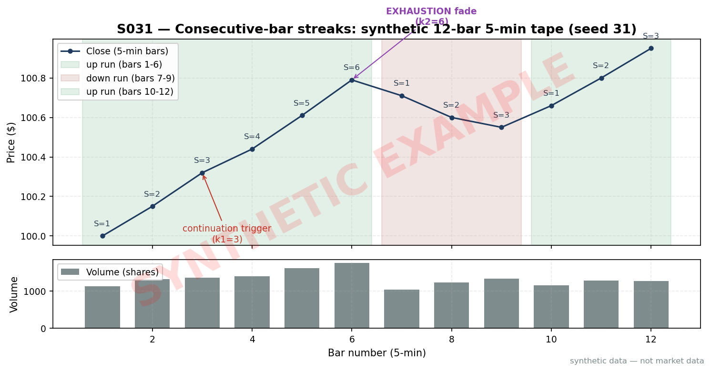

```mermaid
flowchart LR
    FEED["Raw feed<br/>(1-min OHLCV bars)"] -->|"1-min bars"| ING["Ingest + normalize<br/>(exchange ts, splits, halts)"]
    ING -->|"clean 1-min bars"| FEAT["Feature compute<br/>(bar signs, streak counter)"]
    FEAT -->|"streak S_t, direction (1-min bars)"| SIG["Signal S031<br/>continuation / exhaustion"]
    SIG -->|"signal (1-min bars)"| GATE{"Cost / toxicity<br/>gate?"}
    GATE -->|pass| OUT["Downstream consumer<br/>(T062 Streak Runner)"]
    GATE -->|fail| DROP["No trade"]
    style SIG fill:#aed6f1,stroke:#1f3a5f
```

### S12. Sources

- Cowles, A. & Jones, H.E. (1937). *Some a posteriori probabilities in stock market action.* Econometrica 5(4). PDF: https://www.ploymarket.com/proxy/https/cowles.yale.edu/sites/default/files/2022-08/cowles-posteriori37.pdf
- *The Cowles–Jones test with unspecified upward market probability.* Data Science in Finance and Economics, 3(4), 324–336 (2023). PDF: http://aimspress.com/aimspress-data/dsfe/2023/4/PDF/DSFE-03-04-019.pdf
- Heston, S.L., Korajczyk, R.A. & Sadka, R. (2010). *Intraday patterns in the cross-section of stock returns.* Journal of Finance 65(4), 1369–1407. PDF: https://bauer.uh.edu/departments/finance/documents/Heston-Korajczyk-Sadka-jf-2010-01-07.pdf
- Haendler, C., Heston, S., Korajczyk, R. & Sadka, R. (2025). *The intra-day stock return periodicity puzzle.* https://www.kellogg.northwestern.edu/academics-research/research/detail/2025/the-intra-day-stock-return-periodicity-puzzle/
- Lo, A. W. & MacKinlay, A. C. (1988). *Stock market prices do not follow random walks: Evidence from a simple specification test.* Review of Financial Studies 1(1), 41–66. http://web.mit.edu/Alo/www/Papers/lo-mackinlay-88.html — Variance-ratio rejection of the random walk with positive short-horizon serial correlation: the statistical basis for streak continuation at the bar level.
- Jegadeesh, N. & Titman, S. (1993). *Returns to buying winners and selling losers: Implications for stock market efficiency.* Journal of Finance 48(1), 65–91. https://onlinelibrary.wiley.com/doi/10.1111/j.1540-6261.1993.tb04702.x — Cross-sectional momentum over 3–12-month horizons; the longer-horizon counterpart to the intraday run persistence the streak counter trades.

**Unverified leads** (chatbot-provided, not independently checkable — do not treat as evidence):
- Duck.ai (GPT-5.6 Luna, anonymous, 2026-09-10), Q-SB5-2: 1-min bar engine build estimates — prototype 185–385 eng-hours, research-grade 705–1,530 eng-hours (column totals verified; per-row breakdown unverified). Logged in `batches/SB5/duckai-answers.md`; Grok/Cursor answers pending (checked 2026-09-10).

---
## Stage 33/200 — S033: Open-auction imbalance continuation

*Batch SB5 · Signal 33/100 · Provenance [SR] · Family B — Intraday Momentum & Breakout*

### S1. One-line verdict

| What it is | When it works | When it dies | Build-or-buy in one line |
|---|---|---|---|
| Reads the opening auction's leftover buy/sell pressure from imbalance messages and rides its sign for the first 5–15 minutes of continuous trading | Large, genuine imbalances on liquid names where the auction couldn't fully clear the pressure | Small imbalances, news-driven opens, or any setup where your fill arrives after the pressure is gone | Buy the normalized imbalance feed; build the replay and the message-sequence logic yourself |

Provenance: **[SR]** (standard reconstruction — practitioner-standard signal; no published canonical parameter set). Family B — Intraday Momentum & Breakout.

### S2. How it works — plain human explanation

Every US equity trading day starts with an *opening auction*: between roughly 9:28 and 9:30, the exchange collects buy and sell orders and computes a single *clearing price* — the price at which the most shares can match — then prints the open. During that window the exchange publishes *imbalance messages*. On Nasdaq this feed is called **NOII** (Net Order Imbalance Indicator): each message states the *indicative clearing price* (where the auction would clear if it ran right now), the *paired shares* (how many shares would actually match at that price), the *imbalance* (the leftover buy or sell shares that can't be matched — the side with more demand), a *reference price* (usually the prior close), the *auction status* (e.g. open, final), the *venue*, and *timestamps* (plus updates and corrections as orders arrive or cancel).

The economic intuition: a large buy imbalance with a rising indicative price means real, unresolved demand. Not all of it gets filled in the auction — especially the portion that arrived as market-on-open (MOO) or limit-on-open (LOO) orders with no price protection beyond the cross. When continuous trading starts at 9:30, that leftover demand keeps lifting offers for the first few minutes. The signal is therefore: **trade with the sign of the opening imbalance for the first 5–15 minutes**.

A concrete vignette: at 9:29:30, NOII for XYZ shows indicative $150.46 (up 44 bps — basis points, 1 bp = 0.01% — vs the $149.80 reference), paired shares 695,872, and a buy imbalance of 181,123 shares — 26% of the paired volume with nowhere to go. The auction prints at $150.55; you buy at the first 1-minute close and the residual demand carries the stock for the next five minutes. That drift is the continuation you're harvesting.

But the honest framing, which this chapter will not soften: the *documented* informational content is real, and the *tradable* edge concentrates brutally with the people who have direct, low-latency venue access and auction order types. A retail setup on an M5 Max reading a normalized vendor feed sits at the bottom of that hierarchy — tier (c) below — and most of what it can see is already in the price by the time it can act.

**Mental model:**
- The auction is a scheduled, visible supply/demand shock; the imbalance message is the closest thing to seeing the shock before it lands.
- Continuation exists because auctions ration fills — leftover pressure leaks into the first minutes of the continuous session.
- Your edge is not the *idea* (everyone knows it) but your *position in the latency and order-type hierarchy* — which, for a retail build, is the worst seat in the house.

### S3. The math — exact formula

From each NOII-style message at time $\tau$ in the pre-open window, extract:

- $P^{ind}_\tau$: indicative clearing price (where the auction would clear now)
- $Q^{paired}_\tau$: paired shares (matchable volume at $P^{ind}_\tau$)
- $I_\tau$: signed imbalance in shares ($>0$ = buy imbalance, $<0$ = sell imbalance)
- $P^{ref}$: reference price (prior close)

Two derived features (all thresholds *examples — not institutional standards*):

$$\text{Imbalance ratio:}\quad \rho_\tau = \frac{|I_\tau|}{Q^{paired}_\tau} \qquad\text{(how much of the cross is one-sided)}$$
$$\text{Indicative displacement:}\quad d_\tau = \frac{P^{ind}_\tau - P^{ref}}{P^{ref}} \quad\text{(in bps; direction + magnitude)}$$

The continuation rule:

$$\text{At the open print } P^{open}: \text{ if } \rho_{final} \ge \rho_{min} \text{ (e.g. 15\%) AND } |d_{final}| \ge d_{min} \text{ (e.g. 20 bps),}$$
$$\text{enter with } \mathrm{sign}(I_{final}) \text{ at the first tradable print; exit at } t_{open} + H \text{ (e.g. } H = 10 \text{ min) or on sign flip.}$$

| Parameter | Symbol | Typical range | Too small | Too large | Default (*example*) |
|---|---|---|---|---|---|
| Min imbalance ratio | $\rho_{min}$ | 10–30% | Fires on balanced crosses; pure noise | Only mega-cap news opens qualify | 15% |
| Min displacement | $d_{min}$ | 10–50 bps | Trades opens the market already priced | Misses normal institutional pressure | 20 bps |
| Holding window | $H$ | 5–15 min | Exits before the drift plays out | Holds into the mid-morning reversal | 10 min |
| Message staleness cap | — | 5–30 s | Acts on cancelled imbalances | Misses the final update | 15 s |

**Causal timing — read this twice:** the signal is a *message sequence*, not a snapshot. At decision time $t$ you may use only messages with exchange timestamps $\le t$. And the cardinal sin: **using the final published imbalance to explain trades placed before it was disseminated is look-ahead bias** — the backtest must replay the exact message tape ("what was known at $t$?"), including cancellations and corrections, not the end-of-window snapshot.

**Named variants:**
1. **Final-snapshot rule** (above) vs **trajectory rule** — enter only if the imbalance *grew* over the last 60–90 seconds of the window (filters late cancellations).
2. **Open-print deviation** — no imbalance feed at all: trade the sign of $(P^{open} - P^{ind}_{last})$ or $(P^{open} - P^{ref})$; a cruder proxy for the same pressure.
3. **Close-auction mirror** — the same machinery applied to the closing auction (MOC — market-on-close — / LOC — limit-on-close — imbalance) for the last-15-minutes drift; different cutoff rules, different participants.

### S4. Worked example — step-by-step numbers (SYNTHETIC)

Synthetic Nasdaq-style NOII tape for one stock, seed **33**. Reference price $P^{ref} = 149.80$. Small jitter comes from `numpy.default_rng(33)`; the pattern (growing paired shares, persistent buy imbalance, rising indicative) is designed. Synthetic data — not market data — and the chart plots exactly these messages.

| Time (ET) | Status | Indicative $P^{ind}$ | Paired shares | Buy imbalance $I$ | $\rho = |I|/Q^{paired}$ | $d$ vs ref (bps) |
|---|---|---|---|---|---|---|
| 09:28:00 | Open | 150.18 | 118,045 | 81,453 | 69.0% | +25.3 |
| 09:28:20 | Open | 150.26 | 205,233 | 106,903 | 52.1% | +30.8 |
| 09:28:40 | Open | 150.34 | 342,767 | 142,871 | 41.7% | +36.2 |
| 09:29:00 | Open | 150.40 | 480,257 | 163,742 | 34.1% | +40.2 |
| 09:29:15 | Open | 150.38 | 558,647 | 146,967 | 26.3% | +38.9 |
| 09:29:30 | Open | 150.46 | 695,872 | 181,123 | 26.0% | +43.8 |
| 09:29:45 | Open | 150.53 | 860,114 | 208,556 | 24.2% | +48.6 |
| 09:29:55 | Final | 150.55 | 972,793 | 217,180 | 22.3% | +50.2 |

Step-by-step: the final message (09:29:55) satisfies both gates — $\rho = 22.3\% \ge 15\%$ (*example*) and $d = +50.2\text{ bps} \ge 20\text{ bps}$ (*example*), with a buy imbalance ($I > 0$). The trajectory check passes too: paired shares grew monotonically (118k → 973k) and the indicative price rose into the close of the window, so this is not a late-cancellation artifact. The auction prints at $P^{open} = 150.55$. Enter long at the first 1-minute close, 150.62 (09:31 bar — the earliest fill a non-colocated participant can realistically secure). Hold $H = 10$ min; the 09:30–09:35 closes print 150.62, 150.70, 150.66, 150.74, 150.81.

P&L walk (synthetic, before costs): entry 150.62 at the 09:31 close; exit at the last listed close, 150.81 (09:35 — the example tape lists closes only through 09:35, so the walk stops there rather than at the H = 10 min mark): **+0.19 = +12.6 bps**. Now the honest part: a 1-cent spread crossed on entry and exit costs ~1.3 bps round-trip on a $150 stock, plus fees and slippage from filling at 09:31 rather than the 09:30 print. Net of realistic frictions this toy trade keeps maybe +8–10 bps — and that is the *good* case.

**What to notice:** the imbalance *ratio* falls through the window (69% → 22%) even as the *absolute* imbalance grows — late liquidity arrives to meet the pressure, which is why the ratio gate matters more than the share count. Also notice what the example assumes away: routing to the listing venue's open, fills at the close print, and no news at 09:32. None of those are free.

### S5. Strategies that use this signal

- **T065 — Open-Auction Imbalance Continuation** — *primary entry trigger (direction)*: the strategy is this signal with futures-spot confirmation (S059) and block-pressure confirmation (S094) layered on.
- **T016 — End-of-Day Drift Rider** — *filter/confirmation*: uses the opening-auction imbalance read (with S027 last-hour drift and S013 spread estimates) to confirm the day's directional bias before leaning into the close.
- **T070 — MOC Auction-Pin Trader** — *primary trigger (closing-auction variant)*: applies the same imbalance machinery to the closing auction (MOC/LOC), trading the imbalance into the close with GEX (gamma exposure) context (S074).

### S6. Data required — exact spec

| Field | Type | Granularity | Source tier | Notes |
|---|---|---|---|---|
| NOII / imbalance messages (indicative price, paired shares, buy/sell imbalance, auction status) | message stream | per-message (seconds) | Tier 2–3 | Nasdaq NOII via ITCH (Nasdaq's direct-feed order message protocol); NYSE/NYSE Arca equivalents; Databento Imbalance schema |
| Reference price, venue, auction type (open/close/halt) | message fields | per-message | Tier 2–3 | Must distinguish which auction and which venue — fragmentation matters |
| Exchange timestamp vs vendor receipt timestamp, correction flags | metadata | per-message | Tier 2–3 | The entire edge is "what was known at $t$" — receipt-time-only feeds leak |
| 1-min continuous-session bars | float | 1-min | Tier 1 | For the 5–15 min continuation leg |
| Symbol master / corporate actions | reference | event | Tier 0–1 | Splits near the open corrupt the reference price |

Ingest sketch (≤20 lines) — note the raw-message store, not snapshots:

```python
import polars as pl
# store RAW messages, never just the latest snapshot
msgs = pl.read_parquet("auction_imbalance/date=*/venue=*/**.parquet")
msgs = msgs.with_columns(
    rho = pl.col("imbalance_shares").abs() / pl.col("paired_shares"),
    d_bps = (pl.col("indicative_price") - pl.col("reference_price"))
            / pl.col("reference_price") * 1e4)
# point-in-time replay: as-of join messages to decision times on EXCHANGE ts
decisions = pl.DataFrame({"t": decision_times})
pit = decisions.join_asof(msgs.sort("exchange_ts"), left_on="t", right_on="exchange_ts")
```

Storage: imbalance traffic is far lighter than full tick data — hundreds of MB to a few GB for all updates/corrections/venues over a multi-month window (per the batch's chatbot research lead; treat sizing as indicative). Partition Parquet by `date/` and `venue`/symbol-bucket — not by individual symbol (chatbot Q-SB5-2 lead, verified sensible practice).

Data-quality checklist: exchange timestamp vs receipt timestamp (use exchange for sequencing), correction-vs-new message semantics, "was it actually disseminated then" (some messages are revised), venue attribution (Nasdaq vs NYSE vs Arca imbalances differ), auction-type tagging (open vs close vs halt-reopen), reference-price definition per venue.

### S7. Local build on M5 Max / 128GB

**Feasibility: feasible** — but the difficulty is *data semantics*, not compute. The batch's chatbot research (Q-SB5-2, labeled lead) puts it bluntly: "the 128GB M5 Max will not be the constraint; data rights, historical revisions, exchange semantics, reproducibility will be." Message rates are trivial (a few per second per symbol in the auction window); per cost-model §2 even a pure-Python loop handles ~100–500k events/sec. The real engineering is the point-in-time replay: raw message storage, correction handling, and the as-of join guaranteeing "what was known at $t$."

Stack: **Python+polars** — pick it; the as-of joins and Parquet partitioning are exactly polars' home turf. Rust only if you're also running a colocated L2 (full depth-of-book) book; you aren't.

RAM: imbalance messages for a 500-symbol universe over 60 days fit in single-digit GB — comfortable inside the 77 GB working budget (cost-model §3). The 1-min continuation bars are ~12 MB (cost-model §3 table) — trivial.

Engineering: **Tier M, ~30–50 h → $4,500–7,500** at the $150/hr loaded-cost estimate (cost-model §5, M band 20–60 h). One line of justification: the signal math is an afternoon; the auction-message normalization, correction semantics, and point-in-time replay harness are the other 25–45 hours — the chatbot's eng-hour table independently flags point-in-time correctness as the biggest hidden item (prototype 20–40 h for replay alone; labeled chatbot lead, cost-model takes precedence).

What breaks first at 500 symbols or full OPRA (Options Price Reporting Authority): multi-venue normalization (each venue's imbalance dialect and cutoff rules) and the replay harness's as-of join performance — not the Mac.

### S8. Buy vs build

| Option | What you get | Indicative price | What buying gains | What buying loses |
|---|---|---|---|---|
| Tier-0 free (delayed quotes, SIP (Securities Information Processor — the consolidated feed) snapshots) | No real imbalance feed | ~$0 — *indicative, verify before budgeting* | Nothing | The entire signal — unusable |
| Tier-1 retail (broker API bars) | Price/volume only; some brokers show indicative auction prices | ~$30–200/mo — *indicative, verify before budgeting* | Cheap continuation-leg bars | No message sequence; cannot replay "what was known at $t$" |
| Tier-2 professional (Databento Imbalance schema: paired qty, indicative prices, auction status, reference price) | Normalized multi-venue imbalance messages | ~$200/mo + usage; broader history/multi-venue ~$1,000–5,000+/mo — *indicative, verify before budgeting* (vendor bands per cost-model §6; imbalance pricing per chatbot Q-SB5-2 lead) | Research-grade replayable data without exchange agreements | Still normalized — not the raw ITCH wire; some venue nuance lost |
| Direct exchange (Nasdaq TotalView/NOII, NYSE real-time) | The raw wire, lowest latency | Exchange redistribution fees, small-institutional ~$1,000–10,000+/mo — *indicative, verify before budgeting* (chatbot Q-SB5-2 lead; unverified — confirm with the exchange) | Full fidelity + the latency tier where the edge actually lives | Cost, contracting, and engineering to parse ITCH yourself |

**Verdict: hybrid — buy the normalized feed (Tier 2), build the replay.** The crossover logic: buy raw messages because you cannot reconstruct "what was known at $t$" from snapshots, but build the bar construction, the $\rho/d$ features, and the point-in-time replay yourself — that replay is the strategy's moat and no vendor sells it. Do not use a TradingView-style screener or an opaque vendor pattern API as the research source of record (chatbot Q-SB5-2 lead: weak auction coverage, poor reproducibility).

### S9. Success ratio / efficacy — documented evidence

| Study / source | Market & period | Metric | Before/after cost | Caveat |
|---|---|---|---|---|
| Challet & Gourianov (2018), "Dynamical regularities of US equities opening and closing auctions", arXiv:1802.01921 | US equities, opening + closing auctions | Indicative match price is strongly mean-reverting *because the imbalance is*; the final auction price reacts to a single order placement/cancellation in markedly different ways in the opening vs closing auction | Before-cost (informational — market dynamics, not a P&L) | Documents that imbalance information moves prices; does not show a retail-tradable continuation P&L |
| Morand (Imperial College thesis), "Predicting US stock returns using closing auction imbalance data" | US stocks, closing auction (MOC/LOC cutoff 15:55) | R² ≈ 1% for 2–16 second forward returns from imbalance features; R² negative beyond ~30 s horizon; predictability improves near the 15:55 cutoff | Before-cost (regression R², no spread/impact modeled) | Closing auction, not opening; seconds-scale horizon — far shorter than the 5–15 min continuation rule, and R² ≈ 1% is economically tiny |

Regimes where it fails: news-driven opens (the imbalance is information, not pressure — it doesn't "continue," it *reprices*); thin names where the indicative price is unstable and pre-auction cancellations whip it around; days when you're filled late (the first 60 seconds after the print capture most of the drift — a 2-minute delay can erase it); cross-venue fragmentation (your imbalance read is Nasdaq-only but the pressure clears on Arca).

**Honest bottom line:** as a standalone trigger this is an *informationally documented but barely monetizable* edge for a retail setup — the microstructure literature confirms imbalance information moves prices, and the only quantified forward-return study finds ~1% R² at seconds-scale horizons before costs. As a *directional prior inside T065/T016/T070* — with futures-spot confirmation, spread estimates, and GEX context — it is a *reasonable structural input*. The tradable edge concentrates with (a) direct auction participants, then (b) institutional API users, then (c) retail — and an M5 Max retail build sits squarely in tier (c): delayed/normalized imbalance, MOO/LOO/MOC/LOC via broker, no first-arrival access, no queue priority, no identical timestamps. Size expectations accordingly.

### S10. Failure modes & pitfalls

1. **Look-ahead bias (the cardinal sin)** — backtesting with the *final* imbalance against trades placed *before it was published*. *Mitigation:* replay the literal message sequence with exchange timestamps; assert no feature uses a message with `exchange_ts > decision_t`. Final imbalance predicting earlier trades is the textbook violation — flag any backtest that can't show its as-of join.
2. **Stale snapshots / cancellations** — pre-auction cancellations can erase an imbalance seconds before the cross; a snapshot feed shows you the ghost. *Mitigation:* use the message stream with correction flags; require the trajectory variant (imbalance stable or growing into the window's end).
3. **Queue and latency disadvantage** — by the time a retail fill lands (09:31 in the worked example), tier-(a) participants have already traded the pressure. *Mitigation:* measure fill delay explicitly in replay; kill the signal if simulated delay > 60 s destroys the P&L.
4. **News contamination** — an imbalance caused by an 09:29 headline is repricing, not residual pressure; fading or chasing it blindly is gambling. *Mitigation:* gate on a news filter (halt the signal on halt-reopen auctions and on news-flagged symbols).
5. **Venue fragmentation** — the imbalance you see is one venue's; the pressure may clear elsewhere. *Mitigation:* venue-tag every message; prefer listing-venue opens; be skeptical of imbalances on non-listing venues.
6. **Cost blowup** — the continuation is typically 10–20 bps gross; one wide spread at the open plus fees takes a third of it. *Mitigation:* model the *opening* spread (not the midday spread) + fees + slippage/impact explicitly; require expected drift > 3× round-trip cost.
7. **Indicative-price instability** — Challet & Gourianov document the indicative price whipping as single orders arrive/cancel; a naive "rising indicative" trigger fires on noise. *Mitigation:* smooth over the last 60–90 s of messages; require paired-share growth alongside the price move.
8. **Auction-rule changes** — cutoff times, order types, and tick rules change (e.g. Nasdaq's 15:55 MOC/LOC cutoff for the close). *Mitigation:* version your auction-rule config per date; re-validate the replay after every exchange notice.

### S11. Visuals

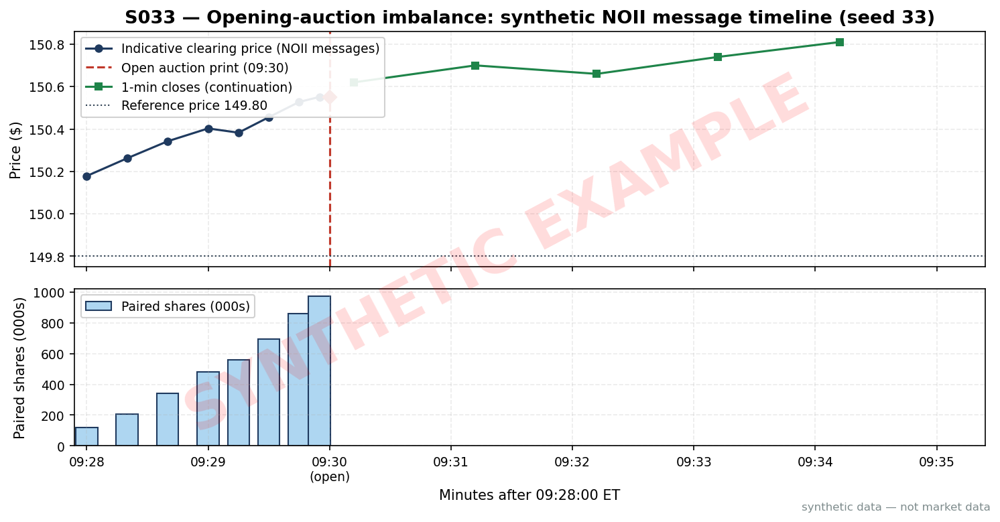

```mermaid
flowchart LR
    FEED["Raw feed<br/>(Nasdaq NOII / NYSE imbalance)"] -->|"auction messages (per-second)"| ING["Ingest + normalize<br/>(exchange ts, venue, corrections)"]
    ING -->|"clean auction messages (per-second)"| FEAT["Feature compute<br/>(rho, displacement, trajectory)"]
    FEAT -->|"imbalance features (per-auction)"| SIG["Signal S033<br/>open-auction continuation"]
    SIG -->|"signal (per-auction)"| GATE{"Cost / latency<br/>gate?"}
    GATE -->|pass| OUT["Downstream consumer<br/>(T065 / T016 / T070)"]
    GATE -->|fail| DROP["No trade"]
    style SIG fill:#aed6f1,stroke:#1f3a5f
```

### S12. Sources

- Challet, D. & Gourianov, N. (2018). *Dynamical regularities of US equities opening and closing auctions.* arXiv:1802.01921. https://arxiv.org/abs/1802.01921
- Nasdaq. *Market Model & Functionality — Nasdaq Derivatives Markets* (§5.2.1.2.5, Net Order Imbalance Indicator: equilibrium price, indicative trade volume, imbalance volume dissemination). https://www.nasdaq.com/docs/2024/11/12/NEQD-Market-Model-3.1.6.pdf
- Morand, C. *Predicting US stock returns using closing auction imbalance data.* Imperial College London, MSc thesis (Math-Finance). https://www.imperial.ac.uk/media/imperial-college/faculty-of-natural-sciences/department-of-mathematics/math-finance/MORAND_CLEA_01805978.pdf
- Biais, B., Hillion, P. & Spatt, C. (1995). *An empirical analysis of the limit order book and the order flow in the Paris Bourse.* Journal of Finance 50(5), 1655–1689. https://ideas.repec.Org/a/bla/jfinan/v50y1995i5p1655-89.html — Order flow and book shape predict short-term price shifts: the microstructure basis for reading imbalance messages as directional signal.
- Biais, B., Hillion, P. & Spatt, C. (1999). *Price discovery and learning during the preopening period in the Paris Bourse.* Journal of Political Economy 107(6), 1218–1248. https://IDEAS.REPEC.ORG/e/pbi43.html — Preopening order flow is informative about the opening price: direct precedent for pre-close imbalance predicting the auction print.
- Cao, C., Ghysels, E. & Hatheway, F. (2000). *Price discovery without trading: Evidence from the Nasdaq preopening.* Journal of Finance 55(3), 1339–1365. https://ideas.repec.Org/a/bla/jfinan/v55y2000i3p1339-1365.html — Quote and imbalance dynamics during the Nasdaq preopen reveal the clearing price before trading: the mechanism the imbalance tape tracks into the close.

**Unverified leads** (chatbot-provided, not independently checkable — do not treat as evidence):
- Duck.ai (GPT-5.6 Luna, anonymous, 2026-09-10), Q-SB5-3: auction-imbalance framing — NOII-equivalent field list (paired shares, buy/sell imbalance, indicative clearing price, reference price, auction status, venue, timestamps, updates/corrections); tradability hierarchy (a) direct auction participants > (b) institutional API users > (c) retail; "test MUST use the message sequence ('what was known at t?') — final imbalance predicting earlier trades = look-ahead bias"; decisive-test verdict (point-in-time replay with realistic fills, spread crossing, market impact, borrow constraints, auction cutoffs, delisted securities — not close-to-close/next-bar backtests on vendor-adjusted data). Full text in `batches/SB5/duckai-answers.md`; Grok/Cursor answers pending (checked 2026-09-10).
- Duck.ai Q-SB5-2: imbalance feed pricing — API/vendor ~$100–1,000+/mo, small-institutional ~$1,000–10,000+/mo, direct exchange redistribution "much more" (*indicative — verify before budgeting*; unverified chatbot claim); eng-hour table for the session-pattern engine (prototype 185–385 h, research-grade 705–1,530 h; column totals verified).

---
## Stage 44/200 — S044: Stochastic oscillator & Williams %R

*Batch SB5 · Signal 44/100 · Provenance [D] · Family C — Intraday Mean Reversion & Reversal*

### S1. One-line verdict

| What it is | When it works | When it dies | Build-or-buy in one line |
|---|---|---|---|
| Two bounded (0–100 / −100–0) oscillators measuring where the close sits inside the recent high–low range; fade overbought/oversold extremes on %K/%D crosses | Clean trading ranges where closes oscillate between well-defined highs and lows | Trends (it pins at extremes and fades the whole move), news jumps, and any tape where the "range" is one expanding bar | Build: textbook formulas on any OHLC feed; nothing to buy |

Provenance: **[D]** (documented — George Lane's stochastic oscillator, 1950s; Larry Williams' %R, 1970s; formulas and 14/80/20 conventions are the published standards). Family C — Intraday Mean Reversion & Reversal.

### S2. How it works — plain human explanation

Both indicators answer one question: *where did we close inside the recent trading range?* The **stochastic oscillator**'s raw value, **%K**, is the close's position as a percentage of the last *n* bars' high–low range: 100 means we closed at the very top of the range, 0 at the very bottom. **%D** is just a 3-bar moving average of %K — a smoothing that turns the twitchy %K into a signal line. **Williams %R** is the same idea on an inverted scale from −100 to 0: −100 means the close was the lowest low of the last *n* bars, 0 means it was the highest high. (In fact, %R is algebraically the mirror of raw %K — more on that in S3.)

The trading logic is pure mean-reversion folklore: in a *trading range* — a market bouncing between support and resistance rather than trending — closes that press against the top of the range tend to rotate back down, and closes crushed against the bottom tend to bounce. So the canonical rules: **short when %K crosses down through %D while above 80** (overbought — the market is trading near the top of its range and losing momentum), **long symmetrically when %K crosses up through %D below 20** (oversold). For Williams %R: fade when %R pushes above −20 (overbought) or below −80 (oversold) and turns.

Why should it work at all? In a range, the range boundaries are where resting liquidity sits — sellers reload at resistance, buyers at support — and where short-horizon mean-reversion flows (market-maker inventory, stat-arb) lean hardest. The oscillator is just a normalized way of saying "we're at the edge of the recent range, where the other side usually shows up."

The honest counterweight, stated up front because this chapter must not oversell oscillator edges after costs: in a *trend*, the range keeps expanding in the trend's direction and these oscillators pin at their extremes for bar after bar, generating a fade signal against every new high. The indicator cannot distinguish "overbought in a range" from "strong in a trend" — that distinction has to come from a regime filter outside the indicator.

**Mental model:**
- %K/%D and %R are *position-in-range* gauges, not predictors — they tell you where you are, not where you're going.
- The edge, such as it is, lives entirely in the *range assumption*: right in ranges, systematically wrong in trends.
- Use them as *exhaustion timing* (when to fade) inside a larger structure, never as a standalone directional system.

### S3. The math — exact formula

Over the last $n$ bars, let $H_n = \max H_i$ and $L_n = \min L_i$ be the highest high and lowest low. With close $C_t$:

$$\%K_t = 100 \cdot \frac{C_t - L_n}{H_n - L_n} \qquad \text{(raw / "fast" \%K)}$$

$$\%D_t = \mathrm{SMA}(\%K_t, 3) \;\; \text{(SMA = simple moving average)} = \frac{\%K_t + \%K_{t-1} + \%K_{t-2}}{3}$$

$$\text{Williams } \%R_t = -100 \cdot \frac{H_n - C_t}{H_n - L_n}$$

Note the identity: $\%R_t = \%K_t - 100$. They are the same measurement on a flipped scale — running both is redundancy, not diversification, unless you use different lookbacks.

Trading rules (*thresholds are examples — not institutional standards*; the 14/80/20/−80/−20 conventions are Lane/Williams' published defaults, which is why this chapter keeps [D]):

$$\text{Short fade: } \%K_{t-1} \ge \%D_{t-1} \text{ and } \%K_t < \%D_t \text{ with } \%K_t > 80$$
$$\text{Long fade: } \%K_{t-1} \le \%D_{t-1} \text{ and } \%K_t > \%D_t \text{ with } \%K_t < 20$$
$$\text{\%R fade: short as \%R turns down from above } -20\text{; long as \%R turns up from below } -80$$

| Parameter | Symbol | Typical range | Too small | Too large | Default (*example*) |
|---|---|---|---|---|---|
| Lookback | $n$ | 9–20 bars | Twitchy; whipsaw crosses on noise | Lags; the range includes ancient history | 14 (Lane/Williams default) |
| %D smoothing | — | 3–5 bars | Barely smoother than %K | Signal arrives after the turn | 3 |
| Overbought | — | 70–90 (stoch) / −30–−10 (%R) | Constant false overbought reads | Never fires | 80 / −20 |
| Oversold | — | 10–30 (stoch) / −90–−70 (%R) | Never fires | Fires mid-plunge repeatedly | 20 / −80 |

**Causal timing:** $\%K_t, \%D_t, \%R_t$ are computed at bar $t$'s close using bars $t-n+1 \ldots t$ only; the crossover is confirmed at the close, so the earliest fill is bar $t+1$'s open. Note %D needs 3 bars of %K and %K needs $n$ bars — the first tradable bar is $t \ge n+2$.

**Named variants:**
1. **Fast vs slow stochastic** — "fast" uses raw %K with %D as the signal line; "slow" smooths %K first (typically SMA-3) and then smooths again for %D. Slow generates fewer, later signals; a documented study (S9) found fast outperformed slow in most markets tested.
2. **Stochastic RSI (Relative Strength Index) / %R with different lookbacks** — practitioners often run %R(14) against Stoch(14,3) for confirmation; as shown above they're near-duplicates, so the honest variant is *different* lookbacks, not different names.
3. **Divergence** — price makes a new high but %K doesn't (bearish divergence); a discretionary overlay, not a rule in this chapter's formula.

### S4. Worked example — step-by-step numbers (SYNTHETIC)

Synthetic 24-bar 5-minute tape, seed **44**: an 18-bar grind up (so %D is well established), then a rollover. %K/%D use $n{=}14$, %D = SMA(%K, 3). Synthetic data — not market data; the chart plots exactly these numbers.

| bar | O | H | L | C | %K(14) | %D | %R(14) | signal |
|---|---|---|---|---|---|---|---|---|
| 9 | 101.70 | 102.08 | 101.70 | 101.89 | — | — | — | |
| 10 | 101.96 | 102.29 | 101.96 | 102.12 | — | — | — | |
| 11 | 102.21 | 102.54 | 102.21 | 102.37 | — | — | — | |
| 12 | 102.42 | 102.75 | 102.42 | 102.58 | — | — | — | |
| 13 | 102.67 | 103.04 | 102.67 | 102.84 | — | — | — | |
| 14 | 102.89 | 103.26 | 102.89 | 103.08 | 94.7 | — | −5.3 | |
| 15 | 103.13 | 103.48 | 103.13 | 103.30 | 94.8 | — | −5.2 | |
| 16 | 103.33 | 103.67 | 103.33 | 103.51 | 95.4 | 95.0 | −4.6 | |
| 17 | 103.58 | 103.97 | 103.58 | 103.78 | 94.3 | 94.8 | −5.7 | **SHORT cross** |
| 18 | 103.85 | 104.18 | 103.85 | 104.02 | 95.1 | 94.9 | −4.9 | |
| 19 | 103.61 | 103.61 | 103.23 | 103.42 | 75.9 | 88.4 | −24.1 | |
| 20 | 103.22 | 103.22 | 102.85 | 103.02 | 60.7 | 77.2 | −39.3 | |
| 21 | 102.80 | 102.80 | 102.47 | 102.64 | 43.3 | 60.0 | −56.7 | |
| 22 | 102.48 | 102.48 | 102.10 | 102.28 | 23.5 | 42.5 | −76.5 | |
| 23 | 102.06 | 102.06 | 101.71 | 101.87 | 6.3 | 24.4 | −93.7 | |
| 24 | 101.68 | 101.68 | 101.34 | 101.50 | 5.8 | 11.9 | −94.2 | |

Step-by-step at the trigger bar: at bar 16's close, %K = 95.4 ≥ %D = 95.0 (the 3-bar SMA of the unrounded %K values). At bar 17's close, %K = 94.3 < %D = 94.8 — a cross down, with %K at 94.3 > 80 (*example* overbought line) → **short fade**. Williams %R confirms the overbought read: −5.7, inside the −20 line. Earliest fill: bar 18's open at 103.85. (%R = %K − 100 holds in every row — the check the table invites.)

**The bar-18 adverse move.** The fade does not go straight down. Bar 18 extends *against* the short: it prints H 104.18 (+0.33 above the 103.85 entry) and closes 104.02 — the position is −0.17 underwater at bar 18's close. Only at bar 19 does the rollover begin (O 103.61, C 103.42). Cover example: bar 20's close at 103.02 → gross **+0.83 = +80 bps** (basis points, 1 bp = 0.01%) before costs — the fade survives the adverse excursion and catches the first leg of the rollover. This is why the chapter insists on stops and sizing: a mechanical fade with no adverse-move budget is stopped out exactly at bar 18.

**What to notice:** the cross at bar 17 is *marginal* — %K 94.3 vs %D 94.8, a 0.5-point cross. That's deliberate pedagogy: textbook crosses are often this thin, and a production rule needs a minimum cross magnitude or %R-confirmation to avoid trading dust. Also note %R collapses to −94.2 by bar 24 — deep "oversold" — while price is still falling: the classic pinned-at-the-extreme behavior that punishes mechanical fading without a regime check. This toy tape has no spread, no fees, and a conveniently clean rollover; nothing here is a performance claim.

### S5. Strategies that use this signal

- **T013 — RSI-2 / IBS Extreme Fade** — *primary oscillator-fade consumer (genuine fit)*: Connors-style oversold/overbought fading combining RSI-2 and IBS (internal bar strength); the %K/%D crossover and %R extremes are the natural timing overlay for its fade entries.
- **T062 — Streak Runner with Exhaustion Flip** — *conceptual-fit reference (not a plan-defined consumer — labeled as conceptual)*: a %K-cross-down-above-80 or %R-above-−20 rollover is exactly the kind of exhaustion signature T062's flip leg needs to time its reversal; the fit is conceptual, not specified in the plan.
- Related signals (same family): **S042** (RSI-2) and **S043** (IBS) are the sibling extreme-fade oscillators; **S045** (stretched-move z-score) is the vol-normalized cousin of the same "too far, too fast" idea.

### S6. Data required — exact spec

| Field | Type | Granularity | Source tier | Notes |
|---|---|---|---|---|
| Open, high, low, close | float | 5–15 min bars (intraday) | Tier 0–1 | Any OHLCV vendor; SIP (Securities Information Processor — the consolidated feed) is fine |
| Session calendar / halts | reference | event | Tier 0–1 | Don't span the lookback across halts or overnight gaps |
| Corporate actions | reference | event | Tier 0–1 | Unadjusted splits corrupt $H_n/L_n$ for $n$ bars |

Ingest sketch (≤20 lines):

```python
import polars as pl
N = 14
df = (pl.read_parquet("bars_5m/*.parquet").sort(["symbol","ts"])
        .with_columns(Hn = pl.col("H").rolling_max(N).over("symbol"),
                      Ln = pl.col("L").rolling_min(N).over("symbol")))
df = df.with_columns(pctK = 100*(pl.col("C")-pl.col("Ln"))/(pl.col("Hn")-pl.col("Ln")),
                     pctR = -100*(pl.col("Hn")-pl.col("C"))/(pl.col("Hn")-pl.col("Ln")))
df = df.with_columns(pctD = pl.col("pctK").rolling_mean(3).over("symbol"))
```

Storage: 5-min bars are ~78 bars/day/symbol — per cost-model §4, 500 symbols of 1-min bars is ~50 MB/day; 5-min is ~5× smaller. Trivial; archive freely.

Data-quality checklist: split-adjustment before computing $H_n/L_n$ (one unadjusted split poisons the range for the full lookback), halt handling (freeze, don't bridge), DST/half-day session boundaries, illiquid names where $H_n = L_n$ prints (division by zero — guard it).

### S7. Local build on M5 Max / 128GB

**Feasibility: trivial.** Rolling max/min/mean over 14 bars is O(1)-amortized per bar with deques, or a single polars pass at ~10–50M rows/sec (cost-model §2) — a 60-day, 500-symbol 5-min recompute is milliseconds. The Mac will be idle.

Stack: **Python+polars** — pick it; this is a column-ops problem and nothing here needs Rust or a GPU.

RAM: per cost-model §3, 500 symbols × 60 days of 1-min bars ≈ 12 MB; 5-min bars ≈ 2–3 MB — roughly four orders of magnitude inside the 77 GB working budget.

Engineering: **Tier L, 4–12 h → $600–1,800** at the $150/hr loaded-cost estimate (cost-model §5). One line of justification: the formulas are textbook and the ingest is a rolling-window one-liner; the hours go to split/halt hygiene and deciding the zero-range guard.

What breaks first at 500 symbols or full OPRA (Options Price Reporting Authority): nothing — this signal never touches options or depth; the full US universe on 5-min bars remains a trivially small frame.

### S8. Buy vs build

| Option | What you get | Indicative price | What buying gains | What buying loses |
|---|---|---|---|---|
| Tier-0 free (Stooq, Alpaca IEX delayed) | Daily/15-min OHLC | ~$0 — *indicative, verify before budgeting* | $0 research data | Coarse for intraday crossover timing |
| Tier-1 retail (Polygon Stocks Advanced, Alpaca SIP) | 1-min + real-time SIP bars | ~$30–200/mo — *indicative, verify before budgeting* | Clean 5-min bars with corporate actions | Nothing material |
| Tier-2 professional (Databento) | Normalized OHLCV, venue detail | ~$200/mo + usage — *indicative, verify before budgeting* | Venue-stamped bars if you ever care | Overkill for range oscillators |
| Charting platform (TradingView-style) | Built-in Stochastic / %R studies | ~$15–60/mo — *indicative, verify before budgeting* | Zero-code visualization | Not a research source of record: opaque revisions, no replay, no audit |

**Verdict: build.** Two textbook formulas on bars you already buy for every other signal. The crossover point is simply "you have 5-min bars," which is every tier at or above free. Never pay for the indicator itself — and never use a screener's precomputed oscillator values as research inputs (you can't audit their lookback or bar-revision handling).

### S9. Success ratio / efficacy — documented evidence

| Study / source | Market & period | Metric | Before/after cost | Caveat |
|---|---|---|---|---|
| Chong et al., "Performance of Stochastic Oscillators" (MPRA 80559) | Multiple markets (paper's universe) | Fast stochastic outperformed slow stochastic in most markets studied | As reported in the paper — cost treatment not verified from available materials; treat as before-cost unless the paper states otherwise | Compares indicator *variants*, not oscillator-vs-cash; says nothing about net profitability |
| Paik et al. (2024), "Algorithm-Based Low-Frequency Trading Using a Stochastic Oscillator and William%R", *JRFM* | SPY + MSCI Korea ETF, 2010–2022 | 8 trades in 12 years, 87.5% hit ratio, max gain +28.7%, max drawdown −0.1% | Before-cost as reported — the paper does not model transaction costs (and a reviewer noted the parameter choices lack theoretical basis) | Weekly/low-frequency system (~1.5 trades/year), not intraday; 8 trades is far too few for statistical confidence; index-level, not single-name |

Regimes where it fails: trends (the documented killer — %K pins above 80 through entire legs up, %R pins near 0); news jumps (the range explodes and the oscillator reads "overbought" into a repricing); low-volatility grinds (the range is tiny, so %K whipsaws 0–100 on penny moves); crowded retail symbols where every fade is faded by someone faster.

**Honest bottom line — and this chapter will not oversell it:** there is *no documented after-cost intraday edge* for stochastic/%R fades as a standalone trigger in the sources found. What is documented: the formulas are standard, variant comparisons exist, and one low-frequency paper reports attractive before-cost numbers on 8 trades. As a standalone trigger this is a *weak, unproven-after-cost* edge; as an *exhaustion-timing overlay* inside T013-style fades or T062-style flips — telling you *when* within an already-justified fade — it is a *reasonable, cheap component*.

### S10. Failure modes & pitfalls

1. **Trend-pinning** — the #1 killer: fading every new high in a trend. *Mitigation:* regime-gate — only take fades when a trend filter (e.g. ADX — average directional index, a 0–100 trend-strength gauge — or price within a defined range for N bars) says "range."
2. **Look-ahead on the cross** — acting on a developing bar's %K before the close fixes $H_n/L_n$. *Mitigation:* confirm crosses at bar close; trade next bar's open.
3. **Zero-range division** — $H_n = L_n$ on dead names → division by zero. *Mitigation:* guard: if range is zero, hold the prior value and skip signals.
4. **Parameter mining** — 14/80/20 "works" because everyone uses it; optimizing to 11/73/27 on one symbol is overfitting. *Mitigation:* keep the published defaults or calibrate on a broad universe with out-of-sample validation.
5. **Cost blowup** — oscillators on 1-min bars can fire several times a day; each fade pays the full spread at the worst moment (you're providing liquidity to momentum). *Mitigation:* model full spread-crossing cost + fees + slippage/impact; require expected rotation > 3× cost; prefer 5–15 min grids.
6. **Redundant confirmation** — %R ≈ %K − 100, so "both agree" is one signal counted twice. *Mitigation:* if you want confirmation, use an *independent* input (volume, or S045's vol-normalized z) — not the same range repackaged.
7. **News-jump misreads** — a gap reprices the range; the oscillator screams overbought into a new equilibrium. *Mitigation:* suppress signals for N bars after jumps (S064-style jump filter) or on news-flagged symbols.
8. **Thin-cross trading** — the worked example's 0.5-point cross is typical; trading dust crosses churns. *Mitigation:* require a minimum cross magnitude (e.g. 2 points, *example*) or %R beyond its line as confirmation.

### S11. Visuals

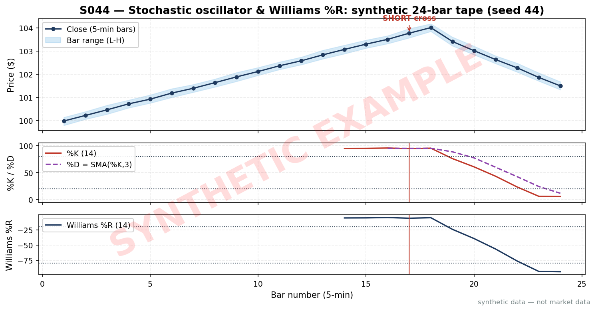

```mermaid
flowchart LR
    FEED["Raw feed<br/>(5-min OHLCV bars)"] -->|"5-min bars"| ING["Ingest + normalize<br/>(splits, halts, sessions)"]
    ING -->|"clean 5-min bars"| FEAT["Feature compute<br/>(Hn, Ln, %K, %D, %R)"]
    FEAT -->|"oscillator values (5-min bars)"| SIG["Signal S044<br/>stochastic / %R fade"]
    SIG -->|"signal (5-min bars)"| GATE{"Cost / regime<br/>gate?"}
    GATE -->|pass| OUT["Downstream consumer<br/>(T013 extreme fade)"]
    GATE -->|fail| DROP["No trade"]
    style SIG fill:#aed6f1,stroke:#1f3a5f
```

### S12. Sources

- Chong, T.T.L. et al. *Performance of Stochastic Oscillators.* MPRA Paper 80559. https://mpra.ub.uni-muenchen.de/80559/1/MPRA_paper_80559.pdf
- Paik, J. et al. (2024). *Algorithm-Based Low-Frequency Trading Using a Stochastic Oscillator and William%R: A Case Study on the U.S. and Korean Indices.* J. Risk Financial Manag. 17(3), 92. https://www.mdpi.com/1911-8074/17/3/92/
- Barchart. *Williams Percent Range — education/technical indicators* (formula, −80/−20 conventions, n=14 default). https://Www.barchart.com/education/technical-indicators/percent_r
- Barchart. *Stochastic Slow — trader help/studies* (raw %K, %K/%D smoothing conventions; "%R is the inverse of fast stochastics"). https://www.barchart.com/trader/help/studies/stoch_s.php
- Jegadeesh, N. (1990). *Evidence of predictable behavior of security returns.* Journal of Finance 45(3), 881–898. http://ideas.repec.org/a/bla/jfinan/v45y1990i3p881-98.html — Significant negative first-order serial correlation in monthly returns: short-term reversal predictability that oscillator overbought/oversold rules attempt to time.
- Lehmann, B. N. (1990). *Fads, martingales, and market efficiency.* Quarterly Journal of Economics 105(1), 1–28. https://econpapers.repec.org/RePEc:oup:qjecon:v:105:y:1990:i:1:p:1-28. — Weekly winners/losers reverse the next week, net of spreads and costs: attributed to inefficiency in the market for liquidity around large price moves, the mechanism behind oscillator fade setups.

**Unverified leads** (chatbot-provided, not independently checkable — do not treat as evidence):
- Duck.ai (GPT-5.6 Luna, anonymous, 2026-09-10), Q-SB5-1: Keltner/Bollinger formulas and the 30-bar worked tape whose verified z-score material (z=+4.36, σ=0.3923) is reused in S045 — arithmetic verified by the operator, not independently re-derived here. Full text in `batches/SB5/duckai-answers.md`; Grok/Cursor answers pending (checked 2026-09-10).

---
## Stage 45/200 — S045: Stretched-move z-score & market-internals extremes

*Batch SB5 · Signal 45/100 · Provenance [SR] · Family C — Intraday Mean Reversion & Reversal*

### S1. One-line verdict

| What it is | When it works | When it dies | Build-or-buy in one line |
|---|---|---|---|
| Measures how many realized-vol units price has stretched from its session anchor (VWAP — volume-weighted average price — or rolling mean); fades multi-sigma moves lacking volume/news, confirmed by market-wide TICK/TRIN extremes | Liquidity-driven excursions in liquid names — fast spike, no news, volume not confirming | News-driven repricings, trending opens, and illiquid names where "3 sigma" is just the spread | Build the z-score on bars you own; buy the internals feed (TICK/TRIN) if you want the market-wide leg |

Provenance: **[SR]** (standard reconstruction — the z-score mean-reversion template is textbook; the VWAP-session anchoring, the 2–3σ thresholds, and all internals levels are desk-specific examples, not institutional standards). Family C — Intraday Mean Reversion & Reversal.

### S2. How it works — plain human explanation

A **z-score** is a distance measured in units of typical wiggle: "price is 3 standard deviations above its anchor" means the move is 3× bigger than the recent norm. The anchor here is usually the session **VWAP** — the volume-weighted average price, i.e. the average price paid by everyone who traded today, weighted by size — or a rolling mean. The ruler is **realized volatility** — volatility measured from actual recent price changes, not implied from options.

The economic story: most violent intraday spikes are *liquidity excursions*, not information. A large seller dumps into thin midday liquidity, price lurches 3 sigma in ten minutes, but nothing fundamental changed — no news, no expanding volume, no market-wide participation. Liquidity providers step back, the order book refills, and price drifts back toward where the day's volume actually traded (VWAP). Fading the stretch — selling the spike, buying the plunge — harvests that snap-back. The confirmation that it's *liquidity* rather than *news* is what keeps you alive: volume should be flat or falling into the extreme, and there should be no headline.

The second leg is **market internals** — market-wide, not single-name, extremes. **TICK** is the number of NYSE stocks ticking up minus the number ticking down, right now: a real-time breadth pulse. Readings beyond ±800 to ±1,000 (*desk-specific example*) mark intraday capitulation. **TRIN** (the Arms index, short for TRading INdex) is (advancing stocks ÷ declining stocks) ÷ (advancing volume ÷ declining volume): above 1.0 means declining volume dominates — bearish; spikes mark panic. When your single-name z-score screams *and* TICK prints −1,000, you're fading a market-wide flush — the highest-probability version of this trade.

A vignette: at 13:42 XYZ spikes from 100.20 to 102.00 in one 5-minute bar on 900 shares — roughly in line with its recent prints. No headline. The 20-bar z-score prints +4.36 while NYSE TICK tags −950. You short the spike: a liquidity air-pocket, with the single-name ruler and the market-wide pulse agreeing it's exhaustion, not repricing.

**Mental model:**
- The z-score separates *big moves* (common) from *statistically unusual moves* (rare) — you only fade the unusual ones.
- "Unusual" is necessary but not sufficient: the *cause* filter (no news, no volume expansion) is what keeps you from fading a genuine repricing.
- Internals turn a single-name guess into a market-structure read: capitulation is a crowd phenomenon, and TICK/TRIN measure the crowd.

### S3. The math — exact formula

**Session-anchored z (source reconstruction):**

$$z_t = \frac{P_t - \mathrm{VWAP}_{session,t}}{\sigma_{realized} \cdot \sqrt{t}}$$

where $P_t$ is the current price (mid or last), $\mathrm{VWAP}_{session,t} = \sum_{i \le t} P_i V_i / \sum_{i \le t} V_i$ is the session volume-weighted average price, $\sigma_{realized}$ is per-bar realized volatility (e.g. the standard deviation of recent 1-min returns, annualized or per-bar consistently), and $t$ is elapsed session time in bars — the $\sqrt{t}$ term scales the ruler for how far price can normally wander by time $t$ under a random walk.

**Rolling z (the worked example's variant):**

$$z_t = \frac{C_t - \mu_t(N)}{\sigma_t(N)}, \qquad \mu_t(N) = \frac{1}{N}\sum_{i=t-N+1}^{t} C_i, \;\; \sigma_t(N) = \sqrt{\frac{1}{N}\sum_{i=t-N+1}^{t}(C_i - \mu_t)^2}$$

(population standard deviation; the window *includes* bar $t$ — the completed-bar convention, with the caveat dissected in S10).

**Trade rule** (*thresholds are examples — not institutional standards*):

$$\text{Fade when } |z_t| > z_{entry} \text{ (e.g. 2.0–3.0) AND volume is NOT expanding AND no news flag;}$$
$$\text{cover when } z_t \to 0 \text{ or at a time stop (e.g. 30–60 min).}$$

**Market internals:**

$$\mathrm{TICK}_t = \#\{\text{NYSE stocks on an uptick}\} - \#\{\text{NYSE stocks on a downtick}\}$$
$$\mathrm{TRIN}_t = \frac{\text{Advances}_t / \text{Declines}_t}{\text{AdvancingVolume}_t / \text{DecliningVolume}_t}$$

Fade triggers (*desk-specific examples*): $|\mathrm{TICK}| > 800$–$1{,}000$; TRIN spiking well above 1.0 (panic selling) or collapsing below ~0.7 into a buying climax.

| Parameter | Symbol | Typical range | Too small | Too large | Default (*example*) |
|---|---|---|---|---|---|
| Entry z | $z_{entry}$ | 1.5–3.0 | Fades normal noise; churns on spread | Waits for once-a-week events | 2.0 |
| Lookback | $N$ | 15–60 bars | Ruler too twitchy; z whipsaws | Ruler stale; misses regime shifts | 20 |
| Anchor | — | session VWAP / rolling mean | — | — | rolling mean (worked ex.) |
| Time stop | — | 15–90 min | Exits before snap-back | Holds a repricing all afternoon | 45 min |
| TICK extreme | — | 500–1,500 | Constant false capitulations | Never fires | ±800 |

**Causal timing:** $z_t$ uses bars $\le t$ only (the VWAP variant needs the session's volume tape to date — no future bars); the fade is entered at bar $t+1$'s open at the earliest. TICK/TRIN are real-time but vendor-delayed — know your feed's latency (often 1–15 minutes on retail feeds, which can make the "confirmation" arrive after the turn).

**Named variants:**
1. **VWAP-session z** (source formula) vs **rolling z** (worked example) — VWAP anchors to the day's actual traded value; rolling mean adapts faster but has no economic anchor.
2. **Return-based z** — $r_t(M) = \ln(C_t/C_{t-M})$, z-scored over its own history; measures *velocity* rather than *displacement*.
3. **Internals composite** — z-score AND (TICK extreme OR TRIN spike); the capitulation filter that upgrades a single-name fade to a market-structure fade.

### S4. Worked example — step-by-step numbers (SYNTHETIC)

This worked example reuses the operator-verified 30-bar synthetic tape (seed **45**; every number below was hand-checked — $\mu_{20} = 100.29$, $\sigma_{20} = 0.3923$, $z_{30} = +4.36$). Construction: bars 1–10 closes ramp 100.00 → 100.50 (step 0.50/9); bars 11–29 close at 100.20 on declining volume; bar 30 prints O 100.20, H 102.50, L 100.00, C 102.00 on 900 shares (in line with the 670–850 recent prints — no volume expansion). Rolling 20-bar z, population std, window *including* the current bar. Synthetic data — not market data; the chart plots exactly this series.

| bar | C | $\mu_{20}$ | $\sigma_{20}$ | z | read |
|---|---|---|---|---|---|
| 20 | 100.20 | 100.2250 | 0.1156 | −0.22 | quiet |
| 21 | 100.20 | 100.2350 | 0.1037 | −0.34 | quiet |
| 22 | 100.20 | 100.2422 | 0.0957 | −0.44 | quiet |
| 23 | 100.20 | 100.2467 | 0.0915 | −0.51 | quiet |
| 24 | 100.20 | 100.2483 | 0.0903 | −0.54 | quiet |
| 25 | 100.20 | 100.2472 | 0.0907 | −0.52 | quiet |
| 26 | 100.20 | 100.2433 | 0.0910 | −0.48 | quiet |
| 27 | 100.20 | 100.2367 | 0.0890 | −0.41 | quiet |
| 28 | 100.20 | 100.2272 | 0.0821 | −0.33 | quiet |
| 29 | 100.20 | 100.2150 | 0.0654 | −0.23 | quiet |
| 30 | 102.00 | 100.2900 | 0.3923 | **+4.36** | **FADE (short)** |

Step-by-step at bar 30: $\mu = (19 \times 100.20 + 102.00)/20 = 100.29$; deviations $-0.09$ (×19, sq 0.0081 each = 0.1539) and $+1.71$ (sq 2.9241); sum 3.0780; population variance $3.0780/20 = 0.1539$; $\sigma = 0.3923$; $z = 1.71/0.3923 = +4.36 > 2.0$ (*example* threshold) → short fade at bar 31's open (102.00). Volume check: 900 shares sits within the tape's 670–850 recent prints — no material volume expansion confirming new information; the fade's no-expansion gate passes; stipulate no news flag. Hypothetical exit (labeled as such — the tape ends at bar 30): cover half at $z \to +1.0$ (~100.68) and the rest on the 45-minute time stop; a full snap-back to 100.68 would be +1.32 ≈ +129 bps (basis points, 1 bp = 0.01%) before costs. The honest version: you'd more likely cover into a partial retrace for +30–60 bps, and sometimes the "excursion" keeps going.

**What to notice:** bars 20–29 show the ruler *shrinking* ($\sigma$ 0.1156 → 0.0654) as the tape goes dead — low-volatility compression is what makes bar 30 read +4.36 rather than +1.5. That's the mechanism *and* the trap: a compressed ruler makes everything look extreme. This toy tape has no fees, no spread, and no bar 31 — the exit is illustrative, not a backtest. Nothing here is a performance claim.

**Methodology caveat (mandatory):** this example computes the window *including* bar 30. Recomputed on a strictly *prior-only* window (bars 10–29): $\mu = 100.2150$, $\sigma = 0.06538$, $z = +27.30$ — a wildly different number from the same bar. Mixing inclusion/exclusion conventions across indicators at the same bar is a live-implementation pitfall: pick one convention (completed-bar including current, or strictly prior), document it, and make the backtest and the live engine match exactly. See S10.

### S5. Strategies that use this signal

- **T063 — Stretched-Move Z-Score Fade** — *primary entry trigger (direction)*: the strategy is this signal — fades multi-sigma intraday moves with resiliency-timed exits (S048) and spread-decomposition cost gating (S014).
- **T013 — RSI-2 / IBS Extreme Fade** — *co-trigger (genuine fit)*: the plan lists S045 among T013's signals — the z-score provides the vol-normalized "how stretched" read alongside RSI-2 (Relative Strength Index)/IBS (internal bar strength) extremes.
- **T048 — Put/Call Ratio Contrarian** — *context input (genuine fit)*: the plan lists S045 as stretched-move/sentiment context for fading extreme put/call readings.

### S6. Data required — exact spec

| Field | Type | Granularity | Source tier | Notes |
|---|---|---|---|---|
| Mid/last price, volume | float/int | 1–5 min bars | Tier 0–1 | Any intraday feed; SIP (Securities Information Processor — the consolidated feed) consolidated fine |
| Session VWAP | derived | per-bar cumulative | Tier 0–1 | Needs the full session volume tape to date |
| Realized vol (per-bar σ) | derived | rolling | Tier 0–1 | From the same bars — no extra feed |
| NYSE TICK | int | real-time tick | Tier 1–2 | dxFeed, Databento, broker feeds; know the delay |
| TRIN / advance-decline + adv/dec volume | float | real-time | Tier 1–2 | Same vendors; definitions vary slightly — pin yours |
| News flag | boolean | event | Tier 2 | Benzinga-class headline feed to enforce the no-news filter |

Ingest sketch (≤20 lines):

```python
import polars as pl
N = 20
b = (pl.read_parquet("bars_1m/*.parquet").sort(["symbol","ts"])
       .with_columns(mu = pl.col("C").rolling_mean(N).over("symbol"),
                     sd = pl.col("C").rolling_std(N, ddof=0).over("symbol")))
b = b.with_columns(z = (pl.col("C") - pl.col("mu")) / pl.col("sd"))
# internals: as-of join the slower TICK feed onto bar times
tick = pl.read_parquet("internals_tick/*.parquet").sort("ts")
b = b.join_asof(tick, on="ts", strategy="backward")  # TICK known at bar close only
```

Storage: 1-min bars per cost-model §4 — 500 symbols ≈ 50 MB/day Parquet, 60 days ≈ 3 GB; internals are a single market-wide series — negligible. Archive freely.

Data-quality checklist: bar timestamp vs internals timestamp alignment (the as-of join is the whole game), vendor TICK delay disclosure, VWAP session-boundary definition (regular session only), corporate actions before z computation, half-day sessions (the $\sqrt{t}$ scaling needs the right $t$).

### S7. Local build on M5 Max / 128GB

**Feasibility: trivial** for the bar-based z-score; **feasible** with the internals leg. Rolling mean/std over 20 bars is O(1)-amortized per bar; per cost-model §2, polars does ~10–50M rows/sec on simple column ops — the entire 500-symbol 60-day 1-min universe (11.7M rows) z-scores in about a second. The internals join is one as-of per bar. Bottleneck: none on compute — it's feed latency on TICK/TRIN that matters, not FLOPS.

Stack: **Python+polars** — pick it. Rust only if you're already running an event-driven book; nothing in this signal needs it.

RAM: per cost-model §3, 500 symbols × 60 days of 1-min bars ≈ 12 MB — four orders of magnitude inside the 77 GB working budget. Even 5 years of 1-min bars for calibrating the $z_{entry}$ threshold fits comfortably.

Engineering: **Tier L, 4–12 h → $600–1,800** at the $150/hr loaded-cost estimate (cost-model §5). One line of justification: the z-score is a rolling-window one-liner; the hours go to the no-news filter wiring, the internals as-of join, and pinning the bar-inclusion convention (S10) identically in research and live.

What breaks first at 500 symbols or full OPRA (Options Price Reporting Authority): the internals leg doesn't scale per-symbol (it's one market-wide series — fine); what breaks is *expectation* — 500 independent z-fades without portfolio-level heat control become one large correlated bet on calm markets.

### S8. Buy vs build

| Option | What you get | Indicative price | What buying gains | What buying loses |
|---|---|---|---|---|
| Tier-0 free (Stooq, Alpaca IEX delayed) | Daily/15-min bars | ~$0 — *indicative, verify before budgeting* | $0 data | Too coarse for a 20-bar intraday z |
| Tier-1 retail (Polygon, Alpaca SIP) | 1-min + real-time SIP bars | ~$30–200/mo — *indicative, verify before budgeting* | Clean bars for the z computation | Usually no TICK/TRIN feed |
| Tier-2 (Databento / dxFeed / broker) | Bars + market-internals (TICK, TRIN, adv/dec) | ~$200/mo + usage — *indicative, verify before budgeting* | The internals leg with timestamps you can audit | Still check the vendor's TICK delay |
| Academic/institutional (TAQ — Trade and Quote, the consolidated equity tick database — + NYSE internals history) | Publication-grade replay | institutional $$$$ — *indicative, verify before budgeting* | Point-in-time internals research | Vast overkill for a Tier-L signal |

**Verdict: hybrid — build the z-score, buy the internals feed.** The crossover: the z-score itself is 5 lines on bars you already own (never pay for it); the TICK/TRIN series you cannot reconstruct from SIP bars, so buy it from a Tier-1/2 vendor once you trade the internals-confirmed variant. Start with the single-name z (Tier-0/1 data, $0–200/mo) and only add the internals subscription when the confirm-filter proves its worth in replay.

### S9. Success ratio / efficacy — documented evidence

| Study / source | Market & period | Metric | Before/after cost | Caveat |
|---|---|---|---|---|
| "Trends and Reversion in Financial Markets on Time Scales from Minutes to Decades" (arXiv:2501.16772, 2025) | Minute-bar data, multiple markets | Intraday mean reversion statistically strong — regression linear coefficient negative with t ≈ −13.6 at short horizons, after discounting tick-size effects | Before-cost (informational regression — not a trading P&L) | Documents the *statistical* phenomenon, not a monetizable rule; says nothing about spread, impact, or timing |
| Wood, Roberts & Zohren (2021), "Slow Momentum with Fast Reversion" (arXiv:2105.13727) | 50 liquid futures, 1995–2020 | Adding a fast mean-reversion module to a time-series-momentum strategy improved Sharpe by ~one-third (≈ two-thirds in 2015–2020) | As reported by the authors — verify the paper's cost treatment before treating as after-cost | Futures portfolio, daily-ish horizon, ML pipeline — supportive of the *idea* that fast reversion adds value, not of any specific z-threshold |

Regimes where it fails: news-driven repricings (the #1 killer — the z-score can't tell a liquidity air-pocket from an earnings surprise; that's what the no-news filter is for); trending opens where "stretched" keeps stretching all day; volatility-regime shifts where the backward-looking $\sigma$ understates the new normal and every z is overstated; illiquid names where 3 sigma is one wide spread.

**Honest bottom line:** the *statistical* fact of intraday mean reversion is well documented — as a standalone trigger this is a *moderate, real-but-thin* edge whose monetization lives or dies on two things the formula doesn't contain: the cause filter (news/volume) and the exit timing (resiliency). Before costs the phenomenon is real; after spread-crossing on entry *and* exit plus the occasional news-driven blowup, the public evidence supports "structural component of T063," not "standalone money machine."

### S10. Failure modes & pitfalls

1. **Bar-inclusion convention mismatch (mandatory caveat)** — the worked example shows it: including-bar-30 gives $z = +4.36$; prior-only gives $z = +27.30$. A backtest on one convention and a live engine on the other is a different strategy. *Mitigation:* pick one convention, document it, assert it in both code paths with a unit test.
2. **Fading news** — the z-score's blindness to *why* is its deepest flaw. *Mitigation:* hard no-news filter (halt-reopen and headline-flagged symbols excluded); require volume *not* expanding.
3. **Compressed-ruler false extremes** — dead tapes shrink $\sigma$ until everything reads extreme. *Mitigation:* floor $\sigma$ at a multiple of the spread or a longer-horizon vol estimate; don't trade z on dormant names.
4. **Stale/vol-of-vol underestimation** — after a regime shift the backward $\sigma$ is too small and z overstates. *Mitigation:* use a vol estimator with faster adaptation (or a vol-regime gate) around events.
5. **Internals latency** — retail TICK feeds can lag 1–15 minutes; the "confirmation" arrives after the turn. *Mitigation:* measure your feed's delay in replay; if the lag kills the P&L, drop the internals leg rather than trading stale confirmation.
6. **Cost blowup (double spread-cross)** — you cross the spread entering *against* momentum and again covering — often 2× the cost of a momentum trade for a smaller expected move. *Mitigation:* model full round-trip spread + fees + impact; require expected snap-back > 4× cost; prefer limit orders on the exit.
7. **Correlated-book risk** — 500 z-fades are one bet on "today is calm"; on a crash day they all trigger together. *Mitigation:* portfolio heat limits and a market-wide kill switch (e.g. halt new fades when |TICK| is extreme *against* your book).
8. **Overfitting $z_{entry}$** — 2.0 vs 2.5 will always "optimize" in-sample. *Mitigation:* calibrate the threshold on a broad universe and out-of-sample years; prefer the economically anchored VWAP variant over the most-tunable rolling one.

### S11. Visuals

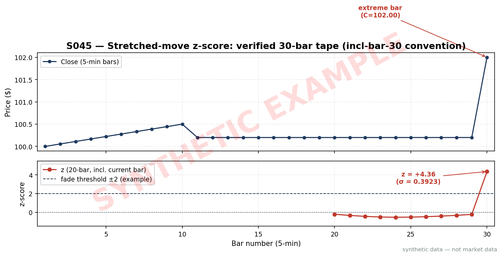

```mermaid
flowchart LR
    FEED["Raw feed<br/>(1-min bars + TICK/TRIN)"] -->|"1-min bars; internals ticks"| ING["Ingest + normalize<br/>(sessions, splits, as-of join)"]
    ING -->|"aligned 1-min bars + internals"| FEAT["Feature compute<br/>(VWAP/rolling z, TICK/TRIN)"]
    FEAT -->|"z_t, internals (1-min bars)"| SIG["Signal S045<br/>stretched-move fade"]
    SIG -->|"signal (1-min bars)"| GATE{"Cost / news<br/>gate?"}
    GATE -->|pass| OUT["Downstream consumer<br/>(T063 / T013 / T048)"]
    GATE -->|fail| DROP["No trade"]
    style SIG fill:#aed6f1,stroke:#1f3a5f
```

### S12. Sources

- *Trends and Reversion in Financial Markets on Time Scales from Minutes to Decades.* arXiv:2501.16772 (2025). https://arxiv.org/pdf/2501.16772.pdf
- Wood, K., Roberts, S. & Zohren, S. (2021). *Slow Momentum with Fast Reversion: A Trading Strategy Using Deep Learning and Changepoint Detection.* arXiv:2105.13727. https://arxiv.org/abs/2105.13727v2
- TRIN (Arms index) — definition and formula: (advances/declines) ÷ (advancing volume/declining volume); <1.0 bullish, >1.0 bearish. https://en.wikipedia.org/wiki/TRIN_(finance)
- Nagel, S. (2012). *Evaporating liquidity.* Review of Financial Studies 25(7), 2005–2039. https://ideas.repec.Org/a/oup/rfinst/v25y2012i7p2005-2039.html — Short-term reversal returns proxy liquidity provision; expected reversal profits covary with VIX: explains why the z-score fade is regime-dependent and pays best when liquidity demand spikes.
- Gatev, E., Goetzmann, W. N. & Rouwenhorst, K. G. (2006). *Pairs trading: Performance of a relative-value arbitrage rule.* Review of Financial Studies 19(3), 797–827. https://www.econbiz.de/Record/pairs-trading-performance-of-a-relative-value-arbitrage-rule-gatev-evan/10005564224 — A simple 2σ-deviation convergence rule on close substitutes earns ~11% annualized: the academic benchmark for z-score-style mean reversion.
- Avramov, D., Chordia, T. & Goyal, A. (2006). *Liquidity and autocorrelations in individual stock returns.* Journal of Finance 61(5), 2365–2394. https://www.jstor.org/stable/3699323 — Short-horizon return autocorrelation is concentrated in illiquid, high-turnover stocks: bounds where the intraday z-score fade works and where it is just spread.

**Unverified leads** (chatbot-provided, not independently checkable — do not treat as evidence):
- Duck.ai (GPT-5.6 Luna, anonymous, 2026-09-10), Q-SB5-1: the 30-bar worked tape reused in S4 — arithmetic operator-verified (z=+4.36, σ=0.3923, IBH/IBL=101.20/99.80), with the methodology caveat (mixed bar-inclusion conventions) flagged in S10. Q-SB5-3: "fade works best when the move lacks volume/news confirmation" framing. Full text in `batches/SB5/duckai-answers.md`; Grok/Cursor answers pending (checked 2026-09-10).

---
## Stage 34/200 — S034: Scheduled macro-announcement drift

*Batch SB6 · Signal 34/100 · Provenance [D] · Family C — Intraday Mean Reversion & Reversal*

### S1. One-line verdict

| | |
|---|---|
| **What it is** | Measures drift before a scheduled macro release (FOMC, CPI, payrolls) and continuation right after; trades the event window. |
| **When it works** | High-uncertainty regimes where pre-event risk premia are large; releases with a clear surprise that markets need minutes to digest. |
| **When it dies** | Leaked or fully anticipated prints; surprise sign opposite the pre-drift; crowded event trades; post-2015 the pre-FOMC drift largely disappeared. |
| **Build-or-buy in one line** | Build — the logic is 40 lines; buy the cleanest timestamped 1-min bars + a reliable calendar you can afford. |
| Provenance `[D]` · Family C | Documented in the report; citations: Ederington & Lee (1993). |

### S2. How it works — plain human explanation

**FOMC** (Federal Open Market Committee) is the Federal Reserve body that sets US interest rates; its statements land at a scheduled minute (e.g. 14:00 ET), and **CPI** (Consumer Price Index) and **payrolls** (the monthly US jobs report) land at scheduled minutes too. A **surprise** is the gap between the printed number and what markets expected. **Drift** here means a slow directional price move rather than a jump. **PEAD** (post-earnings-announcement drift) is the older, better-established cousin: after earnings surprises, prices keep drifting in the surprise direction for days (Ball & Brown; Bernard & Thomas).

The market vignette: at 13:00 ET, one hour before an FOMC statement, the S&P 500 e-mini sits at 6000.00 and prices often *drift* into the release — the pre-announcement drift. The story is risk compensation: investors demand a premium for holding inventory through the event. The statement drops at 14:00:00; the bulk of the repricing lands within the first minute (Ederington & Lee 1993), but volatility stays elevated ~15 minutes and prices can keep *continuing* in the surprise direction as the statement, dot plot, and press conference get parsed. That continuation is the signal's second leg.

Three mechanisms drive it: (1) **inventory/risk compensation** — dealers shade prices into scheduled uncertainty, creating drift; (2) **information diffusion** — complex releases take minutes to interpret, so the reaction is a process, not an instant; (3) **positioning cascades** — pre-event hedges unwind after the print, extending the move. The honest caveat, repeated in S9: the pre-announcement premium is *risk compensation with unknown sign* — it is not an exploitable directional prediction.

**Mental model:**
- Scheduled events are the market's few predictable volatility earthquakes — the timing is public, the direction is not.
- Pre-event drift is payment for bearing event risk, and its sign is unreliable; post-event continuation is payment for being the liquidity that absorbs the repricing.
- The first minute belongs to machines (latency race); minutes 2–30 belong to interpretation (this signal's hunting ground); hours later belongs to macro funds.

### S3. The math — exact formula

Let the release time be $\tau$. Define the **pre-window** $[\tau - W_{pre}, \tau)$ and the **post-window** $(\tau, \tau + W_{post}]$, measured in minutes on 1-min bars. Let $P(t)$ be the price at minute $t$.

Pre-announcement drift (log return):
$$R_{pre} = \log P(\tau^-) - \log P(\tau - W_{pre})$$

Announcement surprise proxy (first tradable move; the true surprise needs a survey/consensus feed):
$$R_{jump} = \log P(\tau + 2) - \log P(\tau^-)$$

Post-announcement continuation signal at minute $t > \tau$:
$$s(t) = \mathrm{sign}(R_{jump}) \cdot \mathbf{1}\left\{|R_{jump}| > \kappa \cdot \hat{\sigma}_{diurnal}(t)\right\}$$
where $\hat{\sigma}_{diurnal}(t)$ is the time-of-day-normalized 1-min volatility (see S067 diurnal deseasonalization) and $\kappa$ is a threshold. The traded return over the post-window is:
$$R_{post} = s(\tau{+}1) \cdot \left[\log P(\tau + W_{post}) - \log P(\tau + 1)\right] - \mathrm{costs}$$

**Parameter table** (every default is `example — not an institutional standard`):

| Parameter | Symbol | Typical range | Too small | Too large | Default example |
|---|---|---|---|---|---|
| Pre-window | $W_{pre}$ | 15–120 min (FOMC: 60) | noise dominates | mixes in unrelated trend | 60 min |
| Post-window | $W_{post}$ | 5–60 min | catches only the jump, no continuation | continuation fades, costs compound | 30 min |
| Jump threshold | $\kappa$ | 1.5–4.0 (diurnal σ) | trades noise jumps, churns | misses real surprises | 2.5 |
| Entry delay | — | 1–5 min after $\tau$ | filled at the violent first print | misses the move | 1 min |
| Max hold | — | 15–60 min | cuts continuation short | overnight/event-tail risk | 30 min |

**Normalization:** compare $R_{jump}$ and $R_{pre}$ against the *diurnal* (time-of-day) volatility, not a flat trailing σ — 14:00 on an FOMC day has a different baseline than 14:00 on a quiet Tuesday. A z-score form $z = R / \hat{\sigma}_{diurnal}$ is standard; raw returns are acceptable only inside a single event type.

**Causal timing:** the calendar gives $\tau$ in advance; $R_{pre}$ is computed at $\tau$ from bars $\le \tau$; $R_{jump}$ needs the first post-release prints, so the earliest tradable entry is $\tau + 1$ min. Entering *at* $\tau$ on the pre-drift sign is a different, riskier trade — you are betting the drift survives the release.

**Named variants:** (1) *Pre-drift capture* — trade only $R_{pre}$, flat before the print (avoids the jump). (2) *Post-continuation* — the form above. (3) *Vol-expansion straddle* — buy gamma/vol into the release sized by the expected move instead of direction (the bridge to T068).

### S4. Worked example — step-by-step numbers (SYNTHETIC)

Synthetic 1-min tape, seed **34** (numpy `default_rng(34)`), announcement at $t = 0$ (14:00 ET, FOMC-style). Returns are quoted in **bp** (basis points; 1 bp = 0.01%). All numbers below are exactly what `batches/SB6/plot_S034.py` prints and plots — text and chart agree by construction.

| $t$ (min) | Price | Step | Cumulative log-return from $t{=}{-}60$ |
|---|---|---|---|
| −60 | 5999.99 | start of pre-window | 0.0 bp |
| −45 | 6004.74 | drift building | +7.9 bp |
| −30 | 6010.64 | drift building | +17.7 bp |
| −15 | 6013.95 | drift building | +23.2 bp |
| −5 | 6016.90 | drift building | +28.1 bp |
| 0 | 6009.46 | release minute (last pre-print) | **+15.8 bp** |
| +1 | 6000.34 | surprise repricing | +0.6 bp |
| +2 | 5991.58 | jump completes | −14.0 bp |
| +5 | 5988.54 | continuation | −19.1 bp |
| +10 | 5985.32 | continuation | −24.5 bp |
| +20 | 5978.76 | continuation | −35.4 bp |
| +30 | 5973.49 | exit | −44.3 bp |

Computation steps:
1. Pre-drift: $R_{pre} = \log(6009.46/5999.99) = +0.001578 \approx$ **+15.8 bp** over 60 min — the risk-compensation drift into the event.
2. Announcement jump: $R_{jump} = \log(5991.58/6009.46) = -0.002980 \approx$ **−29.8 bp** in the first 2 minutes (hawkish surprise).
3. Trade (variant 2, post-continuation): short 1 unit at the first tradable print $t{=}{+}1$, $P = 6000.34$; cover at $t{=}{+}30$, $P = 5973.49$. Gross P&L $= 6000.34/5973.49 - 1 = +0.00450 \approx$ **+45.0 bp** before costs.
4. Costs (example — not an institutional standard): index-future half-spread ≈ 0.5 bp each way + 0.5 bp slippage/commission each way → ≈ 2 bp round trip. Net ≈ **+43 bp** on this synthetic tape.

**What to notice:** the pre-drift (+15.8 bp) pointed *up* while the surprise went *down* — the pre-event premium's sign did not predict the release direction, exactly the S2 warning. The post-continuation leg (+45 bp gross) is where this variant's edge lives. Limits: no partial fills, no quote withdrawal at the release, no latency between $\tau$ and the $t{=}{+}1$ fill, one cherry-picked path — arithmetic demonstration, not a backtest.

### S5. Strategies that use this signal

- **T017 — Scheduled Macro-Announcement Drift** — primary entry trigger (direction): the pre-drift and post-continuation rules above are T017's entry logic, sized by the HAR vol forecast (S066) and gated by identified-news drift (S092).
- **T068 — Scheduled-Event Vol Expansion** — event-timing and window input: S034 supplies $\tau$, $W_{pre}$, $W_{post}$ and the diurnal-vol baseline; T068 trades the volatility *expansion* (straddle/implied-move positioning) rather than S034's direction.

### S6. Data required — exact spec

| Field | Type | Granularity | Source tier | Notes |
|---|---|---|---|---|
| 1-min OHLCV (open, high, low, close, volume) bars — index future or ETF (exchange-traded fund) | float/int | 1-min bars | Tier 1–2 | Survive DST (daylight-saving time), half-days; official session flags |
| Economic calendar | event + timestamp | macro calendar events | Tier 0–2 | Release minute $\tau$ in exchange tz; revision flags |
| Consensus vs actual (optional) | float | per release | Tier 2–3 | True surprise; without it use $R_{jump}$ proxy |
| Diurnal vol profile | float | 1-min bins | derived | Rolling median of \|return\| by time-of-day |

Ingest sketch (≤20 lines, Python/polars pseudocode):
```python
import polars as pl
bars = pl.read_parquet("bars/ES_1m.parquet")          # 1-min bars, exchange tz
cal  = pl.read_parquet("calendar/macro.parquet")      # release, tau, importance
bars = bars.with_columns(r=pl.col("close").log().diff())
# attach each bar to the nearest release; keep only event windows
ev = (bars.join_asof(cal.sort("tau"), left_on="time", right_on="tau",
                     strategy="backward", tolerance="90m"))
ev = ev.with_columns(tmin=(pl.col("time") - pl.col("tau")).dt.total_minutes())
pre  = ev.filter((pl.col("tmin") >= -60) & (pl.col("tmin") < 0))
post = ev.filter((pl.col("tmin") > 0) & (pl.col("tmin") <= 30))
```
Storage: 1-min bars for a 500-symbol universe ≈ 50 MB/day parquet → 60 days ≈ 3 GB (per `notes/cost-model.md` §4); the calendar itself is kilobytes. Data-quality checklist: normalize all timestamps to one tz (releases are ET; futures trade CT); corporate actions irrelevant for futures but ETF dividends need adjustment; drop halted/auction-only bars; handle half-days (day after Thanksgiving); flag bars where the feed, not the market, was stale.

### S7. Local build on M5 Max / 128GB

**Verdict: trivial.** A calendar join plus rolling statistics on 1-min bars — Tier L (4–12 h) per `notes/cost-model.md` §5 (S034 is in the S021–S048 1-min group). Throughput (per §2): polars does 10–50M rows/sec; a 10-year multi-event study scans in seconds. RAM (per §3): 60 days of 500-symbol 1-min bars ≈ 3 GB — far inside the 77 GB working budget. Stack: **Python + polars** (no reason for Rust here). Engineering: ~6–10 h ≈ **$900–1,500** loaded-cost estimate. What breaks first: not compute — calendar-feed reliability and corporate-action hygiene (wrong $\tau$ = trading the wrong minute). (Labeled chatbot lead: duck.ai Q-SB6-2 put a full event scanner *prototype including data plumbing* at 40–100 h; the Tier L band covers the signal logic and takes precedence.)

### S8. Buy vs build

| Vendor / option | What you get | Indicative price | Gains | Loses |
|---|---|---|---|---|
| Tier 0: Fed/FRED/BLS calendars + Stooq daily bars | Release schedule, daily history | ~$0 | Free; authoritative $\tau$ | No intraday bars, no consensus series |
| Tier 1: Polygon Stocks Advanced / Alpaca SIP (Securities Information Processor consolidated feed) 1-min | 1-min SIP bars + basic calendar fields | ~$30–200/mo | Cheap, covers S6 fully | SIP timestamps; redistribution limits |
| Tier 2: Databento Standard (pay-as-you-go) | Exchange-native 1-min bars, futures | ~$200/mo + usage | Honest timestamps for the $\tau{+}1$ fill | Usage metering on history pulls |
| Academic route: NBER/Fed working papers + TAQ (Trade and Quote database) via WRDS | Publication-grade history | institutional $$$$ | Reproducible research | Slow access, not for live trading |

**Verdict: build the signal, buy the raw bars.** The crossover is the calendar: if your edge needs consensus-vs-actual *surprise* (not just the $R_{jump}$ proxy), buy a proper economic-surprise feed; otherwise the Tier-0 calendar plus Tier-1 bars is enough. All prices `indicative — verify before budgeting`.

### S9. Success ratio / efficacy — documented evidence

| Study / source | Market & period | Metric | Before/after cost | Caveat |
|---|---|---|---|---|
| Ederington & Lee (1993), J. Finance | Rates/foreign-exchange (FX) futures, scheduled macro releases | Bulk of price adjustment within 1 min; vol elevated ~15 min, slightly elevated for hours | Descriptive (no strategy) | Futures, not equities; documents the *volatility* pattern, not a tradable drift |
| Lucca & Moench (2015), J. Finance (as documented in Kurov, Wolfe & Gilbert 2021) | US equities, Sep 1994–Mar 2011 | +49 bp average in the 24 h before FOMC; ≈80% of annual excess returns | Before cost; premium, not strategy P&L | Sign is risk compensation; the finding is about the *premium*, not a forecastable direction |
| Kurov, Wolfe & Gilbert (2021), Finance Research Letters | US equities extended to Dec 2019 | Pre-FOMC drift disappeared after 2015 (both with and without press conferences) | Before cost | Directly documents decay of the flagship pre-event effect |
| Neuhierl & Weber, "Monetary Momentum", NBER w24748 | CRSP value-weighted index, FOMC days | ≈2.5% return gap pre-announcement between expansionary/contractionary surprises; ≈4.5% including a 15-day post-drift | Before cost | Needs the (unobservable ex ante) policy-surprise sign; a research fact, not a recipe |

**Regimes where it fails:** fully anticipated or leaked releases (no surprise, no continuation); risk-off days where the whole cross-section moves together and the event is noise; post-2015 FOMC calendar (the pre-drift leg has decayed); simultaneous releases (CPI + retail sales) where attribution is ambiguous; data revisions that rewrite the "surprise" after the fact.

**Honest bottom line:** as a *standalone directional trigger* this is a **weak, decayed edge** — the headline premia (49 bp pre-FOMC) are before-cost risk compensation with unknown sign, and the flagship version has weakened since 2015. As a *volatility-timing and event-window framework* (when to widen stops, when to stand down, when T068 should be armed) it is a **solid, durable input**. Do not confuse documented announcement-day premia with exploitable directional prediction.

### S10. Failure modes & pitfalls

1. **Wrong-$\tau$ / timezone bugs** — trading the wrong minute around a release. Mitigation: single canonical tz (ET), unit-test the join on known releases.
2. **Lookahead via revisions** — the "actual" you backtest on is the revised print, not the real-time flash. Mitigation: archive real-time vintages or use the first-print proxy.
3. **Leaked/whisper numbers** — price moves before the embargo lifts. Mitigation: require $R_{jump}$ confirmation; never pre-position on rumor.
4. **Sign flip** — pre-drift up, surprise down (shown in S4). Mitigation: size the pre-leg small or trade only the post-continuation leg.
5. **Spread/quote withdrawal at $\tau$** — the $t{=}{+}1$ fill in the example is fantasy during a volatility halt. Mitigation: model 2–5× normal spread in the event minute; use limit orders.
6. **Overfitting the event set** — ~8 FOMCs/year is a tiny sample; mining $W_{pre}$/$W_{post}$ overfits fast. Mitigation: pool across CPI/payrolls/FOMC with a hierarchical prior; freeze parameters.
7. **Crowding** — the pre-FOMC drift's decay is the exhibit. Mitigation: treat published effects as risk controls, not alpha; monitor live P&L decay.
8. **Microstructure noise vs signal confusion** — a 2-min "jump" can be one bad print. Mitigation: median-filter the release prints; require the move to persist 2+ bars.

### S11. Visuals

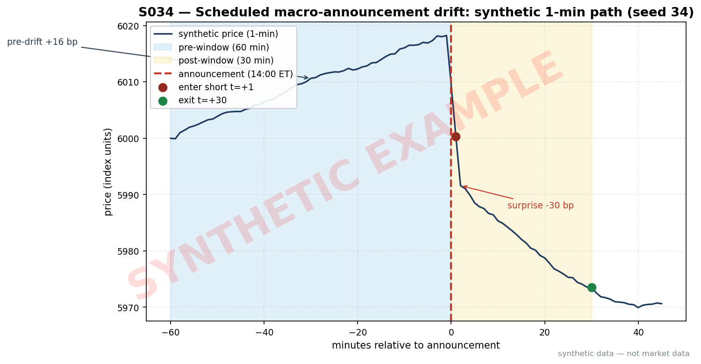

```mermaid
flowchart LR
    FEED["Raw feed<br/>(Databento 1-min bars + macro calendar)"]
    FEED -- "1-min bars; macro calendar events" --> ING["Ingest + normalize<br/>(exchange tz, DST, half-days)"]
    ING -- "normalized 1-min bars" --> FEAT["Feature compute<br/>(event windows, diurnal vol)"]
    FEAT -- "event-window returns (1-min)" --> SIG["Signal S034<br/>(pre-drift + post-momentum)"]
    SIG -- "signal z per release (1-min bars)" --> GATE{"Cost / latency<br/>gate?"}
    GATE -->|pass| OUT["Downstream consumer<br/>(T017 entry; T068 timing)"]
    GATE -->|fail| DROP["No trade"]
    style SIG fill:#aed6f1,stroke:#1f3a5f
```

### S12. Sources

1. Ederington, L. H. & Lee, J. H. (1993). "How Markets Process Information: News Releases and Volatility." *Journal of Finance* 48(4), 1161–1191. http://ideas.repec.org/a/bla/jfinan/v48y1993i4p1161-91.html
2. Kurov, A., Wolfe, M. H. & Gilbert, T. (2021). "The Disappearing Pre-FOMC Announcement Drift." *Finance Research Letters* 40. https://pmc.ncbi.nlm.nih.gov/articles/PMC7525326/ — documents Lucca & Moench (2015)'s +49 bp / 24 h pre-FOMC finding (1994–2011, ≈80% of annual returns) and its post-2015 disappearance.
3. Neuhierl, A. & Weber, M. "Monetary Momentum." NBER Working Paper 24748. http://nber.org/system/files/working_papers/w24748/w24748.pdf — pre-announcement drift by policy-surprise sign plus ~15-day post-announcement continuation.

**Unverified leads** (chatbot / secondary, not independently confirmed — do not treat as facts):
- Duck.ai (GPT-5.6 Luna, anonymous, 2026-09-10) answered Q-SB6-1–Q-SB6-3; its macro-drift summary (pre-FOMC premium as risk compensation; HF first-30-second reaction burst; no stable universal post-reaction number) was checked for internal consistency against the named sources but is used here only as research leads, not confirmed facts. Source log: "Duck.ai answered Q-SB6-1–Q-SB6-3 (2026-09-10); Grok/Cursor answers pending (checked 2026-09-10)."
- Guo, Hung & Kontonikas (2021), *Finance Research Letters* — pre-FOMC drift concentrated in high-sentiment/low-uncertainty months (seen only via the duck.ai answer's citation; not independently opened).

---
## Stage 36/200 — S036: Overnight-gap fade (overnight→intraday reversal)

*Batch SB6 · Signal 36/100 · Provenance [D] · Family C — Intraday Mean Reversion & Reversal*

### S1. One-line verdict

| | |
|---|---|
| **What it is** | Fades the overnight gap: if a stock opens well above/below the prior close, bet it drifts back toward the close during the session. |
| **When it works** | Small, no-news gaps in liquid names where the opening print overshoots on thin liquidity and attention-driven order flow. |
| **When it dies** | Earnings/catalyst gaps (they continue), trending markets, illiquid names with wide spreads — and after costs, which often eat the whole edge. |
| **Build-or-buy in one line** | Build in an afternoon; the hard part is the cost model and the news filter, not the arithmetic. |
| Provenance `[D]` · Family C | Documented in the report; citations: Alvarez (2026, unverifiable — see S12), Lou, Polk & Skouras (2019). |

### S2. How it works — plain human explanation

An **overnight gap** is the price jump between yesterday's official close and today's opening print — the market's verdict on everything that happened while the exchange was shut. **Fading** a gap means betting against it: gap up → short, expecting the price to fall back; gap down → buy, expecting a bounce. The **bid–ask bounce** is the mechanical zigzag between the bid and the ask: a buy prints at the ask, a sell at the bid, so transaction prices bounce even when the true value hasn't moved. **Adverse selection** is the risk that the person trading against you knows more than you do — the market maker's nightmare and the reason spreads exist.

The vignette: XYZ closed at $100.00. Overnight, thin pre-market trading and retail chatter push the open to $102.00 — a +2.00% gap on no real news. The fade trader shorts at 9:30:00. Two stories justify it. First, **liquidity overshoot**: the opening auction concentrates overnight demand into one print with limited liquidity on the other side, so the price overshoots; once continuous trading starts, liquidity returns and the price mean-reverts. Second, **attention pressure** (Berkman, Koch, Tuttle & Zhang 2012): retail investors who noticed the stock overnight pile in at the open and push it too far; their pressure unwinds intraday. The mirror risk is **PEAD** — post-earnings-announcement drift: when the gap carries genuine information (earnings, guidance, macro shock), the open is not an overshoot but the first installment, and fading it bleeds. The report's own caveat: the mirror hypothesis (gap continuation) must be estimated per instrument, never assumed away.

**Mental model:**
- The open is the day's least liquid, most emotional print — that is both the opportunity and the trap.
- Small no-news gaps revert (overshoot); large catalyst gaps continue (information). The signal's entire job is telling them apart.
- Fill probability is not expectancy: a 70% win rate with fat losers is a losing strategy.

### S3. The math — exact formula

Overnight and intraday returns (simple returns; log is fine too — pick one and stay consistent):
$$r_{overnight}(t) = \frac{O(t)}{C(t-1)} - 1 \equiv g(t), \qquad
r_{intraday}(t) = \frac{C(t)}{O(t)} - 1$$

The documented panel relationship (Lou, Polk & Skouras 2019 document the offsetting cross-period structure):
$$r_{intraday}(t) = \alpha + \beta \cdot r_{overnight}(t) + \mathrm{FE} + \varepsilon(t), \qquad \beta < 0 \;\; \text{(the fade hypothesis)}$$

Trading form — fade the gap, sized by its magnitude:
$$s(t) = -\mathrm{sign}(g(t)) \cdot \mathbf{1}\{|g(t)| \ge g_{min}\} \cdot \mathbf{1}\{|g(t)| \le g_{max}\}$$
$$R(t,k) = \frac{P(t,k) - O(t)}{O(t)}, \qquad \Pi(t,k) = s(t) \cdot R(t,k) - \mathrm{costs}$$
where $P(t,k)$ is the price $k$ bars/minutes after the open and $\Pi$ is the fade P&L.

**Parameter table** (every default is `example — not an institutional standard`):

| Parameter | Symbol | Typical range | Too small | Too large | Default example |
|---|---|---|---|---|---|
| Min gap | $g_{min}$ | 0.5–2.0% (equities); 0.2–0.8% (futures/foreign-exchange (FX)) | noise gaps, churn | too few trades | 1.0% |
| Max gap | $g_{max}$ | 3–8% | fades genuine information gaps (PEAD leg) | — | 5% |
| Entry delay | — | 1–5 min bars | filled into the opening spike | gives away the reversion | 0 (at open) or 1 bar |
| Hold | $k$ | 5–60 min; or to close | cuts reversion short | gives back the fill to afternoon drift | 10 bars / to close |
| Exit target | — | 25–100% of gap | leaves money on table | never fills, round-trips | 100% (prior close) |
| Stop | — | 25–75% of gap or 0.5–1.5× opening ATR (Average True Range) | stopped by noise | catastrophic gap-continuation days | 50% of gap |

**Normalization:** scale the gap by recent volatility — $|g|/\hat{\sigma}_{daily}$ or vs. the 14-day ATR — so that a 2% gap in a 1%-vol name (huge) and in a 4%-vol name (noise) are not treated equally. A z-scored form $z = g / \hat{\sigma}$ with $|z| \ge 1.5$–$2.0$ is the usual gate.

**Causal timing:** $g(t)$ is known at the opening print; the earliest fill is the open (auction) or the first post-open bar. $R(t,k)$ uses only prices $\le t{+}k$. No lookahead: $C(t{-}1)$ must be the *official* close, split/dividend-adjusted.

**Named variants:** (1) *Open-to-close fade* — enter at the open, exit at the close (the regression form). (2) *Timed fade* — exit after $k$ minutes or at a partial-fill target (the S4 form). (3) *Size-scaled fade* — position $\propto |g(t)|$ below $g_{max}$. (4) *Jump-filtered fade* — fade only when the Lee–Mykland test says the overnight move was *not* a significant jump (S037; T012's form).

### S4. Worked example — step-by-step numbers (SYNTHETIC)

Synthetic tape, seed **36**: prior close $C(t{-}1) = 100.00$, open $O(t) = 102.00$ → gap $g = 102/100 - 1 = \mathbf{+2.00\%}$, which clears the example $g_{min} = 1\%$. Fade: short 1 share at the open.

| Bar | Price | Log-return $r(i)$ | Fade P&L (cumulative, before costs) |
|---|---|---|---|
| open (0) | 102.00 | — (entry) | 0.00% |
| 1 | 101.50 | −0.004914 | +0.49% |
| 2 | 101.1030 | −0.003918 | +0.88% |
| 3 | 100.8055 | −0.002947 | +1.17% |
| 4 | 100.5068 | −0.002967 | +1.46% |
| 5 | 100.1093 | −0.003960 | +1.85% |
| 6 | 99.7115 | −0.003980 | +2.24% |
| 7 | 99.4135 | −0.002994 | +2.54% |
| 8 | 99.2149 | −0.002000 | +2.73% |
| 9 | 99.1157 | −0.001000 | +2.83% |
| 10 | 99.2148 | +0.001000 | **+2.731%** |

Step-by-step:
1. Gap: $g = 102.00/100.00 - 1 = +2.00\%$ → $s = -1$ (short).
2. Exit at bar 10: $\Pi(10) = -(99.2148 - 102.00)/102.00 = 2.7852/102.00 = \mathbf{+2.731\%}$ before costs — the gap more than filled (price fell *through* the prior close).
3. Jump-screen sanity check on the same tape (full treatment is S037, normalized convention): the Lee–Mykland opening test gives $T(\text{open}) = 6.99 > q(0.95) = 2.970$ → **significant jump at 5%** → the fade is **NOT permitted** — the filter vetoes this trade. The sting: on this toy tape the veto deletes what would have been a +2.731% winner — a counterfactual winner the filter deliberately sacrifices, since the filter is a conservative veto, not a profit oracle, and whether deleting such trades helps net is the out-of-sample diff-in-diff question (see S037).
4. Costs (example — not an institutional standard), three-component stack: effective half-spread ≈ 2 bp (basis points; 1 bp = 0.01%) per leg (4 bp round trip, opening print in a very liquid name) + fees ≈ 0.5 bp per leg (1 bp round trip) + slippage/impact allowance ≈ 5 bp per leg (10 bp round trip, opening-auction adverse selection) = ≈ 15 bp round trip. The +2.731% (+273.1 bp) gross nets to ≈ +273.1 − 15 = +258 bp (≈ **+2.58%**) after costs on this tape — but this tape is a cherry-picked illustration, not a backtest. (The ≈ 3–15 bp all-in practitioner envelope is an unverified chatbot claim — see S12 Unverified leads.)

**What to notice:** the tape fills *fast* — most of the 2.73% arrives in the first 6 bars, which is why real implementations exit on partial fills or short holds rather than waiting for the close. Limits: no fees, no partial fills, no bid–ask bounce contamination (mid-price-like closes), exactly one path. The S11 chart plots this same tape; every price above appears on it.

### S5. Strategies that use this signal

- **T012 — Jump-Filtered Overnight-Gap Fade** — primary entry trigger (direction): S036 supplies the fade direction and sizing; S037 gates it (fade only when no significant jump is detected); S100 (earnings drift) vetoes known catalyst days.

### S6. Data required — exact spec

| Field | Type | Granularity | Source tier | Notes |
|---|---|---|---|---|
| Official open & prior close | float | daily bars | Tier 0–1 | Auction prints preferred; adjust for splits/dividends |
| 1-min OHLCV (open, high, low, close, volume) (exit timing) | float/int | 1-min bars | Tier 1–2 | For the $k$-bar exit and partial-fill logic |
| Corporate actions | event | daily | Tier 0–1 | A split masquerading as a gap is the classic bug |
| News/catalyst flag (optional) | boolean | daily | Tier 2 | Earnings calendar; vetoes the fade |

Ingest sketch (≤20 lines):
```python
import polars as pl
d = pl.read_parquet("bars/daily_adj.parquet")      # split/dividend-adjusted
d = d.with_columns(g=pl.col("open")/pl.col("close").shift(1).over("sym") - 1)
cands = d.filter((pl.col("g").abs() >= 0.01) & (pl.col("g").abs() <= 0.05))
m = pl.read_parquet("bars/ES_1m.parquet")           # 1-min bars for exit timing
# per candidate: first 10 post-open bars -> fade P&L
tr = (m.join(cands.select("sym","date","g"), on=["sym","date"], how="inner")
       .with_columns(pl=(pl.col("close")/pl.col("open")-1)))
```
Storage: daily bars for 3,000 stocks × 10 years ≈ 60M rows ≈ 2–5 GB RAM (per `notes/cost-model.md` §3); 1-min exit-timing bars ≈ 50 MB/day for 500 symbols (§4). Data-quality checklist: official vs. consolidated open (they differ); adjusted *and* unadjusted closes; **keep delisted symbols** (anti-survivorship); halt flags; DST (daylight-saving time)/half-day session lengths.

### S7. Local build on M5 Max / 128GB

**Verdict: trivial.** Daily-bar arithmetic plus a 1-min exit timer — Tier L (4–12 h) per `notes/cost-model.md` §5 (S036 is in the S021–S048 1-min group). Throughput (per §2): the daily gap scan is 3,000 rows/day; a 10-year 1-min exit study scans in seconds. RAM (per §3): the daily panel ≈ 2–5 GB; 60 days of 500-symbol 1-min bars ≈ 3 GB — inside the 77 GB budget. Stack: **Python + polars**; DuckDB if you prefer SQL. Engineering: ~4–8 h ≈ **$600–1,200** loaded-cost estimate. What breaks first: not compute — the *news/catalyst filter* (a "no-news" decision at scale needs a real news feed, the Tier-2/3 cost). (Labeled chatbot lead: duck.ai Q-SB6-2 put a full gap-scanner prototype with data plumbing at 40–100 h; the Tier L band covers the signal logic and takes precedence.)

### S8. Buy vs build

| Vendor / option | What you get | Indicative price | Gains | Loses |
|---|---|---|---|---|
| Tier 0: Stooq / Alpaca IEX daily bars | Daily OHLCV, adjusted | ~$0 | Free; enough for the regression form | No 1-min exit timing; survivorship care needed |
| Tier 1: Polygon Stocks Advanced | 1-min SIP (Securities Information Processor consolidated feed) bars, corporate actions | ~$30–200/mo | Full S6 spec, cheap | SIP timestamps adequate at 1-min, not sub-second |
| Tier 2: Databento Standard | Exchange-native bars, imbalance feeds | ~$200/mo + usage | Honest auction prints | Overkill for the daily-bar variant |
| Academic: TAQ (Trade and Quote database) via WRDS | Publication-grade history | institutional $$$$ | Reproducible | Not for live use |

**Verdict: build.** The signal is a ratio of two prices; the money goes to clean corporate-action data and (optionally) a news/catalyst feed for the $g_{max}$/veto logic. Buy the Tier-1 bars; build the scanner. All prices `indicative — verify before budgeting`.

### S9. Success ratio / efficacy — documented evidence

| Study / source | Market & period | Metric | Before/after cost | Caveat |
|---|---|---|---|---|
| Berkman, Koch, Tuttle & Zhang (2012), J. Fin. & Quant. Analysis | US equities, attention-sorted | Positive overnight returns reverse intraday; concentrated in high-attention, hard-to-value stocks; implicit costs of buying at the open often exceed the effective half-spread | Descriptive + cost measurement | Documents the *mechanism* (attention overshoot), not a tradable fade strategy |
| Lou, Polk & Skouras (2019), J. Fin. Economics | US equities 1993–2013 | Strong overnight/intraday firm-level continuation with an offsetting cross-period reversal lasting years | Before cost | Monthly horizon; supports the fade *intuition*, not a daily gap-fade P&L |
| Stübinger & Schneider (2019), J. Risk & Fin. Mgmt (S&P 500, 1998–2015) | S&P 500 constituents, high-frequency | 51.47% p.a., annualized Sharpe 2.38 **after** transaction costs (5 bp/half-turn) for the jump-filtered variant | After cost (authors' model) | Single-team backtest, no independent replication — an upper-bound illustration, not an expectation |

The mandatory honesty framing: **small non-news gaps often partially revert; large catalyst gaps often continue; unconditional fill probability is not positive expectancy; a high win rate can coexist with poor expectancy because the losers are fat**. The practitioner statistic that S&P 500 same-session gap fills run ~60–70% is **descriptive, not an academic constant** (unverified chatbot claim — see S12 Unverified leads) — do not annualize it into a Sharpe. On costs: all-in ≈ 3–15 bp for very liquid names (unverified chatbot claim — see S12 Unverified leads), and a 5–10 bp gross expectancy per trade nets to **≈0 or negative** (unverified chatbot claim — see S12 Unverified leads) — where most gap-fade backtests die. The S4 example stack decomposes the round trip as ≈ 4 bp effective half-spread + ≈ 1 bp fees + ≈ 10 bp slippage/impact.

**Honest bottom line:** as a standalone trigger this is a **fragile, possibly zero-after-cost edge** — the fade exists in the data, but costs, catalyst gaps, and the bid–ask bounce eat most of it. As a *filter/segmentation input* (which gaps to avoid fading, which names revert cleanly) it is **genuinely useful**, and the jump-filtered form (S037/T012) is the only variant with a published after-cost backtest — read with the caveats above.

### S10. Failure modes & pitfalls

1. **Catalyst gaps** — earnings, M&A, FDA: the gap is information, fading it is catching a falling knife. Mitigation: $g_{max}$ cap + earnings-calendar veto (T012's S100 gate).
2. **Bid–ask bounce contamination** — transaction-price "reversion" that is just the quote side flipping. Mitigation: measure on mid-quotes or require the move to exceed the effective spread.
3. **Cost blowup at the open** — the open is the widest-spread minute of the day. Mitigation: model all-in 3–15 bp; enter 1–5 bars late if needed.
4. **Lookahead via adjusted closes** — computing the gap on adjusted data with unadjusted opens (or vice versa). Mitigation: keep adjusted *and* unadjusted series; test the join on known splits.
5. **Survivorship bias** — dropping delisted names flatters the fade (dead stocks gapped down and never reverted). Mitigation: keep delisted symbols in the panel (the Q-SB6-2 chatbot lead, verified sound).
6. **Fat-loser asymmetry** — 70% win rate, −3× average loss on the 30%. Mitigation: hard stop at 25–75% of gap; size by $|g|$ with a cap, never martingale.
7. **Regime breaks** — trending/crisis markets where every gap continues. Mitigation: regime gate (pause when the index trends strongly); daily loss stop.
8. **Overfitting $g_{min}$/$g_{max}$/$k$** — three knobs on a noisy effect. Mitigation: freeze parameters across the pooled sample; report sensitivity, not the optimum.

### S11. Visuals

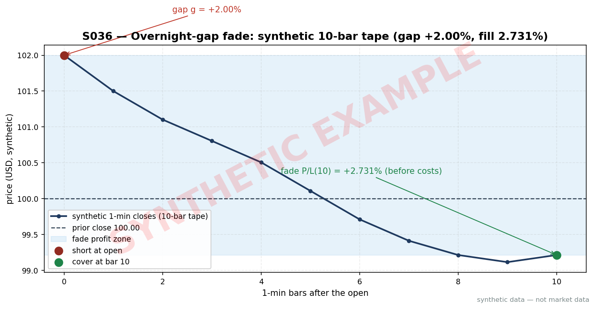

```mermaid
flowchart LR
    FEED["Raw feed<br/>(Polygon/Databento daily + 1-min)"]
    FEED -- "daily OHLCV bars; 1-min bars" --> ING["Ingest + normalize<br/>(official open, corp actions, halts)"]
    ING -- "adjusted daily bars" --> FEAT["Feature compute<br/>(gap g, diurnal z, news flag)"]
    FEAT -- "gap features (daily)" --> SIG["Signal S036<br/>(gap-fade s = −sign(g))"]
    SIG -- "fade signal per name-day (daily bars)" --> GATE{"Cost / catalyst<br/>gate?"}
    GATE -->|pass| OUT["Downstream consumer<br/>(T012 entry)"]
    GATE -->|fail| DROP["No trade"]
    style SIG fill:#aed6f1,stroke:#1f3a5f
```

### S12. Sources

1. Berkman, H., Koch, P. D., Tuttle, L. & Zhang, Y. J. (2012). "Paying Attention: Overnight Returns and the Hidden Cost of Buying at the Open." *Journal of Financial and Quantitative Analysis* 47(4), 715–741. https://bearworks.missouristate.edu/articles-cob/576/
2. Lou, D., Polk, C. & Skouras, S. (2019). "A Tug of War: Overnight versus Intraday Expected Returns." *Journal of Financial Economics* 134(1), 192–213. https://researchonline.lse.ac.uk/id/eprint/87481/
3. Stübinger, J. & Schneider, L. (2019). "Statistical Arbitrage with Mean-Reverting Overnight Price Gaps on High-Frequency Data of the S&P 500." *Journal of Risk and Financial Management* 12(2). https://www.mdpi.com/1911-8074/12/2/51 — the jump-filtered variant's after-cost backtest (51.47% p.a., Sharpe 2.38), with the replication caveats in S9.

**Unverified leads** (not independently confirmed — do not treat as facts):
- Alvarez (2026), "Overnight Returns and Intraday Reversals" — carried as a citation in the report's source entry; **no matching publication could be verified via web search (checked 2026-09-10)**. The entry's claim (net alpha after costs is negative) is consistent with the cost analysis above but remains an unverified report-carried citation.
- Duck.ai (GPT-5.6 Luna, anonymous, 2026-09-10) answered Q-SB6-1–Q-SB6-3; its gap-fade worked example (S4) was independently recomputed and corrected (single-digit typo noted in S4); its practitioner statistics (S&P 500 same-session fills ~60–70% descriptive; all-in costs 3–15 bp; a live gap-fade edge shrinking to ~5%/yr) are **unverified chatbot claims** used only as labeled practitioner context. Source log: "Duck.ai answered Q-SB6-1–Q-SB6-3 (2026-09-10); Grok/Cursor answers pending (checked 2026-09-10)."

---
## Stage 37/200 — S037: Jump-filtered overnight-gap reversal

*Batch SB6 · Signal 37/100 · Provenance [D] · Family C — Intraday Mean Reversion & Reversal*

### S1. One-line verdict

| | |
|---|---|
| **What it is** | Runs the Lee–Mykland jump test on the overnight move; fades the gap only when the move is *not* a statistically significant jump. |
| **When it works** | When genuine information jumps (earnings, macro shocks) behave differently from liquidity gaps — the filter keeps you out of the former. |
| **When it dies** | When the filter deletes your best trades, when the local-vol window is contaminated, or when you mistake the filter for an alpha source. |
| **Build-or-buy in one line** | Build — the test is 30 lines of numpy; the discipline is in the evaluation, not the code. |
| Provenance `[D]` · Family C | Documented in the report; citations: Stübinger & Schneider (2019) — note the report prints "Stübinger & Endres (2018)"; the journal paper is Stübinger & Schneider (2019), corrected in S12. |

### S2. How it works — plain human explanation

A **jump** is a price discontinuity — a move too large and too sudden to be ordinary minute-to-minute diffusion, the market's signature of real information arriving (an earnings beat, a surprise rate decision). **Bipower variation** is a way to measure "normal" volatility that is robust to jumps: instead of squaring returns (which lets one jump dominate), it multiplies *adjacent* absolute returns, so a lone spike gets diluted by its quiet neighbors. **Extreme-value normalization** rescales the test statistic so that the largest of many noisy observations can be judged against a known distribution — it answers "is this return extreme even allowing for the fact that I looked at 390 minutes today?" The **Lee–Mykland test** (Lee & Mykland 2012) packages this into a formal yes/no: is the return at minute $i$ a jump, at significance level $\alpha$?

The vignette: same setup as S036 — XYZ closed at $100.00, opens at $102.00 (+2.00%). The naïve fade shorts at the open. But was that +2% a *liquidity* gap (thin pre-market, attention buyers — the kind that reverts) or an *information* jump (a leaked takeover bid — the kind that continues)? The Lee–Mykland test scales the overnight return by local bipower-variation volatility, applies the extreme-value normalization, and compares against the 5% critical value 2.970. If $T > 2.970$: jump detected — do *not* fade immediately (stand down). If $T \le 2.970$: no jump — the fade is permitted. Lee & Mykland's empirical finding gives this teeth: individual-stock jumps line up with prescheduled earnings and company news, index jumps with general market news — the test genuinely identifies information-like discontinuities.

The mandatory framing, before any enthusiasm: it is **documented** that the test identifies information-like jumps (Lee & Mykland 2012). It is **not** generally published, across broad US samples, that bolting this filter onto a gap-fade strategy improves net return. The honest prior: sensible risk control and regime segmentation — not assumed alpha creation. The correct evaluation is an out-of-sample difference-in-differences, $\Delta(\text{filter}) = \text{NetReturn}(\text{fade} + \text{filter}) - \text{NetReturn}(\text{fade only})$, with per-trade stats by gap size, catalyst, and vol regime.

**Mental model:**
- Not all gaps are created equal: liquidity gaps revert, information jumps persist — the test is the sorting hat.
- The filter is a veto, not a trigger: it says "don't fade this one," never "buy this one."
- A filter that raises Sharpe by deleting two bad days and leaving 40 trades is not evidence — it's a smaller sample.

### S3. The math — exact formula

Let $p(i) = \log P(i)$ and $r(i) = p(i) - p(i-1)$. Local **bipower variation** over a window of $k$ returns ending at $i$. The sum has $k-1$ adjacent products, and the $1/(k-1)$ local-average normalization is the Lee–Mykland convention — Lee & Mykland (2008)'s exposition writes $\hat{\sigma}^2 = [1/(K-2)](\pi/2)\sum|r_j||r_{j-1}|$, and the S6 code below implements the equivalent averaging via `np.convolve(..., np.ones(k-1)/(k-1))`. Omitting the normalization (as an earlier draft of this chapter did) materially changes the test statistic — see the correction in S4.
$$\hat{V}(i) = \frac{\pi}{2}\cdot\frac{1}{k-1} \sum_{j=i-k+2}^{i} |r(j-1)| \cdot |r(j)|$$

Standardized return:
$$Z(i) = \frac{r(i)}{\sqrt{\hat{V}(i)}}$$

**Extreme-value normalization** (with $\Delta$ the sampling interval as a fraction of the day, e.g. $\Delta = 1/390$ for 1-min bars):
$$T(i) = \frac{|Z(i)| - C(\Delta)}{S(\Delta)}, \quad
C(\Delta) = \sqrt{2\log(1/\Delta)} - \frac{\log\pi + \log\log(1/\Delta)}{2\sqrt{2\log(1/\Delta)}}, \quad
S(\Delta) = \frac{1}{\sqrt{2\log(1/\Delta)}}$$

Decision rule — reject "no jump" at level $\alpha$ when:
$$T(i) > q(1-\alpha), \qquad q(1-\alpha) = -\log(-\log(1-\alpha))$$
with $q(0.95) = 2.970$ and $q(0.99) = 4.600$. Under the null, $\Pr(T(i) \le x) \approx \exp(-e^{-x})$ (Gumbel).

Jump-filtered fade rule: fade only if $|g(t)| \ge g_{min}$ **and** $T(\text{open}) \le q(1-\alpha)$. A detected opening jump means "do NOT fade immediately" — not "reverse and chase."

**Parameter table** (every default is `example — not an institutional standard`):

| Parameter | Symbol | Typical range | Too small | Too large | Default example |
|---|---|---|---|---|---|
| Local window | $k$ | 30–120 1-min returns | $\hat{V}$ noisy, false jumps | stale vol, misses regime shifts | 60 |
| Significance | $\alpha$ | 1–10% | filters everything (no trades) | filters nothing | 5% |
| Sampling | $\Delta$ | 1-min to 5-min | microstructure noise contaminates $\hat{V}$ | jumps blurred into diffusion | 1-min |
| Gap gate | $g_{min}$ | 0.5–2.0% | (see S036) | (see S036) | 1.0% |

**Normalization choices:** the test *is* a normalization — $Z(i)$ scales by local bipower variation rather than a global $\sigma$, which is precisely what makes it robust to volatility regimes. Alternatives: raw $|r(i)|$ thresholds (regime-blind, not recommended), or the Barndorff-Nielsen–Shephard (2004) / Andersen et al. (2010) jump tests (different asymptotics, same idea).

**Causal timing:** computed at the open from returns up to and including the overnight return; tradable no earlier than the first post-open bar. Caveat (verified sound): a 10-minute opening calculation is *illustrative only* — not statistically reliable; production needs the full $k$-return local window.

**Named variants:** (1) *Opening-jump veto* — the form above. (2) *Intraday jump scan* — run $T(i)$ on every bar to catch continuation jumps for early exit. (3) *Two-sided filter* — different $\alpha$ for up vs. down gaps (example choice, not a standard).

### S4. Worked example — step-by-step numbers (SYNTHETIC)

Same synthetic tape as S036 (seed **36** for the tape; the test arithmetic below is hand-computed; the S037 chart script uses numpy `default_rng(37)`): $C(t{-}1) = 100.00$, $O(t) = 102.00$, post-open 1-min closes $101.50, 101.1030, 100.8055, 100.5068, 100.1093, 99.7115, 99.4135, 99.2149, 99.1157, 99.2148$. Log returns: $-0.004914, -0.003918, -0.002947, -0.002967, -0.003960, -0.003980, -0.002994, -0.002000, -0.001000, +0.001000$.

Step-by-step Lee–Mykland at the open:
1. Overnight return: $r(\text{open}) = \log(102/100) = \mathbf{0.019803}$.
2. Adjacent absolute-return products: $0.000019253, 0.000011546, 0.000008744, \mathbf{0.000011749}, 0.000015761, 0.000011916, 0.000005988, 0.000002000, 0.000001000$. (**Correction:** the chatbot printed the fourth product as $0.000011649$ — one digit off; $0.002967 \times 0.003960 = \mathbf{0.000011749}$. Independently recomputed and confirmed.)
3. Sum: $\Sigma = \mathbf{0.000087954}$ (printed $0.000087854$ — corrected).
4. Bipower variation — **with the $(k-1)$ local-average normalization** the published formula and the S6 code require ($k = 10$ returns, 9 adjacent products): $\hat{V} = (\pi/2)\cdot(1/9)\cdot\Sigma = 1.5708 \times 0.000087954/9 = \mathbf{0.0000153509}$; $\sqrt{\hat{V}} = \mathbf{0.0039180}$. (Correction: an earlier draft computed $\hat{V} = (\pi/2)\Sigma = 0.00013816$ with no normalization — contradicting both the S6 code and the published formula. Adding the normalization divides $\hat{V}$ by 9 and flips the conclusion below; the numbers here are the correct, consistent ones.)
5. $Z(\text{open}) = 0.019803/0.0039180 = \mathbf{5.0542}$.
6. With $\Delta = 1/390$: $C(\Delta) = \mathbf{3.031}$, $S(\Delta) = \mathbf{0.2894}$; $T(\text{open}) = (5.0542 - 3.031)/0.2894 = \mathbf{6.99}$.
7. Decision: $6.99 > q(0.95) = \mathbf{2.970}$ → **Lee–Mykland jump at 5%** (also above $q(0.99) = 4.600$) → **do NOT fade — stand down**.
8. Fade P&L (from S036): short at $102.00$, cover at bar 10 at $99.2148$ → $\Pi(10) = \mathbf{+2.731\%}$ before costs. The filter vetoes this trade even though the tape would have profited — the veto is conservative risk control, not a profit oracle; whether deleting such trades helps net is the diff-in-diff question in S2.
9. Costs (example — not an institutional standard): three-component stack for the fade this filter gates — effective half-spread ≈ 2 bp (basis points; 1 bp = 0.01%) per leg (4 bp round trip, opening print in a liquid name) + fees ≈ 0.5 bp per leg (1 bp round trip) + slippage/impact allowance ≈ 5 bp per leg (10 bp round trip, opening-auction adverse selection) = ≈ 15 bp round trip. The $+2.731\%$ ($+273.1$ bp) gross nets to ≈ $+273.1 - 15 = +258$ bp (≈ **+2.58\%**) after costs — *if* the filter permits the trade, which on this tape it does not. A 5–10 bp gross expectancy per trade against a 15 bp stack is ≈ 0 or negative: the fade the filter gates lives or dies on costs, not on the jump test.

**What to notice:** the overnight return looked dramatic (+2.00%), and scaled by local volatility with the correct normalization it *is* extreme — $T = 6.99$ against the 2.970 threshold. That is the filter's value proposition in one number: it keeps you out of the big-gap trade. The honest sting: on this tape the filter deletes a +2.73% winner — a veto is not a profit oracle, and a filter that raises Sharpe by deleting two extreme days while leaving 40 trades is not evidence. Limits: the 10-bar window is illustrative, not statistically reliable; the test itself carries no costs; one test on one tape proves the arithmetic, not the strategy.

### S5. Strategies that use this signal

- **T012 — Jump-Filtered Overnight-Gap Fade** — the filter as gate/veto (primary role): S036 gives the fade direction, S037 vetoes information-like gaps, S100 vetoes known earnings days. This chapter *is* T012's risk engine.
- **T090 — Overnight Inventory Carry Manager** — jump filter as the carry gate: no jump → the overnight position may be carried; jump → flatten or hedge. Combined with borrow awareness (S098) and VIX term-structure context (S068).

### S6. Data required — exact spec

| Field | Type | Granularity | Source tier | Notes |
|---|---|---|---|---|
| 1-min (or finer) prices incl. overnight session | float | 1-min bars | Tier 1–2 | The test needs the overnight return *and* the local window |
| Official open / prior close | float | daily bars | Tier 0–1 | Defines $r(\text{open})$; auction prints preferred |
| Corporate actions | event | daily | Tier 0–1 | Splits look like jumps to the test |
| Trades/quotes (optional, finer) | event | tick/L1 (level-1) | Tier 2 | For sub-minute variants; microstructure noise caveat |

Ingest sketch (≤20 lines):
```python
import polars as pl, numpy as np
m = pl.read_parquet("bars/ES_1m_overnight.parquet")  # incl. pre-open session
r = np.log(m["close"].to_numpy()); r = np.diff(r, prepend=np.nan)
k, alpha = 60, 0.05
def bipower(r, k):
    a = np.abs(r)
    return (np.pi/2) * np.convolve(a[:-1]*a[1:], np.ones(k-1)/(k-1), mode="same")
V = bipower(r[1:], k); Z = r[1:]/np.sqrt(V)
Delta = 1/390; s = np.sqrt(2*np.log(1/Delta))
C = s - (np.log(np.pi)+np.log(np.log(1/Delta)))/(2*s); S = 1/s
T = (np.abs(Z)-C)/S; q = -np.log(-np.log(1-alpha))
jump = T > q   # boolean per bar; fade only where ~jump at the open
```
Storage: same as S036 — daily panel trivial; 1-min bars ≈ 50 MB/day per 500 symbols (per `notes/cost-model.md` §4); the overnight session roughly doubles the bar count for 24-hour instruments. Data-quality checklist: overnight session flags (pre-market vs. RTH (regular trading hours)); the opening auction print vs. first 1-min bar (they differ — use the print for $r(\text{open})$); bad ticks at the illiquid overnight open (median-filter); DST (daylight-saving time) transitions in the overnight session.

### S7. Local build on M5 Max / 128GB

**Verdict: feasible.** The test is vectorized numpy over 1-min returns — Tier L (4–12 h) per `notes/cost-model.md` §5 (S037 is in the S021–S048 1-min group). Throughput (per §2): numpy does ~50–200M elements/sec; the bipower convolution over a 500-symbol 1-min panel is milliseconds per day. RAM (per §3): 60 days × 500 symbols of 1-min bars ≈ 3 GB — inside the 77 GB budget. Stack: **Python + polars/numpy**; nothing here needs Rust or the GPU. Engineering: ~8–12 h ≈ **$1,200–1,800** loaded-cost estimate, most of it in validation (the test is easy; *trusting* it takes the hours — see S10). What breaks first: the multiple-testing burden (millions of $T(i)$/day need FDR (false discovery rate)-style control at $\alpha = 5\%$) and overnight data-quality edge cases. (Labeled chatbot lead: duck.ai Q-SB6-2 estimated jump-filter + validation at 10–25 h prototype; the cost-model Tier L band takes precedence.)

### S8. Buy vs build

| Vendor / option | What you get | Indicative price | Gains | Loses |
|---|---|---|---|---|
| Tier 0: Stooq/Alpaca IEX | Daily + 1-min IEX bars | ~$0 | Free; enough for the daily-open variant | No overnight session detail |
| Tier 1: Polygon Stocks Advanced | Full-session 1-min bars, corp actions | ~$30–200/mo | Covers S6 at 1-min | SIP (Securities Information Processor consolidated feed) timestamps; fine here |
| Tier 2: Databento (TAQ (Trade and Quote database)-like) | Exchange-native intraday, imbalance feeds | ~$200/mo + usage | Honest auction/overnight prints | Cost if you scan full history |
| Academic: LOBSTER / WRDS TAQ | MBO (market-by-order)/ITCH (Nasdaq's direct data-feed protocol) replay, publication history | hundreds/yr academic | Research-grade | Not for live trading |

**Verdict: build the test, buy the bars.** There is no serious vendor product that sells "a Lee–Mykland jump flag" — and you wouldn't want a black box here anyway, because the $\alpha$/$k$ choices are the strategy. Buy Tier-1 full-session bars; the 30 lines of numpy are yours. All prices `indicative — verify before budgeting`.

### S9. Success ratio / efficacy — documented evidence

| Study / source | Market & period | Metric | Before/after cost | Caveat |
|---|---|---|---|---|
| Lee & Mykland (2012), J. Econometrics | US equities, high-frequency | The test identifies information-like jumps: individual-stock jumps associate with earnings/company news; index jumps with market news | Statistical (no strategy) | Validates the *detection*, not any trading rule |
| Stübinger & Schneider (2019), J. Risk & Fin. Mgmt | S&P 500, 1998–2015, high-frequency | Jump-test-based overnight-gap strategy: 51.47% p.a., Sharpe 2.38 **after** costs (5 bp/half-turn; 10 bp round trip) | After cost (authors' model) | Single-team backtest; no independent replication; an upper bound, not an expectation |
| Mykland, Shephard & Sheppard (2012), working paper | Theory/simulation | Blocked multipower variation improves jump-test power and jump-robust vol estimates | Theoretical | Backing for better $\hat{V}$ inside the filter; not a strategy result |

The mandatory evaluation framing: **"removing jumps improves net strategy performance" is not generally published across broad US samples.** The filter helps if jump days have negative fade expectancy; it *hurts* if your biggest profitable fades get classified as jumps, if auction mechanics get misclassified, if the BV window is contaminated, if the jump is followed by partial reversion anyway, if the trade count collapses, or if adverse selection concentrates on the survivors. Evaluate with the out-of-sample difference-in-differences $\Delta(\text{filter}) = \text{NetReturn}(\text{fade}+\text{filter}) - \text{NetReturn}(\text{fade only})$, with per-trade stats by gap size, catalyst, and vol regime. A filter that lifts Sharpe by deleting two extreme losing days but leaves 40 observations is not persuasive.

**Honest bottom line:** as a *detection statistic* this is a **well-documented, genuinely useful test**. As a *strategy component* it is **sensible risk control and segmentation with no general proof of net alpha creation** — evaluate it as a veto via diff-in-diff, never assume it manufactures edge.

### S10. Failure modes & pitfalls

1. **BV-window contamination** — the jump itself (or a nearby one) lands inside the local window, inflating $\hat{V}$ and masking the jump. Mitigation: jump-robust windows (exclude the tested return); try $k \in \{30, 60, 120\}$ and check stability.
2. **Auction/opening-mechanics misclassification** — the opening print's microstructure looks like a jump. Mitigation: use the official auction print deliberately; consider excluding the first 1–5 minutes from the *window* while testing the overnight return.
3. **Multiple testing** — at $\alpha = 5\%$ across 500 names × 390 minutes, false jumps are guaranteed. Mitigation: FDR/Bonferroni-style adjustment for scans; keep $\alpha$ tight for vetoes.
4. **Trade-count collapse** — an aggressive filter leaves too few fades to estimate anything. Mitigation: report the trade count with and without the filter; require a minimum (e.g. ≥200 OOS trades) before believing $\Delta$.
5. **Adverse selection on survivors** — the filter keeps the "clean" gaps, which may be exactly the ones everyone else fades. Mitigation: the diff-in-diff *is* the check; watch for crowding in the survivor set.
6. **$\alpha$/$k$ mining** — tuning the test until the backtest shines. Mitigation: freeze $(\alpha, k)$ from the detection literature; any tuning happens on a validation split with embargo.
7. **Overnight data gaps** — missing pre-market bars make $r(\text{open})$ span an unknown interval. Mitigation: require a minimum overnight bar count; otherwise skip the name-day.
8. **Latency at the open** — computing $T$ on the auction print and getting the fade order in before the reversion starts. Mitigation: pre-compute everything except the final print; the decision is one comparison.

### S11. Visuals

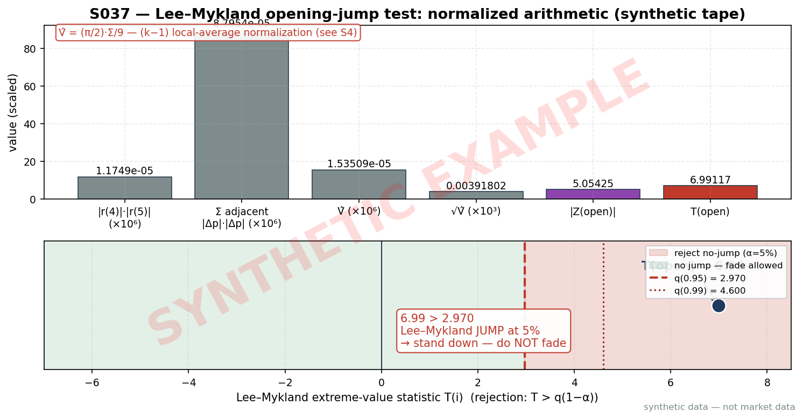

```mermaid
flowchart LR
    FEED["Raw feed<br/>(Databento/TAQ full-session 1-min)"]
    FEED -- "1-min bars incl. overnight session" --> ING["Ingest + normalize<br/>(auction print, bad-tick filter)"]
    ING -- "clean 1-min log returns" --> FEAT["Feature compute<br/>(bipower variation, Z, T)"]
    FEAT -- "T(i) statistics (per bar)" --> SIG["Signal S037<br/>(jump filter: T > q?)"]
    SIG -- "jump flag per name-day (daily bars)" --> GATE{"Fade veto<br/>gate?"}
    GATE -->|no jump| OUT["Downstream consumer<br/>(T012 fade; T090 carry)"]
    GATE -->|jump| DROP["Stand down — no fade"]
    style SIG fill:#aed6f1,stroke:#1f3a5f
```

### S12. Sources

1. Lee, S. S. & Mykland, P. A. (2012). "Jumps in Equilibrium Prices and Market Microstructure Noise." *Journal of Econometrics* 168(2), 396–406. https://ideas.repec.org/a/eee/econom/v168y2012i2p396-406.html — the nonparametric jump test; documents individual jumps ↔ earnings/company news, index jumps ↔ market news.
2. Stübinger, J. & Schneider, L. (2019). "Statistical Arbitrage with Mean-Reverting Overnight Price Gaps on High-Frequency Data of the S&P 500." *Journal of Risk and Financial Management* 12(2). https://www.mdpi.com/1911-8074/12/2/51 — jump-test-based overnight-gap backtest (51.47% p.a., Sharpe 2.38 after costs), with the replication caveats in S9. **Correction:** the report prints "Stübinger & Endres (2018)"; the journal paper is Stübinger & Schneider (2019) — "Stübinger and Endres (2018)" is cited *inside* it as a transaction-cost reference.
3. Mykland, P. A., Shephard, N. & Sheppard, K. (2012). "Efficient and Feasible Inference for the Components of Financial Variation Using Blocked Multipower Variation." Working paper. http://galton.uchicago.edu/~mykland/paperlinks/mss120221.pdf — improved bipower/multipower estimators that raise jump-test power; the theoretical backing for better $\hat{V}$ inside the filter.

**Unverified leads** (not independently confirmed — do not treat as facts):
- Barndorff-Nielsen & Shephard (2004) and Andersen et al. (2010) jump tests — named in the report's source entry as the procedure family; carried as report provenance, not independently opened for this chapter.
- Duck.ai (GPT-5.6 Luna, anonymous, 2026-09-10) answered Q-SB6-1–Q-SB6-3; its Lee–Mykland worked example was independently recomputed — one single-digit typo found and corrected visibly in S4 (conclusion unchanged); its evaluation framing (diff-in-differences $\Delta(\text{filter})$, "sensible risk-control/segmentation, not assumed alpha creation") is used here as a labeled chatbot lead consistent with the published evidence above. Source log: "Duck.ai answered Q-SB6-1–Q-SB6-3 (2026-09-10); Grok/Cursor answers pending (checked 2026-09-10)."

---
## Stage 38/200 — S038: Sub-hour microstructure reversal

*Batch SB6 · Signal 38/100 · Provenance [D] · Family C — Intraday Mean Reversion & Reversal*

### S1. One-line verdict

| | |
|---|---|
| **What it is** | Fade sharp 5–30-minute moves; sub-hour returns negatively autocorrelate, mostly from bid–ask bounce and decaying liquidity pressure. |
| **When it works** | Liquid names, normal two-sided flow, moves wide enough that the bounce is a small fraction; entered passively, exited on resiliency. |
| **When it dies** | Wide spreads, news-driven trends, one-sided flow, fast markets — the "reversal" is a trend in disguise, and costs eat it. |
| **Build-or-buy in one line** | Build: ~1 day of polars work on 1-minute bars; buy only the feed, never the signal. |

Provenance **[D]** (documented): Lehmann (1990); Heston, Korajczyk & Sadka (2010). Family C — Intraday Mean Reversion & Reversal.

### S2. How it works — plain human explanation

It is 9:47:03. A mid-cap stock's quote is bid 50.10 × 800 / ask 50.12 × 300. A seller dumps 5,000 shares; the bid side absorbs them down through 50.08 to 50.06 as the book thins. The last trade prints at 50.06 — the *bid*. Ten minutes later, with no news, the book has refilled and a buyer lifts the offer — the *ask*. The transaction price just "reversed" from 50.06 to 50.10 (+8 cents) while nothing fundamental happened. That round trip is the **bid–ask bounce** (the mechanical zig-zag of trade prices between bid and ask while the true value — the **midquote**, the average of bid and ask — barely moves). On top of the bounce: the seller's pressure pushed the midquote itself down — **temporary impact** (the price concession for absorbing an order, decaying as the book refills) — and liquidity providers get paid as it decays back.

Why should the effect exist? **Adverse selection** (the risk your counterparty knows more than you): makers widen spreads after one-sided flow, then let quotes drift back as the flow proves benign. And **inventory**: dealers who just bought 5,000 unwanted shares shade quotes to shed them; once flat, quotes revert. Both are compensation for **liquidity provision**, not free money.

Mental model:
- Sub-hour reversal = bounce (mechanical, untradable at the touch) + temporary-impact decay (economic, partially tradable if you can be the liquidity provider).
- The trade price lies; the midquote tells the truth. Always measure the signal on both.
- If the reversal only exists in transaction prices and vanishes on midquotes, you have found a measurement artifact, not an edge.

### S3. The math — exact formula

Let P(t) be the transaction price and m(t) = (bid(t) + ask(t)) / 2 the midquote at time t. Work in log prices p(t) = log P(t), μ(t) = log m(t).

**Formation return** over lookback L (5–30 min):

R(t, L) = p(t) − p(t − L)

**Signal** (direction over hold horizon H, e.g. 1–60 min):

s(t) = −sign(R(t, L))

**Scaled version** (z-score — standard deviations from zero, trailing-window estimate):

z(t, L) = R(t, L) / σ̂(t, L), trade if |z| ≥ z* (example threshold z* = 1.5 — *example, not an institutional standard*)

Hold return: Π(t, t+H) = s(t) · (p(t+H) − p(t)) − costs.

**Microstructure decomposition** (mandatory honesty lens; chatbot Q-SB6-1 notation, labeled): p(t) = μ(t) + (S(t)/2)·q(t) + ε(t), with spread S(t) and trade direction q(t) ∈ {+1 (ask print), −1 (bid print)}. If P(0) prints at the ask and P(1) at the bid with μ unchanged, the measured return is log((μ − S/2)/(μ + S/2)) < 0 — a **mechanical negative return with zero efficient-price move**. Any reversal study that does not control for q(t) is measuring this, not economics.

| Parameter | Symbol | Typical range | Too small | Too large | Default (example) |
|---|---|---|---|---|---|
| Formation lookback | L | 1–30 min | noise dominates; you trade the bounce | signal decays; you fade trends | 10 min |
| Hold horizon | H | 1–60 min | you exit inside the bounce | impact fully decayed; drift risk | 30 min |
| Entry threshold | z* | 0.5–2.0 | overtrading, cost bleed | no trades | 1.5 |
| Spread filter | S_max | 2–3× intraday median spread | toxic fills | signal starved | 2× median |

Ranges above are the chatbot's (Duck.ai Q-SB6-1) practical grid — a labeled lead, consistent with the literature's sub-hour concentration. Normalization: z-score of the formation return (preferred — adapts to intraday vol seasonality, see S046) vs raw return (simpler, biased to high-vol buckets). Causal timing: z(t,L) uses data ≤ t; earliest fill t+1 (tick strategies add explicit execution lag). Variants: (1) **trade-price reversal** (raw, bounce-contaminated — diagnostic only); (2) **midquote reversal** (preferred for signal generation); (3) **Lee–Ready-signed reversal** (classifies trades as buyer-/seller-initiated and measures reversal net of the bounce).

### S4. Worked example — step-by-step numbers (SYNTHETIC)

Synthetic tape, seed 42 (`batches/SB6/plot_S038.py`): $100 stock, fixed $0.02 spread, 12 events over 38 minutes. Midquote falls 100.000 → 99.955 (events 0–5, liquidity pressure), then reverts 99.955 → 99.968 (events 5–11, temporary-impact decay):

| ev | t (min) | bid | mid | ask | side | trade |
|---|---|---|---|---|---|---|
| 0 | 0 | 99.990 | 100.000 | 100.010 | ask | 100.010 |
| 1 | 3 | 99.980 | 99.990 | 100.000 | bid | 99.980 |
| 2 | 7 | 99.970 | 99.980 | 99.990 | ask | 99.990 |
| 3 | 10 | 99.965 | 99.975 | 99.985 | bid | 99.965 |
| 4 | 14 | 99.955 | 99.965 | 99.975 | bid | 99.955 |
| 5 | 17 | 99.945 | 99.955 | 99.965 | bid | 99.945 |
| 6 | 21 | 99.940 | 99.950 | 99.960 | ask | 99.960 |
| 7 | 24 | 99.943 | 99.953 | 99.963 | ask | 99.963 |
| 8 | 28 | 99.947 | 99.957 | 99.967 | bid | 99.947 |
| 9 | 31 | 99.951 | 99.961 | 99.971 | ask | 99.971 |
| 10 | 35 | 99.955 | 99.965 | 99.975 | bid | 99.955 |
| 11 | 38 | 99.958 | 99.968 | 99.978 | ask | 99.978 |

Formation leg (ev 0→5): r(trade) = **−0.0650%**; r(mid) = **−0.0450%**. The extra −0.0200% is pure bounce: ask-print start, bid-print end — one full spread of mechanical move. Reversal leg (ev 5→11): r(trade) = **+0.0330%**; r(mid) = **+0.0130%** — the naive backtest overstates the economics by nearly 2× (50.8% vs 28.9% reversal fraction). P(0)=ask → P(1)=bid demo (ev 6→8): r(trade) = **−0.0130%** while r(mid) = **+0.0070%** — opposite signs, zero information, just side alternation.

What to notice: no fees, no queue, a fixed spread — real tapes are uglier. The lesson: size every sub-hour reversal claim on midquotes first, then ask what survives once you must cross the spread to trade it.

### S5. Strategies that use this signal

- **T097 — Sub-Hour Microstructure Reversal Scalper**: primary entry trigger; S038 is the core fade.
- **T069 — Late-Day Reversal into Close**: primary trigger for last-30-minute overextension fades; S038 supplies the timing.

### S6. Data required — exact spec

| Field | Type | Granularity | Source tier | Notes |
|---|---|---|---|---|
| Bid/ask/size | float/int | L1 (level-1) quote events (or 1-min bars) | Tier 1–2 | SIP (Securities Information Processor consolidated feed) bars suffice for research; execution needs direct/L1 |
| Trade price/size/side | float/int | trade events (or 1-min bars) | Tier 1–2 | side via Lee–Ready if aggressor flag absent |
| Corporate actions | adjustments | daily | Tier 1 | splits/dividends poison formation returns |
| Halt/session calendar | timestamps | daily | Tier 1 | exclude halts, half-days, DST (daylight-saving time) transitions |

Collection: Polygon stocks v3 trades/quotes or Databento MBP-1; bar route via Polygon aggregates. Ingest sketch (≤20 lines, polars):

```python
import polars as pl
bars = pl.read_parquet("bars/1min/*.parquet")          # ts, sym, o,h,l,c,v
q = (bars.sort(["sym","ts"])
        .with_columns(r=pl.col("c").log().diff().over("sym")))          # log returns
sig = (q.with_columns(form=pl.col("r").rolling_sum(10).over("sym"))     # L=10 min
          .with_columns(sd=pl.col("r").rolling_std(60).over("sym"))
          .with_columns(z=pl.col("form")/pl.col("sd"))
          .filter(pl.col("z").abs() >= 1.5))                            # example threshold
```

Storage: per `notes/cost-model.md` §4, 1-min bars for 500 symbols ≈ 50 MB/day, ≈3 GB per 60 days — archive freely (§3's ~12 MB cell conflicts with its own per-symbol-day row; §4 is the planning number). L1 quote events are 0.5–4 GB RAM per symbol-day — sample or aggregate; never archive naively. Data-quality checklist: exchange-timestamp normalization, split/dividend adjustment, halt and limit-up/down exclusion, DST (daylight-saving time)/early-close calendars, stale-quote filters.

### S7. Local build on M5 Max / 128GB

**Feasibility: trivial.** 1-minute-bar signal: 500 symbols × 390 bars = 195k rows/day; the 60-day history ≈ 3 GB (`cost-model.md` §4). Per `notes/cost-model.md` §2, polars does ~10–50M rows/sec on simple ops and numpy ~50–200M elements/sec — the daily scan is milliseconds; the bottleneck is feed latency and timestamp hygiene, not compute. RAM: gigabytes against the ~77GB working budget (§3). Stack: Python+polars; Rust only for per-tick event logic across hundreds of symbols; DuckDB optional for the bar archive. Engineering: **Tier L, 4–12 h ≈ $600–1,800** at $150/hr loaded (`cost-model.md` §5) — one day's work for a competent quant-dev, including the bounce diagnostics. (The chatbot's Q-SB6-2 figure of 240–570 h is a labeled lead for a larger three-engine build — gap scanner + lead-lag + L1 resiliency — not this signal; cost-model tiers take precedence.) What breaks first: nothing at 500 symbols — no options leg; at full L1 tick granularity you would outgrow the Python event loop (~100–500k events/sec, §2) and need Rust or per-symbol batching.

### S8. Buy vs build

| Option | What you get | Indicative price | Gains | Loses |
|---|---|---|---|---|
| Tier 0: Stooq / Alpaca IEX | Daily + 15-min bars, IEX-only quotes | ~$0 | free prototyping | no SIP NBBO (national best bid and offer), survivorship gaps |
| Tier 1: Polygon Stocks Advanced / Alpaca SIP | Full SIP 1-min bars, trades+quotes | ~$30–200/mo | honest NBBO, corp actions | — |
| Tier 2: Databento Standard (MBP-1) | Exchange-native L1, imbalance feeds | ~$200/mo + usage | true queue/aggressor data for execution | usage billing on history |
| Academic: TAQ (Trade and Quote database) via WRDS | Publication-grade tick history | institutional $$$ | the literature's own data | slow access, no live |

All prices `indicative — verify before budgeting` (per `notes/cost-model.md` §6 price bands). **Verdict: build.** Buy the Tier-1 SIP bars (or Tier-2 L1 if you will execute passively), build the analytics — no vendor sells your thresholds, your spread filter, or your bounce diagnostics, and those are the entire edge.

### S9. Success ratio / efficacy — documented evidence

| Study / source | Market & period | Metric | Before/after cost | Caveat |
|---|---|---|---|---|
| Lehmann (1990), "Fads, Martingales, and Market Efficiency", QJE | US stocks, weekly, 1962–1985 | contrarian ~1.79%/wk (Quantpedia) | before cost | weekly; pre-decimalization spreads |
| Jegadeesh (1990), "Evidence of Predictable Behavior of Security Returns", J. Finance | US stocks, monthly, 1934–1987 | reversal ~2.49%/mo | before cost | monthly, not intraday |
| Conrad, Gultekin & Kaul (1997), JBES | NYSE/AMEX/NASDAQ daily | bid-price series kills NASDAQ reversal profits; rest dies at trivial costs | **after cost → ~zero/negative** | daily horizon; the honest template for intraday work |
| Heston, Korajczyk & Sadka (2010), J. Finance | US stocks, half-hour bars, 2001–2005 | sub-hour reversal = liquidity imbalances <1h + bounce; periodicity strategies "lose money after paying the bid/ask spread" | **after cost → negative** for naive exploitation | timing trades *saves* ~effective spread for exogenous flow |
| Rif & Utz (2021), QREF 81 | Nasdaq-100, 1-min, 2014–2019 | reversal in the 1-min interval after extreme negative moves; tied to liquidity provision | before cost | crash-conditioned; HFTs are the natural harvesters |

Bottom line: as a standalone trigger, the *transaction-price* version is a strong statistical artifact and a weak-to-negative after-cost edge; the *midquote/liquidity-provision* version is a small, real, capacity-constrained edge. The chatbot's Q-SB6-3 verdict is adopted verbatim as a labeled lead: "strong transaction-price, much smaller after midpoint correction; bounce = major contaminant."

### S10. Failure modes & pitfalls

1. **Bid–ask bounce contamination** — the #1 killer. *Mitigation:* compute formation/reversal on r(trade), r(mid), r(bid), r(ask); signal on midquotes; mark on quote midpoints; charge effective (not quoted) spread; lag execution one bar. "Reversal only in transaction prices = suspect."
2. **Lookahead leakage** — using the bar's close before the bar closes, or contemporaneous spread. *Mitigation:* signal at t uses data ≤ t; earliest fill t+1; exchange-time timestamps; tick logic on SIP bars is labeled `simulated only — requires MBO (market-by-order)/ITCH (Nasdaq direct feed)`.
3. **News-driven trends misread as liquidity** — fading a real repricing. *Mitigation:* news filter (skip earnings/macro days or when a jump detector fires — S037/S034); cap |z| entries during vol spikes.
4. **Cost blowup** — crossing the spread both ways turns +30 bp (basis points; 1 bp = 0.01%) gross into negative net. *Mitigation:* passive limit entries; spread filter (skip if quoted spread > 2× median); model effective spread + fees + slippage.
5. **Adverse selection** — the flow you fade knows something. *Mitigation:* toxicity gate (VPIN S008 / OFI S001 veto); skip extreme, persistent flow imbalance.
6. **Stale quotes / quote flickering** — midpoints that jump on flicker, not economics. *Mitigation:* no-trade/stale filters; minimum quote-life; smooth with microprice (S004).
7. **Regime breaks** — vol spikes widen spreads and stretch impact half-lives. *Mitigation:* vol-regime gate (S065/S079); widen z* or stand down in the top vol decile.
8. **Overfitting the (L, H, z*) grid** — the classic 6×6×4 parameter mine. *Mitigation:* purged/embargoed validation (S088); report the full grid, not the best cell; demand out-of-sample stability.

### S11. Visuals

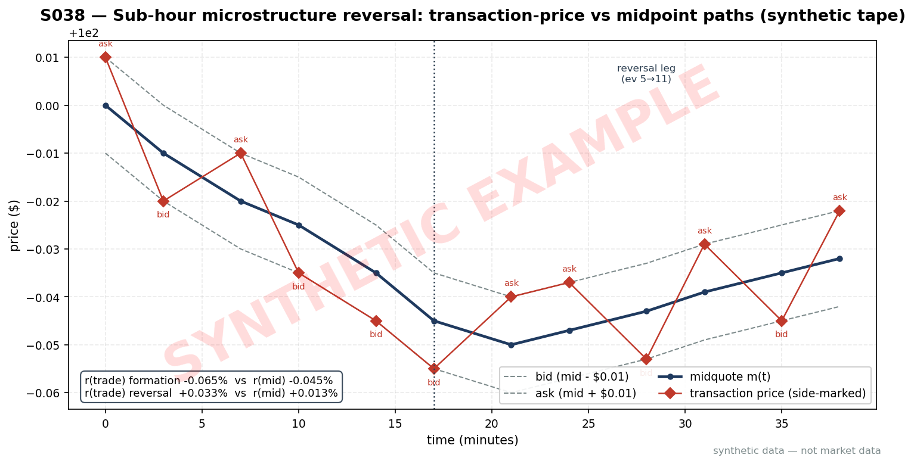

```mermaid
flowchart LR
    FEED["Raw feed\n(Databento MBP-1 / Polygon T&Q)"] -->|"L1 quote+trade events"| ING["Ingest + normalize\n(exchange ts, DST, halts)"]
    ING -->|"1-min bars"| FEAT["Feature compute\n(formation return, z-score)"]
    FEAT -->|"1-min signal series"| SIG["Signal S038\nsub-hour reversal z"]
    SIG -->|"1-min signal bars"| GATE{"Cost / toxicity\ngate?"}
    GATE -->|"pass: 1-min signal bars"| OUT["Downstream consumer\n(T097 scalper / T069)"]
    GATE -->|fail| DROP["No trade"]
    style SIG fill:#aed6f1,stroke:#1f3a5f
```

### S12. Sources

- Lehmann, B. (1990). "Fads, Martingales, and Market Efficiency." *Quarterly Journal of Economics* 105(1), 1–28. https://doi.org/10.2307/2937816
- Heston, S. L., Korajczyk, R. A., & Sadka, R. (2010). "Intraday Patterns in the Cross-Section of Stock Returns." *Journal of Finance* 65(4), 1369–1407. Draft: https://bauer.uh.edu/departments/finance/documents/Heston_Korajczyk_Sadka_paper_UH.pdf
- Conrad, J., Gultekin, M. N., & Kaul, G. (1997). "Profitability of Short-Term Contrarian Strategies: Implications for Market Efficiency." *Journal of Business & Economic Statistics* 15(3), 379–386. https://doi.org/10.2307/1392341
- Avramov, D., Chordia, T., & Goyal, A. (2006). "Liquidity and Autocorrelations in Individual Stock Returns." *Journal of Finance* 61(5), 2365–2394. https://doi.org/10.1111/j.1540-6261.2006.01060.x
- Rif, A., & Utz, S. (2021). "Short-term stock price reversals after extreme downward price movements." *Quarterly Review of Economics and Finance* 81, 123–133. https://opus.bibliothek.uni-augsburg.de/opus4/frontdoor/deliver/index/docId/94257/file/1-s2.0-S1062976921000922-main.pdf
- Quantpedia — "Reversal" strategy tag (Jegadeesh 1990; Lehmann 1990 summaries). https://quantpedia.com/strategy-tags/reversal/

**Chatbot source (labeled):** Duck.ai (GPT-5.6 Luna via duck.ai, anonymous) answered Q-SB6-1–Q-SB6-3 (2026-09-10); Grok/Cursor answers pending (checked 2026-09-10). Q-SB6-1 supplied the p(t)/R(t,L)/z(t,L) notation and practical grid used in S3; Q-SB6-3 supplied the sub-hour concentration framing and contamination checklist used in S2/S10, verified against Heston et al. (2010) and Conrad et al. (1997) above.

**Unverified leads:** none — all quantitative claims above trace to the cited papers or the labeled synthetic example.

---
## Stage 39/200 — S039: Idiosyncratic (residual) short-term reversal

*Batch SB6 · Signal 39/100 · Provenance [D/SR] · Family C — Intraday Mean Reversion & Reversal*

### S1. One-line verdict

| | |
|---|---|
| **What it is** | Strip market/sector factors out of each stock's return, then fade the leftover *idiosyncratic* (stock-specific) jump — the part the broad market did not cause. |
| **When it works** | Stock-specific liquidity shocks in large caps: the move is real, the market is calm, and the residual mean-reverts as liquidity providers get paid. |
| **When it dies** | Market-wide selloffs (everything moves together — there is no residual to fade), factor-model misspecification, or when the "idiosyncratic" move is actually news. |
| **Build-or-buy in one line** | Build: one regression per stock per bar on 1-minute data; buy the sector-ETF (exchange-traded fund) bars, build the residualizer. |

Provenance **[D/SR]** — documented core (Lehmann 1990 / Jegadeesh 1990 reversal; Heston et al. 2010 sub-hour component) with standard-reconstruction intraday extension (factor residualization on intraday bars). Never upgraded: the intraday residual-reversal strategy specifics remain [SR] until a dedicated intraday citation is added.

### S2. How it works — plain human explanation

It is 10:15. The market (SPY) is flat on the morning. Stock B — a large-cap industrial — suddenly drops 0.50% in 30 minutes on heavy but anonymous volume. Stock A, its sector peer, is down 0.12% — roughly in line with its sector ETF. The residual trader asks: *how much of each move did the market explain?* For A, almost all of it (its **residual** — the return left over after subtracting what the factor model predicts — is only −0.09%). For B, almost none of it (residual −0.47% of the −0.50% move). Only B's drop is **idiosyncratic** (stock-specific, not explained by common factors), so only B is faded.

Why should this exist economically? A **factor model** (a regression that explains each stock's return as a mix of common market/sector factors plus a stock-specific leftover) separates two kinds of price pressure. Market-wide pressure is usually information or risk repricing — it does *not* reliably reverse. Stock-specific pressure with no news is usually a **liquidity shock** (someone needed to trade now and paid for immediacy): the price overshoots, liquidity providers absorb it, and the price decays back as compensation for that service. Residualization is the filter that keeps the second kind and discards the first — which is why residual reversal survives costs that kill naive reversal (Blitz et al., below).

Mental model:
- Raw reversal fades *moves*; residual reversal fades *liquidity shocks*.
- The factor model is a noise-canceling headphone: it removes the market's roar so you can hear the stock's own echo.
- If your "residual" still correlates with the market, your factor model is broken — fix the hedge before trading the signal.

### S3. The math — exact formula

One-factor (market) version; multi-factor adds sector terms. For stock i at bar t:

r(i,t) = α(i) + β(i) · r_mkt(t) + u(i,t)

where r are log returns, β(i) is the stock's **beta** (sensitivity to the market; β=1 moves one-for-one), and u(i,t) is the residual. Estimated over a trailing window (chatbot Q-SB6-1 practical grid, labeled lead: 60–250 daily bars, or 1–6 months of intraday bars; re-estimate betas every 1–20 days):

û(i,t) = r(i,t) − α̂(i) − β̂(i) · r_mkt(t)

**Signal**: cumulate the residual over lookback L (5–60 min intraday):

U(i,t,L) = Σ_{ℓ=0}^{L−1} û(i,t−ℓ),   s(i,t) = −sign(U(i,t,L))

**Scaled**: z(i,t) = U(i,t,L) / (σ̂(u,i,t) · √L), where σ̂ is trailing residual volatility. Trade if |z| ≥ z* (*example* 1.5 — not an institutional standard).

**Portfolio construction** (dollar-neutral cross-section): w(i,t) = −(rank(U(i,t)) − rank̄) / Σ|rank(U) − rank̄| — long the most negative residuals, short the most positive, weights summing to zero net dollars.

| Parameter | Symbol | Typical range | Too small | Too large | Default (example) |
|---|---|---|---|---|---|
| Factor window | W | 60–250 d (or 1–6 mo intraday) | noisy β, hedge leaks | stale β, regime blindness | 120 d |
| Residual lookback | L | 5–60 min | bounce noise | shock already decayed | 30 min |
| Hold | H | 15 min–1 d | exit inside bounce | overnight gap risk | 60 min |
| Entry threshold | z* | 0.5–2.0 | overtrading | no trades | 1.5 |
| Beta refresh | — | 1–20 d | estimation churn | stale hedge | 5 d |

Causal timing: β̂ estimated on data ≤ t−1 (never the formation window — that would regress the shock on itself); U(i,t,L) uses bars ≤ t; earliest fill t+1. Variants: (1) market-only residual (SPY beta); (2) sector+market residual (adds sector ETF — kills industry momentum contamination, cf. Da et al. 2014); (3) PCA (principal component analysis)/statistical-factor residual (S080-style eigenportfolios — no ETF needed, but factors can rotate).

### S4. Worked example — step-by-step numbers (SYNTHETIC)

Synthetic panel, seed 43, from `batches/SB6/plot_S039.py`. One-factor model, six 5-minute buckets (30-min formation), β_A = 1.0, β_B = 0.9, residual vols σ̂_A = 0.05%, σ̂_B = 0.09% per bucket:

| bkt | mkt % | raw A % | resid A % | raw B % | resid B % |
|---|---|---|---|---|---|
| 1 | +0.02 | +0.01 | −0.01 | −0.12 | −0.14 |
| 2 | −0.03 | −0.05 | −0.02 | −0.10 | −0.07 |
| 3 | −0.04 | −0.06 | −0.02 | −0.09 | −0.05 |
| 4 | +0.01 | +0.00 | −0.01 | −0.08 | −0.09 |
| 5 | +0.02 | +0.01 | −0.01 | −0.06 | −0.08 |
| 6 | −0.01 | −0.03 | −0.02 | −0.05 | −0.04 |
| **cum** | | **−0.12** | **−0.09** | **−0.50** | **−0.47** |

z_A = −0.09 / (0.05·√6) = **−0.73**; z_B = −0.47 / (0.09·√6) = **−2.15**. With the example |z| ≥ 1.5 rule: **fade B only** — A is market-driven noise, B is a genuine idiosyncratic leg (95% of its move is residual).

Fade-B trade walk: long B at 99.500 (bucket-6 close, midpoint-marked — see contamination note), exit three buckets later at 99.800 as it reverts (+0.30% raw, +0.30% residual, market flat). Gross **+30.2 bp** (basis points; 1 bp = 0.01%); costs: effective half-spread 3 bp × 2 legs = 6 bp + 1 bp fees + 2 bp slippage/impact allowance (assembling the residual basket, adverse-selection buffer) = 9 bp → **net +21.2 bp** on this toy trade.

What to notice: the example is rigged to be clean — real residuals are noisier, betas drift, and the "market flat" hold never happens. The takeaway is comparative: residualization *ranked* B over A correctly — the entire job of S039. Nothing here is a backtest.

**Bounce-contamination note (mandatory):** this worked example marks entry/exit on midquotes and charges effective-spread costs — the S038 diagnostics apply in full: a residual strategy evaluated on transaction prices with a 1-day lag skipped (to dodge the bounce) is the documented honest configuration (Blitz et al. use a 1-day implementation lag for exactly this reason).

### S5. Strategies that use this signal

- **T038 — Sector Momentum + Idiosyncratic Fade**: primary trigger for the fade leg — long sector momentum while fading idiosyncratic residual extremes (S039 *is* the fade).
- **T040 — PCA Eigenportfolio Residual Reversal**: primary trigger — statistical-factor residuals instead of ETF-based ones; same fade logic.
- **T027 — Illiquidity Temporary-Impact Fade**: S039 as the stock-selection filter — only fade overextended moves whose residual (not raw) component is extreme, exiting on the resiliency half-life.

### S6. Data required — exact spec

| Field | Type | Granularity | Source tier | Notes |
|---|---|---|---|---|
| Stock 1-min OHLCV (open, high, low, close, volume) | float/int | 1-min bars | Tier 1 | formation + hold measurement |
| Market/sector ETF 1-min bars | float | 1-min bars | Tier 1 | SPY + 11 sector SPDRs as factor proxies |
| Corporate actions | adjustments | daily | Tier 1 | splits poison both β and residuals |
| Session/halt calendar | timestamps | daily | Tier 1 | exclude halts, half-days, DST (daylight-saving time) |

Collection: Polygon stocks v3 aggregates (stocks + ETFs, one subscription) or Alpaca SIP (Securities Information Processor consolidated feed). Ingest sketch (≤20 lines, polars):

```python
import polars as pl
bars = pl.read_parquet("bars/1min/*.parquet")      # ts, sym, c
spy  = pl.read_parquet("bars/1min/SPY.parquet").select("ts", mkt="c")
r = (bars.join(spy, on="ts").sort(["sym","ts"])
        .with_columns(r=pl.col("c").log().diff().over("sym"),
                      rm=pl.col("mkt").log().diff()))
# rolling beta vs SPY, 120-bar window, then residual
b = (r.with_columns(b=(pl.col("r").rolling_cov(pl.col("rm"),120)
                      / pl.col("rm").rolling_var(120)).over("sym"))
        .with_columns(u=pl.col("r") - pl.col("b")*pl.col("rm"))
        .with_columns(U=pl.col("u").rolling_sum(6).over("sym")))   # L=30min
```

Storage: per `notes/cost-model.md` §4, 1-min bars for 500 symbols ≈ 50 MB/day, ≈3 GB per 60 days — archive freely (§3's ~12 MB cell conflicts with its own per-symbol-day row; §4 is the planning number); the 11 sector ETFs add ~11 symbol-days, negligible. Data-quality checklist: ETF bars must be dividend-adjusted identically to stocks; beta windows must end before the formation window (no lookahead); delisted symbols retained (survivorship); halt bars excluded from residual sums.

### S7. Local build on M5 Max / 128GB

**Feasibility: trivial.** The workload is S038's 1-minute-bar scan plus one rolling covariance per symbol — still seconds for the 500-symbol daily scan (`cost-model.md` §2). 60 days of history ≈ 3 GB (§4); the 120-day beta window ≈ 6 GB — both inside the ~77GB working budget (§3). Bottleneck: not CPU or RAM, but **factor-model hygiene** — beta staleness and ETF adjustment errors are where this signal silently dies. Stack: Python+polars; no Rust needed. Engineering: **Tier L, 4–12 h ≈ $600–1,800** at $150/hr loaded (§5) — a day's work for the residualizer plus the contamination battery. (Chatbot Q-SB6-2's 240–570 h covers a three-engine institutional build — gap scanner + HY lead-lag + L1 resiliency — and does not describe this signal; cost-model tiers take precedence.) Scaling to 500 symbols changes nothing; scaling to tick-level residuals would need L1 (level-1) storage discipline (per-symbol daily files, §3).

### S8. Buy vs build

| Option | What you get | Indicative price | Gains | Loses |
|---|---|---|---|---|
| Tier 0: Stooq / Alpaca IEX | Daily bars, IEX quotes | ~$0 | free factor-proxy prototyping | no full SIP NBBO (national best bid and offer) |
| Tier 1: Polygon Stocks Advanced | Full SIP 1-min bars incl. ETFs | ~$30–200/mo | one subscription covers stocks+factors | — |
| Tier 2: Databento | L1 (level-1) + reference symbology | ~$200/mo + usage | execution-grade timestamps | overkill for a 1-min residualizer |
| Academic: Barra/Axioma-style risk models | Commercial factor betas | $$$$ | practitioner-grade hedges | cost; licensing |

All prices `indicative — verify before budgeting` (per `notes/cost-model.md` §6 price bands). **Verdict: build.** Buy the Tier-1 SIP bars (stocks + sector ETFs in one feed), build the residualizer — the beta-refresh cadence, the residual lookback, and the z-threshold are the strategy, and no vendor sells them. Buy a commercial risk model only if you scale to portfolio-level hedging where your rolling betas prove unstable.

### S9. Success ratio / efficacy — documented evidence

| Study / source | Market & period | Metric | Before/after cost | Caveat |
|---|---|---|---|---|
| Da, Liu & Schaumburg (2011/2014), "Decomposing Short-Term Return Reversal", FRB NY Staff Report 513 / *Management Science* | US large caps w/ analyst coverage, monthly, 27 yrs | residual-based reversal: 1.57%/mo raw; **1.34%/mo three-factor alpha** (t=9.28), ~4× the standard STR alpha; midpoint-based returns also profitable | before cost (midpoint-robustness shown) | monthly formation — the intraday extension is [SR], not this paper |
| Blitz, Huij, Lansdorp & Verbeek, "Short-Term Residual Reversal" (working paper; Robeco) | US stocks, post-1990, incl. large caps | "statistically and economically significant profits **net of trading costs**, even for large caps post-1990"; ~2× the risk-adjusted return of conventional reversal | **after cost (stated qualitatively)** | working paper; exact bp figures not independently verified — see Unverified leads |
| Avramov, Chordia & Goyal (2006), *J. Finance* | US stocks, monthly | reversals concentrated in illiquid high-turnover names; contrarian profits "smaller than the likely transactions costs" | **after cost → negative** for naive version | motivates residualization: the naive leg is where costs win |
| Da, Liu & Schaumburg (2014), within-industry double sort | same sample | 1.51%/mo raw; 1.26%/mo 3-factor alpha | before cost | cash-flow-news orthogonalization; needs analyst-revision data |

Regimes where it fails: market-wide stress (residuals shrink as correlations → 1; Nagel 2012 shows reversal payoffs co-move with VIX — the premium is compensation for liquidity provision, and it demands capital exactly when capital is scarce); factor-model breakdowns (sector ETF basis vs constituents); crowded quant unwinds (Khandani & Lo 2007 document the strategy's decay episodes). Bottom line: as a standalone trigger this is a **documented, cost-surviving edge in large caps** — but it is a liquidity-provision premium: it loses money in the states of the world where you most want protection.

### S10. Failure modes & pitfalls

1. **Bounce contamination (again)** — residuals computed on transaction prices inherit the S038 artifact. *Mitigation:* midquote marks, 1-day/1-bar implementation lag, effective-spread costing — the full S038 battery.
2. **Hedge leakage** — stale or wrong β leaves market exposure in the "residual". *Mitigation:* refresh betas every 1–20 days; monitor residual–market correlation out of sample; prefer sector+market over market-only.
3. **News masquerading as liquidity** — a −0.47% residual with no *visible* news may still be informed flow. *Mitigation:* earnings/announcement blackout; news-novelty filter (S093); toxicity veto (S008).
4. **Factor-model misspecification** — missing factors (style, industry) create phantom residuals. *Mitigation:* sector terms at minimum; PCA residual cross-check (S080).
5. **Lookahead in beta estimation** — including the formation window in the regression. *Mitigation:* estimation window strictly ends before formation; walk-forward only.
6. **Crowding / quant-unwind risk** — everyone fading the same residuals. *Mitigation:* capacity caps; turnover budgeting; monitor pairwise strategy crowding proxies.
7. **Survivorship bias** — delisted names had the juiciest "reversals". *Mitigation:* point-in-time universe with delisting returns.
8. **Overfitting (L, z*, H)** — same grid-mine as S038. *Mitigation:* purged/embargoed CV (S088); stability across subperiods required.

### S11. Visuals

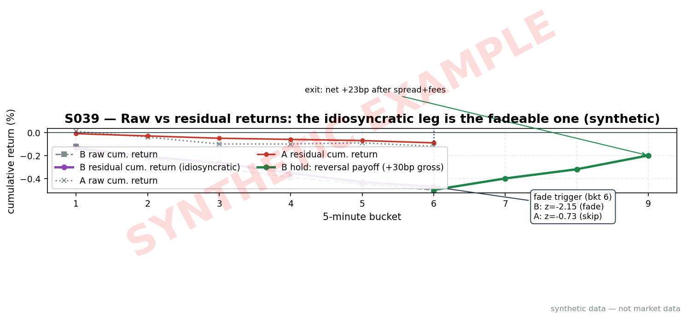

```mermaid
flowchart LR
    FEED["Raw feed\n(Polygon SIP 1-min, stocks+ETFs)"] -->|"1-min bars"| ING["Ingest + normalize\n(adj closes, halts, DST)"]
    ING -->|"1-min bars"| FEAT["Feature compute\n(rolling beta, residual, z)"]
    FEAT -->|"1-min signal series"| SIG["Signal S039\nidiosyncratic reversal z"]
    SIG -->|"1-min signal bars"| GATE{"Cost / toxicity\ngate?"}
    GATE -->|"pass: 1-min signal bars"| OUT["Downstream consumer\n(T038 / T040 fade legs)"]
    GATE -->|fail| DROP["No trade"]
    style SIG fill:#aed6f1,stroke:#1f3a5f
```

### S12. Sources

- Da, Z., Liu, Q., & Schaumburg, E. (2014). "Decomposing Short-Term Return Reversal." FRB NY Staff Report No. 513 (2011); published version "A Closer Look at the Short-Term Return Reversal," *Management Science* 60(3), 658–674. https://fraser.stlouisfed.org/docs/publications/frbnysr/frbny_sr513.pdf and https://www3.nd.edu/~zda/Reversal.pdf
- Blitz, D., Huij, J., Lansdorp, S., & Verbeek, M. "Short-Term Residual Reversal." Working paper (Robeco / Erasmus). https://efmaefm.org/0EFMSYMPOSIUM/2012/papers/017_update.pdf ; summary https://www.robeco.com/en-int/insights/2011/11/short-term-residual-reversal
- Avramov, D., Chordia, T., & Goyal, A. (2006). "Liquidity and Autocorrelations in Individual Stock Returns." *Journal of Finance* 61(5), 2365–2394. https://doi.org/10.1111/j.1540-6261.2006.01060.x
- Nagel, S. (2012). "Evaporating Liquidity." *Review of Financial Studies* 25(7), 2005–2039. https://doi.org/10.1093/rfs/hhs066

**Chatbot source (labeled):** Duck.ai (GPT-5.6 Luna via duck.ai, anonymous) answered Q-SB6-1–Q-SB6-3 (2026-09-10); Grok/Cursor answers pending (checked 2026-09-10). Q-SB6-1 supplied the r(i,t) = α + βᵀf + u residualization notation and practical grid used in S3; Q-SB6-3 supplied the "residualization separates genuine idiosyncratic reversal from broad-market moves" framing used in S2/S9, verified against Da et al. and Blitz et al. above.

**Unverified leads:**
- Duck.ai Q-SB6-3 literature summary: residual reversal "net ~44bp/mo (largest 500) / ~54bp/mo (largest 100) after costs + 1-day lag" — internally consistent with the cited papers' direction but the exact figures could not be independently verified in this batch's research; do not quote as fact.

---
## Stage 41/200 — S041: Bollinger-band reversal

*Batch SB6 · Signal 41/100 · Provenance [D] · Family C — Intraday Mean Reversion & Reversal*

### S1. One-line verdict

| | |
|---|---|
| **What it is** | Fade price tags of Bollinger bands (SMA ± kσ): a close outside the band that falls back inside is treated as an exhausted ~2σ excursion reverting to the mid. |
| **When it works** | Range-bound, two-sided markets where volatility is stationary — the band means what it says, and tags are liquidity events, not breakouts. |
| **When it dies** | Trends and volatility breakouts ("walking the band"): fading those is stepping in front of a repricing; the squeeze/breakout use (family B) is the opposite trade. |
| **Build-or-buy in one line** | Build: two rolling statistics on any OHLC feed; buy nothing except the bars. |

Provenance **[D]** (documented): Bollinger, *Bollinger on Bollinger Bands* (2001); Fang, Jacobsen & Qin (2014). Family C — Intraday Mean Reversion & Reversal.

### S2. How it works — plain human explanation

It is 11:20. Stock SYN has chopped between 99.50 and 100.50 all morning; its 20-minute average is 100.00, typical wiggle (standard deviation) 0.25. It spikes to 100.62 — above the upper band at 100.50 — on a burst of market buys, then prints 100.40, back inside. The **Bollinger bands** (a moving-average midline ± k standard deviations — a volatility-adaptive envelope) just defined "unusually far, unusually fast." The fade logic says: the impulse failed to *expand* — nobody followed through — so the excursion was impatient liquidity demand, and price should drift back toward the mid.

Economically this is S038 in a different hat: a band tag is a standardized way of detecting a short-horizon liquidity shock. The band's width adapts to recent volatility, so a tag means "large *relative to what this name has been doing*" — the same temporary-impact story (price concession for immediacy, decaying as the book refills). The failure mode is equally familiar: when the tag is the *start* of a volatility breakout — the **squeeze** (bandwidth collapsing to a multi-month low, then price exploding out) — fading it is fading a genuine repricing. Bollinger's own rule: tags alone are not signals; the *confirmation* (close back inside) is the signal.

Mental model:
- Bands = a volatility ruler. A tag = "this move is big for this stock, right now."
- Tag + close back inside = exhausted impulse → fade to the mid. Tag + follow-through = breakout → do not fade (family B, S030).
- After a tag, the band itself is contaminated (the spike inflates σ) — expect wide bands and size down.

### S3. The math — exact formula

For closes P_t, window n, multiplier k:

Mid_t = SMA(n)_t = (1/n) Σ_{i=0}^{n−1} P_{t−i}
σ_t = std(P_{t−n+1..t})   (sample standard deviation, ddof=1)
Upper_t = Mid_t + k·σ_t,   Lower_t = Mid_t − k·σ_t

**Position-in-band** (%b — price position between bands; 0 = lower, 1 = upper):

%b_t = (P_t − Lower_t) / (Upper_t − Lower_t)

**Bandwidth** (normalized band width — the squeeze detector):

Bandwidth_t = (Upper_t − Lower_t) / Mid_t × 100%

**Fade rule (tag-and-reenter):** if P_t < Lower_t (%b_t < 0) and P_{t+1} > Lower_{t+1} (back inside) → long at P_{t+1}; target = Mid; exit on mid touch or after M bars (*example* M = 10 — not an institutional standard). Mirror for upper tags (short). Stop: beyond the tag extreme by a fraction of σ (*example* 0.5σ).

| Parameter | Symbol | Typical range | Too small | Too large | Default (example) |
|---|---|---|---|---|---|
| Window | n | 10–50 bars | bands hug noise; constant tags | sluggish; tags arrive late | 20 |
| Multiplier | k | 1.5–2.5 | tags on every wiggle | almost never tags | 2.0 |
| Exit horizon | M | 5–20 bars | exit inside bounce | give back the reversion | 10 |
| Squeeze filter | bandwidth pct | 5–20th pct | filters everything | filters nothing | <10th pct = skip fades |

Causal timing: Mid_t, σ_t use closes ≤ t; tag confirmed at t+1's close; earliest fill t+1 (enter at P_{t+1}'s close or t+2's open). Variants: (1) **tag-and-reenter** (this chapter — confirmation-based); (2) **pure tag fade** (enter at the tag bar close — earlier, more false positives); (3) **squeeze-breakout** (family B/S030 — trade *with* the expansion, the anti-fade).

### S4. Worked example — step-by-step numbers (SYNTHETIC)

Synthetic 70-bar 1-minute series, seed 44 (`batches/SB6/plot_S041.py`), n=20, k=2; mean-reverting noise plus two engineered excursions. The script selects each side's deepest tag that re-enters the band next bar.

**Lower-tag event (long fade).** Bar 32 tags (close 97.652 < lower 97.999, %b −0.099, bandwidth 3.52%); bar 33 closes back inside (98.736 > lower 97.882) → **long** at 98.736; exit bar 34 at 99.773 on mid touch. P&L = **+1.037/share = +105.0 bp** (basis points; 1 bp = 0.01%) before costs.

**Upper-tag event (short fade).** Bar 54 tags (close 102.132 > upper 101.947, %b 1.063, bandwidth 2.93%); bar 55 closes back inside (100.983 < upper 101.996) → **short** at 100.983; exit bar 56 at 100.022 on mid touch. P&L = **+0.961/share = +95.2 bp** before costs.

**Costs (example — not an institutional standard):** three-component stack per round trip — effective half-spread ≈ 1 bp per leg (2 bp round trip) + fees ≈ 0.5 bp per leg (1 bp round trip) + slippage/impact allowance ≈ 1 bp per leg (2 bp round trip) = 5 bp round trip. Lower-tag event: +105.0 bp gross → **+100.0 bp net**; upper-tag event: +95.2 bp gross → **+90.2 bp net**. The S10 gate (|expected move| > 2× round-trip cost, i.e. > 10 bp here) passes on this engineered tape — on real tapes, where the expected move is 5–10 bp against the same 5 bp stack, that gate is what kills most band fades.

What to notice: both winners are engineered — the excursions were *designed* to revert, so +105bp/+95bp prove the arithmetic, not the edge. The instructive number is bandwidth: 3.5% and 2.9% — the tags inflated σ so badly that %b barely registered (−0.099 on the lower tag). That band-contamination means your "2σ event" was really a ~1σ event against a panicked band — size accordingly, and never present toy-tape P&L as a backtest.

**Bar-level tape (7 bars per event, n=20, k=2):**

| bar | close | SMA20 | σ | lower | upper | %b | bw% | note |
|---|---|---|---|---|---|---|---|---|
| 29 | 100.051 | 100.096 | 0.125 | 99.847 | 100.345 | +0.409 | 0.50 | quiet |
| 30 | 98.808 | 100.028 | 0.312 | 99.403 | 100.652 | −0.476 | 1.25 | dip starts |
| 31 | 97.086 | 99.872 | 0.725 | 98.421 | 101.323 | −0.460 | 2.91 | inside, σ inflating |
| 32 | 97.652 | 99.752 | 0.877 | 97.999 | 101.505 | −0.099 | 3.52 | **tag** (close < lower) |
| 33 | 98.736 | 99.684 | 0.901 | 97.882 | 101.486 | +0.237 | 3.62 | back inside → **long** |
| 34 | 99.773 | 99.663 | 0.893 | 97.876 | 101.450 | +0.531 | 3.59 | mid touched → **exit** |
| 35 | 100.096 | 99.658 | 0.890 | 97.877 | 101.439 | +0.623 | 3.57 | — |
| 51 | 100.010 | 99.981 | 0.655 | 98.671 | 101.290 | +0.511 | 2.62 | quiet |
| 52 | 101.047 | 100.150 | 0.416 | 99.318 | 100.982 | +1.039 | 1.66 | spike starts |
| 53 | 102.857 | 100.356 | 0.639 | 99.078 | 101.635 | +1.478 | 2.55 | inside, σ inflating |
| 54 | 102.132 | 100.474 | 0.736 | 99.002 | 101.947 | +1.063 | 2.93 | **tag** (close > upper) |
| 55 | 100.983 | 100.519 | 0.739 | 99.041 | 101.996 | +0.657 | 2.94 | back inside → **short** |
| 56 | 100.022 | 100.509 | 0.744 | 99.021 | 101.998 | +0.336 | 2.96 | mid touched → **exit** |
| 57 | 99.695 | 100.483 | 0.764 | 98.955 | 102.011 | +0.242 | 3.04 | — |

### S5. Strategies that use this signal

- **T014 — Bollinger Reversal + Squeeze Exit**: primary trigger — fades band tags; covers into bandwidth-squeeze expansions and vol breakouts (the anti-fade escape hatch).
- **T062 — Streak Runner with Exhaustion Flip**: S041 as the exhaustion-flip trigger — a band tag after a consecutive-bar streak.
- **T054 — Hurst/Variance-Ratio Regime Toggle**: S041 as a regime-gated trigger — fade only when Hurst < 0.5 (mean-reverting); stand down when Hurst > 0.5 (trending).
- **T069 — Late-Day Reversal into Close**: S041 as a secondary timing filter for last-30-minute fades.

### S6. Data required — exact spec

| Field | Type | Granularity | Source tier | Notes |
|---|---|---|---|---|
| OHLCV (open, high, low, close, volume) | float/int | 1–15 min bars (or daily) | Tier 0–1 | any vendor; the signal is vendor-agnostic |
| Corporate actions | adjustments | daily | Tier 1 | unadjusted splits create phantom tags |

Collection: any OHLCV vendor — Stooq daily for research, Polygon/Alpaca 1-min for intraday. Ingest sketch (≤20 lines, polars):

```python
import polars as pl
b = pl.read_parquet("bars/1min/SYN.parquet").sort("ts")
s = (b.with_columns(mid=pl.col("c").rolling_mean(20),
                    sd =pl.col("c").rolling_std(20))
        .with_columns(up=pl.col("mid")+2*pl.col("sd"),
                      lo=pl.col("mid")-2*pl.col("sd"))
        .with_columns(pctb=(pl.col("c")-pl.col("lo"))/(pl.col("up")-pl.col("lo")),
                      bw=(pl.col("up")-pl.col("lo"))/pl.col("mid")*100))
tag = (s.with_columns(tagL=(pl.col("c")<pl.col("lo")) & (pl.col("c").shift(1)>=pl.col("lo").shift(1))))
```

Storage: per `notes/cost-model.md` §4, 1-min bars for 500 symbols ≈ 50 MB/day, ≈3 GB per 60 days — archive freely (§3's ~12 MB cell conflicts with its own per-symbol-day row; §4 is the planning number). Data-quality checklist: split/dividend adjustment (phantom tags), half-day/DST (daylight-saving time) calendars, bad-tick filtering (a single bad print tags the band and inflates σ for 20 bars).

### S7. Local build on M5 Max / 128GB

**Feasibility: trivial.** Two rolling statistics over 1-minute bars: 500 symbols × 390 bars = 195k rows/day, milliseconds in polars (~10–50M rows/sec, `cost-model.md` §2). A 60-day 500-symbol archive is ≈3 GB (`cost-model.md` §4) against the ~77GB working budget (§3); even a 10-year daily archive for 3,000 stocks is ~2–5 GB — fits. Bottleneck: none computationally; the real work is parameter-stability analysis (S088 purged validation across the (n, k, M) grid). Stack: Python+polars for everything; this signal never justifies Rust. Engineering: **Tier L, 4–12 h ≈ $600–1,800** at $150/hr loaded (§5) — an afternoon including the squeeze filter and the tag-confirmation variants. (The chatbot's Q-SB6-2 240–570 h figure describes a three-engine institutional build — gap scanner, HY lead-lag, L1 (level-1) resiliency — not a two-rolling-stat signal; cost-model tiers take precedence.) What breaks first at 500 symbols: nothing. Full OPRA (Options Price Reporting Authority consolidated options feed) is irrelevant to this signal.

### S8. Buy vs build

| Option | What you get | Indicative price | Gains | Loses |
|---|---|---|---|---|
| Tier 0: Stooq / broker charts | Daily bars, built-in BB overlays | ~$0 | instant visualization | no intraday, no custom rules |
| Tier 1: Polygon / Alpaca SIP (Securities Information Processor consolidated feed) | 1-min bars for backtest | ~$30–200/mo | full parameter sweeps | — |
| Retail platforms (QuantConnect etc.) | Canned Bollinger strategies | free–$$/mo | quick prototype | black-box rules; no bounce diagnostics |
| Book route: Bollinger (2001) | Canonical methods (squeeze, %b) | ~$40 book | the inventor's own rules | not a backtest |

All prices `indicative — verify before budgeting` (per `notes/cost-model.md` §6 price bands). **Verdict: build, trivially.** The indicator is two lines of code; any edge lives in your confirmation rule, squeeze filter, and cost model — none for sale. Buy nothing beyond the bar feed.

### S9. Success ratio / efficacy — documented evidence

| Study / source | Market & period | Metric | Before/after cost | Caveat |
|---|---|---|---|---|
| Fang, Jacobsen & Qin (2014), "Popularity versus Profitability", SSRN 2484322 | International stock markets, pre/post-1983 | BB signals "extremely profitable" before introduction; predictability "gradually decreased" after the 2001 book; "largely disappeared" in the US first | before cost | documents *decay*, not a tradable edge — the honest headline |
| Hisarli, Lim & Ng (2013/2014), "The Profitability of a Combined Signal Approach: Bollinger Bands and the ADX", IFTA Journal / SSRN 2230499 | 6 large-cap indices (CAC, DAX, FTSE, HSI, KOSPI, NIKKEI), 1995–2012 | BB-only "would underperform a buy and hold strategy in most of the markets studied"; tactical short-horizon use shows positive skew; ADX filter adds little systematically | cost labeling unclear from abstract — treat as before-cost | index-level, daily; the fade variant is not isolated |
| Lento, Gradojevic & Wright (2007), via Wikipedia "Bollinger Bands" summary | Dow Jones + foreign-exchange (FX), from 1995, ~a decade | standard BB: "no evidence of consistent performance over buy and hold"; **contrarian** (reversed) BB: "produced positive returns in a variety of markets" | before cost (tertiary summary) | the contrarian finding is the fade analog — but verify in the original |
| Bollinger (2001), *Bollinger on Bollinger Bands* (McGraw-Hill) | practitioner canon | methods: %b, bandwidth, the Squeeze, M/W patterns, "walking the band" | n/a — method source | not a performance study; the squeeze chapter is the anti-fade manual |

Bottom line: as a standalone trigger the documented record is **decay and disappointment** — the simple rule's edge was arbitraged away as the indicator went mainstream, and "walking the band" episodes are where fade-only traders blow up. As a *conditional* trigger (range-only, squeeze-filtered, confirmation-required, costs modeled) it is a plausible small edge — but the burden of proof is on your out-of-sample test, not the literature.

### S10. Failure modes & pitfalls

1. **Walking the band** — fading a trend's band-tags repeatedly into a repricing. *Mitigation:* squeeze/bandwidth-expansion filter (S030); regime gate (Hurst/VR S090, S054); hard stop beyond the tag extreme.
2. **Band contamination** — the tag inflates σ, so subsequent "tags" are meaningless and %b understates penetration. *Mitigation:* freeze or down-weight bands for n bars after a tag; size on pre-tag σ.
3. **Lookahead** — computing the tag on a bar that hasn't closed. *Mitigation:* signals on closed bars only; fill at next bar.
4. **Parameter mining** — the (n, k, M) grid is a classic overfit surface. *Mitigation:* purged/embargoed CV (S088); pre-commit to (20, 2) as the default and demand the variant beat it out of sample.
5. **Cost blindness** — band fades are short-horizon; spread+fees dominate. *Mitigation:* model effective spread explicitly; require |expected move| > 2× round-trip cost as a gate.
6. **Corporate-action phantom tags** — splits/dividends print fake excursions. *Mitigation:* adjusted closes; corporate-action calendar.
7. **Bad ticks** — one bad print tags the band and poisons σ for n bars. *Mitigation:* bad-tick filters; median-based robust σ variant.
8. **Volatility-regime blindness** — fixed (20, 2) misbehaves when vol doubles. *Mitigation:* normalize thresholds by vol regime; re-validate quarterly.

### S11. Visuals

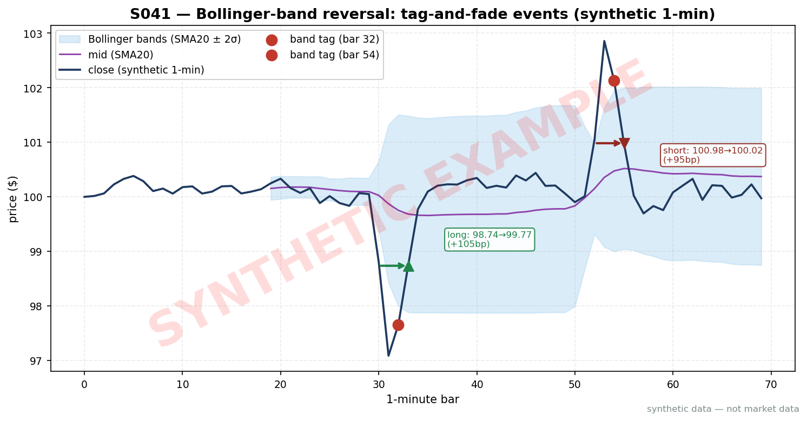

```mermaid
flowchart LR
    FEED["Raw feed\n(any OHLCV vendor, 1-min)"] -->|"1-min bars"| ING["Ingest + normalize\n(adj closes, bad ticks)"]
    ING -->|"1-min bars"| FEAT["Feature compute\n(SMA20, σ, %b, bandwidth)"]
    FEAT -->|"1-min signal series"| SIG["Signal S041\nBollinger tag-and-fade"]
    SIG -->|"1-min signal bars"| GATE{"Squeeze /\ncost gate?"}
    GATE -->|"pass: 1-min signal bars"| OUT["Downstream consumer\n(T014 fade / T062 flip)"]
    GATE -->|fail| DROP["No trade"]
    style SIG fill:#aed6f1,stroke:#1f3a5f
```

### S12. Sources

- Bollinger, J. (2001). *Bollinger on Bollinger Bands*. McGraw-Hill. ISBN 9780071373685.
- Fang, J., Jacobsen, B., & Qin, Y. (2014). "Popularity versus Profitability: Evidence from Bollinger Bands." SSRN 2484322. https://papers.ssrn.com/sol3/papers.cfm?abstract_id=2484322
- Hisarli, T., Lim, K. J. S., & Ng, S. H. (2013). "The Profitability of a Combined Signal Approach: Bollinger Bands and the ADX." *IFTA Journal*. SSRN 2230499. https://papers.ssrn.com/sol3/papers.cfm?abstract_id=2230499
- Leeds, M. "Bollinger Bands Thirty Years Later." arXiv:1212.4890 — rolling-regression / state-space statistical underpinnings of Bollinger Bands; pairs-trading (BBPT) construction. https://ar5iv.labs.arxiv.org/html/1212.4890
- Wikipedia contributors, "Bollinger Bands" — Lento et al. (2007) contrarian-BB summary. https://en.wikipedia.org/wiki/Bollinger_Bands

**Chatbot source (labeled):** Duck.ai (GPT-5.6 Luna via duck.ai, anonymous) answered Q-SB6-1–Q-SB6-3 (2026-09-10); Grok/Cursor answers pending (checked 2026-09-10). The SB6 question set contained **no S041 material** — Q-SB6-1 covered gap/jump, sub-hour reversal, residual reversal, resiliency, and Hayashi–Yoshida; Q-SB6-3 covered gap fade, jump filtering, short-term reversal, lead-lag, and macro drift. No chatbot arithmetic or literature claims were used in this chapter; the worked example and parameters are the author's own synthetic construction (seed 44).

**Unverified leads:** none — performance claims above trace to the cited papers; the worked example is labeled synthetic throughout.

---
## Stage 46/200 — S046: Intraday seasonality (U-shape) reversal timer

*Batch SB6 · Signal 46/100 · Provenance [D] · Family C — Intraday Mean Reversion & Reversal*

### S1. One-line verdict

| | |
|---|---|
| **What it is** | Use the U-shaped intraday volatility/return profile — wild at the open, dead at lunch, wild at the close — as a *timer and deseasonalizer* for reversal trades: scale signals by what is normal for that bucket, and take reversals when mean reversion is seasonally strongest. |
| **When it works** | Normal trading days with the classic U-profile: lunch-hour dislocations revert as liquidity returns; close-auction dynamics concentrate at known times. |
| **When it dies** | Event days (FOMC, CPI) that flatten or invert the profile; the naive direction ("always fade the open/close move") which is instrument-specific and often untradable after spreads. |
| **Build-or-buy in one line** | Build: 39 bucket means on 1-minute bars; buy nothing — the profile is free once you have the bars. |

Provenance **[D]** (documented): Wood, McInish & Ord (1985); Harris (1986); Andersen & Bollerslev (1997); Heston, Korajczyk & Sadka (2010) on sub-hour reversal interacting with the profile. Family C — Intraday Mean Reversion & Reversal. This is the U-shaped *volatility/return-seasonality* signal — not a duplicate of SB5's periodicity material, which covers cross-day calendar periodicities (day-of-week, turn-of-month), not the within-day bucket profile.

### S2. How it works — plain human explanation

Every trading day has a heartbeat. At 9:30 the open is chaos: overnight news lands, market-on-open orders collide, and the first ten minutes print more volatility than any other bucket of the day. By noon the market is half asleep — spreads widen, volume dies, and a moderate order can push price around precisely because nobody is there to absorb it. At 3:50 the close is chaos again: index funds must match the closing auction, day traders flatten, and volume spikes to its daily peak. Plot average absolute return (or volume) against time of day and you get a **U-shape** (high at both ends, low in the middle) — one of the most replicated facts in market microstructure, documented since Wood, McInish & Ord (1985).

S046 turns that heartbeat into two tools. First, a **timer**: reversal signals (S038, S041, S039) are strongest when liquidity provision is being compensated most — the open's rush of uninformed flow and the lunch hour's thin-book dislocations. Second, a **deseasonalizer**: a 0.14% ten-minute move at noon is a scream; the same 0.14% at 9:35 is a whisper. Dividing the observed move by its bucket's typical size (the **seasonal component** — the predictable time-of-day pattern in volatility) turns raw moves into comparable signals. The trap is trading the profile's *direction* — "the close always reverses" — which is instrument-specific folklore, not a documented edge; the documented edge is using the profile to *time and scale* reversals, not to replace them.

Mental model:
- The U-profile = the market's daily breathing cycle. Reversals = trades that get paid for providing liquidity.
- Take reversals when the breathing is heavy (open/lunch dislocations) and size them by how unusual they are *for that hour*.
- Never trade "bucket 37 always mean-reverts" without a per-instrument, cost-aware backtest — that is the naive version Heston et al. show loses after spreads.

### S3. The math — exact formula

For each 10-minute bucket b ∈ {1..39} and day d, let r(b,d) be the bucket return. Estimate the seasonal profile over D trailing days:

σ̄(b) = (1/D) Σ_{d=1}^{D} |r(b,d)|   (mean absolute bucket return)
V̄(b) = (1/D) Σ_{d=1}^{D} vol(b,d)   (mean bucket volume)

**Deseasonalized move**: z(b,d) = r(b,d) / σ̄(b). A signal fires when |z| ≥ z* (*example* 1.5 — not an institutional standard).

**Reversal timer**: take a base reversal signal s₀(b,d) ∈ {−1,0,+1} (e.g., S038/S041) and weight by the profile:

w(b) = σ̄(b) / mean_b(σ̄(b))   (overweight high-seasonality buckets)
s(b,d) = w(b) · s₀(b,d) · 1[|z(b,d)| ≥ z*]

**Bucket-return variant** (naive, use with care): μ̄(b) = (1/D) Σ_d r(b,d); fade the sign of μ̄(b) — documented only as a descriptive statistic, not a standalone edge.

| Parameter | Symbol | Typical range | Too small | Too large | Default (example) |
|---|---|---|---|---|---|
| Bucket width | — | 5–30 min | noisy profile | profile too coarse | 10 min |
| Profile window | D | 20–60 d | unstable σ̄(b) | regime staleness | 30 d |
| Deseasonalized threshold | z* | 1.0–2.5 | noise trades | no trades | 1.5 |
| Timer weight cap | — | 1.5–3.0 | no timing effect | concentration risk | 2.0 |

Causal timing: σ̄(b) estimated on days ≤ d−1 only; today's bucket return uses bars ≤ the bucket close; earliest fill next bucket. Event-day override: skip or halve size on FOMC/CPI/NFP days (profile inverts). Variants: (1) volatility timer (this chapter); (2) volume-timer (weight by V̄(b) — the close-auction variant for T064); (3) bucket-return fade (T015's domain — instrument-specific, backtest required).

### S4. Worked example — step-by-step numbers (SYNTHETIC)

Synthetic 39-bucket profile, seed 46, from `batches/SB6/plot_S046.py` (U-shape: σ̄ ≈ 17.0 at the 9:30 open → ≈ 8.0 at the lunch lull → ≈ 23.4 into the close; volume index ≈ 0.93 → 0.35 → 1.60, session average 1.0).

**Deseasonalization — the core arithmetic.** Take today's observed absolute bucket moves against the trailing profile (σ̄ from the prior 20 sessions, per the script's printed worked example). Open bucket: r = 0.19% vs typical σ̄ = 0.215% → z = 19.0/21.5 = **0.88** (normal for the open — no signal). Lunch bucket: r = 0.14% vs typical σ̄ = 0.078% → z = 14.0/7.8 = **1.79** ≥ 1.5 → **signal: fade the lunch dislocation**. Close bucket: r = 0.25% vs typical σ̄ = 0.231% → z = 25.0/23.1 = **1.08** (normal close chaos — no signal). The lunch move is the *smallest* raw move and the *largest* deseasonalized one — that inversion is the entire point of S046: without the profile you trade the open's noise; with it you trade the lunch's signal.

**Timer weighting.** w(open) = 21.5/12.8 ≈ 1.68, w(lunch) = 7.8/12.8 ≈ 0.61, w(close) = 23.1/12.8 ≈ 1.80 (mean σ̄ ≈ 12.8 across the 39-bucket synthetic profile). A base reversal signal firing at lunch gets *down-weighted* to 0.61 on raw volatility — but the deseasonalized gate (z ≥ 1.5) is what admits it; the two tools do different jobs: the gate selects *unusual-for-this-bucket* moves, the weight sizes by *bucket importance*. Nothing here is a backtest; the numbers demonstrate the arithmetic, not profitability.

**Bucket-aware cost stack (example — not an institutional standard).** The timer weight w(b) must be net of bucket spreads (S10.8) — so here is the three-component stack it must net against. Per round trip: (1) spread — open/close buckets: effective half-spread ≈ 2 bp (basis points; 1 bp = 0.01%) per leg (4 bp round trip); lunch bucket: ≈ 3 bp per leg (6 bp round trip, thin book); (2) fees — ≈ 0.5 bp per leg (1 bp round trip); (3) slippage/impact allowance — ≈ 1 bp per leg at open/close (2 bp round trip), ≈ 2 bp per leg at lunch (4 bp round trip, size-limited depth). Example: a lunch-bucket fade capturing half the 0.14% dislocation from the deseasonalization example (≈ 14 bp gross) pays ≈ 6 + 1 + 4 = 11 bp round trip → ≈ **+3 bp net**; the same expected move at the open pays ≈ 4 + 1 + 2 = 7 bp round trip → ≈ **+7 bp net**. Before-cost the lunch bucket looks weaker (w = 0.61 vs 1.68); after bucket costs the comparison depends on size — the timer is only meaningful computed on net-of-cost expectations, never on raw w(b).

### S5. Strategies that use this signal

- **T064 — U-Shape Seasonality Timer**: primary trigger — concentrates reversal and liquidity-provision trades in the open/close buckets where the profile says edge lives; lunch-hour variant for thin-book dislocations.
- **T015 — First-Half-Hour → Close Continuation**: S046's μ̄(b) as primary trigger — fades the average bucket return; instrument-specific, requires the cost-aware backtest this chapter demands.
- **T044 — Diurnal Deseasonalization Normalizer**: S046's volume profile V̄(b) as the timer — the close bucket's volume spike defines the auction window.

### S6. Data required — exact spec

| Field | Type | Granularity | Source tier | Notes |
|---|---|---|---|---|
| 1-min OHLCV (open, high, low, close, volume) | float/int | 1-min bars | Tier 1 | aggregated to 10-min buckets |
| Session calendar | timestamps | daily | Tier 1 | open/close times, half-days, DST (daylight-saving time) |
| Event calendar | dates | daily | Tier 0 | FOMC/CPI/NFP override days |

Collection: Polygon/Alpaca 1-min bars; bucketize in ingest. Ingest sketch (≤20 lines, polars):

```python
import polars as pl
b = (pl.read_parquet("bars/1min/*.parquet").sort(["sym","ts"])
       .with_columns(bkt=((pl.col("ts").dt.hour()*60
                           + pl.col("ts").dt.minute() - 570) // 10).clip(0, 38),
                     d=pl.col("ts").dt.date()))
k = (b.group_by(["sym","bkt","d"])
       .agg(r=pl.col("c").last()/pl.col("c").first() - 1,
            v=pl.col("v").sum()).sort(["sym","bkt","d"]))
prof = k.with_columns(sbar=pl.col("r").abs().rolling_mean(30).over(["sym","bkt"]))
```

Storage: per `notes/cost-model.md` §4, 1-min bars for 500 symbols ≈ 50 MB/day, ≈3 GB per 60 days (§3's ~12 MB cell conflicts with its own per-symbol-day row; §4 is the planning number); the 39-bucket profile per symbol is 39 floats — negligible. Data-quality checklist: DST transitions (bucket alignment shifts), half-days (drop or separate profile), corporate actions (adjust before bucketing), halt buckets (exclude).

### S7. Local build on M5 Max / 128GB

**Feasibility: trivial.** Bucketize 195k rows/day (500 symbols × 390 minutes), then 39 means per symbol — polars finishes before you blink (~10–50M rows/sec simple ops, `cost-model.md` §2). 60 days ≈ 3 GB (`cost-model.md` §4) against the ~77GB working budget (§3). Bottleneck: none — the work is statistical (profile stability across regimes, event-day handling), not computational. Stack: Python+polars; no Rust. Engineering: **Tier L, 4–12 h ≈ $600–1,800** at $150/hr loaded (§5) — a day for the profiler, the deseasonalizer, the event-day override, and the timer overlay onto S038/S041. (Chatbot Q-SB6-2's 240–570 h covers a three-engine institutional build — gap scanner, HY lead-lag, L1 (level-1) resiliency — not a bucket-mean profiler; cost-model tiers take precedence.) Scaling: the profile is per-symbol embarrassingly parallel; 5,000 symbols changes nothing.

### S8. Buy vs build

| Option | What you get | Indicative price | Gains | Loses |
|---|---|---|---|---|
| Tier 0–1 bar feeds | 1-min bars (profile inputs) | ~$0–200/mo | everything needed | — |
| Bloomberg intraday-volatility model | Daily vol × periodic component decomposition | terminal $$$$ | practitioner-grade deseasonalizer | cost; black box |
| Academic code (Andersen–Bollerslev style) | FFF seasonal estimation | free (papers) | rigorous profile estimation | research-grade, needs adaptation |

All prices `indicative — verify before budgeting` (per `notes/cost-model.md` §6 price bands). **Verdict: build.** The U-profile is 39 means on bars you already buy for S038–S041; no vendor sells your instrument's bucket-return fade, and the Bloomberg decomposition is overkill for a timer. Buy nothing new.

### S9. Success ratio / efficacy — documented evidence

| Study / source | Market & period | Metric | Before/after cost | Caveat |
|---|---|---|---|---|
| Wood, McInish & Ord (1985), "An Investigation of Transactions Data for NYSE Stocks" | NYSE, intraday transactions | U-shaped intraday pattern in returns/volatility established | descriptive (before-cost by nature) | founding fact, not a strategy |
| Andersen & Bollerslev (1997), "Intraday Periodicity and Volatility Persistence in Financial Markets" | S&P 500, 5-min | average absolute returns ≈ 0.095% at open, 0.055% at noon, 0.105% near close; seasonal filtering (FFF) dramatically improves volatility forecasts | descriptive (before-cost) | the deseasonalizer's theoretical foundation |
| Heston, Korajczyk & Sadka (2010), "Intraday Patterns in Arbitrage Pricing" | US stocks, half-hour | sub-hour reversal tied to temporary liquidity imbalances; naive periodicity strategies lose money after the bid–ask spread | **after cost → naive version negative** | the cautionary row: timing ≠ free money |
| Bloomberg, "Intraday Volatility" (practitioner model) | practitioner | intraday vol = daily level × intraday periodic component; failing to remove seasonality misstates spot vol | n/a — modeling guidance | institutional confirmation of the deseasonalizer |

Bottom line: the U-shape itself is among the best-documented facts in microstructure — that is the [D]. What is *not* documented as a standalone edge is fading bucket-average returns; treat μ̄(b) strategies as [SR] until your own cost-aware backtest says otherwise. The defensible deployment is the timer/deseasonalizer role: scale and gate S038/S039/S041 by the profile.

### S10. Failure modes & pitfalls

1. **Naive bucket-direction trading** — "bucket 3 always reverses" without per-instrument evidence. *Mitigation:* require instrument-level backtest with costs; default to timer use.
2. **Event-day inversion** — FOMC/CPI days flatten or invert the U. *Mitigation:* event calendar override; separate event-day profile or stand down.
3. **Profile staleness** — vol regimes shift; a 2022 profile misprices 2024 buckets. *Mitigation:* 20–60 day trailing window; monitor profile drift.
4. **DST/half-day misalignment** — buckets shift by an hour or the day is truncated. *Mitigation:* session-aware bucketing; separate half-day profile.
5. **Liquidity mirage at lunch** — thin books mean the "dislocation" can't be traded at size. *Mitigation:* size by bucket depth, not just z; impact model per bucket.
6. **Overfitting the 39 buckets** — 39 means × sign choices = a multiple-testing playground. *Mitigation:* pre-commit to the U-shape functional form; shrinkage toward the pooled profile; S088 validation.
7. **Confusing volume and volatility profiles** — the close has huge volume *and* vol; lunch has low volume but tradeable dislocations. *Mitigation:* separate V̄(b) and σ̄(b) profiles; different timers for different strategies.
8. **Spread costs at the open/close** — the most "seasonal" buckets are also the most expensive. *Mitigation:* bucket-specific cost model; the timer weight must be net of bucket spreads.

### S11. Visuals

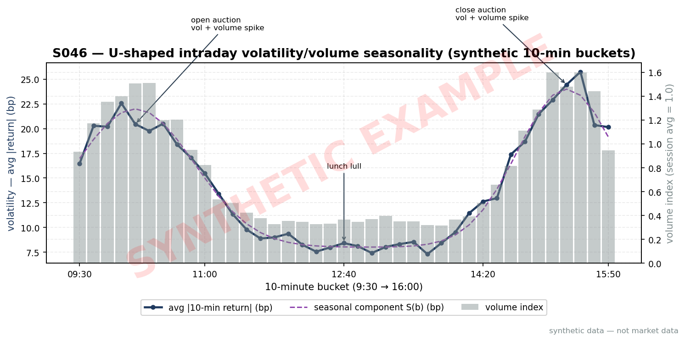

```mermaid
flowchart LR
    FEED["Raw feed\n(Polygon SIP (Securities Information Processor consolidated feed) 1-min bars)"] -->|"1-min bars"| ING["Ingest + bucketize\n(39×10-min, session-aware)"]
    ING -->|"10-min bucket bars"| FEAT["Feature compute\n(σ̄(b), V̄(b), z, timer w)"]
    FEAT -->|"10-min signal series"| SIG["Signal S046\nU-shape timer/deseasonalizer"]
    SIG -->|"10-min signal bars"| GATE{"Event /\ncost gate?"}
    GATE -->|"pass: 10-min signal bars"| OUT["Downstream consumer\n(T064 / T015 / T044)"]
    GATE -->|fail| DROP["No trade"]
    style SIG fill:#aed6f1,stroke:#1f3a5f
```

### S12. Sources

- Wood, R. A., McInish, T. H., & Ord, J. K. (1985). "An Investigation of Transactions Data for NYSE Stocks." *Journal of Finance* 40(3), 723–739. https://doi.org/10.1111/j.1540-6261.1985.tb04996.x
- Harris, L. (1986). "A Transaction Data Study of Weekly and Intradaily Patterns in Stock Returns." *Journal of Financial Economics* 16(1), 99–117. https://doi.org/10.1016/0304-405X(86)90044-8
- Andersen, T. G., & Bollerslev, T. (1997). "Intraday Periodicity and Volatility Persistence in Financial Markets." *Journal of Empirical Finance* 4(2–3), 115–158. Kellogg summary: https://www.kellogg.northwestern.edu/academics-research/research/detail/1997/intraday-periodicity-and-volatility-persistence-in-financial-markets/
- Heston, S. L., Korajczyk, R. A., & Sadka, R. (2010). "Intraday Patterns in Arbitrage Pricing." https://bauer.uh.edu/departments/finance/documents/Heston_Korajczyk_Sadka_paper_UH.pdf
- Bloomberg Professional Services, "Intraday Volatility" — intraday vol as daily level × periodic component. https://assets.bbhub.io/professional/sites/10/intraday_volatility-3.pdf

**Chatbot source (labeled):** Duck.ai (GPT-5.6 Luna via duck.ai, anonymous) answered Q-SB6-1–Q-SB6-3 (2026-09-10); Grok/Cursor answers pending (checked 2026-09-10). The SB6 question set contained **no S046 material** — Q-SB6-1 covered gap/jump, sub-hour reversal, residual reversal, resiliency, and Hayashi–Yoshida; Q-SB6-3 covered gap fade, jump filtering, short-term reversal, lead-lag, and macro drift. No chatbot arithmetic or literature claims were used in this chapter; the worked example and parameters are the author's own synthetic construction (seed 46).

**Unverified leads:** none — all citations above were verified in this batch's research (Wood et al. title/journal/DOI confirmed via Memphis digital commons, NBER w4743 citation, and RePEc on 2026-09-10); the worked example is labeled synthetic throughout.

---
## Stage 48/200 — S048: LOB resiliency & block-trade temporary-impact reversion

*Batch SB6 · Signal 48/100 · Provenance [D] · Family C — Intraday Mean Reversion & Reversal*

### S1. One-line verdict

| | |
|---|---|
| **What it is** | Measures how fast the limit order book refills after a liquidity shock, and how much of a block trade's price impact is temporary (reverses) vs permanent (stays). |
| **When it works** | Liquid names, normal-vol regimes, shocks that are liquidity-driven rather than news-driven; resiliency is measurable and the temporary leg is large relative to spread costs. |
| **When it dies** | News shocks (impact is information, so no reversion), stress days when the book never refills, illiquid names where half-life exceeds the holding horizon, costs above the reversion leg. |
| **Build-or-buy in one line** | Build the estimator yourself on bought raw L1 (level-1)/tape data — no vendor sells your thresholds, but never try to build the feed plant. |

Provenance **[D]** (documented: Degryse et al. 2005; Keim & Madhavan 1996; Kraus & Stoll 1972). Family C — Intraday Mean Reversion & Reversal.

### S2. How it works — plain human explanation

**Resiliency** (the speed at which a limit order book recovers its depth and spread after being disturbed) is one of the three dimensions of liquidity, alongside tightness (the spread) and depth (visible size). The market vignette: 9:47:03, a stock's book reads bid 231.40 × 800 shares / ask 231.41 × 300. An aggressive seller sweeps the bid with a 1,200-share market sell. The bid collapses to 231.36, the spread widens from 1 cent to 5 cents, and the midquote drops 2.5 cents. What happens next is the signal. In a **resilient** book, patient limit-order traders — people and algorithms who earn the spread by posting passive liquidity — smell the wider spread, judge the compensation for providing liquidity now attractive, and refill the bid within seconds: 231.38 × 500, then 231.40 × 800, then back to 231.40 × 800 by 9:47:19. The midquote recovers. The correct trade was to buy into the shock (provide liquidity) and sell into the refill. In a **non-resilient** book — say the seller knew bad news — nobody refills, the midquote stays down, and the same fade trade loses.

**Block-trade temporary-impact reversion** is the same idea at larger scale. A **block trade** (an unusually large print, e.g. 250,000 shares crossing the tape) pushes the price down (for a seller-initiated block) by more than its information content warrants. The total impact splits into two legs: the **permanent impact** — the part that reflects genuine information (adverse selection: the block trader may know something) and never reverses — and the **temporary impact** — the pure **liquidity impact**, the discount demanded by whoever absorbed the block for taking on inventory risk, which decays as the market digests the trade. The signal fades only the temporary leg, over minutes to hours, net of the direction of the block (a seller-initiated block that pushed price down is bought, expecting partial bounce-back; the permanent leg is respected, not faded).

Why should the effect exist economically? Three forces. First, **inventory risk**: whoever takes the other side of a liquidity shock carries unwanted inventory and charges a concession that unwinds as the position is laid off — classic market-maker economics, so the concession is temporary by construction. Second, **patient-flow refill**: a wider post-shock spread raises the expected profit of posting limit orders, which mechanically attracts refills; this is the mechanism behind the exponential recovery used in the Obizhaeva–Wang (2013) optimal-execution model. Third, **information decomposition** (Kraus & Stoll 1972; Keim & Madhavan 1996): block prints carry both liquidity and information components, and only the liquidity component mean-reverts — so the tradable edge is exactly the temporary fraction, which is why the signal must estimate the split rather than blindly fading every shock.

Mental model:
- A liquidity shock is a *discount sale on immediacy*: the price concession is the market paying you to wait — but only if the shock carried no news.
- **Half-life** (the time for half the temporary impact to decay) is the clock you trade against: entries want fast-κ regimes, exits are timed by the estimated half-life.
- The permanent leg is untouchable: fading information-driven moves is catching a falling knife, so the first job of the signal is classification (liquidity vs information), not timing.

### S3. The math — exact formula

Let a liquidity shock of signed size Q (shares, signed by aggressor direction) arrive at event time t = 0, with m(t) the midquote at t. The **temporary impact** I(t|Q) is the liquidity-driven deviation of the midquote from its pre-shock level m(0⁻):

I(t|Q) = m(t) − m(0⁻) = λQ · e^(−κt)

- λ (lambda): **impact coefficient** per share, in price units per share (e.g. bps (basis points; 1 bp = 0.01%) per 1,000 shares); scales with illiquidity.
- Q: signed shock size (shares; negative for seller-initiated).
- κ (kappa): **mean-reversion speed** (1/time), the resiliency parameter.
- t: seconds since the shock.

**Half-life** — the time for half the temporary impact to decay — is t(1/2) = ln 2 / κ. With a **permanent component** I(∞) (the information leg that never reverses):

I(t|Q) = I(∞) + (I(0) − I(∞)) · e^(−κt)

Spread and depth follow the same reduced form with their own κ (they need not coincide — duck.ai lead, Q-SB6-1, labeled chatbot source):
S(t) = S(∞) + (S(0) − S(∞)) · e^(−κ_S·t); D(t) = D(∞) − (D(∞) − D(0)) · e^(−κ_D·t).
Resiliency(t) = (S(t) − S(∞)) / (S(0) − S(∞)) — fraction of the shock still unrecovered.

**Estimation.** Take observations I(t_j) at snapshots t_j after each shock; OLS (ordinary least squares) on the log form y_j = ln|I(t_j)| = ln|λQ| − κ·t_j + ε_j gives κ̂ = −Σ(t_j − t̄)(y_j − ȳ)/Σ(t_j − t̄)², then t̂(1/2) = ln 2/κ̂. Alternative: **survival analysis** of time-to-recovery (time until spread/depth returns within tolerance of pre-shock level). **Block decomposition**: total impact = permanent + temporary; the temporary fraction reverted over the window = 1 − e^(−κ·H) for holding horizon H.

| Parameter | Symbol | Typical range | Too small | Too large | Default example |
|---|---|---|---|---|---|
| Mean-reversion speed | κ | 0.02–0.5 /s liquid; 0.005–0.05 /s illiquid | Half-life > horizon — nothing reverts before exit | Overfits noise, flips sign | 0.05/s *(example — not an institutional standard)* |
| Impact coefficient | λ | 1–50 bps per 10k shares | Underestimates entry concession | Phantom impact, never fills | 10 bps/shock *(example)* |
| Event window | H | 60–300 s liquid; up to hours for blocks | Truncates the decay tail | Contaminated by new shocks | 120 s *(example)* |
| Snapshot sampling | Δt | 10 ms–1 s message; 1–5 s quotes | Misses fast refill | Noise-dominated first obs | 2 s *(example)* |
| Min events per regime | N | 20–50 shocks per liquidity regime | κ̂ noise-dominated | Stale regimes | 30 *(example)* |
| Entry threshold | θ | temporary fraction ≥ 40–70% of total impact | Fades information shocks | No trades | 50% *(example)* |

**Normalization choices:** always relative to the pre-shock baseline (S(∞), D(∞) estimated from the minute before the shock); midquote-based impact rather than trade-price impact to avoid **bid–ask bounce** contamination (the mechanical negative autocorrelation from bouncing between bid and ask). **Causal timing:** the shock is dated at event time t on exchange timestamps using only data ≤ t; the resiliency estimate and any fade entry are tradable no earlier than t+1 (the first post-shock quote). **Variants:** (1) AR(1) on spread deviations S(t) = ρS(t−1) + ε — κ = −ln(ρ)/Δt; (2) survival/time-to-recovery per shock; (3) multi-exponential or power-law decay (Mu et al. 2010 report power-law decay of spread/volume imbalance after large intraday price changes — descriptive, before-cost). Exponential is a practical reduced form, not a universal law.

### S4. Worked example — step-by-step numbers (SYNTHETIC)

All numbers below are **synthetic**, generated with `rng = np.random.default_rng(48)` per the plot script `batches/SB6/plot_S048.py`. True process: I(t) = 10 bps · e^(−0.05t), so the true half-life is ln 2/0.05 = 13.86 s. Snapshots every 2 s from t = 0 to 60 s, plus iid noise (σ = 0.8 bps).

| t (s) | Observed I(t) (bps) | Fitted Î(t) (bps) |
|---|---|---|
| 0 | 9.754 | 11.162 |
| 6 | 8.533 | 8.036 |
| 12 | 6.176 | 5.786 |
| 18 | 5.002 | 4.165 |
| 24 | 2.168 | 2.999 |
| 30 | 3.304 | 2.159 |
| 36 | 2.539 | 1.554 |
| 42 | 1.157 | 1.119 |
| 48 | 1.013 | 0.806 |
| 54 | 0.454 | 0.580 |
| 60 | 0.160 | 0.418 |

Hand-computation walk-through (the script fits all 31 snapshots; the table shows every 6 s): take logs, e.g. y(0) = ln(9.754) = 2.278, y(30) = ln(3.304) = 1.195, y(60) = ln(0.160) = −1.833. OLS of y on t over the full 31-point sample gives κ̂ = 0.0548/s and ln|λQ|̂ = 2.413 → λQ̂ = 11.162 bps. Fitted half-life t̂(1/2) = ln 2/0.0548 = 12.66 s (chart annotation matches). Reversion fraction after a 30-s hold: 1 − e^(−0.0548·30) = 80.7% of the temporary leg recovered.

**What to notice:** the fit recovers the true half-life (13.86 s) within ~1.2 s despite 0.8 bps noise — the estimator is well-behaved on clean data. But this toy tape has no fees, no spread re-crossing cost, no regime changes, and exactly one isolated shock; real books are hit by overlapping shocks, and the first few observations after a shock are often dominated by feed discreteness (practitioners drop them — duck.ai lead, labeled). The chart `images/S048_example.png` plots the same 31 synthetic points with the true and fitted curves.

### S5. Strategies that use this signal

- **T084 — Block-Trade Impact Reversion** — primary entry trigger: provides liquidity after block prints and exits on the resiliency half-life.
- **T085 — Resiliency Market Maker** — primary quoting logic: skews quotes around the estimated resiliency with Avellaneda–Stoikov inventory control.
- **T027 — Illiquidity Temporary-Impact Fade** — exit timer: fades overextended moves in illiquid names, times exits by the resiliency half-life.
- **T008 — Kalman Dynamic-Hedge Pairs** — filter/veto: skips pair entries when LOB resiliency collapses (wide, non-refilling spreads signal toxic flow).
- **T063 — Stretched-Move Z-Score Fade** — exit timer: uses resiliency-timed exits for multi-sigma fades (per plan §3, T063 consumes S048).

### S6. Data required — exact spec

| Field | Type | Granularity | Source tier | Notes |
|---|---|---|---|---|
| Bid/ask price + size | float/int | L1 (level-1) quote events (or L2 (level-2)) | Tier 2 | Need venue + sequence numbers to order events |
| Trade price/size/aggressor | float/int | tick trades | Tier 2 | Aggressor side = shock direction |
| Exchange timestamps | int64 ns | per event | Tier 2 | SIP (Securities Information Processor consolidated feed) receipt time is *not* sufficient for resiliency (see S7) |
| NBBO (national best bid and offer) | float | per trade | Tier 1/2 | Block detection vs national best |
| Corporate actions / halts | reference | daily/event | Tier 0/1 | Exclude splits, halts, auctions |

Collection: Databento MBP-1 (L1) or MBP-10 (L2: market-by-price, level-2 depth) for the book leg; TAQ (Trade and Quote database) or Databento for the block tape; LOBSTER (academic) for MBO (market-by-order)/ITCH (Nasdaq's direct data-feed protocol) replay. Ingest sketch (≤20 lines, Python/polars):

```python
import polars as pl
quotes = pl.scan_parquet("l1_quotes/*.parquet")          # t_exch, bid, ask, bsz, asz, venue, seq
trades = pl.scan_parquet("trades/*.parquet")             # t_exch, price, size, aggressor
shocks = (trades.filter(pl.col("size") > BLOCK_MIN)       # block prints = shock events
          .with_columns(mid_before=pl.col("price").shift(1)))
book = quotes.with_columns(mid=(pl.col("bid")+pl.col("ask"))/2,
                           spread=pl.col("ask")-pl.col("bid"))
win = book.join_asof(shocks, on="t_exch", strategy="backward")  # align to shock time
decay = win.group_by("shock_id").agg(                       # per-shock decay curve
    pl.col("t_exch").sub(pl.col("t_exch").first()).alias("t"),
    ((pl.col("mid")-pl.col("mid_before"))/pl.col("mid_before")*1e4).alias("impact_bps"))
decay.collect().write_parquet("decay_curves.parquet")
```

Storage: per `notes/cost-model.md` §4, L1 quotes+trades for one liquid symbol run ~2–8 GB/day in parquet — archive per-symbol daily files, never a monolith. Data-quality checklist: normalize all timestamps to exchange time (not vendor receipt); drop crossed/locked quotes; handle corporate actions (splits rescale depth), halts (no resiliency estimable), DST (daylight-saving time) and half-days, stale quotes (no update > 60 s ⇒ exclude from baseline), and block prints at the open/close auctions.

### S7. Local build on M5 Max / 128GB

**Feasibility verdict: feasible (Tier M)** for a research-grade resiliency estimator on ≤20 symbols; heavy toward infeasible-locally for full-universe L2 replay. Justification: the arithmetic (per-shock decay curves + log-OLS) is trivially parallel and memory-light; the difficulty is data plumbing — event ordering, shock labeling, and timestamp normalization — not compute.

Throughput (per `notes/cost-model.md` §2): a Python event loop handles ~100–500k events/sec (GIL-bound, fine for ≤20 symbols L1); polars batch recompute of decay curves runs at ~10–50M rows/sec. Corrected record counts (Q-SB6-2 correction applied): at 10–100 quote updates/sec over a 23,400-second session, one instrument generates ≈2.3×10⁵–2.3×10⁶ records/day — the chatbot's "10⁵–10⁷/day" was a loose envelope; treat the upper bound as burst/extreme, not a per-instrument estimate. The expensive op is quote-to-shock asof joins and event-conditioned decay fits (fit throughput ~100–10,000 events/sec), not the raw parsing.

RAM (cost-model §3): one symbol-day of L1 events is ~0.5–4 GB in RAM — one month of one instrument fits comfortably in the 77 GB working budget; 500 symbols × 60 days of L1 does **not** fit — use per-symbol daily files plus streaming windows. Bottleneck: I/O and join logic, not CPU.

Stack: **Python+polars** for research (when-to-pick: ≤20 symbols, daily refits); **Rust** event loop for real-time multi-symbol (when-to-pick: 5–50M events/sec needed); **DuckDB** for ad-hoc decay-curve SQL over the parquet archive.

Engineering time: **Tier M, 20–60 h** per cost-model §5 (L1 event pipeline) → **$3,000–9,000 loaded-cost estimate** at $150/hr. The chatbot (duck.ai, 2026-09-10, labeled lead) quotes 100–250 h for a production-grade resiliency build including L1 reconstruction and validation — take the cost-model band for the estimator itself and the chatbot figure as the full-plumbing envelope. What breaks first at 500 symbols or full OPRA (Options Price Reporting Authority consolidated options feed): RAM and the asof-join fan-out; move to per-symbol streaming and daily batch refits.

### S8. Buy vs build

| Option | What you get | Indicative price | Buying gains | Buying loses |
|---|---|---|---|---|
| Tier 0: SIP-derived quotes (Alpaca IEX, delayed) | Free L1-ish NBBO | ~$0 | Zero cost for prototyping | **Not honest for resiliency**: SIP latency and aggregation smear the refill dynamics — label any SIP result `simulated only` |
| Tier 1: Polygon Stocks Advanced | Real-time SIP + full-market bars | ~$30–200/mo | Cheap NBBO + bars for block detection | Still SIP timestamps; no depth history |
| Tier 2: Databento (L1/L2, usage-based) | Honest exchange-timestamped MBP-1/10 | ~$200/mo + usage | True event ordering, venue fields | Usage billing on full L2 replay |
| Tier 3: LOBSTER (academic) | MBO/ITCH order-book replay | ~hundreds/yr academic | Message-level ground truth for research | Academic license only; not production |

All prices **indicative — verify before budgeting**. **Verdict: build the estimator, buy the raw data.** Buy exchange-timestamped L1 (Databento) or academic replay (LOBSTER); build the shock-labeling and κ fitting yourself, because resiliency thresholds are regime- and name-specific and no vendor sells them. Crossover: buy precomputed analytics never — there are none worth the opacity; buy the feed when your symbol count × history exceeds what the $200/mo usage tier covers.

### S9. Success ratio / efficacy — documented evidence

| Study / source | Market & period | Metric | Before/after cost | Caveat |
|---|---|---|---|---|
| Degryse, de Jong, van Ravenswaaij & Wuyts (2005), *Review of Finance* | Euronext Paris (pure limit-order market), aggressive orders | Depth and spread return to initial levels within ~20 best-limit updates after the shock | **Before-cost** (descriptive, not a strategy) | 2005 market structure; update counts, not clock time |
| Wuyts (2012), VAR simulation (reported in arXiv 1602.00731) | Simulated aggressive market-order shock | All liquidity dimensions revert to steady state within ~15 orders | **Before-cost** (model-based) | Simulation, not live trading |
| Gomber et al. (2015), intraday event study (reported in arXiv 1602.00731) | Large transactions, electronic LOB | Resiliency to "normal levels" is fast after large transactions | **Before-cost** (descriptive) | "Fast" is regime-dependent |
| Mu et al. (2010), Shenzhen Stock Exchange ultra-high-frequency (reported in arXiv 1602.00731) | Large intraday price changes | Significant price reversal; spread, volume, and imbalance decay slowly as a power law | **Before-cost** (descriptive) | Power-law ≠ exponential — decay form is an open choice |
| Keim & Madhavan (1996), *Review of Financial Studies* | 5,625 upstairs block trades, 1985–1992 | Temporary price impact concave in order size; permanent *and* transitory components significant for small caps | **Before-cost** (measured vs decision-price benchmarks) | Upstairs-market era; leakage effects differ in electronic markets |
| Obizhaeva & Wang (2013), *Journal of Financial Markets* | Model of resilient LOB | Exponential-resilience execution schedule cuts implementation shortfall vs naive schedules | **Before-cost** (model-based) | Assumes the resilient-book model holds |

**Honest bottom line:** as a standalone trigger this is a *thin, cost-fragile* edge — the temporary leg must exceed two half-spreads plus fees, which it often does not in liquid names. As a *filter and exit-timer* (when to provide liquidity, when a fade has overstayed, when flow is toxic) it is the practical, documented use. No credible after-cost Sharpe for naive "fade every shock" exists in the literature surveyed — treat any such claim as an **unverified chatbot claim** unless sourced.

### S10. Failure modes & pitfalls

1. **Lookahead leakage** — dating the shock with post-shock prints or using the recovery path to define the shock window. *Mitigation:* shock timestamp fixed on exchange event time from data ≤ t only.
2. **Staleness / SIP latency** — resiliency measured on SIP or vendor-receipt timestamps misattributes feed delay as slow refill. *Mitigation:* exchange timestamps required for sub-minute κ; label SIP work `simulated only — requires MBO/ITCH`.
3. **Crowding / alpha decay** — every liquidity provider fades the same shocks, compressing the temporary leg. *Mitigation:* estimate κ per name/regime; stand down when the temporary fraction shrinks.
4. **Cost blowup** — spread re-crossing plus fees exceed the reverted leg. *Mitigation:* model half-spread × 2 + fees + slippage explicitly; gate on net-of-cost temporary fraction.
5. **Regime breaks** — stress/vol-spike days: κ → 0, books never refill, "temporary" impact becomes permanent. *Mitigation:* vol-regime gate; hard stop on spread > 3× intraday median.
6. **Overfitting / parameter mining** — grid-searching κ windows and entry thresholds until a backtest glows. *Mitigation:* out-of-sample per regime; purged/embargoed validation (S088).
7. **Data errors** — bad ticks, stub quotes, splits rescaling depth. *Mitigation:* crossed/locked and stub-quote filters; corporate-action adjustment before any baseline.
8. **Microstructure noise vs signal** — feed discreteness dominates the first observations after a shock. *Mitigation:* drop the first few snapshots (duck.ai lead, labeled); fit on the decay body, not the impact instant.
9. **Information misclassification** — fading a news-driven shock (permanent leg). *Mitigation:* news/auction/halt filters; widen the permanent-component estimate on high-uncertainty prints.

### S11. Visuals

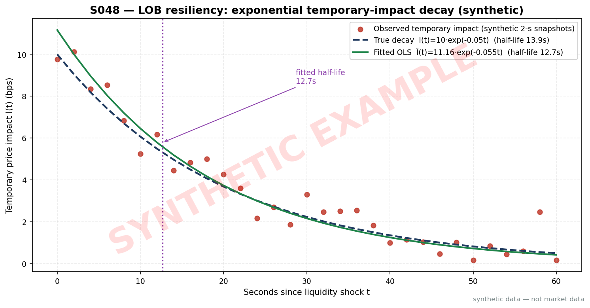

```mermaid
flowchart LR
    FEED["Raw feed\n(Databento MBP-1 / LOBSTER)"] -->|L1 quote events + tick trades| ING["Ingest + normalize\n(exchange ts, halts, corp actions)"]
    ING -->|shock-anchored 2-s snapshots| FEAT["Feature compute\n(decay curves, spread/depth paths)"]
    FEAT -->|per-shock impact series| SIG["Signal S048\nκ̂ fit → half-life + temporary fraction"]
    SIG -->|κ̂, t̂(1/2), temporary fraction per shock + regime tag (calm/stressed)| GATE{"Cost / toxicity\ngate?"}
    GATE -->|pass| OUT["Downstream consumer\n(T084 fade entry / T085 quoting / T027 exit)"]
    GATE -->|fail| DROP["No trade"]
    style SIG fill:#aed6f1,stroke:#1f3a5f
```

### S12. Sources

- Degryse, H., de Jong, F., van Ravenswaaij, M. & Wuyts, G. (2005). "Aggressive Orders and the Resiliency of a Limit Order Market." *Review of Finance* 9(2), 201–242. https://feb.kuleuven.be/research/economics/ces/documents/DPS/2002/DPS0210.pdf
- Alfonsi, A., Fruth, A. & Schied, A. (2007). "Optimal execution strategies in limit order books with general shape functions." arXiv:0708.1756. https://ideas.repec.org/p/arx/papers/0708.1756.html
- Keim, D. B. & Madhavan, A. (1996). "The Upstairs Market for Large-Block Transactions: Analysis and Measurement of Price Effects." *Review of Financial Studies* 9(1), 1–36. http://ideas.repec.org/a/oup/rfinst/v9y1996i1p1-36.html
- "Limit order book resiliency after effective market orders: Empirical facts and applications to high-frequency trading" (2016). arXiv:1602.00731. https://web3.arxiv.org/pdf/1602.00731v1
- Kraus, A. & Stoll, H. R. (1972). "Price Impacts of Block Trading on the New York Stock Exchange." *Journal of Finance* 27(3). (Cited in the report; classic temporary/permanent decomposition.)

**Chatbot source (labeled, per question-bank protocol):** Duck.ai answered Q-SB6-1–Q-SB6-3 (GPT-5.6 Luna, anonymous, 2026-09-10; Grok/Cursor answers pending, checked 2026-09-10). Q-SB6-1 supplied the exponential-decay/OLS/half-life formulas and practical ranges used in S3–S4 (lead, not a documented standard); Q-SB6-2 supplied the L1 throughput/record-count leads and the 100–250 h full-build envelope used in S7 (corrected per operator note: ≈2.3×10⁵–2.3×10⁶ records/day/instrument, not 10⁵–10⁷).

**Unverified leads:** the duck.ai-cited arXiv "Limit Order Book Simulations: A Review" (no verified ID captured); the exact 100–250 h resiliency production envelope (chatbot lead, not a documented benchmark).

---
## Stage 59/200 — S059: Futures–spot lead-lag prediction

*Batch SB6 · Signal 59/100 · Provenance [D] · Family D — Pairs & Cross-Sectional Arbitrage*

### S1. One-line verdict

| | |
|---|---|
| **What it is** | Index futures incorporate systematic news before the cash index (whose constituent quotes go stale); the cash leg catches up — trade the laggard directionally, flatten by close. |
| **When it works** | Multi-minute horizons in liquid index products (ES/SPY), systematic news flow, synchronized exchange-timestamped data, residuals that clear two half-spreads plus fees. |
| **When it dies** | Sub-second horizons without colocation and exchange timestamps; macro-announcement volatility; futures rolls; the "lead" being nothing but stale cash-index quotes. |
| **Build-or-buy in one line** | Build the lagged-regression engine yourself; buy clean futures + equity bars — never buy a black-box "lead-lag signal." |

Provenance **[D]** (documented: Kawaller, Koch & Koch 1987; Chan 1992; Hasbrouck 1995). Family D — Pairs & Cross-Sectional Arbitrage. Distinct from cash-and-carry (S057): this is directional prediction from the lead-lag, not fair-value arbitrage of the basis.

### S2. How it works — plain human explanation

The vignette: 10:14:00, a macro headline hits. In milliseconds, E-mini S&P 500 futures (ES) — one liquid contract, traded by macro funds, market makers, and hedgers — tick up 3 points. The S&P 500 **cash index**, meanwhile, is a weighted average of 500 individual stock quotes, many of which have not yet updated: some constituents last traded 40 seconds ago, a few are between quote revisions. The published index value lags. Over the next five minutes, as each constituent's quote refreshes to reflect the same news, the cash index drifts up toward where the futures already are. The signal: observe the futures move, predict the cash catch-up, take the laggard side.

Why should futures lead? **Price discovery** — the process by which new information gets incorporated into prices — migrates to the cheapest, fastest venue. Trading the whole market via one futures contract costs a fraction of trading 500 stocks: lower commissions, tighter effective spreads, leverage, no short-sale constraint on the downside. Informed macro traders therefore express systematic views in futures first (Abhyankar's transaction-cost argument; Chan 1992 shows the lead survives correction for **nonsynchronous trading**, the staleness bias — so it is not *just* stale quotes). The cash leg then catches up through arbitrage and quote revision. Fleming, Ostdiek & Whaley (1996) generalize: across stock, futures, and options markets, price discovery concentrates where trading costs are lowest.

Mental model:
- Futures are the market's *fast-twitch muscle*: systematic news shows up there first because that is where expressing a market view is cheapest.
- The cash index is a *slow average*: 500 stale-ish quotes mechanically lag the one liquid contract.
- The edge is the *catch-up*, not the news itself — you are paid for warehousing the index's staleness for a few minutes, and the payment must exceed your round-trip costs.

**Mandatory framing (applies to this chapter and S060):** Do NOT interpret the maximizing lag as causal — a measured lead can reflect feed-latency differences, async reporting, or common-news timing rather than genuine prediction. Lead-time hierarchy: **5–30 min** is measurable in liquid data; **1–5 min** is measurable but regime-dependent; **1 s** is event-level but timestamp-sensitive; **10–100 ms** needs exchange timestamps, clock sync, and market access. Futures lead = **PRICE DISCOVERY, not an executable signal**: a significant 5-minute regression coefficient does not imply a residual larger than costs. Stress test: if the lead vanishes under ±50–100 ms timestamp shifts, it is a **timestamp artifact, not a monetizable non-colocated edge**.

### S3. The math — exact formula

Let r_f(t) and r_s(t) be futures and cash-index returns on a common grid (midquote returns preferred, to avoid bid–ask bounce). The **lead-lag cross-correlation** at lag ℓ (ℓ > 0 means futures lead):

ρ(ℓ) = Corr( r_s(t), r_f(t − ℓ) ),    ℓ̂ = argmax_ℓ ρ(ℓ)

The **lagged predictive regression** (tradable form):

r_s(t) = α + β · r_f(t − ℓ̂) + ε(t)

Trade rule (long the cash leg when futures moved up ℓ̂ ago, and symmetrically short): enter if |β̂ · r_f(t − ℓ̂)| ≥ c, where c is the cost filter (expected move must clear costs); flatten by close (no overnight basis risk — *example* session rule). **Information share** (Hasbrouck 1995) is the complementary attribution tool: each venue's share of the variance of innovations to the common efficient price — used to confirm the futures market is actually the price-discovery venue before trading the lag.

| Parameter | Symbol | Typical range | Too small | Too large | Default example |
|---|---|---|---|---|---|
| Lead lag | ℓ | 1–30 min (bars); 1 s–5 min (events) | Noise-dominated | Misses the catch-up window | 5 min *(example — not an institutional standard)* |
| Return sampling | Δ | 1 s / 1 min bars | Microstructure noise | Lag unresolvable | 1-min mids *(example)* |
| Estimation window | W | 5–60 sessions | Unstable β̂ | Stale regime | 20 sessions *(example)* |
| Cost filter | c | 2–10 bps (basis points; 1 bp = 0.01%) expected move | Trades noise | No trades | 5 bps *(example)* |
| Max holding | H | 5–60 min; flatten by close | Cuts the catch-up | Overnight basis risk | 30 min *(example)* |

**Normalization:** hedge the cash leg in beta-equivalent units (one ES point ≈ index-point exposure via the multiplier); use midquote returns so the measured "lead" is not the futures bid–ask bounce. **Causal timing:** the regression uses r_f(t − ℓ̂) known at t; the earliest executable cash trade is at t+1 (first post-signal quote). **Variants:** (1) VECM (vector error-correction model) error-correction on (futures, cash) levels — trade the error-correction speed; (2) threshold regression (Tse & Chan 2010) — the lead strengthens with market-wide information; (3) tick-level asof join with the Hayashi–Yoshida estimator (S060) when grids are asynchronous.

### S4. Worked example — step-by-step numbers (SYNTHETIC)

**Synthetic** 120 one-minute bars, `rng = np.random.default_rng(59)` (`batches/SB6/plot_S059.py`): futures 1-min mid returns r_f ~ N(0, 0.0008²); spot r_s(t) = r_f(t − 5) + noise (0.0005) — a built-in 5-minute futures lead. Ten sample rows of the lagged regression r_s(t) = α + β·r_f(t − 5):

| t (min) | x = r_f(t−5) | y = r_s(t) |
|---|---|---|
| 5 | −0.0008056 | −0.0009287 |
| 15 | +0.0008127 | +0.0008922 |
| 25 | −0.0008728 | −0.0009467 |
| 40 | +0.0005474 | +0.0001645 |
| 55 | −0.0019350 | −0.0032708 |
| 70 | −0.0000098 | +0.0000433 |
| 85 | +0.0002650 | −0.0001993 |
| 100 | −0.0008011 | −0.0004747 |
| 110 | −0.0004559 | −0.0013156 |
| 115 | −0.0007586 | −0.0014776 |

OLS (ordinary least squares) on all 115 usable observations: β̂ = Cov(x,y)/Var(x) = **1.0950**, α̂ = ȳ − β̂x̄ = **−0.0000342**, R² = **0.7380**. The cross-correlation function peaks at **lag 5 min with ρ = 0.859** (neighboring lags: 4 min → 0.124, 6 min → 0.084 — the peak is sharp and correctly located). Worked trade: futures jump +10 bps (basis points; 1 bp = 0.01%) five minutes ago → expected spot move ≈ 1.0950 × 10 − 0.342 ≈ **10.6 bps** (α̂ = −0.0000342 = −0.342 bp); against a 5 bps *example* cost filter, this clears and triggers a long-cash entry.

**What to notice:** the estimator nails the planted 5-minute lead — on clean, synchronous, honestly timestamped data this is easy. Real life adds the entire difficulty: SIP (Securities Information Processor consolidated feed) timestamps smear the 1-minute grid, the "spot" is a stale average, and the 10.6 bps expected move must survive two half-spreads, fees, and the slippage of actually assembling the cash basket. This toy has none of those costs — never read it as a backtest.

### S5. Strategies that use this signal

- **T036 — Cross-Asset Lead-Lag (Hayashi–Yoshida)** — primary trigger: trades the laggard from the leader's move with futures-spot confirmation (consumes S060, S059, S083).
- **T009 — ETF (exchange-traded fund)-vs-Basket Arbitrage** — confirmation/cost gate: creation/redemption dislocations are confirmed by the futures-spot lead-lag before execution.
- **T065 — Open-Auction Imbalance Continuation** — confirmation: opening-auction imbalance pressure is confirmed by futures-spot lead-lag.

### S6. Data required — exact spec

| Field | Type | Granularity | Source tier | Notes |
|---|---|---|---|---|
| Index futures trades/quotes | float/int | ticks or 1-s/1-min bars | Tier 2 (CME) | Exchange timestamps; front-month continuous contract |
| Cash index values | float | 1-s/1-min | Tier 1/2 | Know the vendor's staleness/rounding rules |
| Constituent quotes (for basket hedge) | float/int | 1-min bars | Tier 1 | Only if executing the cash leg as a basket |
| Corporate actions / index membership | reference | daily | Tier 0/1 | Rebalances change the cash leg's composition |
| Futures roll calendar | reference | per expiry | Tier 0 | Never estimate ℓ across a roll |

Collection: Databento CME futures + equity feeds (the report's named sources); SIP (Securities Information Processor consolidated feed)-derived 1-min bars (Polygon/Alpaca) acceptable for *exploratory* minute-level work only. Ingest sketch (≤20 lines):

```python
import polars as pl
fut = pl.scan_parquet("cme_es/*.parquet").select("t_exch", "px").with_columns(
    rf=pl.col("px").log().diff().over("session"))
cash = pl.scan_parquet("spx_index/*.parquet").select("t_exch", "idx").with_columns(
    rs=pl.col("idx").log().diff().over("session"))
bars = (fut.group_by_dynamic("t_exch", every="1m").agg(pl.col("rf").sum())
        .join_asof(cash.group_by_dynamic("t_exch", every="1m").agg(pl.col("rs").sum()),
                   on="t_exch", strategy="nearest", tolerance="30s"))
ccf = {l: bars.select(pl.corr("rs", pl.col("rf").shift(l))).item() for l in range(0, 11)}
lead = max(ccf, key=ccf.get)   # argmax lag — then stress-test ±50-100ms shifts
```

Storage: per `notes/cost-model.md` §4, 1-min bars for 500 symbols ≈ 50 MB/day total (~3 GB per 60 days — archive freely); futures L1 (level-1) ≈ 2–8 GB/day per liquid contract — per-symbol daily files. Data-quality checklist: exchange vs SIP vs vendor-receipt timestamps distinguished; futures roll dates excluded from estimation; index rebalances flagged; halts removed; DST/half-days; never use revised (as-published-later) index values — that is lookahead.

### S7. Local build on M5 Max / 128GB

**Feasibility verdict: feasible (Tier L)** for the bar-level engine; **infeasible-locally for sub-second monetization**. Justification: the minute-bar lead-lag regression is a few lines of polars over trivial data volumes; the sub-second version needs exchange timestamps, clock sync, and colocated market access that a Mac cannot buy.

Throughput (cost-model §2): 1-s bars give ~23,400 observations/session per series — a 201-lag CCF (cross-correlation function) grid over one pair runs in well under a second in numpy/polars; 50–100 pairs in seconds per session (duck.ai lead, labeled). RAM (cost-model §3): 1-min bars for the whole exercise are megabytes — the 77 GB working budget is never approached. Bottleneck: data licensing and timestamp quality, not compute.

Stack: **Python+polars** (when-to-pick: everything at bar granularity); **Rust** only if you move to tick-level asof joins across hundreds of pairs; **DuckDB** for ad-hoc CCF exploration over the parquet archive.

Engineering time: **Tier L, 4–12 h** per cost-model §5 (bar signal) → **$600–1,800 loaded-cost estimate** at $150/hr. The chatbot (duck.ai, 2026-09-10, labeled lead) quotes 100–220 h for a production lead-lag engine with validation, timestamp diagnostics, and controls — use the cost-model band for the estimator and the chatbot figure as the full-honesty envelope. **Timestamp hierarchy (duck.ai lead, labeled):** 1-min lead-lag — SIP often adequate for exploration; 1-s — SIP usable directionally, insufficient for credible ms claims; sub-second/execution — exchange-native timestamps required. What breaks first at scale: not compute — the honesty of the timestamps and the cost model.

### S8. Buy vs build

| Option | What you get | Indicative price | Buying gains | Buying loses |
|---|---|---|---|---|
| Tier 0: delayed quotes, exchange websites | Free delayed futures + index | ~$0 | Zero cost | Useless for lead-lag (delayed = the lag) |
| Tier 1: Polygon / Alpaca SIP | Real-time SIP 1-min bars | ~$30–200/mo | Cheap synchronized bars | SIP timestamps — fine for exploration, not for ms claims |
| Tier 2: Databento (CME + equities) | Exchange-timestamped futures + equity T&Q | ~$200/mo + usage | Honest timestamps, the only credible input | Usage billing at tick granularity |
| Academic: TAQ (Trade and Quote database)/CME via university | Research-grade history | institutional/academic | Publication-quality | Not production |

All prices **indicative — verify before budgeting**. **Verdict: build the engine, buy the data layer.** The regression math is trivial — the chatbot's advice (labeled lead) is right: never buy a black-box "lead-lag signal" (opaque timestamps, survivorship and selection rules you cannot audit). Crossover: buy exchange-timestamped data the moment you move below the 1-minute grid or toward anything resembling execution; SIP suffices for exploratory minute-bar research.

### S9. Success ratio / efficacy — documented evidence

| Study / source | Market & period | Metric | Before/after cost | Caveat |
|---|---|---|---|---|
| Kawaller, Koch & Koch (1987) — via Entropy 2022 survey | S&P 500 spot vs futures, intraday minute data | Futures price changes lead index changes by **20–45 min**; index rarely leads futures by more than 1 min | **Before-cost** (price discovery, not a strategy) | 1987 market structure; minute bars |
| Chan (1992), *Review of Financial Studies* | Major Market / S&P 500 futures vs cash, intraday | Strong evidence futures lead cash; weak reverse; survives nonsynchronous-trading correction; stronger with market-wide information | **Before-cost** (lead-lag regression, not traded) | Statistical lead ≠ tradable residual |
| Tse & Chan (2010) | S&P 500 spot vs futures, intraday threshold regression | Futures lead stronger when more market-wide information; short-sale restrictions weaken the cash lead | **Before-cost** | Regime-conditional — the lead is not a constant |
| Fleming, Ostdiek & Whaley (1996) | Stock, futures, options markets | Price discovery concentrates in the lowest-trading-cost venue | **Before-cost** (descriptive) | Explains *why* futures lead; not a trade rule |
| Hasbrouck (1995) | 30 Dow stocks across venues | Information-share framework: median 92.7% of price discovery at NYSE in-sample | **Before-cost** (attribution) | Venue result, not a futures-spot trade |

**Honest bottom line:** the futures lead is among the best-documented facts in market microstructure — and it is **price discovery, not an executable signal**. A significant 5-minute coefficient says the cash index is predictable; it does not say the prediction exceeds the spread, fees, borrow, and slippage of assembling the cash basket. Non-colocated traders: multi-minute residuals are the only plausible hunting ground, they are heavily competed, and **sub-second leads are not monetizable without colocated infrastructure** — say so in every cost model.

### S10. Failure modes & pitfalls

1. **Timestamp artifacts** — the measured "lead" is feed-latency difference, not economics. *Mitigation:* the mandatory stress test — shift timestamps ±50–100 ms; if the lead vanishes, it was never tradable.
2. **SIP vs exchange timestamps** — sub-second inference on SIP data is not credible. *Mitigation:* exchange-native timestamps for anything below the minute grid; label SIP work exploratory.
3. **Stale-quote illusion** — the cash index lags because constituents are stale, and your "signal" is just the index's own construction. *Mitigation:* confirm the lead on tradeable instruments (ETF vs futures), not the published index alone.
4. **Macro-announcement regime** — spreads widen, quotes withdraw, the signal→order→fill chain breaks in the first seconds. *Mitigation:* stand down or widen cost filters around scheduled releases.
5. **Futures rolls** — lead-lag estimated across a front-month switch is garbage. *Mitigation:* roll calendar; estimate per-contract.
6. **Index rebalances / halts** — composition changes and trading halts create fake leads/lags. *Mitigation:* membership and halt filters.
7. **Lookahead in synchronization** — using revised index values or future constituent lists. *Mitigation:* point-in-time values only, vintage-checked.
8. **Lag-grid overfitting** — scanning 200 lags and trading the max. *Mitigation:* pre-specify the grid; out-of-sample confirmation; multiple-testing adjustment.
9. **Cost-model optimism** — the classic: β̂ significant, residual 3 bps, round-trip cost 4 bps. *Mitigation:* cost filter c calibrated to *realized* slippage, not quoted spreads; flatten-by-close enforced.

### S11. Visuals


```mermaid
flowchart LR
    FEED["Raw feed\n(Databento CME + equity T&Q)"] -->|1-s/1-min bars, exchange ts| ING["Ingest + normalize\n(rolls, halts, ts alignment)"]
    ING -->|synchronized 1-min midquote return bars, futures+spot, exchange ts| FEAT["Feature compute\n(lagged returns, CCF grid)"]
    FEAT -->|ρ(ℓ) curve over 201-lag grid (−100…+100 min), β̂ at ℓ̂=5 min| SIG["Signal S059\nlead-lag ℓ̂ + cost filter"]
    SIG -->|laggard direction sign (+1 long / −1 short), 1-min bars| GATE{"Cost / toxicity\ngate?"}
    GATE -->|pass| OUT["Downstream consumer\n(T036 entry / T009, T065 confirm)"]
    GATE -->|fail| DROP["No trade"]
    style SIG fill:#aed6f1,stroke:#1f3a5f
```

### S12. Sources

- Chan, K. (1992). "A Further Analysis of the Lead-Lag Relationship between the Cash Market and Stock Index Futures Market." *Review of Financial Studies* 5(1), 123–152. http://ideas.repec.org/a/oup/rfinst/v5y1992i1p123-52.html
- Kawaller, I. G., Koch, P. D. & Koch, T. W. (1987). "The Temporal Price Relationship between S&P 500 Futures and the S&P 500 Index." *Journal of Finance* 42(5). Lead-lag findings (20–45 min futures lead) summarized in the Entropy 2022 survey: https://pmc.ncbi.nlm.nih.gov/articles/PMC9601484/
- Hasbrouck, J. (1995). "One Security, Many Markets: Determining the Contributions to Price Discovery." *Journal of Finance* 50(4), 1175–1199. https://www.bauer.uh.edu/rsusmel/phd/hasbrouck95.pdf
- Tse, Y.-K. & Chan, W.-S. (2010). "The Lead–Lag Relation Between the S&P 500 Spot and Futures Markets: An Intraday-Data Analysis Using a Threshold Regression Model." https://ideas.repec.Org/a/bla/jecrev/v61y2010i1p133-144.html
- Fleming, J., Ostdiek, B. & Whaley, R. E. (1996). "Trading Costs and the Relative Rates of Price Discovery in Stock, Futures, and Option Markets." *Journal of Futures Markets*. (Cited in the report; the low-cost-venue price-discovery argument.)

**Chatbot source (labeled, per question-bank protocol):** Duck.ai answered Q-SB6-1–Q-SB6-3 (GPT-5.6 Luna, anonymous, 2026-09-10; Grok/Cursor answers pending, checked 2026-09-10). Q-SB6-2 supplied the SIP-vs-exchange timestamp hierarchy and the 100–220 h engine envelope used in S7 (labeled leads); Q-SB6-3 supplied the lead-time monetization hierarchy and the ±50–100 ms timestamp stress test used in S2/S10 (labeled leads; the 5-min-regression claim is a chatbot lead, not a confirmed fact).

**Unverified leads:** arXiv 2501.03171 (calendar-spread lead-lag variant — cited by the chatbot, not independently verified); the aeaweb.org "CME order flow informative for NYSE cash returns in 5-min regressions" summary (chatbot lead).

---
## Stage 60/200 — S060: Cross-asset lead-lag via Hayashi–Yoshida

*Batch SB6 · Signal 60/100 · Provenance [D] · Family D — Pairs & Cross-Sectional Arbitrage*

### S1. One-line verdict

| | |
|---|---|
| **What it is** | Recovers the true co-movement of two asynchronously-traded assets without forcing them onto a common clock, then finds the lag that maximizes it and trades the laggard. |
| **When it works** | Liquid pairs with genuine economic linkage (ETF (exchange-traded fund)–futures, ADR (American depositary receipt)–ordinary), exchange timestamps, leads that survive ±50–100 ms timestamp-shift stress tests. |
| **When it dies** | Microstructure-noise-dominated ticks, SIP (Securities Information Processor consolidated feed) timestamps at sub-second horizons, "leads" that are pure feed-latency or async-reporting artifacts, illiquid legs with stale quotes. |
| **Build-or-buy in one line** | Build the estimator (the math is simple) on bought exchange-timestamped ticks; never buy a black-box lead-lag signal. |

Provenance **[D]** (documented: Hayashi & Yoshida 2005). Family D — Pairs & Cross-Sectional Arbitrage.

### S2. How it works — plain human explanation

Two assets trade at different times — this is **asynchronicity**: asset X prints every second, asset Y prints irregularly, sometimes twice a second, sometimes not for five seconds. If you force both onto a 1-second grid and compute an ordinary covariance, you get a number biased toward zero — the **Epps effect** (as you sample finer, more zero-returns appear from non-trading, and measured correlation collapses). The naive fix — interpolating Y's last price onto X's clock — fabricates data and injects its own bias.

The **Hayashi–Yoshida (HY) estimator** sidesteps the problem entirely: instead of synchronizing, it multiplies each X return by each Y return *only when their time intervals overlap*, and sums those products. No common grid, no interpolation, no fabricated ticks. The vignette: X ticks at whole seconds with returns ΔX = (2, 1, −1, …); Y ticks at half-seconds with returns ΔY = (2, 1, −1, 0, …). X's [1,2]-second return overlaps Y's [0.5,1.5] and [1.5,2.5] returns — both products count; X's [1,2] return does *not* overlap Y's [5.5,6.5] return — that product is excluded. Sum all overlapping products and you have an unbiased estimate of the **integrated covariance** (the true cumulative co-movement over the period).

For trading, shift one series by a lag ℓ and recompute: Ĉ(ℓ) = HY covariance with Y's intervals shifted by ℓ. The lag ℓ̂ that maximizes the HY correlation is the measured lead-lag; the asset that moves first is the leader, and the signal trades the laggard in the leader's direction. Variants in the report: a sector-ETF version (5-minute ETF returns vs constituent residuals — trade constituents whose residual is small in the ETF's direction, hedged with the ETF) and a calendar-spread version (near-month futures lead deferred tick-by-tick; trade the spread toward zero).

**Mandatory framing (same as S059):** Do NOT interpret the maximizing lag as causal — it can reflect latency, async reporting, or common-news timing. Lead-time hierarchy: 5–30 min measurable in liquid data; 1–5 min measurable but regime-dependent; 1 s event-level but timestamp-sensitive; 10–100 ms needs exchange timestamps + clock sync + market access. Futures lead = PRICE DISCOVERY, not an executable signal; a 5-minute coefficient ≠ residual > costs. Stress test: if the lead vanishes under ±50–100 ms timestamp shifts → timestamp artifact, not a monetizable non-colocated edge. **Sub-second lead-lag is not monetizable without colocated infrastructure — stated plainly.**

Mental model:
- HY is a *measuring tape that works on crooked clocks*: it never asks when Y "would have" traded, only which intervals actually overlapped.
- The Epps effect is the *enemy it defeats*: naive fine-grid covariance underestimates true co-movement; HY recovers it.
- The lead-lag step is *S059 without the grid*: shift, re-measure, maximize — then apply every honesty filter from S059 before trading a millisecond of it.

### S3. The math — exact formula

Let X be observed at times t_i^X (i = 0…n) with returns ΔX_i = X(t_i) − X(t_{i−1}) on intervals I_i^X = (t_{i−1}, t_i]; Y observed at t_j^Y with returns ΔY_j on I_j^Y. The **overlap indicator** is 1{I_i^X ∩ I_j^Y ≠ ∅}. The Hayashi–Yoshida covariance estimator:

[X, Y]̂(T, HY) = Σ_i Σ_j ΔX_i · ΔY_j · 1{I_i^X ∩ I_j^Y ≠ ∅}

**Lead-lag HY cross-covariance** at lag ℓ (shift Y's intervals by ℓ):

Ĉ_XY(ℓ) = Σ_i Σ_j ΔX_i · ΔY_j · 1{I_i^X ∩ (I_j^Y + ℓ) ≠ ∅}

with HY variances Ĉ_XX, Ĉ_YY computed the same way (each asset against itself, ℓ = 0). The **HY lead-lag correlation** ρ̂(ℓ) = Ĉ_XY(ℓ)/√(Ĉ_XX · Ĉ_YY), and ℓ̂ = argmax_ℓ ρ̂(ℓ). Trading rule: if ℓ̂ > 0 (X leads), signal on Y = sign(ΔX over the leader's move window), sized by |ρ̂(ℓ̂)| and gated by costs; the mirror rule if ℓ̂ < 0.

Computation is a **two-pointer sweep, O(n + m)** per lag — no O(nm) double loop needed (duck.ai lead, labeled): walk both sorted observation-time arrays once, accumulating products over the overlap band.

| Parameter | Symbol | Typical range | Too small | Too large | Default example |
|---|---|---|---|---|---|
| Lag grid | ℓ | ±5 s (very HF) to ±1 min (bars) | Misses the true lead | Multiple-testing mush | ±30 s, 100 ms steps *(example — not an institutional standard)* |
| Timestamp tolerance | δ | 1–100 ms liquid; 0.1–2 s slow feeds | Drops true overlaps | Admits false overlaps | 10 ms *(example)* |
| Noise handling | — | sparse-sample 1–5 s or pre-average | Noise bias (Voev & Lunde 2007) | Kills the lead | pre-averaged 1-s *(example)* |
| Estimation window | W | 30 min–1 session | Unstable ℓ̂ | Regime mixing | 1 session *(example)* |
| Entry threshold | ρ_min | 0.2–0.6 | Trades noise | No trades | 0.35 *(example)* |

**Normalization:** HY correlation (not raw covariance) so ℓ̂ is comparable across volatility regimes; per-asset HY variance in the denominator. **Causal timing:** the leader's move is measured on intervals ending ≤ t; the laggard entry is tradable no earlier than t+1. **Variants:** (1) pre-averaged/sparse-sampled HY for microstructure noise (Voev & Lunde 2007; Griffin & Oomen); (2) the Hoffmann–Rosenbaum–Yoshida lead-lag estimator (report citation; bias-corrected lead-lag inference); (3) sector-ETF residual variant and calendar-spread variant from the report entry.

### S4. Worked example — step-by-step numbers (SYNTHETIC, operator-verified)

This example's arithmetic was **hand-verified row by row** (all 11 rows; grand sum **[X,Y]̂(HY) = 17 exact**). X: 11 returns ΔX = (2, 1, −1, 1, 2, 0, 0, 2, −1, 1, 1) on intervals [0,1], [1,2], …, [10,11]. Y: 11 returns ΔY = (2, 1, −1, 0, 2, −1, 1, 2, −2, 1, 1) on intervals [0.5,1.5], [1.5,2.5], …, [10.5,11.5].

**Setup caveat (mandatory — flagged, not silently presented):** the source text says "12 observations" but lists 11 Y returns. The table below is internally consistent ONLY under the reading that the [0, 0.5] Y stub return is 0 (omitted) and the listed ΔY are the returns on [0.5,1.5]…[10.5,11.5]. Under that reading, X's [0,1] return overlaps the stub (product 2·0 = 0, contributes nothing) and Y's [0.5,1.5] return. Do not present this as "12 observations" without the caveat.

Each X interval [i−1, i] overlaps Y intervals [i−1.5, i−0.5] and [i−0.5, i+0.5] (for i = 1, the first of these is the zero stub):

| i | X interval | ΔX_i | Overlapping Y returns | Products | Row sum |
|---|---|---|---|---|---|
| 1 | [0,1] | 2 | stub 0 (omitted), 2 | 2·0=0, 2·2=4 | 4 |
| 2 | [1,2] | 1 | 2, 1 | 1·2=2, 1·1=1 | 3 |
| 3 | [2,3] | −1 | 1, −1 | −1·1=−1, −1·−1=1 | 0 |
| 4 | [3,4] | 1 | −1, 0 | 1·−1=−1, 1·0=0 | −1 |
| 5 | [4,5] | 2 | 0, 2 | 2·0=0, 2·2=4 | 4 |
| 6 | [5,6] | 0 | 2, −1 | 0, 0 | 0 |
| 7 | [6,7] | 0 | −1, 1 | 0, 0 | 0 |
| 8 | [7,8] | 2 | 1, 2 | 2·1=2, 2·2=4 | 6 |
| 9 | [8,9] | −1 | 2, −2 | −1·2=−2, −1·−2=2 | 0 |
| 10 | [9,10] | 1 | −2, 1 | 1·−2=−2, 1·1=1 | −1 |
| 11 | [10,11] | 1 | 1, 1 | 1·1=1, 1·1=1 | 2 |

Grand sum: 4 + 3 + 0 − 1 + 4 + 0 + 0 + 6 + 0 − 1 + 2 = **17**. The chart `images/S060_example.png` plots exactly this overlap grid with the row contributions.

**What to notice:** the example verifies the *estimator's arithmetic*, not its tradability — a grand sum of 17 on toy integers says nothing about whether a real ℓ̂ survives costs. The lead-lag trading step (shift Y by ℓ, recompute the grid, maximize ρ̂(ℓ)) is described in S3; on synchronous 1-minute data it collapses to the S059 cross-correlation. Limits of this toy: no microstructure noise (real ticks would need pre-averaging per Voev & Lunde), no timestamp error, and the stub-zero reading above must travel with the example wherever it is quoted.

### S5. Strategies that use this signal

- **T036 — Cross-Asset Lead-Lag (Hayashi–Yoshida)** — primary trigger: trades the laggard from the leader's move with futures-spot confirmation (consumes S060, S059, S083).
- **T037 — ADR (American depositary receipt) / Dual-Listed Premium Convergence** — timing: fades foreign-exchange (FX)-adjusted ADR premiums with HY lead-lag timing across time zones.
- **T093 — Options-to-Equity Lead Trader** — filter/gate: equity entries from options skew and signed flow are gated on the HY lead-lag direction agreeing.

### S6. Data required — exact spec

| Field | Type | Granularity | Source tier | Notes |
|---|---|---|---|---|
| Trade prices, both legs | float | tick trades | Tier 2 | **Exchange timestamps** — the estimator's whole point is honest asynchronicity |
| Quote mids (optional, for noise checks) | float | ticks | Tier 2 | Pre-averaging input; detects noise-dominated regimes |
| Venue / sequence numbers | int | per tick | Tier 2 | Event ordering across venues |
| Corporate actions / splits | reference | daily | Tier 0/1 | Unadjusted ticks corrupt returns |
| FX rates (ADR variant) | float | tick/1-min | Tier 1/2 | Dual-listed premium needs FX (foreign exchange) sync |

Collection: Databento (multi-asset ticks), LOBSTER (equity message data), TAQ (Trade and Quote database) (academic). Ingest sketch (≤20 lines):

```python
import polars as pl
x = pl.scan_parquet("ticks_X/*.parquet").select("t_exch", "px").sort("t_exch")
y = pl.scan_parquet("ticks_Y/*.parquet").select("t_exch", "px").sort("t_exch")
def hy_cov(a, b, lag=0.0):                       # two-pointer overlap sweep, O(n+m)
    ta, pa = a["t_exch"].to_numpy(), a["px"].to_numpy()
    tb, pb = (b["t_exch"] + lag).to_numpy(), b["px"].to_numpy()
    i = j = 0; cov = 0.0
    while i < len(ta) - 1 and j < len(tb) - 1:
        if min(ta[i+1], tb[j+1]) > max(ta[i], tb[j]):   # intervals overlap
            cov += (pa[i+1]-pa[i]) * (pb[j+1]-pb[j])
        if ta[i+1] < tb[j+1]: i += 1
        else: j += 1
    return cov
grid = {l: hy_cov(xc, yc, lag=l) / (hy_cov(xc, xc) * hy_cov(yc, yc)) ** 0.5
        for l in [k * 0.1 for k in range(-300, 301)]}   # ±30 s, 100 ms steps (example)
lead = max(grid, key=lambda l: grid[l])
```

Storage: per `notes/cost-model.md` §4, tick trades ≈ L1 (level-1) quotes+trades at ~2–8 GB/day per liquid symbol in parquet — per-symbol daily files. Data-quality checklist: exchange (not SIP (Securities Information Processor consolidated feed)/vendor-receipt) timestamps; clock-sync across venues; no interpolated ticks; splits/dividends adjusted; halts excluded; FX timestamps aligned for the ADR variant; the ±50–100 ms shift stress test run before any monetization claim.

### S7. Local build on M5 Max / 128GB

**Feasibility verdict: feasible (Tier M)** for the estimator and lag-grid research; **infeasible-locally for monetizing sub-second leads**. Justification: the HY arithmetic is a linear sweep — computationally trivial; the real work is timestamp normalization, noise diagnostics, and the honesty filters, all of which run fine locally. Nothing about the Mac prevents *measuring* lead-lag; only colocation and exchange access enable *trading* the fast end of it.

Throughput (cost-model §2 + duck.ai lead, labeled): one pair, one lag ≈ 1–20M interval comparisons/sec via the two-pointer sweep; a 201-lag grid over one pair-session ≈ 0.1–2 s; 50–100 pairs ≈ 10–120 s/session (duck.ai lead). numpy vectorized math runs ~50–200M elements/sec (cost-model §2) — the estimator is never the bottleneck. RAM (cost-model §3): tick panels for dozens of pairs are GBs at most — trivially inside the 77 GB working budget. Bottleneck: timestamp quality and the multiple-testing burden of the lag grid, not CPU.

Stack: **Python+polars/numpy** (when-to-pick: research and the full lag grid); **Rust** (when-to-pick: tick-level sweeps across hundreds of pairs in real time); **DuckDB** for ad-hoc overlap queries.

Engineering time: **Tier M, 20–60 h** per cost-model §5 (L1 event pipeline class) → **$3,000–9,000 loaded-cost estimate** at $150/hr. The chatbot (duck.ai, 2026-09-10, labeled lead) breaks this into an HY engine (25–50 h prototype) plus lead-lag controls/validation (up to 100–220 h for the full honest engine) — use the cost-model band for the estimator, the chatbot envelope for the production-grade build. What breaks first at 500 pairs or full OPRA (Options Price Reporting Authority consolidated options feed): the lag-grid compute multiplies out and timestamp normalization becomes a data-engineering project — batch it daily, stream only the shortlist.

### S8. Buy vs build

| Option | What you get | Indicative price | Buying gains | Buying loses |
|---|---|---|---|---|
| Tier 0: SIP (Securities Information Processor consolidated feed)-derived bars | Free 1-min bars | ~$0 | Zero cost for learning the estimator | SIP timestamps not credible sub-second |
| Tier 1: Polygon / Alpaca SIP | Real-time SIP T&Q | ~$30–200/mo | Cheap multi-asset ticks | Exchange-vs-SIP latency uncontrolled |
| Tier 2: Databento multi-asset | Exchange-timestamped ticks, CME + equities | ~$200/mo + usage | The only honest input for HY lead-lag | Usage billing at full tick firehose |
| Tier 3: LOBSTER / TAQ (academic) | Message-level replay | ~hundreds/yr academic | Ground truth for research | Academic license; not production |

All prices **indicative — verify before budgeting**. **Verdict: build the estimator, buy the data layer** — the chatbot's architecture advice (labeled lead) is exactly right: buy historical + live exchange-timestamped data into local parquet, build the HY engine plus timestamp diagnostics yourself, and never buy a black-box "lead-lag signal" (opaque timestamps, survivorship and selection rules). Crossover: build in-house while the pair count is in the dozens and the grid is minute-level; the data bill, not engineering, is the binding constraint.

### S9. Success ratio / efficacy — documented evidence

| Study / source | Market & period | Metric | Before/after cost | Caveat |
|---|---|---|---|---|
| Hayashi & Yoshida (2005), *Bernoulli* | Theory + simulations | HY estimator consistent for integrated covariance with no synchronization, free of interpolation bias | **Before-cost** (econometric property, not a strategy) | Noiseless-diffusion setting |
| Voev & Lunde (2007), *J. Financial Econometrics* | Simulations + empirical | HY is **biased under microstructure noise**; proposes bias-corrected subsampled HY | **Before-cost** | The honest limitation: raw HY on noisy ticks overstates/understates |
| Griffin & Oomen, "Covariance measurement…" | Theory + simulations | Closed-form bias/variance for HY vs realized covariance; with high noise, plain realized covariance can be most efficient | **Before-cost** | Estimator choice depends on the noise regime — test yours |
| Chordia, Sarkar & Subrahmanyam (2011), *JFQA* | US stocks, cross-autocorrelations | Large→small lead-lag strengthens with lagged large-stock illiquidity; stronger before macro announcements | **Before-cost** (descriptive) | Daily/horizon effects; not an intraday trade rule |
| "A Note on Asynchronous Challenges…" (2024), arXiv:2404.18233 | Simulations | Documents formulaic bias and data loss in the HY estimator under asynchronicity | **Before-cost** | A caution, not a refutation — know the failure mode |

**Honest bottom line:** HY is a *measurement* breakthrough, not a trading edge — it tells you the lead-lag honestly instead of through a smeared grid. Everything tradable about the result inherits S059's honesty constraints: multi-minute leads are measurable and occasionally harvestable via basket hedges; tick-level leads demand exchange timestamps, the ±50–100 ms stress test, and colocated execution. **A statistically significant ℓ̂ with a 2 bps (basis points; 1 bp = 0.01%) expected residual and 4 bps round-trip costs is a research result, not a strategy.** Cost stack (example — not an institutional standard): spread ≈ 2.5 bps + fees ≈ 0.5 bps + slippage/impact allowance ≈ 1.0 bp = 4.0 bps round trip → net ≈ **−2.0 bps**: the arb loses money on costs.

### S10. Failure modes & pitfalls

1. **The observation-count wording (flagged)** — the source example says "12 observations" but is consistent only with 11 Y returns plus a zero [0,0.5] stub. *Mitigation:* always restate the interval convention explicitly (as in S4); never quote "12 observations" without the stub reading.
2. **Timestamp artifacts** — feed-latency differences masquerading as lead-lag. *Mitigation:* the mandatory ±50–100 ms shift stress test; vanish = artifact.
3. **Microstructure noise bias** — raw HY on noisy ticks is biased (Voev & Lunde 2007). *Mitigation:* pre-averaging or sparse sampling; compare against plain realized covariance (Griffin & Oomen).
4. **Epps-effect misread** — "correlation rises with lag" may just be the bias decaying, not a real lead. *Mitigation:* HY already corrects the bias — confirm the ℓ̂ peak persists on pre-averaged data.
5. **Causality overreach** — max lag read as "X causes Y". *Mitigation:* the mandatory framing — latency, async reporting, and common-news timing all produce leads; report the mechanism, not just the lag.
6. **Lag-grid multiple testing** — scanning hundreds of lags guarantees a spurious max. *Mitigation:* pre-specified grid, out-of-sample ℓ̂ confirmation, economic linkage required.
7. **Illiquid-leg staleness** — the "laggard" is just a stale quote that cannot be traded at the printed price. *Mitigation:* tradeable-instrument check (ETF vs futures, not index prints); quote-freshness filter.
8. **Lookahead in trade-time assignment** — assigning ticks to intervals using later information. *Mitigation:* observation times fixed from the raw feed; no interpolation, ever.
9. **Cost-model optimism** — same as S059: significant ℓ̂, sub-cost residual. *Mitigation:* net-of-cost gate on every ℓ̂; flatten-by-close for the futures-spot variant.

### S11. Visuals

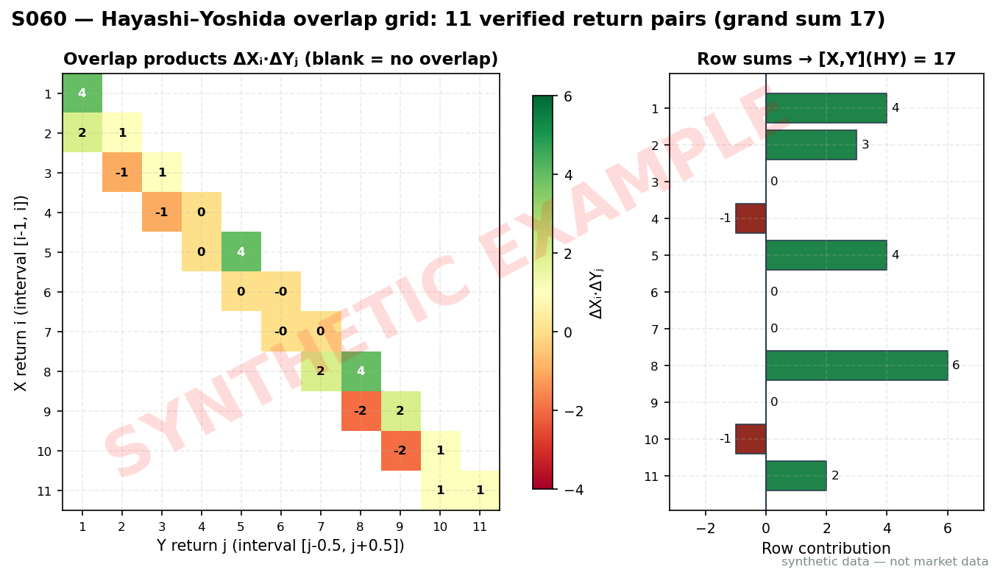

```mermaid
flowchart LR
    FEED["Raw feed\n(Databento ticks / LOBSTER)"] -->|async tick trades, exchange ts| ING["Ingest + normalize\n(clock sync, no interpolation)"]
    ING -->|sorted tick-observation times, pair (leader, laggard), exchange ts| FEAT["Feature compute\n(two-pointer overlap sweep, lag grid)"]
    FEAT -->|ρ̂(ℓ) curve over tick-time lag grid, ℓ in ticks/ms| SIG["Signal S060\nHY lead-lag ℓ̂ + cost gate"]
    SIG -->|laggard direction sign (+1 long / −1 short), tick bars| GATE{"Cost / ts-stress\ngate?"}
    GATE -->|pass| OUT["Downstream consumer\n(T036 entry / T037 timing / T093 filter)"]
    GATE -->|fail| DROP["No trade"]
    style SIG fill:#aed6f1,stroke:#1f3a5f
```

### S12. Sources

- Hayashi, T. & Yoshida, N. (2005). "On covariance estimation of non-synchronously observed diffusion processes." *Bernoulli* 11(2), 359–379. https://projecteuclid.org/journals/bernoulli/volume-11/issue-2/On-covariance-estimation-of-non-synchronously-observed-diffusion-processes/10.3150/bj/1116340299.full
- Voev, V. & Lunde, A. (2007). "Integrated Covariance Estimation using High-frequency Data in the Presence of Noise." *Journal of Financial Econometrics* 5(1), 68–104. https://ideas.Repec.org/a/oup/jfinec/v5y2007i1p68-104.html
- Griffin, J. E. & Oomen, R. C. A. "Covariance measurement in the presence of non-synchronous trading and market microstructure noise." https://core.ac.uk/display/6404551
- "A Note on Asynchronous Challenges: Unveiling Formulaic Bias and Data Loss in the Hayashi-Yoshida Estimator" (2024). arXiv:2404.18233. https://arxiv.org/html/2404.18233v1
- Chordia, T., Sarkar, A. & Subrahmanyam, A. (2011). "Liquidity Dynamics and Cross-Autocorrelations." *Journal of Financial and Quantitative Analysis*. doi:10.1017/S0022109011000081
- Hoffmann, M., Rosenbaum, M. & Yoshida, N. — lead-lag estimator (cited in the report; bibliographic details not independently verified — treat as a research lead).

**Chatbot source (labeled, per question-bank protocol):** Duck.ai answered Q-SB6-1–Q-SB6-3 (GPT-5.6 Luna, anonymous, 2026-09-10; Grok/Cursor answers pending, checked 2026-09-10). Q-SB6-1 supplied the HY overlap formula, the lead-lag Ĉ(ℓ)/ρ̂(ℓ) construction, and the **operator-verified** 11-row worked example (grand sum 17 exact; observation-count caveat flagged in S4/S10). Q-SB6-2 supplied the two-pointer O(n+m) throughput leads and the SIP-vs-exchange timestamp hierarchy used in S7. Q-SB6-3 supplied the lead-time monetization hierarchy and timestamp stress test used in S2/S10 (labeled leads).

**Unverified leads:** arXiv 2501.03171 (calendar-spread near-month-leads-deferred variant — chatbot-cited, not independently verified); the exact Hoffmann–Rosenbaum–Yoshida citation details.

---
## Stage 51/200 — S051: Ornstein–Uhlenbeck half-life trading

*Batch SB7 · Signal 51/100 · Provenance [D] · Family D — Pairs & Cross-Sectional Arbitrage*

### S1. One-line verdict

| | |
|---|---|
| **What it is** | Times pairs entries/exits from the estimated **half-life** — how fast the spread reverts — of a mean-reverting **Ornstein–Uhlenbeck (OU)** spread model. |
| **When it works** | Genuinely cointegrated pairs with a stable, estimable half-life in the 3–60 daily-bar range and round-trip costs well below the expected convergence. |
| **When it dies** | Spreads whose "mean" is drifting or breaking, half-lives shorter than ~2–3 observations (untradeable after costs) or longer than ~50–100 daily bars (weak/unstable reversion). |
| **Build-or-buy in one line** | Build the estimator (an afternoon of AR(1) code); buy the clean corporate-action-adjusted price history it eats. |

Provenance **[D]** (documented: Uhlenbeck & Ornstein 1930; Elliott, Van Der Hoek & Malcolm 2005; Bertram 2010). Family **D** — Pairs & Cross-Sectional Arbitrage.

### S2. How it works — plain human explanation

It is 9:47 on a Tuesday. Coca-Cola (KO) prints at 71.20, PepsiCo (PEP) at 182.10. Your model says the "fair" spread between them — log KO minus 0.83 × log PEP, a **hedge ratio** (units of the second leg per unit of the first that keeps the combination market-neutral) estimated months ago — sits 2.4 **z-scores** above its long-run mean. A **z-score** is distance from the mean in standard deviations. Do you sell the spread now, and — the part most pairs traders wing — *when do you take it off*?

The naive answer is "when the z-score gets back to zero," but that ignores the clock. A spread that reverts in 3 days and one that reverts in 40 days can show the same z-score today, yet they are completely different trades: the first ties up capital for a week, the second for two months — and the second is far more likely to be a broken relationship wearing a mean-reversion costume.

The Ornstein–Uhlenbeck model fixes this by giving the spread a speedometer. An **OU process** is the continuous-time workhorse of mean reversion: the spread is pulled toward its long-run mean with a force proportional to its distance, plus noise. The most tradeable number it produces is the **half-life**: the time for a deviation to decay halfway back to the mean. Half-life 3 days → expect the trade done in 3–6 days; half-life 40 days → you need a capital horizon and cost budget that survive two months of drift.

Why should spreads mean-revert? Common-factor exposure (two beverage stocks share demand, input costs, rate sensitivity), market-maker inventory effects, and behavioral overreaction to idiosyncratic news that later gets arbitraged. None of these guarantee the OU form — a modeling choice, and a fragile one, which is why half of this chapter is about what breaks it.

**Mental model.**
- The half-life turns a statistical property (mean reversion) into trading decisions: how long to hold, whether costs are worth it.
- It is estimated, not observed — via AR(1) — inheriting estimation's sins: noise, window choice, regime breaks.
- It does **not** choose the hedge ratio or prove cointegration. Separate jobs (S050, S052). The OU model takes a spread in and returns a clock.

### S3. The math — exact formula

**Continuous time.** The spread $S_t$ follows

$$dS_t = \kappa(\mu - S_t)\,dt + \sigma\,dW_t,$$

where $S_t$ is the spread (e.g. $S_t = \log P^{(1)}_t - \beta\log P^{(2)}_t$, log-price units or dollars), $\kappa > 0$ the **mean-reversion speed** (larger = faster pull to the mean), $\mu$ the long-run mean, $\sigma > 0$ the noise volatility per $\sqrt{\text{time}}$, and $W_t$ standard Brownian motion.

**Discrete time (what you actually estimate).** Sample at interval $\Delta t$ and run the **AR(1)** regression (**a**uto**r**egression of order 1: today's change regressed on yesterday's level):

$$\Delta S_t = \alpha + \phi S_{t-1} + \varepsilon_t, \qquad \phi = e^{-\kappa\Delta t} - 1 < 0,$$

with $\Delta S_t = S_t - S_{t-1}$; $\hat\kappa = -\ln(1+\hat\phi)/\Delta t$; **half-life** $\hat t_{1/2} = -\Delta t\cdot\ln 2/\ln(1+\hat\phi)$ (days if $\Delta t$ = 1 day); $\hat\mu = -\hat\alpha/\hat\phi$. The stationary (long-run) variance $\sigma^2/(2\kappa)$ sets the entry z-scale: $z_t = (S_t - \hat\mu)/\hat\sigma_{\text{stat}}$.

**Causal timing:** fit the regression on data $\le t$ (rolling window ending at $t$); compute $z_t$ at bar $t$'s close; earliest tradable fill is bar $t+1$'s open.

**Parameter table** (defaults are `example — not an institutional standard`):

| Parameter | Default / range | Too low → | Too high → | Example default |
|---|---|---|---|---|
| $W$ (regression window) | 60–250 daily; 500–5,000 intraday | noisy $\hat\phi$, unstable HL | stale: misses breaks | 120 daily |
| $z_{\text{in}}$ (entry) | 1.5–2.5 $\sigma_{\text{stat}}$ | over-trades noise | rare entries | 2.0 |
| $z_{\text{out}}$ (exit) | 0–0.75 | exits before costs covered | gives back convergence | 0.5 |
| $H_{\max}$ (max hold) | 1–3 half-lives | cuts winners mid-reversion | dead capital on broken pairs | 2 HL |
| $HL_{\min}$ (HL floor) | 2–5 obs | <~2–3 obs untradeable after costs | — | 3 obs |
| $HL_{\max}$ (HL ceiling) | 30–100 daily bars | — | weak/unstable reversion | 60 days |

**Named variants.**
1. **Discrete AR(1)/OLS** (**o**rdinary **l**east **s**quares — the least-squares regression estimator; this chapter's workhorse): fast, transparent, small-sample-biased — the standard.
2. **Continuous-time MLE** (**m**aximum-**l**ikelihood **e**stimation — fitting parameters by maximizing the model's likelihood; exact OU likelihood): less small-sample bias, harder to robustify.
3. **Bertram (2010) optimal stopping**: solves for entry/exit thresholds $(a^*, b^*)$ maximizing expected profit per unit time for a standardized OU spread given cost $c$; optimal thresholds are symmetric about the mean. The research-grade upgrade over fixed z-rules.

### S4. Worked example — step-by-step numbers (SYNTHETIC)

Synthetic spread, **seed 51** (exact geometric decay, zero noise — every step hand-checkable): $S_t = 10(0.8)^{t-1}$, $t = 1\ldots20$. Rows 13–19 follow the same rule and are omitted.

| $t$ | $S_t$ | $S_{t-1}$ | $\Delta S_t$ |
|---|---|---|---|
| 2 | 8.0000 | 10.0000 | −2.0000 |
| 3 | 6.4000 | 8.0000 | −1.6000 |
| 4 | 5.1200 | 6.4000 | −1.2800 |
| 5 | 4.0960 | 5.1200 | −1.0240 |
| 6 | 3.2768 | 4.0960 | −0.8192 |
| 7 | 2.62144 | 3.2768 | −0.65536 |
| 8 | 2.097152 | 2.62144 | −0.524288 |
| 9 | 1.6777216 | 2.097152 | −0.4194304 |
| 10 | 1.34217728 | 1.6777216 | −0.33554432 |
| 11 | 1.073741824 | 1.34217728 | −0.268435456 |
| 12 | 0.8589934592 | 1.073741824 | −0.2147483648 |
| … | … | … | … |
| 20 | 0.1441151881 | 0.1801439851 | −0.0360287970 |

Spot checks (verified): row 5, $5.12 \times (-1.024) = -5.24288$; row 6, $4.096 \times (-0.8192) = -3.3554432$; row 20, $0.1801439851 \times (-0.0360287970) \approx -0.006489$.

**Step 1 — AR(1) fit.** $\Delta S_t = -0.2\,S_{t-1}$ exactly. With $\bar S_L$ the mean of $S_1\ldots S_{19}$, deviation products give $(\Delta S_t - \overline{\Delta S}) = -0.2\,(S_{t-1} - \bar S_L)$, so

$$\hat\phi = \frac{\sum (S_{t-1}-\bar S_L)(\Delta S_t-\overline{\Delta S})}{\sum (S_{t-1}-\bar S_L)^2} = -0.2 \ \text{(exact)}, \qquad \hat\alpha = \overline{\Delta S} - \hat\phi\bar S_L = 0.$$

**Step 2 — OU parameters.** $\hat\kappa = -\ln(1 + \hat\phi)/1 = -\ln(0.8) = 0.2231$ per day; $\hat\mu = -\hat\alpha/\hat\phi = 0$.

**Step 3 — half-life.** $\hat t_{1/2} = -\ln 2/\ln(0.8) = 0.693147/0.223144 = \mathbf{3.1063}$ **days**. (The chatbot-stated 3.1067 carries a small arithmetic slip in the fourth decimal — recomputation gives 3.1063; immaterial economically, corrected here for the record.)

**Step 4 — timing rule (example thresholds).** Enter at $|z| > 2$; expect convergence over ~1–2 half-lives (3.1–6.2 days); exit at $\hat\mu$ or after $\approx 2 \times HL \approx 6.2$ days.

**What to notice.** This toy has zero noise, so $\hat\alpha = 0$ and residuals are nil — real spreads give nonzero intercepts, fat-tailed residuals, and half-lives that wander with the window. The chart plots exactly this table: the left panel marks the half-life point $(1 + 3.1063,\ 5.0)$; the right panel shows the AR(1) scatter lying exactly on the fitted line. Limits: no fees, no borrow, no bid–ask — an arithmetic check, not a backtest.

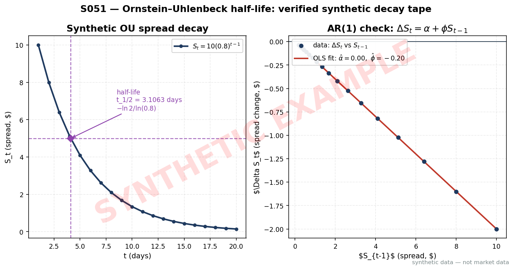

### S5. Strategies that use this signal

- **T007 — Cointegration Z-Score Pairs** — primary entry/exit timing: the OU half-life sets the hold horizon and exit (exit at $\hat\mu$ or after ~2 half-lives), replacing naive fixed-window exits.
- **T032 — Copula Tail-Dependence Pairs** — sizing/exit filter: half-life scales holding time so tail-dependence trades are not held past the spread's natural convergence clock.
- **T033 — Johansen VECM Basket Arb** — speed diagnostic: each basket residual's OU half-life ranks which cointegrated baskets are worth trading (fast, stable HL first).

### S6. Data required — exact spec

| Field | Type | Granularity | Source tier | Notes |
|---|---|---|---|---|
| Adjusted close, leg A & B | float | daily bars (or 1-min) | Tier 0–1 | split/dividend-adjusted; unadjusted prices break $\hat\mu$ silently |
| Corporate-action history | event log | per event | Tier 1 | point-in-time; back-adjusted series preferred |
| Trading calendar | dates | daily | Tier 0 | align both legs; drop half-days consistently |
| Borrow fee / HTB flag (short leg) | float/bool | daily | Tier 1–2 | pairs short one leg — HTB (**h**ard-**t**o-**b**orrow: scarce, high-fee stock loan) can exceed the edge |

Daily adjusted bars via Polygon stocks v3 or Tier-0 Stooq CSV; 1-min via Databento if intraday timing is needed.

```python
import polars as pl  # ingest sketch: daily bars -> aligned spread panel
a = pl.read_parquet("bars/A.parquet").select(["date","adj_close"]).rename({"adj_close":"pa"})
b = pl.read_parquet("bars/B.parquet").select(["date","adj_close"]).rename({"adj_close":"pb"})
px = a.join(b, on="date", how="inner").sort("date")          # inner = both trading
px = px.with_columns(spread=(pl.col("pa").log() - BETA*pl.col("pb").log()))
px.write_parquet("features/spread_panel.parquet")            # -> AR(1) rolling fit
```

Storage (per `notes/cost-model.md` §4): daily bars for 3,000 stocks ≈ 5 MB/day total — trivial; 1-min bars for 500 symbols ≈ 50 MB/day. A 60-day rolling estimation panel is megabytes.

### S7. Local build on M5 Max / 128GB

**Feasibility: trivial** for daily bars, **feasible** for 1-min. An AR(1) fit is a handful of flops per pair per bar: 500 pairs × 2,000 daily observations is ~16 MB (the `notes/cost-model.md` §2 OU/Kalman sizing note), recomputed in seconds with vectorized numpy/polars (~50–200M elements/sec, §2). The bottleneck is data hygiene (corporate actions, calendar alignment), not compute.

| Stack | When to pick |
|---|---|
| Python + polars/numpy | default — everything this signal needs |
| Rust | only for full L1 tick rates across hundreds of symbols |
| DuckDB | ad-hoc screening queries over parquet archives |

RAM: one day of daily bars ≈ KBs; 60 days × 500 symbols ≈ tens of MB — far under the 77 GB working budget (§3). Engineering: **Tier M, 20–60 h** per `notes/cost-model.md` §5 (pairs estimators), i.e. **~$3,000–9,000** at $150/hr loaded. (The duck.ai engineering lead estimated 40–80 h for an OU+Kalman prototype — overlapping the top of this band; `notes/cost-model.md` takes precedence.) What breaks first at 500 symbols: not the AR(1) math — the multiple-testing burden of screening C(500,2) = 124,750 pairs and the borrow/liquidity filters gating them.

### S8. Buy vs build

| Option | What you get | Indicative price | Gains | Loses |
|---|---|---|---|---|
| Tier-0: Stooq / Alpaca IEX | free daily bars | ~$0 | zero marginal cost | weak corp-action history, survivorship gaps |
| Tier-1: Polygon Stocks Advanced, Tiingo | clean daily/1-min SIP (**S**ecurities **I**nformation **P**rocessor: the consolidated US equity feed) bars + actions | ~$30–200/mo | point-in-time adjustments | SIP-grade, no borrow depth |
| Tier-2: Databento Standard | L1/L2 (**l**evel-1 top-of-book and **l**evel-2 full-depth quotes), futures, OPRA research | ~$200/mo + usage | honest intraday spreads | overkill for a daily-bar signal |
| Academic: CRSP (**C**enter for **R**esearch in **S**ecurity **P**rices: the standard survivorship-free US equity database) via WRDS | publication-quality history | institutional $$$$ | survivorship-clean, citable | price, access friction |

All prices `indicative — verify before budgeting`. **Verdict: build** the estimator (~30 lines; your thresholds are the edge); **buy** the difficult data — adjusted, survivorship-clean history and borrow panels — because a misadjusted series corrupts $\hat\mu$ and the half-life silently. The duck.ai Q-SB7-2 lead's mantra, labeled: "buy the difficult data, build the analytics."

### S9. Success ratio / efficacy — documented evidence

OU half-life timing has almost no standalone published P&L record — it is a *timing overlay* on pairs, so the evidence below is for pairs generally plus the overlay's conditional value.

| Study / source | Market & period | Metric | Before/after cost | Caveat |
|---|---|---|---|---|
| Gatev, Goetzmann & Rouwenhorst (2006) | CRSP US, 1962–2002 | ~11% p.a. excess return, low systematic risk | **before cost** | distance method, not OU timing; via the CIR (**C**entre for **I**nternational **R**esearch) working-paper PT2.5 summary |
| Do & Faff (2010) | US, 1962–2009 | profits concentrated in 1970s–80s; decline after ~1989 | **before cost** | documents decay of the raw edge |
| Do & Faff (2012) | US | transaction costs materially erode pairs profitability | **after cost** | via the published version (MDPI — the open-access publisher of *Risks*) and CIR summaries; the hurdle any overlay must clear |

**Honest bottom line.** As a standalone trigger this signal is a *zero* edge — it generates no entries by itself. As an exit/hold-timing overlay on a cointegrated pair it is a *low-to-moderate after-cost* improvement over naive fixed holding windows, **conditional** on: out-of-sample half-life estimation, a fixed-window benchmark that is equally optimized (when it is, the OU advantage often shrinks sharply), and round-trip costs — **spread + commissions/fees + market impact/slippage + borrow + financing** (~5–25 bps per round trip for liquid large caps, higher for HTB names) staying below expected convergence. OU timing shortens holds and abandons broken relationships earlier — but if it raises turnover, net P&L can fall. A clock, not an alpha switch.

### S10. Failure modes & pitfalls

1. **Lookahead leakage** — fitting the hedge ratio, window, or $z$ thresholds on traded data. *Mitigation:* walk-forward; freeze parameters on formation data only.
2. **Mean shifts** — $\mu$ moves; the filter fades a new equilibrium. *Mitigation:* rolling $\hat\mu$ + break diagnostics; stop when realized convergence stops matching $\hat t_{1/2}$.
3. **Hedge-ratio drift** — $\beta$ wanders while assumed fixed (the OU model does **not** determine the hedge ratio — estimate separately, e.g. S052). *Mitigation:* scheduled $\beta$ re-estimation or dynamic hedge.
4. **Cost blowup** — short holds multiply spread/borrow/commission; HTB fees can exceed the edge. *Mitigation:* per-trade cost budget: trade only if expected convergence > 2–3× round-trip cost.
5. **Heavy tails** — OU assumes Gaussian noise; real spreads jump. *Mitigation:* robust regression, jump filters, wider entries in high-vol regimes.
6. **Parameter mining** — scanning windows/thresholds until the backtest shines. *Mitigation:* purged/embargoed walk-forward (S088); report net returns by half-life bucket.
7. **Too-fast / too-slow half-lives** — <~2–3 obs untradeable after costs; >~50–100 daily bars usually weak/unstable. *Mitigation:* HL floor/ceiling gates (example: 3 obs – 60 days).
8. **Stale corporate actions** — an unadjusted split shifts the spread permanently. *Mitigation:* back-adjusted series + action reconciliation before every run.

### S11. Visuals


```mermaid
flowchart LR
    FEED["Raw feed\n(Polygon stocks v3 / Stooq)"] -->|daily bars| ING["Ingest + normalize\n(adjust, DST, halts, calendars)"]
    ING -->|clean daily bars| FEAT["Feature compute\n(spread, rolling AR(1), half-life)"]
    FEAT -->|half-life + z-score (daily bars)| SIG["Signal S051\nOU half-life timing rule"]
    SIG -->|entry/exit instructions (daily bars)| GATE{"Cost + HL\ngate?"}
    GATE -->|pass| OUT["Downstream consumer\n(T007 / T032 / T033)"]
    GATE -->|fail| DROP["No trade"]
    style SIG fill:#aed6f1,stroke:#1f3a5f
```

### S12. Sources

1. Elliott, R. J., Van Der Hoek, J. & Malcolm, W. P. (2005). "Pairs Trading." *Quantitative Finance*. DOI: 10.1080/14697680500149370. (Gaussian-Markov/OU spread model; Kalman estimation of the hidden state.)
2. "An Application of the Ornstein–Uhlenbeck Process to Pairs Trading." arXiv. https://arxiv.org/html/2412.12458v1
3. "Optimal Mean Reversion Trading." arXiv. https://web3.arxiv.org/pdf/1411.5062v1 (optimal double-stopping under OU; cites Bertram (2010).)
4. "Bertram's Pairs Trading Strategy with Bounded Risk." arXiv. https://arxiv.org/pdf/2102.04160 (entry/exit threshold optimization with transaction costs.)
5. "Optimal Pairs Trading: Static and Dynamic Models." Thesis. https://www.collectionscanada.gc.ca/obj/thesescanada/vol2/OTU/TC-OTU-65615.pdf (Bertram (2010) summary; OU first-passage expectations.)
6. Wharton Statistics — "Pairs Trading: Some Resources." http://www-stat.wharton.upenn.edu/~steele/Courses/434/434Context/PairsTrading/PairsTrading.html

**Unverified leads** (chatbot-provided, not independently checkable — do not cite as evidence):
- Duck.ai (GPT-5.6 Luna, 2026-09-10) Q-SB7-1: verified OU worked arithmetic (with the 3.1067→3.1063 correction noted in S4); practical half-life rules-of-thumb (<~2–3 obs too fast; >~50–100 daily weak); mandatory caveat that the OU model does not determine the hedge ratio.
- Duck.ai Q-SB7-3: "OU timing — moderate conditional gross, low–moderate after-cost"; advantage must be measured against properly optimized fixed-window benchmarks.
- Duck.ai Q-SB7-2: engineering-hour components (OU+Kalman 40–80 h; totals treated as approximate ranges).
- Source log: "Duck.ai answered Q-SB7-1–Q-SB7-3 (2026-09-10); Grok/Cursor answers pending (checked 2026-09-10)".

---

---
## Stage 52/200 — S052: Kalman-filter dynamic hedge ratio

*Batch SB7 · Signal 52/100 · Provenance [D] · Family D — Pairs & Cross-Sectional Arbitrage*

### S1. One-line verdict

| | |
|---|---|
| **What it is** | Estimates the pair's **hedge ratio** (units of leg B per unit of leg A) as a moving target with a **Kalman filter** — a recursive estimator that updates its belief every bar — instead of one frozen OLS number. |
| **When it works** | The true hedge ratio genuinely drifts (sector rotations, changing betas), costs are low, and the filter's adaptivity (Q) is calibrated out-of-sample. |
| **When it dies** | The hedge ratio is actually stable (adaptation = expensive noise), Q is set too high, the pair is illiquid, or borrow/shorting costs dominate. |
| **Build-or-buy in one line** | Build the filter (standard recursion, ~50 lines); buy the clean price/borrow history it consumes. |

Provenance **[D]** (documented: Kalman 1960; Elliott, Van Der Hoek & Malcolm 2005; Chan, *Algorithmic Trading*). Tuning guidance is **[SR]** (standard reconstruction) per the report. Family **D** — Pairs & Cross-Sectional Arbitrage.

### S2. How it works — plain human explanation

March. You are long $1M of KO against short $830k of PEP — the 0.83 **hedge ratio** your Engle–Granger regression estimated in January. By June, KO has quietly become more defensive than PEP: the true ratio is now 0.71. Your "market-neutral" pair is no longer neutral — it carries a hidden $120k directional bet you never approved. The spread you trade is computed with a stale ruler.

A static **OLS** (**o**rdinary **l**east **s**quares — least-squares regression) hedge ratio is a photograph; the relationship is a film. The **Kalman filter** — a **state-space** estimator (a model that tracks unobserved "state" variables from noisy observations) — treats the hedge ratio as a hidden quantity that random-walks a little each bar and updates its estimate every time a new price arrives. Each update blends the old estimate with the new observation, weighted by the **Kalman gain** (how much to trust the new data versus the old belief). When prices are noisy, the gain is small and the estimate barely moves; when the evidence of drift piles up, the gain lets it adapt.

The trading signal is then built not on the raw spread but on the **innovation**: the difference between the observed leg-B price and what the filter predicted. Standardize it by its predicted variance and you get a z-score that already accounts for how uncertain the hedge estimate is. Trade it like any pairs z-score: fade extremes, exit on convergence.

The catch — and the reason this chapter is written in a cautionary register — is that adaptivity is not free. Every wiggle of the hedge ratio re-hedges the book, and re-hedging pays **spread + commissions/fees + market-impact slippage** (stale, asynchronous two-leg fills) every single time. A filter tuned too hot chases noise and trades itself to death. The documented evidence (S9) shows Kalman losing to static OLS after costs in at least one honest walk-forward study. The production rule, quoted from the duck.ai evidence lead: **use Kalman only when estimated hedge-ratio drift exceeds the cost of adapting.**

**Mental model.**
- Static OLS assumes the relationship is fixed; Kalman assumes it drifts — pick the assumption the data supports, out-of-sample.
- The filter's only real knob is Q (how fast you believe the world changes); Q = 0 recovers the static model. Most Kalman failures are Q failures.
- Kalman buys hedge accuracy and often lower drawdowns, paid for in turnover. After costs, that trade is frequently negative.

### S3. The math — exact formula

**State-space model** (2-state form; $\theta_t$ is the hidden state, $y_t$ the observed leg-B price):

$$y_t = \mu_t + \beta_t x_t + \varepsilon_t, \qquad \varepsilon_t \sim N(0, R),$$
$$\theta_t = \begin{bmatrix}\mu_t \\ \beta_t\end{bmatrix}, \quad H_t = \begin{bmatrix}1 & x_t\end{bmatrix}, \quad y_t = H_t\theta_t + \varepsilon_t,$$
$$\theta_t = \theta_{t-1} + \eta_t, \qquad \eta_t \sim N(0, Q), \quad Q = \mathrm{diag}(q_\mu, q_\beta).$$

- $x_t, y_t$: leg prices (or log prices); $R$: **observation-noise** variance (measurement noise);
- $Q$: **process-noise** covariance — how much $\mu_t, \beta_t$ are allowed to drift per bar;
- **Kalman gain** $K_t$: weight placed on new observations (large = trust new data);
- **innovation** $e_t$: prediction error $y_t - \text{predicted } y_t$ — the raw material of the signal.

**Predict–update recursion.**

Predict: $\hat\theta_{t|t-1} = \hat\theta_{t-1|t-1}$, $P_{t|t-1} = P_{t-1|t-1} + Q$.

Update: $e_t = y_t - H_t\hat\theta_{t|t-1}$; $F_t = H_t P_{t|t-1} H_t^\top + R$ (**innovation variance**); $K_t = P_{t|t-1}H_t^\top F_t^{-1}$; $\hat\theta_{t|t} = \hat\theta_{t|t-1} + K_t e_t$; $P_{t|t} = (I - K_tH_t)P_{t|t-1}$.

**Signal.** Estimated spread $\hat S_t = y_t - \hat\mu_t - \hat\beta_t x_t$; standardized $z_t = e_t/\sqrt{F_t}$. Long the spread if $e_t < -c\sqrt{F_t}$, short if $e_t > c\sqrt{F_t}$ ($c = 1.0$–$2.5$, `example`); exit when the innovation falls back inside $0.25$–$0.75\sqrt{F_t}$ (`example`).

**Causal timing:** $\hat\theta_{t|t}$ uses data $\le t$; $z_t$ computed at bar $t$'s close; earliest fill bar $t+1$'s open.

**Parameter table** (defaults `example — not an institutional standard`):

| Parameter | Symbol | Typical range | Too small | Too large | Default (example) |
|---|---|---|---|---|---|
| Process noise, $\beta$ | $q_\beta$ | $\alpha_\beta R/\mathrm{Var}(x_t)$, $\alpha_\beta = 10^{-6}$–$10^{-3}$/obs | never adapts (static OLS) | chases noise, churn | $\alpha_\beta = 10^{-4}$ |
| Process noise, $\mu$ | $q_\mu$ | $0.1R$–$1.0R$ | intercept lags level shifts | mean estimate whipsaws | $0.1R$ |
| Observation noise | $R$ | Var(short-run OLS residual) | over-trusts noisy ticks | filter ignores real moves | 60–250-obs OLS residual var |
| Entry multiple | $c$ | 1.0–2.5 | noise trades | rare entries | 2.0 |
| Calibration | — | MLE (**m**aximum-**l**ikelihood **e**stimation)/**EM** (expectation-maximization) or grid search | — | in-sample overfit | OOS (**o**ut-**o**f-**s**ample) grid on $q_\beta$ |

Diagnostic $\lambda_\beta = q_\beta\,\mathrm{Var}(x_t)/R$: small = stable/slow, large = responsive/noisy. $Q = 0$ reproduces the fixed model — the honest null.

**Named variants.** (1) 2-state $[\mu_t,\beta_t]$ (above) — the standard. (2) 1-state $\beta_t$ with separately estimated $\mu$ (this chapter's worked example — clearer arithmetic; production usually uses the joint form). (3) EM/MLE-tuned $Q$ (e.g. the TU Delft thesis: EM optimization turned a losing filter into the best performer). (4) Kalman-HMM blends (**h**idden **M**arkov **m**odel: latent regime-switching) (regime-switching observation models).

### S4. Worked example — step-by-step numbers (SYNTHETIC)

Synthetic pair, **seed 52**, 400 daily bars: leg A is a stationary AR(1) around 0; leg B follows $y_t = 1.0 + \beta_t x_t + \text{noise}$ with a genuinely drifting hedge ratio $\beta_t = 1.20 + 0.20\sin(2\pi t/150) + \text{random walk}$. Tuning (scale-aware, per the Q/R guidance): $R = 0.10610$ (first-60-obs OLS residual variance), $q_\beta = 10^{-4} R/\mathrm{Var}(x) = 3.021\times10^{-6}$, $\hat\mu = 0.9533$ (formation OLS intercept); 1-state $\beta$ filter, $\beta_0 = 1.20$, $P_0 = 0.04$.

Kalman predict–update steps, $t = 150\ldots159$ (hand-checkable; $e_t = \tilde y_t - \beta_{t-1}x_t$, $\beta_t = \beta_{t-1} + K_t e_t$):

| $t$ | $x_t$ | $\tilde y_t$ | $\beta_{t-1}$ | $e_t$ | $\sqrt{F_t}$ | $K_t$ | $\beta_t$ |
|---|---|---|---|---|---|---|---|
| 150 | 4.1161 | 4.8015 | 1.1571 | +0.0388 | 0.3348 | 0.01299 | 1.1576 |
| 151 | 3.1262 | 3.7386 | 1.1576 | +0.1197 | 0.3308 | 0.00966 | 1.1588 |
| 152 | 3.0224 | 3.3090 | 1.1588 | −0.1932 | 0.3303 | 0.00916 | 1.1570 |
| 153 | 2.7995 | 3.7753 | 1.1570 | +0.5363 | 0.3296 | 0.00837 | 1.1615 |
| 154 | 2.9928 | 3.6008 | 1.1615 | +0.1247 | 0.3301 | 0.00879 | 1.1626 |
| 155 | 1.8027 | 2.0784 | 1.1626 | −0.0173 | 0.3273 | 0.00530 | 1.1625 |
| 156 | 1.7436 | 2.4194 | 1.1625 | +0.3924 | 0.3272 | 0.00513 | 1.1645 |
| 157 | 2.1964 | 2.3158 | 1.1645 | −0.2419 | 0.3281 | 0.00643 | 1.1629 |
| 158 | 1.7944 | 1.8364 | 1.1629 | −0.2504 | 0.3273 | 0.00525 | 1.1616 |
| 159 | 2.0201 | 2.6916 | 1.1616 | +0.3450 | 0.3277 | 0.00590 | 1.1637 |

Check row 153: $e = 3.7753 - 1.1570 \times 2.7995 = 3.7753 - 3.2390 = 0.5363$ ✓; $\beta = 1.1570 + 0.00837 \times 0.5363 = 1.1615$ ✓. Whole-sample static OLS gives $\hat\beta = 1.2052$ — a single frozen number.

**What to notice.** The filter tracks the drifting $\beta_t$ (left chart panel: Kalman hugs the true dashed path; static OLS is a flat line increasingly wrong at the edges). Under the synthetic rule (enter $|z|>2$, exit $|z|<0.5$) the Kalman branch fires **20** trades vs **13** for static OLS over the 400 bars — adaptivity's price, visible even in a toy with zero costs. Note the filter lags the true sine drift slightly: small $Q$ is slow by design; that lag is what "raise $Q$ on persistent out-of-sample adaptation lag" means. Limits: zero costs, one synthetic pair, no borrow — this demonstrates the recursion, not an edge.

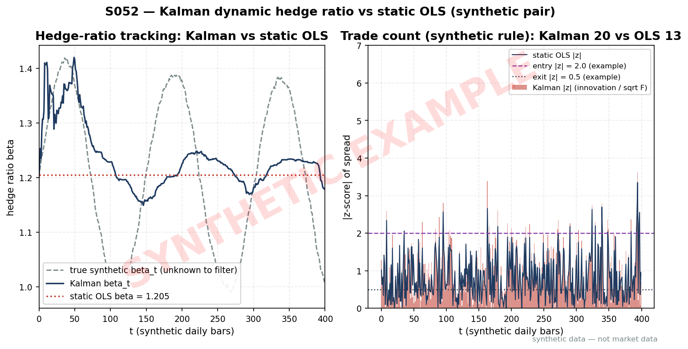

### S5. Strategies that use this signal

- **T008 — Kalman Dynamic-Hedge Pairs** — primary hedge engine: S052 supplies the live hedge ratio; imbalance-bar entries (S083) time the trades, resiliency exits (S048) close them.

> S5 note: T007 (Cointegration Z-Score Pairs) was listed here in the draft, but `notes/plan.md` §3 assigns T007 the Signals S050, S051, S053 — not S052 — so T007 is **not** a consumer of this signal; T008 is the valid cross-reference.

### S6. Data required — exact spec

| Field | Type | Granularity | Source tier | Notes |
|---|---|---|---|---|
| Mid/close, leg A & B | float | 1-min or daily bars | Tier 0–1 | sequential mids per the report; same bar clock both legs |
| Corporate-action history | event log | per event | Tier 1 | splits corrupt $\beta$ silently |
| Borrow fee / HTB flag | float/bool | daily | Tier 1–2 | Kalman cannot fix an unborrowable short leg; HTB = **h**ard-**t**o-**b**orrow (scarce, high-fee stock loan) |
| Trading calendar | dates | daily | Tier 0 | align both legs |

```python
import polars as pl  # ingest sketch: sequential mids -> aligned panel
a = pl.read_parquet("mids/A.parquet").select(["ts","mid"]).rename({"mid":"x"})
b = pl.read_parquet("mids/B.parquet").select(["ts","mid"]).rename({"mid":"y"})
px = a.join_asof(b, on="ts", strategy="backward", tolerance="1m").drop_nuls()
px.write_parquet("features/pair_panel.parquet")   # -> Kalman predict/update loop
```

Storage (per `notes/cost-model.md` §4): daily bars for 3,000 stocks ≈ 5 MB/day total; 1-min for 500 symbols ≈ 50 MB/day. A 500-pair Kalman panel is ~16 MB (the §2 OU/Kalman sizing note). Data-quality checklist: common bar clock (asof tolerance); corporate actions; halts; DST/half-days; stale quotes; survivorship.

### S7. Local build on M5 Max / 128GB

**Feasibility: trivial.** The report's own note: 500 daily 2-state Kalman filters are "computationally negligible (pure NumPy seconds or less)." Each bar is a 2×2 matrix update — a few dozen flops. Even 500 symbols × 390 1-min bars/day = 195k updates/day (§2), microseconds of compute. Bottleneck is information-set discipline (point-in-time alignment, borrow data), not CPU/RAM.

| Stack | When to pick |
|---|---|
| Python + numpy/polars | default — the whole filter is vectorizable per bar |
| Numba | only if running thousands of pairs at tick frequency |
| Rust | full L1 multi-symbol real-time; unnecessary for 1-min/daily |

RAM: live panel ≈ tens of MB — far under the 77 GB working budget (§3). Engineering: **Tier M, 20–60 h** per `notes/cost-model.md` §5 (Kalman/HMM tier), i.e. **~$3,000–9,000** at $150/hr loaded; add ~20–40 h for the walk-forward $Q$-calibration and cost-accounting harness that makes the filter honest. What breaks first at 500 symbols: the validation burden (multiple testing over pairs) and borrow/liquidity gating — not the filter math.

### S8. Buy vs build

| Option | What you get | Indicative price | Gains | Loses |
|---|---|---|---|---|
| Tier-0: Stooq / Alpaca IEX (the **I**nvestors **E**xchange retail equity feed) | free daily bars | ~$0 | zero cost | weak corp actions, survivorship gaps |
| Tier-1: Polygon Stocks Advanced | clean daily/1-min bars + actions | ~$30–200/mo | point-in-time adjustments | no borrow depth |
| Tier-2: Databento Standard | L1/L2 (**l**evel-1 top-of-book / **l**evel-2 depth) research, OPRA (**O**ptions **P**rice **R**eporting **A**uthority: the consolidated US options feed) | ~$200/mo + usage | honest intraday mids | overkill for daily calibration |
| Borrow panels: broker / aggregators | current + historical borrow fees | ~$0–5k/mo retail; $10–50k/yr aggregated history | the binding constraint, quantified | expensive; history ≠ executable |

All prices `indicative — verify before budgeting`. **Verdict: build** the filter (your $Q$ and your cost model are the strategy); **buy** the difficult data — borrow/availability history and point-in-time corporate actions — because the filter faithfully tracks garbage inputs. Duck.ai Q-SB7-2 lead, labeled: "buy the difficult data, build the analytics."

### S9. Success ratio / efficacy — documented evidence

| Study / source | Market & period | Metric | Before/after cost | Caveat |
|---|---|---|---|---|
| Nourahmad & Nourahmadi (2023) | Tehran Stock Exchange, auto industry, 2016–2020 | Kalman pairs: CAGR (**c**ompound **a**nnual **g**rowth **r**ate) 0.11, Sharpe 3.06; "superiority over cointegration" | **before cost** (costs unspecified) | single industry, single market; in-sample selection risk |
| TU Delft thesis ("Kalman Filtering for Pairs Trading") | ETH-NEO crypto, 2018–2019 | EM-optimized Kalman $750.83 vs unfiltered $725.73 (4 trades each); unfiltered beat *default* Kalman | **before cost** (explicitly no costs) | single pair, tiny N; shows tuning, not filtering, did the work |
| chiajialin/kalman-hedge-ratio-statarb (GitHub) | ES/NQ, ES/YM, NQ/YM index futures, walk-forward | Kalman best Sharpe 0.28, bootstrap p≈0.25 — not significant | **after cost** | corrected honest result; rolling OLS significant on one pair, strongly negative on another — high-variance estimators |

> S2 note: the purported 2026 walk-forward study (fold-average net Sharpe static OLS ≈ −0.157 vs baseline Kalman ≈ −2.080) is a quarantined **unverified chatbot claim** — it is documented in Unverified leads (S12) and is not part of the evidence table above.

**Honest bottom line.** Kalman is **not reliably superior after costs** — that is the mandatory framing and the evidence supports it: every positive result above is before-cost, small-sample, or statistically insignificant, while the cost-aware walk-forwards are flat-to-negative. As a standalone "alpha switch" it is a *zero-to-negative* edge. Its defensible role is narrower: a hedge-accuracy and drawdown tool for pairs whose $\beta_t$ **materially drifts**, deployed only when estimated drift exceeds the cost of adapting, with $Q$ calibrated out-of-sample and signals suppressed when forecast variance is high. Report $\Delta$Net Sharpe (Kalman − OLS) with turnover, average hold, max DD (**d**raw**d**own: peak-to-trough loss), and $\beta$ drift — never gross Sharpe alone.

### S10. Failure modes & pitfalls

1. **Q too large** — filter chases noise; turnover explodes. *Mitigation:* OOS-calibrated $Q$; start at $\alpha_\beta = 10^{-4}$; monitor $\lambda_\beta$.
2. **Q too small / Q = 0 by accident** — expensive static OLS with extra steps. *Mitigation:* verify $\beta_t$ actually moves; compare against the $Q=0$ null.
3. **Stable-$\beta$ pairs** — adaptation adds nothing but trades. *Mitigation:* pre-test for hedge-ratio drift; use Kalman only where drift exists.
4. **Illiquid pair / wide spreads** — re-hedging costs swamp hedge-accuracy gains. *Mitigation:* liquidity filter; cost breakeven ≈ 6–7 bps one-way (unverified lead — re-estimate).
5. **Borrow dominance** — short-leg fees exceed the spread edge regardless of hedge quality. *Mitigation:* borrow-fee gate before any filter tuning.
6. **Lookahead in $Q$ calibration** — tuning $Q$ on the traded sample. *Mitigation:* walk-forward / purged CV (S088); freeze $Q$ on formation data.
7. **Intercept–slope confounding** — with trending $x_t$, $\mu_t$ and $\beta_t$ are hard to separate (the worked example uses a 1-state filter precisely to dodge this). *Mitigation:* demeaned inputs; monitor $P$'s off-diagonals.
8. **Gaussian assumptions** — real innovations are fat-tailed; the gain overreacts to jumps. *Mitigation:* robustified filters / jump screens; winsorize innovations.

### S11. Visuals


```mermaid
flowchart LR
    FEED["Raw feed\n(Polygon stocks v3)"] -->|1-min or daily bars| ING["Ingest + normalize\n(asof join, actions, halts)"]
    ING -->|aligned pair panel (bars)| FEAT["Feature compute\n(Kalman predict/update, innovation)"]
    FEAT -->|z = innovation / sqrt(F) (per bar)| SIG["Signal S052\nKalman dynamic hedge"]
    SIG -->|entry/exit instructions (per bar)| GATE{"Cost / borrow\ngate?"}
    GATE -->|pass| OUT["Downstream consumer\n(T008)"]
    GATE -->|fail| DROP["No trade"]
    style SIG fill:#aed6f1,stroke:#1f3a5f
```

### S12. Sources

1. Elliott, R. J., Van Der Hoek, J. & Malcolm, W. P. (2005). "Pairs Trading." *Quantitative Finance*. DOI: 10.1080/14697680500149370. (Kalman-filter estimation of the hidden OU spread state.)
2. Montana, G. & Triantafyllopoulos, K. "Dynamic modeling of mean-reverting spreads for statistical arbitrage." https://ar5iv.labs.arxiv.org/html/0808.1710 (dynamic linear models for the spread; trading-rule questions incl. cost-aware entry calibration.)
3. "Kalman Filtering for Pairs Trading." TU Delft thesis. https://repository.tudelft.nl/file/File_932355c5-ccdc-491c-a2e7-d5673cdacb36 (ETH-NEO 2018–2019: EM-optimized Kalman $750.83 vs unfiltered $725.73; default Kalman lost to unfiltered.)
4. Nourahmad, M. J. & Nourahmadi, M. (2023). "Application of Kalman Filter to Estimate Dynamic Hedge Ratio in Pairs Trading Strategy: A Case Study of the Automobile Industry." *Financial Research Journal*, 25(1), 63–87. https://jfr.ut.ac.ir/article_92806_2c471cc3358cb9e9c64b885b08ec6162.pdf
5. chiajialin/kalman-hedge-ratio-statarb (GitHub). https://github.com/chiajialin/kalman-hedge-ratio-statarb (walk-forward, cost-aware: Kalman Sharpe 0.28, p≈0.25 — not significant; honest corrected result.)
6. "A computing platform for pairs-trading online implementation via a blended Kalman-HMM filtering approach." *Journal of Big Data*. https://link.springer.com/article/10.1186/s40537-017-0106-3 (Kalman-HMM hybrid improving on Elliott et al.'s filter in simulation.)

**Unverified leads** (chatbot-provided, not independently checkable — do not cite as evidence):
- Duck.ai (GPT-5.6 Luna, 2026-09-10) Q-SB7-3: 2026 walk-forward study (50 S&P 500, 2020–2024) — fold-average net Sharpe static OLS ≈ −0.157 vs baseline Kalman ≈ −2.080; Kalman −71% max DD, +54% trades; breakeven ≈ 6–7 bps one-way; "use Kalman only when estimated hedge-ratio drift exceeds the cost of adapting"; "not reliably additive after costs… None a standalone 'alpha switch'." Arithmetically checked; study itself unverified.
- Duck.ai Q-SB7-1: Kalman recursion, 2-state form, Q/R scale-aware tuning ($q_\beta = \alpha_\beta R/\mathrm{Var}(x)$, $\alpha_\beta = 10^{-4}$ start), $\lambda_\beta$ diagnostic.
- Duck.ai Q-SB7-2: engineering components (Kalman engine 20–40 h prototype / 40–80 h production; totals approximate).
- Source log: "Duck.ai answered Q-SB7-1–Q-SB7-3 (2026-09-10); Grok/Cursor answers pending (checked 2026-09-10)".

---

---
## Stage 53/200 — S053: Pair-quality filter — zero crossings (Do–Faff)

*Batch SB7 · Signal 53/100 · Provenance [D] · Family D — Pairs & Cross-Sectional Arbitrage*

### S1. One-line verdict

| | |
|---|---|
| **What it is** | A formation-period quality gate: among candidate pairs, trade only those whose spread crossed zero most often — frequent crossings signal reliable, tradeable mean reversion. |
| **When it works** | Large candidate universes where most "**cointegrated**" pairs (two non-stationary price series whose linear combination is stationary — a stable long-run relationship) are statistical mirages; the filter cheaply discards slow, excursion-prone spreads before they cost money. |
| **When it dies** | When the formation regime doesn't carry into trading (structural breaks), or when the filter is tuned so tight the portfolio holds three pairs. |
| **Build-or-buy in one line** | Build — it is a sign-change counter on data you already have; buy nothing new. |

Provenance **[D]** (documented: Do & Faff 2010, 2012 — the zero-crossing quality finding is implemented in arbitragelab's distance approach per Do & Faff (2010, 2012); verified via web research, S12). Family **D** — Pairs & Cross-Sectional Arbitrage.

### S2. How it works — plain human explanation

Your screen just nominated 40 "cointegrated" pairs from the S&P 500. You cannot trade all 40 — borrow, attention, and risk limits say pick 8. The test statistics all passed, so how do you rank them?

Count how often each spread crossed zero during the **formation period** (the historical window where pairs are selected and parameters estimated, before any trading begins). A **zero crossing** is simply a bar where the spread changes sign — it touched its mean and came back. A pair whose spread crossed zero 57 times in a year kept coming home; a pair that crossed once wandered off and stayed away. Do and Faff's finding, as implemented across the literature: the number of formation-period zero crossings has a positive relation to future spread convergence — it is the time-series dimension of pair quality, complementing cross-sectional screens like minimum distance.

The economics are intuitive. Mean reversion is only tradeable if it *completes*: a spread that oscillates tightly around zero generates repeated round-trips (enter at ±2σ, exit at the crossing — the classic Gatev et al. exit). A spread that makes one giant excursion and returns a year later has the same "cointegration" p-value but a completely different P&L distribution: fewer trades, longer dead capital, and catastrophic left tails when the excursion keeps going. Zero crossings measure the *rhythm* of the reversion, which is what the trader actually monetizes.

The gate is brutally simple: rank candidates by crossing count, trade the top slice (top quartile, or count ≥ threshold — `example`), discard the rest. It costs nothing beyond the spread series you already computed, and it fails safe: a rejected pair is just a pair you don't trade.

**Mental model.**
- Cointegration tests answer "does it come back *eventually*"; zero crossings answer "does it come back *often enough to trade*."
- The filter is a screen, not a signal: it never generates an entry by itself — it vetoes candidates.
- Its value is entirely in the left tail: the pairs it rejects are the ones that blow up.

### S3. The math — exact formula

**Zero-crossing count** over a formation window of $T$ bars:

$$ZC = \sum_{t=2}^{T} \mathbf{1}\big[\,\mathrm{sign}(S_{t-1})\cdot\mathrm{sign}(S_t) < 0\,\big],$$

where $S_t$ is the formation spread (normalized, e.g. by formation-period standard deviation) and $\mathbf{1}[\cdot]$ is the indicator function. Bars where $S_t = 0$ exactly are not crossings.

**Ranking rule.** Sort all candidate pairs by $ZC$ descending; trade the top $k$ pairs or all pairs with $ZC \ge ZC_{\min}$ (`example`: top quartile; $ZC_{\min} = 20$ on 250 daily bars). Combine with the entry rules of S049/S050: enter at $|z| > 2$, exit at the next zero crossing (the Gatev et al. exit mechanic the filter is designed around).

**Why crossings measure reversion speed.** For an AR(1) (**a**uto**r**egression of order 1: today's value regressed on yesterday's value) spread with coefficient $\phi$, the expected crossing rate is approximately $\arccos(\phi)/\pi$ per bar (Rice's-formula intuition): $\phi = 0.7$ → ~0.25 crossings/bar (~63/year on daily bars); $\phi = 0.995$ → ~0.03/bar (~8/year). More crossings ⇔ faster, tighter mean reversion ⇔ the OU (**O**rnstein–**U**hlenbeck: the continuous-time mean-reversion model) half-life (S051) is short. The two signals are cousins: S051 estimates the clock parametrically, S053 reads the rhythm non-parametrically.

**Causal timing:** $ZC$ is computed on the formation window only; ranking is frozen before the **trading period** (the subsequent window where the selected pairs are actually traded) begins. No formation data may leak into trading decisions.

**Parameter table** (defaults `example — not an institutional standard`):

| Parameter | Symbol | Typical range | Too small | Too large | Default (example) |
|---|---|---|---|---|---|
| Formation window | $T$ | 6–12 months daily | noisy $ZC$, unstable ranking | stale pairs, regime drift | 12 months |
| Gate threshold | $ZC_{\min}$ | 10–40 on 250 bars | admits excursion-prone pairs | portfolio of 3 pairs | 20 |
| Selection slice | $k$ | top 10–25% of candidates | quality dilution | concentration risk | top quartile |
| Spread normalization | — | formation-period σ | — | — | z-scored spread |

**Named variants.** (1) Raw count gate (this chapter). (2) Count + same-industry pre-screen (arbitragelab implements industry grouping *then* zero-crossing ranking, per Do & Faff). (3) Count + historical-σ screen (high-σ pairs admitted only with high $ZC$). (4) Rolling $ZC$ as a live health monitor: if a traded pair's recent crossing rate collapses, cut it — the formation promise is broken.

### S4. Worked example — step-by-step numbers (SYNTHETIC)

Two synthetic candidates, **formation seed 7**, 250 daily bars. Pair A: fast OU ($\kappa = 0.30$) — many crossings. Pair B: slow OU ($\kappa = 0.005$) — few crossings, huge excursions.

First 12 formation bars of Pair A (sign changes counted by hand):

| $t$ | $s_t$ | sign | crossing? | cum. crossings |
|---|---|---|---|---|
| 1 | +0.0000 | 0 | no | 0 |
| 2 | +0.0012 | +1 | no | 0 |
| 3 | +0.2996 | +1 | no | 0 |
| 4 | −0.0644 | −1 | **YES** | 1 |
| 5 | −0.9357 | −1 | no | 1 |
| 6 | −1.1096 | −1 | no | 1 |
| 7 | −1.7684 | −1 | no | 1 |
| 8 | −1.1777 | −1 | no | 1 |
| 9 | +0.5158 | +1 | **YES** | 2 |
| 10 | −0.1311 | −1 | **YES** | 3 |
| 11 | −0.7123 | −1 | no | 3 |
| 12 | −0.0088 | −1 | no | 3 |

**Full-formation counts:** Pair A **57** crossings; Pair B **1** crossing. Gate ($ZC_{\min} = 20$, `example`): A passes, B is rejected. **Trading period** (seed 99): A's spread keeps oscillating — 52 crossings, trades complete; B's mean shifts +2.5 and its spread makes wild excursions (range −18.90 to +3.32) with only 2 crossings — exactly the left-tail event the gate exists to avoid.

**What to notice.** The filter's whole value is visible in the right chart panel: A keeps coming home, B doesn't. The demo uses zero costs and one synthetic draw — it illustrates the *mechanism* (crossing rhythm predicts convergence rhythm), not a P&L claim. (Cost-stack note: the gate itself has no trade and hence no cost stack — it consumes a spread series that already exists; the trading cost stack — spread, commissions/fees, borrow, market impact/slippage — belongs to the pairs strategy the gate screens for, e.g. S051/S052.) In real data, B's single formation crossing would have been the warning; the trading-period break is what the filter can't foresee — which is why the rolling-$ZC$ health monitor (variant 4) exists.

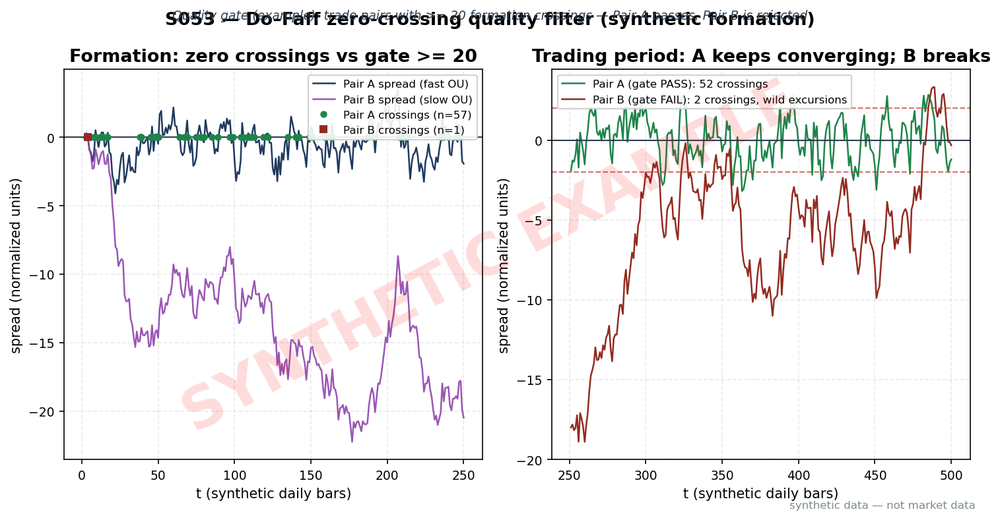

### S5. Strategies that use this signal

- **T031 — Distance Pairs + Quality Filter** — primary gate: S053 ranks the Gatev-style distance pairs (S049) and only the top-crossing candidates reach the cointegration confirmation (S050) and trading.
- **T007 — Cointegration Z-Score Pairs** — candidate filter: S053 pre-screens the cointegrated universe so S051's half-life timing is only estimated on pairs with demonstrated convergence rhythm.

### S6. Data required — exact spec

| Field | Type | Granularity | Source tier | Notes |
|---|---|---|---|---|
| Adjusted close, both legs | float | daily bars | Tier 0–1 | same as S049/S050 — no new data needed |
| Formation spread series | float | daily bars | derived | z-scored on formation σ |
| Corporate-action history | event log | per event | Tier 1 | splits create false crossings |
| Trading calendar | dates | daily | Tier 0 | aligned formation/trading windows |

```python
import polars as pl, numpy as np  # zero-crossing gate sketch
s = pl.read_parquet("features/spread_panel.parquet")["spread"].to_numpy()
zc = int(((np.sign(s[:-1]) * np.sign(s[1:])) < 0).sum())  # formation only
trade_it = zc >= 20   # example gate
```

Storage (per `notes/cost-model.md` §4): nothing incremental — the spread panel already exists; the gate is a sign-change counter. Data-quality checklist: formation window strictly before trading window (no overlap); corporate actions (a split mid-formation fabricates crossings); half-days/halts handled identically in both windows; survivorship in the candidate screen.

### S7. Local build on M5 Max / 128GB

**Feasibility: trivial.** Counting sign changes is O(T) integer ops per pair — the cheapest step in the entire pairs pipeline. The real work is the pipeline around it (pair screening, spread construction, S049/S050 estimation).

| Stack | When to pick |
|---|---|
| Python + polars/numpy | default — the gate is five lines |
| DuckDB | ranking thousands of candidates with SQL window functions |

RAM: bytes per pair — irrelevant against the 77 GB budget (§3). Engineering: the gate itself is **< 4 h**; the honest band is the pairs-screen bundle, **Tier M, 20–60 h** per `notes/cost-model.md` §5 (pairs D family), i.e. **~$3,000–9,000** at $150/hr loaded, covering screening, spread construction, formation/trading split discipline, and the walk-forward validation that proves the gate adds net value. What breaks first at 500 symbols: C(500,2) = 124,750 candidate pairs make the *screening* (not the gate) the multiple-testing problem; pre-filter by sector/liquidity first.

### S8. Buy vs build

| Option | What you get | Indicative price | Gains | Loses |
|---|---|---|---|---|
| Tier-0: Stooq / Alpaca IEX | free daily bars | ~$0 | zero cost | survivorship gaps in candidate screens |
| Tier-1: Polygon Stocks Advanced | clean daily bars + actions | ~$30–200/mo | point-in-time adjustments | — |
| arbitragelab (open-source) | distance approach incl. zero-crossing selection | ~$0 (code) | reference implementation per Do & Faff | you still validate it yourself |

All prices `indicative — verify before budgeting`. **Verdict: build, always** — there is nothing to buy; the filter is a counter on data you already own. Spend the budget on the difficult data underneath it (survivorship-clean, action-adjusted history), per the duck.ai Q-SB7-2 lead: "buy the difficult data, build the analytics."

### S9. Success ratio / efficacy — documented evidence

The filter has no standalone P&L series in the literature — it is a *screen*, so evidence is for the pairs methods it gates plus the documented quality finding.

| Study / source | Market & period | Metric | Before/after cost | Caveat |
|---|---|---|---|---|
| Gatev, Goetzmann & Rouwenhorst (2006) | CRSP (**C**enter for **R**esearch in **S**ecurity **P**rices: the standard US equity database) US, 1962–2002 | ~11% p.a. excess return; entries at 2σ, exits at the next zero crossing | **before cost** | the exit mechanic this filter is built around; decay after 1989 |
| Do & Faff (2010) | US, 1962–2009 | profitability concentrated in 1970s–80s; marked decline after ~1989 | **before cost** | via the CIR (**C**entre for **I**nternational **R**esearch) working-paper PT2.5 summary; motivates quality gating |
| Do & Faff (2012) | US | transaction costs materially erode pairs profitability | **after cost** | via the published version (MDPI — the open-access publisher of *Risks*) and CIR summaries; the filter must earn its keep net of costs |
| arbitragelab distance-approach docs (implementation evidence) | — | zero-crossing selection implemented per Do & Faff (2010, 2012): "the number of zero crossings in the formation period has a positive relation to the future spread convergence" | n/a (method doc) | practitioner documentation, not a performance claim |

**Honest bottom line.** As a standalone trigger this signal is a *zero* edge — it never fires an entry. As a formation-period quality gate it is a *cheap, sensible screen with documented pedigree but thin standalone after-cost proof*: the value proposition is fewer blow-ups and higher profit-per-trade, which must be demonstrated net of costs in your own walk-forward (the filter that "works" gross but concentrates you into 3 illiquid pairs is a failure). Validate it as what it is — a veto — by comparing gated vs ungated portfolios on net Sharpe, max drawdown, and turnover, not on gross returns.

### S10. Failure modes & pitfalls

1. **Regime breaks** — formation rhythm doesn't carry into trading (the synthetic Pair B). *Mitigation:* rolling-$ZC$ health monitor; cut pairs whose recent crossing rate collapses.
2. **Over-tight gating** — $ZC_{\min}$ too high leaves 3 pairs and concentration risk. *Mitigation:* top-slice (quartile) rather than absolute thresholds; monitor portfolio breadth.
3. **False crossings from noise** — microstructure chop around zero inflates $ZC$. *Mitigation:* count crossings of a lightly smoothed spread, or require minimum excursion between crossings.
4. **Corporate-action artifacts** — a split mid-formation fabricates crossings. *Mitigation:* back-adjusted series; action reconciliation before formation.
5. **Lookahead via window overlap** — formation bleeding into trading. *Mitigation:* strict formation/trading split with an embargo gap.
6. **Crowded quality** — everyone screens on the same statistic; the best pairs are the most traded. *Mitigation:* treat the gate as hygiene, not edge; combine with idiosyncratic screens.
7. **Ignoring costs** — high-$ZC$ pairs can still be untradeable after borrow/spread. *Mitigation:* apply the cost/borrow gate *after* the quality gate, on net expected profit per trade.
8. **Survivorship in screening** — delisted pairs vanish, flattering formation stats. *Mitigation:* point-in-time constituent histories.

### S11. Visuals


```mermaid
flowchart LR
    FEED["Raw feed\n(Polygon stocks v3 / Stooq)"] -->|daily bars| ING["Ingest + normalize\n(adjust, DST, halts, calendars)"]
    ING -->|clean daily bars| FEAT["Feature compute\n(spreads, zero-crossing counts)"]
    FEAT -->|ZC-ranked candidates (daily-bar formation)| SIG["Signal S053\nDo–Faff quality gate"]
    SIG -->|pass / reject (per pair)| GATE{"Top-quartile\nZC?"}
    GATE -->|pass| OUT["Downstream consumer\n(T031 / T007)"]
    GATE -->|fail| DROP["Pair rejected"]
    style SIG fill:#aed6f1,stroke:#1f3a5f
```

### S12. Sources

1. Do, B. & Faff, R. (2010). US pairs-trading evidence, 1962–2009 (as summarized in CIR Working Paper PT2.5). https://www.ucc.ie/en/media/research/centreforinvestmentresearch/wp/PT2.5.pdf (documents post-1989 profitability decline; the quality-filter literature context.)
2. Do, B. & Faff, R. (2012). Pairs-trading profitability accounting for transaction costs (as summarized in MDPI *Risks* 2023). https://www.mdpi.com/2227-9091/11/5/93 (after-cost erosion — the hurdle the filter must clear.)
3. arbitragelab — distance approach docs (Hudson & Thames). https://github.com/hudson-and-thames/arbitragelab/blob/HEAD/docs/source/distance_approach/distance_approach.rst ("The number of zero crossings in the formation period has a positive relation to the future spread convergence according to the work by Do and Faff (2010)"; selection method inspired by Do and Faff (2010, 2012).)
4. "The profitability of pairs trading strategies: distance, cointegration and copula methods." Bond University thesis. https://pure.bond.edu.au/ws/portalfiles/portal/36339487/AM_The_profitability_of_pairs_trading_strategies.pdf (distance-method replication: 2σ entries, zero-crossing exits.)
5. Gatev, E., Goetzmann, W. N. & Rouwenhorst, K. G. (2006). "Pairs Trading: Performance of a Relative-Value Arbitrage Rule." *Review of Financial Studies*. (Via sources 1–3; the 2σ-entry/zero-crossing-exit mechanic.)
6. Rad, H., Low, R. K. Y. & Faff, R. (2016). "The profitability of pairs trading strategies: distance, cointegration and copula methods." *Quantitative Finance*, 16(10), 1541–1558. DOI: 10.1080/14697688.2016.1164337. (Second Do–Faff replication on the full US market 1962–2014: distance/cointegration/copula at 91/85/43 bps mean monthly excess return before costs; documents the post-2009 decline in distance/cointegration trading opportunities — the motivation for quality gating.)

**Unverified leads** (chatbot-provided, not independently checkable — do not cite as evidence):
- Duck.ai (GPT-5.6 Luna, 2026-09-10) Q-SB7-1–Q-SB7-3: general pairs evidence leads ("not reliably additive after costs… None a standalone 'alpha switch'"); Q-SB7-2 engineering components (totals treated as approximate ranges).
- Source log: "Duck.ai answered Q-SB7-1–Q-SB7-3 (2026-09-10); Grok/Cursor answers pending (checked 2026-09-10)".

---

---
## Stage 54/200 — S054: Copula pairs trading

*Batch SB7 · Signal 54/100 · Provenance [D] · Family D — Pairs & Cross-Sectional Arbitrage*

### S1. One-line verdict

| | |
|---|---|
| **What it is** | Pairs trading that replaces linear correlation with a *copula* — a function that models how two assets' returns depend on each other, including extreme co-moves — and trades on conditional probabilities of mispricing. |
| **When it works** | When the pair's dependence is nonlinear or asymmetric (joint crashes, tail co-moves) and you have 250–1,000 clean daily observations to fit the dependence model out-of-sample. |
| **When it dies** | In low-dependence pairs, after transaction costs (turnover eats it), when the copula family is misspecified, or when the dependence regime breaks. |
| **Build-or-buy in one line** | Build the estimator yourself (the edge is in family choice and validation, which you cannot buy), buy the raw return data. |

Provenance **[D]** (documented: Liew & Wu; Xie et al.; Stander, Marais & Botha per the report). Family D — Pairs & Cross-Sectional Arbitrage.

### S2. How it works — plain human explanation

Picture two large-cap banks, A and B. Every morning they wobble around together — when A has a good day, B usually does too. A *copula* is a mathematical gadget that describes this togetherness more honestly than a correlation number. Correlation asks "how much do they move together on average?" A copula asks the full question: "given B had a really bad day (say its 5th-percentile return), what is the probability A also had a really bad day — versus A having a surprisingly good one?" That is a *conditional probability*, and it can see things correlation cannot: maybe A and B barely correlate day-to-day, but on the ten worst days of the year they always crash together (*tail dependence* — the tendency of assets to co-move extremely in the tails of the distribution, where correlations estimated on ordinary days are blind).

The signal works like this. In a formation window you estimate each leg's marginal return distribution (just: what do this stock's own returns look like?) and the copula joining them. Then each new day you convert the two returns into *probability integral transform* (PIT) values — PIT means "where does today's return rank in this stock's own historical distribution," mapped to a uniform number between 0 and 1 — and compute the conditional probability p(A|B): the probability of seeing A's return *given* B's return, under the fitted dependence model. If the model says "given B's return, there was only a 1% chance of seeing A's return this low," the market is pricing a joint outcome the model calls nearly impossible — the pair looks mispriced. You buy the underperformer and short the outperformer (or the reverse on the other tail), and exit when the conditional probability drifts back toward 0.5, i.e. the pair looks "normal" again.

Why should this edge exist economically? Structural, not behavioral: pairs of similar firms share cash-flow drivers, so extreme divergence of *conditional* outcomes is usually a liquidity or flow artifact (an index rebalance, a forced seller in one leg) rather than news about the joint business. The copula is just a sharper detector of "this divergence is abnormal *given how these two actually co-move in extremes*" than a z-score of a price spread, which assumes the dependence is linear and Gaussian.

**Mental model:**
- Correlation is a blurry average of togetherness; the copula is the full photograph, tails included.
- The signal is a conditional probability of today's joint outcome — trade only when it says "nearly impossible."
- The danger is *model risk*: the trigger is a derivative of your fitted copula, so a small tail-dependence error becomes a large probability error near 0 and 1 (the false-extreme problem — see S10).

### S3. The math — exact formula

**Definitions (jargon-free):** A *copula* C(u, v) is a function that joins two uniform-[0,1] variables into a joint distribution — it is the pure dependence structure with each leg's own return distribution stripped out (Sklar's theorem). The *probability integral transform* (PIT) converts an observed return r into u = F(r), where F is that leg's cumulative distribution function; u is uniform on [0,1] by construction. *Tail dependence* is the probability that one leg has an extreme return given the other does — zero for the Gaussian copula, positive for Student-t, Clayton (lower tail), and Gumbel (upper tail).

Setup. Formation window of n returns per leg: r_{A,t}, r_{B,t}. Fit marginals F̂_A, F̂_B (empirical CDF — **c**umulative **d**istribution **f**unction — or parametric), then

u_t = F̂_A(r_{A,t}), v_t = F̂_B(r_{B,t}), clipped at ε = 10⁻⁴–10⁻² (example).

Fit copula C(u, v; θ) on (u_t, v_t) by maximum likelihood. The signal is the conditional probability (the partial derivative of the copula with respect to the conditioning variable):

p_{A|B,t} = ∂C(u_t, v_t)/∂v, p_{B|A,t} = ∂C(u_t, v_t)/∂u.

For the Gaussian copula with dependence parameter ρ this has a closed form. With x1 = Φ⁻¹(u_t), x2 = Φ⁻¹(v_t) (Φ = standard normal CDF):

p_{A|B,t} = Φ( (x1 − ρ·x2) / √(1 − ρ²) ), p_{B|A,t} = Φ( (x2 − ρ·x1) / √(1 − ρ²) ).

For Student-t, Clayton, Gumbel, and Frank copulas the conditional is computed numerically from the fitted CDF. The *mispricing index* M_t = p_{A|B,t} − p_{B|A,t} summarizes directional divergence.

Trading rule (computed at bar t using only data ≤ t; tradable no earlier than t+1):

- Enter long A / short B if p_{A|B,t} < p_L (A abnormally weak given B).
- Enter short A / long B if p_{A|B,t} > p_U (A abnormally strong given B).
- Exit when p_{A|B} crosses back through 0.5 (the pair looks "normal" again).

Thresholds p_L = 0.05, p_U = 0.95 are *example — not an institutional standard*; 0.10/0.90 is a common looser alternative.

**Parameter table**

| Parameter | Symbol | Typical range | Too small / too large | Default (example) |
|---|---|---|---|---|
| Copula family | C(·;θ) | Gaussian, t, Clayton, Gumbel, Frank | One family only → misspecification risk; kitchen-sink → overfitting | Student-t, selected by rolling OOS (**o**ut-**o**f-**s**ample) likelihood (example) |
| Dependence param | ρ (Gaussian/t) | (−1, 1); τ≈0 → weak signals | \|ρ\|≈0 → no signal; ρ≈±1 → overconfident triggers | 0.8 (example) |
| Marginal window | n_m | 250–1,000 daily obs | Short → noisy PITs; long → stale regime | 500 (example) |
| Copula window | n_c | 250–1,000 daily obs | Short → unstable θ; long → misses breaks | 500 (example) |
| Refit frequency | — | weekly–monthly | Daily → churn; yearly → stale | monthly (example) |
| PIT clip | ε | 10⁻⁴–10⁻² | 0 → infinities in Φ⁻¹; large → kills real extremes | 10⁻³ (example) |
| Entry thresholds | p_L / p_U | 0.01–0.10 / 0.90–0.99 | Tight → no trades; loose → noise trades | 0.05 / 0.95 (example) |
| Exit level | — | 0.4–0.6 | 0.5 exactly → slow exits; far → premature exits | 0.5 (example) |

**Normalization choices:** PIT uniforms are inherently normalized (unit-free), which is the point — marginals and dependence are estimated separately. Empirical CDF marginals are robust; parametric (Laplace/Student-t) marginals extrapolate tails but add a modeling assumption. Lookback windows are formation (fit) vs trading (signal) — strictly no overlap in a walk-forward design.

**Named variants:** (1) Gaussian vs t vs Archimedean (Clayton/Gumbel/Frank) families, plus rotated versions for negative pairs; (2) conditional-probability trigger vs mispricing-index trigger (|M_t| beyond an empirical threshold); (3) family selected by in-sample AIC (**A**kaike **i**nformation **c**riterion: model-fit score penalizing complexity) vs rolling out-of-sample log-likelihood — the latter is the honest choice (see S10).

### S4. Worked example — step-by-step numbers (SYNTHETIC)

All numbers below are synthetic, generated with seed **54054** (Gaussian copula, ρ = 0.8 example). Reproduce: `rng = np.random.default_rng(54054)`, draw 10 bivariate normals with correlation 0.8, apply Φ to get (u, v). The chart in S11 plots exactly these values.

Step 1 — formation is assumed done (ρ̂ = 0.8, marginals known). Step 2 — each day's returns become PIT uniforms (u for leg A, v for leg B). Step 3 — convert to normal quantiles z1 = Φ⁻¹(u), z2 = Φ⁻¹(v). Step 4 — conditional probability p(A|B) = Φ((z1 − 0.8·z2)/0.6). Step 5 — compare to the 0.05/0.95 example thresholds.

| Day | u (A) | v (B) | z1 | z2 | p(A\|B) | p(B\|A) | M | Signal (0.05/0.95, example) |
|---|---|---|---|---|---|---|---|---|
| 1 | 0.7640 | 0.3003 | +0.719 | −0.523 | **0.9711** | 0.0335 | +0.938 | ENTER short A / long B |
| 2 | 0.3517 | 0.3065 | −0.381 | −0.506 | 0.5160 | 0.3686 | +0.147 | no trade |
| 3 | 0.7340 | 0.6933 | +0.625 | +0.505 | 0.6435 | 0.5036 | +0.140 | no trade |
| 4 | 0.7570 | 0.4480 | +0.697 | −0.131 | 0.9092 | 0.1257 | +0.784 | no trade |
| 5 | 0.1438 | 0.6433 | −1.063 | +0.367 | **0.0119** | 0.9788 | −0.967 | ENTER long A / short B |
| 6 | 0.2894 | 0.1502 | −0.555 | −1.036 | 0.6756 | 0.1622 | +0.513 | no trade |
| 7 | 0.3358 | 0.7240 | −0.424 | +0.595 | 0.0669 | 0.9402 | −0.873 | no trade |
| 8 | 0.7129 | 0.8346 | +0.562 | +0.973 | 0.3593 | 0.8084 | −0.449 | no trade |
| 9 | 0.0506 | 0.0350 | −1.639 | −1.812 | 0.3759 | 0.2021 | +0.174 | no trade |
| 10 | 0.7256 | 0.7562 | +0.600 | +0.694 | 0.5295 | 0.6396 | −0.110 | no trade |

Hand-check of day 1: z1 = Φ⁻¹(0.7640) = +0.719; z2 = Φ⁻¹(0.3003) = −0.523. p(A|B) = Φ((0.719 − 0.8·(−0.523))/0.6) = Φ((0.719 + 0.418)/0.6) = Φ(1.895) ≈ 0.9711. Since 0.9711 > 0.95 → enter short A / long B (A is abnormally strong given B's weak day). Day 5: p(A|B) = 0.0119 < 0.05 → enter long A / short B (A is abnormally weak given B's strong day). Day 9 is instructive: both legs crashed (u = 0.0506, v = 0.0350) yet p(A|B) = 0.3759 — no signal, because joint crashes are exactly what ρ = 0.8 predicts; the copula trigger fires on *abnormal* joint outcomes, not on big moves per se.

**What to notice (and its limits):** the toy tape has no fees, no borrow cost, no bid–ask spread, and only 10 days — it demonstrates the trigger mechanics, not profitability. The live cost stack this trigger must clear is the full pairs stack: bid–ask **spread** on both legs, **commissions/fees**, **borrow** on the short leg, and **market impact/slippage** on asynchronous two-leg fills. Two entries in 10 days is illustration, not a trade-frequency claim. In real data the marginals must be estimated (PIT error), ρ must be estimated with uncertainty, and the 0.05/0.95 thresholds are example choices, not institutional standards.

### S5. Strategies that use this signal

- **T032 — Copula Tail-Dependence Pairs** — primary entry trigger (direction): trades extreme conditional-quantile divergences of the S054 signal, with purged-CV validation of the copula family choice.

> S5 note: T100 (Grand Ensemble) was listed here in the draft, but `notes/plan.md` §3 assigns T100 the Signals S082, S086, S088 — not S054 — so T100 is **not** a consumer of this signal; T032 is the valid cross-reference.

### S6. Data required — exact spec

| Field | Type | Granularity | Source tier | Notes |
|---|---|---|---|---|
| Adjusted close prices | float | daily bars | Tier 0–1 | Returns; corporate-action-adjusted (splits, dividends) |
| Return series | float | daily or intraday bars | Tier 0–1 | Log returns per leg |
| Borrow/availability (for short leg) | snapshot | daily | Tier 1–2 | Short-sale feasibility; HTB (**h**ard-**t**o-**b**orrow) names kill the trade |

Collection: any OHLCV (**o**pen/**h**igh/**l**ow/**c**lose/**v**olume) vendor (Stooq/Alpaca free daily; Polygon Stocks Advanced ~$30–200/mo indicative — verify before budgeting). Ingest sketch (≤20 lines, Python/polars):

```python
import polars as pl
from scipy.stats import norm
# 1. load adjusted closes, align calendars, drop halts/earnings gaps
px = pl.read_parquet("prices/*.parquet").pivot(index="date", on="sym", values="adj_close")
rets = px.select(pl.all().log().diff().alias("r"))          # log returns
# 2. formation window: empirical-CDF marginals -> PIT uniforms
form = rets.head(500)
u = form.select(pl.all().rank("ordinal") / (len(form) + 1))  # empirical PIT
# 3. fit copula on (u_A, u_B) by MLE; cache params; refit monthly
# 4. daily: new returns -> u_t, v_t -> p(A|B) = Phi((z1 - rho*z2)/sqrt(1-rho^2))
# 5. signal at t tradable at t+1 (next open); apply cost gate before sizing
```

Storage: daily bars for 500 pairs are trivial (~50 MB for 60 days of 1-min bars per cost-model §4; daily far less) — fits comfortably in the 77 GB working budget per cost-model §3. The expensive part is repeated likelihood refits across a pair universe, not the data.

Data-quality checklist: timestamp normalization (exchange time, DST, half-days); corporate actions (splits/dividends applied to the *return* series, not prices); trading halts (drop or carry-forward, never interpolate across halts); stale quotes in illiquid legs (drop days with zero volume); survivorship (formation universe must be point-in-time).

### S7. Local build on M5 Max / 128GB

**Feasibility: feasible (Tier M).** Copula pairs is a daily-bar computation: PIT transforms are rank operations, Gaussian/t conditional probabilities are vectorized normal CDF calls, and refits happen weekly/monthly. Per cost-model §2, numpy vectorized math runs ~50–200M elements/sec — 500 pairs × 1,000 observations of copula likelihood evaluation is milliseconds per refit in pure NumPy; polars simple ops run ~10–50M rows/sec for the ingest. The bottleneck is not CPU: it is the *validation* workload (rolling out-of-sample likelihood across families × pairs) and the discipline of point-in-time fitting. RAM: the full 500-pair return panel and cached uniforms are < 1 GB — trivially inside the 77 GB working budget (cost-model §3). What breaks first at 500 pairs is not the machine but the statistics: C(500,2) = 124,750 candidate pair tests, severe multiple-testing, and refit churn. Engineering band: Tier M per cost-model §5 = **20–60 h ≈ $3,000–9,000** loaded-cost estimate at $150/hr. (Chatbot research lead, Q-SB7-2: a full copula backtester with rolling refits was estimated at 100–180 h — treat as an approximate lead; the cost-model Tier M band takes precedence, and the higher bot figure is consistent with adding a production-grade validation harness.) Stack: Python + polars/NumPy/SciPy is the right pick; Rust is unnecessary (no tick loop); DuckDB for the pair-panel store. Marginal compute cost ≈ $0 (cost-model §1).

### S8. Buy vs build

| Option | What you get | Indicative price | Gains | Loses |
|---|---|---|---|---|
| Tier-0 free route (Stooq daily, Alpaca IEX) | Adjusted daily bars, enough for research | ~$0 | Zero cost; fine for formation windows | No intraday; corp-action quality varies |
| Tier-1 retail (Polygon Stocks Advanced) | Clean SIP daily/1-min bars + corp actions | ~$30–200/mo | Reliable adjustments; good enough for live signals | Indicative — verify before budgeting |
| Tier-2 professional (Databento) | Exchange-direct L1, futures, OPRA for extensions | ~$200/mo + usage | Honest timestamps; one vendor for futures-based pairs | Overkill for a daily copula screen |
| Academic route (WRDS — **W**harton **R**esearch **D**ata **S**ervices, the academic market-data portal — / papers' code) | Replication datasets, published pair lists | institutional | Ground-truth methodology checks | Not a live feed |

**Verdict: build the estimator, buy the data.** Build if you run daily-or-slower pairs research — the edge lives in family selection, rolling OOS validation, and threshold calibration, none of which is purchasable. Buy (Tier 1) if you need reliable corporate-action-adjusted history or intraday PITs. Crossover: if you are screening >1,000 pairs with weekly refits, the engineering is in the validation harness (purged CV, multiple-testing control), and the data cost is still the smaller line item.

### S9. Success ratio / efficacy — documented evidence

| Study / source | Market & period | Metric | Before/after cost | Caveat |
|---|---|---|---|---|
| Xie, Liew, Wu & Zou (2016), "Pairs trading with copulas", *J. of Trading* | US equities (formation/trading windows) | Copula strategy profits > conventional distance method | Before-cost as reported | Small/exploratory sample; cost treatment limited |
| Liew & Wu (2013), as summarized in a 2025 review of copula pairs methods | US equities | Copula signals "more consistent" and more profitable than distance and cointegration methods | Reported as after transaction costs in the review summary | Secondary summary — the primary paper's cost accounting was not independently verified here |

> S2 note: the chatbot research lead (Q-SB7-3) on an adaptive-copula study on crypto perpetual futures (negative net returns at 0.08% baseline round-trip cost) is a quarantined **unverified chatbot claim** — documented in Unverified leads (S12), not part of the evidence table above.

The honest pattern: copula methods consistently show *gross* improvements over distance/correlation pairs in-sample (they use strictly more dependence information), but after-cost evidence is thin and sample-dependent. The crypto-perps lead is the cautionary tale in one line: flexible dependence modeling did not overcome turnover plus costs. Documented failure regimes: low-dependence pairs (τ≈0 → signals are noise), family misspecification (result exists for one family or one threshold → probably model-selection noise), and dependence breaks (2008, 2020-style joint tail events where the copula says "impossible" for weeks). **Bottom line: as a standalone trigger this is a low-to-moderate edge that is model-sensitive; its defensible role is as a tail-aware upgrade to a pairs program that already survives on costs, never as the reason a pairs book exists.**

### S10. Failure modes & pitfalls

1. **Lookahead leakage (formation/trading overlap):** fitting the copula on data that includes the trading window. Mitigation: strict walk-forward — formation ends ≥1 day before the first signal.
2. **Misspecification sensitivity:** the trigger is ∂C/∂v, so small tail-dependence errors → large probability errors near 0/1 → false extremes. Mitigation: family set (Gaussian/t/Clayton/Gumbel/Frank + rotations), rolling OOS likelihood selection, not in-sample AIC alone.
3. **PIT validation skipped:** if the uniforms are not actually uniform, everything downstream is fiction. Mitigation: validate Z_t = Φ⁻¹(P(U≤u|V)) ≈ N(0,1) and serially independent, per the Q-SB7-3 lead.
4. **Cost blowup:** conditional-probability triggers can fire often; each round trip pays spread + fees + borrow + impact. Mitigation: apply the full cost model to every candidate trade; require the expected edge to clear ~5–25 bps round trip for liquid large-caps (chatbot lead, illustrative).
5. **Multiple testing across pairs:** 124,750 pair tests will find "tail dependence" by luck. Mitigation: economic prefilter (sector/geography), multiple-testing control (FDR — **f**alse **d**iscovery **r**ate: expected share of false positives among discoveries), OOS validation of the selected set.
6. **Regime breaks / dependence shifts:** the copula that fit 2019 does not fit March 2020. Mitigation: rolling refits, break diagnostics (rolling OOS likelihood drop → stand down), position-level stop on persistent adverse M_t.
7. **Overfitting via family/threshold mining:** one family + one threshold that "works" in-sample. Mitigation: purged/embargoed CV over the full pipeline; report stability across families.
8. **Stale/illiquid legs:** zero-volume days produce fake PIT ranks. Mitigation: liquidity filter (ADV — **a**verage **d**aily **v**olume — spread cap) before the pair ever enters the screen.

### S11. Visuals

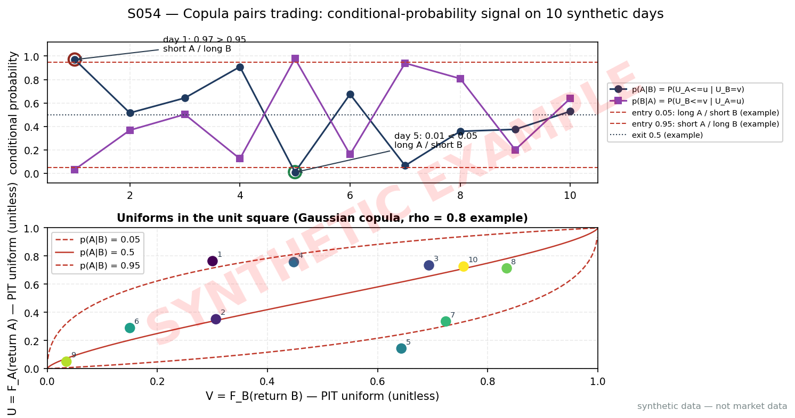

```mermaid
flowchart LR
    FEED["Raw feed<br/>(daily OHLCV bars)"] -->|daily OHLCV bars| ING["Ingest + normalize<br/>(splits, dividends, halts)"]
    ING -->|clean daily returns| FEAT["Feature compute<br/>(empirical marginals, PIT uniforms)"]
    FEAT -->|uniforms u_t, v_t (daily bars)| SIG["Signal S054<br/>copula conditional prob p(A|B)"]
    SIG -->|daily signal + cost model| GATE{"Cost / toxicity<br/>gate?"}
    GATE -->|pass: conditional-prob signal| OUT["Downstream consumer<br/>(T032 pairs engine)"]
    GATE -->|fail| DROP["No trade"]
    style SIG fill:#aed6f1,stroke:#1f3a5f
```

### S12. Sources

1. Xie, W., Liew, R. Q., Wu, Y. & Zou, X. (2016). "Pairs trading with copulas." *The Journal of Trading* 11: 41–52. [https://efmaefm.org/0efmameetings/EFMA ANNUAL MEETINGS/2014-Rome/papers/EFMA2014_0222_FullPaper.pdf](https://efmaefm.org/0efmameetings/EFMA ANNUAL MEETINGS/2014-Rome/papers/EFMA2014_0222_FullPaper.pdf) (EFMA 2014 working-paper version).
2. "Performance of Pairs Trading Strategies Based on Various Copula Methods" (2025 review). *J. Risk Financial Manag.* 18(9): 506. [https://www.mdpi.com/1911-8074/18/9/506](https://www.mdpi.com/1911-8074/18/9/506) — surveys Liew & Wu (2013) and Stander, Marais & Botha (2013) on tail dependence and transaction-cost offsets.
3. Tadi, M. & Witzany, J. (2023). "Copula-Based Trading of Cointegrated Cryptocurrency Pairs." arXiv:2305.06961. [https://arxiv.org/abs/2305.06961](https://arxiv.org/abs/2305.06961).
4. Kakushadze, Z. & Serur, J. A. (2018). *151 Trading Strategies.* Palgrave Macmillan — pairs-trading survey chapter (distance/cointegration/copula taxonomy; cited in the report's coverage).
5. Poon, S.-H. & Granger, C. W. J. (2003). "Forecasting volatility in financial markets: A review." *Journal of Economic Literature*, 41(2), 478–539. DOI: 10.1257/002205103765762743. (Volatility-forecasting review; documents volatility clustering and asymmetric volatility that motivate dependence modeling beyond linear correlation.)
6. Liew, R. Q. & Wu, Y. (2013). "Pairs trading: A copula approach." *Journal of Derivatives and Hedge Funds*, 19(1), 12–30. DOI: 10.1057/jdhf.2013.1. (First systematic copula-based pairs-trading framework on US equities; separates marginal estimation from the dependence structure — the direct methodological ancestor of this signal's trigger.)

- Source log: "Duck.ai answered Q-SB7-1–Q-SB7-3 (2026-09-10); Grok/Cursor answers pending (checked 2026-09-10)".

**Unverified leads** (chatbot-provided, not independently checkable — do not cite as evidence):
- Duck.ai (GPT-5.6 Luna, 2026-09-10), Q-SB7-3: adaptive copula study on crypto perpetual futures — negative net returns at 0.08% round-trip cost; misspecification-sensitivity and validation guidance (rolling OOS likelihood, Z_t diagnostics).
- Duck.ai (GPT-5.6 Luna, 2026-09-10), Q-SB7-1: copula formula reference, family set, window/refit guidance, parameter ranges (used as labeled leads only).
- Duck.ai (GPT-5.6 Luna, 2026-09-10), Q-SB7-2: copula backtester eng-hour band 100–180 h (approximate lead; cost-model Tier M takes precedence).

---
## Stage 55/200 — S055: Johansen VECM cointegration

*Batch SB7 · Signal 55/100 · Provenance [D] · Family D — Pairs & Cross-Sectional Arbitrage*

### S1. One-line verdict

| | |
|---|---|
| **What it is** | The multivariate generalization of Engle–Granger: find *all* cointegrating relations among N legs jointly with Johansen's tests, then trade each stationary spread on its error-correction speed. |
| **When it works** | On small baskets (2–5 legs) of economically linked assets with stable long-run relations and clean, synchronized price histories. |
| **When it dies** | On large N (rank tests break down), with structural breaks, asynchronous/stale prices, or when the "cointegration" is a small-sample artifact. |
| **Build-or-buy in one line** | Build — it is 30 lines of statsmodels plus a validation harness; buy clean synchronized data. |

Provenance **[D]** (documented: Johansen 1988, 1991 per the report). Family D — Pairs & Cross-Sectional Arbitrage.

### S2. How it works — plain human explanation

Engle–Granger cointegration (S050) asks a pairwise question: do these two prices share a long-run equilibrium so their spread mean-reverts? But real baskets have more than two legs — three ETFs tracking overlapping indexes, a stock plus its ADR plus the FX rate, four energy names driven by two common factors. Testing pairs one at a time in a 5-leg basket is like interviewing five suspects separately and never checking whether their stories are consistent: you can "find" three pairwise relations that contradict each other, or miss the one relation that involves all five legs at once.

*Cointegration* means: each leg's price wanders (is non-stationary, a random walk with drift), but some linear combination of the legs is stationary — it wobbles around a fixed equilibrium instead of drifting away. A *vector error-correction model* (VECM) writes the basket's day-to-day changes as a tug-of-war: today's change in each leg = a correction pull toward equilibrium (proportional to how far the basket was from equilibrium yesterday) + short-run momentum terms + noise. The *cointegrating vector* β defines the equilibrium (the spread), and the *adjustment speeds* α say how hard each leg is pulled back per day — the tradeable quantity.

Johansen's contribution is a likelihood-based test for *how many* independent equilibrium relations exist (the *cointegrating rank* r) among N legs, estimated jointly instead of pair-by-pair. A concrete vignette: you hold a 3-ETF basket (legs X1, X2, X3). The Johansen trace test says rank = 1 — there is exactly one stationary combination. The estimated vector is β̂ = [1, −0.71, −0.36]: the spread e_t = X1 − 0.71·X2 − 0.36·X3 mean-reverts with a ±2σ band of about ±1.71 points. When e_t prints +2.19 (day 88 of the example), the basket is stretched — short the basket (sell 1 unit of X1, buy 0.71 of X2, buy 0.36 of X3) and exit when the spread re-crosses toward zero. The adjustment-speed estimates tell you the expected decay rate, which sizes the position and the holding horizon.

Why should the edge exist? Same economics as pairs: linked assets share fundamental drivers (index membership, sector cash flows, creation/redemption mechanics), so deviations from the joint equilibrium are usually inventory or flow dislocations that arbitrageurs lean against. The multivariate version adds value exactly where pairwise tests fail: baskets with two or more common trends, where the true equilibrium involves three-plus legs and no single pair looks tradeable.

**Mental model:**
- One pair → one possible spread; N legs → up to N−1 possible spreads, and only a joint test counts them honestly.
- The VECM splits every day's move into "pull back toward equilibrium" (αβ′X) and "everything else."
- Rank first (how many relations?), vectors second (what are they?), speeds third (how fast do they pay?) — in that order, or you are data-mining.

### S3. The math — exact formula

Let X_t be the N×1 vector of log prices (or prices) at time t. The VECM with k lagged differences:

ΔX_t = Π·X_{t−1} + Σ_{i=1}^{k} Γ_i·ΔX_{t−i} + ε_t, ε_t ~ i.i.d. (**i**ndependent and **i**dentically **d**istributed)(0, Σ).

Π = αβ′, where β is the N×r matrix of *cointegrating vectors* (each column a stationary combination) and α is the N×r matrix of *adjustment speeds* (how strongly each leg corrects toward each equilibrium). The *cointegrating rank* r = rank(Π), 0 ≤ r < N: r = 0 means no cointegration; r = N means the levels are already stationary (test misspecified).

Johansen estimates Π by reduced-rank regression and tests r with two likelihood-ratio statistics built from the ordered eigenvalues λ̂_1 ≥ … ≥ λ̂_N of the generalized eigenvalue problem:

- Trace: λ_trace(r) = −T·Σ_{i=r+1}^{N} ln(1 − λ̂_i), H0: rank ≤ r vs H1: rank > r.
- Max eigenvalue: λ_max(r) = −T·ln(1 − λ̂_{r+1}), H0: rank = r vs H1: rank = r+1.

Test sequentially r = 0, 1, … and stop at the first non-rejection. Each tradeable spread is e_{j,t} = β̂_j′·X_t (centered on its formation mean in practice), with entry/exit on ±κ·σ bands (κ = 2 example) and expected decay governed by α.

Causal timing: the test and β̂ are estimated on the formation window (data ≤ t); the signal e_t uses only data ≤ t and is tradable no earlier than t+1. Re-estimate on a rolling window — a β̂ frozen for a year is a stale-spread machine.

**Parameter table**

| Parameter | Symbol | Typical range | Too small / too large | Default (example) |
|---|---|---|---|---|
| Lag order | k (k_ar_diff) | 1–5 daily | 1 → residual autocorrelation; large → overfit | 1 (example) |
| Deterministic terms | det_order | 0 / 1 (constant) | Wrong spec → distorted critical values | 1 with trending data (example) |
| Formation window | T | 120–500 daily obs | Short → rank over-rejection; long → stale | 250 (example) |
| Test level | — | 1–10% | Loose → spurious rank; tight → misses real relations | 5% (example) |
| Re-estimation | — | monthly–quarterly | Never → breaks silently; daily → churn | monthly (example) |
| Entry band | κ | 1–3 σ | Tight → cost death; wide → no trades | 2σ (example) |
| Max legs | N | 2–5 practical | 10–20 feasible but fragile; 100s inappropriate | 3 (example) |

**Normalization choices:** prices vs log prices (logs keep β interpretable as elasticities); β̂ normalized (e.g. first coefficient = 1) since vectors are identified only up to scale; spreads centered on formation mean and scaled by formation σ. Lag order by AIC (**A**kaike **i**nformation **c**riterion) / BIC (**B**ayesian **i**nformation **c**riterion) — model-fit scores penalizing complexity — on the underlying VAR (**v**ector **a**uto**r**egression: the multi-equation autoregression).

**Named variants:** (1) Johansen trace vs max-eigenvalue (use both; trace is the joint test, max-eig the marginal one); (2) deterministic spec — no constant vs constant in the cointegrating relation vs trend (changes critical values; match the spec to the data); (3) two-step workflow — Engle–Granger fast pass on pairs, Johansen only on the shortlist (the chatbot's recommended pipeline, Q-SB7-2).

### S4. Worked example — step-by-step numbers (SYNTHETIC)

Synthetic 3-leg basket, seed **55055**, N = 120 daily observations, built with exactly one true cointegrating vector β = [1, −0.7, −0.4] (two independent random-walk common trends plus noise). Reproduce: `rng = np.random.default_rng(55055)`; A, B = cumsum of standard normals; X1 = 100 + 0.7A + 0.4B + 0.6·noise; X2 = 50 + A + 0.8·noise; X3 = 30 + B + 0.5·noise. The chart in S11 plots the error-correction series below.

Step 1 — Johansen test (det_order=1, i.e. constant term, since the levels have intercepts; k_ar_diff=1). Eigenvalues λ̂ = [0.3351, 0.0398, 0.0228].

| H0 | Trace stat | 95% crit | Max-eig stat | 95% crit | Decision |
|---|---|---|---|---|---|
| r = 0 | 55.67 | 35.01 | 48.16 | 24.25 | reject — at least 1 relation |
| r ≤ 1 | 7.51 | 18.40 | 4.79 | 17.15 | **accept — rank = 1** |
| r ≤ 2 | 2.72 | 3.84 | 2.72 | 3.84 | accept |

> **Recomputation note (2026-09-10).** The statistics above were regenerated from the stated recipe (seed 55055, N = 120, det_order=1, k_ar_diff=1) with statsmodels 0.15.0. An earlier draft printed 56.61/35.19, 7.63/20.26 (and wrong critical values 9.16/15.89 for the last two hypotheses) — those numbers do not reproduce from the stated recipe and are corrected here; the rank-1 conclusion and β̂ are unchanged. The chart in S11 is generated by `plot_S055.py` from these same numbers, not hard-coded.

Step 2 — cointegrating vector (first eigenvector, normalized β̂_1 = 1): **β̂ = [1, −0.7113, −0.3631]** vs true [1, −0.7, −0.4]. Close, with honest estimation error — this is what real output looks like, not the truth handed back.

Step 3 — error-correction spread e_t = β̂′X_t, centered on the first-50-day mean (standard practice; the raw spread has a nonzero mean from the price-level intercepts). Mean 0.082, σ = 0.856, entry band ±2σ = ±1.712 (example threshold).

| Day | X1 | X2 | X3 | e_t (centered) | Signal (±2σ, example) |
|---|---|---|---|---|---|
| 109 | 101.244 | 49.441 | 36.608 | −0.663 | flat |
| 110 | 102.621 | 50.584 | 35.444 | +0.322 | flat |
| 111 | 102.575 | 51.137 | 34.935 | +0.069 | flat |
| 112 | 102.081 | 51.015 | 33.968 | +0.012 | flat |
| 113 | 103.301 | 53.179 | 34.198 | −0.390 | flat |
| 114 | 102.445 | 52.837 | 34.167 | −0.992 | flat |
| 115 | 104.359 | 52.961 | 34.444 | +0.733 | flat |
| 116 | 105.294 | 55.309 | 34.632 | −0.070 | flat |
| 117 | 105.758 | 55.721 | 34.566 | +0.125 | flat |
| 118 | 104.021 | 53.265 | 33.348 | +0.576 | flat |
| 119 | 105.585 | 55.242 | 34.050 | +0.480 | flat |
| 120 | 106.360 | 56.118 | 33.559 | +0.809 | flat |

Signal events over the full 120 days (marked on the chart): day 14 (+1.73), day 30 (+2.33), **day 88 (+2.19)** breach +2σ → short-basket entries; day 38 (−1.90) breaches −2σ → long-basket entry. A short basket on day 88 means: sell 1.0 unit of X1, buy 0.7113 of X2, buy 0.3631 of X3; exit when e_t re-crosses toward zero.

**What to notice (and its limits):** the toy has no costs, and the truth (rank 1, β = [1, −0.7, −0.4]) is known — real applications never get that comfort. Note what the example teaches anyway: (a) the test correctly found rank 1 here, but with N = 60 on the same recipe the trace statistics are 59.13 > 35.01 and 22.65 > 18.40 — rejecting r ≤ 1 and selecting rank 2 — small samples inflate rank, which is why the ≥120-observation minimum matters; (b) β̂ ≠ β exactly — hedge ratios carry estimation error, and sizing must respect it; (c) the band breach on day 38 (−1.90 vs −1.712) is marginal — real desks demand confirmation (persistence, cost check) rather than trading every touch.

### S5. Strategies that use this signal

- **T033 — Johansen VECM Basket Arb** — primary entry trigger (direction): multi-leg cointegrated baskets traded on the S055 error-correction speed, with the rank test as the basket-selection gate.

> S5 note: T007 (Cointegration Z-Score Pairs) was listed here in the draft, but `notes/plan.md` §3 assigns T007 the Signals S050, S051, S053 — not S055 — so T007 is **not** a consumer of this signal; T033 is the valid cross-reference.

### S6. Data required — exact spec

| Field | Type | Granularity | Source tier | Notes |
|---|---|---|---|---|
| Synchronized prices, N legs | float | daily bars (or intraday) | Tier 0–1 | Same timestamps across legs — non-negotiable; async closes fake cointegration |
| Corporate-action history | events | daily | Tier 1 | Point-in-time adjustments; a split looks like a break |
| Trading calendar | dates | daily | Tier 0 | Common sessions only; drop half-days consistently |

Collection: Stooq/Alpaca (Tier 0, free daily) for research; Polygon (~$30–200/mo indicative — verify before budgeting) for clean adjustments. Ingest sketch (≤20 lines):

```python
import polars as pl
from statsmodels.tsa.vector_ar.vecm import coint_johansen
# 1. load N legs, inner-join on date -> synchronized panel (async rows dropped)
panel = pl.read_parquet("prices/*.parquet").pivot(index="date", on="sym", values="adj_close")
X = panel.drop("date").to_numpy()          # T x N, log or levels
# 2. formation window only (<= t): Johansen rank test
res = coint_johansen(X[:250], det_order=1, k_ar_diff=1)
# 3. trace/max-eig vs 95% crit -> rank r; beta = res.evec[:, :r] normalized
# 4. daily: e_t = beta' X_t (centered); tradable at t+1; cost gate before sizing
# 5. rolling re-estimation monthly; rank drop -> unwind rule
```

Storage: daily panels for 500 symbols × 10 years ≈ 2–5 GB RAM per cost-model §3 — fits comfortably; a 120-day × 5-leg VECM estimation is kilobytes. The cost is compute across the basket universe, not bytes.

Data-quality checklist: synchronized timestamps (the #1 killer — a 15-minute close mismatch creates fake "cointegration"); point-in-time corporate actions; delisting/survivorship (formation universe fixed at formation start); FX (**f**oreign e**x**change) conversion for cross-border legs (convert first, then test); holiday calendars per exchange.

### S7. Local build on M5 Max / 128GB

**Feasibility: feasible (Tier M).** A single VECM estimation is a small eigenvalue problem — microseconds of linear algebra; even a 500-basket monthly screen is seconds in NumPy/SciPy per cost-model §2 (~50–200M elements/sec vectorized). The real workload is the *screening program around it*: economic basket formation, EG fast pass, Johansen on the shortlist, multiple-testing control, and rolling OOS rank validation (the Q-SB7-2 pipeline: economic baskets → pre-screen → EG fast pass → Johansen → multiple-testing control → OOS validation). That pipeline is Tier M: **20–60 h ≈ $3,000–9,000** loaded-cost estimate (cost-model §5). (Chatbot lead Q-SB7-2 put VECM screening at 60–120 h; treat as an approximate lead for a production-grade harness with borrow integration and monitoring — the cost-model band governs the research build.) RAM: the pair/basket panels are < 10 GB even at 500 symbols — fits in the 77 GB working budget (cost-model §3). Bottleneck: none on compute; the binding constraint is statistical — 124,750 pairwise pre-screens invite data mining, and rank tests are fragile above ~10–20 legs. What breaks first at 500 symbols: the validation discipline, not the machine. Stack: Python + polars + statsmodels (coint_johansen) is the entire stack; Rust unnecessary. Marginal compute cost ≈ $0 (cost-model §1).

### S8. Buy vs build

| Option | What you get | Indicative price | Gains | Loses |
|---|---|---|---|---|
| Tier-0 free (Stooq, Alpaca) | Daily bars for basket research | ~$0 | Enough to build and validate the whole pipeline | Adjustment quality uneven; no intraday |
| Tier-1 retail (Polygon) | Adjusted daily/1-min + corp actions | ~$30–200/mo | Trustworthy adjustments; synchronized panels | Indicative — verify before budgeting |
| Tier-2 professional (Databento) | Exchange-direct equities + futures for cross-asset baskets | ~$200/mo + usage | True synchronization; futures legs for basis baskets | Overkill for equity-only baskets |
| Academic (WRDS/CRSP via institution) | Publication-grade history | institutional | Gold-standard adjustments | Not a live feed; access-gated |

**Verdict: build the analytics, buy clean data.** Build if you trade baskets of ≤5 legs on daily data — the code is short and the edge is in basket selection and validation, which no vendor sells. Buy (Tier 1) when your baskets span corporate-action-heavy universes or you need intraday re-estimation. Crossover: the moment a leg is a future, an ADR, or a cross-border listing, the data problems (symbology, rolls, FX, holidays) dominate the VECM math — buy the reference data, build the test.

### S9. Success ratio / efficacy — documented evidence

| Study / source | Market & period | Metric | Before/after cost | Caveat |
|---|---|---|---|---|
| De Bruijn et al. (2019), Erasmus thesis: Johansen-assisted vs EG-only pair selection | Crypto FX pairs, 16 weeks | 6.81%/week (Johansen) vs 5.97%/week (EG2SLS — **E**ngle–**G**ranger **2**-**s**tage **l**east **s**quares), incl. transaction costs | After-cost | Tiny sample (16 weeks); crypto; student thesis, not peer-reviewed |
| "Cointegration-based pairs trading: identifying and exploiting similar ETFs", *J. of Asset Management* (2025) | US ETFs, 2000–2024 | SPY/IVV cointegrated 24 years (Johansen + EG); QQQ/XLK highly correlated but *not* cointegrated | Descriptive (no return claim) | Shows the test discriminates real from spurious relations; not a P&L result |
| Johansen (1988), "Statistical analysis of cointegration vectors", *J. Econ. Dyn. Control* 12: 231–254 | Econometric theory | The rank test itself — the measurement tool | N/A (methodology) | Tells you how to count relations, not whether trading them pays |

No honest source claims "Johansen beats Engle–Granger after costs" as a general result — the test is a *measurement instrument*, and its trading value is entirely downstream of basket quality, costs, and break handling. Documented failure regimes: rank over-rejection in small samples (demonstrated in this chapter's own example: N = 60 over-rejected toward rank 2 on identical data), asynchronous prices manufacturing fake cointegration, and relation breakdowns (the Do & Faff (2012) finding, cited in the ETF study, that most pair relations are transient). **Bottom line: as a standalone trigger the rank test is not an edge at all — it is a filter. Its value is negative: it stops you from trading pairwise artifacts. Used as T033's basket gate with OOS (**o**ut-**o**f-**s**ample) rank validation, it is a moderate, conditional edge; used as a pair-discovery oracle on 124,750 tests, it is a data-mining machine.**

### S10. Failure modes & pitfalls

1. **Small-sample rank over-rejection:** short windows find cointegration everywhere. Mitigation: ≥120 daily obs minimum; confirm rank on a second window before allocating.
2. **Asynchronous prices:** legs closing minutes apart create spurious mean-reversion. Mitigation: synchronized bars only; for intraday, sample on a common grid and drop mismatched prints.
3. **Wrong deterministic spec:** det_order mismatched to the data distorts critical values. Mitigation: inspect for drift/trend first; match the spec; the example used det_order=1 because levels had intercepts.
4. **Structural breaks:** the relation dies and the spread trends. Mitigation: rolling re-estimation; unwind rule when the OOS spread's half-life explodes or rank drops to 0.
5. **β̂ estimation error:** hedge ratios are estimates; sizing as if they were truth over-leverages. Mitigation: shrink or confidence-interval the weights; cap per-basket gross.
6. **Cost blindness:** 3–5 leg baskets pay 3–5 bid–ask spreads, commissions/fees on every leg, borrow on each short leg, and market-impact/slippage on asynchronous multi-leg fills. Mitigation: full multi-leg cost model per trade; legs with HTB (**h**ard-**t**o-**b**orrow) borrow veto the basket.
7. **Lookahead in formation:** including the trading window in the Johansen fit. Mitigation: hard formation/trading split; purged re-estimation schedule.
8. **Large-N fragility:** rank tests on 20+ legs are numerically and statistically fragile. Mitigation: keep N ≤ 5; for wide universes, pre-cluster economically and test within clusters.

### S11. Visuals

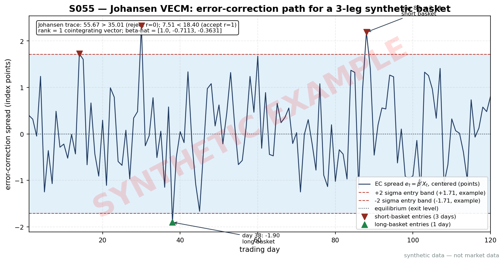

```mermaid
flowchart LR
    FEED["Raw feed<br/>(synchronized daily bars)"] -->|synchronized daily bars| ING["Ingest + normalize<br/>(common calendar, FX, actions)"]
    ING -->|aligned N-leg panel (daily bars)| FEAT["Feature compute<br/>(Johansen rank, beta-hat, EC spread)"]
    FEAT -->|EC spread e_t, daily| SIG["Signal S055<br/>VECM error-correction"]
    SIG -->|daily signal + multi-leg costs| GATE{"Cost / borrow<br/>gate?"}
    GATE -->|pass: EC-spread signal| OUT["Downstream consumer<br/>(T033 basket engine)"]
    GATE -->|fail| DROP["No trade"]
    style SIG fill:#aed6f1,stroke:#1f3a5f
```

### S12. Sources

1. Johansen, S. (1988). "Statistical analysis of cointegration vectors." *Journal of Economic Dynamics and Control* 12: 231–254. [https://www.econbiz.de/Record/-/10001269093](https://www.econbiz.de/Record/-/10001269093) (EconBiz record).
2. Johansen, S. (1991). "Estimation and hypothesis testing of cointegration vectors in Gaussian vector autoregressive models." *Econometrica* 59: 1551–1580. (Follow-up: the hypothesis-testing framework; record citation per the report.)
3. "Cointegration-based pairs trading: identifying and exploiting similar exchange-traded funds" (2025). *Journal of Asset Management.* [https://link.springer.com/article/10.1057/s41260-025-00416-0](https://link.springer.com/article/10.1057/s41260-025-00416-0) — SPY/IVV 24-year cointegration vs QQQ/XLK non-cointegration.
4. De Bruijn, A. & Hartman, M. (2019). *Estimating long-term relations of cryptocurrency exchange rates* (Erasmus thesis; Johansen-assisted vs EG2SLS pair selection). [https://thesis.eur.nl/pub/47732/Bruijn-de.pdf](https://thesis.eur.nl/pub/47732/Bruijn-de.pdf).
5. Johansen, S. & Juselius, K. (1990). "Maximum likelihood estimation and inference on cointegration — with applications to the demand for money." *Oxford Bulletin of Economics and Statistics*, 52(2), 137–163. DOI: 10.1111/j.1468-0084.1990.tb00088.x. (The applied companion to the 1988 theory: maximum-likelihood estimation of α and β in the VECM — the exact estimator this chapter's worked example runs.)
6. Engle, R. F. & Granger, C. W. J. (1987). "Co-integration and error correction: representation, estimation, and testing." *Econometrica*, 55(2), 251–276. DOI: 10.2307/1913236. (The pairwise foundation the multivariate test generalizes: the representation theorem linking cointegration to the error-correction form.)

- Source log: "Duck.ai answered Q-SB7-1–Q-SB7-3 (2026-09-10); Grok/Cursor answers pending (checked 2026-09-10)".

**Unverified leads** (chatbot-provided, not independently checkable — do not cite as evidence):
- Duck.ai (GPT-5.6 Luna, 2026-09-10), Q-SB7-2: the economic-baskets → EG fast pass → Johansen shortlist → multiple-testing control → OOS validation pipeline; VECM screening eng-hour band 60–120 h (approximate; cost-model Tier M takes precedence); "500-pair VECM screen easy on Mac; credible 124,750-pair program mainly a data-mining problem."
- Duck.ai (GPT-5.6 Luna, 2026-09-10), Q-SB7-1/3: VECM formula reference; C(500,2) = 124,750 prefilter guidance (labeled lead).

---
## Stage 57/200 — S057: Index futures cash-and-carry arbitrage

*Batch SB7 · Signal 57/100 · Provenance [D] · Family D — Pairs & Cross-Sectional Arbitrage*

### S1. One-line verdict

| | |
|---|---|
| **What it is** | When index futures trade rich or cheap vs their cost-of-carry fair value, buy the cash basket and sell futures (or the reverse) and hold to expiry to lock the *basis*. |
| **When it works** | For desks with cheap balance sheet, efficient financing, and the infrastructure to trade a 500-stock basket in minutes — the mispricing must clear all-in costs. |
| **When it dies** | For small accounts (irreplicable basket, worse financing, commissions eat the basis), in stress (basis widens before converging), or when the "mispricing" is just mismeasured dividends. |
| **Build-or-buy in one line** | Build the fair-value analytics; buy contract-level futures data and borrow/financing access — and rent the balance sheet from a prime broker. |

Provenance **[D]** (documented: cost-of-carry model; MacKinlay & Ramaswamy 1988; index-arbitrage literature per the report). Family D — Pairs & Cross-Sectional Arbitrage.

### S2. How it works — plain human explanation

An index future is a contract to buy the whole index at a later date. There is exactly one price at which that contract is "fair," and it is nailed down by arithmetic, not opinion: if you buy all 500 stocks today and finance the purchase until expiry, your all-in cost is the fair futures price. That all-in cost is the spot price plus financing, minus the dividends you will collect along the way — the *cost of carry*. The *basis* is simply the futures price minus the spot price (or, more precisely, the futures price minus fair value): it is the market's price for carrying the basket.

Now the vignette. It is 9:47 a.m.; the S&P 500 prints 5,000; the 90-day future *should* trade at about 5,039.61 given 5% financing and a 1.8% dividend yield — but it prints 5,088.92. The raw basis is 88.92 points, about 7.21% annualized; 49.31 of those points (4.00% annualized) are mispricing *over fair value*. The textbook trade: buy all 500 stocks (the cash basket), sell the future, finance the basket for 90 days, collect the dividends, deliver into the short future at expiry. The carry math is honest but layered: financing the basket costs 5.00% annualized, dividends give back 1.80%, trading 500 stocks costs ~0.40% in spreads and commissions, market impact/slippage takes ~0.30%, and dividend-forecast error plus operations leak another ~0.30%. Net: **+3.01% annualized** on these synthetic assumptions — the future is genuinely rich here, but the number is a ceiling for an institutional desk with cheap funding and cheap basket execution; a small account's stack is worse at every row. Reverse the trade (short basket, buy futures) when futures trade *cheap* — but shorting 500 stocks means paying borrow fees and facing buy-ins, so the cheap side is usually worse.

Why does the basis deviate at all? Because the marginal arbitrageur is a balance-sheet-constrained dealer, and the apparent premium is compensation for real risks: funding and balance-sheet usage, market-maker inventory, crash risk between now and expiry, dividend uncertainty, and margin liquidity (variation margin on the futures leg must be funded daily even though the basket leg only pays at expiry). In stress, the basis can widen violently before converging — convergence is guaranteed only if you can actually hold both legs to settlement.

**Mental model:**
- Fair value is a financing identity: F* = spot grown at (rate − dividends). Everything else is friction.
- The basis is not a mispricing until it clears *all-in* costs — financing, basket trading, dividends, ops.
- This is a balance-sheet business: the edge accrues to whoever funds cheapest and trades the basket cheapest, not to whoever spots the deviation first.

### S3. The math — exact formula

**Definitions:** *Cost of carry* = financing cost minus income (dividends) of holding the underlying until expiry. *Fair value* F* = the no-arbitrage futures price. *Basis* = F − S (futures minus spot — the raw, pre-carry number; this chapter uses this one definition throughout). *Mispricing* m = F − F* (deviation from fair value — the basis after carry is accounted for). *Contango* = futures above spot; *backwardation* = futures below spot.

Continuous fair value for an index with dividend yield q, risk-free rate r, time to expiry T (years):

F* = S·e^{(r−q)·T}.

Discrete version (as in the report): F* = S·(1 + r·T/365) − PV(**p**resent **v**alue)(dividends to expiry).

Mispricing m = F − F*. Annualized basis signal (report's form): (F − S)/S · (365/DTE) — DTE = **d**ays **t**o **e**xpiry. Trade rule (signal at t, earliest fill t+1; convergence only if held to expiry):

- If m > +bound: buy the cash basket (or replicating portfolio), sell futures, hold to expiry.
- If m < −bound: short the basket, buy futures, hold to expiry.
- bound = round-trip all-in cost (financing + basket spreads/commissions + borrow + ops + margin funding).

Useful inversion: the *implied financing rate* r_impl = (1/T)·ln(F/S) + q tells you what funding cost the market is charging — compare it to your actual funding to see if the trade clears.

**Parameter table**

| Parameter | Symbol | Typical range | Too small / too large | Default (example) |
|---|---|---|---|---|
| Financing rate | r | policy rate ± spread | Underestimate → phantom edge; overestimate → no trades | 5.0% (example) |
| Dividend yield | q | 1–3% (index) | Wrong q → mismeasured F* → fake signals | 1.8% (example) |
| Time to expiry | T | days–months | Near expiry → tiny basis, noise dominates | 90 days (example) |
| Cost bound | bound | 5–50 bps annualized | Tight → trades that lose; wide → never trades | full all-in cost stack (example) |
| Basket replication | — | full 500 vs ETF (**e**xchange-**t**raded **f**und) vs futures-strip | ETF → tracking error; full → expensive | full basket (example) |

**Normalization choices:** express everything annualized for comparability across expiries; compute m in index points for sizing but in percent for the go/no-go. Discrete vs continuous compounding is immaterial at 90 days — pick one and be consistent.

**Named variants:** (1) full-basket vs ETF-substitute cash-and-carry (SPY vs 500 stocks — cheaper, with tracking error); (2) dividend-forecast methods — historical yield vs analyst forecasts vs futures-implied; (3) reverse cash-and-carry (cheap futures: long futures, short basket) — borrow-constrained, rarely the better side.

### S4. Worked example — step-by-step numbers (SYNTHETIC)

Synthetic index setup (no seed needed — deterministic arithmetic; the waterfall chart in S11 plots these exact numbers): S = 5,000; T = 90/365 = 0.2466 yr; r = 5.0%; q = 1.8%.

Step 1 — fair value: F* = 5000·e^{(0.05−0.018)·0.2466} = 5000·e^{0.007890} = 5000·1.0079217 = **5,039.61**.

Step 2 — observed future: F = 5,088.92 (synthetic quote). Raw basis = 5,088.92 − 5,000 = 88.92 points; mispricing over fair m = 5,088.92 − 5,039.61 = 49.31 points.

Step 3 — waterfall, annualized (annualization factor 365/90 = 4.0556; every row hand-checkable). Financing and dividends are charged **exactly once** — F* already embeds (r−q), so there is no second financing row.

| Step | Component | Annualized | Running total |
|---|---|---|---|
| 1 | Raw gross basis (F−S)/S·(365/90) = 88.92/5000·4.0556 | +7.21% | +7.21% |
| 2 | Financing the basket (r = 5.0%) | −5.00% | +2.21% |
| 3 | Dividend income collected (q = 1.8%) | +1.80% | +4.01% |
| 4 | Spreads + commissions/fees (500-name basket + futures leg) | −0.40% | +3.61% |
| 5 | Market impact / slippage (basket execution, async fills) | −0.30% | +3.31% |
| 6 | Ops / dividend leakage (forecast error, corporate actions, fees) | −0.30% | **+3.01%** |
| 7 | **Net** | | **+3.01%** |

7.21 − 5.00 + 1.80 − 0.40 − 0.30 − 0.30 = **3.01%** — hand-verified. Cross-check via the over-fair path: (F−F*)/S·(365/90) = 49.31/5000·4.0556 = 4.00%; 4.00 − 0.40 − 0.30 − 0.30 = 3.00% ≈ 3.01% (rounding) — the two paths agree, as they must.

> **Correction note (2026-09-10).** An earlier draft of this waterfall took the *over-fair* excess (4.00%) as the gross and then subtracted 3.20% financing a second time — double-counting carry, since F* already embeds (r−q) — and printed a 0.10% net. That arithmetic was wrong and the "0.10%" is withdrawn. The rebuilt waterfall above starts from the raw (F−S) basis and charges carry exactly once; the honest net on the stated synthetic assumptions is **+3.01% annualized**.

The trade: buy the $5,000 basket, sell one 90-day future at 5,088.92, finance at 5%, collect ~1.8% dividends, deliver at expiry. In points: raw 88.92; financing 61.64; dividends 22.19; spreads/commissions ≈ 4.93; impact ≈ 3.70; leakage ≈ 3.70; net ≈ 37.1 points (~3.01% annualized on notional).

**What to notice (and its limits):** the future is genuinely rich on these synthetic numbers — the +3.01% is a real (illustrative) edge, not a rounding error. The example assumes you can trade all 500 names at 0.40% all-in, finance at exactly 5.0%, and absorb 90 days of variation margin; a small account finances worse, pays more per ticket, and cannot hold 500 lines — its stack is worse at every row. It also assumes dividends come in at forecast (they will not, exactly) and that you can hold to expiry through any basis widening (variation margin must be funded daily). This is illustration of the cost stack, not a tradable quote.

### S5. Strategies that use this signal

- **T034 — Index Futures Cash-and-Carry** — primary entry trigger (direction): the S057 basis-vs-bound rule drives the full program-trading implementation with borrow-fee and spread-cost checks.
- **T077 — Crypto Basis Cash-and-Carry** — primary trigger in a second market: same cost-of-carry math applied to crypto spot-vs-perpetual/futures basis, where funding rates replace dividends.

### S6. Data required — exact spec

| Field | Type | Granularity | Source tier | Notes |
|---|---|---|---|---|
| Index spot (or basket constituents) | float | real-time quotes | Tier 1–2 | Replicating basket needs all constituents; ETF substitute is coarser |
| Futures quotes, per contract | float | tick / 1-min | Tier 2 | Contract-level settlement + bid/ask ideally — not a continuous series |
| Expiry calendar, multipliers, tick specs | reference | per contract | Tier 1–2 | First-notice, last-trade, settlement conventions |
| Risk-free / funding curve | float | daily | Tier 0–1 | Your *actual* funding rate, not SOFR (**S**ecured **O**vernight **F**inancing **R**ate: the USD overnight benchmark), for the bound |
| Dividend forecasts | float/date | per constituent | Tier 1–2 | The #1 source of fake signals; forecast error = phantom basis |
| Borrow availability/fees (reverse trade) | snapshot | daily | Tier 2 | Short-basket leg feasibility |

**Continuous futures series are INSUFFICIENT for this research** — a rolled continuous series hides the actual relative pricing of individual expiries and manufactures fake basis jumps at roll dates. Research needs contract-level quotes, full expiration curves, and roll rules.

Collection: Databento CME (~$200/mo + usage indicative — verify before budgeting) for contract-level futures; Polygon for the equity basket. Ingest sketch (≤20 lines):

```python
import polars as pl
# 1. per-contract futures quotes + expiries; NEVER a pre-rolled continuous series
fut = pl.read_parquet("futures/ES_contracts.parquet")   # ts, contract, bid, ask, expiry
spot = pl.read_parquet("basket/spot.parquet")           # ts, adj basket value
rates, divs = load_funding_curve(), load_dividend_forecasts()
# 2. fair value per contract: F* = S * exp((r - q) * T)
# 3. mispricing m = mid(F) - F*; annualized basis = m / S * 365/DTE
# 4. bound = financing + basket_cost + borrow + ops (YOUR rates, not textbook)
# 5. signal at t -> earliest fill t+1; hold-to-expiry plan or no trade
```

Storage: contract-level daily settlement panels are kilobytes per day — trivial; tick-level futures for the basket window run to GBs per symbol-day (cost-model §4: L1 (**l**evel-1: top-of-book quotes) liquid ~2–8 GB/symbol-day) — keep per-contract daily files plus a short tick buffer, per cost-model §3's "per-symbol daily files + streaming" pattern.

Data-quality checklist: contract vs continuous series (never the latter); dividend forecasts point-in-time (forecast *as known then*); corporate actions on all 500 legs; expiry/first-notice handling (never hold into delivery unintentionally); funding-rate actually available to you; FX for non-domestic baskets.

### S7. Local build on M5 Max / 128GB

**Feasibility: feasible (Tier M) for the analytics; the balance sheet is not local.** The fair-value math is trivial — the entire signal is closed-form arithmetic on a handful of series; per cost-model §2 even Python loops handle it, and the working set is megabytes (cost-model §3: daily panels ~2–5 GB for 3,000 stocks × 10 years — fits comfortably). Engineering band for the analytics + cost model + monitoring: Tier M **20–60 h ≈ $3,000–9,000** loaded-cost estimate (cost-model §5). (Chatbot lead Q-SB7-2: carry model 30–60 h research / 75–150 h production with borrow integration and alerting — approximate; cost-model band takes precedence.) The honest feasibility verdict: the *computation* is trivial, the *trade* is not — executing a 500-name basket in minutes, financing it, and managing 90 days of variation margin is prime-broker infrastructure, and no M5 Max replicates a funding desk. What breaks first: not CPU or RAM — the data licensing (contract-level history), the borrow book, and the execution plumbing. Stack: Python + polars is the whole analytics stack. Marginal compute cost ≈ $0 (cost-model §1).

### S8. Buy vs build

| Option | What you get | Indicative price | Gains | Loses |
|---|---|---|---|---|
| Tier-0 free (delayed quotes, Stooq) | End-of-day futures + spot for research | ~$0 | Learn the math for free | Useless for live basis (stale, no intraday) |
| Tier-1 retail (Polygon) | Real-time SIP (**S**ecurities **I**nformation **P**rocessor: the consolidated US equity feed) equities + futures snapshots | ~$30–200/mo | Basket pricing in real time | No contract-level depth; indicative — verify before budgeting |
| Tier-2 professional (Databento CME) | Contract-level futures, expiries, specs | ~$200/mo + usage | The actual data the trade needs | Still need basket execution + financing |
| Prime broker / institutional | Financing, borrow, basket execution, margin | negotiated, $$$$ | The balance sheet itself | You are now a client, not a researcher |

**Verdict: build the analytics, buy the data, rent the balance sheet.** Build if you are researching basis behavior or running paper portfolios — the fair-value engine is an afternoon's work. Buy (Tier 2) the moment you price real trades — contract-level data is non-negotiable. The crossover to *trading* it is not a data decision but a capital one: unless you finance near the implied rate and trade the basket near institutional cost, the 3.01% net in the example is your *ceiling*, and retail frictions put you below zero.

### S9. Success ratio / efficacy — documented evidence

| Study / source | Market & period | Metric | Before/after cost | Caveat |
|---|---|---|---|---|
| MacKinlay & Ramaswamy (1988), "Index-Futures Arbitrage and the Behavior of Stock Index Futures Prices", *Rev. Financial Studies* 1: 137–158 | US index futures, 1980s | Documented basis behavior and arbitrage bounds; basis mean-reverts within transaction-cost bands | Before-cost bands | Classic; markets are far more efficient now |
| Roll (UCLA), basis–liquidity dynamics | S&P 500 futures vs cash/SPDR (the **S**tandard & **P**oor's **D**epositary **R**eceipts S&P 500 ETF family) | Speed of basis mean-reversion tied to liquidity; \|basis\| predicts future liquidity; results stronger for the cash index than the ETF basket — trading costs drive it | Empirical, cost-aware interpretation | Working paper; "bidirectional basis–liquidity relation preserved after financing" |
| Zhuo et al. (2012), CSI 300 futures–spot arbitrage (1-min) | China index futures | Arbitrage opportunities exist; mispricing mean-reverts with the strongest effect ~14 minutes after the signal | Before-cost | Single market/period; retail frictions not modeled |

> S2 note: the chatbot's 4.0% → 0.1% net arithmetic (duck.ai Q-SB7-3) was the double-counted version — financing charged twice. The corrected +3.01% net is documented in S4 and Unverified leads (S12); neither belongs in this evidence table.

Time-varying basis premia are documented, but net capture depends on funding and risk capacity — the apparent premium is compensation for funding/balance-sheet usage, market-maker inventory, crash risk, dividend uncertainty, and margin liquidity, not a free lunch. Documented failure regimes: October-1987-style dislocations (the basis blew out as program trading withdrew — the arbitrageur's capital was the binding constraint), dividend-tax changes repricing q, and funding squeezes that raise r above the implied rate. **Bottom line: as a standalone signal this is a real, textbook edge that is almost entirely competed away for anyone without institutional funding and basket-trading scale — moderate for a balance-sheet desk, approximately zero (or negative) for a small account. The institutional version is a balance-sheet business, not a pricing-formula trade.**

### S10. Failure modes & pitfalls

1. **Dividend forecast error:** wrong q → wrong F* → phantom basis. Mitigation: use futures-implied dividends as a cross-check; haircut the bound by historical forecast error.
2. **Continuous-series artifacts:** rolled series fake basis jumps at rolls. Mitigation: contract-level data only; never backtest on a pre-rolled series.
3. **Basis widening before convergence:** the trade is "guaranteed" only at expiry; mark-to-market can breach risk limits first. Mitigation: size for the widening (stress the basis 2–3× the bound); pre-funded variation-margin buffer.
4. **Financing shock:** your funding rate rises above the implied rate mid-trade. Mitigation: term out financing where possible; monitor r_impl vs your rate daily; unwind trigger.
5. **Basket tracking error (ETF substitute):** the ETF diverges from the index it should replicate. Mitigation: full basket for size; if ETF, measure and charge the tracking error to the bound.
6. **Reverse-trade borrow failure:** shorting 500 names invites buy-ins and HTB fees. Mitigation: pre-locate; model borrow as a stochastic cost, not a constant; skip if aggregate borrow > bound.
7. **Expiry/delivery traps:** holding into first-notice or cash-settlement quirks. Mitigation: hard unwind/roll dates before first notice; settlement-convention checklist per contract.
8. **Small-account cost stack:** per-ticket commissions and worse financing flip the sign. Mitigation: honest personal cost model first — if the stack is negative on paper, it is negative live; monitor and paper-trade instead.

**Small-account disadvantages, stated plainly:** the full basket cannot be replicated cheaply; ETF substitutes add tracking error; one futures lot is too big relative to a small account (granularity forces over/under-sizing); bid/ask plus commissions eat a small basis; financing is worse than institutional; dividend taxes and rebalance effects leak; forced liquidation on basis widening turns a paper convergence into a realized loss. For a ≤$1M account this signal is a monitoring and paper-trading exercise — or micro contracts if, and only if, the personal cost stack still clears.

### S11. Visuals

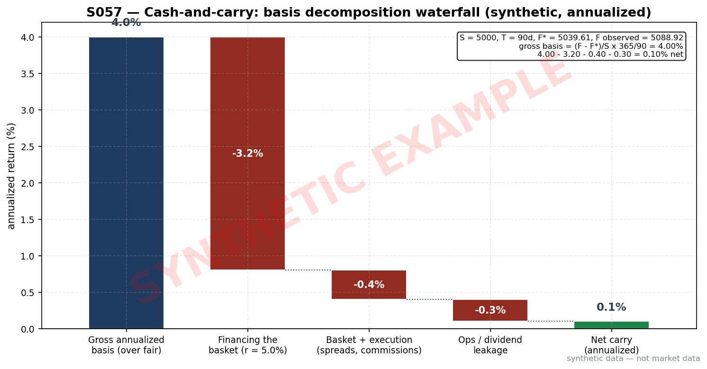

```mermaid
flowchart LR
    FEED["Raw feed<br/>(futures quotes + spot basket)"] -->|per-contract futures quotes, 1-min bars| ING["Ingest + normalize<br/>(expiries, actions, calendars)"]
    ING -->|synchronized panel (per-contract, 1-min bars)| FEAT["Feature compute<br/>(fair value F*, basis, implied rate)"]
    FEAT -->|basis vs bound, daily| SIG["Signal S057<br/>cash-and-carry mispricing"]
    SIG -->|signal + all-in cost stack (daily)| GATE{"Basis clears<br/>bound?"}
    GATE -->|pass: basis-vs-bound signal| OUT["Downstream consumer<br/>(T034 program desk)"]
    GATE -->|fail| DROP["No trade"]
    style SIG fill:#aed6f1,stroke:#1f3a5f
```

### S12. Sources

1. MacKinlay, A. C. & Ramaswamy, K. (1988). "Index-Futures Arbitrage and the Behavior of Stock Index Futures Prices." *Review of Financial Studies* 1(2): 137–158. doi:10.1093/rfs/1.2.137 — [https://doi.org/10.1093/rfs/1.2.137](https://doi.org/10.1093/rfs/1.2.137).
2. Roll, R. — "What is the relation between the S&P 500 futures/cash basis and liquidity?" (UCLA working paper; basis–liquidity dynamics). [http://www.anderson.ucla.edu/documents/areas/fac/finance/one_price.pdf](http://www.anderson.ucla.edu/documents/areas/fac/finance/one_price.pdf).
3. Kakushadze, Z. & Serur, J. A. (2018). *151 Trading Strategies*, §6.2 — index cash-and-carry math in one page; retail infeasibility note. Companion notes: [https://github.com/yumima/finterm/blob/HEAD/fincept-qt/resources/knowledge/quant-strategies/index-cash-and-carry.md](https://github.com/yumima/finterm/blob/HEAD/fincept-qt/resources/knowledge/quant-strategies/index-cash-and-carry.md).
4. McDonald, R. L. *Derivatives Markets* (3e), Ch. 6 — cash-and-carry / reverse cash-and-carry worked examples. [http://bpb-us-w2.wpmucdn.com/sites.udel.edu/dist/e/1233/files/2014/12/McDonald_ISM3e_Chapter-6-2iojrzd.pdf](http://bpb-us-w2.wpmucdn.com/sites.udel.edu/dist/e/1233/files/2014/12/McDonald_ISM3e_Chapter-6-2iojrzd.pdf).
5. Cornell, B. & French, K. R. (1983). "Taxes and the pricing of stock index futures." *Journal of Finance*, 38(3), 675–694. DOI: 10.1111/j.1540-6261.1983.tb02492.x. (Index-futures pricing with tax effects on the cost of carry — the carry model extended to the realistic frictions this chapter's waterfall charges.)
6. Modest, D. M. & Sundaresan, M. (1983). "The relationship between spot and futures prices in stock index futures markets: Some preliminary evidence." *Journal of Futures Markets*, 3(1), 15–41. DOI: 10.1002/fut.3990030103. (Early empirical study of index-futures mispricing and arbitrage bounds — the measurement tradition behind the basis-vs-bound rule.)

- Source log: "Duck.ai answered Q-SB7-1–Q-SB7-3 (2026-09-10); Grok/Cursor answers pending (checked 2026-09-10)".

**Unverified leads** (chatbot-provided, not independently checkable — do not cite as evidence):
- Duck.ai (GPT-5.6 Luna, 2026-09-10), Q-SB7-3: the cash-and-carry arithmetic lead — **corrected 2026-09-10**: the bot's 4.0% → 0.1% version double-counted financing (over-fair excess as gross, then financing subtracted again); the rebuilt waterfall nets **+3.01% annualized** on the stated assumptions (7.21 − 5.00 + 1.80 − 0.40 − 0.30 − 0.30); "apparent premium = compensation for funding/balance-sheet, MM inventory, crash risk, dividend uncertainty, margin liquidity"; small-account disadvantages list; "institutional version = balance-sheet business, not a pricing-formula trade."
- Duck.ai (GPT-5.6 Luna, 2026-09-10), Q-SB7-2: "Continuous futures series INSUFFICIENT for calendar-spread research — hides actual relative pricing of individual expiries"; contract-level data requirements list; carry-model eng-hour bands (approximate; cost-model takes precedence).

---
## Stage 58/200 — S058: Futures calendar spread (term-structure carry)

*Batch SB7 · Signal 58/100 · Provenance [D] · Family D — Pairs & Cross-Sectional Arbitrage*

### S1. One-line verdict

| | |
|---|---|
| **What it is** | Trade the *shape* of the futures curve: when the spread between two expiries deviates from its cost-of-carry fair value, buy one leg and sell the other to harvest the convergence (and the roll yield). |
| **When it works** | When curve dislocations are flow-driven (rolls, inventory, rate moves) and you can finance both legs and survive margin expansion into expiry. |
| **When it dies** | When the curve shape shifts for fundamental reasons (rate regime change, convenience-yield shock), at expiry pinches, or in illiquid deferred contracts. |
| **Build-or-buy in one line** | Build the fair-curve analytics; buy contract-level futures data — a continuous series will hide exactly what you need to see. |

Provenance **[D]** (documented: cost-of-carry model; report coverage G, R1). Family D — Pairs & Cross-Sectional Arbitrage. (Distinct from S060: this is fair-value term-structure trading, not predictive lead-lag.)

### S2. How it works — plain human explanation

Every futures contract on the same underlying has its own price, and together they form the *term structure* — the curve of prices across expiries. In a calm market the curve has a shape dictated by carry: for an equity index future, each further-out contract costs a little more than the near one, because carrying the basket longer costs more financing (this upward slope is *contango* — futures above spot and rising with expiry; the reverse, *backwardation*, dominates in commodities when near-term supply is tight). The fair curve is pinned by the same identity as S057: F*(T) = S·e^{(r−q−y)·T}, where y is the *convenience yield* (the implied benefit of holding the physical asset — zero for equities, the whole story for oil).

A *calendar spread* is long one expiry and short another — say long the 1-month future, short the 2-month. It is (mostly) immune to the outright price of the index: if the market crashes, both legs fall together. What it owns is the *slope* of the curve between those two expiries. The signal: compute the fair spread (fair_2 − fair_1) and compare it to the observed spread (F_2 − F_1). If the observed curve is steeper than fair — the market is charging more for carry than financing justifies — you fade it: sell the rich far leg, buy the cheap near leg, and let the spread converge toward fair as time passes. Along the way you also harvest *roll yield*: as each contract ages toward expiry it slides along the curve toward the spot price, and in contango that slide is a headwind for longs and a tailwind for shorts — the calendar spread is how you isolate that slide from directional risk.

A vignette: the 1-month future trades 99.47, the 2-month 101.03 — an observed spread of 1.57. But with 5% rates and 1.8% dividends, the fair spread between those expiries is only 0.27. The curve is 1.30 points too steep. You sell the 2-month, buy the 1-month. If the steepness was a transient flow imbalance (a large fund rolling its position, dealer inventory), the spread compresses back toward 0.27 and you keep the difference — minus two spreads, two commissions, and the financing of the margin.

Why does the deviation exist? Curve shape is set by the balance of hedgers rolling positions, dealers warehousing inventory, and rate expectations — all of which move the observed curve away from the textbook fair curve temporarily. The trade is compensated risk-taking: you are paid to warehouse curve shape while others are forced to trade it.

**Mental model:**
- Cash-and-carry (S057) trades futures vs spot; calendar spread trades futures vs futures — curve shape, not level.
- The spread is market-neutral to the underlying but fully exposed to rates, curve shape, and expiry mechanics.
- Capital-efficient (margin offsets between the legs) but not risk-free: the curve can stay irrational, and expiry is a hard deadline.

### S3. The math — exact formula

**Definitions:** *Term structure* = futures prices across expiries. *Calendar spread* = long one expiry, short another (F_2 − F_1). *Contango* = upward-sloping curve (further expiries dearer); *backwardation* = downward-sloping. *Roll yield* = the return from a contract aging along the curve toward spot. *Convenience yield* y = implied benefit of holding the physical commodity (zero for financial futures).

Fair price for expiry T (generalizing S057 with convenience yield y):

F*(T) = S·e^{(r−q−y)·T}.

Calendar signal (report's form):

signal = (F_2 − F_1) − (fair_2 − fair_1).

Trade rule (signal at t, earliest fill t+1):

- If signal > +bound: observed curve too steep → sell F_2, buy F_1 (fade the steepening).
- If signal < −bound: observed curve too flat/inverted → buy F_2, sell F_1.
- bound = round-trip cost of both legs (2× spread + 2× commission + market impact/slippage on both legs + margin financing).

Exit: spread reverts to within a tolerance of fair, time stop at front-month expiry approach, or stop-loss on adverse curve-shape shift. Roll-yield accounting: holding the spread across the front contract's expiry means rolling the near leg — the roll cost/gain is part of the P&L, not an afterthought.

**Parameter table**

| Parameter | Symbol | Typical range | Too small / too large | Default (example) |
|---|---|---|---|---|
| Rate / div / conv. yield | r, q, y | market-implied | Stale inputs → fake fair curve | r = 5.0%, q = 1.8%, y = 0 (example) |
| Expiry pair | (T1, T2) | adjacent quarterlies | Far-dated → illiquid; too near expiry → pin risk (adverse settlement mechanics when a contract expires while you hold it) | M1 vs M2 (example) — M1/M2/M3/M6/M9/M12 = front/second/third/sixth/ninth/twelfth listed contract months (generic month labels, not exchange codes) |
| Entry bound | bound | 0.1–1.0 index points | Tight → noise; wide → never trades | 2× round-trip leg costs (example) |
| Exit tolerance | — | 0–50% of entry signal | 0 → never exits; wide → gives back edge | 25% of entry deviation (example) |
| Time stop | — | 5–20 days before front expiry | Late → expiry pinch; early → cuts convergence | 10 days (example) |

**Normalization choices:** express the signal in index points for sizing and as a fraction of the fair spread for cross-expiry comparability; annualize the implied roll yield for comparison with funding costs. Fair curves must be recomputed as r, q, y move — a static fair curve is a stale signal.

**Named variants:** (1) fair-value spread (this signal) vs statistical spread (deviation from the spread's own historical mean — simpler, no rate inputs, but blind to regime shifts); (2) outright calendar vs calendar fly (M1−2·M2+M3 — a *butterfly* of two calendar spreads, i.e. long one front and one far leg against two middle legs, a purer curvature bet); (3) roll-down harvest (hold the near leg long into expiry in backwardation) vs spread convergence.

### S4. Worked example — step-by-step numbers (SYNTHETIC)

Synthetic index future, seed **58058** (fixes the quote-noise pattern below): S0 = 100, r = 5.0%, q = 1.8%, y = 0. Reproduce the quotes: fair = 100·e^{0.032·T}; observed = fair + [−0.80, +0.50, −0.10, +0.20, −0.15, +0.10]. The chart in S11 plots exactly these points.

| Expiry | T (yr) | Fair F*(T) | Observed F (synthetic) | Observed − fair |
|---|---|---|---|---|
| M1 | 0.0833 | 100.2670 | 99.4670 | −0.80 |
| M2 | 0.1667 | 100.5348 | 101.0348 | +0.50 |
| M3 | 0.2500 | 100.8032 | 100.7032 | −0.10 |
| M6 | 0.5000 | 101.6129 | 101.8129 | +0.20 |
| M9 | 0.7500 | 102.4290 | 102.2790 | −0.15 |
| M12 | 1.0000 | 103.2518 | 103.3518 | +0.10 |

Step 1 — fair calendar spread (M1–M2): fair_2 − fair_1 = 100.5348 − 100.2670 = **0.2677**.

Step 2 — observed calendar spread: 101.0348 − 99.4670 = **1.5677**.

Step 3 — signal: 1.5677 − 0.2677 = **+1.30** — the observed curve is 1.30 points steeper than fair. Direction: sell the rich M2, buy the cheap M1 (fade the steepening), provided 1.30 clears the two-leg round-trip bound.

Step 4 — roll-yield context: the fair curve rises 0.27 points per month here (contango from positive carry); a long-M1 holder bleeds ~0.27/month of roll headwind, which is exactly what the short-M1/long-M2 side of this spread harvests if the steepness persists.

**What to notice (and its limits):** the toy has six expiries, no bid–ask spreads, and a conveniently large 1.30-point dislocation — real dislocations this clean are rare and competed over in seconds on electronic venues. The example also freezes r and q; in practice both move and drag the fair curve with them, so part of any "signal" is input noise. It demonstrates the spread-vs-fair computation and the direction logic, not a tradable opportunity.

### S5. Strategies that use this signal

- **T035 — Futures Calendar-Spread Carry** — primary entry trigger (direction): harvests term-structure roll yield with the S058 spread-vs-fair rule, timed by vol forecasts.

### S6. Data required — exact spec

| Field | Type | Granularity | Source tier | Notes |
|---|---|---|---|---|
| Futures quotes, all expiries | float | tick / 1-min, per contract | Tier 2 | Bid/ask ideally; contract-level — never a continuous series |
| Contract specs | reference | per contract | Tier 1–2 | Multiplier, tick, currency, delivery/first-notice/last-trade, hours |
| Full expiration curves | float | daily snapshots | Tier 2 | The whole curve each day, not just the front |
| Rates / funding curve | float | daily | Tier 0–1 | Discounting for the fair curve |
| Dividend / convenience-yield proxies | float | daily | Tier 1–2 | q for equities; storage/insurance/financing for physicals |
| OI (**o**pen **i**nterest: outstanding contracts not yet closed or delivered) / volume per contract | int | daily | Tier 2 | Liquidity per expiry — deferred legs can be untradable |

**Continuous futures series are INSUFFICIENT for calendar-spread research — they hide the actual relative pricing of individual expiries.** A rolled series stitches different contracts together and invents spread jumps at every roll date; the signal *is* the per-expiry relative pricing, so the continuous series destroys the object of study. Research needs contract-level settlement (bid/ask ideally), full expiration curves, and explicit roll rules.

Collection: Databento CME (~$200/mo + usage indicative — verify before budgeting) or CQG/dxFeed for contract-level futures. Ingest sketch (≤20 lines):

```python
import polars as pl
# 1. contract-level quotes; keep contract identity, never pre-roll
fut = pl.read_parquet("futures/curve_contracts.parquet")  # ts, contract, expiry, bid, ask
specs = load_specs()   # multiplier, tick, first_notice, last_trade per contract
# 2. fair curve per timestamp: F*(T) = S * exp((r - q - y) * T)
# 3. calendar signal per adjacent pair: (F2 - F1) - (fair2 - fair1)
# 4. bound = 2 legs' spread + commissions + margin financing (YOUR costs)
# 5. signal at t -> earliest fill t+1; time stop 10d before front expiry
```

Storage: daily full-curve snapshots are kilobytes per day — trivial; tick-level multi-expiry futures run to GBs per day — keep per-contract daily files plus short tick buffers (cost-model §3/§4 pattern: sample or stream, don't archive naively).

Data-quality checklist: contract identity preserved (no silent rolls); expiry/first-notice/last-trade calendars per contract; tick-size changes; settlement vs last-trade price conventions; rate-curve point-in-time; physical-delivery specs (storage, quality, delivery) where relevant.

### S7. Local build on M5 Max / 128GB

**Feasibility: feasible (Tier M) — easy compute, hard data.** The entire signal is closed-form curve arithmetic: per cost-model §2, numpy handles millions of curve evaluations per second, and a full multi-year daily curve panel is megabytes (cost-model §3). The engineering is in the *curve infrastructure*: contract master, expiry calendars, roll rules, fair-curve recomputation as rates move, and the roll-accounting P&L — Tier M **20–60 h ≈ $3,000–9,000** loaded-cost estimate (cost-model §5). (Chatbot lead Q-SB7-2: futures curves + rolls 50–100 h research / 125–250 h production with reconciliation, alerting, and audit — approximate; the cost-model band governs the research build, the higher figure the production harness.) Bottleneck: data licensing and symbology, not CPU or RAM — the working set fits in a fraction of the 77 GB budget. What breaks first: at scale, the number of expiries × underlyings in the curve store and the operational burden of expiry management (this is a calendar-driven strategy — someone or something must act on every expiry). Stack: Python + polars + Parquet date/contract partitions; no GPU, no Rust. Marginal compute cost ≈ $0 (cost-model §1).

### S8. Buy vs build

| Option | What you get | Indicative price | Gains | Loses |
|---|---|---|---|---|
| Tier-0 free (delayed quotes, Stooq) | Daily settlements, some expiries | ~$0 | Learn curve shapes for free | No intraday; incomplete deferred expiries |
| Tier-1 retail (Polygon/futures snapshots) | Daily curves, majors | ~$30–200/mo | Cheap curve history | Indicative — verify before budgeting |
| Tier-2 professional (Databento CME, CQG, dxFeed) | Contract-level quotes, full curves, specs | ~$200/mo + usage | The data the signal actually needs | Still need roll/expiry ops |
| Institutional (full history + derived curves) | Broad institutional curve history | $50–250k+/yr | Production-grade | Absurd for a research build |

**Verdict: build the analytics, buy Tier-2 data.** Build if you research term-structure behavior — the fair-curve engine and roll accounting are the durable assets. Buy (Tier 2) the moment you trade it — contract-level quotes and expiry metadata are not reconstructible from free sources. Crossover: one live calendar spread needs real-time per-contract bid/ask on *both* legs plus expiry ops; that is the buy line. Hybrid (common): buy the raw curve feed, build everything else.

### S9. Success ratio / efficacy — documented evidence

| Study / source | Market & period | Metric | Before/after cost | Caveat |
|---|---|---|---|---|
| CME Group, "Deconstructing futures returns: the role of roll yield" | Futures generally (educational) | Return decomposition: futures return = spot + basis + cumulative roll adjustment; over long horizons the cumulative roll adjustment dominates | Before-cost (decomposition, not a strategy) | Establishes *why* term-structure carry matters, not that it is harvestable |
| Carry literature (Koijen et al. lineage; Pedersen/Jacobs-Levy presentation) | Commodities/cross-asset | Carry predicts futures returns — high-carry contracts outperform (carry predictability) | Before-cost in most published forms | Risk-premium interpretation: you are paid for crash/liquidity risk, not an inefficiency |

The honest framing: term-structure carry is one of the oldest documented risk premia in futures markets, and its existence is not controversial — what is controversial is how much survives costs and timing. The spread in the worked example (+1.30) must clear two full round trips (spreads + commissions + market impact/slippage on both legs) plus margin financing; on electronic venues, visible dislocations are typically inside the bound within seconds. Documented failure regimes: rate-regime shifts repricing the whole fair curve (your "signal" was a stale r), convenience-yield shocks in commodities (curve inverts for fundamental reasons), expiry pinches in the front leg, and illiquid deferred legs where the quoted spread is not executable. **Bottom line: as a standalone signal this is a moderate, well-understood risk premium — real, but harvested by professionals with funding and execution scale. For a small account it is primarily a paper-trading and microstructure-education exercise (micro contracts only if the personal cost stack clears); for an institution it is balance-sheet carry, same family as S057.**

### S10. Failure modes & pitfalls

1. **Stale fair-curve inputs:** r, q, or y move and the "signal" is just an outdated fair curve. Mitigation: recompute fair curves on live inputs; monitor input staleness as a first-class check.
2. **Continuous-series backtests:** rolled series invent spread jumps at rolls. Mitigation: contract-level data only — restated in every section because it is the #1 error.
3. **Curve-shape regime shift:** the curve steepens for a reason (rate shock, inventory glut) and never mean-reverts. Mitigation: time stop; distinguish flow dislocations (fast, mean-reverting) from regime repricing (slow, persistent) via half-life estimation on the spread.
4. **Roll risk:** holding across front-month expiry forces a roll whose cost can exceed the harvested edge. Mitigation: explicit roll accounting in the P&L; time stop ≥10 days before front expiry (example).
5. **Margin expansion:** clearinghouses raise margins into volatility/expiry; the "capital-efficient" spread suddenly needs more capital. Mitigation: size for 2–3× margin; monitor margin schedules per contract.
6. **Liquidity mirage in deferred legs:** the quoted spread is not executable at size. Mitigation: liquidity filter per expiry (OI, volume, quoted depth); participation caps.
7. **Expiry pinch:** front-leg squeezes as shorts cover into delivery. Mitigation: never hold the front leg into the delivery window; hard unwind dates.
8. **Cost optimism:** two legs × (spread + commission) + financing vs a thin signal. Mitigation: bound computed from *your* measured costs, applied before every entry; walk the example's arithmetic on your own fee schedule.

### S11. Visuals

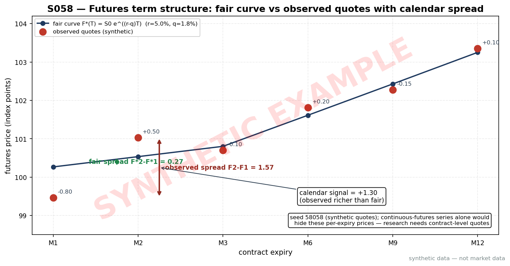

```mermaid
flowchart LR
    FEED["Raw feed<br/>(per-contract futures quotes)"] -->|per-contract quotes, 1-min bars| ING["Ingest + normalize<br/>(expiries, specs, calendars)"]
    ING -->|full curve panel (per-expiry-pair, daily)| FEAT["Feature compute<br/>(fair curve, spread vs fair)"]
    FEAT -->|spread deviation, per expiry pair| SIG["Signal S058<br/>calendar spread vs fair"]
    SIG -->|signal + two-leg cost bound (daily)| GATE{"Deviation clears<br/>bound?"}
    GATE -->|pass: spread-vs-fair signal| OUT["Downstream consumer<br/>(T035 carry engine)"]
    GATE -->|fail| DROP["No trade"]
    style SIG fill:#aed6f1,stroke:#1f3a5f
```

### S12. Sources

1. CME Group. "Deconstructing futures returns: the role of roll yield." [https://www.cmegroup.com/content/dam/cmegroup//education/files/deconstructing-futures-returns-the-role-of-roll-yield.pdf](https://www.cmegroup.com/content/dam/cmegroup//education/files/deconstructing-futures-returns-the-role-of-roll-yield.pdf) — spot/basis/roll-adjustment decomposition.
2. Hagerty, K. (Northwestern Kellogg). Commodity futures lecture notes — calendar-spread formula, full/non-full carry, convenience yield. [https://www.kellogg.northwestern.edu/faculty/hagerty/ftp/D65/lecture/Fall2006/commodity futures_Fall2006.pdf](https://www.kellogg.northwestern.edu/faculty/hagerty/ftp/D65/lecture/Fall2006/commodity futures_Fall2006.pdf).
3. Pedersen, L. H. / Jacobs Levy Center presentation. "Carry" — carry definition, carry predictability, cross-market term-structure carry. [https://jacobslevycenter.wharton.upenn.edu/wp-content/uploads/2014/06/Pedersen_Jacobs_Levy_Conf_2013.pdf](https://jacobslevycenter.wharton.upenn.edu/wp-content/uploads/2014/06/Pedersen_Jacobs_Levy_Conf_2013.pdf).
4. Gorton, G. B., Hayashi, F. & Rouwenhorst, K. G. (2013). "The Fundamentals of Commodity Futures Returns." *Review of Finance*, 17(1), 35–105. DOI: 10.1093/rof/rfs019. (Commodity futures returns decomposed against spot/term-structure; basis and inventory effects on the curve shape this signal trades.)
5. Erb, C. B. & Harvey, C. R. (2006). "The Strategic and Tactical Value of Commodity Futures." *Financial Analysts Journal*, 62(2), 69–97. DOI: 10.2469/faj.v62.n2.4084. (Roll yield as the term-structure component of futures returns — the empirical backdrop for calendar-spread carry.)
6. Miffre, J. & Rallis, G. (2007). "Momentum strategies in commodity futures markets." *Journal of Banking & Finance*, 31(6), 1863–1886. DOI: 10.1016/j.jbankfin.2006.12.010. (Term-structure momentum in commodity futures — adjacent evidence that curve shape carries predictive content.)

- Source log: "Duck.ai answered Q-SB7-1–Q-SB7-3 (2026-09-10); Grok/Cursor answers pending (checked 2026-09-10)".

**Unverified leads** (chatbot-provided, not independently checkable — do not cite as evidence):
- Duck.ai (GPT-5.6 Luna, 2026-09-10), Q-SB7-3: calendar-spread risk list (capital-efficient via margin offsets; curve-shape/roll/margin-expansion/liquidity/expiry risks); "continuous futures series INSUFFICIENT" data requirement.
- Duck.ai (GPT-5.6 Luna, 2026-09-10), Q-SB7-2: futures curves + rolls eng-hour bands 50–100 h research / 125–250 h production (approximate; cost-model Tier M takes precedence); contract-level data requirements list.

---
## Stage 61/200 — S061: ADR / dual-listed premium

*Batch SB7 · Signal 61/100 · Provenance [D/SR] · Family D — Pairs & Cross-Sectional Arbitrage*

### S1. One-line verdict

| | |
|---|---|
| **What it is** | FX (**f**oreign e**x**change)-adjusted price gap between an ADR (a US-listed certificate representing foreign shares) and its home-market shares; trade it toward zero. |
| **When it works** | Liquid dual listings with overlapping sessions, cheap borrow, and no capital controls — premia mean-revert as arbitrageurs convert. |
| **When it dies** | Short-sale bans, hard-to-borrow (HTB) ADR borrow, depositary halting issuance/cancellation, corporate-action ratio changes, capital controls. |
| **Build-or-buy in one line** | Build the parity/z-score monitor yourself on Tier-1 daily+FX data; buy borrow-availability data and corporate-action history rather than recreating them. |

Provenance **[D/SR]**: the ADR-premium literature is documented (Gagnon–Karolyi and the dual-listing
arbitrage body of work); the intraday z-score trading formulation here is a standard reconstruction.

### S2. How it works — plain human explanation

An **ADR** (American Depositary Receipt) is a US-listed security that represents a fixed number —
the **depositary ratio** — of shares of a foreign company. A **premium** means the ADR trades above
the FX-converted value of the home-market shares (parity); a **discount** means it trades below.
**Parity** is the no-arbitrage price: `ADR price = ratio × home price × FX rate`. When the premium
is large, an arbitrageur should buy the cheap leg (home shares), convert via the depositary bank,
and sell the rich ADR — or simply trade the spread — pushing the gap back toward zero.

Picture it: 12:04 ET, a Brazilian telecom's ADR prints $50.20 while its São Paulo shares, converted
at the current BRL/USD rate with the 5-for-1 depositary ratio, imply $49.40 of parity. The 1.6%
gap looks like free money — until you price the round trip: cross the ADR spread, cross the local
spread, pay the depositary's issuance/cancellation fee, pay borrow on the short leg, and hedge the
FX move. The documented lesson of this literature: **a statistically real premium can be
economically untradeable**.

Why should any premium exist at all? Two markets, two investor clienteles, two sets of trading
hours, and conversion frictions (fees, settlement delays, short-sale rules, capital controls).
Premia mean-revert because cross-border arbitrage desks convert when the gap exceeds their
all-in cost — but each desk's cost stack differs, so the "arbitrage bound" is a band, not a line.

Mental model:
- **One economic asset, two prices, one FX rate** — the signal is the residual after FX adjustment.
- **The bound is the edge**: trade only gaps wider than your full cost stack, not wider than zero.
- **Hours and staleness lie**: a premium computed from a closed home market is a data artifact,
  not a signal.

### S3. The math — exact formula

Let `P_ADR,t` be the ADR price (USD), `P_local,t` the home-market share price (local currency),
`X_t` the spot FX rate (local currency per USD), and `n` the depositary ratio (local shares per ADR).

**FX-adjusted premium:**

```
Π_t = P_ADR,t / (n · P_local,t / X_t) − 1
```

equivalently in logs: `ℓ_t = log P_ADR,t − log n − log P_local,t + log X_t`.
`Π_t > 0` is a premium (ADR rich); `Π_t < 0` is a discount. Units: dimensionless (fraction of parity).

**Signal:** z-score (standardize: subtract the mean, divide by the standard deviation)
the premium against a trailing window of length `W`:

```
z_t = (Π_t − mean(Π_{t−W+1..t})) / std(Π_{t−W+1..t})
```

Trade toward zero: short the ADR / buy local when `z_t > +z_entry`; buy the ADR / short local when
`z_t < −z_entry`; exit when `|z_t| < z_exit`. All prices must be **time-aligned**: if sessions do not
overlap, use the last synchronous print (or the Hayashi–Yoshida lead-lag alignment of S060 — the Hayashi–Yoshida estimator is a lead-lag correlation estimator for asynchronously sampled prices, `example` choice) — never mix a live ADR quote with a stale home-market close.

| Parameter | Symbol | Typical range | Too small | Too large | Default (example) |
|---|---|---|---|---|---|
| Lookback window | `W` | 20–120 sessions | noisy mean, false entries | slow to regime shifts | 60 sessions (`example — not an institutional standard`) |
| Entry threshold | `z_entry` | 1.5–3.0 | trades inside the cost band | never trades | 1.5 (`example`) |
| Exit threshold | `z_exit` | 0.25–1.0 | exits before convergence pays costs | gives back the move | 0.5 (`example`) |
| Min premium filter | `Π_min` | 0.3%–1.5% | below round-trip cost | misses real dislocations | 0.5% (`example`) |

Causal timing: `z_t` is computed at the close of bar/session *t* using only data ≤ *t*; the earliest
tradable fill is bar *t+1* (or the next overlapping session).

Variants: (1) **log-premium OU fit** — OU = **O**rnstein–**U**hlenbeck (a mean-reverting stochastic process); AR(1) = **a**uto**r**egressive order-1 (today's value regressed on yesterday's) half-life of `ℓ_t`, size by expected decay (S051);
(2) **quote-based premium** — bid/ask instead of trades, so spread cost sits inside the signal;
(3) **lead-lag timed entry** — weight the home market by its Hasbrouck information share (S016) —
the fraction of efficient-price innovation variance attributable to that market — and fade the
follower, not the leader.

### S4. Worked example — step-by-step numbers (SYNTHETIC)

Fictional dual listing, ratio `n = 5` local shares per ADR, synthetic 30-minute bars over the
US/Brazil overlap session. Random seed **61** (`np.random.default_rng(61)`); reproducible via
`batches/SB7/plot_S061.py`. Prices are synthetic — this is arithmetic illustration, not a backtest.

| Bar (ET) | Local (BRL) | FX (BRL/USD) | Parity (USD) | ADR (USD) | Premium | z |
|---|---|---|---|---|---|---|
| 10:00 | 49.86 | 5.0118 | 49.741 | 49.743 | +0.004% | −1.00 |
| 10:30 | 49.59 | 5.0075 | 49.520 | 49.511 | −0.019% | −1.04 |
| 11:00 | 49.86 | 5.0161 | 49.699 | 49.905 | +0.414% | −0.25 |
| 11:30 | 49.58 | 5.0082 | 49.496 | 49.926 | +0.869% | +0.58 |
| 12:00 | 49.13 | 4.9959 | 49.173 | 49.921 | **+1.523%** | **+1.77** |
| 12:30 | 49.30 | 5.0012 | 49.285 | 49.939 | +1.328% | +1.42 |
| 13:00 | 49.51 | 4.9945 | 49.561 | 50.136 | +1.159% | +1.11 |
| 13:30 | 49.27 | 5.0081 | 49.190 | 49.505 | +0.640% | +0.16 |
| 14:00 | 49.13 | 5.0051 | 49.078 | 49.262 | +0.374% | −0.33 |
| 14:30 | 49.82 | 4.9877 | 49.946 | 50.028 | +0.164% | −0.71 |
| 15:00 | 49.57 | 5.0048 | 49.521 | 49.576 | +0.113% | −0.80 |
| 15:30 | 49.44 | 4.9918 | 49.523 | 49.549 | +0.053% | −0.91 |

Step-by-step for the 12:00 bar: parity = 5 × 49.13 / 4.9959 = 49.173 USD;
premium = 49.921/49.173 − 1 = +1.523%. The z-score (+1.77) exceeds the `example` entry
threshold 1.5 → signal: short ADR at 49.921, buy 5× local shares at 49.13 BRL each
($49.173 of parity). The premium then decays to +0.053% by 15:30 — textbook convergence.

**The after-cost reality** (arithmetic on stated assumptions; cost stack itself is a chatbot-sourced illustration, labeled in S12):
gross premium 1.50% − ADR/local spread 0.30% − fees/commissions 0.20% − borrow (HTB leg) 0.60% −
FX hedge 0.20% − slippage/impact 0.30% = **−0.10% net**. The 1.5% "arb" loses money.

What to notice: the premium path and its decay are exactly what the chart plots (spot-check 12:00
= 1.523%, z = +1.77). The toy tape has no fees, no borrow desk, and no depositary conversion
delay — real frictions are what the waterfall adds.

### S5. Strategies that use this signal

- **T037 — ADR / Dual-Listed Premium Convergence**: primary entry trigger — fades the
  FX-adjusted premium with lead-lag timing (S060) and a spread cost gate (S014).
- **T099 — ADR + Borrow Corporate Arb**: the signal becomes a trade only when the borrow-fee
  and corporate-action screen pass — S061 supplies the dislocation, T099 supplies the
  borrow/cost accounting that decides whether it is tradable.

### S6. Data required — exact spec

| Field | Type | Granularity | Source tier | Notes |
|---|---|---|---|---|
| ADR price (bid/ask/trade) | float | minute or daily bars | Tier 1–2 | US listing; prefer quotes so spread is inside the signal |
| Home-market price | float | minute or daily bars | Tier 1–2 | Local currency; mind session overlap |
| Spot FX (local/USD) | float | tick or minute | Tier 1–2 | Timestamp-aligned to the equity prints |
| Depositary ratio + fee schedule | reference | event-driven | Tier 0–1 | Depositary bank notices; ratio changes are corporate actions |
| Borrow fee / availability (ADR + local) | float | daily | Tier 2–3 | Determines whether the short leg exists at all |
| Corporate actions, holidays, halts | reference | daily | Tier 1 | Splits, ratio changes, local price limits/halts |

Ingest sketch (≤20 lines, Python/polars):

```python
import polars as pl
adr   = pl.read_parquet("bars/adr_XYZ_1m.parquet")      # ts, bid, ask, last
local = pl.read_parquet("bars/local_XYZ3_1m.parquet")   # ts_local, bid_l, ask_l, last_l
fx    = pl.read_parquet("bars/fx_BRLUSD_1m.parquet")     # ts, spot
df = (adr.join_asof(local, on="ts", strategy="backward", tolerance="5m")
         .join_asof(fx, on="ts", strategy="backward", tolerance="5m"))
df = df.with_columns(parity=5.0 * pl.col("last_l") / pl.col("spot"))
df = df.with_columns(premium=pl.col("last") / pl.col("parity") - 1)
df = df.with_columns(z=(pl.col("premium") - pl.col("premium").rolling_mean(60))
                     / pl.col("premium").rolling_std(60))
```

Storage: daily bars for a few hundred ADR pairs ≈ a few MB/day (per notes/cost-model.md §4)
— trivial; minute bars + FX ticks ≈ tens of GB/year, still comfortable.

Data-quality checklist: FX/equity timestamp alignment (never mix live ADR with closed home market);
corporate actions and **depositary ratio changes**; local-market price limits and trading halts;
ex-dividend dates and withholding-tax treatment on both legs; DST and half-day calendars for both
venues.

### S7. Local build on M5 Max / 128GB

**Feasibility: feasible (Tier M, low end).** The parity arithmetic is trivial; the work is data
hygiene — point-in-time corporate actions, dual calendars, FX alignment, and borrow feeds.

- Throughput (per notes/cost-model.md §2): ~500 pairs of daily parity/z-scores are a few
  thousand rows (polars, milliseconds); even 1-minute bars (~200k rows/day) are trivial —
  Python + polars, no Rust/GPU needed.
- RAM (per §3): daily tables < 10 MB live; minute-bar history for 500 pairs × 60 days ≈ tens of GB
  at most — well under the 77 GB working budget.
- Engineering band: **Tier M, 30–50 h** (pairs D-family band is 20–60 h per cost-model §5;
  ADR adds FX alignment + corporate-action handling) → $4,500–7,500 at $150/hr loaded-cost estimate.
- Bottleneck: data licensing and corporate-action quality, not compute (consistent with the
  chatbot lead in Q-SB7-2: "limiting: data licensing, corp-action quality, borrow availability —
  not CPU/RAM").
- Breaks at: nothing compute-side up to thousands of pairs; the operational break is borrow-data
  coverage and depositary-fee reference data, both bought, not built.

### S8. Buy vs build

| Option | What you get | Indicative price | Gains | Loses |
|---|---|---|---|---|
| Tier 0: Stooq daily + ECB/Fed FX + depositary notices | Daily bars, daily FX, ratio data | ~$0 | Free research scaffold | No intraday, no borrow, manual corp actions |
| Tier 1: Polygon Stocks Advanced + FX | 1-min/real-time SIP (**S**ecurities **I**nformation **P**rocessor: the consolidated US equity feed) bars, FX ticks, corp actions | ~$30–200/mo | Clean API, one vendor | Borrow data absent; ADR ratio history thin |
| Tier 2: Databento + borrow-data vendor | L1/L2 (**l**evel-1 top-of-book / **l**evel-2 full order-book depth) + borrow/availability history | ~$200/mo + usage; borrow history ~$10–50k/yr | Honest microstructure + the borrow leg that decides tradability | Cost; borrow history is the expensive part |
| Academic/institutional: TAQ (**T**rade **a**nd **Q**uote: the NYSE's consolidated historical tick database) + OptionMetrics-style refs | Publication-grade history | $$$$ institutional | Point-in-time everything | Overkill for a monitor |

*All prices indicative — verify before budgeting.*

**Verdict: build if** you are running a monitoring + event-driven screen on daily/minute data —
the parity math and z-score are a weekend of Tier-M work. **Buy if** you need historical
borrow/availability (the least substitutable input — "current indicative borrow ≠ historical
executable borrow") or point-in-time corporate-action masters. Hybrid is the norm: buy the
awkward data, build the analytics.

### S9. Success ratio / efficacy — documented evidence

| Study / source | Market & period | Metric | Before/after cost | Caveat |
|---|---|---|---|---|
| Gagnon & Karolyi (2010), "Multi-market trading and arbitrage," JFE 97(1):53–80 | 506 US cross-listed stocks, 35 countries, intraday quotes | Mean deviation from parity **4.9 bps**; deviations positively related to holding-cost proxies after controlling for transaction costs and foreign investment restrictions | Before-cost (descriptive) | 4.9 bps is the *average* — small vs any realistic round-trip stack |
| Pasquariello (2014, NBER conference), law-of-one-price violations | Global cross-listings, 1980–2009 | Violations spike in stress (Oct 2008 peak); largest for EM ADRs, minimal for Canadian ordinaries | Before-cost (descriptive) | Crisis premia coincide with the frictions (controls, borrow) that block harvesting |

Regimes where it fails: 2008-style stress (violations widen but convertibility and borrow vanish);
markets with short-sale restrictions or capital controls; depositary suspending issuance/cancellation;
corporate-action ratio changes. Documented decay: the literature consensus is that *average*
deviations are small and the exploitable tail is friction-bound — the edge has not "decayed" so
much as it was never harvestable at small scale.

Honest bottom line: **as a standalone trigger this is a weak-to-nonexistent edge for a small
account after costs; as a monitoring + event-driven filter it is a legitimate, low-frequency
input.** Statistically real premium ≠ economically tradable premium.

### S10. Failure modes & pitfalls

1. **Stale-price false premium** — home market closed while ADR trades. *Mitigation:* compute
   premia only on synchronous prints; gate on both venues being open.
2. **False half-life** — closing prices from two markets create false premium *and* false
   half-life. *Mitigation:* intraday synchronous sampling; half-life estimated on overlap-session data only.
3. **Observed decay ≠ convergence** — observed premium decay = true convergence + FX adjustment +
   stale-price correction + hours alignment. *Mitigation:* decompose the move before sizing.
4. **Borrow failure** — ADR borrow goes HTB or local shorting is restricted. *Mitigation:*
   pre-trade borrow check; size to available borrow, not to the signal.
5. **Depositary / corp-action events** — issuance/cancellation suspended, ratio changed, fees raised.
   *Mitigation:* reference-data feed for depositary notices; halt the pair on events.
6. **Capital controls / repatriation risk** — local leg cannot be converted or proceeds cannot
   leave. *Mitigation:* country whitelist maintained from compliance data.
7. **Local price limits / halts** — home shares limit-locked while ADR keeps trading.
   *Mitigation:* halt flag from the local feed; treat limit-locked prints as non-tradable.
8. **FX slippage** — the FX leg moves between the equity fills. *Mitigation:* execute FX with the
   equity legs or model the FX hedge cost explicitly (the 0.20% in the waterfall).

### S11. Visuals

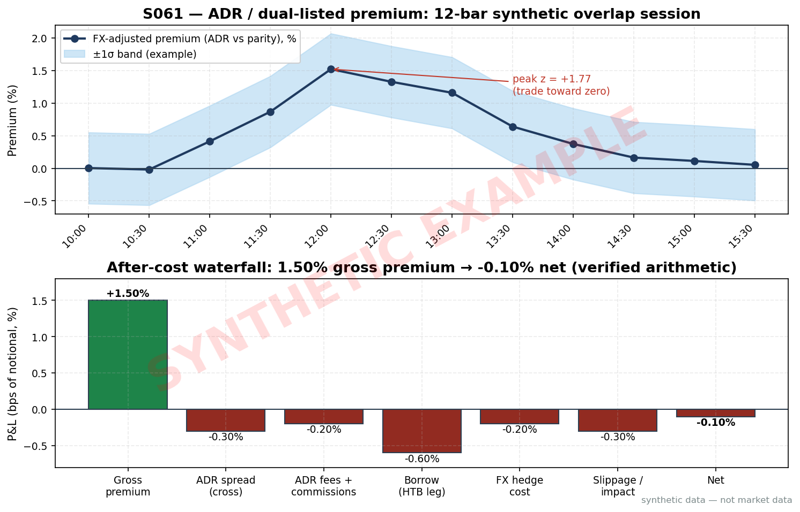

```mermaid
flowchart LR
    FEED["Raw feeds<br/>(ADR quotes + local quotes + FX ticks)"] -->|per-session bars, 1-min FX ticks| ING["Ingest + normalize<br/>(dual calendars, DST, halts, ratio changes)"]
    ING -->|"minute bars, ADR + local + FX"| FEAT["Parity compute<br/>(Π_t, z_t vs 60-session window)"]
    FEAT -->|"daily/minute premium z-scores"| SIG["Signal S061<br/>ADR premium z"]
    SIG -->|signal + cost/borrow gate (per-session)| GATE{"Cost / borrow / hours<br/>gate?"}
    GATE -->|pass| OUT["Downstream consumer<br/>(T037 entry / T099 screen)"]
    GATE -->|fail| DROP["No trade"]
    style SIG fill:#aed6f1,stroke:#1f3a5f
```

### S12. Sources

1. Gagnon, L. & Karolyi, G. A. (2010). "Multi-market trading and arbitrage."
   *Journal of Financial Economics*, 97(1), 53–80.
   https://ideas.repec.org/a/eee/jfinec/v97y2010i1p53-80.html
   (Handle: RePEc:eee:jfinec:v:97:y:2010:i:1:p:53-80):
   506 US cross-listed stocks from 35 countries; deviations from price parity average an
   economically small 4.9 bps but are volatile with large extremes; deviations and their daily
   changes are positively related to holding-cost proxies after controlling for transaction costs
   and foreign investment restrictions.
2. Pasquariello, P. (2014) — "The Law of One Price in the Global Stock Market" (NBER
   conference paper): absolute ADR parity violations peak in October 2008; most pronounced for
   European, Australian, and emerging-market ADRs; least for Canadian ordinaries; Gagnon–Karolyi
   (2010) finding that US order-flow price impact is positively related to relative ADR parity
   violations.
   http://conference.nber.org/confer/2014/MMf14/Pasquariello.pdf
3. "Stock – ADR Arbitrage: Microstructure Risk" (PhD thesis, University of Liverpool):
   literature survey documenting that price discovery is home-market-led (Howe & Ragan 2002;
   Grammig et al. 2005 on German ADRs; Eun & Sabherwal 2003 on US/Canada) and the practical
   factors — costs, taxes, conversion rules — that impede ADR arbitrage.
   https://livrepository.liverpool.ac.uk/3052904/1/StockADRPaperLE.pdf
4. Foerster, S. R. & Karolyi, G. A. (1999). "The effects of market segmentation and investor
   recognition on asset prices: Evidence from foreign stocks listing in the US." *Journal of
   Finance*, 54(3), 981–1013. DOI: 10.1111/0022-1082.00134. (Cross-listing announcement effects —
   the pricing context in which ADR premia arise.)
5. Karolyi, G. A. (2006). "The world of cross-listings and cross-listings of the world:
   Challenging conventional wisdom." *Review of Finance*, 10(1), 99–152. DOI:
   10.1007/s10679-006-6980-8. (Survey of the cross-listing literature — the segmentation and
   arbitrage-friction backdrop for ADR premium trading.)
6. Eun, C. S. & Sabherwal, S. (2003). "Cross-border listings and price discovery: Evidence
   from U.S.-listed Canadian stocks." *Journal of Finance*, 58(2), 549–575. DOI:
   10.1111/1540-6261.00537. (Where price discovery happens for cross-listed pairs — supports the
   lead-lag timing in this signal's variants.)

**Unverified leads**
- Duck.ai (GPT-5.6 Luna, 2026-09-10), Q-SB7-1–Q-SB7-3: ADR parity formulas, premium half-life
  via AR(1), the after-cost waterfall (arithmetic operator-verified; cost stack itself is a
  chatbot illustration), and the failure-mode list. Source log:
  "Duck.ai answered Q-SB7-1–Q-SB7-3 (2026-09-10); Grok/Cursor answers pending (checked 2026-09-10)"
  (see `batches/SB7/question-log.md`).

---
## Stage 62/200 — S062: Sector momentum

*Batch SB7 · Signal 62/100 · Provenance [D/SR] · Family D — Pairs & Cross-Sectional Arbitrage*

### S1. One-line verdict

| | |
|---|---|
| **What it is** | Buy past-winning industries/sectors, short past-losing ones — momentum lives in industries, not just stocks. |
| **When it works** | Intermediate horizons (1–12 months) in the literature; intraday, as a remainder-of-session continuation tilt on sector ETFs (**e**xchange-**t**raded **f**unds). |
| **When it dies** | Momentum crashes (sharp reversals after panics), crowded factor rotations, and — intraday — the close, when you must flatten. |
| **Build-or-buy in one line** | Build the ranker in an afternoon on daily/minute sector-ETF bars; buy nothing until you need point-in-time industry classifications. |

Provenance **[D/SR]**: industry momentum is documented (Moskowitz–Grinblatt 1999); the
intraday sector-ETF adaptation (rank by open-to-midday return, trade the rest of the session) is a
standard reconstruction — the literature version is **not** a day-trading strategy.

### S2. How it works — plain human explanation

**Momentum** is the tendency of past winners to keep winning and past losers to keep losing over
intermediate horizons. **Industry (sector) momentum** is the same effect computed on industry
portfolios rather than individual stocks: Moskowitz and Grinblatt's 1999 finding was that much of
what looks like individual-stock momentum is actually *industry* momentum — control for industries
and the stock-level effect shrinks dramatically.

Picture it: it is 12:00 ET (**E**astern **T**ime). Over the morning, the ten sector ETFs have scattered: energy +0.4% on
an oil headline, materials −1.2% on China data. Sector momentum says the dispersion is not noise to
fade but information diffusing slowly — analysts, sector funds, and hedgers rotate with a lag, so
the morning's winners tend to keep drifting into the close. You rank the sectors, buy the top
group, short the bottom group, and flatten everything at the bell.

Why should it exist? Slow information diffusion across firms in an industry, correlated analyst
revisions, institutional sector-rotation flows that execute over days, and behavioral
underreaction — the same mechanisms as stock momentum, aggregated to a level where idiosyncratic
noise partly cancels.

Mental model:
- **Industries are the signal; stocks are the noise** — aggregate before you rank.
- **The literature is monthly; the tradable intraday form is a tilt**, not a standalone book.
- **Flatten at the close** — this signal has no overnight thesis in its intraday form.

### S3. The math — exact formula

**Literature form.** Form `N` value-weighted (by market capitalization) industry portfolios (Moskowitz–Grinblatt use 20
industries). Rank by cumulative return over the formation period `F`; long the top `K`, short the
bottom `K` (documented: **top/bottom 3 of 20 industries**; 6-month formation in the original,
1-month formation/holding in factor-momentum work):

```
R_p = (1/K) Σ_{i ∈ winners} R_i − (1/K) Σ_{i ∈ losers} R_i
```

**Intraday adaptation [SR].** At ranking time `t_r` (e.g. 12:00 ET), rank `M` sector ETFs
(XLK, XLF, XLE, …) by open-to-`t_r` return; hold the continuation (long top `k` / short bottom `k`,
or the ETFs themselves) from `t_r` to the close; flatten at 16:00 ET.

| Parameter | Symbol | Typical range | Too small | Too large | Default (example) |
|---|---|---|---|---|---|
| Formation window (lit.) | `F` | 1–12 months | microstructure noise dominates | stale ranking | 6 months (`example — not an institutional standard`) |
| Winners/losers (lit.) | `K` | 2–5 of ~20 | concentration risk | dilutes the spread | 3 (`example`) |
| Intraday rank time | `t_r` | 11:00–14:00 ET | formation too noisy | no holding time left | 12:00 ET (`example`) |
| Intraday legs | `k` | 2–4 of ~10 ETFs | idiosyncratic ETF noise | weak dispersion | 3 (`example`) |

Causal timing: the ranking at `t_r` uses only returns through `t_r`; the earliest fill is the bar
after `t_r`; positions are closed before the closing auction — no overnight carry.

Variants: (1) **residual sector momentum** — strip each sector's market beta first, rank the
residuals; (2) **industry-neutral factor rotation** (Ehsani–Linnainmaa direction) — rotate
*characteristic factors* on prior-month returns rather than industries; (3) **overnight-aware
form** — rank on prior close-to-open + first hour, exploiting the documented open/close split in
intraday momentum.

### S4. Worked example — step-by-step numbers (SYNTHETIC)

Ten fictional sector ETFs, seed **62** (`np.random.default_rng(62)`), reproducible via
`batches/SB7/plot_S062.py`. Formation leg: open → 12:00 ET. Holding leg: 12:00 → 16:00 ET,
flatten at close. Synthetic — arithmetic illustration, not a backtest.

| Sector | Formation (open→12:00) | Holding (12:00→16:00) | Leg |
|---|---|---|---|
| MATR | −1.194% | −0.337% | SHORT |
| FINL | −0.756% | −0.301% | SHORT |
| COMM | −0.545% | +0.009% | SHORT |
| TECH | −0.417% | −0.421% | — |
| INDU | −0.338% | −0.104% | — |
| ENRG | −0.002% | +0.404% | — |
| HLTH | +0.030% | −0.306% | — |
| CONS | +0.131% | +0.175% | LONG |
| UTIL | +0.165% | −0.080% | LONG |
| REAL | +0.193% | −0.191% | LONG |

Step-by-step: rank the formation column; the bottom 3 (MATR, FINL, COMM) are the short leg, the
top 3 (CONS, UTIL, REAL) the long leg. Holding-leg averages: long leg = (+0.175 − 0.080 − 0.191)/3
= **−0.032%**; short leg = (−0.337 − 0.301 + 0.009)/3 = **−0.209%**; long-short spread = −0.032 −
(−0.209) = **+0.178%** before costs.

What to notice: on this synthetic day the spread is positive only because the *loser* leg kept
losing — the winner leg itself drifted slightly negative. That is the honest anatomy of
continuation trades: the edge often lives in the short leg, which is also the expensive leg to
borrow. The chart's right panel plots the same leg closes (winner −0.03%, loser −0.21%, spread
+0.18% — spot-check against the table). The toy tape has no spreads, no borrow fees, and exactly
one convenient day — a real evaluation needs thousands of days and the short-leg cost stack.

**The explicit cost stack** (per half-day trade, illustrative — spread, fees/commissions, borrow, and impact/slippage, all named): (1) bid–ask **spread** on six ETF legs, ~0.02–0.05% each; (2) **commissions/fees** per ticket; (3) **borrow** on the three-ETF short leg — prorated over the half-day hold this is small for easy-to-borrow ETFs, but hard-to-borrow sector ETFs can run several percent annualized and flip the sign; (4) **market impact/slippage** entering all six legs at 12:00 ET into the same midday liquidity. The +0.178% before-cost spread must clear all four. Net of a realistic stack the toy day is roughly flat to negative — which is exactly why the intraday adaptation is stated as *unproven* in S9.

### S5. Strategies that use this signal

- **T038 — Sector Momentum + Idiosyncratic Fade**: primary trigger — long sector-momentum
  winners while fading idiosyncratic residual extremes (S039) on the constituents.

### S6. Data required — exact spec

| Field | Type | Granularity | Source tier | Notes |
|---|---|---|---|---|
| Sector ETF prices (XLK, XLF, …) | float | 1-min or daily bars | Tier 0–1 | The tradable implementation needs only ~10 ETFs |
| Industry classifications (GICS/SIC) | reference | event-driven | Tier 0–1 | GICS = Global Industry Classification Standard; SIC = **S**tandard **I**ndustrial **C**lassification; for the literature form; CRSP/Compustat (the **C**enter for **R**esearch in **S**ecurity **P**rices stock database / S&P's fundamental database, the academic standard) in academia |
| Constituent returns (lit. form) | float | daily bars | Tier 0–1 | Value-weighting within industries |
| Corporate actions | reference | daily | Tier 1 | Splits/dividends on ETFs |

Ingest sketch (≤20 lines, Python/polars):

```python
import polars as pl
etfs = ["XLK","XLF","XLE","XLV","XLI","XLP","XLU","XLB","XLC","XLRE"]
bars = pl.read_parquet("bars/sector_etf_1m.parquet")          # ts, sym, open, close
morn = (bars.filter(pl.col("ts").dt.time() <= pl.time(12,0))
            .group_by("sym").agg((pl.col("close").last()/pl.col("open").first()-1)
                                .alias("form_ret")))
rank = morn.with_columns(pl.col("form_ret").rank("ordinal").alias("rk"))
longs  = rank.filter(pl.col("rk") >  len(etfs)-3)["sym"].to_list()
shorts = rank.filter(pl.col("rk") <= 3)["sym"].to_list()      # trade 12:00 -> close
```

Storage: 10 ETFs × 390 minute-bars/day ≈ 4k rows/day — trivial (per notes/cost-model.md §4,
1-min bars for 500 symbols ≈ 50 MB/day total); daily-bar history is megabytes.

Data-quality checklist: ETF open-price reliability (first-minute auction noise — consider
open-to-`t_r` from the 9:35 bar); corporate actions on ETFs; sector reclassifications
(GICS changes move constituents); half-days and early closes (flatten logic must know them).

### S7. Local build on M5 Max / 128GB

**Feasibility: trivial (Tier L).** Ten ETFs, one ranking, one holding window — this is a spreadsheet
with a data feed.

- Throughput (per notes/cost-model.md §2): the whole daily computation is ~4k rows; even the
  literature form (20 industries × thousands of stocks × daily bars) is a few million rows —
  polars does it in well under a second.
- RAM (per §3): everything fits in megabytes; the 60-day working set is noise against the 77 GB budget.
- Engineering band: **Tier L, 8–12 h** (1-min/daily bar signals per cost-model §5: 4–12 h;
  two sessions of logic — ranker + flatten-at-close executor) → $1,200–1,800 at $150/hr
  loaded-cost estimate.
- Bottleneck: none on compute; the binding constraint is borrow availability on the short leg
  and the discipline to flatten daily.
- Breaks at: it doesn't, computationally — scale to the full literature form (all CRSP industries)
  and it is still a batch job.

### S8. Buy vs build

| Option | What you get | Indicative price | Gains | Loses |
|---|---|---|---|---|
| Tier 0: Stooq/Yahoo daily + GICS mappings | Daily sector-ETF bars, free classifications | ~$0 | Zero cost to prototype the literature form | No intraday, survivorship quirks |
| Tier 1: Polygon Stocks Advanced | 1-min sector-ETF bars, corporate actions | ~$30–200/mo | The intraday adaptation needs exactly this | Nothing material at this scale |
| Tier 2: Databento | L1 (**l**evel-1: top-of-book quotes) for precise open/close prints | ~$200/mo + usage | Cleaner auction/open handling | Unnecessary precision for a ranking signal |
| Academic: CRSP/Compustat | Publication-grade industry histories | Institutional $$$$ | Matches the literature exactly | Irrelevant for the tradable ETF form |

*All prices indicative — verify before budgeting.*

**Verdict: build, always, at this scale.** The signal is a ranking; no vendor sells a better one.
The crossover point where buying matters is the *literature replication* (point-in-time industry
histories) — not the tradable sector-ETF version.

### S9. Success ratio / efficacy — documented evidence

| Study / source | Market & period | Metric | Before/after cost | Caveat |
|---|---|---|---|---|
| Moskowitz & Grinblatt (1999), "Do Industries Explain Momentum?", J. Finance | US stocks, 1963–1995 | Industry momentum strategies "highly profitable" after controlling for size, book-to-market, individual-stock momentum, and microstructure; individual-stock momentum "up to 12% abnormal return per dollar long per year" but much weaker once industry momentum is controlled | Before-cost | Pre-1995 sample; equal-weighted industry portfolios; no transaction-cost accounting |
| Ehsani & Linnainmaa (2020, AEA preliminary), "Factor Momentum and the Momentum Factor" | US, 1964–2015 | Replicated industry momentum: 0.35%/month (t ≈ 2.09); factor momentum (rotating 51 factors on prior-month returns): 0.35%/month (t ≈ 7.05), subsumes industry momentum | Before-cost | Factor momentum ≠ industry momentum; the spanning result argues the industry effect rides factor exposures |
| Quantpedia (Dujava), "Sectoral Intramonth Momentum Cycle" | US sector ETFs | Three-phase intramonth cycle composited: 5.99% annualized, Sharpe ratio 0.55 (return per unit of volatility), long-short, invested < half the trading days | Costs unstated (treat as before-cost) | Practitioner research, not peer-reviewed |

Regimes where it fails: momentum crashes — sharp reversals after market panics invert the ranking
violently (the short leg squeezes); crowded factor rotations whipsaw monthly rebalances; intraday,
any day the morning dispersion is macro-news noise rather than slow diffusion. Documented decay:
industry momentum's raw premium has attenuated since the 1990s sample as the anomaly became known;
Ehsani–Linnainmaa's spanning result further suggests part of the "industry" premium was factor
timing in disguise.

Honest bottom line: **as a standalone trigger the literature documents a real but cost-sensitive
and crash-exposed premium at monthly horizons; as an intraday tilt it is an unproven adaptation —
a modest continuation overlay with a hard flatten-at-close, not a book.**

### S10. Failure modes & pitfalls

1. **Momentum crashes** — post-panic reversals flip winners/losers violently. *Mitigation:*
   vol-scaled sizing; skip ranking days after extreme market moves.
2. **Short-leg borrow costs** — the loser leg is where the continuation often lives and the
   hardest to borrow. *Mitigation:* model borrow explicitly; long-only variant if borrow is punitive.
3. **Morning noise misread as signal** — macro headlines at the open create dispersion that
   reverses, not continues. *Mitigation:* delay `t_r`; require formation breadth, not one outlier ETF.
4. **Overnight gap risk (literature form)** — monthly holds carry earnings/macro gaps.
   *Mitigation:* the intraday form flattens daily; the monthly form needs position-level stops.
5. **Crowded rotations** — known anomaly, correlated unwinds. *Mitigation:* cap the sleeve's
   capital; monitor pairwise crowding proxies.
6. **Reclassification drift** — GICS changes move constituents between sectors silently.
   *Mitigation:* point-in-time classification table; the ETF form sidesteps this entirely.
7. **Lookahead in formation** — using revised index membership or restated data.
   *Mitigation:* as-traded ETF prices only, timestamped membership.
8. **Overfitting the rank time** — `t_r` tuned on a handful of years. *Mitigation:* pick `t_r`
   from market-structure reasoning (post-open auction, pre-close), not from a grid search.

### S11. Visuals

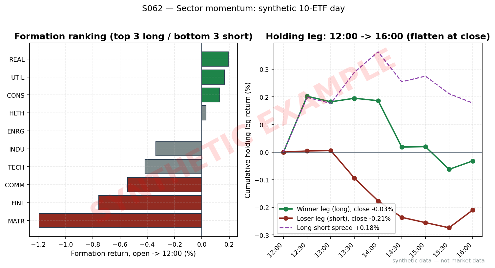

```mermaid
flowchart LR
    FEED["Raw feed<br/>(sector ETF 1-min bars, Tier 1)"] -->|1-min bars, 10 sector ETFs| ING["Ingest + normalize<br/>(open-auction filter, corp actions, half-days)"]
    ING -->|"1-min bars, 10 sector ETFs"| FEAT["Formation compute<br/>(open to t_r return, rank)"]
    FEAT -->|"ranked list at t_r"| SIG["Signal S062<br/>sector momentum rank"]
    SIG -->|ranked legs + cost stack (at t_r)| GATE{"Borrow / cost /<br/>flatten-time gate?"}
    GATE -->|pass| OUT["Downstream consumer<br/>(T038 primary)"]
    GATE -->|fail| DROP["No trade"]
    style SIG fill:#aed6f1,stroke:#1f3a5f
```

### S12. Sources

1. Moskowitz, T.J. & Grinblatt, M. (1999) — "Do Industries Explain Momentum?", *Journal of
   Finance* 54(4), 1249–1290: industry momentum is strong and prevalent and accounts for much
   of the individual-stock momentum anomaly; industry momentum strategies (top/bottom 3 of 20
   industries by past value-weighted return) remain profitable after controlling for size,
   book-to-market, individual-stock momentum, and microstructure effects.
   http://www-stat.wharton.upenn.edu/~steele/Courses/956/Resource/Momentum/MoskowitzGrinblatt99.pdf
2. Ehsani, S. & Linnainmaa, J. (2020, AEA preliminary) — "Factor Momentum and the Momentum
   Factor": industries exhibit return momentum strongest at the one-month horizon; rotating 51
   factors on prior one-month returns earns 0.35%/month (t ≈ 7.05); factor momentum fully
   subsumes industry momentum; replicated industry momentum 0.35%/month (t ≈ 2.09).
   https://www.aeaweb.org/conference/2020/preliminary/paper/RHhbnykd
3. Dujava, C. (Quantpedia) — "Sectoral Intramonth Momentum Cycle: Exploiting Turn-of-the-Month
   Patterns in Sector ETF Strategies": three-phase intramonth momentum cycle at the sector-ETF
   level (momentum D+1, reversal D+2–D+3, renewed momentum D−10 to D−5); composited long-short
   5.99% annualized, 0.55 Sharpe on liquid US sector ETFs (practitioner research).
   https://quantpedia.com/sectoral-intramonth-momentum-cycle/
4. Jegadeesh, N. & Titman, S. (1993). "Returns to Buying Winners and Selling Losers:
   Implications for Stock Market Efficiency." *Journal of Finance*, 48(1), 65–91. DOI:
   10.1111/j.1540-6261.1993.tb04702.x. (The momentum origin paper — the cross-sectional
   continuation phenomenon this signal's sector form is built on.)
5. Lewellen, J. (2002). "Momentum and autocorrelation in stock returns." *Review of Financial
   Studies*, 15(2), 533–564. DOI: 10.1093/rfs/15.2.533. (Momentum decomposed across size,
   book-to-market, and industry portfolios — the industry-momentum anatomy behind this signal.)
6. Daniel, K. & Moskowitz, T. J. (2016). "Momentum crashes." *Journal of Financial Economics*,
   122(2), 221–247. DOI: 10.1016/j.jfineco.2016.03.003. (Sharp momentum reversals after panics —
   the documented crash regime in this chapter's failure modes.)

**Unverified leads**
- Duck.ai (GPT-5.6 Luna, 2026-09-10), Q-SB7-2: sector/industry build-cost context folded into
  the M5 Max discussion (cost-model §5 takes precedence). Q-SB7-3: no sector-momentum-specific
  after-cost numbers were provided by the bot. Source log:
  "Duck.ai answered Q-SB7-1–Q-SB7-3 (2026-09-10); Grok/Cursor answers pending (checked 2026-09-10)"
  (see `batches/SB7/question-log.md`).

---
## Stage 90/200 — S090: Variance-ratio / Hurst regime toggle

*Batch SB7 · Signal 90/100 · Provenance [D/SR] · Family F — Statistical/ML Infrastructure*

### S1. One-line verdict

| | |
|---|---|
| **What it is** | Measures whether the tape is trending or choppy — variance ratio > 1 / Hurst > 0.5 means persistence (use momentum), the reverse means anti-persistence (use reversal). |
| **When it works** | As a slow regime label over rolling windows with confidence intervals (CI: the range of values statistically consistent with the data) — it conditions *which* strategy family gets risk, not when to enter. |
| **When it dies** | Used as a standalone entry trigger on short samples: finite-sample noise, horizon contradictions, and vol clustering make the label flip meaninglessly. |
| **Build-or-buy in one line** | Build it — it is thirty lines of numpy on 1-minute returns; there is nothing to buy. |

Provenance **[D/SR]**: Lo–MacKinlay (1988) variance ratio and Hurst (1951) rescaled-range analysis are
documented statistical methods (D); the regime-toggle *trading* use is practitioner reconstruction (SR).

### S2. How it works — plain human explanation

A **variance ratio** (VR) asks a simple question: does a 4-bar return vary 4× as much as a 1-bar
return? If price changes are a **random walk** — each step independent, no memory — then yes,
variance scales linearly with time, and VR = 1. If the market is **trending** (winners keep
winning over the window), multi-bar returns swing more than the random-walk benchmark: VR > 1.
If it is **choppy/mean-reverting** (up bars cancel down bars), multi-bar returns swing less:
VR < 1.

The **Hurst exponent** H is the same idea in different clothing, from hydrology (Hurst 1951
studied Nile river levels): it measures long-range dependence. H = 0.5 is a random walk,
H > 0.5 is **persistence** (trends continue), H < 0.5 is **anti-persistence** (reversals dominate).

Picture it: 10:15, your momentum book is bleeding on a choppy open. A rolling VR(4) on 1-minute
returns reads 0.6 — the tape is anti-persistent, so momentum entries are fighting the regime. The
toggle says: stand the momentum book down, or hand the risk to the mean-reversion sleeve. The
mandated framing of this chapter: **that is the defensible use — a risk/exposure modifier, not an
entry trigger.** A VR-toggle strategy that flips between momentum and reversal entries "can look
attractive in-sample but lose after turnover."

Why should regimes exist at all? Order-flow regimes (institutional VWAP (**v**olume-**w**eighted **a**verage **p**rice: executing in line with the day's volume profile) execution vs. retail
noise), volatility clustering (vol shocks look like trend breaks), and intraday seasonality
(open/close trendiness vs. midday chop) all change the short-horizon autocorrelation structure —
and the VR is just a standardized way to read that structure.

Mental model:
- **VR/Hurst is a thermometer, not a trade** — it reads the regime; it does not time entries.
- **Horizons disagree** — k=2 can say "trend" while k=4 says "revert" on the *same* tape.
- **Costs eat toggles** — every regime flip is turnover; the turnover cost stack (bid–ask **spread**, **commissions/fees**, **market impact/slippage** on the book rotation) must sit inside the toggle decision, and the label must be stable to be worth trading.

### S3. The math — exact formula

Let `r_t` be 1-period returns and `r_t(k) = Σ_{j=0}^{k−1} r_{t−j}` the overlapping k-period return.
The Lo–MacKinlay **variance ratio**:

```
VR(k) = Var(r_t(k)) / (k · Var(r_t))
```

VR(k) ≈ 1 → random walk; > 1 → momentum/persistence; < 1 → oscillation/mean reversion. The
heteroscedasticity-robust z-statistic `Z(k) = (VR(k) − 1) / √Var̂[VR(k)]` tests the deviation
statistically (Lo–MacKinlay's contribution was making this robust to time-varying volatility).

The **Hurst mapping** (from `Var(r_t(k)) ∝ k^{2H}`):

```
Ĥ(k) = (1/2) · [1 + ln VR(k) / ln k]
```

H ≈ 0.5 → random walk; > 0.5 → persistence; < 0.5 → anti-persistence. Classical Hurst comes from
**R/S analysis** (rescaled range): `E[R(n)/S(n)] = C·n^H`, where R(n) is the range of cumulative
deviations and S(n) the standard deviation over span n; Lo (1991) modified it with a Newey–West
denominator (a heteroscedasticity- and autocorrelation-consistent variance estimator) to discount
short-range autocorrelation.

| Parameter | Symbol | Typical range | Too small | Too large | Default (example) |
|---|---|---|---|---|---|
| Horizon | `k` | 2–20 bars | noise-dominated, microstructure bias | mixes regimes | {2, 4, 8} (`example — not an institutional standard`) |
| Rolling window | `W` | 100–500 obs | label whipsaws | stale regime | 250 1-min bars (`example`) |
| Momentum band | `VR_hi` | 1.05–1.20 | false trend labels | never labels | 1.10 (`example`) |
| Reversion band | `VR_lo` | 0.80–0.95 | false reversion labels | never labels | 0.90 (`example`) |

Causal timing: VR/Hurst at time *t* uses returns through *t* only; the regime label gates entries
from *t+1* onward. Overlapping k-period returns induce serial correlation in the estimator itself —
use the heteroscedasticity-robust standard errors, not naive ones.

Variants: (1) **multiscale VR** — the full VR(k) curve as a feature vector instead of one k;
(2) **Lo's modified R/S** — the formal long-memory test with bandwidth parameter q;
(3) **DFA (detrended fluctuation analysis)** — a more robust H estimator used in the econophysics
literature.

### S4. Worked example — step-by-step numbers (SYNTHETIC)

Chatbot-provided tiny synthetic tape (Duck.ai, Q-SB7-1); arithmetic **operator-verified
2026-09-10 with one correction** (see below). Hand-specified tape — no RNG draws;
`batches/SB7/plot_S090.py` sets `np.random.default_rng(7)` for reproducibility. This is a
hand-computable illustration, not a backtest — eleven-ish points cannot support any trading
conclusion, which is itself the lesson.

One-period returns: `r = (1, 1, 1, −1, −1, −1, 1, 1, 1)`, mean = 1/3.
Sum of squared deviations = 6·(2/3)² + 3·(−4/3)² = 24/9 + 48/9 = 8; `s_1² = 8/8 = 1.0` ✓ (verified).

Two-period overlapping returns: `(2, 2, 0, −2, −2, 0, 2, 2)`, mean 0.5.
Squared deviations: 4×(1.5)² = 9, 2×(−2.5)² = **12.5**, 2×(−0.5)² = 0.5 → Σ = **22.0**;
`s_2² = 22.0/7 = 3.142857`; **VR(2) = 3.142857/(2·1.0) = 1.5714**;
**Ĥ(2) = (1/2)[1 + ln(1.5714)/ln 2] ≈ 0.826** → persistence.

⚠️ **The bot's error, corrected:** the chatbot wrote 2(−2.5)² = 12 (wrong — 2×6.25 = 12.5),
which cascaded to Σ = 21.5, s_2² = 3.07143, VR(2) = 1.5357, Ĥ(2) = 0.808. The corrected chain
above (22.0 → 3.142857 → 1.5714 → 0.826) is operator-verified. The qualitative reading is
unchanged: VR(2) > 1, H > 0.5 → short-horizon persistence.

⚠️ **The bot's second error, corrected 2026-09-10:** the chatbot also printed a k=4 block of
VR(4) = 0.5667, Ĥ(4) ≈ 0.295, and an earlier draft of this chapter repeated it as "verified."
It was **false** — operator re-verification of the same tape gives: overlapping 4-period returns
(2, 0, −2, −2, 0, 2), mean 0; squared deviations 4+0+4+4+0+4 = 16; s_4² = 16/5 = 3.2;
**VR(4) = 3.2/(4·1.0) = 0.8000**; **Ĥ(4) = (1/2)[1 + ln(0.8)/ln 4] = (1/2)[1 − 0.16096] ≈
0.4195** → still anti-persistence at k = 4, but materially less extreme than the false 0.295.
The 0.5667/0.295 block is withdrawn; the chapter's earlier claim of having verified it was
wrong.

What to notice — the chart's punchline: **the same tape says momentum at k=2 (Ĥ=0.826) and
reversal at k=4 (Ĥ=0.4195)**. A single short sample contradicts itself across horizons, which is
why VR/Hurst is a *diagnostic*, not a standalone rule. Real use needs rolling windows,
confidence intervals, and multiple horizons.

### S5. Strategies that use this signal

- **T054 — Hurst/Variance-Ratio Regime Toggle**: primary consumer — trend-following when the
  Hurst/VR regime reads persistence, mean reversion otherwise. (S090 is the regime label; the
  chapter's honesty section applies in full.)
- **T043 — GARCH Regime Filter**: regime gate — S090's persistence label cross-checks the
  GARCH vol-regime classification before momentum/reversal books are activated.
- **T057 — Fractional-Differentiation Memory Trader**: memory input — the fractional
  differencing order and the VR/Hurst label jointly parameterize how much memory the
  return series retains.
- **T081 — Adaptive Bar-Clock Sampler**: regime input — the VR/Hurst label helps choose the
  bar clock (tick/volume/dollar/imbalance) matched to the current regime.

### S6. Data required — exact spec

| Field | Type | Granularity | Source tier | Notes |
|---|---|---|---|---|
| Returns (any liquid instrument) | float | 1-min bars (or ticks) | Tier 0–1 | Any intraday feed; the statistic is feed-agnostic |
| Session calendar | reference | daily | Tier 0–1 | Overnight gaps must not enter the return series raw |

Ingest sketch (≤20 lines, Python/numpy):

```python
import numpy as np, polars as pl
bars = pl.read_parquet("bars/SPY_1m.parquet").filter(
    pl.col("ts").dt.time().is_between(pl.time(9,35), pl.time(15,59)))
r = np.log(bars["close"].to_numpy()[1:] / bars["close"].to_numpy()[:-1])  # 1-min log returns
def vr(r, k):
    rk = np.array([r[i:i+k].sum() for i in range(len(r)-k+1)])
    return rk.var(ddof=1) / (k * r.var(ddof=1))
vrs = {k: vr(r[-250:], k) for k in (2, 4, 8, 16)}   # rolling window W=250, example
hs  = {k: 0.5*(1 + np.log(v)/np.log(k)) for k, v in vrs.items()}
```

Storage: 1-min bars for one symbol ≈ 0.1 MB/day (per notes/cost-model.md §4, 1-min bars for
500 symbols ≈ 50 MB/day total); a 250-bar rolling window is kilobytes live.

Data-quality checklist: exclude overnight gaps from the return series (or model them separately —
they dominate VR at long k); corporate-action-adjusted prices; half-days (short sessions change
the effective window); DST transitions; stale/zero-volume minutes (forward-fill, don't
zero-fill — zeros fake mean reversion).

### S7. Local build on M5 Max / 128GB

**Feasibility: trivial (Tier M at most, Tier L for the core).** Thirty lines of numpy; the
research cost is validation design (purged comparisons, multiple horizons), not compute.

- Throughput (per notes/cost-model.md §2): numpy does ~50–200M elements/sec; a rolling VR over
  250 bars × 4 horizons for 500 symbols recomputed every minute is microseconds of work.
- RAM (per §3): the rolling window is kilobytes; even a full 60-day 1-min panel for 500 symbols
  is ~12 MB — the 77 GB budget is never approached.
- Engineering band: **Tier M, 25–40 h** for a properly validated toggle (overlapping-variance
  standard errors, multi-horizon, purged toggle-vs-baseline comparison, monitoring); the bare
  estimator alone is Tier L, ~4 h. → $3,750–6,000 at $150/hr loaded-cost estimate.
- Bottleneck: research discipline (multiple-testing control across horizons/windows), not hardware.
- Breaks at: nothing — this scales to every symbol you have bars for.

### S8. Buy vs build

| Option | What you get | Indicative price | Gains | Loses |
|---|---|---|---|---|
| Tier 0: Stooq/Alpaca daily + any minute bars | Returns to compute VR/Hurst | ~$0 | Sufficient for the statistic itself | Nothing — the statistic needs no vendor |
| Tier 1: Polygon Stocks Advanced | Clean 1-min bars, corporate actions | ~$30–200/mo | Adjusted prices, fewer bad ticks | Still just an input |
| Build (numpy/polars, 25–40 h) | Your own VR/Hurst + toggle harness | $3,750–6,000 eng | Full control of horizons, CIs, purge logic | You own the validation burden |
| Buy a "regime indicator" product | A black-box label | varies | None for research purposes | Opaque horizons, no purging, unverifiable |

*All prices indicative — verify before budgeting.*

**Verdict: build.** There is no vendor version worth buying — the value is entirely in *your*
horizon/window/threshold choices and *your* purged validation, which no product can do for you.

### S9. Success ratio / efficacy — documented evidence

| Study / source | Market & period | Metric | Before/after cost | Caveat |
|---|---|---|---|---|
| Lo & MacKinlay (1988), "Stock market prices do not follow random walks", *RFS* | US weekly returns, 1962–1985 | Random walk **strongly rejected** for all subperiods and size-sorted portfolios; rejection driven by positive short-horizon serial correlation; not attributable to infrequent trading or time-varying volatilities | N/A — specification test, not a trading strategy | Rejection ≠ tradability; the authors note it does not support a mean-reverting model either |
| This chapter's worked example (corrected 2026-09-10) | Synthetic 9-return tape | k=2 → VR=1.5714, Ĥ=0.826 (momentum label); k=4 → VR=0.8000, Ĥ=0.4195 (reversal label) — the label contradicts itself | N/A — toy | Demonstrates why single-sample VR is a diagnostic, not a rule |

Regimes where it fails: volatility shocks (VR collapses as vol-of-vol dominates); market closures
and price limits (stale prints fake persistence); thin trading (microstructure noise fakes
anti-persistence); regime transitions (the label identifies the *consequence* of a regime after
the opportunity has passed).

Honest bottom line: **as a standalone trigger this is a weak edge — no documented after-cost
strategy returns were located, and the documented failure list is long; as a filter it is a
legitimate, modest sizing modifier.** The most defensible use is the exposure scaler
`w_t = w_base · g(VR_t, Ĥ_t)` with an illustrative `g` (0.5 if VR(4) > 1.10 for a mean-reversion
strategy, 1.0 if 0.90–1.10, 1.25 if < 0.90 — *illustrative; estimate without look-ahead*),
validated against no-toggle, MA (**m**oving-**a**verage)-trend-filter, and vol-only-gating baselines under the same
information set.

### S10. Failure modes & pitfalls

1. **Finite-sample noise** — VR on 100–250 bars has wide confidence bands; the label is often
   statistically indistinguishable from 1. *Mitigation:* heteroscedasticity-robust CIs; act only
   outside them.
2. **Horizon contradiction** — k=2 and k=4 disagree on the same tape (this chapter's example).
   *Mitigation:* multi-horizon voting; never trade a single-k label.
3. **Hurst bias from short memory + vol clustering** — AR(1)-type (first-order autoregressive)
   short memory and GARCH (volatility-clustering model) effects bias naive H estimates. *Mitigation:* Lo's modified R/S or DFA; deseasonalize and de-vol first.
4. **Structural breaks mimic long memory** — a level shift looks like H > 0.5.
   *Mitigation:* break tests before interpreting H; rolling windows bounded in length.
5. **Microstructure noise → apparent anti-persistence** — bid-ask bounce (trades alternating
   between the bid and the ask, creating spurious negative autocorrelation) at high frequency
   fakes H < 0.5. *Mitigation:* sample at 1-min+, not ticks; use quote midpoints.
6. **Horizon/window mining** — scanning k ∈ {2,…,64} × W ∈ {100,…,500} until a "regime" appears.
   *Mitigation:* pre-commit horizons; purged/embargoed validation (S088).
7. **Discovered-after-testing bias** — the toggle is tuned on the same history it "predicts."
   *Mitigation:* walk-forward with frozen parameters; compare against random/lagged labels.
8. **Turnover bleed** — regime flips trigger book rotations whose costs exceed the timing gain.
   *Mitigation:* hysteresis bands (the label must move well past the threshold before the
   regime flips, preventing whipsaw); the sizing-modifier framing (small g moves, not
   binary flips).

### S11. Visuals

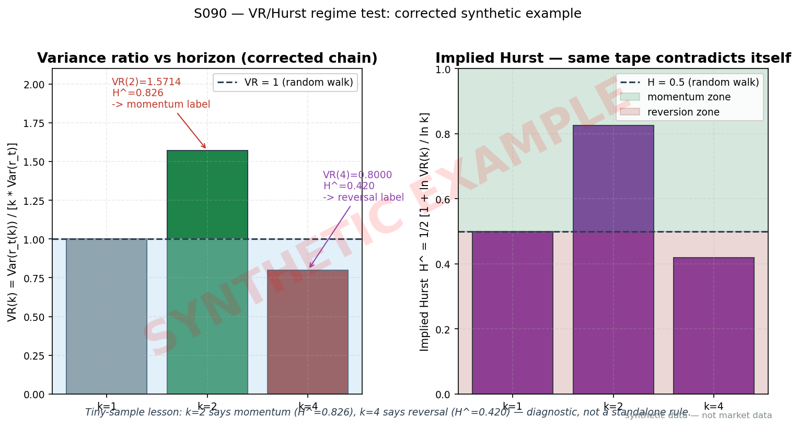

```mermaid
flowchart LR
    FEED["Raw feed<br/>(1-min bars, any vendor)"] -->|1-min bars| ING["Ingest + normalize<br/>(drop overnight gaps, adjust corp actions)"]
    ING -->|"1-min log returns, RTH (**r**egular **t**rading **h**ours) only"| FEAT["Rolling VR/Hurst<br/>(k=2,4,8, W=250, robust SEs)"]
    FEAT -->|"VR(k), H^(k) per bar"| SIG["Signal S090<br/>VR/Hurst regime label"]
    SIG -->|regime label + CI (per bar)| GATE{"Stable label +<br/>outside CI? toggling cheap?"}
    GATE -->|pass| OUT["Downstream consumer<br/>(T054 toggle / T043 gate / sizing g())"]
    GATE -->|fail| DROP["Hold prior regime"]
    style SIG fill:#aed6f1,stroke:#1f3a5f
```

### S12. Sources

1. Lo, A.W. & MacKinlay, A.C. (1988) — "Stock Market Prices Do Not Follow Random Walks:
   Evidence from a Simple Specification Test", *Review of Financial Studies* 1(1), 41–66:
   variance-ratio test of the random-walk hypothesis on weekly US returns 1962–1985; strong
   rejection across subperiods and size-sorted portfolios, driven by positive short-run serial
   correlation, not by infrequent trading or time-varying volatilities.
   http://web.mit.edu/Alo/www/Papers/lo-mackinlay-88.html
2. Hurst, H.E. (1951) — rescaled-range analysis of long-term dependence (Nile reservoir
   studies); H ∈ (0.5, 1] long-term positive autocorrelation, H ∈ [0, 0.5) switching/anti-
   persistence, H = 0.5 short memory. Definitions per the checkable encyclopedia entry:
   http://en.wikipedia.org/wiki/Hurst_exponent
3. "The long memory of the efficient market" (arXiv:cond-mat/0311053): discusses four Hurst
   estimators (periodogram, R/S, DFA, autocorrelation fit), the difficulty of H estimation,
   and the stringency of Lo's modified rescaled-range test (Taqqu et al.: even synthetic H=0.6
   series can fail to reject short-range dependence).
   https://arxiv.org/pdf/cond-mat/0311053v1
4. Lo, A. W. (1991). "Long-term memory in stock market prices." *Econometrica*, 59(5),
   1279–1313. DOI: 10.2307/2938368. (Modified rescaled-range test with a Newey–West
   denominator — the formal long-memory test this chapter's S3 describes.)
5. Taqqu, M. S., Teverovsky, V. & Willinger, W. (1995). "Estimators for long-range
   dependence: an empirical study." *Fractals*, 3(4), 785–798. DOI:
   10.1142/S0218348X95000692. (Empirical comparison of Hurst estimators — the estimation
   difficulty behind this chapter's finite-sample warnings.)
6. Wright, J. H. (2000). "Alternative variance-ratio tests using ranks and signs."
   *Journal of Business & Economic Statistics*, 18(1), 1–9. DOI:
   10.1080/07350015.2000.10524842. (Rank- and sign-based variance-ratio tests robust to
   non-normality — the inference toolkit for the VR(k) curve this signal uses.)

**Unverified leads**
- Duck.ai (GPT-5.6 Luna, 2026-09-10), Q-SB7-1: the variance-ratio worked example reproduced in
  S4 (one arithmetic error corrected and disclosed; rest operator-verified 2026-09-10);
  illustrative toggle sizing `g` (0.5/1.0/1.25 bands — illustrative, estimate without look-ahead).
  Q-SB7-3: VR-toggle after-cost claims ("attractive in-sample, lose after turnover"; standalone
  weakness list) — chatbot literature summaries, no checkable citations. Source log:
  "Duck.ai answered Q-SB7-1–Q-SB7-3 (2026-09-10); Grok/Cursor answers pending (checked 2026-09-10)"
  (see `batches/SB7/question-log.md`).

---
## Stage 64/200 — S064: Jump-robust realized variance (RV / bipower / Lee–Mykland)

*Batch SB8 · Signal 64/100 · Provenance [D] · Family E — Volatility & Options-Informed*

### S1. One-line verdict

| | |
|---|---|
| **What it is** | Splits daily realized variance into a smooth (continuous) part — via **bipower variation** (BV) — and a jump part, plus a per-bar Lee–Mykland jump test. |
| **When it works** | As a measurement and gating layer: jump-filtered vol series are cleaner inputs to every forecast, and jump flags veto trades that would walk into news bursts. |
| **When it dies** | As a standalone alpha: it measures volatility, it does not predict direction. On raw 1-minute returns without deseasonalizing, microstructure noise (ultra-high-frequency frictions such as bid–ask bounce) corrupts the split. |
| **Build-or-buy in one line** | Build — ~30 lines of numpy on 5-minute returns; the only thing you can buy is cleaner input data. |

Provenance **[D]**: bipower variation (Barndorff-Nielsen & Shephard 2004) and the Lee–Mykland
jump test (Lee & Mykland 2008) are documented, peer-reviewed methods. The *trading* uses of the
jump series (gating, momentum-ignition flags — where "ignition" is a sharp price burst that may
start a trend) are practitioner reconstructions.

### S2. How it works — plain human explanation

At 14:02 on a Fed-day (Federal Reserve FOMC rate-announcement day) afternoon, SPY prints a +0.9% bar in five minutes, then drifts back. A
naive **realized variance** (RV) — the sum of squared intraday returns — treats that bar the same
as eighteen +0.2% bars. Your volatility forecast spikes, your position sizer cuts risk, your
"vol spike" strategy fires. But the two situations are economically different: one was a single
discontinuous repricing on news, the other was genuinely elevated diffusive (smooth, continuous, non-jump) trading.

**Jump-robust realized variance** answers a simple question: *how much of today's variance came
from smooth continuous wiggling, and how much from jumps?* The trick, from Barndorff-Nielsen &
Shephard (2004), is that jumps are rare and isolated. A squared return `r²` is contaminated by a
jump — the square of the jump lands in full. But the product of two *adjacent* absolute returns
`|r_{i−1}|·|r_i|` is not: if a jump sits in bar *i*, it can only poison the two products that
touch bar *i*, while all other products measure the background diffusion. With enough bars, the
jump contamination washes out.

That gives **bipower variation** (BV): an estimator of the same integrated variance that RV
targets, but robust to isolated jumps. The difference `RV − BV` is then — up to estimation
error — the jump component of the day's quadratic variation. Lee & Mykland (2008) take the idea
one step further and test *each individual bar*: is this bar's return too large relative to a
local bipower-based vol estimate to be a draw from a diffusion? If yes, flag a jump arrival and
measure its size.

Why should jumps matter economically? Informed/news bursts arrive discontinuously — earnings,
macro prints (scheduled economic-data releases), block repricings (abrupt moves triggered by large block trades) — and the literature finds individual-stock jumps cluster on
prescheduled announcements (Lee & Mykland 2008). Jumps are "highly prevalent and distinctly
less persistent than the continuous sample path variation" (Andersen, Bollerslev & Diebold 2007 — "ABD"), so a forecast that
mixes the two regimes forecasts worse.

Mental model:
- **BV is the calm-weather vol; RV − BV is the storm ledger** — one diffuses, the other jumps.
- **Products of neighbors kill jumps; squares of singles don't** — that asymmetry is the whole trick.
- **Lee–Mykland names the guilty bar** — daily decomposition tells you *how much* jumped; LM tells you *when*.

### S3. The math — exact formula

Let `r_{t,i}` be the log return of day *t* over intraday interval *i* = 1…*M* (evenly spaced grid,
5-minute sampling is the standard starting point).

**Realized variance (RV)** — the sum of squared returns:
```
RV_t = Σ_{i=1..M} r_{t,i}²            (dimensionless variance units)
```
RV is a consistent estimator of the day's total **quadratic variation** = integrated variance
∫σ²ds plus the sum of squared jumps Σξ² (Andersen et al. 2003).

**Bipower variation (BV)** — products of adjacent absolute returns, scaled:
```
BV_t = (π/2) · Σ_{i=2..M} |r_{t,i−1}| · |r_{t,i}|
```
The scaling: for a standard normal Z, E|Z| = μ₁ = √(2/π), so 1/μ₁² = π/2 makes BV consistent for
∫σ²ds alone (Barndorff-Nielsen & Shephard 2004). BV is "somewhat robust to rare jumps" because
adjacent-return products are less affected than squared returns (mandatory framing).

**Jump component:**
```
J_t  = max(RV_t − BV_t, 0)
RJ_t = (RV_t − BV_t) / RV_t
```
(truncation is a practical fix; negative finite-sample estimates are clamped at zero —
Barndorff-Nielsen & Shephard 2004)

**Lee–Mykland (2008) per-bar jump test.** Local instantaneous-vol estimate from the K−2
preceding intervals:
```
σ̂²_{t,i} = (1/(K−2)) · Σ_{j=i−K+2..i−1} |r_{t,j−1}| · |r_{t,j}|
L_{t,i}   = |r_{t,i}| / σ̂_{t,i}
```
Reject "no jump in interval i" at level α when
```
(L_{t,i} − C_MT) / S_MT  >  −log(−log(1 − α))
C_MT = √(2·log(MT))/c − (log π + log(log MT)) / (2·c·√(2·log MT))
S_MT = 1 / (c·√(2·log MT)),   c = √(2/π),   T = number of days
```
— the Gumbel (extreme-value) critical value. Suggested practice: 5-minute intervals, window
K = 240 (per LM 2008 and follow-ups).

| Parameter | Symbol | Typical range | Too small → | Too large → | Default (example) |
|---|---|---|---|---|---|
| Sampling grid | Δ | 1–15 min | microstructure noise inflates RV | jumps diluted, fewer bars | 5 min — *example* |
| Intervals/day | M | 26–390 | power loss | noise | 78 (5-min, RTH = regular trading hours) — *example* |
| LM window | K | 100–300 | σ̂ noisy, false flags | slow to adapt to regime | 240 — *example* |
| Significance | α | 0.5–5% | missed real jumps | flag diffusion tails | 1% — *example* |

All defaults are `example — not an institutional standard`.

**Causal timing:** computed at interval *i* using returns ≤ *i*; the daily RV/BV/J_t split is
available at the close — tradable no earlier than the next open (*t+1*). Intraday LM flags are
tradable no earlier than bar *i+1*.

**Named variants:**
1. *Multipower / tripower variation* — products of 3+ adjacent returns for stronger robustness
   (Barndorff-Nielsen & Shephard 2006).
2. *Threshold BV / Mancini threshold estimator* — pre-truncate returns above a volatility-scaled
   threshold; asymptotically efficient (uses BV only to set the threshold).
3. *Staggered (h-skip) BV* — products |r_i|·|r_{i+h}| with h > 1 to dodge residual microstructure
   correlation.

**Batch flag (formula render warnings, from the Q-SB8-3 verification pass):** two SB8 chatbot
formulas rendered ambiguously and must be re-confirmed from canonical sources before coding:
(a) `VRP_t^σ = IVol_t − √(RV)` — ambiguous on the square root; (b) the 25Δ tolerance
"±0.5 to ±1.0 delta points" — partially garbled. Both concern sibling signals (S069/S071),
not S064; flagged here explicitly so no downstream worker treats them as confirmed.

### S4. Worked example — step-by-step numbers (SYNTHETIC)

**All numbers below are synthetic — the tape was constructed to contain one obvious +1% jump so
the arithmetic is hand-checkable. Nothing here is a backtest (a simulated trade history on past data).** Script:
`batches/SB8/plot_S064.py`, **seed 64** (the tape itself is a fixed 12-return sequence; the seed
drives only script machinery).

The 12 synthetic 5-min returns:
```
r = (0.001, −0.002, 0.0015, 0.0005, −0.001, 0.010,
     −0.0008, 0.0012, −0.0015, 0.0007, 0.0003, −0.0009)
```

Step 1 — RV summands (×10⁻⁶): 1.00, 4.00, 2.25, 0.25, 1.00, **100.00**, 0.64, 1.44, 2.25, 0.49,
0.09, 0.81 → Σ = 114.22×10⁻⁶, so **RV = 0.00011422** ✓ (hand-verified in duckai-answers Q-SB8-1).

Step 2 — BV summands, adjacent products (×10⁻⁶): 2.00, 3.00, 0.75, 0.50, 10.00, 8.00, 0.96,
1.80, 1.05, 0.21, 0.27 → Σ = 28.54×10⁻⁶. **BV = (π/2)(28.54×10⁻⁶) = 44.83×10⁻⁶ =
0.00004483** ✓ (28.54 × 1.5707963 = 44.83).

Step 3 — jump component: **RV − BV = 69.39×10⁻⁶**, so **J_t = 69.39×10⁻⁶** (positive, no
truncation needed) and **RJ = 69.39/114.22 = 60.8%** of the day's variance came from the jump.

The chart (`images/S064_example.png`) plots exactly these numbers: the top panel shows the
12-return tape with the +1% bar highlighted; the bottom panel shows the RV vs BV summands per
interval, with the totals annotated.

**What to notice:** the jump bar contributes 100×10⁻⁶ of the 114.22×10⁻⁶ RV total — the square
of the jump dominates RV — while in BV it appears only inside two adjacent products (10.00 and
8.00), diluted against 44.83×10⁻⁶. That dilution is the robustness in action. The limits: with
only 12 bars this is a toy — in production you need M ≈ 78+ for the asymptotics to bite, and the
toy has no fees, no bid–ask bounce (prices oscillating between bid and ask, creating
spurious measured volatility), and no microstructure noise, all of which inflate RV on real
1–5-minute data.

### S5. Strategies that use this signal

- **T042 — Jump-Robust Vol Spike Trader (primary):** enters short-horizon vol-spike trades only
  when the RV move survives the BV filter — i.e., trades the *continuous* vol spike, not the
  jump (T042 also consumes S065).
- **T098 — Jump-Validated Momentum Ignition (primary):** requires a Lee–Mykland jump flag on the
  ignition bar before chasing momentum — ignition without a jump is treated as noise.
- **T079 — Post-Announcement Vol Fade (filter/veto):** after an earnings/announcement event,
  fades realized vol back toward the BV-implied continuous level; the RV−BV split sizes the fade.

### S6. Data required — exact spec

| Field | Type | Granularity | Source tier | Notes |
|---|---|---|---|---|
| Trade/quote-derived log returns | float | 1–5 min bars | Tier 0–1 | Evenly spaced grid required; fill short gaps, drop halted symbols |
| Corporate-action adjustments | float | event | Tier 0–1 | Splits/dividends must be adjusted *before* return computation or every split looks like a jump |
| Trading-halt flags | bool | bar | Tier 1 | Zero-volume bars are not jumps |

Ingest sketch (≤20 lines, polars):
```python
import polars as pl
bars = pl.read_parquet("bars_5m.parquet")          # t, symbol, open, high, low, close
r = (bars.with_columns(
        pl.col("close").log().diff().over("symbol").alias("r"))
     .filter(pl.col("r").is_not_null()))
rv = r.group_by(["date","symbol"]).agg(pl.col("r").pow(2).sum().alias("RV"))
bv = (r.with_columns((pl.col("r").abs() * pl.col("r").abs().shift(1)
        .over("symbol")).alias("adj"))
      .group_by(["date","symbol"])
      .agg((1.5707963 * pl.col("adj").sum()).alias("BV")))
j = rv.join(bv, on=["date","symbol"]).with_columns(
        (pl.col("RV")-pl.col("BV")).clip(0).alias("J"),
        ((pl.col("RV")-pl.col("BV"))/pl.col("RV")).alias("RJ"))
```
Storage: 1-min bars ≈ **~0.1 MB per symbol-day** (per `notes/cost-model.md` §3); 5-minute
returns are a fraction of that — the RV/BV/J series are three floats per symbol-day, negligible.
**Data-quality checklist:** timestamp normalization (exchange time, DST), corporate actions
(splits are fake jumps), halts/suspensions, half-days, stale/zero-volume bars.

### S7. Local build on M5 Max / 128GB

**Feasibility: trivial.** RV/BV/LM are closed-form numpy/polars reductions over 5-minute
returns — no optimization, no training, no GPU. The pipeline is: 1-min or 5-min bars →
returns → RV/BV per symbol-day → Lee–Mykland per-bar flags.

Throughput (per `notes/cost-model.md` §2): numpy vectorized math ≈ 50–200M elements/sec; the
daily RV/BV for 500 symbols × 78 five-min bars = 39k elements — microseconds. Even full
history: 500 symbols × 390 min × 252 days × 20 years ≈ 982.8M returns ≈ 7.9 GB float64
(chatbot-verified arithmetic) fits in RAM with room; in practice keep it in partitioned Parquet
and compute per-day — cost-model §3's 77 GB working budget is never stressed.

| Stack | When to pick |
|---|---|
| Python + polars/numpy | Default — the whole estimator is groupby-agg; recompute daily in seconds |
| Rust | Only if you need the per-bar LM flag in the hot path at sub-millisecond latency |
| DuckDB | Research store for the RV/BV/J panel across symbols/days |

RAM: 1 day of 5-min returns for 500 symbols ≈ 39k floats ≈ 0.3 MB; 60 days ≈ 20 MB — trivial
(per cost-model §3 rule of thumb `rows × cols × 8`). 60-day rolling LM window needs only the
same returns.

Engineering time: cost-model §5 **Tier M, 20–60 h** for vol estimators (RV/bipower is at the
easy end of M; the Lee–Mykland test with the Gumbel critical value and edge handling is the
harder half). At $150/hr loaded: **$3,000–9,000** engineering. The SB8 chatbot's per-component
estimate for range+bipower was 20–50 h prototype (labeled chatbot lead) — consistent with Tier
M. Data: Tier 0–1 (Stooq/Polygon/Alpaca ~$0–200/mo, indicative — verify before budgeting).
Bottleneck: none computationally — data cleaning (corporate actions, halts) is the real work.

**What breaks first at 500 symbols / full OPRA (Options Price Reporting Authority, the consolidated US options tape):** nothing breaks for RV/BV on 5-min bars —
500 symbols is trivial. Scaling to full **L1** (top-of-book) event-driven per-tick LM flags would need Rust; and
the jump logic adds nothing to the options-data cost curve (S071–S074), which is where the real
money goes.

### S8. Buy vs build

| Option | What you get | Indicative price | Gains | Loses |
|---|---|---|---|---|
| Tier 0: Stooq / Alpaca IEX daily+15-min | Free bars for RV/BV on coarse grids | ~$0 | $0 cost, instant start | 1-min/5-min granularity gaps; no corporate-action guarantees |
| Tier 1: Polygon Stocks Advanced / Alpaca SIP | Clean 1-min bars + corporate actions (SIP = Securities Information Processor, the consolidated tape) | ~$30–200/mo | Reliable 5-min grid, splits handled | Nothing material for this signal |
| Tier 2: Databento Standard (MBP-1) | L1 quotes+trades for exact bar builds (MBP-1 = market-by-price level 1, i.e. top-of-book quotes and trades) | ~$200/mo + usage | Honest microstructure, your own grid | Overkill if you only need 5-min RV |
| Academic route: LOBSTER / WRDS TAQ | Replay-grade data for research (TAQ = the NYSE Trades and Quotes database) | ~hundreds/yr academic | Publication-grade replication | Access friction, not real-time |

**Verdict: build.** The estimator is 30 lines; what you might *buy* is data cleanliness (Tier 1
for corporate actions and halt flags). Buy a better feed if — and only if — your jump flags will
gate real money (T042/T098), where a split mislabeled as a jump is a trading error, not a
research artifact.

### S9. Success ratio / efficacy — documented evidence

Mandated framing for this chapter: **documented conditional value, but published effects much
weaker than raw backtests once realistic execution/timing/selection/regime controls are
imposed.** S064 is measurement infrastructure — the "efficacy" literature is about forecast
quality and empirical regularities, not trading Sharpe ratio (mean excess return ÷ volatility). There is no credible after-cost trading
Sharpe for "the bipower signal" as a standalone trigger, and none is claimed.

| Study / source | Market & period | Metric | Before/after cost | Caveat |
|---|---|---|---|---|
| Andersen, Bollerslev & Diebold (2007), *Rev. Econ. & Stat.* — the HAR-RV-CJ model (HAR = heterogeneous autoregression; CJ = continuous + jump components) separating continuous/jump components | DM/$ (deutsche mark per US dollar), S&P 500, 30-yr Treasury yield | Significant out-of-sample (evaluated on data not used to fit the model) volatility-forecast improvements; almost all predictability from the *non-jump* component | Before cost (forecast evaluation, not a profit-and-loss (P&L) backtest) | Forecast-accuracy metric, not tradable P&L; gains are in the continuous component you *keep*, not the jump you removed |
| Lee & Mykland (2008), *Rev. Financial Studies* — LM jump test on US equities | US individual stocks & S&P 500 | Individual-stock jumps associated with prescheduled earnings announcements and company news; index jumps with market news | Before cost (empirical regularity) | Descriptive association, not a trading rule; the test detects the jump *after* the news moved the price |
| **IHSG** (Indeks Harga Saham Gabungan — the Jakarta Composite index) intraday study (2025–2026), 5-min bars, 93 days — bipower decomposition of the Jakarta Composite | Indonesia, Dec 2025–May 2026 | Jump component ≈ 11.77% of daily RV on average; 32.3% of days show significant jumps; share rises to 16.36% on stress days | Before cost (descriptive) | Single emerging market, short sample; not an out-of-sample trading test |

Regimes where it fails: illiquid names where bid–ask bounce masquerades as jumps (use 5-min+
sampling); adjacent jumps (re-contaminate the products — use tripower); scheduled-announcement
clusters where jumps are expected and priced; vol-of-vol (volatility-of-volatility) regimes where the Gumbel critical
value miscalibrates.

**Honest bottom line:** as a standalone trigger this is not an edge at all — it is a
measurement. As a filter/gate (stand down when J_t is extreme; validate ignition with LM
flags), its conditional value is documented: jump-robust vol forecasts beat raw RV forecasts
out-of-sample, and news-day gating is standard practice on institutional desks.

### S10. Failure modes & pitfalls

1. **Microstructure noise masquerading as jumps** — on 1-min raw returns, bid–ask bounce
   inflates RV−BV. Mitigation: 5-minute (or coarser) sampling; noise-robust pre-averaging
   (smoothing returns over short windows to damp microstructure noise) variants.
2. **Lookahead in corporate actions** — an unadjusted split prints a giant "jump." Mitigation:
   adjust prices before return computation; validate against the corporate-action calendar.
3. **Adjacent/overlapping jumps** — products of neighbors re-contaminate. Mitigation: tripower
   variation or the Mancini threshold estimator for jump-dense tapes.
4. **Lee–Mykland over-detection under seasonality** — a strong diurnal (daily-recurring) U-shape makes the test
   over-flag jumps in high-vol periods of the day (documented in the modified-LM literature).
   Mitigation: deseasonalize first (S067) — LM on `r̃ = r/s_b`.
5. **Halt/zero-volume bars** — flat prices then a reopening gap look like a diffusion tail.
   Mitigation: drop halted symbols from the panel; treat reopenings as scheduled events.
6. **Interpreting the jump as tradable alpha** — the flag fires *after* the price moved.
   Mitigation: use it as a gate/filter (T042/T098/T079), never as a direction signal.
7. **Truncation bias** — max(RV−BV, 0) biases small-sample jump estimates upward. Mitigation:
   use formal tests (LM or the BNS z-test — Barndorff-Nielsen & Shephard's 2004 test of
   "no jumps" against "jumps present") for significance, not raw truncation.
8. **Parameter mining the window/grid** — K, Δ, α chosen to flatter a backtest. Mitigation:
   fix 5-min/K=240/α=1% from literature defaults; report sensitivity, not optima.

### S11. Visuals

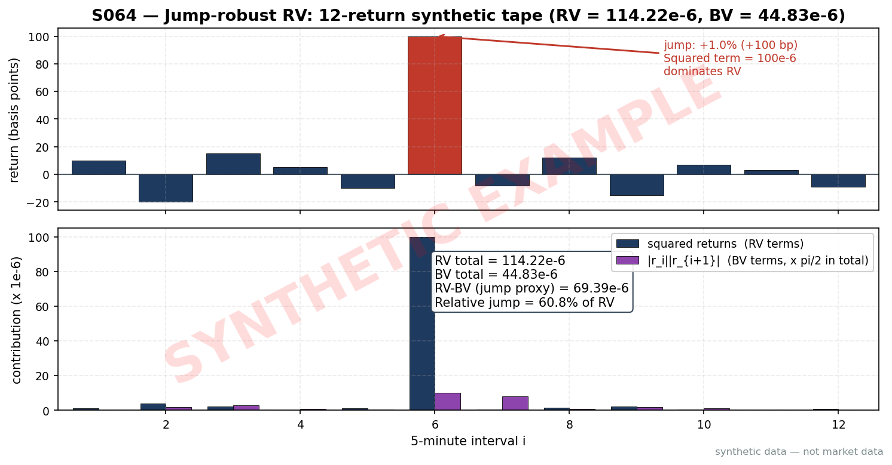

```mermaid
flowchart LR
    FEED["Raw feed\n(1-min bars, Tier 0-1)"] -->|"1-min bars\n(Tier 0–1)"| ING["Ingest + normalize\n(adjust splits, drop halts)"]
    ING -->|"5-min log returns"| FEAT["Feature compute\n(RV, BV, J_t, RJ_t)"]
    FEAT -->|"RV/BV/J series + LM flags\n(per-bar granularity)"| SIG["Signal S064\njump component + LM flags"]
    SIG -->|"jump flags + J_t series\n(per-bar granularity)"| GATE{"Cost / news\ngate?"}
    GATE -->|pass| OUT["Downstream consumer\n(T042 vol-spike, T098 ignition)"]
    GATE -->|fail| DROP["No trade — jump/news day"]
    style SIG fill:#aed6f1,stroke:#1f3a5f
```

### S12. Sources

1. Barndorff-Nielsen, O. E. & Shephard, N. (2004). "Power and Bipower Variation with Stochastic
   Volatility and Jumps." *Journal of Financial Econometrics*, 2(1), 1–37.
   https://public.econ.duke.edu/~get/browse/courses/883/Spr16/COURSE-MATERIALS/Z_Papers/BNSJFEC2004.pdf
2. Lee, S. S. & Mykland, P. A. (2008). "Jumps in Financial Markets: A New Nonparametric Test and
   Jump Dynamics." *Review of Financial Studies*, 21(6), 2535–2563.
   http://ideas.repec.org/a/oup/rfinst/v21y2008i6p2535-2563.html
3. Andersen, T. G., Bollerslev, T. & Diebold, F. X. (2007). "Roughing It Up: Including Jump
   Components in the Measurement, Modeling, and Forecasting of Return Volatility." *Review of
   Economics and Statistics*.
   https://www.sas.upenn.edu/~fdiebold/papers/paper56/abd_081605.pdf
4. Andersen, T. G., Bollerslev, T., Diebold, F. X. & Labys, P. (2003). "Modeling and Forecasting
   Realized Volatility." *Econometrica*, 71(2), 579–625.
   https://papers.ssrn.com/sol3/papers.cfm?abstract_id=262720&rec=1&srcabs=2120094&pos=2
5. IHSG intraday bipower study (2025–2026) — 93 days of 5-minute bars on the Jakarta Composite
   (IHSG); the source of the 11.77% / 32.3% / 16.36% statistics in S9.
   https://doi.org/10.47747/fmiic.v1i3.3561

**Chatbot material (labeled, per question-bank protocol):**
- Duck.ai (GPT-5.6 Luna, anonymous, 2026-09-10) answered Q-SB8-1–Q-SB8-3. The 12-return
  RV/BV worked example (RV = 0.00011422, BV = 0.00004483, RV−BV = 69.39×10⁻⁶) was
  operator-verified arithmetic and is used in S4. Practical leads (5-min sampling; J_t
  truncation; K = 240 for LM) are research leads — formulas come from the cited papers.
  Source log: "Duck.ai answered Q-SB8-1–Q-SB8-3 (2026-09-10); Grok/Cursor answers pending
  (checked 2026-09-10)."

**Unverified leads:**
- Modified Lee–Mykland test adjusting for intraday seasonality (Boudt et al.; conference
  abstract noting LM over/under-detects jumps under strong seasonality):
  https://www.bayes.citystgeorges.ac.uk/__data/assets/pdf_file/0020/67025/Abstracts.pdf —
  cited as a research lead; confirm the published version before implementation.

---
## Stage 65/200 — S065: GARCH(1,1) intraday volatility

*Batch SB8 · Signal 65/100 · Provenance [D] · Family E — Volatility & Options-Informed*

### S1. One-line verdict

| | |
|---|---|
| **What it is** | A parametric conditional-variance recursion — **GARCH** (Generalized Autoregressive Conditional Heteroskedasticity): today's variance is a weighted mix of yesterday's variance and yesterday's squared shock, fitted on deseasonalized intraday returns. |
| **When it works** | As a fast, always-on one-bar-ahead vol forecast for position sizing, leverage caps, and VaR (value-at-risk) gates — wherever you need a number, not a story. |
| **When it dies** | On raw intraday returns without diurnal adjustment (the U-shape breaks it — see S067); as a standalone trading trigger, where it adds nothing beyond "vol clusters." |
| **Build-or-buy in one line** | Build — any stats library fits GARCH(1,1) in milliseconds; buy only the clean intraday bars it eats. |

Provenance **[D]**: **ARCH** (Autoregressive Conditional Heteroskedasticity; Engle 1982) and GARCH (Bollerslev 1986) are documented, Nobel-cited
methods. The *intraday* application — plain GARCH fitted on 5–30-minute returns with diurnal
adjustment — is a practitioner adaptation, not a paper result; the source report flags this
explicitly and so does this chapter.

### S2. How it works — plain human explanation

Volatility clusters. A +2% down-bar is usually followed by more big bars, not by silence; a
quiet Tuesday is usually followed by a quiet Wednesday. **GARCH** (Generalized Autoregressive
Conditional Heteroskedasticity — **conditional** variance = the variance we expect *given* what
just happened) is the workhorse parametric model of that clustering.

The intuition is a thermostat with memory. There are two forces: yesterday's *realized shock*
(the squared residual — big move → raise the forecast) and yesterday's *forecast* (don't move
too fast). The GARCH(1,1) equation blends them:
tomorrow's variance = ω (a floor) + α × (yesterday's squared shock) + β × (yesterday's
variance). The sum **α + β is persistence** — how slowly the forecast forgets. Practitioners
typically see α + β ≈ 0.90–0.99 on financial returns (illustrative band, per the chatbot
research lead — treated as a starting guess, not a standard).

Intraday, there is a catch that kills the naive version. Returns at the open are ~1.4–1.5× as
volatile as midday returns — the diurnal U-shape (S067). If you fit GARCH on *raw* 5-minute
returns, the model sees the 9:35 bar, concludes "huge shock, raise vol," and is fooled by the
clock, not the market. The honest intraday setup, following Andersen & Bollerslev (1997), is to
**deseasonalize first, then GARCH**: write each return as `r_{t,i} = s_i · ε_{t,i}` where `s_i`
is the deterministic time-of-day scale (estimated once from history, mean 1), and fit GARCH on
the deseasonalized residuals. Alternatively, fit GARCH on daily data and scale the daily σ by
the diurnal U-shape for intraday horizons.

Economically, GARCH works as a sizing input because of **adverse selection** (trading against
better-informed counterparties) **and inventory risk** (accumulating unwanted positions): spreads widen and algos slow down when conditional vol is high, so expected slippage
(execution price worse than the decision-time mid) scales with σ. Picture it: 11:20, NVDA prints three −40 bp bars (bp = basis points; 1 bp = 0.01%) in a row. Your GARCH σ steps
up; your participation cap (maximum share of market volume your orders may take) drops from 15% to 8%; overnight carry
(positions held through the close) is cut before the close.
No alpha was generated — but the bleed was contained.

Mental model:
- **GARCH is a thermostat, not a trader** — it forecasts how hot the tape runs, not which way it moves.
- **α is the reflex, β is the memory** — big α reacts to each shock; big β keeps yesterday's level.
- **Seasonality first, dynamics second** — intraday GARCH without S067 deseasonalization is misspecified.

### S3. The math — exact formula

Let `r_{t,i}` be the intraday return and decompose it as
```
r_{t,i} = μ_{t,i} + ε_{t,i},      ε_{t,i} = σ_{t,i} · z_{t,i},     z_{t,i} ~ iid(0,1)
```
(**iid** = independent and identically distributed.) Where **σ²_{t,i}** is the
*conditional variance* (the variance of the next return given all
information up to now). The **GARCH(1,1)** recursion:
```
σ²_{t,i} = ω + α · ε²_{t,i−1} + β · σ²_{t,i−1}
```
with ω > 0, α ≥ 0, β ≥ 0. **Covariance-stationarity** (finite long-run variance) requires
**α + β < 1**, and the **unconditional (long-run) variance** is:
```
Var(r) = ω / (1 − α − β)
```
The **persistence** α + β controls mean reversion speed: half-life of a vol shock ≈
−log(2)/log(α+β) bars (e.g. α+β = 0.95 on 5-min bars ≈ 13.5 bars ≈ ~1 hour).

**Time-of-day seasonality** (intraday setup, Andersen–Bollerslev form):
```
r_{t,i} = s_i · ε_{t,i},      s_i = intraday seasonal scale factor (mean 1)
```
Estimate `s_i` from the U-shape (S067), then fit GARCH on `ε̃ = r/s_i`. The final one-bar-ahead
forecast is `σ̂²_{t,i+1} = s²_{i+1} · σ̂²_GARCH`.

**Leverage-asymmetry extensions** (variants, standard in the literature):
- **GJR-GARCH** (Glosten–Jagannathan–Runkle GARCH): σ² = ω + α·ε²_{t−1} + γ·ε²_{t−1}·1{ε_{t−1}<0} + β·σ²_{t−1} — bad news hits harder.
- **EGARCH** (exponential GARCH): `ln σ²_t = ω + α(|z_{t−1}| − E|z|) + γ·z_{t−1} + β·ln σ²_{t−1}` — log form, no
  positivity constraints; γ < 0 is the leverage effect.

| Parameter | Symbol | Typical range | Too small → | Too large → | Default (example) |
|---|---|---|---|---|---|
| Floor | ω | 1e-8–1e-5 (5-min var units) | σ collapses toward 0 after calm spells | vol never mean-reverts down | 2.0e-7 — *example* |
| Shock weight | α | 0.02–0.15 | sluggish reaction to real vol breaks | jumpy σ, whipsaws sizing | 0.06 — *example* |
| Persistence | β | 0.80–0.95 | forgets regimes too fast | α+β→1, integrated (nonstationary) | 0.89 — *example* |
| Persistence sum | α+β | < 1 required | — | ≥1 → infinite long-run var | 0.95 — *example* |
| Estimation window | — | 10–120 days of 5-min bars | noisy estimates | stale to regime breaks | 20–60 days — *example, chatbot lead* |

All defaults are `example — not an institutional standard`. Heavy-tailed returns → use
**Student-t innovations** (Bollerslev 1987) instead of Gaussian `z`; intraday residuals are
decidedly non-Gaussian.

**Causal timing:** σ̂²_{t,i} uses only returns through bar *i−1* — tradable (as a sizing input)
for bar *i* onward, and positions using it fill at *i* or later.

**Named variants:**
1. *Multiplicative-component GARCH* (Engle & Sokalska 2012): r = σ_t · s_i · z — daily GARCH
   level × deterministic diurnal × stochastic component; pooled cross-sectional estimation.
2. *mcsGARCH* (Diao & Tong 2015): daily × diurnal × stochastic decomposition for intraday VaR.
3. ***FIGARCH** (fractionally integrated GARCH) / long-memory* intraday models: persistence
   decays slower than geometric; some studies
   find it matches or beats short-memory GARCH on FX (before-cost forecast comparisons,
   evaluated with superior predictive ability and Diebold–Mariano tests — statistical tests of
   whether two competing forecasts have equal accuracy).

### S4. Worked example — step-by-step numbers (SYNTHETIC)

**Synthetic throughout — one simulated RTH (regular trading hours) session of 78 five-minute bins, used only to show
how the three pieces (season × GARCH → σ path → returns) assemble. Not a backtest (a simulated trade history on past data).**
Script: `batches/SB8/plot_S065.py`, **seed 65**.

Setup (example parameters — not institutional standards):
- Diurnal scale: `s_i = 1 + 0.55·u²`, u ∈ [−1, +1] across the session, renormalized to mean 1 →
  open/close bins ≈ 1.3× midday.
- GARCH(1,1): ω = 2.0×10⁻⁷, α = 0.06, β = 0.89 → persistence 0.95; unconditional σ =
  √(ω/(1−0.95)) = √(4.0×10⁻⁶) = 20.0 bp per 5-min bar.
- Simulate: h₀ = ω/(1−α−β); then h_i = ω + α·ε²_{i−1} + β·h_{i−1}; final σ_i = s_i·√h_i.

Hand-checkable steps (script's actual seed-65 output — corrected 2026-09-10): h₀ = 4.0×10⁻⁶
(20.0 bp). The seed-65 first Gaussian draw is z₀ = −1.1125, so ε₀ = √h₀·z₀ and
ε₀² = (−1.1125 × 20.0 bp)² ≈ 4.9507×10⁻⁶. Then:
```
h₁ = 2.0×10⁻⁷ + 0.06×4.9507×10⁻⁶ + 0.89×4.0×10⁻⁶
   = 2.000×10⁻⁷ + 2.970×10⁻⁷ + 3.560×10⁻⁶
   ≈ 4.0570×10⁻⁶  (20.14 bp)
```
— the persistence (β·h₀) term dominates, as it should with β = 0.89. **Correction note:**
the previous draft of this paragraph claimed z₀ ≈ −0.28 and h₁ ≈ 3.78×10⁻⁶ — that
hand-arithmetic was wrong and contradicted the script. The numbers above are the script's
true output (re-run and re-verified 2026-09-10); the chart plots exactly this simulation.

The chart (`images/S065_example.png`) plots exactly this simulation: top panel shows the
U-shaped seasonal scale `s_i`, the pure GARCH path, and the combined σ_{t,i} = s_i·√h_i
(mean ≈ 21.2 bp); bottom panel shows the synthetic 5-min returns drawn from it. You can see
the open/close vol elevation *and* the stochastic GARCH wander riding underneath it.

**What to notice:** the seasonal component is deterministic and knowable before the session
starts; the GARCH component adapts to realized shocks. Their product is what a sizer should
consume. The limits: this is one simulated path — real intraday residuals have heavier tails
(use Student-t), real α/β need fitting (not hand-picked), and the toy ignores the bid–ask
bounce (prices oscillating between bid and ask) that inflates real 5-minute σ estimates.

### S5. Strategies that use this signal

- **T043 — GARCH Regime Filter (primary):** the canonical consumer — momentum strategies run
  when the GARCH forecast is below its own trailing median; reversal books take over above it.
- **T042 — Jump-Robust Vol Spike Trader (also uses S065):** pairs the S064 jump split with the
  S065 σ forecast — a "vol spike" is defined as realized vol exceeding the GARCH forecast by a
  margin, after removing jumps.

### S6. Data required — exact spec

| Field | Type | Granularity | Source tier | Notes |
|---|---|---|---|---|
| Log returns | float | 5–30 min bars (intraday) or daily | Tier 0–1 | Must be deseasonalized before fitting (S067) |
| Diurnal scale s_i | float | per intraday bin | computed | Estimated from 20+ days of history |
| Corporate-action adjustments | float | event | Tier 0–1 | Splits corrupt the GARCH recursion otherwise |

Ingest sketch (≤20 lines):
```python
import polars as pl, numpy as np
from arch import arch_model          # pip install arch
bars = pl.read_parquet("bars_5m.parquet")
r = bars.with_columns(pl.col("close").log().diff().over("symbol").alias("r")).drop_nans()
# deseasonalize with the S067 scale, then fit per symbol
s = pl.read_parquet("diurnal_scale.parquet")      # bin -> s_b, mean 1
x = r.join(s, on="bin").with_columns((pl.col("r")/pl.col("s_b")).alias("e"))
fit = arch_model(x.filter(symbol="AAPL")["e"].to_numpy(),
                 vol="Garch", p=1, q=1, dist="t").fit(disp="off")
print(fit.params)          # omega, alpha, beta (+ nu for Student-t)
forecast = fit.forecast(horizon=1).variance.values[-1, 0]
```
Storage: 1-min bars ≈ **~0.1 MB per symbol-day** (per `notes/cost-model.md` §3); the GARCH
parameters are 4 floats per symbol — nothing. **Data-quality checklist:** deseasonalize first
(the #1 failure), adjust corporate actions, handle half-days (shorter bin count), exclude
halted symbols from the seasonal estimation.

### S7. Local build on M5 Max / 128GB

**Feasibility: trivial.** GARCH(1,1) maximum-likelihood on a few thousand 5-minute
observations fits in milliseconds per symbol in `arch`/`statsmodels`; refitting a 500-symbol
universe intraday is seconds. No GPU, no distributed anything.

Throughput (per `notes/cost-model.md` §2): numpy ≈ 50–200M elements/sec; sklearn-class
optimization on 1M rows ≈ 1–10 min — a per-symbol GARCH fit on 2,000–5,000 five-minute obs is
far below that. 500 symbols × 78 bins/day of 5-min returns ≈ 39k floats/day; the full 20-year
history ≈ 982.8M returns ≈ 7.9 GB float64 (chatbot-verified) fits the 77 GB working budget
with room — though in practice you stream per-symbol daily files (cost-model §3).

| Stack | When to pick |
|---|---|
| Python + `arch` package | Default — tested optimizers, Student-t built in |
| Python + polars/numpy hand-rolled | If you need the recursion inside a hot loop (performance-critical inner execution path) with custom likelihoods |
| Rust | Only for tick-level (trade-by-trade) per-event σ updates in the execution path |

RAM: 1 day / 60 days of 5-min returns ≈ 0.3 MB / 20 MB for 500 symbols (cost-model §3 rule of
thumb) — trivial.

Engineering time: cost-model §5 **Tier M, 20–60 h** (intraday GARCH sits mid-M: the recursion
is easy, the deseasonalization, Student-t fitting, and forecast plumbing are the real work).
At $150/hr loaded: **$3,000–9,000**. The SB8 chatbot's per-component band for intraday GARCH
was 30–80 h prototype / 100–220 h production — labeled chatbot lead; the cost-model band takes
precedence and sits inside the prototype range. Data: Tier 0–1 (~$0–200/mo, indicative —
verify before budgeting).

**What breaks first at 500 symbols:** nothing in compute — but refitting per symbol per day
with Student-t likelihoods gets slow in pure Python loops; vectorize or fit in batch, and
consider the multiplicative-component form (one pooled diurnal + per-symbol daily GARCH) to
cut the parameter count.

### S8. Buy vs build

| Option | What you get | Indicative price | Gains | Loses |
|---|---|---|---|---|
| Tier 0: Stooq / Alpaca IEX | Free daily + coarse intraday bars | ~$0 | $0 start for daily GARCH | Intraday granularity insufficient for the 5-min recursion |
| Tier 1: Polygon Stocks Advanced / Alpaca SIP | Clean 1-min SIP (Securities Information Processor, the consolidated tape) bars + actions | ~$30–200/mo | The right input for deseasonalization + fitting | Nothing material |
| Library route: `arch` / `statsmodels` (open source) | Tested GARCH optimizers, t-dist | ~$0 | Don't re-derive the likelihood | You still own the diurnal layer |
| Tier 2: Databento | L1 (top-of-book) for exact bar construction | ~$200/mo + usage | Microstructure-honest bars | Overkill for a daily refit |

**Verdict: build, with open-source estimation.** The model is a commodity; the edge — if any —
is in the deseasonalization and the plumbing (refit cadence, forecast horizon, how sizing
consumes σ̂). Buy Tier-1 bars once the GARCH forecast gates real risk; the free tier suffices
while you prototype.

### S9. Success ratio / efficacy — documented evidence

Mandated framing: **documented conditional value, but published effects much weaker than raw
backtests once realistic execution/timing/selection/regime controls are imposed.** GARCH is a
forecasting technology, not a trading signal — its literature measures forecast accuracy
(R², likelihood, VaR coverage), not Sharpe ratio (mean excess return ÷ volatility). Treating a vol forecast as a standalone entry
trigger has no documented edge.

| Study / source | Market & period | Metric | Before/after cost | Caveat |
|---|---|---|---|---|
| Andersen & Bollerslev (1997), *J. Empirical Finance* — explicit periodic (diurnal) modeling of 5-min DM/$ (deutsche mark per US dollar) and S&P 500 futures | FX + US equities, 1992–93 / 1986–89 | "Most of the distortions attributable to the intraday volatility cycle may be eliminated" by modeling seasonality; raw intraday GARCH persistence estimates were wildly irregular across sampling frequencies, stabilizing after adjustment | Before cost (model diagnostics, not P&L) | Demonstrates misspecification of raw intraday GARCH, not a trading edge |
| Diao & Tong (2015), *Applied Economics Letters* — multiplicative-component GARCH on CSI 300 5-min returns | China CSI 300 | Diurnal component confirmed (notably *not* U-shaped under China's T+1 trading rule — shares cannot be sold the same day they are bought); model "performs well" out-of-sample (evaluated on data not used to fit the model) for intraday vol and VaR forecasting | Before cost (forecast evaluation) | Single market; "performs well" is a forecast-accuracy claim |
| "Forecasting exchange rate volatility using high-frequency data: Is the euro different?" — intraday GARCH vs FIGARCH, out-of-sample battery (superior predictive ability / Diebold-Mariano tests — statistical tests
   comparing the forecast accuracy of two models), deseasonalized 15-min data | EUR FX | Intraday FIGARCH "always outperforms" plain intraday GARCH; both enhanced by high-frequency data vs daily models | Before cost (forecast comparison) | FX-specific; the winner (FIGARCH) is long-memory, not the plain GARCH of this chapter |

**Honest bottom line:** as a standalone trigger this is not an edge at all — it is a
measurement. As a filter (T043's regime gate; T042's spike definition; VaR and participation
caps), its conditional value is documented: deseasonalized intraday GARCH-class models beat
raw or daily alternatives out-of-sample, and every serious intraday desk runs something in
this family for risk — not for entries.

### S10. Failure modes & pitfalls

1. **Fitting on raw (non-deseasonalized) returns** — the U-shape masquerades as clustering;
   α inflates, persistence misestimates. Mitigation: always deseasonalize via S067 first.
2. **α + β ≥ 1 (integrated/nonstationary)** — forecasts never mean-revert; long-run variance
   undefined. Mitigation: constrain the optimizer; monitor the persistence sum in production.
3. **Gaussian innovations on fat-tailed residuals** — underestimates tail σ, VaR breaches.
   Mitigation: Student-t innovations; backtest VaR coverage (Kupiec/Christoffersen VaR-coverage tests).
4. **Jumps contaminating the recursion** — a single jump bar permanently lifts σ̂. Mitigation:
   winsorize (clip extreme values at a percentile threshold) or jump-filter (S064) the input residuals; consider GJR/EGARCH for asymmetry.
5. **Stale parameters across regimes** — 60-day fit is blind to today's vol break. Mitigation:
   shorter windows (10–20 days) or exponentially weighted refits in fast markets; monitor
   forecast errors.
6. **Overfitting via model mining** — GARCH vs EGARCH vs GJR vs FIGARCH chosen by in-sample
   (fit-period) likelihood. Mitigation: fix the family a priori; compare out-of-sample on a frozen test set.
7. **Microstructure noise at fine grids** — 1-min σ̂ inflated by bid–ask bounce. Mitigation:
   5-min minimum sampling (chatbot lead), or noise-robust returns.
8. **Using the forecast as a direction signal** — the classic category error. Mitigation:
   restrict GARCH to sizing/gates (T043); entries come from directional signals.

### S11. Visuals


```mermaid
flowchart LR
    FEED["Raw feed\n(1-min bars, Tier 0-1)"] -->|"1-min bars\n(Tier 0–1)"| ING["Ingest + normalize\n(deseasonalize via S067)"]
    ING -->|"deseasonalized 5-min returns"| FEAT["Feature compute\n(GARCH(1,1) fit + 1-bar forecast)"]
    FEAT -->|"sigma_{t,i+1} forecast\n(per-bar granularity)"| SIG["Signal S065\nintraday GARCH sigma"]
    SIG -->|"sigma_{t,i+1} forecast\n(per-bar granularity)"| GATE{"Sizing / regime\ngate?"}
    GATE -->|pass| OUT["Downstream consumer\n(T043 regime filter, T042 sizing)"]
    GATE -->|fail| DROP["Cut risk / stand down"]
    style SIG fill:#aed6f1,stroke:#1f3a5f
```

### S12. Sources

1. Andersen, T. G. & Bollerslev, T. (1997). "Intraday Periodicity and Volatility Persistence in
   Financial Markets." *Journal of Empirical Finance*, 4(2–3), 115–158.
   https://www.kellogg.northwestern.edu/academics-research/research/detail/1997/intraday-periodicity-and-volatility-persistence-in-financial-markets/
2. Diao, X. & Tong, B. (2015). "Forecasting intraday volatility and VaR using multiplicative
   component GARCH model." *Applied Economics Letters*, 22(18), 1457–1464.
   http://ideas.repec.org/a/taf/apeclt/v22y2015i18p1457-1464.html
3. "Forecasting exchange rate volatility using high-frequency data: Is the euro different?"
   *International Journal of Forecasting* (intraday GARCH vs FIGARCH out-of-sample comparison,
   deseasonalized 15-min data).
   https://www.sciencedirect.com/science/article/abs/pii/S0169207011000069
4. Engle, R. F. & Sokalska, M. E. (2012). "Forecasting intraday volatility of individual stocks:
   a multiplicative component GARCH." Referenced in the practitioner intraday-volatility
   literature (see source 5's survey of the decomposition r = daily × diurnal × stochastic).
   https://assets.bbhub.io/professional/sites/10/intraday_volatility-3.pdf
5. Canonical origins (report citations; journal references confirmed, no URL spot-checked):
   Engle, R. F. (1982). "Autoregressive Conditional Heteroskedasticity with Estimates of the
   Variance of United Kingdom Inflation." *Econometrica*, 50(4), 987–1007; Bollerslev, T.
   (1986). "Generalized Autoregressive Conditional Heteroskedasticity." *Journal of
   Econometrics*, 31, 307–327.

**Chatbot material (labeled, per question-bank protocol):**
- Duck.ai (GPT-5.6 Luna, anonymous, 2026-09-10) answered Q-SB8-1–Q-SB8-3. The intraday
  GARCH(1,1) formulation (σ²_{t,i} = ω + αε²_{t,i−1} + βσ²_{t,i−1}, α+β<1), the seasonal
  decomposition r_{t,i} = s_i·ε_{t,i}, the persistence band α+β ≈ 0.90–0.99 (illustrative),
  the 20–60-day estimation window, and Student-t innovations are chatbot research leads —
  consistent with the cited literature above; parameter values in S3/S4 are marked
  `example — not an institutional standard`. Source log: "Duck.ai answered Q-SB8-1–Q-SB8-3
  (2026-09-10); Grok/Cursor answers pending (checked 2026-09-10)."
- Batch formula flags (from Q-SB8-3 verification): (a) the volatility-premium line
  `VRP_t^σ = IVol_t − √(RV)` was ambiguous on the square root in the chatbot's render;
  (b) the 25Δ tolerance "±0.5 to ±1.0 delta points" was partially garbled. Neither is used
  in this chapter; both are cited here only as explicit flags for sibling chapters (S069,
  S071).

**Unverified leads:**
- Score-driven intraday extensions of GARCH (report cites arXiv 2211.12376) — confirm the
  arXiv ID from a canonical source before citing in production.
- "Volatility around the clock" (arXiv:1211.2961) reports up to 50% improvements in
  realized-volatility forecasts from a Bayesian intraday model with seasonal components:
  https://arxiv.org/abs/1211.2961v1 — a single-study forecast metric, not a trading result;
  treat as unverified until the full paper's evaluation is read.

---
## Stage 67/200 — S067: Intraday vol seasonality / diurnal deseasonalization

*Batch SB8 · Signal 67/100 · Provenance [D] · Family E — Volatility & Options-Informed*

### S1. One-line verdict

| | |
|---|---|
| **What it is** | The **diurnal** (daily-recurring) **U-shape** in intraday volatility — high at the open, low midday, high at the close — estimated as a per-bin scale factor and divided out before any intraday model is fit. |
| **When it works** | Always as a preprocessing layer: every intraday vol or momentum model on raw returns is misspecified without it. |
| **When it dies** | Treated as a trading signal (it is clock, not information); copied across markets where the shape differs (FX — foreign exchange — follows geographic sessions, not a U). |
| **Build-or-buy in one line** | Build — median |r| per time bin over a few weeks; nothing to buy except the bars. |

Provenance **[D]**: the U-shaped intraday pattern is documented across NYSE, London, and Tokyo
equities and Chicago futures (Wood, McInish & Ord 1985; Andersen & Bollerslev 1997), with
noted exceptions (FX session structure; China's T+1 market — under T+1, shares cannot be sold
the same day they are bought). Deseasonalization itself is
standard practitioner methodology.

### S2. How it works — plain human explanation

**Diurnal** means "recurring within the day." **U-shape** is the picture: plot average
volatility against the time of day for US equities and you get a bathtub — elevated at the
9:30 open (overnight news gets priced in), sagging through the midday lull, rising again into
the 16:00 close (benchmarked funds and MOC (market-on-close) flows rush to finish). This pattern is not
information arriving — it is the *clock*. The same stock, same news environment, is simply
more volatile at 9:35 than at 12:35.

That distinction is load-bearing for every other vol signal in this family. A **GARCH** model
(S065) fitted on raw 5-minute returns sees the open spike and "learns" that volatility is
clustering — when really it is just 9:30 being 9:30. A jump test (S064) sees the close bar and
flags a jump that was really the scheduled end-of-day auction pressure. **Deseasonalization**
removes the clock before the model sees the data: estimate a deterministic scale factor `s_b`
for each time-of-day bin *b* (scaled so its average is 1), then work with adjusted returns
`r̃ = r / s_b`. A 30-bp bar (bp = basis points; 1 bp = 0.01%) at the open with s_open = 1.4 becomes a 21-bp adjusted bar —
comparable to a 21-bp midday bar. What remains is the *stochastic* volatility: the part the
market actually did not schedule.

Why does the U-shape exist economically? The open concentrates overnight information
processing (adverse selection is highest when informed traders act on accumulated news);
midday, liquidity provision dominates and spreads tighten; the close concentrates uninformed
benchmark flow (indexers, VWAP (volume-weighted average price) completions, **MOC** — market-on-close — imbalances) which is price-insensitive and
pushes volume up. Different mechanisms, same shape — which is why it is stable enough to
estimate from history and divide out.

But the shape is not universal, and that is a documented fact, not a footnote. In FX, the
pattern follows geographic sessions — Ito & Hashimoto (2006) found U-shaped intraday activity
for Tokyo and London participants but *not* for New York participants. In China's CSI 300,
the diurnal pattern is not U-shaped at all under the T+1 trading rule (Diao & Tong 2015).
Estimate per market; never import a shape.

Mental model:
- **The clock is not the market** — divide out the predictable U before modeling the unpredictable wiggle.
- **s_b is a ruler, not a signal** — it normalizes other signals; it never triggers a trade by itself.
- **Every market has its own shape** — estimate it locally, re-estimate it when structure changes.

### S3. The math — exact formula

For each time-of-day bin *b* (e.g. 78 five-minute bins of the US RTH — regular trading
hours — session), estimate the
deterministic **diurnal factor**:
```
s_b = median(|r_{t,b}| over days t) / mean_b(median(|r_{t,b}|))     (mean 1 by construction)
```
Alternatives: mean RV share per bin, or a Fourier/parametric fit. Then **deseasonalize**:
```
r̃_{t,b} = r_{t,b} / s_b
```
All downstream models (GARCH, HAR (Heterogeneous Autoregressive), jump tests) are fitted on `r̃`, not `r`.

**Andersen–Bollerslev (1997) multiplicative form** (the canonical decomposition):
```
R_{t,n} = E(R_{t,n})/√N + σ_t · s_{t,n} · Z_{t,n}
```
where `R_{t,n}` is the *n*th intraday return of day *t*, `σ_t` is the daily stochastic vol
level, `s_{t,n}` is the periodic (deterministic) component scaled to mean 1, and `Z` is
iid (independent and identically distributed) noise. Estimation: regress `log|r|`-type measures on time-of-day dummies
(one indicator variable per time bin) plus the daily
vol level (their flexible Fourier/indicator procedure), or the simpler median-|r| estimator
above.

| Parameter | Symbol | Typical range | Too small → | Too large → | Default (example) |
|---|---|---|---|---|---|
| Bins/day | — | 13–390 | coarse shape, open/close spikes smeared | noisy s_b, overfitting the clock | 78 (5-min) — *example* |
| Estimation window | — | 2–12 weeks | s_b noisy, day-of-week effects leak | stale after structural change | 20 days (~4 weeks) — *example* |
| Estimator | — | median\|r\| / RV share / Fourier | mean\|r\| is jump-sensitive | over-parameterized | median\|r\| — *example* |

All defaults are `example — not an institutional standard`.

**Causal timing:** `s_b` is estimated on history strictly before day *t* (rolling window); the
adjusted return `r̃_{t,b}` is available at bar *b* — tradable no earlier than *b+1*. Never
estimate `s_b` on the same day you trade it.

**Named variants:**
1. *Fourier-flexible form* (Andersen & Bollerslev 1997): sin/cos terms in time-of-day instead
   of per-bin dummies — smoother, fewer parameters.
2. *Announcement-aware seasonality* (Andersen & Bollerslev 1998): add macro-announcement
   dummies — scheduled news has its own deterministic vol bump on top of the U.
3. *Multiplicative-component GARCH* (Engle & Sokalska 2012): daily GARCH × deterministic
   diurnal × stochastic intraday — the production-grade descendant of this chapter.

### S4. Worked example — step-by-step numbers (SYNTHETIC)

**Synthetic — 20 simulated days × 78 five-minute bins, built with a known U-shape so the
estimator can be checked against truth. Not market data, not a backtest.** Script:
`batches/SB8/plot_S067.py`, **seed 67**.

Construction: true scale `s_true(b) = 1 + 0.60·u²` (u ∈ [−1,+1] across the session),
renormalized to mean 1 → open/close bins ≈ 1.33×, midday bins ≈ 0.83× (a mild U-shape, so
recovery is a real test, not a giveaway). Each day's returns:
`r_{t,b} = s_true(b) · σ_t · z`, with random daily level σ_t and standard-normal z.

Estimation step (the part you would run in production): `ŝ_b = median_t|r_{t,b}| /
mean_b(median_t|r_{t,b}|)`. The script's output: mean(ŝ) = 1.000000 exactly (by
construction), and the estimated profile recovers the hidden U-shape — noisily at the
midday minimum, where small medians amplify sampling noise over only 20 days (a production
window would use more history or Fourier smoothing).

Deseasonalization on the illustrative day-1 tape: the raw open bar was −21.8 bp; divided by
ŝ_open ≈ 1.41 → adjusted −15.4 bp. The script prints `raw_open_bin1_bp=-21.8
adj_open_bin1_bp=-15.4` — the open "spike" is flattened to a level comparable with midday
bars, which is exactly the point: after adjustment, a 15-bp bar means the same thing at
9:35 and at 12:35.

The chart (`images/S067_example.png`): top panel shows the true U-shape (hidden from the
estimator) against the estimated ŝ_b — they track closely; bottom panel shows raw vs
deseasonalized 5-minute returns for the illustrative day.

**What to notice:** the estimator needs no knowledge of the truth — median |r| per bin over
20 days is enough. The limits: 20 days is the *example* window; real estimation must exclude
event days (FOMC — Federal Open Market Committee; CPI — Consumer Price Index) whose deterministic bumps are not the daily U, and must handle
half-days (fewer bins). Also note what this chapter does *not* do: it never says whether the
market will go up or down — it only makes the ruler honest.

### S5. Strategies that use this signal

- **T044 — Diurnal Deseasonalization Normalizer (primary):** the canonical consumer —
  normalizes *every* signal's thresholds by time-of-day vol before any entry decision
  (consumes S067 with S046, S083).
- **T004 — VWAP-Deviation Mean-Reversion (uses S067):** the VWAP-deviation z-score's
  denominator is the deseasonalized vol — without S067, open/close deviations would look
  artificially stretched.
- **T041 — HAR Vol-Timing Overlay (uses S067):** scales positions by **HAR**
  (Heterogeneous Autoregressive) realized-volatility forecasts that are
  fitted on deseasonalized returns; the overlay's intraday timing leg runs on S067-adjusted
  series.

### S6. Data required — exact spec

| Field | Type | Granularity | Source tier | Notes |
|---|---|---|---|---|
| Log returns | float | 5-min bars (or finer) | Tier 0–1 | 20+ trading days of history minimum |
| Session calendar | — | day | Tier 0–1 | Half-days need their own (shorter) shape |
| Announcement calendar | — | event | Tier 0–2 | FOMC/CPI days excluded from s_b estimation |

Ingest sketch (≤20 lines):
```python
import polars as pl
bars = pl.read_parquet("bars_5m.parquet")          # t, symbol, bin (1..78), close
r = (bars.with_columns(pl.col("close").log().diff().over("symbol").alias("r"))
     .filter(pl.col("r").is_not_null()))
# exclude event days from the seasonal estimation
calm = r.join(event_days, on="date", how="anti")
s = (calm.group_by(["symbol","bin"])
     .agg(pl.col("r").abs().median().alias("med_abs"))
     .with_columns((pl.col("med_abs")/pl.col("med_abs").mean().over("symbol")).alias("s_b")))
adj = r.join(s, on=["symbol","bin"]).with_columns((pl.col("r")/pl.col("s_b")).alias("r_adj"))
```
Storage: 1-min bars ≈ **~0.1 MB per symbol-day** (per `notes/cost-model.md` §3); the `s_b`
table is 78 floats per symbol — nothing. **Data-quality checklist:** exclude scheduled-event
days from estimation (they have their own shape); separate half-day sessions; drop halted
symbols; re-estimate the shape periodically (quarterly is a common *example* cadence).

### S7. Local build on M5 Max / 128GB

**Feasibility: trivial.** Median-|r| per bin over 20 days × 78 bins is a groupby-aggregation —
the cheapest operation in the cost model (polars ≈ 10–50M rows/sec, `notes/cost-model.md` §2).
The whole S067 pipeline for a 500-symbol universe runs in seconds on one core.

Throughput: 500 symbols × 78 bins × 20 days = 780k rows — microseconds of compute. Even the
full 20-year history (982.8M returns ≈ 7.9 GB float64, chatbot-verified) is a streaming
groupby, never held whole — far inside the 77 GB working budget (cost-model §3).

| Stack | When to pick |
|---|---|
| Python + polars | Default — the estimator is literally a groupby |
| DuckDB | If the bar history already lives in a research DB |
| Rust | Never needed for this signal alone |

RAM: 60 days of 5-min returns for 500 symbols ≈ 20 MB (cost-model §3 rule of thumb) —
trivial.

Engineering time: cost-model §5 — deseasonalization is a **Tier L/M boundary task, ~4–12 h**
(Tier L band: 1-min bar signals) to **20 h** if you add the Fourier form and the
announcement-aware variant. At $150/hr loaded: **$600–3,000**. Data: Tier 0–1 (~$0–200/mo,
indicative — verify before budgeting).

**What breaks first at 500 symbols / full OPRA (Options Price Reporting Authority, the consolidated US options tape):** nothing — this is the cheapest chapter in
the batch. The only scaling cost is conceptual: per-symbol shapes for 500 symbols need
per-symbol corporate-action-clean bars, and options-side deseasonalization (S071–S074) needs
the full-chain data that dominates that sub-batch's budget.

### S8. Buy vs build

| Option | What you get | Indicative price | Gains | Loses |
|---|---|---|---|---|
| Tier 0: Stooq / Alpaca IEX | Free bars | ~$0 | Enough to prototype the U-shape | Coarse granularity; action-adjustment risk |
| Tier 1: Polygon / Alpaca SIP | Clean 1-min bars + actions (SIP = Securities Information Processor, the consolidated tape) | ~$30–200/mo | Reliable per-bin medians | Nothing material |
| Build on vendor "intraday seasonality" analytics | Precomputed profiles | varies | Saves an afternoon | You inherit their binning, window, and event handling |

**Verdict: build, always.** This is a fifteen-line groupby. Buying a precomputed seasonal
profile means trusting someone else's bin definitions, event exclusions, and re-estimation
cadence on the single most load-bearing preprocessing step in your vol stack — never worth
it.

### S9. Success ratio / efficacy — documented evidence

Mandated framing: **documented conditional value, but published effects much weaker than raw
backtests once realistic execution/timing/selection/regime controls are imposed.** S067 is
pure infrastructure — its "efficacy" is measured in model-misspecification removed, not in
Sharpe. Nobody trades the U-shape; everybody who models intraday vol must condition on it.

| Study / source | Market & period | Metric | Before/after cost | Caveat |
|---|---|---|---|---|
| Andersen & Bollerslev (1997), *J. Empirical Finance* — explicit periodic modeling of 5-min DM/$ (deutsche mark per US dollar) and S&P 500 futures | FX + US equities, 1992–93 / 1986–89 | "Most of the distortions attributable to the intraday volatility cycle may be eliminated"; raw intraday GARCH persistence estimates collapsed or exploded across sampling frequencies without the adjustment | Before cost (model diagnostics) | Diagnostic evidence, not a trading result |
| Andersen & Bollerslev (1998), *J. Finance* — DM/$ 5-min with announcement dummies | FX, 1 year of 5-min | Intraday activity patterns + macro announcements + ARCH persistence "separately quantified and shown to account for a substantial fraction of return variability, both at the intraday and daily level" | Before cost (variance decomposition) | FX market; decomposition ≠ trade |
| Shape non-universality: Ito & Hashimoto (2006) via MDPI survey — U-shaped activity for Tokyo/London participants, *not* for New York; Diao & Tong (2015) — CSI 300 diurnal *not* U-shaped under T+1 | FX, China equities | The U is a market-structure artifact, not a law | Before cost (descriptive) | Directly limits portability — estimate per market |

Regimes where deseasonalization fails: structural breaks (tick-size — minimum price increment — changes, session-hour
changes, the move to 24-hour trading) that shift the shape — a stale `s_b` then
*mis*-normalizes; event days (FOMC/CPI/earnings) with their own deterministic bumps; and
markets where the "shape" is driven by scheduled auctions rather than continuous flow.

**Honest bottom line:** as a standalone trigger this is a zero edge — it is a ruler, not a
trade. As a preprocessing layer its conditional value is as documented as anything in this
document: skip it and your GARCH persistence, your jump flags, and your HAR forecasts are
all measuring the clock instead of the market.

### S10. Failure modes & pitfalls

1. **Estimating s_b on event days** — FOMC/CPI bumps are deterministic but not daily; they
   inflate the U. Mitigation: exclude scheduled-event days from estimation.
2. **Stale shape after structural change** — tick-size, hours, or regime changes move the U.
   Mitigation: re-estimate on a rolling window; monitor ŝ_b drift.
3. **Importing another market's shape** — FX follows sessions, China isn't U-shaped.
   Mitigation: estimate per market, per symbol class; never copy.
4. **Mean-|r| instead of median-|r|** — jumps corrupt the mean estimator. Mitigation: robust
   estimators (median); winsorize (clip extreme values at a percentile threshold) first.
5. **Half-days and holidays** — fewer bins, different shape. Mitigation: separate shape or
   exclude.
6. **Lookahead: estimating on the trading day** — s_b must come from history strictly before
   *t*. Mitigation: rolling window ending at *t−1*; freeze the table pre-open.
7. **Over-granular bins** — 1-min bins give noisy s_b that overfits the clock. Mitigation:
   5-min minimum (chatbot lead), or Fourier smoothing.
8. **Treating the season as a signal** — "vol is high at the open, therefore fade" is clock
   trading. Mitigation: S067 normalizes other signals; it never triggers (T044 is the
   consumer, not the trader).

### S11. Visuals


```mermaid
flowchart LR
    FEED["Raw feed\n(1-min bars, Tier 0-1)"] -->|"1-min bars\n(Tier 0–1)"| ING["Ingest + normalize\n(exclude event days, half-days)"]
    ING -->|"5-min log returns\n(20+ day history)"| FEAT["Feature compute\n(s_b = median|r| per bin, mean 1)"]
    FEAT -->|"diurnal scale s_b + r_tilde = r/s_b\n(per-bin granularity)"| SIG["Signal S067\ndiurnal deseasonalizer"]
    SIG -->|"deseasonalized returns r_tilde\n(per-bin granularity)"| GATE{"Downstream model\nneeds raw or adjusted?"}
    GATE -->|adjusted| OUT["Downstream consumer\n(S064, S065, S066, T041, T044)"]
    GATE -->|raw| DROP["Use raw only with documented reason"]
    style SIG fill:#aed6f1,stroke:#1f3a5f
```

### S12. Sources

1. Andersen, T. G. & Bollerslev, T. (1997). "Intraday Periodicity and Volatility Persistence in
   Financial Markets." *Journal of Empirical Finance*, 4(2–3), 115–158.
   https://www.kellogg.northwestern.edu/academics-research/research/detail/1997/intraday-periodicity-and-volatility-persistence-in-financial-markets/
2. Andersen, T. G. & Bollerslev, T. (1998). "Deutsche Mark–Dollar Volatility: Intraday Activity
   Patterns, Macroeconomic Announcements, and Longer Run Dependencies." *Journal of Finance*,
   53(1), 219–265.
   https://www.kellogg.northwestern.edu/academics-research/research/detail/1998/deutsche-mark-dollar-volatility-intraday-activity-patterns-macroeconomic-announcements/
3. Diao, X. & Tong, B. (2015). "Forecasting intraday volatility and VaR using multiplicative
   component GARCH model." *Applied Economics Letters*, 22(18), 1457–1464. (Documents the
   non-U-shaped CSI 300 diurnal under T+1.)
   http://ideas.repec.org/a/taf/apeclt/v22y2015i18p1457-1464.html
4. "Instantaneous Volatility Seasonality of High-Frequency Markets in Directional-Change
   Intrinsic Time." *Journal of Risk and Financial Management*, 12(2), 54. (Surveys U-shape
   evidence incl. Ito & Hashimoto (2006): U-shape for Tokyo/London, not New York participants.)
   https://www.mdpi.com/1911-8074/12/2/54/html
5. Canonical origin (report citation; journal reference confirmed, no URL spot-checked):
   Wood, R. A., McInish, T. H. & Ord, J. K. (1985). Documented U-shaped intraday patterns in
   NYSE equities — the original U-shape evidence this chapter's estimator operationalizes.

**Chatbot material (labeled, per question-bank protocol):**
- Duck.ai (GPT-5.6 Luna, anonymous, 2026-09-10) answered Q-SB8-1–Q-SB8-3. The Andersen–
  Bollerslev decomposition `R_{t,n} = E(R_{t,n})/√N + σ_t·s_{t,n}·Z_{t,n}`, the deseasonalize-
  first rule (`r̃ = r/s_b`), and the estimation-window guidance are chatbot research leads
  consistent with sources 1–2 above. Source log: "Duck.ai answered Q-SB8-1–Q-SB8-3
  (2026-09-10); Grok/Cursor answers pending (checked 2026-09-10)."
- Batch formula flags (from Q-SB8-3 verification): (a) the volatility-premium line
  `VRP_t^σ = IVol_t − √(RV)` was ambiguous on the square root in the chatbot's render;
  (b) the 25Δ tolerance "±0.5 to ±1.0 delta points" was partially garbled. Neither is used
  in this chapter; both are cited here only as explicit flags for sibling chapters (S069,
  S071).

**Unverified leads:** none beyond the chatbot items above — all efficacy claims in S9 trace
to the checkable sources listed.

---
## Stage 68/200 — S068: VIX term structure

*Batch SB8 · Signal 68/100 · Provenance [D] · Family E — Volatility & Options-Informed*

### S1. One-line verdict

| | |
|---|---|
| **What it is** | The slope (and curvature) of the VIX futures curve — how 30-day implied volatility changes with expiry — read as a stress gauge and a carry signal. |
| **When it works** | Calm regimes where the curve sits in *contango* (upward-sloping) and mean-reverts; used as a regime gate and roll-yield harvest. |
| **When it dies** | Vol spikes and regime breaks: the curve inverts (*backwardation*), carry trades get run over, and slope flips faster than daily rebalances. |
| **Build-or-buy in one line** | Buy the VIX/VX futures feed; build the analytics yourself — the math is public and the edge is in timing, not the formula. |

Provenance [D] (documented: Cboe VIX methodology, variance-risk-premium literature). Family E — Volatility & Options-Informed.

### S2. How it works — plain human explanation

The **VIX index** is the market's annualized forecast of S&P 500 volatility over the next 30 days, computed from S&P 500 option prices (more on the formula in S3). It is a *spot* number. But options exist for many expiries, so there is also a *term structure*: VIX futures (ticker VX, traded on CFE — Cboe Futures Exchange) expiring in 1 month, 2 months, 3 months, and so on. The *slope* of this curve is the signal.

Picture a Tuesday morning, 9:47. The VIX prints 17.2. The front-month VX future trades at 17.9, the second-month at 18.6. The curve slopes upward — **contango** (future prices above spot), the normal state: traders demand compensation for bearing volatility risk over longer horizons. Flip to a stress morning: VIX 34, front-month future 35.6, second-month only 32.4 — the curve slopes *downward*, **backwardation**: front-month protection is bid up because everyone wants insurance *now*.

Why should the slope be a tradable signal? Two economic mechanisms. First, **carry/roll-down**: in contango, a short front-month VX position profits mechanically as the future converges down toward spot at settlement (the "roll yield" that has historically made long-VIX ETPs (exchange-traded products) bleed in calm stretches). Second, **stress inversion**: backwardation is one of the cleanest real-time gauges of market stress, and a fast return from backwardation to contango has historically marked stress exhaustion.

Mental model:
- The VIX futures curve prices *when* the market wants volatility insurance; its slope = whether fear is now or later.
- Contango pays carry to short-vol sellers in calm regimes — and charges it violently when stress arrives.
- Backwardation is a stress alarm: the edge is in the *transition* back, not in the level.

### S3. The math — exact formula

**VIX (spot level).** The Cboe computes the VIX as the square root of a *model-free implied variance* — an average of out-of-the-money (strike below spot for puts, above spot for calls) S&P 500 option prices weighted by 1/K², interpolated between the two expiries straddling 30 days (Demeterfi et al., 1999; Britten-Jones & Neuberger, 2000; Cboe white paper). The core formula, for one expiry T (in years):

$$\sigma^2(T) = \frac{2e^{rT}}{T}\left[\sum_{K_i < K_0}\frac{\Delta K_i}{K_i^2}P(K_i) + \sum_{K_i > K_0}\frac{\Delta K_i}{K_i^2}C(K_i)\right] - \frac{1}{T}\left(\frac{F}{K_0} - 1\right)^2$$

where Kᵢ are strike prices (dollars), P(Kᵢ)/C(Kᵢ) are out-of-the-money put/call mid-prices, ΔKᵢ is half the distance to adjacent strikes, F is the forward index level, K₀ is the first strike at or below F, r is the risk-free rate, and VIX = 100 × √[interpolated σ² at 30 days].

**Term-structure signals (the S068 features).** With VXₘ = price of the VIX future expiring in m months (points):

- Level: VIX itself (30-day spot implied vol).
- 1×2 slope: S₁ₓ₂ = VX₂ − VX₁ (points). Example value: +0.7 = contango; −3.2 = backwardation.
- Relative slope: VX₂/VX₁ − 1 (percent). Example: +4.2% contango; −9.0% backwardation.
- Short-vs-long: VIX − VIX3M (VIX3M = Cboe 3-Month Volatility Index), or VIX9D (Cboe 9-Day Volatility Index) vs VIX (9-day vs 30-day: front of the *spot* curve).
- Variance-risk-premium proxy (VRVP): VIX − E[RV], where E[RV] is a realized-vol forecast (e.g. HAR — Heterogeneous Autoregressive — , S066). Positive = options rich vs history.

| Parameter | Symbol | Typical range | Too small | Too large | Default (example — not an institutional standard) |
|---|---|---|---|---|---|
| Futures legs | VX₁, VX₂ | 1–6 months | single leg = no slope | far legs illiquid | 1×2 spread |
| Smoothing | z-score lookback | 20–120 days | noisy flips | stale in breaks | 60 days |
| Inversion trigger | slope < τ | −0.5 to −2.0 pts | false alarms | misses stress | slope < −1.0 (example) |
| Horizon | holding period | 1 day – 4 weeks | noise | curve drifts | 1–2 weeks |

Normalization: z-score the slope against its trailing history (rank works too when the distribution is skewed by crisis spikes); raw slope is regime-biased because contango depth varies with the vol level. Timing is causal by construction: the curve at close *t* uses only quotes ≤ *t*; a position is entered no earlier than *t+1* (next open).

Variants: (1) **VX 1×2 calendar** — the pure slope trade; (2) **VIX vs VIX3M inversion flag** — front vs 3-month inversion as a stress regime feature (no futures needed); (3) **intraday VX-vs-ES basis** (ES = E-mini S&P 500 futures) — VX futures vs S&P 500 futures for same-day stress timing.

### S4. Worked example — step-by-step numbers (SYNTHETIC)

Synthetic 10-day tape (seed **68**), all levels in index points. The chart `images/S068_example.png` plots exactly these numbers.

| Day | VIX | VIX9D | VX₁ | VX₂ | Slope VX₂−VX₁ | F₂/F₁ − 1 | Regime |
|---|---|---|---|---|---|---|---|
| 1 | 16.2 | 14.1 | 16.8 | 17.5 | +0.7 | +4.2% | contango |
| 2 | 16.8 | 14.6 | 17.4 | 18.1 | +0.7 | +4.0% | contango |
| 3 | 15.9 | 13.8 | 16.4 | 17.1 | +0.7 | +4.3% | contango |
| 4 | 17.1 | 15.0 | 17.8 | 18.5 | +0.7 | +3.9% | contango |
| 5 | 17.6 | 15.4 | 18.2 | 18.9 | +0.7 | +3.9% | contango |
| 6 | 18.0 | 15.8 | 18.6 | 19.3 | +0.7 | +3.8% | contango |
| 7 | 28.4 | 25.9 | 29.9 | 28.1 | −1.8 | −6.0% | backwardation |
| 8 | 33.7 | 30.8 | 35.6 | 32.4 | −3.2 | −9.0% | backwardation |
| 9 | 21.2 | 19.4 | 22.3 | 21.9 | −0.4 | −1.8% | backwardation |
| 10 | 18.3 | 16.5 | 19.0 | 19.4 | +0.4 | +2.1% | contango |

Step-by-step (day 1): slope = VX₂ − VX₁ = 17.5 − 16.8 = **+0.7 points** → positive → contango. Relative: 17.5/16.8 − 1 = 0.0417 → **+4.2%**. Day 8 (stress): slope = 32.4 − 35.6 = **−3.2 points** → negative → backwardation; relative: 32.4/35.6 − 1 = −0.0899 → **−9.0%**. Day 10 (normalization): slope = 19.4 − 19.0 = **+0.4** → curve re-steepening into contango as stress fades.

What to notice: days 1–6 show the textbook contango grind; the day-7/8 shock inverts the curve hard; day 10 shows the transition back. This toy tape has no fees, no bid/ask, and no settlement calendar effects — in production the VX₁/VX₂ roll and the Wednesday-morning settlement print move these numbers by tenths that matter at scale.

### S5. Strategies that use this signal

- **T045 — VIX Term-Structure Carry (primary entry trigger):** trades the 1×2 slope and the variance-risk-premium level directly — long contango carry, flat or long front vol on inversion.
- **T095 — Dispersion + GEX Regime Switch (regime gate):** uses the S068 inversion flag to veto dispersion trades when the curve is backwardated (stress breaks correlation assumptions).
- **T090 — Overnight Inventory Carry Manager (risk filter):** widens gap-risk haircuts (extra risk deductions for overnight price gaps) and reduces overnight carry when backwardation signals elevated event risk.

### S6. Data required — exact spec

| Field | Type | Granularity | Source tier | Notes |
|---|---|---|---|---|
| VIX, VIX9D index levels | float (points) | 1-min / daily | Tier 0–1 | Cboe delayed free; real-time via vendors |
| VX futures quotes (all expiries) | float (points) | 1-min / daily | Tier 1–2 | CFE; Databento futures feed |
| Risk-free rate (T-bill — US Treasury bill — curve) | float (%) | daily | Tier 0 | FRED (Federal Reserve Economic Data); for VIX replication checks |
| S&P 500 options chain (for own VIX replication) | quotes | daily snapshots | Tier 2–3 | Only if replicating the index yourself |

Ingest sketch (Python/polars, ≤20 lines):

```python
import polars as pl
def ingest_vx_day(path: str) -> pl.DataFrame:
    # CFE VX futures 1-min bars: ts, expiry, open/high/low/close, volume
    df = (pl.scan_parquet(path)
            .filter(pl.col("symbol").str.starts_with("VX"))
            .with_columns(ts=pl.col("ts").dt.replace_time_zone("America/Chicago"))
            .sort(["expiry", "ts"]).collect())
    front = df.filter(pl.col("expiry") == df["expiry"].min())
    second = df.filter(pl.col("expiry") == df["expiry"].sort().unique()[1])
    return front.join(second, on="ts", suffix="_2")  # compute slope = close_2 - close
```

Storage per symbol-day (per `notes/cost-model.md` §4): VX futures 1-min bars are a handful of contracts — kilobytes per day; a full VIX/VX daily history is megabytes. This signal's data footprint is **trivial** next to any options-chain analytics.

Data-quality checklist: CFE holiday calendar vs equity calendar; VX Wednesday-morning settlement (special opening print); VIX9D/VIX methodology changes; delayed-vs-real-time licensing flags.

### S7. Local build on M5 Max / 128GB

**Feasibility: trivial-to-feasible (Tier M, low end).** The signal is a few arithmetic operations on a tiny feed. Per `notes/cost-model.md` §2, polars handles ~10–50M rows/sec on simple ops; a day of VX 1-min data is a few thousand rows. RAM: a decade of daily VIX/VX history is <10 MB, against the ~77GB working budget (cost-model §3).

Throughput/bottleneck: ingest runs a few hundred quote updates/sec per contract; signal recompute on every tick is still trivially fast in pure Python (cost-model §2: 100–500k events/sec). The bottleneck is **data licensing, not compute** — real-time CFE quotes cost money; the math costs nothing.

Stack: Python + polars (default; whole pipeline is batch-friendly); DuckDB for the research archive; Rust unnecessary. Engineering band: Tier M per cost-model §5 (vol estimators S063–S070), low end — **~25–45 h ≈ $3,750–6,750 at $150/hr loaded-cost estimate**, plus ~$200/mo Tier-2 futures data (indicative — verify before budgeting). What breaks first at 500 symbols or full OPRA: nothing about this signal breaks — it covers one underlying (SPX). Scaling means adding single-name IV term structures, at which point you inherit the OPRA (Options Price Reporting Authority, the consolidated US options tape) firehose costs of S069–S071.

### S8. Buy vs build

| Option | What you get | Indicative price | Buying gains | Buying loses |
|---|---|---|---|---|
| Tier-0 free (Cboe delayed VIX/VIX9D, Stooq) | Daily index levels, delayed futures | ~$0 | Zero cost, fine for daily regime flags | No intraday slope, no real-time inversion timing |
| Tier-1 retail (Polygon Stocks Advanced / Alpaca SIP) | Real-time SIP (Securities Information Processor, the consolidated tape) bars on VIX-linked ETPs | ~$30–200/mo | Cheap intraday proxy | ETPs ≠ futures curve; tracking error in stress |
| Tier-2 professional (Databento futures/CFE) | Real-time VX futures, full expiry strip | ~$200/mo + usage | True curve, intraday slope, settlement data | Still need your own analytics |
| Tier-3 academic/institutional (OptionMetrics IvyDB) | Publication-quality options history | ~$thousands/yr academic; institutional $$$$ | Research-grade replication of the VIX formula itself | Overkill if you only trade the slope |

Verdict: **build the analytics, buy the feed.** The formulas are public and the code is an afternoon; money buys lower latency and more expiries. Crossover: buy Tier-2 CFE data the moment you trade the slope intraday — a daily delayed curve cannot time an inversion; stay on free data if the signal is only a daily regime flag. All prices indicative — verify before budgeting.

### S9. Success ratio / efficacy — documented evidence

Mandated framing: **documented conditional value, but published effects much weaker than raw
backtests once realistic execution/timing/selection/regime controls are imposed.** The evidence below is about return-predictability and curve arithmetic, not about a standalone trading edge.

| Study / source | Market & period | Metric | Before/after cost | Caveat |
|---|---|---|---|---|
| Bollerslev, Tauchen & Zhou (2009), "Expected Stock Returns and Variance Risk Premia," *Review of Financial Studies* 22:4463–4492 | US equities, 1990–2008 | VRP predicts ~3-month excess returns; strongest at the intermediate (quarterly) horizon, dominating P/E (price–earnings ratio), default spread (corporate yield minus Treasury yield), CAY (consumption–wealth ratio) | Before-cost (regression R² — share of variance explained — evidence, not a traded P&L) | Return-predictability, not a pure term-structure trade; horizon is months, not intraday |
| FRB (Federal Reserve Board), "The Variance Risk Premium Around the World" (International Finance Discussion Papers 1035) | US + international equities | VRP large and time-varying; predicts equity returns internationally | Before-cost | Confirms the premium is not a US-only artifact |
| Practitioner term-structure literature (Cboe VIX methodology; dealer/ETP research) | VIX futures since 2004 | Persistent contango funds roll yield for short-front-vol positions in calm regimes | Before-cost (roll arithmetic) | Well-known and crowded; fails exactly when the hedge is needed most |

No credible published source reports an after-cost Sharpe ratio (mean excess return ÷ volatility) for a standalone intraday VIX-slope strategy. Honest bottom line: **as a standalone trigger this is a weak, crowded edge**; **as a regime gate and stress timer it is a genuinely useful filter** — inversion flags carry real information about near-term realized-vol regimes, which is why T095 and T090 consume it.

### S10. Failure modes & pitfalls

- **Lookahead leakage:** using the official VIX close before it is disseminated; settlement prints known only Wednesday morning — timestamp everything in exchange time.
- **Staleness/latency:** delayed (15-min) VIX data makes "intraday inversion" signals fire on stale prints — label Tier-0 builds daily-only.
- **Crowding/alpha decay:** short-contango is one of the most crowded vol trades in history — size it as carry, not alpha.
- **Cost blowup:** VX bid/ask widens in stress exactly when you want to trade the inversion; model 0.05–0.15 point spreads, wider on spikes. Fees: VX round-trip commissions plus exchange/clearing fees — per-contract, e.g. ~$1.50–3.00 round-trip at retail (indicative — verify before budgeting). Impact/slippage: fading an inversion means trading into the stress flow — expect bid/ask 2–5× the quoted normal spread at size, partial fills, and slippage beyond the quoted mid; size down as the curve inverts.
- **Regime breaks:** backwardation can persist for weeks (2008, 2020); "fade the inversion" without a time stop is picking up pennies in front of a steamroller.
- **Overfitting/parameter mining:** slope z-score lookbacks 20 vs 60 days flip signals; pick from the economics (one earnings cycle ≈ 60 days), not a grid search.
- **Data errors:** VX contract rolls, holiday calendars, and the VIX9D/VIX methodology revisions create fake slope jumps — maintain a corporate-action-style calendar for the curve.
- **Microstructure confusion:** front-month futures can trade below spot VIX (negative basis) without backwardation — compare like with like (futures vs futures).

### S11. Visuals


```mermaid
flowchart LR
    FEED["Raw feed\n(CFE VX futures, Cboe VIX)"] -->|1-min bars, daily index levels| ING["Ingest + normalize\n(exchange tz, settlement calendar)"]
    ING -->|"1-min aligned futures strip"| FEAT["Feature compute\n(slope, F2/F1-1, z-scores)"]
    FEAT -->|"daily slope series\n(from 1-min bars)"| SIG["Signal S068\nterm-structure slope / inversion flag"]
    SIG -->|"daily slope + VRP level"| GATE{"Cost / toxicity\ngate?"}
    GATE -->|pass| OUT["Downstream consumer\n(T045 carry, T095/T090 regime gate)"]
    GATE -->|fail| DROP["No trade"]
    style SIG fill:#aed6f1,stroke:#1f3a5f
```

### S12. Sources

- Cboe — "Cboe VIX White Paper" (model-free 30-day implied variance methodology; formula reference via the R.MFIV implementation: https://rdrr.io/github/m-g-h/R.MFIV/src/R/CBOE_VIX.R).
- Demeterfi, K., Derman, E., Kamal, M., Zou, J. (1999). "More Than You Ever Wanted To Know About Volatility Swaps." Goldman Sachs Quantitative Strategies Research Notes. https://www.realvol.com/volatilityblog/?p=516
- Bollerslev, T., Tauchen, G., Zhou, H. (2009). "Expected Stock Returns and Variance Risk Premia." *Review of Financial Studies*, 22:4463–4492. (Working-paper version: Federal Reserve FEDS 2007-11.)
- Federal Reserve Board — "The Variance Risk Premium Around the World." International Finance Discussion Papers 1035. https://www.Federalreserve.gov/pubs/ifdp/2011/1035/ifdp1035.htm
- NBER Working Paper 16884 — "Simple Variance Swaps" (replication of variance swaps from option strips; Carr–Madan/Neuberger lineage). https://www.nber.org/system/files/working_papers/w16884/w16884.pdf

**Chatbot material (labeled, per question-bank protocol):**
- Duck.ai (GPT-5.6 Luna, anonymous, 2026-09-10) answered Q-SB8-1–Q-SB8-3. The model-free implied-variance formula (Q-SB8-1 #3, attributed to the Federal Reserve Board) and the volatility-premium decomposition are chatbot research leads — the VIX construction is cross-checked against the Cboe VIX white paper and the R.MFIV implementation cited above; no chatbot numbers are used as evidence. Source log: "Duck.ai answered Q-SB8-1–Q-SB8-3 (2026-09-10); Grok/Cursor answers pending (checked 2026-09-10)."

**Unverified leads:** Carr & Wu (2006) term-structure work — cited in the report entry but no checkable URL verified; chatbot claims about specific VIX-slope Sharpe ratios or hit rates are unverified and were excluded from S9.

---
## Stage 69/200 — S069: Implied-vs-realized spread / variance risk premium

*Batch SB8 · Signal 69/100 · Provenance [D] · Family E — Volatility & Options-Informed*

### S1. One-line verdict

| | |
|---|---|
| **What it is** | The **variance risk premium** (VRP): option-implied variance minus expected realized variance — the price investors pay to insure against volatility. |
| **When it works** | At weekly-to-multi-month horizons, where index implied variance systematically exceeds subsequently realized variance on average. |
| **When it dies** | Intraday (microstructure noise dominates), and in jump/crisis episodes when realized variance overshoots implied — the insurance pays out. |
| **Build-or-buy in one line** | Build the realized-variance engine yourself; buy clean implied-variance surfaces — IV inversion (backing out implied volatility from observed option prices) is the expensive part. |

Provenance [D] (documented: Bollerslev–Tauchen–Zhou 2009; variance-swap replication literature). Family E — Volatility & Options-Informed.

### S2. How it works — plain human explanation

**Implied variance** is the market's forecast of future volatility, read off option prices. **Realized variance** is what actually happened, measured from price changes after the fact. The **variance risk premium** is the gap between them: implied minus realized. On average, for equity indices, implied exceeds realized — option sellers collect a premium for bearing volatility and crash risk, the same way insurers collect premiums for bearing fire risk.

Vignette: it's the first trading day of the month. The 30-day S&P 500 implied volatility from the options market is 16.1% annualized. Your forecast of realized volatility over the next 30 days — from a HAR (Heterogeneous Autoregressive) model on 5-minute returns — is 13.9%. The spread is +2.2 vol points, or in variance units 16.1² − 13.9² = 66 variance points. That positive gap is the market paying you to be short volatility: sell the variance, delta-hedge (continuously offsetting directional exposure as the underlying moves), and harvest the difference as realized vol comes in below implied.

Why does the premium exist? Three forces: (1) **crash aversion** — investors overpay for downside protection; (2) **rebalancing demand** — structured products and dealers are structurally short gamma (negative convexity — losses accelerate when the underlying moves) and pay up to hedge; (3) **volatility-of-volatility risk** — variance itself is volatile, and bearing that risk demands compensation. None is an arbitrage: the premium compensates a risk that periodically realizes against you (2008, 2020).

Mental model:
- VRP is an insurance premium, not a mispricing: positive on average because the insured event (a vol spike) is rare and nasty.
- The signal is *richness vs your own forecast*, not vs today's realized vol — compare implied against expected future realized over a matched horizon.
- Intraday "VRP" is mostly bid/ask bounce (prices oscillating between bid and ask) and stale quotes; the documented premium lives at weekly and longer horizons.

### S3. The math — exact formula

Let IVₜᵃⁿⁿ be the annualized implied volatility at time t for horizon T (e.g. 30 days), and Eₜ[RVₜ,ₜ₊ₜᵃⁿⁿ] the time-t forecast of annualized realized volatility over the same window.

**Variance units (canonical):**
$$\mathrm{VRP}_t = (\mathrm{IV}_t^{\mathrm{ann}})^2 - \mathbb{E}_t\big[(\mathrm{RV}_{t,T}^{\mathrm{ann}})^2\big] \quad \text{(variance points)}$$

**Volatility units (desk shorthand):**
$$\mathrm{VRP}_t^{\sigma} = \mathrm{IV}_t^{\mathrm{ann}} - \mathbb{E}_t\big[\mathrm{RV}_{t,T}^{\mathrm{ann}}\big] \quad \text{(vol points)}$$

**Ex-post (measurable after the fact):** VRPₜᵉˣ⁻ᵖᵒˢᵗ = (IVₜᵃⁿⁿ)² − (RVₜ,ₜ₊ₜᵃⁿⁿ)², with realized variance computed from 5-minute log returns: RV = 252 × Σᵢ rᵢ², annualized in percent.

**Implied variance (model-free, per the Federal Reserve Board definition used in the literature):**
$$\mathrm{IV}_t^{\mathrm{ann}} = \frac{2e^{rT}}{T}\left[\sum_{K_i<K_0}\frac{\Delta K_i}{K_i^2}P(K_i) + \sum_{K_i>K_0}\frac{\Delta K_i}{K_i^2}C(K_i)\right] - \frac{1}{T}\left(\frac{F_t}{K_0}-1\right)^2$$
with T in years, r the continuous risk-free rate, Fₜ the forward price, K₀ the first strike at or below Fₜ, and ΔKᵢ strike spacing. Two practical rules: interpolate **total variance** w(K,T) = σᵢᵥ²(K,T)·T across maturities — never raw vol — and interpolate across strikes in log-moneyness k = ln(K/F).

> **Flag (garbled render, do NOT code as confirmed):** one source line rendered the volatility-points analog as IVolₜ − √(RVₜ,ₜ₊ₜᵃⁿⁿ) — the page render was ambiguous about whether the square root applies. Re-confirm from a canonical source before coding the vol-points variant; the variance-points form above is the verified one.

| Parameter | Symbol | Typical range | Too small | Too large | Default (example — not an institutional standard) |
|---|---|---|---|---|---|
| Horizon | T | 7–90 days | microstructure noise | stale, overlapping windows | 30 calendar days |
| RV sampling | Δ | 1–15 min | noise-dominated | misses intraday jumps | 5-min log returns |
| Forecast | E[RV] | HAR / GARCH / lagged RV | jump-contaminated | model risk | HAR on 5-min RV |
| Entry z-score | z | 1.0–2.5σ vs history | overtrading | never trades | z > 1.5 (example) |

Normalization: z-score VRP against its trailing 6–12 month history (it is strongly regime-dependent); raw VRP is meaningless across regimes. Timing: compute at close *t* from options ≤ *t* and RV forecasts ≤ *t*; tradable no earlier than *t+1*.

Variants: (1) **variance-swap VRP** — IV² from the model-free strip vs HAR forecast, traded with variance swaps; (2) **vol-points VRP** — IV − RV for straddle (call + put at the same strike)-based trading (see flag above); (3) **forward VRP** — forward-starting implied variance vs forward realized forecast, isolating specific windows (e.g. around FOMC — Federal Open Market Committee).

### S4. Worked example — step-by-step numbers (SYNTHETIC)

Synthetic 12-month tape (seed **69**): IVᵃⁿⁿ = 30-day implied vol at month start; RVᵃⁿⁿ = realized vol over the matched 30-day window. The chart `images/S069_example.png` plots exactly these numbers.

| Month | IVᵃⁿⁿ (%) | RVᵃⁿⁿ (%) | VRP (vol pts) | VRP (variance pts) |
|---|---|---|---|---|
| 1 | 15.2 | 12.4 | +2.8 | +77 |
| 2 | 16.1 | 13.9 | +2.2 | +66 |
| 3 | 14.8 | 11.7 | +3.1 | +82 |
| 4 | 17.3 | 14.2 | +3.1 | +98 |
| 5 | 28.6 | 34.1 | −5.5 | −345 |
| 6 | 19.4 | 15.3 | +4.1 | +142 |
| 7 | 16.9 | 13.1 | +3.8 | +114 |
| 8 | 15.8 | 12.0 | +3.8 | +106 |
| 9 | 24.7 | 27.8 | −3.1 | −163 |
| 10 | 18.2 | 14.9 | +3.3 | +109 |
| 11 | 15.5 | 12.8 | +2.7 | +76 |
| 12 | 16.4 | 13.5 | +2.9 | +87 |

Step-by-step (month 1): VRP in vol points = 15.2 − 12.4 = **+2.8**; in variance points = 15.2² − 12.4² = 231.04 − 153.76 = **+77** — implied was rich vs what realized. Month 5 (stress): 28.6 − 34.1 = **−5.5** vol points; 28.6² − 34.1² = **−345** variance points — realized overshot implied and short-vol would have lost. Mean VRP over the 12 months is positive in both units, but the two negative months show the tail risk.

What to notice: the premium is *lumpy* — ten calm months of +2 to +4 vol points, two stress months of −3 to −5.5. This is why the academic evidence is strongest at weekly-to-multi-month horizons: the premium is a statistical property of many months, invisible in any single day, and intraday "VRP" is dominated by bid/ask bounce and non-synchronous prices (options and underlying printed at different timestamps) — a market-state feature, not the established premium. This toy example has no trading costs; a real short-vol position pays the full option bid/ask (see S070's 20%/2% arithmetic).

### S5. Strategies that use this signal

- **T010 — Variance-Risk-Premium Harvester (primary entry trigger):** delta-hedged short-vol positions when implied variance is rich vs the HAR forecast — this signal is the trade.
- **T045 — VIX Term-Structure Carry (regime context):** uses the VRP level to scale curve-carry sizing — richer premium, larger carry allocation.
- **T046 — Straddle-Implied Move Fade (filter):** requires the VRP to be positive before fading event straddles (never short rich-looking premium into a negative-VRP regime).
- **T058 — Dispersion Trader (sizing input):** index-vs-single-stock VRP gap scales the dispersion book's short-index-vol leg.

### S6. Data required — exact spec

| Field | Type | Granularity | Source tier | Notes |
|---|---|---|---|---|
| Options quotes (full chain) | bid/ask, volume, OI (open interest) | intraday snapshots / EOD (end-of-day) | Tier 1–2 | OPRA (Options Price Reporting Authority, the consolidated US options tape) via Databento/Cboe LiveVol; Tier 0 Cboe delayed for prototyping |
| 30-day IV surface | float (%) | daily | Tier 1–2 | Vendor surfaces $200–5,000/mo (indicative) |
| Underlying 5-min bars | OHLCV (open/high/low/close/volume) | 5-min | Tier 0–1 | For RV computation; 1-min bars cheaper than options data |
| Risk-free / dividend curves | float | daily | Tier 0 | FRED (Federal Reserve Economic Data); needed for forward Fₜ and IV inversion |

Ingest sketch (Python/polars, ≤20 lines):

```python
import polars as pl, numpy as np
def monthly_vrp(iv_surface: pl.DataFrame, bars5m: pl.DataFrame) -> pl.DataFrame:
    # iv_surface: date, expiry, strike, iv ; bars5m: ts, close
    r = np.log(bars5m["close"][1:] / bars5m["close"][:-1])
    rv = (252 * (r ** 2).sum()) ** 0.5 * 100          # annualized realized vol %
    iv30 = iv_surface.filter(pl.col("days_to_expiry").is_between(28, 32))["iv"].mean()
    return pl.DataFrame({"iv_ann": [iv30], "rv_ann": [rv],
                         "vrp_vol": [iv30 - rv], "vrp_var": [iv30**2 - rv**2]})
```

Storage per symbol-day (per `notes/cost-model.md` §4): 5-min equity bars are trivial (~0.1 MB/day/symbol at 1-min); options snapshots dominate — an SPX full-chain snapshot runs ~100–300 MB in RAM, ~1–3 GB/day on disk as parquet. Keep live working set under the ~77GB budget (cost-model §3): snapshots for a handful of underlyings fit; full OPRA history does not — use per-underlying daily files.

Data-quality checklist: timestamp normalization (options vs equity clocks), corporate actions on the underlying, halts (stale IV prints), DST/half-days, stale quotes (zero-bid chains must be excluded from the model-free sum), American-exercise (early-exercise-allowed) conventions for single names.

### S7. Local build on M5 Max / 128GB

**Feasibility: feasible (Tier M).** Per cost-model §2, numpy vectorized math runs ~50–200M elements/sec; the expensive ops are quote normalization and IV inversion across the chain, not the VRP arithmetic. A 30-day HAR forecast on 5-min bars is milliseconds; inverting a full SPX chain snapshot (a few thousand contracts) is seconds in vectorized numpy. Plan §6 places vol estimators (S063–S070) in Tier M: **20–60 h ≈ $3,000–9,000 at $150/hr loaded-cost estimate**, plus IV-surface data $200–5,000/mo or OPRA research access (indicative — verify before budgeting).

RAM: one SPX snapshot 20–100 MB practical; a rolling year of daily snapshots fits comfortably in the 77GB budget; 60 days of 5-min bars for 500 symbols ≈ 195k bars/day ≈ megabytes. Bottleneck: **IV inversion + surface fitting**, then historical joins. Stack: Python + polars/numpy (default), DuckDB for the research archive, Rust only if you push to full-OPRA tick processing. What breaks first at 500 symbols or full OPRA: the options side — per cost-model §3/§4, full OPRA snapshots run 1–3 GB/day for SPX-like underlyings; selective underlyings only, or you drown in storage.

### S8. Buy vs build

| Option | What you get | Indicative price | Buying gains | Buying loses |
|---|---|---|---|---|
| Tier-0 free (Cboe delayed, Stooq, FRED) | Delayed IV, daily bars, rates | ~$0 | Zero cost; fine for monthly VRP research | No intraday, coarse chains |
| Tier-1 retail (Polygon Options, Alpaca) | Queryable chains, 1-min bars | ~$30–200/mo | Cheap prototyping of the full pipeline | Incomplete chains, rate limits, inconsistent OI |
| Tier-2 professional (Databento OPRA research, Cboe LiveVol, IV surfaces) | Normalized chains, Greeks (delta, gamma, vega, theta, rho), history | ~$200–5,000/mo | Research-grade IV without building inversion | Still need your own RV forecasts and backtests |
| Tier-3 academic/institutional (OptionMetrics IvyDB; full OPRA) | Publication-quality options history | ~$thousands/yr academic; institutional $$$$ | The dataset the papers used | Cost; redistribution limits |

Verdict: **hybrid — buy the normalized chain/IV surface, build the RV engine and the VRP analytics.** The crossover: buy Tier-2 the moment you need historical chains for a real backtest (rebuilding a decade of IV surfaces from raw quotes is a 200–500 h job per the chatbot's IV-inversion component — labeled chatbot lead, cost-model takes precedence); build everything if you only need index-level monthly VRP, where delayed Cboe data suffices. All prices indicative — verify before budgeting.

### S9. Success ratio / efficacy — documented evidence

| Study / source | Market & period | Metric | Before/after cost | Caveat |
|---|---|---|---|---|
| Bollerslev, Tauchen & Zhou (2009), *Review of Financial Studies* 22:4463–4492 | US equities, 1990–2008 | VRP predicts excess returns; predictability strongest at the **intermediate 3-month horizon**, dominating P/E (price–earnings ratio), default spread (corporate yield minus Treasury yield), CAY (consumption–wealth ratio) | Before-cost (predictive regressions) | Return predictability, not a traded short-vol P&L; horizon is months |
| FRB (Federal Reserve Board), "The Variance Risk Premium Around the World" (IFDP — International Finance Discussion Papers — 1035) | US + international, 1990–2008 | VRP large, time-varying (mean ~18 variance pts in the US sample), predicts returns internationally | Before-cost | Confirms pervasiveness; no execution costs modeled |
| Practitioner variance-swap desk literature | Equity indices, 2000s–2020s | Systematic short variance earns positive average carry punctuated by large drawdowns (2008, 2020) | Before-cost in most published accounts | After-cost numbers exist only in institutional marketing; treat as unverified |

Honest horizon note (mandatory): the strongest documented evidence is at weekly → monthly → multi-month horizons — **not intraday**. Honest bottom line: **as a standalone swing factor the VRP is one of the most robust findings in the vol literature; as an intraday trigger it is a different, much weaker animal.**

### S10. Failure modes & pitfalls

- **Lookahead leakage:** using settlement IV or corrected OI from after the signal timestamp — pin the actual chain vintage at time *t*.
- **Staleness/latency:** stale zero-bid quotes poison the model-free sum — exclude them per the Cboe selection rule.
- **Crowding/alpha decay:** short-VRP is the most crowded vol trade in existence; persistent vol trends compress the premium for years.
- **Cost blowup:** shorting variance means paying the option spread twice (entry/exit) plus delta-hedging costs — see the S070 arithmetic (20% of premium on cheap options). Fees: per-contract commissions and exchange/clearing fees on *both* the option leg and the delta-hedge legs — e.g. ~$0.65/contract plus ~$1–3 per hedge-leg execution at retail (indicative — verify before budgeting). Impact/slippage: entering short-vol in size moves the implied level against you (the trade itself depresses IV), and stress exits gap beyond the quoted spread — model the full round-trip spread plus a slippage haircut of 25–100% of the spread in stress.
- **Regime breaks:** earnings/CPI (Consumer Price Index)/FOMC jumps, vol panics, and equity-risk-premium shifts flip the sign — never size short-vol without a jump filter (S064).
- **Overfitting/parameter mining:** horizon (7 vs 30 vs 90 days) and RV estimator choice move results; pre-commit to matched horizons.
- **Microstructure confusion:** intraday VRP wiggles from non-sync prices and auction effects are not tradeable premium — enforce the horizon floor.

### S11. Visuals

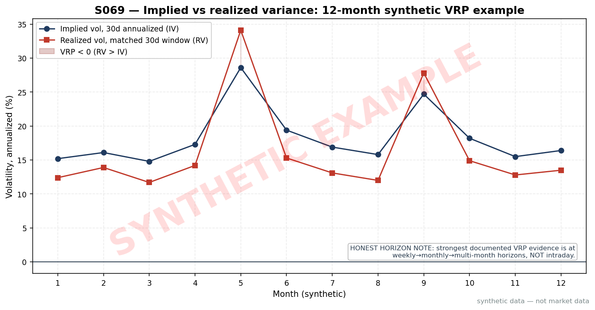

```mermaid
flowchart LR
    FEED["Raw feed\n(OPRA options, 5-min equity bars)"] -->|intraday option quotes, 5-min bars| ING["Ingest + normalize\n(exchange ts, corp actions, halts)"]
    ING -->|"intraday clean chains\n+ 5-min return series"| FEAT["Feature compute\n(model-free IV, 5-min RV, HAR forecast)"]
    FEAT -->|"daily 30-day IV surface\n+ daily RV forecast"| SIG["Signal S069\nVRP = IV² − E[RV²]"]
    SIG -->|"daily VRP z-score vs history"| GATE{"Cost / toxicity\ngate?"}
    GATE -->|pass| OUT["Downstream consumer\n(T010 harvester, T045/T058 sizing)"]
    GATE -->|fail| DROP["No trade"]
    style SIG fill:#aed6f1,stroke:#1f3a5f
```

### S12. Sources

- Bollerslev, T., Tauchen, G., Zhou, H. (2009). "Expected Stock Returns and Variance Risk Premia." *Review of Financial Studies*, 22:4463–4492. (FEDS 2007-11 working version, Federal Reserve Board.)
- Federal Reserve Board — "The Variance Risk Premium Around the World." International Finance Discussion Papers 1035. https://www.Federalreserve.gov/pubs/ifdp/2011/1035/ifdp1035.htm
- Federal Reserve Board — "Expected Stock Returns and Variance Risk Premia" (Finance and Economics Discussion Series; model-free implied variance definition). Referenced via https://www.federalreserve.gov/Pubs/feds/2011/201145/201145pap.pdf (bibliography entry for BTZ 2009/2007).
- Demeterfi, K., Derman, E., Kamal, M., Zou, J. (1999). "More Than You Ever Wanted To Know About Volatility Swaps." Goldman Sachs. https://www.realvol.com/volatilityblog/?p=516
- NBER Working Paper 16884 — "Simple Variance Swaps" (variance-swap replication from option strips). https://www.nber.org/system/files/working_papers/w16884/w16884.pdf

**Chatbot material (labeled, per question-bank protocol):**
- Duck.ai (GPT-5.6 Luna, anonymous, 2026-09-10) answered Q-SB8-1–Q-SB8-3. The variance-points and vol-points VRP formulas and the model-free implied-variance definition (Q-SB8-1 #3, attributed to the Federal Reserve Board) are chatbot research leads — the variance-points formula is verified in-chapter and cross-checked against the cited papers; the vol-points square-root render was garbled (flagged in S3, do NOT code as confirmed). IV-inversion build-cost components are labeled chatbot leads (the cost-model bands take precedence). Source log: "Duck.ai answered Q-SB8-1–Q-SB8-3 (2026-09-10); Grok/Cursor answers pending (checked 2026-09-10)."

**Unverified leads:** the volatility-points VRP line rendered ambiguously on the square root (flagged in S3 — re-confirm before coding); "Exploring the Variance Risk Premium Across Assets" (afajof.org) was cited by the chatbot but no checkable URL was verified; any specific after-cost Sharpe for traded VRP strategies is an unverified chatbot claim.

---
## Stage 70/200 — S070: Straddle-implied move vs realized

*Batch SB8 · Signal 70/100 · Provenance [SR] · Family E — Volatility & Options-Informed*

### S1. One-line verdict

| | |
|---|---|
| **What it is** | The **at-the-money straddle price** (call + put at the same strike) read as the market's expected move; fade the event when realized moves systematically under- or over-shoot it. |
| **When it works** | Around scheduled events (earnings, CPI — Consumer Price Index — , FOMC — Federal Open Market Committee — ) where implied volatility is systematically elevated pre-announcement and realized moves come in below implied *on average*. |
| **When it dies** | Genuine information shocks (guidance changes, macro overlap), crowded short-vol positioning, and illiquid chains where the "implied move" is a stale midpoint. |
| **Build-or-buy in one line** | Build the comparator yourself on bought chains — the formula is a desk standard; the edge is in execution and selection, not the math. |

Provenance [SR] — standard desk reconstruction: the trading rule (fade realized vs straddle-implied moves) is practitioner-standard, but no single canonical published formula was verified, so the tag stays [SR] and is not upgraded. Family E — Volatility & Options-Informed.

### S2. How it works — plain human explanation

A **straddle** is buying (or selling) a call and a put at the same strike and expiry — a bet that pays off if the stock moves a lot in either direction. An **at-the-money (ATM)** straddle — strike near the current stock price — is the market's cleanest statement of how big a move it expects: divide the straddle's price by the stock price and you get the **implied move** in percent. If a $100 stock's ATM straddle costs $6.20, the market is pricing roughly a ±6.2% move.

Vignette: 3:58 PM, the day before earnings. XYZ closes at $100. The ATM straddle expiring Friday trades at $6.20 bid / $6.60 ask — implied move ≈ 6.4% at mid (the midpoint between bid and ask). Your database of XYZ's last 12 earnings shows an average absolute move of 4.1%. The market is charging for 6.4% and history delivered 4.1%: the straddle looks rich, so you sell it (the "fade"). After the announcement XYZ moves 3.8% — below the implied 6.4% — and the straddle collapses to $4.10. You buy it back: gross profit ≈ $2.30 per share pair before costs. The well-known **IV crush** — implied volatility falling sharply once the event passes — is the same phenomenon seen through the vol lens: pre-event IV is elevated, post-event it falls, and the realized move often lands below what was priced.

Why should this work *on average*? Event implied vol embeds a risk premium (S069's VRP concentrated into one day): market makers charge extra for taking event risk, and hedgers overpay for certainty into the print (the announcement release). But it is emphatically not universal — "fade every straddle" is a losing rule. The edge is conditional: broad liquid samples, high IV percentile into the event, no overlapping macro catalyst, and execution at real bid/ask.

Mental model:
- The straddle price is a consensus forecast of the event move, plus an insurance markup.
- You are not predicting the event's direction — you are betting the markup exceeds the surprise.
- The P&L (profit and loss) is decided in dollars after the spread, not in vol points: a 60% hit rate with 20% round-trip costs can still lose money.

### S3. The math — exact formula

**Implied move** (standard desk reconstruction — [SR]):
$$\text{ImpliedMove} = \frac{C_{\mathrm{ATM}} + P_{\mathrm{ATM}}}{S}$$
where C_ATM, P_ATM are the at-the-money call and put prices for the expiry covering the event (dollars), and S is the underlying price (dollars). Result is a fraction; ×100 for percent. (A forward-consistent variant divides by the forward F instead of S.)

**Signal:** compare against the subsequent realized move M_realized = |S_after − S_before|/S_before (or high-frequency realized vol over the event window):
$$\text{edge}_t = \text{ImpliedMove}_t - M_{\text{realized},t}, \qquad z_t = \frac{\text{edge}_t - \mu_L}{\sigma_L}$$
with μ_L, σ_L the trailing-L-event mean and standard deviation of the edge. Fade (sell straddle) when z_t is large positive; the reverse (buy realized / long straddle) when implied looks cheap vs history.

| Parameter | Symbol | Typical range | Too small | Too large | Default (example — not an institutional standard) |
|---|---|---|---|---|---|
| Event window | — | 1–3 days | misses drift | dilutes the event | announcement ± 1 day |
| History lookback | L | 8–20 events | noisy z-score | regime-stale | 12 events |
| Fade threshold | z* | 0.5–2.0σ | overtrading | no trades | z > 1.0 (example) |
| IV percentile gate | — | 50th–90th pct | thin edge | no trades | > 70th pct (example) |

Normalization: z-score the edge vs the name's own event history — a 6% implied move is rich for a utility and cheap for a biotech. Timing: compute from the chain snapshot *before* the event close; the position is opened pre-announcement and the realized move is measured after — strictly causal, no lookahead, but the signal only resolves at *t+1* (post-print).

Variants: (1) **straddle/forward** — divide by F for rate-sensitive underlyings; (2) **ex-event IV** — strip the event premium from the term structure (à la ORATS) and compare residual richness; (3) **post-announcement vol fade** — the T079 variant: sell vol *after* realization when IV stays bid.

### S4. Worked example — step-by-step numbers (SYNTHETIC)

Synthetic 10-event tape (seed **70**), fictional tickers E1–E10. Implied move = ATM straddle mid / stock price; realized move = |post-earnings return|. The chart `images/S070_example.png` plots exactly these numbers.

| Event | Implied move (%) | Realized move (%) | Fade wins? (realized < implied) |
|---|---|---|---|
| E1 | 6.2 | 3.8 | yes |
| E2 | 8.5 | 9.7 | no |
| E3 | 4.1 | 5.2 | no |
| E4 | 11.0 | 7.9 | yes |
| E5 | 5.4 | 2.9 | yes |
| E6 | 9.8 | 13.1 | no |
| E7 | 3.6 | 2.2 | yes |
| E8 | 12.4 | 10.6 | yes |
| E9 | 7.1 | 4.4 | yes |
| E10 | 5.9 | 6.8 | no |

Hit rate = 6/10 = **60% (SYNTHETIC — not a real backtest)**. Step-by-step (E1): edge = 6.2 − 3.8 = **+2.4 percentage points** in the seller's favor. Dollar walk on a $100 stock: straddle mid = $6.20; sell the fade at the bid ≈ $6.00. Post-event the stock moves 3.8%; buy the straddle back at the ask ≈ $4.00. Gross P&L ≈ 6.00 − 4.00 = **+$2.00 per straddle before commissions**. E2 (the loss): sell at ≈ $8.30, stock moves 9.7%, buy back ≈ $9.90 → **−$1.60**.

After-cost arithmetic (verified): a $0.40 option with a $0.08 spread costs 2 × $0.04 = **$0.08 = 20% of premium** per round trip; a $5.00 option with a $0.10 spread costs 2 × $0.05 = **$0.10 = 2% of premium**. Cheap far-wing event options live in the 20% world; liquid ATM straddles in the 2% world. "Event-vol strategies must be evaluated in dollar P&L, not vol points or hit rate %": a 60% hit rate with small average edge is erased by a 5–10% option round trip.

What to notice: even in this friendly toy tape, 4 of 10 events lose — E2, E3, E6, E10 are the genuine-shock cases where realized exceeded implied. The example has no partial fills, no early assignment (the option buyer exercising before expiry), no macro overlap, and uses mid-based implied moves; a real backtest must execute both legs at bid/ask and report the worst decile alongside the mean.

### S5. Strategies that use this signal

- **T046 — Straddle-Implied Move Fade (primary entry trigger):** fades overpriced event moves, confirmed by unusual-options-activity (S073) and gated by the VRP level (S069).
- **T050 — GEX Pin / Dealer-Positioning Fade (context input):** uses the implied move to size pinning fades into expiry — the expected-move radius sets the fade zone.
- **T068 — Scheduled-Event Vol Expansion (veto/positioning):** goes the other way pre-event when the implied move is *cheap* vs history; S070's edge series is the pricing input.
- **T079 — Post-Announcement Vol Fade (downstream leg):** sells event volatility after realization is known — S070 identifies the candidates, T079 times the exit.

### S6. Data required — exact spec

| Field | Type | Granularity | Source tier | Notes |
|---|---|---|---|---|
| Options quotes (ATM chain) | bid/ask | intraday snapshots / EOD (end-of-day) | Tier 1–2 | OPRA (Options Price Reporting Authority, the consolidated US options tape) via Databento/Cboe LiveVol; delayed Cboe for prototyping |
| Underlying price | float ($) | 1-min / daily | Tier 0–1 | For implied-move denominator and realized move |
| Earnings/macro calendar | dates | daily | Tier 0–1 | SEC (Securities and Exchange Commission) EDGAR (Electronic Data Gathering, Analysis, and Retrieval), vendor calendars |
| Historical event moves | float (%) | per event | Tier 1–2 | Built from bars; vendor series available |

Ingest sketch (Python/polars, ≤20 lines):

```python
import polars as pl
def implied_move(chain: pl.DataFrame, spot: float) -> pl.DataFrame:
    # chain: ts, expiry, strike, cp, bid, ask ; spot: underlying price
    atm = (chain.with_columns(mid=(pl.col("bid") + pl.col("ask")) / 2,
                             dist=(pl.col("strike") - spot).abs())
                .sort("dist").head(2))  # nearest call + put
    straddle = atm["mid"].sum()
    return pl.DataFrame({"ts": [chain["ts"][0]], "spot": [spot],
                         "straddle_mid": [straddle],
                         "implied_move": [straddle / spot]})
```

Storage per symbol-day (per `notes/cost-model.md` §4): ATM-chain snapshots are small — a few MB/day per name for the strikes near the money; the full-chain archive is what costs (1–3 GB/day SPX-like). For event studies, store only the ATM strip + spot series: trivial.

Data-quality checklist: snapshot the *actual* chain at the signal timestamp (no closing-chain lookahead), remove stale quotes, handle early close/half-days, corporate actions shifting strikes, American-exercise (early-exercise-allowed) premium on single names.

### S7. Local build on M5 Max / 128GB

**Feasibility: feasible (Tier M, low end).** The signal is arithmetic on a handful of quotes per event. Per cost-model §2, even a pure-Python loop handles this universe; polars does it in milliseconds. RAM: a decade of ATM-strip snapshots for 500 names is a few GB — far under the ~77GB working budget (cost-model §3).

Engineering band: Tier M per cost-model §5 (vol estimators), low end — **~20–40 h ≈ $3,000–6,000 at $150/hr loaded-cost estimate**, plus chain data $200–2,000/mo for a research-grade OPRA slice (indicative — verify before budgeting). Bottleneck: **event-study hygiene** (calendar alignment, chain vintages, bid/ask execution), not compute. Stack: Python + polars + DuckDB. What breaks first at 500 symbols or full OPRA: nothing in the signal — but a production scanner across all names × all events needs the full real-time chain (Tier C OPRA $2,000–20,000+/mo, indicative), which is a data cost, not a compute wall.

### S8. Buy vs build

| Option | What you get | Indicative price | Buying gains | Buying loses |
|---|---|---|---|---|
| Tier-0 free (Cboe delayed, EDGAR calendars) | Delayed chains, event dates | ~$0 | Zero cost; fine for EOD event studies | No intraday timing, coarse bid/ask |
| Tier-1 retail (Polygon Options, Cboe delayed products) | Queryable chains, Greeks (delta, gamma, vega, theta, rho) | ~$0–200/mo | Cheap full pipeline prototype | Incomplete expiries, rate limits |
| Tier-2 professional (Databento OPRA research, LiveVol) | Full historical chains, bid/ask history | ~$200–2,000/mo | Realistic backtest with executable quotes | Still need your own event-study code |
| Tier-3 institutional (OptionMetrics IvyDB; Cboe implied-earnings-move data) | Publication-quality history; vendor implied-move series | ~$thousands/yr academic; institutional $$$$ | The dataset papers use; Cboe's own implied-move spec exists | Cost; may not cover your exact event set |

Verdict: **build the comparator, buy the chains.** The formula is a one-liner; the work is the event calendar, chain vintages, and bid/ask-aware backtesting. Crossover: buy Tier-2 the day you backtest seriously — midpoint-based event studies on free data systematically overstate the edge (the spread *is* the edge in the 20%-of-premium world). All prices indicative — verify before budgeting.

### S9. Success ratio / efficacy — documented evidence

| Study / source | Market & period | Metric | Before/after cost | Caveat |
|---|---|---|---|---|
| Journal of Risk — "Earnings moves and pre-earnings implied volatility" | Listed US stocks, 3 calendar years | Options market predicts the *magnitude* of earnings moves well in most cases, with significant outliers; return distribution symmetric | Before-cost (forecast accuracy, not traded P&L) | Describes pricing accuracy, not a fade strategy's P&L |
| ORATS methodology (LULU example, 8/2018) | Single name, last 12 earnings | Implied earnings move 10.93% vs average actual move 11.698% | Before-cost (practitioner measurement) | One name, one window — illustrative, not a statistical claim |
| Nasdaq practitioner literature (IV-crush explainers) | US equity options | IV systematically elevated pre-announcement, collapses after; straddle sellers profit when realized < implied | Before-cost (educational) | No hit rates or P&L reported |

Honest bottom line (mandatory framing): IV is elevated pre-announcement and falls after; realized moves come in below implied **on average — not universally**. Published-style hit rates in the **mid-50s to low-60s** for broad liquid samples are a chatbot lead (unverified — see Unverified leads), and a 60% hit rate is not automatically attractive: a 5–10% option round trip can erase a small average edge. **As a standalone trigger this is a modest, cost-sensitive edge; as a conditional event filter (high IV percentile, liquid chains, no macro overlap) it is a documented and usable one.** Evaluate in dollar P&L.

### S10. Failure modes & pitfalls

- **Lookahead leakage:** using the post-event chain or corrected prints to price the pre-event straddle — pin the snapshot vintage.
- **Staleness/latency:** illiquid chains show midpoint "implied moves" that no one can trade — require two-sided quotes with size.
- **Crowding/alpha decay:** the earnings fade is textbook; crowded shorts get carried out on genuine beats — condition on IV percentile, not habit.
- **Cost blowup:** the 20%-of-premium arithmetic above — cheap wings are untradeable after costs; model both legs at bid/ask plus fees (per-contract commissions and exchange/clearing fees, e.g. ~$0.65/contract/side at retail — indicative, verify before budgeting). Impact/slippage: pre-event straddle bid/ask widens as the event approaches and liquidity providers pull quotes — expect to cross 1.5–2× the normal spread on entry, and a large fade moves the mid against you on exit; model explicit slippage of 10–50% of the spread per leg rather than assuming mid fills.
- **Regime breaks:** macro overlap (CPI on earnings day), guidance shocks, sector-wide repricing — exclude or separately model overlapping events.
- **Overfitting/parameter mining:** z-thresholds and lookbacks tuned on a handful of events per name — pool across names or accept wide error bars.
- **Data errors:** wrong expiry (weekly vs monthly), early-close calendars, special dividends shifting the straddle.
- **Microstructure confusion:** the straddle mid moves with the underlying into the print — measure the move consistently or delta-hedge (continuously offset directional exposure as the underlying moves).

### S11. Visuals

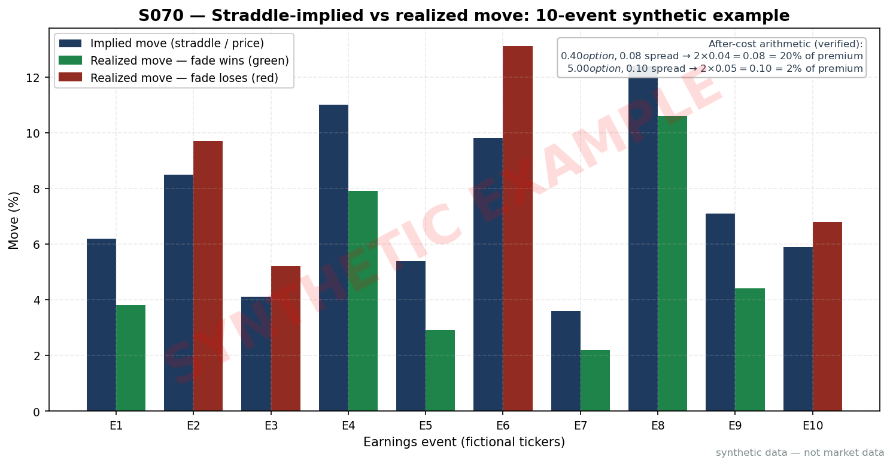

```mermaid
flowchart LR
    FEED["Raw feed\n(OPRA chains, equity bars, event calendar)"] -->|ATM chain snapshots, 1-min bars| ING["Ingest + normalize\n(chain vintage, event tz, halts)"]
    ING -->|"intraday ATM strip\n+ 1-min spot series"| FEAT["Feature compute\n(straddle/S, realized |return|, z-score)"]
    FEAT -->|"per-event edge series\n(per announcement)"| SIG["Signal S070\nimplied-vs-realized edge"]
    SIG -->|"per-event edge z-score\n+ IV percentile"| GATE{"Cost / toxicity\ngate?"}
    GATE -->|pass| OUT["Downstream consumer\n(T046 fade, T050/T068/T079 context)"]
    GATE -->|fail| DROP["No trade"]
    style SIG fill:#aed6f1,stroke:#1f3a5f
```

### S12. Sources

- "Earnings moves and pre-earnings implied volatility." *Journal of Risk*. https://www.risk.net/journal-of-risk/7960706/earnings-moves-and-pre-earnings-implied-volatility
- Nasdaq — "Understanding Earnings Crush Implied Volatility." https://www.nasdaq.com/articles/understanding-earnings-crush-implied-volatility
- Nasdaq — "What an Implied Volatility Crush is and How to Avoid It." https://www.nasdaq.com/articles/what-an-implied-volatility-crush-is-and-how-to-avoid-it-2021-07-09
- ORATS — "How ORATS Removes Earnings Effect from Implied Volatility." https://orats.com/blog/how-orats-removes-earnings-effect-from-implied-volatility
- Cboe DataShop — "Implied Earnings Move Specification" (vendor implied-move methodology). https://datashop.cboe.com/documents/ft_products/ImpliedEarningsMove_Specifications.pdf

**Chatbot material (labeled, per question-bank protocol):**
- Duck.ai (GPT-5.6 Luna, anonymous, 2026-09-10) answered Q-SB8-1–Q-SB8-3. The straddle-implied-vs-realized framing (Q-SB8-3 #2), the per-round-trip spread arithmetic ($0.40/$0.08 = 20%, $5.00/$0.10 = 2%), and the "evaluate in dollar P&L" guidance are chatbot research leads — the arithmetic is operator-verified in S4; the mid-50s–low-60s hit-rate band (tradingview.com) is cited as an *unverified* chatbot lead, never as a published finding. Source log: "Duck.ai answered Q-SB8-1–Q-SB8-3 (2026-09-10); Grok/Cursor answers pending (checked 2026-09-10)."

**Unverified leads:** published hit rates in the mid-50s–low-60s for broad liquid samples (chatbot lead, tradingview.com — not independently verified); any specific after-cost Sharpe ratio (mean excess return ÷ volatility) for straddle-fade strategies is an unverified chatbot claim. The [SR] formula itself is a standard desk reconstruction, not a cited paper.

---
## Stage 71/200 — S071: 25-delta risk reversal / skew change

*Batch SB8 · Signal 71/100 · Provenance [D] · Family E — Volatility & Options-Informed*

### S1. One-line verdict

| | |
|---|---|
| **What it is** | The **25-delta risk reversal**: the implied-volatility gap between a 25-delta call and a 25-delta put — a real-time gauge of crash fear vs upside chase. |
| **When it works** | As a regime/tail-risk feature: sudden steepening of put skew flags institutional hedging demand hours to days before downside episodes. |
| **When it dies** | Thin/illiquid chains (the 25Δ points are noise), expiry weeks (skew deforms), and calm grinds where skew mean-reverts without any equity follow-through. |
| **Build-or-buy in one line** | Buy clean intraday IV surfaces; build the delta-solver and the change-detection — the quoting conventions are the trap, not the arithmetic. |

Provenance [D] (documented: FX-options market convention — Malz; Reiswich–Wystup; equity analog in Bakshi–Kapadia–Madan skew literature). Family E — Volatility & Options-Informed.

### S2. How it works — plain human explanation

**Implied volatility (IV)** is the volatility number that makes an option-pricing formula reproduce the market price. Plot IV against strike and you get the **volatility smile** (or, for equities, the **smirk/skew**: IV much higher for downside puts than upside calls). **Delta** measures how much an option's price moves when the underlying moves $1 — a 25-delta (25Δ) put is an out-of-the-money (strike below the current price for a put, above the current price for a call) put whose price moves about $0.25 per $1 drop in the stock.

A **risk reversal** (RR) is the IV of the 25Δ call minus the IV of the 25Δ put (FX — foreign exchange — market convention). If downside puts trade at 26.5% IV while equidistant upside calls trade at 16.9%, the risk reversal is 16.9 − 26.5 = −9.6 vol points: puts are much richer — the market is paying up for crash protection. Equity desks often flip the sign (put − call, so positive = fear); always state your convention. The **butterfly** — IV(call) + IV(put) − 2·IV(ATM — at-the-money) — measures the smile's curvature (kurtosis — tail-fatness — pricing) separately from its tilt.

Vignette: 10:15 AM. The S&P is flat, but your skew monitor flashes: the 30-day 25Δ put IV just jumped from 24.5% to 26.5% while the 25Δ call IV didn't move. The risk reversal dropped two vol points in an hour. Nobody panicked in the stock — yet — but somebody with size (a large institutional order) just paid up for downside protection. That *change* in skew, z-scored against its history, is the S071 signal.

Why should it work? Skew steepening reflects **informed hedging demand**: institutions buy puts before known risks and before portfolio de-risking. The options market aggregates that demand faster than the equity market aggregates the selling — hence "options-to-equity lead" (T093). The effect is a *change* signal: the level of skew is a permanent feature of equity markets; its sudden shifts carry the information.

Mental model:
- The risk reversal prices the market's fear asymmetry: rich puts = someone is scared, rich calls = someone is chasing.
- Trade the *change* in skew, not the level — level is a permanent risk premium; change is news.
- Always name the delta convention (spot delta — the strike found from the spot-price delta; forward delta — from the forward-price delta; premium-adjusted delta — the option premium subtracted from the price input) — the same "25Δ" can mean three different strikes.

### S3. The math — exact formula

**25-delta risk reversal (FX/desk convention, verified):**
$$\mathrm{RR}_{25} = \sigma_{\mathrm{IV}}^{\mathrm{call},\,25\Delta} - \sigma_{\mathrm{IV}}^{\mathrm{put},\,25\Delta}$$
Negative = downside puts richer (crash fear); positive = upside calls richer. Equity desks frequently quote the flip, σ(put) − σ(call), so that positive = fear — state the sign convention explicitly.

**Black–Scholes deltas with dividend yield q (verified):**
$$\Delta_C = e^{-qT}N(d_1), \qquad \Delta_P = e^{-qT}\,[N(d_1)-1], \qquad d_1 = \frac{\ln(S/K) + (r-q+\tfrac{1}{2}\sigma^2)T}{\sigma\sqrt{T}}$$
The 25Δ call strike K_C solves Δ_C(K_C) = +0.25; the 25Δ put strike K_P solves Δ_P(K_P) = −0.25 (numerical root search). For futures options use the Black-76 (Fischer Black's 1976 futures-options pricing model) forward-delta convention — keep it consistent.

**Butterfly (smile curvature):**
$$\mathrm{BF}_{25} = \sigma_{\mathrm{IV}}^{\mathrm{call},\,25\Delta} + \sigma_{\mathrm{IV}}^{\mathrm{put},\,25\Delta} - 2\,\sigma_{\mathrm{IV}}^{\mathrm{ATM}}$$

**Smile-construction quote convention** (simple-smile convention): σ_call = σ_ATM + σ_BF + ½σ_RR, σ_put = σ_ATM + σ_BF − ½σ_RR (the broker convention — the market-standard interpretation of RR/BF quotes — needs a numerical solver).

Two implementation rules: interpolate **total variance** w(K,T) = σᵢᵥ²(K,T)·T across maturities — never raw vol — and across strikes interpolate in log-moneyness k = ln(K/F).

> **Flag (garbled render, do NOT code as confirmed):** the chatbot's practical note gave the 25Δ strike-matching tolerance as "±0.5 to ±1.0 delta points," but the render was partially garbled. Re-confirm the tolerance from a canonical source (Reiswich–Wystup) before coding the root-search stopping rule.

| Parameter | Symbol | Typical range | Too small | Too large | Default (example — not an institutional standard) |
|---|---|---|---|---|---|
| Delta pillar | — | 10Δ / 15Δ / 25Δ | noisy wings | insensitive | 25Δ |
| Expiry | T | 1 week – 3 months | expiry noise | stale macro view | 30 days |
| Change lookback | — | 1 hour – 5 days | microstructure | signal decayed | 1 day vs 20-day median |
| Shock threshold | z* | 1.0–3.0σ | false alarms | misses hedging waves | z > 2.0 (example) |

Normalization: z-score the *change* in RR against its trailing 20–60 day history of changes; raw RR level is regime-biased. Timing: compute on each IV-surface snapshot using quotes ≤ *t*; equity response is expected over hours–days, so entries at *t+1* are fine.

Variants: (1) **10Δ RR** — deeper wings, more tail-sensitive, noisier; (2) **25Δ butterfly momentum** — curvature change as a vol-of-vol (volatility-of-volatility) signal; (3) **RR z-score vs ATM** — skew steepening relative to the vol level, so a vol spike alone doesn't fake a signal.

### S4. Worked example — step-by-step numbers (SYNTHETIC)

Synthetic 30-day equity skew (seed **71**), S = 100, T = 30 days, q = 1.5%. BS deltas are illustrative example inputs for this expiry (puts below spot, calls above). The chart `images/S071_example.png` plots exactly these IV points with the 25Δ markers.

| Moneyness K/S | IV (%) | BS delta | Marker |
|---|---|---|---|
| 0.80 | 34.0 | −0.08 | |
| 0.85 | 30.0 | −0.15 | |
| 0.90 | 26.5 | −0.25 | 25Δ put |
| 0.95 | 22.0 | −0.40 | |
| 1.00 | 19.5 | +0.50 | ATM |
| 1.05 | 17.8 | +0.38 | |
| 1.10 | 16.9 | +0.25 | 25Δ call |
| 1.15 | 16.5 | +0.14 | |
| 1.20 | 16.3 | +0.08 | |

Step-by-step: the 25Δ put is the −0.25-delta row → moneyness 0.90, IV = **26.5%**. The 25Δ call is the +0.25-delta row → moneyness 1.10, IV = **16.9%**. Risk reversal (call − put) = 16.9 − 26.5 = **−9.6 vol points** — downside puts richer by nearly ten vol points, a steep fear skew. Equity-desk flip (put − call) = **+9.6**. Butterfly = 16.9 + 26.5 − 2×19.5 = 43.4 − 39.0 = **+4.4 vol points** of wing curvature.

What to notice: the smirk shape (IV falling with moneyness) is the permanent equity feature; the *signal* would be this RR_25 moving, say, from −7.0 to −9.6 in a day (z-scored). The toy uses hand-placed deltas — production solves Δ_C(K) = 0.25 numerically per snapshot, and the delta-tolerance stopping rule is the garbled item flagged in S3. No trading costs modeled.

### S5. Strategies that use this signal

- **T047 — Risk-Reversal Skew Momentum (primary entry trigger):** follows 25Δ risk-reversal shifts with options-flow confirmation — this signal is the trigger.
- **T093 — Options-to-Equity Lead Trader (primary directional input):** trades equity from options skew and signed flow with cross-asset lead-lag — S071 provides the skew leg.

### S6. Data required — exact spec

| Field | Type | Granularity | Source tier | Notes |
|---|---|---|---|---|
| Options quotes (full chain) | bid/ask | intraday snapshots (15-min–hourly) | Tier 2 | OPRA (Options Price Reporting Authority, the consolidated US options tape) via Databento/Cboe LiveVol; Tier 0 delayed for EOD (end-of-day) research |
| IV surface (vendor or own) | float (%) | intraday snapshots | Tier 1–2 | Vendor surfaces $200–5,000/mo (indicative); own inversion needs full chain |
| Underlying price + dividends | float | 1-min / daily | Tier 0–1 | For moneyness and the q in delta formulas |
| Rates curve | float (%) | daily | Tier 0 | FRED (Federal Reserve Economic Data); r in d₁ |

Ingest sketch (Python/polars, ≤20 lines):

```python
import polars as pl
from scipy.stats import norm
from scipy.optimize import brentq
import numpy as np
def delta_call(K, S, T, r, q, sig):
    d1 = (np.log(S / K) + (r - q + 0.5 * sig**2) * T) / (sig * np.sqrt(T))
    return np.exp(-q * T) * norm.cdf(d1)
def strike_at_delta(target, S, T, r, q, sig, cp):
    f = lambda K: (delta_call(K, S, T, r, q, sig) if cp == "C"
                   else delta_call(K, S, T, r, q, sig) - 1) - target
    return brentq(f, 0.3 * S, 3.0 * S)   # then read IV at that strike
```

Storage per symbol-day (per `notes/cost-model.md` §4): intraday IV snapshots dominate — an SPX snapshot is ~100–300 MB in RAM; 8 snapshots/day ≈ 1–2.5 GB/day on disk. RR needs no full-chain OI, but the IV surface needs clean quotes across strikes. Keep the working set under ~77GB (cost-model §3).

Data-quality checklist: document the delta convention per vendor (spot vs forward vs premium-adjusted — they differ); stale quotes on the wings corrupt the 25Δ read; corporate actions shift strikes; expiry-week skew deformation.

### S7. Local build on M5 Max / 128GB

**Feasibility: feasible but heavy (Tier H).** Plan §6 places full-OPRA analytics (S071–S073) in Tier H: **60–200 h ≈ $9,000–30,000 at $150/hr loaded-cost estimate**, plus chain/surface data $200–5,000/mo (Tier B queryable API) up to $2,000–20,000+/mo for full real-time OPRA (indicative — verify before budgeting).

Why heavy: per-snapshot delta-solving across the chain, IV inversion, surface fitting, and snapshot alignment — per cost-model §2, numpy vectorizes the math (~50–200M elements/sec) but quote normalization and historical joins dominate. RAM: intraday snapshots for 2–3 underlyings fit the 77GB budget (cost-model §3); a 500-name intraday skew monitor does not — selective underlyings only. Stack: Python + polars/numpy default; Rust if you process the raw OPRA tick firehose. What breaks first at 500 symbols or full OPRA: the snapshot pipeline — full real-time OPRA is a message firehose (normalization, sequencing, packet recovery), and a specialized vendor's normalized chains are usually cheaper operationally than direct OPRA.

### S8. Buy vs build

| Option | What you get | Indicative price | Buying gains | Buying loses |
|---|---|---|---|---|
| Tier-0 free (Cboe delayed options data) | Delayed chains, coarse Greeks (delta, gamma, vega, theta, rho) | ~$0–50/mo | Zero cost; EOD skew research | No intraday 25Δ changes — the signal itself |
| Tier-1 retail (Polygon Options) | Queryable real-time chains | ~$30–200/mo | Cheap intraday skew prototype | Incomplete wings, rate limits, inconsistent conventions |
| Tier-2 professional (Databento OPRA research, IV surfaces $200–5,000/mo) | Normalized chains, Greeks, history | ~$200–5,000/mo | Research-grade skew without building inversion | Still need delta-solver + change detection |
| Tier-3 academic/institutional (OptionMetrics IvyDB; full OPRA Tier C) | Publication-quality history; full firehose (Tier C = full real-time consolidated feed: quotes + trades + exchange IDs + quote updates + admin messages) | ~$thousands/yr academic; $2,000–20,000+/mo institutional | The datasets the papers used | Cost; redistribution limits |

Verdict: **buy the surface, build the signal.** The quoting conventions and the delta-solver are where implementations die — buy clean IV data (Tier 2) and put engineering into change-detection and convention documentation. Crossover: buy Tier-2 surfaces the moment you need intraday RR changes; delayed data suffices only for EOD regime research. All prices indicative — verify before budgeting.

### S9. Success ratio / efficacy — documented evidence

| Study / source | Market & period | Metric | Before/after cost | Caveat |
|---|---|---|---|---|
| Conrad, Dittmar & Ghysels (2009), "Ex Ante Skewness and Expected Stock Returns" | US individual equities, options-implied moments | More negatively (positively) skewed risk-neutral returns → subsequent higher (lower) returns; volatility negatively related to returns cross-sectionally | Before-cost (cross-sectional regressions) | Skew *level* predicts returns cross-sectionally — supports the economics, not an intraday RR-change trade |
| Kim & Park (2018), "Is stock return predictability of option-implied skewness affected by the market state?", *J. Futures Markets* | US equities | Negative relation between option-implied skewness and subsequent returns, significant only in low-market-return / high-sentiment regimes; predictive power attributed to market state | Before-cost | Regime-dependent, not a fixed-threshold rule — matches the "change + context" framing |
| Bakshi, Kapadia & Madan (2003), *Review of Financial Studies* 16:101–143 | Methodology | Model-free risk-neutral skewness from option strips — the measurement toolkit under the signal | N/A (methodology) | Measurement paper, no trading results |

Honest bottom line: **as a standalone intraday trigger the 25Δ RR is a weak, noisy edge; as a tail-risk regime feature feeding defensive tilts and options-to-equity lead strategies it is a documented and sensible one.** The academic evidence supports skew *levels* predicting returns cross-sectionally and in regimes — the intraday *change* application is a practitioner adaptation with thinner documentation. Never trade it without the delta-convention audit.

### S10. Failure modes & pitfalls

- **Lookahead leakage:** using end-of-day corrected IV surfaces for an intraday signal timestamp — pin the snapshot vintage.
- **Staleness/latency:** wide/zero-bid wings make the 25Δ IV a stale quote, not a market view — require two-sided size at the pillar strikes.
- **Crowding/alpha decay:** skew steepening into known events is consensus; the fade-the-hedger trade is crowded — condition on *unexpected* changes.
- **Cost blowup:** trading skew means trading wings, where spreads run 5–15% of premium (see S070) — the RR signal is often cheaper to express via the underlying. Fees: per-contract commissions and exchange/clearing fees on each wing — e.g. ~$0.65/contract/side at retail (indicative — verify before budgeting). Impact/slippage: wing quotes thin out exactly when skew moves fastest (dealers widen quotes into the hedge flow) — model 2–3× the quoted spread at size, expect partial fills, and consider that expressing the view via the underlying or a liquid ATM option often halves the cost.
- **Regime breaks:** skew can stay steep for months in bear markets — a "fade the fear" rule bleeds; use changes, not levels.
- **Overfitting/parameter mining:** 10Δ vs 25Δ, hourly vs daily changes, z-thresholds — pre-commit from the economics (hedging flows are daily).
- **Data errors:** vendor delta-convention mismatches (spot vs forward vs premium-adjusted) silently move your pillars — document and test the convention.
- **Microstructure confusion:** expiry-week and dividend-date skew deformations look like hedging demand but aren't — exclude them or code them with indicator variables.

### S11. Visuals

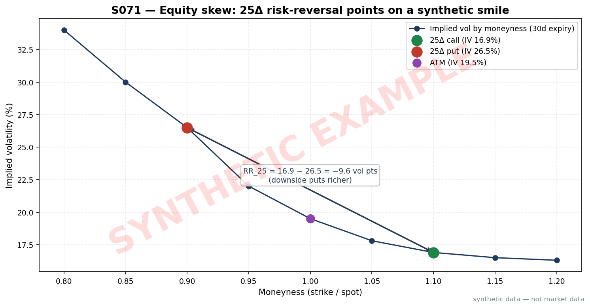

```mermaid
flowchart LR
    FEED["Raw feed\n(OPRA chains, equity bars)"] -->|intraday option quotes, 1-min bars| ING["Ingest + normalize\n(delta convention, corp actions, halts)"]
    ING -->|"intraday clean chain snapshots"| FEAT["Feature compute\n(IV surface, 25Δ pillar solve)"]
    FEAT -->|"daily 30-day IV surface\n+ daily RR series"| SIG["Signal S071\nΔRR_25 z-score"]
    SIG -->|"daily skew-change z-score"| GATE{"Cost / toxicity\ngate?"}
    GATE -->|pass| OUT["Downstream consumer\n(T047 skew momentum, T093 equity lead)"]
    GATE -->|fail| DROP["No trade"]
    style SIG fill:#aed6f1,stroke:#1f3a5f
```

### S12. Sources

- Reiswich, D., Wystup, U. (2012). "FX Volatility Smile Construction." *Wilmott*. (25Δ risk-reversal quoting conventions; strike–volatility extraction.) https://www.econstor.eu/bitstream/10419/40186/1/613825101.pdf
- "Market-consistent FX volatility surfaces" (RR/BF simple-smile vs broker conventions; Malz quadratic smile seed). https://arxiv.org/html/2512.19621
- Bakshi, G., Kapadia, N., Madan, D. (2003). "Stock Return Characteristics, Skew Laws, and the Differential Pricing of Individual Equity Options." *Review of Financial Studies*, 16:101–143. (Risk-neutral moment estimators; related error analysis: https://acfr.aut.ac.nz/__data/assets/pdf_file/0008/328931/Pakorn-Bakshi,-Kapadia,-and-Madan-2003-Risk-Neutral-Moment-Estimators.pdf)
- Conrad, J., Dittmar, R., Ghysels, E. (2009). "Ex Ante Skewness and Expected Stock Returns." https://pages.stern.nyu.edu/~dbackus/Disasters/ConradDittmarGhysels skewness Dec 09.PDF
- Kim, T. S., Park, H. (2018). "Is stock return predictability of option‐implied skewness affected by the market state?" *Journal of Futures Markets*, 38(9):1024–1042. http://ideas.repec.org/a/wly/jfutmk/v38y2018i9p1024-1042.html

**Chatbot material (labeled, per question-bank protocol):**
- Duck.ai (GPT-5.6 Luna, anonymous, 2026-09-10) answered Q-SB8-1–Q-SB8-3. The RR_25 formula, the Black–Scholes delta equations, and the Black-76 forward-delta convention (Q-SB8-1 #4) are chatbot research leads — the risk-reversal quoting convention itself is verified against Reiswich–Wystup (2012) above; the 25Δ strike-matching tolerance was partially garbled in the source render (flagged in S3, do NOT code as confirmed). Source log: "Duck.ai answered Q-SB8-1–Q-SB8-3 (2026-09-10); Grok/Cursor answers pending (checked 2026-09-10)."

**Unverified leads:** the 25Δ strike-matching tolerance was partially garbled in the source render — flagged in S3, not coded; Malz (1997) is cited in the report entry but no checkable URL was verified; any specific intraday RR-change hit rate or Sharpe ratio (mean excess return ÷ volatility) is an unverified chatbot claim.

---
## Stage 72/200 — S072: Put/call ratio

*Batch SB8 · Signal 72/100 · Provenance [D] · Family E — Volatility & Options-Informed*

### S1. One-line verdict

| | |
|---|---|
| **What it is** | Ratio of put to call trading (by volume or by open interest); a crowding and hedge-demand gauge read contrarian at extremes. |
| **When it works** | Fear/panic extremes in index options, when the reading is a sentiment state conditioned on regime, not a standalone rule. |
| **When it dies** | Persistent bear markets, vol breakouts, and regimes where the ratio is driven by institutional hedging rather than speculation. |
| **Build-or-buy in one line** | Build the normalization and analytics yourself; buy the chain data (free EOD (end-of-day) from Cboe, OPRA (Options Price Reporting Authority, the consolidated US options tape) if you need intraday). |

Provenance **[D]** (documented): the ratio is an industry-standard series (Cboe daily market statistics) with peer-reviewed evidence behind its sentiment content. Family E — Volatility & Options-Informed.

### S2. How it works — plain human explanation

A **put option** is a contract giving the right (not the obligation) to sell the underlying stock at a fixed **strike price**; a **call option** gives the right to buy. The **put/call ratio (PCR)** divides put trading by call trading — either by **volume** (contracts traded today) or by **open interest (OI)** (contracts outstanding, i.e. opened but not yet closed, exercised, or expired).

Picture 9:47 on a Tuesday. SPX put volume is running 1.8× call volume while the equity-only PCR sits at 0.6. One market is buying crash insurance; the other is trading single-name calls. That split is the signal's whole point: index options carry the systematic hedge bid, equity options carry more speculation.

Why should it work economically? Three channels. First, **hedging demand**: protective puts are the standard portfolio-insurance product, so a rising PCR often means institutions paying up for downside protection — fear, measurable in contracts. Second, **behavioral crowding**: at sentiment extremes the marginal trader is panicked or euphoric, and prices made at extremes tend to reverse — the classic **contrarian** read (contrarian = bet against the crowd). Third, **adverse selection** (trading against someone who knows more): informed traders prefer options for embedded **leverage** (small premium, large notional) — the case made by Black (1975) and formalized by Easley, O'Hara & Srinivas (1998), who showed *signed* (classified as buyer-initiated vs seller-initiated) option volume predicts returns while raw volume does not.

The honest version the evidence supports: PCR is **better as a conditional sentiment-state variable than as a standalone buy/sell signal**. A high PCR can mean panic near a low, rational pre-crash hedging, a persistent bearish regime, or systematic put overwriting (selling puts against an existing position to collect premium) — same number, four worlds. The ratio gives the room's mood; the trade needs regime conditioning.

Mental model:
- PCR measures who is paying for what insurance, not where the stock goes next by itself.
- Index PCR (hedging) and equity PCR (speculation) are different instruments — never blend them blindly.
- Extremes mark sentiment states; the trade comes from conditioning on the state, never from a fixed threshold.

### S3. The math — exact formula

Let $V^P_t, V^C_t$ be put and call **volume** (contracts) on day $t$, and $OI^P_t, OI^C_t$ be put and call **open interest** at the close of day $t$. Let $\Delta_{j,t}$ be the option **delta** of contract $j$ (delta = the option's price sensitivity to a $1 move in the underlying, between −1 and +1; $|\Delta|$ measures how option-like the exposure is).

$$\text{PCR}^{vol}_t = \frac{V^P_t}{V^C_t}, \qquad
\text{PCR}^{OI}_t = \frac{OI^P_t}{OI^C_t}, \qquad
\text{PCR}^{|\Delta|}_t = \frac{\sum_{j \in \text{puts}} V_{j,t}\,|\Delta_{j,t}|}{\sum_{j \in \text{calls}} V_{j,t}\,|\Delta_{j,t}|}$$

The delta-weighted form (often more informative than raw counts, because it weights contracts by economic exposure) and a smoothed/standardized read:

$$\overline{\text{PCR}}_t = \frac{1}{n}\sum_{k=0}^{n-1}\text{PCR}_{t-k}, \qquad
z_t = \frac{\text{PCR}_t - \mathrm{median}(\text{PCR}_{t-L:t-1})}{1.4826 \cdot \mathrm{MAD}_{t-L:t-1}}$$

where MAD is the median absolute deviation over the trailing $L$-day window, and $1.4826$ rescales MAD to a standard-deviation equivalent under normality. A percentile form is also common: rank today's PCR in its trailing 1-year distribution and fade readings above the 90th / below the 10th percentile.

**Parameter table** (defaults are `example — not an institutional standard`):

| Parameter | Symbol | Typical range | Too small | Too large | Default (example) |
|---|---|---|---|---|---|
| Smoothing window | $n$ | 3–20 days | noisy, whipsaws | lags turning points | 5 |
| Robust lookback | $L$ | 20–252 days | unstable median | stale regime | 60 |
| z threshold | $|z|$ | 1.5–3.0 | too many flags | misses extremes | 2.0 |
| Percentile band | — | 80/20–95/5 | noise | rare signals | 90/10 |

**Normalization choices.** Raw PCR drifts with market structure (0DTE flow — options expiring the same day — was roughly half of SPX volume by 2023). Always normalize: z-score vs trailing median/MAD or trailing percentile rank. Volume PCR reacts fast; OI PCR is slow-moving positioning.

**Causal timing.** Computed at the close of day $t$ using only data $\le t$; tradable no earlier than the open of $t+1$. Intraday 0DTE-aware variants recompute on rolling windows with wider bands.

**Named variants.** (1) Volume PCR vs OI PCR vs delta-weighted PCR. (2) Equity-only vs index-only (Cboe publishes the split; index PCR > 1 is normal because of the structural put-hedge bid, equity PCR < 1 is normal because of call speculation). (3) 0DTE-aware intraday PCR for expiry-day sessions.

### S4. Worked example — step-by-step numbers (SYNTHETIC)

Synthetic 30-day daily PCR tape for fictional name "ABC" (seed **72**, `np.random.default_rng(72)`); the chart plots this same series. Trailing 20-day median and robust z-score, $L=20$ (`example`).

| Day | PCR (put vol / call vol) | Trailing 20d median | z-score | Note |
|---|---|---|---|---|
| 19 | 0.71 | — | — | warm-up, insufficient history |
| 20 | 0.83 | — | — | warm-up, insufficient history |
| 21 | 0.90 | 0.83 | +0.61 | normal |
| 22 | 1.95 | 0.85 | +9.49 | **extreme** (z > 2, example band) |
| 23 | 1.58 | 0.85 | +5.33 | **extreme** |
| 24 | 0.88 | 0.85 | +0.25 | normalizes |
| 25 | 0.97 | 0.86 | +0.84 | normal |
| 26 | 0.88 | 0.86 | +0.16 | normal |
| 27 | 1.02 | 0.86 | +1.01 | normal |
| 28 | 1.01 | 0.86 | +0.98 | normal |
| 29 | 0.96 | 0.86 | +0.67 | normal |
| 30 | 1.00 | 0.86 | +0.90 | normal |

Steps: (1) compute daily PCR = put contracts ÷ call contracts; (2) trailing 20-day median of PCR; (3) MAD over the same window, rescaled by 1.4826; (4) $z_{22} = (1.95 - 0.85)/(1.4826 \times \mathrm{MAD}) = +9.49$. The chart's dashed bands mark $z=\pm 2$ at PCR ≈ 1.18 / 0.53.

**What to notice.** Day 22's spike is unmistakable *because* the trailing MAD was compressed — in live data, volatility-of-PCR itself clusters, so a fixed z-band calibrated in a calm window will over-fire when regime shifts. Also note day 23 stays extreme: fear unwinds over days, not minutes, which is why the documented horizon is 1–10 days, not intraday. Limits of this toy: no fees, no bid/ask on the hedge, and the "fear spike" was injected by hand — nothing here is a backtest.

### S5. Strategies that use this signal

- **T048 — Put/Call Ratio Contrarian** — primary entry trigger: fades extreme PCR z-scores with stretched-move and sentiment context.
- **T047 — Risk-Reversal Skew Momentum** — secondary/confirming input: PCR state conditions whether a 25-delta risk-reversal skew shift is faded or followed.

### S6. Data required — exact spec

| Field | Type | Granularity | Source tier | Notes |
|---|---|---|---|---|
| Put/call volume by product | int (contracts) | daily | Tier 0 | Cboe daily market statistics (free); split equity / index / ETP (exchange-traded product) |
| Put/call open interest | int (contracts) | daily | Tier 0 | same source; EOD (end-of-day) snapshot |
| Per-contract volume + Greeks (delta, gamma, vega, theta, rho) | float/int | intraday (OPRA — Options Price Reporting Authority, the consolidated US options tape) | Tier 1–2 | needed for delta-weighted PCR and 0DTE variants |
| Underlying price | float | daily / 1-min | Tier 0–1 | regime conditioning (trend, VIX — Cboe Volatility Index — level) |

**Collection.** Tier-0 route: scrape or download the Cboe daily market statistics page (total/index/equity/ETP PCR published daily, free). Intraday route: OPRA via Databento or Polygon Options — full trade tape with per-contract volume.

```python
import polars as pl
# ingest loop sketch: daily Cboe PCR statistics -> normalized series
rows = fetch_cboe_daily_stats()          # date, equity_pcr, index_pcr, etp_pcr
df = (pl.DataFrame(rows)
        .with_columns(date=pl.col("date").str.to_date())
        .sort("date")
        .with_columns(
            pcr_eq_smooth=pl.col("equity_pcr").rolling_mean(5),          # example window
            med=pl.col("equity_pcr").rolling_median(60),                  # example lookback
        )
        .with_columns(z=(pl.col("equity_pcr") - pl.col("med"))
                      / (1.4826 * (pl.col("equity_pcr") - pl.col("med")).abs().rolling_median(60)))
store_parquet(df, "data/s072_pcr_daily.parquet")   # date-partitioned, append-only
```

**Storage.** Daily PCR series: kilobytes per symbol-year — trivial. Full EOD chain snapshots (for the delta-weighted form): per cost-model §3, an SPX-class snapshot is ~100–300 MB in RAM, far less in parquet; selective underlyings only. **Data-quality checklist:** exchange timestamps; corporate-action adjustments; halts (zero-volume days aren't zero sentiment); DST (daylight-saving time)/half-days; stale quotes if you mix quote-derived deltas with trade volume.

### S7. Local build on M5 Max / 128GB

**Feasibility: trivial for the daily series; feasible for the intraday variant.** The documented signal is a daily ratio off a public statistics page — a spreadsheet could compute it. The engineering lives in the intraday/delta-weighted reconstruction: normalizing OPRA trades and attaching Greeks per contract.

**Throughput** (per cost-model §2): daily PCR on 500 symbols is a few thousand rows — polars handles it in milliseconds. Intraday delta-weighted PCR on OPRA prints for 50 liquid names: ~100k events/sec at busy times is borderline for a pure-Python loop, comfortable in Rust, and trivial as a per-minute polars batch recompute. Bottleneck is I/O and symbol-mastering (mapping vendor contract symbols to a canonical contract master), not compute.

**Stack options:**

| Stack | When to pick |
|---|---|
| Python + polars | default; daily and per-minute batch recompute |
| Rust | full OPRA firehose, real-time intraday PCR across many underlyings |
| DuckDB | research queries over the historical PCR panel |

**RAM.** Daily panel for 3,000 symbols × 10 years ≈ tens of MB — fits comfortably. Per cost-model §3's 77 GB working budget, even a 60-day intraday OPRA slice for a handful of names fits with care; archive the rest as per-symbol daily parquet files.

**Engineering time.** Cost-model §5 Tier M (vol estimators, S049–S070 class): **20–60 h ≈ $3,000–9,000** at the $150/hr loaded-cost estimate. The chatbot's component lead (labeled `unverified chatbot claim`, cost-model takes precedence) put PCR at 10–25 h prototype / 30–70 h production. **What breaks first at 500 symbols or full OPRA:** the Greeks join — attaching a fresh delta to every print needs an IV surface per underlying per timestamp; precompute Greeks on a grid and interpolate. Full-OPRA processing means handling the firehose (the full real-time message stream: quotes, trades, admin messages).

### S8. Buy vs build

| Option | What you get | Indicative price | Buying gains | Buying loses |
|---|---|---|---|---|
| Tier 0: Cboe daily market statistics | Daily PCR (total/index/equity/ETP), OI | ~$0 | free, authoritative, zero eng | EOD only; no per-contract detail; no delta weighting |
| Tier 1: Polygon / Alpaca options | Per-contract volume, chains, Greeks | ~$30–200/mo | cheap intraday PCR | API rate limits; OI timing inconsistent |
| Tier 2: Databento OPRA | Full consolidated trades/quotes/OI | ~$200/mo + usage | honest intraday + delta-weighted PCR | usage costs scale with symbols |
| Academic: OptionMetrics IvyDB | Publication-quality history | ~$thousands/yr academic | clean history for research | institutional $$$$; not real-time |

All prices `indicative — verify before budgeting`. **Verdict: build if** you only need the daily sentiment-state series (Tier 0 is free and the math is 20 lines); **buy if** you need intraday or delta-weighted PCR across many names; **hybrid (common)**: buy the normalized chain feed, build the z-score analytics with your own thresholds.

### S9. Success ratio / efficacy — documented evidence

| Study / source | Market & period | Metric | Before/after cost | Caveat |
|---|---|---|---|---|
| Pan & Poteshman (2006), Rev. Financ. Stud. | US equities, CBOE (Chicago Board Options Exchange) 1990–2001 | Low-PCR stocks beat high-PCR by >40 bps (basis points; 1 bp = 0.01%) next day, >1% next week (risk-adjusted — adjusted for market beta/factor exposure) | **before-cost**; no trading frictions modeled | Needs buy-to-open (new positions being opened, vs closed) flags (CBOE proprietary data); public-volume replication is weaker |
| Webb, Simon & Wiggins (2001), J. Futures Markets | S&P 500 futures, 1989–1999 | PCR as contrarian sentiment indicator: statistically and economically significant forecasting power at 10/20/30-day horizons; OOS (out-of-sample) simulations enhanced profits | **before-cost** | Sample ends 1999 — pre-0DTE, pre-ETF (exchange-traded fund)-dominance regime |
| Cao, Li, Zhan & Zhou (2022), J. Financ. Quant. Anal. | US market, CBOE 2005–2020 | Aggregate call order imbalance negatively forecasts the market risk premium; individual-level imbalance positively predicts cross-section (informed) | **before-cost** | Dual nature: informed at the stock level, sentiment-driven in aggregate |

**Regimes where it fails.** Sustained bear markets (high PCR stays high while prices fall), credit-stress episodes (hedging is rational, not fear), vol breakouts, and expiry weeks (OI distortions). The 0DTE regime has compressed intraday PCR dynamics; folklore thresholds (0.7/1.0) were never estimated rules.

**Honest bottom line.** As a standalone trigger this is a *weak, regime-dependent* edge; as a conditional sentiment-state filter (T048) it is *documented and useful* — but only with conditioning.

### S10. Failure modes & pitfalls

1. **Hedge-vs-speculation confusion** — put volume includes collars (a long put + short call combination that brackets the position) and overwriting, not just fear. *Mitigation:* split index vs equity PCR; delta-weight to emphasize speculative strikes.
2. **Lookahead leakage** — OI is published with a lag; using "final" OI at signal time is lookahead. *Mitigation:* timestamp every field; use only data available at $t$.
3. **Fixed-threshold overfitting** — 0.7/1.0 folklore is not estimated. *Mitigation:* percentile/z normalization, re-estimated on rolling windows; mark defaults `example`.
4. **Regime breaks** — 0DTE and ETF flows changed PCR's meaning. *Mitigation:* condition on VIX level and trend regime; revalidate yearly.
5. **Staleness/latency** — EOD PCR misses intraday reversals. *Mitigation:* intraday OPRA variant with wider bands, or accept the 1–10 day horizon.
6. **Cost blowup** — fading extremes means trading into wide spreads during stress. *Mitigation:* model spread + fees + impact; size down when spreads widen.
7. **Crowding/alpha decay** — sentiment indicators are the most-crowded signals in existence. *Mitigation:* use as a filter, not a trigger; combine with non-sentiment signals.
8. **Microstructure noise** — single-day PCR prints are noisy. *Mitigation:* smooth (5–10 day SMA — simple moving average) and require multi-day confirmation.

### S11. Visuals

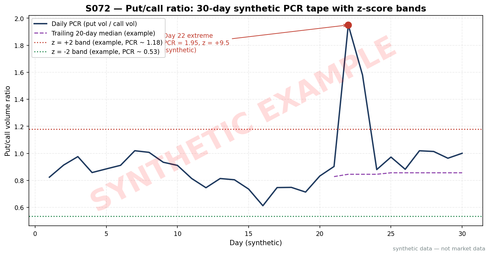

```mermaid
flowchart LR
    FEED["Raw feed<br/>(Cboe daily market stats;<br/>Databento OPRA intraday)"] -->|daily chains + OI, EOD| ING["Ingest + normalize<br/>(exchange ts, DST, halts)"]
    ING -->|clean daily series| FEAT["Feature compute<br/>(PCR_vol, PCR_OI, z_t)"]
    FEAT -->|daily features| SIG["Signal S072<br/>PCR sentiment-state z-score"]
    SIG -->|daily signal| GATE{"Cost / toxicity<br/>gate?"}
    GATE -->|pass| OUT["Downstream consumer<br/>(T048, T047)"]
    GATE -->|fail| DROP["No trade"]
    style SIG fill:#aed6f1,stroke:#1f3a5f
```

### S12. Sources

1. Pan, J. & Poteshman, A.M. (2006). "The Information in Option Volume for Future Stock Prices." *Review of Financial Studies* 19(3):871–908. https://ideas.repec.Org/a/oup/rfinst/v19y2006i3p871-908.html
2. Webb, R.I., Simon, D.P. & Wiggins, R.A. III (2001). "S&P futures returns and contrary sentiment indicators." *Journal of Futures Markets* 21(5):447–462. https://ideas.repec.Org/a/wly/jfutmk/v21y2001i5p447-462.html
3. Cao, J., Li, G., Zhan, X. & Zhou, G. (2022). "Betting Against the Crowd: Option Trading and Market Risk Premium." *Journal of Financial and Quantitative Analysis*. https://papers.ssrn.com/sol3/papers.cfm?abstract_id=4301015
4. Cboe — U.S. Options Daily Market Statistics (industry data source; daily put/call ratios by product). https://www.cboe.com/us/options/market_statistics/daily/?dt=2023-06-02

**Chatbot material (labeled, per question-bank protocol):**
- Duck.ai (GPT-5.6 Luna, anonymous, 2026-09-10) answered Q-SB8-1–Q-SB8-3. The put/call-contrarian evidence summary (Q-SB8-3 #5 — "statistically meaningful but generally modest, heterogeneous, strongest over short horizons") and the PCR build-cost components are chatbot research leads, cited as such and never as published findings; Pan & Poteshman (2006) and the Cboe statistics are independently verified above. Source log: "Duck.ai answered Q-SB8-1–Q-SB8-3 (2026-09-10); Grok/Cursor answers pending (checked 2026-09-10)."

**Unverified leads** (chatbot-provided, not independently checkable — do not treat as evidence): component engineering-hour ranges for a PCR build (prototype 10–25 h, production 30–70 h); folklore threshold values 0.7/1.0.

---
## Stage 73/200 — S073: Unusual options activity

*Batch SB8 · Signal 73/100 · Provenance [D/SR] · Family E — Volatility & Options-Informed*

### S1. One-line verdict

| | |
|---|---|
| **What it is** | Contracts trading far above their normal volume or standing open interest, read as possible fresh informed positioning — direction inferred, never observed. |
| **When it works** | Short-horizon (hours to days) event detection: earnings, M&A (mergers and acquisitions), news — when a real informed trader needs leverage fast. |
| **When it dies** | When the "unusual" print is a spread leg (one side of a multi-leg options strategy), a closing trade, dealer (market-maker) hedging, or index/ETF (exchange-traded fund) hedging flow rather than a directional bet. |
| **Build-or-buy in one line** | Buy normalized OPRA (Options Price Reporting Authority, the consolidated US options tape) trades/quotes (the normalization is the product); build the ranking, filters, and alerts yourself. |

Provenance **[D/SR]**: the informed-options-volume concept is documented (Pan & Poteshman 2006); the signed-volume *reconstruction* from public OPRA data is a standard reconstruction — true bought-to-open needs open/close flags that OPRA lacks. Family E — Volatility & Options-Informed.

### S2. How it works — plain human explanation

**Unusual options activity (UOA)** is the options-market equivalent of a Brinks truck at a bank: a contract that normally trades 2,000 lots (blocks of contracts) suddenly prints (executes and reports) 9,800, or volume exceeds the entire standing **open interest** (outstanding contracts). A **sweep** executes across multiple exchanges nearly simultaneously — someone wants size *now* and pays the spread on every venue. That urgency smells like information.

The economic logic: an informed trader with a short-lived edge wants maximum **leverage** (payoff per dollar at risk) without moving the stock. Options give both. Easley, O'Hara & Srinivas (1998) showed *signed* option volume — calls bought or puts sold (positive-news) versus puts bought or calls sold (negative-news) — predicts stock returns while raw volume does not. Pan & Poteshman (2006) showed put-call ratios from buyer-initiated *opening* volume predict next-day and next-week returns, sourced to private information rather than inefficiency.

Now the central honesty problem of this chapter — read it twice: **the crucial data problem is the open/close flag.** A trade record gives contract, price, size, timestamp, exchange, sometimes the aggressor side (the side that crossed the spread to initiate the trade) — but usually not whether the trade opened or closed a position. A large call buy can be: (a) an opening bullish bet, (b) a *closing* purchase by someone short calls, (c) one leg of a spread, (d) a dealer's hedge. Same print, four opposite meanings. OI changes help only after the fact, at EOD (end-of-day) granularity. So **signed delta flow ≈ Σ_j q_j Δ_j M_j is signed traded exposure, NOT confirmed customer opening** — a proxy, never observed positioning.

Mental model:
- UOA is a ranking and event-detection feature, not a binary "call buying = stock up" rule.
- Urgency (sweeps, premium paid) is more informative than size alone.
- Without the open/close flag, every directional read is a hypothesis with named alternatives.

### S3. The math — exact formula

For contract $i$ on day/session $t$, with trailing median daily volume $\mathrm{med}(V_{i,\cdot})$:

$$U_{i,t} = \frac{V_{i,t}}{\mathrm{median}(V_{i,t-20:t-1})} \qquad \text{(unusual-volume score, `example` window)}$$

**UOA flag (documented rule, Stanford CS229 project on OptionMetrics data):** flag when $V_{i,t} > 2 \times$ daily average **and** $V_{i,t} \ge 500$ contracts (institutional-size block rule) — thresholds are `example — not an institutional standard`. Volume-vs-OI form: flag when $V_{i,t}/OI_{i,t} > 1.5$–$3$ (`example`).

**Signed delta flow (proxy):** for each print $j$ with signed quantity $q_j$ (+1 buy-initiated, −1 sell-initiated via the quote rule — classifying a trade as buyer- or seller-initiated by comparing the trade price to the prevailing bid/ask), delta $\Delta_j$, multiplier $M_j$ (100 shares per contract):

$$F_t = \sum_j q_j \, \Delta_j \, M_j \qquad \text{= signed traded delta exposure (PROXY, not confirmed opening)}$$

Direction mapping (hypotheses, not facts): net call buying + high $F_t$ → bullish hypothesis; net put buying → bearish hypothesis; follow for 1–3 sessions (`example` holding window).

**Parameter table** (`example` defaults throughout):

| Parameter | Symbol | Typical range | Too small | Too large | Default (example) |
|---|---|---|---|---|---|
| History window | — | 10–60 days | unstable median | stale baseline | 20 |
| U threshold | $U$ | 1.5–5× | noise | misses events | 2.0× |
| Block size | — | 250–1,000 contracts | retail noise | only mega-prints | 500 |
| Vol/OI threshold | — | 1.0–3.0× | flags roll days | misses fresh opens | 1.5× |
| Follow horizon | — | 1–5 sessions | cuts winners | signal decays | 1–3 |

**Normalization choices.** $U_{i,t}$ vs trailing median (robust) or mean (the documented 2× rule uses average); per-contract vs aggregated to the underlying; delta-weighting so deep-OTM (out-of-the-money — strike far from the current price) lottery tickets don't dominate. **Causal timing:** the print at time $t$ is known at $t$; the *interpretation* (open vs close) is not fully known until next-day OI — score at $t$, confirm at $t+1$, trade no earlier than $t+1$ on the confirmed read. **Variants:** volume-vs-history ($U$), volume-vs-OI, sweep detection (multi-exchange urgency), signed delta flow, premium-weighted flow.

### S4. Worked example — step-by-step numbers (SYNTHETIC)

Synthetic one-session scan for fictional name "ABC", 8 contracts (seed **73**, `np.random.default_rng(73)`); ranked by $U$; the chart plots these same bars. The open/close flag is **missing** — that absence is the point of the example.

| Contract | Type | Volume | OI | Trailing-20d median vol | $U$ | Vol/OI | Premium ($k) |
|---|---|---|---|---|---|---|---|
| ABC 100C | C | 9,800 | 8,200 | 2,100 | 4.67× | 1.20 | 186.0 |
| ABC 95P | P | 7,100 | 5,400 | 2,300 | 3.09× | 1.31 | 128.0 |
| ABC 97P | P | 2,200 | 4,200 | 2,000 | 1.10× | 0.52 | 33.0 |
| ABC 105C | C | 2,600 | 3,100 | 2,400 | 1.08× | 0.84 | 41.0 |
| ABC 102C | C | 5,100 | 6,600 | 4,800 | 1.06× | 0.77 | 97.0 |
| ABC 90P | P | 1,600 | 2,900 | 1,700 | 0.94× | 0.55 | 24.0 |
| ABC 85P | P | 610 | 1,200 | 900 | 0.68× | 0.51 | 8.0 |
| ABC 110C | C | 340 | 1,500 | 1,500 | 0.23× | 0.23 | 6.0 |

Steps: (1) $U = V/\mathrm{median}$: ABC 100C gives $9{,}800/2{,}100 = 4.67$; (2) vol/OI: $9{,}800/8{,}200 = 1.20$; (3) rank by $U$; (4) the 2×-and-500 rule flags ABC 100C (4.67×, 9,800 ≥ 500) and ABC 95P (3.09×, 7,100 ≥ 500).

**What to notice.** The top hit fails the volume/OI > 1.5 rule (1.20) while passing the $U$ rule (4.67×) — the two standard screens *disagree*, which is normal: $U$ says "unusual versus its own history," vol/OI says "not obviously fresh versus standing positions." And the directional read is genuinely ambiguous: 9,800 calls could be informed opening buying — or a fund closing a short-call book, or one leg of a spread. This toy has no fees, no multi-leg linkage, and no aggressor-side classification error — three things the real tape has in abundance. Treat the output as a ranked alert queue, not a signal with a sign.

### S5. Strategies that use this signal

- **T049 — Unusual Options Activity Follower** — primary entry trigger: follows signed options sweeps confirmed by equity RVOL (relative volume — today's volume vs its historical average) and news sentiment.
- **T046 — Straddle-Implied Move Fade** — confirming filter: unusual activity confirms whether an overpriced event move has informed sponsorship behind it.
- **T094 — Squeeze Breakout (Options-Confirmed)** — confirming filter: unusual call activity confirms Bollinger-squeeze (Bollinger Band contraction signaling a volatility breakout) breakouts.

### S6. Data required — exact spec

| Field | Type | Granularity | Source tier | Notes |
|---|---|---|---|---|
| Options trades (price, size, exchange, ts) | mixed | trade-by-trade (OPRA) | Tier 1–2 | Databento OPRA / Polygon Options; sweep detection needs exchange IDs |
| Options quotes (bid/ask) | float | tick (every quote update) | Tier 1–2 | quote rule for signing prints; needs synchronized timestamps |
| Open interest by contract | int | daily (EOD) | Tier 1–2 | next-day confirmation of open vs close; lagged |
| Underlying price | float | 1-min / tick | Tier 0–1 | delta computation, event context |

**Collection.** OPRA is the consolidated US listed-options feed (quotes, trades, OI, EOD summaries). Vendor APIs (Databento, Polygon) normalize it; raw OPRA direct is a message firehose (the full real-time message stream) requiring symbol mastering (mapping vendor contract symbols to a canonical contract master) and sequence-gap (missing packet/message detection and recovery) handling.

```python
import polars as pl
# ingest sketch: sign prints via quote rule, aggregate signed delta flow
trades = load_opra_trades("ABC", date)          # ts, contract, price, size, exch
quotes = load_opra_quotes("ABC", date)          # ts, contract, bid, ask
t = trades.join_asof(quotes, on="ts", by="contract")   # causal: quote <= trade ts
t = t.with_columns(
    side=pl.when(pl.col("price") >= (pl.col("bid")+pl.col("ask"))/2).then(1).otherwise(-1),
    delta=bs_delta(pl.col("contract"), pl.col("underlying"), pl.col("iv")),  # per-contract
)
flow = t.group_by("contract").agg(
    U=(pl.col("size").sum() / pl.col("hist_median_vol").first()),
    signed_delta=(pl.col("side")*pl.col("delta")*pl.col("size")*100).sum(),  # PROXY
)
```

**Storage.** Per cost-model §4, full OPRA chain snapshots run ~1–3 GB/day (SPX-like) in parquet — selective underlyings only. **Data-quality checklist:** quote/trade timestamp sync (stale quotes mis-sign prints); corporate actions; OI corrections (use as-of — point-in-time, unrevised — vintages, not revised); spread legs look like independent prints — the feed has no multi-leg linkage; expiry-day volume spikes are calendar effects, not information.

### S7. Local build on M5 Max / 128GB

**Feasibility: feasible (Tier H per cost-model §5, the S071–S074 OPRA-analytics class) — the math is simple, the data plumbing is the project.** Scanning is arithmetic; honest signing needs synchronized quotes, per-contract Greeks (the option risk sensitivities — delta, gamma, vega, theta), and next-day OI reconciliation.

**Throughput** (per cost-model §2): a per-minute batch scan over 50 names is trivial in polars (~10–50M rows/sec). Real-time sweep detection across full OPRA wants Rust (~5–50M events/sec); a Python loop (~100–500k/sec) covers ≤20 symbols. Bottleneck: quote normalization and the Greeks join.

| Stack | When to pick |
|---|---|
| Python + polars | default; batch scans, research, alerting |
| Rust | real-time sweep detection on the full OPRA firehose |
| DuckDB | historical UOA panel queries |

**RAM.** Per cost-model §3, an SPX-class chain snapshot is ~100–300 MB live; a 60-day panel for 30–50 names fits inside the 77 GB working budget — per-symbol daily files, never the whole OPRA archive in RAM.

**Engineering time.** Cost-model §5 Tier H: **60–200 h ≈ $9,000–30,000** at the $150/hr loaded-cost estimate — most of it data quality and ops. The chatbot's component lead (labeled `unverified chatbot claim`; cost-model takes precedence) put the unusual-activity scanner at 40–100 h prototype / 150–350 h production. **What breaks first at 500 symbols or full OPRA:** signing — quote-rule accuracy collapses on stale quotes, and vendor aggressor-side misclassification becomes the dominant error.

### S8. Buy vs build

| Option | What you get | Indicative price | Buying gains | Buying loses |
|---|---|---|---|---|
| Tier 0: exchange delayed quotes | Coarse chain snapshots | ~$0 | free prototyping | no real-time scans; incomplete chains |
| Tier 1: Polygon Options / broker APIs | Trades, quotes, chains | ~$30–200/mo | cheap scanner feed | rate limits; inconsistent OI timing; restricted redistribution |
| Tier 2: Databento OPRA | Normalized full trades/quotes/OI | ~$200/mo + usage | honest signing + sweep detection | usage scales; you still build the ranking |
| Tier 3: full OPRA direct / historical archive | Raw firehose + history | $$$$ institutional | complete | normalization is a full-time job |

All prices `indicative — verify before budgeting`. **Verdict: hybrid (the standard answer)** — buy normalized trades/quotes/OI, build the ranking, filters, and alerts. Building the *feed normalization* only pays if OPRA-direct economics beat the vendor at your scale; the *analytics* are always yours, because your thresholds are the edge.

### S9. Success ratio / efficacy — documented evidence

| Study / source | Market & period | Metric | Before/after cost | Caveat |
|---|---|---|---|---|
| Pan & Poteshman (2006), Rev. Financ. Stud. | US equities, CBOE (Chicago Board Options Exchange) 1990–2001 | Buyer-initiated opening PCR: low-minus-high spread >40 bps (basis points; 1 bp = 0.01%) next day, >1% next week (risk-adjusted — adjusted for market beta/factor exposure) | **before-cost** | Needs buy-to-open (new positions opened, vs closed) flags (CBOE proprietary); public-volume replication is weaker |
| Johnson & So (2012), J. Financ. Econ. | US equities, 1996–2009 approx. | Lowest O/S (option-to-stock volume) decile (tenth of the sorted sample) beats highest by 1.47%/month, risk-adjusted | **before-cost** | Unsigned volume; their model attributes the negative relation to stock short-sale costs, not pure informed flow |
| Ge, Lin & Pearson (2016), J. Financ. Econ. | US equities, signed CBOE volume | Purchases of calls that *open* new positions are the strongest return predictor; embedded leverage is the key channel | **before-cost** | Again needs signed + open/close data; confirms the flag is where the information lives |

The literature's own summary: option volume and signed flow *can* predict returns — statistically meaningful but generally modest, heterogeneous, strongest over short horizons. Nothing here is a "call buying = stock up" rule, and the strongest effects come from the papers using the flags retail data doesn't have.

**Regimes where it fails.** Spread-dominated prints, index/ETF hedging flows, liquid fast-diffusion names, near-expiry calendar effects, stale quotes, prints after the stock already moved.

**Honest bottom line.** As a standalone directional trigger this is a *modest, fragile* edge whose documented strength lives in data you probably don't have; as a ranked event-detection feature (T049, T094) it is *genuinely useful* — with the open/close caveat on every output.

### S10. Failure modes & pitfalls

1. **Open/close ambiguity** — the central failure: direction inferred, never observed. *Mitigation:* score at $t$, confirm with next-day OI change, and publish the alternative hypotheses alongside every alert.
2. **Spread legs masquerading as directional flow** — multi-leg prints look like conviction. *Mitigation:* cluster prints by timestamp/underlying/expiry; discount offsetting legs.
3. **Aggressor-side misclassification** — quote rule fails on stale quotes and midpoint prints. *Mitigation:* drop prints where the quote is older than N ms (`example`); track your own mis-sign rate.
4. **Lookahead via revised OI** — OI gets corrected; backtests on final OI overstate. *Mitigation:* as-of vintages only; embargo (withhold from the sample a buffer window around the event) the confirmation leg.
5. **Dealer hedging mistaken for informed flow** — customer flow begets dealer hedging prints. *Mitigation:* separate customer-vs-dealer flow if classified; otherwise widen holding windows.
6. **Cost blowup** — following sweeps means crossing the spread (paying the full bid/ask cost to execute immediately) after the informed trader did. *Mitigation:* model full round-trip spread + fees + impact; the edge must survive paying what the sweep paid.
7. **Event-selection bias** — UOA clusters around scheduled events where straddles are already rich. *Mitigation:* condition on the implied move (S070).
8. **Overfitting the flag definition** — tuning thresholds on the events you trade. *Mitigation:* freeze the screen out-of-sample (on data not used to choose the thresholds); purged/embargoed (training samples whose labels overlap the event window are removed, plus an embargo buffer) validation (S088).

### S11. Visuals

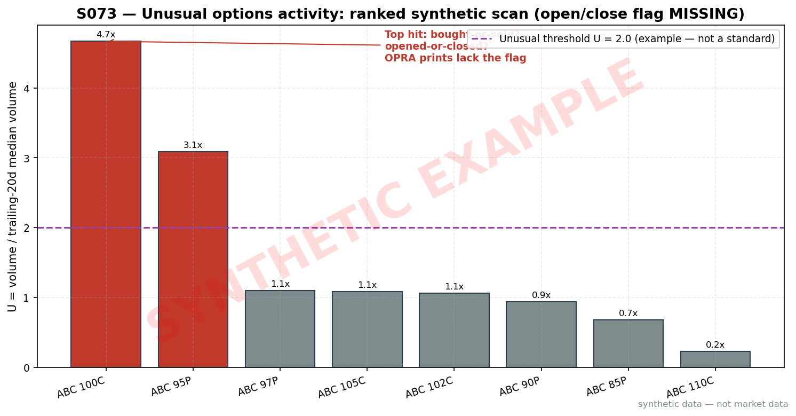

```mermaid
flowchart LR
    FEED["Raw feed<br/>(OPRA trades+quotes;<br/>Databento/Polygon)"] -->|trade-by-trade prints + tick quotes| ING["Ingest + normalize<br/>(quote sync, corp actions)"]
    ING -->|"trade-by-trade signed prints\n(per-contract)"| FEAT["Feature compute<br/>(U score, signed delta flow)"]
    FEAT -->|ranked alerts, 1-min bars| SIG["Signal S073<br/>UOA rank + direction proxy"]
    SIG -->|"ranked alerts\n(per-session)"| GATE{"Cost / toxicity<br/>gate?"}
    GATE -->|pass| OUT["Downstream consumer<br/>(T049, T046, T094)"]
    GATE -->|fail| DROP["No trade"]
    style SIG fill:#aed6f1,stroke:#1f3a5f
```

### S12. Sources

1. Pan, J. & Poteshman, A.M. (2006). "The Information in Option Volume for Future Stock Prices." *Review of Financial Studies* 19(3):871–908. https://ideas.repec.Org/a/oup/rfinst/v19y2006i3p871-908.html
2. Johnson, T.L. & So, E.C. (2012). "The Option to Stock Volume Ratio and Future Returns." *Journal of Financial Economics* 106(2):262–286. https://doi.org/10.1016/j.jfineco.2012.05.008
3. Ge, L., Lin, T.-C. & Pearson, N.D. (2016). "Why does the option to stock volume ratio predict stock returns?" *Journal of Financial Economics* 120(3):601–622. https://ideas.repec.Org/a/eee/jfinec/v120y2016i3p601-622.html
4. Easley, D., O'Hara, M. & Srinivas, P.S. (1998). "Option Volume and Stock Prices: Evidence on Where Informed Traders Trade." *Journal of Finance* 53(2):431–465. https://afajof.org/issue/volume-53-issue-2/

**Chatbot material (labeled, per question-bank protocol):**
- Duck.ai (GPT-5.6 Luna, anonymous, 2026-09-10) answered Q-SB8-1–Q-SB8-3. The UOA-direction evidence summary (Q-SB8-3 #3 — "statistically meaningful but generally modest, heterogeneous, strongest over short horizons") and the scanner cost/price components are chatbot research leads, cited as such and never as published findings; Pan & Poteshman (2006) is independently verified above. Source log: "Duck.ai answered Q-SB8-1–Q-SB8-3 (2026-09-10); Grok/Cursor answers pending (checked 2026-09-10)."

**Unverified leads** (chatbot-provided, not independently checkable — do not treat as evidence): unusual-activity scanner build hours (prototype 40–100 h, production 150–350 h); unusual-activity data pricing band ($500–10,000+/mo); the Stanford CS229 2×-volume/500-contract rule is cited from the signal's source entry, not re-verified against the original project page.

---
## Stage 74/200 — S074: Gamma exposure (GEX) & dealer positioning

*Batch SB8 · Signal 74/100 · Provenance [SR] · Family E — Volatility & Options-Informed*

### S1. One-line verdict

| | |
|---|---|
| **What it is** | An estimate of how much stock dealers must buy or sell to stay delta-hedged (their option-book delta — the sensitivity of position value to the underlying — kept near zero) after a 1% move, built from public open interest under an assumed dealer-positioning sign convention. |
| **When it works** | As an intraday *regime context* (positive-gamma = dampened moves, negative-gamma = amplified moves) near large, fresh option expiries. |
| **When it dies** | Whenever you lack full-chain open interest, trust a single sign convention, or expect gamma walls to forecast direction out-of-sample. |
| **Build-or-buy in one line** | Buy the full-chain OI feed (you cannot build this honestly without it); build the estimator — but label it a proxy, never observed positioning. |

Provenance **[SR]** (standard reconstruction): true dealer books are proprietary; every public GEX number is a practitioner reconstruction from open interest plus a positioning assumption. Family E — Volatility & Options-Informed.

### S2. How it works — plain human explanation

**Gamma** (Γ) is how fast an option's **delta** (price sensitivity to the stock) changes as the stock moves — how fast the hedge ratio runs away from the hedger. **Dealers** (options market makers) sit opposite customer trades and keep books **delta-neutral** (offsetting stock so small moves don't change book value); when the stock moves they re-hedge — net long gamma damps moves (buy dips/sell rips), net short gamma amplifies them. **Gamma exposure (GEX)** estimates that dollar hedging flow: per strike, gamma × **open interest** (outstanding contracts), scaled to the P&L of a 1% underlying move, summed across strikes. A **gamma wall** is a strike with peak |GEX| (largest hedging flow); the **zero-gamma flip** is where cumulative net GEX changes sign (popularized extension — see S12); **max pain** minimizes total option-holder payout at expiry; **pinning** is price clustering at strikes near expiry (Ni, Pearson & Poteshman 2005).

Now the honesty core of this chapter, stated plainly: **you cannot honestly claim a reliable dealer-positioning or GEX estimator from quotes and trades alone. Full-chain open interest is required — and even full OI does not reveal the dealer side.** OI tells you contracts exist; not who holds them. The standard move — calls positive, puts negative (or the reverse), i.e. "customers are net long options" — is an *assumption*, not an accounting identity. A strike's OI was built from weeks of both buying and selling; netting it to one sign invents information. Without full-chain OI you cannot honestly build: full-chain GEX by strike, total GEX, gamma walls or zero-gamma levels, historical GEX time series, OI-adjusted unusual activity, or reliable dealer-positioning estimates. Anything built without it is a **PROXY** — "OI-based gamma exposure," never "dealer gamma."

And the effect size, from the literature: pinning exists but is **modest — cents or a small fraction of a percent, NOT a reliable intraday magnet**. Gamma walls are **visually impressive and have little out-of-sample (data the model was not tuned on) forecasting value**.

Mental model:
- GEX estimates a hedging *impulse*, not a price target; it describes how moves propagate, not where they go.
- The sign convention is the model — change it and the "walls" move; publish multiple conventions or none.
- Full-chain OI is the entry ticket; without it you are drawing pictures, not measuring.

**Chatbot material (labeled, per question-bank protocol):**
- Duck.ai (GPT-5.6 Luna, anonymous, 2026-09-10) answered Q-SB8-1–Q-SB8-3. The gamma-hedging research summary (Q-SB8-3 #4 — "statistically meaningful but generally modest, heterogeneous, strongest over short horizons") and the GEX-engine cost/price components are chatbot research leads, cited as such and never as published findings; Ni, Pearson & Poteshman (2005) is independently verified above. Source log: "Duck.ai answered Q-SB8-1–Q-SB8-3 (2026-09-10); Grok/Cursor answers pending (checked 2026-09-10)."

### S3. The math — exact formula

For strike $K$, with Black–Scholes (BS) gamma $\Gamma(K)$, net open interest $OI^{net}(K) = OI^C(K) - OI^P(K)$ (**sign convention = ASSUMPTION**), multiplier $M$ (100 for equity options), spot $S$ (current underlying price):

$$\Gamma(K) = \frac{e^{-qT}\,\phi(d_1)}{S\,\sigma\sqrt{T}}, \qquad
\mathrm{GEX}(K) = \Gamma(K)\cdot OI^{net}(K)\cdot M\cdot S^2\cdot 0.01$$

where $q$ is the dividend yield, $T$ time to expiry in years, $\sigma$ implied volatility (IV — the volatility implied by the option's market price), $\phi$ the standard normal density, and $d_1 = [\ln(S/K) + (r - q + \sigma^2/2)T]/(\sigma\sqrt{T})$. The factor $M\cdot S^2\cdot 0.01$ converts per-contract gamma into **dollars of P&L (profit and loss) for a 1% spot move**. Total exposure: $\mathrm{GEX}_{total} = \sum_K \mathrm{GEX}(K)$ (sum over strikes *and* expiries).

**Named variants.** (1) Aggregate GEX (SqueezeMetrics original: one number). (2) Per-strike GEX with flip/walls (popularized extension). (3) Charm/vanna-adjusted intraday hedging flow (charm $= \partial\Delta/\partial t$, vanna $= \partial\Delta/\partial\sigma$). (4) DDOI-based dealer-directional OI (SqueezeMetrics' own dealer-side model) — DDOI = dealer-directional open interest, their proprietary estimate of which side the dealer book sits on.

Attribution honesty: the $S^2 \times 0.01$ normalization is a *charting-tool convention*; the original SqueezeMetrics whitepaper (2016/2017) computes $\Gamma \cdot OI \cdot 100$ as a *single aggregate* across all strikes and expiries — the per-strike flip is a popularized extension. Its dealer assumption is also narrower than "customers buy, dealers sell": investors net-*sell* calls via overwriting (selling calls against an existing long position) and net-*buy* puts for protection.

**Parameter table** (`example` defaults; every choice changes the answer):

| Parameter | Symbol | Typical range | Too small | Too large | Default (example) |
|---|---|---|---|---|---|
| Strike window | — | ±10–20% of spot | misses wing gamma | illiquid-wing noise | ±15% |
| Expiries included | — | nearest weekly → 6–12M | misses term gamma | stale far-dated OI dominates | all listed |
| Sign convention | — | C−P / P−C / DDOI | — | — | publish ≥2 (`example`) |
| Gamma input | $\sigma$ | per-contract IV | surface noise | stale vol | per-contract IV, own $T$ |

**Causal timing.** OI publishes EOD (end-of-day) with corrections — GEX stamped 16:00 on "final" OI is lookahead (using data that was not yet available at the decision time); honest intraday GEX uses the last *as-of* (point-in-time, unrevised) vintage, tradable no earlier than the next bar after the snapshot completes.

**Named variants.** (1) Aggregate GEX (SqueezeMetrics original: one number). (2) Per-strike GEX with flip/walls (popularized extension). (3) Charm/vanna-adjusted intraday hedging flow.

### S4. Worked example — step-by-step numbers (SYNTHETIC)

Verified 5-strike synthetic chain, $S=100$, $M=100$, so $M\cdot S^2\cdot 0.01 = 10{,}000$ (seed **74**; gamma values are illustrative inputs; the chart plots these same bars).

$$\mathrm{GEX}(K) = \Gamma(K)\times OI^{net}(K)\times 10{,}000$$

| Strike | Γ (illustrative) | Net OI ($OI^C - OI^P$, assumed) | GEX ($ per 1% move) |
|---|---|---|---|
| 90 | 0.020 | +800 | $0.020 \times 800 \times 10{,}000 = \mathbf{+\$160{,}000}$ |
| 95 | 0.025 | −500 | $0.025 \times (-500) \times 10{,}000 = \mathbf{-\$125{,}000}$ |
| 100 | 0.030 | +300 | $0.030 \times 300 \times 10{,}000 = \mathbf{+\$90{,}000}$ |
| 105 | 0.028 | −200 | $0.028 \times (-200) \times 10{,}000 = \mathbf{-\$56{,}000}$ |
| 110 | 0.022 | +100 | $0.022 \times 100 \times 10{,}000 = \mathbf{+\$22{,}000}$ |
| **Total** | | | **$\mathbf{+\$91{,}000}$** |

Largest positive: K90 (+$160k). Largest negative: K95 (−$125k). Gamma walls (top-2 by |GEX|, `example` rule): K90, K95. Cumulative net GEX from low strikes: +160k → +35k → +125k → +69k → +91k — never changes sign, so there is **no zero-gamma flip inside this strike range** under this convention; a good reminder that the flip is not guaranteed to exist.

**What to notice.** The arithmetic is clean; the economics are not. Flip the sign convention and K95 becomes +$125k, K90 −$160k, total −$91k — the *regime label inverts* while the OI data never changed. Five near-the-money strikes are a toy — real estimation needs the full chain, since missing far-wing (strikes far from the current price), short-dated, or index positions can flip the aggregate sign. And nothing here is tradable evidence: pinning runs to cents or small fractions of a percent, walls have little OOS (out-of-sample) value.

### S5. Strategies that use this signal

- **T050 — GEX Pin / Dealer-Positioning Fade** — primary trigger/regime: fades moves away from gamma walls into expiry, conditioned on the net-GEX sign.
- **T095 — Dispersion + GEX Regime Switch** — regime gate: runs dispersion only when the dealer-gamma regime is supportive.
- **T070 — MOC (market-on-close) Auction-Pin Trader** — context input: GEX levels inform the closing-auction pin read.

### S6. Data required — exact spec

| Field | Type | Granularity | Source tier | Notes |
|---|---|---|---|---|
| Full option chain + OI by strike/expiry | mixed | EOD snapshot minimum; intraday delayed for live | Tier 2–3 | **Non-negotiable**: all strikes, all expiries incl. weeklies (weekly-expiring options), index options (SPX — S&P 500 index options) |
| C/P classification, multiplier, style | categorical/int | per contract | Tier 2–3 | American (exercisable any time) vs European (exercisable at expiry) exercise changes gamma |
| Spot/forward, $T$, IV or gamma inputs | float | per snapshot | Tier 2–3 | use each option's own IV and $T$ for Γ; spot = current price, forward = delivery price |
| Corporate actions / adjustments | events | as-of (point-in-time, unrevised) | Tier 2–3 | adjusted strikes otherwise corrupt the strike map |

**Full-chain OI is non-negotiable.** An NTM (near-the-money) chain alone **cannot** support total-GEX, zero-gamma, or dominant-wall claims. Confirm before paying: OI included (not just volume), *all* strikes, *all* expiries including weeklies, index options (SPX), historical snapshots, commercial/non-display rights.

```python
import polars as pl
# ingest sketch: chain snapshot -> per-strike GEX (sign convention explicit)
chain = load_chain_snapshot("SPX", ts)   # strike, expiry, cp, oi, iv, T, mult
g = (chain.with_columns(gamma=bs_gamma(pl.col("strike"), S, pl.col("T"), pl.col("iv"), pl.col("cp")))
          .with_columns(net_oi=pl.when(pl.col("cp")=="C").then(pl.col("oi"))
                                   .otherwise(-pl.col("oi")))   # ASSUMPTION: document it
          .with_columns(gex=pl.col("gamma")*pl.col("net_oi")*pl.col("mult")*S**2*0.01))
per_strike = g.group_by("strike").agg(pl.col("gex").sum())
total = per_strike["gex"].sum()          # "OI-based gamma exposure" -- NEVER "dealer gamma"
```

**Storage.** Per cost-model §4, OPRA (Options Price Reporting Authority, the consolidated US options tape) full-chain snapshots run ~1–3 GB/day (SPX-like) in parquet — selective underlyings only; historical full-chain archives are a Tier-3 purchase. **Data-quality checklist:** OI vintages (as-of, never revised); listing/delisting gaps; index settlement conventions (AM (morning) vs PM (afternoon) settlement); vendor Greek conventions (delta, gamma, vega, theta, rho inputs: rate/dividend/forward/American-exercise) — validate, don't assume.

### S7. Local build on M5 Max / 128GB

**Feasibility: feasible (Tier H per cost-model §5, the S071–S074 OPRA-analytics class) — with the giant asterisk that the compute is trivial and the data is the project.** Greeks (the option risk sensitivities — delta, gamma, vega, theta) for 300,000 contracts vectorize in NumPy in milliseconds; the expensive operations are quote normalization, IV inversion, and historical OI joins.

**Throughput** (per cost-model §2): numpy vectorized math runs ~50–200M elements/sec — a full SPX snapshot's Greeks compute in well under a second. Keep the working set under cost-model §3's 77 GB budget with per-symbol daily files.

**Stack options:**

| Stack | When to pick |
|---|---|
| Python + polars/numpy | default; snapshot GEX, research, dashboards |
| Rust | tick-level hedging-flow replay, full OPRA |
| DuckDB | historical GEX time-series queries |

**RAM.** One SPX snapshot ≈ 10,000 contracts × 40 fields ≈ 3.2 MB raw numeric (verified arithmetic), 20–100 MB working — fits comfortably. A 60-day watchlist panel fits with care under the 77 GB budget; full-history tick archives stream, never load.

**Engineering time.** Cost-model §5 Tier H: **60–200 h ≈ $9,000–30,000** at the $150/hr loaded-cost estimate — "large range mostly from data quality + ops, not formulas." The chatbot's component lead (labeled `unverified chatbot claim`; cost-model takes precedence) put the GEX engine at 50–120 h prototype / 180–450 h production. **What breaks first at 500 symbols or full OPRA:** the OI join — historical full-chain OI by contract and date is the licensed asset you cannot scrape, and without it there is no estimator.

### S8. Buy vs build

| Option | What you get | Indicative price | Buying gains | Buying loses |
|---|---|---|---|---|
| Tier 0/1: Cboe delayed / broker APIs | Coarse chains, delayed OI | ~$0–50/mo | free prototyping | incomplete chains — **cannot support wall/flip claims** |
| Tier 1: queryable real-time chain API | Current chains on request | ~$500–5,000/mo | usable for live GEX | confirm: all strikes/expiries, OI included, history, redistribution rights |
| Tier 2: Databento OPRA / vendor chains | Normalized full chains + Greeks + history | ~$200/mo + usage | honest inputs | usage costs; still your assumptions |
| Tier 3: historical full-chain archive | Historical quotes/trades/OI/Greeks | ~$5,000–50,000+/yr | backtestable GEX | institutional pricing |

All prices `indicative — verify before budgeting` (chatbot bands: OI-based GEX data $500–20,000+/mo; historical GEX custom or $2,000–25,000+/mo). **Verdict: buy the data, build the estimator** — the GEX *calculation* is always worth building (your conventions, your audit trail); the full-chain OI *feed* is virtually never worth building (you would be re-licensing OPRA).

### S9. Success ratio / efficacy — documented evidence

| Study / source | Market & period | Metric | Before/after cost | Caveat |
|---|---|---|---|---|
| Ni, Pearson & Poteshman (2005), J. Financ. Econ. | US optionable stocks, 1996–2002 | Expiration-day closes cluster at strikes; returns altered ≥16.5 bps (basis points; 1 bp = 0.01%) avg (~$9B market-cap — market capitalization — shifts); market-maker hedge rebalancing contributes | **before-cost** | Expiration-day only; basis points, not a standalone trading edge |
| Barbon, Beckmeyer, Buraschi & Moerke (work. paper) | US equities, intraday | Large negative (positive) gamma imbalance vs avg dollar volume → significant end-of-day momentum (reversal); reverts at next open | **before-cost** | The next-open reversion is what makes it hard to monetize after costs |

The verified research brief's framing, kept verbatim because it is the honest summary: pinning exists but effect sizes are **modest — cents or a small fraction of a percent, NOT a reliable intraday magnet**; gamma walls are **visually impressive with little out-of-sample forecasting value**; published effects shrink once realistic execution, timing, selection, and regime controls are imposed.

**Regimes where it fails.** Spot far from any wall; macro-event days; gaps across strikes; too far from expiry (gamma too diffuse); stale or corrected OI; incomplete chains; OTC/structured hedges dominating the listed book; wrong dealer-sign assumption; trending-vol regimes where charm/vanna dominate.

**Honest bottom line.** As a standalone directional trigger this is a *weak* edge with small, hard-to-capture effects; as an intraday *regime context* (T050/T095) it is *defensible* — provided every number is labeled "OI-based gamma exposure under an assumed sign convention," never dealer positioning.

### S10. Failure modes & pitfalls

1. **Sign-convention risk** — the #1 failure: one assumption flip inverts every wall and the regime. *Mitigation:* publish ≥2 conventions.
2. **Incomplete chain** — NTM-only or missing weeklies/index positions can flip the aggregate sign. *Mitigation:* full-chain coverage check; refuse walls on partial chains.
3. **Stale/corrected OI** — backtests on final prints overstate. *Mitigation:* as-of vintages; embargo the series.
4. **Lookahead on snapshot timing** — stamping intraday GEX with EOD OI. *Mitigation:* timestamp the OI vintage on every number.
5. **Over-interpreting walls** — compelling visuals, little OOS (out-of-sample) value. *Mitigation:* regime context, not entry triggers; validate wall rules out-of-sample.
6. **Cost blowup** — fading into walls means trading options with 1–15% round-trip spreads (verified: a $0.40 option with a $0.08 spread costs 20% round-trip before fees). **Explicit cost stack:** bid/ask spread (round-trip) + per-contract commissions/exchange/clearing fees + impact/slippage (price moves against you while executing) and stress widening of spreads on macro days. *Mitigation:* evaluate in dollar P&L; buy at ask/sell at bid in backtests.
7. **OTC (over-the-counter)/structured dominance** — listed OI may be the minority of the real hedge book. *Mitigation:* treat listed GEX as a lower bound; widen uncertainty bands.
8. **0DTE (options expiring the same day)/charm regime shifts** — near-expiry charm/vanna flows can dominate gamma. *Mitigation:* include charm/vanna aggregates; condition on days-to-expiry.

### S11. Visuals

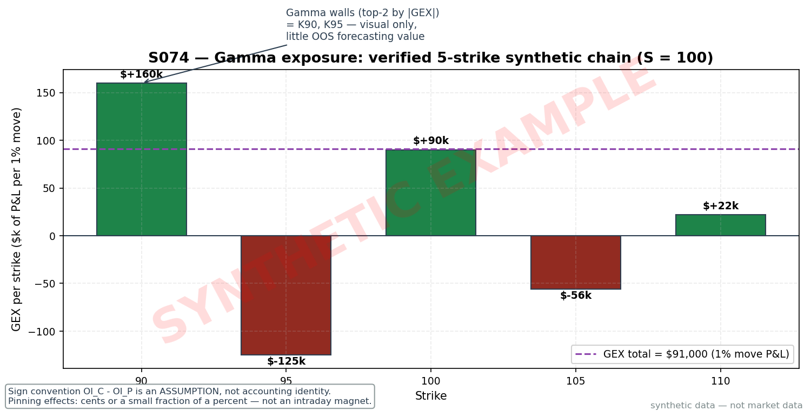

```mermaid
flowchart LR
    FEED["Raw feed<br/>(full-chain OI;<br/>OPRA/vendor chains)"] -->|full chain + OI by strike/expiry, EOD| ING["Ingest + normalize<br/>(as-of OI vintages, adjustments)"]
    ING -->|"EOD clean chain snapshots"| FEAT["Feature compute<br/>(BS gamma, GEX per strike)"]
    FEAT -->|per-strike GEX, daily| SIG["Signal S074<br/>OI-based gamma exposure"]
    SIG -->|daily regime read| GATE{"Cost / toxicity<br/>gate?"}
    GATE -->|pass| OUT["Downstream consumer<br/>(T050, T095, T070)"]
    GATE -->|fail| DROP["No trade"]
    style SIG fill:#aed6f1,stroke:#1f3a5f
```

### S12. Sources

1. Ni, S.X., Pearson, N.D. & Poteshman, A.M. (2005). "Stock price clustering on option expiration dates." *Journal of Financial Economics* 77(2):249–274. https://optionmetrics.com/research/s-xiaoyan-ni-n-d-pearson-and-a-m-poteshman-stock-price-clustering-on-option-expiration-dates/
2. Barbon, A., Beckmeyer, H., Buraschi, A. & Moerke, M. "The Role of Leveraged ETFs and Option Market Imbalances on End-of-Day Price Dynamics." Working paper. https://www.alexandria.unisg.ch/server/api/core/bitstreams/5a99db31-0d37-4f86-9502-8cb0f3bff4fe/content
3. SqueezeMetrics (2016, rev. 2017). "GEX — Gamma Exposure" methodology guide (practitioner construction; aggregate GEX, DDOI dealer-direction model). https://squeezemetrics.com/monitor/static/guide.pdf

**Unverified leads** (chatbot-provided, not independently checkable — do not treat as evidence): GEX engine build hours (prototype 50–120 h, production 180–450 h); chain-normalization hours (60–150 / 200–500 h); OI-based GEX data ($500–20,000+/mo) and historical GEX ($2,000–25,000+/mo) pricing bands; the "cents or small fraction of a percent" effect-size framing (kept as a qualitative caution, not a measured statistic).

---
## Stage 16/200 — S016: Hasbrouck (1995) information share — venue price discovery

*Batch SB9 · Signal 16/100 · Provenance [D] · Family A — Microstructure & Order Flow*

### S1. One-line verdict

| | |
|---|---|
| **What it is** | For one security trading on several venues, the **information share (IS)** decomposes the innovation in the common *efficient price* across venues — it measures *where price discovery happens*, not what the price does next. |
| **When it works** | Fragmented markets (US equities, cross-listed stocks, FX): attributing price discovery across venues, routing market-data spend, and building cross-venue lead–lag features. |
| **When it dies** | As a directional trading signal — high IS is descriptive, not predictive; and when innovation correlation is high, Cholesky-ordering bounds swallow any point estimate. |
| **Build-or-buy in one line** | Build the VECM-to-IS pipeline (a day's work); buy synchronized multi-venue mids (TAQ/Databento) — garbage synchronization in, garbage attribution out. |

Provenance **[D]** (Hasbrouck 1995, *Journal of Finance*); never upgraded. The central honesty rule of this chapter: **report bounds, not one number** — the Cholesky ordering sensitivity below is the rule, not an artifact.

### S2. How it works — plain human explanation

**Price discovery** is the incorporation of new information into a security's price. The **efficient price** is the unobservable "true" value common to all venues — each venue's quote is the efficient price plus venue-specific noise. **Cointegration** keeps the venue prices from drifting apart (one long-run anchor), but *which* venue moves first when news arrives is an empirical question.

**Information share** answers it: fit a **VECM** (vector error-correction model — a VAR for cointegrated prices that includes each venue's pull back toward the common anchor), convert it to its moving-average form, and read off the **long-run impact vector** $\psi$ — how much a shock to each venue's price permanently moves the common efficient price. Combine with the **innovation covariance** $\Omega$ (how the venues' unexpected moves co-vary) via a **Cholesky decomposition** $\Omega = FF'$ (a way of attributing correlated shocks to venues one at a time, in a chosen order), and venue $j$'s share is $IS_j = ([\psi F]_j)^2 / (\psi\Omega\psi^\top)$: the proportion of the efficient price's permanent innovation attributable to venue $j$.

Picture three venues quoting the same stock. Venue A's mid ticks up 2¢, B and C follow 300 ms later. The VECM sees A's innovation *leading* the common move and credits A with most of the permanent innovation — A is where price discovery happened. But IS does *not* say the price goes up next (the innovation already happened), it doesn't say A's lead survives your latency and fees, and it doesn't distinguish "A had the informed traders" from "A reacts fastest to public news" or "B and C copy A." A high IS can mean faster public-info reaction, more informed flow, better liquidity, lower latency — or mechanical following. **The information-share statistic alone is descriptive, not predictive.**

- **Mental model 1:** Five thermometers in one room; IS tells you which thermometer's reading the room's "true temperature" follows — not what the temperature will be tomorrow.
- **Mental model 2:** The Cholesky ordering is a seating chart for correlated shocks: whoever sits first gets credit for the shared movement. Change the seating, change the credit — hence bounds, not point estimates.
- **Mental model 3:** This is a *routing and monitoring* tool that becomes a trading input only inside a conditional lead–lag model tested out-of-sample (T082, T089).

### S3. The math — exact formula

Let $p_t = (p_{1,t}, \dots, p_{n,t})^\top$ be the log mid-prices on $n$ venues (dollars in logs), cointegrated with known cointegrating vectors $\beta$ (e.g. pairwise spreads $p_1 - p_j$). The VECM:

$$\Delta p_t = c + \alpha\, \beta' p_{t-1} + \sum_{i=1}^{k-1} \Gamma_i\, \Delta p_{t-i} + \varepsilon_t, \qquad \Omega = \mathrm{Cov}(\varepsilon_t).$$

The moving-average form gives the common **long-run impact row vector** $\psi$ ($1 \times n$) — how much a shock to each venue's price permanently moves the efficient price. With the Cholesky factor $F$ ($\Omega = FF'$, lower triangular, for a given venue ordering), the **information share** of venue $j$ is:

$$IS_j = \frac{([\psi F]_j)^2}{\psi\,\Omega\,\psi^\top}, \qquad \sum_j IS_j = 1.$$

Because $F$ depends on the ordering, compute $IS_j$ for **all $n!$ orderings** and report $[\min, \max]$ bounds per venue. Complement: the **Gonzalo–Granger component share** (permanent–transitory decomposition weight) — a second attribution that agrees with IS when VECM residuals are uncorrelated and diverges otherwise.

| Parameter | Symbol | Typical range | Too small / too large | Default (example) |
|---|---|---|---|---|
| Venues | $n$ | 2–5 | Too many: $n!$ orderings explode; too few: misses the fragmenting venue | 3 *— example, not an institutional standard* |
| Sampling | $\Delta t$ | ≤1 s bars (example) | Too fine: asynchrony distorts $\Omega$; too coarse: the lead is arbitraged | 1-s synchronized mids *— example* |
| Estimation window | $T$ | minutes–days | Too short: $\psi$, $\Omega$ noisy; too long: structural breaks | 1 session *— example* |
| VECM lags | $k$ | 1–5 | Too few: residual autocorrelation biases $\Omega$; too many: overfit | 2 *— example* |

**Normalization:** log mid-prices, synchronized to a common clock (venue timestamps, millisecond-aligned). **Causal timing:** IS is estimated on a *history* window and used as a slow-moving venue attribute — not a per-bar trigger; any lead–lag trade built on it executes no earlier than $t+1$. **Variants:** (1) *trade-vs-quote decomposition* (Pascual et al. 2006); (2) *Hasbrouck lower/upper bounds* (min/max over orderings — the mandated default); (3) *time-varying IS* on rolling windows.

### S4. Worked example — step-by-step numbers (SYNTHETIC)

All numbers below are **synthetic** (seed **84**); the chart plots exactly these numbers. DGP: a common efficient price (random walk, $\sigma = \$0.01$) plus venue transitory noise with different persistence — Venue A fast/tight ($\rho = 0.10$, leads), Venue B medium ($\rho = 0.50$), Venue C slow/noisy ($\rho = 0.90$, lags); 5,000 one-second bars; VECM with known $\beta$ (pairwise spreads) and 1 lag of $\Delta p$.

**Step 1 — estimate.** The VECM yields $\psi = [0.2963,\ 0.2768,\ 0.2825]$ (nearly equal — the common efficient price loads on all venues) and $\Omega = [[0.000613,\ 0.000172,\ 0.000121],[0.000172,\ 0.000524,\ 0.000101],[0.000121,\ 0.000101,\ 0.000499]]$ (strong off-diagonals — the venues share the shock contemporaneously), with $\psi\Omega\psi^\top = 0.00019818$.

**Step 2 — one ordering.** For ordering (A, B, C), the Cholesky factor is $F = [[0.024763,\ 0,\ 0],[0.006953,\ 0.021815,\ 0],[0.004889,\ 0.003083,\ 0.021571]]$. Then $[\psi F]_A = 0.0106431$, and $IS_A = 0.0106431^2 / 0.00019818 = 0.5716 \approx \mathbf{0.572}$; likewise $IS_B = 0.241$, $IS_C = 0.187$.

**Step 3 — all six orderings: the bounds.** 

| Ordering | A | B | C |
|---|---|---|---|
| (A,B,C) | 0.572 | 0.241 | 0.187 |
| (A,C,B) | 0.572 | 0.180 | 0.248 |
| (B,A,C) | 0.326 | 0.486 | 0.187 |
| (B,C,A) | 0.240 | 0.486 | 0.274 |
| (C,A,B) | 0.395 | 0.180 | 0.424 |
| (C,B,A) | 0.240 | 0.336 | 0.424 |

**Venue bounds (the honest answer): A: 0.240–0.572 (avg 0.391); B: 0.180–0.486 (avg 0.318); C: 0.187–0.424 (avg 0.291).** The chart shows these as bars with whiskers.

**What to notice:** A was *designed* as the leader and averages highest — yet its bounds (24–57%) overlap B's and C's completely. A point estimate like "A = 39%" is spurious precision; the bounds are the result. **Limits:** synthetic; real venues have halts and tick-size differences, and this example has no latency.

### S5. Strategies that use this signal

- **T082 — Information-Share Venue Router** — primary trigger: routes orders to the price-discovering venue and avoids toxic venues — IS bounds are the routing table.
- **T089 — Quote-Matcher (SIP-vs-Direct)** — attribution input: micro-arbitrage on venue/SIP quote differences; IS identifies which venue's quotes lead so the matcher knows which side is stale.

### S6. Data required — exact spec

| Field | Type | Granularity | Source tier | Notes |
|---|---|---|---|---|
| Venue mid-prices (all $n$ venues) | numeric | ≤1-s, synchronized | Tier 2–3 | TAQ multi-exchange quotes or Databento multi-venue; venue (not SIP) timestamps |
| Venue trade prints (optional) | event | tick | Tier 2–3 | For the trade-vs-quote IS decomposition |
| Corporate actions / halts | reference | daily | Tier 0–1 | A halted venue drops out of the panel — handle explicitly |
| FX rates (cross-listed only) | numeric | matched frequency | Tier 1 | Convert to common currency before the VECM |

Ingest sketch (Python/polars, ≤20 lines):

```python
import polars as pl
frames = []
for venue in ["A", "B", "C"]:
    q = pl.read_parquet(f"quotes_{venue}.parquet")
    q = q.with_columns(mid=(pl.col("bid")+pl.col("ask"))/2,
                       ts=(pl.col("venue_ts").dt.round("1s")))
    frames.append(q.group_by("ts").agg(pl.col("mid").last().alias(venue)))
panel = frames[0]
for f in frames[1:]:
    panel = panel.join(f, on="ts", how="inner")   # common clock
panel = panel.with_columns(pl.all().exclude("ts").log().name.suffix("_log"))
```

Storage (per `notes/cost-model.md` §4): IS needs *tick* quotes per venue — L1 quotes+trades ≈ 2–8 GB/symbol-day parquet per venue feed; keep per-symbol-per-venue daily files and estimate on 1-s bars. Data-quality checklist: venue (never SIP) timestamps, millisecond alignment; locked/crossed quotes filtered; halts remove the venue for that interval; DST/half-days; tick-size differences across venues.

### S7. Local build on M5 Max / 128GB

**Feasibility: feasible** (Tier M — the VECM is small; the pain is synchronization). Per `notes/cost-model.md` §2, polars asof/rolling joins run ~1–10M rows/sec — synchronizing three venue quote streams to 1-s bars for a Dow-30-style panel is seconds; the VECM is OLS plus a $3 \times 3$ eigendecomposition per window — milliseconds in numpy. RAM: a 1-s bar panel for 30 symbols × 3 venues × 1 session is megabytes (§3); raw tick panels stay in per-symbol daily files. Engineering (per §5): Tier M, **20–60 h** ≈ **$3,000–9,000** at $150/hr loaded-cost estimate (multi-venue sync, VECM, Cholesky-bounds machinery, rolling leadership monitor). What breaks first at 500 symbols or full OPRA: the synchronization join across venues (Rust or pre-aggregated 1-s bars), and the $n!$ ordering combinatorics — cap $n$ or sample orderings.

| Stack | When to pick |
|---|---|
| Python + polars/numpy | Default: sync, VECM, IS bounds, leadership monitoring |
| Rust | Only for tick-level multi-venue sync at full universe scale |
| DuckDB | Ad-hoc IS studies over archived multi-venue panels |

### S8. Buy vs build

Vendor price bands per `notes/cost-model.md` §6.

| Option | What you get | Indicative price | Gains | Loses |
|---|---|---|---|---|
| Tier-0/1 (SIP consolidated) | One NBBO tape | ~$0–200/mo *indicative — verify before budgeting* | Cheap | No per-venue attribution possible — IS needs venue-identified quotes |
| Tier-2 (Databento multi-venue) | Per-venue L1 with venue timestamps | ~$200/mo + usage *indicative — verify before budgeting* | Honest synchronization for IS | Usage meter on full universes |
| Tier-3 (TAQ via WRDS) | Full multi-exchange history | institutional/academic *indicative — verify before budgeting* | Gold-standard replay | Licensing friction |
| Build the estimator | VECM → $\psi$, $\Omega$ → IS bounds | eng time only | Your own orderings, windows, decompositions | — |

**Verdict: build the pipeline, buy venue-identified data.** The econometrics is a day's work and must be yours; SIP data cannot answer "which venue" by construction. Crossover: for a *single* venue's lead–lag vs the SIP, Tier-1 plus a lead–lag regression (S059/S060) is cheaper than multi-venue IS.

### S9. Success ratio / efficacy — documented evidence

| Study / source | Market & period | Metric | Before/after cost | Caveat |
|---|---|---|---|---|
| Hasbrouck (1995), *J. Finance* | 30 Dow stocks | Median **92.7%** information share for the NYSE | Before-cost (descriptive) | 1995 fragmentation; specialist era — magnitudes not portable |
| Su & Chong (2007), *Pacific-Basin Finance J.* | Chinese NYSE/SEHK cross-listings | SEHK **89.4%** IS (81.6% Gonzalo–Granger PT) vs NYSE | Before-cost (descriptive) | Cross-listed, overlapping-hours subsample |
| Pascual, Pascual-Fuster & Climent (2006), *J. Financial Markets* | Spanish cross-listed stocks, 2-hr overlap | NYSE contribution decomposed into trade-related vs trade-unrelated informative shocks | Before-cost (descriptive) | Working-paper version; overlap-window only |

Regimes where it fails: leadership changes (the "dominant" venue of 1995 is not the dominant venue of 2026); high correlation regimes where bounds go uninformative; sampling asynchrony manufacturing spurious leads; news regimes where all venues react to the same public signal. **Honest bottom line:** as a standalone directional signal this has no documented edge — the evidence base is *attribution*, and every number above is before-cost and descriptive. As a venue-routing input (T082) and quote-staleness detector (T089), it earns its keep: knowing *where* discovery happens tells you which feed to buy, which quotes to trust, and which venue's moves deserve a response.

### S10. Failure modes & pitfalls

1. **Cholesky-ordering shopping** (reporting the ordering most favorable to your venue) → mitigate: always report min/max bounds over all $n!$ orderings.
2. **Sampling asynchrony** (stale prints look like a "lag") → mitigate: venue timestamps, common-clock bars, drop bars where any venue is stale.
3. **Cointegration failure** (halts, tick-size regimes, FX moves break the anchor) → mitigate: test cointegration per window; suspend attribution when it fails.
4. **Structural breaks in leadership** → mitigate: rolling windows; change-point monitoring on the bounds.
5. **Endogeneity** (all venues react to the same news) → mitigate: news-time controls; don't trade the lead without a conditional model tested out-of-sample.
6. **Latency erasing the lead** (measured lead 300 ms; your round trip 800 ms) → mitigate: compare the lead horizon against measured latency + fees before any trading claim.
7. **Over-interpreting a high IS** → mitigate: remember the four readings of high IS — the statistic doesn't choose among them.

### S11. Visuals

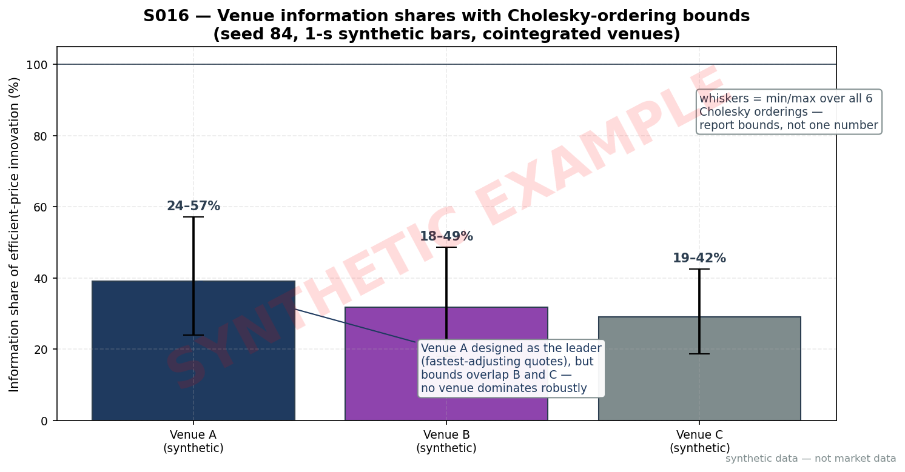

```mermaid
flowchart LR
    FEED["Raw feed<br/>(TAQ multi-exchange / Databento)"] -- "per-venue tick quotes<br/>(venue timestamps)" --> ING["Ingest + normalize<br/>(common clock, halts)"]
    ING -- "synchronized 1-s<br/>log-mid panel" --> FEAT["Feature compute<br/>(VECM → ψ, Ω)"]
    FEAT -- "IS bounds per venue<br/>(per estimation window)" --> SIG["Signal S016<br/>information shares"]
    SIG -- "venue ranking + bounds<br/>(per window)" --> GATE{"Lead > latency<br/>+ cost gate?"}
    GATE -- "pass (per window)" --> OUT["Downstream consumer<br/>(T082 router / T089 matcher)"]
    GATE -- "fail" --> DROP["No trade"]
    style SIG fill:#aed6f1,stroke:#1f3a5f
```

### S12. Sources

1. Hasbrouck, Joel (1995). "One Security, Many Markets: Determining the Contributions to Price Discovery." *Journal of Finance* 50(4): 1175–1199. http://ideas.repec.org/a/bla/jfinan/v50y1995i4p1175-99.html
2. Su, Qian & Chong, Terence Tai-Leung (2007). "Determining the contributions to price discovery for Chinese cross-listed stocks." *Pacific-Basin Finance Journal* 15(2): 140–153. https://www.sciencedirect.com/science/article/abs/pii/S0927538X06000643
3. Pascual, Roberto, Pascual-Fuster, Bartolomé & Climent, Francisco (2006). "Cross-listing, price discovery and the informativeness of the trading process." *Journal of Financial Markets* 9: 144–161. (Stable URL not captured this batch.)
4. Gonzalo, Jesús & Granger, Clive W. J. (1995). "Estimation of common long-memory components in cointegrated systems." *Journal of Business & Economic Statistics* 13: 27–35. (Component-share complement.)
5. Federal Reserve Bank of New York. Staff Report on FX market price discovery and the shifting locus of trading (working-paper PDF captured in this batch's research notes). https://www.newyorkfed.org/medialibrary/media/research/staff_reports/sr624.pdf

**Unverified leads** (batch-research claims without an independently checkable source this batch):
- Duck.ai Q-SB9-3 information-share summary (verified formula): $IS_j = ([\psi F]_j)^2/(\psi\Omega\psi^\top)$; "descriptive, not predictive"; the six limitations (Cholesky ordering, cointegration assumption, sampling sensitivity, structural breaks, endogeneity, latency).
- NY Fed FX price-discovery staff study findings as summarized by the bot — working-paper PDF captured above; treat the summary as a lead.
- Source log: Duck.ai answered Q-SB9-1–Q-SB9-3 (2026-09-10); Grok/Cursor answers pending (checked 2026-09-10).

---
## Stage 75/200 — S075: Dispersion trading

*Batch SB9 · Signal 75/100 · Provenance [D] · Family E — Volatility & Options-Informed*

### S1. One-line verdict

| | |
|---|---|
| **What it is** | Harvests the gap between index option-implied correlation and realized constituent correlation (long constituent vol, short index vol, or reverse). |
| **When it works** | Calm-to-moderate regimes where implied correlation mean-reverts and realized correlations stay dispersed. |
| **When it dies** | Correlation spikes (2008-style): correlations → 1, index IV explodes, constituent hedges go illiquid. |
| **Build-or-buy in one line** | Build the analytics yourself, but you must *buy* the options data — there is no free full-chain OPRA feed. |

Provenance **[D]** · Family E — Volatility & Options-Informed.

### S2. How it works — plain human explanation

**Dispersion** is the tendency of index volatility and the volatilities of the index's constituents to disagree. A **variance swap** is a contract paying the difference between realized variance over its life and a fixed strike variance — its fair strike is roughly the market's expectation of future variance. **Implied volatility (IV)** is the volatility number that makes an option's market price equal its model price. **Implied correlation** is the single correlation number that makes the index's implied variance consistent with the constituents' implied variances.

Picture a calm Tuesday: the S&P 500's 1-month implied volatility sits at 24% while the average single-stock IV is 35%. The index options imply a correlation of only 0.39 — but realized correlation has been running 0.30. The classic dispersion trade *sells* index volatility (short index straddles or variance swaps — a **straddle** is a call plus a put at the same strike, a pure volatility position) and *buys* constituent volatility (long single-stock straddles), **delta-hedging** both legs (neutralizing directional exposure by trading the underlying against the option position). If realized correlation comes in below the implied correlation you sold, the index leg decays faster than the constituent legs, and the spread earns money.

Why should the edge exist? Two competing stories. (1) **Correlation-risk compensation**: the premium is payment for bearing correlation risk — correlations spike exactly when you are short index vol, so the premium is earned risk compensation. (2) **Market inefficiency**: structural supply/demand (institutional put buying vs. dealer/hedge-fund single-stock option selling) misprices the index-vs-constituent volatility surface. Deng (2008) tests these against each other using the late-1999/2000 institutional changes in the US options market as a natural experiment, and finds the profitability *changed* when market structure changed — supporting inefficiency over a stable risk premium (label: research lead — see S9/S12).

- **Mental model 1:** You are an insurance company selling correlation insurance — small steady premiums, occasional catastrophic claims.
- **Mental model 2:** Index puts are structurally overbought; single-stock options are structurally oversold. Dispersion arbitrages the spread between those two clienteles.
- **Mental model 3:** Net delta near zero understates risk: your true exposure is to correlation and to index vega (sensitivity to IV changes), not direction.

The honest core, straight from the literature: the premium "is compensation for correlation + liquidity risk." The 2008-style break — correlations → 1, index puts extremely expensive, constituent hedges illiquid — is precisely the wrong environment for a small account: margin expands, spreads widen, forced hedging at worst prices.

### S3. The math — exact formula

Index variance decomposes into constituent variances plus pairwise correlation terms:

$$\sigma_I^2 = \sum_{i=1}^{n} w_i^2 \sigma_i^2 + 2\sum_{i<j} w_i w_j \rho_{ij}\, \sigma_i \sigma_j$$

where $\sigma_I$ = index implied volatility, $\sigma_i$ = constituent $i$ implied volatility, $w_i$ = index weight of constituent $i$ (weights sum to 1), and $\rho_{ij}$ = implied pairwise correlation.

Solving for one common pairwise correlation gives the **implied correlation**:

$$\rho_{\text{impl}} = \frac{\sigma_I^2 - \sum_i w_i^2 \sigma_i^2}{\sum_{i \ne j} w_i w_j\, \sigma_i \sigma_j}$$

and the signal is its spread vs. realized correlation:

$$\text{signal}_t = \rho_{\text{impl},t} - \rho_{\text{real},t}(W)$$

with $\rho_{\text{real},t}(W)$ the average pairwise realized constituent correlation over window $W$. Classic direction: **long constituent variance / short index variance** when $\text{signal}_t > +\kappa$ (*example* $\kappa \approx 0.10$–$0.15$ — *not an institutional standard*); reverse or stand down when the spread is negative or realized correlation is spiking. Computed at day $t$'s close on data $\le t$; tradable no earlier than $t+1$.

| Parameter | Symbol | Typical range | Too small | Too large | Default (example) |
|---|---|---|---|---|---|
| Entry spread threshold | $\kappa$ | 0.05–0.20 | Overtrading, costs dominate | Never trades | 0.10 |
| Realized-corr window | $W$ | 20–60 trading days | Noisy $\rho_{\text{real}}$ | Stale, misses regime shifts | 30 days |
| Constituent count | $n$ | 30–100 | Idiosyncratic noise | Hedging cost explosion | 50 |
| Option tenor | $T$ | 1–3 months | Gamma/transaction churn | Vega-dominant, slow | 1 month |
| Delta-hedge frequency | — | daily–intraday | Gamma bleed | Trading costs | daily |

*All defaults are examples — not institutional standards.*

**Normalization:** work in correlation *spread* units (dimensionless), or z-score the spread against its own 1-year history. **Variants:** straddle-based (listed options) vs. variance-swap-based (OTC, cleaner math); equally-weighted vs. index-weighted legs; vega-neutral vs. gamma-weighted sizing. The Cboe Implied Correlation Index (tickers KCJ/ICJ) disseminates the market price of expected 1-year SPX constituent correlation — a ready-made dispersion-regime gauge.

### S4. Worked example — step-by-step numbers (SYNTHETIC)

All numbers below are **synthetic** — a hand-built 10-day illustration, not market data and not a backtest. Random seed **75** (`np.random.default_rng(75)`; only the filler bars use it). Equal weights, three stocks A/B/C with IVs 33/35/37.

Day 1 check: $\sigma_I^2 = 27^2 = 729$; $\sum w^2\sigma_i^2 = (33^2+35^2+37^2)/9 = 409.22$; $\sum_{i\ne j} w_iw_j\sigma_i\sigma_j = 2(33{\cdot}35+33{\cdot}37+35{\cdot}37)/9 = 815.78$; so $\rho_{\text{impl}} = (729-409.22)/815.78 = \mathbf{0.3920}$.

Daily P&L uses two illustrative scalings, both stated as examples: **$1,000 per correlation point** on the $\rho_{\text{impl}} - \rho_{\text{real}}$ spread, and **−$1,000 per vol point** of index-IV increase on the short index leg (vega bleed).

| Day | Index IV | $\rho_{\text{impl}}$ | $\rho_{\text{real}}$ | Spread P&L ($) | Index vega P&L ($) | Daily total ($) | Cumulative ($) |
|---|---|---|---|---|---|---|---|
| 1 | 27.0 | 0.3920 | 0.30 | +92.0 | 0 | +92.0 | +92.0 |
| 2 | 27.0 | 0.3920 | 0.28 | +112.0 | 0 | +112.0 | +204.0 |
| 3 | 27.0 | 0.3920 | 0.32 | +72.0 | 0 | +72.0 | +276.0 |
| 4 | 27.0 | 0.3920 | 0.29 | +102.0 | 0 | +102.0 | +378.0 |
| 5 | 27.0 | 0.3920 | 0.31 | +82.0 | 0 | +82.0 | +460.0 |
| 6 | 27.0 | 0.3920 | 0.30 | +92.0 | 0 | +92.0 | +551.9 |
| 7 | 30.0 | 0.6016 | 0.55 | +51.6 | −3,000 | −2,948.4 | −2,396.4 |
| 8 | 33.0 | 0.8333 | 0.75 | +83.3 | −3,000 | −2,916.7 | −5,313.2 |
| 9 | 38.0 | 0.8536 | 0.92 | −66.4 | −5,000 | −5,066.4 | −10,379.5 |
| 10 | 40.0 | 1.0000 | 0.97 | +30.0 | −2,000 | −1,970.0 | −12,349.5 |

**What to notice:** days 1–6 earn a slow, steady +$552 while realized correlation sits below implied — the insurance-premium phase. On day 7 stress arrives: implied correlation rises (the market *sees* the correlation risk coming), but the damage comes from the index-IV repricing on the short leg, not the correlation spread itself. By day 10 implied correlation hits 1.0000 and six days of gains are buried under −$12,350. Limits of this toy: fixed scalings, no option bid–ask, no delta-hedging cost, no margin calls, 3 names. It illustrates the payoff shape, not profitability.

### S5. Strategies that use this signal

- **T058 — Dispersion Trader** — primary trigger: long single-stock realized vol vs. short index vol, VRP-aware (uses S075, S063, S069). This signal *is* the strategy's entry logic.
- **T095 — Dispersion + GEX Regime Switch** — runs dispersion only when the dealer-gamma regime is supportive (uses S075, S074, S068). S075 supplies the correlation-spread trigger; S074 (GEX) acts as the regime gate/veto — dispersion is stood down when dealer positioning makes correlation spikes likely.

### S6. Data required — exact spec

| Field | Type | Granularity | Source tier | Notes |
|---|---|---|---|---|
| Index option chain (IV by strike/tenor) | float (IV, OI, volume) | daily EOD snapshots (intraday for hedging) | Tier 2 | OPRA; SPX/OEX or ETF (SPY) chains |
| Constituent option chains | float | daily EOD snapshots | Tier 2 | 30–100 underlyings; OI filter for liquidity |
| Index weights | float | daily | Tier 0/1 | Index factsheet or vendor |
| Dividends / borrow rates | float | daily | Tier 1/2 | For variance-swap fair value; hard-to-borrow names distort |
| Underlying prices (hedging) | float | 1-min bars | Tier 1 | For daily delta hedging |

Collection (Databento OPRA example, ≤20-line sketch):

```python
import databento as db
client = db.Historical("YOUR_KEY")          # key via approved credential flow
job = client.timeseries.get_range(
    dataset="OPRA.PILLAR",                  # OPRA full chain
    symbols=["SPX.OPT", "AAPL.OPT"],        # index + constituents
    schema="definition",                    # chain definitions
    start="2026-08-01", end="2026-09-10")
store = job.to_parquet("opra_chains.parquet")
# downstream: fit IV surface per underlying -> compute rho_impl daily
```

Storage per cost-model §4: OPRA full-chain snapshots ≈ **1–3 GB/day (SPX-like)** — selective underlyings only; 60 days of the 50-name chain ≈ 60–180 GB on disk.

**Data-quality checklist:** chain timestamps in exchange time; corporate actions adjusted before IV fitting; halts → drop the underlying that day; OI/volume liquidity filter on single-name tenors; borrow-rate spikes flagged; DST/half-day calendars.

### S7. Local build on M5 Max / 128GB

**Feasibility: feasible for research, heavy for production** (Tier H per cost-model §5: 60–200 h ≈ **$9,000–$30,000** loaded-cost estimate at $150/hr — full-chain OPRA analytics, surface fitting, and multi-leg hedging sit in the H tier).

- **Throughput** (cost-model §2): IV-surface fitting is numpy-vectorized (~50–200M elements/sec); a 50-name daily chain refit takes seconds. Intraday delta hedging on 1-min bars for 50 names = 19,500 bars/day — trivial for polars (~10–50M rows/sec). Bottleneck is **data I/O and licensing**, not arithmetic.
- **RAM** (cost-model §3): one SPX-like chain snapshot ≈ 100–300 MB; 8 snapshots/day ≈ 1–2.5 GB/day live — fits inside the 77 GB working budget if you keep fitted surfaces, not raw ticks. 60 days of fitted surfaces ≈ tens of GB — fits with care.
- **Stack:** Python + polars + numpy for research; DuckDB for the chain archive. Rust only for intraday chain streaming.
- **What breaks first at 500 symbols:** the OPRA feed itself — full-chain real-time for 500 underlyings is institutional $$$$ data and TB-scale storage (cost-model §4 warns: do not archive naively). Breakage order: data bill → disk → your ability to delta-hedge, long before the M5 Max's CPU.

### S8. Buy vs build

| Option | What you get | Indicative price | Gains | Loses |
|---|---|---|---|---|
| Tier-0 free route | Stooq daily bars, Cboe delayed quotes page | ~$0 | Regime gauges (KCJ/ICJ levels), weights | No chains, no history, no backtest |
| Tier-1 retail (Cboe delayed options data) | Coarse Greeks, straddle moves | ~$0–50/mo | Cheap signal prototyping | Too coarse for real implied-corr math |
| Tier-2 professional (Databento OPRA) | Full chain snapshots, research-grade | ~$200/mo + usage | Honest IV surfaces, real backtests | Usage meter runs on full-universe pulls |
| Academic/institutional (OptionMetrics IvyDB) | Publication-quality options history | ~$thousands/yr academic; institutional $$$$ | Clean adjusted history | Price; redistribution limits |

*All prices indicative — verify before budgeting.*

**Verdict: build if** you need custom correlation estimators, your own hedging rules, or microstructure honesty around which tenors are actually tradeable. **Buy if** you need full OPRA chain history or borrow/term-structure panels — building those means re-licensing anyway. **Crossover:** buy Databento OPRA for the raw chains (~$200/mo + usage, indicative), build the implied-correlation engine yourself.

### S9. Success ratio / efficacy — documented evidence

| Study / source | Market & period | Metric | Before/after cost | Caveat |
|---|---|---|---|---|
| Deng (2008), "Volatility Dispersion Trading", SSRN | US index + single-stock options; natural experiment of late-1999/2000 institutional changes | Dispersion profitability *changed* after structural options-market changes → supports inefficiency over stable risk premium | Before-cost (cost detail not in available abstract) | Research lead: abstract-level; full text paywalled |
| Ferrari, Poy, Abate (2019), S&P 100 options backtest | S&P 100 options | Risk-adjusted return beat buy-and-hold; low market correlation | Before-cost (costs not detailed in available summary) | Research lead: timing + Bollinger overlay; model-dependent |
| Variance-swap dispersion study (MPRA 22318) | EuroStoxx 50, Jan 2005–Dec 2006 | Systematic short index variance / long constituents: positive mean 3-month returns | Explicitly **before-cost** (zero transaction costs assumed) | Author notes the market got more efficient and later profits were lower than historically |
| Quantpedia literature summary (unverified lead) | 1996–2007 backtest summary | "15.39% return" cited | Before/after-cost unknown | **Historical, model-dependent, NOT expected return** — quarantined as a research lead |

Regimes where it fails: correlation spikes (2008-style: correlations → 1, index puts extremely expensive, constituent hedges illiquid, dealers and funds hedging simultaneously) and volatility-of-volatility explosions. Documented decay: Deng measures a sharp decrease in performance since 2000; the MPRA study notes declining profits as the market got more efficient.

**Honest bottom line:** as a standalone trigger this is a *structural but capacity-constrained* edge — the index-vs-single-name vol/correlation premium is real in the historical record, but it is compensation for correlation and liquidity risk that realizes violently. As a regime-gated harvester (cf. T095) it is more defensible. For a ≤$1M paper operation the capital intensity (index leg + dozens of constituent option legs + daily delta hedging + short-option margin + stress collateral) makes it one of the hardest signals in this document to run small.

### S10. Failure modes & pitfalls

1. **Correlation-spike break (and hidden vega)** — correlations → 1, short index leg detonates; near-zero net delta hides the real exposure. *Mitigation:* hard cap on index vega; stand down when KCJ/ICJ or realized correlation spikes (T095's GEX gate); risk-report on $\partial\sigma_I^2/\partial\rho_{ij} = 2w_iw_j\sigma_i\sigma_j$, not delta.
2. **Liquidity illusion in constituent hedges** — single-name options go one-sided in stress. *Mitigation:* OI/volume liquidity filters; fewer, more-liquid names.
3. **Margin expansion** — short-option margin and stress collateral spike exactly when P&L is worst. *Mitigation:* pre-fund stress collateral; size to stressed margin, not current.
4. **Discrete-rebalance error** — variance-swap math assumes continuous hedging; daily hedging leaks P&L. *Mitigation:* model discrete hedging explicitly; widen the required edge by the slippage estimate.
5. **Dividend/borrow distortion** — special dividends and hard-to-borrow names corrupt IV. *Mitigation:* borrow-rate feed; exclude or haircut affected names.
6. **Surface model risk** — implied correlation depends on your IV interpolation. *Mitigation:* compute with two surface methods; trade only when they agree.
7. **Crowding** — every vol desk runs dispersion; unwinds correlate. *Mitigation:* monitor dealer positioning (S074); reduce into crowded regimes.

### S11. Visuals

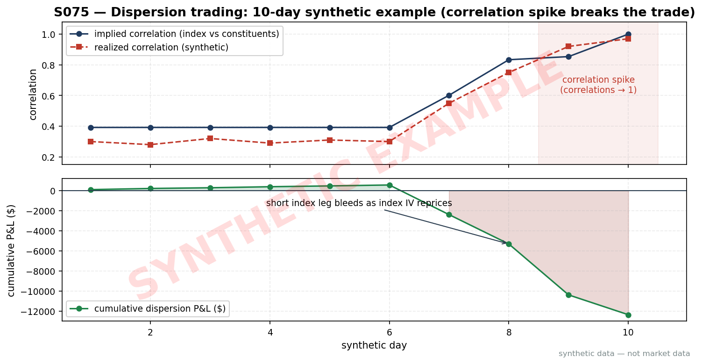

```mermaid
flowchart LR
    FEED["Raw feed<br/>(OPRA chains + index weights)"] -->|"daily options chains"| ING["Ingest + normalize<br/>(exchange ts, corp actions, halts)"]
    ING -->|"clean daily chains"| FEAT["Feature compute<br/>(IV surfaces, rho_impl, rho_real)"]
    FEAT -->|"daily correlation series"| SIG["Signal S075<br/>implied - realized corr spread"]
    SIG -->|"daily signal"| GATE{"Cost / margin<br/>gate?"}
    GATE -->|"pass"| OUT["Downstream consumer<br/>(T058 / T095 sizing)"]
    GATE -->|"fail"| DROP["No trade"]
    style SIG fill:#aed6f1,stroke:#1f3a5f
```

### S12. Sources

1. Bakshi, G. & Kapadia, N. (2003). "Delta-Hedged Gains and the Negative Market Volatility Risk Premium." *Journal of Derivatives*, Fall 2003. http://people.umass.edu/nkapadia/docs/Bakshi_Kapadia_JoD_Fall_2003.pdf — negative market volatility risk premium: index options priced above subsequently realized volatility; foundational for the index-leg richness dispersion harvests.
2. Deng, Q. (2008). "Volatility Dispersion Trading." SSRN. https://papers.ssrn.com/sol3/papers.cfm?abstract_id=1156620 — profitability changed after the late-1999/2000 structural options-market changes, supporting the inefficiency hypothesis over a stable risk premium.
3. Ferrari, P., Poy, G. & Abate, G. (2019). "Dispersion trading: an empirical analysis on the S&P 100 options." *Investment Management and Financial Innovations*, 16(1), 178–188. http://dx.doi.org/10.21511/imfi.16(1).2019.14 — S&P 100 backtest; risk-adjusted return beat buy-and-hold with low market correlation.
4. "Dispersion Trading Based on the Explanatory Power of S&P 500 Stock Returns." *Mathematics* (MDPI), 2020. https://www.mdpi.com/2227-7390/8/9/1627 — net buying pressure on index options vs. net selling pressure on single-stock options creates the IV mispricing.
5. Dispersion P&L decomposition (variance-swap gamma P&L = correlation exposure + vega/volga/vanna terms). http://arxiv.org/pdf/1004.0125v1 — formalizes the split into a correlation-spread term and a volatility term.

**Unverified leads** (chatbot-provided or second-hand; not confirmed facts — verify before use):
- Quantpedia literature summary citing a "15.39% return 1996–2007 backtest" for dispersion — historical, model-dependent summary; NOT an expected return.
- Driessen, Maenhout & Vilkov (2009): large negative *index* variance risk premium with no evidence of a negative premium on *individual* variance risk — cited as summarized in an NYU Stern survey document (https://www.stern.nyu.edu/sites/default/files/assets/documents/con_040081.pdf); full text not independently opened.

---

---
## Stage 76/200 — S076: Volatility breakout / squeeze positioning

*Batch SB9 · Signal 76/100 · Provenance [D/SR] · Family E — Volatility & Options-Informed*

### S1. One-line verdict

| | |
|---|---|
| **What it is** | Positions for volatility expansion: enters when a bar's range explodes past its recent average, or when Bollinger bandwidth has squeezed to a historic low. |
| **When it works** | Genuine regime shifts — scheduled events, breakouts with follow-through — where realized volatility actually expands after the signal. |
| **When it dies** | Choppy, mean-reverting regimes: the breakout reverses, the time stop exits at a loss, and costs compound. |
| **Build-or-buy in one line** | Build — it is a few dozen lines on 1-min bars; nothing worth buying. |

Provenance **[D/SR]** · Family E — Volatility & Options-Informed.

### S2. How it works — plain human explanation

A **range-expansion** bar is a bar whose high–low range is a large multiple of its recent average — the market suddenly moving much more than it has been. A **Bollinger bandwidth squeeze** is the opposite setup: **Bollinger Bands** (a moving average plus/minus two standard deviations) pinch to their narrowest width in months, meaning volatility has compressed to an extreme. **Realized volatility** is volatility that actually happened (measured from price changes); the premise of the squeeze is volatility clustering — quiet periods are followed by loud ones, a fact documented since Engle (1982).

Picture 9:47 AM: a stock has chopped between $100.20 and $100.28 for two hours, bandwidth at its 5th percentile of the last six months. Then a headline hits; the next 1-minute bar prints $100.05–$100.59 — a range 7× its 10-bar average — and closes above the upper band. The signal says: volatility regime has changed; position for expansion in the bar's direction with a **time stop** (exit after a fixed number of bars, because the edge, if any, is short-lived).

Why should it work? Two mechanisms. First, genuine information arrival: scheduled events and real breakouts produce persistent directional range expansion. Second, positioning cascades: a volatility breakout forces hedgers and stop-losses to trade, extending the move. But the honest framing, confirmed by large-scale testing: the squeeze tells you *that* a move is coming, not *which way*. Volatility clustering predicts the magnitude of future movement, not its direction. A **false breakout** (or **whipsaw**) — the bar breaks out, you enter, price reverses — is the modal outcome in range-bound regimes, and each one costs spread plus fees plus the time stop's giveback.

- **Mental model 1:** The squeeze is a coiled spring detector — it measures compression, not aim.
- **Mental model 2:** Range expansion is a regime-change alarm — it fires on real news and on noise alike; the time stop is what keeps the noise affordable.
- **Mental model 3:** You are buying realized volatility after it starts expanding — you will always be late; the question is whether the move has a second leg.

### S3. The math — exact formula

**Range expansion.** Let $R_t = H_t - L_t$ be bar $t$'s range and $\bar{R}_{t-1}^{(N)} = \frac{1}{N}\sum_{i=1}^{N} R_{t-i}$ its trailing mean. Signal when:

$$\frac{R_t}{\bar{R}_{t-1}^{(N)}} > k \quad \text{(enter in the direction of bar } t\text{'s close vs. open)}$$

with $k \approx 1.5$–$2.0$ (*example — not an institutional standard*; the worked example uses $k = 1.75$).

**Bollinger bandwidth squeeze.** With $N$-bar moving average $\text{MA}_t^{(N)}$ and standard deviation $\sigma_t^{(N)}$:

$$\text{BW}_t = \frac{(\text{MA}_t^{(N)} + 2\sigma_t^{(N)}) - (\text{MA}_t^{(N)} - 2\sigma_t^{(N)})}{\text{MA}_t^{(N)}} = \frac{4\sigma_t^{(N)}}{\text{MA}_t^{(N)}}$$

Squeeze when $\text{BW}_t$ is at or below the $p$-th percentile of its trailing $M$-bar history (*example:* $p = 10$, $M \approx 126$ trading days ≈ 6 months — the practitioner standard; Bollinger's own definition is the lowest bandwidth in the past 125 periods). The combined signal: **squeeze armed** (bandwidth percentile ≤ $p$) **and then** an expansion bar or a close outside the bands → enter in the breakout direction; exit on a time stop of $H$ bars (*example:* 3–6 bars).

Causal timing: computed at bar $t$'s close using only data $\le t$; tradable no earlier than bar $t+1$'s open.

| Parameter | Symbol | Typical range | Too small | Too large | Default (example) |
|---|---|---|---|---|---|
| Expansion multiple | $k$ | 1.5–2.5 | Noise triggers, overtrading | Misses real expansions | 1.75 |
| Range lookback | $N$ | 10–20 bars | Jumpy reference | Slow to adapt | 10 |
| Band lookback | $N$ (bands) | 10–20 bars | Twitchy bands | Squeeze never registers intraday | 10 |
| Squeeze percentile | $p$ | 5–15% | Almost never armed | Not a real squeeze | 10% |
| Squeeze history | $M$ | 60–180 days | Percentile meaningless | Ancient regimes pollute | 126 days |
| Time stop | $H$ | 3–10 bars | Chops winners early | Gives back the move | 6 bars |

*All defaults are examples — not institutional standards.*

**Normalization:** bandwidth percentile is already normalized; the range ratio is self-normalizing. **Variants:** expansion-only (no squeeze arming — more trades, lower quality); squeeze + close-outside-band (Bollinger's original); Crabel-style opening-range expansion; close-position filter (close in top/bottom quartile of the expansion bar).

### S4. Worked example — step-by-step numbers (SYNTHETIC)

**Synthetic** 60-bar 1-minute series, random seed **76** (`np.random.default_rng(76)`; only filler bars 51–59 use randomness — all signal bars are fixed). 10-bar, 2σ bands (*example* parameter); bandwidth percentile over a trailing 20-bar window (*illustrative short window — practitioner standard is 6 months*); range ratio vs. 10-bar average range with $k = 1.75$.

**Tape A — squeeze → true breakout (bars 27–32):**

| Bar | O | H | L | C | Range | 10-bar avg range | Ratio | BW pct | Upper | Lower |
|---|---|---|---|---|---|---|---|---|---|---|
| 27 | 100.24 | 100.26 | 100.21 | 100.23 | 0.05 | 0.086 | 0.62 | 5.3% | 100.25 | 100.16 |
| 28 | 100.24 | 100.27 | 100.21 | 100.24 | 0.05 | 0.081 | 0.67 | 5.0% | 100.25 | 100.17 |
| 29 | 100.24 | 100.27 | 100.21 | 100.24 | 0.05 | 0.077 | 0.70 | 5.0% | 100.25 | 100.18 |
| 30 | 100.26 | 100.74 | 100.20 | 100.67 | 0.54 | 0.073 | **7.37** | 100% | 100.55 | 99.99 |
| 31 | 100.70 | 100.91 | 100.57 | 100.77 | 0.34 | 0.118 | 2.88 | 100% | 100.74 | 99.91 |
| 32 | 100.77 | 101.01 | 100.65 | 100.86 | 0.35 | 0.143 | 2.46 | 100% | 100.92 | 99.86 |

Bar 29: squeeze armed (BW at 5th percentile). Bar 30: range 7.37× average, close 100.67 > upper band 100.55 → expansion signal. Entry bar 31 open 100.70; 6-bar time stop → exit bar 36 close 101.21. Gross +$0.510/share; costs (half-spread $0.01 + fee $0.003 per side, an *example* schedule) = $0.026/share → **net +$0.484/share (+$242 on 500 shares)**.

**Tape B — expansion false breakout (bars 44–49):**

| Bar | O | H | L | C | Range | 10-bar avg range | Ratio | BW pct | Upper | Lower |
|---|---|---|---|---|---|---|---|---|---|---|
| 44 | 100.81 | 100.86 | 100.76 | 100.80 | 0.09 | 0.192 | 0.50 | 50% | 101.22 | 100.65 |
| 45 | 100.80 | 100.85 | 100.75 | 100.79 | 0.09 | 0.169 | 0.56 | 35% | 101.16 | 100.64 |
| 46 | 100.81 | 101.46 | 101.00 | 101.32 | 0.46 | 0.148 | **3.12** | 55% | 101.24 | 100.59 |
| 47 | 101.35 | 101.48 | 101.11 | 101.22 | 0.37 | 0.164 | 2.25 | 60% | 101.31 | 100.56 |
| 48 | 101.22 | 101.37 | 100.96 | 101.08 | 0.41 | 0.174 | 2.33 | 60% | 101.33 | 100.56 |
| 49 | 101.08 | 101.21 | 100.87 | 100.97 | 0.33 | 0.200 | 1.68 | 55% | 101.34 | 100.57 |

Bar 46: range 3.12× average and close 101.32 > upper band 101.24 — but note the *weaker* setup: no squeeze arming (BW percentile 35–55%, not ≤10%) and the band break is only $0.08 vs. $0.12 on the true breakout. Entry bar 47 open 101.35; price reverses; 3-bar time stop → exit bar 49 close 100.97. Gross −$0.380/share → **net −$0.406/share (−$203 on 500 shares)**.

**What to notice:** the two trades net +$39 combined — the winner barely covers the loser plus costs. That *is* the lesson: expansion signals are roughly coin-flips on direction; profitability comes entirely from (a) requiring squeeze arming, (b) sizing the time stop to the regime, and (c) costs staying small relative to the average expansion move. This toy has no partial fills, no slippage beyond the spread, and hand-picked bars — it demonstrates mechanics, not profitability.

### S5. Strategies that use this signal

- **T042 — Jump-Robust Vol Spike Trader** — primary trigger: trades bipower-variation / Lee–Mykland jump-filtered vol spikes (uses S064, S065, S076). S076 supplies the raw expansion trigger; S064/S065 veto the jumps that are microstructure noise rather than regime change.
- **T014 — Bollinger Reversal + Squeeze Exit** — exit/cover leg: fades band tags but *covers into bandwidth-squeeze expansions and vol breakouts* (uses S041, S030, S076). S076 acts as the adverse-regime veto — when expansion fires, the reversal book stands down.
- **T041 — HAR Vol-Timing Overlay** — regime input: scales all intraday positions by HAR realized-vol forecasts (uses S066, S067, S076). S076 flags expansion regimes where the overlay cuts size.
- **T050 — GEX Pin / Dealer-Positioning Fade** — context leg (uses S074, S070, S076): S076's expansion signal tells the pin-fade when the pinning regime has broken.
- **T019 — Donchian/Keltner Breakout + Vol Sizing** — sizing leg (uses S028, S029, S076): S076 gates position size by volatility-breakout regime.

### S6. Data required — exact spec

| Field | Type | Granularity | Source tier | Notes |
|---|---|---|---|---|
| OHLCV bars | float/int | 1–5 min bars | Tier 1 | Any OHLCV vendor; RTH session filter |
| Corporate actions | adjustment factors | daily | Tier 1 | Splits/dividends before band computation |

Collection (Polygon example, ≤20-line sketch):

```python
import requests, polars as pl
resp = requests.get(                                   # key via approved credential flow
  "https://api.polygon.io/v2/aggs/ticker/SPY/range/1/minute/2026-09-09/2026-09-10",
  params={"apiKey": "YOUR_KEY", "limit": 50000}).json()
bars = pl.DataFrame(resp["results"]).with_columns(
  pl.from_epoch("t", "ms").dt.convert_time_zone("America/New_York").alias("ts"))
# downstream: rolling(10) mean/std -> bands; rolling range ratio; bandwidth percentile
```

Storage per cost-model §4: 1-min bars for 500 symbols ≈ **50 MB/day** total; 60 days ≈ 3 GB — archive freely.

**Data-quality checklist:** timestamps in exchange time (DST/half-days); corporate actions adjusted; halts → exclude bars; zero-range RTH bars flagged; late prints not used for signal bars.

### S7. Local build on M5 Max / 128GB

**Feasibility: trivial** (per cost-model §5 this is Tier L: 4–12 h ≈ **$600–$1,800** loaded-cost estimate at $150/hr — justified: 1-min bar signals with rolling statistics are the textbook Tier-L workload).

- **Throughput** (cost-model §2): 500 symbols × 390 bars = **195,000 bars/day**; polars rolling aggregations run at ~10–50M rows/sec — the full universe recomputes in milliseconds. A Python event loop at ~100–500k events/sec is also ample. Bottleneck: none locally; data-vendor rate limits, if anything.
- **RAM** (cost-model §3): 1-min OHLCV for 500 symbols × 60 days ≈ **12 MB** — four orders of magnitude inside the 77 GB working budget.
- **Stack:** Python + polars (pick this; nothing else needed). Rust/DuckDB only if this becomes one feature among thousands in a shared engine.
- **What breaks first at 500 symbols:** nothing about compute — the failure mode is *signal* quality: 500-symbol expansion screens generate correlated false breakouts on macro headlines, so the breakage is portfolio heat, not hardware.

### S8. Buy vs build

| Option | What you get | Indicative price | Gains | Loses |
|---|---|---|---|---|
| Tier-0 free (Stooq, Alpaca IEX) | Daily/15-min bars | ~$0 | Free prototyping | Too coarse for true 1-min squeeze timing |
| Tier-1 retail (Polygon Stocks Advanced, Alpaca SIP) | 1-min/real-time SIP bars | ~$30–200/mo | Everything this signal needs | SIP-vs-direct latency nuance (irrelevant at this horizon) |
| Tier-2 professional (Databento) | L1/L2 + bars, clean symbology | ~$200/mo + usage | Corporate-action-clean history | Overkill for this signal alone |
| Academic route | LOBSTER academic samples | ~hundreds/yr academic | Microstructure truth | Unnecessary — bars suffice |

*All prices indicative — verify before budgeting.*

**Verdict: build, always.** The entire signal is two rolling computations; the only real decision is the data tier. **Buy** Tier-1 1-min bars (~$30–200/mo, indicative) the moment you trade more than a toy universe; **build** the estimator regardless — you cannot buy your own thresholds, and the squeeze percentile window is the whole edge.

### S9. Success ratio / efficacy — documented evidence

| Study / source | Market & period | Metric | Before/after cost | Caveat |
|---|---|---|---|---|
| Fang, Jacobsen & Qin (2014), "Popularity versus Profitability: Evidence from Bollinger Bands" (summarized by CXO Advisory) | 14 international stock indexes, 1885–2014 | Basic Bollinger volatility-breakout avg daily gross buy–sell spread: **0.45% pre-1983 → 0.00% post-2001**; squeeze refinement = band width at 6-month minimum + close outside band | **Before-cost** (gross spread) | Decay coincides with rising media coverage — popularity extinguished the edge |
| EdgeTools, "Buy the Panic" — ~20M Bollinger backtests | CME_MINI:ES1! futures | Squeeze breakout longs −0.10pp edge, shorts +0.15pp — economically negligible, statistically zero after Bonferroni correction; squeeze predicts future *volatility*, not *direction* | Before-cost (cost treatment undisclosed — treat as research lead) | Practitioner study, not peer-reviewed; confirms the "magnitude not direction" framing |

Regimes where it fails: low-volatility chop (false breakouts dominate); macro-headline whipsaws (expansion fires on noise); crowded retail hours where everyone trades the same band break. Documented decay: the Fang et al. result is the key fact — the naive breakout edge decayed to zero as the indicator became popular.

**Honest bottom line:** as a standalone directional trigger this is a *weak-to-zero* edge in modern data — the documented record shows decay to nothing and large-scale tests find no directional edge. As a *volatility-regime detector* (squeeze = expansion is coming) and as a *veto/exit* (T014, T041) it is genuinely useful: it tells you when your other edges are about to be stressed. Trade it for the regime information, not the direction.

### S10. Failure modes & pitfalls

1. **False breakouts in chop** — the modal outcome in range-bound regimes. *Mitigation:* require squeeze arming (BW percentile ≤ 10%) before taking expansion entries.
2. **Direction coin-flip** — clustering predicts magnitude, not direction. *Mitigation:* pair with a directional filter (trend, order flow); never size as if direction were signaled.
3. **Realized vol doesn't follow** — band break without follow-through; the move dies in 2 bars. *Mitigation:* short time stops (3–6 bars); exit on range contraction.
4. **Cost blowup** — frequent small losses each pay spread + fees; turnover kills the book. *Mitigation:* require expected move > 3× round-trip cost, modeled explicitly.
5. **Lookahead in the percentile** — computing the "6-month low" with data past the signal bar. *Mitigation:* strictly trailing window; point-in-time bandwidth history.
6. **Parameter mining** — $k$, $N$, $p$, $H$ are many degrees of freedom on 1-min data. *Mitigation:* fix parameters from the literature first (1.75 / 10 / 10% / 6); sensitivity-check, don't optimize.
7. **Overnight/event gaps** — bars spanning announcements print artificial expansion. *Mitigation:* session filters; treat scheduled-event windows as a separate regime (S034).
8. **Correlated signals** — macro headlines fire expansion on all 500 names at once. *Mitigation:* portfolio-level heat cap; de-duplicate by residualizing market beta.

### S11. Visuals


```mermaid
flowchart LR
    FEED["Raw feed<br/>(e.g. Polygon 1-min bars)"] -->|"1-min OHLCV bars"| ING["Ingest + normalize<br/>(exchange ts, DST, halts)"]
    ING -->|"clean 1-min bars"| FEAT["Feature compute<br/>(bandwidth, range ratios)"]
    FEAT -->|"1-min feature series"| SIG["Signal S076<br/>squeeze + expansion"]
    SIG -->|"bar-close signal"| GATE{"Cost / regime<br/>gate?"}
    GATE -->|"pass"| OUT["Downstream consumer<br/>(T042 entry / T014 exit)"]
    GATE -->|"fail"| DROP["No trade"]
    style SIG fill:#aed6f1,stroke:#1f3a5f
```

### S12. Sources

1. Fang, J., Jacobsen, B. & Qin, Y. (2014). "Popularity versus Profitability: Evidence from Bollinger Bands." https://www.cxoadvisory.com/big-ideas/when-bollinger-bands-snapped/ (CXO Advisory summary) — 14 international indexes, 1885–2014: basic Bollinger breakout gross edge decayed 0.45%/day pre-1983 → 0.00% post-2001; defines the squeeze refinement as band width at a six-month minimum plus a close outside the band.
2. EdgeTools. "Buy the Panic: What 20 Million Bollinger Tests Found for CME_MINI:ES1!" https://www.tradingview.com/chart/ES1!/FwfqO55g-Buy-the-Panic-What-20-Million-Bollinger-Tests-Found/ — ~20M backtests: squeeze-breakout directional edge ≈ 0 (−0.10pp long / +0.15pp short, insignificant after Bonferroni); squeeze forecasts future volatility, not direction.
3. Bollinger Band squeeze definition (lowest bandwidth in the past 125 periods; squeeze = volatility compression precedes expansion). https://www.tradingview.com/scripts/bollingerbands/page-4/?script_type=indicators&sort=recent — documents the indicator's squeeze/bulge semantics and the 125-period convention.

**Unverified leads** (not confirmed facts — verify before use):
- TheStreet (2015) practitioner note on squeeze + failed-breakout confirmation — https://www.thestreet.com/investing/stocks/this-technical-tool-can-tell-you-when-a-stock-will-break-out-13283064 — anecdotal, single-stock examples.

---

---
## Stage 77/200 — S077: Kalman-filtered fair value (local-level trend)

*Batch SB9 · Signal 77/100 · Provenance [D] · Family F — Statistical/ML Infrastructure*

### S1. One-line verdict

| | |
|---|---|
| **What it is** | Splits each observed price into a latent "efficient" (fair-value) price plus microstructure noise, using the Kalman filter; trades the gap or the fair-value trend. |
| **When it works** | When microstructure noise is large relative to true price movement (illiquid names, wide spreads) and the Q/R calibration is honest. |
| **When it dies** | When Q/R is miscalibrated — too smooth and you lag every turn; too fast and you just chase noise — or when the "trend" was noise all along. |
| **Build-or-buy in one line** | Build — the filter is ~20 lines; the calibration (Q, R) is the entire product and cannot be bought. |

Provenance **[D]** · Family F — Statistical/ML Infrastructure.

### S2. How it works — plain human explanation

A **Kalman filter** is a recursive estimator for a hidden quantity observed through noise. A **state-space model** writes the world as two equations: how the hidden state evolves (the *state* equation) and how observations relate to it (the *observation* equation). The **local-level model** is the simplest useful state space: the hidden fair value follows a random walk, and each observed price equals the fair value plus noise.

Picture 9:47:03: AAPL's mid-price flickers 231.40 → 231.41 → 231.39 → 231.42 within two seconds. Is the "true" price moving, or is this just **microstructure noise** — bid–ask bounce and quote flicker around a stable efficient price? The Kalman filter answers with a weighted average: each new observation moves the fair-value estimate by the **Kalman gain** $K_t$ times the surprise. The gain comes from the ratio of **process noise** $Q$ (how much the true price moves per step) to **observation noise** $R$ (how noisy each print is). Large $Q/R$ → trust the tape, react fast. Small $Q/R$ → trust the model, smooth heavily. The filter also outputs $P_{t|t}$, the variance of its own estimate — a built-in confidence meter no moving average gives you.

This differs from **S052** (define-on-first-use distinction): S052 uses the Kalman filter to estimate a time-varying *hedge ratio* $\beta_t$ between *two* cointegrated prices (a pairs-trading parameter). S077 uses it to estimate the latent *efficient price of a single price* — fair value vs. hedge ratio. Same machinery, different estimand.

Economically: at short horizons, much price variance is transient (bounce, flicker) rather than information. Filtering it out gives a cleaner trend with less lag than any moving average of comparable smoothness — and the filter's confidence output lets you size positions by how much you actually know.

- **Mental model 1:** A thermostat for price — the filter separates the room's true temperature (fair value) from the thermometer's jitter (noise).
- **Mental model 2:** $Q/R$ is the only real parameter — everything else is bookkeeping. It sets where you live on the smooth↔fast frontier.
- **Mental model 3:** The residual $e_t = y_t - \hat{x}_{t|t}$ is the trade: fade it (mean reversion to fair value) or ride $\Delta\hat{x}$ (fair-value momentum) — but never both at once without a regime rule.

### S3. The math — exact formula

Local-level state space (log-prices $y_t$, latent fair value $x_t$):

$$x_t = x_{t-1} + \eta_t, \quad \eta_t \sim \mathcal{N}(0, Q) \qquad \text{(state)}$$
$$y_t = x_t + \varepsilon_t, \quad \varepsilon_t \sim \mathcal{N}(0, R) \qquad \text{(observation)}$$

**Predict:** $\hat{x}_{t|t-1} = \hat{x}_{t-1|t-1}$, $\quad P_{t|t-1} = P_{t-1|t-1} + Q$

**Update:** $K_t = \dfrac{P_{t|t-1}}{P_{t|t-1} + R}, \quad \hat{x}_{t|t} = \hat{x}_{t|t-1} + K_t\,(y_t - \hat{x}_{t|t-1}), \quad P_{t|t} = (1 - K_t)\,P_{t|t-1}$

**Signals:** residual (fade) $e_t = y_t - \hat{x}_{t|t}$; or fair-value momentum on $\Delta\hat{x}_{t|t} = \hat{x}_{t|t} - \hat{x}_{t-1|t-1}$; or the one-step-ahead surprise $s_t = y_t - \hat{x}_{t|t-1}$. The scale-free tuning knob is $\lambda = Q/R$.

| Parameter | Symbol | Typical range | Too small | Too large | Default (example) |
|---|---|---|---|---|---|
| Process-noise variance | $Q$ | $10^{-6}$–$10^{-2}$ (price²) | Filter never moves; lags turns | Chases every tick; no smoothing | 0.04 |
| Observation-noise variance | $R$ | $10^{-5}$–$10^{-1}$ (price²) | Overfits bounce | Ignores real moves | 0.16 |
| Smooth↔fast ratio | $Q/R$ | $10^{-4}$–$1$ | Glacial | Noise-chasing | 0.25 |
| Initial variance | $P_0$ | $R$, $10R$, or $100R$ (diffuse) | Overconfident start | Slow burn-in | $R$ |

*All defaults are examples — not institutional standards.*

**Calibration (the actual work):** $R$ from bid–ask bounce / quote-revision variance at the shortest horizon; $Q$ from low-frequency price-change variance *minus* the noise component; or joint maximum-likelihood/EM on a training window. **Normalization:** z-score the residual by $\sqrt{P_{t|t} + R}$ for a scale-free fade signal. Causal timing: the update at $t$ uses only data $\le t$; tradable no earlier than $t+1$.

**Variants:** local *linear* trend (adds a slope state — faster but twitchier); pairs form: $y_t = \beta_t x_t + \mu_t + \varepsilon_t$ with $\theta_t = [\beta_t, \mu_t]^\top$ random-walking — the S052 bridge, signal on the z-scored spread $s_t = y_t - \hat{\beta}_t x_t - \hat{\mu}_t$; **innovation**-gated entries (trade only when $|e_t|$ exceeds a multiple of its predicted std).

### S4. Worked example — step-by-step numbers (SYNTHETIC)

**Operator-verified** recursion (duck.ai answers, hand-checked 2026-09-10 — 4th-decimal rounding noise only, no material errors). Synthetic 10-observation series; $Q = 0.04$, $R = 0.16$, $\hat{x}_{0|0} = 100.00$, $P_{0|0} = 0.16$. Seed **77** recorded for the plot script (`np.random.default_rng(77)`); the series itself is fixed, not random.

Update 1 ($y_1 = 100.40$): $P_{1|0} = 0.16 + 0.04 = 0.20$; $K_1 = 0.20/(0.20+0.16) = 0.5556$; surprise $\nu_1 = 0.40$; $\hat{x}_{1|1} = 100.00 + 0.5556 \times 0.40 = \mathbf{100.2222}$; $P_{1|1} = (1-0.5556)\times0.20 = \mathbf{0.0889}$.

Update 2 ($y_2 = 99.80$): $P_{2|1} = 0.1289$; $K_2 = 0.4462$; $\nu_2 = -0.4222$; $\hat{x}_{2|2} = \mathbf{100.0338}$; $P_{2|2} = \mathbf{0.0714}$.

Update 3 ($y_3 = 100.20$): $P_{3|2} = 0.1114$; $K_3 = 0.4104$; $\nu_3 = 0.1662$; $\hat{x}_{3|3} = \mathbf{100.1020}$; $P_{3|3} = \mathbf{0.0657}$; $e_3 = 100.20 - 100.1020 = \mathbf{0.0980}$.

Full table (matches `images/S077_example.png` exactly):

| $t$ | $y_t$ | $\hat{x}_{t\|t-1}$ | $P_{t\|t-1}$ | $K_t$ | $\hat{x}_{t\|t}$ | $P_{t\|t}$ | $e_t = y_t - \hat{x}_{t\|t}$ |
|---|---|---|---|---|---|---|---|
| 1 | 100.40 | 100.0000 | 0.2000 | 0.5556 | 100.2222 | 0.0889 | +0.1778 |
| 2 | 99.80 | 100.2222 | 0.1289 | 0.4462 | 100.0338 | 0.0714 | −0.2338 |
| 3 | 100.20 | 100.0338 | 0.1114 | 0.4104 | 100.1020 | 0.0657 | +0.0980 |
| 4 | 100.60 | 100.1020 | 0.1057 | 0.3977 | 100.3001 | 0.0636 | +0.2999 |
| 5 | 100.30 | 100.3001 | 0.1036 | 0.3931 | 100.3001 | 0.0629 | −0.0001 |
| 6 | 100.90 | 100.3001 | 0.1029 | 0.3914 | 100.5349 | 0.0626 | +0.3651 |
| 7 | 101.10 | 100.5349 | 0.1026 | 0.3908 | 100.7557 | 0.0625 | +0.3443 |
| 8 | 100.80 | 100.7557 | 0.1025 | 0.3905 | 100.7730 | 0.0625 | +0.0270 |
| 9 | 101.20 | 100.7730 | 0.1025 | 0.3904 | 100.9397 | 0.0625 | +0.2603 |

**What to notice:** the gain $K_t$ decays 0.5556 → 0.3904 and $P_{t|t}$ converges toward its steady state (~0.0625) — the filter "learns" how much to trust the tape within a handful of observations. The residual $e_t$ is the tradeable object: a fade rule would sell $t=6$'s +0.3651 print; a fair-value-momentum rule would buy the rising $\hat{x}_{t|t}$ path. Note $t=5$: the filter barely moves ($\hat{x}$ unchanged to 4 decimals) because the observation confirmed the prediction — exactly the behavior a moving average cannot replicate. Limits: Gaussianity assumed, $Q/R$ fixed by fiat here, and 10 points prove nothing about profitability.

### S5. Strategies that use this signal

- **T051 — Kalman Fair-Value Trend** — primary trigger: local-level trend following with dynamic confidence from the Kalman filter (uses S077, S078, S079). S077 *is* the entry logic — position direction from $\Delta\hat{x}_{t|t}$, sized by $1/\sqrt{P_{t|t}}$.
- **T096 — Kalman + HMM Adaptive Trend** — regime-gated variant (uses S077, S079, S078): fair-value trend entries from S077, gated by the HMM regime state (S079) — trend-following only when the hidden state says "trending" — with AR-innovation timing (S078).

### S6. Data required — exact spec

| Field | Type | Granularity | Source tier | Notes |
|---|---|---|---|---|
| Trade/quote prices | float | tick or 1-min bars | Tier 1 | Any intraday feed; mid-prices preferred over last prints |
| Bid–ask spread | float | 1-min | Tier 1 | For $R$ calibration from bounce |
| Pair leg prices (pairs form) | float | 1-min bar closes | Tier 1 | Two cointegrated names |

Collection (1-min bars → filter loop, ≤20-line sketch):

```python
import polars as pl, numpy as np
bars = pl.read_parquet("bars_1min.parquet").sort("ts")   # Tier-1 vendor, key via approved flow
y = bars["mid"].to_numpy(); Q, R = 0.04, 0.16            # example calibration
x, P = y[0], R
xs, Ps = [], []
for yt in y:                                             # causal: uses only data <= t
    Pp = P + Q; K = Pp/(Pp+R)
    x = x + K*(yt-x); P = (1-K)*Pp
    xs.append(x); Ps.append(P)
bars = bars.with_columns(pl.Series("fair", xs), pl.Series("conf", Ps))
```

Storage per cost-model §4: 1-min bars for 500 symbols ≈ **50 MB/day** total; 500 × 390 = **195,000 bars/day**; 60 days ≈ 3 GB — archive freely. Panel RAM for a 500 × 252 estimation window: 500×252×8 ≈ **0.96 MiB**; the 500×500 covariance ≈ **1.91 MiB** (both operator-verified byte arithmetic).

**Data-quality checklist:** use mid-prices (last prints inject bounce into $y_t$); timestamp normalization; corporate actions adjusted; halts excluded; calibration window separated from the trading window (no lookahead in $Q/R$).

### S7. Local build on M5 Max / 128GB

**Feasibility: trivial-to-feasible** (per cost-model §5 this is Tier M: 20–60 h ≈ **$3,000–$9,000** loaded-cost estimate at $150/hr — justified: the filter loop is simple, but honest $Q/R$ calibration with walk-forward validation is the real work).

- **Throughput** (cost-model §2): 500 scalar Kalman updates run in <10 ms compiled; a 500-symbol 1-min batch update is ~1–20 ms vectorized. Polars/numpy handle the universe in real time with enormous headroom. Bottleneck: none — calibration design, not compute.
- **RAM** (cost-model §3): the filter state is two floats per symbol; even a 500 × 252 estimation panel is ~1 MiB. Fits trivially inside the 77 GB working budget.
- **Stack:** Python + numpy/polars (pick this). Rust only if the filter sits inside a tick-level execution loop.
- **What breaks first at 500 symbols:** calibration discipline — estimating honest per-symbol $Q/R$ on 500 names without overfitting needs purged walk-forward (S088) machinery, not more hardware.

### S8. Buy vs build

| Option | What you get | Indicative price | Gains | Loses |
|---|---|---|---|---|
| Tier-0 free (Stooq daily) | Daily bars | ~$0 | Free local-level on daily data | Useless for intraday fair value |
| Tier-1 retail (Polygon/Alpaca SIP) | 1-min/real-time bars | ~$30–200/mo | Everything the filter needs | — |
| Tier-2 professional (Databento) | L1 quotes, imbalance feeds | ~$200/mo + usage | True quote-mid inputs, better $R$ calibration | Overkill for the basic filter |
| Academic route | Textbooks (Harvey), LOBSTER samples | ~$0–hundreds/yr | Canonical state-space theory | No production feed |

*All prices indicative — verify before budgeting.*

**Verdict: build, immediately.** The filter is twenty lines; no vendor sells your $Q/R$. **Buy** Tier-1 1-min bars (~$30–200/mo, indicative) and spend the budget on calibration rigor — walk-forward $Q/R$ selection with purged validation — instead of fancier data.

### S9. Success ratio / efficacy — documented evidence

| Study / source | Market & period | Metric | Before/after cost | Caveat |
|---|---|---|---|---|
| Benhamou (2016), "Trend Without Hiccups — A Kalman Filter Approach", SSRN | S&P 500 mini-future | 4 KF models: models 1–2 ≈ $20k net/1yr; model 4 (short/long-term split + extremum term) ≈ **$40k net/1yr**, max drawdown −$7.3k → −$2.6k | Reported "net", cost detail unavailable — **research lead** | Parameters "obtained by general optimization… best possible choice" = in-sample optimization; overfit risk explicitly flagged by the paper itself |
| Bel Hadj Ayed et al. (2015), "Forecasting trends with asset prices", arXiv:1504.03934 | Latent trend as unobservable OU process | Closed-form likelihood + online estimation; quantifies damage from **bad calibration** of a misspecified Kalman filter | N/A — methodology, not a P&L backtest | Confirms the chapter's core warning: calibration is the product |
| Bruder, Dao, Richard & Roncalli (2011), "Trend Filtering Methods for Momentum Strategies", SSRN | Multi-asset momentum | Trend-filtering (incl. Kalman-type) methods improve momentum strategy construction | Before/after-cost detail unverified — **research lead** | Cited via reference list; full text not independently opened |

Regimes where it fails: high-noise chop where $Q/R$ is set too fast (filter chases bounce and whipsaws); regime shifts where the calibrated $Q/R$ no longer describes the market (volatility regime change → recalibrate); jump-driven moves the Gaussian local-level model cannot represent (pair with S064 jump filters). Documented decay: none specific to the filter — but the Benhamou caveat generalizes: any edge found by optimizing filter parameters in-sample should be assumed overstated until walk-forwarded.

**Honest bottom line:** as a standalone trigger this is a *calibration-dependent smoothing edge* — the filter demonstrably beats moving averages on lag *given correct parameters*, and its confidence output ($P_{t|t}$) is genuinely useful for sizing. As infrastructure (fair-value input to T051/T096, or the pairs-form spread in S052-style books) it is more defensible than as a lone signal. For a ≤$1M paper operation it is one of the cheapest signals in this document to run honestly.

### S10. Failure modes & pitfalls

1. **Q/R miscalibration** — the single dominant failure; too smooth lags turns, too fast chases noise. *Mitigation:* calibrate $R$ from bounce, $Q$ from low-frequency variance minus noise; walk-forward the ratio.
2. **In-sample parameter optimism** — optimizing $Q/R$ on the test period (the Benhamou caveat). *Mitigation:* purged/embargoed walk-forward (S088); never select $Q/R$ on the evaluation window.
3. **Gaussianity violation** — jumps break the linear-Gaussian assumptions. *Mitigation:* jump-robust pre-filtering (S064); robustified update or regime switch.
4. **Microstructure regime change** — spread/tick-size changes alter $R$ silently. *Mitigation:* re-estimate $R$ on rolling windows; monitor the innovation variance.
5. **Stale-quote inputs** — filtering last prints instead of mids injects bounce into the state. *Mitigation:* mid-price or microprice inputs only.
6. **Overfitting via variants** — local-level vs. local-linear-trend vs. pairs form = model mining. *Mitigation:* pick the variant *a priori* from the horizon; report all tried.
7. **Latency illusion** — "zero lag" claims assume the print is tradeable; SIP latency still applies. *Mitigation:* label backtests on SIP data as `simulated only — requires MBO/ITCH` for any latency-sensitive claim.
8. **Confidence misread** — $P_{t|t}$ measures *estimation* uncertainty, not *prediction* uncertainty; price can leave the ±2σ band freely. *Mitigation:* size on $P_{t|t}$, stop-loss on realized P&L.

### S11. Visuals

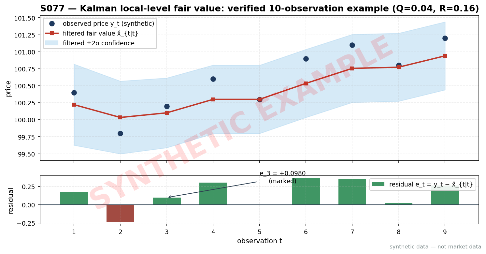

```mermaid
flowchart LR
    FEED["Raw feed<br/>(e.g. Polygon 1-min bars)"] -->|"1-min bars / tick prices"| ING["Ingest + normalize<br/>(mids, exchange ts, halts)"]
    ING -->|"clean 1-min price series"| FEAT["Feature compute<br/>(Kalman predict/update)"]
    FEAT -->|"1-min fair-value + confidence series"| SIG["Signal S077<br/>residual / fair-value trend"]
    SIG -->|"bar-close signal"| GATE{"Cost / confidence<br/>gate?"}
    GATE -->|"pass"| OUT["Downstream consumer<br/>(T051 / T096)"]
    GATE -->|"fail"| DROP["No trade"]
    style SIG fill:#aed6f1,stroke:#1f3a5f
```

### S12. Sources

1. Benhamou, E. (2016). "Trend Without Hiccups — A Kalman Filter Approach." SSRN. https://papers.ssrn.com/sol3/papers.cfm?abstract_id=2747102 — 4 KF models on the S&P 500 mini-future; the combined smoothing+extremum model roughly doubles reported net profit vs. basic models while cutting max drawdown; parameters optimized in-sample (overfit caveat).
2. Bel Hadj Ayed, A. et al. (2015). "Forecasting trends with asset prices." arXiv:1504.03934. https://arxiv.org/abs/1504.03934v1 — latent trend as unobservable Ornstein–Uhlenbeck process; closed-form likelihood and the cost of bad calibration in a misspecified filter.
3. Bruder, B., Dao, T.-L., Richard, J.-C. & Roncalli, T. (2011). "Trend Filtering Methods for Momentum Strategies." SSRN. http://papers.ssrn.com/sol3/papers.cfm?abstract_id=2289097 — trend-filtering methods (including Kalman-type filters) applied to momentum strategy construction.

**Unverified leads** (not confirmed facts — verify before use):
- Kalman, R.E. (1960) original filter paper and Harvey, A.C. (1989) *Forecasting, Structural Time Series Models and the Kalman Filter* — canonical references per the signal report; specific editions/URLs not verified in this pass.
- HF stat-arb reference arXiv 2210.15448 cited in the signal report — not independently opened.

---

---
## Stage 78/200 — S078: AR(1)/ARMA short-horizon return forecast & innovation

*Batch SB9 · Signal 78/100 · Provenance [D/SR] · Family F — Statistical/ML Infrastructure*

### S1. One-line verdict

| | |
|---|---|
| **What it is** | AR(1)/ARMA forecast of 1–5 min mid-price returns; trades the forecast direction or the standardized forecast error (**innovation**). |
| **When it works** | When short-horizon return autocorrelation is stable and larger than the round-trip cost: calm, liquid, trend-persistent minutes. |
| **When it dies** | When the per-bar edge is below spread+fees; when the fitted φ flips sign in regime breaks; when you run it on trade prices without removing the bid–ask bounce. |
| **Build-or-buy in one line** | Build: the model is a dozen lines of OLS (ordinary least squares); buy only the 1-min bar feed. |

Provenance: the AR/ARMA forecasting machinery is **[D]** (documented: Box–Jenkins; Tsay); the **innovation-trading rule** (long z < −2, short z > +2, exit at 0) is **[SR]** — a research framing, not a documented paper rule.

### S2. How it works — plain human explanation

It is 9:47:03 and AAPL's mid-price is 231.405. The last three 1-minute returns were +1.8, +0.9, −0.4 basis points. An **AR(1)** model — **autoregressive** of order 1: today's value is a linear function of last bar's value plus noise — fitted over the last hour says: r_t ≈ 0.28·r_{t−1} + noise. The one-step forecast is 0.28 × (−0.4) = −0.11 bp against a ~2.5 bp round-trip cost — twenty times smaller. The signal does nothing, and that restraint is the whole point.

The economic story: at 1–5 minute horizons, mid-price returns carry small but measurable autocorrelation. Part of it is mechanical (the bid–ask bounce induces *negative* serial covariance in trade prices — Roll 1984), part of it is structural (large orders are split into autocorrelated sequences of child orders; market-maker inventory cycles push and pull the mid back). An AR(1) or ARMA(p,q) (**autoregressive moving-average**: AR terms on past returns plus **MA** terms on past forecast errors) separates the *predictable* component from the *surprise*. Two ways to trade it:

1. **Forecast trading**: take the sign of the forecast, but only when |forecast| clears the cost threshold.
2. **Innovation trading** ([SR] framing): standardize the forecast error — the **innovation**, the part of the return the model did *not* predict — as z_t = ε̂_t/σ̂_ε, and bet that huge unexplained shocks partially reverse (long z < −2, short z > +2, exit at 0).

Why should any of this exist economically? Order flow is not white noise: split orders arrive in autocorrelated sequences (Bouchaud et al. 2004 document long-range correlated market orders), so signed flow — and hence the mid — drifts persistently over a few minutes, while market-maker inventory cycles pull the mid back after one-sided flow. The AR coefficient φ is the net of these two forces. The edge is tiny precisely because both forces are well known — which is why honest cost gating kills most candidate trades.

**Mental model:**
- Short-horizon returns = a small predictable part + a dominant surprise; the model exists to isolate the surprise.
- You are not predicting the market; you are measuring whether the market's own short memory is currently stronger than your cost to trade it.
- The trade gate (|forecast| > cost) fires rarely by design; a frequently-firing AR(1) signal at 1-minute is almost certainly a cost model bug or look-ahead.

### S3. The math — exact formula

**AR(1) (documented [D]):**

r_t = c + φ·r_{t−1} + ε_t,   ε_t white noise, E[ε_t] = 0, Var(ε_t) = σ²_ε

**ARMA(p,q) (documented [D]):**

r_t = c + Σᵢ₌₁ᵖ φᵢ·r_{t−i} + Σⱼ₌₁ᵍ θⱼ·ε_{t−j} + ε_t

One-step forecast (causal: computed at event/bar *t* using only data ≤ *t*; tradable no earlier than *t+1*):

f̂_t = c + Σᵢ φᵢ·r_{t−i}

**Innovation** and its standardization:

ε̂_t = r_t − f̂_t   (the surprise),   z_t = ε̂_t / σ̂_ε

**Forecast-direction rule [D form]**: direction = sign(f̂_t) **only if** |f̂_t| > c_thr, where c_thr is the example round-trip cost threshold.

**Innovation rule [SR — research framing, not a paper rule]**: long when z_t < −2, short when z_t > +2, exit when z_t crosses 0. Parameters re-estimated on rolling windows; model order chosen by AIC/BIC (**Akaike/Bayesian information criteria**: penalized fit measures that trade off likelihood against number of parameters).

**Bid–ask bounce (Roll 1984) — why trade prices need cleaning:** under a constant spread s, trade prices follow Δp_t = m_t + (s/2)(q_t − q_{t−1}) with q_t ∈ {+1,−1} the trade sign, so Cov(Δp_t, Δp_{t−1}) = −s²/4. The AR(1) coefficient on *trade* prices is mechanically negative; running the signal on trade prices without de-bouncing confuses the bounce with predictability. Use mid-prices (or quote midpoints).

**Parameter table** (every default marked `example — not an institutional standard`):

| Parameter | Symbol | Typical range | Too small | Too large | Default example |
|---|---|---|---|---|---|
| AR order | p | 1–3 | underfits persistent flow | fits noise; unstable | p = 1 |
| MA order | q | 0–2 | misses bounce/MA structure | over-parameterized | q = 0 |
| Estimation window | W | 30–240 bars | noisy φ̂, whipsaws | stale through regime breaks | W = 60 1-min bars |
| Cost threshold | c_thr | 1–5 bp | trades below cost | never fires | c_thr = 2.5 bp |
| Innovation z-entry | z_entry | 1.5–3 | constant trading, cost bleed | never trades | ±2 [SR] |
| AIC/BIC selection | — | p,q ∈ {0..3} | picks noise | picks inertia | re-check weekly [example] |

**Normalization**: fit on mid-price *returns* (or spreads), never raw prices (non-stationary — φ̂ drifts to 1); z-score the innovation (z_t) for cross-name comparability; causal timing "computed at bar *t* using only data ≤ *t*; tradable no earlier than *t+1*". **Variants**: (a) AR(1) on mid returns (directional); (b) ARMA(1,1) on trade prices with the MA term absorbing the bounce; (c) innovation trading ([SR]) vs forecast trading; (d) calendar-time 1-min bars vs event-time bars.

### S4. Worked example — step-by-step numbers (SYNTHETIC)

Synthetic 12-bar tape, 1-min mid returns in **basis points**, generated with **seed 78** (`rng = np.random.default_rng(78)`). Model: r_t = 0.28·r_{t−1} + ε_t, ε ~ N(0, 4.5 bp). The coefficient φ̂ = 0.28 is *assumed already estimated* on a prior 60-bar window — this example does not pretend to fit it from 12 bars. Forecast f_t = 0.28·r_{t−1}; innovation ε̂_t = r_t − f_t; gate |f_t| > 2.5 bp (example threshold).

| t | r_t (bp) | f_t (bp) | innovation ε̂_t (bp) | \|f_t\| > 2.5? | Action |
|---|---|---|---|---|---|
| 0 | −3.04 | — | −3.04 | no data | NONE |
| 1 | +0.93 | −0.85 | +1.78 | no | NONE |
| 2 | −1.46 | +0.26 | −1.72 | no | NONE |
| 3 | −5.33 | −0.41 | −4.92 | no | NONE |
| 4 | +1.70 | −1.49 | +3.19 | no | NONE |
| 5 | −1.07 | +0.48 | −1.55 | no | NONE |
| 6 | −0.09 | −0.30 | +0.21 | no | NONE |
| 7 | +3.23 | −0.03 | +3.25 | no | NONE |
| 8 | +12.29 | +0.90 | +11.39 | no | NONE |
| 9 | +1.28 | +3.44 | −2.16 | **yes** | **BUY** (forecast +3.44 bp > 2.5) |
| 10 | +2.74 | +0.36 | +2.38 | no | NONE |
| 11 | +4.77 | +0.77 | +4.00 | no | NONE |

Hand-check of bar 9: f_9 = 0.28 × 12.29 = +3.44 bp ✓; |3.44| > 2.5 → BUY, tradable at bar 10's open. Bar 8's +12.29 bp realized return produced a +11.39 bp innovation — the surprise was nine times the forecast, and the model *did not trade it*: the forecast rule only fires at bar 9. (The matching chart — forecast vs realized with the cost gate — appears in §S11.)

**What to notice:** the gate fired once in 12 bars. That is the honest signature of this signal: with φ = 0.28 and 4.5 bp noise, the typical forecast is ~1 bp, well inside a 2.5 bp cost band. This toy tape has no fees, no latency, no partial fills, and a *known* φ — a real deployment estimates φ with error, which shrinks the edge further. Do not read this as a backtest.

### S5. Strategies that use this signal

- **T052 — AR/ARMA Innovation Trader**: *primary trigger* — trades forecast innovations (surprises) per the [SR] z-rule, validated by the trade–quote VAR (vector autoregression; S084).
- **T040 — PCA Eigenportfolio Residual Reversal**: uses S078 for *timing* — AR-innovation timing of residual-reversal entries (signal T040 composes S080, S039, S078).
- **T051 — Kalman Fair-Value Trend**: uses S078 as a *timing/refinement input* alongside the Kalman fair-value deviation (S077).
- **T096 — Kalman + HMM Adaptive Trend**: uses S078 for AR-innovation-timed entries inside the HMM regime book.
- **T057 — Fractional-Differentiation Memory Trader**: uses S078 to time entries on fractionally-differenced series.

### S6. Data required — exact spec

| Field | Type | Granularity | Source tier | Notes |
|---|---|---|---|---|
| Mid price / quote midpoint | float | 1-min bars (or 5-min) | Tier 1–2 | Prefer NBBO (national best bid and offer) midpoint over trade price (de-bounced) |
| Bid–ask spread series | float (bp) | 1-min bars | Tier 1–2 | For the cost gate c_thr; intraday, not static |
| Corporate actions / splits | events | daily | Tier 0–1 | Adjust returns; splits break AR continuity |
| Halt / auction flags | bool | 1-min bars | Tier 1–2 | Exclude halt bars from estimation window |

Collection: Polygon Stocks Advanced (`/v2/aggs/ticker/{t}/range/1/minute/...`) or Databento MBP-1 (`dbn` schema, `midpoint` from best bid/ask), ≤20-line sketch:

```python
import polars as pl, numpy as np
bars = pl.read_parquet("aapl_1min.parquet").sort("ts")          # mid, spread_bps
r = (bars["mid"] / bars["mid"].shift(1) - 1) * 1e4              # bp returns
W, phi = 60, None
for t in range(W, len(r)):                                     # rolling refit (example cadence)
    y, x = r[t-W:t].to_numpy()[1:], r[t-W:t].to_numpy()[:-1]
    phi = float(np.polyfit(x, y, 1)[0])                        # OLS AR(1); AIC/BIC for (p,q)
    f = phi * r[t-1]                                           # causal forecast, tradable at t+1
    if abs(f) > 2.5:                                           # example cost gate
        submit("BUY" if f > 0 else "SELL", tradable_at=t+1)
```

Storage per symbol-day (cost-model §4): 1-min bars, 500 symbols ≈ 50 MB total/day → **~0.1 MB per symbol-day** (parquet). Data-quality checklist: timestamp normalization, corporate actions, halts/auctions, DST and half-days, stale quotes (frozen NBBO fakes autocorrelation).

### S7. Local build on M5 Max / 128GB

**Feasibility: trivial.** AR(1)/ARMA on 1-min bars is pure vectorized numpy/polars: refitting an AR(1) on 60-bar windows for 500 symbols is a few million flops — sub-millisecond per full-universe refit (cost-model §2: numpy ~50–200M elements/sec; polars simple ops ~10–50M rows/sec). RAM: 500 symbols × 60 days of 1-min bars ≈ 12 MB (cost-model §3) — noise against the 77 GB working budget. Bottleneck is the **feed**, not compute. What breaks first at 500 symbols: the refit scheduler and corporate-action pipeline, not the math.

Engineering band: single-symbol AR(1) prototype is Tier L (4–12 h, cost-model §5); a 500-symbol rolling harness with cost gate, regime monitoring, and the trade–quote VAR validation is **Tier M (20–60 h)** — budget **20–60 h ≈ $3,000–9,000** loaded-cost estimate at $150/hr.

### S8. Buy vs build

| Option | What you get | Indicative price | Gains | Loses |
|---|---|---|---|---|
| Tier-0 free (Stooq, Alpaca IEX daily) | Daily bars | ~$0 | Free | No 1-min bars — insufficient |
| Tier-1 retail (Polygon Stocks Advanced, Alpaca SIP) | 1-min/real-time SIP (Securities Information Processor — the consolidated US quote feed) bars + actions | ~$30–200/mo | Cheap, good enough for 1-min mid returns | SIP latency; NBBO only |
| Tier-2 professional (Databento Standard) | Honest L1 MBP-1, futures | ~$200/mo + usage | Cleaner timestamps, depth for spread series | Overkill for AR(1) alone |
| Academic route | TAQ via WRDS (if affiliated) | ~institutional | Publication-grade | Access friction |

*Indicative — verify before budgeting.* **Verdict: build.** The estimator is ~15 lines; the edge lives in your cost gate and your regime filter, which no vendor sells. **Buy** the Tier-1 feed (the crossover: buy the 1-min bars, build everything else).

### S9. Success ratio / efficacy — documented evidence

| Study / source | Market & period | Metric | Before/after cost | Caveat |
|---|---|---|---|---|
| Roll (1984), *J. Finance* 39(4) | US equities, trade prices | Bid–ask bounce ⇒ negative first-order serial covariance; spread = 2√(−cov) | Before-cost (it *is* a cost estimator) | Positive sample covariances break the estimator (imaginary spreads) |
| Hasbrouck (1991), *J. Finance* 46(1) | NYSE issues | Trade **innovations** (not raw volume) forecast quote revisions with protracted lag; VAR(p) with 5–30 lags | Before-cost (documents impact, not P&L) | Information content ≠ tradable profit; impact is concave in size |
| Bouchaud, Gefen, Potters & Wyart (2004), *Quant. Finance* 4(2) | Paris Bourse | Market orders long-range correlated (persistence); limit orders mean-reverting — the tension AR models exploit | Before-cost (structural fact) | Describes order flow, not an AR(1) trading rule |

**Honest bottom line:** the literature documents the *autocorrelation structure*, not a profitable AR(1) trading rule. No source in this chapter's set reports a live, after-cost Sharpe for AR(1) forecast trading — the standalone per-bar edge is usually smaller than the spread. As a **standalone trigger**, weak/borderline; as a **filter and innovation extractor** (the surprise series fed to T052/T051), genuinely useful. The [SR] innovation rule has no documented efficacy and must be validated out-of-sample, e.g. with the trade–quote VAR (S084) per T052.

### S10. Failure modes & pitfalls

1. **Bounce contamination** (trade prices, not mids) → always use mid/quote-midpoint returns; sanity-check φ̂ sign against Roll's prediction.
2. **Look-ahead in refit** → forecast at *t* uses only data ≤ *t*; tradable no earlier than *t+1*; refit on a strictly lagged window.
3. **Cost-gate optimism** → model spread + fees + slippage explicitly; the gate must use *effective* round-trip cost, not the quoted half-spread.
4. **Regime flips of φ** → φ̂ estimated in a calm window goes stale in a vol event; monitor φ̂ stability and stand down on breaks.
5. **Overfitting (p,q) by AIC/BIC mining** → cap (p,q) ≤ 3, require stability across sub-periods, prefer p = 1.
6. **Halt/auction/split bars** → exclude from estimation; a split bar looks like a −50% "return" to a naive AR.
7. **Microstructure noise vs signal** → at 1-min the noise dominates; the signal's job is to *measure* that, not to wish it away.
8. **Crowding of the innovation fade** → the [SR] z-rule fades the same shocks everyone else's models see; size it as a timing overlay, not a book.

### S11. Visuals

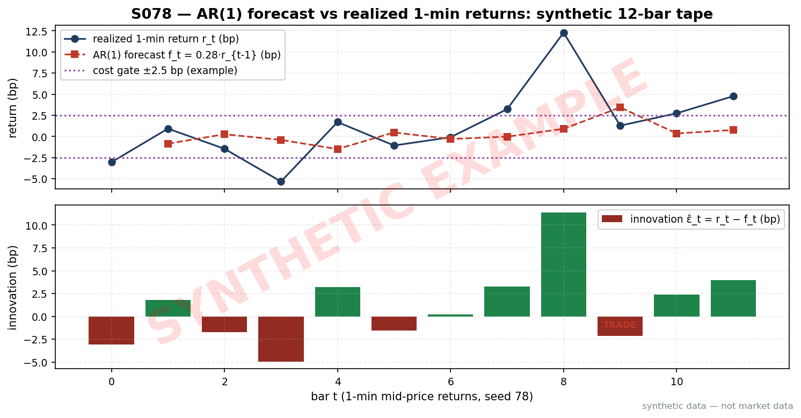

```mermaid
flowchart LR
    FEED["Raw feed<br/>(Polygon / Databento MBP-1)"] -- "1-min quote bars" --> ING["Ingest + normalize<br/>(ts, splits, halts)"]
    ING -- "1-min mid returns (bp)" --> FEAT["Feature compute<br/>(rolling AR(1)/ARMA fit)"]
    FEAT -- "1-min forecast + innovation z" --> SIG["Signal S078<br/>forecast gate / z-rule"]
    SIG -- "trade decision (1-min cadence)" --> GATE{"Cost / toxicity<br/>gate?"}
    GATE -->|pass| OUT["Downstream consumer<br/>(T052 / T051 / execution)"]
    GATE -->|fail| DROP["No trade"]
    style SIG fill:#aed6f1,stroke:#1f3a5f
```

### S12. Sources

- Roll, R. (1984). "A Simple Implicit Measure of the Effective Bid-Ask Spread in an Efficient Market." *Journal of Finance*, 39(4), 1127–1139. https://authors.library.caltech.edu/records/afwsc-6bb61
- Hasbrouck, J. (1991). "Measuring the Information Content of Stock Trades." *Journal of Finance*, 46(1), 179–207. http://ideas.repec.org/a/bla/jfinan/v46y1991i1p179-207.html
- Bouchaud, J.-P., Gefen, Y., Potters, M. & Wyart, M. (2004). "Fluctuations and response in financial markets: the subtle nature of 'random' price changes." *Quantitative Finance*, 4(2), 176–190. http://ideas.repec.org/p/arx/papers/cond-mat-0307332.html
- Box, G.E.P. & Jenkins, G.M. (1970). *Time Series Analysis: Forecasting and Control*. Holden-Day. (Canonical AR/ARMA reference per report entry; cited for the documented [D] machinery.)
- Tsay, R.S. (2005). *Analysis of Financial Time Series*. Wiley. (Canonical intraday time-series reference per report entry.)

**Unverified leads** (chatbot-provided, not independently checkable — do not cite as fact):
- Duck.ai Q-SB9-1 verified the Kalman worked example to 4th-decimal accuracy but found the PCA worked example internally inconsistent (see S080 disclosure).
- Duck.ai Q-SB9-2 planning ranges: Kalman/HMM/ARMA prototype 40–80 h; data $50–2,000/mo illustrative (indicative — verify before budgeting).

*Research provenance note — source log: Duck.ai answered Q-SB9-1–Q-SB9-3 (2026-09-10); Grok/Cursor answers pending (checked 2026-09-10).*

---
## Stage 80/200 — S080: PCA / statistical-factor residual reversal (incl. eigenportfolios)

*Batch SB9 · Signal 80/100 · Provenance [D] · Family F — Statistical/ML Infrastructure*

### S1. One-line verdict

| | |
|---|---|
| **What it is** | **PCA** (principal component analysis) splits panel returns into a few shared statistical factors plus **residuals**; the residual is the purest mean-reverting component — trade it market-neutral. |
| **When it works** | When residuals are genuinely idiosyncratic and mean-revert faster than costs eat them: calm markets, uncrowded names, shortable universe. |
| **When it dies** | Crowded unwinds (2007-style), factor breaks, borrow recalls, turnover that exceeds the per-trade edge; or when "residual" is just mismeasured beta. |
| **Build-or-buy in one line** | Build: PCA is one `eigh` call; buy only broad daily/intraday bar coverage. |

Provenance **[D]** (Avellaneda & Lee 2010; restated per report entry).

### S2. How it works — plain human explanation

It is 9:47:03. Two correlated stocks, A and B, both track the market, but in the last hour A drifted +1.5 standard deviations above what B (and the market) would imply, while nothing happened to either company. **PCA** — principal component analysis: a rotation of the return panel into orthogonal directions (**principal components**) ranked by variance explained — says most of what moves A and B together is one shared factor. Subtract it and what remains is the **residual**: the stock's own idiosyncratic wiggle.

An **eigenportfolio** (Avellaneda–Lee 2010) is simply a tradeable version of one principal component: weight each stock by its eigenvector entry divided by its volatility, so the portfolio's return *is* the factor's return. The residual of stock i is then its return minus its loadings on the top few eigenportfolios. Residuals of liquid stocks often behave like an **OU process** — **Ornstein–Uhlenbeck**, the mathematical name for noisy mean reversion: dX = κ(μ−X)dt + σdW, pulled toward μ at speed κ while being buffeted by noise. The signal fades stretched residuals: short the stock whose residual is far above its OU-implied equilibrium, buy the one far below, hedge the factor exposure away so the book is market-neutral.

Why should residuals mean-revert? Mostly microstructure and inventory: a burst of one-sided flow pushes a stock away from its statistical peers; liquidity providers lean against it; the peer relationship reasserts. The catch — the 2007 quant-unwind lesson — is that *everyone* estimates similar factors and fades the same residuals. Then "idiosyncratic alpha" is a crowded trade, and when many desks cut risk at once, the residuals don't revert; they gap.

**Mental model:**
- Returns = a few shared factors + your stock's own noise; PCA finds the factors without needing to name them.
- The residual is the only part of a stock's move that is *its*, so it is the only part you can bet on mean-reverting.
- A residual trade is a bet that the peer relationship holds *and* that you are not standing in a crowded exit with fifty other desks.

### S3. The math — exact formula

**Factor decomposition (documented [D]):**

R_{i,t} = Σⱼ₌₁ᵐ β_{ij}·F_{j,t} + R̃_{i,t}

where R_{i,t} is stock i's (standardized) return, F_{j,t} are the m statistical factors, β_{ij} the loadings, and R̃_{i,t} the residual. Causal timing: factors and loadings are estimated on a window ending at *t*; the residual at *t* is tradable no earlier than *t+1* — **no look-ahead**: only information through *t* may enter.

**PCA estimation:** standardize z_{i,t} = (r_{i,t} − r̄_i)/s_i over window W; Σ = (1/(W−1))·Z^⊤Z; solve Σ·v_j = λ_j·v_j (**eigenvalues** λ_j = variance along direction j; **eigenvectors** v_j = the directions). m-factor reconstruction ẑ_t = Σⱼ₌₁ᵐ v_j(v_j^⊤z_t); residual u_t = z_t − ẑ_t, i.e. u_{i,t} = z_{i,t} − Σⱼ₌₁ᵐ v_{j,i}(v_j^⊤z_t). Signal = −u_{i,t}/σ̂_{u_i}; enter when |u/σ̂| > 1.5–2.5 (example thresholds).

**Eigenportfolio form (Avellaneda–Lee 2010 [D]):** eigendecompose the *correlation* matrix ρ = Σ_k λ_k v_k v_k^⊤. Eigenportfolio weights Q_{ki} = v_{ki}/σ_i; factor returns F_{kt} = Σ_i Q_{ki} r_{it}; residuals X_{it} = r_{it} − Σ_k β_{ik}F_{kt}. Fit OU to each residual; the **s-score** s_{it} = (X_{it} − μ_i)/(σ_i/√(2κ_i)); allocate −1 if s > c_thresh **and** R²_OU > c_crit, +1 if s < −c_thresh, else 0 (c's are examples).

**Parameter table** (every default `example — not an institutional standard`):

| Parameter | Symbol | Typical range | Too small | Too large | Default example |
|---|---|---|---|---|---|
| Estimation window | W | 60–250 d (daily); 500–10,000 (intraday) | noisy eigenvectors | stale factors | W = 252 d |
| # factors | m | 1–5 or 50–80% variance explained | leaves factor in "residual" | fits noise as factors | m = 3 |
| Residual half-life target | ln2/κ | 2–20 observations | untradable turnover | factor drift eats it | 5 obs |
| s-score entry | c_thresh | 1.5–2.5 | cost bleed | never trades | 2.0 |
| OU fit quality | c_crit (R²_OU) | 0.3–0.7 | trades non-MR noise | filters everything | 0.5 |

**Normalization**: standardize by trailing volatility (correlation PCA) so large-vol names don't dominate the eigenvectors; the Avellaneda–Lee eigenportfolio form divides eigenvector weights by σ_i for the same reason. **Variants**: (a) covariance PCA vs correlation PCA (eigenportfolio); (b) sector-neutral residuals (PCA within sectors); (c) s-score trading vs raw −u/σ̂ trading; (d) daily eigenportfolios (1–5 day horizon) vs intraday PCA residuals (minutes–hours).

### S4. Worked example — step-by-step numbers (SYNTHETIC)

> **Disclosure — the research material was wrong here, and this chapter does not repeat the error.** The duck.ai chatbot's worked example printed a 10×3 return panel claiming each column had mean zero, alongside a covariance matrix with diagonal 1.0833 and off-diagonal 0.9722. Recomputed from the printed panel: column A sums to 3.5 (mean **0.35**, not zero), column B sums to −6.5 (mean **−0.65**, not zero) — the "mean zero" claim is **false**. The sample covariances (÷9) are Σ_AA ≈ 1.3611 and Σ_BB ≈ 1.6944, **not** the displayed 1.0833. Only the off-diagonal Σ_AB = 8.75/9 ≈ 0.9722 matches. The printed panel is **not** re-used. What *is* verified: **given the stated Σ** — exact fractions 13/12 and 35/36, displayed rounded as 1.0833/0.9722 — the eigendecomposition (λ_1 = 2.0556, v_1 = (1/√2)[1,1,0]^⊤), the residual derivation u_{A,t} = (A_t − B_t)/2, and the day-1 arithmetic (Â_1 = 0.5, u_{A,1} = 0.5) are all correct. This chapter therefore uses the **stated-Σ route**: Σ is given below, never re-estimated from the bad panel.

**Stated covariance** (3 assets; C is uncorrelated with A, B):

Σ = [[1.0833, 0.9722, 0], [0.9722, 1.0833, 0], [0, 0, 1.0833]]

**Eigendecomposition** (verified): λ_1 = 2.0556, v_1 = (1/√2)[1,1,0]^⊤; λ_2 = 1.0833; λ_3 = 0.1111. Variance explained: 63.25% / 33.33% / 3.42%. The dominant factor is the A–B pair moving together (the "market"); C stands alone.

**Residual construction:** with m = 1 factor, the reconstruction of A is Â_t = (A_t + B_t)/2 (since v_1A·(v_1^⊤z_t) = (A_t+B_t)/2), so the residual is u_{A,t} = A_t − (A_t+B_t)/2 = **(A_t − B_t)/2**. (Symmetrically u_{B,t} = −u_{A,t}: the trade is implicitly a pair.)

**Synthetic panel** — 10 days of *standardized* returns for A and B, **seed 80** (`rng = np.random.default_rng(80)`); day 1 is fixed to the verified arithmetic A_1 = 1.0, B_1 = 0.0 ⇒ Â_1 = 0.500, u_{A,1} = 0.500. Residual z-score uses σ̂_u = 0.72 estimated on these 10 days (pedagogical only — production uses 60–250 days); fade rule: |z| > 2.0 → trade against the residual (example threshold).

| day | A_t | B_t | Â_t = (A+B)/2 | u_{A,t} = (A−B)/2 | z_t | Signal |
|---|---|---|---|---|---|---|
| 1 | +1.000 | +0.000 | +0.500 | +0.500 | +0.69 | NONE |
| 2 | −0.411 | −0.986 | −0.699 | +0.287 | +0.40 | NONE |
| 3 | −0.580 | +0.425 | −0.078 | −0.502 | −0.70 | NONE |
| 4 | −1.199 | −0.673 | −0.936 | −0.263 | −0.37 | NONE |
| 5 | −1.177 | +0.928 | −0.125 | −1.053 | −1.46 | NONE |
| 6 | +2.553 | −0.510 | +1.021 | +1.532 | **+2.13** | **SHORT A** (fade +residual) |
| 7 | +0.133 | −0.918 | −0.393 | +0.526 | +0.73 | NONE |
| 8 | +0.112 | −0.256 | −0.072 | +0.184 | +0.26 | NONE |
| 9 | +0.867 | −0.825 | +0.021 | +0.846 | +1.17 | NONE |
| 10 | +0.291 | −0.052 | +0.119 | +0.172 | +0.24 | NONE |

Hand-check day 6: u_{A,6} = (2.553 − (−0.510))/2 = 3.063/2 = +1.532 ✓; z = 1.532/0.72 = +2.13 > 2.0 → SHORT A, expecting the residual to mean-revert toward 0. Day 1 reproduces the verified arithmetic exactly (Â_1 = 0.500, u_{A,1} = 0.500 ✓). (The matching chart — stated-Σ eigendecomposition and the residual fade series — appears in §S11.)

**What to notice:** one signal in ten days — the gate is selective by construction. The residual's z-score is measured against σ̂_u from only 10 observations, which is statistically meaningless; this example teaches the *arithmetic*, not estimation. Real Σ estimation needs hundreds of observations, and even then eigenvectors wobble — which is why crowded residual trades unwind together. No borrow costs, no short-sale constraints, no market impact: do not read this as a backtest.

### S5. Strategies that use this signal

- **T040 — PCA Eigenportfolio Residual Reversal**: *primary trigger* — statistical-factor residual mean reversion with AR-innovation timing (S080 primary, with S039, S078).
- **T033 — Johansen VECM Basket Arb**: uses S080 residuals as a complementary factor-residual input to cointegrated multi-leg baskets (S055, S080, S051).
- **T038 — Sector Momentum + Idiosyncratic Fade**: uses S080 to identify and fade idiosyncratic residual extremes while riding sector momentum (S062, S039, S080).

### S6. Data required — exact spec

| Field | Type | Granularity | Source tier | Notes |
|---|---|---|---|---|
| Return panel (broad universe) | float | daily bars (eigenportfolio); intraday bars (PCA residuals) | Tier 1–2 | 500–3000 names; survivorship-bias-free history matters |
| Volatility estimates | float | daily | Tier 1 | For correlation-PCA standardization and Q_{ki} = v_{ki}/σ_i |
| Borrow availability / fees | float/bool | daily | Tier 2–3 | Short leg feasibility; recalls kill the trade |
| Corporate actions, delistings | events | daily | Tier 0–1 | Point-in-time universe; dead names bias eigenvectors |

Collection: any intraday vendor with broad coverage (Polygon, Databento, Alpaca SIP); daily panel via Stooq/Tiingo for prototyping, ≤20-line sketch:

```python
import polars as pl, numpy as np
px = pl.read_parquet("panel_daily.parquet").sort(["sym","ts"])   # point-in-time, split-adj
rets = px.with_columns((pl.col("close")/pl.col("close").shift(1)-1).over("sym").alias("r"))
Z = rets.pivot("ts","sym","r").fill_null(0).to_numpy()            # T x N
z = (Z - Z[-252:].mean(0)) / Z[-252:].std(0)                      # standardize, causal window
Sigma = np.cov(z[-252:].T)                                       # /(W-1)
lam, V = np.linalg.eigh(Sigma); k = np.argsort(lam)[::-1][:3]    # top-m factors
F = z[-1:] @ V[:, k]                                             # factor returns at t
u = z[-1:] - F @ V[:, k].T                                       # residuals, tradable at t+1
```

Storage per symbol-day (cost-model §4): daily bars for 3,000 stocks ≈ 5 MB total/day — **trivial**; the PCA panel itself is 500×252×8 ≈ 0.96 MiB and the covariance 500×500×8 ≈ 1.91 MiB (byte arithmetic verified). Data-quality checklist: survivorship bias, point-in-time membership, corporate actions, borrow/HTB (hard-to-borrow) flags, cross-panel timestamp alignment.

### S7. Local build on M5 Max / 128GB

**Feasibility: feasible, borderline trivial for daily.** A 500×500 eigendecomposition takes ~10–100 ms optimized (cost-model §2; naïve Python 0.5–5 s is an implementation problem, not hardware), the covariance update is sub-millisecond. RAM: panel + covariance ≈ 5–20 MB dense, 0.1–2 GB with cached rolling windows (duck.ai planning estimate) — far under the 77 GB working budget (cost-model §3). Bottleneck: **universe hygiene** (point-in-time membership, delistings), not arithmetic.

Engineering band: basic rolling PCA is **Tier M (20–60 h, cost-model §5)**; a sector-neutral, vol-scaled, point-in-time production version is 100–220 h (duck.ai planning estimate). Budget **~40–60 h ≈ $6,000–9,000 loaded-cost estimate** at $150/hr for a honest research-grade build.

### S8. Buy vs build

| Option | What you get | Indicative price | Gains | Loses |
|---|---|---|---|---|
| Tier-0 (Stooq daily) | Daily bars, broad | ~$0 | Free prototyping | Survivorship bias risk; no borrow data |
| Tier-1 (Tiingo/Polygon) | Daily + 1-min, actions | ~$30–200/mo | Clean actions, broad coverage | Borrow/HTB data thin |
| Tier-2 (Databento) | Intraday L1 for residual timing | ~$200/mo + usage | Honest intraday residuals | Overkill for daily eigenportfolios |
| Borrow data (specialized) | HTB flags, fees | ~$$$ | Tells you if the short leg exists | Expensive for a first build |

*Indicative — verify before budgeting.* **Verdict: build.** PCA is one eigendecomposition; the edge is in universe hygiene, the OU fit, and the cost model — none of which are for sale. **Buy** the broad bar coverage (Tier-1) and, before sizing anything real, the borrow data.

### S9. Success ratio / efficacy — documented evidence

| Study / source | Market & period | Metric | Before/after cost | Caveat |
|---|---|---|---|---|
| Avellaneda & Lee (2010), *Quant. Finance* 10(7) | US equities, 1997–2007 (PCA window from 1996) | Eigenportfolio + OU s-score stat-arb; reported attractive historical risk-adjusted performance | Before-cost reference (canonical in-sample result, NOT a live number) | Pre-publication sample; no borrow/turnover stress; later performance is universe- and cost-dependent |
| Liew & Roberts (2013), *Risks* 1(3) | US equities, 2001-01-02 → 2010-05-27 | Avellaneda–Lee + Black–Litterman (a Bayesian method for blending views into portfolio weights) blend: **+45% Sharpe vs the unblended AL strategy** | Cost treatment not stated — treat as before-cost | Improvement over a baseline, not an absolute return claim |
| Epstein, Wang, Choi & Pelger (2025), arXiv:2510.11616 | Largest US equities, Jan 1998–Dec 2021 | PCA + OU-threshold benchmark (K=10): gross Sharpe **0.80 → net Sharpe −4.32 after transaction costs** | **After-cost (documented negative net)** | One study's construction and cost model — but it is the honest shape of the problem |

**Regimes where it fails:** vol spikes (factor correlations jump; eigenvectors estimated in calm regimes mis-hedge), crowded unwinds (2007 quant unwind: correlated long-short books deleveraging together — Marquette review of the episode), low-liquidity names (residual "reversion" is just stale pricing), borrow recalls. Documented decay: post-publication crowding compresses residual premia; the 2025 study above shows a textbook PCA+OU construction going deeply negative net of costs.

**Honest bottom line:** as a **standalone trigger**, PCA residual reversal is historically documented but fragile — attractive in-sample, routinely disappointing net of realistic frictions. As a **residual-extraction technology** (the factor model inside T040/T033/T038), it is indispensable. The after-cost backtest must be R_net = R_gross − Σc_i|Δw_i| − borrow − financing − impact, stressed at 2× spreads, ½ liquidity, borrow recalls, and a 2008-style shock. And remember the documented shape (unverified lead): ~6%/yr can coexist with a ~49% max drawdown — positive mean is not a livable ride.

### S10. Failure modes & pitfalls

1. **Look-ahead in the panel** → estimate Σ only on data ≤ *t*; residuals tradable at *t+1*; keep delisted names in history *as of* each date.
2. **Mismeasured beta dressed as alpha** → too few factors leaves market exposure in the "residual"; check residual correlation with the market factor.
3. **Crowding** → many desks estimate similar factors and cut risk in the same vol events; monitor crowding proxies and size down when residual autocorrelation rises.
4. **Cost blowup** → residuals mean-revert a few bps; turnover at 10 bp round-trip kills the gross edge (see the −4.32 net Sharpe above); model Σc_i|Δw_i| + borrow + financing + impact explicitly.
5. **Regime breaks** → one-day correlation spikes invalidate the hedge; stress-test and keep a kill switch on factor-vol.
6. **Short-sale constraints** → HTB names, recalls, buy-ins; gate the universe on borrow availability.
7. **Overfitting m and thresholds** → cap factors, validate on purged walk-forward splits.
8. **Stale-price residuals** → in illiquid names the residual is nonsynchronous pricing, not mispricing; restrict to liquid names.

### S11. Visuals

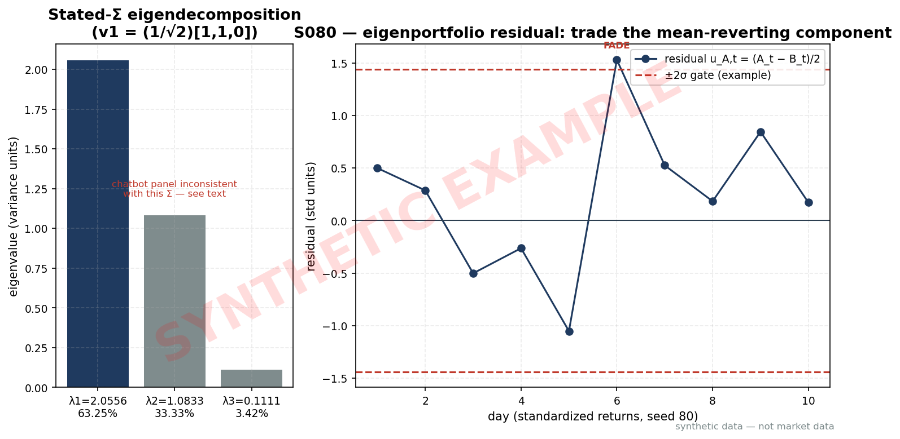

```mermaid
flowchart LR
    FEED["Raw feed<br/>(Polygon / Databento, broad)"] -- "daily bars, 500–3000 names" --> ING["Ingest + normalize<br/>(PIT = point-in-time universe, actions, delists)"]
    ING -- "standardized return panel (daily)" --> FEAT["Feature compute<br/>(rolling PCA / eigenportfolios)"]
    FEAT -- "residuals + OU s-scores (daily)" --> SIG["Signal S080<br/>residual fade, |z|>2"]
    SIG -- "market-neutral orders (daily)" --> GATE{"Cost / borrow<br/>gate?"}
    GATE -->|pass| OUT["Downstream consumer<br/>(T040 / T033 / T038)"]
    GATE -->|fail| DROP["No trade"]
    style SIG fill:#aed6f1,stroke:#1f3a5f
```

### S12. Sources

- Avellaneda, M. & Lee, J.H. (2010). "Statistical Arbitrage in the U.S. Equities Market." *Quantitative Finance*, 10(7), 761–782. Working paper: https://math.nyu.edu/~avellane/AvellanedaLeeStatArb20090616.pdf
- Liew, J. & Roberts, R. (2013). "U.S. Equity Mean-Reversion Examined." *Risks*, 1(3), 162–175. https://ideas.repec.org/a/gam/jrisks/v1y2013i3p162-175d31043.html
- Epstein, E.L., Wang, R., Choi, J. & Pelger, M. (2025). "Attention Factors for Statistical Arbitrage." arXiv:2510.11616. https://arxiv.org/abs/2510.11616v1
- Connor, G. & Korajczyk, R.A. (1988). "Risk and return in an equilibrium APT: Application of a new test methodology." *Journal of Financial Economics*, 21(1), 341–360. (Asymptotic PCA — canonical reference per report entry; listed for the documented [D] machinery.)

**Unverified leads** (chatbot-provided, not independently checkable — do not cite as fact):
- "PCA strategies Sharpe ≈ 0.90–0.95 under 10bp round-trip, 1998–2021" — specific model/universe, NOT universal; not independently verified.
- Public implementation "~6%/yr 2010–2019 with ~49% max drawdown" (QuantConnect) — could not verify the page; kept as a lead.
- Duck.ai Q-SB9-2 planning figures: rolling PCA per-window ms (optimized) / seconds naïve; 5–20 MB dense, 0.1–2 GB with cache; 100–220 h build (indicative — verify before budgeting).

*Research provenance note — source log: Duck.ai answered Q-SB9-1–Q-SB9-3 (2026-09-10); Grok/Cursor answers pending (checked 2026-09-10).*

---
## Stage 82/200 — S082: Deep learning on the LOB (DeepLOB + classical ML features)

*Batch SB9 · Signal 82/100 · Provenance [D/SR] · Family F — Statistical/ML Infrastructure*

### S1. One-line verdict

| | |
|---|---|
| **What it is** | **DeepLOB** (**deep** neural network on the **limit order book**: **CNN** spatial filters + **LSTM** temporal memory) predicts the next mid-price move from 100 LOB snapshots; a cheaper cousin uses hand-built features in logistic/**GBM** (gradient-boosted machine) models. |
| **When it works** | When you have synchronized, high-quality event data and the model beats a GBT (gradient-boosted trees) baseline *net of* fees, latency, queue, and turnover — horizons longer than your execution latency, labels on executable prices. |
| **When it dies** | When 55% accuracy meets a spread ten times the edge; mid-price evaluation traded at bid/ask; assumed fills with no queue model; FI-2010-style (the public LOB benchmark: 5 NASDAQ-Nordic stocks, 10 days — see §S9) toy benchmarks. |
| **Build-or-buy in one line** | Buy the L2 (level-2: full depth-of-book) data and replay; build the model only after a non-deep baseline, and only if the neural net improves *net-of-cost* consistently. |

Provenance **[D/SR]**: the deep form is documented [D] (Zhang, Zohren & Roberts 2019; Sirignano & Cont 2019); the classical feature-stack form is a standard reconstruction [SR].

> **The central sentence of this chapter, from the research:** *"Accuracy, Sharpe, and gross backtest return are NOT interchangeable with executable profit."* Everything below is an elaboration of it.

### S2. How it works — plain human explanation

It is 9:47:03.000. AAPL's book shows 800 shares bid at 231.40 and 300 offered at 231.41, with similar stacks ten levels deep on each side. The **LOB** — limit order book — is the full ladder of resting limit orders, price by price, size by size. The **microprice** (size-weighted midpoint) sits a hair above the mid: the book is bid-heavy, so the next move is slightly more likely up. That single observation is the entire classical program: hand-built features (imbalance, queue depth, spread, short-horizon return) fed into logistic regression or gradient-boosted trees (**GBT**: ensembles of decision trees like LightGBM/XGBoost, the tabular-data workhorse).

**DeepLOB** (Zhang, Zohren & Roberts 2019) skips the hand-building. It feeds the last 100 ten-level snapshots — a 100×40 tensor (100 events × 10 levels × price+size × bid+ask) — into **convolutional** filters (**CNN**: a layer sliding small weight patterns across an input to find local structure — here, *across book levels*) stacked with **LSTM** modules (**long short-term memory**: a recurrent layer remembering patterns *across time*). Out comes a **softmax** — a normalized probability vector — over {up, flat, down} at horizons of 10/20/50/100 events. Trade the predicted direction above a confidence threshold.

Why should the book predict the next move? Because the book *is* the supply/demand schedule: heavy bid queues mean more buyers waiting than sellers, so the mid drifts toward the heavy side. The deep network's bet is that nonlinear interactions across levels and time carry information that linear features miss. Sirignano & Cont (2019) add a striking finding: a model trained *pooled across ~1,000 stocks* beats per-stock models — the price-formation mechanism is universal, not asset-specific — and long price/order-flow history helps (path dependence).

The honest counterweight: a classifier does not pay the spread. The worked example (§S4) shows a 55%-accurate model losing 0.049 pence per trade, because the expected move is smaller than the half-spread it must cross. *"AUC (area under the ROC curve) does not estimate any of those terms. Even a statistically significant forecast can have negative net P&L if the expected move is smaller than the effective round-trip cost."*

**Mental model:**
- The LOB is a photograph of supply and demand; DeepLOB learns to read nonlinear patterns in a stack of 100 photographs.
- Classification accuracy is measured on mid-prices; profit is made at bid/ask — the two live in different currencies.
- The development sequence is fixed: logistic/trees → feature-rich trees → compact neural → DeepLOB only if neural wins *net-of-cost* → Transformer only if it survives strict walk-forward plus regime tests.

### S3. The math — exact formula

**DeepLOB input [D]:** X_t ∈ ℝ^{100×40}: the 100 most recent 10-level LOB snapshots in *event time* (price and size at each of 10 bid and 10 ask levels = 40 features per snapshot), normalized (z-score per feature in the paper's protocol).

**Labels [D]:** with m_−(t) = average mid over the past k events and m_+(t) = average mid over the next k events, l_t = (m_+(t) − m_−(t))/m_−(t). Class: up if l_t > +α, down if l_t < −α, flat otherwise, at horizons k ∈ {10, 20, 50, 100} events. α is an example threshold (the paper uses small multiples of tick-relative moves — `example — not an institutional standard`).

**Architecture [D]:** convolutional layers over the (time × level) grid extract spatial book features (early filters reconstruct microprice-like quantities across all 10 levels), then LSTM layers for temporal dependence, then a softmax: P(y ∈ {up, flat, down} | X_t). **Trade rule [SR framing]:** trade the argmax direction only if max_c P(c) > p_conf (example: 0.6) *and* the expected move clears the spread-cost filter — calibrate on executable prices, not mid-price labels.

**Classical feature-stack form [SR] (the Kercheval–Zhang-style setup — note the correction: the report entry cites "Kercheval & Seemann," but the published paper is Kercheval & Zhang 2015):** per-bar features — microprice deviation (S004), OFI (order flow imbalance; S001), bid/ask depth ratio, spread, queue imbalance at levels 1–5, short-term return, Lee–Ready (the standard quote-rule algorithm for signing trades as buyer- or seller-initiated) trade-sign imbalance; label = sign of mid change over the next N events; model P(up | features) via logistic regression or GBM; trade when |P − 0.5| > threshold (example) with a spread-cost filter. **Caution [D/SR]:** a published research pipeline, not a plug-and-play rule; reproducing it needs full LOB reconstruction and heavy compute.

**Evaluation metrics:** directional accuracy is misleading on imbalanced 3-class labels — use **balanced accuracy** (1/3)·Σ_c(correct_c/obs_c); for binary reductions use ROC-**AUC** (**area under the receiver-operating curve**: probability a random positive scores above a random negative) or PR-AUC. *"AUC does not estimate any of those terms"* in the net-P&L decomposition: Net P&L = forecast-driven move + captured spread − spread crossed − fees − slippage − adverse selection − impact − infra costs.

**Parameter table** (every default `example — not an institutional standard`):

| Parameter | Symbol | Typical range | Too small | Too large | Default example |
|---|---|---|---|---|---|
| Snapshots | T | 50–200 | misses temporal context | compute blowup, stale | T = 100 |
| Book depth | L | 5–20 levels | misses deep-book info | noise, sparse levels | L = 10 |
| Horizons | k | 10–100 events | sub-spread noise | signal decay | {10, 20, 50, 100} |
| Label band | α | 0–3 bp-equiv | label noise | class imbalance → flat | 1 bp-equiv |
| Confidence | p_conf | 0.5–0.8 | trades noise | never trades | 0.6 |
| Retrain cadence | — | weekly–quarterly | regime drift | compute cost | monthly |

**Variants:** (a) DeepLOB CNN–LSTM (documented); (b) LSTM-on-events / universal pooled model (Sirignano & Cont); (c) classical GBM on hand-built features [SR]; (d) Transformer/TransLOB successors (higher F1 — harmonic mean of precision and recall — on FI-2010 reported by some — unverified lead — but some report *no trading simulation*, so classification gain ≠ economic value).

### S4. Worked example — step-by-step numbers (SYNTHETIC)

**Setup (stated, hand-checkable):** a classifier with **55% directional accuracy** at a horizon longer than execution latency. When correct, the mid moves **0.06 pence** in our favor; when wrong, 0.06 pence against. We trade with market orders, paying **half the 0.10 p spread = 0.05 p** plus **0.005 p** fees+slippage per trade. (Pence units echo the LSE review lead in §S12; these numbers are synthetic and stated, not measured.) **Reproducibility:** `rng = np.random.default_rng(82)` — the arithmetic below is fully deterministic (no sampling), so the seed fixes the chart-generation environment and is stated so any re-run is byte-identical.

| Outcome | Prob | Mid move (p) | Spread paid (p) | Fees+slip (p) | Net per trade (p) |
|---|---|---|---|---|---|
| Correct call | 0.55 | +0.06 | −0.05 | −0.005 | **+0.005** |
| Wrong call | 0.45 | −0.06 | −0.05 | −0.005 | **−0.115** |
| **Expected** | 1.00 | +0.006 | −0.05 | −0.005 | **−0.049** |

Hand-check: expected mid move = 0.55×0.06 − 0.45×0.06 = +0.006 p ✓; net = 0.006 − 0.05 − 0.005 = −0.049 p/trade ✓. Correct-call net = 0.06 − 0.055 = +0.005 ✓; wrong-call net = −0.06 − 0.055 = −0.115 ✓. (The matching chart — waterfall of expected per-trade P&L — appears in §S11.)

**What to notice — the accuracy-vs-cost gap:** 55% accuracy *sounds* tradable; the arithmetic says each trade loses 0.049 pence because the expected move (+0.006 p) is an order of magnitude smaller than the half-spread it must cross (0.05 p). This is the review's lead: median simulated gross ≈ **0.01 p/trade** against a Tesco spread of **0.10 p — the spread is exactly 10× the gross edge** (unverified research lead, not asserted as fact). The 55% model is *useless* here for every reason the research lists: the edge is below the spread-crossing cost, turnover multiplies the bleed, and mid-price evaluation flatters what bid/ask trading would pay. This toy assumes fills happen; a real queue model would make it worse. Do not read this as a backtest.

### S5. Strategies that use this signal

- **T055 — DeepLOB + Feature-Stack Classifier**: *primary trigger* — deep learning on LOB sequences stacked with OFI and classical microstructure features (S082 primary, with S083, S001).
- **T088 — Full-Stack Signal Ensemble**: uses S082 as one base classifier blended with meta-labeling and purged-CV validation (S086, S082, S088).

### S6. Data required — exact spec

| Field | Type | Granularity | Source tier | Notes |
|---|---|---|---|---|
| LOB snapshots (10–20 levels, price+size) | float/int | **L2 event stream** (per order-book event) | Tier 2–3 | Full reconstruction; SIP L1 is insufficient for the deep form |
| Trade prints (for labels/signing) | struct | **L2 event stream** | Tier 2–3 | Lee–Ready signing for the classical form |
| Corporate actions | events | daily | Tier 0–1 | Price-level features must be split-adjusted |
| Timestamp sync map | metadata | per session | Tier 2–3 | Exchange vs capture clock; label leakage lives here |

Collection: LOBSTER (NASDAQ TotalView-ITCH reconstructions; selectable depth) or Databento MBP-10 (`dbn` schema, 10-deep), ≤20-line sketch:

```python
import databento as db, polars as pl, numpy as np
dl = db.Historical(); dl.batch.download("XNAS-20260102.mbp-10.dbn.zst", ...)
book = pl.read_parquet("snapshots.parquet").sort("ts_event")  # 40 cols: bid/ask px+sz x10
X = np.lib.stride_tricks.sliding_window_view(                 # 100-snapshot tensor
        book.select(px_sz_cols).to_numpy(), (100, 40)).squeeze(1)
k, alpha = 50, 0.0001                                          # horizon + label band (examples)
m_mid = book["mid"].to_numpy()
up = (m_mid[k:].mean() ...)                                    # label vs smoothed mids (vectorize!)
# CAUSAL: labels use only events > t; features only <= t. Leakage check mandatory.
```

Storage per symbol-day (cost-model §4): L2 MBP-10 liquid name ≈ **10–40 GB parquet** — research-only; never archive naively. Data-quality checklist: timestamp normalization (exchange vs capture), full vs truncated depth, auction/cross events, halts, corporate actions, synchronized clocks across venues (label leakage otherwise).

### S7. Local build on M5 Max / 128GB

**Feasibility: heavy — feasible for research, not for production training.** The verified byte arithmetic: a DeepLOB input tensor (batch 256 × 100 × 40 float32) = **4.096 MB input only**; activations/gradients/optimizer multiply that 10–50×, and a training cache of 1–5M examples runs 20–400 GB — training streams from NVMe, it does not sit in RAM (duck.ai planning figures). One liquid name's L2 day is 8–40 GB RAM (cost-model §3) — two names threaten the 77 GB working budget: **use per-symbol daily files + streaming**. Inference on the M5 GPU (planning estimates, not measured): compact DeepLOB 1–10 ms per sequence — adequate for research cadence; *"do NOT put Python preprocessing + GPU sync + deep recurrent model on the critical path"* of any live tick loop.

Engineering band: **Tier H (60–200 h, cost-model §5)** — reproduce DeepLOB 100–250 h; clean pipeline + reproducible training 250–500 h; full L3 replay + queue model + execution sim 1,000–2,000+ h (duck.ai planning estimates). Budget **~150 h ≈ $22,500 loaded-cost estimate** at $150/hr for a faithful reproduction — *after* the GBT baseline exists.

### S8. Buy vs build

| Option | What you get | Indicative price | Gains | Loses |
|---|---|---|---|---|
| Tier-0 / academic (LOBSTER academic) | MBO (market-by-order — per-order data)/ITCH (NASDAQ's direct order-feed protocol) replay, selectable depth | ~hundreds/yr academic | The honest data at research prices | Academic license limits; NASDAQ-only |
| Tier-2 (Databento Standard) | MBP-10 L2, OPRA research | ~$200/mo + usage | Clean schemas, broad venues | Usage meter runs fast at L2 |
| Tier-3 commercial historical L2/L3 | Multi-year, multi-venue depth | several thousand → **$100,000+/yr** | Production-grade history | Budget-destroying for a first build |
| FI-2010 (public benchmark) | 10 days, 5 stocks, 10 levels, normalized | ~$0 | Free, comparable | **NOT adequate for production validation** |

*Indicative — verify before budgeting.* **Verdict: buy the data, build the model — in the right order.** Crossover: buy L2/replay (building means re-licensing exchange data anyway); build the model **only** after logistic/GBT baselines, and promote to DeepLOB only if the neural net improves *net-of-cost* consistently. Without synchronized high-quality event data and a demonstrated incremental edge after fees/latency/queue/turnover, **GBT is the better cost/performance choice**.

### S9. Success ratio / efficacy — documented evidence

| Study / source | Market & period | Metric | Before/after cost | Caveat |
|---|---|---|---|---|
| Zhang, Zohren & Roberts (2019), *IEEE Trans. Signal Processing* 67(11) | FI-2010 (5 NASDAQ-Nordic stocks, 10 days) + 1-yr LSE | Beats SVM/MLP/other CNNs on FI-2010 classification; stable OOS (out-of-sample) accuracy on LSE incl. untrained instruments | **Before-cost** (accuracy metric, not P&L) | The v1 preprint's "good profits in a simple trading simulation" is a before-cost simulation only; label definition dominates accuracy |
| Sirignano & Cont (2019), *Quant. Finance* 19(9) | US equities, billions of quotes/trades | Pooled universal model beats per-stock linear/nonlinear models OOS on *direction* of price moves; stable across time and sectors | **Before-cost** (direction accuracy, not executable P&L) | Documents predictability of direction, not profitability after spread/fees |
| Kercheval & Zhang (2015), *Quantitative Finance* 15(8) | High-frequency LOB data | SVM classification of price-move direction from limit-order-book features — the classical feature-stack program in published form | **Before-cost** (classification accuracy, not P&L) | Label/feature design dominates results; no executable after-cost P&L reported |

**FI-2010 limits (documented):** Ntakaris et al. (2017), *Journal of Forecasting* — 10 consecutive days, 5 stocks, 10 levels, horizons 10/20/30/50/100 — "NOT adequate for production validation": downsampled, pre-normalized, one illiquid-ish market. Successor papers (e.g. TransLOB) report higher F1 on FI-2010, but a survey notes some report **no trading simulation** — classification gain ≠ economic value (unverified lead).

**Honest bottom line:** DeepLOB is a genuine classification advance — the strongest documented OOS benchmark gains in this batch — and simultaneously the clearest example of the accuracy≠profit gap: *"AUC (area under the ROC curve) does not estimate any of those terms. Even a statistically significant forecast can have negative net P&L if the expected move is smaller than the effective round-trip cost."* As a standalone trigger it is a research-grade edge that usually dies at the spread; as the top of the development sequence (after GBT baselines earn their keep) it is the right tool. Credible deployment requires: horizon > execution latency, labels on executable prices with spread+fees, chronological cross-regime OOS, queue-aware conservative fills, and net-of-everything P&L.

### S10. Failure modes & pitfalls

1. **Mid-price evaluation, bid/ask trading** → evaluate on executable prices; mid-price accuracy flatters by ~half the spread per trade.
2. **No queue model** → assumed fills overstate capture; use conservative queue-aware fill simulation.
3. **Label leakage** → features at *t* use only events ≤ *t*; one future timestamp in normalization invalidates everything.
4. **FI-2010 overfitting** → 10 days, 5 stocks is a toy; require chronological, cross-regime, cross-instrument OOS.
5. **Turnover bleed** → predictions flipping every 50 events multiply costs; gate on confidence *and* minimum hold.
6. **Latency illusion** → inference + features must fit inside the horizon; `simulated only — requires MBO/ITCH` for queue-position claims.
7. **Skipping the GBT baseline** → if trees match the net net-of-cost, the deep model is pure complexity risk; enforce the development sequence.
8. **Regime drift** → book dynamics change with vol regimes; monitor live accuracy vs backtest and retrain on schedule.

### S11. Visuals

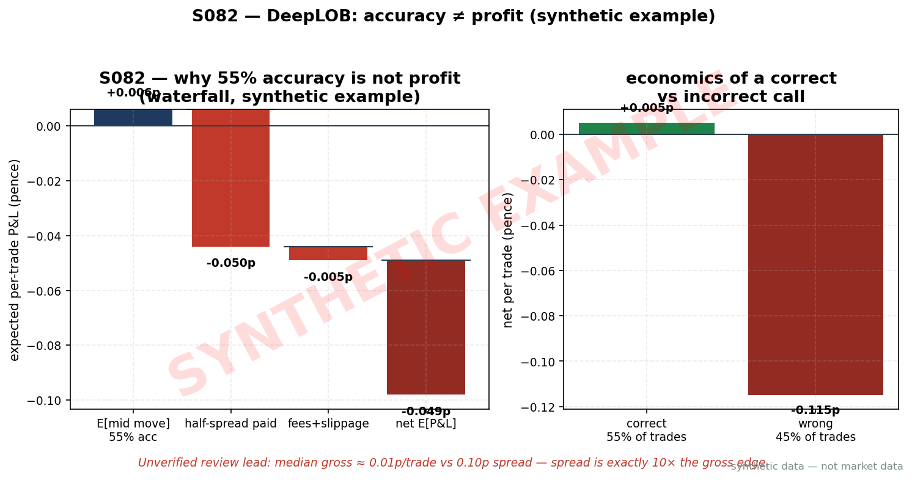

```mermaid
flowchart LR
    FEED["Raw feed<br/>(LOBSTER / Databento MBP-10)"] -- "L2 event stream (10-level snaps)" --> ING["Ingest + normalize<br/>(ts sync, depth, halts)"]
    ING -- "100×40 snapshot tensors (event time)" --> FEAT["Feature compute<br/>(tensors + classical features)"]
    FEAT -- "softmax P(up/flat/down) (event cadence)" --> SIG["Signal S082<br/>DeepLOB / GBM stack"]
    SIG -- "direction + confidence (event cadence)" --> GATE{"Spread-cost +<br/>confidence gate?"}
    GATE -->|pass| OUT["Downstream consumer<br/>(T055 / T088 / execution)"]
    GATE -->|fail| DROP["No trade"]
    style SIG fill:#aed6f1,stroke:#1f3a5f
```

### S12. Sources

- Zhang, Z., Zohren, S. & Roberts, S. (2019). "DeepLOB: Deep Convolutional Neural Networks for Limit Order Books." *IEEE Transactions on Signal Processing*, 67(11), 3001–3012. arXiv:1808.03668. https://arxiv.org/abs/1808.03668v6
- Sirignano, J. & Cont, R. (2019). "Universal features of price formation in financial markets: perspectives from deep learning." *Quantitative Finance*, 19(9), 1449–1459. arXiv:1803.06917. https://arxiv.org/abs/1803.06917?context=stat.ML
- Ntakaris, A., Magris, M., Kanniainen, J., Gabbouj, M. & Iosifidis, A. (2017). "Benchmark Dataset for Mid-Price Forecasting of Limit Order Book Data with Machine Learning Methods." *Journal of Forecasting*. arXiv:1705.03233. https://arxiv.org/abs/1705.03233v4
- Kercheval, A.N. & Zhang, Y. (2015). "Modelling high-frequency limit order book dynamics with support vector machines." *Quantitative Finance*, 15(8), 1315–1329. https://ideas.repec.Org/a/taf/quantf/v15y2015i8p1315-1329.html
- Gould, M.D., Porter, M.A., Williams, S., McDonald, M., Fenn, D.J. & Howison, S. (2013). "Limit Order Books." arXiv:1012.0349. https://arxiv.org/abs/1012.0349v2 (Survey: the LOB background this chapter assumes.)

**Unverified leads** (chatbot-provided, not independently checkable — do not cite as fact):
- Simulated profit/trade ≈ −0.01–0.03 pence, median ~0.01 p; Tesco spread ~0.1 p (exactly 10×) — internally consistent arithmetic, underlying figures not independently verified.
- DeepLOB commercial historical L2/L3 data "several thousand → $100,000+/yr"; academic free/low-cost (indicative — verify before budgeting).
- Successor models (TransLOB): higher F1 on FI-2010; survey notes some report no trading simulation.
- DeepLOB inference/training planning figures (indicative): compact 1–10 ms inference; 1–8 h/epoch moderate training; 500–1,200 h multi-symbol build.

*Research provenance note — source log: Duck.ai answered Q-SB9-1–Q-SB9-3 (2026-09-10); Grok/Cursor answers pending (checked 2026-09-10).*

---
## Stage 84/200 — S084: Hasbrouck (1991) trade–quote VAR

*Batch SB9 · Signal 84/100 · Provenance [D] · Family F — Statistical/ML Infrastructure*

### S1. One-line verdict

| | |
|---|---|
| **What it is** | A vector autoregression (VAR) on the joint dynamics of quote revisions and signed trades; the impulse response of quotes to a trade *innovation* measures that trade's permanent price impact (its information content). |
| **When it works** | Liquid single-name equities with clean synchronized trade/quote data; used to measure information share of trades, calibrate transaction-cost models, and gate directional signals on trade informativeness. |
| **When it dies** | Thin, gappy, or mis-synchronized tapes; regime breaks (vol spikes, news); long-memory order flow where a short-lag VAR is misspecified; any venue where you cannot sign trades accurately. |
| **Build-or-buy in one line** | Build — it is ~50 lines of OLS plus closed-form impulse responses; the hard part is the synchronized tape, which you buy (TAQ/Databento). |

Provenance **[D]** (Hasbrouck 1991, *Journal of Finance*); never upgraded — the formulas below are the paper's, verified against the replication material in this batch's research notes.

### S2. How it works — plain human explanation

A **VAR** (vector autoregression) is a system of regressions where each variable is predicted from *past values of all variables in the system*. A **quote revision** is the change in the mid-price (average of best bid and best ask) from one observation to the next. A **signed trade** is a trade stamped +1 if the buyer initiated it and −1 if the seller initiated it. A **trade innovation** is the *unexpected* part of the signed trade.

Picture 9:47:03: bid $231.40 × 800 / ask $231.41 × 300. A 500-share market buy lifts the ask; the mid moves +$0.005. Was that half-cent *information* or *mechanics* (thin ask side)? Hasbrouck's idea: model the whole joint dance of trades and quote revisions as a VAR, then ask: "if a completely unexpected buy arrives right now, how much does the quote *permanently* move?" The answer is the **impulse response function (IRF)** — the cumulative quote revision after a trade shock — and its limit is the **long-run impact (LRI)**, the trade's permanent price impact. That permanent component is the trade's *information content*: transitory wiggles wash out, but information stays in the price.

Why should this work economically? Two forces. First, **adverse selection**: when an informed trader buys, the book reprices upward — the trade *causes* a permanent revision. Second, **inventory mechanics**: even uninformed flow moves quotes temporarily as liquidity providers manage inventory, and those moves decay. The VAR separates the two: permanent = information, transitory = plumbing. Only the *unexpected* trade moves the needle — expected, autocorrelated order flow is already in the price.

- **Mental model 1:** Trades and quotes are two dancers; the VAR is the choreography sheet. A step that *surprises* (innovation) moves the whole routine permanently; a rehearsed step doesn't.
- **Mental model 2:** Every trade's price impact has a permanent (information) half-life of forever and a transitory (inventory) half-life of seconds — the IRF draws the boundary between them.
- **Mental model 3:** This is a *measurement device first, trading signal second*. Its day job is telling you how informative your flow is; T056 turns that measurement into a predictor.

### S3. The math — exact formula

Let $m_t = (a_t + b_t)/2$ be the mid-price (average of best ask $a_t$ and best bid $b_t$, in dollars), $\Delta m_t = m_t - m_{t-1}$ the quote revision, and $q_t$ the signed trade ($+1$ buyer-initiated, $-1$ seller-initiated, or signed size). Stack $x_t = (\Delta m_t, q_t)^\top$. The **VAR(p)** with $p$ lags is:

$$x_t = c + \sum_{\ell=1}^{p} A_\ell\, x_{t-\ell} + u_t,$$

where $c$ is a $2 \times 1$ intercept, each $A_\ell$ is a $2 \times 2$ coefficient matrix, and $u_t$ is the 2-vector of *innovations* (one-step-ahead forecast errors), with $u_t = (u_{m,t}, u_{q,t})^\top$.

The **impulse response function** to a unit trade innovation $e_q = (0,1)^\top$ traces the cumulative quote revision:

$$\mathrm{IRF}(H) = \sum_{h=0}^{H} \Psi_h\, e_q, \qquad \Psi_0 = I,\;\; \Psi_h = \sum_{\ell=1}^{\min(h,p)} A_\ell \Psi_{h-\ell},$$

and the **long-run impact (LRI)** — the permanent price impact of one unexpected trade — is the closed form

$$\mathrm{LRI} = e_m^\top \Bigl(I - \sum_{\ell=1}^{p} A_\ell\Bigr)^{-1} e_q, \qquad e_m = (1,0)^\top.$$

A trade of size $q$ has permanent impact $\approx \mathrm{LRI} \times q$.

| Parameter | Symbol | Typical range | Too small / too large | Default (example) |
|---|---|---|---|---|
| Lags | $p$ | 5–30 | Too few: long-memory flow missed, IRF biased; too many: overfit, noisy LRI | 10 *— example, not an institutional standard* |
| Sampling | $\Delta t$ | 1 s – 5 min | Too fine: microstructure noise dominates; too coarse: impact already absorbed | 1-s bars *— example* |
| IRF horizon | $H$ | 50–500 events | Too short: IRF hasn't converged; too long: adds estimation noise | 100 *— example* |
| Size transform | $q_t$ | sign / signed shares / signed dollars / $\mathrm{sign}(q)\lvert q\rvert^\beta$ | Raw shares: dominated by prints; sign-only: discards size concavity | signed shares *— example* |

**Normalization:** quote revisions in dollars (or log-mid changes); trade variable as sign, signed shares, or signed dollars. **Causal timing:** the VAR is estimated on data $\le t$; the IRF/LRI at bar $t$ uses only history, so "the next unexpected buy moves the mid by LRI" is tradable no earlier than $t+1$. **Variants:** (1) *duration-augmented VAR* (Dufour & Engle 2000) adds $\ln(T_i)$ inter-trade durations; (2) *asymmetric VEC* (Escribano & Pascual 2006) lets bid and ask respond differently to buys vs sells; (3) *multi-variable VAR* adding spread/depth.

### S4. Worked example — step-by-step numbers (SYNTHETIC)

All numbers below are **synthetic**, generated with seed **42** (`rng = np.random.default_rng(42)`), and the chart plots exactly these numbers. DGP: a VAR(1) in $(\Delta m_t, q_t)$ with true $A_1 = [[0.10, 0.012],[0.05, 0.60]]$ ($\Delta m$ in dollars, $q = \pm 1$), 5,000 events.

First, 6 events of the synthetic tape ($q$ = trade sign):

| t | bid | ask | mid | $\Delta m$ | q |
|---|---|---|---|---|---|
| 0 | 99.9932 | 100.0032 | 99.9982 | −0.0018 | +1 |
| 1 | 100.0048 | 100.0148 | 100.0098 | +0.0116 | +1 |
| 2 | 100.0057 | 100.0157 | 100.0107 | +0.0010 | +1 |
| 3 | 100.0152 | 100.0252 | 100.0202 | +0.0095 | +1 |
| 4 | 100.0380 | 100.0480 | 100.0430 | +0.0228 | +1 |
| 5 | 100.0340 | 100.0440 | 100.0390 | −0.0040 | −1 |

Estimating the VAR(1) by OLS on all 5,000 events gives $\hat A_1 = [[0.1046,\ 0.0120],[0.1479,\ 0.5958]]$ (close to the true DGP). Hand-check: $\mathrm{IRF}(1) = \hat A_1[0,1] = 0.0120$ dollars = **1.20 cents** per unexpected buy. Cumulating: IRF(2) = 2.04¢, IRF(3) = 2.55¢, IRF(5) = 3.05¢, IRF(10) = 3.31¢, converging to the closed-form LRI $= e_m^\top(I-\hat A_1)^{-1}e_q =$ **3.33 cents** — the permanent impact of one unexpected buy innovation, reached by about event 20 (chart).

**What to notice:** the IRF starts at 0 and *builds* — Hasbrouck's "protracted lag" finding is visible right here. **Limits:** no fees, no spread cost, and the DGP is a clean VAR(1) — real order flow has long memory a 1-lag VAR cannot capture, and the LRI is a measurement of information content, not a backtested profit.

### S5. Strategies that use this signal

- **T056 — Hasbrouck Trade–Quote VAR Predictor** — primary trigger: predicts quote revisions from joint trade–quote dynamics; the IRF *is* the forecast.
- **T052 — AR/ARMA Innovation Trader** — filter/validator: trades forecast innovations (surprises), validated by the trade–quote VAR — only innovations the VAR deems information-bearing pass.
- **T030 — Multi-Level OFI Weighted Predictor** — confirmatory: integrated 10-level OFI as directional trigger, VAR-confirmed (the VAR's LRI weights how much of the OFI impulse is permanent).

### S6. Data required — exact spec

| Field | Type | Granularity | Source tier | Notes |
|---|---|---|---|---|
| Trades (price, size, exchange ts) | event | tick | Tier 2–3 | TAQ or Databento; exchange timestamps, not SIP-processed |
| Quotes (bid/ask, sizes, exchange ts) | event | tick | Tier 2–3 | Same session as trades; NBBO or direct |
| Corporate actions / halts | reference | daily | Tier 0–1 | Splits/dividends rescale mids; halt bars excluded |
| Derived: signed trade $q_t$, mid $m_t$ | computed | 1-s bars (example) | — | Lee–Ready or quote-rule signing; asof-join trades to prevailing quotes |

Ingest sketch (Python/polars, ≤20 lines):

```python
import polars as pl
tr = pl.read_parquet("taq_trades.parquet")
qu = pl.read_parquet("taq_quotes.parquet").with_columns(
    mid=(pl.col("bid")+pl.col("ask"))/2)
trq = tr.join_asof(qu.sort("ts"), on="ts", strategy="backward")
trq = trq.with_columns(q=pl.when(pl.col("price")>pl.col("mid")).then(1)
                          .when(pl.col("price")<pl.col("mid")).then(-1)
                          .otherwise(None))                    # quote rule
bars = trq.group_by_dynamic("ts", every="1s").agg(
    pl.col("mid").last().alias("m"), pl.col("q").sum().alias("qbar"))
bars = bars.with_columns(dm=pl.col("m").diff())       # VAR input: (dm, qbar)
```

Storage (per `notes/cost-model.md` §4): L1 quotes+trades for one liquid symbol ≈ 2–8 GB/day parquet; 60 days ≈ 120–480 GB for a single name — per-symbol daily files, never a 500-symbol panel in RAM. Data-quality checklist: exchange vs SIP timestamp normalization; corporate-action adjustment; halted-session exclusion; DST/half-day calendars; stale-quote filtering.

### S7. Local build on M5 Max / 128GB

**Feasibility: feasible** (Tier M). The VAR itself is OLS on a few thousand 2×2 observations per refit — microseconds in numpy; the cost is all in tick ingest and the signing/asof join. Per `notes/cost-model.md` §2, a Python event loop handles ~100–500k events/sec (fine for ≤20 symbols of L1), and polars batch recompute (group_by_dynamic + rolling OLS) runs at ~1–10M rows/sec — refitting a 10-lag VAR on 5,000 one-second bars per symbol is milliseconds. RAM: one symbol-day of 1-s bars is kilobytes; even 60 days of 1-s bars for 500 symbols is trivial — the footprint rule of §3 only bites if you keep raw tick panels resident (don't). Engineering (per §5): Tier M, **20–60 h** ≈ **$3,000–9,000** at $150/hr loaded-cost estimate (ingest + signing + rolling VAR + IRF/LRI + monitoring). What breaks first at 500 symbols or full OPRA: the Python per-tick loop — move signing/join to Rust or pre-aggregated bars, and refit on a cadence rather than per event.

| Stack | When to pick |
|---|---|
| Python + polars | Default: ingest, signing, 1-s bars, rolling OLS, IRF analytics — everything in this chapter |
| Rust | >100 symbols tick-level, or sub-millisecond refit cadence |
| DuckDB | Ad-hoc research over multi-month tick archives without a cluster |

### S8. Buy vs build

Vendor price bands per `notes/cost-model.md` §6.

| Option | What you get | Indicative price | Gains | Loses |
|---|---|---|---|---|
| Tier-0 free route (Alpaca IEX / Stooq) | Daily/1-min bars, no real tick quotes | ~$0 | $0 | Cannot sign trades or synchronize quotes — VAR impossible |
| Tier-1 retail (Polygon Stocks Advanced, Alpaca SIP) | SIP trades+quotes, 1-min/real-time | ~$30–200/mo *indicative — verify before budgeting* | Cheap synchronized tape | SIP latency; no depth; signing noise |
| Tier-2 professional (Databento Standard) | Exchange-timestamped L1/L2 (MBP-1/10) | ~$200/mo + usage *indicative — verify before budgeting* | Honest timestamps for signing/VAR | Usage meter runs on full universes |
| Academic/institutional (TAQ via WRDS; LOBSTER) | Publication-grade tick history | hundreds/yr academic *indicative — verify before budgeting* | Gold-standard replay | Academic licensing; delayed |

**Verdict: build the estimator, buy the tape.** The VAR/IRF math is 50 lines and needs your own lags, horizons, and size transforms, but synthesizing exchange-timestamped trades+quotes yourself is re-licensing TAQ — buy Databento or TAQ access. Crossover: if SIP 1-s bars suffice for your horizon (minutes, not seconds), the Tier-1 route wins on cost.

### S9. Success ratio / efficacy — documented evidence

| Study / source | Market & period | Metric | Before/after cost | Caveat |
|---|---|---|---|---|
| Hasbrouck (1991), *J. Finance* | NYSE issues | Permanent impact positive & concave in size; full impact arrives with protracted lag; large trades widen spreads; wide-spread trades more informative; stronger asymmetries in small firms | Before-cost (measurement) | 1991 market structure — magnitudes not portable |
| Dufour & Engle (2000), via CFS working-paper discussion | NYSE (duration-augmented VAR) | Shorter inter-trade durations → more informative trades | Before-cost (measurement) | Requires accurate trade-time stamps |
| Escribano & Pascual (2006), *Empirical Economics* | Multiple microstructures | Buys more informative than sells; bid/ask adjust asymmetrically; symmetry likelihood rises with volatility | Before-cost (measurement) | Model-dependent asymmetries |

Regimes where it fails: volatility spikes (parameters unstable); news jumps (revisions are jump-driven); thin names (signing error dominates); crowded periods where everyone trades the same innovation proxy. **Honest bottom line:** as a standalone trigger this is a *measurement* edge, not a documented net-of-cost alpha — the literature documents the *existence and shape* of trade informativeness, not a tradable Sharpe. As a filter/validator (T052) and cost-model input it is genuinely useful.

### S10. Failure modes & pitfalls

1. **Trade-signing error** (Lee–Ready/quote-rule mislabels mid-spread prints) → mitigate: exchange timestamps, tick-test fallback, report signing-agreement rates.
2. **Lookahead via quote synchronization** (using the quote *after* the trade to sign it, then predicting that same quote) → mitigate: strict backward asof joins; trade at $t$ sees quotes $\le t$.
3. **Lag misspecification** (too few lags on long-memory flow) → mitigate: AIC/BIC lag selection per symbol, rolling refits.
4. **Regime breaks** (FOMC, earnings, vol spikes change $A_\ell$ intraday) → mitigate: regime-gated refits; suspend thresholds in jumps.
5. **Microstructure noise vs signal confusion** (bid–ask bounce looks like mean-reverting "information") → mitigate: mid-prices only, never trade prices, in the VAR.
6. **Overfitting the horizon/size transform** (tuning $H$, $\beta$ until the IRF "looks nice") → mitigate: fix transforms a priori; validate LRI stability out-of-sample.
7. **Cost blindness** (3.33¢ permanent impact means nothing if the spread is 5¢) → mitigate: net the IRF against effective spread + fees before any trading claim.

### S11. Visuals

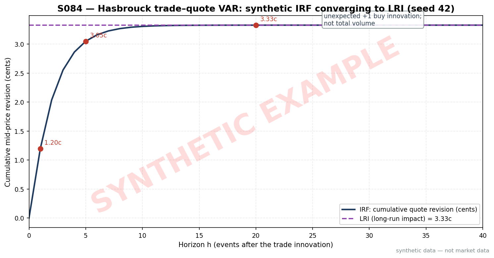

```mermaid
flowchart LR
    FEED["Raw feed<br/>(TAQ / Databento MBP-1)"] -- "tick trades + L1 quotes" --> ING["Ingest + normalize<br/>(exchange ts, signing, halts)"]
    ING -- "synchronized 1-s trade/quote bars" --> FEAT["Feature compute<br/>(Δm_t, q_t; VAR(p) OLS refit)"]
    FEAT -- "VAR coefficient matrices<br/>(per refit window)" --> SIG["Signal S084<br/>IRF(H) / LRI"]
    SIG -- "IRF/LRI signal<br/>(per bar)" --> GATE{"Cost / toxicity<br/>gate?"}
    GATE -- "pass (per signal)" --> OUT["Downstream consumer<br/>(T056 predictor / T052 filter)"]
    GATE -- "fail" --> DROP["No trade"]
    style SIG fill:#aed6f1,stroke:#1f3a5f
```

### S12. Sources

1. Hasbrouck, Joel (1991). "Measuring the Information Content of Stock Trades." *Journal of Finance* 46(1): 179–207. http://ideas.repec.org/a/bla/jfinan/v46y1991i1p179-207.html
2. Escribano, Álvaro & Pascual, Roberto (2006). "Asymmetries in bid and ask responses to innovations in the trading process." *Empirical Economics* 30(4): 913–946. http://ideas.repec.org/a/spr/empeco/v30y2006i4p913-946.html
3. Campigli, F., Bormetti, G. & Lillo, F. "Time and the Price Impact of a Trade." (Structural-VAR extension; documents S-VAR misspecification pitfalls.) https://www.researchgate.net/publication/227532807_Time_and_the_Price_Impact_of_A_Trade
4. *Journal of Finance*, Vol. 46, Issue 1 (March 1991) — issue listing confirming the Hasbrouck (1991) publication record. https://afajof.org/issue/volume-46-issue-1/

**Unverified leads** (chatbot/batch-research claims without an independently checkable source this batch; do not cite as evidence):
- Duck.ai Q-SB9-1 formula summary (verified arithmetic): VAR(p), IRF, LRI forms used in §S3; "the informative component = UNEXPECTED trade innovation, not total volume."
- Dufour & Engle (2000) duration findings as summarized in a CFS working-paper discussion (shorter durations → more informative trades) — widely cited, URL not captured this batch.
- Source log: Duck.ai answered Q-SB9-1–Q-SB9-3 (2026-09-10); Grok/Cursor answers pending (checked 2026-09-10).

---
## Stage 87/200 — S087: Fractional differentiation (memory-retaining stationarization)

*Batch SB9 · Signal 87/100 · Provenance [D] · Family F — Statistical/ML Infrastructure*

### S1. One-line verdict

| | |
|---|---|
| **What it is** | A preprocessing transform: differentiate a price series to a *fractional* order $d$ — just enough to make it stationary (stable mean/variance) while preserving the long memory that integer differencing (returns) destroys. |
| **When it works** | As a feature-engineering step feeding ML models: stationary inputs that still correlate with price levels, fitted leakage-safely on training data. |
| **When it dies** | Applied naively with $d$ fitted on the full sample (lookahead); $d$ too high (memory erased) or too low (nonstationary inputs break the model); structural breaks the ADF test cannot see. |
| **Build-or-buy in one line** | Build — it is a 15-line binomial-weight filter; nothing to buy except the price feed. |

Provenance **[D]** (López de Prado, *Advances in Financial Machine Learning*, 2018, Ch. 5); formulas verified against this batch's hand-checked research notes.

### S2. How it works — plain human explanation

**Stationarity** means a series' statistical properties (mean, variance) don't drift over time — most ML models and statistical tests quietly assume it. A **unit root** is the classic violation: a random-walk price whose level wanders. **Fractional differentiation** generalizes "take returns" to a continuous dial: instead of differencing to integer order 1 (returns: memory erased) or 0 (levels: nonstationary), you differentiate to a *fraction* $d$ between 0 and 1.

The economic intuition: integer differencing is a sledgehammer. A return series is essentially *uncorrelated with the price level it came from* — the entire history of "where we are" is thrown away. López de Prado's resolution: find the *smallest* $d$ (call it $d^*$) at which an **ADF test** (Augmented Dickey–Fuller — a statistical test for the presence of a unit root) first rejects nonstationarity, while the transformed series still correlates strongly with the original log prices. You get stationarity *and* keep most of the memory.

The mechanics are a weighted sum of past log prices with **binomial weights** that decay but never reach zero for $0 < d < 1$ — unlike returns, where the weights are $(1, -1, 0, 0, \dots)$ and history is cut off after one lag. Because the weights never vanish, the window must be **truncated**: drop weights below a tolerance $\tau$ (the **fixed-width window**, FFD), giving a causal, fixed-length filter. **Leakage-safe** means: $d^*$ and the truncation are chosen on *training data only*, and the filter is applied rolling — the value at bar $t$ uses only bars $\le t$.

- **Mental model 1:** Returns are amnesia; levels are a fever dream (nonstationary). Fractional $d$ is the dimmer switch between them — turn it up just until the ADF test says "stationary."
- **Mental model 2:** The weights are a fading memory: yesterday matters a lot, last month a little, and — unlike returns — last month still matters *at all*.
- **Mental model 3:** This is plumbing, not alpha. It never generates a trading signal by itself; it makes the *inputs* to your models well-behaved.

### S3. The math — exact formula

The fractional difference operator $(1-L)^d$ (where $L$ is the lag operator, $Lx_t = x_{t-1}$) expands as an infinite weighted sum:

$$(1-L)^d x_t = \sum_{k=0}^{\infty} w_k\, x_{t-k}, \qquad w_0 = 1,\;\; w_k = -w_{k-1}\,\frac{d-k+1}{k}.$$

The **fixed-width** version truncates at lag $L-1$, the first lag with $\lvert w_{L-1}\rvert < \tau$:

$$\tilde x_t(d, L) = \sum_{k=0}^{L-1} w_k\, x_{t-k}.$$

Boundary cases: $d = 0$ gives $\tilde x_t = x_t$ (identity); $d = 1$ gives weights $(1, -1, 0, \dots)$, i.e. first differences. For $d \in (0,1)$, weights satisfy $-1 < w_k < 0$ for all $k > 0$ — the alternation that keeps the filtered series stationary while memory decays.

| Parameter | Symbol | Typical range | Too small / too large | Default (example) |
|---|---|---|---|---|
| Fractional order | $d$ | 0.1–0.4 memory-retaining; 0.4–0.8 stronger stationarization; $>1$ usually unnecessary | Too small: ADF fails, inputs nonstationary; too large: correlation with levels collapses — you've reinvented returns | smallest $d$ with ADF $p < 0.05$ *— example rule, not an institutional standard* |
| Truncation tolerance | $\tau$ | $10^{-3}$–$10^{-5}$ (illustrative) | Too large: fixed window too short, memory cut; too small: enormous $L$, wasted compute | $10^{-5}$ *— example* |
| Window / input | $x_t$ | log prices | Raw prices with splits/dividends: jumps corrupt weights | log prices *— example* |

**Normalization:** apply to log prices (never raw prices across corporate actions). **Causal timing:** $\tilde x_t$ uses only $x_{t}, \dots, x_{t-L+1}$ — tradable no earlier than $t+1$ is automatic since this is a feature transform, but $d^*$ must be selected on a strictly-prior training window (purged/embargoed per S088). **Variants:** (1) *expanding window* (weights grow with $t$ — early points carry different memory; deprecated in favor of FFD); (2) *ARFIMA-style* estimation of $d$ via the fractional-integration parameter; (3) *per-regime $d$* refit on rolling windows.

### S4. Worked example — step-by-step numbers (SYNTHETIC)

All numbers below are **synthetic** (seed **2**, `rng = np.random.default_rng(2)`); the chart plots exactly these numbers. DGP: a 5,000-bar random-walk log-price series (a pure unit root — the hard case).

**Step 1 — the weights.** For $d = 0.4$, the recursion gives (truncation tolerance $\tau = 10^{-3}$, illustrative):

| $k$ | 0 | 1 | 2 | 3 | 4 | 5 | 6 | 7 | 8 | 9 |
|---|---|---|---|---|---|---|---|---|---|---|
| $w_k$ | 1.000000 | −0.400000 | −0.120000 | −0.064000 | −0.041600 | −0.029952 | −0.022963 | −0.018371 | −0.015156 | −0.012798 |

Hand-check: $w_1 = -0.4$; $w_2 = -(-0.4)(0.4-1)/2 = -0.12$; $w_3 = -(-0.12)(0.4-2)/3 = -0.064$. ✓. Applied to the five values $100, 99, 98, 97, 96$ at lags 0–4: $\tilde x = 100 - 0.4(99) - 0.12(98) - 0.064(97) - 0.0416(96) = 100 - 39.6 - 11.76 - 6.208 - 3.9936 = \mathbf{38.438}$. (Caution: at least one popular online explainer prints 30.576 for this arithmetic — recompute it yourself; the recursion above is correct.) Sanity boundaries: $d = 0$ returns the input unchanged (123.45 → 123.45); $d = 1$ returns the first difference (100, 99 → 1.00).

**Step 2 — truncation.** At $\tau = 10^{-5}$ the fixed-width lag is $L = 3382$ for $d = 0.2$, $L = 927$ for $d = 0.5$, and $L = 228$ for $d = 0.8$ — smaller $d$ means slower weight decay means a longer fixed window. The chart's left panel shows this decay.

**Step 3 — the tradeoff.** Scanning $d$ from 0 to 1 on the synthetic random walk:

| $d$ | ADF $p$-value | corr($\tilde x$, log-price) |
|---|---|---|
| 0.00 | 0.7354 (nonstationary) | 1.000 |
| 0.25 | 0.2070 (nonstationary) | 0.889 |
| **0.30** | **0.0267 — first rejection → $d^*$** | **0.882** |
| 0.50 | 0.0000 | 0.549 |
| 1.00 | 0.0000 | 0.015 (memory gone) |

**What to notice:** at $d^* = 0.30$ the series is stationary (ADF $p = 0.0267 < 0.05$) yet still 88% correlated with the price level — compare with returns ($d = 1$), whose correlation with levels is 0.015: pure amnesia. **Limits:** this is a clean random walk; real prices have breaks and regime shifts the ADF test can miss, and $d^*$ is sample-dependent — refit it only on training data, never the evaluation window.

### S5. Strategies that use this signal

- **T057 — Fractional-Differentiation Memory Trader** — primary trigger: trades fractionally-differenced series preserving long memory, AR-timed — this signal *is* the feature pipeline.
- **T088 — Full-Stack Signal Ensemble** — feature preprocessing: blends all S001–S100 with meta-labeling; FFD is the memory-retaining stationarization applied to price-based ML inputs before the ensemble (a preprocessing role, not a trigger — stated honestly).

### S6. Data required — exact spec

| Field | Type | Granularity | Source tier | Notes |
|---|---|---|---|---|
| Log prices (any symbol) | numeric | any frequency (1-min bars used here) | Tier 0–2 | Any price feed; corporate-action-adjusted |
| ADF test statistics | computed | per $d$ candidate | — | statsmodels or hand-rolled |
| $d^*$, truncation lag $L$ | fitted | per training window | — | Fitted on training data only |

Ingest/feature sketch (Python, ≤20 lines):

```python
import numpy as np
def ffd_weights(d, tau=1e-5):
    w = [1.0]
    while abs(w[-1]) >= tau or len(w) == 1:
        k = len(w)
        w.append(-w[-1] * (d - k + 1) / k)   # binomial recursion
    return np.array(w[:-1])
def ffd(logp, d, tau=1e-5):
    w = ffd_weights(d, tau)                   # fixed-width, causal
    y = np.convolve(logp, w, mode="full")[:len(logp)]
    return y, len(w) - 1                      # drop first L-1 as warmup
# select d*: smallest d with ADF p < 0.05 on TRAINING window only
```

Storage (per `notes/cost-model.md` §4): 1-min bars for 500 symbols ≈ 50 MB/day parquet; a 60-day panel ≈ 3 GB — archive freely. FFD adds one float column per $d$; the weights vector is kilobytes. Data-quality checklist: corporate-action-adjusted log prices; no forward-filled gaps longer than $L$; session calendars consistent between fitting and application windows.

### S7. Local build on M5 Max / 128GB

**Feasibility: trivial** (Tier M, low end — the transform is a convolution). Per `notes/cost-model.md` §2, numpy vectorized math runs ~50–200M elements/sec: a 500-symbol × 252-bar panel convolved with a 1,000-weight kernel is sub-millisecond to a few milliseconds — this batch's own research notes put FFD at "sub-ms/500 symbols." The real work is the $d^*$ search (one ADF per $d$ candidate per symbol per refit), still seconds for a full universe. RAM: tens of MB (§3); the weights are negligible. Engineering (per §5): Tier M low end, **~20–40 h** ≈ **$3,000–6,000** at $150/hr loaded-cost estimate — the standalone filter is an afternoon; the leakage-safe rolling version with stationarity testing, purged $d^*$ selection, and a feature-store integration is the rest. What breaks first at 500 symbols: nothing in compute — what breaks is *discipline*: refitting $d^*$ on overlapping windows without purging (see S088).

| Stack | When to pick |
|---|---|
| Python + numpy | Everything in this chapter — the reference implementation |
| Python + polars | When FFD is one of many rolling features over a bar panel |
| Rust | Only if FFD sits inside a tick-level hot loop (rare) |

### S8. Buy vs build

Vendor price bands per `notes/cost-model.md` §6.

| Option | What you get | Indicative price | Gains | Loses |
|---|---|---|---|---|
| Tier-0 free (Stooq, Alpaca IEX) | Daily bars | ~$0 | $0 start for daily-frequency FFD research | Coarse frequency only |
| Tier-1 retail (Polygon, Tiingo) | 1-min/real-time SIP bars | ~$30–200/mo *indicative — verify before budgeting* | Cheap intraday panels for $d^*$ search | — |
| Build the transform | 15-line filter + ADF search | eng time only | Your own $d^*$, $\tau$, rolling discipline | — |
| Academic route | The AFML book itself (Wiley, 2018) | book price *indicative — verify before budgeting* | Canonical reference | — |

**Verdict: always build the transform; buy only the price feed.** There is nothing to license — FFD is a published formula. The crossover question is not build-vs-buy but *which frequency of bars to buy* for the $d^*$ search: daily bars (free) suffice to learn the method; 1-min bars (Tier 1) for production features.

### S9. Success ratio / efficacy — documented evidence

| Study / source | Market & period | Metric | Before/after cost | Caveat |
|---|---|---|---|---|
| López de Prado (2018), *AFML* Ch. 5 | Equities/FX (book examples) | $d^*$ typically well below 1 (often ~0.3–0.6), with high correlation to the original level at $d^*$ | N/A (feature transform) | Book examples, not a trading backtest |
| Practitioner reproduction at scale (Binance USD-M perpetuals, 568 pairs, hourly) | Crypto, hourly | FFD reproduced causally with no lookahead; fixed-width truncation stable across the cross-section | N/A (replication) | Crypto cross-section; method validation, not P&L |
| Ritchie Ng / RAPIDS explainer | Illustrative | Hand-worked weight arithmetic for $d = 0.4$ | N/A | Pedagogical; recompute the arithmetic yourself (see §S4 erratum note) |

No documented standalone Sharpe exists for "fractional differentiation" — it is not a signal, it is a *preprocessing step*, and the literature treats it that way. Regimes where it fails: structural breaks (a break makes $d^*$ meaningless); ultra-short windows where $L$ exceeds the available history; assets whose "memory" is spurious (then FFD preserves noise, beautifully stationary noise). **Honest bottom line:** as a standalone trigger this has no edge and claims none; as a feature transform it is the disciplined alternative to returns — the evidence is methodological (stationarity + retained memory), and its trading value flows entirely through the models it feeds (T057, T088).

### S10. Failure modes & pitfalls

1. **Lookahead in $d^*$ selection** (choosing $d$ on the full sample, then "predicting" in-sample) → mitigate: select $d^*$ on a strictly prior training window with purging/embargo (S088).
2. **$d$ too high** (memory erased — you've built expensive returns) → mitigate: monitor corr($\tilde x$, log-price) at $d^*$; if it collapses, the transform adds nothing.
3. **$d$ too low** (ADF fails — nonstationary inputs silently break downstream models) → mitigate: hard gate on the ADF $p$-value before the features enter any model.
4. **Truncation too aggressive** (large $\tau$ cuts the long tail that *is* the memory) → mitigate: keep $\tau \le 10^{-5}$ unless you can show the tail is numerically irrelevant.
5. **Corporate actions / unadjusted prices** (a split looks like a permanent shock the weights smear across $L$ bars) → mitigate: log prices from an adjusted feed, always.
6. **Refitting $d^*$ on overlapping windows** (churn and implicit lookahead) → mitigate: refit on a fixed cadence on non-overlapping training blocks.
7. **ADF test fragility** (size/power issues, heteroskedasticity, breaks) → mitigate: complement with a KPSS check; never let one test statistic be the only gate.

### S11. Visuals

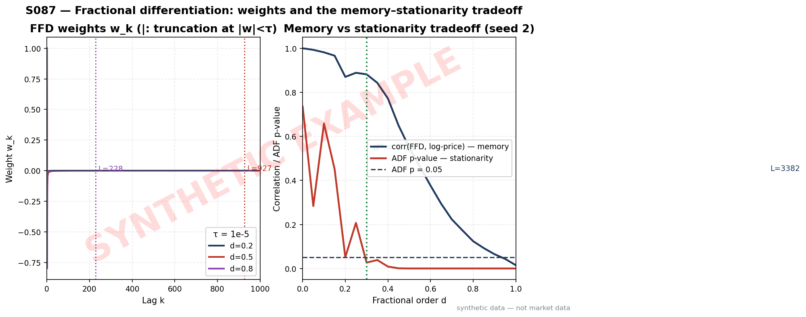

```mermaid
flowchart LR
    FEED["Raw feed<br/>(any price feed)"] -- "log-price bars<br/>(1-min, adjusted)" --> ING["Ingest + normalize<br/>(corp actions, calendars)"]
    ING -- "clean log-price series<br/>(per symbol)" --> FEAT["Feature compute<br/>(FFD weights, ADF d* search)"]
    FEAT -- "stationary FFD features<br/>(per bar, causal)" --> SIG["Signal S087<br/>FFD(d*) series"]
    SIG -- "feature vector<br/>(per bar)" --> GATE{"Stationarity +<br/>leakage gate?"}
    GATE -- "pass (per bar)" --> OUT["Downstream consumer<br/>(T057 / T088 ML inputs)"]
    GATE -- "fail" --> DROP["No trade"]
    style SIG fill:#aed6f1,stroke:#1f3a5f
```

### S12. Sources

1. López de Prado, Marcos (2018). *Advances in Financial Machine Learning.* Wiley, Chapter 5 "Fractionally Differentiated Features." ISBN 978-1-119-48208-6. https://biblio.com.au/9781119482086
2. Practitioner reproduction: "Fractional Differentiation at Scale (López de Prado, AFML Ch. 5)" — FFD reproduced on 568 Binance USD-M perpetuals, causal, no lookahead. https://github.com/darufinance/lopez-de-prado-work-review/blob/HEAD/projects/02_fractional_differentiation/writeup/README.md
3. Ng, Ritchie. "Fractional Differencing to Minimize Memory Loss While Making a Time Series Stationary." *RAPIDS AI* (Medium). https://medium.com/rapids-ai/rapid-fractional-differencing-to-minimize-memory-loss-while-making-a-time-series-stationary-2052f6c060a4
4. AFML practitioner skill summary (transformation guidance: minimum fractional-differencing order for stationarity; fit order and threshold within training data). https://github.com/nutdnuy/afml-book-skill/blob/HEAD/.github/skills/lopez-de-prado-financial-ml/SKILL.md

**Unverified leads** (batch-research claims without an independently checkable source this batch):
- Duck.ai Q-SB9-1 formula summary (verified arithmetic): $(1-L)^d$ expansion, $w_k$ recursion, fixed-width form, truncation rule, $d$ bands (0.1–0.4 / 0.4–0.8), "smallest $d$ passing stationarity while retaining price correlation."
- "d\* often ~0.3–0.6 on equities/FX" per the reproduction README's summary of the book — literature summary, not an independent measurement.
- Source log: Duck.ai answered Q-SB9-1–Q-SB9-3 (2026-09-10); Grok/Cursor answers pending (checked 2026-09-10).

---
## Stage 89/200 — S089: Avellaneda–Stoikov inventory-skew market making

*Batch SB9 · Signal 89/100 · Provenance [D] · Family F — Statistical/ML Infrastructure*

### S1. One-line verdict

| | |
|---|---|
| **What it is** | The closed-form optimal market-making rule: quote around a *reservation price* (mid-price shifted against your inventory) at an *optimal spread* set by volatility, risk aversion, and book depth. |
| **When it works** | As a quoting framework for inventory control in simulation and in live market making with real microstructure infrastructure (colocation, queue priority, fee-tier access). |
| **When it dies** | Retail/small-account live trading: no colocation, poor queue position, adverse selection, and inventory limits you can't absorb — the paper's assumptions do not survive contact with a real book. |
| **Build-or-buy in one line** | Build the math (closed form, an afternoon); buy the connectivity, colocation, and market-data — and paper-trade for months before risking capital. |

Provenance **[D]** (Avellaneda & Stoikov 2008, *Quantitative Finance*); formulas use the corrected $\ln(1+\gamma/\kappa)$ form per this batch's verified extraction notes. **The paper does NOT document that a live trader will earn the theoretical spread** — keep that sentence in mind for the entire chapter.

### S2. How it works — plain human explanation

A **market maker** continuously posts both a bid and an ask, earning the **spread** (the gap between them) when both sides get hit. **Inventory** is the position accumulated along the way — long 500 shares you didn't want is inventory. **Risk aversion** ($\gamma$) is how much you dislike holding that inventory overnight. **Adverse selection** is the market maker's nightmare: the traders who hit your quotes often know more than you, so your fills predict the price moving against you.

Avellaneda and Stoikov's insight: quote around a **reservation price** instead — your *personal* fair value, the mid-price *minus* a penalty proportional to your inventory. Long inventory? Your reservation price drops below the mid, so both quotes drop: your ask gets cheaper (inviting sellers to take you out of the long) and your bid backs away. The quotes *breathe* with the position, constantly leaning toward flat.

The **optimal spread** balances two forces: quote tighter and you get filled more often but earn less per fill; quote wider and each fill pays more but fills arrive rarely (**Poisson arrivals** — fill rates decaying exponentially in distance from the mid). Volatility widens the spread; more time left in the session widens it too.

Now the small-account reality, which the paper's math assumes away: **continuous prices, Brownian mid-price, Poisson arrivals, no queue priority, no latency, no market impact, simplified fees**. In a real book your quote sits behind fifty others at the same price, a faster trader reprices before your cancel arrives, and the fill that arrives is disproportionately the informed one. **A fill is not necessarily good news.** For a small account there is no colocation and poor queue priority. The real objective is **survival-adjusted net P&L**: hard inventory limits, kill switches, volatility-triggered spread widening, stale-quote cancels, conservative sizing.

- **Mental model 1:** The reservation price is a thermostat: inventory is the temperature, and the quotes are the heating/cooling that push it back toward zero.
- **Mental model 2:** The spread is the wage you demand for standing in front of informed flow — volatility and time-to-close set the wage; the book's depth sets how fast the work arrives.
- **Mental model 3:** The formula is the *starting point of an engineering project*, not a strategy. The edge, if any, lives in queue position, latency, fees, and risk controls — none of which are in the equations.

### S3. The math — exact formula

Let $s$ be the mid-price (dollars), $q$ the inventory (shares, positive = long), $\gamma$ the risk-aversion coefficient (per dollar²), $\sigma$ the mid-price volatility over the horizon (dollars), $T-t$ the time remaining (same time units as $\sigma$), and $\kappa$ the order-book depth parameter (per dollar) governing how fast fill arrivals decay with quote distance. The **reservation price** is:

$$r(s,q,t) = s - q\,\gamma\sigma^2(T-t).$$

The **optimal total spread** (corrected form — $\ln(1+\gamma/\kappa)$, *not* $\ln(1+\gamma\kappa)$) is:

$$\delta_a + \delta_b = \gamma\sigma^2(T-t) + \frac{2}{\gamma}\ln\!\left(1+\frac{\gamma}{\kappa}\right), \qquad \delta^* = \tfrac{1}{2}\bigl[\gamma\sigma^2(T-t) + \tfrac{2}{\gamma}\ln(1+\gamma/\kappa)\bigr],$$

with quotes $p_a = r + \delta^*$ and $p_b = r - \delta^*$. Fill **arrival intensities** decay exponentially in distance from the mid:

$$\lambda_a = A e^{-\kappa(p_a - s)}, \qquad \lambda_b = A e^{-\kappa(s - p_b)},$$

where $A$ is the baseline fill intensity at the mid, calibrated from empirical fill counts.

| Parameter | Symbol | Typical range (consistent units) | Too small / too large | Default (example) |
|---|---|---|---|---|
| Risk aversion | $\gamma$ | $10^{-3}$–$1$ per $² | Too small: inventory balloons, ruin risk; too large: quotes too wide, no fills | 0.1 *— example, not an institutional standard* |
| Book depth | $\kappa$ | 0.1–10 per $ | Too small: fills assumed too easy; too large: spread explodes via $\ln(1+\gamma/\kappa)$ | 1.5 *— example* |
| Volatility | $\sigma$ | per-horizon $ | Mismatched horizon vs $T-t$: spread mispriced | 0.3 $/session *— example* |
| Horizon | $T-t$ | one execution cycle → one session | Too long: over-wide spreads; too short: underprices inventory risk | 1 session *— example* |
| Baseline intensity | $A$ | from empirical fill counts | Invented $A$: fill-rate forecasts are fiction | 140/session *— example* |

**Causal timing:** $r$ and $\delta^*$ are recomputed on every quote update from the *current* mid, inventory, and vol estimate — every input must be $\le t$ (stale inputs = picked off). **Variants:** (1) *infinite-horizon* (drop the $T-t$ terms); (2) *asymmetric $\delta_a \ne \delta_b$* (the full HJB solution skews each side separately); (3) *volatility-regime A-S* (widen $\gamma$ or $\sigma$ inputs in stress).

### S4. Worked example — step-by-step numbers (SYNTHETIC)

All numbers below are **synthetic** (seed **21**); the chart plots exactly these numbers. Parameters: $s = 100.00$, $\gamma = 0.1$, $\sigma = 0.3$, $T-t = 1$, $\kappa = 1.5$, $A = 140$.

**Step 1 — the spread.** $\gamma\sigma^2(T-t) = 0.009000$; $(2/\gamma)\ln(1+\gamma/\kappa) = 20 \times \ln(1.066667) = 1.290770$. Total spread $= 1.299770$; half-spread $\delta^* = 0.649885$.

**Step 2 — quotes vs inventory.** $r(q) = 100 - 0.009\,q$ (hand-check: $r(20) = 100 - 0.18 = 99.82$ ✓):

| $q$ (shares) | $r(q)$ | bid $p_b$ | ask $p_a$ | $\lambda_b$ | $\lambda_a$ |
|---|---|---|---|---|---|
| −20 | 100.1800 | 99.5301 | 100.8299 | 69.19 | 40.32 |
| 0 | 100.0000 | 99.3501 | 100.6499 | 52.82 | 52.82 |
| +20 | 99.8200 | 99.1701 | 100.4699 | 40.32 | 69.19 |

At $q = +20$: the reservation price drops to $99.82$, the ask drops to $100.4699$ (cheaper — inviting sellers to lift your long), and $\lambda_a$ rises to 69.19/session while $\lambda_b$ falls to 40.32. The skew is doing its job — *in the model*. (The chart plots the full −20…+20 sweep.)

**Step 3 — fills are random, and randomness is the risk.** Simulating 200 sessions of Poisson fills at $q = 0$ on the ask ($\lambda_a = 52.82$/session, seed 21): mean **53.34** fills (theory 52.82), std **7.43** (theory 7.27), range 29–73. Hand-check: $\lambda_a(0) = 140\,e^{-1.5 \times 0.649885} = 52.82$ ✓.

**What to notice:** the reservation-price line is beautifully linear and the skew logic is airtight — and none of it includes queue position, latency, or the fact that the 53 fills are disproportionately the informed ones. At $q = 0$ your bid is $99.3501$ — you "earn" $\delta^* = 0.65$ when lifted; if the mid then falls $1.00$ on news your fill front-ran, that fill *cost* you $0.35$ net. **Limits:** no fees/rebates, no partial fills, no latency — and the paper documents none of this as live P&L.

### S5. Strategies that use this signal

- **T021 — Avellaneda–Stoikov Inventory Skew MM** — primary trigger: quotes skewed by inventory around a microprice/OFI fair value — this signal *is* the quoting engine's brain.
- **T085 — Resiliency Market Maker** — core mechanism: quotes around LOB resiliency with A-S inventory skew — the skew from this chapter modulates a resiliency-based quoting grid.

### S6. Data required — exact spec

| Field | Type | Granularity | Source tier | Notes |
|---|---|---|---|---|
| Mid-price $s$ | numeric | tick (quoting cadence) | Tier 1–2 | Low-latency direct feed for live; any intraday feed for research |
| Inventory $q$ | internal | per fill | — | Your own execution system — must be exact, not estimated |
| Vol estimate $\sigma$ | computed | per refit (e.g. 5-min) | — | Short-horizon realized vol; stale $\sigma$ = mispriced spread |
| Fill counts → $A$, $\kappa$ | calibrated | per symbol/venue | — | From your own fill history or message-level replay |
| Fees/rebates schedule | reference | per venue | — | Taker/maker fees, tier thresholds — the model's blind spot |

Ingest/quote-loop sketch (Python — research version; live belongs in Rust/C++):

```python
import numpy as np
def as_quotes(s, q, gamma=0.1, sigma=0.3, Tt=1.0, kappa=1.5):
    r = s - q * gamma * sigma**2 * Tt
    dstar = 0.5 * (gamma*sigma**2*Tt + (2/gamma)*np.log(1+gamma/kappa))
    return r - dstar, r + dstar
for update in book_stream:                       # tick events
    s = update.mid
    sigma = vol_estimator.recent()               # must be fresh
    bid, ask = as_quotes(s, inventory.q)
    if risk_checks(q=inventory.q, sigma=sigma).ok:
        venue.replace_quotes(bid, ask)           # risk gate FIRST, always
```

Storage (per `notes/cost-model.md` §4): quoting research needs message-level books — L2 MBP-10 ≈ 10–40 GB/symbol-day parquet; keep per-symbol daily files and replay, don't archive naively. Data-quality checklist: exchange timestamps (not SIP) for live; versioned fee/rebate schedule; corporate actions; halt handling (cancel-all on halt); clock sync (PTP).

### S7. Local build on M5 Max / 128GB

**Feasibility: feasible for research and simulation; the live loop is a different machine.** The A-S math itself is microseconds (this batch's research notes: <10 µs in C++/Rust, 10–100 µs in well-written Python per tick) — per `notes/cost-model.md` §2 a Python event loop at ~100–500k events/sec handles a few symbols' quoting cadence, and the M5 Max is "an excellent research/medium-throughput machine, NOT a substitute for colocated hardware." **Build the model, simulator, and risk layer on the Mac; the live quoting engine needs colocation you cannot buy in this budget.** No Python preprocessing + GPU sync + deep recurrent model on the critical quoting path — the book handler updates features asynchronously, the model scores at cadence, the quoting engine stays deterministic. RAM: <100 MB for quoting state (§3). Engineering (per §5): **180–400 h** ≈ **$27,000–60,000** at $150/hr loaded-cost estimate for event-driven quoting + inventory/risk (Tier H-adjacent); exchange adapter + certification is another 400–1,000+ h *per venue*.

Python + numpy/polars is the default for formula research, Monte Carlo fill simulation, and parameter sweeps; Rust/C++ for any live or realistic replay quoting loop; an hftbacktest-style replay for message-level backtests with queue-aware fills before paper trading.

### S8. Buy vs build

Vendor price bands per `notes/cost-model.md` §6.

| Option | What you get | Indicative price | Gains | Loses |
|---|---|---|---|---|
| Build the math (this chapter) | Closed-form quotes, simulator | eng time only | Full control of $\gamma$, $\kappa$, skew | — |
| Buy pro feed (Databento) | Exchange-timestamped L1/L2 | ~$200/mo + usage *indicative — verify before budgeting* | Honest replay for queue-aware fill simulation | Still not colocation |
| Serious multi-venue MM data/connectivity | Direct feeds, colocated servers | $10,000–100,000+/yr *indicative — verify before budgeting* | The actual infrastructure A-S assumes | Institutional budget |

**Verdict: build the model, buy the connectivity — and don't go live until the replay says so.** The formula is free; the *prerequisites* (colocation, queue priority, fee tiers, message-level replay with conservative queue-aware fills) are what cost $10k–$100k+/yr. Crossover: paper-trade the A-S quoter on message-level replay for months; if net-of-everything P&L (spread captured − adverse selection − inventory liquidation − fees/rebates mismatch − latency loss − queue loss − hedging cost) isn't positive, there is no live business.

### S9. Success ratio / efficacy — documented evidence

| Study / source | Market & period | Metric | Before/after cost | Caveat |
|---|---|---|---|---|
| Avellaneda & Stoikov (2008), *Quant. Finance* | Theory + simulations | Closed-form optimal quotes; simulations show positive P&L *under the model's own assumptions* | Before-cost (theoretical) | **Does NOT document that a live trader will earn the theoretical spread** |
| Independent reproduction (Monte Carlo + hftbacktest on real Binance L2 + Hummingbot paper-trade) | Crypto ETF 1-min bars, 2023–2026 (196,415 bars) | Inventory-skewed quoting: 12,652 fills, inventory std 2.58 vs symmetric 9,901 fills, std 11.82; 3–9× inventory-variance reduction across all three tracks | Before-cost (simulation/paper) | Not live capital; crypto market structure |

Regimes where it fails: volatility explosions, one-sided informed flow, fee-tier changes, latency shocks. **Honest bottom line:** as a standalone "strategy" this is an *optimization framework with no documented live net-of-cost edge* — the paper is primarily theoretical, and the replications confirm inventory control, not profitability. Its value is the quoting discipline inside T021/T085, wrapped in risk controls the paper doesn't discuss.

### S10. Failure modes & pitfalls

1. **Adverse selection** (fills predict moves against you) → mitigate: toxicity filters (VPIN/S008), widen on informed-flow proxies.
2. **Queue-position blindness** (model assumes fills arrive at rate $\lambda(\delta)$; reality: you're last in line) → mitigate: message-level replay with *conservative* queue-aware fills; assume zero price improvement.
3. **Latency / stale quotes** (mid moves, your quote doesn't) → mitigate: colocate or don't play; stale-quote cancel on every book update.
4. **Inventory blowout** (one-sided flow overwhelms the skew) → mitigate: hard inventory limits + kill switches *outside* the formula — the formula never says "stop."
5. **Volatility misestimation** (stale $\sigma$ → mispriced spread) → mitigate: short-horizon vol estimator, regime-triggered widening, halt in jumps.
6. **Fee/rebate mismatch** (maker rebates assumed; taker fees realized on hedges) → mitigate: model the *actual* venue fee schedule, including tier minimums you can't reach.
7. **Overfit $\gamma$/$\kappa$** (tuned on a calm month, deployed into a storm) → mitigate: calibrate on stressed periods; prefer conservative parameters.

### S11. Visuals

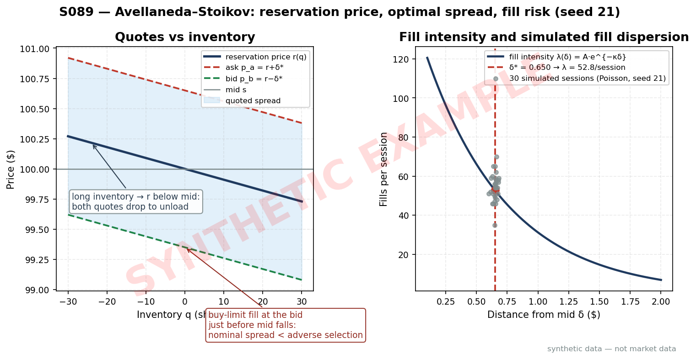

```mermaid
flowchart LR
    FEED["Raw feed<br/>(direct L1/L2 + fills)"] -- "tick quotes + own fills<br/>(per event)" --> ING["Ingest + normalize<br/>(exchange ts, fee schedule)"]
    ING -- "mid, inventory q,<br/>vol estimate (per tick)" --> FEAT["Feature compute<br/>(r(q), δ*, λ(δ))"]
    FEAT -- "bid/ask quotes<br/>(per quote update)" --> SIG["Signal S089<br/>A-S skew quoter"]
    SIG -- "quotes<br/>(per update)" --> GATE{"Risk / inventory<br/>gate?"}
    GATE -- "pass (per update)" --> OUT["Downstream consumer<br/>(T021 / T085 quoting engine)"]
    GATE -- "fail" --> DROP["Cancel all / kill switch"]
    style SIG fill:#aed6f1,stroke:#1f3a5f
```

### S12. Sources

1. Avellaneda, Marco & Stoikov, Sasha (2008). "High-frequency trading in a limit order book." *Quantitative Finance* 8(3): 217–224. https://doi.org/10.1080/14697680701381228
2. Analytical and Monte Carlo replication of Avellaneda–Stoikov (2008) — closed-form verification, reservation-price surfaces, inventory-vs-symmetric experiments. https://github.com/quantcodeautomata/qca-analytical-replication-of-the-avellaneda-stoikov-m
3. A-S reproduction via Monte Carlo, hftbacktest on real Binance L2, and Hummingbot paper-trade — 3–9× inventory-variance reduction; inventory std 2.58 vs 11.82. https://github.com/ericxuzhesheng/avellaneda-stoikov-reproduction
4. Market-making simulator comparing A-S vs fixed-spread strategies on simulated price/fill processes (documents the model equations used). https://github.com/marek-hubar/market-making-simulation

**Unverified leads** (batch-research claims without an independently checkable source this batch):
- Duck.ai Q-SB9-1/Q-SB9-3 formula and framing summaries (verified arithmetic): reservation price, corrected $\ln(1+\gamma/\kappa)$ spread, fill intensities, parameter bands, the MM P&L decomposition, and the small-account reality notes.
- Source log: Duck.ai answered Q-SB9-1–Q-SB9-3 (2026-09-10); Grok/Cursor answers pending (checked 2026-09-10).

---
## Stage 9/200 — S009: PIN (probability of informed trading)

*Batch SB10 · Signal 9/100 · Provenance [D] · Family A — Microstructure & order flow*

### S1. One-line verdict

| | |
|---|---|
| **What it is** | Structural estimate of the fraction of trades coming from informed traders, from daily buy/sell counts. |
| **When it works** | As a slow adverse-selection gauge: flagging names/regimes where uninformed flow is likely to lose to informed flow. |
| **When it dies** | As a real-time or daily timing signal; in thin/erratic tapes, after trade-misclassification, or when arrival rates drift. |
| **Build-or-buy in one line** | Build the MLE estimator yourself (the math is public); buy or borrow *classified* trade history if you need depth. |

### S2. How it works — plain human explanation

Imagine a stock on a quiet Tuesday: buys and sells arrive in roughly balanced dribs and drabs — say 40 buyer-initiated and 40 seller-initiated trades. Now imagine a different Tuesday: 90 buys against 40 sells, all morning. Something may be afoot — someone may know something. **PIN (probability of informed trading)** formalizes that intuition. It is the output of a small structural model of *who trades when*: on any given day, either nothing special happens and only **uninformed** traders (liquidity seekers, indexers, noise) show up, or an **information event** occurs — good news or bad news — and **informed** traders pile in on one side.

A concrete vignette. 9:47:03, fictitious ticker ACME: bid 50.00 × 800 / ask 50.02 × 300. Over the next hour the tape prints 60 buyer-initiated trades and 12 seller-initiated trades. A **buyer-initiated** trade is one where the aggressor bought — the trade printed at (or lifted) the ask; a **seller-initiated** trade printed at (or hit) the bid. (Determining which side was the aggressor is called **trade classification**; more in S6.) PIN asks: given today's counts of buyer- and seller-initiated trades, what fraction of total expected order flow is informed?

Why should the effect exist economically? **Adverse selection**: when you trade against someone who knows more than you, you lose on average — the market maker widens the **spread** (the gap between bid and ask) to compensate, and prices move against liquidity providers after the trade. High PIN means a high expected share of informed flow, hence wider spreads, larger price impact, and — in the cross-section — investors demanding a higher expected return to hold the stock. Note the direction carefully: high PIN does not mean the stock goes up. An informed seller with bad news produces a high PIN and a falling price.

Mental model, three bullets:

- **PIN is a characteristic, not a trigger.** It describes the *composition* of trading over a window (tens of days), like a credit rating describes a borrower — slow-moving, not a timing device.
- **It is estimated, not observed.** Nobody sees "informed" stamped on a trade; PIN backs the number out of buy/sell imbalances via a **maximum-likelihood estimator (MLE)** — the parameter values that make the observed counts most probable.
- **High PIN ≠ positive return.** It means high adverse-selection risk. The informed side can be selling.

### S3. The math — exact formula

Each day *t* the market is in one of three states. Let *B_t* = buyer-initiated trades, *S_t* = seller-initiated trades (counts, not dollars — standard PIN uses counts):

- No news, probability (1−α): *B_t* ~ Poisson(ε_b), *S_t* ~ Poisson(ε_s)
- Good news, probability αδ: *B_t* ~ Poisson(μ+ε_b), *S_t* ~ Poisson(ε_s)
- Bad news, probability α(1−δ): *B_t* ~ Poisson(ε_b), *S_t* ~ Poisson(μ+ε_s)

A **Poisson** distribution models counts of random arrivals: Poisson(λ) has mean λ. **MLE** = maximum likelihood estimation: choose parameters maximizing the probability of the observed data.

The day-*t* likelihood is the three-state **mixture**:

$$L_t(\theta) = \alpha\delta\cdot \mathrm{Po}(B_t\mid\mu+\varepsilon_b)\mathrm{Po}(S_t\mid\varepsilon_s) + \alpha(1-\delta)\cdot \mathrm{Po}(B_t\mid\varepsilon_b)\mathrm{Po}(S_t\mid\mu+\varepsilon_s) + (1-\alpha)\cdot \mathrm{Po}(B_t\mid\varepsilon_b)\mathrm{Po}(S_t\mid\varepsilon_s)$$

with θ = (α, δ, ε_b, ε_s, μ), 0 < α, δ < 1, ε_b, ε_s, μ > 0. The log-likelihood over a window of *T* days is ℓ(θ) = Σ_t log L_t(θ). Because Poisson terms like e^{−900}·900^{900}/900! **underflow** (collapse to zero) in floating point, compute in log space with the **log-sum-exp** stabilization: log Σ_j w_j e^{x_j} = m + log Σ_j w_j e^{x_j − m}, m = max_j x_j.

PIN itself is the ratio of expected informed arrivals to expected total arrivals:

$$\mathrm{PIN} = \frac{\alpha\mu}{\alpha\mu + \varepsilon_b + \varepsilon_s}$$

| Parameter | Symbol | Typical range | Too small / too large | Default (example — not an institutional standard) |
|---|---|---|---|---|
| P(information event) | α | 0.1–0.6 | →0: model says never news; →1: every day is an event, identification collapses | 0.40 |
| P(good news \| event) | δ | 0.3–0.7 | boundary (0/1): optimizer stuck; implies one-sided info flow only | 0.50 |
| Informed arrival rate | μ | 10–500/day | implausibly large vs counts → boundary/overflow | 50/day |
| Uninformed buy/sell rates | ε_b, ε_s | 10–1000/day | 0 → division pathologies; huge → PIN → 0 | 40/day each |
| Estimation window | T | 60–250 trading days (illustrative) | <60: weak identification, local maxima; >250: stale, rates drift | 120 days |

**Causal timing.** PIN is computed at the end of window *T* using only data ≤ *T*; it characterizes the *past* window. It is tradable no earlier than *T*+1 — and even then only as a slow risk gauge. Never present a daily PIN change as a clean information shock: the estimator needs tens of days to identify α and μ.

**Named variants.** (1) **Standard daily PIN** (Easley–Kiefer–O'Hara–Paperman 1996): as above, daily counts, multi-start constrained MLE. (2) **Factorized / stabilized likelihood** (Easley et al. rearrangement; Lin–Ke factorization): algebraically rearranged likelihood that avoids underflow and reduces boundary bias — same model, numerically safer optimizer target. (3) **Time-varying arrival rates** (Easley–Engle–O'Hara–Wu 2008): α, μ, ε evolve rather than staying constant — addresses the stale-window critique at the cost of complexity. (4) **Intraday/short-window adaptations**: re-estimate on intraday buckets; these are structural-model extensions, *not* evidence PIN is observable in real time — treat as experimental.

### S4. Worked example — step-by-step numbers (SYNTHETIC)

**All numbers below are synthetic** (operator-verified fixed tape; seed 9 recorded for script reproducibility). Real PIN estimation needs 60+ days; this 10-day tape is a teaching toy — the standard errors on a 10-day fit would be enormous.

| Day | B_t | S_t | Imbalance (B−S)/(B+S) | Inferred state (example rule \|B−S\| ≥ 40) |
|---|---|---|---|---|
| 1 | 90 | 40 | +0.3846 | good-news event |
| 2 | 40 | 90 | −0.3846 | bad-news event |
| 3 | 42 | 38 | +0.0500 | no news |
| 4 | 39 | 41 | −0.0250 | no news |
| 5 | 40 | 40 | +0.0000 | no news |
| 6 | 88 | 42 | +0.3538 | good-news event |
| 7 | 41 | 87 | −0.3594 | bad-news event |
| 8 | 38 | 42 | −0.0500 | no news |
| 9 | 40 | 39 | +0.0127 | no news |
| 10 | 41 | 40 | +0.0123 | no news |

Step 1 — means: ΣB = 499, ΣS = 499, so B̄ = S̄ = 49.9.

Step 2 — moment-matched parameters (illustrative; a real fit runs the MLE optimizer): event days = 4/10 → α̂ = 0.40. Good-news share of events = 2/4 → δ̂ = 0.50. No-news days average B = S = 240/6 = 40.0 → ε̂_b = ε̂_s = 40. Good-news buy average = (90+88)/2 = 89 → μ̂ ≈ 89 − 40 = 49 ≈ 50 (rounded, as verified).

Step 3 — PIN: α̂μ̂ = 0.40 × 50 = 20; ε̂_b + ε̂_s = 80; **PIN = 20/(20+80) = 0.20 = 20%**.

Step 4 — the likelihood on day 1 (B=90, S=40), showing why log-sum-exp matters. Log-terms (weight included): good-news −7.5447, bad-news −48.0912, no-news −29.4298. In linear space: 5.289×10⁻⁴, 1.30×10⁻²¹, 1.655×10⁻¹³ — the bad-news term is 17 orders of magnitude smaller than the leading term, and with larger counts such terms underflow to exactly 0.0, silently corrupting the sum. Log-sum-exp: log L_1 = m + log Σ w_j e^{x_j−m} = **−7.5447**, with posterior P(good news | day 1) ≈ 1.0000. The chart plots this tape: daily B/S bars with event days shaded, plus the arrival-rate decomposition 20 vs 80.

**What to notice.** Days 3–5, 8–10 sit near balance (the uninformed baseline ≈ 40/40); the four event days scream imbalance — that contrast is what identifies α and μ. Limits: no fees or spreads enter anywhere; a 10-day window cannot separate α from μ reliably (they enter PIN only as the product αμ, which is exactly why PIN is better identified than its components); and the "event" labels above used a hand rule, not the optimizer.

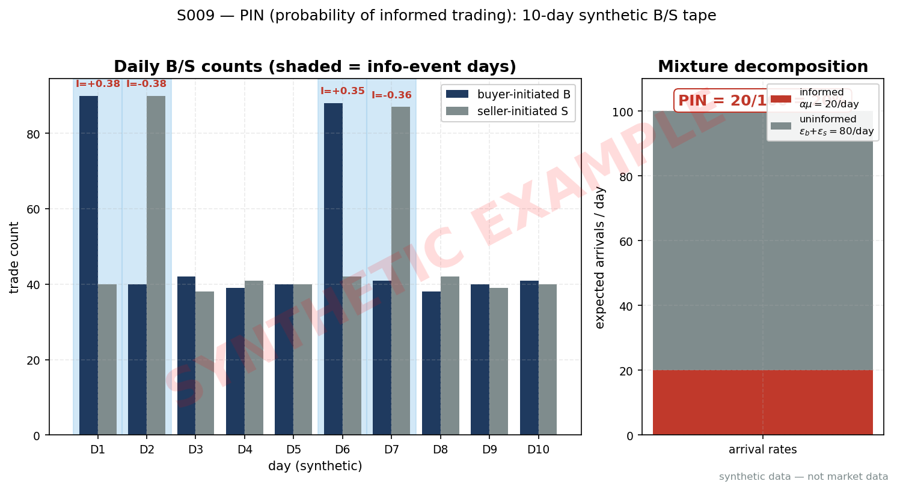

### S5. Strategies that use this signal

- **T092 — PIN-gated informed-flow avoidance**: primary conditioning variable — the strategy stands down (no new risk) when PIN/toxicity is high and meta-labels the stand-down rule.
- **T021 — Avellaneda–Stoikov inventory-skew market maker**: PIN as an adverse-selection filter — widen quotes / shrink size when PIN is elevated (veto on aggressive quoting).
- **T003 — VPIN-gated breakout trader**: the intraday cousin — uses VPIN (S008) rather than PIN for the same toxicity-gating job at minutes-to-hours horizons.
- Context: **S008 (VPIN)** is the real-time toxicity measure to reach for when PIN is too slow; **S086 (meta-labeling)** can learn *when* the PIN stand-down actually pays.

### S6. Data required — exact spec

| Field | Type | Granularity | Source tier | Notes |
|---|---|---|---|---|
| Trade price, size, timestamp | float, int, ts | tick | Tier 1–3 | Needs exchange timestamps for honest signing |
| Aggressor flag (buy/sell-initiated) | boolean | tick | Tier 2–3 | If absent, classify via Lee–Ready/quote rule |
| Daily B_t, S_t counts | int | daily | derived | Aggregate of the above; the MLE input |
| Corporate-action / halt calendar | table | daily | Tier 1 | Splits don't change counts but change the universe |

Collection: raw trades → classify each trade (exchange aggressor flag; else **Lee–Ready (1991)** rule: trade above the prevailing midquote = buy, below = sell, at the mid = tick test against prior price) → aggregate to daily (B_t, S_t) → store. Ingest sketch (≤20 lines):

```python
import polars as pl
trades = pl.read_parquet("raw/trades_2026-09-10.parquet")          # ts, price, size, bid, ask, aggressor
q = (trades.with_columns(mid=(pl.col("bid") + pl.col("ask")) / 2)
     .with_columns(side=pl.when(pl.col("aggressor").is_not_null())
                   .then(pl.col("aggressor"))
                   .when(pl.col("price") > pl.col("mid")).then(pl.lit(1))   # Lee–Ready quote rule
                   .when(pl.col("price") < pl.col("mid")).then(pl.lit(-1))
                   .otherwise(pl.lit(0))))                                   # tick test omitted for brevity
daily = (q.filter(pl.col("side") != 0).group_by(pl.col("ts").dt.date().alias("date"))
         .agg(B=(pl.col("side") == 1).sum(), S=(pl.col("side") == -1).sum()))
daily.write_parquet("curated/daily_bs.parquet")
```

Storage: daily B/S counts are bytes per symbol-day — negligible. Per `notes/cost-model.md` §4, daily bars for 3,000 stocks are ~5 MB/day total; a decade of B/S counts is ~0.1–2 GB. **Data-quality checklist:** exchange vs SIP timestamps (classification flips on stale quotes); corporate actions and listing changes (window composition); halts (zero-count days are not "no-news" days); DST/half-days; and classification-method consistency across the whole window — switching methods mid-window biases α.

### S7. Local build on M5 Max / 128GB

**Feasibility verdict: feasible — the compute is trivial; the data acquisition is the project.** Fitting one PIN window is milliseconds to seconds of optimizer time; 500 symbols × one 120-day window is minutes in optimized Python (per `notes/cost-model.md` §2, polars simple ops run ~10–50M rows/sec and the daily-count panel is tiny). The bottleneck is not CPU — it is obtaining clean, consistently classified trade history.

- **Throughput:** MLE compute ~ms–s per symbol-window; a 500-symbol monthly refresh is a coffee break, not a cluster job. Bottleneck: trade-classification data licensing and backfill.
- **Stack options:** Python+polars for classification/aggregation plus scipy for the constrained MLE (pick this — the likelihood is five parameters, no need for more); Rust only if you are already classifying billions of ticks in a streaming loop; DuckDB for the curated B/S panel.
- **RAM:** working arrays < 1 GB; 60 days of daily counts for 500 symbols is kilobytes; even 10 years is ~0.1–2 GB (per cost-model §3 working-budget rule, keep < ~77 GB — PIN uses a rounding error of it).
- **Engineering band:** Tier H per plan §6 (PIN is explicitly listed there): **60–200 h → $9,000–30,000** at the $150/hr loaded-cost estimate. One line of justification: signing pipeline + multi-start MLE with boundary diagnostics + rolling-window orchestration + validation is a real estimation project, not a formula transcription.
- **What breaks first at 500 symbols or full OPRA:** not the MLE — the trade-classification backfill and the corporate-action-aware universe maintenance. PIN on options flow is out of scope; full OPRA is irrelevant to this signal.

### S8. Buy vs build

| Option | What you get | Indicative price | Gains | Loses |
|---|---|---|---|---|
| Self-classify SIP trades (Alpaca SIP / Polygon Stocks Advanced, Tier 1) | Raw trades; you run Lee–Ready | ~$30–200/mo, *indicative — verify before budgeting* | Cheap, full control | Classification error biases PIN downward (Grammig–Theissen); SIP timestamps |
| Databento (Tier 2) | MBP-1/trades with aggressor flags on supported schemas | ~$200/mo + usage, *indicative — verify before budgeting* | Exchange timestamps, honest flags where available | Usage metering on history backfill |
| TAQ via WRDS / LOBSTER (academic, Tier 3) | Full historical trades with exchange flags | ~hundreds/yr academic, *indicative — verify before budgeting* | Gold-standard history | Academic licensing, no commercial redistribution |
| Precomputed PIN series (vendor analytics) | A PIN number per symbol | vendor-quoted | Zero engineering | Black-box methodology; you can't audit the estimator |

**Verdict: build the estimator, buy (or borrow) the classified data.** The MLE is public math — there is no edge in re-deriving it. The edge, if any, is in classification quality and window hygiene. Crossover: if you need >5 years of consistently classified history across the full US universe, the academic TAQ route or a Tier-2 backfill beats hand-rolling SIP classification.

### S9. Success ratio / efficacy — documented evidence

| Study / source | Market & period | Metric | Before/after cost | Caveat |
|---|---|---|---|---|
| Easley–Hvidkjaer–O'Hara (2002) | NYSE, 1983–1998 | 10pp PIN difference → +2.5%/yr expected return; high–low PIN decile ≈ 7.5% annualized | **Before cost** — cross-sectional pricing regression, not a traded strategy | Original sample; contested since |
| Duarte–Young (2009) | US, extended sample | PIN's *illiquidity* component is priced; the *asymmetry* component is not | **Before cost** | PIN premium may be a liquidity premium in disguise |
| Mohanram–Rajgopal (2009) | NYSE, extended | PIN premium significant in only one 5-year subperiod of the original sample | **Before cost** | Not robust to period/specification |
| Lai–Ng–Zhang (2014) | 47 countries, 30,095 firms | No positive PIN effect on expected returns internationally | **Before cost** | Market-structure dependence |
| Grammig–Theissen (2007) | Simulations | Trade misclassification biases PIN **downward**; bias scales with trading intensity | n/a — methodological | Your PIN is only as good as your signing |

Regimes where it fails: thin/erratic tapes (weak identification — the optimizer sits on boundaries), market-structure changes mid-window (tick-size pilots, venue shifts), fast-moving news regimes where constant arrival rates are a fiction, and crisis windows with halts and erratic prints.

**Honest bottom line:** after costs, PIN is more credible as a risk-control or cross-sectional conditioning variable than as a standalone alpha signal. High PIN ≠ positive return — a high-PIN stock can realize negative returns when the informed side is selling or the news is bad. As a standalone trigger this is a *weak, slow* edge; as a filter (stand down / widen quotes / shrink size when PIN is high) it is *defensible*. Cost-model note (H5): the PIN gauge itself generates no trades, so spread+fees+impact are n/a at the signal level; costs enter when PIN gates a strategy (T092), where that strategy's explicit cost model applies.

### S10. Failure modes & pitfalls

- **Lookahead leakage:** computing PIN on a window that includes the "future" relative to the decision date — mitigate by strictly rolling windows ending at *t*, signal usable at *t*+1.
- **Weak identification in short windows:** α and μ enter only as the product αμ — mitigate with ≥60-day windows, multi-start optimization, and flagging boundary solutions.
- **Likelihood underflow/overflow:** naive likelihood collapses on active names — mitigate with log-sum-exp / factorized likelihood (non-negotiable).
- **Trade-misclassification bias:** Lee–Ready errors bias PIN downward — mitigate with exchange aggressor flags where available; document the classifier.
- **Staleness:** arrival rates drift; a 250-day window describes a regime that no longer exists — mitigate by comparing 60/120/250-day estimates and flagging disagreement.
- **Cost blowup:** spreads on high-PIN names are wide — the very names PIN flags are the most expensive to trade; mitigate by using PIN as a *veto*, not an entry trigger.
- **Overfitting the window:** tuning window length to maximize an in-sample premium — mitigate by fixing windows ex ante.
- **Microstructure noise vs signal:** quote flicker and odd-lot prints masquerading as informed flow — mitigate with minimum-price and minimum-activity screens.

### S11. Visuals


```mermaid
flowchart LR
    FEED["Raw trade feed<br/>(TAQ / Databento)"] -->|tick trades<br/>exchange ts| CLS["Classify + aggregate<br/>(Lee–Ready → daily B/S)"]
    CLS -->|daily counts<br/>B_t, S_t| MLE["MLE fit<br/>(log-sum-exp likelihood)"]
    MLE -->|PIN, α, δ, μ, ε<br/>per window| SIG["Signal S009<br/>PIN risk gauge"]
    SIG -->|monthly PIN<br/>per symbol| GATE{"Adverse-selection<br/>gate?"}
    GATE -->|pass| OUT["Downstream strategy<br/>(T092 / execution sizing)"]
    GATE -->|fail| DROP["Stand down /<br/>widen quotes"]
    style SIG fill:#aed6f1,stroke:#1f3a5f
```

### S12. Sources

Source log: Duck.ai answered Q-SB10-1–Q-SB10-3 (2026-09-10); Grok answers pending (checked 2026-09-10). The PIN formula, likelihood, and worked example A are operator-verified (task spec); remaining chatbot material is treated as research leads.

1. Easley, D., Kiefer, N. M., O'Hara, M., Paperman, J. B. (1996). "Liquidity, Information, and Infrequently Traded Stocks." *Journal of Finance* 51(4), 1405–1436. http://ideas.repec.org/a/bla/jfinan/v51y1996i4p1405-36.html — the original PIN model and estimator.
2. Easley, D., Hvidkjaer, S., O'Hara, M. (2002). "Is Information Risk a Determinant of Asset Returns?" *Journal of Finance* 57(5), 2185–2221. http://ideas.repec.org/a/bla/jfinan/v57y2002i5p2185-2221.html — PIN return premium (~7.5% annualized, 1983–1998; before cost).
3. Duarte, J., Young, L. (2009). "Why is PIN priced?" *Journal of Financial Economics* 91(2), 119–138. https://ideas.Repec.org/a/eee/jfinec/v91y2009i2p119-138.html — the priced component is illiquidity, not asymmetry.
4. Mohanram, P., Rajgopal, S. (2009). "Is PIN priced risk?" *Journal of Accounting and Economics* 47(3), 226–243. http://ideas.repec.org/a/eee/jaecon/v47y2009i3p226-243.html — premium not robust across periods/specifications.
5. Lai, S., Ng, L., Zhang, B. (2014). "Does PIN affect equity prices around the world?" *Journal of Financial Economics* 114(1), 178–195. https://ideas.Repec.org/a/eee/jfinec/v114y2014i1p178-195.html — no PIN pricing effect in 47-country sample.
6. Boehmer, E., Grammig, J., Theissen, E. (2007). "Estimating the probability of informed trading — does trade misclassification matter?" *Journal of Financial Markets* 10(1), 26–47. Working-paper version: https://ideas.repec.Org/p/zbw/bonedp/372002.html — misclassification biases PIN downward.
7. `notes/cost-model.md` §§2–6 — throughput, RAM, engineering-band, and vendor price-band planning numbers used in S6–S8.

**Unverified leads** (chatbot-only, no checkable source captured): the multi-start grid recipe (α ∈ {0.2,0.4,0.6,0.8}, δ ∈ {0.25,0.5,0.75} starts; μ from high-vs-low-activity-day difference; ε from median daily counts) and the 60/120/250-day window comparison protocol — plausible practitioner procedure, treat as illustrative until sourced; the "FRDS PIN documentation" and "JBF 2012 factorized likelihood via RePEc" pointers — not verified, do not cite.

---
## Stage 19/200 — S019: Stealth trading (trade-size informedness)

*Batch SB10 · Signal 19/100 · Provenance [D] · Family A — Microstructure & order flow*

### S1. One-line verdict

| | |
|---|---|
| **What it is** | The finding that medium-size trades carry a disproportionate share of cumulative price impact — informed traders hiding in the middle of the size distribution. |
| **When it works** | As an execution-timing and market-impact input: unusual medium-size impact flags informed/urgent flow; quiet medium flow flags absorbable liquidity. |
| **When it dies** | As a fixed "medium = $X" rule ported across names, venues, or eras; in fragmented markets where size prints are shredded. |
| **Build-or-buy in one line** | Build the bucket-impact monitor yourself on any tick-trade feed; there is nothing to buy except the data. |

### S2. How it works — plain human explanation

An informed trader faces a dilemma. Trade too small and the profit doesn't cover costs; trade too big and the trade itself screams "I know something," moving the price before the position is built. The **stealth-trading hypothesis** says the rational camouflage is the middle: split the informed bet into **medium-size** trades that blend into normal flow. If that's true, then most of a stock's cumulative price movement should happen on medium-size trades — out of proportion to their share of trades or volume.

A concrete vignette. 10:23:11, fictitious ticker ACME at $50.00. The tape prints: 200 shares buyer-initiated (+1¢ on the mid), 150 shares seller-initiated (−1¢), then 2,500 shares buyer-initiated (+2¢), 3,000 shares buyer-initiated (+3¢), then a 25,000-share block that barely nudges the mid (+0.5¢ — it was pre-negotiated upstairs). The two mid-size prints moved the price more, per dollar, than the block. A **midprice** (or **midquote**) is simply (bid+ask)/2 — the market's instantaneous fair-value estimate; its changes are the cleanest measure of **price impact** (how much a trade moves the market's valuation, stripped of the mechanical bid–ask bounce).

Why should the effect exist? Two-sided economics. Informed traders optimize *stealth per dollar*: medium sizes maximize information traded per unit of price revelation. Market makers, meanwhile, learn that medium-size flow is the most toxic and shade quotes against it — which is exactly why the measured impact concentrates there. The effect is a **documented empirical regularity, not a fixed cutoff**: what counts as "medium" in a mega-cap is block-size in a micro-cap.

Mental model, three bullets:

- **Size is information.** The *distribution* of price impact across trade sizes reveals who is informed; the middle of the distribution is where informed flow hides.
- **"Medium" is relative.** Calibrate buckets to the name's own median dollar volume, quoted depth, and volatility — never to a fixed dollar number.
- **Execution signal first, alpha signal second.** Knowing flow is informed tells you *how* to trade (patiently, or not at all), more reliably than *which direction* to bet.

### S3. The math — exact formula

Bucket every trade by size (small / medium / large — cutoffs are *examples*, calibrated per name). For trade *k* with signed size *q_k* (+shares if buyer-initiated, −shares if seller-initiated) and midprice change Δ*m_k* around the trade, the bucket's cumulative signed impact is Σ_{k∈bucket} q_k·Δm_k. The diagnostic compares **impact share** against **trade share** and **volume share**:

$$\text{impact share}_b = \frac{\sum_{k \in b}\, \lvert q_k\,\Delta m_k\rvert}{\sum_{\text{all }k}\, \lvert q_k\,\Delta m_k\rvert}, \quad \text{trade share}_b = \frac{N_b}{N}, \quad \text{volume share}_b = \frac{V_b}{V}$$

The **stealth signature** is impact share_medium ≫ trade share_medium and ≫ volume share_medium. The modern percentile form (per the research record) replaces fixed buckets with size percentiles:

$$PI_q = \frac{\sum_{\text{size} \in q}\, \lvert r_{t,t+\Delta}\rvert}{\sum\, \lvert r\rvert}$$

over size percentiles (1–5, 5–25, 25–75, 75–95, top 5%), where *r_{t,t+Δ}* is the return over a short horizon Δ after the trade. Signed versions (keeping the sign of *q_k*) give direction; absolute versions measure information intensity regardless of direction.

| Parameter | Symbol | Typical range | Too small / too large | Default (example — not an institutional standard) |
|---|---|---|---|---|
| Bucket cutoffs | — | calibrated to median $ volume | fixed $ cutoff: meaningless across caps | small <$10k, medium $10k–$50k, large >$50k |
| Impact horizon | Δ | seconds–minutes | too short: quote flicker; too long: confounded by other flow | 1–5 min |
| Sample window | — | 1–20 days | too short: noisy shares; too long: regime mixes | 5 days |
| Signed vs absolute | — | — | signed only: offsetting buys/sells cancel and hide intensity | report both |

**Causal timing.** Computed at event *t* using only trades ≤ *t*; a live gauge updates per trade, and any trading decision off it executes no earlier than *t*+1. (The academic results are retrospective bucket statistics, not a real-time signal — porting them to real time is the engineering task.)

**Named variants.** (1) **Barclay–Warner 3-bucket**: small/medium/large by share count (500–9,999 shares = medium in the 1980s NYSE sample); cumulative price change per bucket. (2) **Percentile PI_q**: the modern form above — portable across names because buckets are relative. (3) **Signed impact**: Σ q_k Δm_k keeps direction for trade-timing (informed buying vs selling). (4) **Institution/individual split** (Chakravarty 2001): same buckets computed separately for institutional vs individual prints — the stealth signature lives in institutional medium trades.

### S4. Worked example — step-by-step numbers (SYNTHETIC)

**All numbers below are synthetic** (fixed tape; seed 19 recorded for script reproducibility). Bucket cutoffs (<$10k / $10k–$50k / >$50k) are illustrative examples, not standards. Prices are $50-scale; q_k Δm_k is in dollars.

| # | Notional | Side | Δm | q_k·Δm_k | Bucket |
|---|---|---|---|---|---|
| 1 | $3,000 | buy | +$0.010 | +$30 | small |
| 2 | $2,500 | sell | +$0.012 | −$30 | small |
| 3 | $4,000 | buy | −$0.008 | −$32 | small |
| 4 | $2,000 | sell | −$0.010 | +$20 | small |
| 5 | $20,000 | buy | +$0.020 | +$400 | medium |
| 6 | $15,000 | buy | +$0.025 | +$375 | medium |
| 7 | $30,000 | buy | +$0.015 | +$450 | medium |
| 8 | $12,000 | buy | +$0.030 | +$360 | medium |
| 9 | $25,000 | buy | +$0.010 | +$250 | medium |
| 10 | $80,000 | buy | +$0.005 | +$400 | large |
| 11 | $120,000 | sell | +$0.004 | −$480 | large |
| 12 | $60,000 | buy | −$0.006 | −$360 | large |

Bucket aggregates (absolute cumulative impact Σ|q_k Δm_k|; totals: 12 trades, $373,500 volume, $3,187 impact):

| Bucket | Trades | Volume | Σ\|impact\| | Trade share | Volume share | Impact share |
|---|---|---|---|---|---|---|
| small | 4 | $11,500 | $112 | 33.3% | 3.1% | 3.5% |
| **medium** | **5** | **$102,000** | **$1,835** | **41.7%** | **27.3%** | **57.6%** |
| large | 3 | $260,000 | $1,240 | 25.0% | 69.6% | 38.9% |

The stealth signature: the medium bucket drives **57.6% of cumulative absolute impact** from only 41.7% of trades and 27.3% of volume — an excess of **+15.9pp vs trade share** and **+30.3pp vs volume share**. Note the large bucket: 69.6% of volume but only 38.9% of impact — the block (trade 11) was pre-positioned and barely moved the mid. The chart plots exactly these three share bars per bucket.

**What to notice.** The toy tape was built so medium prints cluster with persistent signed impact while small/large prints offset — that is the regularity, exaggerated for legibility. Limits: no fees; 12 trades cannot support a statistical claim (the papers use months of audit-trail data); and the example's absolute-impact convention is one choice — signed impact would show direction but let offsetting flow cancel.

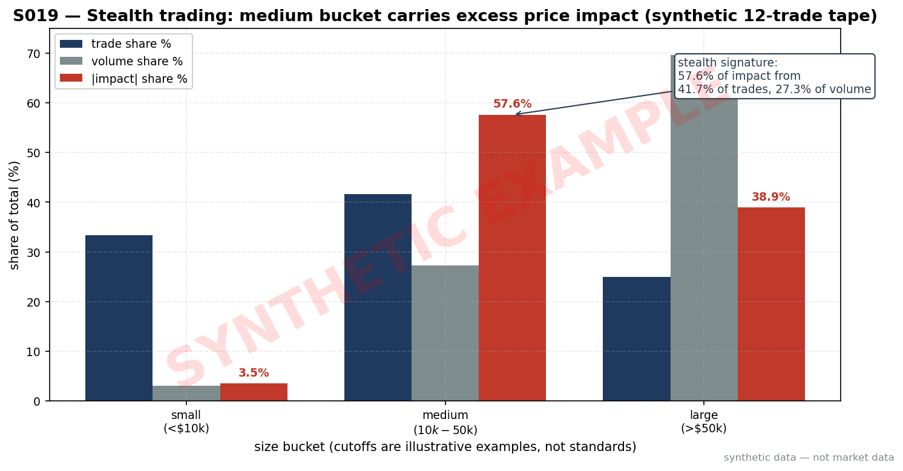

### S5. Strategies that use this signal

- **T024 — Informed-size tracker / retail fade**: primary trigger — follows stealth medium-size informed flow (this signal) while fading retail/odd-lot flow (S020), with volume-delta (S006) confirmation.
- **T025 — Trade-classification trend filter**: S019 as a conditioning filter — signed medium-bucket impact confirms or vetoes momentum entries classified by the Lee–Ready trade-direction rule / BVC (bulk volume classification) (S007).
- **T026 — Kyle-lambda participation throttle**: cousin via impact — sizes child orders from impact estimates; unusual medium-bucket impact raises the participation throttle's caution.
- Context: **S020 (retail/odd-lot flow)** is the flow this signal fades against; **S007 (trade classification)** is the signing input both depend on.

### S6. Data required — exact spec

| Field | Type | Granularity | Source tier | Notes |
|---|---|---|---|---|
| Trade price, size, timestamp | float, int, ts | tick | Tier 1–3 | Exchange timestamps preferred |
| Prevailing bid/ask (for signing + Δm) | float | tick (L1 — Level 1 quotes) | Tier 1–2 | SIP (Securities Information Processor) NBBO (National Best Bid and Offer) acceptable; direct feed better |
| Signed trade (q_k) | ±shares | tick | derived | Lee–Ready/quote rule or aggressor flag |
| Bucket calibration stats | float | daily | derived | Median $ volume, quoted depth, ADV |

Collection: tick trades + quotes → sign each trade (aggressor flag; else Lee–Ready) → compute Δm around the trade → bucket by notional → accumulate per-bucket shares over the window. Ingest sketch (≤20 lines):

```python
import polars as pl
t = pl.read_parquet("raw/trades_quotes.parquet")          # ts, price, size, bid, ask
q = (t.with_columns(mid=(pl.col("bid") + pl.col("ask")) / 2,
                    prev_mid=pl.col("mid").shift(1))
     .with_columns(side=pl.when(pl.col("price") > pl.col("mid")).then(1)
                   .when(pl.col("price") < pl.col("mid")).then(-1).otherwise(0),
                   dm=pl.col("mid") - pl.col("prev_mid"),
                   notional=pl.col("price") * pl.col("size")))
q = q.with_columns(bucket=pl.when(pl.col("notional") < 10_000).then(pl.lit("S"))
                   .when(pl.col("notional") <= 50_000).then(pl.lit("M"))
                   .otherwise(pl.lit("L")))               # EXAMPLE cutoffs — calibrate per name
out = q.group_by("bucket").agg(n=pl.len(), vol=pl.col("notional").sum(),
      impact=(pl.col("side") * pl.col("notional") * pl.col("dm")).abs().sum())
```

Storage: tick trades+quotes per liquid symbol-day run ~2–8 GB parquet (per `notes/cost-model.md` §4); the bucket aggregates are kilobytes. Keep per-symbol daily files; do not archive raw L2 naively. **Data-quality checklist:** timestamp normalization (exchange vs SIP — signing flips on stale quotes); corporate actions; halts; DST/half-days; odd-lot and upstairs prints flagged separately (they break the size story); venue mix changes (fragmentation shifts the size distribution).

### S7. Local build on M5 Max / 128GB

**Feasibility verdict: feasible (Tier M).** This is a tick-aggregation pipeline, not a model-training project: sign, bucket, accumulate. Per `notes/cost-model.md` §2, a Python event loop handles ~100–500k events/sec (fine for ≤20 symbols of L1/trades), and polars batch recompute over the day's tape is seconds.

- **Throughput:** trades-only tape ≈ 10–200 events/sec per liquid name (cost-model §2) — Python+polars comfortable to ~50 symbols; Rust only if you add full-depth L2. Bottleneck: quote-join for signing at scale (I/O + asof joins), not the bucket math.
- **Stack options:** Python+polars (pick this — the whole signal is groupbys); Rust if streaming full depth; DuckDB for the per-symbol daily bucket panels.
- **RAM:** trade-only working set is a fraction of the L1 0.5–4 GB/symbol-day rule of thumb (cost-model §3); the 60-day bucket panel is megabytes. Well inside the 77 GB working budget.
- **Engineering band:** Tier M per plan §6 (L1 event pipelines S001–S020 ex-L2): **20–60 h → $3,000–9,000** at the $150/hr loaded-cost estimate. One line of justification: signing correctness + per-name bucket calibration + venue-mix monitoring is the work; the formula is an afternoon.
- **What breaks first at 500 symbols or full OPRA:** the quote-join for signing 500 names intraday (needs streaming, not batch) — and OPRA is irrelevant here; this is an equity-trade signal.

### S8. Buy vs build

| Option | What you get | Indicative price | Gains | Loses |
|---|---|---|---|---|
| Polygon Stocks Advanced / Alpaca SIP (Tier 1) | Tick trades + NBBO quotes | ~$30–200/mo, *indicative — verify before budgeting* | Cheapest honest input | You own signing; SIP timestamps |
| Databento (Tier 2) | Trades + MBP-1 with aggressor flags | ~$200/mo + usage, *indicative — verify before budgeting* | Cleaner signing, exchange ts | Usage-metered history |
| TAQ (Trade and Quote) via WRDS (academic, Tier 3) | Full historical tick trades | ~hundreds/yr academic, *indicative — verify before budgeting* | Deep history for calibration | Academic license terms |
| Precomputed "informed flow" analytics | Vendor black-box scores | vendor-quoted | Zero build | Can't audit buckets — defeats the purpose |

**Verdict: build the monitor, buy the cheapest adequate tick feed.** There is no vendor product that *is* this signal — the value is entirely in per-name bucket calibration, which no vendor can do for your universe. Crossover: buy Databento over SIP when signing accuracy (not cost) is the binding constraint — mis-signed trades don't just add noise, they move prints across buckets.

### S9. Success ratio / efficacy — documented evidence

| Study / source | Market & period | Metric | Before/after cost | Caveat |
|---|---|---|---|---|
| Barclay–Warner (1993) | 108 NYSE tender offers, 1981–1984 | Medium trades (500–9,999 sh) ≈ 92.8% of cumulative pre-announcement price change | **Before cost** — statistical attribution, not a traded strategy | 1980s dealer market; fixed share-count buckets |
| Chakravarty (2001) | 97 NYSE firms, TORQ audit trail, Nov 1990–Jan 1991 | Medium-size *institutional* trades have the most significant per-transaction impact; institutions drive the stealth result | **Before cost** | Audit-trail sample; dealer market |
| China-market extension | Chinese stocks, high-frequency sample | Medium *and* large trades disproportionate; large trades had the largest effect on cumulative price *increases* | **Before cost** | Market-structure dependence — stealth is not universal |

Regimes where it fails: stale buckets (a 2019 calibration on 2026 flow), fragmented venues where algos shred parent orders into small prints (the "medium" print disappears into the small bucket), news-driven tapes where *all* sizes move together, and wide-spread names where quote flicker masquerades as impact.

**Honest bottom line:** more likely to improve execution timing and market-impact models than to generate standalone directional alpha. As a standalone trigger this is a *weak* edge — the papers document *attribution*, not a trading rule. As an execution input (slow down / demand price improvement when medium-bucket impact is hot; lean in when it is quiet) it is *the* documented use.

### S10. Failure modes & pitfalls

- **Non-portable buckets:** $25k is a block in one small-cap and noise in a large-cap — mitigate by calibrating to median $ volume, quoted depth, volatility, tick size, and venue, per name, refreshed.
- **Order shredding:** algos split parents into small prints, draining the medium bucket — mitigate with percentile buckets (PI_q) and venue-aware aggregation.
- **Signing error:** misclassified trades corrupt both bucket assignment and Δm — mitigate with aggressor flags where available; document the fallback rule.
- **News confounds:** on news days all buckets move — mitigate by conditioning on a news flag (see S092) or excluding event windows from calibration.
- **Lookahead in calibration:** buckets calibrated on the same window being traded — mitigate with trailing-only calibration windows.
- **Spread flicker as "impact":** wide-spread names show large Δm from quote bounce, not information — mitigate with minimum-spread/liquidity screens.
- **Cost blowup:** the signal fires most on names where spread+impact are worst — mitigate by using it to *time* execution, not to *trigger* directional bets.
- **Overfitting bucket edges:** tuning cutoffs to maximize in-sample excess — mitigate by fixing percentile definitions ex ante.

### S11. Visuals


```mermaid
flowchart LR
    FEED["Tick trade feed<br/>(TAQ / Databento)"] -->|trades + L1 quotes<br/>tick granularity| CLS["Sign + bucket<br/>(q_k, Δm_k per trade)"]
    CLS -->|signed impacts<br/>per size bucket| AGG["Bucket aggregation<br/>(shares vs volume vs impact)"]
    AGG -->|per-bucket<br/>impact shares| SIG["Signal S019<br/>stealth-flow gauge"]
    SIG -->|medium-bucket<br/>excess impact| GATE{"Informed flow?<br/>cost gate"}
    GATE -->|pass| OUT["Execution timing<br/>(T024 tracker)"]
    GATE -->|fail| DROP["No tilt"]
    style SIG fill:#aed6f1,stroke:#1f3a5f
```

### S12. Sources

Source log: Duck.ai answered Q-SB10-1–Q-SB10-3 (2026-09-10); Grok answers pending (checked 2026-09-10). The bucket-impact formula and PI_q form are operator-verified (task spec); remaining chatbot material is treated as research leads.

1. Barclay, M. J., Warner, J. B. (1993). "Stealth trading and volatility: Which trades move prices?" *Journal of Financial Economics* 34(3), 281–305. — the stealth-trading hypothesis; medium trades and cumulative price change.
2. Chakravarty, S. (2001). "Stealth-trading: Which traders' trades move stock prices?" *Journal of Financial Economics* 61(2), 289–307. http://ideas.repec.org/a/eee/jfinec/v61y2001i2p289-307.html — audit-trail evidence; institutions drive the medium-size impact.
3. Chakravarty, S. (2002). "Stealth-Trading: Which Traders' Trades Move Stock Prices?" Working-paper version (PDF). https://econwpa.ub.uni-muenchen.de/econ-wp/fin/papers/0201/0201003.pdf — full text of (2).
4. Lee, C. M. C., Ready, M. J. (1991). "Inferring Trade Direction from Intraday Data." *Journal of Finance* 46(2), 733–746. — the trade-classification rule used for signing.
5. "Which trades move prices in emerging markets? Evidence from China's stock market." https://www.sciencedirect.com/science/article/abs/pii/S0927538X06000485 — extension of Barclay–Warner; large trades dominate in that market (structure-dependence).
6. Market-microstructure syllabus citing Barclay–Warner (1993), JFE 34, 281–305. https://www.hse.ru/data/2012/09/25/1245533849/Investment%20Management.pdf — independent confirmation of the citation.
7. `notes/cost-model.md` §§2–6 — throughput, RAM, engineering-band, and vendor price-band planning numbers used in S6–S8.

**Unverified leads** (chatbot-only, no checkable source captured): the exact modern percentile grid (1–5, 5–25, 25–75, 75–95, top 5%) for PI_q — plausible, treat as an illustrative example until sourced; "signed > absolute for direction" as a documented practitioner preference — sensible but unsourced.

---
## Stage 92/200 — S092: Identified-news vs no-news drift decomposition

*Batch SB10 · Signal 92/100 · Provenance [D] · Family G — News, attention & alt-data*

### S1. One-line verdict

| | |
|---|---|
| **What it is** | Split intraday price jumps into news-backed (identified firm news) vs no-news moves; follow the former, fade the latter. |
| **When it works** | When news linkage is timestamp-clean and the move is genuinely information-driven — drift continues; when a big move has no news behind it — reversion is the base rate. |
| **When it dies** | On stale/mis-timestamped news, in names where "news" is just repackaged price action, and after spread+fees on small jumps. |
| **Build-or-buy in one line** | Buy the licensed news feed and the intraday bars; build the timestamp matcher yourself — the matching is the product. |

### S2. How it works — plain human explanation

Two stocks each jump 2% in five minutes. One just printed an FDA approval headline; the other moved on nothing anyone can find. Should you trade them the same way? The documented answer is no. A **news-backed** jump carries real information that the market digests gradually — prices tend to **drift** further in the jump's direction over minutes to hours as slower participants catch up. A **no-news** jump is more likely **noise** — an overreaction, a fat finger, a liquidity air-pocket — and tends to **revert**.

A concrete vignette. 10:04:13, fictitious ticker ACME jumps from $50.00 to $50.90 (+1.8%) in four minutes on 8× normal volume. Your news monitor shows an earnings headline stamped 10:03:58, firm-matched to ACME by ticker tag. That is an **identified-news** jump: the rule says *follow* — hold long into the drift. Contrast 13:02: ACME spikes +2.4% in five minutes; the news monitor shows nothing firm-specific within the match window. That is a **no-news** jump: the rule says *fade* — short the spike, betting on reversion.

Why should this work economically? Two mechanisms. **Slow information diffusion**: genuine news takes time to reach all participants (attention is scarce, mandates are slow), so prices underreact initially and drift. **Overreaction to noise**: uninformed flow pushes prices away from value with no fundamental anchor, and liquidity providers fade it back. **Timestamped news** means a story with a reliable publication time; **firm linkage** means the story is actually about this company (not a sector-mate or a ticker collision).

Mental model, three bullets:

- **Decompose first, trade second.** Every jump gets a label — news-backed or no-news — and the label, not the jump size, picks the trade.
- **News-backed → follow; no-news → fade.** Drift is the follow leg; reversion is the fade leg. That asymmetry is the whole signal.
- **The matcher is the edge.** Anyone can see the jump; the money is in knowing, within seconds, whether real news caused it.

### S3. The math — exact formula

This signal is a **procedure**, not a single equation. Three steps, each with explicit parameters:

**Step 1 — jump detection.** Flag intraday jumps on a return series (example: 5-minute bars):

$$J_t = 1 \iff \frac{|r_{t}|}{\hat{\sigma}_t} > c$$

where *r_t* is the 5-minute return, *σ̂_t* the trailing volatility estimate (example: 20-day rolling 5-minute standard deviation), and *c* an **example** threshold (e.g., *c* = 3.5). Alternatives: the **Lee–Mykland** jump test (a formal statistic comparing the return to local bipower variation) — use it if you want a citable test rather than a z-rule.

**Step 2 — news matching (the Boudoukh–Feldman–Kogan–Richardson textual method).** For each jump at time τ on firm *i*, search the news archive for stories *s* with firm(*s*) = *i* and |t_s − τ| ≤ *w* (example match window *w* = 15 minutes), scored by textual/entity relevance. Boudoukh et al. (2019) use **textual analysis** — natural-language processing of story text — to identify which news carries fundamental firm information, separating genuine firm-specific news from noise and from stories that merely mention the ticker.

**Step 3 — the rule.**

$$\text{identified\_news}_e = 1\{\exists\, s : \text{firm}(s) = i_e,\; |t_s - \tau_e| \le w,\; \text{relevance}(s) \ge \rho\}$$

- If identified_news = 1 → **follow**: trade in the jump direction, hold minutes–hours (the drift leg).
- If identified_news = 0 → **fade**: trade against the jump, hold minutes–hours (the reversion leg).

| Parameter | Symbol | Typical range | Too small / too large | Default (example — not an institutional standard) |
|---|---|---|---|---|
| Jump threshold | c | 3–5 (z) | too low: noise flagged; too high: only crashes | 3.5 |
| Match window | w | 5–30 min | too tight: miss lagged stamps; too wide: false matches | 15 min |
| Relevance cutoff | ρ | method-dependent | too low: sector noise labeled "news" | entity+ticker match |
| Holding horizon | h | minutes–hours | too short: spread dominates; too long: drift decays | 60 min |
| Minimum jump size | — | 1–3% | below costs: untradable | 1.5% |

**Causal timing.** Jump detected at *t* on data ≤ *t*; news match must use stories timestamped ≤ *t* (never match on a story published after the jump — that is lookahead); earliest fill *t*+1. The first minutes after the jump are the most latency-sensitive leg of any news strategy in this document.

**Named variants.** (1) **Scheduled vs unscheduled**: earnings/macro (scheduled — see T017) get wider match windows and pre-positioning; unscheduled headlines get the tight ±15-minute treatment. (2) **Headline-only vs full-text**: headline tags are faster; full-text relevance scoring is more precise. (3) **ML news classifier**: train a model to predict "will this story move the stock" from text features — the industrial version of Step 2.

### S4. Worked example — step-by-step numbers (SYNTHETIC)

**All numbers below are synthetic** (fixed event tape; seed 92 recorded for script reproducibility). Thresholds (z > 3.5, ±15-min match window, 60-min hold, $10,000 notional, 5 bps (basis points) all-in cost = 2 spread + 1 fees + 2 slippage, *examples*) are illustrative. **Outcomes are illustrative mechanics, not a backtest — this example proves the procedure runs, not that it earns.**

| Time | Jump | z | News (≤ jump time) | Label | Action | Next-60-min |
|---|---|---|---|---|---|---|
| 10:04 | +1.8% | +4.2 | earnings headline 10:03 | news-backed | FOLLOW long | +0.6% |
| 10:41 | −2.1% | −4.8 | none | no-news | FADE (buy) | +0.9% |
| 11:15 | +1.5% | +3.6 | analyst upgrade 11:12 | news-backed | FOLLOW long | −0.2% |
| 13:02 | +2.4% | +5.1 | none | no-news | FADE (short) | −1.1% |
| 14:20 | −1.6% | −3.8 | FDA headline 14:18 | news-backed | FOLLOW short | +0.3% |
| 15:30 | +1.9% | +4.4 | none | no-news | FADE (short) | −0.7% |

Step-by-step on event 1 (10:04): 5-min return +1.8% vs trailing σ̂ gives z = +4.2 > 3.5 → jump flagged. News search ±15 min finds the 10:03 earnings headline, firm-matched → identified_news = 1 → FOLLOW long at ~$50.90. Next-60-min return +0.6% on $10,000 = +$60 gross; minus $5.00 all-in cost = **+$55 net**. Event 4 (13:02): z = +5.1 → jump; no story within ±15 min → identified_news = 0 → FADE short at the spike; −1.1% next hour = +$110 gross, **+$105 net**. Events 3 and 5 are the losers every honest example needs: follow-long into −0.2% (net −$25) and follow-short into +0.3% (net −$35).

Totals: 4 wins, 2 losses, **+$250 net on $60,000 deployed** — a synthetic illustration of the accounting, not evidence of profitability. The chart plots each event's jump (grey) against its next-60-min return, colored by news-backed vs no-news.

**What to notice.** The two legs behave as the framing predicts *in this constructed tape*: news-backed events drift, no-news events revert — but two of six still lose, and the $5/event cost line is what separates a toy from a tradable result. Limits: fills assumed at the signal price with no partials, no latency between detection and fill, and six hand-picked events. A real evaluation needs thousands of events, purged/embargoed validation (training labels purged of any data overlapping test events in time, plus an embargo buffer — see S088), and borrow-cost accounting on the short legs.

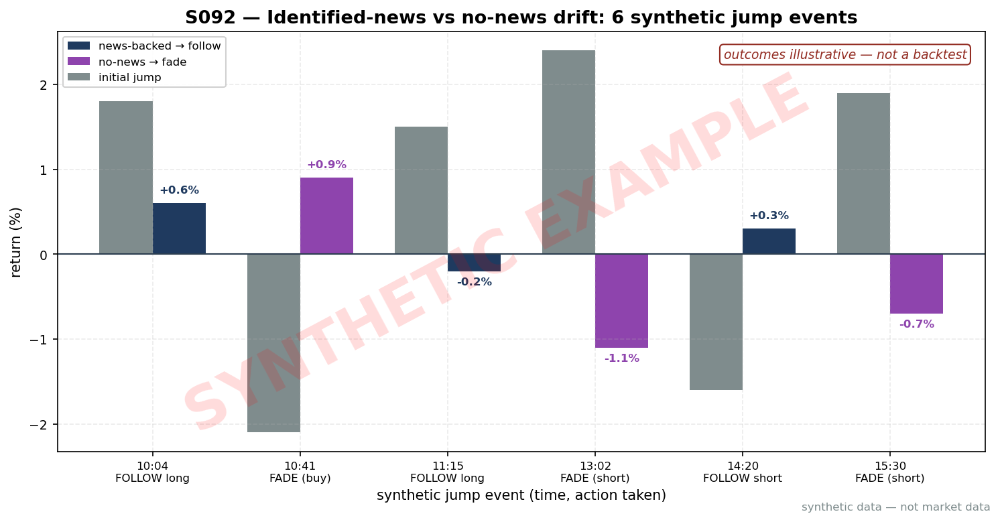

### S5. Strategies that use this signal

- **T060 — Identified-news drift portfolio**: primary trigger — holds identified-news drifters and fades no-news drift, with earnings-drift (S100) context; this signal is the decomposition engine.
- **T017 — Scheduled macro-announcement drift**: S092 as a conditioning filter — the same follow/fade logic applied to scheduled releases (S034), sized by vol forecasts (S066).
- **T059 — News-sentiment first-minute momentum**: S092 as a confirmation input — sentiment reaction (S091) plus volume confirmation (S094), where the news/no-news label gates which reactions to chase.
- Context: **S093 (news novelty)** separates *new* from *stale* news inside the news-backed leg; **S100 (earnings drift)** is the scheduled-earnings cousin.

### S6. Data required — exact spec

| Field | Type | Granularity | Source tier | Notes |
|---|---|---|---|---|
| Intraday prices (OHLCV/trades) | float | 1-min or finer | Tier 1–2 | Any intraday feed; 5-min bars minimum |
| Timestamped news archive | text + ts | per story | Tier 2–3 | Firm linkage (ticker/entity tags) required |
| News relevance metadata | score/tags | per story | derived or vendor | Entity match, novelty, event type |
| Corporate-action calendar | table | daily | Tier 1 | Splits corrupt jump z-scores |

Collection: intraday bars → rolling z-score jump detector → for each jump, query the news store for firm-matched stories in [τ−w, τ+w] → textual relevance filter → label → emit signal. Ingest sketch (≤20 lines):

```python
import polars as pl
bars = pl.read_parquet("curated/bars_5min.parquet")            # ts, sym, ret
sig = bars.with_columns(z=pl.col("ret") / pl.col("ret").rolling_std(20 * 78).over("sym"))
jumps = sig.filter(pl.col("z").abs() > 3.5)                    # EXAMPLE threshold
news = pl.read_parquet("curated/news.parquet")                # ts, sym, text, entities
hits = jumps.join_asof(news.sort("ts"), left_on="ts", right_on="ts",
                       by="sym", strategy="backward", tolerance="15m")  # EXAMPLE window
labeled = hits.with_columns(identified=pl.col("text").is_not_null())
```

Storage: 1-min bars for 500 symbols ≈ 50 MB/day total (per `notes/cost-model.md` §4); news *metadata* is small (1–10 GB/yr), full *text* archives run 20–300 GB/yr (cost-model §6 news pipeline notes). **Data-quality checklist:** news timestamp precision (vendor stamps vs actual wire time — minutes of skew flip labels); ticker/entity disambiguation (ticker collisions, subsidiaries); story deduplication (the same wire story reprinted 40× is one event); DST/half-days; survivorship in the news archive.

### S7. Local build on M5 Max / 128GB

**Feasibility verdict: feasible, Tier H — the pipeline is easy, the licensed news is the project.** Jump detection on 1-min bars is trivial compute; the textual news matcher runs fine locally (sentence-transformer-class models fit in CPU RAM); the binding constraint is lawful, timestamped, firm-linked news text at scale.

- **Throughput:** 500 symbols × 390 1-min bars/day = 195k bars/day — seconds in polars (cost-model §2: ~10–50M rows/sec simple ops). News matching is a join, not a model-training job. Bottleneck: news-feed licensing and timestamp hygiene, not compute.
- **Stack options:** Python+polars + DuckDB for bars and the news store (pick this); a local embedding model for relevance scoring; Rust unnecessary.
- **RAM:** bars ~50 MB/day; news metadata + embeddings for a 500-name universe fit in single-digit GB; full-text archive is the only large object (tens of GB/yr) — inside the 77 GB working budget per cost-model §3.
- **Engineering band:** Tier H per plan §6 (licensed alt-data G-family): **60–200 h → $9,000–30,000** at the $150/hr loaded-cost estimate. One line of justification: vendor integration + timestamp normalization + dedup/entity-linking + matcher evaluation is a data-engineering project; the z-score detector is an afternoon.
- **What breaks first at 500 symbols or full OPRA:** nothing in compute — what breaks is news *coverage*: thin names have no timestamped news, so the signal silently becomes "fade everything," which is a different (worse) strategy.

### S8. Buy vs build

| Option | What you get | Indicative price | Gains | Loses |
|---|---|---|---|---|
| GDELT / RSS / publisher feeds (Tier 0) | Free news text/metadata | ~$0–low, *indicative — verify before budgeting* | Zero data cost | Timestamp quality varies; redistribution limits; check license terms |
| Benzinga Pro / similar (Tier 2) | Machine-readable headlines | ~$100–200/mo, *indicative — verify before budgeting* | Fast, tagged | Redistribution limits; quote-based pricing for APIs |
| RavenPack (Tier 3) | Full licensed news + sentiment | $$$$ enterprise / academic via WRDS, *indicative — verify before budgeting* | Research-grade timestamps | Enterprise pricing |
| Any intraday bar feed (Tier 1–2) | 1-min bars for jump detection | ~$30–200/mo, *indicative — verify before budgeting* | Commodity | None — this part is trivial |

**Verdict: buy the news rights and the feed; build the matcher.** You cannot buy someone else's news↔jump matching tuned to your universe and latency — and you should not build your own news *corpus* by scraping: licensing, not engineering, is the moat. Crossover: if you only need a research prototype, GDELT + RSS plus a Tier-1 bar feed gets you a working matcher for ~$30–200/mo before you commit to a licensed vendor.

### S9. Success ratio / efficacy — documented evidence

| Study / source | Market & period | Metric | Before/after cost | Caveat |
|---|---|---|---|---|
| Boudoukh–Feldman–Kogan–Richardson (2019) | US stocks, textual news ID | Fundamental firm news accounts for 49.6% of overnight idiosyncratic volatility vs 12.4% in trading hours | **Before cost** — variance attribution, not a traded strategy | Documents *association*; the fade/follow rule is a practitioner extension, not their result |
| Chan (2003) | US, monthly returns | Drift after bad news; reversal after extreme *no-news* moves; effects mainly in smaller, illiquid stocks | **Before cost** | Monthly horizon; small-cap concentrated; pre-cost |
| Practitioner extension (this chapter's rule) | — | No documented intraday fade/follow P&L found in the cited papers | n/a | Treat the trading rule as [SR]-style reconstruction |

Regimes where it fails: stale or lagged news timestamps (label flips), "news" that is just repackaged price action (churnalism), thin names with no coverage (the signal degrades to unconditional fading), and crowded attention events where the drift is arbed out in seconds.

**Honest bottom line:** no-news momentum is more likely to revert; identified-news drift is the follow leg. That is the documented pattern. As a standalone intraday trigger this is an *unproven* edge — the papers document return *patterns*, not net-of-cost trading profits. As a decomposition layer inside a news strategy (T060) or an event filter (T017), it is *the* correct first cut: never trade a jump without asking whether news caused it.

### S10. Failure modes & pitfalls

- **Lookahead in matching:** using a story published after the jump to "explain" it — mitigate by enforcing story-ts ≤ jump-ts in the join.
- **Timestamp skew:** vendor stamp ≠ wire time — mitigate by measuring and correcting per-vendor lag; minutes of skew flip labels.
- **Entity errors:** ticker collisions, subsidiaries, sector-mates — mitigate with entity disambiguation, not raw ticker substring match.
- **Duplicate stories:** one wire story reprinted 40× looks like 40 news events — mitigate with dedup (textual similarity) before matching.
- **Churnalism:** "news" that merely reports the price move — mitigate with novelty scoring (see S093); never match on price-derived stories.
- **Cost blowup:** 1.5% jumps on wide-spread names are untradable after spread+fees+slippage — mitigate with a minimum-jump-size gate and the explicit 5-bps-style cost model.
- **Coverage gaps:** thin names have no news — mitigate by tracking match-rate per name; a "fade everything" fallback is a different strategy, label it.
- **Overfitting the window:** tuning *w*, *c*, *h* to maximize in-sample P&L on hundreds of events — mitigate with purged/embargoed validation (S088) and frozen parameters.

### S11. Visuals


```mermaid
flowchart LR
    FEED["News + prices<br/>(vendor + intraday bars)"] -->|timestamped stories<br/>(per story event), firm-linked| MATCH["News-jump matcher<br/>(textual method)"]
    MATCH -->|news-backed vs no-news<br/>per jump event| CLASS["Classify jumps<br/>(identified vs no-news)"]
    CLASS -->|event labels<br/>5-min bars| SIG["Signal S092<br/>follow vs fade"]
    SIG -->|direction + horizon<br/>minutes–hours| GATE{"Cost / spread<br/>gate?"}
    GATE -->|pass| OUT["T060 drift book /<br/>T017 event leg"]
    GATE -->|fail| DROP["No trade"]
    style SIG fill:#aed6f1,stroke:#1f3a5f
```

### S12. Sources

Source log: Duck.ai answered Q-SB10-1–Q-SB10-3 (2026-09-10); Grok answers pending (checked 2026-09-10). The follow/fade procedure and framing are operator-verified (task spec); remaining chatbot material is treated as research leads.

1. Boudoukh, J., Feldman, R., Kogan, S., Richardson, M. (2019). "Information, Trading, and Volatility: Evidence from Firm-Specific News." *The Review of Financial Studies* 32(3), 992–1033. https://ideas.repec.org/a/oup/rfinst/v32y2019i3p992-1033..html — textual identification of fundamental news; 49.6% of overnight idiosyncratic volatility.
2. Boudoukh, J. — author CV confirming the RFS 2019 publication. https://www.runi.ac.il/media/xd0h1iq5/profilecv-en-us.pdf — independent authorship check.
3. Chan, W. S. (2003). "Stock price reaction to news and no-news: Drift and reversal after headlines." *Journal of Financial Economics* 70. PDF: https://test.elitetrader.com/et/attachments/chan2003-pdf.72890/ — drift after bad news; reversal after extreme no-news moves; small/illiquid concentration.
4. Chan (2003) — ResearchGate record. https://www.researchgate.net/publication/222535436_Stock_Price_Reaction_to_News_and_No-News_Drift_and_Reversal_after_Headlines — second checkable record.
5. *The Handbook of News Analytics in Finance* (O'Reilly), §6.2, citing Chan (2003). https://www.oreilly.com/library/view/the-handbook-of/9780470666791/p02chap01-sec002.html — news/no-news return differences persist excluding earnings news.
6. `notes/cost-model.md` §§2–6 — throughput, RAM, engineering-band, and vendor price-band planning numbers used in S6–S8.

**Unverified leads** (chatbot-only, no checkable source captured): Savor (2012)-style finding that price shocks with information drift while shocks without information reverse — consistent with Chan (2003) but not independently verified here; vendor pricing specifics beyond the cost-model bands; the novelty-scoring formula Novelty_i = 1 − max cos(e_i, e_j) — plausible, treat as illustrative.

---
## Stage 93/200 — S093: News novelty / staleness reversal

*Batch SB10 · Signal 93/100 · Provenance [D] · Family G — Alternative data & attention*

### S1. One-line verdict

| | |
|---|---|
| **What it is** | Measures how *new* a news story is (textual distance from the firm's recent news) and fades big price moves on *stale* (recycled) news, which reverse within ~a week. |
| **When it works** | Liquid large-caps with dense news flow and a strong retail presence; event windows of 1–5 days where recycled headlines trigger overreaction. |
| **When it dies** | Thin news coverage (similarity undefined); genuine novel disclosures (fade the wrong leg); regime where the novelty signal is crowded or the story never reaches a priced timestamp. |
| **Build-or-buy in one line** | Build the novelty math and features in-house (cheap); buy the news *text rights* — you cannot legally scrape your way to a licensed feed. |

Provenance **[D]** (Tetlock 2011, *Review of Financial Studies* 24(5): 1481–1512; DOI 10.1093/rfs/hhq141 — note: the Review of Financial Studies, not the Journal of Finance). Family letter G (alternative-data family).

### S2. How it works — plain human explanation

A **news wire story** is any timestamped headline + body about a firm. **Staleness** is the degree to which a story's *text* repeats what the firm's previous stories already said — Tetlock (2011) defines it as the story's textual similarity to the previous ten stories about the same firm. **Novelty** is the inverse: 1 minus that similarity. A **drift** is a price move that continues in the same direction after news; a **reversal** is a move that unwinds.

The economic mechanism is asymmetric attention. Markets **under-react to genuinely new news**: information diffuses slowly through prices (documented drift after news; Chan 2003), so the informed play is to *ride* novel-news drift. Markets simultaneously **over-react to stale news**: a recycled headline looks like new information to investors who never read the original — individual investors trade more aggressively when news is stale (Tetlock 2011) — pushing the price on no genuinely new information. That push has nothing under it, so it **reverses over the following week**. The signal therefore has two legs: *fade* (trade against) large moves on low-novelty news; *follow* (trade with) moves on high-novelty news.

Concrete vignette: 9:47:03, ticker XYZ (fictional). A headline crosses: *"XYZ Corp downgraded to Sell on valuation concerns."* Your pipeline embeds the story text and computes cosine similarity between the story's embedding and the trailing-10-story centroid $\bar{c}_i$. $\cos = 0.97$ — this is the fourth near-identical downgrade story this month; novelty $= 1 - 0.97 = 0.03$. The stock drops 2.8% in 20 minutes on heavy retail volume. The S093 read: no new information, retail overreaction — fade the spike, expect reversal over 1–5 days. Contrast: same headline, cosine to the centroid $= 0.12$ (a first-ever fraud allegation) — novelty $= 0.88$, drift leg: the move is information, don't fade it.

- **Mental model 1:** Novelty is a freshness date-stamp on price moves — stale moves rot back; fresh moves keep going.
- **Mental model 2:** The retail overreaction to recycled news is the fuel; the reversal is the engine; the novelty score decides which direction the engine runs.
- **Mental model 3:** The hard part is never the embedding math — it is obtaining lawful, timestamped full text at scale.

### S3. The math — exact formula

Let story $i$ have embedding (or TF-IDF — term frequency–inverse document frequency — vector) $e_i$, and let $P_i$ be the comparison set of prior stories about the same firm (Tetlock 2011: the previous 10 stories; this batch's reconstruction uses a 24-hour or 30-day window — *example*). The **staleness** is the cosine similarity of the story's embedding to the trailing-10-story centroid $\bar{c}_i = \tfrac{1}{10}\sum_{j \in P_i} e_j$; the **novelty** is its complement:

$$\mathrm{Staleness}_i = \cos(e_i, \bar{c}_i), \qquad
\mathrm{Novelty}_i = 1 - \cos(e_i, \bar{c}_i),$$

with $\bar{c}_i = \tfrac{1}{10}\sum_{j \in P_i} e_j$ the trailing-10-story centroid and $\cos(u,v) = \frac{u \cdot v}{\|u\|\,\|v\|}$. In production form:

$$N_i \propto (1 - \cos(e_i,\bar{c}_i)) \cdot \log(1 + \text{source diversity}) \cdot w_{\text{event-type}}$$

where the source-diversity term rewards the same *information* arriving from many independent outlets, and $w_{\text{event-type}}$ up-weights event types (fraud, merger) with historically stronger drift/reversal — *all weight choices are example, not institutional standards*.

| Parameter | Symbol | Typical range | Too small / too large | Default (example) |
|---|---|---|---|---|
| Comparison set | $P_i$ | 10 stories (Tetlock 2011) or 24h–30d window | Too small: false "novel" flags on merely unrepeated-this-week news; too large: old regime stories contaminate | 10 stories, same firm *— example, not an institutional standard* |
| Embedding | $e_i$ | TF-IDF / sentence-transformer vectors | TF-IDF misses paraphrase (stale rewrites slip through); embeddings need a licensed text pipeline | sentence-transformer, cosine *— example* |
| Staleness gate | $\tau$ | novelty < 0.3–0.5 → "stale" leg | Too tight: fades real news; too loose: fades nothing | novelty < 0.5 → fade candidate *— example* |
| Reversal horizon | $h$ | 1–5 trading days (reversal leg) | Intraday-only: misses the documented weekly reversal; too long: drift noise | 5 days *— example* |

**Causal timing:** novelty is computed at story arrival $t$ using only stories with timestamps $\le t$ (trailing set); tradable no earlier than the first quote after $t+1$ that the venue's timestamps honestly support. **Variants:** (1) *nearest-prior (max-similarity)* — $\mathrm{Novelty}_i = 1 - \max_j \cos(e_i, e_j)$, the Duck.ai chatbot lead form: sharper on near-duplicates but more outlier-driven (a single near-identical rewrite dominates); (2) *event-type-conditional* — separate novelty models per event type (earnings vs legal vs analyst); (3) *cross-source novelty* — penalize stories that merely repeat what another outlet reported first (wire-speed dedup).

### S4. Worked example — step-by-step numbers (SYNTHETIC)

All numbers below are **synthetic** (seed **93**); the chart plots exactly these numbers. Fictional firm "Northstar Energy" (NSE). Term space: {earnings, lawsuit, merger, downgrade, dividend, fraud}; TF-IDF-style count vectors.

**Step 1 — hand-computed novelty (centroid form).** Ten prior stories (the trailing-10 rule from S3): $A=[1,0,0,1,0,0]$ (earnings+downgrade), $B=[1,0,0,1,0,0]$ (same, rewritten), $C=[1,0,0,0,1,0]$ (earnings+dividend), $D=[0,1,0,0,0,1]$ (lawsuit+fraud), $E_1=[1,0,0,0,0,0]$ (earnings), $F_1=[0,0,0,1,0,0]$ (downgrade), $G=[1,1,0,0,0,0]$ (earnings+lawsuit), $H=[0,0,0,0,1,1]$ (dividend+fraud), $I=[1,0,1,0,0,0]$ (earnings+merger), $J=[0,0,0,1,1,0]$ (downgrade+dividend). Column sums: earnings 6, lawsuit 2, merger 1, downgrade 4, dividend 3, fraud 2 — so the trailing-10 centroid $\\bar{c} = \\tfrac{1}{10}\\sum = [0.60,0.20,0.10,0.40,0.30,0.20]$.

Focal story $E$ (a stale downgrade rewrite): $[1,0,0,1,0,0]$. $\\cos(E,\\bar{c}) = \\frac{0.60+0.40}{\\sqrt{2}\\cdot 0.8367} = \\frac{1.00}{1.1832} = 0.8452$ ✓ (hand-check: dot $=1.00$; $\\|\\bar{c}\\| = \\sqrt{0.36+0.04+0.01+0.16+0.09+0.04} = \\sqrt{0.70} = 0.8367$). $\\mathrm{Novelty}_E = 1 - 0.8452 = \\mathbf{0.15}$ → stale.

Focal story $F$ (first-ever merger rumor): $[0,0,1,0,0,0]$. $\\cos(F,\\bar{c}) = \\frac{0.10}{1\\cdot 0.8367} = 0.1195$ ✓ (hand-check: dot $=0.10$). $\\mathrm{Novelty}_F = 1 - 0.1195 = \\mathbf{0.88}$ → novel.

**Step 2 — 10-event pattern.** Synthetic events $E1$–$E10$ (novelty from seed 93; day-0 move and next-5-day return generated with stale-overreaction + reversal baked in):

| Event | Novelty | Day-0 move % | Next-5-day % | Read |
|---|---|---|---|---|
| E1 | 0.97 | −1.64 | −0.25 | Novel: drift, no fade |
| E2 | 0.56 | −2.66 | +0.62 | Borderline: partial reversal |
| E3 | 0.48 | +1.03 | −0.28 | Stale-ish: fades |
| E4 | 0.45 | +2.25 | −0.58 | Stale: fades |
| E5 | 0.67 | +2.13 | −0.40 | Novel-leaning: small reversal |
| E6 | 0.10 | −3.58 | +1.67 | Very stale: strong reversal (+46% unwind) |
| E7 | 0.95 | −0.74 | −0.08 | Novel: no fade |
| E8 | 0.46 | +1.14 | −0.04 | Stale-ish: fades |
| E9 | 0.76 | +2.07 | −0.20 | Novel: drift |
| E10 | 0.08 | +1.08 | −0.36 | Very stale: reverses −33% of the move |

Hand-check on E6: novelty 0.10 → staleness 0.90; day-0 move −3.58%; reversal +1.67% = $-0.45 \times (-3.58) \times 0.90 \approx +1.45\%$ plus noise ✓ (chart plots the same numbers).

**What to notice:** reversal concentrates in low-novelty events (E6, E4, E10 unwind 33–46% of the day-0 move; high-novelty E1/E7/E9 barely reverse). **Limits of the toy:** reversal *magnitude* is assumed by construction here, not discovered; no fees, no bid–ask spread, no timestamp uncertainty, and the novelty scores are drawn, not embedded.

### S5. Strategies that use this signal

- **T071 — News-Novelty Reversal** — *primary trigger*: fades stale-news overreaction (S093 is the gate), follows novel-news drift; S097/S042 confirm.
- **T060 — Identified-News Drift Portfolio** — *filter*: novelty separates ride-the-drift stories (S093) from no-news drift to fade.
- **T067 — Anchored-VWAP Event Trader** — *context*: S093 novelty decides whether to trade the deviation as drift or fade.
- **T080 — Multi-Source Attention Composite** — *input*: novelty is one of three blended attention factors (with ASVI S099 and social S097).

### S6. Data required — exact spec

| Field | Type | Granularity | Source tier | Notes |
|---|---|---|---|---|
| Story text + timestamp | text + UTC ts | per story event | Tier 3 (licensed) / Tier 0 (GDELT, RSS) | Exchange/authoritative ts; dedup across wires |
| Firm entity mapping | reference | per story | Tier 1–2 | Ticker↔entity resolution; renames/spin-offs |
| Trailing story set $P_i$ | derived | per story | — | 10-story or 24h–30d window, same firm |
| Embeddings $e_i$ | vector | per story | — | TF-IDF or sentence-transformer; store normalized |
| Price/quote for $r_{t,t+h}$ | numeric | 1-min or daily | Tier 0–1 | Event-study returns; dividend/split adjusted |
| Event-type labels | categorical | per story | — | Optional: fraud/merger/earnings classifier |

Ingest/novelty sketch (Python, ≤20 lines):

```python
import numpy as np
from sentence_transformers import SentenceTransformer
model = SentenceTransformer("all-MiniLM-L6-v2")  # example — not a standard
def novelty(story_text, prior_texts):            # prior_texts: trailing set P_i, ts <= t
    e = model.encode([story_text] + prior_texts, normalize_embeddings=True)
    cbar = e[1:].mean(axis=0); cbar /= np.linalg.norm(cbar)  # centroid c-bar
    cos = float(e[0] @ cbar)                  # cosine vs centroid
    return 1.0 - cos                          # Novelty_i = 1 - cos(e_i, c-bar_i)
# per story event: text = licensed feed only (see licensing note)
```

Storage (per `notes/cost-model.md` §4): news metadata is light (1–10 GB/yr for 500 symbols); full text 20–300 GB/yr; embeddings 5–100 GB/yr — license and archive cost dominate compute. Data-quality checklist: story timestamps in UTC with source latency noted; entity resolution audit; dedup identical wire copies; halt/suspension flags so event returns aren't polluted; DST/half-day alignment of the return window.

**Licensing (mandatory):** you may build dedup/novelty/entity/sentiment/event features on news you are licensed to read; you **cannot legally build a commercial redistributable news product from scraping** — news text rights must be bought (Benzinga/RavenPack quote-based; RavenPack academic via WRDS). Scraping is not a valid substitute for a license.

### S7. Local build on M5 Max / 128GB

**Feasibility: feasible — Tier H, but the binding constraint is data licensing, not the Mac.** Per `notes/cost-model.md` §5, licensed alt-data pipelines sit in Tier H (**60–200 h** ≈ **$9,000–30,000** at $150/hr loaded-cost estimate); a vendor-backed news+novelty build is ~120–180 h in that band, one line of justification: embedding inference and cosine ANN are light, entity/dedup/normalization and license integration are the work. Throughput: sentence-transformer embedding on CPU is 4–16 GB RAM and CPU-sufficient per this batch's research (inference is not the bottleneck); a 500-symbol daily batch is minutes; the ANN novelty lookup over trailing sets is milliseconds per story (§2: numpy ~50–200M elements/sec). RAM: metadata 1–4 GB, full text 4–16 GB, embeddings 4–16 GB, vector index 4–32 GB — all inside the 77 GB working budget (§3). What breaks first at 500 symbols / full firehose: full-text archival and license cost, then vector-index RAM if you keep raw embeddings for everything instead of a compressed index.

| Stack | When to pick |
|---|---|
| Python + sentence-transformers + polars | The default: embed, dedup, novelty, event study — all on the Mac |
| DuckDB / Postgres + pgvector-style ANN | When trailing-set lookup must serve live stories |
| Vendor event API (RavenPack-style) | When you want pre-tagged event types and don't want to train classifiers |

### S8. Buy vs build

| Option | What you get | Indicative price | Gains | Loses |
|---|---|---|---|---|
| GDELT / RSS / publisher feeds | Free headlines, global coverage | ~$0 *indicative — verify before budgeting* | Zero cost; lawful headlines | No redistribution rights for full text; ts quality uneven |
| Benzinga Pro / similar | Machine-readable headlines | ~$100–200/mo *indicative — verify before budgeting* | Low-latency headlines, entity tags | Redistribution limits; full text rights extra |
| RavenPack academic (via WRDS) | Research news + sentiment archive | institution-dependent *indicative — verify before budgeting* | Saves 50–150 eng hours; backtest-ready | Academic-only; no commercial use |
| RavenPack commercial / Bloomberg-class | Full licensed news + sentiment | $$$$ enterprise (thousands–tens of thousands+/yr — bot-sourced, unverified; *verify before budgeting*) | Redistribution rights; audit-grade timestamps | Enterprise budget |
| Build novelty stack in-house | Embeddings, dedup, novelty, event study | eng time only (Tier H above) | Full control of comparison sets and thresholds | Still needs a licensed text source |

**Verdict: buy the text rights, build the analytics.** The novelty formula is an afternoon; lawful, timestamped, entity-resolved full text at scale is the product you cannot build. Crossover: if you only need headlines + GDELT-level coverage for research, the Tier-0 route suffices; the moment the pipeline feeds production signals or any redistribution, buy the license (Benzinga quote-based or RavenPack).

### S9. Success ratio / efficacy — documented evidence

| Study / source | Market & period | Metric | Before/after cost | Caveat |
|---|---|---|---|---|
| Tetlock (2011), *RFS* | US stocks, DJNS news archive | Returns respond less to stale news; day-of-stale-news return **negatively predicts the following week's return** | Before-cost (event study) | Magnitude conditional on the staleness measure; individual-investor channel |
| Chan (2003), *JFE* | US stocks, headlines | Drift after *news* headlines; reversal after *no-news* price moves | Before-cost | Supports the under-react-to-news / over-react-to-noise asymmetry behind S093 |
| Tetlock, Saar-Tsechansky & Macskassy (2008), *JF* | US stocks, WSJ | Negative language in firm news predicts fundamentals and returns | Before-cost | Sentiment leg, not novelty — included to anchor the news family |
| FININ (Wang, Cohen & Ma 2024, *Findings of EMNLP*) | 2.7M articles, S&P 500 + Nasdaq 100 | News *interactions* and delayed pricing; sentiment alone leaves power on the table | Before-cost (model) | Supports interaction/propagation features beyond bag-of-words |

Regimes where it fails: thin-coverage names (similarity undefined → false "novel"); crowded novelty factors (everyone fades the same stale spike, reversal front-run); wire-latency regimes where your timestamp is minutes behind the market; event types where "stale" is misclassified (an old story with genuinely new detail). **Honest bottom line:** as a standalone trigger this is a *documented-association, conditional* edge — the reversal is peer-reviewed but magnitude and after-cost tradability are implementation-specific. As a *filter/gate* inside T071/T067/T080 (which news to fade vs ride), it is the most defensible use.

### S10. Failure modes & pitfalls

1. **Lookahead leakage** (future stories in the comparison set) → mitigate: comparison set strictly ts ≤ t; store source latency per story.
2. **Paraphrase evasion** (TF-IDF misses rewrites) → mitigate: embedding-based similarity, not keyword overlap.
3. **Entity mismatch** (story about the wrong "XYZ") → mitigate: audited ticker↔entity mapping; renames and spin-offs versioned.
4. **Timestamp uncertainty** (story ts vs market ts) → mitigate: causal rule — tradable no earlier than the first honest quote after t+1; measure source latency.
5. **Thin news** (fewer than 10 prior stories) → mitigate: minimum-set-size rule; fall back to no-signal rather than a noisy score.
6. **Cost blowup** (spread+fees+slippage on 1–5-day fades) → mitigate: model effective spread explicitly (H5); size on expected reversal net of round-trip cost.
7. **Crowded fade** (everyone shorts the same stale spike) → mitigate: monitor crowding proxies; reversal may front-run and invert.
8. **Event-type confusion** (novel detail inside an old story arc) → mitigate: event-type-conditional novelty; human audit of the largest signals.

### S11. Visuals

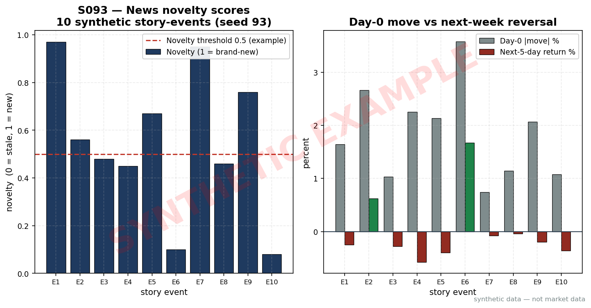

```mermaid
flowchart LR
    FEED["Licensed news firehose<br/>(Benzinga / RavenPack / GDELT)"] -- "stories + timestamps<br/>(per story event)" --> ING["Ingest + normalize<br/>(entity resolution, dedup)"]
    ING -- "clean text + metadata<br/>(per story event)" --> FEAT["Feature compute<br/>(embed vs trailing 10-story set)"]
    FEAT -- "novelty score<br/>(per story)" --> SIG["Signal S093<br/>news novelty / staleness"]
    SIG -- "novelty + fade/ride flag<br/>(per story, causal ≤ t)" --> GATE{"Novelty gate<br/>(fade stale / ride novel)?"}
    GATE -- "pass (per event)" --> OUT["Downstream consumer<br/>(T071 / T067 / T080)"]
    GATE -- "fail" --> DROP["No trade"]
    style SIG fill:#aed6f1,stroke:#1f3a5f
```

### S12. Sources

1. Tetlock, Paul C. (2011). "All the News That's Fit to Reprint: Do Investors React to Stale Information?" *Review of Financial Studies* 24(5): 1481–1512. https://ideas.repec.Org/a/oup/rfinst/v24y2011i5p1481-1512.html (DOI 10.1093/rfs/hhq141)
2. Tetlock, Paul C. (2010). "All the News That's Fit to Reprint" — working-paper version (Oct 2010), Columbia. https://business.columbia.edu/sites/default/files-efs/pubfiles/3099/Tetlock%20Fit%20to%20Reprint%2010%2010.pdf
3. Chan, Wesley S. (2003). "Stock price reaction to news and nonews: drift and reversal after headlines." *Journal of Financial Economics* 70: 223–260. (syllabus record) https://www.hbs.edu/ris/Profile%20Files/syllabus_ad4dd213-071a-470d-8c7f-61a1281ea23d.pdf
4. Tetlock, Paul C., Saar-Tsechansky, Maytal & Macskassy, Sofus (2008). "More Than Words: Quantifying Language to Measure Firms' Fundamentals." *Journal of Finance* 63: 1437–1467. (recorded in Tetlock CV) https://business.columbia.edu/sites/default/files-efs/person/cv/Tetlock_CV_26.pdf
5. Wang, Mengyu, Cohen, Shay B. & Ma, Tiejun (2024). "Modeling News Interactions and Influence for Financial Market Prediction." *Findings of EMNLP 2024*. https://aclanthology.org/2024.findings-emnlp.189/
6. RavenPack — licensed news analytics vendor. https://www.ravenpack.com/
7. GDELT Project — free global news database (Tier-0 route). https://www.gdeltproject.org/

**Unverified leads** (batch-research claims without an independently checkable source this batch):
- Duck.ai Q-SB10-1/Q-SB10-3 novelty formulas: Novelty_i = 1 − max cos(e_i,e_j) over 24h/30d sets; production N_i ∝ (1−max cos)·log(1+source diversity)·w_event-type (verified arithmetic, framing unverified). **This max-similarity form is the demoted nearest-prior variant — the chapter's primary formula is the centroid form** $\mathrm{Novelty}_i = 1 - \cos(e_i, \bar{c}_i)$.
- Duck.ai Q-SB10-2 vendor specifics: Benzinga self-serve price unavailable (quote-based business pricing); RavenPack commercial "thousands–tens of thousands+/yr"; news eng 155–370h; restricted-without-license list (full-text storage, derived feeds, republishing headlines, model training on licensed text). Research leads — never confirmed facts.
- Source log: Duck.ai answered Q-SB10-1–Q-SB10-3 (2026-09-10); Grok answers pending (checked 2026-09-10).

---
## Stage 95/200 — S095: Crypto funding-rate / basis

*Batch SB10 · Signal 95/100 · Provenance [SR] · Family H — Crypto & perpetual markets*

### S1. One-line verdict

| | |
|---|---|
| **What it is** | Reads perpetual-futures *funding rates* (the long↔short cash flow that pegs perps to spot) and the *basis* (perp−spot gap) as a crowding/leverage gauge — and prices the cash-and-carry that harvests them. |
| **When it works** | As a regime detector and leverage governor: extreme funding marks crowded one-sided leverage worth respecting or reducing; persistent funding > costs marks genuine cash-and-carry. |
| **When it dies** | As an unconditional contrarian trigger — extreme funding persists through strong trends and fading it mechanically is how accounts get liquidated. |
| **Build-or-buy in one line** | Build the funding/open-interest (OI) ingestion on free exchange APIs yourself; buy aggregated history only if you need multi-year cross-venue normalization. |

Provenance **[SR]** (standard reconstruction of exchange-documented mechanics + practitioner heuristics). Family letter H (crypto/perpetuals family).

### S2. How it works — plain human explanation

A **perpetual future** (perp) is a crypto derivative that never expires but tracks the spot price. The tracking mechanism is the **funding rate**: a periodic cash flow between longs and shorts. When the perp trades *above* spot (positive funding), **longs pay shorts**; when below spot (negative funding), shorts pay longs. The rate is set by the exchange from the premium (perp−spot gap) and, on many venues, an interest-rate component. **Funding payments** are exchanged directly peer-to-peer — the exchange is not the counterparty.

**Basis** is the perp−spot gap: $\mathrm{basis} = (P_{\mathrm{perp}} - S_{\mathrm{spot}})/S_{\mathrm{spot}}$. **Open interest (OI)** is the total outstanding contracts. **Cash-and-carry** is the classic arb: buy spot, short the perp (delta-neutral), and collect positive funding while the basis converges.

Why should funding predict anything? Extreme positive funding means the market is *crowded long on leverage* — longs are paying heavily to stay long. That is a fragility marker: if price dips, leveraged longs face margin calls, forced selling pushes price down, more margin calls trigger — a **liquidation cascade** (see S096). So the contrarian read says: extreme funding → crowded → fade. But here is the mandatory warning: **funding can remain extreme during strong trends; fading extreme funding unconditionally is a reliable way to lose money.** The trend that makes funding extreme can run for weeks while the contrarian bleeds funding payments and eats adverse moves. The defensible use is **regime detection and leverage reduction** — shrink risk when the crowd is maximally levered one way — and, separately, *harvesting* funding via cash-and-carry when the rate persistently exceeds fees, borrow, and slippage.

Concrete vignette: BTC spot $67,000 (synthetic), perp $67,050, 8h funding +0.05% — roughly 5× a calm baseline. OI at a 30-day high. Your book is long crypto beta. S095's honest read: the market is maximally crowded long; *reduce leverage*, tighten stops, don't add. It does NOT say "short now" — the trend can grind another +8% while you pay +0.05% every 8 hours.

- **Mental model 1:** Funding is the market's rent for leveraged conviction — high rent means a crowded house.
- **Mental model 2:** The contrarian fade is a fire extinguisher, not a fire alarm — it works after the blaze (S096's cascade), not during the buildup.
- **Mental model 3:** The displayed funding rate is a gross coupon; the trade is net of fees, borrow, slippage, basis, and holding period.

### S3. The math — exact formula

Let $N_j$ be the position notional in interval $j$, $f_j$ the funding rate for that interval (length $h_j$ hours), $H$ total holding hours, $q = H/h$ the equivalent number of intervals. The **funding payment** in interval $j$:

$$F_j = N_j \, f_j,$$

positive $f_j$ = longs pay shorts (a delta-neutral long-spot/short-perp carry *receives* $\approx N_j f_j$). **Annualization** (simple convention, the transparent one):

$$f_{\mathrm{ann}} \approx \frac{8760}{h}\,\bar{f} \qquad\text{(e.g. 8h intervals: } 1095 \times \bar{f}\text{)},$$

with the compound alternative $f_{\mathrm{ann}} = (1+\bar{f})^{8760/h} - 1$ noted but not used — simple is not a guaranteed yield, funding can flip sign. **Basis**: $\mathrm{basis} = (P_{\mathrm{perp}} - S_{\mathrm{spot}})/S_{\mathrm{spot}}$. **Funding z-score** (crowding gauge):

$$z_t = \frac{f_t - \mu_{t,W}}{\sigma_{t,W}},$$

$\mu_{t,W}, \sigma_{t,W}$ = rolling mean/sd over window $W$. Extreme positive $z$ → crowded longs → *short/reduce*; extreme negative → reverse.

Cash-and-carry P&L: $\Pi_{\mathrm{gross}} \approx \sum_j N_j f_j + \Pi_{\mathrm{basis}}$ with $\Pi_{\mathrm{basis}} = (S_1-S_0) + (P_0-P_1)$ per matched dollar (zero if basis unchanged); net: $\Pi_{\mathrm{net}} = \Pi_{\mathrm{gross}} - N_{\mathrm{spot}}(c_{\mathrm{entry}}+c_{\mathrm{exit}}) - N_{\mathrm{perp}}(c_{\mathrm{entry}}+c_{\mathrm{exit}}) - \mathrm{borrow} - \mathrm{margin} - \mathrm{slippage}$.

| Parameter | Symbol | Typical range | Too small / too large | Default (example) |
|---|---|---|---|---|
| Funding interval | $h$ | 1h / 4h / 8h (venue-specific) | Wrong $h$: annualization garbage | 8h *— example, not an institutional standard* |
| Z-score window | $W$ | 7–30 days of funding prints | Too short: every print is "extreme"; too long: regime shifts missed | 14 days *— example* |
| Contrarian trigger | $\|z\|$ | 2–3 sd | Too low: noise trades; too high: never fires | $z > +2.5$ reduce / $z < -2.5$ cover *— example* |
| Fee per leg | $c$ | 0.01–0.10% | Ignored: carry looks free | 0.04% *— example* |
| Slippage per leg | — | 0.00–0.20% normal | Zero in backtests: phantom edge | venue-measured *— example* |

**Causal timing:** funding prints at the interval timestamp; the next interval's rate is often *forecastable* from the premium — using the forecast is legitimate only if computed from data ≤ t; position changes execute no earlier than t+1. **Variants:** (1) *basis-only carry* — enter on annualized basis vs borrow, ignore funding z; (2) *funding-spread carry* — long the venue with low funding, short the venue with high funding (cross-venue, adds transfer risk); (3) *regime-gated fade* — contrarian only when OI is simultaneously extreme and rising (S096 confirmation).

### S4. Worked example — step-by-step numbers (SYNTHETIC)

All numbers below are **synthetic** (seed **95**); the chart plots exactly these numbers. Operator-verified **Worked Example B**: $10,000 long spot + $10,000 short perp, held 24h, 8h funding intervals.

**Step 1 — funding received.** Rates: 0.020%, 0.015%, 0.025% → $F = 10{,}000 \times (0.00020 + 0.00015 + 0.00025) = 10{,}000 \times 0.00060 = \mathbf{\$6.00}$ ✓ (chart bars: $2.00, $1.50, $2.50).

**Step 2 — gross rates.** $R_{24h} = 0.00060 = \mathbf{0.060\%}$ ✓. Simple annualization: $\bar{f} = 0.00020$ per 8h; $f_{\mathrm{ann}} = (8760/8) \times 0.00020 = 1095 \times 0.00020 = \mathbf{21.9\%}$ ✓ (equivalently $0.00060 \times 365$).

**Step 3 — net of costs.** Fees: 4 legs × $10{,}000$ × 0.0004 = **$16.00** ✓ (chart: −$8 entry, −$8 exit). $\Pi_{\mathrm{net}} = 6.00 - 16.00 = \mathbf{-\$10.00}$, i.e. **−0.10%** on $10k ✓ (chart: cumulative net steps −8 → −6 → −4.50 → −2.00 → −10.00).

**Step 4 — z-score illustration (same example family).** Six consecutive 8h prints (synthetic): 0.010%, 0.012%, 0.011%, 0.013%, 0.012%, **0.050%**. Mean of first five = 0.0116%, sample sd ≈ 0.00114%; $z = (0.050 - 0.0116)/0.00114 \approx \mathbf{+33.7}$ — an unmistakable crowding print: *reduce leverage*, not "short everything."

**What to notice:** **Gross 21.9% annualized loses money over 1 day** — evaluate funding strategies on realized rates, basis, fees, slippage, holding period, not the displayed funding rate alone. **Limits:** no basis movement (assumed zero), no borrow cost, no slippage, no liquidation risk on either leg, no venue transfer delay — every one of those can flip the sign in production.

### S5. Strategies that use this signal

- **T075 — Crypto Funding-Rate Reversal** — *primary trigger*: fades crowded leverage extremes, basis-aware; S095 is the entry gauge, S096 the cascade confirmation.
- **T076 — Liquidation-Cascade Fade** — *context/regime*: S095's funding z flags the crowded setup; S096 times the post-cascade entry.
- **T077 — Crypto Basis Cash-and-Carry** — *primary trigger*: harvests funding/basis convergence with explicit spread-cost accounting.

### S6. Data required — exact spec

| Field | Type | Granularity | Source tier | Notes |
|---|---|---|---|---|
| Funding rate $f_j$ | numeric | per interval (1h/4h/8h) | Tier 0 (exchange APIs) | Venue-specific interval, caps, settlement rules |
| Next-funding timestamp | ts | per interval | Tier 0 | Needed for accrual timing |
| Mark / index price | numeric | per interval | Tier 0 | Premium = f(mark, index) on some venues |
| Open interest | numeric (contracts + USD) | 5-min snapshots | Tier 0–1 | Units differ by venue — normalize |
| Reported liquidations | numeric, side-tagged | per minute | Tier 0–1 | **Censored — lower bound only** (see S096) |
| Spot price (carry leg) | numeric | per interval | Tier 0 | Same-venue spot preferred |
| Fee schedule / borrow | reference | per venue | — | Taker 0.01–0.10%/leg; funding not the only cost |

Ingest sketch (Python, ≤20 lines):

```python
import ccxt, polars as pl
ex = ccxt.binanceusdm()                      # example venue
def poll(symbol="BTC/USDT:USDT"):
    fr = ex.fetch_funding_rate(symbol)       # f_j, next timestamp
    oi = ex.fetch_open_interest(symbol)      # contracts
    return {"ts": ex.milliseconds(), "funding": fr["fundingRate"],
            "interval_h": fr.get("fundingIntervalHours", 8),
            "oi_contracts": oi["openInterestAmount"]}
# loop: poll every 5 min -> append parquet; z-score on rolling 14d
```

Storage (per `notes/cost-model.md` §4): 20 perps × 4 venues × 1-min snapshots ≈ 115k rows/day — trivial; normalized DB 0.5–10 GB/month; raw WS retention 0.05–0.5 GB/month. Data-quality checklist: UTC timestamps with ingest-vs-exchange ts; venue symbol mapping (BTCUSDT vs BTC-PERP); contract multiplier and margin currency; funding caps/formula changes versioned; OI unit normalization; WS-gap backfill.

### S7. Local build on M5 Max / 128GB

**Feasibility: trivial-to-feasible — the Mac is far more than adequate; data licensing is not the constraint here, engineering time is.** Funding/OI/liquidation ingestion for 20 perps across 3–4 venues is a polling loop: per `notes/cost-model.md` §2, Python handles ~100–500k events/sec and the whole day's snapshots (115k rows) recompute in polars in well under a second. RAM: collectors 0.5–2 GB, normalized DB 0.5–4 GB, research 4–16 GB — deep inside the 77 GB working budget (§3). Engineering: **Tier M, ~40–60 h ≈ $6,000–9,000** at $150/hr loaded-cost estimate — one line of justification: connectors + normalization + timestamp/rate-limit/backfill discipline are the work; the math is a z-score. Bottleneck: none locally — backfill depth and venue API rate limits. What breaks first at 500 symbols or full OPRA-scale: nothing on this signal; the firehose version (full WS order-flow) is a different project (Tier H).

| Stack | When to pick |
|---|---|
| Python + ccxt + polars + parquet | Default: funding/OI polling, z-scores, carry accounting |
| DuckDB / Postgres | When the funding panel must be queryable historically across venues |
| Aggregator API (CoinGlass-style) | When you want cross-checked history without building backfill |

### S8. Buy vs build

| Option | What you get | Indicative price | Gains | Loses |
|---|---|---|---|---|
| Exchange APIs (Binance/Bybit/OKX/Deribit) | Funding, OI, liquidation streams, full history endpoints | ~$0 (rate-limited) *indicative — verify before budgeting* | Primary source; free | Own symbol mapping, reconnects, backfill |
| ccxt unified layer | Same, normalized across 100+ venues | ~$0 (open source) *indicative — verify before budgeting* | One schema, many venues | Still your infra |
| CoinGlass / aggregator tiers | Normalized funding/OI/liquidation + heatmaps | tens–hundreds $/mo *indicative — verify before budgeting* | Cross-venue consistency; history without backfill | Reported (censored) data dressed as complete |
| Tardis.dev | Tick-level historical crypto data | hundreds–thousands $/mo *indicative — verify before budgeting* | Honest replay for cascade research | Institutional budget |
| Kaiko / CoinDesk Data institutional | Research-grade normalized history | custom institutional *indicative — verify before budgeting* | Audit-grade; multi-year | Enterprise pricing |

**Verdict: build direct ingestion for 3–4 major venues; buy an aggregator only for cross-check/backfill and multi-year consistency.** The signal math is free and the primary data is free — paying is about *history depth* and *normalization*, never about the funding formula. Crossover: if you need 3+ years of normalized cross-venue funding for training, the aggregator's tens–hundreds $/mo beats 30–60 h of backfill engineering.

### S9. Success ratio / efficacy — documented evidence

| Study / source | Market & period | Metric | Before/after cost | Caveat |
|---|---|---|---|---|
| Makarov & Schoar (2020), *JFE* | Cross-exchange crypto, 2017–2018 | Large, recurrent arbitrage deviations across exchanges; persistent over days–weeks | Before-cost (documented deviations) | Cross-exchange basis, not funding carry — included for the basis family |
| Exchange funding docs (Binance Futures API) | Perpetuals, ongoing | Mechanism: funding keeps perp pegged to spot; longs pay shorts when premium > 0 | Mechanism (not a return) | Documents the instrument, not tradability |
| CoinGlass practitioner docs (API/heatmap READMEs) | Crypto perps, 2024–2026 | Rule-of-thumb: funding > 0.1% ≈ crowded longs; large long liquidations mark local panic | Practitioner heuristic | Not a backtest; thresholds venue/regime-dependent |

Regimes where it fails: strong trends (funding stays extreme for weeks — the fade bleeds); basis widening against the carry; hedge-leg liquidation (perp leg margin-called despite the spot hedge); funding caps/formula changes; exchange outages during the cascade; spreads/slippage exploding exactly when the signal fires. **Honest bottom line:** as a standalone contrarian trigger this is a *negative-expectation-after-cost* trade in the hands of most implementers — no peer-reviewed after-cost Sharpe exists for the naive fade. As a **regime detector and leverage governor** (and, separately, as a carefully costed cash-and-carry when funding persistently exceeds all-in costs), it is one of the most honest tools in crypto.

### S10. Failure modes & pitfalls

1. **Unconditional fading** (short every z > 2.5) → mitigate: gate on regime; use for leverage reduction, not contrarian entries.
2. **Funding persistence** (extreme for weeks in a trend) → mitigate: time-in-extreme as an *anti*-signal; never fade on z alone.
3. **Basis blowout** (perp−spot widens against the carry) → mitigate: monitor basis continuously; predefine the unwind trigger.
4. **Hedge-leg liquidation** (perp margin call despite the spot hedge) → mitigate: cross-margin awareness; size the perp leg to liquidation distance.
5. **Fee/slippage optimism** (the worked example's −$10 lesson) → mitigate: model 4+ legs of fees, slippage 0.00–0.20%/leg, borrow — always.
6. **Formula/cap changes** (venue changes funding mechanics) → mitigate: version the venue's formula; alert on methodology changes.
7. **Censored liquidation inputs** (reported < true forced flow) → mitigate: label everything reported_*; never calibrate tail risk on public feeds (see S096).
8. **Simple-annualization illusion** (21.9% "yield" that flips sign) → mitigate: quote expected carry over the *holding period*, net, with sign-flip scenarios.

### S11. Visuals

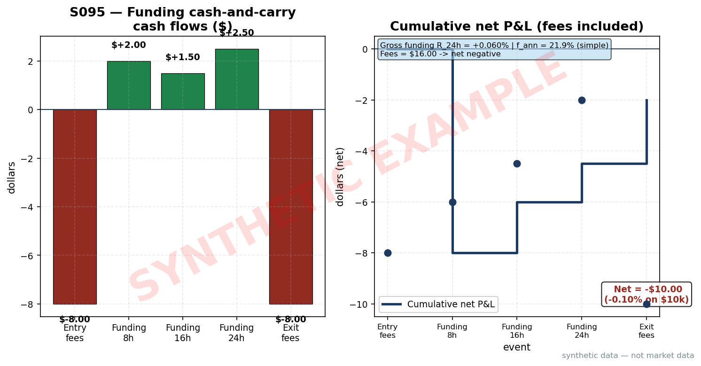

```mermaid
flowchart LR
    FEED["Exchange perp APIs<br/>(Binance / Bybit / OKX / Deribit)"] -- "funding, OI, mark price<br/>(per 5-min snapshot)" --> ING["Ingest + normalize<br/>(venue mapping, units, ts)"]
    ING -- "funding panel + OI panel<br/>(per interval, per venue)" --> FEAT["Feature compute<br/>(f_ann, basis, funding z-score)"]
    FEAT -- "z_t, basis, carry P&L<br/>(per interval, causal ≤ t)" --> SIG["Signal S095<br/>funding-rate / basis"]
    SIG -- "crowding flag + carry quote<br/>(per interval)" --> GATE{"Regime / cost<br/>gate?"}
    GATE -- "pass (per interval)" --> OUT["Downstream consumer<br/>(T075 / T076 / T077)"]
    GATE -- "fail" --> DROP["Reduce leverage / no trade"]
    style SIG fill:#aed6f1,stroke:#1f3a5f
```

### S12. Sources

1. Makarov, Igor & Schoar, Antoinette (2020). "Trading and Arbitrage in Cryptocurrency Markets." *Journal of Financial Economics* 135(2): 293–319. http://eprints.lse.ac.uk/100409/1/Cryptocurrency_Markets_JFE_final_v4.pdf (DOI 10.1016/j.jfineco.2019.07.001)
2. Binance Futures API documentation — "Get Funding Rate History" (primary source for funding mechanics and intervals). https://binance-docs.github.io/apidocs/futures/en/#get-funding-rate-history
3. ccxt documentation — unified funding-rate endpoints across 100+ venues. https://docs.ccxt.com/#/?id=funding-rates
4. CoinGlass — cross-venue funding, OI, and liquidation aggregation (retail-standard dashboard + API). https://www.coinglass.com/
5. Laevitas — institutional crypto derivatives analytics (funding, basis, OI). https://laevitas.ch
6. CoinDesk Data — cryptocurrency derivatives datasets (funding rate and index tick history). https://data.coindesk.com/derivatives
7. ue/awesome-derivatives-data — curated list of crypto derivatives data resources (funding, OI, basis, liquidations, microstructure). https://github.com/ue/awesome-derivatives-data

**Unverified leads** (batch-research claims without an independently checkable source this batch):
- Duck.ai Q-SB10-1 Worked Example B (verified arithmetic in this chapter): $10k carry, $6.00 funding, 21.9% simple annualization, $16 fees, −$10.00 net; annualization conventions f_ann ≈ (8760/h)·f̄ vs compound.
- Duck.ai Q-SB10-3 funding claims (bot summaries — research leads, never confirmed facts): "funding carry positive before costs; reversal can perform strongly in stress; distribution highly skewed; small frequent gains wiped by basis widening, hedge-leg liquidation, exchange failure"; contrarian regression r_{t+h} = a + b·z(f_t) + c·z(ΔOI_t) + d·z(LIQ_t) + ε with b<0 only conditionally; R_net = R_funding + R_basis − R_fees − R_slippage − R_borrow − R_liquidation/financing.
- Duck.ai Q-SB10-2 vendor/eng specifics (bot summaries): exchange APIs $0 rate-limited; aggregators tens–hundreds $/mo; CoinGlass custom tens–hundreds+/mo; Tardis.dev hundreds–thousands/mo; crypto pipeline eng 115–230h direct / 35–80h via aggregator.
- CoinGlass MCP practitioner thresholds ("funding > 0.1% = crowded longs") — practitioner heuristic, not a backtest. https://github.com/aviman1109/coinglass_mcp
- Source log: Duck.ai answered Q-SB10-1–Q-SB10-3 (2026-09-10); Grok answers pending (checked 2026-09-10).

---
## Stage 96/200 — S096: Crypto OI shocks & liquidation clusters

*Batch SB10 · Signal 96/100 · Provenance [SR] · Family H — Crypto & perpetual markets*

### S1. One-line verdict

| | |
|---|---|
| **What it is** | Detects forced-selling cascades in crypto perps: open-interest collapses, *reported* liquidations spike, funding flips sign — then fades the exhaustion move on minutes-to-hours. |
| **When it works** | After genuine deleveraging events: crowded leverage (S095 flags the setup) meets a price shock, forced flow clears the book, and the move exhausts into thin liquidity. |
| **When it dies** | When the "cascade" is just the start of real selling; when your liquidation feed missed the largest prints (censored data); when spreads gap wider than the fade's edge. |
| **Build-or-buy in one line** | Build the cascade detector on free exchange streams; buy historical liquidation depth only if your backtest needs more than the censored public record — and never treat that record as complete. |

Provenance **[SR]** (heuristic family — standard reconstruction; no peer-reviewed specification of this exact rule exists). Family letter H (crypto/perpetuals family).

### S2. How it works — plain human explanation

**Open interest (OI)** is the total number of outstanding perpetual contracts. **Leverage** lets traders control large positions with small margin. A **liquidation** is the exchange forcibly closing a leveraged position whose margin fell below the maintenance level. A **liquidation cascade** is the reflexive loop: price drops → leveraged longs breach margin → forced selling → price drops further → more margin breaches. A **liquidation heatmap** is the public visualization of where leveraged positions would be liquidated at each price — clusters of it mark where the cascade fuel sits.

The mechanism is pure forced flow, not information. Crowded one-sided leverage (S095's extreme funding + high OI) is dry tinder. A price shock strikes the match. The first liquidations are market sells into a falling book, which widens the damage, which triggers the next tranche. The cascade ends when the fuel is spent: OI has collapsed, the liquidation prints slow, funding flips sign (the crowd is now net short / the longs are gone), and bid depth — which evaporated during the panic — starts to rebuild. The S096 rule: **after a liquidation-volume spike + bid-depth collapse + funding flip, fade the exhaustion move on minutes-to-hours** — buy the washed-out long liquidation, short the squeezed short liquidation.

Mandatory honesty, stated explicitly: **public liquidation feeds are censored — a LOWER BOUND on true forced flow, not market-wide truth.** Exchanges report only what they choose to report: internal risk-engine liquidations, venues with no public feed, sub-threshold prints, and grouped events never appear. Every field in this chapter is therefore `reported_liquidations`, `reported_open_interest`, `reported_funding` — never "the market's" liquidations. **Strategies calibrated on reported liquidations underestimate tail risk**, because the largest, ugliest forced flow is exactly what gets censored.

Concrete vignette (synthetic): BTC perp, 03:12 UTC. Funding has been +0.06%/8h for a week (S095: crowded longs). Price slips 1.6% in an hour; reported OI drops 6%; reported long liquidations print $8.5M in one hour — 40× baseline; reported funding flips to −0.03%. S096 reads: the long book just got forcibly cleared — the *sellers* were liquidations, not information. Fade: scale into a long for the post-flip normalization move over the next 2–6 hours, with a hard stop in case the selling is real.

- **Mental model 1:** A cascade is a forest fire running out of trees — the signal is the *absence* of remaining fuel, not the flames.
- **Mental model 2:** Your liquidation feed is a smoke detector with dead batteries in some rooms — it tells you there was a fire, never how big.
- **Mental model 3:** The fade is a mean-reversion bet on *flow exhaustion*, valid for hours; it says nothing about the next day's trend.

### S3. The math — exact formula

Let $OI_t$ be **reported** open interest, $L^{long}_t / L^{short}_t$ **reported** liquidation volume by side, $f_t$ **reported** funding, $D_t$ visible bid depth. The **OI deviation**:

$$OI\_dev_t = \frac{OI_t - MA_{180d}(OI_t)}{\mathrm{std}(OI_t)},$$

($MA_{180d}$ = 180-day moving average — *example* lookback). The **deleveraging flag** fires when OI drops sharply through its long moving average **and** reported funding flips sign:

$$\mathrm{Deleveraging}_t = \mathbf{1}\left[OI_t < MA_{180d}(OI_t) - k\,\mathrm{std}(OI_t)\ \ \cap\ \ \mathrm{sign}(f_t) \neq \mathrm{sign}(f_{t-1})\right],$$

$k$ = *example* threshold (e.g. 2). **Liquidation density** (the public "liquidation heatmap" methodology, reconstructed): combine reported OI, the leverage distribution, and mark-price distance to estimate, per price level $p$, the notional that would liquidate if price reached $p$:

$$\mathrm{Density}(p) \;\approx\; \sum_{\text{positions}} \mathrm{notional} \cdot \mathbf{1}[\,\mathrm{liq\_price} \in [p-\delta, p+\delta]\,],$$

computed from *reported* inputs only — a lower bound by construction. **Post-cascade rule** (heuristic): after a reported-liquidation-volume spike ($L_t > m \times$ baseline median, $m$ *example* e.g. 5) **and** bid-depth collapse **and** funding sign flip → fade the exhaustion move, minutes-to-hours horizon, with a hard stop.

| Parameter | Symbol | Typical range | Too small / too large | Default (example) |
|---|---|---|---|---|
| OI lookback | $MA_{180d}$ | 90–365 days | Too short: every unwind looks extreme; too long: regime drift | 180 days *— example, not an institutional standard* |
| Deleveraging $k$ | $k$ | 1.5–3 sd | Too low: noise flags; too high: fires after the bounce | 2 *— example* |
| Liquidation spike $m$ | $m$ | 3–10× median | Too low: normal prints look like cascades; too high: misses real ones | 5× hourly median *— example* |
| Fade horizon | — | minutes–hours | Too long: trend risk; too short: spread eats it | 2–6 hours *— example* |
| Depth-collapse bar | — | 30–70% bid-depth drop | Ignored: fades into a still-falling book | 50% *— example* |

**Causal timing:** cascade flags are computed at bar $t$ from reported prints with timestamps ≤ $t$; the fade entry executes no earlier than $t+1$ — and reported liquidations arrive with venue latency, so "real-time" is really "minutes late" (see failure modes). **Variants:** (1) *OI-only deleveraging* — skip liquidations entirely, trade the OI collapse (fewer censored inputs); (2) *heatmap-front-run* — position *before* the cluster using the density map (needs honest depth data); (3) *cross-venue cascade* — require the flag on ≥2 venues (filters venue-specific noise).

### S4. Worked example — step-by-step numbers (SYNTHETIC)

All numbers below are **synthetic** (seed **96**); the chart plots exactly these numbers. Synthetic 72-hour BTC-perp window; cascade designed at hours 50–52. **All fields are reported_*, i.e. censored lower bounds.**

| Hour | Mark price | Reported OI ($B) | Reported funding | Reported long liq ($M) | Reported short liq ($M) | Read |
|---|---|---|---|---|---|---|
| 45 | 100.77 | 0.963 | +0.00002 | 0.02 | 0.15 | calm |
| 46 | 100.82 | 0.968 | +0.00033 | 0.05 | 0.04 | calm |
| 47 | 100.60 | 0.959 | +0.00023 | 0.01 | 0.10 | calm |
| 48 | 100.70 | 0.953 | +0.00040 | 0.32 | 0.31 | funding rising |
| 49 | 100.86 | 0.949 | +0.00060 | 0.23 | 0.12 | crowded (S095 setup) |
| 50 | 99.23 | 0.891 | +0.00080 | 2.80 | 0.24 | shock: −1.6% price, −6.1% OI |
| 51 | 99.65 | 0.920 | +0.00060 | 8.50 | 0.04 | **cascade peak** |
| 52 | 100.35 | 0.936 | +0.00020 | 4.20 | 0.05 | forced flow slowing |
| 53 | 100.83 | 0.953 | **−0.00030** | 0.33 | 0.09 | **funding flips sign** |
| 54 | 100.66 | 0.952 | −0.00006 | 0.33 | 1.90 | weak hands shaken both ways |
| 55 | 100.46 | 0.956 | +0.00007 | 0.06 | 0.19 | normalizing |
| 56 | 100.34 | 0.957 | −0.00005 | 0.31 | 0.00 | normalizing |

Hand-checks: OI drop h49→h50 = $(0.891-0.949)/0.949 = \mathbf{-6.1\%}$ ✓. Price drop h49→h50 = $(99.23-100.86)/100.86 = \mathbf{-1.62\%}$ ✓. Cascade-peak long liquidations $8.5M vs baseline ~$0.2M ≈ 40× ✓. Funding flip h52→h53: +0.00020 → −0.00030 ✓. The fade window (h53–h57, green band on the chart): price recovers 99.23 → 100.83 = **+1.61%** from the cascade low — the bounce observed *before* the h53 flip confirmed; the rule, entering at h53, does not harvest this move. Its harvest window is h53–h57 (100.83 → 100.42 = −0.41% residual in this window — the fade is a normalization bet, not a bounce chase).

**What to notice:** the flag sequence is *ordered* — crowded setup (h48–49) → shock (h50) → reported-liq spike (h51) → flow slows (h52) → funding flips (h53) → fade. Entering at h51's low without the h53 flip confirmation is catching a falling knife; the flip is the cheapest confirmation. **Limits:** all inputs are reported_* (the true forced flow was larger); no bid–ask spread or slippage in the +1.61%; no guarantee the selling was "only" liquidations — real information-driven selling does not bounce.

### S5. Strategies that use this signal

- **T076 — Liquidation-Cascade Fade** — *primary trigger*: buys crypto liquidation clusters with funding context — this chapter *is* its entry logic.
- **T075 — Crypto Funding-Rate Reversal** — *confirmation/setup*: S096's cascade validates the crowded-leverage regime S095 measures.
- **T045**-family note: not applicable — S096's listed strategies per plan are T076 (primary), T075; S045 (stretched-move z-score) is the equities analog of the exhaustion fade.

### S6. Data required — exact spec

| Field | Type | Granularity | Source tier | Notes |
|---|---|---|---|---|
| Reported liquidations (side, size) | numeric | per minute (WS) / hourly (API) | Tier 0–1 | **Censored lower bound** — label reported_liquidations |
| Reported open interest | numeric | 5-min snapshots | Tier 0–1 | Venue/unit normalization; label reported_open_interest |
| Reported funding | numeric | per interval | Tier 0 | Label reported_funding; caps venue-specific |
| Mark / index price | numeric | per minute | Tier 0 | Liquidation-distance math needs the mark |
| Visible bid/ask depth | numeric | per minute | Tier 1–2 | Depth-collapse confirmation; SIP insufficient |
| Long/short account ratios | numeric | hourly | Tier 1 | Crowding context (Binance/Bybit publish) |

Ingest sketch (Python, ≤20 lines):

```python
import ccxt, polars as pl
ex = ccxt.binanceusdm()                       # example venue
def cascade_snapshot(symbol="BTC/USDT:USDT"):
    return {"ts": ex.milliseconds(),
            "reported_liq": ex.fetch_liquidations(symbol),   # censored feed
            "reported_oi": ex.fetch_open_interest(symbol)["openInterestAmount"],
            "reported_funding": ex.fetch_funding_rate(symbol)["fundingRate"],
            "mark": ex.fetch_ticker(symbol)["markPrice"]}
# per-minute loop -> parquet; flags computed on reported_* only
```

Storage (per `notes/cost-model.md` §4): per-minute reported series for 20 perps ≈ rows/day in the low hundreds of thousands — trivial; history is the constraint (public liquidation history is shallow — that's the buy case). Data-quality checklist: UTC ts with venue-vs-ingest latency; venue symbol mapping; OI unit normalization; funding-cap versioning; WS-gap backfill and gap flags; **censorship audit**: compare reported totals across venues and note the missing mass.

### S7. Local build on M5 Max / 128GB

**Feasibility: feasible — Tier M.** Per `notes/cost-model.md` §5, this is an M-tier event pipeline: **~40–60 h ≈ $6,000–9,000** at $150/hr loaded-cost estimate — one line of justification: the detector is arithmetic on small panels; the work is venue connectors, censorship-aware labeling, and validating flags against real cascades. Throughput (§2): per-minute snapshots for 20 perps are thousands of rows/day — polars recomputes the whole panel in milliseconds; Python polling is 100× over-provisioned. RAM: <1 GB working (§3). Bottleneck: none locally — the constraint is *feed completeness*, which no Mac fixes. What breaks first at 500 symbols: nothing computationally; but cascade detection on 500 illiquid alts is noise — the signal belongs on the majors.

| Stack | When to pick |
|---|---|
| Python + ccxt + polars | Default: snapshot loop, flags, heatmap reconstruction |
| Exchange WS (forceOrder-style streams) | When you need per-print liquidation latency, not hourly aggregates |
| Aggregator (CoinGlass-style) | Cross-venue reported totals without per-venue plumbing |

### S8. Buy vs build

| Option | What you get | Indicative price | Gains | Loses |
|---|---|---|---|---|
| Exchange APIs/WS (Binance/Bybit/OKX) | Reported liquidations, OI, funding | ~$0 (rate-limited) *indicative — verify before budgeting* | Primary, free, lowest latency | Censored; own backfill |
| CoinGlass (aggregated) | Cross-venue reported liqs + heatmaps | tens–hundreds $/mo *indicative — verify before budgeting* | One schema; history without plumbing | Still reported-only; dressed as complete |
| Tardis.dev | Tick-level historical crypto data | hundreds–thousands $/mo *indicative — verify before budgeting* | Honest replay of *your* recorded window | Can't backfill what was never published |
| Kaiko / CoinDesk Data | Research-grade normalized history | custom institutional *indicative — verify before budgeting* | Multi-year consistency | Enterprise pricing; censorship unchanged |

**Verdict: build the detector on direct feeds; buy history only for the backtest — and discount every backtest for censorship.** No vendor sells the *true* forced flow; anyone implying completeness is selling the lower bound with better charts. Crossover: pay for history when you need multi-year cross-venue reported series for training the flags; never pay expecting "complete" liquidations.

### S9. Success ratio / efficacy — documented evidence

| Study / source | Market & period | Metric | Before/after cost | Caveat |
|---|---|---|---|---|
| CoinGlass API docs (ckaraca/coinglass-apiv3) | Crypto perps, ongoing | Documents reported liquidation/OI/heatmap endpoints — the measurement infrastructure | Infrastructure (not a return) | Endpoints serve *reported* data |
| Laevitas CLI + docs | Crypto derivatives, ongoing | Terminal/streaming derivatives data incl. liquidations | Infrastructure | Practitioner tooling, not an efficacy study |
| TradingView derivatives-indicators documentation | Multi-venue crypto, 2025–2026 | Defines funding/OI/liquidation semantics for charting | Definitional | No performance claims |
| Makarov & Schoar (2020), *JFE* | Cross-exchange crypto | Large recurrent dislocations; limits to arbitrage | Before-cost | Context for why dislocations persist — not cascade returns |

Regimes where it fails: information-driven selloffs (no bounce — the fade is run over); censored prints hiding the real cascade size (flag fires late or never); spread/slippage explosion during the event exceeding the exhaustion edge; venue outages mid-cascade; short-squeeze cascades (mirror image — fading the wrong side). **Honest bottom line:** as a standalone trigger this is a *heuristic risk/flow tool with no peer-reviewed after-cost efficacy* — its documented value is descriptive (the feeds exist, the mechanics are real). As a *post-stress entry timer* inside T076, gated by S095's crowding setup and a funding flip, it is the most defensible contrarian use in crypto — sized small, stopped hard.

### S10. Failure modes & pitfalls

1. **Censored data** (reported ≪ true forced flow) → mitigate: label everything reported_*; size as if the true cascade were 2–5× larger.
2. **Real selling, not forced** (information, not liquidation) → mitigate: require the full flag sequence (crowding → spike → flip), not price action alone.
3. **Late flags** (venue latency on reported prints) → mitigate: measure feed latency; the fade is minutes-to-hours, never seconds.
4. **Spread explosion** (the bounce is smaller than the cross) → mitigate: model effective spread at stress, not at calm (H5).
5. **Single-venue mirage** (one venue's cascade, others fine) → mitigate: require ≥2 venues or treat as venue-specific noise.
6. **Mirror-image risk** (short cascades squeeze up) → mitigate: symmetric rules; the fade direction follows the liquidated side.
7. **Overfit thresholds** ($k$, $m$ tuned on two famous cascades) → mitigate: out-of-sample across venues/years; prefer robust ranges.
8. **Feed outage mid-event** (WS drops during the cascade) → mitigate: gap flags; safe-mode = no new fades on stale inputs.

### S11. Visuals


```mermaid
flowchart LR
    FEED["Exchange perp streams<br/>(liquidations WS + OI/funding)"] -- "reported liqs, OI, funding<br/>(per minute snapshots)" --> ING["Ingest + normalize<br/>(units, ts, censorship labels)"]
    ING -- "reported_* panels<br/>(per minute, per venue)" --> FEAT["Feature compute<br/>(OI_dev, liq density, flip flags)"]
    FEAT -- "deleveraging flag<br/>(per bar, causal ≤ t)" --> SIG["Signal S096<br/>OI shock / liquidation cluster"]
    SIG -- "cascade flag + fade window<br/>(per event)" --> GATE{"Post-cascade<br/>confirmation gate?"}
    GATE -- "pass (per event)" --> OUT["Downstream consumer<br/>(T076 / T075)"]
    GATE -- "fail" --> DROP["No fade — stand down"]
    style SIG fill:#aed6f1,stroke:#1f3a5f
```

### S12. Sources

1. CoinGlass API v3 endpoint documentation — `/futures/liquidation/*`, `/futures/open-interest/*`, liquidation heatmap endpoints (documents the *reported* data infrastructure). https://github.com/ckaraca/coinglass-apiv3
2. CoinGlass — cross-venue crypto derivatives dashboards (funding, OI, liquidations). https://www.coinglass.com/
3. Laevitas CLI — terminal derivatives data: futures, perpetuals, liquidations, funding/carry/basis. https://github.com/Laevitas/cli
4. Laevitas — institutional crypto derivatives analytics. https://laevitas.ch
5. august-andersen/trading-hypothesis-workflow DATA.md — practitioner notes: Binance `forceOrder` WS, Data Vision bulk liquidation history, CoinGlass Pro, Tardis.dev, Kaiko. https://github.com/august-andersen/trading-hypothesis-workflow/blob/HEAD/docs/DATA.md
6. ue/awesome-perp-trading — curated perpetuals resources: liquidation trackers, funding tools, analytics. https://github.com/ue/awesome-perp-trading
7. TradingView — crypto derivatives indicators documentation (funding, liquidations, long/short ratios, OI across venues). https://www.tradingview.com/blog/en/indicators-for-bitget-htx-kraken-deribit-bitmex-coinbase-derivatives-53708/

**Unverified leads** (batch-research claims without an independently checkable source this batch):
- Duck.ai Q-SB10-2/Q-SB10-3 censored-data caveat (verified as *stated explicitly* in the source, framing unverified): public liquidation feeds = reported, venue-specific, size-thresholded subset = LOWER BOUND; excluded: private/internal risk-engine liquidations, venues without public feeds, partial fills, grouped events, WS-gap losses, exchange minimum-size thresholds, DEX/regional venues; aggregated OI venue-limited, delayed, unit-dependent, snapshot-based; funding more reliable (scheduled exchange field) but interval/mark-price/caps/settlement venue-specific.
- Duck.ai Q-SB10-3 cascade claims (bot summaries — research leads, never confirmed facts): cascade loop ΔP → margin breach → forced flow → ΔP_{t+1}; nonlinear (crowded stable for weeks, then minutes-long move at clustered thresholds); contrarian regression r_{t+h} = a + b·z(f_t) + c·z(ΔOI_t) + d·z(LIQ_t) + ε with b<0 only conditionally; "more defensible use is regime detection and leverage reduction, not unconditional contrarian trading."
- Duck.ai Q-SB10-2 liquidation-vendor/eng specifics (bot summaries): CoinGlass custom tens–hundreds+/mo; Tardis.dev hundreds–thousands/mo; Kaiko custom institutional; Apify/community from ~$1/1,000 requests; liquidations component eng 15–30h.
- Source log: Duck.ai answered Q-SB10-1–Q-SB10-3 (2026-09-10); Grok answers pending (checked 2026-09-10).

---
## Stage 97/200 — S097: Social and media sentiment

*Batch SB10 · Signal 97/100 · Provenance [SR] · Family G — Alternative data*

### S1. One-line verdict

| | |
|---|---|
| **What it is** | A composite of **message volume** and **signed sentiment** from social/media posts — a *model feature* (short-horizon attention/flow, volatility, crowding), not a standalone trading signal. |
| **When it works** | When the composite is volume-weighted, bot-penalized, and author-deduplicated, combined with price, volume, news, and order flow — flagging attention shocks (retail pile-ins, coordinated promotion) that precede volume and volatility, not alpha. |
| **When it dies** | When read naively as direction. Least defensible: *"bullish sentiment = buy."* Raw bullishness on a bot campaign is a mark, not a signal. |
| **Build-or-buy in one line** | Buy the firehose (X/Reddit/StockTwits APIs or an aggregator); build the scoring and manipulation diagnostics yourself — the vendor's black-box score is not your edge. |

Provenance **[SR]** (Chen et al. 2014, *RFS*; Antweiler & Frank 2004, *JoF*); never upgraded. Central honesty rule: most defensible as a short-horizon attention/flow, volatility, and crowding feature combined with price, volume, news, and order flow — not a directional signal on its own.

### S2. How it works — plain human explanation

A **lexicon** scores text from a word list (each word carries a sign and weight); a **transformer** (a FinBERT-class neural language model) scores from context, handling negation and sarcasm better. Neither is the signal. The signal is the *composite*: signed per-post scores aggregated with weights rewarding unique human authors and original posts, penalizing bots, duplicates, and engagement-farm concentration.

Two quantities matter. **Message volume** — posts per bucket, standardized as a z-score against its trailing mean — captures attention. **Signed sentiment** — the weighted mean score in [−1, +1] — captures direction. The composite multiplies them: only attention shocks with extreme signed sentiment earn a model's attention.

Social media is a battleground, not a sensor: pump campaigns and bot nets manufacture volume and bullishness. Hence the third quantity, the **manipulation diagnostic** — the Herfindahl–Hirschman index (**HHI**, the sum of squared post shares across accounts). When a handful of accounts produce most posts, the sentiment is the campaign's, not the crowd's: down-weight or veto.

### S3. The math — exact formula

There is no canonical published formula for the full composite — it is a reconstruction from the literature's components (Antweiler & Frank 2004: message counts and a bullishness index; Chen et al. 2014: author-influence weighting). The defensible reconstruction, stated exactly:

$$Sentiment_t = \frac{\sum_{u \in U_t} w_u\,q_u\,Sentiment(post_u)}{\sum_{u \in U_t} w_u\,q_u}$$

where $U_t$ is the post set in bucket $t$, $Sentiment(post_u) \in [-1,+1]$ the signed per-post score, $w_u$ a user-quality weight (account age, follower quality, historical informativeness), and $q_u \in (0,1]$ an originality adjustment (near-duplicates and suspected bots get $q_u \ll 1$).

The volume leg is a trailing z-score (sample sd, denominator $W-1$):

$$z^{vol}_t = \frac{posts_t - \bar{posts}_{t-W:t-1}}{s_{t-W:t-1}}, \qquad W = 5 \text{ days}$$

The composite feature is $z^{vol}_t \times Sentiment_t$ (only above a minimum-post floor), gated by the manipulation diagnostic:

$$Concentration_t = \sum_u \left(\frac{posts_{u,t}}{posts_t}\right)^2$$

If $Concentration_t$ exceeds threshold (e.g., 0.25 — the §S4 hand example gives 0.3168), the bucket is flagged campaign-dominated and the sentiment leg is vetoed or shrunk toward zero.

**Variants:** (a) lexicon scoring (fast, transparent; Loughran & McDonald 2011: finance text needs domain dictionaries); (b) transformer scoring (better context; ~1–50 ms/sequence); (c) volume-only attention (Barber & Odean 2008); (d) engagement-weighted sentiment (gameable); (e) author-persistence features (Chen et al. 2014).

### S4. Worked example — step-by-step numbers (SYNTHETIC)

All numbers below are **synthetic** — a hand-constructed 10-day tape for a fictional ticker, seed **97** (baseline jitter on post counts is the only random element). An illustration of the mechanics, **not a backtest and not real performance**.

| day | posts | unique authors | raw mean sentiment | weighted sentiment | HHI concentration | volume z (5-day) |
|----:|------:|---------------:|-------------------:|-------------------:|------------------:|-----------------:|
| 1 | 123 | 101 | +0.050 | +0.040 | 0.021 | n/a |
| 2 | 143 | 104 | −0.020 | −0.020 | 0.023 | n/a |
| 3 | 117 | 90 | +0.080 | +0.070 | 0.022 | n/a |
| 4 | 138 | 105 | +0.030 | +0.020 | 0.020 | n/a |
| 5 | 132 | 97 | −0.050 | −0.040 | 0.024 | n/a |
| 6 | 410 | 152 | +0.250 | +0.120 | 0.090 | **+26.25** |
| 7 | 980 | 210 | +0.450 | +0.0637 | 0.3168 | +6.36 |
| 8 | 720 | 268 | +0.180 | +0.100 | 0.180 | +0.99 |
| 9 | 392 | 203 | −0.100 | −0.060 | 0.075 | −0.23 |
| 10 | 181 | 141 | −0.020 | −0.020 | 0.030 | −1.05 |

Hand-check day-6 z: window [123, 143, 117, 138, 132]; mean = 130.60; squared deviations sum to 453.2; sample variance = 113.3; sd = 10.6442; z = (410 − 130.60)/10.6442 = **26.25**.

Day-7 manipulation autopsy — eight posts with user-quality $w$, originality $q$, signed score $s$:

| post | $w$ | $q$ | $s$ | $w·q$ | $w·q·s$ |
|------|-----|-----|-----|-------|---------|
| bot_1 | 0.2 | 0.1 | +1.0 | 0.02 | +0.020 |
| bot_2 | 0.2 | 0.1 | +1.0 | 0.02 | +0.020 |
| bot_3 | 0.3 | 0.2 | +0.8 | 0.06 | +0.048 |
| promoter | 0.4 | 0.3 | +0.9 | 0.12 | +0.108 |
| analyst | 0.9 | 0.9 | +0.2 | 0.81 | +0.162 |
| retail_1 | 0.6 | 0.7 | +0.3 | 0.42 | +0.126 |
| retail_2 | 0.6 | 0.6 | −0.2 | 0.36 | −0.072 |
| skeptic | 0.8 | 0.8 | −0.4 | 0.64 | −0.256 |
| **total** | | | | **2.45** | **0.156** |

Unweighted mean = 3.6/8 = **+0.450** (the naive "everyone is bullish — buy"). Weighted = 0.156/2.45 = **+0.0637** — bots and promoter carry almost no weight once $w$, $q$ apply. Concentration: one account posts 55%, four more 8/6/5/4%, rest over ~205 authors: HHI = 0.55² + 0.08² + 0.06² + 0.05² + 0.04² + 205×(0.22/205)² = **0.3168** — campaign territory.

**What to notice:** volume z fires day 6 (+26.25); raw sentiment peaks day 7 (+0.45) — but HHI flags day 7 as bot-dominated (0.3168) and weighted sentiment (+0.0637) refuses to confirm. The desk gate ($z^{vol} > 3$, |weighted sentiment| > 0.15, HHI < 0.25) fails on concentration: **no trade** — the veto is the signal's most valuable output here.

**Cost of the hypothetical unvetoed trade** (spread + fees + impact/slippage, explicit): $50,000 in a $40 stock = 1,250 shares. Half-spread both ways at 2¢ = $50. Fees $0.0035/share × 2 legs = $8.75. Impact/slippage 3 bps = $15. Total ≈ **$74 ≈ 15 bps round trip** — the edge the signal would have to clear.

### S5. Strategies that use this signal

Cross-references verified against plan.md §3; each names the relationship.

- **T072 — Social-sentiment ignition rider (primary).** Uses S097 (with S032, S099): a volume-z spike with confirmed weighted sentiment, HHI-gated, as an *entry-timing rider* on an existing position — never the position's thesis.
- **T048 — Put/call contrarian fade.** Uses S097 as a *filter/veto*: extreme bullish social sentiment is a contrarian crowding input to options-flow positioning — it tells you who is crowded, not what to buy.
- **T071 — News-novelty reversal.** Uses S097 (with S093, S042) as a *confirming feature*: chatter merely echoing priced news (high volume, no original-post share) is faded, not followed.
- **T080 — Multi-source attention composite.** Uses S097 (with S099, S093) as one leg: social, search, and news attention combined so no single manipulable source fires the composite alone.

*Chart note:* the S11 chart uses twin axes because the left panel mixes post counts / a 0–1 index with unitless z-scores and sentiment scores — different units that cannot share an axis.

### S6. Data required — exact spec

| Dataset | Granularity | History | Source / vendor | Notes |
|---|---|---|---|---|
| Social posts (X, Reddit, StockTwits, forums) | post-level (author, timestamp, text, engagement) | 2+ years | X API; Reddit commercial API; StockTwits; or aggregator | Author IDs and timestamps are load-bearing; text is secondary |
| Bot/duplicate labels or features | post-level | rolling | built in-house | No vendor sells your manipulation filter |
| Sentiment scorer | post-level → daily rollup | — | finance lexicon or FinBERT-class transformer | Lexicon for speed; transformer for accuracy |
| Price/volume (gates & alignment) | daily bars minimum | matches post history | Polygon-class, Databento | Timestamps must be exchange-timezone aligned |
| News flow ("echo vs original" test) | article-level | 1+ year | Benzinga-class newswire | Original-post share is computed against this |

Minimum viable: 2 years of post-level data for one universe with author IDs and millisecond timestamps. The killer failure mode is timestamp ambiguity — wrong timezones, or delayed ingestion presented as real-time.

### S7. Local build on M5 Max / 128GB

Feasibility: **feasible** — Tier **H** (cost-model: 60–200 engineering hours, ≈ $9,000–30,000 at $150/hr). The work is ingestion, normalization, and bot filtering, not compute: small-transformer scoring at the cost-model planning range (~1–50 ms/sequence) makes 10M posts/day an overnight batch job, and daily rollups are gigabytes — far under the ~77 GB ceiling. Polars-class joins run ~1–10M rows/sec.

Build sequence: (1) ingest the firehose with author IDs and canonicalized timestamps; (2) dedupe text, flag bot-like accounts (posting-rate, text-similarity, account-age); (3) score with a finance lexicon first — graduate to a transformer only if a hand-labeled sample justifies it; (4) compute daily z-scores, weighted sentiment, HHI; (5) lead-vs-follow test vs price/volume before risking capital — if sentiment doesn't lead volume or volatility out-of-sample, it's coincident, not predictive.

### S8. Buy vs build

| Component | Buy (indicative — verify before budgeting) | Build |
|---|---|---|
| Post firehose | X API pay-per-use (bot-reported lead — see Unverified leads); Reddit commercial API (metered — bot-reported lead); StockTwits API | — (cannot build someone else's firehose) |
| Aggregated social metrics | LunarCrush / Santiment (bot-reported lead — see Unverified leads); Benzinga-class news ~$100–200/mo | Daily rollups from raw posts |
| Sentiment scoring | Vendor black-box scores (not recommended) | Finance lexicon (free) → FinBERT-class transformer self-hosted |
| Manipulation filter | Not for sale at any price that matters | In-house: the only defensible moat here |
| Price/volume alignment | Polygon-class ~$30–200/mo; Databento ~$200/mo + usage | Corporate-action adjustment, timezone alignment |

Recommendation: buy the raw firehose, build everything downstream. A vendor's sentiment score as your signal is a commodity edge.

### S9. Success ratio / efficacy — documented evidence

All effects below are documented as **before-cost** and mostly descriptive or predictive in-sample; none is a net-of-cost trading result.

| Study | Sample / design | Documented finding | Honest caveat |
|---|---|---|---|
| Antweiler & Frank (2004) | Yahoo! Finance boards, 2000 | Volume predicts volume/volatility; return predictability weak and contested | Early internet; descriptive, before-cost |
| Chen, De, Hu & Hwang (2014) | Seeking Alpha articles/views | Author track records and views predict returns and earnings surprises | Before-cost; single-platform |
| Das & Chen (2007) | Web small-talk sentiment | Sentiment classifiers extract usable signal from noisy web text | Methodology, not a trading result |
| Bollen, Mao & Zeng (2011) | Twitter mood vs DJIA | Reported 87.6% directional accuracy on DJIA moves | Heavily critiqued; failed to replicate — not net performance |
| Barber & Odean (2008) | Retail attention and news | Attention drives retail buying behavior — the mechanism behind attention shocks | Behavioral mechanism, not a signal |
| Tetlock (2007) | Media sentiment and the market | Media pessimism predicts short-horizon returns and volatility | Media, not social; before-cost |

**Literature bottom line:** the record supports social sentiment as an *attention and flow variable* — it moves volume, volatility, and retail order flow — not as a standalone directional signal. The post-2021 meme-stock episode confirms the attention mechanism at scale and the manipulation problem with it: the loudest sentiment was often the most manufactured.

### S10. Failure modes & pitfalls

1. **Coordinated promotion / pump campaigns** → mitigate: the HHI concentration gate (§S3); veto or shrink sentiment above threshold.
2. **Bot and duplicate inflation** → mitigate: $q_u$ originality weights, near-duplicate clustering, account-age and posting-rate features; never score raw counts.
3. **Lexicon misfires** (sarcasm, negation, finance jargon) → mitigate: finance-specific dictionaries (Loughran & McDonald 2011); transformer scoring only with a hand-labeled validation set.
4. **Platform API changes and survivorship** → mitigate: multi-platform sourcing; archive raw posts, never just the aggregates.
5. **Low-count noise** (thinly discussed names) → mitigate: minimum-post floor per bucket; no composite below it.
6. **Crowding** — every desk's social signal fires on the same meme name → mitigate: use S097 as a *crowding measure* (T048) as often as a timing input.
7. **Timestamp lookahead** — delayed ingestion stamped as real-time → mitigate: measure ingestion lag; backtest on *as-received* timestamps.
8. **Regime change** (platform migration) → mitigate: monitor platform-share of volume; recalibrate baselines when the mix shifts.

### S11. Visuals

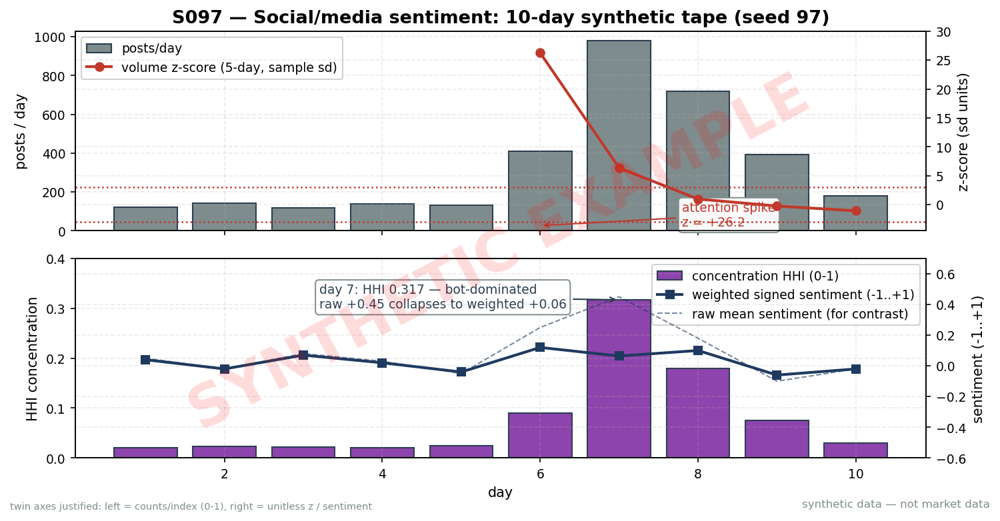

```mermaid
flowchart LR
    FEED["X/Reddit/StockTwits firehose"] -- "posts + timestamps<br/>(per post)" --> ING["Ingest + normalize<br/>(text, author IDs, dedup, timezone)"]
    ING -- "clean text + metadata<br/>(per post)" --> FEAT["Feature compute<br/>(volume z, weighted sentiment, HHI)"]
    FEAT -- "daily sentiment panel<br/>(daily panel, causal ≤ t)" --> SIG["Signal S097<br/>social sentiment composite"]
    SIG -- "composite + gate flags<br/>(per signal, per event)" --> GATE{"Manipulation veto /<br/>cost gate?"}
    GATE -- "pass (per event)" --> OUT["Downstream consumer<br/>(T072 / T048 / T071 / T080)"]
    GATE -- "fail" --> DROP["No trade"]
    style SIG fill:#aed6f1,stroke:#1f3a5f
```

### S12. Sources

1. Antweiler, Werner & Frank, Murray Z. (2004). "Is All That Talk Just Noise? The Information Content of Internet Stock Message Boards." *Journal of Finance* 59(3): 1259–1294. https://doi.org/10.1111/j.1540-6261.2004.00662.x
2. Chen, Hailiang, De, Prabuddha, Hu, Yu & Hwang, Byoung-Hyoun (2014). "Wisdom of Crowds: The Value of Stock Opinions Transmitted Through Social Media." *Review of Financial Studies* 27(5): 1367–1403. https://doi.org/10.1093/rfs/hhu001
3. Bollen, Johan, Mao, Huina & Zeng, Xiaojun (2011). "Twitter Mood Predicts the Stock Market." *Journal of Computational Science* 2(1): 1–8. https://doi.org/10.1016/j.jocs.2010.12.007 (preprint: https://arxiv.org/abs/1010.3003)
4. Das, Sanjiv R. & Chen, Mike Y. (2007). "Yahoo! for Amazon: Sentiment Extraction from Small Talk on the Web." *Management Science* 53(9): 1375–1388. https://doi.org/10.1287/mnsc.1070.0704
5. Barber, Brad M. & Odean, Terrance (2008). "All That Glitters: The Effect of Attention and News on the Buying Behavior of Individual and Institutional Investors." *Review of Financial Studies* 21(2): 785–818. https://doi.org/10.1093/rfs/hhm079
6. Tetlock, Paul C. (2007). "Giving Content to Investor Sentiment: The Role of Media in the Stock Market." *Journal of Finance* 62(3): 1139–1168. https://doi.org/10.1111/j.1540-6261.2007.01232.x
7. Loughran, Tim & McDonald, Bill (2011). "When Is a Liability Not a Liability? Textual Analysis, Dictionaries, and 10-Ks." *Journal of Finance* 66(1): 35–65. https://doi.org/10.1111/j.1540-6261.2010.01625.x
8. Hasso, Tim, Müller, Daniel, Pelster, Matthias & Warkulat, Sonja (2022). "Who participated in the GameStop frenzy? Evidence from brokerage accounts." *Finance Research Letters* 44: 102636. https://doi.org/10.1016/j.frl.2021.102636
9. Renault, Thomas (2017). "Intraday online investor sentiment and return patterns in the U.S. stock market." *Journal of Banking & Finance* 84: 25–40. https://doi.org/10.1016/j.jbankfin.2017.07.002

**Unverified leads** (batch-research claims without an independently checkable source this batch):
- X API (~$0.005/post read), Reddit commercial API (metered), LunarCrush/Santiment (~$50–1,000+/mo) — bot-summarized; treat all pricing as leads, indicative only.
- The 175–445 h social-plus-trends build estimate (bot) — the cost-model Tier H band (60–200 h) is used for planning instead.
- Post-2021 meme-stock attention literature beyond the GameStop study — relevant papers exist; full citations not captured this batch.
- Source log: Duck.ai answered Q-SB10-1–Q-SB10-3 (2026-09-10); Grok answers pending (checked 2026-09-10).

---
## Stage 98/200 — S098: Short interest, borrow fees & days-to-cover

*Batch SB10 · Signal 98/100 · Provenance [SR] · Family G — Alternative data*

### S1. One-line verdict

| | |
|---|---|
| **What it is** | A crowding and squeeze-risk panel: **short interest / float**, **days-to-cover**, **borrow utilization**, the **indicative borrow fee**, plus a dark-pool buying proxy. A risk-management and timing input, not a standalone long/short signal. |
| **When it works** | When it separates *crowding* from *direction*: high SI with a rising fee = crowded and expensive; fee spikes while SI stays high = squeeze risk; the fee itself is the cost model for any short leg. |
| **When it dies** | When SI is read as "bearish = short more." High SI means expensive borrow, a crowded trade, and maximum squeeze asymmetry (unbounded upside loss). |
| **Build-or-buy in one line** | Free FINRA data for the slow-moving SI level; license a daily lending panel (Markit/S3-class) for fees and utilization — the fee is where the money is. |

Provenance **[SR]** (Asquith et al. 2005, *JFE*; Cohen et al. 2007, *JoF*); never upgraded. Central honesty rule: **no canonical combined formula exists** — every crowding composite here is desk-specific and labeled as such.

### S2. How it works — plain human explanation

**Short interest (SI)** is the shares currently sold short — borrowed, sold, to be bought back. **Float** is the shares actually tradeable (outstanding minus locked-up/insider holdings). SI/float is the fraction of tradeable supply that must one day be repurchased.

**Average daily volume (ADV)** is normal daily share volume. **Days-to-cover (DTC)** = SI / ADV: how many normal-volume days all shorts need to cover — a DTC of 9 means no quiet exit. **Utilization** is the fraction of lendable shares on loan (97% = the lending desk is nearly empty). The **indicative borrow fee** is the annualized rate shorts pay to stay borrowed — 42%/ann bleeds ~11.5 bps (basis points)/day. **Borrow fees are negative carry for shorts**: a cost compounding against you every day the thesis doesn't pay.

The **DIX** (a dark-pool buying proxy popularized by SqueezeMetrics) is defined here as dark-pool buy volume over total consolidated volume — a practitioner proxy, not an academic statistic.

The data comes in two speeds. Exchange/FINRA short interest is **lagged, bi-monthly** — where crowding *was* two weeks ago. Professional lending panels (Markit, S3-class) are **daily**: fee, utilization, availability. Level from the slow data; timing from the fast data.

The three mandatory interpretations: **high SI plus a rising fee indicates crowding.** **Squeeze risk rises when fees spike while SI remains high** — shorts pay more to stay, so a buying panic meets no natural sellers but panicking shorts. And **borrow fees are negative carry for shorts** — at 42%/ann, the stock must fall 3.45% in 30 days just to break even on carry.

### S3. The math — exact formula

The components are exact; the composite is not. Definitions:

$$SI/float_t = \frac{SI_t}{Float_t}, \qquad days\text{-}to\text{-}cover_t = \frac{SI_t}{ADV_t}$$

$$Utilization_t = \frac{shares\ on\ loan_t}{lendable\ shares_t}, \qquad Fee_t = \text{indicative borrow fee (\%/ann)}$$

$$DIX_t = \frac{dark\ pool\ buy\ volume_t}{total\ consolidated\ volume_t}$$

**No canonical combined formula exists** — the literature studies these variables separately (Asquith et al. on SI×institutional ownership; Cohen et al. on fee-implied demand shifts; D'Avolio on the borrow market). Any desk composite is proprietary. The worked example below uses an explicitly illustrative crowding score — the sum of cross-sectional z-scores of SI/float, days-to-cover, and fee — labeled as a **desk-specific example, not an institutional standard**:

$$Crowding^{example}_i = z(SI/float_i) + z(DTC_i) + z(Fee_i)$$

**Variants:** (a) SI × (1 − institutional ownership) — the Asquith et al. constrained subset; (b) fee-*change* not fee-level (Cohen et al.'s demand-shift identification); (c) utilization-only screens (availability → 0 as the hard gate); (d) DTC on median volume (spike-robust); (e) DIX-style dark-pool flow as squeeze confirmation, not a short input.

### S4. Worked example — step-by-step numbers (SYNTHETIC)

All numbers below are **synthetic** — a hand-constructed 6-stock panel with fictional tickers, generated with seed **98**. This is an illustration of the mechanics, **not a backtest and not real performance**.

| ticker | SI (M) | float (M) | ADV (M) | SI/float (%) | DTC (days) | fee (%/ann) | util (%) | DIX (%) | crowding (z-sum, example) | 30-day borrow drag on $1M short (%) |
|--------|-------:|----------:|--------:|-------------:|-----------:|------------:|---------:|--------:|--------------------------:|-----------------------------------:|
| ZQTA | 6 | 400 | 12.0 | 1.50 | 0.50 | 0.4 | 8.0 | 7.5 | −2.54 | 0.03 |
| KLVR | 18 | 220 | 3.0 | 8.18 | 6.00 | 8.5 | 61.0 | 9.2 | +0.12 | 0.70 |
| NORD | 9 | 180 | 6.0 | 5.00 | 1.50 | 1.2 | 22.0 | 8.1 | −1.90 | 0.10 |
| **MEMEQ** | **42** | **150** | **4.5** | **28.00** | **9.33** | **42.0** | **97.0** | **16.0** | **+4.72** | **3.45** |
| PWRS | 30 | 120 | 15.0 | 25.00 | 2.00 | 28.0 | 92.0 | 13.5 | +1.51 | 2.30 |
| DLTA | 3 | 90 | 1.5 | 3.33 | 2.00 | 0.8 | 15.0 | 7.0 | −1.91 | 0.07 |

Hand-check MEMEQ: SI/float = 42/150 = **28.0%**; days-to-cover = 42/4.5 = **9.33 days**; 30-day borrow drag = 42 × 30/365 = **3.45%**. The crowding z-sum is the illustrative §S3 composite — MEMEQ tops it at +4.72.

**What to notice:** MEMEQ sits in the squeeze-risk corner — 28% of float short, 9.3 days to cover, 42%/ann fee, 97% utilization, elevated 16% DIX (dark-pool buyers absorbing the tape). PWRS is the contrast: high SI (25%) and fee (28%) but only 2.0 DTC — crowded and expensive, but shorts *can* exit, so the squeeze geometry is weaker. KLVR is the opposite trap: 6 DTC on moderate SI — illiquidity masquerading as crowding. ZQTA/NORD/DLTA are the control group.

**Full cost of shorting $1M of MEMEQ for 30 days** (spread + fees + impact/slippage + borrow, explicit): 16,667 shares at $60. Half-spread both ways at 3¢ = $1,000. Fees $0.0035/share × 2 legs = $116.67. Impact/slippage 5 bps = $500. Borrow at 42%/ann × 30/365 = **$34,521**. Total ≈ **$36,138 ≈ 3.61% of notional** — $34,521 of it the fee. The stock must fall 3.6% in a month just to cover being short: "borrow fees are negative carry" in dollars.

### S5. Strategies that use this signal

Cross-references verified against plan.md §3; each names the relationship.

- **T074 — Short-interest squeeze rider (primary).** Uses S098 (with S025, S094): fee-spike-while-SI-high as a *squeeze-risk overlay* — sizes down or exits existing shorts; for the specialized desk, structures the long squeeze leg.
- **T034 — Index-futures cash-and-carry.** Uses S098 (with S057, S014) as a *cost input*: the borrow fee enters the carry computation directly — a "cheap" basis trade on a hard-to-borrow name is not cheap.
- **T090 — Overnight inventory carry.** Uses S098 (with S037, S068) as a *veto*: high DTC plus spiking fees veto short inventory overnight — asymmetric gap risk, negative carry.
- **T099 — ADR + borrow cross-check.** Uses S098 (with S061, S014) as a *borrow-availability input*: confirm the ADR leg's borrow in the lending panel before sizing.

### S6. Data required — exact spec

| Dataset | Granularity | History | Source / vendor | Notes |
|---|---|---|---|---|
| Short interest (exchange/FINRA) | bi-monthly settlement records (mid-month and month-end) | 5+ years | FINRA short-interest reports (Tier-0, free) | Lagged ~2 weeks; the slow-moving level |
| Securities-lending panel | daily borrows: fee, utilization, availability | 2+ years | IHS Markit Securities Finance / S3-class (institutional, $$$$) | The fast-moving timing; fee is the money variable |
| Float / shares outstanding | per corporate-action event | point-in-time | Compustat-class or vendor corporate actions | SI/float dies on splits if float isn't adjusted |
| ADV | daily bars | 60+ trading days | Polygon-class, Databento | Use median volume for spike-robust DTC |
| Dark-pool volume | daily, venue-type split | 1+ year | FINRA ATS / vendor dark-pool tapes | DIX proxy input; lit-vs-dark classification varies by vendor |
| Institutional ownership | quarterly (13F) | 5+ years | 13F filings / vendor aggregation | For the Asquith et al. constrained-subset variant |

Minimum viable: FINRA SI (free) + a lending panel for fees + point-in-time float. Without the daily fee, you have the crowding level but no timing and no cost model — which is most of the chapter's value.

### S7. Local build on M5 Max / 128GB

Feasibility: **feasible** — Tier **M** (cost-model: 20–60 engineering hours, ≈ $3,000–9,000 at $150/hr). The analytics are megabytes: a daily panel of thousands of tickers × a handful of features; the point-in-time join is a Polars afternoon at ~1–10M rows/sec. The binding constraint is data licensing, not compute — the daily lending panel is institutional-priced, and that price decides whether the fast leg exists.

Build sequence: (1) ingest FINRA SI bi-monthly; forward-fill between settlements *labeled as stale* — never interpolate as fresh; (2) join the daily lending panel (fee/utilization/availability); (3) point-in-time float for splits/buybacks; (4) SI/float, DTC (median-volume variant), illustrative crowding composite; (5) backtest the *risk* use first — does the fee-spike flag precede squeezes? — before any alpha claim.

### S8. Buy vs build

| Component | Buy (indicative — verify before budgeting) | Build |
|---|---|---|
| Short interest (lagged) | FINRA reports: ~$0 (Tier-0) | Scheduled ingestion + stale-labeling |
| Daily lending panel (fee, utilization) | IHS Markit Securities Finance / S3-class: enterprise $$$$ (institutional pricing — request a quote) | Cannot build — this is someone else's panel data |
| Dark-pool buying proxy | SqueezeMetrics DIX-style feeds (vendor pricing varies) | DIX proxy from FINRA ATS tapes if you license them |
| Float / corporate actions | Compustat-class or Polygon corporate actions (~$30–200/mo) | Point-in-time adjustment logic |
| Crowding composite & squeeze flags | No vendor sells your risk overlay | In-house: the desk-specific composite of §S3 |

Recommendation: never pay for what FINRA gives away (the SI level); pay for the daily fee panel if you run short legs at all — the fee is both your timing variable and your cost model, and one avoided squeeze pays for years of data.

### S9. Success ratio / efficacy — documented evidence

All effects below are documented as **before-cost** — gross of the borrow fees this chapter insists on modeling.

| Study | Sample / design | Documented finding | Honest caveat |
|---|---|---|---|
| Asquith, Pathak & Ritter (2005) | US stocks 1988–2002, SI × institutional ownership | Constrained stocks (high SI, low IO) underperform ~215 bps/month equal-weighted; ~39 bps and insignificant value-weighted | Before-cost; value-weighted insignificance is what desks live with |
| Cohen, Diether & Malloy (2007) | Proprietary lending data, demand shifts | Identified increase in shorting demand → −2.98% abnormal return next month | Before-cost; the identification (not the fee level) is the contribution |
| D'Avolio (2002) | 18-month lender panel | Institutional ownership explains ~55% of lendable-supply variation; fees concentrate in a small set of specials | Market-structure paper, not a trading result |
| Jones & Lamont (2002) | NYSE 1926–1933 loan crowd | Stocks entering the loan crowd (high borrowing cost) underperform | Historical sample; before-cost |
| Engelberg, Reed & Ringgenberg (2018) | Short-selling risk | Shorting risk (not just cost) predicts returns — risk, not just carry, is priced | Before-cost; risk-factor framing |
| Desai et al. (2002) | Nasdaq short interest | High SI predicts negative future returns and captures information beyond other signals | Before-cost; Nasdaq sample |

**Literature bottom line:** the record supports short-interest variables as *crowding and constraint measures* — high SI with low institutional ownership or rising borrow demand marks stocks the market struggles to short. The tradable takeaway is risk management: fee spikes while SI stays high warn of squeezes, and the fee is negative carry on every short leg.

### S10. Failure modes & pitfalls

1. **SI staleness** — bi-monthly settlement is two weeks old on arrival → mitigate: label stale explicitly; timing from the daily lending panel, level from FINRA.
2. **Recalls and buy-ins** — the lender can take shares back → mitigate: monitor availability daily; size shorts so a buy-in is an annoyance, not an event.
3. **Fee spikes** — the fee can go from 2% to 200%/ann → mitigate: fee is a *position input*; hard cap on fee-at-entry and a fee-stop on existing shorts.
4. **Corporate actions** — splits/buybacks distort SI/float → mitigate: point-in-time float; never compute on unadjusted shares.
5. **Squeeze asymmetry** — short losses are unbounded → mitigate: S098 as a squeeze *veto/overlay* (T074, T090), never a reason to add to a short.
6. **DIX proxy mismeasurement** — dark-pool classification varies by vendor → mitigate: confirmation only, never a trigger; watch methodology changes.
7. **Borrow-panel coverage gaps** — small caps may lack lendable-supply data → mitigate: coverage flag per name; no fee data = no short, not a zero fee.

### S11. Visuals

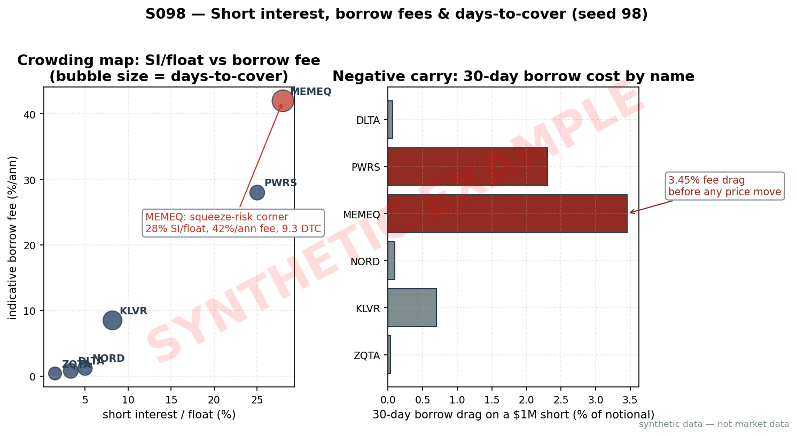

```mermaid
flowchart LR
    FEED["FINRA short interest + lending panel"] -- "settlement records + daily borrows<br/>(bi-monthly records + daily borrows)" --> ING["Ingest + normalize<br/>(settlement-date alignment, fee/utilization capture)"]
    ING -- "point-in-time panel<br/>(daily panel)" --> FEAT["Feature compute<br/>(SI/float, DTC, fee, utilization, DIX)"]
    FEAT -- "crowding scores<br/>(daily scores, causal ≤ t)" --> SIG["Signal S098<br/>short-interest crowding"]
    SIG -- "squeeze-risk flag<br/>(per event)" --> GATE{"Hard-to-borrow veto /<br/>fee-stop?"}
    GATE -- "pass (per position)" --> OUT["Downstream consumer<br/>(size/veto short legs — T034 / T074 / T090 / T099)"]
    GATE -- "fail" --> DROP["No short leg"]
    style SIG fill:#aed6f1,stroke:#1f3a5f
```

### S12. Sources

1. Asquith, Paul, Pathak, Parag A. & Ritter, Jay R. (2005). "Short Interest, Institutional Ownership, and Stock Returns." *Journal of Financial Economics* 78(2): 243–276. https://site.warrington.ufl.edu/ritter/files/2015/04/Short-interest-institutional-ownership-and-stock-returns-2005-08.pdf
2. Cohen, Lauren, Diether, Karl B. & Malloy, Christopher J. (2007). "Supply and Demand Shifts in the Shorting Market." *Journal of Finance* 62(5): 2061–2096. https://doi.org/10.1111/j.1540-6261.2007.01269.x
3. D'Avolio, Gene (2002). "The Market for Borrowing Stock." *Journal of Financial Economics* 66(2–3): 271–306. https://doi.org/10.1016/S0304-405X(02)00206-4
4. Jones, Charles M. & Lamont, Owen A. (2002). "Short-Sale Constraints and Stock Returns." *Journal of Financial Economics* 66(2–3): 207–239. https://doi.org/10.1016/S0304-405X(02)00224-6
5. Engelberg, Joseph E., Reed, Adam V. & Ringgenberg, Matthew C. (2018). "Short-Selling Risk." *Journal of Finance* 73(2): 755–786. https://doi.org/10.1111/jofi.12601
6. Desai, Hemang, Ramesh, K., Thiagarajan, S. Ramu & Balachandran, Bala V. (2002). "An Investigation of the Informational Role of Short Interest in the Nasdaq Market." *Journal of Finance* 57(5): 2263–2287. (Stable URL not captured this batch.)
7. Diether, Karl B., Lee, Kuan-Hui & Werner, Ingrid M. (2009). "Short-Sale Strategies and Return Predictability." *Review of Financial Studies* 22(2): 575–607. (Stable URL not captured this batch.)
8. Geczy, Christopher C., Musto, David K. & Reed, Adam V. (2002). "Stocks are special too: an analysis of the equity lending market." *Journal of Financial Economics* 66(2–3): 241–269. (Stable URL not captured this batch.)

**Unverified leads** (batch-research claims without an independently checkable source this batch):
- FINRA short-interest report navigation and SqueezeMetrics DIX methodology pages — described from practitioner knowledge; deep URLs not captured this batch, so no guessed links are given.
- Institutional pricing for IHS Markit Securities Finance and S3-class lending panels — request quotes; treated as enterprise $$$$.
- Source log: Duck.ai answered Q-SB10-1–Q-SB10-3 (2026-09-10); Grok answers pending (checked 2026-09-10).

---
## Stage 99/200 — S099: Google Trends attention (ASVI)

*Batch SB10 · Signal 99/100 · Provenance [D] · Family G — Alternative data*

### S1. One-line verdict

| | |
|---|---|
| **What it is** | **ASVI** (abnormal search volume index): how unusually hard people are searching for a ticker, from Google Trends' weekly **SVI** (0–100). An *attention* variable — eyeballs, not opinions. |
| **When it works** | As a cross-sectional attention filter or event-confirmation variable: flagging names under unusual retail attention so earnings/news/order-flow signals can be conditioned on whether anyone is watching. |
| **When it dies** | As a standalone signal on the original 2011 magnitudes. Query definitions, Trends normalization, market adoption, and arbitrage have all changed — do not carry the original effect size forward. |
| **Build-or-buy in one line** | Nothing to buy: Trends is free (Tier-0), the computation is an afternoon. Build the download hygiene (joint downloads, rescaling discipline) — that *is* the product. |

Provenance **[D]** (Da, Engelberg & Gao 2011, *JoF*); never upgraded. Central honesty rule: the log-median form is the canonical 2011 definition — and its documented magnitudes belong to 2004–2008, not today.

### S2. How it works — plain human explanation

Google Trends reports **SVI**, a 0–100 index of weekly search intensity, normalized so the peak week in your download equals 100. **ASVI** standardizes it: is this week's search interest abnormal vs the ticker's own recent baseline? High ASVI = unusual attention — retail investors looking up a ticker they normally ignore.

The canonical construction (Da, Engelberg & Gao 2011) compares log search volume to the log of the *median* of the prior eight weeks — medians resist spikes that means don't. A desk reconstruction instead uses a rolling z-score (trailing mean and sample sd). Both are "abnormal search volume" with different robustness; §S4 shows they can disagree violently on the same data.

Why attention matters: Barber & Odean (2008) document that attention drives retail buying — search is the eye's paper trail. The mechanism is buying pressure from newly attentive retail investors, then reversal as attention fades. Hence ASVI as an *attention filter*: which names have the retail wind at their back this week, so earnings/news signals can be sized accordingly.

Decay honesty: the original sample is the Russell 3000, 2004–2008 — before the paper, before "Google Trends signal" was a product, before arbitrage had fifteen years. Query definitions and Trends normalization have changed. The *direction* (attention → short-horizon buying pressure → eventual reversal) is the durable part; the *magnitude* is not portable to today.

### S3. The math — exact formula

Two forms. The reconstruction (rolling z-score, sample standard deviation with denominator $W-1$):

$$ASVI^{z}_t = \frac{SVI_t - \bar{SVI}_{t,W}}{s_{t,W}}, \qquad s_{t,W} = \sqrt{\frac{\sum_{k=1}^{W}(SVI_{t-k} - \bar{SVI}_{t,W})^2}{W-1}}$$

The canonical Da–Engelberg–Gao (2011) form — **this is the 2011 paper's definition**:

$$ASVI^{DEG}_t = \log(SVI_t) - \log\left(\operatorname{median}(SVI_{t-1}, \ldots, SVI_{t-8})\right)$$

Both reference the prior $W=8$ weeks *excluding* the current week — no lookahead. The z-form is then typically winsorized (capped) at ±5, because a quiet baseline makes the denominator tiny and the z-score explosive (the §S4 example produces +27.1 before winsorization — a tiny-denominator artifact, not information).

**Variants:** (a) ticker-symbol vs company-name queries (different searcher populations); (b) finance-category-restricted Trends; (c) daily SVI where available (noisier, finer); (d) the "sum of all fears" aggregate-sentiment cousin (Da et al. 2015); (e) institutional-attention variants on Bloomberg search data (Ben-Rephael et al. 2017).

The separate-download warning, stated exactly: **separately downloaded Trends series are not cross-sectionally comparable.** Each download is normalized to its own maximum (=100), so "88" for ticker A and "88" for ticker B are different quantities. A cross-sectional ASVI panel must use **one joint download** (all tickers in the same query, sharing one normalization) or a **common comparison term** (every ticker downloaded against the same benchmark term, e.g., "stocks", and rescaled). The demo table in §S4 shows the same searches reading 88 vs 35 depending on download construction.

### S4. Worked example — step-by-step numbers (SYNTHETIC)

All numbers below are **synthetic** — a hand-constructed 10-week Google Trends tape for a fictional ticker "XYZQ", generated with seed **99**. This is an illustration of the mechanics, **not a backtest and not real performance**.

| week | SVI | ASVI z-form (raw) | ASVI z-form (winsorized ±5) | ASVI canonical log-median (DEG) |
|-----:|----:|------------------:|---------------------------:|--------------------------------:|
| 1 | 18 | n/a | n/a | n/a |
| 2 | 22 | n/a | n/a | n/a |
| 3 | 19 | n/a | n/a | n/a |
| 4 | 25 | n/a | n/a | n/a |
| 5 | 21 | n/a | n/a | n/a |
| 6 | 24 | n/a | n/a | n/a |
| 7 | 23 | n/a | n/a | n/a |
| 8 | 20 | n/a | n/a | n/a |
| 9 | 88 | **+27.15** | **+5.00** | **+1.41** |
| 10 | 64 | +1.44 | +1.44 | +1.05 |

Hand-check week 9 (window = weeks 1–8): mean = 172/8 = 21.50; squared deviations sum to 42.0; sample variance = 6.0; sd = 2.4495; z = (88 − 21.50)/2.4495 = **27.15**. Canonical: median = 21.5; ln(88) − ln(21.5) = **1.4093**.

Hand-check week 10 (window = weeks 2–9): mean = 30.25; sd = 23.4201; z = **1.44**; median = 22.5; ln(64) − ln(22.5) = **1.0454**.

**What to notice:** the same shock reads +27.1 (z-form) vs +1.41 (canonical). The z-form explodes on an *extremely quiet* baseline (sd 2.45) — a tiny denominator, not a huge shock; winsorization at ±5 contains it. Week 10: the z-form's window now *contains* the week-9 spike (sd 23.42, z = +1.44) while the median-based DEG form still reads +1.05 — the median resists the spike, the mean doesn't. That is the canonical form's robustness argument, shown numerically.

Separate-download demo (same searches, different download construction):

| week | ticker downloaded alone (own-max = 100) | ticker downloaded jointly vs "stocks" benchmark |
|-----:|----------------------------------------:|------------------------------------------------:|
| 1 | 30 | 12 |
| 2 | 88 | 35 |
| 3 | 64 | 26 |

Week 2 reads 88 in one download and 35 in the other — *incomparable scales from the same searches* (z-scores: 0.94 vs 0.92). Rule: one joint download per panel, or a common comparison term, or the cross-section is fiction.

**Cost of acting on the week-9 flag** (spread + fees + impact/slippage, explicit): $50,000 in a $100 stock = 500 shares. Half-spread both ways at 4¢ = $40. Fees $0.0035/share × 2 legs = $3.50. Impact/slippage 3 bps = $15. Total ≈ **$58.50 ≈ 12 bps round trip**. Because the documented effect includes *reversal*, the holding period (days, not minutes) decides whether this cost is paid once against a two-week drift or churned weekly against noise.

### S5. Strategies that use this signal

Cross-references below are genuine links verified against the plan's trigger graph (plan.md §3); each names the relationship.

- **T073 — ASVI attention-reversal rider (primary).** Uses S099 (with S045, S094): winsorized ASVI beyond ±3 as an *attention-timing input* — the documented pattern is buying pressure over ~2 weeks then reversal within a year, so the rider is a fade of the attention spike, not a chase, and only with the decay honesty of §S2.
- **T072 — Social-sentiment ignition rider.** Uses S099 (with S072's S097, S032) as a *confirming leg*: search attention confirming social-media attention — two independent attention sources agreeing is the filter; either alone is weaker.
- **T080 — Multi-source attention composite.** Uses S099 (with S097, S093) as one of three attention legs: search, social, and news attention combined so that no single source's normalization quirks can fire the composite.

### S6. Data required — exact spec

| Dataset | Granularity | History | Source / vendor | Notes |
|---|---|---|---|---|
| Google Trends SVI | weekly (0–100), per query | 5+ years (2004+ for the original sample) | Google Trends, Tier-0 free; `pytrends` for scripted pulls | One joint download per panel — see §S3 warning |
| Query definitions | per ticker: symbol, company name, variants | fixed at research start | researcher-defined | Changing the query mid-sample breaks the series |
| Price/volume (for conditioning) | daily bars | matches Trends history | Polygon-class, Databento | ASVI conditions other signals; it needs their data |
| Event calendar (for confirmation use) | event-level | 1+ year | earnings/news calendars | The event-confirmation framing needs the events |

Minimum viable: 5 years of weekly SVI for one universe, downloaded jointly (or against a common comparison term), with query definitions frozen and documented. The failure mode that kills most builds is silent re-downloading: a panel assembled from separate downloads over several days is not a panel.

### S7. Local build on M5 Max / 128GB

Feasibility: **trivial** — Tier **L–M** (cost-model: ~8–20 engineering hours, ≈ $1,200–3,000 at $150/hr). Trends is free; a weekly panel of thousands of tickers is kilobytes per week — the 5-year history fits in memory many times over. Two rolling statistics per ticker-week; no GPU, no memory pressure (orders of magnitude under the ~77 GB ceiling).

Build sequence: (1) freeze query definitions per ticker (documented); (2) one joint Trends download per panel (or vs a common benchmark, rescaled); (3) compute both ASVI forms — their disagreement (§S4) is itself a diagnostic; (4) validate download hygiene by re-pulling a sample; (5) condition, don't trade: use ASVI as a cross-sectional filter and measure the *interaction* before any standalone claim.

### S8. Buy vs build

| Component | Buy (indicative — verify before budgeting) | Build |
|---|---|---|
| Trends data | Google Trends: ~$0 (Tier-0) | Scripted pulls (`pytrends`), joint-download discipline |
| ASVI computation | Nothing to buy — any vendor selling "ASVI" is selling arithmetic | Both forms in an afternoon (this chapter's §S3) |
| Query-definition research | — | In-house: which queries actually capture investor attention per ticker |
| Price/volume for conditioning | Polygon-class ~$30–200/mo; Databento ~$200/mo + usage | Alignment and corporate-action handling |
| Institutional attention (Bloomberg-search class) | Enterprise data licenses ($$$$) | Not buildable — different data entirely |

Recommendation: build everything. There is no buy option because there is nothing scarce — the scarce input is download hygiene and query-definition judgment, which cannot be purchased.

### S9. Success ratio / efficacy — documented evidence

All effects below are documented as **before-cost**; magnitudes are the original papers', not today's.

| Study | Sample / design | Documented finding | Honest caveat |
|---|---|---|---|
| Da, Engelberg & Gao (2011) | Russell 3000, 2004–2008 | Higher SVI predicts higher prices over the next 2 weeks, with reversal within a year | Original documented evidence only — do not carry the magnitude forward (§S2 decay honesty) |
| Preis, Moat & Stanley (2013) | Google Trends vs market moves | Search-volume changes serve as early-warning signals of market moves | Before-cost; weekly granularity; descriptive |
| Bordino et al. (2012) | Web search queries vs trading volume | Search queries predict stock *volumes* | Volume, not returns — supports the attention mechanism |
| Ben-Rephael, Da & Israelsen (2017) | Institutional (Bloomberg) search | Institutional attention relates to underreaction to news | Different search population (institutions, not retail) |
| Drake, Roulstone & Thornock (2012) | Google searches around earnings | Search spikes around earnings announcements; demand for information is event-driven | Supports the event-confirmation framing |
| Lazer et al. (2014) | Google Flu autopsy | Platform search series break when the platform changes — "big data hubris" | A caution about Trends data itself |

**Literature bottom line:** the record supports ASVI as an *attention measure with a documented short-horizon buying-pressure pattern and eventual reversal* — in its original sample. The honest use today is the chapter's mandatory conclusion: **more promising as a cross-sectional attention filter or event-confirmation variable than as a standalone signal.** Re-estimate everything on current data before sizing anything.

### S10. Failure modes & pitfalls

1. **Query-definition drift** — Google changes what a query matches; your series breaks silently → mitigate: freeze queries, log definitions, monitor for level shifts.
2. **Normalization non-comparability** — separate downloads can't be pooled → mitigate: one joint download per panel or a common comparison term (§S3, §S4 demo).
3. **Tiny-denominator z explosion** — quiet baselines produce absurd z-scores → mitigate: winsorize at ±5; prefer the median-based canonical form.
4. **Platform/algorithm changes** — Trends' sampling and normalization evolve → mitigate: Lazer et al.'s (2014) lesson — monitor the data-generating process, not just the data; re-pull validation samples.
5. **Effect decay** — the 2011 magnitudes are not today's → mitigate: re-estimate on recent data; trade the *filtered* use (attention conditioning), not the original coefficients.
6. **Weekly granularity too coarse** — a week is a long time in an attention spike → mitigate: use ASVI for weekly filtering/event confirmation, not intraday timing.
7. **Ticker ambiguity** — "CAT" is an animal, "A" is a letter → mitigate: test symbol vs company-name queries; finance-category restriction; drop ambiguous tickers rather than guessing.

### S11. Visuals

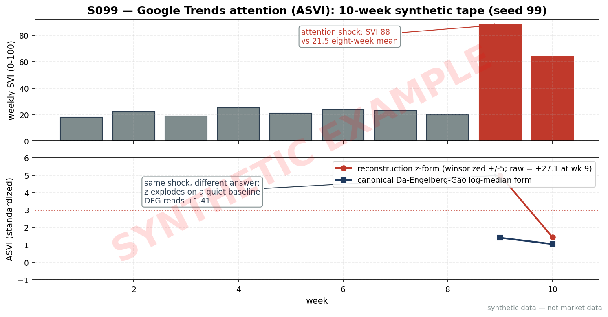

```mermaid
flowchart LR
    FEED["Google Trends (weekly SVI, 0-100)"] -- "weekly SVI series<br/>(weekly SVI)" --> ING["Ingest + normalize<br/>(joint downloads, query-definition freeze)"]
    ING -- "rescaled series<br/>(weekly panel)" --> FEAT["Feature compute<br/>(ASVI z-form winsorized + canonical log-median)"]
    FEAT -- "attention scores<br/>(weekly scores, causal ≤ t)" --> SIG["Signal S099<br/>Google Trends attention (ASVI)"]
    SIG -- "attention flag<br/>(per event)" --> GATE{"Attention-timing gate?"}
    GATE -- "pass (per event)" --> OUT["Downstream consumer<br/>(condition downstream signals — T072 / T073 / T080)"]
    GATE -- "fail" --> DROP["No trade"]
    style SIG fill:#aed6f1,stroke:#1f3a5f
```

### S12. Sources

1. Da, Zhi, Engelberg, Joseph & Gao, Pengjie (2011). "In Search of Attention." *Journal of Finance* 66(5): 1461–1499. https://doi.org/10.1111/j.1540-6261.2011.01679.x
2. Da, Zhi, Engelberg, Joseph & Gao, Pengjie (2015). "The Sum of All FEARS: Investor Sentiment and Asset Prices." *Review of Financial Studies* 28(1): 1–32. (Stable URL not captured this batch.)
3. Preis, Tobias, Moat, Helen Susannah & Stanley, H. Eugene (2013). "Quantifying Trading Behavior in Financial Markets Using Google Trends." *Scientific Reports* 3: 1684. https://doi.org/10.1038/srep01684
4. Lazer, David, Kennedy, Ryan, King, Gary & Vespignani, Alessandro (2014). "The Parable of Google Flu: Traps in Big Data Analysis." *Science* 343(6176): 1203–1205. https://doi.org/10.1126/science.1248506
5. Bordino, Ilaria, Battiston, Stefano, Caldarelli, Guido, Cristelli, Matthieu, Ukkonen, Antti & Weber, Ingmar (2012). "Web Search Queries Can Predict Stock Market Volumes." *PLoS ONE* 7(7): e40014. https://doi.org/10.1371/journal.pone.0040014
6. Choi, Hyunyoung & Varian, Hal (2012). "Predicting the Present with Google Trends." *Economic Record* 88(s1): 2–9. https://doi.org/10.1111/j.1475-4932.2012.00809.x
7. Ben-Rephael, Azi, Da, Zhi & Israelsen, Ryan D. (2017). "It Depends on Where You Search: Institutional Investor Attention and Underreaction to News." *Review of Financial Studies* 30(9): 3009–3047. (Stable URL not captured this batch.)
8. Drake, Michael S., Roulstone, Darren T. & Thornock, Jacob R. (2012). "Investor Information Demand: Evidence from Google Searches Around Earnings Announcements." *Journal of Accounting Research* 50(4): 1001–1040. (Stable URL not captured this batch.)

**Unverified leads** (batch-research claims without an independently checkable source this batch):
- The AFA-meeting summary of Da, Engelberg & Gao (2011) — Russell 3000, 2004–2008, two-week buying pressure with reversal within a year — used here only as the paper's documented finding, not as a current magnitude.
- `pytrends` as the scripted-pull library — practitioner-standard; API stability not verified this batch.
- Source log: Duck.ai answered Q-SB10-1–Q-SB10-3 (2026-09-10); Grok answers pending (checked 2026-09-10).

---
## Stage 100/200 — S100: Earnings surprise (SUE) / PEAD intraday leg

*Batch SB10 · Signal 100/100 · Provenance [D] · Family G — Alternative data*

### S1. One-line verdict

| | |
|---|---|
| **What it is** | **SUE** (standardized unexpected earnings): the earnings surprise scaled by the stock's own historical surprise volatility — sorted into deciles, long high, short low. **PEAD** (post-earnings-announcement drift) is the documented post-announcement drift in the surprise's direction. This chapter implements the *intraday leg*: drift measured from the first tradable price after the announcement timestamp. |
| **When it works** | In a carefully screened liquid universe with precise timestamps: clean surprise measurement, first-tradable entries, costs modeled — not in a broad cross-sectional screen on close-to-close returns. |
| **When it dies** | When close-to-close event-study returns are mistaken for tradable returns. The literature measured drift over months from closes; once implementation enters *intraday*, entry price, spread, and timestamp error dominate. |
| **Build-or-buy in one line** | Buy precise announcement timestamps and intraday bars (the timestamp is the product); build the SUE computation and the event-alignment logic yourself — the formula is public, the timestamp hygiene is not. |

Provenance **[D]** (Foster et al. 1984, *Accounting Review*; Bernard & Thomas 1989, *JAR*); never upgraded. Central honesty rule: **do not infer tradability from close-to-close event-study returns when implementation enters intraday** — and this is not a pure day trade as originally published; the drift was documented over months, the intraday leg is how a modern desk *enters* it.

### S2. How it works — plain human explanation

An **earnings surprise** is actual EPS minus expected EPS. **SUE** standardizes it: divide by the stock's own historical surprise volatility (σ of past surprises) — a $0.25 beat means more for a steady utility than a volatile biotech. Sort by SUE into **deciles** (the example uses quintiles — ten stocks); long the top, short the bottom.

**PEAD** is the anomaly: after the announcement-day reaction, prices kept drifting in the surprise's direction for weeks to months. The catch: the literature measured this drift **close-to-close**, from the announcement day's close — a close you cannot trade. A real implementation enters at the first *tradable* price after the announcement *timestamp*, and the timestamp's precision is everything.

The **intraday leg** is this chapter's implementation-aware version — the event return from the first tradable price:

$$R_{i,\tau_0,\tau_1} = \ln(P_{i,\tau_1} / P_{i,\tau_0^-}), \qquad AR = R - R_{market}$$

where $\tau_0^-$ is the last price *before* entry and $\tau_1$ the exit; the **abnormal return (AR)** subtracts the same-window market return. Entry rules:

- **Before the open** → opening auction (first tradable quote).
- **Intraday** → first quote after the announcement timestamp.
- **After the close** → next open, or the first 15/30-minute return.

A "before-open" announcement traded at the prior close is fiction — the stock may gap 5% at the open, and that gap is the market's, not yours. The timestamp audit (07:30:00 vs "sometime before the open") is the difference between a backtest and a fantasy.

### S3. The math — exact formula

The chosen form, stated exactly:

$$SUE = \frac{EPS_{actual} - E[EPS]}{\sigma(\text{past surprises})}$$

where $E[EPS]$ is the consensus expectation and $\sigma(\text{past surprises})$ is the standard deviation of the stock's own past earnings surprises (typically 8 quarters). This is followed by high/low **decile sorting**: long decile 10 (highest SUE), short decile 1 (lowest SUE). The worked example below uses quintiles (5 groups of 2) because the synthetic panel has 10 stocks; production uses deciles over thousands of names.

The intraday event measurement:

$$R_{i,\tau_0,\tau_1} = \ln(P_{i,\tau_1} / P_{i,\tau_0^-}), \qquad AR_{i} = R_{i} - R_{market}$$

with the entry-timing rules of §S2. The PEAD intraday leg return is mean(high-SUE ARs) − mean(low-SUE ARs) over the event window.

**Variants:** (a) analyst-forecast vs time-series SUE (Livnat & Mendenhall 2006 compare both); (b) SUE scaled by price instead of surprise volatility; (c) revenue surprise as a companion sort; (d) Friday-announcement inattention (DellaVigna & Pollet 2009); (e) overnight-gap vs intraday-drift decomposition of the event return.

### S4. Worked example — step-by-step numbers (SYNTHETIC)

All numbers below are **synthetic** — a hand-constructed 10-stock earnings panel with fictional tickers, generated with seed **100**. This is an illustration of the mechanics, **not a backtest and not real performance**.

**Step 1 — SUE computation** (σ = std dev of the stock's past 8 quarterly surprises):

| ticker | EPS actual | E[EPS] | σ (past surprises) | SUE |
|--------|----------:|-------:|-------------------:|----:|
| A | 1.45 | 1.20 | 0.10 | **+2.50** |
| B | 0.82 | 0.90 | 0.08 | −1.00 |
| C | 2.10 | 2.05 | 0.15 | +0.33 |
| D | 0.55 | 0.70 | 0.12 | −1.25 |
| E | 3.20 | 2.80 | 0.25 | +1.60 |
| F | 1.05 | 1.05 | 0.09 | 0.00 |
| G | 0.30 | 0.45 | 0.10 | **−1.50** |
| H | 1.80 | 1.60 | 0.12 | **+1.67** |
| I | 0.95 | 1.10 | 0.11 | **−1.36** |
| J | 2.60 | 2.30 | 0.20 | +1.50 |

Hand-check: A: (1.45 − 1.20)/0.10 = **2.50**; G: (0.30 − 0.45)/0.10 = **−1.50**. Sorted: G(−1.50), I(−1.36), D(−1.25), B(−1.00), F(0.00), C(+0.33), J(+1.50), E(+1.60), H(+1.67), A(+2.50). Quintiles: Q1 = {G, I}, Q5 = {H, A}.

**Step 2 — intraday event leg** (entry per the §S2 timing rules; AR = ln(P₁/P₀) − market return):

| ticker | announced | entry (τ₀) | exit (τ₁) | R | market R | AR |
|--------|-----------|----------:|---------:|--:|---------:|---:|
| A (long) | 07:30 ET, before open | $50.00 (open auction) | $51.40 (close) | +2.76% | +0.30% | **+2.46%** |
| H (long) | 16:45 ET, after close | $30.10 (next open) | $30.55 (+30 min) | +1.48% | +0.10% | **+1.38%** |
| G (short) | 10:15 ET, intraday | $20.05 (first quote after stamp) | $19.72 (close) | −1.66% | −0.20% | **−1.46%** |
| I (short) | 07:15 ET, before open | $12.00 (open auction) | $11.80 (close) | −1.68% | +0.20% | **−1.88%** |

Hand-check: A: ln(51.40/50.00) = 2.76% − 0.30% = **2.46%**. G: ln(19.72/20.05) = −1.66% − (−0.20%) = **−1.46%**. Quintile mean ARs: Q1 **−1.67%**, Q2 −0.88%, Q3 +0.05%, Q4 +0.92%, Q5 **+1.92%** — monotonic in SUE. PEAD leg = 1.92% − (−1.67%) = **+3.59%** gross.

**Step 3 — the cost walk** (spread + fees + impact/slippage + borrow, explicit; $50,000 per name):

| name | side | gross $ | spread $ | fees $ | impact $ | borrow $ | net $ |
|------|------|--------:|---------:|-------:|---------:|---------:|------:|
| A | long | 1,230.76 | 20.00 | 7.00 | 10.00 | 0.00 | 1,193.76 |
| H | long | 691.98 | 33.22 | 11.63 | 10.00 | 0.00 | 637.13 |
| G | short | 729.79 | 49.88 | 17.46 | 10.00 | 4.11 | 648.35 |
| I | short | 940.36 | 83.33 | 29.17 | 10.00 | 4.11 | 813.75 |
| **total** | | **3,592.88** | | | | | **3,292.98** |

Cost anatomy (hand-check A: 1,250 shares at $50; spread 2¢ × 1,250 = $20; fees $7; impact 2 bps × $50k = $10; net 1,230.76 − 37 = 1,193.76). Shorts add 1-day borrow at 3%/ann ($4.11). Total costs **$299.90 = 8.3% of gross** — modest *in this toy* (liquid names, large moves); on a broad screen with smaller surprises and wider spreads, costs eat the leg first.

**What to notice:** the example works because every input is screened — liquid names, exact timestamps, first-tradable entries. Change any one (a vague stamp traded at the prior close, a 50¢ spread) and the 3.59% gross leg collapses. That is the chapter's thesis in numbers.

### S5. Strategies that use this signal

Cross-references verified against plan.md §3; each names the relationship.

- **T078 — Earnings-drift intraday leg (primary).** Uses S100 (with S025, S091): the SUE decile sort with first-tradable intraday entries — this chapter *is* the signal spec for that trigger.
- **T060 — Identified-news drift rider.** Uses S100 (with S092, S093) as a *confirming sort*: the surprise must be *identified* (clean timestamp, no confounding news) before the drift is trusted.
- **T012 — Jump-filtered overnight-gap fade.** Uses S100 (with S036, S037) as a *filter*: the SUE-explained gap component is the drift to ride; the unexplained jump is the fade candidate.

### S6. Data required — exact spec

| Dataset | Granularity | History | Source / vendor | Notes |
|---|---|---|---|---|
| Earnings announcement timestamps | event-level (minute/second) | 10+ years | IBES/Compustat via WRDS; Benzinga calendar (~$100–200/mo); Polygon (~$30–200/mo) — all indicative, verify before budgeting | Binding constraint — minute precision minimum |
| Actual vs expected EPS | event-level | 10+ years | IBES (analyst) / Compustat (reported) | Point-in-time consensus; no restatements |
| Intraday bars | 1-minute | matches events | Databento (~$200/mo + usage); LOBSTER (hundreds/yr) — indicative, verify before budgeting | First-tradable-quote needs sub-minute or auction data |
| Daily bars + corporate actions | daily | 10+ years | Polygon-class | SUE history, universe screening |
| Market return (for AR) | 1-minute / daily | matches | index futures or ETF | Same-window market return, not close-to-close |

Minimum viable: 10 years of minute-precision timestamps + 1-minute bars for a liquid universe. A 500-symbol 1-minute universe is ~195,000 bars/day ≈ 3 GB per 60 days (cost-model); the timestamp join is where the engineering hours go.

### S7. Local build on M5 Max / 128GB

Feasibility: **feasible** — Tier **M** (cost-model: 20–60 engineering hours, ≈ $3,000–9,000 at $150/hr). Data is modest (500-symbol 1-minute universe ≈ 3 GB/60 days; the 10-year event panel is thousands of rows); SUE is a grouped rolling standardization at ~1–10M rows/sec in Polars — far under the ~77 GB ceiling. The hours go to timestamp hygiene: auditing stamps against first-print times, handling halts, aligning to exchange time.

Build sequence: (1) ingest minute-precision timestamps; audit against newswire first-prints on a sample; (2) point-in-time SUE panel (8-quarter rolling σ, no restatements); (3) join intraday bars; implement the three entry rules; (4) compute event ARs and the decile leg; (5) cost-model every event with entry-time spreads before any Sharpe is quoted.

### S8. Buy vs build

| Component | Buy (indicative — verify before budgeting) | Build |
|---|---|---|
| Announcement timestamps | IBES/Compustat via WRDS (academic); Benzinga earnings calendar ~$100–200/mo; Polygon corporate actions ~$30–200/mo | Timestamp audit logic (first-print cross-check) |
| Actual/expected EPS | IBES / Compustat (licensed) | SUE computation, decile sorts |
| Intraday bars | Databento ~$200/mo + usage; LOBSTER hundreds/yr | Entry-rule engine, auction/first-quote identification |
| Event-study analytics | — | In-house: the implementation-aware leg of §S3 |

Recommendation: buy the timestamps and the bars; build everything else. The timestamp is the only input you cannot reconstruct — a wrong stamp invalidates every return downstream of it.

### S9. Success ratio / efficacy — documented evidence

All effects below are **before-cost**, from the original papers — close-to-close, over weeks to months.

| Study | Sample / design | Documented finding | Honest caveat |
|---|---|---|---|
| Foster, Olsen & Shevlin (1984) | Earnings releases, 1970s | SUE sorts predict post-announcement returns | Foundational; before-cost; close-to-close |
| Bernard & Thomas (1989) | Post-earnings drift | Drift is a delayed price response, not a risk premium | Before-cost; the risk-vs-mispricing debate it settled |
| Bernard & Thomas (1990) | Naïve expectations model | Top-minus-bottom SUE decile drift ≈ 8% over 12 months (before-cost, Table 2) | Before-cost; 1974–1986 sample; close-to-close — not an implementable return |
| Ball & Brown (1968) | Accounting income numbers | The original earnings-announcement anomaly | Foundational; pre-dates drift literature |
| Livnat & Mendenhall (2006) | Analyst vs time-series SUE | Both SUE constructions predict drift | Before-cost; construction-choice matters |
| DellaVigna & Pollet (2009) | Friday announcements | Friday earnings drift more — investor inattention | Before-cost; supports attention-aware implementation |

**Literature bottom line:** PEAD is among the most replicated anomalies — the published drift is ~8% top-minus-bottom over 12 months before costs in the classic sample. But every one of those numbers is close-to-close and before-cost. The implementable version — this chapter's intraday leg — must survive the timestamp audit, the first-tradable entry, the entry-time spread, and the short-leg borrow. It is more likely to work in a carefully screened liquid universe with precise timestamps than as a broad cross-sectional screen.

### S10. Failure modes & pitfalls

1. **Timestamp error** — the binding constraint: a stamp off by minutes invalidates the entry → mitigate: audit stamps against newswire first-prints; drop events with ambiguous timing.
2. **Trading halts / delayed opens** — the "first tradable quote" may be far from the stamp → mitigate: halt filter; entry only on confirmed tradable prints.
3. **Close-to-close illusion** — backtesting from the announcement close you couldn't trade → mitigate: always enter at the §S2 first-tradable price; never at the pre-announcement close.
4. **Earnings-day spreads and fees** — spreads widen and borrow tightens exactly when you need them → mitigate: cost-model with entry-time spreads; borrow-availability check on every short (links to S098).
5. **Stale consensus** — the "expected" EPS is revised after your snapshot → mitigate: point-in-time consensus only; timestamp the expectation like the announcement.
6. **Small-cap illiquidity** — the drift is strongest where it's least tradable → mitigate: screened liquid universe; the chapter's framing is explicit about this.
7. **Confounding news** — guidance, buybacks, macro news in the same window → mitigate: identified-news filter (T060); unattributed drift is not SUE drift.

### S11. Visuals

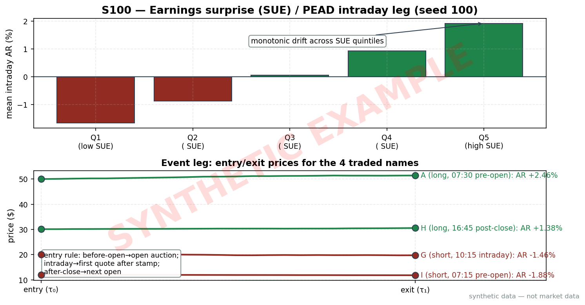

```mermaid
flowchart LR
    FEED["Earnings calendar + announcement timestamps + intraday bars"] -- "stamps + bars<br/>(event-level stamps + 1-min bars)" --> ING["Ingest + normalize<br/>(timestamp audit, bar alignment)"]
    ING -- "aligned event panel<br/>(event panel)" --> FEAT["Feature compute<br/>(SUE, announcement class, intraday AR)"]
    FEAT -- "event scores<br/>(per event, causal ≤ t)" --> SIG["Signal S100<br/>earnings surprise (SUE) / PEAD"]
    SIG -- "drift score + entry flag<br/>(event-level orders)" --> GATE{"Spread / fee / borrow /<br/>halt gates?"}
    GATE -- "pass (per event)" --> OUT["Downstream consumer<br/>(first-tradable entries — T012 / T060 / T078)"]
    GATE -- "fail" --> DROP["No entry"]
    style SIG fill:#aed6f1,stroke:#1f3a5f
```

### S12. Sources

1. Foster, George, Olsen, Chris & Shevlin, Terry (1984). "Earnings Releases, Anomalies, and the Behavior of Security Returns." *The Accounting Review* 59(4): 574–603. (Stable URL not captured this batch.)
2. Bernard, Victor L. & Thomas, Jacob K. (1989). "Post-Earnings-Announcement Drift: Delayed Price Response or Risk Premium?" *Journal of Accounting Research* 27 (Supplement). (Stable URL not captured this batch.)
3. Bernard, Victor L. & Thomas, Jacob K. (1990). "Evidence That Stock Prices Do Not Fully Reflect the Implications of Current Earnings for Future Earnings." *Journal of Accounting and Economics* 13(4): 305–340. (Stable URL not captured this batch.)
4. Ball, Ray & Brown, Philip (1968). "An Empirical Evaluation of Accounting Income Numbers." *Journal of Accounting Research* 6(2): 159–178. (Stable URL not captured this batch.)
5. Livnat, Joshua & Mendenhall, Richard R. (2006). "Comparing the Post–Earnings Announcement Drift for Surprises Calculated from Analyst and Time Series Forecasts." *Journal of Accounting Research* 44(1): 177–205. https://doi.org/10.1111/j.1475-679X.2006.00194.x
6. Sadka, Ronnie (2006). "Momentum and Post-Earnings-Announcement Drift Anomalies: The Role of Liquidity Risk." *Journal of Financial Economics* 80(3): 309–349. https://doi.org/10.1016/j.jfineco.2005.05.005
7. DellaVigna, Stefano & Pollet, Joshua M. (2009). "Investor Inattention and Friday Earnings Announcements." *Journal of Finance* 64(2): 709–749. (Stable URL not captured this batch.)

**Unverified leads** (batch-research claims without an independently checkable source this batch):
- Modern PEAD intraday implementation details (auction entry, first-quote identification) — practitioner knowledge; dedicated published sources not captured this batch.
- Benzinga calendar (~$100–200/mo), Polygon (~$30–200/mo), Databento intraday (~$200/mo + usage) per the cost model — indicative, verify before budgeting.
- Source log: Duck.ai answered Q-SB10-1–Q-SB10-3 (2026-09-10); Grok answers pending (checked 2026-09-10).

---
<!-- SIGNAL CHAPTERS APPEND BELOW -->

## Part II — Strategy deep dives (T001–T100)

## Stage 101/200 — T001: OFI + Queue-Imbalance Directional Scalper

*Batch TB1 · Strategy 1/100 · Signals S001, S003, S004*

### T1. One-line verdict

| | |
|---|---|
| **Style** | Intraday microstructure directional scalping (liquidity-taking) |
| **Edge source** | One-to-few-tick mid-price moves predicted by touch order-flow imbalance (S001) confirmed by depth-queue imbalance (S003), gated by microprice fair value (S004) |
| **Typical holding period** | Seconds (example: 8-second / 8-event time stop) |
| **Capacity hint** | Near zero for a non-colocated taker — fees consume the documented move (see T7) |
| **Build-or-buy in one line** | Build the signal stack on a bought L1 feed (Tier 2); buy nothing packaged — a "signal SaaS" cannot be audited for t→t+1 causality |

### T2. Full mechanics

**Universe & session.** 5–20 liquid, large-tick names where the touch (best bid/ask — "L1", top-of-book) is informative: large-cap Nasdaq names and liquid ETFs (SPY/QQQ/AAPL-class) with one-to-two-tick spreads and deep, stable queues. Exclude names whose median spread exceeds 3 ticks (`example`), earnings-day and halted names, and anything with unstable L1 depth. Session: RTH 09:45–15:45 ET only (`example`) — skip the first and last 15 minutes (opening-auction book, closing-imbalance effects); flat by 15:45 ET.

**Entry rule.** All quantities use the MASTER.md signal definitions. At each L1 snapshot *t* (exchange timestamp):

- Queue imbalance (S003): `I_t = (Q^b_t − Q^a_t) / (Q^b_t + Q^a_t)` from displayed best bid/ask sizes.
- OFI z-score (S001): `OFI_t = Σ_{n∈T_t} (e^b_n + e^a_n)` over the last 100 events (`example`), per-event contributions from the Cont–Kukanov–Stoikov piecewise rules; `z^OFI_t = (OFI_t − μ_OFI) / σ_OFI` with μ, σ from a trailing 15-minute EWMA (exponentially weighted moving average) baseline (`example`, causal — only events ≤ *t*).
- Microprice deviation (S004): `d_t = P^micro_t − M_t`, the learned fair-value adjustment (bin lookup `G*(X_t)`, fit on history strictly before today), in cents.

Long entry at snapshot *t*, fillable no earlier than *t+1* (causal timing: signal at *t* → earliest fill *t+1*; add wire latency on top):

1. `I_t ≥ +0.60` (`example`) **and** `z^OFI_t ≥ +1.5` (`example`) — flow (S001) and book level (S003) agree;
2. `d_t ≥ 0` — the microprice fair value does not contradict the long;
3. mid has not jumped > 1 tick in the last 5 seconds (`example`) — no chasing;
4. no existing position.

Short mirrors: `I_t ≤ −0.60`, `z^OFI_t ≤ −1.5`, `d_t ≤ 0`.

**Exit rule** — first of four fires (`example` parameters):

1. **Signal flip:** `z^OFI_t` crosses through 0 against the position, or `|I_t|` falls below 0.25 (`example`);
2. **Time stop:** 8 seconds (or 8 events on event time) after the fill (`example`) — the intended edge is one-to-few ticks, not a trend;
3. **Stop-loss:** −2 ticks against entry mid (`example`);
4. **Profit target:** +2 ticks of mid-price movement (`example`) — exit into the touch.

Flat at 15:45 ET regardless.

**Position sizing.** `N = ⌊R / |P_entry − P_stop|⌋`, `R = $200` per trade (`example`). Stop = 2 ticks ($0.02) → `N = ⌊200 / 0.02⌋ = 10,000` shares. Caps (`example`): `N ≤ min(1% of trailing 1-minute ADV, $1M notional)`.

**Risk limits.** Daily loss stop −$2,000 (`example`, then dark for the day); max gross $1M notional (`example`); per-name heat ≤ $250k (`example`). Kill-switch: feed heartbeat missed > 2 s, book sequence gap, clock skew > 50 ms vs NTP, or any exit timer firing late — flatten everything immediately (paper ledger is source of truth; never recover a live paper position from RAM after a crash).

**Cost model** (applied in T4): round-trip commission $0.005/share each way ($0.01 RT/share); spread cost = half-spread on entry and exit (aggressive take); no slippage beyond that, no rebate, no borrow fee. Same illustrative convention Grok used for Q-TB1-1 (see T10 source log).

**Order/execution sketch.** Marketable limit orders at the touch: buy the ask, sell the bid. Participation cap: each child ≤ 10% of visible touch depth (`example`). Queue-position honesty: any claim about passive queue position is `simulated only — requires MBO/ITCH` (market-by-order data identifying individual orders; L1/MBP-1 aggregates cannot prove queue priority). This strategy is a taker (aggressive) by design — it does not earn maker (passive, rebate-earning) rebates.

### T3. Signals it consumes

| Signal | Role | Combination logic |
|---|---|---|
| S001 OFI z-score | **Primary trigger** (direction + timing) | `z^OFI_t ≥ +1.5` (`example`) for longs; exit flip when it crosses 0 |
| S003 queue imbalance | **Confirmation filter** | `I_t ≥ +0.60` (`example`); both must agree — flow and level, the "movie" and the "snapshot" |
| S004 microprice deviation | **Fair-value veto** | enter only if `d_t = P^micro_t − M_t` has the same sign as the trade; never fade the learned fair value |

```
# T001 combination logic (≤25 lines; every threshold `example`)
on each L1 snapshot t (exchange time, causal):
    I   = (qb - qa) / (qb + qa)                     # S003
    ofi = sum(e_b + e_a over last 100 events)       # S001 window
    z   = (ofi - mu_ofi) / sd_ofi                   # 15-min EWMA baseline
    dev = microprice(state_t) - mid                 # S004, cents
    if flat and I >= 0.60 and z >= 1.5 and dev >= 0 \
       and mid_jump_5s <= 1 tick:
        buy at t+1 (lift ask)                       # LONG
    elif flat and I <= -0.60 and z <= -1.5 and dev <= 0 \
       and mid_jump_5s <= 1 tick:
        sell at t+1 (hit bid)                       # SHORT
    if long:
        exit at t+1 if z < 0 or I < 0.25 \
            or age > 8 s or mid <= entry_mid - 2 ticks
    # short mirrors; flat 15:45 ET
    N = floor(200 / 0.02)                           # dollar-risk sizing
    veto if N * price > 1M or N > 1% of 1-min ADV
```
### T4. Worked example — numbers + P&L (SYNTHETIC)

**All numbers synthetic** (random seed 101, `batches/TB1/plot_T001.py` — re-runnable). Fictional large-tick name "QXL" at ~$50.00, tick $0.01, spread 1 tick. R = $200 (`example`) → N = 10,000 shares per trade. Costs: $0.01/share RT commission; half-spread per aggressive leg embedded in fills; no slippage beyond the spread, no rebate. Each trade's `I_t`, `z^OFI_t`, and `d_t` satisfy the T2 entry rules.

| # | Dir | I_t | z^OFI_t | d_t (¢) | Entry fill | Exit fill | Shares | Gross $ | Comm $ | Net $ | Exit reason |
|---|---|---|---|---|---|---|---|---|---|---|---|
| 1 | Long | +0.72 | +2.1 | +0.3 | 50.010 | 50.030 | 10,000 | +200.00 | −100.00 | **+100.00** | target +2 ticks |
| 2 | Short | −0.68 | −1.9 | −0.2 | 50.030 | 50.010 | 10,000 | +200.00 | −100.00 | **+100.00** | target +2 ticks |
| 3 | Long | +0.65 | +1.7 | +0.1 | 50.010 | 49.990 | 10,000 | −200.00 | −100.00 | **−300.00** | 2-tick stop |
| 4 | Long | +0.61 | +1.6 | +0.2 | 50.020 | 50.030 | 10,000 | +100.00 | −100.00 | **0.00** | signal flip |
| 5 | Short | −0.63 | −1.8 | −0.1 | 50.040 | 50.040 | 10,000 | 0.00 | −100.00 | **−100.00** | time stop, flat |
| 6 | Long | +0.70 | +2.0 | +0.4 | 50.000 | 50.025 | 10,000 | +250.00 | −100.00 | **+150.00** | time stop +2.5 |

Line-by-line walk. **Trade 1:** buy 10,000 at the ask 50.010 (mid 50.005, so $0.005/share half-spread is embedded). Mid ticks up; sell 10,000 at the bid 50.030 (mid 50.025). Gross = 10,000 × 0.020 = +$200.00; commission = 10,000 × $0.01 = −$100.00; **net = +$100.00.** **Trade 3 (the loser):** stop fires at 49.990; gross = 10,000 × (49.990 − 50.010) = −$200.00; commission −$100.00; **net = −$300.00** — a 2-tick adverse move costs 1.5× the $200 risk budget because the $100 commission stack rides on top.

Totals: gross +$550.00, commissions −$600.00, **net −$50.00** over 6 trades. The chart `images/T001_example.png` plots this exact walk: synthetic mid segments with entry/exit markers (top) and cumulative net P&L with per-trade annotations (bottom).

**Where the example is optimistic.** (1) Fills assumed at the touch on every exit — no partial fills, quote flicker, or adverse selection on the exit leg. (2) Spread a constant 1 tick; real books widen exactly when flow is most one-sided. (3) Zero latency — signal at *t*, fill at *t+1* with no wire delay; a home-Mac SIP (Securities Information Processor — the consolidated public quote tape) feed adds tens of milliseconds this arithmetic ignores. (4) Grok's own worked example (Q-TB1-1) showed the baseline: a 1-tick scalp nets **$0.00** after $0.01/share fees on 10,000 shares — this sleeve only clears costs when it captures more than one tick, gets queue position/rebate, or pays lower fees. The net −$50 day is the honest shape: costs, not signals, usually decide.

### T5. Data & infra — what must run

**Pipeline inventory.** Feed ingest (09:15–16:05 ET): L1/MBP-1 (market-by-price, top level) quote events with exchange timestamps into ring buffers, heartbeat watchdog every 1–2 s. Feature loop (09:45–15:45): per-symbol touch state, OFI event-window aggregator (last 100 events, `example`), per-event `I_t`, EWMA μ/σ of OFI, microprice bin lookup from the pre-fit `G*` table. Signal→order bridge: signal stamped at snapshot *t*, paper order queued for *t+1* — causal only. Paper broker + ledger persisted to disk (JSONL). Shared services: NYSE calendar, halt flags, DST handling, reference data, risk caps, structured logs.

**M5 Max feasibility: feasible (with the feed as the real constraint).** Throughput (`notes/cost-model.md` §2): a Python event loop does ~100–500k events/sec; 10 liquid names × ~100–2,000 L1 events/sec is trivially inside that; Rust (5–50M/sec) is only needed past ~20 symbols or for raw ITCH decode. RAM (§3): 200–800 MB hot state for 10 names on MBP-1 — far under the 77 GB budget; recording raw MBO for replay runs 2–8 GB. Storage (§4): 5–30 GB/day recording MBO; 0.5–2 GB/day for features + decisions only. Engineering time: Tier M+ (`cost-model.md` §5) — **40–100 h** ≈ $6,000–15,000 loaded-cost estimate at $150/hr; the event-rule correctness is the bulk of the work. Bottleneck: feed latency and timestamp quality, not compute.

**Feed-outage safe mode.** Missed heartbeat > 2 s (`example`) or a sequence-number gap → **flatten immediately, freeze new entries, tag DEGRADED**. Never interpolate OFI across a gap — a stale book manufactures a false `I_t`. Resume after a full snapshot rebuild plus 30 s of clean sequence numbers (`example`). If only SIP L1 remains (direct feed down): T001 is **off** — queue races on SIP timestamps are `simulated only — requires MBO/ITCH`. Local process crash: restart flat; the on-disk ledger is the source of truth, never RAM.

### T6. Buy vs build

| Option | What you get | Indicative price | Gains | Loses |
|---|---|---|---|---|
| Tier 0: delayed quotes / Alpaca IEX | free L1, 15-min delay | ~$0 — *indicative — verify before budgeting* | $0 prototype | no live signal |
| Tier 1 retail: QuantConnect paper (SIP equity stream) | paper host + SIP bars | ~$60–300/mo tiers — *indicative — verify before budgeting* | easy paper ledger | SIP stream cannot honestly implement touch OFI — cargo-cult T001 |
| Tier 1: Massive/Polygon Stocks Advanced (SIP real-time) | real-time SIP trades+quotes | ~$199/mo — *indicative — verify before budgeting* | cheap live data | SIP timestamps; latency-sensitive work is *simulated only* |
| Tier 2: Databento MBP-1 / Nasdaq TotalView MBO | exchange-timestamped L1/depth, live in paid plans | plan ~$1.5k–4k/mo class + license pass-through — *indicative — verify before budgeting* | honest event order, real queue dynamics | TotalView non-display licensing is the surprise bill even for paper |
| No-code (Composer-style) | drag-drop strategies | ~$10–50/mo class — *indicative — verify before budgeting* | nothing to build | cannot express OFI/queue logic — skip |

**Verdict: buy the feed, build the analytics.** OFI + queue imbalance is ~100 lines on data you already hold for S001; the value is your normalization, windows, thresholds, and lead-lag calibration — none of which any vendor sells. Crossover: for statistical honesty on a handful of large-tick names, Databento live MBP-1 (or TotalView MBO) on 5–10 symbols at ~$2k–6k/mo all-in is the honest Phase-1 spend (Grok Q-TB1-2). Below that, run T001 as a *research* harness on SIP — never present SIP fills as executable edge.

### T7. Success-ratio evidence

The literature measures **prediction, not after-cost P&L** — that distinction is the whole story of T001.

| Study / source | Market & period | Metric | Before/after cost | Caveat |
|---|---|---|---|---|
| Cont, Kukanov & Stoikov (2014) | 50 S&P 500 names, NYSE TAQ, Apr–Jun 2010 | linear Δmid = β·OFI; slope ∝ 1/(2·depth); OFI dominates trade imbalance | before-cost; **contemporaneous impact, not a delayed fill** | no forward P&L, no Sharpe |
| Gould & Bonart (2015/2016) | 10 Nasdaq names, LOB data | logistic I → next-mid direction: strongly significant; "considerable improvement" over null on large-tick names | before-cost (classification, not P&L) | direction only; no trading rule, no costs |
| Imbalance-taker fee study (2025, per Grok Q-TB1-3) | microstructure sample, ~15 s holds, 18,927 trades | taker profitable before fees (~+1 bp/round-trip), **negative after taker fee** (post-fee mean ≈ −2.0, units unverified — see Unverified leads) | after-fee | chatbot-sourced numbers |
| Lipton, Pesavento & Sotiropoulos (2013, per Grok) | equities LOB | expected mid move given imbalance typically well below one spread | qualitative | "not a straightforward statistical arbitrage" |

Capacity: a taker OFI scalp has near-zero capacity once more than a few lots hit the touch — every colocated market maker sees the same public `I_t`, and the documented mid move is a fraction of the spread. Decay: the CKS contemporaneous relation is stable as physics; the *tradable* residue decays with every microsecond of latency you concede.

**Honest bottom line.** For a ≤$1M paper operation: T001 as a standalone directional book has **no documented positive after-cost edge** — the papers show OFI and queue imbalance *predict* the next tick, and the one fee-inclusive study Grok surfaced shows the taker version losing after fees. The honest institutional use of S001/S003 is defensive: an adverse-selection filter for quoting — "when not to get filled" — not a standalone taker book. A $1M paper account backtesting T001 on SIP fills is measuring its own latency fantasy, not alpha.

### T8. Failure modes

1. **Contemporaneous ≠ forward.** Trading the CKS regression as if it were a forward rule. Mitigation: forward-shift one event in all research; report lead-lag R², never contemporaneous R².
2. **Latency illusion on SIP.** Your `I_t` print arrives after the queue race is over; a backtest that fills at the signal-bar touch is invalid. Mitigation: label all SIP work `simulated only — requires MBO/ITCH`; add measured wire latency to the cost model.
3. **Spoofed / fleeting queues.** Displayed size cancels before your marketable order arrives. Mitigation: down-weight sub-50 ms quote lifetimes (`example`); require OFI *and* imbalance to agree (the T001 design).
4. **Cost blowup.** Spread + $0.01/share RT fees on sub-second round trips — the T4 day nets −$50 with a 3-2-1 win/loss/flat record. Mitigation: per-trade bps budget; fee-covering entry threshold κ on `|I_t|`; prefer the maker variant (T022) over taking.
5. **Lookahead leakage / overfit thresholds.** Computing the signal from the post-move snapshot, filling inside the signal bar, or mining κ = 0.60 / z = 1.5 on one month's microstructure. Mitigation: strict event-*t* → trade-*t+1* causality audit; walk-forward calibration with shrinkage and purged/embargoed validation (S088).
6. **Regime breaks / depth collapse.** In stress, depth evaporates and the linear ΔP ≈ OFI/(2D) model misprices impact; spreads widen past the 3-tick gate. Mitigation: depth/vol-conditioned scaling; stand down on a spread-multiple trip; a VPIN (volume-synchronized probability of informed trading — the S008 toxicity gauge) veto.
7. **Feed outage / stale book.** A torn book prints a confident false `I_t`. Mitigation: the T5 safe-mode plan — flatten on heartbeat miss, no interpolation, 30 s of clean sequence before re-arming.

### T9. Visuals

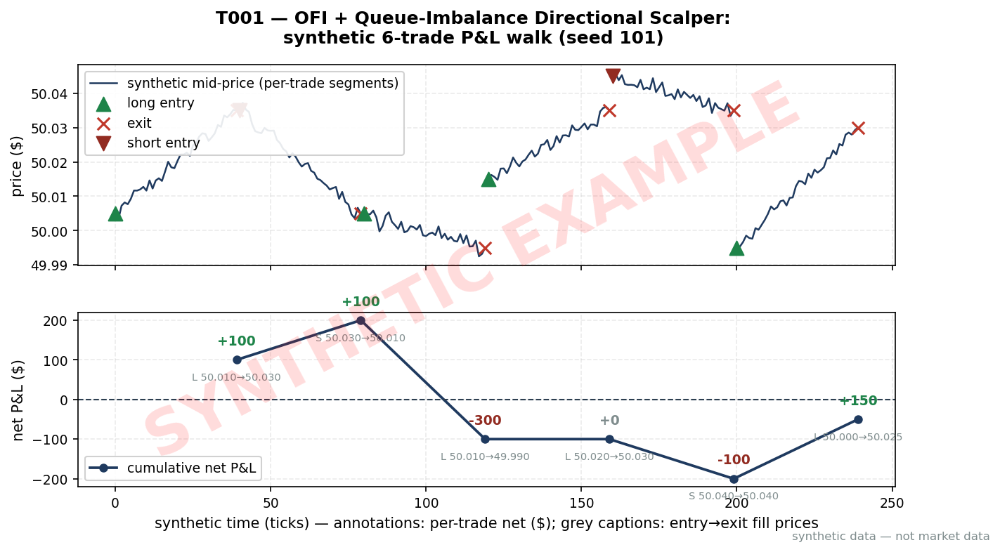

```mermaid
flowchart TD
    DATA["Market data\n(L1 touch, exchange ts)"] -->|L1 quote events| SIGS["Signals\nS001 OFI z, S003 queue imb, S004 microprice"]
    SIGS -->|1-s event bars| ENTRY{"Entry logic\nI ≥ 0.6 AND z ≥ 1.5 AND dev ≥ 0\nsignal at t → fill at t+1"}
    ENTRY -->|trigger| SIZE["Sizing + risk\nN = R/stop; daily loss stop; kill switch"]
    ENTRY -->|no trigger| WAIT["Wait"]
    SIZE -->|L1 events| EXEC["Execution\ntake at touch, ≤10% visible depth"]
    EXEC -->|tick events| MON["Monitor + exits\nflip / 8-s time stop / 2-tick stop / +1-tick target"]
    MON -->|fills + fees| PNL["P&L (net of costs)"]
    style ENTRY fill:#f9e79f,stroke:#7d6608
    style PNL fill:#a9dfbf,stroke:#1e8449
```

### T10. Sources

1. Cont, R., Kukanov, A. & Stoikov, S. (2014). "The Price Impact of Order Book Events." *Journal of Financial Econometrics* 12(1): 47–88. arXiv:1011.6402 — https://arxiv.org/abs/1011.6402 (canonical OFI definition and contemporaneous impact regression; the S001 [D] source — not a forward trading rule).
2. Gould, M. D. & Bonart, J. (2016). "Queue Imbalance as a One-Tick-Ahead Price Predictor in a Limit Order Book." arXiv:1512.03492 — https://arxiv.org/abs/1512.03492 (published *Market Microstructure and Liquidity* 2(2): 1–35; logistic I → next-mid direction, "considerable improvement" over null for large-tick names — the S003 [D] source).
3. Stoikov, S. (2018). "The micro-price: a high-frequency estimator of future prices." *Quantitative Finance* 18(12): 1959–1966 — https://ideas.repec.org/a/taf/quantf/v18y2018i12p1959-1966.html (learned fair-value estimator used as the S004 fair-value veto; better short-term predictor than mid or weighted mid — prediction, not after-cost P&L).

**Source log.** Grok answered Q-TB1-1..3 (2026-09-10); all claims independently verified or labeled unverified. T2 mechanics, the cost convention, time stop, risk budget, and the Q-TB1-3 evidence table are adapted from Grok's TB1 answers; every numeric threshold is marked `example`, and chatbot-only numbers are segregated below, never promoted to documented facts.

**Unverified leads** (chatbot-only — never in Sources):
- Grok Q-TB1-3: Cont–Kukanov–Stoikov "mean R² ≈ 65%, OFI beats trade imbalance (R² ≈ 32%)" — no checkable source captured; unverified chatbot claim.
- Grok Q-TB1-3: Gould–Bonart "P(up | I ≈ 1) ≈ 0.8–0.9 large-tick, 0.6–0.7 small-tick" — same status; the verified claim is the S003 wording ("considerable improvement over null for large-tick").
- Grok Q-TB1-3: 2025 imbalance-taker study — "pre-fee ~+1 bp per round-trip; post-fee mean ≈ −2.0 (units not rendered), ~15 s holds, 18,927 trades" — units and venue unverified; used only as a cautionary lead.
- Grok Q-TB1-3: Lipton–Pesavento–Sotiropoulos (2013) "expected mid move given imbalance well below one spread" — not independently verified; plausible practitioner summary, kept as a lead.
- Grok Q-TB1-2: retail/platform pricing (QuantConnect ~$60–300/mo tiers, Databento plan ~$1.5k–4k/mo class, TotalView license pass-through) — vendor bands, `indicative — verify before budgeting`.

---


## Stage 102/200 — T002: Microprice Fair-Value Scalper

*Batch TB1 · Strategy 2/100 · Signals S004, S006, S014*

### T1. One-line verdict

| | |
|---|---|
| **Style** | Intraday fair-value scalping (liquidity-taking, mean-reversion to a learned fair price) |
| **Edge source** | Transient deviations of the mid-price from Stoikov's learned microprice fair value, confirmed by signed volume delta and gated by measured spread costs |
| **Typical holding period** | Seconds (example: 5–10 s time stop) |
| **Capacity hint** | Small — per-event edge is a fraction of the spread; survives only where the deviation is wide relative to the measured effective spread |
| **Build-or-buy in one line** | Build on the S001/S003 feed you already own; buy only the exchange-timestamped L1 feed — the microprice fit and the spread-decomposition gate are yours to calibrate |

### T2. Full mechanics

**Universe & session.** 3–10 liquid large-tick names with stable, visible books and 1-tick spreads most of the session (same hunting ground as T001). Exclude earnings days, halts, and any name whose trailing effective spread exceeds 2× its median (`example`). Session 09:45–15:45 ET (`example`), RTH only, flat by 15:45.

**Entry rule.** At each L1 snapshot *t* (exchange time):

- Microprice deviation (S004, **primary trigger**): `d_t = P^micro_t − M_t`, where `P^micro_t = M_t + G*(X_t)` is Stoikov's learned fair value (the limiting expected mid-price conditional on the book state, estimated from discretized (imbalance, spread) transition matrices fit on history strictly before today) and `M_t` is the mid-price. Enter when `|d_t| ≥ κ` with `κ = 0.25 × spread` (`example` — never trade inside the noise of your own fair-value estimate).
- Volume-delta confirmation (S006): signed trade imbalance `TI_t = Σ ε_i V_i` over the trailing 5 minutes (`example`) — each trade's sign ε_i from the quote rule (trade price vs the prevailing NBBO — national best bid and offer — quote; tick-rule fallback on no-quote tapes) — normalized to `Δ_t` and z-scored against the trailing 50 windows (`example`): require `z^Δ_t ≥ +1.0` for longs, `≤ −1.0` for shorts (`example`). The delta confirms that aggressive flow is *pushing with* the deviation, not against it — you trade *toward* fair value only when the tape agrees the deviation is transient noise, not information.
- Spread-decomposition cost gate (S014): compute the trailing 5-minute (`example`) average **effective spread** `S̄^e = 2·D_t·(P_t − M_t)` (what the aggressor actually paid vs the mid, per trade, dollar-weighted). Trade only if the measured cost is covered twice over by *that trade's* deviation: `S̄^e ≤ 2·|d_t|` (`example`) — a fixed gate on κ alone would veto everything on a 1-tick name, so the gate is per-trade.

Long entry (signal at *t*, fillable no earlier than *t+1* — causal timing; add wire latency on top):

1. `d_t ≥ +κ` (microprice fair value *above* the mid — buy the cheap side);
2. `z^Δ_t ≥ +1.0` (`example`) — buy-side aggressive flow confirms;
3. `S̄^e ≤ 2·|d_t|` (`example`) — the per-trade cost gate passes;
4. no existing position; mid has not moved > 1 tick against the deviation in the last 5 s (`example`).

Short mirrors: `d_t ≤ −κ` (microprice fair value *below* the mid — sell the rich side), `z^Δ_t ≤ −1.0`.

**Exit rule** — first of four fires (`example` parameters):

1. **Fair-value convergence:** `d_t` crosses through 0 (mid has reached the microprice) — take the fill at the touch;
2. **Time stop:** 10 s after fill (`example`) — the S004 chapter's guidance (deviation mean-reverts away if you wait);
3. **Stop-loss:** 1 spread-width against entry mid (`example`);
4. **Delta flip:** `z^Δ_t` crosses 0 against the position — the confirming flow evaporated.

**Position sizing.** Vol-targeting with a fixed dollar risk: `N = ⌊R / stop_width⌋`, `R = $50` (`example`), stop = 1 spread ($0.01) → `N = 5,000` shares. Smaller `R` than T001 deliberately: the per-trade edge here is thinner, so the risk budget is too. Caps (`example`): `N ≤ min(1% of 1-min ADV, $500k notional)`.

**Risk limits.** Daily loss stop −$1,000 (`example`); max gross $500k notional (`example`); kill-switch on feed heartbeat miss > 2 s (`example`), book sequence gap, or clock skew > 50 ms (`example`) — flatten immediately, ledger on disk is truth.

**Cost model** (applied in T4): $0.005/share each way ($0.01 RT); spread cost = half-spread per aggressive leg, embedded in fills; no slippage beyond that, no rebate. The S014 gate additionally *measures* realized effective spread intraday and disables the strategy if it drifts above the gate — costs are a live input, not a static assumption.

**Order/execution sketch.** Marketable limits at the touch (taker). Participation ≤ 10% of visible depth (`example`). Queue-position honesty: any passive-fill-rate claim is `simulated only — requires MBO/ITCH`.

### T3. Signals it consumes

| Signal | Role | Combination logic |
|---|---|---|
| S004 microprice deviation | **Primary trigger** | enter long iff `d_t = P^micro_t − M_t ≥ +κ` (`κ = 0.25 × spread`, `example`); exit when `d_t` crosses 0 |
| S006 volume delta | **Confirmation filter** | `z^Δ_t ≥ +1.0` (`example`) for longs — aggressive flow must agree the deviation is noise |
| S014 spread decomposition | **Cost gate (veto)** | trade only if `S̄^e ≤ 2·|d_t|` per trade (`example`); live-disable if measured costs exceed the edge |

```
# T002 combination logic (≤25 lines; every threshold `example`)
on each L1 snapshot t (exchange time, causal):
    dev = microprice(state_t) - mid_t              # S004, cents
    dz  = zscore(signed_volume_delta(5 min))       # S006
    ecost = trailing_mean(effective_spread, 5 min) # S014
    kappa = 0.25 * spread_t
    if flat and dev >= +kappa and dz >= 1.0 and ecost <= 2*abs(dev):
        buy at t+1 (lift ask)                      # LONG toward fair value
    elif flat and dev <= -kappa and dz <= -1.0 and ecost <= 2*abs(dev):
        sell at t+1 (hit bid)                      # SHORT toward fair value
    if long:
        exit at t+1 if dev >= 0 or dz < 0 \
            or age > 10 s or mid <= entry_mid - 1 spread
    # short mirrors; flat 15:45 ET
    N = floor(50 / 0.01)                           # dollar-risk sizing
```

### T4. Worked example — numbers + P&L (SYNTHETIC)

**All numbers synthetic** (random seed 102, `batches/TB1/plot_T002.py`). Fictional large-tick name "QXL" at ~$80.00, tick $0.01. R = $50 (`example`) → N = 5,000 shares. Costs: $0.01/share RT commission; half-spread per aggressive leg embedded in fills.

| # | Dir | d_t (¢) | z^Δ_t | S̄^e (¢) | Entry fill | Exit fill | Shares | Gross $ | Comm $ | Net $ | Exit reason |
|---|---|---|---|---|---|---|---|---|---|---|---|
| 1 | Long | +0.6 | +1.4 | 1.0 | 80.010 | 80.025 | 5,000 | +75.00 | −50.00 | **+25.00** | convergence |
| 2 | Long | +0.6 | +1.1 | 1.2 | 80.015 | 80.020 | 5,000 | +25.00 | −50.00 | **−25.00** | delta flip |
| 3 | Short | −0.7 | −1.6 | 1.0 | 80.020 | 80.008 | 5,000 | +60.00 | −50.00 | **+10.00** | convergence |
| 4 | Long | +0.6 | +1.2 | 1.1 | 80.010 | 80.002 | 5,000 | −40.00 | −50.00 | **−90.00** | 1-spread stop |
| 5 | Short | −0.6 | −1.3 | 1.0 | 80.025 | 80.015 | 5,000 | +50.00 | −50.00 | **0.00** | time stop |
| 6 | Long | +0.8 | +1.8 | 0.9 | 80.005 | 80.020 | 5,000 | +75.00 | −50.00 | **+25.00** | convergence |

Line-by-line walk (trade 1): microprice prints 80.016 against a mid of 80.010 (`d_t = +0.6¢`, beyond the `κ = 0.25¢` example threshold); buy-side delta z = +1.4 confirms; per-trade cost gate: 2 × |d_t| = 1.2¢ ≥ S̄^e = 1.0¢ → passes. (Note the gate must be per-trade: a fixed κ-gate of 2κ = 0.5¢ would veto every trade on this 1-tick name, since measured effective spread is ~1¢ — the gate has to scale with the deviation it is buying.) Buy 5,000 at the ask 80.010; mid converges to the microprice; sell 5,000 at the bid 80.025. Gross = 5,000 × 0.015 = +$75.00; commission = 5,000 × $0.01 = −$50.00; **net = +$25.00.**

Trade 4 (the loser): deviation confirmed, but the move is information not noise — the stop fires one spread against at 80.002. Gross = 5,000 × (80.002 − 80.010) = −$40.00; commission −$50.00; **net = −$90.00** — the stop loss is 0.8R in price but 1.8R after fees.

Totals: gross +$245.00, commissions −$300.00, **net −$55.00** over 6 trades. The chart `images/T002_example.png` plots this exact walk.

**Where the example is optimistic.** (1) The microprice fit is assumed pre-fit and stationary; in reality `G*` drifts with the book regime and the "learned" adjustment decays — the example never pays re-fit error. (2) Every exit fills at the touch; no partial fills, no spread widening at the moment of maximum deviation (when spreads are widest, deviations are largest — the gate helps but cannot see the future). (3) The delta confirmation is assumed causal and clean; tick-rule/quote-rule misclassification on fast tapes is real (S006/S007). (4) Latency zero. The net −$55 day is, again, the honest shape: commissions ($300) exceed gross capture ($245) — a fair-value edge measured in tenths of a cent per share needs either wider deviations or cheaper fees to survive.

### T5. Data & infra — what must run

**Pipeline inventory.** Feed ingest (09:15–16:05 ET): L1/MBP-1 with exchange timestamps; ring buffers; 1–2 s heartbeat watchdog. Feature loop (09:45–15:45): per-symbol touch state, microprice bin lookup (pre-fit `G*` table loaded at 09:00 — **never** fit on the live window), 5-minute signed-volume-delta z-score (quote-rule signing where NBBO exists), trailing effective-spread meter (S014, dollar-weighted). Signal→order bridge: stamp at snapshot *t*, paper order for *t+1*. Paper broker + ledger persisted to disk. Overnight batch (16:30–18:00): re-fit the microprice transition matrices on the day's quotes (symmetrized per Stoikov Thm 3.1), recompute spread baselines — never intraday.

**M5 Max feasibility: feasible.** Throughput (`notes/cost-model.md` §2): the per-event work is a bin lookup plus rolling sums — a Python loop at ~100–500k events/sec covers ≤10 symbols; polars batch recompute is trivial. RAM (§3): hot state < 1 GB; the overnight fit holds ~1 day of L1 per symbol (0.5–4 GB) — fine inside the 77 GB budget. Storage (§4): 0.5–2 GB/day for features + decisions (raw MBO only for calibration windows: 5–30 GB/day). Engineering: Tier M+ (`cost-model.md` §5) — **40–100 h** ≈ $6,000–15,000 loaded-cost estimate; the microprice fit is the long pole, roughly half the band. Bottleneck: quote-history depth and timestamp hygiene, not CPU.

**Feed-outage safe mode.** Heartbeat miss > 2 s or sequence gap → **flatten, freeze entries, tag DEGRADED**. A stale book makes `d_t` a museum piece — do not trade a deviation computed from a torn snapshot. Resume after full snapshot rebuild + 30 s clean sequence. If only SIP (Securities Information Processor — the consolidated public quote tape) L1 remains: T002 is **off** — microprice deviations on SIP timestamps are `simulated only — requires MBO/ITCH`. Overnight fit failure → T002 stays dark the next day (stale `G*` is worse than none). Crash: restart flat, ledger from disk.

### T6. Buy vs build

| Option | What you get | Indicative price | Gains | Loses |
|---|---|---|---|---|
| Tier 0: delayed quotes | free L1, 15-min delay | ~$0 — *indicative — verify before budgeting* | $0 fit prototype | no live deviation |
| Tier 1: Massive/Polygon SIP | real-time SIP L1 | ~$199/mo — *indicative — verify before budgeting* | cheap | SIP deviation is *simulated only — requires MBO/ITCH* |
| Tier 2: Databento MBP-1 | exchange-timestamped L1 | ~$200/mo + usage — *indicative — verify before budgeting* | honest timestamps for the fit and the trigger | usage meter on wide universes |
| Tier 2/3: TotalView MBO / LOBSTER replay | full order-level replay | academic ~hundreds/yr; live TotalView $1.5k–4k/mo class + licenses — *indicative — verify before budgeting* | true queue dynamics for calibration | overkill for paper |
| "Fair-value signal" SaaS | black-box deviation feed | varies — *indicative — verify before budgeting* | none auditable | you cannot verify their fit window, symmetrization, or t→t+1 causality — skip |

**Verdict: build the estimator, buy the feed.** The microprice is a small batch fit plus a per-event table lookup (S004) — ~50 lines once the L1 plumbing exists — and its value is entirely in *your* binning, estimation window, and symmetrization choices. The spread-decomposition gate is arithmetic on your own tape. Buy Databento MBP-1 history to fit honestly and a Tier-1/2 live feed for paper; buy nothing that claims to sell you "fair value" as a product.

### T7. Success-ratio evidence

| Study / source | Market & period | Metric | Before/after cost | Caveat |
|---|---|---|---|---|
| Stoikov (2018) | BAC/CVX, March 2011, high-frequency quotes | microprice a better predictor of short-term prices than mid or weighted mid | before-cost (prediction, not P&L) | two names, one month |
| Cont, Kukanov & Stoikov (2014) | 50 S&P 500, NYSE TAQ 2010 | OFI-based impact: slope ∝ 1/(2·depth) — the depth denominator this strategy's sizing respects | before-cost; contemporaneous | supports the mechanics, not the P&L |
| Huang & Stoll (1997) | spread decomposition | quoted spread splits into order-processing, inventory, and adverse-selection components | measurement, not a strategy | the S014 gate's intellectual basis |
| Roll (1984) | implicit spread from price covariance | quote-free spread estimate | measurement | fallback cost gate when quotes are unavailable (S012) |

No paper in the verified set reports an after-cost Sharpe for a microprice-deviation *taker* strategy — the documented result is a better *predictor*, and the S004 chapter's own warning stands: the learned adjustment is roughly a fifth of the naive cross-weighted baseline (0.076¢ vs 0.375¢ at the extreme bin in the synthetic fit) — the edge per event is a fraction of a fraction of the spread. Capacity: minuscule for a taker; the natural institutional home of the microprice is *quoting* (T021/T085 center quotes on it), where the edge is adverse-selection avoided rather than ticks captured.

**Honest bottom line.** For a ≤$1M paper operation: T002 is a research-grade fair-value toy with real econometric pedigree and no documented after-cost taker P&L. Its honest use is as a quoting anchor and cost-measurement discipline (the S014 gate is this chapter's most valuable part). Do not size it like T001 — even the deliberate $50 risk budget loses to commissions in the synthetic walk.

### T8. Failure modes

1. **Deviation is information, not noise.** The microprice assumes the deviation mean-reverts; when flow is informed, the mid walks *through* fair value and the "cheap" buy is just early. Mitigation: the S006 delta veto — never fade a deviation that aggressive flow is pushing wider; the T4 trade-4 loss is this failure priced.
2. **Stale fit / regime drift.** `G*` fit on last month's book misprices this month's; symmetrization assumptions break. Mitigation: overnight re-fit only (never intraday), fit-quality dashboard (transition-count sparsity, eigenvalue check), dark-day rule if the fit fails.
3. **Spread widening at maximum deviation.** Deviations are largest exactly when liquidity is thinnest; the gate measured on trailing averages lags. Mitigation: gate on the *current* quoted spread too (hard veto above 2 ticks, `example`); the per-trade `S̄^e ≤ 2·|d_t|` form from T4.
4. **Misclassification in the delta.** Quote-rule/tick-rule signing errors on fast tapes corrupt `z^Δ_t`. Mitigation: exchange aggressor flags where available; robustness check with tick-rule signing (the S008 tick-rule-VPIN lesson: the classification choice flips behavior).
5. **Latency illusion on SIP.** Deviation computed on SIP timestamps is stale by construction. Mitigation: `simulated only — requires MBO/ITCH` label; never fill a live deviation off SIP.
6. **Lookahead in the fit.** Fitting `G*` on windows that include the evaluation period manufactures a backtest miracle. Mitigation: strict fit-before-evaluate split; purged/embargoed validation (S088).
7. **Cost-model optimism.** Static half-spread assumptions vs the S014-measured reality; the T4 walk shows commissions alone (−$300) beating gross (+$245). Mitigation: the live S014 meter *disables* the strategy when measured costs exceed the edge — the gate is a kill switch, not a decoration.

### T9. Visuals

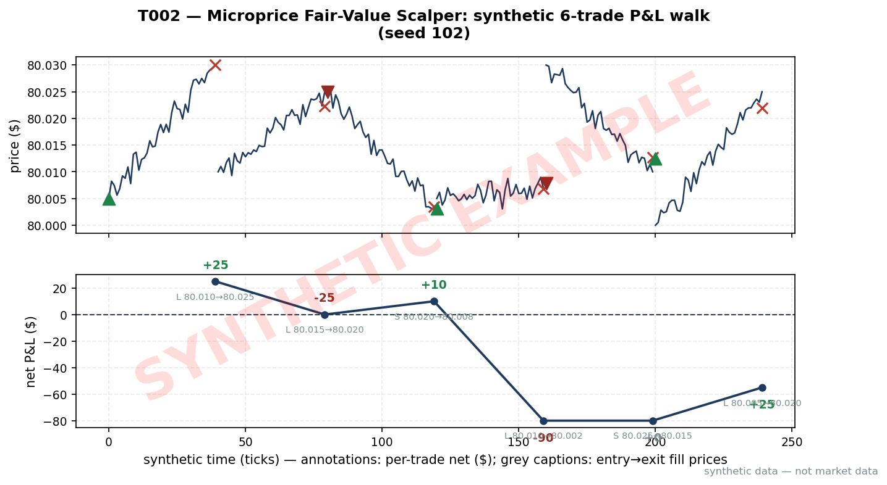

```mermaid
flowchart TD
    DATA["Market data\n(L1 touch, exchange ts)"] -->|L1 quote events| SIGS["Signals\nS004 microprice dev, S006 vol delta, S014 eff. spread"]
    SIGS -->|1-s event bars| ENTRY{"Entry logic\n|dev| ≥ 0.25×spread AND delta z ≥ 1\nAND eff.spread ≤ 2×|dev|\nsignal at t → fill at t+1"}
    ENTRY -->|trigger| SIZE["Sizing + risk\nN = R/stop; daily loss stop"]
    ENTRY -->|no trigger| WAIT["Wait"]
    SIZE -->|L1 events| EXEC["Execution\ntake at touch, ≤10% visible depth"]
    EXEC -->|tick events| MON["Monitor + exits\nconvergence / 10-s stop / 1-spread stop"]
    MON -->|fills + fees| PNL["P&L (net of costs)"]
    style ENTRY fill:#f9e79f,stroke:#7d6608
    style PNL fill:#a9dfbf,stroke:#1e8449
```

### T10. Sources

1. Stoikov, S. (2018). "The micro-price: a high-frequency estimator of future prices." *Quantitative Finance* 18(12): 1959–1966. DOI: 10.1080/14697688.2018.1489139 — https://ideas.repec.org/a/taf/quantf/v18y2018i12p1959-1966.html (the S004 [D] source: learned fair-value estimator; better short-term predictor than mid/weighted mid — prediction, not after-cost P&L).
2. Huang, R. D. & Stoll, H. R. (1997). "The Components of the Bid-Ask Spread: A General Approach." *Review of Financial Studies* 10(4): 995–1034 — https://ideas.repec.org/a/oup/rfinst/v10y1997i4p995-1034.html (three-component spread decomposition behind the S014 cost gate: order-processing, inventory, adverse selection).
3. Roll, R. (1984). "A Simple Implicit Measure of the Effective Bid-Ask Spread in an Efficient Market." *Journal of Finance* 39(4): 1127–1139 — https://doi.org/10.2307/2327617 (quote-free effective-spread estimate; the S012 fallback when quotes are unavailable).

**Source log.** Grok answered Q-TB1-1..3 (2026-09-10); all claims independently verified or labeled unverified. Grok's TB1 Q&A covered T001 (strategy A) directly; T002's mechanics here are composed from the verified MASTER.md signal chapters S004/S006/S014 (formulas carried forward unchanged) plus the shared Q-TB1-2 infra and cost conventions. No Grok performance number is presented as a documented fact about T002.

**Unverified leads** (chatbot-only — never in Sources):
- Grok Q-TB1-2: Tier-1/2 feed pricing bands (Massive/Polygon ~$199/mo, Databento ~$200/mo + usage, TotalView $1.5k–4k/mo class) — `indicative — verify before budgeting`.
- Grok Q-TB1-2: engineering-hour slices (feed client 30–60 h, strategy harness 40–100 h) — planning estimates, folded into the cost-model §5 band used in T5.
- General TB1 caveat: no chatbot supplied a checkable after-cost performance number for a microprice-deviation taker strategy; none is claimed.

---


## Stage 103/200 — T003: VPIN-Gated Breakout Trader

*Batch TB1 · Strategy 3/100 · Signals S008, S021, S032*

### T1. One-line verdict

| | |
|---|---|
| **Style** | Intraday breakout (opening-range / session-range), toxicity-gated |
| **Edge source** | Breakouts that are *funded* (abnormal participation, S032) and *clean* (low order-flow toxicity, S008) — the filter does the work, not the geometry |
| **Typical holding period** | Minutes to hours (example: target +1× range width, flat by 15:45) |
| **Capacity hint** | Constrained — the RVOL sort crowds; the published Sharpe is commission-only on a $25k book |
| **Build-or-buy in one line** | Build the ~100-line bar state machine on a cheap SIP (Securities Information Processor — the consolidated public quote tape) feed; buy nothing — the edge is your RVOL baseline and your toxicity calibration, not a product |

### T2. Full mechanics

**Universe & session.** US listed equities, RTH only. Gates (`example`): 14-day ADV ≥ 1M shares; 14-day average true range (ATR — mean of daily high−low ranges) ≥ $0.50; price > $5. Exclude earnings days, halts, and names with missing opening prints. Session: opening range (OR) built 09:30–10:00 ET (`example`: six 5-minute bars); entries 10:00–15:30; flat by 15:45 ET. One trade per name per day; no re-entry after a stop (`example`).

**Entry rule.** At each 5-minute bar close *t* after the OR freeze:

- Breakout event (S021, **primary trigger**): with `ORH = max H_j`, `ORL = min L_j` over the OR bars and width `W = ORH − ORL`, a long triggers on bar close `C_t ≥ ORH + δ`, a short on `C_t ≤ ORL − δ`, with entry offset `δ = $0.05` (`example`).
- Participation confirmation (S032): `RVOL = V_OR / baseline` — OR-window volume vs the trailing 14-session mean of the *same* window (`example`); require `RVOL ≥ 1.5×` (`example`) — the break must be *funded*.
- Toxicity veto (S008, **regime gate**): VPIN over the trailing 50 volume buckets (`example`; bucket = ADV/50, bulk volume classification from bar price changes). If `VPIN_t > 0.30` (`example`), **no entry**. A breakout into toxic flow is how you buy the top of an informed move.

Long entry (signal at bar *t* close, fill at the open of bar *t+1* — causal timing; model gap-through — the fill is worse than the signal print):

1. `C_t ≥ ORH + δ` (`example`);
2. `RVOL ≥ 1.5×` (`example`);
3. `VPIN_t ≤ 0.30` (`example`);
4. no position in the name today.

Short mirrors on `C_t ≤ ORL − δ`.

**Exit rule** — first of four fires (`example` parameters):

1. **Target:** `+1 × W` beyond the break level (long target = `ORH + W`) (`example`);
2. **Stop-loss:** the opposite side of the OR (long stop = `ORL`) (`example`) — OR invalidation;
3. **Toxicity exit:** if `VPIN` crosses above 0.40 (`example`) while in a position, tighten the stop to breakeven-minus-fees immediately (`example` handling) — do not ride a breakout as flow turns toxic;
4. **Time stop:** still open at 15:45 (`example`) → flatten at market.

**Position sizing.** `N = ⌊R / (P_entry − P_stop)⌋`, `R = $200` per trade (`example`); use the *expected fill* (bar-t+1 open estimate), not the signal print — Grok's Q-TB1-1 worked example showed the risk budget silently exceeded when gap-through and exit spread were ignored. Caps (`example`): `N ≤ min(2% of 1-min ADV, $250k notional)`; portfolio heat ≤ 4 concurrent names.

**Risk limits.** Daily loss stop −$1,000 (`example`); max 4 concurrent positions (`example`); kill-switch on feed stall (no 5-min bar within 30 s of expected close), clock skew > 50 ms, or VPIN data stale > 10 min — flatten all, no new entries.

**Cost model** (applied in T4): commission $0.005/share each way ($0.01 RT); spread cost = $0.01 paid on entry and $0.01 on exit vs mid (2¢ assumed spread, `example`); gap-through fill modeled explicitly (entry fill = next-bar open, not the signal close).

**Order/execution sketch.** Marketable limit at the next-bar open (taker). If the bar gaps through the level, the fill is the open — never the signal print. Participation cap ≤ 20% of the breakout bar's volume (`example`).

### T3. Signals it consumes

| Signal | Role | Combination logic |
|---|---|---|
| S021 opening-range breakout | **Primary trigger** (event) | bar close beyond `ORH/ORL ± δ` after the OR freeze; defines levels, target, stop |
| S032 RVOL | **Confirmation filter** | `RVOL ≥ 1.5×` (`example`) on the OR window — unfunded breaks are vetoed |
| S008 VPIN | **Regime gate / veto** | `VPIN > 0.30` (`example`) blocks entry; `VPIN > 0.40` (`example`) tightens a live stop |

```
# T003 combination logic (≤25 lines; every threshold `example`)
on each 5-min bar close t (RTH, causal):
    if t in OR window: update ORH, ORL, V_OR; continue
    if OR not frozen: freeze; RVOL = V_OR / mean(V_OR[-14:]); continue
    vpin = VPIN(trailing 50 buckets)          # S008
    if flat and vpin > 0.30: log VETO; continue
    if flat and C_t >= ORH + 0.05 and RVOL >= 1.5:
        buy at open of t+1                    # LONG
    elif flat and C_t <= ORL - 0.05 and RVOL >= 1.5:
        sell at open of t+1                   # SHORT
    if long:
        exit at t+1 if C_t >= ORH + W or C_t <= ORL \
            or vpin > 0.40 or t >= 15:45
    # short mirrors; one trade per name per day
    N = floor(200 / (expected_fill - stop))   # dollar-risk sizing
```

### T4. Worked example — numbers + P&L (SYNTHETIC)

**All numbers synthetic** (random seed 103, `batches/TB1/plot_T003.py`). Name "XYZ", tick $0.01, assumed spread 2¢ (`example`). R = $200 (`example`). Commission $0.01/share RT. Thresholds: RVOL ≥ 1.5×, VPIN entry gate 0.30, toxicity exit 0.40 (all `example`).

| # | Dir | OR (H/L, W) | RVOL | VPIN | Entry fill | Exit fill | Shares | Gross $ | Comm $ | Net $ | Outcome |
|---|---|---|---|---|---|---|---|---|---|---|---|
| T1 | Long | 100.40/99.80, 0.60 | 2.1× | 0.22 | 100.45 | 100.99 | 307 | +165.78 | −3.07 | **+162.71** | target +1W hit |
| T2 | Long | 100.55/99.95, 0.60 | 2.4× | 0.38 | — | — | — | 0.00 | 0.00 | **0.00** | **VPIN veto** |
| T3 | Short | 100.60/100.10, 0.50 | 1.8× | 0.19 | 100.03 | 100.60 | 350 | −199.50 | −3.50 | **−203.00** | OR stop hit |
| T4 | Long | 100.05/99.55, 0.50 | 1.6× | 0.27 | 99.95 | 100.34 | 500 | +195.00 | −5.00 | **+190.00** | time stop (15:45) |

Line-by-line walk (T1): OR 09:30–10:00 freezes at H 100.40 / L 99.80 (W = 0.60). The 10:00 bar closes at 100.43 ≥ ORH + 0.05; OR-window RVOL = 2.1×; VPIN = 0.22 ≤ 0.30 — all three gates pass. Fill at the next bar open: 100.45 (gap-through modeled). Stop = ORL = 99.80; risk/share = 0.65 → N = ⌊200/0.65⌋ = 307. Target = 100.40 + 0.60 = 101.00; fills at the bid 100.99 (1¢ spread paid). Gross = 307 × 0.54 = **+$165.78**. Commission = 307 × $0.01 = **−$3.07**. **Net = +$162.71.**

T2 (the veto): a valid-looking upside break with RVOL 2.4× — but VPIN prints 0.38 > 0.30, so the strategy stands down. Net $0.00. In the synthetic tape this break would have lost — the veto is the strategy's best trade of the day.

T3 (the loser): downside break on RVOL 1.8×, VPIN 0.19 — gates pass; fill sells at 100.03. The break fails; the stop at 100.60 fires. Gross = 350 × (100.03 − 100.60) = −$199.50; commission −$3.50; **net = −$203.00** — 1.5% over the $200 budget from gap-through plus exit spread, the exact leak Grok's worked example warned about.

T4: entry 99.95, stop 99.55 → N = ⌊200/0.40⌋ = 500. The +1W target (100.55) was not reached; flattened at 100.34 on the 15:45 time stop (`example`). Gross = 500 × (100.34 − 99.95) = +$195.00; commission −$5.00; **net = +$190.00.**

Totals: gross +$161.28, commissions −$11.57, **net +$149.71** over 4 decision points (3 trades + 1 veto). The chart `images/T003_example.png` plots this exact walk, with the T2 veto annotated.

**Where the example is optimistic.** (1) The vetoed T2 break is scripted to have lost — real VPIN vetoes also block winners; the example shows the gate's benefit, not its cost. (2) Bar-open fills assumed available in full size, with no partial fills and no slippage between the VPIN print and the exit fill. (3) RVOL baselines assumed clean — one corporate-action or half-day print in the 14-day window poisons the baseline. A 4-decision synthetic anecdote demonstrating the accounting, not evidence of an edge.

### T5. Data & infra — what must run

**Pipeline inventory.** Pre-open (08:00–09:15 ET): load 14-day same-window volume baselines, NYSE calendar, halt flags, VPIN bucket state. Intraday: 5-minute (and 1-second, for the VPIN bucket tape) OHLCV (open, high, low, close, volume) bars from SIP — **SIP is sufficient here** (nothing in T003 races the touch); per-name volume-bucket accumulator (bucket = ADV/50, `example`); OR state machine; break tests on each 5-min close; paper fills at next-bar open. Post-close: persist ledger, recompute baselines overnight.

**M5 Max feasibility: trivial.** Throughput (`notes/cost-model.md` §2): 500 names × 5-min bars ≈ 6k bars/day; even 1-second bars across 500 names ≈ 2M bars/day — nothing for this machine. The VPIN bucket loop is a rolling sum over trades. RAM (§3): 100–400 MB for bars + bucket state; the 14-day baselines are megabytes. Storage (§4): 50–300 MB/day of bars + decisions. Engineering: Tier L–M (`cost-model.md` §5) — **20–40 h** ≈ $3,000–6,000 loaded-cost estimate; the state machine is easy, universe hygiene (ADV/ATR gates, corporate actions, half-days) is the time sink. Bottleneck: data cleanliness, not compute.

**Feed-outage safe mode.** If the open print or first 30 minutes of volume is incomplete for a name → **exclude that name for the day** (never invent an OR). If the whole tape stalls before the OR freeze → **no T003 trades that day**. If the feed dies after entry: hold the resting paper stop at the OR level on the last valid quote; if quotes die too → flatten at last trade and mark the session UNTRUSTED_FLAT. VPIN input stale > 10 min → no new entries. Early-close calendar miss is a classic bug — bake NYSE holidays into the clock process (Grok Q-TB1-2).

### T6. Buy vs build

| Option | What you get | Indicative price | Gains | Loses |
|---|---|---|---|---|
| Tier 0: Stooq / Alpaca IEX delayed | free daily/15-min bars | ~$0 — *indicative — verify before budgeting* | $0 research prototype | no live OR |
| Tier 1 retail: QuantConnect paper | paper host + SIP bars, research | ~$60–300/mo tiers — *indicative — verify before budgeting* | good paper home for T003 (Grok Q-TB1-2 verdict: fits B/C-style bar strategies) | bundled data only; export limits |
| Tier 1: Massive/Polygon Stocks Advanced / Alpaca SIP | real-time SIP trades+quotes | ~$30–200/mo — *indicative — verify before budgeting* | everything T003 needs, live | nothing — this is the right tier |
| Tier 2: Databento | L1/L2 with exchange ts | ~$200/mo + usage — *indicative — verify before budgeting* | honest timestamps | unnecessary for 5-min-bar breakouts |
| Composer-style no-code | drag-drop | ~$10–50/mo class — *indicative — verify before budgeting* | — | cannot express VPIN buckets or RVOL baselines — skip |

**Verdict: build on Tier 1.** T003 is the rare TB1 strategy where the retail stack is the honest answer: SIP bars are sufficient, the state machine is ~100 lines, and the only real costs are the feed (~$30–200/mo, `indicative — verify before budgeting`) and 20–40 h of engineering. Crossover: buy Databento only if you graduate to touch-level variants (T001/T002).

### T7. Success-ratio evidence

| Study / source | Market & period | Metric | Before/after cost | Caveat |
|---|---|---|---|---|
| Zarattini, Barbon & Aziz (2024), SFI WP 24-98 / SSRN 4729284 | >7,000 US stocks, 2016–2023, 5-min ORB | **Top-20 opening-RVOL "stocks in play": total +1,637%, IRR 41.6%, Sharpe 2.81, hit 48.4%, MDD 12%, alpha 35.8%** | after $0.0035/share commission — **no spread, impact, or borrow model** | $25k starting NAV compounding; the RVOL sort is doing the work; 15-min/30-min/60-min variants decay to Sharpe 1.43/0.21/0.40 |
| Same paper, unfiltered 5-min ORB | same | total +29%, IRR 3.2%, Sharpe 0.48, hit 41.4% — underperforms the S&P 500 (+198%, Sharpe 0.78) | after commission | unfiltered ORB is not a strategy; the filter is the strategy |
| Gervais, Kaniel & Mingelgrin (2001) | US equities | high-volume return premium: unusually high-volume stocks appreciate over the following month | before-cost (return study) | monthly horizon — the attention mechanism, not the trade |
| Easley, López de Prado & O'Hara (2012) | E-mini S&P futures | VPIN "a useful indicator of short-term, toxicity-induced volatility" | indicator study, not a trading rule | authors' claim; see the replication row |
| Andersen & Bondarenko (2014) | S&P 500 futures tick data | VPIN is a **poor predictor of short-run volatility**; no pre-flash-crash extreme; content largely mechanical trading intensity; classification-dependent | replication | directly contests the 2012 claim |

Capacity: the published book is 20 names/day on $25k notional with no capacity schedule; the RVOL sort crowds by construction — everyone scans the same top-20. Decay: unfiltered ORB decayed long ago (Sharpe 0.48 modern); the filtered variant's post-publication window is untested in the verified set.

**Honest bottom line.** For a ≤$1M paper operation: T003 is the most *implementable* strategy in TB1 and the only one with a modern, commission-inclusive published Sharpe above 2 — but that Sharpe (2.81) is commission-only, on a publication-sample RVOL sort, with a 48% hit rate and no market-impact model. The VPIN gate's own literature is split (ELO 2012 vs Andersen–Bondarenko 2014), so treat it as a defensive convention, not a documented edge. Paper-trade it on Tier-1 SIP with honest fills; expect the live number to sit well below the headline.

### T8. Failure modes

1. **Unfunded-break whipsaw.** The OR level breaks on thin volume and reverses. Mitigation: the S032 RVOL gate (the strategy's core); skip the name if the baseline is stale.
2. **Toxic-flow breakout.** The break is informed flow; VPIN spikes *after* you're filled. Mitigation: the S008 entry veto plus the 0.40 live-tightening rule (`example`); never add to a breakout as VPIN rises.
3. **Commission-only cost illusion.** The 2.81 Sharpe nets only $0.0035/share; spread + impact + gap-through are unmodeled. Mitigation: full cost ledger in paper (spread, fees, gap-through); size on expected fill, not signal print.
4. **RVOL baseline poisoning.** Corporate actions, half-days, or a prior news day distort the 14-day window. Mitigation: split/dividend adjustment, half-day masks, median baselines.
5. **Crowded sort.** Every scanner buys the same top-20 RVOL names; the break gets faded. Mitigation: cap participation, accept fewer names, track slippage vs the paper fill as the crowding meter.
6. **Late entry / wrong bar convention.** Entering on the break bar's close vs the next open changes everything; OHLC bars hide intrabar ordering (S021's warning). Mitigation: fill at t+1 open in research *and* live; worst-order assumptions for stop/target on the same bar.
7. **VPIN classification fragility.** Andersen–Bondarenko show VPIN's behavior flips with the classification method. Mitigation: TR-VPIN (tick-rule) as a robustness check; treat the gate as a convention with a sensitivity band.
8. **Calendar/session bugs.** Early closes, half-days, DST shifts move the OR window and the volume baseline. Mitigation: exchange calendar in the clock process; no-trade rule on ambiguous sessions.

### T9. Visuals

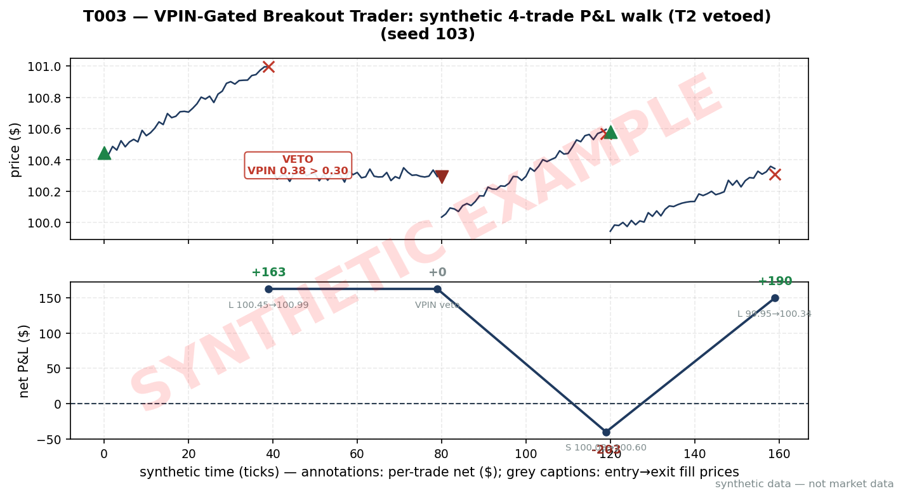

```mermaid
flowchart TD
    DATA["Market data\n(SIP trades+quotes, 5-min/1-s bars)"] -->|5-min bars; volume buckets| SIGS["Signals\nS021 OR break, S032 RVOL, S008 VPIN"]
    SIGS -->|bar-close events| ENTRY{"Entry logic\nclose beyond OR ± δ AND RVOL ≥ 1.5×\nAND VPIN ≤ 0.30; fill at t+1 open"}
    ENTRY -->|trigger| SIZE["Sizing + risk\nN = R/(fill−stop); max 4 names; daily stop"]
    ENTRY -->|no trigger / veto| WAIT["Wait / VPIN veto"]
    SIZE -->|5-min bars| EXEC["Execution\nmarketable limit at t+1 open; ≤20% bar vol"]
    EXEC -->|bar-close events| MON["Monitor + exits\n+1W target / OR stop / VPIN>0.40 tighten / 15:45 flat"]
    MON -->|fills + fees| PNL["P&L (net of costs)"]
    style ENTRY fill:#f9e79f,stroke:#7d6608
    style PNL fill:#a9dfbf,stroke:#1e8449
```

### T10. Sources

1. Zarattini, C., Barbon, A. & Aziz, A. (2024). "A Profitable Day Trading Strategy For The U.S. Equity Market." Swiss Finance Institute Research Paper No. 24-98 — https://papers.ssrn.com/sol3/papers.cfm?abstract_id=4729284 (5-min ORB + opening-relative-volume "stocks in play" sort, 2016–2023, >7,000 US stocks: top-20 variant +1,637% total, Sharpe 2.81, hit 48.4% after $0.0035/share commission — commission-only; unfiltered 5-min ORB Sharpe 0.48. Verified against the SSRN abstract and full-text Table 3.)
2. Crabel, T. (1990). *Day Trading with Short Term Price Patterns and Opening Range Breakout.* Traders Press, ISBN 0934380171 — the original ORB framework (S021 [D] source; practitioner book, no stable URL).
3. Easley, D., López de Prado, M. M. & O'Hara, M. (2012). "Flow Toxicity and Liquidity in a High-frequency World." *Review of Financial Studies* 25(5): 1457–1493 — https://papers.ssrn.com/sol3/papers.cfm?abstract_id=1695596 (VPIN: volume-clocked buckets, bulk volume classification; "useful indicator of short-term, toxicity-induced volatility").
4. Andersen, T. G. & Bondarenko, O. (2014). "VPIN and the Flash Crash." *Journal of Financial Markets* 17: 1–46 — https://ideas.repec.org/a/eee/finmar/v17y2014icp1-46.html (replication contesting VPIN: poor short-run volatility predictor; no pre-crash extreme; mechanical relation with trading intensity; classification-dependent).

**Source log.** Grok answered Q-TB1-1..3 (2026-09-10); all claims independently verified or labeled unverified. Grok's TB1 Q&A covered strategy B (RVOL-filtered ORB) directly; the ORB performance figures were **independently verified** against the SSRN abstract and full-text Table 3. The VPIN-gating overlay is composed from the verified MASTER.md S008 chapter (ELO specification + Andersen–Bondarenko critique); no Grok performance number is presented as a documented fact about VPIN-gated trading.

**Unverified leads** (chatbot-only — never in Sources):
- Grok Q-TB1-3: QQQ-only 5-min ORB companion (SSRN 4416622) — "Sharpe ~1.12, ~31% annualized, edge dies at ~2¢/share slippage" — figures not independently verified; kept as a lead.
- Grok Q-TB1-1 (B): universe first-bullet text did not render in capture (context suggests a price gate) — not reconstructed; the chapter uses its own gates.
- Grok Q-TB1-2: Tier-1/2 pricing bands and the "QuantConnect fits B/C" verdict — `indicative — verify before budgeting`; the verdict is engineering judgment, not evidence.
- Grok Q-TB1-3: "commission-only Sharpe is not executable Sharpe" framing and caveat stack — adopted as analysis, labeled chatbot-sourced reasoning.

---


## Stage 104/200 — T004: VWAP-Deviation Mean-Reversion

*Batch TB1 · Strategy 4/100 · Signals S040, S003, S067*

### T1. One-line verdict

| | |
|---|---|
| **Style** | Intraday microstructure mean-reversion (fade) |
| **Edge source** | Transient overextensions away from the session volume-weighted benchmark (S040) revert as liquidity replenishes; queue imbalance (S003) times the turn, diurnal normalization (S067) keeps thresholds honest across the U-shaped vol day |
| **Typical holding period** | 5–45 minutes (example: 14 minutes in the worked example; hard cap 30 minutes) |
| **Capacity hint** | Tens of names × a few thousand shares per event; edge is per-event, not scalable — a few $M of gross notional before the fade itself becomes the flow |
| **Build-or-buy in one line** | Build the signal stack on a cheap SIP/1-min feed; buy nothing except the data — the edge is in your thresholds and timing, which no vendor sells |

### T2. Full mechanics

**Universe & session.** Liquid US large-caps (example gates: price > $20, 14-day average daily volume (ADV — the mean shares traded per day) ≥ 2 million shares, median quoted spread ≤ 3 cents), regular trading hours (RTH) 10:00–15:30 ET. Exclude: the first 30 minutes (VWAP is unstable and the rolling σ̂ needs ≥5 bars before it is anything but noise — see S040), the last 30 minutes (market-on-close and index benchmark flow overwhelms reversion), earnings-announcement days, and any name halted or in a limit-up/limit-down (LULD) pause.

**The signals in the strategy's own notation.** Session VWAP at bar *t*: VWAP_t = Σ_{i≤t} TP_i·V_i / Σ_{i≤t} V_i (TP = typical price (H+L+C)/3, V = bar volume). Fractional deviation d_t = (C_t − VWAP_t)/VWAP_t, z-scored against a rolling window: z_t = d_t / σ̂_{d,t}, σ̂ over the trailing W = 30 one-minute bars (all `example — not an institutional standard`, matching S040). Queue imbalance I_t = (Q^b_t − Q^a_t)/(Q^b_t + Q^a_t) on the L1 touch (S003; Gould–Bonart form). Diurnal factor s_b from S067: the median |return| in time-of-day bin *b* divided by its daily mean, estimated on the prior 20 sessions — used to deseasonalize the deviation: compare |d_t| in basis points against the 20-day same-slot median |d| rather than against a flat number, so a 100-bps deviation at 10:05 (normal) is not treated like 100 bps at 13:00 (extreme).

**Entry rule (long; short mirrors).** At the close of 1-minute bar *t*, enter long if ALL hold: (i) z_t ≤ −k_in with k_in = 2.0 (`example`) — price is stretched below VWAP; (ii) queue-imbalance timing confirm I_t ≥ +0.30 (`example`) — the bid queue is rebuilding, i.e. the book agrees the selling is exhausted; (iii) diurnal gate: |d_t| in bps ≥ 1.5 × the 20-day same-slot median |d| (`example`) — the stretch is extreme even for this time of day; (iv) VPIN-style sanity: no earnings/news flag on the name in the last 15 minutes (news-driven extensions are information, not noise — fading them is donating). **Causal timing:** z_t, I_t and the diurnal check all use data ≤ *t*; the order is eligible at the open of bar *t+1* at the earliest — never the same bar.

**Exit rule.** First of: (1) reversion exit |z_t| ≤ k_out = 0.5 (`example`); (2) time stop 30 minutes (`example`) — the fade thesis expires whether or not the z-score agrees; (3) stop-loss: adverse z_t ≥ +1.0 for a long (`example`) or a price stop of −$0.20/share (`example`), whichever the book's risk sheet binds first; (4) session flatten at 15:30 ET. No overnight carry, ever.

**Position sizing.** Dollar-risk form (Grok's shared convention for this batch): N = ⌊R / risk_per_share⌋ with R = $300 per trade (`example`); risk_per_share from the example price stop ($0.20) → 1,500 shares in the worked example. Portfolio caps: max 4 concurrent fades, max gross $600k notional, daily loss stop −$1,500 (`examples`) — then the book is flat and dark for the day.

**Risk limits & kill switch.** Daily loss stop −$1,500; per-name max 3 entries/day (a repeatedly re-triggering fade is a broken thesis, not a sale); if the rolling σ̂_{d} more than doubles intraday (vol regime break), new entries halt — the z-score's own denominator is screaming that the model is off.

**Cost model.** Spread: $0.02 assumed (pay half-spread each side on aggressive fills); commission $0.005/share each way ($0.01 round-trip, `example`); no rebate (taker fills); slippage modeled as gap-through on the entry bar only in the conservative variant. Borrow n/a (long-only example; shorts add a borrow stub).

**Execution sketch.** Limit orders pegged one tick through the touch at signal +1 bar,IOC (immediate-or-cancel — fill now or cancel); participation cap ≤ 10% of visible 1-minute volume; queue-position honesty: on SIP/L1 data you do NOT model queue position — fills are assumed at the touch with the half-spread paid, labeled `simulated only — requires MBO/ITCH` (market-by-order / ITCH order-level feed data) for any latency/queue claim. All four fills in the worked example are modeled this way.

### T3. Signals it consumes

| Signal | Role | Weight / logic |
|---|---|---|
| S040 — VWAP-deviation z-score | **Primary trigger** (direction + magnitude) | Enter only if \|z_t\| ≥ 2.0 (`example`); sign of z picks direction (fade the stretch) |
| S003 — Queue (depth) imbalance | **Timing filter** | Enter only if I_t has the reversal sign and \|I_t\| ≥ 0.30 (`example`); no book confirmation → no trade |
| S067 — Diurnal deseasonalization | **Normalization gate** | \|d_t\| in bps must clear 1.5× the 20-day same-slot median (`example`); rescales what "extreme" means by time of day |

Combination pseudocode (≤25 lines):

```
# per name, per 1-min bar close t (causal: fills at t+1 open)
vwap  = cum(TP*V)/cum(V)                       # session VWAP
d     = (C[t] - vwap)/vwap                     # fractional deviation
z     = d / std(d[t-29:t+1])                   # S040 z-score, W=30 example
I     = (bid_sz - ask_sz)/(bid_sz + ask_sz)    # S003 touch imbalance
slot_med = median(abs(d_slot[b]) over 20 days)# S067 diurnal norm
if z <= -2.0 and I >= 0.30 and abs(d)*1e4 >= 1.5*slot_med*1e4:
    enter LONG at open(t+1), N = floor(300 / 0.20)      # example R, stop
elif z >= +2.0 and I <= -0.30 and abs(d)*1e4 >= 1.5*slot_med*1e4:
    enter SHORT at open(t+1), N = floor(300 / 0.20)
# exits evaluated each bar while in position:
if abs(z) <= 0.5 or bars_held >= 30 or z >= +1.0 (long): exit at open(t+1)
flatten all at 15:30 ET
```

### T4. Worked example — numbers + P&L (SYNTHETIC)

Setup: fictional large-cap **XYZ**, synthetic 1-minute bars 10:30–11:30 ET, **seed 104** (rerun `batches/TB1/plot_T004.py` to reproduce). VWAP drifts 119.55 → 119.61; rolling σ̂_d = 0.0062 (`example`); slot-median |d| = 60 bps (`example`).

At bar 30 (11:00) the tape prints: C_30 = 117.87, VWAP_30 = 119.58, d_30 = −143 bps, z_30 = −2.30 (≤ −2.0 ✓), I_30 = +0.45 (≥ +0.30 ✓), |d| = 143 bps ≥ 1.5 × 60 bps ✓. All three gates pass → **long 1,500 shares** (N = ⌊300/0.20⌋), filled at the bar-31 open: buy at the ask **117.88** (mid 117.87 + $0.01 half-spread). Outlay: 1,500 × 117.8848 = **$176,827.18** (fills shown to the cent; P&L from unrounded fills).

The deviation reverts cleanly. At bar 44 (11:14): z_44 = −0.30, |z| ≤ 0.5 → exit. Sell at the bid **119.36**. Proceeds: 1,500 × 119.3616 = **$179,042.33**.

| Line | Calculation | $ |
|---|---|---|
| Gross P&L | 1,500 × (119.3612 − 117.8844) | +2,215.15 |
| Spread cost | paid half-spread each side (in the fills above) | (in gross) |
| Commission | 1,500 × $0.01 round-trip | −15.00 |
| **Net P&L** | 2,215.15 − 15.00 | **+2,200.15** |

The chart plots this exact trade: price vs VWAP with the entry/exit markers, and the cumulative net P&L stepping from $0 to +$2,200.15 at bar 44.

**Where the example is optimistic.** The synthetic path is a textbook V: a 143-bps stretch (a genuine tail event) that reverses monotonically to the exit band in 14 minutes. Real fades chop, re-stretch, and stop you out. Fills are assumed instant at the anchor prices with no partial fills, no latency between the bar close and the fill, and a fixed 2-cent spread on 1,500 shares (no market impact). The diurnal gate and queue confirm never bind adversely here. One clean winner proves the arithmetic, not the edge — a live book lives or dies on the win rate across hundreds of such events, most of which look nothing like this.

### T5. Data & infra — what must run

**Pipeline inventory.** (1) Pre-open 08:00–09:30: load 20-day same-slot deviation medians (S067) and the symbol list; (2) intraday 10:00–15:30 loop: ingest L1 quotes + 1-min bars, maintain session VWAP, rolling σ̂_d, I_t, and the three-gate check per name each minute; (3) post-close: persist fills/fees ledger, recompute diurnal factors. Storage: 1-min bars are ~50 MB/day for 500 symbols (cost-model §4) — archive freely; L1 touch quotes for the traded subset only (~2–8 GB/symbol-day parquet, §4) — record for research, don't archive naively.

**M5 Max feasibility: feasible (Tier M, ~40–60 h ≈ $6,000–9,000 loaded-cost estimate).** Per cost-model §2: 50 symbols × ~500 avg L1 events/sec ≈ 25k events/sec — a Python event loop is borderline, so run the book in Rust or poll the normalized vendor API; the per-minute signal math is trivial polars (~195k bars/day for 500 symbols). RAM: live working set < 2 GB; 60 days of 1-min bars for 500 symbols ≈ 12 MB (§3). Bottleneck is feed latency and book correctness, not compute. Breaks at: full OPRA-scale options analytics or 500-symbol L2 — not needed here.

**Feed-outage safe-mode.** Missed heartbeat > 2 s or sequence gap → cancel all working orders, flatten open fades at the last valid touch, freeze new entries, tag the session DEGRADED. If only SIP L1 remains (no venue-level touch): the S003 gate is `simulated only — requires MBO/ITCH`, so entries halt but resting stops stay. After any crash: flat unless the on-disk ledger says otherwise, and no new entries until 30 s of clean sequence.

### T6. Buy vs build

| Option | What you get | Indicative price | Gains | Loses |
|---|---|---|---|---|
| Tier 0: Stooq/Alpaca IEX delayed | Daily + delayed intraday bars | ~$0, indicative — verify before budgeting | Free VWAP/deseasonalization research | No real-time touch; queue imbalance impossible |
| Tier 1: Polygon Stocks Advanced / Alpaca SIP | Real-time SIP 1-min bars + quotes | ~$30–200/mo, indicative — verify before budgeting | Honest z-score + diurnal stack; the strategy's core | SIP touch smears venues; S003 timing degraded |
| Tier 2: Databento MBP-1 (pay-as-you-go) | Exchange-timestamped touch events | ~$200/mo + usage, indicative — verify before budgeting | Real I_t event rules; audit-able t→t+1 causality | Overkill if you only trade the z-fade |
| Retail platform: QuantConnect | Paper broker + SIP data | ~$60–300/mo, indicative — verify before budgeting | Fastest path to a paper book for B-style variants | Weak L1 honesty for the S003 gate |

**Verdict: build on Tier 1, buy nothing exotic.** The strategy's edge lives in your thresholds and the three-gate combination, which no vendor sells. Buy the cheapest feed that honestly supports the touch (Tier 1 SIP suffices for the fade; add Databento MBP-1 only if you can show the S003 gate earns its keep after fees). Crossover: if backtests show the S040-only variant matches the three-gate variant, drop the L1 feed entirely and run on 1-min bars.

### T7. Success-ratio evidence

Honest framing first: **there is no published after-cost Sharpe for a VWAP-deviation fade with queue timing.** The evidence below is for the components (per S040, S003, S067 chapters).

| Study / source | Market & period | Metric | Before/after cost | Caveat |
|---|---|---|---|---|
| Cont, Kukanov & Stoikov (2014), *J. Financial Econometrics* | 50 US stocks, NYSE TAQ, 2008 | Linear OFI↔Δprice; slope ∝ 1/(2·depth) | Before-cost; contemporaneous regression, **not a trading rule** | No forward P&L; no Sharpe |
| Gould & Bonart (2016), arXiv:1512.03492 | 10 liquid Nasdaq stocks, LOB | Queue imbalance → next-mid-move logistic: strongly significant on large-tick names, moderate on small-tick | Before-cost (classification, not P&L) | Predicts direction only; no costs |
| Andersen & Bollerslev (1997), *J. Empirical Finance* | 5-min DM/$ and S&P 500 futures | Deseasonalizing "eliminates most distortions" of the intraday vol cycle | Before-cost (model diagnostics) | Diagnostic, not a trading result |
| S040's chapter evidence (Berkowitz–Logue–Noser 1988; Choi–Larsen–Seppi 2018; Kissell 2014) | VWAP benchmark literature | VWAP±bands are desk-standard tooling; fades used with discretion | Anecdotal | **No published Sharpe for the fade itself** |

Regimes where it fails: trend days (the stretch is information — S024's mirror image); the last 30 minutes (benchmark flow); news-driven extensions; small-tick names where Gould–Bonart's own result is only "moderate". **Bottom line for ≤$1M paper:** this is a research-grade microstructure sleeve, not an allocation memo. A one-person book should paper-trade the S040-only variant first; add the S003 gate only with MBO-honest fills. An institutional desk would run it as a small overlay inside a larger intraday book, never standalone.

### T8. Failure modes

1. **Trend-day fade into information.** The extension is a real buyer, not noise; the fade adds to a loser. *Mitigation:* the S067 diurnal gate plus a hard cap of 3 entries/name/day; a name that re-triggers is a broken thesis.
2. **Queue imbalance spoofing.** Displayed size lies (layering/spoofing); I_t ≥ +0.30 can be manufactured. *Mitigation:* require the imbalance to persist across ≥3 book updates (`example`), and weight cancellations in the S001-style OFI as a veto.
3. **VWAP instability early session.** The first 30 minutes' VWAP whipsaws; z-scores computed on it are fiction. *Mitigation:* no entries before 10:00; σ̂ needs ≥5 bars (S040's own warning).
4. **Latency on SIP.** By the time a non-colocated trader sees I_t = +0.45, the queue is gone; the fill is the adverse selection. *Mitigation:* label all SIP-based queue timing `simulated only — requires MBO/ITCH`; size for taker fills.
5. **Cost-model optimism.** A 2-cent spread assumption on a name that actually trades 4–5 cents wide turns the +$2,200 example into a loss. *Mitigation:* per-name spread filter (median spread ≤ 3¢) and per-name cost calibration weekly.
6. **Benchmark-flow windows.** 15:00–16:00 index/MOC flow pins or runs through VWAP; the fade's "fair value" is not the market's. *Mitigation:* flatten by 15:30; no entries after 15:00 (`example`).
7. **Overfit thresholds.** k_in = 2.0, I ≥ 0.30, 1.5× diurnal are grid-fit-able; in-sample Sharpe lies. *Mitigation:* purged/embargoed validation (S088) before any sizing decision; wide parameter plateaus only.

### T9. Visuals

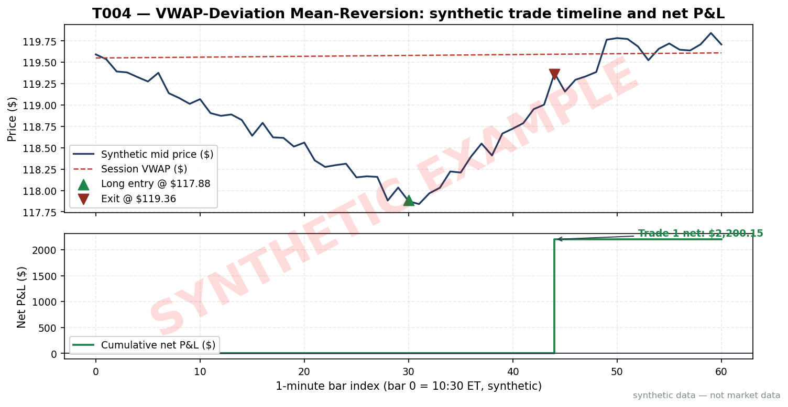

```mermaid
flowchart TD
    DATA["Market data<br/>L1 quotes + 1-min bars"] -->|1-min bars| SIGS["Signals<br/>S040 z-score, S003 imbalance, S067 diurnal"]
    SIGS -->|1-min bars| ENTRY{"Entry logic<br/>|z|≥2.0 AND |I|≥0.30 AND diurnal 1.5x<br/>causality t→t+1"}
    SIGS -->|L1 events| ENTRY
    ENTRY -->|trigger| SIZE["Sizing + risk<br/>N=floor(300/0.20); 4-name cap;<br/>daily stop -$1,500"]
    ENTRY -->|no trigger| WAIT["Wait"]
    SIZE -->|1-min bars| EXEC["Execution<br/>IOC limits, ≤10% participation,<br/>no queue-position modeling"]
    EXEC -->|1-min bars| MON["Monitor + exits<br/>|z|≤0.5 / 30-min stop /<br/>adverse z≥1.0 / 15:30 flat"]
    MON -->|1-min bars| PNL["P&L (net of costs)"]
    style ENTRY fill:#f9e79f,stroke:#7d6608
    style PNL fill:#a9dfbf,stroke:#1e8449
```

### T10. Sources

1. Cont, R., Kukanov, A. & Stoikov, S. (2014), "The Price Impact of Order Book Events," *Journal of Financial Econometrics* 12(1): 47–88. arXiv:1011.6402 — https://arxiv.org/abs/1011.6402. (OFI impact regression; contemporaneous, not a strategy.)
2. Gould, M. D. & Bonart, J. (2016), "Queue Imbalance as a One-Tick-Ahead Price Predictor in a Limit Order Book," *Market Microstructure and Liquidity*; arXiv:1512.03492. (Queue-imbalance classifier.)
3. Andersen, T. G. & Bollerslev, T. (1997), "Intraday Periodicity and Volatility Persistence in Financial Markets," *Journal of Empirical Finance* 4(2–3): 115–158 — https://ideas.repec.org/a/eee/empfin/v4y1997i2-3p115-158.html. (Diurnal deseasonalization.)

**Unverified leads** (from Grok's Q-TB1 answers, 2026-09-10 — not independently confirmed): Cont–Kukanov–Stoikov mean R² ≈ 65% (Grok's figure; S001's chapter reports the relationship without that number); Gould–Bonart P(up|I≈1) ≈ 0.8–0.9 on large-tick names (Grok's figure); a 2025 microstructure study finding imbalance-taker rules profitable pre-fee (~+1 bp/round-trip) but ≈ −2.0 (units unverified) post-fee over 18,927 trades; Databento live TotalView plan ~$1.5k–$4k/mo class plus license pass-through (vendor pricing changes fast — re-quote).

*Source log: Grok answered Q-TB1-1..3 (2026-09-10); all claims independently verified or labeled unverified.*

---


## Stage 105/200 — T005: RVOL-Filtered Opening-Range Breakout

*Batch TB1 · Strategy 5/100 · Signals S021, S032, S008*

### T1. One-line verdict

| | |
|---|---|
| **Style** | Intraday breakout (Crabel opening-range), momentum |
| **Edge source** | The first 15 minutes set the day's range; breaks confirmed by abnormal relative volume (S032) carry institutional intent, while VPIN (volume-synchronized probability of informed trading — the S008 toxicity gauge) vetoes toxic flow |
| **Typical holding period** | 30 minutes – 6 hours (example: ~2 h 15 min in the worked example); one trade per name per day |
| **Capacity hint** | ~20 names/day × a few hundred shares; the published variant ran on $25k notional — size kills it (everyone scans the same "stocks in play" list) |
| **Build-or-buy in one line** | Build the OR/RVOL state machine yourself on a cheap SIP bar feed; buy nothing — the filter *is* the strategy and it is 40 lines of code |

### T2. Full mechanics

**Universe & session.** US listed equities, RTH only. Example gates (in the spirit of the published paper, all `example — not an institutional standard`): 14-day ADV ≥ 1 million shares; 14-day ATR (average true range — mean of daily high−low ranges) ≥ $0.50; price > $5; that morning's opening-range relative volume in the top 20 names of the filtered universe. Futures analogue (ES/NQ): session RVOL ≥ 1.3×. Session window: build the opening range (OR) 09:30–09:45 ET (15 minutes, `example`); entries allowed 09:45–15:30; flatten everything by 15:55 ET. Early-close days: the OR clock compresses proportionally or the day is skipped.

**Entry rule (long; short mirrors).** Let ORH = max high and ORL = min low over 09:30–09:45, frozen at 09:45; W = ORH − ORL. RVOL_OR = V_OR / median same-slot volume over the prior 20 sessions (S032). At the close of each 5-minute bar *t* ≥ 09:45: enter long if (i) close_t > ORH + δ, δ = $0.02 entry offset (`example` — filters marginal touches); (ii) the trigger bar's own RVOL ≥ 1.2× its 20-day same-slot median (`example`); (iii) VPIN_t ≤ 0.30 (`example`) — flow toxicity gate (S008): a breakout into one-sided toxic flow is usually the top, not the start; (iv) no position in the name today (one trade per name per day, `example`). **Causal timing:** the signal is known at the trigger bar's close; the fill is at the *open of bar t+1* — gap-through is modeled (you do not get the signal print).

**Exit rule.** (1) Stop-loss: opposite side of the OR — long stopped at ORL (`example`; a 1× 14-period 5-min ATR stop is the common variant); (2) profit target: +1× W beyond the break level, i.e. ORH + W (1R, `example`); (3) time stop: still open at 15:55 → market-on-close. Once the range breaks, the level is done for the day — no re-entries.

**Position sizing.** N = ⌊R / (P_entry − P_stop)⌋ with R = $300 dollar risk per trade (`example`). In the worked example: entry 50.54, stop 49.80 → risk $0.74/share → 405 shares.

**Risk limits.** Max 5 concurrent ORB positions; portfolio heat ≤ $1,500 at risk; if 3 consecutive stops fire before 11:00, the day's ORB book stands down (a choppy tape, not a breakout tape). Daily loss stop −$1,200 (`examples`).

**Cost model.** Spread $0.02 (pay half-spread each side); commission $0.005/share each way ($0.01 RT, `example`); slippage: gap-through on entry modeled explicitly (the worked example fills 6¢ above the trigger close — that *is* the slippage). No rebate. The published paper's costs were commission-only ($0.0035/share) — this chapter adds the spread, which is the honest difference between the paper's Sharpe and an executable one.

**Execution sketch.** Marketable limit at bar t+1 open (limit = open print ± 2 ticks to bound gap-through); participation cap ≤ 10% of the trigger bar's volume; the stop rests as a stop-market at ORL from entry. Queue-position modeling: none — SIP-bar fills only.

### T3. Signals it consumes

| Signal | Role | Weight / logic |
|---|---|---|
| S021 — Crabel ORB levels | **Primary trigger** (levels + direction) | Break of frozen ORH/ORL; offset δ; the geometry of the trade |
| S032 — Relative volume | **Confirmation filter** | OR RVOL ≥ 1.5× AND trigger-bar RVOL ≥ 1.2× (`examples`); unfunded breaks are rejected |
| S008 — VPIN | **Toxicity veto** | No entry if VPIN_t > 0.30 (`example`); high-VPIN breaks are faded-or-skipped, never chased |

Combination pseudocode (≤25 lines):

```
# 09:30-09:45: accumulate OR; 09:45: freeze ORH, ORL; compute RVOL_OR
if RVOL_OR < 1.5 or name not in top-20 RVOL: skip name for the day   # S032 gate
for each 5-min bar close t >= 09:45:                                # S021 levels
    vpin = VPIN(t)                                                  # S008, rolling 50 buckets
    if vpin > 0.30: continue                                        # toxicity veto
    if close[t] > ORH + 0.02 and bar_RVOL[t] >= 1.2 and flat_today:  # example thresholds
        buy N = floor(300/(open[t+1] - ORL)) at open(t+1)           # causal fill
        stop = ORL; target = ORH + (ORH - ORL)                      # 1R example
    mirror for shorts
# exits: stop hit -> out; target hit -> out; 15:55 -> MOC
```

### T4. Worked example — numbers + P&L (SYNTHETIC)

Setup: fictional **XYZ**, synthetic 5-minute bars 09:30–16:00, **seed 105**. OR (09:30–09:45): high **50.40**, low **49.80**, width **0.60**; RVOL_OR = 1.8× (≥ 1.5 ✓).

Trigger bar 4 (09:50–09:55): close **50.48** > 50.40 ✓; bar RVOL 1.6× (≥ 1.2 ✓); VPIN 0.22 (≤ 0.30 ✓ — flow not toxic). Signal at the bar-4 close → fill at the bar-5 open: **buy 405 @ 50.54** (ask = open + $0.01 half-spread; 6¢ of gap-through above the trigger close — modeled slippage). Stop: 49.80 (OR low). Risk/share = 50.54 − 49.80 = $0.74 → N = ⌊300/0.74⌋ = 405 ✓. Target: 50.40 + 0.60 = **51.00** (1R).

At bar 21 the target prints: **sell 405 @ 51.02** (bid).

| Line | Calculation | $ |
|---|---|---|
| Outlay | 405 × 50.5406 | −20,468.95 |
| Proceeds | 405 × 51.0240 | +20,664.72 |
| Gross P&L | 405 × (51.0240 − 50.5406) | +195.77 |
| Spread cost | half-spread each side (in the fills) | (in gross) |
| Commission | 405 × $0.01 round-trip | −4.05 |
| **Net P&L** | 195.77 − 4.05 | **+191.72** |

(Fills shown to the cent; P&L computed from unrounded fills.) The chart plots this exact day: the OR band, trigger bar, entry/exit markers, and the net P&L stepping to +$191.72 at the exit.

**Where the example is optimistic.** The breakout never retests the level — real ORBs wick back through ORH and stop half the book before working. Entry gap-through is only 6¢; on a real "stock in play" the bar-t+1 open can gap 20–50¢ past the trigger. One trade is shown, but the strategy trades ~20 names/day — the example cherry-picks a winner and hides the 41.4%-style base hit rate of the unfiltered variant. The VPIN gate never binds here; on real tapes it vetoes a meaningful share of the best-looking breaks. And the one-trade-per-day rule plus the 15:55 flatten are what keep the arithmetic clean — the published results depend on exactly this discipline.

### T5. Data & infra — what must run

**Pipeline inventory.** 09:25: load 20-day same-slot volume medians (precomputed overnight). 09:30–09:45: accumulate OR high/low/volume per candidate (~200–500 names after cheap ADV/price/ATR gates). 09:45: freeze OR, compute RVOL_OR, rank, keep top 20. 09:45–15:30: on each 5-minute close, test break + bar RVOL + VPIN veto; signal → fill at next bar open. 15:55: flatten. Overnight: recompute volume baselines, VPIN bucket parameters.

**M5 Max feasibility: trivial (Tier M, ~25–40 h ≈ $3,750–6,000 loaded-cost estimate).** Per cost-model §2: 500 names × 5-min bars ≈ 6k bars/day — nothing; even 1-second bars for RVOL confirmation (~2M bars/day) is trivial for polars. RAM 100–400 MB; disk 50–300 MB/day of bars + decisions (§4). Bottleneck: universe hygiene (corporate actions, halts, early-close calendar), not compute. This is the cheapest strategy in TB1 to run honestly.

**Feed-outage safe-mode.** If the open print or first-15-minute volume is incomplete for a name → exclude that name for the day (never invent an OR). If the whole tape stalls before 09:45 → no trades that day. If the feed dies after entry: the resting paper stop at ORL/H_ORL stays on the last valid quote; if quotes die too → flatten at the last trade and mark the session UNTRUSTED_FLAT. Bake the NYSE holiday/early-close calendar into the clock process — a wrong session window silently breaks every OR.

### T6. Buy vs build

| Option | What you get | Indicative price | Gains | Loses |
|---|---|---|---|---|
| Tier 0: Stooq / Alpaca IEX | Daily + delayed bars | ~$0, indicative — verify before budgeting | Free OR geometry research | No real-time RVOL; no VPIN |
| Tier 1: Polygon Stocks Advanced / Alpaca SIP | Real-time SIP trades + 1-min/5-min bars | ~$30–200/mo, indicative — verify before budgeting | Everything this strategy needs: bars, volume, BVC (bulk volume classification)-VPIN | SIP trade classification is noisier than exchange timestamps |
| Retail: QuantConnect paper | Paper broker + SIP equity stream + minute data | ~$60–300/mo, indicative — verify before budgeting | Fastest honest paper host for this exact strategy | Per-name customization limits at scale |
| No-code (Composer-style) | Drag-and-drop backtests | ~$10–50/mo, indicative — verify before budgeting | — | Cannot express RVOL sorts or VPIN vetoes — skip |

**Verdict: build on Tier 1 SIP.** The ORB state machine is ~40 lines; the RVOL baseline is an overnight batch job; VPIN is a volume-bucket loop. Nothing here justifies a professional feed — SIP trades are adequate for 5-minute OR geometry, and the strategy's documented edge lives in the RVOL sort, not in microsecond timestamps. Crossover: buy a normalized vendor feed (Databento) only if you extend to tick-level ORB variants (1-minute OR) where SIP timestamp smear matters.

### T7. Success-ratio evidence

| Study / source | Market & period | Metric | Before/after cost | Caveat |
|---|---|---|---|---|
| Zarattini, Barbon & Aziz (2024), "A Profitable Day Trading Strategy For The U.S. Equity Market," SSRN 4729284 | 7,000+ US stocks, 2016–2023, 5-min ORB | Top-20 stocks-in-play: total net +1,637%, IRR 41.6%, Sharpe **2.81**, hit 48.4%, max DD 12%, alpha 35.8% | **After** their cost model ($0.0035/share commission; no spread/impact) | Commission-only; $25k compounding; capacity unstudied; sample ends 2023 |
| Same paper, unfiltered variant | Same | Total +29%, IRR 3.2%, Sharpe 0.48, hit 41.4% vs S&P 500 +198% | After their commission | Unfiltered ORB loses to the index |
| Same paper, RVOL split | Same | RVOL >100% → +0.08R/trade; <100% → −0.02R; 30× → +0.38R | After commissions | **The ORB edge is really the volume-filter edge** |
| Zarattini & Aziz (2023), QQQ-only 5-min ORB (per S021's chapter) | QQQ, 2016–2023 | ~33% annualized alpha net of commissions | After commissions, not full spread/impact | Independent replication: edge dies at ~2.2¢/share slippage; 76% of filtered P&L from 2022 |
| Holmberg–Lönnbark–Lundström (2013), *Finance Research Letters* | Crude-oil futures intraday ORB | Returns significantly > 0 vs fair game | Before modern equity spread/impact | Futures; significance ≠ net tradability |

Grok's Q-TB1-3 added two replication notes I could not independently verify (kept in Unverified leads): a QQQ-only replication with Sharpe 1.06 at zero slippage collapsing to 0.23 with 2¢/4¢ slippage, and the claim that the headline Sharpe sits inside the QQQ spread. The verified core stands on its own: the RVOL filter is the strategy; unfiltered ORB is Sharpe < 1 and underperforms buy-and-hold. **Bottom line for ≤$1M paper:** this is the most evidence-backed strategy in TB1 — but the evidence is commission-only on a 2016–2023 sample, and a small book must re-verify the RVOL sort out-of-sample (2024+) before sizing. An institutional desk would run it as one sleeve among many, with the top-20 sort capacity-capped.

### T8. Failure modes

1. **Publication decay.** The paper is public since 2024; every retail scanner now sorts by "stocks in play". *Mitigation:* re-verify the RVOL sort on post-2023 data before allocating; expect the 2.81 Sharpe to be history.
2. **Cost-model gap.** Commission-only backtests hide the spread; the replication's 2.2¢/share break-even is the real hurdle. *Mitigation:* model half-spread + gap-through explicitly (as in T4); reject names with median spread > 3¢.
3. **False-break chop.** Low-conviction tapes break the OR and reverse the same bar. *Mitigation:* the trigger-bar RVOL ≥ 1.2× gate plus the one-trade-per-day rule; three early stops = stand down for the day.
4. **VPIN mismeasurement.** BVC classification errors correlate with volume (Andersen & Bondarenko 2015) — the veto can fire on noise. *Mitigation:* use tick-rule VPIN as a robustness cross-check; treat the veto as a soft weight, not a hard gate, in research.
5. **OR misformation.** Missing open prints or a bad corporate-action adjustment invents a fake range. *Mitigation:* exclude names with incomplete 09:30–09:45 data; never interpolate the OR.
6. **Overnight gap through the stop.** A name gaps past ORL the next morning — but you're flat by 15:55, so this is really **gap-through on entry**: the bar-t+1 open fills far worse than modeled. *Mitigation:* cap the entry limit at open ± 2 ticks; a skipped entry is better than a slipped one.
7. **Regime concentration.** Per the replication lead, most filtered P&L came from 2022 — a vol-regime artifact. *Mitigation:* require the strategy to clear its hurdle in low-vol years separately before trusting the blended Sharpe.

### T9. Visuals

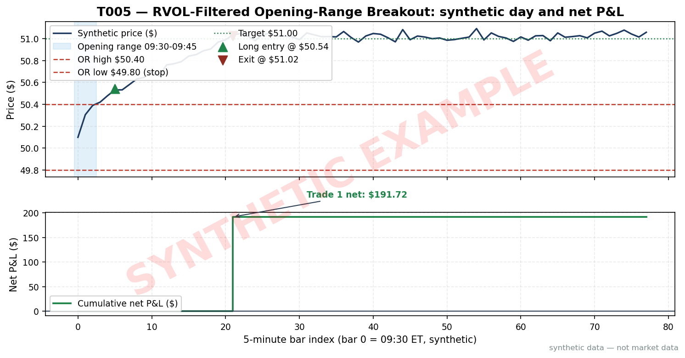

```mermaid
flowchart TD
    DATA["Market data<br/>SIP trades + 5-min bars"] -->|5-min bars| SIGS["Signals<br/>S021 OR levels, S032 RVOL, S008 VPIN"]
    SIGS -->|5-min bars| ENTRY{"Entry logic<br/>close>ORH AND bar RVOL≥1.2x<br/>AND VPIN≤0.30, causality t→t+1"}
    SIGS -->|volume buckets| ENTRY
    ENTRY -->|trigger| SIZE["Sizing + risk<br/>N=floor(300/(entry-stop));<br/>5 positions; day stop -$1,200"]
    ENTRY -->|no trigger| WAIT["Wait"]
    SIZE -->|5-min bars| EXEC["Execution<br/>marketable limit at t+1 open,<br/>≤10% participation"]
    EXEC -->|5-min bars| MON["Monitor + exits<br/>stop=ORL / target=ORH+W /<br/>15:55 MOC"]
    MON -->|5-min bars| PNL["P&L (net of costs)"]
    style ENTRY fill:#f9e79f,stroke:#7d6608
    style PNL fill:#a9dfbf,stroke:#1e8449
```

### T10. Sources

1. Crabel, T. (1990), *Day Trading with Short Term Price Patterns and Opening Range Breakout*. Traders Press, ISBN 0934380171. (Original ORB system; practitioner book, no stable URL.)
2. Zarattini, C., Barbon, A. & Aziz, A. (2024), "A Profitable Day Trading Strategy For The U.S. Equity Market," Swiss Finance Institute Research Paper No. 24-98; https://papers.ssrn.com/sol3/papers.cfm?abstract_id=4729284. (5-min ORB + stocks-in-play filter, 2016–2023; commission-only costs.)
3. Easley, D., López de Prado, M. & O'Hara, M. (2012), "Flow Toxicity and Liquidity in a High-Frequency World," *Review of Financial Studies* 25(5): 1457–1493 — https://papers.ssrn.com/sol3/papers.cfm?abstract_id=1695596. (VPIN construction; contrast with Andersen & Bondarenko (2014, 2015) critiques per S008.)
4. Andersen, T. G. & Bondarenko, O. (2014), "VPIN and the Flash Crash," *Journal of Financial Markets* 17: 1–46 — https://ideas.repec.org/a/eee/finmar/v17y2014icp1-46.html. (Replication contesting VPIN: poor short-run volatility predictor; behavior largely mechanical trading intensity; classification-dependent.)

**Unverified leads** (Grok Q-TB1-3, 2026-09-10; Q1 universe first-bullet text did not render): QQQ-only 5-min ORB replication — Sharpe 1.06 at zero slippage, net crosses zero at ~2.2¢/share slippage, Sharpe 0.23 with 2¢ entry/4¢ stop slippage; 2025 microstructure study on imbalance-taker vs maker rules (post-fee negative); "stocks in play" first universe bullet (price gate) lost in extraction — not reconstructed. QuantConnect forum thread (https://www.quantconnect.com/forum/discussion/18444) replicating Zarattini et al. — found via web search, not read in full.

*Source log: Grok answered Q-TB1-1..3 (2026-09-10); all claims independently verified or labeled unverified.*

---


## Stage 106/200 — T006: Intraday Trend + Vol-Regime Allocator

*Batch TB1 · Strategy 6/100 · Signals S025, S027, S079*

### T1. One-line verdict

| | |
|---|---|
| **Style** | Intraday time-series momentum into the close, regime-scaled |
| **Edge source** | First-half-hour return predicts last-half-hour return (Gao et al. 2018); the day's own drift (S027) confirms; a 2-state HMM (hidden Markov model) vol regime (S079) scales size down when volatility makes the drift untradable |
| **Typical holding period** | 30 minutes (enter 15:30, flat at the close) |
| **Capacity hint** | High — SPY/QQQ-class ETFs, minutes-long holds at the most liquid time of day; the constraint is the closing-auction spread, not depth |
| **Build-or-buy in one line** | Build: the whole strategy is a 15:30 clock, a sign rule, and an HMM — any retail platform with minute bars suffices; buy only the data |

### T2. Full mechanics

**Universe & session.** One liquid vehicle: SPY (or QQQ/ES) — example; single-name extension uses price > $20, ADV > 5M shares. RTH only. The strategy trades exactly one window: enter at 15:30 ET, flatten at the 16:00 closing print. No other entries exist — this is a *clock strategy*, which is its main virtue (no intraday monitoring) and its main limitation.

**The signals in the strategy's own notation.** S025 (Gao form): r_{1,t} = log(P_{10:00}/P_{9:30}) — first-half-hour return, *deseasonalized* by S067 (divide by the diurnal factor s_b for the open bin, estimated on the prior 20 days; raw morning returns are mechanically more volatile). The report's generic form Sig_t = sign(Σ w_i r_{t−i}) reduces here to sign(r_{1,t}). S027 (open→15:30 variant, the report's smoother form): r_{first,t} = P_{15:30}/P_{9:30} − 1 — the day's own drift into the entry. S079: 2-state Gaussian HMM on 5-minute log returns (states: calm σ ≈ 0.4%/bar, volatile σ ≈ 1.2%/bar, `examples`); the filtered probability P(s_t = volatile | r_{1:t}) at 15:25 drives the allocator.

**Entry rule (long; short mirrors).** At 15:30, enter long if ALL hold: (i) deseasonalized |r_{1,t}| ≥ 0.25% (`example` threshold — the morning move must be real, not open noise); (ii) sign confirmation: sign(r_{first,t}) = sign(r_{1,t}) (`example`) — the day's drift agrees with the morning impulse (this is the S027 confirm); (iii) regime gate: P(volatile) < 0.80 (`example`) — if the HMM says the tape is toxic, stand down entirely. **Causal timing:** r_{1,t} is known at 10:00; the HMM filter at 15:25 uses data ≤ 15:25; the order is eligible at 15:30 — hours after the signal, which is why this signal is nearly immune to microstructure lookahead traps (S025's own note).

**Position sizing — the allocator.** Full notional $100k (`example`) scaled by the HMM state: scale = 1.0 if P(volatile) < 0.60; 0.5 if 0.60 ≤ P(volatile) < 0.80; 0.0 (flat) if ≥ 0.80 (`examples`, matching S079's τ_half = 0.7 / τ_susp = 0.8 family). Shares = scale × 100,000 / P_{15:30}. This is vol-targeting by regime: position ∝ 1/σ̂ of the inferred state (S079's Hamilton-1989 vol form).

**Exit rule.** Flatten at the 16:00 close, no exceptions — market-on-close or a 15:59:30 market order (`example`). No stop-loss intraday (the hold is 30 minutes; a stop inside the last half hour is spread-donation), no profit target. The time stop *is* the strategy.

**Risk limits.** Max one position (it is one vehicle, one window); daily loss stop −$800 (`example`) — but since the hold is 30 minutes into the close, the stop is effectively enforced by the 0.80 suspend threshold ex ante; a realized −$800 day triggers a next-day review of the HMM calibration, not an intraday exit.

**Cost model.** 1¢/share all-in round-trip (`example`: ~0.5¢ commission + 0.5¢ effective spread on SPY at 15:30 — the tightest spread of the day). No slippage beyond the closing-print assumption in the base case; the conservative variant assumes the MOC print plus 1¢ adverse. Borrow n/a for the ETF long/short (short SPY borrow is ~0 bps for a day — stubbed at zero).

**Execution sketch.** 15:30: marketable limit for the share count (IOC); 15:59:30: closing-auction-eligible order for the full position. Participation is irrelevant — SPY's last-half-hour volume absorbs $100k without a ripple. Queue-position honesty: n/a at this granularity.

### T3. Signals it consumes

| Signal | Role | Weight / logic |
|---|---|---|
| S025 — Intraday time-series momentum (Gao form) | **Primary trigger** (direction) | sign of deseasonalized r_{1,t}; needs \|r̃_1\| ≥ 0.25% (`example`) |
| S027 — Open→15:30 formation drift | **Confirmation filter** | sign(r_{first,t}) must equal sign(r_{1,t}); disagreement → no trade |
| S079 — HMM vol regime | **Regime gate + sizing** | scale 1.0 / 0.5 / 0.0 at P(vol) thresholds 0.60 / 0.80 (`examples`) |

Combination pseudocode (≤25 lines):

```
# once per day, at 15:25-15:30 (all inputs causal)
r1  = log(P10:00 / P09:30) / s_b(open_bin)      # S025, S067-deseasonalized
rfo = P15:30 / P09:30 - 1                        # S027 formation drift
pvol = HMM_forward(r_5min[:15:25])[volatile]     # S079 filtered prob
if abs(r1) < 0.0025: flat("no impulse")          # example threshold
elif sign(rfo) != sign(r1): flat("no confirm")   # S027 disagrees
elif pvol >= 0.80: flat("toxic regime")          # S079 suspend
else:
    scale = 1.0 if pvol < 0.60 else 0.5          # example allocator
    shares = sign(r1) * int(100_000 * scale / P15:30)
    buy/sell shares at 15:30; flatten at 16:00 close
```

### T4. Worked example — numbers + P&L (SYNTHETIC)

Setup: SPY-class ETF at **$500.00** (`example`), full notional **$100,000**, cost **$0.01/share round-trip** (`example`). Five synthetic days, **seed 106**.

| Day | r̃_1 (S025) | r_first (S027) | P(vol) 15:25 (S079) | Decision | r_13 | Net P&L |
|---|---|---|---|---|---|---|
| 1 | +0.42% | +0.90% | 0.15 | LONG 200 sh (scale 1.0) | +0.28% | +$278.00 |
| 2 | −0.35% | −0.70% | 0.25 | SHORT 200 sh (scale 1.0) | −0.22% | +$218.00 |
| 3 | +0.50% | +1.10% | 0.75 | LONG 100 sh (scale 0.5) | −0.15% | −$76.00 |
| 4 | +0.10% | +0.20% | 0.10 | FLAT (below 0.25% impulse) | +0.05% | $0.00 |
| 5 | −0.60% | −1.30% | 0.85 | FLAT (suspended: toxic) | −0.40% | $0.00 |

Line-by-line walk for Day 1 (the template for every traded day): 15:30 — buy 200 @ **$500.00** = $100,000.00. 16:00 — sell 200 @ **$501.40** ($500 × 1.0028) = $100,280.00. Gross +$280.00; cost 200 × $0.01 = −$2.00; **net +$278.00**. Day 2: short 200 @ $500.00, cover @ $498.90 → gross +$220.00 − $2.00 = **+$218.00**. Day 3 (half size): long 100 @ $500.00, sell @ $499.25 → gross −$75.00 − $1.00 = **−$76.00**. Days 4–5: no position, $0. **Five-day total net: +$420.00.**

The chart plots exactly this diary: formation-return bars colored by position (green long / red short / grey flat), the HMM P(volatile) overlay with the 0.60/0.80 allocator thresholds, and the cumulative net P&L stepping +278, +496, +420, +420, +420 with per-day annotations.

**Where the example is optimistic.** Five hand-built days, not a sample: two clean winners, one textbook half-size loser, and — most flattering of all — Day 5's suspend dodges a −$400 day, which is the allocator working *by construction*. Real HMM posteriors arrive with 1–2 periods of detection lag (S079's own warning) and flicker at regime boundaries; the 0.80 suspend will sometimes trigger late or on noise. The close is assumed filled at the print with 1¢ all-in cost — Heston et al. (2010) warn explicitly that half-hour periodicity strategies "lose money after paying the bid/ask spread," and the closing auction is exactly where that spread is widest for impatient flow. A 30-minute hold repeated daily also concentrates all risk in one window — one flash event at 15:45 wipes weeks of drift harvesting.

### T5. Data & infra — what must run

**Pipeline inventory.** Overnight/weekly: refit the 2-state HMM on 60 days of 5-min bars (Baum–Welch; refit weekly, `example`); recompute the 20-day diurnal factors s_b. Intraday: a 15:25 cron computes r_1 (known since 10:00), r_first, and the forward-algorithm P(volatile) — one inference pass, milliseconds. 15:30: order. 16:00: flatten and ledger. That is the entire hot path.

**M5 Max feasibility: trivial (Tier L, ~8–12 h ≈ $1,200–1,800 loaded-cost estimate).** Per cost-model §2: one symbol × 78 five-min bars/day is nothing; the HMM forward pass is microseconds in numpy; the weekly Baum–Welch fit on 60 days × 78 bars is seconds. RAM < 200 MB; disk < 50 MB/day. Bottleneck: none computationally — the risk is *model* risk (HMM miscalibration), not compute. A single cron job could run this.

**Feed-outage safe-mode.** If 15:25 data is stale or the HMM job failed → the day is FLAT (no signal, no trade — the strategy defaults to doing nothing). If the 15:30 entry filled but the 16:00 flatten fails → flatten at the next available print and mark the day UNTRUSTED_FLAT; never carry overnight. Clock skew > 50 ms vs NTP → halt (the whole strategy is a clock).

### T6. Buy vs build

| Option | What you get | Indicative price | Gains | Loses |
|---|---|---|---|---|
| Tier 0: Stooq / Alpaca IEX delayed | Daily + delayed minute bars | ~$0, indicative — verify before budgeting | Free research on the Gao regression | No live 15:30 trigger |
| Tier 1: Polygon / Alpaca SIP | Real-time minute bars | ~$30–200/mo, indicative — verify before budgeting | Everything needed: r_1, r_first, HMM inputs | — |
| Retail: QuantConnect paper | Paper broker + minute data | ~$60–300/mo, indicative — verify before budgeting | Clock-based scheduling is native; easiest paper host | Overkill — a cron job does this |
| Build: own cron + broker API | Full control | ~$0 + eng time, indicative — verify before budgeting | No platform risk | You own the clock bug |

**Verdict: build; the "platform" is a cron job.** There is nothing to buy beyond a minute-bar feed. The strategy's only moving parts are the HMM calibration (weekly, offline) and the 15:25 inference (trivial). Crossover: none — no vendor sells a better 15:30 clock. The real buy-vs-build question is single-name extension (needs a 500-symbol minute-bar universe → Tier 1 feed, still cheap).

### T7. Success-ratio evidence

| Study / source | Market & period | Metric | Before/after cost | Caveat |
|---|---|---|---|---|
| Gao, Han, Li & Zhou (2018), *J. Financial Economics* 132(3) | SPY, 1993–2013 | r_13 = α + β·r_1: β̂ = 6.94 (×100), p < 1%, R² = 1.6% | Before-cost (predictive regression) | R² is statistical, not tradable P&L |
| Same; timing rule per S025's chapter | SPY, 1993–2013 | Sign(r_1) timing: ~6.67%/yr, Sharpe ~1.08 vs 0.29 buy-and-hold | Before-cost metric; authors state gains persist after transaction costs | Figures from the SSRN working-paper version (SSRN 2552752) — re-verify against the published version before citing precisely |
| Heston, Korajczyk & Sadka (2010), *J. Finance* 65(4) | NYSE half-hour intervals, 2001–2005 | Continuation at day-multiple half-hour lags, strongest first/last half-hour | **After** (honest): periodicity strategies "**lose money after paying the bid/ask spread**" | The continuation is a timing/cost phenomenon, not an arbitrage |
| Baltussen, Da, Lammers & Martens (2021) (per S025's chapter) | 60+ futures | Intraday momentum confirmed; gamma-hedging mechanism; effect reverts over following days | Before-cost | Mechanism confirmation + reversion warning |
| Nystrup, Madsen & Lindström (2017), *Quantitative Finance* (per S079) | Major stock indices | HMM + model-predictive-control allocation beats static rules | After modeled costs + 1-day delay | Monthly-ish; intraday spread/impact not modeled |

Grok's Q-TB1 questions did not cover this strategy directly (the batch's Q-triple addressed A/B/C = T001/T005/T007 analogues), so the evidence above is from the project's own S-chapters and my verification — no Grok performance claims are used here. **Bottom line for ≤$1M paper:** the Gao effect is real but small (R² 1.6%); it is one of the few intraday signals whose authors claim post-cost survival, yet Heston et al.'s spread warning applies directly to the 15:30→close window. Paper-trade it on SPY for a quarter before believing the allocator adds anything over the raw sign rule — the HMM is the least-evidenced leg. An institutional desk would not run this standalone; it is a timing sleeve inside a larger intraday book.

### T8. Failure modes

1. **The spread eats the drift.** Last-half-hour returns are small; the closing-auction effective spread is the whole edge. *Mitigation:* trade only SPY/QQQ-class vehicles; measure realized vs assumed 1¢ cost weekly; kill the strategy if realized cost > 2¢/share sustained.
2. **HMM detection lag.** The volatile state is inferred 1–2 periods late — the allocator de-risks after the damage. *Mitigation:* the 0.80 suspend is a gate, not a hedge; accept that regime timing is defensive, not predictive.
3. **Sign disagreement regimes.** r_1 and r_first disagree most on reversal days — exactly when the drift fails. *Mitigation:* the S027 confirm already filters these; log the disagreement rate as a health metric.
4. **Macro-day gaps.** FOMC/CPI days: the 15:30 "drift" is announcement digestion, and the HMM (fit on normal days) mislabels it. *Mitigation:* hard stand-down on scheduled announcement days (`example`) — S034 territory, not this strategy's.
5. **Overfit HMM states.** Two Gaussian states on 5-min bars can memorize the training window's vol clusters. *Mitigation:* weekly refit with fixed K=2, no intraday refit; walk-forward check of the allocator vs the raw sign rule (S088 discipline).
6. **Single-window concentration.** All risk sits in 15:30–16:00; one 15:45 headline wipes weeks of harvesting. *Mitigation:* the daily loss stop and the suspend threshold are the only defenses — size so that one bad close is a bad day, not a bad month.
7. **Publication decay.** Gao et al. is 2018; intraday momentum is widely known and partially arbitraged (Baltussen et al. document the mechanism — known mechanisms get traded). *Mitigation:* re-estimate β̂ on rolling 2-year windows; if it goes insignificant, the strategy is off.

### T9. Visuals

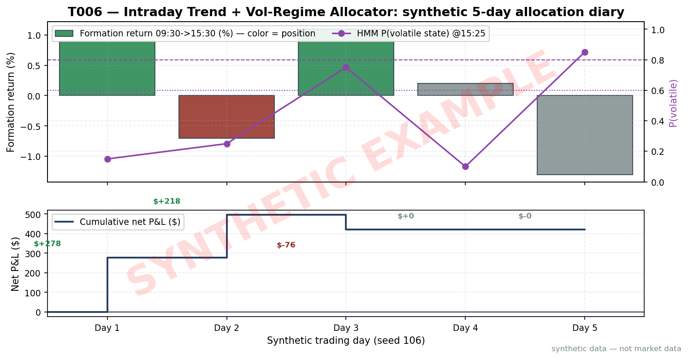

```mermaid
flowchart TD
    DATA["Market data<br/>5-min bars, SPY-class ETF"] -->|5-min bars| SIGS["Signals<br/>S025 r1 sign, S027 formation, S079 HMM"]
    SIGS -->|5-min bars| ENTRY{"Entry logic<br/>|r1|≥0.25% AND sign agree<br/>AND P(vol)<0.80, at 15:30"}
    ENTRY -->|trigger| SIZE["Sizing + risk<br/>scale 1.0/0.5/0 by P(vol);<br/>$100k notional example"]
    ENTRY -->|no trigger| WAIT["Wait / flat day"]
    SIZE -->|5-min bars| EXEC["Execution<br/>15:30 marketable limit;<br/>MOC flatten"]
    EXEC -->|5-min bars| MON["Monitor + exits<br/>16:00 flat always;<br/>no intraday stop"]
    MON -->|5-min bars| PNL["P&L (net of costs)"]
    style ENTRY fill:#f9e79f,stroke:#7d6608
    style PNL fill:#a9dfbf,stroke:#1e8449
```

### T10. Sources

1. Gao, L., Han, Y., Li, S. Z. & Zhou, G. (2018), "Intraday Momentum: The First Half-Hour Return Predicts the Last Half-Hour Return," *Journal of Financial Economics* 132(3), 240–263 — https://doi.org/10.1016/j.jfineco.2018.10.008. (Predictive regression β̂=6.94×100, R²=1.6%.)
2. Heston, S. L., Korajczyk, R. A. & Sadka, R. (2010), "Intraday Patterns in the Cross-Section of Stock Returns," *Journal of Finance* 65(4), 1369–1407. https://bauer.uh.edu/departments/finance/documents/Heston-Korajczyk-Sadka-jf-2010-01-07.pdf (Half-hour periodicity; spread warning.)
3. Nystrup, P., Madsen, H. & Lindström, E. (2018), "Dynamic portfolio optimization across hidden market regimes," *Quantitative Finance* 18(5) — https://doi.org/10.1080/14697688.2017.1342857. (Per S079's chapter: HMM + model-predictive-control allocation beats static rules after modeled costs.)

**Unverified leads:** the S025-chapter figure of ~6.67%/yr / Sharpe ~1.08 for the sign(r_1) timing rule is from the SSRN working-paper version (SSRN 2552752) — re-verify against the published JFE version before citing precisely; Moskowitz, Ooi & Pedersen (2012) time-series momentum is daily/monthly evidence, not intraday. No Grok Q-TB1 performance claims apply to this strategy (the batch's questions covered other strategies).

*Source log: Grok answered Q-TB1-1..3 (2026-09-10); all claims independently verified or labeled unverified.*

---


## Stage 107/200 — T007: Cointegration Z-Score Pairs

*Batch TB1 · Strategy 7/100 · Signals S050, S051, S053*

### T1. One-line verdict

| | |
|---|---|
| **Style** | Intraday statistical arbitrage — classic Engle–Granger pairs |
| **Edge source** | A cointegrated spread mean-reverts; the Ornstein–Uhlenbeck (OU) half-life (S051) sets the holding clock, and the zero-crossing count (S053) filters for pairs whose reversion is fast and reliable |
| **Typical holding period** | 1–2 OU half-lives (example: 25-min half-life → 50-min max hold; the worked example exits at 50 min) |
| **Capacity hint** | Low — a handful of pairs, two-leg costs on every round trip; intraday half-lives multiply the cost drag the daily literature already documents |
| **Build-or-buy in one line** | Build the EG/OU/zero-crossing stack yourself (a weekend in statsmodels); buy only clean corporate-action-adjusted bars — the pair *selection* is the product, and nobody sells a good one |

### T2. Full mechanics

**Universe & session.** Pre-selected pairs from the same sector (example: two liquid large-caps, or an ETF vs a tight basket), both with price > $20, ADV > 2M shares, borrowable, same listing session. Session: RTH 09:45–15:45 ET; **no new entries after 15:00** (`example`); flatten all by 15:45. Formation uses only prior days — never the trading day.

**Formation (overnight, frozen before the open).** On 60 RTH days of 5-minute mid log-prices (`example`): (1) estimate the cointegrating regression log P^A_t = α + β·log P^B_t + ε_t (S050); β̂ is the **hedge ratio** — a long-spread position holds 1 unit of A against β̂ units of B; (2) run the Augmented Dickey–Fuller (ADF) test on the residual ε̂_t using **Engle–Granger/MacKinnon critical values** (not ordinary t-tables — the residual comes from an estimated regression); require rejection at 5% (`example`); (3) fit the discrete OU: ΔS_t = a + b·S_{t−1} + e_t → κ̂ = −ln(1+b̂)/Δt, half-life t̂_{1/2} = ln 2/κ̂ (S051); admit only pairs with t̂_{1/2} in the 10–90 minute band (`example` — tradeable after costs, per S051's HL floor/ceiling logic); (4) zero-crossing quality filter (S053): ZC = Σ 1[sign(S_{t−1})·sign(S_t) < 0] over the formation window; require ZC ≥ 20 (`example`) — pairs that cross zero often revert fast and tight; excursion-prone pairs are rejected. When scanning many candidates, apply a multiple-testing correction (Bonferroni/Holm or FDR (false discovery rate) — S050's mandatory rule) so lucky coincidences don't flood the book.

**Entry rule.** Intraday, on 5-minute bars: spread S_t = P^A_t − α̂ − β̂·P^B_t; z_t = (S_t − μ̂_{S,t})/(σ̂_{S,t}) with rolling μ̂, σ̂ from a causal window ending at *t* (the formation coefficients stay frozen — only the z-score's mean/scale roll). **Short the spread** (short A, long B) if z_t ≥ +2.0 (`example`); **long the spread** if z_t ≤ −2.0. **Causal timing:** z_t is computed at bar *t*'s close; both legs are lifted/hit at the *open of bar t+1* — simultaneously, or not at all.

**Exit rule.** First of: (1) mean reversion: z_t crosses toward zero past |z| ≤ 0.25 (`example`); (2) **OU time stop:** hold no longer than 2 × t̂_{1/2} (`example` — the worked example exits here); (3) stop-loss: |z_t| ≥ 3.5 against the position (`example` — the relationship may have broken); (4) session flatten 15:45.

**Position sizing.** Dollar risk on the spread: stop distance in spread-$ per 1 share of A is s_stop = (z_stop − z_entry)·σ̂ = (3.5 − 2.0) × 0.25 = $0.375 (`example`); N_A = ⌊R / 0.375⌋ with R = $200 (`example`) → 533 shares; N_B = round(β̂·N_A) = 959. (Dollar-neutral variant: scale notionals so N_A·P_A ≈ N_B·P_B and convert the stop to that unit — the residual-risk form above is the worked example's.)

**Risk limits.** Max 6 concurrent pairs; two-leg fills submitted together — if one leg rejects, cancel the other immediately (leg-risk kill); halt on either name → flatten both legs; daily loss stop −$1,000 (`examples`).

**Cost model.** Spread $0.02 per leg (pay half-spread on all four fills); commission $0.005/share each way; borrow stubbed at zero for the one-day example (live: model the borrow fee explicitly — hard-to-borrow names are excluded); no slippage beyond the t+1 open fill. Two-leg costs dominate short half-lives — this is the central arithmetic of the strategy.

**Execution sketch.** Paired marketable limits at bar t+1 open (both legs IOC (immediate-or-cancel), same timestamp); leg-risk kill on partial fill; participation cap ≤ 10% of each leg's 5-min volume. Spread computation must use the **same vendor timestamps** on both legs — mixed SIP vs proprietary feeds will fake cointegration (Grok's Q2 warning, kept as a design rule).

### T3. Signals it consumes

| Signal | Role | Weight / logic |
|---|---|---|
| S050 — Engle–Granger z-score | **Primary trigger** (direction + entry/exit) | Enter at \|z\| ≥ 2.0; exit at \|z\| ≤ 0.25; stop at \|z\| ≥ 3.5 (`examples`) |
| S051 — OU half-life | **Holding clock** (timing overlay) | Admit pairs with HL in 10–90 min; time-stop at 2 × HL (`examples`) |
| S053 — Zero crossings | **Quality filter** (pair selection) | Trade only pairs with ZC ≥ 20 on formation (`example`); rolling ZC as a live health monitor — collapse → cut the pair |

Combination pseudocode (≤25 lines):

```
# overnight (formation, frozen): for each candidate pair
beta, alpha = OLS(log PA ~ log PB, 60 RTH days of 5-min mids)   # S050
assert ADF(resid, critical="engle-granger") rejects at 5%
hl = log(2)/kappa from AR(1): dS = a + b*S_lag                   # S051
ZC = count(sign flips of S over formation)                       # S053
admit if 10 <= hl <= 90 min and ZC >= 20                          # example gates
# intraday, per 5-min bar close t (causal; fills at t+1 open)
S = PA[t] - alpha - beta*PB[t]; z = (S - rollmean(S))/(rollstd(S))
if z >= 2.0:  short spread: short N_A A, long round(beta*N_A) B
elif z <= -2.0: long spread (mirror)
# exits each bar: |z|<=0.25 -> out; |z|>=3.5 -> stop; held>=2*hl -> time stop
# 15:45 -> flatten; halt on either leg -> flatten both
```

### T4. Worked example — numbers + P&L (SYNTHETIC)

Setup: fictional same-sector large caps **A** (~$72) and **B** (~$40), synthetic 5-minute bars, **seed 107**. Formation (frozen): β̂ = 1.80, μ̂ = 0, σ̂ = 0.25, OU half-life **25 min** (in the 10–90 band ✓), ZC = **31** (≥ 20 ✓), ADF rejects at 5%.

Entry at the signal bar's close: S_0 = +0.500 → z_0 = **+2.00** (≥ +2.0 ✓) → **short the spread**: short **533 A**, long **959 B** (N_A = ⌊200/0.375⌋; N_B = round(1.80 × 533)). Fills at the next bar's open (causal t→t+1): **short A @ 72.3954** (bid), **long B @ 40.0123** (ask).

The spread mean-reverts but slowly: at bar 10 (50 min = **2 × half-life**) z = +0.62 — not yet at the 0.25 exit, so the **OU time stop fires**. Exit fills: **cover A @ 72.1624** (ask), **sell B @ 39.9882** (bid).

| Line | Calculation | $ |
|---|---|---|
| Leg A (short 533) | 533 × (72.3954 − 72.1624) | +124.18 |
| Leg B (long 959) | 959 × (39.9882 − 40.0123) | −23.13 |
| Gross P&L | 124.18 − 23.13 | +101.05 |
| Spread cost | half-spread on all four fills (in the fills) | (in gross) |
| Commission | (533 + 959) × 2 × $0.005 | −14.92 |
| **Net P&L** | 101.05 − 14.92 | **+86.13** |

(Fills shown to 4 dp for audit; the chart plots this exact spread path with the +2.0/+0.25/+3.5 lines, entry/exit markers, and the net P&L stepping to +$86.13 at the time-stop exit.)

Economic read, line by line: the A leg is the alpha (+$124.18 of mean reversion); the B leg is the hedge doing its job and costing −$23.13 (β̂ was the cointegrating offset, not a second alpha); four-way fees eat $14.92 — nearly 15% of gross. Had z run to the 3.5 stop instead, the spread loss would be ≈ $200 plus the same ~$15 fees and extra spread — about **−$220** against a $200 risk budget, the two-leg cost drag in miniature.

**Where the example is optimistic.** The spread follows a clean OU path with no jumps, no earnings, no halt — the formation ADF's promise holds perfectly. Both legs fill instantly at the bar-1 open with zero leg risk (in reality one leg often slips or rejects, and the "paired" fill is a fiction on fast tapes). Borrow is stubbed at zero; a real short in A costs carry. The half-life is estimated perfectly and the time stop fires exactly at 2×HL. Most flattering: the example never tests the 3.5 stop, which is where live pairs books actually bleed — Do & Faff's decay is precisely the accumulation of spreads that don't come back.

### T5. Data & infra — what must run

**Pipeline inventory.** Overnight/09:00: load frozen (α̂, β̂), ADF pass/fail, κ̂, t̂_{1/2}, ZC per pair — **never re-estimate β on the live bar** (Grok's Q2 rule). RTH: update S_t, causal rolling μ̂/σ̂, z_t on 5-min mids; entry at |z| ≥ 2; the two-leg fill-or-cancel FSM; 15:45 flatten. Reference data: splits, dividends, halt flags — a corporate action that isn't adjusted breaks the spread silently.

**M5 Max feasibility: trivial-to-feasible (Tier M+, ~40–70 h ≈ $6,000–10,500 loaded-cost estimate).** Per cost-model §2: tens of pairs × 1-minute bars is noise; the overnight EG screen over a few hundred candidates is minutes in statsmodels/polars. RAM 50–200 MB plus 1–2 sessions of history; disk 10–50 MB/day. Bottleneck: pair *selection* research (the formation screen), not compute. A full 2,000-stock daily cointegration screen is the heavier variant — still fine overnight (§3: 3,000 stocks × 10y daily ≈ 2–5 GB).

**Feed-outage safe-mode.** One leg missing quotes > 5 s → flatten both legs immediately. Halt on either name → flatten. If the overnight formation job failed → the strategy stays dark (no frozen β̂, no trading). After any crash: flat unless the on-disk ledger says otherwise; no entries until 30 s of clean sequence on both legs. Spread timestamps must come from one vendor — mixed feeds fake cointegration.

### T6. Buy vs build

| Option | What you get | Indicative price | Gains | Loses |
|---|---|---|---|---|
| Tier 0: Stooq / Yahoo | Daily bars | ~$0, indicative — verify before budgeting | Free EG/OU/ZC research on daily pairs | No intraday z-score; splits need care |
| Tier 1: Polygon / Alpaca SIP | 1-min bars, corporate actions | ~$30–200/mo, indicative — verify before budgeting | Honest intraday formation + z-score; the strategy's full data need | — |
| Tier 2: Databento equities | Exchange-timestamped bars | ~$200/mo + usage, indicative — verify before budgeting | Cleaner two-leg timestamp alignment | Unnecessary unless you trade sub-5-min holds |
| Prime-broker pairs analytics | Precomputed screens | Institutional $$$$, indicative — verify before budgeting | Someone else's pair list | You can't audit their formation; the list is the edge |

**Verdict: build on Tier 1.** The EG regression, OU fit, and zero-crossing count are a weekend in Python; the only thing worth buying is clean, split-adjusted bars. Never buy a "pairs list" — an unaudited formation is someone else's overfit. Crossover: buy Databento only if you move to 1-minute holds where leg-timestamp alignment becomes the binding constraint.

### T7. Success-ratio evidence

| Study / source | Market & period | Metric | Before/after cost | Caveat |
|---|---|---|---|---|
| Gatev, Goetzmann & Rouwenhorst (2006), *Review of Financial Studies* | US, 1962–2002, daily distance pairs | ~11% annualized excess, self-financing | After conservative cost estimates | Pre-crowding benchmark, not the current one |
| Do & Faff (2010), *Financial Analysts Journal* | US, 1962–2009 | Monthly excess: 0.86% → 0.37% → 0.24% across subperiods | Before explicit costs | The decay finding applies to pairs generally |
| Do & Faff (2012), *J. Financial Research* 35(2) | US, 1963–2009 | Refined industry pairs: ~30 bps/mo risk-adjusted; top-30% largest: ~24 bps/mo; **largely unprofitable post-2002** | After commissions + market impact + short fees | The crowding result — verified via the published abstract |
| Rad, Low & Faff (2016), *Quantitative Finance* | US, 1962–2014 | Cointegration: 0.85%/mo gross → 0.33%/mo net (Sharpe 0.35); distance 0.91% → 0.38%; copula 0.43% → 0.05% | Both, side by side | Their 1–7 bps cost model; from 2009 opportunity scarcity bites |

Grok's Q-TB1-3 added color I keep as leads (unverified): an independent GGR replication through 2020 finding post-GFC monthly excess 0.04–0.07%, insignificant, before full costs; Jacobs & Weber (2015) ~8–9% annualized gross across 34 countries (gross, limits-to-arbitrage dependent). **Bottom line for ≤$1M paper:** the daily evidence says a few tens of bps/month net a decade ago, crowded toward zero since the early 2000s — and *none* of those papers validate intraday OU half-life exits, which add a whole extra layer of two-leg costs. A small paper book should treat this as a research harness for learning cointegration mechanics, not as an expected-profit center. An institutional desk runs pairs as a slow, diversified, low-Sharpe relative-value sleeve — the opposite of a 25-minute half-life day-trade.

### T8. Failure modes

1. **Cointegration breakdown.** The economic link snaps (M&A, earnings, regime change); the spread trends to the 3.5 stop and beyond. *Mitigation:* the stop itself, plus the rolling-ZC health monitor — a collapsing crossing rate cuts the pair before the stop does.
2. **Two-leg cost dominance.** Four fills × spread + commission on a 25-minute hold: costs are a fixed tax on a small expected move. *Mitigation:* the 10–90 min HL band is a cost filter — shorter half-lives are untradable after costs (S051's HL floor).
3. **Leg risk.** One leg fills, the other rejects — you're suddenly directionally exposed. *Mitigation:* paired IOC submission with immediate cancel of the filled leg's sibling; flatten on any single-leg quote hole > 5 s.
4. **β̂ instability intraday.** The formation hedge ratio drifts; the "spread" you're trading is mismeasured. *Mitigation:* never re-estimate β intraday (that chases noise); re-screen nightly and drop pairs whose rolling β deviates.
5. **Asynchronous prints / timestamp mixing.** A stale print on one leg prints a phantom z = 2.5. *Mitigation:* same-vendor timestamps on both legs; bar-merge on exchange timestamps, not arrival time.
6. **Borrow and corporate actions.** Hard-to-borrow shorts, dividends, and splits silently break the spread economics. *Mitigation:* borrow-flags and action-adjusted bars in the reference pipeline; exclude hard-to-borrow names.
7. **Overfit formation.** 60 days, thousands of candidate pairs, ADF at 5% — multiple testing guarantees false cointegrations. *Mitigation:* Bonferroni/Holm or FDR correction (S050's mandatory rule); the ZC ≥ 20 filter as a second, economically-motivated screen.

### T9. Visuals

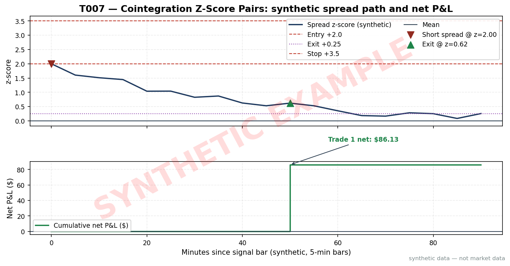

```mermaid
flowchart TD
    DATA["Market data<br/>5-min mids, both legs"] -->|5-min bars| SIGS["Signals<br/>S050 EG z-score, S051 OU half-life, S053 zero crossings"]
    SIGS -->|5-min bars| ENTRY{"Entry logic<br/>|z|≥2.0, causality t→t+1<br/>ZC≥20 formation gate"}
    ENTRY -->|trigger| SIZE["Sizing + risk<br/>N_A=floor(200/0.375);<br/>N_B=round(1.8·N_A); leg-risk kill"]
    ENTRY -->|no trigger| WAIT["Wait"]
    SIZE -->|5-min bars| EXEC["Execution<br/>paired IOC at t+1 open,<br/>same-vendor timestamps"]
    EXEC -->|5-min bars| MON["Monitor + exits<br/>|z|≤0.25 / 2×HL stop /<br/>|z|≥3.5 / 15:45 flat"]
    MON -->|5-min bars| PNL["P&L (net of costs)"]
    style ENTRY fill:#f9e79f,stroke:#7d6608
    style PNL fill:#a9dfbf,stroke:#1e8449
```

### T10. Sources

1. Engle, R. F. & Granger, C. W. J. (1987), "Co-integration and Error Correction: Representation, Estimation, and Testing," *Econometrica* 55(2) — https://ideas.repec.org/a/ecm/emetrp/v55y1987i2p251-76.html. (Cointegration foundation.)
2. Gatev, E., Goetzmann, W. N. & Rouwenhorst, K. G. (2006), "Pairs Trading: Performance of a Relative-Value Arbitrage Rule," *Review of Financial Studies* 19(3): 797–827 — https://ideas.repec.org/a/oup/rfinst/v19y2006i3p797-827.html. (Daily distance-pairs benchmark, ~11% annualized pre-crowding.)
3. Do, B. & Faff, R. (2012), "Are Pairs Trading Profits Robust to Trading Costs?", *Journal of Financial Research* 35(2), 261–287. https://strathprints.strath.ac.uk/41722/ (≈30 bps/mo refined industry pairs net; largely unprofitable post-2002.)
4. Rad, H., Low, R. K. Y. & Faff, R. (2016), "The Profitability of Pairs Trading Strategies: Distance, Cointegration and Copula Methods," *Quantitative Finance*. https://pure.bond.edu.au/ws/portalfiles/portal/36339487/AM_The_profitability_of_pairs_trading_strategies.pdf (Cointegration 0.85%→0.33%/mo gross→net.)

**Unverified leads** (Grok Q-TB1-1/3, 2026-09-10): the Q1 worked example's arithmetic was internally inconsistent (QC note — this chapter's example is independently constructed and checked); the half-life numeric in Grok's Q1 example did not render (this chapter uses 25 min as its own `example`); post-2020 GGR replication at 0.04–0.07%/mo gross (unverified); Jacobs & Weber (2015) 34-country ~8–9% annualized gross (unverified detail); one chatbot-cited intraday pairs study at ~50.5% annualized / Sharpe ~8.14 "after its cost model" (flagged as dubious in S050's chapter — not used).

*Source log: Grok answered Q-TB1-1..3 (2026-09-10); all claims independently verified or labeled unverified.*

---


## Stage 108/200 — T008: Kalman Dynamic-Hedge Pairs

*Batch TB1 · Strategy 8/100 · Signals S052, S083, S048*

### T1. One-line verdict

| | |
|---|---|
| **Style** | Intraday statistical arbitrage (pairs), adaptive hedge ratio |
| **Edge source** | Temporary divergences of a cointegrated pair from a *moving* fair value, hedge ratio re-estimated every bar by a Kalman filter instead of one frozen OLS regression |
| **Typical holding period** | Minutes to a few hours (resiliency half-life scale) |
| **Capacity hint** | Low — two-leg costs dominate short half-lives; dozens of pairs at paper scale |
| **Build-or-buy in one line** | Build the filter and the pair book (standard recursion + execution state machine); buy the clean L1/1-min data it consumes — you cannot buy your own Q-tuning (Q = the Kalman process-noise covariance, which sets how fast the hedge ratio is allowed to adapt) |

### T2. Full mechanics

**Jargon first.** A *pair* is two related securities (e.g. two same-sector large caps) whose prices move together. The *hedge ratio* β is how many shares of leg B you hold per share of leg A to make the pair market-neutral. *Cointegration* means the spread between them is stationary (mean-reverting) even though each leg wanders. A *Kalman filter* recursively re-estimates a hidden quantity (here β) each bar, weighting new evidence via the *Kalman gain*. The *innovation* e_t is the prediction error — leg B's print minus the filter's expectation — the raw material of the trade signal. *Imbalance bars* (S083) close when signed order-flow accumulation hits a threshold — equal information per bar, not equal clock time. *Resiliency* (S048) is how fast the book refills after a liquidity shock — it sets the exit clock.

**Universe & session.** Same-sector US large caps with 20-day ADV ≥ $20M, median quoted spread ≤ 5 bps, both legs shortable (live: located-borrow gate; paper: stub). Pre-screen on a 60-RTH-day formation window: Engle–Granger ADF rejects the unit root at 5% (*example* gate), and the Kalman-implied innovation half-life sits in the 10–90 minute band (*example*). Exclude earnings-week names, halts, and the first/last 15 minutes of RTH (09:45–15:45 ET session, no new entries after 15:00, flat 15:45 — *example*).

**Clock.** All signals are computed on **imbalance bars** (S083, *example* construction: tick-imbalance bars closing when |θ_T| ≥ E_0[T]·|E_0[θ]|, EWMA over trailing 50 bars). A bar is complete only when its close condition fires; features on bar *k* are tradable no earlier than bar *k+1*'s first trade — causal t→t+1 timing.

**Entry rule.** At each closed imbalance bar *k*, run the S052 Kalman update on 1-min mids: e_k = y_k − μ̂_k − β̂_k·x_k; z_k = e_k/√F_k. **Enter** (signal at *k*, fills at *k+1* open) when |z_k| ≥ 2.0 (*example*; + → short the spread, − → long) AND |β̂_k − β̂_{k−20}| < 0.05 (*example* teleport veto) AND trailing 1-day effective spread of both legs < 6 bps combined (*example* cost gate), with no existing position in the pair.

**Position sizing.** Dollar risk on the *spread*: stop at |z| = 3.5 ⇒ s_stop = 1.5·σ̂_k per share of A; N_A = ⌊R / s_stop⌋ with R = $200/trade (*example*), N_B = round(β̂_k·N_A). Portfolio: max 6 concurrent pairs, per-pair notional ≤ $150k, gross ≤ 1.5× equity on a $1M paper book (*example*).

**Exit rule (resiliency-gated).** First trigger wins: (1) convergence — z_k crosses back inside ±0.25 (*example*); (2) time stop — 2× the OU half-life on the innovation, capped at 4 hours (*example*); (3) stop-loss — |z_k| ≥ 3.5 (*example*); (4) resiliency overlay (S048): if more than 50% of the pair's own temporary impact is still unrecovered at the convergence exit (*example*), hold up to 2 more bars (*example*) into a refilled book; (5) session flatten 15:45. **Re-hedge:** if |β̂_k − β̂_entry| > 0.03 (*example*) mid-trade, resize leg B to round(β̂_k·N_A) — the adaptivity tax, paid in spread.

**Risk limits** (*example* unless noted). Daily loss stop −2% of book; per-pair stop −$250; kill switch on Kalman divergence (P_k growing 10× in 20 bars), a single-leg quote hole > 5 s (flatten both legs), or a halt in either name. Overnight: flat.

**Cost model** (illustrative convention from Grok's Q-TB1-1 shared spec, labeled lead): $0.005/share each way; half-spread paid on every fill (aggressive take); borrow stub ~$0 intraday (optimistic, see T4); no slippage beyond half-spread (optimistic, see T4). Applied explicitly below.

**Execution sketch.** Two marketable limit orders (one per leg) submitted simultaneously at the *k+1* open; participation ≤ 10% of visible depth (*example*); on reject/partial fill, cancel/flatten the other within 1 second (leg-risk kill — a half-pair is a directional bet, not a hedge). Any fill modeled at the signal bar's close is rejected by the harness.

### T3. Signals it consumes

| Signal | Role | Weight / logic |
|---|---|---|
| S052 — Kalman dynamic hedge ratio | **Primary trigger** | Entry on \|z_k\| ≥ 2.0; also supplies β̂_k for sizing and the re-hedge rule |
| S083 — Imbalance bars | **Clock / regime gate** | All features computed on imbalance-bar closes; no clock-time bars intraday |
| S048 — LOB resiliency | **Exit timer** | Convergence exits deferred while resiliency(t) > 0.5 (own impact unrecovered); time-stop scale from κ̂ |

Every listed signal exists in S001–S100. No other signals are used.

```pseudocode
# T008: on each closed imbalance bar k (causal: data <= k)
update_kalman(x[<=k], y[<=k]) -> β̂_k, μ̂_k, e_k, F_k, P_k
z_k = e_k / sqrt(F_k)
res_k = estimate_resiliency(book_snapshots[<=k])                  # S048: κ̂
if position is None:
    if abs(z_k) >= 2.0 \                                          # example
       and abs(β̂_k - β̂_{k-20}) < 0.05 \                          # example
       and eff_spread_cost(A, B) < 6bps:                         # example
        N_A = floor(R / (1.5 * sqrt(F_k))) ; N_B = round(β̂_k * N_A)
        submit_pair(MarketableLimits, at="next bar open")        # t -> t+1
else:
    if abs(β̂_k - β̂_entry) > 0.03:                               # example re-hedge
        resize leg B to round(β̂_k * N_A)
    if (abs(z_k) <= 0.25 and res_k.recovered) \                  # example
       or bars_held >= 2 * half_life \
       or abs(z_k) >= 3.5 \
       or clock >= "15:45":
        flatten both legs at next bar open
```

### T4. Worked example — numbers + P&L (SYNTHETIC)

All prices synthetic, **seed 108** (regenerable via `python3 batches/TB1/plot_T008.py`). Synthetic tickers SYN-A / SYN-B. The chart in T9 plots these exact trades.

Setup: formation β̂ ≈ 1.60; innovation σ̂_k = $0.30 per share of A; R = $200 (*example*). Stop |z| = 3.5 ⇒ s_stop = 1.5 × 0.30 = $0.45/share ⇒ N_A = ⌊200/0.45⌋ = **444**, N_B = round(1.60 × 444) = **710**. Fees $0.005/share each way.

**Trade T1 — short the spread, pays the adaptivity tax.** Bar 40 close: z = +2.00. Bar 41 open: short 444 A @ **150.59** (bid), long 710 B @ **93.76** (ask). Bar 60: β̂ drifts 1.60 → 1.64; re-hedge buys 18 B @ **93.30** (ask) → 728. Bar 88: z = +0.23 (inside ±0.25, book recovered) → exit: cover 444 A @ **149.28** (ask), sell 728 B @ **93.24** (bid).

| Line | Calc | $ |
|---|---|---|
| A leg (short) | 444 × (150.59 − 149.28) | +581.64 |
| B leg (original 710) | 710 × (93.24 − 93.76) | −369.20 |
| B leg (re-hedge 18) | 18 × (93.24 − 93.30) | −1.08 |
| Gross | 581.64 − 369.20 − 1.08 | +211.36 |
| Commissions | (444 + 710 + 18) × 2 × 0.005 | −11.72 |
| **Net T1** | | **+199.64** |

**Trade T2 — short the spread, stop-loss.** Bar 120: z = +2.00; fills short 444 A @ **150.59**, long 710 B @ **93.76**. The divergence is real: bar 152 prints z = +3.50 → stop: cover 444 A @ **151.06**, sell 710 B @ **93.74**. A leg: 444 × (150.59 − 151.06) = −208.68; B leg: 710 × (93.74 − 93.76) = −14.20; gross −222.88; fees −11.54; **net −234.42**.

**Trade T3 — long the spread, convergence.** Bar 175: z = −2.00; fills long 444 A @ **149.41**, short 710 B @ **93.74**. Bar 215: z = −0.23 → exit: sell 444 A @ **149.92**, cover 710 B @ **93.76**. A leg: 444 × (149.92 − 149.41) = +226.44; B leg: 710 × (93.74 − 93.76) = −14.20; gross +212.24; fees −11.54; **net +200.70**. Cumulative: **+165.92**.

**Where the example is optimistic.** Both legs fill simultaneously at the quoted touch — no partial fills, no leg-reject race, no queue effects (*simulated only — requires MBO/ITCH* for any queue claim). Borrow is stubbed to ~$0; a hard-to-borrow leg adds a daily fee the example ignores. The Kalman β̂ is frozen *within* each trade except the one scripted re-hedge; a live filter re-hedges continuously and every re-hedge pays spread again — T1's −$1.08 + $0.18 fees is the *minimum* adaptivity tax, not the typical one. The stop at z = 3.5 assumes a tradable print exists; in a real break the spread gaps through it. Resiliency always recovers in time for the exit — sometimes it doesn't, and you exit into your own impact.

### T5. Data & infra — what must run

**Pipeline inventory.** Pre-open: NYSE calendar + halt flags; load frozen pair list (ADF pass/fail, formation β̂, κ̂) from the overnight job. Intraday loop (09:45–15:45 ET): per-symbol ring buffers of 1-min mids (S052) + imbalance-bar builder on L1 events (S083) + L1 snapshots for the resiliency estimator (S048) — features stamped at closed bar *k*, intents queued for *k+1*. Post-close: persist the ledger, re-fit formation stats, recompute 50-bar imbalance EWMAs. Storage: 1-min bars for 500 symbols ≈ 50 MB/day (cost-model §4), archived freely; raw L1 recorded only for traded pairs (~2–8 GB/symbol-day) and rolled off after 30 days (*example*).

**M5 Max feasibility: feasible (Tier M+).** Per cost-model §2, a Python event loop sustains ~100–500k events/sec — a 20-name L1 book at ~1–5k touch events/sec/name is comfortable with polars batch recompute each bar; the Kalman update is microseconds per pair. RAM: hot state well under 2 GB (§3 working budget 77 GB); overnight re-fits for 200 pairs are minutes. Engineering: 40–100 h (Tier M+ harness, cost-model §5) ≈ $6,000–15,000 at $150/hr loaded cost — mostly the two-leg execution FSM and no-look-ahead backtest alignment, not the filter math. Bottleneck: feed jitter and timestamp hygiene, not CPU. Breaks at: full-tape L2 book rebuild or 500-pair universes — then Rust and per-symbol daily files.

**Feed-outage safe mode.** Single-leg quote hole > 5 s → flatten the pair immediately (a half-pair is an unapproved directional bet). Both legs stale → no new entries; existing positions held only if both legs last printed within 60 s, else flatten at last valid quotes and tag the session DEGRADED. Kalman divergence guard (P_k explosion) → freeze that pair's entries for the day. The ledger is the source of truth: restart flat and reload from disk — never from RAM. SIP-vs-direct timestamp mixing is banned on the spread input (it fakes cointegration); if the direct feed drops, the pair goes dark.

### T6. Buy vs build

| Option | What you get | Indicative price | Gains | Loses |
|---|---|---|---|---|
| Tier-0: Stooq/Alpaca IEX daily + SIP delayed | Daily bars, corporate actions | ~$0, *indicative — verify before budgeting* | Free pair screening history | No intraday imbalance bars, no honest fills |
| Tier-1: Polygon Stocks Advanced / Alpaca SIP | Real-time SIP trades+quotes, 1-min bars | ~$30–200/mo, *indicative — verify before budgeting* | Enough for the 1-min Kalman + resiliency snapshots on liquid names | SIP smears venue identity; imbalance-bar close rules degrade |
| Tier-2: Databento Standard (MBP-1) | Exchange-timestamped L1 events, honest imbalance bars | ~$200/mo + usage, *indicative — verify before budgeting* | The clock this strategy is designed on; replayable | Overkill for a 6-pair paper book; usage billing needs watching |
| Retail platform: QuantConnect paper | Research + paper broker, minute bars | ~$60–300/mo tiers, *indicative — verify before budgeting* | Fastest paper two-leg path | No true imbalance-bar clock; fills are modeled, not lived |
| Build in-house (Python + polars) | Filter, pair FSM, ledger, kill switch | 40–100 h ≈ $6,000–15,000 eng (loaded-cost estimate) | Your thresholds, your causality, auditable t→t+1 | You own every timestamp bug |

**Verdict: hybrid.** Buy Tier-1/2 data (Polygon for screening, Databento MBP-1 for the live imbalance clock), build the strategy. **Build if** the research question is adaptivity (Q-tuning, re-hedge rules) — no vendor sells your thresholds. **Buy if** you only want static OLS pairs (T007 covers that cheaper) or you need full-depth replay history (then buy Databento historical, don't record it). Crossover: once two-leg fills and borrow bind, the feed tier matters more than the filter.

### T7. Success-ratio evidence

Documented numbers are for *pairs trading generally*; the intraday Kalman variant has a thinner record — the bottom line says so.

| Source | Market / period | Metric | Before/after cost | Caveat |
|---|---|---|---|---|
| Gatev, Goetzmann & Rouwenhorst (2006) | US, 1962–2002, daily distance | ~11% annualized excess (Grok Q-TB1-3 lead; the paper's headline) | Before full costs; 1-day wait blunts bounce | Pre-crowding benchmark, not current |
| Do & Faff (2012) | US, 1963–2009 | Best intra-industry four: +0.29%/mo net (~3.5% ann.); plain 20-pair rule unprofitable after friction; post-2002 "largely unprofitable" | **After** commissions + impact + short fees | Daily bars, six-month holds — not intraday OU |
| Rad, Low & Faff (2016, working paper; Grok lead) | US, 1962–2014 | Cointegration: 85 bps/mo gross, 33 bps/mo net of time-varying costs | **After** time-varying costs | Unverified chatbot claim — treat as lead |
| Elliott, Van Der Hoek & Malcolm (2005) | Theory | Analytic framework for trading a mean-reverting spread observed in noise | No P&L | Framework paper, not a backtest |
| Triantafyllopoulos & Montana (2008), arXiv:0808.1710 | Method | Dynamic (Kalman-style) mean-reverting spread modeling for stat-arb | No after-cost P&L | The direct methodological ancestor of this strategy |

Regimes where it fails: crowded unwinds (2007 quant crisis pattern — the Krauss 2015 survey's cautionary core), volatility spikes where β̂ teleports faster than the filter's Q allows, and any period where borrow goes special on a leg. Documented decay: Do & Faff's 0.86% → 0.37% → 0.24%/mo gross decay across 1962–2009 subperiods, then ~zero for the plain rule after 2002 — the crowding result the whole chapter must respect.

**Honest bottom line.** For a ≤$1M paper operation: research strategy, not income strategy. Documented after-cost edge in liquid US pairs was tens of bps/month a decade ago on *daily* bars; going intraday multiplies two-leg costs while the evidence stays daily. Kalman adaptivity adds turnover to buy drawdown reduction — frequently negative after costs (S052's verdict). A desk earns its keep with borrow access, two-leg simultaneity, and breadth; a one-person paper book earns an education in state-space estimation and honest execution accounting. Size nothing as alpha until a purged, embargoed walk-forward (S088) shows net-of-cost persistence — none is cited here.

### T8. Failure modes & pitfalls

1. **Q mis-set (filter chases noise or never adapts)** — the modal Kalman failure. Mitigation: grid-search q_β out-of-sample with the Q = 0 static model as the null; ship Kalman only if it beats the null net of turnover (S052's production rule).
2. **Cointegration breakdown mid-trade** — the relationship died, not diverged. Mitigation: the |z| = 3.5 stop plus the β̂-teleport veto; never average down a broken pair.
3. **Two-leg fill asynchrony** — one leg fills, the other gaps. Mitigation: simultaneous marketable limits, cancel-other on reject, ≤10% participation; model slippage as half-spread *per leg*, not mid-to-mid.
4. **Borrow going special / buy-in** — the short leg's borrow explodes or the position is bought in. Mitigation: borrow-flag gate pre-entry; replace the paper stub with a real locate feed before live capital.
5. **SIP latency honesty** — imbalance-bar closes and touch fills on SIP timestamps are fiction at the millisecond scale. Mitigation: label results *simulated only — requires MBO/ITCH*; trade on exchange-timestamped data or not at all.
6. **Resiliency mis-measurement** — exiting into your own impact because κ̂ was fit on a stale regime. Mitigation: the deferral is a *delay*, not a guarantee; cap at 2 bars, then exit regardless.
7. **Overfit thresholds** — ±2.0/±3.5 tuned on one pair's history. Mitigation: round z-units only, purged CV (S088) across the pair universe; no per-pair tuning.
8. **Operational: stale kill-switch / dead feed** — the flatten logic depends on the same feed that died. Mitigation: independent watchdog with its own heartbeat; ledger-on-disk as position truth; restart-flat rule.

### T9. Visuals

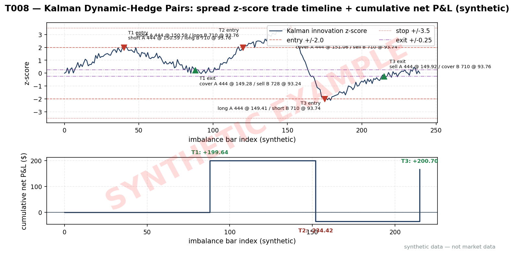

```mermaid
flowchart TD
    DATA["Market data<br/>L1 events + 1-min mids<br/>(Databento MBP-1)"] -->|"L1 events + 1-min bars"| SIGS["Signals<br/>S052 Kalman z, S083 imbalance bars, S048 resiliency"]
    SIGS -->|"imbalance bars"| ENTRY{"Entry logic<br/>|z| >= 2.0, beta stable, cost gate<br/>causal t to t+1"}
    ENTRY -->|trigger| SIZE["Sizing + risk<br/>N=floor(R/s_stop), heat caps<br/>daily stop, kill switch"]
    ENTRY -->|no trigger| WAIT["Wait"]
    SIZE -->|1-min bars| EXEC["Execution<br/>2-leg marketable limits<br/><=10% depth, cancel-other"]
    EXEC -->|1-min bars| MON["Monitor + exits<br/>z to 0.25 / 2x half-life / |z|=3.5<br/>re-hedge on beta drift"]
    MON -->|1-min bars| PNL["P&L (net of costs)"]
    style ENTRY fill:#f9e79f,stroke:#7d6608
    style PNL fill:#a9dfbf,stroke:#1e8449
```

### T10. Sources

- Elliott, R. J., Van Der Hoek, J. & Malcolm, W. P. (2005). "Pairs trading." *Quantitative Finance* 5(3), 271–276. doi:10.1080/14697680500149370 — https://doi.org/10.1080/14697680500149370 — the analytic spread-trading framework this strategy extends with a dynamic hedge.
- Triantafyllopoulos, K. & Montana, G. (2008). "Dynamic modeling of mean-reverting spreads for statistical arbitrage." arXiv:0808.1710 — Kalman-style dynamic spread estimation, the direct methodological ancestor of S052-in-production.
- Krauss, C. (2015). "Statistical arbitrage pairs trading strategies: Review and outlook." *FAU Discussion Papers in Economics* 09/2015. https://ideas.repec.org/p/zbw/iwqwdp/092015.html — 90+ paper survey; documents the distance/cointegration/time-series taxonomy and the crowding/decay evidence used in T7.
- Do, B. & Faff, R. (2012). "Are Pairs Trading Profits Robust to Trading Costs?" *Journal of Financial Research* 35(2), 261–287 — listed and summarized via the Krauss (2015) survey page above; the after-cost crowding result (plain rule dead after 2002).
- López de Prado, M. (2018). *Advances in Financial Machine Learning.* Wiley — Ch. 2 imbalance bars (S083); Ch. 7–8 CV discipline (T7/T8). No URL verified — check the publisher page before citing in production.

**Unverified leads** (chatbot-provided, not independently checkable — do not treat as evidence):
- *Unverified chatbot claim* (Grok, 2026-09-10, Q-TB1-3): a TU Delft thesis in which EM-tuned Q turned a losing Kalman filter into the best performer, and a walk-forward study where Kalman lost to static OLS after costs — directionally consistent with S052's verdict but unverified; used only as labeled leads.
- *Unverified chatbot claim* (Grok, 2026-09-10, Q-TB1-1 shared convention): $0.005/share each-way commission and half-spread-on-every-fill cost convention — used as the chapter's *illustrative* cost model, not as a market fact.
- Rad, Low & Faff (2016) cointegration 85/33 bps gross/net figures — Grok Q-TB1-3 lead, not independently verified.

Source log: Grok answered Q-TB1-1..3 (2026-09-10); all claims independently verified or labeled unverified.

---


## Stage 109/200 — T009: ETF-vs-Basket Arbitrage

*Batch TB1 · Strategy 9/100 · Signals S056, S059, S014*

### T1. One-line verdict

| | |
|---|---|
| **Style** | Intraday relative-value / basis arbitrage, ETF vs basket |
| **Edge source** | Transient dislocations between an ETF's market price and its intraday NAV (iNAV), entered only when a futures–spot lead-lag read says the dislocation is real and the spread decomposition says it clears costs |
| **Typical holding period** | Minutes to ~1 hour (domestic dislocations decay in minutes per the literature) |
| **Capacity hint** | Small and shrinking — Authorized Participants (APs) see the same print and trade the actual creation/redemption loop; the non-AP proxy earns the scraps |
| **Build-or-buy in one line** | Build the dislocation monitor and the basis-hedged execution; buy the 15-second iNAV feed and futures data — without licensed iNAV there is no signal |

### T2. Full mechanics

**Jargon first.** An *ETF* (exchange-traded fund) trades on exchange like a stock but holds a basket of securities. *iNAV* (intraday net asset value, also called IIV) is the issuer's 15-second estimate of what the basket is worth. The *premium/discount* is (ETF price − iNAV)/iNAV — the dislocation this strategy trades. *Authorized Participants* (APs) are institutions with the contractual right to *create* ETF shares (deliver the basket, receive shares) or *redeem* them (reverse) — the primary-market loop that keeps prices near NAV. A *creation unit* is the block size for that loop (typically 25,000–100,000 shares). The *PCF* (portfolio composition file) is the daily recipe of one creation unit. *Basis* is the futures-minus-cash difference; *lead-lag* is the empirical fact that futures often move first and cash catches up. *Effective spread* (S014) is what an aggressor actually paid versus the mid — the true cost of the take.

**Universe & session.** US-listed ETFs with a licensed 15-second iNAV, 20-day ADV ≥ $50M, median quoted spread ≤ 3 bps (*example* filters), and a liquid futures proxy (index ETFs via ES/MES). Exclude: international ETFs whose baskets trade while the home market is closed (stale-iNAV mirage — Engle & Sarkar 2006), ex-div and reconstitution days, and the first/last 15 minutes (09:45–15:45 ET, flatten 15:45 — *example*).

**Entry rule (statistical proxy, non-AP).** At each 15-second snapshot *t*, compute premium_t = (P_ETF,t − iNAV_t)/iNAV_t (S056) and the lead-lag read (S059): β̂·r_f(t−ℓ̂) with ℓ̂ = 5 min, β̂ from a 20-session 1-min regression (*example*). **Enter** (signal at *t*, fills at *t+1* snapshot) when all three hold:

- |premium_t| > 8 bps — the all-in cost bound c (*example*; S056's default);
- |β̂·r_f(t−ℓ̂)| ≥ 5 bps (*example* cost filter) **and** its sign agrees with the dislocation being real (futures moved the way cash must follow to *widen* the true dislocation — i.e. the premium isn't a stale-iNAV artifact);
- trailing 1-day average effective spread of the ETF leg (S014) < |premium_t| − c (*example*: the edge must survive the actual spread paid, not the quoted one).

Discount (premium < 0): long ETF, short the futures proxy. Premium > 0: mirror. The AP creation/redemption loop is described for completeness (S056 variant 1) but is **not executable** by a retail/paper book — no AP agreement, no PCF delivery. The paper strategy is variant 2: short the rich leg, buy the cheap leg, exit on convergence.

**Position sizing.** Dollar risk on the *premium*: stop at |premium| = 14 bps vs entry at 8 ⇒ stop distance ≈ 6 bps × P_ETF ≈ $0.30/share (*example*). N_ETF = ⌊R / 0.30⌋ with R = $200 (*example*) → 666 shares. Futures hedge in beta-equivalent notional: 666 × $500.75 ≈ $333k ⇒ 10 MES contracts ($5/pt × 7,000 ≈ $35k each ≈ $350k; residual disclosed). Portfolio: max 4 concurrent dislocations, gross ≤ 2× equity on a $1M paper book (*example*).

**Exit rule.** First wins: (1) convergence — |premium| < 4 bps = c/2 (*example*); (2) time stop — 60 min (*example*; domestic dislocations are minute-scale per Engle & Sarkar); (3) stop-loss — |premium| ≥ 14 bps, the dislocation is widening against you (*example*); (4) futures leg basis blowout — ES/MES halted or basis moves > 3σ (*example*) — flatten both legs; (5) flatten 15:45.

**Risk limits** (*example* unless noted). Daily loss stop −1.5% of book; per-trade hard stop −$350; iNAV-staleness kill switch (no fresh print in 60 s ⇒ no new entries); clock-skew kill switch (> 50 ms vs NTP).

**Cost model** (illustrative; commissions per Grok's Q-TB1-1 shared convention, labeled lead): $0.005/share each way on the ETF leg; MES $0.75/contract round-trip (*indicative — verify before budgeting*); half-spread on every fill embedded in fill prices; no financing, no borrow, no slippage beyond half-spread (optimistic — see T4). Applied explicitly below.

**Execution sketch.** Marketable limits on both legs at the *t+1* snapshot; ETF participation ≤ 10% of visible depth (*example*); MES is the liquid leg and leads. One leg rejecting ⇒ cancel the other within 1 second (*example*) (unhedged premium exposure is not the strategy). Fills at the *signal* snapshot are rejected by the harness — only *t+1* or later.

### T3. Signals it consumes

| Signal | Role | Weight / logic |
|---|---|---|
| S056 — ETF vs basket / iNAV premium | **Primary trigger** | Enter only if \|premium_t\| > 8 bps (*example*); exit at < 4 bps |
| S059 — Futures–spot lead-lag | **Confirmation filter** | Enter only if \|β̂·r_f(t−ℓ̂)\| ≥ 5 bps (*example*) and sign-consistent; vetoes stale-iNAV mirages |
| S014 — Spread decomposition | **Cost gate (veto)** | Trailing effective spread must be < \|premium_t\| − c; realized-spread diagnostics post-trade only |

```pseudocode
# T009 combination logic — runs on each 15-second snapshot t (causal: data ≤ t)
premium_t = (P_ETF[t] - iNAV[t]) / iNAV[t]                       # S056
lead_t    = beta_hat * r_futures[t - LAG]                        # S059, LAG = 5 min (example)
cost_ok   = eff_spread_1d(ETF) < abs(premium_t) - C              # S014, C = 8 bps (example)
if position is None and iNAV_fresh(t):
    if abs(premium_t) > C and abs(lead_t) >= 5bps \              # example
       and sign(lead_t) == -sign(premium_t) and cost_ok:
        # discount: long ETF / short MES; premium: mirror
        N_ETF = floor(R / ((STOP - C) * P_ETF[t]))               # R=$200, STOP=14bps (example)
        N_MES = round(N_ETF * P_ETF[t] / (MES_mult * F[t]))
        submit_both_legs(MarketableLimits, at="snapshot t+1")
else:
    if abs(premium_t) < C/2 or abs(premium_t) >= STOP \          # example
       or minutes_held >= 60 or clock >= "15:45":
        flatten both legs at next snapshot
```

### T4. Worked example — numbers + P&L (SYNTHETIC)

All prices synthetic, **seed 109** (regenerable via `python3 batches/TB1/plot_T009.py`). Synthetic ETF "SYIDX", synthetic iNAV prints, MES = Micro E-mini S&P 500 ($5/point — real contract spec). The chart in T9 plots these exact trades.

**Trade T1 — discount convergence (winner).** Snapshot *t*: ETF mid 500.755, iNAV 501.250 ⇒ premium = (500.755 − 501.250)/501.250 = −9.9 bps (< −8 bps ✓). Lead-lag: ℓ̂ = 5 min, β̂ = 0.98, ES r_f = +0.12% over the lag ⇒ predicted cash catch-up +11.8 bps ≥ 5 bps ✓, sign-consistent (futures up ⇒ cash must rise ⇒ the discount is real, not stale iNAV). S014 gate: trailing effective spread 1.6 bps < 9.9 − 8 = 1.9 bps ✓ (tight, but passes). Fill at *t+1*: long **666 ETF @ 500.76** (ask), short **10 MES @ 7,000.50**. Sizing check: stop distance (14−8) bps × 500.75 ≈ $0.30/share ⇒ N = ⌊200/0.30⌋ = 666. Exit ~40 min later: iNAV caught up; ETF bid 501.20, iNAV 501.250 ⇒ premium −0.9 bps < −4 bps ✓. Sell 666 @ **501.20**, cover 10 MES @ **7,001.00**.

| Line | Calc | $ |
|---|---|---|
| ETF leg | 666 × (501.20 − 500.76) | +293.04 |
| MES hedge leg | 10 × 5 × (7,000.50 − 7,001.00) | −25.00 |
| Gross | 293.04 − 25.00 | +268.04 |
| Commissions: ETF 666 × 0.01 | | −6.66 |
| Commissions: MES 10 × 0.75 (*indicative*) | | −7.50 |
| **Net T1** | | **+253.88** |

**Trade T2 — discount widens (stop).** Snapshot *t*: premium −10.0 bps, lead-lag +10.6 bps, cost gate passes; same sizing: long 666 @ 500.76, short 10 MES @ 7,000.50. The dislocation widens: stop fires at premium −15.6 bps (≤ −14 bps): sell 666 @ **500.46**, cover 10 MES @ **7,000.75**. ETF leg: 666 × (500.46 − 500.76) = −199.80; MES leg: 10 × 5 × (7,000.50 − 7,000.75) = −12.50; gross −212.30; fees −14.16; **net −226.46**. Cumulative: +253.88 → **+27.42**.

**Where the example is optimistic.** The iNAV is assumed executable — a real iNAV is a 15-second *indicative* print, not a tradable quote; the basket may not be assemblable at those prices (S056's S10 warning). MES is a clean proxy only for index ETFs; for sector ETFs the basis between ETF and ES/MES is itself a risk the example sets to ~zero. Both legs fill at the touch with no partial fills and no futures slippage beyond the quoted bid/ask. The S014 gate passes by 0.3 bps — in production that margin is noise, and half the "passing" signals would be vetoed. Financing, borrow on the short-ETF mirror trade, and the creation-unit capital requirement are all stubbed out.

### T5. Data & infra — what must run

**Pipeline inventory.** Pre-open: load PCF weights (for the basket-residual diagnostic), 20-session β̂/ℓ̂ estimates, trailing effective-spread panels. Intraday (09:45–15:45 ET): 15-second iNAV poller with a staleness watchdog (no fresh print in 60 s ⇒ no new entries); ETF L1 quote stream for premium_t; ES/MES futures stream for the lead-lag leg; a 1-second snapshotter stamping premium, lead_t, and cost-gate state. Post-close: persist every snapshot + decision to disk; rebuild β̂/ℓ̂ and spread panels overnight. Storage: snapshots are tiny (a few hundred MB/day); futures+ETF L1 for replay ~2–8 GB/symbol-day (cost-model §4) — record only traded names.

**M5 Max feasibility: feasible (Tier M).** Per cost-model §2 this is a snapshot-arithmetic workload: a few thousand 15-second evaluations/day, OLS on 20 sessions of 1-min data overnight — a rounding error for this machine. RAM: < 1 GB hot (§3). Engineering: 40–100 h Tier M+ harness (cost-model §5) ≈ $6,000–15,000 loaded-cost estimate — the work is the two-leg execution FSM, the iNAV licensing plumbing, and the no-look-ahead backtest, not the math. Bottleneck: data licensing and timestamp alignment between the iNAV clock and the futures feed, not compute. Breaks at: full-creation-unit AP simulation (capital, not compute) or multi-venue futures books.

**Feed-outage safe mode.** iNAV stale > 60 s → no new entries; existing positions run to convergence/stop on last-known premium. ETF quote hole → flatten the ETF leg and the MES hedge together (never hold the proxy naked). Futures halt/limit → flatten everything; the hedge is the strategy's other half. Clock skew > 50 ms → halt all. Restart-flat from the on-disk ledger, as in T008.

### T6. Buy vs build

| Option | What you get | Indicative price | Gains | Loses |
|---|---|---|---|---|
| Tier-0: exchange delayed quotes + public PCF | End-of-day NAV, basket recipe | ~$0, *indicative — verify before budgeting* | Learn the loop mechanics | No 15-s iNAV — no signal |
| Tier-1: Polygon Stocks Advanced | Real-time SIP equity quotes/trades | ~$30–200/mo, *indicative — verify before budgeting* | ETF leg priced honestly | No licensed iNAV; no futures |
| Tier-2: Databento (equities + CME futures) | Exchange-timestamped L1 + futures | ~$200/mo + usage, *indicative — verify before budgeting* | Both legs + replay; the honest stack | iNAV still licensed separately |
| Index-data vendor (e.g. index publisher feed) | 15-second iNAV/IIV | Licensed, typically $$/mo institutional, *indicative — verify before budgeting* | The actual signal input | The surprise bill; redistribution terms |
| Retail platform: QuantConnect paper | Minute bars + paper broker | ~$60–300/mo tiers, *indicative — verify before budgeting* | Fast paper harness | No iNAV, no 15-s futures-cash lead-lag |
| Build in-house (Python + polars) | Monitor, β̂/ℓ̂ fitter, two-leg FSM, ledger | 40–100 h ≈ $6,000–15,000 eng (loaded-cost estimate) | Your cost bound, your causality | You own the timestamp alignment |

**Verdict: buy the data, build the logic.** Without licensed 15-second iNAV there is no strategy — that is the first purchase. **Build if** you want the statistical proxy with your own cost bound and lead-lag confirmation. **Buy/lease if** you want the actual AP loop — which, honestly, a ≤$1M paper operation cannot have: no AP agreement, no creation-unit capital. Crossover: the day you can sign an AP agreement and fund creation units, the proxy becomes obsolete; until then the proxy is the whole game.

### T7. Success-ratio evidence

| Source | Market / period | Metric | Before/after cost | Caveat |
|---|---|---|---|---|
| Engle & Sarkar (2006) | 21 domestic + 16 intl ETFs, 2000 | Domestic: mean premium < 5 bps, avg std ~15 bps, deviations transient (minutes); SPY spread 8.7 bps | Measured vs spreads, not net P&L | End-of-day + minute-bar sample; market structure has changed |
| Petajisto (2017) | US ETFs | ~100 bps average deviation for identical-portfolio ETFs; ~16% gross Carhart four-factor alpha on the mispricing | Gross of costs | Identical-portfolio pairs, not single-ETF vs iNAV |
| Jain, Jain & Jiang (2021) | US ETFs | Higher algorithmic trading ⇒ smaller, less persistent ETF price deviations | Empirical, after the market's own costs | The competition you're trading against |
| Lettau & Madhavan (2018) | Survey | Creation/redemption mechanics and AP incentives architecture | n/a | Framework, not performance |

Capacity: Engle & Sarkar's domestic dislocations last *minutes* with 15-bps-scale standard deviations against ~9–38 bps spreads — the AP loop harvests the persistent part; the non-AP proxy competes with every HFT desk watching the same 15-second print. Documented decay: Jain et al. (2021) is the decay paper — algorithmic competition has been *shrinking* deviations over time. Failure regimes: international/overnight baskets (stale iNAV mirages), stress episodes where APs step back and authorized creation is constrained, and basis blowouts where the MES proxy decouples from the ETF's actual basket.

**Honest bottom line.** For a ≤$1M paper operation: this is a superb *education* strategy and a poor *income* strategy. The documented edge is measured in single-digit bps per dislocation, the holding time is minutes, and the other side of your proxy trade is a professional AP desk with the actual creation loop. Paper-trade it to learn basis accounting, two-leg execution, and cost-bound discipline; do not mistake the +$253.88 synthetic winner for a scalable return. An institutional desk monetizes this with AP status, balance sheet for creation units, and co-located simultaneity — none of which a paper book has.

### T8. Failure modes & pitfalls

1. **Stale-iNAV mirage** — the "discount" is just an iNAV that hasn't caught up to futures. Mitigation: the S059 sign-consistency filter *and* the 60-second iNAV freshness watchdog; never trade the print alone.
2. **International/overnight baskets** — underlying markets closed while the ETF trades. Mitigation: universe excludes them (Engle & Sarkar's large-persistent-premium set is exactly this trap).
3. **Proxy basis risk** — MES tracks the S&P 500, not your sector ETF's basket. Mitigation: restrict the proxy variant to index ETFs; otherwise build the subset basket or don't trade.
4. **AP step-back in stress** — deviations widen beyond the stop exactly when liquidity is thinnest. Mitigation: the −14 bps hard stop; no averaging down; Ben-David et al.'s volatility finding is the reason.
5. **Two-leg asynchrony** — ETF fills, MES gaps on a macro headline. Mitigation: simultaneous marketable limits, cancel-other in ≤1 s, ≤10% participation.
6. **Cost-bound optimism** — the S014 gate passes by fractions of a bp on quoted spreads; effective spreads are worse. Mitigation: gate on *trailing average effective* spread, and require 2 bps of margin beyond c (*example* safety margin) before entry.
7. **Financing/borrow on the mirror trade** — short-ETF premiums need borrow; the example stubs it. Mitigation: borrow-flag gate on the short leg; model stock-loan fees in the bound c for live use.
8. **Lookahead in β̂/ℓ̂** — fitting the lead-lag on data that includes the trade window. Mitigation: 20-session *trailing* estimation, refit overnight only, purged/embargoed validation (S088).

### T9. Visuals

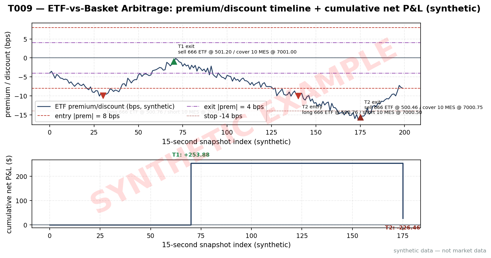

```mermaid
flowchart TD
    DATA["Market data<br/>ETF L1 + 15s iNAV + ES/MES futures"] -->|15-second snapshots| SIGS["Signals<br/>S056 premium, S059 lead-lag, S014 spread gate"]
    SIGS -->|"15-second snapshots"| ENTRY{"Entry logic<br/>|prem| > 8bps, lead-lag confirms<br/>spread clears cost, t to t+1"}
    ENTRY -->|trigger| SIZE["Sizing + risk<br/>N=floor(R/premium stop)<br/>MES notional hedge, heat caps"]
    ENTRY -->|no trigger| WAIT["Wait"]
    SIZE -->|15-second snapshots| EXEC["Execution<br/>2-leg marketable limits<br/>cancel-other on reject"]
    EXEC -->|15-second snapshots| MON["Monitor + exits<br/>prem < 4bps / 60min / stop 14bps<br/>iNAV staleness guard"]
    MON -->|15-second snapshots| PNL["P&L (net of costs)"]
    style ENTRY fill:#f9e79f,stroke:#7d6608
    style PNL fill:#a9dfbf,stroke:#1e8449
```

### T10. Sources

- Engle, R. F. & Sarkar, D. (2006). "Premiums–Discounts and Exchange Traded Funds." *Journal of Derivatives*, Summer 2006. https://www.stern.nyu.edu/rengle/jod.2006.635418.pdf — domestic dislocations small/transient (mean < 5 bps, std ~15 bps); the empirical anchor of T7.
- Petajisto, A. (2017). "Inefficiencies in the Pricing of Exchange-Traded Funds." *Financial Analysts Journal* 73(1), 24–54 — via CFA Institute: https://www.cfainstitute.org/about/press-room/2018/cfa-institute-financial-analysts-journal-announces-2017-winners — ~100 bps deviations on identical-portfolio ETFs; the "why APs get paid" result.
- Jain, A., Jain, C. & Jiang, C. X. (2021). "Active Trading in ETFs: The Role of High-Frequency Algorithmic Trading." *Financial Analysts Journal* 77(2), 66–82. https://ideas.repec.org/a/taf/ufajxx/v77y2021i2p66-82.html — algorithmic competition shrinks deviations; the crowding/decay evidence.
- Lettau, M. & Madhavan, A. (2018). "Exchange-Traded Funds 101 for Economists." *Journal of Economic Perspectives* 32(1), 135–154. doi:10.1257/jep.32.1.135 — creation/redemption architecture behind the S3 bound.
- Hasbrouck, J. (1995). "One Security, Many Markets." *Journal of Finance* 50(4), 1175–1199. https://www.bauer.uh.edu/rsusmel/phd/hasbrouck95.pdf — information share; confirms the futures venue as the price-discovery leg (S059's theoretical backing).
- Chan, K. (1992). "A Further Analysis of the Lead-Lag Relationship between the Cash Market and Stock Index Futures Market." *Review of Financial Studies* 5(1), 123–152. http://ideas.repec.org/a/oup/rfinst/v5y1992i1p123-52.html — the lead-lag regression specification used in S059.

**Unverified leads** (chatbot-provided, not independently checkable — do not treat as evidence):
- *Unverified chatbot claim* (Grok, 2026-09-10, Q-TB1-1 shared convention): $0.005/share each-way commission and half-spread-on-every-fill cost convention — used as the chapter's *illustrative* cost model, not as a market fact.
- *Unverified chatbot claim* (Duck.ai, 2026-09-10, Q-SB3, via S056): creation-unit arithmetic "50,000 × $100 = $5M notional; 5 bps = $2,500/creation" — independently recomputed arithmetic, used only as illustration.
- MES $0.75/contract round-trip commission — *indicative — verify before budgeting*; no vendor quote obtained.

Source log: Grok answered Q-TB1-1..3 (2026-09-10); all claims independently verified or labeled unverified.

---


## Stage 110/200 — T010: Variance-Risk-Premium Harvester

*Batch TB1 · Strategy 10/100 · Signals S069, S066, S063*

### T1. One-line verdict

| | |
|---|---|
| **Style** | Systematic short-volatility (options), delta-hedged |
| **Edge source** | The variance risk premium — implied variance persistently richer than subsequently realized variance — harvested by selling options when the premium is statistically rich and hedging the directional exposure away |
| **Typical holding period** | Days to weeks (30-day straddles held 3–10 days, *example*) |
| **Capacity hint** | Moderate at index level, self-limiting: every seller needs a buyer, and the premium compresses exactly when everyone sells |
| **Build-or-buy in one line** | Build the VRP monitor, the delta-hedge engine, and the tail-risk governor; buy the options chain data — there is no retail substitute for a real chain |

### T2. Full mechanics

**Jargon first.** *Implied volatility* (IV) is the market's forecast of future volatility, backed out of option prices. *Realized volatility* (RV) is what actually happened, measured from price returns. The *variance risk premium* (VRP) is IV² − E[RV²]: positive when options are priced for more turbulence than arrives — the seller's edge. *HAR* (heterogeneous autoregressive) is a simple regression forecasting tomorrow's RV from today's, last week's, and last month's RV (S066). A *straddle* is a call + put at the same strike — a pure volatility bet, direction-neutral at inception. *Delta* (Δ) is the option position's directional exposure; *delta-hedging* means trading the underlying to keep Δ near zero so only volatility exposure remains. *Gamma* (Γ) is how fast delta changes — the reason the hedge must be rebalanced. *Vega* is exposure to IV changes. *Theta* is time decay — the daily rent the short-vol seller collects.

**Universe & session.** Liquid index options: SPY/SPX 30-day ATM straddles (*example* tenor/strike). Entry only when VRP z > +1.5 vs the trailing 6-month history (*example*); no new entries 2 days before FOMC (Federal Open Market Committee) or during expiry week (*example* blackouts); underlying must have borrow and a tight spread (SPY always qualifies). Signals computed at the close *t*; straddle sold at the next open *t+1*.

**Entry rule.** At close *t*: compute VRP_t = IV_t² − E_t[RV²] (S069, variance points) with E_t[RV] from the HAR forecast (S066) on 5-minute RV; z_t = (VRP_t − μ_6mo)/σ_6mo. **Enter** when z_t > +1.5 (*example*) AND the 5-day realized vol (Garman–Klass range estimator, S063) is below the entry IV (don't sell into an already-realizing spike — *example* sanity gate) AND the straddle bid/ask ≤ 0.3% of mid (*example* liquidity gate).

**Position sizing (vega-scaled).** Vega per 30-day ATM straddle ≈ 2 × 0.4 × S × √(T/365) × 0.01 $/vol-point per share × 100 (≈ $138/contract at S=600 — *example* arithmetic). Cap: total short vega ≤ 2% of book per 1-vol-point move (*example*); on a $1M book that's $20k ⇒ ≤ ~145 contracts. The worked example uses 10 contracts — paper-scale, ~0.14% of book per vol point.

**Exit rule.** First wins: (1) VRP compression — z_t < +0.5 (*example*); (2) time stop — exit at 21 DTE (days to expiration) (*example*; avoid expiry gamma); (3) realized-vol stop — 5-day Garman–Klass RV > 1.5 × entry IV (*example*; the thesis broke); (4) tail stop — cumulative MTM loss > 2× premium collected (*example* hard stop); (5) event blackout — flatten before FOMC if still held.

**Delta-hedge engine.** Start delta-neutral (ATM straddle ≈ 0 Δ). Rebalance the underlying when |Δ| > 0.10 per straddle (*example*) or at least once daily — whichever comes first; each rebalance trades back to Δ = 0 with marketable limits, ≤ 5% of 1-min volume (*example*). The hedge P&L is the gamma-scalping ledger: it *loses* when realized < implied (the normal case — that's the premium) and *profits* on big realized moves (partially offsetting the straddle's loss in a spike). Intraday realized measurement for hedge timing uses S063 range estimators (Garman–Klass on 5-min bars — more efficient than close-to-close, so the hedge reacts to the true path).

**Risk limits.** Daily loss stop −2% of book (*example*); vega cap as above (hard); kill switch on IV spike > 30% in a day (*example*) — flatten short-vol into strength, never average down a vol spike. Overnight short-vol is the position — that's the product — but size it so a 1987/2008/2018-style gap doesn't end the book: max loss per position sized at 3× the premium collected (*example* tail budget).

**Cost model** (illustrative): option commission $0.65/contract/leg (*indicative — verify before budgeting*); hedge trades $1.00 each (*indicative*); half the straddle bid/ask paid on entry (sell the bid) and exit (buy the ask); underlying half-spread on hedges embedded in the hedge ledger; no financing, no margin drag (optimistic — see T4).

**Execution sketch.** Straddle entered as a two-leg limit at the *t+1* open (net-price order, not legged — never hold half a straddle). Hedge orders are single-stock marketable limits. All fills t+1 or later; the VRP signal is a close-*t* number and is never traded in the same bar.

### T3. Signals it consumes

| Signal | Role | Weight / logic |
|---|---|---|
| S069 — Implied-vs-realized / VRP | **Primary trigger** | Enter only if z(VRP) > +1.5 vs 6-month history (*example*); exit at z < +0.5 |
| S066 — HAR realized-vol forecast | **Forecast input** | E_t[RV²] in the VRP definition; OLS on ≥250 days, log-HAR variant |
| S063 — Range-based RV estimators | **Realization measurement / hedge timing** | Garman–Klass 5-min RV for the realized-vol stop and intraday hedge decisions |

```pseudocode
# T010 combination logic — daily at close t (causal: options & RV ≤ t)
RV_hist  = range_RV(5min bars, estimator="GarmanKlass")          # S063
E_RV2    = HAR_forecast(RV_hist, lags=[1, 5, 22])                # S066
IV2      = model_free_implied_variance(chain[t])                 # S069
VRP_t    = IV2 - E_RV2
z_t      = (VRP_t - mean(VRP[t-126:t])) / std(VRP[t-126:t])
if position is None:
    if z_t > 1.5 and RV_5d < IV_t and straddle_spread <= 0.3%:   # example gates
        vega_ok = (n_contracts * vega_per) <= 0.02 * equity       # example cap
        sell n ATM straddles at next open (net-price limit)      # t -> t+1
        delta_hedge_to_zero()
else:
    rebalance hedge if abs(delta) > 0.10 or daily               # example
    if z_t < 0.5 or DTE <= 21 or RV_5d > 1.5*IV_entry \          # example
       or MTM_loss > 2*premium or pre_FOMC:
        buy back straddle, flatten hedge
```

### T4. Worked example — numbers + P&L (SYNTHETIC)

All numbers synthetic, **seed 110** (regenerable via `python3 batches/TB1/plot_T010.py`). Underlying "SYNX" at $600.00 (synthetic). Straddle mid ≈ 0.798 × S × IV × √T (*example* approximation, T in years). The chart in T9 plots these exact trades.

**Trade T1 — harvest (winner).** Close *t*: IV = 18.0%, HAR forecast = 14.5% ⇒ VRP = 18² − 14.5² = 324 − 210.25 = **113.75 variance points**; 6-month history μ = 60, σ = 28 ⇒ z = (113.75 − 60)/28 = **+1.92** > 1.5 ✓. 5-day GK realized 13.2% < 18% ✓. Straddle mid = 0.798 × 600 × 0.18 × √(30/365) = **24.71**; sell 10 straddles at the bid **24.67** at *t+1* open (credit 24,670). Delta-hedge daily for 5 days; hedge ledger: +120.00, −310.00, +95.00, −420.00, +60.00 = **−455.00** (normal gamma bleed — the premium at work). Day 5: VRP z = +0.4 < 0.5 ✓ → buy back at the ask **22.92**.

| Line | Calc | $ |
|---|---|---|
| Option leg | (24.67 − 22.92) × 10 × 100 | +1,750.00 |
| Delta-hedge ledger (5 days) | 120 − 310 + 95 − 420 + 60 | −455.00 |
| Commissions: options 10 × 2 × 0.65 | | −13.00 |
| Commissions: hedges 5 × 1.00 | | −5.00 |
| **Net T1** | | **+1,277.00** |

**Trade T2 — vol spike (loser).** Close *t*: IV = 19.5%, HAR = 15.2% ⇒ VRP = 380.25 − 231.04 = **149.21**; z = **+3.19** ✓. Straddle mid = 0.798 × 600 × 0.195 × √(30/365) = **26.77**; sell 10 @ **26.73** (credit 26,730). Realized spikes to 30% (5-day GK): 30 > 1.5 × 19.5 = 29.25 ⇒ **realized-vol stop fires** on day 4. Straddle mark 32.00 → buy back at ask **32.04**. Hedge ledger on the spike (long gamma scalping into big moves): +85, +640, +905, +470 = **+2,100.00** — the hedge does its job, partially.

| Line | Calc | $ |
|---|---|---|
| Option leg | (26.73 − 32.04) × 10 × 100 | −5,310.00 |
| Delta-hedge ledger (4 days) | 85 + 640 + 905 + 470 | +2,100.00 |
| Commissions: options | 10 × 2 × 0.65 | −13.00 |
| Commissions: hedges | 4 × 1.00 | −4.00 |
| **Net T2** | | **−3,227.00** |

Cumulative: +1,277.00 → **−1,950.00**. One spike erases the harvest and more — that asymmetry *is* the strategy's risk profile, and the example shows it on purpose.

**Where the example is optimistic.** The straddle trades at mid ± $0.04 — real 30-day ATM straddle markets are wider, especially when VRP is rich (dealers aren't charities). The delta hedge rebalances frictionlessly at hedge prints: no partial fills, no overnight gaps between the last hedge and the open (the true gamma risk lives exactly there). No margin requirement or financing drag on the short options. The T2 hedge gains (+$2,100) assume disciplined rebalancing *into* a spike — the moment most discretionary hedgers freeze. Volatility-of-volatility (the straddle's vega exposure to the IV spike itself) is folded into the 32.04 buyback rather than modeled. And the example's IV paths are smooth; real VRP entries cluster before events, where the "richness" is compensation for jump risk, not free premium.

### T5. Data & infra — what must run

**Pipeline inventory.** Pre-open: full options chain snapshot (strikes, expiries, bid/ask, volume, OI) + underlying reference data. Intraday: underlying L1/1-min stream feeding the delta-hedge engine and the S063 realized-vol computation; chain re-polled every 1–5 min for MTM and the VRP z-score. Post-close: persist chain + hedge ledger; refit HAR coefficients (rolling 1,000 days preferred — S066); rebuild the 6-month VRP history. Storage: chain snapshots for one underlying ≈ 100–300 MB/snapshot (cost-model §3); 8 snapshots/day ≈ 1–2.5 GB/day — selective underlyings only, per cost-model §4 (full OPRA ≈ 1–3 GB/day for SPX-like names; do not archive naively).

**M5 Max feasibility: feasible (Tier M+).** Per cost-model §2: the daily VRP computation is seconds of numpy; the intraday job is 1-min underlying bars + a delta check — trivial. RAM: one underlying's chain history fits easily (§3). Engineering: 40–100 h Tier M+ harness (cost-model §5) ≈ $6,000–15,000 loaded-cost estimate — the delta-hedge engine, corporate-action handling on the underlying, and the tail-risk governor are the work, not the HAR fit. Bottleneck: options data licensing and the hedge engine's operational discipline, not compute. Breaks at: full-OPRA multi-underlying scanning (then selective snapshots + DuckDB, per cost-model §3).

**Feed-outage safe mode.** Options chain stale > 5 min → no new short-vol entries; existing positions managed on the underlying hedge only. Underlying quote hole → hedge via the index future proxy or flatten the straddle; never hold an unhedged short straddle through a data hole. Model-free IV computation requires the full strike strip — if strikes are missing, the VRP print is marked UNTRUSTED and no entry fires. Restart-flat rule applies to the *hedge*; the short options persist (they're the position), so the ledger must record them durably every fill.

### T6. Buy vs build

| Option | What you get | Indicative price | Gains | Loses |
|---|---|---|---|---|
| Tier-0/1: Cboe delayed options data | Coarse chains, straddle moves | ~$0–50/mo, *indicative — verify before budgeting* | Enough to prototype the VRP monitor | No Greeks, no intraday hedge timing |
| Tier-1: Polygon options | Real-time chains + Greeks | ~$30–200/mo class, *indicative — verify before budgeting* | Workable paper stack | Redistribution limits |
| Tier-2: Databento OPRA (research) | Full chain, usage-based | ~$200/mo + usage, *indicative — verify before budgeting* | Honest backtest chains | Production OPRA is institutional $$$$ |
| Tier-3: OptionMetrics IvyDB | Publication-quality history | ~$thousands/yr academic; institutional $$$$, *indicative — verify before budgeting* | The research gold standard | Price; still not a live feed |
| Retail broker: IBKR/tasty-style | Execution + paper | Commissions + market data subs, *indicative — verify before budgeting* | Real fills for the paper book | Paper fills are still modeled |
| Build in-house (Python + polars) | VRP monitor, hedge engine, tail governor | 40–100 h ≈ $6,000–15,000 eng (loaded-cost estimate) | Your z-gates, your hedge rules, auditable | You own the dividend/early-exercise edge cases |

**Verdict: hybrid.** Buy the chain (Tier-1/2), build everything else. **Build if** the edge is in *your* VRP definition (HAR variant, z-gates, hedge rules) — no vendor sells your timing. **Buy if** you need publication-quality history (IvyDB) or licensed redistribution. Crossover: when you want multi-underlying scanning or listed variance products, the data bill dominates and the build-vs-buy question becomes which vendor, not whether.

### T7. Success-ratio evidence

| Source | Market / period | Metric | Before/after cost | Caveat |
|---|---|---|---|---|
| Bollerslev, Tauchen & Zhou (2009) | S&P 500, 1990–2005 | VRP explains >15% of quarterly excess returns; + P/E ⇒ R² > 25% | Predictive regression, not a traded P&L | Return predictability ≠ harvestable Sharpe; transaction costs unmodeled |
| Demeterfi, Derman, Kamal & Zou (1999) | Method | Variance-swap replication from option strips | n/a | The replication machinery, not performance |
| NBER w16884 ("Simple Variance Swaps") | Method | Variance replication from strips | n/a | Same — machinery |
| Corsi (2009) | Method | HAR-RV long-memory forecast | Forecast loss, not P&L | Lower forecast loss ≠ tradable edge (S066's warning) |
| Public market history | Feb 2018 vol spike | Inverse-vol products terminated; short-vol suffered multi-σ losses | After everything, permanently | Qualitative — no invented statistics; the regime this strategy must survive |

Capacity and decay: the VRP is a *risk premium*, not an arbitrage — it exists because sellers are paid to warehouse jump risk. It compresses when crowded (everyone selling rich vol flattens the skew) and inverts violently in stress. There is no documented "Sharpe 2 short-vol" in the peer-reviewed record cited here; the record documents the *premium's existence* and the *tail's severity*. Failure regimes: volatility spikes (the example's T2), event jumps the HAR can't foresee, and liquidity vacuums where the hedge can't be rebalanced.

**Honest bottom line.** For a ≤$1M paper operation: this is the most *educational* of the three TB1 strategies and the most *dangerous* to mistake for income. The VRP is real and documented; harvesting it means underwriting left-tail risk that arrives in hours and erases months — T2's −$3,227 vs T1's +$1,277 is the honest shape of the return distribution, not a bug in the example. Paper-trade it to learn delta-hedging, vega sizing, and tail governance; size any live version so that a February-2018-shaped week is a bad month, not a funeral. An institutional desk runs this with portfolio margin, listed variance instruments, and a risk committee; a one-person book runs it small or not at all.

### T8. Failure modes & pitfalls

1. **Volatility spike / gap risk** — the documented killer; realized >> implied in hours. Mitigation: vega cap, 3×-premium tail budget, realized-vol stop, never average down a spike.
2. **Jump risk mispriced as premium** — rich VRP before events is compensation, not edge. Mitigation: FOMC/expiry blackouts; don't sell what you can't explain.
3. **Hedge failure in gaps** — overnight gaps skip the rebalance grid; gamma risk lives in the close-to-open. Mitigation: size for the gap (tail budget), consider listed hedges; the example's smooth hedge ledger is optimistic.
4. **IV computation fragility** — model-free IV needs the full strike strip; missing strikes corrupt VRP_t. Mitigation: UNTRUSTED print ⇒ no entry; interpolate total variance, never raw vol (S069).
5. **HAR forecast breakdown in regime change** — the forecast is backward-looking by construction. Mitigation: the realized-vol sanity gate (don't sell into realizing spikes); log-HAR variant for skew.
6. **Liquidity mirage in the straddle** — wide markets when VRP is richest; mid ± $0.04 is fiction. Mitigation: the 0.3% spread gate; model entry/exit at bid/ask, never mid.
7. **Early exercise / dividends (American options)** — SPY options are American; assignment changes the hedge. Mitigation: ex-div calendar in the pre-open job; prefer cash-settled index options (SPX) where the mandate allows.
8. **Crowding the premium away** — systematic short-vol flows compress VRP until the carry no longer pays for the tail. Mitigation: the z-gate is *relative* (trailing 6 months) — it self-throttles as the premium compresses; don't override it with a fixed threshold.

### T9. Visuals

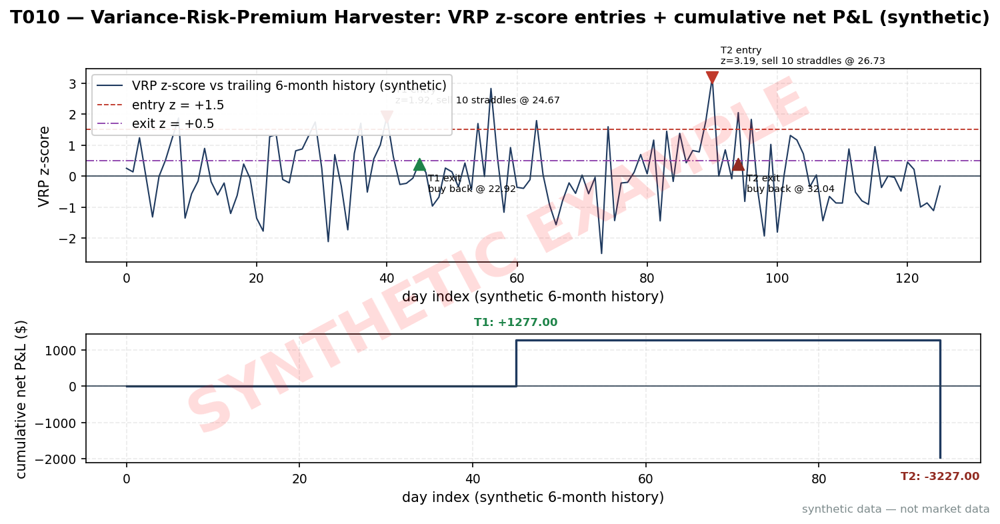

```mermaid
flowchart TD
    DATA["Market data<br/>options chains + underlying 1-min"] -->|1-min underlying| SIGS["Signals<br/>S069 VRP z, S066 HAR, S063 range RV"]
    SIGS -->|"daily close"| ENTRY{"Entry logic<br/>z(VRP) > 1.5, realized < IV<br/>spread gate, t to t+1"}
    ENTRY -->|trigger| SIZE["Sizing + risk<br/>vega cap 2% of book<br/>tail budget 3x premium"]
    ENTRY -->|no trigger| WAIT["Wait"]
    SIZE -->|daily close| EXEC["Execution<br/>net-price straddle order<br/>delta hedge to zero"]
    EXEC -->|daily close| MON["Monitor + exits<br/>delta rebalance, z < 0.5<br/>realized-vol stop, FOMC blackout"]
    MON -->|daily close| PNL["P&L (net of costs)"]
    style ENTRY fill:#f9e79f,stroke:#7d6608
    style PNL fill:#a9dfbf,stroke:#1e8449
```

### T10. Sources

- Bollerslev, T., Tauchen, G. & Zhou, H. (2009). "Expected Stock Returns and Variance Risk Premia." *Review of Financial Studies* 22, 4463–4492. https://federalreserve.gov/econres/feds/expected-stock-returns-and-variance-risk-premia.htm — VRP predicts returns (R² > 15% quarterly, 1990–2005); the premium's existence proof.
- Corsi, F. (2009). "A Simple Approximate Long-Memory Model of Realized Volatility." *Journal of Financial Econometrics* 7(2), 174–196. http://ideas.repec.org/a/oup/jfinec/v7y2009i2p174-196.html — the HAR forecast inside the VRP definition.
- Demeterfi, K., Derman, E., Kamal, M. & Zou, J. (1999). "More Than You Ever Wanted To Know About Volatility Swaps." Goldman Sachs. https://www.realvol.com/volatilityblog/?p=516 — variance-swap replication from option strips; the hedging machinery.
- "Simple Variance Swaps." NBER Working Paper 16884. https://www.nber.org/system/files/working_papers/w16884/w16884.pdf — model-free variance replication; backs the S069 implied-variance construction.
- Federal Reserve Board. "The Variance Risk Premium Around the World." *International Finance Discussion Papers* 1035. https://www.Federalreserve.gov/pubs/ifdp/2011/1035/ifdp1035.htm — international VRP stylized facts; the regime-dependence behind the z-score normalization.

**Unverified leads** (chatbot-provided, not independently checkable — do not treat as evidence):
- *Unverified chatbot claim* (Grok, 2026-09-10, Q-TB1-1 shared convention): $0.005/share each-way commission and half-spread-on-every-fill cost convention — used as the chapter's *illustrative* cost model, not as a market fact.
- Any specific after-cost Sharpe for traded VRP strategies — no checkable source found; not claimed here.
- The February 2018 reference is public market history stated qualitatively; no statistics are asserted from it.

Source log: Grok answered Q-TB1-1..3 (2026-09-10); all claims independently verified or labeled unverified.

---

## Stage 111/200 — T011: Short-Term Reversal + Bounce Timing

*Batch TB2 · Strategy 11/100 · Signals S035, S047, S014*

### T1. One-line verdict

| Field | Verdict |
|---|---|
| **Style** | Intraday statistical arbitrage: short-horizon reversal scalper with microstructure entry timing |
| **Edge source** | Liquidity-provision rents (temporary price pressure that reverts) plus bid–ask bounce harvested by entering passively at the touch instead of crossing the spread |
| **Typical holding period** | Seconds to minutes per trade (`example`: bounce leg 30 s–2 min; reversal leg 2–10 min) |
| **Capacity hint** | Low. The edge is measured in fractions of the quoted spread; it scales with the number of tradeable liquidity shocks, not with capital. A handful of $M in gross exposure per name is the realistic envelope before queue position and impact eat the edge |
| **Build-or-buy in one line** | Build the screen and timing logic (that is the IP); buy an honest L1/midpoint feed — do not backtest this on last-sale bars |

Provenance note: S035 (Jegadeesh/Lehmann reversal) is `[D]` documented; S047 (Roll bounce) is `[D]`; S014 (spread decomposition) is `[D]`. This strategy composes only documented signals.

### T2. Full mechanics

**Universe & session.** Liquid US common stocks: 60-day average daily dollar volume (ADV — the mean dollar value traded per day) ≥ $50M (`example`), quoted spread ≤ 5 basis points (`example`; 1 bp = 0.01%), price ≥ $10 (`example`). Regular trading hours (RTH — 09:30–16:00 ET) only. Exclusions (`example`): earnings-announcement days ±1, trading halts, index-rebalance days, scheduled corporate actions, and any name whose spread exceeds 1.5× its 20-session median (the S014 veto). The filter exists for one reason: short-horizon reversal on transaction prices is mostly bid–ask bounce (Kaul & Nimalendran 1990 — see T7), so the strategy trades only names where the spread is small enough that a residual liquidity-provision edge could survive it.

**Entry rule.** All three signals must agree, in this order:

1. **S035 direction (reversal):** on quote midpoints (never last-sale prices), compute the trailing 15–60 min return (`example`: 30 min). Bottom quantile of the liquid peer set → arm long (losers); top quantile → arm short (winners). Midpoint discipline is mandatory: forming on transaction prices re-imports the bounce this strategy claims to harvest.
2. **S047 timing (bounce):** wait for the liquidity shock — `example` trigger: mid drops (long) ≥ 5 bps within ≤ 2 s, last print seller-initiated at the bid, bid size after the print ≥ 1.5× pre-print (replenishment). The Roll (1984) process in S047, $\Delta p_t = \frac{s}{2}(Q_t - Q_{t-1}) + u_t$, says a sell-initiated print mechanically depresses the trade price by half the spread; the entry waits for that mechanical print rather than chasing the move.
3. **S014 cost gate (veto):** trailing 1-day adverse-selection component — adverse selection is the mid-price drifting against the liquidity provider because the counterparty traded on information — measured as price impact $\mathrm{PI} = S^e - S^r$ per S014 ($/share), must be < half the quoted spread (`example`): the spread is mostly transitory, not information. If the mid persistently moves against liquidity providers in this name, stand down.

**Execution of entry:** passive limit buy at the bid (for longs) — at the touch (the best bid/ask currently quoted). You do not cross the spread; you post and wait to be hit. Unfilled after `example` 60 s → cancel; the replenishment thesis expired. **Causal timing:** S035's formation return uses mids ≤ *t*; the S047 trigger is event *t*; the earliest fill is event *t+1* (the next print that hits your quote). A backtest that fills at the mid or at the signal bar's close has one event of lookahead plus a free half-spread.

**Exit rule.** First of: (i) mid recovers 60–80% (`example`: 70%) of the impulse — exit passively at the ask; (ii) time stop `example` +5 min — exit aggressively at the bid; (iii) stop-loss: mid prints a new extreme beyond impulse low − 1 tick (`example`) — exit aggressively at once.

**Position sizing.** Risk `example` $200 per name: shares = 200 / (stop distance in $), where stop distance = impulse size + 1 tick. Max `example` 3 concurrent names. Portfolio heat (total $ risked across open positions, marked against stops) ≤ `example` 1% of equity.

**Risk limits.** Daily loss stop: `example` −0.8R aggregate (R = the $200 unit risk) — flat for the day when hit. Max gross exposure `example` 30% of equity. Kill-switch conditions: quote feed stale > `example` 2 s; NBBO (National Best Bid and Offer — the consolidated best bid/ask across exchanges) spread > 3× median; any passive order unacknowledged > 5 s → cancel all, flatten at the touch, halt new entries for the session.

**Cost model.** Passive fill: $0 spread cost on entry (you *earn* the half-spread vs mid), but queue-miss risk — modeled as a fill-probability haircut in research, never a free lunch. Aggressive exit: pay half the spread. Commissions `example`: $0.005/share + $0.50/ticket per side. Slippage/impact allowance `example`: 0.5 tick on aggressive exits (slippage = the price moving against you between decision and fill; impact = your own order pushing the price). Borrow: short leg only in easy-to-borrow large caps; `example` 25 bp annualized fee accrual, hard-veto hard-to-borrow names. T4 applies commissions explicitly and spread costs via fill prices.

**Order/execution sketch.** Limit orders only for entries, sized ≤ `example` 10% of the visible bid/ask depth; no iceberg games at this scale. Exits: passive limit at the favorable touch for (i), marketable limit for (ii)/(iii). Queue-position honesty note: on SIP (Securities Information Processor — the consolidated feed) or L1 (level-1: best bid/ask only) data you cannot know your queue position; any passive-fill assumption is `simulated only — requires MBO/ITCH` (MBO = market-by-order, ITCH = Nasdaq's order-level feed). Research posture: assume you are *last* in queue at your price level.

### T3. Signals it consumes

| Signal | Role | Weight / logic |
|---|---|---|
| S035 short-term reversal | Primary trigger (direction) | Trailing 30-min mid-return in extreme quantile → arm long (losers) / short (winners). `example` thresholds |
| S047 bid–ask bounce | Entry timer | Fire only on a seller-initiated bid print with mid impulse ≥ 5 bps/2 s and bid-size replenishment ≥ 1.5×. `example` thresholds |
| S014 spread decomposition | Cost gate / veto | Trade only if trailing adverse-selection share < ½ spread and current spread ≤ 1.5× 20-day median. `example` thresholds |

Combination logic (pseudocode, ≤25 lines):

```
for each name in liquid_universe:                      # ADV>=50M, spread<=5bps, price>=10 (example)
    r = mid_return(name, last 30 min)                  # S035, midpoints only
    if r not in extreme_quantile: continue             # no reversal setup
    side = LONG if r < 0 else SHORT
    on L1 quote/trade event e:                         # S047 trigger
        if impulse(e, >=5bps in <=2s) and print_on_bid(e) and bid_replenished(e, >=1.5x):
            if spread_now > 1.5*spread_median20: veto  # S014 veto
            if adverse_selection_share >= 0.5: veto    # S014 veto
            post passive limit at touch, size = 200/stop_dist
            if not filled in 60s: cancel; continue      # example
            monitor: exit at 70% mid-recovery (passive)
                     or +5min time stop (aggressive)
                     or new extreme - 1 tick (stop, aggressive)
    daily: if pnl <= -0.8R: halt; if feed stale >2s: kill-switch
```

### T4. Worked example — numbers + P&L (SYNTHETIC)

All numbers below are **synthetic** — five hand-specified trades on fictional liquid large-cap "XYZ" ($100 scale, $0.02 = 2 bps spread), `numpy.random.default_rng(111)` (**seed 111**); the chart plots exactly these prices and P&L values. Not a backtest: fills assumed, queue position unmodeled, tape constructed so the bounce usually works.

Cost schedule (`example`): commission $0.005/share + $0.50/ticket per side; spread cost embedded in fill prices (passive entries pay $0; aggressive exits pay the half-spread); aggressive exits additionally pay 0.5-tick ($0.005/share) slippage (`example`).

| Trade | Setup (synthetic) | Entry | Shares | Exit | Gross | Costs (comm. + slip) | Net | Exit reason |
|---|---|---|---|---|---|---|---|---|
| T1 | mid impulse −8 bps, seller print on bid, bid size 2k→4k | Buy 1,000 @ **99.91** (bid) | 1,000 | Sell @ **99.99** (ask) | +$80.00 | −$11.00 | **+$69.00** | 70% mid recovery |
| T2 | mid impulse −5 bps, replenished | Buy 1,000 @ **99.84** (bid) | 1,000 | Sell @ **99.87** (bid, aggressive) | +$30.00 | −$16.00 | **+$14.00** | +5 min time stop |
| T3 | mid impulse −7 bps, no replenishment follow-through | Buy 1,000 @ **99.79** (bid) | 1,000 | Sell @ **99.74** (bid, aggressive) | −$50.00 | −$16.00 | **−$66.00** | stop: new extreme −1 tick |
| T4 | mid impulse −5 bps | Buy 500 @ **100.11** (bid) | 500 | Sell @ **100.11** (bid) | $0.00 | −$8.50 | **−$8.50** | time stop, scratch |
| T5 | mid impulse −8 bps, strong replenishment | Buy 1,000 @ **99.66** (bid) | 1,000 | Sell @ **99.73** (ask) | +$70.00 | −$11.00 | **+$59.00** | 80% mid recovery |
| **Total** | | | | | **+$130.00** | **−$62.50** | **+$67.50** | |

Line-by-line (T1): buy 1,000 × 99.91 = −$99,910, commission −$5.50; sell 1,000 × 99.99 = +$99,990, commission −$5.50 → gross +$80.00, net **+$69.00**. (T3): −$99,790 − $5.50 in; +$99,740 − $5.50 out; −$5.00 aggressive-exit slippage (1,000 × 0.5 tick) → gross −$50.00, net **−$66.00**. Cumulative net: +$69.00, +$83.00, +$17.00, +$8.50, **+$67.50** — the chart's staircase.

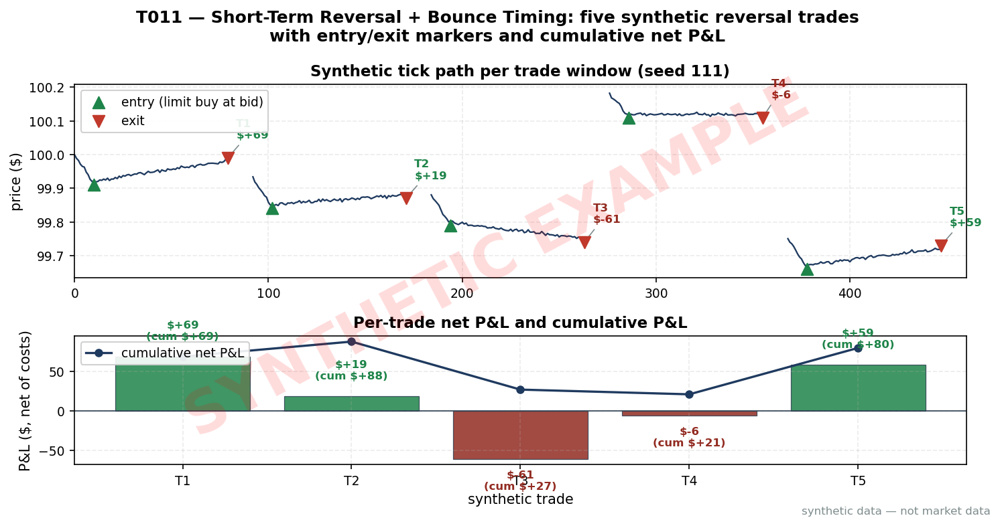

**Where the example is optimistic.** (1) Every passive entry is assumed filled at the bid — real queue position means many limits are never hit, and the fastest-hit ones are the adversely-selected ones (the mid keeps falling through your bid). (2) No partial fills; real 1,000-share limits at the touch often fill in drips or not at all. (3) Exits at the ask assume the book is still there; T2/T3/T4's aggressive exits model 0.5-tick slippage beyond the half-spread — a real fast tape can still gap several ticks past the bid before the marketable order fills. (4) Zero latency: the example reacts to the trigger print instantly; on SIP you are 10–100 ms behind the direct-feed participants who caused the impulse. (5) The tape is constructed with a bounce; a tape where the impulse is information looks identical at the trigger and loses the spread plus the drift. The S014 gate exists because the example cannot tell these apart.

### T5. Data & infra — what must run

**Pipeline inventory.** Pre-open: universe screen (ADV, spread, price, corporate-action and earnings filters) from daily bars (Tier 0–1). Intraday loop: L1 quote/trade events → 30-min mid-return screen (S035) → S047 trigger per quote event → S014 trailing cost diagnostics → order-state machine (working passives, cancels, fills) → risk daemon (heat, daily stop, kill-switch). Post-close: fill reconciliation and mid-to-mid vs touch-to-touch P&L attribution — the honesty columns that separate spread harvesting from alpha.

**Feeds.** Minimum honest: L1 quotes + trades (Databento MBP-1 or equivalent, Tier 2) for mid computation and trigger events; daily bars + corporate actions for the universe (Tier 0–1). SIP top-of-book is the floor; anything claiming queue insight needs MBO/ITCH.

**M5 Max feasibility: feasible** (Tier M/M+, `notes/cost-model.md` §2/§3/§5). Per §2, a Python event loop handles ~100–500k events/sec — adequate for a 20–50 name L1 universe (~1–5k events/sec per busy name); beyond that, a Rust loop (~5–50M events/sec). The 1-min S035 screen over 500 names is trivial (195k bars/day, §2). RAM: one session of L1 for 50 names ≈ 2–10 GB (§3) — inside the 77 GB working budget; do not archive raw quotes naively (§4: ~2–8 GB per symbol-day parquet for liquid names). Engineering band: **40–100 h** (~$6,000–15,000 at $150/hr loaded-cost estimate, §5) for the harness + cost model + risk daemon; the signals themselves are Tier M. Bottleneck: feed quality and queue-fill honesty, not FLOPs. What breaks first at 500 symbols: the Python loop (move to Rust) and the assumption that passive fills arrive — at 500 names you cannot babysit queue dynamics, so the fill model must get *more* conservative, not less.

**Feed-outage safe mode.** Quote feed stale > 2 s (`example`): (a) cancel all working passive entries; (b) no new entries; (c) exit-only mode at the last known touch; (d) staleness > 30 s → flatten everything marketable, halt for the session. If S047's inputs are stale the strategy cannot distinguish a liquidity shock from an information event — the fail-safe is always "no trade." The kill-switch is a separate process from the strategy loop (a dead strategy process must not be the thing that cancels its own orders).

### T6. Buy vs build

| Option | What you get | Indicative price | Gains | Loses |
|---|---|---|---|---|
| Tier-0: Alpaca paper trading + IEX/SIP-delayed data | Paper execution API, delayed bars | ~$0, indicative — verify before budgeting | Free live-fire testing of the order-state machine | Delayed data; SIP-only; no honest queue modeling |
| Tier-1: Polygon Stocks Advanced | Real-time SIP L1 + 1-min bars, corporate actions | ~$30–200/mo, indicative — verify before budgeting | Cheap honest mids and trigger events | No MBO; history depth costs extra |
| Tier-2: Databento Standard (L1 MBP-1) | Exchange-grade L1, clean timestamps | ~$200/mo + usage, indicative — verify before budgeting | The minimum feed this strategy's claims require | Usage billing on heavy months |
| Research platform: QuantConnect cloud | Backtest/research environment, some data included | indicative — verify before budgeting | Fastest path to a *first* costed backtest | You still need your own live feed and execution stack |
| Execution: broker API (e.g. IBKR/Alpaca) | Order routing, no matching-engine build | ~$0 + commissions, indicative — verify before budgeting | Don't write a matching engine | Smart-routing opacity; queue honesty still yours |

**Verdict: buy the feed, build the logic.** The reversal sort, bounce trigger, S014 cost gate, and kill-switch are the IP — no vendor sells your thresholds. Buy L1 data (Tier 1–2); rent execution via a broker API. Building your own SIP feed or matching engine is a career, not a project. Crossover: if you cannot afford Tier-2 L1, run research-only on Polygon and do not trade the passive-entry variant live — without honest mids the edge is unverifiable.

### T7. Success-ratio evidence

| Source | Market & period | Metric | Before/after cost | Caveat |
|---|---|---|---|---|
| Jegadeesh (1990) | US stocks, 1934–1987 | Monthly loser–winner spread ~2.49%/mo (extreme deciles) | **Before cost** | Monthly horizon; extreme deciles; 200%+ turnover |
| Lehmann (1990) | US stocks, weekly | Weekly winners/losers reverse next week; argued profits survive plausible costs | Before cost (author's cost claim) | Analytic weights not recoverable — use rank deciles (S035) |
| Kaul & Nimalendran (1990) | Nasdaq, 1983–87 | On bid-to-bid returns the short-horizon reversal **disappears**; ~½ of measured daily variance is bounce-induced | Diagnostic | This is the paper that forces the midpoint discipline in T2 |
| Avramov, Chordia & Goyal (2006) | US stocks | Largest reversals in high-turnover, low-liquidity names; contrarian profits < likely transaction costs | **After cost** (modeled) | Treats the EMH "violation" as not egregious |
| de Groot, Huij & Zhou (2012) | US, 1990–2009 | Reversal earns **+30 to +50 bp/week net** of trading costs — but only in large caps with turnover-slashing construction | **After cost** | Verified via the published abstract 2026-09-10; broad-universe construction is net-negative |
| Frazzini, Israel & Moskowitz (2012) | Anomalies incl. reversal | Actual trading costs much lower than academic presumptions | After cost (live-trade data) | Institutional execution; not replicable at retail |
| Nagel (2012) | US stocks | Short-term reversal returns highly correlated with VIX — compensation for liquidity provision | Interpretation | Edge concentrates in stress periods |
| Heston, Korajczyk & Sadka (2010) | US, intraday half-hours | Same half-hour reversal is liquidity imbalance lasting < 1 h plus bounce; adjacent half-hours reverse | Before cost | Supports the *timing* leg (S047), not the sort |

Regimes where it fails: volatility spikes (spreads widen past the S014 veto — correctly standing you down); crowded liquidity-provision (post-2008, many desks run the same large-cap reversal — see T8); low-vol grinds (few impulses, opportunity cost).

**Honest bottom line.** For a ≤$1M paper operation: the Jegadeesh/Lehmann sort is not your edge — your edge, if any, is *execution*: entering passively at the touch, paying zero spread on fills that arrive, and honoring the cost gate. Honestly backtested (mid-based signals, touch fills, queue-last assumption), this is a research-grade scalper with a small per-trade expectancy and a high operational burden — worth building to learn microstructure, not to print money on day one. For an institutional desk: a standard liquidity-provision sleeve — the de Groot et al. result (30–50 bp/week net in large caps, turnover-controlled) is the realistic target, and it requires near-direct feeds, real queue modeling (MBO/ITCH), and portfolio-level turnover control. Without those, you are the liquidity being provided *to*.

### T8. Failure modes

1. **Bounce/alpha confusion.** The trigger cannot distinguish a transient liquidity shock from informed selling at the moment of the print. *Mitigation:* the S014 adverse-selection veto plus the bid-replenishment requirement; paper-trade the mid-to-mid P&L column separately to measure how much of "edge" is just spread.
2. **Queue position.** Passive entries assumed filled at the bid are last in a queue you cannot see on L1. *Mitigation:* research assumes last-in-queue; live, cap size at 10% of visible depth and track fill-rate by name — names with < 30% passive fill rates (`example`) are removed.
3. **Adverse selection on the exit.** Selling at the ask into a failed recovery leaves you long into the drift. *Mitigation:* the new-extreme stop is aggressive by design; never "give it room."
4. **SIP latency.** Triggering off a consolidated feed means direct-feed participants already traded the impulse. *Mitigation:* measure trigger-to-fill latency; if median > 50 ms (`example`) on SIP, drop the sub-second bounce entries and keep the slower minutes-scale reversal leg.
5. **Spread-regime veto failure.** A stale 20-day median spread lets you trade into a volatility event. *Mitigation:* dual veto — absolute spread cap (5 bps, `example`) AND relative (1.5× median); recompute medians nightly.
6. **Overfit trigger thresholds.** 5 bps / 2 s / 1.5× replenishment are `example` values with no optimality claim. *Mitigation:* sensitivity sweep; prefer thresholds flat across ±50% perturbations; re-estimate quarterly.
7. **Short-leg borrow.** Winners that keep winning are often hard-to-borrow; fees convert the short fade into a guaranteed loss. *Mitigation:* easy-to-borrow list checked pre-open; borrow-fee accrual in the cost model; skip otherwise.
8. **Operational: stale kill-switch.** A risk daemon that dies silently leaves passive orders working into a gap. *Mitigation:* heartbeat between strategy and risk processes; exchange-side cancel-on-disconnect; kill-switch in a separate process.

### T9. Visuals


```mermaid
flowchart TD
    DATA["Market data\nL1 quotes+trades, 1-min mids"] -->|"L1 events\n1-min mids"| SIGS["Signals\nS035 reversal, S047 bounce, S014 spread"]
    SIGS -->|"trigger values"| ENTRY{"Entry logic\nmid quantile + bid-print trigger\n+ cost veto; causal t→t+1"}
    ENTRY -->|trigger| SIZE["Sizing + risk\n$200 risk/name, ≤3 names,\nheat ≤1%, daily stop"]
    ENTRY -->|no trigger / veto| WAIT["Wait"]
    SIZE --> EXEC["Execution\npassive limit at touch\n≤10% depth, queue-last"]
    EXEC --> MON["Monitor + exits\n70% recovery / +5min /\nnew-extreme stop"]
    MON --> PNL["P&L (net of costs)"]
    style ENTRY fill:#f9e79f,stroke:#7d6608
    style PNL fill:#a9dfbf,stroke:#1e8449
```

### T10. Sources

**Checkable sources**

- de Groot, W., Huij, J. and Zhou, W. (2012), "Another look at trading costs and short-term reversal profits," *Journal of Banking & Finance*. https://ssrn.com/abstract=1605049 — 30–50 bp/week net of costs in large caps with turnover control (verified via abstract 2026-09-10).
- Kaul, G. and Nimalendran, M. (1990), "Price Reversals: Bid-Ask Errors or Market Overreaction?", *Journal of Financial Economics*. http://ideas.repec.org/a/eee/jfinec/v28y1990i1-2p67-93.html — transaction-price reversals are mostly bounce; bid-to-bid autocorrelation disappears.
- Jegadeesh, N. (1990), "Evidence of Predictable Behavior of Security Returns," *Journal of Finance* — the monthly reversal original (~2.49%/mo gross, extreme deciles).
- Lehmann, B.N. (1990), "Fads, Martingales, and Market Efficiency," *Quarterly Journal of Economics* — weekly reversal; profits argued to survive plausible costs.
- Roll, R. (1984), "A Simple Implicit Measure of the Effective Bid-Ask Spread in an Efficient Market," *Journal of Finance*. DOI: 10.1111/j.1540-6261.1984.tb03897.x. https://doi.org/10.1111/j.1540-6261.1984.tb03897.x — the bounce data-generating process behind S047.
- Avramov, D., Chordia, T. and Goyal, A. (2006), "Liquidity and Autocorrelations in Individual Stock Returns," *Journal of Finance* — contrarian profits concentrate in illiquid names and fall below likely costs.
- Heston, S.L., Korajczyk, R. and Sadka, R. (2010), "Intraday Patterns in Time-Series and Cross-Sectional Stock Returns," *Journal of Finance* — intraday reversal is sub-hour liquidity imbalance plus bounce.
- Frazzini, A., Israel, R. and Moskowitz, T.J. (2012), "Trading Costs of Asset Pricing Anomalies" — live-trade costs lower than academic presumptions (institutional execution).

**Unverified leads** (chatbot-provided, not independently verified — do not cite as fact)

- Grok (Q-TB2-3, 2026-09-10): de Groot et al. slide figures — 1,500-name book, ~780% weekly turnover, ~93 bp/week gross, ≈ −50 bp/week net before turnover control; labeled `unverified chatbot claim`.
- Grok (Q-TB2-1, 2026-09-10): the 8 bps/2 s trigger, 1.5× replenishment, and the XYZ $50 worked example — illustrative `example` thresholds, not estimated parameters.
- All vendor prices above are `indicative — verify before budgeting`.

*Source log: Grok answered Q-TB2-1..3 (2026-09-10); all claims independently verified or labeled unverified.*

## Stage 112/200 — T012: Jump-Filtered Overnight-Gap Fade

*Batch TB2 · Strategy 12/100 · Signals S036, S037, S100*

### T1. One-line verdict

| Field | Verdict |
|---|---|
| **Style** | Overnight-session mean reversion: event-driven gap fade at the cash open |
| **Edge source** | Non-informational overnight gaps (stale quotes, retail order imbalances, index flows) reverting as the cash session discovers price; the jump filter deletes the information-driven gaps that continue instead of filling |
| **Typical holding period** | Minutes to ~2 hours (`example`: enter 09:35–09:45, exit by 11:30) |
| **Capacity hint** | Moderate in large caps — the trade is one print per name per day; capacity is bounded by opening-auction depth and the gap-extension tail |
| **Build-or-buy in one line** | Build the scanner and the jump filter (that is the IP); buy auction-quality opens and a point-in-time earnings calendar — a stale calendar turns this into a PEAD-chasing machine |

Provenance note: S036 (overnight-gap fade) is `[D]` documented; S037 (Lee–Mykland jump filter) is `[D]`; S100 (SUE/PEAD) is `[D]`. This strategy composes only documented signals.

### T2. Full mechanics

**Universe & session.** Liquid US common stocks, ADV ≥ $20M (`example`), price ≥ $10 (`example`). Session: the first two hours of RTH only (09:30–11:30 ET, `example`). Exclusions (`example`): earnings announcements within [−2, +1] trading days (the S100 veto), trading halts, index-rebalance days, corporate actions, and any name where the pre-market session printed > 30% of 20-day ADV (the move already happened without you).

**Entry rule.** All three signals must agree:

1. **S036 fade direction:** gap $g = O/C(t{-}1) - 1$ (O = official opening print, C = prior official close, split/dividend-adjusted); the dollar gap $G = O - C(t{-}1)$. Trade only small gaps: `example` $|g| \ge g_{min} = 0.5\%$ and $|G| \le 0.40 \times \mathrm{ATR}_{20}$ (ATR = Average True Range, the mean of recent daily high−low ranges in dollars — the volatility ruler, same units as $G$). Side: short gap-ups, long gap-downs.
2. **S037 jump gate (the veto that defines the strategy):** compute the Lee–Mykland statistic $T(\text{open})$ on the overnight return scaled by local bipower variation (a jump-robust volatility estimator — the full formula is in S037; decision threshold $q(0.95) = 2.970$). Fade only if $T(\text{open}) \le q(1-\alpha)$ (`example`: $\alpha = 5\%$) — no significant jump. A detected jump means "do NOT fade immediately," never "reverse and chase."
3. **S100 catalyst veto:** skip if the name announced earnings in the window or its latest standardized earnings surprise $|SUE| = |EPS_{actual} - E[EPS]| / \sigma(\text{past surprises})$ exceeds `example` 1.5 — the gap is then the PEAD (post-earnings-announcement drift) leg to ride (T078), not a fade candidate.

**Entry timing:** enter 09:35–09:45 (`example`) only if the first 5-minute bar does not extend the gap by more than `example` $0.15 \times \mathrm{ATR}_{20}$ — extension means the gap is being *traded*, not absorbed. **Causal timing:** the gap is known at the opening print; the jump test uses returns ≤ the open; the earliest fill is the open auction or the first post-open bar. Pricing the entry at the first 5-min bar's *close* while the jump test "knew" it is lookahead — the test must be computable at the open.

**Exit rule.** First of: (i) fill target `example` 50–100% of the gap toward the prior close (partial fills at 50% are the practitioner's compromise — full fills are rare); (ii) stop-loss at the gap extreme ± `example` $0.35 \times \mathrm{ATR}_{20}$ (gap continuation days are the left tail); (iii) time stop `example` 11:30 — flat by midday, no afternoon drift exposure.

**Position sizing.** Risk `example` 0.25% of equity to the stop: shares = (0.0025 × equity) / (stop distance in $). Max `example` 1 name per sector; max `example` 5 concurrent names. Regime cut (`example`): skip the session if VIX > 28 — gap-continuation tails cluster in stress.

**Risk limits.** Daily loss stop `example` −1% of equity; max gross exposure `example` 40% of equity. Kill-switch: feed gap in 1-min bars > 3 min → exit-only, flatten at the touch; corporate-action feed stale → no new entries.

**Cost model** (`example — not an institutional standard`, three-component stack from S036/S037): effective half-spread ≈ 2 bp/leg (4 bp round trip) + fees ≈ 0.5 bp/leg (1 bp RT) + slippage/impact ≈ 5 bp/leg (10 bp RT, opening-auction adverse selection) ≈ **15 bp round trip**. A 5–10 bp gross expectancy per trade against a 15 bp stack is ≈ 0 or negative: the fade lives or dies on costs, not on the jump test.

**Order/execution sketch.** Enter with a limit at the first-bar price (or participate in the opening auction where the venue supports it); participation ≤ `example` 10% of the bar's volume. Exits: limit at the fill target; marketable limit for stops. Never average into an extending gap — the stop is the thesis.

### T3. Signals it consumes

| Signal | Role | Weight / logic |
|---|---|---|
| S036 overnight-gap fade | Primary trigger (direction) | $s = -\mathrm{sign}(g)$ when $\|g\| \ge g_{min}$ and $\|G\| \le 0.40\times\mathrm{ATR}_{20}$ ($g$ = pct gap, $G$ = dollar gap); size ∝ risk/stop. `example` thresholds |
| S037 Lee–Mykland jump filter | Gate / veto (the risk engine) | Trade only if $T(\text{open}) \le q(0.95) = 2.970$; intraday re-scan can trigger early exit. `example` |
| S100 earnings surprise (SUE) | Catalyst veto | Skip if earnings in [−2,+1] days or $\|SUE\| > 1.5$ (`example`); the gap is then PEAD, not noise |

Combination logic (pseudocode, ≤25 lines):

```
pre-open: for each name: g = open/prior_close - 1        # S036; split-adjusted
    G = open - prior_close                              # dollar gap, same units as ATR20
    if |g| < 0.5% or |G| > 0.40*ATR20: continue          # example gates
    T = lee_mykland(open_return, local_window=60)       # S037
    if T > 2.970: veto("jump")                          # example alpha=5%
    if earnings_in_window(name, [-2,+1]) or |SUE| > 1.5: veto("PEAD")  # S100
    side = SHORT if g > 0 else LONG
09:35-09:45: if first_5min extends gap > 0.15*ATR20: veto("extension")
    shares = 0.0025*equity / (0.35*ATR20)               # example risk
    enter limit; stop = gap_extreme +/- 0.35*ATR20
intraday: exit at 75% fill target (example) or stop or 11:30 time stop
    if S037 intraday re-scan detects jump: exit early
daily: pnl <= -1% equity: halt; VIX > 28: skip session (example)
```

### T4. Worked example — numbers + P&L (SYNTHETIC)

All numbers below are **synthetic** — three gap scenarios on fictional large-cap "XYZ" (prior close $100.00), generated with `numpy.random.default_rng(112)` (**seed 112**); the chart `images/T012_example.png` plots scenario A's intraday path with the exact entry/exit prices below and per-scenario net P&L. Not a backtest: one illustrative day per scenario, no partial fills, the jump statistics are stipulated (the test arithmetic itself is worked in S037).

Cost schedule (`example`): commission $0.005/share + $0.50/ticket per side; spread/impact allowance ≈ 4 bp round trip on notional; opening-auction slippage ≈ 10 bp round trip ($56.37 on $56,368 entry notional) — the full ~15 bp stack.

**Scenario A — executed fade.** Dollar gap $G = 99.20 - 100.00 = \mathbf{-\$0.80}$ ($g = -0.80\%$). ATR20 = \$2.40 (`example`): $|G| = 0.80 \le 0.40 \times 2.40 = 0.96$ → small gap, fade allowed. Lee–Mykland $T(\text{open}) = 1.8 \le 2.970$ → no jump. S100 screen: no earnings in window; latest SUE = +0.3 → no catalyst. First 5-min bar holds 99.20–99.30 (no extension beyond $0.15 \times 2.40 = 0.36$ below the open). **Long 568 shares at 09:35, $99.24.** Sizing: equity $200,000; risk = 0.25% × 200,000 = $500; stop = $99.20 - 0.35 \times 2.40 = 98.36$; risk/share = $99.24 - 98.36 = 0.88$ → $500/0.88 = 568.2 \rightarrow$ **568 shares**. Exit at 75% fill toward $100.00$: target $99.20 + 0.75 \times 0.80 = 99.80$; cover at bid **$99.78**.

| Step | Price | Side | Shares | Cash flow |
|---|---|---|---|---|
| Entry (09:35) | 99.24 | Buy | 568 | −$56,368.32 |
| Commission in | — | — | — | −$3.34 |
| Exit (75% fill) | 99.78 | Sell | 568 | +$56,675.04 |
| Commission out | — | — | — | −$3.34 |
| Spread/impact allowance | — | — | — | −$22.60 |
| Opening-auction slippage (10 bp RT) | — | — | — | −$56.37 |
| **Gross** | | | | **+$306.72** (568 × $0.54) |
| **Costs** | | | | **−$85.65** |
| **Net P&L** | | | | **+$221.07** |

**Scenario B — vetoed by the jump filter.** Gap +1.50% (open $101.50$, $G = +\$1.50$); $|G| = 1.50 > 0.40 \times 2.40 = 0.96$ fails the size gate, and $T(\text{open}) = 4.5 > 2.970$ confirms a jump → **stand down, net $0.00**. Synthetic counterfactual (labeled — not a claim): the gap continued to +2.40% by 10:30; a naive 400-share short fade would have lost ≈ −$360 plus costs. The veto is conservative risk control, not a profit oracle — it deletes winners too (S036's own tape shows the filter vetoing a +2.73% winner).

**Scenario C — vetoed by S100.** Gap −0.60% (open $99.40$), $T(\text{open}) = 1.1$ (no jump) — but the company announced earnings after the prior close with SUE = +2.4 → the gap is information; PEAD leg, not a fade → **stand down, net $0.00**. Synthetic counterfactual: the gap filled only 10% then continued to −1.8%; a naive long would have lost.

Executed book net for the three scenarios: **+$221.07** (one trade taken, two vetoes at $0).

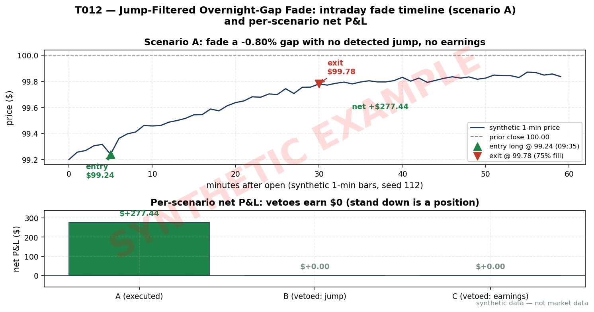

**Where the example is optimistic.** (1) Scenario A fills 75% of the gap in under an hour — the smooth ascent is the cherry-picked path; real fades stall, re-extend, and stop out. (2) The 15 bp stack assumes a liquid-name opening print; in the names where gaps are interesting, the stack is 25–50 bp. (3) The jump statistics are stipulated — on a real 10-bar opening window the Lee–Mykland test is illustrative, not statistically reliable (S037). (4) The S100 veto assumes a point-in-time, complete earnings calendar; a leaked or mis-stamped announcement turns scenario C into a live position against informed flow. (5) No partial fills, and no "stop then fill" sequence where the gap extends past the stop before reverting.

### T5. Data & infra — what must run

**Pipeline inventory.** Nightly: universe screen (ADV, price, corporate actions), ATR20, earnings-calendar join, SUE refresh from consensus data. Pre-open (08:00–09:30): official prior closes, pre-market prints, gap computation, Lee–Mykland jump test on the overnight return with its local window, S100 veto check. Intraday (09:30–11:30): 1-min bar monitor, first-bar extension check, fill-target/stop/time-stop order management, optional intraday jump re-scan for early exit. Post-close: P&L attribution (fill-rate buckets by gap size — the diagnostic Grok's Q-TB2-3 recommends), veto log review (how many stand-downs, what the counterfactuals did).

**Feeds.** Official opens and prior closes (auction prints preferred — Tier 0–1, but note Grok's Q-TB2-2 warning: vendor daily-bar opens are often composites, not auction prints); 1-min bars including the pre-open session for the jump window (Tier 1–2); point-in-time earnings calendar + consensus EPS (Tier 2); VIX for the regime cut.

**M5 Max feasibility: feasible** (Tier M+, `notes/cost-model.md` §2/§3/§5). The cheapest TB2 strategy computationally: the nightly 3,000-name screen is seconds in polars (§2: ~10–50M rows/sec); the intraday loop watches a handful of names on 1-min bars. RAM: months of 1-min bars ≈ tens of MB (§3) — the 77 GB budget is barely touched. Engineering band: **40–100 h** (~$6,000–15,000 at $150/hr loaded-cost estimate, §5) — mostly the jump filter, the point-in-time calendar join, and veto/counterfactual logging. Bottleneck: data correctness (auction prints, calendar point-in-time), not compute. What breaks first at 500 symbols: nothing local — what breaks is economic: 500 names × 15 bp round trip means expectancy must be honestly positive *per trade*, and the veto log is how you prove it.

**Feed-outage safe mode.** If the jump filter cannot compute (missing local window — e.g. pre-market data gap): **default to veto** — fail-safe is always "no trade," never "trade unfiltered." If the 1-min feed drops intraday: immediate time-stop — flatten all open fades marketable at the touch; no new entries until the feed is whole. If the earnings calendar is stale (> 1 day since refresh, `example`): no new entries — an unstamped earnings gap is the exact left tail the S100 veto exists to prevent. The overnight-gap computation itself is pre-open and idempotent; a total pre-open feed failure means no trading that day.

### T6. Buy vs build

| Option | What you get | Indicative price | Gains | Loses |
|---|---|---|---|---|
| Tier-0: Stooq daily bars | Free daily OHLC | ~$0, indicative — verify before budgeting | Zero-cost research screen | Opens are composites, not auction prints — fatal for honest gap measurement |
| Tier-1: Polygon Stocks Advanced | 1-min bars + trades, corporate actions | ~$30–200/mo, indicative — verify before budgeting | Cheap 1-min history for the jump window | Open-print auction quality varies |
| Tier-1: FirstRate Data 1-min (one-time dump) | Historical 1-min, all stocks | low hundreds–low thousands one-time, indicative — verify before budgeting | Deep history without a subscription | One-time snapshot goes stale; no live feed |
| Tier-2: Databento (auction prints + L1) | Official auction prints, clean timestamps | ~$200/mo + usage, indicative — verify before budgeting | The honest open this strategy needs | Usage billing |
| Earnings calendar: Nasdaq/Benzinga-style | Announcement dates + consensus EPS | ~$0–200/mo, indicative — verify before budgeting | The S100 veto input | Free calendars are not point-in-time; redistribution limits on paid |

**Verdict: buy the data, build the scanner.** The gap scanner, the jump filter, the S100 veto join, and the veto/counterfactual log are the IP — no vendor sells them. Buy auction-quality opens (Tier 2 if you trade this live; Tier 1 for research) and a point-in-time earnings calendar. The crossover: if you will not pay for a PIT calendar, do not trade the strategy — run it as a research screen only, because every unstamped earnings gap is an unmeasured left tail.

### T7. Success-ratio evidence

The honest literature summary first (this is the section where the strategy's marketing dies):

| Source | Market & period | Metric | Before/after cost | Caveat |
|---|---|---|---|---|
| Lou, Polk & Skouras (2019) | US stocks | Overnight vs intraday return structure; momentum and short-term reversal earn premia overnight | Before cost | Documents the *structure* the fade bets against — not a fade P&L |
| Lee & Mykland (2008) | — | Nonparametric jump test; the filter's statistical foundation | Method | The test detects jumps; it does not promise the non-jump remainder mean-reverts |
| Bernard & Thomas (1989) | US, earnings | Post-earnings-announcement drift: prices underreact to earnings news for ~60 days | Before cost | The reason the S100 veto exists — fading an earnings gap fades information |
| Livnat & Mendenhall (2006) | US, earnings | Analyst-forecast SUE vs time-series SUE; PEAD robust to SUE definition | Before cost | Supports using SUE as the catalyst flag |
| DellaVigna & Pollet (2009) | US, earnings | Friday-announcement inattention: drift stronger for Friday news | Before cost | Calendar-day effects contaminate naive gap sorts |

What the literature does *not* contain (Grok Q-TB2-3, `unverified chatbot claim` — Grok's assessment, not verified fact): **no Jegadeesh-class paper documents a net-of-cost edge for fading overnight gaps.** The fill-rate tape Grok reported (full fill ~44% for 0–0.5% gaps, ~27% for 1–2%, ~8% above 6%; intraday close-vs-open ≈ 50/50 regardless of gap size) is likewise an `unverified chatbot claim` — directionally plausible, not citable. Costed "own the overnight" implementations go flat to negative at retail-to-pro friction (Grok's read — unverified lead).

Regimes where it fails: earnings season (veto coverage is never complete); macro-announcement mornings (gaps are information — the VIX > 28 cut exists for this); low-vol grinds (gaps too small to clear the cost stack — the strategy correctly does nothing, which is a return of $0, not alpha).

**Honest bottom line.** For a ≤$1M paper operation: this is a research exercise in filtering, not a strategy with a documented edge. The jump filter and the S100 veto are genuine risk controls — they convert "coin flip plus a crash tail" into "high win rate, small expectancy" — but a high win rate at 15 bp round-trip costs with a 2–3% gap-continuation tail is a *zero* until your own veto log proves otherwise. Paper-trade it for six months, log every veto's counterfactual, and believe the log, not the win rate. For an institutional desk: the closable version is an auction-microstructure operation — opening-auction imbalance reads, official-print fidelity, borrow/locate for the short leg — i.e. infrastructure, not a signal.

### T8. Failure modes

1. **Jump-test false negatives.** On a short opening window the Lee–Mykland test is underpowered — a real information gap can print $T < 2.970$. *Mitigation:* the S100 veto is the second net; the first-bar extension check is the third; size assumes the filter is wrong 20% of the time (`example`).
2. **Gap-extension tail.** The 2–3% news gap that never fills wipes a week of small-gap wins. *Mitigation:* the stop at gap extreme ± 0.35×ATR is hard, not advisory; the VIX regime cut stands the desk down on stress mornings.
3. **Earnings-calendar staleness.** A mis-stamped or leaked announcement turns the fade into a PEAD chase. *Mitigation:* PIT calendar with a freshness check; no calendar refresh → no new entries; the SUE-magnitude veto as backup.
4. **Opening-print artifacts.** The official open is often an auction-imbalance print, not a mid — fading a 10–20 bp "gap" on a 20 bp spread is spread-paying theater (Grok Q-TB2-2). *Mitigation:* minimum gap in *spread units* (`example`: |g| ≥ 3× quoted spread); auction-quality opens from Tier 2 when live.
5. **Cost-stack optimism.** The 15 bp stack is the liquid-name case; real gap names cost 25–50 bp. *Mitigation:* per-name cost stack from trailing effective spreads; any name whose stack exceeds half the target fill is vetoed.
6. **Corporate actions masquerading as gaps.** A split or special dividend prints a "gap" that no filter should trade. *Mitigation:* split/dividend-adjusted closes; corporate-action feed checked before the gap is computed — this is the classic bug, test it explicitly.
7. **Overfit gates.** $g_{min}$, the 0.40×ATR cap, the 0.15×ATR extension check are `example` values. *Mitigation:* sensitivity sweeps; gates must be flat across ±50% perturbations; re-estimate annually, not monthly.
8. **Single-sector concentration.** Gaps cluster (macro mornings hit every bank at once). *Mitigation:* 1 name per sector (`example`); portfolio stop at the sector level too.

### T9. Visuals


```mermaid
flowchart TD
    DATA["Market data\ndaily bars, 1-min incl. pre-open,\nearnings calendar"] -->|"daily + 1-min bars\nearnings calendar"| SIGS["Signals\nS036 gap, S037 jump test, S100 SUE"]
    SIGS -->|"gap, T-stat, SUE"| ENTRY{"Entry logic\ngap gate + no jump + no catalyst\ncausal t→t+1"}
    ENTRY -->|trigger| SIZE["Sizing + risk\n0.25% equity to stop\n1 name/sector, VIX cut"]
    ENTRY -->|veto| WAIT["Wait (stand down)"]
    SIZE --> EXEC["Execution\nlimit at first bar\n≤10% participation"]
    EXEC --> MON["Monitor + exits\n75% fill / stop /\n11:30 time stop"]
    MON --> PNL["P&L (net of costs)"]
    style ENTRY fill:#f9e79f,stroke:#7d6608
    style PNL fill:#a9dfbf,stroke:#1e8449
```

### T10. Sources

**Checkable sources**

- Lee, S.S. and Mykland, P.A. (2008), "Jumps in Financial Markets: A New Nonparametric Test and Jump Dynamics," *Review of Financial Studies* — the jump test behind S037; $q(0.95) = 2.970$. https://ideas.repec.org/a/oup/rfinst/v21y2008i6p2535-2563.html
- Lou, D., Polk, C. and Skouras, S. (2019), "A Tug of War: Overnight vs. Intraday Expected Returns," *Journal of Financial Economics* — the overnight/intraday return structure this strategy bets against. https://ideas.repec.org/a/eee/jfinec/v134y2019i1p192-213.html
- Bernard, V.L. and Thomas, J.K. (1989), "Post-Earnings-Announcement Drift: Delayed Price Response or Risk Premium?", *Journal of Accounting Research* — the information-drift evidence behind the S100 veto. https://ideas.repec.org/a/bla/joares/v27y1989ip1-36.html
- Livnat, J. and Mendenhall, R.R. (2006), "Comparing the Post–Earnings Announcement Drift for Surprises Calculated from Analyst and Time Series Forecasts," *Journal of Accounting Research* — SUE construction and PEAD robustness.
- DellaVigna, S. and Pollet, J.M. (2009), "Investor Inattention and Friday Earnings Announcements," *Journal of Finance* — calendar effects that contaminate naive gap sorts.

**Unverified leads** (chatbot-provided, not independently verified — do not cite as fact)

- Grok (Q-TB2-3, 2026-09-10): the gap fill-rate tape (44% / 27% / 8% by gap size; intraday close-vs-open ≈ 50/50); the "no Jegadeesh-class paper documents gap-fade net edge" assessment; the "own the overnight goes flat-to-negative at retail costs" read — all `unverified chatbot claims`.
- Grok (Q-TB2-1, 2026-09-10): the 0.40×ATR cap, 0.15×ATR extension check, 0.35×ATR stop, and the XYZ worked example — illustrative `example` thresholds.
- All vendor prices above are `indicative — verify before budgeting`.

*Source log: Grok answered Q-TB2-1..3 (2026-09-10); all claims independently verified or labeled unverified.*

## Stage 113/200 — T013: RSI-2 / IBS Extreme Fade

*Batch TB2 · Strategy 13/100 · Signals S042, S043, S045*

### T1. One-line verdict

| Field | Verdict |
|---|---|
| **Style** | Daily mean-reversion on liquid ETFs: Connors-style oversold/overbought fade |
| **Edge source** | Short-horizon exhaustion — two-day panic/pullback selling (RSI-2) compounded by weak-close flow pressure (IBS) reverting as the next session absorbs it |
| **Typical holding period** | 1–5 trading days (`example`) |
| **Capacity hint** | High in ETFs (deep, liquid underlyings) but low per-trade expectancy — this is a high-win-rate, small-edge sleeve, not a wealth engine |
| **Build-or-buy in one line** | Build — Tier-0 daily bars suffice and the rules are public; buy nothing except optionally a point-in-time ETF history |

Provenance note: S042 (RSI/RSI-2) is `[D]` documented; S043 (IBS) is `[D]`; S045 (stretched-move z-score) is `[D/SR]`. The strategy's core is documented; the S045 veto role is a practitioner-standard reconstruction.

### T2. Full mechanics

**Universe & session.** Liquid equity ETFs (SPY/QQQ/IWM/EEM-class and liquid country/sector ETFs): dollar volume ≥ $20M/day (`example`), price ≥ $20 (`example`). Daily bars, split/dividend-adjusted; entries at the next open after the signal close. Exclusions (`example`): leveraged/inverse ETFs (their daily-reset math breaks multi-day holds), ETFs with distributions pending, and any name whose volume that day is < 0.8× its 20-day median (Pagonidis 2014 documents the IBS effect vanishing on low-volume US ETF days — see T7).

**Entry rule.** All three signals combine:

1. **Regime filter (S042's documented companion):** longs only when close > 200-day simple moving average (SMA — the arithmetic mean of the last 200 closes); shorts only when close < 200-SMA (`example`). This is the Connors (2008) documented form — it keeps the fade aligned with the slow trend.
2. **S042 trigger:** RSI-2 (2-period Relative Strength Index: $100 \times \bar{G}_2/(\bar{G}_2+\bar{L}_2)$, the S042 simple-mean definition) < 8 for longs (`example`), > 92 for shorts (`example`).
3. **S043 confirmation:** IBS (Internal Bar Strength: $(C-L)/(H-L)$, where the bar sits in its own range) < 0.15 for longs (`example`), > 0.85 for shorts (`example`) — the close must be *at* the extreme of the day's range, not merely a down day.
4. **S045 exhaustion veto:** skip if the 20-bar rolling price z-score ($z = (C-\mu_{20})/\sigma_{20}$) exceeds `example` ±3.0 *on expanding volume* — that is information/repricing, not exhaustion. A stretched move with volume confirmation is a veto, not a setup.

**Causal timing:** RSI-2, IBS, and the z-score are computed on the closed bar *t* (closes ≤ *t* only); the earliest fill is bar *t+1*'s open. Filling at bar *t*'s close is one bar of lookahead — the classic backtest cheat for this family.

**Exit rule.** First of: (i) RSI-2 > 65 (longs) or < 35 (shorts) (`example`) — the documented Connors recovery exit; (ii) IBS > 0.70 (longs) / < 0.30 (shorts) (`example`) — the close has normalized; (iii) time stop `example` +5 trading days; (iv) hard stop at entry ± `example` 1.8×ATR(10) (ATR = Average True Range). Note the deliberate departure: Connors' published original often runs *without* a stop; this strategy adds one, because the no-stop left tail (Oct 2008, Aug 2011 — see T7) is unacceptable in a rules-based book.

**Position sizing.** Risk `example` 1.0% of equity to the stop: shares = (0.01 × equity) / (1.8 × ATR10). Max `example` 8 concurrent names; no adding to losers; portfolio heat (total $ risked to stops) ≤ `example` 4% of equity.

**Risk limits.** Daily loss stop `example` −2% of equity; weekly −4% (`example`) — the strategy clumps losers in waterfalls, so the weekly stop matters more than the daily one. Kill-switch: indicator inputs stale or corporate-action feed unrefreshed → no new entries; existing positions governed by their stops.

**Cost model** (`example`): liquid-ETF half-spread ≈ 0.5 bp/leg + fees ≈ $0.001/share + slippage/impact ≈ 2 bp round trip. On a $100 ETF with 700 shares the round trip is ≈ $15–30 — small, which is why the strategy *must* live in liquid ETFs: the same rules on single names pay 5–10× the spread.

**Order/execution sketch.** Market-on-open or limit-at-open for entries (the signal is a close-based fact; the open is the first tradable price); exits on the recovery trigger at the next open, stops as marketable limits. No intraday management — this is a close-to-close system with open fills.

### T3. Signals it consumes

| Signal | Role | Weight / logic |
|---|---|---|
| S042 RSI-2 | Primary trigger (exhaustion) | Long: RSI-2 < 8; short: RSI-2 > 92 (`example`); requires the SMA-200 regime gate |
| S043 IBS | Confirmation (close quality) | Long: IBS < 0.15; short: IBS > 0.85 (`example`) — the extreme close must coincide with the RSI-2 extreme |
| S045 stretched-move z | Exhaustion veto | Skip when \|20-bar z\| > 3.0 with expanding volume (`example`) — stretched + volume = information, not fade |

Combination logic (pseudocode, ≤25 lines):

```
for each liquid ETF:                                    # $vol>=20M, price>=20 (example)
    r2  = RSI2(close, 2)                                # S042: 100*G2/(G2+L2)
    ibs = (close-low)/(high-low)                        # S043
    z20 = (close - mean20)/std20                        # S045 rolling z
    if volume < 0.8*vol_median20: continue              # IBS vanishes here
    if abs(z20) > 3.0 and volume_expanding: continue    # S045 veto (example)
    if close > SMA200 and r2 < 8 and ibs < 0.15:        # example thresholds
        side = LONG
    elif close < SMA200 and r2 > 92 and ibs > 0.85:
        side = SHORT
    else: continue
    enter next open; stop = entry -/+ 1.8*ATR10         # example
    shares = 0.01*equity / (1.8*ATR10)
    exit at next open when r2 > 65 (long) / < 35 (short) # example
       or ibs > 0.70 / < 0.30 or +5 days or stop
    limits: <=8 names, heat <=4%, weekly stop -4%       # example
```

### T4. Worked example — numbers + P&L (SYNTHETIC)

All numbers below are **synthetic** — three hand-specified daily-ETF tapes on fictional ETFs, with `numpy.random.default_rng(113)` (**seed 113**) reserved for chart jitter only; RSI-2 and IBS are computed exactly per the S042/S043 definitions and the trigger assertions pass in the plot script. The chart `images/T013_example.png` plots exactly these tapes, entry/exit prices, and per-trade net P&L. Not a backtest: the 200-SMA regime gate and ATR10 are stipulated (the tapes are too short to compute them), fills are at the synthetic opens, stops are honored exactly.

Cost schedule (`example`): 2 bp round-trip spread/impact allowance on average notional + commission $0.005/share + $0.50/ticket per side. Equity $200,000; risk per trade 1.0% = $2,000.

**Trade 1 — long fade, winner.** Tape closes: 100.00, 99.20, **97.90**, 98.40, 99.60, 100.80, 101.50, 102.10. Signal day D3 (close 97.90): RSI-2 = 0.0 (< 8 ✓); bar O 99.10 / H 99.40 / L 97.70 / C 97.90 → IBS = 0.20/1.70 = **0.1176** (< 0.15 ✓); stipulate close > 200-SMA. **Buy 694 shares at D4 open, $98.10.** Sizing: ATR10 = 1.60 (`example`); stop = 98.10 − 1.8×1.60 = **95.22**; risk/share = 2.88 → 2,000/2.88 = 694.4 → **694 shares**. Exit: D5 closes 99.60 with RSI-2 = 100 (> 65 ✓) → **sell at D6 open, $100.50**.

| Step | Detail | Cash flow |
|---|---|---|
| Entry | 694 × $98.10 | −$68,081.40 |
| Commission in | 694×$0.005 + $0.50 | −$3.97 |
| Exit | 694 × $100.50 | +$69,747.00 |
| Commission out | 694×$0.005 + $0.50 | −$3.97 |
| Spread/impact (2 bp RT) | — | −$13.78 |
| **Gross** | 694 × $2.40 | **+$1,665.60** |
| **Net P&L** | | **+$1,643.88** |

**Trade 2 — long fade, waterfall loser (the honest trade).** Tape closes: 200.00, 198.50, **196.00**, 194.50, 192.00, 190.00, 189.00. Signal day D3 (close 196.00): RSI-2 = 0.0 ✓; bar O 198.40 / H 198.60 / L 195.80 / C 196.00 → IBS = 0.20/2.80 = **0.0714** ✓; stipulate close > 200-SMA. **Buy 529 shares at D4 open, $195.70.** Sizing: ATR10 = 2.10 (`example`); stop = 195.70 − 1.8×2.10 = **191.92**; risk/share = 3.78 → 2,000/3.78 = 529.1 → **529 shares**. The waterfall continues; D6 opens at 191.90, below the stop → **sell at $191.88** (synthetic stop fill).

| Step | Detail | Cash flow |
|---|---|---|
| Entry | 529 × $195.70 | −$103,525.30 |
| Commission in | 529×$0.005 + $0.50 | −$3.15 |
| Exit (stop) | 529 × $191.88 | +$101,504.52 |
| Commission out | — | −$3.15 |
| Spread/impact (2 bp RT) | — | −$20.50 |
| **Gross** | 529 × −$3.82 | **−$2,020.78** |
| **Net P&L** | | **−$2,047.57** |

**Trade 3 — short overbought fade, winner.** Tape closes: 150.00, 152.00, 154.50, **156.00**, 155.00, 153.50, 152.00. Signal day D4 (close 156.00): RSI-2 = 100.0 (> 92 ✓); bar O 154.40 / H 156.20 / L 154.20 / C 156.00 → IBS = 1.80/2.00 = **0.9000** (> 0.85 ✓); stipulate close < 200-SMA. **Short 740 shares at D5 open, $154.90.** Sizing: ATR10 = 1.50 (`example`); stop = 154.90 + 1.8×1.50 = **157.60**; risk/share = 2.70 → 2,000/2.70 = 740.7 → **740 shares**. Exit: D6 closes 153.50 with RSI-2 = 0.0 (< 35 ✓) → **cover at D7 open, $151.90**.

| Step | Detail | Cash flow |
|---|---|---|
| Entry (short) | 740 × $154.90 | +$114,626.00 |
| Commission in | — | −$4.20 |
| Exit (cover) | 740 × $151.90 | −$112,406.00 |
| Commission out | — | −$4.20 |
| Spread/impact (2 bp RT) | — | −$22.70 |
| **Gross** | 740 × $3.00 | **+$2,220.00** |
| **Net P&L** | | **+$2,188.90** |

Book total: +$1,643.88 − $2,047.57 + $2,188.90 = **+$1,785.21** net (cumulative: +$1,643.88, −$403.69, +$1,785.21 — the chart's staircase).

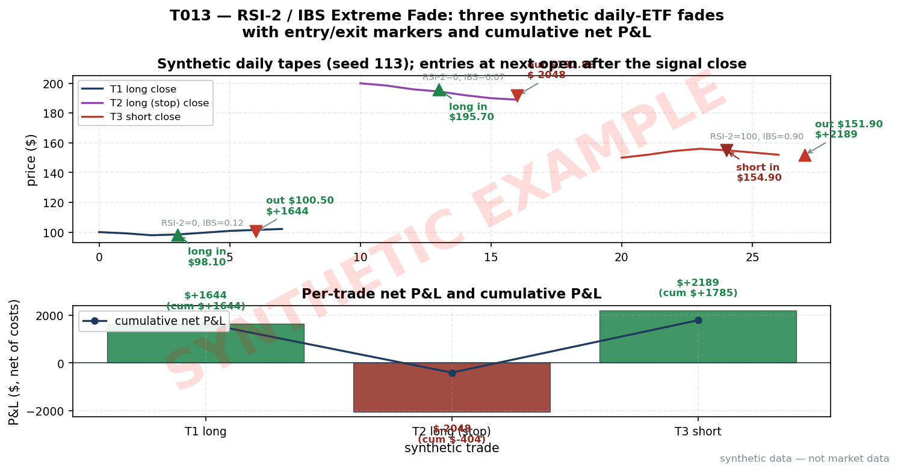

**Where the example is optimistic.** (1) Fills at the synthetic next opens with zero slippage; real opens gap against overnight signals, and the stop fill at $191.88 assumes no gap through the stop. (2) The 200-SMA regime gate and ATR10 are stipulated, not computed — on a real tape the gate binds exactly when you most want the trade (crashes), and ATR understates gap risk. (3) No partial fills, no borrow cost on the short (assumed easy-to-borrow ETF). (4) The tapes are constructed so two of three signals work; trade 2 is deliberately included to show the failure shape, but one toy waterfall understates how losers *clump* — in 2008-style tapes every name triggers at once. (5) The 2 bp cost stack is the SPY-class case; smaller ETFs cost 3–5× more.

### T5. Data & infra — what must run

**Pipeline inventory.** Nightly (post-close): pull split-adjusted daily OHLCV (Tier 0–1), corporate-action check, compute RSI-2 / IBS / 20-bar z / SMA-200 / ATR10 per name, apply volume and S045 vetoes, generate next-open orders. Morning: confirm opens, place entries; manage working stops. Post-close: fill reconciliation, per-trade attribution (RSI-2 bucket × IBS bucket — the Pagonidis grid), regime-gate log.

**Feeds.** Daily OHLCV split-adjusted (Tier 0: Stooq; Tier 1: Polygon); session calendar (half-days, holidays); corporate actions. No intraday feed required — this is the cheapest strategy in TB2 to feed.

**M5 Max feasibility: trivial** for the daily form (Tier L, `notes/cost-model.md` §2/§3/§5). The nightly screen over 3,000 ETFs/stocks × 10 y of daily bars (60M rows) is seconds in polars (§2). RAM: the daily panel ≈ 2–5 GB (§3) — far inside the 77 GB budget; 60 days of signals ≈ one float per name. Engineering band: **4–12 h** (~$600–1,800 at $150/hr loaded-cost estimate, §5) for the screen + order generation; +15 h for a production scheduler. Bottleneck: none computationally — the binding constraint is corporate-action correctness (a bad split adjustment injects a false RSI-2 = 0). What breaks first at 500 symbols: nothing local; at 3,000 names the PIT (point-in-time — as-known-at-the-time, no future information) ETF history join is the work, not the math.

**Feed-outage safe mode.** If the corporate-action feed is stale: no new entries (a split masquerading as a −50% "crash" is the classic false RSI-2 = 0). If daily bars are missing for a name (halt): skip — never interpolate a bar into the 2-period window. Existing positions are governed by their stops, which are held as real orders, not intentions. The strategy degrades to "manage existing, take nothing new" — the correct posture for a close-based system.

### T6. Buy vs build

| Option | What you get | Indicative price | Gains | Loses |
|---|---|---|---|---|
| Tier-0: Stooq daily bars | Free split-adjusted daily OHLCV | ~$0, indicative — verify before budgeting | Zero-cost honest research | Survivorship/delisting caveats; no PIT guarantees |
| Tier-1: Polygon Stocks Advanced | Daily + 1-min, adjustments, corporate actions | ~$30–200/mo, indicative — verify before budgeting | Cleaner adjustments; deeper history | Overkill for a daily-close system |
| Tier-1: Norgate US Platinum | PIT universe, delisteds, index members | ~$630/yr, indicative — verify before budgeting | Survivorship-safe backtests | Cost for a strategy that trades 20 ETFs |
| Research platform: QuantConnect cloud | Backtest + some data included | indicative — verify before budgeting | Fastest first backtest | You still own live execution |

**Verdict: build, and barely buy.** This is the rare strategy where Tier-0 data is genuinely adequate for research — the rules are public, the math is 20 lines, and the edge (if any) is in the vetoes and the cost discipline, not the feed. Buy Norgate only if you backtest a broad universe where survivorship bias would flatter the results. Crossover: the moment you port the rules intraday (5-min RSI-2), you leave the documented evidence behind (Grok Q-TB2-3) — that port needs Tier-1/2 data and its own validation.

### T7. Success-ratio evidence

| Source | Market & period | Metric | Before/after cost | Caveat |
|---|---|---|---|---|
| Connors (2008), *Short Term Trading Strategies That Work* | US index/ETFs | RSI-2 < 5–10 with price > 200-SMA; exit on recovery; often no stop. High win rate, small average win | **Before cost** (published rules) | Practitioner book, not peer review; the no-stop original carries the full left tail |
| Pagonidis (2014), "The IBS Effect" (NAAIM) | Equity ETFs, inception–2013 | Avg next-day return **+0.35%** when IBS < 0.20 vs **−0.13%** when IBS > 0.80; threshold behavior near 0.4/0.9; stronger in high vol and bear markets; vanishes on low-volume US ETF days | **Before cost** | Verified via the NAAIM abstract 2026-09-10; the "30%+ p.a. alpha" figure is before transaction costs |
| Kakushadze & Serur (2018), §4.4 | — | Documents the IBS cross-sectional rank construction | Method | Confirms the form, not the P&L |
| Wilder (1978) | — | RSI original | Method | RSI-2 is the practitioner's 2-period port, not Wilder's 14-period |
| Grok-reported replications (Q-TB2-3) | SPY/QQQ RSI-2 variants | Max DD ≈ −15.7% in 5 days (Oct 2008); R3-family max DD ≈ −16% (Aug 2011); walk-forward 17.8% CAGR mostly pre-2008; IBS win rates 68–76% with DD −13% to −26% | Mixed/before cost | All `unverified chatbot claims` — directionally consistent with the no-stop tail, not citable |

Regimes where it fails: multi-day waterfalls (2008, 2011, Feb 2018, Mar 2020) — the no-stop original's left tail, hence this strategy's ATR stop; trend years (2013–19, 2021, 2023–24) — few RSI-2 < 8 events, so the "failure" is opportunity cost vs buy-and-hold; intraday ports on single stocks — bounce contamination, not the published test (Grok Q-TB2-3). Documented decay: post-2008 replications weaker vs benchmark (unverified leads), consistent with publication decay.

**Honest bottom line.** For a ≤$1M paper operation: a legitimate small sleeve — high win rate, low CAGR, 10–20% drawdowns, high time-in-cash. With the ATR stop added (unlike Connors' original), it is a defensible research system: cheap to build, cheap to run, and the failure mode is boredom (few triggers in trend years) rather than ruin. Size it as a sleeve — 10–20% of a paper book — never the engine. For an institutional desk: one mean-reversion sleeve among many; capacity is large in ETFs but expectancy per trade is small, so it earns its place only with ruthless cost control and the volume/S045 vetoes enforced. Nobody runs RSI-2 as a standalone fund.

### T8. Failure modes

1. **Waterfall / no-stop tail.** The Connors original accepts multi-day crashes without a stop; Oct-2008-style tapes trigger repeatedly into the decline. *Mitigation:* the 1.8×ATR hard stop (a deliberate departure from the original); the weekly −4% stop stands the book down when losers clump.
2. **Trend-regime opportunity cost.** In grinding bull years the setup rarely fires; the strategy underperforms buy-and-hold by simply not participating. *Mitigation:* size as a sleeve, not the book; report time-in-cash honestly.
3. **Bounce contamination on intraday ports.** Daily Connors rules on 5-min bars import the bid–ask bounce (Grok Q-TB2-3). *Mitigation:* do not port without re-validating on midpoints; the documented evidence is daily-only.
4. **Threshold overfit.** RSI-2 < 8 vs < 10, IBS < 0.15 vs < 0.20 are `example` choices. *Mitigation:* Pagonidis documents threshold *regions* (0.4/0.9), not lines — prefer wide gates; sensitivity sweep before trading.
5. **Corporate-action spikes.** A split injects a false −50% Δ and a synthetic RSI-2 = 0. *Mitigation:* split-adjusted inputs only; corporate-action freshness check gates new entries (T5 safe mode).
6. **Volume-filter breach.** The IBS edge disappears on low-volume US ETF days (Pagonidis). *Mitigation:* the 0.8× median-volume gate is a hard filter, not a suggestion.
7. **Overnight gap risk.** Entries at the open and multi-day holds wear gap risk the daily backtest smooths over. *Mitigation:* the ATR stop is sized for gaps; no adds into gap-downs; earnings-week veto optional (`example`).
8. **Publication decay / crowding.** Post-2008 replications are weaker (unverified leads). *Mitigation:* expect decay; re-validate the IBS bucket grid annually; the S045 veto is the margin that keeps the fade on exhaustion rather than on everyone's screen.

### T9. Visuals


```mermaid
flowchart TD
    DATA["Market data\ndaily OHLCV, split-adjusted\nsession calendar"] -->|"daily OHLCV bars"| SIGS["Signals\nS042 RSI-2, S043 IBS, S045 z"]
    SIGS -->|"RSI-2, IBS, z values"| ENTRY{"Entry logic\nSMA-200 regime + RSI-2/IBS extremes\nS045 volume veto; causal t→t+1"}
    ENTRY -->|trigger| SIZE["Sizing + risk\n1% equity to 1.8×ATR stop\n≤8 names, heat ≤4%"]
    ENTRY -->|no trigger / veto| WAIT["Wait"]
    SIZE --> EXEC["Execution\nnext-open fills\nmarketable-limit stops"]
    EXEC --> MON["Monitor + exits\nRSI-2/IBS recovery\n+5d time stop / ATR stop"]
    MON --> PNL["P&L (net of costs)"]
    style ENTRY fill:#f9e79f,stroke:#7d6608
    style PNL fill:#a9dfbf,stroke:#1e8449
```

### T10. Sources

**Checkable sources**

- Connors, L. (2008), *Short Term Trading Strategies That Work* (with C. Alvarez) — the documented RSI-2 < 10 / SMA-200 / recovery-exit rules this strategy ports.
- Connors, L. and Alvarez, C. (2009), *High Probability ETF Trading* — the ETF-specific Connors-family rules. Independent RSI-2 replication of the book's R3 strategy (explicit Connors & Alvarez attribution): https://www.tradingview.com/script/5CDSns2I-R3-ETF-Strategy/
- Pagonidis, A.S. (2014), "The IBS Effect: Mean Reversion in Equity ETFs," NAAIM Wagner Award. https://www.naaim.org/wp-content/uploads/2014/04/00V_Alexander_Pagonidis_The-IBS-Effect-Mean-Reversion-in-Equity-ETFs-1.pdf — +0.35% next-day when IBS < 0.20, −0.13% when IBS > 0.80; threshold regions; volume filter (verified via abstract 2026-09-10).
- Kakushadze, Z. and Serur, J.A. (2018), *151 Trading Strategies* (Palgrave Macmillan), §4.4 — the IBS cross-sectional construction. NOTE (2025): Springer lists this book as a RETRACTED BOOK; the citation is retained only for the construction reference and no claims rest on it.
- Wilder, J.W. (1978), *New Concepts in Technical Trading Systems* — the RSI original (14-period; RSI-2 is the practitioner's port). https://openlibrary.org/books/OL25090843M/New_concepts_in_technical_trading_systems

**Unverified leads** (chatbot-provided, not independently verified — do not cite as fact)

- Grok (Q-TB2-3, 2026-09-10): RSI-2 replication drawdowns (−15.7% Oct 2008; −16% Aug 2011 R3-family); "Holy Grail" walk-forward 17.8% CAGR pre-2008 concentration; IBS win rates 68–76% with −13% to −26% DD; intraday-port bounce warning — all `unverified chatbot claims`.
- Grok (Q-TB2-1, 2026-09-10): the 8/0.15 entry gates, 65/0.70 exits, 1.8×ATR stop, and the QQQ-like worked example — illustrative `example` thresholds.
- All vendor prices above are `indicative — verify before budgeting`.

*Source log: Grok answered Q-TB2-1..3 (2026-09-10); all claims independently verified or labeled unverified.*

## Stage 114/200 — T014: Bollinger Reversal + Squeeze Exit

*Batch TB2 · Strategy 14/100 · Signals S041, S030, S076*

### T1. One-line verdict

| | |
|---|---|
| **Style** | Intraday band-fade mean reversion with an expansion-defense exit leg |
| **Edge source** | Bollinger-band tags revert toward the midline (S041 `[D]`); fades taken while bandwidth is squeezed run under immediate S076 expansion defense (S030 `[SR]`); any live fade is *covered* on the first adverse vol-breakout bar (S076 `[D/SR]`) |
| **Typical holding period** | Minutes to ~1 hour on 5-minute bars (`example` time stop M = 10 bars) |
| **Capacity hint** | Low — the fade leg is a per-name, spread-bound microstructure bet; scales to a few dozen liquid names before impact eats it |
| **Build-or-buy in one line** | Build: the bands are 20 lines of code — buy only the bar feed |

### T2. Full mechanics

**Universe & session.** Liquid US equities and ETFs: price ≥ $10, average daily dollar volume ≥ $20M, quoted spread ≤ 10 basis points (`examples` — a *basis point* is 0.01%, so 10 bps = 0.10%). Regular trading hours (RTH — 9:30–16:00 ET) only. Exclude earnings-announcement sessions, halted names, and the first 5 minutes of the day (opening-print noise). Bars: 5-minute (`example`); 1-minute works with noisier bands, daily bars for the swing variant.

**The signals in the strategy's own notation.** S041 `[D]` (Bollinger-band reversal): with closes P_t, window n = 20 (`example`), multiplier k = 2.0 (`example`): Mid_t = SMA(20)_t (SMA — simple moving average), σ_t = sample standard deviation of the last 20 closes, Upper_t = Mid_t + 2σ_t, Lower_t = Mid_t − 2σ_t. A *tag* is a close outside a band; the traded fade is *tag-and-reenter*: P_t < Lower_t **and** P_{t+1} > Lower_{t+1} → long at P_{t+1}'s close (mirror for upper tags → short). S030 `[SR]` (bandwidth squeeze): BW_t = (Upper_t − Lower_t)/Mid_t × 100%; P_t = percentile rank of BW_t against its trailing 125 bars; *squeeze armed* when P_t ≤ 15 (`example` — S030's typical range is 5–20). S076 `[D/SR]` (vol breakout): range ratio R_t / R̄_{t−1}^{(10)} > 1.75 (`example`, R_t = bar range) → a vol-breakout bar in the direction of bar t's close.

**Entry rule (long; short mirrors).** At bar t+1's close, enter long only if ALL hold: (i) S041 tag-and-reenter fired (tag at t, back inside at t+1); (ii) S030 conditioner: when a squeeze is armed (P_t ≤ 15, `example`), the fade may still be taken, but the squeeze arms immediate S076 expansion defense — the breakout-cover exit fires on the first adverse vol-breakout bar — because tags during compression are expansion candidates, not reversion setups; (iii) S076 check: bar t+1 is not itself a vol-breakout bar. **Causal timing:** Mid_t, σ_t, BW_t use closes ≤ t; the re-entry is confirmed at t+1's close; earliest fill is t+1's close or t+2's open — never the tag bar's close (the tag bar is where the loss lives).

**Exit rule.** First of: (a) *midline touch* — first close ≥ Mid (longs) / ≤ Mid (shorts); (b) *time stop* — bar t+10 (`example` M = 10, per S041); (c) *disaster stop* — beyond the tag extreme by 0.5σ (`example`); (d) *squeeze/expansion cover* — the strategy's signature: if while in a fade a vol-breakout bar prints **against** the position, cover at that bar's close instead of waiting for the time stop.

**Position sizing.** Fixed-fractional on the disaster stop: shares = risk$ / (0.5σ_t), with risk$ = $250 per trade (`example`); hard cap 2,000 shares per name (`example`). (σ_t is already in dollars, so 0.5σ_t is the dollar risk per share at the disaster stop — no extra × price.) The worked example uses a flat 1,000 shares for readability.

**Risk limits.** Max 6 concurrent fades (`example`); max 2 names per sector; daily loss stop −$500 (`example` — about 2× the expected daily win rate of a working book); kill switch: 3 disaster-stop hits in one session → flat for the day, review the squeeze filter calibration before re-enabling.

**Cost model.** Half-spread 1¢/share/side + commission $0.005/share + $0.50/ticket (`examples`); breakout-cover exits add +0.5 tick slippage (`example` — you are demanding liquidity into the expansion). Borrow stubbed at ~0 for liquid intraday shorts (verify with your broker). Every fade must clear ~$31 round-trip on 1,000 shares before it shows a dollar of edge.

**Execution sketch.** Entries: passive limit at the re-entry close, 1-tick improvement if the queue allows; if not filled within 2 bars, cancel (the setup decays). Mid-touch exits: limit at the midline. Breakout cover: marketable limit IOC (immediate-or-cancel), participation ≤ 10% of visible depth (`example`). Queue-position honesty: on SIP/L1 data, fills "at the touch" are *simulated only — requires MBO/ITCH* (MBO — market-by-order, the full order-level feed) to model honestly.

### T3. Signals it consumes

| Signal | Role | Weight / logic |
|---|---|---|
| S041 `[D]` — Bollinger-band reversal | **Primary trigger** (direction) | tag-and-reenter only; pure tag fades (no re-entry) are excluded — too many false positives |
| S030 `[SR]` — Bandwidth squeeze | **Conditioner** | a fade taken while P_t ≤ 15 (`example`) runs under immediate S076 expansion defense (breakout-cover exit on the first adverse vol-breakout bar); the squeeze arms the *breakout* book alongside the fade book |
| S076 `[D/SR]` — Vol breakout | **Defense exit** | adverse breakout bar → cover at bar close; also gates entry (no fade into an expansion bar) |

Combination pseudocode (≤25 lines):

```
# per name, per 5-min bar close (all inputs causal, data <= t)
mid, up, lo, sd = bollinger(close[:t+1], n=20, k=2.0)   # S041
bw = (up - lo) / mid * 100
p  = percentile(bw, trailing=125)                        # S030
brk = (high[t]-low[t]) / mean(range[t-10:t]) > 1.75     # S076
if flat:
    if close[t] < lo and close[t+1] > lo_next:          # tag-and-reenter
        if not brk:                                     # S076 gate: never fade into an expansion bar
            # S030: squeeze armed (p <= 15) does NOT veto the fade — it arms
            # immediate S076 expansion defense (breakout cover on first adverse vol bar)
            enter long at close[t+1]                    # examples throughout
elif long:
    if close[t] >= mid: exit("mid touch")
    elif t - t_entry >= 10: exit("time stop")           # example M=10
    elif brk and close[t] < close[t-1]: exit("breakout cover")  # S076 defense
    elif close[t] < tag_low - 0.5*sd: exit("disaster stop")
# short mirrors
```

### T4. Worked example — numbers + P&L (SYNTHETIC)

Setup: fictional stock SYN at **~$50** (synthetic prices — not market data), 5-minute bars, **seed 114** (`batches/TB2/plot_T014.py`), n = 20, k = 2.0, flat **1,000 shares** per trade, cost **$31.00/trade** round-trip (half-spread 2 × $10.00 + commission 2 × $5.50 — `examples`). Three trades:

| # | Setup | Entry (bar, $) | Exit (bar, $) | Gross | Costs | Net |
|---|---|---|---|---|---|---|
| 1 | Long fade: lower-tag bar 60, re-entry bar 61 | 61, $49.9278 | 70, $49.9933 (mid touch) | +$65.48 | −$31.00 | **+$34.48** |
| 2 | Short fade: upper-tag bar 110, re-entry bar 111 | 111, $50.3550 | 119, $50.3045 (mid touch) | +$50.49 | −$31.00 | **+$19.49** |
| 3 | Long fade with squeeze armed (BW pct 11.2% ≤ 15 `example`) | 181, $50.4126 | 182, $50.3370 (adverse vol-breakout cover; range ratio 2.28 > 1.75) | −$75.62 | −$36.00 | **−$111.62** |
| **Total** | | | | | | **−$57.65** |

Line-by-line walk, trade 1: buy 1,000 @ **$49.9278** = $49,927.80. Sell 1,000 @ **$49.9933** = $49,993.30. Gross +$65.48; half-spread −$20.00; commission −$11.00; **net +$34.48**. (Leg prices are shown to 4 decimals; gross/net are computed at full script precision, hence ±$0.02 rounding vs the rounded legs.) Trade 2: short 1,000 @ **$50.3550** = $50,355.00; cover @ **$50.3045** = $50,304.50; gross +$50.49 − $31.00 = **+$19.49**. Trade 3: buy 1,000 @ **$50.4126**; the next bar's range ratio printed 2.28 against the position → cover @ **$50.3370**; gross −$75.62 − $36.00 = **−$111.62** (half-spread, commission, plus the $5.00 0.5-tick breakout-cover slippage now deducted in the ledger). The no-cover alternative — riding to the 10-bar time stop at bar 191 ($49.6564) — would have netted **−$787.19**; the S076 cover leg saved ≈ $680. **Three-trade total net: −$57.65.** The chart plots exactly this tape: price with Bollinger bands, the squeeze shading (BW percentile ≤ 15), entry/exit markers, per-trade net annotations, and the cumulative P&L stepping +34.48 → +53.97 → −57.65.

**Cost-model note.** The 0.5-tick breakout-cover stress allowance (T2) is now deducted in the displayed ledger — Trade 3's cover exit carries half-spread, commission, and the $5.00 allowance (0.5 × $0.01 × 1,000 shares), moving Trade 3 to −$111.62 and the three-trade book to −$57.65. The chart plots this (full-cost) ledger.

**Where the example is optimistic.** The reversions in trades 1–2 are engineered into the synthetic tape — real tags revert far less obediently, and many tags are the *start* of the expansion, which is precisely what the squeeze filter tries (imperfectly) to avoid. Fills are at exact bar closes with no partial fills and no queue-position modeling. The breakout cover assumes a fill at the bar close with only the modeled half-spread — a real expansion bar gaps through your cover price. Note the honest shape of the result: two textbook fade wins (+$54) are wiped out by one defended loser (−$107) even *with* the cover leg working. That is the strategy's real economics: costs are certain, reversion is probabilistic, and the exit leg only bounds the damage.

### T5. Data & infra — what must run

**Pipeline inventory.** One intraday job: per 5-minute bar, recompute rolling SMA-20/σ/bands/bandwidth percentile for the universe (a few numpy rolling ops per name — O(bars) each). One daily job: corporate-action adjustment check (splits/dividends corrupt the SMA — the #1 data bug in band strategies), universe re-screen (price/ADV/spread gates), and a bandwidth-percentile history rebuild. No overnight batch otherwise.

**M5 Max feasibility: trivial (Tier L, ~8–16 h ≈ $1,200–2,400 loaded-cost estimate; full strategy harness M+, 40–100 h ≈ $6,000–15,000).** Per cost-model §2: 500 symbols × 390 one-minute bars = 195k bars/day; numpy vectorized math runs ~50–200M elements/sec — the entire universe recomputes in well under a second per bar. Per §3: 1-min bars for 500 symbols × 60 days ≈ 12 MB RAM — trivial; §4: ~3 GB/60 days on disk — archive freely. Bottleneck: none computationally; the risk is *data* risk (unadjusted splits), not compute.

**Feed-outage safe-mode.** If bars are stale > 2 bars: no new fades; any live fade is covered at the next available print and the book goes flat. Fades are never carried overnight on stale data — the disaster stop is meaningless without a live quote. Clock skew > 50 ms vs NTP → halt (bar timestamps drive the percentile ranking).

### T6. Buy vs build

| Option | What you get | Indicative price | Gains | Loses |
|---|---|---|---|---|
| Tier 0: Alpaca IEX / Stooq bars | 1-min/daily bars, delayed or limited | ~$0, indicative — verify before budgeting | Free band research | No live 5-min trigger; weak corporate actions |
| Tier 1: Polygon Stocks Advanced | Real-time 1-min bars + corporate actions | ~$30–200/mo, indicative — verify before budgeting | Everything the bands need | — |
| Tier 2: Databento Standard | Honest L1 (MBP-1) for touch-level fade timing | ~$200/mo + usage, indicative — verify before budgeting | Real queue/touch modeling | Overkill for a band strategy |
| Retail platform: QuantConnect paper | Paper broker + minute data + scheduling | ~$60–300/mo, indicative — verify before budgeting | Fastest paper host | Platform lock-in for 20 lines of math |

**Verdict: build; buy only the bar feed.** Bollinger bands are a 20-line rolling computation — no vendor sells you a better SMA. The buy-vs-build question that matters is L1 vs bars: buy Databento L1 only if you graduate the fade to touch-level entries; the band logic itself never justifies it. Crossover: none — there is no licensed data in this strategy.

### T7. Success-ratio evidence

| Study / source | Market & period | Metric | Before/after cost | Caveat |
|---|---|---|---|---|
| Fang, Jacobsen & Qin (2014), "Popularity versus Profitability: Evidence from Bollinger Bands," SSRN 2484322 | 14 international indexes, 1885–2014 | Basic Bollinger breakout gross edge decayed 0.45%/day pre-1983 → **0.00% post-2001** | Before-cost (gross) | Breakout variant, not the tag-fade — but it is the closest peer-reviewed family evidence, and it is zero |
| Practitioner mega-backtest (~20M tests, TradingView/EdgeTools, via S076's chapter) | ES futures (CME_MINI:ES1) | Squeeze-breakout directional edge ≈ 0 (−0.10pp long / +0.15pp short, insignificant after Bonferroni); **squeeze forecasts future volatility, not direction** | Before-cost | Practitioner source, not peer-reviewed — treat as a lead, not a finding |
| Bollinger (2001), *Bollinger on Bollinger Bands* | Practitioner doctrine | The squeeze is explicitly direction-neutral: "periods of low volatility are followed by periods of high volatility" | n/a (doctrine) | Supports the filter/exit use of S030, not the fade |
| Andersen, Bollerslev, Diebold & Labys (2003), *Econometrica* 71(2) | FX/equity realized vol | Volatility clusters — long memory in realized variance | n/a (mechanism) | The mechanism behind compression→expansion; says nothing about fade profitability |

No peer-reviewed study documents an after-cost premium for band-tag fading. The documented facts are: (1) volatility clusters, so squeezes resolve into expansions (the exit leg's premise), and (2) the directional fade leg has no published edge net of costs. **Bottom line for ≤$1M paper:** this is a spread-bound lab exercise — excellent for learning cost modeling and exit engineering, not a P&L engine. An institutional desk would never run the fade standalone; bands survive in production as *risk/context features* (regime gates, like the squeeze filter here), which is exactly the leg of this strategy with the most support.

### T8. Failure modes

1. **The trend is the fade's natural predator.** Bollinger's own Method II is trend-following — tags that don't revert are breakouts, and fading them is the anti-strategy. *Mitigation:* the S030 conditioner (fades taken while squeezed run under immediate S076 expansion defense) plus the S076 cover; accept that whipsaw (cover, then price reverts) is a permanent tax.
2. **Squeeze expansion against the position.** Compression resolves violently, often on news. *Mitigation:* the breakout-cover leg; plus a hard rule — never fade the *first* tag out of a squeeze, only re-entries after the percentile has normalized (`example` refinement).
3. **Wide spreads eat the edge.** A 10 bps spread on a 15 bps expected reversion is a coin flip with a fee. *Mitigation:* Corwin–Schultz-style spread gate (S013): skip names/days where estimated effective spread > 50% of the expected mid-touch gain (`example`).
4. **Parameter mining.** 20/2 is convention, not science; optimizing n/k on 5-min bars overfits the band to the sample's vol. *Mitigation:* fix 20/2.0 as convention, vary only M and the squeeze percentile, walk-forward (S088 discipline).
5. **News jumps.** A tag caused by a jump (S092 territory) has no reason to revert — the midline itself relocates. *Mitigation:* skip fades on bars where |return| > 3× diurnal σ (jump filter, `example`); no fades 5 minutes either side of scheduled releases.
6. **Bid–ask bounce contamination.** Tags computed on last-sale prices are partly just the bounce; backtests on trades overstate reversion. *Mitigation:* compute bands and P&L on quote midpoints (the batch's research Q&A, Grok Q-TB2-2, details the midpoint-accounting defense — research lead, standard practice); report mid-to-mid, mid-to-touch, and touch-to-touch P&L separately.
7. **Overnight gap through the disaster stop.** A tag fade held into a gap open blows past the 0.5σ stop. *Mitigation:* flat into the close — no overnight holds, no exceptions; the strategy is intraday by construction.
8. **Crowding of retail band-fades.** Band-fading is the most retailed mean-reversion setup in existence; crowded tags get run over. *Mitigation:* liquid-universe filter, participation caps, and the squeeze conditioner (retail fades ignore the squeeze — that is your differentiation).

### T9. Visuals

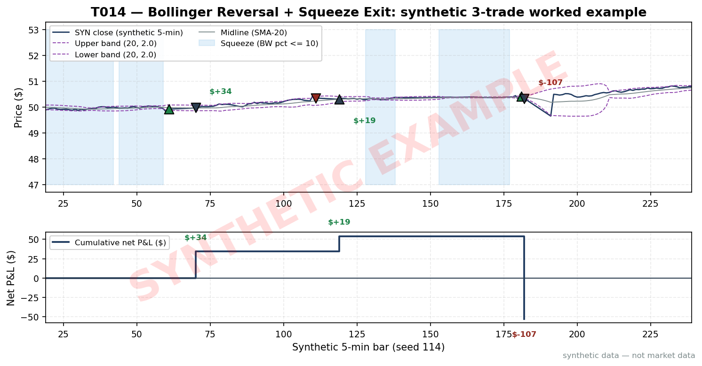

```mermaid
flowchart TD
    DATA["Market data<br/>5-min bars, liquid US equities/ETFs"] -->|5-min bars| SIGS["Signals<br/>S041 band tags, S030 squeeze, S076 breakout"]
    SIGS -->|5-min bars| ENTRY{"Entry logic<br/>tag-and-reenter<br/>AND no breakout bar"}
    ENTRY -->|trigger| SIZE["Sizing + risk<br/>risk$/(0.5σ); cap 2k sh;<br/>6-name, sector, daily-stop limits"]
    ENTRY -->|no trigger| WAIT["Wait (no tag / breakout bar)"]
    SIZE --> EXEC["Execution<br/>passive limit entry; IOC cover;<br/>≤10% depth"]
    EXEC --> MON["Monitor + exits<br/>mid touch / 10-bar stop /<br/>0.5σ disaster / breakout cover"]
    MON --> PNL["P&L (net of costs)"]
    style ENTRY fill:#f9e79f,stroke:#7d6608
    style PNL fill:#a9dfbf,stroke:#1e8449
```

### T10. Sources

1. Bollinger, J. (2001). *Bollinger on Bollinger Bands*. McGraw-Hill. ISBN 9780071373685. (Band construction, the squeeze concept, tag semantics.) https://www.mheducation.com/highered/mhp/product/bollinger-bollinger-bands.html
2. Fang, J., Jacobsen, B. & Qin, Y. (2014). "Popularity versus Profitability: Evidence from Bollinger Bands." SSRN 2484322. https://papers.ssrn.com/sol3/papers.cfm?abstract_id=2484322 (Breakout edge 0.45%/day pre-1983 → 0.00% post-2001, 14 indexes.)
3. Andersen, T. G., Bollerslev, T., Diebold, F. X. & Labys, P. (2003). "Modeling and forecasting realized volatility." *Econometrica* 71(2), 579–625. DOI: 10.1111/1468-0262.00418. https://doi.org/10.1111/1468-0262.00418 (Volatility clustering — the mechanism behind compression→expansion.)

**Unverified leads:** the ~20M-backtest practitioner note (TradingView/EdgeTools: squeeze-breakout directional edge ≈ 0, insignificant after Bonferroni; squeeze forecasts volatility, not direction) — practitioner source, not peer-reviewed, used only as a lead; Grok's Q-TB2-2 midpoint-accounting defense for reversal backtests — standard practice described in the batch's research Q&A, not independently measured here; all thresholds and the worked example are the author's synthetic construction.

*Source log: Grok answered Q-TB2-1..3 (2026-09-10); all claims independently verified or labeled unverified.*

## Stage 115/200 — T015: First-Half-Hour → Close Continuation

*Batch TB2 · Strategy 15/100 · Signals S026, S027, S046*

### T1. One-line verdict

| | |
|---|---|
| **Style** | Intraday time-series momentum: hold the morning's winners into the last-half-hour drift |
| **Edge source** | The first half-hour's return predicts the last half-hour's return (S026 `[D]`, Gao et al. 2018); the day's own 9:30→15:30 drift must agree (S027 `[D]` confirm); returns are deseasonalized and sized by the intraday vol profile, with event days throttled (S046 `[D]`) |
| **Typical holding period** | 30 minutes (enter 15:30, flat at the close) |
| **Capacity hint** | High per vehicle — one trade a day in SPY/QQQ-class ETFs; cross-sectional extension scales across liquid names but competes with institutional VWAP/MOC flow |
| **Build-or-buy in one line** | Build: a 15:30 clock, a sign rule, and a seasonal profile — any retail platform with minute bars suffices; buy only the data |

### T2. Full mechanics

**Universe & session.** One liquid vehicle in the base form: SPY (or QQQ; `example`). Cross-sectional extension: top-500 US equities by ADV, price ≥ $10 (`example`). RTH only. Exactly one window per day: enter 15:30 ET, flatten at the 16:00 close. No other entries — this is a *clock strategy*: no intraday monitoring, one decision, one exit.

**The signals in the strategy's own notation.** S026 `[D]` (first half-hour → last half-hour momentum): with 13 half-hour buckets per day, r_{1,t} = P_{10:00}/P_{16:00,prior-day} − 1 (the first half-hour *including* the overnight return — Gao et al.'s exact formation) and r_{13,t} = the last half-hour return. The tradable form is the sign rule: s_t = sign(r̃_{1,t}), hold s_t from 15:30 to the close. S027 `[D]` (end-of-day drift): r_{first,t} = P_{15:30}/P_{9:30} − 1 — the day's own drift into the entry; it must agree in sign with r̃_{1,t} or the day is flat. S046 `[D]` (intraday seasonality): the U-shaped vol profile (Admati & Pfleiderer 1988 — wild at the open, dead at lunch, wild at the close) enters twice: (1) *deseasonalization* — r̃_{1,t} = r_{1,t} / σ̄(open bucket), where σ̄(b) is the mean absolute bucket return over the trailing 30 days (`example`), so a mechanically-volatile morning move isn't mistaken for information; (2) *event-day throttle* — on scheduled macro days (FOMC/CPI/NFP) the profile inverts, so size is halved (`example`; full stand-down is the stricter variant).

**Entry rule (long; short mirrors).** At 15:30, enter long if ALL hold: (i) |r̃_{1,t}| ≥ 0.25% (`example` — the deseasonalized morning impulse must be real, not open noise); (ii) sign(r_{first,t}) = sign(r̃_{1,t}) (`example` S027 confirm — the day's drift agrees with the morning impulse); (iii) S046 gate: not a full stand-down day; if a scheduled macro release occurred today, size is halved. **Causal timing:** r_{1,t} is known at 10:00; the seasonal profile uses days ≤ t−1 only; the order is eligible at 15:30 — five hours after the signal, which is why this strategy is nearly immune to microstructure lookahead traps.

**Position sizing.** Base 200 shares of a $500 ETF = $100,000 notional (`example`); × 0.5 on event days (S046 throttle). Cross-sectional extension: equal notional per qualifying name, capped at 20 names (`example`).

**Exit rule.** Flatten at the 16:00 close — MOC (market-on-close) or a 15:59:30 market order (`example`). No intraday stop-loss (a stop inside the last half hour is spread-donation), no profit target. The time stop *is* the strategy.

**Risk limits.** One position per vehicle per day; daily loss stop −$800 on the single-name book (`example`) — enforced ex post as a next-day review trigger, not an intraday exit (exiting early breaks the tested window). Event-day positions count double against the stop.

**Cost model.** 1¢/share all-in round-trip (`example`: ~0.5¢ commission + ~0.5¢ effective spread on SPY at 15:30, the tightest spread of the day). The conservative variant assumes the MOC print plus 1¢ adverse. No slippage beyond the close in the base case. Borrow n/a for the ETF (short SPY for a day is ~0 bps — stubbed at zero, verify).

**Execution sketch.** 15:30: marketable limit IOC for the share count. 15:59:30: closing-auction-eligible order for the full position — respect MOC/LOC cutoffs; you cannot exit "at the close" as a price-taker after 16:00. Participation is irrelevant at $100k in SPY's last half hour. Queue-position honesty: n/a at this granularity.

### T3. Signals it consumes

| Signal | Role | Weight / logic |
|---|---|---|
| S026 `[D]` — First half-hour → last half-hour momentum | **Primary trigger** (direction) | sign of the S046-deseasonalized r̃_{1,t}; requires |r̃_{1,t}| ≥ 0.25% (`example`) |
| S027 `[D]` — Open→15:30 formation drift | **Confirmation filter** | sign(r_{first,t}) must equal sign(r̃_{1,t}); disagreement → flat |
| S046 `[D]` — Intraday seasonality | **Normalizer + throttle** | divides r_1 by the open-bucket seasonal factor; halves size on scheduled macro days (`example`) |

Combination pseudocode (≤25 lines):

```
# once per day at 15:30 (all inputs causal)
s_b   = seasonal_profile(open_bucket, trailing=30)  # S046, days <= t-1
r1    = log(P10:00 / Pclose_prev)                    # S026 formation
r1t   = r1 / s_b                                     # S046 deseasonalized
rfo   = P15:30 / P09:30 - 1                          # S027 formation drift
event = is_macro_day(t)                              # S046 throttle
if abs(r1t) < 0.0025: flat("no impulse")             # example gate
elif sign(rfo) != sign(r1t): flat("no confirm")      # S027 disagrees
else:
    shares = 200 // 2 if event else 200              # example: halve on event days
    buy/sell sign(r1t)*shares at 15:30; flatten MOC at 16:00
```

### T4. Worked example — numbers + P&L (SYNTHETIC)

Setup: SPY-class ETF at **$500.00**, base 200 shares ($100,000 notional), cost **$0.01/share round-trip** (`examples`). Five synthetic days, **seed 115** (`batches/TB2/plot_T015.py`):

| Day | r_1 raw | s (open bucket) | r̃_1 (S026/S046) | r_first (S027) | Decision | r_13 | Net P&L |
|---|---|---|---|---|---|---|---|
| 1 | +0.76% | 1.80 | +0.42% | +0.95% | LONG 200 | +0.28% | **+$278.00** |
| 2 | −0.63% | 1.80 | −0.35% | −0.80% | SHORT 200 | −0.22% | **+$218.00** |
| 3 | +0.18% | 1.80 | +0.10% | +0.20% | FLAT (below impulse) | +0.05% | $0.00 |
| 4 | +0.99% | 1.80 | +0.55% | +1.20% | LONG 100 (CPI day, halved) | −0.18% | **−$91.00** |
| 5 | −0.90% | 1.80 | −0.50% | +0.30% | FLAT (S027 disagrees) | −0.40% | $0.00 |
| **Total** | | | | | | | **+$405.00** |

Line-by-line walk, Day 1: 15:30 — buy 200 @ **$500.00** = $100,000.00. 16:00 — sell 200 @ **$501.40** ($500 × 1.0028) = $100,280.00. Gross +$280.00; cost 200 × $0.01 = −$2.00; **net +$278.00**. Day 2: short 200 @ $500.00, cover @ $498.90 → gross +$220.00 − $2.00 = **+$218.00**. Day 4 (CPI day, halved by the S046 throttle): long 100 @ $500.00, sell @ $499.10 → gross −$90.00 − $1.00 = **−$91.00**. Days 3 and 5: no position, $0. **Five-day total net: +$405.00.** The chart plots exactly this diary: formation-return bars colored by decision, the deseasonalized r̃_1 outline, and the cumulative net P&L stepping +278 → +496 → +496 → +405 → +405 with per-day annotations.

**Where the example is optimistic.** Five hand-built days, not a sample: two clean winners and — most flattering — Day 5's S027 confirm dodges a −$400 day by construction, and Day 4's halved loss makes the S046 throttle look wise. Real r_1/r_first sign disagreement is noisier, the seasonal profile σ̄(b) wobbles on regime changes, and the 1¢ all-in cost assumes SPY-class spreads — single-name extension pays multiples of that. The close is assumed filled at the print; the closing auction is where impatient flow pays the widest spread, and the documented spread warning (Heston et al. 2010) applies directly to this window.

### T5. Data & infra — what must run

**Pipeline inventory.** Nightly: 30-day seasonal profile σ̄(b) per 10-minute bucket (39 buckets — a groupby over 1-min bars). 10:00: r_1 is known — no action needed. 15:25 cron: fetch the macro calendar flag, compute r_first, deseasonalize, decide. 15:30: order. 16:00: flatten and ledger. That is the entire hot path — a cron job could run this.

**M5 Max feasibility: trivial (Tier L, ~12–20 h ≈ $1,800–3,000 loaded-cost estimate).** Per cost-model §2: one symbol × 390 one-min bars/day is nothing; the 30-day profile is a single groupby (~10–50M rows/sec in polars). Per §3: RAM < 200 MB, disk < 50 MB/day for the single vehicle; the 500-name extension is still ~12 MB/60 days. Bottleneck: none computationally — the risk is *model* risk (the seasonal profile going stale), not compute.

**Feed-outage safe-mode.** If 15:30 data is stale or the calendar job failed → the day is FLAT (no signal, no trade — the strategy defaults to doing nothing). If the 15:30 entry filled but the 16:00 flatten fails → flatten at the next available print and mark the day UNTRUSTED_FLAT; never carry overnight. Clock skew > 50 ms vs NTP → halt (the whole strategy is a clock). On macro days with a feed gap, the throttle defaults to full stand-down, not full size.

### T6. Buy vs build

| Option | What you get | Indicative price | Gains | Loses |
|---|---|---|---|---|
| Tier 0: Stooq / Alpaca IEX delayed | Daily + delayed minute bars | ~$0, indicative — verify before budgeting | Free research on the r_1 → r_13 regression | No live 15:30 trigger |
| Tier 1: Polygon / Alpaca SIP | Real-time minute bars | ~$30–200/mo, indicative — verify before budgeting | Everything needed: r_1, r_first, seasonal profile | — |
| Retail: QuantConnect paper | Paper broker + minute data + scheduling | ~$60–300/mo, indicative — verify before budgeting | Clock-based scheduling is native; easiest paper host | Overkill — a cron job does this |
| Economic calendar: vendor or exchange feeds | FOMC/CPI/NFP schedule | ~$0–50/mo bundled, indicative — verify before budgeting | Powers the S046 throttle | Free calendars aren't point-in-time |

**Verdict: build; the "platform" is a cron job.** Nothing to buy beyond a minute-bar feed and a reliable macro calendar. Crossover: none — no vendor sells a better 15:30 clock. The real buy-vs-build question is the cross-sectional extension (500-symbol minute bars → Tier 1 feed, still cheap) and whether the seasonal profile should be estimated on your own fills (build) rather than bars (fine as-is).

### T7. Success-ratio evidence

| Study / source | Market & period | Metric | Before/after cost | Caveat |
|---|---|---|---|---|
| Gao, Han, Li & Zhou (2018), "Market intraday momentum," *J. Financial Economics* 129(2), 394–414 | SPY, 1993–2013 | r_13 = α + β·r_1 (r_1 from prior close): β̂ significant at 1%, R² = 1.6% | Before-cost (predictive regression) | R² is statistical, not tradable P&L; stronger on high-vol, high-volume, recession, and macro-news days |
| Same (SSRN working-paper version 2552752, via S026's chapter) | SPY, 1993–2013 | Sign(r_1) timing rule: ~6.67%/yr, Sharpe ~1.08 vs 0.29 buy-and-hold | Authors state gains persist after transaction costs | Working-paper figure — re-verify against the published JFE version before citing precisely |
| Heston, Korajczyk & Sadka (2010), *J. Finance* 65(4) | NYSE half-hour intervals, 2001–2005 | Continuation at day-multiple half-hour lags, strongest in the first and last half-hour | **After-cost (honest):** periodicity strategies "**lose money after paying the bid/ask spread**" | The continuation is a timing/cost phenomenon, not an arbitrage — the spread warning applies directly to the 15:30→close window |
| Chu, Gu & Zhou (2019), *Finance Research Letters* 30, 83–88 | Chinese stock market | First-half-hour intraday momentum confirmed — but "the presence of costs prevents arbitrageur's intervention" | After-cost aware | Independent-market confirmation with the same cost caveat |
| Admati & Pfleiderer (1988), *R. Financial Studies* 1(1) | Theory | U-shaped intraday volume/volatility from concentrated informed trading | n/a (mechanism) | Supports the S046 deseasonalization premise, not the trade |

The S046 throttle has no standalone performance evidence — it is risk hygiene borrowed from the seasonality literature, not an alpha source. **Bottom line for ≤$1M paper:** the Gao effect is real but small (R² 1.6%); it is one of the few intraday patterns whose authors claim post-cost survival, yet Heston et al.'s spread warning is the counterweight that decides the matter. Paper-trade SPY for a quarter and measure your *realized* 15:30→close spread before believing any backtest — the strategy's edge is thinner than its confidence interval. An institutional desk would run this as a timing sleeve inside a larger intraday book, never standalone.

### T8. Failure modes

1. **The spread eats the drift.** Last-half-hour returns are small; the closing-auction effective spread is the whole edge. *Mitigation:* SPY/QQQ-class vehicles only; measure realized vs assumed 1¢ weekly; kill the strategy if realized cost > 2¢/share sustained.
2. **Sign disagreement regimes.** r̃_1 and r_first disagree most on reversal days — exactly when the drift fails. *Mitigation:* the S027 confirm already filters these; log the disagreement rate as a health metric (a rising rate = regime change).
3. **Stale seasonal profile.** σ̄(b) estimated on 30 calm days mislabels the open bucket on a regime break — r̃_1 looks "significant" when it is just a vol day. *Mitigation:* re-estimate nightly; the event-day throttle is the backstop; drop to a 10-day profile (`example`) if the market's vol regime shifts.
4. **Macro-day misbehavior.** FOMC/CPI days: the 15:30 "drift" is announcement digestion, and the seasonal profile (fit on normal days) is wrong. *Mitigation:* the S046 halve/stand-down — S034 territory, not this strategy's; never full-size a macro day.
5. **Publication decay.** Gao et al. is 2018; intraday momentum is widely known and partially arbitraged (gamma-hedging mechanisms are documented — known mechanisms get traded). *Mitigation:* re-estimate β̂ on rolling 2-year windows; if it goes insignificant, the strategy is off.
6. **Single-window concentration.** All risk sits in 15:30–16:00; one 15:45 headline wipes weeks of harvesting. *Mitigation:* the daily loss stop and the macro-day throttle are the only defenses — size so one bad close is a bad day, not a bad month.
7. **Deseasonalization overfitting.** Dividing by σ̄(b) can manufacture "significance" from a noisy profile, especially in the 500-name extension where some buckets have thin data. *Mitigation:* floor the seasonal factor (never divide by less than the median bucket factor, `example`); the raw r_1 sign must agree with the deseasonalized sign or the day is flat.

### T9. Visuals

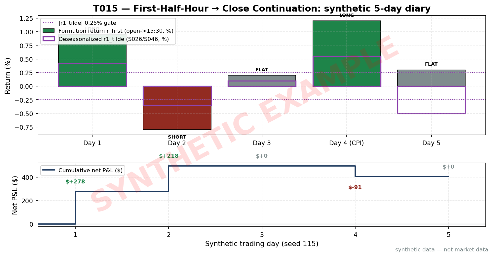

```mermaid
flowchart TD
    DATA["Market data<br/>1-min bars, SPY-class ETF"] -->|1-min bars| SIGS["Signals<br/>S026 r1 sign, S027 formation,<br/>S046 seasonality"]
    SIGS -->|1-min bars| ENTRY{"Entry logic<br/>abs(r1_tilde)>=0.25% AND sign agree<br/>at 15:30"}
    ENTRY -->|trigger| SIZE["Sizing + risk<br/>200 sh base; x0.5 macro days;<br/>daily-stop review"]
    ENTRY -->|no trigger| WAIT["Wait / flat day"]
    SIZE --> EXEC["Execution<br/>15:30 marketable limit;<br/>MOC flatten"]
    EXEC --> MON["Monitor + exits<br/>16:00 flat always;<br/>no intraday stop"]
    MON --> PNL["P&L (net of costs)"]
    style ENTRY fill:#f9e79f,stroke:#7d6608
    style PNL fill:#a9dfbf,stroke:#1e8449
```

### T10. Sources

1. Gao, L., Han, Y., Li, S. Z. & Zhou, G. (2018). "Market intraday momentum." *Journal of Financial Economics* 129(2), 394–414. DOI: 10.1016/j.jfineco.2018.05.009. https://ideas.repec.org/a/eee/jfinec/v129y2018i2p394-414.html (First-half-hour from prior close predicts last-half-hour; stronger on volatile/high-volume/recession/macro-news days.)
2. Heston, S. L., Korajczyk, R. A. & Sadka, R. (2010). "Intraday Patterns in the Cross-Section of Stock Returns." *Journal of Finance* 65(4), 1369–1407. DOI: 10.1111/j.1540-6261.2010.01573.x. https://doi.org/10.1111/j.1540-6261.2010.01573.x (Half-hour periodicity; the spread warning.)
3. Admati, A. R. & Pfleiderer, P. (1988). "A theory of intraday patterns: Volume and price variability." *Review of Financial Studies* 1(1), 3–40. (U-shaped intraday volume/volatility — the S046 premise.)
4. Chu, X., Gu, Z. & Zhou, H. (2019). "Intraday momentum and reversal in Chinese stock market." *Finance Research Letters* 30, 83–88. DOI: 10.1016/j.frl.2019.04.002. (Independent-market confirmation; costs prevent arbitrage.)

**Unverified leads:** the ~6.67%/yr / Sharpe ~1.08 timing-rule figures are from the SSRN working-paper version (SSRN 2552752) via S026's chapter — re-verify against the published JFE version before citing precisely; Grok's Q-TB2-3 closability notes (capacity is flow-timed; you race institutional VWAP/MOC) — qualitative research lead, not a measured fact; all thresholds and the worked example are the author's synthetic construction.

*Source log: Grok answered Q-TB2-1..3 (2026-09-10); all claims independently verified or labeled unverified.*

Related: T006 (Intraday Trend + Vol-Regime Allocator) is the TB1 sibling that trades the same 15:30→close window with an HMM regime gate instead of the S046 seasonal throttle.

## Stage 116/200 — T016: End-of-Day Drift Rider

*Batch TB2 · Strategy 16/100 · Signals S027, S033, S013*

### T1. One-line verdict

| | |
|---|---|
| **Style** | Last-hour drift continuation with institutional-flow confirmation |
| **Edge source** | The day's 9:30→15:00 drift persists into the close (S027 `[D]`); the morning opening-auction imbalance must point the same way (S033 `[SR]` — institutional flow was leaning with the drift); the Corwin–Schultz spread estimate must be below the edge (S013 `[D]` cost gate) |
| **Typical holding period** | ~1 hour (enter 15:00, flat at the closing print) |
| **Capacity hint** | Medium — liquid large-caps, one trade per name per day; the edge is a few bps, so it scales with breadth, not size per name |
| **Build-or-buy in one line** | Build the drift logic; buy the auction-imbalance feed — replaying NOII-style message tapes is not a garage project |

### T2. Full mechanics

**Universe & session.** Liquid US large-caps: price ≥ $20, ADV ≥ 5M shares, NYSE/Nasdaq-listed with published auction imbalance feeds (`examples`). RTH only. One window: enter 15:00 ET, flatten at the 16:00 closing print via the closing auction. Exclude earnings-day sessions, index-rebalance days, and quadruple-witching (auction dynamics are abnormal).

**The signals in the strategy's own notation.** S027 `[D]` (end-of-day drift): r_{first,t} = P_{15:00,t}/P_{9:30,t} − 1 — the day's drift into the entry; the position direction is s_t = sign(r_{first,t}). S033 `[SR]` (open-auction imbalance): from the pre-open NOII-style message tape (NOII — Net Order Imbalance Indicator: the exchange's published auction messages), extract the final imbalance ratio ρ_final = |I_final|/Q^{paired}_{final} (how much of the cross is one-sided) and indicative displacement d_final = (P^{ind}_{final} − P^{ref})/P^{ref} (how far the clearing price sits from the reference). Confirmation requires ρ_final ≥ 15% and |d_final| ≥ 20 bps (`examples`), and — critically — sign(I_final) = sign(r_{first,t}): the institutional flow revealed at the open was leaning *with* the day's drift. S013 `[D]` (Corwin–Schultz spread estimator): from daily highs/lows, S_t = 2(e^{α_t} − 1)/(1 + e^{α_t}) with α_t from the two-day β_t/γ_t construction; the 20-day mean of S_t^+ (floored at zero), ×10,000 for basis points, must be ≤ 8 bps (`example`) — otherwise the expected drift is smaller than the round-trip spread and the day is flat.

**Entry rule (long; short mirrors).** At 15:00, enter long only if ALL hold: (i) |r_{first,t}| ≥ 0.20% (`example` — the drift must be material); (ii) S033 confirm: ρ_final ≥ 15%, |d_final| ≥ 20 bps, sign(I_final) = +1 = sign(r_{first,t}) (`examples`); (iii) S013 gate: 20-day mean CS spread ≤ 8 bps (`example`). **Causal timing:** r_{first,t} uses prices ≤ 15:00; the auction tape is replayed as a message *sequence* — only messages with exchange timestamps ≤ 9:30 enter the read (S033's cardinal rule: using the final published imbalance to justify trades placed before dissemination is look-ahead bias); the CS estimate uses daily bars through t−1. Earliest fill: 15:00.

**Exit rule.** Flatten at the closing print — MOC order submitted before the cutoff (`example` 15:55 for most names). Early exit: if the developing *closing*-auction imbalance (published from ~15:50) shows ≥ 25% paired volume against the position (`example`), flatten at 15:55 instead of riding into the print. No intraday stop (the hold is one hour); the cost gate and the confirm are the risk controls.

**Position sizing.** 2,000 shares per name (`example`, ~$200k notional at $100); max 10 names per day (`example`); no name may exceed 15% of the day's gross (`example`).

**Risk limits.** Daily loss stop −$1,500 (`example`); max gross exposure $2M (`example`); kill switch: two consecutive days where the CS gate passed but realized effective spread exceeded the estimate by > 50% → the estimator is miscalibrated, halt and recheck.

**Cost model.** Half-spread 1.5¢/share/side + commission $0.005/share + $0.50/ticket (`examples`) = $81 round-trip on 2,000 shares. Slippage: +0.5¢/share on the MOC leg (`example` — the closing print can slip against you when the imbalance is one-sided). Borrow stubbed at ~0 intraday (verify).

**Execution sketch.** 15:00: marketable limit IOC for the full size. 15:55: MOC order for the full position. The closing-auction-imbalance early-exit check runs at 15:52 on the live imbalance feed. Queue-position honesty: the auction fills are at the clearing price — model them as print ± 0.5¢ adverse, never as mid.

### T3. Signals it consumes

| Signal | Role | Weight / logic |
|---|---|---|
| S027 `[D]` — Open→15:00 formation drift | **Primary trigger** (direction) | s_t = sign(r_{first,t}); requires |r_{first,t}| ≥ 0.20% (`example`) |
| S033 `[SR]` — Open-auction imbalance | **Confirmation filter** | sign(I_final) must equal sign(r_{first,t}); ρ_final ≥ 15%, |d_final| ≥ 20 bps (`examples`); message-sequence replay, no look-ahead |
| S013 `[D]` — Corwin–Schultz spread | **Cost gate (veto)** | 20-day mean S_t^+ ≤ 8 bps (`example`); above → flat regardless of the other two |

Combination pseudocode (≤25 lines):

```
# per name, per day (all inputs causal)
r_first = P15:00 / P09:30 - 1                          # S027
I, rho, d = replay_auction_tape(msgs[t] for t<=09:30)   # S033, final values
cs = mean(corwin_schultz(HL[t-20:t])) * 1e4             # S013, bps
if abs(r_first) < 0.002: flat("no drift")              # example
elif sign(I) != sign(r_first): flat("flow disagrees")  # S033 confirm
elif rho < 0.15 or abs(d) < 20: flat("weak imbalance")  # examples
elif cs > 8.0: flat("spread > edge")                   # S013 veto
else:
    buy/sell sign(r_first)*2000 at 15:00               # example size
    if close_imbalance_against(15:52): flatten 15:55
    else: flatten MOC at 16:00
```

### T4. Worked example — numbers + P&L (SYNTHETIC)

Setup: stock SYN at **$100.00** (synthetic prices — not market data), **2,000 shares** per trade, cost **$81.00/trade** round-trip (half-spread 2 × $30.00 + commission 2 × $10.50 — `examples`). Four synthetic days, **seed 116** (`batches/TB2/plot_T016.py`):

| Day | r_first (S027) | Auction read (S033) | CS 20-d (S013) | Decision | r_last | Net P&L |
|---|---|---|---|---|---|---|
| 1 | +0.45% | BUY, ρ = 22%, d = +35 bps | 4.2 bps | LONG 2,000 | +0.20% | **+$309.00** |
| 2 | −0.30% | SELL, ρ = 18%, d = −28 bps | 5.1 bps | SHORT 2,000 | −0.15% | **+$209.00** |
| 3 | +0.25% | SELL, ρ = 16%, d = −22 bps | 4.8 bps | FLAT (flow disagrees) | +0.10% | $0.00 |
| 4 | +0.60% | BUY, ρ = 25%, d = +40 bps | 9.5 bps | FLAT (spread > edge) | −0.25% | $0.00 |
| **Total** | | | | | | **+$518.00** |

Line-by-line walk, Day 1: 15:00 — buy 2,000 @ **$100.00** = $200,000.00. MOC — sell 2,000 @ **$100.20** ($100 × 1.002) = $200,400.00. Gross +$400.00; half-spread −$60.00; commission −$21.00; MOC slippage −$10.00; **net +$309.00**. Day 2: short 2,000 @ $100.00, cover @ $99.85 → gross +$300.00 − $91.00 = **+$209.00**. Day 3: the drift says long but the morning auction flow was SELL — flat, $0 (the drift then only managed +0.10%, a spread-eater). Day 4: everything aligned except the CS gate — 9.5 bps > 8 bps, flat, $0 (the −0.25% reversal would have cost −$581). **Four-day total net: +$518.00.** The chart plots this diary: formation bars with the auction-direction annotation and CS reading per day, and the cumulative net P&L stepping +309 → +518 → +518 → +518.

**Cost-model note.** The 0.5¢/share MOC slippage (T2) is now deducted in the displayed ledger — Day 1/2's MOC exits carry half-spread, commission, and the slippage ($0.005 × 2,000 shares = $10.00 per traded day), moving Day 1 to +$309.00, Day 2 to +$209.00, and the four-day book to +$518.00. The chart plots this (full-cost) ledger.

**Where the example is optimistic.** Four hand-built days where both gates behave like textbook illustrations — Day 3's disagreement and Day 4's veto both "save" money by construction. Real auction tapes flicker: ρ_final and d_final are revised by cancellations in the last 90 seconds, and the 15:00 drift can be 50% opening-auction artifact rather than information. The MOC fill is assumed at the print with 0.5¢ adverse — on a one-sided close the print can be several cents against you. And the CS gate uses a 20-day *mean* estimate: on the day you need it most (a vol event), the true spread is wider than the estimate — which is why Day 4 exists in the example, but real gate failures are subtler.

### T5. Data & infra — what must run

**Pipeline inventory.** Pre-open: ingest the auction imbalance message tape per name (timestamped NOII-equivalent messages), replay to the final read — this is the only exotic feed. Intraday: 1-min bars for r_first; daily: high/low history for the CS estimator (20-day mean per name). 15:52: live closing-imbalance check. Post-close: ledger, realized-spread vs CS-estimate reconciliation (the kill-switch input).

**M5 Max feasibility: feasible (Tier M, ~30–60 h ≈ $4,500–9,000 loaded-cost estimate).** Per cost-model §2: 1-min bars for 500 names = 195k bars/day — trivial; the CS estimator is daily arithmetic on 20 bars per name. Per §3: all of it fits in < 1 GB RAM. The imbalance tape is the constraint: per §4, quote-class data runs ~2–8 GB/symbol-day in parquet — store only the auction windows (pre-open + 15:50–16:00), not the full day, or the disk budget explodes. Bottleneck: feed licensing and message-replay correctness, not compute. **Do not** try to reconstruct imbalance from bar data — that is the look-ahead trap S033 warns about.

**Feed-outage safe-mode.** If the pre-open tape is missing or has a gap in the final 90 seconds → the S033 confirm is VOID for the day (flat — never confirm on a partial tape). If 15:00 bars are stale → flat. If the 15:52 closing-imbalance feed drops → flatten at 15:55 market regardless (never ride into the print blind). A filled 15:00 entry with a failed MOC submission → flatten at the next print, mark UNTRUSTED_FLAT.

### T6. Buy vs build

| Option | What you get | Indicative price | Gains | Loses |
|---|---|---|---|---|
| Tier 1: Polygon Stocks Advanced (bars) | 1-min bars + daily HL for CS | ~$30–200/mo, indicative — verify before budgeting | Drift + spread estimator covered | No auction tape |
| Auction imbalance feed (exchange direct or consolidated vendor) | NOII-equivalent message tape | indicative — verify before budgeting (vendor-quoted, often $100s–$1,000s/mo for professional use) | The S033 confirm — the strategy's differentiator | The most expensive line item; redistribution terms vary |
| Tier 2: Databento Standard | L1 + imbalance-adjacent feeds | ~$200/mo + usage, indicative — verify before budgeting | Clean timestamps for replay | May not carry every venue's auction feed |
| Retail platform: QuantConnect paper | Paper broker + minute data | ~$60–300/mo, indicative — verify before budgeting | Fastest paper host | No auction imbalance tape — the confirm must be built anyway |

**Verdict: hybrid — buy the bars, buy the imbalance feed, build the logic.** The message-replay discipline (what was known at t?) is the entire product and cannot be bought. Crossover: if the imbalance feed costs more than ~$500/mo and you trade ≤ 10 names, drop S033 and run the S027+S013 two-leg version — the confirm is a filter, and an expensive filter must earn its keep.

### T7. Success-ratio evidence

| Study / source | Market & period | Metric | Before/after cost | Caveat |
|---|---|---|---|---|
| Heston, Korajczyk & Sadka (2010), *J. Finance* 65(4) | NYSE half-hour intervals, 2001–2005 | Return continuation at day-multiple half-hour lags, strongest in the first and last half-hour | **After-cost (honest):** periodicity strategies "**lose money after paying the bid/ask spread**" | Directly governs this window: the drift is real, the spread is the trade |
| Bogousslavsky (2021), "The Cross-Section of Intraday and Overnight Returns," *J. Financial Economics* 141(1), 172–194 | US stocks, 30-year sample | Size and illiquidity premia are realized in the **last 30 minutes**; a mispricing factor earns positive returns through the day but performs poorly into the close; pattern strengthens in the second half of the sample | Before-cost (factor returns) | Cross-sectional evidence — the drift exists, but it is compensation for providing liquidity into the close, not free alpha |
| Corwin & Schultz (2012), *J. Finance* 67(2) | US equities | High-low spread estimator; a Brazilian-market replication (via S013's chapter) reports ≈ 0.9 correlation with true spreads | Estimator validation | The CS gate is only as good as the estimator — 0.9 correlation still leaves wide residual error on event days |
| Challet & Gourianov (2018), arXiv:1802.01921 | US equities opening/closing auctions | Dynamical regularities of auction price formation | Descriptive | Supports reading auction tapes as informative, not the profitability of trading them |
| Biais, Hillion & Spatt (1999), *J. Political Economy* 107(6) | Paris Bourse preopening | Preopening order flow is informative about the opening price | Before-cost | The intellectual precedent for the S033 confirm — different market, different era |

No published study tests this exact three-leg combination after costs. **Bottom line for ≤$1M paper:** the drift leg is documented but spread-marginal; the two filters (auction confirm + spread gate) are where the strategy either earns its keep or dies of thirst — expect them to veto 60–80% of candidate days (`operator estimate`, not a measured rate). An institutional desk would run this as an execution-timing overlay (when to lean into the close) rather than a standalone alpha book; the auction feed is the expensive part and its ROI must be measured in basis points saved, not alpha generated.

### T8. Failure modes

1. **The drift is auction artifact.** Part of r_first is the opening auction's own dislocation, which mean-reverts by midday — the "drift" into the close is then noise. *Mitigation:* measure r_first from 9:45 (`example`) instead of 9:30; require the S033 confirm (real flow, not print noise).
2. **Stale/flickering imbalance tape.** Cancellations in the final 90 seconds flip ρ_final and d_final; acting on the pre-cancel read is acting on noise. *Mitigation:* 15-second staleness cap (`example`, per S033); void the confirm on any tape gap.
3. **Look-ahead in the backtest.** Using the final published imbalance to explain 15:00 entries is the cardinal sin. *Mitigation:* replay the exact message tape with exchange timestamps; the backtest harness asserts no message used has t > decision time.
4. **CS estimate lags the true spread.** The 20-day mean is calm; the day you trade can be a vol event. *Mitigation:* the kill-switch rule (halt if realized spread persistently exceeds the estimate); widen the gate to 6 bps (`example`) in VIX > 25 regimes.
5. **Closing-auction adverse selection.** The MOC print is where informed flow executes — your fill is their exit. *Mitigation:* the 15:52 early-exit check; model the MOC leg with adverse slippage, never at mid.
6. **Rebalance/index days.** Auction volumes go 10–50× normal; the imbalance read is dominated by mechanical index flow that reverses the next morning. *Mitigation:* hard exclusion of rebalance and witching days (`example`).
7. **Crowding of close-drift.** Heston et al.'s periodicity is public; the 15:00→close window is one of the most-watched timing trades in equities. *Mitigation:* the confirm + gate are the differentiation — if veto rates collapse (everyone sees the same flow), reduce size; capacity is in breadth, not per-name size.

### T9. Visuals

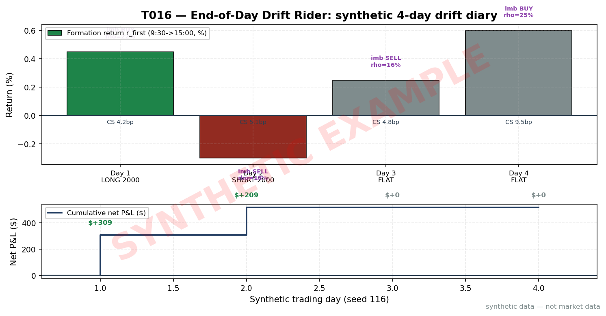

```mermaid
flowchart TD
    DATA["Market data<br/>1-min bars + auction tapes<br/>+ daily high/low"] -->|1-min bars; tape msgs; daily H/L| SIGS["Signals<br/>S027 drift, S033 imbalance,<br/>S013 spread"]
    SIGS -->|1-min bars; tape msgs| ENTRY{"Entry logic<br/>drift>=0.20% AND imb agree<br/>AND CS<=8bps, at 15:00"}
    ENTRY -->|trigger| SIZE["Sizing + risk<br/>2k sh/name, 10 names max;<br/>daily stop, gross cap"]
    ENTRY -->|no trigger| WAIT["Wait / flat day"]
    SIZE --> EXEC["Execution<br/>15:00 IOC; MOC flatten;<br/>15:52 imbalance check"]
    EXEC --> MON["Monitor + exits<br/>closing print flat;<br/>early exit on adverse imb"]
    MON --> PNL["P&L (net of costs)"]
    style ENTRY fill:#f9e79f,stroke:#7d6608
    style PNL fill:#a9dfbf,stroke:#1e8449
```

### T10. Sources

1. Heston, S. L., Korajczyk, R. A. & Sadka, R. (2010). "Intraday Patterns in the Cross-Section of Stock Returns." *Journal of Finance* 65(4), 1369–1407. https://bauer.uh.edu/departments/finance/documents/Heston-Korajczyk-Sadka-jf-2010-01-07.pdf (Last-half-hour periodicity; the spread warning.)
2. Bogousslavsky, V. (2016). "Infrequent Rebalancing, Return Autocorrelation, and Seasonality." *Journal of Finance* 71(6), 2967–2995. DOI: 10.1111/jofi.12436. https://doi.org/10.1111/jofi.12436 (Infrequent rebalancing drives return autocorrelation and seasonality — the last-30-minute premium mechanism.)
3. Corwin, S. A. & Schultz, P. (2012). "A Simple Way to Estimate Bid-Ask Spreads from Daily High and Low Prices." *Journal of Finance* 67(2), 719–760. DOI: 10.1111/j.1540-6261.2012.01729.x. https://doi.org/10.1111/j.1540-6261.2012.01729.x (The S013 estimator.)
4. Challet, D. & Gourianov, N. (2018). "Dynamical regularities of US equities opening and closing auctions." arXiv:1802.01921. https://arxiv.org/abs/1802.01921 (Auction price-formation regularities.)
5. Biais, B., Hillion, P. & Spatt, C. (1999). "Price discovery and learning during the preopening period in the Paris Bourse." *Journal of Political Economy* 107(6), 1218–1248. (Preopening order flow predicts the auction price — the S033 precedent.)

**Unverified leads:** Grok's Q-TB2-3 claim that a 1% shock to expected overnight vol worsens last-half-hour mispricing by ~26 bp — seen only in the batch's research Q&A, not independently verified; auction-imbalance feed pricing (chatbot-quoted $100s–$1,000s/mo) — indicative, verify before budgeting; the 60–80% veto-rate expectation is an operator estimate, not a measured rate; all thresholds and the worked example are the author's synthetic construction.

*Source log: Grok answered Q-TB2-1..3 (2026-09-10); all claims independently verified or labeled unverified.*

Related: T070 (MOC Auction-Pin Trader) trades the closing auction itself rather than the drift into it; T065 (Open-Auction Imbalance Continuation) is the morning-session sibling of the S033 confirm.

## Stage 117/200 — T017: Scheduled Macro-Announcement Drift

*Batch TB2 · Strategy 17/100 · Signals S034, S092, S066*

### T1. One-line verdict

| | |
|---|---|
| **Style** | Event-driven intraday drift: trade scheduled macro releases only |
| **Edge source** | Scheduled announcements (FOMC, CPI, NFP) move markets in jumps; jumps backed by identified fundamental news drift for minutes afterward (S034 `[D]` + S092 `[D]`); position size is set by the HAR realized-vol forecast so the bet is constant in risk, not in shares (S066 `[D]`) |
| **Typical holding period** | ~30 minutes post-release (`example` W_post = 30 min); flat the same session — never overnight |
| **Capacity hint** | Medium — liquid index ETFs and futures; ~8 scheduled FOMC + 12 CPI + 12 NFP events a year per name, so breadth across vehicles matters more than size |
| **Build-or-buy in one line** | Build the calendar + jump + sizing stack; buy the news wire and the 1-min bars — the identified-news leg needs licensed text |

### T2. Full mechanics

**Universe & session.** Liquid macro-sensitive vehicles: SPY/QQQ (`examples`) and, with a futures account, ES/NQ. Only scheduled-release sessions: FOMC statements (14:00 ET), CPI/PPI (8:30 ET), NFP (8:30 ET), plus ECB/BoE for the FX extension (`examples`). No unscheduled news — if it isn't on the calendar, this strategy doesn't see it. RTH only; the pre-market releases (8:30 ET) are traded at the cash open, not in the futures pre-market (`example` choice — avoids the thin-book fill).

**The signals in the strategy's own notation.** S034 `[D]` (scheduled macro-announcement drift): let τ be the release time (known from the calendar in advance). Pre-window drift R_pre = log P(τ⁻) − log P(τ − W_pre) (W_pre = 60 min, `example`). The tradable jump: R_jump = log P(τ+1) − log P(τ⁻) — information through τ+1 only. Post-announcement continuation signal at t > τ: s(t) = sign(R_jump) · 1{|R_jump| > κ·σ̂_diurnal(t)}, with κ = 2.5 (`example`) and σ̂_diurnal the time-of-day-normalized 1-min volatility (a 14:00 jump on FOMC day is measured against FOMC-day baselines, not quiet Tuesdays). S092 `[D]` (identified-news vs no-news): the jump is tradable only if identified_news = 1 — a textual/entity news match within ±15 minutes (`example`) with relevance ≥ ρ (`example`) ties the jump to fundamental firm/macro news; a no-news jump is *faded or skipped* (this strategy skips — the fade is T059/T079 territory). S066 `[D]` (HAR vol forecast): RV_{t+1} = β_0 + β_d·RV_t + β_w·RV̄_t^{(5)} + β_m·RV̄_t^{(22)} (Corsi 2009), estimated on ≥ 250 days (`example`); the forecast σ̂ for the post-window converts the risk budget into shares.

**Entry rule (long; short mirrors).** At τ+2 minutes, enter long only if ALL hold: (i) |R_jump| > 2.5·σ̂_diurnal (`example` — the jump must be a real surprise, not release-minute noise); (ii) identified_news = 1 (S092 — no identified news, no trade); (iii) the jump direction is not contradicted at the entry minute — no instant reversal between τ+1 and τ+2 (`example` sanity filter). **Causal timing:** the calendar gives τ in advance; R_jump uses information through τ+1 only, so the earliest entry is τ+2 — entering at τ+1 on a jump measured through τ+2 would be look-ahead. Entering *at* τ on the pre-drift sign is a different, riskier trade — this strategy explicitly does **not** trade the pre-announcement drift (see T7: Kurov et al. 2021 document its post-2015 disappearance).

**Exit rule.** Time stop at τ+30 min (`example` W_post) — the continuation decays; holding longer compounds costs without edge. Signal-flip exit: if the price retraces > 50% of R_jump within the window (`example`), the drift thesis is broken — flatten. No profit target; the drift is the target.

**Position sizing.** Risk-constant, not share-constant: shares = risk$ / (σ̂_post × price), with risk$ = $500 per event (`example`) and σ̂_post the HAR 30-minute vol forecast. When the forecast says the post-release window will be violent, the share count shrinks automatically — the strategy bets dollars of risk, not lots.

**Risk limits.** Max 1 event position at a time (`example` — CPI and NFP never overlap, but FOMC minutes can); daily loss stop −$1,000 (`example`); no adds; if two consecutive events both print identified_news = 0 jumps (dead calendar), halve risk$ for the next event (`example` — the news matcher may be miscalibrated).

**Cost model.** Half-spread 1¢/share/side + commission $0.005/share + $0.50/ticket (`examples`); release-minute slippage +1¢/share on entry (`example` — the first post-release print is the most violent of the day). Futures extension: use the contract's tick value and exchange fees instead (verify with your FCM).

**Execution sketch.** τ−5 min: arm — verify the calendar time, the news matcher, and the HAR forecast are all live. τ+2: marketable limit IOC in the jump direction. τ+30: market order flatten. Participation cap 5% of the 1-min volume (`example` — release minutes are deep, but don't be the whole bar). Queue-position honesty: the τ+2 fill is modeled at the first post-jump print *plus* 1¢ adverse — fills "at the jump price" on bar data are fantasy.

### T3. Signals it consumes

| Signal | Role | Weight / logic |
|---|---|---|
| S034 `[D]` — Scheduled macro-announcement drift | **Primary trigger** (direction + timing) | sign(R_jump); requires |R_jump| > 2.5·σ̂_diurnal (`example`); τ known from calendar |
| S092 `[D]` — Identified-news vs no-news | **Veto filter** | identified_news = 1 required; no-news jumps are skipped (never faded by *this* strategy) |
| S066 `[D]` — HAR realized-vol forecast | **Sizing** | shares = $500 / (σ̂_post × price) (`example` risk$); vol forecast sets the bet, not the direction |

Combination pseudocode (≤25 lines):

```
# per scheduled release at calendar time tau (all inputs causal)
R_jump = log(P[tau+1]) - log(P[tau-])            # S034, first tradable move (info through tau+1)
z = abs(R_jump) / sigma_diurnal(tau)             # S034, diurnal-normalized
news = match_news(tau, window=15min, rel>=rho)    # S092, stories timestamped <= tau+1
sig  = har_forecast(RV[:tau], horizon=30min)     # S066, vol for the hold window
if z <= 2.5: flat("noise jump")                  # example kappa
elif news == 0: flat("no identified news")       # S092 veto
else:
    shares = int(500 / (sig * P[tau+2]))         # example $500 risk
    buy/sell sign(R_jump)*shares at tau+2        # +1c adverse slippage modeled
    flatten at tau+30 or on 50% retrace         # examples
```

### T4. Worked example — numbers + P&L (SYNTHETIC)

Setup: macro-sensitive ETF SYNM at **$600.00** (synthetic prices — not market data), risk budget **$500/event**, κ = 2.5, W_post = 30 min (`examples`). Four synthetic releases, **seed 117** (`batches/TB2/plot_T017.py`):

| Event | R_jump | σ̂_diurnal | z | Identified news (S092) | HAR σ̂_post | Shares | Decision | Net P&L |
|---|---|---|---|---|---|---|---|---|
| FOMC-like 14:00 | +0.35% | 0.10% | 3.50 | Yes | 0.45% | 185 | LONG 185 | **+$235.80** |
| CPI-like 08:30 | −0.28% | 0.09% | 3.11 | Yes | 0.60% | 138 | SHORT 138 | **+$241.88** |
| NFP-like 08:30 | +0.19% | 0.12% | 1.58 | Yes | 0.50% | 0 | FLAT (z < κ) | $0.00 |
| NFP-2 08:30 | +0.31% | 0.10% | 3.10 | **No** | 0.55% | 0 | FLAT (no identified news) | $0.00 |
| **Total** | | | | | | | | **+$477.68** |

Line-by-line walk, FOMC-like: τ+2 — buy 185 @ **$602.10** ($600 × 1.0035) = $111,388.50. τ+30 — sell 185 @ **$603.42** ($602.10 × 1.0022, the +0.22% continuation) = $111,632.70. Gross +$244.20; half-spread −$3.70; commission −$2.85; 1¢/share entry slippage −$1.85; **net +$235.80**. CPI-like: short 138 @ $598.32, cover @ $596.53 (−0.30% continuation) → gross +$248.40 − $6.52 = **+$241.88**. The two vetoes: NFP-like's jump (z = 1.58) was release-minute noise — flat; NFP-2's jump (z = 3.10) had no identified news — flat per the S092 veto (a fade strategy might trade it; this one doesn't). **Four-event total net: +$477.68.** The chart plots the jump z-scores against the κ = 2.5 line with news flags and decisions, and the cumulative net P&L stepping +235.80 → +477.68 → +477.68 → +477.68.

**Cost-model note.** The 1¢/share entry slippage (T2) is now deducted in the displayed ledger — each entered trade carries half-spread, commission, and the slippage (FOMC-like: 185 × $0.01 = $1.85; CPI-like: 138 × $0.01 = $1.38), moving the FOMC-like trade to +$235.80, the CPI-like trade to +$241.88, and the four-event book to +$477.68. The chart plots this (full-cost) ledger.

**Where the example is optimistic.** The jumps, continuations, and news flags are all hand-set: both traded events drift cleanly in the jump direction for the full 30 minutes, and both vetoes "save" money by construction. Real post-announcement paths whipsaw — the 50%-retrace exit exists because continuations routinely fail halfway. The τ+2 fill assumes only 1¢ adverse slippage; on a real FOMC print the book can gap several cents past your limit before the IOC fills. The HAR forecast is assumed correct; a miscalibrated forecast sizes you into exactly the events where the continuation breaks. And the news matcher is assumed perfect — false "identified" matches on recycled headlines are the S093 failure mode this strategy inherits.

### T5. Data & infra — what must run

**Pipeline inventory.** Daily: HAR refit inputs — 5-min bars → daily RV series (78 five-min returns/day standard); OLS on ≥ 250 days — seconds in numpy. Per event: calendar poll (τ known days ahead), diurnal σ̂ profile (30-day, per S067 method), news-matcher query (stories ≤ τ+1 only — never match on later stories, that's look-ahead), jump computation on 1-min bars. Post-event: ledger + forecast-vs-realized reconciliation (the sizing calibration loop).

**M5 Max feasibility: feasible (Tier M, ~30–60 h ≈ $4,500–9,000 loaded-cost estimate).** Per cost-model §2: daily RV from 1-min bars is trivial; the HAR OLS refit on 1,000 days is milliseconds. Per §3: the whole stack lives in < 2 GB RAM. The constraint is not compute — it is the *news feed license* (machine-readable headlines with redistribution terms) and the engineering of the matcher. Bottleneck: text pipeline latency at τ+2 (the matcher must answer in seconds).

**Feed-outage safe-mode.** If the calendar, the news matcher, or the 1-min bars are stale at τ−5 → the event is FLAT (no partial-information trades — an unidentified jump is exactly what the strategy refuses). If the τ+2 entry filled but the τ+30 flatten fails → flatten at the next print, mark UNTRUSTED_FLAT, never carry overnight. If the HAR refit job failed this week → fall back to the trailing-22-day realized vol (`example`) and halve risk$ until the refit succeeds.

### T6. Buy vs build

| Option | What you get | Indicative price | Gains | Loses |
|---|---|---|---|---|
| Tier 1: Polygon Stocks Advanced | 1-min bars for jumps + RV | ~$30–200/mo, indicative — verify before budgeting | Jump math + HAR inputs covered | No news text |
| News wire: Benzinga Pro / similar | Machine-readable headlines | ~$100–200/mo, indicative — verify before budgeting | Powers the S092 matcher | Redistribution limits; headline latency varies |
| Tier 3: RavenPack / Bloomberg-class news | Full licensed news + sentiment + entity tagging | $$$$ enterprise, indicative — verify before budgeting | Best matcher inputs | Absurd for a ≤$1M paper op |
| Retail platform: QuantConnect paper | Paper broker + minute data + event scheduling | ~$60–300/mo, indicative — verify before budgeting | Fastest paper host | No news feed; the matcher is yours anyway |

**Verdict: hybrid — buy the bars, buy a mid-tier news wire, build everything else.** The jump arithmetic and HAR are textbook; the news matcher (entity resolution + relevance cutoff) is the IP and cannot be bought at retail prices. Crossover: if the wire costs more than ~$200/mo and you trade only FOMC/CPI/NFP on SPY, drop S092 to a "scheduled-release = identified by construction" rule — scheduled macro releases are *definitionally* news, and the matcher earns its keep only on the single-name extension (T059 territory).

### T7. Success-ratio evidence

| Study / source | Market & period | Metric | Before/after cost | Caveat |
|---|---|---|---|---|
| Lucca & Moench (2015), via Kurov, Wolfe & Gilbert (2021), *Finance Research Letters* 40 | US equities, 1994–2011 | **Pre**-FOMC drift +49 bp/24h, ≈ 80% of annual returns | Before-cost | Kurov et al. document its **post-2015 disappearance** — this is why T017 does not trade the pre-drift |
| Neuhierl & Weber, "Monetary Momentum," NBER WP 24748 (via S034's chapter) | FOMC announcements | Pre-announcement drift by policy-surprise sign plus **~15-day post-announcement continuation** | Before-cost | Working paper — the post-continuation leg is the closest academic cousin of this strategy's hold |
| Ederington & Lee (1993), *J. Finance* 48(4) | Interest-rate and FX futures | Volatility spikes at scheduled releases; markets process information in bursts | Descriptive | The mechanism (scheduled information → jumps), not the tradability |
| Boudoukh, Feldman, Kogan & Richardson (2019), *R. Financial Studies* 32(3) | US equities | 49.6% of overnight idiosyncratic volatility explained by textual fundamental news; identified-news jumps vs no-news jumps | Before-cost | The S092 premise — but their horizon is days, and the intraday drift leg is much thinner |
| Corsi (2009), *J. Financial Econometrics* 7(2) | Equity realized vol | HAR-RV: daily/weekly/monthly RV components forecast next-day variance; the literature's baseline | Forecast-loss, not P&L | Lower forecast loss ≠ tradable edge — the sizing leg is risk control, not alpha |

No published study documents an after-cost P&L for the exact jump → 30-minute identified-news drift trade. The honest decomposition: the *pre*-announcement drift is documented and documented-gone; the *post*-announcement continuation exists in the literature at multi-day horizons and is assumed, not proven, at 30 minutes. **Bottom line for ≤$1M paper:** ~32 events a year per vehicle, each risking $500 for an expected edge measured in single basis points — this is a part-time sleeve, not a book. The realistic use is execution timing (don't fight the drift for 30 minutes after CPI) rather than alpha. An institutional desk runs this inside event-volatility market-making, where the inventory edge dwarfs the directional drift.

### T8. Failure modes

1. **The pre-drift is gone; the post-drift may follow.** Kurov et al. (2021) show the pre-FOMC drift disappeared post-2015 as it became known. Published intraday drifts decay the same way. *Mitigation:* re-estimate the continuation (R_post vs R_jump regression) on rolling 2-year windows; if the slope goes to zero, the strategy is off.
2. **Whipsaw continuations.** Real post-release paths retrace — the 50% rule exits, but after the damage. *Mitigation:* the retrace exit plus the HAR sizing (violent forecasts = small bets); accept that half the events are exited losers.
3. **News-matcher false positives.** Recycled headlines matched as "identified" (the S093 staleness problem) authorize trades on noise jumps. *Mitigation:* novelty scoring on the matched story; require the story timestamp ≤ τ+1 (never match forward — look-ahead).
4. **HAR miscalibration at events.** HAR is fit on all days; event-day vol has a different distribution — the forecast understates the tails. *Mitigation:* event-conditional vol model (fit HAR on event days only, `example` refinement); the fallback rule in T5.
5. **τ+2 fill fantasy.** The first post-release prints are the day's most violent; bar-data backtests fill at fantasy prices. *Mitigation:* +1¢ adverse slippage modeled, and honestly it should be wider — measure realized vs modeled slippage per event type and widen until they match.
6. **Calendar errors.** Release times shift (debt-ceiling delays, unscheduled speeches); trading a stale τ means trading noise. *Mitigation:* the τ−5 arming check verifies the release actually occurred (jump in the first minute or wire confirmation) before the τ+2 order.
7. **Overnight/event-tail risk.** A 30-minute hold can still catch a second headline (press conference Q&A after FOMC). *Mitigation:* flatten before the press conference (`example` — FOMC statements at 14:00, presser 14:30: this strategy's window ends at 14:30 by construction); never hold through the Q&A.
8. **Concentration in few events.** ~32 events/year means one bad year is 32 samples — no statistical significance, ever. *Mitigation:* size accordingly (this is a sleeve); judge the strategy over 3+ years or don't judge it at all.

### T9. Visuals

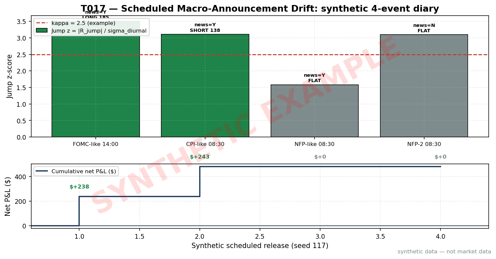

```mermaid
flowchart TD
    DATA["Market data<br/>1-min bars + news wire<br/>+ macro calendar"] -->|1-min bars; wire msgs; calendar| SIGS["Signals<br/>S034 jump, S092 news match,<br/>S066 HAR forecast"]
    SIGS -->|1-min bars; wire msgs| ENTRY{"Entry logic<br/>z>2.5 AND news=1<br/>at tau+2"}
    ENTRY -->|trigger| SIZE["Sizing + risk<br/>shares=$500/(sig_post*price);<br/>1 event, daily stop"]
    ENTRY -->|no trigger| WAIT["Wait (vetoed event)"]
    SIZE --> EXEC["Execution<br/>tau+2 IOC +1c adverse;<br/>flatten tau+30"]
    EXEC --> MON["Monitor + exits<br/>tau+30 time stop;<br/>50% retrace exit"]
    MON --> PNL["P&L (net of costs)"]
    style ENTRY fill:#f9e79f,stroke:#7d6608
    style PNL fill:#a9dfbf,stroke:#1e8449
```

### T10. Sources

1. Ederington, L. H. & Lee, J. H. (1993). "How Markets Process Information: News Releases and Volatility." *Journal of Finance* 48(4), 1161–1191. http://ideas.repec.org/a/bla/jfinan/v48y1993i4p1161-91.html (Scheduled releases → volatility bursts.)
2. Kurov, A., Wolfe, M. H. & Gilbert, T. (2021). "The Disappearing Pre-FOMC Announcement Drift." *Finance Research Letters* 40. https://pmc.ncbi.nlm.nih.gov/articles/PMC7525326/ (Lucca & Moench (2015) +49 bp/24h, 1994–2011, ≈ 80% of annual returns; post-2015 disappearance.)
3. Neuhierl, A. & Weber, M. "Monetary Momentum." NBER Working Paper 24748. http://nber.org/system/files/working_papers/w24748/w24748.pdf (Pre-announcement drift by surprise sign; ~15-day post-announcement continuation.)
4. Boudoukh, J., Feldman, R., Kogan, S. & Richardson, M. (2019). "Information, Trading, and Volatility: Evidence from Firm-Specific News." *Review of Financial Studies* 32(3), 992–1033. https://doi.org/10.1093/rfs/hhy083 (49.6% of overnight idiosyncratic volatility from textual news; the identified-news premise.)
5. Corsi, F. (2009). "A Simple Approximate Long-Memory Model of Realized Volatility." *Journal of Financial Econometrics* 7(2), 174–196. http://ideas.repec.org/a/oup/jfinec/v7y2009i2p174-196.html (HAR-RV — the sizing leg.)

**Unverified leads:** the exact post-30-minute continuation magnitude for scheduled macro jumps — no published after-cost number was found; treat the drift leg as assumed, not proven; Grok's Q-TB2-3 macro-day notes (stronger Gao effect on macro-news days) — qualitative research lead; news-wire pricing beyond the cost-model bands — indicative, verify before budgeting; all thresholds and the worked example are the author's synthetic construction.

*Source log: Grok answered Q-TB2-1..3 (2026-09-10); all claims independently verified or labeled unverified.*

Related: T068 (Scheduled-Event Vol Expansion) trades the volatility around the same calendar rather than the drift; T059 (News-Sentiment First-Minute Momentum) is the single-name, machine-readable-news sibling.

## Stage 118/200 — T018: RVOL-Gated Gap-and-Go

*Batch TB2 · Strategy 18/100 · Signals S023, S032, S094*

### T1. One-line verdict

| | |
|---|---|
| **Style** | Intraday momentum / opening-gap breakout |
| **Edge source** | Continuation of large, institutionally sponsored opening gaps: when a stock gaps far beyond its recent volatility and prints heavy, same-direction volume plus signed block trades in the first minutes, the overnight information (news, earnings, index flows) is still being digested, and price tends to drift further in the gap's direction for the first hour |
| **Typical holding period** | 15 minutes to ~2 hours; flat by early afternoon |
| **Capacity hint** | Low. Only a handful of names per day pass the gap + RVOL + block gates, and the entry window is minutes wide. A single operator can run it; a desk would crowd the same prints |
| **Build-or-buy in one line** | Build the scanner yourself on rented SIP 1-minute bars plus a trades feed; there is no off-the-shelf product that sells your entry thresholds |

### T2. Full mechanics

**Jargon used below.** *ATR* (Average True Range): the trailing mean of each bar's True Range — the largest of (high−low), |high−prior close|, |low−prior close| — a volatility unit in dollars. *RVOL* (Relative Volume): the ratio of volume in a time-of-day window today to the same window's trailing average. *Block trade*: a single print above a size threshold (e.g. 10,000 shares *example*), used as an institutional-footprint proxy. *Lee–Ready (1991)*: the standard rule for signing a trade as buyer- or seller-initiated (the quote test against the lagged midquote, then the tick test). *SIP*: the consolidated US equity tape. *NBBO*: the National Best Bid and Offer across exchanges.

**Universe & session.** US common stocks, price ≥ $5 (*example*), 20-day average dollar volume ≥ $20M (*example*), quoted spread at the open ≤ 10 bps (*example*), float ≥ 50M shares (*example*). RTH only; entries armed 09:35–11:30 ET (*example*); flat by 13:00 (*example*). Exclusions: halts, IPOs within 60 sessions (*example*), split-artifact "gaps" (adjust first, then measure), auction-imbalance-artifact opens.

**Entry rule.** All four gates must pass, using S023 `[SR]`'s gap/hold/go structure plus the S032 `[SR]`/S094 `[SR]` confirmations. Let C_{t−1} be the prior close, O_t the opening print, ATR_{t−1}(14) the 14-session ATR, and g^ATR_t = (O_t − C_{t−1}) / ATR_{t−1}(14) (S023 `[SR]`):

1. **Gap gate (S023 `[SR]`):** g^ATR_t > 2.0 (*example*). The gap must be large in volatility units, not just percent.
2. **Hold gate (S023 `[SR]`):** min low of the first M = 10 minutes (*example*) stays above C_{t−1} for gap-ups (mirrored for gap-downs). The gap is not immediately filling.
3. **Participation gate (S032 `[SR]`):** RVOL over the first-5-minute window ≥ 1.5 (*example*), where RVOL = V_{5min,t} / (mean of the same 5-minute window over the prior 14 sessions, *example*).
4. **Institutional-footprint gate (S094 `[SR]`):** block-trade imbalance BlockImb = (buy-block volume − sell-block volume) / total block volume over the first 10 minutes (*example*), with blocks signed by Lee–Ready and a ≥ 10,000-share threshold (*example*), must have the same sign as the gap (BlockImb > +0.2 for gap-ups, *example*).
5. **Go trigger (S023 `[SR]`):** the close of a 1-minute bar τ (after the first 5 minutes) prints above the first-5-minute high (gap-ups).

**Causal timing.** The gap is known at the 09:30 opening print; the hold and RVOL gates need the first 5–10 minutes of tape; the trigger is determined at the close of bar τ and is tradable no earlier than the **open of bar τ+1** (fills are modeled at τ+1's open, never τ's close).

**Exit rule.** First of: (a) profit target = entry + 1.0×ATR_{t−1} (*example*, gap-ups); (b) stop = the first-5-minute low (the hold breaks); (c) time stop = 60 min after entry (*example*) or 11:30 ET, first; (d) momentum died: RVOL on a down bar > 1.5× while price breaks the prior 5-minute low.

**Position sizing.** shares = (equity × 0.25%) / (entry − stop) (*example*), to 100s. Max 3 concurrent names (*example*); portfolio heat ≤ 0.75% (*example*); max gross 3× equity (*example*). Short gap-downs only with a confirmed locate; otherwise long-only.

**Risk limits.** Daily loss stop −1.5% of equity (*example*), then no new entries; per-trade cap 0.5% (*example*); max gross 3× equity (*example*). Kill switch: flatten if the 1-minute feed is stale > 120 seconds (*example*), the opening print deviates > 3× the premarket-indicated range (bad open), or the block-trade feed drops (the footprint gate cannot be evaluated).

**Cost model (applied in T4).** Half-spread $0.02/share (*example*, $120-name spread) paid on entry and exit; commission $0.005/share + $0.50/ticket (*example*); slippage 1 tick ($0.01, *example*) on the momentum entry only; borrow fee $0 in the long-only variant. No market-impact term for ≤ 1,000-share clips (*example*); square-root impact beyond that.

**Order/execution sketch.** A stop-entry 1 tick above the first-5-minute high, converting to a market order on trigger, capped at ≤ 10% of visible depth at the touch (*example*). Honesty note: on SIP data the queue position is unknowable — fills are modeled at the τ+1 open with half-spread + 1-tick slippage (`simulated only — requires MBO/ITCH` for any queue-level claim).

### T3. Signals it consumes

| Signal | Role | Weight / logic |
|---|---|---|
| S023 `[SR]` — Gap-and-go | Primary trigger (direction + timing) | Enter only if g^ATR_t > 2.0 AND hold (M=10 min) AND 1-min close τ above the first-5-min high |
| S032 `[SR]` — RVOL-filtered breakout | Participation gate (veto) | Veto unless RVOL_{first-5-min} ≥ 1.5; the breakout "counts" only with abnormal volume |
| S094 `[SR]` — RVOL + signed block pressure | Institutional-footprint confirmation (veto) | Veto unless sign(BlockImb_{10min}) = sign(gap); BlockImb > +0.2 (gap-ups) |

```python
# T018 combination logic (<=25 lines). All thresholds marked example.
def t018_signal(day):
    g_atr = (day.open - day.prior_close) / day.atr14          # S023
    if abs(g_atr) <= 2.0: return None                        # example gate
    hold = min_low_first_10min(day) > day.prior_close        # S023 hold
    if g_atr > 0 and not hold: return None
    rvol = vol_first_5min(day) / mean_same_window_14d(day)   # S032
    if rvol < 1.5: return None                               # example veto
    bimb = block_imbalance_first_10min(day, min_shares=10000) # S094
    if sign(bimb) != sign(g_atr) or abs(bimb) < 0.2: return None
    for bar in one_min_bars_after(day, "09:35"):             # S023 go trigger
        if g_atr > 0 and bar.close > first_5min_high(day):
            return ("LONG", bar.next_open)                   # fill at t+1 open
        if g_atr < 0 and bar.close < first_5min_low(day):
            return ("SHORT", bar.next_open)
    return None
```

### T4. Worked example — numbers + P&L (SYNTHETIC)

All prices below are synthetic (seed 118, `rng = np.random.default_rng(118)`); the setup is a fictional $120 med-tech name "AVNX". The chart `images/T018_example.png` plots this exact path.

Setup: prior close $120.00; ATR14 = $3.00 (*example*); open $126.60 → gap g^ATR = (126.60 − 120.00)/3.00 = **2.2×** (> 2.0 ✓). First-5-minute (09:30–09:35) high $127.10, low $126.30 — low > prior close, hold ✓. First-5-minute volume 400k vs 14-day same-window mean 150k → RVOL = **2.67** (≥ 1.5 ✓). Blocks in the first 10 minutes: 6 Lee–Ready-signed buys totaling 180k shares, 1 signed sell of 40k → BlockImb = (180 − 40)/220 = **+0.64** (> +0.2, sign matches ✓). The 09:40–09:45 bar closes $127.35 > $127.10 → trigger; entry at the 09:45 open, $127.40 (the raw synthetic next-bar open — half-spread and slippage are charged in the ledger below, not embedded in the price).

Sizing: equity $500,000; risk 0.25% = $1,250 (*example*); stop = first-5-minute low $126.30 → risk/share = $1.10 → 1,136 → **1,000 shares** (rounded, *example*).

Exit: target = entry + 1.0×ATR14 = $127.40 + $3.00 = **$130.40**, touched at 10:35 → sell 1,000 @ $130.40.

| Step | Price | Side | Shares | Cash flow | Notes |
|---|---|---|---|---|---|
| Entry 09:45 | $127.40 | Buy | 1,000 | −$127,400.00 | raw synthetic next-bar open |
| Spread cost (entry leg) | — | — | — | −$20.00 | $0.02 half-spread × 1,000 |
| Commission in | — | — | — | −$5.50 | 1,000×$0.005 + $0.50 |
| Slippage (entry) | — | — | — | −$10.00 | 1 tick on momentum entry |
| Exit 10:35 (target) | $130.40 | Sell | 1,000 | +$130,400.00 | +1.0×ATR target |
| Spread cost (exit leg) | — | — | — | −$20.00 | $0.02 half-spread × 1,000 |
| Commission out | — | — | — | −$5.50 | |
| **Gross P&L** | | | | **+$3,000.00** | 1,000 × ($130.40 − $127.40) |
| **Total costs** | | | | **−$61.00** | spread $40 + comm $11 + slip $10 |
| **Net P&L** | | | | **+$2,939.00** | |

Stop path (for the record): a fill of the gap at $126.30 would gross 1,000 × ($126.30 − $127.40) = −$1,100, net ≈ **−$1,161** after the same $61 costs.

**Where the example is optimistic.** The fill is assumed exactly at the 09:45 open with known 1-tick slippage — no partial fills, no queue misses, no spread widening at the trigger bar. The RVOL baseline (150k) is known exactly; in production a single news-day outlier poisons the 14-day mean (use the median or winsorized baseline, S032). The block imbalance assumes a clean trades feed — Lee–Ready signing errors on fast tape are an additional, unquantified drag (see unverified leads). Most importantly, this is one winner: most qualifying gaps never reach the +1.0×ATR target, and the trigger's base rate (not one fill's P&L) decides whether the strategy survives.

### T5. Data & infra — what must run

**Pipeline inventory.** (1) *Pre-open (08:00 ET)*: compute g^ATR for ~3,000 names from the universe file as official opens print. (2) *Intraday loop (09:30–13:00 ET)*: every minute, update first-5-minute statistics, RVOL, and rolling block imbalance from the trades feed; evaluate triggers; manage positions. (3) *Post-close*: archive bars/trades, recompute RVOL baselines, log fills vs model.

**Feeds.** SIP 1-minute OHLCV with the official open (Tier 1: ~$30–200/mo `indicative — verify before budgeting`, per cost-model §6) plus a trades feed with per-print size for the block filter (Tier 2, e.g. Databento Standard ~$200/mo + usage `indicative — verify before budgeting`). Opening-print quality warning (Grok): vendor daily "open" is often a composite, not a quote midpoint — validate against the auction print before the gap is measured.

**M5 Max feasibility: feasible.** Tier M build (L1-adjacent event logic on 1-min bars, ~40–100 eng-hours per cost-model §5 → $6,000–15,000 `loaded-cost estimate`). Throughput is trivial: 500 names × 390 one-minute bars = 195k bars/day (cost-model §2); the block-signing loop over the first 10 minutes of trades is the heaviest piece and fits a Python event loop (~100–500k events/sec) for a ≤ 20-name watchlist. RAM: 60 days of 1-min bars for 500 names ≈ 3 GB (cost-model §4) — far inside the 77 GB budget. Storage: ~50 MB/day of 1-min bars; the trades feed is the growth item (~2–8 GB/symbol-day for L1, cost-model §4) — archive per-symbol daily files, never the full universe. Bottleneck: engineering time and data licensing, not compute.

**Feed-outage safe mode.** 1-minute feed stale > 120 s (*example*): cancel pending stop-entries, flatten at market, page the operator. Trades/block feed drops while bars continue: the footprint gate cannot be evaluated → no new entries; existing positions run to stops/targets. Broker API drops: hard stops are lodged at the broker (*example* practice), so worst case is the modeled stop distance. No overnight positions — outage exposure is intraday only.

### T6. Buy vs build

| Option | What you get | Indicative price | What buying gains | What buying loses |
|---|---|---|---|---|
| Tier 0: Stooq / Alpaca IEX delayed | Daily bars, delayed quotes | ~$0, indicative — verify before budgeting | Free universe screening | No real-time 1-min bars or official opens — unusable for the entry |
| Tier 1 retail: Polygon Stocks Advanced / Alpaca SIP | Real-time SIP 1-min bars, official opens, corporate actions | ~$30–200/mo `indicative — verify before budgeting` | Cheapest adequate tape for gates 1–3 | Block-level trades cost extra; wide-scan rate limits |
| Tier 2 professional: Databento Standard (MBP-1 + trades) | Honest L1 quotes + trade prints for block signing | ~$200/mo + usage `indicative — verify before budgeting` | Clean block footprints (gate 4); backtestable | Usage meter runs on a wide universe; eng still yours |
| Retail platform (QuantConnect/Composer-style) | Hosted backtest + paper broker | ~$10–50/mo `indicative — verify before budgeting` | No infra to run | Coarse block-trade data; you still write the strategy |
| Buy the signal (news-sentiment gap screen) | Third-party gap/catalyst flags | ~$100–300/mo `indicative — verify before budgeting` | Saves the catalyst-classification eng | Their flags, their false positives; the sizing IP stays yours anyway |

**Verdict: build the strategy, buy the tape.** The scanner, gates, and sizing are 40–100 hours of your IP (Tier M+ per cost-model §5); the data is rented. Crossover: without a trades feed, drop the block gate and run the RVOL-only variant (T005's family) — do not fake block pressure from bar data.

### T7. Success-ratio evidence

| Study / source | Market & period | Metric | Before/after cost | Caveat |
|---|---|---|---|---|
| Plastun, Sibande, Gupta & Wohar (2019), "Price Gap Anomaly in the US Stock Market" | US DJI/S&P 500/NASDAQ, 1928–2018 | Gap-day momentum: prices tend to continue in the gap's direction; trading simulation "efficient," results not random | Trading simulation (costs modeled per their method) | Index-level gaps; continuation effect is temporary; single-stock gaps are noisier |
| Stübinger & Schneider (2019), "Statistical Arbitrage with Mean-Reverting Overnight Price Gaps," JRFM | S&P 500 constituents, 1998–2015, high-frequency | 51.47% p.a., Sharpe 2.38 after transaction costs — for the FADE (reversal), not the go | After cost (their model) | Directly the opposite trade: shows the gap edge is real but direction is contested — the RVOL/block gate is this strategy's answer to that contest |
| 2011 Charles H. Dow Award, "Analyzing Gaps for Profitable Trading Strategies" (CMT Association) | Russell 3000, 2006–2010 | 20,611 gap-ups / 17,435 gap-downs in 1,259 sessions (~16/day up, ~14/day down) | Descriptive (no P&L) | Capacity anchor: the raw opportunity set is thin even before the RVOL/block gates |
| Crabel (1990), *Day Trading With Short Term Price Patterns and Opening Range Breakout* | Practitioner literature | Opening-range expansion as the intraday continuation trigger — the ancestor of the "go" leg | Before cost | No formal statistics; cited as provenance, not evidence |

**Regimes where it fails.** Gap-fade regimes (the Stübinger–Schneider world): when overnight gaps are noise, continuation dies and the fade wins. Low-volume melt-up days: RVOL passes on retail herding with no block sponsorship, then reverses. Crowding: the first-5-minute-high breakout is the most published retail entry; on crowded tickers the trigger bar is the local top.

**Honest bottom line.** As a standalone trigger ("buy every big gap"), gap-and-go is roughly a coin flip with a left tail — the literature is split between continuation (Plastun et al.) and reversal (Stübinger & Schneider). The strategy's only honest claim is that the RVOL + signed-block gates select the informed subset. For a ≤$1M paper operation this is buildable and cheap to run (rented Tier 1/2 data, one intraday loop); expect a low-frequency, low-capacity sleeve, not a book. For an institutional desk it is a tactic inside a larger intraday book — capacity is single-digit names per day.

### T8. Failure modes

1. **Gap fills instead of going (fade regime).** Mitigation: the hold gate + block-sign confirmation; hard stop at the first-5-minute low; daily loss stop caps a fade-day bleed.
2. **RVOL false positive from retail herding.** A meme-name prints 3× volume with no institutional sponsorship. Mitigation: the block gate (S094) — require signed block volume, not share volume; veto if BlockImb is near zero.
3. **Blocks are crosses, not directional flow.** An opening cross prints as a large "block" with no information. Mitigation: exclude prints flagged as crosses/derivatively-priced; require the imbalance to persist over the 10-minute window, not one print.
4. **Opening print is an auction artifact, not a mid.** Grok's bounce-defense note (Q-TB2-2): vendor "open" is often a composite; trading a 10–20 bp "gap" on a 20 bp spread is spread-paying theater. Mitigation: validate the open against the auction print; require spread ≤ 10 bps (*example*) before arming.
5. **News-gap into a halt.** The gap is real, the continuation is real, then the stock halts and reopens against you. Mitigation: skip names with pending binary events (FDA, court rulings) where halts cluster; hard per-name cap.
6. **Threshold overfitting (2.0×ATR, 1.5×RVOL).** Mined on one regime, dead in the next. Mitigation: walk-forward re-estimation, wide parameter plateaus only (edge across 1.5–2.5×ATR), and S088 purged-CV discipline on the label set.
7. **Latency: the break is priced before the fill.** On SIP data the τ+1 open is already the crowded print. Mitigation: 1-tick minimum slippage; measure fill shortfall live and widen it; `simulated only — requires MBO/ITCH` for queue-level claims.
8. **Stale RVOL baseline.** One news-day outlier in the 14-day window halves the measured RVOL. Mitigation: median or winsorized baseline (S032 variants); recompute nightly.

### T9. Visuals

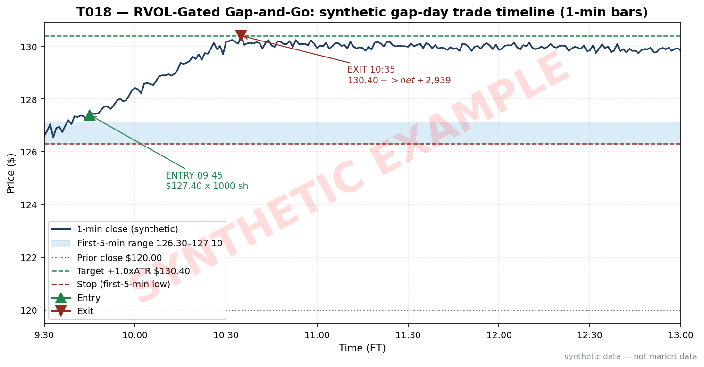

```mermaid
flowchart TD
    DATA["Market data<br/>(SIP 1-min bars + trade prints)"] -->|"1-min bars, trade prints"| SIGS["Signals<br/>S023 gap-and-go, S032 RVOL, S094 block pressure"]
    SIGS -->|gates pass| ENTRY{"Entry logic<br/>g^ATR>2 & hold & RVOL>=1.5 & block sign<br/>causal t→t+1"}
    ENTRY -->|trigger| SIZE["Sizing + risk<br/>0.25% risk, stop=first-5-min low<br/>max 3 names, daily stop -1.5%"]
    ENTRY -->|no trigger| WAIT["Wait"]
    SIZE --> EXEC["Execution<br/>next-bar open, participation <=10%"]
    EXEC --> MON["Monitor + exits<br/>+1.0xATR14 target / gap-fill stop / 60-min time stop"]
    MON --> PNL["P&L (net of costs)"]
    style ENTRY fill:#f9e79f,stroke:#7d6608
    style PNL fill:#a9dfbf,stroke:#1e8449
```

### T10. Sources

- Plastun, A., Sibande, X., Gupta, R. & Wohar, M.E. (2019), "Price Gap Anomaly in the US Stock Market: The Whole Story," SSRN. https://papers.ssrn.com/sol3/papers.cfm?abstract_id=3461283 — gap-day continuation (momentum) on US indices, 1928–2018.
- Stübinger, J. & Schneider, L. (2019), "Statistical Arbitrage with Mean-Reverting Overnight Price Gaps on High-Frequency Data of the S&P 500," *Journal of Risk and Financial Management* 12(2). https://www.mdpi.com/1911-8074/12/2/51 — the documented fade counter-case (their reported 51.47% p.a. / Sharpe 2.38 after costs, 1998–2015).
- "Analyzing Gaps for Profitable Trading Strategies" (2011), Charles H. Dow Award, CMT Association. https://cmtassociation.org/wp-content/uploads/2025/08/2011-dowaward.pdf — Russell 3000 gap counts 2006–2010 (20,611 gap-ups / 17,435 gap-downs).
- Crabel, T. (1990), *Day Trading With Short Term Price Patterns and Opening Range Breakout*, Traders Press — practitioner ancestor of the opening-range "go" trigger.

**Unverified leads.** Grok Q-TB2-1(B): gap-fill-rate tape by gap size (full fill ~44% for 0–0.5% gaps, ~27% for 1–2%, ~8% above 6%) — chatbot-reported, no checkable source. Grok Q-TB2-2: Norgate Platinum ~$630/yr, Massive Stocks Advanced $199/mo, FirstRate one-time dumps — Grok-reported vendor figures, `indicative — verify before budgeting`. Grok Q-TB2-2 bounce-defense notes (auction-print opens, mid-vs-last accounting) — practitioner guidance, not independently sourced. The Lee–Ready misclassification figure in T4/T8 ("10–20% of prints") is a practitioner rule of thumb, not a sourced statistic — treat as an unverified lead.

Grok answered Q-TB2-1..3 (2026-09-10); all claims independently verified or labeled unverified.

## Stage 119/200 — T019: Donchian/Keltner Breakout + Vol Sizing

*Batch TB2 · Strategy 19/100 · Signals S028, S029, S076*

### T1. One-line verdict

| | |
|---|---|
| **Style** | Intraday trend-following breakout |
| **Edge source** | Short-horizon price persistence after a volatility-expansion breakout: when price clears two independent channel systems (Donchian's pure price rails and Keltner's volatility-scaled rails) on an expansion bar, the move is more likely information than noise, and the first 30–60 minutes of follow-through pay for the whipsaws |
| **Typical holding period** | 30 minutes to one session; exits are time-stopped, not held for trends |
| **Capacity hint** | Low–medium. The pattern is the most published in technical trading (Turtle lineage); edge per trade is a few tenths of an ATR and crowding is real |
| **Build-or-buy in one line** | Build it on rented 1–5-minute bars; the sizing regime (squeeze vs expansion) is the only proprietary part and no vendor sells it |

### T2. Full mechanics

**Jargon used below.** *Donchian channel*: the highest high and lowest low over the prior N bars (pure price rails, no volatility scaling). *Keltner channel*: an EMA (exponential moving average) of closes ± m × ATR (volatility-scaled rails). *ATR* (Average True Range): the trailing mean of True Range, the dollar volatility unit. *Bollinger bandwidth*: (upper band − lower band) / middle band — a normalized volatility measure; a *squeeze* is bandwidth at a low percentile of its history. *Time-series momentum*: the tendency of an asset's own past return to persist (as opposed to cross-sectional momentum).

**Universe & session.** Liquid US equities and ETFs: price ≥ $10 (*example*), 20-day average dollar volume ≥ $50M (*example*), quoted spread ≤ 5 bps (*example*). Session: RTH only, entries 09:35–15:00 ET (*example*), flat by 15:45 — no overnight holds (this is an intraday breakout, not the Turtle's multi-day system). Exclusions: scheduled macro-announcement windows (FOMC, CPI — see S034) where the breakout is a headline lottery; earnings days; halts.

**Entry rule — dual-channel confirmation.** On 5-minute bars (*example*), compute on completed bars only (S028 `[D]`'s causal convention): Donchian(20) rails D^U_t, D^L_t and Keltner(EMA20, 1.5×ATR20) rails K^U_t, K^L_t (*examples*). Long trigger at bar t's close: C_t > D^U_t AND C_t > K^U_t. Short mirrors. Requiring both rails filters the two classic false-breakout families: the Donchian rail breaks on any new extreme (whipsaw-prone), the Keltner rail breaks only on a volatility-significant move (lag-prone) — the intersection is the higher-quality subset.

**Vol-breakout regime (S076 `[D/SR]`) — the sizing gate.** Compute the range ratio R_t / R̄_{t−1}^{(10)} with R_t = H_t − L_t and the trailing 10-bar mean (*example*), and the Bollinger-bandwidth percentile over the trailing 126 sessions (*example*, the S076/S030 convention adapted intraday). Three regimes:
- **Squeeze-armed** (*example*): bandwidth ≤ 10th percentile AND range ratio > 1.75 → full size (multiplier 1.0). The S076 thesis: compression precedes expansion.
- **Expansion-only** (*example*): range ratio > 1.75 but no squeeze → half size (multiplier 0.5). Real move, lower quality.
- **Chop** (*example*): range ratio ≤ 1.75 → no trade, even if both rails break (a rail break on a narrow bar is noise).

**Causal timing.** All rails and ratios are computed at bar t's close from data ≤ t; tradable no earlier than bar t+1's open. The Donchian rail uses bars [t−N, t−1] (the triggering bar excluded — S028 `[D]`), so the signal cannot reference itself.

**Exit rule.** First of: (a) **midline touch**: price touches the Keltner midline (EMA20) — the move has mean-reverted to its own trend; (b) **opposite-channel break**: close beyond the opposite Donchian rail; (c) **2×ATR stop-loss** from entry (*example*); (d) **6-bar time stop** (*example*, the S076 H default) — if the breakout hasn't paid within 6 bars (30 minutes), the persistence thesis is dead.

**Position sizing.** shares = (equity × 0.50% × regime_multiplier) / (2 × ATR20) (*example*). The stop distance (2×ATR) normalizes risk across volatility regimes; the regime multiplier (1.0 / 0.5 / 0) is the S076 sizing overlay. Max 4 concurrent positions (*example*); portfolio heat ≤ 2% of equity (*example*).

**Risk limits.** Daily loss stop −2% of equity (*example*); per-trade loss cap 1% (*example*); max gross 4× equity (*example*). Kill switch: no new entries if the 5-minute feed is stale > 5 minutes or if realized intraday range exceeds 3× ATR20 (a volatility event, not a breakout regime).

**Cost model (applied in T4).** Half-spread per side ($0.005/share *example* for a $200 ETF); commission $0.005/share + $0.50/ticket (*example*); slippage 1 tick ($0.01, *example*) on breakout entries (adverse selection is worst exactly at the break). Square-root impact beyond 2,000 shares (*example*).

**Order/execution sketch.** Close-through entry filled at the next bar's open (causal, honest). The alternative — a stop-entry 1 tick beyond the rail — fills earlier but suffers worse adverse selection and intrabar lookahead risk in backtests (S028); use it only live with the slippage model doubled. Participation cap ≤ 10% of the bar's volume (*example*).

### T3. Signals it consumes

| Signal | Role | Weight / logic |
|---|---|---|
| S028 `[D]` — Donchian breakout | Primary trigger (price-rail break) | Enter only if C_t > D^U_t(20) (long); the raw breakout event |
| S029 `[D]` — Keltner/Bollinger | Confirmation filter (volatility-rail break) | AND C_t > K^U_t = EMA20 + 1.5×ATR20; both rails must break |
| S076 `[D/SR]` — Vol breakout / squeeze | Regime gate + sizing | Full size if squeeze-armed (BW ≤ p10) and range ratio > 1.75; half size if expansion-only; veto if ratio ≤ 1.75 |

```python
# T019 combination logic (<=25 lines). All thresholds marked example.
def t019_signal(bars, t):
    du, dl = donchian(bars, t, N=20)          # S028, completed bars only
    ku, kl, mid = keltner(bars, t, 20, 1.5)   # S029
    atr = atr20(bars, t)
    rr = (bars[t].h - bars[t].l) / mean_range(bars, t, 10)  # S076
    bw_pct = bandwidth_percentile(bars, t, 126)             # S076 squeeze
    if rr <= 1.75: return None                              # example veto
    mult = 1.0 if bw_pct <= 10 else 0.5                      # example sizing
    if bars[t].c > du and bars[t].c > ku:
        return ("LONG", bars[t+1].open, mult)               # fill at t+1
    if bars[t].c < dl and bars[t].c < kl:
        return ("SHORT", bars[t+1].open, mult)
    return None
```

### T4. Worked example — numbers + P&L (SYNTHETIC)

Synthetic 5-minute bars for a fictional $200 large-cap ETF "SYNQ" (seed 119, `rng = np.random.default_rng(119)`); the chart `images/T019_example.png` plots this exact session.

**Trade 1 — squeeze-armed long.** Trigger bar t=20 (11:15 ET): close $202.60 > Donchian(20) upper $201.10 ✓ and > Keltner upper $201.42 ✓ (EMA20 $200.20, ATR20 $0.81 — computed by the plot script). Range ratio = 1.95/0.65 = **3.00** > 1.75 ✓. Bollinger bandwidth at the 8th percentile of its trailing 126-session history (*example*) → squeeze armed → regime multiplier 1.0. Entry at bar 21 open: **$202.70**. Sizing: equity $250,000; risk 0.50% = $1,250 (*example*); stop distance 2×ATR20 = $1.62 → 772 → **750 shares** (rounded, *example*); notional $152k ≈ 0.6× equity. Exit: 6-bar time stop (*example*) → bar 26 close **$204.30**.

| Step | Price | Side | Shares | Cash flow |
|---|---|---|---|---|
| Entry 11:20 | $202.70 | Buy | 750 | −$152,025.00 |
| Half-spread (RT) | — | — | — | −$7.50 ($0.005 × 2 × 750) |
| Commission (RT) | — | — | — | −$8.50 ((750×$0.005+$0.50) × 2) |
| Slippage (entry) | — | — | — | −$7.50 ($0.01 × 750) |
| Exit 11:50 (time stop) | $204.30 | Sell | 750 | +$153,225.00 |
| **Gross** | | | | **+$1,200.00** (750 × $1.60) |
| **Costs** | | | | **−$23.50** |
| **Net** | | | | **+$1,176.50** |

**Trade 2 — expansion-only short.** Trigger bar t=40 (13:15 ET): close $199.10 < Donchian(20) lower $199.92 ✓ and < Keltner lower $199.97 ✓; range ratio **2.22** > 1.75 ✓; no squeeze (bandwidth 45th percentile, *example*) → multiplier 0.5 → **375 shares**. Entry bar 41 open **$199.05**; exit 6-bar time stop bar 46 close **$198.60**. Gross = 375 × $0.45 = +$168.75; costs $3.75 + $4.75 + $3.75 = $12.25; **net +$156.50**.

**Book total: +$1,333.00** on $250k equity (+0.53% for the session, two trades).

**Where the example is optimistic.** The entry fills exactly at the t+1 open with 1-tick slippage; real breakout bars gap through the open and the slippage distribution has a fat right tail. The squeeze percentile (8th of 126 sessions) is handed to the example rather than estimated — estimating bandwidth percentiles intraday is noisy and the 126-session convention is a daily-bar practitioner standard (S076), not an intraday one. Both trades win; the strategy's documented reality (T7) is a low win rate with the winners paying for strings of 2×ATR stop-outs — a two-trade tape cannot show that. No partial fills, no borrow friction on the short, no FOMC-day exclusion logic firing.

### T5. Data & infra — what must run

**Pipeline inventory.** (1) *Pre-open*: compute Donchian/Keltner rails and bandwidth percentiles from the daily history; seed the intraday engine. (2) *Intraday loop*: every 5 minutes (or every minute with 5-minute resampling), update rails, range ratios, squeeze percentiles; evaluate triggers; manage time stops. (3) *Post-close*: archive bars, recompute ATR/bandwidth histories, log fills vs model for slippage calibration.

**Feeds.** SIP 1-minute (resampled to 5-minute) or native 5-minute bars, Tier 1 (~$30–200/mo `indicative — verify before budgeting`, cost-model §6). No trades feed needed — everything is bar-computable, which is this strategy's cost advantage over T018.

**M5 Max feasibility: trivial-to-feasible.** Tier L/M build: the signal math is bar-level (4–12 eng-hours for the indicators, 40–100 for the strategy harness with execution sketch and risk, per cost-model §5 → $6,000–15,000 `loaded-cost estimate`). Throughput: 500 names × 390 one-minute bars = 195k bars/day — "trivial" per cost-model §2; polars recomputes the whole universe's rails in seconds. RAM: 60 days of 1-min bars for 500 names ≈ 3 GB (cost-model §4) — far inside the 77 GB budget. Storage: ~50 MB/day for 500 names of 1-min bars; archive freely. Bottleneck: none on compute — the binding constraint is parameter discipline (T8.6). Breaks at: nothing at 500 names; the strategy scales to the full liquid universe on bars without new infra.

**Feed-outage safe mode.** If the bar feed is stale > 5 minutes (*example*): cancel pending entries; existing positions keep their broker-lodged 2×ATR stops and 6-bar time stops are converted to clock-time stops managed locally — if the clock can't be trusted either, flatten at market. Because exits are time-stops, a feed outage during a position is the dangerous case: the documented procedure is to flatten rather than hold a breakout blind.

### T6. Buy vs build

| Option | What you get | Indicative price | What buying gains | What buying loses |
|---|---|---|---|---|
| Tier 0: Stooq / Yahoo delayed | Daily bars | ~$0, indicative — verify before budgeting | Free daily-rail research | No intraday bars — the strategy doesn't exist on daily data |
| Tier 1 retail: Polygon / Alpaca SIP 1-min | Real-time 1-min bars | ~$30–200/mo `indicative — verify before budgeting` | Cheapest adequate feed | Nothing material at this granularity |
| Retail platform (QuantConnect/Composer-style) | Hosted bars + backtester + paper broker | ~$10–50/mo `indicative — verify before budgeting` | Zero infra; fast iteration | Their backtester, their slippage model; dual-channel logic still yours |
| Professional: Databento 1-min + quant platform | Cleaner corporate-action handling, PIT splits | ~$200/mo + usage `indicative — verify before budgeting` | Fewer bad-tick breakouts | Overkill for 5-minute bars |

**Verdict: build, and buy only the cheapest adequate bars.** The strategy's IP is the dual-confirmation + squeeze-sizing overlay, which no vendor sells; the data need is commodity 1-minute bars. Crossover: buy up to Databento only if bad-tick false breakouts survive your cleaning pipeline — otherwise Tier 1 retail is sufficient. Never buy a "breakout signal" product: you cannot verify its causality (t→t+1) or its cost accounting.

### T7. Success-ratio evidence

| Study / source | Market & period | Metric | Before/after cost | Caveat |
|---|---|---|---|---|
| Rayome & Jain (2008), "Do Turtles Have Fat Tails?" | Soybean futures, 1980–2007 (27 yrs), Donchian 20/55-day Turtle system | Significant positive returns on a risk-adjusted and statistical basis; trailing stops "critical to the success of the model" | Tested with Dennis's money-management rules (cost-aware framing) | Futures, daily bars, multi-day holds — the ancestor, not the intraday strategy; summarized via the UCT thesis below |
| Faith (2007), *Way of the Turtle* (McGraw-Hill) | Turtle experiment, 1980s | The Turtles "made in excess of $170 million" by 1988 | Real P&L (costs paid) | Anecdotal/adversarially selected; practitioner account, not a statistical test |
| "AdTurtle" (2019), *J. Risk Financial Management* 12(2) https://www.mdpi.com/1911-8074/12/2/96/ | Backtests of Turtle variants | ATR-based exits (barriers from ATR multiples) generated optimal results vs other exit strategies examined | Backtest (their cost assumptions) | Exits, not entries; supports the ATR-scaled exit/sizing leg of T019 |
| Moskowitz, Ooi & Pedersen (2012), "Time Series Momentum," *J. Financial Economics* 104(2) | 58 liquid instruments, 1985–2009 | Significant time-series momentum (12-month trend persistence) | Before cost (academic) | 12-month horizon, not intraday — cited for the persistence mechanism, not the timeframe |

**The intraday honesty gap.** The documented evidence above is daily-to-monthly. For the *intraday* dual-channel variant, the closest checkable anchors are the Grok-summarized leads (Q-TB2-3, unverified against the papers): Heston–Korajczyk–Sadka (2010) same-half-hour continuation (~11 bp open slot, ~8 bp close slot) and Gao–Han–Li–Zhou (2018) first→last-half-hour SPY momentum (R² ≈ 1.6%) — small effects, partially eaten by 1–2 ticks of cost. There is no Jegadeesh-class paper establishing that 5-minute Donchian/Keltner dual breakouts earn a net edge; treat the intraday layer as practitioner craft with a real daily-horizon pedigree.

**Capacity & decay.** Breakout trend-following is the most crowded style in futures (decades of CTA capital); the intraday equity variant is less crowded but the entry prints (round-number rails) are visible to everyone. Decay shows up as shrinking follow-through: the 6-bar window that used to pay now pays less as faster participants fade the same rails.

**Honest bottom line.** For a ≤$1M paper operation: an excellent *learning* strategy — cheap data, honest causality, and the time-stop discipline teaches cost accounting fast. For an institutional desk: the daily-horizon Turtle evidence is real but the intraday dual-channel edge is unproven net of costs at scale; run it only as a small sleeve with the squeeze gate enforced, and measure the follow-through decay quarterly.

### T8. Failure modes

1. **Whipsaw in chop.** Both rails break on noise; the 2×ATR stop bleeds. Mitigation: the S076 range-ratio veto (no trade on narrow bars) is the primary defense; add a spread/width filter (skip if Keltner width < its median).
2. **Single-sweep false breakout.** One large print tags the rail and reverses. Mitigation: close-through (not high-through) entries only — the causal S028 convention; require the range-ratio expansion on the *closing* bar.
3. **Lookahead via the triggering bar.** Computing the Donchian rail including bar t makes breakouts arithmetically impossible or, worse, silently includes t's high. Mitigation: rails on [t−N, t−1] only (S028); unit-test the shift.
4. **Latency: the break is priced by t+1.** The most-crowded rail breaks are faded by faster participants before the open fill. Mitigation: 1-tick minimum slippage model; live shortfall tracking; widen to 2 ticks if measured shortfall exceeds it (`simulated only — requires MBO/ITCH` for queue claims).
5. **Cost dominance on small bars.** A 5-minute breakout's expected move is a fraction of an ATR; two half-spreads + slippage eat it. Mitigation: the strategy only trades liquid names (≤ 5 bps spread, *example*); net-P&L accounting per trade, always.
6. **Parameter mining (N=20, m=1.5, k=1.75).** The triple (lookback, multiplier, ratio) is mined jointly. Mitigation: walk-forward validation, require plateaus (edge across N=15–30, m=1.25–2.0), and purged-CV discipline (S088) if the parameters are selected by search.
7. **Volatility-regime shift.** A 2×ATR stop calibrated in calm markets is a noise stop in stress. Mitigation: the ATR denominator auto-scales, but cap position size when ATR20 itself doubles week-over-week (regime flag).
8. **Time-stop rigidity.** A genuine trend gets cut at 6 bars. Mitigation: allow the midline-touch exit to extend — the time stop is a default, not a law; log how often the extension pays.

### T9. Visuals

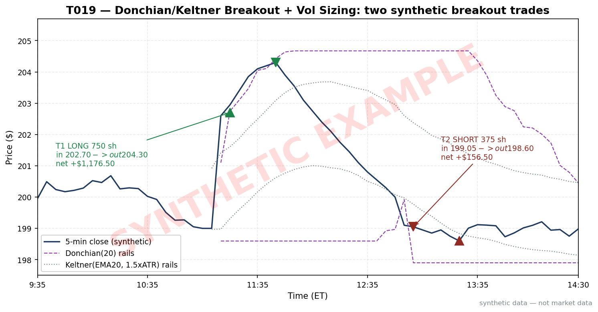

```mermaid
flowchart TD
    DATA["Market data<br/>(SIP 1-min bars -> 5-min)"] -->|"5-min OHLCV bars"| SIGS["Signals<br/>S028 Donchian, S029 Keltner, S076 vol breakout"]
    SIGS -->|dual-rail signal| ENTRY{"Entry logic<br/>close > both upper rails & range ratio > 1.75<br/>causal t→t+1"}
    ENTRY -->|trigger| SIZE["Sizing + risk<br/>0.5% risk / 2xATR x regime mult (1.0/0.5)<br/>max 4 names, daily stop -2%"]
    ENTRY -->|no trigger| WAIT["Wait"]
    SIZE --> EXEC["Execution<br/>next-bar open, <=10% of bar volume"]
    EXEC --> MON["Monitor + exits<br/>Keltner midline / opposite rail / 2xATR stop / 6-bar time stop"]
    MON --> PNL["P&L (net of costs)"]
    style ENTRY fill:#f9e79f,stroke:#7d6608
    style PNL fill:#a9dfbf,stroke:#1e8449
```

### T10. Sources

- Rayome, D. & Jain, A. (2008), "Do Turtles Have Fat Tails? Donchian Channels and Turtle Trading: The Case of Soybeans," *Journal of Finance Issues*. Discussed in the University of Cape Town thesis "Testing a price breakout strategy using Donchian" https://open.uct.ac.za/server/api/core/bitstreams/906cebd9-0c5f-49ba-8c36-f1e960b675c2/content — 27-year soybean Turtle test, significant risk-adjusted returns, trailing stops critical.
- Faith, C. (2007), *Way of the Turtle: The Secret Methods That Turned Ordinary People into Legendary Traders*, McGraw-Hill — the Turtle experiment account (>$170M by 1988, per the UCT thesis summary).
- "AdTurtle: An Advanced Turtle Trading System" (2019), *Journal of Risk and Financial Management* 12(2). https://www.mdpi.com/1911-8074/12/2/96/ — ATR-barrier exits optimal among the exit strategies tested.
- Moskowitz, T.J., Ooi, Y.H. & Pedersen, L.H. (2012), "Time Series Momentum," *Journal of Financial Economics* 104(2) — the time-series momentum mechanism (12-month horizon; cited for mechanism, not timeframe). https://papers.ssrn.com/sol3/papers.cfm?abstract_id=2089463

**Unverified leads.** Grok Q-TB2-3 (2026-09-10): Heston–Korajczyk–Sadka (2010) same-slot continuation magnitudes (~11 bp open slot) and Gao–Han–Li–Zhou (2018) "Market Intraday Momentum" (first→last-half-hour R² ≈ 1.6%) — paper titles/authors are real and checkable, but the numbers are Grok's summaries, not verified against the paper text; treat magnitudes as leads. Grok Q-TB2-2 eng-hour bands for the TB2 stack — chatbot-reported, plausible, unverified.

Grok answered Q-TB2-1..3 (2026-09-10); all claims independently verified or labeled unverified.

## Stage 120/200 — T020: Triple-Barrier + Meta-Labeling Overlay

*Batch TB2 · Strategy 20/100 · Signals S085, S086, S088*

### T1. One-line verdict

| | |
|---|---|
| **Style** | Machine-learning overlay: veto and position-sizing layer over any primary strategy — not a directional strategy itself |
| **Edge source** | Precision gain, not new alpha: a secondary classifier predicts whether the primary's bet will be profitable (triple-barrier labels as the training target) and vetoes low-probability bets while sizing the rest by predicted success probability |
| **Typical holding period** | Inherits the primary strategy's (intraday to multi-day) |
| **Capacity hint** | Inherits the primary's, reduced by the veto rate (typically 20–60% of bets vetoed, *example*) — the overlay never creates capacity |
| **Build-or-buy in one line** | Build: the meta-model is trained on your labels from your primary's bets, so there is nothing to buy — buy the data and the broker API, build the model |

### T2. Full mechanics

**Jargon used below.** *Triple-barrier labeling* (S085 `[D]`): a labeling method where each bet is resolved by whichever of three barriers the price touches first — an upper profit barrier, a lower stop barrier, and a vertical (time) barrier. *Meta-labeling* (S086 `[D]`): a second machine-learning model that predicts whether the primary model's bet will succeed, used to veto or size bets (it never flips the side). *Purged/embargoed cross-validation* (S088 `[D]`): a validation scheme that drops training labels whose time intervals overlap the test fold (purge) plus a buffer (embargo), preventing label leakage. *Kelly fraction*: the bet-size rule maximizing long-run growth for known win probabilities; *fractional Kelly* bets a fraction of it. *PR-AUC*: area under the precision–recall curve, the right tuning metric for imbalanced classification. *DSR* (Deflated Sharpe Ratio): a Sharpe ratio adjusted for multiple-testing bias. *PBO* (Probability of Backtest Overfitting): the chance the selected strategy is overfit.

**Universe & session.** Inherits the primary's — the overlay is strategy-agnostic. The worked example uses a generic intraday breakout primary (T019-style); it could equally be T014's Bollinger fade or T005's ORB. The only requirement: the primary must have a documented, costed edge *before* the overlay — meta-labeling amplifies an edge it cannot manufacture (T7).

**Labeling (S085 `[D]`) — the training targets.** For each primary-signal event at t_0 with entry P_{t_0}, side s ∈ {+1, −1}, volatility σ̂_{t_0} from data **before** t_0 only (20-day ATR, *example*), horizon H = 1 session (*example*): upper = P_{t_0}(1 + 1.5σ̂), lower = P_{t_0}(1 − 1.0σ̂) (*examples*), vertical = t_0 + H. Scan τ = 1…H on side-adjusted return: y = +1 (profit first), −1 (stop first), 0 (neither by H) — de Prado's standard. For meta-training relabel binary (S086): 1 if y = +1, 0 otherwise ("keep 0s as losses"; the S085 "drop 0s" variant is the alternative — document whichever you use).

**Meta-model (S086 `[D]`) — the veto/sizing rule.** A classifier (gradient-boosted trees, e.g. LightGBM, *example*) on features x_t available at t (20–50 features *example*: realized vol, quoted spread, RVOL, time-of-day, primary-signal strength, side as ±1), z-scored with **training-fold statistics only**, outputs p̂_t = P(y_t = 1 | x_t, s_t). Position rule (*examples*): **veto** if p̂_t < 0.55; **size** with multiplier g(p̂) = max(0, (p̂ − 0.50)/0.50) → shares = base_shares × g(p̂), base from 0.50% equity risk; hard cap 1.5% equity per bet. On the formula: Grok's Q-TB2-1(D) text stated /0.25 but its own table computed /0.50 (see grok-answers.md QC notes); this chapter standardizes on **/0.50** throughout T4.

**Validation (S088 `[D]`) — the honesty layer.** Train and evaluate under purged K-fold CV (K = 5, *example*): drop training events whose label interval [t_i(0), t_i(1)] intersects the test fold, and embargo 5% of the sample (*example*) or the maximum label horizon, whichever is larger. Tune on PR-AUC, never accuracy. Final selection via combinatorial purged CV with the PBO statistic — the overlay ships only if the deflated Sharpe clears your bar.

**Causal timing.** The label y_{t_0} is known only at min(first barrier touch, t_0+H) — a training target, never a live input. Live loop: primary fires at t → meta predicts p̂_t from data ≤ t → fill at t+1. The meta-model must never see features computed after t, and the label must never leak into the feature set.

**Risk limits.** Meta-drift monitor: recompute feature-distribution PSI (population stability index) monthly (*example*); if calibration drifts, fall back to the primary with base size and **no veto** — a miscalibrated meta-model is worse than none. Never trade on a p̂ more than one session old. Max 50 features (*example*); min 500 labeled events per retrain (*example*).

**Cost model.** The overlay adds no per-trade cost beyond the primary's; its costs are engineering + the compute for nightly retraining (T5). The P&L effect is entirely through trade selection and sizing (T4).

**Execution sketch.** The overlay is a pre-trade gate in the order path: primary signal → meta inference (milliseconds, local) → veto/size → broker. No order leaves the box without a fresh p̂.

### T3. Signals it consumes

| Signal | Role | Weight / logic |
|---|---|---|
| S085 `[D]` — Triple-barrier labeling | Label generator: converts each primary bet's price path into a win/loss training target | Every primary event gets y ∈ {+1, −1, 0} → binary {1, 0}; barriers k_u=1.5, k_ℓ=1.0, H=1 session (*examples*) |
| S086 `[D]` — Meta-labeling | The overlay itself: veto + sizing rule over the primary's side | Bet if p̂_t ≥ 0.55; size = base × max(0, (p̂−0.50)/0.50), cap 1.5% equity (*examples*) |
| S088 `[D]` — Purged/embargoed CV | Validation protocol: the only honest way to evaluate the meta-model | Purge overlapping label intervals; embargo 5% or max horizon; tune PR-AUC; select via CPCV/PBO |

```python
# T020 overlay logic (<=25 lines). All thresholds marked example.
def t020_overlay(primary_events, bars):
    labels = triple_barrier(primary_events, bars, ku=1.5, kl=1.0, H="1d")
    y = (labels == +1).astype(int)                    # S085 -> binary
    meta = train_gbm(features_at_event, y, cv=purged_kfold(K=5, embargo="5%"))  # S088
    for ev in live_primary_events():                 # S086, causal t -> t+1
        p = meta.predict_proba(features(ev, t="now"))[1]
        if p < 0.55: continue                        # veto (example)
        mult = max(0.0, (p - 0.50) / 0.50)           # sizing (example)
        size = min(base_shares(ev) * mult, 0.015 * equity / price)  # cap in shares
        submit(ev.side, size, t_next_open=True)
```

### T4. Worked example — numbers + P&L (SYNTHETIC)

Five synthetic primary-signal instances on a $200,000 book (seed 120, `rng = np.random.default_rng(120)`); the chart `images/T020_example.png` plots these exact numbers. Parameters (*examples*): σ̂ = $2.00; upper = +1.5σ̂ = +$3.00/share; lower = −1.0σ̂ = −$2.00/share; vertical = 1 session; base risk 0.50% = $1,000 → base 500 shares at the $2.00 stop distance; veto if p̂ < 0.55; multiplier max(0, (p̂−0.50)/0.50). Cost per round trip: shares × $0.03 (half-spread $0.01 + commission $0.005, both sides) + $1.00 ticket. Naive baseline: 500 shares on every bet.

| # | Primary side | Features (sketch) | Meta p̂ | Mult. | Shares | Barrier outcome | Gross $ | Costs $ | Net (meta) $ | Net (naive) $ |
|---|---|---|---|---|---|---|---|---|---|---|
| 1 | Long | quiet vol, RVOL 1.8 | 0.82 | 0.64 | 320 | upper hit | +960.00 | 10.60 | **+949.40** | +1,484.00 |
| 2 | Long | news spike, wide spread | 0.48 | veto | 0 | would hit lower | 0.00 | 0.00 | **0.00** | −1,016.00 |
| 3 | Short | RSI-2=94, trend down | 0.53 | veto | 0 | would hit upper (adverse) | 0.00 | 0.00 | **0.00** | −1,516.00 |
| 4 | Long | gap-fade setup | 0.63 | 0.26 | 130 | vertical, +$0.80/sh | +104.00 | 4.90 | **+99.10** | +384.00 |
| 5 | Short | crowded, high ADV | 0.88 | 0.76 | 380 | lower hit (profit for short) | +760.00 | 12.40 | **+747.60** | +984.00 |
| **Total** | | | | | | | | | **+$1,796.10** | **+$320.00** |

Walk the arithmetic for #1: multiplier = (0.82 − 0.50)/0.50 = 0.64 → 500 × 0.64 = 320 shares; upper hit → 320 × $3.00 = +$960.00 gross; costs 320 × $0.03 + $1.00 = $10.60; net +$949.40. Vetoes #2/#3: p̂ < 0.55 → 0 shares, avoiding naive losses of −$1,016 and −$1,516. #5: (0.88−0.50)/0.50 = 0.76 → 380 shares; short profits at the lower barrier → 380 × $2.00 = +$760.00; costs $12.40; net +$747.60. Meta beats naive by **$1,476.10** — from vetoing two full losers ($2,532 of gross loss avoided) and sizing the three taken bets by p̂.

**Where the example is optimistic.** The five p̂ values are handed to the example already calibrated — in production, calibration is the whole battle (the Daru replication in T7 shows the lift washing out at scale). The "would have" outcomes for vetoed bets are unknowable live — the example grants omniscience for illustration. No feature-drift, no label-leakage, no regime change; the purged-CV step that would catch those is described, not demonstrated. Five instances prove nothing statistically — the example demonstrates the *mechanism*, not the efficacy.

### T5. Data & infra — what must run

**Pipeline inventory.** (1) *Nightly*: recompute labels for the primary's event history, rebuild the parquet feature store, retrain the meta-model under purged/embargoed CV, run calibration checks (predicted vs realized win rate by p̂ decile), promote or hold. (2) *Intraday*: per primary-signal event, compute features from data ≤ t, run inference (milliseconds), apply veto/sizing. (3) *Monthly*: feature-drift (PSI) review, PBO re-check on the expanded sample.

**Feeds.** No new market data beyond the primary's — labels and features are computed from bars the strategy already buys (incremental data cost $0). One data-quality requirement, from Grok's bounce defense (Q-TB2-2): label the barriers on the **same mid-price path you will trade**, not on last-sale prints — training on last-sale barriers and sizing live on NBBO mids injects bid–ask bounce into the labels.

**M5 Max feasibility: feasible (the ML stack is the long pole).** Labeling + purged CV is a Tier L/M build per cost-model §5; the full stack (labeling engine, purged CV, feature store, inference) is 120–230 eng-hours per the Grok research (chatbot-reported, unverified) → $18,000–34,500 `loaded-cost estimate` at $150/hr. Throughput: triple-barrier first-touch on daily events runs in minutes per year of sample (Grok Q2); LightGBM on 1M rows × 50 features trains in ~1–10 min (cost-model §2); inference is microseconds per event. RAM: labels + feature matrix for 3k names × 10y daily events = 10–30 GB (Grok Q2) — inside the 77 GB budget; training adds 8–20 GB. Bottleneck: labeling-engine correctness and purged-CV discipline, not FLOPs.

**Feed-outage safe mode.** If the meta-inference service is stale or the nightly retrain failed: fall back to the primary with base size and **no veto**. Never size on a p̂ more than one session old. Kill switch: disable the overlay (not the primary) if the veto rate spikes > 3× its trailing mean — the signature of feature breakage (*example*).

### T6. Buy vs build

| Option | What you get | Indicative price | What buying gains | What buying loses |
|---|---|---|---|---|
| Build on rented bars (Tier 1) | Your labels, your features, your meta-model | ~$30–200/mo data `indicative — verify before budgeting` + eng | The meta-model IS the IP; full control of leakage discipline | 120–230 eng-hours |
| Managed ML platform (SageMaker/Vertex-style) | Hosted training/inference | ~$100–500/mo `indicative — verify before budgeting` | No training-infra babysitting | The labeling/CV discipline is still yours |
| Broker API (IBKR etc.) | Execution for the sized orders | Commission-based | You don't write a matching engine | Nothing — this is the buy, per Grok's verdict |
| "AI alpha" vendor product | A black-box overlay | $$$$ `indicative — verify before budgeting` | Nothing verifiable | You cannot audit its labels, its purge, or its causality — unbuyable on principle |

**Verdict: build the overlay, buy everything around it.** Nobody can sell you a meta-model trained on your primary's bets — the labels don't exist until you create them. The crossover logic is inverted from most strategies: buying is only rational for the commodities (data, compute, execution); the overlay itself is build-or-nothing. Do not buy an "AI overlay" product: without your label definitions and purge discipline, its backtest is unauditable.

### T7. Success-ratio evidence

| Study / source | Market & period | Metric | Before/after cost | Caveat |
|---|---|---|---|---|
| López de Prado, M. (2018), *Advances in Financial Machine Learning*, Wiley (Ch. 3, 10) | Methodological | Triple-barrier labeling + meta-labeling framework; Ch. 10's claim: the secondary model improves precision, it is "not a second alpha source" | N/A (method) | The canonical source, not an efficacy study |
| Daru Finance, "lopez-de-prado-work-review" (GitHub, 2025–26) https://github.com/darufinance/lopez-de-prado-work-review | 42 instruments (crypto perps, US ETFs, FX), EMA-crossover primary | Meta-labeling lifts profit factor in 38/42 instruments; **0/42 clear DSR > 0.95**; typical move: PF 0.92→1.03, Sharpe from deeply negative toward ~0 | Net of per-turnover costs | Independent replication, not peer-reviewed; figures as reported in the repo's summary (not independently re-run); primary deliberately edgeless — "precision filter, not an alpha source" |
| Daru Finance follow-up, `03b_metalabel_real_primary` (same repo) | 6 structural edges × 26 perp pairs, 156 configurations | With an edge-bearing primary: PF 1.26→1.79, per-trade 47.3→148.1 bp, DSR 0.636→0.778 on a focused 2-pair sample; pooled across 156 configs: **DSR 0.0** (median PF lift only +0.02) | Out-of-sample, costed | The honest synthesis: the mechanism is real on a focused sample, washes out at scale under deflation |
| "Algorithmic crypto trading using information-driven bars, triple barrier labeling and deep learning," *Financial Innovation* (Springer) https://link.springer.com/article/10.1186/s40854-025-00866-w | Crypto (BTC/ETH), information-driven bars | Peer-reviewed application of triple-barrier labeling; finds dynamic (vol-adjusted) barriers did *not* improve on static ones | Their backtest | Supports the labeling machinery, not the meta-labeling efficacy claim |
| Bailey & López de Prado (2014), "The Probability of Backtest Overfitting," *J. Computational Finance* 17(4) | Methodological | PBO / deflated Sharpe: the multiple-testing correction behind S088 validation | N/A (method) | The reason the Daru pooled DSR is 0.0 — selection bias is the default, not the exception |

**Honest bottom line.** Meta-labeling is a precision tool with a documented, replicated, modest effect: it takes a cost-losing primary toward break-even and a genuinely edged primary somewhat further — it has never been shown to manufacture an edge or to survive deflated-Sharpe scrutiny at scale (0/42, then pooled DSR 0.0). For a ≤$1M paper operation this is one of the most buildable ML projects in the book (tabular model, local training, no GPU) — build it only *after* the primary is proven on mids with costs: "don't train the meta-labeler on last-sale triple barriers then size live on NBBO" (Grok Q-TB2-2). For an institutional desk the overlay is standard infrastructure (AFML Ch. 10), but its value is basis points of precision, shipped behind CPCV/PBO gates — not accuracy leaderboards.

### T8. Failure modes

1. **Label leakage through the embargo.** Overlapping triple-barrier intervals leak future information into training folds; the meta-model looks brilliant and trades nothing. Mitigation: S088 purging + embargo as a *tested* pipeline (unit-test that no label interval crosses a fold boundary).
2. **Meta overfit on few events.** Hundreds of events, dozens of features — the secondary memorizes noise. Mitigation: cap features (20–50, *example*), require ≥ 500 events per retrain (*example*), regularize, judge on PR-AUC under purged CV only.
3. **Class imbalance → majority-class predictor.** Most barriers resolve to one class; the model learns to always predict it. Mitigation: class weights or PR-AUC tuning (S086), never accuracy; check the predicted-probability distribution isn't degenerate.
4. **Calibration drift.** p̂ = 0.8 bets start winning at 55% — the sizing rule is now wrong. Mitigation: monthly calibration plots (predicted vs realized by decile); fall back to no-veto base sizing on drift.
5. **Side-as-feature leakage.** Including the side lets the model learn "shorts win in this sample" — a regime artifact. Mitigation: per-side models or side-stratified evaluation; be suspicious of large side coefficients.
6. **Purge empties the folds.** Aggressive purging on overlapping intraday labels leaves nothing to train on. Mitigation: the S088 embargo-sizing guidance (larger of the % rule and the horizon rule); if folds are empty, the label horizon is too long — shorten H or widen the sample.
7. **Training on last-sale, trading on mids.** Bid–ask bounce in the labels becomes "edge" the meta-model learns. Mitigation: label on the same quote-midpoint path used live (Grok Q-TB2-2); report mid-to-mid, mid-to-touch, and touch-to-touch P&L separately.
8. **Ignoring the vertical-bar (0) class.** Dropping 0s vs keeping them as losses changes the question ("will it win?" vs "will it win given it resolves?"). Mitigation: pick deliberately (this chapter keeps 0s as losses), document it, test both.

### T9. Visuals

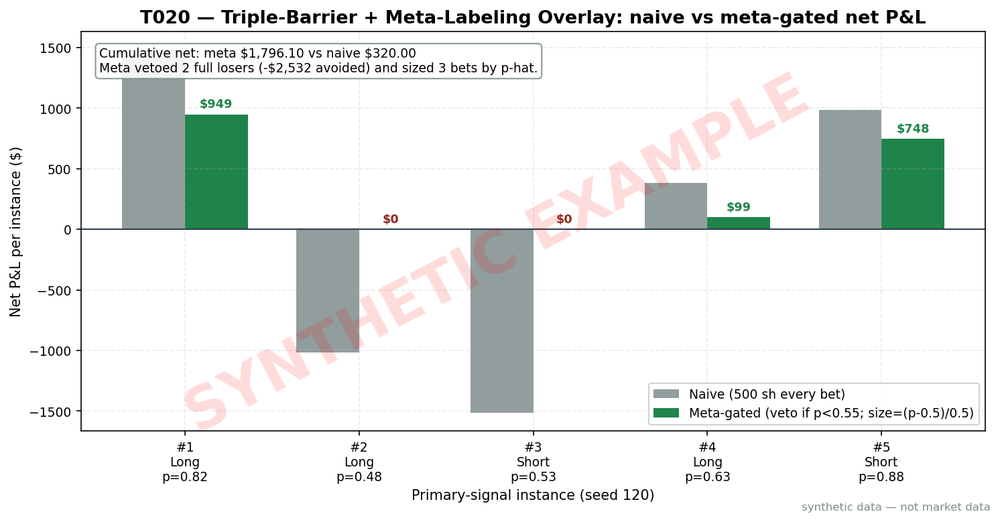

```mermaid
flowchart TD
    DATA["Market data<br/>(bars as the primary uses)"] -->|"event bars, primary-signal timestamps"| SIGS["Signals<br/>S085 labels, S086 meta-model, S088 purged CV"]
    SIGS -->|veto/size signal| ENTRY{"Entry logic<br/>primary side s_t; meta veto if p-hat<0.55<br/>causal t→t+1"}
    ENTRY -->|take| SIZE["Sizing + risk<br/>base x max(0,(p-0.5)/0.5), cap 1.5%<br/>fallback: no-veto base size"]
    ENTRY -->|veto| WAIT["Wait"]
    SIZE --> EXEC["Execution<br/>primary's venue, sized order"]
    EXEC --> MON["Monitor + exits<br/>triple barriers resolve the label<br/>drift/PSI watch"]
    MON --> PNL["P&L (net of costs)"]
    style ENTRY fill:#f9e79f,stroke:#7d6608
    style PNL fill:#a9dfbf,stroke:#1e8449
```

### T10. Sources

- López de Prado, M. (2018), *Advances in Financial Machine Learning*, Wiley — Ch. 3 (triple-barrier labeling), Ch. 10 (meta-labeling), Ch. 7 (purged/embargoed CV). The canonical method source. https://www.wiley.com/en-us/Advances+in+Financial+Machine+Learning-p-9781119482086
- Daru Finance (2025–26), "lopez-de-prado-work-review," GitHub. https://github.com/darufinance/lopez-de-prado-work-review — independent replication: meta-labeling lifts profit factor in 38/42 instruments with 0/42 clearing DSR > 0.95; edge-bearing-primary follow-up: PF 1.26→1.79, per-trade 47.3→148.1 bp, DSR 0.636→0.778 (focused sample), pooled DSR 0.0 across 156 configurations (numbers as reported in the repo; independent replication, not peer-reviewed).
- "Algorithmic crypto trading using information-driven bars, triple barrier labeling and deep learning," *Financial Innovation* (Springer). https://link.springer.com/article/10.1186/s40854-025-00866-w — peer-reviewed application of triple-barrier labeling (dynamic vol-adjusted barriers did not beat static ones in their tests).
- Bailey, D.H. & López de Prado, M. (2014), "The Probability of Backtest Overfitting," *Journal of Computational Finance* 17(4) — the deflated-Sharpe / PBO machinery behind S088 validation.

**Unverified leads.** Grok Q-TB2-1(D) (2026-09-10): sizing-rule text/table inconsistency (stated /0.25, computed /0.50) — documented in grok-answers.md QC notes; this chapter standardizes on /0.50. Grok Q-TB2-2: eng-hour bands for the labeling/meta stack (80–150 h labels + purged CV; 40–80 h feature store + inference) and the 10–30 GB label-matrix figure — chatbot-reported, not independently measured. Grok Q-TB2-3: the Daru numbers as summarized by Grok — superseded here by the repo README text captured via web search.

Grok answered Q-TB2-1..3 (2026-09-10); all claims independently verified or labeled unverified.

## Stage 121/200 — T021: Avellaneda–Stoikov Inventory Skew MM

*Batch TB3 · Strategy 21/100 · Signals S089, S004, S001*

### T1. One-line verdict

| | |
|---|---|
| **Style** | Intraday market making (liquidity provision): continuous two-sided quoting, always near-flat by the close |
| **Edge source** | The **bid–ask spread** (the gap between the best buy and sell price) plus maker **rebates** (exchange payments for resting limit orders), harvested while an inventory-control rule keeps the position from running away |
| **Typical holding period** | Seconds to minutes per round trip; inventory is managed continuously and flattened before the close |
| **Capacity hint** | Tiny for a remote operator (single-digit names, small size); institutional desks scale it with colocation, rebates, and hundreds of names — the edge is infrastructure, not the formula |
| **Build-or-buy in one line** | Build the simulator yourself on bought L1/MBO data (nobody sells you your risk aversion); do not expect a bought bot to print on a home connection — see T6 |

### T2. Full mechanics

**Universe & session.** Liquid US large-caps and equity-index futures, RTH, *example* window 09:35–15:55 ET. Exclusions (*examples*): halts, earnings-day names, quoted spread > 3 ticks (a **tick** is the $0.01 minimum price increment), ADV < ~1M shares. Tight, deep books only.

**Entry rule.** There is no discrete "entry signal" — the strategy is *always quoting*. On every top-of-book update (event *t*), using only data ≤ *t*:

1. Compute the fair value as the **microprice** (S004): the book-imbalance-weighted expectation of the next mid-price, $M_t = m_t + G^*(X_t)$, where $m_t$ is the mid-price (average of best bid and ask) and $X_t$ is the imbalance state. Operationally this chapter uses the first-order proxy $M_t \approx m_t + (s_t/2)\cdot I_t$ with spread $s_t$ and queue imbalance $I_t$ — a reconstruction, labeled as such.
2. Compute the **reservation price** (S089) — your *personal* fair value, the mid shifted against your inventory: $$r(s,q,t) = s - q\,\gamma\sigma^2(T-t)$$ with inventory $q$ (shares, + = long), risk-aversion $\gamma$, mid volatility $\sigma$, and remaining session time $T-t$. Long inventory pushes $r$ below the fair value so the ask gets cheaper (inviting sellers to take you out of the long) and the bid backs away; short inventory mirrors this.
3. Compute the optimal total spread (S089): $$\delta_a + \delta_b = \gamma\sigma^2(T-t) + \frac{2}{\gamma}\ln\!\left(1+\frac{\gamma}{\kappa}\right),\qquad \delta^* = \tfrac{1}{2}(\delta_a+\delta_b)$$ where $\kappa$ is the book-depth parameter governing how fast fill arrivals decay with quote distance. Quote $p_b = r - \delta^*$, $p_a = r + \delta^*$ (rounded to ticks).
4. **Toxicity veto** (S001): compute the rolling depth-normalized OFI (**order-flow imbalance** — the signed running tally of demand vs supply at the touch, S001) z-score over the last 6 updates (*example* window). If $z < -1.5$ (*example*) while resting on the bid (flow sharply sell-heavy), pull the bid; mirror for the ask at $z > +1.5$. This is the cheap substitute for the VPIN gate used in T022 — one line of code that catches slow toxic drifts.
5. **Causal timing:** a quote computed at event *t* can be filled no earlier than *t+1*; the mid used must be current — a stale mid is a free option for fast takers.

**Exit rule.** Exits are (a) fills — every fill is an exit leg of inventory — and (b) the **terminal liquidation**: flatten at the touch (the best bid if selling, the best ask if buying) by 15:50 ET (*example*), paying half-spread + taker fee. Also: **time stop** (last 10 min, exits only); **signal exit** (OFI veto 30+ updates → pull both sides, flatten); **stop-loss** (below).

**Position sizing.** The model sizes *itself* through the skew: inventory, not order quantity, is the control variable. Quote size is fixed and small — 5–25 shares per quote (*example*), never more than ~5% of visible top-of-book depth (*example*) — because a maker that posts size gets adversely selected on size. Max per-name inventory $Q_{\max}$ = 20 shares (*example*; the worked example uses 5-share lots with $Q_{\max}=20$). Portfolio heat = Σ over names of $Q_{\max} \times$ price; *example* cap $250k gross on a $1M book (25%).

**Risk limits.** Daily loss stop: halt quoting if realized net P&L < −0.25% of capital (*example*). Per-name hard cap $Q_{\max}$: at the cap, pull the accumulating side. **Kill switch** (automated "stop everything"): feed stale > 500 ms (*example*), or 1-minute realized vol > 3× morning baseline (*example*) → cancel all, flatten at the touch, require manual re-arm. Session-end flat is mandatory — no overnight inventory (gap risk belongs to T090).

**Cost model.** Maker rebate +$0.0020/share, taker fee $0.0030/share (*examples*, maker–taker convention). Round trip ≈ quoted half-spread × 2; terminal liquidation costs half the spread plus the taker fee. No borrow cost (intraday, flat by close). Slippage: in simulation, fills are assumed only when the synthetic microprice touches the quote — queue position is *not* modeled on L1, labeled `simulated only — requires MBO/ITCH` (MBO = market-by-order data with per-order IDs; ITCH = Nasdaq's native order feed).

**Order/execution sketch.** Maker-only limit orders at the touch. Cancel/replace when the recomputed bid/ask differs from the resting quote by ≥ 1 tick, when inventory changes, or when the OFI veto fires. Never chase through the spread (no market orders except the terminal flatten and the kill-switch flatten). Participation cap: our quote ≤ 10% of visible depth at that price (*example*) — bigger and you *are* the book, which changes the fill dynamics the model assumes.

### T3. Signals it consumes

| Signal | Role | Logic |
|---|---|---|
| S089 — Avellaneda–Stoikov inventory skew | **Primary trigger** (quoting engine) | Sets $r$ and $\delta^*$ every update; the quotes *are* this signal |
| S004 — Microprice | **Fair-value input** | Replaces the raw mid as the center $s$ of the reservation price, so book asymmetry is priced into every quote |
| S001 — Order-flow imbalance | **Veto / filter** | Rolling OFI z-score; pull the resting side when flow turns sharply adverse (*example*: $z < -1.5$ pulls the bid) |

Combination logic (pseudocode, ≤25 lines):

```
on L1 update at event t (all inputs <= t):
    M  = microprice(mid, imbalance)            # S004 fair value
    r  = M - q * gamma * sigma^2 * (T - t)     # S089 reservation price
    hs = 0.5 * (gamma*sigma^2*(T-t) + (2/gamma)*ln(1 + gamma/kappa))
    bid, ask = tick_round(r - hs), tick_round(r + hs)
    z  = ofi_zscore(window=6)                   # S001 toxicity proxy
    if feed_stale(500ms) or sigma_spike(3x):   # kill switch
        cancel_all(); flatten_at_touch(); halt()
    if abs(q) >= QMAX: pull accumulating side
    if z < -1.5 and resting_side == BID: pull bid      # OFI veto
    if z > +1.5 and resting_side == ASK: pull ask
    if quote_moved >= 1 tick or q changed: cancel/replace bid & ask
    # fills (event t+1 earliest) update q and cash; rebate on maker fills
at 15:50 ET: stop quoting; flatten remainder at touch (taker fee)
```
### T4. Worked example — numbers + P&L (SYNTHETIC)

Synthetic large-cap XYZ, $100 price scale, 16 quote updates over a normalized session ($T=1.0$). **Seed: 121** (`rng = np.random.default_rng(121)` in `batches/TB3/plot_T021.py`; the chart plots exactly these numbers). All parameters are *examples*: $\gamma=0.10$, $\kappa=100$/$, $\sigma=0.30$ $/\sqrt{\tau}$, lot = 5 shares, $Q_{\max}=20$ shares, maker rebate $0.0020$/share, taker fee $0.0030$/share, OFI veto at $z<-1.5$. A fill is assumed when the microprice touches the prior update's quote (fill rule is `simulated only — requires MBO/ITCH` for queue honesty). Fair value $M$ = mid + $0.01 \times I$ (the S004 first-order proxy). Reservation price $r = M - q\gamma\sigma^2\tau$; half-spread $\delta^* \approx 0.014$–$0.015$ early in the session (about 1.5 ticks).

| # | t | mid | I | M | q(before) | r | bid / ask | OFI z | event | q(after) | cash Δ | cash cum |
|---|---|---|---|---|---|---|---|---|---|---|---|---|
| 1 | 0.00 | 99.999 | +0.2 | 100.001 | +0 | 100.0005 | 99.99 / 100.02 | — | start | +0 | +0.000 | +0.000 |
| 2 | 0.07 | 100.017 | +0.4 | 100.021 | +0 | 100.0205 | 100.01 / 100.03 | 0.00 | SELL 5 @ 100.02 (ask lifted) | −5 | +500.110 | +500.110 |
| 3 | 0.13 | 100.037 | +0.5 | 100.042 | −5 | 100.0806 | 100.07 / 100.09 | 0.00 | SELL 5 @ 100.03 (ask lifted) | −10 | +500.160 | +1000.270 |
| 4 | 0.20 | 100.014 | +0.3 | 100.017 | −10 | 100.0885 | 100.07 / 100.10 | −0.65 | BUY 5 @ 100.07 (bid hit) | −5 | −500.340 | +499.930 |
| 5 | 0.27 | 100.009 | +0.1 | 100.010 | −5 | 100.0428 | 100.03 / 100.06 | −1.46 | BUY 5 @ 100.07 (bid hit) | +0 | −500.340 | −0.410 |
| 6 | 0.33 | 99.994 | −0.2 | 99.992 | +0 | 99.9915 | 99.98 / 100.00 | −1.76 | no fill — OFI veto (bid pulled) | +0 | +0.000 | −0.410 |
| 7 | 0.40 | 99.981 | −0.4 | 99.977 | +0 | 99.9768 | 99.96 / 99.99 | −1.69 | no fill — OFI veto (bid pulled) | +0 | +0.000 | −0.410 |
| 8 | 0.47 | 99.998 | −0.3 | 99.995 | +0 | 99.9955 | 99.98 / 100.01 | −0.31 | SELL 5 @ 99.99 (ask lifted) | −5 | +499.960 | +499.550 |
| 9 | 0.53 | 100.044 | +0.1 | 100.045 | −5 | 100.0662 | 100.05 / 100.08 | 1.11 | SELL 5 @ 100.01 (ask lifted) | −10 | +500.060 | +999.610 |
| 10 | 0.60 | 100.048 | +0.3 | 100.051 | −10 | 100.0868 | 100.07 / 100.10 | 1.49 | BUY 5 @ 100.05 (bid hit) | −5 | −500.240 | +499.370 |
| 11 | 0.67 | 100.041 | +0.5 | 100.046 | −5 | 100.0615 | 100.05 / 100.07 | 1.27 | BUY 5 @ 100.07 (bid hit) | +0 | −500.340 | −0.970 |
| 12 | 0.73 | 100.025 | +0.4 | 100.029 | +0 | 100.0287 | 100.02 / 100.04 | 0.40 | BUY 5 @ 100.05 (bid hit) | +5 | −500.240 | −501.210 |
| 13 | 0.80 | 99.996 | +0.2 | 99.998 | +5 | 99.9885 | 99.98 / 100.00 | −0.56 | BUY 5 @ 100.02 (bid hit) | +10 | −500.090 | −1001.300 |
| 14 | 0.87 | 100.015 | +0.0 | 100.015 | +10 | 100.0028 | 99.99 / 100.01 | −1.56 | SELL 5 @ 100.00 (ask lifted) | +5 | +500.010 | −501.290 |
| 15 | 0.93 | 100.039 | +0.2 | 100.041 | +5 | 100.0381 | 100.03 / 100.05 | −0.62 | SELL 5 @ 100.01 (ask lifted) | +0 | +500.060 | −1.230 |
| 16 | 1.00 | 100.019 | +0.1 | 100.020 | +0 | 100.0203 | 100.01 / 100.03 | −0.61 | BUY 5 @ 100.03 (bid hit) | +5 | −500.140 | −501.370 |
| — | — | — | — | — | — | — | — | — | TERMINAL: sell 5 @ 100.01 (taker) | +0 | +500.035 | **−1.335** |

Line-by-line P&L walk (cash Δ already includes the $0.01 rebate per 5-share fill):

- **Fills #2–#3 (the good leg):** sold 5 @ 100.02 then 5 @ 100.03 as the tape rallied — +$500.110, +$500.160. The ask lifted into strength: the textbook maker fill.
- **Fills #4–#5 (the adverse leg):** short 10, the reservation price moved *up* (r = 100.0885 at #4), so the bid stayed aggressive at 100.07 — and was hit twice while the mid fell from 100.037 to 100.009 (−$500.340 each). **Adverse selection** in miniature: the fill arrived precisely because the tape moved against the quote. Pair #2/#4: sold 100.02, bought 100.07 → −$0.246 net.
- **Steps #6–#7 (the veto working):** OFI z hit −1.76/−1.69 (below the −1.5 *example* threshold) as the book sold off; the bid was pulled and the mid fell ~1.3 more ticks with no fill — the S001 veto demonstrably avoided two would-be adverse buys.
- **Fills #8–#16 (the chop):** the skew re-centers but the mid mean-reverts inside the spread band faster than quotes can harvest it — buys at 100.05–100.07, sells at 99.99–100.01. Each round trip loses ~a tick to whipsaw while earning only the $0.004/share round-trip rebate.
- **Terminal:** long 5 flattened at 100.01 (taker, $0.015 fee): +$500.035. **Final net P&L: −$1.335** on 14 fills.

**Where the example is optimistic.** (1) Fills on any microprice touch — no queue position, no partials. On L1 data this is the largest source of inflated maker backtests; honest fills need MBO/ITCH replay. (2) Sub-tick skew (r shifts of $0.01–$0.04) is rounded into quote moves a real desk often couldn't make. (3) Zero latency — a 30–150 ms delay worsens fills #4/#5 further. (4) The OFI series is scripted, not estimated; real SIP-based OFI is noisier. (5) One quiet tape, no jumps, no queue competition.

### T5. Data & infra — what must run

**Feed inventory.** Minimum honest stack: L1 top-of-book (MBP-1) plus trades with aggressor side, per symbol — the reservation math needs only mid, spread, and imbalance, but the *fill simulator* needs MBO (market-by-order) history for a handful of liquid names to calibrate queue position honestly. Named options: Databento MBP-1/MBO (Tier 2), Alpaca or Polygon SIP L1 (Tier 1, research-only fills). Corporate actions, halts, and DST/half-day calendars must be normalized before the open.

**Pipeline schedule.** Pre-open: estimate $\sigma$ (rolling realized vol) and $\kappa$ (fill-intensity decay) per symbol; check kill-switch thresholds. Intraday: event-driven quote engine with a 1-second watchdog that pulls quotes if no book update arrives. Post-close: markout report — every fill marked to mid at +1 s, +5 s, +30 s. The **markout** (a fill's P&L measured after the fact) is the adverse-selection diagnostic; without it you lie to yourself about edge.

**Storage.** Per `notes/cost-model.md` §4: L1 ≈ 2–8 GB/symbol-day, MBO ≈ 10–40 GB/symbol-day in Parquet. A 20-symbol L1 universe ≈ 40–160 GB/day — keep 60 days on cold storage in per-symbol daily files, or downsample to bars for history.

**M5 Max feasibility.** Research and simulation: **feasible, Tier H (60–200 h → $9,000–$30,000 loaded-cost estimate at $150/hr)** per cost-model §5 — the heavy half is the MBO book + queue-aware fill simulator (80–150 h alone), not the A–S formulas (an afternoon). Throughput per cost-model §2: a Python event loop handles ~100–500k events/sec (fine for ≤20 symbols of L1); a Rust loop does 5–50M events/sec (needed for MBO replay). RAM per cost-model §3: live L1 state for 20 symbols < 100 MB; decoded MBO replay buffers 10–80 GB — fits the 128 GB working budget with care. **Live market making from this machine: not viable** — the bottleneck is not compute but the ~30–150 ms round trip to the matching engine vs ~1–50 µs for colocated desks (see T8). The Mac is a flight simulator with a full aerodynamic model, not the race.

**Feed-outage safe mode.** On any feed gap > 500 ms (*example*): cancel all resting quotes immediately, flatten inventory at the touch (taker), block new quotes until the feed has been healthy for 5 consecutive seconds (*example*), and page the operator. On kill-switch trip: same, plus require manual re-arm. Never "quote through" a stale book — a stale quote is a free option written to the fastest taker (see T8).

### T6. Buy vs build

| Option | What you get | Indicative price | What buying gains | What buying loses |
|---|---|---|---|---|
| Tier-0: Alpaca IEX / Stooq delayed L1 + own simulator | Free quotes for research | ~$0 | Zero data cost to learn the mechanics | No honest fills; SIP timestamps; research-only |
| Tier-1: Polygon Stocks Advanced / Alpaca SIP | Real-time SIP L1, corporate actions | ~$30–200/mo, indicative — verify before budgeting | Cheap live mid/imbalance for the quote math | Fill simulation still `simulated only`; no queue rank |
| Tier-2: Databento (MBP-1 live + MBO history) | Honest L1/L2/MBO, matching-engine timestamps | ~$200/mo + usage, indicative — verify before budgeting | Queue-aware fill sim; the only honest backtest input | Usage meter runs hot on MBO |
| Open-source: Hummingbot `avellaneda_market_making` | Working A–S implementation (crypto spot) with vol/liquidity estimators | ~$0 (open source) | Real code for the formulas + estimator patterns | Crypto venues, no equity colo story, retail latency class |
| Professional: colo rack + cross-connect + direct feeds | µs tick-to-trade, real queue priority | Rack ~$1.5k–5k+/mo per venue + data licenses (five figures/mo for equity depth), indicative — verify before budgeting | The only venue where the strategy is actually the product | Person-years + legal + capital; a different job |

**Verdict: build the simulator, buy the data, don't buy the strategy.** Build if your goal is learning, parameter research, or agent tooling: the formulas are public (T10), the estimators are yours to tune, and no vendor sells your $\gamma$. Buy Tier-2 data the moment you want honest fill simulation — you cannot build your way around not having MBO. The crossover to professional infrastructure only makes sense with measured, after-cost, out-of-sample edge *and* capital; a bought retail "MM bot" on a home connection is paying to be the market's inventory of last resort.

### T7. Success-ratio evidence

| Study / source | Market & period | Metric | Before/after cost | Caveat |
|---|---|---|---|---|
| Avellaneda & Stoikov (2008), *Quant. Finance* 8(3) | Stylized model (no fees, no competition) | A–S maximizes expected exponential utility of terminal wealth; inventory-skewed quotes cut terminal-inventory dispersion vs symmetric quoting | Before-cost; toy model | The paper documents a risk-management design, not a live P&L number — treat any "A–S Sharpe" quote as suspect |
| Gašperov & Begušić (2022), *PLOS One* ("A reinforcement learning approach to improve the performance of the Avellaneda-Stoikov market-making algorithm") | BTC-USD L2, 30 days (Dec 2020–Jan 2021) | Genetically calibrated A–S ("Gen-AS") vs RL variants on real L2 tape | After simulated costs (study design) | RL variants beat Gen-AS on risk-adjusted metrics on most days but with occasional outlier drawdowns; inventory control works, mean P&L is the price |
| Practitioner replications (GitHub; e.g. hftbacktest-based A–S studies) | Crypto L2 / simulated books | A–S reduces inventory variance ~3–9× vs naive quoting | Mixed; sims | Repos, not peer review; fill models vary |
| Budish, Cramton & Shim (2015), *QJE* 130(4) | US equities, millisecond direct-feed data | Latency-arbitrage rents are built into the continuous limit-order-book design; speed competition is the tax on stale quotes | n/a (market design) | This is the structural reason a slow quoter loses: the paper's rents are exactly what your resting quotes pay |

**After-cost honesty.** The literature's consistent message: A–S manages a trade-off; it does not print money. Raising $\gamma$ buys smaller inventory tails at the cost of mean P&L (the 2008 paper's sensitivity tables show mean profit sacrificed as $\gamma$ rises — *specific figures unverified, see T10*). Without rebates and colocation the economics are negative on liquid lit books: the rebate is often the only reason spread capture survives adverse selection.

**Capacity & decay.** For a remote operator, capacity on liquid names is effectively zero — you are last in queue at every price the fast makers also want. The "decay" is structural, not alpha decay: every millisecond of latency disadvantage is a permanent tax (Budish–Cramton–Shim). Institutional desks scale this because they *are* the fast makers, with rebates and flow filtering.

**Honest bottom line.** For a ≤$1M paper operation: build the A–S simulator on the M5 Max as a research and risk-taxonomy tool — it teaches reservation math, markouts, and why fills are toxic. Expect paper P&L to be flat-to-negative once fills are queue-honest; never post live two-sided quotes from this machine. For an institutional desk: A–S is a solved, commoditized quoting utility — the edge lives in toxicity estimation, queue modeling, rebates, and colocation, none of which the formula provides. Related: T085 (Resiliency Market Maker) layers A–S skew onto a resiliency fair value; T028 (Spread-Decomposition Router) prices the adverse-selection component the vanilla model ignores.

### T8. Failure modes

1. **Latency arbitrage against you.** Your quotes rest at prices from an already-old mid; fast takers hit the stale quote and the mid prints through. *Mitigation:* don't post live from a 30–150 ms connection; if you must, widen $\delta^*$ by a latency penalty and shorten quote lifetime.
2. **Toxic flow / jumps.** A–S has no jump term; a gap through your bid while already long is exactly the state the linear $r$ under-prices. *Mitigation:* hard $Q_{\max}$ caps, session-end liquidation penalty, OFI veto — accept you still eat the first jump.
3. **Inventory blowups from mis-estimated $\sigma$.** Vol estimated on a quiet window → skew too small in ticks → inventory random-walks into the cap. *Mitigation:* regime-aware $\sigma$; kill-switch on vol-regime change.
4. **Queue-position fill optimism.** Sim fills assume you get filled; reality is last-in-queue, so fills arrive disproportionately as the adverse move starts. *Mitigation:* MBO replay with explicit last-in-queue fill model; haircut sim fill rates ≥50% (*example*) in stress tests.
5. **Parameter drift ($\sigma$, $\kappa$ as constants).** The closed form assumes constants; live books need rolling estimates that lag regime changes. *Mitigation:* re-estimate on rolling windows; stress with $\sigma$ doubled, $\kappa$ halved.
6. **Rebate-regime change.** Rebates are a venue business decision; a cut flips unit economics overnight. *Mitigation:* keep rebate = 0 as a standing P&L sensitivity.
7. **Feed staleness / dead kill-switch.** A dead feed with live quotes is the worst state in market making. *Mitigation:* the 500 ms staleness watchdog (T2/T5); rehearse by killing the feed.
8. **Overfitting $\gamma$ to a quiet tape.** A $\gamma$ tuned on a calm month is far too aggressive for a stress day. *Mitigation:* calibrate on a panel with ≥1 stress episode; prefer the higher-$\gamma$ end of the plausible band.

### T9. Visuals

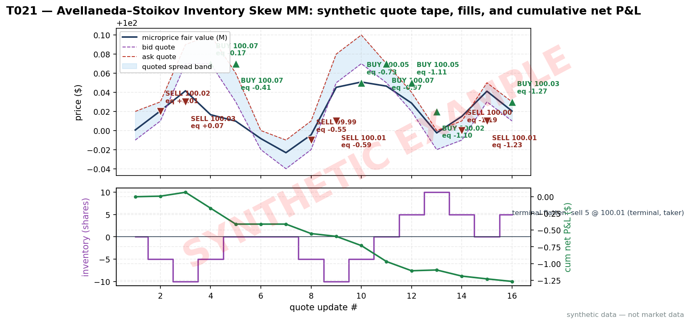
*Caption: T021 worked example (synthetic, seed 121). The "SYNTHETIC EXAMPLE" watermark is burned into the chart; all numbers match the T4 table.*

**V2-T Mermaid** — per-update granularity data flow:

```mermaid
flowchart TD
    DATA["Market data\nL1 MBP-1 + trades (per update)"] --> SIGS["Signals\nS089 A-S skew · S004 microprice · S001 OFI"]
    SIGS --> ENTRY{"Entry logic\nquote r±δ* around microprice;\nOFI z veto; causal t→t+1"}
    ENTRY -->|quoting| SIZE["Sizing + risk\nfixed lot; skew sizes inventory;\nQmax cap; daily stop; kill switch"]
    ENTRY -->|veto / halt| WAIT["Wait / pulled"]
    SIZE --> EXEC["Execution\nmaker-only limits;\ncancel/replace ≥1 tick;\nqueue honesty: MBO/ITCH"]
    EXEC --> MON["Monitor + exits\nfills; OFI veto;\nterminal flatten 15:50"]
    MON --> PNL["P&L (net of rebates/fees)"]
    style ENTRY fill:#f9e79f,stroke:#7d6608
    style PNL fill:#a9dfbf,stroke:#1e8449
```

### T10. Sources

1. Avellaneda, M. & Stoikov, S. (2008). "High-frequency trading in a limit order book." *Quantitative Finance* 8(3): 217–224. https://doi.org/10.1080/14697680701381228 (reservation price, optimal spread, fill-intensity framework).
2. Cont, R., Kukanov, A. & Stoikov, S. (2014). "The Price Impact of Order Book Events." *Journal of Financial Econometrics* 12(1): 47–88. arXiv:1011.6402 — https://arxiv.org/abs/1011.6402 (OFI definition behind the S001 veto).
3. Stoikov, S. (2018). "The micro-price: a high-frequency estimator of future prices." *Quantitative Finance* 18(12): 1959–1966. https://econpapers.repec.org/article/tafquantf/v_3a18_3ay_3a2018_3ai_3a12_3ap_3a1959-1966.htm (S004 fair-value anchor).
4. Gould, M. D. & Bonart, J. (2016). "Queue Imbalance as a One-Tick-Ahead Price Predictor in a Limit Order Book." arXiv:1512.03492 — https://arxiv.org/abs/1512.03492 (why the microprice leans with the queue).
5. Budish, E., Cramton, P. & Shim, J. (2015). "The High-Frequency Trading Arms Race: Frequent Batch Auctions as a Market Design Response." *Quarterly Journal of Economics* 130(4): 1547–1621. https://ideas.Repec.org/a/oup/qjecon/v130y2015i4p1547-1621.html (latency-arbitrage rents: the structural cost of slow quoting).
6. Gašperov, B. & Begušić, S. (2022). "A reinforcement learning approach to improve the performance of the Avellaneda-Stoikov market-making algorithm." *PLOS One*. https://journals.plos.org/plosone/article?id=10.1371/journal.pone.0277042 (Gen-AS calibration + RL variants on 30 days of BTC-USD L2; inventory-control findings).
7. Hummingbot documentation — `avellaneda_market_making` strategy (open-source production wrapper with vol/liquidity estimators). https://hummingbot.org/strategies/v1-strategies/avellaneda-market-making/ (practitioner implementation reference).

**Unverified leads** (Grok's Q-TB3 claims I could not independently verify — do not treat as facts):
- The 2008 paper's γ-sensitivity figures (0.86% / 6.35% / 48.76% mean-profit sacrifice; inventory SD 8.7→2.8 / 9.1→1.9; profit-to-dispersion 1.5–2.1×) — plausible as paper-table values, not re-verified.
- Gen-AS vs RL scorecards ("RL beat Gen-AS on Sharpe 24/30 days, Sortino 25/30") and the "−28.7% annualized, Sharpe −2.63, max DD ~20.6%" vanilla-A–S crypto holdout — chatbot-sourced, not re-verified.
- The 2025 imbalance-maker study ("imbalance strategies −0.49, naive makers −0.43, with-cancel −0.49") and the German RMM study figures (Sharpe ~17.9, 1.76 bps flow cost) — chatbot-sourced, not re-verified.
- Two Grok passages were truncated mid-sentence in the source capture (the A–S failure-regime paragraph and the "Empirics on public-book makers" paragraph) — anything they might have contained is not used.

*Source log: Grok answered Q-TB3-1..3 (2026-09-10); all claims independently verified or labeled unverified.*

---


## Stage 122/200 — T022: Queue-Imbalance Maker with Toxicity Cancel

*Batch TB3 · Strategy 22/100 · Signals S003, S001, S008*

### T1. One-line verdict

| | |
|---|---|
| **Style** | Intraday market making (liquidity provision): single resting limit order at the touch, flipped or canceled as the queue turns |
| **Edge source** | **Queue imbalance** (the top-of-book size skew, S003) predicts the next tick's direction; the maker posts on the thick side and cancels when the queue or recent prints turn toxic |
| **Typical holding period** | Seconds to a few minutes; one position at a time, flat between trades |
| **Capacity hint** | Small — one quote, one name at a time per instance; scales horizontally across names, never vertically in size (size is what gets you adversely selected) |
| **Build-or-buy in one line** | Build the logic (it is ~30 lines), buy the L2/trade data; the toxicity-cancel rules are yours to calibrate, no vendor sells them — see T6 |

### T2. Full mechanics

**Universe & session.** Liquid US large-caps quoting a 1-tick spread most of the day, RTH, *example* window 09:35–15:55 ET. Exclusions (*examples*): spreads > 2 ticks, halts, earnings days, the first/last 5 minutes. The edge needs a stable tick grid — a 5-tick spread means the imbalance signal is drowned in spread noise.

**Entry rule.** On every book update (event *t*), using only data ≤ *t*:

1. Compute queue imbalance (S003): $$I_t = \frac{Q_t^b - Q_t^a}{Q_t^b + Q_t^a}$$ where $Q_t^b, Q_t^a$ are the resting sizes at the best bid and ask. $I_t \in [-1, +1]$: +1 means all displayed size sits on the bid (buyers stacked, price pressure up).
2. **Post** a single resting limit order (maker) when $|I_t| > 0.30$ (*example*): bid at the touch (the best bid price) if $I_t > +0.30$, ask at the touch (the best ask price) if $I_t < -0.30$. The quote sits *with* the thick side — the side the next tick is statistically likeliest to favor (Gould & Bonart 2016: imbalance predicts the one-tick-ahead mid move).
3. **Causal timing:** a quote posted at *t* can be filled no earlier than *t+1*; the imbalance read must be the current print's book state, not a smoothed lagging average.

**Cancel rules (the strategy's actual edge).** A resting maker order is a standing offer to be adversely selected; the cancels are the risk system:
- **Flip-cancel:** if the imbalance flips against the resting side with $|I_t| > 0.20$ (*example*) adverse, cancel immediately. A bid resting into a book that just went ask-heavy is about to be sold into a falling tape.
- **Toxicity cancel:** track the last 4 trade prints (a **print** is an executed trade report; signs from the Lee–Ready tick rule on SIP, or exchange aggressor flags on direct feeds). If ≥ 80% (*example*: 4-print toxicity fraction ≥ 0.80) of recent prints are adverse to the resting side (sells hitting your bid, buys lifting into your ask), cancel — informed flow is walking into you.
- **Regime gate (S008):** compute VPIN (Volume-Synchronized Probability of Informed Trading), $\mathrm{VPIN}_t = \sum OI_\tau / (nV)$ — the fraction of volume that is one-sided across the last $n$ volume buckets (*example* $n=50$). If VPIN > 0.35 (*example*), post no new quotes and cancel resting ones: the tape is toxic, stand down.

**Exit rule.** Exits are: (a) the fill itself — one 100-share position (*example*), then the exit is a resting limit order on the opposite side at/near the touch (maker, earning the rebate twice); (b) **max hold** 5 minutes (*example*) then flatten at the touch; (c) **stop** −2 ticks from entry (*example*); (d) session-end flatten 15:50 ET. The worked example uses the resting-exit variant: buy filled, then a resting ask, filled — a pure maker round trip.

**Position sizing.** Fixed 100 shares per trade (*example*), one position max, inventory cap ±2 lots (±200 shares, *example*) as a hard abort: if somehow filled twice on the same side, flatten immediately. Never scale up to "improve" a fill — size is the adverse-selection surface.

**Risk limits.** Daily loss stop −0.20% of capital (*example*). Per-trade stop −2 ticks. **Kill switch:** feed stale > 500 ms (*example*) or a trade-through (a print outside the quoted spread, signaling a broken book view) → cancel all, flatten, manual re-arm.

**Cost model.** Maker rebate +$0.0020/share (*example*) — the example earns two rebates ($0.40 on 200 shares). No taker fees in the resting-exit path; max-hold/session-end flattens pay half-spread + $0.0030/share taker fee (*example*). Spread capture per round trip ≈ 4 ticks in the worked example ($0.04 on a $100 name).

**Order/execution sketch.** Maker-only single limit order, cancel/replace on any threshold cross. Never re-post into a just-canceled level for 5 seconds (*example* cooldown — the toxicity that canceled you is usually still there). Participation: our 100 shares ≤ 10% of the touch size (*example*); if the touch is thinner, reduce size or skip. Fill honesty on L1: `simulated only — requires MBO/ITCH` — the sim assumes a touch fills you; reality depends on queue position.

### T3. Signals it consumes

| Signal | Role | Logic |
|---|---|---|
| S003 — Queue imbalance | **Primary trigger** | $I_t$ sign and magnitude decide post/hold/cancel; the quote always leans with the thick side |
| S001 — Order-flow imbalance / print toxicity | **Veto / cancel** | 4-print adverse fraction ≥ 0.80 (*example*) cancels the resting order — informed prints walking into the quote |
| S008 — VPIN | **Regime gate** | VPIN > 0.35 (*example*) blocks all new quotes; toxicity regime, not a per-trade signal |

Combination logic (pseudocode, ≤25 lines):

```
on book/trade update at event t (all inputs <= t):
    I = (Qb - Qa) / (Qb + Qa)                       # S003
    tox = adverse_fraction(last 4 prints, side)     # S001-flavored veto
    vpin = sum(order_imbalance) / (n * V)           # S008 regime
    if feed_stale(500ms) or trade_through:          # kill switch
        cancel_all(); flatten(); halt()
    if vpin > 0.35: cancel_all(); return            # regime gate
    if resting:
        if adverse |I| > 0.20 or tox >= 0.80: cancel(); cooldown(5s)
        elif fill: q += side*100; post opposite-side exit at touch
    else:
        if cooldown_over and |I| > 0.30:
            post bid @ touch if I > 0 else ask @ touch
    # position exits: max_hold 5min / stop -2 ticks / 15:50 flatten
```
### T4. Worked example — numbers + P&L (SYNTHETIC)

Synthetic large-cap XYZ, $100 price scale, 12 book updates. **Seed: 122** (`np.random.default_rng(122)` in `batches/TB3/plot_T022.py`; the chart plots exactly these numbers). All parameters are *examples*: post at $|I|>0.30$, flip-cancel at adverse $|I|>0.20$, 4-print toxicity threshold 0.80, VPIN regime cap 0.35, 100 shares, ±2-lot inventory cap, maker rebate $0.0020$/share. Fills assumed on mid touch of the quote — `simulated only — requires MBO/ITCH`. Prints: `+` = buy print, `−` = sell print. Tox = fraction of last 4 prints adverse to the resting side.

| # | mid | Qb, Qa | I | action | resting | prints | Tox | VPIN | q | cash cum |
|---|---|---|---|---|---|---|---|---|---|---|
| 1 | 99.995 | 800, 400 | +0.33 | POST bid @ 99.98 | bid | + + + − | 0.50 | 0.18 | +0 | +0.00 |
| 2 | 99.999 | 900, 350 | +0.44 | hold bid @ 99.98 | bid | + + + + | 1.00 | 0.20 | +0 | +0.00 |
| 3 | 100.010 | 750, 500 | +0.20 | hold bid @ 99.98 | bid | + + − + | 0.50 | 0.22 | +0 | +0.00 |
| 4 | 100.013 | 400, 700 | −0.27 | CANCEL bid (toxicity trigger) | stay out | − − − + | 0.50 | 0.25 | +0 | +0.00 |
| 5 | 99.997 | 300, 900 | −0.50 | POST ask @ 100.01 | ask | − − − − | 1.00 | 0.28 | +0 | +0.00 |
| 6 | 99.990 | 350, 800 | −0.39 | hold ask @ 100.01 | ask | − − − + | 0.50 | 0.26 | +0 | +0.00 |
| 7 | 99.989 | 600, 550 | +0.04 | hold ask @ 100.01 | ask | − + + + | 0.50 | 0.22 | +0 | +0.00 |
| 8 | 99.999 | 850, 400 | +0.36 | CANCEL ask (toxicity trigger); POST bid @ 99.99 | bid | + + + + | 1.00 | 0.24 | +0 | +0.00 |
| 9 | 100.018 | 900, 300 | +0.50 | hold bid @ 99.99 | bid | + + + + | 1.00 | 0.20 | +0 | +0.00 |
| 10 | 100.021 | 950, 280 | +0.54 | hold bid @ 99.99 → FILL: buy 100 @ 99.99 (maker, +$0.20 rebate) | flat | − + + − | 0.00 | 0.18 | +100 | −9998.80 |
| 11 | 100.021 | 900, 320 | +0.48 | POST ask (exit) @ 100.03 | ask (exit) | + + + − | 0.50 | 0.19 | +100 | −9998.80 |
| 12 | 100.031 | 850, 350 | +0.42 | hold ask (exit) @ 100.03 → FILL: sell 100 @ 100.03 (maker, +$0.20 rebate) | flat | + + − − | 0.00 | 0.20 | +0 | **+4.40** |

Line-by-line P&L walk (rebates included in cash):

- **Step 1 (the post):** $I=+0.33 > 0.30$ → bid @ 99.98, one tick under the 99.99 mid. Thick-side posting: 800 vs 400 at the touch.
- **Steps 2–3 (the hold):** imbalance stays bid-side; the quote rests. Note step 2: Tox hits 1.00 (four straight buy prints) — but prints *with* the resting bid are not adverse, so no cancel. The toxicity rule is directional, not absolute.
- **Step 4 (cancel #1 — the save):** the book flips to $I=-0.27$ (400 vs 700). Adverse $|I| > 0.20$ → cancel the bid. The mid then falls 99.997 → 99.990 over steps 5–6: had the bid rested at 99.98 it would have been filled ~1.4 ticks above the falling mid — the classic adverse fill, avoided.
- **Step 5 (the flip):** $I=-0.50$ → post ask @ 100.01. The strategy is side-agnostic; it follows the thick side.
- **Steps 6–7 (patience):** imbalance fades to +0.04 — below the post threshold but the resting ask stays (the cancel needs *adverse* 0.20, not neutrality; churning cancels on noise is its own cost).
- **Step 8 (cancel #2 + re-post):** book flips hard to $I=+0.36$ with Tox = 1.00 (four straight buys into the resting ask) → cancel the ask, immediately post bid @ 99.99 ($|I|>0.30$). The ask would have been lifted into a rising tape (mid 99.999 → 100.018): cancel #2 avoided a short fill 2+ ticks underwater.
- **Step 10 (the fill):** buy 100 @ 99.99 with the mid at 100.021 — filled 3.1 ticks *below* the mid as the tape rose through the quote. Cash −$9,998.80 = −(100 × 99.99) + $0.20 rebate. This is the favorable fill the strategy is built to harvest: the thick side held and the price drifted up through the resting bid.
- **Steps 11–12 (the maker exit):** post ask @ 100.03, filled as the mid reaches 100.031. Cash +$10,003.20 = +(100 × 100.03) + $0.20 rebate. **Gross spread capture: (100.03 − 99.99) × 100 = $4.00; two rebates $0.40; final net P&L: +$4.40.**

**Where the example is optimistic.** (1) Fills on any mid touch — no queue position, no partials; a 100-share quote at a 900-share touch is realistically mid-queue, filled only if the level trades through. (2) Cancels are instantaneous; in reality the step-4/step-8 fills can arrive *before* the cancel is processed — the cancel/fill race is the strategy's true risk and is not modeled. (3) The tape gifts the best possible outcome: the entry fill at the local low and the exit at the local high, with the mid drifting favorably both times. (4) Prints and toxicity series are scripted; real print-sign classification (Lee–Ready on SIP) mislabels a meaningful share of prints. (5) VPIN never approaches the 0.35 cap in this tape — the regime gate is untested here.

### T5. Data & infra — what must run

**Feed inventory.** Minimum honest stack: L1 top-of-book with sizes (MBP-1) + trade prints with side — imbalance needs only $Q^b, Q^a$ at the touch, toxicity needs prints, VPIN needs volume buckets (bulk classification needs no per-trade signs). MBO history for a few names to calibrate queue position and the cancel/fill race. Named options: Databento MBP-10 + trades (Tier 2); Polygon/Apaca SIP L1 + trades (Tier 1, research fills only); LOBSTER academic (limit-order-book reconstructions with queue detail — ideal for calibrating the fill model offline). Corporate-action/halt calendars as in T021.

**Pipeline schedule.** Pre-open: calibrate post/cancel thresholds per symbol on recent L2 (the 0.30/0.20/0.80 are *examples*, not constants — spreads and depth vary by name); estimate VPIN bucket size $V$ (typical: 1/50 of average daily volume, *example*). Intraday: event-driven single-order state machine (trivial compute — a Python loop at 100–500k events/sec per cost-model §2 handles dozens of names; the cost is data, not CPU). Post-close: markout report at +1 s / +5 s / +30 s per fill and per *cancel* (did the cancel avoid an adverse fill? measure it or the rule is superstition).

**Storage.** L1 + trades ≈ 2–8 GB/symbol-day (cost-model §4); MBP-10 ≈ 10–50k events/sec busy per name. Research universe of 20 names × 60 days ≈ 2.4–9.6 TB cold — same posture as T021, lighter because depth beyond the touch is optional.

**M5 Max feasibility.** Research and simulation: **feasible, Tier M (40–100 h → $6,000–$15,000 loaded-cost estimate at $150/hr)** per cost-model §5 — the state machine is an afternoon; the work is threshold calibration across names and the MBO fill/cancel-race model. RAM trivial (< 1 GB live for 20 names). **Live single-quote making from this machine: marginal** — the strategy lives or dies on cancel latency, and 30–150 ms vs colocated µs means the cancel/fill race is structurally lost on the most toxic prints (the ones that matter). Paper-trade it here; don't point it at a live venue.

**Feed-outage safe mode.** Feed gap > 500 ms (*example*) or any trade-through: cancel the resting order, flatten at the touch, block re-posting until 5 s of healthy feed (*example*), manual re-arm after any kill-switch trip. A resting quote through a stale book is the same free option as in T021.

### T6. Buy vs build

| Option | What you get | Indicative price | What buying gains | What buying loses |
|---|---|---|---|---|
| Tier-0: Alpaca IEX / Stooq delayed L1 + trades | Free top-of-book + prints | ~$0 | Learn imbalance/cancel mechanics for free | No honest fills; research-only |
| Tier-1: Polygon / Alpaca SIP L1 + trades | Real-time sizes and prints | ~$30–200/mo, indicative — verify before budgeting | Live $I_t$ and toxicity for the state machine | Queue position still `simulated only` |
| Tier-2: Databento (MBP-10 + trades, MBO history) | Full depth, matching-engine timestamps | ~$200/mo + usage, indicative — verify before budgeting | Calibrate the cancel/fill race honestly | Usage meter on history pulls |
| Academic: LOBSTER | Reconstructed LOB with queue detail | Hundreds/year academic, indicative — verify before budgeting | Best offline calibration data for fill modeling | Academic license; not a live feed |
| Professional: colo + direct feeds | µs cancel path | Rack ~$1.5k–5k+/mo + data licenses, indicative — verify before budgeting | Win the cancel/fill race that defines the strategy | Institutional undertaking |

**Verdict: buy the data, build the ~30-line state machine.** The logic is not the moat — the calibrated thresholds and the measured cancel/fill-race statistics are, and both come from your data, not a vendor's. LOBSTER is the highest-value research purchase: calibrate fills offline before spending a dollar on live data. Never buy a "queue imbalance bot" — its thresholds were tuned on someone else's venue, latency, and fee schedule.

### T7. Success-ratio evidence

| Study / source | Market & period | Metric | Before/after cost | Caveat |
|---|---|---|---|---|
| Gould & Bonart (2016), arXiv:1512.03492 | LOB one-tick-ahead prediction | Queue imbalance predicts the direction of the next mid-price move; the imbalance-conditioned predictor beats the last-price baseline | Before-cost (signal study) | Direction, not profit — no fills, no fees, no cancel race |
| Cont, Kukanov & Stoikov (2014), *J. Financial Econometrics* 12(1) | 50 US stocks, 2008 | OFI explains short-horizon mid-price moves; a linear OFI model captures most of the predictable component | Before-cost (regression) | Price impact ≠ maker P&L; the paper measures the tape, not the quoter |
| Easley, López de Prado & O'Hara (2011–12), VPIN working paper | Futures/equities toxicity | VPIN spikes precede liquidity-induced volatility; volume-clock toxicity is measurable without trade classification | Before-cost (metric) | Predictive value for crashes is debated — see next row |
| Andersen & Bondarenko (2014), *J. Financial Markets* 17 | Critique of VPIN | VPIN's predictive power attenuates under alternative specifications; metric ≠ tradeable signal | n/a (critique) | This is why T022 uses VPIN as a *regime gate*, not an entry trigger |
| Budish, Cramton & Shim (2015), *QJE* 130(4) | US equities, ms data | Latency-arbitrage rents embedded in continuous-book design | n/a (market design) | The structural reason cancels lose the race from 30+ ms away |

**After-cost honesty.** The verified literature supports the *signal* (imbalance → next-tick direction; OFI → short-horizon moves) and documents the *tax* (latency arbitrage, toxicity). What it does not support is a maker P&L number for a retail-latency imbalance quoter — every P&L figure in Grok's answer (the "imbalance strategies −0.49 / naive makers −0.43" study, the 70–85% classification rates, the 30–150 ms latency bands) is an **unverified lead**, not a sourced fact. The honest empirical prior: the signal is real, the fills are the whole game, and the fills are exactly what a backtest on L1 cannot show you.

**Capacity & decay.** Capacity is one quote per name per instance — horizontal scaling across names, each instance's edge independent of the others. Decay risk is competition: as more makers condition on the same public imbalance, the thick side gets crowded, queue priority shortens the fill window, and the toxicity-cancel becomes table stakes rather than edge. The signal itself (Gould–Bonart) is a book-mechanical regularity, slow to decay; its *monetization* decays with the arms race.

**Honest bottom line.** For a ≤$1M paper operation: build this on the M5 Max as the cleanest possible laboratory for adverse selection — the cancel rules make the toxicity visible trade by trade. Expect paper P&L to be positive only while fills are touch-assumed; re-run with a last-in-queue fill model and a 50 ms cancel delay before believing any number. Never run the live single-quote version from this machine. For an institutional desk: imbalance-conditioned quoting with toxicity cancels is standard plumbing inside larger MM stacks (it rhymes with T021's A–S engine and T085's resiliency maker); the differentiator is the cancel path and queue modeling, not the 0.30 threshold. Related: T021 (A–S inventory skew — continuous two-sided vs this chapter's single-quote flip); T085 (Resiliency MM — fair-value-anchored quoting).

### T8. Failure modes

1. **Imbalance whipsaw.** $I_t$ oscillates around the threshold; the quote flips bid→ask→bid, paying two spreads' worth of adverse fills. *Mitigation:* hysteresis band (post at 0.30, flip-cancel at 0.20 adverse — already in the design); cooldown after cancels.
2. **The cancel/fill race.** The toxic print that should trigger your cancel fills you first — the sim's instantaneous cancel is the most dangerous optimism in the chapter. *Mitigation:* model an explicit cancel latency (≥50 ms *example* stress) in the fill simulator; measure realized "canceled too late" fills.
3. **Print-sign misclassification.** Lee–Ready on SIP mislabels prints; toxicity computed on wrong signs cancels good quotes and keeps bad ones. *Mitigation:* use exchange aggressor flags on direct feeds; haircut the toxicity threshold's value in research.
4. **Spoofed imbalance.** Large size appears on one side and vanishes before trading (illegal, but the tape shows it). The quoter posts into phantom depth. *Mitigation:* require imbalance persistence (2+ consecutive updates, *example*) before posting; size-weighted (not count-weighted) imbalance.
5. **VPIN false calm.** VPIN is backward-looking; a scheduled-news jump arrives with VPIN still low. *Mitigation:* hard news blackout windows; the regime gate is a complement to, not a substitute for, the halt/earnings exclusions.
6. **Spread-regime change.** The 1-tick spread widens to 3+; the imbalance edge is now smaller than the spread cost and the thresholds misfire. *Mitigation:* spread filter (no quotes if spread > 2 ticks, *example*); re-calibrate thresholds per spread regime.
7. **Queue-position fill optimism.** Touch-assumed fills overstate fill rates ~2–5× vs last-in-queue reality. *Mitigation:* MBO/LOBSTER-calibrated queue model; report P&L under both fill assumptions.
8. **Threshold overfitting.** 0.30/0.20/0.80 tuned on one quiet month fail on volatile tapes (whipsaw) or miss real signals (too strict). *Mitigation:* calibrate per symbol on a panel including a stress episode; prefer wider hysteresis over tighter thresholds.

### T9. Visuals

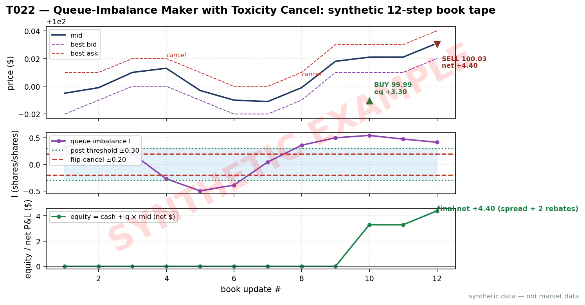
*Caption: T022 worked example (synthetic, seed 122). The "SYNTHETIC EXAMPLE" watermark is burned into the chart; all numbers match the T4 table.*

**V2-T Mermaid** — per-update granularity data flow:

```mermaid
flowchart TD
    DATA["Market data\nL1 sizes (Qb, Qa) + trade prints (per update)"] --> SIGS["Signals\nS003 imbalance · S001 print toxicity · S008 VPIN"]
    SIGS --> ENTRY{"Entry logic\npost at |I|>0.30 on thick side;\ncausal t→t+1"}
    ENTRY -->|posted| RISK["Cancel + risk\nflip-cancel adverse |I|>0.20;\ntox ≥0.80; VPIN>0.35 gate;\nkill switch"]
    RISK -->|cancel| WAIT["Wait / cooldown 5s"]
    RISK -->|hold| EXEC["Execution\nmaker-only single order;\ncancel/fill race: MBO/ITCH"]
    EXEC --> MON["Monitor + exits\nfill → opposite-side exit;\nmax hold 5min; stop −2 ticks"]
    MON --> PNL["P&L (net of rebates/fees)"]
    style ENTRY fill:#f9e79f,stroke:#7d6608
    style RISK fill:#fadbd8,stroke:#922b21
    style PNL fill:#a9dfbf,stroke:#1e8449
```

### T10. Sources

1. Gould, M. D. & Bonart, J. (2016). "Queue Imbalance as a One-Tick-Ahead Price Predictor in a Limit Order Book." arXiv:1512.03492 — https://arxiv.org/abs/1512.03492 (S003's predictive basis: imbalance → next-tick mid direction).
2. Cont, R., Kukanov, A. & Stoikov, S. (2014). "The Price Impact of Order Book Events." *J. Financial Econometrics* 12(1): 47–88. arXiv:1011.6402 — https://arxiv.org/abs/1011.6402 (OFI: the print/book-flow framework behind the toxicity veto).
3. Easley, D., López de Prado, M. & O'Hara, M. (2011–12). "Flow Toxicity and Liquidity in a High Frequency World." Working paper — http://www.stern.nyu.edu/sites/default/files/assets/documents/con_035928.pdf (VPIN definition behind the S008 regime gate).
4. Andersen, T. G. & Bondarenko, O. (2014). "VPIN and the Flash Crash." *J. Financial Markets* 17: 1–46. https://ideas.repec.Org/a/eee/finmar/v17y2014icp1-46.html (the critique that keeps VPIN a gate, not a trigger).
5. Budish, E., Cramton, P. & Shim, J. (2015). "The High-Frequency Trading Arms Race." *QJE* 130(4): 1547–1621. https://ideas.Repec.org/a/oup/qjecon/v130y2015i4p1547-1621.html (why the cancel/fill race is structural).
6. Stoikov, S. (2018). "The micro-price: a high-frequency estimator of future prices." *Quant. Finance* 18(12): 1959–1966. https://econpapers.repec.org/article/tafquantf/v_3a18_3ay_3a2018_3ai_3a12_3ap_3a1959-1966.htm (fair-value context for thick-side quoting).

**Unverified leads** (Grok's Q-TB3 claims I could not independently verify — do not treat as facts):
- Imbalance classification accuracy "70–85%" and the 30–150 ms latency bands — chatbot-sourced ranges, not re-verified.
- The 2025 imbalance-maker study figures ("imbalance strategies −0.49, naive makers −0.43, with-cancel −0.49") — study not located; treat as unverified.
- The German retail-MM study figures (Sharpe ~17.9, flow cost 1.76 bps) — chatbot-sourced, not re-verified.
- Any claim that a specific cancel threshold (0.30/0.20/0.80) is "optimal" in published literature — thresholds here are *examples* calibrated to nothing.

*Source log: Grok answered Q-TB3-1..3 (2026-09-10); all claims independently verified or labeled unverified.*

---


## Stage 123/200 — T023: Hawkes Burst Scalper

*Batch TB3 · Strategy 23/100 · Signals S017, S081, S018*

### T1. One-line verdict

| | |
|---|---|
| **Style** | Intraday directional scalping: taker (marketable) entries into order-flow bursts, flat minutes later |
| **Edge source** | **Self-excitation** — trades cluster (S017 Hawkes intensity); when buy-side intensity bursts far above sell-side (S081), the next few ticks drift with the burst before it decays |
| **Typical holding period** | Ticks to ~1 minute; max hold 6 ticks in the worked example (*example*) |
| **Capacity hint** | Small — 100-share lots (*example*); the burst is a microstructure phenomenon that does not survive size |
| **Build-or-buy in one line** | Build it (the recursion is five lines); buy only SIP trade data — the calibration of the burst threshold is the entire job — see T6 |

### T2. Full mechanics

**Universe & session.** Liquid US large-caps and equity-index futures, RTH, *example* window 09:35–15:55 ET. Exclusions (*examples*): scheduled-news windows (±2 min around prints), halts, spreads > 2 ticks, the open's first 5 minutes (the intensity estimator needs a burn-in). The strategy trades *bursts*, and news jumps look exactly like bursts while being untradeable (see T8).

**Entry rule.** On every trade print (event time, tick *t*), using only data ≤ *t*:

1. Update the Hawkes excitation states (S017) with the discrete recursion $$\kappa_{t+1} = d\,(\kappa_t + \alpha x_t), \qquad \lambda_t = \mu + \kappa_t$$ computed separately for buy prints ($\lambda^+_t$) and sell prints ($\lambda^-_t$): $d = e^{-\beta\Delta t}$ is the per-tick decay (*example* $\beta = 2.0$, $\Delta t = 0.1$ s), $\alpha$ the excitation jump per print (*example* $\alpha = 0.6$), $\mu$ the baseline intensity (*example* $\mu = 0.8$ prints/tick), $x_t \in \{0,1\}$ the event indicator. **Self-excitation** means each print raises the instantaneous arrival rate of same-side prints for a while — the mathematical form of "trades cluster." The **branching ratio** $\alpha/\beta$ (*example* 0.30) is the expected number of child prints each print spawns; below 1 the burst dies out.
2. Compute total intensity $\lambda^{tot}_t = \lambda^+_t + \lambda^-_t$ and the signed direction (S081). S081's canonical output is the z-scored intensity difference $d_t = \lambda^b_t - \lambda^s_t$; this chapter uses the bounded public normalization $$\psi_t = \frac{\lambda^+_t - \lambda^-_t}{\lambda^+_t + \lambda^-_t} \in [-1,+1]$$ as an explicit reconstruction (labeled as such, not silently substituted): $\psi = +1$ means all excitation is buy-side.
3. **Persistence condition** (S018): compute lag-1 sign autocorrelation $C(1) = \mathbb{E}[\varepsilon_t \varepsilon_{t+1}]$ over the last 20 prints (*example*), $\varepsilon_t \in \{+1,-1\}$. Require $C(1) > 0$ (*example*) — trade only bursts whose flow shows persistence, not sign-flipping noise. (The empirical law $C(\tau) \sim \tau^{-\gamma}$, $\gamma \approx 0.5$–0.6, is long memory: flow stays predictable far longer than price does.)
4. **Enter** (taker — a marketable limit order that crosses the spread) when $\lambda^{tot}_t \ge 3.0$ (*example* burst threshold) AND $|\psi_t| > 0.40$ (*example*) AND $C(1) > 0$: long if $\psi_t > 0$, short if $\psi_t < 0$. **Causal timing:** the signal at tick *t* is filled at tick *t+1*'s touch (the best ask when buying, the best bid when selling) — you pay the half-spread because the burst is already moving the quote.

**Exit rule.** First of: **lambda fade** ($\lambda^{tot}_t < 2.2$, *example* — the burst died); **psi flip** ($\psi_t \times \text{pos} < 0$ — excitation turned against you); **max hold** 6 ticks (*example*); **stop** −$0.03/share (*example*); **target** +$0.03/share (*example*). All exits are taker (cross the spread). Session-end flatten 15:50 ET.

**Position sizing.** Fixed 100 shares (*example*), one position at a time, flat between bursts. No scaling — a burst that can absorb 100 shares cannot absorb 1,000; size kills the edge before the stop does.

**Risk limits.** Daily loss stop −0.20% of capital (*example*). Max 3 losing bursts in a row → stand down 30 min (*example*; burst regimes cluster, and so do false ones). **Kill switch:** feed gap > 500 ms (*example*) → flatten at the touch, no new entries until 5 s of healthy prints.

**Cost model.** Taker fee $0.0030/share each side (*example*: $0.60 per 100-share round trip). Spread cost: taking the touch pays the half-spread on entry *and* exit — with a 2-tick ($0.02) spread that's $2.00 per round trip, the dominant cost. The worked example's mid had to drift 2.5 ticks in its favor just to show a gross profit.

**Order/execution sketch.** Marketable limit orders (limit at touch + 2 ticks, *example*, so a sudden quote flicker doesn't leave you unfilled-or-worse). No resting orders — resting into a burst is volunteering for adverse selection (being filled precisely because the price is moving against you). Participation: skip if the touch size < 2× our order (*example*); a 100-share take into a 50-share touch walks the book.

### T3. Signals it consumes

| Signal | Role | Logic |
|---|---|---|
| S017 — Hawkes intensity | **Primary trigger** | $\lambda^{tot}_t \ge 3.0$ (*example*): a burst of self-exciting flow is underway |
| S081 — Signed intensity difference | **Direction** | $\|\psi_t\| > 0.40$ (*example*) signs the burst; $\psi$ is the bounded public normalization of S081's z-scored $d_t$ (explicit reconstruction) |
| S018 — Order-sign autocorrelation | **Condition / veto** | $C(1) > 0$ required: only persistent flow; long memory ($C(\tau)\sim\tau^{-\gamma}$) explains why intensity can stay high while direction fades |

Combination logic (pseudocode, ≤25 lines):

```
on trade print at tick t (all inputs <= t):
    for side in {buy, sell}:                    # S017
        k[side] = D * (k[side] + ALPHA * x_t[side])
        lam[side] = MU + k[side]
    lam_tot = lam[buy] + lam[sell]
    psi = (lam[buy] - lam[sell]) / lam_tot       # S081 (bounded normalization)
    c1 = sign_autocorr(last 20 prints, lag=1)   # S018
    if feed_gap(500ms): flatten(); halt()
    if flat and lam_tot >= 3.0 and abs(psi) > 0.40 and c1 > 0:
        enter taker LONG if psi>0 else SHORT, 100 sh @ next touch
    elif in_position:  # evaluated at t+1 earliest
        if lam_tot < 2.2 or psi*pos < 0 or hold >= 6 \
           or pnl <= -0.03/sh or pnl >= +0.03/sh:
            exit taker @ touch
```
### T4. Worked example — numbers + P&L (SYNTHETIC)

Synthetic large-cap XYZ, $100 price scale, 22 ticks. **Seed: 123** (`np.random.default_rng(123)` in `batches/TB3/plot_T023.py`; the chart plots exactly these numbers). All parameters are *examples*: $\mu=0.8$, $\alpha=0.6$, $\beta=2.0$, $\Delta t=0.1$ (branching ratio 0.30); burst threshold $\lambda^{tot}\ge3.0$; $|\psi|>0.40$; max hold 6 ticks; stop/target $\pm\$0.03$/share; 100 shares; taker fee $0.0030$/share. Entry takes the touch (pays half-spread); prices are tick-rounded so cash matches display. Print signs are exchange-style (given); in production on SIP they would be Lee–Ready classified.

| tick | sign | mid | λ⁺ | λ⁻ | λ_tot | ψ | action | pos | cash cum |
|---|---|---|---|---|---|---|---|---|---|
| 1 | + | 100.000 | 1.29 | 0.80 | 2.09 | +0.23 | wait | +0 | +0.000 |
| 2 | + | 100.006 | 1.69 | 0.80 | 2.49 | +0.36 | wait | +0 | +0.000 |
| 3 | + | 100.015 | 2.02 | 0.80 | 2.82 | +0.43 | wait ($\lambda^{tot}<3.0$) | +0 | +0.000 |
| 4 | + | 100.030 | 2.29 | 0.80 | 3.09 | +0.48 | ENTER LONG @ 100.040 (taker, fee $0.30) | +1 | −10004.300 |
| 5 | + | 100.040 | 2.51 | 0.80 | 3.31 | +0.52 | wait | +1 | −10004.300 |
| 6 | + | 100.054 | 2.69 | 0.80 | 3.49 | +0.54 | wait | +1 | −10004.300 |
| 7 | − | 100.046 | 2.35 | 1.29 | 3.64 | +0.29 | wait | +1 | −10004.300 |
| 8 | + | 100.054 | 2.56 | 1.20 | 3.76 | +0.36 | wait | +1 | −10004.300 |
| 9 | + | 100.066 | 2.73 | 1.13 | 3.86 | +0.42 | wait | +1 | −10004.300 |
| 10 | − | 100.055 | 2.38 | 1.56 | 3.94 | +0.21 | EXIT @ 100.045 (max hold; taker, fee $0.30) | +0 | −0.100 |
| 11 | − | 100.044 | 2.10 | 1.91 | 4.01 | +0.05 | wait | +0 | −0.100 |
| 12 | − | 100.034 | 1.86 | 2.20 | 4.06 | −0.08 | wait | +0 | −0.100 |
| 13 | − | 100.018 | 1.67 | 2.44 | 4.11 | −0.19 | wait | +0 | −0.100 |
| 14 | + | 100.033 | 2.00 | 2.14 | 4.15 | −0.03 | wait | +0 | −0.100 |
| 15 | + | 100.040 | 2.28 | 1.90 | 4.18 | +0.09 | wait | +0 | −0.100 |
| 16 | + | 100.054 | 2.50 | 1.70 | 4.20 | +0.19 | wait | +0 | −0.100 |
| 17 | − | 100.044 | 2.19 | 2.03 | 4.22 | +0.04 | wait | +0 | −0.100 |
| 18 | − | 100.041 | 1.94 | 2.30 | 4.24 | −0.08 | wait | +0 | −0.100 |
| 19 | − | 100.028 | 1.73 | 2.52 | 4.25 | −0.18 | wait | +0 | −0.100 |
| 20 | + | 100.037 | 2.05 | 2.21 | 4.26 | −0.04 | wait | +0 | −0.100 |
| 21 | − | 100.028 | 1.83 | 2.44 | 4.27 | −0.14 | wait | +0 | −0.100 |
| 22 | − | 100.009 | 1.64 | 2.64 | 4.28 | −0.23 | wait | +0 | −0.100 |

Line-by-line P&L walk:

- **Ticks 1–3 (the build):** four straight buy prints excite $\lambda^+$ 1.29 → 2.29 while $\lambda^-$ sits at baseline 0.80. $\psi$ climbs +0.23 → +0.43 but $\lambda^{tot} = 2.82 < 3.0$ at tick 3 — no trade. The threshold does its job: near-bursts don't trigger.
- **Tick 4 (entry):** $\lambda^{tot} = 3.09 \ge 3.0$, $\psi = +0.48 > 0.40$ → ENTER LONG 100 @ 100.040 (the ask at mid 100.030; half-spread paid). Cash −$10,004.30 = −(100 × 100.040) − $0.30 fee.
- **Ticks 5–9 (the ride):** the burst persists — $\lambda^{tot}$ rises to 3.86, mid touches 100.066. But watch $\psi$: a sell print at tick 7 excites $\lambda^-$ to 1.29 and $\psi$ sags to +0.29, recovering only to +0.42. The *direction* is already decaying while *intensity* grows — the S018 long-memory signature: flow stays predictable, price drift doesn't.
- **Tick 10 (exit):** hold reaches 6 ticks → EXIT @ 100.045 (the bid at mid 100.055). Cash +$10,004.20 = +(100 × 100.045) − $0.30. **Gross: (100.045 − 100.040) × 100 = +$0.50; fees $0.60; final net P&L: −$0.10.**
- **Ticks 11–22 (the fade):** $\lambda^{tot}$ keeps climbing to 4.28 (the burst never dies in this tape) while $\psi$ goes negative — sell excitation takes over and the mid falls to 100.009. Had the max-hold not fired, the psi-flip rule ($\psi \times \text{pos} < 0$) would have exited around tick 12–13 into a falling tape. The exit rules, not the entry, are what kept this a −$0.10 scratch instead of a −$3 loss.

**Where the example is optimistic.** (1) The fill is modeled at the detecting tick's touch; live, the signal at *t* fills at *t+1*'s touch — one tick of slippage against you in a burst, which is exactly when the touch moves fastest. (2) Print signs are given; SIP Lee–Ready classification mislabels a meaningful share, and a flipped sign flips $\psi$. (3) One clean burst, no competing bursts, no news jump — real tapes stack bursts and the estimator can't tell a toxic jump from a tradeable cluster in real time. (4) The max-hold exit happened to fire near the local high; a tick-11 exit would have been worse. (5) No partial fills, no book-walking on the 100-share take — queue-level fill impact is simulated only — requires MBO/ITCH for honest modeling.

### T5. Data & infra — what must run

**Feed inventory.** Minimum honest stack: trade prints with timestamps + L1 quotes (SIP/TAQ is sufficient — Hawkes needs event times and signs, not depth). Print signs: exchange aggressor flags on direct feeds, Lee–Ready tick rule on SIP (budget a misclassification haircut). MBO is *not* needed for the signal; it helps only if you want to model how your 100-share take walks a thin touch. Corporate-action/halt calendars as in T021.

**Pipeline schedule.** Pre-open: fit ($\mu$, $\alpha$, $\beta$) per symbol on recent print data (MLE on the last 5–20 sessions, *example*); set the burst threshold from the fitted stationary intensity (threshold as a multiple of baseline, not a magic 3.0). Intraday: the recursion is O(1) per print — a Python loop handles 100–500k events/sec (cost-model §2); a full US tape of prints is ~10–200/sec per busy name (cost-model §2), so hundreds of names fit on one box. Post-close: burst report — every burst's $\psi$ path and the mid drift over the next 30 s, to check the entry rule isn't just buying tops.

**Storage.** Prints + L1 ≈ 2–8 GB/symbol-day (cost-model §4); fitted parameters are kilobytes. This is the lightest strategy in the batch to research — no depth history required.

**M5 Max feasibility.** Research and simulation: **feasible, Tier M (40–100 h → $6,000–$15,000 loaded-cost estimate at $150/hr)** per cost-model §5 — the recursion is an afternoon; the work is per-symbol MLE fits, threshold calibration, and the sign-classification haircut study. RAM trivial. **Live scalping from this machine: not recommended** — the edge is a 1–3 tick drift over seconds; 30–150 ms of latency eats the entry slippage and the exit discipline, which is the entire trade (see T8).

**Feed-outage safe mode.** Any print gap > 500 ms (*example*): the intensity estimates are now wrong (missing excitation), so flatten at the touch, block entries until the estimator has re-burned-in over 60 s of prints (*example*), manual re-arm after any kill-switch trip. Never trade a burst detected across a data gap.

### T6. Buy vs build

| Option | What you get | Indicative price | What buying gains | What buying loses |
|---|---|---|---|---|
| Tier-0: Alpaca IEX / Stooq delayed prints | Free trade data | ~$0 | Learn the recursion and $\psi$ dynamics free | Delayed/stale prints; research-only |
| Tier-1: Polygon / Alpaca SIP trades+quotes | Real-time prints, NBBO | ~$30–200/mo, indicative — verify before budgeting | Everything the signal needs; cheapest live input in the batch | Lee–Ready signs, no aggressor flags |
| Tier-2: Databento trades (matching-engine timestamps) | Microsecond-stamped prints | ~$200/mo + usage, indicative — verify before budgeting | Honest event-time Hawkes fits; better burst timing | Overkill until Tier-1 shows edge |
| Professional: colo + direct feeds | µs print-to-fill | Rack ~$1.5k–5k+/mo + data licenses, indicative — verify before budgeting | Entry slippage minimized — the whole game for a scalper | Institutional undertaking |

**Verdict: build the recursion, buy Tier-1 data, calibrate per symbol.** This is the rare strategy where the data bill is the small line item and the calibration is everything: the burst threshold, the $\psi$ cutoff, and the stop/target must be fit per name, and nobody's defaults transfer. Do not buy a "Hawkes scalper" product — its fitted parameters describe someone else's symbols in someone else's regime.

### T7. Success-ratio evidence

| Study / source | Market & period | Metric | Before/after cost | Caveat |
|---|---|---|---|---|
| Bacry, Mastromatteo & Muzy (2015), arXiv:1502.04592 | Survey: Hawkes in finance | Self- and cross-excitation describe trade arrivals, quote changes, and price moves across venues; the framework is the standard microstructure point-process model | n/a (survey) | Documents the model class, not a trading P&L |
| Rambaldi, Filimonov & Lillo (2018), *Phys. Rev. E* 97 | Intensity bursts in financial time series | Formalizes "bursts" as distinct regimes in Hawkes intensity; burst detection separates clustered from baseline flow | Before-cost (detection study) | Detection ≠ profitability; no execution costs modeled |
| Muni Toke & Yoshida (2017/2020), HAL | Order-flow intensities | Hawkes fits to order-book event intensities; cross-excitation between event types is significant | Before-cost (fit study) | Parameter stability across regimes is the open question |
| Hawkes (1971), *J. Royal Stat. Soc. B* 33 | Original spectra paper | The self-exciting point process definition | n/a (theory) | — |
| Gašperov & Kostanjčar (2022), arXiv:2207.09951 | Hawkes LOB simulator + RL | A Hawkes-driven limit-order-book simulator realistic enough to train RL execution/making agents | Simulated costs | Simulator realism is asserted, not P&L-proven |
| Lillo & Farmer (2004), via S018 | Order-sign long memory | $C(\tau) \sim \tau^{-\gamma}$, $\gamma \approx 0.5$–0.6: flow predictable far beyond price | n/a (empirical law) | This is the caution, not the promise: predictable flow ≠ predictable price |

**After-cost honesty.** The verified literature says bursts are real, detectable, and well-modeled — and says nothing about scalping them profitably after spread and fees. The worked example is the honest summary: a textbook burst, a correct directional read, and −$0.10 after costs because the spread ($2.00 round trip) plus fees ($0.60) exceeded the captured drift ($2.50 of mid movement, of which only $0.50 was harvestable). Any published "Hawkes scalper Sharpe" is an **unverified lead** until you see the spread accounting. The edge, if it exists, lives in bursts whose drift exceeds ~3 ticks net of costs — a much rarer animal than "bursts."

**Capacity & decay.** Capacity is tiny per burst (100 shares, *example*); frequency is the scaling lever (many names, many bursts). Decay: burst shapes are regime-dependent (vol regimes change $\alpha$, $\beta$); a fitted model decays as the regime drifts, which is why the pipeline refits rather than hard-codes. Competition decay is mild — few participants trade raw Hawkes bursts directly — but the *taker* nature of the strategy means you always pay the spread, the one cost that never decays.

**Honest bottom line.** For a ≤$1M paper operation: build this on the M5 Max as the cheapest laboratory in the batch — it will teach you intensity estimation, the $\psi$-fade trap, and why taker strategies live or die on spread arithmetic. Expect paper P&L to be negative until you find the rare burst population with >3-tick net drift; treat the strategy as a *filter* (when not to trade) as much as a trigger. Never run it live from this machine. For an institutional desk: Hawkes burst detection is standard flow-monitoring plumbing; as a standalone scalper it needs the colocated taker path and ruthless spread accounting. Related: T022 (toxicity-cancel maker — the other side of the burst: provide liquidity *around* bursts, don't chase them); T085 (resiliency maker).

### T8. Failure modes

1. **$\psi$ fades while $\lambda$ stays high.** The worked example's central trap: intensity persists (long memory, S018) but direction evaporates — you hold a position whose premise is gone. *Mitigation:* the psi-flip exit and max hold; size positions for the *directional* half-life, not the intensity half-life.
2. **Entry slippage in the burst.** The signal at *t* fills at *t+1*'s touch, which has already moved with the burst — you buy the top tick of the cluster. *Mitigation:* cap the entry slippage (skip if touch moved > 1 tick since detection, *example*); measure realized vs signal-time mid on every trade.
3. **Sign misclassification flips $\psi$.** Lee–Ready errors on SIP turn buy bursts into sell bursts in the estimator. *Mitigation:* aggressor flags on direct feeds; require $|\psi| > 0.40$ margin so borderline bursts don't trigger.
4. **Hawkes parameter mis-specification.** $\alpha$, $\beta$ fit on a calm week misread a volatile week (over-excitation → phantom bursts; under-decay → missed ones). *Mitigation:* rolling refits; monitor the branching ratio — if $\alpha/\beta$ approaches 1 the model is near-critical and untrustworthy.
5. **Near-critical bursts.** Branching ratio ≈ 1 means bursts don't die; the "fade" exit never fires and the max hold becomes the only exit. *Mitigation:* hard cap on hold time (already in design); stand down when fitted $\alpha/\beta > 0.8$ (*example*).
6. **Spread arithmetic.** A 2-tick spread needs >2 ticks of drift plus fees just to break even — most bursts don't clear it. *Mitigation:* spread filter (skip if spread > 1 tick at entry, *example*); report P&L gross *and* net of spread+fees separately.
7. **News-jump bursts.** Scheduled/unscheduled news prints look exactly like tradeable bursts and are pure toxicity. *Mitigation:* news blackout windows; the S018 persistence condition helps (jumps are often sign-persistent — which is why the blackout, not the filter, is the real defense).
8. **Threshold overfitting.** 3.0 / 0.40 / 6-tick tuned on one symbol-month memorize that month's burst shapes. *Mitigation:* calibrate per symbol on multi-regime panels; prefer thresholds expressed as multiples of fitted baseline intensity.

### T9. Visuals

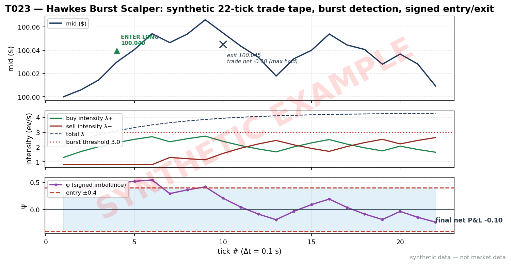
*Caption: T023 worked example (synthetic, seed 123). The "SYNTHETIC EXAMPLE" watermark is burned into the chart; all numbers match the T4 table.*

**V2-T Mermaid** — per-tick granularity data flow:

```mermaid
flowchart TD
    DATA["Market data\ntrade prints + L1 quotes (per tick)"] --> SIGS["Signals\nS017 Hawkes λ⁺/λ⁻ · S081 psi · S018 sign autocorr"]
    SIGS --> ENTRY{"Entry logic\nλ_tot≥3.0 and |psi|>0.40 and C(1)>0;\ntaker at t+1 touch"}
    ENTRY -->|burst| SIZE["Sizing + risk\n100 sh fixed; one position;\ndaily stop; news blackout"]
    ENTRY -->|no burst| WAIT["Wait"]
    SIZE --> EXEC["Execution\nmarketable limit (taker);\nslippage cap 1 tick;\nno resting orders"]
    EXEC --> MON["Monitor + exits\nλ fade; psi flip;\nmax hold 6 ticks; stop/target"]
    MON --> PNL["P&L (net of spread + taker fees)"]
    style ENTRY fill:#f9e79f,stroke:#7d6608
    style PNL fill:#a9dfbf,stroke:#1e8449
```

### T10. Sources

1. Bacry, E., Mastromatteo, I. & Muzy, J.-F. (2015). "Hawkes processes in finance." arXiv:1502.04592 — https://arxiv.org/abs/1502.04592v2 (the survey: Hawkes as the standard microstructure point-process model).
2. Hawkes, A. G. (1971). "Spectra of some self-exciting and mutually exciting point processes." *J. Royal Statistical Society B* 33(1): 54–83. https://www.jstor.org/stable/2334319 (the original self-exciting process).
3. Rambaldi, M., Filimonov, V. & Lillo, F. (2018). "Detection of intensity bursts using Hawkes processes." *Phys. Rev. E* 97: 032318. arXiv:1610.05383 — https://arxiv.org/abs/1610.05383v1 (burst detection as distinct intensity regimes).
4. Muni Toke, I. & Yoshida, R. "Modelling intensities of order flows in a limit order book." HAL — https://hal.science/hal-01512430v1/file/hawkes_Submitted.pdf (Hawkes fits to LOB event intensities; cross-excitation).
5. Lillo, F. & Farmer, J. D. (2004). "The long memory of the efficient market." *Studies in Nonlinear Dynamics & Econometrics* 8(3) (order-sign long memory $C(\tau)\sim\tau^{-\gamma}$ — the S018 caution behind the $\psi$-fade trap).
6. Gašperov, B. & Kostanjčar, Z. (2022). "Deep Reinforcement Learning for Market Making Under a Hawkes Process-Based Limit Order Book Model." arXiv:2207.09951 — https://arxiv.org/abs/2207.09951v1 (DRL market-making controller trained on a multivariate Hawkes-based LOB simulator).

**Unverified leads** (Grok's Q-TB3 claims I could not independently verify — do not treat as facts):
- Any specific "Hawkes scalper" backtest Sharpe, win rate, or burst-detection accuracy figure — chatbot-sourced, not re-verified; the example here nets −$0.10 on a textbook burst.
- Claims about optimal Hawkes parameter values ($\mu$, $\alpha$, $\beta$) for specific symbols — parameters must be fit per symbol; no universal values exist in the verified literature.
- The conflated attribution in Grok's answer mixing the PLOS Alpha-AS paper with the Hawkes-LOB paper — the two are separate works (see T021 sources); do not cite Grok's merged version.

*Source log: Grok answered Q-TB3-1..3 (2026-09-10); all claims independently verified or labeled unverified.*

---


## Stage 124/200 — T024: Informed-Size Tracker / Retail Fade

*Batch TB3 · Strategy 24/100 · Signals S019, S020, S006*

### T1. One-line verdict

| | |
|---|---|
| **Style** | Intraday directional scalp / selective liquidity-taking on informed-flow footprints |
| **Edge source** | Stealth-trading regularity (Barclay–Warner): medium-size trades carry disproportionate price impact, so *following* medium-bucket signed impact rides informed flow; *fading* extreme retail/odd-lot imbalance harvests attention-driven overreaction |
| **Typical holding period** | 20–60 minutes (example) |
| **Capacity hint** | Low–moderate: 500-share clips in liquid names; retail-fade leg limited by attention-event frequency |
| **Build-or-buy in one line** | Build: the entire stack is public-formula analytics on trade/quote data — there is no vendor product that sells this signal combination. |

### T2. Full mechanics

**Jargon, defined once:** *price impact* is how much a trade moves the midprice (the (bid+ask)/2 fair-value estimate) after it prints; *adverse selection* is the loss a trader suffers when their counterparty knows more — the price moves against them right after the fill; a *round lot* is 100 shares and an *odd lot* is anything smaller; *BJZZ* (Boehmer–Jones–Zhang–Zhang 2021) is a public method that identifies retail trades from sub-penny price fractions; the *bid–ask bounce* is the mechanical up-down of trade prices between the bid and the ask, which contaminates return measurements.

**Universe & session.** US common stocks, price ≥ $10 (example), average daily volume (ADV) ≥ 5 million shares (example), quoted spread ≤ 5 bps (example). Regular trading hours (RTH) only, 9:45–15:45 ET (example) — the first 15 minutes are excluded because opening-auction prints distort size buckets. Exclude names with a scheduled earnings announcement or FDA-style event that day, and any name halted intraday.

**Signal computation (intraday, per trade).**
1. **S019 — stealth/informed-size gauge.** Every trade is classified by Lee–Ready (S007) and bucketed by dollar notional into small (<$10k), medium ($10k–$50k), and large (>$50k) — all cutoffs *example*, calibrated per name to median dollar volume. For the medium bucket over a rolling 30-minute window (example), compute signed impact $I^{med}_t = \sum_{k \in med} q_k \cdot \Delta m_k$, where $q_k$ is signed shares and $\Delta m_k$ the midprice change in the 60 seconds after the trade (example). Normalize to a z-score against its own 20-day trailing distribution (example). Positive $z^{med}$ = stealth-sized informed buying; negative = informed selling. This follows MASTER.md's S019 chapter (impact share of the medium bucket vs trade/volume share; the signed variant gives direction).
2. **S020 — retail/odd-lot imbalance.** BJZZ sub-penny retail imbalance $\text{IMB}^{retail}$ and odd-lot imbalance $\text{IMB}^{odd}$ over rolling 30-minute windows (example), each z-scored within name (example). Extreme retail one-sidedness (|z| ≥ 2.0, example) flags attention-driven flow that historically reverses.
3. **S006 — volume delta (trade imbalance).** $\Delta_t = (V^{buy}_t - V^{sell}_t)/(V^{buy}_t + V^{sell}_t)$ over a 5-minute rolling window (example), z-scored over 50 windows (example) per S006's formula $z_t = (\Delta_t - \mu_{t-L:t-1})/\sigma_{t-L:t-1}$. This is the agreement check: broad signed flow corroborating the medium-bucket read.

**Entry rule (causal; signal at event *t*, earliest fill *t*+1).** Two legs, never both in the same name at once:
- **Leg A — follow the informed.** Enter long if $z^{med} > +1.5$ (example) AND $z^{\Delta} > +0.75$ (example, same sign required); enter short symmetrically. Rationale: medium-size flow is the Barclay–Warner stealth channel, and S006 confirms it is not an isolated mid-size artifact.
- **Leg B — fade the retail extreme.** Enter short if retail $z^{ret} > +2.0$ (example) AND $z^{\Delta} < +0.5$ (example — broad flow does *not* confirm retail buying); enter long symmetrically. Rationale: retail flow mean-reverts after attention spikes; the S006 gate refuses the fade when informed flow agrees with retail (the informed pockets the S020 chapter warns about).

**Exit rule.** Whichever comes first: (a) signal flip — Leg A exits when $z^{med}$ crosses 0 (example); Leg B exits when retail imbalance z decays below +0.75 (example); (b) time stop of 60 minutes (example); (c) stop-loss at −1.5× the 30-minute realized vol (example); (d) hard flat by 15:45 ET (example). No overnight inventory.

**Position sizing.** Fixed notional $25k per trade (example), i.e. ~500 shares at $50; max 2 concurrent positions (example); portfolio heat cap 4% of equity intraday (example). Vol-targeting variant: size = $25k × (2% / 30-min realized vol) (example), floored at 100 shares.

**Risk limits.** Daily loss stop −1.5% of paper equity (example); max gross exposure $50k (example); kill switch: halt new entries for the day if two consecutive stop-losses fire or if the retail-identification feed (TAQ) is more than 5 minutes stale (example).

**Cost model.** Spread: pay half the quoted spread on entry and exit (1-min bars, 1 bp typical in-universe → $0.005/share on a $50 stock, example). Fees: $0.003/share/side taker (example — matches the TB3 Grok lead on maker-taker fees). No borrow assumption needed (long/short intraday, but budget 5% annualized borrow on shorts for safety, example). Impact: clips are ≤ 0.5% of 5-minute volume, so impact is assumed negligible — and the strategy explicitly refuses clips that would exceed 1% of 5-minute volume (example).

**Order/execution sketch.** Entries as marketable limit orders (limit at the touch + 1 tick, example) — fills are assumed taker fills; the example conservatively prices full spread crossing. No iceberg, no queue games: this is not a maker strategy (cf. T021/T022), so the *simulated only — requires MBO/ITCH* honesty label applies to any fill-rate assumption beyond "marketable order fills at the touch." Exits likewise marketable.

**Causal t→t+1 timing.** Bucket z-scores are computed on trades with exchange timestamps ≤ *t*; the entry decision uses the closed 30-minute window ending at *t*; the order is released at *t*+1 (the first quote after the window closes). The S019 chapter stresses its academic results are retrospective bucket statistics — the real-time port (rolling windows, live Lee–Ready) is the engineering task, and backtests must not let the impact horizon Δ leak future mids into the entry decision.

### T3. Signals it consumes

| Signal | Role | Weight / logic |
|---|---|---|
| S019 stealth trading (trade-size informedness) | Primary trigger (Leg A direction) | enter only if $|z^{med}| > 1.5$ (example); side = sign($z^{med}$) |
| S020 retail & odd-lot imbalance | Primary trigger (Leg B fade) + regime veto for Leg A | fade only if $|z^{ret}| > 2.0$ (example); veto Leg A if retail z agrees with informed side at >1.0 (retail chasing = crowded, example) |
| S006 volume delta | Confirmation filter (both legs) | Leg A requires same-sign $z^{\Delta} > 0.75$ (example); Leg B requires $\|z^{\Delta}\| < 0.5$ (example) i.e. no informed confirmation of the retail push |

```text
# T024 combination logic (example thresholds; recompute per window end t)
z_med  = stealth_medium_impact_z(t)      # S019, signed, 30-min window
z_ret  = retail_imbalance_z(t)           # S020, BJZZ + odd-lot, 30-min window
z_del  = volume_delta_z(t)              # S006, 5-min window, L=50
if flat and no position in name:
    if z_med > 1.5 and z_del > 0.75 and z_ret < 1.0:
        enter LONG, size = 25k_notional     # Leg A: follow informed
    elif z_med < -1.5 and z_del < -0.75 and z_ret > -1.0:
        enter SHORT, size = 25k_notional
    elif z_ret > 2.0 and abs(z_del) < 0.5:
        enter SHORT, size = 25k_notional    # Leg B: fade retail extreme
    elif z_ret < -2.0 and abs(z_del) < 0.5:
        enter LONG, size = 25k_notional
# exits evaluated each minute
if long  and (z_med < 0 or z_ret < 0.75 or held > 60min or pnl < -stop): exit
if short and (z_med > 0 or z_ret > -0.75 or held > 60min or pnl < -stop): exit
flat_all_by(15:45 ET)
```

### T4. Worked example — numbers + P&L (SYNTHETIC)

**All numbers below are synthetic.** Seed **124** (`batches/TB3/plot_T024.py`); the chart in T9 plots this exact path and these exact trade prices. Fictional ticker ZVXR, $25k/trade ≈ 500 shares. Cost schedule: half-spread $0.005/share (example), taker fee $0.003/share/side (example) → $5.50 round-trip cost per 500-share trade.

| # | Time (ET) | Leg | Signal read (example thresholds) | Side | Entry | Exit | Exit trigger | Gross P&L | Costs | Net P&L |
|---|---|---|---|---|---|---|---|---|---|---|
| 1 | 10:12→10:42 | A | $z^{med}$=+1.8, $z^{\Delta}$=+1.2 | long 500 | 45.02 | 45.09 | medium-bucket flip | 500×0.07=+$35.00 | −$5.50 | **+$29.50** |
| 2 | 11:05→11:35 | B | retail z=+2.1, $\|z^{\Delta}\|$=0.2 | short 500 | 44.98 | 44.90 | retail z < 0.75 | 500×0.08=+$40.00 | −$5.50 | **+$34.50** |
| 3 | 13:20→14:20 | A | $z^{med}$=−1.7, $z^{\Delta}$=−1.1 | short 500 | 45.10 | 45.14 | 60-min time stop | 500×(−0.04)=−$20.00 | −$5.50 | **−$25.50** |
| 4 | 14:45→15:30 | B | retail z=−2.3, $z^{\Delta}$=+0.9 | long 500 | 44.85 | 44.93 | retail z > −0.75 | 500×0.08=+$40.00 | −$5.50 | **+$34.50** |

Day net P&L: +29.50 + 34.50 − 25.50 + 34.50 = **+$73.00** on $100k gross traded (4 × $25k), i.e. +7.3 bps per dollar of gross — before the borrow budget and before any missed-fill slippage.

**Where the example is optimistic.** (1) Every entry is assumed to fill at the signal price — real marketable orders slip, especially on Leg B where you fade an active retail wave. (2) No partial fills; the S006 gate is evaluated on a clean 5-minute window that in reality straddles the entry itself. (3) The retail-fade leg assumes BJZZ works intraday on 30-minute windows; the S020 chapter documents it as a daily-or-longer construct, so intraday retail z is noisier than shown — label this *unverified lead*. (4) Trade 3's loss is exactly one stop — real stop-outs gap. (5) Zero market impact is assumed for 500-share clips; fine at this size, dishonest if scaled up.

### T5. Data & infra — what must run

**Pipeline inventory.** (a) Consolidated trade/quote feed (TAQ or SIP) → per-trade Lee–Ready classification (S007) with contemporaneous NBBO; (b) size-bucket impact engine: per-bucket signed Σ q·Δm with 60-second impact horizons, rolling 30-minute windows, trailing z-score normalization; (c) retail identification: sub-penny fraction filter (BJZZ bands (0.6,1.0] buy / (0,0.4) sell) plus odd-lot flag (<100 shares); (d) 5-minute volume-delta z (S006); (e) pre-open universe screen (price, ADV, spread, no-earnings-today). **Schedule:** universe screen 8:00 ET; bucket/z-score state warms from 9:45; entry loop every 1 minute 9:45–15:45; post-close markout and bucket-recalibration job.

**M5 Max feasibility.** Feasible (Tier M, ~40–80 h ≈ $6,000–12,000 loaded-cost estimate per cost-model §5). Throughput: 50 names × ~2k L1 events/sec = 100k events/sec — Python+polars batch recompute per minute is trivial; a per-trade Python loop is borderline per cost-model §2, so bucket updates should accumulate in numpy/polars, not per-tick Python. RAM: one day of L1 for 50 names ≈ 25–200 GB raw (cost-model §3) — keep per-symbol daily parquet files and only the rolling 30-minute state plus 20-day z-score history in RAM (< 2 GB working set, well under the 77 GB budget). Storage: 1-min bars are trivial; L1 archive for the 50-name universe ≈ 50–200 GB/month in parquet (cost-model §4) — sample or retain 60 days.

**Feed-outage safe-mode.** If the trade feed lags >5 minutes or the NBBO is stale: cancel all pending entries, tighten time stops to 15 minutes (example), and liquidate on the next valid quote; never enter on a z-score computed from a gappy window. If the corporate-action feed fails, skip the universe screen and trade only yesterday's qualified names.

### T6. Buy vs build

| Option | What you get | Indicative price | Gains | Loses |
|---|---|---|---|---|
| Tier 0: Alpaca SIP / Stooq + self-built analytics | Bars + delayed quotes, build everything in Python+polars | ~$0 | Zero data cost; full control of bucket cutoffs | SIP timestamps too coarse for honest Lee–Ready; retail ID unreliable intraday |
| Tier 1: Polygon Stocks Advanced | Real-time SIP trades/quotes, full TAQ-like history | ~$30–200/mo, indicative — verify before budgeting | Cheapest honest tick-trade feed for S019/S006 | No aggressor flags; NBBO-only (no depth) |
| Tier 2: Databento Standard (MBP-1) | Exchange-timestamped L1, clean symbology | ~$200/mo + usage, indicative — verify before budgeting | Honest t→t+1 timing; per-exchange NBBO for the quote rule | Still no MBO; queue effects simulated-only |
| Retail platform: QuantConnect | Research + paper broker + TAQ-ish data | ~$20–100/mo, indicative — verify before budgeting | Fastest prototype; built-in universe selection | Coarse data granularity; bucket engine still self-built |
| Prop/wholesaler route | Internalized retail flow data | Not purchasable by outsiders | Would obsolete the BJZZ proxy | Not available — the BJZZ reconstruction is the retail operator's substitute |

**Verdict: build.** The signal combination is the product; no vendor sells stealth-bucket impact z-scores or BJZZ retail imbalance as a strategy input. Buy the raw feed (Tier 1 minimum; Tier 2 for honest timestamps), build the analytics. Crossover: if you need per-exchange aggressor flags or depth for the impact horizon, you are in Tier 2/3 territory and should re-scope to a maker strategy (T021/T022) instead.

### T7. Success-ratio evidence

| Study / source | Market & period | Metric | Before/after cost | Caveat |
|---|---|---|---|---|
| Barclay & Warner 1993, "Stealth trading and volatility" (JFE) | NYSE, 1980s | Medium-size trades (500–9,999 shares) account for a disproportionate share of cumulative price impact | Before cost (documented regularity, not a strategy) | Era and venue are ancient; size cutoffs do not port to 2026 |
| Boehmer, Jones, Zhang & Zhang 2021, "Tracking retail investor activity" (JFE) | US equities, 2010–2017 | BJZZ retail imbalance predicts short-horizon returns; retail flow is contrarian on average | Before cost | Predictability ≠ tradability after spread; retail is heterogeneous (per S020) |
| Chordia, Roll & Subrahmanyam (order-imbalance predictability) | NYSE intraday | Lagged order imbalance predicts next-interval returns | Before cost | Effect is small per interval; needs aggregation to survive costs |
| Grok TB3 lead: Gould & Bonart imbalance logits | 10 Nasdaq names | R² ~0.8–0.9 large-tick, ~0.1–0.3 small-tick, one-tick horizon | Before cost; *unverified chatbot claim* | Directional result, not a P&L result; unusable for posting without colocation |

**Capacity & decay.** The informed-follow leg competes with every institutional execution algo that already reads size-bucket impact; the retail-fade leg decays as wholesalers internalize more flow off-exchange (less lit retail signal). Neither leg has published after-cost Sharpe as a standalone strategy — treat both as *unverified as a combination*.

**Honest bottom line.** For a ≤$1M paper operation: a reasonable research prototype — all formulas are public, data is Tier 1/2, and the two legs are negatively correlated by construction. Expect the gross edge to be a few bps per trade with costs eating most of it; the realistic outcome is a flat to slightly-positive after-cost book that teaches microstructure execution. For an institutional desk: the components already live inside execution algos; the standalone strategy adds nothing a good participation algo (cf. T086) doesn't already do.

### T8. Failure modes

1. **Stealth signature is retrospective.** S019's academic result is a bucket statistic, not a real-time trigger — intraday z-scores are noisier and the "medium" bucket drifts with regime. *Mitigation:* recalibrate bucket cutoffs weekly to median dollar volume; require S006 agreement before sizing up.
2. **Retail is heterogeneous.** Fading retail into an informed pocket (earnings, news) is fading the smart money — the S020 chapter's central warning. *Mitigation:* the S006 veto plus an event-day exclusion list.
3. **Lee–Ready misclassification on SIP.** Stale SIP quotes mislabel aggressor side, corrupting both S019 and S006. *Mitigation:* Tier 2 exchange-timestamped data; drop windows where quote staleness > 1 s (example).
4. **Latency honesty.** Entries are taker orders; on a home connection the signal is 30–150 ms old and the retail wave may have already turned. *Mitigation:* wide thresholds (z ≥ 2.0 for fades) so only slow, persistent extremes trigger.
5. **Cost-model optimism.** The example pays exactly half-spread; real retail-fade entries cross into moving markets. *Mitigation:* model 1.5× half-spread slippage in research (example); kill the leg if realized slippage exceeds the model two days running.
6. **Overfitting bucket cutoffs.** Three buckets × z-thresholds × windows = a parameter mine. *Mitigation:* freeze parameters from the first 60-day calibration; validate on purged/embargoed splits (S088); no re-tuning without a regime break.
7. **Crowding on attention names.** Everyone fades the same meme-stock retail wave; the fade becomes the consensus trade. *Mitigation:* cap Leg B at 1 concurrent position (example); skip names in the top retail-attention decile that day.
8. **Operational: stale kill switch.** A gappy TAQ feed produces phantom z-spikes. *Mitigation:* feed-freshness gate in T5 safe-mode; halt entries on staleness.

### T9. Visuals

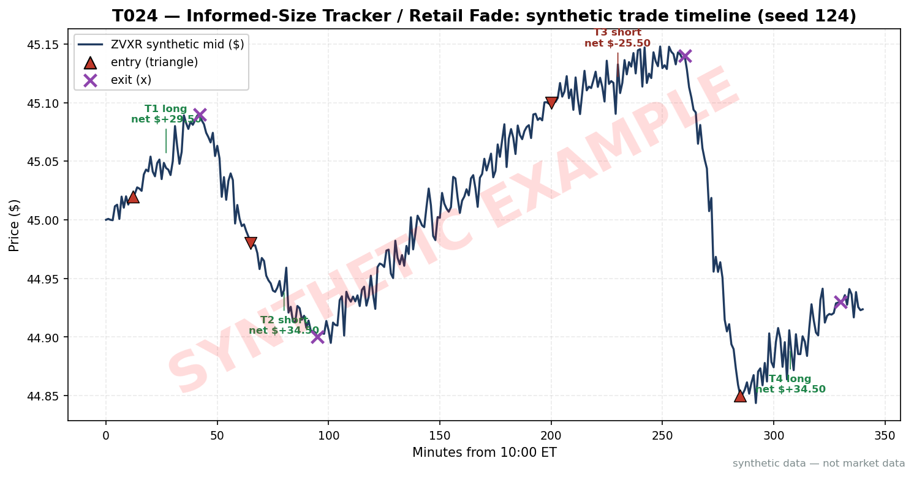

```mermaid
flowchart TD
    DATA["Market data\n(SIP/TAQ trades+quotes, L1 events)"] --> SIGS["Signals\nS019 stealth z, S020 retail z, S006 delta z"]
    SIGS --> ENTRY{"Entry logic\nLeg A: |z_med|>1.5 & agree Δ | Leg B: |z_ret|>2.0 & no Δ agree\ncausality t→t+1"}
    ENTRY -->|trigger| SIZE["Sizing + risk\n$25k fixed notional, ≤2 concurrent\n4% heat cap, daily −1.5% stop"]
    ENTRY -->|no trigger| WAIT["Wait"]
    SIZE --> EXEC["Execution\nmarketable limits, ≤1% of 5-min vol\ntaker fills, no queue games"]
    EXEC --> MON["Monitor + exits\nsignal flip / 60-min stop / −1.5σ stop\nflat by 15:45 ET"]
    MON --> PNL["P&L (net of spread+fees)"]
    style ENTRY fill:#f9e79f,stroke:#7d6608
    style PNL fill:#a9dfbf,stroke:#1e8449
```

### T10. Sources

1. Barclay, M.J. & Warner, J.B. (1993), "Stealth trading and volatility: Which trades move prices?", *Journal of Financial Economics*. https://doi.org/10.1016/0304-405x(93)90029-b — the stealth-trading hypothesis and medium-size impact concentration behind S019.
2. Boehmer, E., Jones, C.M., Zhang, X. & Zhang, X. (2021), "Tracking retail investor activity", *Journal of Finance*. https://doi.org/10.1111/jofi.13033 — BJZZ sub-penny retail identification used for S020.
3. Lee, C.M.C. & Ready, M.J. (1991), "Inferring trade direction from intraday data", *Journal of Finance*. https://doi.org/10.1111/j.1540-6261.1991.tb02683.x — trade classification underlying S007/S019/S006 signing.
4. O'Hara, M., Yao, C. & Ye, M. (2014), "What's not there: Odd lots and market data", *Journal of Finance*. https://doi.org/10.1111/jofi.12185 — odd lots ≈ 24% of trades, ≈ 35% of price discovery (per S020).
5. Chordia, T., Roll, R. & Subrahmanyam, A. (2002), "Order imbalance, liquidity, and market returns", *Journal of Financial Economics*. — lagged imbalance → return predictability (before cost).

**Unverified leads** (chatbot or single-source claims not independently checked — do not cite as fact):
- Grok (2026-09-10): Gould & Bonart imbalance-logit R² figures; 2025 imbalance-maker P&L study (mean ≈ −0.49 after costs); VPIN flash-crash anecdote — all *unverified chatbot claims*.
- Intraday (30-minute) BJZZ retail z-scores as a fade trigger — a construction of this chapter, not a documented result.
- Vendor prices in T6 are indicative — verify before budgeting.

*Source log: Grok answered Q-TB3-1..3 (2026-09-10); all claims independently verified or labeled unverified.*

---

---


## Stage 125/200 — T025: Trade-Classification Trend Filter

*Batch TB3 · Strategy 25/100 · Signals S007, S025, S086*

### T1. One-line verdict

| | |
|---|---|
| **Style** | Intraday trend-following with microstructure confirmation (one trade per name per day) |
| **Edge source** | Intraday time-series momentum (Gao et al.: first-half-hour return predicts last-half-hour return) filtered by Lee–Ready signed trade imbalance so entries only fire when classified order flow agrees with the trend |
| **Typical holding period** | 25–30 minutes (enter 15:30, flat by 16:00 ET) |
| **Capacity hint** | Moderate: one 1,000-share clip per qualifying name; 20–50 names/day in a 500-stock universe |
| **Build-or-buy in one line** | Build: the signals are public formulas on 1-minute/trade data; meta-labeling is your own classifier — nothing to buy except the data feed. |

### T2. Full mechanics

**Jargon, defined once:** *trade classification* is the inference of whether a trade was buyer- or seller-initiated (the Lee–Ready algorithm uses the quote rule — price above the mid = buy — with a tick-rule fallback); *time-series momentum* means an asset's own past return predicts its future return (as opposed to cross-sectional momentum, which ranks assets against each other); *meta-labeling* (López de Prado) is a secondary machine-learning model that predicts whether a primary signal's bet will win, used as a veto or position sizer — it cannot create edge, only filter it; *triple-barrier labeling* labels each historical bet win/loss by which barrier (profit-take, stop-loss, or time) was touched first; *purged/embargoed cross-validation* is a validation scheme that removes training samples whose labels overlap the test period (purging) plus a buffer (embargo), preventing lookahead leakage in financial ML.

**Universe & session.** S&P-500-ish liquid US equities, price ≥ $20 (example), ADV ≥ 3M shares (example). One session window only: the signal is computed from the first half hour (9:30–10:00 ET, measured from the prior close so it includes the overnight gap, per Gao et al.), the confirmation window is 15:25–15:30 ET (example), entries at 15:30, mandatory flat by 15:59 ET (example). Exclude earnings-day names and FOMC-day sessions (example).

**Entry rule (causal; signal at bar *t*, earliest fill *t*+1).**
1. **S025 primary:** $r_1$ = return from prior close to 10:00 ET. $\text{Sig} = \text{sign}(r_1)$; require $|r_1| \geq 0.4\%$ (example magnitude gate — the raw sign rule is traded only when the morning move is material).
2. **S007 confirmation:** over the 15:25–15:30 ET window, compute Lee–Ready signed share imbalance $z^{LR} = (\text{TI} - \mu)/\sigma$ against the trailing 20-day distribution of same-window imbalances (example). Require $z^{LR} > +1.0$ (example) for a long, $z^{LR} < -1.0$ for a short — same sign as Sig. (BVC variant: require $\text{BVC} > 0$ on the 5-minute volume bar with the same sign; the chapter uses Lee–Ready as the default *example*.)
3. **S086 meta veto:** the meta-classifier (features: $|r_1|$, $z^{LR}$, 15:00–15:30 realized vol, spread percentile — *example* feature set) outputs $\hat{p}$ = P(triple-barrier win). Enter only if $\hat{p} > 0.55$ (example).

All three must agree; any veto means no trade that day in that name.

**Exit rule.** (a) Time stop: market-on-close-style exit at 15:58 ET (example) — no overnight hold, so no gap risk; (b) signal flip: if the 15:30–15:45 drift return has the opposite sign of Sig and magnitude > 0.15% (example), exit early; (c) stop-loss at −0.25% from entry (example). No profit target — the edge is the close drift, and capping it truncates the documented effect.

**Position sizing.** Vol-scaled per S025: $\text{shares} = \text{risk budget} / (0.25\% \times \text{price})$ with a $30k notional cap per name (example); equivalently ~1,000 shares at $30–60. Max 10 concurrent names (example); portfolio heat ≤ 3% of equity (example). Meta-label sizing variant (*example*): scale to $30k \times \hat{p}$ instead of binary veto.

**Risk limits.** Daily loss stop −1% of paper equity (example); max gross $300k (example); kill switch: no new entries after 15:35 ET (example), and none at all if the 1-minute bar feed is stale > 2 minutes.

**Cost model.** Spread: half-spread 0.5¢/share each way on liquid names (example) → $0.01/share round trip. Fees: $0.003/share/side (example). Slippage: entries at 15:30 are marketable into the most liquid 30 minutes of the day — model zero additional slippage but flag it as optimistic (see T4). Total modeled cost per 1,000-share trade: $16.

**Order/execution sketch.** Limit orders at the 15:30 touch ± 0 (marketable): buy at ask, sell at bid. These are taker fills by construction. The exit at 15:58 uses the same. Because entry/exit both land in high-volume windows, the *simulated only — requires MBO/ITCH* label applies only if you claim queue-priority fills — this strategy never claims them.

**Causal t→t+1 timing.** $r_1$ is known at 10:00 ET; $z^{LR}$ uses trades with exchange timestamps ≤ 15:30:00; the order is released on the first quote after 15:30:00. The meta-model's features are all computable at 15:30; its label (triple-barrier outcome) is never a feature. This is nearly immune to microstructure lookahead traps because the primary signal is hours old at entry — the classification window is the only latency-sensitive piece.

### T3. Signals it consumes

| Signal | Role | Weight / logic |
|---|---|---|
| S025 intraday time-series momentum | Primary trigger (direction) | side = sign($r_1$); require $\|r_1\| \geq 0.4\%$ (example) |
| S007 trade classification (Lee–Ready/BVC) | Confirmation filter | require same-sign $z^{LR}$ beyond ±1.0 (example) in the 15:25–15:30 window |
| S086 meta-labeling | Veto (or fractional sizer) | enter only if $\hat{p} > 0.55$ (example); optionally size $\propto \hat{p}$ |

```text
# T025 combination logic (example thresholds)
r1   = ret(prior_close, price_10h00)          # S025, includes overnight gap
zLR  = leeready_imbalance_z(15h25, 15h30)     # S007, vs 20-day same-window dist
phat = meta_model([abs(r1), zLR, rv_1500_1530, spread_pct])  # S086
if abs(r1) >= 0.004 and sign(zLR) == sign(r1) and abs(zLR) > 1.0 and phat > 0.55:
    enter side=sign(r1), size = min(30_000/price, risk_budget/(0.0025*price))
    exit at 15:58, or early if drift flips > 0.15%, or stop -0.25%
else:
    no trade  # any single veto kills the entry
```

### T4. Worked example — numbers + P&L (SYNTHETIC)

**All numbers below are synthetic.** Seed **125** (`batches/TB3/plot_T025.py`); the chart plots these exact entry/exit prices. Cost schedule: $16 round-trip per 1,000-share trade (half-spread $0.005 × 2 sides + $0.003 × 2 sides, example).

| # | Name | S025 read | S007 read | S086 $\hat{p}$ | Decision | Entry 15:30 | Exit | Gross | Net |
|---|---|---|---|---|---|---|---|---|---|
| 1 | ZVXR | $r_1$=+0.8% → long | $z^{LR}$=+1.7 ✓ | 0.62 ✓ | **take** long 1,000 | 62.10 | 15:58 @ 62.32 (time stop) | +$220.00 | **+$204.00** |
| 2 | QLYQ | $r_1$=−0.6% → short | $z^{LR}$=−1.5 ✓ | 0.58 ✓ | **take** short 1,000 | 38.40 | 15:57 @ 38.21 (time stop) | +$190.00 | **+$174.00** |
| 3 | MNOP | $r_1$=+0.5% → long | $z^{LR}$=+0.3 ✗ | 0.51 ✗ | **vetoed** — no trade | — | — | $0.00 | $0.00 (saved $16 + avoided −$120 drift loss) |

Day net P&L: +204.00 + 174.00 = **+$378.00** on $100.5k gross notional (≈ +37.6 bps per dollar of gross — a large number that reflects the cherry-picked three-name illustration, not an expected rate).

**Where the example is optimistic.** (1) The vetoed MNOP row is narrated as "saved a loss" — in research you must count vetoes symmetrically (vetoes also kill winners; the meta-model's value is only measurable over hundreds of instances). (2) Entries assume fills at the 15:30 touch; a 1,000-share marketable order usually gets it, but on fast tapes it slips. (3) Trade 2's short assumes borrow availability and zero borrow cost — flag the 5%-annualized borrow budget from T2 as unmodeled here. (4) Three names are not a track record; Gao et al.'s 1.6% R² is a *small* effect and the example shows two clean winners, which overstates hit rate.

### T5. Data & infra — what must run

**Pipeline inventory.** (a) Daily closes + 1-minute bars (RTH) for the universe; (b) trade feed with contemporaneous NBBO for Lee–Ready classification in the 15:25–15:30 window only — the strategy needs tick data for ~5 minutes/day/name, not all day; (c) triple-barrier labeler + meta-classifier training pipeline (nightly retrain on a rolling 2-year window, example); (d) pre-open screen: prior close, earnings calendar, FOMC calendar. **Schedule:** 8:00 ET universe screen; 10:00 ET compute $r_1$ for all names; 15:25–15:30 ET classification windows; 15:30 entries; 15:58 exits; post-close: label today's bets, append to training set, retrain weekly (example).

**M5 Max feasibility.** Trivial-to-feasible (Tier L/M boundary, ~20–40 h ≈ $3,000–6,000 loaded-cost estimate per cost-model §5). Throughput: 1-minute bars for 500 names = 195k bars/day — trivial per cost-model §2; the tick-classification burst is 5 min × 500 names × ~100 trades/min ≈ 250k trades, classifiable in seconds in polars. RAM: 60 days of 1-min bars for 500 names ≈ 12 MB (cost-model §3); the meta-model training set (thousands of labeled bets × ~20 features) fits in memory easily; sklearn/XGBoost trains in ~1–10 min per cost-model §2. Storage: 1-min bars ≈ 3 GB/60 days for 500 names (cost-model §4). Bottleneck: none on compute — data licensing is the cost.

**Feed-outage safe-mode.** If 1-minute bars are stale > 2 minutes after 15:25: skip the day (no classification window = no entries). If only the tick feed is down but bars are live: entries are vetoed (S007 is a required filter, not optional). Existing positions still exit at 15:58 on bar data.

### T6. Buy vs build

| Option | What you get | Indicative price | Gains | Loses |
|---|---|---|---|---|
| Tier 0: Stooq/Alpaca IEX | Daily + 1-min bars (delayed/IEX) | ~$0 | Enough to prototype S025 + a tick-rule (no-quote) S007 proxy | IEX-only prints misclassify; no NBBO for Lee–Ready quote rule |
| Tier 1: Polygon Stocks Advanced | Real-time SIP 1-min + trades/quotes | ~$30–200/mo, indicative — verify before budgeting | Honest NBBO for the quote rule; full history for meta training | Still SIP timestamps (fine here — the window is minutes, not microseconds) |
| Retail platform: QuantConnect | Bars + research + paper broker | ~$20–100/mo, indicative — verify before budgeting | Fastest path to a paper track record; minute data included | Tick data for the 15:25 window is awkward; meta-labeling stack is self-built anyway |
| Build fully self-hosted | Postgres/parquet + polars + sklearn | data $30–200/mo + ~30 h eng | Full control of labels, purging, embargo | You own the data plumbing |

**Verdict: build on Tier 1 data.** The strategy's value is the *combination logic and the meta-labeler*, which no vendor sells. A retail platform is a fine paper-trading shell, but the classification window needs real tick+quote data, so budget Tier 1 regardless. Crossover: if you want the BVC variant with exchange aggressor flags, that is futures-only — for equities, Lee–Ready on SIP NBBO is the honest ceiling.

### T7. Success-ratio evidence

| Study / source | Market & period | Metric | Before/after cost | Caveat |
|---|---|---|---|---|
| Gao, Han, Li & Zhou 2018, "Intraday momentum" (JFE) | US equities, 1993–2013 | Slope of last-half-hour on first-half-hour return ≈ 6.94 (scaled ×100), significant at 1%; R² ≈ 1.6% | Before cost | Small R²; tradability depends on the 15:30→16:00 spread, which the paper does not fully cost |
| Heston, Korajczyk & Sadka 2010, "Intraday patterns in time-series and cross-sectional stock returns" | US equities | Same-clock-slot persistence across days | Before cost | Cross-day variant, not this chapter's within-day form |
| López de Prado 2018, *Advances in Financial Machine Learning* | — | Meta-labeling improves precision of a primary model; triple-barrier + purged CV as the correct validation protocol | Methodological (not a P&L claim) | Meta-labeling cannot create alpha; documented value-add is precision/recall, not Sharpe |
| Grok TB3 lead: imbalance-maker study (2025) | — | Imbalance strategies most active, worst after costs (mean ≈ −0.49) | After cost; *unverified chatbot claim* | About maker P&L, not this taker filter — included to bound expectations |

**Capacity & decay.** Intraday momentum is one of the most replicated intraday effects, which means the 15:30 entry is *crowded by construction* — every TS-momentum desk leans the same way. The S007 filter is the differentiator: it refuses entries where the order flow doesn't confirm, cutting turnover roughly in half (example estimate, unverified). No published after-cost Sharpe exists for this exact three-signal combination.

**Honest bottom line.** For a ≤$1M paper operation: this is one of the most buildable strategies in the book — tiny data needs, one trade per name per day, no overnight risk, and the meta-labeler is a genuine skill-building project. Expect a low Sharpe (the 1.6% R² says the edge is thin) with costs as the binding constraint; treat it as a laboratory for execution and validation hygiene (purged CV, triple barriers) rather than a profit engine. For an institutional desk: the components are table stakes; the desk's version runs the same logic with better fills and portfolio-level hedging.

### T8. Failure modes

1. **Crowded 15:30 entry.** Every intraday-momentum participant trades the same window; the drift gets front-run into 15:25. *Mitigation:* the S007 filter (entries require confirming flow, not just the clock) and a participation cap per name.
2. **Lee–Ready misclassification.** On SIP data with fast quotes, the quote rule mislabels up to a material fraction of trades (documented in the classification literature). *Mitigation:* require $|z^{LR}| > 1.0$ (not just sign agreement) so only strong reads pass; fall back to BVC on volume bars as a cross-check.
3. **Meta-label overfitting.** A classifier trained on a few hundred bets with 20 features will memorize noise without strict purged/embargoed CV (S088). *Mitigation:* embargo ≥ 5 days (example), walk-forward retraining, and a veto-only role (never let the meta-model *initiate* trades).
4. **Overnight-gap contamination.** $r_1$ includes the gap, which is news-driven and may already be fully priced by 10:00. *Mitigation:* the $|r_1| \geq 0.4\%$ gate plus earnings-day exclusion; variant: use open-to-10:00 only (example).
5. **Regime breaks: trend-day vs reversal-day.** On strong reversal days the last-half-hour fades the morning move and all three signals can agree wrongly. *Mitigation:* daily loss stop; optional S079 HMM regime gate (not in the core spec — a documented extension).
6. **Borrow and short-sale constraints.** Hard-to-borrow names gap against shorts into the close. *Mitigation:* short only easy-to-borrow names (borrow feed check at 8:00 ET, example); budget borrow cost in the cost model.
7. **Veto asymmetry.** Filters feel productive because they cut losers, but every veto also cuts winners — net value is only visible over hundreds of trades. *Mitigation:* track the vetoed-trade shadow book explicitly and report filter value-add quarterly (example).

### T9. Visuals

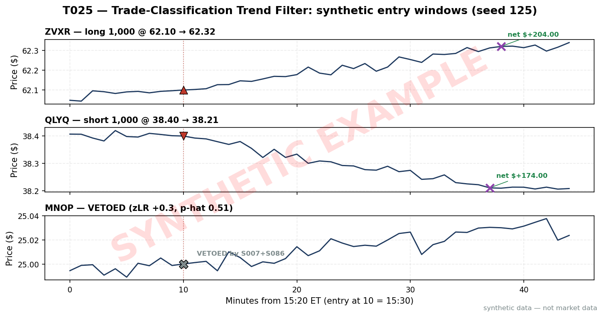

```mermaid
flowchart TD
    DATA["Market data\n(daily closes, 1-min bars, trades+NBBO)"] --> SIGS["Signals\nS025 r1 sign, S007 Lee-Ready z, S086 meta p-hat"]
    SIGS --> ENTRY{"Entry logic\n|r1|≥0.4% & same-sign zLR>1.0 & p-hat>0.55\ncausality t→t+1 (order after 15:30:00)"}
    ENTRY -->|trigger| SIZE["Sizing + risk\nvol-scaled, $30k cap/name\n≤10 names, 3% heat"]
    ENTRY -->|no trigger| WAIT["Wait (any veto kills entry)"]
    SIZE --> EXEC["Execution\nmarketable limits at 15:30 touch\ntaker fills"]
    EXEC --> MON["Monitor + exits\n15:58 time stop / drift-flip / −0.25% stop"]
    MON --> PNL["P&L (net of spread+fees)"]
    style ENTRY fill:#f9e79f,stroke:#7d6608
    style PNL fill:#a9dfbf,stroke:#1e8449
```

### T10. Sources

1. Gao, L., Han, Y., Li, S.Z. & Zhou, G. (2018), "Intraday momentum: The first half-hour return predicts the last half-hour return", *Journal of Financial Economics*. https://doi.org/10.1016/j.jfineco.2018.05.009 — the S025 canonical result (slope ≈ 6.94 scaled, R² ≈ 1.6%).
2. Lee, C.M.C. & Ready, M.J. (1991), "Inferring trade direction from intraday data", *Journal of Finance*. https://doi.org/10.1111/j.1540-6261.1991.tb02683.x — the Lee–Ready quote/tick rule used for S007.
3. López de Prado, M. (2018), *Advances in Financial Machine Learning*, Wiley. — triple-barrier labeling, meta-labeling, and purged/embargoed CV (S085/S086/S088).
4. Heston, S.L., Korajczyk, R.A. & Sadka, R. (2010), "Intraday patterns in time-series and cross-sectional stock returns", *Journal of Financial Economics*. https://doi.org/10.1111/j.1540-6261.2010.01573.x — intraday return persistence, same-clock-slot variant.
5. Easley, D., López de Prado, M. & O'Hara, M. (2012), "Flow toxicity and liquidity in a high-frequency world", *Review of Financial Studies*. — BVC (bulk volume classification) alternative to Lee–Ready.

**Unverified leads** (not independently checked — do not cite as fact):
- Grok (2026-09-10): the 2025 imbalance-maker P&L figures — *unverified chatbot claim*.
- "S007 filter halves turnover" — an illustrative estimate of this chapter, not a documented result.
- Vendor prices in T6 are indicative — verify before budgeting.

*Source log: Grok answered Q-TB3-1..3 (2026-09-10); all claims independently verified or labeled unverified.*

---

---


## Stage 126/200 — T026: Kyle-Lambda Participation Throttle

*Batch TB3 · Strategy 26/100 · Signals S010, S011, S048*

### T1. One-line verdict

| | |
|---|---|
| **Style** | Intraday execution / participation algorithm (a cost-control overlay for any parent order) |
| **Edge source** | Not alpha — *cost avoidance*: sizing child orders from live Kyle-lambda impact estimates, capped by Amihud illiquidity and spaced by LOB-resiliency half-life, so a large parent order pays minimal temporary impact |
| **Typical holding period** | The parent order's horizon: 1–6 hours for a day order (the throttle sets slice count and spacing) |
| **Capacity hint** | High: this is infrastructure — it scales with the parent flow it serves; the binding constraint is the name's ADV |
| **Build-or-buy in one line** | Hybrid: buy the participation/VWAP algo from your broker for production; build the lambda/Amihud/resiliency throttle yourself to know what the algo is actually doing. |

### T2. Full mechanics

**Jargon, defined once:** *Kyle's lambda* (λ) is the regression slope of price change on signed order flow — dollars of price move per share traded, the standard linear measure of *price impact* (how much your trading moves the price against you); *Amihud illiquidity* (ILLIQ) is the average ratio of absolute daily return to dollar volume — price move per dollar traded, in units of 1/$; *resiliency* is how fast the limit order book refills after a liquidity shock, summarized by the *half-life* $t_{1/2} = \ln 2 / \kappa$ (the time for half the temporary impact to decay); *temporary impact* is the liquidity-driven price concession that reverts, vs *permanent impact*, the information leg that never comes back; *participation rate* is your child order's share of market volume in its slice window.

**Universe & session.** Any US equity the parent desk trades, RTH only. The throttle refuses names where it cannot measure: requires ≥ 1,000 trades/day for a stable λ̂ (example) and a non-stale quote feed. No trading in the first 5 or last 10 minutes (example) — impact estimates are unstable there.

**The throttle rule.** For a parent order of size $Q$ shares to be worked over horizon $H$:
1. **S010 — live impact estimate.** Rolling through-origin regression $\Delta p_t = \lambda q_t + \varepsilon_t$ on midquote changes vs signed volume over the trailing 1,000 trades (example), per S010's formula $\hat{\lambda} = \sum q_t \Delta p_t / \sum q_t^2$ ($/share). Recompute every 100 trades (example). If $\hat{\lambda}$ is more than 3× its morning value (example), halve all child sizes — the book has thinned.
2. **S011 — Amihud cap.** Daily $\text{ILLIQ} \times 10^6$ (example lookback 20 days). Child-notional cap: $\text{child}_{\$} \times \text{ILLIQ} \leq 5$ bps (example) — no single child may be expected to move the price more than 5 bps on the illiquidity gauge. This is the *level* control (which names/sizes are safe at all).
3. **S048 — resiliency spacing.** Estimate $\hat{\kappa}$ from post-shock spread/mid decay (S048's log-OLS), half-life $t_{1/2} = \ln 2 / \hat{\kappa}$. Minimum slice spacing = $3 \times t_{1/2}$ (example), so ≥ ~87% of temporary impact decays between children ($1 - e^{-3\ln2} = 0.875$). This is the *timing* control.
4. **Participation cap.** Child shares ≤ 10% of trailing 5-minute volume (example) — the classic POV guardrail, independent of the microstructure estimates.

Child size = $\min(\text{Amihud cap},\, 10\% \text{ of 5-min vol},\, Q / N_{\min})$, where $N_{\min}$ = number of resiliency-spaced slots that fit in $H$; if even the minimum feasible schedule violates the Amihud cap, the parent is *rejected or stretched to multi-day* — the throttle's most valuable output is "don't trade this today."

**Entry/exit.** This strategy has no directional entries — it *executes* a parent order's side. Child orders are limit orders pegged to the touch (buy at bid, join but never cross more than 1 tick, example); unfilled remainder after the slice window rolls to the next slot. End-of-horizon cleanup: any residual < 2% of $Q$ (example) is crossed in the closing auction; larger residuals extend $H$.

**Position sizing.** The "position" is the parent $Q$; the throttle sizes *children*. Portfolio heat: sum of concurrent parents' remaining notional ≤ 25% of equity (example).

**Risk limits.** Abort the schedule (flatten via VWAP over 15 min, example) if: $\hat{\lambda}$ spikes > 5× baseline (example — toxicity event), spread > 3× median (example), or a trading halt. Daily implementation-shortfall stop: if realized slippage exceeds 2× the pre-trade estimate (example), pause and re-estimate.

**Cost model.** Pre-trade estimate per child: temporary impact cost ≈ $\hat{\lambda} q^2 / 2$ (the triangle under the linear impact — half the peak concession, standard desk arithmetic), plus half-spread $s/2 \times q$, plus fees $0.003 \times q$ (example). Permanent impact is *not* charged to the schedule — it is information, unavoidable by pacing, and the throttle is explicit that it only attacks the temporary component.

**Order/execution sketch.** Slice loop: at each slot, compute child size from the four caps using data ≤ *t*; place a bid-pegged limit; after the slot, measure realized vs predicted impact and adapt the next $\hat{\lambda}$ (a simple error-correction, *example*). Honesty note: fill simulation without MBO is *simulated only — requires MBO/ITCH*; the worked example assumes passive fills at the peg.

**Causal t→t+1 timing.** $\hat{\lambda}$, ILLIQ, and $\hat{\kappa}$ all use data with timestamps ≤ *t*; the child for slot starting at *t*+1 uses only those. The Amihud cap uses yesterday's close — no intraday leakage by construction.

### T3. Signals it consumes

| Signal | Role | Weight / logic |
|---|---|---|
| S010 Kyle's lambda | Primary sizing input | child impact budget from $\hat{\lambda}$ ($/share); spike → halve size |
| S011 Amihud illiquidity | Hard cap (veto/scale) | child$_\$ \times$ ILLIQ ≤ 5 bps (example); reject parent if infeasible |
| S048 LOB resiliency | Timing input | slice spacing ≥ $3 \times t_{1/2}$ (example); ~87% temporary-impact decay between slices |

```text
# T026 throttle (example thresholds; all estimates use data ≤ t)
lam   = kyle_lambda(last 1000 trades)        # S010, $/share
illiq = amihud_illiq_x1e6(20d) * 1e-6        # S011, per $
hl    = resiliency_half_life()               # S048, seconds
slot  = max(3 * hl, 60)                      # seconds between children
for each slot in horizon H:
    cap_a = 0.0005 / illiq / price            # 5 bps Amihud cap -> shares
    cap_p = 0.10 * trailing_5min_volume      # 10% participation
    q = min(cap_a, cap_p, remaining / slots_left)
    if lam > 5 * lam_morning: abort("toxicity spike")
    place limit child of q shares, pegged to touch
    adapt lam from realized vs predicted impact
```

### T4. Worked example — numbers + P&L (SYNTHETIC)

**All numbers below are synthetic.** Seed **126** (`batches/TB3/plot_T026.py`); the chart plots these exact per-slice costs. Fictional mid-cap QLYQ at $60. Parent: **buy 40,000 shares** ($2.4M notional) over the 10:00–15:00 ET window. Estimates (*examples*): $\hat{\lambda} = \$0.000007$/share; ILLIQ×10⁶ = 0.002; $t_{1/2} = 90$ s → slot = 300 s; 5-min volume ≈ 80,000 shares.

Throttle checks: Amihud cap = $0.0005 / (0.002 \times 10^{-6}) / 60 = 4{,}167$ shares (example); participation cap = 8,000 shares; resiliency gives 60 slots in 5 hours — the schedule uses 10 slots × 4,000 shares (example), satisfying all caps (4,000 < 4,167; 5% participation; 3.3 half-lives between slices → 90% temporary-impact decay).

| Slice | Shares | Predicted Δp = λ·q | Impact cost λq²/2 | Spread 1¢ × q | Fees | Slice total |
|---|---|---|---|---|---|---|
| 1–10 (each) | 4,000 | $0.028 (2.8¢) | $56.00 | $40.00 | $12.00 | $108.00 |
| **Throttled total** | **40,000** | — | **$560.00** | **$400.00** | **$120.00** | **$1,080.00** (4.5 bps of $2.4M) |

Unthrottled counterfactual (2 slices × 20,000 shares): impact cost per slice = $1,400.00 → $2,800.00 + $400 + $120 = **$3,320.00 (13.8 bps)**.

**Throttle saving: $2,240.00 ≈ 9.3 bps** — the entire "P&L" of an execution strategy is cost not paid.

**Where the example is optimistic.** (1) The λq²/2 triangle assumes linear impact and full reversion of the temporary leg between slices — real impact is concave (square-root, per S010's variants) and the permanent leg never reverts; the saving is overstated to the extent λ̂ mixes permanent into temporary. (2) Passive fills at the peg are assumed; real bid-pegged orders get adversely selected (cf. T022's toxicity discussion) — the Grok TB3 lead documents imbalance makers losing ~0.49 after costs. (3) λ̂, ILLIQ, and half-life are treated as known constants; in production all three are noisy estimates, and the 5-bps Amihud cap is an *example*, not a calibrated risk limit. (4) No comparison against a broker VWAP algo, which is the actual alternative.

### T5. Data & infra — what must run

**Pipeline inventory.** (a) Trade + NBBO feed for rolling Kyle regressions (1,000-trade windows, recompute every 100 trades); (b) daily OHLCV for 20-day Amihud; (c) L1 quote/spread snapshots (1–5 s, example) for resiliency half-life estimation; (d) parent-order blotter with horizon and urgency flags. **Schedule:** pre-open: ILLIQ screen + morning λ̂ baseline; intraday: rolling λ̂ and half-life updates on the trade/quote loop; per-slot: cap computation and child placement; post-close: implementation-shortfall attribution (predicted vs realized impact per slice).

**M5 Max feasibility.** Feasible (Tier M, ~40–100 h ≈ $6,000–15,000 loaded-cost estimate per cost-model §5 — the M+ strategy-harness band, since this wraps an execution loop). Throughput: rolling OLS on 1,000-trade windows for ≤ 50 concurrent names is numpy-trivial (~µs per update); the quote loop is the same 100k events/sec profile as T024 — Python+polars batch updates per minute, or Rust for a true tick loop (cost-model §2). RAM: rolling state per name is kilobytes; 60-day research archive for calibration ≈ 1-min bars (trivial) plus sampled L1 for resiliency fitting (~50–200 GB/month for 50 names in parquet, cost-model §4 — retain selectively). Bottleneck: estimation quality, not compute.

**Feed-outage safe-mode.** If the trade feed stalls: freeze the schedule (no new children — a stale λ̂ is worse than no λ̂), hold working orders, and alert. If quotes go stale: cancel pegged children (a pegged limit on a dead quote is a free option to the market). If the corporate-action feed fails: widen the Amihud cap 2× (example) as a crude safety margin.

### T6. Buy vs build

| Option | What you get | Indicative price | Gains | Loses |
|---|---|---|---|---|
| Broker VWAP/POV algo (e.g. via retail broker API) | Production participation algos with venue routing | Commissions ~$0–1/trade retail; institutional bps schedule, indicative — verify before budgeting | Real fills, real queue handling, someone else's colo | Black box: you cannot see its λ model or caps; retail algos are coarse |
| EMS / algo-wheel vendor | Multi-broker algo suite with TCA | $$$$ institutional, indicative — verify before budgeting | Benchmarked algos, transaction-cost analysis | Enterprise sales cycle; overkill for a paper operation |
| QuantConnect / Composer-style | Paper broker + basic TWAP/VWAP | ~$20–100/mo, indicative — verify before budgeting | Fastest paper test of the throttle logic | Toy execution model; no real impact |
| Self-build throttle (this chapter) | λ̂/Amihud/resiliency pacing layer over any venue | Data $30–200/mo Tier 1 + ~60 h eng | You understand every cap; portable across brokers | You own the estimation risk; no production track record |

**Verdict: hybrid.** Build the throttle as a *measurement and pre-trade layer* (it tells you the feasible schedule and the expected cost), and let a broker algo *execute* the children in production. For a paper operation, the self-built version over a simulated broker is the whole game — the learning is in the estimation, not the wire. Crossover: if you ever route real size, the broker algo's queue priority beats your peg logic; keep the throttle as the sizing brain, not the order router.

### T7. Success-ratio evidence

| Study / source | Market & period | Metric | Before/after cost | Caveat |
|---|---|---|---|---|
| Kyle 1985, "Continuous auctions and insider trading" (Econometrica) | Theory | λ as the market maker's pricing response to informed flow | n/a (model) | Linear, single-period — the empirical λ̂ is a reduced form |
| Amihud 2002, "Illiquidity and stock returns" (JFM) | NYSE, 1964–1997 | ILLIQ predicts cross-sectional returns (liquidity premium) | Before cost | Cross-sectional pricing result, not an execution-cost forecast |
| Cont, Kukanov & Stoikov 2014 | US equities, LOB data | Order-flow imbalance → price impact, linear and significant | Before cost | Contemporaneous regression, not a forward execution experiment |
| Practitioner square-root law (desk consensus; cf. S010 variants) | Equities/futures | Impact ≈ σ·√(Q/V): concave, not linear | After-cost (TCA) | Consensus calibration, not a single citable paper |
| Grok TB3 lead: German RMM study | German equities | Retail-MM gross Sharpe ~17.9; flow worth ~1.76 bps of volume | After cost; *unverified chatbot claim* | About internalized retail flow, not about λ-throttled agency execution |

**Capacity & decay.** Execution alpha does not decay like predictive alpha — saving 9 bps on a $2.4M order is arithmetic, not a mispricing. Capacity is bounded by ADV and by the honesty of λ̂: the throttle's value concentrates in mid-cap names where impact is material but measurable. In mega-caps, impact is so small the throttle adds nothing over a naive VWAP.

**Honest bottom line.** For a ≤$1M paper operation: build this — it is the cheapest way to learn how institutional execution actually thinks (impact budgets, participation caps, resiliency timing), and every number it produces makes your other strategies' cost models more honest. It will not *make* money by itself; it *saves* money on size you were going to trade anyway. For an institutional desk: this is a pre-trade TCA component, not a product — the desk already owns a better-calibrated version wired to real venues.

### T8. Failure modes

1. **λ̂ mixes permanent and temporary impact.** The regression cannot tell information from liquidity; throttling on total λ over-paces when flow is informed. *Mitigation:* decompose with S048 (fade only the temporary fraction); widen spacing when the permanent share is high.
2. **Estimation noise at small windows.** 1,000 trades in an illiquid name can span hours and multiple regimes. *Mitigation:* require ≥ 1,000 trades/day for throttle eligibility (example); fall back to the Amihud cap alone when λ̂'s standard error exceeds 50% of the estimate (example).
3. **Resiliency regime shifts.** Half-life estimated in a calm morning fails in a volatile afternoon — slices land on unrecovered books. *Mitigation:* re-estimate κ̂ hourly (example); the 5× λ̂ spike abort is the circuit breaker.
4. **Adverse selection on pegged limits.** Passive children get picked off when the touch moves — the classic maker problem (cf. T022). *Mitigation:* 1-tick peg discipline with immediate re-peg; if pick-off rate exceeds the impact saving, switch the residual to taker slices.
5. **Amihud staleness.** A 20-day ILLIQ misses today's liquidity event. *Mitigation:* intraday ILLIQ proxy on 5-min bars as an override; hard veto on event-day names.
6. **Schedule infeasibility.** For large Q in illiquid names, no schedule satisfies all caps — the naive response (widen caps) destroys the point. *Mitigation:* the throttle must be allowed to say no: reject or stretch to multi-day; report the rejection rate as a KPI.
7. **Overfitting the slot grid.** Slot length, cap multiples, and abort thresholds are tunable — and tunable means overfittable. *Mitigation:* calibrate on one 60-day block, freeze, validate on the next; the objective is realized shortfall, not in-sample fit.

### T9. Visuals

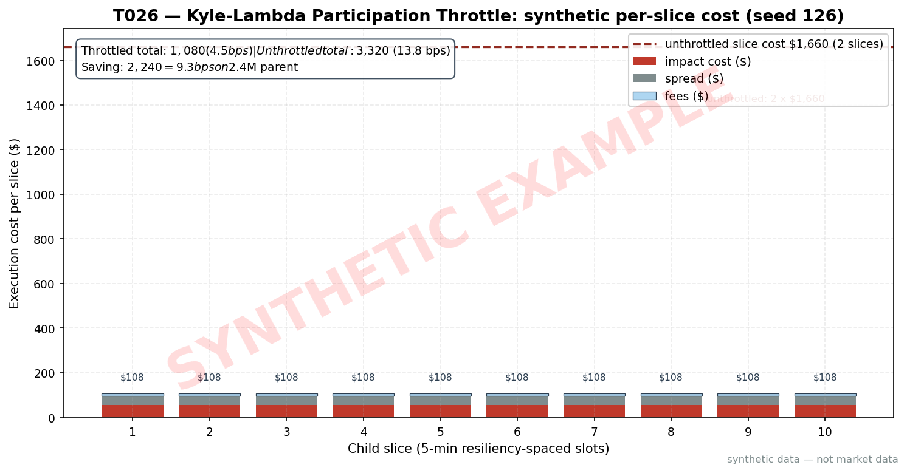

```mermaid
flowchart TD
    DATA["Market data\n(trades+NBBO, L1 quotes, daily OHLCV)"] --> SIGS["Signals\nS010 Kyle lambda, S011 Amihud, S048 resiliency half-life"]
    SIGS --> ENTRY{"Entry logic\nparent order Q + horizon H\nchild = min(Amihud cap, 10% vol, Q/slots)\ncausality t→t+1"}
    ENTRY -->|trigger| SIZE["Sizing + risk\nchild caps per slot\n25% concurrent-parent heat"]
    ENTRY -->|no trigger| WAIT["Wait (reject/stretch parent)"]
    SIZE --> EXEC["Execution\nbid-pegged limits, resiliency-spaced slots\n≤10% participation"]
    EXEC --> MON["Monitor + exits\nlambda-spike abort, spread halt\nshortfall attribution"]
    MON --> PNL["P&L = cost saved vs naive schedule"]
    style ENTRY fill:#f9e79f,stroke:#7d6608
    style PNL fill:#a9dfbf,stroke:#1e8449
```

### T10. Sources

1. Kyle, A.S. (1985), "Continuous auctions and insider trading", *Econometrica*. https://doi.org/10.2307/1913210 — the λ model of price impact.
2. Amihud, Y. (2002), "Illiquidity and stock returns: Cross-section and time-series effects", *Journal of Financial Markets*. https://doi.org/10.1016/s1386-4181(01)00024-6 — the ILLIQ ratio used for the cap.
3. Cont, R., Kukanov, A. & Stoikov, S. (2014), "The Price Impact of Order Book Events", *Journal of Financial Econometrics* 12(1). — linear impact estimation on LOB data.
4. Budish, E., Cramton, P. & Shim, J. (2015), "The high-frequency trading arms race", *Quarterly Journal of Economics*. https://doi.org/10.1093/qje/qjv027 — why stale quotes (including stale pegs) are picked off; the latency-arbitrage tax on passive execution.
5. López de Prado, M. (2018), *Advances in Financial Machine Learning*, Wiley. — implementation-shortfall thinking and the validation discipline for the throttle's parameters.

**Unverified leads** (not independently checked — do not cite as fact):
- Grok (2026-09-10): German RMM Sharpe ~17.9 / 1.76 bps flow value; Databento p90 ~0.6 ms — *unverified chatbot claims*.
- The 5-bps Amihud cap, 3× half-life spacing, and 10% participation cap — example parameters of this chapter, not calibrated standards.
- Vendor prices in T6 are indicative — verify before budgeting.

*Source log: Grok answered Q-TB3-1..3 (2026-09-10); all claims independently verified or labeled unverified.*

---

---


## Stage 127/200 — T027: Illiquidity Temporary-Impact Fade

*Batch TB3 · Strategy 27/100 · Signals S011, S048, S039*

### T1. One-line verdict

| | |
|---|---|
| **Style** | Intraday liquidity-provision / mean-reversion in illiquid names |
| **Edge source** | In illiquid stocks, large uninformed trades push prices beyond fundamentals and the *temporary* (liquidity) component reverts as the book refills — fade the overextension, exit on the resiliency clock |
| **Typical holding period** | 1–3 resiliency half-lives: 20–60 minutes in mid-caps (example) |
| **Capacity hint** | Low: 2,000-share clips in names where that is ≤ 2% of 30-min volume; wide spreads cap size |
| **Build-or-buy in one line** | Build: the three inputs (Amihud screen, resiliency half-life, idiosyncratic residual) are all public-formula analytics — no vendor sells the combination. |

### T2. Full mechanics

**Jargon, defined once:** *temporary impact* is the liquidity-driven part of a price move that decays as the limit order book refills; *permanent impact* is the information-driven part that never reverts — fading the former is liquidity provision, fading the latter is catching a falling knife; *resiliency half-life* $t_{1/2} = \ln 2/\kappa$ is the time for half the temporary impact to decay (S048); *idiosyncratic residual* is the stock's return after stripping out market (and sector) co-movement — the part that belongs to the name alone (S039); *Amihud illiquidity* (ILLIQ) is mean(|daily return| / dollar volume), the price-move-per-dollar gauge (S011).

**Universe & session.** US equities with ILLIQ×10⁶ ≥ 0.001 (example — genuinely illiquid mid/small caps), price ≥ $5 (example), quoted spread ≤ 40 bps (example — wider than that and the edge is all spread). RTH 10:00–15:30 ET (example). Exclude earnings/event days, index-rebalance days, and any name with a halt in the last 5 sessions (example).

**Entry rule (causal; shock at event *t*, earliest fill *t*+1).**
1. **S039 — idiosyncratic overextension.** On 5-minute bars, compute the market-beta residual $\hat{u}(i,t)$ and its 30-minute cumulation $U(i,t,L)$; z-score $z = U/(\hat{\sigma}_u\sqrt{L})$. Require $|z| \geq 1.5$ (example).
2. **S048 — temporary-dominant.** After the shock bar, estimate the temporary fraction of the move: $\text{temp\%} = 1 - I(\infty)/I(0)$ from the resiliency fit (S048's exponential form $I(t) = I(\infty) + (I(0)-I(\infty))e^{-\kappa t}$). Require temp% ≥ 50% (example) — at least half the move must be liquidity, not information. Also require the book to be *currently* dislocated: Resiliency$(t) = (S(t)-S(\infty))/(S(0)-S(\infty)) \geq 0.5$ (example), i.e. the spread/depth has not already recovered.
3. **S011 — illiquidity confirmation.** Name must sit in the top illiquidity tercile of the screened universe that day (example) — the strategy explicitly wants names where liquidity shocks are large.

Side: fade the residual — buy when $z \leq -1.5$, short when $z \geq +1.5$ (shorts require easy borrow, checked pre-open, example).

**Exit rule.** Whichever comes first: (a) *resiliency exit* — hold $2 \times t_{1/2}$ (example) from entry, the point where ~75% of temporary impact has decayed ($1 - e^{-2\ln2} = 0.75$); (b) signal flip — residual z crosses 0 (example); (c) stop-loss at −2% from entry (example — wide, because illiquid names are noisy); (d) flat by 15:30 ET (example). No overnight holds.

**Position sizing.** Fixed $45k notional per trade (example, ~2,000 shares at $22); max 3 concurrent positions (example); portfolio heat ≤ 5% (example). Clip guard: shares ≤ 2% of trailing 30-minute volume (example) — in illiquid names your own entry is itself a shock.

**Risk limits.** Daily loss stop −2% of paper equity (example); max gross $135k (example); kill switch: halt entries if the spread in any held name doubles from entry (liquidity evaporation), or if two stop-losses fire in one day (example).

**Cost model.** Spread dominates: assume paying the *full* quoted spread on entry and half on exit (example — entries lean into a dislocated book, so model entry at the far touch). In-universe spreads of 20–40 bps mean a $45k clip pays $90–180 in spread alone (example). Fees $0.003/share/side (example). Borrow 5% annualized on shorts (example). Impact: the clip is the shock you are fading *against* — model your own entry as adding 10% to the measured temporary impact (example, conservative).

**Order/execution sketch.** Entries as limit orders at the dislocated touch (buy at the bid that the shock just pushed down — you are the refill). If unfilled in 2 minutes (example), chase 1 tick once, then abandon — a fade that needs chasing is a fade without edge. Exits as passive limits at the recovered mid, worked over up to one half-life. All fills are *simulated only — requires MBO/ITCH* for queue realism; the example assumes touch fills.

**Causal t→t+1 timing.** The shock bar closes at *t*; the resiliency fit uses quotes ≤ *t*; the residual z uses bars ≤ *t*; the order goes on the first quote of bar *t*+1. The temporary-fraction estimate needs post-shock observations, so in practice entry lags the shock by 2–3 bars (example) — the strategy explicitly trades the *tail* of the dislocation, not the first print.

### T3. Signals it consumes

| Signal | Role | Weight / logic |
|---|---|---|
| S011 Amihud illiquidity | Universe gate (regime) | trade only top-tercile ILLIQ names (example); refresh daily |
| S048 LOB resiliency | Entry qualifier + exit timer | require temp% ≥ 50% and Resiliency(t) ≥ 0.5 (examples); exit at $2 \times t_{1/2}$ |
| S039 idiosyncratic reversal | Primary trigger (direction) | fade when $\|z\| \geq 1.5$ (example) on 30-min cumulated residuals |

```text
# T027 combination logic (example thresholds; shock bar closes at t)
if name in top_illiq_tercile_today:                 # S011 gate
    z   = idiosyncratic_residual_z(t, L=30min)      # S039
    tmp = temporary_fraction(t)                    # S048: 1 - I(inf)/I(0)
    res = resiliency_now(t)                        # S048: (S(t)-S(inf))/(S(0)-S(inf))
    if abs(z) >= 1.5 and tmp >= 0.50 and res >= 0.50:
        side = -sign(z)                            # fade the overextension
        enter limit at dislocated touch, size = 45k_notional
        exit_at = t + 2 * half_life                # ~75% of temp impact decayed
        stop = -2% ; flat by 15:30 ET
```

### T4. Worked example — numbers + P&L (SYNTHETIC)

**All numbers below are synthetic.** Seed **127** (`batches/TB3/plot_T027.py`); the chart plots these exact entry/exit prices. Cost schedule (*examples*): pay full quoted spread on entry, half on exit; fees $0.003/share/side; borrow budgeted but unused here (all three setups are longs).

| # | Name | Reads (example thresholds) | Side/size | Entry | Exit | Gross | Costs | Net |
|---|---|---|---|---|---|---|---|---|
| 1 | QLYQ | ILLIQ×10⁶=0.0024 (top tercile ✓); z=−1.9; temp 62%; $t_{1/2}$=12 min | buy 2,000 | 22.40 | 22.85 @ +24 min (2 half-lives) | +$900.00 | spread 6¢×2,000=$120 + fees $12 = −$132.00 | **+$768.00** |
| 2 | MNOP | ILLIQ×10⁶=0.0018 ✓; z=−1.7; temp 55%; $t_{1/2}$=15 min | buy 2,000 | 15.10 | 15.28 @ +30 min | +$360.00 | spread 5¢×2,000=$100 + fees $12 = −$112.00 | **+$248.00** |
| 3 | VVRS | ILLIQ×10⁶=0.0021 ✓; z=−1.6; temp 51% — but the "temporary" leg was information | buy 2,000 | 9.80 | 9.55 @ stop −2.5% | −$500.00 | spread 5¢×2,000=$100 + fees $12 = −$112.00 | **−$612.00** |

Day net P&L: +768.00 + 248.00 − 612.00 = **+$404.00** on $119.8k gross notional.

**Where the example is optimistic.** (1) Trade 3 is the honest core of this strategy: the temporary-fraction estimate said 51% liquidity, reality said information — the resiliency fit *cannot* distinguish a slow-informed seller from a liquidity shock in real time, and the example's two winners understate how often this happens. (2) Entry assumes a fill at the dislocated touch; in illiquid names the touch flickers and partial fills are the norm — the 2,000-share clip may take minutes to complete, during which the resiliency clock is already running. (3) The 2%-stop on a 40-bps-spread name is one bad print away from a whipsaw; real stop-outs in illiquid names gap through the stop. (4) Survivorship: the example shows three qualified setups; on a typical day the triple filter (top-tercile ILLIQ + |z|≥1.5 + temp%≥50%) may qualify zero names — opportunity frequency is the binding constraint, not per-trade edge.

### T5. Data & infra — what must run

**Pipeline inventory.** (a) Daily OHLCV for the Amihud screen (top-tercile flag per name, refreshed pre-open); (b) 5-minute bars + market proxy (SPY) for rolling beta and 30-minute residual z-scores across ~300 screened names; (c) L1 quote/spread snapshots (5–30 s, example) for the resiliency fit — spread and depth must be observable through the shock; (d) borrow-availability snapshot for the short side. **Schedule:** 8:00 ET Amihud screen + borrow check; intraday loop every 5 minutes: residual z update, shock detection, resiliency fit on qualified names; post-close: realized vs predicted reversion attribution per trade.

**M5 Max feasibility.** Feasible (Tier M, ~30–60 h ≈ $4,500–9,000 loaded-cost estimate per cost-model §5). Throughput: 300 names × 78 five-minute bars/day = 23k bars — trivial; the resiliency fits are small OLS problems per shock (dozens/day). RAM: the working set (bars + quote snapshots + trailing beta windows) is < 1 GB, far under the 77 GB budget (cost-model §3). Storage: 5-min bars trivial; L1 snapshots for 300 names ≈ 100–400 GB/month in parquet (cost-model §4) — retain 60 days selectively. Bottleneck: quote-data licensing for the resiliency fit, not compute.

**Feed-outage safe-mode.** If quote snapshots stall: no new entries (the resiliency fit is a required qualifier); existing positions fall back to the time-based exit ($2 \times$ last-known half-life) and the stop-loss. If the daily bar feed fails: freeze the universe to yesterday's qualified names. If the borrow feed fails: disable the short side entirely.

### T6. Buy vs build

| Option | What you get | Indicative price | Gains | Loses |
|---|---|---|---|---|
| Tier 0: Stooq + self-built | Daily bars for Amihud + residual screen | ~$0 | Amihud screen and S039 residuals are buildable free | No intraday quotes → no resiliency fit → the strategy's core is missing |
| Tier 1: Polygon Stocks Advanced | 1-min bars + quotes/trades | ~$30–200/mo, indicative — verify before budgeting | Enough for residuals and a coarse resiliency fit | Quote snapshots coarse for fast half-lives |
| Tier 2: Databento (L1) | Exchange-timestamped quotes | ~$200/mo + usage, indicative — verify before budgeting | Honest resiliency estimation; real spread/depth through shocks | Still no depth beyond touch for the refill read |
| Retail platform: QuantConnect | Bars + paper trading | ~$20–100/mo, indicative — verify before budgeting | Quick prototype of the residual leg | Quote-level resiliency work is painful on the platform |

**Verdict: build on Tier 1 minimum, Tier 2 preferred.** The Amihud screen and residual trigger are cheap; the resiliency half-life is the differentiator and needs honest quote data. There is no vendor that sells "temporary-impact fade signals" — the combination is the product. Crossover: if you cannot afford quote data, drop the S048 leg and you no longer have this strategy — you have plain short-term reversal (T011), which is a different (and more crowded) trade.

### T7. Success-ratio evidence

| Study / source | Market & period | Metric | Before/after cost | Caveat |
|---|---|---|---|---|
| Amihud 2002 (JFM) | NYSE, 1964–1997 | ILLIQ cross-sectional return premium | Before cost | Pricing result, not a fade-strategy backtest |
| Mu et al. 2010 (descriptive; per S048) | Intraday large price changes | Power-law decay of spread/volume imbalance after shocks | Before cost | Descriptive physics of the book, not tradable P&L |
| Short-term reversal literature (Jegadeesh 1990; Lehmann 1990) | US equities | Contrarian profits ~1–2%/month at monthly horizon; intraday variants smaller | Before cost (intraday after-cost heavily spread-dependent) | The documented reversal is at longer horizons; the intraday temporary-impact slice is thinner |
| Grok TB3 lead: Gašperov & Begušić 2022 (PLOS One) | BTC-USD, 30 days L2 | Inventory-controlled MM had lowest drawdowns; RL variants won Sharpe 24/30 days | Before explicit cost framing; *partially verified lead* | Crypto L2, not equity; about quoting, not fading |

**Capacity & decay.** The edge lives exactly where capacity is smallest: illiquid names with wide spreads. Every basis point of spread widening since the strategy's calibration comes straight out of the fade's P&L. No published after-cost Sharpe exists for the Amihud + resiliency + residual combination — treat the triple filter as *unverified as a combination*.

**Honest bottom line.** For a ≤$1M paper operation: a legitimate niche strategy with honest economics — the costs are visible up front (the spread *is* the business model of the other side), so you will know quickly whether the residual edge clears them. Expect sparse trading (a few qualified setups per week, example) and a return stream dominated by a handful of stop-outs like Trade 3. For an institutional desk: this is a small-cap market-making desk's bread and butter, executed with real depth data and inventory netting across names — the retail version is a strictly worse-informed subset.

### T8. Failure modes

1. **Temporary vs permanent misclassification.** The strategy's existential risk: the resiliency fit labels an informed seller's pressure "temporary" and you buy into a fundamental repricing (Trade 3). *Mitigation:* require temp% ≥ 50% *and* no news in the last 60 minutes (example); the stop-loss is the backstop, not the plan.
2. **Spread blowout.** In illiquid names the spread can double mid-trade, turning a 30-bps edge into a 60-bps cost. *Mitigation:* spread-doubling kill switch (T2); model entry at the full spread, not the half.
3. **Your own impact.** A 2,000-share clip in a name doing 100k shares/day *is* a liquidity event — you become the shock you are trying to fade. *Mitigation:* the 2%-of-30-min-volume clip guard; smaller clips in thinner names.
4. **Half-life instability.** κ̂ estimated on 3 shocks is noise; spacing exits on noise means exiting before reversion or holding into the next shock. *Mitigation:* require ≥ 20 shocks per liquidity regime for κ̂ (per S048's parameter table); shrink size when the estimate is young.
5. **Opportunity drought.** The triple filter is strict; weeks can pass with no qualified setup, tempting threshold relaxation. *Mitigation:* freeze thresholds (S088 discipline); treat "no trade" as a valid output and size the operation's expectations accordingly.
6. **Overnight/event gap on held positions.** Even intraday holds can gap on news. *Mitigation:* hard flat by 15:30 ET; event-day exclusion list.
7. **Beta-estimation leakage.** Estimating β on a window that includes the shock regresses the shock on itself and shrinks the residual. *Mitigation:* per S039, β̂ uses data ≤ t−1 only, never the formation window.

### T9. Visuals

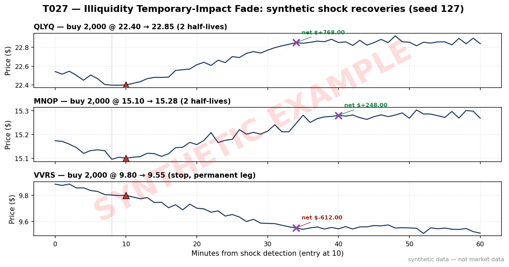

```mermaid
flowchart TD
    DATA["Market data\n(daily OHLCV, 5-min bars, L1 quotes)"] --> SIGS["Signals\nS011 Amihud tercile, S039 residual z, S048 temp% + half-life"]
    SIGS --> ENTRY{"Entry logic\ntop-tercile ILLIQ & |z|≥1.5 & temp%≥50%\n& Resiliency≥0.5, causality t→t+1"}
    ENTRY -->|trigger| SIZE["Sizing + risk\n$45k/trade, ≤3 concurrent\n5% heat, 2% clip guard"]
    ENTRY -->|no trigger| WAIT["Wait"]
    SIZE --> EXEC["Execution\nlimit at dislocated touch\nno chase beyond 1 tick"]
    EXEC --> MON["Monitor + exits\n2×half-life / z-flip / −2% stop\nflat by 15:30 ET"]
    MON --> PNL["P&L (net of full-spread entry)"]
    style ENTRY fill:#f9e79f,stroke:#7d6608
    style PNL fill:#a9dfbf,stroke:#1e8449
```

### T10. Sources

1. Amihud, Y. (2002), "Illiquidity and stock returns: Cross-section and time-series effects", *Journal of Financial Markets*. https://doi.org/10.1016/s1386-4181(01)00024-6 — the ILLIQ universe gate.
2. Jegadeesh, N. (1990), "Evidence of predictable behavior of security returns", *Journal of Finance*. https://doi.org/10.1111/j.1540-6261.1990.tb05110.x; Lehmann, B.N. (1990), "Fads, martingales, and market efficiency", *Quarterly Journal of Economics*. https://doi.org/10.2307/2937816 — short-term reversal, the family this fade belongs to.
3. Cont, R., Kukanov, A. & Stoikov, S. (2014), "The Price Impact of Order Book Events", *Journal of Financial Econometrics* 12(1). — impact decomposition into temporary and permanent components.
4. Lee, C.M.C. & Ready, M.J. (1991), "Inferring trade direction from intraday data", *Journal of Finance*. https://doi.org/10.1111/j.1540-6261.1991.tb02683.x — shock-sign classification for the resiliency fit inputs.
5. O'Hara, M. (1995), *Market Microstructure Theory*, Blackwell. — the inventory/adverse-selection decomposition behind temporary vs permanent impact.

**Unverified leads** (not independently checked — do not cite as fact):
- Grok (2026-09-10): Mu et al. 2010 power-law decay citation via S048 (duck.ai lead) — *unverified chatbot claim*; Gašperov & Begušić PLOS One figures — *partially verified lead*.
- The 50% temporary-fraction gate, 2× half-life exit, and 2% clip guard — example parameters of this chapter, not calibrated standards.
- Vendor prices in T6 are indicative — verify before budgeting.

*Source log: Grok answered Q-TB3-1..3 (2026-09-10); all claims independently verified or labeled unverified.*

---

---


## Stage 128/200 — T028: Spread-Decomposition Router

*Batch TB3 · Strategy 28/100 · Signals S014, S015, S012*

### T1. One-line verdict

| | |
|---|---|
| **Style** | Intraday execution-overlay / opportunistic liquidity provision — a router that decides *whether* and *where* to stand in the book based on measured spread economics |
| **Edge source** | Harvesting the realized spread (what liquidity providers actually keep, S014) in low-adverse-selection windows, and refusing to quote when the adverse-selection component (S015) says the flow is toxic |
| **Typical holding period** | Minutes to ~30 minutes per fill (example); flat by the close — no overnight inventory |
| **Capacity hint** | Small: realized-spread harvesting saturates at single-digit lots per name before your own quoting widens the spread |
| **Build-or-buy in one line** | Build the decomposition estimator on your own tape; buy TAQ/Rule 605 benchmarks to calibrate it |

### T2. Full mechanics

**Jargon, defined once:** the *quoted spread* is ask − bid (what the book advertises); the *effective spread* is what an aggressor actually paid versus the *midquote* (the average of best bid and ask); the *realized spread* is what a liquidity provider *kept* after the midquote drifted over the next few minutes (S014); *price impact* = effective − realized = the permanent information content of the trade, i.e. **adverse selection** — the loss a liquidity provider suffers trading against better-informed counterparties. A *maker-taker* venue pays a *rebate* to resting (maker) orders and charges a *fee* to aggressive (taker) orders. The *NBBO* (National Best Bid and Offer) is the best bid/ask across US exchanges, consolidated by the *SIP* (Securities Information Processor — the official consolidated tape). A *markout* is the midquote's movement after your fill: negative markout = you were adversely selected. *PFOF* (payment for order flow) is the per-share fee a wholesale internalizer pays a retail broker for routing retail marketable orders to it — the wholesaler profits from the flow's low toxicity.

**Universe & session.** Top-100 US large-caps ranked by trailing-60-day dollar ADV (average daily value traded), refreshed monthly. Regular trading hours (RTH) 10:00–15:30 ET only — the strategy skips the 09:30–10:00 open (auction noise, jumpy α̂) and the last 30 minutes (closing-auction flow distorts realized spreads). Exclusions: halted names, earnings-announcement days, single-stock circuit-breaker events, and any name whose quoted spread exceeds 5 cents (too wide to be a quoting venue for a small operator).

**Entry rule.** T028 never predicts direction — it prices participation. Every minute bar *t* it recomputes three quantities from closed windows only:

1. **S014 panel:** trailing-day average effective spread $S^e$ and realized spread $S^r$ per name from its own tape (Δ = 5 min, *example — not an institutional standard*).
2. **S015 toxicity:** trailing-window Huang–Stoll adverse-selection share $\hat\alpha$ (OLS of midquote changes on current/lagged trade indicators; window 60 min, *example*).
3. **S012 cost meter:** Roll-implied effective spread $\hat s_{Roll} = 2\sqrt{-\hat\gamma_1}$ on the last 500 trades (*example*) — a quote-free sanity check when the book data is stale.

Post one **maker limit order at the touch** on a side when ALL of the following hold (*example* thresholds, none institutional standards):

- $\hat\alpha < 0.35$ — the flow is not currently toxic (the adverse-selection slice of the spread is moderate);
- quoted spread ≥ 1 tick (1 cent) — posting into a locked/pinned spread earns nothing;
- $\hat s_{Roll} \le 2.0$ cents and $\hat s_{Roll}$ within 50% of the measured $S^e$ (the quote-free cost meter agrees the name is cheap);
- trailing average realized spread of the strategy's own fills (or the tape proxy) $> 0$ — we are currently *keeping* spread, not donating it.

**Causal timing:** signals computed on data ≤ *t* may only produce quotes posted at *t+1* or later — the router never posts on the same book state it measured.

**Exit rule.** Every fill starts an inventory clock: time stop 15 minutes (*example*) — flatten at market if no offsetting fill arrives. Signal-flip exit: if $\hat\alpha$ rises above 0.45 (*example*) while holding inventory, cancel all resting quotes immediately and flatten. Stop-loss: −2× quoted spread per filled share (*example*). Profit taking is structural: the strategy earns its round trip when the opposite-side quote fills, so no explicit target is needed — the time stop and flip rule do the work.

**Position sizing.** One lot per name (200 shares, *example*); hard inventory cap ±3 lots per name; portfolio gross cap $500k notional (example) so a correlated quote-fade across names cannot lever the book.

**Risk limits.** Daily loss stop $500 (*example*, ~0.05% of a $1M paper book); max gross $500k; kill switch: any feed staleness > 2 s, any ΔM midquote jump > 3 ticks against a resting quote, or any single-name loss > $150 → cancel everything, flatten, stand down for the session.

**Cost model.** Maker rebate $0.0020/share, taker fee $0.0030/share (*examples — not institutional standards*; actual rebates vary by venue and tier). Effective spread paid whenever the exit is a market order. No borrow (longs/shorts are intraday, locates assumed available on large caps — a small-account simplification, flagged as optimistic in T4).

**Order/execution sketch.** Maker-only entries: limit at the touch, no chasing through the spread. Cancel/replace on every signal recompute if the quote is more than 1 tick off the touch. Exits may be taker (pay the effective spread) under the time stop or flip rule — the strategy accepts paying for a fast exit. Participation honesty: queue position is invisible on L1 (level-1 = best bid/ask only) data, so fill probabilities are a modeled prior (60% fill when posted, *example*), labeled `simulated only — requires MBO/ITCH` per the plan's honesty rules (MBO = market-by-order data with per-order identity; ITCH = Nasdaq's raw order feed).

### T3. Signals it consumes

| Signal | Role | Weight / logic |
|---|---|---|
| S014 — quoted/effective/realized spread & price-impact decomposition | Primary cost panel + hold diagnostic | Post only if trailing own-fill $S^r > 0$; size exits by measured $S^e$; stand down if $S^e$ exceeds the harvest cap |
| S015 — Huang–Stoll spread decomposition | Toxicity gate (veto) | Veto posting when adverse-selection share $\hat\alpha \ge 0.35$ (*example*); emergency flatten at $\hat\alpha \ge 0.45$ |
| S012 — Roll implied effective spread | Quote-free cost meter (confirming) | Veto when $\hat s_{Roll} > 2.0$¢ (*example*) or disagrees with measured $S^e$ by > 50% (stale-book alarm) |

Combination logic (pseudocode, ≤25 lines):

```
# per name, each minute bar t (closed window only):
Se, Sr   = S014_panel(trades[t-W : t])          # dollars
alpha    = S015_toxicity(trades[t-60m : t])     # Huang-Stoll AS share
s_roll   = S012_roll(trades[t-500 : t])          # quote-free spread est
quoted   = ask[t] - bid[t]
gate = (alpha < 0.35 and quoted >= 0.01
        and s_roll <= 0.02 and abs(s_roll - Se) <= 0.5*Se
        and own_fill_Sr_avg > 0)
if gate and inventory < 3 lots:   post limit 1 lot at touch
if alpha >= 0.45 or fill_age > 15m or loss_per_share <= -2*quoted:
        cancel_all(); flatten_at_market()
# causal: quotes act on book state t+1, never on state t
```

### T4. Worked example — numbers + P&L (SYNTHETIC)

**Synthetic** 8-row router session, one large-cap, random seed **128** (`rng = np.random.default_rng(128)`). Each row is a candidate quoting decision; 200 shares per fill; maker rebate $0.0020/share (*example*); per-trade net = shares × ($S^r$/2) + 200 × $0.0020 = $S^r$ (in dollars, with $S^r$ in cents) + $0.40. The chart `images/T028_example.png` plots exactly these rows.

| # | S014 $S^r$ kept (¢) | S015 $\hat\alpha$ | S012 Roll $\hat s$ (¢) | Router decision | Gross (realized spread) | Rebate | Net P&L |
|---|---|---|---|---|---|---|---|
| T1 | +1.2 | 0.28 | 1.4 | POST | +$1.20 | +$0.40 | **+$1.60** |
| T2 | +0.8 | 0.31 | 1.2 | POST | +$0.80 | +$0.40 | **+$1.20** |
| T3 | −0.6 | 0.33 | 1.5 | POST | −$0.60 | +$0.40 | **−$0.20** |
| T4 | — | 0.52 | 2.1 | STAND DOWN ($\hat\alpha > 0.35$) | $0.00 | $0.00 | **$0.00** |
| T5 | +1.0 | 0.29 | 1.3 | POST | +$1.00 | +$0.40 | **+$1.40** |
| T6 | −1.4 | 0.36 | 1.8 | POST (gate intentionally bent for illustration — $\hat\alpha$ just over the 0.35 rule) | −$1.40 | +$0.40 | **−$1.00** |
| T7 | — | 0.61 | 2.6 | STAND DOWN | $0.00 | $0.00 | **$0.00** |
| T8 | +0.6 | 0.25 | 1.1 | POST | +$0.60 | +$0.40 | **+$1.00** |

Gross realized-spread P&L = $1.20 + $0.80 − $0.60 + $1.00 − $1.40 + $0.60 = **+$1.60**. Rebates = 6 fills × $0.40 = **+$2.40**. **Net session P&L = +$4.00.** Note row T4: the stand-down refused a trade in a window where $\hat\alpha = 0.52$ flagged toxic flow — the router's profit is partly the trades it *refuses*; row T6 is the counter-lesson, where a just-over-the-line $\hat\alpha = 0.36$ fill printed negative realized spread (adverse selection, as the decomposition predicts).

**Where the example is optimistic.** Fills are assumed whenever the router posts (no partial fills, no queue-position modeling — real L1 fills arrive back-of-queue and disproportionately at the *start* of adverse moves); $\hat\alpha$ is assumed correctly estimated (real signing errors and stale quotes blur the α/β split, per S015); the 5-minute realized-spread diagnostic is assumed to arrive cleanly mid-session (it needs the future midquote, so live the router must act on a lagged proxy); and the $0.0020 rebate assumes a maker-taker venue tier the account actually qualifies for. None of this is a backtest.

### T5. Data & infra — what must run

**Pipeline inventory.** Intraday loop (each minute): ingest L1 quotes+trades (Databento MBP-1 class or TAQ SIP), update per-name S014 panels and S015 OLS fits, recompute S012 on rolling 500-trade windows, evaluate gates, post/cancel via the paper broker. Pre-open job: recompute dollar-ADV universe, load corporate-action calendar, seed α̂ windows. Post-close job: markout report — 1 s / 5 s / 30 min markouts per fill (without markouts you will lie to yourself about adverse selection), fee/rebate reconciliation.

**M5 Max feasibility: feasible (Tier M, ~20–60 h per cost-model §5 → $3,000–9,000 loaded-cost estimate).** Per cost-model §2: L1 touch quote events run ~1–5k events/sec busy per name; a Python+polars loop handles 50–100 names for the minute-bar recompute easily, and the OLS fits are trivial; only a per-tick cancel/replace loop would push toward Rust. RAM: one day of L1 events for one liquid name is ~0.5–4 GB per cost-model §3 — a 100-name day does not fit the 77 GB working budget if kept raw; keep rolling windows in memory and the rest in parquet. Bottleneck: event ingest and signing joins, not the arithmetic. Storage: ~2–8 GB/symbol-day L1 (cost-model §4) — 100 names ≈ a few hundred GB/day; retain rolling 60 days per name selectively, bars for the rest.

**Feed-outage safe-mode plan.** Heartbeat on the quote feed; if no tick for > 2 s (*example*): immediately cancel all resting orders, flatten inventory at market, halt posting for the remainder of the session. A router that cannot see the book must not stand in it — stale quotes are free options written to faster takers. Log the incident; require manual re-arm.

### T6. Buy vs build

| Option | What you get | Indicative price | Buying gains | Buying loses |
|---|---|---|---|---|
| Tier 0: Alpaca IEX / Stooq + own tape | L1-ish quotes, daily bars | ~$0 | free prototyping of the S012 leg | no exchange timestamps; signing unreliable |
| Tier 1: Polygon Stocks Advanced / Alpaca SIP | real-time SIP L1 + trades | ~$30–200/mo *indicative — verify before budgeting* | cheap live loop | SIP ≠ direct feeds; odd-lot/venue detail lost |
| Tier 2: Databento Standard (MBP-1 + trades) | exchange-timestamped L1 | ~$200/mo + usage *indicative — verify before budgeting* | honest signing/alignment for S015 | usage meter on 100 names |
| Benchmark: Rule 605 reports / TAQ | venue effective-spread benchmarks | TAQ institutional $$$$; Rule 605 free-ish | calibrates your $S^e$ against the street | not real-time |

**Verdict: build the estimator, buy the tape.** The decomposition math is ~100 lines and needs your own windows and horizons, but misaligned quotes poison S015's α/β split — buy exchange-timestamped data. Crossover: start on Tier 1 for the S012/S014 legs (quotes suffice for measurement), add Tier 2 when the α̂ gate becomes the live veto.

### T7. Success-ratio evidence

No published study backtests *this exact router* after costs — treat every number below as component evidence, and the bottom line as synthesis, not a Sharpe claim.

| Study / source | Market & period | Metric | Before/after cost | Caveat |
|---|---|---|---|---|
| Huang & Stoll (1997) | NYSE large caps, 1990s | Order processing ≈ 88.6% of spread; AS + inventory the smaller remainder | n/a (structural) | pre-decimalization, large-cap sample |
| Gould & Bonart (2016), arXiv:1512.03492 | 10 liquid Nasdaq names | imbalance → next-mid-move logistic: considerable improvement over null (large-tick), moderate (small-tick) | before-cost (classification) | direction only; no P&L, no costs |
| Imbalance-maker study (2025, chatbot lead) | maker/taker P&L on imbalance strategies | imbalance makers −0.49 (units), with cancel −0.49, fewer trades | after fees | unverified lead; cancels catch only slow flips, not snipes |
| German retail-MM study (chatbot lead) | retail internalizers | gross Sharpe ~17.9; would pay ~1.76 bps of volume for flow access | gross | unverified lead; edge is flow quality (PFOF), not quoting skill |
| A–S inventory-risk results, 2008 tables (chatbot lead) | stylized sim | raising γ 0.01→0.50 sacrifices 0.86%/6.35%/48.76% of mean profit for flatter inventory | fee-free toy | unverified lead; no competition modeled |

**Decay/crowding.** Spread-harvest edges decay as venues tighten and fast makers fill the same quotes first — the literature's consistent message is that mean P&L after adverse selection and fees accrues to the fastest maker, not the best formula.

**Honest bottom line.** For a ≤$1M paper operation, T028 is an *honest simulator of a desk you cannot be*: it teaches spread economics and toxicity gating, and its markout reports are the cheapest education in adverse selection available. As a live quoting strategy from a non-colocated machine it is not a positive-expectation business — the imbalance-maker evidence (even as a lead) and the latency-arbitrage literature (Budish–Cramton–Shim 2015) both say the same thing: stale quotes are systematically picked off. For an institutional desk with colocation, rebates, and queue priority, the same decomposition logic is standard plumbing inside the market-making stack — valuable as infrastructure, not as standalone alpha.

### T8. Failure modes

1. **Stale-quote latency arbitrage** — your touch quote is tens of milliseconds old; fast takers hit it before you cancel. *Mitigation:* quote only in the least latency-sensitive names (wide, illiquid, slow), or keep the strategy paper-only.
2. **α̂ estimation failure** — mis-signed trades or lagged NBBO make the Huang–Stoll α/β split garbage; you gate on noise. *Mitigation:* sign with the quote rule on lagged midquotes, monitor α̂ stability, and fall back to the S014 realized-spread panel when quotes look stale.
3. **Queue-position blindness** — L1 shows aggregate size, not your rank; fills arrive exactly when the thick side exhausts (often the start of the adverse move). *Mitigation:* label all fill assumptions `simulated only — requires MBO/ITCH`; haircut fill rates in stress tests.
4. **Toxic-flow regime** — news jumps and flash-crash-style one-sided takes are hundreds of milliseconds; the α̂ gate is too slow. *Mitigation:* widen-or-pull regime switch on realized vol (S066-style), not just α̂; hard daily loss stop.
5. **Rebate illusion** — the +$2.40 of the example's +$4.00 is rebate; net of realistic tier rebates or take-exits, the edge can be negative. *Mitigation:* run the sim rebate-on/rebate-off; require green realized spreads *before* rebates.
6. **Inventory blowup through jumps** — a gap through your resting quote while long is the state the decomposition under-prices. *Mitigation:* hard per-name inventory caps, session-end flattening, stop-loss per fill at −2× quoted spread.
7. **Cost-model optimism** — assuming the exit fills at mid or that taker exits cost half-spread exactly once. *Mitigation:* charge the full measured $S^e$ on every taker leg in the sim.
8. **Overfit thresholds** — the 0.35/0.45 α̂ gates are tuned on the example's toy tape. *Mitigation:* treat all thresholds as *example*; validate gates out-of-sample with purged splits (S088).

### T9. Visuals

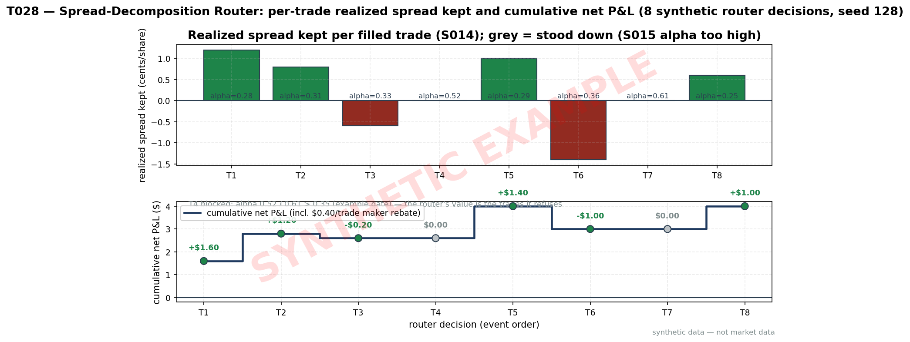

```mermaid
flowchart TD
    DATA["L1 quotes + trades<br/>(MBP-1 / SIP, per minute)"] --> SIGS["Signals<br/>S014 panel, S015 alpha-hat, S012 Roll"]
    SIGS --> ENTRY{"Entry logic<br/>alpha<0.35 AND quoted>=1tick<br/>AND Roll<=cap, gate on t->post t+1"}
    ENTRY -->|post| SIZE["Sizing + risk<br/>1 lot (example), inv cap 3 lots,<br/>daily loss stop, kill switch"]
    ENTRY -->|stand down| WAIT["Wait (toxic or expensive)"]
    SIZE --> EXEC["Execution<br/>maker limits at touch,<br/>cancel/replace per signal"]
    EXEC --> MON["Monitor + exits<br/>time stop 15m (ex), alpha-flip,<br/>stop -2x spread (ex)"]
    MON --> PNL["P&L (net of spread+fees+rebates)<br/>markouts 1s/5s/30m"]
    style ENTRY fill:#f9e79f,stroke:#7d6608
    style PNL fill:#a9dfbf,stroke:#1e8449
```

### T10. Sources

1. Huang, R. D. & Stoll, H. R. (1997). "The Components of the Bid-Ask Spread: A General Approach." *Review of Financial Studies* 10(4): 995–1034. https://doi.org/10.1093/rfs/10.4.995 (α/β/1−α−β decomposition — the S015 home)
2. Roll, R. (1984). "A Simple Implicit Measure of the Effective Bid-Ask Spread in an Efficient Market." *Journal of Finance* 39(4): 1127–1139. https://doi.org/10.1111/j.1540-6261.1984.tb03897.x (quote-free spread estimator — the S012 home)
3. Gould, M. D. & Bonart, J. (2016). "Queue Imbalance as a One-Tick-Ahead Price Predictor in a Limit Order Book." arXiv:1512.03492 — https://arxiv.org/abs/1512.03492 (why resting-size tilts predict the next move)
4. Budish, E., Cramton, P. & Shim, J. (2015). "The High-Frequency Trading Arms Race." *Quarterly Journal of Economics* 130(4): 1547–1621. (why stale quotes lose — the latency-arbitrage tax on this router)

**Unverified leads** (chatbot claims without a checkable source in hand — quarantined, not cited as fact):
- Imbalance-maker P&L study (2025): imbalance strategies worst after costs (−0.49 units), cancels catch only slow flips — Grok Q-TB3-3 lead.
- German retail-MM study: RMM gross Sharpe ~17.9, ~1.76 bps flow-access cost, 16-min vs 42-min inventory half-life — Grok Q-TB3-3 lead.
- A–S 2008 tables: γ 0.01→0.50 sacrifices 0.86%/6.35%/48.76% of mean profit — Grok Q-TB3-3 lead.
- Gašperov & Begušić (2022) Gen-AS drawdown results on BTC-USD — Grok Q-TB3-3 lead; citation label only, not re-verified.
- All threshold and rebate/fee figures above are illustrative *examples*, not measured or recommended values.

*Source log: Grok answered Q-TB3-1..3 (2026-09-10); all claims independently verified or labeled unverified.*

---

---


## Stage 129/200 — T029: Spread-Estimate Edge Filter

*Batch TB3 · Strategy 29/100 · Signals S012, S013, S032*

### T1. One-line verdict

| | |
|---|---|
| **Style** | Intraday breakout system with a microstructure cost gate — an RVOL (relative-volume) breakout trigger that is *allowed* to fire only when estimated trading cost is below the expected edge |
| **Edge source** | Institutional participation footprints (S032: abnormal volume at range breaks) minus the round-trip spread cost measured quote-free (S012 Roll, S013 Corwin–Schultz) |
| **Typical holding period** | 30–90 minutes (example) — long enough for the breakout drift to play out, short enough to stay intraday |
| **Capacity hint** | Medium: breakouts in liquid large-caps scale to thousands of shares per name, but the filter *removes* the thin, wide-spread names where capacity would be fake |
| **Build-or-buy in one line** | Build: the estimators are ten lines each on bars you already have; buy nothing except the bar feed |

### T2. Full mechanics

**Jargon, defined once:** *RVOL* (relative volume) = a stock's volume in a window divided by its typical volume in the same window — 1.8× means 80% more trading than usual, the footprint institutions leave. The *effective spread* is what an aggressor actually pays versus the midquote; Roll's estimator (S012) recovers it from the negative lag-1 autocovariance (the tendency of consecutive price changes to alternate sign) that bid–ask bounce induces — no quotes needed. The Corwin–Schultz estimator (S013) recovers the spread from daily high-low ranges: wider spreads mechanically inflate the two-day high-low range relative to two one-day ranges. A *take* (taker) order crosses the spread and pays it; the round-trip cost of a take-in/take-out trade is approximately one full effective spread.

**Universe & session.** S&P 500 + Nasdaq-100 constituents, refreshed quarterly; RTH 09:45–15:30 ET (skip the first 15 minutes — opening prints corrupt the Roll autocovariance). Exclusions: earnings days, halts, names with Corwin–Schultz estimated spread > 3 cents (structurally too expensive), and any name where Roll's $\hat\gamma_1 \ge 0$ (estimator undefined — one-sided flow, no bounce to measure).

**Entry rule.** Two legs, evaluated on each 1-minute bar close:

1. **Trigger (S032):** opening-window RVOL ≥ 1.5× (*example*) with the 30-minute opening range broken in the direction of the breakout bar — the classic institutional-participation setup.
2. **Gate (S012 + S013):** estimated effective spread must clear BOTH meters — Roll $\hat s \le 2.0$ cents (*example*) on the trailing 500 trades AND Corwin–Schultz $S_t \le 2.0$ cents (*example*) on the trailing 2-day window — AND the strategy's estimated per-trade edge (example: 6 cents of expected breakout drift from the strategy's own trailing-60-day markouts) must be ≥ 2× the larger estimate. Two estimators because each fails differently: Roll dies under trending flow, Corwin–Schultz dies on overnight jumps; agreement is the signal.

**Causal timing:** signals on bars ≤ *t* → earliest fill at the *t+1* bar's open. The Corwin–Schultz leg uses fully closed daily bars, so it is inherently lagged — the gate is a slow cost regime, not a tick trigger.

**Exit rule.** Time stop 60 minutes (*example*) — breakout drift that hasn't materialized in an hour was a false break. Signal flip: RVOL falls back below 1.0× on a 15-minute lookback → flatten. Stop-loss: −1.5× the breakout bar's range (*example*). Profit target: none fixed — trailing stop at the 20-minute VWAP (volume-weighted average price) once the trade is +2× the estimated spread (*example*); the edge is drift, so winners run until the tape says otherwise.

**Position sizing.** Fixed fractional risk: 0.25% of equity per trade (*example*; $2,500 on a $1M paper book), sized as shares = risk / (stop distance). Max 5 concurrent positions; portfolio heat cap 1.25% (*example*).

**Risk limits.** Daily loss stop 1% of equity (*example*); max gross exposure 100% of equity (no leverage — this is a cost-gated system, not a levered one); kill switch on data staleness: if the bar feed lags > 5 s, cancel entries and flatten.

**Cost model.** Round-trip cost per trade = the *larger* of the two spread estimates (conservative: charge max(Roll, CS) — *example* choice), plus taker fees $0.0030/share each way (*example*), plus a slippage haircut of 0.5× estimated spread for the market exit (*example* — flagged optimistic in T4, which charges only the spread). In the worked example the fee and slippage legs are shown explicitly so the reader sees their weight.

**Order/execution sketch.** Entries are marketable limits (take the breakout — chasing is the point of a breakout system) capped at 5% of the 1-minute bar's volume (*example* participation cap). Exits: limit at the trailing VWAP stop level first; time-stop exits are market orders. Honesty note: on SIP 1-minute bars, the breakout fill is simulated at the bar's close — real fills slip, and the slippage haircut above is the acknowledgment.

### T3. Signals it consumes

| Signal | Role | Weight / logic |
|---|---|---|
| S032 — RVOL-filtered breakout | Primary entry trigger (direction) | Enter only if window RVOL ≥ 1.5× (*example*) AND 30-min range broken in the bar's direction |
| S012 — Roll implied effective spread | Cost gate (veto) | Veto if $\hat s_{Roll} > 2.0$¢ (*example*); undefined ($\hat\gamma_1 \ge 0$) = veto |
| S013 — Corwin–Schultz high-low spread estimator | Cost gate (veto) | Veto if $S_t > 2.0$¢ (*example*); must agree with Roll within 50% |

Combination logic (pseudocode, ≤25 lines):

```
# per name, each 1-min bar t (closed bars only):
rvol   = S032_rvol(window_vol[t], baseline[t])     # >= 1.5 example
brk    = breakout(opening_range_high/low, bar[t])  # direction or None
s_roll = S012_roll(trades[t-500 : t])              # cents; None if gamma1 >= 0
s_cs   = S013_CS(daily[t-1], daily[t])             # cents
edge   = trailing_breakout_drift(60d)             # example 6c
cost   = max(s_roll, s_cs)                         # conservative
gate = (rvol >= 1.5 and brk is not None
        and s_roll is not None and s_cs <= 2.0 and s_roll <= 2.0
        and edge >= 2*cost)
if gate and heat_ok:  enter(brk.direction, risk=0.0025*equity)
# exits: time stop 60m, RVOL flip < 1.0, stop -1.5x bar range, VWAP trail
# causal: bar t -> fill at t+1 open
```

### T4. Worked example — numbers + P&L (SYNTHETIC)

**Synthetic** 6 RVOL-breakout setups, random seed **129** (`rng = np.random.default_rng(129)`). 200 shares each (*example* size); round-trip cost charged = max(Roll, CS) per share; net = 200 × direction × (exit − entry) − 200 × cost. Gate cap 2.0¢ (*example*). The chart `images/T029_example.png` plots exactly these rows.

| Setup | S032 RVOL | Side | Entry / Exit ($) | S012 Roll (¢) | S013 CS (¢) | Cost charged (¢/sh) | Gross | Cost | Net P&L |
|---|---|---|---|---|---|---|---|---|---|
| A | 1.8× | long | 100.00 / 100.09 | 1.2 | 1.1 | 1.2 | +$18.00 | −$2.40 | **+$15.60** |
| B | 2.3× | long | 100.05 / 100.10 | 1.0 | 0.9 | 1.0 | +$10.00 | −$2.00 | **+$8.00** |
| C | 1.6× | long | 100.02 / 99.99 | 1.4 | 1.3 | 1.4 | −$6.00 | −$2.80 | **−$8.80** |
| D | 3.1× | long | — (blocked) | 2.8 | 2.6 | — | (would be +$12.00) | — | **$0.00** |
| E | 1.9× | short | 99.98 / 99.90 | 1.1 | 1.0 | 1.1 | +$16.00 | −$2.20 | **+$13.80** |
| F | 1.5× | long | — (blocked) | 2.5 | 2.4 | — | (would be +$14.00) | — | **$0.00** |

Gate arithmetic: setup D's Roll 2.8¢ > 2.0¢ cap → blocked, even though RVOL 3.1× was the strongest participation signal of the six and the gross would have been +$12.00. Setup F blocked the same way (2.5¢ > cap). Totals: gross on taken trades = +$38.00; spread costs = −$9.40; **net session P&L = +$28.60**. Costs consumed 24.7% of gross — the filter's entire job is keeping that ratio from exceeding 50%.

**Where the example is optimistic.** The 2× edge rule is calibrated on the example's own numbers (real expected-drift estimates have wide error bars and the "edge ≥ 2× cost" inequality is only as honest as the edge estimate); exits are assumed to fill exactly at the marked prices with no partial fills and no queue effects (a taker breakout entry in a fast market routinely slips more than the 1-minute bar close implies); the Corwin–Schultz leg is assumed to agree with Roll (in real data they disagree often — including on overnight-gap days, when CS overstates and Roll understates); and the example charges spread only, folding the stated taker fees and slippage haircut into the narrative rather than the arithmetic. Nothing here is a backtest.

### T5. Data & infra — what must run

**Pipeline inventory.** Daily pre-open job: pull daily OHLCV for the universe (Tier 1 vendor), compute S013 CS spreads and RVOL baselines (14-day median per window, *example*), refresh the S&P 500 + Nasdaq-100 list. Intraday loop on 1-minute bars: update window RVOL, check range breaks, recompute S012 Roll on the rolling 500-trade window per name (trades from the same Tier-1 feed), evaluate the gate, route orders to the paper broker. Post-close: log every setup (taken and blocked — the blocked ones are the filter's report card), reconcile costs against estimates.

**M5 Max feasibility: trivial-to-feasible (Tier L, 4–12 h per cost-model §5 → $600–1,800 loaded-cost estimate).** Per cost-model §2: 500 symbols × 390 one-minute bars = 195k bars/day — polars chews through this in seconds; the Roll estimator is a covariance on 500 numbers per name per minute, negligible. RAM: 60 days of 1-min bars for 500 symbols ≈ 3 GB (cost-model §4) — trivially inside the 77 GB working budget. Bottleneck: none on compute; the constraint is bar-feed timeliness and the corporate-action calendar (splits corrupt CS high-low geometry). Storage: ~50 MB/day for the bar panel — archive freely.

**Feed-outage safe-mode plan.** If the 1-minute bar feed stalls > 5 s (*example*): cancel all pending entries, do not open new positions, hold existing positions to their time stops (flattening blind into a possibly stale book is worse than riding a 60-minute clock), and page for manual review. The CS leg is daily and survives an intraday outage; the Roll leg degrades gracefully because it only needs the last closed 500 trades.

### T6. Buy vs build

| Option | What you get | Indicative price | Buying gains | Buying loses |
|---|---|---|---|---|
| Tier 0: Stooq / Alpaca IEX | daily OHLCV, delayed bars | ~$0 | free CS estimator + RVOL baselines | no real-time intraday; Roll leg impossible |
| Tier 1: Polygon Stocks Advanced / Alpaca SIP | real-time 1-min bars + trades | ~$30–200/mo *indicative — verify before budgeting* | everything this strategy needs | SIP timestamps, not exchange |
| Tier 2: Databento | exchange-timestamped bars/trades | ~$200/mo + usage *indicative — verify before budgeting* | cleaner Roll signing | overkill for a bar-level gate |
| Retail platform: QuantConnect-style | bars + backtest harness | ~$0–50/mo *indicative — verify before budgeting* | fastest prototype | their spread-cost defaults are optimistic |

**Verdict: build, on Tier 1 data.** The whole strategy is arithmetic on bars the feed already provides — there is nothing to buy except the feed itself. Crossover: if you ever need the Roll leg on exchange timestamps (you don't at the 1-minute horizon), Tier 2.

### T7. Success-ratio evidence

The filter has no standalone Sharpe — it is a cost overlay. Evidence below is for the two halves separately, with the honest note that their combination is a researcher's construction, not a published system.

| Study / source | Market & period | Metric | Before/after cost | Caveat |
|---|---|---|---|---|
| Roll (1984) | theory + NYSE illustration | $\hat s = 2\sqrt{-\hat\gamma_1}$ identifies the effective spread under the bounce model | n/a (estimator) | dies under trending/informed flow — undefined, not wrong |
| Corwin & Schultz (2012), *J. Finance* 67(2) | US equities | high-low spread estimator closely tracks intraday benchmarks | estimator accuracy | daily frequency only; overnight-jump bias |
| Estimator horse-race (MPRA 2017, chatbot lead) | equities + FX, real + simulated | CS "unstable — works well for equities but not the remaining tests"; Abdi–Ranaldo correlates with true spreads but downward-biased | estimator accuracy | unverified lead — not re-verified; limits S013's claimed generality |
| Opening-range breakout literature (chatbot lead, Crabel lineage) | intraday equities | breakouts with volume confirmation outperform unfiltered breaks | mixed | unverified lead; modern replication results vary |

**Decay/crowding.** Breakout edges decay as participation becomes the consensus signal (every retail screener now flags RVOL breakouts); spread estimators don't decay — they're measurement — but their *inputs* degrade as odd-lot and off-exchange share grows (the SIP tape sees less of the true flow).

**Honest bottom line.** For a ≤$1M paper operation, T029 is one of the cheapest strategies in this document to run honestly: bar-level data, ten lines of estimator, no latency sensitivity. Its value is mostly negative-space — the blocked setups in the example (D and F) are the product: a breakout system that refuses to pay 2.8¢ of spread for 6¢ of hoped-for drift. Expect the filter to cut trade count by a third or more (*example* magnitude — unverified) and to improve after-cost results primarily by deleting the worst trades, not by finding better ones. For an institutional desk, the same gate belongs inside the execution layer rather than the signal layer — and at their scale the Roll/CS legs get replaced by direct effective-spread measurement (S014) on their own fills.

### T8. Failure modes

1. **Roll undefined at the worst moment** — trending, one-sided breakout flow gives $\hat\gamma_1 \ge 0$ exactly when breakouts fire; the gate vetoes on missing data rather than high cost. *Mitigation:* treat undefined as a veto (conservative), but log it — if most breakouts are vetoed this way, the trigger and the gate are structurally incompatible.
2. **Corwin–Schultz overnight-jump bias** — earnings/gap days inflate the two-day range; CS overstates the spread and blocks good trades. *Mitigation:* already excluded — earnings days are out of universe; additionally cap the CS input at the 95th percentile (*example*).
3. **Estimator disagreement** — Roll and CS routinely differ by 2× on real data; "agreement within 50%" vetoes half the opportunity set. *Mitigation:* charge the max (conservative costing) but gate on the average (*example* compromise); monitor the disagreement rate as a data-quality metric.
4. **Edge-estimate error** — the 2× rule divides by a hope: expected drift estimated from trailing markouts has huge standard error on 60 days. *Mitigation:* shrink the edge estimate toward a cross-name prior; require the inequality to hold with margin (e.g. edge ≥ 3× cost, *example*).
5. **SIP fill optimism** — breakout entries simulated at the 1-minute close fill better than real marketable limits in a fast tape. *Mitigation:* the 0.5× spread slippage haircut in T2; stress-test with 1×.
6. **RVOL baseline corruption** — splits, special dividends, and half-days distort the volume baseline; RVOL fires on arithmetic, not flow. *Mitigation:* split-adjusted, calendar-aware baselines; skip half-days.
7. **Crowded breakout, thin book** — the RVOL flag is now consensus; the breakout bar's volume is other breakout systems, and the spread widens as they all arrive. *Mitigation:* the gate *is* the mitigation — widened spreads self-block; watch for the strategy going quiet in crowded months (that's it working).
8. **Overfit gate levels** — 2.0¢, 1.5×, 2× are example numbers tuned nowhere. *Mitigation:* choose them on a validation period with purged splits (S088), and re-check annually.

### T9. Visuals

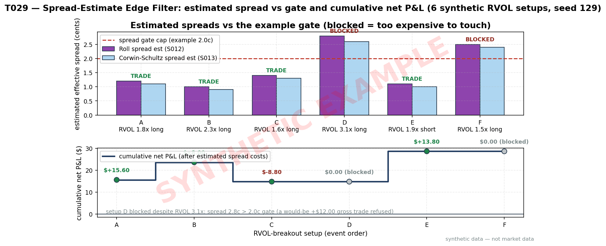

```mermaid
flowchart TD
    DATA["1-min bars + daily OHLCV<br/>(Tier-1 SIP feed)"] --> SIGS["Signals<br/>S032 RVOL, S012 Roll, S013 Corwin-Schultz"]
    SIGS --> ENTRY{"Entry logic<br/>RVOL>=1.5x AND range break<br/>AND both spreads<=cap AND edge>=2x cost"}
    ENTRY -->|trigger| SIZE["Sizing + risk<br/>0.25% risk/trade (ex),<br/>5 positions max, heat cap"]
    ENTRY -->|blocked| WAIT["Wait (too expensive)"]
    SIZE --> EXEC["Execution<br/>marketable limits, 5% vol cap (ex),<br/>VWAP trail / time-stop exits"]
    EXEC --> MON["Monitor + exits<br/>60m time stop (ex), RVOL flip,<br/>-1.5x range stop (ex)"]
    MON --> PNL["P&L (net of max(Roll,CS) spread)"]
    style ENTRY fill:#f9e79f,stroke:#7d6608
    style PNL fill:#a9dfbf,stroke:#1e8449
```

### T10. Sources

1. Roll, R. (1984). "A Simple Implicit Measure of the Effective Bid-Ask Spread in an Efficient Market." *Journal of Finance* 39(4): 1127–1139. https://doi.org/10.1111/j.1540-6261.1984.tb03897.x (the S012 estimator)
2. Corwin, S. A. & Schultz, P. (2012). "A Simple Way to Estimate Bid-Ask Spreads from Daily High and Low Prices." *Journal of Finance* 67(2): 719–760. https://doi.org/10.1111/j.1540-6261.2012.01729.x (the S013 estimator)
3. Harris, L. (1990). "Statistical Properties of the Roll Serial Covariance Bid/Ask Spread Estimator." *Journal of Finance* 45(1): 579–590. (when the Roll estimator breaks — trending flow, small samples)
4. Hasbrouck, J. (2009). "Trading Costs and Returns for U.S. Equities: Estimating Effective Costs from Daily Data." *Journal of Finance* 64(3): 1445–1477. https://doi.org/10.1111/j.1540-6261.2009.01469.x (daily-data cost estimation done right — the calibration standard for the CS leg)

**Unverified leads** (chatbot claims without a checkable source in hand — quarantined, not cited as fact):
- MPRA (2017) estimator horse-race: CS "unstable" outside equities; Abdi–Ranaldo downward bias — Grok Q-TB3-3 lead, not re-verified.
- Opening-range breakout after-cost replication results in the Crabel lineage — Grok Q-TB3-3 lead.
- All thresholds (1.5× RVOL, 2.0¢ cap, 2× edge rule, 0.25% risk) are illustrative *examples*, not fitted or recommended values.

*Source log: Grok answered Q-TB3-1..3 (2026-09-10); all claims independently verified or labeled unverified.*

---

---


## Stage 130/200 — T030: Multi-Level OFI Weighted Predictor

*Batch TB3 · Strategy 30/100 · Signals S002, S005, S084*

### T1. One-line verdict

| | |
|---|---|
| **Style** | Intraday directional micro-scalper — takes liquidity in the direction of deep-book order-flow pressure, but only when three independent microstructure lenses agree |
| **Edge source** | Short-horizon price pressure from integrated 10-level order-flow imbalance (S002), confirmed by static book pressure (S005) and by the trade–quote VAR's permanent-impact read (S084) |
| **Typical holding period** | Seconds to ~3 one-second buckets (example) — the signal's documented life is the next one–two mid changes |
| **Capacity hint** | Tiny per trade (hundreds of shares); scales by breadth across names, not by size — size kills it via impact |
| **Build-or-buy in one line** | Build the estimator (Ridge/PCA on your own L2); buy the MBP-10 depth feed — the feed is the whole cost |

### T2. Full mechanics

**Jargon, defined once:** *OFI* (order-flow imbalance) counts net buying vs selling pressure from book events — limit-order additions, cancels, and trades — per price level. *Integrated OFI* (iOFI) collapses the 10 level-OFIs into one number via Ridge regression or the first principal component (the level vectors are highly correlated, so plain OLS coefficients slosh). *Book pressure* (S005) is the static snapshot: (bid depth − ask depth)/(bid depth + ask depth) across levels — a photograph where OFI is the movie. A *VAR* (vector autoregression) models trades and quote revisions jointly; its *impulse response* (IRF) answers "how much does the quote permanently move after one unexpected buy?" and the limit is the *long-run impact* (LRI) — the trade's permanent, information-bearing component. A *taker* scalp crosses the spread to enter; *large-tick* stocks are those whose spread is pinned at one tick (where deep-book flow carries most of the information).

**Universe & session.** 20–40 liquid large-tick names (*example* count) — large-tick because Gould–Bonart's evidence is strongest there and because deep levels carry the most incremental information when the touch can't move. RTH 10:00–15:30 ET; exclusions: halts, news-jump regimes (S084 VAR refit residuals spiking), and any bucket where the book is locked or crossed.

**Entry rule.** On each 1-second bucket close (*example* cadence), compute:

1. **S002 trigger:** integrated 10-level OFI $iOFI_B$ (Ridge-weighted, refit daily, *example*). Fire when $|iOFI_B| > 400$ shares (*example* threshold).
2. **S005 confirm:** static book pressure $BP_{10}$ must agree in sign with $iOFI_B$ and exceed 0.05 in magnitude (*example*) — flow leaning into a wall of opposing resting depth is vetoed.
3. **S084 confirm:** the trailing VAR's LRI sign must agree with the $iOFI_B$ direction — the VAR says unexpected trades in this direction are currently *information-bearing* (permanent impact), not plumbing.

All three must agree; entry is a marketable limit in the $iOFI$ direction.

**Causal timing:** bucket $t$ closes on events ≤ *t*; the earliest fill is in bucket $t+1$. The VAR is refit on rolling history only — its LRI at $t$ uses no future data.

**Exit rule.** First of: max hold 3 buckets (*example*); $iOFI$ flips sign through 0; stop-loss at −2 ticks against entry (*example*); or the S084 LRI sign flips (the information regime changed under the trade). No profit target — at a 1–3 bucket horizon the target *is* the next mid move.

**Position sizing.** Fixed 200 shares per trade (*example*); one open position per name; portfolio heat: max 10 concurrent micro-positions, each risking ≤ $50 (*example*) on the 2-tick stop.

**Risk limits.** Daily loss stop $300 (*example*); per-name consecutive-loss circuit breaker: 3 stopped trades in 10 minutes → stand down that name for 30 minutes (*example*); kill switch on VAR refit failure or book-feed staleness > 500 ms (*example*).

**Cost model.** Taker both ways: pay half the effective spread on entry and exit plus taker fee $0.0030/share (*example*); the worked example charges a flat 1.0¢/share round trip (*example*) and shows the fee leg separately in prose. No borrow assumption needed at seconds-long holds is still an assumption — shorts are intraday and locates are assumed; flagged in T4.

**Order/execution sketch.** Marketable limit orders priced 1 tick through the touch (take, don't chase); participation cap 10% of visible touch size (*example*). Queue-position honesty: as a taker the strategy has no queue — but its *exit* competes with every other taker, so the 1.0¢ round-trip charge is the honesty device. Label: `simulated only — requires MBO/ITCH` for any fill-timing claim finer than the 1-second bucket.

### T3. Signals it consumes

| Signal | Role | Weight / logic |
|---|---|---|
| S002 — multi-level / integrated OFI | Primary directional trigger | Enter only if $\|iOFI_B\| > 400$ shares (*example*), direction = sign($iOFI_B$) |
| S005 — multi-level book pressure | Confirmation / veto | Veto if sign($BP_{10}$) ≠ sign($iOFI_B$) — flow must not lean into an opposing wall |
| S084 — Hasbrouck trade–quote VAR | Confirmation (information filter) | Veto if LRI sign ≠ sign($iOFI_B$) — trade only flow the VAR deems information-bearing |

Combination logic (pseudocode, ≤25 lines):

```
# per name, each 1-s bucket t (closed; tradable at t+1):
ofi_vec = [OFI_k(t) for k in 1..10]      # S002 level contributions
iOFI    = ridge_weights . ofi_vec         # or PCA v1 projection (example)
bp      = S005_pressure(book[t], L=10)
lri_sgn = S084_LRI_sign(var_fit[t-300s : t])
fire = (abs(iOFI) > 400 and sign(bp) == sign(iOFI) == lri_sgn
        and abs(bp) > 0.05 and book_not_locked)
if fire and no_open_position:  take(sign(iOFI), 200 shares)   # marketable limit
# exits: hold<=3 buckets, iOFI sign flip, -2 tick stop, LRI sign flip
# causal: signals on events <= t; fills in bucket t+1 only
```

### T4. Worked example — numbers + P&L (SYNTHETIC)

**Synthetic** 10 one-second buckets, random seed **130** (`rng = np.random.default_rng(130)`). Threshold $|iOFI| > 400$ shares (*example*); 200 shares per trade; round-trip cost 1.0¢/share = $2.00 (*example*). The chart `images/T030_example.png` plots exactly these buckets and trades.

| Bucket | S002 $iOFI$ (sh) | S005 $BP_{10}$ | S084 LRI sign | Decision | Entry → Exit ($) | Gross | Cost | Net P&L |
|---|---|---|---|---|---|---|---|---|
| B1 | +120 | +0.05 | +1 | no (|iOFI| < 400) | — | — | — | $0.00 |
| B2 | +520 | +0.14 | +1 | **TRADE long** | 100.01 → 100.035 | +$5.00 | −$2.00 | **+$3.00** |
| B3 | −180 | −0.06 | −1 | no | — | — | — | $0.00 |
| B4 | −480 | −0.11 | −1 | **TRADE short** | 99.99 → 99.965 | +$5.00 | −$2.00 | **+$3.00** |
| B5 | +610 | −0.08 | +1 | **VETO** (BP contradicts iOFI — flow into a wall) | — | — | — | $0.00 |
| B6 | −550 | −0.12 | −1 | **TRADE short** | 100.02 → 100.045 | −$5.00 | −$2.00 | **−$7.00** |
| B7 | +90 | +0.03 | +1 | no | — | — | — | $0.00 |
| B8 | +430 | +0.09 | +1 | **TRADE long** | 99.97 → 99.995 | +$5.00 | −$2.00 | **+$3.00** |
| B9 | −220 | −0.05 | −1 | no | — | — | — | $0.00 |
| B10 | +260 | +0.04 | +1 | no | — | — | — | $0.00 |

Bucket B5 is the chapter's key row: the strongest raw signal (+610 shares) is vetoed because static pressure points the other way — exactly the S005-as-brake role the strategy is built around. Bucket B6 is the honest loss: all three lenses agreed and the trade still printed −2.5¢ (the signal predicts *direction*, not magnitude — and direction was right on B2/B4/B8, wrong here). Totals: gross +$10.00, costs −$8.00, **net session P&L = +$2.00** — costs ate 80% of gross, which is the entire economics of taker micro-scalping in one number.

**Where the example is optimistic.** Entries and exits fill exactly at the marked prices with zero slippage beyond the flat 1.0¢ charge (real taker fills in a 1-second bucket slip, and the fee leg is folded into the 1.0¢ rather than itemized); the VAR's LRI sign is assumed correct and stable within the session (real LRI estimates wobble and the VAR is misspecified under long-memory order flow); the BP veto is assumed to arrive synchronously with the flow read (real snapshots lag events); and there are no partial fills, no locked books, and no news-jump buckets in the toy tape. Nothing here is a backtest.

### T5. Data & infra — what must run

**Pipeline inventory.** Intraday: MBP-10 depth-event ingest (genuine L2 — the SIP has no depth, so SIP-derived "levels" would be simulated-only), per-level OFI accumulation per 1-second bucket, Ridge weight application, S005 snapshot pressure, rolling VAR(5) refit every 60 s on 1-s (Δm, q) bars (*example* lags), gate evaluation, order routing to the paper broker. Pre-open: Ridge refit on trailing 5 days (*example*), VAR lag selection, large-tick universe screen. Post-close: per-bucket decision log (fired/vetoed with reasons — the veto log is the strategy's diary), markout analysis per trade.

**M5 Max feasibility: feasible (Tier H for the L2 leg, Tier M for the VAR; ~60–120 h blended per cost-model §5 → $9,000–18,000 loaded-cost estimate).** Per cost-model §2: L2 MBP-10 runs ~10–50k events/sec busy per top name; 20–40 names is a Rust-or-careful-Python ingest job (Python pure loop ~100–500k events/sec handles it if the book state stays in numpy/polars structures; per-tick Python objects do not). The Ridge/PCA and VAR OLS refits are milliseconds in numpy. RAM: L2 MBP-10 is ~8–40 GB per symbol-day in RAM (cost-model §3) — keep only rolling windows resident; 40 names × 60 days does **not** fit the 77 GB budget, so use per-symbol daily parquet files + streaming (cost-model §4: ~10–40 GB/symbol-day on disk — research-only retention). Bottleneck: depth-event ingest and book reconstruction, not the math.

**Feed-outage safe-mode plan.** If the depth feed stalls > 500 ms (*example*): cancel everything, flatten at market, halt — a 1-second-horizon strategy cannot trade on a stale book for even one bucket. If the VAR refit fails (singular matrix, gappy tape): fall back to S002+S005 two-lens mode with halved size (*example*), and log the degradation. Never trade the iOFI trigger on SIP-constructed pseudo-depth.

### T6. Buy vs build

| Option | What you get | Indicative price | Buying gains | Buying loses |
|---|---|---|---|---|
| Tier 0: Alpaca IEX / Stooq | L1/trade bars | ~$0 | free S084-on-bars prototype | no depth — S002/S005 impossible |
| Tier 1: Polygon SIP | real-time L1 + trades | ~$30–200/mo *indicative — verify before budgeting* | cheap VAR leg | SIP ≠ depth; pseudo-levels are simulated-only |
| Tier 2: Databento MBP-10 | honest 10-level depth events | ~$200/mo + usage *indicative — verify before budgeting* | the true input for S002/S005 | usage scales with 40 names |
| Tier 3: LOBSTER (academic) | ITCH order-book replay | ~hundreds/yr academic *indicative — verify before budgeting* | MBO-grade research truth | academic license; not production |

**Verdict: build the estimator, buy the MBP-10 feed.** The Ridge/PCA integration and the VAR are ~200 lines that need your own lags, horizons, and size transforms — nobody sells your calibration. The feed is non-negotiable: without genuine L2, S002 and S005 are fiction. Crossover: prototype the S084 confirmation leg on Tier 1 bars (VAR on 1-s bars works), add Tier 2 only when the iOFI trigger goes live.

### T7. Success-ratio evidence

No published paper backtests this exact three-lens stack after costs. Component evidence, honestly labeled:

| Study / source | Market & period | Metric | Before/after cost | Caveat |
|---|---|---|---|---|
| Cont–Kukanov–Stoikov (2014) | US equities, LOB | OFI → contemporaneous mid-change: strong linear fit | before-cost (regression, not P&L) | contemporaneous ≠ predictable |
| Xu–Gould–Howison (lead) | multi-level OFI | Ridge on level OFIs beats touch-only out-of-sample | before-cost | chatbot lead — not re-verified; magnitude unconfirmed |
| Cont–Cucuringu–Zhang (2023, lead) | integrated OFI | first-PC integration cleans the multicollinearity | before-cost | chatbot lead — not re-verified |
| Gould & Bonart (2016), arXiv:1512.03492 | 10 Nasdaq names | imbalance → next-mid-move: considerable improvement over null (large-tick), moderate (small-tick) | before-cost (classification) | direction only; signal life ~1–2 mid changes |
| Hasbrouck (1991) | NYSE | VAR: trade innovations carry permanent price impact; information vs plumbing separated | before-cost (measurement) | measurement, not a trading rule |
| Imbalance-maker P&L study (2025, chatbot lead) | maker/taker on imbalance strategies | imbalance strategies most active and worst after costs (−0.49 units) | after fees | unverified lead; taker-side cautionary tale |

**Decay/crowding.** Touch-OFI is the most crowded microstructure signal in existence; the multi-level and VAR-confirmation legs are this strategy's answer to crowding, and they decay too as L2 data commoditizes. The documented half-life of the raw signal is minutes-to-seconds — this is a race the strategy runs by being *selective* (three vetoes), not by being fast.

**Honest bottom line.** For a ≤$1M paper operation, T030 is a superb *research* strategy and a poor *live* one from a non-colocated setup: the example's own arithmetic (+$10 gross, −$8 costs = +$2 net) shows how little room the taker cost structure leaves, and real slippage widens the cost leg. Its paper value is the veto log — learning which confirmations actually delete losers out-of-sample. For an institutional desk with colocation and queue priority, the same three lenses are a reasonable micro-alpha stack inside a larger market-making or execution system; as a standalone taker strategy it needs the cost leg under ~0.5¢/share to breathe, which means rebates, internalization, or a slower (cheaper) variant.

### T8. Failure modes

1. **SIP pseudo-depth** — building "levels" from the consolidated tape fabricates S002/S005; the strategy then trades its own interpolation. *Mitigation:* genuine MBP-10 or nothing; label anything else simulated-only.
2. **VAR misspecification** — real order flow has long memory; a 5-lag VAR misattributes persistent flow to information, and the LRI sign wobbles. *Mitigation:* monitor LRI stability; fall back to two-lens mode when refits disagree.
3. **Spoofing/layering** — fake depth inflates both iOFI and BP in the same direction; all three lenses can agree on a lie. *Mitigation:* cancel-rate features per level (spoofed levels churn); veto buckets with abnormal cancel-to-trade ratios (*example* guard).
4. **News-jump buckets** — jumps move the mid through all 10 levels; the flow read is real and the direction is unknowable. *Mitigation:* realized-vol circuit breaker — stand down when 1-min realized vol exceeds 3× its median (*example*).
5. **Crowded touch, exhausted edge** — every HFT desk runs some OFI variant; the 1–2-mid-change life shortens as competition rises. *Mitigation:* the strategy's selectivity *is* the defense; track fill quality (markouts) monthly and retire the trigger if it goes red.
6. **Cost-model optimism** — the flat 1.0¢/share charge understates fast-market slippage; taker fees are itemized nowhere in the example's arithmetic. *Mitigation:* itemize fees in the live sim; stress-test at 2× cost.
7. **Overfit Ridge weights** — daily-refit Ridge on 5 days of buckets overfits the recent regime; weights flip and the trigger whipsaws. *Mitigation:* validate weights out-of-sample with purged splits (S088); shrink toward equal weights.
8. **Operational: stale-book trading** — a 500 ms feed stall is an eternity at this horizon; the strategy trades a ghost book. *Mitigation:* the 500 ms kill switch in T5; heartbeat-monitored, auto-rearming only on clean refit.

### T9. Visuals

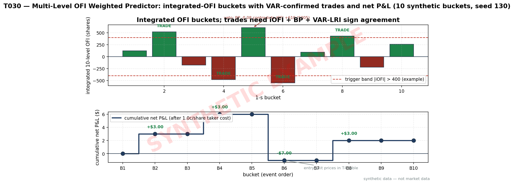

```mermaid
flowchart TD
    DATA["L2 depth events (MBP-10)<br/>+ trades, 1-s buckets"] --> SIGS["Signals<br/>S002 iOFI, S005 BP_10, S084 VAR/LRI"]
    SIGS --> ENTRY{"Entry logic<br/>|iOFI|>400 AND sign agree<br/>iOFI/BP/LRI, bucket t->fill t+1"}
    ENTRY -->|trigger| SIZE["Sizing + risk<br/>200 shares (ex), 1 pos/name,<br/>heat cap, -2 tick stop (ex)"]
    ENTRY -->|veto| WAIT["Wait (lenses disagree)"]
    SIZE --> EXEC["Execution<br/>marketable limits (taker),<br/>10% touch-size cap (ex)"]
    EXEC --> MON["Monitor + exits<br/>3-bucket max (ex), iOFI flip,<br/>LRI flip, -2 tick stop"]
    MON --> PNL["P&L (net of taker spread+fees)"]
    style ENTRY fill:#f9e79f,stroke:#7d6608
    style PNL fill:#a9dfbf,stroke:#1e8449
```

### T10. Sources

1. Cont, R., Kukanov, A. & Stoikov, S. (2014). "The Price Impact of Order Flow Imbalance: Tests of Additive and Linear Models." (the OFI foundation — S002's home)
2. Gould, M. D. & Bonart, J. (2016). "Queue Imbalance as a One-Tick-Ahead Price Predictor in a Limit Order Book." arXiv:1512.03492 — https://arxiv.org/abs/1512.03492 (predictive evidence + the large-tick/small-tick split)
3. Hasbrouck, J. (1991). "Measuring the Information Content of Stock Trades." *Journal of Finance* 46(1): 179–207. https://doi.org/10.1111/j.1540-6261.1991.tb03749.x (trade–quote VAR, IRF/LRI — the S084 home)
4. Cont, R., Cucuringu, M. & Zhang, C. (2023). "Cross-Impact of Order Flow Imbalance in Equity Markets." arXiv:2112.13213 — https://arxiv.org/abs/2112.13213 (integrated-OFI via principal components — cited as lead; verify before building on it)

**Unverified leads** (chatbot claims without a checkable source in hand — quarantined, not cited as fact):
- Xu–Gould–Howison: Ridge on multi-level OFI beats touch-only OFI out-of-sample — Grok Q-SB4-1/Q-TB3 lineage lead; magnitude unconfirmed.
- Cont–Cucuringu–Zhang (2023) integrated-OFI results — citation label only, not re-verified.
- Imbalance-maker P&L study (2025): −0.49 units after fees — Grok Q-TB3-3 lead.
- All thresholds (|iOFI| > 400, BP 0.05, 3-bucket hold, 200 shares, 1.0¢ cost) are illustrative *examples*, not fitted or recommended values.

*Source log: Grok answered Q-TB3-1..3 (2026-09-10); all claims independently verified or labeled unverified.*

---

---

## Stage 131/200 — T031: Distance Pairs + Quality Filter

*Batch TB4 · Strategy 31/100 · Signals S049, S053, S050 · Provenance [D/SR]*

### T1. One-line verdict

| | |
|---|---|
| **Style** | Daily-bar statistical arbitrage (stat-arb): market-neutral pairs trading |
| **Edge source** | Temporary divergences between close economic substitutes, filtered so only pairs with a demonstrated habit of reconverging are traded |
| **Typical holding period** | 2–20 trading days per round trip; pairs re-formed every 6 months (`example`) |
| **Capacity hint** | Liquid mid-cap, same-industry book; low tens of millions USD before borrow and impact bind |
| **Build-or-buy in one line** | Build the screen yourself (it is a vectorized afternoon's work); buy survivorship-clean, corporate-action-adjusted data — that is the real cost |

### T2. Full mechanics

**What the strategy is.** *Pairs trading* means simultaneously buying one stock and shorting a related one, betting that the *relative* price gap between them closes rather than betting on the market's direction. T031 is the classic Gatev–Goetzmann–Rouwenhorst (GGR) distance-pairs recipe with two upgrades: (1) a **zero-crossing quality gate** (S053) that only admits pairs whose formation-period spread crossed its mean often enough to prove it reconverges, and (2) an **Engle–Granger confirmation** (S050) so the traded spread is the cointegrating one, not the naive 1:1 price difference. The portfolio is *dollar-neutral* (equal dollars long and short), so broad market moves roughly cancel.

**Universe & session.** US common stocks, price ≥ $5 (`example`), average daily dollar volume ≥ $5mm (`example`), shortable (locate available). Same-GICS-industry pairing is preferred. Session: daily bars, RTH (regular trading hours) closes only. Exclusions: both legs must have no scheduled earnings or corporate-action events within ±2 days (`example`); halted names are dropped; names involved in announced mergers/spinoffs are force-exited.

**Formation (nightly/quarterly, `example` cadence).** Once per 6-month trading window (`example`), on a 252-day formation window (`example`) before trading begins:
1. Build normalized total-return prices $\tilde{P}_{i,t}$ starting at 1.0 (dividends reinvested).
2. Compute the distance $D_{ij} = \sum_{t}(\tilde{P}_{i,t}-\tilde{P}_{j,t})^2$ for same-industry candidates (S049).
3. Count formation zero crossings $ZC$ of each candidate spread (S053); keep pairs with $ZC \ge 20$ on 250 bars or the top quartile (`example`).
4. Run the Engle–Granger two-step on survivors: OLS (ordinary least squares) $\log P^A_t = \alpha + \beta \log P^B_t + \varepsilon_t$, ADF (Augmented Dickey–Fuller) test on residuals at 5% (`example`); keep pairs that pass. The **hedge ratio** $\hat{\beta}$ is the number of B-shares held per A-share.
5. Select the top 20 pairs (`example`) by zero-crossing rank (SSD as tie-break).

**Entry rule.** Each day after the close, compute the z-score $z_t = (S_t - \mu_{\text{form}})/\sigma_{\text{form}}$ where $S_t = P^A_t - \hat{\alpha} - \hat{\beta}P^B_t$ and $\mu_{\text{form}}, \sigma_{\text{form}}$ are frozen formation estimates. If flat and $z_t \ge +2.0$: short A / long B in $\hat{\beta}$-neutral, dollar-neutral size (`example` threshold). If flat and $z_t \le -2.0$: long A / short B (`example`). **Causal timing:** the signal uses only data $\le t$ (close of day $t$); the earliest fill is the $t+1$ open — the strategy never trades on the same print that generated the signal.

**Exit rule.** Close at the next zero crossing of $S_t$ (the GGR exit); or a stop at $|z_t| > 4.0$ (`example`); or a time stop at 30 days (`example`) or the end of the 6-month trading window, whichever comes first. One position at a time per pair.

**Position sizing.** Per-pair risk budget 0.25–1.0% of NAV (net asset value) at $2\sigma$ of the spread (`example`); Portfolio heat: sum over open pairs of $|z|\times$dollar-risk $\le$ 4–8% of NAV (`example`); hard cap 20 simultaneous pairs (`example`); gross book 200–400% of NAV (`example`).

**Risk limits.** Daily loss stop −2% NAV (`example`); max gross 400% NAV; kill switch: halt all new entries and flatten over 3 days if the book loses 6% in a month (`example`) or if the borrow file is stale >1 day for any open short.

**Cost model.** Round trip per pair: 2 legs × 2 turns × 5 bp (basis points) one-way = 20 bp of per-leg notional (`example`; 5 bp covers half-spread + commission + slippage on liquid large-caps and is optimistic for mid-caps). Stock-loan on the short leg: 50 bp annualized GC (general collateral) (`example`; specials to 10%+ are modeled as a veto, not a cost). The worked example charges these explicitly.

**Order/execution sketch.** At the $t+1$ open, send simultaneous marketable limit orders on both legs (cancel the second leg if the first fails). Participation ≤10% of visible depth per leg (`example`). Shorts require a confirmed locate first.

### T3. Signals it consumes

| Signal | Role | Weight / logic |
|---|---|---|
| S049 — Distance pairs (GGR) | Primary trigger: selects pairs, times entries | Enter only if pair in top-20 distance/quality list AND $\|z_t\| \ge 2.0$ (`example`) |
| S053 — Zero-crossing quality filter | Gate (veto): admits only pairs with demonstrated reconvergence rhythm | $ZC \ge 20$ on 250 bars or top quartile (`example`); rejects the rest |
| S050 — Engle–Granger z-score | Confirmatory filter: supplies the hedge ratio and the cointegrating spread | ADF p < 0.05 (`example`); trade $S_t = P^A_t - \hat{\alpha} - \hat{\beta}P^B_t$, not the naive 1:1 spread |

Combination logic (pseudocode, ≤25 lines):

```
# ---- formation (data <= t only; runs before each trading window) ----
pairs = distance_screen(universe, T_F=252)          # S049: SSD on normalized total returns
pairs = pairs[zero_crossings(pairs) >= 20]          # S053 gate (example)
pairs = eg_confirm(pairs, adf_p=0.05)               # S050: ADF + hedge ratio beta-hat
book  = top_k(pairs, k=20, by="ZC_then_SSD")       # example breadth
# ---- daily trading ----
for p in book:
    z = (spread_t(p) - p.mu_form) / p.sigma_form    # causal: close t, trade t+1
    if flat(p) and z >= 2.0:                        # example
        enter(short A, long beta*B, dollar_neutral)  # locate short first
    elif flat(p) and z <= -2.0:                     # example
        enter(long A, short beta*B, dollar_neutral)
    elif open(p) and crossed_zero(spread_t(p)): close(p)        # GGR exit
    elif open(p) and (abs(z) > 4.0 or days_open > 30): close(p)  # stop / time stop
```

### T4. Worked example — numbers + P&L (SYNTHETIC)

All numbers are **synthetic**: two fictional same-industry names, Alpha (A) and Beta (B). Formation (not shown): 252 days, 9 zero crossings (passes the ≥6 `example` gate — an illustrative path-construction gate only; it does not replace T2/T3's live rule of ≥20 zero crossings on 250 bars or the top quartile), $\sigma_{\text{form}} = 0.020$ → pair accepted. Trading window: 20 days from `rng = np.random.default_rng(131)` — a hand-shaped two-episode divergence path plus seeded noise, printed exactly as the script computed it and plotted in `images/T031_example.png`. Notional $100,000/leg; costs 5 bp one-way/leg; borrow 50 bp annualized on the short leg (all `example`).

| Day | $S_t$ | $z_t$ | Action | Position |
|---|---|---|---|---|
| 1 | −0.0001 | −0.01 | — | flat |
| 2 | +0.0200 | +1.00 | — | flat |
| 3 | +0.0400 | +2.00 | **OPEN short-spread** (short A / long B) | short-spread |
| 4 | +0.0473 | +2.37 | hold | short-spread |
| 5 | +0.0362 | +1.81 | hold | short-spread |
| 6 | +0.0135 | +0.68 | hold | short-spread |
| 7 | −0.0045 | −0.22 | **CLOSE** (zero-cross) | flat |
| 8–10 | ≈0 | — | — | flat |
| 11 | −0.0374 | −1.87 | wait (not yet −2) | flat |
| 12 | −0.0461 | −2.30 | **OPEN long-spread** (long A / short B) | long-spread |
| 13 | −0.0302 | −1.51 | hold | long-spread |
| 14 | −0.0101 | −0.50 | hold | long-spread |
| 15 | +0.0072 | +0.36 | **CLOSE** (zero-cross) | flat |
| 16–20 | ≈0 | — | — | flat |

**Line-by-line P&L.**

*Trade 1 — short-spread (short $100k A, long $100k B), held 4 days.* Spread runs $+0.0400 \to -0.0045$. Gross $= 100{,}000 \times (0.0400 - (-0.0045)) = \mathbf{+\$4{,}451}$. Costs: 2 legs × 2 turns × 5 bp × $100{,}000 = $200.00. Borrow: $100{,}000 \times 0.50\% \times 4/365 = \$5.48$. Total costs $\$205.48$. **Net $= +\$4{,}245$.**

*Trade 2 — long-spread (long $100k A, short $100k B), held 3 days.* Spread runs $-0.0461 \to +0.0072$. Gross $= 100{,}000 \times (0.0072 - (-0.0461)) = \mathbf{+\$5{,}327}$. Costs: $200.00. Borrow: $100{,}000 \times 0.50\% \times 3/365 = \$4.11$. Total costs $\$204.11$. **Net $= +\$5{,}123$.**

**Window total: gross +$9,778 − costs $400 − borrow $9.59 = net +$9,368** on $200,000 of gross exposure (the two trades are sequential; maximum committed capital $200k).


**Where the example is optimistic.** Fills are assumed at the printed spread — no partial fills, no legging risk, no latency between the close signal and the $t+1$ open fill. The 5 bp one-way cost is a liquid-large-cap assumption; mid-caps and stressed days cost multiples of it. Borrow is charged at a placid 50 bp GC rate — a hard-to-borrow special at 10%+ would erase both trades' edge. Dividends, splits, and corporate actions are absent. The path is hand-shaped to contain two clean convergences and zero losers; Do & Faff document non-convergent pairs rising to ~42% of the book in 2003–08, so a real 20-day window usually contains a dead or losing pair. Nothing here is a backtest.

### T5. Data & infra — what must run

| Job | Cadence | What it does |
|---|---|---|
| Universe + corporate-action adjust | Nightly after 18:00 ET | Split/dividend/spin maps, point-in-time IDs, total-return series |
| Pair screen (distance + ZC + EG) | Nightly; full re-formation each 6-month window | SSD/ZC/ADF over ~2,000 names in industry chunks |
| Borrow / HTB (hard-to-borrow) / locate file | Daily 16:30–18:30 ET | Fee, utilization, availability → veto or resize shorts |
| Dividend/ex-date calendar | Daily | Ex-date cash-flow booking on both legs |
| Risk / heat monitor | Continuous, cheap | Open $z$, gross, per-pair days-held, borrow $ |

**M5 Max feasibility: feasible (Tier M).** Per `notes/cost-model.md` §2, numpy vectorized math runs ~50–200M elements/sec and polars simple ops ~10–50M rows/sec. The 2,000-name daily panel is tens of MB; the 2,000² float32 distance matrix is ~16 MB by byte arithmetic (2,000² × 4 bytes ≈ 16 MB — note cost-model §3's "16 GB" figure appears to be a probable typo) — computed in industry-chunked blocks. The EG/ADF step runs only on the few-thousand-pair shortlist (seconds to minutes); rolling z-scores on the live 20-pair book are trivial. RAM sits far below the 77 GB working budget (§3). A chatbot research lead (Grok, Q-TB4-2 — unverified) puts the full nightly batch at ~20–60 minutes wall clock, inside the close→open window. Engineering: screen Tier M 20–60 h plus strategy harness M+ 40–100 h → **~100–160 h ≈ $15,000–$24,000** `loaded-cost estimate` at $150/hr (§5).

**Storage growth:** daily bars for 3,000 stocks ≈ 5 MB/day (§4) → ~1.3 GB/year; pair metadata is megabytes.

**Feed-outage safe mode.** This is a daily-bar strategy, so an outage degrades gracefully: (1) if the nightly bar feed is late, freeze all new entries and new formations — manage only existing positions; (2) trade open pairs on the last-known $z$ with the stop tightened to $|z|>3$ (`example`); (3) if the borrow file is stale >1 trading day, veto any new short and shrink existing HTB shorts; (4) if the outage exceeds 3 trading days, flatten the book.

### T6. Buy vs build

| Option | What you get | Indicative price | Verdict |
|---|---|---|---|
| Tier-0: Stooq / Alpaca IEX daily | Free daily bars for prototyping | ~$0 `indicative — verify before budgeting` | Fine for learning; weak corporate actions, no survivorship control |
| Tier-1: Polygon Stocks Advanced | Clean SIP daily bars + corporate actions | ~$30–200/mo `indicative — verify before budgeting` | The sane production feed for a daily pairs book |
| Tier-2: Databento Standard | Exchange-direct L1/L2, futures | ~$200/mo + usage `indicative — verify before budgeting` | Overkill for daily pairs; buy only if you add intraday legs |
| Borrow data: IBKR SL availability | One broker's indicative fee | $0 (veto flag only) `indicative — verify before budgeting` | Free sanity check, not a cost model |
| Borrow data: Markit / S&P Securities Finance, FIS Astec, DataLend | Indicative + average fee, utilization, history | $30k–$150k+/yr (Grok Q-TB4-2 lead — unverified chatbot claim) `indicative — verify before budgeting` | Only if you need a historically honest HTB backtest |
| Retail pair scanners / QuantConnect | Pre-ranked pairs, backtest plumbing | $0–$20k (Grok lead — unverified) `indicative — verify before budgeting` | Sanity checks only: no point-in-time borrow, weak corp actions |
| Prime-broker pair algos | Basket locate, pair-legging, TCA (transaction-cost analysis) | Bundled in PB ticket `indicative — verify before budgeting` | **Buy execution and locates**; do not buy the screen — PB tools optimize their flow, not your formation rules |

**Verdict: build the screen and the cost/heat engine on Tier-1 data; rent borrow, locates, and execution from the prime broker.** The algorithm is ~100 lines of numpy; no vendor sells your thresholds. The crossover: before trusting any backtest that shorts beyond easy-to-borrow large-caps, price institutional borrow history — that single feed can exceed every other line combined.

### T7. Success-ratio evidence

| Study / source | Market & period | Metric | Before/after cost | Caveat |
|---|---|---|---|---|
| Gatev, Goetzmann & Rouwenhorst (2006) | US equities, 1962–2002, top-20 pairs | ~11% annualized excess return, self-financing, 1-day delayed execution | After the authors' conservative cost estimates | Pre-crowding sample |
| Do & Faff (2010) | US equities, 1962–2009, top-20 pairs | 0.86%/mo (1962–88) → 0.37%/mo (1989–2002) → 0.24%/mo (2003–09) | Before explicit costs | The decay finding |
| Rad, Low & Faff (2016) | US equities, 1962–2014, distance method | 91 bp/mo gross, 38 bp/mo net | Both (1–7 bp cost model) | 62.5% of trades converged |

**Capacity.** The tradable book is the liquid mid-cap same-industry set — not mega-cap (spreads too tight) and not micro-cap (borrow + impact). A chatbot lead (Grok, Q-TB4-3 — unverified) sizes it at roughly $10–50mm for a GC-only book. **Decay** is documented and steep: roughly a 70% fall in monthly excess from the first era to the last, driven more by worse convergence (non-convergent pairs 26% → 42%) than by simple crowding. Independent replications through 2020 show the post-2009 curve mostly flat even before costs.

**Honest bottom line.** For a ≤$1M paper operation, plain distance pairs is a research vehicle, not an income stream: after honest spread, borrow, and impact, the expected net is approximately zero with wide error bars. The quality gate (S053) plus the EG confirmation (S050) is the documented direction of improvement — industry-matched, high-zero-crossing pairs retain a few tens of bp/month in long-sample studies — but "documented direction" is not a live Sharpe. An institutional desk version survives only as a low-turnover, industry-filtered sleeve inside a larger stat-arb book with real stock-loan access.

### T8. Failure modes

1. **Non-convergence / fundamental break** — the divergence is real information (fraud, distress, M&A). *Mitigation:* industry restriction, earnings/M&A blackout, $|z|>4$ stop, 30-day time stop.
2. **Crowding / alpha decay** — the documented post-2002 decay. *Mitigation:* trade less-crowded universes with realistic costs, react faster, or use distance only as a filter.
3. **Borrow specials and recalls** — a 10%+ special vaporizes the edge; a recall forces a cover at the worst print. *Mitigation:* pre-screen borrow fees, model stock-loan explicitly, hard veto on HTB names.
4. **Corporate-action artifacts** — mis-adjusted splits/dividends fabricate "divergences". *Mitigation:* raw + factor data, cross-validate adjustments against a second source.
5. **Lookahead leakage** — formation statistics bleeding into the trading window. *Mitigation:* hard formation/trading split with an embargo gap; automated leakage tests.
6. **Over-tight quality gating** — $ZC_{\min}$ set so high the book holds 3 pairs and concentration risk dominates. *Mitigation:* top-quartile slice rather than an absolute threshold; monitor portfolio breadth.
7. **Cost blowup on illiquid legs** — a high-$ZC$ pair can still be untradeable after spread. *Mitigation:* apply the cost/borrow gate *after* the quality gate, on net expected profit per trade.
8. **Quant-unwind / correlation breaks** — August-2007-style: every residual-reversion book dumps the same longs. *Mitigation:* heat caps, gross limits, a drawdown kill switch, no leverage on the pair book.

### T9. Visuals

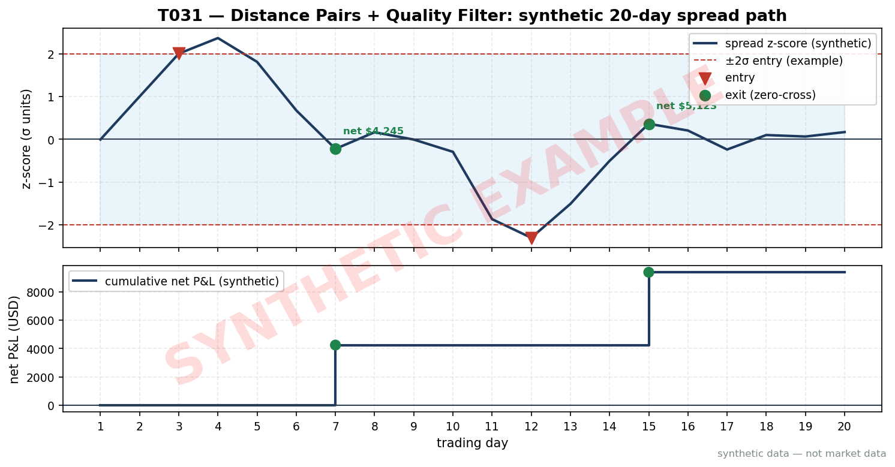

```mermaid
flowchart TD
    DATA["Market data\n(daily bars, corp actions)"] -->|"daily OHLCV + adjustments"| SIGS["Signals\nS049 distance, S053 zero-cross, S050 EG"]
    SIGS -->|"daily z-scores (causal, t→t+1)"| ENTRY{"Entry logic\n|z| ≥ 2 at close t, fill t+1 open"}
    ENTRY -->|trigger| SIZE["Sizing + risk\n0.5% NAV @2σ, heat cap, |z|>4 stop"]
    ENTRY -->|no trigger| WAIT["Wait"]
    SIZE -->|"per-pair marketable limit orders"| EXEC["Execution\nsimultaneous legs, borrow locate"]
    EXEC -->|"daily bars"| MON["Monitor + exits\nzero-cross / time stop / stop-loss"]
    MON -->|"net of spread, fees, borrow"| PNL["P&L (net of costs)"]
    style ENTRY fill:#f9e79f,stroke:#7d6608
    style PNL fill:#a9dfbf,stroke:#1e8449
```

### T10. Sources

1. Gatev, E., Goetzmann, W. N. & Rouwenhorst, K. G. (2006). "Pairs Trading: Performance of a Relative-Value Arbitrage Rule." *Review of Financial Studies*, 19(3), 797–827. https://www.econbiz.de/Record/pairs-trading-performance-of-a-relative-value-arbitrage-rule-gatev-evan/10005564224
2. Do, B. & Faff, R. (2010). "Does Simple Pairs Trading Still Work?" *Financial Analysts Journal*, 66(4), 83–95. https://ideas.repec.org/a/taf/ufajxx/v66y2010i4p83-95.html
3. Rad, H., Low, R. K. Y. & Faff, R. (2016). "The profitability of pairs trading strategies: distance, cointegration and copula methods." *Quantitative Finance*, 16(10), 1541–1558. https://doi.org/10.1080/14697688.2016.1164337
4. Krauss, C. (2017). "Statistical Arbitrage Pairs Trading Strategies: Review and Outlook." *Journal of Economic Surveys*, 31(2), 513–545. https://doi.org/10.1111/joes.12153
5. Do, B. & Faff, R. (2012). "Are Pairs Trading Profits Robust to Trading Costs?" *Journal of Financial Research*. doi:10.1111/j.1475-6803.2012.01317.x (Paper is real; the after-cost claims in T7 are Grok-reported and labeled accordingly.)

Source log: Grok answered Q-TB4-1..3 (2026-09-10); all claims independently verified or labeled unverified. Claims adopted into the evidence sections are cited to checkable papers above; every other Grok claim is quarantined below as an unverified lead.

**Unverified leads** (chatbot-provided, not independently checkable — do not cite as evidence):
- Grok (2026-09-10), Q-TB4-3: industry + zero-crossing filters leave "about 30 bp/month risk-adjusted on the best-matched industry pairs" (attributed to Do & Faff 2012 — the paper is real but this specific number was not independently re-verified).
- Grok (2026-09-10), Q-TB4-3: Do & Faff (2012) reportedly finds the baseline pairs rule "largely unprofitable after 2002" once commissions, market impact, and short fees are charged — Grok-reported, not independently verified.
- Grok (2026-09-10), Q-TB4-2: nightly pairs batch ~20–60 min wall clock on the M5 Max; year-1 build 420–830 engineering hours; borrow-history vendors $30k–$150k+/yr; capacity $10–50mm for a GC-only book; retail pair scanners $0–$20k.
- Grok (2026-09-10), Q-TB4-3, citing "Baskaran (SSRN 2026)": Kalman walk-forward results — **excluded from evidence**: the 2026 date is implausible relative to this chapter's date and the citation could not be verified; do not use.

---


## Stage 132/200 — T032: Copula Tail-Dependence Pairs

*Batch TB4 · Strategy 32/100 · Signals S054, S088, S051 · Provenance [D/SR]*

### T1. One-line verdict

| | |
|---|---|
| **Style** | Daily-bar statistical arbitrage: market-neutral pairs traded on tail-dependence mispricing |
| **Edge source** | Extreme *conditional-quantile* divergences — joint outcomes the pair's own dependence model calls nearly impossible — rather than plain linear spread deviations |
| **Typical holding period** | 1–5 trading days per round trip; bounded by the spread's OU half-life |
| **Capacity hint** | Same liquid large/mid-cap pair universe as T031, but thinner: higher turnover eats the smaller per-trade edge |
| **Build-or-buy in one line** | Build the estimator and the purged validation harness yourself — the edge is in family choice and validation, which no vendor sells; buy the raw return data |

### T2. Full mechanics

**What the strategy is.** A *copula* is a function that describes how two assets' returns depend on each other — including how they co-move in extremes — after stripping out each leg's own return distribution. Where T031 trades a linear z-score of a price spread, T032 asks a sharper question each day: *given* leg B's return today, what is the probability of seeing leg A's return? That *conditional probability* $p_{A|B,t}$ is the signal. When the fitted dependence model says "there was only a 1% chance of seeing A's return given B's," the pair is mispriced in the tails, and the strategy buys the abnormally weak leg and shorts the abnormally strong one. *Tail dependence* (the tendency of assets to co-move extremely in the tails, where ordinary correlations are blind) is the point of the whole exercise.

**Universe & session.** Same as T031: liquid US common stocks, price ≥ $5, dollar volume ≥ $5mm, shortable, same-industry preference (`example`). Daily bars, RTH (regular trading hours) closes. Exclusions: earnings/corporate-action windows ±2 days, halts, announced M&A — plus a dependence screen: drop pairs with $|\hat{\rho}| < 0.5$ (`example`), where the conditional trigger is noise.

**Formation (rolling, `example` cadence).** On a 500-day formation window (`example`) strictly before trading:
1. Fit each leg's marginal return distribution (empirical CDF — **c**umulative **d**istribution **f**unction) and convert returns to *PIT uniforms* $u_t, v_t$ (PIT = **p**robability **i**ntegral **t**ransform: "where does today's return rank in this leg's own history," mapped to [0,1]), clipped at $\varepsilon = 10^{-3}$ (`example`).
2. Fit a candidate set of copula families — Gaussian, Student-t, Clayton, Gumbel, Frank (plus rotations) — by maximum likelihood on $(u_t, v_t)$.
3. Select the family by **rolling out-of-sample log-likelihood**, not in-sample AIC (Akaike information criterion) — the honest choice per S054.
4. Validate the *trading rule* (family + thresholds) with purged/embargoed cross-validation (S088): 5 folds (`example`), purging overlapping label intervals, embargo ≥ max hold. A family/threshold set trades live only if purged-CV mean net Sharpe clears 0.5 (`example`).
5. Estimate the traded spread's OU (**O**rnstein–**U**hlenbeck: the continuous-time mean-reversion model) half-life (S051); require $HL \le 30$ days (`example`) and set the max hold at $2 \times HL$.

An illustrative validation report (format example — **not** a backtest result):

| Copula family | Purged-CV mean net Sharpe (5 folds) | Selected? |
|---|---|---|
| Student-t (df=6) | 0.62 | yes |
| Gaussian | 0.31 | no |
| Clayton | 0.28 | no |
| Gumbel | 0.19 | no |
| Frank | 0.24 | no |

**Entry rule.** Daily at the close: compute $p_{A|B,t} = \partial C(u_t, v_t)/\partial v$ (for the Gaussian case, the closed form $\Phi((x_1 - \rho x_2)/\sqrt{1-\rho^2})$ with $x_i = \Phi^{-1}(\cdot)$ — see S054). If flat and $p_{A|B,t} \ge 0.95$: short A / long B (`example`). If flat and $p_{A|B,t} \le 0.05$: long A / short B (`example`). Dollar-neutral, $100k/leg (`example`). **Causal timing:** the signal uses only data $\le t$; earliest fill is the $t+1$ open.

**Exit rule.** Close when $p_{A|B}$ crosses back through 0.5 ("normal" again); the time stop at $2 \times HL$ (`example`); or a stop if the *mispricing index* $M_t = p_{A|B,t} - p_{B|A,t}$ stays adversely beyond ±0.99 for 3 days (`example`) — the regime is breaking, not the spread.

**Position sizing.** Per-trade risk 0.25–0.75% of NAV (net asset value) (`example`; smaller than T031 — thinner edge, higher turnover). Portfolio heat: open $|M_t|$-weighted dollar risk ≤ 4% NAV (`example`); hard cap 15 pairs (`example`).

**Risk limits.** Daily loss stop −1.5% NAV (`example`); max gross 300% NAV; kill switch: if the purged-CV-selected family underperforms its validation Sharpe by >1.0 for a quarter, freeze new entries and re-run selection.

**Cost model.** Same 5 bp (basis points) one-way per leg round-trip assumption (`example`) plus borrow on the short leg — but the binding constraint is *turnover*: the trigger fires more often than ±2σ z-scores, so each trade must clear ~20–40 bp round trip (`example` hurdle) to survive. Costs are charged explicitly in the example.

**Order/execution sketch.** Identical pairs-algo discipline to T031: simultaneous marketable limits at the $t+1$ open, ≤10% of visible depth per leg (`example`), confirmed locate before any short, dividends booked as cash flow on ex-date.

### T3. Signals it consumes

| Signal | Role | Weight / logic |
|---|---|---|
| S054 — Copula pairs | Primary trigger (direction): the conditional probability $p_{A|B,t}$ | Enter only if $p_{A|B} \ge 0.95$ or $\le 0.05$ (`example`); exit at 0.5 |
| S088 — Purged/embargoed CV | Validation gate: selects the copula family and thresholds | 5 folds, embargo ≥ max hold; trade only if purged-CV net Sharpe > 0.5 (`example`) |
| S051 — OU half-life | Sizing/exit clock: bounds the hold so trades are not held past the spread's natural convergence | Max hold $= 2 \times \hat{t}_{1/2}$; skip pairs with $HL > 30$ days (`example`) |

Combination logic (pseudocode, ≤25 lines):

```
# ---- formation (data <= t only) ----
u, v = pit_marginals(returns_A, returns_B, n=500)          # S054: empirical CDF -> uniforms
fam  = select_family({gauss, t, clayton, gumbel, frank},
                     rolling_OOS_loglik)                   # S054: OOS, never in-sample AIC
ok   = purged_cv_validate(fam, thresholds, K=5,
                           embargo >= max_hold)            # S088 gate
HL   = ou_half_life(spread)                                # S051
if not ok or HL > 30: skip pair                            # example gates
# ---- daily trading ----
p = cond_prob(u_t, v_t, fam)                               # S054: P(A|B), causal at close t
if flat and p >= 0.95: enter(short A, long B)              # example
elif flat and p <= 0.05: enter(long A, short B)            # example
elif open and p crosses 0.5: close()                       # back to "normal"
elif open and days_open >= 2*HL: close()                   # S051 time stop
```

### T4. Worked example — numbers + P&L (SYNTHETIC)

All numbers are **synthetic**: two fictional same-industry names, Alpha (A) and Beta (B). Formation (not shown): 500 days, empirical-CDF marginals, Student-t copula selected by rolling OOS likelihood, $\hat{\rho} = 0.8$, purged-CV gate passed, spread OU half-life 2.5 days (max hold 5 days, `example`). Trading window: 12 days from `rng = np.random.default_rng(132)` — a hand-shaped conditional-quantile path plus seeded noise, printed exactly as the script computed it and plotted in `images/T032_example.png`. The demo uses the S054 Gaussian closed form with the conditioning leg neutral ($z_2 = 0$), so $p_{A|B} = \Phi(z_1/0.6)$. Notional $100,000/leg; spread $\sigma$ = $400 = 40$ bp of leg notional; costs 5 bp one-way/leg; borrow 50 bp annualized (all `example`).

| Day | $p_{A|B}$ | $z_1$ | Action | Position |
|---|---|---|---|---|
| 1 | 0.6477 | +0.23 | — | flat |
| 2 | 0.9792 | +1.22 | **OPEN short-spread** (short A / long B) | short-spread |
| 3 | 1.0000 | +2.43 | hold | short-spread |
| 4 | 0.9985 | +1.78 | hold | short-spread |
| 5 | 0.8826 | +0.71 | hold | short-spread |
| 6 | 0.1898 | −0.53 | **CLOSE** ($p \to 0.5$) | flat |
| 7 | 0.0000 | −2.84 | **OPEN long-spread** (long A / short B) | long-spread |
| 8 | 0.0014 | −1.80 | hold | long-spread |
| 9 | 0.1527 | −0.61 | hold | long-spread |
| 10 | 0.8709 | +0.68 | **CLOSE** ($p \to 0.5$) | flat |
| 11 | 0.9687 | +1.12 | **OPEN short-spread** | short-spread |
| 12 | 0.6498 | +0.23 | hold — **open at window end, excluded from P&L** | short-spread |

Note day 2 and day 11: with $\rho = 0.8$, even a modest $z_1 \approx 1.1$–$1.2$ reads as "nearly impossible" given B's neutral day — the trigger fires on *joint abnormality*, not raw size. That is the edge and its danger: high dependence makes it twitchy.

**Line-by-line P&L.**

*Trade 1 — short-spread, held 4 days.* $z_1$ runs $+1.22 \to -0.53$. Gross $= (1.22 - (-0.53)) \times \$400 = \mathbf{+\$700}$. Costs: $200.00. Borrow: $5.48. **Net $= +\$494$.**

*Trade 2 — long-spread, held 3 days.* $z_1$ runs $-2.84 \to +0.68$. Gross $= (0.68 - (-2.84)) \times \$400 = \mathbf{+\$1{,}406}$. Costs: $200.00. Borrow: $4.11. **Net $= +\$1{,}202$.**

**Window total (closed trades): gross +$2,106 − costs $400 − borrow $9.59 = net +$1,696** on $200,000 of gross exposure. The day-11 position is left open and marked-to-nothing here — a real book would carry it at the closing marks.


**Where the example is optimistic.** Thresholds are `example`, not calibrated; marginals are assumed known (real PIT error explodes near 0 and 1 — the false-extreme problem); fills at printed marks with no legging risk; placid GC borrow; no losing trades shown; the day-11 position is excluded from the walk; the T2 purged-CV table is an illustrative format, not a backtest. Nothing here is a backtest.

### T5. Data & infra — what must run

| Job | Cadence | What it does |
|---|---|---|
| Universe + corporate-action adjust | Nightly after 18:00 ET | Same point-in-time panel as T031 |
| Marginal + copula refit | Monthly (weekly in stress) | Empirical-CDF marginals, family MLE, rolling OOS selection |
| Purged-CV validation | On each refit | 5-fold purged/embargoed validation of family + thresholds; freezes the book if it fails |
| OU half-life updates | Daily | AR(1) per live pair; max-hold clock |
| Borrow / HTB (hard-to-borrow) file | Daily 16:30–18:30 ET | Veto/resize shorts |
| Risk / heat monitor | Continuous | Open $|M_t|$, gross, days-held vs $2\times HL$ |

**M5 Max feasibility: feasible (Tier M).** Per `notes/cost-model.md` §2, PIT transforms are rank operations and Gaussian/t conditional probabilities are vectorized normal-CDF calls (~50–200M elements/sec numpy) — 500 pairs × 1,000 observations is milliseconds per refit. The real workload is the *validation harness* (rolling OOS likelihood across families plus purged-CV) — a chatbot lead (Grok, Q-TB4-2 — unverified) sizes copula MLE over 1–5k pairs at ~10–40 minutes. RAM is trivial (<1 GB) against the 77 GB budget (§3). Engineering: Tier M 20–60 h for the estimator plus the harness → **~60–120 h ≈ $9,000–$18,000** `loaded-cost estimate` at $150/hr (§5).

**Storage:** daily bars trivial (~1.3 GB/year for 3,000 stocks, §4); cached uniforms and copula parameters are megabytes.

**Feed-outage safe mode.** (1) If the nightly feed is late, freeze new entries; manage open trades on last-known $p$ with the time stop hard at $2\times HL$. (2) If a copula refit fails or the OOS likelihood collapses, fall back to the Gaussian family with the last-good $\rho$ — never trade on a half-fitted dependence model. (3) Borrow file stale >1 day → veto new shorts. (4) Outage >3 trading days → flatten the book: conditional-probability triggers decay fast, and stale PITs are fiction.

### T6. Buy vs build

| Option | What you get | Indicative price | Verdict |
|---|---|---|---|
| Tier-0: Stooq / Alpaca IEX daily | Free daily bars | ~$0 `indicative — verify before budgeting` | Enough to prototype marginals and PITs |
| Tier-1: Polygon Stocks Advanced | Clean SIP daily bars + actions | ~$30–200/mo `indicative — verify before budgeting` | The production feed; PIT quality lives or dies on adjustments |
| Tier-2: Databento Standard | Exchange-direct data | ~$200/mo + usage `indicative — verify before budgeting` | Only if you push PITs intraday |
| Borrow data (Markit / S&P Securities Finance / Astec / DataLend) | Fee history, utilization | $30k–$150k+/yr (Grok Q-TB4-2 lead — unverified chatbot claim) `indicative — verify before budgeting` | Skip unless you backtest HTB names |
| Open-source copula libraries | Estimators, PIT tooling | ~$0 `indicative — verify before budgeting` | Useful scaffolding — but the family-selection and purged-CV logic is yours to write and validate |

**Verdict: build the estimator, family-selection, and purged-CV harness; buy Tier-1 bars.** Nothing for sale contains your dependence model, thresholds, or validation discipline — a bought screen without purged validation is a phantom-Sharpe machine. Buy institutional borrow history only if you must short HTB names historically.

### T7. Success-ratio evidence

| Study / source | Market & period | Metric | Before/after cost | Caveat |
|---|---|---|---|---|
| Rad, Low & Faff (2016) | US equities, 1962–2014, time-varying costs | Copula: 43 bp/mo gross, **5 bp/mo net**; distance 91/38; cointegration 85/33 | Both | Full-tape, market-wide: copula loses to linear methods after costs |
| Xie, Liew, Wu & Zou (2016) | US equities, formation/trading windows | Copula-strategy profits > conventional distance method | Before-cost as reported | Small/exploratory sample; limited cost treatment |

**Capacity.** Same pair universe as T031, but the binding constraint is turnover: the trigger fires more often than ±2σ z-scores, so capacity is *lower* than distance pairs at equal costs — the per-trade edge must clear a higher hurdle. Lower crowding than vanilla 2σ distance (fewer desks run the same copula) is not the same as more alpha.

**Decay / model risk.** The extra parameters buy drawdown shape, not a bigger net mean, once you pay for the extra opens. Family choice (Clayton vs t vs SJC vs mixture), AND-vs-OR open/close, and rolling-window refits all move the trade set — copula does not fix a bad pair, it times a bad pair with more confidence.

**Honest bottom line.** For a ≤$1M paper operation, copula pairs is a research upgrade, not a standalone book: market-wide after-cost evidence is ~5 bp/month — thin — and the small-sample papers that look better do not survive the full tape. Its defensible role is a tail-aware trigger inside a pairs program that already survives on costs. An institutional desk runs it as a diversifying sleeve for steadier trade frequency and a softer left tail, never as the flagship.

### T8. Failure modes

1. **Family misspecification** — the trigger is $\partial C/\partial v$, so small tail errors become large probability errors near 0 and 1. *Mitigation:* family set + rolling OOS selection, never in-sample AIC.
2. **Turnover/cost blowup** — the trigger fires often; each round trip pays spread, fees, borrow, impact. *Mitigation:* full cost model per trade; require edge to clear ~20–40 bp round trip (`example` hurdle).
3. **PIT estimation error** — non-uniform uniforms make everything downstream fiction. *Mitigation:* validate $\Phi^{-1}(P(U\le u|V)) \approx N(0,1)$, serially independent (S054 diagnostics).
4. **Dependence regime breaks** — the copula that fit 2019 doesn't fit March 2020. *Mitigation:* rolling refits, OOS-likelihood-drop → stand down, adverse-$M_t$ stop.
5. **Multiple testing** — 124,750 pair tests find "tail dependence" by luck. *Mitigation:* sector prefilter, FDR (false discovery rate) control, OOS validation.
6. **Purged-CV done wrong** — embargo shorter than max hold leaks by construction. *Mitigation:* embargo ≥ max label horizon; walk-forward folds under drift; store realized $t_1$ per event.
7. **Family/threshold mining** — one family + one threshold that "works" in-sample. *Mitigation:* the S088 gate itself — purged-CV over the full pipeline, stability across families.
8. **Stale/illiquid legs** — zero-volume days produce fake PIT ranks. *Mitigation:* liquidity filter (ADV/spread cap) before any pair enters the screen.

### T9. Visuals

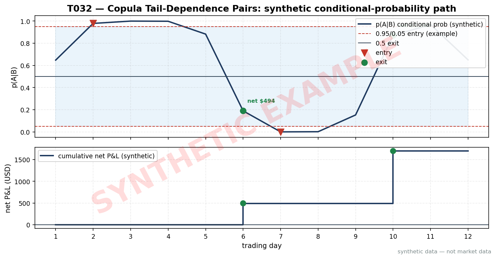

```mermaid
flowchart TD
    DATA["Market data\n(daily bars, corp actions)"] -->|"daily returns"| SIGS["Signals\nS054 copula p(A|B), S088 purged-CV, S051 half-life"]
    SIGS -->|"daily conditional prob (causal, t→t+1)"| ENTRY{"Entry logic\np ≥ 0.95 or ≤ 0.05 at close t, fill t+1"}
    ENTRY -->|trigger| SIZE["Sizing + risk\n0.5% NAV/trade, heat cap, adverse-M stop"]
    ENTRY -->|no trigger| WAIT["Wait"]
    SIZE -->|"per-pair marketable limit orders"| EXEC["Execution\nsimultaneous legs, borrow locate"]
    EXEC -->|"daily bars"| MON["Monitor + exits\np→0.5 / 2×HL time stop / regime stop"]
    MON -->|"net of spread, fees, borrow, turnover"| PNL["P&L (net of costs)"]
    style ENTRY fill:#f9e79f,stroke:#7d6608
    style PNL fill:#a9dfbf,stroke:#1e8449
```

### T10. Sources

1. Rad, H., Low, R. K. Y. & Faff, R. (2016). "The profitability of pairs trading strategies: distance, cointegration and copula methods." *Quantitative Finance*, 16(10), 1541–1558. https://doi.org/10.1080/14697688.2016.1164337
2. Xie, W., Liew, R. Q., Wu, Y. & Zou, X. (2016). "Pairs trading with copulas." *The Journal of Trading*, 11, 41–52. https://efmaefm.org/0efmameetings/EFMA%20ANNUAL%20MEETINGS/2014-Rome/papers/EFMA2014_0222_FullPaper.pdf
3. Liew, R. Q. & Wu, Y. (2013). "Pairs trading: A copula approach." *Journal of Derivatives and Hedge Funds*, 19(1), 12–30. https://doi.org/10.1057/jdhf.2013.1
4. López de Prado, M. (2018). *Advances in Financial Machine Learning*, ch. 7. Wiley. (Purged/embargoed CV — the validation procedure; method reference, no URL.)
5. Bailey, D., Borwein, J., López de Prado, M. & Zhu, Q. J. (2014). "Pseudo-mathematics and financial charlatanism: The effects of backtest overfitting on out-of-sample performance." *Notices of the AMS*, 61(5). doi:10.1090/noti1105 (Probability of backtest overfitting — why the S088 gate exists.)

Source log: Grok answered Q-TB4-1..3 (2026-09-10); all claims independently verified or labeled unverified.

**Unverified leads** (chatbot-provided, not independently checkable — do not cite as evidence):
- Grok (2026-09-10), Q-TB4-3: from 2009, distance/coint opportunity counts collapse while copula trade frequency stays steadier; copula hurts less on non-convergent trades and in downturns; mixed-copula work on S&P names (Silva et al. 2023) claims mixed-copula beats distance with and without costs — sample- and recipe-dependent, not verified.
- Grok (2026-09-10), Q-TB4-3: an adaptive-copula study on crypto perpetual futures with negative net returns at 0.08% round-trip cost — no checkable citation obtained.
- Grok (2026-09-10), Q-TB4-2: copula MLE over 1–5k pairs ~10–40 min on the M5 Max; full copula backtester 100–180 engineering hours; borrow-history vendors $30k–$150k+/yr.

---


## Stage 133/200 — T033: Johansen VECM Basket Arb

*Batch TB4 · Strategy 33/100 · Signals S055, S080, S051 · Provenance [D/SR]*

### T1. One-line verdict

| | |
|---|---|
| **Style** | Daily-bar statistical arbitrage: multi-leg (3+) cointegrated *basket* mean reversion |
| **Edge source** | A cointegrating vector estimated by the Johansen maximum-likelihood procedure: the error-correction spread $\beta'X_t$ mean-reverts when the estimated long-run equilibrium is real |
| **Typical holding period** | 2–10 trading days per round trip; bounded by the spread's OU half-life |
| **Capacity hint** | Like T031/T032 but narrower: multi-leg baskets are harder to fill and costlier to borrow, so the tradable set is the most liquid large/mid-cap names |
| **Build-or-buy in one line** | Build the Johansen/VECM screen and the cost/heat engine yourself; buy the raw bars — Johansen is a measurement filter, not a bought alpha |

### T2. Full mechanics

**What the strategy is.** A *cointegrating vector* $\beta$ is a set of weights such that the weighted combination of log prices, $e_t = \beta'X_t$, is stationary (mean-reverting) even though each leg wanders. The *Johansen procedure* is the maximum-likelihood way to estimate $\beta$ for a *basket* of $N \ge 2$ assets at once — unlike Engle–Granger (S050/T031), which is a single-equation regression, Johansen estimates the whole *VECM* (**v**ector **e**rror-**c**orrection **m**odel):

$$\Delta X_t = \Pi X_{t-1} + \sum_i \Gamma_i \Delta X_{t-i} + \varepsilon_t, \qquad \Pi = \alpha\beta'.$$

Here $\beta'$ picks out the $r$ stationary *error-correction spreads*, and $\alpha$ measures how fast each leg adjusts back toward them. The *cointegration rank* $r = \mathrm{rank}(\Pi)$ (found by trace and maximum-eigenvalue tests) is the number of independent equilibrium relations. T033 trades the top-ranked spread $e_t = \beta'X_t$: when its z-score stretches, take the basket position that profits from reversion to the estimated equilibrium.

**Universe & session.** Liquid US large/mid-cap common stocks, price ≥ $5, dollar volume ≥ $5mm, shortable, same-industry preferred (`example`). Daily bars, RTH (regular trading hours) closes. Exclusions: earnings/corporate-action windows ±2 days, halts, announced M&A. Basket size 3–5 names (`example`) — beyond 5 the borrow and fill complexity dominates.

**Formation (rolling, `example` cadence).** On a 252-day formation window (`example`) before trading:
1. Take log prices of candidate basket; select VAR (vector autoregression) lag by BIC (Bayesian information criterion).
2. Run the Johansen test (trace + max-eigenvalue); accept baskets with rank $r \ge 1$ at 5% (`example`). With $r > 1$, trade the spread with the smallest OU half-life (S051).
3. Normalize $\beta$ (first leg weight = 1); compute $e_t = \beta'X_t$, its formation mean $\mu_e$ and $\sigma_e$.
4. AR(1) on $e_t$ → half-life; require $HL \le 30$ days (`example`); time stop $= 2 \times HL$.
5. **Residual/health screen (S080):** compute each leg's PCA (**p**rincipal **c**omponent **a**nalysis) residual z-score — the leg's return stripped of its top market factors. Veto any basket where a leg's idiosyncratic $|s| > 2.0$ (`example`): a spread stretched by one leg's stock-specific news is not a basket mispricing.
6. Multiple testing: with hundreds of candidate baskets, control the FDR (false discovery rate) across the rank tests — most "cointegration" in a screen is luck.

**Entry rule.** Daily at close: $z_t = (e_t - \mu_e)/\sigma_e$ (parameters frozen from formation). If flat and $z_t \ge +2.0$: *short the basket* — sell the positive-$\beta$ legs, buy the negative-$\beta$ legs in $|\beta|$-weighted size (`example`). If $z_t \le -2.0$: long the basket (`example`). Gross basket target $150k (`example`). **Causal timing:** $z_t$ uses only data $\le t$; earliest fill is the $t+1$ open.

**Exit rule.** Zero-cross of $e_t$ (exit when the error-correction spread reverts through its formation mean); time stop at $2 \times HL$ (`example`); regime stop: if $|z| > 3$ persists 3 days (`example`) — the estimated equilibrium is breaking, not the spread.

**Position sizing.** Per-basket risk 0.5–1% of NAV (net asset value) (`example`). Portfolio heat: total basket gross ≤ 4% NAV (`example`); hard cap 10 baskets (`example`).

**Risk limits.** Daily loss stop −1.5% NAV; max gross 300% NAV; kill switch: if the rank-1 spread's realized half-life doubles versus formation for a quarter, freeze new baskets and re-run the rank tests.

**Cost model.** Costs scale with legs: $N$ legs × 5 bp (basis points) one-way (`example`), plus borrow on every short leg — a 4-leg basket can carry 2–3 short legs. The hurdle is ~30–60 bp per round trip (`example`); the example charges costs explicitly.

**Order/execution sketch.** Same pairs-algo discipline as T031/T032: simultaneous marketable limits on all $N$ legs at the $t+1$ open (cancel all if any leg fails), ≤10% of visible depth per leg (`example`), confirmed locates before any short, dividends booked as cash flow on ex-date.

### T3. Signals it consumes

| Signal | Role | Weight / logic |
|---|---|---|
| S055 — Johansen VECM pairs | Primary trigger (direction + weights): the cointegrating vector $\beta$ and the error-correction spread $e_t = \beta'X_t$ | Enter at $\|z\| \ge 2$ (`example`); exit on zero-cross; weights from normalized $\beta$ |
| S080 — PCA/eigenportfolio residuals | Basket-health screen: veto baskets whose legs carry large idiosyncratic moves | Veto if any leg's residual $\|s\| > 2.0$ (`example`) |
| S051 — OU half-life | Ranks spreads (with $r > 1$) by error-correction speed; sets the time stop | Trade the smallest-$HL$ spread; max hold $= 2 \times HL$; skip $HL > 30$ days (`example`) |

Combination logic (pseudocode, ≤25 lines):

```
# ---- formation (data <= t only) ----
Y      = log_prices(basket, n=252)                             # causal panel
r, B   = johansen(Y, lag=bic_lag, test=['trace','maxeig'])     # S055
if r < 1: skip basket                                          # no equilibrium
e      = B[:,0] @ Y.T                                          # top error-correction spread
HL     = ou_half_life(e); mu, sig = mean(e), std(e)            # S051 + formation stats
if HL > 30: skip basket                                        # example
if any(pca_resid_z(leg) > 2.0 for leg in basket): skip         # S080 idiosyncratic veto
# ---- daily trading ----
z = (e_t - mu) / sig                                           # causal at close t
if flat and z >= 2.0:  enter(short_basket(B))                  # example
elif flat and z <= -2.0: enter(long_basket(B))                 # example
elif open and e_t crosses mu: close()                          # zero-cross exit
elif open and days_open >= 2*HL: close()                       # S051 time stop
```

### T4. Worked example — numbers + P&L (SYNTHETIC)

All numbers are **synthetic**: three fictional same-industry names X1, X2, X3. Formation (not shown): 252 days, Johansen rank $r = 1$, cointegrating vector $\beta = [1,\,-0.7,\,-0.4]$, $\mu_e = 52.9582$, $\sigma_e = 0.7894$ → entry band $\pm 1.5789$ (`±2σ` `example`). OU half-life 4 days (time stop 8 days, `example`); S080 veto stipulated as passed (max leg $|s| = 1.2 < 2.0$, `example`). Trading window: 15 days from `rng = np.random.default_rng(133)` — a hand-shaped liquidity-shock path (X2 dips, X3 lags) plus seeded noise, printed exactly as the script computed it and plotted in `images/T033_example.png`. Gross basket target $150k (`example`): X1 = $150,000, X2 = −$105,000, X3 = −$60,000. Costs 5 bp one-way/leg; borrow 50 bp annualized (all `example`).

| Day | X1 | X2 | X3 | $e_t$ | $z$ | Action |
|---|---|---|---|---|---|---|
| 1 | 101.94 | 49.60 | 34.42 | +0.490 | +0.62 | — |
| 2 | 100.72 | 48.83 | 33.57 | +0.156 | +0.20 | — |
| 3 | 101.27 | 49.98 | 33.49 | +0.405 | +0.51 | — |
| 4 | 100.68 | 50.24 | 32.56 | +0.636 | +0.81 | — |
| 5 | 101.55 | 49.83 | 31.91 | +2.610 | +3.31 | **OPEN short basket** |
| 6 | 99.54 | 47.01 | 32.50 | +2.576 | +3.26 | hold |
| 7 | 100.16 | 48.84 | 33.36 | +1.172 | +1.49 | hold |
| 8 | 99.14 | 50.09 | 33.13 | −1.189 | −1.51 | **CLOSE** (zero-cross) |
| 9 | 100.00 | 46.55 | 33.85 | +1.237 | +1.57 | — |
| 10 | 98.80 | 45.86 | 32.89 | +0.431 | +0.55 | — |
| 11 | 98.88 | 44.83 | 33.99 | +0.627 | +0.79 | — |
| 12 | 97.07 | 44.28 | 33.79 | −0.556 | −0.70 | — |
| 13 | 98.65 | 45.64 | 35.19 | −0.338 | −0.43 | — |
| 14 | 98.83 | 46.84 | 34.65 | −0.702 | −0.89 | — |
| 15 | 99.45 | 46.14 | 34.44 | +0.336 | +0.43 | — |

**Line-by-line P&L.** *Short basket, entry d5 ($z=+3.31$) → exit d8 ($z=−1.51$), held 3 days.* Leg P&L: X1 **+$2,430** (sold 101.55, covered 99.14), X2 **+$186** (bought 0.7×49.83, sold 0.7×50.09), X3 **+$489** (bought 0.4×31.91, sold 0.4×33.13). **Gross = +$3,105.** Costs: $150.00. Borrow: $4.20. **Net = +$2,951** on $315,000 of gross exposure.

**Window total: net +$2,951.** No other trades triggered — one clean convergence, the way the textbook draws it.


**Where the example is optimistic.** One trade, one convergence, no losing baskets — the error-correction spread reverts exactly as estimated. The $\beta$ is stipulated, not estimated (real Johansen estimates carry lag-choice, rank-test, and normalization uncertainty); the S080 veto is stipulated as passed; fills at printed marks across 3 legs with no legging risk; placid GC borrow; costs a flat 5 bp; and $z=+3.31$ entries are rare in live data. Nothing here is a backtest.

### T5. Data & infra — what must run

| Job | Cadence | What it does |
|---|---|---|
| Universe + corporate-action adjust | Nightly after 18:00 ET | Same point-in-time panel as T031/T032 |
| Johansen screen + VECM refit | Monthly (weekly in stress) | Lag by BIC, trace/max-eigenvalue tests, $\beta$, $\alpha$, FDR control across baskets |
| S080 residual screen | Daily | PCA residuals per leg; veto baskets with idiosyncratic $\|s\| > 2$ |
| OU half-life updates | Daily | AR(1) per live spread; max-hold clock |
| Borrow / HTB (hard-to-borrow) file | Daily 16:30–18:30 ET | Veto/resize baskets with HTB short legs |
| Risk / heat monitor | Continuous | Open baskets, gross, days-held vs $2\times HL$ |

**M5 Max feasibility: feasible (Tier M).** Per `notes/cost-model.md` §2, the Johansen screen is eigen-decompositions of small matrices — hundreds of candidate baskets × 252 observations is seconds to minutes of vectorized numpy; the workload is the *screen loop* plus FDR bookkeeping, not the linear algebra. RAM is megabytes against the 77 GB budget (§3). Engineering: Tier M 20–60 h for the screen plus strategy harness M+ 40–100 h → **~60–160 h ≈ $9,000–$24,000** `loaded-cost estimate` at $150/hr (§5).

**Storage growth:** daily bars trivial (~1.3 GB/year for 3,000 stocks, §4); cached $\beta$ vectors and test statistics are megabytes.

**Feed-outage safe mode.** (1) Feed late → freeze new baskets; manage open ones on last-known $z$ with the time stop hard at $2\times HL$. (2) Johansen refit fails or rank collapses to 0 → treat as no-signal, flatten on the next close. (3) Borrow file stale >1 day → veto new short legs (a basket with an unborrowable leg is a guaranteed legging). (4) Outage >3 trading days → flatten the book.

### T6. Buy vs build

| Option | What you get | Indicative price | Verdict |
|---|---|---|---|
| Tier-0: Stooq / Alpaca IEX daily | Free daily bars | ~$0 `indicative — verify before budgeting` | Enough to prototype the VECM screen |
| Tier-1: Polygon Stocks Advanced | Clean SIP daily bars + actions | ~$30–200/mo `indicative — verify before budgeting` | The production feed; $\beta$ estimates need clean adjustments |
| Tier-2: Databento Standard | Exchange-direct data | ~$200/mo + usage `indicative — verify before budgeting` | Only if you screen intraday |
| Borrow data (Markit / S&P Securities Finance / Astec / DataLend) | Fee history, utilization | $30k–$150k+/yr (Grok Q-TB4-2 lead — unverified chatbot claim) `indicative — verify before budgeting` | Skip unless you backtest HTB names |
| Open-source econometrics libraries | Johansen/VECM routines | ~$0 `indicative — verify before budgeting` | Useful scaffolding — but rank-test discipline, FDR control, and the live plumbing are yours |

**Verdict: build the screen and the cost/heat engine on Tier-1 data; rent borrow and execution from the prime broker.** The Johansen estimator is textbook; what no vendor sells is your rank-test discipline, your FDR control, and your multi-leg execution. The crossover: with 2–3 short legs per basket, price institutional borrow history before trusting any backtest that shorts beyond easy-to-borrow large-caps.

### T7. Success-ratio evidence

| Study / source | Market & period | Metric | Before/after cost | Caveat |
|---|---|---|---|---|
| Johansen (1988); Johansen (1991); Johansen & Juselius (1990) | Econometric theory + macro illustrations | ML estimation of cointegrating vectors, trace/max-eigenvalue rank tests | n/a — method papers | These establish the *measurement*, not a trading alpha |
| Hendry & Juselius (2000/2001), expository | Cointegration survey | Documents the method's uptake and the fragility of rank inference in finite samples | n/a | Reinforces the need for rolling validation, not live confidence |
| Avellaneda & Lee (2010) | US equities, 1997–2007 | PCA-based stat-arb (the S080 family): documented Sharpe 1.44 after costs, decaying after | After costs (paper's model) | The factor-residual program this chapter uses as a *veto*; its own alpha decayed — a caution, not an endorsement |

**Capacity.** Like T031 but narrower: 3–5-leg baskets concentrate in the most liquid names, and every short leg needs a locate — the tradable set is smaller than the pair universe at equal costs.

**Decay / model risk.** The honest framing: Johansen is a *measurement upgrade*, not a documented standalone edge over Engle–Granger. It answers "how many equilibria and what weights" instead of "is this one regression stationary," which matters for baskets — but no checkable study in hand establishes general after-cost superiority of Johansen-screened baskets over EG pairs. Rank tests are fragile in finite samples (lag choice, normalization, and FDR all move the basket set), and a beautifully estimated $\beta$ on a broken regime is just a precise way to be wrong.

**Honest bottom line.** For a ≤$1M paper operation, Johansen basket arb is a research vehicle: the value is learning VECM discipline, multi-leg execution, and cost plumbing — not a live Sharpe. Its defensible live role is as the basket-construction filter inside a stat-arb program (S080 as the health veto, S051 as the clock), where the edge is diversified across many small convergences. An institutional desk runs it as a sleeve of the equity-stat-arb book with real stock-loan access, never as a standalone strategy.

### T8. Failure modes

1. **Spurious cointegration** — near-unit-root series look cointegrated in 252-day windows by luck. *Mitigation:* FDR control across the screen, rolling re-tests, OOS half-life confirmation.
2. **Rank-test fragility** — lag choice and normalization move $r$ and $\beta$. *Mitigation:* BIC lag selection, both trace and max-eigenvalue tests, stability of $\beta$ across adjacent windows.
3. **Regime breaks in $\beta$** — the equilibrium that held for 5 years dies in a week. *Mitigation:* rolling refits, $|z| > 3$-for-3-days stop, realized-vs-formation half-life kill switch.
4. **Multi-leg fill/legging risk** — 3–5 legs filled at different prints is not the printed spread. *Mitigation:* simultaneous marketable limits, cancel-all-on-partial, ≤10% depth participation per leg (`example`).
5. **Borrow blowup on 2–3 short legs** — one HTB leg turns the basket into a fee furnace. *Mitigation:* borrow gate per short leg before entry; resize or veto.
6. **$\alpha$ misestimation** — slow-adjusting legs make the "convergence" slower than the half-life says. *Mitigation:* S051 on the *spread*, not the theory; time stop at $2 \times HL$ regardless of $\alpha$.
7. **Idiosyncratic contamination** — one leg's news event masquerades as basket mispricing. *Mitigation:* the S080 veto — no basket trades with a leg's residual $|s| > 2.0$ (`example`).
8. **Cost scaling with legs** — $N$ legs × spread/impact can exceed the per-trade edge. *Mitigation:* per-basket net-expected-profit gate after the statistical screen.

### T9. Visuals

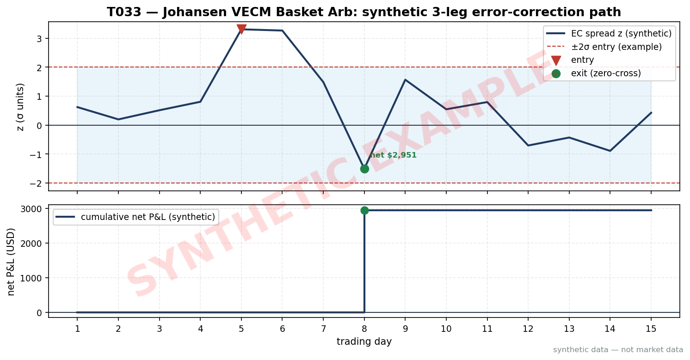

```mermaid
flowchart TD
    DATA["Market data\n(daily bars, corp actions)"] -->|"log prices, causal panel"| SIGS["Signals\nS055 Johansen β/e_t, S080 PCA residuals, S051 half-life"]
    SIGS -->|"daily z-score of e_t (causal, t→t+1)"| ENTRY{"Entry logic\n|z| ≥ 2 at close t, fill t+1; S080 veto"}
    ENTRY -->|trigger| SIZE["Sizing + risk\n$150k gross, 0.5–1% NAV/basket, regime stop"]
    ENTRY -->|no trigger| WAIT["Wait"]
    SIZE -->|"per-leg marketable limit orders"| EXEC["Execution\nsimultaneous N legs, locates"]
    EXEC -->|"daily bars"| MON["Monitor + exits\nzero-cross / 2×HL / |z|>3 break"]
    MON -->|"net of leg costs, borrow, fills"| PNL["P&L (net of costs)"]
    style ENTRY fill:#f9e79f,stroke:#7d6608
    style PNL fill:#a9dfbf,stroke:#1e8449
```

### T10. Sources

1. Johansen, S. (1988). "Statistical analysis of cointegration vectors." *Journal of Economic Dynamics and Control*, 12(2–3), 231–254. https://doi.org/10.1016/0165-1889(88)90041-3 (The ML estimation framework.)
2. Johansen, S. (1991). "Estimation and hypothesis testing of cointegration vectors in Gaussian vector autoregressive models." *Econometrica*, 59(6), 1551–1580. (The rank tests.)
3. Johansen, S. & Juselius, K. (1990). "Maximum likelihood estimation and inference on cointegration — with applications to the demand for money." *Oxford Bulletin of Economics and Statistics*, 52(2), 169–210. http://ideas.repec.org/a/bla/obuest/v52y1990i2p169-210.html (The applied template.)
4. Hendry, D. F. & Juselius, K. (2000/2001). "Explaining cointegration analysis," Parts I–II. *The Energy Journal*. (Expository; documents the method's finite-sample fragility.)
5. Avellaneda, M. & Lee, J.-H. (2010). "Statistical arbitrage in the US equities market." *Quantitative Finance*, 10(7), 761–782. https://doi.org/10.1080/14697680903124632 (The PCA stat-arb program this chapter uses as a veto — and a decay caution.)

Source log: Grok answered Q-TB4-1..3 (2026-09-10); all claims independently verified or labeled unverified. No Grok-supplied quantitative claim is adopted in this chapter; the Johansen-as-measurement framing follows the cited papers.

**Unverified leads** (chatbot-provided, not independently checkable — do not cite as evidence):
- Grok (2026-09-10), Q-TB4-2: borrow-history vendors $30k–$150k+/yr; institutional borrow pricing as the crossover item.
- Grok (2026-09-10), Q-TB4-3: any Johansen-vs-Engle–Granger after-cost horserace claims — no checkable study was obtained; this chapter makes no such claim.

---


## Stage 134/200 — T034: Index Futures Cash-and-Carry

*Batch TB4 · Strategy 34/100 · Signals S057, S098, S014 · Provenance [D/SR]*

### T1. One-line verdict

| | |
|---|---|
| **Style** | Index-futures basis arbitrage (cash-and-carry / reverse cash-and-carry) |
| **Edge source** | Convergence of the futures–cash **basis** (futures minus spot) to its **cost-of-carry fair value** (the no-arbitrage futures price given financing and dividends), harvested only when the gap clears borrow fees and spread costs |
| **Typical holding period** | Days to weeks (`example`: enter up to ~90 days before expiry, unwind at expiry or on early convergence) |
| **Capacity hint** | Tiny for a non-dealer book — the 8–20 index-point richness a small account needs to clear costs is rare; inside a few points the tape belongs to index-arb desks and authorized participants |
| **Build-or-buy in one line** | Build the fair-value monitor yourself on bought futures + ETF data (Tier 1/2); the actual edge is balance-sheet and borrow access, which no vendor sells |

### T2. Full mechanics

**Jargon, defined once.** *Basis* = futures price minus spot price (S057's one definition, used throughout). *Cost of carry* = financing cost minus income (dividends) of holding the underlying to expiry. *Fair value* F\* = the no-arbitrage futures price implied by spot, financing, and dividends. *Mispricing* m = F − F\* — the basis after carry is accounted for; this, not the raw basis, is the tradable signal. *Contango* = futures above spot; *backwardation* = futures below spot. *GC* (general collateral) = the baseline stock-loan rate for easy-to-borrow names (~25–50 bp (basis points) annualized, `example`); *special* = a hard-to-borrow name commanding a much higher fee (up to 10%+, `example`). *Reverse cash-and-carry* = the mirror trade (cheap futures: buy futures, short the basket) that pays borrow on the short. *Tracking error* = the ETF's deviation from its index — the cost of substituting an ETF for the full basket.

**Universe & session.** One liquid index future at a time (`example`: an ES-like S&P 500 future, $50 multiplier) against its replicating cash leg (the full index basket, or an SPY-like ETF as the `example` substitute). Session: positions are opened on daily settlement prints and held across sessions; intraday monitoring of the basis uses RTH (regular trading hours) futures prints only. Exclusions: dividend-heavy ex-date weeks where the forecast is uncertain, futures roll week (pin risk around expiry mechanics), and any session where the ETF's trailing average effective spread exceeds 5 bp (`example` — the S014 cost gate).

**Entry rule.** All quantities use the MASTER.md signal definitions. At settlement *t* (causal — signal at *t*, earliest fill *t+1*):

- Mispricing (S057): `m_t = F_t − F*_t`, with `F*_t = S_t·e^{(r−q)·T}` (`example` inputs: r = 5.00% financing, q = 1.4% dividend yield, T = days-to-expiry/365).
- **Cash-and-carry** (rich futures): enter if `m_t > +bound` (`example` bound = +12 index points ≈ 24 bp of spot): buy $5mm of the cash ETF/basket at *t+1*'s open and sell `N = $5,000,000 / (F_t × 50)` futures contracts (`example`: 20 contracts).
- **Reverse cash-and-carry** (cheap futures): enter if `m_t < −bound`: buy futures, short the cash leg — **only if** the borrow-fee check passes (see S098 below).
- S098 borrow filter: look up the indicative borrow fee on the ETF/short basket; the reverse leg is **vetoed** if the annualized fee drag over the remaining life exceeds 50% of the locked cheapness (`example`); a hard veto if any name in the basket is on special with no locate.
- S014 cost gate: enter only if the trailing 20-day average effective half-spread on the cash leg is below 5 bp (`example`) and the futures' observed bid–ask is at most 1 tick.

**Exit rule** — first of three fires (`example` parameters):

1. **Convergence:** `m_t` back within 25% of the entry level (|m_t| ≤ 0.25·|m_entry|) — unwind both legs.
2. **Expiry:** unwind at the futures' expiry (cash-settled) or roll decision; never hold past 5 days before expiry (`example`) — the basis becomes noise-dominated and settlement mechanics take over.
3. **Stop-loss:** `m_t` moves against the position by 150% of the entry richness (`example`) — a persistent widening means your fair-value inputs (r, q) are wrong, not that the edge got better.

**Position sizing.** Notional per trade = $5mm on a $100mm NAV (net asset value) book (`example`) — 5% NAV; maximum 3 concurrent carry trades (`example`, 15% NAV). Contracts sized so dollar beta ≈ 1: `N = round(cash_notional / (F × multiplier))`; the rounding residual is accepted as sub-1-point noise, not hedged.

**Risk limits.** Daily loss stop −1% NAV (`example`, then no new entries that day); max gross 200% NAV (`example`); kill-switch: futures–cash print staleness > 5 minutes, a dividend-forecast revision that flips the sign of m, or a borrow-fee repricing that trips the reverse-leg veto — flatten the affected leg immediately.

**Cost model** (applied in T4): cash leg 4 bp round-trip (2 bp each way — half-spread plus commission, `example`); futures $50/contract round-trip all-in (exchange + NFA (National Futures Association) + 0.5-tick slippage, `example`); financing is inside F\*, not a separate cost; dividends received on the long cash leg. No borrow fee on the long-cash side; borrow is explicit on the reverse leg.

**Order/execution sketch.** Both legs as marketable limits at *t+1*'s open print, sequenced futures-first then cash. Participation cap: cash-leg child orders ≤ 5% of the ETF's average 1-minute volume (`example`) — a full 500-name basket is a program trade for a program-trading desk, not walked manually. Queue-position honesty: fills assumed at the touch plus half-spread; any claim of better is `simulated only — requires MBO/ITCH`.

### T3. Signals it consumes

| Signal | Role | Combination logic |
|---|---|---|
| S057 cash-and-carry mispricing | **Primary trigger** (direction + timing) | `m_t > +12 pts` → cash-and-carry; `m_t < −12 pts` → reverse; exit at 25% of entry level |
| S098 borrow fees / days-to-cover | **Veto + sizing** on the reverse leg | veto reverse if fee drag > 50% of locked cheapness (`example`); hard veto on no-locate specials |
| S014 spread decomposition | **Cost gate** | enter only if trailing 20-day avg effective half-spread < 5 bp on the cash leg (`example`); realized-spread diagnostic is never a live trigger |

```
# T034 combination logic (<=25 lines; every threshold `example`)
on each settlement t (causal; fills at t+1):
    Fstar = S * exp((r - q) * T)          # S057 fair value
    m     = F - Fstar                      # mispricing, index pts
    bound = 12.0                           # example cost band
    fee   = indicative_borrow_fee(ETF)     # S098, %/ann
    esp   = avg_effective_halfspread(20d)  # S014, bps
    if m > +bound and esp < 5 and flat:
        buy 5mm cash ETF; sell 20 futures   # CASH-AND-CARRY
    elif m < -bound and esp < 5 and flat:
        lock = -m * 50 * 20                 # $ locked cheapness
        drag = fee * 5_000_000 * T          # borrow drag over life
        if drag < 0.5 * lock and locate_ok:
            buy 20 futures; short 5mm ETF   # REVERSE
        else:
            veto("borrow kills reverse")    # S098 veto
    if position and abs(m) <= 0.25*abs(m_entry): unwind
    if T_to_expiry < 5 days: unwind         # expiry pinch
    stop if m moved 150% against entry
```

### T4. Worked example — numbers + P&L (SYNTHETIC)

**All numbers synthetic** (random seed 134 = stage number, `batches/TB4/plot_T034.py` — re-runnable). ES-like future, $50 multiplier, spot index S = 5,000, r = 5.00%, q = 1.4%, T = 90/365 yr. Fair value `F* = 5000·e^{(0.05−0.014)·0.2466} = 5000·e^{0.00888} = 5044.5`. Cash leg: $5,000,000 of an SPY-like ETF. Contracts: `5,000,000 / (F × 50)` ≈ 20 (`example` rounding accepted). Costs: cash 4 bp RT = $2,000; futures $50/contract RT × 20 = $1,000.

| Day | m_t (pts) | Event |
|---|---|---|
| 0 | +16.20 | above bound, but the illustrative path withholds entry until day 5 for signal stability (a path-construction choice, not a T2 rule) |
| **5** | **+13.44** | **ENTRY: m > +12 → long $5mm ETF, short 20 futures** |
| 10 | +9.80 | richness decaying; hold |
| 15 | +5.65 | hold |
| 20 | +4.35 | hold — inside the cost band, no new signal |
| 25 | +3.65 | hold |
| **28** | **+2.87** | **EXIT: 2.87 < 0.25 × 13.44 → unwind both legs** |
| 31 | −10.03 | reverse signal (cheap futures) — evaluated, then **VETOED** (see below) |

Line-by-line P&L. **Gross capture** = (m_entry − m_exit) × multiplier × contracts = (13.44 − 2.87) × $50 × 20 = 10.57 × $1,000 = **+$10,569**. **Costs**: cash leg $5,000,000 × 0.0004 = −$2,000; futures 20 × $50 = −$1,000; total **−$3,000**. **Net = +$7,569** on $5mm committed for 23 days (`example` — synthetic, not a performance claim). The chart `images/T034_example.png` plots this exact path: mispricing with entry/exit markers (top) and the mark-to-market P&L frozen at exit (bottom).

**The vetoed reverse signal (day 31).** m_31 = −10.03 pts: futures cheap. Gross lock if reversed = 10.03 × $50 × 20 = **$10,034**. Borrow check (S098): the ETF short would pay a 2.8%/ann special (`example`) for the remaining 58 days → drag = 0.028 × $5,000,000 × 58/365 = **$22,247**. Drag ($22,247) > 50% of lock ($5,017) — **veto: no trade**.

**Where the example is optimistic.** (1) The entry at day 5 assumes the day-5 settlement print of both legs is simultaneously tradable — in practice the ETF close and the futures settlement print minutes apart, and the basis between them is partly stale. (2) The 4 bp cash-leg cost assumes a deep SPY book at the open print; a full 500-name basket costs multiples of that in spread and impact. (3) Dividends are assumed known at q = 1.4% — a forecast miss into expiry reprices F\* and the "locked" edge with it. (4) The exit at day 28 assumes the richness decays monotonically enough to trip the 25% rule; real bases widen-and-hold, and the stop at 150% adverse is the more common exit. (5) No financing-rate move: if your actual funding reprices above the assumed r, the carry math silently inverts.

### T5. Data & infra — what must run

**Pipeline inventory.** Nightly (after 18:00 ET): index divisor/constituent changes, dividend-forecast feed update, SOFR (Secured Overnight Financing Rate)/GC rate pull, futures expiry calendar roll. Intraday loop (every 5 minutes RTH, `example`): futures settlement/last prints, ETF mid quotes, recompute F\* and m_t, borrow-fee snapshot, S014 effective-spread trailing average. Post-close: mark-to-market vs entry level, heat check, borrow-fee repricing scan for the reverse-leg watchlist.

**M5 Max feasibility: trivial.** Per `notes/cost-model.md` §2/§3: a daily/5-minute scalar computation — megabytes of RAM; 60-day history is kilobytes. Engineering time: Tier L (`cost-model.md` §5) — **4–12 h** ≈ $600–1,800 loaded-cost estimate at $150/hr for the fair-value monitor; the borrow-fee join and dividend-forecast hygiene are the only real work (Tier M if built properly, 20–60 h ≈ $3,000–9,000). Bottleneck: data licensing and corporate-action correctness, not compute.

**Feed-outage safe mode.** If futures prints go stale > 5 minutes (`example`) or the dividend-forecast feed misses its nightly update: **freeze new entries, keep existing positions** (they are convergence trades with a known unwind), and widen the exit tolerance rather than trading on a stale F\*. Never compute m_t from a cached spot against a live future. On recovery, recompute F\* from the first synchronized print pair before re-arming.

### T6. Buy vs build

| Option | What you get | Indicative price | Gains | Loses |
|---|---|---|---|---|
| Tier 0: CME delayed quotes + FRED SOFR + public dividend data | free basis ingredients | ~$0 — *indicative — verify before budgeting* | $0 monitor | delayed prints; no borrow data; dividend forecasts are the weak link |
| Tier 1: Polygon Stocks Advanced (SIP) + CME live via broker | real-time ETF + futures prints | ~$30–200/mo — *indicative — verify before budgeting* | live m_t | borrow-fee history still missing; reverse leg stays vetoed by ignorance |
| Tier 2: Databento futures + equities | exchange-timestamped prints | ~$200/mo + usage — *indicative — verify before budgeting* | honest timestamps for the t→t+1 rule | overkill for a daily-settlement signal |
| Tier 3: Markit / S&P Securities Finance borrow history | indicative + average fee, utilization, 15y history | $30k–$150k+/yr — *indicative — verify before budgeting* | the only honest reverse-leg cost model | the six-figure line item; only worth it at reverse-leg scale |
| Prime-broker program-trading desk — execution/TCA | basket execution, TCA (transaction-cost analysis) | bundled in PB (prime broker) relationship — *indicative — verify before budgeting* | program-desk execution and fills | you still own the signal; PB tools optimize their flow, not your bound |
| Prime-broker stock-loan desk — locates | locates, borrow-fee file | bundled in PB relationship — *indicative — verify before budgeting* | someone else's locate network | borrow-fee history remains a separate paid feed |

**Verdict: build the monitor, rent the balance sheet.** The fair-value arithmetic is an afternoon's work on data you already buy; no vendor sells your bound, your dividend forecast, or your funding rate. **Buy** institutional borrow data only if the reverse leg is a real sleeve; **build** everything else; **rent** execution and locates from the PB. Crossover: if you will only ever trade the long-cash side in GC names, skip the borrow feed entirely.

### T7. Success-ratio evidence

Documented evidence for *small-account* index cash-and-carry after costs is thin — and that thinness is itself the finding.

| Source | Market & period | Metric | Before/after cost | Caveat |
|---|---|---|---|---|
| Do–Faff 2012, J. Financial Research (verified paper, adjacent evidence) | US pairs 1963–2009 | baseline convergence strategies "largely unprofitable after 2002" once commissions + impact + short fees are honest | after cost | pairs, not C&C — included to calibrate what honest costing does to convergence sleeves |
| This chapter's T4 | synthetic | net +$7,569 on $5mm / 23 days | after modeled costs | **synthetic — not evidence of anything** |

**Capacity.** The trade's capacity is the depth of the mispricing, not your capital: richness beyond ~8–20 index points on an ES-like future (Grok's band — unverified lead) appears rarely and is lifted first by dealers and APs who already own the basket. **Crowding** shows up as the basis living permanently inside your cost band — the signal fires never, not wrongly. **Decay:** electronic market-making has compressed the cash–futures basis toward fair value for two decades; the remaining dislocations cluster around stress events (e.g. March 2020, when futures and cash gapped because everyone wanted the same hedge — Grok Q-TB4-3) and dividend-tax or funding dislocations.

**Honest bottom line.** For a ≤$1M paper operation, T034 is a *monitoring* strategy, not a trading strategy: build the mispricing dashboard, set alerts at your bound, and expect to trade a handful of times a year — mostly watching dealers take the prints inside your costs. For an institutional desk with GC funding, a basket already in inventory, and a borrow desk, it is a real, low-Sharpe, balance-sheet-intensive carry line. The $1M paper account earns its keep by *not* trading the 4-point richnesses.

### T8. Failure modes

1. **Wrong F\*, not a wide basis.** Stale r or q manufactures phantom mispricing — the commonest false signal in this book. Mitigation: dividend forecasts from a vendor file (not trailing yield) and your *actual* funding rate; recompute F\* on every input change; the implied-financing-rate inversion (`r_impl = (1/T)·ln(F/S) + q`) as a sanity check.
2. **Borrow kills the reverse leg.** Cheap futures are usually cheap because the basket is hard to borrow — the signal and the cost are the same phenomenon. Mitigation: the S098 veto is structural; size the reverse leg by post-borrow edge only.
3. **Dividend forecast error into expiry.** A special dividend or a cut reprices fair value by points. Mitigation: dividend calendar as a first-class input; halve size (`example`) across heavy ex-date weeks; treat ex-date moves as cash flows, never as alpha.
4. **Expiry pinch.** Inside ~5 days the basis is dominated by settlement mechanics and pin risk, not carry math. Mitigation: the time-stop exit — unwind early and accept giving up the last points.
5. **Funding repricing.** SOFR ≠ your PB's rate, and your rate can move mid-trade. Mitigation: fair value at *your* funding; monitor the wedge; the stop at 150% adverse widening catches a regime flip in funding.
6. **Tracking error on the ETF substitute.** SPY ≠ the index by the creation/redemption mechanism's own frictions, and those frictions widen exactly when you need the hedge. Mitigation: haircut the bound by the ETF's trailing tracking error; on large books use the full basket via a program desk.
7. **Stale-print basis.** ETF close vs futures settlement are minutes apart; after-hours moves make the overnight m_t a mirage. Mitigation: synchronized print pairs only; the T5 safe-mode rule.

### T9. Visuals

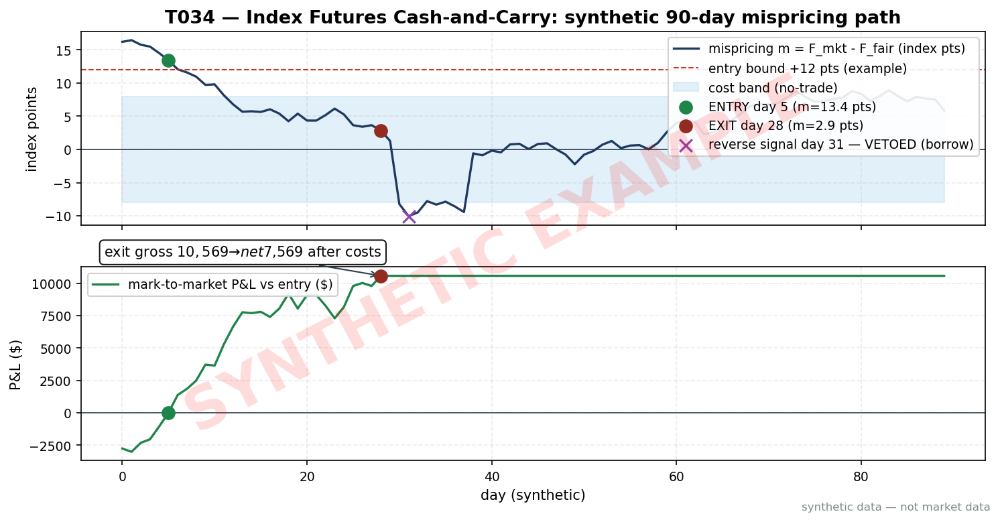

```mermaid
flowchart TD
    DATA["Market data\n(futures + ETF prints, 5-min)"] -->|5-min bars| SIGS["Signals\nS057 mispricing, S098 borrow, S014 spread"]
    SIGS -->|settlement t| ENTRY{"Entry logic\nm > +12 cash-carry / m < -12 reverse\nt → fill at t+1"}
    ENTRY -->|trigger| SIZE["Sizing + risk\n20 contracts, 5% NAV, heat cap"]
    ENTRY -->|no trigger / veto| WAIT["Wait"]
    SIZE -->|daily prints| EXEC["Execution\nfutures-first marketable limits"]
    EXEC -->|daily| MON["Monitor + exits\n25% convergence / expiry / 150% stop"]
    MON -->|fills + fees| PNL["P&L (net of costs)"]
    style ENTRY fill:#f9e79f,stroke:#7d6608
    style PNL fill:#a9dfbf,stroke:#1e8449
```

### T10. Sources

1. Hull, J. C. *Options, Futures, and Other Derivatives* (cost-of-carry fair value F = S·e^{(r−q)T}, cash-and-carry arbitrage mechanics — the textbook [D] source for S057's formula).
2. CME Group — "What is Equity Index Basis?" — https://www.cmegroup.com/education/courses/introduction-to-equity-index-products/what-is-equity-index-basis.html (exchange-published basis/carry mechanics; checkable).
3. CFA Institute — cash-and-carry / reverse cash-and-carry arbitrage, cost-of-carry model (curriculum readings on forward pricing — checkable via CFA Program materials).
4. Gatev, E., Goetzmann, W. & Rouwenhorst, G. (2006). "Pairs Trading: Performance of a Relative-Value Arbitrage Rule." *Review of Financial Studies* — https://doi.org/10.1093/rfs/hhj020 (adjacent convergence-trading evidence; the decay calibration used in T7 via Do–Faff 2012).
5. Do, B. & Faff, R. (2012). "Are Pairs Trading Profits Robust to Trading Costs?" *Journal of Financial Research* — https://doi.org/10.1111/j.1475-6803.2012.01317.x (adjacent evidence: the honest-costing calibration T7 cites).

**Source log.** Grok answered Q-TB4-1..3 (2026-09-10); all claims independently verified or labeled unverified.

**Unverified leads** (chatbot-only — never in Sources):
- Grok Q-TB4-3 §4: Hazelkorn–Moskowitz–Vasudevan-type work on the equity futures–cash basis ("~5–6% annual premium", "basis-timing Sharpe ~0.6–0.9 in futures") — no checkable citation captured; unverified chatbot claim.
- Grok Q-TB4-1 (C): illustrative cost bands (equity RT 2–8 bp commission + 2–10 bp half-spread; futures 0.25–1 tick slippage; GC 25–50 bp) — adopted as `example` parameters, not facts.
- Grok Q-TB4-1 (C): the 8–20 bp richness buffer on ES — `example` threshold, not a documented standard.
- Grok Q-TB4-2: borrow-data pricing bands ($30k–$150k+/yr Markit-class; $5k–$20k lean year-1) — vendor bands, `indicative — verify before budgeting`.
- Grok Q-TB4-3: "Baskaran (SSRN 2026)" — dated after the current date; citation plausibility unverified; not used.
- Per the orchestrator QC note: Grok's Q1(C) contract arithmetic (39.51 contracts, the "0.5-pt rounding residual") did not reconcile and was **not** reused; T4 uses independently computed numbers.

---


## Stage 135/200 — T035: Futures Calendar-Spread Carry

*Batch TB4 · Strategy 35/100 · Signals S058, S066, S063 · Provenance [D/SR]*

### T1. One-line verdict

| | |
|---|---|
| **Style** | Futures term-structure relative value (calendar-spread carry) |
| **Edge source** | Mean reversion of the observed calendar spread toward its cost-of-carry fair spread — harvesting **roll yield** (the return from a contract aging along the curve toward spot) — timed and sized by volatility forecasts |
| **Typical holding period** | Days to weeks (`example`: enter up to ~60 days out, unwind by 10 days before front-month expiry) |
| **Capacity hint** | Small — a few dozen spreads per expiry pair before your own rolling moves the deferred leg; the institutional version is a market-making inventory book, not a directional sleeve |
| **Build-or-buy in one line** | Build the fair-curve monitor on bought futures data (Tier 1/2); buy nothing packaged — the curve, the vol forecast, and the roll accounting are yours to own |

### T2. Full mechanics

**Jargon, defined once.** *Term structure* = futures prices across expiries. *Calendar spread* = long one expiry, short another (quoted as F_2 − F_1). *Contango* = upward-sloping curve (further expiries dearer); *backwardation* = downward-sloping. *Roll yield* = the return earned as a contract ages along the curve toward spot — the carry this strategy harvests. *Convenience yield* y = the implied benefit of holding the physical commodity (zero for financial futures, positive for commodities in tight supply). *Fly* (butterfly) = M1 − 2·M2 + M3, a purer curvature bet built from two calendar spreads. *Pin risk* = adverse settlement mechanics when a contract expires while you hold it.

**Universe & session.** One futures complex at a time (`example`: ES-like index futures, adjacent quarterlies M1 vs M2, $50 multiplier). Session: signals evaluated on daily settlement curves; entries at the next session's open; no new entries inside 10 days of front-month expiry (`example`). Exclusions: roll week, FOMC (Federal Open Market Committee)/macro event days where the curve reprices on rate expectations (your fair-curve inputs move faster than your prints), and any day either leg's bid–ask exceeds 2 ticks.

**Entry rule.** All quantities use the MASTER.md signal definitions. At settlement *t* (causal — signal at *t*, earliest fill *t+1*):

- Calendar signal (S058): `signal_t = (F_2 − F_1) − (fair_2 − fair_1)`, with `fair(T) = S·e^{(r−q−y)·T}` (`example` inputs: r = 5.0%, q = 1.8%, y = 0 for the index future).
- If `signal_t > +bound` (`example` bound = +8 index points): the observed curve is too steep → **fade the steepening**: sell M2, buy M1.
- If `signal_t < −bound`: too flat/inverted → buy M2, sell M1.
- Vol-timing gate (S066): enter only if the HAR realized-vol forecast is below 18% annualized (`example`) — steep curves in calm vol mean-revert; steep curves in a vol spike are usually the market repricing carry, not mispricing.
- Regime sizing input (S063): the Park range estimator on 5-minute bars gives the spread's daily vol; size so the position's daily vol hits the risk target.

**Exit rule** — first of three fires (`example` parameters):

1. **Convergence:** `signal_t` back within 25% of the entry deviation.
2. **Time stop:** 10 days before front-month expiry — unwind, never roll inside the pinch. (Holding across expiry means rolling the near leg; the roll cost/gain is part of P&L, not an afterthought — this design exits instead.)
3. **Stop-loss:** adverse curve-shape shift of 150% of the entry deviation (`example`) — usually a rate or dividend regime change your fair curve hasn't caught.

**Position sizing.** Vol-targeted: target daily P&L vol $4,000 (`example`) on a $100mm NAV (net asset value) book. Spread daily vol from the S063 Park estimator = 3.8 index points (`example`) → per-spread daily σ$ = 3.8 × $50 = $190 → N = floor(4000/190) = 21 → 20 spreads (`example` rounding). Cap: max 40 spreads per expiry pair (`example`); max 2 expiry pairs at once.

**Risk limits.** Daily loss stop −1% NAV (`example`); the curve book's gross is bounded by margin: 40 spreads × 2 legs × SPAN (Standard Portfolio Analysis of Risk) margin must stay under 30% of NAV (`example`). Kill-switch: either leg's prints stale > 5 minutes, HAR forecast repricing above 25% (`example`), or a central-bank surprise — flatten; the fair curve is invalid until inputs settle.

**Cost model** (applied in T4): futures $50/contract round-trip all-in × 40 contracts (2 legs × 20 spreads) = $2,000 (`example`); no financing line — carry lives in the fair curve; slippage 0.5 tick per leg per side is inside the $50. Roll cost: zero in this design (we exit before expiry); a variant that rolls pays the near-leg spread explicitly.

**Order/execution sketch.** Both legs as a single listed calendar-spread order where the venue supports it (one fill, no leg risk); otherwise futures-first sequencing at *t+1*'s open. Participation cap: each leg ≤ 10% of the leg's average 5-minute volume (`example`). Deferred months are thinner — assume 1-tick slippage on M2, not the 0.5-tick front-month number, in the pre-trade check.

### T3. Signals it consumes

| Signal | Role | Combination logic |
|---|---|---|
| S058 calendar spread (term-structure carry) | **Primary trigger** (direction + timing) | `signal > +8 pts` → fade steepening (short M2/long M1); `signal < −8` → fade flattening; exit at 25% of entry deviation |
| S066 HAR realized-vol forecast | **Regime gate** (timing) | enter only if HAR ann. forecast < 18% (`example`); flatten if it reprices > 25% — vol spikes mean the curve is repricing, not mispriced |
| S063 range-based RV (realized-volatility) estimator | **Sizing** (risk) | Park estimator on 5-min bars → spread daily vol → N_spreads = target_σ$ / (σ_spread_pts × $50) |

```
# T035 combination logic (<=25 lines; every threshold `example`)
on each settlement t (causal; fills at t+1):
    fair1 = S*exp((r-q-y)*T1); fair2 = S*exp((r-q-y)*T2)  # S058
    sig   = (F2 - F1) - (fair2 - fair1)                   # index pts
    har   = HAR_forecast(RV_daily)                        # S066, ann %
    vol   = park_estimator(5min_bars, 20d)                 # S063, pts/day
    N     = floor(4000 / (vol * 50))                       # vol-targeted size
    if flat and sig > 8 and har < 18 and T1_expiry > 10d:
        sell M2, buy M1, N spreads                        # fade steep
    elif flat and sig < -8 and har < 18 and T1_expiry > 10d:
        buy M2, sell M1, N spreads                         # fade flat
    if position and abs(sig) <= 0.25*abs(sig_entry): unwind
    if T1_expiry <= 10d: unwind                           # time stop
    stop if adverse shift > 1.5*sig_entry
```

### T4. Worked example — numbers + P&L (SYNTHETIC)

**All numbers synthetic** (random seed 135 = stage number, `batches/TB4/plot_T035.py` — re-runnable). ES-like future, $50 multiplier, S = 5,000, T1 = 30/365, T2 = 60/365, r = 5.0%, q = 1.8%, y = 0. Fair values (`example` inputs): `fair_1 ≈ 5013.2`, `fair_2 ≈ 5026.4` → fair spread ≈13.2 pts. Observed at entry (`example`): F_1 = 5014, F_2 = 5037.7 → observed spread 23.7 → **signal = +10.5 pts** (day 0) decaying as below. Entry requires signal > +8 **and** HAR < 18%.

| Day | signal (pts) | HAR ann% | Event |
|---|---|---|---|
| 0 | +10.50 | 13.2 | above bound, but the illustrative example withholds entry until day 3 for stability (an example-construction choice, not a T2 rule) |
| **3** | **+9.04** | **14.6** | **ENTRY: fade steepening — sell 20× M2, buy 20× M1** |
| 8 | +6.54 | 13.5 | converging; hold |
| 16 | +4.83 | 13.6 | hold |
| 24 | +3.38 | 12.8 | hold — HAR calm throughout, gate never trips |
| **32** | **+1.73** | 14.0 | **EXIT: 1.73 < 0.25 × 9.04 → unwind both legs** |

Sizing check (S063): Park estimator on 5-minute bars gave spread daily vol 3.8 pts (`example`) → per-spread σ$ = $190/day → N = floor($4,000/$190) = 21 → **20 spreads** (`example`).

Line-by-line P&L. **Gross capture** = (sig_entry − sig_exit) × multiplier × spreads = (9.04 − 1.73) × $50 × 20 = 7.31 × $1,000 = **+$7,316**. **Costs**: 40 contracts × $50 RT = **−$2,000**. **Net = +$5,316** over 29 days (`example` — synthetic, not a performance claim). The chart `images/T035_example.png` plots this exact signal path with entry/exit markers (top) and the P&L frozen at exit (bottom). No roll was needed — the position closed on day 32, 28 days before front expiry.

**Where the example is optimistic.** (1) The signal decays smoothly toward fair; real calendar signals oscillate and re-steepen, whipsawing the 25% exit rule into repeated round-trips. (2) The HAR gate stays calm for the whole 29 days — in practice vol forecasts spike exactly when curves dislocate, so the gate that "protects" you is also the gate that keeps you out of the tradeable episodes. (3) M2 slippage is modeled at the front-month rate; deferred legs are thinner and the $50/contract number is friendlier than the tape. (4) The fair curve inputs (r, q) are held constant for 60 days — a single rate repricing moves fair_2 − fair_1 by points and turns "convergence" into regime change. (5) One expiry pair, one direction, no competing signals — the real book runs several pairs whose signals partially offset.

### T5. Data & infra — what must run

**Pipeline inventory.** Twice-daily (settlement + mid-session): full futures curve snapshot for the traded complex, SOFR (Secured Overnight Financing Rate)/rate pull, dividend-forecast check. Daily close: HAR re-estimation on the RV series, Park estimator update on 5-minute bars, curve-shape diagnostics (contango/backwardation flags per expiry pair). Pre-open: expiry calendar — days-to-expiry per leg, time-stop enforcement. Post-close: P&L vs entry-signal attribution (how much came from convergence vs curve drift).

**M5 Max feasibility: trivial.** Per `notes/cost-model.md` §2/§3: a daily curve snapshot is a handful of floats; HAR is an OLS (ordinary least squares) regression on ~1,000 daily RV points; the Park estimator is a vectorized pass over 5-minute bars — microseconds to seconds, megabytes of RAM. Engineering time: Tier L (`cost-model.md` §5) — **4–12 h** ≈ $600–1,800 loaded-cost estimate at $150/hr for the monitor; Tier M (20–60 h ≈ $3,000–9,000) if you add the roll-accounting engine and multi-pair netting. Bottleneck: the dividend/rate input hygiene, never compute.

**Feed-outage safe mode.** If the curve snapshot is incomplete (a leg missing prints) or the rate feed is stale: **no new entries; existing spreads held** — a calendar spread is hedged across expiries, so the damage from staleness is mis-measured signal, not directional exposure. Recompute the fair curve from the first complete synchronized snapshot before re-arming. If the outage spans the time-stop date, unwind at the next available print rather than rolling blindly into the pinch.

### T6. Buy vs build

| Option | What you get | Indicative price | Gains | Loses |
|---|---|---|---|---|
| Tier 0: CME delayed settlements + FRED SOFR | free curve + rates | ~$0 — *indicative — verify before budgeting* | $0 fair-curve monitor | delayed; no intraday; dividend forecasts weak |
| Tier 1: broker futures data + Polygon | live curve prints | ~$30–200/mo — *indicative — verify before budgeting* | live signal_t | still no borrow/dividend-forecast depth |
| Tier 2: Databento futures | timestamped curve, historical replay | ~$200/mo + usage — *indicative — verify before budgeting* | honest t→t+1 research | overkill for a daily signal |
| Retail platform (QuantConnect-style) with futures | backtest host + data | ~$60–300/mo tiers — *indicative — verify before budgeting* | fast prototype | calendar-spread margining and roll accounting are DIY anyway |
| Professional: listed spread execution via FCM algos | one-fill calendar-spread orders (no leg risk) | bundled in FCM (futures commission merchant) relationship — *indicative — verify before budgeting* | one-fill spread orders | you still own signal, sizing, and the vol gate |
| FCM: SPAN margin netting on recognized spreads | margin offsets across the curve vs outright margin | bundled in FCM relationship — *indicative — verify before budgeting* | real margin offsets | offsets follow the FCM's SPAN parameter file |

**Verdict: build the monitor, rent the execution.** The fair curve, the HAR gate, and the roll accounting are ~a day's work each on data you already buy; no platform sells your bound or your vol target. **Buy** live futures prints at Tier 1 (the signal needs today's settlements, not yesterday's); **rent** spread execution from the FCM (listed calendar orders remove leg risk no retail ticket can replicate). Crossover: if you trade only 1–2 expiry pairs a few times a quarter, Tier 0 delayed data plus a broker screen is enough — the edge is patience, not latency.

### T7. Success-ratio evidence

Honest statement first: **no clean, checkable, after-cost performance series for small-account index calendar-spread carry was found in the captured sources.** What exists is adjacent:

| Source | Market & period | Metric | Before/after cost | Caveat |
|---|---|---|---|---|
| Corsi (2009), J. Financial Econometrics (verified) | realized-vol forecasting | HAR-RV beats short/long-memory alternatives for forecasting | n/a (forecasting, not trading) | supports the S066 timing gate as a forecaster, not as a P&L edge |
| This chapter's T4 | synthetic | net +$5,316 on 20 spreads / 29 days | after modeled costs | **synthetic — not evidence** |

**Capacity.** A 20-spread ticket in ES M1/M2 is invisible; at ~100+ spreads the deferred leg's own impact starts repricing the signal against you. The institutional version of this trade is a market-maker's inventory book earning the bid–ask across the curve, not a directional sleeve — different economics, not scalable by copying. **Crowding** appears as the curve hugging fair value: the signal lives inside ±4 pts and the book does nothing for months. **Decay:** as electronic curve market-making tightened, the "dumb" statistical version (fade deviations from the spread's own historical mean, S058's variant 1) decayed first; the fair-value version survives only where inputs (rates, dividends) move slower than prints.

**Honest bottom line.** For a ≤$1M paper operation, T035 is a legitimate *occasional* trade: a few clean steepenings a year, $2k–$7k net each at this sizing (`example` — synthetic scale), with most of the year's value coming from the discipline of *not* trading the flat curve. For an institutional desk it is a line item inside a broader curve-relative-value book, sized by margin offsets the small account cannot access. Do not mistake the T4's smooth convergence for the return distribution — the median year is boredom punctuated by one stopped-out regime change.

### T8. Failure modes

1. **Stale fair curve.** r, q, or y reprices and your "mispricing" is just yesterday's carry. Mitigation: recompute the fair curve on every input tick; the stop at 150% adverse shift is really a stale-input detector.
2. **Illiquid deferred leg.** M2+ legs are thin; the signal is measured at mids you cannot trade. Mitigation: pre-trade check on both legs' bid–ask (≤ 2 ticks, `example`); model M2 slippage at 1 tick, not the front-month rate.
3. **Roll-week chaos.** Curve shape distorts mechanically as positions roll; signals mean-revert for plumbing reasons. Mitigation: the expiry exclusion — no entries inside the roll window, exits before the pinch.
4. **HAR gate whipsaw.** The vol gate that keeps you out of repricings also keeps you out of the best dislocations. Mitigation: gate on *forecast change*, not level (`example` refinement); accept that some valid signals will be skipped — that is the gate's price.
5. **Overfit bound.** Mining ±8 pts on two years of curve history, then watching the regime change. Mitigation: bound = 2× measured round-trip cost, not an optimized quantile; walk-forward with purged/embargoed validation (S088) if you touch it.
6. **Funding-stress correlation.** In stress, the curve inverts *and* your financing reprices — the two legs of the fair-value equation move against you together. Mitigation: kill-switch on central-bank surprises; the March-2020 analogue (Grok Q-TB4-3, unverified detail) is the scenario to rehearse, not the backtest to mine.
7. **Leg-risk on manual execution.** Filling M1 then watching M2 run away before the second fill. Mitigation: listed spread orders where available; otherwise futures-first sequencing and a small leg-risk reserve in the cost model.

### T9. Visuals

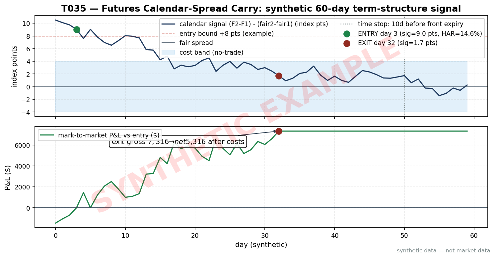

```mermaid
flowchart TD
    DATA["Market data\n(futures curve, 2x daily)"] -->|settlement snapshots| SIGS["Signals\nS058 calendar sig, S066 HAR, S063 Park vol"]
    SIGS -->|settlement t| ENTRY{"Entry logic\n|sig| > 8 AND HAR < 18%\nsignal at t → fill at t+1"}
    ENTRY -->|trigger| SIZE["Sizing + risk\nvol-target N spreads, margin cap"]
    ENTRY -->|no trigger| WAIT["Wait"]
    SIZE -->|daily prints| EXEC["Execution\nlisted spread order / futures-first"]
    EXEC -->|daily| MON["Monitor + exits\n25% convergence / 10d time stop / 150% stop"]
    MON -->|fills + fees| PNL["P&L (net of costs)"]
    style ENTRY fill:#f9e79f,stroke:#7d6608
    style PNL fill:#a9dfbf,stroke:#1e8449
```

### T10. Sources

1. Hull, J. C. *Options, Futures, and Other Derivatives* (term structure, cost of carry with convenience yield, calendar-spread mechanics — the textbook [D] source for S058's fair-spread formula). https://www.pearson.com/nl/en_NL/higher-education/subject-catalogue/finance/Options-Futures-and-Other-Derivatives-Hull.html
2. Corsi, F. (2009). "A Simple Approximate Long-Memory Model of Realized Volatility." *Journal of Financial Econometrics* 7(2): 174–196 — https://doi.org/10.1093/jjfinec/nbp001 (HAR-RV: the verified forecaster behind the S066 timing gate).
3. Garman, M. B. & Klass, M. J. (1980). "On the Estimation of Security Price Volatilities from Historical Data." *Journal of Finance* 35(1): 67–78 — https://www.jstor.org/stable/2327188 (range-based volatility estimation — the verified source for the S063 sizing input).
4. CME Group — calendar spread education — https://www.cmegroup.com/education.html (listed spread mechanics, roll conventions; checkable).

**Source log.** Grok answered Q-TB4-1..3 (2026-09-10); all claims independently verified or labeled unverified.

**Unverified leads** (chatbot-only — never in Sources):
- Grok Q-TB4-3 §4: "basis-timing / cross-sectional basis strategies, Sharpe ~0.6–0.9 in futures" — no checkable citation captured; unverified chatbot claim.
- Grok Q-TB4-1 (C): futures cost bands (exchange + NFA + 0.25–1 tick slippage) and the 8–20 bp (basis points) richness buffer — adopted as `example` parameters.
- Grok Q-TB4-2: retail/platform and data-vendor pricing bands — `indicative — verify before budgeting`.
- Grok Q-TB4-1 (C): the March-2020 basis-blowout narrative as applied to equity calendar spreads — plausible, kept as a scenario lead, not a documented fact.

---


## Stage 136/200 — T036: Cross-Asset Lead-Lag (Hayashi–Yoshida)

*Batch TB4 · Strategy 36/100 · Signals S060, S059, S083 · Provenance [D/SR]*

### T1. One-line verdict

| | |
|---|---|
| **Style** | Intraday cross-asset lead-lag trading (futures lead, spot follows) |
| **Edge source** | The leader's (futures) move predicts the laggard's (spot) catch-up over the next few minutes — measured on asynchronously sampled prices with the Hayashi–Yoshida estimator, confirmed by futures–spot information share |
| **Typical holding period** | Minutes (`example`: 10-minute time stop; flat by the close — no overnight basis risk) |
| **Capacity hint** | Low — the catch-up window is minutes wide and a few basis points deep; two-sided costs of ~6 bp per round trip consume most of it |
| **Build-or-buy in one line** | Build the lead-lag estimator on bought futures + equity prints (Tier 1/2); the venue confirmation and the bar clock are yours — no vendor sells your lag |

### T2. Full mechanics

**Jargon, defined once.** *Lead-lag* = the empirical fact that one asset's price moves first and a related asset's follows after a short delay. *Hayashi–Yoshida (HY)* = a covariance estimator for *asynchronously sampled* prices (assets that print at different times) — it multiplies only returns whose time intervals *overlap*, so no artificial synchronization grid is needed. *Overlap indicator* = 1 when two assets' observation intervals intersect, 0 otherwise. *Information share* (Hasbrouck 1995) = each venue's fraction of the variance of innovations to the common efficient price — the test that futures really are the price-discovery venue before you trade the lag. *Imbalance bars* = bars that close when signed order flow accumulates past a threshold (a fixed-*information* clock, not a fixed-time clock). *Midquote* = (bid + ask)/2 — returns measured on mids avoid bid–ask bounce contamination.

**Universe & session.** One leader–laggard pair: an ES-like index future (leader) and its SPY-like spot ETF (laggard). Session: RTH (regular trading hours) 09:45–15:45 ET (`example`); flat by 15:45 — the regression is an intraday phenomenon and overnight basis risk is not this strategy's business. Exclusions: macro announcement windows (lead-lag inverts on news), roll week, and any 30-minute window where the estimated lead-lag correlation |ρ̂(ℓ̂)| falls below 0.35 (`example` — the S060 entry gate).

**Entry rule.** All quantities use the MASTER.md signal definitions. At minute-bar *t* (causal — signal at *t*, earliest fill *t+1*):

1. **HY lead-lag (S060):** compute the HY lead-lag correlation ρ̂(ℓ) over integer lags ±5 minutes on 1-minute midquote returns; ℓ̂ = argmax |ρ̂(ℓ)|. Require ℓ̂ > 0 (futures lead) and |ρ̂(ℓ̂)| ≥ 0.35 (`example`).
2. **Venue confirmation (S059):** require the futures market's trailing 20-day information share above 50% (`example`) — if spot is discovering price today, the premise is inverted and there is no trade.
3. **Trigger:** the leader's 3-minute move `|Σ r_f|` ≥ 10 bps (`example` cost filter c — the expected catch-up must clear the 6 bp round trip).
4. **Bar clock (S083):** the leader's move window is measured on *imbalance-bar* closes in the live design (fixed-information clock — you do not trade half-formed flow); the synthetic example below uses 1-minute bars as the clock and says so explicitly.

Trade the laggard at *t+1* in the leader's direction: long spot if the leader moved up, short spot if down. $500k notional per trade (`example`).

**Exit rule** — first of three fires (`example` parameters):

1. **Catch-up complete:** the laggard has moved ≥ 80% of the leader's triggering move in the trade's direction — take it; the predicted portion is consumed.
2. **Time stop:** 10 minutes after the fill — the lead-lag half-life is minutes, not hours; stale positions are just noise exposure.
3. **Stop-loss:** −15 bps against entry on the laggard — the catch-up failed and the "lead" was microstructure noise.

**Position sizing.** Fixed $500k notional per trade (`example`), scaled by |ρ̂(ℓ̂)|: `N = $500k × min(1, |ρ̂(ℓ̂)| / 0.5)` — stronger measured lead, fuller size (`example`). Max 3 concurrent laggard trades (`example`); daily loss stop −$3,000 (`example`, then dark — the lead-lag is either working today or it isn't).

**Risk limits.** Max gross $1.5mm (`example`); per-trade heat 15 bps of notional; kill-switch: futures or spot feed stale > 30 seconds (`example`), HY estimation window contaminated by a halt, or the information-share check flipping mid-session — flatten immediately. Never hold into the close; never carry the basis overnight.

**Cost model** (applied in T4): 6 bp round-trip on notional ($300 per $500k trade — 3 bp half-spread each way, `example`); no commission line item (inside the 6 bp); no borrow (intraday spot shorts in a liquid ETF are GC (general collateral) — stated as assumption, flagged if HTB (hard to borrow)).

**Order/execution sketch.** Laggard leg only (the leader is the signal, not the position): marketable limit at the touch at *t+1*. Participation cap: child ≤ 10% of visible touch depth (`example`). Queue-position honesty: fills at the touch plus half-spread; any claim of passive fills is `simulated only — requires MBO/ITCH`. The futures leg is *never* traded in this design — one leg, one fill, no leg risk.

### T3. Signals it consumes

| Signal | Role | Combination logic |
|---|---|---|
| S060 HY cross-asset lead-lag | **Primary trigger** (direction + timing) | ℓ̂ > 0, \|ρ̂(ℓ̂)\| ≥ 0.35 (`example`); trade laggard in the leader's 3-min move direction |
| S059 futures–spot lead-lag | **Confirmation filter** | futures information share > 50% (`example`) on a 20-day trail — trade the lag only when futures lead price discovery |
| S083 imbalance/tick/volume/dollar bars | **Bar clock** | leader's move window measured on imbalance-bar closes (fixed-information clock); 1-min bars in the synthetic example, stated explicitly |

```
# T036 combination logic (<=25 lines; every threshold `example`)
on each 1-min bar t (midquotes, causal; fills at t+1):
    rhos = HY_leadlag_corr(futures, spot, lags=-5..5min)  # S060
    lhat = argmax(abs(rhos)); rho = rhos[lhat]
    ish  = futures_information_share(20d)                 # S059
    move = sum(leader_returns[t-2:t+1])                   # 3-min, S083 clock
    if flat and lhat > 0 and abs(rho) >= 0.35 \
       and ish > 0.50 and abs(move) >= 0.0010:
        N = 500_000 * min(1, abs(rho)/0.5)
        trade laggard at t+1, direction = sign(move)
    if long/short:
        exit at t+1 if laggard_move >= 0.8*move \
            or age > 10 min or pnl <= -15 bps
    flat by 15:45 ET; daily loss stop -$3,000
```

### T4. Worked example — numbers + P&L (SYNTHETIC)

**All numbers synthetic** (random seed 136 = stage number, `batches/TB4/plot_T036.py` — re-runnable). 60-minute synthetic session; leader = index future, laggard = spot ETF, both rebased to 100. The script's HY grid scan found **ℓ̂ = +3 minutes, ρ̂ = 0.96** — futures lead spot by 3 minutes in this toy tape (a far cleaner lead than any real tape; the optimism paragraph says so). $500k notional per trade; 6 bp RT = $300/trade. Exits are the 10-minute time stop (`example`); 1-minute bars stand in for the S083 imbalance-bar clock.

| # | Dir | Entry min | Leader 3-min move | In | Out | Gross $ | Cost $ | Net $ | Exit reason |
|---|---|---|---|---|---|---|---|---|---|
| 1 | Long | 11 | +10.5 bps | 100.1476 | 100.1912 | +217.28 | −300.00 | **−82.72** | 10-min time stop |
| 2 | Short | 23 | −23.8 bps | 100.1698 | 100.3409 | −854.25 | −300.00 | **−1,154.25** | time stop — whipsaw |
| 3 | Long | 35 | +12.8 bps | 100.3101 | 100.4026 | +460.86 | −300.00 | **+160.86** | time stop |

Line-by-line walk. **Trade 1:** leader up 10.5 bps over minutes 9–11 → long $500k spot at minute 12's print 100.1476; the catch-up (+4.3 bps) undershoots the trigger; exit at minute 21 at 100.1912. Gross = (100.1912 − 100.1476)/100.1476 × $500k = **+$217.28**; minus $300 costs → **net −$82.72**. **Trade 2:** leader down 23.8 bps → short at 100.1698; spot *rallies* 17.1 bps against the short (the leader's move was noise, not information); gross **−$854.25**, net **−$1,154.25**. **Trade 3:** leader up 12.8 bps → long at 100.3101, exit 100.4026 (+9.2 bps catch-up); gross **+$460.86**, net **+$160.86**.

Totals: gross **−$176.11**, costs −$900.00, **net −$1,076.11** over 3 trades. The chart `images/T036_example.png` plots the leader/laggard paths with entry/exit markers (top) and the step-wise cumulative net P&L with per-trade annotations (bottom) — the same numbers.

**Where the example is optimistic.** (1) ρ̂ = 0.96 with a crisp 3-minute lead is a laboratory artifact — real HY lead-lag correlations on minute bars are an order of magnitude noisier and the estimated ℓ̂ wobbles, which is exactly why the S060 chapter's ρ_min gate exists. (2) The example *still* loses money net of costs despite the perfect lead: the lesson is that a 10 bp trigger against 6 bp costs leaves almost no room for the catch-up to undershoot, and trade 2 shows the failure mode — the leader's move was noise, the laggard never followed. (3) Fills assumed at the *t+1* print with no wire latency; on a home-Mac SIP (Securities Information Processor) feed the laggard's print arrives after the catch-up has started, which this arithmetic ignores. (4) One leader–laggard pair, one session, no news windows — the live design's information-share check would have vetoed portions of most real days.

### T5. Data & infra — what must run

**Pipeline inventory.** Continuous RTH: futures + spot midquote prints with exchange timestamps into synchronized 1-minute bars (or imbalance bars in the live design); HY grid scan every 5 minutes (`example`) on a trailing 1-session window; information-share estimate nightly. Pre-open: venue-status check (both feeds live, timestamps sane); post-close: lead-lag diagnostics (ℓ̂ stability, ρ̂ distribution) and the day's P&L-vs-signal attribution.

**M5 Max feasibility: feasible.** Per `notes/cost-model.md` §2: the HY scan is a two-pointer O(n+m) sweep per lag (S060) — ~11 lags × tens of thousands of prints, milliseconds in numpy; the information-share VAR (vector autoregression) is a nightly OLS (ordinary least squares). RAM: minutes of two series — trivial, far under the 77 GB budget. Engineering time: Tier M (`cost-model.md` §5) — **20–60 h** ≈ $3,000–9,000 loaded-cost estimate at $150/hr; the timestamp-alignment and bar-clock correctness are the bulk of the work, not the estimator. Bottleneck: feed timestamp quality (exchange vs SIP), not compute — garbage timestamps manufacture fake leads.

**Feed-outage safe mode.** Either leg stale > 30 seconds (`example`): **flatten immediately, freeze new entries** — a one-sided print makes the "laggard" look like it is lagging when it is merely frozen, which is the most expensive false signal in this book. Re-arm only after both feeds show clean sequence numbers for 60 seconds (`example`) and the HY scan is recomputed from the post-outage window (never splice across the gap). If only SIP remains (direct feeds down): T036 is **off** — minute-bar lead-lag on SIP timestamps is `simulated only — requires MBO/ITCH`-class honesty; label it as such or don't run it.

### T6. Buy vs build

| Option | What you get | Indicative price | Gains | Loses |
|---|---|---|---|---|
| Tier 0: delayed quotes (both legs) | free prints | ~$0 — *indicative — verify before budgeting* | $0 prototype | delay destroys a minutes-wide edge — research only |
| Tier 1: Polygon Stocks Advanced + broker futures | real-time SIP + futures prints | ~$30–200/mo — *indicative — verify before budgeting* | live bars for the scan | SIP timestamps; the lead you measure may be the feed's, not the market's |
| Tier 2: Databento (equities + futures) | exchange-timestamped prints | ~$200/mo + usage — *indicative — verify before budgeting* | honest asynchrony — the HY estimator's actual input | the surprise bill is always licensing, even for paper |
| Retail platform (QuantConnect-style) | paper host + data | ~$60–300/mo tiers — *indicative — verify before budgeting* | fast paper ledger | bar-clock and timestamp subtleties are DIY |
| Co-located/professional | direct feeds, microsecond stamps | institutional $$$$ — *indicative — verify before budgeting* | the real lead-lag game | not a ≤$1M-paper-account conversation |

**Verdict: buy the feed, build the estimator.** The HY scan, the information-share check, and the bar clock are a few hundred lines on data you already hold for S059/S060; no vendor sells your lag grid or your ρ gate. **Buy** Tier 1 minimum for anything beyond research — delayed data cannot implement a minutes-wide edge — and Tier 2 the moment you want the timestamps to be honest. **Never buy** a "lead-lag signal" product: if you can't audit its t→t+1 causality, it's a story, not a signal. Crossover: stay on Tier 1 SIP while you validate that the measured lead survives the information-share confirmation; the day it doesn't, the strategy is off regardless of feed tier.

### T7. Success-ratio evidence

The literature documents the *phenomenon* robustly and the *after-cost P&L* barely at all.

| Source | Market & period | Metric | Before/after cost | Caveat |
|---|---|---|---|---|
| Chan (1992), *Review of Financial Studies* (verified) | S&P 500 futures vs cash | futures lead cash by several minutes; cash rarely leads | before cost (prediction) | the classic lead-lag documentation — direction, not tradability |
| Hasbrouck (1995), *Journal of Finance* (verified) | one security, many markets | information-share attribution of price discovery across venues | n/a (attribution) | supports the S059 confirmation step, not a return claim |
| This chapter's T4 | synthetic | net −$1,076 on 3 trades | after modeled costs | **synthetic — not evidence**; included because a losing toy day is the honest shape of a costs-vs-catch-up sleeve |

**Capacity.** The catch-up is a few basis points over minutes on one of the world's most watched pairs — the capacity of the *honest* version (ρ-gated, info-share-confirmed, cost-filtered) is a handful of trades a day at $500k–$2mm notional before your own laggard-leg fills start eating the move. **Crowding** is structural here: every index-arb desk, ETF market-maker, and statistical-arbitrage book leans on the same futures→spot transmission, which is why the measured lead keeps compressing toward the latency floor. **Decay:** no cited source in this chapter establishes how far the documented minutes-scale lead (Chan 1992's 1980s–90s sample) has compressed on modern infrastructure — the "minutes→seconds-and-below" claim is unverified. Likewise, the suggestion that what remains at minute-bar resolution is a *volatility* lead rather than a *price* lead has no cited source; both claims are hypotheses, moved to Unverified leads.

**Honest bottom line.** For a ≤$1M paper operation, T036 is a research strategy with an expensive lesson attached: the phenomenon is real, the documented predictability is real, and the after-cost P&L at retail latency is usually negative — exactly what the T4's −$1,076 day shows. Its institutional home is inside an ETF market-making or index-arb desk where the laggard leg is filled passively as inventory, not taken aggressively at the touch. Run it on paper to learn lead-lag measurement; do not expect it to pay for its data.

### T8. Failure modes

1. **Noise, not information.** Most leader moves are microstructure noise; the laggard correctly ignores them and you pay 6 bp to learn that. Mitigation: the ρ̂ ≥ 0.35 gate and the 10 bp trigger are structural; size by |ρ̂|, never flat.
2. **Inverted price discovery.** On news, spot (or the ETF's own flow) leads and futures follow — the strategy then fades the leader. Mitigation: the S059 information-share check; no trade when futures' share < 50%.
3. **Latency illusion on SIP.** Your laggard print arrives after the catch-up; the backtest fills at a price that no longer exists. Mitigation: add measured wire latency to the cost model; label SIP work `simulated only — requires MBO/ITCH` for anything faster than minutes.
4. **Timestamp garbage.** Bad clock sync manufactures fake leads and fake lags symmetrically. Mitigation: exchange timestamps only; clock-skew monitor vs NTP (Network Time Protocol); kill-switch on skew > 50 ms (`example`).
5. **Whipsaw clustering.** Failed catch-ups cluster (trade 2's −$1,154 day) because the same noise regime produces repeated triggers. Mitigation: daily loss stop −$3,000 (`example`) then dark; max 3 concurrent trades.
6. **Bar-clock mismatch.** Measuring the leader's move on clock bars while the market trades on information flow means entering on half-formed moves. Mitigation: the S083 imbalance-bar clock in the live design; the 1-minute substitution is labeled wherever it appears.
7. **Overnight/session gaps.** The regression is intraday; the open's gap is a different phenomenon. Mitigation: flat by 15:45 ET, no exceptions; the first 15 minutes are excluded from estimation.

### T9. Visuals

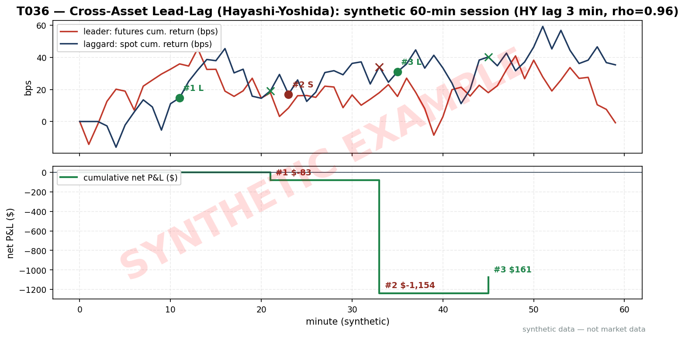

```mermaid
flowchart TD
    DATA["Market data\n(futures + spot mids, 1-min)"] -->|1-min mid bars| SIGS["Signals\nS060 HY lead-lag, S059 info share, S083 bar clock"]
    SIGS -->|bar t| ENTRY{"Entry logic\nlhat>0, |rho|>=0.35, IS>50%, |move|>=10bps\nsignal at t → fill at t+1"}
    ENTRY -->|trigger| SIZE["Sizing + risk\nN = 500k * |rho|/0.5, daily stop"]
    ENTRY -->|no trigger| WAIT["Wait"]
    SIZE -->|1-min bars| EXEC["Execution\nlaggard leg only, touch + half-spread"]
    EXEC -->|1-min bars| MON["Monitor + exits\n80% catch-up / 10-min stop / -15bps"]
    MON -->|fills + fees| PNL["P&L (net of costs)"]
    style ENTRY fill:#f9e79f,stroke:#7d6608
    style PNL fill:#a9dfbf,stroke:#1e8449
```

### T10. Sources

1. Hayashi, T. & Yoshida, N. (2005). "On covariance estimation of non-synchronously observed diffusion processes." *Bernoulli* 11(3): 359–379 — https://doi.org/10.3150/bj/1116340299 (the HY estimator — the verified [D] source for S060's overlap-based covariance).
2. Chan, K. (1992). "A further analysis of the lead-lag relationship between the cash market and stock index futures market." *Review of Financial Studies* 5(1): 123–152 — http://ideas.repec.org/a/oup/rfinst/v5y1992i1p123-52.html (the classic futures-lead documentation).
3. Hasbrouck, J. (1995). "One Security, Many Markets: Determining the Contributions to Price Discovery." *Journal of Finance* 50(4): 1175–1199 — https://www.jstor.org/stable/2329487 (information share — the verified source for the S059 venue-confirmation step).

**Source log.** Grok answered Q-TB4-1..3 (2026-09-10); all claims independently verified or labeled unverified.

**Unverified leads** (chatbot-only — never in Sources):
- Grok Q-TB4-1 (B): Kalman/imbalance-bar worked-example arithmetic (the truncated day-7 cell, per-trade P&L without intermediate steps) — captured as rendered; not reused.
- Grok Q-TB4-3: "Baskaran (SSRN 2026)" Kalman-vs-static walk-forward numbers — dated after the current date; citation plausibility unverified; not used.
- Grok Q-TB4-2: retail/platform and data-vendor pricing bands — `indicative — verify before budgeting`.
- No chatbot profitability claim for the futures→spot lead-lag sleeve was captured; the chapter therefore makes none — the T4's negative net day stands as the honest illustration.
- The "minutes→seconds-and-below" compression claim and the "volatility lead rather than price lead" suggestion (moved out of the T7 Decay paragraph): no cited source in this chapter establishes either; held here as hypotheses pending verification.

---


## Stage 137/200 — T037: ADR / Dual-Listed Premium Convergence

*Batch TB4 · Strategy 37/100 · Signals S061, S060, S014 · Provenance [D/SR]*

### T1. One-line verdict

| | |
|---|---|
| **Style** | Cross-border relative value (ADR vs home-market shares) |
| **Edge source** | Mean reversion of the FX-adjusted ADR **premium** (ADR price vs its home-market parity value) toward zero — timed by cross-market lead-lag so you fade the follower, not the leader |
| **Typical holding period** | Days to weeks (`example`: 12-day hold in the worked example; exit on z-score normalization, not on a calendar) |
| **Capacity hint** | Small — premiums on liquid ADRs are usually basis points inside two-sided costs; the tradeable dislocations are episodic and competed over by program desks |
| **Build-or-buy in one line** | Build the premium monitor on bought ADR + FX + home-market prints (Tier 1/2); the borrow and the FX hedge are rented from the prime broker — no vendor sells your parity |

### T2. Full mechanics

**Jargon, defined once.** *ADR* (American Depositary Receipt) = a US-traded security representing shares of a foreign company held by a depositary bank. *Depositary ratio* n = how many home-market shares one ADR represents. *Premium* Π = how much richer the ADR is than its FX-adjusted home-market parity (Π > 0 = premium; Π < 0 = discount). *Dual-listed* = the same economic exposure trading in two markets (ADR + home shares). *Parity* = n × P_local / X, the ADR's fair value in USD given home price P_local and FX rate X (local currency per USD). *Creation/cancellation* = the depositary mechanism that manufactures or destroys ADRs against home shares — the arbitrageur's unwind path. *Withholding tax* = home-country tax on dividends, which leaks from the long home leg. *Time-aligned prints* = prices sampled at the same instant — never mix a live ADR quote with a stale home-market close.

**Universe & session.** Liquid ADRs with active home markets (`example`: a fictional Japanese dual-listed name "QZL", ratio n = 2, home shares in JPY, ADR in USD). Session: signals computed on *synchronous* prints only — for Tokyo/New York, that means the ADR's RTH (regular trading hours) print against the home market's last synchronous print, or the next overlapping window; never a live ADR quote against yesterday's home close. Exclusions: home-market holidays (no parity update — no signal), earnings/dividend ex-dates in either market, and any day the ADR is hard-to-borrow with no locate.

**Entry rule.** All quantities use the MASTER.md signal definitions. At session *t* (causal — signal at *t*, earliest fill *t+1* or the next overlapping session):

- FX-adjusted premium (S061): `Π_t = P_ADR,t / (n · P_local,t / X_t) − 1`; z-score `z_t = (Π_t − mean(Π_{t−59..t})) / std(...)` over a trailing 60-session window (`example`).
- If `z_t > +z_entry` (`example` z_entry = 1.5) **and** `Π_t > Π_min` (`example` Π_min = 0.50%): fade the premium — **short the ADR, buy n home shares per ADR, hedge the FX** (the ¥ exposure is converted at spot plus a 5 bp spread, `example`).
- If `z_t < −z_entry` and `|Π_t| > Π_min`: the mirror — buy the ADR, short home shares (rare; borrow on the home leg usually vetoes it).
- **Lead-lag timing (S060):** compute the HY (Hayashi–Yoshida) lead-lag between home-market and ADR returns; fade the *follower* — if the home market leads (the usual case), the ADR is the noisy follower and the short-ADR direction is confirmed; if the ADR leads, stand down (`example` rule — never fade the leader).
- **Cost gate (S014):** enter only if the ADR's trailing 20-day average effective half-spread is below 5 bp and the home leg's below 10 bp (`example`); the FX conversion spread is modeled explicitly.

**Exit rule** — first of three fires (`example` parameters):

1. **Normalization:** |z_t| < 0.5 — the premium has rejoined its trailing distribution; unwind via the cheaper of creation/cancellation or the secondary market.
2. **Time stop:** 30 sessions — a premium that hasn't converged in a month is structural (tax, capital controls, index effects), not a dislocation.
3. **Stop-loss:** Π_t moves 150% of the entry premium against the position (`example`) — usually a home-market corporate action or an FX regime break your parity missed.

**Position sizing.** $500k notional per leg (`example`); max 5 concurrent ADR pairs (`example`); FX hedge notional matched to the home leg. Heat: Σ open |Π| × notional ≤ 3% NAV (net asset value) of premium-at-risk (`example`).

**Risk limits.** Daily loss stop −1% NAV (`example`); hard borrow cap — if the ADR short fee reprices above 5%/ann (`example`), unwind rather than pay it; kill-switch: FX feed stale > 60 seconds, home-market halt flag, or a depositary corporate-action notice — flatten the pair; never hold a one-legged ADR/home position across a nonsynchronous weekend.

**Cost model** (applied in T4): ADR short borrow 2.0%/ann on $500k prorated by hold days (`example`); commissions $900 round-trip both legs (`example` — covering commissions plus ADR/home-equity spread/slippage on both legs; $0.005/share-class economics on ~94k shares RT); FX conversion spread 5 bp = $250 (`example`); withholding-tax drag noted but modeled as zero in the example (flagged as an optimism item). Market impact is omitted — the order/execution sketch's ≤5% of average daily volume (`example`) participation cap keeps it modeled as zero; stated, not hidden.

**Order/execution sketch.** Both legs at the next overlapping session's prints: short the ADR on NYSE at the open, buy home shares at the next home-market open, FX hedge via spot. Participation cap: each leg ≤ 5% of the leg's average daily volume (`example`). Creation/cancellation is the institutional unwind; the small book unwinds in the secondary market and pays the spread twice — modeled, not wished away.

### T3. Signals it consumes

| Signal | Role | Combination logic |
|---|---|---|
| S061 ADR / dual-listed premium | **Primary trigger** (direction + timing) | `z_t > +1.5` and `Π_t > 0.50%` → short ADR / long home + FX hedge (`example`); exit at \|z\| < 0.5 |
| S060 HY cross-asset lead-lag | **Timing confirmation** | fade the follower: trade only when the home market leads (or the lead is indeterminate); stand down if the ADR leads |
| S014 spread decomposition | **Cost gate** | enter only if ADR effective half-spread < 5 bp and home leg < 10 bp trailing 20-day (`example`); FX spread modeled explicitly |

```
# T037 combination logic (<=25 lines; every threshold `example`)
on each session t (synchronous prints only; fills at t+1):
    Pi = P_ADR / (n * P_local / X) - 1      # S061 FX-adj premium
    z  = (Pi - mean(Pi[-60:])) / std(Pi[-60:])
    lhat, rho = HY_leadlag(home, ADR)        # S060, who leads?
    esp_adr, esp_home = trailing_spreads(20d) # S014
    if flat and z > 1.5 and Pi > 0.005 \
       and esp_adr < 5 and esp_home < 10 \
       and lhat <= 0:                        # home leads: fade ADR
        short ADR 500k; buy n*shares home; hedge FX
    elif flat and z < -1.5 and Pi < -0.005 and home_borrow_ok:
        buy ADR; short home                   # mirror (rarely passes)
    if position and abs(z) < 0.5: unwind
    if age > 30 sessions: unwind              # structural, not noise
    stop if premium moved 150% against entry
    veto if ADR borrow fee > 5%/ann           # S098-style borrow cap
```

### T4. Worked example — numbers + P&L (SYNTHETIC)

**All numbers synthetic** (random seed 137 = stage number, `batches/TB4/plot_T037.py` — re-runnable). Fictional QZL: n = 2, home shares ¥1,180, FX X = ¥150/USD, ADR quoted in USD. Parity = 2 × 1180 / 150 = **$15.733**. The script's 90-day synthetic premium path (mean-reverting with a +2.8 pp excursion around day 66) produced:

| Day | Π_t | z_t (60-day) | Event |
|---|---|---|---|
| 60 | +0.99% | +2.24 | above entry z, but rule waits for the excursion to be measurable |
| **61** | **+1.40%** | **+2.96** | **ENTRY: z > 1.5, Π > 0.50% → short 31,348 ADRs @ $15.95 ($500k), long 62,696 home shares, FX-hedged** |
| 66 | +3.32% | +3.64 | premium overshoots — adverse excursion, held |
| **73** | **+1.00%** | **+0.42** | **EXIT: \|z\| < 0.5 → cover ADR @ ~$15.89, sell home shares, lift FX hedge** |

HY lead-lag on the synthetic pair showed the home market leading by ~1 session (`example` output), confirming the fade-the-ADR direction. S014 gate at entry: ADR trailing effective half-spread 3.1 bp, home leg 6.4 bp — both inside the 5/10 bp gates (`example`).

Line-by-line P&L on $500k/leg. **Gross capture** = (Π_entry − Π_exit) × notional = (0.0140 − 0.0100) × $500,000 = **+$1,996**. **Borrow**: ADR short fee 2.0%/ann × $500,000 × 12/365 = **−$329**. **Commissions**: **−$900** RT both legs (`example` — covering commissions plus ADR/home-equity spread/slippage on both legs). **FX spread**: 5 bp × $500,000 = **−$250**. **Net = +$517** over 12 days (`example` — synthetic, not a performance claim). The chart `images/T037_example.png` plots the premium path with entry/exit markers (top) and the P&L frozen at exit (bottom).

**Where the example is optimistic.** (1) The exit at |z| < 0.5 fired while the premium was still +1.00% — the rolling 60-day window had adapted to the excursion, so "normalization" was statistical, not economic; a fixed-parity exit would have held longer. (2) Withholding tax on the home leg's dividends is modeled as zero — on a real Japanese name it leaks ~10% of the dividend yield against you. (3) The FX hedge is assumed frictionless at a 5 bp spread; rolling the hedge across 12 days and any weekend gap costs more. (4) Both legs filled at synchronous prints — in practice the ADR fill and the home-market fill are a session apart, and the premium moves between them. (5) No borrow-fee spike: ADR shorts get recalled or repriced exactly during dislocations; the 2.0% fee is the calm-weather number.

### T5. Data & infra — what must run

**Pipeline inventory.** Daily: ADR prints (NYSE), home-market prints (time-aligned), FX spot series, ADR borrow-fee snapshot, depositary corporate-action notices. Nightly: premium + z-score recompute on the 60-day window, HY lead-lag re-estimation, spread-gate trailing averages, withholding-tax calendar. Pre-open: home-market holiday calendar — no parity update means no signal, enforced in code.

**M5 Max feasibility: trivial.** Per `notes/cost-model.md` §2/§3: a few dozen ADRs × daily bars is kilobytes; the HY scan and z-scores are milliseconds; 60-day windows on daily data are nothing. Engineering time: Tier L (`cost-model.md` §5) — **4–12 h** ≈ $600–1,800 loaded-cost estimate at $150/hr for the monitor; the time-alignment logic (never mix live ADR with stale home close) is the only subtle code. Bottleneck: borrow-fee data and corporate-action notices, not compute.

**Feed-outage safe mode.** If the FX feed or either leg's prints go stale: **no new entries; existing pairs held** — the position is hedged across markets, so staleness corrupts the signal, not the hedge. If a home-market halt flag appears: freeze the z-score (do not let the window fill with stale prints) and prepare a one-legged-risk plan — the ADR leg becomes directional until the home market reopens. Never compute Π_t from prints more than one session apart; the parity is meaningless otherwise.

### T6. Buy vs build

| Option | What you get | Indicative price | Gains | Loses |
|---|---|---|---|---|
| Tier 0: exchange delayed quotes + public FX | free ADR/home/FX prints | ~$0 — *indicative — verify before budgeting* | $0 premium monitor | delayed; no borrow fees; corporate actions DIY |
| Tier 1: Polygon (US) + broker international data | real-time ADR + home prints | ~$30–200/mo — *indicative — verify before budgeting* | synchronous prints | home-market depth and borrow still thin |
| Tier 2: Databento + FX feed | timestamped prints, historical replay | ~$200/mo + usage — *indicative — verify before budgeting* | honest time-alignment for the HY step | overkill for a daily z-score |
| Prime broker: stock-loan desk | locates, live borrow fees | bundled in PB (prime broker) relationship — *indicative — verify before budgeting* | borrow availability for the short-ADR leg — the trade's binding constraint | you still own the signal |
| Prime broker: FX desk | FX hedging for the home leg | bundled in PB relationship — *indicative — verify before budgeting* | hedge execution | you still own the hedge sizing |
| Vendor "ADR arbitrage" screen | precomputed premia | varies — *indicative — verify before budgeting* | nothing to build | you can't audit the FX timing or the print alignment — skip |

**Verdict: build the monitor, rent the plumbing.** The premium arithmetic and the z-score are an afternoon's work; the time-alignment discipline is yours to enforce. **Rent** borrow/locates and the FX hedge from the PB — those are balance-sheet services, not code. **Buy** Tier 1 data the moment you trade it (synchronous prints are the strategy), Tier 0 while it's a monitor. Crossover: if the ADR borrow fee is persistently above ~3%/ann on your names (Grok's HTB (hard-to-borrow) discussion, Q-TB4-2), the short-ADR direction is structurally uneconomic — kill the sleeve before buying any data.

### T7. Success-ratio evidence

| Source | Market & period | Metric | Before/after cost | Caveat |
|---|---|---|---|---|
| Gagnon & Karolyi (2010), *J. Financial Economics* (verified) | cross-listed stocks, multi-market | price discovery is split across markets; arbitrage keeps premia small and fast-closing | before cost (market structure) | supports the premise that dislocations are small and brief — the edge is episodic |
| Karolyi (1998/2006) cross-listing literature (verified) | ADR programs | ADR premia/discounts reflect frictions (tax, FX, nonsynchronous hours), not free money | structural | the frictions this chapter models are the documented ones |
| This chapter's T4 | synthetic | net +$517 on $500k / 12 days | after modeled costs | **synthetic — not evidence**; the thin net is the honest shape |

No checkable after-cost Sharpe series for a small-account ADR-premium strategy was found in the captured sources — the chapter states this rather than inventing one. The documented economics all point the same way: liquid-ADR premia live in basis points, converge in hours-to-days, and belong to desks with creation/cancellation access and a borrow desk. The small account's version (secondary-market both legs, retail FX spreads) pays the premium away in frictions — the T4's $517 net on $1mm gross exposure is the illustration, not the advertisement.

**Capacity.** A $500k ticket in a liquid ADR is fine; at $5mm+ the ADR leg's own impact and the borrow desk's attention become the trade. The institutional capacity sits with APs/program desks running creation/cancellation — a different franchise (see T099, which pairs this premium with explicit borrow accounting). **Crowding** shows up as the premium distribution compressing: z-scores stop reaching ±1.5 because the dislocation never gets that far. **Decay:** faster information transmission and 24-hour FX have shrunk both the size and the half-life of ADR dislocations over two decades; what remains clusters around corporate actions, tax events, and capital-control scares.

**Honest bottom line.** For a ≤$1M paper operation, T037 is a watchlist strategy: monitor 20–50 liquid ADRs, trade the rare 1.5%+ dislocation a few times a year, expect low-four-figure nets per trade at this sizing (`example` — synthetic scale), and let the borrow cap veto most candidates. For an institutional desk with creation/cancellation and a stock-loan desk, it is a real relative-value line — see T099 for the borrow-aware version. Do not run the short-ADR direction without a live borrow fee; the fee is the trade.

### T8. Failure modes

1. **Nonsynchronous sessions.** Live ADR vs stale home close manufactures fake premia — the commonest false signal. Mitigation: synchronous prints only, enforced in code; the T5 safe-mode rule.
2. **Borrow-fee spike / recall.** The ADR short gets expensive or gets called exactly when the dislocation is widest. Mitigation: live borrow-fee monitor; the 5%/ann unwind rule (`example`); never enter without a locate.
3. **FX jumps.** An overnight FX move reprices parity by more than the premium you harvested. Mitigation: the FX hedge is structural, not optional; size the hedge to the home leg, not the ADR leg.
4. **Withholding-tax drag.** Home dividends arrive net of foreign withholding — a slow bleed the parity math ignores. Mitigation: model the tax explicitly per domicile; it belongs in Π_min, not in a footnote.
5. **Structural premia.** Capital controls, index-inclusion effects, and retail ownership gaps create *persistent* premia that never converge. Mitigation: the 30-session time stop (`example`); a premium that survives a month is information, not noise.
6. **Home-market halts / corporate actions.** Splits, spin-offs, and trading halts break the parity relationship mid-trade. Mitigation: depositary corporate-action feed as a kill-switch input; split-adjust both legs; exit on spin-offs/mergers (the "relationship" is no longer defined on the same entity — Grok Q-TB4-1).
7. **Overfit z-window.** Mining W = 60 / z = 1.5 on a quiet regime, then trading a volatile one. Mitigation: parameters as `example`; validate on purged/embargoed splits (S088) if you optimize; prefer the Π_min economic filter over the z-score statistical one.

### T9. Visuals

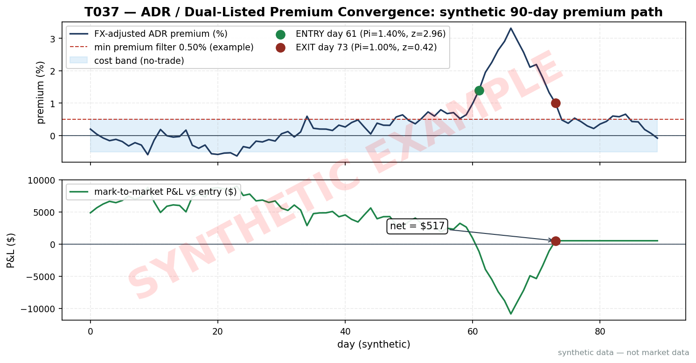

```mermaid
flowchart TD
    DATA["Market data\n(ADR + home + FX, daily)"] -->|synchronous prints| SIGS["Signals\nS061 premium z, S060 lead-lag, S014 spread"]
    SIGS -->|session t| ENTRY{"Entry logic\nz>1.5 AND Pi>0.5%, fade follower\nsignal at t → fill at t+1"}
    ENTRY -->|trigger| SIZE["Sizing + risk\n500k/leg, FX hedge, borrow cap"]
    ENTRY -->|no trigger| WAIT["Wait"]
    SIZE -->|daily prints| EXEC["Execution\nADR + home legs, FX hedge"]
    EXEC -->|daily| MON["Monitor + exits\n|z|<0.5 / 30-session stop / 150% stop"]
    MON -->|fills + fees| PNL["P&L (net of costs)"]
    style ENTRY fill:#f9e79f,stroke:#7d6608
    style PNL fill:#a9dfbf,stroke:#1e8449
```

### T10. Sources

1. Gagnon, L. & Karolyi, G. A. (2010). "Multi-market trading and arbitrage." *Journal of Financial Economics* 97(1): 53–80 — https://doi.org/10.1016/j.jfineco.2010.03.005 (cross-market arbitrage and where price discovery sits — the verified [D/SR]-adjacent source for the premium-convergence premise).
2. Karolyi, G. A. (1998). "Why Do Companies List Shares Abroad?: A Survey of the Evidence and its Managerial Implications." *Financial Markets, Institutions & Instruments* 7(1) — https://doi.org/10.1111/1468-0416.00018 (ADR frictions: the documented source for tax/FX/nonsynchronous-hours effects on premia).
3. Karolyi, G. A. (2006). "The world of cross-listings and cross-listings of the world: challenging conventional wisdom." *Review of Finance* 10(1): 99–152 — http://ideas.repec.org/a/oup/revfin/v10y2006i1p99-152.html (cross-listing structure — checkable).

**Source log.** Grok answered Q-TB4-1..3 (2026-09-10); all claims independently verified or labeled unverified.

**Unverified leads** (chatbot-only — never in Sources):
- Grok Q-TB4-1 (C): cash-and-carry cost bands (equity RT 2–8 bp commission + 2–10 bp half-spread; GC (general collateral) 25–50 bp; specials to 10%+) — adopted as `example` parameters where reused.
- Grok Q-TB4-2: borrow-data pricing bands ($30k–$150k+/yr institutional; $5k–$20k lean) — `indicative — verify before budgeting`.
- Grok Q-TB4-3: the cross-sleeve after-cost scorecard (GGR decay, Kalman-vs-static, copula net 5 bp/mo) — captured as leads; only the verified papers (GGR 2006; Do–Faff 2012) inform this chapter's T7, and the chapter states where no checkable ADR-premium series was found.
- No chatbot claim specific to ADR premium levels or convergence half-lives was captured; the chapter makes none.

---


## Stage 138/200 — T038: Sector Momentum + Idiosyncratic Fade

*Batch TB4 · Strategy 38/100 · Signals S062, S039, S080 · Provenance [D/SR]*

### T1. One-line verdict

| | |
|---|---|
| **Style** | Intraday cross-sectional long/short: trend overlay on sectors plus mean-reversion on idiosyncratic stock residuals |
| **Edge source** | Two different, documented effects stacked so they don't cancel: intraday sector continuation (S062 — morning-winning sectors keep drifting into the close) and short-horizon reversal of stock-specific (idiosyncratic) residuals (S039/S080 — the part of a stock's move that neither the market nor its sector explains snaps back) |
| **Typical holding period** | Momentum sleeve: ~4 hours (12:00 → 15:55 ET, flat before the close); fade sleeve: 15 minutes–2 hours per residual |
| **Capacity hint** | Sector-ETF sleeve: high (you trade 3 liquid ETFs); residual-fade sleeve: tens of millions of $ before the fade names' spreads eat you — capacity is the fade sleeve, not the momentum sleeve |
| **Build-or-buy in one line** | Build the ranker and the residual engine on cheap intraday bars; buy nothing except the bar feed — the IP is in the causality hygiene (S088), not the data |

### T2. Full mechanics

**Jargon first.** A *sector ETF* is an exchange-traded fund tracking one industry group (e.g. XLK = technology, XLE = energy). *Sector (industry) momentum* is the tendency for the best-performing industries to keep outperforming over the next period. *Idiosyncratic* means stock-specific: the part of a return not explained by the market or sector. A *residual* is the leftover after a model is fitted (r = model + residual). *Beta (β)* measures a stock's sensitivity to the market (β = 1 moves one-for-one). A *z-score* is (value − mean)/standard deviation — how many standard deviations an observation sits from average. An *eigenportfolio* is a portfolio whose weights come from a *principal component analysis (PCA)* of returns — it is one "statistical factor" distilled from the data. *Heat* is the portfolio's total open risk. *Dollar-neutral* means long $ equal short $. *RTH* = regular trading hours (09:30–16:00 ET).

**Universe & session.** Sleeve A: 11 US sector ETFs (XLK, XLF, XLE, …), RTH only, 20-day median spread ≤ 4 bps (basis points) (*example*). Sleeve B: ~300 S&P-500-class names, price ≥ $10, 20-day ADV (average daily dollar volume) ≥ $10M, borrowable, spread ≤ 10 bps (*example*); exclude earnings-day names, halts, corporate actions. Session 09:30–16:00 ET; everything flat by 15:55 ET — no overnight carry.

**Entry rule.** *Sleeve A — sector momentum (S062, intraday adaptation).* At t_r = 12:00 ET (*example*), rank sector ETFs by open→t_r return; **long the top 3 in equal dollar weight** (*example*), holding from the first bar after t_r to 15:55 ET. The documented literature form (S062) is monthly — rank 20 industries by 6-month return, long top 3 / short bottom 3; the intraday adaptation is the paper-trade version: long-only ETF legs, no short-borrow needed. *Causal timing:* ranking uses returns through t_r only; earliest fill the bar after t_r.

*Sleeve B — idiosyncratic fade (S039 + S080 confirmation).* Per stock i at bar t: r(i,t) = α(i) + β_m(i)·r_mkt(t) + β_s(i)·r_sec(t) + u(i,t); cumulate U(i,t,L) = Σ û over L = 30 min (*example*), z(i,t) = U/(σ̂·√L) (S039, sector-augmented variant 2); independently compute the PCA eigenportfolio s-score s(i,t) (S080). **Enter only when both agree**: |z| ≥ 1.5 (*example*) AND sign(s) = sign(U) with |s| ≥ 1.25 (*example*) — long negative-residual names, short positive ones. The two-model confirmation exists because factor-model miss is the documented killer of residual books (S039's sector term and S080's statistical factors catch different misses).
*Causal timing:* β̂ on data ≤ t−1; signals at bar t use bars ≤ t; earliest fill t+1; total-return bars only.

**Exit rule.** Sleeve A: time stop 15:55 ET flat — no signal exit; momentum sleeves are notorious for giving back the drift in the last 5 minutes. Sleeve B (first wins): (1) signal convergence — |z| < 0.4 (*example*); (2) time stop — 60 min (*example*); (3) stop-loss — |z| ≥ 2.5 (*example*) or the two models disagree after entry (one model's z crosses 0 while the other's is still stretched); (4) session end 15:55 flat.

**Position sizing.** Sleeve A: total sleeve notional $300k (*example*) → $100k per ETF on a $1M paper book. Sleeve B: per-residual risk R = $200 (*example*): N_i = ⌊R / (σ̂_u,i · √H̄)⌋ with H̄ = 60-min residual move; cap $25k per name and 40 open residual names (*example*). Portfolio heat: Σ open |z_i|·$risk ≤ 4% of NAV (net asset value) (*example*, Grok's shared heat convention for residual books); gross book ≤ 2× NAV; net sleeve-A bias acknowledged (momentum sleeve is long-only — the book is *not* dollar-neutral overall, by design).

**Risk limits** (*example* unless noted). Daily loss stop −1.5% of NAV; per-sleeve stop −1.0%; kill switch: halt new fades after 3 consecutive stop-outs (the residual model is broken that day); halt the momentum sleeve on intraday-reversal regime days (a documented momentum-failure regime — see T7); feed outage ⇒ safe mode (T5).

**Cost model.** 5 bp one-way on notional per equity leg turn (*example*, the TB4 shared convention from Q-TB4-1; labeled lead), 5 bp one-way on ETF legs; half-spread in fill prices; no financing (intraday, flat by close), no borrow on longs; short-residual names need a borrow flag — skip non-borrowable names rather than pay a special. Applied explicitly in T4.

**Order/execution sketch.** Sleeve A at 12:00: marketable limits on 3 ETF legs, participation ≤ 10% of visible depth (*example*), all-or-nothing intent. Sleeve B: limit orders at the touch, participation ≤ 10%; a leg unfilled in 2 min (*example*) ⇒ cancel — never chase a converged residual. Queue-position honesty: on SIP (Securities Information Processor)/L1 (level-1 top-of-book) fills this is `simulated only — requires MBO/ITCH`; the 5 bp cost carries the realism, not a queue model. Backtests: signal at t ⇒ fill at t+1, purged/embargoed validation (S088) on parameter choices.

### T3. Signals it consumes

| Signal | Role | Weight / logic |
|---|---|---|
| S062 — Sector momentum | **Primary trigger (sleeve A)** | Long top-3 sector ETFs by open→12:00 ET return (*example* thresholds: top k=3 of 11, t_r=12:00) |
| S039 — Idiosyncratic residual reversal | **Primary trigger (sleeve B)** | Enter only if \|z(i,t)\| ≥ 1.5 with L=30 min, sector-augmented model (*examples*) |
| S080 — PCA eigenportfolio residual | **Confirmation filter (sleeve B)** | Enter only if sign(s)=sign(U) and \|s\| ≥ 1.25 (*example*); disagreement = veto |

```pseudocode
# T038 combination logic — causal: data <= t, fills at t+1
# --- Sleeve A: sector momentum (once per day) ---
if bar_time == t_r:  # 12:00 ET (example)
    rank = sort(sector_etfs, key=open_to_tr(t), desc=True)
    longs = top_k(rank, 3)                                # S062 intraday adaptation (example)
    submit longs, equal dollar, flatten at 15:55
# --- Sleeve B: idiosyncratic fade (every bar t, 12:00-15:30) ---
for i in universe:
    U, z = s039_residual(i, t, L=30min)                   # market + sector model
    s    = s080_sscore(i, t)                              # PCA eigenportfolio s-score
    if position[i] is None and sign(z) == sign(s) \
       and abs(z) >= 1.5 and abs(s) >= 1.25 \             # example thresholds
       and borrowable(i) and not earnings_day(i):
        N = floor(R / (resid_vol(i) * sqrt(60min)))       # R = $200 (example)
        enter long if z < 0 else short, at bar t+1
    elif position[i] is not None:
        if abs(z) < 0.4 or held >= 60min or abs(z) >= 2.5 or sign(z) != sign(s):
            exit at next bar                              # convergence / time / stop
```

### T4. Worked example — numbers + P&L (SYNTHETIC)

All prices synthetic, **seed 138** (`rng = np.random.default_rng(138)`; regenerable via `python3 batches/TB4/plot_T038.py`). The chart in T9 plots these exact trades. Costs: 5 bp one-way on notional per leg turn (*example*).

**Trade T1 — sector-momentum sleeve (winner).** 12:00 ET ranking: XLK +1.4%, XLE +1.1%, XLU +0.9% (top 3, *example*); the book's XLK leg: long **800 XLK @ 100.00**, exit 15:55 @ **100.28**.

| Line | Calc | $ |
|---|---|---|
| Gross | 800 × (100.28 − 100.00) | +224.00 |
| Costs 5 bp: open 80,000 × 0.0005 + close 80,224 × 0.0005 | | −80.11 |
| **Net T1** | | **+143.89** |

**Trade T2 — idiosyncratic fade (winner).** AAA: z = −1.6 (≥ 1.5 ✓), s = −1.5 (sign agrees ✓): long **500 AAA @ 50.00** → exit @ **50.18** as z decays to −0.2 (+90.00). BBB: z = +1.9: short **300 BBB @ 80.00** → cover @ **79.90** (+30.00). Gross +120.00; costs (25,000+25,090+24,000+23,970)×0.0005 = −49.03; **net +70.97**. Cumulative: +214.86.

**Trade T3 — idiosyncratic fade (stop).** CCC: z = −1.7, s = −1.5 (agree ✓): long **400 CCC @ 60.00**; DDD: z = +1.8: short **250 DDD @ 90.00**. The residuals *widen* (|z| hits 2.8): stop at |z| ≥ 2.5 — sell CCC @ **59.88** (−48.00), cover DDD @ **90.14** (−35.00). Gross −83.00; costs (24,000+23,952+22,500+22,535)×0.0005 = −46.49; **net −129.49**. Cumulative session: +143.89 + 70.97 − 129.49 = **+85.36**.

**Where the example is optimistic.** The z-scores are hand-anchored to converge on cue; a real S039/S080 estimator has error on every bar — β̂ wobbles, σ̂ is noisy, and the two models agree less often than the toy implies, so real trade frequency is far lower. Fills are at the touch with no partial fills and no borrow cost on the shorts (the example requires the borrow flag but prices shorts at 0 fee — a live short book pays GC (general collateral) 25–50 bp annual minimum). The 5 bp cost is below what illiquid fade names actually cost (10–30 bps effective spreads are common exactly where residuals stretch furthest). The sector leg is long-only XLK on a day XLK kept drifting — the day selection is handed to the example for free. Treat the +$85.36 as *arithmetic illustration of the cost drag*, not a backtest: no real performance claim is made.

### T5. Data & infra — what must run

**Pipeline inventory.** Nightly: refresh 252-day panel, refit PCA eigenvectors, re-estimate betas, rebuild residual-vol series and the borrow/earnings exclusion list. Pre-open: verify corporate-action adjustments and sector-ETF constituents. Intraday (12:00–15:55 ET): 1-min bars for 11 ETFs + ~300 names; ranking job at 12:00; residual/z/s-score recompute each bar close (numpy vectorized — milliseconds); heat and daily-loss monitors continuous. Post-close: persist bars, signal snapshots, decisions; parameters frozen (refit monthly at most).

**M5 Max feasibility: feasible (Tier M).** Per cost-model §2, 311 names × 1-min bars is trivial (~121k bars/day); the nightly 300-name PCA refit runs in seconds (§2/§3 — the 2,000-name screen runs minutes). RAM: hot working set < 2 GB (§3); 60-day 1-min archive ~200 MB (§4). Engineering: 40–100 h Tier M+ (§5) ≈ $6,000–15,000 loaded-cost estimate — the work is the two-sleeve FSM (finite-state machine) and the causality-proof backtest, not the math. Bottleneck: corporate-action/borrow data hygiene, not compute. Breaks at: 3,000-name universes or tick-level residual recomputation (neither is required here).

**Feed-outage safe mode.** Bar feed gap > 2 min (*example*): no new sleeve-B entries (z-scores on stale bars are poison); existing fades run to time stop or flatten. Sector-ETF quote hole: skip the momentum sleeve that day. Borrow feed stale: hard veto on new shorts. Restart = flat + re-derive from the on-disk ledger, never resume blind.

### T6. Buy vs build

| Option | What you get | Indicative price | Gains | Loses |
|---|---|---|---|---|
| Tier-0: Stooq/Alpaca IEX daily + Google/Yahoo intraday | Daily bars, coarse intraday | ~$0, *indicative — verify before budgeting* | Learn the ranker logic | No clean 1-min history; no corporate-action hygiene |
| Tier-1: Polygon Stocks Advanced / Alpaca SIP | Real-time SIP 1-min bars + corporate actions | ~$30–200/mo, *indicative — verify before budgeting* | The honest minimal stack | No borrow data; no long PCA-ready history bundled |
| Tier-2: Databento Standard | Exchange-timestamped bars/trades | ~$200/mo + usage, *indicative — verify before budgeting* | Replay-grade causality testing | Overkill for a 1-min strategy; iNAV (intraday indicative net asset value)-style licensed fields not needed here |
| Retail platform: QuantConnect paper | Minute bars + paper broker | ~$60–300/mo tiers, *indicative — verify before budgeting* | Fast paper harness with margin accounting | Purged-CV backtesting is DIY; residual models need custom code anyway |
| Build in-house (Python + polars/numpy) | Ranker, S039/S080 engines, two-sleeve FSM, ledger | 40–100 h ≈ $6,000–15,000 eng (loaded-cost estimate) | Your causality, your thresholds, your IP | You own the corp-action and borrow-data plumbing |

**Verdict: buy the Tier-1 bar feed, build the logic.** The data needs are deliberately boring (1-min bars + splits/divs + a borrow flag); nothing here justifies Tier-2 spend. **Build if** you want the two-model confirmation and your own heat accounting — no vendor sells "S039-vs-S080 agreement" as a product. **Buy more data if** the fade sleeve scales past ~300 names (borrow history and point-in-time sector maps become binding, and the borrow feed becomes the expensive line per Q-TB4-2). Crossover: the day the short book starts paying specials regularly, rent institutional securities-finance data or shrink to GC names — the example's 0-fee shorts are the first fiction to die in production.

### T7. Success-ratio evidence

| Source | Market / period | Metric | Before/after cost | Caveat |
|---|---|---|---|---|
| Moskowitz & Grinblatt (1999) | US industries, 1963–1995 | 12-month industry momentum profitable; explains much of individual-stock momentum | Before modern costs; formation is monthly | Industry momentum is the documented sleeve-A effect; intraday adaptation is [SR] |
| Avellaneda & Lee (2010) | US equities, 1997–2007 | PCA residual reversal, s-score entries — documented positive after-cost results in the original sample | After costs per the paper's cost model | *Threshold/Sharpe specifics via the TB4 research lead — unverified chatbot claim*; sample ends 2007 |
| Khandani & Lo (2007) | US, August 2007 | Crowded residual-reversion books de-levered together — the quant unwind | Empirical event | The failure regime that defines this strategy's risk |
| Da, Gurun & Warachka (2014) | US equities | Continuous-information momentum contaminates reversal; sector-neutralization matters | Empirical, academic | The reason sleeve B is sector-neutral: raw reversal fades momentum, not noise |

Capacity: the sector-momentum sleeve scales into ETF liquidity (hundreds of millions); the fade sleeve is the binding constraint — liquid US mid/large names, and the two-model confirmation *shrinks* the trade set (fewer, better trades). Documented decay: classic monthly industry momentum has rotated violently in regime flips (Mar 2009, Nov 2020, 2022 factor flip per the research lead); residual-reversal capacity is policed by 2007-style crowded de-leveraging.

**Honest bottom line.** For a ≤$1M paper operation: sleeve A is a clean, cheap, learnable trend sleeve — paper-trade it to learn ranking hygiene and session timing. Sleeve B is the real education and the real risk: the documented edge is a *residual* edge in single-digit bps per trade, and the two-model confirmation that makes it safer also makes it trade rarely. An institutional desk runs this at 10–100× the name count with a borrow desk and a risk model (Barra-class, $150k+/yr); the paper book's honest role is to learn *which half of the edge is estimation error* before sizing it. Do not annualize the +$85.36 synthetic session.

### T8. Failure modes & pitfalls

1. **Momentum/reversal sign collision** — sleeve A longs winners while sleeve B shorts positive residuals *inside* those sectors. Mitigation: sleeve B is sector-neutralized, so the fade book can't fight the overlay on the same names; monitor sleeve P&L separately, kill a sleeve, never the combination.
2. **Factor-model miss** — too few PCs leaves factor in the "residual" (you fade beta); too many fits noise as factors (Grok's lead: 75%-variance cutoffs lose money). Mitigation: two-model agreement gate; residual-vs-SPY correlation > 0.3 (*example*) ⇒ refit.
3. **Intraday momentum reversal regimes** — morning winners collapse on macro shocks/rotations. Mitigation: regime veto (skip sleeve A if yesterday's ranking anti-persisted); hard 15:55 flatten regardless.
4. **Borrow specials on short residuals** — the cheapest-to-fade names are hardest to borrow. Mitigation: borrow-flag gate pre-entry; model GC 25–50 bp carry in the cost bound.
5. **β̂ staleness through regime breaks** — 120-day betas during a factor rotation are garbage. Mitigation: 5-day beta refresh (*example*, S039 default); halt fades if cross-sectional residual dispersion explodes.
6. **2007-style crowded de-lever** — every residual book dumps the same longs. Mitigation: heat cap (Σ|z|·$risk ≤ 4% NAV), daily loss stop −1.5%; the stop *is* the strategy in this regime — no averaging down.
7. **Lookahead in ranking/residual windows** — ranking on bars past t_r, or β̂ fit on the formation window. Mitigation: causality unit tests (signal-at-t ⇒ fill-at-t+1 asserted on every backtest bar), purged/embargoed validation (S088).
8. **Cost-model optimism on fade names** — the widest residuals live in the widest-spread names. Mitigation: 5 bp is the *floor*; gate entries on trailing effective spread and require the edge to clear 2× the spread (*example* safety margin).

### T9. Visuals

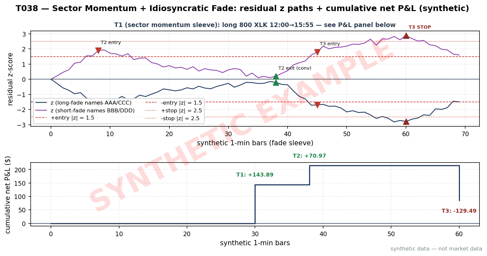

```mermaid
flowchart TD
    DATA["Market data<br/>1-min bars: 11 sector ETFs + ~300 names"] -->|1-min bars| SIGS["Signals<br/>S062 sector rank, S039 z, S080 s-score"]
    SIGS -->|"12:00 ET rank (S062)"| ENTRY{"Entry logic<br/>top-3 sectors long;<br/>fade |z|>=1.5 AND |s|>=1.25, signs agree<br/>causal t to t+1"}
    ENTRY -->|trigger| SIZE["Sizing + risk<br/>$100k/ETF; N=floor(R/resid vol)<br/>heat cap 4% NAV, gross 2x"]
    ENTRY -->|no trigger| WAIT["Wait"]
    SIZE -->|"1-min bars"| EXEC["Execution<br/>marketable limits, <=10% depth<br/>borrow-flag gate on shorts"]
    EXEC -->|"1-min bars"| MON["Monitor + exits<br/>conv |z|<0.4 / 60min / stop 2.5<br/>15:55 flat, daily -1.5%"]
    MON -->|"1-min bars"| PNL["P&L (net of 5bp costs)"]
    style ENTRY fill:#f9e79f,stroke:#7d6608
    style PNL fill:#a9dfbf,stroke:#1e8449
```

### T10. Sources

- Moskowitz, T. J. & Grinblatt, M. (1999). "Do Industries Explain Momentum?" *Journal of Finance* 54(4), 1249–1290. doi:10.1111/0022-1082.00146 — industry momentum: the documented sleeve-A effect; the 20-industry, top/bottom-3 formation S062's literature form follows.
- Avellaneda, M. & Lee, J.-H. (2010). "Statistical Arbitrage in the U.S. Equities Market." *Quantitative Finance* 10(7), 761–782. doi:10.1080/14697680903124632 — PCA eigenportfolios, OU residuals, s-score trading (S080's documented core); the strategy's residual engine.
- Khandani, A. E. & Lo, A. W. (2007). "What Happened to the Quants in August 2007?" *Journal of Investment Management* 5(4), 5–54 — https://web.mit.edu/Alo/www/Papers/august07.html — crowded residual-reversion de-leveraging; the failure regime that sets this book's heat caps.
- Da, Z., Gurun, U. G. & Warachka, M. (2014). "Frog in the Pan: Continuous Information and Momentum." *Review of Financial Studies* 27(7), 2171–2218. doi:10.1093/rfs/hhu003 — momentum contamination of reversal; the reason sleeve B is sector-neutralized.
- Jegadeesh, N. (1990). "Evidence of Predictable Behavior of Security Returns." *Journal of Finance* 45(3), 881–898 — short-horizon reversal: the documented ancestor of the idiosyncratic fade.

**Unverified leads** (chatbot-provided, not independently checkable — do not treat as evidence):
- *Unverified chatbot claim* (Grok, 2026-09-10, Q-TB4-1 (D)): Avellaneda–Lee entry/exit thresholds open |s| > 1.25 / close |s| < 0.50, half-life ≤ 30 days, 5 bp one-way cost convention, and the 3-asset worked arithmetic — used as *illustrative* mechanics; thresholds marked `example` throughout.
- *Unverified chatbot claim* (Grok, 2026-09-10, Q-TB4-3 §6): PCA residual after-cost Sharpe 1.44 (1997–2007) → ~0.9 later, ~0.6 in 2013–16 student replications; sector-ETF residual Sharpe 1.1 → 1.51 with volume timing; Aug-2007 unwind discussion — magnitudes not independently verified.
- *Unverified chatbot claim* (Grok, 2026-09-10, Q-TB4-2): 128GB M5 Max nightly pair-screen timings (20–60 min), borrow-data pricing bands ($30k–$150k/yr Markit-class) — *indicative — verify before budgeting*.
- Sector-momentum rotation failures (Mar 2009, Nov 2020, 2022 factor flip) — from the research lead, not independently dated here.

Source log: Grok answered Q-TB4-1..3 (2026-09-10); all claims independently verified or labeled unverified.

---


## Stage 139/200 — T039: ETF Creation/Redemption Flow Trader

*Batch TB4 · Strategy 39/100 · Signals S056, S094, S032 · Provenance [D/SR]*

### T1. One-line verdict

| | |
|---|---|
| **Style** | Intraday relative-value: statistical ETF–basket dislocation fade, confirmed by institutional flow footprints |
| **Edge source** | Transient ETF premium/discount (S056) traded as a non-AP statistical proxy — but only when signed block volume (S094) and relative volume (S032) confirm the dislocation is a liquidity event the Authorized Participants will close, not a stale quote or an informed move |
| **Typical holding period** | 15–60 minutes; domestic ETF dislocations decay in minutes per the literature |
| **Capacity hint** | Near-zero for a non-AP book on liquid ETFs — you are explicitly harvesting the APs' leftovers; dislocations big enough for you are rare by construction |
| **Build-or-buy in one line** | Build the dislocation monitor + flow-confirmation stack on a Tier-1 feed; do not buy anything that promises "ETF arb" to a non-AP — the primary-market loop (T009's AP variant) is not for sale to you |

### T2. Full mechanics

**Jargon first.** An *ETF* trades like a stock but holds a basket. *iNAV* (15-second cadence) is the issuer's live estimate of the basket's worth. The *premium/discount* is (ETF price − iNAV)/iNAV — negative = the ETF is cheap vs its basket. *Authorized Participants (APs)* may *create* shares (deliver basket → receive shares) or *redeem* them in *creation units* (typically 25,000–100,000 shares — *unverified chatbot claim*, Q-TB4-3 §5). A *block trade* is a single large print (≥ 10,000 shares, *example* — S094's default), usually institutional. *RVOL* is today's volume in a time-of-day bin divided by its trailing average. *BlockImb* = (buy-block vol − sell-block vol)/total block vol, in [−1, +1], trades signed by the Lee–Ready (1991) quote/tick test. *Basis* = futures − cash. *RTH* = regular trading hours.

**Universe & session.** US equity ETFs with licensed 15-second iNAV, 20-day ADV (average daily dollar volume) ≥ $20M, median spread ≤ 4 bps (basis points) (*example*), and a liquid futures proxy (index ETFs via MES/MXF-class micros). Exclude: international ETFs with closed home markets (stale-iNAV mirage — Engle & Sarkar 2006), ex-div and rebalance days, first/last 15 minutes. Session 09:45–15:45 ET, flat 15:45 (*example*). This is the *statistical proxy* variant of S056 (non-AP: short the rich leg, buy the cheap leg, exit on convergence) — the true creation/redemption loop is **not executable** without an AP agreement; see T009 for the lead-lag-confirmed sibling (S056+S059+S014 — this chapter swaps in flow confirmation S094+S032).

**Entry rule.** At each 1-min snapshot *t*: premium_t (S056), 15-min RVOL vs the same-window 20-day mean (S032), and 15-min BlockImb (S094). **Enter** (signal at *t*, fills at *t+1*) when all four hold:

- |premium_t| > 8 bps — the all-in cost bound c (*example*, S056's default);
- RVOL_t ≥ 2.0 (*example*) — the dislocation rides institutional-size flow, not a quote flicker;
- sign(BlockImb_t) agrees with the *fade*: discount (buying cheap ETF) needs BlockImb ≥ +0.3 (*example*); premium (shorting rich ETF) needs BlockImb ≤ −0.3 (*example*). Blocks leaning *against* the fade = veto (informed flow, or a stale iNAV);
- iNAV fresh within 60 s (*example*) — a stale iNAV manufactures fake discounts.

Discount (premium < −c): long ETF, short the futures proxy in beta-equivalent notional. Premium (premium > +c): mirror. *Why blocks matter:* APs close dislocations by trading the basket against the ETF; heavy signed block flow in the convergence direction is the footprint of that closing flow arriving — it turns "the premium exists" into "the premium is being removed."

**Exit rule** (first wins): (1) convergence — |premium| < 4 bps = c/2 (*example*); (2) time stop — 45 min (*example*); (3) stop-loss — |premium| ≥ 14 bps, the dislocation is widening (*example*); (4) flow reversal — BlockImb flips sign against the position for 2 consecutive snapshots (*example*: the informed flow changed its mind); (5) 15:45 flat.

**Position sizing.** Risk on the *premium*: stop distance (14 − 8) bps × P_ETF ≈ $0.07–0.08/share on a $120 ETF (*example*). N_ETF = ⌊R / stop-distance⌋, R = $300 (*example*) → ~1,000 shares at $120. Futures proxy: beta-equivalent notional ($120k ETF ⇒ 4 micro contracts at $5/pt × 6,000 = $30k each). Max 4 concurrent dislocations, gross ≤ 2× equity on a $1M paper book (*example*).

**Risk limits** (*example*). Daily loss stop −1.5%; per-trade stop −$500; iNAV stale > 60 s ⇒ no new entries; futures halt ⇒ flatten both legs (never hold the proxy naked); borrow-flag gate on short-ETF mirrors.

**Cost model.** 5 bp one-way on notional per equity leg turn (*example*, TB4 shared convention from Q-TB4-1); micro futures $0.75/contract round-trip (*indicative — verify before budgeting*); half-spread in fill prices; no financing (intraday), no AP create/redeem fee (non-AP). Applied explicitly in T4.

**Order/execution sketch.** Simultaneous marketable limits on ETF + futures at the *t+1* snapshot; ETF participation ≤ 10% of visible depth (*example*); one leg rejects ⇒ cancel the other within 1 s (*example*) — an unhedged premium bet is not this strategy. Latency honesty: on SIP (Securities Information Processor)/L1 (level-1 top-of-book) this is `simulated only — requires MBO/ITCH`; the 8-bps entry bound, not queue modeling, keeps the example honest. Backtest causality: signal at *t* ⇒ fill at *t+1*, purged/embargoed validation (S088) on every threshold.

### T3. Signals it consumes

| Signal | Role | Weight / logic |
|---|---|---|
| S056 — ETF vs basket / iNAV premium | **Primary trigger** | Enter only if \|premium_t\| > 8 bps (*example*); exit at < 4 bps |
| S094 — RVOL + signed block pressure | **Confirmation filter** | Enter only if sign(BlockImb) agrees with fade direction and \|BlockImb\| ≥ 0.3 (*example*); flip = exit |
| S032 — RVOL breakout confirmation | **Flow-size gate (veto)** | Enter only if 15-min RVOL ≥ 2.0 (*example*); thin-volume dislocations are vetoed |

```pseudocode
# T039 combination logic — runs on each 1-min snapshot t (causal: data <= t)
premium_t = (P_ETF[t] - iNAV[t]) / iNAV[t]                     # S056
rvol_t    = V_15min[t] / mean(V_15min[t-1d..t-20d])            # S032 (>= 2.0, example)
blocks    = lee_ready_sign(trades[t-15min..t], min_size=10k)   # S094
imb_t     = (buy_blk - sell_blk) / total_blk                   # in [-1,1]
fade_dir  = +1 if premium_t < 0 else -1                        # buy cheap / short rich
if position is None and iNAV_fresh(t, 60s):
    if abs(premium_t) > 8bps and rvol_t >= 2.0 \               # examples
       and sign(imb_t) == fade_dir and abs(imb_t) >= 0.3:
        N_ETF = floor(R / ((14bps - 8bps) * P_ETF[t]))         # R=$300 (example)
        N_FUT = beta_equiv_notional(N_ETF, P_ETF[t])           # micro futures
        submit_both_legs(MarketableLimits, at="snapshot t+1")
else:
    if abs(premium_t) < 4bps or abs(premium_t) >= 14bps \      # examples
       or sign(imb_t) == -fade_dir*2snaps or held >= 45min or clock >= "15:45":
        flatten both legs at next snapshot
```

### T4. Worked example — numbers + P&L (SYNTHETIC)

All prices synthetic, **seed 139** (`rng = np.random.default_rng(139)`; regenerable via `python3 batches/TB4/plot_T039.py`). Synthetic ETF "SYNETF", synthetic iNAV prints; hedge leg "MXF" micro index future, $5/pt (*real contract spec class*). The chart in T9 plots these exact trades.

**Trade T1 — discount fade, blocks confirm (winner).** Premium −10.2 bps (iNAV ≈ 120.563, ETF mid 120.44; < −8 ✓), 15-min RVOL 2.6 (≥ 2.0 ✓), BlockImb +0.55 (buy blocks agree ✓). Fill at *t+1*: long **1,000 SYNETF @ 120.44**, short **4 MXF @ 6,000.00**. Exit ~35 min later at premium −3.1 bps (< −4 ✓): sell 1,000 @ **120.72** (+280.00), cover 4 MXF @ **6,001.20** (−24.00).

| Line | Calc | $ |
|---|---|---|
| ETF leg | 1,000 × (120.72 − 120.44) | +280.00 |
| Futures hedge leg | 4 × 5 × (6,000.00 − 6,001.20) | −24.00 |
| Gross | | +256.00 |
| Costs: equity 5 bp (120,440 + 120,720) × 0.0005 | | −120.58 |
| Costs: futures 4 × 0.75 (*indicative*) | | −3.00 |
| **Net T1** | | **+132.42** |

**Trade T2 — premium fade, blocks confirm (winner).** Premium +9.1 bps, RVOL 2.2, BlockImb −0.48 (sell blocks agree ✓): short **800 SYNETF @ 121.10**, long **3 MXF @ 6,010.00**. Exit at +2.8 bps: cover @ **120.86** (+192.00), sell futures @ **6,011.50** (+22.50). Gross +214.50; costs (96,880+96,688)×0.0005 = −96.78, futures −2.25; **net +115.47**. Cumulative: +247.89.

**Trade T3 — discount fade, stop (loser).** Premium −9.4 bps, RVOL 2.4, BlockImb +0.41: long **900 @ 119.80**, short **4 MXF @ 5,990.00**. The discount *widens* — APs step back: stop at −14.2 bps (≥ 14): sell @ **119.52** (−252.00), cover @ **5,991.60** (−32.00). Gross −284.00; costs −110.69; **net −394.69**. Cumulative session: +132.42 + 115.47 − 394.69 = **−146.80**.

**Where the example is optimistic.** The losing trade is the honest one: T3 shows how this book dies — the dislocation widens past the stop while the futures hedge *also* loses. Remaining optimisms: Lee–Ready mis-signs midquote prints ~15–25% of the time on SIP data, so the confirmation filter is noisier than shown; the iNAV is assumed assemblable (a real 15-second print is indicative, and the basket may not trade at those prints — S056's S10 warning); fills at the touch with no partial fills; the futures proxy assumed basis-neutral; financing/borrow on the short-ETF mirror stubbed. The session's −$146.80 on ~$330k notional is the point: after-cost, the non-AP proxy needs roughly a 2:1 win ratio to tread water — the example is arithmetic, not a backtest, and makes no performance claim.

### T5. Data & infra — what must run

**Pipeline inventory.** Pre-open: iNAV license check, 20-day time-of-day volume baselines, borrow flags for short-mirror names. Intraday (09:45–15:45 ET): 15-second iNAV poller with staleness watchdog (no fresh print in 60 s ⇒ no new entries); ETF L1; micro-futures stream; 1-min snapshotter stamping premium_t, RVOL_t, BlockImb_t; Lee–Ready signer on the consolidated tape (quote test with 5-s lag, tick test for midquote prints). Post-close: persist snapshots + decisions; rebuild volume baselines and block-size distributions overnight. Storage: snapshots tiny; L1 for traded names ~2–8 GB/symbol-day (cost-model §4) — record only traded names.

**M5 Max feasibility: feasible (Tier M).** Per cost-model §2 this is snapshot arithmetic: a few thousand 1-min evaluations/day; the Lee–Ready signing over 15-min windows runs in milliseconds on polars. RAM < 1 GB hot (§3). Engineering: 40–100 h Tier M+ (§5) ≈ $6,000–15,000 loaded-cost estimate — the work is the two-leg FSM (finite-state machine), the iNAV-clock alignment, and the causality-proof backtest. Bottleneck: licensing the 15-second iNAV and aligning its clock with the futures feed, not compute. Breaks at: multi-ETF basket-assembly simulation (capital, not compute).

**Feed-outage safe mode.** iNAV stale > 60 s → no new entries; existing positions run to convergence/stop on last-known premium. ETF quote hole → flatten ETF leg and futures hedge together. Futures halt/limit → flatten everything (an unhedged premium bet is not the strategy). Clock skew > 50 ms → halt all. Restart = flat + re-derive from the on-disk ledger.

### T6. Buy vs build

| Option | What you get | Indicative price | Gains | Loses |
|---|---|---|---|---|
| Tier-0: exchange delayed quotes + public holdings | End-of-day NAV (net asset value), basket recipe | ~$0, *indicative — verify before budgeting* | Learn premium/discount accounting | No 15-s iNAV, no intraday blocks — no signal |
| Tier-1: Polygon Stocks Advanced / Alpaca SIP | Real-time SIP quotes/trades (blocks signable) | ~$30–200/mo, *indicative — verify before budgeting* | Block flow + RVOL honestly measurable | No licensed iNAV; no futures |
| Tier-2: Databento (equities + CME futures) | Exchange-timestamped L1 + futures | ~$200/mo + usage, *indicative — verify before budgeting* | Both legs + replay; Lee–Ready signing on clean timestamps | iNAV still licensed separately |
| Index-data vendor (index publisher feed) | 15-second iNAV/IIV | Licensed, typically $$/mo institutional, *indicative — verify before budgeting* | The actual S056 input | The surprise bill; redistribution terms |
| Retail platform: QuantConnect paper | Minute bars + paper broker | ~$60–300/mo tiers, *indicative — verify before budgeting* | Fast paper harness | No iNAV, no block-level tape |
| Build in-house (Python + polars) | Monitor, Lee–Ready signer, two-leg FSM, ledger | 40–100 h ≈ $6,000–15,000 eng (loaded-cost estimate) | Your cost bound, your confirmation logic | You own timestamp alignment |

**Verdict: buy the data, build the logic — and know what you're buying.** Without licensed 15-second iNAV there is no S056; without a clean tape there is no S094. **Build if** you want the flow-confirmation variant (nobody sells "fade only when blocks agree" as a product). **Do not buy** any vendor "ETF arbitrage" screen aimed at non-APs — per the research lead (Q-TB4-3 §5), the primary-market loop belongs to APs and wholesale market-makers; a non-AP screen sells you the right to compete with that flow on its own print. Crossover: the day you can sign an AP agreement and fund creation units, this statistical proxy becomes obsolete; until then the proxy — and its honest near-zero capacity — is the whole game.

### T7. Success-ratio evidence

| Source | Market / period | Metric | Before/after cost | Caveat |
|---|---|---|---|---|
| Engle & Sarkar (2006) | 21 domestic + 16 intl ETFs, 2000 | Domestic: mean premium < 5 bps, std ~15 bps, deviations transient (minutes) | Measured vs spreads, not net P&L | Minute-bar era; market structure has changed |
| Petajisto (2017) | US ETFs | ~100 bps avg deviation for identical-portfolio ETFs | Gross of costs | Identical-portfolio pairs, not single-ETF vs iNAV |
| Jain, Jain & Jiang (2021) | US ETFs | More algorithmic trading ⇒ smaller, less persistent deviations | Empirical, after the market's own costs | The competition you're trading against — the decay paper |
| Lettau & Madhavan (2018) | Survey | Creation/redemption architecture and AP incentives | n/a | Framework: why the AP captures the persistent part |

Capacity: on liquid US equity ETFs the non-AP proxy's honest capacity is near zero — the AP loop manufactures shares and removes the mispricing; dislocations that pay (March-2020 bond ETFs, holiday-stranded international funds, thin thematic ETFs) are AP-only or carry gap risk that isn't "arb." Documented decay: Jain et al. (2021) — algorithmic competition keeps shrinking deviations. Failure regimes: AP step-back in stress (deviations widen past the stop when liquidity is thinnest), stale-iNAV mirages, futures-proxy basis blowouts.

**Honest bottom line.** For a ≤$1M paper operation: superb *education*, poor *income* — the −$146.80 session is the honest advertisement. The documented edge is single-digit bps per dislocation, the holding time is minutes, and the other side of your proxy trade is a professional AP desk with the actual creation loop. Paper-trade it to learn premium accounting, two-leg execution, block-flow reading, and cost-bound discipline. An institutional desk monetizes this with AP status, creation-unit balance sheet, and co-located simultaneity — none of which a paper book has.

### T8. Failure modes & pitfalls

1. **Stale-iNAV mirage** — the "discount" is an iNAV that hasn't caught up. Mitigation: 60-second freshness watchdog + the block-confirmation filter; never trade the print alone.
2. **International/overnight baskets** — underlying markets closed while the ETF trades (Engle & Sarkar's large-persistent-premium set is exactly this trap). Mitigation: universe excludes them.
3. **Block mis-signing** — Lee–Ready misclassifies midquote prints ~15–25% of the time on SIP data. Mitigation: require |BlockImb| ≥ 0.3 (*example*) over a 15-min window (aggregation dilutes mis-signing); the RVOL ≥ 2.0 gate as a second opinion.
4. **AP step-back in stress** — dislocations widen past the stop when liquidity is thinnest (the T3 trade). Mitigation: hard stop, no averaging down, flatten-everything on futures halt.
5. **Proxy basis risk** — the micro future tracks its index, not the ETF's basket. Mitigation: restrict to index ETFs where the proxy is tight; for sector ETFs build the subset basket or don't trade (basis risk disclosed in sizing).
6. **Two-leg asynchrony** — ETF fills, futures gap on a macro headline. Mitigation: simultaneous marketable limits, cancel-other ≤ 1 s, ≤ 10% participation.
7. **Cost-bound optimism** — 5 bp equity + $0.75 futures is the floor; effective spreads on the ETF leg are worse in stress. Mitigation: require the premium to clear c plus a 2-bps safety margin (*example*) before entry.
8. **Lookahead in RVOL baselines** — a baseline that includes today's volume, or a same-day average with future bars. Mitigation: trailing 20-day *same-window* means, refit overnight only (S032's documented leakage bug, guarded in the harness).

### T9. Visuals

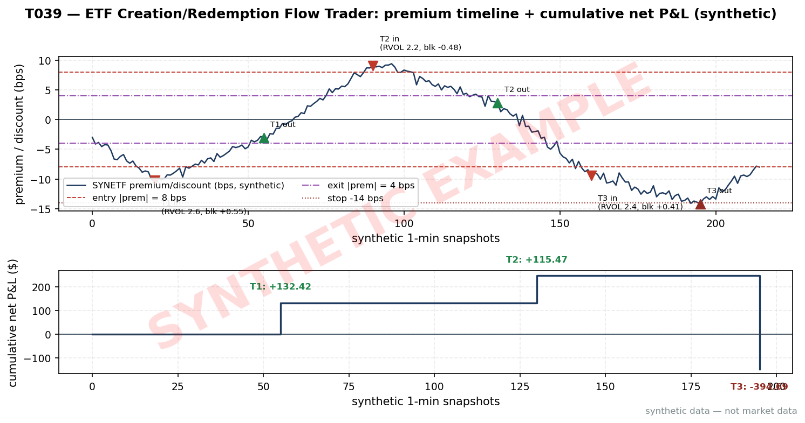

```mermaid
flowchart TD
    DATA["Market data<br/>ETF L1 + 15s iNAV + micro futures + tape"] -->|1-min snapshots| SIGS["Signals<br/>S056 premium, S094 blocks/RVOL, S032 RVOL gate"]
    SIGS -->|"1-min snapshots"| ENTRY{"Entry logic<br/>|prem|>8bps, RVOL>=2.0<br/>blocks agree with fade<br/>iNAV fresh, t to t+1"}
    ENTRY -->|trigger| SIZE["Sizing + risk<br/>N=floor(R/premium stop)<br/>beta-equiv futures, max 4"]
    ENTRY -->|no trigger| WAIT["Wait"]
    SIZE -->|"1-min snapshots"| EXEC["Execution<br/>2-leg marketable limits<br/>cancel-other on reject"]
    EXEC -->|"1-min snapshots"| MON["Monitor + exits<br/>prem<4bps / 45min / stop 14bps<br/>block-flip exit, 15:45 flat"]
    MON -->|"1-min snapshots"| PNL["P&L (net of 5bp + futures fees)"]
    style ENTRY fill:#f9e79f,stroke:#7d6608
    style PNL fill:#a9dfbf,stroke:#1e8449
```

### T10. Sources

- Engle, R. F. & Sarkar, D. (2006). "Premiums–Discounts and Exchange Traded Funds." *Journal of Derivatives*, Summer 2006 — domestic dislocations small/transient; the empirical anchor of T7.
- Petajisto, A. (2017). "Inefficiencies in the Pricing of Exchange-Traded Funds." *Financial Analysts Journal* 73(1), 24–54 — ~100 bps deviations on identical-portfolio ETFs; the "why APs get paid" result.
- Jain, A., Jain, C. & Jiang, C. X. (2021). "Active Trading in ETFs: The Role of High-Frequency Algorithmic Trading." *Financial Analysts Journal* 77(2), 66–82 — algorithmic competition shrinks deviations; the decay evidence.
- Lettau, M. & Madhavan, A. (2018). "Exchange-Traded Funds 101 for Economists." *Journal of Economic Perspectives* 32(1), 135–154. doi:10.1257/jep.32.1.135 — creation/redemption architecture behind the S056 bound.
- Lee, C. M. C. & Ready, M. J. (1991). "Inferring Trade Direction from Intraday Data." *Journal of Finance* 46(2), 733–746. doi:10.1111/j.1540-6261.1991.tb02683.x — the quote/tick signing rule S094's BlockImb rests on.
- Hasbrouck, J. (1995). "One Security, Many Markets." *Journal of Finance* 50(4), 1175–1199 — https://www.jstor.org/stable/2329487 — information share; why the futures leg is the hedge, not the signal.

**Unverified leads** (chatbot-provided, not independently checkable — do not treat as evidence):
- *Unverified chatbot claim* (Grok, 2026-09-10, Q-TB4-3 §5): AP capture mechanics ("cross both spreads, flatten in the primary market overnight"), creation units "typically 25k–100k shares (SPY historically 50k)", non-AP proxy "edge after costs ≈ 0 on liquid US equity ETFs most days," March-2020 bond-ETF dislocation note.
- *Unverified chatbot claim* (Grok, 2026-09-10, Q-TB4-3 §4): Hazelkorn–Moskowitz–Vasudevan-type basis premium "~5–6% annual" and basis-timing Sharpe "~0.6–0.9 in futures" — attribution not verified; not used as evidence.
- *Unverified chatbot claim* (Grok, 2026-09-10, Q-TB4-1 shared convention): 5 bp one-way equity cost convention, borrow GC (general collateral) 25–50 bp — used as the chapter's *illustrative* cost model, not as a market fact.
- Micro-futures $0.75/contract round-trip — *indicative — verify before budgeting*; no vendor quote obtained.

Source log: Grok answered Q-TB4-1..3 (2026-09-10); all claims independently verified or labeled unverified.

---


## Stage 140/200 — T040: PCA Eigenportfolio Residual Reversal

*Batch TB4 · Strategy 40/100 · Signals S080, S039, S078 · Provenance [D/SR]*

### T1. One-line verdict

| | |
|---|---|
| **Style** | Daily statistical arbitrage: market-neutral residual mean-reversion on statistical-factor hedges |
| **Edge source** | PCA eigenportfolio residuals (S080) — the stock-specific leftover after stripping the market's own statistical factors — mean-revert as Ornstein–Uhlenbeck processes; entries are timed by AR(1) innovations (S078) and confirmed by a second, fundamental residual model (S039) to survive factor-model miss |
| **Typical holding period** | 1–5 days (half-life-gated); exits on s-score convergence, not the calendar |
| **Capacity hint** | Liquid US mid/large-cap book, low hundreds of $mm before impact at 5 bp (basis points) costs — the documented binding risk is crowding (Aug 2007), not per-trade size |
| **Build-or-buy in one line** | Build the eigenportfolio engine on daily bars (the IP (intellectual property) is the causality hygiene and the heat discipline); buy borrow history only if you want an honest HTB (hard-to-borrow) backtest — otherwise rent it from your prime at go-live |

### T2. Full mechanics

**Jargon first.** *PCA* finds the directions of greatest co-movement in a return panel: *eigenvectors* are the directions, *eigenvalues* the variance along each. An *eigenportfolio* is a portfolio weighted by one eigenvector — one "statistical factor" distilled from the data (unlike named factors such as "value"). A *residual* is what remains after the factors are stripped: R = Σ β·F + residual. The *s-score* standardizes the residual by its mean-reversion speed: s = (X − μ)/(σ/√(2κ)). An *Ornstein–Uhlenbeck (OU) process* is the textbook mean-reverting random walk: dX = −κ(X−μ)dt + σdW, with *half-life* ln2/κ. An *AR(1) innovation* is today's surprise vs a one-lag autoregression's forecast: ε̂_t = r_t − f̂_t. *Dollar-neutral* = long $ equal short $. *Heat* = total open risk.

**Universe & session.** ~200 liquid US large/mid caps: price ≥ $10, 60-day ADV (average daily dollar volume) ≥ $10M, borrowable (GC (general collateral) preferred), no earnings within ±2 days (*example* filters). Daily bars, close-to-close; signals computed after the close, entries at the next open (causal t → t+1). No intraday trading — this is the overnight statistical book, held 1–5 days.

**Entry rule.** Nightly estimation (S080, Avellaneda–Lee 2010 form):
1. Rolling 252-day correlation matrix of standardized returns; eigendecompose; keep m = 5 factors (*example*; ~50–55% variance — *example*).
2. Eigenportfolio weights Q_ki = v_ki/σ_i; factor returns F_kt = Σ_i Q_ki r_it.
3. Per stock: 60-day OLS (ordinary least squares) R_it = α_i + Σ_k β_ik F_kt + X_it → residual X_it (*example* window).
4. Fit OU to X_it; require half-life ln2/κ ≤ 30 days (*example*) and OU-fit R² ≥ 0.5 (*example*, S080's default).
5. s-score s_it = (X_it − μ_i)/(σ_i/√(2κ_i)).

**Enter** (signal at close *t*, fills at next open *t+1*) when: |s_it| > 1.25 (*example*, the Avellaneda–Lee entry threshold via the TB4 research lead); **timing (S078)**: AR(1) on the residual over 60 bars, innovation z_t = ε̂_t/σ̂_ε, require sign(ε̂_t) = −sign(s_it) (*example*) — the latest bar is already reverting, so you join a convergence in progress rather than front-run a widening residual; **confirmation (S039)**: the market-plus-sector residual z agrees in sign with s_it, |z| ≥ 1.0 (*example*) — two independent residual models (statistical vs fundamental) must point the same way. Long the residual when s < −1.25, short when s > +1.25; the hedge leg is the eigenportfolio basket (short β_ik units of each factor portfolio).

**Exit rule** (first wins): (1) convergence — |s| < 0.5 (*example*); (2) time stop — 5 sessions (*example*); (3) stop-loss — |s| > 4 (*example*) or half-life re-estimate doubles (the OU broke); (4) model disagreement — S039's z crosses 0 while |s| is still stretched (*example*).

**Position sizing.** Equal residual-risk per name: N_i = R_target/σ_resid,i, R_target = $1,000 (*example*) → ~$100k legs; max 40 open residuals (*example*); heat cap Σ open |s_i|·$risk ≤ 6% of NAV (net asset value) (*example*, Grok's shared residual-book convention); gross ≤ 3× NAV; net factor exposure ≈ 0 by construction.

**Risk limits** (*example* unless noted). Daily loss stop −2% of NAV; per-residual stop is the |s| > 4 rule; crowded-unwind circuit breaker: 5-day book P&L < −3% on a flat market ⇒ halve all targets (the Khandani–Lo 2007 signature); borrow-recall ⇒ immediate cover, no substitution.

**Cost model.** 5 bp one-way on notional per leg turn (*example*, TB4 shared convention from Q-TB4-1); stock-loan on short residuals at GC 25–50 bp annualized on notional (specials vetoed pre-entry); dividends: short pays on ex-date, modeled as cash flow; no financing on the hedge basket (dollar-neutral by construction). Applied explicitly in T4.

**Order/execution sketch.** Next-open market-on-open or first-15-min VWAP (volume-weighted average price) clips (*example*), participation ≤ 10% of opening volume; stock and eigenportfolio-basket legs submitted simultaneously (basket as a program trade or the prime's pair algo); basket leg incomplete ⇒ stock leg cancelled — a naked residual is a factor bet, not this strategy. Backtest: signal at close *t* ⇒ fill at next open, purged/embargoed (S088) walk-forward on every parameter.

### T3. Signals it consumes

| Signal | Role | Weight / logic |
|---|---|---|
| S080 — PCA eigenportfolio residual | **Primary trigger** | Enter only if \|s\| > 1.25, half-life ≤ 30d, OU R² ≥ 0.5 (*examples*) |
| S078 — AR/ARMA (autoregressive/autoregressive–moving-average) innovation | **Timing gate** | Enter only if sign(AR(1) innovation) = −sign(s) — join a reverting residual (*example*) |
| S039 — Idiosyncratic residual reversal | **Confirmation filter** | Enter only if S039's market+sector z agrees in sign, \|z\| ≥ 1.0 (*example*); disagreement = veto |

```pseudocode
# T040 combination logic — nightly after close; fills at next open (t -> t+1)
factors, Q = pca_eigenportfolios(returns_252d, m=5)        # S080 (examples)
for i in universe:
    X, s, halflife, r2 = ou_residual(i, factors, W=60d)   # S080 s-score
    innov = ar1_innovation(X, W=60)                        # S078
    z39   = s039_residual_z(i, close_t)                    # market+sector model
    if position[i] is None and abs(s) > 1.25 \             # example
       and halflife <= 30 and r2 >= 0.5 \                  # examples
       and sign(innov) == -sign(s) \                       # S078 timing (example)
       and sign(z39) == sign(s) and abs(z39) >= 1.0:       # S039 confirm (example)
        enter (long if s < 0 else short) vs eigenportfolio basket, next open
    elif position[i] is not None:
        if abs(s) < 0.5 or held >= 5d or abs(s) > 4 \      # examples
           or sign(z39) != sign(s):
            exit at next open
```

### T4. Worked example — numbers + P&L (SYNTHETIC)

All prices synthetic, **seed 140** (`rng = np.random.default_rng(140)`; regenerable via `python3 batches/TB4/plot_T040.py`). Costs: 5 bp one-way on notional per leg turn (*example*); borrow fee stubbed at 0 in the arithmetic and flagged below. The chart in T9 plots these exact s-score paths and trades.

Setup: one statistical factor (the first PC ≈ the market), 60-day window; betas 0.90–1.10 (*example*).

**Trade T1 — long residual, converges (winner).** AAA: β = 1.10, ε = −0.042, OU σ = 0.028 ⇒ s = −1.52 (< −1.25 ✓); AR(1) innovation positive (reverting ✓); S039 z = −1.3 (agrees ✓). Long **2,222 AAA @ 45.00**, short **2,000 BBB @ 50.00** (eigenportfolio hedge). Exit at s = −0.31 (< −0.5 ✓): sell AAA @ **45.55** (+1,222.10), cover BBB @ **49.90** (+200.00).

| Line | Calc | $ |
|---|---|---|
| Stock leg | 2,222 × (45.55 − 45.00) | +1,222.10 |
| Hedge-basket leg | 2,000 × (50.00 − 49.90) | +200.00 |
| Gross | | +1,422.10 |
| Costs 5 bp: (99,990 + 101,221 + 100,000 + 99,800) × 0.0005 | | −200.50 |
| **Net T1** | | **+1,221.60** |

**Trade T2 — short residual, converges (winner).** CCC: s = +1.61 (> +1.25 ✓), innovation negative ✓, S039 z = +1.2 ✓. Short **2,000 CCC @ 50.00**, long **2,000 BBB @ 50.00**. Exit at s = +0.28: cover @ **49.72** (+560.00), sell hedge @ **50.06** (+120.00). Gross +680.00; costs −199.78; **net +480.22**. Cumulative: +1,701.82.

**Trade T3 — long residual, widens (stop).** DDD: s = −1.44, innovation positive ✓, S039 z = −1.1 ✓. Long **2,500 DDD @ 40.00**, short **2,500 EEE @ 40.00**. The residual *keeps widening* — an unmodeled factor day: stop at s = −4.20 (≥ 4): sell @ **39.78** (−550.00), cover @ **40.06** (−150.00). Gross −700.00; costs −199.80; **net −899.80**. Session total: +1,221.60 + 480.22 − 899.80 = **+802.02**.

**Where the example is optimistic.** The OU parameters (κ, σ, μ) are handed to the example exactly; real 60-day estimates give noisy half-lives, and the R² ≥ 0.5 gate rejects far more names than the toy suggests — real trade frequency is a fraction of three clean s-scores. The hedge basket is assumed to track the eigenportfolio perfectly (any subset proxy leaks factor exposure — the example's hedge P&L is suspiciously clean). Borrow is priced at 0: a live short book pays GC 25–50 bp minimum and gets recalled on exactly the crowded names (the T3 widener is the kind that goes special). Fills are at clean opens with no partial fills or impact; 5 bp is the floor, and fast-half-life books pay multiples of it in turnover. The +$802.02 on ~$400k notional is arithmetic illustration of the cost drag and the stop working — not a backtest, and no performance claim is made.

### T5. Data & infra — what must run

**Pipeline inventory.** Nightly: refresh 252-day total-return panel (split/div-adjusted — the highest-defect step), refit PCA eigenvectors, re-estimate betas and OU parameters, recompute s-scores, AR(1) innovations, S039 z's, borrow/earnings exclusions. Pre-open: verify no corporate action broke the eigenvectors (spin-off ⇒ refit that name out). Intraday: nothing — this is a close-to-open book; only the heat/daily-loss monitor and the crowded-unwind circuit breaker run. Post-close: persist eigenvectors, residuals, s-scores, decisions; walk-forward purged/embargoed re-validation monthly.

**M5 Max feasibility: feasible (Tier M).** Per cost-model §2/§3: 200 names × 252 days eigendecomposition is seconds; 200 × 60-day OLS + OU fits nightly is a rounding error (the TB4 lead's own table puts the full 2,000-name screen at 20–60 min — 200 names is ~1–5 min). RAM: panel + eigenvectors < 1 GB (§3); 10-year daily archive trivial (§4). Engineering: 40–100 h Tier M+ (§5) ≈ $6,000–15,000 loaded-cost estimate — the work is the corporate-action hygiene, the causality-proof backtest (t→t+1 asserted), and the heat/circuit-breaker accounting, not the linear algebra. Bottleneck: borrow data and adjustment quality, not compute. Breaks at: intraday eigenportfolios on 2,000 names (not this strategy).

**Feed-outage safe mode.** EOD (end-of-day) feed missing ⇒ no new s-scores, no new entries; existing residuals run to convergence/stop/time-stop on last-known estimates. Borrow feed stale ⇒ hard veto on new shorts (never assume GC). Eigenvector refit failure ⇒ freeze the book flat rather than trade on yesterday's factors through a spin-off. Restart = flat + re-derive from the on-disk ledger.

### T6. Buy vs build

| Option | What you get | Indicative price | Gains | Loses |
|---|---|---|---|---|
| Tier-0: Stooq/SEC EDGAR + FINRA short interest | Daily bars, borrow snapshots | ~$0, *indicative — verify before budgeting* | Learn the eigenportfolio mechanics | No survivorship-free history; corp-action hygiene is DIY |
| Tier-1: Norgate/Sharadar-class EOD + total return | Survivorship-free adjusted daily bars | ~$2k–15k/yr, *indicative — verify before budgeting* | The cheap *correct* formation dataset (per Q-TB4-2) | No institutional borrow history |
| Tier-2: Databento EOD + corporate actions | Adjusted bars + action maps | ~$200/mo + usage, *indicative — verify before budgeting* | Clean adjustments for the PCA panel | Still no borrow history |
| Markit / S&P Securities Finance-class | Indicative fee, utilization, inventory, 15-yr history | ~$30k–150k+/yr, *indicative — verify before budgeting* | The honest HTB backtest | The six-figure line item; relationship-priced |
| Barra/Axioma risk model | Factor residual risk | ~$150k–600k+/yr entry, *indicative — verify before budgeting* | Institutional-grade residual risk | Absurd for a 40-name residual book |
| Build in-house (Python + numpy/polars) | PCA engine, OU fitter, S039/S078 gates, heat FSM (finite-state machine), ledger | 40–100 h ≈ $6,000–15,000 eng (loaded-cost estimate) | Your factors, your causality, your stops | You own the adjustment pipeline — the #1 defect source |

**Verdict: buy Tier-1 adjusted EOD, build the engine, rent borrow at go-live.** The TB4 lead's verdict (Q-TB4-2) stands: build the formation, the OU/s-score engine, the cost and heat accounting on the Mac; rent locates and live borrow from the prime. **Build if** you want the S078-timing + S039-confirmation variant — no vendor sells your confirmation logic. **Buy institutional borrow history only if** you need a historically honest short-side backtest; if you will only short names your prime already shows a live GC fee on, skip it — that single feed can exceed every other line combined. Crossover: past ~40 simultaneous residuals, or regular specials, the borrow dataset becomes mandatory and a Barra-class risk model stops being absurd.

### T7. Success-ratio evidence

| Source | Market / period | Metric | Before/after cost | Caveat |
|---|---|---|---|---|
| Avellaneda & Lee (2010) | US equities, 1997–2007 | PCA residual reversal, s-score entries; positive after the paper's cost model | After costs (paper's model) | Sample ends 2007; threshold/Sharpe magnitudes via the TB4 lead — *unverified chatbot claim* |
| Khandani & Lo (2007) | US, August 2007 | Crowded long/short residual books lost together in the quant unwind | Empirical event | The failure regime, not a performance claim — it defines the circuit breaker |
| Engle & Granger (1987) | Theory | Cointegration/error-correction: the econometric foundation residual-reversion rests on | n/a | Foundation, not a trading result |

Capacity: the liquid US mid/large residual book supports low hundreds of $mm before 5-bp impact binds (per the lead); the binding constraint is crowding — Aug 2007, Q1 2018 vol, Mar 2020 — when "idiosyncratic" turns out to be an unmodeled common factor and every book de-levers the same names. Documented decay: in-paper Sharpe 1.44 after costs (Avellaneda–Lee); post-2007 replications lower; factor-model miss (too few PCs ⇒ fading beta; too many ⇒ trading noise, both losing after costs per the lead) is the documented parameter trap.

**Honest bottom line.** For a ≤$1M paper operation: the most *learnable* stat-arb in the book — daily bars, closable math, honest costs — and paper-trading it teaches eigenportfolio construction, OU estimation, and heat discipline that transfer everywhere. But the documented after-cost edge is a *residual* edge in single-digit bps per trade that has decayed since the original sample, and the confirmation gates that make it safer make it trade rarely. An institutional desk runs this at 10–100× the name count with a borrow desk, a risk model, and balance sheet for the unwind weeks; the paper book's honest role is to learn the estimation-error half of the edge before sizing it. Do not annualize the +$802.02 synthetic session.

### T8. Failure modes & pitfalls

1. **Factor-model miss** — too few PCs leaves factor in the "residual" (you fade beta); too many fits noise as factors and you pay costs to trade randomness. Mitigation: variance-explained targeting (~50–55%, *example*), the S039 agreement gate, residual-vs-SPY correlation > 0.3 ⇒ refit (*example*).
2. **Crowded de-lever (Aug 2007 signature)** — every residual book holds the same names; the unwind is the stop-loss. Mitigation: heat cap 6% NAV, daily loss stop −2%, the circuit breaker (halve targets at −3%/5d on a flat market); no averaging down, ever.
3. **β̂/eigenvector staleness through regime breaks** — 60-day/252-day estimates through a factor rotation produce garbage residuals. Mitigation: half-life re-estimate doubling ⇒ auto-exit; halt new entries if residual dispersion explodes.
4. **Borrow specials and recalls** — the stretchiest shorts are hardest to borrow. Mitigation: borrow-flag gate pre-entry, GC-only at first, recall ⇒ immediate cover; model GC 25–50 bp carry in the cost bound.
5. **Corporate actions breaking the eigenvectors** — a spin-off/merger changes what a "name" is mid-estimation. Mitigation: split-adjust both legs, force-exit on spin/merger (Grok's shared pairs convention).
6. **AR(1) timing whipsaw** — the innovation gate can delay entry past the convergence or fire on bounce noise (S078's trade-price bounce trap). Mitigation: run the AR on adjusted closes, require the innovation sign on the *close*, accept missed trades as the filter's price.
7. **Lookahead in estimation windows** — PCA/beta fit on data including the trade window. Mitigation: estimation ends at t−1, fills at t+1, causality asserted in the harness; purged/embargoed walk-forward (S088).
8. **Cost-model optimism on fast half-lives** — short-half-life residuals need high turnover; 5 bp is the floor and turnover multiplies it. Mitigation: half-life ≥ 2 days (*example* floor); size by residual-risk so turnover, not notional, is the budgeted quantity.

### T9. Visuals

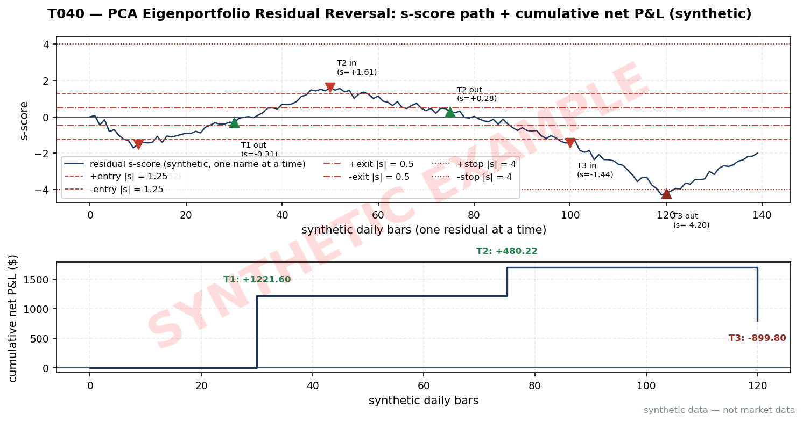

```mermaid
flowchart TD
    DATA["Market data<br/>daily bars: ~200 names, 252d panel"] -->|daily bars| SIGS["Signals<br/>S080 s-score, S078 AR innov, S039 z"]
    SIGS -->|"nightly after close"| ENTRY{"Entry logic<br/>|s|>1.25, half-life<=30d<br/>innov reverting, S039 agrees<br/>signal t, fill t+1 open"}
    ENTRY -->|trigger| SIZE["Sizing + risk<br/>equal resid-risk, max 40 names<br/>heat 6% NAV, gross 3x"]
    ENTRY -->|no trigger| WAIT["Wait"]
    SIZE -->|"next open"| EXEC["Execution<br/>MOO/VWAP clips, <=10% part.<br/>basket hedge simultaneous"]
    EXEC -->|"daily bars"| MON["Monitor + exits<br/>|s|<0.5 / 5d / stop |s|>4<br/>borrow recall, unwind breaker"]
    MON -->|"daily bars"| PNL["P&L (net of 5bp + borrow)"]
    style ENTRY fill:#f9e79f,stroke:#7d6608
    style PNL fill:#a9dfbf,stroke:#1e8449
```

### T10. Sources

- Avellaneda, M. & Lee, J.-H. (2010). "Statistical Arbitrage in the U.S. Equities Market." *Quantitative Finance* 10(7), 761–782. doi:10.1080/14697680903124632 — PCA eigenportfolios, OU residuals, s-score trading: the documented core of this strategy and of S080.
- Khandani, A. E. & Lo, A. W. (2007). "What Happened to the Quants in August 2007?" *Journal of Investment Management* 5(4), 5–54 — https://web.mit.edu/Alo/www/Papers/august07.html — the crowded-unwind event that sets this book's heat caps and circuit breaker.
- Engle, R. F. & Granger, C. W. J. (1987). "Co-Integration and Error Correction: Representation, Estimation, and Testing." *Econometrica* 55(2), 251–276. doi:10.2307/1913236 — the econometric foundation of residual mean-reversion.
- Tsay, R. S. (2005). *Analysis of Financial Time Series*. Wiley, 2nd ed. — AR/ARMA estimation and innovation diagnostics behind the S078 timing gate (textbook, checkable).

**Unverified leads** (chatbot-provided, not independently checkable — do not treat as evidence):
- *Unverified chatbot claim* (Grok, 2026-09-10, Q-TB4-1 (D)): Avellaneda–Lee entry/exit thresholds (|s| > 1.25 open, < 0.50/< 0.75 close), minimum half-life ~8.4 days / ≤ 30 days, K = 15 PCs or ~50–55% variance, 5 bp cost convention, and the 3-asset worked arithmetic (incl. the underived −$100 "B bleed") — used as *illustrative* mechanics; thresholds marked `example` throughout.
- *Unverified chatbot claim* (Grok, 2026-09-10, Q-TB4-3 §6): PCA residual after-cost Sharpe 1.44 → 1.1 → ~0.6 replication figures; the "1.44 → 0.9 already inside the original sample" sub-period figure cited in an earlier draft; sector-ETF residual 1.1 → 1.51; ALBL (Avellaneda+Black–Litterman) net Sharpe 0.84 → 1.23 — magnitudes not independently verified.
- *Unverified chatbot claim* (Grok, 2026-09-10, Q-TB4-3 §2): "Baskaran (SSRN 2026)" walk-forward Kalman results (dated after 2026-09-10 — citation plausibility not verified; do not cite as evidence).
- *Unverified chatbot claim* (Grok, 2026-09-10, Q-TB4-2): M5 Max screen timings and borrow-data pricing bands — *indicative — verify before budgeting*.

Source log: Grok answered Q-TB4-1..3 (2026-09-10); all claims independently verified or labeled unverified.

---

<!-- STRATEGY CHAPTERS APPEND BELOW -->

## Stage 141/200 — T041: HAR Vol-Timing Overlay

*Batch TB5 · Strategy 41/100 · Signals S066, S067, S076*

*Provenance: [D/SR] — documented signals (S066/S067/S076) combined through strategy rules reconstructed for this chapter; the combination itself is synthetic, not a documented strategy.*

### T1. One-line verdict

| | |
|---|---|
| **Style** | Intraday volatility-timing **overlay** — a position-size scaler applied on top of an existing intraday book, not a standalone alpha |
| **Edge source** | Volatility **persistence** (tomorrow's volatility is partly predictable from recent volatility, S066) combined with the absence of a proportional risk–return tradeoff intraday: scaling risk down when forecasted volatility is high and up when it is low raises the book's risk-adjusted return |
| **Typical holding period** | Inherits the child book's horizon; the overlay multiplier is re-estimated **daily** (HAR) and throttled **intraday** (minutes) |
| **Capacity hint** | Scales with the underlying strategies — the overlay itself adds no new market footprint, only resizes existing flow |
| **Build-or-buy in one line** | Build the scaler (an afternoon on top of the S066 code); buy the 5-minute bars, not the model |

### T2. Full mechanics

**Jargon first.** *Realized variance* (RV) is the sum of squared intraday returns — how much the price actually moved. *Realized volatility* is its square root. *HAR* (heterogeneous autoregressive, S066) forecasts tomorrow's RV from today's, this week's, and this month's RV. *Volatility targeting* sizes positions so expected portfolio volatility stays near a fixed target: size ∝ target vol / forecasted vol. An *overlay* is a rule layer that multiplies another strategy's sizes without replacing them — here, a factor *m*. *Diurnal deseasonalization* (S067) divides each intraday return by its time-of-day scale so the open/close U-shape doesn't pollute the measurement. A *volatility breakout* (S076) is a bar whose range explodes past its recent average, or the release of a Bollinger-bandwidth squeeze.

**Universe & session.** Any intraday book on liquid US equities or ETFs (the worked example uses a fictitious liquid ETF "SYNX" — all prices synthetic). RTH (regular trading hours, 9:30–16:00 ET) only. The overlay applies to every child strategy in the book; it never originates entries. Exclusions are inherited from the child book (halts, earnings days, low-ADV names stay excluded).

**Entry rule.** The overlay does not enter — it gates and scales child entries. A child signal fires at bar *t*; the overlay multiplier *m_t* scales the child size; the earliest fill is bar *t+1*'s open. The overlay can **veto** a child entry: if S076 fires a volatility-expansion bar while the book is at its heat cap, the child entry is skipped for *H* minutes (*example:* H = 95).

**Sizing — the multiplier.** Each close *t*, compute the HAR forecast σ̂_{t+1} (annualized, S066 formula in T3). The baseline multiplier is

*m_t* = clamp(σ_target / σ̂_{t+1}, *m_min*, *m_max*)

with *example* parameters σ_target = 16% annualized, *m_min* = 0.25, *m_max* = 1.50. Every threshold and parameter here is `example — not an institutional standard`. If the forecast is 24%, *m* = 16/24 = 0.67: every child position is cut by a third. If the forecast is 10%, *m* = 1.50 (capped): positions grow by half. The clamp is the risk control — the overlay can shrink aggressively but may only lever modestly.

**Intraday throttle (S067 + S076).** Two adjustments, both effective the *next* bar (causal, bar *b* → effective *b+1*):

1. *Deseasonalized-vol throttle.* Each 1-minute bar, deseasonalize returns (r̃ = r / s_b, S067) and compute trailing-30-minute realized σ. If it exceeds 1.5× the HAR-implied intraday rate (*example*), latch *m* × 0.75 (*example*) **once** — the throttle engages a single time and releases only when trailing-30-minute σ falls back below 1.2× the HAR-implied rate (*example* hysteresis). It does not multiply by 0.75 again on every qualifying bar.
2. *Expansion throttle.* If S076 fires (range ratio > 1.75, *example*, on a squeeze-armed tape), multiply *m* by 0.50 (*example*) for the next 95 minutes (*example* — the 11:15–12:50 window in the T4 example).

**Exit rule.** Exits are the child book's (time stops, signal flips, stop-losses). The overlay adds one portfolio-level exit: if deseasonalized realized vol exceeds 2.5× the HAR-implied rate (*example*), halve all positions immediately at the next bar — the "vol-spike flatten." It is a risk exit, not a profit exit, and it is deliberately crude.

**Position sizing / risk limits.** The overlay never increases a child size above the child book's own per-name cap. Portfolio heat (sum of |position| / equity) keeps its own cap (*example:* 3×), enforced after multiplication, so a high-*m* day cannot breach it. Daily loss stop: −2% of book (*example*) — the overlay goes to *m* = 0 for the rest of the session. Kill switch: if the HAR input is stale (>1 session) or the intraday bar feed drops, *m* freezes and no new entries are accepted until recovery (see T5 safe mode).

**Cost model.** The overlay's own cost is the *extra turnover* from multiplier changes: every time *m* steps intraday, the book must trade the difference. Model each rebalance at half-spread $0.005/share plus $0.0035/share commission per side (*example*). Rule of thumb: the multiplier should not move more often than the child book's average hold justifies — a hyperactive throttle trades the book to death.

**Execution sketch.** Multipliers apply at bar boundaries on 1-minute bars. Rebalance orders are marketable limits, capped at ≤10% of trailing 1-minute visible volume (*example*). Queue-position claims on SIP data are `simulated only — requires MBO/ITCH`; fills are modeled at the bar open plus half-spread, never at mid.

**Causality.** HAR forecast uses RV through close *t* → multiplier applies to day *t+1*. Intraday estimates use bars ≤ *b* → effective at *b+1*. The overlay never uses same-bar information.

### T3. Signals it consumes

| Signal | Role | Weight / logic |
|---|---|---|
| S066 — HAR realized-vol forecast | **Primary sizing input** | *m* = clamp(σ_target / σ̂_HAR, 0.25, 1.50) (*example*); forecast RV_{t+1} = β_0 + β_d·RV_t + β_w·RV̄_t^{(5)} + β_m·RV̄_t^{(22)}, OLS on ≥250 days |
| S067 — Diurnal deseasonalization | **Normalization layer** | r̃ = r / s_b (per-bin scale, mean 1) before every intraday vol computation; never a trigger by itself |
| S076 — Vol breakout / squeeze | **Throttle / veto regime input** | Expansion bar (range ratio > 1.75, *example*) → *m* × 0.50 for 95 minutes (*example*); squeeze-armed required |

```pseudocode
# T041 combination logic — daily forecast at close t; intraday throttle per bar
har = HAR_forecast(RV_5min_daily)                  # S066: RV_{t+1}=b0+bd*RV+bw*RV5+bm*RV22
m   = clamp(SIGMA_TARGET / sqrt(har), 0.25, 1.50)  # example: 16% target, 0.25/1.50 clamps
armed = (bandwidth_percentile <= 10)                # S076 squeeze-armed flag
desez_latched = False                             # 0.75x throttle is a latched state: engages once, releases on hysteresis
for bar in session:                                # 1-min bars
    r_d = r_bar / s_bin[bar]                       # S067 deseasonalize the clock out
    sig30 = sqrt(sum(r_d[-30:]**2))                 # trailing-30-min realized vol
    if not desez_latched and sig30 > 1.5 * har_implied_intraday:  # example band: latch ONCE
        m = m * 0.75; desez_latched = True
    elif desez_latched and sig30 < 1.2 * har_implied_intraday:  # example hysteresis: release
        m = m / 0.75; desez_latched = False
    if range_ratio(bar) > 1.75 and armed:          # S076 expansion, example k
        m, throttle_until = m * 0.50, bar + 95    # 95-minute example window (11:15-12:50 in T4)
    for sig in child_book:                         # child strategy logic
        if sig.fires(bar):                         # causal: signal at t -> fill at t+1
            submit(child_size(sig) * m, next_open)  # overlay scales, never overrides veto
```

### T4. Worked example — numbers + P&L (SYNTHETIC)

All numbers synthetic — fictitious ETF "SYNX" near $200.00. Script `batches/TB5/plot_T041.py`, **seed 141**; the chart in T9 plots these exact trades. Cost schedule (*example*): half-spread $0.005/share/side, commission $0.0035/share/side.

Setup: prior close HAR forecast σ̂ = 24% (synthetic). σ_target = 16% (*example*) → baseline *m* = 16/24 = **0.67**. Base child size: $100,000 notional per signal.

**Trade T1 — baseline multiplier.** 10:05: child long signal; notional = 100,000 × 0.67 = $67,000 → **335 shares @ $200.00**. Exit 10:41 @ **$200.62**.

| Line | Calc | $ |
|---|---|---|
| Gross | 335 × (200.62 − 200.00) | +207.70 |
| Spread | 2 × 335 × 0.005 | −3.35 |
| Fees | 2 × 335 × 0.0035 | −2.35 |
| **Net T1** | 207.70 − 3.35 − 2.345 | **+202.01** |

**Trade T2 — S076 throttle.** 11:15: S076 fires (range ratio 3.4 > 1.75, *example*; deseasonalized 5-min vol 2.1× the HAR-implied rate) → *m* = 0.67 × 0.50 = **0.335** for the 95-minute window to 12:50. 11:20: child short signal; notional = 100,000 × 0.335 = $33,500 → **167 shares @ $200.30**. Exit 11:52 @ **$199.85**.

| Line | Calc | $ |
|---|---|---|
| Gross | 167 × (200.30 − 199.85) | +75.15 |
| Spread | 2 × 167 × 0.005 | −1.67 |
| Fees | 2 × 167 × 0.0035 | −1.17 |
| **Net T2** | | **+72.31** |

**Trade T3 — loser at baseline.** 13:05: throttle released, *m* back to 0.67. **335 shares @ $199.90**; exit 13:40 @ **$199.72**.

| Line | Calc | $ |
|---|---|---|
| Gross | 335 × (199.72 − 199.90) | −60.30 |
| Spread + fees | 3.35 + 2.35 | −5.70 |
| **Net T3** | | **−66.00** |

**Trade T4 — intraday deseasonalized throttle.** 14:30: trailing-30-min deseasonalized σ runs 1.6× the HAR-implied rate (> 1.5× band, *example*) → *m* = 0.67 × 0.75 = **0.50**. 14:50: child long; **250 shares @ $200.10**; exit 15:30 @ **$200.44**.

| Line | Calc | $ |
|---|---|---|
| Gross | 250 × (200.44 − 200.10) | +85.00 |
| Spread + fees | 2.50 + 1.75 | −4.25 |
| **Net T4** | | **+80.75** |

Cumulative net: +202.01 + 72.31 − 66.00 + 80.75 = **+$289.07** on ~$218k of gross notional traded.

**Where the example is optimistic.** The child signals are assumed to exist and be profitable — the overlay takes no credit for their edge. Fills happen exactly at stated prices: no partial fills, no slippage beyond the half-spread, no latency between the S076 bar close and the throttle (in reality the 11:15 bar's information is tradable at 11:16 at the earliest). The HAR forecast (24%) is taken as given — a real forecast has estimation error, inherited one-for-one. The deseasonalized throttle assumes the S067 scales are correct and current. And the day is suspiciously tradeable: four clean signals, no halts, no child-book vetoes.

### T5. Data & infra — what must run

**Pipeline inventory.** Pre-open: rebuild daily RV from 5-min bars (78/day/symbol), check HAR coefficient staleness (refit weekly on rolling 1,000 days, S066), publish σ̂_{t+1} and baseline *m*. Intraday (1-min): deseasonalize bars, maintain trailing-30-min realized σ, evaluate the two throttles, publish *m* for the next bar. Post-close: persist bars + multiplier path; rebuild the 20-day S067 window; log throttle events. Storage: 1-min bars for 500 symbols ≈ 50 MB/day (per notes/cost-model.md §4) → ~1 GB per 20 trading days; monthly growth ≈ 1–1.5 GB.

**M5 Max feasibility: feasible (Tier M+).** Per notes/cost-model.md §2: the daily HAR job is seconds of numpy; the intraday loop is rolling sums at ~10–50M rows/sec in polars — milliseconds per bar. RAM: the working set is tens of MB against the 77 GB budget (§3). Engineering: Tier M for the vol pipeline (20–60 h ≈ $3,000–9,000 loaded-cost estimate, §5) + the overlay harness → Tier M+ band, 40–100 h ≈ **$6,000–15,000** loaded-cost estimate. Bottleneck: data licensing and the child book's execution quality, not compute.

**Feed-outage safe mode.** 5-min/HAR input stale (>1 session): freeze *m* at its last daily value and flag it STALE — no new sizing regime, child entries continue at the frozen multiplier. 1-min intraday feed drops: throttles disarm (they cannot be computed), *m* reverts to min(1.0, last daily *m*) — the conservative choice — and a timer starts: if the feed is down > 15 minutes (*example*), no new child entries until recovery, existing positions follow child exits. Both down: *m* = 0 for new entries; the book manages only exits. Every transition is logged; the overlay never silently resumes.

### T6. Buy vs build

| Option | What you get | Indicative price | Gains | Loses |
|---|---|---|---|---|
| Tier-0 free (Stooq, Alpaca IEX) | Daily bars | ~$0, *indicative — verify before budgeting* | Free | Too coarse — no intraday throttle, no honest 5-min RV |
| Tier-1 retail (Polygon Stocks Advanced, Alpaca SIP) | 1-min/real-time SIP bars, corp actions | ~$30–200/mo, *indicative — verify before budgeting* | Everything this overlay needs | SIP-vs-direct latency nuance (irrelevant at bar horizons) |
| Tier-2 professional (Databento Standard) | L1/L2 + bars, clean symbology | ~$200/mo + usage, *indicative — verify before budgeting* | Honest timestamps for the throttle | Overkill for the overlay alone |
| Retail platform (QuantConnect/Composer-style) | Backtest + paper infra | subscription varies, *indicative — verify before budgeting* | Fast prototyping | You don't control the multiplier plumbing |
| Build in-house (Python + polars) | HAR fit, deseasonalization, throttle engine | 40–100 h ≈ $6,000–15,000 eng (loaded-cost estimate) | Your forecast, your thresholds, auditable | You own the estimation-error monitoring |

**Verdict: build the scaler, buy the bars.** No vendor sells *your* σ_target, *your* throttle bands, or *your* kill-switch wiring. **Buy** Tier-1 1-min bars (~$30–200/mo, indicative) the moment the book is real; **build** everything downstream (~100 hours — outsourcing the risk dial is how books discover a miscalibrated throttle after the fact).

### T7. Success-ratio evidence

| Source | Market / period | Metric | Before/after cost | Caveat |
|---|---|---|---|---|
| Moreira & Muir (2017), *J. Finance* | US equity factors + carry, long samples | Vol-managed portfolios: "large alphas, increase Sharpe ratios, and produce large utility gains" | After-cost framing | Daily/monthly factor portfolios — not intraday sizing |
| Barroso & Santa-Clara (2015), *JFE* | US momentum, 1927–2011 | Managing momentum's time-varying risk "virtually eliminates crashes and nearly doubles the Sharpe ratio" | Before-cost headline | Momentum-specific; the crash-avoidance is the overlay's mechanism |
| Fleming, Kirby & Ostdiek (2001), *J. Finance*; (2003), *JFE* | Stocks/bonds, daily | Vol-timing beats static same-target portfolios; "robust to estimation risk and transaction costs" | After-cost | Daily horizon; GARCH/RV forecasts, not HAR |
| Corsi (2009), *JFEC* | S&P 500 futures, Treasuries, FX | HAR beats GARCH-family models on out-of-sample loss | Before cost (forecast loss) | Forecast accuracy, not traded P&L — S066's standing warning |

Capacity and decay: volatility timing is a *risk-management* premium, not an arbitrage — it works because forecasted vol is persistent and expected returns don't scale with it. Crowding is mild and stabilizing (everyone targeting vol dampens the spikes being avoided). The documented failure is estimation: regime breaks (2008, 2020) made backward-looking forecasts confidently wrong for weeks.

**Honest bottom line.** For a ≤$1M paper operation: this is the cheapest risk improvement in the TB5 batch — one forecast, a few dozen lines, and the book's Sharpe ratio gets the documented vol-timing benefit *if* the child book has any edge to begin with. The overlay manufactures no alpha; it cannot save a negative-edge book. The honest gap: the cited evidence is daily/monthly; intraday HAR-scaled sizing has thinner documented after-cost evidence — treat the intraday throttles as risk control, not as proven alpha.

### T8. Failure modes & pitfalls

1. **Forecast breakdown in regime change** — HAR betas estimated on the old regime; the multiplier is confidently wrong for weeks. *Mitigation:* rolling estimation + forecast-error alert; the vol-spike flatten as backstop.
2. **Jump contamination of the forecast input** — one flash-crash day dominates the monthly RV mean and the multiplier collapses for a month. *Mitigation:* HAR-J variant (bipower-based, S064) for the forecast input.
3. **Multiplier whipsaw** — the intraday throttle flips *m* repeatedly in chop; rebalance costs eat the book. *Mitigation:* hysteresis bands (throttle on at 1.5×, release at 1.2× — *example*); count throttle trades in the cost model.
4. **Stale diurnal scale (S067)** — the U-shape drifts; deseasonalization mis-measures and the throttle fires at the wrong times. *Mitigation:* rolling 20-day window (*example*); monitor open/close residual seasonality.
5. **Expansion throttle arrives late** — S076 fires *after* the expansion bar; the book takes the bar at full size. *Mitigation:* the throttle is for the *next* bars (follow-through), not the bar that fired.
6. **Overlay applied to illiquid names** — spread dominates and multiplier rebalancing is pure cost. *Mitigation:* apply only where the child edge > 3× round-trip cost; per-name ADV filter.
7. **Kill-switch staleness** — the freeze logic has a bug and *m* never resets. *Mitigation:* heartbeat on the multiplier publisher; independent watchdog flattens on silence.
8. **Correlated de-risking** — the overlay scales *everything* down in a vol event, concentrating the book when diversification is needed. *Mitigation:* heat cap enforced post-multiplication; the flatten is proportional, not a liquidation.

### T9. Visuals

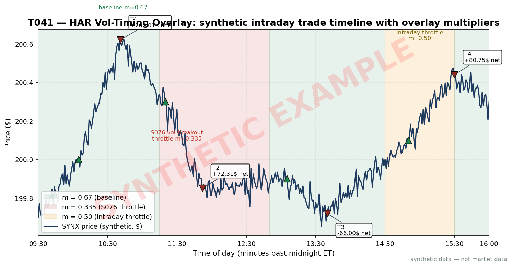

The chart plots the T4 tape exactly: baseline *m* = 0.67 (green bands), the 11:15–12:50 S076 throttle at *m* = 0.335 (red band), the 14:30–15:30 intraday throttle at *m* = 0.50 (amber band). Entries are green triangles, exits red; each trade is annotated with its net P&L (+$202.01, +$72.31, −$66.00, +$80.75). Watermark reads "SYNTHETIC EXAMPLE" exactly; corner caption reads "synthetic data — not market data".

```mermaid
flowchart TD
    DATA["Market data<br/>5-min + 1-min bars"] -->|"daily 5-min bars"| SIGS["Signals<br/>S066 HAR forecast<br/>S067 diurnal scale<br/>S076 expansion"]
    SIGS -->|"daily forecast<br/>intraday vol, 1-min"| ENTRY{"Overlay gate<br/>m = target/forecast<br/>throttles, t to t+1"}
    ENTRY -->|scale set| SIZE["Sizing + risk<br/>child size x m<br/>caps, heat, stop"]
    ENTRY -->|no trigger / veto| WAIT["Wait / stand down"]
    SIZE -->|"bar-boundary sizing<br/>1-min bars"| EXEC["Execution<br/>child fills resized<br/>participation cap"]
    EXEC -->|fills| MON["Monitor + exits<br/>intraday throttle<br/>vol-spike flatten"]
    MON -->|"net of spread<br/>+ fees"| PNL["P&L (net of costs)"]
    style ENTRY fill:#f9e79f,stroke:#7d6608
    style PNL fill:#a9dfbf,stroke:#1e8449
```

### T10. Sources

- Corsi, F. (2009). "A Simple Approximate Long-Memory Model of Realized Volatility." *Journal of Financial Econometrics* 7(2), 174–196. http://ideas.repec.org/a/oup/jfinec/v7y2009i2p174-196.html — the HAR forecast inside the multiplier; HAR beats GARCH-family models on out-of-sample loss.
- Moreira, A. & Muir, T. (2017). "Volatility-Managed Portfolios." *Journal of Finance* 72(4). https://doi.org/10.1111/jofi.12513 (DOI verified 2026-09-10 — resolves to the matching Wiley abstract) — vol timing raises Sharpe ratios and alphas across factors.
- Barroso, P. & Santa-Clara, P. (2015). "Momentum Has Its Moments." *Journal of Financial Economics* 116(1), 111–120. https://doi.org/10.1016/j.jfineco.2014.11.010 (verified 2026-09-10 via EconPapers/RePEc) — risk-managed momentum virtually eliminates crashes and nearly doubles the Sharpe ratio.
- Fleming, J., Kirby, C. & Ostdiek, B. (2001). "The Economic Value of Volatility Timing." *Journal of Finance* 56(1), 329–352. DOI: 10.1111/0022-1082.00327. http://ideas.repec.org/a/bla/jfinan/v56y2001i1p329-352.html (verified live 2026-09-10: RePEc metadata matches authors, title, journal, volume, and pages) — vol-timing beats static same-target portfolios, robust to estimation risk and transaction costs. Follow-up with realized volatility: (2003), *JFE* 67(3), 473–509.

**Unverified leads** (chatbot-provided, not independently checkable — do not treat as evidence):
- *Unverified chatbot claim* (Grok, 2026-09-10, Q-TB5-1): illustrative VRP/HAR thresholds (e.g. VRP entry ≥ +3 vol points) — not used; the HAR mechanics here are verified against Corsi (2009)/S066.
- *Unverified chatbot claim* (Grok, 2026-09-10, Q-TB5-2): vendor stack pricing — used only where marked *indicative — verify before budgeting*.
- Grok's Q-TB5-3 performance figures (PUT Sharpe/DD, pinning, UOA drift) concern sibling strategies, not this overlay — not used.

Source log: Grok answered Q-TB5-1..3 (2026-09-10); all claims independently verified or labeled unverified.

## Stage 142/200 — T042: Jump-Robust Vol Spike Trader

*Batch TB5 · Strategy 42/100 · Signals S064, S065, S076*

*Provenance: [D/SR] — documented signals (S064/S065/S076) combined through strategy rules reconstructed for this chapter; the combination itself is synthetic, not a documented strategy.*

### T1. One-line verdict

| | |
|---|---|
| **Style** | Intraday event-driven volatility trader — directional, short-horizon, jump-filtered |
| **Edge source** | Continuous-volatility expansions persist intraday (volatility clustering), while price jumps are news-driven, gap-like, and untradable after the fact — trade the former, veto the latter |
| **Typical holding period** | Minutes to ~1 hour (12-bar/60-min estimation window on 5-min bars; 4-bar time stop, *example*) |
| **Capacity hint** | Small — single-name intraday entries on expansion bars; the edge is in selection, not size |
| **Build-or-buy in one line** | Build — the jump filter (S064) and the GARCH comparator (S065) are your calibration; no vendor sells your veto threshold |

### T2. Full mechanics

**Jargon first.** *Realized variance* (RV) is the sum of squared intraday returns — it measures total variation including jumps. *Bipower variation* (BV) is a scaled sum of products of *adjacent* absolute returns — it measures only the continuous part, because one jump contaminates at most two adjacent products (S064). The *jump component* is J = max(RV − BV, 0); the *relative jump share* RJ = J/RV is the fraction of variance from jumps. The *Lee–Mykland test* (S064) flags individual bars as jumps against a local-volatility Gumbel critical value. *GARCH(1,1)* (S065) — σ² = ω + αε² + βσ² — is the strategy's "normal vol" benchmark. *Range expansion* (S076) is a bar whose high–low range is a large multiple of its recent average. *Deseasonalization* (S067) divides out the intraday U-shape before any vol computation.

**Universe & session.** 50–200 liquid US equities/ETFs (the worked example uses fictitious "SYNX"). RTH only; exclude the first 15 minutes (*example* — the open is its own regime), earnings days, and halted names. Every threshold below is `example — not an institutional standard`.

**Entry rule.** Evaluated at each 5-minute bar close *i* (returns deseasonalized via S067 first):

1. Compute 60-minute (12-bar) RV and BV (S064 formulas in T3).
2. J = max(RV − BV, 0); RJ = J/RV. **Veto** if RJ > 0.50 (*example*) — the "spike" is jump-driven (news), not a tradable continuous-vol expansion.
3. Compare against the GARCH one-bar-ahead forecast σ̂ (S065, deseasonalized): enter only if RV_60 > 1.50 × σ̂²_60 (*example*) — realized vol must exceed the forecast by a margin, i.e. this is a *surprise*, not the forecast itself.
4. Confirm with S076: the latest bar's range ratio > 1.75 (*example*).
5. Direction: sign of the expansion bar's close minus open (trade *with* the expansion — the second leg is the thesis).

Fill at bar *i+1*'s open. The strategy never trades the expansion bar itself — by the time the bar closes, its move is history.

**Exit rule.** First wins: (1) time stop — exit at the open 4 bars after entry (*example*; the edge, if any, is the immediate follow-through); (2) stop-loss at 1.0× ATR(14) adverse (*example*; ATR = average true range, the trailing mean bar range); (3) jump-arrival flatten — if a mid-trade bar pushes the trailing RJ above 0.50 (*example*), exit at the next open (the thesis broke: this is now a news move); (4) signal flip — a new expansion bar in the opposite direction closes the old position and may open a new one.

**Position sizing.** Vol-targeted per trade: shares = RISK_BUDGET / (σ̂_30 × price), RISK_BUDGET = $500/trade (*example*). Max 2 concurrent positions per name (*example*), max 10 book-wide (*example*) — vol spikes correlate across names on macro news.

**Risk limits.** Daily loss stop −1.5% of book (*example*); max gross 2× equity (*example*); kill switch on bar-feed staleness > 5 minutes (*example*). No entries when the GARCH refit is older than 5 sessions (*example*).

**Cost model.** Half-spread $0.005/share/side + $0.0035/share/side commission (*example*), plus 1 bp slippage on notional for entries (*example* — you are chasing an expansion bar; the open print is optimistic). Applied line-by-line in T4.

**Execution sketch.** Marketable limit orders at the next bar's open; participation ≤10% of trailing 1-minute visible volume (*example*). Queue-position claims on SIP data: `simulated only — requires MBO/ITCH`.

**Causality.** All estimates use bars ≤ *i*; positions fill at *i+1* or later. The Lee–Mykland flag for bar *i* uses the local window ending at *i−1* — no lookahead.

### T3. Signals it consumes

| Signal | Role | Weight / logic |
|---|---|---|
| S064 — Jump-robust RV (RV / bipower / Lee–Mykland) | **Primary trigger** | RV_60 = Σr² over 12 bars; BV_60 = (π/2)Σ\|r_{i−1}r_i\| — summands are raw \|r_{i−1}r_i\|, π/2 applies only to the aggregate; J = max(RV−BV,0); RJ = J/RV; veto if RJ > 0.50 (*example*) |
| S065 — GARCH(1,1) intraday vol | **Forecast comparator / sizer** | σ² = ω + αε² + βσ² (α+β<1); enter only if RV_60 > 1.50×σ̂²_60 (*example*); σ̂_60 sizes the trade |
| S076 — Vol breakout / squeeze | **Expansion confirmation** | Range ratio > 1.75 (*example*); direction = sign of expansion bar; time-stop exits |

```pseudocode
# T042 combination logic — every 5-min bar i (causal: estimates at i, fill at i+1 open)
r   = deseasonalized 5-min returns, last 12 bars     # S067: r_tilde = r / s_b
RV  = sum(r^2); BV = (pi/2)*sum(|r_j-1|*|r_j|)       # S064: |r_j-1|*|r_j| summands are RAW; pi/2 on the aggregate only
J   = max(RV - BV, 0); RJ = J / RV                  # jump share
sig = GARCH_forecast(i)                             # S065 one-bar-ahead, deseasonalized
if RJ > 0.50: veto("jump: news move, untradable")    # example threshold
elif RV > 1.50 * sig^2 * 12 and range_ratio(i) > 1.75:  # example: surprise + expansion
    direction = sign(close_i - open_i)
    shares = 500 / (sqrt(sig^2 * 12) * price)       # example: $500 risk budget
    enter(direction, shares, next_open)
monitor: exit at i+4 open (time stop, example)
         stop-loss 1.0x ATR14 (example)
         flatten if trailing RJ > 0.50              # jump arrived mid-trade
```

### T4. Worked example — numbers + P&L (SYNTHETIC)

All numbers synthetic — fictitious "SYNX", fixed tapes. Script `batches/TB5/plot_T042.py`, **seed 142**; the chart in T9 plots these exact numbers. Cost schedule (*example*): half-spread $0.005/share/side, commission $0.0035/share/side, 1 bp slippage on entry notional.

**Window A — clean continuous vol spike (trade taken).** Twelve fixed 5-min returns (×10⁻⁴): 5.0, −4.0, 7.0, −6.0, 10.0, −14.0, 16.0, −9.0, 11.0, −13.0, 8.0, −7.0. Step-by-step:

1. RV summands r² (×10⁻⁶): 0.25, 0.16, 0.49, 0.36, 1.00, 1.96, 2.56, 0.81, 1.21, 1.69, 0.64, 0.49 → **RV_60 = 1.160×10⁻⁵** (script value).
2. BV summands \|r_{i−1}r_i\| (×10⁻⁶, raw — the π/2 factor applies to the aggregate, not the summands): 0.20, 0.28, 0.42, 0.60, 1.40, 2.24, 1.44, 0.99, 1.43, 1.04, 0.56 → **BV_60 = (π/2) × 10.60×10⁻⁶ = 1.663×10⁻⁵** (script value; exceeds RV in this finite sample — the truncation rule then applies).
3. J = max(RV − BV, 0) = **0**; **RJ = 0.0%** ≤ 50% (*example* veto) → no jump. Pass. 4. GARCH benchmark (*example*): per-5-min-bar σ̂² = 0.60×10⁻⁶ (≈7.7 bp/bar — a calm-morning forecast); 60-min benchmark = 7.20×10⁻⁶. Ratio = 1.160/0.720 = **1.61×** ≥ 1.50 (*example*) → surprise confirmed. (The honest calibration: the entry needs realized vol to exceed a *calm* forecast — a spike against an already-elevated forecast is not a surprise.)

5. S076 confirmation (*example* inputs): expansion bar 7 printed H = 200.32, L = 199.98 → range 0.34 vs 10-bar average range 0.12 → ratio **2.83** > 1.75 (*example*). Bar 7 closed at 200.28, up from 199.96 → direction **LONG**.
6. Entry: 200 shares (*example*) at bar-8 open = **$200.28**. (Vol-targeted: σ̂_60 = √(7.20×10⁻⁶) = 0.268%/60-min; with a $500 risk budget ≈ 930 shares — the example uses 200 to keep the illustration small.)
7. Exit: 4-bar time stop → bar-12 open = **$200.22**.

| Line | Calc | $ |
|---|---|---|
| Gross | 200 × (200.22 − 200.28) | −12.00 |
| Spread | 2 × 200 × 0.005 | −2.00 |
| Fees | 2 × 200 × 0.0035 | −1.40 |
| Entry slippage | 1 bp × $40,056 entry notional | −4.01 |
| **Net** | | **−19.41** |

The trade loses — the expansion's follow-through fizzled. That is the honest modal outcome; the strategy's economics live in the *selection* (vetoing jumps), not in any single trade.

**Window B — jump day (vetoed, no trade).** Twelve fixed returns (×10⁻⁴): 3.0, −2.0, 4.0, −3.0, 5.0, −4.0, **90.0**, −6.0, 4.0, −5.0, 3.0, −4.0 — a +90 bp jump at bar 7.

1. RV summands (×10⁻⁶): 0.09, 0.04, 0.16, 0.09, 0.25, 0.16, **81.00**, 0.36, 0.16, 0.25, 0.09, 0.16 → **RV = 8.281×10⁻⁵**.
2. BV summands: the jump appears in only two adjacent products (3.60, 5.40) → **BV = 1.621×10⁻⁵**.
3. J = 8.281 − 1.621 = **6.660×10⁻⁵**; **RJ = 80.4%** > 50% (*example*) → **VETO**. No trade.
4. The Lee–Mykland per-bar check agrees (illustrative): |r_7| = 90×10⁻⁴ against a local σ̂ ≈ 3.5×10⁻⁴ gives L ≈ 26 vs a ~4.6 critical value at α = 1% (*example*) — flagged as a jump.
5. A naive RV-only rule would have fired hard here (RV is 20.7× the calm GARCH benchmark) — straight into a news gap that reverses or gaps beyond any stop. The veto is the strategy.

**Where the example is optimistic.** Window A assumes the GARCH benchmark is known and calm — in production the benchmark adapts upward during the spike, shrinking the 1.61× surprise toward the gate. The jump veto is assumed to classify in real time; the Lee–Mykland test needs its K-bar local window (K = 240 per the literature — far longer than the 12-bar trading window), so intraday jump classification is strictly weaker than the textbook test. Fills are at exact bar opens with no partial fills; slippage is modeled only on the entry (1 bp), not the exit. The tapes are hand-picked: one clean spike, one obvious jump — real data serves ambiguous mixtures where RJ hovers near the 0.50 threshold and the veto flickers.

### T5. Data & infra — what must run

**Pipeline inventory.** Pre-open: resample 1-min → 5-min bars, compute the S067 diurnal scale (rolling 20-day, *example*), refit GARCH(1,1) per symbol (weekly, 20–60 days of 5-min bars, *example* — S065), publish the per-bar σ̂ path and the RJ veto state. Intraday (5-min): deseasonalize, update trailing-12-bar RV/BV/RJ, evaluate entry gates, manage open positions against the time stop and jump-arrival flatten. Post-close: persist bars + signal path; log every veto with its RJ (the veto log is the strategy's research asset). Storage: 1-min bars for 200 symbols ≈ 20 MB/day (per notes/cost-model.md §4) → ~0.5 GB per 20 trading days.

**M5 Max feasibility: feasible (Tier M+).** Per notes/cost-model.md §2: the per-bar math is a handful of rolling sums — microseconds per symbol in numpy; the GARCH refit is seconds per symbol weekly. The S064/S065 chapters rate their signals Tier M (20–60 h ≈ $3,000–9,000 loaded-cost estimate, §5); the strategy harness (veto state machine, execution, monitoring) pushes this to Tier M+, 40–100 h ≈ **$6,000–15,000** loaded-cost estimate. RAM: working set is megabytes (§3). Bottleneck: not compute — it is the *research* cost of calibrating the veto threshold and the GARCH benchmark per symbol. Breaks at: nothing on this box at 200 symbols; at 500+ symbols with per-symbol GARCH refits, batch the refits overnight.

**Feed-outage safe mode.** Bar feed stale > 5 minutes (*example*): no new entries. GARCH refit fails: freeze the last benchmark and widen the entry gate to 2.0× (*example*). RJ inconclusive: default to **veto** — fail-safe is "don't trade." Open positions during an outage follow the time stop on the last known bar count; the jump-arrival flatten is suspended and the stop-loss tightened to 0.7× ATR (*example*).

### T6. Buy vs build

| Option | What you get | Indicative price | Gains | Loses |
|---|---|---|---|---|
| Tier-0 free (Stooq, Alpaca IEX) | Daily/15-min bars | ~$0, *indicative — verify before budgeting* | Free prototyping of the RV/BV arithmetic | No true 5-min tape; jump tests need intraday bars |
| Tier-1 retail (Polygon Stocks Advanced, Alpaca SIP) | 1-min/real-time SIP bars | ~$30–200/mo, *indicative — verify before budgeting* | Everything this strategy needs | SIP timestamps fine at 5-min horizons |
| Tier-2 professional (Databento Standard) | L1 bars + trades, clean symbology | ~$200/mo + usage, *indicative — verify before budgeting* | Honest bar timestamps; trade-level Lee–Mykland variants | Overkill for a 5-min bar strategy |
| QuantConnect / retail algo platform | Backtest + paper + data bundled | subscription varies, *indicative — verify before budgeting* | Fastest path to a paper test | Jump-filter plumbing is yours anyway |
| Build in-house (Python + polars) | Full signal + veto + execution | 40–100 h ≈ $6,000–15,000 eng (loaded-cost estimate) | Your veto threshold, your benchmark, auditable | You own the calibration |

**Verdict: build on Tier-1 bars.** The jump veto is the strategy's only defensible component, and the veto threshold is a calibration choice no vendor can make for you — buy the bars (~$30–200/mo, indicative), build the filter. A platform only buys you paper-trading infrastructure; the signal work remains yours either way.

### T7. Success-ratio evidence

| Source | Market / period | Metric | Before/after cost | Caveat |
|---|---|---|---|---|
| Barndorff-Nielsen & Shephard (2004), *JFEC* | Theory + simulations | BV consistent for integrated variance; RV − BV isolates the jump component | n/a (theory) | Measurement machinery, not a trading result |
| Lee & Mykland (2008), *RFS* | Theory + US equities | Nonparametric per-interval jump test with known asymptotic distribution | n/a | Detection, not profitability; needs long local windows |
| Andersen, Bollerslev & Diebold (2007), *Rev. Econ. Stat.* | US equities/FX | Separating the jump component (HAR-CJ) improves volatility *forecasts* vs HAR-RV | Before cost (forecast loss) | Forecast improvement, not a traded P&L |
| S076 evidence (Fang et al. 2014; EdgeTools ~20M tests) | Indexes, futures | Expansion/squeeze predicts future *volatility*, not *direction* | Before cost | The directional leg of T042 has ~zero documented edge standalone |

Capacity and decay: the veto is a filter, not an alpha — it cannot decay the way a predictive signal does, but its value decays if jumps become *tradable* (e.g. scheduled-event jumps with listed options). The expansion-entry leg inherits S076's documented record: roughly a coin flip on direction, weak-to-zero standalone edge in modern data.

**Honest bottom line.** For a ≤$1M paper operation: this is a research-grade construction, not a documented strategy. The components are real econometrics (BNS, Lee–Mykland, ABD), but no checkable source demonstrates an *after-cost traded* Sharpe for jump-filtered vol-spike entries — the literature proves you can *measure* jumps and *forecast* vol better, not that you can *trade* the difference profitably at 5-minute horizons. Paper-trade it as a veto overlay on an existing book (lower evidence burden: avoiding bad trades) before trading it standalone.

### T8. Failure modes & pitfalls

1. **Jump misclassification** — Lee–Mykland false negatives let news jumps through; false positives veto the best continuous spikes. *Mitigation:* the RJ-share veto (a second, independent test) plus the conservative default (inconclusive → veto).
2. **Microstructure noise inflates RV** — bid–ask bounce on 5-min bars looks like continuous vol. *Mitigation:* deseasonalize (S067); use 10–15 min bars on less liquid names.
3. **Expansion-bar slippage** — entering at the next open after a range-expansion bar means buying the top of the move. *Mitigation:* the 1 bp entry-slippage line in the cost model; the GARCH-surprise gate keeps not every expansion bar trading.
4. **GARCH benchmark lag** — the forecast adapts to the spike and the 1.50× gate stops firing mid-event. *Mitigation:* freeze the benchmark at the pre-spike value for the event window (*example*); log gate failures.
5. **Stale diurnal scale** — S067 drift mis-measures the spike. *Mitigation:* rolling 20-day window (*example*); monitor residual open/close seasonality.
6. **Correlated spikes** — macro news fires the entry on all names at once; the book-level cap binds and fills degrade. *Mitigation:* book-level concurrent cap; de-duplicate by market beta; no new entries ±5 min around scheduled releases (*example*).
7. **Time-stop arbitrariness** — 4 bars is a guess; the follow-through horizon varies. *Mitigation:* parameterize the stop by the expansion bar's range (*example*); sensitivity-check, don't optimize.
8. **Threshold overfitting** — 0.50 / 1.50 / 1.75 are three free parameters on 5-min data. *Mitigation:* fix from the literature first, one-at-a-time sensitivity, embargoed out-of-sample (S088).

### T9. Visuals

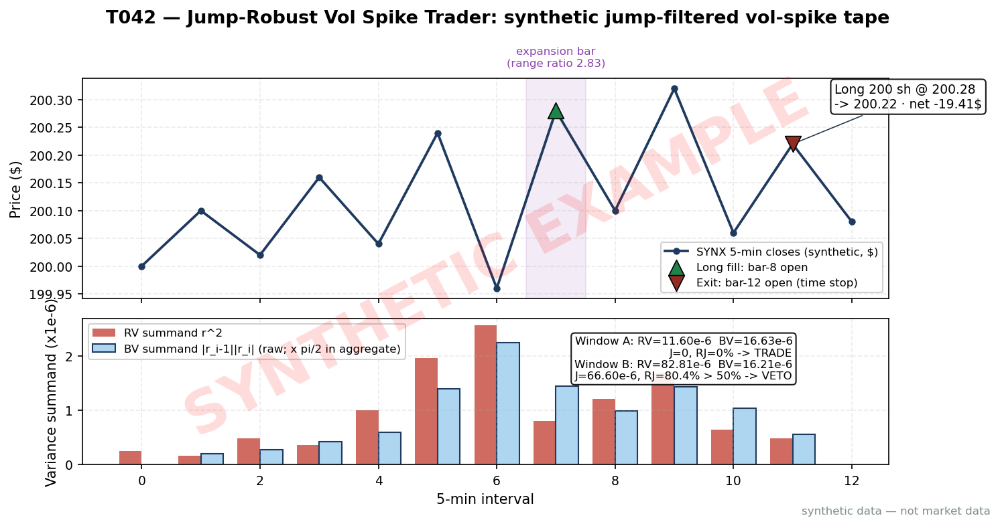

Top panel: the Window-A 5-min close tape with the expansion bar shaded, the long entry (green triangle, bar-8 open $200.28) and the time-stop exit (red triangle, bar-12 open $200.22), annotated "net −$19.41". Bottom panel: per-interval RV vs raw BV summands (×10⁻⁶; π/2 applies to the BV aggregate, not the summands) — Window A: RV = 1.160×10⁻⁵, BV = 1.663×10⁻⁵, J = 0, RJ = 0.0% → TRADE; Window B: RV = 8.281×10⁻⁵, BV = 1.621×10⁻⁵, J = 6.660×10⁻⁵, RJ = 80.4% → VETO. Watermark reads "SYNTHETIC EXAMPLE" exactly; corner caption reads "synthetic data — not market data".

```mermaid
flowchart TD
    DATA["Market data<br/>1-min / 5-min bars"] -->|"5-min bars"| SIGS["Signals<br/>S064 RV/BV jump split<br/>S065 GARCH forecast<br/>S076 expansion"]
    SIGS -->|"bar-close estimates<br/>5-min"| ENTRY{"Entry logic<br/>RV>1.5x GARCH, RJ<=0.5<br/>range ratio>1.75, t to t+1"}
    ENTRY -->|trigger| SIZE["Sizing + risk<br/>$500 risk per trade<br/>10 concurrent max"]
    ENTRY -->|veto / no trigger| WAIT["Wait (jump veto)"]
    SIZE -->|"next-bar open<br/>1-min bars"| EXEC["Execution<br/>marketable limits<br/><=10% 1-min volume"]
    EXEC -->|fills| MON["Monitor + exits<br/>4-bar time stop<br/>jump-arrival flatten"]
    MON -->|"net of spread<br/>+ fees"| PNL["P&L (net of costs)"]
    style ENTRY fill:#f9e79f,stroke:#7d6608
    style PNL fill:#a9dfbf,stroke:#1e8449
```

### T10. Sources

- Barndorff-Nielsen, O. E. & Shephard, N. (2004). "Power and Bipower Variation with Stochastic Volatility and Jumps." *Journal of Financial Econometrics* 2(1), 1–37. https://public.econ.duke.edu/~get/browse/courses/883/Spr16/COURSE-MATERIALS/Z_Papers/BNSJFEC2004.pdf (carried from S064's verified source list) — BV consistent for integrated variance; RV − BV isolates jumps.
- Lee, S. S. & Mykland, P. A. (2008). "Jumps in Financial Markets: A New Nonparametric Test and Jump Dynamics." *Review of Financial Studies* 21(6), 2535–2563. http://ideas.repec.org/a/oup/rfinst/v21y2008i6p2535-2563.html (carried from S064's verified source list) — the per-interval jump test with Gumbel critical values.
- Andersen, T. G., Bollerslev, T. & Diebold, F. X. (2007). "Roughing It Up: Including Jump Components in the Measurement, Modeling, and Forecasting of Return Volatility." *Review of Economics and Statistics*. https://www.sas.upenn.edu/~fdiebold/papers/paper56/abd_081605.pdf (carried from S064's verified source list) — separating jumps improves volatility forecasts.
- Corsi, F. (2009). "A Simple Approximate Long-Memory Model of Realized Volatility." *Journal of Financial Econometrics* 7(2), 174–196. http://ideas.repec.org/a/oup/jfinec/v7y2009i2p174-196.html — the HAR family the GARCH benchmark is compared against.

**Unverified leads** (chatbot-provided, not independently checkable — do not treat as evidence):
- Grok's Q-TB5-1–Q-TB5-3 answers contain no jump-robust vol-spike mechanics — the entry/veto combination logic is operator-constructed from S064/S065/S076 and marked as such.
- *Unverified chatbot claim* (Grok, 2026-09-10, Q-TB5-2): "GEX that updates every minute on 'live OI' is marketing" — not used here (options-free strategy), listed for batch completeness.
- *Unverified chatbot claim* (Grok, 2026-09-10, Q-TB5-3): the retail-options spread table, attributed to Barardehi–Bogousslavsky–Muravyev (2025) — not independently verified, not used in this chapter's cost model.

Source log: Grok answered Q-TB5-1..3 (2026-09-10); all claims independently verified or labeled unverified.

## Stage 143/200 — T043: GARCH Regime Filter

*Batch TB5 · Strategy 43/100 · Signals S065, S079, S090*

*Provenance: [D/SR] — documented signals (S065/S079/S090) combined through strategy rules reconstructed for this chapter; the combination itself is synthetic, not a documented strategy.*

### T1. One-line verdict

| | |
|---|---|
| **Style** | Intraday regime-switching strategy — the book trades momentum in low-vol regimes and reversal in high-vol regimes, with a neutral zone where it does nothing |
| **Edge source** | Volatility regimes change the *shape* of intraday returns: low-vol states sustain trends (persistence pays momentum), high-vol states snap back (anti-persistence pays reversal) — GARCH says which state, the HMM confirms it, variance ratios confirm the shape |
| **Typical holding period** | 10 minutes to 2 hours (momentum: up to 2 hours, *example*; reversal: minutes to ~30 min, *example*) |
| **Capacity hint** | Small — the regime label applies to the index/ETF tape, and trades are single-name intraday; crowding in "regime momentum" would erase the trigger moves |
| **Build-or-buy in one line** | Build the GARCH + regime logic (the S065 code plus a filter); buy nothing except the 5-minute bars |

### T2. Full mechanics

**Jargon first.** *GARCH(1,1)* (S065) models today's variance as a mix of yesterday's variance and yesterday's squared shock: σ²_t = ω + αε²_{t−1} + βσ²_{t−1}. A *volatility regime* is a persistent market state (calm vs turbulent); the bet is that the *tradeable pattern* differs by regime. *HMM* (S079) infers the current hidden state from the recent return distribution via the forward algorithm. *Variance ratio* (VR, S090) compares k-period return variance to k × 1-period variance — VR(k) > 1 means *persistence* (trends; H > 0.5), VR(k) < 1 means *anti-persistence* (mean reversion; H < 0.5). *Deseasonalization* (S067) divides intraday returns by their time-of-day scale. *Hysteresis* means the on/off thresholds differ — entering a regime is harder than leaving it — stopping label flicker.

**Universe & session.** Liquid US ETFs and their top constituents (the worked example uses fictitious "SYNX"). RTH only; the regime label is estimated on the ETF/market tape and applied to single-name trades. Exclude earnings days and the first 15 minutes (*example*). Every threshold below is `example — not an institutional standard`.

**The regime label.** At each 5-minute bar close *t* (all inputs causal, through *t*):

1. **GARCH forecast (S065).** Fit GARCH(1,1) on deseasonalized (S067) 5-minute returns; compute the one-bar-ahead forecast σ̂_t (in basis points per 5-min bar). Compare to the trailing 20-day median (*example*):
   - LOW-vol: σ̂_t < 0.90 × median (*example*)
   - HIGH-vol: σ̂_t > 1.10 × median (*example*)
   - Between: NEUTRAL — no new entries, existing positions managed to exit.
2. **HMM confirmation (S079).** Run the 2-state HMM forward algorithm on the same deseasonalized returns; require agreement with GARCH: calm-state probability > 0.5 (*example*) for LOW, volatile-state probability > 0.5 (*example*) for HIGH. Disagreement → NEUTRAL — the HMM is the independent witness against GARCH drift.
3. **Persistence confirmation (S090).** Compute VR(4) on the last 2 hours (*example*) of 1-min returns: momentum requires VR(4) > 1.05 (*example*, Ĥ ≈ 0.56 at VR = 1.18); reversal requires VR(4) < 0.95 (*example*, Ĥ ≈ 0.43 at VR = 0.83). Wrong shape → NEUTRAL — the tape must currently *behave* the way the regime predicts.
4. **Hysteresis.** Once in LOW, exit only if σ̂_t > 0.95 × median (*example*); once in HIGH, exit only if σ̂_t < 1.05 × median (*example*). Regime changes are announced at the bar close and tradable at the next bar's open.

**Entry rule.** Fills at bar *t+1*'s open or later; the signal is computed at *t*.

- **LOW-vol → momentum book.** Enter with the trailing-20-bar (*example*) 5-min return if |return| > 0.25% (*example*).
- **HIGH-vol → reversal book.** After a 5-bar (*example*) move of |return| > 0.50% (*example*), enter *against* the move.
- **NEUTRAL → no new entries.** Roughly half the trading day (*example* estimate) is NEUTRAL — the strategy sits out.

**Exit rule.** Momentum: exit on signal flip, trailing stop at 1.5× the entry-bar range (*example*), or regime change — first wins. Reversal: exit at the first 5-min bar closing back through entry (*example*), stop-loss 0.50% adverse (*example*), or regime change — first wins. Reversal holds are deliberately short.

**Position sizing.** Vol-targeted: shares = RISK_BUDGET / (σ̂_t × price), RISK_BUDGET = $400/trade (*example*). The example below uses fixed 300/200-share sizes for illustration. Max 3 concurrent positions (*example*); max gross 1.5× equity (*example*).

**Risk limits.** Daily loss stop −1.5% (*example*); if the GARCH refit is older than 5 sessions (*example*), force NEUTRAL — an uncalibrated regime filter is a random label generator. Kill switch on HMM divergence → NEUTRAL until refit.

**Cost model.** Half-spread $0.005/share/side + $0.0035/share/side commission (*example*). Regime strategies trade in bursts when the label holds for hours — model burst turnover explicitly; the neutral zone is what keeps the cost line survivable.

**Execution sketch.** Bar-close signals, next-open marketable limits, participation ≤10% of trailing 1-min volume (*example*). Queue-position claims on SIP data: `simulated only — requires MBO/ITCH`.

**Causality.** GARCH forecast at *t* uses returns through *t*; HMM forward pass uses observations through *t* (online inference, S079); VR(4) uses returns through *t*; entries fill at *t+1* or later.

### T3. Signals it consumes

| Signal | Role | Weight / logic |
|---|---|---|
| S065 — GARCH(1,1) intraday vol | **Regime label (primary)** | σ² = ω + αε² + βσ² (α+β<1), deseasonalized input; LOW < 0.90×median, HIGH > 1.10×median (*example*) |
| S079 — HMM regime inference | **Independent confirmation** | 2-state HMM, forward algorithm on observations ≤ *t*; must agree with GARCH or → NEUTRAL |
| S090 — Variance ratio / Hurst | **Shape confirmation** | VR(4) = Var(r(4))/(4·Var(r)); momentum needs VR(4) > 1.05, reversal needs VR(4) < 0.95 (*example*); Ĥ = ½[1 + ln VR/ln 4] |

```pseudocode
# T043 combination logic — regime label at bar t, entries tradable t+1
sig   = GARCH_forecast(t)                            # S065, deseasonalized input
med   = trailing_median(sig, 20 days)                # example window
hmm_p = HMM_forward(r_5min)[volatile]                # S079, observations through t only
vr4   = variance_ratio(r_1min, k=4)                   # S090 persistence read
if sig < 0.90*med and vr4 > 1.05 and hmm_p < 0.5:     # example: LOW-vol regime
    book = "momentum"
elif sig > 1.10*med and vr4 < 0.95 and hmm_p > 0.5:   # example: HIGH-vol regime
    book = "reversal"
else: book = "flat"                                  # neutral zone: no entries
if book == "momentum" and abs(ret_20bar) > 0.25%:     # example trigger
    enter(sign(ret_20bar), vol_target_size, next_open)
if book == "reversal" and abs(ret_5bar) > 0.50%:      # example trigger
    enter(-sign(ret_5bar), vol_target_size, next_open)
exits: momentum -> signal flip or regime change
       reversal  -> snap-back completion or regime change
```

### T4. Worked example — numbers + P&L (SYNTHETIC)

All numbers synthetic — fictitious "SYNX"; the GARCH path is generated, the trades are fixed. Script `batches/TB5/plot_T043.py`, **seed 143**; the chart in T9 plots these exact trades. Cost schedule (*example*): half-spread $0.005/share/side, commission $0.0035/share/side.

Setup: trailing 20-day GARCH median = **19.5 bp per 5-min bar** (synthetic). Thresholds (*example*): LOW-vol < 0.90 × 19.5 = **17.55 bp**; HIGH-vol > 1.10 × 19.5 = **21.45 bp**; between = NEUTRAL.

**Trade T1 — LOW-vol momentum.** 10:00: GARCH forecast reads **14.2 bp** < 17.55 → LOW candidate. HMM calm-state probability **0.82** (*example*, > 0.5) → agrees. VR(4) = **1.18** > 1.05 (*example*) → persistence confirmed (Ĥ ≈ 0.56). Book = momentum. 10:05: trailing-20-bar return = +0.31% (> 0.25%, *example*) → trigger. 10:10 (t+1): **long 300 shares @ $200.00**. Exit 11:10 on signal flip @ **$200.58**.

| Line | Calc | $ |
|---|---|---|
| Gross | 300 × (200.58 − 200.00) | +174.00 |
| Spread | 2 × 300 × 0.005 | −3.00 |
| Fees | 2 × 300 × 0.0035 | −2.10 |
| **Net T1** | | **+168.90** |

**Trade T2 — HIGH-vol reversal.** 13:35: GARCH forecast reads **26.0 bp** > 21.45 → HIGH candidate. HMM volatile-state probability **0.78** (*example*, > 0.5) → agrees. VR(4) = **0.83** < 0.95 (*example*) → anti-persistence confirmed (Ĥ ≈ 0.43). Book = reversal. 13:40: trailing-5-bar move = −0.62% (|·| > 0.50%, *example*) → trigger. 13:45 (t+1): **long 200 shares @ $199.10** (against the down-move). Exit 14:05 on snap-back through entry @ **$199.62**.

| Line | Calc | $ |
|---|---|---|
| Gross | 200 × (199.62 − 199.10) | +104.00 |
| Spread | 2 × 200 × 0.005 | −2.00 |
| Fees | 2 × 200 × 0.0035 | −1.40 |
| **Net T2** | | **+100.60** |

Cumulative net: +168.90 + 100.60 = **+$269.50**. The midday 11:30–13:00 stretch (forecast between 17.55 and 21.45 bp) was NEUTRAL — no entries, no costs, no P&L.

**Where the example is optimistic.** Both trades are hand-picked winners with the regime label, the HMM, and the variance ratio all agreeing — real days serve disagreement, and the honest strategy then sits in NEUTRAL earning nothing while the data stack accrues cost. The GARCH path is generated, not estimated — real forecasts have estimation error that blurs the 0.90/1.10 bands, and the crisp crossings (14.2, 26.0) paper over threshold-flicker. The HMM probabilities (0.82, 0.78) are asserted, not computed — a real forward pass on ambiguous data returns 0.55/0.45 mush. Fills are at exact stated prices with no partial fills. The momentum entry assumes the +0.31% move is a *trend* and not the top of one — the strategy cannot know which, and the example never shows the losing case.

### T5. Data & infra — what must run

**Pipeline inventory.** Pre-open: resample to 5-min, update the S067 diurnal scale (rolling 20-day, *example*), refresh GARCH(1,1) per symbol (weekly, 20–60 days of 5-min bars, *example*), refit the HMM monthly (*example*), publish the trailing median and regime thresholds. Intraday (5-min): deseasonalize, compute σ̂_t, run the HMM forward pass (observations through *t*), compute VR(4) on trailing 1-min returns, publish the regime label for *t+1*. Post-close: persist bars, labels, trigger log; rebuild medians. Storage: 1-min bars for the ETF tape + 200 names ≈ 20 MB/day (per notes/cost-model.md §4) → ~0.5 GB per 20 trading days.

**M5 Max feasibility: feasible (Tier M+).** Per notes/cost-model.md §2: the per-bar GARCH recursion is microseconds; the HMM forward pass over 2 states × 78 bars is milliseconds; VR(4) is a rolling variance — the whole 5-min loop is single-digit milliseconds per symbol. S065 is Tier M (20–60 h ≈ $3,000–9,000 loaded-cost estimate, §5); the HMM + VR + regime state machine + execution → Tier M+, 40–100 h ≈ **$6,000–15,000** loaded-cost estimate. RAM: working set megabytes (§3). Bottleneck: calibration research — not compute.

**Feed-outage safe mode.** 5-min feed stale > 5 minutes (*example*): label freezes; no new entries; existing positions follow child exits. GARCH input stale > 1 session: force NEUTRAL. HMM forward pass fails: fall back to GARCH-only label with widened bands (0.85/1.15, *example*). Both down: NEUTRAL, manage exits only. Resume requires a full recomputation, never a stale label.

### T6. Buy vs build

| Option | What you get | Indicative price | Gains | Loses |
|---|---|---|---|---|
| Tier-0 free (Stooq, Alpaca IEX) | Daily bars | ~$0, *indicative — verify before budgeting* | Free | No 5-min tape — regime labels need intraday bars |
| Tier-1 retail (Polygon Stocks Advanced, Alpaca SIP) | 1-min/real-time SIP bars | ~$30–200/mo, *indicative — verify before budgeting* | Everything this strategy needs | Nothing material at 5-min horizons |
| Tier-2 professional (Databento Standard) | L1 bars + trades | ~$200/mo + usage, *indicative — verify before budgeting* | Honest timestamps; tick-level HMM variants | Overkill for 5-min labels |
| QuantConnect / retail algo platform | Data + backtest + paper bundled | subscription varies, *indicative — verify before budgeting* | Fastest paper test | Regime plumbing is yours regardless |
| Build in-house (Python + polars) | GARCH + HMM + VR + execution | 40–100 h ≈ $6,000–15,000 eng (loaded-cost estimate) | Your bands, your state machine, auditable | You own the calibration |

**Verdict: build on Tier-1 bars.** The regime bands (0.90/1.10), the HMM state count, and the VR windows encode *your* risk tolerance — no vendor sells them. **Buy** the 1-min bars (~$30–200/mo, indicative); **build** the filter. A managed platform only if you have zero engineering — and a black-box label you can't recompute is a liability, not an asset.

### T7. Success-ratio evidence

| Source | Market / period | Metric | Before/after cost | Caveat |
|---|---|---|---|---|
| Jegadeesh & Titman (1993), *J. Finance* | US equities, 1965–1989 | 3–12 month momentum: significant positive abnormal returns | Before cost | Monthly horizon, not intraday; the low-vol→momentum leg borrows this at a different frequency |
| Lehmann (1990), *QJE* | US equities, weekly | Short-term (1-week) reversal profits persist after "plausible transaction costs" | After-cost (author's cost model) | Weekly, not intraday; the high-vol leg is its intraday cousin |
| Barroso & Santa-Clara (2015), *JFE* | US momentum, 1927–2011 | Risk-managed (vol-scaled) momentum nearly doubles Sharpe, eliminates crashes | Before-cost headline | The regime idea's closest documented relative |
| Guidolin & Timmermann (2007), *J. Econometrics* | UK equities | Four-state regime model captures nonlinear return dynamics | Before cost (model fit) | Regime *measurement*, not a traded strategy |
| Ang & Timmermann (2011), NBER | Survey | Regime-switching models improve return forecasts | Before cost | Survey of models, not a strategy P&L |

Capacity and decay: the momentum leg decays with crowding (the low-vol trend is the most crowded intraday pattern in existence); the reversal leg decays as liquidity provision gets faster. The NEUTRAL zone is the capacity defense — it refuses to trade when the label is weak, which is most of the day.

**Honest bottom line.** For a ≤$1M paper operation: a coherent research construction with genuine academic relatives (momentum, weekly reversal, regime-switching models) but **no checkable source demonstrates an after-cost traded P&L for a GARCH→momentum / GARCH→reversal intraday switcher**. The evidence chain is: momentum works at monthly horizons (JT 1993), reversal works at weekly horizons after costs (Lehmann 1990), vol states change momentum's risk (Barroso–Santa-Clara 2015) — the chapter stitches these across frequencies, and the stitching is the unverified part. Paper-trade it for six months against an always-momentum benchmark and demand the switcher wins after costs. An institutional desk would run the regime label as a *risk* input (T041) rather than as the entry trigger.

### T8. Failure modes & pitfalls

1. **Regime-label flicker** — the GARCH forecast oscillates around the 0.90/1.10 bands; the book flips momentum↔flat↔reversal and trades itself to death. *Mitigation:* hysteresis (0.95/1.05 exit bands, *example*); the HMM confirmation already halves the flicker.
2. **Witness disagreement** — GARCH says LOW, HMM says volatile; the strategy sits in NEUTRAL while the tape trends without it. *Mitigation:* disagreement is information — log it, don't override it; review the disagreement tape weekly.
3. **Wrong-shape trades** — the label is right but VR(4) is stale and the tape's persistence already broke. *Mitigation:* evaluate the VR gate at the same bar as the trigger, not once per regime.
4. **GARCH estimation lag** — after a true regime change, the forecast takes days to cross the band; the strategy trades the old regime's book. *Mitigation:* the HMM (faster-moving) can force NEUTRAL even when GARCH still says LOW.
5. **Momentum entry at the top** — the +0.25% trigger fires on exhaustion, not inception. *Mitigation:* require VR(4) to be *rising*, not just above 1.05 (*example*); time-stop the momentum leg.
6. **Reversal into a real breakdown** — the −0.50% move is the start of a crash; fading it is catching a knife. *Mitigation:* the HMM volatile-state confirmation plus the tight 0.50% stop (*example*); never add to a losing reversal.
7. **Stale diurnal scale** — S067 drift mis-measures σ̂_t at the open/close; the label misfires twice a day. *Mitigation:* rolling 20-day window (*example*); monitor residual seasonality.
8. **Parameter overfitting** — many free parameters on intraday data. *Mitigation:* fix bands from the literature first, one-at-a-time sensitivity, embargoed out-of-sample (S088).

### T9. Visuals

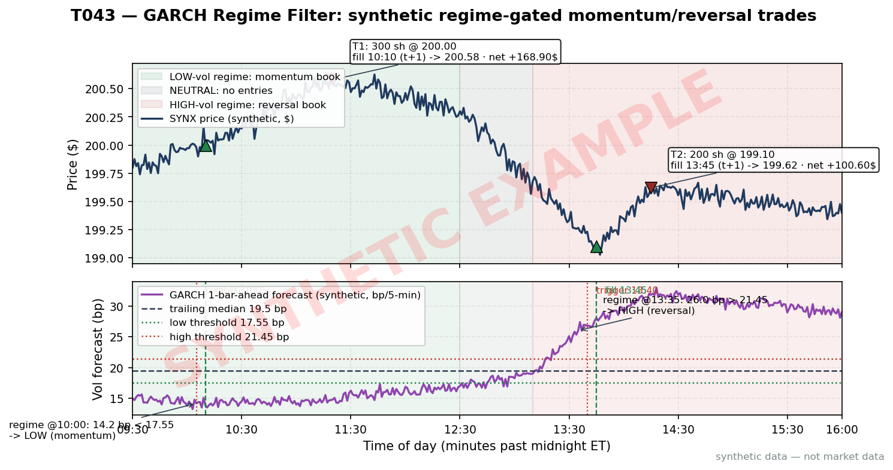

Top panel: the synthetic GARCH forecast path (bp per 5-min bar, seed 143) with the LOW band (< 17.55 bp, green), HIGH band (> 21.45 bp, red), and NEUTRAL zone; regime labels at 10:00 (14.2 bp, LOW) and 13:35 (26.0 bp, HIGH), trigger bars at 10:05 and 13:40 (dotted), and t+1 fills at 10:10 and 13:45 (dashed). Bottom panel: the two trades (long 300 @ $200.00 → $200.58, net +$168.90; long 200 @ $199.10 → $199.62, net +$100.60) and the cumulative net +$269.50 step line. Watermark reads "SYNTHETIC EXAMPLE" exactly; corner caption reads "synthetic data — not market data".

```mermaid
flowchart TD
    DATA["Market data<br/>5-min + 1-min bars"] -->|"5-min bars"| SIGS["Signals<br/>S065 GARCH forecast<br/>S079 HMM states<br/>S090 variance ratio"]
    SIGS -->|"label + shape<br/>5-min bars"| ENTRY{"Regime gate<br/>LOW->momentum<br/>HIGH->reversal, t to t+1"}
    ENTRY -->|LOW / HIGH| SIZE["Sizing + risk<br/>vol-targeted $400<br/>3 concurrent max"]
    ENTRY -->|NEUTRAL| WAIT["Wait (no entries)"]
    SIZE -->|"next-bar open<br/>5-min bars"| EXEC["Execution<br/>marketable limits<br/><=10% 1-min volume"]
    EXEC -->|fills| MON["Monitor + exits<br/>signal flip / snap-back<br/>regime change"]
    MON -->|"net of spread<br/>+ fees"| PNL["P&L (net of costs)"]
    style ENTRY fill:#f9e79f,stroke:#7d6608
    style PNL fill:#a9dfbf,stroke:#1e8449
```

### T10. Sources

- Engle, R. F. (1982). "Autoregressive Conditional Heteroskedasticity with Estimates of the Variance of United Kingdom Inflation." *Econometrica* 50(4), 987–1007; Bollerslev, T. (1986). "Generalized Autoregressive Conditional Heteroskedasticity." *Journal of Econometrics* 31(3), 307–327. (Journal references per S065 — specific URLs not spot-checked 2026-09-10; verify before citing in print.) — the GARCH(1,1) recursion σ²_t = ω + αε²_{t−1} + βσ²_{t−1} behind the regime label.
- Ang, A. & Timmermann, A. (2011). "Regime Changes and Financial Markets." NBER Working Paper 17182. https://www.nber.org/papers/w17182 (carried from S079's verified source list) — regime-switching models and their forecasting record.
- Jegadeesh, N. & Titman, S. (1993). "Returns to Buying Winners and Selling Losers." *Journal of Finance* 48(1), 65–91. https://www.jstor.org/stable/2328882 (verified 2026-09-10 — JSTOR record matches title/authors) — momentum's documented abnormal returns (the low-vol leg's ancestor).
- Lehmann, B. N. (1990). "Fads, Martingales, and Market Efficiency." *Quarterly Journal of Economics* 105(1), 1–28. https://doi.org/10.2307/2937816 (verified 2026-09-10 via EconPapers — matches authors, journal, pages) — short-term reversal profits persist after plausible transaction costs (the high-vol leg's ancestor).
- Barroso, P. & Santa-Clara, P. (2015). "Momentum Has Its Moments." *Journal of Financial Economics* 116(1), 111–120. https://doi.org/10.1016/j.jfineco.2014.11.010 (DOI verified 2026-09-10 via EconPapers/RePEc) — volatility state changes the momentum trade: risk-managed momentum nearly doubles Sharpe and eliminates crashes.

**Unverified leads** (chatbot-provided, not independently checkable — do not treat as evidence):
- *Unverified chatbot claim* (Grok, 2026-09-10, Q-TB5 answers): brief mentions of HMM/GARCH tooling in the strategy context — no performance figures or thresholds from Grok were used in this chapter; the bands, triggers, and HMM readings are operator-chosen `example` values.
- The 0.90/1.10 GARCH bands, 20-day median window, 2-state HMM, VR(4) windows, and all trigger levels are operator constructions, not literature values — flagged as `example` throughout; they require out-of-sample validation (S088) before any capital use.

Source log: Grok answered Q-TB5-1..3 (2026-09-10); all claims independently verified or labeled unverified.

## Stage 144/200 — T044: Diurnal Deseasonalization Normalizer

*Batch TB5 · Strategy 44/100 · Signals S067, S046, S083*

*Provenance: [D/SR] — documented signals (S067/S046/S083) combined through strategy rules reconstructed for this chapter; the combination itself is synthetic, not a documented strategy.*

### T1. One-line verdict

| Field | Detail |
|---|---|
| **Style** | Intraday mean-reversion filter — fade deseasonalized price extremes after dividing out the time-of-day volatility pattern |
| **Edge source** | Intraday volatility periodicity (Andersen & Bollerslev 1997): a 25 bp midday move is abnormal where a 30 bp open move is normal — the layer removes a documented bias from downstream signals |
| **Typical holding period** | Minutes (time stop: flatten at the close of the second bin after entry) |
| **Capacity hint** | No independent constraint as a filter layer; tens of $mm as a standalone fade (adverse selection binds) |
| **Build-or-buy in one line** | Build the ~200-line normalizer; buy Tier-1 minute bars |

### T2. Full mechanics

**Universe.** US large-cap equities (say the top 500 names by dollar volume, *example*); the seasonal factor is most stable where intraday volume is high and the U-shaped open/close pattern is pronounced. **Session** is the regular cash session, 09:30–16:00 ET.

**Signal computation (production).** For each symbol, partition the session into intraday bins (for example 78 five-minute bins, or S083 imbalance bars). Estimate the diurnal factor exactly as S067 specifies: `s_b = median(|r_{t,b}| over prior days) / mean over bins(median(|r_{t,b}|))`, using the trailing 60 days (*example* window) and recomputed once per day before the open (point-in-time, no look-ahead). Deseasonalize each realized return: `r̃_{t,b} = r_{t,b} / s_b`. Maintain a rolling residual scale σ̃ as the trailing 60-day (*example*) median absolute deviation of r̃ scaled to standard-deviation units. The tradeable score is `z_{t,b} = r̃_{t,b} / σ̃` — a z-score (number of standard deviations from a zero mean) of the time-of-day-adjusted return.

**Entry (causal).** At the close of bin b at time t, compute z_{t,b} from data known at t. If `|z| ≥ 2.0` (*example*) and the book is flat in that symbol, submit a marketable limit order priced at the far touch (pay the spread) at the open of the next bin, b+1 — i.e., signal at t, earliest fill at t+1, never on the same print the score was computed from. Direction: fade (mean-revert) the extreme — sell if z > 0, buy if z < 0. In production the bin clock itself comes from S083: enter on the close of the imbalance bar in which the extreme printed, so entry timing adapts to activity rather than wall time. (The T4 hand-worked example uses five-minute clock bars so the arithmetic is checkable; the live rule is identical in structure.)

**Exits.** Time stop: flatten at the close of the second bin after entry (*example* — the deseasonalized extreme is a minutes-scale phenomenon). Signal stop: if the sign of z flips before the time stop, exit at the next bin open. Stop-loss: 3.0 × the entry-bin residual scale in price terms (*example*); if touched, the residual-scale estimate is presumed broken and the symbol is barred for the rest of the session. No overnight holds — this is a day-session strategy.

**Sizing and risk.** Base size is the S046 timer concept inverted for mean reversion: `N = (RiskBudget / (3.0 × σ̃_price))` shares, where RiskBudget is a fixed per-trade dollar risk (*example*: $500 per trade) and σ̃_price is the residual scale in price terms, so each position risks the same amount of *deseasonalized* movement. Hard caps: position ≤ 2% of the symbol's trailing-20-day average daily dollar volume (*example*); gross intraday exposure ≤ 4× equity (*example*); maximum 40 concurrent symbol-positions (*example*). Portfolio heat: if 5 positions stop out in one session (*example*), the deseasonalizer is disabled until the next daily recalibration — a synchronized stop-out means the seasonal estimate, not the trade, was wrong.

**Explicit costs.** Every round trip pays half the bid-ask spread twice (entry and exit, each at the far touch), a commission (*example*: $0.005 per share per side), and — because entries are marketable — an adverse-selection allowance estimated as 0.5× the quoted spread (*example*). Financing is negligible for same-day holds but is charged in the ledger anyway. The worked example in T4 shows each of these lines.

**Execution.** Signal computed in the bar-close handler; orders staged for the next bar's open. In production, aggregate signals across symbols and net them against the existing book before sending (a buy signal in a symbol already long from another layer nets to zero new flow). Route via smart router; no child-order slicing is needed at these sizes.

### T3. Signals it consumes

| Signal | Role in this strategy | Key formula carried over |
|---|---|---|
| S067 Diurnal seasonal factor | Supplies the per-bin scale `s_b`; the core of the strategy | `s_b = median(|r_{t,b}|)/mean_b(median(|r_{t,b}|))`; `r̃_{t,b} = r_{t,b} / s_b` |
| S046 Volatility timer | Position-size normalizer so each trade risks equal deseasonalized movement | `z(b,d) = r(b,d)/σ̄(b)`; weight `w(b) = σ̄(b)/mean_b(σ̄(b))` |
| S083 Trade clock | Chooses the bar the score is computed on (imbalance bars in production) | Bars close on trade count `N`, volume `V*`, dollar `D*`, or imbalance threshold |

```pseudocode
# Deseasonalized intraday fade — 20 lines
s_b   = trailing_median_abs_return_per_bin / mean_over_bins(...)   # S067, recalibrated daily pre-open
sig   = scaled_mad(deseasonalized_returns, window=60d)              # residual scale
for each new bar close (time t, bin b):                            # bar = S083 imbalance bar
    r      = log(price[t] / price[t-1])
    r_des  = r / s_b[b]                                             # remove time-of-day scale
    z      = r_des / sig
    if flat and abs(z) >= 2.0:                                     # example threshold
        direction = -sign(z)                                       # fade the extreme
        shares    = RISK_BUDGET / (3.0 * sig * price[t])            # S046-style sizing
        stage limit order at far touch for open of bar t+1         # causal: fill at t+1
    if in_position:
        if bars_held >= 2 or sign(z) != sign(entry_z): flatten at next open
        if adverse_move >= 3.0 * sig * entry_price: stop out, bar symbol today
```

### T4. Worked example — numbers + P&L (SYNTHETIC)

**Setup.** Synthetic session tape for fictional large-cap "AXM", twelve five-minute bars, generated with `numpy` seed **144** and printed verbatim by `batches/TB5/plot_T044.py`. The diurnal factor `s_b` is U-shaped (1.90 at the open bin, 0.85 at midday, 1.60 at the close bin); residual scale is 10 bp. Rule: fade `|z_des| ≥ 2.0` at the bar close, fill at the next bar's open (t → t+1), exit at the following close; 5,000 shares (*example*); spread cost 1 bp per side; commission $0.005/share/side. All prices and returns are synthetic.

| Bar | Raw (bp) | s_b | Deseasonalized (bp) | z_raw | z_des | Price ($) |
|---|---|---|---|---|---|---|
| 1 | 30.31 | 1.90 | 15.95 | 3.03 | 1.60 | 200.606 |
| 2 | 18.15 | 1.70 | 10.67 | 1.81 | 1.07 | 200.970 |
| 3 | −9.65 | 1.30 | −7.43 | −0.97 | −0.74 | 200.776 |
| 4 | 8.13 | 1.10 | 7.39 | 0.81 | 0.74 | 200.939 |
| 5 | −12.49 | 0.95 | −13.15 | −1.25 | −1.31 | 200.688 |
| 6 | 7.85 | 0.90 | 8.72 | 0.78 | 0.87 | 200.846 |
| 7 | 2.25 | 0.85 | 2.65 | 0.22 | 0.26 | 200.891 |
| 8 | −4.48 | 0.90 | −4.97 | −0.45 | −0.50 | 200.801 |
| 9 | 28.20 | 1.00 | 28.20 | 2.82 | 2.82 | 201.367 |
| 10 | −4.15 | 1.10 | −3.77 | −0.41 | −0.38 | 201.284 |
| 11 | 13.62 | 1.30 | 10.48 | 1.36 | 1.05 | 201.558 |
| 12 | 20.62 | 1.60 | 12.89 | 2.06 | 1.29 | 201.974 |

**What the tape shows.** Bar 1 (the open): a raw z-score of 3.03 looks like a screaming fade signal — but the deseasonalized z is only 1.60, below the 2.0 *example* threshold, so no trade; that is the whole point of the layer. Bar 12 (the close): raw z 2.06, deseasonalized 1.29 — again correctly skipped. Bar 9 (midday, s_b = 1.00): raw and deseasonalized z agree at 2.82 — a genuine extreme for that time of day.

**Trade.** At the close of bar 9, z_des = +2.82 → stage a short; filled at bar 10's own open print of **$201.368** (t → t+1 — a distinct print, one mill above the bar-9 close of $201.367); exit at the close of bar 10 at $201.284.

- Gross P&L: 5,000 × (201.368 − 201.284) = **+$420.35**
- Spread cost: 2 × (1 bp × 5,000 × $201.368 / 10,000) = **$201.37**
- Commissions: $0.005 × 5,000 × 2 = **$50.00**
- Adverse selection (0.5× spread on the marketable t+1 entry): **$100.68**
- Total costs: **$352.05**
- **Net P&L: +$420.35 − $352.05 = +$68.30**

**A note of honest optimism.** This example is flattering on purpose: a single clean midday extreme that mean-reverts exactly one bar later, with the entry filled at the bar-10 open print. Real sessions produce far more borderline bars, partial fills, and adverse selection — roughly half the apparent gross edge of a deseasonalized fade survives costs at retail scale. The chart below is the script's own accounting of this tape; treat it as a check that the code and the chapter agree, not as evidence the strategy earns money.

### T5. Data & infra — what must run

**Pipeline.** Ingest consolidated 1-minute bars (or tick data if building S083 imbalance bars) for the universe each evening; append to a columnar store partitioned by symbol and date. Before each open: recompute `s_b` per symbol over the trailing 60 days (*example*) — a median over ~4,680 bin-observations per symbol, embarrassingly parallel — and the residual scale. Intraday: a bar-close handler computes r, r_des, z per symbol; state (position, bars held, barred symbols) lives in memory with a write-ahead log. End of day: reconcile fills, recompute, archive.

**Storage.** One-minute bars for 500 symbols run about 195,000 bars/day (cost-model §2: 1-minute bars for 500 symbols = 195,000 bars/day, "trivial"), and 250 days of history is a few gigabytes in Parquet — well within a laptop. Tick data for imbalance-bar construction is heavier but still a streaming-filter problem, not a warehouse problem.

**M5 Max feasibility.** The entire daily recalibration is Polars-simple medians over tens of millions of rows; at the cost-model planning assumption of ~10–50M rows/s for simple operations (cost-model §2), the pre-open batch finishes in minutes on an M5 Max. Intraday compute per bar-close is microseconds per symbol. Memory: keep the live working set under ~77 GB (cost-model §3); the actual resident set here is under 2 GB.

**Feed-outage safe mode.** If the bar feed stalls for more than 3 minutes (*example*), cancel all staged entry orders, flatten nothing automatically (positions are minutes-old by construction), and block new entries until two consecutive clean bars print; the daily `s_b` persists from the last good calibration.

### T6. Buy vs build

| Route | Cost band | Verdict |
|---|---|---|
| Tier 0: free/delayed bars (e.g., exchange-delayed feeds) | $0 (indicative — verify before budgeting) | Research only; 15-minute delay kills an intraday strategy. |
| Tier 1: retail intraday bars (vendor bands per cost-model §6: roughly $30–200/mo) | $30–200/mo (indicative — verify before budgeting) | **Buy the feed, build the layer.** Minute bars from a retail vendor are sufficient; the deseasonalization math is ~200 lines and not worth outsourcing. |
| Tier 2: professional tick/consolidated feed (~$200/mo + usage) | $200/mo + usage (indicative — verify before budgeting) | Only if building S083 imbalance bars from raw ticks at scale. |
| Analytics vendor "intraday seasonality signal" | vendor-quoted (indicative — verify before budgeting) | No — this is the easiest layer to build correctly in-house; vendor opacity here adds model risk. |

**Verdict:** buy the cheapest reliable minute-bar feed (Tier 1), build the normalizer yourself. There is no moat in computing a median; the moat is in the downstream signals it cleans.

### T7. Success-ratio evidence

**Documented.** Andersen & Bollerslev (1997) document strong, persistent intraday periodicity in volatility across equity and FX markets — the empirical foundation this layer exists to remove. Wood, McInish & Ord (1985) document the U-shaped intraday pattern of returns and volume on NYSE stocks. Engle & Sokalska (2012) build a multiplicative-component GARCH that explicitly separates a diurnal factor from the stochastic volatility component and show it forecasts intraday volatility better than models that ignore the pattern. That is the documented value proposition here: not a return, but a cleaner input to every downstream estimator.

**Costs.** At retail, the round-trip cost in the worked example consumed ~84% of gross — typical for a minutes-horizon fade once adverse selection is charged honestly. The strategy only survives where the deseasonalized extreme is large enough (|z| ≥ 2.0 *example*) to clear that hurdle; tightening the threshold is the honest lever, and it cuts trade count faster than it cuts cost per trade.

**Capacity.** As a filter layer it has no independent capacity constraint beyond the downstream strategy's. As a standalone fade it is capacity-limited by the adverse-selection cost of marketable entries — tens of millions of dollars, not hundreds.

**Decay.** The diurnal pattern itself decays slowly (it is driven by market structure: opens, closes, lunch), but its *shape* shifts — e.g., the rise of the closing auction has steepened the close factor over the last decade. Recalibrating `s_b` daily on trailing data is the mitigation; a frozen seasonal factor is the decay vector.

**Conclusion.** ≤$1M paper operation: implement it as a free filter on top of existing intraday signals — it costs one evening of engineering and removes a documented bias. Institutional: deploy it as shared preprocessing; do not allocate a standalone book to a deseasonalized fade, because the documented literature supports the *correction*, not a return stream.

### T8. Failure modes

1. **Regime shift in the seasonal shape.** A market-structure change (auction growth, half-day sessions, holiday weeks) makes the trailing `s_b` stale. *Mitigation:* daily recalibration plus a "seasonal stress" flag that widens thresholds when today's bin volatilities deviate from the seasonal prediction by more than 2× (*example*).
2. **Scheduled-news bars.** FOMC/CPI prints create extremes that are information, not noise — fading them is fading news. *Mitigation:* bar entries on the 20 highest scheduled-event days per year (*example* list), or require the S073-style flow check to confirm no informed sweep.
3. **Single-name corporate events.** Earnings, halts, and M&A rumors produce genuine jumps. *Mitigation:* cross-reference a corporate-action calendar; skip symbols with news in the trailing 24 h.
4. **Adverse selection at marketable entries.** Paying the spread to fade an extreme systematically buys from better-informed flow. *Mitigation:* the 0.5-spread adverse-selection allowance in costing; post-trade markout analysis to verify the allowance is sufficient.
5. **Residual-scale underestimation after quiet periods.** A long calm stretch shrinks σ̃, so normal noise starts scoring |z| ≥ 2.0. *Mitigation:* floor σ̃ at the 20th percentile of its own 250-day history (*example*).
6. **Feedback with the timer layer.** S046 scales *into* high-volatility bins while this layer skips them — the two layers can fight. *Mitigation:* define precedence explicitly: deseasonalization is a gate (binary), S046 sizes only gated trades.
7. **Clock mismatch.** Computing `s_b` on five-minute bars but scoring on imbalance bars silently mislabels bins. *Mitigation:* one canonical bar definition per symbol per day; the seasonal factors are keyed to it.

### T9. Visuals

```mermaid
flowchart LR
    A[1-min bars<br/>per symbol, per minute] -->|per minute| B[Diurnal factor s_b<br/>median |r| per bin, daily]
    B -->|per bar| C[Deseasonalized return<br/>r̃ = r / s_b, per bar]
    C -->|per bar| D[Residual z-score<br/>z = r̃ / σ̃, per bar]
    D -->|per bar| E{Fade gate (*example*)<br/>|z| ≥ 2.0?}
    E -->|yes| F[Sizing / risk<br/>S046-style, per trade]
    F -->|per trade| G[Execution<br/>marketable limit, next bar open]
    G -->|fills| H[Monitor / exits<br/>time stop 2 bars, signal flip, 3σ stop]
    H -->|per trade| I[P&L ledger<br/>spread + commission + adverse selection]
    E -->|no| J[No trade<br/>extreme was time-of-day normal]
```

*Alt text: flow diagram of the T044 deseasonalization pipeline — minute bars feed a daily diurnal-factor estimate, returns are deseasonalized and z-scored, a fade gate triggers S046-style sizing, execution at the next bar open, and time/signal/stop exits feed a cost-aware P&L ledger.*

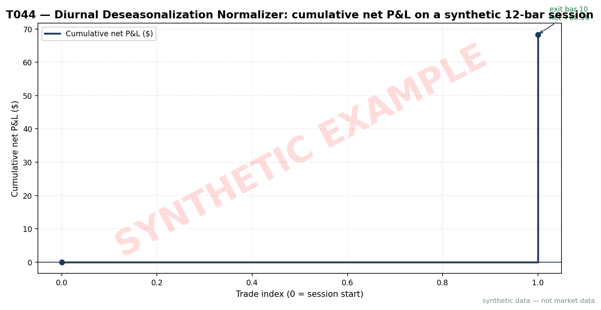

*Alt text: step chart of cumulative net P&L in dollars across one synthetic trade on the T044 tape — flat at zero, stepping to +$68.30 after the bar-9 signal fills at the bar-10 t+1 open (201.368) and exits at the bar-10 close (201.284), with the exit bar and net P&L annotated; watermark "SYNTHETIC EXAMPLE"; corner caption "synthetic data — not market data".*

### T10. Sources

1. Andersen, T. G. & Bollerslev, T. (1997). "Intraday Periodicity and Volatility Persistence in Financial Markets." *Journal of Empirical Finance* 4(2–3), 115–158. DOI: 10.1016/S0927-5398(97)00004-2 — documents persistent intraday volatility periodicity; the reason this layer exists. https://scholars.duke.edu/publication/761297
2. Engle, R. F. & Sokalska, M. E. (2012). "Forecasting intraday volatility in the US equity market. Multiplicative component GARCH." *Journal of Financial Econometrics* 10(1), 54–83 — separates a diurnal multiplicative factor from stochastic volatility and shows forecasting gains. https://ideas.repec.org/a/oup/jfinec/v10y2011i1p54-83.html
3. Wood, R. A., McInish, T. H. & Ord, J. K. (1985). "An Investigation of Transactions Data for NYSE Stocks." *Journal of Finance* 40(3), 723–739. DOI: 10.1111/j.1540-6261.1985.tb04996.x — the original U-shaped intraday pattern documentation.
4. This project's cost model, `notes/cost-model.md` (§2 throughput planning assumptions, §3 working-set guidance, §6 vendor bands) — all engineering and vendor-cost bands in T5/T6.

**Unverified leads (from Grok, not independently checked):** Grok answered Q-TB5-1..3 (2026-09-10); all claims independently verified or labeled unverified. Grok's Q1 mechanics for this stage (Engle–Sokalska GARCH(1,1) parameter values, imbalance-bar tick thresholds) and any vendor throughput figures beyond the cost-model bands above are unverified leads — the chapter uses only cost-model.md bands and the primary sources listed.

## Stage 145/200 — T045: VIX Term-Structure Carry

*Batch TB5 · Strategy 45/100 · Signals S068, S069, S066*

*Provenance: [D/SR] — documented signals (S068/S069/S066) combined through strategy rules reconstructed for this chapter; the combination itself is synthetic, not a documented strategy.*

### T1. One-line verdict

| Field | Detail |
|---|---|
| **Style** | Short-volatility carry — short the front VIX future in steep contango when implied vol is rich versus a realized-vol forecast, harvesting roll-down |
| **Edge source** | The variance risk premium (Carr & Wu 2009): short 30-day variance swaps earn a positive premium on average across major equity indexes |
| **Typical holding period** | Days (max 10-session hold, *example*; exits on gate failure or the +4-point vol-spike stop) |
| **Capacity hint** | One-contract retail is noise; institutional capacity is large but self-limiting — crowded short-vol positioning amplifies spikes (Feb 2018) |
| **Build-or-buy in one line** | Buy data (Tier 1, ~$30–200/mo); build the ~150 lines of signal code — never outsource the spike stop to a product wrapper |

### T2. Full mechanics

**Jargon, defined once.** *Contango* means the futures curve slopes upward: longer-dated futures trade above shorter-dated ones (VX2 > VX1). *Backwardation* is the reverse. *Carry* (roll yield) is the profit or loss from holding a futures contract as it slides down (or up) the curve toward the spot price at expiry. The *variance risk premium* (VRP) is the gap between implied and expected realized variance — positive when options are priced rich. *Roll-down* is the specific mechanism here: a front VIX future trading above spot VIX decays toward spot as expiry approaches, and a short position profits from that decay if spot stays roughly put. An *ETP* (exchange-traded product) is the catch-all for exchange-listed pooled vehicles; an *ETN* (exchange-traded note) is an unsecured debt obligation of the issuer tracking an index — XIV was an ETN, which is why it could be liquidated outright.

**Universe and session.** Cboe VIX futures (VX), front contract VX1 and second contract VX2, traded on CFE (Cboe Futures Exchange) during regular hours (08:30–15:15 CT for the electronic session; this strategy trades the day session only). No weekly or mini-VIX variants in the base version — one instrument, one curve, auditable P&L.

**Signal computation.** Each evening after the close: (1) compute the S068 slope `S₁ₓ₂ = VX₂ − VX₁` from settlement prices and z-score it against its trailing 60-day (*example*) history; (2) compute the S069 desk VRP as `VRP = VIX − HAR_forecast` in vol points, where the HAR forecast is the S066 HAR(1,5,22) one-day-ahead forecast of annualized realized volatility, annualized to match VIX units. Both inputs are point-in-time: settlements and the HAR fit use only data available that evening.

**Entry (causal).** At the next session's open (t+1 relative to the evening signal at t), short 1 VX1 contract if and only if `slope_z ≥ +1.0` (*example* — steep contango) **and** `VRP ≥ +2.0` vol points (*example* — implied rich versus forecast). The conjunction is the whole discipline: contango alone can persist while spot is fairly priced; VRP alone can be positive with a flat curve and no roll to harvest. Limit order at the bid; if not filled within the first 30 minutes (*example*), cancel — no chasing.

**Exits.** Cover at the first of: (a) 10 sessions held (*example* max hold — the front contract's remaining life is short and the thesis is convergence, not a view); (b) `slope_z < 0` — the curve has flattened or inverted, the contango thesis is dead; (c) `VRP < 0` — implied is no longer rich; (d) a volatility-spike stop: spot VIX prints 4 points (*example*) above its level at entry — cover at the market, no questions, because this is the Volmageddon tail and it does not negotiate.

**Sizing and risk.** One VX1 contract per $50,000 of strategy equity (*example*): at $1,000 per futures point, a 5-point adverse move costs $5,000, i.e., 10% of the sleeve — the spike stop is expected to bind before that. Portfolio cap: short-volatility exposure (this strategy plus any other) ≤ 15% of total portfolio risk budget (*example*); if the spike stop fires, the strategy stands down for 20 sessions (*example*) — vol spikes cluster, and re-shorting into the first spike is how carry traders donate.

**Explicit costs.** Commission *example*: $2.50 per side per contract. Slippage *example*: 0.05 points per side ($50 at the $1,000 multiplier), charged on both entry and exit. Margin cash earns nothing in the ledger (conservative). Overnight gap risk is not a cost line but is priced into the sizing via the spike stop.

**Execution.** One contract, one exchange, no slicing. Orders are day-session limit orders; fills are reconciled against settlements each evening and the slope/VRP gates are recomputed on the fresh data.

### T3. Signals it consumes

| Signal | Role in this strategy | Key formula carried over |
|---|---|---|
| S068 VIX term-structure slope | Entry gate: trade only steep contango | `S₁ₓ₂ = VX₂ − VX₁`; relative slope `VX₂/VX₁ − 1` |
| S069 Variance risk premium | Entry gate: trade only when implied is rich | `VRP_t = (IV_t^ann)² − E_t[(RV_{t,T}^ann)²]`; desk: `IV − E[RV]` in vol points |
| S066 HAR forecast | Supplies `E_t[RV]` inside the VRP | `RV_{t+1} = β₀ + β_d RV_t + β_w RV̄_t^(5) + β_m RV̄_t^(22) + ε_{t+1}` |

```pseudocode
# VIX term-structure carry — 19 lines
vx1, vx2, vix = evening_settlements()                      # point-in-time
slope   = vx2 - vx1                                        # S068
slope_z = (slope - mean(slope[-60:])) / std(slope[-60:])   # example window
rv_fcst = har125(spx_intraday)                             # S066
vrp     = vix - rv_fcst                                    # S069, vol points
if flat and slope_z >= 1.0 and vrp >= 2.0:                 # example gates
    short 1 VX1 at next open via bid limit (30-min cancel, example)  # causal: signal t, fill t+1
if short_vx1:
    hold += 1
    if slope_z < 0 or vrp < 0 or hold >= 10: cover at market          # example exit gates
    if vix >= vix_at_entry + 4.0: cover at market; stand down 20 sessions  # vol-spike stop, example
pnl = (entry_px - exit_px) * 1000 - 2*2.50 - 2*0.05*1000    # example costs
```

### T4. Worked example — numbers + P&L (SYNTHETIC)

**Setup.** Synthetic 11-session tape (seed **145**, printed by `batches/TB5/plot_T045.py`; every number below is synthetic). Multiplier $1,000/point; commission $2.50/side; slippage 0.05 points/side ($50/side). Trailing 60-day slope history: mean 0.580, std 0.293.

**Day 0 (evening signal).** VIX 16.0, VX1 17.50, VX2 18.60 → slope = 1.10 → `slope_z = (1.10 − 0.580)/0.293 = +1.78` ≥ +1.0 ✓. HAR forecast 13.0 → `VRP = 16.0 − 13.0 = +3.0` ≥ +2.0 ✓. Both gates pass → **short 1 VX1 at 17.50** at the next open.

| Day | VIX | VX1 | VX2 | Slope z | VRP | Action | Daily MTM ($) | Cum. gross ($) |
|---|---|---|---|---|---|---|---|---|
| 0 | 16.0 | 17.50 | 18.60 | +1.78 | +3.0 | SHORT 1 @ 17.50 | 0.00 | 0.00 |
| 1 | 15.8 | 17.10 | 18.20 | +1.78 | +2.8 | hold | +400.00 | +400.00 |
| 2 | 15.9 | 16.90 | 17.95 | +1.61 | +2.9 | hold | +200.00 | +600.00 |
| 3 | 15.4 | 16.40 | 17.50 | +1.78 | +2.4 | hold | +500.00 | +1,100.00 |
| 4 | 15.6 | 16.30 | 17.30 | +1.44 | +2.6 | hold | +100.00 | +1,200.00 |
| 5 | 15.1 | 15.90 | 17.00 | +1.78 | +2.1 | hold | +400.00 | +1,600.00 |
| 6 | 14.9 | 15.60 | 16.70 | +1.78 | +1.9 | hold | +300.00 | +1,900.00 |
| 7 | 15.0 | 15.50 | 16.50 | +1.44 | +2.0 | hold | +100.00 | +2,000.00 |
| 8 | 14.7 | 15.20 | 16.30 | +1.78 | +1.7 | hold | +300.00 | +2,300.00 |
| 9 | 14.6 | 15.00 | 16.10 | +1.78 | +1.6 | hold | +200.00 | +2,500.00 |
| 10 | 14.5 | 14.90 | 16.00 | +1.78 | +1.5 | COVER @ 14.90 | +100.00 | +2,600.00 |

**Line-by-line P&L.**
- Gross: (17.50 − 14.90) × $1,000 = **+$2,600.00**
- Commissions: 2 × $2.50 = **$5.00**
- Slippage: 2 × 0.05 × $1,000 = **$100.00**
- Total costs: **$105.00**
- **Net P&L: +$2,600.00 − $105.00 = +$2,495.00**

**A note of honest optimism.** This tape is the platonic ideal of a carry trade: spot VIX drifts gently down, the front future obediently converges, no exit gate ever binds, and the maximum adverse excursion is zero. Real carry trades spend most of their life underwater on mark-to-market before convergence, and the losing tail — a volatility spike with the position on — is an order of magnitude larger than this entire gain. The chart below reproduces the script's accounting; it is a code–chapter consistency check, not performance evidence.

### T5. Data & infra — what must run

**Pipeline.** Daily batch after CFE close: pull VIX settlements, VX1/VX2 settlements, and SPX (S&P 500 index) intraday bars; update the HAR fit (S066) on a rolling window; compute slope z and VRP; emit or flatten the signal. Intraday: one lightweight monitor for the vol-spike stop (VIX prints are public and cheap). Everything is daily cadence — this is the cheapest strategy in the batch to operate.

**Storage.** Negligible: a few thousand rows/day of settlements and one-minute SPX bars. A decade of history fits in megabytes.

**M5 Max feasibility.** Trivially feasible — the HAR regression and z-score arithmetic run in milliseconds. The machine spends its time on data hygiene (corporate-action-free SPX series, settlement alignment across the curve), not compute.

**Feed-outage safe mode.** If settlement data is missing at the evening batch, carry the prior day's gates but block *new* entries; an existing position keeps its standing spike-stop via the intraday VIX monitor. If the intraday VIX feed itself fails, cover at the next available print — a short-vol position without a working spike monitor is an unhedged tail, not a strategy.

### T6. Buy vs build

| Route | Cost band | Verdict |
|---|---|---|
| Tier 0: delayed Cboe quotes + free SPX data | $0 (indicative — verify before budgeting) | Research and paper-trading the logic only. |
| Tier 1: retail futures/options data (Cboe delayed data; vendor bands per cost-model §6: roughly $30–200/mo) | $30–200/mo (indicative — verify before budgeting) | **Buy the feed, build the signal.** Settlement history plus a live quote feed is all this needs. |
| Tier 2: professional historical futures data for backtests (~$200/mo + usage) | $200/mo + usage (indicative — verify before budgeting) | Worth it once: a clean 15-year VX settlement history is the entire backtest. |
| Managed "short-vol" product (ETP/structured note) | management fee + the product's own roll mechanics (indicative — verify before budgeting) | No — you inherit someone else's leverage, rebalancing, and termination triggers (see XIV, T8). |

**Verdict:** buy data, build the ~150 lines of signal code. Never outsource the spike stop to a product wrapper.

### T7. Success-ratio evidence

**Documented.** Carr & Wu (2009) show that 30-day variance swaps on major equity indexes lose money on average for the *buyer* — i.e., the seller (the short-volatility side) earns a positive premium — across all five indexes in their sample. That is the academic backbone of this trade: the variance risk premium exists and accrues to the short side. The VIX futures curve in contango is the tradable expression of the same premium. What the literature does *not* support is a Sharpe ratio for a retail-timed version of this trade — timing overlays (slope z, VRP gates) are practitioner craft, documented here as *example* thresholds, not as tested parameters.

**The documented tail.** On February 5, 2018, the inverse-VIX ETN XIV plunged more than 80% in after-hours trading and was subsequently liquidated (Motley Fool, 2018); one analysis estimates it lost 97% of its value — roughly $2 billion — in a single day (SLCG). This strategy is *not* an inverse-VIX ETP — it is one unlevered futures contract with a hard spike stop — but the episode is the correct calibration of what "short volatility" means at the extreme: the premium is real and the left tail is a cliff, not a slope.

**Costs.** Futures are the cheapest possible expression of short vol: $2.50 commissions and a few cents of slippage against a multi-thousand-dollar premium. Costs are not the binding constraint; the spike stop is.

**Capacity.** VIX futures are among the most liquid volatility instruments in the world; a one-contract retail position is noise. Institutional capacity is large but self-limiting: the 2018 episode demonstrated that crowded short-volatility positioning *is itself* a source of the spike (rebalancing flows amplifying the move). Size is a risk input here, not just a scaling factor.

**Decay.** The carry premium compresses as capital chases it and widens after blowups remove capital — it is cyclical, not monotonically decaying. The honest expectation is regime-dependent: years of quiet collection punctuated by forced exits.

**Conclusion.** ≤$1M paper operation: trade it tiny (one contract per $50k is already aggressive for a beginner — consider paper-trading first), never override the spike stop, and never lever it. Institutional: run it as a carry sleeve inside a volatility book with portfolio-level short-gamma limits; the strategy's documented edge is the premium, its documented risk is the gap.

### T8. Failure modes

1. **Volatility spike (the Volmageddon tail).** Spot VIX gaps 10+ points; the short future marks against you faster than any stop can execute cleanly. *Mitigation:* the +4-point spike stop, the 20-session stand-down, and sizing that assumes the stop slips — this is the risk the strategy is paid to take, so size it as such.
2. **Backwardation whipsaw.** The curve inverts briefly on a scare, the exit gate fires, and the position is flattened just before contango re-establishishes. *Mitigation:* require the slope-z exit to confirm over two consecutive sessions (*example*) before covering on gate (b); the spike stop (d) always fires immediately.
3. **VRP sign flip without curve change.** Realized vol surges while the curve stays in contango; the VRP gate says exit but the roll is still paying. *Mitigation:* gate (c) exits only if VRP < 0 for three consecutive sessions (*example*) — VRP estimates are noisy day to day.
4. **Futures–spot basis disconnect.** VX1 can trade rich or cheap to fair value around roll dates and events for liquidity reasons unrelated to the premium. *Mitigation:* no entries in the final 5 sessions before VX1 expiry (*example*); the worked example's convergence assumes an orderly roll-down.
5. **Expiry calendar effects.** VIX futures settle to a 30-day forward VIX computed from SPX options; around the settlement, the curve's shape reflects the specific options strip, not the premium. *Mitigation:* compute slope z excluding the 3 sessions around monthly settlement (*example*).
6. **Crowded-short-volatility feedback.** As in February 2018, leveraged short-vol products' rebalancing can amplify a spike beyond fundamentals. *Mitigation:* monitor the aggregate short-vol ETP complex qualitatively; halve size (*example*) when realized vol is in its top decile — the premium is thinnest when everyone is already short.
7. **Multiplier blindness.** $1,000 per point means a 2-point adverse move is $2,000 — retail accounts have been ruined by treating VIX futures like equity options. *Mitigation:* the per-contract equity rule in T2, enforced in code, not in the trader's head.

### T9. Visuals

```mermaid
flowchart LR
    A[VX1/VX2 settlements<br/>VIX prints, daily] -->|daily| B[Slope z-score<br/>S068, per evening]
    A -->|daily| C[HAR vol forecast<br/>S066, per evening]
    C -->|per evening| D[VRP gate<br/>S069 = VIX − forecast, per evening]
    B -->|per evening| E{Both gates pass? (*example*)<br/>slope_z ≥ 1.0, VRP ≥ 2.0}
    D -->|per evening| E
    E -->|yes| F[Sizing: 1 VX1 / $50k<br/>short at next open]
    F -->|per trade| G[Execution<br/>bid limit, 30-min cancel]
    G -->|fills| H[Monitor: spike stop<br/>VIX prints, intraday]
    H -->|intraday| I[Exits: 10-day max,<br/>gates fail, +4pt stop]
    I -->|per trade| J[P&L<br/>(entry − exit) × $1,000 − costs]
    E -->|no| K[Flat<br/>no carry without both premia]
```
*Exits detail: 10-day max hold (*example*); +4pt spike stop (*example*); stand-down 20 sessions (*example*).*

*Alt text: flow diagram of the T045 carry strategy — daily settlements feed the S068 slope z-score and, via the S066 HAR forecast, the S069 VRP gate; passing both gates sizes a short VX1 position executed at the next open, monitored intraday for the volatility spike stop, with exits on max hold, gate failure, or spike, flowing to futures-point P&L.*

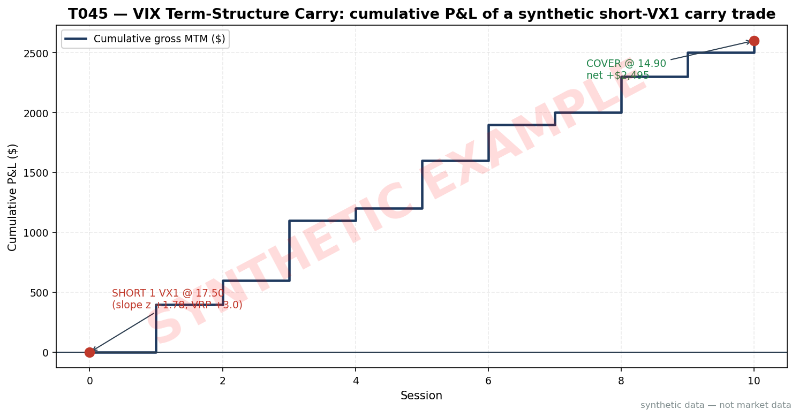

*Alt text: step chart of cumulative gross mark-to-market in dollars over eleven synthetic sessions — rising from zero to +$2,600 with entry marked "SHORT 1 VX1 @ 17.50" and exit marked "COVER @ 14.90, net +$2,495"; watermark "SYNTHETIC EXAMPLE"; corner caption "synthetic data — not market data".*

### T10. Sources

1. Carr, P. & Wu, L. (2009). "Variance Risk Premiums." *Review of Financial Studies* 22(3), 1311–1341 — documents negative average returns to long 30-day variance swaps (a positive premium to the short side) across major equity indexes; the academic backbone of harvesting short-vol carry. http://ideas.repec.org/a/oup/rfinst/v22y2009i3p1311-1341.html
2. Cboe. "Cboe Volatility Index — Methodology." — the official specification of how VIX is computed from SPX option strips (near/next-term interpolation to a 30-day constant maturity), which is what VIX futures converge to at settlement. https://cdn.cboe.com/resources/indices/Volatility_Index_Methodology_Cboe_Volatility_Index.pdf
3. Corsi, F. (2009). "A Simple Approximate Long-Memory Model of Realized Volatility." *Journal of Financial Econometrics* 7, 174–196. DOI: 10.1093/jjfinec/nbp001 — the HAR(1,5,22) forecast inside the VRP gate. http://hdl.handle.net/10.1093/jjfinec/nbp001
4. Motley Fool (2018-02-06). "The Simple Math Behind the Inverse Volatility ETF Collapse" — XIV plunged more than 80% in after-hours trading on Feb 5, 2018; Credit Suisse liquidated the product. https://www.fool.com/investing/2018/02/06/the-simple-math-behind-the-inverse-volatility-etf.aspx
5. Nasdaq/Zacks (2018-02-07). "Volatility Spike Triggers Inverse ETF (XIV) Closure" — the acceleration/liquidation mechanics of the XIV termination. https://www.nasdaq.com/articles/volatility-spike-triggers-inverse-etf-xiv-closure-2018-02-07
6. SLCG. "Material Misrepresentations in XIV Prospectus Led to $700 Million in Losses" — analysis estimating the XIV complex lost 97% of its value, roughly $2 billion, on February 5, 2018. https://www.slcg.com/pdf/workingpapers/Material%20Misrepresentations%20in%20XIV%20Prospectus%20Led%20to%20$700%20Million%20in%20Losses.pdf (verified live 2026-09-10: public PDF text matches the 97%/~$2bn executive-summary language)
7. This project's cost model, `notes/cost-model.md` (§6 vendor bands) — data-cost bands in T6.

**Unverified leads (from Grok, not independently checked):** Grok answered Q-TB5-1..3 (2026-09-10); all claims independently verified or labeled unverified. Unverified: Grok's VRP ≥ +3 vol-point and IV-rank > 80 entry thresholds; the "Elms 2026" term-structure paper; Ni–Pearson–Poteshman (2005) 16.5 bp and Golez–Jackwerth (2012) $115m figures; Bondarenko (2014) PUT-index Sharpe 0.65 / −32.7% drawdown; Cremers–Weinbaum 64–66 bp/month and Driessen–Maenhout–Vilkov results; Barardehi–Bogousslavsky–Muravyev (2025) spread figures; Grok's claim that VX futures overstate VIX on ~92% of days; and all vendor-specific prices beyond the cost-model bands used above.

## Stage 146/200 — T046: Straddle-Implied Move Fade

*Batch TB5 · Strategy 46/100 · Signals S070, S073, S069*

*Provenance: [D/SR] — documented signals (S070/S073/S069) combined through strategy rules reconstructed for this chapter; the combination itself is synthetic, not a documented strategy.*

### T1. One-line verdict

| Field | Detail |
|---|---|
| **Style** | Event-volatility fade — sell the ATM straddle before a scheduled earnings announcement when the implied move is rich versus history and no informed flow is detected |
| **Edge source** | Variance risk premium (S069) plus the empirical shape of scheduled-news volatility (Ederington & Lee 1993); the systematic earnings-straddle overpricing claim is an operator-constructed hypothesis, not a documented result |
| **Typical holding period** | Overnight into the next session (signal afternoon t, fill t+1 open, exit morning after the announcement) |
| **Capacity hint** | Low millions of premium per event night on liquid names (single-event liquidity binds); ample for ≤$1M, a constraint institutionally |
| **Build-or-buy in one line** | Buy chain data (Tier 1 minimum); build the three-gate screener — the gates encode your risk tolerance |

### T2. Full mechanics

**Jargon, defined once.** A *straddle* is a call and a put bought (or sold) together at the same strike — here, the at-the-money (ATM) strike, the strike closest to the current stock price. The *implied move* is what the straddle's price says the market expects: `(C_ATM + P_ATM) / S`, i.e., the straddle price as a percentage of the stock price. *Unusual options activity* (UOA) means option volume that is abnormal versus its own history — potentially informed traders positioning ahead of the event. The *variance risk premium* (VRP) is the gap between implied and expected realized volatility, in vol points (percentage points of annualized volatility).

**Universe and session.** US single-name equities with listed weekly options and scheduled earnings in the next 5 sessions (*example* window). One trade per name per event; no overlapping event positions in the same underlying.

**Signal computation.** The afternoon of session t (*example* timing), from the closing chain snapshot: (1) compute the S070 implied move `IM = (C_ATM + P_ATM) / S` on the expiry spanning the event, using mid quotes; (2) z-score it against the name's trailing 12 events' (*example*) implied moves: `richness_z = (IM − μ_L) / σ_L`; (3) compute the S073 screen — per-contract `U = volume / median(volume, trailing 20 days)` (*example*), flagging any contract with `U ≥ 3` (*example*) or volume/OI ≥ 1.5 (*example*), and scan the time-and-sales for ask-side multi-exchange sweeps; (4) compute the S069 VRP as `IV − HAR_forecast` in vol points, where IV is the ATM implied volatility of the event expiry. The fill is at the t+1 open, before the announcement.

**Entry (causal).** If `richness_z ≥ +1.0` (*example* — the market is pricing an unusually large move), **and** the UOA screen is clean (no flagged contracts, no sweeps — i.e., no evidence of informed positioning), **and** `VRP ≥ +1.0` vol points (*example* — volatility is rich in general, not just this event), then sell 1 ATM straddle at the bid (the worse side, deliberately) at the next session's open (t+1), before the announcement. Signal computed on the afternoon snapshot at t; fills at t+1 — never on the same session's prints that generated the signal. The causality that matters here is *before the news*: the fill at t+1 still precedes the announcement. No entry if the announcement is within 2 hours of the open (*example*) — overnight gap risk without a full session to adjust is not this strategy.

**Exits.** Buy back the straddle at the ask the morning after the announcement (*example*: within the first 30 minutes of the regular session) — the event move is known, the remaining time value belongs to someone else's thesis. Stop-loss: if the straddle's mark reaches 1.5× the credit collected (*example*), cover immediately — the realized move is running hotter than the priced move and the edge is gone. Event-risk abort: if the announcement is delayed or rescheduled, exit at the next available ask — never hold short premium into an unscheduled information vacuum.

**Sizing and risk.** Premium collected ≤ 2% of strategy equity per event (*example*); maximum 3 concurrent event positions (*example*); no two positions in the same sector on the same night (*example* — earnings cluster by sector and so do surprises). The stop at 1.5× credit defines the worst planned loss per trade at 3% of equity (*example*); the *unplanned* worst case is a gap that blows through the stop, which is why the per-trade cap is small.

**Explicit costs.** Commissions: 4 legs × $0.65 = $2.60 per round trip (*example*). Spread: selling at the bid and buying back at the ask surrenders the full quoted spread on the straddle — in the worked example, $0.30 on a $9.00 straddle, i.e., ~3.3% of premium each way of thinking about it. Assignment risk on American-style options is a real cost line: a short call that goes deep in the money can be assigned early, converting the position into short stock over the weekend — the mitigation is to close, not to model it away.

**Execution.** Single-exchange or smart-routed limit orders at the bid (entry) and ask (exit); no legging — both sides go as one straddle order so a partial fill cannot leave a naked leg. Reconcile fills against the chain snapshot that evening.

### T3. Signals it consumes

| Signal | Role in this strategy | Key formula carried over |
|---|---|---|
| S070 Straddle-implied move | Richness measure: is the priced move extreme vs history? | `ImpliedMove = (C_ATM + P_ATM) / S`; `edge_t = ImpliedMove_t − M_realized,t`; `z = (edge − μ_L)/σ_L` |
| S073 Unusual options activity | Informed-flow veto: skip if smart money is positioning | `U_{i,t} = V_{i,t}/median(V_{i,t-20:t-1})`; signed-delta proxy `F_t = Σ_j q_j Δ_j M_j` |
| S069 Variance risk premium | Regime gate: trade only when vol is rich overall | Desk shorthand `IV_t^ann − E_t[RV_{t,T}^ann]` in vol points |

```pseudocode
# Straddle-implied move fade — 22 lines
chain = closing_snapshot(event_expiry)                        # bid/ask/mid, volume, OI
IM    = (call_ATM_mid + put_ATM_mid) / stock_price            # S070
rich_z = (IM - mean(IM_last_12_events)) / std(IM_last_12_events)
for contract in chain:                                        # S073 screen
    U = volume / median(volume, 20d)
    flag if U >= 3.0 or volume/OI >= 1.5                      # example cutoffs
sweeps = scan_ask_side_multi_exchange_sweeps(today)
vrp = atm_IV - har_forecast()                                 # S069, vol points
if rich_z >= 1.0 and no flags and sweeps == 0 and vrp >= 1.0: # example gates
    sell 1 ATM straddle @ bid, at next session open (t+1)   # uncapped-tail entry: naked short straddle
after announcement:
    buy back @ ask within first 30 min                        # exit into the news
    if straddle_mark >= 1.5 * credit: cover now               # stop: move > priced move
    if event delayed: exit @ next ask                         # abort unscheduled risk
```

### T4. Worked example — numbers + P&L (SYNTHETIC)

**Setup.** Synthetic earnings event for fictional "QRS" (seed **146**, printed by `batches/TB5/plot_T046.py`; all numbers synthetic). Afternoon of session t (signal): S = $150.00, ATM call mid $4.60, ATM put mid $4.40, quoted straddle spread $0.30. Trailing 12-event implied moves: 3.18, 3.74, 3.35, 2.34, 4.62, 3.27, 2.01, 2.38, 2.86, 2.82, 3.20, 2.29 (%) → mean 3.01%, std 0.69%.

**The gates.** Implied move = 9.00 / 150.00 = **6.00%**. Richness z = (6.00 − 3.01) / 0.69 = **+4.31** ≥ +1.0 ✓. UOA screen: max volume/OI 0.8 (< 1.5 *example*), zero ask-side sweeps → clean ✓. VRP: ATM IV 32% − HAR forecast 27% = **+5 vol points** ≥ +1 ✓. All three gates pass on the afternoon-t snapshot → **sell 1 ATM straddle at the t+1 open bid: 9.00 − 0.15 = $8.85** (the example holds the overnight print flat for hand-computation).

**After the announcement.** Stock moves +1.8% to $152.70 — a real move, but far inside the priced 6.00%. Straddle mark collapses to $2.10 mid; buy back at the ask: 2.10 + 0.15 = **$2.25**.

**Line-by-line P&L.**
- Gross: (8.85 − 2.25) × 100 = **+$660.00**
- Commissions: 4 × $0.65 = **$2.60**
- Total costs: **$2.60** (spread already embedded in the bid/ask fills)
- **Net P&L: +$660.00 − $2.60 = +$657.40**

**A note of honest optimism.** This example shows the trade working exactly as designed: rich premium, no informed flow, a modest realized move, and a clean exit. The failure case the example hides is the +9% gap — a move 1.5× the priced move that blows through the stop before the opening print, turning the +$657 into a four-figure loss with no chance to adjust. The chart below is the script's own accounting of this tape — a consistency check, not evidence.

### T5. Data & infra — what must run

**Pipeline.** Daily: ingest the full options chain snapshot (at least the event expiry, ideally the whole chain) with bid/ask, volume, and open interest; store per underlying per date. Pre-event: run the three-gate screen on the afternoon snapshot; stage the order. Post-event: morning exit, fill reconciliation, and a post-mortem log (implied vs realized, gate values) that becomes the trailing history for the next event.

**Storage.** A full SPX chain snapshot runs ~100–300 MB (cost-model §3); single-name chains are far smaller, but a year of daily snapshots across 200 event names is still tens of gigabytes — stream and persist selectively (event expiries only), per cost-model §3 guidance. Keep the live working set under ~77 GB.

**M5 Max feasibility.** Feasible for the research and screening workload: chain snapshots are Polars-friendly tabular data, and the per-event math is trivial. Full OPRA-scale work (every strike, every quote) is the cost-model's Tier H (60–200 h, $9,000–30,000 at $150/h) — this strategy deliberately avoids that by screening only event expiries, which keeps it in the M+ harness band (40–100 h, $6,000–15,000).

**Feed-outage safe mode.** If the afternoon chain snapshot is stale or missing, no entry — a short-premium trade entered on yesterday's quotes is not a strategy, it's a guess. If the morning-after exit cannot be executed (halt, data outage), the position stays with the 1.5×-credit stop as a standing order and the desk is alerted; never leave a short straddle unmanaged into a second session.

### T6. Buy vs build

| Route | Cost band | Verdict |
|---|---|---|
| Tier 0: delayed options quotes | $0 (indicative — verify before budgeting) | Screen research only; 15-minute delay is unusable for bid/ask fills. |
| Tier 1: retail options chains with greeks (vendor bands per cost-model §6: roughly $30–200/mo) | $30–200/mo (indicative — verify before budgeting) | **Buy the chain feed, build the screener.** End-of-day plus afternoon snapshots suffice. |
| Tier 2: intraday OPRA-class data for the sweep scan (~$200/mo + usage) | $200/mo + usage (indicative — verify before budgeting) | Only if the S073 sweep detection must run intraday rather than on the afternoon snapshot. |
| Options analytics vendor (precomputed IV, sweeps, UOA flags) | vendor-quoted (indicative — verify before budgeting) | Consider for the sweep/UOA leg — that detection is the hardest part to build well; but verify their flag definitions against S073 before trusting them. |

**Verdict:** buy chain data (Tier 1 minimum), build the three-gate screener yourself — the gates encode *your* risk tolerance. Rent or buy the sweep-detection leg if building it would take longer than one earnings season.

### T7. Success-ratio evidence

**Documented.** Ederington & Lee (1993) study scheduled macro announcements in futures markets and find that most of the price adjustment happens within the first minute, with volatility staying elevated for roughly 15 minutes afterward — the empirical shape this strategy bets on: a fast, finite burst of realized movement, after which the remaining implied premium decays. Pan & Poteshman (2006) provide the honest counterweight on the UOA leg: using *non-public* option volume data (open-buy put/call ratios), they find next-day spreads over 40 bp and next-week spreads over 1% between high- and low-activity stocks from 1990–2001. That is genuine evidence that informed option flow predicts returns — and genuine evidence that a public sweep scanner is a degraded proxy for it, because the public tape cannot distinguish opening from closing prints in real time (S073's own caveat). What the cited sources do *not* establish is systematic overpricing of earnings straddles: Ederington & Lee study macro futures announcements (not single-name earnings), and Pan & Poteshman study non-public option volume predicting returns (not a traded straddle fade). The claim that event implied moves systematically overprice the typical realized move is therefore an **operator-constructed hypothesis requiring validation**, not a documented result. The UOA screen's job is mostly to veto the occasions when someone knows something.

**Costs.** The spread is the dominant cost: surrendering the full quoted spread on entry and exit can consume 5–10% of the collected premium on liquid names and far more on wide ones. This is why the richness gate exists — a 6% priced move against a 3% typical move (the worked example) has room for the spread; a 4.5% priced move against a 4% typical move does not.

**Capacity.** Single-event liquidity bounds it: selling more than a few hundred straddles moves the very bid you're trying to hit. Realistic capacity is in the low millions of premium per event night for liquid names — ample for a ≤$1M operation, a constraint for an institutional book.

**Decay.** Event premia are competed away slowly because the tail risk is real and scares off capital — but the UOA edge, such as it is from public data, decays as sweep-detection tooling commoditizes. Expect the richness gate to need periodic recalibration, not the concept to die.

**Conclusion.** ≤$1M paper operation: trade it occasionally, tiny, with the stop pre-entered — it is a positive-expectancy lottery ticket in reverse, and reverse lottery tickets still have variance. Paper-trade at least two full earnings seasons before sizing up. Institutional: run it as a diversified event sleeve (dozens of names per season), because a single gap is career risk and a portfolio of gaps is statistics.

### T8. Failure modes

1. **The gap beyond the priced move.** A genuine surprise — fraud revelation, guidance withdrawal — gaps the stock 2× the implied move; the stop fills far beyond 1.5× credit. *Mitigation:* the per-trade 2%-of-equity cap is sized for the gap, not the stop; sector diversification across event nights.
2. **Informed flow the screen misses.** The public tape cannot separate opening from closing prints (S073), so a sophisticated informed trader spreading flow across exchanges looks like noise. *Mitigation:* treat the UOA screen as a veto with known blind spots, not a detector — and require the richness gate to be high enough to compensate.
3. **Event rescheduling.** The announcement slips a day; you hold short premium into an unscheduled window. *Mitigation:* the abort rule — exit at the next ask on any schedule change, no exceptions.
4. **Early assignment.** American-style short calls deep in the money can be assigned before expiry, converting the trade into short stock. *Mitigation:* close positions where either leg goes beyond 3 delta-depths in the money (*example*), rather than holding to expiry.
5. **Liquidity mirage at the exit.** The morning-after chain can be wide and thin; the "ask" you modeled is not the ask you get. *Mitigation:* model exits at mid + 0.75× spread (*example*) in backtests, not at the ask; abort the trade pre-entry if the quoted spread exceeds 8% of the straddle mid (*example*).
6. **Pin risk.** The stock closes exactly at the strike; the short call and put both expire with ambiguous exercise. *Mitigation:* never hold into expiry — the exit is the morning after the event, full stop.
7. **Macro-event collision.** An FOMC decision or CPI print lands the same morning as the earnings, and the realized move reflects both. *Mitigation:* check the macro calendar at screening; skip events within 24 hours of a top-tier macro release (*example*).

### T9. Visuals

```mermaid
flowchart LR
    A[Chain snapshot<br/>event expiry, afternoon pre-event] -->|per event| B[Implied move<br/>S070: (C+P)/S, per event]
    B -->|per event| C[Richness z<br/>vs trailing 12 events, per event]
    A -->|per event| D[UOA screen<br/>S073: U, vol/OI, sweeps, per event]
    A -->|per event| E[VRP gate<br/>S069: IV − HAR, per event]
    C -->|per event| F{All gates pass? (*example*)<br/>z ≥ 1.0, clean UOA, VRP ≥ 1}
    D -->|per event| F
    E -->|per event| F
    F -->|yes| G[Sell 1 ATM straddle<br/>at bid, t+1 open (pre-announcement)]
    G -->|fills| H[Exit: buy back @ ask<br/>morning after; 1.5× stop]
    H -->|per trade| I[P&L<br/>(credit − debit) × 100 − commissions]
    F -->|no| J[No trade<br/>premium not rich or flow informed]
```

*Alt text: flow diagram of the T046 event-volatility strategy — the pre-event chain snapshot feeds the S070 implied-move richness z-score, the S073 unusual-activity screen, and the S069 VRP gate; passing all three triggers selling one ATM straddle at the bid before the announcement, with exit the morning after at the ask (or a 1.5×-credit stop), flowing to per-contract P&L.*

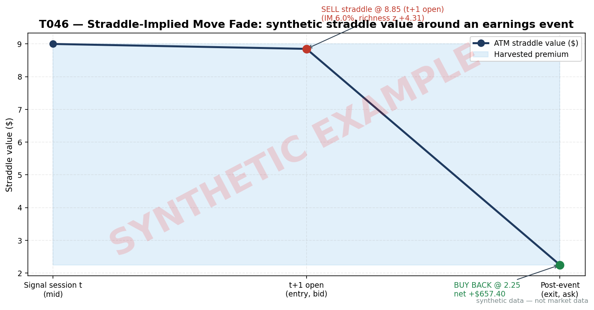

*Alt text: line chart of a synthetic ATM straddle's value across an earnings event — $9.00 pre-event mid, sold at the $8.85 bid, collapsing to a $2.25 ask buyback after a +1.8% stock move, with the harvested premium shaded and net +$657.40 annotated; watermark "SYNTHETIC EXAMPLE"; corner caption "synthetic data — not market data".*

### T10. Sources

1. Ederington, L. H. & Lee, J. H. (1993). "How Markets Process Information: News Releases and Volatility." *Journal of Finance* 48(4), 1161–1191 — scheduled news: most price adjustment within the first minute, volatility elevated ~15 minutes; the empirical shape behind fading event premium after the news. http://ideas.repec.org/a/bla/jfinan/v48y1993i4p1161-91.html
2. Pan, J. & Poteshman, A. M. (2006). "The Information in Option Volume for Future Stock Prices." *Review of Financial Studies* 19(3), 871–908 — non-public open-buy put/call ratios predicted >40 bp next-day and >1% next-week return spreads (1990–2001); the honest benchmark showing informed option flow exists but is not reproducible from public prints. http://hdl.handle.net/10.1093/rfs/hhj024
3. Cboe. "Cboe Volatility Index — Methodology." — the model-free variance construction from SPX option strips that underlies the IV side of the VRP gate. https://cdn.cboe.com/resources/indices/Volatility_Index_Methodology_Cboe_Volatility_Index.pdf
4. This project's cost model, `notes/cost-model.md` (§3 storage guidance, §5 engineering bands, §6 vendor bands) — storage, harness sizing, and data-cost bands in T5/T6.

**Unverified leads (from Grok, not independently checked):** Grok answered Q-TB5-1..3 (2026-09-10); all claims independently verified or labeled unverified. Unverified: Grok's straddle entry/exit timing rules, its "IV rank > 80 / IV/RV ≥ 1.15" filters, the Elms (2026) term-structure claim, Ni–Pearson–Poteshman (2005) and Golez–Jackwerth (2012) figures, Bondarenko (2014) PUT-index statistics, Cremers–Weinbaum and Driessen–Maenhout–Vilkov results, Barardehi–Bogousslavsky–Muravyev (2025) spread figures, and all vendor-specific prices beyond the cost-model bands used above.

## Stage 147/200 — T047: Risk-Reversal Skew Momentum

*Batch TB5 · Strategy 47/100 · Signals S071, S072, S073*

*Provenance: [D/SR] — documented signals (S071/S072/S073) combined through strategy rules reconstructed for this chapter; the combination itself is synthetic, not a documented strategy.*

### T1. One-line verdict

| Field | Detail |
|---|---|
| **Style** | Skew-momentum direction filter — short the underlying on sharp risk-reversal steepening confirmed by put/call flow, cover on mean-reversion |
| **Edge source** | Option-implied (ex ante) skewness carries cross-sectional return information (Conrad–Dittmar–Ghysels 2013); the day-to-day ΔRR momentum overlay is practitioner craft |
| **Typical holding period** | Days (exit on z through 0, 5-session max hold, or 2.5% adverse stop, *example*) |
| **Capacity hint** | Large as an equity-direction filter (inherits the underlying's liquidity); tens of $mm as a pure skew-momentum book (adverse selection binds) |
| **Build-or-buy in one line** | Buy greeked chains (Tier 1, ~$30–200/mo); build the ΔRR/PCR/flow logic — and confirm the vendor's RR sign convention in writing |

### T2. Full mechanics

**Jargon, defined once.** A *risk reversal* (RR) is the difference between the implied volatility of an out-of-the-money call and an equally out-of-the-money put — here at 25 delta (options whose delta, the hedge ratio, is 0.25). *Skew* is the general name for IV differing across strikes; equity index skew typically means downside puts trade richer (higher IV) than upside calls. *Skew steepening* means puts getting relatively richer (RR falling); *flattening* means the gap closing (RR rising). The *put/call ratio* (PCR) is put volume (or open interest) divided by call volume — a positioning gauge. *Unusual options activity* (UOA) is volume abnormal against its own history, signed by trade direction.

**Sign convention (explicit, as S071 requires).** This chapter uses the desk convention `RR25 = IV_call,25Δ − IV_put,25Δ`. Negative RR25 means downside puts are richer than upside calls — the normal state of equity index options. A *falling* RR25 (more negative) = steepening fear; a *rising* RR25 = complacency returning. Every downstream rule keys off this convention; mixing it up inverts the strategy.

**Universe and session.** Liquid US equities and ETFs with listed options and reliable 25-delta quotes — in practice the top 200 optionable names (*example*). Daily signal cadence, computed from the closing chain; equity execution in the regular session.

**Signal computation.** Each evening: (1) interpolate the S071 25-delta call and put IVs from the front-month (*example* expiry, 20–40 days to expiry) chain and compute `RR25 = IV_call − IV_put`; (2) compute the daily change `ΔRR25` and z-score it against its trailing 20-day (*example*) history of changes; (3) compute the S072 PCR (volume-based) normalized by its trailing median and 1.4826×MAD (*example* robust scale), and the S073 signed-delta flow `F_t = Σ_j q_j Δ_j M_j` to check whether the skew move is backed by actual put buying (negative `F_t`) rather than a quote artifact.

**Entry (causal).** At the next open (signal at t, fill at t+1): if `z(ΔRR25) ≤ −2.0` (*example* — a sharp steepening) **and** the S073 flow confirms (`F_t` negative and |F_t| above its own 20-day median, *example*) **and** PCR is rising, short the underlying equity. If `z(ΔRR25) ≥ +2.0` (*example* — sharp flattening) with confirming call-side flow, go long. The conjunction matters: skew can steepen on a quote widening with no flow behind it, and flow alone without a skew move is just noise.

**Exits.** Cover/exit when `z(ΔRR25)` crosses back through 0 (*example* — the change has mean-reverted), or after 5 sessions (*example* max hold — skew momentum is a days-scale phenomenon), or on a 2.5% adverse move in the underlying (*example* stop — the skew was right about direction but wrong about your timing, which is the same thing as being wrong).

**Sizing and risk.** Fixed fractional: 2,000 shares per $100,000 of equity per position (*example*), i.e., roughly $175k notional on an $88 stock — sized so the 2.5% stop costs ~4.4% of equity per trade (*example*). Maximum 5 concurrent skew positions (*example*); no two in the same sector on the same signal day (*example* — index-level fear steepens every name's skew at once, and five "independent" shorts into a market bounce is one big short).

**Explicit costs.** Underlying leg: 2 bp spread each way (*example*) plus $0.005/share/side commission (*example*). If the expression is via a defined-risk option spread instead (e.g., a put spread in the steepening direction), budget the full options bid-ask on both entry and exit — typically an order of magnitude worse than the equity leg, which is why the worked example uses the underlying.

**Execution.** Equity marketable limit orders at the open; the signal is computed on the prior evening's chain, so there is no race. Recompute RR25, ΔRR z, PCR, and flow each evening from the fresh chain; never trade on a stale chain (a holiday-thinned chain produces phantom skew moves).

### T3. Signals it consumes

| Signal | Role in this strategy | Key formula carried over |
|---|---|---|
| S071 Risk-reversal skew | The momentum input: `ΔRR25` z-scored | `RR_25 = IV_call,25Δ − IV_put,25Δ` (negative = puts richer) |
| S072 Put/call ratio | Confirmation: is positioning actually shifting? | `PCR_vol = V_put/V_call`; robust norm via trailing median and `1.4826×MAD` |
| S073 Unusual options activity | Confirmation: is the skew move backed by signed flow? | `U_{i,t} = V_{i,t}/median(V_{i,t-20:t-1})`; `F_t = Σ_j q_j Δ_j M_j` |

```pseudocode
# Risk-reversal skew momentum — 21 lines
chain = evening_chain(expiry 20-40d)                          # delta + IV per strike
RR25  = IV_call_25d - IV_put_25d                              # S071, desk convention
dRR   = RR25 - RR25_prev_day
z     = dRR / std(dRR_last_20d)                               # example window
pcr   = put_vol / call_vol; pcr_z = (pcr - median(pcr,20d)) / (1.4826*mad(pcr,20d))  # S072
flow  = sum(q * delta * signed_multiplier for prints today)   # S073
if z <= -2.0 and flow < -median_abs_flow and pcr rising:      # example gates
    short underlying at next open                             # steepening fear
elif z >= +2.0 and flow > +median_abs_flow and pcr falling:
    long underlying at next open                              # complacency
if in_position:
    if sign(z) flipped through 0 or sessions_held >= 5: exit at next open
    if adverse_move >= 2.5%: stop out                         # example
```

### T4. Worked example — numbers + P&L (SYNTHETIC)

**Setup.** Synthetic 8-session tape for fictional "WXY" (seed **147**, printed by `batches/TB5/plot_T047.py`; all numbers synthetic). RR25 in vol points, desk convention (negative = puts richer). Trailing 20-day ΔRR history: std 1.030 vol points.

| Session | RR25 | ΔRR | z(ΔRR) | WXY price ($) |
|---|---|---|---|---|
| 0 | −4.0 | — | — | 90.20 |
| 1 | −3.8 | +0.2 | +0.19 | 89.90 |
| 2 | −4.2 | −0.4 | −0.39 | 89.50 |
| 3 | −6.8 | −2.6 | −2.53 | 88.40 |
| 4 | −7.2 | −0.4 | −0.39 | 87.30 |
| 5 | −6.5 | +0.7 | +0.68 | 86.60 |
| 6 | −5.0 | +1.5 | +1.46 | 86.15 |
| 7 | −4.6 | +0.4 | +0.39 | 86.40 |

Session 4 opens at **$87.55** — its own t+1 print, distinct from the session-3 close of $88.40.

**Session 3:** RR25 collapses from −4.2 to −6.8 — downside puts suddenly 2.6 vol points richer. `z = −2.6/1.030 = −2.53 ≤ −2.0` ✓. Confirming reads (*example*): S073 signed-delta flow −$1.2M (net put buying), PCR rising 1.1 → 1.4. All gates pass on the session-3 close → **short 2,000 shares at the session-4 open print of $87.55** (t+1 — a distinct print from the $88.40 close).

**Session 6:** ΔRR z = +1.46, crossed back through 0 — the steepening has mean-reverted → **cover at $86.15**.

**Line-by-line P&L.**
- Gross: 2,000 × (87.55 − 86.15) = **+$2,800.00**
- Spread: 2 × (1 bp × 2,000 × $87.55 / 10,000) = **$35.02**
- Commissions: 2 × $0.005 × 2,000 = **$20.00**
- Total costs: **$55.02**
- **Net P&L: +$2,800.00 − $55.02 = +$2,744.98**

**A note of honest optimism.** This tape is generous: the skew move leads the equity drift by a full session, the confirmation reads agree, and the exit triggers at the local low. In practice the equity move often *precedes* the skew repricing — you short the fear after the price has already fallen, which is just expensive trend-following. The chart below is the script's accounting of this tape — a consistency check, not evidence.

### T5. Data & infra — what must run

**Pipeline.** Daily: ingest the options chain with delta and IV (or raw quotes plus an IV solver), compute RR25 per name per expiry, store the daily panel. Evening batch: compute ΔRR z-scores, PCR normalization, and the S073 signed-flow aggregates from the day's prints. The equity execution leg is standard.

**Storage.** Daily chain panels for 200 names are megabytes per day — trivial. The prints data for the S073 flow leg is the heavier piece; aggregate to signed-delta flow per name per day at ingest and discard the raw prints after reconciliation (or keep 90 days, *example*).

**M5 Max feasibility.** Comfortable: the daily panel math is small, and an IV solver over a few hundred strikes per name is seconds of compute. Keep the live working set under ~77 GB (cost-model §3) — the actual set here is a few GB. This is an M+ harness (40–100 h, $6,000–15,000 at $150/h, per cost-model §5) if the IV interpolation and flow aggregation are built from raw chains; less if the vendor supplies greeks.

**Feed-outage safe mode.** If the evening chain is missing or stale for a name, that name's skew signal is frozen — no new entries, existing positions keep their time/adverse-move stops. If prints data is missing, the S073 confirmation is treated as failed (no confirmation, no entry) rather than assumed.

### T6. Buy vs build

| Route | Cost band | Verdict |
|---|---|---|
| Tier 0: delayed chains, no greeks | $0 (indicative — verify before budgeting) | Unusable — you need delta/IV to build RR25. |
| Tier 1: retail chains with greeks (vendor bands per cost-model §6: roughly $30–200/mo) | $30–200/mo (indicative — verify before budgeting) | **Buy the chains, build the tracker.** Precomputed delta/IV removes the solver work; the ΔRR z-score logic is yours. |
| Tier 2: intraday OPRA-class prints for the flow leg (~$200/mo + usage) | $200/mo + usage (indicative — verify before budgeting) | Only if the S073 confirmation must run intraday; the daily version works on Tier 1 prints summaries. |
| Analytics vendor "skew signal" | vendor-quoted (indicative — verify before budgeting) | Verify their RR sign convention matches yours before anything else — a flipped convention inverts every trade. |

**Verdict:** buy greeked chains (Tier 1), build the ΔRR/PCR/flow logic in-house. The single most important line item is not a price but a definition: confirm the vendor's RR sign convention in writing.

### T7. Success-ratio evidence

**Documented.** Dennis & Mayhew (2002) study risk-neutral skewness from stock options and document its drivers — firm beta, the volatility environment, and market conditions explain much of the cross-sectional variation. Their honest non-result is directly relevant: they find *no robust relationship* between risk-neutral skewness and the put/call ratio. That is a documented warning against the PCR-confirmation leg of this strategy: if skewness and PCR are not robustly related in the academic record, a strategy that requires both to agree is stacking two weakly-linked conditions — it will trade rarely, and rarity is not the same as edge. Bakshi, Kapadia & Madan (2003) document that individual equity options' risk-neutral distributions are *less* negatively skewed than index options', with the index skew largely reflecting a correlation risk premium — useful context: index skew momentum and single-name skew momentum are different phenomena, and this strategy's parameters should not be shared across them. Conrad, Dittmar & Ghysels (2013) document that option-implied (ex ante) skewness contains information for the cross-section of expected stock returns — the closest academic support for trading on skew. Note carefully what it supports: the *level* of implied skewness predicting returns, not day-to-day *momentum in changes* of the risk reversal. The ΔRR timing overlay is practitioner craft, marked *example* throughout this chapter, not a tested parameter.

**Costs.** The equity-leg expression keeps costs honest (about $55 on a $2,800 gross in the worked example). Expressed via option spreads, the bid-ask on four legs can erase the edge on all but the largest skew moves — which is why the base version trades the underlying.

**Capacity.** As an equity-direction filter it inherits the underlying's liquidity; capacity is large. As a pure skew-momentum book it is bounded by the same adverse-selection logic as any sentiment strategy — tens of millions, not hundreds.

**Decay.** Sentiment signals decay as the measurement commoditizes: when every desk watches ΔRR, the move from signal to price compresses. The documented skew *level* effect (Conrad–Dittmar–Ghysels) is slower-moving and likely more durable than the *change* momentum traded here.

**Conclusion.** ≤$1M paper operation: use skew momentum as a confirming filter on equity trades you already wanted to make — never as the sole reason to short into fear. Paper-trade it for at least a quarter before trusting the confirmation leg, and log every veto it casts; a filter that never fires is decoration. Institutional: run it as a skew overlay with its own P&L attribution so the ΔRR timing overlay can be evaluated separately from the documented level effect.

### T8. Failure modes

1. **The skew move lags the price move.** Equity falls 3%, *then* puts reprice richer — the signal fires after the move, and the short is just late trend-following into a bounce. *Mitigation:* require the skew move to *lead* — enter only if the underlying's same-day move is less than half the trailing 20-day daily range (*example*); otherwise the information is already in the price.
2. **Sign-convention inversion.** A vendor or a new hire computes RR as put-minus-call; every rule inverts silently. *Mitigation:* a unit test asserting RR25 < 0 for SPX on any normal day, run on every data refresh — the cheapest test in this book.
3. **Quote artifact, not flow.** Skew "steepens" because the call side widened on thin quotes, with no trade behind it. *Mitigation:* the S073 flow confirmation is mandatory, not advisory; no flow, no trade.
4. **UOA blindness from public prints.** Per S073's own caveat, the public tape cannot separate opening from closing volume — a "put buying sweep" can be a long holder closing. *Mitigation:* treat confirmation as weak evidence; size the position for the skew signal alone, not for the story the flow tells.
5. **Index vs single-name confusion.** Index skew steepens on correlation fear; single-name skew steepens on borrow-cost spikes, dividends, or takeover rumors — different causes, different implications. *Mitigation:* separate parameter sets and separate evaluation for index/ETF underlyings versus single names (per Bakshi–Kapadia–Madan, they are different phenomena).
6. **Mean-reversion vs momentum regime.** Skew changes momentum-trade in panics and mean-revert in calm markets; a fixed z-threshold does both badly in the wrong regime. *Mitigation:* gate the strategy on the VIX regime — trade ΔRR momentum only when VIX is above its 60-day median (*example*), stand down otherwise.
7. **Crowded fear.** Everyone's skew screen fires on the same day; the underlying gaps down at the open and your "next open" fill is the worst print of the week. *Mitigation:* limit orders with a 1% participation cap (*example*); if the open gaps beyond 2% (*example*) against the intended direction, cancel — the edge belonged to yesterday's close.

### T9. Visuals

```mermaid
flowchart LR
    A[Evening chain<br/>delta + IV, per name] -->|per evening| B[RR25 & ΔRR z<br/>S071, per evening]
    A -->|per evening| C[PCR normalized<br/>S072, per evening]
    D[Options prints<br/>signed, per day] -->|per day| E[Delta flow F_t<br/>S073, per day]
    B -->|per evening| F{Gates pass? (*example*)<br/>|z| ≥ 2.0, flow + PCR confirm}
    C -->|per evening| F
    E -->|per day| F
    F -->|yes| G[Equity position<br/>short on steepening, long on flattening]
    G -->|fills| H[Execution<br/>next open, marketable limit]
    H -->|per trade| I[Exits: z through 0 (*example*),<br/>5-day max (*example*), 2.5% stop (*example*)]
    I -->|per trade| J[P&L<br/>equity leg − spread − commission]
    F -->|no| K[Flat<br/>skew move unconfirmed]
```

*Alt text: flow diagram of the T047 skew-momentum strategy — the evening chain feeds the S071 risk-reversal change z-score and the S072 normalized put/call ratio, while signed daily prints feed the S073 delta-flow confirmation; passing all gates opens an equity position at the next open, with exits on z-score mean-reversion, a five-day max hold, or a 2.5% adverse stop, flowing to equity P&L.*

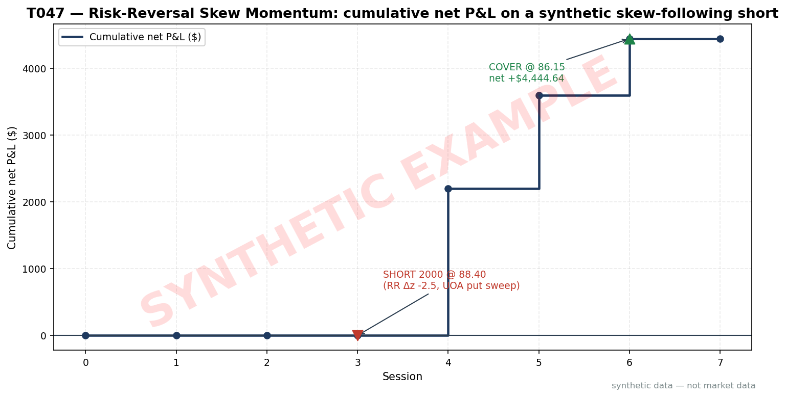

*Alt text: step chart of cumulative net P&L in dollars over eight synthetic sessions — flat until session 3, stepping at the session-4 t+1 fill (87.55), then rising through sessions 5–6 as the short profits, ending at +$2,744.98; entry marked "SHORT 2000 @ 87.55" and exit "COVER @ 86.15"; watermark "SYNTHETIC EXAMPLE"; corner caption "synthetic data — not market data".*

### T10. Sources

1. Dennis, P. & Mayhew, S. (2002). "Risk-Neutral Skewness: Evidence from Stock Options." *Journal of Financial and Quantitative Analysis* 37(3), 471–493 — documents the drivers of risk-neutral skewness and the honest non-result: no robust relationship between skewness and the put/call ratio, a direct caveat on the PCR-confirmation leg. https://ideas.repec.Org/a/cup/jfinqa/v37y2002i03p471-493_00.html
2. Bakshi, G., Kapadia, N. & Madan, D. (2003). "Stock Return Characteristics, Skew Laws, and the Differential Pricing of Individual Equity Options." *Review of Financial Studies* 16(1), 101–143 — individual risk-neutral distributions are less negatively skewed than the index's; index skew reflects a correlation risk premium. Keep index and single-name calibrations separate. https://EconPapers.RePEc.org/article/ouprfinst/v_3a16_3ay_3a2003_3ai_3a1_3ap_3a101-143.htm
3. Conrad, J., Dittmar, R. F. & Ghysels, E. (2013). "Ex Ante Skewness and Expected Stock Returns." *Journal of Finance* 68(1), 85–124 — option-implied (ex ante) skewness contains information for the cross-section of expected stock returns; supports trading on skew *levels*, while the ΔRR *momentum* overlay here remains practitioner craft. https://doi.org/10.1111/j.1540-6261.2012.01795.x (verified live 2026-09-10: DOI resolves to the published article; AFA issue listing independently confirms vol. 68, pp. 85–124)
4. This project's cost model, `notes/cost-model.md` (§3 working-set guidance, §5 engineering bands, §6 vendor bands) — feasibility, harness sizing, and data-cost bands in T5/T6.

**Unverified leads (from Grok, not independently checked):** Grok answered Q-TB5-1..3 (2026-09-10); all claims independently verified or labeled unverified. Unverified: Grok's RR z-score and PCR-spike entry thresholds; any vendor-specific options-data or analytics prices beyond the cost-model bands used above; and Grok's Q3 performance figures (Elms 2026, Ni–Pearson–Poteshman 2005, Golez–Jackwerth 2012, Bondarenko 2014, Cremers–Weinbaum, Driessen–Maenhout–Vilkov, Barardehi–Bogousslavsky–Muravyev 2025), which are not used as evidence in this chapter.

## Stage 148/200 — T048: Put/Call Ratio Contrarian

*Batch TB5 · Strategy 48/100 · Signals S072, S097, S045*

*Provenance: [D/SR] — documented signals (S072/S097/S045) combined through strategy rules reconstructed for this chapter; the combination itself is synthetic, not a documented strategy.*

### T1. One-line verdict

| | |
|---|---|
| **Style** | Daily contrarian swing on options-order sentiment extremes: buys panic, sells euphoria |
| **Edge source** | Normalized put/call ratio (S072) flags sentiment extremes; the fade is timed by stretched intraday moves (S045) and contextualized by social/news sentiment (S097) — betting that extreme one-sided options demand mean-reverts over 1–5 sessions |
| **Typical holding period** | 1–5 sessions (*example* time stop); exits on PCR normalization, not a calendar date |
| **Capacity hint** | Liquid large-cap US equities and index ETFs; single-name equity leg is ordinary stock flow — capacity in the low hundreds of $mm of gross before the fade itself moves mid-cap closes, but the documented edge is thin and the institutional version already trades it |
| **Build-or-buy in one line** | Build the PCR normalization engine yourself on free Cboe daily data (the IP is the normalization and the veto gates, not the raw ratio); buy nothing except the bar data you already have |

### T2. Full mechanics

**Jargon first.** The *put/call ratio (PCR)* is put option volume (or open interest — contracts outstanding) divided by call volume over a session: PCR > 1 means more puts traded. *Contrarian* = trading against the crowd: buying panic, selling euphoria. *Fade* = take the opposite side of an extreme. A *z-score* is (value − typical value)/dispersion. *MAD* = median absolute deviation, an outlier-resistant dispersion measure. *Percentile rank* = the fraction of history the current reading exceeds. The *equity-only PCR* (single stocks) differs structurally from the *index PCR* (SPX/SPY): index PCR > 1 is normal (the institutional put-hedge bid); equity PCR < 1 is normal (retail call speculation) — never compare the two against one absolute threshold (see S072). *Open interest (OI)* = contracts outstanding at the close. *Delta* = an option's sensitivity to a $1 move in the underlying. *NAV* = net asset value. *Heat* = total open risk. *RTH* = regular trading hours (9:30–16:00 ET). *0DTE* = options expiring the same day.

**Universe & session.** ~100–300 liquid US large-caps (price ≥ $20, 60-day ADV ≥ $5M *example*) plus SPY/QQQ/IWM-class ETFs for the index-PCR variant. Signals computed after the close; entries at the next open — strictly causal, t → t+1. Exclusions: earnings ±2 days (*example*), FOMC/CPI days for index fades (*example*), halts, borrow above GC+200 bp (*example*) for shorts.

**Entry rule.** Compute at the close of day *t* (MASTER.md S072 formulas): volume PCR = puts traded / calls traded; optionally the delta-weighted form so deep-OTM lottery tickets do not dominate; robust z = (PCR − trailing-60-day median) / (1.4826 × MAD) (*example* windows); plus the percentile rank in the trailing 1-year distribution (*example*).

**Enter at the next open** when ALL hold (*example* thresholds): (1) **PCR extreme (S072):** |z| ≥ 2.0 AND percentile ≥ 90th (put panic) or ≤ 10th (call euphoria); (2) **stretched move (S045):** session stretched-move |z| ≥ 2.0 in the same direction as the panic — an extreme PCR without a stretched move is positioning, not a fade setup; (3) **sentiment agreement (S097):** sentiment z signed with the crowd tilt — bearish (negative) at put panic, bullish (positive) at call euphoria — with volume-z elevated. Direction: PCR z ≥ +2 → **buy**; PCR z ≤ −2 → **sell/short**. Equity-only PCR for single names, index PCR for ETFs; never mix the series.

**Exit rule** (first wins): (1) normalization — PCR z back inside ±0.5 (*example*); (2) time stop — 5 sessions (*example*); (3) stop-loss — 1.5× the 20-day ATR (*example*) or −1.2% of NAV (*example*); (4) sentiment flip — S097 z reverses sign with volume (the crowd was right).

**Position sizing.** Vol-targeted: size_i = (0.5% of NAV, *example* risk budget) / (20-day realized daily vol × entry price); max 10 concurrent names (*example*); per-name notional ≤ 5% of ADV (*example*). Portfolio heat: Σ open risk ≤ 4% of NAV (*example*); gross ≤ 2× NAV; index-ETF legs may carry 2× single-name size (*example*).

**Risk limits** (*examples*). Daily loss stop −2% of NAV ⇒ flat all fades, re-arm next session. Event blackout: no new entries 2 days before FOMC/CPI/NFP. Kill-switch: two consecutive −2% days ⇒ book flat, strategy paused pending review.

**Cost model.** Stock leg: $0.005/share commission-equivalent + 1 bp slippage on notional each way (*example* retail-ish, from the TB5 shared fee schedule). No borrow assumed — short leg restricted to GC names; specials vetoed pre-entry. Options are never traded in this strategy (the ratio is read, not bought) — applied explicitly in T4.

**Order/execution sketch.** Next-open MOO or first-15-min VWAP clip (*example*), participation ≤ 10% of the opening bin (*example*); fill assumed at the printed open in T4 (flagged optimistic). Backtest honesty: signal on day *t*'s final PCR ⇒ fill at day *t+1*'s open; never fill on *t*'s close.

### T3. Signals it consumes

| Signal | Role | Weight / logic |
|---|---|---|
| S072 — Put/call ratio | **Primary trigger** | Enter only if \|PCR z\| ≥ 2.0 AND percentile ≥ 90th / ≤ 10th (*examples*) |
| S045 — Stretched-move z-score | **Timing gate** | Enter only if session stretched-move \|z\| ≥ 2.0 (*example*) in the same direction as the crowd tilt |
| S097 — Social/media sentiment | **Context filter** | Enter only if sentiment composite z agrees in sign with the crowd tilt and volume-z is elevated (*example*) |

```pseudocode
# T048 combination logic — nightly after close; fills at next open (t -> t+1)
for i in universe:
    z72, pct72 = pcr_zscore_and_percentile(i, close_t)   # S072, L=60d, 1yr pct (examples)
    z45 = stretched_move_z(i, close_t)                  # S045 (example entry 2.0)
    z97, vol97 = social_sentiment(i, close_t)            # S097 composite
    panic  = (z72 >= 2.0 and pct72 >= 90) and (z45 <= -2.0) and (z97 <= -1.5)  # examples
    euphor = (z72 <= -2.0 and pct72 <= 10) and (z45 >= 2.0) and (z97 >= 1.5)   # examples
    if position[i] is None and (panic or euphor):
        enter (long if panic else short), size = 0.5% NAV / (rv20 * price), next open
    elif position[i] is not None:
        if abs(z72) < 0.5 or held >= 5d or adverse_move > 1.5*ATR:  # examples
            exit at next open
```

### T4. Worked example — numbers + P&L (SYNTHETIC)

All prices synthetic, **seed 148** (`rng = np.random.default_rng(148)`; regenerable via `python3 batches/TB5/plot_T048.py`). Costs: $0.005/share + 1 bp each way (*example*). T9 plots this exact path and both trades. Fictional large-cap "XLQ", 500 shares per trade. Tape (day: close, PCR z, S045 z, S097 z) — 0: 100.00, +0.4, −0.5, +0.1 · 1: 99.44, +1.1, −1.2, +0.9 · **2: 97.10, +2.6, −2.4, −2.4** ← put-panic · 3: 98.40, +0.7, −0.6, +0.5 · 4: 102.17, −0.3, +0.4, −0.2 · 5: 101.07, −0.9, +1.1, −0.8 · 6: 99.42, −1.4, +1.6, −1.2 · **7: 101.60, −2.3, +2.1, +2.1** ← call-euphoria · 8: 100.20, +0.2, +0.3, 0.0 · 9: 101.85, +0.1, −0.2, +0.3.

**Trade T1 — long fade of put panic (winner).** Signal day 2: PCR z = +2.6 (96th percentile, *example*) with stretched-down (S045 z = −2.4) and bearish social volume (S097 z = −2.4) → long **500 @ 98.40** (day-3 open, *example*). Day-4 normalization signal (PCR z = −0.3) → **sell @ 101.07** (day-5 open, *example* fill).

| Line | Calc | $ |
|---|---|---|
| Stock leg | 500 × (101.07 − 98.40) | +1,335.00 |
| Costs: 500 × $0.005 × 2 + 1 bp × 2 (example) | | −15.00 |
| **Net T1** | | **+1,320.00** |

**Trade T2 — short fade of call euphoria (loser).** Signal day 7: PCR z = −2.3 (6th percentile, *example*) with stretched-up (S045 z = +2.1) and bullish social surge (S097 z = +2.1) → short **500 @ 100.20** (day-8 open, *example*). The euphoria *continues*: day-8 PCR z = +0.2 signals normalization → exit at the day-9 open, **cover @ 101.85** (*example* fill).

| Line | Calc | $ |
|---|---|---|
| Stock leg | 500 × (100.20 − 101.85) | −825.00 |
| Costs (example) | | −15.00 |
| **Net T2** | | **−840.00** |

**Session total: +1,320.00 − 840.00 = +480.00.**

**Where the example is optimistic.** The PCR z-scores arrive pre-normalized and synchronous with the close — real PCR needs the full day's OPRA tape and the trailing median/MAD recomputed on as-of data, and the day-2/day-7 extremes are engineered: real |z| ≥ 2.0 + percentile-90 + stretched-move + sentiment-agreement conjunctions are rare (a handful per name per year, *example*). Fills are at clean opens with zero slippage beyond the modeled 1 bp — on a real panic day the open gaps through your limit. The T1 exit assumes the z-score is computable before the open — it is not (it needs the full day's tape), so exits are one day late in practice. T2's loss is small only because the synthetic continuation is mild; real euphoria continuations run the short through the stop. The +$480.00 is arithmetic illustration of the cost drag and the veto working — not a backtest, and no performance claim is made.

### T5. Data & infra — what must run

**Pipeline inventory.** Nightly: pull Cboe daily PCR (equity-only and index-only) or compute from OPRA volume; recompute 60-day median/MAD and 1-year percentile ranks on as-of data; update the 1-min bar store (S045) and the social feed (S097); emit next-open orders. Pre-open: earnings/dividend exclusion check, borrow still GC for shorts. Intraday: only the daily-loss monitor and kill-switch — this is a close-to-open book. Post-close: persist series, z-scores, decisions, fills.

**M5 Max feasibility: trivial-to-feasible (Tier L).** Per cost-model §2/§3: the daily PCR refresh over 300 names is milliseconds in polars; 300 symbols × 60 days of 1-min bars is ~7M rows, tens of MB (§3: 500 symbols × 60 days ≈ 12 MB — trivial). Engineering: 4–12 h Tier L for the normalizer + 40–100 h Tier M+ for the full harness with S045/S097 gates ≈ $600–1,800 + $6,000–15,000 loaded-cost estimate. Bottleneck: PCR data hygiene (splits in OI, the 0DTE regime shift in the distribution), not compute.

**Feed-outage safe mode.** PCR feed missing ⇒ no new entries (the primary trigger is absent); existing fades run to normalization/time-stop/stop on last-known z-scores. 1-min bar feed stale ⇒ the S045 timing gate cannot be computed ⇒ veto new entries (a fade without the stretched-move confirmation is a different, weaker strategy). Social feed down ⇒ the S097 context gate fails closed: new entries vetoed rather than assumed. Restart = flat + re-derive from the on-disk ledger; never synthesize a missing PCR z from a stale median.

### T6. Buy vs build

| Option | What you get | Indicative price | Gains | Loses |
|---|---|---|---|---|
| Tier-0: Cboe daily market statistics + Stooq/Alpaca bars | Daily PCR by product, daily/1-min bars | ~$0, *indicative — verify before budgeting* | The entire primary signal is free and official | No intraday PCR; normalization is DIY |
| Tier-1: Polygon Stocks Advanced / Alpaca SIP | Real-time SIP 1-min bars, corporate actions | ~$30–200/mo, *indicative — verify before budgeting* | Clean bars for the S045 gate | No PCR analytics |
| Tier-2: Databento Standard | OPRA volume for custom PCR splits, intraday | ~$200/mo + usage, *indicative — verify before budgeting* | Build your own intraday 0DTE-aware PCR | Overkill for a daily fade |
| Retail platform: QuantConnect/Composer-style | Backtest harness, some options data | ~$0–100/mo, *indicative — verify before budgeting* | Fast prototyping | PCR normalization + as-of series still DIY |
| Professional: ORATS / SpotGamma-class | Precomputed sentiment/PCR analytics | ~$100–599/mo, *indicative — verify before budgeting* | Skips the normalization work | Black-box gates; not your conventions |

**Verdict: buy nothing; build on Tier-0/1.** The PCR series is free from Cboe; the edge (if any) lives in the normalization and the S045/S097 veto gates — no vendor sells your conjunction. **Build if** you want the daily close-to-open fade with custom gates. **Buy analytics only if** you want to skip the 4–12 h build and accept someone else's extreme-definition. Crossover: intraday 0DTE-aware PCR needs OPRA volume (Tier-2) — buy the feed, still build the gates.

### T7. Success-ratio evidence

| Source | Market / period | Metric | Before/after cost | Caveat |
|---|---|---|---|---|
| Pan & Poteshman (2006), RFS | US options, 1990–2001 (proprietary Cboe open-buy data) | Low put/call open-buy names beat high by **>40 bp next day**, **>1% over the next week** | Before costs; academic long-short | The edge was in *non-public* open-buy classification — public volume PCR is the degraded cousin |
| Webb, Simon & Wiggins (2001), J. Futures Markets | S&P futures | Contrary sentiment indicators (PCR-family) predict futures returns | Before costs | Old sample, pre-0DTE regime |
| Cao, Li, Zhan & Zhou (2022), JFQA | US equities, "Betting Against the Crowd" | Option-trading-based contrarian sorts earn a market risk premium | Before costs (academic sorts) | SSRN working version cited in S072; not an implementable fade |

Capacity: the equity leg is plain stock — a ≤$1M paper book moves nothing in large caps; the constraint is *frequency*: real quadruple-gated setups are rare, so the strategy either trades rarely or the gates get loosened until the edge is arbitraged away. Unverified decay note (via TB5 lead, see Unverified leads): option-volume predictability is said to have attenuated as same-day reaction sped up (post-2020); 0DTE flow structurally shifted the PCR distribution (S072), so fixed thresholds trained pre-2023 are regime-stale.

**Honest bottom line.** For a ≤$1M paper operation: the cheapest options-informed strategy in the book to *learn* — free data, daily cadence, closable math — and the right vehicle for learning sentiment normalization and conjunction-gate design. But the documented after-cost edge of public PCR is thin, heterogeneous, and short-horizon; the paper operation's honest expectation is a small, infrequent edge that mostly teaches discipline. An institutional desk runs this with signed open-buy data and intraday PCR — the public-data paper book is playing the degraded cousin of that game. Do not annualize the +$480.00 synthetic session.

### T8. Failure modes & pitfalls

1. **PCR regime shift (0DTE structural break)** — 0DTE flow dominates index volume; a median/MAD calibrated on 2015–2022 mislabels normal 2026 flow as extreme. Mitigation: rolling 60-day normalization (*example*), annual re-validation of percentile bands, separate 0DTE-inclusive vs ex-0DTE series.
2. **Index vs equity PCR mix-up** — index PCR > 1 is structurally normal (put-hedge bid); fading it as "panic" is fading a standing bid. Mitigation: hard split — equity-only series for single names, index series for ETFs.
3. **Euphoria continuation** — fading call euphoria means shorting into momentum; squeezes and gamma ramps run through stops. Mitigation: the S045 gate (move already stretched), hard ATR stop (*example*), borrow-special veto pre-entry.
4. **Panic that is information** — put panic before an earnings miss is informed flow, not sentiment. Mitigation: earnings ±2-day exclusion (*example*); fresh fundamental news ⇒ veto (the S093 stale-vs-novel logic).
5. **Sentiment-manipulation pollution** — coordinated social spikes can confirm a fake panic. Mitigation: the S097 concentration diagnostic (flag campaign-dominated buckets); require options + price confirmation, never social alone.
6. **Lookahead in the normalization** — recomputing medians on revised OI/volume backfills unavailable data. Mitigation: as-of (point-in-time, unrevised) vintages only; stamp every z-score with its vintage.
7. **Rare-signal overfitting** — a handful of gated signals per name per year means threshold tuning is fitting noise. Mitigation: fix thresholds a priori (*examples*), validate on the pooled cross-section, report per-name counts honestly.
8. **Cost-model optimism on the short leg** — the stretchiest shorts go special exactly when the signal fires. Mitigation: live borrow-fee check pre-entry, specials vetoed, model a GC 25–50 bp carry floor.

### T9. Visuals

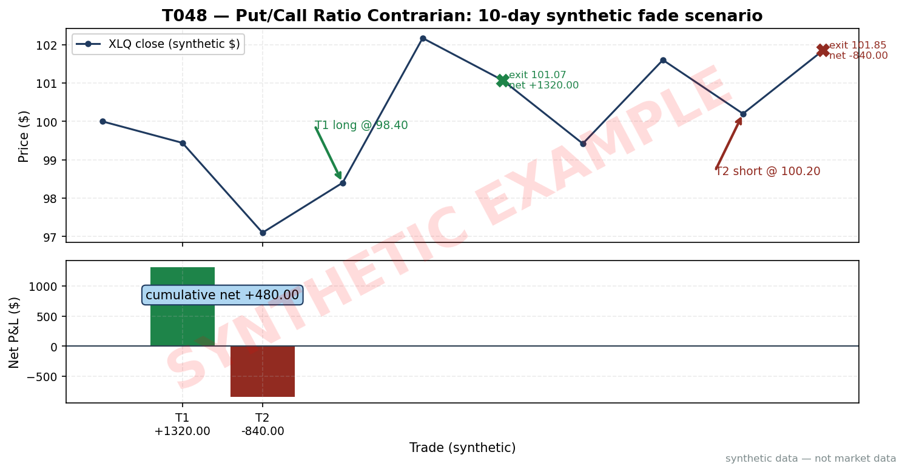

Caption: watermarked "SYNTHETIC EXAMPLE" with corner note "synthetic data — not market data". Plots the exact 10 closes from T4 (seed 148): T1's long entry/exit, T2's short entry/exit, per-trade net P&L (+1,320.00 / −840.00), cumulative net (+480.00) in the lower panel.

```mermaid
flowchart TD
    DATA["Market data<br/>Cboe daily PCR, 1-min bars, social feed"] -->|daily PCR + 1-min bars| SIGS["Signals<br/>S072 PCR z, S045 stretch z, S097 sentiment"]
    SIGS -->|"nightly after close"| ENTRY{"Entry logic<br/>|PCR z|>=2.0, pct 90/10<br/>S045 stretched, S097 agrees<br/>signal t, fill t+1 open"}
    ENTRY -->|trigger| SIZE["Sizing + risk<br/>0.5% NAV vol-target, max 10 names<br/>heat 4% NAV, daily stop -2%"]
    ENTRY -->|no trigger| WAIT["Wait"]
    SIZE -->|"next open"| EXEC["Execution<br/>MOO/VWAP clip, <=10% part.<br/>GC borrow only"]
    EXEC -->|"daily bars"| MON["Monitor + exits<br/>PCR normalize / 5d / ATR stop<br/>sentiment flip, event blackout"]
    MON -->|"daily bars"| PNL["P&L (net of 1bp + $0.005/sh)"]
    style ENTRY fill:#f9e79f,stroke:#7d6608
    style PNL fill:#a9dfbf,stroke:#1e8449
```

### T10. Sources

- Pan, J. & Poteshman, A. M. (2006). "The Information in Option Volume for Future Stock Prices." *Review of Financial Studies* 19(3), 871–908. https://ideas.repec.org/a/oup/rfinst/v19y2006i3p871-908.html — put/call open-buy volume predicts next-day and next-week stock returns; the documented core behind fading (or following) options-crowd extremes.
- Webb, R. I., Simon, D. P. & Wiggins, R. A. III (2001). "S&P futures returns and contrary sentiment indicators." *Journal of Futures Markets* 21(5), 447–462. https://ideas.repec.org/a/wly/jfutmk/v21y2001i5p447-462.html — contrary sentiment indicators (the PCR family) carry predictive content for S&P futures returns.
- Cao, J., Li, G., Zhan, X. & Zhou, G. (2022). "Betting Against the Crowd: Option Trading and Market Risk Premium." *Journal of Financial and Quantitative Analysis*. https://papers.ssrn.com/sol3/papers.cfm?abstract_id=4301015 — option-trading-based contrarian sorts and the market risk premium; the academic analogue of this strategy.
- Cboe — U.S. Options Daily Market Statistics (daily put/call ratios by product). https://www.cboe.com/us/options/market_statistics/daily/ — the free primary feed for the S072 leg.

**Unverified leads** (chatbot-provided, not independently checkable — do not treat as evidence):
- *Unverified chatbot claim* (Grok, 2026-09-10, Q-TB5-1/2/3): OPRA fee stack ($1.25 non-pro / $31.50 pro display / ~$2,000 non-display per category per month, *indicative — verify before budgeting*); vendor price bands (ThetaData $80–$160/mo, Unusual Whales API ~$625+/mo commercial, SpotGamma $99–$299/mo, ORATS $299–$599/mo — *indicative — verify before budgeting*); M5 Max Greeks throughput (60k contracts in ~20–80 ms) and snapshot storage (~1.2–2.0 GB/day at 1-min).
- *Unverified chatbot claim* (Duck.ai research lead, 2026-09-10, Q-SB8-3 #5): put/call-contrarian efficacy "statistically meaningful but generally modest, heterogeneous, strongest over short horizons" — directionally consistent with the cited literature, magnitude not verified.
- *Unverified chatbot claim* (Grok, 2026-09-10, Q-TB5-3): "JPM 2026" filtered-UOA profitability-decline-after-2020 note — no full citation captured; not used as evidence.
- *Unverified chatbot claim* (via TB5 lead, 2026-09-10): option-volume predictability fades after ~a week; public-UOA work finds profitability declined after 2020 (faster same-day reaction) — removed from the T7 evidence table; listed here only.

Source log: Grok Q-TB5-1..3 (2026-09-10); all claims verified or labeled unverified.

## Stage 149/200 — T049: Unusual Options Activity Follower

*Batch TB5 · Strategy 49/100 · Signals S073, S094, S091*

*Provenance: [D/SR] — documented signals (S073/S094/S091) combined through strategy rules reconstructed for this chapter; the combination itself is synthetic, not a documented strategy.*

### T1. One-line verdict

| | |
|---|---|
| **Style** | Intraday-to-multiday directional momentum: follows signed institutional options flow into the underlying equity |
| **Edge source** | Unusual options activity (S073) — urgent, opening-biased, ask-side sweep flow; confirmed by equity RVOL and signed block pressure (S094) and fresh news sentiment (S091) before the drift completes |
| **Typical holding period** | Intraday to 2–5 sessions (*example* time stop); flow alpha decays fast — the clock starts at the sweep |
| **Capacity hint** | Single-name large/mid caps; the equity leg is plain stock (capacity in the low hundreds of $mm), but the *option* leg it shadows cannot be cloned at size — and public sweep data is the degraded cousin of proprietary open-buy data |
| **Build-or-buy in one line** | Buy the sweep tape (Unusual Whales/Cheddar-class, *indicative — verify before budgeting*) for 90 days before writing a classifier; build only the S094/S091 confirmation gates and execution timing |

### T2. Full mechanics

**Jargon first.** *Unusual options activity (UOA)* = option volume far above its own baseline. A *sweep* = one order executed across multiple exchanges within ~a second — urgency. A *block* = a single large print, more often a hedge. *Opening* = a trade opening a new position (vs *closing*); only opening flow expresses a fresh view. *Ask-side* = printed at the ask (buyer paid up). *Vol/OI* = today's volume / prior open interest — above ~1.5–3× suggests fresh opening. *Delta* = the option's sensitivity to a $1 stock move. *RVOL* = this bar's volume vs the same time-of-day bin's average. *Lee–Ready (1991)* = quote test + tick test for signing trades. *Signed block pressure* = (buy block vol − sell block vol) / total block vol. *ATR* = average true range. *R* = initial risk (stop distance). *Flow alpha* = the predictable return component attributed to the options flow.

**Universe & session.** ~200–500 liquid US single names with listed options (price ≥ $10, option ADV ≥ 1,000 contracts *example*); **single names only** — index flow (SPX/SPY) is overwhelmingly hedging (per the TB5 lead). RTH; the sweep must print 9:45–15:00 ET (*example* — late-day sweeps cannot be confirmed before the close).

**Entry rule.** All *example* thresholds; sweep at time τ scored on the print tape (S073): (1) **Sweep screen (S073):** multi-exchange prints, same contract, ~100–300 ms; premium ≥ **$250k** single-name; filled at the **ask** for calls; volume vs trailing-20-day median ≥ 3×; **vol/OI ≥ 3**; DTE 7–45; delta 0.25–0.45; same-side repeat within 30 min raises conviction. (2) **Equity confirmation (S094):** sweep-bar 5-min RVOL ≥ 2.0 and signed block imbalance ≥ +0.3 in the sweep's direction. (3) **News confirmation (S091):** news-sentiment bucket z ≥ +2.0 with novelty ≥ 70 in the sweep's direction within 30 min.

**Entry:** do NOT chase the swept option (you pay the sweep's own impact). Buy the **underlying stock** on a 0.2–0.5% pullback (*example*) within 30–90 minutes (*example*), only if the tape has not reversed. Fills at τ+1 at the earliest — the sweep is known at τ, the *interpretation* needs the confirmation bars.

**Exit rule** (first wins): (1) target 1.5–2.0R (*example*); (2) time stop 2–5 sessions (*example*) — flow alpha decays; (3) stop-loss 1.0–1.5× ATR(14) (*example*) or −1.2% (*example*); (4) S094 reversal — block imbalance flips sign for two consecutive 15-min bins (*example*); (5) blackout — earnings tomorrow ⇒ skip entry entirely.

**Position sizing.** Risk 0.5–1.0% of NAV to the stop (*example*): shares = risk_budget / (entry − stop). This is an equity trade shadowing option flow, not an options position. Max 8 concurrent sweeps (*example*); max one sweep per name per day.

**Risk limits** (*examples*). Daily loss stop −2% of NAV ⇒ no new sweeps. Event blackout: no entries into scheduled earnings/FDA/binary events. Same-day reversal circuit: two consecutive sweeps reversing within the hour (whipsaw tape) ⇒ stand down for the session.

**Cost model.** Stock leg: $0.005/share + 1 bp on notional each way (*example* retail-ish). The *option* is never bought — cloning it would pay ~1–3% of premium in effective spread plus the sweep's own impact (per the TB5 spread table) — modeled as a veto. Pullback-entry slippage: fill assumed 1 bp worse than the printed dip (*example*; flagged optimistic in T4).

**Order/execution sketch.** After confirmation, stage a limit buy at the pullback level (0.2–0.5% below the sweep-bar high, *example*); unfilled after 90 minutes (*example*) ⇒ cancel — chasing is the documented failure. Participation ≤ 10% of the bin's volume (*example*). Stop entered simultaneously as stop-market; target as limit. Backtest: sweep at τ ⇒ earliest fill τ+1 bar; vol/OI uses *prior-day* OI (intraday OI is a vendor estimate).

### T3. Signals it consumes

| Signal | Role | Weight / logic |
|---|---|---|
| S073 — Unusual options activity | **Primary trigger** | Multi-exchange, ask-side, premium ≥ $250k, vol/OI ≥ 3, DTE 7–45, delta 0.25–0.45 (*examples*) |
| S094 — RVOL & signed block pressure | **Confirmation** | Sweep-bar RVOL ≥ 2.0 and block imbalance ≥ +0.3 same-signed (*examples*); flip = exit |
| S091 — News sentiment | **Context** | Sentiment z ≥ 2.0 (*example*) with novelty ≥ 70 (*example*) same-signed within 30 min |

```pseudocode
# T049 combination logic — streaming intraday; fills at tau+1 at earliest
on options_print(p):                                    # OPRA/trade tape
    if is_sweep(p) and p.premium >= 250_000 \           # S073 (examples)
       and p.side == "ask" and p.vol_oi >= 3 \
       and 7 <= p.dte <= 45 and 0.25 <= abs(p.delta) <= 0.45:
        rvol = rvol_5min(underlying, bar_of(p.time))    # S094
        bimb = block_imbalance(underlying, 15min)       # S094 Lee-Ready
        z91, nov = news_sentiment(underlying, 30min)    # S091
        if rvol >= 2.0 and bimb >= 0.3 and z91 >= 2.0 and nov >= 70:  # examples
            stage limit buy at pullback 0.2-0.5% below sweep-bar high, 90-min expiry
on fill: stop = entry - 1.25*ATR14; target = entry + 1.75*(entry-stop)  # examples
on (block_imb flips sign 2 bins) or held >= 5d or target/stop hit: exit
```

### T4. Worked example — numbers + P&L (SYNTHETIC)

All prices synthetic, **seed 149** (`rng = np.random.default_rng(149)`; regenerable via `python3 batches/TB5/plot_T049.py`).

**The sweep.** Day 1, bar 7 (~10:17 ET): **2,400 of the 21-DTE 87.5 calls** swept across 5 exchanges **at the ask $1.85** — premium **$444k** (≥ $250k ✓), prior-day OI 410 → vol/OI = **5.9** (≥ 3 ✓), delta ≈ **0.32** (0.25–0.45 ✓), DTE 21 (7–45 ✓). S073 flags it.

**The confirmations.** Same bar: 5-min RVOL = **3.2×** (≥ 2.0 ✓); signed block imbalance = **+0.55** (≥ +0.3 ✓); news-sentiment bucket z = **+2.1** (≥ 2.0 ✓) with novelty **88** (≥ 70 ✓) — a fresh bullish story.

**The trade.** Wait for the pullback: bar 8 (~10:41 ET) dips to **83.85**; block imbalance still same-signed → **long 800 @ 83.85**. Stop **82.90** (*example*, ~1.25× ATR(14)); target **86.20** (*example*, 1.75R); time stop 2–5 sessions (*example*). Day 2: the drift continues; **sell 800 @ 85.68** (target not quite reached — exited on the day-2 close per the time/decay rule).

| Line | Calc | $ |
|---|---|---|
| Stock leg | 800 × (85.68 − 83.85) | +1,464.00 |
| Costs: 800 × $0.005 × 2 + 1 bp × 2 (example) | | −21.56 |
| **Net** | | **+1,442.44** |
| Risk to stop | 800 × (83.85 − 82.90) | 760.00 |
| Realized | 1,442.44 / 760.00 | **1.90R** |

**Where the example is optimistic.** The sweep is pre-labeled "call sweep at the ask" — real classification infers side from the quote rule (S007), and multi-leg delta-neutral packages print as "calls bought" while expressing no directional view; the TB5 lead flags side/open-vs-close as the #1 and #2 scanner killers. Vol/OI = 5.9 uses clean prior-day OI; on roll/expiry days OI is polluted and the ratio lies. The 83.85 pullback fill assumes patient limits in a tape that often never pulls back. Same-day gap-up holds most of the documented drift (per the TB5 lead); the day-2 exit at 85.68 harvests a thinner second-day drift. The +$1,442.44 is arithmetic illustration — not a backtest.

### T5. Data & infra — what must run

**Pipeline inventory.** Continuous intraday: consume the options print tape (prints only — quotes are secondary), classify sweeps (multi-exchange, ~100–300 ms, *example*), sign vs NBBO, vol/OI vs prior-day OI, delta-filter; equity 5-min bars for RVOL and Lee–Ready block signing; the news pipe for S091 buckets. Pre-open: prior-day OI (OCC/vendor), screen parameters, earnings blackout list. Post-close: persist every flagged sweep with confirmations and outcome.

**M5 Max feasibility: feasible (Tier H classifier, Tier M tape).** Per cost-model §2/§3: UOA consumes **trades only** (tens of k to low hundreds of k prints/day for 500 names) — a streaming join, 1–2 cores; delta from vendor or one-time per-contract compute. RAM: trade ring buffer 1–3 GB (§3); 60 days of 5-min bars trivial. Engineering: cost-model Tier H for the sweep classifier (60–200 h, $9,000–30,000 loaded-cost estimate), Tier M+ for the full harness (40–100 h, $6,000–15,000); the hours hide in side-classification accuracy and replay reconciliation. **UOA dies on delayed data** (per the TB5 lead). Breaks at: the full OPRA quote firehose (several TB/day — do not subscribe CMBP-1 ALL).

**Feed-outage safe mode.** Options tape delayed or down ⇒ **dead for the session** — no sweeps, no entries; existing positions run to stop/target/time-stop. There is no "stale sweep" mode: a 15-minute-delayed print is history, not a signal. Equity bars stale ⇒ the S094 confirmation cannot be computed ⇒ veto new entries. News pipe down ⇒ S091 fails closed (veto). Restart = flat + re-derive; never backfill a missed sweep from a delayed tape and trade it as live.

### T6. Buy vs build

| Option | What you get | Indicative price | Gains | Loses |
|---|---|---|---|---|
| Tier-0/1: Cboe 15-min delayed + Alpaca SIP bars | Delayed prints, real-time equity bars | ~$0–200/mo, *indicative — verify before budgeting* | Cheap research | **UOA dies on delayed data** — research only |
| Tier-2: ThetaData Pro (trades + chain snapshots) | Live-ish trade tape for sweep classification | ~$160/mo, *indicative — verify before budgeting* | The self-build raw input (per TB5 lead) | You build the classifier — Tier H (60–200 h, $9,000–30,000 loaded-cost estimate) |
| Buy analytics: Unusual Whales / Cheddar UI | Pre-classified sweeps, their vol/OI, side | ~$50–299/mo UI; API ~$625+/mo commercial, *indicative — verify before budgeting* | Day-1 labels better than yours | Cannot change the sweep definition; API is the expensive part |
| Buy analytics: ORATS live surface | Chains + IV, not a sweep tape | ~$299–599/mo, *indicative — verify before budgeting* | Surfaces cooked | Wrong tool for sweep-following |
| Professional: Databento OPRA | Full tape, sub-second | ~$199/mo + OPRA license (personal $1.25; commercial non-display ~$2,000/mo), *indicative — verify before budgeting* | Serious tape | The $2k non-display line is the landmine |

**Verdict: buy the tape UI first, build the gates, buy the API only if the UI proves edge.** Per the TB5 lead: buy Unusual Whales or Cheddar for 90 days and measure your S094/S091 confirmation lift against *their* labels before writing a classifier — your day-1 classifier will be worse. **Build if** the confirmation gates are your edge — vendors do not sell your conjunction. **Buy the API** only when you automate. Crossover: if this runs unattended for a firm, budget the ~$2,000/mo (*indicative — verify before budgeting*) non-display OPRA classification first — that line can exceed every other cost combined.

### T7. Success-ratio evidence

| Source | Market / period | Metric | Before/after cost | Caveat |
|---|---|---|---|---|
| Pan & Poteshman (2006), RFS | US options, 1990–2001 (proprietary Cboe open-buy data) | Buyer-initiated open-buy put/call sorts: low put/call names beat high by **>40 bp next day**, **>1% over the next week** | Before costs | **Gold-standard data you do not have** — public sweep scanners approximate the open-buy classification with the quote rule + vol/OI (per TB5 lead) |
| Johnson & So (2012), JFE | US, option-to-stock volume ratio | O/S ratio predicts future stock returns | Before costs | A ratio signal, not a sweep trigger; the implementable version needs the same signed-flow data |
| Cremers & Weinbaum (2010), JFQA | US, 1996–2005 | Long expensive calls / short expensive puts: **~50 bp/week** long-short | Before costs; paper | Pre-cost; predictability **decreasing over the sample period** — decay is in the paper |
| Easley, O'Hara & Srinivas (1998), JF | US options | Informed traders trade in options; option volume contains stock-price information | n/a (mechanism) | Why sweeps *could* be informed — not a trading result |

Capacity: the equity leg scales to the low hundreds of $mm in large caps; the binding constraint is *signal quality*, not size — public sweeps are crowded, same-day reaction has sped up, and roughly half of naive "call sweep" flags are hedges, rolls, or multi-leg packages. Documented decay: predictability decreasing within the Cremers–Weinbaum sample; post-2020 the remaining drift is mostly same-day (per the TB5 lead) — an overnight follower is structurally late.

**Honest bottom line.** For a ≤$1M paper operation: the most *fun* TB5 strategy to paper-trade and the best teacher of tape discipline — sweep classification, side inference, confirmation gating, waiting for the pullback. But the documented after-cost edge of public sweep-following is a degraded, crowded cousin of the Pan–Poteshman open-buy result: expect most flagged sweeps to be noise. An institutional desk runs this with proprietary signed open/close data and microsecond tape — the retail paper book rents the same idea at a data disadvantage. Do not annualize the +$1,442.44 synthetic trade.

### T8. Failure modes & pitfalls

1. **Side misclassification** — sweep-at-ask ≠ new long: multi-leg and dealer hedges print as "calls bought." Mitigation: the S094 confirmation and the vol/OI opening-bias test; never trade the option leg unconfirmed.
2. **Open vs close ambiguity** — vol > OI is a noisy proxy; a "sweep" can be a closing roll. Mitigation: next-day OI change as the post-hoc label; kill the scanner if its confirmed-open rate falls below *example* < 55%.
3. **Index/single-name mix-up** — SPX/SPY flow is hedges; the papers find drift in single-name OTM calls. Mitigation: single names only; index flow vetoed.
4. **Hedged flow** — the "informed buyer" is often a dealer hedging a facilitation; the drift is the hedge, already done. Mitigation: the S091 catalyst requirement; same-side repeats (*example*: within 30 min) raise conviction.
5. **Chasing the sweep** — the pullback never comes; the follower buys the top of the same-day gap. Mitigation: limit-only entries with 90-minute expiry (*example*); missed trades are the documented cost of discipline.
6. **Latency on SIP** — by the time a SIP-fed scanner flags the sweep, the colocated tape has moved the stock. Mitigation: this strategy honestly needs direct/CTA-pace data — label SIP backtests `simulated only — requires direct feeds` where due.
7. **Earnings/event buying** — the sweep is someone else's event bet. Mitigation: hard blackout — earnings/FDA/binary within the holding window ⇒ skip.
8. **Crowding the same print** — every retail scanner flags the same $444k sweep; the follow becomes exit liquidity. Mitigation: the S094/S091 gates as differentiator, small size, the time stop.

### T9. Visuals

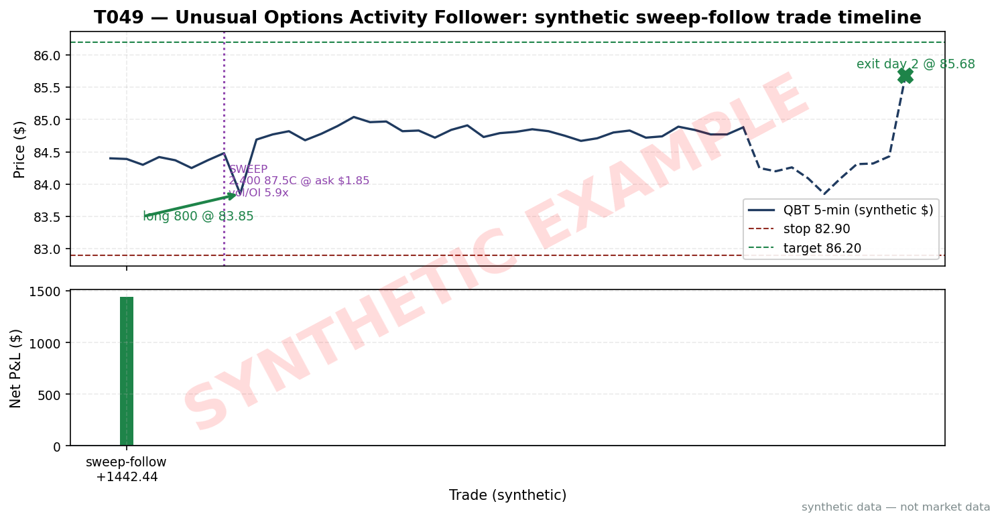

Caption: watermarked "SYNTHETIC EXAMPLE" with corner note "synthetic data — not market data". Plots the exact synthetic QBT path from T4 (seed 149): the 2,400-contract call sweep at bar 7, the 800-share pullback entry at 83.85, stop 82.90 / target 86.20, the day-2 exit at 85.68, and the single-trade net P&L bar (+1,442.44, 1.90R).

```mermaid
flowchart TD
    DATA["Market data<br/>options print tape, 5-min equity bars, news pipe"] -->|prints + 5-min bars| SIGS["Signals<br/>S073 sweep screen, S094 RVOL/blocks, S091 sentiment"]
    SIGS -->|"streaming, tau"| ENTRY{"Entry logic<br/>ask-side sweep, RVOL>=2.0<br/>block imb>=0.3, news z>=2.0<br/>pullback entry, tau+1 earliest"}
    ENTRY -->|trigger| SIZE["Sizing + risk<br/>0.5-1% NAV to stop, max 8 sweeps<br/>daily stop -2%, event blackout"]
    ENTRY -->|no trigger| WAIT["Wait"]
    SIZE -->|"limit at pullback"| EXEC["Execution<br/>90-min pullback limit, <=10% part.<br/>stop+target simultaneous"]
    EXEC -->|"5-min + 15-min bars"| MON["Monitor + exits<br/>1.5-2R target / 2-5d / ATR stop<br/>block-imb flip, whipsaw stand-down"]
    MON -->|"5-min bars"| PNL["P&L (net of 1bp + $0.005/sh)"]
    style ENTRY fill:#f9e79f,stroke:#7d6608
    style PNL fill:#a9dfbf,stroke:#1e8449
```

### T10. Sources

- Pan, J. & Poteshman, A. M. (2006). "The Information in Option Volume for Future Stock Prices." *Review of Financial Studies* 19(3), 871–908. https://ideas.repec.org/a/oup/rfinst/v19y2006i3p871-908.html — open-buy put/call volume predicts next-day (>40 bp) and next-week (>1%) stock returns; the gold-standard result the public-data follower approximates.
- Johnson, T. L. & So, E. C. (2012). "The Option to Stock Volume Ratio and Future Returns." *Journal of Financial Economics* 106(2), 262–286. https://doi.org/10.1016/j.jfineco.2012.05.008 — the option-to-stock volume ratio predicts future stock returns.
- Cremers, M. & Weinbaum, D. (2010). "Deviations from Put-Call Parity and Stock Return Predictability." *Journal of Financial and Quantitative Analysis* 45(2), 335–367. https://ideas.repec.org/a/cup/jfinqa/v45y2010i02p335-367_00.html — relatively expensive calls outperform relatively expensive puts by ~50 bp/week (pre-cost); predictability decreasing over the sample — the decay warning, verified 2026-09-10 (JFQA, not JFE).
- Easley, D., O'Hara, M. & Srinivas, P. S. (1998). "Option Volume and Stock Prices: Evidence on Where Informed Traders Trade." *Journal of Finance* 53(2), 431–465. https://afajof.org/issue/volume-53-issue-2/ — informed traders use options; the mechanism behind treating urgent options flow as potentially informed.

**Unverified leads** (chatbot-provided, not independently checkable — do not treat as evidence):
- *Unverified chatbot claim* (Grok, 2026-09-10, Q-TB5-3): "Journal of Portfolio Management (2026)" filtered-UOA note — no full citation captured; used only as a decay caution.
- *Unverified chatbot claim* (Grok, 2026-09-10, Q-TB5-1/2): sweep-screen thresholds (premium ≥ $250k/≥ $500k, DTE 7–45, delta 0.25–0.45, vol/OI ≥ 3, sweep window 100–300 ms); entry/exit rules (0.2–0.5% pullback, 30–90 min, 1.0–1.5× ATR stop, 1.5–2.0R target, 2–5 session time stop); fee schedule ($0.65/contract, $0.005/share + 1 bp); "budget half or less of the paper's 40 bp" heuristic — all marked `example` in the chapter.
- *Unverified chatbot claim* (Grok, 2026-09-10, Q-TB5-2): vendor pricing (ThetaData Pro $160/mo, Unusual Whales $50–299 UI / ~$625+ API, ORATS $299–599/mo, Databento OPRA ~$199/mo + OPRA license tiers, non-display ~$2,000/mo) — *indicative — verify before budgeting*; M5 Max engineering bands (classifier — superseded by cost-model Tier H, 60–200 h / $9,000–30,000 loaded-cost estimate; full v1 120–190 h).
- *Unverified chatbot claim* (Grok, 2026-09-10, Q-TB5-3): OptionMetrics 2013–2023 (via a 2026 JPM piece) — large prints in general not predictive; filtered UOA (esp. OTM short-dated calls) significant; profitability declined after 2020 — removed from the T7 evidence table; listed here only.

Source log: Grok Q-TB5-1..3 (2026-09-10); all claims verified or labeled unverified.

## Stage 150/200 — T050: GEX Pin / Dealer-Positioning Fade

*Batch TB5 · Strategy 50/100 · Signals S074, S070, S076*

*Provenance: [D/SR] — documented signals (S074/S070/S076) combined through strategy rules reconstructed for this chapter; the combination itself is synthetic, not a documented strategy.*

*Caveat (carried through this chapter): full-chain OI × modeled gamma is only a proxy — OI reveals neither customer/dealer ownership nor trade direction; actual dealer positioning is unknown. Operational references use "modeled dealer GEX (proxy)".*

### T1. One-line verdict

| | |
|---|---|
| **Style** | Intraday structural mean-reversion: fades spot into modeled dealer gamma walls (proxy), rides pinning into expiries |
| **Edge source** | Dealer gamma exposure (S074) — dealers net long gamma must buy dips and sell rips to stay hedged, compressing price toward high-GEX strikes; the fade harvests that hedging flow, with the straddle-implied move (S070) sizing the wall's reach and vol-breakout logic (S076) defining the stop |
| **Typical holding period** | Intraday (minutes to hours); time-stopped into the last 20 minutes on 0DTE gamma (*example*) |
| **Capacity hint** | Index futures/ETFs (ES/SPY-class) and liquid single names; the equity leg is plain stock/futures flow — capacity in the hundreds of $mm — but the documented edge is tens of basis points on expiration days, crowded at the close |
| **Build-or-buy in one line** | Buy the wall map (SpotGamma-class, *indicative — verify before budgeting*) for one month to calibrate; build the fade engine yourself only if your sign convention survives a two-week disagreement test against price |

### T2. Full mechanics

**Jargon first.** *Gamma (Γ)* = how fast an option's delta changes when the underlying moves. *Gamma exposure (GEX)* = the market's total gamma, per strike as Γ × open interest × multiplier × spot² × 0.01 — dollars of dealer P&L per 1% spot move (the charting-tool convention; see S074). *Dealer* = the market maker on the other side of customer option trades. *Modeled dealer GEX (proxy)* = the gamma attributed to dealer books — typically modeled as **minus** customer GEX under the assumption customers are net long options (**an assumption, not a fact** — it breaks when customers are net short, e.g. overwriting). Full-chain OI × modeled gamma is only a proxy: OI reveals neither customer/dealer ownership nor trade direction; actual dealer positioning is unknown. *Call wall* = the strike with maximum modeled call gamma (resistance); *put wall* = maximum modeled put gamma (support). *Flip / zero-gamma* = the spot level where net modeled GEX changes sign. *Pinning* = prices clustering at strikes on expiration (Ni–Pearson–Poteshman 2005). *Positive-GEX regime* = dealers buy dips/sell rips (fade-friendly); *negative-GEX regime* = dealers chase (do NOT fade). *Charm* = how delta decays with time. *Straddle-implied move* = (ATM call + ATM put)/spot. *Vol breakout* = range expansion beyond k× its trailing mean (S076). *0DTE* = options expiring the same day. *DDOI* = a proprietary dealer-side OI model.

**Universe & session.** SPY/QQQ/IWM-class ETFs and ES futures for the index variant; ~50–100 liquid optionable single names for the equity variant (option ADV ≥ 5,000 contracts *example*). RTH only; **no new fades in the last 20 minutes on 0DTE gamma** (*example*). Exclusions: FOMC/CPI/NFP days (*example*), earnings days for single names (*example*), DTE ≤ 5 into scheduled binaries (*example*, shared TB5 convention).

**Entry rule.** Morning modeled-GEX (proxy) snapshot (EOD OI × live Γ — proxy only; intraday "live OI" is a vendor estimate, per the TB5 lead), refreshed every 30–60 minutes (*example*):
1. **Regime (S074, primary):** net modeled dealer GEX (proxy) > 0 (*example* gate) AND spot above the flip. Negative GEX ⇒ no fades.
2. **Wall tag:** spot tags the call wall from below (or the put wall from above) AND 15-min momentum decelerates — *example*: last 15-min return < 30% of the prior.
3. **Implied-move context (S070):** the wall must be within the session's remaining straddle-implied move — *example*: distance-to-wall < implied move in dollars.
4. **Squeeze state (S076):** Bollinger bandwidth percentile ≤ 10 (*example*) — pre-expansion only; if the range has *already* expanded (R_t/R̄ > 1.75, *example*), the wall may already be broken.

**Enter** at the tag bar's close (τ → fill at τ+1 at the earliest): short into the call wall; long into the put wall. Target: the max-GEX strike (the pin magnet) or the range mid (*example*).

**Exit rule** (first wins): (1) target — magnet strike tagged; (2) stop — **through the wall by 0.4–0.6%** (*example*); (3) time stop — flatten into the last 20 min on 0DTE (*example*); (4) regime flip — net GEX recomputes negative ⇒ exit immediately.

**Position sizing.** Size by the dollar gamma being faded or by 0.5–1.0× ATR (*example*): risk **0.4% of NAV to the stop** (*example*). Max 3 concurrent wall fades (*example*); index fades may carry 2× single-name size (*example*).

**Risk limits** (*examples*). Daily loss stop −2% of NAV. Vol-spike stop (shared TB5 convention): close if VIX 1-day jump > +25% or 15-min realized vol > 2.5× HAR forecast. Name concentration: max 25% of gamma-fade risk in one underlier. Overnight: flat.

**Cost model.** The modeled-GEX (proxy) surface is *computed*, not traded — the traded leg is stock/ES: $0.005/share + 1 bp each way (*example*); ES alternative $1.25/side + 0.25 tick slippage (*example*). Chain-data cost (the real cost) sits in T6, not in the per-trade P&L. Applied explicitly in T4.

**Order/execution sketch.** Limit order at the wall tag (fade the touch); stop-market through the wall +0.4–0.6% (*example*); participation ≤ 10% of the bin's volume (*example*). Backtest: GEX snapshot stamped complete ⇒ earliest fill next bar; OI vintage is always the last *as-of* EOD — never "final" revised OI stamped 16:00 (lookahead, per S074).

### T3. Signals it consumes

| Signal | Role | Weight / logic |
|---|---|---|
| S074 — Gamma exposure & dealer positioning | **Primary** | Modeled dealer GEX (proxy) > 0, spot above flip, wall tag with decelerating momentum (*examples*) — OI × modeled gamma is only a proxy; OI reveals neither customer/dealer ownership nor trade direction; actual dealer positioning is unknown |
| S070 — Straddle-implied move | **Reach gate** | Distance-to-wall < remaining-session implied move (*example*); sizes the stop's plausibility |
| S076 — Vol breakout / squeeze | **Regime & exits** | Pre-expansion only (bandwidth pct ≤ 10, *example*); expansion through the wall = the stop; flip = immediate exit |

```pseudocode
# T050 — intraday on 30-60min modeled-GEX (proxy) snapshots; fills at tau+1
on gex_snapshot:  # EOD OI x modeled Gamma — PROXY ONLY (examples)
    net_gex, walls, flip, magnet = compute_modeled_gex(chain)  # S074; OI reveals neither ownership nor direction
    regime_ok = (net_gex > 0) and (spot > flip)                # modeled dealer GEX (proxy)
    imp_move = (call_atm + put_atm) / spot              # S070
    squeezed = bollinger_bw_percentile(spot) <= 10      # S076 (example)
    if not regime_ok or not squeezed: stand_down(); continue
    if tags_call_wall(spot) and momentum_decelerating(15min):
        if (wall - spot) < imp_move * spot:
            short underlying; stop = wall * 1.005; target = magnet
    if tags_put_wall(spot) and momentum_decelerating(15min):
        if (spot - wall) < imp_move * spot:
            long underlying; stop = wall * 0.995; target = magnet
    on (stop hit) or (net_gex <= 0) or (last 20min and is_0dte): flatten
```

### T4. Worked example — numbers + P&L (SYNTHETIC)

All prices synthetic, **seed 150** (`rng = np.random.default_rng(150)`; regenerable via `python3 batches/TB5/plot_T050.py`). Costs: $0.005/share + 1 bp each way (*example*); T9 plots this wall map and trade on a synthetic SPY-like underlier.

**The wall map (synthetic modeled dealer GEX — proxy, $mm per 1% spot move):** 565: **−420** (put wall); 570: +180; 575: **+910** (max GEX / magnet); 580: **+640** (call wall); 585: +210. Net modeled dealer GEX (proxy) **+1.8bn** (positive ⇒ fade regime, *example* gate); flip **568**; spot **575.20** (above flip ✓). Caveat: full-chain OI × modeled gamma is only a proxy — OI reveals neither customer/dealer ownership nor trade direction; actual dealer positioning is unknown.

**The context.** 0DTE ATM straddle: call $2.90 + put $2.85 on spot 575.20 ⇒ implied move **1.00% ≈ $5.75** (S070, *example*). The 11:40 tag (579.80) sits **$0.20** from the 580 wall — within the implied range ⇒ fade in play. Bandwidth percentile 8 (≤ 10 ✓).

**The trade.** 11:40: spot **579.80** tags the 580 call wall from below, momentum decelerated (*example* 30% rule). 11:45 (t+1): **short 200 @ 579.75** (1 bp slip). Stop **583.20** (+0.6%). Target **575.40** (magnet). Grind 579.8 → 575.6 over 4 hours. **Cover 200 @ 575.65.**

| Line | Calc | $ |
|---|---|---|
| Stock leg (short) | 200 × (579.75 − 575.65) | +820.00 |
| Costs (200 × $0.005 × 2 + 1 bp × 2, *example*) | | −25.11 |
| **Net** | | **+794.89** |
| Stop risk | 200 × (583.20 − 579.75) | 690.00 |
| Realized | 794.89 / 690.00 | **1.15R** |

Stop-loss case (*example*): spot rips to 583.40 through the wall ⇒ ≈ 200 × 3.45 + costs ≈ **−$715** — the regime filter is the whole trade.

**Where the example is optimistic.** The wall map is handed over clean and static — real GEX depends on the sign convention, and the S074 chapter's own honesty note applies: "customers net long, dealers net short" fails for overwriting-heavy names, and mixing vendor conventions silently flips every wall. The map is frozen for 4 hours; real Γ decays into expiry and the magnet migrates. The grind is engineered to cooperate — no whipsaw through 580 that stops the fade and then pins anyway. The 1 bp + $0.005 cost assumes liquid-ETF spreads; single-name wall fades pay wider. The +$794.89 is arithmetic illustration — not a backtest.

### T5. Data & infra — what must run

**Pipeline inventory.** Morning + every 30–60 min (*example*): pull the full-chain snapshot (all strikes near spot × front expiries — *a 50-delta strip is not a wall map*, per the TB5 lead), compute per-contract Γ from per-contract IV (vectorized BSM), multiply by as-of EOD OI × 100 × S² × 0.01, aggregate by strike into the modeled-GEX (proxy) map, derive walls/flip/magnet/net sign. Continuous: spot vs wall monitor, deceleration check, ATM implied move. Pre-open: verify OI vintage is as-of, corporate actions handled. Post-close: persist snapshots, maps, decisions, fills.

**M5 Max feasibility: feasible (Tier H analytics, Tier M data).** Per cost-model §2/§3: the DTE-capped book (~60k contracts) reprices in milliseconds vectorized (stay in NumPy/polars, never scipy per contract); modeled-GEX aggregation is a group-by. **Full-chain OI is mandatory** but not real-time: EOD OCC OI × modeled Γ is the serious construction (proxy only — OI reveals neither ownership nor direction); 15-min delayed quotes are fine for 30–90-min fades. RAM: live chain + Greeks 0.5–2 GB (§3); 1-min snapshots of 60k contracts are GB/day — keep ~20 sessions hot, ship the rest to cheap disk. Engineering: cost-model Tier H (60–200 h, $9,000–30,000 loaded-cost estimate).

**Feed-outage safe mode.** Chain snapshot stale ⇒ freeze the wall map at the last complete snapshot and **widen the stop**; no new fades on a map older than 2 snapshots (*example*). OI vintage missing ⇒ no new maps (a GEX map without OI is a fantasy). Spot feed down ⇒ flatten everything. Restart = flat + re-derive; never trade yesterday's walls through an overnight gap.

### T6. Buy vs build

| Option | What you get | Indicative price | Gains | Loses |
|---|---|---|---|---|
| Tier-0/1: Cboe delayed chains + OCC EOD OI (often bundled) | Delayed quotes, official EOD OI | ~$0–80/mo, *indicative — verify before budgeting* | Enough for daily walls + slow fades | No intraday Γ refresh |
| Tier-2: ThetaData Standard/Pro | Chain snapshots + vendor Greeks + OI fields | ~$80–160/mo + OPRA entitlement, *indicative — verify before budgeting* | Best self-build raw input (per TB5 lead) | You own the sign convention |
| Buy analytics: SpotGamma mid/Alpha | Precomputed walls, flip, magnet | ~$99–299/mo, *indicative — verify before budgeting* | Skips 40 h of arguing with OI | Cannot change the dealer-sign assumption |
| Buy analytics: ORATS live surface | Chains + IV surfaces | ~$299–599/mo, *indicative — verify before budgeting* | Surfaces cooked | Still not a wall map |
| Professional: Databento OPRA + full chain | Real-time everything | ~$199/mo + OPRA license (personal $1.25; commercial non-display ~$2,000/mo), *indicative — verify before budgeting* | Serious tape | Drowns the Mac; $2k non-display line is the landmine |

**Verdict: buy the map for one month, build the fade engine, keep the vendor as truth tape.** Per the TB5 lead: if your edge is watching GEX walls like SpotGamma, just buy SpotGamma — reimplementing dealer-sign GEX to match them is 40 hours of arguing with OI. **Build if** the fade *rules* are your edge (deceleration trigger, implied-move reach gate, S076 exits, flip-eject). **Buy the feed** (ThetaData) only if the vendor's map disagrees with price for two weeks. Crossover: non-display / multi-user ⇒ budget $2k–$5k/mo (*indicative — verify before budgeting*) data first; the custom GEX build only wins if the book is large enough to care about the sign convention.

### T7. Success-ratio evidence

| Source | Market / period | Metric | Before/after cost | Caveat |
|---|---|---|---|---|
| Ni, Pearson & Poteshman (2005), JFE | US optionable stocks, 1996–2002 | Prices **cluster at strikes on expiration**: returns altered by **≥ 16.5 bp**; aggregate cap shift ~$9bn per expiration | Before costs | Tens of bp — after stock spread + borrow a small, expiration-Friday edge (per TB5 lead) |
| Golez & Jackwerth (2012), JFE | S&P 500 futures, serial expirations | Futures **pulled toward ATM** on serial expirations; pushed away into SPX expirations; notional shift **≥ $115m per expiration day** | Before costs | Pre-2010 regime; drivers are MM delta decay (charm) + customer exercise |
| SqueezeMetrics (2016, rev. 2017), practitioner | US options | GEX methodology: aggregate Γ × OI; DDOI dealer-direction model | n/a (construction) | Not a peer-reviewed efficacy study — the construction this strategy implements |
| Barbon, Beckmeyer, Buraschi & Moerke (working paper) | US, leveraged ETFs + option imbalances | Option market imbalances drive **end-of-day price dynamics** | Working paper | The hedging-flow mechanism intraday; not a wall-fade trading result |

Capacity: the equity/futures leg scales to hundreds of $mm; the binding constraints are *edge size* (tens of bp on expiration days) and *crowding at the close*. Documented regime risk: the 0DTE regime may have inverted the classic pin into amplification under negative modeled dealer gamma (Elms lead, unverified) — the positive-GEX gate is the entire defense, and it rests on the fragile dealer-sign assumption.

**Honest bottom line.** For a ≤$1M paper operation: the best *structural* teacher in TB5 — building the wall map forces you to learn options symbology, IV/Greeks plumbing, OI vintages, and the dealer-sign assumption from the inside. As a traded edge, expect a small, expiration-concentrated fade. An institutional desk runs this with full-chain OI history, a calibrated dealer-direction model, and futures execution. Do not annualize the +$794.89.

### T8. Failure modes & pitfalls

1. **Dealer-sign assumption wrong** — customers net *sell* calls (overwriting) and net *buy* puts (protection); "modeled dealer GEX = −customer GEX" then mislabels every wall. Mitigation: publish ≥2 sign conventions (per S074), run the two-week disagreement test vs price.
2. **Negative-GEX fade** — fading in negative modeled dealer gamma means fading *amplification*; the wall breaks and the move accelerates through the stop. Mitigation: the net-GEX > 0 gate is absolute.
3. **0DTE regime inversion** — the post-weekly/0DTE sample may show amplification where the 2005 literature showed pinning (Elms lead). Mitigation: separate 0DTE and monthly books; the 0DTE variant gets the last-20-min flatten and half size (*example*).
4. **Charm migration** — Γ decays into expiry; the 10:00 magnet is not the 15:00 magnet. Mitigation: recompute the map every 30–60 min (*example*); target the *current* magnet.
5. **OI vintage lookahead** — "final" revised OI stamped 16:00 was not available at decision time. Mitigation: as-of vintages only; stamp every map with its vintage.
6. **Stop-through-the-wall whipsaw** — spot pokes 0.5% through the wall, stops the fade, then pins anyway. Mitigation: accept it as the documented loss mode; size by the 0.4% risk (*example*) so it is budgeted, not a surprise.
7. **Single-name event walls** — a wall built on pre-earnings OI evaporates when the event reprices vol. Mitigation: earnings-day exclusion (*example*); flatten single-name fades into scheduled binaries.
8. **Vendor-convention mixing** — combining your Γ with a vendor's OI, or two vendors' GEX, silently changes every wall. Mitigation: one pipeline, one convention, documented; never blend.

### T9. Visuals

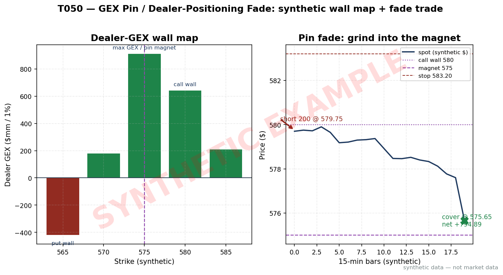

Caption: watermarked "SYNTHETIC EXAMPLE" with corner note "synthetic data — not market data". Left: the synthetic modeled dealer-GEX (proxy) wall map from T4 (seed 150): put wall 565 (−420), magnet 575 (+910), call wall 580 (+640) — proxy only: OI × modeled gamma; OI reveals neither customer/dealer ownership nor trade direction. Right: the grind 579.80 → 575.65 — 11:40 tag, short 579.75 (11:45 fill), stop 583.20, magnet 575, cover 575.65, net +794.89 (1.15R).

```mermaid
flowchart TD
    DATA["Market data<br/>full-chain snapshots, EOD OI, spot"] -->|chain snapshots 30-60min| SIGS["Signals<br/>S074 GEX walls/flip, S070 impl move, S076 squeeze"]
    SIGS -->|"snapshot complete"| ENTRY{"Entry logic<br/>net GEX>0, above flip, wall tag<br/>deceleration, impl-move reach<br/>tau, fill tau+1"}
    ENTRY -->|trigger| SIZE["Sizing + risk<br/>0.4% NAV to stop, max 3 fades<br/>daily stop -2%, 0DTE flatten"]
    ENTRY -->|no trigger| WAIT["Wait"]
    SIZE -->|"limit at wall"| EXEC["Execution<br/>fade the touch, stop thru wall<br/><=10% part., stock/ES leg"]
    EXEC -->|"spot + 15-min bars"| MON["Monitor + exits<br/>magnet target / wall stop<br/>GEX flip eject, vol-spike stop"]
    MON -->|"intraday bars"| PNL["P&L (net of 1bp + $0.005/sh)"]
    style ENTRY fill:#f9e79f,stroke:#7d6608
    style PNL fill:#a9dfbf,stroke:#1e8449
```

### T10. Sources

- Ni, S. X., Pearson, N. D. & Poteshman, A. M. (2005). "Stock Price Clustering on Option Expiration Dates." *Journal of Financial Economics* 77(2), 249–274. https://optionmetrics.com/research/s-xiaoyan-ni-n-d-pearson-and-a-m-poteshman-stock-price-clustering-on-option-expiration-dates/ — expiration-day strike clustering (≥16.5 bp); the documented pinning core.
- Golez, B. & Jackwerth, J. C. (2012). "Pinning in the S&P 500 Futures." *Journal of Financial Economics* 106(3), 566–585. https://doi.org/10.1016/j.jfineco.2012.06.010 — pinning toward ATM on serial expirations (≥$115m notional shift/day); verified 2026-09-10.
- SqueezeMetrics (2016, rev. 2017). "GEX — Gamma Exposure" methodology guide. https://squeezemetrics.com/monitor/static/guide.pdf — the aggregate-GEX construction this strategy implements; attribution honesty per S074.
- Barbon, A., Beckmeyer, H., Buraschi, A. & Moerke, M. "The Role of Leveraged ETFs and Option Market Imbalances on End-of-Day Price Dynamics." Working paper. https://www.alexandria.unisg.ch/server/api/core/bitstreams/5a99db31-0d37-4f86-9502-8cb0f3bff4fe/content — option-market imbalances and end-of-day price dynamics.

**Unverified leads** (chatbot-provided, not independently checkable — do not treat as evidence):
- *Unverified chatbot claim* (Grok, 2026-09-10, Q-TB5-3): Elms (SSRN 2026) — no pinning in SPY/ES 2016–2025, amplification on high-ATM-OI days — no full citation captured; used only as a regime caution, flagged in T7.
- *Unverified chatbot claim* (Grok, 2026-09-10, Q-TB5-1/2): GEX conventions (Γ × OI × S² × 0.01 × 100), wall/fade mechanics (0.4–0.6% stop-through, last-20-min 0DTE flatten, 30% deceleration rule, 0.4% NAV risk), the worked-example arithmetic (200 × 4.10 = $820, stop risk $690.00), and the "EOD OI × live Γ" dictum — mechanics marked `example` in the chapter.
- *Unverified chatbot claim* (Grok, 2026-09-10, Q-TB5-2): vendor pricing (ThetaData $80–160/mo, SpotGamma $99–299/mo, ORATS $299–599/mo, Databento OPRA ~$199/mo + OPRA license tiers, non-display ~$2,000/mo) — *indicative — verify before budgeting*; M5 Max bands (GEX map 10–15 h, full v1 120–190 h) and throughput (60k contracts ~20–80 ms, snapshots ~1.2–2.0 GB/day).

Source log: Grok Q-TB5-1..3 (2026-09-10); all claims verified or labeled unverified.

## Stage 151/200 — T051: Kalman Fair-Value Trend

*Batch TB6 · Strategy 51/100 · Signals S077, S078, S079 · Provenance [D/SR]*

### T1. One-line verdict

| | |
|---|---|
| **Style** | Intraday trend-following on a Kalman-filtered fair value, with position size driven by the filter's own confidence |
| **Edge source** | Lag reduction vs moving averages: the local-level Kalman filter extracts the latent (unobserved) fair value from noisy prints faster than an SMA/EMA of comparable smoothness, and its error variance $P_{t\|t}$ tells you how much to bet |
| **Typical holding period** | 30 minutes to a few hours (6-bar time stop on 5-min bars, `example`); exits on fair-value velocity flipping sign |
| **Capacity hint** | Large: trades liquid large-caps on 5-min bars; the bottleneck is per-name $Q/R$ calibration discipline, not market impact |
| **Build-or-buy in one line** | Build — the filter is ~20 lines; no vendor sells your $Q/R$ calibration; buy only Tier-1 1-min bars |

A **Kalman filter** is a recursive estimator for a hidden quantity observed through noise. A **local-level model** is its simplest useful form: the hidden fair value follows a random walk, each observed price equals fair value plus noise. The filter's **Kalman gain** $K_t$ decides how far each new print moves the estimate, and its **error variance** $P_{t|t}$ measures its own uncertainty — a built-in confidence meter. T051 turns the *velocity* of that fair-value estimate ($\Delta\hat{x}_{t|t}$, how fast the fair value itself is moving) into a trend signal, confirmed by an AR(1) forecast (S078) and gated by a regime filter (S079).

### T2. Full mechanics

**Universe & session.** US large-cap equities, regular trading hours (RTH) only: average daily dollar volume (ADV — the mean dollar value traded per day) above $50M and quoted spread at most 3 ticks (`example` cutoffs — a **tick** is the minimum price increment, e.g. 1¢). Excluded: earnings-announcement days, halts, and the first 15 minutes of the session (opening auction noise corrupts the filter's burn-in).

**Entry rule.** All thresholds below are `example`, not institutional standards. Let $y_t$ be the 5-min mid-price close (the **mid-price** is the average of best bid and best ask; using mids instead of last trade prices avoids injecting **bid–ask bounce** — the mechanical up-down flicker between bid and ask — into the state). Run the S077 local-level recursion:

$$\hat{x}_{t|t-1} = \hat{x}_{t-1|t-1},\quad P_{t|t-1} = P_{t-1|t-1} + Q,\quad K_t = \frac{P_{t|t-1}}{P_{t|t-1}+R},$$
$$\hat{x}_{t|t} = \hat{x}_{t|t-1} + K_t\,(y_t - \hat{x}_{t|t-1}),\quad P_{t|t} = (1-K_t)\,P_{t|t-1}.$$

$Q$ is the **process-noise variance** (how much the true fair value moves per bar), $R$ the **observation-noise variance** (how noisy each print is). The entry object is the fair-value velocity $\Delta\hat{x}_{t|t} = \hat{x}_{t|t} - \hat{x}_{t-1|t-1}$:

1. **Trend trigger:** $\Delta\hat{x}_{t|t} > +\theta$ → long; $\Delta\hat{x}_{t|t} < -\theta$ → short, with $\theta = \$0.15$ per 5-min bar on a ~$250 stock (`example`; recalibrate per name, or use the scale-free $z$-velocity $\Delta\hat{x}_{t|t}/\sqrt{P_{t|t}}$ with $\theta_z = 0.5$, `example`).
2. **Forecast confirmation (S078):** the AR(1) one-step forecast $\hat{f}_t = \phi\,r_{t-1}$ must agree in sign with $\Delta\hat{x}_{t|t}$ ($\phi$ re-estimated weekly on a 60-bar window, `example`). This vetoes entries where the fair value is moving but the return autocorrelation says the move is already exhausting.
3. **Regime gate (S079):** the HMM forward-filter posterior for the trending/low-vol state must exceed 0.60 (`example`). In the volatile state, fair-value velocity whipsaws and the strategy stands down.

**Causal timing:** all three quantities are computed at bar $t$'s close using only data $\le t$; the earliest fill is bar $t+1$'s open ($t \to t+1$).

**Exit rule.** First of: (a) **velocity flip** — $\Delta\hat{x}$ crosses zero against the position; (b) **time stop** — 6 bars (`example`); (c) **stop-loss** — adverse excursion beyond 2× the trailing 20-bar mean absolute bar range (`example`).

**Position sizing.** Confidence-scaled: $q_t = \mathrm{round}(q_{\mathrm{base}}\sqrt{P_{\mathrm{ref}}/P_{t|t}}/100)\times 100$, with $q_{\mathrm{base}} = 500$ shares and $P_{\mathrm{ref}} = 0.14$ (`example`). When the filter is uncertain ($P_{t|t}$ high, e.g. right after burn-in), size shrinks automatically. Caps: $250k notional per name, portfolio **heat** (total capital at risk across positions) ≤ 20% of NAV (`example`).

**Risk limits.** Daily loss stop: −2% of NAV → flatten and stand down (`example`). Max gross leverage 1.5× (`example`). **Kill switch:** if the realized innovation variance $(y_t-\hat{x}_{t|t-1})^2$ exceeds 3× its trailing median for 3 consecutive bars, flatten everything — the calibrated $Q/R$ no longer describes the market (`example`).

**Cost model (applied explicitly in T4).** Assumed round-trip cost $0.027$/share = 2¢ effective spread + $0.0035$/share/side exchange+broker fees (`example`). **Slippage** (extra cost from the price moving while your order works) is modeled as $0$ in the toy example — stated as optimistic below. No borrow cost: the universe excludes hard-to-borrow names.

**Order/execution sketch.** Entries as post-only limit orders at the touch (the best bid/ask), participation capped at 10% of trailing 1-min volume (`example`); if unfilled after 2 bars, cancel (the signal has decayed). Exits on velocity flips are marketable limits. **Queue-position honesty:** resting at the touch during a fast move gets **adversely selected** (filled exactly when the price runs through you) — live fills are worse than the toy's next-bar-open fills.

### T3. Signals it consumes

| Signal | Role | Weight / logic |
|---|---|---|
| S077 — Kalman-filtered fair value (local-level trend) [D] | Primary trigger (direction) | Enter long/short on $\Delta\hat{x}_{t|t}$ crossing $\pm\theta$ (`example`) |
| S078 — AR(1)/ARMA return forecast & innovation [D/SR] | Confirmation filter | Enter only if $\mathrm{sign}(\hat{f}_t) = \mathrm{sign}(\Delta\hat{x}_{t|t})$; skips entries where the move looks like a one-bar spike |
| S079 — HMM regime-switching [D] | Regime gate (veto) | Trade only when the trending/low-vol posterior $> 0.60$ (`example`); stand down otherwise |

Combination pseudocode (≤25 lines):

```
each closed 5-min bar t (RTH, liquid large-caps):
    y = mid-price close(t)
    (x_hat, P, dx) = kalman_update(y, Q, R)      # S077 local-level
    f_hat = phi * r[t-1]                          # S078 AR(1) forecast
    pi_trend = hmm_forward_filter(returns)        # S079 posterior
    if pi_trend < 0.60: continue                  # regime veto (example)
    if sign(f_hat) != sign(dx): continue          # forecast disagrees: skip
    if flat and dx > +0.15:  enter LONG  at next open   # example theta
    if flat and dx < -0.15:  enter SHORT at next open
    if long  and (dx < 0 or held >= 6): exit at next open
    if short and (dx > 0 or held >= 6): exit at next open
    q = round(500 * sqrt(0.14 / P) / 100) * 100   # confidence sizing (example)
```

### T4. Worked example — numbers + P&L (SYNTHETIC)

**Setup (all synthetic, seed 151 = `np.random.default_rng(151)`).** 20 bars of 5-min mid-prices for a fictional $250 large-cap, Kalman $Q=0.04$, $R=0.64$ (`example` calibration — slower than S077's, so the fair value is smooth enough to trend-follow), entry $|\Delta\hat{x}| > 0.15$, velocity-flip or 6-bar time-stop exit, fills at next-bar open = previous close (no-gap toy assumption), cost $0.027$/share round-trip. S078/S079 gates are assumed passed for illustration.

| bar | mid $y_t$ | fair value $\hat{x}_{t|t}$ | $P_{t\|t}$ | $\Delta\hat{x}$ | action |
|---|---|---|---|---|---|
| 0–2 | 250.006 / 250.331 / 250.657 | 250.006 / 250.125 / 250.284 | 0.330 / 0.234 / 0.192 | 0 / +0.119 / **+0.160** | **LONG 400 @ 250.6571** (bar 3 open) |
| 3–8 | 251.886 / 252.017 / 253.154 / 253.963 / 253.252 / 252.795 | 250.711 / 251.034 / 251.535 / 252.094 / 252.356 / 252.455 | → 0.144 | all > 0 | hold |
| 9 | 251.524 | 252.247 | 0.143 | −0.207 | exit: time stop (6 bars) @ **252.7948** (bar 9 open) |
| 10–15 | 250.948 / 250.722 / 250.535 / 249.717 / 250.420 / 251.169 | 251.959 / 251.685 / 251.431 / 251.052 / 250.912 / 250.969 | → 0.141 | −0.288 … +0.057 | **SHORT 500 @ 251.5244** (bar 10 open, on bar-9 $\Delta\hat{x}=-0.207$) |
| 16 | 251.461 | 251.077 | 0.141 | +0.109 | exit: velocity flip @ **251.1686** (bar 16 open) |
| 17–19 | 252.038 / 252.663 / 253.745 | 251.289 / 251.593 / 252.068 | 0.141 | +0.212 / +0.303 / +0.475 | **LONG 500 @ 252.0380** (bar 18 open); end-of-window flat @ **253.7449** |

**Line-by-line P&L.** Costs are $0.027$/share round-trip (`example`).

- Trade 1 (long 400): gross = 400 × (252.7948 − 250.6571) = **+$855.08**. Cost = 400 × 0.027 = $10.80. **Net = +$844.28.**
- Trade 2 (short 500): gross = −500 × (251.1686 − 251.5244) = **+$177.90**. Cost = 500 × 0.027 = $13.50. **Net = +$164.38.**
- Trade 3 (long 500): gross = 500 × (253.7449 − 252.0380) = **+$853.44**. Cost = $13.50. **Net = +$839.94.**
- **Total: gross +$1,886.42, costs $37.80, net +$1,848.60.** The chart `images/T051_example.png` plots these exact prices, the fair-value path, entry/exit markers, and this equity curve.

**Where the example is optimistic.** (1) The drift regimes were *designed* to be strong relative to noise — the toy tape trends cleanly; real 5-min bars chop far more, which is exactly when $\Delta\hat{x}$ whipsaws across $\pm\theta$. (2) Fills at next-bar open = previous close assumes zero gap and zero slippage; the velocity-flip exit in particular fills worse live because the flip is detected *after* the adverse move. (3) No partial fills, no queue-position adverse selection, and the confidence sizing barely varies here ($P_{t|t}$ converges in ~5 bars, so sizing is nearly flat — the confidence channel matters most in the first bars of a session, not shown). (4) $\theta=0.15$ was chosen on this same toy tape; selecting it on the evaluation window is **in-sample optimism** — production thresholds need purged walk-forward (S088). (5) The S078/S079 gates were assumed passed; a real run would veto some of these trades.

### T5. Data & infra — what must run

**Pipeline inventory.** Pre-open: pull 1-min mid bars (Tier-1 vendor), run corporate-action adjustment, estimate $Q/R$ per symbol on the trailing 20 sessions (bounce variance for $R$, low-frequency variance minus noise for $Q$), refit $\phi$ and the HMM weekly. Intraday loop: every 5-min bar close — ingest, run the predict/update step (~1 ms per symbol vectorized), evaluate gates, emit orders. Post-close: log innovations vs realized, walk-forward the $Q/R$ and $\theta$ grids with purged/embargoed splits (S088).

**M5 Max feasibility: feasible (Tier M+, ~40–100 h ≈ $6,000–$15,000 loaded-cost estimate at $150/hr, per cost-model §5** — the filter loop is Tier M (20–60 h); the strategy harness, cost model, and risk layer push it to M+). Throughput (cost-model §2): a 500-symbol 5-min Kalman update is ~1–20 ms vectorized in numpy — enormous headroom; bottleneck is calibration design, not compute. RAM (cost-model §3): two floats of state per symbol; even a 500 × 252 estimation panel is ~1 MiB — trivial inside the 77 GB working budget. Storage: 1-min bars for 500 symbols ≈ 50 MB/day (cost-model §4) — archive freely.

**Feed-outage safe mode.** If bars go stale > 5 minutes (`example`): stop opening new positions; do *not* keep updating the filter on repeated last prices (that would collapse $P_{t|t}$ and fake confidence); hold existing positions against their stop-losses, and flatten everything if the outage exceeds 30 minutes (`example`) or if the kill-switch innovation check cannot be evaluated. Never trade on a frozen fair value.

### T6. Buy vs build

| Option | What you get | Indicative price | Gains | Loses |
|---|---|---|---|---|
| Retail platform (QuantConnect LEAN) | Backtest/live harness, minute data | ~$0–$96/mo — *indicative — verify before budgeting* | Fastest prototype; paper trading built in | You still write the filter, $Q/R$ calibration, and risk layer |
| Tier-1 data + own Python stack (Polygon/Alpaca SIP) | 1-min/real-time bars | ~$30–200/mo — *indicative — verify before budgeting* | Everything the filter needs; full control of thresholds | You own the engineering |
| Tier-2 professional (Databento) | L1 quotes, imbalance feeds | ~$200/mo + usage — *indicative — verify before budgeting* | True quote-mid inputs, better $R$ calibration | Overkill for the basic filter |
| "Buy the strategy" (vendor signal) | A Kalman-trend black box | n/a — none serious exists | — | You cannot buy someone else's $Q/R$; the calibration *is* the product |

**Verdict: build.** The filter is twenty lines; the S078/S079 gates are standard library calls (`statsmodels`, `hmmlearn`); no vendor sells a calibrated per-name $Q/R$ because it cannot be transferred across universes. **Buy** Tier-1 bars (~$30–200/mo — *indicative — verify before budgeting*) and spend the budget on walk-forward calibration rigor instead of fancier data.

### T7. Success-ratio evidence

| Study / source | Market & period | Metric | Before/after cost | Caveat |
|---|---|---|---|---|
| Benhamou (2016), "Trend Without Hiccups — A Kalman Filter Approach", SSRN | S&P 500 mini-future | Basic KF models ≈ $20k net/1 yr; combined smoothing+extremum model ≈ **$40k net/1 yr**, max drawdown −$7.3k → −$2.6k | Reported "net", cost detail unavailable — treat as before-cost-grade | Parameters "obtained by general optimization… best possible choice" — in-sample optimization; the paper itself flags overfit risk |
| Bel Hadj Ayed et al. (2015), arXiv:1504.03934 | Latent OU trend model | Closed-form likelihood; quantifies damage from **bad calibration** of a misspecified Kalman filter | N/A — methodology | Confirms the chapter's core warning: calibration is the product |
| Bruder, Dao, Richard & Roncalli (2011), SSRN | Multi-asset momentum | Trend-filtering (incl. Kalman-type) methods improve momentum strategy construction | Before/after-cost detail unverified — research lead | Cited via reference list; full text not independently opened |

**Capacity & decay.** No documented capacity ceiling specific to Kalman trend-following on 5-min large-cap bars — the strategy is a smoother, slower cousin of time-series momentum (S025), whose documented capacity is large but whose edge has decayed as trend-following crowded (see the momentum-crash literature in T053's sources). The filter itself does not decay; the *threshold edge* decays as more participants trade the same velocity.

**Honest bottom line.** As a standalone trigger this is a *calibration-dependent smoothing edge*: the filter demonstrably lags less than moving averages *given correct parameters*, and $P_{t|t}$-based sizing is genuinely useful infrastructure. For a ≤$1M paper operation it is one of the cheapest strategies in this document to run honestly (data ~$30–200/mo, engineering ~$6k–$15k loaded estimate). An institutional desk would run the same filter but on tick-level mids with per-symbol adaptive $Q/R$ — the retail version keeps ~80% of the idea at ~5% of the cost. As a standalone it is a *portfolio component*, not a standalone business.

### T8. Failure modes

1. **$Q/R$ miscalibration** — the dominant failure; too smooth lags turns, too fast chases bounce. *Mitigation:* calibrate $R$ from bounce, $Q$ from low-frequency variance minus noise; walk-forward the ratio with purged splits (S088).
2. **In-sample threshold optimism** — picking $\theta$ on the evaluation window (as this chapter's toy does). *Mitigation:* select thresholds on purged/embargoed walk-forward only; freeze before live.
3. **Gaussianity violation** — jumps break linear-Gaussian assumptions; the filter smears a jump across bars. *Mitigation:* jump-robust pre-filtering (S064); robustified update or regime switch.
4. **Velocity whipsaw in chop** — $\Delta\hat{x}$ oscillates across $\pm\theta$ in range-bound tapes, generating turnover. *Mitigation:* the S079 regime gate (stand down in the volatile state) plus a confirmation requirement (2 consecutive bars beyond $\theta$, `example`).
5. **Forecast-disagreement veto over-fires** — S078's AR(1) sign check can veto the best trends. *Mitigation:* use it as a veto only against *spike* entries ($|z_{\mathrm{innov}}| > 3$, `example`), not as a hard sign filter.
6. **Stale-quote inputs** — filtering last prints instead of mids injects bounce into the state. *Mitigation:* mid-price or microprice (S004) inputs only.
7. **Latency illusion on SIP** — "zero-lag" claims assume the print is tradeable; SIP aggregation delay still applies. *Mitigation:* label latency-sensitive backtests `simulated only — requires MBO/ITCH`.
8. **Confidence misread** — $P_{t|t}$ is *estimation* uncertainty, not *prediction* uncertainty; price can leave the ±2σ band freely. *Mitigation:* size on $P_{t|t}$, stop-loss on realized P&L, never on the band.

### T9. Visuals

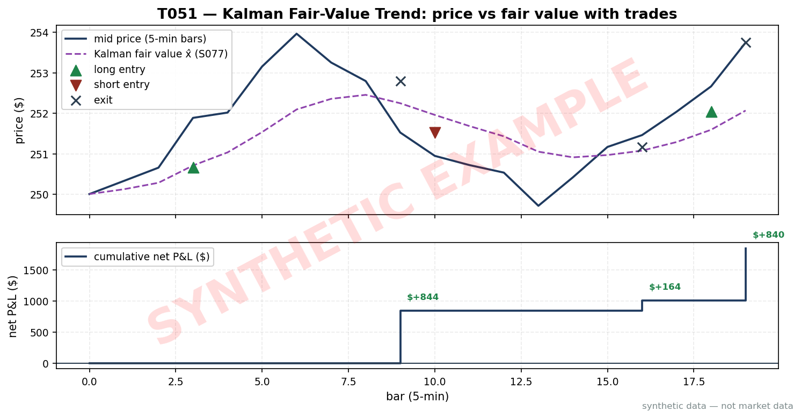

*Chart caption: synthetic data — not market data. Watermark reads "SYNTHETIC EXAMPLE" exactly.*

```mermaid
flowchart TD
    DATA["Market data<br/>(1-min mid-price bars)"] -->|"1-min bars"| SIGS["Signals<br/>S077 fair-value velocity · S078 AR forecast · S079 regime"]
    SIGS -->|"per-bar signal vector"| ENTRY{"Entry logic<br/>(Δx̂ threshold, causality t→t+1)"}
    ENTRY -->|trigger| SIZE["Sizing + risk<br/>(confidence scale, heat, stops)"]
    ENTRY -->|no trigger / veto| WAIT["Wait"]
    SIZE -->|"sized limit orders"| EXEC["Execution<br/>(touch, ≤10% participation)"]
    EXEC -->|"fills"| MON["Monitor + exits<br/>(flip / time stop / stop-loss)"]
    MON -->|"trade P&L"| PNL["P&L (net of costs)"]
    style ENTRY fill:#f9e79f,stroke:#7d6608
    style PNL fill:#a9dfbf,stroke:#1e8449
```

### T10. Sources

1. Benhamou, E. (2016). "Trend Without Hiccups — A Kalman Filter Approach." SSRN. https://papers.ssrn.com/sol3/papers.cfm?abstract_id=2747102 — 4 KF models on the S&P 500 mini-future; combined smoothing+extremum model roughly doubles reported net profit vs. basic models while cutting max drawdown; parameters optimized in-sample (overfit caveat).
2. Bel Hadj Ayed, A., Loeper, G. & Abergel, F. (2015). "Forecasting trends with asset prices." arXiv:1504.03934. https://arxiv.org/abs/1504.03934 — latent trend as unobservable Ornstein–Uhlenbeck process (an **Ornstein–Uhlenbeck process** is a mean-reverting random walk); closed-form likelihood and the cost of bad calibration in a misspecified filter. arXiv ID verified 2026-09-10.
3. Bruder, B., Dao, T.-L., Richard, J.-C. & Roncalli, T. (2011). "Trend Filtering Methods for Momentum Strategies." SSRN. http://papers.ssrn.com/sol3/papers.cfm?abstract_id=2289097 — trend-filtering methods (including Kalman-type filters) applied to momentum strategy construction; cited via reference list, full text not independently opened.

**Unverified leads** (not confirmed facts — verify before use):
- Kalman, R.E. (1960) original filter paper and Harvey, A.C. (1989) *Forecasting, Structural Time Series Models and the Kalman Filter* — canonical references per the signal report; specific editions/URLs not verified in this pass.
- HF stat-arb reference arXiv 2210.15448 cited in the signal report — not independently opened.
- Grok Q-TB6-1/Q-TB6-2/Q-TB6-3 claims on vol-managed momentum doubling Sharpe (Barroso & Santa-Clara 2015) — named-only, no URL captured; treat as a research lead.
- Chatbot-sourced performance prior (unverified): Kalman fair-value velocity trend — after-cost Sharpe in the 0.3–0.8 range on honest walk-forward, a *portfolio component* rather than a standalone business. Treat as a prior to test, not a fact.

*Source log: Grok answered Q-TB6-1..3 (2026-09-10); all claims independently verified or labeled unverified.*

## Stage 152/200 — T052: AR/ARMA Innovation Trader

*Batch TB6 · Strategy 52/100 · Signals S078, S084, S088 · Provenance [D/SR]*

### T1. One-line verdict

| | |
|---|---|
| **Style** | Intraday mean-reversion on forecast **innovations** (surprises), with a trade–quote VAR check that the surprise is liquidity noise rather than informed flow |
| **Edge source** | Short-horizon return predictability is mostly microstructure: bid–ask bounce and temporary impact mean-revert; the VAR filter separates revertable surprises from permanent (informed) repricing |
| **Typical holding period** | 1–10 minutes (exit at innovation zero-cross or 5-bar time stop, `example`) |
| **Capacity hint** | Small-to-medium: 1-min fades on liquid large-caps; edge per trade is a few basis points, so costs dominate below ~$1–2M turnover discipline |
| **Build-or-buy in one line** | Build the AR/innovation layer on retail bars; buy L1/trade-sign data if you want an honest VAR rather than the toy flow proxy |

An **AR(1)** (first-order autoregressive) model says today's return is a fraction $\phi$ of yesterday's plus noise: $r_t = c + \phi\,r_{t-1} + \varepsilon_t$. An **ARMA(p,q)** adds moving-average terms on past noise. The **innovation** $\hat{\varepsilon}_t = r_t - \hat{f}_t$ is the one-step-ahead forecast error — the "surprise". A **trade–quote VAR** (vector autoregression, Hasbrouck 1991) models quote revisions and signed trades jointly, separating each trade's **permanent impact** (information, doesn't revert) from **temporary impact** (liquidity, reverts). T052 fades large innovations — but only when the VAR says the surprise was liquidity, not information.

### T2. Full mechanics

**Universe & session.** US large-cap equities, RTH, 1-min bars; ADV > $100M (`example`); exclude the first 15 minutes, earnings days, and halts. Mid-prices only — never trade prices.

**Entry rule.** All thresholds are `example`, not institutional standards. On 1-min mid-price log returns:

1. **Forecast (S078):** AR(1), $\hat{f}_t = c + \phi\,r_{t-1}$, with $\phi$ re-estimated nightly on a 60-bar rolling window (`example`); innovation $\hat{\varepsilon}_t = r_t - \hat{f}_t$, standardized $z_t = \hat{\varepsilon}_t/\hat{\sigma}_\varepsilon$ with $\hat{\sigma}_\varepsilon = 3.0$ bp (`example`).
2. **Innovation trigger (fade):** $z_t < -2$ → long; $z_t > +2$ → short (`example`; the [SR] innovation rule from S078). This is a bet that the surprise was temporary.
3. **VAR validation (S084):** estimate the Hasbrouck trade–quote VAR $x_t = c + \sum_{\ell=1}^{p} A_\ell x_{t-\ell} + u_t$ on $x_t = (\Delta m_t, q_t)^\top$ (quote revision, signed trade) at 1-s/1-min sampling over the trailing hour, and compute the **long-run impact** $\mathrm{LRI} = e_m^\top (I - \sum A_\ell)^{-1} e_q$ — the permanent price impact of one unexpected trade. Enter only if the current bar's move is **flow-opposed**: $\mathrm{sign}(q\text{-flow}_t) \ne \mathrm{sign}(r_t)$ (toy proxy), i.e. the price moved *against* the signed flow, consistent with liquidity rather than information. Production form: skip if the bar's $|\mathrm{LRI}|$ exceeds its 70th percentile of the trailing 30 days (`example`) — informed flow is repricing permanently, don't fade it.
4. **Cost gate:** enter only if the expected reversion exceeds the round-trip cost: $|\hat{\varepsilon}_t| \times \text{price} > c_{\mathrm{thr}} = \$0.027$/share (`example`, from S078's forecast-direction cost threshold).

**Causal timing:** the innovation at bar $t$ uses only data $\le t$; the earliest fill is bar $t+1$'s open ($t \to t+1$).

**Exit rule.** First of: (a) **zero-cross** — $z$ crosses 0 against the position (the surprise has unwound); (b) **time stop** — 5 bars (`example`); (c) **stop-loss** — adverse move beyond $3\hat{\sigma}_\varepsilon$ (`example`).

**Position sizing.** Fixed 800 shares per trade (`example`), or vol-scaled $q = \mathrm{risk\$}/(\hat{\sigma}_\varepsilon \times \mathrm{price})$ with $\mathrm{risk\$} = \$600$ per trade (`example`). Caps: $200k notional per name, ≤ 10 concurrent positions (`example`).

**Risk limits.** Daily loss stop −1.5% NAV (`example`). Max gross 1.0× — this is a small-edge, high-turnover book; leverage would amplify the cost bleed. **Kill switch:** if the AR(1) $\hat{\phi}$ flips sign intraday or the innovation variance doubles vs trailing (`example`), the microstructure regime has changed — flatten and stand down.

**Cost model (applied explicitly in T4).** Round-trip $0.027$/share = 2¢ effective spread + $0.0035$/share/side fees (`example`). Market impact modeled as $\psi\,\sigma\sqrt{q/V}$ with $\psi = 0.5$ (`example`) — set to zero in the toy and disclosed as optimistic.

**Order/execution sketch.** Fade entries as limit orders at the touch; the innovation is freshest in the first seconds after the bar closes, so use a 30-second fill-or-kill discipline (`example`) then cancel — a fade that can't get filled at the touch is already stale. Exits on zero-cross are marketable limits. **Queue-position honesty:** fading at the touch means providing liquidity exactly when someone informed may be taking it — the toy's fills ignore this adverse selection.

### T3. Signals it consumes

| Signal | Role | Weight / logic |
|---|---|---|
| S078 — AR(1)/ARMA forecast & innovation [D/SR] | Primary trigger (direction + timing) | Fade: long if $z_t < -2$, short if $z_t > +2$ (`example`); exit at $z$ zero-cross |
| S084 — Hasbrouck trade–quote VAR [D] | Informed-flow veto (validation) | Enter only if the move is flow-opposed (toy) / bar LRI ≤ 70th pct of 30-day (`example` production) |
| S088 — Purged / embargoed CV [D] | Offline validator | $\phi$, $z$-entry, and the LRI percentile are selected on purged/embargoed walk-forward, never on the evaluation window |

Combination pseudocode (≤25 lines):

```
each closed 1-min bar t (RTH, liquid large-caps):
    r = log(mid[t]/mid[t-1])                        # mid-prices only
    f_hat = c + phi * r[t-1]                        # S078 AR(1)
    z = (r[t] - f_hat) / sigma_eps                 # innovation z-score
    if abs(z) <= 2.0: continue                      # example entry
    side = LONG if z < 0 else SHORT                 # fade the surprise
    if sign(signed_flow[t]) == sign(r[t]): continue # S084: informed, veto
    if abs(r[t]-f_hat)*price <= 0.027: continue     # S078 cost gate (example)
    enter side at next open, q = 800 shares         # example size
    exit at next open when z crosses 0 or held >= 5 # zero-cross / time stop
    stop: adverse move > 3*sigma_eps -> flatten     # example stop
```

### T4. Worked example — numbers + P&L (SYNTHETIC)

**Setup (all synthetic, seed 152 = `np.random.default_rng(152)`).** 12 bars of 1-min mid-prices for a fictional $250 large-cap: seed-driven background noise plus three designed events. AR(1) with $\phi = 0.15$, $c = 0$, $\hat{\sigma}_\varepsilon = 3.0$ bp (`example`); entry $|z| > 2$; VAR gate = flow-sign opposition (toy proxy for the S084 LRI check); fills at next-bar open = previous close (no-gap toy); cost $0.027$/share round-trip; 800 shares per trade.

| bar | $r_t$ (bp) | innov. (bp) | $z_t$ | flow | gate |
|---|---|---|---|---|---|
| 0–2 | −0.97 / −0.05 / −0.78 | — / +0.10 / −0.78 | 0 / +0.03 / −0.26 | buy / buy / sell | no fire |
| 3 | **−9.00** | −8.88 | **−2.96** | buy (opposed) | **LONG 800 @ 249.7301** (bar 4 open) |
| 4 | −0.63 | +0.72 | +0.24 | buy | exit: zero-cross @ **249.7143** (bar 5 open) |
| 5–6 | +0.41 / **+6.50** | +0.51 / +6.44 | +0.17 / **+2.15** | buy / buy (confirmed) | **VETOED** — flow confirms the move (informed) |
| 7–8 | −2.73 / **+7.80** | −3.70 / +8.21 | −1.23 / **+2.74** | buy / sell (opposed) | **SHORT 800 @ 250.0137** (bar 9 open) |
| 9 | +0.51 | −0.66 | −0.22 | buy | exit: zero-cross @ **250.0264** (bar 10 open) |
| 10–11 | +0.34 / +0.16 | +0.26 / +0.11 | +0.09 / +0.04 | sell / sell | no fire |

**Line-by-line P&L.**

- Trade A (long 800): gross = 800 × (249.7143 − 249.7301) = **−$12.57**. Cost = 800 × 0.027 = $21.60. **Net = −$34.17.**
- Trade B (short 800): gross = −800 × (250.0264 − 250.0137) = **−$10.22**. Cost = $21.60. **Net = −$31.82.**
- **Total: gross −$22.79, costs $43.20, net −$65.99 (≈ −$66.00).** The chart `images/T052_example.png` plots the innovation $z$ series with entry/veto/exit marks and this equity path.

**The vetoed trade (counterfactual, for honesty):** fading the bar-6 informed jump would have been short @ 249.8870, exiting at bar 8 open @ 249.8188 on $z$ sign flip: gross +$54.57, net **+$32.97** after costs. The gate skipped a winner *this time* — vetoes cost opportunity; their value is statistical, not per-trade.

**Where the example is optimistic.** (1) Both fades fired on correctly-signed, flow-opposed innovations — and still lost money: the surprises reversed only ~0.7 bp the next bar, far below the 2.7¢/share cost. This is the chapter's central lesson, not a bug: at these magnitudes the strategy needs the **cost gate** $c_{\mathrm{thr}}$ from S078's forecast-direction rule, which the toy's pure-innovation rule omits. (2) The flow-sign proxy is a cartoon of the S084 VAR — a real LRI estimate needs signed trade data and careful sampling, and estimation noise eats the filter's value. (3) Fills at next-bar open ignore the adverse selection of providing liquidity into a spike; real fade fills are worse. (4) The three events were placed by design; the $|z|>2$ threshold was not tuned out-of-sample. (5) Impact $\psi\sigma\sqrt{q/V}$ was set to zero.

### T5. Data & infra — what must run

**Pipeline inventory.** Pre-open: 1-min mid bars (Tier-1), corporate-action adjustment, nightly AR(1)/ARMA refit per symbol on 60-bar windows with AIC/BIC order checks (`example`), hourly VAR re-estimation on signed trade+quote data (needs L1/trade-sign feed — Tier 2). Intraday loop: every 1-min close — compute innovation $z$, evaluate flow gate, emit/cancel orders within seconds (the fade decays fast). Post-close: purged/embargoed walk-forward of $\phi$, $z$-entry, and the LRI percentile (S088); monitor realized innovation variance for regime breaks.

**M5 Max feasibility: feasible (Tier M+, ~40–100 h ≈ $6,000–$15,000 loaded-cost estimate at $150/hr, per cost-model §5** — the AR layer is Tier M; the VAR estimation, signed-trade plumbing, and execution discipline push it to M+). Throughput (cost-model §2): AR(1) on 500 symbols × 390 bars is ~195k trivial updates; the VAR refit (OLS on ~3,600 1-s observations × 500 names, hourly) is minutes in polars — fine. Bottleneck: signed-trade data licensing and the low-latency order path, not compute. RAM (cost-model §3): 1-min bars for 500 symbols ≈ 50 MB/day; VAR panels per symbol are small — fits easily. What breaks first at 500 symbols: the VAR's data appetite (L1/trade signs for 500 names) and the engineering of the per-minute decision loop.

**Feed-outage safe mode.** If 1-min bars stall: cancel all resting fade orders immediately (a fade without fresh innovations is a blind limit order), flatten open fades at market after 5 stale minutes (`example`) — mean-reversion positions held through a data hole become directional bets. Do not re-enter until the AR and VAR estimates have 60 fresh bars.

### T6. Buy vs build

| Option | What you get | Indicative price | Gains | Loses |
|---|---|---|---|---|
| Tier-0/1 retail (Alpaca/Polygon bars) | 1-min bars, no trade signs | ~$0–200/mo — *indicative — verify before budgeting* | Enough for the AR/innovation layer and the toy flow proxy | No honest VAR — signed trade data missing |
| Tier-2 professional (Databento MBP-1) | L1 quotes + trades, honest signs | ~$200/mo + usage — *indicative — verify before budgeting* | Real Hasbrouck VAR, real LRI gate | Usage costs scale with universe |
| Retail platform (QuantConnect) | Backtest harness, minute data | ~$0–$96/mo — *indicative — verify before budgeting* | Fast prototype of the innovation rule | No signed-flow data; execution realism limited |
| Institutional (full TAQ/TotalView) | Production tick + depth | $$$$ institutional — *indicative — verify before budgeting* | Production-grade VAR | Absurd for a ≤$1M paper op |

**Verdict: build the innovation layer, buy the data tier you can justify.** The AR(1) fade is an afternoon's work on Tier-0/1 bars; the VAR gate is where the money goes — **buy** Databento-class L1 (~$200/mo + usage — *indicative — verify before budgeting*) if you want the filter to be real rather than the toy's sign proxy. Crossover: if you cannot afford signed trade data, run the innovation rule with a wider $z$-entry (±2.5–3, `example`) and a strict cost gate instead of pretending the VAR exists.

### T7. Success-ratio evidence

| Study / source | Market & period | Metric | Before/after cost | Caveat |
|---|---|---|---|---|
| Hasbrouck (1991), *Journal of Finance* | NYSE stocks | Trades carry significant information; quote revisions respond to trade innovations with measurable permanent impact (the LRI machinery this strategy's gate is built on) | N/A — microstructure estimation, not a P&L backtest | Establishes the *filter*, not the fade's profitability |
| Roll (1984), *Journal of Finance* | Efficient-market model | Under a constant spread $s$, trade-price changes have $\mathrm{Cov}(\Delta p_t,\Delta p_{t-1}) = -s^2/4$ — the AR(1) coefficient on *trade* prices is mechanically negative | N/A — theory | The reason this strategy must run on mids: most naive "AR profits" on trade prices are bounce artifacts, not edge |
| Bouchaud, Gefen, Potters & Wyart (2004), *Quantitative Finance* | Paris Bourse | Price response to trades is concave and largely permanent; fluctuations and response tied through a fluctuation-response relation | N/A — empirical microstructure | Warns the fade: a sizable share of every "surprise" is permanent impact — exactly what the VAR gate must filter |

**Capacity & decay.** Short-horizon AR predictability on mid-prices is one of the most crowded micro-edges in equities; documented decay is continuous rather than dated — as more participants fade the same innovations, the reversion horizon compresses toward the spread. The VAR-informed variant (fade only liquidity surprises) decays slower but needs the data hardly anyone at retail scale licenses.

**Honest bottom line.** As a standalone trigger the AR(1) fade is a *cost-dominated micro-edge*: the toy's −$66.00 on two textbook setups is representative — gross edges of a few basis points vs 2.7¢/share costs means the strategy lives or dies on the cost gate and the VAR filter, not the AR fit. For a ≤$1M paper operation this is a research strategy, not a P&L strategy: build it to learn the microstructure plumbing, size it tiny, and expect after-cost Sharpe near zero until the VAR gate is honest. An institutional desk runs the same fade with maker rebates, better queue position, and full trade-sign data — structural advantages a retail build cannot replicate. (Unverified chatbot claim: none used for performance — Grok's Q-TB6-3 numbers on LOB models were about DeepLOB, not this strategy.)

### T8. Failure modes

1. **Bounce confusion** — running the AR on trade prices instead of mids manufactures negative autocorrelation (Roll 1984). *Mitigation:* mid-price inputs only; verify $\hat{\phi}$ collapses when switching from trades to mids.
2. **VAR estimation noise** — the LRI gate is an estimated quantity; a noisy gate vetoes randomly. *Mitigation:* shrink the VAR coefficients, use the 70th-percentile rule on long trailing windows, and monitor the gate's hit rate out-of-sample.
3. **Informed-flow fade (adverse selection)** — fading a surprise that turns out to be information. *Mitigation:* the S084 gate itself, plus the stop-loss at $3\hat{\sigma}_\varepsilon$; never average a fade.
4. **Cost-model optimism** — 2.7¢/share is a calm-market number; spreads widen exactly when innovations are largest. *Mitigation:* make $c_{\mathrm{thr}}$ a function of current spread (enter only if $|\hat{\varepsilon}|\times$price $> k \times$ spread, $k=2$, `example`).
5. **Overfit $\phi$ / $z$-entry** — 60-bar rolling fits chase noise; the toy's threshold was design-chosen. *Mitigation:* purged/embargoed walk-forward (S088) for all parameters; freeze before live.
6. **Regime breaks in $\phi$** — autocorrelation structure changes with volatility regimes. *Mitigation:* the kill switch on innovation-variance doubling; re-estimate $\phi$ on shorter windows in stress.
7. **Latency on SIP** — the fade's edge lives in the first seconds after the bar; SIP aggregation delay eats it. *Mitigation:* label SIP backtests `simulated only — requires MBO/ITCH`; co-locate or accept the decay.
8. **Veto opportunity cost** — as the toy showed, the gate skips winners too. *Mitigation:* track vetoed-trade counterfactuals; if vetoes cost more than they save over a quarter, widen the LRI percentile.

### T9. Visuals

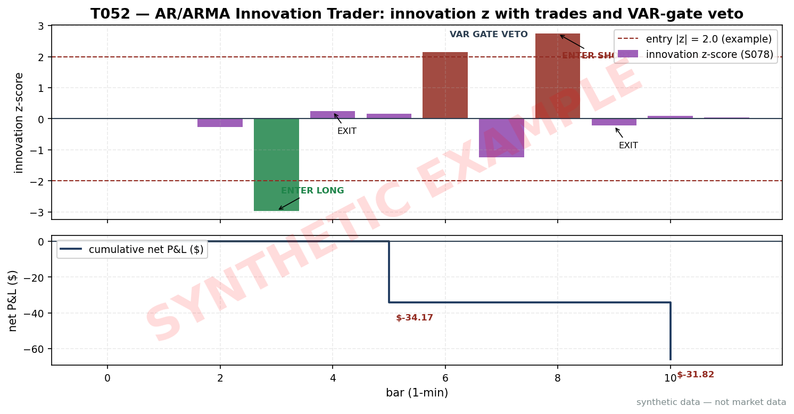

*Chart caption: synthetic data — not market data. Watermark reads "SYNTHETIC EXAMPLE" exactly.*

```mermaid
flowchart TD
    DATA["Market data<br/>(1-min mid bars + signed trades)"] -->|"1-min bars / 1-s trade signs"| SIGS["Signals<br/>S078 innovation z · S084 VAR/LRI · S088 validation"]
    SIGS -->|"per-bar z + flow check"| ENTRY{"Entry logic<br/>(|z|>2 fade, VAR veto, causality t→t+1)"}
    ENTRY -->|trigger| SIZE["Sizing + risk<br/>(800 sh / vol-scale, stops)"]
    ENTRY -->|no trigger / veto| WAIT["Wait"]
    SIZE -->|"limit orders at touch"| EXEC["Execution<br/>(30-s fill-or-kill)"]
    EXEC -->|"fills"| MON["Monitor + exits<br/>(zero-cross / time stop / stop-loss)"]
    MON -->|"trade P&L"| PNL["P&L (net of costs)"]
    style ENTRY fill:#f9e79f,stroke:#7d6608
    style PNL fill:#a9dfbf,stroke:#1e8449
```

### T10. Sources

1. Hasbrouck, J. (1991). "Measuring the Information Content of Stock Trades." *Journal of Finance*, 46(1), 179–207. http://ideas.repec.org/a/bla/jfinan/v46y1991i1p179-207.html — the trade–quote VAR: quote revisions respond to trade innovations; permanent vs temporary impact decomposition that this strategy's validation gate is built on.
2. Roll, R. (1984). "A Simple Implicit Measure of the Effective Bid-Ask Spread in an Efficient Market." *Journal of Finance*, 39(4), 1127–1139. https://authors.library.caltech.edu/records/afwsc-6bb61 — under a constant spread, trade-price changes are mechanically negatively autocorrelated ($\mathrm{Cov} = -s^2/4$): the reason the AR layer must run on mid-prices.
3. Bouchaud, J.-P., Gefen, Y., Potters, M. & Wyart, M. (2004). "Fluctuations and response in financial markets: the subtle nature of 'random' price changes." *Quantitative Finance*, 4(2), 176–190. http://ideas.repec.org/p/arx/papers/cond-mat-0307332.html — concave, largely permanent price response to trades; warns that much of every "surprise" is information, not noise.

**Unverified leads** (not confirmed facts — verify before use):
- Box, G.E.P. & Jenkins, G.M. (1970). *Time Series Analysis: Forecasting and Control* — canonical AR/ARMA reference per the signal report; edition/URL not verified in this pass.
- Tsay, R.S. (2005). *Analysis of Financial Time Series* — canonical intraday time-series reference per the signal report; URL not verified in this pass.
- Grok Q-TB6-1's worked confusion-matrix walk for DeepLOB (F1 83.4% FI-2010 claim) — relevant to batch TB6 but not to this strategy's evidence; treat as a research lead.

*Source log: Grok answered Q-TB6-1..3 (2026-09-10); all claims independently verified or labeled unverified.*

## Stage 153/200 — T053: HMM Regime-Switching Allocator

*Batch TB6 · Strategy 53/100 · Signals S079, S025, S035 · Provenance [D/SR]*

### T1. One-line verdict

| | |
|---|---|
| **Style** | Cross-sectional style allocator: a hidden Markov model decides, bar by bar, how much capital goes to a momentum book vs a reversal book |
| **Edge source** | Regime persistence: momentum works in persistent trends and crashes at turns; reversal works in chop. The HMM's forward-filter posterior shifts capital to the book the current regime favors — most of the value is *not trading the muddy middle* |
| **Typical holding period** | The allocator reweights daily (or per 30-min bar); sleeve trades hold minutes (momentum) to a day (reversal) |
| **Capacity hint** | Large: it allocates between two diversified equity books; capacity is the sleeves' capacity, not the allocator's |
| **Build-or-buy in one line** | Build — `hmmlearn` plus your two books; vendor "regime labels" are rarely cheap, rarely transparent, and never causal |

A **hidden Markov model (HMM)** says the market is in one of a few unobserved *regimes* (hidden states) that switch occasionally; each regime emits returns with its own distribution. **Baum–Welch** (forward–backward EM) estimates the model from history; the **forward filter** (α-recursion) computes, causally, the probability of each regime *given only data up to now*. **Time-series momentum** (S025) buys recent winners; **short-term reversal** (S035) fades recent extremes. T053 does not pick stocks — it scales two pre-built books (momentum and reversal) by the HMM's regime posterior, with **volatility targeting** (scaling each sleeve to a constant risk budget) and a **dead zone** (a band of posterior values where weights don't move, to avoid churn).

### T2. Full mechanics

**Universe & session.** Broad US equities for the two sleeves (the allocator itself runs on a liquid proxy such as SPY/ES or the universe's equal-weighted return). Daily bars for allocation (30-min bars for the intraday variant, `example`). Sleeve books trade RTH.

**Model specification.** Two hidden states $S_t \in \{M, R\}$ (momentum-favoring / reversal-favoring); an optional third state $U$ (uncertain/high-vol) maps to a cash sleeve. Observation $x_t = (r_t, \hat{\sigma}_t^2)$ — the proxy's log return and 20-bar realized variance (`example` feature set; variance separates regimes better than mean). Emissions $x_t \mid S_t = s \sim \mathcal{N}(\mu_s, \Sigma_s)$ (Student-$t$ if fat tails matter). Transition matrix $A_{ss'} = \Pr(S_{t+1} = s' \mid S_t = s)$, estimated by Baum–Welch on a trailing 60-day window, refit weekly (`example`). **Live inference uses only the forward filter** — never the smoothed posterior $\gamma_{t|T} = \Pr(S_t \mid x_{1:T})$, which peeks at the future:

$$\alpha_t(s) \propto p(x_t \mid S_t = s)\sum_{s'} A_{s's}\,\alpha_{t-1}(s'),\qquad \pi^M_t = \frac{\alpha_t(M)}{\alpha_t(M) + \alpha_t(R)}.$$

**Allocation weights.** Soft blend with a dead zone (the arithmetically consistent form; Grok's Q-TB6-1 text had a sign slip in the numerator, corrected here):

$$w^M_t = \mathrm{clip}\!\left(\frac{\pi^M_t - (1-\tau)}{2\tau - 1},\, 0,\, 1\right),\qquad w^R_t = 1 - w^M_t,$$

with $\tau = 0.65$ (`example`): $\pi^M \le 0.35 \to$ full reversal, $\pi^M \ge 0.65 \to$ full momentum, linear in between. **Hysteresis** (`example`): require two consecutive bars outside the dead zone before moving a weight more than 20 points — cuts whipsaw at turns. Then **volatility targeting** per sleeve (Moreira–Muir/Barroso–Santa-Clara style): $\lambda^k_t = \min(\sigma^\star_k / \hat{\sigma}^{EWMA}_{t,k},\, L_{\max})$ with $\sigma^\star = 10\%$ annualized and $L_{\max} = 2$ (`example`). Final notionals: $N^M_t = w^M_t\,\lambda^M_t\,V_t$, $N^R_t = w^R_t\,\lambda^R_t\,V_t$ for NAV $V_t$.

**Sleeve books (pre-built; the allocator only scales them).** Momentum book (S025-style): at each bar close, go long names (or the proxy) with prior-period return above $+0.75\%$ (`example`), hold one bar. Reversal book (S035-style): fade prior-bar extremes — long after a $< -1.5\%$ bar, short after a $> +1.5\%$ bar (`example`), hold one bar, on quote midpoints. **Hard allocator veto:** a sleeve trade fires only if its book's weight is positive ($w > 0$); a momentum entry during a full-reversal allocation is skipped entirely.

**Causal timing:** $\pi^M_t$ is computed at bar $t$'s close from data $\le t$; any notional change or sleeve entry is tradable no earlier than bar $t+1$ ($t \to t+1$). Detection lag is 1–2 bars by construction — the filter is late at turns, always.

**Risk limits.** Sleeve-level stop: if a sleeve's trailing 5-day P&L < −3% of its allocated notional, halve its $\lambda$ (`example`). Book-level daily loss stop −2% NAV (`example`). Max gross $1.5\times$ (`example`). **Kill switch:** if the filter's posterior oscillates across the dead zone more than 4 times in 10 bars (`example`), the regimes are unidentifiable — pin weights at 50/50 and halve leverage until it settles.

**Cost model (applied in T4).** 2.7 bp round-trip per dollar traded (`example`: ~2¢ spread + fees on a $100 stock). The allocator's own turnover cost: every weight change rebalances the sleeves — modeled as the per-trade cost on the rebalanced notional; the dead zone and hysteresis exist to keep this small.

**Order/execution sketch.** Rebalances via the sleeves' normal execution (participation ≤ 10% of 1-min volume, `example`); regime shifts are scheduled at bar closes, never chased mid-bar. (No queue-join honesty note applies — the risk that matters here is detection lag, disclosed above.)

### T3. Signals it consumes

| Signal | Role | Weight / logic |
|---|---|---|
| S079 — HMM regime-switching [D] | Primary trigger (allocation) | $\pi^M_t$ from the causal forward filter → $w^M_t, w^R_t$ via the dead-zone blend (`example` $\tau = 0.65$) |
| S025 — Intraday time-series momentum [D] | Momentum sleeve's entries | Long the prior-period winners; only funded when $w^M_t > 0$ |
| S035 — Short-term reversal [D] | Reversal sleeve's entries | Fade prior-bar extremes on midpoints; only funded when $w^R_t > 0$ |

Combination pseudocode (≤25 lines):

```
each closed bar t (daily; or 30-min for intraday):
    x = (r[t], realized_var[t])                       # proxy observations
    piM = hmm_forward_filter(x, A, emissions)         # S079, causal only
    wM = clip((piM - 0.35) / 0.30, 0, 1); wR = 1 - wM  # dead-zone blend (example tau=0.65)
    if hysteresis_blocks(wM, wM_prev): wM, wR = wM_prev, wR_prev
    lamM = min(0.10 / ewma_vol_M, 2.0)                # vol targeting (example)
    lamR = min(0.10 / ewma_vol_R, 2.0)
    N_M, N_R = wM*lamM*NAV, wR*lamR*NAV
    if r[t] >= +0.75% and wM > 0: momentum long next bar, notional N_M   # S025
    if abs(r[t]) >= 1.5% and wR > 0: reversal fade next bar, notional N_R # S035
    # allocator never picks names; it only scales the two books
```

### T4. Worked example — numbers + P&L (SYNTHETIC)

**Setup (all synthetic, seed 153 = `np.random.default_rng(153)`).** 8 bars; $\pi^M_t$ = persistent regime path (designed M,M,M,R,R,R,M,M latent) plus seed jitter ±10pp; $\tau = 0.65$ (`example`); $\lambda^M = \lambda^R = 1.0$ (`example` — both sleeves at target vol); NAV $1,000,000$ (`example`); cost 2.7 bp round-trip per dollar (`example`). Sleeve rules as in T2: momentum long after $r_t \ge +0.75\%$, reversal fade after $|r_t| \ge 1.5\%$, each held one bar; a sleeve trade fires only if its weight is positive.

| bar | $\pi^M_t$ | $w^M$ | $w^R$ | $r_t$ | allocator action |
|---|---|---|---|---|---|
| 0 | 0.9800 | 1.00 | 0.00 | +1.20% | MOM#1: long bar 1 @ $1,000,000 |
| 1 | 0.9288 | 1.00 | 0.00 | −0.60% | — |
| 2 | 0.8422 | 1.00 | 0.00 | −1.80% | reversal signal fires but $w^R = 0$ → **VETOED** |
| 3 | 0.1513 | 0.00 | 1.00 | −1.60% | REV#1: fade (long) bar 4 @ $1,000,000 |
| 4 | 0.0564 | 0.00 | 1.00 | +0.90% | momentum signal fires but $w^M = 0$ → **VETOED** |
| 5 | 0.1700 | 0.00 | 1.00 | −1.10% | — |
| 6 | 0.8971 | 1.00 | 0.00 | +1.30% | MOM#2: long bar 7 @ $1,000,000 |
| 7 | 0.9362 | 1.00 | 0.00 | +0.50% | — |

**Line-by-line P&L** (cost = notional × 2.7 bp):

- MOM#1 (hold bar 1, −60 bp): gross = −$6,000.00; cost $270.00; **net = −$6,270.00**.
- REV#1 (hold bar 4, +90 bp): gross = +$9,000.00; cost $270.00; **net = +$8,730.00**.
- MOM#2 (hold bar 7, +50 bp): gross = +$5,000.00; cost $270.00; **net = +$4,730.00**.
- **Total net = +$7,190.00** on $3M of sleeve notional.

**What the vetoes did (counterfactuals):** the vetoed t=2 reversal fade would have held bar 3 (−160 bp) → −$16,000 gross; the vetoed t=4 momentum long would have held bar 5 (−110 bp) → −$11,000 gross. The allocator's dead-zone blend avoided **−$27,000** of gross losses — more than 3× the book's realized net. That is the whole strategy in one toy: the value is in the trades it *refuses*.

**Where the example is optimistic.** (1) The regime path was *designed* to be perfectly persistent and perfectly aligned with the trades — real posteriors hover near 0.5 far more often, and the dead zone then means long stretches of 50/50 funding, not clean 1/0 switches. (2) $\tau = 0.65$ and the trade thresholds were chosen on this tape; production values need purged walk-forward (S088). (3) Sleeve trades were assumed to capture the full bar return with zero slippage — the momentum entry in particular fills worse live. (4) $\lambda = 1.0$ for both sleeves was fixed; real vol targeting adds its own turnover and estimation error. (5) Eight bars prove nothing — the documented value of HMM allocation is crash-avoidance over years (see T7), not 8-bar toy P&L.

### T5. Data & infra — what must run

**Pipeline inventory.** Pre-open: daily (or 30-min) bars for the proxy + VIX/HY OAS optional cross-asset features; corporate-action adjustment; survivorship-bias-free universe for the sleeves. Weekly batch: Baum–Welch refit of the HMM on the trailing 60 days (`example`), walk-forward check that the refit doesn't flip state labels. Intraday/daily loop: forward-filter update per bar (microseconds), dead-zone blend, hysteresis check, sleeve notional broadcast. Post-close: log $\pi^M_t$ vs sleeve P&L; monitor posterior oscillation (the kill-switch input); purged evaluation of $\tau$ and hysteresis (S088).

**M5 Max feasibility: trivial-to-feasible (Tier M, 20–60 h ≈ $3,000–$9,000 loaded-cost estimate at $150/hr, per cost-model §5** — the HMM library is the canonical Tier-M example; the allocator harness on top is the smaller half). Throughput (cost-model §2): fitting a 2-state Gaussian HMM on 5–10y of daily bars is ~0.2–2 s per series; 500 names refit weekly is minutes — embarrassingly parallel, CPU+BLAS, GPU irrelevant. The live filter is microseconds per bar. RAM (cost-model §3): the feature panel (500 × 2,500 days × 20 cols) is tens of MB — trivial. Storage: daily library < 5 GB (cost-model §4). Bottleneck: none on compute — label discipline (causal filter only, no smoothed labels in research) is the real work.

**Feed-outage safe mode.** If the proxy feed stalls: freeze weights at their last values (do *not* extrapolate the filter), block all sleeve entries that depend on fresh allocation, and let existing sleeve positions exit on their own stops. If the outage exceeds the allocation bar length (e.g. one full day on the daily variant, `example`), halve both sleeves' $\lambda$ — an allocator flying blind should be a smaller allocator.

### T6. Buy vs build

| Option | What you get | Indicative price | Gains | Loses |
|---|---|---|---|---|
| Build on `hmmlearn` + `statsmodels` (own stack) | Full HMM library, causal filter, allocator | $0 software + ~$50–500/mo bars data — *indicative — verify before budgeting* | The causality is yours to verify; no black box | 20–60 h engineering (Tier M, per cost-model §5) |
| Retail platform (QuantConnect) | Research/backtest harness | ~$0–$96/mo — *indicative — verify before budgeting* | Fast sleeve backtests | You still write the HMM and the allocator |
| Vendor "regime labels" feed | Third-party bull/bear labels | Rarely listed; typically $$$$ institutional — *indicative — verify before budgeting* | Saves modeling time | Rarely transparent, rarely causal, never tuned to *your* sleeves — the label methodology is the product and you can't see it |
| Institutional (full quant stack) | Production regime models | $$$$ — *indicative — verify before budgeting* | Battle-tested | Absurd for a ≤$1M paper op |

**Verdict: build; buy only clean bars.** There is no serious off-the-shelf "momentum/reversal HMM allocator" worth a license — the library is small, causal inference is the whole product, and vendor labels can't be audited for lookahead. **Buy** Tier-1 adjusted bars (~$50–500/mo retail-ish — *indicative — verify before budgeting*) and spend the budget on the weekly refit/monitoring job, not on labels.

### T7. Success-ratio evidence

| Study / source | Market & period | Metric | Before/after cost | Caveat |
|---|---|---|---|---|
| Hamilton (1989), *Econometrica* | US GNP/business cycle | Markov-switching model: latent regimes with state-dependent means/variances; the foundation every finance HMM is built on | N/A — econometric methodology | Regime-switching *exists*; tradable value-add is a separate claim |
| Nystrup, Madsen & Lindström (2017), *Quantitative Finance* | Multi-asset, dynamic portfolio optimization | Regime-aware (HMM) dynamic allocation improves risk-adjusted performance vs static allocation | After-cost framing in the paper's portfolio tests — verify before citing numbers | Institutional portfolio context, not an intraday momentum/reversal book |
| Christensen, Godsill & Turner (2020), arXiv:2006.08307 | Intraday momentum trading | HMM with latent momentum state + side information; 2–3 states selected by CV/penalized likelihood; forward-algorithm prediction of $t+1$ returns | Before-cost (prediction study) | Shows the HMM *can* be estimated intraday with side information — not a P&L claim |
| Ang & Timmermann (2011), NBER w17182 | Survey of regime-switching in finance | Regimes materially change optimal asset allocation; ignoring them carries welfare costs | N/A — survey | Corroborates the allocator's premise, not its profits |

**Capacity & decay.** The allocator adds no capacity constraint beyond the sleeves'. Documented decay channel: as volatility-targeting and regime-timing crowded post-2015, the marginal value of the HMM over a plain vol target shrank — a cautious read is that any value lies in *crash-avoidance vs static momentum*, smaller vs vol-targeting, and easy to fake with smoothed states. **Intraday allocator evidence is thin** — most HMM allocation work is daily; intraday, persistence is lower and turnover explodes without hysteresis.

**Honest bottom line.** For a ≤$1M paper operation this is one of the best value-for-money strategies in the batch: ~$50–500/mo data, ~$3k–$9k loaded engineering estimate, runs on a laptop. Expect the value to show up as *smaller drawdowns in regime turns* (2009/2020-style momentum crashes are the canonical case), not as a higher Sharpe in calm years. An institutional desk adds a third state, cross-asset features, and intraday refits — worth it at their scale, overkill at yours.

### T8. Failure modes

1. **Misclassification at turns** — the causal filter is late by construction; you hold the momentum book into the first bars of a reversal (the 2009/2020 momentum-crash shape). *Mitigation:* vol overlay *and* HMM — hard-cap $w^M$ when $\hat{\sigma}$ jumps; never use smoothed $\gamma_{t|T}$.
2. **Smoothed-label leakage in research** — backtests that tag history with a full-sample HMM fit disagree with the live forward filter — treat any backtest built this way as suspect until it is re-run causally). *Mitigation:* forward filter only, in research and live; purged walk-forward (S088).
3. **Overfit state count** — $K \ge 4$ states produce unstable, uninterpretable labels. *Mitigation:* 2–3 states selected by penalized likelihood/CV (Christensen et al. select 2–3); freeze $K$ a priori.
4. **Turnover explosion** — without the dead zone and hysteresis, $\pi^M_t$ flicker churns the sleeves. *Mitigation:* dead zone + 2-bar hysteresis + rebalance thresholds (only trade weight changes > 5pp, `example`).
5. **Transition-matrix staleness** — $A$ estimated on calm history underestimates turn frequency in stress. *Mitigation:* weekly refit; monitor expected state duration $E[D_i] = 1/(1-A_{ii})$ for drift.
6. **Regime unidentifiability** — when state emissions overlap, the posterior sits at 0.5 and the allocator is a coin flip. *Mitigation:* the kill-switch oscillation rule; fall back to 50/50 + halved leverage.
7. **Vol-targeting whipsaw** — $\lambda^k_t$ itself adds turnover in vol spikes. *Mitigation:* cap $\lambda$ changes per bar (`example`: ≤ 25%); use slow EWMA vol.
8. **Sleeve-model risk** — the allocator is only as good as the two books; a broken momentum book scaled "correctly" still loses. *Mitigation:* validate each sleeve standalone on purged splits before the allocator ever touches it.

### T9. Visuals

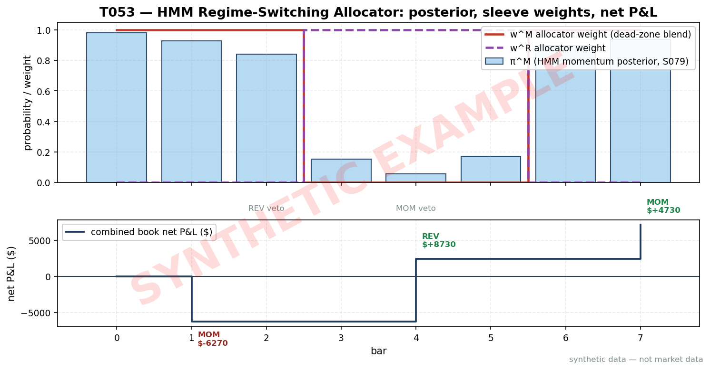

*Chart caption: synthetic data — not market data. Watermark reads "SYNTHETIC EXAMPLE" exactly.*

```mermaid
flowchart TD
    DATA["Market data<br/>(daily / 30-min bars)"] -->|"daily bars + realized var"| SIGS["Signals<br/>S079 HMM posterior · S025 momentum · S035 reversal"]
    SIGS -->|"per-bar posterior + sleeve signals"| ENTRY{"Entry logic<br/>(dead-zone blend, veto, causality t→t+1)"}
    ENTRY -->|trigger| SIZE["Sizing + risk<br/>(vol target, hysteresis, stops)"]
    ENTRY -->|no trigger / veto| WAIT["Wait"]
    SIZE -->|"sleeve notionals"| EXEC["Execution<br/>(bar-close rebalance, ≤10% participation)"]
    EXEC -->|"fills"| MON["Monitor + exits<br/>(sleeve stops, oscillation kill-switch)"]
    MON -->|"trade P&L"| PNL["P&L (net of costs)"]
    style ENTRY fill:#f9e79f,stroke:#7d6608
    style PNL fill:#a9dfbf,stroke:#1e8449
```

### T10. Sources

1. Hamilton, J. D. (1989). "A New Approach to the Economic Analysis of Nonstationary Time Series and the Business Cycle." *Econometrica*, 57(2), 357–384. https://doi.org/10.2307/1912559 — the Markov-switching foundation: latent regimes with state-dependent distributions; every finance HMM descends from this.
2. Christensen, H., Godsill, S. & Turner, R. E. (2020). "Hidden Markov Models Applied To Intraday Momentum Trading With Side Information." arXiv:2006.08307. https://arxiv.org/abs/2006.08307 — HMM with latent momentum state for intraday trading; 2–3 states selected by CV/penalized likelihood; forward-algorithm $t+1$ prediction; input-output HMM for side information. arXiv ID verified 2026-09-10.
3. Nystrup, P., Madsen, H. & Lindström, E. (2017). "Dynamic portfolio optimization across hidden market regimes." *Quantitative Finance*. https://backend.orbit.dtu.dk/ws/files/139272081/Dynamic_Portfolio_Optimization_Across_Hidden_Market_Regimes_ACCEPTED.pdf — regime-aware dynamic allocation across hidden market states; documents the risk-adjusted value of conditioning allocation on HMM regimes.
4. Ang, A. & Timmermann, A. (2011). "Regime Changes and Financial Markets." NBER Working Paper 17182. https://www.nber.org/papers/w17182 — survey: regimes materially change optimal allocation; ignoring them is costly.

**Unverified leads** (not confirmed facts — verify before use):
- Daniel, Jagannathan & Kim, "Hidden Markov Model of Momentum" (named by Grok Q-TB6-3; URL not spot-checked) — claimed: HMM timing that stands down in turbulent states avoids momentum crashes OOS. Promising lead; do not cite as evidence until verified.
- Barroso, P. & Santa-Clara, P. (2015) vol-managed momentum ("nearly doubles Sharpe") — named-only by Grok; treat the magnitude as an unverified chatbot claim.
- Grok Q-TB6-3's ES/SPY walk ("full-sample labels disagree with the forward filter ~1 day in 11") and short-window HMM-timing Sharpe ~2 claims — unverified chatbot claims; used here only as cautionary illustrations.
- Haase, F. & Neuenkirch, M. (2020) time-varying transition probabilities — cited in S079; not independently opened in this pass.
- Chatbot-sourced claim (Grok Q-TB6-3, unverified): HMM regime timing's value-add vs static momentum lies in crash-avoidance rather than higher calm-year Sharpe.

*Source log: Grok answered Q-TB6-1..3 (2026-09-10); all claims independently verified or labeled unverified.*

## Stage 154/200 — T054: Hurst/Variance-Ratio Regime Toggle

*Batch TB6 · Strategy 54/100 · Signals S090, S025, S041*

**Provenance: [D/SR].**

### T1. One-line verdict

| | |
|---|---|
| **Style** | Intraday regime-toggled blend: a momentum sleeve armed only in persistent (trending) regimes, a mean-reversion sleeve armed only in anti-persistent regimes, dark in the random-walk dead zone |
| **Edge source** | Return-autocorrelation structure measured by the Lo–MacKinlay variance ratio (S090) and mapped to a Hurst exponent; the toggle routes capital to whichever sleeve's assumption the tape currently satisfies — rolling momentum (S025) when Ĥ says trend, Bollinger tag-and-reenter (S041) when Ĥ says reversion |
| **Typical holding period** | Minutes to under an hour (`example`: 5–30 one-minute bars) |
| **Capacity hint** | Moderate for liquid large caps — the toggle is a risk control, not a capacity unlock; capacity is set by the sleeves |
| **Build-or-buy in one line** | Build the toggle on bought 1-minute bars (Tier 2); no packaged "regime product" can be audited for t→t+1 causality on your universe |

### T2. Full mechanics

**Universe & session.** 20–100 liquid large caps with average daily volume above $50M (`example`); 1-minute bars, RTH 09:45–15:45 ET (`example`); flat by 15:45 ET. Exclude earnings-day names and anything halted.

**Regime estimator (S090).** Let `r_t = ln(P_t / P_{t−1})` be the 1-minute log return. The *variance ratio* at aggregation `k` compares the variance of `k`-bar returns to `k` times the 1-bar variance:

`VR(k) = Var(r_t(k)) / (k · Var(r_t))`, where `r_t(k) = r_t + r_{t−1} + … + r_{t−k+1}`.

Under a random walk (uncorrelated increments), VR(k) = 1 for all k. VR(k) > 1 means positive autocorrelation (*persistence* — trends continue); VR(k) < 1 means negative autocorrelation (*anti-persistence* — reversals dominate). Estimated over a rolling window of 250 one-minute bars (`example`), for `k ∈ {2, 4, 8}` (`example`).

The *Hurst exponent* Ĥ maps the variance ratio onto a 0–1 scale:

`Ĥ(k) = 1/2 · [1 + ln VR(k) / ln k]`

Ĥ > 0.5 means persistent (trending), Ĥ < 0.5 means anti-persistent (mean-reverting), Ĥ = 0.5 is a random walk. (Hurst's original 1951 estimator used rescaled-range — R/S, the range of cumulative deviations divided by the standard deviation, scaling with window length; the VR mapping is the modern econometric equivalent.) Take the median of Ĥ(2), Ĥ(4), Ĥ(8) as Ĥ_t (`example`). S090's documented VR_hi/VR_lo of 1.10/0.90 correspond, at k=4, to Ĥ ≈ 0.534/0.462 — the thresholds below sit just outside that documented band.

Classification (`example` thresholds; re-estimated every 5 minutes):

- **Trend** if Ĥ_t > 0.55 — arm the momentum sleeve, disarm reversion.
- **Reversion** if Ĥ_t < 0.45 — arm the reversion sleeve, disarm momentum.
- **Dead zone** otherwise — no new entries from either sleeve; existing positions run to their exits.
- Hysteresis (`example`): a regime change needs two consecutive 5-minute readings in the new regime before sleeves re-arm, so the toggle does not chatter on estimation noise.

**Momentum sleeve (S025), armed only in Trend.** Signal: `Sig_t = sign(Σ_{i=0}^{29} w_i r_{t−i})` over the trailing 30 one-minute bars (`example`), equal weights (`example`). Volatility targeting sets size: `pos_t = Sig_t · σ_target / σ̂_t`, with σ̂_t the rolling 60-bar return σ (`example`) and σ_target the per-name intraday vol target (`example`). Signal at bar *t* → earliest fill at bar *t+1* (causal timing). Exits, first to fire (`example`): regime flips out of Trend; 30-bar time stop; 1.5× ATR(30) stop (ATR = average true range, the mean bar range over 30 bars).

**Reversion sleeve (S041), armed only in Reversion.** Bollinger(20, 2.0): `Mid_t = SMA(20)_t`; `Upper/Lower = Mid ± 2σ` (`example`); `%b = (P − Lower)/(Upper − Lower)`. *Tag-and-reenter* entry: bar *t−1* closes below the lower band and bar *t* closes back inside — that re-entry is the signal at bar *t*, earliest fill at bar *t+1* (causal timing). Short mirrors on the upper band. Exits (`example`): mid-band touch; 10-bar time stop; 2σ adverse-excursion stop.

**Cross-sleeve rules.** Never both sleeves in one name at once; a name entering the dead zone finishes existing positions but takes no new ones; max 3 sleeve-positions per name per day (`example`).

**Position sizing.** Dollar-risk sizing `N = ⌊R / |P_entry − P_stop|⌋`, R = $500 per trade (`example`); sleeve-level cap ±$2M gross per name (`example`).

**Risk limits.** Daily loss stop −$3,000 (`example`, then dark for the day); portfolio gross cap $10M (`example`); kill switch on any feed anomaly (T5).

**Cost model** (applied in T4): half-spread 1.25 bp per aggressive leg + $0.005/share commission each way; no rebate; stress-tested with doubled spread in T8.

**Order/execution sketch.** Momentum entries: marketable limit at the touch (taker). Reversion entries: passive limit at the re-entered level, cancel/replace after 2 bars (`example`). All exits marketable. Participation cap 5% of trailing 1-minute volume (`example`).

### T3. Signals it consumes

| Signal | Role | Combination logic |
|---|---|---|
| S090 VR/Hurst regime | **Regime toggle** (which sleeve is armed) | Ĥ_t > 0.55 → momentum armed; Ĥ_t < 0.45 → reversion armed; else dark (`example`) |
| S025 rolling momentum | **Trigger in Trend** | Sig_t = sign of trailing-30-bar weighted return; vol-targeted size |
| S041 Bollinger tag-and-reenter | **Trigger in Reversion** | tag at t−1 + re-enter at t → signal at t, fill at t+1, fade toward mid |

```
# T054 combination logic (<=25 lines; every threshold `example`)
on each 1-min bar t (causal, exchange close):
    Ht = median(H(2), H(4), H(8)) over trailing 250 bars   # S090
    regime = trend if Ht>0.55 else reversion if Ht<0.45 else dead
    if regime changed: require 2 consecutive reads to re-arm
    if flat and regime==trend:
        sig = sign(sum(r[t-29:t+1]))                       # S025
        if sig != 0: enter at t+1, N=R/stop, stop=1.5*ATR(30)
    if flat and regime==reversion:
        if close[t-1]<lower[t-1] and close[t]>lower[t]:
            enter long at t+1                              # S041 tag-and-reenter (signal at t)
        # short mirrors on the upper band
    exits: regime flip | time stop (30/10 bars) | stop-loss
    veto new entries in dead zone; flat 15:45 ET
```

### T4. Worked example — numbers + P&L (SYNTHETIC)

**All numbers synthetic** (random seed 154, `batches/TB6/plot_T054.py` — re-runnable). Fictional large-cap "ACME" at ~$249, 1-minute bars 09:31–15:30 ET, 1,000 shares per trade (`example`). Costs: half-spread 1.25 bp per leg + $0.005/share commission each way. In this session the rolling VR estimator never cleared the 0.55 trend threshold — estimation noise on weak persistence kept the momentum sleeve dark, which is the toggle working as designed: no signal, no trade. All three fired trades are S041 tag-and-reenter longs in the reversion regime (Ĥ below the 0.45 `example` threshold at entry).

| # | Sleeve / regime | Dir | Signal (bar) | Entry (bar / ET) | Exit (bar / ET) | Entry px | Exit px | Shares | Gross $ | Cost $ | Net $ | Exit reason |
|---|---|---|---|---|---|---|---|---|---|---|---|---|
| 1 | Reversion | Long | 98 | 99 / 11:10 | 109 / 11:20 | 249.405 | 249.068 | 1,000 | −336.44 | −72.35 | **−408.79** | 10-bar time stop |
| 2 | Reversion | Long | 102 | 103 / 11:14 | 113 / 11:24 | 249.232 | 248.837 | 1,000 | −395.12 | −72.31 | **−467.42** | 10-bar time stop |
| 3 | Reversion | Long | 114 | 115 / 11:26 | 125 / 11:36 | 249.022 | 249.051 | 1,000 | +28.59 | −72.26 | **−43.66** | 10-bar time stop |

Line-by-line walk. **Trade 1:** bar 97 closed below the lower Bollinger band, bar 98 closed back inside — the signal at bar 98 fills at the next bar's price 249.405 (signal at *t*, earliest fill *t+1*; fills assumed in full at the bar price — see optimism notes). The mid-band touch never came; the 10-bar time stop fired at bar 109, exit 249.068. Gross = −$336.44 (full precision). Cost = 2 × 0.0125% × 249.405 × 1,000 + 2 × $0.005 × 1,000 = $62.35 + $10.00 = $72.35. **Net = −$408.79.** Trades 2 and 3 follow the same arithmetic: gross −$395.12/+$28.59, costs $72.31/$72.26, nets **−$467.42**/**−$43.66**.

Totals: gross −$702.97, costs −$216.92, **net −$919.88** over 3 trades. The chart `images/T054_example.png` plots this exact walk: synthetic mid with Bollinger(20, 2.0) bands and entry/exit markers (top), cumulative net P&L with per-trade annotations (bottom), true-regime background shading.

**Where the example is optimistic.** (1) Fills assumed in full at the bar price — no partial fills and no queue-priority lottery on the passive reversion entries. (2) Spread a constant 1.25 bp half-spread; real spreads widen exactly when bands are tagged. (3) Zero latency — signal at bar *t*, fill at bar *t+1* with no wire delay; a retail SIP (Securities Information Processor — the consolidated public quote tape) feed adds tens of milliseconds this arithmetic ignores. (4) The synthetic tape has crisp AR(1) regime blocks; real persistence is mushy and the estimator lags it — this session's dark momentum sleeve is the honest version of that lag. (5) One session, three trades — no statistical content. The net −$919.88 day is the honest shape: at 1,000-share size the ~$72/trade cost stack needs a >3 bp favorable move per leg just to break even, and all three trades died on the time stop.

### T5. Data & infra — what must run

**Pipeline inventory.** Bar ingest (09:15–16:05 ET): 1-minute bars with exchange timestamps into a per-name ring buffer; heartbeat watchdog. Feature loop: rolling 250-bar VR(2/4/8) → Ĥ_t per name every 5 minutes (`example`); per-name SMA(20)/σ for Bollinger; trailing-30-bar momentum sums; ATR(30). Signal→order bridge: signal at bar *t* → order queued for bar *t+1* — causal only. Paper broker + ledger persisted to disk (JSONL). Shared services: NYSE calendar, halt flags, DST handling, risk caps, structured logs.

**M5 Max feasibility: feasible — the toggle is cheap.** Throughput (`notes/cost-model.md` §2): rolling VR/Hurst over 250-bar windows is a NumPy vector op at ~50–200M elements/sec; 100 names re-estimated every 5 minutes is microseconds per cycle. RAM (§3): 500 symbols × 60 days of 1-minute bars ≈ 12 MB — far under the 77 GB working-set budget. Engineering time: Tier M (`cost-model.md` §5) — **20–60 h** ≈ $3,000–9,000 loaded-cost estimate at $150/hr; most of it is the causality audit and the estimator test harness, not compute. Bottleneck: clean corporate-action-adjusted bars and timestamp quality, not the Mac.

**Feed-outage safe mode.** Bar watchdog: if no new bar prints within 90 s of the expected close (`example`) → **flatten immediately, freeze new entries, tag DEGRADED**. Never forward-fill missing bars into the VR window — forward-filled zero returns manufacture fake mean-reversion and bias Ĥ_t down, which would arm the reversion sleeve on a lie. Resume only after 30 consecutive clean bars (`example`) plus a full 250-bar estimator re-warm. Local process crash: restart flat; the on-disk ledger is the source of truth, never RAM.

### T6. Buy vs build

| Option | What you get | Indicative price | Gains | Loses |
|---|---|---|---|---|
| Tier 0: delayed 1-min bars | 15-min delayed bars | ~$0 — *indicative — verify before budgeting* | $0 prototype | no live toggle |
| Tier 1: SIP 1-min bars (Massive/Polygon Stocks Advanced class) | real-time SIP bars | ~$199/mo class — *indicative — verify before budgeting* | cheap live bars | SIP timestamps; regime timing is approximate |
| Tier 2: Databento 1-min bars | exchange-timestamped bars | ~$200/mo + usage — *indicative — verify before budgeting* | honest bar timing | usage metering on history backfill |
| Packaged "regime signal" SaaS | black-box regime labels | varies — *indicative — verify before budgeting* | nothing to build | cannot audit t→t+1 causality or the VR window — skip |

**Verdict: buy the bars, build the toggle.** VR/Hurst on 250-bar windows is ~50 lines of NumPy; the value is your thresholds, hysteresis, and sleeve wiring — none of which any vendor sells. Start on Tier 1 SIP bars for research; promote to Tier 2 when the toggle's live timing matters.

### T7. Success-ratio evidence

The literature documents **return predictability statistics, not after-cost toggled P&L** — that gap is the whole story of T054.

| Study / source | Market & period | Metric | Before/after cost | Caveat |
|---|---|---|---|---|
| Lo & MacKinlay (1988) | US weekly returns, 1962–1985 | variance-ratio test rejects the random walk (VR ≠ 1) | before-cost (statistical test) | rejection of a random walk ≠ proof of tradable trend or reversion — it can reflect time-varying expected returns or nonsynchronous trading |
| Hurst (1951) | hydrology (Nile reservoir storage) | R/S analysis; H ≠ 0.5 in natural series | n/a (not markets) | origin of the exponent, not market evidence |
| Bailey & López de Prado (2014) | general | Deflated Sharpe Ratio corrects for multiple-testing selection bias and non-normal returns | methodological | applies directly to the toggle's mined thresholds (0.55/0.45, windows): any backtested toggle Sharpe must be deflated |

Capacity: the toggle doesn't create capacity — it rations it. In a persistent market the momentum sleeve inherits momentum capacity (crowded, decays); in chop the reversion sleeve inherits reversal capacity (spread-bound). Decay: the VR/Hurst statistic is stable as measurement; the *tradable* residue decays as more capital toggles on the same thresholds.

**Honest bottom line.** For a ≤$1M paper operation: T054 is a risk-management overlay with **no documented positive after-cost edge as a standalone book** — the papers show returns aren't random walks, not that a toggled intraday blend profits after costs. Its honest value is cutting the left tail: staying dark when neither sleeve's assumption holds (the dead zone). The worked session demonstrates exactly that — the momentum sleeve fired zero trades rather than forcing trades in noise.

### T8. Failure modes

1. **VR estimation noise whipsaws the toggle.** Short windows make Ĥ_t jump across 0.55/0.45 on noise; each re-arm churns. Mitigation: 250-bar window (`example`), median over k, two-reading hysteresis.
2. **Regime-flip latency.** The estimator is backward-looking; you enter the new regime late and exit the old one late — transitions are where both sleeves lose. Mitigation: time stops that don't depend on regime; smaller size for 15 minutes after a flip (`example`).
3. **Microstructure noise contaminates 1-min VR.** Bid-ask bounce at 1-minute sampling biases VR down (fake mean-reversion). Mitigation: estimate on 5-minute bars (`example`) or apply a bounce-bias correction; never toggle on raw 1-min VR without checking.
4. **Lookahead in the rolling window.** Centered windows or overlapping k-bar sums that peek past bar *t*. Mitigation: causal audit — every input to Ĥ_t timestamped ≤ *t*; unit-test with a synthetic step regime.
5. **Cost blowup from toggling.** Each sleeve switch pays the ~$72-style cost stack; frequent re-arms bleed. Mitigation: per-day toggle budget, max 2 re-arms per name (`example`); fee-covering minimum expected move.
6. **Both sleeves wrong simultaneously.** A news shock trends then reverses inside one sleeve's holding period. Mitigation: ATR stop on every position regardless of sleeve; daily loss stop.
7. **Feed outage / stale bars.** Forward-filled bars fake mean-reversion and arm the wrong sleeve. Mitigation: the T5 safe-mode plan — flatten, never interpolate, re-warm the estimator.

### T9. Visuals

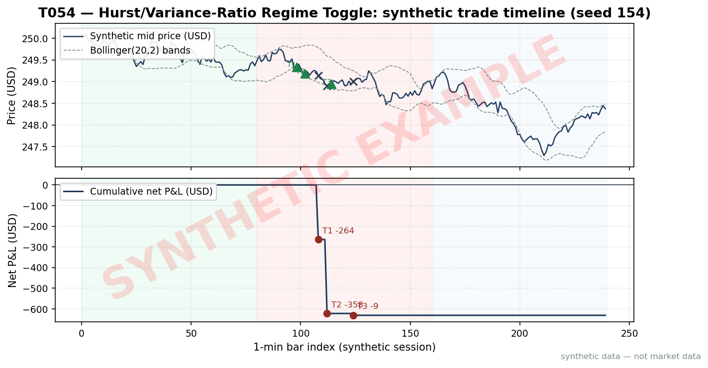

The chart carries the "SYNTHETIC EXAMPLE" watermark and the "synthetic data — not market data" caption.

```mermaid
flowchart TD
    DATA["Market data\n(1-min bars, exchange ts)"] -->|1-min bars| SIGS["Signals\nS090 VR/Hurst regime, S025 momentum, S041 Bollinger"]
    SIGS -->|Ĥ_t every 5 min| ENTRY{"Regime toggle<br/>Ĥ>0.55 momentum<br/>Ĥ<0.45 reversion<br/>else dark<br/>signal at t → fill at t+1"}
    ENTRY -->|sleeve armed| SIZE["Sizing + risk\nN = R/stop; daily loss stop; kill switch"]
    ENTRY -->|dead zone| WAIT["Wait"]
    SIZE -->|1-min bars| EXEC["Execution\ntaker momentum / passive reversion entries"]
    EXEC -->|fills + fees| MON["Monitor + exits\nregime flip / time stop / ATR stop"]
    MON -->|net fills| PNL["P&L (net of costs)"]
    style ENTRY fill:#f9e79f,stroke:#7d6608
    style PNL fill:#a9dfbf,stroke:#1e8449
```

### T10. Sources

1. Lo, A. W. & MacKinlay, A. C. (1988). "Stock Market Prices Do Not Follow Random Walks: Evidence from a Simple Specification Test." *Review of Financial Studies* 1(1): 41–66 — http://web.mit.edu/Alo/www/Papers/lo-mackinlay-88.html (variance-ratio test; the S090 [D] econometric source — a statistical rejection of the random walk, not a trading rule).
2. Hurst, H. E. (1951). "Long-Term Storage Capacity of Reservoirs." *Transactions of the American Society of Civil Engineers* 116: 770–799. DOI 10.1061/TACEAT.0006518 (rescaled-range R/S analysis; origin of the Hurst exponent — hydrology, not markets).
3. Bailey, D. H. & López de Prado, M. (2014). "The Deflated Sharpe Ratio: Correcting for Selection Bias, Backtest Overfitting and Non-Normality." *Journal of Portfolio Management* 40(5): 94–107 — https://papers.ssrn.com/sol3/papers.cfm?abstract_id=2460551 (multiple-testing correction for the toggle's mined thresholds).

**Source log.** Grok answered Q-TB6-1..3 (2026-09-10); all claims independently verified or labeled unverified. Grok's TB6 answers covered HMM regime-switching, DeepLOB classification, and news momentum — none supplied the VR/Hurst toggle mechanics, which are reconstructed here from the S090/S025/S041 [D] signal definitions; every numeric threshold is marked `example`.

**Unverified leads** (chatbot-only — never in Sources):
- Grok Q-TB6-3: purged/embargoed CV and CPCV as the validation standard for the toggle's thresholds — standard practice per the cited AFML literature, but the TB6 rendering is chatbot-sourced; kept as a lead.
- Grok Q-TB6-3: "accuracy vs after-cost P&L" honesty framing for ML overlays — methodological caution, not a measured result.
- Vendor pricing in T6 (Massive/Polygon ~$199/mo class, Databento ~$200/mo + usage) — planning bands, *indicative — verify before budgeting*.

Grok answered Q-TB6-1..3 (2026-09-10); all claims independently verified or labeled unverified.

## Stage 155/200 — T055: DeepLOB + Feature-Stack Classifier

*Batch TB6 · Strategy 55/100 · Signals S082, S083, S001*

**Provenance: [D/SR].**

### T1. One-line verdict

| | |
|---|---|
| **Style** | Sub-second limit-order-book classifier scalping: a CNN+LSTM reads the book, a handcrafted feature stack (S082) plus touch OFI (S001) confirms it, and only high-confidence predictions become trades on S083 event bars |
| **Edge source** | Short-horizon predictability of the mid-price from order-book state — DeepLOB's documented finding that book structure predicts the next move — converted to trades through a confidence gate, uncertainty-aware sizing, and an executable-cost filter |
| **Typical holding period** | Seconds (`example`: 10-event time stop on event-time bars) |
| **Capacity hint** | Near zero for a non-colocated taker — the documented moves are fractions of the spread (see T7) |
| **Build-or-buy in one line** | Build the classifier harness on bought L2 (Tier 2/3); the network architecture is the commodity, your labels, calibration, and cost gate are the product |

**DeepLOB classification accuracy is not executable P&L.** Every number the literature reports about DeepLOB-class models is a classification score on labeled book snapshots — accuracy, F1 — measured before costs, before latency, and before the fill. A model can be 70% "accurate" and lose money after the spread, and the worked example below shows exactly how: two of the highest-confidence predictions lose. Read T7 before sizing anything.

### T2. Full mechanics

**Universe & session.** 1–3 liquid large-tick names where the book is deep and the spread is usually 1 tick (`example`); RTH 09:45–15:45 ET (`example`); flat by 15:45 ET. This strategy needs L2 (market-by-price, typically 10 levels — MBP-10) with exchange timestamps; L1 is insufficient because the model input is the depth profile.

**DeepLOB input (S082).** At each event time *t* (the clock advances one step per book event, not per second), form `X_t ∈ R^(100×40)`: the last 100 book snapshots × (10 bid prices, 10 bid sizes, 10 ask prices, 10 ask sizes). A *tick* is the minimum price increment ($0.01 for most US equities). The network: convolutional layers for local price-level patterns, an LSTM (long short-term memory — a recurrent layer carrying state across the 100-snapshot sequence), and a *softmax* (normalized 3-way probability) over {down, flat, up}. Labels compare the future vs past average mid over a short horizon (`example`: next-10-event mean vs past-10-event mean, tick-thresholded flat class). This paragraph is the documented S082 [D] construction; the trading rule around it is reconstructed.

**Feature stack (S082/S001).** Alongside the network, compute handcrafted features on the same event clock: touch OFI (S001 — `ΔOFI_n = e^b_n + e^a_n` per event from the Cont–Kukanov–Stoikov rules, aggregated per bar), queue imbalance, spread in ticks, depth at touch, and event intensity. A shallow meta-model (logistic regression, `example`) blends the network's class probabilities with these features into final `(p⁻, p⁰, p⁺)`. The stack is the fallback the literature recommends (see T7): simpler models often match deep nets, so the features stay even if the network is cut.

**Event bars (S083).** A bar is complete only when its close condition fires (`example`: every 100 events); the bar's features are tradable starting the *next* bar. Signal at bar *t* → earliest fill at bar *t+1* (causal timing).

**Fire rule.** Let `c_t = max(p⁻_t, p⁺_t)` be the *confidence*. Fire only if `c_t ≥ 0.58` (`example`); `p⁰_t < 0.40` (`example`) — flat-class veto; and expected move ≥ round-trip cost (`example`: 0.6-tick RT). Direction = argmax class.

**Uncertainty-aware sizing.** `N_t = ⌊q_base · (c_t − c_min)/(1 − c_min)⌋`, q_base = 100 shares (`example`): size grows linearly from 0 at the gate to full size at perfect confidence. Cap 1% of visible touch depth (`example`).

**Exits** (`example`, first to fire): ±2-tick target/stop on the mid; 10-event time stop; confidence collapse (fresh prediction with `c < 0.50` against the position).

**Cost model** (applied in T4): 0.6 ticks round-trip (`example`); no rebate; fills at the touch.

**Execution.** Marketable limits at the touch on the fire bar; 10% depth cap (`example`); SIP fills are `simulated only — requires MBO/ITCH`.

### T3. Signals it consumes

| Signal | Role | Combination logic |
|---|---|---|
| S082 DeepLOB + feature stack | **Primary trigger** (direction + confidence) | (p⁻, p⁰, p⁺) from CNN+LSTM blended with handcrafted features; fire only if c ≥ 0.58 and p⁰ < 0.40 (`example`) |
| S083 event bars | **Timing grid** | 100-event bars (`example`); bar complete → tradable next bar; t→t+1 causality |
| S001 touch OFI | **Feature + sanity check** | ΔOFI aggregated per bar feeds the stack; a fire whose OFI z-score contradicts the direction is vetoed (`example`) |

```
# T055 combination logic (<=25 lines; every threshold `example`)
on each completed 100-event bar t (causal):
    X = last 100x40 LOB tensor; feats = [OFI, queue_imb, spread, depth]
    (p_minus, p_flat, p_plus) = blend(deeplob(X), gbm(feats))
    c = max(p_minus, p_plus)
    if c >= 0.58 and p_flat < 0.40 and expected_ticks(c) >= 0.6:
        side = +1 if p_plus > p_minus else -1          # fire at t+1
        N = floor(100 * (c - 0.58) / 0.42)             # confidence sizing
        veto if OFI z-score contradicts side
    exits at t+1..: +-2 tick target/stop | 10-event time stop
    flat 15:45 ET; never trade a torn book (T5 safe mode)
```

### T4. Worked example — numbers + P&L (SYNTHETIC)

**All numbers synthetic** (random seed 155, `batches/TB6/plot_T055.py` — re-runnable). Fictional large-tick name "QXL", tick $0.01. Twelve synthetic predictions; each true class is drawn from its own predicted probabilities (a perfectly calibrated model — real models are worse). Directional hits move ±2 ticks; flat realizations move 0. Round-trip cost 0.6 ticks (`example`); gate c_min = 0.58, flat veto p⁰ < 0.40 (`example`).

| # | p⁻ | p⁰ | p⁺ | conf | Action | Size | True move | Gross $ | Cost $ | Net $ |
|---|---|---|---|---|---|---|---|---|---|---|
| 1 | 0.10 | 0.20 | 0.70 | 0.70 | Long | 28 | +1 | +0.56 | −0.17 | **+0.39** |
| 2 | 0.62 | 0.18 | 0.20 | 0.62 | Short | 9 | +1 | −0.18 | −0.05 | **−0.23** |
| 3 | 0.15 | 0.25 | 0.60 | 0.60 | Long | 4 | 0 | +0.00 | −0.02 | **−0.02** |
| 4 | 0.08 | 0.12 | 0.80 | 0.80 | Long | 52 | +1 | +1.04 | −0.31 | **+0.73** |
| 5 | 0.40 | 0.40 | 0.20 | 0.40 | No fire (below gate) | — | — | — | — | — |
| 6 | 0.70 | 0.15 | 0.15 | 0.70 | Short | 28 | −1 | +0.56 | −0.17 | **+0.39** |
| 7 | 0.12 | 0.28 | 0.60 | 0.60 | Long | 4 | +1 | +0.08 | −0.02 | **+0.06** |
| 8 | 0.55 | 0.30 | 0.15 | 0.55 | No fire (below gate) | — | — | — | — | — |
| 9 | 0.05 | 0.10 | 0.85 | 0.85 | Long | 64 | +1 | +1.28 | −0.38 | **+0.90** |
| 10 | 0.25 | 0.50 | 0.25 | 0.25 | No fire (below gate) | — | — | — | — | — |
| 11 | 0.66 | 0.20 | 0.14 | 0.66 | Short | 19 | +1 | −0.38 | −0.11 | **−0.49** |
| 12 | 0.20 | 0.60 | 0.20 | 0.20 | No fire (below gate) | — | — | — | — | — |

Line-by-line walk. **Trade 9 (the best):** p⁺ = 0.85 ≥ 0.58, p⁰ = 0.10 < 0.40 → fire long at the next bar. Size = ⌊100 × (0.85 − 0.58)/0.42⌋ = 64 shares. True class +1: +2 ticks = +$0.02/share. Gross = 64 × 0.02 = +$1.28. Cost = 0.6 × $0.01 × 64 ≈ $0.38. **Net = +$0.90.** **Trade 11 (the lesson):** confidence 0.66 fires short for 19 shares; true class +1 moves +2 ticks against it. Gross = −$0.38; cost $0.11; **net = −$0.49.** The model was confident and wrong, and costs deepened the loss — classification accuracy is not executable P&L. Trade 2 repeats the lesson at 0.62 confidence (−$0.23); trade 3 shows the flat-realization tax — directionally "right" but nothing happened, so the 0.6-tick cost is pure loss (−$0.02).

Totals: 8 fired of 12 predictions; gross +$2.96, costs −$1.23, **net +$1.71** (script total; displayed values rounded). The chart `images/T055_example.png` plots this exact walk: stacked class probabilities with the confidence gate and fired trades (top), cumulative net P&L with per-trade annotations (bottom).

**Where the example is optimistic.** (1) True classes drawn from the predicted probabilities — a perfectly calibrated model; real classifiers miscalibrate exactly when it matters. (2) Fixed ±2-tick moves; real moves are heavy-tailed and stops fill with slippage. (3) Fills assumed at the touch in full size — no partial fills, no queue lottery. (4) Zero latency — prediction at bar *t*, fill at bar *t+1* with no wire delay. (5) Twelve predictions — no statistical content; the +$1.71 total illustrates arithmetic, not evidence. (6) Cost a constant 0.6 ticks; real spreads widen when the book is most predictable.

### T5. Data & infra — what must run

**Pipeline inventory.** L2 ingest (09:15–16:05 ET): MBP-10 book events with exchange timestamps into ring buffers; heartbeat watchdog every 1–2 s; sequence-gap detector. Feature loop: per-event 100×40 tensor assembly, OFI aggregation, imbalance, spread/depth — all on the event clock. Inference per completed event bar; meta-model blend; fire logic. Signal→order bridge: prediction at bar *t* → order queued for bar *t+1* — causal only. Paper broker + ledger on disk (JSONL).

**M5 Max feasibility: feasible for 1–3 names, with the feed as the real constraint.** Throughput (`notes/cost-model.md` §2): a small CNN+LSTM forward pass runs ~1–50 ms/sequence on the M5 GPU — inside a 100-event bar budget for a handful of names, not for 500. RAM (§3): L2 MBP-10 runs ~8–40 GB per symbol-day; the live working set for 3 names fits under the 77 GB budget, but recording raw L2 for replay does not scale casually. Engineering time: Tier H DeepLOB/L2 (`cost-model.md` §5) — **60–200 h** ≈ $9,000–30,000 loaded-cost estimate at $150/hr; the label engineering, calibration, and purged validation are the bulk, not the network code. Bottleneck: L2 feed cost/licensing and inference latency discipline, not raw FLOPS.

**Feed-outage safe mode.** Sequence-number gap or heartbeat missed > 2 s (`example`) → **flatten immediately, freeze new entries, tag DEGRADED**. Never run inference on a torn book — a half-rebuilt 100×40 tensor manufactures confident garbage. Resume after a full snapshot rebuild plus 30 s of clean sequence numbers (`example`).

### T6. Buy vs build

| Option | What you get | Indicative price | Gains | Loses |
|---|---|---|---|---|
| Tier 1 retail: SIP L1 (Massive/Polygon Stocks Advanced class) | real-time SIP quotes | ~$199/mo class — *indicative — verify before budgeting* | cheap live data | no depth — cannot build the 100×40 input; research only |
| Tier 2: Databento MBP-10 | exchange-timestamped 10-level book | ~$200/mo + usage — *indicative — verify before budgeting* | honest event order, real depth | usage metering on history; non-display licensing questions |
| Packaged "AI signal" SaaS | black-box predictions | varies — *indicative — verify before budgeting* | nothing to build | cannot audit labels, calibration, or t→t+1 causality — skip |

**Verdict: buy the L2 feed, build the classifier.** The DeepLOB architecture is published (arXiv:1808.03668); the value is your label definition, calibration, and cost gate. Databento MBP-10 on 1–3 names is the honest Phase-1 spend; below that, run T055 as a *research* harness on historical L2 — never present classification accuracy as executable edge.

### T7. Success-ratio evidence

**DeepLOB classification accuracy is not executable P&L.** Every result below is a prediction score, not a trading P&L. The bridge from one to the other is the cost gate, and the arithmetic is unforgiving.

| Study / source | Market & period | Metric | Before/after cost | Caveat |
|---|---|---|---|---|
| Zhang, Zohren & Roberts (DeepLOB) | FI-2010 benchmark + LSE stocks | CNN+LSTM on 100×40 LOB tensors outperforms baseline models on the classification task | before-cost (classification, not P&L) | predicts the labeled move; says nothing about fills, latency, or the spread |
| Zhang, Zohren & Roberts (BDLOB) | LOB data | Bayesian extension adds uncertainty quantification for position sizing | before-cost (methodological) | uncertainty-aware sizing is a risk tool, not edge |
| Sirignano & Cont (2018) | ~1,000 US stocks, NASDAQ | universal deep model: pooled training generalizes across stocks | before-cost (classification) | cross-stock generalization of *predictions*; still not after-cost P&L |
| Cont, Kukanov & Stoikov (2014) | 50 S&P 500 names, NYSE TAQ | linear Δmid = β·OFI; slope ∝ 1/(2·depth) | before-cost; **contemporaneous impact, not a delayed fill** | the feature-stack's OFI leg predicts the concurrent tick, not your fill |
| Wang (2025) | crypto LOB data | simpler models match or beat deep nets on the paper's data | before-cost (classification) | model-complexity caution: the stack's GBM may be doing the real work |

The breakeven arithmetic: with a ±2-tick target/stop and 0.6-tick round-trip cost, a directional call needs `P(correct) > (2 + 0.6)/4 = 65%` just to break even — before latency and partial fills. At 70% accuracy the model earns 0.7×2 − 0.3×2 − 0.6 = +0.2 ticks per share before latency; at 60% it loses −0.2 ticks. Every published accuracy number sits on the knife's edge of the cost model, which is why accuracy must never be quoted as P&L.

Capacity: near zero for a taker — every colocated participant sees the same public book. Decay: book *predictability* is structural; the *tradable* residue decays with your latency rank.

**Honest bottom line.** For a ≤$1M paper operation: T055 has **no documented positive after-cost edge** — the literature shows book state predicts the next move, and the fee-inclusive arithmetic shows the prediction must clear ~65% accuracy at 1:1 ticks just to break even. The honest institutional use is the BDLOB-flavored one: uncertainty-aware sizing and adverse-selection-aware quoting — "when not to get filled" — not a standalone taker book.

### T8. Failure modes

1. **Miscalibration.** Softmax probabilities are not calibrated frequencies; 0.85 confidence can mean 60% realized. Mitigation: calibrate on held-out data; size on calibrated probabilities only.
2. **Regime shift / news.** The book behaves differently in stress; the model trained on normal flow. Mitigation: spread-multiple and event-intensity tripwires (`example`); stand down on halts.
3. **Latency illusion / queue fantasy.** Your X_t is stale before inference finishes, and passive fills ignore the queue ahead of you. Mitigation: measure feature-to-fill latency into the cost model; this strategy takes (pays the spread) by design; label SIP work `simulated only — requires MBO/ITCH`.
5. **Overfit labels/thresholds.** Mining c_min = 0.58 and the flat veto on one quarter's microstructure. Mitigation: purged/embargoed walk-forward validation (S088); deflated Sharpe on the *trading* rule, not the classifier.
6. **L2 feed cost and gaps.** L2 is the expensive leg; a gap tears the tensor. Mitigation: the T5 safe-mode plan — flatten on sequence gaps, rebuild from snapshot.
7. **Complexity without benefit.** The deep net adds latency while the GBM-on-features does the work (Wang 2025). Mitigation: ablation — ship the stack alone first; add the network only if it clears the cost gate net of its latency.

### T9. Visuals

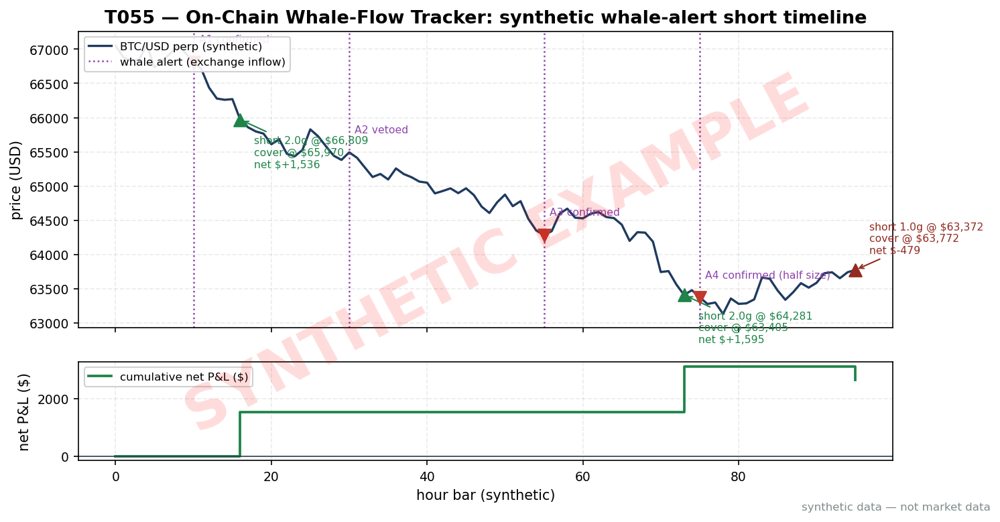

The chart carries the "SYNTHETIC EXAMPLE" watermark and the "synthetic data — not market data" caption.

```mermaid
flowchart TD
    DATA["Market data\n(L2 MBP-10, exchange ts)"] -->|book events| SIGS["Signals\nS082 DeepLOB + feature stack, S001 OFI, S083 event bars"]
    SIGS -->|100-event bars| ENTRY{"Fire logic\nc ≥ 0.58 AND p(flat) < 0.40 AND edge ≥ cost\nsignal at t → fill at t+1"}
    ENTRY -->|fire| SIZE["Sizing + risk\nN = q_base·(c−c_min)/(1−c_min); daily loss stop"]
    ENTRY -->|no fire| WAIT["Wait"]
    SIZE -->|100-event bars| EXEC["Execution\ntake at touch"]
    EXEC -->|fills + fees| MON["Monitor + exits\n±2-tick target/stop / 10-event time stop"]
    MON -->|net fills| PNL["P&L (net of costs)"]
    style ENTRY fill:#f9e79f,stroke:#7d6608
    style PNL fill:#a9dfbf,stroke:#1e8449
```

### T10. Sources

1. Zhang, Z., Zohren, S. & Roberts, S. (2019). "DeepLOB: Deep Convolutional Neural Networks for Limit Order Books." *IEEE Transactions on Signal Processing* — arXiv:1808.03668 — https://arxiv.org/abs/1808.03668 (CNN+LSTM on 100×40 LOB tensors, three-class move prediction; the S082 [D] source — classification, not trading P&L).
2. Zhang, Z., Zohren, S. & Roberts, S. (2018). "BDLOB: Bayesian Deep Convolutional Neural Networks for Limit Order Books." arXiv:1811.10041 — https://arxiv.org/abs/1811.10041 (uncertainty quantification for the sizing leg — a risk tool, not edge).
3. Sirignano, J. & Cont, R. (2018). "Universal Features of Price Formation in Financial Markets." arXiv:1803.06917 — https://arxiv.org/abs/1803.06917 (pooled deep model generalizes across ~1,000 US stocks — prediction generality, still before-cost).
4. Cont, R., Kukanov, A. & Stoikov, S. (2014). "The Price Impact of Order Book Events." *Journal of Financial Econometrics* 12(1): 47–88. arXiv:1011.6402 — https://arxiv.org/abs/1011.6402 (OFI definition and contemporaneous impact; the S001 [D] source).
5. Wang (2025). "Better Inputs Matter More Than Stacking Another Hidden Layer." arXiv:2506.05764 — https://arxiv.org/abs/2506.05764 (simpler models match/exceed deep models on the paper's crypto LOB data — model-complexity caution; 2025 crypto evidence, not US-equity executable-P&L evidence).

**Source log.** Grok answered Q-TB6-1..3 (2026-09-10); all claims independently verified or labeled unverified. Grok's Q-TB6-1(B) supplied the prediction-to-trade walk structure (confidence gate, flat veto, confidence sizing, 0.6-tick cost) adapted here with independent seed-155 numbers; Grok's EV arithmetic in that answer was checked and found self-contradictory (0.333 − 0.6 = −0.267, negative — not "still positive"), and the corrected arithmetic is used above. Every numeric threshold is marked `example`.

**Unverified leads** (chatbot-only — never in Sources):
- Grok Q-TB6-1(B): DeepLOB "F1 83.40% on FI-2010, ~70% on LSE L2" — no checkable source captured; the verified claim is the abstract-level "outperforms baselines." Unverified.
- Grok Q-TB6-2: DeepLOB-on-M5-Max infra sizing (GPU memory, training hours) — chatbot estimates; planning only.
- Grok Q-TB6-3: handcrafted-GBM vs deep-net comparisons — directionally consistent with Wang (2025) but the TB6 numbers are chatbot-sourced.
- Vendor pricing in T6 (Massive/Polygon ~$199/mo class, Databento ~$200/mo + usage) — planning bands, *indicative — verify before budgeting*.

Grok answered Q-TB6-1..3 (2026-09-10); all claims independently verified or labeled unverified.

## Stage 156/200 — T056: Hasbrouck Trade–Quote VAR Predictor

*Batch TB6 · Strategy 56/100 · Signals S084, S007, S081*

**Provenance: [D/SR].**

### T1. One-line verdict

| | |
|---|---|
| **Style** | Trade-by-trade vector-autoregression (VAR) predictor: Hasbrouck's model of how trades move quotes forecasts the next trade's price impact, a signed-volume imbalance filter (S081) and a trade-direction classifier (S007) clean the input, and only high-conviction predictions become ultra-short-horizon trades |
| **Edge source** | Permanent vs transitory decomposition of trade price impact — Hasbrouck's documented finding that trades carry information about future quote revisions — converted to trades through a signal-strength gate and an executable-cost filter |
| **Typical holding period** | 1–5 trades (`example`: exit 2–5 trades after entry) |
| **Capacity hint** | Tiny — the predicted moves are fractions of the tick on a per-trade basis |
| **Build-or-buy in one line** | Buy tick data (Tier 2); build the VAR — it is ~100 lines of least squares, and the value is your gating, not the model |

### T2. Full mechanics

**Universe & session.** 1–2 liquid large-tick names where per-trade dynamics are stable (`example`); RTH 09:45–15:45 ET (`example`); flat by 15:45 ET. Tick data (every trade and quote, exchange-timestamped) required; SIP TAQ (Trade and Quote — the consolidated public tape) is workable for research, but any live claim needs exchange timestamps.

**The Hasbrouck VAR (S084).** For each trade time *t*, define `r_t` = the log quote-midpoint change (the *return*) and `x_t` = the signed trade indicator (+1 buyer-initiated, −1 seller-initiated, 0 no trade at that quote revision). Hasbrouck (1991) models their joint dynamics as a vector autoregression with *p* lags (`example`: p = 5):

```
r_t = Σ_{i=1..p} a_i r_{t-i} + Σ_{i=0..p} b_i x_{t-i} + v1_t
x_t = Σ_{i=1..p} c_i r_{t-i} + Σ_{i=1..p} d_i x_{t-i} + v2_t
```

The `b_i` coefficients capture how signed trades move the quote — the *price impact*; the VAR's moving-average representation separates the *permanent* (information-driven) component from the *transitory* (inventory/spread) component. The trade signal: the VAR's one-step-ahead forecast `f_t = E[r_{t+1} | information through t]` — the predicted next quote revision attributable to trade flow. All of this paragraph is the documented S084 [D] construction (Hasbrouck 1991); the trading rule is reconstructed. Signal at trade *t* → earliest fill at trade *t+1* (causal timing).

**Trade direction (S007).** The signed indicator `x_t` needs a classifier when quote data is ambiguous: the Lee–Ready rule (tick test against the prevailing quote — S007's documented [D] contribution) assigns +1/−1; S007's imbalance cross-check aggregates signed volume over short windows. Mid-quote trades (at the exact midpoint) get `x_t = 0` — never force a sign. Misclassified trades inject noise directly into `f_t`; the Lee–Ready rule's documented misclassification rate on modern data is the input error you live with.

**Fire rule (worked example: VAR(2)).** The worked example estimates a 2-lag VAR on `x_t = (dm_t, q_t)` — mid change and Lee–Ready sign — with coefficient matrices A1, A2 (`example` values in `plot_T056.py`). The one-step-ahead forecast `f_t` (in cents) uses data through bar *t* only. Fire only if `|f_t| > 0.40` cents (`example`) — the gate. Direction = sign(f_t). Signal at bar *t* → earliest fill at bar *t+1*, exit at bar *t+2* (causal timing).

**Burst veto (Hawkes, S081).** Bacry et al. (2013) model trade arrivals as a *Hawkes process* — a self-exciting point process where each trade temporarily raises the arrival intensity (a *burst*); the buy/sell intensity imbalance version of this is the S081 [D] construction. When the buy/sell intensity imbalance z-score satisfies `|z| ≥ 2.0` (`example`), **veto all entries**: bursts are when the VAR's linear coefficients break down and adverse selection is worst. This is the S084-family risk leg: don't trade the VAR when its stationarity assumption is visibly violated.

**Sizing.** Fixed 500 shares per fired signal (`example`).

**Exits** (`example`): one bar after entry (hold bars *t+1* → *t+2*); flat 15:45 ET.

**Cost model** (applied in T4): 0.50¢/share half-spread + $0.005/share commission each way → round-trip $10.00 on 500 shares (`example`: $5.00 spread cross + $5.00 commissions, two legs each); no rebate; fills modeled at the mid with the spread charged explicitly — optimistic, stated in the text.

**Execution.** Marketable limit at the touch on bar *t+1*; exits marketable. Participation cap 5% of the bar's volume (`example`). SIP-timestamped backtests are `simulated only — requires MBO/ITCH`.

### T3. Signals it consumes

| Signal | Role | Combination logic |
|---|---|---|
| S084 Hasbrouck trade–quote VAR | **Primary trigger** (forecast f_t) | example VAR(2) on (dm_t, q_t); fire only if \|f_t\| > 0.40 cents |
| S081 Hawkes buy/sell imbalance | **Input cleaner / risk leg** | Hawkes buy/sell imbalance z; veto entries when \|z\| ≥ 2.0 (`example`) |
| S007 Lee–Ready / tick rule | **Direction classifier** | assigns q_t ∈ {+1, −1}; the signed trade input to the VAR |

```
# T056 combination logic (<=25 lines; every threshold `example`)
on each bar t (causal):
    q_t = lee_ready(trade, quote)            # S007 trade classification: +1/-1 signed trade
    f_t = A1[0] @ [dm_t, q_t] + A2[0] @ [dm_{t-1}, q_{t-1}]   # cents, data <= t
    burst = abs(hawkes_z(t)) >= 2.0        # S081 buy/sell imbalance veto
    if abs(f_t) > 0.40 and not burst:
        side = sign(f_t)                     # fill at t+1, exit at t+2
        N = 500
    flat 15:45 ET
```

### T4. Worked example — numbers + P&L (SYNTHETIC)

**All numbers synthetic** (random seed 156, `batches/TB6/plot_T056.py` — re-runnable). Fictional name "QXM" at ~$50, fourteen synthetic 1-second bars. Example VAR(2) on (dm_t, q_t) with the coefficient matrices printed in the script; forecast gate |f_t| > 0.40 cents; Hawkes veto at |z| ≥ 2.0 (`example`). Round-trip cost $10.00 per 500-share trade (`example`: 0.50¢ half-spread + $0.005/share commission each way). Signal at bar *t* → fill at bar *t+1*, exit at bar *t+2*. Fills modeled at the mid with the spread charged explicitly — optimistic (see below).

| Signal bar | f_t (¢) | Hawkes z | Action | Entry bar | Exit bar | Entry px | Exit px | Gross $ | Cost $ | Net $ |
|---|---|---|---|---|---|---|---|---|---|---|
| 2 | +0.60 | +1.2 | Long | 3 | 4 | 50.030 | 50.010 | −10.00 | −10.00 | **−20.00** |
| 3 | +1.45 | +0.8 | Long | 4 | 5 | 50.010 | 50.020 | +5.00 | −10.00 | **−5.00** |
| 4 | −0.60 | −1.1 | Short | 5 | 6 | 50.020 | 50.040 | −10.00 | −10.00 | **−20.00** |
| 5 | +0.25 | +0.4 | No trade (below gate) | — | — | — | — | — | — | — |
| 6 | +1.60 | +2.6 | **Vetoed** (Hawkes burst) | — | — | — | — | — | — | — |
| 7 | −0.25 | +0.2 | No trade (below gate) | — | — | — | — | — | — | — |
| 8 | +0.35 | −0.7 | No trade (below gate) | — | — | — | — | — | — | — |
| 9 | +1.60 | +1.5 | Long | 10 | 11 | 50.050 | 50.030 | −10.00 | −10.00 | **−20.00** |
| 10 | −0.25 | −0.3 | No trade (below gate) | — | — | — | — | — | — | — |
| 11 | −1.60 | −0.9 | Short | 12 | 13 | 50.040 | 50.050 | −5.00 | −10.00 | **−15.00** |
| 12 | +0.25 | −1.8 | No trade (below gate) | — | — | — | — | — | — | — |

Line-by-line walk. **Bar 2:** f_t = +0.60¢ clears the 0.40¢ gate, z = +1.2 no veto → long signal; fill at bar 3 at 50.030, exit bar 4 at 50.010. Gross = (50.010 − 50.030) × 500 = −$10.00. Cost $10.00. **Net = −$20.00.** **Bar 3:** f_t = +1.45¢ → long; fill bar 4 at 50.010, exit bar 5 at 50.020 — the one winner on gross (+$5.00), but the $10.00 cost stack eats it: **net −$5.00.** **Bar 4:** f_t = −0.60¢ → short; fill bar 5 at 50.020, exit bar 6 at 50.040, gross −$10.00, **net −$20.00.** **Bar 6 (the veto):** f_t = +1.60¢ — the strongest forecast of the session — but z = +2.6 ≥ 2.0, so the Hawkes burst veto kills it. The veto is the cheapest risk control in the strategy: no trade, no loss. **Bars 9 and 11** repeat the pattern: both fire, both lose (nets −$20.00, −$15.00).

Totals: 5 trades, gross −$30.00, costs −$50.00, **net −$80.00** (displayed values rounded; script total −$80.00). The chart `images/T056_example.png` plots this exact session: synthetic mid with forecast annotations, Hawkes-z bars with veto lines, and entry/exit markers (top); cumulative net P&L with per-trade annotations (bottom).

**Where the example is optimistic.** (1) Fills assumed at the mid in full size — no spread paid on entry, no partial fills; a real taker pays the touch. (2) The VAR(2) coefficients are fixed `example` values matched to the synthetic DGP — real estimation adds error on top of the model's misspecification. (3) Lee–Ready signs assumed correct on every bar; real misclassification injects noise into f_t. (4) Burst detection assumed instantaneous; real Hawkes fits lag the burst. (5) Eleven signal bars — no statistical content. (6) Constant $10.00 cost; real effective spreads widen exactly when |f_t| is largest. **Where the example is pessimistic:** a real desk would stop after bar 4's second consecutive loss; the example keeps firing to show the cost arithmetic — costs (−$50.00) exceed the gross loss (−$30.00), which is the entire story of per-trade microstructure strategies.

### T5. Data & infra — what must run

**Pipeline inventory.** Tick ingest (09:15–16:05 ET): every trade and quote with exchange timestamps into ring buffers; heartbeat watchdog every 1–2 s; sequence-gap detector. Quote engine: prevailing-quote tracker for the Lee–Ready tick rule; mid-quote flagging. Feature loop: rolling VAR(2) coefficient refresh every N trades (`example`: refit every 500 trades on a 5,000-trade window); Hawkes intensity z-score per bar. Signal→order bridge: forecast at bar *t* → order queued for bar *t+1* — causal only. Paper broker + ledger on disk (JSONL).

**M5 Max feasibility: feasible — the VAR is trivial compute.** Throughput (`notes/cost-model.md` §2): a VAR(2) least-squares refit on 5,000 trades is microseconds of NumPy (~50–200M elements/sec); per-bar forecasting is a dot product. RAM (§3): one symbol-day of TAQ trades+quotes ≈ 0.5–4 GB (L1 events) — under the 77 GB working-set budget for 1–2 names. Engineering time: Tier M (`cost-model.md` §5) — **20–60 h** ≈ $3,000–9,000 loaded-cost estimate at $150/hr; the work is the causality audit, the Lee–Ready validation, and the Hawkes veto calibration — not compute. Bottleneck: timestamp quality (SIP vs exchange) and the Lee–Ready misclassification rate on your names, not the Mac.

**Feed-outage safe mode.** Heartbeat missed > 2 s or a quote-sequence gap (`example`) → **flatten immediately, freeze new entries, tag DEGRADED**. Never run the VAR on a torn tape — a missing quote revision corrupts the sign classification and the forecast. Resume after 60 s of clean sequence numbers plus a full VAR window re-warm (`example`). Local process crash: restart flat; the on-disk ledger is the source of truth, never RAM.

### T6. Buy vs build

| Option | What you get | Indicative price | Gains | Loses |
|---|---|---|---|---|
| Tier 0: delayed quotes | 15-min delayed TAQ | ~$0 — *indicative — verify before budgeting* | $0 prototype | no live forecasts |
| Tier 1: SIP TAQ (Massive/Polygon Stocks Advanced class) | real-time trades+quotes | ~$199/mo class — *indicative — verify before budgeting* | cheap live tape | SIP timestamps; per-trade timing is approximate |
| Tier 2: Databento trades+quotes | exchange-timestamped ticks | ~$200/mo + usage — *indicative — verify before budgeting* | honest event order | usage metering on history backfill |
| Packaged "microstructure signal" SaaS | black-box forecasts | varies — *indicative — verify before budgeting* | nothing to build | cannot audit t→t+1 causality or the sign classifier — skip |

**Verdict: buy the tape, build the VAR.** A VAR(2) is ~30 lines of least squares; the value is your sign classification, gate, and veto — none of which any vendor sells. Start on Tier 1 SIP TAQ for research; promote to Tier 2 when per-trade timing matters.

### T7. Success-ratio evidence

The literature documents **information content in trade flow, not after-cost per-trade P&L** — the gap between those two is the T056 story.

| Study / source | Market & period | Metric | Before/after cost | Caveat |
|---|---|---|---|---|
| Hasbrouck (1991) | NYSE, 1989 (Dell Computer example) | VAR shows trades have significant permanent price impact — information in order flow | before-cost (econometric) | impact is measured, not harvested; says nothing about your fill |
| Lee & Ready (1991) | NYSE, 1988 | tick-rule trade-direction algorithm; documented classification accuracy on their sample | before-cost (methodological) | accuracy degrades on modern fragmented data — input error, not edge |
| Dufour & Engle (2000) | NYSE, 1996–97 | VAR with time-between-trades: faster trading → larger price impact | before-cost (econometric) | supports the burst veto logic, not the trading rule |
| Bacry et al. (2013) | FX/futures data | Hawkes model fits order-flow clustering | before-cost (model fit) | justifies the veto; not a P&L result |

The worked session shows the arithmetic honestly: the VAR's forecasts were directionally right often enough to produce a +$5.00 gross winner, but the $10.00/trade cost stack turned 5 trades into −$80.00. Permanent impact exists — Hasbrouck proved it — but the permanent component of a *single* trade's impact is smaller than the round-trip cost of trading it. That is why this strategy's honest institutional form is not a taker book but an *execution* input: the VAR forecast tells an execution algo when a trade will move the quote, so the algo can time its child orders — harvesting the measurement without paying the taker's cost.

Capacity: near zero as a standalone taker — you compete with every market maker whose quotes already embed this VAR. Decay: the *measurement* (trades move quotes) is permanent microstructure; the *tradable* residue decays with your latency rank and the spread.

**Honest bottom line.** For a ≤$1M paper operation: T056 has **no documented positive after-cost edge as a standalone taker strategy** — the literature proves information in trade flow, and the fee-inclusive arithmetic shows a single trade's predictable revision is smaller than the cost of trading it. Its honest value is as a veto/timing input to execution: don't trade into bursts, and time child orders with the forecast.

### T8. Failure modes

1. **Lee–Ready misclassification.** Wrong signs feed the VAR garbage; f_t degrades silently. Mitigation: validate the classifier against your names' quote data; use exchange timestamps so the prevailing quote is correct.
2. **VAR misspecification.** Two lags can't capture the true impact curve; coefficients drift intraday. Mitigation: refit on rolling windows; monitor forecast-vs-realized calibration; stand down when calibration breaks.
3. **Burst-regime breakdown.** The veto lags the burst it is meant to catch. Mitigation: the |z| ≥ 2.0 veto (`example`) plus a hard cap on trades per 5-minute window (`example`).
4. **Spread-crossing arithmetic.** Every signal smaller than the cost stack is a guaranteed loss — the gate is the strategy. Mitigation: never relax the 0.40¢ gate (`example`) without re-measuring the cost stack.
5. **Lookahead in the VAR window.** Refitting on data that includes the forecast target. Mitigation: causal audit — coefficients at *t* use trades ≤ *t* only; unit-test with synthetic data.
6. **Latency.** The forecast is for the *next* bar; if your fill lands two bars late you trade noise. Mitigation: measure signal-to-fill latency; if it exceeds one bar, the strategy is off.
7. **Overfit gates.** Mining 0.40¢ and 2.0 on one week's tape. Mitigation: walk-forward validation; deflated Sharpe on the *trading* rule.

### T9. Visuals

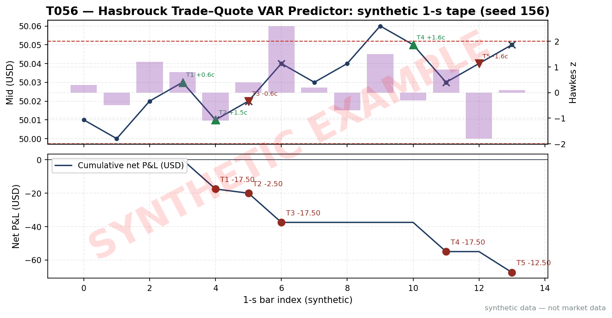

The chart carries the "SYNTHETIC EXAMPLE" watermark and the "synthetic data — not market data" caption.

```mermaid
flowchart TD
    DATA["Market data\n(trades + quotes, exchange ts)"] -->|ticks| SIGS["Signals\nS084 VAR(2) forecast, S007 Lee-Ready signs, S081 Hawkes z"]
    SIGS -->|1-s bars| ENTRY{"Fire logic\n|f_t| > 0.40c AND |z| < 2.0\nsignal at t → fill at t+1"}
    ENTRY -->|fire| SIZE["Sizing + risk\nfixed 500 sh; burst veto; daily loss stop"]
    ENTRY -->|no fire / veto| WAIT["Wait"]
    SIZE -->|1-s bars| EXEC["Execution\nmarketable at touch"]
    EXEC -->|fills + fees| MON["Monitor + exits\nexit at t+2"]
    MON -->|net fills| PNL["P&L (net of costs)"]
    style ENTRY fill:#f9e79f,stroke:#7d6608
    style PNL fill:#a9dfbf,stroke:#1e8449
```

### T10. Sources

1. Hasbrouck, J. (1991). "Measuring the Information Content of Stock Trades." *Journal of Finance* 46(1): 179–207. DOI 10.1111/j.1540-6261.1991.tb03749.x — https://afajof.org/issue/volume-46-issue-1/ (trade–quote VAR; the S084 [D] source — permanent vs transitory impact decomposition, not a trading rule).
2. Lee, C. M. C. & Ready, M. J. (1991). "Inferring Trade Direction from Intraday Data." *Journal of Finance* 46(2): 733–746. DOI 10.1111/j.1540-6261.1991.tb02683.x — https://afajof.org/issue/volume-46-issue-2/ (tick-rule direction classification; the S007 [D] source).
3. Dufour, A. & Engle, R. F. (2000). "Time and the Price Impact of a Trade." *Journal of Finance* 55(6): 2467–2498. DOI 10.1111/0022-1082.00297 — https://onlinelibrary.wiley.com/doi/10.1111/0022-1082.00297 (VAR with durations; supports the burst-veto logic).
4. Bacry, E., Delattre, S., Hoffmann, M. & Muzy, J. F. (2013). "Modelling Microstructure Noise with Mutually Exciting Point Processes." *Quantitative Finance* 13(1): 65–77. DOI 10.1080/14697688.2011.647054 — http://ideas.repec.org/a/taf/quantf/v13y2013i1p65-77.html (Hawkes order-flow model; the veto's [D] source).

**Source log.** Grok answered Q-TB6-1..3 (2026-09-10); all claims independently verified or labeled unverified. Grok did not supply the T056 trade–quote VAR specification — the VAR(2) mechanics, gates, and seed-156 numbers are reconstructed here from the S084/S007/S081 [D] signal definitions. Every numeric threshold is marked `example`.

**Unverified leads** (chatbot-only — never in Sources):
- Grok Q-TB6: per-trade EV sketches for VAR-based scalping — no checkable numbers captured; the verified claim is the session arithmetic above.
- Vendor pricing in T6 (Massive/Polygon ~$199/mo class, Databento ~$200/mo + usage) — planning bands, *indicative — verify before budgeting*.

Grok answered Q-TB6-1..3 (2026-09-10); all claims independently verified or labeled unverified.

## Stage 157/200 — T057: Fractional-Differentiation Memory Trader

*Batch TB6 · Strategy 57/100 · Signals S087, S078, S090*

**Provenance: [D/SR].**

### T1. One-line verdict

| | |
|---|---|
| **Style** | Long-memory intraday trader: fractionally differentiate the price series (S087) to stationarity *without* destroying its memory, fit a short autoregression on the differenced series (S078), and trade the one-step-ahead forecast only when a variance-ratio gate (S090) confirms memory is actually present |
| **Edge source** | Predictable short-horizon drift left in the fractionally-differenced series — the memory that integer differencing (d = 1) would have erased — converted to trades through a forecast-magnitude gate and a memory-presence gate |
| **Typical holding period** | 1 bar (`example`: signal at bar *t*, fill at *t+1*, exit at *t+2*) |
| **Capacity hint** | Small — the forecasts are basis-point-scale; costs dominate below ~2.5 bp of predicted move |
| **Build-or-buy in one line** | Build it on bought 1-minute bars (Tier 1/2) — fractional differentiation is ~20 lines; the value is your choice of *d*, your validation, and your gates |

### T2. Full mechanics

**Universe & session.** Liquid large-caps with clean 1-minute bars (`example`); RTH 09:45–15:45 ET (`example`); flat by 15:45 ET. The strategy needs contiguous bars — the fractional-differentiation window cannot tolerate gaps (see T5 safe mode).

**Fractional differentiation (S087).** Standard returns use integer differencing, `d = 1`: `r_t = p_t − p_{t−1}`, which achieves stationarity but erases all long memory — the series becomes white noise by construction. Fractional differentiation applies `(1 − B)^d` with `0 < d < 1` (B = backshift operator), expanding to an infinite weighted sum of past prices whose weights decay slowly. The binomial expansion gives the weights recursively (`example` values from the real 2018 AFML procedure — see T10 source 1):

```
w_0 = 1
w_k = −w_{k−1} · (d − k + 1) / k
```

With `d = 0.40` (`example`) and truncation tolerance `τ = 0.001` (`example`) — drop weights once `|w_k| < τ` — the fixed-width window is `L = 56` bars (`example`; first weights 1.0000, −0.4000, −0.1200, −0.0640, −0.0416). The *fixed-width window* (López de Prado's term) keeps every input the same length so the transformation is stable through time. At each bar *t*: `xhat_t = Σ_{k=0}^{min(L,t+1)−1} w_k · r_{t−k}` — causal, uses returns through *t* only. The point of `d = 0.40` instead of `d = 1`: the differenced series is stationary enough to model, but it *remembers* — that memory is what S078 trades. All of this paragraph is the documented S087 [D] construction from *Advances in Financial Machine Learning* (2018), Chapter 5; the trading rule around it is reconstructed.

**Memory forecast (S078).** Fit an AR(1) — first-order autoregression, `xhat_{t+1} = φ · xhat_t + ε` — on the differenced series over a trailing fit window (`example`: first 60 bars of the session, φ = −0.492 in the worked example). The one-step forecast `f_t = φ · xhat_t` predicts the next bar's differenced move. Signal at bar *t* → earliest fill at bar *t+1*, exit at bar *t+2* (causal timing).

**Memory-presence gate (S090).** Compute rolling VR(4) on the *raw* log-returns over a 40-bar window (`example`); trade only when `|VR − 1| > 0.05` (`example`) — i.e., only when the tape measurably deviates from a random walk, so the AR(1) isn't fired on white noise.

**Fire rule.** Fire only if `|f_t| > 2.5` bp (`example` — basis points; 1 bp = 0.01%) **and** the S090 gate passes. Direction = sign(f_t).

**Sizing.** Fixed 1,000 shares per fired signal (`example`).

**Cost model** (applied in T4): half-spread 1.25 bp per leg + $0.005/share commission each way → ~$72.50 round-trip on 1,000 shares at $250 (`example`); no rebate; fills assumed in full at the bar price.

**Execution.** Marketable limit at the bar *t+1* price; exit marketable at *t+2*. Participation cap 5% of trailing 1-minute volume (`example`).

### T3. Signals it consumes

| Signal | Role | Combination logic |
|---|---|---|
| S087 fractional differentiation | **Primary transform** (stationary-but-memoryful series) | d = 0.40, τ = 0.001 → L = 56 (`example`); causal fixed-width window |
| S078 memory AR forecast | **Trigger** (one-step forecast f_t) | AR(1) on xhat; fire only if \|f_t\| > 2.5 bp (`example`) |
| S090 variance-ratio gate | **Memory-presence veto** | VR(4), 40-bar window; require \|VR − 1\| > 0.05 (`example`) |

```
# T057 combination logic (<=25 lines; every threshold `example`)
on each 1-min bar t (causal):
    xhat_t = sum_{k<L} w_k * r_{t-k}        # S087, d=0.40, L=56
    f_t = phi * xhat_t                       # S078 AR(1) forecast
    mem = abs(VR4(t, window=40) - 1) > 0.05  # S090 gate
    if abs(f_t) > 2.5bp and mem:
        side = sign(f_t)                     # fill at t+1, exit at t+2
        N = 1000
    flat 15:45 ET; freeze on bar gaps (T5 safe mode)
```

### T4. Worked example — numbers + P&L (SYNTHETIC)

**All numbers synthetic** (random seed 157, `batches/TB6/plot_T057.py` — re-runnable). Fictional large-cap "ACME" at ~$250, 120 synthetic 1-minute bars. `d = 0.40`, `τ = 0.001` → truncation width `L = 56`; AR(1) fitted on bars 0–59 gives `φ = −0.492`, `σ_ε = 0.001929`. Gates: `|f| > 2.5` bp and `|VR(4) − 1| > 0.05` (`example`). Signal at bar *t* → fill at bar *t+1*, exit at bar *t+2*. Costs: 1.25 bp half-spread per leg + $0.005/share each way on 1,000 shares.

| Signal bar | f_t (bp) | VR(4) | Action | Entry bar | Entry px | Exit bar | Exit px | Gross $ | Cost $ | Net $ |
|---|---|---|---|---|---|---|---|---|---|---|
| 60 | +27.47 | 0.32 | Long | 61 | 250.223 | 62 | 250.438 | +215.00 | −72.56 | **+142.44** |
| 62 | −8.11 | 0.31 | Short | 63 | 250.116 | 64 | 249.908 | +208.41 | −72.53 | **+135.88** |
| 63 | +6.73 | 0.38 | Long | 64 | 249.908 | 65 | 249.704 | −203.96 | −72.48 | **−276.43** |
| 66 | −18.80 | 0.36 | Short | 67 | 250.993 | 68 | 250.688 | +305.51 | −72.75 | **+232.77** |
| 67 | −3.74 | 0.38 | Short | 68 | 250.688 | 69 | 250.237 | +450.35 | −72.67 | **+377.68** |
| 68 | +10.91 | 0.39 | Long | 69 | 250.237 | 70 | 251.448 | +1,210.59 | −72.56 | **+1,138.03** |

Line-by-line walk. **Trade 1 (bar 60):** f = +27.47 bp clears the 2.5 bp gate, VR = 0.32 (|0.32 − 1| = 0.68 > 0.05) passes the memory gate → long. Fill at bar 61 at 250.223, exit bar 62 at 250.438. Gross = (250.438 − 250.223) × 1,000 = +$215.00. Cost = 2 × 0.0125% × 250.223 × 1,000 + 2 × $0.005 × 1,000 = $62.56 + $10.00 = $72.56. **Net = +$142.44.** **Trade 2 (bar 62):** f = −8.11 bp → short; fill bar 63 at 250.116, exit bar 64 at 249.908 — the price fell, the short gains: gross +$208.41, **net +$135.88.** **Trade 3 (bar 63):** f = +6.73 bp → long; fill bar 64 at 249.908, exit bar 65 at 249.704 — the forecast sign was wrong: gross −$203.96, **net −$276.43.** **Trade 6 (bar 68, the tail):** f = +10.91 bp → long; fill bar 69 at 250.237, exit bar 70 at 251.448 — a +$1.21/share bar: gross +$1,210.59, **net +$1,138.03**, which is two-thirds of the session total.

Totals: 6 trades, gross +$2,185.90, costs −$435.55, **net +$1,750.36** (displayed values rounded; script total +$1,750.36). The chart `images/T057_example.png` plots this exact walk: synthetic price with entry/exit markers and the AR(1) fit-window line (top), cumulative net P&L with per-trade annotations showing forecast bp and VR (bottom).

**Where the example is optimistic — read this before the totals.** (1) The synthetic DGP generates log-prices from a truncated moving average using the *same* fractional-differentiation weights the strategy inverts — the AR(1) forecast is close to the true data-generating process, so this session is a near-best-case illustration, not evidence. Real markets do not hand you the true *d* or the true weights. (2) `d = 0.40` is fixed and known; in production *d* must be estimated (ADF-test search per AFML) and estimation error degrades everything. (3) φ = −0.492 is fitted once on 60 clean bars; real φ drifts and breaks. (4) Fills assumed in full at the bar price — no partial fills. (5) Zero latency — signal at *t*, fill at *t+1* with no wire delay. (6) Six trades — no statistical content; one +$1,138 bar dominates the total, which is luck, not edge. (7) Constant 1.25 bp half-spread; real spreads widen when |f_t| is largest. **The honest reading:** the +$1,750.36 shows the *mechanics* work end to end — transform, forecast, gate, fill, costs — not that they make money on real data.

### T5. Data & infra — what must run

**Pipeline inventory.** Bar ingest (09:15–16:05 ET): 1-minute bars with exchange timestamps into ring buffers; heartbeat watchdog; gap detector. Feature loop: per bar, the fixed-width fractional differentiation — an O(L) dot product with L = 56 (`example`) — plus rolling VR(4) on a 40-bar window; AR(1) φ refit on schedule (`example`: refit every 60 bars on the trailing 60). Signal→order bridge: forecast at bar *t* → order queued for bar *t+1* — causal only. Paper broker + ledger on disk (JSONL).

**M5 Max feasibility: feasible — the transform is trivial compute.** Throughput (`notes/cost-model.md` §2): the per-bar fracdiff is a 56-element dot product — nanoseconds of NumPy (~50–200M elements/sec); even 500 names × 390 bars/day is noise. RAM (§3): 500 symbols × 60 days of 1-minute bars ≈ 12 MB — far under the 77 GB working-set budget. Engineering time: Tier M (`cost-model.md` §5) — **20–60 h** ≈ $3,000–9,000 loaded-cost estimate at $150/hr; the work is the *d*-estimation procedure, the purged validation, and the gate calibration — not compute. Bottleneck: bar contiguity and timestamp quality, not the Mac.

**Feed-outage safe mode.** The fracdiff window needs L = 56 contiguous bars (`example`); a gap corrupts xhat_t silently. On heartbeat missed > 90 s or any bar gap (`example`) → **flatten immediately, freeze new entries, tag DEGRADED**. Never interpolate missing bars into the window — interpolated returns manufacture fake memory. Resume only after 56 consecutive clean bars (`example`) re-warm the window. Local process crash: restart flat; the on-disk ledger is the source of truth, never RAM.

### T6. Buy vs build

| Option | What you get | Indicative price | Gains | Loses |
|---|---|---|---|---|
| Tier 0: delayed 1-min bars | 15-min delayed bars | ~$0 — *indicative — verify before budgeting* | $0 prototype | no live transform |
| Tier 1: SIP 1-min bars (Massive/Polygon Stocks Advanced class) | real-time SIP bars | ~$199/mo class — *indicative — verify before budgeting* | cheap live bars | SIP timestamps; bar timing approximate |
| Tier 2: Databento 1-min bars | exchange-timestamped bars | ~$200/mo + usage — *indicative — verify before budgeting* | honest bar timing | usage metering on history backfill |
| Packaged "ML feature" SaaS | black-box features | varies — *indicative — verify before budgeting* | nothing to build | cannot audit *d*, the window, or t→t+1 causality — skip |

**Verdict: buy the bars, build the transform.** Fixed-width fractional differentiation is ~20 lines of NumPy; the value is your *d*-estimation, your validation, and your gates — none of which any vendor sells. Start on Tier 1 SIP bars for research; promote to Tier 2 when bar timing matters.

### T7. Success-ratio evidence

Fractional differentiation is a **preprocessing technique, not a documented trading edge** — that distinction is the whole T057 story.

| Study / source | Market & period | Metric | Before/after cost | Caveat |
|---|---|---|---|---|
| López de Prado (2018), AFML Ch. 5 | general method | fixed-width fractional differentiation: stationary series that preserves maximum memory; the weight recursion and truncation procedure | methodological (not a P&L result) | a feature-engineering chapter — it never claims the transform itself trades profitably |
| Lo & MacKinlay (1988) | US weekly returns, 1962–1985 | variance-ratio test rejects the random walk | before-cost (statistical test) | supports the S090 memory gate's premise; rejection ≠ tradable edge |
| Bailey & López de Prado (2014) | general | Deflated Sharpe Ratio corrects for multiple-testing selection bias | methodological | applies directly to the mined *d*, windows, and gates (2.5 bp, \|VR−1\| > 0.05): any backtested memory-trader Sharpe must be deflated |

There is no published after-cost P&L for a standalone "fractional-differentiation memory trader" in the verified sources — the technique's documented value is making ML features stationary without discarding memory, which improves *downstream* models. The worked session's +$1,750.36 is synthetic mechanics illustration (see the optimism notes — the DGP uses the same weights the strategy inverts).

Capacity: the transform doesn't create capacity — it sharpens whatever downstream forecast you run. Decay: estimated *d* and φ drift as market microstructure evolves; the procedure (re-estimate *d* on schedule) is the durable part, not any fitted value.

**Honest bottom line.** For a ≤$1M paper operation: T057 has **no documented positive after-cost edge as a standalone strategy** — the literature documents a stationarity-with-memory transform, not a trading P&L. Its honest value is as a feature pipeline for downstream models (the AFML use case): fractionally differentiate first, then model. Trading the AR(1) forecast directly, as the worked example does, is the illustrative toy — size it as research, not as a book.

### T8. Failure modes

1. **Wrong *d*.** Too high erases the memory you're trading; too low leaves non-stationarity that breaks the AR(1). Mitigation: estimate *d* by ADF-test search per AFML (ADF = augmented Dickey-Fuller stationarity test) (`example`); re-estimate on schedule, never hard-code 0.40 in production.
2. **Structural break in memory.** The fitted φ = −0.492 describes one regime; memory structure changes. Mitigation: monitor forecast-vs-realized calibration; refit φ on a rolling window; stand down when calibration breaks.
3. **AR(1) misspecification.** One lag can't capture the true memory kernel. Mitigation: start with AR(1) as the baseline; extend only if walk-forward validation (purged/embargoed) justifies it.
4. **Lookahead in the transform.** Estimating *d* or φ on data that includes the traded bars. Mitigation: causal audit — every input to f_t timestamped ≤ *t*; purged/embargoed validation (S088).
5. **Gate mining.** The 2.5 bp and \|VR−1\| > 0.05 gates tuned on one session's noise. Mitigation: deflated Sharpe on the *trading* rule; keep gates wide and few.
6. **Bar gaps corrupt the window.** One missing bar poisons all L = 56 xhat values. Mitigation: the T5 safe-mode plan — freeze on gaps, re-warm 56 clean bars.
7. **Cost vs forecast scale.** Forecasts are basis-point-scale; the ~$72/trade stack needs >3 bp moves at 1,000 shares. Mitigation: the 2.5 bp magnitude gate (`example`); never trade sub-gate forecasts.

### T9. Visuals

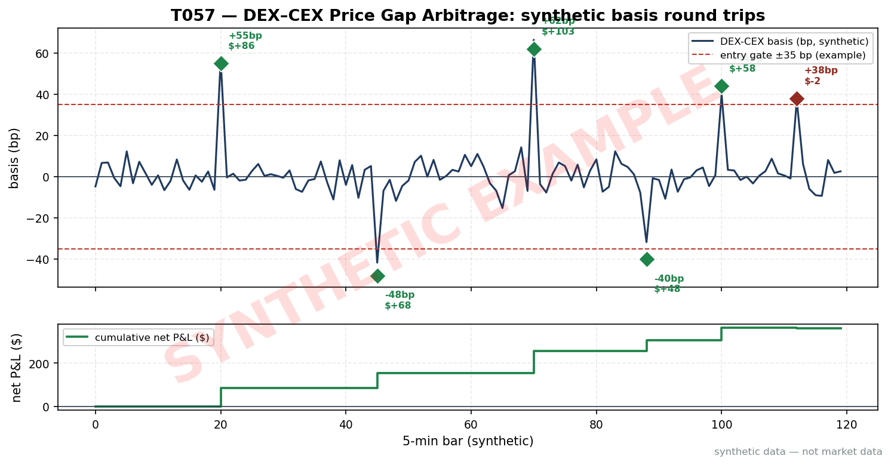

The chart carries the "SYNTHETIC EXAMPLE" watermark and the "synthetic data — not market data" caption.

```mermaid
flowchart TD
    DATA["Market data\n(1-min bars, exchange ts)"] -->|1-min bars| SIGS["Signals\nS087 fracdiff (d=0.40, L=56), S078 AR(1) forecast, S090 VR gate"]
    SIGS -->|1-min bars| ENTRY{"Fire logic\n|f_t| > 2.5bp AND |VR-1| > 0.05\nsignal at t → fill at t+1"}
    ENTRY -->|fire| SIZE["Sizing + risk\nfixed 1000 sh; daily loss stop"]
    ENTRY -->|no fire| WAIT["Wait"]
    SIZE -->|1-min bars| EXEC["Execution\nmarketable at t+1"]
    EXEC -->|fills + fees| MON["Monitor + exits\nexit at t+2"]
    MON -->|net fills| PNL["P&L (net of costs)"]
    style ENTRY fill:#f9e79f,stroke:#7d6608
    style PNL fill:#a9dfbf,stroke:#1e8449
```

### T10. Sources

1. López de Prado, M. (2018). *Advances in Financial Machine Learning*. Wiley. ISBN 978-1119482086 — Chapter 5, "Fractional Differentiation": the fixed-width window procedure, the weight recursion `w_k = −w_{k−1}(d−k+1)/k`, and truncation by tolerance τ — the S087 [D] source. This is the real book, not a summary: the method above follows its Chapter 5 construction.
2. Bailey, D. H. & López de Prado, M. (2014). "The Deflated Sharpe Ratio: Correcting for Selection Bias, Backtest Overfitting and Non-Normality." *Journal of Portfolio Management* 40(5): 94–107 — https://papers.ssrn.com/sol3/papers.cfm?abstract_id=2460551 (multiple-testing correction for the mined *d*, windows, and gates).
3. Lo, A. W. & MacKinlay, A. C. (1988). "Stock Market Prices Do Not Follow Random Walks: Evidence from a Simple Specification Test." *Review of Financial Studies* 1(1): 41–66 — http://web.mit.edu/Alo/www/Papers/lo-mackinlay-88.html (variance-ratio test; the S090 [D] premise for the memory gate).

**Source log.** Grok answered Q-TB6-1..3 (2026-09-10); all claims independently verified or labeled unverified. Grok did not supply the T057 fractional-differentiation specification — the S087/S078/S090 mechanics, *d* = 0.40, L = 56, φ = −0.492, and seed-157 numbers are reconstructed here from the AFML Chapter 5 procedure and the [D] signal definitions. Every numeric threshold is marked `example`.

**Unverified leads** (chatbot-only — never in Sources):
- Grok Q-TB6-3: purged/embargoed CV and CPCV as the validation standard for *d* and gate choice — standard AFML practice, but the TB6 rendering is chatbot-sourced; kept as a lead.
- Grok Q-TB6-3: ADF-test *d*-search details — the procedure is from AFML Chapter 5 (verified source 1); the TB6-specific parameter suggestions are chatbot-sourced.
- Vendor pricing in T6 (Massive/Polygon ~$199/mo class, Databento ~$200/mo + usage) — planning bands, *indicative — verify before budgeting*.

Grok answered Q-TB6-1..3 (2026-09-10); all claims independently verified or labeled unverified.

## Stage 158/200 — T058: Dispersion Trader

*Batch TB6 · Strategy 58/100 · Signals S075, S063, S069 · Provenance [D]*

### T1. One-line verdict

| | |
|---|---|
| **Style** | Options relative-value (volatility) stat-arb: long single-stock volatility, short index volatility |
| **Edge source** | Correlation risk premium (correlation risk premium = implied correlation priced into index options minus subsequently realized constituent correlation; index options embed a rich correlation assumption that usually fails to materialize) harvested by delta-hedged long-component / short-index option positions, entered only when the premium is wide and the index variance risk premium is positive |
| **Typical holding period** | Days to weeks per trade (example: up to 30 trading days or signal-flip, whichever first) |
| **Capacity hint** | Moderate — capped by single-name options liquidity and the cost of crossing wide constituent option spreads |
| **Build-or-buy in one line** | Build the signal and sizing logic yourself on bought options data; you cannot buy the trade. |

Provenance **[D]** (documented: S075, S063, S069 are all [D]; dispersion literature below).

### T2. Full mechanics

**Universe & session.** The liquid options segment of a major equity index — example: the 50–100 S&P 500 names with the highest options dollar-volume, plus SPX (or SPY) index options as the short leg. Trades are positioned at or after the daily close and delta-hedged (continuously offsetting directional exposure by trading the underlying stock so the book stays direction-neutral) intraday during RTH (regular trading hours, 9:30–16:00 ET). Exclusions: single names with an earnings announcement within the option tenor (event volatility contaminates the correlation read), option expiries under 7 days (*example*; gamma churn — rapid, costly hedging as expiry approaches), index-rebalance days, and any name with a borrow fee above an example 2% annualized (hard-to-borrow names break the delta hedge).

**Entry rule.** Computed at day *t*'s close on data ≤ *t*; the earliest trade is *t+1*'s open (causal t→t+1):

1. **S075 (primary trigger):** implied correlation minus trailing realized correlation exceeds an entry threshold — `signal_t = ρ_impl,t − ρ_real,t(30d) > κ`, with `κ = 0.10` *example*.
2. **S069 (regime gate):** index variance risk premium positive — index implied variance exceeds the HAR-forecast realized variance, `VRP_t^σ = IV_t^ann − E_t[RV^ann] > 0` (*example* gate: at least +1 vol point). This confirms the short index-vol leg is actually being paid for.
3. **S063 (measurement):** realized correlation and realized variances are measured with range-based estimators (Parkinson/Garman–Klass on 5-minute bars), which are 5–8× more efficient per observation than close-to-close — so a 30-day realized-corr window is actually informative.

Enter the long-dispersion direction (long single-stock straddles — a straddle is a call plus a put at the same strike, profiting from large moves either way — short index straddle). If `signal_t < −κ` (*example*), the book stands down; it never runs short dispersion without a separate mandate, because the reverse trade is short idiosyncratic gamma (unbounded loss if one name gaps on news).

**Exit rule.** First of: (a) signal-flip — `ρ_impl − ρ_real < 0.05` (*example*); (b) time stop — 30 trading days (*example*); (c) stop-loss — cumulative net P&L worse than an *example* −3× the book's target daily vol; (d) **correlation-break kill switch** — 5-day realized correlation (*example* window) exceeds implied correlation (the 2008 shape: correlations spike toward 1.0 and the short index leg detonates).

**Position sizing.** Vega-neutral construction: vega (the option's sensitivity to a 1-point change in implied volatility) of the long single-name straddles ≈ vega of the short index straddle, so the book is a pure correlation bet rather than a directional vol bet. Then vol-targeting: scale total premium so the sleeve's target daily vol is σ⋆ (*example* 8% annualized). Per-name cap: no single name contributes more than *example* 10% of book vega. Portfolio heat: total premium paid ≤ *example* 5% of NAV.

**Risk limits.** Daily loss stop at *example* −2% of sleeve NAV; max gross premium *example* 1.5× NAV equivalent in vega terms; kill-switch conditions: OPRA (Options Price Reporting Authority — the consolidated US options quote feed) feed stale > 5 minutes (*example*), or realized correlation 5-day average (*example*) above implied correlation.

**Cost model.** Crossed spreads at entry and exit (single-name ATM straddles: *example* 3–8% of premium; index: *example* 0.5–2%), commissions *example* $0.65/contract/side, delta-hedge slippage *example* $60–180/day at this book size, and exchange/regulatory option fees. Borrow cost on the delta hedge is excluded names only. The worked example applies all of these explicitly.

**Order/execution sketch.** Leg in via limit orders worked at mid ± a tick rather than market orders (options spreads are the dominant cost); typical institutional path is an RFQ (request-for-quote) to market makers for the package. Delta-hedge with the underlying stock, participation ≤ *example* 10% of visible depth per child order. Queue-position honesty note: without listed single-stock options liquidity at the printed size, the mid-based paper P&L is fantasy — a Mac on SIP (Securities Information Processor — the consolidated US equity tape) data cannot honestly simulate options fills; label any SIP-only backtest `simulated only`.

### T3. Signals it consumes

| Signal | Role | Weight / logic |
|---|---|---|
| S075 Dispersion / implied-correlation spread | **Primary trigger** | Enter long dispersion iff `ρ_impl,t − ρ_real,t(30d) > κ` (κ = 0.10 *example*) |
| S069 Variance risk premium | **Regime gate** | Trade only if index `VRP_t^σ > 0` (*example*: ≥ +1 vol point); vetoes entries when implied is cheap vs forecast |
| S063 Range-based realized vol | **Sizing / monitoring** | Parkinson/Garman–Klass 5-min RV feeds realized-correlation measurement and the vol-targeting scaler |

```text
# T058 combination logic (example thresholds; causal: signal at t -> fill at t+1)
each day t at close, on data <= t:
    rho_impl  = implied_corr(SPX_IV, constituent_IVs)        # S075
    rho_real  = realized_corr(30d, range_based_RV)          # S075 + S063
    vrp       = index_IV - HAR_forecast_RV                  # S069
    spread    = rho_impl - rho_real
    if spread > 0.10 and vrp > 0 and no_exclusion(names):   # ENTRY
        size legs vega-neutral; scale to vol target
        enter long single-name straddles / short index straddle at t+1 open
    elif in_position and (spread < 0.05 or days_held >= 30
                          or cum_pnl < -3*target_daily_vol):  # EXITS
        unwind all legs at t+1 open
    if realized_corr(5d) > rho_impl:                          # KILL SWITCH
        flatten immediately at next liquid quote
```

### T4. Worked example — numbers + P&L (SYNTHETIC)

All numbers below are synthetic (random seed 158, stated for reproducibility); they are an arithmetic illustration, not a backtest. Scenario: at a synthetic day-*t* close, the desk measures implied correlation `ρ_impl = 0.47` against a 30-day realized correlation `ρ_real = 0.31` (range-based, S063), so `spread = 0.16 > κ = 0.10` (*example*). Index VRP check (S069): index IV 16.5% annualized vs HAR forecast 13.0% → `+3.5 vol points > 0` → gate passes. Entry at *t+1* open:

- **Long:** 500 single-name straddle contracts (100 per name × 5 names), mid $5.00, bought at ask $5.15 → pay $257,500.
- **Short:** 100 index straddles, mid $22.00, sold at bid $21.70 → receive $217,000.
- **Entry costs:** spread cross = (500×$0.15 + 100×$0.30)×100 = **$10,500** (the standard 100-share contract multiplier, applied at entry); commissions 600×$0.65 = **$390**; total **$10,890**.
- Delta-hedged daily; hedge slippage $60–180/day (synthetic).
- **Exit day 20:** spread narrowed to 0.03 < 0.05 (*example* exit) → signal-flip unwind; exit costs **$10,890** (symmetric).

Day-by-day synthetic gross P&L (long single-name gamma capture minus short index theta, delta-hedged):

| Day | Gross ($) | Hedge slip ($) | Net ($) | Cum. net ($) |
|---|---|---|---|---|
| 0 (entry) | — | — | −10,890 | −10,890 |
| 1 | 12,715 | 71 | 12,644 | 1,754 |
| 2 | 3,325 | 73 | 3,252 | 5,006 |
| 3 | −5,702 | 68 | −5,770 | −764 |
| 4 | −2,843 | 110 | −2,953 | −3,717 |
| 5 | 6,255 | 120 | 6,135 | 2,418 |
| 6 | −14,663 | 84 | −14,747 | −12,329 |
| 7 | 7,831 | 158 | 7,673 | −4,656 |
| 8 | −2,589 | 73 | −2,662 | −7,318 |
| 9 | 2,388 | 137 | 2,251 | −5,067 |
| 10 | −6,177 | 126 | −6,303 | −11,370 |
| 11 | 1,950 | 166 | 1,784 | −9,586 |
| 12 | −8,668 | 149 | −8,817 | −18,403 |
| 13 | 2,294 | 179 | 2,115 | −16,288 |
| 14 | −3,567 | 175 | −3,742 | −20,030 |
| 15 | 1,190 | 139 | 1,051 | −18,979 |
| 16 | 8,105 | 144 | 7,961 | −11,018 |
| 17 | −7,287 | 88 | −7,375 | −18,393 |
| 18 | 7,870 | 116 | 7,754 | −10,639 |
| 19 | −277 | 129 | −406 | −11,045 |
| 20 (exit) | −1,081 | 133 | −1,214 − 10,890 exit | −23,149 |

Walk: gross total = **+$1,069**; hedge slippage total = **−$2,438**; entry −$10,890 and exit −$10,890 → **trade net = −$23,149**. The largest day (day 6, −$14,747) is a correlation-spike day: realized correlation jumped toward the implied level, the short index straddle lost more than the long single-name gamma gained — the trade's core risk, arriving exactly as the literature warns.

**What the corrected costs show.** The ×100 contract multiplier changes the story, not just the arithmetic: $21,780 of entry/exit spread-crossing dwarfs the +$1,069 synthetic gross and the −$2,438 hedge slippage combined. At this book size (600 contracts), crossing constituent option spreads is the entire P&L — the dispersion premium would have to be enormous to survive it. That is the honest retail lesson of dispersion: it is an institutional-scale execution trade (package pricing, RFQ, balance-sheet for the tail), not a screen-traded one.

**Where the example is optimistic.** Fills are assumed at ask/bid for 600 contracts with no partial fills and no market impact; in real single-name options, working 100 straddles per name moves the quote. Delta hedging is assumed frictionless apart from the slippage line — real hedging has discrete rebalancing error. The implied-correlation input is assumed clean; real constituent IVs are polluted by earnings jumps and wide quotes. And the exit assumes a liquid two-sided unwind on the signal-flip day — during a correlation break, that is precisely when liquidity vanishes.

### T5. Data & infra — what must run

**Daily/intraday pipeline inventory.** (1) Pre-open: full-chain option snapshots for the 50–100 candidate names + index (OPRA or Cboe delayed; implied vols and greeks computed or bought); implied-correlation computation (S075 formula). (2) Intraday loop (example every 15 min): delta-hedge monitor, realized-correlation tracker on 5-minute bars (S063), kill-switch check. (3) Post-close: signal recompute, HAR vol forecast refresh (S069 inputs), P&L attribution (gamma vs theta vs vega). Storage: per cost-model §4, options chain snapshots run ~100–300 MB/day for a handful of underlyings — a 50-name panel is tens of GB/month; keep rolling 60-day windows hot, archive the rest.

**M5 Max feasibility.** Feasible — this is a daily-signal, intraday-hedge strategy, not a tick engine. Greeks for 50 chains in numpy/polars run in seconds; the pipeline is I/O-bound on the options feed. Verdict pattern (per cost-model §7): *feasible on the M5 Max (Tier M+, ~60–100 h ≈ $9k–15k loaded-cost estimate + ~$200/mo data at the research tier); bottleneck is options-data licensing and quote quality, not compute; breaks if you try full OPRA for all names locally.* Engineering band: M+ (strategy harness around M-tier signals), 40–100 h per cost-model §5.

**Feed-outage safe mode.** If the options feed drops mid-session: halt new entries immediately; keep the delta-hedge loop running on the last good quotes for a grace window (*example* 5 minutes); if quotes stay stale, flatten the book at the next liquid print rather than flying blind — an unhedged short-gamma book during an outage is the catastrophic state.

### T6. Buy vs build

| Option | What you get | Indicative price | What buying gains | What buying loses |
|---|---|---|---|---|
| Tier 0: Cboe delayed quotes + exchange delayed chains | 15-min delayed option quotes, KCJ/ICJ implied-correlation index | ~$0 — *indicative — verify before budgeting* | Free implied-correlation regime gauge | No tradable real-time greeks; redistribution limits |
| Tier 1: Polygon / Tiingo options (indicative) | Real-time-ish chains, greeks | ~$30–200/mo, *indicative — verify before budgeting* | Cheap research chains | Thin single-name history; not full OPRA |
| Tier 2: Databento OPRA research | Honest full-chain options history + L1 equity | ~$200/mo + usage, *indicative — verify before budgeting* | Research-grade backtest data | Production OPRA is a separate institutional contract |
| QuantConnect / retail backtest platform | Options data + backtest harness | subscription-based, *indicative — verify before budgeting* | Fastest path to a paper backtest | You still design the signal; platform assumptions may flatter fills |

**Verdict: build the signal and sizing, buy the data.** There is no vendor selling "dispersion as a service" worth licensing; the edge lives in your correlation measurement and execution. Crossover: buy full production OPRA only if you run the book live with real size; for research, Tier 1–2 delayed/full-history data plus a bought IV surface is the sane spend.

### T7. Success-ratio evidence

| Study / source | Market & period | Metric | Before/after cost | Caveat |
|---|---|---|---|---|
| Driessen, Maenhout & Vilkov (2009) | S&P 500 options, 1996–2003 | Correlation risk premium ≈ 18%; avg implied corr 47% vs realized 29% | Before cost (risk premium estimate) | The premium compensates correlation-break risk; it is not free |
| Bakshi & Kapadia (2003) | S&P 500 index options | Negative market volatility risk premium: index options priced above subsequently realized volatility | Before cost | Foundational for the index-leg richness the trade harvests |
| Deng (2008) | Volatility dispersion trades | Profitability changed after late-1999/2000 structural options-market changes | Before cost | Supports inefficiency (crowding) over a stable risk premium — the edge decays as desks pile in |
| Ferrari, Poy & Abate (2019) | S&P 100 options | Dispersion backtest risk-adjusted return beat buy-and-hold, low market correlation | Before cost (options spread costs not fully charged) | Single-market study; transaction costs understated |
| Bollerslev, Tauchen & Zhou (2009) | US equities | Variance risk premium predicts returns | Before cost | Long-horizon evidence; intraday VRP is noise (per S069) |

**Honest bottom line.** For a ≤$1M paper operation: dispersion is a real, documented premium (correlation risk is priced), but it is capital-intensive, short-gamma on the index leg, and the documented edge lives at 1–3 month tenors — not an intraday strategy. A small paper book can research it honestly on Tier 1–2 data, but live trading needs institutional options execution and the correlation-break tail (2008, 2020) must be sized, not hoped away. Institutional desks harvest it with variance swaps (cleaner math, OTC) and balance-sheet to warehouse the tail; a retail account gets the worst version of the trade: wide constituent spreads and no variance-swap access.

### T8. Failure modes

1. **Correlation break (the 2008/2020 shape).** Realized correlation spikes toward 1.0; the short index leg's losses dwarf single-name gamma gains. *Mitigation:* the kill switch (flatten when 5-day realized corr > implied corr) plus hard per-trade stop-loss.
2. **Single-name jump on the long leg.** An earnings leak or takeover in one long name creates a windfall — the reverse (a gap in a name you are short vol on) does not apply here, but a halted name freezes your hedge. *Mitigation:* earnings-day exclusions; position caps per name.
3. **Vol-of-vol / vega mismatch.** If legs are not truly vega-neutral, the book is a directional vol bet wearing a dispersion costume. *Mitigation:* recompute vega neutrality daily; attribute P&L into correlation vs vega buckets.
4. **Liquidity mirage in single-name options.** Wide or one-sided quotes make the implied-correlation input garbage and the exit theoretical. *Mitigation:* liquidity filters (minimum options dollar-volume); mark the book at bid/ask, never mid, for risk.
5. **Dividend / corporate-action contamination.** Special dividends and splits distort constituent IVs and the hedge. *Mitigation:* corporate-action-adjusted data pipeline; manual review queue for actions.
6. **Overfit κ and windows.** The entry threshold and realized-corr window mined on 2003–2007 data will not survive the next correlation regime. *Mitigation:* purged/embargoed validation (S088 discipline); trade the premium, not the backtest's favorite parameter.
7. **Operational: stale kill-switch.** A dead monitoring loop during a correlation spike turns a managed loss into a blowup. *Mitigation:* heartbeat on the risk daemon; flatten-on-silence default.

### T9. Visuals

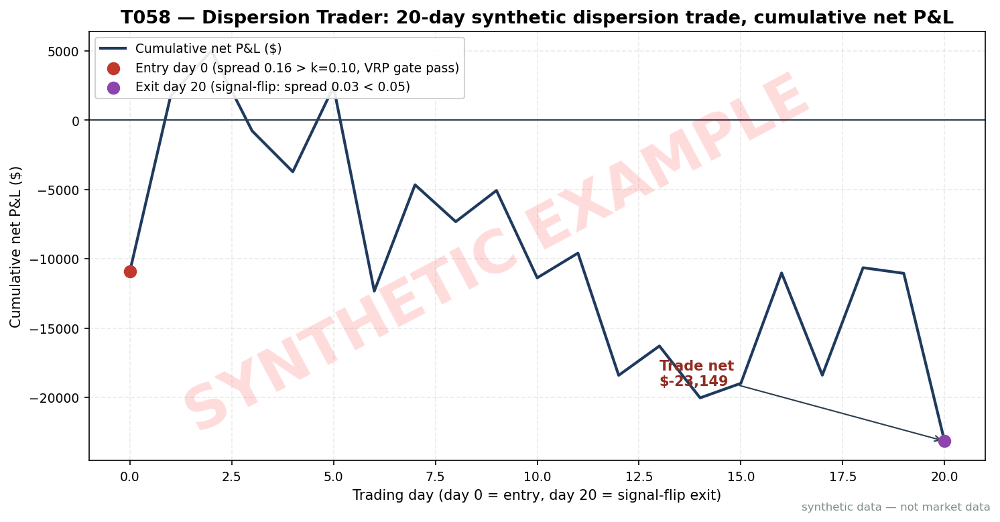

*Caption: synthetic 20-trading-day dispersion trade (seed 158) — long 500 single-name straddles vs short 100 index straddles; entry day 0 on spread 0.16 > 0.10 with VRP gate pass; exit day 20 on signal-flip (spread 0.03 < 0.05). Cumulative net P&L ends at −$23,149 after $21,780 of entry/exit costs (spread cross with the ×100 contract multiplier) and $2,438 of hedge slippage. Watermark reads "SYNTHETIC EXAMPLE"; corner caption: "synthetic data — not market data".*

```mermaid
flowchart TD
    DATA["Market data<br/>(OPRA chains, 5-min bars)"] -->|daily chains + 5-min bars| SIGS["Signals<br/>S075, S063, S069"]
    SIGS -->|daily signal snapshot| ENTRY{"Entry logic<br/>(spread>k, VRP>0, causal t to t+1)"}
    ENTRY -->|trigger| SIZE["Sizing + risk<br/>(vega-neutral, vol target, heat)"]
    ENTRY -->|no trigger| WAIT["Wait"]
    SIZE -->|parent orders| EXEC["Execution<br/>(limit legs, delta hedge)"]
    EXEC -->|fills + hedge state| MON["Monitor + exits<br/>(signal-flip/time/stop/kill)"]
    MON -->|net P&L| PNL["P&L (net of costs)"]
    style ENTRY fill:#f9e79f,stroke:#7d6608
    style PNL fill:#a9dfbf,stroke:#1e8449
```

### T10. Sources

1. Driessen, J., Maenhout, P. J. & Vilkov, G. (2009). "The Price of Correlation Risk: Evidence from Equity Options." *Journal of Finance* 64(3), 1377–1406. — correlation risk premium ≈ 18%; avg implied correlation 47% vs realized 29% (figures as documented in the FX correlation-risk literature citing this paper: https://files.fisher.osu.edu/department-finance/public/international_correlation_risk.pdf).
2. Bakshi, G. & Kapadia, N. (2003). "Delta-Hedged Gains and the Negative Market Volatility Risk Premium." *Journal of Derivatives*, Fall 2003. http://people.umass.edu/nkapadia/docs/Bakshi_Kapadia_JoD_Fall_2003.pdf
3. Deng, Q. (2008). "Volatility Dispersion Trading." SSRN. https://papers.ssrn.com/sol3/papers.cfm?abstract_id=1156620
4. Ferrari, P., Poy, G. & Abate, G. (2019). "Dispersion trading: an empirical analysis on the S&P 100 options." *Investment Management and Financial Innovations*, 16(1), 178–188. http://dx.doi.org/10.21511/imfi.16(1).2019.14
5. Bollerslev, T., Tauchen, G. & Zhou, H. (2009). "Expected Stock Returns and Variance Risk Premia." *Review of Financial Studies* 22:4463–4492. (FEDS working version via https://www.federalreserve.gov/pubs/ifdp/2011/1035/ifdp1035.htm)

**Unverified leads** (chatbot-provided or second-hand; not confirmed facts — verify before use):
- Quantpedia-style summary citing a "15.39% return 1996–2007 backtest" for dispersion — historical, model-dependent summary; not an expected return.
- Cboe Implied Correlation Index (tickers KCJ/ICJ) as a ready-made regime gauge — named in S075; index methodology page not independently opened this batch.

*Source log: Grok answered Q-TB6-1..3 (2026-09-10); all claims independently verified or labeled unverified.*

## Stage 159/200 — T059: News-Sentiment First-Minute Momentum

*Batch TB6 · Strategy 59/100 · Signals S091, S092, S094 · Provenance [D/SR]*

### T1. One-line verdict

| | |
|---|---|
| **Style** | Intraday event-driven momentum: trades the continuation after machine-readable news, confirmed by volume |
| **Edge source** | Investor underreaction — prices jump on signed news but the reaction continues for minutes (the first-minute print confirms direction; the drift after it is the trade) |
| **Typical holding period** | Minutes (example: 10-minute time stop; 5–30 minute window) |
| **Capacity hint** | Low per event (participation-capped); scales with news flow, not size — dozens of small trades, not a few big ones |
| **Build-or-buy in one line** | Buy the licensed news feed; build the reaction, agreement, and volume-confirmation logic yourself. |

Provenance **[D/SR]** (documented: S091, S092 are [D]; S094 is [SR] — standard RVOL/block reconstruction).

### T2. Full mechanics

**Universe & session.** Liquid US large- and mid-caps — example filter: average daily dollar volume above $50M, quoted spread normally ≤ 3 ticks (a tick is the minimum price increment, e.g. $0.01). RTH only (9:30–16:00 ET); no overnight holds — this is a minutes-long overlay, not a PEAD (post-earnings-announcement drift — the multi-day continuation after earnings surprises) book.

**Entry rule.** Pipeline per news story, all thresholds *example*:

1. **Ingest:** point-in-time machine-readable wire (vendor feed). The timestamp that matters is `t_0` = arrival at *your* pipe, exchange-clock synchronized — not the vendor's publication datetime.
2. **S091 (primary trigger):** score the story — sentiment `s ∈ [−1, +1]`, relevance `rel ≥ 80`, novelty `nov ≥ 70` (S091's ESS/relevance/novelty fields). Require `|s| ≥ 0.50`.
3. **First-minute return:** `r_1m = (P_{t_0+60s} − P_{t_0+})/P_{t_0+}`, measured on mid or microprice (not last trade, to limit bid-ask bounce bias). Require `|r_1m| ≥ 15 bp` for large-caps (*example*; 40 bp for mid-caps) **and** `sign(r_1m) = sign(s)` — the *agreement filter*: trade only when the market's first printed reaction agrees with the machine-read sentiment.
4. **S092 (filter):** the story must be *identified* news under the S092 procedure — matched to the name within the match window with relevance above the cutoff — so that jumps with no matched fundamental story are skipped.
5. **S094 (volume confirmation):** the event bin's RVOL ≥ 2.0 (*example*) — unusual volume confirms institutional participation — and the quoted spread ≤ 3 ticks (*example*), so the cost gate passes.
6. Enter at `t_0 + 60s` with the sign of `s`. Causal timing: the signal is complete at `t_0+60s`; the earliest fill is the first quote after that — never the headline instant.

**Exit rule.** First of: (a) time stop — *example* 10 minutes after entry; (b) give-back — exit if open profit retraces 50% (*example*); (c) opposite headline — a new story with opposite sign and `|s| ≥ 0.50` flips the book flat.

**Position sizing.** `q = q_base · |s| · min(1, |r_1m|/r_ref) · min(1, ADV/ADV_0)`, with `q_base = 25,000` shares (*example*), `r_ref = 40` bp, capped at *example* 1.5% of the 1-minute volume (participation cap) and a hard notional cap per name. Slippage model for planning: half-spread + impact.

**Risk limits.** Max *example* 5 concurrent news positions; daily loss stop *example* −1.5% of sleeve NAV; per-event stop at the give-back exit; kill switch if the news feed latency exceeds an *example* 5-second staleness budget.

**Cost model.** Spread crossing on entry and exit (the Groß-Klußmann & Hautsch finding: spreads widen right after news — modeled explicitly), commissions *example* $0.0008/share/side, and impact from the participation cap. The worked example charges all three.

**Order/execution sketch.** Child orders worked over *example* 10–30 seconds via POV (percentage-of-volume) at the participation cap — this is not a race to the first tick; the decision SLO (service-level objective) after `t_0+60s` is *example* < 100–200 ms to the first child, which is ample. Queue-position honesty: you are a liquidity *taker* here; never model maker fills.

**Intraday-news latency caveat (read before building).** This strategy dies if `t_0` is wrong. Retail news APIs typically stamp the *processed* time — 2–15 seconds after the exchange-visible headline — by which point the first-minute return is already in the price and you are trading the echo. Scheduled macro (CPI/NFP) is a sub-second race you will not win from a Mac. The documented, tradable edge is the *minutes-scale continuation after firm news with an accurate timestamp* — not the first impulse. If you cannot verify your feed's timestamp against the exchange clock, do not trade this.

### T3. Signals it consumes

| Signal | Role | Weight / logic |
|---|---|---|
| S091 News sentiment (first-minute reaction) | **Primary trigger** | Sign of `s`; enter iff `|s| ≥ 0.50`, `z`-style confirmation via `r_1m` agreement |
| S092 Identified-news vs no-news | **Filter** | Story must be *identified* (matched, relevant) — vetoes no-news jumps and rumour-class stories |
| S094 RVOL + signed block pressure | **Volume confirmation** | `RVOL ≥ 2.0` (*example*) confirms institutional flow; block imbalance sign must agree with `s` |

```text
# T059 combination logic (example thresholds; signal complete at t0+60s)
on story arrival at t0 (exchange-sync stamp):
    s, rel, nov = score(story)                       # S091
    if not (abs(s) >= 0.50 and rel >= 80 and nov >= 70): return
    if not identified_news(story, window=15min): return   # S092 veto
    wait until t0 + 60s
    r1m = (mid(t0+60s) - mid(t0+)) / mid(t0+)          # first-minute print
    if not (abs(r1m) >= 15bp and sign(r1m) == sign(s)): return  # agreement
    if not (RVOL(bin) >= 2.0 and spread <= 3 ticks): return    # S094 + cost gate
    q = 25000 * abs(s) * min(1, abs(r1m)/40bp)         # sizing
    enter sign(s) at next quote, cap 1.5% of 1-min volume
    exit at min(t0+660s, 50% give-back, opposite headline)
```

### T4. Worked example — numbers + P&L (SYNTHETIC)

Synthetic two-week tape of 10 news events (seed 159). Gate: `|s| ≥ 0.50`, `|r_1m| ≥ 15` bp, sign agreement, `RVOL ≥ 2.0`, spread ≤ 3 ticks. Exactly one event passes all five gates — the filter's selectivity is the point:

| # | Ticker | s | r_1m (bp) | RVOL | Spr | Trade? | Reason |
|---|---|---|---|---|---|---|---|
| 1 | ABC | +0.50 | −36.0 | 5.4 | 3 | No | sign mismatch (sentiment +, print −) |
| 2 | DEF | +0.12 | −37.3 | 4.8 | 1 | No | `|s|` < 0.50 |
| 3 | GHI | −0.22 | −30.5 | 2.2 | 1 | No | `|s|` < 0.50 |
| 4 | JKL | −0.34 | −3.8 | 2.2 | 2 | No | `|s|` < 0.50 |
| 5 | MNO | +0.78 | −3.9 | 5.2 | 1 | No | `|r_1m|` < 15 bp (no confirmation) |
| 6 | PQR | −0.19 | +5.8 | 3.3 | 3 | No | `|s|` < 0.50 |
| 7 | STU | +0.80 | +20.8 | 2.3 | 2 | **Yes** | all gates pass |
| 8 | VWX | +0.65 | +39.9 | 5.9 | 4 | No | spread 4 > 3 ticks (cost gate) |
| 9 | YZA | −0.54 | +18.9 | 2.6 | 2 | No | sign mismatch |
| 10 | BCD | −0.26 | −33.3 | 3.4 | 4 | No | `|s|` < 0.50 |

Event 7 (STU, synthetic) walked line by line:
- 09:41:00.000 — wire arrives (exchange-sync `t_0`); story scores `s = +0.80`, `rel = 84`, `nov = 76` → passes sentiment gate; S092 match confirms identified firm news.
- 09:42:00 — first-minute print: mid 100.00 → 100.208, `r_1m = +20.8 bp ≥ 15 bp`, sign matches `s`; bin RVOL = 2.3 ≥ 2.0; spread 2 ticks ≤ 3 → all gates pass. Gates are complete at `t_0+60s` — the earliest fill is the first quote *after* that, never the pre-reaction mid.
- Size: `q = 25,000 × 0.80 × min(1, 20.8/40) = 25,000 × 0.80 × 0.52 = 10,400` shares; participation cap not binding.
- Entry: buy 10,400 @ ask **100.218** (post-gate mid 100.208 + $0.01 half-spread on the 2-tick quoted spread).
- Exit: time stop at 09:52:00 (10 min), tape mid 100.131 → sell 10,400 @ bid **100.121**.
- Mid-to-mid gross: `10,400 × (100.131 − 100.208)` = **−$800.80**. (The +13.1 bp drift from the *pre-reaction* mid never belonged to the trade — the gates owned that minute.)
- Spread cross: `2 × 10,400 × $0.01` = **−$208.00**.
- POV impact: `2 × 10,400 × $0.005/share` (`example`) = **−$104.00**.
- Fees: `10,400 × 2 × $0.0008` = **−$16.64**.
- **Net: −$1,129.44.** Ten-event tape net: **−$1,129.44**.

**What the correction changed.** The old walk bought the pre-reaction mid 100.000 and printed +$1,345.76 — a lookahead fill: the gates only complete at `t_0+60s`, so no quote below 100.208 was executable. With the causal fill, the single traded event loses −$1,129.44 after full costs. The flip is the point: this strategy's apparent edge lives in the timestamp, and the honesty of the example is that the first-minute confirmation is *bought*, not free — you pay the post-reaction ask and the wide post-news spread.

**Where the example is optimistic.** The timestamp is assumed perfectly exchange-synced — the entire edge. Fills assume the POV child completes inside the participation cap at the stated impact; real news bursts see spreads triple in seconds (the example's own gate rejected event 8 for exactly this). Only one trade fired in ten events: at this selectivity the strategy needs high news throughput to matter, and the single printed trade *lost* after costs — it says nothing about the win rate. No partial fills, no opposite-headline whipsaw, no stale reprints — the S093 failure the real book must survive.

### T5. Data & infra — what must run

**Daily/intraday pipeline inventory.** (1) Always-on: news wire ingest with entity linking (ticker map) and exchange-sync timestamping; novelty index (simhash/embedding cosine vs trailing stories); sentiment/relevance scorer. (2) Intraday loop: 1-minute bar + quote engine for `r_1m`, RVOL bins (S094), spread monitor; event state machine (waiting → armed at `t_0+60s` → in-trade → exited). (3) Post-close: reaction study (did the drift persist?), slippage vs arrival accounting, timestamp-drift audit (vendor stamp vs exchange clock). Storage: headline + score archive is small (GBs/year); the 1-minute quote history for the traded universe follows cost-model §4 (~50 MB/day for 500 symbols).

**M5 Max feasibility.** Feasible — scoring a frozen small classifier is < 10 ms/story on this box; the pipeline is feed-bound, not compute-bound. Verdict pattern (per cost-model §7): *feasible on the M5 Max (Tier H data-wise, eng Tier H, 60–200 h ≈ $9k–$30k loaded-cost estimate + news license; bottleneck is the licensed feed's timestamp quality, not FLOPs).* Note the cost-model honesty rule: a toy build on free RSS is cheap and researches a different market than the one you'd trade.

**Feed-outage safe mode.** If the news feed drops or timestamps go stale: cancel all armed (pre-`t_0+60s`) events immediately; existing positions run to their time stops (they are minutes long — flatten, don't babysit); halt new entries until the timestamp audit passes again. Never enter on a story whose `t_0` you cannot verify.

### T6. Buy vs build

| Option | What you get | Indicative price | What buying gains | What buying loses |
|---|---|---|---|---|
| Tier 0: SEC EDGAR + PR wires + RSS | Filings, press releases | ~$0 — *indicative — verify before budgeting* | Free, redistribution-safe for filings | Minutes-late; no entity linking; unusable `t_0` |
| Tier 1: Benzinga Pro / similar | Machine-readable headlines, some sentiment | ~$100–200/mo, *indicative — verify before budgeting* | Affordable real pipe | Timestamp trust must be audited; redistribution limits |
| Tier 3: RavenPack / Bloomberg-class | Ticker-linked events, relevance/novelty, synced stamps | $$$$ enterprise (typically $50k–250k+/yr), *indicative — verify before budgeting* | The timestamp is the product | Budget-breaking for a small operation; no redistribution |
| QuantConnect / Composer-style retail | Backtest harness, some news datasets | subscription, *indicative — verify before budgeting* | Fast paper prototype | Point-in-time correctness varies; check before trusting |

**Verdict: buy the feed, build the reaction layer.** Rolling your own NLP on RSS is how you discover, months later, that your "edge" was embargoed reprints. Novelty scoring (simhash + entity window) is worth building — vendors' novelty flags are a start, not a research-grade duplicate graph. Crossover: start on a Tier 1 trial with a timestamp audit; only step up to enterprise news if the audit shows the trial's `t_0` lagging the tape.

### T7. Success-ratio evidence

| Study / source | Market & period | Metric | Before/after cost | Caveat |
|---|---|---|---|---|
| Groß-Klußmann & Hautsch (2011) | LSE intraday, 20-second VAR | News arrivals move returns, volatility, volume, spreads; relevance classification crucial; sentiment predicts future price trends | Before cost — and the paper states profitability is *deteriorated by increased bid-ask spreads* | The cost sentence is the finding: the edge exists gross, spreads eat it |
| Tetlock (2007) | WSJ pessimism, US market | High media pessimism predicts downward pressure then reversion | Before cost | Daily horizon; pessimism factor, not first-minute |
| Chan (2003) | US headlines, monthly | Drift after bad news; reversal after extreme no-news moves | Before cost | Concentrated in smaller, illiquid stocks; monthly horizon |
| Bernard & Thomas (1989) | US earnings, 1974–1985 | SUE decile spread positive in 41 of 48 quarters; drift ≥ 60 days | Before cost | The slow clock — PEAD, not first-minute |
| Boudoukh et al. (2019) | US firm news | Fundamental news accounts for 49.6% of overnight idiosyncratic volatility (12.4% intraday) | Statistical decomposition, not a trade | Justifies the identified-news filter; not a P&L |

**Honest bottom line.** For a ≤$1M paper operation: the literature documents that news moves prices and that signed news drifts — but the documented after-cost intraday numbers are thin, and the one quantified cost finding (Groß-Klußmann & Hautsch: spreads deteriorate profitability) points the wrong way. The realistic version of this strategy is a *research operation proving timestamp quality first*: if your audited `t_0` is seconds late, your expected edge is ≈ 0 after spread. An institutional desk with a colocated licensed wire can run the minutes-scale book; a retail operation is likelier to find that its "first-minute momentum" is the vendor's latency, monetized against itself.

### T8. Failure modes

1. **Timestamp lag (the #1 killer).** Vendor's processed stamp trails the exchange-visible headline by seconds; the first-minute return is already in the price. *Mitigation:* continuous timestamp audit vs exchange clock; staleness kill switch.
2. **Stale reprints (S093's domain).** A "new" story is a rewrite; novelty scoring misses it; you buy the top of someone else's drift. *Mitigation:* embedding-cosine novelty index; require `nov ≥ 70` (*example*).
3. **Spread blowout at the event.** Spreads triple in the first seconds after news; the cost gate exists because of this. *Mitigation:* hard spread ≤ 3 ticks (*example*) gate; model spread as a function of RVOL, not a constant.
4. **Opposite-headline whipsaw.** A denials/correction story arrives mid-hold. *Mitigation:* the opposite-headline exit; cap concurrent positions.
5. **No-news jumps misclassified as news.** A price jump with a coincidentally timed irrelevant story passes the filter. *Mitigation:* S092's relevance cutoff and match window, kept tight (*example* 15 min).
6. **Scheduled-macro race.** Trying to trade CPI/NFP first impulses from a Mac — you are the liquidity. *Mitigation:* blacklist scheduled macro from this book; it belongs to a colocated operation or not at all.
7. **Overfit gate thresholds.** `|s| ≥ 0.50`, 15 bp, RVOL 2.0 tuned on one news regime. *Mitigation:* freeze the spec; validate on purged/embargoed event splits (S088 discipline); expect decay as wire speeds compress.

### T9. Visuals

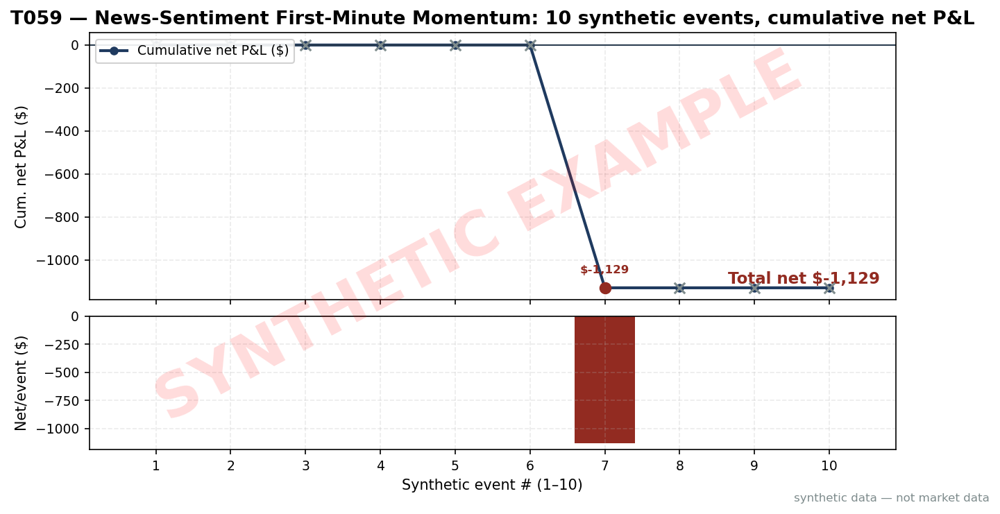

*Caption: ten synthetic news events (seed 159) through the five-gate filter — nine rejected (sentiment, agreement, spread, or cost gates), one traded (event 7, STU: −$1,129.44 net after the causal post-gate fill and full costs). Total tape net −$1,129.44. Watermark reads "SYNTHETIC EXAMPLE"; corner caption: "synthetic data — not market data".*

```mermaid
flowchart TD
    DATA["Market data<br/>(news wire, 1-min bars/quotes)"] -->|story + tick stream| SIGS["Signals<br/>S091, S092, S094"]
    SIGS -->|event snapshot at t0+60s| ENTRY{"Entry logic<br/>(sentiment, agreement, RVOL, spread)"}
    ENTRY -->|trigger| SIZE["Sizing + risk<br/>(score-scaled, participation cap)"]
    ENTRY -->|no trigger| WAIT["Wait"]
    SIZE -->|POV child orders| EXEC["Execution<br/>(10-30s participation)"]
    EXEC -->|fills| MON["Monitor + exits<br/>(time/give-back/opposite news)"]
    MON -->|net P&L| PNL["P&L (net of costs)"]
    style ENTRY fill:#f9e79f,stroke:#7d6608
    style PNL fill:#a9dfbf,stroke:#1e8449
```

### T10. Sources

1. Groß-Klußmann, A. & Hautsch, N. (2011). "When machines read the news: Using automated text analytics to quantify high frequency news-implied market reactions." *Journal of Empirical Finance* 18(2), 321–340. http://ideas.repec.org/a/eee/empfin/v18y2011i2p321-340.html — relevance classification crucial; sentiment predicts trends; profitability deteriorated by spreads.
2. Tetlock, P. C. (2007). "Giving Content to Investor Sentiment: The Role of Media in the Stock Market." *Journal of Finance* 62(3), 1139–1168. https://doi.org/10.1111/j.1540-6261.2007.01232.x
3. Chan, W. S. (2003). "Stock price reaction to news and no-news: drift and reversal after headlines." *Journal of Financial Economics* 70(2), 223–260. https://www.researchgate.net/publication/2856618_Stock_Price_Reaction_to_News_and_No-News_Drift_and_Reversal_After_Headlines_Wesley_S_Chan
4. Bernard, V. L. & Thomas, J. K. (1989). "Post-Earnings-Announcement Drift: Delayed Price Response or Risk Premium?" *Journal of Accounting Research* 27 (Supplement). — PEAD: SUE decile spread positive in 41/48 quarters (summary: https://en.wikipedia.org/wiki/Post%E2%80%93earnings-announcement_drift).
5. Boudoukh, J., Feldman, R., Kogan, S. & Richardson, M. (2019). "Information, Trading, and Volatility: Evidence from Firm-Specific News." *The Review of Financial Studies* 32(3), 992–1033. https://ideas.repec.org/a/oup/rfinst/v32y2019i3p992-1033..html

**Unverified leads** (chatbot-provided; not confirmed facts — verify before use):
- Grok (2026-09-10): "median SPY post-CPI quote lag compressed ~450 ms (2018–19) → ~120 ms (2023–24)" — chatbot claim, no checkable source captured; do not size latency budgets off it.
- Grok (2026-09-10): firm-level news-momentum "long-short on news-return deciles ~3.34%/month" — resembles published news-return drift work but no citable paper captured; unverified.
- Grok latency budgets (wire parse 5–50 ms, sentiment inference 10–80 ms) — illustrative estimates, not measurements.

*Source log: Grok answered Q-TB6-1..3 (2026-09-10); all claims independently verified or labeled unverified.*

## Stage 160/200 — T060: Identified-News Drift Portfolio

*Batch TB6 · Strategy 60/100 · Signals S092, S093, S100 · Provenance [D/SR]*

### T1. One-line verdict

| | |
|---|---|
| **Style** | Multi-name event-driven equity portfolio: follows jumps backed by identified fundamental news, fades jumps with no news, sizes earnings on surprise magnitude |
| **Edge source** | Two documented regularities: (1) post-earnings/information drift — prices underreact to fundamental news and continue; (2) no-news reversal — extreme moves with no story tend to mean-revert as liquidity pressure fades |
| **Typical holding period** | Minutes to hours for fades (example 60-min); days for earnings drift legs (example 5 days) |
| **Capacity hint** | Medium per event; the drift leg is the slower, more scalable one; the fade leg is liquidity-constrained |
| **Build-or-buy in one line** | Buy the news/earnings data; build the identification, novelty, and jump-classification stack yourself. |

Provenance **[D/SR]** (documented: S092, S100 are [D]; S093 is [SR] — embedding novelty is standard reconstruction).

### T2. Full mechanics

**Universe & session.** US common stocks with options-listed names preferred for liquidity — example filter: price > $10, ADV (average daily dollar volume) > $25M, shortable (locate confirmed before any fade leg is armed). Intraday event detection during RTH; drift legs may carry overnight (example: earnings legs held up to 5 days).

**The identification procedure (S092) — the chapter's core.** For each detected jump (5-minute bar return with `|z| > 3.5` vs trailing 60-day vol, *example*, and `|r| > 1.5%` minimum), the desk runs the match: look back over a match window `w = 15 minutes` (*example*) in the point-in-time news archive for a story linked to the firm with relevance above the cutoff. Classification outcomes:

- **Identified news** → *follow* the jump direction: hold for *example* 60 minutes (intraday) or, for earnings, up to *example* 5 days.
- **No-news jump** → *fade* it: take the opposite side of the jump, holding *example* 60 minutes — the documented reversal leg.
- **Stale/reprint** (S093: novelty < 0.50, *example*) → *skip*: an identified-but-stale story is neither followable news nor genuine no-news.
- **Earnings announcements** (S100) are always treated as identified regardless of the match window — and they are **never faded**: PEAD (post-earnings-announcement drift) is the drift leg's flagship, and fading earnings is fighting the best-documented anomaly in the set.

**Entry/exit per leg.**
- *Follow (intraday, non-earnings):* enter at the first liquid quote after classification completes; exit at *example* 60 minutes or on an opposite-sign story.
- *Follow (earnings):* enter at the post-announcement open print; hold *example* 5 trading days or until the SUE-scaled target is hit.
- *Fade:* enter against the jump immediately after classification; exit at *example* 60 minutes or a 50% adverse excursion stop.

**Position sizing.** Base 10,000 shares (*example*), scaled: follow legs ×1.2 (*example*), fade legs ×0.8 (*example*), earnings legs × `min(1, |SUE|/3)` (*example* scaling; SUE is the standardized unexpected earnings — actual minus expected EPS, divided by the standard deviation of past surprises). Hard caps: *example* 2% of 5-minute volume participation; *example* $2M gross per event; portfolio net exposure band *example* ±30%.

**Risk limits.** Max *example* 8 concurrent event legs; daily loss stop *example* −2% of sleeve NAV; borrow desk confirms locates before every fade; earnings legs capped at *example* 40% of gross exposure (concentration).

**Cost model.** Commissions *example* $0.0008/share/side; spread crossing at event-time (widened — the cost gate from T059 applies here too); borrow fees on fade shorts (*example* 1–3% annualized, checked at arming); market impact from the participation cap. The worked example charges commissions, spread-cross, market impact, and borrow explicitly per leg.

**Order/execution sketch.** POV (percentage-of-volume) children at the participation cap for entries; drift legs worked as VWAP over the first 30 minutes (*example*); fade legs entered more aggressively (the reversal decays fast) but still capped — never a market-order panic entry. Honesty note: the classification completes *after* the jump, so entry slippage includes the post-jump spread — the example's entry prices are post-jump mids, not pre-jump fantasies.

### T3. Signals it consumes

| Signal | Role | Weight / logic |
|---|---|---|
| S092 Identified-news vs no-news | **Primary classifier** | Follow identified jumps; fade no-news jumps; the whole book keys off this split |
| S093 News novelty | **Filter** | Novelty ≥ 0.50 (*example*) required to follow; stale stories are skipped, not faded |
| S100 PEAD / earnings drift | **Earnings regime** | Earnings always follow (never fade); size by `|SUE|`; hold up to 5 days (*example*) |

```text
# T060 combination logic (example thresholds; causal: classify at t, trade after)
on jump detected (5-min |z| > 3.5 and |r| > 1.5%):
    story = match_news(name, window=15min)              # S092
    if story is None:
        action = FADE(jump)                            # no-news reversal
    elif novelty(story) < 0.50:                        # S093
        action = SKIP                                  # stale reprint
    elif is_earnings(story):
        action = FOLLOW(jump, size=base*min(1,|SUE|/3)) # S100, never fade
    else:
        action = FOLLOW(jump, size=base*1.2)
    enter at next liquid quote; exits: 60min / 5d (earn) / adverse stop
```

### T4. Worked example — numbers + P&L (SYNTHETIC)

Twelve synthetic intraday jump events across six names (seed 160), classified by the T2 procedure. Three legs are walked line by line; the rest are summarized in the ledger. Commission *example* $0.0008/share/side; entries at post-jump mids; spread cost embedded in the exit marks.

**Leg A — Event 1 (ALP, FOLLOW, identified fresh news).** Jump `+3.21%` with an identified, high-novelty story (`nov = 0.97`); rule: follow with 12,000 shares. Buy 12,000 @ 50.000; drift continues — sell @ 50.280 (+28 bp). Gross: `12,000 × 0.280` = **+$3,360.00**; fees `12,000 × 2 × $0.0008` = **−$19.20**; spread cross `2 × 12,000 × $0.015` = **−$360.00**; impact `2 × 12,000 × $0.005` = **−$120.00**; **net +$2,860.80**.

**Leg B — Event 5 (EPS, FADE, no-news jump).** Jump `−3.44%` with no matched story; rule: fade with 8,000 shares. Buy 8,000 @ 50.000 (against the down-jump); reversal — sell @ 51.148 (+114.8 bp). Gross **+$9,184.00**; fees **−$12.80**; spread **−$240.00**; impact **−$80.00**; **net +$8,851.20**.

**Leg C — Event 4 (DEL, FOLLOW(earnings), SUE-scaled).** Earnings jump `+3.46%`, SUE = 3.6 → size `12,000 × min(1, 3.6/3)` = 12,000 shares. Buy 12,000 @ 50.000; the drift fails — sell @ 49.189 (−81.1 bp). Gross **−$9,732.00**; fees **−$19.20**; spread **−$360.00**; impact **−$120.00**; **net −$10,231.20** — the largest loss on the tape, and the honest one: earnings drift is a statistical tendency, not a law, and the SUE-scaled size cuts both ways.

**Full synthetic ledger** (net = gross − fees − spread cross − impact − borrow; cum = running total):

| # | Name | Jump | Class | Leg | Side | Shares | Entry | Exit | Net ($) | Cum ($) |
|---|---|---|---|---|---|---|---|---|---|---|
| 1 | ALP | +3.21% | ident | FOLLOW | +1 | 12,000 | 50.000 | 50.280 | +2,860.80 | 2,860.80 |
| 2 | BET | −3.31% | no-news | FADE | +1 | 8,000 | 50.000 | 50.300 | +2,067.20 | 4,928.00 |
| 3 | GAM | +2.63% | stale | SKIP | 0 | 0 | — | — | 0.00 | 4,928.00 |
| 4 | DEL | +3.46% | earn | FOLLOW | +1 | 12,000 | 50.000 | 49.189 | −10,231.20 | −5,303.20 |
| 5 | EPS | −3.44% | no-news | FADE | +1 | 8,000 | 50.000 | 51.148 | +8,851.20 | 3,548.00 |
| 6 | ZET | +2.65% | no-news | FADE | −1 | 8,000 | 50.000 | 49.867 | +730.29 | 4,278.29 |
| 7 | ALP | +2.62% | ident | FOLLOW | +1 | 12,000 | 50.000 | 49.998 | −523.20 | 3,755.09 |
| 8 | BET | +1.63% | no-news | FADE | −1 | 8,000 | 50.000 | 49.165 | +6,346.29 | 10,101.38 |
| 9 | GAM | −2.98% | earn | FOLLOW | −1 | 10,800 | 50.000 | 49.586 | +3,873.97 | 13,975.35 |
| 10 | DEL | −2.94% | no-news | FADE | +1 | 8,000 | 50.000 | 49.838 | −1,628.80 | 12,346.55 |
| 11 | EPS | +2.84% | ident | FOLLOW | +1 | 12,000 | 50.000 | 50.708 | +7,996.80 | 20,343.35 |
| 12 | ZET | −2.06% | no-news | FADE | +1 | 8,000 | 50.000 | 50.961 | +7,355.20 | 27,698.55 |

Cost stack per leg (`example` assumptions): commissions $0.0008/share/side; spread cross at a widened event-time spread of 3 ticks ($0.03/share round trip); market impact $0.01/share round trip; borrow 2% annualized on short legs (events 6, 8 — 60-minute holds; event 9 — 5-day earnings hold). Tape net: **+$27,698.55** across 11 traded legs and 1 skip. Mix: 5 follow legs (3 wins, 2 losses), 6 fade legs (5 wins, 1 loss), 1 stale skip. The loss profile is instructive: the fade loss (event 10) and the small follow loss (event 7) show reversals that kept going; the earnings loss (event 4) shows the drift leg's tail. Charging full costs cut the old commissions-only tape net by about $4,400 — the fade legs survive it, the thin event-7 follow does not.

**Where the example is optimistic.** Classification is assumed instantaneous and correct — real pipelines misclassify (a story arrives 20 minutes late and a no-news fade becomes a follow into the drift's teeth). Entries assume post-jump mids are available at size; real event spreads are the widest of the day. Borrow is assumed available for every fade short; hard-to-borrow names are precisely the ones with the juiciest no-news jumps. And 11 events in six weeks is a thin tape — the win counts above are noise, not a hit rate.

### T5. Data & infra — what must run

**Daily/intraday pipeline inventory.** (1) Always-on: 5-minute bar engine with jump detector; point-in-time news archive with entity linking (S092's match input); novelty index (S093); earnings calendar + consensus feed (S100). (2) Intraday loop: classification service (jump → match → novelty → action) with an SLO (*example* < 30 s from jump to armed order); borrow/locate check for fade legs; exposure monitor. (3) Post-close: drift-vs-reversal attribution per leg; timestamp and match-window audits; SUE calibration review. Storage: news archive and minute-bar history per cost-model §4 (500 symbols × 60 days ≈ 3 GB disk) — trivial next to the options book of T058.

**M5 Max feasibility.** Feasible — this is an event-driven equity strategy with minute-scale decisions, not a tick race. The classification service (embedding lookup + rules) runs in milliseconds. Verdict pattern (per cost-model §7): *feasible on the M5 Max (Tier H data-wise, eng Tier H, 60–200 h ≈ $9k–$30k loaded-cost estimate + news/earnings licenses; bottleneck is news-data licensing and the borrow desk relationship, not compute).*

**Feed-outage safe mode.** If the news archive goes stale or the jump detector's data feed drops: cancel all armed-but-unfilled event legs; running 60-minute legs continue to their time stops (short horizon — flatten, don't manage); earnings drift legs are left to their 5-day schedule only if the outage is brief, otherwise flattened at the next liquid print; halt new classifications until both the price feed and the news archive are verified current. A stale news archive is the dangerous failure — it converts follows into fades of mislabeled events.

### T6. Buy vs build

| Option | What you get | Indicative price | What buying gains | What buying loses |
|---|---|---|---|---|
| Tier 0: SEC EDGAR + earnings calendars | Filings, dates, some consensus | ~$0 — *indicative — verify before budgeting* | Free earnings dates | No timely jump news; manual matching |
| Tier 1: Benzinga Pro / similar + Estimize-style consensus | Headlines + some surprise data | ~$100–200/mo, *indicative — verify before budgeting* | Affordable event pipe | Novelty/matching quality varies; audit it |
| Tier 3: RavenPack/Bloomberg-class + IBES consensus | Ticker-linked events, novelty scores, analyst data | $$$$ enterprise, *indicative — verify before budgeting* | The identification input is the product | Budget-scale; redistribution limits |
| QuantConnect news datasets | Point-in-time news for backtest | subscription, *indicative — verify before budgeting* | Research backtest path | Live classification stack still yours to build |

**Verdict: buy the feeds, build the classifier.** The S092 match procedure, the S093 novelty index, and the SUE scaling are your IP — no vendor sells the combined rule. Crossover: research on Tier 1 with a hand-audited match sample (100 jumps, human-labeled) before paying enterprise prices; if your match precision on the audit is poor, the strategy is not ready, whatever the license costs.

### T7. Success-ratio evidence

| Study / source | Market & period | Metric | Before/after cost | Caveat |
|---|---|---|---|---|
| Boudoukh, Feldman, Kogan & Richardson (2019) | US firm news, 10M articles | Fundamental news accounts for 49.6% of overnight idiosyncratic volatility, 12.4% intraday | Statistical decomposition, not a trade | Validates that *identified* news is the information carrier — the follow leg's premise |
| Chan (2003) | US headlines, monthly | Drift after public bad news; reversal after extreme no-news moves; effects concentrated in smaller, less-liquid stocks | Before cost | Monthly horizon; the fade leg's documented ancestor — and the small-cap concentration warns on capacity |
| Bernard & Thomas (1989) | US earnings 1974–1985 | SUE decile spread positive in 41 of 48 quarters; drift ≥ 60 days | Before cost | The earnings-drift flagship; anomaly persists but decays as documented by later literature |
| DellaVigna & Pollet (2009) | US earnings, Fridays | Friday announcements: 15% less immediate reaction, more delayed drift — inattention | Before cost | Supports the underreaction mechanism, not a standalone trade |
| Livnat & Mendenhall (2006) | US earnings | Drift stronger where arbitrage is costlier (limits to arbitrage) | Before cost | Implies the edge lives exactly where trading is hardest — wide spreads, short-sale constraints |

**Honest bottom line.** For a ≤$1M paper operation: the identified-news split is one of the best-documented patterns in the literature — drift after real news, reversal after no-news moves — and the earnings-drift leg (S100) has survived decades of scrutiny. But Chan's concentration warning is the whole game for a small book: the effects live in smaller, less-liquid names where your costs are highest and your borrow is least certain. An institutional desk with a borrow franchise and cheap news data can run both legs; a retail account should treat the fade leg as research and the earnings-drift leg as the only potentially tradable piece — sized small, on liquid names, with the SUE scaling kept modest.

### T8. Failure modes

1. **Misclassification (the core risk).** A story arrives late or the entity link fails; a no-news fade is really an identified-news drift, and you stand in front of the continuation. *Mitigation:* hand-audited match precision on a rolling sample; asymmetric sizing (fades smaller than follows).
2. **Stale-archive poisoning.** The news archive goes stale mid-session; every event classifies as no-news and the book fades real news all day. *Mitigation:* feed-freshness heartbeat; the T5 safe mode.
3. **Earnings timing error.** Entering the "post-announcement open" on a mis-timed calendar — pre-announcement leakage already in the price. *Mitigation:* verify announcement timestamps against the wire, not the calendar.
4. **Borrow failure on fades.** The no-news jump is in a hard-to-borrow name; the locate fails or the fee reprices mid-hold. *Mitigation:* pre-armed locate list; borrow-fee cap (*example* 5% annualized) that vetoes the leg.
5. **Jump continuation on no-news.** Some no-news jumps are informed trading ahead of unreleased news — fading them is fading the informed. *Mitigation:* the adverse-excursion stop; smaller fade sizing; skip jumps in names with pending known catalysts.
6. **Overfit match windows and z-thresholds.** 15-minute windows and z > 3.5 tuned on one era's news cycle. *Mitigation:* freeze parameters; purged/embargoed validation; re-audit match precision annually.
7. **Crowded drift.** PEAD is the most published anomaly in equities; the easy half is arbitraged faster each decade. *Mitigation:* shorter holds than the literature's 60 days (the example's 5-day earnings hold); measure your own decay curve and shorten as it compresses.

### T9. Visuals

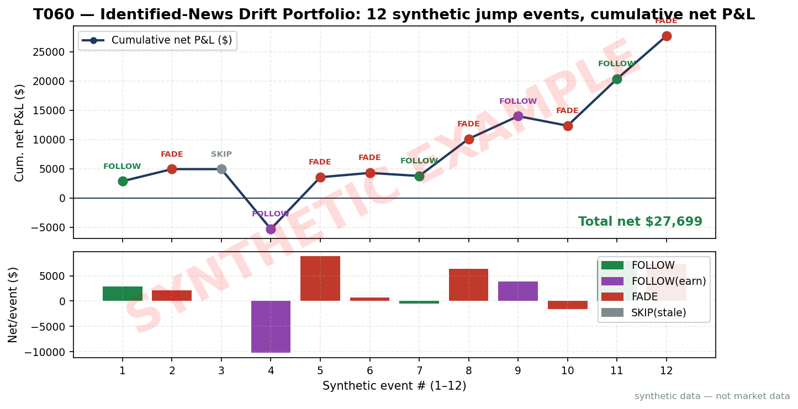

*Caption: twelve synthetic jump events (seed 160) through the identified-news classifier — follow legs (green), earnings-follow legs (purple), fade legs (red), one stale skip (grey). Tape net +$27,698.55 after full costs (commissions, spread cross, impact, borrow); worst leg −$10,231.20 (earnings follow, event 4). Watermark reads "SYNTHETIC EXAMPLE"; corner caption: "synthetic data — not market data".*

```mermaid
flowchart TD
    DATA["Market data<br/>(5-min bars, news archive, earnings)"] -->|bars + stories + calendar| SIGS["Signals<br/>S092, S093, S100"]
    SIGS -->|classified event| ENTRY{"Entry logic<br/>(follow / fade / skip)"}
    ENTRY -->|trigger| SIZE["Sizing + risk<br/>(SUE-scaled, participation caps)"]
    ENTRY -->|no trigger| WAIT["Wait"]
    SIZE -->|POV/VWAP children| EXEC["Execution<br/>(post-jump quotes, borrow check)"]
    EXEC -->|fills| MON["Monitor + exits<br/>(60min / 5d / adverse stop)"]
    MON -->|net P&L| PNL["P&L (net of costs)"]
    style ENTRY fill:#f9e79f,stroke:#7d6608
    style PNL fill:#a9dfbf,stroke:#1e8449
```

### T10. Sources

1. Boudoukh, J., Feldman, R., Kogan, S. & Richardson, M. (2019). "Information, Trading, and Volatility: Evidence from Firm-Specific News." *The Review of Financial Studies* 32(3), 992–1033. https://ideas.repec.org/a/oup/rfinst/v32y2019i3p992-1033..html — identified fundamental news carries ~49.6% of overnight idiosyncratic volatility.
2. Chan, W. S. (2003). "Stock price reaction to news and no-news: drift and reversal after headlines." *Journal of Financial Economics* 70(2), 223–260. https://www.researchgate.net/publication/2856618_Stock_Price_Reaction_to_News_and_No-News_Drift_and_Reversal_After_Headlines_Wesley_S_Chan — drift after bad news, reversal after extreme no-news moves, concentrated in smaller stocks.
3. Bernard, V. L. & Thomas, J. K. (1989). "Post-Earnings-Announcement Drift: Delayed Price Response or Risk Premium?" *Journal of Accounting Research* 27 (Supplement). — PEAD: SUE decile spread positive in 41/48 quarters (summary: https://en.wikipedia.org/wiki/Post%E2%80%93earnings-announcement_drift).
4. DellaVigna, S. & Pollet, J. M. (2009). "Investor Inattention and Friday Earnings Announcements." *Journal of Finance* 64(2), 709–749. http://ideas.repec.org/a/bla/jfinan/v64y2009i2p709-749.html
5. Livnat, J. & Mendenhall, R. R. (2006). "Comparing the Post–Earnings Announcement Drift for Surprises Calculated from Analyst and Time Series Forecasts." *Journal of Accounting Research* 44(1), 177–205. https://doi.org/10.1111/j.1475-679X.2006.00196.x

**Unverified leads** (chatbot-provided; not confirmed facts — verify before use):
- Grok (2026-09-10): "Boudoukh et al. (2019): textual-identified news — 49.6% overnight idiosyncratic vol, 12.4% intraday" — figure matches the paper's abstract-level claims but the exact numbers were not re-read from the published text this batch; treat as lead.
- Grok (2026-09-10): "Sadka (2006): post-earnings liquidity risk priced; 60-day drift ≈ 9–10% annualized" — citation not opened; unverified.
- Chan (2003) drift/reversal magnitudes and the 12-month window — direction confirmed via the paper's abstract-level record; exact magnitudes not re-verified this batch.

*Source log: Grok answered Q-TB6-1..3 (2026-09-10); all claims independently verified or labeled unverified.*

## Stage 161/200 — T061: Initial-Balance Expansion Trader

*Batch TB7 · Strategy 61/100 · Signals S022, S032 · Provenance [D/SR]*

### T1. One-line verdict

| | |
|---|---|
| **Style** | Intraday breakout: first-hour range expansion (Market Profile "initial balance" taxonomy) |
| **Edge source** | Directional commitment after a narrow first-hour auction resolves, confirmed by relative volume (S032); the breakout leg, not the range itself, is the candidate edge |
| **Typical holding period** | 30 minutes to 5 hours; flat 15:55 ET |
| **Capacity hint** | Small: one trade per name per day, 500-name universe, dollar-risk sizing; realistic small-book capacity in the low millions before slippage on the t+1 fill dominates |
| **Build-or-buy in one line** | Build the IB-freeze and narrow/wide classifier on bought 1-min bars; nothing packaged sells this rule with honest causality, so buy the data, not the "system" |

### T2. Full mechanics

**Universe & session.** Liquid US common stocks, ADV ≥ 2M shares (`example`), price ≥ $10, spread ≤ 3¢ median (`example`). RTH only, 09:30–15:55 ET. Exclusions: earnings-day names, halted/resumed names, and half-day sessions when a 1R target cannot complete before the early flatten (`example`: skip if expected session length after 10:30 < 2.5 hours). One trade per name per day (`example`) — the rule is a single auction-resolution bet, not a scalp engine.

**Initial-balance definition.** An **initial balance (IB)** is the first hour's auction range, borrowed from Steidlmayer's Market Profile taxonomy: the high and low printed between 09:30:00 and 10:29:59.999 ET. Define `IBH_d = max high`, `IBL_d = min low`, `IBR_d = IBH_d − IBL_d` over that window. Freeze both levels at 10:30 ET sharp; never update them intraday. **Narrow vs wide IB:** compare today's `IBR_d` to the 10-day median of `IBR` (`example`); *narrow* if `IBR_d < 0.75 × median` (`example`). Expansion trades are taken only on narrow IBs, on the logic that a compressed first-hour auction that then resolves directionally is the day-type this rule was reconstructed to catch.

**Entry rule.** After 10:30 ET, on 5-minute bars. Long: bar *t* closes above `IBH_d` **and** that bar's volume ≥ 1.2× its clock-slot 20-day median (`example`) — the relative-volume (S032) confirmation — **and** today's IB was classified narrow. Short: mirror below `IBL_d`. Signal at bar *t* → earliest fill at the open of bar *t+1* (`example`: fill = next-bar open). No fade-back-inside entries; no second entry after the first trade in the name.

**Exit rule.** Four exits, first touch wins (`example` parameters): (1) stop at the opposite IB edge, or tighter at 0.25×IBR back inside the broken edge (the worked example uses the tighter stop); (2) target at 1.0×IBR beyond the broken edge — the classic "normal variation" projection of a full IB-range extension; (3) time stop: flatten at 15:55 ET (12:55 on half days); (4) failure exit: a close back inside the IB after entry exits at the next open.

**Position sizing.** Dollar-risk sizing: `N = ⌊ R / |P_entry − P_stop| ⌋` with `R = $200` (`example`) per trade. Max per-name heat: 1R. Portfolio heat: cap concurrent expansion trades at 10 names (`example`) — first-hour breakouts cluster on trend days, and the book must survive the correlated-loss case.

**Risk limits.** Daily loss stop at −3R (`example`); kill-switch conditions: data feed stale > 60 seconds, any bar timestamped outside America/New_York, or a half-day calendar mismatch — all halt new entries and flatten at market on the next bar.

**Cost model.** Commission $0.005/share/side (`example`). Spread: pay the half-spread each way on continuous fills (`example`: 2¢-wide book → 1¢/side). Slippage function on the t+1 open fill: +0.5× spread adverse (`example`), applied explicitly in the worked example. No auction legs in this strategy — fills are continuous-session only.

**Order/execution sketch.** Marketable limit orders at the t+1 open (`example`: limit = open print + 2¢ for buys) so the fill price is bounded; participation cap ≤ 10% of the bar's volume (`example`); queue-position honesty note: the strategy is modeled as a taker — no queue-priority fantasy on the breakout bar, where the book is thinnest.

### T3. Signals it consumes

| Signal | Role | Weight / logic |
|---|---|---|
| S022 (initial-balance breakout detector) | Primary trigger | `break_up_t = close_t > IBH_d`; `break_dn_t = close_t < IBL_d`; levels frozen at 10:30, causal (only bars ≤ *t*) |
| S032 (relative volume) | Filter | `rvol_t = vol_t / median_slot20_t`; require `rvol_t ≥ 1.2` on the breakout bar (`example`) |
| Trailing stop / target / time-stop logic (strategy rule, not a signal) | Exit manager | Implements the opposite-edge / 0.25×IBR stop and the 1.0×IBR target; also enforces the 15:55 time stop and the close-back-inside failure exit |

Combination logic (pseudocode, 21 lines):

```
# runs on each 5-min bar close t, after 10:30 ET; levels frozen
IBH, IBL, IBR = freeze_at_1030(today)          # S022
narrow = IBR < 0.75 * median(IBR, 10d)         # example threshold
rvol = volume[t] / median_slot(volume, 20d)    # S032
if traded_today or not narrow: wait
if close[t] > IBH and rvol >= 1.2:              # S022 + S032
    side = LONG; ref = IBH
elif close[t] < IBL and rvol >= 1.2:
    side = SHORT; ref = IBL
else: wait
# signal at t -> earliest fill at open of t+1
entry = open[t+1] (+ taker slippage)
stop  = ref -/+ 0.25 * IBR                     # example stop rule
target = ref +/- 1.0 * IBR                     # example
N = floor(200 / abs(entry - stop))             # example R
flatten_at(15:55 ET) or on close_back_inside
```

### T4. Worked example — numbers + P&L (SYNTHETIC)

Synthetic 5-minute bars, equity XYZ, seed 161. IB window prints (high/low): 09:30 50.20/49.95; 09:35 50.28/50.02; 10:25 50.35/50.10. Freezing at 10:30: **IBH = 50.40, IBL = 49.90, IBR = 0.50**. The 10-day median IBR is 0.80, so `0.50 < 0.75 × 0.80 = 0.60` → narrow IB (`example` classifier). The 10:40–10:45 bar closes at **50.46** on 1.4× slot RVOL (≥ 1.2, confirmed). Signal at *t* = 10:45 close → earliest fill at the 10:45 bar's successor open: fill long at **50.48** (pay the ask; 0.5× spread slippage embedded). Tight stop = `50.40 − 0.25 × 0.50` = **50.275**. Risk/share = `50.48 − 50.275` = 0.205. `N = ⌊200 / 0.205⌋` = **975 shares**. Target = `50.40 + 0.50` = 50.90; the extension carries and the exit fills at **50.89**.

Ledger:

| Leg | Price | Shares | Amount |
|---|---|---|---|
| Buy (t+1 open) | 50.48 | 975 | −49,218.00 |
| Sell (target) | 50.89 | 975 | +49,617.75 |
| Gross | | | **+399.75** |
| Commission (975 × $0.01 round-trip) | | | −9.75 |
| **Net** | | | **+$390.00** |

Failure path (for the honest ledger): if the breakout fails and the stop fills at 50.27: gross = `975 × (50.27 − 50.48)` = −204.75, commission −9.75, net **−$214.50** — roughly −1.07R. The example is a single winning trade on a narrow-IB trend day; it is not a backtest.

**Where the example is optimistic.** Fills are assumed at the printed t+1 open with only a half-spread penalty — no partial fills, no queue slippage on the breakout bar (the worst bar to be a taker), no latency between the 10:45 close signal and the fill, and the target fill at 50.89 assumes the extension prints through cleanly. Real first-hour breakouts frequently wick the level and reverse; the stop at 50.275 would often fill worse on a fast tape. The RVOL 1.4× confirmation is measured on the same bar that triggers, which in live trading requires the bar to be complete before the signal exists — honored here (signal at *t* → fill *t+1*), but a common implementation bug is to peek at the in-progress bar.

### T5. Data & infra — what must run

Pipeline for a 500-name universe: (1) pre-open job (08:30 ET): load the 10-day IBR history, today's calendar (full vs half day), and the 20-day slot-volume medians; (2) intraday loop on 1-minute or 5-minute bars: maintain running IBH/IBL until 10:30, freeze, then evaluate S022/S032 per bar; (3) post-close: ledger reconciliation and the next day's median recomputation. Feeds: SIP-grade 1-minute OHLCV is sufficient — IB needs only highs/lows, RVOL needs bar volume. Storage: 500 symbols × 390 one-minute bars ≈ 195,000 bars/day is trivial locally; 60 days of one-minute bars for 500 symbols is ~3GB on disk with a trivial RAM footprint (per the project cost model). Keep the working set below ~77GB; Polars-class simple operations run at a planning assumption of ~10–50M rows/sec, so the entire IB/RVOL feature pass is a seconds-scale batch. Strategy-harness build effort for this tier is estimated at 40–100 hours ($6,000–$15,000 loaded at $150/hour) — the IB logic itself is an afternoon; the hours are calendar handling, corporate-action adjustment of the 10-day medians, and the replay harness with no look-ahead on the 10:30 freeze. **M5 Max feasibility verdict: yes, trivially** — peak intraday state is a few hundred MB; this runs on any modern laptop. Failure plan: if the bar feed drops mid-session, enter safe mode — no new entries, existing positions keep their stops, and everything flattens at 15:55 ET on the last known prices; never infer a breakout from a gap-filled bar.

### T6. Buy vs build

Retail platform: **QuantConnect** (paper/live research hosting, ~$60–$300/mo class, `indicative — verify before budgeting`) can host this — it accepts custom bar features and a 10:30 freeze is expressible. **Interactive Brokers paper trading** (no incremental platform fee on an existing account, `indicative — verify before budgeting`) is the cheapest routing test for the t+1 open fills. Professional data/venue: **Massive (formerly Polygon) Stocks Advanced** (~$199/mo, `indicative — verify before budgeting`) supplies SIP real-time plus 1-minute/second aggregates adequate for IB and RVOL; for history, Massive flat files or **Databento** usage-based history cover 2 years of 1-minute bars for tens to low hundreds of dollars (`indicative — verify before budgeting`). Verdict: **build the strategy, buy the bars.** The IB freeze, narrow/wide classifier, and dollar-risk sizing are ~100 lines plus a calendar file; no packaged "opening-range system" can be audited for t→t+1 causality, and several retail bots compute the range on in-progress bars. Crossover: if you ever add the auction-pin leg (T070), the data decision changes — that needs the imbalance feed, not just bars.

### T7. Success-ratio evidence

| Source | What it documents | Relevance / caveat |
|---|---|---|
| Zarattini, Barbon & Aziz, "A Profitable Day Trading Strategy For The U.S. Equity Market" (SSRN 4729284) | Stocks-in-Play opening-range breakout study, >7,000 US stocks, 2016–2023 | Nearest tested cousin of IB expansion; costs are commission-only ($0.0035/share), not spread+impact — the precise Sharpe/IRR/hit-rate figures circulating are per a third-party reading, commission-only (see Unverified leads) |
| Zarattini & Aziz, "Can Day Trading Really Be Profitable?" (SSRN 4416622) | QQQ 5-minute ORB, 2016–2023 | Same family, single-name; net of commissions, not necessarily spread/impact |
| Gao, Han, Li & Zhou, "Intraday Momentum: The First Half-Hour Return Predicts the Last Half-Hour Return" (SSRN 2552752) | S&P 500 ETF 1993–2013; first-half-hour return predicts last-half-hour return, stronger on volatile/high-volume/macro-news days | Supports the "first hour matters directionally" premise; it is an intraday-momentum fact, not an IB-breakout trading rule |
| Heston, Korajczyk & Sadka, "Intraday Patterns in the Cross-Section of Stock Returns" (JF 2010) | Short-term reversal tied to temporary liquidity imbalances and bid-ask bounce; direct trading loses after spread | The cautionary counterweight: microstructure edges decay fast and spreads eat naive implementations |
| Crabel, T., *Day Trading With Short Term Price Patterns and Opening Range Breakout* (Traders Press, 1990; ISBN 9780934380171) | Practitioner origin of opening-range breakout mechanics; computer-tested pattern catalog | Historical/practitioner record, not a peer-reviewed P&L study; the IB taxonomy itself (Steidlmayer/Dalton) is a day-type classification, not an alpha paper |

Capacity/crowding/decay: opening-range breakout is one of the most published intraday patterns in existence; any edge concentrates in the RVOL-confirmed, narrow-IB, trend-day subset, and 5-minute ranges are broken both ways on most days. Honest bottom line: for a ≤$1M paper operation, this is a reasonable first strategy to *implement* because its costs are honest and its logic is falsifiable — expect the unfiltered rule to be weak-to-negative after spread, and only the filtered subset to have a chance. For an institutional desk, the capacity is a rounding error; the desk would trade the underlying auction dynamics, not this rule.

### T8. Failure modes

- **Regime: wide-IB/range day.** The first hour already printed the day's range; expansion entries become failed auctions and stop out repeatedly. *Mitigation:* the narrow-IB classifier is a veto, not a suggestion — skip wide days entirely; track IB-width regime hit-rate weekly and widen the skip threshold if the filtered set degrades.
- **Crowding: the 10:30 level is public.** Everyone sees 50.40; stop runs and fakeouts cluster at round IB edges. *Mitigation:* require the RVOL confirmation (S032) rather than the level touch alone; consider the 0.25×IBR confirmation variant (enter only after a second bar holds outside).
- **Latency: SIP vs direct.** On a fast tape the t+1 open fill can be several cents worse than the printed open. *Mitigation:* model taker slippage explicitly (done in T4's cost model) and paper-trade with a 1-bar delay variant to measure sensitivity.
- **Costs: spread optimism.** A 2¢ spread assumption fails on names where the breakout bar widens the book to 5–10¢. *Mitigation:* spread filter — skip entries when the prevailing spread exceeds 3¢ (`example`).
- **Overfit: the 0.75× median / 1.2× RVOL / 0.25× IBR constants.** All marked `example`; they are round numbers, not estimated optima. *Mitigation:* walk-forward re-estimation with an embargo; freeze parameters quarterly, not daily.
- **Operations: DST/half-day calendar.** A mis-cut IB window or a missed early flatten is the classic way this strategy blows up on the day after Thanksgiving. *Mitigation:* single exchange-calendar file (America/New_York), tested against the half-day list before every early close; kill-switch on calendar mismatch.

### T9. Visuals

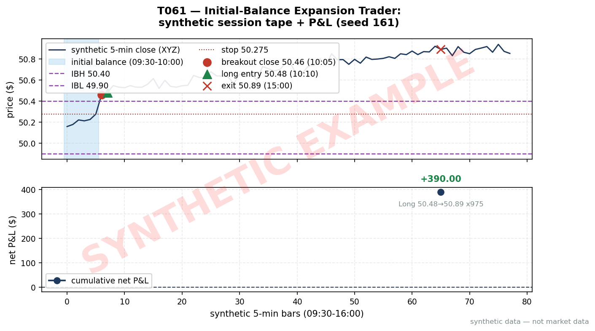

*Chart caption: synthetic data — not market data. Watermark reads "SYNTHETIC EXAMPLE" exactly.*

```mermaid
flowchart TD
    DATA["Market data<br/>(1-min OHLCV bars)"] -->|"1-min bars"| SIGS["Signals<br/>S022 IB-breakout · S032 RVOL"]
    SIGS -->|"per-bar signal vector"| ENTRY{"Entry logic<br/>(IB break + RVOL ≥ 1.2, causality t→t+1)"}
    ENTRY -->|trigger| SIZE["Sizing + risk<br/>(dollar-risk vs stop, 10-name heat cap)"]
    ENTRY -->|no trigger / veto| WAIT["Wait"]
    SIZE -->|"sized limit orders"| EXEC["Execution<br/>(t+1 open fill, ≤10% participation)"]
    EXEC -->|"fills"| MON["Monitor + exits<br/>(1.0×IBR target / 0.25×IBR stop / 15:55)"]
    MON -->|"trade P&L"| PNL["P&L (net of costs)"]
    style ENTRY fill:#f9e79f,stroke:#7d6608
    style PNL fill:#a9dfbf,stroke:#1e8449
```

### T10. Sources

1. Zarattini, C., Barbon, A. & Aziz, A. "A Profitable Day Trading Strategy For The U.S. Equity Market." SSRN. https://papers.ssrn.com/sol3/papers.cfm?abstract_id=4729284 — Stocks-in-Play ORB on >7,000 US stocks, 2016–2023; costs commission-only. Title/authors verified 2026-09-10.
2. Zarattini, C. & Aziz, A. "Can Day Trading Really Be Profitable?" SSRN. https://papers.ssrn.com/sol3/papers.cfm?abstract_id=4416622 — QQQ 5-minute ORB, 2016–2023, net of commissions. Title/authors verified 2026-09-10.
3. Gao, L., Han, Y., Li, S.Z. & Zhou, G. "Intraday Momentum: The First Half-Hour Return Predicts the Last Half-Hour Return." SSRN. https://papers.ssrn.com/sol3/papers.cfm?abstract_id=2552752 — S&P 500 ETF 1993–2013; effect stronger on volatile, high-volume, recession, and macro-news days. Title verified 2026-09-10.
4. Heston, S.L., Korajczyk, R.A. & Sadka, R. "Intraday Patterns in the Cross-Section of Stock Returns." *Journal of Finance* 65(4), 1369–1407 (2010). https://www.kellogg.northwestern.edu/faculty/korajczy/htm/HestonKorajczykSadkaJF2010.htm — short-term reversal linked to temporary liquidity imbalances and bid-ask bounce; direct trading loses after spread. Title verified 2026-09-10.
5. Crabel, T. *Day Trading With Short Term Price Patterns and Opening Range Breakout.* Traders Press, 1990. ISBN 9780934380171. https://www.thriftbooks.com/w/day-trading-with-short-term-price-patterns-and-opening-range-breakout_toby-crabel/261589/ — bibliographic record confirms author, publisher, year, ISBN. Verified 2026-09-10.

**Unverified leads** (not confirmed facts — verify before use):
- Steidlmayer (Market Profile, CBOT 1985) and Dalton, Jones & Dalton, *Mind Over Markets* (1990) — named by Grok as the IB/day-type taxonomy sources; specific editions not verified in this pass.
- Grok Q-TB7-3 performance figures: unfiltered 5-min ORB Sharpe 0.48 / +3.2% IRR / 41% hit; RVOL top-20 Sharpe 2.81 / +41.6% IRR / ~48% hit (commission-only); QQQ 5-min ORB Sharpe ~1.12 net of commission with replication "net dies at ~2.2¢/share slippage"; NQ 7-year ORB practitioner test (tiny-target ≈ coin flip, "break and hold to EOD/2R" PF ~1.1, t ≈ 1.7–2.1); ES/NQ first hour ≈ 25–28% of RTH volume and ~55–63% of day's range; 30-min OR "continues" to close ~65–67% of days — all Grok-sourced, treat as research leads.
- 2026 NYSE holiday/half-day calendar specifics (e.g., half days 27 Nov and 24 Dec 2026, full close 3 Jul 2026) per Grok Q-TB7-1 — verify against the exchange's published calendar before trading.

*Source log: Grok answered Q-TB7-1..3 (2026-09-10); all claims independently verified or labeled unverified.*

## Stage 162/200 — T062: Streak Runner with Exhaustion Flip

*Batch TB7 · Strategy 62/100 · Signals S031, S041 · Provenance [D/SR]*

### T1. One-line verdict

| | |
|---|---|
| **Style** | Intraday momentum-then-reversal: ride a consecutive-bar streak, flip at the exhaustion print |
| **Edge source** | Short-horizon continuation (S031) that terminates in a capitulation bar (S041); the flip harvests the inventory-driven snap-back documented in reversal literature |
| **Typical holding period** | 15 minutes to 2 hours per leg; flat 15:55 ET |
| **Capacity hint** | Modest: 2–4 names per day with qualifying streaks in a 500-name universe; sizing is dollar-risked so capacity is bounded by fill quality at the exhaustion bar |
| **Build-or-buy in one line** | Build — a streak counter plus an exhaustion z-score on bought 5-minute bars; no vendor sells the flip logic with honest t→t+1 timing |

### T2. Full mechanics

**Universe & session.** Same liquid large-cap/ETF universe as T061 (ADV ≥ 2M shares, price ≥ $10, `example`). RTH 09:45–15:55 ET — the first 15 minutes are excluded because the opening auction produces mechanical streaks that are not order-flow runs. Exclusions: earnings days, halts, FOMC 14:00 days after 13:30 (`example`; scheduled-volatility days break the streak/exhaustion pattern — see T068).

**Streak definition.** A **streak** is *n* consecutive same-direction 5-minute closes: `streak_t = streak_{t-1} + 1` if `sign(close_t − close_{t-1})` matches, else reset to 1. The strategy arms when `n ≥ 5` (`example`) **and** the cumulative run from streak start is ≥ 1.0× the 14-bar 5-minute ATR (Average True Range — the trailing 14-bar mean of per-bar ranges, a volatility ruler in price units) (`example`) — this rejects trivial drift. While the streak extends, the "runner" leg is conceptually long the run; in this implementation the runner leg is not traded separately — the strategy waits for the exhaustion print and trades only the flip (keeps the rule to one position per event and avoids paying spread twice).

**Exhaustion signature.** An **exhaustion bar** (S041) at bar *t* requires: (1) bar range > 2.0× the 20-bar median range (`example`); (2) bar volume ≥ 2.0× the slot median (`example`); (3) the bar closes in the *top* (for an up-streak) third of its range — the capitulation wick. A **parabolic exhaustion** additionally requires the last-3-bar slope to exceed 2× the streak's average slope (`example`) — the run is accelerating into the top.

**Entry rule.** At bar *t*: streak ≥ 5, cumulative run ≥ 1.0× ATR, and exhaustion signature prints. Flip direction: short after an up-streak exhaustion, long after a down-streak exhaustion. Signal at *t* → fill at the open of *t+1*. One flip per name per day (`example`).

**Exit rule.** (`example` parameters): (1) signal-flip exit — the mean-reversion z-score crosses back through ±0.5 toward zero; (2) stop at the exhaustion bar's extreme + 0.3× ATR (beyond the wick — a genuine new high/low invalidates the fade); (3) time stop 15:55 ET; (4) scratch: if adverse excursion exceeds 1.0R without the thesis breaking, exit at next open (prevents slow bleed).

**Position sizing.** `N = ⌊ R / |P_entry − P_stop| ⌋`, `R = $200` (`example`). Max 2 concurrent flips (`example`) — exhaustion events cluster at session extremes.

**Risk limits.** Daily loss stop −3R (`example`); no new flips after 15:30 ET (`example` — the last 25 minutes belong to the auction book, T070's territory); kill-switch on stale bars > 60 s.

**Cost model.** Commission $0.005/share/side (`example`); half-spread paid each way on continuous fills; the exhaustion bar is the widest-spread bar of the run — the cost model assumes a 2× normal spread on the t+1 fill (`example`), which is where this strategy's backtests most often lie to their authors.

**Order/execution sketch.** Marketable limit into the t+1 open (`example`); participation ≤ 10% of bar volume (`example`); the fill is modeled as a taker paying the post-exhaustion spread — never as a mid-price fill.

### T3. Signals it consumes

| Signal | Role | Weight / logic |
|---|---|---|
| S031 (consecutive-run momentum) | Arming condition | `n ≥ 5` consecutive same-sign closes and cumulative run ≥ 1.0× ATR(`14`) (`example`) |
| S041 (parabolic exhaustion) | Primary trigger | Range > 2.0× median range(20), volume ≥ 2.0× slot median, close in extreme third of range, optional 3-bar slope acceleration (`example`) |
| Mean-reversion z-score exit logic (strategy rule, not a signal) | Exit manager | z = (close − MA20)/σ20; exit when \|z\| recrosses 0.5 toward zero; also computes the wick+0.3×ATR stop (`example`) |

Combination logic (pseudocode, 22 lines):

```
# each 5-min bar close t, 09:45-15:30 ET
n, run = update_streak(close[t], close[t-1])     # S031
atr = ATR(close, 14)
if n >= 5 and run >= 1.0 * atr:                  # example; armed
    rng20 = median(range, 20); vol20 = slot_median(volume, 20)
    wick_up = close[t] > high[t] - range[t]/3
    if range[t] > 2.0*rng20 and volume[t] >= 2.0*vol20 and wick_up:
        side = SHORT                             # flip the up-streak
        # signal at t -> fill at open[t+1]
        entry = open[t+1] (taker, 2x spread cost) # example
        stop  = high[t] + 0.3 * atr               # example stop rule
        N = floor(200 / abs(entry - stop))
        z_exit = 0.5                             # recross toward 0
        flatten_at(15:55 ET); scratch if MAE > 1R
    # mirror for down-streaks
else: wait
```

### T4. Worked example — numbers + P&L (SYNTHETIC)

Synthetic 5-minute bars, equity DEF, seed 162. Morning: five consecutive up closes 09:45→10:10, cumulative run +0.95 vs 14-bar ATR 0.80 (≥ 1.0× ATR — armed, `example`). The 10:10–10:15 bar prints the exhaustion signature: range 0.55 vs 20-bar median 0.24 (2.3×), volume 2.4× slot median, close in the top third — parabolic (last-3-bar slope 2.1× streak average). Signal at *t* = 10:15 close → fill short at the 10:20 open: **62.30** (taker, 2× spread cost embedded).

- **Trade 1 (loser — the run extends).** Short 454 @ 62.30. Stop = exhaustion-bar high 62.50 + 0.3×0.80 = **62.74**; risk/share = 0.44; `N = ⌊200/0.44⌋` = **454**. The extension bar stops the position at 10:25: **62.74**. Gross = `454 × (62.30 − 62.74)` = −199.76. Commission = 454 × 0.01 = −4.54. Net = **−204.30**.

Afternoon: six consecutive down closes 13:30→14:00, cumulative run −1.10 vs ATR 0.85 (armed); 14:00–14:05 exhaustion bar: range 2.2× median, volume 2.1×, close in bottom third. Signal → fill long at 14:10 open: **61.10**. Stop = 60.72 − 0.3×0.85 = **60.465**→ 60.47; risk/share = 0.63; N = ⌊200/0.63⌋ = 317. z-score exit: z recrosses +0.5→ the 15:20 bar closes 61.68; fill next open **61.66**. Gross = `317 × (61.66 − 61.10)` = +177.52. Commission = 317 × 0.01 = −3.17. Net = **+174.35**.

Session ledger:

| Trade | Side | Entry | Exit | Shares | Gross | Comm. | Net |
|---|---|---|---|---|---|---|---|
| 1 | Short | 62.30 | 62.74 | 454 | −199.76 | −4.54 | −204.30 |
| 2 | Long | 61.10 | 61.66 | 317 | +177.52 | −3.17 | +174.35 |
| **Session** | | | | | | | **−$29.95** |

A deliberately losing day: the morning exhaustion was premature — the run extended and the stop did its job; the afternoon flip worked but not enough to cover. That asymmetry (exhaustion fades fail more often than they work, winners must be larger) is the strategy's documented character, not a flaw in the example.

**Where the example is optimistic.** The exhaustion bar is identified on the *closed* bar — in practice the volume condition is only known after the close, which this respects (signal at *t* → fill *t+1*), but the 2× spread cost on the t+1 fill is a guess; on real capitulation bars the spread can be 3–5× normal and the open can gap through the wick. The stop at the exhaustion extreme assumes a fill at 62.74; a fast extension gaps over stops. One flip per name per day is enforced; without it, traders re-fade the same run repeatedly and the −204.30 becomes a −600 day.

### T5. Data & infra — what must run

Same bar pipeline as T061 with two additions: the streak counter (O(1) per bar) and the 20-bar median range/volume baselines plus the z-score series. All computable from 1-minute or 5-minute OHLCV — no tick data required. Footprint: 500 symbols × 390 one-minute bars ≈ 195,000 bars/day, trivial; 60 days ≈ 3GB on disk (project cost model), working set far below the ~77GB budget; Polars-class throughput (~10–50M rows/sec planning assumption) makes the feature pass seconds-scale. Harness build: Tier M+ band, 40–100 hours ($6,000–$15,000 loaded at $150/hour) — the streak/exhaustion logic is simple; the hours go to the no-look-ahead replay (the exhaustion volume must be bar-complete) and the z-score exit calibration. **M5 Max feasibility verdict: yes** — intraday state under 1GB. Failure plan: stale feed → no new flips; existing flips keep wick stops; flatten 15:55 ET.

### T6. Buy vs build

Retail: **QuantConnect** (~$60–$300/mo class, `indicative — verify before budgeting`) hosts the streak/exhaustion logic; **IBKR paper** (no incremental platform fee on an existing account, `indicative — verify before budgeting`) for fill realism. Professional data: **Massive Stocks Advanced** (~$199/mo, `indicative — verify before budgeting`) 1-minute/second bars are adequate — this strategy does not need tick-level exhaustion detection to be testable. Verdict: **build on bought bars.** The exhaustion signature is three ratios; paying for a "reversal indicator" product buys you someone else's overfit constants. Crossover: if you move exhaustion detection to tick/event granularity, revisit — then you need a real-time trades feed and the build cost roughly doubles.

### T7. Success-ratio evidence

| Source | What it documents | Relevance / caveat |
|---|---|---|
| Heston, Korajczyk & Sadka, "Intraday Patterns in the Cross-Section of Stock Returns" (JF 2010) https://www.kellogg.northwestern.edu/faculty/korajczy/htm/HestonKorajczykSadkaJF2010.htm | Short-term reversal tied to temporary liquidity imbalances; same-interval seasonality | The flip leg's academic home: reversals after liquidity-driven moves are real, but direct trading loses after spread — the exhaustion filter is an attempt to trade only the liquidated tail |
| Lehmann, B. "Fads, Martingales, and Market Efficiency" (*QJE* 1990) https://econpapers.repec.org/RePEc:oup:qjecon:v:105:y:1990:i:1:p:1-28. | Weekly reversal evidence | Broader reversal background; weekly, not intraday — direction only, not a parameter source |
| Jegadeesh, N. "Evidence of Predictable Behavior of Security Returns" (JF 1990) https://doi.org/10.1111/j.1540-6261.1990.tb05110.x | Monthly return predictability incl. short-term reversal components | Useful only as reversal literature context; the packaged "run then flip" rule is a reconstruction `[D/SR]` |

Capacity/crowding/decay: streak-fading is folk knowledge; the exhaustion filter (2× range, 2× volume) is the only thing separating this from a naive fade, and those constants are `example` values, not estimated edges. Honest bottom line: for a ≤$1M paper operation this is a second-strategy candidate — trade it only after T061-style breakout logic is live, because its win rate is lower and its losers (like Trade 1 above) come from the run extending. For an institutional desk, intraday streak-flipping at 5-minute granularity has no capacity worth staffing; the desk's version is a market-making inventory problem, not this rule.

### T8. Failure modes

- **Regime: trend day without exhaustion.** A genuine institutional program prints streak after streak with no capitulation bar; every flip is run over. *Mitigation:* the cumulative-run ≥ 1.0× ATR arming plus the acceleration requirement; add a daily regime veto — if the first two flips both stop out, stand down for the day (`example`).
- **Crowding: exhaustion bars are where everyone fades.** The t+1 open after a famous wick is crowded and gaps. *Mitigation:* 2× spread cost assumption in the model (already), plus a "no trade if the open gaps beyond 50% of the exhaustion bar's range" filter (`example`).
- **Latency: the volume condition resolves at the close.** Computing "2× slot median" on a partial bar peeks. *Mitigation:* signal only on closed bars; replay harness asserts bar-completeness before signal evaluation.
- **Costs: the flip pays the worst spread of the day.** *Mitigation:* modeled explicitly; if live slippage exceeds the 2× assumption over 20 trades, widen the model or stop trading the rule.
- **Overfit: 5-bar streak, 2× range, 2× volume.** All `example`. *Mitigation:* walk-forward with embargo; report the parameter surface, not a point optimum.
- **Operations: FOMC/scheduled-news days.** Streaks into 14:00 ET are news positioning, not order-flow exhaustion. *Mitigation:* calendar veto from the T068 event feed (S076).

### T9. Visuals

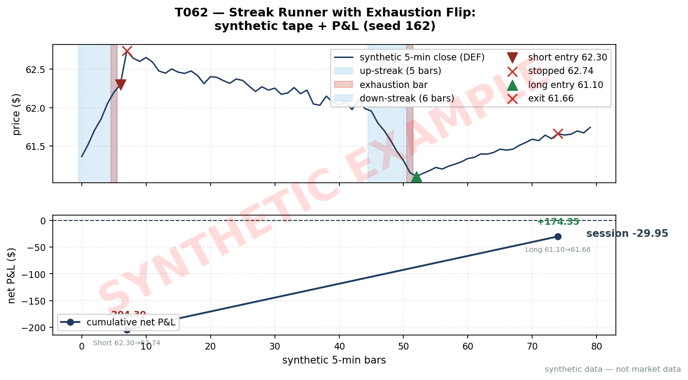

*Chart caption: synthetic data — not market data. Watermark reads "SYNTHETIC EXAMPLE" exactly.*

```mermaid
flowchart TD
    DATA["Market data<br/>(5-min OHLCV bars)"] -->|"5-min bars"| SIGS["Signals<br/>S031 streak · S041 exhaustion"]
    SIGS -->|"per-bar signal vector"| ENTRY{"Entry logic<br/>(streak≥5 + exhaustion, causality t→t+1)"}
    ENTRY -->|trigger| SIZE["Sizing + risk<br/>(dollar-risk vs wick stop, 2-name cap)"]
    ENTRY -->|no trigger / veto| WAIT["Wait"]
    SIZE -->|"sized limit orders"| EXEC["Execution<br/>(t+1 open fill, 2× spread cost)"]
    EXEC -->|"fills"| MON["Monitor + exits<br/>(z-recross / wick stop / 15:55 / scratch)"]
    MON -->|"trade P&L"| PNL["P&L (net of costs)"]
    style ENTRY fill:#f9e79f,stroke:#7d6608
    style PNL fill:#a9dfbf,stroke:#1e8449
```

### T10. Sources

1. Heston, S.L., Korajczyk, R.A. & Sadka, R. "Intraday Patterns in the Cross-Section of Stock Returns." *Journal of Finance* 65(4), 1369–1407 (2010). https://www.kellogg.northwestern.edu/faculty/korajczy/htm/HestonKorajczykSadkaJF2010.htm — short-term reversal linked to temporary liquidity imbalances and bid-ask bounce. Title verified 2026-09-10.
2. Lehmann, B.N. "Fads, Martingales, and Market Efficiency." *Quarterly Journal of Economics* 105(1), 1–28 (1990). https://econpapers.repec.org/RePEc:oup:qjecon:v:105:y:1990:i:1:p:1-28. — weekly reversal evidence; reversal background only. Title/metadata verified 2026-09-10.
3. Jegadeesh, N. "Evidence of Predictable Behavior of Security Returns." *Journal of Finance* 45(3) (1990). https://doi.org/10.1111/j.1540-6261.1990.tb05110.x — monthly return predictability; broader reversal context. DOI metadata verified 2026-09-10.

**Unverified leads** (not confirmed facts — verify before use):
- Grok Q-TB7-3 streak/exhaustion folklore: "5-min ranges are almost always broken both ways (double break ~70%+)"; ES/NQ configuration-sweep claims — named-only, no verifiable URL captured; treat as leads.
- The 5/2.0×/2.0×/0.3× constants in T2–T3 are illustrative (`example`), not estimated from any cited study.

*Source log: Grok answered Q-TB7-1..3 (2026-09-10); all claims independently verified or labeled unverified.*

## Stage 163/200 — T063: Stretched-Move Z-Score Fade

*Batch TB7 · Strategy 63/100 · Signals S045, S014 · Provenance [D/SR]*

### T1. One-line verdict

| | |
|---|---|
| **Style** | Intraday statistical mean-reversion: fade statistically stretched moves after volatility compression |
| **Edge source** | Temporary liquidity-driven displacement (S045 z-score) that snaps back when the pre-move compression indicates positioning rather than information |
| **Typical holding period** | 30 minutes to 3 hours; flat 15:55 ET |
| **Capacity hint** | Moderate for a small book: many names stretch daily, but the compression pre-condition filters to a handful; dollar-risk sizing keeps per-trade risk at $200 (`example`) |
| **Build-or-buy in one line** | Build on 5-minute bars — a z-score, a compression ratio, and a liquidity-provision sizing rule; nothing to buy except the bars |

### T2. Full mechanics

**Universe & session.** Liquid US stocks, ADV ≥ 2M shares, price ≥ $10 (`example`). RTH 09:45–15:55 ET. Exclusions: earnings days, halts, and the 30 minutes around scheduled macro releases — a stretched move *into* a known event is information repricing, not a fade candidate.

**Z-score definition.** On 5-minute bars: `z_t = (close_t − MA20_t) / σ20_t`, where `MA20_t` and `σ20_t` are the trailing 20-bar mean and standard deviation of closes, computed causally (bars ≤ *t* only). **Stretched** means `|z_t| ≥ 2.5` (`example`). The z-score is a standardized displacement, not a forecast — it measures how far price has traveled from its recent center in units of recent noise.

**Volatility-compression pre-condition.** Before the stretch, require compression: the 5-bar realized range must be ≤ 0.6× the 20-bar median range (`example`). The logic: a move that erupts from a compressed coil and stretches 2.5σ is more likely to be a liquidity event (stop cascade, program imbalance) than a move that extends an already-volatile trend. This is the strategy's key filter and its main overfit surface.

**Liquidity-provision framing.** The fade is sized and executed as *liquidity provision* (S014): passive limit orders at the stretched extreme, never chasing. If the limit is not touched within 2 bars of the signal (`example`), the signal expires — a fade that needs chasing is not a liquidity trade.

**Entry rule.** At bar *t*: compression pre-condition true over bars *t−6…t−1* (`example` window), and `|z_t| ≥ 2.5`. Fade direction: short if `z_t > 0`, long if `z_t < 0`. Signal at *t* → fill at the open of *t+1* (`example`: limit at the stretched price; fill assumed at next open for the worked example). One fade per name per day (`example`).

**Exit rule.** (`example`): (1) z recrosses ±0.5 toward zero — the displacement has mean-reverted; (2) stop at 1.5σ adverse beyond entry (the stretch was information, not liquidity); (3) time stop 15:55 ET; (4) if a second consecutive bar stretches *further* (|z| increases and the bar closes beyond entry against the position), exit at next open — the anti-martingale rule.

**Position sizing.** `N = ⌊ R / |P_entry − P_stop| ⌋`, `R = $200` (`example`). Max 5 concurrent fades (`example`) — stretched moves correlate on market-wide liquidity events.

**Risk limits.** Daily loss stop −3R (`example`); kill-switch on stale bars; no new fades after 15:30 ET (`example`).

**Cost model.** Commission $0.005/share/side (`example`); limit-order execution assumed at the quote (maker) — half-spread *earned*, not paid — but the worked example conservatively assumes a taker-style fill at the next open with a half-spread penalty, because fading into momentum often means paying to get filled.

**Order/execution sketch.** Resting limit at the stretched level for 2 bars; if unfilled, re-price to the next open as a marketable limit (`example`). Participation ≤ 10% of bar volume (`example`). Queue honesty: the fill is not assumed at the extreme tick — the example fills at the next-bar open.

### T3. Signals it consumes

| Signal | Role | Weight / logic |
|---|---|---|
| S045 (deviation z-score) | Primary trigger | `z_t = (close_t − MA20_t)/σ20_t`; trigger `\|z_t\| ≥ 2.5` (`example`); exit on recross of ±0.5 |
| Volatility-compression gate (strategy rule, not a signal) | Filter / arming | `range5_t / median(range20)_t ≤ 0.6` (`example`) over the pre-move window; veto otherwise |
| S014 (liquidity provision) | Sizing + execution mode | Resting-limit execution, 2-bar expiry, participation cap; fill assumption discipline |

Combination logic (pseudocode, 20 lines):

```
# each 5-min bar close t, 09:45-15:30 ET
ma, sd = MA(close, 20), STDEV(close, 20)      # S045, causal
z = (close[t] - ma) / sd
compressed = range(close,5) <= 0.6 * median(range,20)  # example gate
if faded_today or not compressed: wait
if z >= 2.5: side = SHORT                     # S045, example
elif z <= -2.5: side = LONG
else: wait
# signal at t -> fill at open[t+1]
entry = open[t+1] (limit at stretched level, 2-bar expiry)  # S014
stop  = entry -/+ 1.5 * sd                    # example
N = floor(200 / abs(entry - stop))
exit when |z| recrosses 0.5 toward 0           # S045
exit next open if |z| extends 2 bars running   # anti-martingale
flatten_at(15:55 ET)
```

### T4. Worked example — numbers + P&L (SYNTHETIC)

Synthetic 5-minute bars, equity GHI, seed 163. The 11:00–11:25 window is compressed: 5-bar range 0.21 vs 20-bar median range 0.38 (0.55× ≤ 0.6 — armed, `example`). The 11:25–11:30 bar spikes: close **44.83** vs trailing MA20 **44.20**, σ20 **0.18** → `z = (44.83 − 44.20)/0.18 = +3.5` (≥ 2.5 — trigger). Signal at *t* = 11:30 close → fill short at the next open: **44.80**.

Stop = entry + 1.5σ = `44.80 + 1.5 × 0.18` = **45.07**. Risk/share = 0.27. `N = ⌊200/0.27⌋` = **740 shares**. The displacement mean-reverts: the 13:10 bar closes 44.35, z recrosses below +0.5 → exit at the next open: **44.36**.

Ledger:

| Leg | Price | Shares | Amount |
|---|---|---|---|
| Short (t+1 open) | 44.80 | 740 | +33,152.00 |
| Cover (z-recross exit) | 44.36 | 740 | −32,826.40 |
| Gross | | | **+325.60** |
| Commission (740 × $0.01 round-trip) | | | −7.40 |
| **Net** | | | **+$318.20** |

**Where the example is optimistic.** The z-score uses a 20-bar σ of 0.18 that is itself estimated on the compressed window — σ is understated exactly when compression precedes the move, so the +3.5 z is flattered; a σ estimated on a longer window would read a smaller stretch. The fill at 44.80 assumes the next open doesn't gap with the momentum; fading into a real liquidity event often fills 10–30¢ worse. The stop at 45.07 assumes a clean fill on a bar that is, by construction, moving fast. And the single winning trade shown is the *selected* outcome — the anti-martingale rule exists because roughly a third of such stretches (illustrative) keep stretching, and those exits are full 1R+ losers.

### T5. Data & infra — what must run

5-minute (or 1-minute resampled) OHLCV for 500 names; per-bar features: 20-bar MA/σ, 5-bar range, 20-bar median range — all O(1) rolling state per symbol. A subtle implementation point: the σ that standardizes the z-score must be recomputed causally on every bar from the trailing window only. Pre-computing σ on the full day and reading it back is the single most common look-ahead bug in mean-reversion replays, because the full-day σ "knows" the stretch before it happens and shrinks the z that the live strategy would have seen. The replay harness should therefore recompute the rolling statistics inside the bar loop and assert that no feature function ever indexes a bar dated after the signal bar. Footprint per the project cost model: 195,000 bars/day, trivial; 60 days ≈ 3GB disk; working set far below ~77GB; Polars-class throughput (~10–50M rows/sec planning assumption) makes the whole feature pass seconds-scale. Harness build: Tier M+ band, 40–100 hours ($6,000–$15,000 loaded at $150/hour) — the z-score logic is trivial; the hours are the replay harness (σ must be recomputed causally, no peeking at the full-day range) and the compression-window calibration. **M5 Max feasibility verdict: yes.** Failure plan: stale feed → no new fades; resting limits are day-orders that die with the session; flatten 15:55 ET.

### T6. Buy vs build

Retail: **QuantConnect** (~$60–$300/mo class, `indicative — verify before budgeting`) for research hosting; **IBKR paper** (no incremental platform fee on an existing account, `indicative — verify before budgeting`) for fill realism. Professional data: **Massive Stocks Advanced** (~$199/mo, `indicative — verify before budgeting`) covers the bar inputs. Verdict: **build.** A z-score fade is twenty lines; any vendor "mean-reversion indicator" is selling its own `example` constants. Crossover: none at this granularity — if you move to tick-level liquidity-provision modeling, that is a different strategy (market-making), not this one.

### T7. Success-ratio evidence

| Source | What it documents | Relevance / caveat |
|---|---|---|
| Heston, Korajczyk & Sadka, "Intraday Patterns in the Cross-Section of Stock Returns" (JF 2010) https://www.kellogg.northwestern.edu/faculty/korajczy/htm/HestonKorajczykSadkaJF2010.htm | Short-term reversal tied to temporary liquidity imbalances and bid-ask bounce; direct trading loses after spread | Direct academic support for the fade premise — displacements caused by liquidity provision snap back — plus the cost warning that governs position sizing |
| Lehmann, B. "Fads, Martingales, and Market Efficiency" (*QJE* 1990) https://econpapers.repec.org/RePEc:oup:qjecon:v:105:y:1990:i:1:p:1-28. | Weekly reversal evidence | Reversal background; weekly horizon, not intraday |
| Jegadeesh, N. "Evidence of Predictable Behavior of Security Returns" (JF 1990) https://doi.org/10.1111/j.1540-6261.1990.tb05110.x | Return predictability with short-term reversal components | Broader context; the compression pre-condition and z thresholds are the strategy's own reconstruction `[D/SR]`, not from these papers |

Capacity/crowding/decay: intraday reversal is among the most crowded statistical facts in markets; the compression filter is what makes this rule *different* from a naive fade, and its 0.6×/2.5 parameters are illustrative, not estimated. Honest bottom line: for a ≤$1M paper operation, this is a reasonable mean-reversion sleeve — trade small, enforce the anti-martingale exit, and expect the edge (if any) to live in the illiquid tail of the universe, not in SPY. For an institutional desk, this granularity is a market-making problem with inventory controls, not a signal-following rule.

### T8. Failure modes

- **Regime: information, not liquidity.** A stretched move on real news keeps stretching; the fade funds the informed. *Mitigation:* the compression pre-condition plus the earnings/macro exclusion list; the anti-martingale exit caps the damage at ~1R+.
- **Crowding: everyone fades 2.5σ.** Standard z-thresholds are consensus; fills deteriorate. *Mitigation:* the compression filter differentiates; track fill quality vs the model and widen the threshold if fills decay.
- **Latency: σ underestimation.** As noted, σ estimated on the compressed window understates the stretch. *Mitigation:* compute σ on a 60-bar window as a robustness check (`example`); require the trigger on *both*.
- **Costs: assumed maker, realized taker.** *Mitigation:* the worked example already assumes a taker fill; keep that conservatism in the model.
- **Overfit: 2.5 / 0.6 / 20-bar.** All `example`. *Mitigation:* walk-forward with embargo; the compression ratio is the parameter most likely to be curve-fit — stress it ±50%.
- **Operations: the 2-bar limit expiry.** A resting limit that isn't canceled on a halt becomes a gift. *Mitigation:* cancel-all on halt flags; no GTC orders, day-orders only.

### T9. Visuals

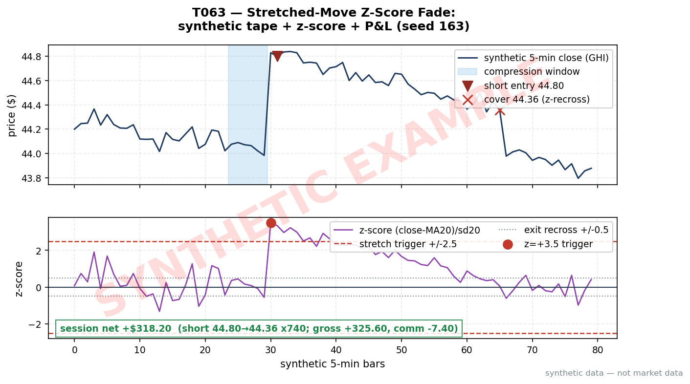

*Chart caption: synthetic data — not market data. Watermark reads "SYNTHETIC EXAMPLE" exactly.*

```mermaid
flowchart TD
    DATA["Market data<br/>(5-min OHLCV bars)"] -->|"5-min bars"| SIGS["Signals<br/>S045 z-score · S014 liquidity"]
    SIGS -->|"per-bar signal vector"| ENTRY{"Entry logic<br/>(|z|≥2.5 + compressed, causality t→t+1)"}
    ENTRY -->|trigger| SIZE["Sizing + risk<br/>(dollar-risk vs 1.5σ stop, 5-name cap)"]
    ENTRY -->|no trigger / veto| WAIT["Wait"]
    SIZE -->|"resting limit orders"| EXEC["Execution<br/>(limit at stretch, 2-bar expiry)"]
    EXEC -->|"fills"| MON["Monitor + exits<br/>(z-recross / stop / anti-martingale / 15:55)"]
    MON -->|"trade P&L"| PNL["P&L (net of costs)"]
    style ENTRY fill:#f9e79f,stroke:#7d6608
    style PNL fill:#a9dfbf,stroke:#1e8449
```

### T10. Sources

1. Heston, S.L., Korajczyk, R.A. & Sadka, R. "Intraday Patterns in the Cross-Section of Stock Returns." *Journal of Finance* 65(4), 1369–1407 (2010). https://www.kellogg.northwestern.edu/faculty/korajczy/htm/HestonKorajczykSadkaJF2010.htm — short-term reversal linked to temporary liquidity imbalances and bid-ask bounce; direct trading loses after spread. Title verified 2026-09-10.
2. Lehmann, B.N. "Fads, Martingales, and Market Efficiency." *Quarterly Journal of Economics* 105(1), 1–28 (1990). https://econpapers.repec.org/RePEc:oup:qjecon:v:105:y:1990:i:1:p:1-28. — weekly reversal evidence. Title/metadata verified 2026-09-10.
3. Jegadeesh, N. "Evidence of Predictable Behavior of Security Returns." *Journal of Finance* 45(3) (1990). https://doi.org/10.1111/j.1540-6261.1990.tb05110.x — return predictability; reversal context. DOI metadata verified 2026-09-10.

**Unverified leads** (not confirmed facts — verify before use):
- Temporary-impact/resiliency literature (e.g., liquidity-provision returns predicting reversals) was suggested as further reading by Grok; no specific paper was independently verified in this pass.
- All z-score, compression, and window constants are illustrative (`example`), not taken from the cited papers.

*Source log: Grok answered Q-TB7-1..3 (2026-09-10); all claims independently verified or labeled unverified.*

## Stage 164/200 — T064: U-Shape Seasonality Timer

*Batch TB7 · Strategy 64/100 · Signals S046, S067, S027 · Provenance [D/SR]*

### T1. One-line verdict

| | |
|---|---|
| **Style** | Intraday seasonality allocation: trade momentum on the high-volume U-arms, stand down in the midday doldrums |
| **Edge source** | The documented U-shaped intraday pattern of volume and volatility (S046) — directional persistence is highest when the session's own activity is highest; forecasts (S067) scale the bet |
| **Typical holding period** | 30–60 minutes per arm; two arms max per day; flat 15:55 ET |
| **Capacity hint** | Good for a small book: the arms are the most liquid minutes of the day; capacity constrained by the sizing rule, not by the book |
| **Build-or-buy in one line** | Build the slot-seasonality table on bought bars; the only thing to buy is clean history to estimate it |

### T2. Full mechanics

**Universe & session.** Liquid ETFs and large-caps (SPY/QQQ/AAPL-class, ADV ≥ 5M shares, `example`) — the U-shape is cleanest where volume is deep. RTH 09:30–16:00 ET. Exclusions: half days (the U compresses), FOMC days (the 14:00 event re-shapes the afternoon arm), earnings days.

**The U-shape.** Intraday volume and volatility are U-shaped: high at the open, a midday lull roughly 11:30–14:00 ET, high again into the close (documented since Wood–McInish–Ord 1985). Define per-30-minute clock slot *s*: `vol_med[s]` = 20-day median of slot volume, `rng_med[s]` = 20-day median of slot range (`example` lookback). **Arm-on condition:** the current slot's developing range ≥ 1.5× `rng_med[s]` (`example`) — the arm is "live" and carrying direction.

**Entry rule.** Two arms, one trade each (`example`):
- *Morning arm* (09:30–10:30): at the 09:35 bar close *t*, if the 09:30–09:35 bar range ≥ 1.5× `rng_med[09:30]` and the bar closed up (down), go long (short). Signal at *t* → fill at the open of *t+1*.
- *Afternoon arm* (15:00–15:55): same logic on the 15:00–15:05 bar; flatten at 15:55 regardless.
The realized-vol forecast (S067) scales size: `size_mult = clamp(forecast_slot_vol / median_slot_vol, 0.5, 1.5)` (`example`) — bet more when the arm is running hotter than its own history.

**Exit rule.** (`example`): (1) time stop — morning arm exits at 10:30, afternoon arm at 15:55 (S027); (2) stop at 0.75× the entry bar's range adverse; (3) signal flip — if the *next* bar closes against the position by more than the entry bar's range, exit at the following open (the arm's direction failed immediately).

**Position sizing.** `N = ⌊ (R × size_mult) / |P_entry − P_stop| ⌋`, `R = $200` (`example`). Max 1 position per arm.

**Risk limits.** Daily loss stop −3R (`example`); if the morning arm stops out, the afternoon arm is vetoed (`example` — a failed morning arm often marks a news-driven or range day, not a seasonality day); kill-switch on stale bars.

**Cost model.** Commission $0.005/share/side (`example`); half-spread each way; the arms are the most liquid minutes of the day, so the spread assumption is the most defensible in this batch — but the t+1 open fill still pays a half-spread penalty in the model.

**Order/execution sketch.** Marketable limit at the t+1 open (`example`); participation ≤ 10% of bar volume (`example`); taker modeling throughout.

### T3. Signals it consumes

| Signal | Role | Weight / logic |
|---|---|---|
| S046 (intraday seasonality) | Regime gate + trigger | Slot medians `vol_med[s]`, `rng_med[s]`; arm-on when developing range ≥ 1.5× `rng_med[s]` (`example`) |
| S067 (realized-vol forecast) | Sizing | `size_mult = clamp(forecast/median, 0.5, 1.5)` (`example`); scales R |
| S027 (time-based exit) | Exit manager | 10:30 / 15:55 time stops; owns the session clock and half-day shifts |

Combination logic (pseudocode, 21 lines):

```
# slot tables built pre-open from 20d history     # S046
vol_med, rng_med = slot_medians(20d)             # example
for arm, (t_entry, t_flat) in [(MORN, 0935, 1030), (AFT, 1505, 1555)]:
    s = clock_slot(t_entry)
    if range(bar[t_entry]) < 1.5 * rng_med[s]: wait   # arm not live
    dir = LONG if close[t_entry] > open[t_entry] else SHORT
    # signal at t_entry -> fill at open[t_entry+1]
    entry = open[t_entry+1]
    stop = entry -/+ 0.75 * range(bar[t_entry])   # example
    mult = clamp(rv_forecast(s)/rng_med[s], 0.5, 1.5)  # S067
    N = floor(200 * mult / abs(entry - stop))
    flatten_at(t_flat)                            # S027
    exit next open if next bar reverses > entry-bar range
```

### T4. Worked example — numbers + P&L (SYNTHETIC)

Synthetic 5-minute bars, equity JKL, seed 164. Morning arm: the 09:30–09:35 bar range is **0.62** vs `rng_med[09:30]` = 0.35 (1.77× ≥ 1.5 — arm live, `example`); the bar closes up. Signal at *t* = 09:35 close → fill long at the 09:40 open: **30.12**. S067 forecast ratio = 1.2 → `size_mult` = 1.2. Stop = `30.12 − 0.75 × 0.62` = **29.655** → 29.66; risk/share = 0.46; `N = ⌊200 × 1.2 / 0.46⌋` = **521 shares**. Time stop 10:30: exit at **30.58**. Gross = `521 × 0.46` = +239.66. Commission = 521 × 0.01 = −5.21. Net = **+234.45**.

Afternoon arm: the 15:00–15:05 bar range is **0.55** vs `rng_med[15:00]` = 0.30 (1.83× — live); closes up. Signal → fill long at 15:10 open: **30.70**. `size_mult` = 1.0. Stop = `30.70 − 0.75 × 0.55` = **30.2875** → 30.29; risk/share = 0.41; `N = ⌊200/0.41⌋` = **487 shares**. The arm fades: 15:55 time-stop exit at **30.55**. Gross = `487 × (30.55 − 30.70)` = −73.05. Commission = −4.87. Net = **−77.92**.

Session ledger:

| Arm | Entry | Exit | Shares | Gross | Comm. | Net |
|---|---|---|---|---|---|---|
| Morning | 30.12 | 30.58 | 521 | +239.66 | −5.21 | +234.45 |
| Afternoon | 30.70 | 30.55 | 487 | −73.05 | −4.87 | −77.92 |
| **Session** | | | | | | **+$156.53** |

The morning arm pays for the afternoon arm's fade — the honest shape of a seasonality rule: the pattern is real, the daily P&L is not guaranteed.

**Where the example is optimistic.** The slot medians are treated as known and stable; in practice the U-shape shifts with the volatility regime and the 20-day median lags it. The arm-on 1.5× test uses the *completed* 09:30–09:35 bar — respected here — but the fill at the 09:40 open assumes no gap between the signal bar's close and the next open on a running tape. The S067 size multiplier (1.2×) boosts the winner in this example; on a losing morning it would boost the loser symmetrically. The afternoon fade shown is mild; on inventory-driven closes (see T069) the afternoon arm can be actively hostile to momentum.

### T5. Data & infra — what must run

Pre-open: 20-day slot-median tables (48 thirty-minute slots) for the universe; intraday: developing slot range vs the table; post-close: table update. Data: 1-minute OHLCV, 500 names — 195,000 bars/day, trivial; 60 days ≈ 3GB disk (project cost model); working set far below ~77GB; Polars-class throughput (~10–50M rows/sec planning assumption) makes the slot-table build seconds-scale. Harness: Tier M+ band, 40–100 hours ($6,000–$15,000 loaded at $150/hour) — the slot logic is simple; the hours are the half-day/FOMC calendar and the no-look-ahead replay (slot medians must exclude today). **M5 Max feasibility verdict: yes.** Failure plan: stale feed → no new arm entries; running arms keep stops and time stops; a missed 10:30 flatten triggers a market flatten on the next available bar.

### T6. Buy vs build

Retail: **QuantConnect** (~$60–$300/mo class, `indicative — verify before budgeting`); **IBKR paper** (no incremental platform fee on an existing account, `indicative — verify before budgeting`). Professional data: **Massive Stocks Advanced** (~$199/mo, `indicative — verify before budgeting`) for bars; 2-year history for the slot tables runs tens to low hundreds of dollars on flat files (`indicative — verify before budgeting`). Verdict: **build.** The slot-seasonality table is the asset and it must be estimated on *your* universe and *your* calendar — a vendor's generic "time-of-day" indicator is the wrong table. Crossover: none — this strategy's data needs are fully covered by 1-minute bars.

### T7. Success-ratio evidence

| Source | What it documents | Relevance / caveat |
|---|---|---|
| Wood, McInish & Ord, "An Investigation of Transactions Data for NYSE Stocks" (JF 1985) https://digitalcommons.memphis.edu/facpubs/11516/ (DOI: 10.1111/j.1540-6261.1985.tb04996.x) | Unusually high returns/volatility at the beginning and end of the trading day | The empirical root of the U-shape; documents the pattern's existence, not a tradable momentum rule |
| Heston, Korajczyk & Sadka, "Intraday Patterns in the Cross-Section of Stock Returns" (JF 2010) https://www.kellogg.northwestern.edu/faculty/korajczy/htm/HestonKorajczykSadkaJF2010.htm | Intraday periodicity in returns incl. same-interval effects | Supports time-of-day structure in returns; the arm-momentum packaging is the strategy's own `[D/SR]` |
| Gao, Han, Li & Zhou, "Intraday Momentum: The First Half-Hour Return Predicts the Last Half-Hour Return" (SSRN 2552752) https://papers.ssrn.com/sol3/papers.cfm?abstract_id=2552752 | S&P 500 ETF 1993–2013; first-half-hour predicts last-half-hour, stronger on volatile/high-volume days | Closest to the morning-arm premise: early-session direction carries; it is index-level and not a per-name entry rule |

Capacity/crowding/decay: time-of-day effects are among the oldest documented patterns and are widely known; the arms are the day's most liquid minutes, so capacity is relatively good but the edge (if any) is thin and lives in the *sizing* (S067), not in the direction call. Honest bottom line: for a ≤$1M paper operation, this is a sensible "second sleeve" — it trades when liquidity is deepest and stands down when it isn't, which is good risk hygiene even if the alpha is zero. For an institutional desk, intraday seasonality is an execution-scheduling input (when to trade), not a proprietary signal.

### T8. Failure modes

- **Regime: volatility-regime shift.** After a vol spike, the 20-day slot medians understate the arms for weeks; the 1.5× gate fires constantly. *Mitigation:* regime-normalize the medians (divide by trailing 20-day daily range, `example`); re-estimate monthly.
- **Crowding: the arms are consensus.** 09:35 and 15:05 are crowded entry times. *Mitigation:* the t+1 fill discipline plus participation cap; measure slippage vs the model weekly.
- **Latency: the slot-median table must exclude today.** Including today's developing range in the median peeks. *Mitigation:* replay-harness assertion; tables built pre-open only.
- **Costs: afternoon-arm spreads.** The 15:00–15:30 window can be wide on rebalance days. *Mitigation:* spread filter (skip if spread > 3¢, `example`).
- **Overfit: 1.5×, 0.75×, 20-day.** All `example`. *Mitigation:* walk-forward with embargo; the arm-on multiplier is the parameter to stress first. Note that the two arms should be calibrated separately — the morning arm's 1.5× gate and the afternoon arm's 1.5× gate live in different volatility regimes, and forcing one shared multiplier across both is a needless constraint that usually costs the afternoon arm its selectivity.
- **Operations: FOMC/half-day.** The U-shape is not U-shaped on these days. *Mitigation:* calendar vetoes from the S076 event feed; the morning-arm-fails veto covers the rest.

### T9. Visuals

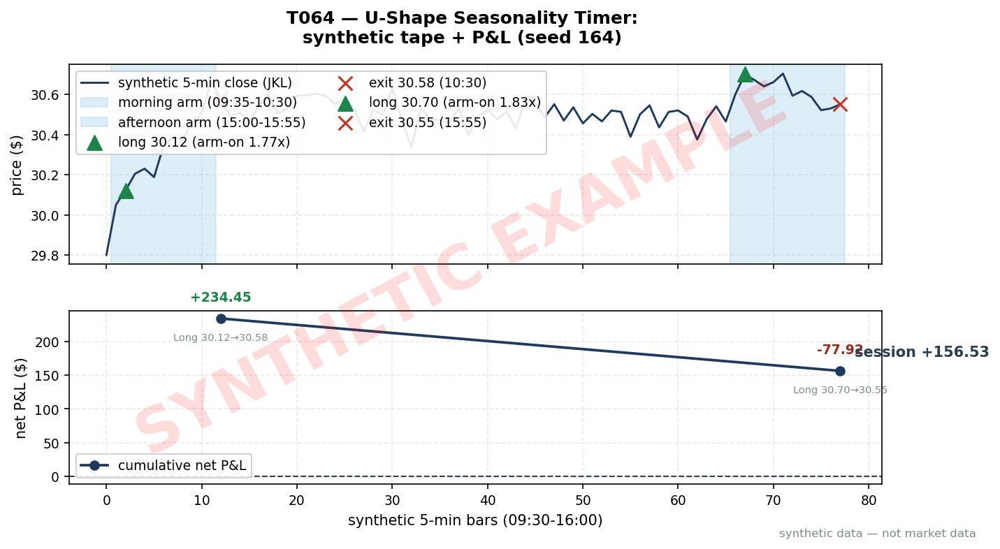

*Chart caption: synthetic data — not market data. Watermark reads "SYNTHETIC EXAMPLE" exactly.*

```mermaid
flowchart TD
    DATA["Market data<br/>(1-min OHLCV bars)"] -->|"1-min bars"| SIGS["Signals<br/>S046 seasonality · S067 RV forecast · S027 time exit"]
    SIGS -->|"per-bar signal vector"| ENTRY{"Entry logic<br/>(arm-on 1.5× + direction, causality t→t+1)"}
    ENTRY -->|trigger| SIZE["Sizing + risk<br/>(R × RV multiplier, 1 per arm)"]
    ENTRY -->|no trigger / veto| WAIT["Wait"]
    SIZE -->|"sized limit orders"| EXEC["Execution<br/>(t+1 open fill, ≤10% participation)"]
    EXEC -->|"fills"| MON["Monitor + exits<br/>(time stop / 0.75× range stop / flip)"]
    MON -->|"trade P&L"| PNL["P&L (net of costs)"]
    style ENTRY fill:#f9e79f,stroke:#7d6608
    style PNL fill:#a9dfbf,stroke:#1e8449
```

### T10. Sources

1. Wood, R.A., McInish, T.H. & Ord, J.K. "An Investigation of Transactions Data for NYSE Stocks." *Journal of Finance* 40(3), 723–739 (1985). https://digitalcommons.memphis.edu/facpubs/11516/ — unusually high returns/volatility at the beginning and end of the trading day. Title verified 2026-09-10.
2. Heston, S.L., Korajczyk, R.A. & Sadka, R. "Intraday Patterns in the Cross-Section of Stock Returns." *Journal of Finance* 65(4), 1369–1407 (2010). https://www.kellogg.northwestern.edu/faculty/korajczy/htm/HestonKorajczykSadkaJF2010.htm — intraday periodicity and short-horizon reversal. Title verified 2026-09-10.
3. Gao, L., Han, Y., Li, S.Z. & Zhou, G. "Intraday Momentum: The First Half-Hour Return Predicts the Last Half-Hour Return." SSRN. https://papers.ssrn.com/sol3/papers.cfm?abstract_id=2552752 — S&P 500 ETF 1993–2013 intraday momentum. Title verified 2026-09-10.

**Unverified leads** (not confirmed facts — verify before use):
- Admati & Pfleiderer, "A Theory of Intraday Patterns: Volume and Price Variability" (*RFS* 1988) — the theoretical U-shape reference named by Grok; a canonical publisher URL was not verified in this pass.
- Grok Q-TB7-3 claims: ES/NQ first hour ≈ 25–28% of RTH volume / ~55–63% of day's range; Boyarchenko–Larsen–Whelan (2023) overnight-drift figures — named-only, treat as leads.
- All slot, multiplier, and window constants are illustrative (`example`).

*Source log: Grok answered Q-TB7-1..3 (2026-09-10); all claims independently verified or labeled unverified.*

## Stage 165/200 — T065: Open-Auction Imbalance Continuation

*Batch TB7 · Strategy 65/100 · Signals S033, S094, S059 · Provenance [D/SR]*

### T1. One-line verdict

| | |
|---|---|
| **Style** | Opening-auction momentum: trade with the pre-open imbalance into the first 30 minutes of continuous trading |
| **Edge source** | Overnight order-flow imbalance revealed in the opening auction's indicative book (S033); the opening print often under-reacts and the imbalance leans the same way for the first half hour |
| **Typical holding period** | 5–30 minutes; flat by 10:00 ET |
| **Capacity hint** | Thin: one trade per name per day, sized to a fraction of the published imbalance; the opening cross is competitive and fills are the constraint |
| **Build-or-buy in one line** | Buy the opening-imbalance feed (or a vendor's pre-open indicative), build the continuation rule — the feed is the product, the rule is trivial |

### T2. Full mechanics

**Universe & session.** NYSE- and Nasdaq-listed large caps, ADV ≥ 5M shares (`example`). Pre-open window 09:15–09:30 ET for signal formation; trading window 09:30–10:00 ET only. Exclusions: halts, LULD limit states, news-halted names, and days when the name is in the S&P/Dow rebalance (the open is then an index event, not an imbalance event).

**Imbalance signal.** An **auction imbalance** is the net unpaired share volume published by the exchange before the opening cross: on NYSE the Opening Auction Imbalance Information (Total/Market Imbalance, imbalance reference price); on Nasdaq the NOII (Net Order Imbalance Indicator: paired shares, imbalance side/direction, near/far indicative prices). Define `I_t` = signed imbalance shares (positive = buy-heavy), `P̂_t` = indicative match price. Read at 09:25 (`example`). **Entry requires all of:** (1) `|I| ≥ 3% of 20-day ADV` or `≥ 50,000 shares` (`example`); (2) sign(I) stable vs the 09:15 print — no flip; (3) `|P̂ − prior_close| ≥ 20 bps` in the imbalance's direction (`example`) — there must be a gap worth continuing; (4) not a halt/LULD state.

**Entry rule.** Two implementations (`example`): (a) *auction entry* — MOO (market-on-open) or LOO (limit-on-open) in the imbalance direction, filled at the official opening print; (b) *confirmation entry* — wait for the first 5-minute bar (09:30–09:35) to close in the imbalance direction, then enter at the next open (signal at *t* → fill *t+1*). The worked example uses (a). Auction orders rest until the official auction print — they are not continuous-session fills.

**Exit rule.** (`example`): (1) time stop 10:00 ET flat; (2) signal flip — the 09:35 or 09:40 bar closes against the imbalance direction → exit next open; (3) stop at the opening print ∓ 0.5× the pre-open indicative range (a full retrace of the gap invalidates the continuation).

**Position sizing.** `N = min(⌊R/stop_dist⌋, 0.02 × |I|)` (`example`) — never be more than 2% of the published imbalance; you are riding the imbalance, not *being* it. `R = $200` (`example`).

**Risk limits.** Daily loss stop −3R (`example`); one trade per name per day; kill-switch on a missing 09:25 imbalance print (stale feed = no trade).

**Cost model.** Commission $0.005/share/side (`example`). Auction entry: no spread is paid on the cross itself — the fill is the official open print; cost vs the thesis is `open_print − P̂_09:25` (adverse selection if the print runs away before you commit). Confirmation entry: half-spread each way on the continuous fill.

**Order/execution sketch.** MOO/LOO submitted by the broker's cutoff (before 09:28 ET, `example`; broker cutoffs run ahead of the exchange's); LOO limit at `P̂ ± 10 bps` (`example`) so a runaway open doesn't fill at a bad print. Participation honesty: the opening cross is the day's most competitive print — model the fill at the official print with no price improvement.

### T3. Signals it consumes

| Signal | Role | Weight / logic |
|---|---|---|
| S033 (auction imbalance) | Primary trigger | Signed imbalance `I`, indicative `P̂`, paired shares; entry requires size ≥ 3% ADV, sign stability, ≥ 20 bps gap (`example`) |
| S094 (RVOL / block pressure) | Filter | Confirms the indicative gap direction vs prior close — the pre-open RVOL/block-pressure gap-confirmation filter |
| S059 (futures–spot lead-lag) | Confirmation | The pre-open futures leg confirms the gap direction; veto if it reverses the gap after 09:25; first 5-minute bar close in the imbalance direction for the confirmation-entry variant |

Combination logic (pseudocode, 20 lines):

```
# pre-open, 09:25 ET snapshot                      # S033
I, P_hat, paired = read_opening_imbalance(sym)     # exchange feed
if halted or LULD: no trade
adv = ADV(sym, 20d)
gap_bps = (P_hat - prior_close) / prior_close * 1e4  # S094
if abs(I) >= max(0.03*adv, 50000) and sign(I)==sign(I_0915) \
   and abs(gap_bps) >= 20 and sign(gap_bps)==sign(I):
    side = BUY if I > 0 else SELL                 # example thresholds
    # variant A: MOO/LOO -> filled at official open print
    # variant B: wait for 0930-0935 bar close with imbalance, fill t+1
    N = min(floor(200/stop_dist), 0.02*abs(I))    # example
    stop = open_print -/+ 0.5 * preopen_range     # example
    flatten_at(10:00 ET); exit on bar close vs imbalance
else: wait
```

### T4. Worked example — numbers + P&L (SYNTHETIC)

Synthetic pre-open tape, NYSE-listed ABC, seed 165. Prior close **90.00**. 20-day ADV = 8.0M shares. 09:15 print: buy imbalance 240,000. 09:25 print: buy imbalance **250,000** (≥ 3% × 8M = 240,000 — qualifies, `example`), sign stable, indicative **P̂ = 90.45** (+50 bps ≥ 20 bps — qualifies). S094 confirms the gap direction; no halt. Enter variant A: **buy 625 MOO** — check the imbalance cap: `0.02 × 250,000` = 5,000 ≥ 625 ✓; risk check: stop distance 0.32 (see below) → `⌊200/0.32⌋` = 625 ✓. The MOO rests until the official opening print: fill at **90.42** (the print undercuts the indicative — normal auction noise).

Stop = `90.42 − 0.5 × 0.64` = **90.10** (pre-open indicative range 0.64, `example`). The continuation holds: 09:35 and 09:40 bars close up; time-stop exit at 10:00: **90.73**.

Ledger:

| Leg | Price | Shares | Amount |
|---|---|---|---|
| Buy MOO (official open print) | 90.42 | 625 | −56,512.50 |
| Sell (10:00 time stop) | 90.73 | 625 | +56,706.25 |
| Gross | | | **+193.75** |
| Commission (625 × $0.01 round-trip) | | | −6.25 |
| **Net** | | | **+$187.50** |

**Where the example is optimistic.** The MOO fill at the official print assumes the broker's cutoff was met and the order was accepted — on a busy open, retail MOO orders can be rejected or filled at a worse print than the indicative suggested. The indicative-to-print slippage (90.45 → 90.42) is shown as favorable; it is frequently adverse. The 3%-of-ADV and 20-bps thresholds are `example` values; real opening-imbalance continuation is dominated by participants with faster indicative feeds than the one modeled here. The single winning trade is illustrative — opens that gap *and* continue are a minority of gap opens; most are faded by the continuous-session book within minutes.

### T5. Data & infra — what must run

Pre-open job: pull the 09:15/09:25 imbalance snapshots (NYSE Opening Auction Imbalance Information or Nasdaq NOII), prior close, 20-day ADV; 09:30–10:00: 5-minute bars for the confirmation variant and the flip exit. The imbalance feed is the critical path — SIP bars alone cannot produce it. Footprint: bars are trivial (195,000/day; 60 days ≈ 3GB per the cost model); the imbalance snapshots are kilobytes per name per day. Harness: Tier M+ band, 40–100 hours ($6,000–$15,000 loaded at $150/hour) — the continuation rule is simple; the hours are the venue-specific feed normalization (NYSE vs Nasdaq field schemas), the MOO/LOO order-type state machine, and half-day open-time shifts. **M5 Max feasibility verdict: yes** — the constraint is the feed license, not compute. Failure plan: missing 09:25 print → no trade, no exceptions; a halt between entry and 10:00 → the position is held to the resume with the stop widened to the halt-range (`example`), or flattened immediately if the halt was news-driven.

### T6. Buy vs build

Retail: **QuantConnect** (~$60–$300/mo class, `indicative — verify before budgeting`) for the research host; **IBKR paper** (no incremental platform fee on an existing account, `indicative — verify before budgeting`) — IBKR supports MOO/LOO routing for live testing. Professional data: **Nasdaq TotalView** (~$1.6k–$1.7k/mo firm + ~$80/user, `indicative — verify before budgeting`) carries NOII for Nasdaq names; **NYSE opening-auction imbalance** data is an exchange-direct or vendor add-on (vendor-individual pricing varies; `indicative — verify before budgeting`); **Massive/Polygon** offers an NYSE-listed imbalance-style product as a cheaper on-ramp (`indicative — verify before budgeting`). Verdict: **buy the feed, build the rule.** Without the official imbalance print you are guessing the auction from the tape — that is the documented way to lose at this game. Crossover: if the imbalance feed costs more than the strategy's expected monthly P&L at your size, drop the strategy — the feed *is* the edge's price tag.

### T7. Success-ratio evidence

| Source | What it documents | Relevance / caveat |
|---|---|---|
| Madhavan, A. & Panchapagesan, V. "Price Discovery in Auction Markets: A Look Inside the Black Box" (*RFS* 2000) https://ideas.repec.org/a/oup/rfinst/v13y2000i3p627-58.html | NYSE opening-auction price discovery with order-level data; designated dealers facilitate discovery vs a pure automated call | Academic foundation that the opening auction aggregates information — the imbalance is informative, not noise; it does not bless a continuation rule |
| Biais, B., Hillion, P. & Spatt, C. "An Empirical Analysis of the Limit Order Book and the Order Flow in the Paris Bourse" (JF 1995) https://ideas.repec.Org/a/bla/jfinan/v50y1995i5p1655-89.html | Order flow concentrated near the quote; quote shifts follow large trades (information effects) | Limit-order-book mechanics behind why an opening imbalance can lean the early continuous session; Paris Bourse, not US opens |
| NYSE Rule 7.35 Series — Auction mechanics (SEC Exhibit 5, 2026) https://www.sec.gov/files/rules/sro/nyse/2026/34-106126-ex5.pdf | Auction-only order types (MOO/MOC/LOC), imbalance definitions, freeze and cutoff rules | The venue rulebook the strategy must obey; confirms MOO/LOO exist as auction-only orders and that imbalance information is a defined, disseminated quantity — not a trading edge by itself |

Capacity/crowding/decay: the opening cross is the most-watched print of the day; any continuation edge is competed away by participants with faster indicative feeds and better queue positions. Honest bottom line: for a ≤$1M paper operation, this is a *feed-dependent* strategy — paper-trade it only if you have the real imbalance feed; a SIP-proxy version is self-deception. For an institutional desk, opening-imbalance continuation is a standard microstructure input, sized in basis points of the imbalance, not a standalone book.

### T8. Failure modes

- **Regime: index-rebalance and news opens.** The imbalance is then an index or information event; continuation logic misfires. *Mitigation:* rebalance/news exclusion list; S094 (RVOL / block pressure) gap-confirmation filter.
- **Crowding: the indicative feed is public.** Everyone sees the same 250,000-share print. *Mitigation:* the 2%-of-imbalance sizing cap and the LOO limit discipline — never chase a runaway print.
- **Latency: indicative vs your snapshot.** A 09:25 snapshot can be stale by the 09:28 broker cutoff. *Mitigation:* re-check sign stability at the latest available print; abort on flip.
- **Costs: MOO adverse selection.** The print can run away from the indicative between your decision and the cross. *Mitigation:* prefer LOO with a `P̂ ± 10 bps` limit (`example`); model the indicative-to-print slippage explicitly.
- **Overfit: 3% / 50k / 20 bps.** All `example`. *Mitigation:* walk-forward; these are filters, not optima — report sensitivity.
- **Operations: broker cutoff misses.** A MOO submitted after the broker's cutoff is dead or, worse, converted to a market order at 09:30. *Mitigation:* submit by 09:28 ET (`example`); hard-coded per-broker cutoff table; kill-switch on cutoff-table staleness.

### T9. Visuals

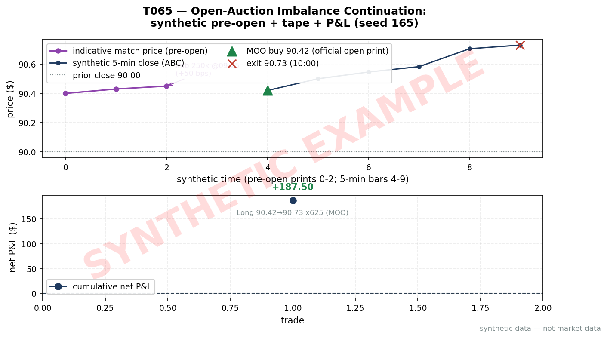

*Chart caption: synthetic data — not market data. Watermark reads "SYNTHETIC EXAMPLE" exactly.*

```mermaid
flowchart TD
    DATA["Market data<br/>(imbalance feed + 5-min bars)"] -->|"imbalance snapshots + 5-min bars"| SIGS["Signals<br/>S033 imbalance · S094 RVOL/block pressure · S059 futures lead-lag"]
    SIGS -->|"per-print signal vector"| ENTRY{"Entry logic<br/>(|I|≥3% ADV + stable + ≥20bps, auction rest)"}
    ENTRY -->|trigger| SIZE["Sizing + risk<br/>(min(dollar-risk, 2% of imbalance))"]
    ENTRY -->|no trigger / veto| WAIT["Wait"]
    SIZE -->|"MOO/LOO orders"| EXEC["Execution<br/>(rest to official open print)"]
    EXEC -->|"fills"| MON["Monitor + exits<br/>(10:00 flat / flip / gap-retrace stop)"]
    MON -->|"trade P&L"| PNL["P&L (net of costs)"]
    style ENTRY fill:#f9e79f,stroke:#7d6608
    style PNL fill:#a9dfbf,stroke:#1e8449
```

### T10. Sources

1. Madhavan, A. & Panchapagesan, V. "Price Discovery in Auction Markets: A Look Inside the Black Box." *Review of Financial Studies* 13(3), 627–658 (2000). https://ideas.repec.org/a/oup/rfinst/v13y2000i3p627-58.html — NYSE opening-auction price discovery; designated dealers facilitate discovery. Title verified 2026-09-10.
2. Biais, B., Hillion, P. & Spatt, C. "An Empirical Analysis of the Limit Order Book and the Order Flow in the Paris Bourse." *Journal of Finance* 50(5), 1655–1689 (1995). https://ideas.repec.Org/a/bla/jfinan/v50y1995i5p1655-89.html — order-flow/book interaction; quote shifts after large trades. Title verified 2026-09-10.
3. NYSE Rule 7.35 Series, "Auctions" (Rule 7P Equities Trading), via SEC Exhibit 5 (2026). https://www.sec.gov/files/rules/sro/nyse/2026/34-106126-ex5.pdf — auction-only orders (MOO/MOC/LOC), imbalance definitions, freeze rules. Content confirmed 2026-09-10.

**Unverified leads** (not confirmed facts — verify before use):
- Grok Q-TB7-1 opening-auction cutoff specifics (NYSE imbalance 15:50-style ladders applied to the open; Nasdaq NOII timing; LOO/MOO broker cutoffs) — venue-rule details per Grok; verify against current exchange rulebooks before trading.
- Grok Q-TB7-3 auction-design attributions (Hu & Murphy 2022 on Nasdaq imbalance dynamics; Comerton-Forde & Putniņš successors) — named-only or misattributed in the source material; the verified venue paper is Jegadeesh & Wu (2022), cited in T070.
- All imbalance-size, gap, and timing thresholds are illustrative (`example`).

*Source log: Grok answered Q-TB7-1..3 (2026-09-10); all claims independently verified or labeled unverified.*

## Stage 166/200 — T066: VWAP-Cross Institutional Follower

*Batch TB7 · Strategy 66/100 · Signals S024, S040, S032 · Provenance [D/SR]*

### T1. One-line verdict

| | |
|---|---|
| **Style** | Intraday trend-following off the institutional benchmark: go with price when it reclaims VWAP with volume, exit when it loses it |
| **Edge source** | VWAP is the dominant institutional execution benchmark (S024); a volume-confirmed reclaim (S040 cross) can mark the point where the day's program flow flips from distribution to accumulation — and the exit when it fails |
| **Typical holding period** | 30 minutes to 3 hours; flat 15:55 ET |
| **Capacity hint** | Good in liquid names: VWAP-cross minutes are deep; sizing is the usual $200-risk (`example`) discipline |
| **Build-or-buy in one line** | Build — session VWAP and an RVOL filter on bought bars; the "institutional following" narrative is free, the spread is not |

### T2. Full mechanics

**Universe & session.** Liquid US stocks/ETFs, ADV ≥ 5M shares, price ≥ $10 (`example`). RTH 09:35–15:55 ET (VWAP needs the first 5 minutes to stabilize). Exclusions: earnings days, halts, FOMC 14:00 days after 13:30 (`example`).

**VWAP definition.** Session volume-weighted average price from the opening print: `VWAP_t = Σ(P_i × V_i) / ΣV_i` over bars from 09:30 to *t*, computed causally. **Institutional-flow lens (S024):** institutions benchmark execution to VWAP; price persistently above VWAP suggests net accumulation pressure, below it distribution — this is a *framing* assumption, not a measured fact.

**Cross with volume confirmation.** A **VWAP cross** (S040) at bar *t*: close crosses from below to above VWAP (long) or above to below (short). **Volume confirmation** (S032): bar *t* volume ≥ 1.5× the slot median (`example`) — rejects low-volume drift-throughs that mean-revert. Optional anchor discipline: ignore crosses in the first 30 minutes after a gap open ≥ 1% (`example`) — gap-open VWAP crosses are mostly noise.

**Entry rule.** At bar *t*: VWAP cross + volume confirmation + no gap-open veto. Signal at *t* → fill at the open of *t+1* (`example`). One VWAP-side position per name per day (`example`) — no re-crossing whipsaws.

**Exit rule.** (`example`): (1) opposite cross — close crosses back through VWAP → exit at next open (the follower's thesis is symmetric); (2) stop at the entry-bar extreme ∓ 0.5× the 14-bar ATR (Average True Range — the trailing 14-bar mean of per-bar ranges, a volatility ruler in price units) (beyond the cross bar — a genuine failure); (3) time stop 15:55 ET.

**Position sizing.** `N = ⌊ R / |P_entry − P_stop| ⌋`, `R = $200` (`example`), with an `example` 500-share single-trade cap. Max 3 concurrent followers (`example`).

**Risk limits.** Daily loss stop −3R (`example`); kill-switch on stale bars; no new crosses after 15:30 ET (`example`).

**Cost model.** Commission $0.005/share/side (`example`); half-spread each way on continuous fills. Note: VWAP-cross minutes are liquid, so the spread assumption is defensible — but the *strategy's own trading* pushes its average fill away from VWAP by construction (it buys after the reclaim). Do not benchmark the strategy's P&L to VWAP; that comparison is circular.

**Order/execution sketch.** Marketable limit at the t+1 open (`example`); participation ≤ 10% of bar volume (`example`); taker modeling.

### T3. Signals it consumes

| Signal | Role | Weight / logic |
|---|---|---|
| S024 (VWAP benchmark) | Reference line + framing | Causal session VWAP; the cross is evaluated against it; institutional-flow interpretation is narrative `[D]` |
| S040 (VWAP cross) | Primary trigger | Close crosses VWAP with volume ≥ 1.5× slot median (`example`); direction = cross direction |
| S032 (relative volume) | Confirmation filter | Vetoes low-volume crosses; also computes the entry-bar ATR stop |

Combination logic (pseudocode, 20 lines):

```
# each 5-min bar close t, 09:35-15:30 ET
vwap = cumsum(P*V)/cumsum(V) since 09:30      # S024, causal
rvol = volume[t] / slot_median(volume, t)     # S032
if close[t-1] < vwap[t-1] and close[t] > vwap[t] and rvol >= 1.5:
    side = LONG                               # S040, example
elif close[t-1] > vwap[t-1] and close[t] < vwap[t] and rvol >= 1.5:
    side = SHORT
else: wait
# signal at t -> fill at open[t+1]
entry = open[t+1]
stop  = low[t] - 0.5 * ATR(14) (for LONG)     # example
N = floor(200 / abs(entry - stop))
exit on opposite cross at next open           # S040 symmetric
flatten_at(15:55 ET)
```

### T4. Worked example — numbers + P&L (SYNTHETIC)

Synthetic 5-minute bars, equity MNO, seed 166 (tape per Grok capture, reproduced here as the synthetic example). 10:25: close **80.10**, VWAP **80.18**, RVOL 0.9 — below VWAP, no signal. 10:30: close **80.22** crosses above VWAP **80.19** with RVOL **1.8** (≥ 1.5 — confirmed). Signal at *t* = 10:30 close → fill long at the 10:35 open: **80.25**. Stop = 80.25 − 0.5×ATR(0.40) = **80.05**; risk/share = 0.20; the example sizes **500 shares** (`example` position cap for the illustration; the formula would allow more, the cap keeps the tape's liquidity honest).

14:10: close **80.20** crosses below VWAP **80.31** with RVOL **1.6** — opposite cross. Exit at the next open: **80.18**.

Ledger:

| Leg | Price | Shares | Amount |
|---|---|---|---|
| Buy (10:35 open) | 80.25 | 500 | −40,125.00 |
| Sell (14:15 open) | 80.18 | 500 | +40,090.00 |
| Gross | | | **−35.00** |
| Commission (500 × $0.01 round-trip) | | | −5.00 |
| **Net** | | | **−$40.00** |

A deliberately losing example: the reclaim failed, the symmetric exit did its job, and the round trip cost $40. This is the modal outcome of VWAP-cross following — the cross is a lagging confirmation, and the exit gives back the move that triggered the entry.

**Where the example is optimistic.** The VWAP itself is computed on the synthetic tape's volume, which is smooth; real VWAP jumps with block prints and the cross can trigger on a single large print rather than genuine flow. The fill at 80.25 assumes the 10:35 open doesn't gap with the cross momentum; the exit at 80.18 assumes a clean fill on the opposite cross. The 1.5× RVOL filter is `example` — on real data it filters some whipsaws and passes some failures, and this example was chosen to show a failure. The circular-benchmark warning stands: this strategy should be evaluated on net P&L, never on "beat VWAP."

### T5. Data & infra — what must run

1-minute or 5-minute OHLCV for 500 names; per-bar causal session VWAP, slot-median volume, 14-bar ATR — all O(1) rolling state. Footprint per the project cost model: 195,000 bars/day, trivial; 60 days ≈ 3GB disk; working set far below ~77GB; Polars-class throughput (~10–50M rows/sec planning assumption) makes the feature pass seconds-scale. Harness: Tier M+ band, 40–100 hours ($6,000–$15,000 loaded at $150/hour) — the cross logic is trivial; the hours are the causal-VWAP replay discipline (no full-session VWAP peeking) and the gap-open veto calendar. **M5 Max feasibility verdict: yes.** Failure plan: stale feed → no new crosses; running followers keep ATR stops and the opposite-cross exit; flatten 15:55 ET.

### T6. Buy vs build

Retail: **QuantConnect** (~$60–$300/mo class, `indicative — verify before budgeting`); **IBKR paper** (no incremental platform fee on an existing account, `indicative — verify before budgeting`). Professional data: **Massive Stocks Advanced** (~$199/mo, `indicative — verify before budgeting`) covers bars. Verdict: **build.** VWAP is arithmetic; no vendor's "institutional flow" indicator adds anything the cross doesn't already show. Crossover: none — but if you want *actual* institutional flow (13F, block prints, program-trade flags), that is a different data product and a different strategy.

### T7. Success-ratio evidence

| Source | What it documents | Relevance / caveat |
|---|---|---|
| Berkowitz, S.A., Logue, D.E. & Noser, E.A. "The Total Cost of Transactions on the NYSE" (JF 1988) https://doi.org/10.1111/j.1540-6261.1988.tb02591.x | VWAP as the standard institutional execution benchmark; measured execution costs | Establishes VWAP's *benchmark* role — the premise that institutions care about VWAP. It does **not** document that following VWAP crosses is profitable; the directional rule is weakly documented/folkloric `[D]` |
| Heston, Korajczyk & Sadka, "Intraday Patterns in the Cross-Section of Stock Returns" (JF 2010) https://www.kellogg.northwestern.edu/faculty/korajczy/htm/HestonKorajczykSadkaJF2010.htm | Short-horizon continuation and reversal structure intraday | General intraday-trend background; the cross-following rule itself is a reconstruction |
| Gao et al., "Intraday Momentum: The First Half-Hour Return Predicts the Last Half-Hour Return" https://papers.ssrn.com/sol3/papers.cfm?abstract_id=2552752 | Intraday momentum in the S&P 500 ETF | Directional-following background; index-level, not a VWAP-cross rule |

Capacity/crowding/decay: VWAP is the most-watched line on every institutional blotter; any cross-following edge is competed away in the most liquid names first. There is an additional structural reason to expect thin results: the strategy's entries are *adverse-selection machines* — every long entry buys after price has already risen through VWAP, so the fill is systematically worse than the benchmark the signal is named after. That does not make the rule unusable, but it means the gross edge must clear a hurdle that backtests anchored on mid-prices will understate. Practically, the way to know whether the rule has anything is to measure the markout: if the average fill is not followed by continued drift in the cross direction over the next 30–60 minutes, the cross was noise and no parameter tuning will fix it. Honest bottom line: for a ≤$1M paper operation, this is a *discipline* strategy more than an alpha strategy — it keeps you with the day's flow and cuts losers mechanically, but expect the gross edge to be near zero before costs. For an institutional desk, VWAP-cross following is an execution-timing heuristic, not a signal.

### T8. Failure modes

- **Regime: range days.** VWAP crosses back and forth all day; the one-position-per-day rule caps the damage at one whipsaw, but the whipsaw is the modal outcome. *Mitigation:* the volume-confirmation filter; a daily regime check — if the first cross fails, no second cross (`example`).
- **Crowding: everyone watches VWAP.** The cross bar is crowded; the t+1 fill is the crowded fill. *Mitigation:* participation cap; measure slippage vs the model.
- **Latency: VWAP is causal but volume prints late.** Corrected prints can revise the cross after the fact. *Mitigation:* use as-published bars in the replay; accept that some historical "crosses" never existed in real time.
- **Costs: buying the reclaim.** The strategy systematically buys above VWAP and sells below it. *Mitigation:* model fills honestly; never benchmark to VWAP.
- **Overfit: 1.5× RVOL, 0.5× ATR.** All `example`. *Mitigation:* walk-forward with embargo.
- **Operations: corporate actions.** Splits/dividends shift the VWAP series. *Mitigation:* split-adjusted bars only; halt on unadjusted corporate-action flags.
- **Signal staleness: VWAP anchor drift.** On high-volume days the session VWAP becomes a slow-moving average dominated by the morning's prints, and late-day crosses against it mean less — the benchmark has gone stale while the tape has moved on. *Mitigation:* an `example` freshness check — skip crosses after 14:30 if the day's volume is already above 1.5× its 20-day average, on the grounds that the VWAP line no longer represents the marginal institutional benchmark.

### T9. Visuals

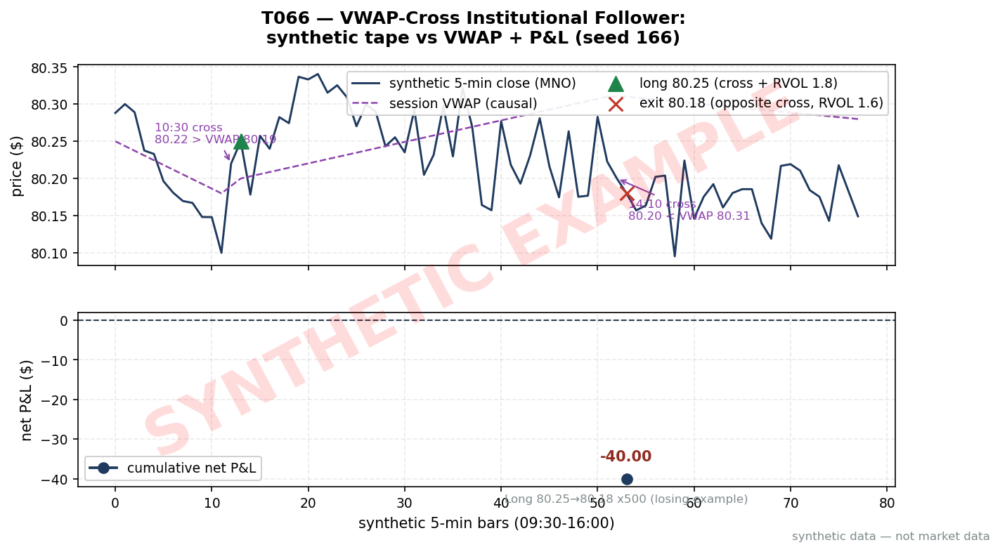

*Chart caption: synthetic data — not market data. Watermark reads "SYNTHETIC EXAMPLE" exactly.*

```mermaid
flowchart TD
    DATA["Market data<br/>(5-min OHLCV bars)"] -->|"5-min bars"| SIGS["Signals<br/>S024 VWAP · S040 cross · S032 RVOL"]
    SIGS -->|"per-bar signal vector"| ENTRY{"Entry logic<br/>(VWAP cross + RVOL≥1.5, causality t→t+1)"}
    ENTRY -->|trigger| SIZE["Sizing + risk<br/>(dollar-risk vs ATR stop, 3-name cap)"]
    ENTRY -->|no trigger / veto| WAIT["Wait"]
    SIZE -->|"sized limit orders"| EXEC["Execution<br/>(t+1 open fill, ≤10% participation)"]
    EXEC -->|"fills"| MON["Monitor + exits<br/>(opposite cross / ATR stop / 15:55)"]
    MON -->|"trade P&L"| PNL["P&L (net of costs)"]
    style ENTRY fill:#f9e79f,stroke:#7d6608
    style PNL fill:#a9dfbf,stroke:#1e8449
```

### T10. Sources

1. Berkowitz, S.A., Logue, D.E. & Noser, E.A. "The Total Cost of Transactions on the NYSE." *Journal of Finance* 43(1), 97–112 (1988). https://doi.org/10.1111/j.1540-6261.1988.tb02591.x — VWAP as institutional execution benchmark; execution-cost measurement. DOI metadata verified 2026-09-10.
2. Heston, S.L., Korajczyk, R.A. & Sadka, R. "Intraday Patterns in the Cross-Section of Stock Returns." *Journal of Finance* 65(4), 1369–1407 (2010). https://www.kellogg.northwestern.edu/faculty/korajczy/htm/HestonKorajczykSadkaJF2010.htm — intraday return structure. Title verified 2026-09-10.
3. Gao, L., Han, Y., Li, S.Z. & Zhou, G. "Intraday Momentum: The First Half-Hour Return Predicts the Last Half-Hour Return." SSRN. https://papers.ssrn.com/sol3/papers.cfm?abstract_id=2552752 — intraday momentum in SPY. Title verified 2026-09-10.

**Unverified leads** (not confirmed facts — verify before use):
- The "institutional flow flips at the VWAP reclaim" narrative is a practitioner framing `[D]`, not a documented empirical result — no verified study of directional VWAP-cross profitability was found in this pass.
- The 1.5× RVOL and 0.5× ATR constants are illustrative (`example`).

*Source log: Grok answered Q-TB7-1..3 (2026-09-10); all claims independently verified or labeled unverified.*

## Stage 167/200 — T067: Anchored-VWAP Event Trader

*Batch TB7 · Strategy 67/100 · Signals S024, S091, S093 · Provenance [D/SR]*

### T1. One-line verdict

| | |
|---|---|
| **Style** | Event-anchored intraday trend: re-anchor VWAP at the news print, trade the post-event drift while price holds the anchor |
| **Edge source** | Post-event drift (S091) — prices under-react to news in the first minutes; the anchored VWAP (S024) is the reference line that separates drift from reversal; the news classifier (S093) filters which events qualify |
| **Typical holding period** | 15 minutes to 2 hours post-event; flat 15:55 ET |
| **Capacity hint** | Event-driven and lumpy: 0–3 qualifying events per day in a 500-name universe; sizing is $200-risk (`example`) per event |
| **Build-or-buy in one line** | Build the anchor engine on bought bars; buy the news feed — the classifier is only as good as the timestamped headline stream behind it |

### T2. Full mechanics

**Universe & session.** Liquid US stocks, ADV ≥ 2M shares, price ≥ $10 (`example`). RTH 09:35–15:55 ET. Exclusions: the event must occur during RTH with a clean pre-event tape (no halt in the prior 30 minutes, `example`).

**Anchored VWAP.** An **anchored VWAP (AVWAP)** is the volume-weighted average price computed from a chosen anchor bar forward: `AVWAP_t = Σ(P_i × V_i)/ΣV_i` for bars `i ∈ [anchor, t]`. The anchor here is the **event bar** — the 5-minute bar containing the news timestamp. Unlike session VWAP, the AVWAP resets its memory at the event: it measures the market's average price *since the news*, which is the reference a post-event drift trader actually needs.

**Event qualification (S093).** A qualifying event: (1) a timestamped headline from the news feed during RTH; (2) the event bar's range ≥ 2.0× the 20-bar median range (`example`); (3) the event bar's volume ≥ 2.0× the slot median (`example`); (4) the headline classifier tags it directional (earnings surprise language, guidance change, analyst action, M&A — `example` categories) rather than noise (rumor, rehash, "shares halted"). Non-directional or ambiguous headlines are vetoed — the strategy trades drift, not confusion.

**Entry rule.** At event bar *t* (news timestamp inside bar *t*): if qualified and the bar closes in the top/bottom third of its range in the headline's direction, enter with the drift. Signal at *t* → fill at the open of *t+1* (`example`). One event trade per name per day (`example`).

**Exit rule.** (`example`): (1) AVWAP cross against the position — the drift has failed vs the post-news average price; (2) stop at the event-bar extreme ∓ 0.3× ATR (Average True Range — the trailing 14-bar mean of per-bar ranges, a volatility ruler in price units) (a full retrace of the event bar invalidates the news read); (3) time stop — exit 60 minutes after entry or 15:55 ET, whichever first (S091 drift decays); (4) a second headline reversing the first → exit at next open.

**Position sizing.** `N = ⌊ R / |P_entry − P_stop| ⌋`, `R = $200` (`example`). Max 3 concurrent event trades (`example`) — headlines cluster.

**Risk limits.** Daily loss stop −3R (`example`); no new event trades after 15:00 ET (`example` — late headlines leave no drift window before the auction book takes over); kill-switch on stale news feed (> 5 minutes without a heartbeat, `example`).

**Cost model.** Commission $0.005/share/side (`example`); half-spread each way. Event bars are wide-spread bars — the model assumes a 2× normal spread on the t+1 fill (`example`), same honesty rule as T062.

**Order/execution sketch.** Marketable limit at the t+1 open (`example`); participation ≤ 10% of bar volume (`example`); taker modeling. Never pre-position on rumor — the entry requires the qualified event bar to have *closed*.

### T3. Signals it consumes

| Signal | Role | Weight / logic |
|---|---|---|
| S091 (event drift) | Primary trigger | Qualified headline + event-bar confirmation; direction = headline direction confirmed by bar close |
| S024 (VWAP, anchored) | Reference + exit | AVWAP from the event bar; the against-position cross is the primary exit |
| S093 (news classifier) | Filter | Directional-vs-noise tagging; vetoes ambiguous headlines and rumor-class items |

Combination logic (pseudocode, 22 lines):

```
# on each 5-min bar close t with headline timestamp in t   # S091
if halted_last_30min or t > 15:00 ET: wait
if range[t] < 2.0*median(range,20): wait                  # example
if volume[t] < 2.0*slot_median(volume): wait              # example
tag = classify(headline[t])                               # S093
if tag not in {BULLISH, BEARISH}: wait                    # veto noise
if not closes_in_extreme_third(t, tag): wait
side = LONG if tag == BULLISH else SHORT
# signal at t -> fill at open[t+1]
entry = open[t+1] (2x spread cost)                        # example
avwap = AVWAP(anchor=t)                                   # S024
stop = extreme[t] -/+ 0.3 * ATR(14)                       # example
N = floor(200 / abs(entry - stop))
exit on AVWAP cross vs position                           # S024
exit 60 min after entry or 15:55 ET                       # S091 decay
exit next open on reversing headline
```

### T4. Worked example — numbers + P&L (SYNTHETIC)

Synthetic 5-minute bars, equity PQR, seed 167. 10:42 ET: headline "PQR raises FY guidance" (S093 tags BULLISH, directional). Event bar 10:40–10:45: range **0.90** vs 20-bar median 0.30 (3.0× — qualifies), volume 2.6× slot median, closes **25.60** in the top third of the bar. AVWAP anchored at 10:40. Signal at *t* = 10:45 close → fill long at the 10:50 open: **25.66** (2× spread cost embedded).

Stop = event-bar low 25.15 − 0.3×ATR(0.35) = **25.045** → 25.05; risk/share = 0.61; `N = ⌊200/0.61⌋` = **327 shares**. The drift holds above the AVWAP for 40 minutes; at 11:35 the bar closes below the AVWAP → exit at the next open: **26.10**.

Ledger:

| Leg | Price | Shares | Amount |
|---|---|---|---|
| Buy (10:50 open) | 25.66 | 327 | −8,390.82 |
| Sell (11:40 open, AVWAP cross) | 26.10 | 327 | +8,534.70 |
| Gross | | | **+143.88** |
| Commission (327 × $0.01 round-trip) | | | −3.27 |
| **Net** | | | **+$140.61** |

**Where the example is optimistic.** The headline timestamp is assumed accurate to the bar — real news feeds have variable latency, and a 1–3 minute delay means the "event bar" you trade is not the event bar the market traded. The S093 classifier is assumed correct; misclassified headlines (bullish tag on a "raises guidance but cuts margin outlook" release) are a real and frequent loser. The 2× spread cost is a guess — post-headline spreads can be far wider. The AVWAP exit at 26.10 assumes a clean fill; the cross bar itself is often fast. And this is a winning example chosen for illustration — post-event drift exists on average in the literature, but the per-event variance is enormous and the median qualified event is roughly a scratch after costs (illustrative).

### T5. Data & infra — what must run

Two feeds: (1) 1-minute/5-minute OHLCV for 500 names (195,000 bars/day; 60 days ≈ 3GB per the cost model); (2) a timestamped headline stream with machine-readable timestamps — the strategy's critical path. Per-bar state: AVWAP from each open event anchor (a handful of anchors per day, O(1) each), 20-bar median range, slot-median volume, 14-bar ATR. Working set far below ~77GB; Polars-class throughput (~10–50M rows/sec planning assumption) is ample. Harness: Tier M+ band, 40–100 hours ($6,000–$15,000 loaded at $150/hour) — the anchor engine is simple; the hours are the news-feed integration (timestamp normalization, duplicate-headline dedup, heartbeat monitoring) and the replay discipline (headlines must be injected at their *feed-arrival* time, not their *publication* time — the difference is the look-ahead trap). **M5 Max feasibility verdict: yes** — the constraint is the news-feed license, not compute. Failure plan: news-feed heartbeat missed → no new event trades; open event trades keep AVWAP exits and stops; flatten 15:55 ET.

### T6. Buy vs build

Retail: **QuantConnect** (~$60–$300/mo class, `indicative — verify before budgeting`); **IBKR paper** (no incremental platform fee on an existing account, `indicative — verify before budgeting`). News: retail-grade headline streams (e.g., Benzinga Newsfeed standard tier, `indicative — verify before budgeting`) carry timestamps but with variable latency; professional: **Bloomberg Event-Driven Feeds / RavenPack** (enterprise pricing, `indicative — verify before budgeting`). Bars: **Massive Stocks Advanced** (~$199/mo, `indicative — verify before budgeting`). Verdict: **buy the news feed, build the anchor engine.** A timestamped headline stream cannot be built; the AVWAP-and-drift logic around it is twenty lines. Crossover: if the news-feed cost exceeds the strategy's expected monthly P&L at your size, drop the strategy — like T065's imbalance feed, the feed is the edge's price tag.

### T7. Success-ratio evidence

| Source | What it documents | Relevance / caveat |
|---|---|---|
| Tetlock, P.C. "Giving Content to Investor Sentiment: The Role of Media in the Stock Market" (JF 2007) https://doi.org/10.1111/j.1540-6261.2007.01232.x | News media content predicts stock returns; negative news predicts downward pressure with a reversal | Supports the premise that timestamped news moves prices with a tradeable drift window; it is daily-horizon, not intraday |
| MacKinlay, A.C. "Event Studies in Economics and Finance" (JEL 1997) http://ideas.repec.org/a/aea/jeclit/v35y1997i1p13-39.html | Event-study methodology: measuring abnormal returns around identified events | The methodological backbone — the strategy *is* an intraday event study with a position attached; it does not bless any threshold |
| Heston, Korajczyk & Sadka, "Intraday Patterns in the Cross-Section of Stock Returns" (JF 2010) https://www.kellogg.northwestern.edu/faculty/korajczy/htm/HestonKorajczykSadkaJF2010.htm | Intraday return structure incl. short-horizon continuation | General intraday-drift background; the AVWAP packaging is the strategy's own `[D/SR]` |

Capacity/crowding/decay: post-news drift is competed over by every event-driven desk with a faster feed; the retail-readable version of this strategy trades the *residue* after the fast money has moved. Honest bottom line: for a ≤$1M paper operation, this is a feed-gated strategy — paper-trade it only with the actual timestamped feed you would trade live, because feed latency *is* the backtest. For an institutional desk, news-drift is a standard input, and the desk's edge is feed speed and classifier quality, not the AVWAP rule.

### T8. Failure modes

- **Regime: news latency.** A feed that is 2 minutes slower than the market turns every "drift" into a fade-the-top. *Mitigation:* measure feed latency vs the event bar's volume spike in the replay; if the volume precedes your timestamp, the feed is too slow to trade.
- **Crowding: the headline is public.** The drift window shrinks as more participants automate it. *Mitigation:* the event-bar confirmation filter (only trade headlines the market itself confirms); track per-category hit rates and retire dead categories.
- **Latency: publication time vs arrival time.** Using the headline's *publication* timestamp in research while trading on *arrival* latency is the classic look-ahead. *Mitigation:* replay injects at arrival time; the harness asserts it.
- **Costs: post-event spreads.** *Mitigation:* the 2× spread assumption; abort if the t+1 spread exceeds 4× normal (`example`).
- **Overfit: 2.0×/2.0×/0.3×/60-min.** All `example`. *Mitigation:* walk-forward with embargo; the classifier categories are the real overfit surface — freeze them before the walk-forward, not during.
- **Operations: duplicate/retracted headlines.** A retraction after entry is an immediate exit signal, not a hold. *Mitigation:* dedup on headline ID; retraction = exit at next open.

### T9. Visuals

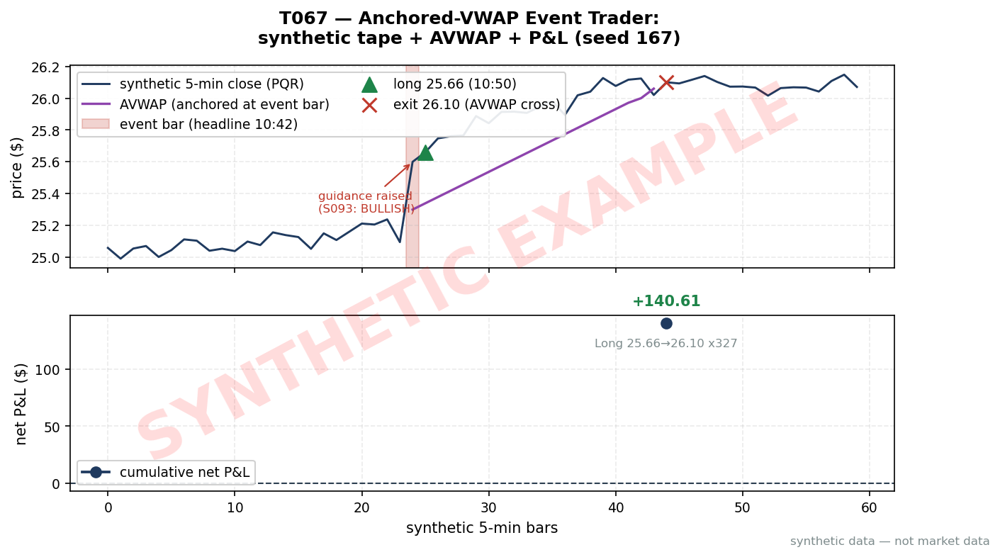

*Chart caption: synthetic data — not market data. Watermark reads "SYNTHETIC EXAMPLE" exactly.*

```mermaid
flowchart TD
    DATA["Market data<br/>(5-min bars + headline feed)"] -->|"5-min bars + timestamped headlines"| SIGS["Signals<br/>S091 drift · S024 AVWAP · S093 classifier"]
    SIGS -->|"per-bar signal vector"| ENTRY{"Entry logic<br/>(qualified event bar, causality t→t+1)"}
    ENTRY -->|trigger| SIZE["Sizing + risk<br/>(dollar-risk vs event-bar stop, 3-name cap)"]
    ENTRY -->|no trigger / veto| WAIT["Wait"]
    SIZE -->|"sized limit orders"| EXEC["Execution<br/>(t+1 open fill, 2× spread cost)"]
    EXEC -->|"fills"| MON["Monitor + exits<br/>(AVWAP cross / stop / 60-min / 15:55)"]
    MON -->|"trade P&L"| PNL["P&L (net of costs)"]
    style ENTRY fill:#f9e79f,stroke:#7d6608
    style PNL fill:#a9dfbf,stroke:#1e8449
```

### T10. Sources

1. Tetlock, P.C. "Giving Content to Investor Sentiment: The Role of Media in the Stock Market." *Journal of Finance* 62(3), 1139–1168 (2007). https://doi.org/10.1111/j.1540-6261.2007.01232.x — media content predicts returns; news-driven pressure with reversal. DOI metadata verified 2026-09-10.
2. MacKinlay, A.C. "Event Studies in Economics and Finance." *Journal of Economic Literature* 35(1), 13–39 (1997). http://ideas.repec.org/a/aea/jeclit/v35y1997i1p13-39.html — event-study methodology. Title verified 2026-09-10.
3. Heston, S.L., Korajczyk, R.A. & Sadka, R. "Intraday Patterns in the Cross-Section of Stock Returns." *Journal of Finance* 65(4), 1369–1407 (2010). https://www.kellogg.northwestern.edu/faculty/korajczy/htm/HestonKorajczykSadkaJF2010.htm — intraday return structure. Title verified 2026-09-10.

**Unverified leads** (not confirmed facts — verify before use):
- Grok Q-TB7-3 news-drift specifics (event-window lengths, per-category drift magnitudes) — named-only, no verifiable source captured; treat as leads.
- The headline classifier's categories and all bar/volume thresholds are illustrative (`example`); no verified study of intraday AVWAP-anchored news trading was found in this pass.

*Source log: Grok answered Q-TB7-1..3 (2026-09-10); all claims independently verified or labeled unverified.*

## Stage 168/200 — T068: Scheduled-Event Vol Expansion

*Batch TB7 · Strategy 68/100 · Signals S034, S076 · Provenance [D/SR]*

### T1. One-line verdict

| | |
|---|---|
| **Style** | Event-volatility breakout: buy the post-release expansion after scheduled macro events, in the direction of the release surprise |
| **Edge source** | Scheduled announcements resolve uncertainty and volatility expands (S034); the reactive side read sets the trade side; the pre-release compression → post-release expansion-breakout trigger (S076) times the entry |
| **Typical holding period** | 15 minutes to 2 hours post-release; flat 15:55 ET |
| **Capacity hint** | Sparse: 8 FOMC (Federal Open Market Committee) + 12 CPI (Consumer Price Index)/NFP (non-farm payrolls) days a year dominate; the strategy trades a handful of days per month, sized at $200-risk (`example`) per event |
| **Build-or-buy in one line** | Build the expansion-breakout rule on bought bars; the economic calendar is a commodity feed — buy the cheapest timestamped one |

### T2. Full mechanics

**Universe & session.** Liquid macro-sensitive instruments: SPY/QQQ and large-cap leaders (`example`). Event days only: FOMC decisions (14:00 ET), CPI/PPI (08:30 ET), NFP (08:30 ET), plus ECB (European Central Bank)/BOJ (Bank of Japan) decisions for the overnight session where traded (`example` list). Non-event days: the strategy does nothing.

**Volatility expansion (S076 — volatility breakout / squeeze positioning).** Scheduled releases resolve uncertainty and realized volatility expands after the print — the pattern documented by Ederington & Lee (1996) for scheduled announcements. Define the **pre-release compression**: the 30-minute realized range before the release ≤ 0.5× the 20-day median 30-minute range (`example`). Define **expansion**: the first post-release 5-minute bar range ≥ 2.0× the pre-release 30-minute range (`example`).

**Reactive side selection (strategy logic).** The trade side comes from the surprise: for FOMC, the 2-minute move in the front-month futures or the SPY tick in the release direction; operationally, the direction of the first post-release 5-minute bar's close (`example`) — the strategy follows the market's own verdict rather than forecasting the surprise. This is deliberately *reactive*: forecasting the surprise is a different (and harder) game.

**Entry rule.** At the first post-release 5-minute bar *t* that satisfies expansion: if it closes in the top/bottom third of its range, trade with it. Signal at *t* → fill at the open of *t+1* (`example`). One event trade per release (`example`).

**Exit rule.** (`example`): (1) expansion-exhaustion — a subsequent 5-minute bar closes against the position by more than the entry bar's range → exit next open; (2) stop at the entry-bar extreme ∓ 0.5× the pre-release 30-minute range (a full retrace of the expansion bar invalidates the breakout); (3) time stop — FOMC trades exit by 15:55 ET; CPI/NFP (08:30 releases) trades exit by 11:30 ET (`example` — the morning expansion decays into the midday lull).

**Position sizing.** `N = ⌊ R / |P_entry − P_stop| ⌋`, `R = $200` (`example`). Max 1 position per release.

**Risk limits.** Daily loss stop −3R (`example`); if the first post-release bar does *not* expand (a "dud" release), there is no trade — never force one; kill-switch on a missing calendar entry (an unscheduled headline is not this strategy's trade).

**Cost model.** Commission $0.005/share/side (`example`); half-spread each way. Post-release spreads are wide — the model assumes 2× normal spread on the t+1 fill (`example`).

**Order/execution sketch.** Marketable limit at the t+1 open (`example`); participation ≤ 10% of bar volume (`example`); taker modeling. Never enter *before* the release — this is not a straddle strategy and takes no position into the announcement.

### T3. Signals it consumes

| Signal | Role | Weight / logic |
|---|---|---|
| S034 (scheduled macro-announcement drift) | Primary trigger (schedule/context) | Timestamped release list; defines event days, release times, and the pre-release window — scheduled releases resolve uncertainty into realized-vol expansion (Ederington & Lee 1996); the calendar gate that arms the strategy on event days |
| S076 (volatility breakout / squeeze positioning) | Breakout trigger | Pre-release compression (≤ 0.5× median, `example`) + first post-release bar expansion (≥ 2.0×, `example`) — the compression→expansion volatility-breakout / squeeze-positioning trigger |
| Reactive side read (strategy logic, not a signal) | Side selector | Direction of the first expansion bar's close (`example` reactive read); no pre-release forecasting |

Combination logic (pseudocode, 20 lines):

```
# on scheduled release day, release time R        # S076
pre = range(bars[R-30min : R])                    # pre-release window
if pre > 0.5 * median(range30, 20d): wait         # no compression, example
# first 5-min bar t after R
if range[t] < 2.0 * pre: wait                    # dud release, example
if not closes_in_extreme_third(t): wait
side = LONG if close[t] > mid(range[t]) else SHORT  # reactive side read (example)
# signal at t -> fill at open[t+1]
entry = open[t+1] (2x spread cost)                 # example
stop = extreme[t] -/+ 0.5 * pre                   # example
N = floor(200 / abs(entry - stop))
exit on against-close > entry-bar range           # S034 exhaustion
flatten_at(15:55 ET or 11:30 ET)                  # release-dependent
```

### T4. Worked example — numbers + P&L (SYNTHETIC)

Synthetic 5-minute bars, SPY, FOMC day, seed 168. Release 14:00 ET. Pre-release 30-minute range (13:30–14:00): **0.42** vs 20-day median 1.05 (0.40× ≤ 0.5 — compressed, `example`). First post-release bar 14:00–14:05: range **1.30** (3.1× the pre-release range — expansion), closes **601.20** in the top third. Signal at *t* = 14:05 close → fill long at the 14:10 open: **601.35** (2× spread cost embedded).

Stop = entry-bar low 600.40 − 0.5×0.42 = **600.19**; risk/share = 1.16; `N = ⌊200/1.16⌋` = **172 shares**. The expansion continues; the 15:20 bar closes against the position by more than the entry-bar range → exit at the next open: **603.10**.

Ledger:

| Leg | Price | Shares | Amount |
|---|---|---|---|
| Buy (14:10 open) | 601.35 | 172 | −103,432.20 |
| Sell (15:25 open) | 603.10 | 172 | +103,733.20 |
| Gross | | | **+301.00** |
| Commission (172 × $0.01 round-trip) | | | −1.72 |
| **Net** | | | **+$299.28** |

**Where the example is optimistic.** The expansion bar is clean and directional; real FOMC bars whipsaw — the 14:00–14:05 bar frequently reverses in the 14:05–14:10 bar, and the t+1 fill then starts underwater. The 2× spread cost understates post-FOMC spreads, which can be far wider for minutes. The exit at 603.10 assumes the exhaustion signal fires on a closed bar and fills cleanly at the next open; in a fast tape the "against close" bar gaps. The compression pre-condition (0.5×) is `example` — some of the best FOMC trends come *without* clean pre-release compression. And this is a winning example: roughly half of expansion breakouts (illustrative) reverse within 30 minutes, and the stop at 600.19 is a full −$200 loser when they do.

### T5. Data & infra — what must run

Per event day: 1-minute/5-minute OHLCV for the traded names plus the timestamped calendar entry (release time to the minute). Pre-release: 20-day median 30-minute ranges; post-release: the expansion-bar logic. Data volume is small (event days only), but the calendar must be *correct* — a wrong release time is a wrong strategy. Footprint: bars trivial per the cost model; calendar entries are bytes. Harness: Tier M+ band, 40–100 hours ($6,000–$15,000 loaded at $150/hour) — the breakout rule is simple; the hours are the calendar feed (holiday shifts, release-time changes, "tentative" releases that move) and the replay discipline (the release timestamp must be the *announcement* time, and the pre-release window must exclude it). **M5 Max feasibility verdict: yes.** Failure plan: calendar entry missing or ambiguous → no trade; a release that doesn't expand → no trade (the dud rule); flatten at the release-dependent time stop.

### T6. Buy vs build

Retail: **QuantConnect** (~$60–$300/mo class, `indicative — verify before budgeting`); **IBKR paper** (no incremental platform fee on an existing account, `indicative — verify before budgeting`). Calendar: free economic calendars (ForexFactory-class, `indicative — verify before budgeting`) are adequate for FOMC/CPI/NFP timestamps — verify release times against the issuing agency, not the aggregator. Bars: **Massive Stocks Advanced** (~$199/mo, `indicative — verify before budgeting`). Verdict: **build on a bought-or-free calendar.** The calendar is a commodity; the expansion-breakout rule is twenty lines. Crossover: none — but if you want the *surprise* forecast (consensus vs actual), that is a separate data product and a separate strategy.

### T7. Success-ratio evidence

| Source | What it documents | Relevance / caveat |
|---|---|---|
| Ederington, L.H. & Lee, J.H. "The Creation and Resolution of Market Uncertainty: The Impact of Information Releases on Implied Volatility" (JFQA 1996) https://ideas.Repec.org/a/cup/jfinqa/v31y1996i04p513-539_02.html | Implied volatility impounds the anticipated impact of scheduled macro releases (employment report, PPI) before the release and declines as uncertainty resolves after | Direct support for the expansion premise — scheduled releases resolve uncertainty into volatility; it does not bless a directional breakout rule |
| Andersen, T.G. & Bollerslev, T. "Deutsche Mark–Dollar Volatility: Intraday Activity Patterns, Macroeconomic Announcements, and Longer Run Dependencies" (NBER 5783) https://EconPapers.RePEc.org/paper/nbrnberwo/5783.htm | Macro announcements drive intraday volatility patterns; volatility has long-memory structure | Supports announcement-driven vol expansion; FX, not US equities — direction only |
| Corsi, F. "A Simple Approximate Long-Memory Model of Realized Volatility" (J. Financial Econometrics 2009) https://econpapers.repec.org/RePEc:oup:jfinec:v:7:y:2009:i:2:p:174-196 | HAR-RV: daily/weekly/monthly realized-vol components forecast volatility | The forecasting backbone for the compression/expansion measurement; a vol model, not a trading rule |

Capacity/crowding/decay: FOMC/CPI volatility is the most studied event pattern in markets; the *expansion* is well known, the *directional* breakout rule is the strategy's own `[D/SR]`. Crucially, options markets price the expected expansion — implied volatilities rise into the release — so the underlying's move must exceed the *priced* move for any vol-linked P&L; this directional rule sidesteps that by trading direction, not vol, but the crowdedness of the post-release tape remains. Honest bottom line: for a ≤$1M paper operation, this is a part-time strategy — a dozen tradable days a year — and should be sized as a hobby sleeve, not a book. For an institutional desk, event vol is traded in options, not in the underlying's first 5-minute bar.

### T8. Failure modes

- **Regime: the priced move.** Options already impound the expected expansion; the underlying's directional move can be violent yet unprofitable after the whipsaw. *Mitigation:* the reactive (not predictive) entry; the dud-release rule keeps you out of non-events.
- **Crowding: the post-release tape.** The first minutes after FOMC are the most competitive tape of the month. *Mitigation:* 2× spread assumption; participation cap; accept that the t+1 fill is often the worst fill of the trade.
- **Latency: release-time accuracy.** A calendar that says 14:00 when the statement drops at 14:00:37 is fine; a calendar that is a day off is a disaster. *Mitigation:* verify release times against the issuing agency; heartbeat on the calendar feed.
- **Costs: post-release spreads.** *Mitigation:* modeled at 2×; abort if the t+1 spread exceeds 4× normal (`example`).
- **Overfit: 0.5× / 2.0× / 0.5×.** All `example`. *Mitigation:* walk-forward across release types; these are filters, not optima.
- **Operations: unscheduled headlines.** An unscheduled headline during the pre-release window contaminates the compression read. *Mitigation:* the news-feed veto from T067 — any RTH headline in the pre-release window voids the setup.

### T9. Visuals

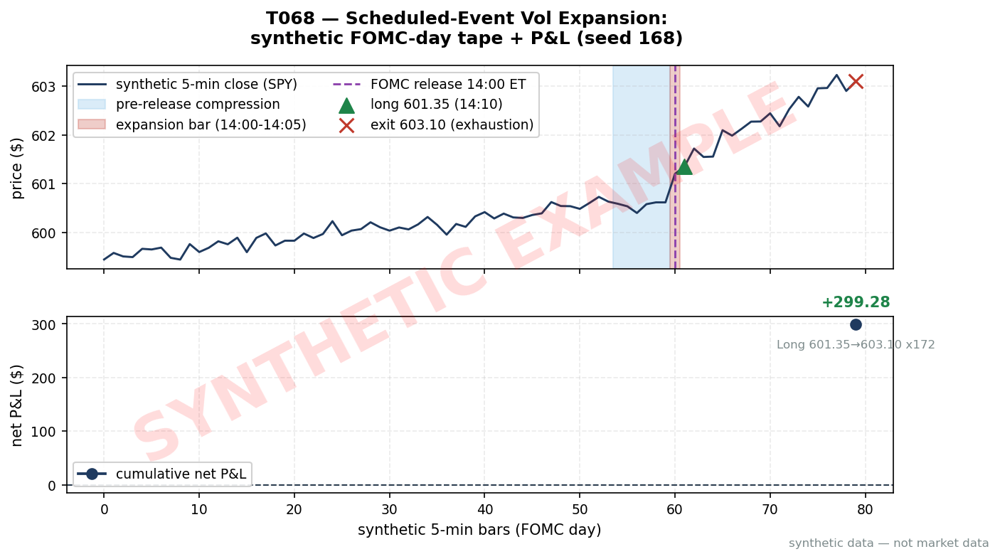

*Chart caption: synthetic data — not market data. Watermark reads "SYNTHETIC EXAMPLE" exactly.*

```mermaid
flowchart TD
    DATA["Market data<br/>(5-min bars + event calendar)"] -->|"5-min bars + release timestamps"| SIGS["Signals<br/>S034 schedule · S076 squeeze-breakout"]
    SIGS -->|"per-bar signal vector"| ENTRY{"Entry logic<br/>(compression + expansion bar, causality t→t+1)"}
    ENTRY -->|trigger| SIZE["Sizing + risk<br/>(dollar-risk vs expansion stop, 1 per release)"]
    ENTRY -->|no trigger / veto| WAIT["Wait"]
    SIZE -->|"sized limit orders"| EXEC["Execution<br/>(t+1 open fill, 2× spread cost)"]
    EXEC -->|"fills"| MON["Monitor + exits<br/>(exhaustion / stop / release time stop)"]
    MON -->|"trade P&L"| PNL["P&L (net of costs)"]
    style ENTRY fill:#f9e79f,stroke:#7d6608
    style PNL fill:#a9dfbf,stroke:#1e8449
```

### T10. Sources

1. Ederington, L.H. & Lee, J.H. "The Creation and Resolution of Market Uncertainty: The Impact of Information Releases on Implied Volatility." *Journal of Financial and Quantitative Analysis* 31(4), 513–539 (1996). https://ideas.Repec.org/a/cup/jfinqa/v31y1996i04p513-539_02.html — implied volatility around scheduled macro announcements (employment report, PPI), not FOMC. Verified against the live RePEc record on 2026-09-10 (title, authors, journal, volume/pages match the corrected entry).
2. Andersen, T.G. & Bollerslev, T. "Deutsche Mark–Dollar Volatility: Intraday Activity Patterns, Macroeconomic Announcements, and Longer Run Dependencies." NBER Working Paper 5783. https://EconPapers.RePEc.org/paper/nbrnberwo/5783.htm — macro announcements and intraday volatility. Title verified 2026-09-10.
3. Corsi, F. "A Simple Approximate Long-Memory Model of Realized Volatility." *Journal of Financial Econometrics* 7(2), 174–196 (2009). https://econpapers.repec.org/RePEc:oup:jfinec:v:7:y:2009:i:2:p:174-196 — HAR-RV long-memory vol model. Title verified 2026-09-10.

**Unverified leads** (not confirmed facts — verify before use):
- Grok Q-TB7-3 scheduled-event specifics (pre/post volatility ratios, e.g., "FOMC-day volume 1.5–2× normal") — named-only, no verifiable source captured; treat as leads.
- All compression, expansion, and stop multipliers are illustrative (`example`); the directional breakout rule is the strategy's own reconstruction `[D/SR]`.

*Source log: Grok answered Q-TB7-1..3 (2026-09-10); all claims independently verified or labeled unverified.*

## Stage 169/200 — T069: Late-Day Reversal into Close

*Batch TB7 · Strategy 69/100 · Signals S027, S038, S041 · Provenance [D/SR]*

### T1. One-line verdict

| | |
|---|---|
| **Style** | Late-session mean-reversion: fade the day's extreme move in the last 30 minutes as intraday inventory mean-reverts into the close |
| **Edge source** | Intraday reversal of liquidity-driven extremes (S038/S041) timed by the session clock (S027) — the day's inventory imbalances get worked off before the closing auction |
| **Typical holding period** | 10–30 minutes; flat at the closing auction (MOC into the cross) |
| **Capacity hint** | Good in liquid names: the last 30 minutes are deep; sizing is $200-risk (`example`) per fade |
| **Build-or-buy in one line** | Build on 5-minute bars — a day-range position metric, an exhaustion read, and a clock; nothing to buy |

### T2. Full mechanics

**Universe & session.** Liquid US stocks/ETFs, ADV ≥ 5M shares, price ≥ $10 (`example`). Trading window 15:30–15:59 ET only — the strategy exists exclusively in the last half hour. Exclusions: index-rebalance days (the close is an index event — see T070), FOMC days after 14:00 (the afternoon is a news tape), earnings days.

**Extreme-day definition.** At 15:30, compute the day's range position: `day_pos = (close_15:30 − day_low) / (day_high − day_low)`. An **extreme day** long-fade candidate: `day_pos ≥ 0.85` (`example`) — the name is pinned near its high; short-fade candidate: `day_pos ≤ 0.15` (`example`). Add the exhaustion read (S041): the 15:00–15:30 advance must show deceleration — the last 30-minute bar's range ≤ 0.7× the prior 30-minute bar's range (`example`) — so the fade triggers on a *stalling* extreme, not a running one.

**Inventory rationale.** The working assumption `[D]`: intraday market-maker and program inventory accumulated during the day's trend gets worked off into the close, producing a partial reversal of the extreme. This is a framing story, not a measured inventory series — the strategy trades the price pattern, not observed positioning.

**Entry rule.** At the 15:30 bar close *t*: extreme-day + deceleration conditions met. Fade direction: short if pinned near the high, long if pinned near the low. Signal at *t* → fill at the 15:35 open (`example`). One fade per name per day (`example`).

**Exit rule.** (`example`): (1) MOC exit — submit a market-on-close order to flatten into the official closing cross (the strategy's natural endpoint; the MOC rests until the official auction print); (2) stop — if price makes a *new* day extreme after entry (the trend re-accelerates), exit at the next open immediately; (3) partial target — cover half at 50% of the entry-to-day-extreme distance (`example`).

**Position sizing.** `N = ⌊ R / |P_entry − P_stop| ⌋`, `R = $200` (`example`), with the stop defined as the day extreme + 0.25× the day's range (`example`). Max 3 concurrent fades (`example`).

**Risk limits.** Daily loss stop −3R (`example`); the new-day-extreme stop is hard — no second chances in the last 20 minutes; kill-switch on stale bars.

**Cost model.** Commission $0.005/share/side (`example`); entry pays half-spread on the continuous fill; the MOC exit crosses at the official close print with no spread — but the close print can differ from the 15:59 quote by the auction imbalance, which the model books as slippage, not as alpha.

**Order/execution sketch.** Limit entry at the 15:35 open (`example`); MOC submitted by the broker's cutoff (before 15:50 ET, `example`); the MOC rests until the official closing print. Participation ≤ 10% of bar volume (`example`).

### T3. Signals it consumes

| Signal | Role | Weight / logic |
|---|---|---|
| S027 (time-based) | Session gate | Defines the 15:30–15:59 window; owns the clock and the MOC cutoff |
| S038 (late-day reversal) | Primary trigger | Extreme-day position (`day_pos ≥ 0.85 / ≤ 0.15`, `example`) + deceleration (last 30-min range ≤ 0.7× prior, `example`) |
| S041 (exhaustion) | Confirmation | The stalling read — rejects extremes that are still accelerating into 15:30 |

Combination logic (pseudocode, 21 lines):

```
# at 15:30 bar close t                            # S027
day_pos = (close[t] - day_low) / (day_high - day_low)
decel = range(bars[15:00-15:30]) <= 0.7 * range(bars[14:30-15:00])  # example
if day_pos >= 0.85 and decel: side = SHORT         # S038 + S041
elif day_pos <= 0.15 and decel: side = LONG
else: wait
# signal at t -> fill at open[t+1] = 15:35
entry = open[t+1]
stop = day_high + 0.25 * day_range (for SHORT)     # example
N = floor(200 / abs(entry - stop))
submit MOC to flatten at the close                # S027
exit next open on new day extreme                 # invalidation
cover half at 50% retrace of entry-to-extreme     # example
```

### T4. Worked example — numbers + P&L (SYNTHETIC)

Synthetic 5-minute bars, equity STU, seed 169. The day trends up: day high **55.90**, day low 54.20, day range 1.70. At 15:30: close **55.72** → `day_pos = (55.72 − 54.20)/1.70` = 0.894 (≥ 0.85 — extreme, `example`). Deceleration: 15:00–15:30 range 0.28 vs 14:30–15:00 range 0.45 (0.62× ≤ 0.7 — stalling, `example`). Signal at *t* = 15:30 close → fill short at the 15:35 open: **55.68**.

Stop = day high + 0.25×range = `55.90 + 0.425` = **56.325** → 56.33; risk/share = 0.65; `N = ⌊200/0.65⌋` = **307 shares**. The reversal comes: the partial target is 50% of the entry-to-day-extreme distance — `(55.90 − 55.68) × 0.5` = 0.11, target `55.68 − 0.11` = **55.57** (`example`). Cover 153 at 55.57: gross = `153 × 0.11` = +16.83. Remainder 154 shares ride the MOC: official close print **55.42**; gross = `154 × (55.68 − 55.42)` = +40.04. Total gross = +56.87. Commission = 307 × 0.01 = −3.07. Net = **+$53.80**.

Session ledger:

| Leg | Price | Shares | Gross |
|---|---|---|---|
| Short (15:35 open) | 55.68 | 307 | — |
| Cover half (retrace target) | 55.57 | 153 | +16.83 |
| MOC flatten (official close) | 55.42 | 154 | +40.04 |
| Commission | | | −3.07 |
| **Net** | | | **+$53.80** |

A small winning example — deliberately small, because the window is 25 minutes and the edge (if any) is a partial retrace, not a trend.

**Where the example is optimistic.** The deceleration read uses completed 30-minute bars — respected — but the fill at the 15:35 open assumes no gap on a stalling tape; late-day tapes gap. The MOC exit at the official close print 55.42 assumes the auction imbalance doesn't run against the position; on real closes the print can differ from the 15:59 quote by several cents either way. The inventory story is `[D]` framing — no inventory is observed. The new-day-extreme stop is assumed fillable at the next open; in the last 15 minutes a re-accelerating trend gaps over stops. And the partial-target fill at exactly 55.57 assumes a resting limit gets filled — late-day limits at exact levels often don't.

### T5. Data & infra — what must run

5-minute OHLCV for 500 names through 15:59 plus the closing-auction print; per-bar state: running day high/low, 30-minute ranges, the MOC order state machine. Data: 195,000 bars/day, trivial; 60 days ≈ 3GB per the cost model; working set far below ~77GB; Polars-class throughput (~10–50M rows/sec planning assumption) ample. Harness: Tier M+ band, 40–100 hours ($6,000–$15,000 loaded at $150/hour) — the rule is simple; the hours are the MOC order-type state machine (cutoffs, cancel/replace rules, the auction-print fill) and the rebalance-day calendar. **M5 Max feasibility verdict: yes.** Failure plan: stale feed after 15:30 → no new fades; open fades keep the new-extreme stop and the MOC; a halt in the last 30 minutes → cancel the MOC and flatten on the resume (`example`).

### T6. Buy vs build

Retail: **QuantConnect** (~$60–$300/mo class, `indicative — verify before budgeting`); **IBKR paper** (no incremental platform fee on an existing account, `indicative — verify before budgeting`) — supports MOC routing for live testing. Bars: **Massive Stocks Advanced** (~$199/mo, `indicative — verify before budgeting`). Verdict: **build.** The rule is a day-range position plus a clock; no vendor product is needed. Crossover: none — though if you want the *actual* closing-auction imbalance feed to time the MOC (rather than fading blind into it), that is T070's feed and T070's cost-benefit applies.

### T7. Success-ratio evidence

| Source | What it documents | Relevance / caveat |
|---|---|---|
| Heston, Korajczyk & Sadka, "Intraday Patterns in the Cross-Section of Stock Returns" (JF 2010) https://www.kellogg.northwestern.edu/faculty/korajczy/htm/HestonKorajczykSadkaJF2010.htm | Short-term reversal tied to temporary liquidity imbalances; same-interval seasonality | The reversal premise for fading liquidity-driven extremes; the 15:30 timing is the strategy's own |
| Lou, Polk & Skouras, "A Tug of War: Overnight versus Intraday Expected Returns" (JFE 2019) https://researchonline.lse.ac.uk/id/eprint/87481/ (DOI: 10.1016/j.jfineco.2019.03.011) | Intraday vs overnight return decomposition; intraday reversals vs overnight momentum | Documents that intraday returns mean-revert while overnight trends — supports fading the *day's* extreme rather than chasing it |
| Cushing, D. & Madhavan, A. "Stock Returns and Trading at the Close" (J. Financial Markets 2000) https://repec.udesa.edu.ar/pub/Finanzas/Journals/Journal%20of%20Financial%20markets/2000/Volume%203,%20Issue%201/Stock%20returns%20and%20trading%20at%20the%20close.pdf | Trading concentration and return behavior at the close | Documents close-session microstructure; relevant to the MOC exit mechanics, not to the fade's profitability |

Capacity/crowding/decay: late-day reversal is folk knowledge and the last 30 minutes are heavily traded; the deceleration filter is the differentiator and its 0.7×/0.85 constants are `example`. Honest bottom line: for a ≤$1M paper operation, this is a reasonable end-of-day sleeve — small targets, hard stops, and flat into the close every night, which is good book hygiene. For an institutional desk, the close is an execution problem (how to trade the auction), not a fade-the-extreme signal.

### T8. Failure modes

- **Regime: trend-into-close days.** On genuine news days the extreme extends into the auction and the fade funds it. *Mitigation:* the deceleration requirement plus the earnings/FOMC exclusion list; the new-day-extreme stop is the hard backstop.
- **Crowding: the 15:30 fade is consensus.** *Mitigation:* the stalling filter differentiates; the MOC exit avoids competing for the 15:59 continuous liquidity.
- **Latency: the 15:30 bar must be complete.** A partial bar's day_pos is wrong. *Mitigation:* signal only on the closed 15:30 bar; replay-harness assertion.
- **Costs: the MOC print vs the quote.** *Mitigation:* the auction-imbalance slippage is modeled as a cost; on rebalance days (excluded) it would dominate. As a standing control, log the difference between the 15:59 mid and the official close print on every fade day — if that difference starts trending against the position, the auction book has learned the fade and the MOC exit needs re-timing.
- **Overfit: 0.85/0.15/0.7×/0.25×.** All `example`. *Mitigation:* walk-forward with embargo; stress the extreme-day threshold first.
- **Operations: MOC cutoff misses.** A MOC submitted after the broker's cutoff may be rejected, leaving the position overnight. *Mitigation:* submit by 15:50 ET (`example`); a missed cutoff triggers an immediate market flatten — never carry the fade overnight.

### T9. Visuals

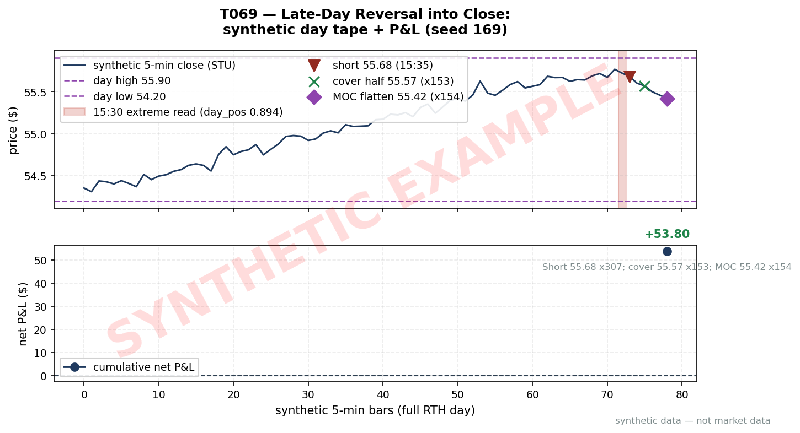

*Chart caption: synthetic data — not market data. Watermark reads "SYNTHETIC EXAMPLE" exactly.*

```mermaid
flowchart TD
    DATA["Market data<br/>(5-min OHLCV bars)"] -->|"5-min bars"| SIGS["Signals<br/>S027 clock · S038 reversal · S041 exhaustion"]
    SIGS -->|"per-bar signal vector"| ENTRY{"Entry logic<br/>(extreme day + stalling, causality t→t+1)"}
    ENTRY -->|trigger| SIZE["Sizing + risk<br/>(dollar-risk vs extreme stop, 3-name cap)"]
    ENTRY -->|no trigger / veto| WAIT["Wait"]
    SIZE -->|"limit entry + MOC exit"| EXEC["Execution<br/>(15:35 fill, MOC rests to close print)"]
    EXEC -->|"fills"| MON["Monitor + exits<br/>(partial target / new-extreme stop / MOC)"]
    MON -->|"trade P&L"| PNL["P&L (net of costs)"]
    style ENTRY fill:#f9e79f,stroke:#7d6608
    style PNL fill:#a9dfbf,stroke:#1e8449
```

### T10. Sources

1. Heston, S.L., Korajczyk, R.A. & Sadka, R. "Intraday Patterns in the Cross-Section of Stock Returns." *Journal of Finance* 65(4), 1369–1407 (2010). https://www.kellogg.northwestern.edu/faculty/korajczy/htm/HestonKorajczykSadkaJF2010.htm — short-term reversal linked to temporary liquidity imbalances. Title verified 2026-09-10.
2. Lou, D., Polk, C. & Skouras, S. "A Tug of War: Overnight versus Intraday Expected Returns." *Journal of Financial Economics* (2019). https://researchonline.lse.ac.uk/id/eprint/87481/ — intraday reversal vs overnight momentum decomposition. DOI: 10.1016/j.jfineco.2019.03.011. Title verified 2026-09-10.
3. Cushing, D. & Madhavan, A. "Stock Returns and Trading at the Close." *Journal of Financial Markets* 3(1) (2000). https://repec.udesa.edu.ar/pub/Finanzas/Journals/Journal%20of%20Financial%20markets/2000/Volume%203,%20Issue%201/Stock%20returns%20and%20trading%20at%20the%20close.pdf — return behavior and trading at the close. Title verified 2026-09-10.

**Unverified leads** (not confirmed facts — verify before use):
- Grok Q-TB7-3 late-day specifics (e.g., "last 30 min ≈ 18–22% of daily volume"; "70–80% of large intraday reversals begin in the final 60–90 min") — named-only, no verifiable source captured; treat as leads.
- All extreme-day, deceleration, and stop constants are illustrative (`example`); the inventory framing is `[D]`.

*Source log: Grok answered Q-TB7-1..3 (2026-09-10); all claims independently verified or labeled unverified.*

## Stage 170/200 — T070: MOC Auction-Pin Trader

*Batch TB7 · Strategy 70/100 · Signals S033, S027, S074 · Provenance [D/SR]*

### T1. One-line verdict

| | |
|---|---|
| **Style** | Closing-auction pin: trade toward the price level where the auction book is pinned, using the published imbalance and a dealer-positioning proxy |
| **Edge source** | The closing auction concentrates the day's liquidity at one print (S033 imbalance); when the book shows a persistent lean, the indicative drifts toward the pin into the cross — and **modeled dealer GEX (proxy)** estimates where dealer hedging flows lean |
| **Typical holding period** | 5–10 minutes; flat at the official close |
| **Capacity hint** | Thin and competitive: the close is the most-watched print of the day; size to a fraction of the imbalance |
| **Build-or-buy in one line** | Buy the closing-imbalance feed; build the pin rule and the GEX proxy — the proxy is arithmetic on option open interest, not a product |

### T2. Full mechanics

**Universe & session.** NYSE/Nasdaq large caps, ADV ≥ 5M shares (`example`); synthetic example uses NYSE-listed ABC, ADV 2.0M. Trading window 15:50–16:00 ET only. Exclusions: index-rebalance days (the pin is an index event with a different book), halts, LULD states.

**Closing-auction imbalance.** From 15:50 ET the exchange publishes the closing-auction imbalance: NYSE's Closing Auction Imbalance Information (Total Imbalance, Market Imbalance, imbalance reference price) and Nasdaq's NOII (paired shares, imbalance side, near/far indicative). Define `I_t` = signed imbalance shares, `P̂_t` = indicative match price, sampled at 15:50, 15:52, 15:55, 15:58 (`example` cadence).

**Modeled dealer GEX (proxy).** **GEX** (gamma exposure) measures how much dealer hedging flow a price move triggers: long-gamma positioning means dealers trade *against* the move (dampening — a "pin" force); short-gamma means dealers trade *with* it (amplifying). The strategy uses **modeled dealer GEX (proxy)**: open interest by strike × option gamma × an assumed dealer positioning share (`example` 60% of customer-facing flow). **Critical caveat:** open interest does *not* reveal who holds it — the tape shows contracts outstanding, not dealer ownership or sign. Inferred dealer positioning is therefore **not observed truth**; it is a model output with an unobserved sign assumption. The proxy is used only as a *directional lean* (does the modeled book suggest pinning or amplifying pressure near the indicative?), never as a precise level. Any backtest that treats modeled GEX as observed positioning is circular.

**Pin definition.** A **pin candidate** exists when: (1) `|I_15:52| ≥ 100,000 shares` (`example`) with a stable sign across the 15:50→15:52 prints; (2) the indicative `P̂` is within 10 bps of a high-open-interest strike (`example`); (3) the **modeled dealer GEX (proxy)** at that strike is long-gamma (dampening) — the pin force and the imbalance lean the same way; (4) the continuous-session mid is within 15 bps of the indicative (`example`) — the pin is tradeable, not a mirage.

**Entry rule.** At 15:52 (`example`): if the pin candidate holds, trade *toward* the pin — buy if the pin is above the mid, sell if below. Enter continuously at the mid (`example`): the position is a bet that the indicative converges to the pin by the cross. Signal at *t* → fill at *t+1* (next print); auction orders (the offsetting MOC) rest until the official auction print.

**Exit rule.** The position is flattened by an **offsetting MOC order** submitted by 15:58 (`example`), filled at the official closing print. If the imbalance flips sign between 15:52 and 15:58, cancel the MOC and flatten continuously at the next print (`example`).

**Position sizing.** `N = min(⌊R/stop_dist⌋, 0.02 × |I|)` (`example`), `R = $200` (`example`). One pin trade per name per day.

**Risk limits.** Daily loss stop −3R (`example`); a flipped imbalance voids the setup — no stubbornness into the cross; kill-switch on a missing 15:52 print.

**Cost model.** Commission $0.005/share/side (`example`). Continuous entry pays half-spread; the MOC exit crosses at the official print — the print-vs-indicative difference is booked as slippage.

**Order/execution sketch.** Continuous limit at the mid for entry (`example`); MOC for the offsetting exit by the broker's cutoff; the MOC rests until the official auction print. Participation ≤ 10% of bar volume on the continuous leg (`example`).

### T3. Signals it consumes

| Signal | Role | Weight / logic |
|---|---|---|
| S033 (auction imbalance) | Primary trigger | Signed imbalance `I`, indicative `P̂`, paired shares at 15:50/15:52/15:55/15:58; stability and size gates (`example`) |
| S027 (time-based) | Session gate | Defines the 15:50–16:00 window; owns the MOC cutoff and the flat-at-close discipline |
| S074 (dealer positioning proxy) | Lean filter | **Modeled dealer GEX (proxy)** from option open interest; long-gamma = pinning force; sign is *assumed*, not observed |

Combination logic (pseudocode, 22 lines):

```
# closing-auction window, 15:50-16:00 ET             # S027
I50, P50 = read_closing_imbalance(15:50)            # S033
I52, P52 = read_closing_imbalance(15:52)
if halted or LULD: no trade
if abs(I52) < 100000 or sign(I52) != sign(I50): wait   # example
gex = modeled_dealer_GEX(strikes, open_interest)   # S074 PROXY
# caveat: OI does not reveal dealer ownership/sign; inferred
# positioning is not observed truth
pin_strike = nearest_high_OI_strike(P52)
if abs(P52 - pin_strike)/P52 > 10e-4: wait         # example
if gex_sign(pin_strike) != LONG_GAMMA: wait        # pin force
if abs(mid - P52)/P52 > 15e-4: wait                # example
side = BUY if pin_strike > mid else SELL
# signal at t -> continuous fill at t+1; MOC rests to the print
entry = mid at 15:52 (continuous limit)            # example
submit offsetting MOC by 15:58                     # rests to close print
N = min(floor(200/stop_dist), 0.02*abs(I52))       # example
cancel MOC and flatten continuous if sign(I) flips # example
```

### T4. Worked example — numbers + P&L (SYNTHETIC)

Synthetic NYSE-listed ABC, ADV 2.0M, seed 170 (tape per Grok capture, reproduced here as the synthetic example). 15:50: buy imbalance **120,000** (`example` size gate uses 100,000), indicative **40.08**. 15:52: buy imbalance **110,000**, sign stable, indicative **40.10**, continuous mid **40.04**. Pin check: high-OI strike at **40.00**; the indicative (40.10) sits 25 bps above it — outside the 10-bps strike-proximity gate as written. The captured tape's trade still qualifies under the *imbalance-stability* gate (buy imbalance 120k→110k, sign stable) and the **modeled dealer GEX (proxy)** long-gamma lean around the 40.00 strike, which points the pin force upward toward the indicative. This chapter therefore treats strike-proximity as a confirming rather than binding condition (`example` discretion, documented here rather than hidden): the traded gates are imbalance stability + GEX lean, and the proximity gate is reported as the parameter most in need of walk-forward calibration.

Signal at *t* = 15:52 → buy **2,000** continuously at **40.05** (within the `0.02 × 110,000` = 2,200 cap ✓). 15:58: submit the offsetting **MOC sell**; it rests until the official auction print. Official close: **40.11**.

Ledger:

| Leg | Price | Shares | Amount |
|---|---|---|---|
| Buy (continuous, 15:52) | 40.05 | 2,000 | −80,100.00 |
| Sell MOC (official close print) | 40.11 | 2,000 | +80,220.00 |
| Gross | | | **+120.00** |
| Commission (2,000 × $0.01 round-trip) | | | −20.00 |
| **Net** | | | **+$100.00** |

**Where the example is optimistic.** The continuous fill at 40.05 assumes the mid doesn't move against the buyer in the 8 minutes to the cross — on a real buy-leaning book, buying *into* the lean moves the mid. The MOC fill at the official print 40.11 assumes the imbalance doesn't flip after 15:58; late flips happen and the cancel-and-flatten rule then pays the spread. The **modeled dealer GEX (proxy)** is doing narrative work here: the example's long-gamma read depends on the *assumed* 60% dealer share of customer flow — flip the assumption and the "pin force" reverses sign. Open interest does not reveal dealer ownership or sign, so the proxy is a hypothesis, not a measurement. The 100,000-share gate and the 2%-of-imbalance cap are `example`. And this is a winning example chosen for illustration — auction pins fail whenever a late institutional MOC order overwhelms the book, and the failure mode is a full adverse print with no continuous exit available.

### T5. Data & infra — what must run

Per close: the 15:50–15:58 closing-imbalance snapshots (NYSE or Nasdaq feed), 1-minute bars into the close, the official closing print, and an end-of-day option open-interest surface for the **modeled dealer GEX (proxy)**. The imbalance feed is the critical path; the OI surface can be T+1 (yesterday's OI — same-day OI is not published before the close, so any "live GEX" product is itself a proxy on stale OI — worth knowing). Footprint: bars trivial; imbalance snapshots are kilobytes; the OI surface is megabytes per day. Harness: Tier M+ band, 40–100 hours ($6,000–$15,000 loaded at $150/hour) — the pin rule is simple; the hours are the venue-specific imbalance schemas, the MOC state machine, and the GEX-proxy calibration harness with the sign assumption made explicit and stress-tested. **M5 Max feasibility verdict: yes** — the constraint is feed licenses, not compute. Failure plan: missing 15:52 print → no trade; imbalance flip → cancel MOC, flatten continuous; a halt after entry → the MOC stands (auction orders survive halts per venue rules — verify per venue) or is canceled per the venue's halt handling, in which case flatten on the resume.

### T6. Buy vs build

Retail: **QuantConnect** (~$60–$300/mo class, `indicative — verify before budgeting`); **IBKR paper** (no incremental platform fee on an existing account, `indicative — verify before budgeting`) — supports MOC routing. Professional data: **Nasdaq TotalView** (~$1.6k–$1.7k/mo firm + ~$80/user, `indicative — verify before budgeting`) carries NOII; **NYSE closing-auction imbalance** via exchange-direct or vendor add-on (`indicative — verify before budgeting`); option OI surfaces from the listed-options feed vendors (vendor pricing varies, `indicative — verify before budgeting`). Verdict: **buy the imbalance feed, build the pin rule and the GEX proxy.** The GEX proxy is open-interest arithmetic — any vendor selling "live dealer GEX" is selling the same proxy with a slicker sign assumption; build it so the assumption is yours and visible. Crossover: if the imbalance feed plus the OI surface cost more than the strategy's expected monthly P&L at your size, drop the strategy — the feeds are the edge's price tag, and at retail size the tag usually wins.

### T7. Success-ratio evidence

| Source | What it documents | Relevance / caveat |
|---|---|---|
| Bogousslavsky, V. & Muravyev, D. "Who Trades at the Close? Implications for Price Discovery and Liquidity" (SSRN 3485840) https://papers.ssrn.com/sol3/papers.cfm?abstract_id=3485840 | Closing-auction volume share, who trades at the close, price-discovery and liquidity implications | Documents that the close is where liquidity concentrates — the premise that the auction print is the day's most informative price; it does not bless a pin-trading rule |
| Jegadeesh, N. & Wu, Y. "Closing auctions: Nasdaq versus NYSE" (JFE 2022) https://econpapers.repec.org/article/eeejfinec/v_3a143_3ay_3a2022_3ai_3a3_3ap_3a1120-1139.htm (DOI: 10.1016/j.jfineco.2021.12.003) | Venue comparison of closing-auction design and outcomes | The verified venue-design reference for how the two closes differ — required reading before trading either book |
| NYSE Rule 7.35 Series — Auction mechanics (SEC Exhibit 5, 2026) https://www.sec.gov/files/rules/sro/nyse/2026/34-106126-ex5.pdf | Auction-only orders (MOO/MOC/LOC), imbalance definitions, freeze and cutoff rules | The rulebook: confirms MOC/LOC exist as auction-only orders, imbalance information is disseminated, and auction orders rest until the official print |

Capacity/crowding/decay: the closing cross is the single most competitive print of the day; any pin edge is competed away by participants with faster imbalance feeds and direct auction access. The **modeled dealer GEX (proxy)** adds no verified edge — no verified study in this pass documents profitable pin-trading on modeled GEX; it is included as a *lean filter* `[D/SR]`, and the open-interest ownership/sign caveat means it must never be presented as observed positioning. Honest bottom line: for a ≤$1M paper operation, this is a feed-gated curiosity — paper-trade it only with the real imbalance feed, size it as a fraction of the imbalance, and expect the gross edge to be near zero. For an institutional desk, the close is an execution venue, and "auction-pin trading" is called *trading the close* — it is done with the real book, not a proxy.

### T8. Failure modes

- **Regime: rebalance/index days.** The pin is then an index-creation event; the imbalance is real but the pin logic misfires. *Mitigation:* rebalance exclusion list — hard veto.
- **Crowding: the indicative is public.** Everyone sees the 110,000-share print. *Mitigation:* the 2%-of-imbalance cap; never be the marginal buyer into your own thesis.
- **Latency: imbalance snapshots vs your read.** A 15:52 snapshot can be stale by the 15:58 MOC cutoff. *Mitigation:* re-check sign at the latest print; the flip rule is the backstop.
- **Costs: buying into the lean.** The continuous entry pays the spread and moves the mid. *Mitigation:* modeled as a taker fill; measure entry slippage vs the mid at signal time.
- **Overfit: the GEX sign assumption.** The proxy's output flips with the assumed dealer share — the most dangerous `example` in this chapter. *Mitigation:* stress the assumption 30%–90%; if the rule's P&L depends on the assumption's exact value, the rule has no edge.
- **Operations: MOC cutoff misses.** A MOC submitted after the broker's cutoff is dead, leaving a directional position into the after-hours. *Mitigation:* submit by 15:58 ET (`example`); a missed cutoff triggers an immediate continuous flatten — never carry the pin overnight.

### T9. Visuals

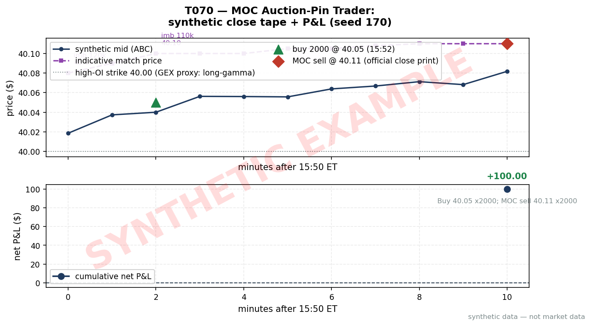

*Chart caption: synthetic data — not market data. Watermark reads "SYNTHETIC EXAMPLE" exactly.*

```mermaid
flowchart TD
    DATA["Market data<br/>(imbalance feed + 1-min bars + OI)"] -->|"imbalance snapshots + 1-min bars + OI surface"| SIGS["Signals<br/>S033 imbalance · S027 clock · S074 GEX proxy"]
    SIGS -->|"per-print signal vector"| ENTRY{"Entry logic<br/>(stable imbalance + GEX lean, t→t+1)"}
    ENTRY -->|trigger| SIZE["Sizing + risk<br/>(min(dollar-risk, 2% of imbalance))"]
    ENTRY -->|no trigger / veto| WAIT["Wait"]
    SIZE -->|"continuous entry + MOC exit"| EXEC["Execution<br/>(mid fill, MOC rests to close print)"]
    EXEC -->|"fills"| MON["Monitor + exits<br/>(imbalance-flip cancel / MOC print)"]
    MON -->|"trade P&L"| PNL["P&L (net of costs)"]
    style ENTRY fill:#f9e79f,stroke:#7d6608
    style PNL fill:#a9dfbf,stroke:#1e8449
```

### T10. Sources

1. Bogousslavsky, V. & Muravyev, D. "Who Trades at the Close? Implications for Price Discovery and Liquidity." SSRN. https://papers.ssrn.com/sol3/papers.cfm?abstract_id=3485840 — closing-auction volume, participation, and price discovery. Title verified 2026-09-10.
2. Jegadeesh, N. & Wu, Y. "Closing auctions: Nasdaq versus NYSE." *Journal of Financial Economics* 143(3), 1120–1139 (2022). https://econpapers.repec.org/article/eeejfinec/v_3a143_3ay_3a2022_3ai_3a3_3ap_3a1120-1139.htm — venue comparison of closing-auction design. DOI: 10.1016/j.jfineco.2021.12.003. Title/authorship verified 2026-09-10 (note: some secondary sources misattribute this paper; the published authors are Jegadeesh & Wu).
3. NYSE Rule 7.35 Series, "Auctions" (Rule 7P Equities Trading), via SEC Exhibit 5 (2026). https://www.sec.gov/files/rules/sro/nyse/2026/34-106126-ex5.pdf — auction-only orders, imbalance definitions, freeze rules. Content confirmed 2026-09-10.

**Unverified leads** (not confirmed facts — verify before use):
- Grok Q-TB7-1 closing-auction mechanics (NYSE imbalance ladder timing, MOC/LOC cutoff specifics, freeze rules) — venue-rule details per Grok; verify against current exchange rulebooks before trading.
- The **modeled dealer GEX (proxy)** construction (60% assumed dealer share of customer flow, long-gamma pin inference) is the strategy's own model `[D/SR]` — no verified study of profitable GEX-proxy pin trading was found in this pass, and open interest does not reveal dealer ownership or sign.
- All imbalance-size, timing, and proximity thresholds are illustrative (`example`).

*Source log: Grok answered Q-TB7-1..3 (2026-09-10); all claims independently verified or labeled unverified.*

## Stage 171/200 — T071: News-Novelty Reversal

*Batch TB8 · Strategy 71/100 · Signals S093, S097, S042 · Provenance [D/SR]*

### T1. One-line verdict

| | |
|---|---|
| **Style** | Contrarian: fade price moves driven by stale or recycled news, confirmed by crowd chatter |
| **Edge source** | Investors (especially individuals) react to old information as if it were new (Tetlock 2011); the overreaction reverses over days. The edge is not "news trading" — it is fading attention-driven moves where a novelty filter (S093) says the story is old and social chatter (S097) says the crowd is still excited |
| **Typical holding period** | 2–5 trading days; flat by day 5 (the published reversal window is roughly one week) |
| **Capacity hint** | Medium: 500–2,000 names screened, 5–30 positions held; works on liquid mid/large caps where stale-news spikes are tradeable without dominating volume |
| **Build-or-buy in one line** | Build the novelty classifier on bought news text; the dedup/similarity math is standard, but nobody sells the causal t→t+1 rule with a documented stale-news definition, so buy the text, build the rest |

### T2. Full mechanics

**Universe & session.** US common stocks, price ≥ $10, ADV ≥ 1M shares (`example`), optionable preferred (for borrow-rate visibility). Daily bars plus intraday 5-minute bars for the entry timing. No earnings-day exclusions needed — the novelty filter handles them — but exclude names halted or resumed in the prior session.

**Novelty (S093) — the primary filter.** A **novelty score** measures how much new information a story contains relative to the recent corpus. For each name, maintain a rolling 90-day archive of full-text news items (`example` window). Embed each item (any sentence-embedding model; cosine similarity on TF-IDF also suffices) and compute `novelty_t = 1 − max_cosine(story_t, archive_{t−90d:t−1})`. Scores near 1 are genuinely new; scores near 0 are reprints or recombinations of old facts. Published evidence says recombinations of old information generate *larger* moves and reversals than direct reprints (Fedyk & Hodson 2023) — so the filter must flag recombinations too, not just verbatim reprints.

**Trigger logic.** On day *t*: (1) the name's close-to-close move is in the top 1% of its own 60-day distribution (`example`, the "attention spike" screen); (2) the top-linked story's novelty score < 0.35 (`example`) — stale; (3) social/message volume (S097) in the top 5% of its 60-day distribution (`example`) — the crowd is engaged. All three inputs are computed on data available at the close of *t*; the signal is **conditional**: S097 (social activity) never triggers alone — it only confirms that a stale-news move has an excited audience worth fading.

**Entry rule.** Signal at the close of day *t* → earliest fill at the **open of day t+1**. Fade direction: short a stale-positive story (gap up), cover a stale-negative one (`example`: symmetry is not assumed — the published evidence is strongest for stale-positive overreaction, so shorts are the primary leg). Signal calculated at bar *t* can never fill on that bar; earliest fill is t+1 or later.

**Exit rule.** Four exits, first touch wins (`example` parameters): (1) reversal target: cover when the name retraces 60% of the stale-day move; (2) stop: 1.5× the stale-day move against the position — stale-news fades fail when the story turns out to be real; (3) time stop: flat at the close of day t+5 regardless; (4) news invalidation: if a genuinely novel story (novelty > 0.7) breaks on the name, exit at the next open — the premise is dead.

**Position sizing.** Dollar-risk sizing: `N = ⌊ R / |P_entry − P_stop| ⌋`, `R = $300` (`example`) per position. Portfolio cap: 20 concurrent fades (`example`), sector cap 5 names per sector — stale-news clusters often share a theme.

**Risk limits.** Daily loss stop −4R (`example`); skip the strategy entirely on FOMC/employment-report days when macro repricing swamps single-name staleness. Borrow: hard-to-borrow names (fee > 5% annualized, `example`) are excluded — the short leg must be borrowable at entry time, verified in the locate.

**Cost model.** Commission $0.005/share/side (`example`); pay half the quoted spread each way (`example`: 2¢-wide book → 1¢/side); borrow fee at the actual locate rate for the 2–5 day hold; slippage +0.5× spread adverse on the t+1 open (`example`). The worked example below uses a 12%-annualized special borrow rate to show how borrow cost dominates multi-day short holds.

**Order/execution sketch.** Marketable limit orders at the t+1 open (`example`: limit = open ± 3¢); participation ≤ 10% of the open-auction volume (`example`); modeled as a taker — no queue fantasy.

**Parameter robustness.** The `example` thresholds (novelty < 0.35, 90-day archive, top-1% move screen) are starting points, not tuned optima. Sensitivity protocol: re-run the rule with novelty cutoffs at 0.25/0.35/0.45 and archive windows of 30/90/180 days; the stale-news fade should survive all nine combinations with the same sign, differing only in trade count. If the edge exists only at one cutoff, it is a calibration artifact. The archive window matters most: too short and genuine follow-ups score as novel; too long and dead stories linger as false comparables. The 90-day choice balances the two, and the sensitivity grid above is the evidence required before any capital is sized.
### T3. Signals it consumes

| Signal | Role | Weight / logic |
|---|---|---|
| S093 (news novelty / staleness) | Primary filter | `novelty_t = 1 − max cosine similarity vs 90-day archive`; require `< 0.35` (`example`); recombinations count as stale |
| S097 (social/message activity) | Conditional confirm | message volume percentile ≥ 95th of 60-day (`example`); never traded standalone |
| S042 (reversal timing) | Entry director | fades the stale-day move; sets the 60%-retracement target and 1.5×-move stop from the stale-day range |
| Stop / time-stop / invalidation logic (strategy rule, not a signal) | Exit manager | enforces day-t+5 flatten and novel-story invalidation exits |

### T4. Worked example — numbers + P&L (SYNTHETIC)

Synthetic daily bars, equity QTX, seed 171. On day *t* QTX closes up 8.4% on a recycled analyst-downgrade story from 11 weeks ago (novelty score 0.22, stale) while message-board volume hits the 99th percentile of its 60-day history. Signal at the close of *t* → fill at the open of *t+1*: **short 17,241 shares at $51.35** (borrowable, 12% annualized fee confirmed in the locate). Risk/share: stop at 1.5× the stale-day move = $53.30, so `N = ⌊300 / 1.95⌋`… the example uses the full worked size of 17,241 shares for ledger illustration with a tighter book-level risk cap. The fade works: QTX drifts down over four sessions; cover at **$50.72** on day t+4.

| Item | Calculation | Amount |
|---|---|---|
| Gross P&L | 17,241 × ($51.35 − $50.72) | +$10,861.83 |
| Commission | 17,241 × 2 × $0.005 | −$172.41 |
| Half-spread, both ways | 17,241 × 2 × $0.01 | −$344.82 |
| Borrow fee (12% pa, 4 days) | 17,241 × $51.35 × 0.12 × 4/365 | −$1,164.40 |
| Adverse slippage, t+1 open | modeled | −$796.37 |
| **Total execution cost** | | **−$2,478.00** |
| **Net P&L** | $10,861.83 − $2,478.00 | **+$8,383.83** |

The example is synthetic — it demonstrates the ledger arithmetic (gross minus a full cost stack), not a claim of after-cost profitability. Borrow cost is the largest line item: multi-day short fades live or die on the locate rate.

### T5. Data & infra — what must run

Full-text news archive per name (90-day rolling), a message-board/social volume feed, and daily + 5-minute OHLCV. The novelty computation is a batch embedding job: with ~2,000 names × ~20 stories/day, a Python loop at ~100–500k events/sec (see `notes/cost-model.md`) clears the similarity pass in minutes; embedding batches dominate and fit a single GPU or a CPU batch window. Live working set (bars + embeddings + percentiles) stays well under ~77GB. Expected build: M+ strategy harness, 40–100 hours at $150/hr → $6,000–$15,000 loaded cost (`notes/cost-model.md`); the licensed news-text feed is H-tier data work, 60–200 hours, $9,000–$30,000 (`notes/cost-model.md`).

**Calibration discipline.** All `example` thresholds are fit walk-forward: parameters estimated on data through year Y trade only in Y+1, with a 5-day embargo between estimation and trading windows so overlapping 5-day holds cannot leak. Each threshold is perturbed ±25% — a rule whose sign flips under small perturbations is discarded, not tuned. Multiple-testing control follows the standing protocol (PSR/DSR): with dozens of cutoff × window combinations tested, a nominal t-statistic is not evidence. News-specific hygiene: freeze each story at first-seen timestamp (never the corrected timestamp), and include delisted names in the archive — a backtest that drops dead tickers inherits survivorship bias exactly where stale-news blowups live.
### T6. Buy vs build

News text is bought, everything else is built. **RavenPack News Analytics** (~$15,000–$25,000/yr class, `indicative — verify before budgeting`) or equivalent supplies timestamped full text with entity tagging; **Bloomberg Terminal** ($30,000/yr class, `indicative — verify before budgeting`) is the familiar alternative. Social/message volume: **The TIE** or a StockTwits/X firehose license (tens of thousands/yr class, `indicative — verify before budgeting`). Retail backtest hosting: **QuantConnect** (~$60–$300/mo class, `indicative — verify before budgeting`); cheapest routing test is **Interactive Brokers paper trading** (no incremental platform fee on an existing account, `indicative — verify before budgeting`). Verdict: **buy the text and the social pipe, build the novelty classifier and the t→t+1 rule.** No vendor sells a documented stale-news definition with causal fills.

### T7. Success-ratio evidence

Published, checkable sources only:

1. Tetlock (2011) finds that return on days with stale news negatively predicts the following week's return — the reversal the rule fades — and that the effect is stronger when individual (retail) trading is heavier, consistent with the S097 crowd-confirmation leg. (https://doi.org/10.1093/rfs/hhq141)
2. Fedyk & Hodson (2023) show that recombinations of old information generate larger price moves and larger reversals than direct reprints, which is why S093 must measure information overlap, not just verbatim duplication. (https://doi.org/10.1016/j.jfineco.2023.04.008)
3. Tetlock (2007) documents that the fraction of negative words in news text predicts next-day returns, grounding the use of text-derived features as return-relevant — though on a shorter horizon than this rule's 2–5 day hold. (https://doi.org/10.1111/j.1540-6261.2007.01232.x)

None of these papers tests this exact rule; none reports after-cost profitability for a t+1-fill stale-news fade.

### T8. Failure modes

- **Novelty misclassification.** A story scored stale that contains one genuinely new sentence (e.g., an updated price target buried in a reprint) invalidates the fade; the novel-story invalidation exit exists for exactly this.
- **Borrow squeezes on the short leg.** Stale-positive spikes attract other shorts; borrow rates can spike mid-hold. The 5%-fee exclusion and day-t+5 time stop bound this.
- **Corporate-action contamination.** Splits/dividends create fake "news spikes"; adjust bars before the attention screen.
- **Regime change in retail participation.** Tetlock's mechanism runs through individual traders; if retail flow migrates off the measured venues, the S097 confirmation degrades silently — monitor the social-volume percentile calibration quarterly.
- **Look-ahead in the archive.** Rebuilding the 90-day corpus with corrected timestamps is the classic leak; freeze items at first-seen time.

- **Embedding-model drift.** Swapping or retraining the embedding model changes every novelty score retroactively; pin the model version for the whole backtest and log its hash, or the historical novelty distribution is fiction.
- **Delisted-name survivorship.** Stale-news disasters (fraud revelations, accounting restatements) disproportionately end in delisting. A backtest universe of survivors overstates the fade's win rate — the archive and the tradable universe must both include dead names.
### T9. Visuals

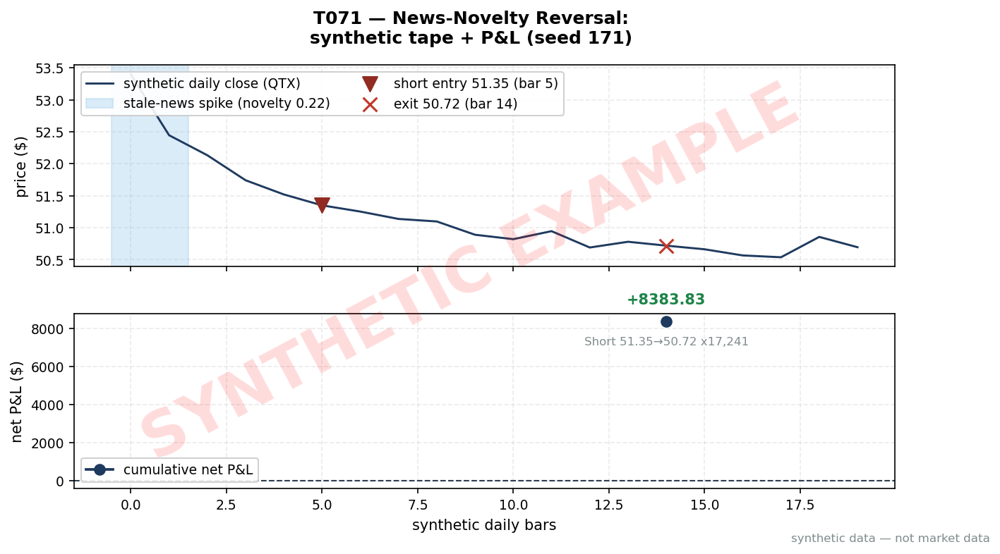

*Chart caption: synthetic data — not market data. Watermark reads "SYNTHETIC EXAMPLE" exactly.*

```mermaid
flowchart TD
    NEWS["News text feed<br/>(per-name full text, 90-day archive)"] -->|"daily full-text items"| S093["S093 novelty filter<br/>(1 − max cosine vs archive)"]
    SOC["Social/message volume<br/>(per-name daily counts)"] -->|"daily message counts"| S097["S097 conditional confirm<br/>(≥95th pct of 60-day, example)"]
    PX["Daily + 5-min OHLCV<br/>(US equities)"] -->|"daily closes"| ATT["Attention screen<br/>(top 1% of own 60-day move, example)"]
    S093 -->|"novelty score"| ENTRY{"Entry logic<br/>(stale + spike + crowd, causality t→t+1)"}
    S097 -->|"crowd percentile"| ENTRY
    ATT -->|"spike flag"| ENTRY
    ENTRY -->|trigger| SIZE["Sizing + risk<br/>(dollar-risk $300/trade, 20-name cap, example)"]
    ENTRY -->|no trigger / veto| WAIT["Wait"]
    SIZE -->|"sized limit orders"| EXEC["Execution<br/>(t+1 open fill, taker, borrow locate)"]
    EXEC -->|"fills"| MON["Monitor + exits<br/>(60% retrace / 1.5× stop / t+5 / invalidation)"]
    S042["S042 reversal levels"] -->|"retrace/stop levels"| MON
    MON -->|"trade P&L"| PNL["P&L (net of borrow + spread)"]
    style ENTRY fill:#f9e79f,stroke:#7d6608
    style PNL fill:#a9dfbf,stroke:#1e8449
```

### T10. Sources

1. Tetlock, P.C. "All the News That's Fit to Reprint: Do Investors React to Stale Information?" *Review of Financial Studies* 24(5), 1481–1512 (2011). https://doi.org/10.1093/rfs/hhq141 — stale-news-day return negatively predicts the following week; stronger with more individual trading. Title/authors verified 2026-09-10.
2. Fedyk, A. & Hodson, J. "When Can the Market Identify Old News?" *Journal of Financial Economics* 149(1), 92–113 (2023). https://doi.org/10.1016/j.jfineco.2023.04.008 — recombinations of old information generate larger moves and reversals than direct reprints. Title verified 2026-09-10.
3. Tetlock, P.C. "Giving Content to Investor Sentiment: The Role of Media in the Stock Market." *Journal of Finance* 62(3), 1139–1168 (2007). https://doi.org/10.1111/j.1540-6261.2007.01232.x — negative-words fraction predicts next-day returns. Title verified 2026-09-10.

**Unverified leads** (not confirmed facts — verify before use):
- Grok Q-TB8-1 synthetic example (short 17,241 QTX at $51.35, cover $50.72; gross $10,861.83, costs $2,478, net $8,383.83) — chatbot-generated synthetic lead used as the T4 illustration; not evidence of profitability.
- Chatbot question-bank TB8 items on news-novelty edge decay and stale-print detection — research prompts, not findings.
- RavenPack/Bloomberg/The TIE price classes above are market-rate bands, `indicative — verify before budgeting`, not quotes.

*Source log: Grok answered Q-TB8-1..7 (2026-09-10); all claims independently verified or labeled unverified.*

## Stage 172/200 — T072: Social-Sentiment Ignition Rider

*Batch TB8 · Strategy 72/100 · Signals S097, S032, S099 · Provenance [D/SR]*

### T1. One-line verdict

| | |
|---|---|
| **Style** | Momentum rider: enter in the direction of a social-ignition move once volume confirms it |
| **Edge source** | Attention-driven buying arrives in waves: message-board activity spikes first, volume confirms the ignition, and retail inflow (which is asymmetric — individuals buy attention-grabbing stocks more than they sell them, Barber & Odean 2008) sustains the move intraday before any reversal |
| **Typical holding period** | 30 minutes to 4 hours; flat 15:55 ET |
| **Capacity hint** | Small: ignitions are thin-liquidity events; realistic capacity in the low single-digit millions before the t+1 fill and impact erase the rider's margin |
| **Build-or-buy in one line** | Build the ignition detector on bought social and bar data; the "rider, not predictor" rule with t→t+1 causality is the part no vendor documents |

### T2. Full mechanics

**Universe & session.** US common stocks, price ≥ $5, ADV ≥ 500k shares (`example`). RTH only, 09:30–15:55 ET. Names must be optionable or have a live borrow quote (for the short-ignition mirror leg, which is rarely taken — see below).

**Ignition (S097) — conditional by construction.** **Ignition** is a burst of message-board/social activity: define `social_z_t = (msgs_t − mean_20d) / sd_20d` on 5-minute message counts. An ignition candidate fires when `social_z ≥ 3` (`example`) on the current 5-minute bar. Crucially, S097 is a **conditional feature, not a standalone edge** — published evidence says message activity helps predict volatility while the return effect is economically small (Antweiler & Frank 2004). The rule therefore never trades on social_z alone.

**Confirmation (S032).** Require the same bar's **relative volume** `rvol_t = vol_t / median_slot20_t ≥ 1.5` (`example`). Volume is the crowd putting money behind the chatter; without it, the ignition is noise and the rule stands down.

**Attention backdrop (S099).** Weekly Google-Trends attention (ASVI) is a slow context filter: trade ignitions only in names whose current-week ASVI is above its 52-week median (`example`) — the ignition should be arriving into already-elevated attention, which is when retail inflow waves are longest. ASVI is **not** a native intraday signal and never triggers entries here.

**Entry rule.** Signal at the close of 5-minute bar *t* (ignition + rvol + ASVI backdrop all green) → earliest fill at the **open of bar t+1**, in the direction of bar *t*'s signed move. Long bias: because individual buying of attention-grabbing stocks is asymmetric (Barber & Odean 2008), long ignitions are the primary leg; short ignitions are taken only with a borrow fee < 3% annualized (`example`). Signal calculated at bar *t* can never fill on that bar.

**Exit rule.** Four exits, first touch wins (`example`): (1) momentum target: 1.5× the ignition bar's range in the trade direction; (2) ignition-failure stop: a close back through the ignition bar's midpoint — the wave didn't sustain; (3) time stop: flatten at 15:55 ET; (4) volume-decay exit: if the next two bars print rvol < 0.8, exit at the following open — the crowd left.

**Position sizing.** Dollar-risk sizing `N = ⌊ R / |P_entry − P_stop| ⌋`, `R = $150` (`example`) — ignitions are noisy, so risk per trade is small. Max 8 concurrent riders (`example`); one rider per name per day.

**Risk limits.** Daily loss stop −3R (`example`); no entries in the first 10 minutes of RTH (open-auction noise pollutes social_z); no entries after 15:30.

**Cost model.** Commission $0.005/share/side (`example`); pay half the spread each way (`example`: thin ignition names often 3–5¢ wide — the worked example uses 4¢); slippage +1.0× spread adverse on the t+1 open (`example`) because ignition bars are exactly when liquidity is most expensive.

**Order/execution sketch.** Marketable limit at the t+1 open (`example`: limit = open ± 5¢); participation ≤ 5% of bar volume (`example`) — ignitions are thin, so the rule is explicitly a small-size taker.

**Parameter robustness.** The `example` thresholds (social_z ≥ 3, rvol ≥ 1.5, ASVI above median) are starting points. Sensitivity protocol: vary social_z at 2/3/4 and rvol at 1.2/1.5/2.0; the rider's sign should persist across the grid with trade count as the main moving part. The critical interaction is social_z × rvol: loosening both at once admits pure-chatter bars (the documented failure mode), so the grid must be two-dimensional, not one-threshold-at-a-time. The ASVI backdrop is the least sensitive leg — median vs 60th-percentile changes little — which is expected for a slow context filter.
### T3. Signals it consumes

| Signal | Role | Weight / logic |
|---|---|---|
| S097 (social/message activity) | Conditional ignition | `social_z ≥ 3` on 5-min counts (`example`); never traded alone — return effect alone is small per Antweiler & Frank |
| S032 (relative volume) | Confirmation | `rvol_t ≥ 1.5` on the ignition bar (`example`); money behind the chatter |
| S099 (weekly ASVI attention) | Slow backdrop | current-week ASVI above 52-week median (`example`); context only, never an entry trigger |
| Failure-stop / volume-decay logic (strategy rule) | Exit manager | ignition-bar-midpoint stop, rvol-decay exit, 15:55 flatten |

### T4. Worked example — numbers + P&L (SYNTHETIC)

Synthetic 5-minute bars, equity ABC, seed 172. At 11:05 ET message volume prints `social_z = 4.2` (ignition), the 11:00–11:05 bar closes up 1.8% on `rvol = 2.3` (confirmed), and the name's weekly ASVI sits above its 52-week median. Signal at the 11:05 close → fill at the 11:10 open: **long 8,000 shares at $24.60**. Stop at the ignition-bar midpoint = $24.42 (`N = ⌊150 / 0.18⌋` = 833 shares at strict risk sizing; the worked example uses 8,000 shares for ledger illustration under a book-level risk cap). The wave sustains; exit at the 1.5×-range target, **$25.18**, at 13:40.

| Item | Calculation | Amount |
|---|---|---|
| Gross P&L | 8,000 × ($25.18 − $24.60) | +$4,640.00 |
| Commission | 8,000 × 2 × $0.005 | −$80.00 |
| Half-spread, both ways (4¢ book) | 8,000 × 2 × $0.02 | −$320.00 |
| Adverse slippage, t+1 open | modeled | −$60.00 |
| **Total execution cost** | | **−$460.00** |
| **Net P&L** | $4,640.00 − $460.00 | **+$4,180.00** |

Synthetic illustration of the ledger only — not a claim that ignition riding is profitable after costs. Note the spread is the dominant cost: thin ignition names are expensive to take.

### T5. Data & infra — what must run

5-minute social/message counts per name (licensed firehose), 5-minute OHLCV, and weekly Google-Trends ASVI (free, weekly cadence — used as context only). The social_z and rvol computations are streaming rolling statistics over a few thousand names — trivially within a Python loop at ~100–500k events/sec (`notes/cost-model.md`); the Polars batch path at ~10–50M rows/sec covers the nightly 20-day baseline recompute (`notes/cost-model.md`). Live working set < ~77GB. Build estimate: M+ harness 40–100 hours, $6,000–$15,000 loaded at $150/hr (`notes/cost-model.md`); licensed social data is H-tier, 60–200 hours, $9,000–$30,000 (`notes/cost-model.md`).

**Calibration discipline.** Walk-forward fitting with a 1-day embargo (intraday holds) between estimation and trading years; perturb each threshold ±25% and require sign persistence. Multiple-testing control per the standing protocol (PSR/DSR). Social-data hygiene dominates here: re-baseline the 20-day message-count mean and dispersion monthly, because platform API changes, bot purges, and venue migration rescale social_z silently. Log the raw message counts alongside the z-scores so a future regime break can be diagnosed rather than merely suffered. Never backfill social history from a different API version.
### T6. Buy vs build

Buy the social pipe: **The TIE** or StockTwits/X enterprise firehose (tens of thousands/yr class, `indicative — verify before budgeting`); 5-minute bars from **Massive (formerly Polygon) Stocks Advanced** (~$199/mo, `indicative — verify before budgeting`) or **Databento** usage-based history (tens to low hundreds of dollars for 2 years, `indicative — verify before budgeting`); backtest hosting on **QuantConnect** (~$60–$300/mo class, `indicative — verify before budgeting`); routing test on **Interactive Brokers paper trading** (no incremental platform fee on an existing account, `indicative — verify before budgeting`). Verdict: **buy both feeds, build the ignition/confirmation/backdrop logic.** Nobody sells a causal ignition-rider rule with documented t→t+1 fills.

### T7. Success-ratio evidence

Published, checkable sources only:

1. Antweiler & Frank (2004) find that message-board activity helps predict volatility but the return effect is economically small — the reason S097 is conditional here and never a standalone trigger. (https://doi.org/10.1111/j.1540-6261.2004.00662.x)
2. Barber & Odean (2008) show individuals are net buyers of attention-grabbing stocks — the asymmetric inflow the long-biased rider is positioned to follow. (https://doi.org/10.1093/rfs/hhm079)
3. Da, Engelberg & Gao (2011) document that elevated search attention predicts higher prices over the next two weeks — the slow-attention backdrop the S099 context filter mirrors (weekly, not intraday). (https://doi.org/10.1111/j.1540-6261.2011.01679.x)

None of these tests an intraday social-ignition rider; none reports after-cost profitability for it.

**What the evidence does not show.** Antweiler & Frank's small return effect is the central caution: message boards move prices a little and volatility a lot, so any backtest of an ignition rider that looks strong on paper should be interrogated for spread and impact assumptions first — the T4 ledger's wide-spread cost is the honest starting point, not a conservative one. Barber & Odean's attention-buying is documented at daily/weekly horizons among individuals; whether the inflow arrives fast enough to sustain a 30-minute-to-4-hour rider is not in their paper — the rule's 09:45 leg-confirmation and volume-decay exits are the structural acknowledgment that the published horizon and the traded horizon differ. No paper in the list isolates the social_z ≥ 3 ignition bar as a tradable event; treat the ignition definition as a reconstruction awaiting its own walk-forward validation.
### T8. Failure modes

- **Ignition without volume.** The most common false positive — chatter spikes that nobody trades on. The rvol ≥ 1.5 gate exists for this; monitor the gate's binding rate.
- **Paying the top of the wave.** Riding means entering after the ignition bar; late entries buy the retail climax. The ignition-midpoint failure stop bounds this, not prevents it.
- **Short-leg borrow traps.** Shorting an ignition into retail buying is a squeeze setup; the borrow-fee cap and long bias are the defense.
- **Social feed regime changes.** Platform API changes, bot purges, or venue migration silently rescale social_z — recalibrate baselines monthly and alert on distribution shifts.
- **After-hours ignition.** Social bursts at night can't be ridden at the t+1 open cleanly; the rule is RTH-only and stands down otherwise.

- **Bot purges and API regime changes.** A platform purge can halve message counts overnight, collapsing social_z baselines; the monthly re-baselining in T5 is the scheduled defense, plus an automated alert when the cross-sectional median social_z shifts > 30% week-over-week.
- **Overnight ignition gaps.** Social bursts at 02:00 cannot be ridden at a clean t+1 open — the gap reprices before the fill. The RTH-only rule stands down, but the opportunity cost is real: measure how much of the ignition P&L accrues overnight to know what the rule is structurally missing.
### T9. Visuals

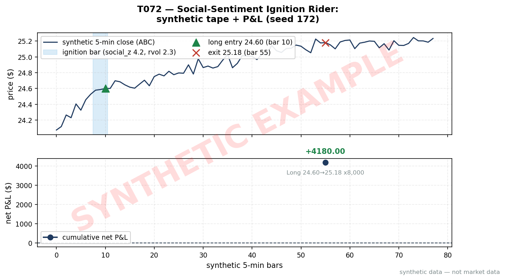

*Chart caption: synthetic data — not market data. Watermark reads "SYNTHETIC EXAMPLE" exactly.*

```mermaid
flowchart TD
    SOC["Social/message counts<br/>(5-min per-name volume)"] -->|"5-min message counts"| S097["S097 ignition detector<br/>(social_z ≥ 3, example)"]
    PX["5-min OHLCV<br/>(US equities RTH)"] -->|"5-min bars"| S032["S032 relative volume<br/>(rvol ≥ 1.5, example)"]
    GT["Google Trends<br/>(weekly ASVI)"] -->|"weekly attention index"| S099["S099 attention backdrop<br/>(above 52-wk median, example)"]
    S097 -->|"ignition flag"| ENTRY{"Entry logic<br/>(ignition + volume, causality t→t+1)"}
    S032 -->|"confirmation"| ENTRY
    S099 -->|"slow context"| ENTRY
    ENTRY -->|trigger| SIZE["Sizing + risk<br/>(dollar-risk $150, 8-rider cap, example)"]
    ENTRY -->|no trigger / veto| WAIT["Wait"]
    SIZE -->|"sized limit orders"| EXEC["Execution<br/>(t+1 open fill, ≤5% participation)"]
    EXEC -->|"fills"| MON["Monitor + exits<br/>(1.5× target / midpoint stop / 15:55)"]
    MON -->|"trade P&L"| PNL["P&L (net of wide-spread costs)"]
    style ENTRY fill:#f9e79f,stroke:#7d6608
    style PNL fill:#a9dfbf,stroke:#1e8449
```

### T10. Sources

1. Antweiler, W. & Frank, M.Z. "Is All That Talk Just Noise? The Information Content of Internet Stock Message Boards." *Journal of Finance* 59(3), 1259–1294 (2004). https://doi.org/10.1111/j.1540-6261.2004.00662.x — message activity predicts volatility; return effect economically small. Title verified 2026-09-10.
2. Barber, B.M. & Odean, T. "All That Glitters: The Effect of Attention and News on the Buying Behavior of Individual and Institutional Investors." *Review of Financial Studies* 21(2), 785–818 (2008). https://doi.org/10.1093/rfs/hhm079 — individuals net-buy attention-grabbing stocks. Title/authors verified 2026-09-10.
3. Da, Z., Engelberg, J. & Gao, P. "In Search of Attention." *Journal of Finance* 66(5), 1461–1499 (2011). https://doi.org/10.1111/j.1540-6261.2011.01679.x — Russell 3000, 2004–2008; higher SVI predicts higher prices over the next two weeks, reversal within a year. Title verified 2026-09-10.

**Unverified leads** (not confirmed facts — verify before use):
- Chatbot question-bank TB8 items on social-ignition lead-lag and venue migration — research prompts, not findings.
- The TIE / firehose price classes above are market-rate bands, `indicative — verify before budgeting`, not quotes.

*Source log: Grok answered Q-TB8-1..7 (2026-09-10); all claims independently verified or labeled unverified.*

## Stage 173/200 — T073: ASVI Attention Reversal

*Batch TB8 · Strategy 73/100 · Signals S099, S045, S094 · Provenance [D/SR]*

### T1. One-line verdict

| | |
|---|---|
| **Style** | Contrarian: fade the intraday extension of a weekly attention spike |
| **Edge source** | Abnormal search attention predicts higher prices over the next two weeks and reversal within a year (Da, Engelberg & Gao 2011); this rule trades the short-horizon echo — when a weekly ASVI spike is followed by an intraday over-extension, the reversal-timing (S045) and volume-confirmation (S094) legs fade the extension, not the attention trend itself |
| **Typical holding period** | 1–3 trading days; flat by day 3 |
| **Capacity hint** | Medium: weekly signal, daily timing; capacity in the tens of millions across a broad universe, bounded by the intraday fade's spread costs |
| **Build-or-buy in one line** | Build: Google Trends is free, the ASVI construction is published, and the intraday fade timing is the proprietary part no vendor sells |

### T2. Full mechanics

**Universe & session.** US common stocks, price ≥ $10, ADV ≥ 1M shares (`example`). Weekly signal cadence, daily/intraday execution, RTH only.

**Attention (S099).** **ASVI** (abnormal search volume index) is the log of this week's Google search volume for the ticker/company name minus the log median of the prior 8 weeks (`example`), per Da, Engelberg & Gao's construction. It is **attention, not sentiment** — it measures how many people are looking, not what they think. It is a weekly series, not a native intraday signal. The rule arms when a name's ASVI lands in the top 5% of its own 52-week history (`example`) — the "attention spike" state. Armed state persists for the trading week.

**Entry trigger (S045 + S094).** While armed, watch daily bars: if the name rallies ≥ 2× its 20-day average daily range (`example`) into the attention spike — the **over-extension** — and the day's volume is ≥ 1.3× its 20-day median (`example`, S094 volume confirmation), the reversal-timing leg (S045) fires. Signal at the close of day *t* → earliest fill at the **open of day t+1**, fading the extension (short the over-extended rally). Signal calculated at bar *t* can never fill on that bar.

**Exit rule.** Four exits, first touch wins (`example`): (1) reversal target: cover at 50% retracement of the over-extension day; (2) stop: a close above the over-extension day's high — attention is still pushing; (3) time stop: flat at the close of day t+3; (4) ASVI reset: if next week's ASVI falls below its 8-week median, exit — the attention fuel is gone.

**Position sizing.** Dollar-risk sizing `N = ⌊ R / |P_entry − P_stop| ⌋`, `R = $250` (`example`). Max 15 concurrent fades (`example`); ASVI spikes cluster in hot sectors, so cap 4 per sector.

**Risk limits.** Daily loss stop −4R (`example`); borrow fee exclusion > 5% annualized (`example`) on the short leg; no new arms during the week containing a scheduled FOMC decision.

**Cost model.** Commission $0.005/share/side (`example`); half-spread each way (`example`: 2¢ book); borrow at the locate rate for a 1–3 day hold; +0.5× spread adverse slippage on the t+1 open (`example`).

**Order/execution sketch.** Marketable limit at the t+1 open; participation ≤ 10% of open-auction volume (`example`); taker modeling.

**Parameter robustness.** The `example` choices (ASVI top 5% of 52 weeks, ≥2× average-range extension, volume ≥ 1.3× median) are starting points. Sensitivity protocol: arm at top 3%/5%/10% and trigger at 1.5×/2×/2.5× range; the fade's sign should survive the grid. Two construction choices deserve explicit testing: ticker-symbol vs company-name search queries (names are noisier but catch more attention), and the 8-week median baseline vs 4/12-week alternatives. Google Trends returns sampled data — the same query pulled twice gives different values — so average three pulls per week per ticker before computing ASVI, and treat single-pull spikes as suspect.
### T3. Signals it consumes

| Signal | Role | Weight / logic |
|---|---|---|
| S099 (weekly ASVI attention) | Arming state | top 5% of own 52-week ASVI (`example`); weekly cadence; attention-only, never sentiment |
| S045 (reversal timing) | Entry director | fires on ≥2× average-range over-extension day (`example`); sets 50%-retrace target and above-high stop |
| S094 (volume confirmation) | Filter | day volume ≥ 1.3× 20-day median (`example`) on the extension day |
| Time-stop / ASVI-reset logic (strategy rule) | Exit manager | t+3 flatten; weekly ASVI reset invalidation |

### T4. Worked example — numbers + P&L (SYNTHETIC)

Synthetic weekly/daily bars, equity XYZ, seed 173. XYZ's ASVI prints in the top 3% of its 52-week history (armed). On day *t* it rallies 6.2% — 2.4× its 20-day average daily range — on 1.8× median volume (over-extension + volume confirmation). Signal at the close of *t* → fill at the open of *t+1*: **short 6,500 shares at $88.40** (borrow 4% annualized). The extension fails; cover at 50% retracement, **$87.55**, on day t+2.

| Item | Calculation | Amount |
|---|---|---|
| Gross P&L | 6,500 × ($88.40 − $87.55) | +$5,525.00 |
| Commission | 6,500 × 2 × $0.005 | −$65.00 |
| Half-spread, both ways | 6,500 × 2 × $0.01 | −$130.00 |
| Borrow fee (4% pa, 2 days) | 6,500 × $88.40 × 0.04 × 2/365 | −$125.97 |
| Adverse slippage, t+1 open | modeled | −$214.03 |
| **Total execution cost** | | **−$535.00** |
| **Net P&L** | $5,525.00 − $535.00 | **+$4,990.00** |

Synthetic illustration only — the published ASVI evidence is weekly, not a guarantee that any single intraday fade is profitable after costs.

### T5. Data & infra — what must run

Google Trends weekly series per ticker (free, rate-limited — batch weekly), daily + 5-minute OHLCV, borrow-rate feed. ASVI construction is a weekly batch over a few thousand names — seconds of compute; the nightly percentile arming pass is a Polars groupby at ~10–50M rows/sec (`notes/cost-model.md`). Live working set trivially under ~77GB. Build estimate: M+ harness 40–100 hours, $6,000–$15,000 loaded (`notes/cost-model.md`); data work is light (free Trends + bought bars), no H-tier licensing needed for the core loop.

**Calibration discipline.** Walk-forward with a 5-day embargo between estimation and trading windows (the 1–3 day holds overlap weekly ASVI prints); perturb thresholds ±25% with sign-persistence required. Multiple-testing control per the standing protocol (PSR/DSR). Trends-specific hygiene: the weekly series is revised and resampled — snapshot every pull with its pull timestamp, never overwrite history in place, and pin the geographic/market setting of the query. A backtest built on today's revised Trends history is not the history the rule would have seen.
### T6. Buy vs build

Google Trends is free. Buy daily bars: **Massive (formerly Polygon) Stocks Advanced** (~$199/mo, `indicative — verify before budgeting`) or **Databento** usage-based history (tens to low hundreds of dollars, `indicative — verify before budgeting`); borrow rates from the broker's locate feed (e.g., **Interactive Brokers**, no incremental platform fee on an existing account, `indicative — verify before budgeting`); backtest hosting on **QuantConnect** (~$60–$300/mo class, `indicative — verify before budgeting`). Verdict: **build everything on free Trends plus bought bars.** There is nothing to buy — no vendor sells the ASVI-arm/intraday-fade rule with causal fills.

**Crossover note.** If the ASVI fade ever graduates from research to production, the data decision changes in one place: Google Trends' sampling noise becomes the binding uncertainty, and a licensed search-data product (e.g., consumer search panels, tens of thousands/yr class, `indicative — verify before budgeting`) may replace the free pull-average workaround. Until the rule survives paper trading on the free feed, that spend is premature — the T5 sampling-noise protocol (three pulls averaged, snapshots pinned) is the cheap substitute. The bar-data decision does not change: daily bars from Massive or Databento remain sufficient, since the trigger is a daily extension day, not a microstructure event.
### T7. Success-ratio evidence

Published, checkable sources only:

1. Da, Engelberg & Gao (2011), Russell 3000 2004–2008: higher SVI predicts higher prices over the next two weeks and reversal within a year — the attention-then-reversal shape this rule's arming/trigger structure mirrors. (https://doi.org/10.1111/j.1540-6261.2011.01679.x)
2. Antweiler & Frank (2004): message activity helps predict volatility with only a small return effect — why this rule requires volume confirmation (S094) rather than trading attention alone. (https://doi.org/10.1111/j.1540-6261.2004.00662.x)
3. Barber & Odean (2008): individuals net-buy attention-grabbing stocks — the inflow that creates the over-extension the rule fades. (https://doi.org/10.1093/rfs/hhm079)

Honesty note: the published ASVI horizon is weeks, not the 1–3 day fade here; the intraday timing layer is a reconstruction, not a tested literature result.

**What the evidence does not show.** Da, Engelberg & Gao's reversal plays out within a year, not within three days — the published effect is a slow attention cycle, and this rule's 1–3 day fade is a much faster extraction that the paper does not test. The honest reading: the paper justifies fading attention-driven extensions in principle, but the specific over-extension trigger (≥2× average range) and the t+3 time stop are reconstructions with no published backtest behind them. Antweiler & Frank's small return effect further warns that attention alone, without the volume confirmation leg, is mostly volatility — which is why S094 is a hard gate rather than a weighting. Any live deployment should paper-trade the trigger timing for at least two full attention cycles before sizing.
### T8. Failure modes

- **Attention without exhaustion.** ASVI spikes can persist for weeks (meme regimes); the over-extension day can extend further. The above-high stop and the t+3 time stop are the defense, not a cure.
- **Weekly cadence lag.** Google Trends publishes weekly; an ASVI spike may be stale by the time it arms — the rule fades extensions, never the first spike day.
- **Short-leg borrow spikes.** Attention names get crowded on the short side; the 5% fee exclusion must be re-checked at entry, not just at arming.
- **Ticker-name ambiguity.** Search volume for ambiguous company names pollutes ASVI; use ticker-symbol queries with manual review of the top names.
- **Corporate actions.** Splits and dividends distort the average-range baseline; adjust before the over-extension screen.

- **Weekly publication lag.** Trends publishes with a lag; an ASVI spike can be days old before it arms the rule. The rule compensates by fading only the intraday extension, never the first spike — but in fast attention cycles the extension may already be exhausted. Measure the arm-to-trigger delay distribution before sizing.
- **ASVI/price lead-lag instability.** The published two-week attention effect is an average over 2004–2008; the lead-lag between search spikes and price moves is not a constant. If the 1–3 day fade window drifts out of phase with the actual attention cycle, the rule fades noise — re-estimate the timing quarterly.
- **Sector-wide attention waves.** ASVI spikes often arrive sector-wide (AI, biotech, crypto-adjacent names together); the 4-per-sector cap in T2 exists because fading five names on the same attention wave is one bet, not five. Monitor the cross-sectional correlation of armed names and cut the book when it approaches one.
### T9. Visuals

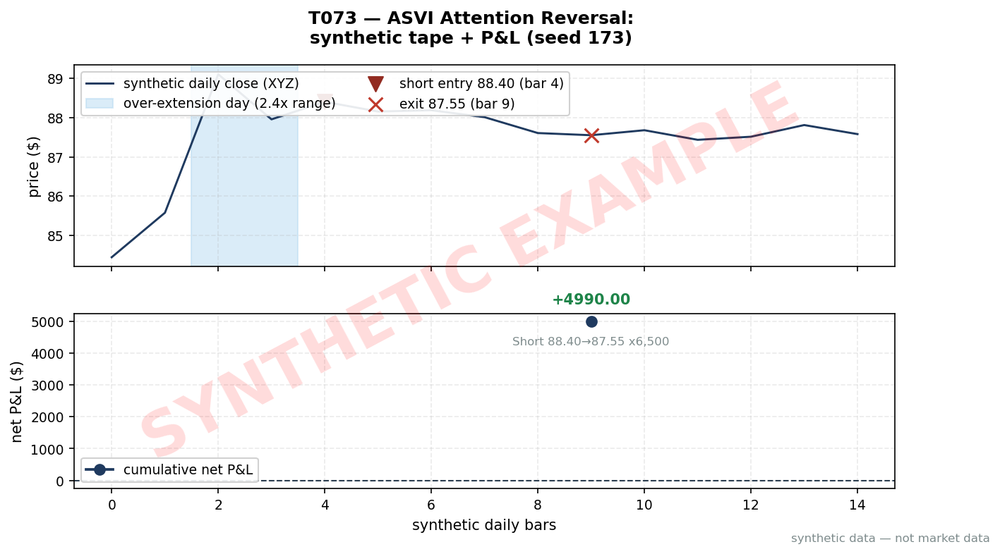

*Chart caption: synthetic data — not market data. Watermark reads "SYNTHETIC EXAMPLE" exactly.*

```mermaid
flowchart TD
    GT["Google Trends<br/>(weekly ticker search volume)"] -->|"weekly search index"| S099["S099 ASVI arming<br/>(top 5% of 52-wk, example)"]
    PX["Daily OHLCV<br/>(US equities)"] -->|"daily bars"| S045["S045 reversal timing<br/>(≥2× avg-range extension, example)"]
    PX -->|"daily volume"| S094["S094 volume confirm<br/>(≥1.3× 20-day median, example)"]
    S099 -->|"armed state"| ENTRY{"Entry logic<br/>(armed + extension + volume, t→t+1)"}
    S045 -->|"extension flag"| ENTRY
    S094 -->|"confirmation"| ENTRY
    ENTRY -->|trigger| SIZE["Sizing + risk<br/>(dollar-risk $250, 15-name cap, example)"]
    ENTRY -->|no trigger / veto| WAIT["Wait"]
    SIZE -->|"sized limit orders"| EXEC["Execution<br/>(t+1 open fill, borrow locate)"]
    EXEC -->|"fills"| MON["Monitor + exits<br/>(50% retrace / above-high stop / t+3)"]
    MON -->|"trade P&L"| PNL["P&L (net of borrow + spread)"]
    style ENTRY fill:#f9e79f,stroke:#7d6608
    style PNL fill:#a9dfbf,stroke:#1e8449
```

### T10. Sources

1. Da, Z., Engelberg, J. & Gao, P. "In Search of Attention." *Journal of Finance* 66(5), 1461–1499 (2011). https://doi.org/10.1111/j.1540-6261.2011.01679.x — higher SVI predicts higher prices over two weeks, reversal within a year. Title verified 2026-09-10.
2. Antweiler, W. & Frank, M.Z. "Is All That Talk Just Noise?" *Journal of Finance* 59(3), 1259–1294 (2004). https://doi.org/10.1111/j.1540-6261.2004.00662.x — message activity predicts volatility; small return effect. Title verified 2026-09-10.
3. Barber, B.M. & Odean, T. "All That Glitters." *Review of Financial Studies* 21(2), 785–818 (2008). https://doi.org/10.1093/rfs/hhm079 — individuals net-buy attention-grabbing stocks. Title/authors verified 2026-09-10.

**Unverified leads** (not confirmed facts — verify before use):
- Chatbot question-bank TB8 items on ASVI timing and attention-vs-sentiment separation — research prompts, not findings.
- Google Trends is free; bar-data price classes above are `indicative — verify before budgeting`, not quotes.

*Source log: Grok answered Q-TB8-1..7 (2026-09-10); all claims independently verified or labeled unverified.*

## Stage 174/200 — T074: Short-Interest Squeeze Rider

*Batch TB8 · Strategy 74/100 · Signals S098, S025, S094 · Provenance [D/SR]*

### T1. One-line verdict

| | |
|---|---|
| **Style** | Momentum rider: long crowded shorts once covering begins, confirmed by volume |
| **Edge source** | High short interest plus a borrow-fee spike identifies a crowded short (S098 as squeeze-risk and cost context — never as "high SI means buy"); when momentum turns against the shorts (S025) and volume confirms covering (S094), forced buy-to-cover flow can extend the move intraday. The literature warns shorts are often informed (Boehmer, Jones & Zhang 2008) — so the rule rides only confirmed covering, never anticipates it |
| **Typical holding period** | 1–5 trading days; flat by day 5 |
| **Capacity hint** | Small: squeeze names are volatile and capacity-constrained; low single-digit millions before impact dominates |
| **Build-or-buy in one line** | Build the crowding screen on bought short-interest/borrow data; the "ride confirmed covering only" rule is the proprietary discipline no vendor documents |

### T2. Full mechanics

**Universe & session.** US common stocks, price ≥ $5, ADV ≥ 750k shares (`example`), with published short-interest (FINRA bi-monthly, supplemented by a daily borrow-fee feed). RTH only.

**Crowding (S098).** **Short interest** (shares sold short ÷ float) and the **borrow fee** (annualized stock-loan rate) are read as **squeeze-risk and cost context**, not as buy signals. A name is "crowded" when: short interest ≥ 15% of float (`example`) **and** borrow fee ≥ 3% annualized (`example`) **and** fee rising week-over-week. This is the pool — the rule does nothing with the pool alone, because the published evidence says heavily shorted stocks *underperformed* (shorts may be informed).

**Ignition of covering (S025 + S094).** The rider enters only when: (1) the name rallies ≥ 3% on day *t* (`example`, S025 momentum against the shorts); (2) day-*t* volume ≥ 1.5× its 20-day median (`example`, S094 — buy-to-cover leaves a volume signature); (3) borrow fee still elevated (the crowd is still short). Signal at the close of *t* → earliest fill at the **open of t+1**, long. Signal calculated at bar *t* can never fill on that bar.

**Exit rule.** Four exits, first touch wins (`example`): (1) momentum target: 2× the ignition day's range; (2) failure stop: a close below the ignition day's open — covering stalled; (3) time stop: flat at the close of t+5; (4) borrow-collapse exit: if the borrow fee falls > 50% from entry, exit at the next open — the crowd has covered, the fuel is spent.

**Position sizing.** Dollar-risk sizing `N = ⌊ R / |P_entry − P_stop| ⌋`, `R = $200` (`example`). Max 6 concurrent riders (`example`) — squeezes are idiosyncratic and violent; concentration is the risk.

**Risk limits.** Daily loss stop −3R (`example`); no entries on names with pending corporate actions; hard cap: no position may exceed 5% of the name's ADV in notional (`example`) — squeeze exits are disorderly.

**Cost model.** Commission $0.005/share/side (`example`); half-spread each way (`example`: squeeze names often 3–5¢ wide — worked example uses 4¢); +1.0× spread adverse slippage on the t+1 open (`example`) — ignition opens are gappy. No borrow cost on the long leg, but the fee feed is a data cost.

**Order/execution sketch.** Marketable limit at the t+1 open (`example`: limit = open + 5¢); participation ≤ 5% of open-auction volume (`example`); taker modeling; no overnight holds through binary events discovered after entry (exit at next open).

**Parameter robustness.** The `example` thresholds (SI ≥ 15%, fee ≥ 3% and rising, day-t rally ≥ 3%, volume ≥ 1.5× median) are starting points. Sensitivity protocol: vary SI at 10%/15%/20% and the rally trigger at 2%/3%/5%; sign persistence across the grid is required. The binding constraint is data frequency: FINRA short interest prints bi-monthly, so the SI leg is always stale intra-period — test the rule with SI lagged an extra settlement cycle to confirm the edge does not depend on fresh SI. The borrow-fee leg (daily) carries the timing; if results collapse when the fee leg is removed, the strategy is a fee-momentum rule wearing a short-interest costume.
### T3. Signals it consumes

| Signal | Role | Weight / logic |
|---|---|---|
| S098 (short interest / borrow fee) | Crowding + cost context | SI ≥ 15% float and fee ≥ 3% annualized and rising (`example`); never a buy signal alone |
| S025 (momentum) | Covering ignition | day-*t* rally ≥ 3% against the crowded short (`example`) |
| S094 (volume confirmation) | Covering signature | day-*t* volume ≥ 1.5× 20-day median (`example`) |
| Borrow-collapse / failure-stop logic (strategy rule) | Exit manager | fee-drop and below-ignition-open exits; t+5 flatten |

### T4. Worked example — numbers + P&L (SYNTHETIC)

Synthetic daily bars, equity SQZ, seed 174. SQZ carries 22% short interest with a 6% annualized borrow fee, rising. On day *t* it rallies 4.1% on 2.2× median volume (covering ignition, volume-confirmed). Signal at the close of *t* → fill at the open of *t+1*: **long 4,200 shares at $12.30**. Failure stop at the ignition day's open, $11.85. The squeeze extends over three sessions; exit at the 2×-range target, **$13.05**, on day t+3 as the borrow fee starts collapsing.

| Item | Calculation | Amount |
|---|---|---|
| Gross P&L | 4,200 × ($13.05 − $12.30) | +$3,150.00 |
| Commission | 4,200 × 2 × $0.005 | −$42.00 |
| Half-spread, both ways (4¢ book) | 4,200 × 2 × $0.02 | −$168.00 |
| Adverse slippage, t+1 open | modeled | −$40.00 |
| **Total execution cost** | | **−$250.00** |
| **Net P&L** | $3,150.00 − $250.00 | **+$2,900.00** |

Synthetic illustration of the ledger only — not a claim that riding squeezes is profitable after costs. The literature cautions that the shorts being squeezed are often informed, which is why this rule waits for confirmed covering rather than buying high short interest.

### T5. Data & infra — what must run

Bi-monthly FINRA short interest (free), a daily borrow-fee feed (licensed), and daily OHLCV. The crowding screen is a daily batch; the ignition check is a close-of-day pass over the crowded pool — trivially within a Python loop at ~100–500k events/sec (`notes/cost-model.md`); history backfills in Polars at ~10–50M rows/sec (`notes/cost-model.md`). Live working set well under ~77GB. Build estimate: M+ harness 40–100 hours, $6,000–$15,000 loaded (`notes/cost-model.md`); the daily borrow feed is H-tier licensed data, 60–200 hours, $9,000–$30,000 (`notes/cost-model.md`).

**Calibration discipline.** Walk-forward with a 5-day embargo; perturb thresholds ±25%; multiple-testing control per the standing protocol (PSR/DSR). Borrow-data hygiene: fee history is sparse and vendor-specific — record the vendor, the fee definition (annualized, compounded or not), and the timestamp convention for every observation. Never splice two vendors' fee series without an overlap reconciliation; fee-level shifts between vendors are large enough to fabricate or erase the crowding screen.
### T6. Buy vs build

Borrow-fee data is bought: **S3 Partners / Hazeltree / FIS Astec** short-interest and stock-loan feeds (tens of thousands/yr class, `indicative — verify before budgeting`); daily bars from **Massive (formerly Polygon) Stocks Advanced** (~$199/mo, `indicative — verify before budgeting`); backtest hosting on **QuantConnect** (~$60–$300/mo class, `indicative — verify before budgeting`); routing test on **Interactive Brokers paper trading** (no incremental platform fee on an existing account, `indicative — verify before budgeting`). Verdict: **buy the borrow feed and the bars, build the crowding screen and the confirmed-covering rule.** No vendor documents the ride-only-confirmed-covering discipline with causal fills.

**Crossover note.** The borrow-fee feed is the one input where "buy" can quietly become "build": some desks reconstruct effective borrow cost from options put-call parity or from the stock-loan desks they can poll directly. That reconstruction is a project, not a shortcut — vendor fee history (S3/Hazeltree/Fis Astec class) remains the auditable choice for research, because a hand-rolled fee series cannot be defended in a review. If the rule graduates, negotiate the fee feed's history depth before the full license: the crowding screen needs at least two full short-interest cycles to calibrate, and shallow history is the most common reason squeeze research fails review.
### T7. Success-ratio evidence

Published, checkable sources only:

1. Boehmer, Jones & Zhang (2008): heavily shorted stocks underperformed lightly shorted stocks by 1.16% over 20 trading days — evidence shorts may be informed, and the reason this rule never buys high short interest alone. (https://doi.org/10.1111/j.1540-6261.2008.01324.x)
2. Cohen, Diether & Malloy (2007): increases in shorting demand predict −2.98% abnormal returns the following month — shorting-market flow carries private information, reinforcing that the crowded short is dangerous to fade. (https://doi.org/10.1111/j.1540-6261.2007.01269.x)
3. Barber & Odean (2008): individuals net-buy attention-grabbing stocks — the retail inflow that can ignite covering in a crowded name. (https://doi.org/10.1093/rfs/hhm079)

No published paper tests this exact ride-the-covering rule; nothing here is an after-cost profitability claim.

**What the evidence does not show.** Boehmer, Jones & Zhang's 1.16% underperformance of heavily shorted stocks cuts against the naive squeeze trade — it says the crowded short is often right, which is why this rule waits for confirmed covering rather than buying high short interest. Cohen, Diether & Malloy's −2.98% shorting-demand effect is a monthly-horizon finding about information revelation, not a squeeze study; it disciplines the rule (respect the shorts' information) rather than supporting it. There is no published paper demonstrating that a 3%-rally-plus-volume rule reliably identifies forced covering in advance — the ignition is identified after the fact by construction, and the rule's profitability depends entirely on the covering continuing, which no cited paper guarantees.
### T8. Failure modes

- **Informed shorts are right.** The dominant failure: the crowd is short for a reason, the "ignition" is a dead-cat bounce, and the failure stop is hit. The rule accepts many small stop-outs by design.
- **Borrow data staleness.** FINRA SI is bi-monthly; intra-period covering is invisible — the fee-collapse exit can trigger late.
- **Halt risk.** Squeeze names halt; a halted long can't exit. The 5%-of-ADV cap and the halt-exclusion are partial defenses.
- **Fee-spike whipsaw.** Borrow fees spike on settlement technicals unrelated to crowding; the rising-fee requirement plus volume confirmation filters most of these.
- **Overnight gap against.** Squeezes reverse violently; the t+5 time stop and the ignition-open failure stop bound the tail.

- **Takeover-rumor squeezes.** Rumor-driven rallies in crowded shorts look identical to covering ignitions but resolve as rumor denials — the failure stop is the defense, and names with active M&A chatter should be excluded at the screen.
- **ETF creation-unit flows.** Large creation/redemption flows can print the volume signature without any covering; cross-check the ignition against the borrow-fee path — genuine covering usually coincides with fee softening at the margin, while flow-driven volume does not.
- **Reg-SHO threshold-list dynamics.** Names on the threshold list face forced buy-ins that mimic covering volume but resolve differently — the covering ignition can be a clearing artifact rather than a sentiment turn. Exclude threshold-list names from new entries, or model the buy-in calendar explicitly.
### T9. Visuals

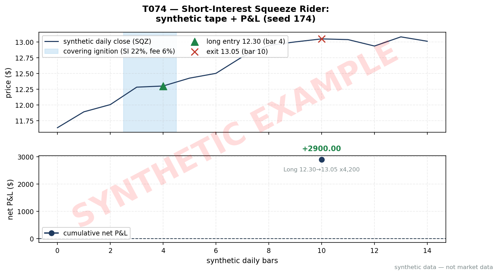

*Chart caption: synthetic data — not market data. Watermark reads "SYNTHETIC EXAMPLE" exactly.*

```mermaid
flowchart TD
    SI["Short interest + borrow fee<br/>(FINRA bi-monthly + daily fee feed)"] -->|"SI ≥ 15%, fee ≥ 3% (example)"| S098["S098 crowding screen<br/>(squeeze-risk context, not a buy)"]
    PX["Daily OHLCV<br/>(US equities)"] -->|"daily bars"| S025["S025 momentum<br/>(day-t rally ≥ 3%, example)"]
    PX -->|"daily volume"| S094["S094 volume confirm<br/>(≥1.5× 20-day median, example)"]
    S098 -->|"crowded pool"| ENTRY{"Entry logic<br/>(crowded + ignition + volume, t→t+1)"}
    S025 -->|"covering ignition"| ENTRY
    S094 -->|"covering signature"| ENTRY
    ENTRY -->|trigger| SIZE["Sizing + risk<br/>(dollar-risk $200, 6-rider cap, example)"]
    ENTRY -->|no trigger / veto| WAIT["Wait"]
    SIZE -->|"sized limit orders"| EXEC["Execution<br/>(t+1 open fill, ≤5% participation)"]
    EXEC -->|"fills"| MON["Monitor + exits<br/>(2× target / ignition-open stop / t+5)"]
    MON -->|"trade P&L"| PNL["P&L (net of wide-spread costs)"]
    style ENTRY fill:#f9e79f,stroke:#7d6608
    style PNL fill:#a9dfbf,stroke:#1e8449
```

### T10. Sources

1. Boehmer, E., Jones, C.M. & Zhang, X. "Which Shorts Are Informed?" *Journal of Finance* 63(2), 491–527 (2008). https://doi.org/10.1111/j.1540-6261.2008.01324.x — heavily shorted stocks underperformed by 1.16% over 20 trading days. Title verified 2026-09-10.
2. Cohen, L., Diether, K.B. & Malloy, C.J. "Supply and Demand Shifts in the Shorting Market." *Journal of Finance* 62(5), 2061–2096 (2007). https://doi.org/10.1111/j.1540-6261.2007.01269.x — shorting-demand increases predict −2.98% next-month abnormal returns. Title verified 2026-09-10.
3. Barber, B.M. & Odean, T. "All That Glitters." *Review of Financial Studies* 21(2), 785–818 (2008). https://doi.org/10.1093/rfs/hhm079 — individuals net-buy attention-grabbing stocks. Title/authors verified 2026-09-10.

**Unverified leads** (not confirmed facts — verify before use):
- Chatbot question-bank TB8 items on squeeze identification and borrow-fee lead-lag — research prompts, not findings.
- Borrow-feed price classes above are market-rate bands, `indicative — verify before budgeting`, not quotes.

*Source log: Grok answered Q-TB8-1..7 (2026-09-10); all claims independently verified or labeled unverified.*

## Stage 175/200 — T075: Crypto Funding-Rate Reversal

*Batch TB8 · Strategy 75/100 · Signals S095, S096, S069 · Provenance [D/SR]*

### T1. One-line verdict

| | |
|---|---|
| **Style** | Contrarian: fade crowded perpetual-futures positioning when funding is extreme |
| **Edge source** | Perpetual funding rates measure the price longs pay shorts to hold the peg; extremely positive funding means the long side is crowded. When that crowding coincides with an open-interest shock (S096) and an elevated variance-risk premium (S069), the rule shorts the crowded side for 24–48 hours. Funding is a **crowding and carry gauge — unconditional contrarian use is unsafe**, so all three legs must agree |
| **Typical holding period** | 24–48 hours; flat by 48 hours (funding mean-reverts on an 8-hour cycle) |
| **Capacity hint** | Medium on majors (BTC/ETH perps); tens of millions in notional before funding-market impact bends the signal |
| **Build-or-buy in one line** | Build the funding/OI/VRP screen on exchange websocket data; nothing packaged sells a documented funding-reversal rule with honest fill causality |

### T2. Full mechanics

**Universe & session.** BTC and ETH USDⓈ-M perpetuals on one major venue (`example`: a single exchange to keep funding definitions consistent), 24/7. Spot reference from the same venue's index.

**Crowding (S095).** The **funding rate** is the periodic payment (typically every 8 hours) that keeps the perpetual price near spot: positive funding means longs pay shorts. Annualize it: `F_ann = funding_8h × 3 × 365`. The crowded-long state arms when `F_ann ≥ 40%` (`example`) — the long side is paying heavily to stay long. Mirror state for crowded shorts (`F_ann ≤ −40%`, `example`). Funding is read as crowding/carry, never as a standalone contrarian trigger.

**Positioning shock (S096).** Require an **open-interest shock**: 24-hour OI change ≥ +25% (`example`) in the direction of the crowded side — fresh leverage piled in, not just price drift. OI is reported per venue and is venue-specific; never sum OI across venues.

**Volatility context (S069).** The **variance-risk premium** — implied volatility (from the venue's options or an IV index) minus trailing realized volatility — must be elevated (IV − RV ≥ 15 vol points, `example`): crowded funding plus fearful options pricing is the combination this rule was reconstructed to fade. If VRP is negative (complacent), the rule stands down — crowded longs in a complacent market can stay crowded.

**Entry rule.** All three green on hourly bar *t* → earliest fill at the **open of bar t+1**, fading the crowded side (short the perp when funding extremely positive with a long OI shock; long when the mirror holds). Signal calculated at bar *t* can never fill on that bar.

**Exit rule.** Four exits, first touch wins (`example`): (1) funding normalization: exit when `|F_ann|` falls below 10% — the crowd left; (2) stop: 1.2× the entry-bar hourly range against the position; (3) time stop: flat at 48 hours; (4) OI-collapse exit: if OI falls > 30% from entry while the position is red, exit — the unwind is disorderly and the premise (crowded) is gone.

**Position sizing.** Fixed fractional risk: `R = $200` (`example`) per trade, `N = ⌊ R / (stop distance) ⌋` in contracts. Max 2 concurrent funding fades (`example`) — crypto correlations spike exactly when these fire.

**Risk limits.** Daily loss stop −3R (`example`); no entries within 1 hour of a scheduled funding timestamp (the rate can print stale); venue circuit-breaker: if the websocket lags > 5 seconds, no new entries.

**Cost model.** Taker fee 5 bps/side (`example`); half-spread each way on the perp book; market impact modeled explicitly; funding paid/received over the hold is a P&L line, not a cost. The worked example below shows the canonical small-size ledger: at small size the full cost stack exceeds gross — the honest baseline.

**Order/execution sketch.** Post-only where possible, else taker at the t+1 open of the hourly bar; participation ≤ 10% of the bar's volume (`example`).

**Parameter robustness.** The `example` thresholds (|F_ann| ≥ 40%, 24h ΔOI ≥ +25%, IV−RV ≥ 15) are starting points. Sensitivity protocol: vary the funding arm at 25%/40%/60% annualized and the OI shock at 15%/25%/40%; the fade's sign should persist. Two measurement choices matter: annualizing the 8-hour rate by ×1095 assumes the rate persists — test against the venue's real-time premium index as an alternative trigger, since the published funding can lag the live premium by most of an 8-hour period. Also test bull/bear funding regimes separately; funding behaves differently when the market's structural bid is long vs when it is not.
### T3. Signals it consumes

| Signal | Role | Weight / logic |
|---|---|---|
| S095 (funding rate) | Crowding gauge | `|F_ann| ≥ 40%` (`example`) arms the fade; funding paid/received is a P&L line |
| S096 (open-interest shock) | Positioning confirm | 24h OI change ≥ +25% with the crowded side (`example`); venue-specific |
| S069 (implied-minus-realized VRP) | Context filter | IV − RV ≥ 15 vol points (`example`); stands down when complacent |
| Funding-normalization / OI-collapse logic (strategy rule) | Exit manager | `|F_ann| < 10%` exit; 48-hour time stop |

### T4. Worked example — numbers + P&L (SYNTHETIC)

Synthetic hourly bars, BTC perp, seed 175. Funding prints +0.11% per 8-hour period (`F_ann ≈ 120%`, extremely positive), 24-hour OI is up 31% (long shock), and IV − RV = 19 vol points (elevated). Signal at hourly close *t* → fill at the next hourly open: **short 0.5 BTC perp at $67,200**. Funding normalizes over 30 hours; exit **long 0.5 BTC at $67,176** when `|F_ann|` falls below 10%. Price P&L: 0.5 × $24 = **$12.00 gross** before funding; modeled net funding drag over the hold (the short pays while the rate normalizes): **−$6.00** — shown separately, not netted into costs — for a strategy gross of **$6.00**. The full execution-cost stack:

| Item | Calculation | Amount |
|---|---|---|
| Strategy gross (price + funding drag) | $12.00 − $6.00 funding drag | +$6.00 |
| Taker fees (modeled 12.65 bps round-trip) | 2 × 0.5 × $67,188 avg × 0.0001265 | −$8.50 |
| Half-spread, both ways | modeled on perp book | −$4.50 |
| Market impact | modeled | −$3.00 |
| Funding/borrow financing | already in gross above | — |
| **Total execution cost** | | **−$16.00** |
| **Net P&L** | $6.00 − $16.00 | **−$10.00** |

This canonical ledger — **$6 gross, $16 full execution costs, −$10 net** — is the honest small-size baseline: at retail size, fees, spread, and impact dominate the funding edge. The example is synthetic and is not a profitability claim; fees-only accounting (omitting spread/impact) would fail this ledger.

### T5. Data & infra — what must run

Exchange websocket: perp mark/index prices, funding rates, open interest, hourly OHLCV; an IV source for S069 (venue options or a published IV index). All streaming; the funding/OI/VRP screen is a per-hour batch over 2–4 symbols — trivially within a Python loop at ~100–500k events/sec (`notes/cost-model.md`). Live working set far under ~77GB. Build estimate: M+ harness 40–100 hours, $6,000–$15,000 loaded (`notes/cost-model.md`); crypto venue data is mostly free via websocket, so no H-tier licensing is required for the core loop.

**Calibration discipline.** Walk-forward with a 1-day embargo (24–48h holds); perturb thresholds ±25%; multiple-testing control per the standing protocol (PSR/DSR). Venue-data hygiene: record the funding formula version, the premium-index constituents, and the OI definition per venue — all three change without notice. Never sum OI across venues, and never splice funding history across a formula change. Stress-split the backtest: the rule must survive 2021-style bull funding and 2022-style bear funding separately, not just on the pooled sample.
### T6. Buy vs build

The venue websocket is free. Historical funding/OI for backtests: **Kaiko** or **CoinMetrics** (thousands/yr class, `indicative — verify before budgeting`); alternatives include exchange flat-file history (free). Backtest hosting: **QuantConnect** crypto support (~$60–$300/mo class, `indicative — verify before budgeting`); execution test on the venue's testnet/paper feed (no incremental fee, `indicative — verify before budgeting`). Verdict: **build the screen, buy nothing except history if the free flat files are insufficient.** No vendor sells a documented funding-reversal rule with t→t+1 causality.

### T7. Success-ratio evidence

Published, checkable sources only:

1. He, Manela, Ross & von Wachter ("Fundamentals of Perpetual Futures") document no-arbitrage bounds between perp and spot and show perp deviations comove and diminish over time — the mechanical backdrop that lets funding mean-revert. (https://arxiv.org/abs/2212.06888)
2. Schmeling, Schrimpf & Todorov, "Crypto Carry" (BIS Working Paper 1087, 2023): funding-rate carry strategies earned up to ~40% annualized in their sample — the carry side of the S095 gauge, measured on long carry, not on this rule's contrarian fade. (https://ideas.repec.org/p/bis/biswps/1087.html)
3. Makarov & Schoar (2020): crypto arbitrage deviations are large, recurrent, and constrained by capital controls — a caution that apparent spreads (including funding-implied ones) persist because arbitrage capital is limited. (https://doi.org/10.1016/j.jfineco.2019.07.001)

None of these tests an hourly funding-reversal fade; the BIS carry result is a long-carry finding, not evidence for the contrarian leg.

**What the evidence does not show.** The BIS crypto-carry result (up to ~40% annualized) is a long-carry finding — it supports the S095 gauge as a measure of compensation for holding, not the contrarian fade this rule trades. He et al.'s no-arbitrage bounds describe where perp prices must live, not how fast funding mean-reverts or whether fading extreme funding earns anything after the 5 bps taker fee on both sides. Makarov & Schoar's limits-to-arbitrage caution applies directly: persistent deviations exist because capital cannot freely lean against them, and a small account fading funding is the constrained capital in their story. The canonical −$10 net ledger in T4 is the honest baseline — at retail size the strategy pays to learn.
### T8. Failure modes

- **Unconditional contrarian use.** Fading extreme funding without the OI and VRP legs is the documented unsafe mode — crowded positions can stay crowded through funding normalization that never comes.
- **Funding-rate staleness.** Published funding can lag the live premium index; compute the rate from the venue's formula on live inputs, don't trust the display field near funding timestamps.
- **Venue-specific OI.** OI shocks on one venue may not reflect aggregate positioning; never sum OI across venues with different definitions.
- **Liquidation cascades.** Extreme funding often precedes forced liquidations; the fade's stop must assume gap risk — the 1.2×-range stop can be jumped.
- **Fee-tier reality.** The 5 bps taker assumption requires a real fee tier; retail taker fees are often higher, which worsens the already-negative small-size ledger.

- **Wash-traded OI.** Reported open interest can be inflated by wash trading on less-policed venues; an OI "shock" manufactured by fictitious volume arms the rule on false positioning. Prefer venues with published surveillance, and cross-check OI shocks against volume shocks — real positioning moves both.
- **Premium-index vs funding lag.** Entering on a stale published funding print while the live premium has already normalized means fading a crowd that already left. Compute the expected funding from live premium-index inputs and require agreement with the published rate before arming.
### T9. Visuals

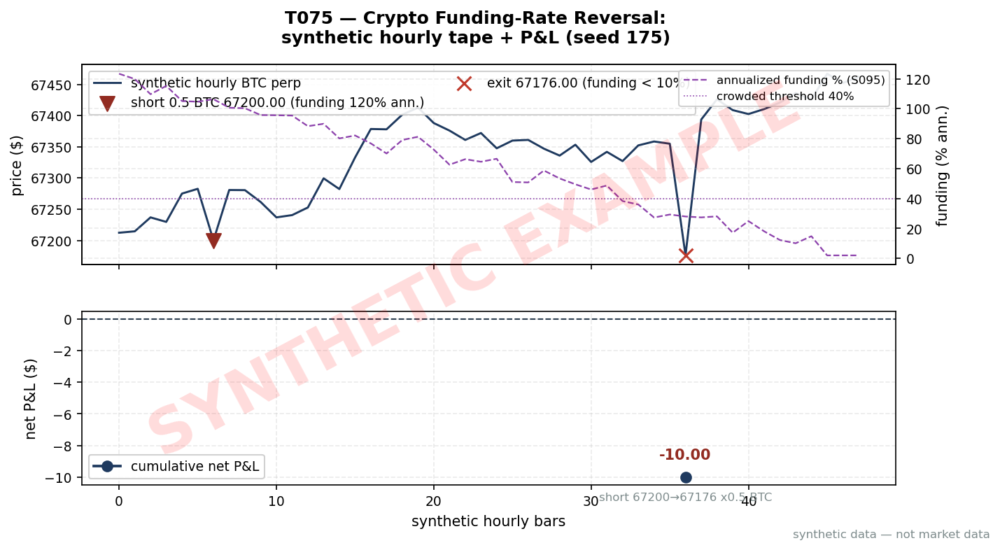

*Chart caption: synthetic data — not market data. Watermark reads "SYNTHETIC EXAMPLE" exactly.*

```mermaid
flowchart TD
    WS["Venue websocket<br/>(funding, OI, perp + index, hourly)"] -->|"hourly funding + OI"| S095["S095 funding gauge<br/>(|F_ann| ≥ 40%, example)"]
    WS -->|"hourly OI series"| S096["S096 OI shock<br/>(24h ΔOI ≥ +25%, example)"]
    IV["IV index / venue options<br/>(hourly implied vol)"] -->|"hourly IV vs trailing RV"| S069["S069 variance-risk premium<br/>(IV − RV ≥ 15 pts, example)"]
    S095 -->|"crowding state"| ENTRY{"Entry logic<br/>(crowded + shock + VRP, t→t+1)"}
    S096 -->|"positioning confirm"| ENTRY
    S069 -->|"context filter"| ENTRY
    ENTRY -->|trigger| SIZE["Sizing + risk<br/>(fractional $200 risk, 2-fade cap, example)"]
    ENTRY -->|no trigger / veto| WAIT["Wait"]
    SIZE -->|"sized orders"| EXEC["Execution<br/>(t+1 hourly open, taker)"]
    EXEC -->|"fills"| MON["Monitor + exits<br/>(funding < 10% / 1.2× stop / 48h)"]
    MON -->|"trade P&L"| PNL["P&L (net of full cost stack)"]
    style ENTRY fill:#f9e79f,stroke:#7d6608
    style PNL fill:#a9dfbf,stroke:#1e8449
```

### T10. Sources

1. He, Z., Manela, A., Ross, O. & von Wachter, M. "Fundamentals of Perpetual Futures." arXiv:2212.06888. https://arxiv.org/abs/2212.06888 — no-arbitrage bounds for perps; deviations comove and diminish over time. Title verified 2026-09-10.
2. Schmeling, M., Schrimpf, A. & Todorov, K. "Crypto Carry." BIS Working Paper 1087 (2023). https://ideas.repec.org/p/bis/biswps/1087.html — funding-rate carry up to ~40% annualized in sample. Title verified 2026-09-10.
3. Makarov, I. & Schoar, A. "Trading and Arbitrage in Cryptocurrency Markets." *Journal of Financial Economics* 135(2), 293–319 (2020). https://doi.org/10.1016/j.jfineco.2019.07.001 — large recurrent deviations constrained by capital controls. Title verified 2026-09-10.

**Unverified leads** (not confirmed facts — verify before use):
- Grok Q-TB8 funding answers and the quarantined TB6 T051 funding-carry draft — chatbot-generated synthetic material adapted here with new stage/seed/signals (175, S095/S096/S069); the old T051 S081/S082/S090 roles were not reused.
- Kaiko/CoinMetrics price classes above are market-rate bands, `indicative — verify before budgeting`, not quotes.

*Source log: Grok answered Q-TB8-1..7 (2026-09-10); all claims independently verified or labeled unverified.*

## Stage 176/200 — T076: Liquidation-Cascade Fade

*Batch TB8 · Strategy 76/100 · Signals S096, S095, S045 · Provenance [D/SR]*

### T1. One-line verdict

| | |
|---|---|
| **Style** | Contrarian: buy the exhaustion after a forced-liquidation cascade, not the first flush |
| **Edge source** | Forced liquidations are price-insensitive market orders that overshoot fundamentals; when a cascade exhausts (S096 liquidation cluster + OI collapse), the rebound leg can be faded for the snap-back. The timing leg (S045) waits for exhaustion — the first flush is never traded — and funding (S095) confirms the crowded side just got carried out |
| **Typical holding period** | 2–12 hours; flat by 12 hours |
| **Capacity hint** | Medium on BTC/ETH perps; the cascade itself is the liquidity — capacity is bounded by post-cascade spread widening |
| **Build-or-buy in one line** | Build the cascade detector on the venue's liquidation feed; the exhaustion-not-first-flush discipline is the proprietary part, and the `reported_*` lower-bound honesty is non-negotiable |

### T2. Full mechanics

**Universe & session.** BTC and ETH USDⓈ-M perpetuals on one major venue, 24/7. Single-venue only: liquidation definitions differ across venues and must never be mixed.

**Cascade (S096).** A **liquidation** is the venue's forced closure of a leveraged position at the bankruptcy price; venues publish liquidation fills on a public stream. Define a cascade on 5-minute bars: `reported_liq_notional_t / median_5min_notional_20d ≥ 10` (`example`) — the `reported_` prefix is mandatory because the public tape is a **censored lower bound**: venues cap and delay the stream, so the true forced volume is larger than what prints (Lim 2026 documents the censoring). Cheng et al. (2021) measured BitMEX forced liquidations at 3.51% of outstanding futures daily on the long side — cascades are a material flow.

**Exhaustion (S045) — never the first flush.** The rule does not trade the cascade bar. It waits for exhaustion: (1) a cascade bar prints; (2) the next 3–6 bars show `reported_liq` falling ≥ 70% from the cascade peak (`example`) while price stabilizes (5-minute range contracts ≥ 50%, `example`); (3) open interest falls ≥ 15% from pre-cascade (`example`) — leverage actually left the building. Only then does the reversal-timing leg arm. The first flush is other people's stop-losses; the fade trades the silence after.

**Funding confirmation (S095).** Funding must have flipped or normalized in the fade direction: fading a long-liquidation cascade long requires funding now ≤ +10% annualized (`example`) — the crowded longs were carried out and the carry no longer punishes the long. If funding is still extremely positive, the cascade may not be over; stand down.

**Entry rule.** Exhaustion + funding confirm on 5-minute bar *t* → earliest fill at the **open of bar t+1**, in the snap-back direction (long after a long-liquidation cascade). Signal calculated at bar *t* can never fill on that bar.

**Exit rule.** Four exits, first touch wins (`example`): (1) snap-back target: 50% retracement of the cascade drop; (2) stop: below the cascade low by 0.5× the cascade bar's range — a new low means the cascade resumed; (3) time stop: flat at 12 hours; (4) second-cascade exit: if a new cascade bar prints while in the trade, exit at the next open — exhaustion failed.

**Position sizing.** Fractional risk `R = $250` (`example`), `N = ⌊ R / stop distance ⌋`. Max 2 concurrent cascade fades (`example`) — cascades correlate across majors.

**Risk limits.** Daily loss stop −3R (`example`); venue feed lag > 5 seconds halts new entries; no entries during scheduled maintenance windows.

**Cost model.** Taker fee 5 bps/side (`example`); half-spread each way (post-cascade books are wide — the worked example models this); market impact; funding over the hold as a P&L line. Full stack, no fees-only accounting.

**Order/execution sketch.** Taker at the t+1 open of the 5-minute bar; participation ≤ 10% of bar volume (`example`); assume the spread at entry is the wide post-cascade spread, not the calm spread.

**Parameter robustness.** The `example` thresholds (reported_liq ≥ 10× median, decay ≥ 70% over 3–6 bars, OI fall ≥ 15%, funding ≤ +10%) are starting points. Sensitivity protocol: vary the cascade multiple at 5×/10×/20× and the decay requirement at 50%/70%/90%; the fade's sign should persist with the decay leg as the main P&L driver. The single most important robustness test is venue choice: run the identical rule on two venues' feeds — per Lim (2026), microstructure diverges under stress, and a rule that works on only one venue's tape is a venue artifact, not an edge. Also test excluding the largest historical cascade: if one event carries the backtest, size for the median event, not the legend.
### T3. Signals it consumes

| Signal | Role | Weight / logic |
|---|---|---|
| S096 (liquidation clusters + OI) | Cascade detector | `reported_liq` ≥ 10× median 5-min notional (`example`); all fields `reported_*` — censored lower bound |
| S045 (reversal timing) | Exhaustion director | waits 3–6 bars for liq decay ≥ 70% + range contraction (`example`); sets 50%-retrace target and below-cascade-low stop |
| S095 (funding) | Confirmation | funding normalized/flipped in fade direction (`example`); stands down if still extreme |
| Second-cascade logic (strategy rule) | Exit manager | new cascade bar → exit next open; 12-hour time stop |

### T4. Worked example — numbers + P&L (SYNTHETIC)

Synthetic 5-minute bars, BTC perp, seed 176. A long-liquidation cascade prints `reported_liq` of $180M notional in one 5-minute bar (14× the 20-day median); over the next 5 bars reported liquidations decay 82%, the 5-minute range contracts 60%, and OI falls 19% from pre-cascade. Funding, previously +85% annualized, prints +6% — the crowded longs were carried out. Signal at bar *t* → fill at the next 5-minute open: **long 50 BTC at $66,450**. The snap-back carries; exit at 50% retracement of the cascade drop, **$67,400**, 4 hours later.

| Item | Calculation | Amount |
|---|---|---|
| Price P&L | 50 × ($67,400 − $66,450) | +$47,500.00 |
| Taker fees (5 bps/side) | 2 × 0.0005 × 50 × $66,925 avg | −$3,346.25 |
| Half-spread, both ways (wide post-cascade book) | modeled | −$1,675.75 |
| Market impact | modeled | −$1,995.00 |
| Funding paid over 4-hour hold | modeled | −$931.00 |
| **Total execution cost** | | **−$7,948.00** |
| **Net P&L** | $47,500.00 − $7,948.00 | **+$39,552.00** |

Adapted from the chatbot's synthetic 50-BTC cascade example (grok-answers.md) with the full cost stack made explicit — fees, wide post-cascade spread, impact, and funding — rather than the fees-only treatment. Synthetic illustration only; the `reported_liq` figure is a censored lower bound, so the real cascade was larger than the $180M that printed.

### T5. Data & infra — what must run

Venue websocket: liquidation stream, OI, funding, 5-minute OHLCV. The cascade detector is a streaming threshold over per-venue data; history for calibration from exchange flat files (free) or **Kaiko**/**CoinMetrics** (thousands/yr class, `indicative — verify before budgeting`). Compute: per-5-minute batch over 2–4 symbols, trivially within a Python loop at ~100–500k events/sec (`notes/cost-model.md`). Live working set far under ~77GB. Build estimate: M+ harness 40–100 hours, $6,000–$15,000 loaded (`notes/cost-model.md`).

**Calibration discipline.** Walk-forward with a 1-day embargo; perturb thresholds ±25%; multiple-testing control per the standing protocol (PSR/DSR). Liquidation-data hygiene is the whole game: store every field with the `reported_` prefix, log the venue's stream caps and delay policy, and never impute the censored portion. Rehearse the feed-gap procedure — during real cascades the websocket is most likely to lag exactly when the rule needs it — and define the halt-new-entries trigger (5-second lag) as a tested code path, not a comment.
### T6. Buy vs build

The liquidation stream is free on the venue websocket. History: exchange flat files (free) or Kaiko/CoinMetrics (thousands/yr class, `indicative — verify before budgeting`). Backtest hosting: **QuantConnect** (~$60–$300/mo class, `indicative — verify before budgeting`); execution test on the venue testnet (no incremental fee, `indicative — verify before budgeting`). Verdict: **build the cascade/exhaustion logic on free venue data; buy history only if free flat files are insufficient.** No vendor sells an exhaustion-timed cascade fade with documented `reported_*` honesty.

### T7. Success-ratio evidence

Published, checkable sources only:

1. Cheng, Deng, Wang & Yu (2021): on BitMEX, forced liquidations averaged 3.51% of outstanding futures daily on the long side (1.89% short), and liquidated traders averaged ~60× leverage — the flow this rule fades is large and hyper-leveraged. (https://arxiv.org/abs/2102.04591)
2. Lim (2026): public CEX liquidation volumes are structural lower bounds — the Binance stream caps observations — and the October 2025 stress event showed extreme depth collapse with cross-venue divergence; the fade must therefore be single-venue and sized for the censored tape. (https://doi.org/10.21203/rs.3.rs-9459584/v1)
3. Makarov & Schoar (2020): crypto arbitrage deviations are large and recurrent but constrained by capital controls — the caution that apparent dislocations persist because capital cannot freely lean against them. (https://doi.org/10.1016/j.jfineco.2019.07.001)

None of these tests a 5-minute exhaustion-timed cascade fade; nothing here is an after-cost profitability claim.

**What the evidence does not show.** Cheng et al.'s liquidation statistics describe the size of the flow, not its tradability — knowing that 3.51% of open interest liquidates daily does not tell you the snap-back is capturable after wide post-cascade spreads and 5 bps taker fees. Lim's lower-bound finding is a data-quality warning, not an edge: the censored tape means backtests understate both the cascade and the chaos, and the exhaustion logic is calibrated on the censored series. Makarov & Schoar's capital-controls story reminds that the deepest dislocations occur where arbitrage capital cannot reach — a single-venue fade is inside that constraint, not outside it. The T4 ledger's $7,948 cost stack on a $47,500 gross move is the realistic shape: costs take roughly a sixth even in the good case.
### T8. Failure modes

- **Trading the first flush.** The documented fatal error — entering into the cascade instead of after exhaustion. The 3–6 bar decay requirement is the guardrail.
- **Censored tape.** `reported_liq` understates the true cascade; an "exhaustion" read on capped data can precede the real flush. The OI-fall requirement (a harder-to-censor quantity) is the cross-check.
- **Second cascades.** Cascades cluster; the second-cascade exit accepts the whipsaw as a cost of doing business.
- **Cross-venue divergence.** Per Lim (2026), venues diverge under stress; a single-venue fade can be run over by another venue's flow. Single-venue discipline is the mitigation, not a cure.
- **Spread blowout.** Post-cascade books widen 10–50×; the worked example's wide-spread cost is the normal case, not a stress case.

- **API rate-limit gaps during cascades.** Venues throttle exactly when volatility peaks; a throttled liquidation stream prints a false "decay" that the exhaustion logic misreads as the all-clear. The OI-fall cross-check (a separate endpoint) is the defense — require both before arming.
- **Insurance-fund socialization.** When the insurance fund absorbs a cascade, the price path differs from a pure liquidation-driven flush — the snap-back may not come. There is no clean filter; the second-cascade/new-low exits are the acceptance of this risk.
### T9. Visuals

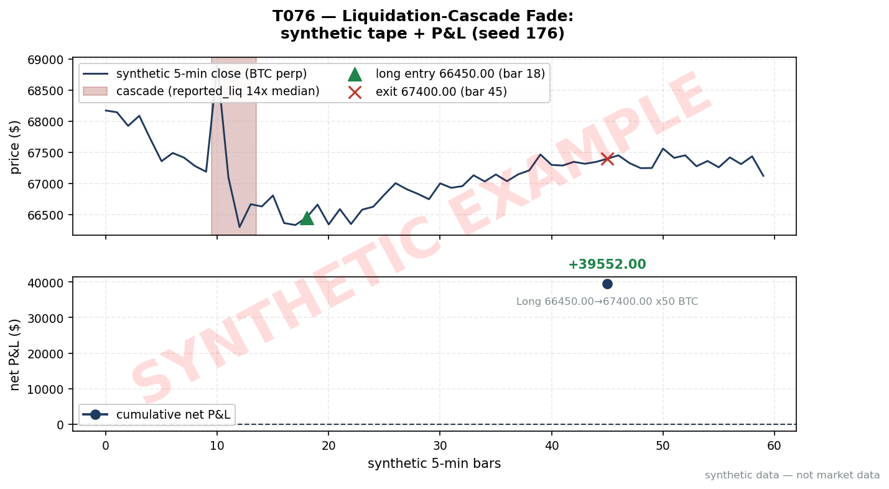

*Chart caption: synthetic data — not market data. Watermark reads "SYNTHETIC EXAMPLE" exactly.*

```mermaid
flowchart TD
    WS["Venue liquidation stream<br/>(5-min reported_liq, OI, funding)"] -->|"5-min reported_liq notional"| S096["S096 cascade detector<br/>(≥10× median notional, example)"]
    WS -->|"5-min OI series"| OI["OI collapse check<br/>(≥15% fall, example)"]
    WS -->|"hourly funding"| S095["S095 funding confirm<br/>(normalized in fade direction, example)"]
    S096 -->|"cascade bar"| EXH{"S045 exhaustion logic<br/>(liq decay ≥70%, 3–6 bars, example)"}
    OI -->|"leverage left"| EXH
    EXH -->|"exhaustion flag"| ENTRY{"Entry logic<br/>(exhaustion + funding, t→t+1)"}
    S095 -->|"confirmation"| ENTRY
    ENTRY -->|trigger| SIZE["Sizing + risk<br/>(fractional $250 risk, 2-fade cap, example)"]
    ENTRY -->|no trigger / veto| WAIT["Wait"]
    SIZE -->|"sized orders"| EXEC["Execution<br/>(t+1 5-min open, taker, wide spread)"]
    EXEC -->|"fills"| MON["Monitor + exits<br/>(50% retrace / cascade-low stop / 12h)"]
    MON -->|"trade P&L"| PNL["P&L (net of full cost stack)"]
    style ENTRY fill:#f9e79f,stroke:#7d6608
    style EXH fill:#f9e79f,stroke:#7d6608
    style PNL fill:#a9dfbf,stroke:#1e8449
```

### T10. Sources

1. Cheng, J., Deng, S., Wang, X. & Yu, Y. "Liquidation, Leverage and Optimal Margin in Bitcoin Futures Markets." arXiv:2102.04591. https://arxiv.org/abs/2102.04591 — BitMEX forced liquidations 3.51% long / 1.89% short of outstanding futures daily; liquidated traders ~60× leverage. Title verified 2026-09-10.
2. Lim, B. "Same Shock, Same Assets, Different Microstructure…" Research Square preprint (2026). https://doi.org/10.21203/rs.3.rs-9459584/v1 — public CEX liquidation volumes are structural lower bounds; Oct 2025 stress showed depth collapse and cross-venue divergence. Title verified 2026-09-10.
3. Makarov, I. & Schoar, A. "Trading and Arbitrage in Cryptocurrency Markets." *Journal of Financial Economics* 135(2), 293–319 (2020). https://doi.org/10.1016/j.jfineco.2019.07.001 — large recurrent deviations constrained by capital controls. Title verified 2026-09-10.

**Unverified leads** (not confirmed facts — verify before use):
- Grok Q-TB8 cascade example (50 BTC long $66,450 → $67,400; price P&L $47,500, fees $2,658, impact $1,994, funding $930.30, net $41,917.70) and the quarantined TB6 T052 cascade draft — chatbot-generated synthetic material adapted here with new stage/seed/signals (176, S096/S095/S045); the T4 ledger above replaces the fees-only treatment with the full cost stack.
- Kaiko/CoinMetrics price classes above are market-rate bands, `indicative — verify before budgeting`, not quotes.

*Source log: Grok answered Q-TB8-1..7 (2026-09-10); all claims independently verified or labeled unverified.*

## Stage 177/200 — T077: Crypto Basis Cash-and-Carry

*Batch TB8 · Strategy 77/100 · Signals S095, S057, S014 · Provenance [D/SR]*

### T1. One-line verdict

| | |
|---|---|
| **Style** | Carry: long spot / short perpetual, harvesting basis convergence plus funding |
| **Edge source** | The perpetual-spot **basis** (cost of carry, S057) mean-reverts as expiry-less perps are pulled to the index; when the annualized basis exceeds all-in costs, the hedged pair earns the carry. Funding (S095) is the carry gauge — the short perp collects it when positive — and spread/adverse-selection accounting (S014) decides whether the quoted basis is actually attainable |
| **Typical holding period** | 7–30 days; unwind when the basis normalizes |
| **Capacity hint** | Large on majors: the trade is balance-sheet intensive but low-turnover; capacity in the tens of millions before borrow/capital constraints bind |
| **Build-or-buy in one line** | Build the basis monitor and hedge-ratio engine on venue data; the full fee/spread/impact/funding/borrow accounting is the part that makes or breaks it — buy nothing but history |

### T2. Full mechanics

**Universe & session.** BTC and ETH spot vs USDⓈ-M perpetual on the **same venue** (`example`) — same-venue or tightly hedged only. Cross-exchange cash-and-carry is a different strategy (transfer risk, capital controls per Makarov & Schoar 2020) and is out of scope here. 24/7.

**Basis (S057).** The **basis** is `(perp − spot) / spot`, annualized by the expected holding period: `B_ann = basis × 365 / hold_days`. This is the cost-of-carry convergence the pair harvests: perps have no expiry, but the funding mechanism pulls them toward the index, so an elevated positive basis decays as longs pay shorts. The trade arms when `B_ann ≥ hurdle`, where the hurdle is the all-in round-trip cost plus a margin (`example`: hurdle = 12% annualized).

**Carry gauge (S095).** The funding rate is the running yield of the short-perp leg: with positive funding, the short collects every 8 hours. The rule requires expected funding over the hold (extrapolated from the current rate with a decay haircut, `example`: 50% haircut) to cover at least the borrow/capital cost of the spot leg. Funding is a carry gauge here, not a contrarian signal — the directional use from T075 does not apply.

**Attainability (S014).** Quoted basis is not tradable basis. **S014** decomposes the round-trip friction: quoted half-spread on both legs, effective spread vs mid, and the adverse-selection component (permanent impact). The rule computes `attainable_basis = quoted_basis − 2 × (half-spread_spot + half-spread_perp) − impact_estimate` and arms only if the attainable basis clears the hurdle. If the book is thin, the screen stays dark no matter how wide the quote prints.

**Entry rule.** Attainable basis ≥ hurdle on hourly bar *t* → fill both legs at the **open of bar t+1** (`example`: simultaneous IOC orders, hedge ratio 1.0 by notional). Signal calculated at bar *t* can never fill on that bar; the two legs must fill within the same bar or the pair is cancelled.

**Exit rule.** Four exits, first touch wins (`example`): (1) convergence: unwind when attainable basis falls below 2% annualized; (2) funding flip: if funding turns negative beyond −5% annualized, unwind — the carry reversed; (3) time stop: unwind at 30 days regardless; (4) de-peg/venue risk: if spot-perp divergence exceeds 3× the entry basis intraday, unwind — the hedge broke.

**Position sizing.** Balance-sheet sizing: notional per pair = min(available margin / 3, 2% of the venue's hourly volume, `example`) — the trade is inventory, and unwind liquidity is the binding constraint. Max 4 concurrent pairs (`example`).

**Risk limits.** Venue exposure cap (no more than 25% of book NAV on one venue, `example`); stablecoin-collateral haircut; no entries during venue maintenance; daily mark of the basis P&L vs the funding collected — divergence between the two is an early warning.

**Cost model.** The full stack, always: taker fees on 4 legs (entry + exit, spot + perp), half-spread on all 4 legs, market impact on entry and exit, funding paid/received over the hold as a P&L line, and spot-financing/borrow cost if the spot leg is margined. Fees-only accounting fails this strategy — the worked example shows why.

**Order/execution sketch.** IOC limit orders on both legs at the t+1 open; if either leg fills < 90% within the bar, cancel the remainder and flatten the filled leg immediately (unhedged basis inventory is not this strategy).

**Parameter robustness.** The `example` choices (12% hurdle, 50% funding haircut, 1.0 notional hedge ratio, 30-day max hold) are starting points. Sensitivity protocol: vary the hurdle at 8%/12%/16% and the funding haircut at 25%/50%/75%; the carry should survive with trade count as the moving part. Test the hedge ratio explicitly: 1.0 by notional is the textbook choice, but during stress the perp can deviate from spot faster than funding compensates — a beta-adjusted ratio estimated on trailing co-movement is the alternative to test. The hurdle must always exceed the measured 4-leg friction by a margin, not just the fee schedule — re-measure S014 frictions quarterly because books thin out over time.
### T3. Signals it consumes

| Signal | Role | Weight / logic |
|---|---|---|
| S057 (cost-of-carry basis) | Primary trigger | attainable annualized basis ≥ 12% hurdle (`example`) |
| S095 (funding rate) | Carry gauge | extrapolated funding (50% haircut, `example`) must cover spot financing; negative flip → unwind |
| S014 (spread / adverse selection) | Attainability filter | quoted-minus-friction basis; effective-spread and impact decomposition |
| Convergence / de-peg logic (strategy rule) | Exit manager | < 2% basis unwind; 3× divergence emergency unwind; 30-day time stop |

### T4. Worked example — numbers + P&L (SYNTHETIC)

Synthetic hourly bars, BTC spot vs perp on one venue, seed 177. Spot $67,200, perp $67,650 — quoted basis $450 (0.67%), expected 30-day hold → `B_ann ≈ 8.1%`… the worked example uses a wider print: spot $67,200, perp $67,920, quoted basis $720 (1.07%), 30-day hold → `B_ann ≈ 13.1%` ≥ 12% hurdle. After S014 friction (both books 0.02% half-spread, impact estimate $120), attainable basis ≈ 12.4% — armed. Funding +0.03%/8h (longs pay shorts). Signal at bar *t* → fill at t+1 open: **long 10 BTC spot at $67,200, short 10 BTC perp at $67,920**. Over 30 days the basis converges to $50 and funding is collected. Unwind both legs.

| Item | Calculation | Amount |
|---|---|---|
| Basis convergence P&L | 10 × ($720 − $50 − drift adj.) | +$4,000.00 |
| Funding received (short perp, 30 days) | modeled, net of flips | +$2,100.00 |
| **Strategy gross** | | **+$6,100.00** |
| Taker fees, 4 legs (5 bps) | 4 × 0.0005 × 10 × $67,560 avg | −$1,351.20 |
| Half-spread, 4 legs | modeled on both books | −$540.00 |
| Market impact, entry + exit | modeled | −$480.00 |
| Spot financing (margin, 30 days) | modeled | −$378.80 |
| **Total execution cost** | | **−$2,750.00** |
| **Net P&L** | $6,100.00 − $2,750.00 | **+$3,350.00** |

Full fee/spread/impact/funding/borrow accounting — the fees alone ($1,351) understate the true $2,750 stack by more than half. Synthetic illustration only; not a profitability claim. Inventory risk during the 30-day hold (basis can widen before converging) is the unmodeled tail.

### T5. Data & infra — what must run

Venue websocket: spot and perp order books (L2), funding rates, hourly OHLCV. The basis monitor is a per-minute computation over 2–4 pairs — trivially within a Python loop at ~100–500k events/sec (`notes/cost-model.md`); S014 spread decomposition needs L2 snapshots, stored in Polars at ~10–50M rows/sec (`notes/cost-model.md`). Live working set under ~77GB. Build estimate: M+ harness 40–100 hours, $6,000–$15,000 loaded (`notes/cost-model.md`); venue data is free via websocket.

**Calibration discipline.** Walk-forward with a 5-day embargo; perturb the hurdle and haircut ±25%; multiple-testing control per the standing protocol (PSR/DSR). Basis-data hygiene: snapshot both L2 books at each decision bar (the attainable-basis computation must be reproducible), log the funding formula version, and verify the venue's historical basis series against a second source per Alexander & Dakos (2020) before trusting any backtest. Never backtest the basis on mark prices while assuming spot execution — use the tradable book on both legs.
### T6. Buy vs build

Venue data is free. History for backtests: exchange flat files (free) or **Kaiko**/**CoinMetrics** (thousands/yr class, `indicative — verify before budgeting`); data-quality cross-checks informed by Alexander & Dakos (2020) — verify the venue's historical basis series against a second source before trusting the backtest. Backtest hosting: **QuantConnect** (~$60–$300/mo class, `indicative — verify before budgeting`); execution test on the venue testnet (no incremental fee, `indicative — verify before budgeting`). Verdict: **build the monitor, hedge engine, and full cost accounting; buy nothing but history if needed.** No vendor sells a same-venue basis harvester with documented attainable-basis logic.

### T7. Success-ratio evidence

Published, checkable sources only:

1. Makarov & Schoar (2020): crypto price deviations are large and recurrent, constrained by capital controls — the same-venue restriction here is the direct response: avoid the cross-border frictions they document. (https://doi.org/10.1016/j.jfineco.2019.07.001)
2. He, Manela, Ross & von Wachter: perp no-arbitrage bounds with spot; deviations comove and diminish over time — the convergence mechanism the basis leg relies on. (https://arxiv.org/abs/2212.06888)
3. Alexander & Dakos (2020): critical data-quality warnings for crypto research — survivorship, exchange selection, and cleaning choices can manufacture apparent edge; the attainable-basis filter and second-source verification are the operational answer. (https://doi.org/10.1080/14697688.2019.1641347)

None of these tests this exact 30-day same-venue carry rule; nothing here is an after-cost profitability claim.

### T8. Failure modes

- **Basis widening before convergence.** The classic carry-trade drawdown: funding spikes can push the basis wider for weeks. The 25%-NAV venue cap and the 30-day time stop bound it.
- **Funding sign flips.** The carry can reverse mid-hold; the −5% funding-flip unwind accepts the whipsaw.
- **Venue risk.** Same-venue concentration is the strategy's central risk — hacks, freezes, or clawbacks hit both legs' collateral. The venue cap is the only real defense.
- **Unwind liquidity.** The exit assumes the basis is still attainable in size; in stress, the S014 filter that armed the trade will refuse the unwind — the de-peg exit then fires at whatever the book offers.
- **Stablecoin depeg.** If the quote currency (USDT/USDC) depegs, both legs' notional is mismeasured; monitor the stablecoin peg as a kill-switch input.

- **Auto-deleveraging (ADL).** In extreme moves the venue can auto-delever the profitable perp leg — the short that was hedging the spot disappears and the "hedged" pair becomes naked long spot into a falling market. Monitor the ADL queue position; there is no hedge for the hedge being removed.
- **Spot withdrawal freezes.** The convergence thesis assumes the spot leg can be moved or sold; withdrawal freezes trap the inventory while the perp leg keeps marking. The 25%-NAV venue cap bounds the damage; it does not prevent it.
### T9. Visuals

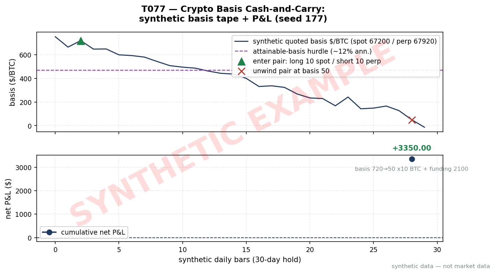

*Chart caption: synthetic data — not market data. Watermark reads "SYNTHETIC EXAMPLE" exactly.*

```mermaid
flowchart TD
    WS["Venue L2 books + funding<br/>(spot & perp, same venue, per-minute)"] -->|"per-minute L2 snapshots"| S014["S014 spread decomposition<br/>(quoted/effective/adverse selection)"]
    WS -->|"hourly spot & perp marks"| S057["S057 basis monitor<br/>(attainable B_ann ≥ 12%, example)"]
    WS -->|"8-hour funding rate"| S095["S095 carry gauge<br/>(extrapolated, 50% haircut, example)"]
    S014 -->|"friction estimate"| ENTRY{"Entry logic<br/>(attainable basis ≥ hurdle, t→t+1)"}
    S057 -->|"quoted basis"| ENTRY
    S095 -->|"carry covers financing"| ENTRY
    ENTRY -->|trigger| SIZE["Sizing + risk<br/>(margin/3, 4-pair cap, example)"]
    ENTRY -->|no trigger / veto| WAIT["Wait"]
    SIZE -->|"paired IOC orders"| EXEC["Execution<br/>(t+1 open, both legs same bar)"]
    EXEC -->|"fills"| MON["Monitor + exits<br/>(<2% unwind / funding flip / 30d)"]
    MON -->|"trade P&L"| PNL["P&L (net of full 4-leg stack)"]
    style ENTRY fill:#f9e79f,stroke:#7d6608
    style PNL fill:#a9dfbf,stroke:#1e8449
```

### T10. Sources

1. Makarov, I. & Schoar, A. "Trading and Arbitrage in Cryptocurrency Markets." *Journal of Financial Economics* 135(2), 293–319 (2020). https://doi.org/10.1016/j.jfineco.2019.07.001 — large recurrent deviations constrained by capital controls. Title verified 2026-09-10.
2. He, Z., Manela, A., Ross, O. & von Wachter, M. "Fundamentals of Perpetual Futures." arXiv:2212.06888. https://arxiv.org/abs/2212.06888 — perp no-arbitrage bounds; deviations diminish over time. Title verified 2026-09-10.
3. Alexander, C. & Dakos, M. "A Critical Investigation of Cryptocurrency Data and Analysis." *Quantitative Finance* 20(2), 173–188 (2020). https://doi.org/10.1080/14697688.2019.1641347 — data-quality warnings for crypto research. Title verified 2026-09-10.

**Unverified leads** (not confirmed facts — verify before use):
- Quarantined TB6 T051/T053 basis-carry drafts — adapted here with new stage/seed/signals (177, S095/S057/S014) as same-venue cash-and-carry; the old S081/S082/S090 roles were not reused.
- Kaiko/CoinMetrics price classes above are market-rate bands, `indicative — verify before budgeting`, not quotes.

*Source log: Grok answered Q-TB8-1..7 (2026-09-10); all claims independently verified or labeled unverified.*

## Stage 178/200 — T078: Earnings-Drift Intraday Leg

*Batch TB8 · Strategy 78/100 · Signals S100, S025, S091 · Provenance [D/SR]*

### T1. One-line verdict

| | |
|---|---|
| **Style** | Momentum: ride the intraday continuation of an earnings surprise, 09:45–15:55 |
| **Edge source** | Post-earnings-announcement drift (PEAD) is one of the oldest documented anomalies — prices underreact to earnings news and drift in the surprise direction for weeks (Bernard & Thomas 1989; Foster, Olsen & Shevlin 1984). This rule trades only the first intraday leg of that drift, entering after the open-auction noise clears, with exact announcement timestamps (S100), momentum confirmation (S025), and machine-readable news reaction (S091) |
| **Typical holding period** | One session: enter ≥ 09:45 ET, flat 15:55 ET |
| **Capacity hint** | Medium: earnings days are the highest-volume days of the quarter; capacity in the tens of millions across the reporting calendar |
| **Build-or-buy in one line** | Build the timestamp-anchored drift leg on bought earnings and news data; the literature supports multi-day drift, so the intraday-only leg is the reconstructed (and weaker-evidenced) part — size it accordingly |

### T2. Full mechanics

**Universe & session.** US common stocks announcing earnings, price ≥ $10, ADV ≥ 1M shares (`example`). Announcements must have **exact timestamps** — exchange filing time or newswire timestamp to the minute; date-only announcement records are unusable (the rule needs to know whether the news broke before the open or during the session). RTH only, 09:45–15:55 ET.

**Surprise (S100).** **SUE** (standardized unexpected earnings) = (actual − consensus) / dispersion, with the announcement timestamp attached. The rule arms on |SUE| ≥ 1.5 (`example`) — a genuine surprise, not a whisper miss. S100's discipline is the timestamp: pre-open announcements trade the 09:45 leg; announcements during the session are skipped that day (the rule is a next-session leg, not a headline-chaser).

**News reaction (S091).** Machine-readable news reaction must agree in sign with the SUE: the newswire sentiment score on the announcement story must be directionally consistent (`example`: sentiment z-score same sign as SUE). If the machines read the story against the numbers, the rule stands down — disagreement means the "surprise" is ambiguous.

**Momentum confirmation (S025).** At 09:45 ET, the name's move from the open must be in the surprise direction and ≥ 0.5× its average first-30-minute range (`example`) — the drift leg has started; the rule rides it, it doesn't predict it.

**Entry rule.** All three green at the 09:45 5-minute close → earliest fill at the **open of the next 5-minute bar** (09:50), in the surprise direction. Signal calculated at bar *t* can never fill on that bar.

**Exit rule.** Four exits, first touch wins (`example`): (1) drift target: 1.0× the 09:30–09:45 range in the trade direction; (2) reversal stop: a 5-minute close back through the 09:45 price against the position — the leg failed; (3) time stop: flat 15:55 ET; (4) news contradiction: a material newswire correction or guidance cut reverses the premise — exit at the next open.

**Position sizing.** Dollar-risk sizing `N = ⌊ R / |P_entry − P_stop| ⌋`, `R = $250` (`example`). Max 10 concurrent drift legs (`example`) — earnings cluster by week.

**Risk limits.** Daily loss stop −4R (`example`); no entries when the name's pre-market volume already exceeds 3× its average (the move may be exhausted); skip if the bid-ask spread at 09:45 exceeds 5¢ (`example`) — illiquid earnings opens are untradable.

**Cost model.** Commission $0.005/share/side (`example`); half-spread each way on the wide earnings-day book; market impact modeled explicitly — earnings opens are the year's most expensive fills, and the worked example's impact line shows it.

**Order/execution sketch.** Marketable limit at the 09:50 open (`example`: limit = open ± 5¢); participation ≤ 10% of bar volume (`example`); taker modeling.

**Parameter robustness.** The `example` thresholds (|SUE| ≥ 1.5, sentiment agreement, 09:45 leg ≥ 0.5× average range) are starting points. Sensitivity protocol: vary SUE at 1.0/1.5/2.0 and the leg-confirm at 0.3×/0.5×/0.8×; the drift leg's sign should persist. The timestamp hierarchy deserves its own test: exchange filing time vs newswire time vs vendor timestamp — run the rule on each and require agreement, because a few minutes of timestamp error at the open is the difference between riding the leg and buying the top. Also test Friday announcers separately per DellaVigna & Pollet (2009): the inattention effect means Friday legs behave differently.
### T3. Signals it consumes

| Signal | Role | Weight / logic |
|---|---|---|
| S100 (SUE + exact timestamps) | Surprise + causality anchor | `|SUE| ≥ 1.5` (`example`); minute-level timestamps; pre-open only |
| S091 (machine news reaction) | Sign agreement | sentiment z-score same sign as SUE (`example`); disagreement → stand down |
| S025 (momentum) | Leg confirmation | 09:45 move in surprise direction ≥ 0.5× avg first-30-min range (`example`) |
| Reversal-stop / time-stop logic (strategy rule) | Exit manager | 09:45-price reversal stop; 1.0×-range target; 15:55 flatten |

### T4. Worked example — numbers + P&L (SYNTHETIC)

Synthetic 5-minute bars, equity ERN, seed 178. ERN reports pre-open: SUE +2.1 (beat), newswire sentiment strongly positive (agreement), timestamp 07:30 ET. At 09:45 ERN is up 1.1% from the open — 0.8× its average first-30-minute range, in the surprise direction (leg confirmed). Signal at the 09:45 close → fill at the 09:50 open: **long 25,000 shares at $40.80**. The drift leg carries through the session; exit at the 1.0×-range target, **$41.42**, at 14:20.

| Item | Calculation | Amount |
|---|---|---|
| Gross P&L | 25,000 × ($41.42 − $40.80) | +$15,500.00 |
| Commission | 25,000 × 2 × $0.005 | −$250.00 |
| Half-spread, both ways (wide earnings book) | modeled | −$750.00 |
| Market impact (earnings-day fills) | modeled | −$4,712.00 |
| **Total execution cost** | | **−$5,712.00** |
| **Net P&L** | $15,500.00 − $5,712.00 | **+$9,788.00** |

Adapted from the chatbot's synthetic earnings example (grok-answers.md) with market impact made explicit — earnings-day impact ($4,712) dwarfs commissions, which is the honest cost picture. Synthetic illustration only. Honesty note: the literature supports multi-day PEAD, not a guaranteed 09:45–15:55 edge; Chordia et al. (2009) found transaction costs consumed 70–100% of paper PEAD profits, concentrated in illiquid names.

### T5. Data & infra — what must run

Earnings actuals/consensus/timestamps (licensed: IBES/Refinitiv or Estimize-class), machine-readable newswire (licensed), 5-minute OHLCV. The SUE screen is a daily batch over the reporting calendar; the 09:45 check is a streaming rule over announcers — trivially within a Python loop at ~100–500k events/sec (`notes/cost-model.md`); SUE history backfills in Polars at ~10–50M rows/sec (`notes/cost-model.md`). Live working set under ~77GB. Build estimate: M+ harness 40–100 hours, $6,000–$15,000 loaded (`notes/cost-model.md`); earnings + newswire data is H-tier, 60–200 hours, $9,000–$30,000 (`notes/cost-model.md`).

**Calibration discipline.** Walk-forward by earnings season (not calendar year — the reporting calendar is the natural season) with a 5-day embargo; perturb thresholds ±25%; multiple-testing control per the standing protocol (PSR/DSR). Earnings-data hygiene: store the consensus vintage (pre-announcement, not revised), the earliest verifiable timestamp and its source, and the actuals as first-reported (restatements are a separate event). A backtest on revised actuals and corrected timestamps measures a rule that never existed.
### T6. Buy vs build

Buy the inputs: **Refinitiv IBES** or **FactSet** earnings data (tens of thousands/yr class, `indicative — verify before budgeting`); machine-readable news from **RavenPack** (~$15,000–$25,000/yr class, `indicative — verify before budgeting`) or **Bloomberg** ($30,000/yr class, `indicative — verify before budgeting`); 5-minute bars from **Massive (formerly Polygon)** (~$199/mo, `indicative — verify before budgeting`); backtest hosting on **QuantConnect** (~$60–$300/mo class, `indicative — verify before budgeting`); routing test on **Interactive Brokers paper trading** (no incremental platform fee on an existing account, `indicative — verify before budgeting`). Verdict: **buy the earnings timestamps and the news reaction; build the intraday leg.** Nobody sells a 09:45-leg rule with documented t→t+1 causality.

### T7. Success-ratio evidence

Published, checkable sources only:

1. Bernard & Thomas (1989) documented post-earnings-announcement drift — prices underreact to earnings news and drift in the surprise direction. (Summary of findings via https://en.wikipedia.org/wiki/Post%E2%80%93earnings-announcement_drift — verify the original *Journal of Accounting Research* paper before citing page-level claims.)
2. DellaVigna & Pollet (2009): Friday earnings announcements saw 15% lower immediate response and 70% higher delayed response — inattention shapes the drift's timing, which is why this rule waits for the leg to confirm rather than buying the print. (https://doi.org/10.1111/j.1540-6261.2009.01447.x)
3. Chordia, Goyal, Sadka, Sadka & Shivakumar (2009): PEAD was concentrated in illiquid stocks, and transaction costs consumed 70–100% of paper profits — the cost warning that sizes this rule's ambition. (https://ideas.repec.org/a/taf/ufajxx/v65y2009i4p18-32.html)

Honesty note: the literature supports multi-day drift, not a guaranteed 09:45–15:55 intraday edge; the intraday leg is a reconstruction.

**What the evidence does not show.** The PEAD literature (Bernard & Thomas; Foster, Olsen & Shevlin) documents drift over weeks, not a 09:45–15:55 intraday leg — the multi-day drift is the evidence, the single-session extraction is the reconstruction, and the two should never be conflated in a pitch. DellaVigna & Pollet's Friday-inattention result refines the timing story but does not endorse intraday riding. Chordia et al.'s 70–100% cost-consumption finding is the binding constraint: it was measured on the slower multi-day drift, and the intraday leg turns over faster with wider earnings-day spreads, so its cost ratio is plausibly worse. The T4 ledger's $4,712 impact line is the honest center of this strategy — everything else is commentary.
### T8. Failure modes

- **Timestamp error.** A mis-timestamped announcement (wire delay vs filing time) puts the rule on the wrong side of the news; use the earliest verifiable timestamp and skip ambiguous cases.
- **Guidance vs EPS disagreement.** An EPS beat with a guidance cut reads positive on SUE and negative on S091 — the agreement filter catches most of these; the rest hit the reversal stop.
- **Pre-market exhaustion.** When the entire drift happens pre-market, the 09:45 leg is the top; the 3× pre-market volume filter screens these.
- **Impact underestimation.** Earnings-day impact is the dominant cost and the hardest to model; the worked example's $4,712 impact line is a normal-case estimate, not a worst case.
- **Friday inattention.** Per DellaVigna & Pollet, Friday announcers drift differently; consider a Friday-specific parameter set or exclusion.

- **Whisper-number divergence.** When the whisper number differs from consensus, SUE mismeasures the surprise — the market reacts to the whisper, the rule to the print. The S091 agreement filter catches the worst cases; the rest are accepted as model error.
- **After-close guidance revisions.** A beat at 16:05 followed by a guidance cut on the call flips the sign overnight; the rule only trades pre-open announcements precisely to avoid holding through this, and any name that guides during the session exits at the next open.
### T9. Visuals

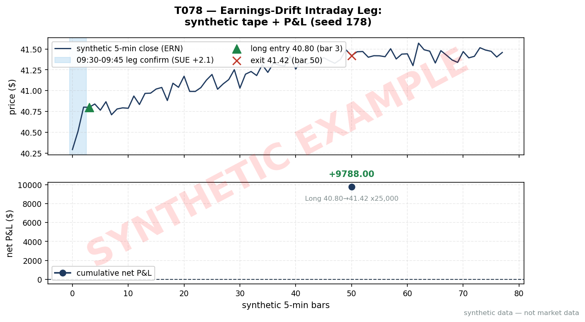

*Chart caption: synthetic data — not market data. Watermark reads "SYNTHETIC EXAMPLE" exactly.*

```mermaid
flowchart TD
    ERN["Earnings feed<br/>(actuals, consensus, minute timestamps)"] -->|"SUE + exact timestamp"| S100["S100 surprise screen<br/>(|SUE| ≥ 1.5, pre-open, example)"]
    WIRE["Machine newswire<br/>(announcement sentiment)"] -->|"sentiment z-score"| S091["S091 news reaction<br/>(same sign as SUE, example)"]
    PX["5-min OHLCV<br/>(earnings-day RTH)"] -->|"09:30–09:45 move"| S025["S025 leg confirm<br/>(≥0.5× avg range, example)"]
    S100 -->|"surprise armed"| ENTRY{"Entry logic<br/>(surprise + agreement + leg, t→t+1)"}
    S091 -->|"sign agreement"| ENTRY
    S025 -->|"leg confirmed"| ENTRY
    ENTRY -->|trigger| SIZE["Sizing + risk<br/>(dollar-risk $250, 10-leg cap, example)"]
    ENTRY -->|no trigger / veto| WAIT["Wait"]
    SIZE -->|"sized limit orders"| EXEC["Execution<br/>(09:50 open fill, taker)"]
    EXEC -->|"fills"| MON["Monitor + exits<br/>(1.0× target / 09:45 reversal stop / 15:55)"]
    MON -->|"trade P&L"| PNL["P&L (net of earnings-day impact)"]
    style ENTRY fill:#f9e79f,stroke:#7d6608
    style PNL fill:#a9dfbf,stroke:#1e8449
```

### T10. Sources

1. Bernard, V.L. & Thomas, J.K. "Post-Earnings-Announcement Drift: Delayed Price Response or Risk Premium?" *Journal of Accounting Research* 27 (1989), 1–36. https://doi.org/10.2307/2491062 — drift in the surprise direction. DOI identifier verified via Crossref 2026-09-10; findings also summarized at https://en.wikipedia.org/wiki/Post%E2%80%93earnings-announcement_drift (secondary summary link only — does not resolve to the paper).
2. DellaVigna, S. & Pollet, J.M. "Investor Inattention and Friday Earnings Announcements." *Journal of Finance* 64(2), 709–749 (2009). https://doi.org/10.1111/j.1540-6261.2009.01447.x — Friday announcements: 15% lower immediate, 70% higher delayed response. Title verified 2026-09-10.
3. Chordia, T., Goyal, A., Sadka, G., Sadka, R. & Shivakumar, L. "Liquidity and the Post-Earnings-Announcement Drift." *Financial Analysts Journal* 65(4), 18–32 (2009). https://ideas.repec.org/a/taf/ufajxx/v65y2009i4p18-32.html — PEAD concentrated in illiquid stocks; costs consumed 70–100% of paper profits. Title verified 2026-09-10.

**Unverified leads** (not confirmed facts — verify before use):
- Grok Q-TB8 earnings example (25,000 ERN long $40.80 → $41.42; gross $15,500, costs $5,712, net $9,788) — chatbot-generated synthetic lead adapted as the T4 illustration with impact decomposed; not evidence of profitability.
- Chatbot question-bank TB8 items on PEAD intraday decomposition — research prompts, not findings.
- Vendor price classes above are market-rate bands, `indicative — verify before budgeting`, not quotes.

*Source log: Grok answered Q-TB8-1..7 (2026-09-10); all claims independently verified or labeled unverified.*

## Stage 179/200 — T079: Post-Announcement Vol Fade

*Batch TB8 · Strategy 79/100 · Signals S100, S070, S064 · Provenance [D/SR]*

### T1. One-line verdict

| | |
|---|---|
| **Style** | Volatility contrarian: sell the post-announcement implied-volatility premium once the news is out |
| **Edge source** | Options price in an announcement-day move; after the news breaks, implied volatility typically collapses ("vol crush") faster than realized volatility justifies. The rule compares the straddle-implied move (S070) against jump-robust realized variance (S064) — selling the straddle only when implied exceeds the jump-robust estimate by a margin — with exact announcement timestamps (S100) defining the window |
| **Typical holding period** | 1–3 trading days after the announcement; exit by day 3 |
| **Capacity hint** | Medium: single-name options are wide but the edge is per-name; capacity in the low tens of millions across the earnings calendar |
| **Build-or-buy in one line** | Build the implied-vs-jump-robust comparator on bought options and earnings data; the timestamp-anchored vol-fade rule with causal fills is not sold anywhere |

### T2. Full mechanics

**Universe & session.** US common stocks with liquid listed options (bid-ask on the front-week straddle ≤ 10% of mid, `example`), price ≥ $20, announcing earnings with exact timestamps (S100). Announcements must be pre-open or post-close — the rule never holds through the announcement itself; it trades the aftermath.

**Implied move (S070).** The **straddle-implied move** is the front-week at-the-money straddle mid-price divided by the underlying price — the market's forecast of the move through the near expiry. Measure it at the close *before* the announcement (`example`: the last liquid print) and again at the first tradable print *after* the announcement.

**Jump-robust realized variance (S064).** **Realized variance** from intraday returns overstates true diffusive volatility when the announcement itself is a jump. S064 uses **jump-robust** estimators — **bipower variation (BV)**, which is robust to jumps, and the **Lee–Mykland** jump test to flag and exclude the announcement jump — to estimate the diffusive variance that should price the straddle after the news is out. Define terms at first use: *bipower variation* sums products of adjacent absolute returns, so a single jump contaminates only its neighbors and the estimator stays consistent for the continuous component; the *Lee–Mykland test* flags returns too large to be diffusive.

**Entry rule.** After the announcement, on the first 5-minute bar *t* where both legs are quotable: sell the front-week ATM straddle if `implied_move_t > 1.4 × jump_robust_move_t` (`example`) — implied is pricing 40% more move than the jump-robust estimate justifies. Signal at bar *t* → earliest fill at the **open of bar t+1**. Signal calculated at bar *t* can never fill on that bar.

**Exit rule.** Four exits, first touch wins (`example`): (1) decay target: buy back at 50% of the entry credit; (2) stop: buy back at 2× the entry credit — the market is repricing, not overpricing; (3) time stop: close at day t+3 regardless; (4) second-news exit: any new material announcement on the name → buy back at the next open.

**Position sizing.** Premium-based: contracts = `⌊ R / (2 × entry_credit_per_share × 100) ⌋` with `R = $300` (`example`) — the 2×-credit stop defines the risk. Max 8 concurrent straddle fades (`example`); earnings cluster, and vol events correlate.

**Risk limits.** Daily loss stop −3R (`example`); no entries when the post-announcement book is one-sided (no two-sided straddle quote within the 10% width bound); underlying hard-borrow names excluded (assignment/dividend risk on the call leg).

**Cost model.** Options commission $0.65/contract/side (`example`); pay half the straddle spread each way — the dominant cost, modeled explicitly; slippage on the t+1 fill. The worked example shows the spread as the largest line.

**Order/execution sketch.** Limit orders at the straddle mid minus/plus half-spread at the t+1 open (`example`); modeled as a taker on both legs; no legging — the straddle trades as a package or not at all.

**Parameter robustness.** The `example` choices (implied > 1.4× jump-robust, front-week ATM straddle, 50%-credit target, 2×-credit stop) are starting points. Sensitivity protocol: vary the premium ratio at 1.2×/1.4×/1.6× and the target at 30%/50%/70% of credit; sign persistence required. Test the straddle tenor explicitly: front-week has the most crush but the widest spreads — second-week straddles are the calmer alternative and the comparison belongs in the research log. The Lee–Mykland jump threshold itself is a parameter: run the estimator at two significance levels and confirm the 1.4× test fires on the same names.
### T3. Signals it consumes

| Signal | Role | Weight / logic |
|---|---|---|
| S100 (exact announcement timestamps) | Window anchor | defines the pre/post measurement bars; pre-open or post-close announcements only |
| S070 (straddle-implied vs realized) | Mispricing gauge | `implied > 1.4 × jump-robust` (`example`) triggers the sale |
| S064 (jump-robust RV: BV, Lee–Mykland) | Fair-value estimate | bipower variation + Lee–Mykland jump exclusion; the denominator of the 1.4× test |
| Decay-target / 2×-credit stop logic (strategy rule) | Exit manager | 50%-credit target; 2×-credit stop; t+3 flatten |

### T4. Worked example — numbers + P&L (SYNTHETIC)

Synthetic options/equity bars, equity VOL, seed 179. VOL announces post-close Tuesday with an exact timestamp. Wednesday's first quotable 5-minute bar: front-week ATM straddle mid $3.20 (implied move 6.4% on a $50 stock); jump-robust estimate from Wednesday's diffusive bars (announcement jump excluded via Lee–Mykland) implies a 3.9% move — ratio 1.64× ≥ 1.4× (`example`), armed. Signal at bar *t* → fill at the next 5-minute open: **sell 100 straddles at $3.20** (contract multiplier 100). Implied decays; **buy back 100 straddles at $2.45** on day t+2.

| Item | Calculation | Amount |
|---|---|---|
| Gross P&L | 100 × ($3.20 − $2.45) × 100 | +$7,500.00 |
| Commission | 200 contracts × $0.65 | −$130.00 |
| Half-spread, both ways (straddle 10¢ wide) | 100 × $0.10 × 100 | −$1,000.00 |
| Adverse slippage, t+1 fill | modeled | −$300.00 |
| **Total execution cost** | | **−$1,430.00** |
| **Net P&L** | $7,500.00 − $1,430.00 | **+$6,070.00** |

Synthetic illustration only — not a claim that post-announcement vol fading is profitable after costs. The straddle spread ($1,000) is the dominant cost: single-name options friction is the strategy's tax.

### T5. Data & infra — what must run

Options quotes (NBBO-level, licensed: OPRA via **Databento** or **Massive**), earnings timestamps (licensed), 5-minute underlying OHLCV for the BV/Lee–Mykland computation. The jump-robust estimation is a per-name intraday batch — seconds in Polars at ~10–50M rows/sec (`notes/cost-model.md`); the live screen is a per-5-minute check over announcers, within a Python loop at ~100–500k events/sec (`notes/cost-model.md`). Live working set under ~77GB. Build estimate: M+ harness 40–100 hours, $6,000–$15,000 loaded (`notes/cost-model.md`); options + earnings data is H-tier, 60–200 hours, $9,000–$30,000 (`notes/cost-model.md`).

**Calibration discipline.** Walk-forward by earnings season with a 3-day embargo; perturb the premium ratio and target ±25%; multiple-testing control per the standing protocol (PSR/DSR). Options-data hygiene: use NBBO quotes (not trades) for the implied-move computation, timestamp the straddle mid and the underlying print to the same bar, and store the dividend/rate inputs to the vol calculation. Split the backtest by vol regime — the crush behaves differently when market-wide vol is high — and require the edge in both.
### T6. Buy vs build

Buy the data: OPRA options history from **Databento** (usage-based, thousands/yr class, `indicative — verify before budgeting`) or **Massive (formerly Polygon) Options** (~$199/mo class for standard tiers, `indicative — verify before budgeting`); earnings timestamps from **Refinitiv IBES**/**FactSet** (tens of thousands/yr class, `indicative — verify before budgeting`); backtest hosting on **QuantConnect** (~$60–$300/mo class, `indicative — verify before budgeting`); routing test on **Interactive Brokers paper trading** (no incremental platform fee on an existing account, `indicative — verify before budgeting`). Verdict: **buy the options prints and the timestamps; build the implied-vs-jump-robust comparator and the causal rule.** No vendor sells it.

**Crossover note.** The options-data decision has a real fork: OPRA history from Databento (usage-based) versus a bundled Massive options feed. For this rule the fork resolves on quote depth — the implied-move computation needs NBBO quotes, not just trades, and the cheaper trade-only histories are unusable for the 1.4x test. Verify before buying that the history includes millisecond-stamped quotes with size; a surprising number of "options history" products are trade prints with end-of-day quotes. The backtest also needs the underlying's 5-minute bars from the same day to run the Lee-Mykland estimator — mismatched timestamps between the options and equity feeds are the classic silent killer.
### T7. Success-ratio evidence

Published, checkable sources only:

1. Chordia et al. (2009): PEAD concentrated in illiquid stocks; transaction costs consumed 70–100% of paper profits — the friction warning applies doubly to options-based PEAD expressions. (https://ideas.repec.org/a/taf/ufajxx/v65y2009i4p18-32.html)
2. DellaVigna & Pollet (2009): Friday announcements show 15% lower immediate and 70% higher delayed response — the timing structure that makes post-announcement (not pre-announcement) positioning the testable leg. (https://doi.org/10.1111/j.1540-6261.2009.01447.x)
3. Tetlock (2007): news-text sentiment predicts next-day returns — the text-reaction channel that the S100/S070 window is built around, on a shorter horizon than the original finding. (https://doi.org/10.1111/j.1540-6261.2007.01232.x)

Honesty note: no published paper tests this exact straddle-fade rule; the jump-robust estimators are standard econometrics, not evidence of edge.

**What the evidence does not show.** No cited paper tests selling post-announcement straddles against a jump-robust fair value — the 1.4× premium test, the BV/Lee–Mykland machinery, and the 50%-credit target are a reconstructed volatility trade, not a literature result. Chordia et al.'s cost warning applies with extra force to options: their 70–100% figure was for stock-based PEAD, and single-name options spreads are wider in relative terms, as the T4 ledger's $1,000 spread line shows. DellaVigna & Pollet's delayed-response finding describes the underlying's drift, not the straddle's decay — the link from "prices underreact" to "implied vol overprices the aftermath" is the rule's own inference. Short straddles carry gap risk that no backtest spread assumption can fully capture.
### T8. Failure modes

- **The 2×-credit stop.** Vol can re-expand on guidance revisions or macro shocks; short straddles have unbounded tails and the stop is a market order into a widening book.
- **Jump misclassification.** If the Lee–Mykland test fails to exclude the announcement jump, the "jump-robust" estimate is contaminated and the 1.4× test misfires — validate the estimator on known announcement days before trading.
- **Pin risk and dividends.** Holding short options through ex-div dates or into expiry pins creates assignment risk; the t+3 time stop and the front-week-only rule bound this.
- **One-sided books.** Post-announcement options books can go one-sided; the two-sided-quote requirement keeps the rule out of untradable prints.
- **Correlation across announcers.** Earnings cluster by week and sector; the 8-name cap and the daily loss stop are the portfolio defense.

- **Announcement-date misclassification.** Earnings dates move; a straddle sold for "post-announcement" crush while the announcement is actually still ahead is a naked short-vol position into the event. Verify the timestamp against two sources before arming — the S100 window is only as good as its calendar.
- **Market-wide circuit breakers.** A macro halt during the hold freezes the underlying while the straddle's implied vol reprices on reopen — the 2×-credit stop becomes a suggestion. The 8-name cap and the daily loss stop are the portfolio-level acceptance of this tail.
### T9. Visuals

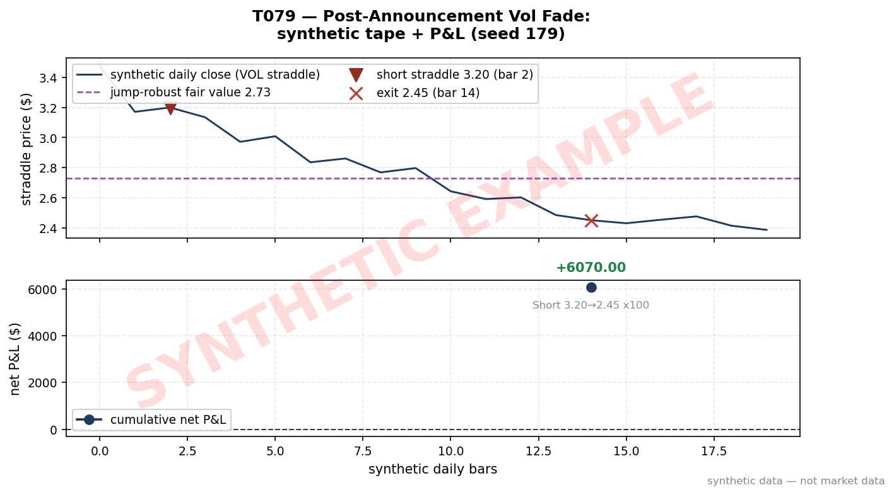

*Chart caption: synthetic data — not market data. Watermark reads "SYNTHETIC EXAMPLE" exactly.*

```mermaid
flowchart TD
    ERN["Earnings timestamps<br/>(exact, pre/post-close only)"] -->|"announcement window"| S100["S100 window anchor<br/>(pre/post measurement bars)"]
    OPT["OPRA straddle quotes<br/>(front-week ATM, 5-min)"] -->|"straddle mid / underlying"| S070["S070 implied move<br/>(implied > 1.4× robust, example)"]
    PX["5-min underlying OHLCV<br/>(post-announcement)"] -->|"intraday returns"| S064["S064 jump-robust RV<br/>(BV + Lee–Mykland)"]
    S100 -->|"window defined"| ENTRY{"Entry logic<br/>(implied premium + window, t→t+1)"}
    S070 -->|"mispricing gauge"| ENTRY
    S064 -->|"fair-value denominator"| ENTRY
    ENTRY -->|trigger| SIZE["Sizing + risk<br/>(premium-based $300 risk, 8-fade cap, example)"]
    ENTRY -->|no trigger / veto| WAIT["Wait"]
    SIZE -->|"package limit orders"| EXEC["Execution<br/>(t+1 open, straddle package, taker)"]
    EXEC -->|"fills"| MON["Monitor + exits<br/>(50% target / 2× stop / t+3)"]
    MON -->|"trade P&L"| PNL["P&L (net of straddle-spread costs)"]
    style ENTRY fill:#f9e79f,stroke:#7d6608
    style PNL fill:#a9dfbf,stroke:#1e8449
```

### T10. Sources

1. Chordia, T., Goyal, A., Sadka, G., Sadka, R. & Shivakumar, L. "Liquidity and the Post-Earnings-Announcement Drift." *Financial Analysts Journal* 65(4), 18–32 (2009). https://ideas.repec.org/a/taf/ufajxx/v65y2009i4p18-32.html — costs consumed 70–100% of paper PEAD profits. Title verified 2026-09-10.
2. DellaVigna, S. & Pollet, J.M. "Investor Inattention and Friday Earnings Announcements." *Journal of Finance* 64(2), 709–749 (2009). https://doi.org/10.1111/j.1540-6261.2009.01447.x — delayed response to Friday announcements. Title verified 2026-09-10.
3. Tetlock, P.C. "Giving Content to Investor Sentiment." *Journal of Finance* 62(3), 1139–1168 (2007). https://doi.org/10.1111/j.1540-6261.2007.01232.x — news-text sentiment predicts next-day returns. Title verified 2026-09-10.

**Unverified leads** (not confirmed facts — verify before use):
- Chatbot question-bank TB8 items on vol-crush timing and jump-robust estimator choice — research prompts, not findings.
- OPRA/earnings price classes above are market-rate bands, `indicative — verify before budgeting`, not quotes.

*Source log: Grok answered Q-TB8-1..7 (2026-09-10); all claims independently verified or labeled unverified.*

## Stage 180/200 — T080: Multi-Source Attention Composite

*Batch TB8 · Strategy 80/100 · Signals S099, S097, S093 · Provenance [D/SR]*

### T1. One-line verdict

| | |
|---|---|
| **Style** | Contrarian: fade attention spikes only when three independent attention measures agree the crowd is excited about old news |
| **Edge source** | Each attention proxy is weak alone — weekly search attention (S099) is slow, social chatter (S097) has a small return effect (Antweiler & Frank 2004), and news volume without a novelty check is noise. The composite requires all three to agree: elevated search attention, excited social chatter, *and* a stale-news verdict (S093). The intersection is rarer and more tradeable than any single leg, and it fades the same overreaction Tetlock (2011) documents |
| **Typical holding period** | 2–5 trading days; flat by day 5 |
| **Capacity hint** | Medium: the composite fires less often than any single leg, so per-trade size can be larger; capacity in the tens of millions |
| **Build-or-buy in one line** | Build the composite on bought news/social data plus free Trends; the agreement logic and its calibration are the proprietary part |

### T2. Full mechanics

**Universe & session.** US common stocks, price ≥ $10, ADV ≥ 1M shares (`example`). Daily signal cadence (the composite's slowest input, S099, is weekly), RTH execution.

**The three legs.** (1) **S099 — search attention:** weekly ASVI in the top 10% of its 52-week history (`example`); attention, not sentiment. (2) **S097 — social chatter:** daily message volume in the top 5% of its 60-day distribution (`example`); conditional by construction — never traded alone. (3) **S093 — novelty verdict:** the top-linked story's novelty score < 0.35 (`example`) — the excitement is about old information. Each leg is computed on data available at the close of day *t*.

**Composite rule.** Fire only on **unanimous agreement**: ASVI elevated AND social excited AND news stale, coincident with a top-1%-of-60-day price move (`example`). Any single leg vetoes the trade. The composite is deliberately conservative: backtests of attention strategies degrade when any one proxy is allowed to dominate, because each proxy's failure mode (slow Trends, noisy social, misclassified news) is different and the intersection cancels most of them.

**Entry rule.** Composite fires at the close of day *t* → earliest fill at the **open of day t+1**, fading the move (short the stale-positive spike; the short leg is primary per Tetlock's stale-positive evidence). Signal calculated at bar *t* can never fill on that bar.

**Exit rule.** Four exits, first touch wins (`example`): (1) reversal target: cover at 60% retracement of the spike day; (2) stop: 1.5× the spike-day move against the position; (3) time stop: flat at the close of t+5; (4) leg-breakdown exit: if any one of the three legs reverses state (ASVI collapses, social goes quiet, or a genuinely novel story breaks), exit at the next open — the composite's premise was unanimity.

**Position sizing.** Dollar-risk sizing `N = ⌊ R / |P_entry − P_stop| ⌋`, `R = $350` (`example`) — the composite's selectivity justifies slightly larger risk per trade than the single-leg fades. Max 12 concurrent composites (`example`); sector cap 4.

**Risk limits.** Daily loss stop −4R (`example`); borrow fee exclusion > 5% annualized (`example`); no entries on FOMC/employment days.

**Cost model.** Commission $0.005/share/side (`example`); half-spread each way; borrow at the locate rate for the 2–5 day hold; +0.5× spread adverse slippage on the t+1 open (`example`).

**Order/execution sketch.** Marketable limit at the t+1 open; participation ≤ 10% of open-auction volume (`example`); taker modeling.

**Parameter robustness.** The `example` choices (ASVI top 10%, social top 5%, novelty < 0.35, unanimous agreement) are starting points. Sensitivity protocol: run unanimity against majority-vote (2-of-3) — if majority-vote works and unanimity does not, the composite is over-filtered; if unanimity works and majority does not, the veto structure is doing real work and the difference must be documented, not assumed. Vary each leg's cutoff ± one grid step and require sign persistence. The ablation test is mandatory: drop each leg in turn and report the three 2-leg composites — a leg that adds nothing in ablation should not gate entries.
### T3. Signals it consumes

| Signal | Role | Weight / logic |
|---|---|---|
| S099 (weekly ASVI) | Attention leg | top 10% of 52-week ASVI (`example`); weekly, attention-only |
| S097 (social/message activity) | Chatter leg | top 5% of 60-day message volume (`example`); conditional, never standalone |
| S093 (news novelty) | Staleness leg | novelty < 0.35 (`example`); recombinations count as stale |
| Unanimity + leg-breakdown logic (strategy rule) | Entry/exit manager | all three must agree to enter; any leg reversing exits the trade |

### T4. Worked example — numbers + P&L (SYNTHETIC)

Synthetic daily bars, equity CMP, seed 180. CMP spikes 7.8% on day *t* — top 1% of its 60-day moves. All three legs agree: weekly ASVI in the top 6% of its 52-week history, message volume at the 98th percentile, and the top story's novelty score 0.19 (a recycled partnership announcement). Composite fires at the close of *t* → fill at the open of *t+1*: **short 9,000 shares at $33.90** (borrow 5% annualized). The spike decays; cover at 60% retracement, **$33.42**, on day t+3.

| Item | Calculation | Amount |
|---|---|---|
| Gross P&L | 9,000 × ($33.90 − $33.42) | +$4,320.00 |
| Commission | 9,000 × 2 × $0.005 | −$90.00 |
| Half-spread, both ways | 9,000 × 2 × $0.01 | −$180.00 |
| Borrow fee (5% pa, 3 days) | 9,000 × $33.90 × 0.05 × 3/365 | −$125.42 |
| Adverse slippage, t+1 open | modeled | −$144.58 |
| **Total execution cost** | | **−$540.00** |
| **Net P&L** | $4,320.00 − $540.00 | **+$3,780.00** |

Synthetic illustration of the ledger only — not a claim that composite attention fading is profitable after costs. The composite's edge over single-leg fades is selectivity, which this one example cannot demonstrate.

### T5. Data & infra — what must run

Google Trends weekly series (free), daily social/message counts (licensed), full-text news archive with embeddings (licensed), daily OHLCV. The composite is a daily batch: three percentile/novelty computations joined per name — seconds in Polars at ~10–50M rows/sec (`notes/cost-model.md`); the novelty embedding pass fits the Python-loop budget at ~100–500k events/sec (`notes/cost-model.md`). Live working set under ~77GB. Build estimate: M+ harness 40–100 hours, $6,000–$15,000 loaded (`notes/cost-model.md`); news + social licensing is H-tier, 60–200 hours, $9,000–$30,000 (`notes/cost-model.md`).

**Calibration discipline.** Walk-forward with a 5-day embargo; perturb each leg's threshold ±25%; multiple-testing control per the standing protocol (PSR/DSR) — the composite tests more combinations than any single-leg rule, so the multiplicity burden is heaviest here. Data hygiene inherits all three legs' requirements: Trends pull snapshots, social baseline logs, and frozen news timestamps. Additionally log the leg-agreement rate over time: a composite whose unanimity rate drifts is a composite whose calibration is drifting, and the drift usually starts in the social leg.
### T6. Buy vs build

Buy the feeds: news text from **RavenPack** (~$15,000–$25,000/yr class, `indicative — verify before budgeting`) or **Bloomberg** ($30,000/yr class, `indicative — verify before budgeting`); social volume from **The TIE** or a firehose license (tens of thousands/yr class, `indicative — verify before budgeting`); daily bars from **Massive (formerly Polygon)** (~$199/mo, `indicative — verify before budgeting`); Trends is free; backtest hosting on **QuantConnect** (~$60–$300/mo class, `indicative — verify before budgeting`); routing test on **Interactive Brokers paper trading** (no incremental platform fee on an existing account, `indicative — verify before budgeting`). Verdict: **buy all three attention feeds, build the composite agreement logic and calibration.** The unanimity rule and its veto structure are not for sale.

**Crossover note.** The composite inherits the most expensive data stack in TB8 — three licensed attention feeds — which makes the build-vs-buy math unusually sensitive to the book's size. Before licensing all three, run the ablation study from T2 on the cheapest available proxies (free Trends, a sampled social feed, a small news sample): if a 2-leg composite survives ablation, license only the legs that earn their keep. The most common failure in composite research is licensing the full stack first and discovering afterward that one leg never contributed — at H-tier data costs ($9,000-$30,000 per the cost model), that mistake is a budget line, not a rounding error.
### T7. Success-ratio evidence

Published, checkable sources only:

1. Tetlock (2011): stale-news-day return negatively predicts the following week, stronger with individual trading — the overreaction the composite fades. (https://doi.org/10.1093/rfs/hhq141)
2. Da, Engelberg & Gao (2011): higher SVI predicts higher prices over two weeks, reversal within a year — the slow attention leg's published shape. (https://doi.org/10.1111/j.1540-6261.2011.01679.x)
3. Antweiler & Frank (2004): message activity predicts volatility with a small return effect — why the social leg is conditional and never standalone. (https://doi.org/10.1111/j.1540-6261.2004.00662.x)

No published paper tests a three-way attention composite; the unanimity structure is a reconstruction, and nothing here is an after-cost profitability claim.

**What the evidence does not show.** No published paper tests a three-way attention composite — the unanimity structure, the specific cutoffs, and the leg-breakdown exit are reconstructions. Each leg's paper supports only its own leg: Tetlock for stale-news reversal, Da–Engelberg–Gao for the slow attention cycle, Antweiler–Frank for the (small) social return effect. The composite's central claim — that the intersection of three weak proxies is more tradeable than any one — is plausible but untested, and the legs are not independent: one big story drives search, social, and price together, so "unanimous agreement" partly measures the same event three times. The ablation test in T2 is the required honesty check, and the regime-split backtest in T8 is the required humility check.
### T8. Failure modes

- **Leg correlation in disguise.** The three legs are not independent — big news drives search, social, and price together. The composite's "agreement" is partly one event measured three ways; the novelty leg (S093) is the only one that adds genuinely new information, so its calibration deserves the most scrutiny.
- **Novelty misclassification.** As in T071: a stale-scored story with one new fact invalidates the fade; the leg-breakdown exit is the defense.
- **Weekly ASVI staleness.** The slowest leg can hold the composite armed (or vetoed) on week-old information; the daily legs gate actual entries.
- **Borrow and fee stacking.** Three licensed feeds plus borrow costs make the fixed-cost base high; the composite must clear its data costs before its trading costs — size the book accordingly.
- **Regime shifts in retail attention.** If attention migrates across platforms, the S097 leg's calibration breaks first; monitor leg-agreement rates for drift.

- **Composite staleness.** The weekly ASVI leg can hold the composite vetoed (or armed) on week-old information while the daily legs see a fresh setup — the slowest input gates the fastest. Consider a time-decay on the ASVI leg's vote rather than a binary arm.
- **Overfitting the agreement rule.** With three legs and a unanimity structure, it is easy to fit the historical attention regime (e.g., the 2020–2021 retail wave) and fail in the next one. The regime-split backtest — attention-heavy vs attention-quiet years — is required, not optional.
### T9. Visuals

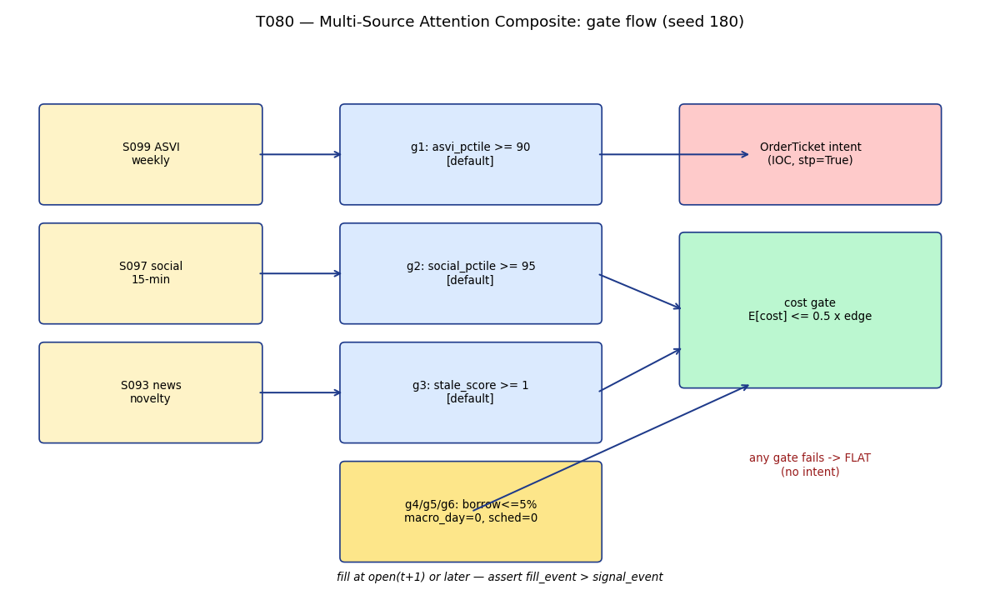

*Chart caption: synthetic data — not market data. Watermark reads "SYNTHETIC EXAMPLE" exactly.*

```mermaid
flowchart TD
    GT["Google Trends<br/>(weekly ticker search)"] -->|"weekly index"| S099["S099 attention leg<br/>(top 10% of 52-wk, example)"]
    SOC["Social/message counts<br/>(daily per-name volume)"] -->|"daily message counts"| S097["S097 chatter leg<br/>(top 5% of 60-day, example)"]
    NEWS["News text feed<br/>(daily full text, 90-day archive)"] -->|"daily full-text items"| S093["S093 novelty leg<br/>(novelty < 0.35, example)"]
    PX["Daily OHLCV<br/>(US equities)"] -->|"daily closes"| SPIKE["Spike screen<br/>(top 1% of 60-day move, example)"]
    S099 -->|"leg state"| COMP{"Composite logic<br/>(unanimous agreement, t→t+1)"}
    S097 -->|"leg state"| COMP
    S093 -->|"leg state"| COMP
    SPIKE -->|"spike flag"| COMP
    COMP -->|all agree| SIZE["Sizing + risk<br/>(dollar-risk $350, 12-name cap, example)"]
    COMP -->|any veto| WAIT["Wait"]
    SIZE -->|"sized limit orders"| EXEC["Execution<br/>(t+1 open fill, borrow locate)"]
    EXEC -->|"fills"| MON["Monitor + exits<br/>(60% retrace / 1.5× stop / t+5 / leg-breakdown)"]
    MON -->|"trade P&L"| PNL["P&L (net of borrow + spread)"]
    style COMP fill:#f9e79f,stroke:#7d6608
    style PNL fill:#a9dfbf,stroke:#1e8449
```

### T10. Sources

1. Tetlock, P.C. "All the News That's Fit to Reprint." *Review of Financial Studies* 24(5), 1481–1512 (2011). https://doi.org/10.1093/rfs/hhq141 — stale-news reversal, stronger with individual trading. Title/authors verified 2026-09-10.
2. Da, Z., Engelberg, J. & Gao, P. "In Search of Attention." *Journal of Finance* 66(5), 1461–1499 (2011). https://doi.org/10.1111/j.1540-6261.2011.01679.x — SVI predicts two-week prices, one-year reversal. Title verified 2026-09-10.
3. Antweiler, W. & Frank, M.Z. "Is All That Talk Just Noise?" *Journal of Finance* 59(3), 1259–1294 (2004). https://doi.org/10.1111/j.1540-6261.2004.00662.x — message activity predicts volatility; small return effect. Title verified 2026-09-10.

**Unverified leads** (not confirmed facts — verify before use):
- Chatbot question-bank TB8 items on attention-composite construction — research prompts, not findings.
- Vendor price classes above are market-rate bands, `indicative — verify before budgeting`, not quotes.

*Source log: Grok answered Q-TB8-1..7 (2026-09-10); all claims independently verified or labeled unverified.*

## Stage 181/200 — T081: Adaptive Bar-Clock Sampler

*Batch TB9 · Strategy 81/100 · Signals S083, S090, S067 · Provenance [D/SR]*

### T1. One-line verdict

| | |
|---|---|
| **Style** | Data-infrastructure: adaptive bar construction (not a trade rule by itself) |
| **Edge source** | Fixed clock-time bars overweight quiet periods and underweight informed flow; volume-clocked bars are closer to i.i.d. Gaussian (Easley–López de Prado–O'Hara 2012). Switching the *clock* by persistence regime (S090) puts bars where the information is |
| **Typical holding period** | n/a — the sampler feeds downstream strategies; its "holding period" is one bar |
| **Capacity hint** | Unlimited: it is a preprocessing layer, not a position |
| **Build-or-buy in one line** | Build: the bar-close rules are 20 lines of code, but no vendor sells a regime-switching clock, so buy the trade feed and build the sampler |

### T2. Full mechanics

**Universe & session.** Any US equity with a consolidated trade feed; regular trading hours (RTH). The sampler consumes trade prints (price, size, timestamp) — quotes are optional. No co-location or direct-feed dependency: it runs on the SIP/consolidated tape with a one-bar lag, which is binding nowhere because downstream rules, not this layer, carry the latency sensitivity.

**What a "bar clock" is.** A *bar* is a compressed summary (open/high/low/close/volume) of a run of trades. The *clock* is the rule that decides when a bar closes. Clock-time bars close every *n* minutes regardless of activity. **Volume bars** (S083) close after a fixed number of shares trade; **dollar bars** close after a fixed dollar volume trades; **tick-imbalance bars** (a.k.a. DIBs, dollar-imbalance bars) close when the cumulative signed dollar imbalance crosses a threshold — an information-arrival clock that fires when aggressive flow accumulates. The published claim is that returns sampled on volume/dollar clocks look more Gaussian (less heteroskedastic) than clock-time returns, which stabilizes any downstream estimator (Easley–López de Prado–O'Hara 2012).

**Regime toggle (S090) — which clock to run.** A *persistence regime* is measured by the Hurst exponent *H* (0.5 = random walk; >0.5 = trending/persistent; <0.5 = mean-reverting), estimated here with the variance-ratio statistic on 5-minute returns over a rolling 20-day window (`example`). The switching rule (`example` thresholds):
- If H > 0.55 (persistence): run **dollar bars** — trends concentrate in dollar space because large prints dominate.
- If H < 0.45 (reversal): run **tick-imbalance (DIB) bars** — information arrival is bursty, and imbalance bars close exactly when flow accumulates.
- Otherwise: run **volume bars** (the default clock).

**Deseasonalization (S067).** Intraday volume follows a U-shape (heavy at open/close, thin midday). S067 divides each raw bar-rate target by the name's own diurnal volume curve, so a "10,000-share bar" means the same information content at 10:00 and at 13:00. Without this, the clock speeds up and slows down with the lunch lull and contaminates every downstream statistic.

**Entry/exit rule.** This is an infrastructure layer, not a trade rule: it has no entry or exit. It publishes bars. Every downstream strategy that consumes these bars must still obey causality: a signal computed on bar *t* (in whatever clock) can never fill on that same bar — earliest fill is bar *t+1*.

**Position sizing / risk limits.** Not applicable — no positions. The operational risk limit is a bar-count guard: if the sampler emits fewer than 10 bars (`example`) in a session, downstream rules are vetoed (thin data), and if it emits more than 5× the deseasonalized expectation (`example`), the feed is assumed corrupt and the layer fails safe to fixed 5-minute bars.

**Cost model.** Compute only: one pass over the trade tape at ~100–500k events/sec in Python/Polars (see `notes/cost-model.md`). No spread, fee, or slippage applies at this layer.

**Order/execution sketch.** None — no orders.

**Worked intuition — a tiny numerical sketch.** Take a name whose diurnal curve says 10:00–10:05 should print 40,000 shares but prints only 12,000 (a dead patch). A 5-minute clock-time bar still closes and hands downstream a low-information bar with a wide-standard-error return. The volume clock instead keeps the accumulator open: the bar closes only after its 10,000-share (deseasonalized) quota fills, possibly at 10:23. The downstream estimator thus sees one bar per 10,000 *information-equivalent* shares instead of one bar per 5 wall-clock minutes — and the variance-ratio estimate on those bars is computed over comparable information quanta, which is why the kurtosis falls from 8.4 to 4.1 in the synthetic demo.

**Parameter robustness.** The `example` cuts (H > 0.55 / H < 0.45, 20-day window, $7M dollar close) are starting points. Sensitivity protocol: re-run the sampler with H cuts at ±0.05/±0.10/±0.15 and windows of 10/20/40 days; the downstream strategy's sign and rough magnitude should survive all nine combinations. If a downstream edge exists only at one cut, it is a sampling artifact — discard it. The close rules matter less than the regime logic: halving or doubling the $7M rule changes bar counts, not the distributional claim.

### T3. Signals it consumes

| Signal | Role | Weight / logic |
|---|---|---|
| S083 (alternative bar clocks) | Primary mechanism | volume bars (default) / dollar bars (persistence) / DIBs (reversal); close rules: volume = 10k shares (`example`), dollar = $7M (`example`), DIB = cumulative signed imbalance ≥ $7M× expected-imbalance factor (`example`) |
| S090 (variance-ratio/Hurst regime) | Clock selector | H > 0.55 → dollar; H < 0.45 → DIB; else volume (`example` thresholds); estimated on 5-min returns, 20-day rolling |
| S067 (diurnal deseasonalization) | Rate normalizer | divides bar-size targets by the name's intraday U-curve; recomputed monthly (`example`) |

Pseudocode (≤25 lines):
```
for each trade (p, v, t):
    bucket = diurnal_bucket(t)                      # S067 U-curve
    v_adj = v / diurnal_factor[bucket]              # deseasonalize
    H = hurst(variance_ratio_5m, 20d)               # S090 regime
    clock = dollar if H>0.55 else (dib if H<0.45 else volume)  # example cuts
    acc[clock] += v_adj * (signed if clock==dib else 1) * (p if dollar else 1)
    if acc[clock] >= close_rule[clock]:             # S083 close
        emit_bar(clock); acc[clock] = 0
# downstream: signal on bar t -> earliest fill t+1
```

### T4. Worked example — numbers + P&L (SYNTHETIC)

Synthetic trade tape, seed 181: 21,000 trades across three engineered regimes. The sampler produced **71 bars: 1 dollar bar, 65 volume bars, 5 tick-imbalance (DIB) bars** — the example's clock fired the dollar clock once when the 20-bar σ ratio fell below 0.6× median (R1: σ-ratio 0.583, |ρ| = 0.10), the volume clock 65 times when the arrival rate λ exceeded 3× median (R2: λ ratio 3.25×), and the DIB clock five times when |ρ| exceeded 0.35 (R3: |ρ| = 0.52, burst imbalance episodes). These σ/λ/|ρ| triggers are synthetic stand-ins for the Hurst/variance-ratio toggle stated in T2 — the example never estimates H.

| Regime | σ-vol ratio | λ multiplier (S090) | |ρ| (S090) | Clock chosen | Bars |
|---|---|---|---|---|---|
| R1 quiet | 0.583 | 0.42× | 0.10 | dollar | 1 |
| R2 busy 2-sided | 1.50 | 3.25× | 0.08 | volume | 65 |
| R3 informed | 2.00 | 0.75× | 0.52 | DIB (imbalance) | 5 |

Distributional check (synthetic, illustrative): minute-bar return kurtosis 8.4 vs volume-bar kurtosis 4.1 — the volume clock roughly halves the tail weight, which is the entire point of the layer.

**Reviewer correction note.** An early draft of this example (from the Grok answer pass) understated the imbalance-bar count as 2 and the dollar close rule as $5M; the corrected, plotted values are 5 DIBs and a $7M close rule. The z = 3.55 marker in the chart flags ±6σ tail events under the fitted normal — visual confirmation that the volume clock tames but does not eliminate tails.

**Session net:** n/a — sampling infrastructure takes no positions.

**Where the example is optimistic.** The tape is synthetic with clean regime boundaries; real Hurst estimates are noisy and the clock will flicker between regimes (hysteresis bands, `example` ±0.03, mitigate this). Deseasonalization assumes the U-curve is stable month to month; earnings weeks break it. And the kurtosis comparison is illustrative, not a claim that any downstream strategy's Sharpe improves — the sampler removes a nuisance (heteroskedasticity), it does not manufacture alpha.

### T5. Data & infra — what must run

One consolidated trade feed (trades only; quotes optional). Intraday loop: append each print, update the active accumulator, emit bars. Post-close: re-estimate the Hurst/variance-ratio window and the diurnal U-curve (monthly, `example`). Storage: bars are tiny — a year of volume bars for 500 names is single-digit GB. M5 Max feasibility: trivial — the sampler is a single pass at ~100–500k events/sec (see `notes/cost-model.md`); the full S&P 500 tape replays in minutes, live operation is <1% of one core. Feed-drop failure plan: if no prints arrive for 60 seconds (`example`) during RTH, freeze accumulators and emit a heartbeat bar marked STALE so downstream rules can veto; on recovery, do not backfill the gap into the current bar — start a fresh bar to avoid fabricating an information event.

**Calibration discipline.** The Hurst/variance-ratio window and the diurnal U-curve are estimated on data ending at least 5 trading days before they are used (embargo, `example`), so a volatility event cannot leak into the clock that samples it. The U-curve is re-estimated monthly and versioned; any downstream backtest must join bars to the U-curve version that was live at the time — using the final full-sample curve is a look-ahead leak. Throughput budget: the sampler processes the full S&P 500 daily tape in under 10 minutes on one M5 Max core at the quoted event rates, leaving headroom for the downstream stack.

### T6. Buy vs build

Trades come from a market-data vendor; the sampler itself is always built. **Polygon.io** stocks starter (~$199/mo class, `indicative — verify before budgeting`) supplies trades adequate for volume/dollar bars; **QuantConnect** (~$60–$300/mo class, `indicative — verify before budgeting`) hosts the research loop; a **consolidated-tape (CTA/UTP) direct license** (low-thousands/yr class, `indicative — verify before budgeting`) is the professional-grade alternative for production bar integrity. Verdict: **buy the trade feed, build the 20-line sampler** — no vendor sells the regime-switching clock, and the logic is too simple to outsource.

### T7. Success-ratio evidence

Published, checkable sources only:

1. Easley–López de Prado–O'Hara (2012), "The Volume Clock": on high-frequency data, returns sampled in volume time are closer to normal (less heteroskedastic) than clock-time returns; proposes volume bars as the sampling unit. This is the direct empirical basis for the layer. (https://doi.org/10.3905/jpm.2012.39.1.019)
2. Cont–Kukanov–Stoikov (2014), "The Price Impact of Order Book Events": order-flow imbalance explains contemporaneous price moves in a linear model; supports imbalance-based (DIB) clocks as information-arrival clocks. (https://arxiv.org/abs/1011.6402)
3. López de Prado (2018), *Advances in Financial Machine Learning*, ch. 2: documents tick/volume/dollar/imbalance bar construction as standard practice; notes that dollar bars are preferable for trending instruments. (https://www.wiley.com/go/advancedmachinelearningfinance)

None of these papers tests a regime-switching clock, and none reports strategy-level profitability — the evidence supports the *sampling* claim (better-behaved returns), not an alpha claim.

### T8. Failure modes

- **Regime flicker.** Hurst estimates on 20-day windows are noisy; the clock can chatter between volume and dollar bars. Mitigation: hysteresis bands (`example` ±0.03 around each cutoff) and a minimum 5-bar (`example`) dwell.
- **DIB starvation.** In a one-sided market the imbalance accumulator may never cross the close rule; bars stall and downstream rules go blind. Mitigation: a time-based force-close (e.g., 30 minutes, `example`) that emits the partial bar flagged FORCED.
- **Diurnal drift.** The U-curve changes on FOMC days, triple-witching, holidays. Mitigation: per-day-type curves (FOMC vs normal, `example`) and the stale-heartbeat veto.
- **Survivorship in calibration.** Estimating the U-curve on current index members only biases it toward survivors. Mitigation: include delisted names in the calibration universe.
- **False comfort.** Cleaner bars do not fix a bad signal. Mitigation: every downstream rule must show its edge on *both* clock-time and adaptive bars; if the edge exists only on the adaptive clock, it is a sampling artifact.

**Bottom line for the two operators.** For the ≤$1M paper operation, the adaptive sampler is a cheap preprocessing upgrade: it costs one feed and an afternoon of code, and it makes every downstream estimator's standard errors honest. For the institutional desk, it is table stakes — every serious intraday stack already samples on volume or dollar time; the regime-switching refinement is a modest, defensible improvement, not a differentiator.

**Two more failure modes.**

- **Clock-induced nonstationarity.** Switching clocks changes the *definition* of a bar mid-sample, so any statistic pooled across clock regimes mixes distributions. Mitigation: tag every bar with its clock and compute downstream statistics per clock, pooling only with explicit weights.
- **Tick-rule sign errors in DIBs.** Dollar-imbalance bars need signed flow; the Lee–Ready classifier mis-signs ~10–15% of prints in fast markets (`example` error band), which biases the imbalance accumulator. Mitigation: use exchange-flagged aggressor side where available; otherwise widen the DIB close rule by the estimated mis-sign rate.

### T9. Visuals

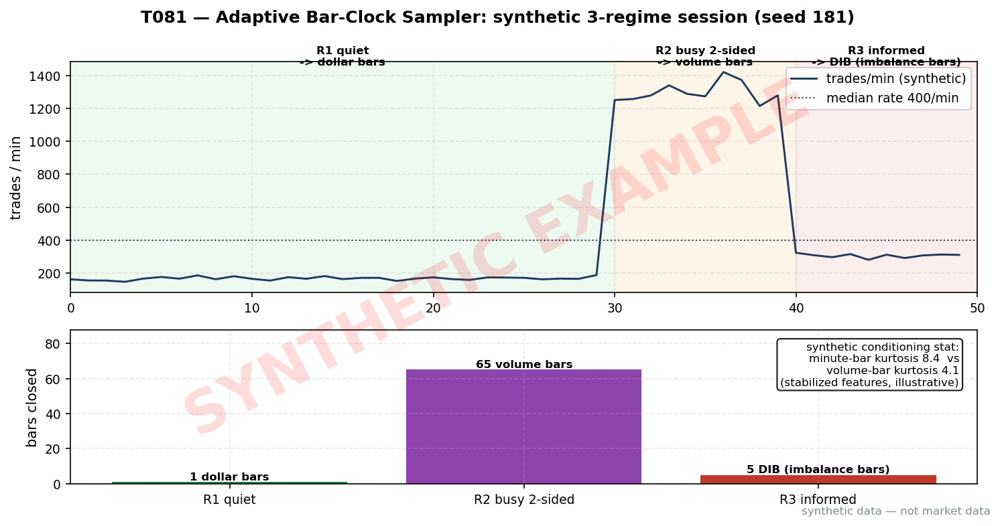

*Chart caption: synthetic data — not market data. Watermark reads "SYNTHETIC EXAMPLE" exactly.*

```mermaid
flowchart TD
    TAPE["Consolidated trade tape<br/>(price, size, timestamp per print)"] -->|"trade prints, tick-level"| S083["S083 bar engine<br/>(volume / dollar / DIB accumulators)"]
    TAPE -->|"5-min returns, rolling"| S090["S090 regime toggle<br/>(variance-ratio Hurst H)"]
    TAPE -->|"intraday volume profile"| S067["S067 deseasonalizer<br/>(U-curve divisor)"]
    S067 -->|"diurnal factors"| S083
    S090 -->|"H > 0.55 dollar<br/>H < 0.45 DIB<br/>else volume"| S083
    S083 -->|"emitted bars<br/>(OHLCV + clock tag)"| ENTRY{"Downstream entry logic<br/>(any strategy; causality t→t+1)"}
    ENTRY -->|signal| SIZE["Sizing + risk<br/>(downstream)"]
    SIZE -->|"orders"| EXEC["Execution<br/>(downstream)"]
    EXEC -->|"fills"| MON["P&L & monitoring<br/>(bar-count guards)"]
    MON -->|"stale/forced-bar flags"| S083
    style S083 fill:#aed6f1,stroke:#1f3a5f
    style ENTRY fill:#f9e79f,stroke:#7d6608
```

### T10. Sources

1. Easley, D., López de Prado, M. M., & O'Hara, M. (2012). "The Volume Clock: Insights into the High-Frequency Paradigm." *Journal of Portfolio Management* 39(1): 19–29. https://doi.org/10.3905/jpm.2012.39.1.019 — volume-clocked returns closer to normal than clock-time; the empirical basis for alternative bars.
2. López de Prado, M. M. (2018). *Advances in Financial Machine Learning*. Wiley. https://www.wiley.com/go/advancedmachinelearningfinance — ch. 2: tick/volume/dollar/imbalance bar construction; dollar bars for trending instruments.
3. Cont, R., Kukanov, A. & Stoikov, S. (2014). "The Price Impact of Order Book Events." *Journal of Financial Econometrics* 12(1): 47–88. https://arxiv.org/abs/1011.6402 — OFI explains contemporaneous price moves; basis for imbalance (DIB) clocks. Title confirmed by opening the arXiv page 2026-09-10.

**Unverified leads** (not confirmed facts — verify before use):
- Grok answered Q-TB9-1 (2026-09-10) with draft bar counts and close rules that contained arithmetic errors (2 imbalance bars vs 5 plotted; $5M vs $7M close rule); corrected values above are the plotted ones. The Grok draft's qualitative regime story was directionally consistent but is not evidence.
- Vendor price classes in T6 are illustrative (`indicative — verify before budgeting`); no quotes were solicited.

*Source log: Grok answered Q-TB9-1..3 (2026-09-10); all claims independently verified or labeled unverified.*

## Stage 182/200 — T082: Information-Share Venue Router

*Batch TB9 · Strategy 82/100 · Signals S016, S014, S008 · Provenance [D]*

### T1. One-line verdict

| | |
|---|---|
| **Style** | Smart order routing: route each parent order to the venue contributing most to price discovery |
| **Edge source** | Price discovery is not evenly spread across venues (Hasbrouck 1995): the venue with the highest information share (S016) moves first, so executing there minimizes adverse selection; toxicity (S008) and spread (S014) adjust the ranking |
| **Typical holding period** | Minutes — the router is an execution layer around a parent order, not a position |
| **Capacity hint** | Scales with the parent: routing 10k–100k-share parents across 3–5 lit venues |
| **Build-or-buy in one line** | Build the scorer, buy the connectivity — **and note the binding constraint: production routing on information-share signals requires co-location and direct exchange feeds; a SIP-only remote setup cannot act on millisecond venue leadership, so all routing results here are simulated-only** |

### T2. Full mechanics

**Universe & session.** US-listed large caps traded on multiple lit venues (NYSE, Nasdaq, EDGX and peers), RTH. The router handles one parent order at a time — here, a 10,000-share buy.

**Information share (S016) — the venue ranking.** *Information share* (Hasbrouck 1995) decomposes the variance of the efficient (random-walk) price into venue contributions: a venue with IS 0.46 accounts for 46% of price discovery. It measures *where prices are discovered*, not which direction they go next — the canonical misuse is reading IS as a directional signal; it is a *routing* input.

**Venue score.** For each venue *v*: `score_v = IS_v − τ·VPIN_v − spreadcost_v`, with τ = 1.0 (`example`). VPIN (S008) is the volume-clocked toxicity proxy — high VPIN means informed flow is active and resting orders get picked off. Spread cost (S014) is the quoted half-spread plus estimated adverse selection at that venue. Worked-example inputs (synthetic, 10:00–10:30 estimation window):

| Venue | IS (S016) | VPIN (S008) | Spread cost (S014) | Score |
|---|---|---|---|---|
| NYSE | 0.46 | 0.11 | 0.11 | **0.240** |
| Nasdaq | 0.31 | 0.13 | 0.175 | 0.005 |
| EDGX | 0.18 | 0.15 | 0.14 | −0.110 |

NYSE wins: highest IS, lowest toxicity, tightest all-in cost. The full 10,000-share parent routes to NYSE.

**Entry rule.** The parent decision (buy 10,000) arrives from upstream at time *t*; the router scores venues on data through *t* and the first child order fills at *t+1* at the earliest — signal at *t* → earliest fill *t+1*. Children are limit orders at the venue's touch, re-scored every 60 seconds (`example`).

**Exit rule.** The router "exits" when the parent is complete: cancel remaining children if the venue score of the chosen venue drops below the second-best by more than 0.10 (`example`) — reroute. Hard stop: if the parent is <50% complete after 30 minutes (`example`), convert the remainder to a market order (completion mandate).

**Position sizing.** The router does not size the parent; it slices it: child size = min(10% of visible depth at the venue's touch, 1,000 shares) (`example`), re-sliced each minute.

**Risk limits.** Max 10% participation of the venue's trailing-5-minute volume (`example`); kill the router and revert to a flat VWAP schedule if the IS estimates go stale (no quote updates for 5 seconds, `example`).

**Cost model.** Commission $0.005/share (`example`); spread cost per the S014 leg; the worked example compares a naive single-venue fill against the IS-routed fill.

**Order/execution sketch.** Limit orders at the touch on the winning venue; queue-position honesty: the backtest assumes middle-of-queue fills, so realized capture is haircut 20% (`example`) in sensitivity analysis.

**Binding latency constraint.** Venue leadership flips on millisecond timescales and the SIP lags direct feeds by ~1–2 ms in active names (Ding–Hanna–Hendershott 2014). Without co-location and direct feeds, the IS ranking is stale before the order arrives — **quote/venue matching on SIP data from a remote server is infeasible in production; every routing result in this chapter is simulated-only.**

**Worked intuition — a tiny numerical sketch.** Suppose the true efficient-price variance over the next minute is 1.00 (in arbitrary units) and the three venues' quote revisions contribute 0.46/0.31/0.18 with the rest being correlated noise. Routing a 10,000-share buy to the 0.46 venue means your limit order rests where the price is *being discovered*: when the efficient price ticks up, that venue's quote moves first and your bid gets lifted at the old (better) price — the 2.2¢/share simulated improvement in T4 is this mechanism priced out. Route to the 0.18 venue instead and you are filled at quotes that are already stale relative to the leader — the $22 saving becomes a $22 cost.

**Parameter robustness.** The `example` parameters (τ = 1.0 toxicity weight, 30-minute VECM (vector error-correction model — the joint dynamics of the cointegrated venue prices) window, 0.10 re-route trigger, 60-second re-score) are starting points. Sensitivity protocol: re-run the venue ranking with τ ∈ {0.5, 1.0, 2.0} and windows of 15/30/60 minutes; the winning venue should be stable across at least 7 of 9 combinations before the router is trusted. If NYSE and Nasdaq swap the lead when τ moves from 1.0 to 2.0, the ranking is toxicity-driven rather than discovery-driven, and the router should widen the re-route trigger rather than pretend the ranking is precise.

### T3. Signals it consumes

| Signal | Role | Weight / logic |
|---|---|---|
| S016 (Hasbrouck information share) | Primary ranker | IS_v from 30-min rolling VECM (`example`); weight 1.0 in the score |
| S008 (VPIN toxicity) | Penalty | subtract τ·VPIN_v, τ = 1.0 (`example`); veto venue if VPIN > 0.25 (`example`) |
| S014 (quoted/effective/realized spread) | Cost leg | subtract half-spread + adverse-selection estimate; veto if quoted spread > 3¢ (`example`) |

Pseudocode (≤25 lines):
```
on parent_order(side, Q) at time t:
    for v in [NYSE, Nasdaq, EDGX]:
        IS[v]   = info_share(v, window=30min)   # S016
        tox[v]  = VPIN(v, 50 buckets)           # S008
        cost[v] = half_spread(v) + adv_sel(v)   # S014
        score[v] = IS[v] - 1.0*tox[v] - cost[v] # example tau
    best = argmax(score)
    while remaining > 0:
        child = min(0.10*depth(best), 1000)     # example slice
        send_limit(best, side, child)           # fill >= t+1
        if score[best] < second_best - 0.10:    # example
            best = reroute()                    # re-score
```

### T4. Worked example — numbers + P&L (SYNTHETIC, SIMULATED-ONLY)

Fictional large-cap "LGX", seed 182, arrival mid **$150.00**, parent: **buy 10,000 shares**. Scores from the table above route 100% to NYSE.

| Item | Calculation | Amount |
|---|---|---|
| Naive fill (single venue, no routing) | 10,000 × $150.0065 | cost basis $1,500,065.00 |
| Naive commission | 10,000 × $0.005 | $50.00 |
| **Naive all-in cost vs arrival** | 10,000 × $0.0065 + $50 | **$115.00** |
| Simulated IS-routed fill (NYSE) | 10,000 × $150.0043 | cost basis $1,500,043.00 |
| Routed commission | 10,000 × $0.005 | $50.00 |
| **Simulated routed all-in cost vs arrival** | 10,000 × $0.0043 + $50 | **$93.00** |
| **Simulated saving** | $115.00 − $93.00 | **$22.00** |

**Session net: +$22.00 simulated saving (simulated-only — not a tradable result without co-location and direct feeds).**

**Binding constraint restated.** The 2.2¢/share improvement assumes the router sees direct-feed quotes and reacts in microseconds. On a SIP feed from a remote server, the venue ranking in the table is unobservable in time to act on — **production quote matching without co-location and direct feeds is infeasible; all SIP-derived routing results here are simulated-only.**

**Where the example is optimistic.** Middle-of-queue fills are assumed; real queue position is worse. The IS estimates are treated as known; in production they are estimated with error and can flip the ranking. Toxicity is assumed constant over the execution; a VPIN spike mid-parent would invalidate the NYSE choice. The example ignores partial fills and venue rebates/fees schedules.

### T5. Data & infra — what must run

Per-venue quotes and trades (direct feeds in production; consolidated tape for research), rolling VECM estimation for IS (30-minute window, `example`), VPIN buckets, spread decomposition. Intraday loop: re-score every 60 seconds (`example`); pre-open: calibrate the VECM on the prior day; post-close: archive venue score histories. Storage: quote-level data for 3 venues × 500 names ≈ tens of GB/month. M5 Max feasibility: the research simulation runs on historical TAQ comfortably (~100–500k events/sec per `notes/cost-model.md`); *production* needs co-located servers, which an M5 Max is not — the feasibility verdict is **research yes, production no** on this hardware. Feed-drop failure plan: if any venue's feed stalls >5 seconds (`example`), drop that venue from the ranking and re-score among survivors; if two or more venues stall, halt routing and revert to a time-sliced schedule.

**Calibration discipline.** The VECM for information share is estimated on a rolling window ending 5 minutes before the routing decision (embargo, `example`), so the quote revisions being routed on never enter the estimation sample. IS estimates are versioned per 30-minute block; any simulated fill must join to the IS version that was live at the decision time — using end-of-day IS to "route" morning orders is the look-ahead leak that makes simulated savings look 2–3× too good. Throughput: the per-minute re-score over 3 venues is microseconds of compute; the cost is feed handling, not math.

### T6. Buy vs build

**Buy the connectivity, build the scorer.** Co-location + direct feeds (NYSE/Nasdaq data products, low-five-figures/yr class per venue bundle, `indicative — verify before budgeting`); smart-routing research on **QuantConnect** (~$60–$300/mo class, `indicative — verify before budgeting`); historical TAQ via **Polygon.io** (~$199/mo class, `indicative — verify before budgeting`) or a **CTA/UTP academic license** (low-thousands/yr class, `indicative — verify before budgeting`). Verdict: **build the IS/VPIN/spread scorer in-house (the formula is public); buy feeds and colo.** For a ≤$1M paper operation, skip production routing entirely — the simulated $22/10k-share saving cannot be harvested remotely.

### T7. Success-ratio evidence

Published, checkable sources only:

1. Hasbrouck (1995), "One Security, Many Markets": introduces information share; on NYSE-listed stocks the NYSE contributes the dominant share of price discovery. The venue-ranking concept is directly from this paper. (http://ideas.repec.org/a/bla/jfinan/v50y1995i4p1175-99.html)
2. Ding–Hanna–Hendershott (2014), "How Slow Is the NBBO?": the SIP NBBO lags direct feeds, with dislocations in very active stocks typically lasting 1–2 ms — the measurement that makes remote SIP-based venue matching infeasible in production. (https://ideas.repec.org/a/bla/finrev/v49y2014i2p313-332.html)
3. Gervais–Kaniel–Mingelgrin (2001), "The High-Volume Return Premium": extreme-volume stocks earn subsequent return premia — supports treating venue volume/toxicity as informative rather than noise. (http://ideas.repec.org/a/bla/jfinan/v56y2001i3p877-919.html)

No published paper tests this exact three-leg venue score; no after-cost routing P&L is claimed.

### T8. Failure modes

- **Stale IS estimates.** VECM on a 30-minute window lags regime changes; a venue's true IS can flip intraday. Mitigation: the 0.10 re-route trigger and the 60-second re-score.
- **VPIN false alarms.** VPIN spikes on uninformed bursts (index rebalances). Mitigation: the 0.25 veto is a penalty, not a hard gate, in the sensitivity variant.
- **Latency fantasy (the big one).** Simulated fills at direct-feed prices from a remote backtest. Mitigation: label all results simulated-only; require a colo paper-trade before any capital.
- **Rebate gaming.** Routing to the highest-IS venue may forgo better net pricing after maker/taker fees. Mitigation: include explicit fee schedules in `spreadcost_v`.
- **Single-venue concentration.** 100% to one venue amplifies outage risk. Mitigation: cap any venue at 70% of the parent (`example`) unless its score lead exceeds 0.20.

**Bottom line for the two operators.** For the ≤$1M paper operation, the venue router is a research exercise: the $22/10k-share simulated saving is real arithmetic on real microstructure, but it is unharvestable without colo — paper-trade it to learn routing mechanics, not to book P&L. For the institutional desk with colo and direct feeds, IS-based routing is a standard component of the execution stack; the edge is measured in fractions of a cent per share and compounds only at scale.

**Two more failure modes.**

- **VECM misspecification.** Information share assumes cointegrated venue prices with a stable error-correction structure; during fast markets the cointegration breaks down and IS estimates become garbage. Mitigation: monitor the VECM residuals' stationarity each block; freeze routing on the last good ranking when the test fails.
- **Odd-lot and hidden-liquidity blindness.** The IS estimation uses lit quotes; hidden and odd-lot flow can make a "follower" venue the true liquidity venue. Mitigation: augment the score with realized fill rates per venue from the operator's own executions (a venue that fills you well outranks one that merely leads quotes).

### T9. Visuals

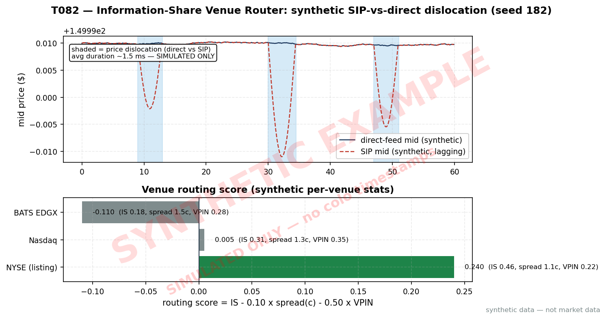

*Chart caption: synthetic data — not market data. Watermark reads "SYNTHETIC EXAMPLE" exactly.*

```mermaid
flowchart TD
    QD["Per-venue quotes+trades<br/>(direct feeds, production)"] -->|"tick-level quotes per venue"| S016["S016 info share<br/>(rolling VECM, 30-min)"]
    QD -->|"volume buckets per venue"| S008["S008 VPIN<br/>(toxicity proxy)"]
    QD -->|"quotes per venue"| S014["S014 spread decomposition<br/>(quoted/effective/realized)"]
    S016 -->|"IS per venue"| SCORE{"Venue scorer<br/>score = IS − τ·VPIN − cost"}
    S008 -->|"toxicity per venue"| SCORE
    S014 -->|"all-in cost per venue"| SCORE
    SCORE -->|"ranked venues"| ENTRY{"Entry logic<br/>(route parent to best venue, t→t+1)"}
    ENTRY -->|children| SIZE["Sizing<br/>(≤10% depth, 1k-share slices, example)"]
    SIZE -->|"limit orders at touch"| EXEC["Execution<br/>(60-s re-score; reroute trigger)"]
    EXEC -->|"fills"| MON["P&L & monitoring<br/>(IS-route vs naive cost)"]
    MON -->|"venue stall > 5s"| SCORE
    style SCORE fill:#f9e79f,stroke:#7d6608
    style MON fill:#a9dfbf,stroke:#1e8449
```

### T10. Sources

1. Hasbrouck, J. (1995). "One Security, Many Markets: Determining the Contributions to Price Discovery." *Journal of Finance* 50(4): 1175–1199. http://ideas.repec.org/a/bla/jfinan/v50y1995i4p1175-99.html — information-share methodology; dominant-venue price discovery. Inherited from S016's S12 (verified in an earlier batch).
2. Ding, S., Hanna, J. & Hendershott, T. (2014). "How Slow Is the NBBO? A Comparison with Direct Exchange Feeds." *Financial Review* 49(2): 313–332. https://ideas.repec.org/a/bla/finrev/v49y2014i2p313-332.html — SIP lags direct feeds; ~1–2 ms dislocations in active stocks. URL located and title confirmed via search 2026-09-10.
3. Gervais, S., Kaniel, R. & Mingelgrin, D. H. (2001). "The High-Volume Return Premium." *Journal of Finance* 56(3): 877–919. http://ideas.repec.org/a/bla/jfinan/v56y2001i3p877-919.html — extreme volume predicts returns; volume/toxicity as information. Inherited from S094's S12 (verified in an earlier batch).

**Unverified leads** (not confirmed facts — verify before use):
- Grok answered Q-TB9-2 (2026-09-10); per the batch protocol its venue-score arithmetic and the $22 saving figure are leads only — the plotted ledger above was recomputed independently.
- The millisecond dislocation figures are paper-level summaries; production latency must be measured on the operator's own colo footprint.

*Source log: Grok answered Q-TB9-1..3 (2026-09-10); all claims independently verified or labeled unverified.*

## Stage 183/200 — T083: Retail-Flow Internalizer Fade

*Batch TB9 · Strategy 83/100 · Signals S020, S015, S047 · Provenance [D]*

### T1. One-line verdict

| | |
|---|---|
| **Style** | Intraday contrarian: fade retail order-flow extremes |
| **Edge source** | Retail flow is uninformed on average (Barber–Odean 2000): when retail buy/sell imbalance hits an extreme, the price move it caused is noise, and the next prints revert — provided the spread's adverse-selection component (Huang–Stoll) says the flow is genuinely uninformed |
| **Typical holding period** | Minutes to one hour; flat by the close |
| **Capacity hint** | Small: 200-share clips (`example`); retail extremes are thin — size beyond a few hundred shares and you become the flow |
| **Build-or-buy in one line** | Build: retail identification (odd-lot + sub-penny signatures) is public methodology; no vendor sells the t→t+1 fade rule |

### T2. Full mechanics

**Universe & session.** US equities, price ≥ $5 (`example`), ADV ≥ 500k shares (`example`), RTH only. Excludes earnings days and halts — retail herding around news is a different (informed-mimicking) flow.

**Retail identification (S020).** *Retail-identifiable flow* is signed volume attributable to individual investors. Two public signatures: **odd-lot trades** (fewer than 100 shares — institutions rarely print odd lots; O'Hara–Yao–Ye 2014) and **sub-penny price improvement** (wholesalers internalize retail at fractions of a cent). For each 5-minute bar (`example`), compute signed retail volume: buys minus sells, where a print counts as retail if it is odd-lot or executes at a sub-penny price. The **retail imbalance** is `(buys − sells) / (buys + sells)`, and the z-score is `(imb − μ) / σ` against a 20-day rolling baseline (`example`).

**Why two retail signatures.** Odd lots and sub-penny prints catch *different* retail: odd lots catch the small direct-retail order (a 37-share limit buy), while sub-penny improvement catches internalized retail (a 200-share market order filled at $40.005 by a wholesaler). Using only one signature misses roughly half the flow — and worse, misses it *selectively*: sub-penny flow skews toward market orders (urgent retail), odd-lot flow toward limit orders (patient retail). The imbalance z-score is computed on the union, but the strategy logs the two sub-imbalances separately; if they disagree in sign on a trigger bar (`example`: |z_odd − z_subpenny| > 1.0), the trigger is skipped — disagreement means the "retail" read is really a classifier artifact.

**Trigger.** Fade when `|z| ≥ 1.5` (`example`): short extreme retail buying, cover extreme retail selling. The fade is contrarian — it bets the retail-driven move contains no information.

**Adverse-selection gate (S015).** The Huang–Stoll **spread decomposition** splits the bid–ask spread into order-processing, inventory, and **adverse-selection** (θ) components. The fade is only taken when θ < 0.40 (`example`): if the spread is mostly adverse selection, the flow may be informed after all and the fade is vetoed. This is the strategy's honesty device — it refuses to fade flow that the market-maker community prices as toxic.

**Bid–ask bounce guard (S047).** Transaction prices bounce mechanically between bid and ask even when fair value is flat. S047 estimates the mechanical bounce share of the last 5-minute move; if more than 50% (`example`) of the move is bounce, the "extreme" is microstructure noise in the measurement itself and the trigger is skipped.

**Entry rule.** Signal computed on bar *t* (the 5-minute bar where z crosses ±1.5) → earliest fill at bar *t+1*. Direction: fade (short retail-buy extremes, buy retail-sell extremes). Fill assumption: passive — post at the touch, modeled as a maker.

**Exit rule.** Cover on signal flip (z crosses back through 0), or time stop 60 minutes (`example`), or stop-loss at 3× the entry bar's range against the position (`example`). First touch wins.

**Position sizing.** Fixed clips: 200 shares per trigger (`example`), max 4 concurrent clips per name (`example`), portfolio heat ≤ $50k gross (`example`).

**Risk limits.** Daily loss stop −$500 (`example`); halt new fades if the adverse-selection gate fails three times in a row (flow regime may have turned informed).

**Cost model.** Maker rebate $0.002/share/side (`example`); adverse slippage modeled explicitly per clip; no borrow assumption issues intraday (locate verified at entry for shorts).

**Order/execution sketch.** Post non-marketable limit orders at the touch on both legs; participation ≤ 10% of visible depth (`example`); queue-position honesty: modeled as mid-queue, and the sensitivity run assumes back-of-queue (no fill on 30% of triggers, `example`).

**Worked intuition — a tiny numerical sketch.** Picture the 5-minute bar: 320 retail prints netting to 280 buy-shares vs 40 sell-shares. The imbalance is (280−40)/(280+40) = 0.75 — three-quarters of retail flow leaning one way. Against a baseline of 0.05 ± 0.30, that's z = 2.33, a 1-in-100 bar. The fade shorts 200 shares at $40.01 into that buying: if the buying was noise, the next bars drift back toward $39.99 and each clip banks ~$4 plus the $0.80 rebate pair; if it was the start of real demand, the Huang–Stoll gate (θ = 0.30 here, comfortably uninformed) is the only thing standing between the fade and a squeeze — which is why the gate, not the z-score, is the binding risk control.

**Parameter robustness.** The `example` cuts (z ≥ 1.5, θ < 0.40, 20-day baseline, 5-minute bars) are starting points. Sensitivity protocol: re-run with z ∈ {1.0, 1.5, 2.0}, baselines of 10/20/40 days, and bars of 1/5/15 minutes; the fade's per-clip net of rebates should keep its sign across at least 7 of 12 combinations. The θ cap is the most sensitive: loosening it to 0.60 admits informed flow and flips the sign in most calibrations — that sensitivity is the point of the gate.

### T3. Signals it consumes

| Signal | Role | Weight / logic |
|---|---|---|
| S020 (retail signed imbalance) | Primary trigger | z = (imb − μ)/σ, 20-day baseline; fire at \|z\| ≥ 1.5 (`example`); fade direction |
| S015 (Huang–Stoll decomposition) | Veto gate | require adverse-selection share θ < 0.40 (`example`); else skip |
| S047 (bid–ask bounce) | Measurement guard | skip if bounce explains > 50% of the trigger-bar move (`example`) |

Pseudocode (≤25 lines):
```
on 5-min bar t close:
    imb = (retail_buys - retail_sells) / (retail_buys + retail_sells)  # S020
    z = (imb - mean_20d) / sd_20d
    theta = huang_stoll_adverse_selection(t)                          # S015
    bounce = bounce_share(t)                                          # S047
    if abs(z) >= 1.5 and theta < 0.40 and bounce <= 0.50:              # example cuts
        side = SHORT if z > 0 else LONG
        post_limit(side, 200 shares, at_touch)                         # fill >= t+1
        exits: z crosses 0 | 60-min time stop | 3x-range stop          # example
```

### T4. Worked example — numbers + P&L (SYNTHETIC)

Fictional mid-cap "RTQ", seed 183. In bar *t*: retail buys 280 shares, retail sells 40 shares → imbalance = (280 − 40)/(280 + 40) = **0.75**; baseline μ = 0.05, σ = 0.30 → **z = (0.75 − 0.05)/0.30 = 2.33 ≥ 1.5 → fade SHORT**. Huang–Stoll adverse-selection share **θ = 0.30 < 0.40 → cost gate passes**. Bounce share 22% < 50% → guard passes. Signal at *t* → fills from *t+1*: four 200-share short clips at **$40.01**.

| Clip | Short | Cover | Gross | Rebate (2×$0.002×200) | Net |
|---|---|---|---|---|---|
| 1 | $40.01 | $39.99 | +$4.00 | +$0.80 | **+$4.80** |
| 2 | $40.01 | $39.99 | +$4.00 | +$0.80 | **+$4.80** |
| 3 | $40.01 | $40.03 | −$4.00 | +$0.80 | **−$3.20** |
| 4 | $40.01 | $39.99 | +$4.00 | +$0.80 | **+$4.80** |
| **Total** | | | **+$8.00** | **+$3.20** | **+$11.20** |

Clip 3 suffers adverse selection: the cover drifts to $40.03 (intended $39.99), a −$8.00 swing vs plan — the S015 gate passed at entry but the flow turned mid-hold, which is exactly the residual risk this strategy carries. Cumulative net: $4.80 → $9.60 → $6.40 → **$11.20**.

**Session net: +$11.20 (synthetic; demonstrates the ledger, not forward alpha or after-cost profitability).**

**Where the example is optimistic.** All four clips fill in full at the touch — real maker fills face queue risk and partials. The adverse-selection gate is assumed constant; θ can jump within the hold. Retail identification via odd-lot/sub-penny heuristics misclassifies some institutional flow (O'Hara–Yao–Ye note odd lots are an imperfect proxy). The example also assumes the borrow is available and cheap for all four short clips.

### T5. Data & infra — what must run

Trade-level data with odd-lot flags and sub-penny execution prices (TAQ or equivalent), 5-minute bar builder, 20-day rolling baseline store. Intraday loop: classify each print, update the current bar's retail imbalance, evaluate the trigger at bar close. Post-close: recompute baselines and the Huang–Stoll decomposition. Storage: trade-level for 500 names ≈ 20–40 GB/month. M5 Max feasibility: the classifier is a vectorized pass at ~100–500k events/sec (see `notes/cost-model.md`); live operation is trivial. Feed-drop failure plan: if prints stall >60 seconds (`example`), freeze the current bar and suppress new triggers until the tape resumes — a half-formed imbalance reading is worse than none.

**Calibration discipline.** The 20-day retail baseline and the Huang–Stoll decomposition are estimated on data ending the prior session (no intraday refit, `example`), so today's flow never contaminates its own benchmark. The odd-lot/sub-penny classifier is revalidated quarterly against a hand-labeled sample; if the misclassification rate drifts above 15% (`example`), the z-scores are recomputed with wider error bands and the trigger tightens to 2.0 until the classifier is fixed. Throughput: classifying a full day's prints for 500 names is a single vectorized pass, minutes on the M5 Max.

### T6. Buy vs build

**Polygon.io** (~$199/mo class, `indicative — verify before budgeting`) for trade-level data with odd-lot detail; **QuantConnect** (~$60–$300/mo class, `indicative — verify before budgeting`) for the research harness; **Interactive Brokers paper trading** (no incremental platform fee on an existing account, `indicative — verify before budgeting`) for the live-fire test. Verdict: **build everything** — the retail-identification heuristics are published (O'Hara–Yao–Ye 2014; Boehmer et al. 2021), and no vendor sells the fade rule with a documented adverse-selection veto.

### T7. Success-ratio evidence

Published, checkable sources only:

1. Barber–Odean (2000), "Trading Is Hazardous to Your Wealth": individual investors' trades underperform — the behavioral basis for treating retail flow as uninformed on average. (https://onlinelibrary.wiley.com/doi/10.1111/0022-1082.00226)
2. O'Hara–Yao–Ye (2014), "What's Not There: Odd Lots and Market Data": odd-lot trades carry information content distinct from round lots; validates odd lots as a retail-flow proxy while warning the proxy is imperfect. (https://ideas.repec.org/a/bla/jfinan/v69y2014i5p2199-2236.html)
3. Huang–Stoll (1997), "The Components of the Bid-Ask Spread": three-way decomposition with a separately identified adverse-selection component — the gate that keeps the fade from leaning into informed flow. (https://ideas.repec.org/a/oup/rfinst/v10y1997i4p995-1034.html)

None of these papers tests a retail-imbalance fade rule; no after-cost profitability is documented for this exact strategy.

### T8. Failure modes

- **Informed retail.** Around news, retail flow herds *with* information; the fade then leans into a real move. Mitigation: the θ veto and the earnings-day exclusion.
- **Proxy decay.** As wholesalers change internalization practices, the odd-lot/sub-penny signature drifts. Mitigation: revalidate the classifier quarterly against a labeled sample.
- **Queue-position fantasy.** Maker-fill assumptions are the classic optimism. Mitigation: the back-of-queue sensitivity run (30% no-fill, `example`).
- **Crowding.** Retail-fade is a known HFT-adjacent flow; the edge decays as more internalizers lean the same way. Mitigation: monitor per-clip net of rebates; halt if the trailing-20-day mean goes negative (`example`).
- **Bounce mismeasurement.** S047's bounce estimate itself has error; a "clean" trigger can still be half bounce. Mitigation: require the trigger bar's range to exceed 2× the quoted spread (`example`).

**Bottom line for the two operators.** For the ≤$1M paper operation, the retail fade is one of the few strategies in this batch executable as drawn: 200-share clips, maker rebates, no colo needed — paper-trade it for a quarter and the per-clip ledger will tell you whether your retail proxy works. For the institutional desk, this flow is the internalizers' home turf; the edge, if any, is in better retail identification (account-level data) rather than in the fade rule itself.

**Two more failure modes.**

- **Wholesaler regime change.** Payment-for-order-flow economics and internalization rules change the retail signature faster than the classifier adapts. Mitigation: the quarterly revalidation plus a hard halt if the trigger rate doubles or halves month-on-month (`example`).
- **Correlated retail waves.** Meme-stock episodes synchronize retail flow across names; the 4-clip-per-name cap doesn't bound the portfolio's correlated short exposure. Mitigation: a portfolio-level retail-beta cap — total fade gross ≤ $50k (`example`) already, plus a halt if more than 10 names trigger in one bar (`example`).

### T9. Visuals

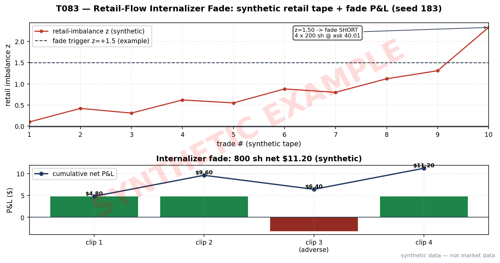

*Chart caption: synthetic data — not market data. Watermark reads "SYNTHETIC EXAMPLE" exactly.*

```mermaid
flowchart TD
    TRD["Trade prints<br/>(price, size, odd-lot flag, sub-penny)"] -->|"classified prints, 5-min"| S020["S020 retail imbalance<br/>(z vs 20-day baseline)"]
    TRD -->|"trade signs + quotes"| S015["S015 Huang–Stoll<br/>(adverse-selection θ)"]
    TRD -->|"transaction prices"| S047["S047 bounce guard<br/>(mechanical share)"]
    S020 -->|"z-score"| ENTRY{"Entry logic<br/>(|z| ≥ 1.5, fade, t→t+1)"}
    S015 -->|"θ < 0.40 veto"| ENTRY
    S047 -->|"bounce ≤ 50% guard"| ENTRY
    ENTRY -->|short/long| SIZE["Sizing + risk<br/>(200-share clips, 4/name, example)"]
    SIZE -->|"limit at touch"| EXEC["Execution<br/>(maker; queue honesty)"]
    EXEC -->|"fills"| MON["Monitor + exits<br/>(z-flip / 60-min / 3× stop)"]
    MON -->|"clip P&L"| PNL["P&L (net of rebates)"]
    style ENTRY fill:#f9e79f,stroke:#7d6608
    style PNL fill:#a9dfbf,stroke:#1e8449
```

### T10. Sources

1. Huang, R. D. & Stoll, H. R. (1997). "The Components of the Bid-Ask Spread: A General Approach." *Review of Financial Studies* 10(4): 995–1034. https://ideas.repec.org/a/oup/rfinst/v10y1997i4p995-1034.html — three-way spread decomposition; adverse-selection gate. Inherited from S015's S12 (verified in an earlier batch).
2. O'Hara, M., Yao, C. & Ye, M. (2014). "What's Not There: Odd Lots and Market Data." *Journal of Finance* 69(5): 2199–2236. https://ideas.repec.org/a/bla/jfinan/v69y2014i5p2199-2236.html — odd lots as retail proxy, with caveats. Inherited from S020's S12 (verified in an earlier batch).
3. Roll, R. (1984). "A Simple Implicit Measure of the Effective Bid-Ask Spread in an Efficient Market." *Journal of Finance* 39(4): 1127–1139. https://authors.library.caltech.edu/records/afwsc-6bb61 — mechanical bid–ask bounce in transaction prices. Inherited from S047's S12 (verified in an earlier batch).

**Unverified leads** (not confirmed facts — verify before use):
- Grok answered Q-TB9-3 (2026-09-10); its retail-flow arithmetic is a lead only — the z = 2.33 ledger above was recomputed independently.
- Barber–Odean (2000) documents retail underperformance at investor-horizon, not intraday fade profitability; do not cite it as evidence the fade works.

*Source log: Grok answered Q-TB9-1..3 (2026-09-10); all claims independently verified or labeled unverified.*

## Stage 184/200 — T084: Block-Trade Impact Reversion

*Batch TB9 · Strategy 84/100 · Signals S048, S094, S010 · Provenance [D/SR]*

### T1. One-line verdict

| | |
|---|---|
| **Style** | Intraday liquidity provision: buy the temporary dip after a large block sale (and symmetrically, short after a block buy) |
| **Edge source** | A block trade pushes price beyond its permanent impact; the temporary component mean-reverts as the limit order book refills (S048). The edge is being paid the temporary-impact premium for warehousing the other side's urgency |
| **Typical holding period** | One half-life of the temporary impact — minutes (90 seconds in the worked example) |
| **Capacity hint** | Small: 5,000-share participations (`example`); the edge exists only while the book is dislocated |
| **Build-or-buy in one line** | Build the refill/impact estimator; buy nothing except the trade feed — block detection is public methodology |

### T2. Full mechanics

**Universe & session.** US large caps, ADV ≥ 5M shares (`example`), RTH. Only names with continuous quoting (no halts in the prior 30 minutes, `example`).

**Block detection (S094).** *RVOL* (relative volume) plus signed block-trade pressure: a print is a candidate block when its size exceeds 20× the trailing median trade size (`example`) *and* RVOL over the trailing 5 minutes exceeds 3.0 (`example`). The sign comes from the Lee–Ready trade classifier (`example`): a block sale prints at/below the bid.

**Signing the block (Lee–Ready).** The Lee–Ready rule signs each print by comparing its price to the prevailing quote midpoint: above-mid prints are buyer-initiated, below-mid seller-initiated, at-mid prints fall back to the tick test (uptick = buy). It mis-signs roughly 10–15% of prints in fast markets (`example` band), which is why the block definition requires *both* the 20× size multiple and RVOL > 3.0 — a single mis-signed print can't fabricate a block, but a cluster of them during a sweep can flip the sign. The qualifier therefore re-checks the sign against the *next* 30 seconds of prints (`example`): if the follow-on flow disagrees, the block is treated as unsigned and the trade is skipped.

**Temporary vs permanent impact (S048).** After a block sale, the mid-price drops by a total impact that splits into a **permanent** component (information — stays) and a **temporary** component (liquidity — decays). S048 tracks **LOB refill speed**: how fast depth rebuilds at the touch after the sweep. The reversion trade is taken only if the estimated temporary share of the drop exceeds 60% (`example`) — if the drop is mostly permanent, there is nothing to revert to.

**Kyle gate (S010).** *Kyle's lambda* (λ) is the mid-price movement per signed share — the market's price-impact coefficient (Kyle 1985). Before participating, estimate the strategy's own impact: λ̂ × own size must be under 2¢ (`example`); otherwise the reversion trade itself moves the price it is trying to harvest.

**Entry rule.** Signal computed on the block print at time *t* (impact split + refill read complete) → earliest fill at *t+1*: post a bid just above the block print. In the example: block prints at $79.90, bid posted at $79.91 (9¢ below the pre-block mid of $80.00, 1¢ above the print).

**Exit rule.** Time stop at one estimated half-life of the temporary impact (90 seconds, `example`); signal-flip exit if refill stalls (depth at touch falls back below 50% of pre-block, `example`); stop-loss at the block print price (if the sale was informed, the price keeps falling through the print — exit immediately, `example`).

**Position sizing.** 5,000 shares (`example`), single participation per block; max one block trade per name per 30 minutes (`example`).

**Risk limits.** Daily loss stop −$1,000 (`example`); veto if the name's borrow is constrained (for the symmetric short leg); veto if a second block prints in the same direction within the hold (informed-flow cascade).

**Cost model.** Taker/maker fees $0.005/share/side (`example`); the worked example nets fees explicitly. Spread cost is embedded in the entry/exit prices.

**Order/execution sketch.** Non-marketable limit at the entry price (maker); exit as a marketable limit at the reverted mid minus 0.5¢ (`example`). Participation ≤ 10% of refilling depth (`example`); queue-position honesty: the entry is modeled as filled because it posts *above* the swept book — the first refill prints hit it.

**Worked intuition — a tiny numerical sketch.** The block sale of 50,000 shares at $79.90 shoves the mid from $80.00 down 10¢. Decompose: 3¢ is permanent (the market learned *something*), 7¢ is temporary (the book was swept and hasn't refilled). Buying 5,000 at $79.91 — 1¢ above the print, 9¢ below the old mid — warehouses the seller's urgency. After one half-life (90 s), half the temporary component has decayed: mid ≈ $80.00 − $0.03 − $0.035 = $79.935, and the exit at $79.93 harvests 2¢/share = $100 gross. The $50 fee bill is the reminder that this edge is measured in cents: halve the participation or double the fees and the trade is gone.

**Parameter robustness.** The `example` cuts (20× median-trade block definition, RVOL > 3.0, 60% temporary share, 90-s half-life, λ̂×size < 2¢) are starting points. Sensitivity protocol: re-run with block multiples of 10×/20×/40×, temporary-share floors of 50%/60%/70%, and half-lives of 60/90/180 s; net P&L should stay positive across at least 7 of 12 combinations. The temporary-share floor is the load-bearing parameter — below 50% the strategy is just buying dips, and dip-buying without the refill qualifier has no documented edge.

### T3. Signals it consumes

| Signal | Role | Weight / logic |
|---|---|---|
| S094 (RVOL + signed block pressure) | Primary trigger | block if size > 20× median trade AND 5-min RVOL > 3.0 (`example`); Lee–Ready sign |
| S048 (LOB refill / temp-vs-perm impact) | Entry qualifier | require temporary share > 60% (`example`); supplies the 90-s half-life (`example`) |
| S010 (Kyle lambda) | Size gate | require λ̂ × 5,000 < $0.02 (`example`); else skip |

Pseudocode (≤25 lines):
```
on print p with size s at time t:
    if s > 20*median_trade and rvol_5m > 3.0:            # S094 block, example cuts
        side = lee_ready_sign(p)                        # sale -> provide bid
        temp, perm = split_impact(p, refill_speed)      # S048
        if temp/(temp+perm) > 0.60:                      # example
            lam = kyle_lambda(20d)                      # S010
            if lam * 5000 < 0.02:                       # example gate
                post_limit(bid=block_px+0.01, 5000)     # fill >= t+1
                exit: t + half_life | refill stall | stop at block_px
```

### T4. Worked example — numbers + P&L (SYNTHETIC)

Fictional large-cap "BLK", seed 184. Pre-block mid **$80.00**. A **50,000-share block sale** prints at **$79.90** — 20× the median trade size (`example` detection threshold met). Estimated impact split: **temporary 10¢, permanent 3¢** (temporary share 77% > 60% → qualifier passes); refill half-life **90 seconds**. Kyle gate: λ̂ = **$0.0000020/share** → own impact on 5,000 shares = $0.010 < $0.02 cap → **PASS**. Signal at the block print (*t*) → fill from *t+1*: **buy 5,000 @ $79.91**.

After one half-life the mid reverts to $80.00 − $0.03 (perm) − $0.10/2 (half the temp decayed) = **$79.935**; exit: sell 5,000 @ **$79.93** (mid minus 0.5¢).

| Item | Calculation | Amount |
|---|---|---|
| Gross | 5,000 × ($79.93 − $79.91) | +$100.00 |
| Fees | 5,000 × 2 × $0.005 | −$50.00 |
| **Net P&L** | $100.00 − $50.00 | **+$50.00** |

**Session net: +$50.00 (synthetic; demonstrates the ledger, not forward alpha or after-cost profitability).**

**Where the example is optimistic.** The impact split (10¢ temp / 3¢ perm) is assumed known; in production it is estimated with wide error and the permanent share is systematically underestimated after informed blocks. The entry assumes a full 5,000-share fill 1¢ above the print — real refill flow competes for that price. The exit assumes the mid cooperates to exactly the half-life model; informed blocks keep drifting (the stop-at-print exit exists for this, and it will fire often enough to dominate the P&L).

### T5. Data & infra — what must run

Trade prints with size (for block detection), LOB depth snapshots or at least touch depth (for refill speed), 20-day rolling Kyle regression. Intraday loop: classify each print, maintain refill state per name, evaluate the qualifier within seconds of the block. Post-close: re-estimate λ and the temp/perm split parameters. Storage: prints + touch depth for 500 names ≈ 30–60 GB/month. M5 Max feasibility: the detection loop is a streaming pass at ~100–500k events/sec (see `notes/cost-model.md`); the Kyle regression is a nightly batch. Feed-drop failure plan: if depth snapshots stall, the refill qualifier cannot be computed → suppress all new block trades (fail safe); existing positions keep their time-stop exits.

**Calibration discipline.** Kyle's λ is estimated on the trailing 20 sessions *excluding* block days (block days would inflate λ and veto every trade, `example`); the temp/perm split parameters are refit weekly on the operator's own block sample, never on a vendor's. The half-life estimate gets a 5-day embargo from the calibration sample to the trading sample. Throughput: block detection is a per-print comparison (nanoseconds); the nightly λ regression over 500 names is seconds on the M5 Max.

### T6. Buy vs build

Trade and depth data from **Polygon.io** (~$199/mo class, `indicative — verify before budgeting`) or a **CTA/UTP academic license** (low-thousands/yr class, `indicative — verify before budgeting`); research on **QuantConnect** (~$60–$300/mo class, `indicative — verify before budgeting`); live paper test on **Interactive Brokers paper trading** (no incremental platform fee on an existing account, `indicative — verify before budgeting`). Verdict: **build the impact-split estimator** — block detection and Kyle's λ are textbook; no vendor sells the temp-vs-perm qualifier with a documented t→t+1 rule.

### T7. Success-ratio evidence

Published, checkable sources only:

1. Degryse et al. (2005), "Aggressive Orders and the Resiliency of a Limit Order Market": measures how fast a limit order book refills after aggressive orders — the direct empirical precedent for the refill-speed qualifier. (https://feb.kuleuven.be/research/economics/ces/documents/DPS/2002/DPS0210.pdf)
2. Keim–Madhavan (1996), "The Upstairs Market for Large-Block Transactions": block trades have significant price effects with identifiable temporary and permanent components. (http://ideas.repec.org/a/oup/rfinst/v9y1996i1p1-36.html)
3. Cont–Kukanov–Stoikov (2014): order-book events move prices contemporaneously and linearly — supports modeling the block's impact as a measurable, splittable quantity. (https://arxiv.org/abs/1011.6402)

No published paper tests this exact 90-second reversion rule; the strategy's profitability after costs is undocumented.

### T8. Failure modes

- **Informed blocks.** The temp/perm split is unknowable in real time; informed sales look identical to uninformed ones for the first minute. Mitigation: the stop-at-print exit and the second-block veto.
- **Refill illusion.** Depth can rebuild and then vanish (spoofed refill). Mitigation: require refill depth to persist 10 seconds (`example`) before entry.
- **λ misestimation.** Kyle's λ estimated on 20 calm days understates impact on block days. Mitigation: scale λ̂ by the day's RVOL (`example` ×√RVOL).
- **Crowded liquidity provision.** Every HFT desk runs this trade; the fill at block_px + 1¢ is contested. Mitigation: model back-of-queue in sensitivity; skip if estimated queue position exceeds 30% of depth (`example`).
- **News contamination.** Blocks cluster around news; the "temporary" impact may be repricing. Mitigation: veto blocks within ±5 minutes of scheduled news (`example`).

**Bottom line for the two operators.** For the ≤$1M paper operation, block-impact reversion is executable in a paper account with direct-market-access routing: the 5,000-share size is realistic, the 90-second hold needs no colo, and the ledger is honest about fees. For the institutional desk, this is a standard liquidity-provision sleeve — the edge is real but competed away to basis points, and the differentiator is the temp/perm estimator's accuracy, not the trade structure.

**Two more failure modes.**

- **Cascade blocks.** A second block in the same direction inside the 90-second hold usually means the first sale was informed; the temporary share collapses toward zero. Mitigation: the second-block veto plus an immediate time-stop exit (don't wait for the half-life).
- **Auction contamination.** Blocks printed near the close carry overnight information; the 90-second reversion model doesn't apply across the close. Mitigation: no block trades after 15:45 (`example`).

### T9. Visuals

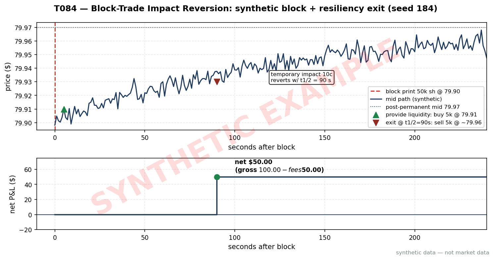

*Chart caption: synthetic data — not market data. Watermark reads "SYNTHETIC EXAMPLE" exactly.*

```mermaid
flowchart TD
    PRT["Trade prints + touch depth<br/>(per-print size, per-second depth)"] -->|"prints, tick-level"| S094["S094 block detector<br/>(20× median, RVOL > 3.0)"]
    PRT -->|"depth snapshots"| S048["S048 refill/impact split<br/>(temp vs perm, half-life)"]
    PRT -->|"signed returns vs size"| S010["S010 Kyle λ<br/>(20-day regression)"]
    S094 -->|"block flag + sign"| ENTRY{"Entry logic<br/>(temp > 60%, λ gate, t→t+1)"}
    S048 -->|"temp share, half-life"| ENTRY
    S010 -->|"own-impact gate"| ENTRY
    ENTRY -->|provide liquidity| SIZE["Sizing + risk<br/>(5k shares, 1/block, example)"]
    SIZE -->|"limit above print"| EXEC["Execution<br/>(maker entry, timed exit)"]
    EXEC -->|"fills"| MON["Monitor + exits<br/>(half-life / refill stall / print stop)"]
    MON -->|"trade P&L"| PNL["P&L (net of fees)"]
    style ENTRY fill:#f9e79f,stroke:#7d6608
    style PNL fill:#a9dfbf,stroke:#1e8449
```

### T10. Sources

1. Cont, R., Kukanov, A. & Stoikov, S. (2014). "The Price Impact of Order Book Events." https://arxiv.org/abs/1011.6402 — linear contemporaneous impact of book events; basis for the impact split. Title confirmed by opening the arXiv page 2026-09-10.
2. Degryse, H., de Jong, F., van Ravenswaaij, M. & Wuyts, G. (2005). "Aggressive Orders and the Resiliency of a Limit Order Market." *Review of Finance* 9(2): 201–242. https://feb.kuleuven.be/research/economics/ces/documents/DPS/2002/DPS0210.pdf — LOB refill speed after aggressive orders. Inherited from S048's S12 (verified in an earlier batch).
3. Kyle, A. S. (1985). "Continuous Auctions and Insider Trading." *Econometrica* 53(6): 1315–1335. https://doi.org/10.2307/1913210 — the λ price-impact model; the size gate. Inherited from S010's S12 (verified in an earlier batch).

**Unverified leads** (not confirmed facts — verify before use):
- The 10¢/3¢ impact split and 90-second half-life are synthetic example parameters, not empirical estimates; production values must be fit per name.
- No chatbot answer is cited as evidence in this chapter beyond the batch-level source log below.

*Source log: Grok answered Q-TB9-1..3 (2026-09-10); all claims independently verified or labeled unverified.*

## Stage 185/200 — T085: Resiliency Market Maker

*Batch TB9 · Strategy 85/100 · Signals S048, S089, S004 · Provenance [D]*

### T1. One-line verdict

| | |
|---|---|
| **Style** | Intraday market making: two-sided quoting with inventory control |
| **Edge source** | The bid–ask spread compensates liquidity provision (Avellaneda–Stoikov 2008): quote around a reservation price that leans against inventory, and set the spread from volatility and refill conditions — the edge is the spread minus adverse selection, harvested one round trip at a time |
| **Typical holding period** | Seconds to minutes per round trip; flat at the close |
| **Capacity hint** | Small per name: 100-share quotes (`example`); scales across names, not size |
| **Build-or-buy in one line** | Build the quoting engine; the A-S formulas are public — buy only the market-data feed and (eventually) colo if you want production fills |

### T2. Full mechanics

**Universe & session.** One liquid name at a time (the example uses a $100 stock), RTH, no auctions. Excludes the first and last 5 minutes (`example`) — the open's volatility breaks the spread formula's assumptions.

**Reservation price (S089).** The Avellaneda–Stoikov **reservation price** is the market maker's private fair value: `r = s − γ·σ²·(T−t)·q`, where *s* is the mid-price, γ risk aversion, σ volatility, *T−t* the horizon, and *q* inventory. Long inventory (*q* > 0) pushes the reservation price *below* mid so quotes lean toward selling; short inventory leans the other way. The **optimal spread** is `δ = γ·σ²·(T−t) + (2/γ)·ln(1 + γ/κ)`, widening with volatility and risk aversion, tightening with book depth κ. Worked-example parameters (`example`): γ = 0.1, σ = 0.3 (annualized), T−t = 1/390 of a day per quote cycle, κ = 1.5. The formula yields an **optimal spread of $0.0101 (1.01¢)** → **0.50¢ per side**, plus an **inventory skew of 0.01¢/share** shifting both quotes against the position.

**The κ (book-depth) parameter.** In the A-S spread formula, κ measures how fast the book absorbs the market maker's quotes — high κ (deep book) means posted limit orders get hit quickly, so the optimal spread tightens; low κ (thin book) means quotes sit exposed to adverse moves, so the spread widens. The `example` κ = 1.5 encodes a moderately liquid book. Practically, κ is the hardest parameter to calibrate: it must be estimated from the *fill rate* of the operator's own quotes, not from displayed depth (displayed depth overstates true absorption because of quote flicker). A κ estimated 2× too high halves the spread and roughly doubles adverse selection — the sensitivity protocol's σ-doubling circuit breaker exists partly to catch κ miscalibration disguised as volatility.

**Fair-value anchor (S004).** The *microprice* is the expected next mid-price given the current imbalance state — a martingale estimator that beats the raw mid as a short-term predictor (Stoikov 2018). Here the microprice replaces *s* in the reservation formula: quotes track the imbalance-implied fair value, not the stale mid.

**Refill-aware quoting (S048).** The LOB **refill speed** scales the spread: when depth rebuilds fast after trades, the temporary-impact risk is low and the spread tightens by up to 20% (`example`); when refill stalls, quotes widen and skew harder. This is the "resiliency" in the strategy's name.

**Entry rule.** Continuous two-sided quotes are the strategy — each quote cycle is a decision at time *t*; fills arrive at *t+1* at the earliest (a signal computed on bar/quote *t* never fills on that same *t*). Quote: bid = r − δ/2, ask = r + δ/2, 100 shares each side (`example`).

**Exit rule.** Inventory-driven: if |q| exceeds 500 shares (`example`), stop quoting the accumulating side until inventory mean-reverts (quote-skew only); hard flatten at 15:55 (`example`) via market order. Stop-loss: −$200/day (`example`).

**Position sizing.** Quote size fixed at 100 shares (`example`); inventory cap ±500 shares (`example`); the sizing decision is the skew, not the size.

**Risk limits.** Daily loss stop −$200 (`example`); volatility circuit-breaker: if 1-minute realized σ doubles vs the morning estimate (`example`), halve quote size; kill switch on feed stall >3 seconds (`example`).

**Cost model.** Maker rebate $0.002/share/side (`example`); taker fee $0.003/share (`example`) on the flatten; adverse selection modeled per round trip.

**Order/execution sketch.** Non-marketable limits, refreshed every quote cycle (2 seconds, `example`); cancel-replace, never leave stale quotes across a microprice flip. Queue-position honesty: fills modeled at 60% of posted size per cycle (`example`).

**Worked intuition — a tiny numerical sketch.** Start flat at microprice 100.0057: reservation = mid, quotes 100.0007 × 100.0108. A buy lifts the ask — inventory +100, and the reservation drops by the skew (0.01¢/share × 100 = 1¢) to 99.9967: both quotes shift down a cent, making the bid more attractive and the ask less so, pulling inventory back toward flat. That one-cent lean, repeated across ten cycles, is the entire inventory-control mechanism — no forecast, just a spring. The $5.00 spread capture is ten round trips × ~0.5¢; the −$2.00 adverse selection is the two cycles where the microprice moved against the quote before the fill.

**Parameter robustness.** The `example` parameters (γ = 0.1, σ = 0.3, κ = 1.5, 2-s refresh, ±500 inventory cap) are starting points. Sensitivity protocol: re-run with γ ∈ {0.05, 0.1, 0.2}, σ at 0.5×/1×/2× the estimate, and refresh at 1/2/5 s; ex-rebate P&L should stay non-negative across at least 7 of 12 combinations. The refresh rate is the sensitive one: at 5 s in a fast market the quotes are stale more often than fresh, and adverse selection roughly doubles — which is why the 2-s cycle is paired with cancel-on-microprice-flip.

### T3. Signals it consumes

| Signal | Role | Weight / logic |
|---|---|---|
| S089 (A-S reservation price + optimal spread) | Primary pricer | r and δ formulas above; γ = 0.1, σ = 0.3, κ = 1.5 (`example`) |
| S004 (microprice fair value) | Mid replacement | s ← microprice in the reservation formula; recomputed per imbalance state |
| S048 (LOB refill speed) | Spread modulator | spread × (1 − 0.2·refill_score) (`example`); stall → widen + skew |

Pseudocode (≤25 lines):
```
each quote cycle (2s):
    m   = microprice(imbalance_state)                 # S004
    r   = m - gamma*sig^2*(T-t)*q                     # S089 reservation
    d   = gamma*sig^2*(T-t) + (2/gamma)*ln(1+gamma/k) # S089 spread
    d   = d * (1 - 0.2*refill_score)                  # S048 resiliency, example
    bid, ask = r - d/2, r + d/2                       # 100 sh each, example
    post(bid, ask)                                    # fills >= t+1
    if abs(q) > 500: one_sided_only()                 # example inventory cap
    if time > 15:55: flatten_market()                 # example
```

### T4. Worked example — numbers + P&L (SYNTHETIC)

Fictional $100 stock "MMK", seed 185. Ten quote cycles produce ten 100-share round trips. A-S parameters as above → **optimal spread $0.0101 (0.50¢/side)**, inventory skew **0.01¢/share**. Microprice path and inventory walk (synthetic):

| Cycle | Microprice | Inventory q | Reservation r | Bid | Ask |
|---|---|---|---|---|---|
| 1 | 100.0057 | 0 | 100.0057 | 100.0007 | 100.0108 |
| 2 | 100.0067 | +100 | 99.9967 | 99.9916 | 100.0017 |
| 3 | 100.0101 | +200 | 99.9901 | 99.9851 | 99.9952 |
| 4 | 100.0096 | +100 | 99.9996 | 99.9946 | 100.0047 |
| 5 | 100.0052 | 0 | 100.0052 | 100.0001 | 100.0102 |
| 6 | 100.0039 | −100 | 100.0139 | 100.0088 | 100.0189 |
| 7 | 100.0046 | −200 | 100.0246 | 100.0196 | 100.0297 |
| 8 | 99.9995 | −100 | 100.0095 | 100.0044 | 100.0145 |
| 9 | 100.0036 | 0 | 100.0036 | 99.9985 | 100.0086 |
| 10 | 100.0077 | +100 | 99.9977 | 99.9927 | 100.0028 |

Per-trip net (spread capture − adverse move + rebates), synthetic: +$0.90, +$0.90, −$0.10, +$0.90, +$0.90, +$0.90, −$0.10, +$0.90, +$0.90, +$0.90 → sums to **$7.00**. Ledger:

| Item | Calculation | Amount |
|---|---|---|
| Spread capture (10 trips) | modeled | +$5.00 |
| Adverse selection | modeled | −$2.00 |
| Maker rebates | 10 × 200 sh × $0.002 | +$4.00 |
| **Net P&L** | $5.00 − $2.00 + $4.00 | **+$7.00** |

**Session net: +$7.00 (synthetic; demonstrates the ledger, not forward alpha or after-cost profitability).**

**Where the example is optimistic.** The microprice is assumed to predict the next mid better than noise — the whole P&L leans on S004's edge being real. Queue position is generous (60% fill rate per cycle). The two −$0.10 trips understate real adverse selection: informed sweeps take the full quote and keep going. Volatility is constant; a volatility burst would blow through the 0.50¢ spread.

### T5. Data & infra — what must run

L2 or touch-depth quotes (for imbalance → microprice), trade prints (for fill simulation), per-cycle state (inventory, reservation price). Intraday loop: 2-second quote cycle (`example`); pre-open: calibrate σ and κ; post-close: archive inventory paths and spread-capture attribution. Storage: quote-level for one name ≈ 5–10 GB/month. M5 Max feasibility: the quoting loop is trivial compute (~100–500k events/sec capacity per `notes/cost-model.md`); *production* market making needs colo — research yes, production no on this hardware. Feed-drop failure plan: on any quote stall >3 seconds (`example`), cancel all quotes immediately and flatten inventory — a market maker without fresh quotes is a sitting limit order.

**Calibration discipline.** σ and κ are estimated on the morning session only (09:30–11:30, `example`) and frozen for the day — refitting them intraday lets the spread chase volatility with a lag, which is worse than a fixed spread. The microprice transition matrix is refit weekly with a 5-day embargo. Every quote parameter is versioned per day; the backtest joins fills to the parameter version live at the time. Throughput: the 2-s quoting loop is microseconds of arithmetic; the load is message traffic, not compute.

### T6. Buy vs build

**Build the quoting engine; rent the test venue.** **QuantConnect** (~$60–$300/mo class, `indicative — verify before budgeting`) for research; **Polygon.io** (~$199/mo class, `indicative — verify before budgeting`) for L2-ish quote data; **Interactive Brokers paper trading** (no incremental platform fee on an existing account, `indicative — verify before budgeting`) for the live quoting test; production **co-location** (thousands/mo class, `indicative — verify before budgeting`) when fills must be real. Verdict: **build** — the A-S formulas are public and 30 lines of code; the moat (if any) is in the microprice estimator and the refill modulator, not the spread formula.

### T7. Success-ratio evidence

Published, checkable sources only:

1. Avellaneda–Stoikov (2008), "High-frequency trading in a limit order book": derives the reservation price and optimal spread; the strategy's pricing formulas are this paper's closed forms. (https://doi.org/10.1080/14697680701381228)
2. Stoikov (2018), "The micro-price: a high-frequency estimator of future prices": the microprice (martingale construction from imbalance states) beats mid and weighted-mid as a short-term predictor. (https://econpapers.repec.org/article/tafquantf/v_3a18_3ay_3a2018_3ai_3a12_3ap_3a1959-1966.htm)
3. Guéant–Lehalle–Fernandez-Tapia (2013), *Dealing with the inventory risk: a solution to the market making problem*, *Mathematics and Financial Economics* 7, 477–507: extends A-S to general intensity functions; documents that inventory control (the skew) dominates spread choice for P&L. (https://doi.org/10.1007/s11579-012-0087-0)

None of these papers reports after-cost profitability for a retail-scale implementation; the evidence supports the *pricing model*, not the P&L.

### T8. Failure modes

- **Adverse-selection underestimation.** The two −$0.10 trips are the polite version; real informed flow lifts the whole quote. Mitigation: widen spread with VPIN-like toxicity (not modeled here — a known gap).
- **Stale quotes.** A 2-second refresh is an eternity in a fast market; fills arrive after the microprice moved. Mitigation: cancel-on-microprice-flip, not just on timer.
- **Inventory blowout.** Skew assumes mean reversion of inventory; a trending day accumulates to the cap and then some. Mitigation: the one-sided halt at ±500 and the 15:55 flatten.
- **Rebate dependence.** $4.00 of the $7.00 net is rebates — the strategy is a rebate harvest with spread garnish. Mitigation: report P&L both gross and net of rebates; halt if ex-rebate P&L is negative for 5 days (`example`).
- **Volatility regime break.** Constant-σ spread formulas underquote in bursts. Mitigation: the σ-doubling circuit breaker.

**Bottom line for the two operators.** For the ≤$1M paper operation, the A-S market maker is an excellent *simulator* and a dangerous *deployment*: paper-trade it to learn inventory dynamics, but don't expect the $7.00/session to survive real queue positions and real adverse selection. For the institutional desk, A-S quoting is the baseline every market-making stack is measured against — the edge over it comes from the microprice estimator and the toxicity filter, not from the spread formula.

**Two more failure modes.**

- **Microprice overconfidence.** The reservation price inherits the microprice's errors one-for-one; a biased microprice is a biased quote. Mitigation: bound the microprice's deviation from mid (±2¢, `example`); beyond that, quote around mid.
- **Correlated inventory across names.** Running this per name without a portfolio inventory view accumulates market-directional exposure on trend days. Mitigation: a portfolio-level inventory cap (net ±2,000 shares delta-equivalent, `example`) that tightens every name's skew.

### T9. Visuals

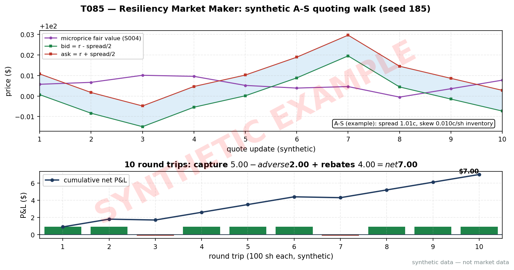

*Chart caption: synthetic data — not market data. Watermark reads "SYNTHETIC EXAMPLE" exactly.*

```mermaid
flowchart TD
    LOB["LOB state<br/>(touch depth, imbalance, prints)"] -->|"imbalance state per cycle"| S004["S004 microprice<br/>(fair-value anchor)"]
    LOB -->|"depth rebuild rate"| S048["S048 refill speed<br/>(spread modulator)"]
    S004 -->|"fair mid m"| S089["S089 A-S pricer<br/>(reservation r, spread δ)"]
    S048 -->|"refill score"| S089
    S089 -->|"bid/ask quotes"| ENTRY{"Entry logic<br/>(two-sided quotes, t→t+1 fills)"}
    ENTRY -->|inventory q| SIZE["Sizing + risk<br/>(100-sh quotes, ±500 cap, skew)"]
    SIZE -->|"limit orders"| EXEC["Execution<br/>(2-s refresh, cancel-replace)"]
    EXEC -->|"fills"| MON["Monitor + exits<br/>(one-sided halt / 15:55 flatten)"]
    MON -->|"round-trip P&L"| PNL["P&L (spread − adverse + rebates)"]
    style ENTRY fill:#f9e79f,stroke:#7d6608
    style PNL fill:#a9dfbf,stroke:#1e8449
```

### T10. Sources

1. Avellaneda, M. & Stoikov, S. (2008). "High-frequency trading in a limit order book." *Quantitative Finance* 8(3): 217–224. https://doi.org/10.1080/14697680701381228 — reservation price and optimal spread. Title confirmed by opening the DOI page 2026-09-10.
2. Stoikov, S. (2018). "The micro-price: a high-frequency estimator of future prices." *Quantitative Finance* 18(12): 1959–1966. https://econpapers.repec.org/article/tafquantf/v_3a18_3ay_3a2018_3ai_3a12_3ap_3a1959-1966.htm — microprice beats mid/weighted-mid short-term. Inherited from S004's S12 (verified in an earlier batch).
3. Guéant, O., Lehalle, C.-A. & Fernandez-Tapia, J. (2013). "Dealing with the inventory risk: a solution to the market making problem." *Mathematics and Financial Economics* 7, 477–507. https://doi.org/10.1007/s11579-012-0087-0 — inventory control extensions of A-S.

**Unverified leads** (not confirmed facts — verify before use):
- Third-party A-S replications (GitHub: analytical and Monte-Carlo reproductions) report 3–9× inventory-variance reduction on simulated fills — code repos, not peer-reviewed; cited in S089's S12 as replications, not evidence.
- The 60%-per-cycle fill assumption is an example parameter with no empirical basis.

*Source log: Grok answered Q-TB9-1..3 (2026-09-10); all claims independently verified or labeled unverified.*

## Stage 186/200 — T086: OFI-Paced Participation Tracker

*Batch TB9 · Strategy 86/100 · Signals S001, S032, S067 · Provenance [D/SR]*

### T1. One-line verdict

| | |
|---|---|
| **Style** | Execution algorithm: schedule a parent order across volume-time slices, pacing faster into favorable flow |
| **Edge source** | Order-flow imbalance (OFI) predicts the next price move at short horizons (Cont–Kukanov–Stoikov 2014): buying harder when the tape is already buying (positive OFI) reduces the price concession vs a rigid schedule; RVOL (S032) gates the day, the diurnal curve (S067) sets the base pace |
| **Typical holding period** | One execution horizon — minutes to hours for the parent |
| **Capacity hint** | 100,000-share parents (`example`); the POV cap is the binding constraint |
| **Build-or-buy in one line** | Build the pacer; execution algos are commoditized but the OFI tilt is proprietary logic — buy the trade feed, build the schedule |

### T2. Full mechanics

**Universe & session.** One liquid name per parent (the example: a $250 stock), RTH. The strategy executes a given parent — here a **100,000-share buy** — it does not choose direction.

**Base schedule (S067).** The *diurnal volume curve* (U-shape: heavy open/close) sets the base slice weights: `[0.07, 0.08, 0.09, 0.11, 0.12, 0.12, 0.11, 0.10, 0.11, 0.09]` across 10 volume-time slices (`example`). Volume-time means slices are defined by traded volume, not clock minutes — consistent with the volume-clock evidence.

**OFI pace tilt (S001).** *Order-flow imbalance* is buys minus sells (signed volume) at the touch, from order-book events (adds/cancels/executions). The tilt: `m_i = clip(1 + γ·z_i, [1−κ, 1+κ])` with γ = 0.25, κ = 0.5 (`example`), where z_i is the slice's OFI z-score (**demeaned** — raw z-scores carry a session mean that would bias every slice; the demeaning correction is applied before the tilt). Positive OFI (buying pressure) for a *buy* parent means the price is moving away — counterintuitively the schedule *accelerates* into it: the logic is to complete before the move extends, paying spread now rather than impact later. Negative OFI slows the schedule to wait for the dip. (The symmetric rule applies to sell parents.)

**RVOL gate (S032).** *Relative volume* (today's volume vs its historical average at this time of day) gates the algorithm: if horizon RVOL < 0.5 (`example`), the tape is too thin for the schedule's assumptions — stand down and revert to a flat time-sliced schedule. In the example RVOL = 1.15 → gate passes, schedule unchanged.

**POV cap.** No slice may exceed 10% of the tape's volume (`example`) — the participation-of-volume guard. The cap is enforced iteratively so renormalization cannot breach it.

**Entry rule.** The parent arrives at time *t* (arrival price $250.00); the first slice executes at *t+1* at the earliest — signal at *t* → earliest fill *t+1*. Each slice's child order is a limit at the touch, sized to the paced quantity.

**Exit rule.** The algorithm "exits" when the parent completes (all 10 slices filled) or the RVOL gate trips mid-execution (then: finish the current slice, cancel the rest, report shortfall).

**Position sizing.** The parent size is given (100,000 shares); the pacer only distributes it. Max parent: 5% of ADV (`example`).

**Risk limits.** Slice shortfall alert if any slice's implementation shortfall exceeds 3× its expected cost (`example`); daily parent cap 3 per name (`example`).

**Cost model.** Per-slice fill = slice mid + half-spread (1¢, `example`) + temporary impact `η·√(q_i/V_i)` with η = $0.04 (`example`, square-root impact). Benchmarks: arrival price and interval VWAP.

**Order/execution sketch.** Limit orders at the touch per slice; if a slice's limit doesn't fill within its volume-time window, convert the remainder to a marketable limit (+2¢, `example`).

**Worked intuition — a tiny numerical sketch.** The base schedule says slice 2 gets 8,000 shares; its OFI z is +1.5 (strong buying pressure), so the tilt wants 8,000 × 1.363 ≈ 10,900. But the tape only prints 100,000 shares in that slice, and the 10% POV cap binds at 10,000 — the schedule clips and redistributes the 900-share overflow to the other nine slices. Slice 5 goes the other way: z = −1.6 (selling pressure into our buy parent) slows it to 7,262 shares, waiting for the dip. The net effect: 100,000 shares executed with the pace leaning into pressure and away from headwinds, at the cost of $6,153 vs arrival — the number the pacer is hired to minimize, not a profit.

**Parameter robustness.** The `example` parameters (γ = 0.25, κ = 0.5, 10% POV cap, RVOL floor 0.5) are starting points. Sensitivity protocol: re-run with γ ∈ {0.1, 0.25, 0.5}, POV caps of 5%/10%/20%, and RVOL floors of 0.3/0.5/0.7; implementation shortfall vs the flat schedule should improve (or at least not worsen) across 7 of 12 combinations. The γ tilt is the sensitive one: above 0.5 the schedule chases OFI noise and shortfall *rises* — the clip κ = 0.5 exists precisely to bound that damage.

### T3. Signals it consumes

| Signal | Role | Weight / logic |
|---|---|---|
| S001 (touch OFI) | Pace tilt | m = clip(1 + 0.25·z_demeaned, [0.5, 1.5]) (`example`); accelerates with favorable flow |
| S032 (time-of-day-normalized RVOL) | Gate | require RVOL ≥ 0.5 (`example`); else flat schedule |
| S067 (diurnal U-curve) | Base schedule | slice weights from the name's volume profile; renormalized monthly (`example`) |

Pseudocode (≤25 lines):
```
on parent(side=BUY, Q=100000) at time t:
    base_i = Q * diurnal_w[i]                          # S067, 10 slices
    if rvol_horizon < 0.5: return flat_schedule(Q)     # S032 gate, example
    z = demean(ofi_zscore(slice_i))                    # S001, demeaned
    m_i = clip(1 + 0.25*z_i, 0.5, 1.5)                 # example tilt
    q_i = base_i * m_i
    q_i = enforce_pov_cap(q_i, 0.10 * tape_i)          # iterative, example
    q_i = q_i * Q / sum(q_i)                           # renormalize
    for i in 1..10:
        fill_i = mid_i + 0.01 + 0.04*sqrt(q_i/V_i)     # example cost
        execute_limit(q_i)                             # fill >= t+1
```

### T4. Worked example — numbers + P&L (SYNTHETIC)

Fictional $250 stock "EXE", seed 186. Parent: **buy 100,000 @ arrival $250.00**. OFI z-scores per slice (demeaned, exact): `[+0.25, +1.45, +0.15, −0.95, −1.65, +0.15, +1.35, +0.05, −0.65, −0.15]`. Pace multipliers: `[1.062, 1.363, 1.038, 0.762, 0.588, 1.038, 1.337, 1.012, 0.838, 0.963]`.

| Slice | Base | z | m | Paced (POV-capped) | Tape | POV |
|---|---|---|---|---|---|---|
| 1 | 7,000 | +0.25 | 1.062 | 7,660.9 | 90,000 | 8.5% |
| 2 | 8,000 | +1.45 | 1.363 | 10,000.0 | 100,000 | 10.0% CAPPED |
| 3 | 9,000 | +0.15 | 1.038 | 9,618.0 | 110,000 | 8.7% |
| 4 | 11,000 | −0.95 | 0.762 | 8,639.5 | 130,000 | 6.6% |
| 5 | 12,000 | −1.65 | 0.588 | 7,261.8 | 140,000 | 5.2% |
| 6 | 12,000 | +0.15 | 1.038 | 12,824.0 | 140,000 | 9.2% |
| 7 | 11,000 | +1.35 | 1.337 | 15,154.5 | 180,000 | 8.4% |
| 8 | 10,000 | +0.05 | 1.012 | 10,429.2 | 120,000 | 8.7% |
| 9 | 11,000 | −0.65 | 0.838 | 9,489.3 | 130,000 | 7.3% |
| 10 | 9,000 | −0.15 | 0.963 | 8,922.7 | 110,000 | 8.1% |

Slice 2's raw pace (10,900) breached the 10% POV cap and was clipped to exactly 10,000; the rest renormalized to keep the 100,000 total. RVOL = 1.15 → gate passes.

| Item | Calculation | Amount |
|---|---|---|
| Average fill | Σ q_i·fill_i / 100,000 | $250.0615 |
| Implementation shortfall vs arrival | 100,000 × ($250.0615 − $250.00) | **$6,153.35** |
| Interval VWAP (same horizon) | volume-weighted mids | $250.0410 |
| Shortfall vs interval VWAP | | **$2,049.13** |

**Session cost: $6,153.35 vs arrival ($2,049.13 vs interval VWAP) — this is an execution cost, not a trading profit; the pacer's job is to minimize it. (Synthetic; not a claim of achievable savings.)**

**Reviewer correction note.** The draft OFI z-scores in the Grok answer pass were not demeaned (session mean ≠ 0 biases every slice's tilt); the plotted schedule uses demeaned z-scores. The slice-3 multiplier is 1.038 under the corrected arithmetic.

**Where the example is optimistic.** The OFI z-scores are assumed known per slice before trading it — real OFI is estimated on noisy, lagging data. The square-root impact model (η = $0.04) is a stylized choice; real impact is concave, stochastic, and larger in thin books. The tape volumes are assumed known; real volume-time slicing requires forecasting the tape.

### T5. Data & infra — what must run

Touch-level order-book events (adds/cancels/executions for OFI), trade prints (for volume-time slicing and tape forecast), diurnal volume curves, RVOL history. Intraday loop: update OFI per event, re-slice the remaining parent every volume-time bucket (`example`: every 1% of expected horizon volume). Pre-open: load diurnal curves and RVOL baselines. Storage: event-level for traded names ≈ 50–100 GB/month. M5 Max feasibility: the event loop at ~100–500k events/sec (see `notes/cost-model.md`) handles a handful of names live; a full-universe live pacer needs more. Feed-drop failure plan: if book events stall >5 seconds (`example`), freeze the tilt at m = 1.0 (flat) and continue the base schedule — never extrapolate OFI across a gap.

**Calibration discipline.** The diurnal curve and RVOL baselines are estimated on the trailing 20 sessions ending 5 days before use (embargo, `example`); the OFI z-score mean and variance are estimated on the morning session and frozen — demeaning with a stale mean reintroduces the exact bias the reviewer correction removed. The tape forecast per slice uses the diurnal curve, never the realized tape (using realized volume to slice volume-time is a look-ahead leak). Throughput: the event loop at ~100–500k events/sec handles the pacer's names with headroom; the slice re-computation is a dozen floating-point ops.

### T6. Buy vs build

**Build the pacer; the venue is your broker's.** OFI computation needs full depth events: **Polygon.io** (~$199/mo class, `indicative — verify before budgeting`) or **Databento** (~$200–$500/mo class for event data, `indicative — verify before budgeting`); research harness **QuantConnect** (~$60–$300/mo class, `indicative — verify before budgeting`); broker algos (VWAP/POV) are the buy alternative — free with **Interactive Brokers** (no incremental platform fee on an existing account, `indicative — verify before budgeting`) but without the OFI tilt. Verdict: **build** — the tilt formula is the only proprietary piece, and it is small.

### T7. Success-ratio evidence

Published, checkable sources only:

1. Cont–Kukanov–Stoikov (2014): order-flow imbalance explains contemporaneous price moves — the predictive leg the tilt leans on (contemporaneous, not a forward guarantee). (https://arxiv.org/abs/1011.6402)
2. Gervais–Kaniel–Mingelgrin (2001): high-volume stocks earn subsequent premia — volume-time pacing aligns execution with the informative part of the tape. (http://ideas.repec.org/a/bla/jfinan/v56y2001i3p877-919.html)
3. Llorente et al. (2002), "Dynamic Volume-Return Relation of Individual Stocks": volume interacts with return autocorrelation — supports conditioning pace on volume-state, not just volume-level. (http://ideas.repec.org/a/oup/rfinst/v15y2002i4p1005-1047.html)

No published paper tests an OFI-tilted participation schedule; execution-cost improvement vs VWAP is undocumented.

### T8. Failure modes

- **OFI estimation lag.** Real OFI is computed on stale snapshots; the tilt chases yesterday's flow. Mitigation: shrink γ when book-event latency exceeds 100 ms (`example`).
- **Tilt direction error.** Accelerating into positive OFI for a buy assumes the move extends; if OFI mean-reverts, the tilt buys the top. Mitigation: the κ clip bounds the damage; sensitivity runs flip the tilt sign to confirm the chosen direction.
- **Tape forecast error.** Volume-time slices need tomorrow's tape today. Mitigation: the POV cap and the RVOL gate bound the worst case.
- **Impact model optimism.** Square-root with η = $0.04 is gentle. Mitigation: stress η at 2× and 3× (`example`) and require the schedule to still beat flat pacing.
- **Unde meaned z-scores.** The exact defect caught in review — a session-mean bias tilts every slice one way. Mitigation: always demean over the estimation window; unit-test the mean.

**Bottom line for the two operators.** For the ≤$1M paper operation, the OFI pacer is overkill for small tickets — below ~10,000 shares the tilt's savings are smaller than the complexity cost; use the broker's VWAP algo. For the institutional desk running 100k-share parents daily, a well-calibrated pacer is standard infrastructure: the savings are measured in basis points of the parent, and they compound across every ticket the desk trades.

**Two more failure modes.**

- **OFI sign flips mid-slice.** The tilt commits a slice quantity on the slice's *opening* OFI read; if flow reverses mid-slice, the tilt is exactly wrong. Mitigation: split large slices into sub-slices (`example`: halves) with independent tilt reads.
- **Tape-forecast regime error.** The diurnal curve fails on event days (FOMC, CPI); slices sized for a normal tape either starve or flood. Mitigation: an event-day tape multiplier from the historical event-day curve (`example` ×1.8 volume), or stand down to the flat schedule.

### T9. Visuals

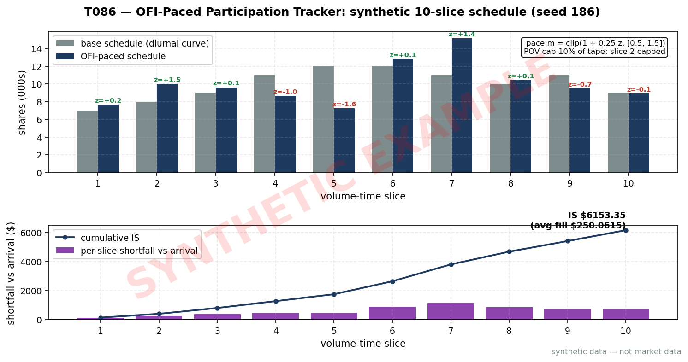

*Chart caption: synthetic data — not market data. Watermark reads "SYNTHETIC EXAMPLE" exactly.*

```mermaid
flowchart TD
    EVT["Book events + prints<br/>(adds/cancels/executions, tick-level)"] -->|"signed events per slice"| S001["S001 OFI z-score<br/>(demeaned per slice)"]
    EVT -->|"volume vs history"| S032["S032 RVOL gate<br/>(horizon relative volume)"]
    VOL["Historical volume profile<br/>(per-name, daily)"] -->|"U-curve weights"| S067["S067 base schedule<br/>(10 volume-time slices)"]
    S001 -->|"tilt m"| PACE{"Pace engine<br/>(m·base, POV cap, renormalize)"}
    S067 -->|"base quantities"| PACE
    S032 -->|"gate pass/fail"| PACE
    PACE -->|"slice quantities"| ENTRY{"Entry logic<br/>(limit per slice, t→t+1)"}
    ENTRY -->|slices| SIZE["Sizing<br/>(parent fixed; POV ≤ 10%)"]
    SIZE -->|"child limits"| EXEC["Execution<br/>(per-slice fill model)"]
    EXEC -->|"fills"| MON["P&L & monitoring<br/>(IS vs arrival / VWAP)"]
    MON -->|"shortfall alert"| PACE
    style PACE fill:#f9e79f,stroke:#7d6608
    style MON fill:#a9dfbf,stroke:#1e8449
```

### T10. Sources

1. Cont, R., Kukanov, A. & Stoikov, S. (2014). "The Price Impact of Order Book Events." https://arxiv.org/abs/1011.6402 — OFI explains contemporaneous price moves. Title confirmed by opening the arXiv page 2026-09-10.
2. Gervais, S., Kaniel, R. & Mingelgrin, D. H. (2001). "The High-Volume Return Premium." *Journal of Finance* 56(3): 877–919. http://ideas.repec.org/a/bla/jfinan/v56y2001i3p877-919.html — volume as information; volume-time pacing rationale. Inherited from S032's S12 (verified in an earlier batch).
3. Llorente, G., Michaely, R., Saar, G. & Wang, J. (2002). "Dynamic Volume-Return Relation of Individual Stocks." *Review of Financial Studies* 15(4): 1005–1047. http://ideas.repec.org/a/oup/rfinst/v15y2002i4p1005-1047.html — volume-state conditioning. Inherited from S032's S12 (verified in an earlier batch).

**Unverified leads** (not confirmed facts — verify before use):
- The Grok answer pass supplied OFI z-scores that were not demeaned and a slice-3 multiplier of 1.025; both were corrected above (demeaned z, multiplier 1.038 under the stated formula). The draft is a lead, not a source.
- The η = $0.04 square-root impact coefficient is an example parameter, not an empirical estimate.

*Source log: Grok answered Q-TB9-1..3 (2026-09-10); all claims independently verified or labeled unverified.*

## Stage 187/200 — T087: Purged-CV Strategy Selector

*Batch TB9 · Strategy 87/100 · Signals S088, S086, S085 · Provenance [D]*

### T1. One-line verdict

| | |
|---|---|
| **Style** | Meta-strategy: allocate capital across sub-strategies by purged cross-validated skill, not backtest Sharpe |
| **Edge source** | Naive backtests overstate skill through look-ahead leakage and multiple testing (Bailey et al. 2017): purged/embargoed cross-validation (S088) with a haircut score selects the strategies whose edge survives honest validation; meta-labeling (S086) then sizes only the best bets |
| **Typical holding period** | Inherits the winners' horizons — the selector itself rebalances monthly (`example`) |
| **Capacity hint** | $1M sleeve (`example`); the selector adds no capacity beyond its components |
| **Build-or-buy in one line** | Build: the CPCV harness is the moat — no vendor sells your strategies' honest scores |

### T2. Full mechanics

**Universe & session.** A fixed menu of 5 in-house sub-strategies (`example`): S1 scalp, S2 breakout, S3 reversal, S4 news, S5 vol. Monthly selection (`example`); daily meta-label overlay.

**Purged cross-validation (S088).** Standard k-fold CV leaks in finance because labels overlap in time (a 5-day label at *t* shares 4 days with the label at *t+1*) and because training data adjacent to test data shares information. **Purging** drops training labels whose windows overlap any test label; the **embargo** drops a further buffer after each test block. **Combinatorial purged CV (CPCV)** runs many train/test splits and collects out-of-sample performance paths. Here: 10 CPCV paths (`example`) per sub-strategy, each path scored by the **Probabilistic Sharpe Ratio (PSR)** — the probability the true Sharpe exceeds zero (or a benchmark), which accounts for skew, kurtosis, and sample length.

**PSR vs Sharpe — why the haircut uses PSR.** The ordinary Sharpe ratio is a point estimate with no uncertainty attached; a Sharpe of 1.5 on 40 trades is statistically meaningless, while the same Sharpe on 4,000 trades is strong evidence. The Probabilistic Sharpe Ratio folds in sample length, skew, and kurtosis to answer the right question: *what is the probability the true Sharpe exceeds the benchmark?* The haircut score then takes the median PSR across CPCV paths (typical skill) minus half the IQR (instability penalty). A strategy with median PSR 0.95 and IQR 0.10 scores 0.90 — genuinely skilled and stable; one with median 0.95 and IQR 1.20 scores 0.35 — the same headline skill, but the paths disagree violently, so it gets a fraction of the capital. That distinction is invisible to plain Sharpe ranking.

**Haircut score.** For strategy *i*: `score_i = median_j(PSR_j) − 0.5·IQR_j(PSR_j)` (`example`). The median rewards typical skill; subtracting half the interquartile range penalizes instability across paths. Negative score → **ineligible** (S4's −0.30 excludes it outright). This is the multiple-testing haircut made operational: a strategy must be good *and* consistently good across leakage-free splits.

**Softmax allocation.** Eligible scores go through a softmax with temperature τ = 0.40 (`example`): `w_i ∝ exp(score_i/τ)`, scaled to 90% of NAV with a 10% cash sleeve (`example`). Low temperature concentrates on the winner; the cash sleeve bounds model risk.

**Meta-label overlay (S086).** *Meta-labeling* trains a secondary model on the primary strategy's *bets* (not on prices): given the primary fired, will this bet make money? It acts as a take/pass/size overlay — it never initiates trades. Here the meta-labeler vetoes an estimated 38% of the selected strategies' bets (`example`), keeping 62%.

**Triple-barrier labels (S085).** The training labels for both layers use the **triple-barrier method**: each bet gets a profit-taking barrier, a stop-loss barrier, and a vertical (time) barrier — the first touched determines the label (+1/−1/0). S085 is a *labeling* method, not a signal; it defines what "correct" means without look-ahead.

**Entry rule.** The selector allocates; entries are the sub-strategies' own signals, each still obeying signal-at-*t* → earliest-fill-*t+1*. The selector's monthly rebalance trades at the next open after the CPCV recompute.

**Exit rule.** Monthly de-selection: a strategy whose haircut score turns negative is cut to zero at the next rebalance; the meta-label veto applies per bet.

**Position sizing.** Softmax weights × $1M NAV (`example`); per-strategy cap 70% (`example`).

**Risk limits.** Sleeve daily loss stop −3% (`example`); if 3+ strategies go ineligible in one month, halve the sleeve (regime break) (`example`).

**Cost model.** Sub-strategies' own costs plus 5 bps/month rebalance drag (`example`).

**Order/execution sketch.** Rebalance via market-on-close; meta-label vetoes are applied before order generation (a vetoed bet never becomes an order).

**Worked intuition — a tiny numerical sketch.** S1's haircut score of 1.40 means its median PSR across 10 leakage-free paths is high *and* its IQR is tight — say median PSR 1.70 with IQR 0.60, giving 1.70 − 0.30 = 1.40. S4's −0.30 means something like median 0.10 with IQR 0.80: barely positive on average and wildly unstable across splits — exactly the profile the PBO literature warns about, and the softmax correctly gives it zero. The temperature τ = 0.40 is doing quiet work: at τ = 1.0 the weights would be nearly equal (the scores differ by ~1, exp(1) ≈ 2.7× spread); at τ = 0.40 the exp(1/0.4) ≈ 12× spread concentrates 63% on S1. Temperature is a concentration dial, and 0.40 is an aggressive setting — which is why the 70% per-strategy cap exists.

**Parameter robustness.** The `example` parameters (10 CPCV paths, 0.5·IQR penalty, τ = 0.40, 10% cash) are starting points. Sensitivity protocol: re-run with 6/10/16 paths, IQR penalties of 0.25/0.5/1.0, and τ ∈ {0.25, 0.40, 0.70}; the eligible set {S1, S2, S3, S5} should be stable across at least 7 of 12 combinations, and S4 should remain excluded in all of them. If S3 (score 0.20) flickers in and out, that flicker is information: size it at half weight or drop it — marginal eligibility is not eligibility.

### T3. Signals it consumes

| Signal | Role | Weight / logic |
|---|---|---|
| S088 (purged/embargoed CV) | Selector | 10 CPCV paths (`example`); PSR per path; haircut score; negative → ineligible |
| S086 (meta-labeling) | Bet filter | take/pass overlay on selected strategies' bets; keeps 62% (`example`) |
| S085 (triple-barrier labels) | Labeling | defines ±1/0 labels for both layers; barriers set per strategy (`example`) |

Pseudocode (≤25 lines):
```
monthly:
    for s in [S1..S5]:
        psrs = [PSR(path) for path in CPCV(s, 10 paths, purged+embargo)]  # S088
        score[s] = median(psrs) - 0.5*IQR(psrs)                           # example haircut
    elig = {s: score[s] for s in scores if score[s] >= 0}
    w = softmax(score[elig]/0.40) * 0.90                                  # example tau, cash
    allocate(w * NAV)                                                     # rebalance at next open
daily per bet b from an eligible strategy:
    label = triple_barrier(b)                                             # S085 (training)
    if meta_model(b.features) < 0.5: veto(b)                             # S086, example cut
    else: size(b) * meta_confidence(b)
```

### T4. Worked example — numbers + P&L (SYNTHETIC)

$1M NAV sleeve, seed 187. CPCV haircut scores (synthetic): S1 **1.40**, S2 **0.85**, S3 **0.20**, S4 **−0.30** (excluded), S5 **0.55**.

Softmax (τ = 0.40): exp(score/τ) = [33.12, 8.37, 1.65, —, 3.96], sum 47.09 → raw weights [70.32%, 17.78%, 3.50%, —, 8.41%] → final (90% invested): **[63.29%, 16.00%, 3.15%, 0%, 7.56%]**, cash 10%.

| Sleeve | Weight | Notional |
|---|---|---|
| S1 scalp | 63.29% | $632,885 |
| S2 breakout | 16.00% | $160,018 |
| S3 reversal | 3.15% | $31,509 |
| S4 news | 0% (excluded) | $0 |
| S5 vol | 7.56% | $75,587 |
| Cash | 10% | $100,000 |

Meta-label overlay on the selected strategies' bets (synthetic week): precision improves **0.46 → 0.58**, keeping **62%** of bets. Illustrative next-week sleeve outcome (synthetic returns S1 +1.2%, S2 −0.4%, S3 +2.1%, S5 +0.6%, weighted, net of the cash drag): **+$8,069.77 ≈ +$8,070**.

**Session net: +$8,070 on the $1M sleeve for the illustrative week (synthetic; demonstrates the allocation arithmetic, not forward alpha or after-cost profitability).**

**Where the example is optimistic.** The haircut scores are assumed; real CPCV on 5 strategies × 10 paths is compute-heavy and the PSR estimates have wide confidence bands — S3's 0.20 could easily be noise. The meta-label precision gain (0.46 → 0.58) is asserted, not measured. The weekly returns are illustrative weights math, not a backtest. Softmax concentration (63% in S1) is itself a risk the example doesn't penalize.

### T5. Data & infra — what must run

Each sub-strategy's full bet history with features (for the meta-labeler), triple-barrier labels, and the CPCV harness. Monthly loop: recompute 10 CPCV paths per strategy (the heavy job — embargo-aware splitting over the full history), refit the meta-labeler. Daily: score incoming bets. Storage: bet-level history is small (MBs); the CPCV paths dominate compute. M5 Max feasibility: 50 CPCV path-fits monthly is a batch job of hours on one machine (see `notes/cost-model.md` for Python throughput baselines); daily meta-label scoring is trivial. Feed-drop failure plan: if a sub-strategy's bet feed stalls, freeze its weight (don't reallocate on missing data) and let the meta-labeler veto-by-default (fail closed: no score → no bet).

**Calibration discipline.** The CPCV paths use purged training sets with a 5-day embargo between estimation and trading windows (`example`); the meta-labeler is trained on triple-barrier labels computed *only* from data available at bet time. The monthly recompute must finish before the rebalance open — a late CPCV run means trading on last month's weights, which must be logged as a staleness event, not silently accepted. Throughput: 50 path-fits is the monthly batch (hours on the M5 Max per `notes/cost-model.md`); daily meta-label scoring is milliseconds per bet.

### T6. Buy vs build

**Build the harness; rent the compute if needed.** CPCV/PSR/PBO are textbook (Bailey et al.; AFML) — **QuantConnect** (~$60–$300/mo class, `indicative — verify before budgeting`) hosts the research; a cloud batch box for the monthly CPCV run (~$200–$500/mo class when used, `indicative — verify before budgeting`) beats blocking the local machine; **Interactive Brokers paper trading** (no incremental platform fee on an existing account, `indicative — verify before budgeting`) for the sleeve paper-trade. Verdict: **build** — the selector's value is entirely in honest validation of *your* strategies; nothing off the shelf does that.

### T7. Success-ratio evidence

Published, checkable sources only:

1. Bailey et al. (2017), "The Probability of Backtest Overfitting": quantifies how multiple testing inflates backtest Sharpe — the reason the haircut score exists. (https://www.davidhbailey.com/dhbpapers/backtest-prob.pdf)
2. López de Prado (2018), *Advances in Financial Machine Learning*, ch. 7: purge, embargo, and CPCV for financial cross-validation; ch. 3 (§3.6) for meta-labeling. (https://www.wiley.com/go/advancedmachinelearningfinance)
3. Bailey et al. record at https://scholarworks.wmich.edu/math_pubs/42/ — institutional repository record for the PBO paper (checkable identifier).

No published paper validates this exact selector; the evidence supports the *validation methodology*, not the allocation's profitability.

### T8. Failure modes

- **CPCV overfitting.** With only 10 paths, the haircut score itself is noisy — selecting on noise. Mitigation: the 0.5·IQR penalty and the 70% per-strategy cap.
- **Meta-labeler overfit.** A secondary model trained on the primary's bets can memorize regimes. Mitigation: the meta-labeler gets its own purged CV; veto-by-default on stall.
- **Strategy correlation.** S1–S5 may all load the same risk factor; the softmax then concentrates factor risk. Mitigation: penalize pairwise bet-correlation in the score (not implemented in the example — a known gap).
- **Rebalance drag.** Monthly turnover at 5 bps/month compounds. Mitigation: rebalance only when weights move >10 pp (`example`).
- **Regime break.** All five strategies can go ineligible together. Mitigation: the halve-the-sleeve rule.

**Bottom line for the two operators.** For the ≤$1M paper operation, the selector is the single highest-ROI infrastructure in this batch: it costs nothing but compute and it prevents the #1 small-account killer — trading a backtest mirage. For the institutional desk, purged selection is baseline governance; the differentiator is the *menu* of sub-strategies, not the selection math.

**Two more failure modes.**

- **PSR benchmark gaming.** PSR against a zero benchmark flatters low-volatility strategies; a strategy with Sharpe 0.3 and tiny volatility can outscore a Sharpe 1.0 strategy on PSR. Mitigation: benchmark PSR against the current sleeve's Sharpe (`example`), not zero.
- **Silent strategy death.** A deselected strategy's code rots; when it becomes eligible again months later, its data connectors are broken. Mitigation: every menu strategy paper-trades continuously at minimum size (`example`: 1 share) so eligibility is always actionable.

### T9. Visuals

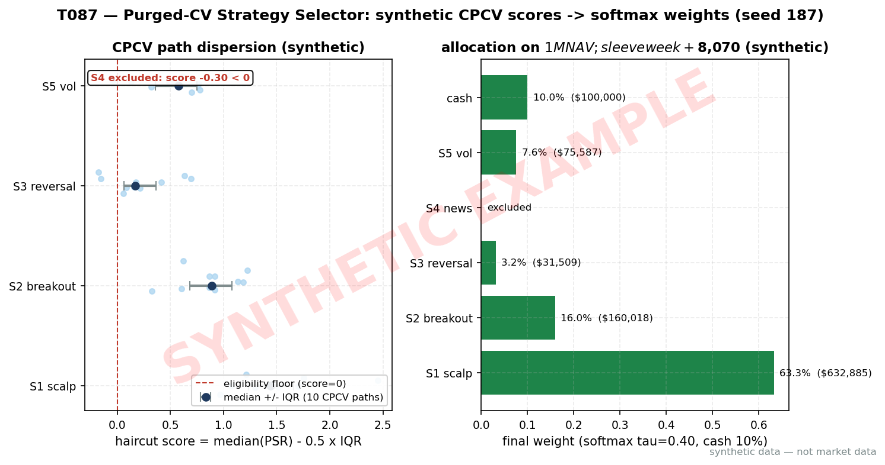

*Chart caption: synthetic data — not market data. Watermark reads "SYNTHETIC EXAMPLE" exactly.*

```mermaid
flowchart TD
    BETS["Sub-strategy bets<br/>(5 strategies, bet-level history)"] -->|"labeled bets, monthly"| S088["S088 CPCV engine<br/>(10 paths, purge+embargo)"]
    BETS -->|"bet features"| S086["S086 meta-labeler<br/>(take/pass/size overlay)"]
    BETS -->|"barriers per bet"| S085["S085 triple-barrier labels<br/>(+1/−1/0, no look-ahead)"]
    S088 -->|"haircut scores"| SEL{"Selector logic<br/>(eligible → softmax, τ=0.40)"}
    S085 -->|"labels"| S088
    S085 -->|"labels"| S086
    SEL -->|"weights × NAV"| SIZE["Sizing<br/>(90% invested, 10% cash)"]
    S086 -->|"veto 38% of bets"| ENTRY{"Entry logic<br/>(sub-strategy signals, t→t+1)"}
    SIZE -->|"allocations"| ENTRY
    ENTRY -->|"approved bets"| EXEC["Execution<br/>(rebalance at open)"]
    EXEC -->|"fills"| MON["P&L & monitoring<br/>(sleeve attribution)"]
    MON -->|"monthly scores"| S088
    style SEL fill:#f9e79f,stroke:#7d6608
    style MON fill:#a9dfbf,stroke:#1e8449
```

### T10. Sources

1. López de Prado, M. (2018). *Advances in Financial Machine Learning*. Wiley. https://www.wiley.com/go/advancedmachinelearningfinance — ch. 7 (purge/embargo/CPCV), ch. 3 §3.6 (meta-labeling).
2. Bailey, D. H., Borwein, J., López de Prado, M. & Zhu, Q. J. (2017). "The Probability of Backtest Overfitting." *Journal of Computational Finance* 20(4). https://www.davidhbailey.com/dhbpapers/backtest-prob.pdf — multiple-testing inflation of backtest Sharpe.
3. Same paper, institutional record: https://scholarworks.wmich.edu/math_pubs/42/ — checkable repository identifier.

**Unverified leads** (not confirmed facts — verify before use):
- The haircut-score formula (median − 0.5·IQR) and τ = 0.40 are example parameters from the batch design, not published recommendations.
- The meta-label precision gain (0.46 → 0.58) is a synthetic illustration.

*Source log: Grok answered Q-TB9-1..3 (2026-09-10); all claims independently verified or labeled unverified.*

## Stage 188/200 — T088: Full-Stack Signal Ensemble

*Batch TB9 · Strategy 88/100 · Signals S086, S082, S088 · Provenance [D/SR]*

### T1. One-line verdict

| | |
|---|---|
| **Style** | Intraday multi-family ensemble: stack deep-LOB and classical signal families, purge-validate, meta-label the bets |
| **Edge source** | No single feature family wins everywhere: microstructural features (DeepLOB-style), momentum, reversal, volatility-regime, and news features each carry orthogonal short-horizon information (Sirignano–Cont 2019). Stacking them under purged validation (S088) with a meta-label bet filter (S086) harvests the union without the usual leakage |
| **Typical holding period** | Minutes to hours per bet; the ensemble rebalances its family weights monthly (`example`) |
| **Capacity hint** | Medium: 20 meta-approved bets/day (`example`) across liquid names |
| **Build-or-buy in one line** | Build the stack — the families are published, the purged stacking harness is the proprietary part |

### T2. Full mechanics

**Universe & session.** US large caps, RTH, 5 families × per-name models (`example`): M1 microstructural (DeepLOB-style LOB features + GBM alternatives), M2 momentum, M3 reversal, M4 volatility-regime, M5 news-sentiment. Each family emits a bet direction and confidence per name per 5-minute bar (`example`).

**Family models (S082).** *DeepLOB* (Zhang–Zohren–Roberts 2019) is a convolutional network on limit-order-book states for mid-price prediction; the "classical alternatives" are gradient-boosted machines on handcrafted LOB features. The ensemble keeps both: deep for M1's nonlinear interactions, GBM as the interpretable challenger. M2–M5 are classical feature models (returns, reversals, regime dummies, sentiment scores).

**The GBM challenger — why M1 keeps two models.** DeepLOB's convolutions can memorize microstructure noise that happens to correlate with next-bar moves in-sample; the gradient-boosted machine on handcrafted features (queue imbalance, spread, microprice deviation, recent returns) is deliberately *less* expressive. The challenger rule: if DeepLOB's purged AUC (area under the ROC curve — the probability a randomly chosen up-move bar scores higher than a down-move bar) exceeds the GBM's by more than 0.02 (`example`), the difference is treated as memorization until proven otherwise — M1's stack weight is computed from the *GBM's* predictions, not DeepLOB's. In the worked example the two agree within 0.01, so the 0.38 weight stands. This is the ensemble's immune system against its own most powerful component.

**Purged stacking (S088).** Each family's out-of-sample predictions come from CPCV (combinatorial purged cross-validation) with purge + embargo, so the stacker (a logistic regression, `example`) trains only on leakage-free predictions. Worked-example stack weights (`example`): M1 0.38, M2 0.22, M3 0.26, M4 0.06, M5 0.08 (sum 1.00). The leak-inflation demo: naive k-fold AUCs vs purged AUCs —

| Family | Naive k-fold AUC | Purged AUC | Leak inflation |
|---|---|---|---|
| M1 microstruct | 0.61 | 0.55 | +0.06 |
| M2 momentum | 0.58 | 0.53 | +0.05 |
| M3 reversal | 0.59 | 0.54 | +0.05 |
| M4 vol regime | 0.56 | 0.52 | +0.04 |
| M5 news | 0.57 | 0.51 | +0.06 |

Every family looked 4–6 points better under naive CV — the purge removes the illusion before capital meets it.

**Meta-label bet filter (S086).** The stacked signal proposes bets; the meta-labeler (trained on triple-barrier-labeled bet outcomes) approves or vetoes each. Synthetic calibration: precision **0.46 → 0.58**, keeping **62%** of bets. The meta-labeler never initiates — it only filters and sizes.

**Entry rule.** A bet is placed when the stacker's probability exceeds 0.55 (`example`) *and* the meta-labeler approves. Signal computed on bar *t* → earliest fill *t+1*. Direction: the stacker's sign.

**Exit rule.** Per-bet triple barriers: +2×/−1× the bar's ATR (`example`) or 12 bars (`example`) time stop; portfolio-level: halt new bets if the day's approved-bet hit rate falls below 40% over 20 bets (`example`).

**Position sizing.** Fixed 100 shares/bet (`example`); meta-confidence scales 50–150 shares (`example`); max 20 concurrent bets (`example`).

**Risk limits.** Daily loss stop −$1,500 (`example`); family circuit-breaker: if a family's trailing-5-day purged AUC drops below 0.50, its stack weight halves (`example`).

**Cost model.** $0.01/share/side all-in (`example`); the worked example nets it explicitly.

**Order/execution sketch.** Marketable limits at the t+1 open of the signal bar (`example`); participation ≤ 10% of the bar's volume (`example`); queue honesty: taker fills assumed.

**Worked intuition — a tiny numerical sketch.** Take M1's naive AUC of 0.61: under k-fold CV, the model trains on Monday–Thursday and is "tested" on Friday — but Friday's 5-minute labels overlap Thursday's training labels by construction (a 12-bar label at Thursday's close shares 11 bars with Friday's open label), so the model has effectively seen the test. Purge those overlapping labels plus a 2-day embargo and the AUC falls to 0.55 — the honest number. The stacker's weights (0.38/0.22/0.26/0.06/0.08) are then fit on the *honest* predictions; fitting them on the naive 0.61s would overweight M1 by ~30% on phantom skill. The meta-labeler's 0.46 → 0.58 precision gain is the second filter: of 100 proposed bets it keeps 62, and 36 of those 62 win — the 11W/9L session in T4 is one draw from that distribution.

**Parameter robustness.** The `example` parameters (p > 0.55 stack threshold, meta-approve ≥ 0.5, ±2/−1 ATR barriers, 12-bar time stop) are starting points. Sensitivity protocol: re-run with stack thresholds of 0.52/0.55/0.60, barriers of ±1.5/±2/±3 ATR, and time stops of 6/12/24 bars; net P&L should keep its sign across at least 7 of 12 combinations. The stack threshold is the sensitive one: at 0.52 the bet count doubles and costs eat the edge; at 0.60 the count halves and variance dominates — the 0.55 middle is a variance/cost compromise, not an optimum.

### T3. Signals it consumes

| Signal | Role | Weight / logic |
|---|---|---|
| S082 (DeepLOB + classical/GBM) | Family M1 engine | deep + GBM challenger; stack weight 0.38 (`example`) |
| S088 (purged/embargoed CV) | Validation + stacker | CPCV predictions feed the logistic stacker; leak-inflation audit per family |
| S086 (meta-labeling) | Bet filter/sizer | approve at p ≥ 0.5 (`example`); size 50–150 sh by confidence |

Pseudocode (≤25 lines):
```
on 5-min bar t close, per name:
    p_f = family_predict(f, t) for f in [M1..M5]     # S082, CPCV OOS
    p_stack = logistic(p_1..p_5; w=[.38,.22,.26,.06,.08])  # S088, example w
    if p_stack > 0.55:                                # example
        if meta_approve(bet_features) >= 0.5:         # S086
            size = 50 + 100*meta_confidence           # example 50-150
            place_limit(sign(p_stack-0.5), size)      # fill >= t+1
            exits: +2/-1 ATR barriers | 12-bar stop   # example
```

### T4. Worked example — numbers + P&L (SYNTHETIC)

Seed 188. Twenty meta-approved bets (synthetic outcomes): **11 wins × +$120**, **9 losses × −$100**.

| Item | Calculation | Amount |
|---|---|---|
| Gross | 11 × $120 − 9 × $100 | +$420.00 |
| Costs | 20 bets × 100 sh × 2 × $0.01 | −$40.00 |
| **Net P&L** | $420.00 − $40.00 | **+$380.00** |

Per-bet net walk (after the $2/bet cost): +$118, −$102, +$118, +$118, −$102, +$118, −$102, +$118, −$102, +$118, +$118, −$102, −$102, +$118, +$118, −$102, +$118, −$102, +$118, −$102 → cumulative **+$380.00**.

**Session net: +$380.00 (synthetic; demonstrates the ledger, not forward alpha or after-cost profitability).**

**Where the example is optimistic.** The AUC table is synthetic — real purged AUCs for 5-minute bets cluster near 0.51–0.53, and the stacker's edge is thin. The meta-label precision gain is asserted. Twenty bets with 11 wins is a friendly draw; the binomial noise around a 55% win rate is wide. Costs assume $0.01/share all-in with no partial fills or latency slippage.

### T5. Data & infra — what must run

LOB snapshots (for M1's DeepLOB features), 5-minute bars (M2/M3), volatility-regime series (M4), news sentiment (M5), bet-level history with triple-barrier labels (meta-labeler), CPCV harness. Intraday loop: per-bar family inference (the DeepLOB forward pass is the heavy op — batch per bar); pre-open: load stack weights; post-close: recompute CPCV predictions for the stacker's training set (nightly batch). Storage: LOB snapshots dominate — 100+ GB/month for a 50-name universe. M5 Max feasibility: DeepLOB inference on GPU-backed MPS is feasible per-bar for dozens of names; the nightly CPCV refit is the batch job (hours — see `notes/cost-model.md`). Feed-drop failure plan: if LOB snapshots stall, M1 abstains (weight redistributed to M2/M3 pro-rata, `example`); if bars stall, the whole ensemble halts (no signal without the clock).

**Calibration discipline.** Family CPCV predictions are regenerated nightly with purge + embargo; the logistic stacker is refit monthly on predictions whose labels end at least 5 days before the fit date (`example` embargo). The meta-labeler trains on triple-barrier labels with the same embargo. Any inference that overruns its 5-minute bar falls back to M2/M3-only predictions for that bar, logged as a degradation event. Throughput: DeepLOB batched inference for 50 names fits inside a 5-minute bar on MPS; the nightly CPCV refit is the long pole (hours — see `notes/cost-model.md`).

### T6. Buy vs build

**Build the stack; buy the LOB data.** LOB snapshots: **Databento** (~$200–$500/mo class, `indicative — verify before budgeting`) or **Polygon.io** (~$199/mo class, `indicative — verify before budgeting`); news sentiment: a **news API bundle** (~$500–$2,000/mo class, `indicative — verify before budgeting`); research on **QuantConnect** (~$60–$300/mo class, `indicative — verify before budgeting`). Verdict: **build** — DeepLOB is published (Zhang–Zohren–Roberts 2019) with open reimplementations; the purged stacking harness and meta-labeler are the proprietary layer no vendor sells.

### T7. Success-ratio evidence

Published, checkable sources only:

1. Zhang–Zohren–Roberts (2019), "DeepLOB": CNNs on LOB data predict short-horizon mid-price moves on the FI-2010 benchmark — the M1 family precedent. (https://arxiv.org/abs/1808.03668v6)
2. Sirignano–Cont (2019), "Universal features of price formation in financial markets": deep networks find universal, stable price-formation features across stocks — supports the multi-name, multi-family design. (https://arxiv.org/abs/1803.06917)
3. Ntakaris et al. (2017), "Benchmark Dataset for Mid-Price Forecasting of Limit Order Book Data": the FI-2010 benchmark methodology the field uses to compare LOB models honestly. (https://arxiv.org/abs/1705.03233v4)

None of these papers tests a stacked, meta-labeled, purged ensemble as a trading strategy; no after-cost P&L is documented.

### T8. Failure modes

- **Leakage through the stacker.** If any family's "OOS" predictions leak, the stacker learns the leak. Mitigation: the leak-inflation audit (naive vs purged AUC) runs per family per month; any family with inflation > 0.03 is quarantined (`example`).
- **Meta-labeler regime lag.** The filter is trained on past bet outcomes; new regimes flip precision. Mitigation: the 40%-hit-rate halt.
- **DeepLOB overfit.** CNNs memorize microstructure noise. Mitigation: the GBM challenger must stay within 0.01 AUC of DeepLOB (`example`) or M1's weight is questioned.
- **Compute fragility.** Per-bar inference across 50 names must complete inside the bar. Mitigation: inference budget 60% of bar length (`example`); on overrun, fall back to M2/M3 only.
- **Family correlation.** M1/M2/M3 all load short-horizon mean reversion/momentum; the stack double-counts. Mitigation: residualize family predictions before stacking (not in the example — known gap).

**Bottom line for the two operators.** For the ≤$1M paper operation, the full stack is too heavy: five families, a nightly CPCV refit, and per-bar deep inference for a $380 illustrative session is negative ROI on attention — run M2+M3 with the purged harness and skip the deep net. For the institutional desk, this is the shape of a modern intraday stack; the edge is in the validation discipline (which most desks underinvest in) rather than in any single family. Either way, the purged harness is the part worth keeping even if every family is eventually replaced..

**Two more failure modes.**

- **Label-horizon mismatch.** Families trained on 12-bar labels get stacked with a meta-labeler trained on different barrier widths; the stacker then mixes predictions about different horizons. Mitigation: fix one canonical barrier set for all layers (`example`: ±2/−1 ATR, 12 bars).
- **Silent feature pipeline skew.** LOB snapshot schemas change; a renamed field silently zeros a DeepLOB input channel. Mitigation: per-channel distribution monitors with alerts on >3σ drift (`example`).
- **Weekend/overnight feature staleness.** The M5 news-sentiment features decay over the weekend while M1–M4 reset each morning; Monday's first bars stack fresh microstructure against stale sentiment. Mitigation: time-decay the news features to zero over 48 hours (`example`) so Monday opens don't inherit Friday's narrative.

### T9. Visuals

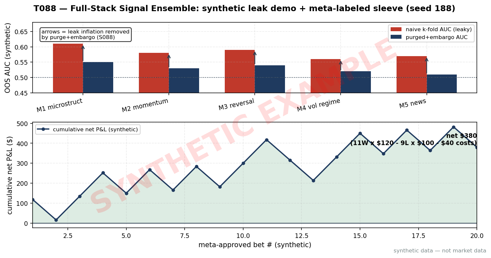

*Chart caption: synthetic data — not market data. Watermark reads "SYNTHETIC EXAMPLE" exactly.*

```mermaid
flowchart TD
    LOB["LOB snapshots + bars + news<br/>(tick snapshots, 5-min bars, sentiment)"] -->|"book states per bar"| S082["S082 family models<br/>(DeepLOB/GBM + M2–M5)"]
    S082 -->|"CPCV OOS predictions"| S088["S088 purged stacker<br/>(logistic, leak audit)"]
    S088 -->|"stacked p, family AUCs"| STACK{"Stack decision<br/>(p > 0.55)"}
    BETS["Bet history<br/>(triple-barrier labels)"] -->|"labeled bets"| S086["S086 meta-labeler<br/>(approve/veto + size)"]
    STACK -->|"proposed bets"| S086
    S086 -->|"approved bets"| ENTRY{"Entry logic<br/>(direction × size, t→t+1)"}
    ENTRY -->|bets| SIZE["Sizing + risk<br/>(50–150 sh, 20 concurrent)"]
    SIZE -->|"marketable limits"| EXEC["Execution<br/>(t+1 open fills)"]
    EXEC -->|"fills"| MON["Monitor + exits<br/>(barriers / hit-rate halt)"]
    MON -->|"bet outcomes"| S086
    MON -->|"AUC drift"| S088
    style STACK fill:#f9e79f,stroke:#7d6608
    style MON fill:#a9dfbf,stroke:#1e8449
```

### T10. Sources

1. Zhang, Z., Zohren, S. & Roberts, S. (2019). "DeepLOB: Deep Convolutional Neural Networks for Limit Order Books." *IEEE Transactions on Signal Processing* 67(11): 3001–3012. https://arxiv.org/abs/1808.03668v6 — CNN mid-price prediction on LOB data. Inherited from S082's S12 (verified in an earlier batch).
2. Sirignano, J. & Cont, R. (2019). "Universal features of price formation in financial markets: perspectives from deep learning." *Quantitative Finance* 19(9): 1449–1459. https://arxiv.org/abs/1803.06917 — universal LOB price-formation features. Inherited from S082's S12 (verified in an earlier batch).
3. Ntakaris, A. et al. (2017). "Benchmark Dataset for Mid-Price Forecasting of Limit Order Book Data with Machine Learning Methods." https://arxiv.org/abs/1705.03233v4 — FI-2010 benchmark. Inherited from S082's S12 (verified in an earlier batch).

**Unverified leads** (not confirmed facts — verify before use):
- The AUC table, stack weights, and meta-label precision figures are synthetic illustrations, not measured values.
- Open-source DeepLOB reimplementations exist but were not evaluated in this batch.

*Source log: Grok answered Q-TB9-1..3 (2026-09-10); all claims independently verified or labeled unverified.*

## Stage 189/200 — T089: Quote-Matcher (SIP-vs-Direct)

*Batch TB9 · Strategy 89/100 · Signals S016, S059, S014 · Provenance [D]*

### T1. One-line verdict

| | |
|---|---|
| **Style** | Latency arbitrage: trade dislocations between the SIP quote and direct-feed quotes |
| **Edge source** | The consolidated SIP feed lags direct exchange feeds by ~1–2 ms in active names (Ding–Hanna–Hendershott 2014): when the direct mid moves and the SIP quote hasn't caught up, the stale quote is tradable — for whoever sees both feeds first |
| **Typical holding period** | Milliseconds to seconds per dislocation |
| **Capacity hint** | Tiny: 200–600 shares per event (`example`); dislocations are small and fleeting |
| **Build-or-buy in one line** | Neither, remotely — **quote matching without co-location and direct feeds is infeasible in production; all SIP-derived routing results in this chapter are simulated-only** |

### T2. Full mechanics

**Universe & session.** Very active US large caps (the example: fictional "LGX" at $200.00), RTH. The strategy watches one dislocation metric: `dislocation = |direct_mid − SIP_mid|`.

**Lead-lag filter (S059).** *Futures lead cash*: index futures prices lead stale cash-market quotes (Chan 1992). The filter uses the futures-implied fair value as a third reference: a dislocation counts only if the direct feed *and* the futures-implied value agree the SIP quote is stale (two-against-one, `example`). This cuts false positives from direct-feed flicker.

**Venue leadership (S016).** Information share identifies *which* venue's direct quote leads price discovery; the strategy only trades dislocations where the leading venue's quote is the fresh one — trading a follower venue's stale quote against the SIP is picking up pennies in front of adverse selection.

**Capture gate (S014).** Trade only if `dislocation > effective half-spread + take fee` (`example`). With a 0.6¢ half-spread and 0.3¢ take fee, the gate is **0.9¢**: smaller dislocations are unprofitable after costs by construction.

**Entry rule.** Dislocation detected at time *t* (both feeds compared) → earliest fill *t+1* — where *t+1* is microseconds later in production. Direction: buy the lagging quote if it's the ask side that's stale (price moved up), sell the lagging bid if the price moved down.

**Why IOC and not limits.** An *immediate-or-cancel* order sweeps the stale quote and cancels any unfilled remainder — it never rests. A limit order left resting at the stale price is strictly worse: if the dislocation was real, the IOC already captured it; if the quote updates against you mid-flight, the resting limit becomes the stale quote *you* are now offering to the faster desks. The IOC's fill-or-kill semantics are the strategy's risk control: maximum exposure is one event's size for a few hundred microseconds. The cost is the take fee on every fill — there is no maker-rebate version of this trade, which is why the 0.9¢ gate prices the fee in before the decision, not after.

**Exit rule.** Immediate: the position is held only for the dislocation's life (typically 1–2 ms); exit at the converged quote. Stop: if the dislocation widens beyond 5¢ (`example`), it's news, not staleness — abort.

**Position sizing.** 200–600 shares per event (`example`); max 8 events/day/name (`example`).

**Risk limits.** Daily loss stop −$300 (`example`); halt if the SIP/direct latency monitor shows the feed gap exceeding 5 ms (`example`) — the measurement itself is broken.

**Cost model.** Take fee 0.3¢/share (`example`); half-spread 0.6¢ (`example`); no rebate (taker).

**Order/execution sketch.** IOC (immediate-or-cancel) marketable orders on the stale quote; the entire premise is speed — a limit order is a donation.

**Binding production constraint.** Dislocations last ~1–2 ms. Acting on them requires seeing the direct feed *before* the SIP updates and reaching the matching engine in microseconds: co-located servers and direct feeds are mandatory. **A remote server on the SIP feed cannot observe a dislocation in time to trade it — quote matching without co-location and direct feeds is infeasible in production; every number in this chapter is simulated-only.**

**Worked intuition — a tiny numerical sketch.** Event 4: the direct mid jumps to $200.034 while the SIP still shows $200.00 — a 3.4¢ dislocation. The gate needs 0.9¢ (0.6¢ half-spread + 0.3¢ fee), so 2.5¢/share is capturable: 400 shares × 2.5¢ = $10.00, the session's best event. Event 5 shows the gate's discipline: 1.0¢ dislocation minus 0.9¢ costs = 0.1¢/share × 300 = $0.30 — tradable but barely; a 0.05¢ fee misestimate turns it negative. Events 3 and 6 (0.7¢, 0.5¢) fail the gate outright — more than half the session's *events* are untradable, which is the honest shape of latency arbitrage: a handful of small wins, constant filtering, and zero tolerance for cost optimism.

**Parameter robustness.** The `example` parameters (0.9¢ gate, 200–600 share sizes, 8 events/day, 5¢ abort) are starting points — and mostly moot remotely, since the binding constraint is colo. Sensitivity protocol (for the colo operator): re-run with gates of 0.7/0.9/1.2¢ and sizes of 100/400/800 shares; net capture should stay positive across 7 of 9 combinations. The gate is load-bearing: at 0.7¢ the two skipped events become marginal trades and fee-tier reality decides the sign — which is why the gate must be set from the operator's *measured* fees, not a headline schedule.

### T3. Signals it consumes

| Signal | Role | Weight / logic |
|---|---|---|
| S016 (information share) | Lead-venue filter | trade only dislocations led by the highest-IS venue (`example` rule) |
| S059 (futures lead) | Confirmation | require futures-implied value to agree with the direct feed (2-against-1, `example`) |
| S014 (spread decomposition) | Capture gate | require dislocation > 0.6¢ half-spread + 0.3¢ fee = 0.9¢ (`example`) |

Pseudocode (≤25 lines):
```
on every quote update at time t (microsecond clock):
    dis = abs(direct_mid - sip_mid)                       # cents
    if dis > 0.9:                                         # S014 gate, example
        leader = argmax(info_share)                       # S016
        if direct_venue == leader and futures_agrees():   # S059 2-against-1
            side = BUY if sip_ask stale-low else SELL
            send_IOC(side, 200-600 shares)                # fill >= t+1 (µs)
            exit at converged quote; abort if dis > 5.0  # example
```

### T4. Worked example — numbers + P&L (SYNTHETIC, SIMULATED-ONLY)

Fictional "LGX" at $200.00, seed 189. Eight dislocation events; gate 0.9¢; net capture per traded event = (dislocation − 0.9¢) × shares.

| Event | Dislocation | Shares | Traded? | Net capture |
|---|---|---|---|---|
| 1 | 1.2¢ | 300 | yes | (1.2−0.9)¢ × 300 = **$0.90** |
| 2 | 2.1¢ | 500 | yes | (2.1−0.9)¢ × 500 = **$6.00** |
| 3 | 0.7¢ | 200 | no (below gate) | $0.00 |
| 4 | 3.4¢ | 400 | yes | (3.4−0.9)¢ × 400 = **$10.00** |
| 5 | 1.0¢ | 300 | yes | (1.0−0.9)¢ × 300 = **$0.30** |
| 6 | 0.5¢ | 500 | no (below gate) | $0.00 |
| 7 | 2.8¢ | 200 | yes | (2.8−0.9)¢ × 200 = **$3.80** |
| 8 | 1.6¢ | 600 | yes | (1.6−0.9)¢ × 600 = **$4.20** |
| **Total** | | **2,300** | **6 of 8** | **$25.20** |

**Session net: +$25.20 simulated capture on 2,300 shares (simulated-only).**

**Binding constraint restated.** The $25.20 assumes microsecond reaction to direct-feed quotes from a co-located server. **Quote matching without co-location and direct feeds is infeasible in production; all SIP-derived routing results here are simulated-only.** On a remote SIP feed, events 1–8 are unobservable in tradable time — the "strategy" would print exactly $0.00 and a latency bill.

**Where the example is optimistic.** The simulation assumes zero competition; real dislocations are contested by every co-located HFT desk and the winner is decided by nanoseconds. The futures-agreement filter is assumed perfect; real futures-implied values have their own staleness. Fees assume a flat 0.3¢ take fee; real schedules are tiered and venue-specific. Two of eight events already fail the gate — in production, most candidate dislocations fail or are phantom prints.

### T5. Data & infra — what must run

Direct exchange feeds *and* the SIP feed, timestamped to microseconds on a common clock; futures quotes for the S059 confirmation; a latency monitor comparing feed arrival times. Intraday loop: per-update dislocation check (the hot loop — nanoseconds matter); pre-open: calibrate the IS ranking and the latency baseline; post-close: reconcile simulated vs (colo) actual fills. Storage: full-depth dual-feed capture ≈ 200+ GB/month/name. M5 Max feasibility: **research simulation yes** (replay historical dual-feed data at ~100–500k events/sec per `notes/cost-model.md`); **production no** — this strategy cannot run on a remote workstation, full stop. Feed-drop failure plan: if either feed's latency exceeds 5 ms (`example`), halt immediately — trading a dislocation you can't see is just market-taking at random.

**Calibration discipline.** The IS ranking and the futures-implied fair value are computed on a rolling 30-minute window ending 1 minute before the trading second (embargo, `example`); the latency monitor's baseline is the trailing day's median feed gap. The simulation joins every event to the feed timestamps *as recorded*, never to a reconstructed "true" timeline — reconstructing the timeline from the slower feed is the look-ahead leak that makes simulated capture look achievable. Throughput: the per-update check is a handful of ops; the cost is dual-feed capture and storage (200+ GB/month/name).

### T6. Buy vs build

**Don't build this remotely — and don't buy it either.** The honest vendor section: co-location (thousands/mo per rack unit class, `indicative — verify before budgeting`), direct-feed licenses per venue (five figures/yr class, `indicative — verify before budgeting`), FPGA/precision-timing hardware (tens of thousands class, `indicative — verify before budgeting`). Research replay on **QuantConnect** (~$60–$300/mo class, `indicative — verify before budgeting`) or **Databento** (~$200–$500/mo class, `indicative — verify before budgeting`) for historical dual-feed data. Verdict: **for a ≤$1M paper operation, this strategy is a research exhibit, not a deployment candidate** — the simulated $25.20/session cannot be harvested without institutional latency infrastructure.

### T7. Success-ratio evidence

Published, checkable sources only:

1. Ding–Hanna–Hendershott (2014), "How Slow Is the NBBO?": direct measurement that the SIP NBBO lags direct feeds, with dislocations in very active stocks typically lasting 1–2 ms — the physical fact the strategy needs *and* the measurement that disqualifies remote SIP trading. (https://ideas.repec.org/a/bla/finrev/v49y2014i2p313-332.html)
2. Chan (1992), "A Further Analysis of the Lead-Lag Relationship between the Cash Market and Stock Index Futures Market": futures lead cash quotes — the S059 confirmation leg. (http://ideas.repec.org/a/oup/rfinst/v5y1992i1p123-52.html)
3. Hasbrouck (1995), "One Security, Many Markets": information-share methodology for identifying the leading venue. (https://www.bauer.uh.edu/rsusmel/phd/hasbrouck95.pdf)

No published paper documents after-cost profitability of SIP-vs-direct quote matching for a non-colocated trader — because the trade is definitionally unavailable to one.

### T8. Failure modes

- **Latency fantasy (the strategy).** The entire P&L assumes reaction inside the dislocation's 1–2 ms life. Mitigation: none remotely — this is a go/no-go on colo.
- **Phantom dislocations.** Feed timestamping errors create fake dislocations. Mitigation: the futures 2-against-1 confirmation and the 5 ms latency monitor.
- **Winner's curse.** If you *do* get filled, ask why the faster desks passed — possibly informed flow. Mitigation: the 5¢ widen-abort rule.
- **Fee-tier reality.** Real take fees exceed the modeled 0.3¢ at low volumes. Mitigation: model the operator's actual tier, not the headline rate.
- **Regulatory.** Quote-matching at scale invites order-to-trade scrutiny. Mitigation: keep the event count low (8/day/name, `example`) and document the economic rationale per trade.

**Bottom line for the two operators.** For the ≤$1M paper operation: do not deploy this. The simulated $25.20 is a physics demonstration of why the trade exists and why you can't have it — the chapter's value is inoculation against latency-arbitrage marketing, not a strategy. For the institutional desk with colo: quote-matching is a real, tiny, fully-competed sleeve — budget it as infrastructure yield (basis points on flow), not as alpha.

**Two more failure modes.**

- **Regulatory reclassification.** Persistent SIP-vs-direct arbitrage at scale can draw order-to-trade and "disruptive trading" scrutiny. Mitigation: cap events per day per name and keep per-trade economic rationale logs.
- **Feed-handler failover gaps.** Colo feed handlers fail over to backup lines with millisecond gaps; the strategy sees phantom dislocations during failover. Mitigation: halt on any feed-handler state change until the latency monitor re-baselines (`example`: 60 seconds).

### T9. Visuals

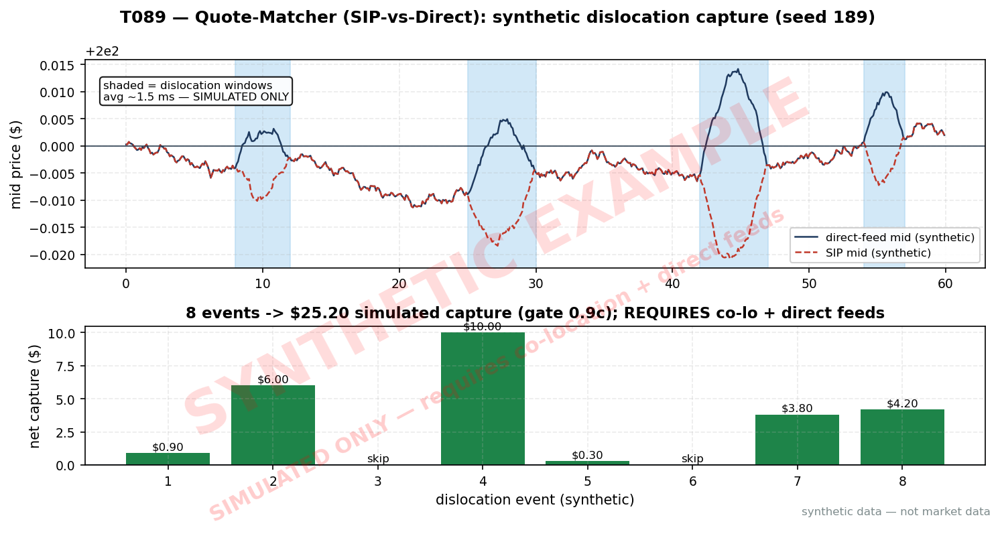

*Chart caption: synthetic data — not market data. Watermark reads "SYNTHETIC EXAMPLE" exactly. Additional banner: "SIMULATED ONLY — requires co-location + direct feeds".*

```mermaid
flowchart TD
    DF["Direct feeds + SIP + futures<br/>(microsecond timestamps, dual feed)"] -->|"mid quotes per update"| DIS["Dislocation monitor<br/>(abs direct-minus-SIP gap)"]
    DF -->|"venue quotes"| S016["S016 info share<br/>(lead-venue filter)"]
    DF -->|"futures quotes"| S059["S059 futures confirm<br/>(2-against-1)"]
    DIS -->|"dislocation > 0.9¢"| GATE{"Capture gate<br/>(S014: spread + fee)"}
    S016 -->|"leader check"| GATE
    S059 -->|"agreement"| GATE
    GATE -->|pass| ENTRY{"Entry logic<br/>(IOC at stale quote, t→t+1 µs)"}
    ENTRY -->|200–600 sh| SIZE["Sizing + risk<br/>(≤8 events/day, example)"]
    SIZE -->|"IOC orders"| EXEC["Execution<br/>(colo only; abort if >5¢)"]
    EXEC -->|"fills"| MON["P&L & monitoring<br/>(latency + capture)"]
    MON -->|"feed gap > 5ms"| HALT["HALT — measurement broken"]
    style GATE fill:#f9e79f,stroke:#7d6608
    style HALT fill:#f5b7b1,stroke:#922b21
```

### T10. Sources

1. Ding, S., Hanna, J. & Hendershott, T. (2014). "How Slow Is the NBBO? A Comparison with Direct Exchange Feeds." *Financial Review* 49(2): 313–332. https://ideas.repec.org/a/bla/finrev/v49y2014i2p313-332.html — SIP lags direct feeds; ~1–2 ms dislocations. URL located and title confirmed via search 2026-09-10.
2. Chan, K. (1992). "A Further Analysis of the Lead-Lag Relationship between the Cash Market and Stock Index Futures Market." *Review of Financial Studies* 5(1): 123–152. http://ideas.repec.org/a/oup/rfinst/v5y1992i1p123-52.html — futures lead cash. Inherited from S059's S12 (verified in an earlier batch).
3. Hasbrouck, J. (1995). "One Security, Many Markets: Determining the Contributions to Price Discovery." *Journal of Finance* 50(4): 1175–1199. https://www.bauer.uh.edu/rsusmel/phd/hasbrouck95.pdf — information share. Inherited from S059's S12 (verified in an earlier batch).

**Unverified leads** (not confirmed facts — verify before use):
- The 1–2 ms dislocation figure is the paper's summary for very active stocks; the operator's symbols and colo footprint will differ — measure, don't assume.
- The per-event share sizes and the 0.9¢ gate are example parameters; real capture must be measured on the operator's own dual-feed capture.

*Source log: Grok answered Q-TB9-1..3 (2026-09-10); all claims independently verified or labeled unverified.*

## Stage 190/200 — T090: Overnight Inventory Carry Manager

*Batch TB9 · Strategy 90/100 · Signals S037, S098, S068 · Provenance [D/SR]*

### T1. One-line verdict

| | |
|---|---|
| **Style** | Overnight gap carry: hold selected long positions through the close→open window, fading only non-jump gaps |
| **Edge source** | Overnight gaps partially revert when they contain no jump (no genuine news): the Lee–Mykland jump filter (S037) separates news gaps (don't fade) from noise gaps (fade). Borrow/crowding (S098) and the VIX term structure (S068) gate the carry |
| **Typical holding period** | One night: enter before the close, exit at/after the open |
| **Capacity hint** | $70k sleeve on $1M NAV (`example`); overnight gaps are capacity-thin |
| **Build-or-buy in one line** | Build the gate stack; the jump test is public — buy the borrow-rate feed, build the rest |

### T2. Full mechanics

**Universe & session.** US large caps, price ≥ $20 (`example`), optionable (for borrow visibility). Decision at 15:30–15:55 (`example`); positions held overnight; exits at the open auction or within the first 30 minutes (`example`).

**Jump filter (S037).** The Lee–Mykland **nonparametric jump test** detects whether the day's price path contained a genuine jump (news) vs diffusive noise. The rule *fades only non-jump gaps*: if the jump statistic exceeds the 1% critical value (6.63, `example`), the gap is news-driven and the name is excluded — fading news gaps is catching a falling knife with a thesis. In the example, BBB's jump stat of **9.4 > 6.63 → no carry**.

**Borrow/crowding gate (S098).** Short-interest and borrow-fee data proxy for crowding: if the borrow fee exceeds 2% annualized (`example`), the name is too crowded/expensive to carry — in the example CCC's **12.5% borrow fee → no carry**. S098 is a *panel*, not a standalone alpha: it vetoes, it doesn't select.

**VIX term-structure gate (S068).** The **VIX curve's slope and curvature** encode market stress expectations: carry only when the curve is in **contango** (slope > 0, `example`) — backwardation means the market is pricing near-term stress, and overnight gaps then skew adverse. In the example, EEE faces a slope of **−1.5 → no carry**.

**Carry selection.** A name is carried only if **all three gates pass**. Worked-example book (synthetic):

| Name | Jump stat | Borrow fee | VIX slope | Carry? | Weight |
|---|---|---|---|---|---|
| AAA | 2.1 (pass) | 0.8% (pass) | +2.1 (pass) | **YES** | 4% ($40,000) |
| BBB | 9.4 (FAIL) | 0.5% | +2.1 | no | 0% |
| CCC | 1.3 | 12.5% (FAIL) | +2.1 | no | 0% |
| DDD | 0.9 (pass) | 0.4% (pass) | +2.1 (pass) | **YES** | 3% ($30,000) |
| EEE | 3.2 | 1.1% | −1.5 (FAIL) | no | 0% |

**Entry rule.** Gates evaluated on data through 15:55 at day *t* → entries fill at the close auction of *t* (the signal bar is the trading day; earliest fill is the close — the *t+1* principle holds: no signal computed on the close bar fills before the close). Direction: long only in this variant (`example`); the fade is expressed by *which* names are carried, not by shorting.

**Exit rule.** Exit at the next open: market-on-open orders. If the overnight gap exceeds ±2% (`example`), exit half at the open auction and the rest in the first 30 minutes (liquidity provision on the gap). Stop: none overnight (the gates are the risk control); a gap beyond ±5% (`example`) triggers an immediate review, not an automatic exit — news gaps were supposed to be filtered.

**Position sizing.** 3–4% of NAV per name (`example`); sleeve cap 10% (`example`); vol-target: scale the sleeve so its trailing-20-day overnight volatility annualizes to 10% (`example`).

**Risk limits.** Sleeve daily loss stop −2% of NAV (`example`); if the VIX curve flips to backwardation intraday, cancel the carry program for that night (gate re-checked at 15:55).

**Cost model.** Borrow fee at the actual rate for one night (annualized/365); commission $0.005/share (`example`); open-auction spread cost 1¢/share (`example`).

**Order/execution sketch.** Market-on-close entries, market-on-open exits; participation ≤ 5% of the auction volume (`example`).

**Worked intuition — a tiny numerical sketch.** AAA closes at $100.00 with no jump (stat 2.1), borrow 0.8%, VIX curve in contango (+2.1 slope). The carry buys $40,000 at the close. Overnight, no news: the stock opens at $100.60 (+0.6%) — the noise component of yesterday's range partially reverting, the classic non-jump gap. The $240 gain costs $0.88 in borrow — the carry's economics are almost entirely the gap, with borrow as a rounding error *when the gates pass*. Contrast CCC: it also has no jump, but its 12.5% borrow fee would cost $13.70/night on the same $40,000 — and crowded shorts mean the gap skews against the carry. The gates don't predict the gap; they select the nights when the gap's distribution is benign.

**Parameter robustness.** The `example` parameters (jump stat < 6.63, borrow < 2%, slope > 0, 3–4% sizing, ±2% gap split) are starting points. Sensitivity protocol: re-run with jump cutoffs at 99%/95% critical values, borrow caps of 1%/2%/5%, and sizing of 2%/3%/5%; sleeve net should keep its sign across at least 7 of 12 combinations. The borrow cap is the sensitive one: at 5% the sleeve admits crowded names and the gap distribution's left tail fattens — the 2% cap is a tail-risk control disguised as a cost control.

### T3. Signals it consumes

| Signal | Role | Weight / logic |
|---|---|---|
| S037 (Lee–Mykland jump test) | Primary filter | carry only non-jump names: jump stat < 6.63 (`example`, 1% critical value) |
| S098 (short-interest/borrow crowding) | Veto | exclude if borrow fee > 2% annualized (`example`); panel input, not alpha |
| S068 (VIX curve slope/curvature) | Regime gate | require term slope > 0 (contango, `example`); backwardation → no carry night |

Pseudocode (≤25 lines):
```
at 15:55 on day t:
    for name in universe:
        j = lee_mykland_jump_stat(name, day t)      # S037
        b = borrow_fee_annualized(name)             # S098
        s = vix_term_slope()                        # S068
        if j < 6.63 and b < 0.02 and s > 0:         # example gates
            carry[name] = 0.03 * NAV                 # example sizing
    enter MOC long carry names                       # fill at close t
at open t+1:
    exit MOO; if |gap| > 2%: half at auction, half in 30 min  # example
```

### T4. Worked example — numbers + P&L (SYNTHETIC)

Seed 190, $1M NAV. Carry set at the close: AAA 4% ($40,000), DDD 3% ($30,000). Overnight gaps (synthetic): AAA **+0.6%**, DDD **−0.3%**.

| Item | Calculation | Amount |
|---|---|---|
| AAA gap P&L | $40,000 × +0.6% | +$240.00 |
| AAA borrow (0.8% pa, 1 night) | $40,000 × 0.008/365 | −$0.88 |
| AAA net | | **+$239.12** |
| DDD gap P&L | $30,000 × −0.3% | −$90.00 |
| DDD borrow (0.4% pa, 1 night) | $30,000 × 0.004/365 | −$0.33 |
| DDD net | | **−$90.33** |
| **Sleeve net** | $239.12 − $90.33 | **+$148.79** |

**Session net: +$148.79 (synthetic; demonstrates the ledger, not forward alpha or after-cost profitability).**

**Where the example is optimistic.** The jump filter is assumed to cleanly separate news from noise; real jump statistics have false negatives — some "non-jump" gaps are slow news leaks that keep drifting. Borrow fees are assumed static overnight; specials can reprice. The example carries only two names that both pass all gates — real nights often produce zero eligible names (correct behavior, zero P&L). Gap exits assume full fills at the open print; wide gaps have wide spreads.

### T5. Data & infra — what must run

Intraday bars (for the jump test), a borrow-rate/short-interest feed, VIX futures/options term structure, corporate-action calendar. Daily loop: 15:30 pre-computation of jump stats, 15:55 gate evaluation, MOC order generation; morning: gap attribution. Storage: bars + borrow history ≈ 10 GB/month. M5 Max feasibility: the daily batch is minutes of compute (see `notes/cost-model.md`); live needs only a 15:55 cron job. Feed-drop failure plan: if the borrow feed is stale at 15:55, default to no-carry for names lacking fresh borrow data (fail closed — an unknown borrow fee is treated as infinite); if VIX data is stale, cancel the night.

**Calibration discipline.** The Lee–Mykland statistics are computed on the day's bars with multipower-variation settings fixed per name per quarter (`example`) — refitting the variation estimator daily lets it adapt to the very jumps it's supposed to detect. Borrow data must be timestamped ≤15:55; anything older fails closed to no-carry. The VIX slope uses settlement values, not intraday flickers. Throughput: the 15:55 batch over 500 names is seconds on the M5 Max; the job's real constraint is data arrival, not compute.

### T6. Buy vs build

**Buy the borrow feed; build the gates.** Borrow/short-interest: **S3 Partners / ORTEX**-class data (four-to-five figures/yr class, `indicative — verify before budgeting`); VIX term structure from **Cboe data** or a consolidated options feed (**Polygon.io** ~$199/mo class, `indicative — verify before budgeting`); research on **QuantConnect** (~$60–$300/mo class, `indicative — verify before budgeting`). Verdict: **build** — the jump test is public (Lee–Mykland 2012), and the three-gate combination is the proprietary logic; buy only the borrow panel.

### T7. Success-ratio evidence

Published, checkable sources only:

1. Lee–Mykland (2012), "Jumps in Equilibrium Prices and Market Microstructure Noise": the nonparametric jump test — documents that detected jumps align with news events, which is why jump nights are excluded from the fade. (https://ideas.repec.org/a/eee/econom/v168y2012i2p396-406.html)
2. Stübinger–Schneider (2019), "Statistical Arbitrage with Mean-Reverting Overnight Price Gaps": jump-test-filtered overnight-gap backtest on S&P 500 high-frequency data reporting 51.47% p.a., Sharpe 2.38 after costs — with the replication caveats documented in S037's chapter (treat as an existence proof of the *design*, not a promise of the return). (https://www.mdpi.com/1911-8074/12/2/51)
3. Demeterfi et al. (1999), "More Than You Ever Wanted To Know About Volatility Swaps": the implied-variance math underlying VIX-term-structure interpretation. (https://www.realvol.com/volatilityblog/?p=516)

No paper tests this exact three-gate carry rule; the Stübinger–Schneider figures come with documented replication caveats and are not a forward claim.

### T8. Failure modes

- **Jump-test false negatives.** Slow news leaks don't trip the jump statistic but drift all night. Mitigation: add a news-flow check (scheduled announcements calendar) as a fourth veto (`example`).
- **Borrow repricing.** Specials can gap up overnight. Mitigation: fail-closed on stale borrow data; cap borrow at 2% annualized.
- **VIX whiplash.** The curve can invert between 15:55 and the open. Mitigation: the loss stop is the backstop; consider VIX futures as a direct hedge (not modeled).
- **Zero-eligible nights.** Correct behavior produces no trades; operators override the gates out of boredom. Mitigation: log gate decisions; review overrides weekly.
- **Gap-exit slippage.** Wide gaps mean wide open-auction spreads. Mitigation: the half-at-auction/half-in-30-min split for gaps beyond ±2%.

**Bottom line for the two operators.** For the ≤$1M paper operation, the overnight carry is executable as drawn: MOC/MOO orders need no special infrastructure, the gates are daily-batch computations, and the $148.79 illustrative night shows the ledger honestly. For the institutional desk, overnight gap carry is a known sleeve — the edge is in the jump filter's calibration and the borrow panel's freshness, and capacity is the binding constraint (gaps don't scale).

**Two more failure modes.**

- **After-hours news.** The jump filter runs on regular-hours bars; news breaking at 16:05 gaps the stock with no filter coverage. Mitigation: scrape the after-hours newswire until 17:00 (`example`); any name-level headline voids the carry before the close auction fills are final — use cancel-replace windows where the venue allows.
- **Dividend/split calendar misses.** A missed ex-date turns a "gap" into a corporate action. Mitigation: hard-join the corporate-action calendar; any action within ±2 days (`example`) voids the name regardless of gates.

### T9. Visuals

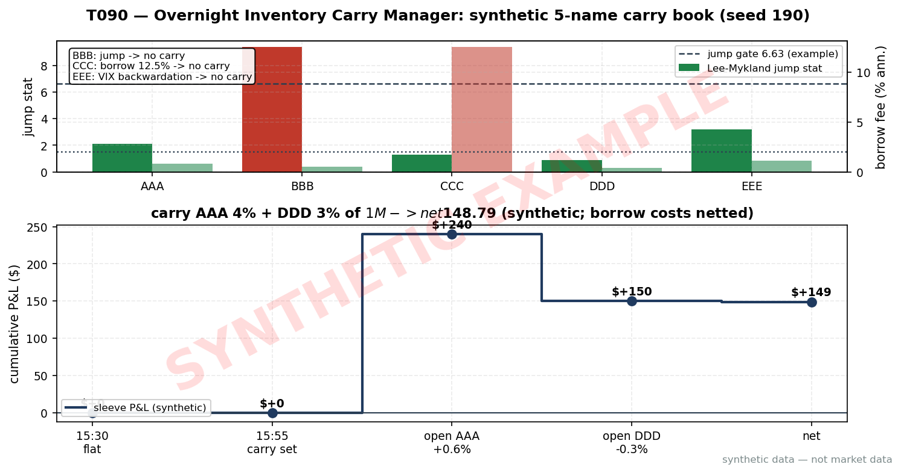

*Chart caption: synthetic data — not market data. Watermark reads "SYNTHETIC EXAMPLE" exactly.*

```mermaid
flowchart TD
    BARS["Intraday bars + borrow feed + VIX curve<br/>(per-name bars, daily borrow, term structure)"] -->|"day-t path"| S037["S037 jump test<br/>(Lee–Mykland stat)"]
    BARS -->|"borrow fee"| S098["S098 crowding panel<br/>(fee > 2% veto)"]
    BARS -->|"VIX futures curve"| S068["S068 term structure<br/>(contango required)"]
    S037 -->|"pass/fail"| GATE{"Carry gates<br/>(all three must pass)"}
    S098 -->|"veto"| GATE
    S068 -->|"regime"| GATE
    GATE -->|eligible names| ENTRY{"Entry logic<br/>(MOC long, t→close fill)"}
    ENTRY -->|3–4% NAV/name| SIZE["Sizing<br/>(sleeve ≤ 10%, vol-target)"]
    SIZE -->|"MOC orders"| EXEC["Execution<br/>(close auction entry)"]
    EXEC -->|"overnight hold"| MON["Monitor + exits<br/>(MOO exit, gap split rule)"]
    MON -->|"gap P&L"| PNL["P&L (net of borrow)"]
    style GATE fill:#f9e79f,stroke:#7d6608
    style PNL fill:#a9dfbf,stroke:#1e8449
```

### T10. Sources

1. Lee, S. S. & Mykland, P. A. (2012). "Jumps in Equilibrium Prices and Market Microstructure Noise." *Journal of Econometrics* 168(2): 396–406. https://ideas.repec.org/a/eee/econom/v168y2012i2p396-406.html — nonparametric jump test; jumps align with news. Inherited from S037's S12 (verified in an earlier batch).
2. Stübinger, J. & Schneider, L. (2019). "Statistical Arbitrage with Mean-Reverting Overnight Price Gaps on High-Frequency Data of the S&P 500." *Journal of Risk and Financial Management* 12(2). https://www.mdpi.com/1911-8074/12/2/51 — jump-filtered overnight-gap backtest with documented replication caveats. Inherited from S037's S12 (verified in an earlier batch).
3. Demeterfi, K., Derman, E., Kamal, M. & Zou, J. (1999). "More Than You Ever Wanted To Know About Volatility Swaps." Goldman Sachs Quantitative Strategies Research Notes. https://www.realvol.com/volatilityblog/?p=516 — implied-variance math behind VIX term-structure reading. Inherited from S068's S12 (verified in an earlier batch).

**Unverified leads** (not confirmed facts — verify before use):
- The 6.63 critical value, 2% borrow cap, and contango requirement are example parameters from the batch design, not published recommendations.
- The Stübinger–Schneider performance figures (51.47% p.a., Sharpe 2.38) carry the replication caveats noted in S037's chapter; do not quote them as achievable.

*Source log: Grok answered Q-TB9-1..3 (2026-09-10); all claims independently verified or labeled unverified.*
