# Intraday Quant Signals & Strategies — 200-Stage Deep Dive

> Living document. Each chapter is one stage. Stages S001–S100: signal deep dives.
> Stages T001–T100: strategy deep dives. Every worked example uses clearly-labeled
> synthetic data unless stated otherwise with a real web-sourced citation.
> Local-build costing assumes a sunk-cost Apple Mac with M5 Max chip and 128GB unified memory.

**Build status:** Stage 90/200 merged · last updated 2026-09-10 · 0 chapters deferred

## Build log
- Stage 0/200 — scaffold created 2026-09-10. Planner + chatbot scouts dispatched.
- Stage 1/200 — S001 merged 2026-09-10 · reviewer: dc96e478 · plot verified (seed 42)
- Stage 3/200 — S003 merged 2026-09-10 · reviewer: dc96e478 · plot verified (seed 42)
- Stage 4/200 — S004 merged 2026-09-10 · reviewer: dc96e478 · plot verified (seed 42)
- Stage 6/200 — S006 merged 2026-09-10 · reviewer: dc96e478 · plot verified (seed 42)
- Stage 8/200 — S008 merged 2026-09-10 · reviewer: dc96e478 · plot verified (seed 7)
- Stage 14/200 — S014 merged 2026-09-10 · reviewer: a2ba029b · plot verified (seed 11)
- Stage 24/200 — S024 merged 2026-09-10 · reviewer: dc96e478 · plot verified (seed 24)
- Stage 25/200 — S025 merged 2026-09-10 · reviewer: dc96e478 · plot verified (seed 25)
- Stage 35/200 — S035 merged 2026-09-10 · reviewer: dc96e478 · plot verified (seed 35)
- Stage 40/200 — S040 merged 2026-09-10 · reviewer: dc96e478 · plot verified (seed 40)
- Stage 11/200 — S011 merged 2026-09-10 · reviewer: 88a33425 · plot verified (seed 110)
- Stage 13/200 — S013 merged 2026-09-10 · reviewer: 88a33425 · plot verified (seed 130)
- Stage 21/200 — S021 merged 2026-09-10 · reviewer: 88a33425 · plot verified (seed 21)
- Stage 27/200 — S027 merged 2026-09-10 · reviewer: 88a33425 · plot verified (seed 27)
- Stage 32/200 — S032 merged 2026-09-10 · reviewer: 88a33425 · plot verified (seed 32)
- Stage 42/200 — S042 merged 2026-09-10 · reviewer: 88a33425 · plot verified (seed 42)
- Stage 43/200 — S043 merged 2026-09-10 · reviewer: 88a33425 · plot verified (seed 49)
- Stage 63/200 — S063 merged 2026-09-10 · reviewer: 88a33425 · plot verified (seed 63)
- Stage 66/200 — S066 merged 2026-09-10 · reviewer: 88a33425 · plot verified (seed 66)
- Stage 83/200 — S083 merged 2026-09-10 · reviewer: 88a33425 · plot verified (seed 83)
- Stage 49/200 — S049 merged 2026-09-10 · reviewer: acd4b0b4 · plot verified (seed 49)
- Stage 50/200 — S050 merged 2026-09-10 · reviewer: acd4b0b4 · plot verified (seed 50)
- Stage 56/200 — S056 merged 2026-09-10 · reviewer: acd4b0b4 · plot verified (seed 56)
- Stage 79/200 — S079 merged 2026-09-10 · reviewer: acd4b0b4 · plot verified (seed 79)
- Stage 81/200 — S081 merged 2026-09-10 · reviewer: acd4b0b4 · plot verified (seed 81)
- Stage 85/200 — S085 merged 2026-09-10 · reviewer: acd4b0b4 · plot verified (seed 85)
- Stage 86/200 — S086 merged 2026-09-10 · reviewer: acd4b0b4 · plot verified (seed 86086)
- Stage 88/200 — S088 merged 2026-09-10 · reviewer: acd4b0b4 · plot verified (seed 88088)
- Stage 91/200 — S091 merged 2026-09-10 · reviewer: acd4b0b4 · plot verified (seed 91091)
- Stage 94/200 — S094 merged 2026-09-10 · reviewer: acd4b0b4 · plot verified (seed 94094)
- Stage 2/200 — S002 merged 2026-09-10 · reviewer: c1afbd3e · plot verified (seed n/a)
- Stage 5/200 — S005 merged 2026-09-10 · reviewer: c1afbd3e · plot verified (seed n/a)
- Stage 7/200 — S007 merged 2026-09-10 · reviewer: c1afbd3e · plot verified (seed n/a)
- Stage 10/200 — S010 merged 2026-09-10 · reviewer: c1afbd3e · plot verified (seed 10)
- Stage 12/200 — S012 merged 2026-09-10 · reviewer: c1afbd3e · plot verified (seed 12)
- Stage 15/200 — S015 merged 2026-09-10 · reviewer: c1afbd3e · plot verified (seed 15)
- Stage 17/200 — S017 merged 2026-09-10 · reviewer: c1afbd3e · plot verified (seed n/a)
- Stage 18/200 — S018 merged 2026-09-10 · reviewer: c1afbd3e · plot verified (seed n/a)
- Stage 20/200 — S020 merged 2026-09-10 · reviewer: c1afbd3e · plot verified (seed n/a)
- Stage 47/200 — S047 merged 2026-09-10 · reviewer: c1afbd3e · plot verified (seed n/a)
- Stage 22/200 — S022 merged 2026-09-10 · reviewer: strict-reviewer-02 · plot verified (seed 22)
- Stage 23/200 — S023 merged 2026-09-10 · reviewer: strict-reviewer-02 · plot verified (seed 23)
- Stage 26/200 — S026 merged 2026-09-10 · reviewer: strict-reviewer-02 · plot verified (seed 26)
- Stage 28/200 — S028 merged 2026-09-10 · reviewer: strict-reviewer-02 · plot verified (seed 28)
- Stage 29/200 — S029 merged 2026-09-10 · reviewer: strict-reviewer-02 · plot verified (seed 29)
- Stage 30/200 — S030 merged 2026-09-10 · reviewer: strict-reviewer-02 · plot verified (seed 30)
- Stage 31/200 — S031 merged 2026-09-10 · reviewer: strict-reviewer-02 · plot verified (seed 31)
- Stage 33/200 — S033 merged 2026-09-10 · reviewer: strict-reviewer-02 · plot verified (seed 33)
- Stage 44/200 — S044 merged 2026-09-10 · reviewer: strict-reviewer-02 · plot verified (seed 44)
- Stage 45/200 — S045 merged 2026-09-10 · reviewer: strict-reviewer-02 · plot verified (seed 45)
- Stage 34/200 — S034 merged 2026-09-10 · reviewer: 94c5daac+orchestrator · plot verified (seed 34)
- Stage 36/200 — S036 merged 2026-09-10 · reviewer: 94c5daac+orchestrator · plot verified (seed 36)
- Stage 37/200 — S037 merged 2026-09-10 · reviewer: 94c5daac+orchestrator · plot verified (seed 37)
- Stage 38/200 — S038 merged 2026-09-10 · reviewer: 94c5daac+orchestrator · plot verified (seed 42)
- Stage 39/200 — S039 merged 2026-09-10 · reviewer: 94c5daac+orchestrator · plot verified (seed 43)
- Stage 41/200 — S041 merged 2026-09-10 · reviewer: 94c5daac+orchestrator · plot verified (seed 44)
- Stage 46/200 — S046 merged 2026-09-10 · reviewer: 94c5daac+orchestrator · plot verified (seed 46)
- Stage 48/200 — S048 merged 2026-09-10 · reviewer: 94c5daac+orchestrator · plot verified (seed 48)
- Stage 59/200 — S059 merged 2026-09-10 · reviewer: 94c5daac+orchestrator · plot verified (seed 59)
- Stage 60/200 — S060 merged 2026-09-10 · reviewer: 94c5daac+orchestrator · plot verified (seed n/a)
- Stage 51/200 — S051 merged 2026-09-10 · reviewer: c3e38a22 · plot verified (seed 51)
- Stage 52/200 — S052 merged 2026-09-10 · reviewer: c3e38a22 · plot verified (seed 52)
- Stage 53/200 — S053 merged 2026-09-10 · reviewer: c3e38a22 · plot verified (seed n/a)
- Stage 54/200 — S054 merged 2026-09-10 · reviewer: c3e38a22 · plot verified (seed n/a)
- Stage 55/200 — S055 merged 2026-09-10 · reviewer: c3e38a22 · plot verified (seed n/a)
- Stage 57/200 — S057 merged 2026-09-10 · reviewer: c3e38a22 · plot verified (seed n/a)
- Stage 58/200 — S058 merged 2026-09-10 · reviewer: c3e38a22 · plot verified (seed n/a)
- Stage 61/200 — S061 merged 2026-09-10 · reviewer: c3e38a22 · plot verified (seed 61)
- Stage 62/200 — S062 merged 2026-09-10 · reviewer: c3e38a22 · plot verified (seed 62)
- Stage 90/200 — S090 merged 2026-09-10 · reviewer: c3e38a22 · plot verified (seed n/a)
- Stage 64/200 — S064 merged 2026-09-10 · reviewer: rereviewer-sb8+orchestrator · plot verified (seed 64)
- Stage 65/200 — S065 merged 2026-09-10 · reviewer: rereviewer-sb8+orchestrator · plot verified (seed 65)
- Stage 67/200 — S067 merged 2026-09-10 · reviewer: rereviewer-sb8+orchestrator · plot verified (seed 67)
- Stage 68/200 — S068 merged 2026-09-10 · reviewer: rereviewer-sb8+orchestrator · plot verified (seed 68)
- Stage 69/200 — S069 merged 2026-09-10 · reviewer: rereviewer-sb8+orchestrator · plot verified (seed 69)
- Stage 70/200 — S070 merged 2026-09-10 · reviewer: rereviewer-sb8+orchestrator · plot verified (seed 70)
- Stage 71/200 — S071 merged 2026-09-10 · reviewer: rereviewer-sb8+orchestrator · plot verified (seed 71)
- Stage 72/200 — S072 merged 2026-09-10 · reviewer: rereviewer-sb8+orchestrator · plot verified (seed 72)
- Stage 73/200 — S073 merged 2026-09-10 · reviewer: rereviewer-sb8+orchestrator · plot verified (seed 73)
- Stage 74/200 — S074 merged 2026-09-10 · reviewer: rereviewer-sb8+orchestrator · plot verified (seed 74)
- Stage 16/200 — S016 merged 2026-09-10 · reviewer: 6d129d69+orchestrator · plot verified (seed 84)
- Stage 75/200 — S075 merged 2026-09-10 · reviewer: 6d129d69+orchestrator · plot verified (seed 75)
- Stage 76/200 — S076 merged 2026-09-10 · reviewer: 6d129d69+orchestrator · plot verified (seed 76)
- Stage 77/200 — S077 merged 2026-09-10 · reviewer: 6d129d69+orchestrator · plot verified (seed 77)
- Stage 78/200 — S078 merged 2026-09-10 · reviewer: 6d129d69+orchestrator · plot verified (seed 78)
- Stage 80/200 — S080 merged 2026-09-10 · reviewer: 6d129d69+orchestrator · plot verified (seed 80)
- Stage 82/200 — S082 merged 2026-09-10 · reviewer: 6d129d69+orchestrator · plot verified (seed 82)
- Stage 84/200 — S084 merged 2026-09-10 · reviewer: 6d129d69+orchestrator · plot verified (seed 42)
- Stage 87/200 — S087 merged 2026-09-10 · reviewer: 6d129d69+orchestrator · plot verified (seed 2)
- Stage 89/200 — S089 merged 2026-09-10 · reviewer: 6d129d69+orchestrator · plot verified (seed 21)


## Table of contents

### Signal chapters

**Batch SB1** — The working core: every serious intraday book uses some of these; all implementable on L1/1-min data.

- [x] Stage 1/200 — [S001 — Order-flow imbalance — Cont–Kukanov–Stoikov](#stage-1200--s001-order-flow-imbalance--contkukanovstoikov)
- [x] Stage 3/200 — [S003 — Queue (depth) imbalance — Gould–Bonart](#stage-3200--s003-queue-depth-imbalance--gouldbonart)
- [x] Stage 4/200 — [S004 — Microprice (Stoikov)](#stage-4200--s004-microprice-stoikov)
- [x] Stage 6/200 — [S006 — Signed trade imbalance (volume delta)](#stage-6200--s006-signed-trade-imbalance-volume-delta)
- [x] Stage 8/200 — [S008 — VPIN (flow toxicity)](#stage-8200--s008-vpin-flow-toxicity)
- [x] Stage 14/200 — [S014 — Quoted / effective / realized spread & price-impact decomposition](#stage-14200--s014-quoted--effective--realized-spread--price-impact-decomposition)
- [x] Stage 24/200 — [S024 — VWAP cross & anchored-VWAP continuation](#stage-24200--s024-vwap-cross--anchored-vwap-continuation)
- [x] Stage 25/200 — [S025 — Intraday time-series momentum](#stage-25200--s025-intraday-time-series-momentum)
- [x] Stage 35/200 — [S035 — Short-term reversal — Jegadeesh / Lehmann](#stage-35200--s035-short-term-reversal--jegadeesh--lehmann)
- [x] Stage 40/200 — [S040 — VWAP-deviation mean reversion](#stage-40200--s040-vwap-deviation-mean-reversion)

**Batch SB2** — Core cost/vol infrastructure + the most-used session patterns.

- [x] Stage 11/200 — [S011 — Amihud illiquidity ratio](#stage-11200--s011-amihud-illiquidity-ratio)
- [x] Stage 13/200 — [S013 — Corwin–Schultz high-low spread estimator](#stage-13200--s013-corwinschultz-high-low-spread-estimator)
- [x] Stage 21/200 — [S021 — Opening-range breakout — Crabel (1990)](#stage-21200--s021-opening-range-breakout--crabel-1990)
- [x] Stage 27/200 — [S027 — End-of-day momentum / last-hour drift](#stage-27200--s027-end-of-day-momentum--last-hour-drift)
- [x] Stage 32/200 — [S032 — Relative-volume (RVOL) filtered breakout](#stage-32200--s032-relative-volume-rvol-filtered-breakout)
- [x] Stage 42/200 — [S042 — RSI / RSI-2 mean reversion (Connors-style)](#stage-42200--s042-rsi--rsi-2-mean-reversion-connors-style)
- [x] Stage 43/200 — [S043 — Internal Bar Strength (IBS) mean reversion](#stage-43200--s043-internal-bar-strength-ibs-mean-reversion)
- [x] Stage 63/200 — [S063 — Range-based realized-volatility estimators](#stage-63200--s063-range-based-realized-volatility-estimators)
- [x] Stage 66/200 — [S066 — HAR realized-volatility forecast](#stage-66200--s066-har-realized-volatility-forecast)
- [x] Stage 83/200 — [S083 — Imbalance/tick/volume/dollar bars](#stage-83200--s083-imbalancetickvolumedollar-bars)

**Batch SB3** — Pairs foundations + the validation/ML layer every strategy chapter depends on + news.

- [x] Stage 49/200 — [S049 — Distance-method pairs — Gatev–Goetzmann–Rouwenhorst](#stage-49200--s049-distance-method-pairs--gatevgoetzmannrouwenhorst)
- [x] Stage 50/200 — [S050 — Engle–Granger cointegration z-score](#stage-50200--s050-englegranger-cointegration-z-score)
- [x] Stage 56/200 — [S056 — ETF vs basket / iNAV arbitrage](#stage-56200--s056-etf-vs-basket--inav-arbitrage)
- [x] Stage 79/200 — [S079 — HMM regime-switching (trend & volatility states)](#stage-79200--s079-hmm-regime-switching-trend--volatility-states)
- [x] Stage 81/200 — [S081 — Hawkes buy/sell intensity imbalance](#stage-81200--s081-hawkes-buysell-intensity-imbalance)
- [x] Stage 85/200 — [S085 — Triple-barrier labeling](#stage-85200--s085-triple-barrier-labeling)
- [x] Stage 86/200 — [S086 — Meta-labeling](#stage-86200--s086-meta-labeling)
- [x] Stage 88/200 — [S088 — Purged / embargoed cross-validation](#stage-88200--s088-purged--embargoed-cross-validation)
- [x] Stage 91/200 — [S091 — Machine-readable news sentiment (first-minute reaction)](#stage-91200--s091-machine-readable-news-sentiment-first-minute-reaction)
- [x] Stage 94/200 — [S094 — Unusual intraday volume (RVOL) & signed block-trade pressure](#stage-94200--s094-unusual-intraday-volume-rvol--signed-block-trade-pressure)

**Batch SB4** — Order-flow estimation toolkit (L1/L2).

- [x] Stage 2/200 — [S002 — Multi-level / integrated OFI (MLOFI)](#stage-2200--s002-multi-level--integrated-ofi-mlofi)
- [x] Stage 5/200 — [S005 — Multi-level book pressure (static depth imbalance)](#stage-5200--s005-multi-level-book-pressure-static-depth-imbalance)
- [x] Stage 7/200 — [S007 — Trade classification: Lee–Ready & Bulk Volume Classification](#stage-7200--s007-trade-classification-leeready--bulk-volume-classification)
- [x] Stage 10/200 — [S010 — Kyle's lambda (price impact / illiquidity)](#stage-10200--s010-kyles-lambda-price-impact--illiquidity)
- [x] Stage 12/200 — [S012 — Roll implied effective spread](#stage-12200--s012-roll-implied-effective-spread)
- [x] Stage 15/200 — [S015 — Spread decomposition — Huang–Stoll](#stage-15200--s015-spread-decomposition--huangstoll)
- [x] Stage 17/200 — [S017 — Hawkes self-excitation intensity of order flow](#stage-17200--s017-hawkes-self-excitation-intensity-of-order-flow)
- [x] Stage 18/200 — [S018 — Order-sign autocorrelation / sequential trade correlation](#stage-18200--s018-order-sign-autocorrelation--sequential-trade-correlation)
- [x] Stage 20/200 — [S020 — Retail & odd-lot order imbalance](#stage-20200--s020-retail--odd-lot-order-imbalance)
- [x] Stage 47/200 — [S047 — Bid–ask bounce exploitation](#stage-47200--s047-bidask-bounce-exploitation)

**Batch SB5** — Breakout/session-pattern family.

- [x] Stage 22/200 — [S022 — First-hour range expansion / initial balance](#stage-22200--s022-first-hour-range-expansion--initial-balance)
- [x] Stage 23/200 — [S023 — Gap-and-go](#stage-23200--s023-gap-and-go)
- [x] Stage 26/200 — [S026 — First half-hour → last half-hour momentum](#stage-26200--s026-first-half-hour--last-half-hour-momentum)
- [x] Stage 28/200 — [S028 — Donchian breakout](#stage-28200--s028-donchian-breakout)
- [x] Stage 29/200 — [S029 — Keltner / Bollinger breakouts](#stage-29200--s029-keltner--bollinger-breakouts)
- [x] Stage 30/200 — [S030 — Bollinger bandwidth squeeze → expansion](#stage-30200--s030-bollinger-bandwidth-squeeze--expansion)
- [x] Stage 31/200 — [S031 — Consecutive-bar streaks (runs)](#stage-31200--s031-consecutive-bar-streaks-runs)
- [x] Stage 33/200 — [S033 — Open-auction imbalance continuation](#stage-33200--s033-open-auction-imbalance-continuation)
- [x] Stage 44/200 — [S044 — Stochastic oscillator & Williams %R](#stage-44200--s044-stochastic-oscillator--williams-r)
- [x] Stage 45/200 — [S045 — Stretched-move z-score & market-internals extremes](#stage-45200--s045-stretched-move-z-score--market-internals-extremes)

**Batch SB6** — Mean-reversion family + lead-lag prediction.

- [x] Stage 34/200 — [S034 — Scheduled macro-announcement drift](#stage-34200--s034-scheduled-macro-announcement-drift)
- [x] Stage 36/200 — [S036 — Overnight-gap fade (overnight→intraday reversal)](#stage-36200--s036-overnight-gap-fade-overnightintraday-reversal)
- [x] Stage 37/200 — [S037 — Jump-filtered overnight-gap reversal](#stage-37200--s037-jump-filtered-overnight-gap-reversal)
- [x] Stage 38/200 — [S038 — Sub-hour microstructure reversal](#stage-38200--s038-sub-hour-microstructure-reversal)
- [x] Stage 39/200 — [S039 — Idiosyncratic (residual) short-term reversal](#stage-39200--s039-idiosyncratic-residual-short-term-reversal)
- [x] Stage 41/200 — [S041 — Bollinger-band reversal](#stage-41200--s041-bollinger-band-reversal)
- [x] Stage 46/200 — [S046 — Intraday seasonality (U-shape) reversal timer](#stage-46200--s046-intraday-seasonality-u-shape-reversal-timer)
- [x] Stage 48/200 — [S048 — LOB resiliency & block-trade temporary-impact reversion](#stage-48200--s048-lob-resiliency--block-trade-temporary-impact-reversion)
- [x] Stage 59/200 — [S059 — Futures–spot lead-lag prediction](#stage-59200--s059-futuresspot-lead-lag-prediction)
- [x] Stage 60/200 — [S060 — Cross-asset lead-lag via Hayashi–Yoshida](#stage-60200--s060-cross-asset-lead-lag-via-hayashiyoshida)

**Batch SB7** — Pairs & cross-sectional extensions + regime toggle.

- [x] Stage 51/200 — [S051 — Ornstein–Uhlenbeck half-life trading](#stage-51200--s051-ornsteinuhlenbeck-half-life-trading)
- [x] Stage 52/200 — [S052 — Kalman-filter dynamic hedge ratio](#stage-52200--s052-kalman-filter-dynamic-hedge-ratio)
- [x] Stage 53/200 — [S053 — Pair-quality filter — zero crossings (Do–Faff)](#stage-53200--s053-pair-quality-filter--zero-crossings-dofaff)
- [x] Stage 54/200 — [S054 — Copula pairs trading](#stage-54200--s054-copula-pairs-trading)
- [x] Stage 55/200 — [S055 — Johansen VECM cointegration](#stage-55200--s055-johansen-vecm-cointegration)
- [x] Stage 57/200 — [S057 — Index futures cash-and-carry arbitrage](#stage-57200--s057-index-futures-cash-and-carry-arbitrage)
- [x] Stage 58/200 — [S058 — Futures calendar spread (term-structure carry)](#stage-58200--s058-futures-calendar-spread-term-structure-carry)
- [x] Stage 61/200 — [S061 — ADR / dual-listed premium](#stage-61200--s061-adr--dual-listed-premium)
- [x] Stage 62/200 — [S062 — Sector momentum](#stage-62200--s062-sector-momentum)
- [x] Stage 90/200 — [S090 — Variance-ratio / Hurst regime toggle](#stage-90200--s090-variance-ratio--hurst-regime-toggle)

**Batch SB8** — Volatility & options-informed family.

- [x] Stage 64/200 — [S064 — Jump-robust realized variance (RV / bipower / Lee–Mykland)](#stage-64200--s064-jump-robust-realized-variance-rv--bipower--leemykland)
- [x] Stage 65/200 — [S065 — GARCH(1,1) intraday volatility](#stage-65200--s065-garch11-intraday-volatility)
- [x] Stage 67/200 — [S067 — Intraday vol seasonality / diurnal deseasonalization](#stage-67200--s067-intraday-vol-seasonality--diurnal-deseasonalization)
- [x] Stage 68/200 — [S068 — VIX term structure](#stage-68200--s068-vix-term-structure)
- [x] Stage 69/200 — [S069 — Implied-vs-realized spread / variance risk premium](#stage-69200--s069-implied-vs-realized-spread--variance-risk-premium)
- [x] Stage 70/200 — [S070 — Straddle-implied move vs realized](#stage-70200--s070-straddle-implied-move-vs-realized)
- [x] Stage 71/200 — [S071 — 25-delta risk reversal / skew change](#stage-71200--s071-25-delta-risk-reversal--skew-change)
- [x] Stage 72/200 — [S072 — Put/call ratio](#stage-72200--s072-putcall-ratio)
- [x] Stage 73/200 — [S073 — Unusual options activity](#stage-73200--s073-unusual-options-activity)
- [x] Stage 74/200 — [S074 — Gamma exposure (GEX) & dealer positioning](#stage-74200--s074-gamma-exposure-gex--dealer-positioning)

**Batch SB9** — Stat/ML infrastructure + market-making skew.

- [x] Stage 16/200 — [S016 — Hasbrouck (1995) information share — venue price discovery](#stage-16200--s016-hasbrouck-1995-information-share--venue-price-discovery)
- [x] Stage 75/200 — [S075 — Dispersion trading](#stage-75200--s075-dispersion-trading)
- [x] Stage 76/200 — [S076 — Volatility breakout / squeeze positioning](#stage-76200--s076-volatility-breakout--squeeze-positioning)
- [x] Stage 77/200 — [S077 — Kalman-filtered fair value (local-level trend)](#stage-77200--s077-kalman-filtered-fair-value-local-level-trend)
- [x] Stage 78/200 — [S078 — AR(1)/ARMA short-horizon return forecast & innovation](#stage-78200--s078-ar1arma-short-horizon-return-forecast--innovation)
- [x] Stage 80/200 — [S080 — PCA / statistical-factor residual reversal (incl. eigenportfolios)](#stage-80200--s080-pca--statistical-factor-residual-reversal-incl-eigenportfolios)
- [x] Stage 82/200 — [S082 — Deep learning on the LOB (DeepLOB + classical ML features)](#stage-82200--s082-deep-learning-on-the-lob-deeplob--classical-ml-features)
- [x] Stage 84/200 — [S084 — Hasbrouck (1991) trade–quote VAR](#stage-84200--s084-hasbrouck-1991-tradequote-var)
- [x] Stage 87/200 — [S087 — Fractional differentiation (memory-retaining stationarization)](#stage-87200--s087-fractional-differentiation-memory-retaining-stationarization)
- [x] Stage 89/200 — [S089 — Avellaneda–Stoikov inventory-skew market making](#stage-89200--s089-avellanedastoikov-inventory-skew-market-making)

### Strategy chapters

*(none merged yet)*

## Part I — Signal deep dives (S001–S100)

## Stage 1/200 — S001: Order-flow imbalance — Cont–Kukanov–Stoikov

*Batch SB1 · Signal 1/100 · Provenance [D] · Family A — Microstructure & order flow*

### S1. One-line verdict

| | |
|---|---|
| **What it is** | Net order-flow pressure at the best bid/ask (adds − cancels − executions), whose sign and depth-scaled size drive short-horizon mid-price moves. |
| **When it works** | Liquid, tight-spread names on direct feeds with stable depth; seconds-to-minutes horizons; as an adverse-selection gauge for quoting. |
| **When it dies** | Wide spreads, thin books, SIP-latency races (SIP = the Securities Information Processor, the consolidated national quote feed, which arrives slower than direct exchange feeds), spoofable queues; any attempt to trade it standalone with market orders at retail latency. |
| **Build-or-buy in one line** | Build the estimator in Python+polars on a bought L1 feed (L1 = top-of-book: only the best bid and best ask; e.g. Databento MBP-1); buy only if you need historical L2 (deeper book levels beyond the best bid/ask) / MBO (market-by-order: every individual order's adds, cancels and fills, unaggregated) or multi-venue coverage. |

Provenance: **[D]** — Cont, Kukanov & Stoikov (2014), arXiv:1011.6402. The caveat from the source entry carries forward unchanged: the original result is a *contemporaneous price-impact regression*, not by itself a forward trading rule; forward use needs a lead-lag/AR extension.

### S2. How it works — plain human explanation

At 9:47:03.214 the book reads bid 231.40 × 800, ask 231.41 × 300. A buy limit order for 500 joins the bid; 200 are cancelled from the ask; a market sell executes 100 against the bid. Net pressure: +600 shares of demand at the touch — that running tally, event by event, is order-flow imbalance (OFI).

The logic is queue mechanics plus adverse selection: prices move when one side's queue depletes, and persistent buying pressure chews through the ask queue first, ratcheting the mid up. Cont, Kukanov & Stoikov showed the relation is approximately *linear*: mid-price change ≈ OFI / (2 × depth). Deep books absorb flow; thin books lurch.

Why not trade volume? Trade imbalance ignores what doesn't print: a 5,000-share bid stacked then cancelled moves no volume but moves the market. OFI counts adds, cancels, and executions together — which is why it beats trade volume (the paper's §4: the volume relation is "noisy and less robust").

Three-bullet mental model:

- **OFI is a flow, not a level.** It accumulates pressure from every book event at the touch; the *level* of the book is S003/S005 territory.
- **Depth is the denominator.** Never trade raw OFI without depth normalization.
- **Contemporaneous ≠ predictive.** The 2014 result explains the move happening *now*; a forward trade needs a lead-lag extension the paper does not provide.

### S3. The math — exact formula

Per best-quote event *n*, let P^b_n, q^b_n be the best bid price and displayed size; P^a_n, q^a_n the best ask price and size. Define the bid-side and ask-side contributions (report convention, matching Cont–Kukanov–Stoikov):

$$e^b_n = \begin{cases} q^b_n, & P^b_n > P^b_{n-1} \ (\text{bid up: whole new queue counts}) \\ q^b_n - q^b_{n-1}, & P^b_n = P^b_{n-1} \ (\text{size change only}) \\ -q^b_{n-1}, & P^b_n < P^b_{n-1} \ (\text{bid down: whole old queue vanishes}) \end{cases}$$

$$e^a_n = \begin{cases} q^a_{\,n-1}, & P^a_n > P^a_{n-1} \ (\text{ask up: selling pressure eased}) \\ -(q^a_n - q^a_{n-1}), & P^a_n = P^a_{n-1} \ (\text{note the minus sign}) \\ -q^a_n, & P^a_n < P^a_{n-1} \ (\text{ask down: new selling pressure}) \end{cases}$$

Per-event OFI and windowed OFI:

$$\Delta\mathrm{OFI}_n = e^b_n + e^a_n, \qquad \mathrm{OFI}_k = \sum_{n \in T_k} \Delta\mathrm{OFI}_n$$

The price-impact relation (contemporaneous regression):

$$\Delta m_k = \alpha + \beta\,\frac{\mathrm{OFI}_k}{D_k} + \varepsilon_k,$$

where *m_k* is the mid-price change over interval *T_k* and *D_k* a depth scale (e.g. average top-of-book depth). The stylized model behind it: ΔP ≈ OFI/(2D) — linear impact with slope inversely proportional to depth.

Parameter table (every default marked as example):

| Parameter | Symbol | Typical range | Too small | Too large | Default (example) |
|---|---|---|---|---|---|
| Aggregation window | T_k | 100 ms – 5 s, or 50–1,000 events | noise dominates; flickering quotes | signal decays; mixes regimes | *1 s bars — example, not an institutional standard* |
| Book depth level | — | touch only (original) → top 3/5/10 | misses deep-book info | stale, gameable size | *touch only — example* |
| Depth normalizer | D_k | rolling mean top-of-book depth, 1–10 min | OFI not comparable across names | lags real depth shocks | *5-min rolling mean — example* |
| Signal form | — | raw / depth-normed / z-score / percentile | raw not comparable across regimes | z-score lags in jumps | *depth-normed z-score — example* |
| Forecast horizon | h | 100 ms – a few seconds | latency eats it | edge decays (CCZ 2023: rapid decay) | *500 ms — example* |

Normalization: raw OFI is in shares — meaningless across names. Depth-normalized OFI (OFI/D) is canonical; a rolling z-score handles diurnal depth seasonality. Causal timing: OFI at event *t* uses only events ≤ *t*; earliest reaction is *t+1*.

Named variants: (1) **touch-only OFI** — the original CKS measure; (2) **integrated OFI** — Cont, Cucuringu & Zhang (2023) combine per-level OFIs over the top 10 levels by PCA, beating best-level OFI in- and out-of-sample; (3) **event-time vs time-bar aggregation** — summing over *N* events is more stable when arrival rates swing.

### S4. Worked example — step-by-step numbers (SYNTHETIC)

All numbers **synthetic** (`batches/SB1/plot_S001.py`, `seed 42`). Initial book: bid 231.40 × 635 / ask 231.41 × 432. No fees, no latency, no hidden liquidity — arithmetic illustration, not a backtest.

| ev | bid | qb | ask | qa | e^b | e^a | ΔOFI_n | cum OFI | mid |
|---|---|---|---|---|---|---|---|---|---|
| 1 | 231.40 | 1048 | 231.41 | 432 | +413 | 0 | +413 | +413 | 231.405 |
| 2 | 231.40 | 1048 | 231.41 | 234 | 0 | +198 | +198 | +611 | 231.405 |
| 3 | 231.41 | 260 | 231.41 | 234 | +260 | 0 | +260 | +871 | 231.410 |
| 4 | 231.41 | 260 | 231.42 | 688 | 0 | +234 | +234 | +1,105 | 231.415 |
| 5 | 231.41 | 260 | 231.42 | 946 | 0 | −258 | −258 | +847 | 231.415 |
| 6 | 231.41 | 153 | 231.42 | 946 | −107 | 0 | −107 | +740 | 231.415 |
| 7 | 231.40 | 715 | 231.42 | 946 | −153 | 0 | −153 | +587 | 231.410 |
| 8 | 231.40 | 715 | 231.42 | 486 | 0 | +460 | +460 | +1,047 | 231.410 |
| 9 | 231.40 | 1002 | 231.42 | 486 | +287 | 0 | +287 | +1,334 | 231.410 |
| 10 | 231.40 | 1002 | 231.43 | 732 | 0 | +486 | +486 | +1,820 | 231.415 |

Hand-checks: ev3 — bid price up, e^b = q^b_3 = +260. ev5 — ask size 688 → 946 at same price, e^a = −(946−688) = −258. ev10 — ask price up, e^a = +q^a_9 = +486.

**What to notice.** Cumulative OFI climbs +413 → +1,820 while the mid moves one tick (231.405 → 231.415) — the depth denominator at work. The mid moves that *do* occur (events 3, 4, 7, 10) coincide with quote-price events, each contributing the largest single-event OFI prints. That is the CKS finding as arithmetic — and why the toy tape flatters OFI: real books have hidden liquidity, fleeting quotes, and adverse fills this table omits.

### S5. Strategies that use this signal

- **T001 — OFI + Queue-Imbalance Directional Scalper** — primary entry trigger (direction); queue imbalance S003 confirms.
- **T021 — Avellaneda–Stoikov Inventory Skew MM** — adverse-selection filter / quote-skew input (OFI shifts the reservation price away from toxic flow).
- **T086 — OFI-Paced Participation Tracker** — execution filter: pace child orders faster when OFI runs with you, slow down when it runs against you.

### S6. Data required — exact spec

| Field | Type | Granularity | Source tier | Notes |
|---|---|---|---|---|
| Best bid price/size | float / int | every quote event (L1) | Tier 2 | needs *displayed* size per price move |
| Best ask price/size | float / int | every quote event (L1) | Tier 2 | same |
| Exchange timestamps | int64 ns | per event | Tier 2 | SIP timestamps add 10s of µs jitter — label SIP work *simulated only — requires MBO/ITCH* for latency claims |
| Corporate actions / halts | reference | daily + intraday halt feed | Tier 1 | price-move contributions are garbage across a split or halt reopen |

Collection: Databento MBP-1 (`XNAS`/`XNYS`); Polygon v3; TAQ history. Ingest sketch (polars, per symbol-day):

```python
import polars as pl, databento as db
cli = db.Historical("API_KEY")
data = cli.timeseries.get_range("XNAS.MBP-1", "AAPL",
        start="2026-09-09", end="2026-09-10")          # 1: fetch MBP-1 deltas
q = (pl.scan_parquet("aapl_mbp1.parquet")              # 2: best-level only
       .filter(pl.col("action").is_in(["A","C","T"]))   #    (adds/cancels/trades)
       .sort("ts_event")                               # 3: exchange-time order
       .with_columns(pb=pl.col("bid_px_00"),           # 4: lagged book state
                     qb=pl.col("bid_sz_00"),
                     pa=pl.col("ask_px_00"),
                     qa=pl.col("ask_sz_00"))
       .with_columns(pb_l=pl.col("pb").shift(1), ...)   # 5: e^b/e^a per §S3
       .with_columns(ofi=pl.when(...).then(...))        # 6: piecewise contributions
       .group_by_dynamic("ts_event", every="1s")       # 7: 1-s event bars (example)
       .agg(ofi_sum=pl.col("ofi").sum()))
```

Storage: `notes/cost-model.md` §4: L1 ≈ 2–8 GB/symbol-day parquet. Quality checklist: exchange timestamps (not SIP arrival); drop crossed/locked quotes; halt/auction/DST/half-day masks; split-adjust before price-move contributions; dedupe retransmits.

### S7. Local build on M5 Max / 128GB

**Feasibility: feasible.** OFI is a stateful O(1)-per-event scan: a Python loop does ~100–500k events/sec (`notes/cost-model.md` §2) vs ~50–500 L1 events/sec average for one liquid name (busy bursts ~1–5k/sec). Sizing from §2: 50 symbols × 2k events/sec = 100k/sec → Python borderline, Rust (5–50M/sec) comfortable; polars batch recompute every second is trivial. Bottleneck is I/O and timestamp normalization, not the arithmetic.

Stack options:

| Stack | When to pick |
|---|---|
| Python + polars | research, daily recompute, ≤20 symbols live |
| Rust ingest → polars analyze | >20 symbols live, or direct-feed decode |
| DuckDB | ad-hoc history queries over parquet |

RAM (§3): one symbol-day L1 ≈ 0.5–4 GB — fine for a few symbols; 60 days (~30–240 GB) **does not fit** the 77 GB budget — stream per-symbol daily parquet. 1-min bars trivial (~12 MB for 500 symbols × 60 days).

Engineering time: Tier M (plan §6) → **20–60 h** ≈ $3,000–9,000 loaded-cost estimate at $150/hr (event-state machine + timestamp/halt handling + depth normalizer + reference validation). Breaks first at 500 symbols: the GIL-bound Python loop; move to Rust ingest + streaming.

### S8. Buy vs build

| Option | What you get | Indicative price | Gains | Loses |
|---|---|---|---|---|
| Tier 0: exchange delayed quotes / Alpaca IEX | free delayed L1 | ~$0 — *indicative, verify before budgeting* | $0 to prototype | 15-min delay; useless for live OFI |
| Tier 1: Polygon Stocks Advanced / Alpaca SIP | real-time SIP L1, history | ~$30–200/mo — *indicative, verify before budgeting* | cheap, easy API | SIP timestamps; latency claims *simulated only — requires MBO/ITCH* |
| Tier 2: Databento Standard MBP-1 | exchange-timestamped L1/L2, pay-as-you-go | ~$200/mo + usage — *indicative, verify before budgeting* | honest timestamps, history | usage meter runs on full universes |
| Tier 3: LOBSTER (academic) | MBO/ITCH replay | ~hundreds/yr academic — *indicative, verify before budgeting* | true queue dynamics | academic license, limited symbols |

Verdict: **build the estimator, buy the feed.** OFI is ~40 lines; the value is your normalization, windows, and lead-lag calibration — none of which a vendor sells. Buy Databento MBP-1 history to validate, Tier-1 SIP for live research, and direct/MBO only after the signal survives realistic costs.

### S9. Success ratio / efficacy — documented evidence

| Study / source | Market & period | Metric | Before/after cost | Caveat |
|---|---|---|---|---|
| Cont, Kukanov & Stoikov (2014) | 50 US stocks, NYSE TAQ (Trades and Quotes: the historical record of every trade and quote), 2008 | linear OFI↔ΔP, slope ∝ 1/(2·depth); stable across time scales, seasonality, stocks | before-cost; **contemporaneous regression, not a trading rule** | no forward P&L; no Sharpe; volume-based impact noisy by comparison |
| Cont, Cucuringu & Zhang (2023), arXiv:2112.13213 | US equities, multi-asset | integrated (PCA, top-10-level) OFI beats best-level OFI in- and out-of-sample; lagged cross-asset OFIs improve future-return forecasts, decaying rapidly | before-cost (R², not P&L) | forecasting exercise, not an after-cost strategy |
| Third-party replication (GitHub `xecuterisaquant/replication-cont-ofi`) | TAQ / NBBO (National Best Bid and Offer: the best displayed bid and ask across all US exchanges), 1-s grid | OLS ΔP ~ β·OFI_norm, mean R² ≈ 14.2% after sign-fix | before-cost; contemporaneous | code repo, not peer-reviewed; replication quality unverified |

Fails in: vol spikes (depth evaporates, 1/(2D) explodes), wide-spread names (flickering quotes), retail books (odd-lot noise), crowded periods (fleeting/spoofed quotes).

Honest bottom line: as a *standalone trigger* this is weak and latency-dominated — the literature documents explanatory power, not after-cost P&L, and I found **no published after-cost Sharpe for a naive OFI scalper**. As a *filter* (adverse-selection gauge for quoting, execution pacing) it is a strong, well-documented input — "one feature in a microstructure model, not a standalone rule" (Duck.ai phrasing, kept labeled).

### S10. Failure modes & pitfalls

1. **Contemporaneous≠forward** — treating the CKS regression as a trading rule. Mitigation: forward-shift one event; report lead-lag R², not contemporaneous.
2. **Lookahead leakage** — bar-close OFI traded inside the same bar. Mitigation: event-*t* → trade-*t+1* causality audit.
3. **Staleness/latency** — SIP timestamps make OFI a museum piece in a colocated race. Mitigation: label SIP work *simulated only — requires MBO/ITCH*; add measured latency to costs.
4. **Fleeting quotes / spoofing** — displayed size cancels before execution. Mitigation: down-weight sub-50 ms quote lifetimes (example).
5. **Cost blowup** — spread + fees + impact on sub-second round trips. Mitigation: per-trade bps (basis points; 1 bps = 0.01%) budget; fee-covering entry gate.
6. **Regime breaks** — depth collapses in stress; the linear model misprices impact. Mitigation: depth/vol-conditioned scaling; stand down past a spread multiple.
7. **Overfitting** — window, normalizer, z-threshold mined on one month. Mitigation: purged/embargoed validation (S088); per-symbol shrinkage.
8. **Data errors** — bad ticks, splits, halts create phantom contributions. Mitigation: S6 checklist; drop crossed/locked quotes; halt-aware masks.

### S11. Visuals


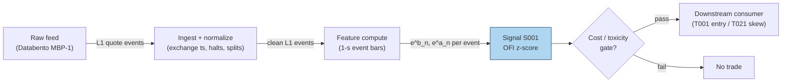

### S12. Sources

1. Cont, R., Kukanov, A. & Stoikov, S. (2014). "The Price Impact of Order Book Events." *Journal of Financial Econometrics* 12(1): 47–88. arXiv:1011.6402 — https://arxiv.org/abs/1011.6402 (canonical OFI definition; contemporaneous regression — not a forward rule).
2. Cont, R., Cucuringu, M. & Zhang, C. (2023). "Cross-Impact of Order Flow Imbalance in Equity Markets." *Quantitative Finance*; arXiv:2112.13213 — https://arxiv.org/abs/2112.13213 (integrated multi-level OFI via PCA; lagged cross-asset OFIs improve short-horizon return forecasts).
3. Replication: `xecuterisaquant/replication-cont-ofi` — https://github.com/xecuterisaquant/replication-cont-ofi (third-party CKS replication on TAQ/NBBO 1-s grid; OLS R² ≈ 14.2% after sign correction; code repo, not peer-reviewed).

**Chatbot source log.** Duck.ai (GPT-5.6 Luna, anonymous, web-search assisted, 2026-09-10; `batches/SB1/duckai-answers.md`) answered Q-SB1-1–Q-SB1-3. Q-SB1-1 confirms the CKS formula structure and the contemporaneous-not-forward caveat. **Operator verification of the chatbot's own worked OFI example found 2 arithmetic errors** (event 5 used the wrong ask size; event 7 wrongly added a price-effect term): the correct cumulative OFI sequence is 0, 4, 12, 23, 18, 13, 0, 6, 11, **19** — the model reported 29. The chapter's worked example uses its own script-generated tape (seed 42), never the chatbot's numbers; the chatbot's parameter/throughput/pricing tables were self-flagged as illustrative estimates and are NOT promoted to documented facts. This is exactly why chatbot output is treated as leads, never facts. Source log: Duck.ai answered Q-SB1-1 (OFI portion), Q-SB1-2, Q-SB1-3; Grok/Cursor answers pending (checked 2026-09-10).

**Unverified leads** (chatbot-only — never in Sources):
- Duck.ai Q-SB1-1 worked example: raw output contained the 2 arithmetic errors above (correct final cumulative OFI = 19, not 29) — kept here as a caution, not used.
- Duck.ai: "Polars 1–10M events/s; Python loop 0.1–1M/s; Rust 5–30M+/s" — model-flagged estimates; cost-model §2 used instead.
- Duck.ai: vendor bands ("free–$50–300/mo retail; $500–10,000+/mo institutional") — model-flagged estimates; cost-model §6 used instead.
- Duck.ai: execution heuristics ("+OFI → waiting riskier; OFI burst → cross spread") — plausible, no checkable source; hypotheses only.
- Duck.ai Q-SB1-2/Q-SB1-3: vendor shortlist (Databento US Equities Mini ~$100–500/mo, TotalView-ITCH ~$300–2,000+/mo, etc.) and engineering-hour bands (prototype 40–70 h, research-grade 120–220 h) — model-flagged estimates; cost-model §5/§6 used in S7/S8 instead.

---

## Stage 3/200 — S003: Queue (depth) imbalance — Gould–Bonart

*Batch SB1 · Signal 3/100 · Provenance [D] · Family A — Microstructure & order flow*

### S1. One-line verdict

| | |
|---|---|
| **What it is** | The normalized difference between displayed size at the best bid and best ask; predicts the direction of the next mid-price tick via queue-depletion. |
| **When it works** | Large-tick, deep-queue stocks where the next move is a race between two visible queues; sub-second to seconds horizons. |
| **When it dies** | Small-tick names with flickering quotes, spoofed/layered books, hidden-liquidity dominance; any SIP-latency queue race. |
| **Build-or-buy in one line** | Build — it is one division on data you already have for S001; buy nothing extra unless you need historical L2. |

Provenance: **[D]** — Gould & Bonart (2016), arXiv:1512.03492; Cao, Hansch & Wang (2009), *Journal of Futures Markets* 29(1): 16–41.

### S2. How it works — plain human explanation

At 9:47:03.214 the book reads bid 231.40 × 1,048, ask 231.41 × 234. Forget prices for a moment and look at the two queues: 1,048 shares want to buy at the touch, only 234 want to sell. Which queue gets eaten first? The ask queue is four times thinner — a single 300-share market sell order barely dents the bid, while a 300-share market buy wipes out the entire ask queue and the ask price ticks up. The mid-price follows the thinner queue.

That is the whole signal: relative queue length forecasts the next tick because prices move when a queue depletes, and the shorter queue usually depletes first. Formally this is *queue-depletion dynamics* — the same mechanical core as S001's OFI, but a snapshot (a *level*) rather than a flow. Where OFI accumulates pressure over events, queue imbalance reads the current standoff: big bid queue + small ask queue = the next move is more likely up.

The economics are adverse selection in miniature. A lopsided book means informed or impatient flow has been leaning on one side; market makers see the thin queue, infer they are about to be adversely selected, and reprice before the queue is gone. Gould & Bonart's contribution was to test this as a literal classifier: feed the imbalance into a logistic regression, predict the next mid-price move, and find a strongly significant relationship — "considerable improvement" over a null model for large-tick stocks, moderate for small-tick ones.

Three-bullet mental model:

- **Imbalance is a snapshot; OFI is the movie.** S003 reads the book's current state; S001 reads how it got there. They are cousins, not substitutes.
- **It predicts *direction*, not magnitude.** The next tick is up or down; how far depends on depth behind the touch (S005 territory).
- **Large-tick is its home turf.** When the spread is one tick and queues are deep, the race is clean. When the spread flickers across ticks, the signal drowns in quote noise.

### S3. The math — exact formula

$$I_t = \frac{Q^b_t - Q^a_t}{Q^b_t + Q^a_t} \in [-1,\, 1],$$

where Q^b_t, Q^a_t are the displayed sizes at the best bid and best ask at time *t* (in shares; both non-negative, not both zero). Trade in the direction of *I* when |I_t| exceeds a fee-covering threshold κ (example — not an institutional standard).

N-level extension (static book pressure):

$$I^{(N)}_t = \frac{\sum_{i=1}^{N}\,(Q^b_{i,t} - Q^a_{i,t})}{\sum_{i=1}^{N}\,(Q^b_{i,t} + Q^a_{i,t})},$$

with *i* indexing price levels from the touch outward. *N* = 1 is the Gould–Bonart measure; *N* = 5–10 is the S005 book-pressure family.

A useful exact identity linking S003 to S004 (verified algebra): with spread *s_t = P^a_t − P^b_t*,

$$P_{\mu,t} - m_t = \frac{s_t}{2}\,I_t,$$

i.e. the microprice deviation from mid equals half the spread times the queue imbalance. The two signals share a touch-level core; they diverge when you add flow history (S001) or deeper levels / dynamics (full microprice).

Parameter table:

| Parameter | Symbol | Typical range | Too small | Too large | Default (example) |
|---|---|---|---|---|---|
| Entry threshold | κ | 0.3 – 0.7 | trades noise, fees eat you | never triggers | *±0.5 — example, not an institutional standard* |
| Levels | N | 1 (touch) – 10 | misses deep liquidity | stale/gameable size | *1 — example* |
| Smoothing | — | raw snapshot, or 100 ms–1 s EWMA | flicker whipsaws | lags the depletion | *raw — example* |
| Horizon | — | next 1–20 ticks / 100 ms – seconds | — | edge decays | *next tick — example* |

Causal timing: *I_t* is computed from the book snapshot at event *t* using only data ≤ *t*; a trade reacting to it can execute no earlier than *t+1*. Variants: (1) touch-only (canonical); (2) N-level book pressure; (3) time-averaged imbalance over a short window (kills flicker, adds lag).

### S4. Worked example — step-by-step numbers (SYNTHETIC)

Same synthetic tape as S001 (`batches/SB1/plot_S003.py`, `seed 42`), snapshots after each event. All numbers **synthetic** — no fees, no latency, no hidden liquidity; an arithmetic illustration, not a backtest.

| ev | bid | qb | ask | qa | I_t | mid |
|---|---|---|---|---|---|---|
| 0 | 231.40 | 635 | 231.41 | 432 | +0.1903 | 231.405 |
| 1 | 231.40 | 1048 | 231.41 | 432 | +0.4162 | 231.405 |
| 2 | 231.40 | 1048 | 231.41 | 234 | +0.6349 | 231.405 |
| 3 | 231.41 | 260 | 231.41 | 234 | +0.0526 | 231.410 |
| 4 | 231.41 | 260 | 231.42 | 688 | −0.4515 | 231.415 |
| 5 | 231.41 | 260 | 231.42 | 946 | −0.5688 | 231.415 |
| 6 | 231.41 | 153 | 231.42 | 946 | −0.7216 | 231.415 |
| 7 | 231.40 | 715 | 231.42 | 946 | −0.1391 | 231.410 |
| 8 | 231.40 | 715 | 231.42 | 486 | +0.1907 | 231.410 |
| 9 | 231.40 | 1002 | 231.42 | 486 | +0.3468 | 231.410 |
| 10 | 231.40 | 1002 | 231.43 | 732 | +0.1557 | 231.415 |

Hand-checks: ev2: (1048 − 234)/(1048 + 234) = 814/1282 = +0.6349. ev6: (153 − 946)/(153 + 946) = −793/1099 = −0.7216. ev10: (1002 − 732)/1734 = +0.1557. With the example threshold κ = ±0.5, the trigger fires at ev2 (long, +0.63) and ev5/ev6 (short, −0.57/−0.72).

**What to notice.** The imbalance leads the tape's two real mid moves: the +0.63 print at ev2 precedes the uptick at ev3 (231.405 → 231.410), and the −0.72 at ev6 precedes the downtick at ev7 (231.415 → 231.410). That is the queue-depletion story working as advertised — but this is a 10-event synthetic anecdote with hand-designed event types, not evidence of tradability. Note also ev3: after the bid stepped up, both queues reset small and *I* collapses to +0.05 — price-move events destroy the very queues the signal reads, which is why the signal must be recomputed every event and why stale snapshots are worthless.

### S5. Strategies that use this signal

- **T022 — Queue-Imbalance Maker with Toxicity Cancel** — primary trigger: posts at the touch when the queue favors your side; cancels on imbalance reversal or VPIN spike.
- **T001 — OFI + Queue-Imbalance Directional Scalper** — confirmation filter on the OFI entry (both must agree).
- **T004 — VWAP-Deviation Mean-Reversion** — timing filter: enter the fade only when the touch queue favors the fade direction.

### S6. Data required — exact spec

| Field | Type | Granularity | Source tier | Notes |
|---|---|---|---|---|
| Best bid/ask sizes | int (shares) | every quote event (L1) | Tier 2 | the entire signal; odd-lot handling matters |
| Best bid/ask prices | float | every quote event (L1) | Tier 2 | for the mid and the S004 identity |
| Exchange timestamps | int64 ns | per event | Tier 2 | queue races are decided in µs — SIP timestamps make live trading *simulated only — requires MBO/ITCH* |
| Halt/auction flags | bool | per event | Tier 1 | imbalance is meaningless across halts |

Collection: same feed as S001 (Databento MBP-1, Polygon L2 per the report entry). Ingest sketch (≤20 lines):

```python
import polars as pl
q = (pl.scan_parquet("aapl_mbp1.parquet")          # 1: L1 deltas, exchange-time sorted
       .sort("ts_event")
       .with_columns(qb=pl.col("bid_sz_00"),       # 2: touch sizes
                     qa=pl.col("ask_sz_00"),
                     bid=pl.col("bid_px_00"),
                     ask=pl.col("ask_px_00"))
       .filter((pl.col("qb") + pl.col("qa")) > 0)  # 3: guard empty book
sig = q.with_columns(                              # 4: the whole signal: one division
        imb=(pl.col("qb") - pl.col("qa")) /
            (pl.col("qb") + pl.col("qa"))).collect()
long  = sig.filter(pl.col("imb") >  0.5)           # 5: example threshold
short = sig.filter(pl.col("imb") < -0.5)
```

Storage: identical to S001 — L1 quotes+trades ≈ 2–8 GB/symbol-day parquet (`notes/cost-model.md` §4); the signal itself adds one float column. Data-quality checklist: drop crossed/locked quotes; normalize timestamps to exchange time; exclude auction prints and halt periods; watch for odd-lot-only quotes on some feeds.

### S7. Local build on M5 Max / 128GB

**Feasibility: trivial.** The signal is one division per quote event — O(1), stateless. A pure-Python loop at ~100–500k events/sec (`notes/cost-model.md` §2) covers a 50-symbol universe (~100k events/sec busy) with headroom; polars vectorized recompute (~10–50M rows/sec, §2) does a full day in seconds. Bottleneck: none for the math — the constraint is feed latency and timestamp quality, not compute.

Stack options:

| Stack | When to pick |
|---|---|
| Python + polars | everything up to live 50-symbol scanning |
| Rust | only if you are already writing the S001 Rust ingest — no standalone need |
| DuckDB | historical screening over parquet |

RAM: per §3, one symbol-day of L1 ≈ 0.5–4 GB working set; trivial for intraday windows. Sixty days for one symbol does not fit the 77 GB budget — stream per-symbol daily files. Engineering time: Tier M per plan §6, but at the light end — **20–40 h** ≈ $3,000–6,000 loaded-cost estimate at $150/hr, mostly feed plumbing and the threshold/toxicity gating shared with S001. What breaks first at 500 symbols: nothing in the math — the feed bill and the staleness of your quotes do.

### S8. Buy vs build

| Option | What you get | Indicative price | Gains | Loses |
|---|---|---|---|---|
| Tier 0: delayed quotes | free L1, 15-min delay | ~$0 — *indicative, verify before budgeting* | $0 research prototype | no live signal |
| Tier 1: Polygon Stocks Advanced / Alpaca SIP | real-time SIP L1 | ~$30–200/mo — *indicative, verify before budgeting* | cheap live data | queue races on SIP are *simulated only — requires MBO/ITCH* |
| Tier 2: Databento MBP-1 | exchange-timestamped L1 | ~$200/mo + usage — *indicative, verify before budgeting* | honest event order | usage meter on wide universes |

Verdict: **build, always** — the signal is a one-line transform of data you already buy for S001. There is no credible "precomputed queue imbalance" product worth paying for; the only buy decision is the feed tier, and the honest crossover is latency: if you intend to *trade* the next tick rather than study it, SIP timestamps are not enough and you are in Tier 2/3 with colocation-class infrastructure, which a Mac on a home connection cannot honestly emulate.

### S9. Success ratio / efficacy — documented evidence

| Study / source | Market & period | Metric | Before/after cost | Caveat |
|---|---|---|---|---|
| Gould & Bonart (2016), arXiv:1512.03492 | 10 liquid Nasdaq stocks, LOB data | logistic regression I → next mid move: strongly significant; considerable improvement over null for large-tick stocks, moderate for small-tick (binary + probabilistic) | before-cost (classification, not P&L) | predicts direction only; no trading costs, no Sharpe |
| Cao, Hansch & Wang (2009), *J. Futures Markets* 29(1) | Australian Stock Exchange | order imbalances between demand/supply schedules significantly related to future short-term returns, controlling for return autocorrelation, inside spread, trade imbalance; book ≈ 22% of price discovery | before-cost (return regression) | 2000s ASX; explanatory, not a strategy |
| Kercheval & Zhang (2015), *Quant. Finance* 15(8) | US equities, real LOB data | SVM on LOB-state features (incl. book imbalance): effective short-term price-movement forecasts | before-cost (classification) | ML wrapper; no after-cost P&L |

Only before-cost numbers exist in what I could verify — every row above is a classification or regression result, none is an after-cost trading Sharpe. Regimes where it fails: small-tick names (Gould–Bonart's own "moderate" result), spoofed/layered books where displayed size is a lie, hidden-liquidity-heavy venues, and any latency regime where you see the imbalance after the queue is already gone.

Honest bottom line: as a *standalone trigger* this is a real but tiny and latency-bound edge — documented as direction prediction, never as after-cost profit in the sources I found. As a *filter/veto* (T022's toxicity cancel, T001's confirmation) and as a *quoting input* (lean your limit orders to the heavy-queue side) it is one of the best-evidenced microstructure features in the literature.

### S10. Failure modes & pitfalls

1. **Spoofing / fleeting quotes** — displayed size vanishes before execution. Mitigation: weight by quote lifetime or filter sub-50 ms quotes (example).
2. **Hidden liquidity** — the visible queue is not the real queue. Mitigation: treat *I* as a noisy proxy; never size on it alone.
3. **Small-tick flicker** — spread bouncing across ticks randomizes the signal. Mitigation: restrict to large-tick names or time-average the imbalance.
4. **Lookahead leakage** — using the post-move snapshot to "predict" the move. Mitigation: strict event-*t* → trade-*t+1* causality.
5. **Latency illusion on SIP** — your imbalance print arrives after the race is over. Mitigation: label SIP work *simulated only — requires MBO/ITCH*.
6. **Cost blowup** — crossing the spread to chase a one-tick prediction. Mitigation: fee-covering threshold κ; prefer passive posting (T022) over taking.
7. **Overfitting κ** — threshold tuned to one month's microstructure. Mitigation: per-symbol calibration, walk-forward, shrinkage toward 0.5.
8. **Regime breaks** — imbalance–direction relation weakens in stress/crowding. Mitigation: toxicity overlay (VPIN, S008); stand down on spread multiples.

### S11. Visuals


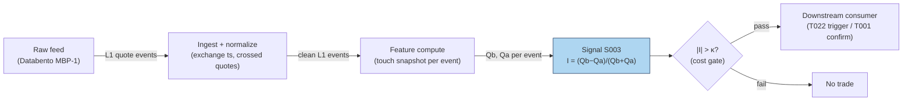

### S12. Sources

1. Gould, M. D. & Bonart, J. (2016). "Queue Imbalance as a One-Tick-Ahead Price Predictor in a Limit Order Book." arXiv:1512.03492 — https://arxiv.org/abs/1512.03492 (logistic-regression evidence; large-tick vs small-tick result).
2. Cao, C., Hansch, O. & Wang, X. (2009). "The information content of an open limit-order book." *Journal of Futures Markets* 29(1): 16–41 — https://ideas.Repec.org/a/wly/jfutmk/v29y2009i1p16-41.html (order imbalances → future short-term returns; ~22% price-discovery contribution).
3. Kercheval, A. N. & Zhang, Y. (2015). "Modelling high-frequency limit order book dynamics with support vector machines." *Quantitative Finance* 15(8): 1315–1329 — https://ideas.repec.Org/a/taf/quantf/v15y2015i8p1315-1329.html (LOB-state features effective for short-term forecasts on real data).

**Chatbot source log.** Q-SB1-1 asked for queue imbalance alongside OFI and microprice, but the Duck.ai answer (GPT-5.6 Luna, 2026-09-10) covered only the OFI portion — no usable queue-imbalance content was returned. Source log: Duck.ai answered Q-SB1-1 (OFI portion only — not the queue-imbalance portion); Grok/Cursor answers pending (checked 2026-09-10).

**Unverified leads:** none specific to S003 beyond the general SB1 chatbot caveats — no chatbot made a checkable queue-imbalance claim in this batch.

---

## Stage 4/200 — S004: Microprice (Stoikov)

*Batch SB1 · Signal 4/100 · Provenance [D] · Family A — Microstructure & order flow*

### S1. One-line verdict

| | |
|---|---|
| **What it is** | Stoikov's learned fair-price estimator: the limiting expected mid-price conditional on the book-imbalance state, estimated from a Markov chain over discretized (imbalance, spread) states — a martingale by construction. |
| **When it works** | As a fair-value anchor for quoting and for fading transient mid deviations; tight-spread, visible-book names. |
| **When it dies** | Spoofed books, dominant hidden liquidity, one-tick-wide flickering spreads — anywhere displayed size lies. |
| **Build-or-buy in one line** | Build — the estimator is a small batch fit plus a per-event table lookup on your S001/S003 feed. |

Provenance: **[D]** — Stoikov (2018), "The micro-price: a high-frequency estimator of future prices," *Quantitative Finance* 18(12): 1959–1966 (working paper Nov 2017). Definition: $P_t^{\text{micro}} = \lim_{i\to\infty} \mathbb{E}[M_{\tau_i} \mid \mathcal{F}_t]$ — the limit of expected mid-prices at the successive mid-price-change times $\tau_1, \tau_2, \dots$ — estimated in practice by discretizing (imbalance, spread) into states and fitting the transition matrices $Q, R_1, R_2$ (paper §3). The cross-weighted mid $W = I\cdot P^a + (1-I)\cdot P^b$ is the paper's Appendix-B degenerate special case (no learning) and appears in this chapter ONLY as the naive baseline — it is not the microprice. Do not double-count with S003: the microprice's state *is* the touch imbalance S003 uses, passed through the learned adjustment.

### S2. How it works — plain human explanation

At 9:47:03.214 the book reads bid 231.40 × 1,048, ask 231.41 × 234, mid 231.405. The plain mid says "fair value is 231.405." But look at the queues: 1,048 shares bid vs 234 offered. The next trade is far more likely to be a buy chewing through that thin ask — printing at 231.41 — than a sell. So is 231.405 really the best guess of where the price is going? No: the *expected* next price leans toward the ask.

Stoikov's question is sharper than "which way does it lean": **given that the book looks like this, where will the mid-price be on average, far into the future?** That limiting expected mid-price *is* the microprice — a martingale by construction, which is the mathematical way of saying "this is what 'fair' means once you condition on the book." And crucially, it is not a formula you write down from one snapshot. It is **learned**: discretize the imbalance into bins, watch thousands of quote events to see what the mid does after each bin, and compute the expected long-run mid per bin. Each new event is then a table lookup — mid plus the learned adjustment for its bin.

The construction, in one paragraph: the state of the book at each quote event is the pair (imbalance bin, spread bin). From history you estimate three transition matrices — $Q$ (quote updates where the mid doesn't move), $R_1$ (the distribution of the next mid-price move), $R_2$ (state transitions coincident with a mid-price move). From them you compute the per-state adjustment $G^* = G_1 + B G_1 + B^2 G_1 + \cdots$ (the §3 math), and the microprice is $P^{\text{micro}} = M + G^*(\text{state})$. Because the matrices are fit per symbol from its own history, the estimator adapts to each name's microstructure — a large-tick stock and a small-tick stock get different adjustments, which no closed form can do.

Where does the familiar cross-weighted mid $W = I\cdot P^a + (1-I)\cdot P^b$ fit? It is the **no-learning baseline**: the straight-line adjustment $(I-\tfrac12)\cdot S$ you get if you skip the estimation and simply *impose* that the current imbalance tells the whole story. Stoikov derives it as a degenerate special case (Appendix B: imbalance as a Brownian motion with particular boundary behavior) and shows empirically it falls short — the learned adjustments come out flatter, always inside half the spread, and predict short-term prices better than the mid *or* the weighted mid (BAC/CVX, March 2011).

Why "micro"? Because it lives at the tick scale and updates every quote event — and because taking expectations far into the future filters out the microstructure noise in the mid-price itself.

Three-bullet mental model:

- **The microprice is a learned function of the book state, not a closed form.** Fit transition matrices on history; each event is then mid + a looked-up adjustment. No fit, no microprice — just the baseline.
- **It is a fair-value estimator, not a trade.** You fade deviations from it (buy below, sell above) or center your quotes on it — you don't "buy the microprice."
- **The cross-weighted mid is the naive baseline, not the estimator.** Same inputs, imposed straight-line adjustment, zero learning. Benchmark the learned microprice against it — and never present the baseline as the microprice.

### S3. The math — exact formula

**Definition** (Stoikov 2017 §2, 2018): with $\tau_1, \tau_2, \dots$ the successive
mid-price-change times and $\mathcal{F}_t$ the order-book information at $t$,

$$P^{\text{micro}}_t = \lim_{i\to\infty} \mathbb{E}[M_{\tau_i} \mid \mathcal{F}_t].$$

Write $P^{\text{micro}} = M + g(I, S)$ with $M$ the mid-price,
$I = Q^b/(Q^b+Q^a)$ the imbalance, $S = P^a - P^b$ the spread. The paper's
program is to **estimate the adjustment function $g$ from data**. The $i$-th
mid-price prediction decomposes as

$$P_i = M_t + \sum_{k=1}^{i} g_k(I_t, S_t),$$

with the first-order adjustment $g_1(I,S) = \mathbb{E}[M_{\tau_1} - M_t \mid I_t = I, S_t = S]$
(the expected move to the *next* mid-price change) and the recursion
$g_{i+1}(I,S) = \mathbb{E}[g_i(I_{\tau_1}, S_{\tau_1}) \mid I_t = I, S_t = S]$.

**Finite-state estimator** (paper §3 — the implementable version): discretize
imbalance into $n$ bins ($I_t = x$ iff $(x-1)/n < I \le x/n$) and spread into $m$
tick values; the book state is $x = (i, s)$ ($nm$ states). From quote history
estimate:

- $Q_{xy} = P(M_{t+1}-M_t = 0 \;\land\; X_{t+1} = y \mid X_t = x)$ — transient
  quote updates, $nm \times nm$;
- $R^1_{xk} = P(M_{t+1}-M_t = k \mid X_t = x)$ — one-step mid-move distribution
  over $K = \{-0.01, -0.005, 0.005, 0.01\}$ (half-ticks), $nm \times 4$;
- $R^2_{xy} = P(M_{t+1}-M_t \ne 0 \;\land\; X_{t+1} = y \mid X_t = x)$ — state
  transitions coincident with a mid-price move, $nm \times nm$.

Then, with $K$ as a column vector:

$$G_1 = (I - Q)^{-1} R^1 K, \qquad B = (I - Q)^{-1} R^2,$$

$$G^* = G_1 + B G_1 + B^2 G_1 + \cdots \quad\text{(converges fast in practice)},$$

$$P^{\text{micro}}_t = M_t + G^*(X_t).$$

Convergence is guaranteed (Thm 3.1) when the data are **symmetrized** — every
observation $(I, S, \dots)$ mirrored by $(1-I, S, \dots)$ — so that $B^* G_1 = 0$.
Inference per event is a bin lookup plus an addition; all the work is the fit.

**Naive baseline — NOT the microprice.** The cross-weighted mid

$$W = I\cdot P^a + (1-I)\cdot P^b, \qquad W - M = \left(I-\tfrac12\right) S,$$

is the closed form the paper derives as the degenerate Appendix-B special case
and compares *against*. Carry it only as the no-learning benchmark.

The signal is the deviation:

$$s_t = P^{\text{micro}}_t - M_t = G^*(X_t).$$

Parameter table:

| Parameter | Symbol | Typical range | Too small | Too large | Default (example) |
|---|---|---|---|---|---|
| Imbalance bins | n | 4–10 | 1 = no state information | 20+ = sparse transition counts | *4 — example, not an institutional standard* |
| Spread bins | m | 1–5 ticks | misses spread interaction | sparse | *1 — example* |
| Estimation window | — | 1–4 weeks of quotes | regime change mid-fit | stale microstructure | *1 month — example* |
| Symmetrization | — | on | series can diverge (Thm 3.1) | — | *on* |
| Entry threshold | κ | 0.1 – 0.5 × spread | fee death by a thousand fills | never trades | *0.25 × spread — example* |
| Holding horizon | h | seconds | noise | deviation mean-reverts away | *5 s — example* |

Causal timing: the state $X_t$ comes from the snapshot at event $t$ using only
data ≤ $t$; $G^*$ is fit on history strictly *before* the evaluation window
(never in-sample transitions); tradable no earlier than $t+1$. Variants:
(1) touch microprice ($n$ bins × $m = 1$, canonical); (2) N-level imbalance
states (the paper notes the Level-II extension); (3) the closed-form baseline
$W$ — for benchmarking the learned estimator, never as the signal itself.

### S4. Worked example — step-by-step numbers (SYNTHETIC)

A synthetic run of the §3 estimator (`batches/SB1/plot_S004.py`, `seed 42`).
Imbalance $I = Q^b/(Q^b+Q^a)$ in $n = 4$ bins, spread fixed at 1 tick ($m = 1$),
mid-price move grid $K = \{-0.01, -0.005, 0.005, 0.01\}$. The "estimated"
transition matrices $Q, R_1, R_2$ are invented (reversal-symmetric, i.e.
symmetrized as Thm 3.1 requires) — they demonstrate the machinery, not a real
fit. The 10-event tape holds bid/ask fixed at 231.40/231.41 with sizes at the
bin centers; states are drawn from the chain. All numbers **synthetic**; no
fees, no latency — arithmetic illustration, not a backtest. Deviation in basis
points (bps): $(P^{\text{micro}} - \text{mid})/\text{mid} \times 10^4$. $W$ is
the cross-weighted-mid **baseline** (not the microprice).

Fitted adjustments: $G_1 = (-0.0649, -0.0253, +0.0253, +0.0649)$¢,
$G^* = (-0.0761, -0.0305, +0.0305, +0.0761)$¢ per bin 1–4; max $|B|$
eigenvalue $0.50 < 1$, so the series converges in a handful of terms.

| ev | bin | bid | qb | ask | qa | mid | G\* (¢) | P\* | W (baseline) | dev\* (bps) |
|---|---|---|---|---|---|---|---|---|---|---|
| 0 | 1 | 231.40 | 125 | 231.41 | 875 | 231.4050 | −0.076 | 231.4042 | 231.4013 | −0.03 |
| 1 | 1 | 231.40 | 125 | 231.41 | 875 | 231.4050 | −0.076 | 231.4042 | 231.4013 | −0.03 |
| 2 | 2 | 231.40 | 375 | 231.41 | 625 | 231.4050 | −0.030 | 231.4047 | 231.4038 | −0.01 |
| 3 | 2 | 231.40 | 375 | 231.41 | 625 | 231.4050 | −0.030 | 231.4047 | 231.4038 | −0.01 |
| 4 | 1 | 231.40 | 125 | 231.41 | 875 | 231.4050 | −0.076 | 231.4042 | 231.4013 | −0.03 |
| 5 | 4 | 231.40 | 875 | 231.41 | 125 | 231.4050 | +0.076 | 231.4058 | 231.4087 | +0.03 |
| 6 | 4 | 231.40 | 875 | 231.41 | 125 | 231.4050 | +0.076 | 231.4058 | 231.4087 | +0.03 |
| 7 | 4 | 231.40 | 875 | 231.41 | 125 | 231.4050 | +0.076 | 231.4058 | 231.4087 | +0.03 |
| 8 | 3 | 231.40 | 625 | 231.41 | 375 | 231.4050 | +0.030 | 231.4053 | 231.4062 | +0.01 |
| 9 | 3 | 231.40 | 625 | 231.41 | 375 | 231.4050 | +0.030 | 231.4053 | 231.4062 | +0.01 |

Hand-check ev5: bin 4 → $G^* = +0.0761$¢, so
$P^* = 231.4050 + 0.000761 = 231.4058$. Baseline: $I = 875/1000 = 0.875$,
$W = 0.875 \times 231.41 + 0.125 \times 231.40 = 231.4087$ — deviation
$+0.16$ bps vs the learned $+0.03$ bps. Note $G^* - G_1 = 0.0761 - 0.0649 =
0.0112$¢ on bin 4: the higher-order Markov terms ($B G_1 + B^2 G_1 + \cdots$)
add about a seventh on top of the first-order adjustment.

**What to notice.** The learned adjustments are roughly a *fifth* of the
baseline's (0.076¢ vs 0.375¢ at the extreme bin) — exactly the paper's
Figure-3 pattern for BAC/CVX: the learned curve sits between the mid (flat)
and the weighted-mid line (steep), always inside half the spread. That is the
point and the warning: the edge per event is a *fraction of a fraction* of the
spread, so it only survives as a quoting advantage (better limit placement,
less adverse selection), never as a market-order scalp after fees. The
baseline column is there so you can see what "no learning" would have claimed
— steeper, noisier, and wrong about the magnitude.

### S5. Strategies that use this signal

- **T002 — Microprice Fair-Value Scalper** — primary trigger: trades toward the microprice-implied fair value with volume-delta confirmation and a spread-decomposition cost gate.
- **T021 — Avellaneda–Stoikov Inventory Skew MM** — fair-value anchor: quotes are skewed around the microprice (not the mid) so the book's asymmetry is priced in.
- **T085 — Resiliency Market Maker** — quoting anchor alongside LOB resiliency: re-center quotes on P^micro after temporary-impact dislocations.

### S6. Data required — exact spec

| Field | Type | Granularity | Source tier | Notes |
|---|---|---|---|---|
| Best bid/ask prices + sizes | float / int | every quote event (L1); L2 for N-level | Tier 2 | same feed as S001/S003 |
| Exchange timestamps | int64 ns | per event | Tier 2 | fair-value staleness = adverse selection |
| Halt/auction flags | bool | per event | Tier 1 | drop locked/crossed books (cf. ev3) |

Collection: any L1 feed (Databento MBP-1 per the report entry; N-level states need MBP-10). Ingest sketch (≤20 lines):

```python
import polars as pl
import numpy as np
q = (pl.scan_parquet("aapl_mbp1.parquet")          # 1: L1 deltas, exchange-time order
       .sort("ts_event")
       .with_columns(mid=(pl.col("bid_px_00") + pl.col("ask_px_00")) / 2,
                     imb=pl.col("bid_sz_00") /
                         (pl.col("bid_sz_00") + pl.col("ask_sz_00")),
                     spr=pl.col("ask_px_00") - pl.col("bid_px_00"))
       .filter(pl.col("spr") > 0)                  # 2: drop locked/crossed
       .with_columns(state=(pl.col("imb") * 4).ceil().cast(pl.Int64))  # 3: imbalance bin
       .collect())
# --- offline fit on history strictly before evaluation: count transitions ->
# Q, R1, R2; symmetrize; G1 = (I-Q)^-1 R1 K; B = (I-Q)^-1 R2;
# Gstar = G1 + B@G1 + B^2@G1 + ...  (minutes in numpy)
Gstar = np.load("microprice_Gstar_aapl.npy")       # 4: learned adjustment ($)
mp = q.with_columns(
    micro=pl.col("mid") + Gstar[pl.col("state") - 1],            # 5: the estimator: lookup
    w_base=pl.col("imb") * pl.col("ask_px_00") +                 # baseline only — not the microprice
           (1 - pl.col("imb")) * pl.col("bid_px_00"))
```

Storage: same as S001/S003 — L1 ≈ 2–8 GB/symbol-day parquet (`notes/cost-model.md` §4); the signal is two float columns (micro + baseline). Data-quality checklist: exchange timestamps, drop crossed/locked books, halt/auction masks, split adjustments, odd-lot quote handling, **fit window strictly before the evaluation window** (no in-sample transitions), symmetrized counts with a convergence check on the $G^*$ series.

### S7. Local build on M5 Max / 128GB

**Feasibility: trivial at inference.** One bin lookup and an addition per quote event — cheaper than S003's division. Python+polars handles a 50-symbol universe live without noticing; the §2 sizing (100k events/sec → Python borderline, Rust comfortable) applies unchanged, with the microprice adding negligible marginal cost over the S001 ingest you already run. The **fit** is the only real compute: counting transitions over ~1 month of quotes and one $nm \times nm$ matrix inverse — minutes in numpy/polars for $n = 4$–$10$, $m = 1$–$3$ — then walk-forward refits on a schedule.

Stack options:

| Stack | When to pick |
|---|---|
| Python + polars | everything, including live — the math is O(1) |
| Rust | only as part of a shared S001/S003 Rust ingest |
| N-level variant | needs MBP-10; same stacks, ~10× the event rate |

RAM: per §3, L1 touch quotes ≈ 0.5–4 GB/symbol-day working set — trivial for intraday; 60-day single-symbol history does not fit the 77 GB budget, stream per-symbol daily files.

Engineering time: Tier M per plan §6, light end — **20–40 h** ≈ $3,000–6,000 loaded-cost estimate at $150/hr, shared almost entirely with S001/S003 plumbing; the genuinely new work is the fit harness (transition counting, symmetrization, the $G^*$ convergence check, walk-forward refits) — budget ~8 h of the band for it. What breaks first at 500 symbols: nothing in the math — the feed bill, and the honesty of your timestamps.

### S8. Buy vs build

| Option | What you get | Indicative price | Gains | Loses |
|---|---|---|---|---|
| Tier 0: delayed quotes | free L1 | ~$0 — *indicative, verify before budgeting* | $0 prototype | no live fair value |
| Tier 1: Polygon / Alpaca SIP | real-time SIP L1 | ~$30–200/mo — *indicative, verify before budgeting* | cheap live data | stale microprice in a race — *simulated only — requires MBO/ITCH* for quoting claims |
| Tier 2: Databento MBP-1/10 | exchange-timestamped L1/L2 | ~$200/mo + usage — *indicative, verify before budgeting* | honest snapshots; N-level needs MBP-10 | usage meter |

Verdict: **build.** Inference is a table lookup on data you already buy, and no vendor can sell you your symbols' fitted transition matrices — the fit is in-house by construction. The decision is feed tier (SIP vs direct), governed by whether you quote live or research offline. Crossover: none on cost.

### S9. Success ratio / efficacy — documented evidence

| Study / source | Market & period | Metric | Before/after cost | Caveat |
|---|---|---|---|---|
| Stoikov (2018), *Quant. Finance* 18(12) | high-frequency equity data | microprice empirically a better predictor of short-term prices than the mid-price or the weighted mid-price | before-cost (prediction accuracy, not P&L) | martingale construction; no trading costs, no Sharpe |
| Stanford MS&E 448 (2021), "High Frequency Trading Strategies" course report, AAPL dataset | US equity, student replication | compares naive/mid/weighted-mid/microprice fair-value constructions on real data | before-cost (practitioner reconstruction) | coursework, not peer-reviewed |

Only before-cost numbers exist in what I could verify — both rows are prediction-accuracy results, not after-cost trading P&L. I found **no published after-cost Sharpe for a microprice-deviation scalper**; the literature positions the microprice as a *fair-value input to quoting* (adverse-selection reduction), where the "return" shows up as lower effective spread paid, not as a strategy Sharpe.

Honest bottom line: as a *standalone trigger* this is a sub-spread edge — the worked example's max learned deviation was 0.03 bps (the naive baseline reached 0.16 bps), and crossing the spread to chase it is arithmetic suicide. As a *filter / quoting anchor* (T021, T085: center quotes on P^micro instead of mid) it is one of the cheapest genuine improvements in market microstructure — the value is measured in reduced adverse selection, which is exactly what Stoikov's construction targets.

### S10. Failure modes & pitfalls

1. **Sub-spread edge vs full-spread cost** — learned deviations are a fraction of the spread (the §4 fit: ≤0.08¢ on a 1¢ spread); market orders lose by construction. Mitigation: use only for passive quoting / fill improvement, never for taking.
2. **Spoofed displayed size** — the state binning trusts the queues. Mitigation: lifetime-weighted sizes; toxicity overlay (S008).
3. **Hidden liquidity** — invisible size breaks the binning. Mitigation: treat P^micro as a noisy proxy; shrink adjustments toward zero in dark-heavy names.
4. **Locked/crossed books** — bins are meaningless on non-positive spreads. Mitigation: drop those snapshots before computing (cf. the S6 filter).
5. **Lookahead leakage** — computing the state from the post-trade book, or fitting $G^*$ on the evaluation window's own transitions. Mitigation: event-*t* snapshot → earliest action *t+1*; fit window strictly before evaluation.
6. **Overfitting the learned estimator** — transition matrices fit on one regime; $nm$ states with sparse counts. Mitigation: walk-forward refits; symmetrization; compare against the closed-form baseline that cannot overfit.
7. **Double-counting S003** — the microprice's state *is* the S003 touch imbalance, passed through the learned $G^*$; stacking raw imbalance and the microprice as "independent" features double-counts. Mitigation: use one, or orthogonalize.
8. **Latency/staleness** — a stale microprice is a worse fair value than a fresh mid. Mitigation: direct-feed timestamps; SIP work labeled *simulated only — requires MBO/ITCH*.

### S11. Visuals


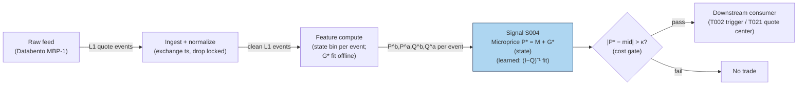

### S12. Sources

1. Stoikov, S. (2018). "The micro-price: a high-frequency estimator of future prices." *Quantitative Finance* 18(12): 1959–1966 — https://econpapers.repec.org/article/tafquantf/v_3a18_3ay_3a2018_3ai_3a12_3ap_3a1959-1966.htm (martingale construction; beats mid and weighted mid as a short-term predictor).
2. Stoikov, S. (2017). "The Micro-Price: A High Frequency Estimator of Future Prices." Working paper (Nov 2017) — https://github.com/shaileshkakkar/MicroPriceIndicator/raw/refs/heads/master/Micro-Price%20Indicator.pdf (full definition, limit-of-expected-midprices construction).
3. Sasson, J., Ho, W. H. & Samson, F. (2021). "High Frequency Trading Strategies." Stanford MS&E 448 course final report — http://stanford.edu/class/msande448/2021/Final_reports/gr1.pdf (practitioner reconstruction comparing mid, weighted mid, and microprice fair-value estimators on an AAPL dataset).

**Chatbot source log.** Q-SB1-1 asked for the microprice alongside OFI and queue imbalance, but the Duck.ai answer (GPT-5.6 Luna, 2026-09-10) covered only the OFI portion — no usable microprice content was returned. Source log: Duck.ai answered Q-SB1-1 (OFI portion only — not the microprice portion); Grok/Cursor answers pending (checked 2026-09-10).

**Unverified leads:**
- Practitioner note (GitHub `jy447/vpin-model` README): the closed-form cross-weighted mid is a *first-order* approximation of Stoikov's full estimator; an author's reference implementation exists at `github.com/sstoikov/microprice` — I did not verify that repository resolves, so it stays here, not in Sources.
- Cartea, Jaimungal & Penalva (2015), *Algorithmic and High-Frequency Trading*, Cambridge University Press, §10 — the report's cited corroboration for the N-level/weighted-mid construction; no public URL verified, kept as a lead rather than a checked source.

---

## Stage 6/200 — S006: Signed trade imbalance (volume delta)

*Batch SB1 · Signal 6/100 · Provenance [SR] · Family A — Microstructure & order flow*

### S1. One-line verdict

| | |
|---|---|
| **What it is** | Net aggressive buy-minus-sell share volume over a window — the signed footprint of who hit whom. |
| **When it works** | When order flow is autocorrelated (institutions splitting orders) and you act within seconds-to-minutes of the imbalance print. |
| **When it dies** | News-driven flow everyone sees; thin tapes where one print dominates; after the imbalance is already in the price. |
| **Build-or-buy in one line** | Build: it is one classification rule plus a rolling sum — the feed is the only real cost. |

Provenance **[SR]** (standard reconstruction) — the report tags this signal [SR]; the formula
below is the textbook reconstruction of the trade-sign literature, not a quoted implementation.
Family **A — Microstructure & order flow**.

### S2. How it works — plain human explanation

Picture 9:47:03 on a normal Tuesday. AAPL's book sits at bid 231.40 × 800 / ask 231.41 × 300.
Over the next 40 seconds, fourteen prints hit the tape: twelve lift the offer for 4,100 shares
total, two hit the bid for 600. Nobody needs a PhD to feel the asymmetry — buyers are paying
up, sellers are standing aside. Signed trade imbalance (often called **volume delta**) is just
that feeling, formalized: every trade gets a sign, +1 if the buyer was the aggressor, −1 if the
seller was, multiply by size, add it up. A window reading +3,500 shares says aggressive demand
just exceeded aggressive supply by 3,500 shares; the market makers who absorbed it are now long
inventory they did not want, and the standard inventory story says they shade quotes upward to
work it off — which is price pressure you can trade against, or ride.

Why should this predict anything at all? Two economic channels:

- **Adverse selection.** Some aggressive flow is informed. The counterparty who keeps getting
  lifted eventually concludes the buyer knows something, and revises the mid upward. The
  imbalance is the observable trace of that learning.
- **Inventory.** Even uninformed flow moves prices: a dealer who just bought 3,500 shares from
  panicky sellers lowers both bid and ask to attract buyers and discourage more sellers
  (the classic Stoll inventory logic). While the inventory is being worked off, the drift
  continues — and order splitting means today's imbalance predicts tomorrow's, because the
  same institution is still working the order.

Both channels point the same way short-term: signed imbalance today, price drift in the same
direction over the next seconds-to-minutes, then partial reversal as pressure dissipates.

**Mental model (3 bullets):**
- Volume delta is the *realized* demand shock — the bill the market just handed liquidity providers.
- It works because flow is sticky (order splitting) and counterparties shade quotes while they digest it.
- It is a *flow* measure, not a *value* measure: it says nothing about fair value, only about who is in a hurry.

### S3. The math — exact formula

Let trades in window $t$ be indexed $i = 1,\dots,N_t$, each with price $P_i$ and size $V_i$
(shares). Assign an aggressor sign $\varepsilon_i \in \{+1,-1\}$ ($+1$ = buyer-initiated):

**Raw imbalance (shares):**
$$\mathrm{TI}_t = \sum_{i=1}^{N_t} \varepsilon_i \, V_i$$

**Normalized delta (dimensionless, −1 to +1):**
$$\Delta_t = \frac{V^{\text{buy}}_t - V^{\text{sell}}_t}{V^{\text{buy}}_t + V^{\text{sell}}_t}
= \frac{\mathrm{TI}_t}{\sum_i V_i}$$

**Signal form (z-score against trailing window of length $L$):**
$$z_t = \frac{\Delta_t - \mu_{t-L:t-1}}{\sigma_{t-L:t-1}}$$

**Predictive regression form** (the Chordia–Subrahmanyam style specification):
$$r_{t+1} = a + b \cdot \mathrm{OIB}_t + \gamma' X_t + u_{t+1}$$
where $r_{t+1}$ is the next-window return, $\mathrm{OIB}_t$ is the imbalance, and $X_t$ are
controls (lagged return, volume, spread).

**Trade signing — the tick rule** (Lee–Ready style, no quote data needed): with previous
trade price $P_{i-1}$,
$$\varepsilon_i = \begin{cases}
+1 & P_i > P_{i-1} \\
-1 & P_i < P_{i-1} \\
\varepsilon_{i-1} & P_i = P_{i-1}\ \text{(carry forward)}
\end{cases}$$
With contemporaneous quotes available, prefer the quote rule: $\varepsilon_i = +1$ if
$P_i$ is closer to the ask (or at/above the mid), $-1$ if closer to the bid; exchange
aggressor flags (where available, e.g. futures) beat both.

**Causal timing:** computed at event $t$ using only trades with timestamps $\le t$;
a strategy may trade on it no earlier than event $t+1$ (in practice, one event plus
your wire latency later).

| Parameter | Symbol | Typical range | Too small | Too large | Default (example) |
|---|---|---|---|---|---|
| Aggregation window | $N_t$ / time $W$ | 30 s – 30 min, or 50–1000 trades | noise dominates; single prints whip the sign | stale; the move already happened | 5-min rolling *example — not an institutional standard* |
| Z-score lookback | $L$ | 20–100 windows | unstable $\sigma$, false triggers | slow to adapt to regime/vol changes | 50 windows *example* |
| Entry threshold | $z^*$ | 1.0–2.5 | churn on noise | misses the trade | 1.5 *example — not an institutional standard* |
| Signing method | — | tick rule / quote rule / aggressor flag | misclassification on locked/crossed or midpoint prints | n/a (flags unavailable on equities) | quote rule where NBBO exists *example* |

**Normalization choices:** raw $\mathrm{TI}_t$ (shares) is only comparable within one symbol
and one vol regime; normalized $\Delta_t$ compares across symbols; z-score compares across
regimes. Practitioners usually trade the z-score. **Variants:** (1) trade-count imbalance
($\sum \varepsilon_i$, unweighted — robust to block prints); (2) dollar imbalance
($\varepsilon_i P_i V_i$ — comparable across price levels); (3) volume-clock aggregation
(imbalance per 1,000-share bucket — cf. S008 VPIN's bucketing).

### S4. Worked example — step-by-step numbers (SYNTHETIC)

All numbers below are **synthetic** (random seed 42), hand-computable, and identical to the
data plotted in S11. Prices were fixed by hand; sizes drawn from the seed.

| # | Price ($) | Size | $\varepsilon$ (tick rule) | Signed vol | Cumul. TI |
|---|---|---|---|---|---|
| 1 | 100.00 | 171 | +1 (vs prior 99.99) | +171 | +171 |
| 2 | 100.02 | 719 | +1 | +719 | +890 |
| 3 | 100.01 | 623 | −1 | −623 | +267 |
| 4 | 100.01 | 451 | −1 (zero tick, carry) | −451 | −184 |
| 5 | 100.03 | 446 | +1 | +446 | +262 |
| 6 | 100.05 | 786 | +1 | +786 | +1,048 |
| 7 | 100.04 | 168 | −1 | −168 | +880 |
| 8 | 100.06 | 657 | +1 | +657 | +1,537 |
| 9 | 100.08 | 261 | +1 | +261 | +1,798 |
| 10 | 100.07 | 175 | −1 | −175 | +1,623 |
| 11 | 100.09 | 521 | +1 | +521 | +2,144 |
| 12 | 100.11 | 880 | +1 | +880 | +3,024 |

**Step 1 — sign each trade.** Trade 4 prints at the same price as trade 3, so the tick rule
carries forward $\varepsilon_3 = -1$. Everything else signs by uptick/downtick.

**Step 2 — window deltas.** In 3-trade windows:
- W1 (trades 1–3): $(171+719-623)/(171+719+623) = 267/1513 = +0.1765$
- W2 (trades 4–6): $(-451+446+786)/1683 = 781/1683 = +0.4641$
- W3 (trades 7–9): $(-168+657+261)/1086 = 750/1086 = +0.6906$
- W4 (trades 10–12): $(-175+521+880)/1576 = 1226/1576 = +0.7779$

**Step 3 — z-score.** Mean of the four deltas $= 0.5273$, sample std $= 0.2692$;
$z_{W4} = (0.7779 - 0.5273)/0.2692 = \mathbf{+0.93}$. Against an *example* entry
threshold of $z^* = 1.5$ (*example — not an institutional standard*), this toy print
does **not** trigger — the imbalance is visibly one-sided yet not extreme versus its
own short history, a useful reminder that "big raw number" ≠ "big signal".

**Step 4 — predictive sketch (illustration only).** With an illustrative coefficient
$b = 0.4$ bps of next-window return per 1,000 imbalance shares (*example — not a fitted
value*): $\hat r = 0.4 \times 1.226 = +0.49$ bps. This is arithmetic, not evidence.

**What to notice (and the limits):** the cumulative line climbs almost monotonically —
in this toy tape, buyers lifted the offer on 9 of 12 prints and the price rose 11 cents,
exactly the textbook pattern. Real tapes are not this clean: the equal-price print at
trade 4 shows why signing is never perfect (a midpoint cross would be worse), block
prints can flip a window's sign without meaning anything, and — critically — this toy
tape has **no fees, no spread cost, and no latency**: the +0.49 bps "prediction" is
smaller than a single half-spread on most names. Never read toy arithmetic as a backtest.

### S5. Strategies that use this signal

- **T024 — Informed-Size Tracker / Retail Fade** — primary entry trigger (direction): sustained
  signed-delta breakouts mark the stealth institutional flow this strategy follows.
- **T002 — Microprice Fair-Value Scalper** — confirmation: the volume-delta sign must agree
  with the microprice deviation before a scalp is taken (flow confirms value).
- **T025 — Trade-Classification Trend Filter** — filter/veto: extreme signed imbalance
  against the intended momentum entry vetoes the trade (flow disagrees → stand down).

### S6. Data required — exact spec

| Field | Type | Granularity | Source tier | Notes |
|---|---|---|---|---|
| Trade price | float (USD) | per-trade event | Tier 0–2 | need exchange timestamps, not SIP receipt time |
| Trade size | int (shares) | per-trade event | Tier 0–2 | odd lots included or excluded — pick one and be consistent |
| Prevailing bid/ask | float | per-trade (as-of event) | Tier 1–2 | required for quote-rule signing; else tick rule |
| Aggressor flag | bool | per-trade | Tier 2 (futures/CME) | best signing; unavailable on US equities consolidated tape |

**Collection:** Databento `trades` schema (live) or Polygon `stocks v3` trades endpoint;
1-minute SIP bars suffice only for the coarsest (unclassified) variant — real delta needs
the trade tape. **Ingest sketch (≤20 lines, polars):**

```python
import polars as pl
tape = pl.scan_parquet("trades_*.parquet")          # ts, price, size, bid, ask
signed = (tape
    .sort("ts")
    .with_columns(
        eps=pl.when(pl.col("price") > pl.col("price").shift(1)).then(1)
              .when(pl.col("price") < pl.col("price").shift(1)).then(-1)
              .otherwise(None).forward_fill().fill_null(1),   # tick rule w/ carry
    )
    .with_columns(svol=pl.col("eps") * pl.col("size"))
    .group_by_dynamic("ts", every="5m")               # event-time window
    .agg(ti=pl.col("svol").sum(), vol=pl.col("size").sum()))
delta = signed.with_columns(delta=pl.col("ti") / pl.col("vol"))
```

**Storage:** trade tape for a liquid name ≈ 2–8 GB parquet per symbol-day
(per `notes/cost-model.md` §4); the derived 5-min delta series is kilobytes.
**Data-quality checklist:** normalize to exchange timestamps (SIP latency skews signing);
adjust for splits/dividends; drop halted periods (prints during halts mis-sign);
handle DST and half-days in rolling windows; flag crossed/locked NBBO intervals where
quote-rule signing is undefined; stale prints (odd-lot, late reports) excluded or labeled.

### S7. Local build on M5 Max / 128GB

**Feasibility: feasible (Tier M).** The compute is a rolling sum over a trade tape —
the work is ingest, timestamp normalization, and signing, not math. Per
`notes/cost-model.md` §2, a Python event loop handles ~100–500k events/sec
(GIL-bound; fine for ≤20 symbols of L1/trade flow), while polars batch recompute
(10–50M rows/sec simple ops) easily covers minute-bar recomputation for hundreds of
symbols. Liquid-name trade flow runs ~10–200 trades/sec busy (§2), so a single Python
process sustains ~50–100 symbols in real time; beyond that, move signing to Rust
(5–50M events/sec, §2) or aggregate to 1-min bars. Bottleneck is **I/O and timestamp
handling**, not CPU. **RAM:** one symbol-day of trade events ≈ 0.5–4 GB (§3);
keep the live working set to a few dozen symbol-days and archive the rest as
per-symbol parquet — 500 symbols × 60 days of raw events **does not fit** (§3),
so research uses sampled windows or bar-aggregated history. **Stack:** Python+polars
for research and ≤50-symbol live; Rust for the full-universe event loop; DuckDB for
ad-hoc tape forensics.

**Engineering:** Tier M, 20–60 h (`notes/cost-model.md` §5) — most of it is the
signing/validation harness and the corporate-action/halt filters, not the formula.
At $150/hr loaded: **$3,000–9,000** *loaded-cost estimate*, plus data (Tier 1
~$30–200/mo *indicative — verify before budgeting*). **What breaks first at
500 symbols:** the Python loop (switch to Rust or bar aggregation); at full OPRA
scale, ingest bandwidth and parquet write throughput.

### S8. Buy vs build

| Option | What you get | Indicative price | Gains | Loses |
|---|---|---|---|---|
| Tier-0 free (Alpaca IEX trades, Stooq) | Trade tape, delayed/IEX-only | ~$0 | $0 cost, fine for prototyping | IEX-only prints mis-sign vs NBBO; no history depth |
| Tier-1 retail (Polygon Stocks Advanced, Alpaca SIP) | Full SIP trade tape + NBBO | ~$30–200/mo | proper quote-rule signing, corporate actions | SIP timestamps, no depth, no aggressor flags |
| Tier-2 professional (Databento) | Exchange-stamped trades+quotes | ~$200/mo + usage | exchange timestamps, cleanest signing | usage meter runs on full-universe backfill |
| Academic/institutional (TAQ via WRDS) | Gold-standard research tape | institutional $$$ | publication-grade history | access friction, cost |

All prices *indicative — verify before budgeting* (per `notes/cost-model.md` §6).
**Verdict: build if** you need custom windows, signing choices, or symbol-specific
thresholds (you cannot buy your own z-score lookback); **buy the feed, never the
signal** — no vendor sells "volume delta alpha", they sell the tape. Crossover:
build the estimator on a Tier-1 SIP feed; upgrade to Tier-2 only when timestamp
accuracy demonstrably changes your fill simulation.

### S9. Success ratio / efficacy — documented evidence

| Study / source | Market & period | Metric | Before/after cost | Caveat |
|---|---|---|---|---|
| Chordia & Subrahmanyam (2004), "Order Imbalance and Individual Stock Returns" | NYSE, daily, 1988–1998 | Imbalance-based strategies: statistically significant returns | **Before-cost** (gross; paper notes magnitudes are "moderate", consistent with intermediary equilibrium) | Daily horizon, not intraday; Lee–Ready signing on 1990s tape |
| Chordia, Roll & Subrahmanyam (2002), "Order imbalance, liquidity, and market returns" | NYSE market-wide, daily | Contemporaneous + lagged imbalances strongly move market returns | **Before-cost** (market-level regression, not a strategy) | Aggregate, not a tradeable signal per name |
| Evans & Lyons (2002), "Order Flow and Exchange Rate Dynamics" | FX (DEM/USD), daily | Order-flow regression $R^2 > 60\%$; $1bn net buys → +0.5\%$ price | **Before-cost** (contemporaneous fit, not a strategy) | FX interdealer market; contemporaneous, not predictive |
| Hasbrouck (1991), "Measuring the Information Content of Stock Trades" | NYSE | Trade innovations have protracted, concave-in-size price impact | **Before-cost** (VAR impulse response) | Confirms the mechanism (signed flow moves quotes); no strategy P&L |

Regimes where it fails: macro-news flow (imbalance is public information, instantly
priced); one-print-dominated windows in illiquid names; the post-2010s electronification
that shortened the half-life of simple flow signals (documented anomaly-decay pattern,
e.g. McLean & Pontiff 2016). No checkable published source was found reporting an
after-cost Sharpe for a standalone volume-delta intraday strategy — that absence is
itself information.

**Honest bottom line:** as a standalone directional trigger this is a *weak, heavily
competed* edge before costs and roughly zero after costs at retail scale; as a
**confirmation filter** on a fair-value or momentum entry (the T002/T025 roles), it is
a defensible, cheap, well-understood screen.

### S10. Failure modes & pitfalls

1. **Lookahead leakage** — signing with quotes timestamped after the trade (SIP skew).
   *Mitigation:* as-of joins on exchange timestamps; lag the quote by your measured feed delay.
2. **Staleness/latency** — a 5-min window computed on a 2-min-delayed feed is a history lesson.
   *Mitigation:* measure end-to-end latency; shorten windows to exceed it or don't trade it.
3. **Crowding/alpha decay** — every HFT desk computes this; half-lives compressed post-2010.
   *Mitigation:* treat as filter, not edge; re-estimate the predictive coefficient quarterly.
4. **Cost blowup** — predicted moves are often sub-half-spread (as in S4's +0.49 bps sketch).
   *Mitigation:* model spread+fees explicitly (S014); require predicted edge ≥ 2× round-trip cost.
5. **Regime breaks** — news days flip the sign logic (imbalance chases price, not vice versa).
   *Mitigation:* gate on a news/vol regime filter; stand down in the first minutes after scheduled releases.
6. **Overfitting/parameter mining** — window × lookback × threshold grids will always find a
   "good" backtest. *Mitigation:* fix parameters from the literature ranges in S3; validate on
   purged/embargoed splits (S088).
7. **Data errors** — bad prints, late reports, split-unadjusted prices corrupt signing.
   *Mitigation:* corporate-action adjustment, price/spread sanity filters, drop crossed markets.
8. **Microstructure noise vs signal** — bid-ask bounce creates spurious signed "flow" on the
   tick rule. *Mitigation:* prefer quote-rule signing; exclude sub-spread price changes.

### S11. Visuals


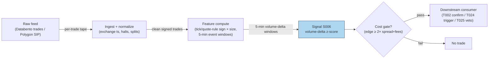

### S12. Sources

- Chordia, T. & Subrahmanyam, A. (2004). "Order Imbalance and Individual Stock Returns:
  Theory and Evidence." *Journal of Financial Markets*, 7(2), 111–130.
  https://papers.ssrn.com/sol3/papers.cfm?abstract_id=354122
- Chordia, T., Roll, R. & Subrahmanyam, A. (2002). "Order imbalance, liquidity, and
  market returns." *Journal of Financial Economics*, 65(1), 111–130.
  https://dl.icdst.org/pdfs/files/910bb6cf2390c9809f5ddc743b83ff92.pdf
- Evans, M. D. D. & Lyons, R. K. (2002). "Order Flow and Exchange Rate Dynamics."
  *Journal of Political Economy*, 110(1), 170–180.
  https://ideas.repec.Org/a/ucp/jpolec/v110y2002i1p170-180.html
- Hasbrouck, J. (1991). "Measuring the Information Content of Stock Trades."
  *Journal of Finance*, 46(1), 179–207.
  http://ideas.repec.org/a/bla/jfinan/v46y1991i1p179-207.html
- Kyle, A. S. (1985). "Continuous Auctions and Insider Trading." *Econometrica*,
  53(6), 1315–1335. (Theoretical origin; report citation, no URL verified.)

**Chatbot source log:** chatbot answers pending (checked 2026-09-10) — grok-answers.md
and cursor-answers.md were absent from batches/SB1/.

**Unverified leads**
- Cont, R., Kukanov, A. & Stoikov, S. — "The Price Impact of Order Book Events"
  (reported arXiv:1011.6402 in the batch question log; not independently verified by
  this chapter) — relevant to the OFI price-impact regression variant.

---

## Stage 8/200 — S008: VPIN (flow toxicity)

*Batch SB1 · Signal 8/100 · Provenance [D] · Family A — Microstructure & order flow*

### S1. One-line verdict

| | |
|---|---|
| **What it is** | Volume-clocked buy/sell imbalance averaged over buckets — a real-time proxy for how "toxic" (adversely selective) order flow is. |
| **When it works** | As a regime gate: widening quotes / cutting size when toxicity spikes keeps market-making books alive through stress episodes. |
| **When it dies** | As a directional trigger: it has no documented directional edge, and its famous flash-crash prediction did not survive replication. |
| **Build-or-buy in one line** | Build: fifty lines on a trade tape; the classification choice matters more than the code. |

Provenance **[D]** (documented) — the construction below follows Easley, López de Prado &
O'Hara's published VPIN specification, with the documented critiques carried alongside.
Family **A — Microstructure & order flow**.

> Standing caveat for this chapter: VPIN is a **toxicity/regime gate, not a standalone
> directional trigger**. Nothing in the replicated literature supports trading its level
> for direction; the honest use is defensive — quoting, sizing, and stand-down rules.

### S2. How it works — plain human explanation

A market maker is an insurance company that doesn't get to underwrite. All day, strangers
arrive wanting to trade; some are uninformed (rebalancing, noise), some know something the
maker doesn't. When the informed share of flow is high, the maker systematically loses —
this is **adverse selection**, and Easley–O'Hara's word for its intensity is **flow toxicity**.
The problem: toxicity isn't observable trade by trade. VPIN is an attempt to see it in the
rear-view mirror fast enough to act.

The trick is the clock. In calendar time, a frantic minute and a dead minute look the same
length; in **volume time**, each "bucket" holds the same number of shares, so buckets
arrive fast when the market is frantic and slow when it's dead — automatically adjusting
for pace. Inside each bucket, the bar's volume is split into buy volume and sell volume
(**bulk volume classification**, BVC, from the bar's own price change — the last print
of the bar versus the last print of the previous bar). If buys and sells
roughly balance, flow looks uninformed; if one side dominates bucket after bucket, someone
may know something. VPIN averages that one-sidedness over a rolling window of buckets.

Vignette: 10:15, ES futures. The last four 50,000-contract buckets printed imbalances of
31%, 8%, 44%, 12% — VPIN ≈ 0.24, elevated. The desk's rule (*example — not an institutional
standard*): above 0.30, halve quote size and widen the spread by 50%. At 10:31 a macro
headline hits; the desk is already small. Whether the headline was "predicted" is
irrelevant — the book survived because it was defensive when flow looked toxic. That is
the entire honest bull case for VPIN.

**Mental model (3 bullets):**
- VPIN measures *one-sidedness of flow in volume time* — a proxy for the probability
  you're trading against someone better informed.
- It is defensive infrastructure (a smoke detector), not an offensive weapon (a compass):
  it tells you when to be careful, never which way to bet.
- Its value lives or dies on the classification step: garbage buy/sell splits in,
  garbage toxicity out.

### S3. The math — exact formula

Partition the tape into **equal-volume buckets** $\tau = 1, 2, \dots$, each holding
$V$ shares (Easley–López de Prado–O'Hara's default: $V = \mathrm{ADV}/50$, i.e. 50
buckets per day — *example — not an institutional standard*).

**Bulk volume classification (BVC) — at the bar level:** for volume bar $\tau$ with
price change $\Delta P_\tau = P_{\text{last},\tau} - P_{\text{last},\tau-1}$
(last trade price of the bar versus the previous bar's) and $\sigma_{\Delta P}$
the recent std of bar price changes:
$$V^B_\tau = V \, \Phi\!\left(\frac{\Delta P_\tau}{\sigma_{\Delta P}}\right),
\qquad V^S_\tau = V - V^B_\tau$$
where $\Phi$ is the standard normal CDF. (A rising bar allocates most of its
volume to buys; a flat bar splits 50/50.) Every bucket holds exactly $V$
shares by construction — a trade straddling a bucket boundary is split across
the two buckets (ELO convention) — so the rolling denominator below is exactly
$n \cdot V$, not an approximation.

**Per-bucket order imbalance:**
$$\mathrm{OI}_\tau = \big|V^B_\tau - V^S_\tau\big|$$

**VPIN** over a rolling window of $n$ buckets (ELO default $n = 50$ — *example*):
$$\mathrm{VPIN}_t = \frac{\sum_{\tau=t-n+1}^{t} \mathrm{OI}_\tau}{n \cdot V}$$

This is a $[0,1]$ number: 0 = perfectly balanced flow, 1 = every bucket one-sided.

**Causal timing:** bucket $\tau$ closes when its $V$-th share prints; VPIN at that moment
uses only closed buckets; any defensive action applies to buckets $\tau+1$ onward —
never retroactively.

| Parameter | Symbol | Typical range | Too small | Too large | Default (example) |
|---|---|---|---|---|---|
| Bucket size | $V$ | ADV/100 – ADV/20 | noisy OI, whipsaw gates | sluggish; stress is over before the gate fires | ADV/50 *example — not an institutional standard* |
| Rolling window | $n$ | 10–100 buckets | single toxic bucket dominates | dilutes the signal into irrelevance | 50 buckets *example* |
| Toxicity threshold | $\kappa$ | 0.2–0.5 | permanent stand-down | never fires | 0.30 *example — not an institutional standard* |
| Classification | — | BVC / tick rule / quote rule | BVC smears midpoint noise (see critiques) | — | BVC per ELO; tick rule as robustness check |

**Normalization choices:** VPIN is already normalized to $[0,1]$ by construction; cross-asset
comparison still needs care because "normal" VPIN differs by venue and ADV share.
**Variants:** (1) **TR-VPIN** — tick-rule classification instead of BVC (Andersen–Bondarenko
show the choice flips behavior); (2) quote-rule VPIN on L1 data; (3) multi-asset / futures
VPIN on the most liquid venue as a market-wide stress gauge.

### S4. Worked example — step-by-step numbers (SYNTHETIC)

**Synthetic** 10-bucket tape, random seed 7 (bar-level BVC;
$\sigma_{\Delta P} = 0.04417$ = std of the 10 bar price changes, ddof=1).
Every bucket holds **exactly 500 shares** — boundary-straddling trades are
split per the ELO convention. Same data as the S11 chart.

| Bucket | $V$ (shares) | $\Delta P_\tau$ (\$) | $\Phi(\Delta P_\tau/\sigma)$ | $V^B$ | $V^S$ | $\|\mathrm{OI}\|$ | $\|\mathrm{OI}\|/V$ |
|---|---|---|---|---|---|---|---|
| 1 | 500 | −0.030 | 0.2485 | 124.3 | 375.7 | 251.5 | 0.503 |
| 2 | 500 | +0.010 | 0.5896 | 294.8 | 205.2 | 89.6 | 0.179 |
| 3 | 500 | −0.100 | 0.0118 | 5.9 | 494.1 | 488.2 | 0.976 |
| 4 | 500 | −0.020 | 0.3254 | 162.7 | 337.3 | 174.6 | 0.349 |
| 5 | 500 | −0.080 | 0.0351 | 17.5 | 482.5 | 464.9 | 0.930 |
| 6 | 500 | −0.020 | 0.3254 | 162.7 | 337.3 | 174.6 | 0.349 |
| 7 | 500 | +0.000 | 0.5000 | 250.0 | 250.0 | 0.0 | 0.000 |
| 8 | 500 | −0.010 | 0.4104 | 205.2 | 294.8 | 89.6 | 0.179 |
| 9 | 500 | +0.040 | 0.8174 | 408.7 | 91.3 | 317.4 | 0.635 |
| 10 | 500 | +0.030 | 0.7515 | 375.7 | 124.3 | 251.5 | 0.503 |

**Step 1 — classify (bar level).** Each bar's whole 500-share volume is split by
a single $\Phi$ evaluation on the bar's price change; e.g. bucket 3's bar fell
\$0.10: $\Phi(-0.10/0.04417) = \Phi(-2.26) = 0.0118$, so only 5.9 of its 500
shares classify as buys. Bucket 7's bar was flat ($\Delta P = 0.000$): a perfect
250/250 split.

**Step 2 — bucket imbalance.** $|\mathrm{OI}_3| = |5.9 - 494.1| = 488.2$ shares,
ratio $488.2/500 = 0.976$ — the most one-sided bucket.

**Step 3 — rolling VPIN ($n=4$, *example*).** The denominator is exactly
$4 \times 500 = 2000$ in every window:
- ending bucket 4: $(251.5+89.6+488.2+174.6)/2000 = 1003.9/2000 = \mathbf{0.5019}$
- ending bucket 5: $1217.3/2000 = \mathbf{0.6087}$
- ending bucket 6: $1302.3/2000 = \mathbf{0.6512}$
- ending bucket 7: $814.1/2000 = \mathbf{0.4071}$
- ending bucket 8: $729.1/2000 = \mathbf{0.3646}$
- ending bucket 9: $581.6/2000 = \mathbf{0.2908}$
- ending bucket 10: $658.5/2000 = \mathbf{0.3292}$

**Step 4 — gate decision.** Against an *example* toxicity threshold $\kappa = 0.30$
(*example — not an institutional standard*): the gate **fires** from bucket 4
through bucket 8 (readings 0.50 → 0.65 → 0.41 → 0.36), stands down at bucket 9
(0.29), and re-fires at bucket 10 (0.33).

**What to notice (and the limits):** VPIN here behaves exactly as designed — a smooth,
lagging average of one-sidedness that rises into the toxic patch and decays after. But
notice what it *doesn't* do: it says nothing about direction (buckets 1–6 were
sell-classified, yet the series gives no short signal — correctly, per the caveat).
And now the sharper lesson: this toy tape has **no informed traders at all** — just a
random walk whose bar closes happened to cluster downward in buckets 1–6 — yet VPIN
spikes to 0.65 and the gate fires for five straight buckets. That is precisely
Andersen–Bondarenko's warning: bar-level BVC misclassifies in fast markets, the errors
correlate with volume and volatility, and the result is manufactured "toxicity." A gate
that fires on sampling noise is a gate that costs you fills — which is why this chapter
insists on the BVC-vs-tick-rule robustness check on your own venue before any
deployment. This toy has no fees and no latency; the "toxicity" is pure noise.

### S5. Strategies that use this signal

- **T003 — VPIN-Gated Breakout Trader** — regime gate (primary control): breakouts are
  taken only when VPIN is below the toxicity cap; the gate is the strategy's core risk control.
- **T022 — Queue-Imbalance Maker with Toxicity Cancel** — veto: resting quotes are
  cancelled when VPIN spikes (defensive exit from adverse selection).
- **T005 — RVOL (relative volume)-Filtered Opening-Range Breakout** — filter: ORB entries are skipped
  when opening flow prints toxic.

### S6. Data required — exact spec

| Field | Type | Granularity | Source tier | Notes |
|---|---|---|---|---|
| Trade price | float | per-trade | Tier 0–2 | BVC needs the full price path, not just closes |
| Trade size | int | per-trade | Tier 0–2 | bucketing is by shares |
| (Optional) bid/ask | float | per-trade as-of | Tier 1–2 | only for tick/quote-rule robustness variants |

**Collection:** Databento trades, Polygon stocks v3, Alpaca SIP, or TAQ — VPIN needs
nothing fancier than a trade tape with price and size, which is why it became popular.
**Ingest sketch (≤20 lines, polars):**

```python
import polars as pl
from math import erf, sqrt
Phi = lambda x: 0.5 * (1 + erf(x / sqrt(2)))
tape = pl.scan_parquet("trades_*.parquet").sort("ts").collect()
V = int(tape["size"].sum() / 50)            # bucket size = ADV/50 (example)
tape = split_at_boundaries(tape, V)          # 1: split straddling trades: every bucket = V
tape = tape.with_columns(bucket=(tape["size"].cum_sum() // V).cast(pl.Int64))
b = (tape.group_by("bucket")                 # 2: one row per volume bar
         .agg(plast=pl.col("price").last()).sort("bucket"))
sig = b["plast"].diff().std()                # 3: std of BAR price changes
b = b.with_columns(dp=pl.col("plast").diff(),
                   frac=0.5 * (1 + pl.col("plast").diff()
                               .map_elements(lambda d: erf(d / sig / sqrt(2)))))
b = b.with_columns(vb=V * pl.col("frac"),                 # 4: bar-level BVC
                   oi=(2 * V * pl.col("frac") - V).abs())  #    |Vbuy - Vsell|
vpin = (b["oi"].rolling_sum(50) / (50 * V)).alias("vpin")  # n=50 example
```

**Storage:** trade tape ≈ 2–8 GB parquet per symbol-day for liquid names
(per `notes/cost-model.md` §4); the VPIN series itself is one float per bucket —
negligible. **Data-quality checklist:** exchange (not SIP-receipt) timestamps so
buckets close in true event order; corporate actions adjusted; halts excluded
(buckets spanning a halt mix regimes); DST/half-days rescale ADV; odd-lot and
late-reported prints flagged; BVC validated against tick-rule on a sample —
if the two disagree violently, trust neither blindly.

### S7. Local build on M5 Max / 128GB

**Feasibility: feasible, near-trivial compute (Tier M for the pipeline).** VPIN is
arithmetic over a trade tape — per `notes/cost-model.md` §2, a Python loop at
~100–500k events/sec covers ≤20 symbols live, and polars batch recomputation
(10–50M rows/sec) handles a full day's tape for hundreds of symbols in seconds.
Liquid-name trade flow is only ~10–200 trades/sec busy (§2); the bottleneck is
**feed handling and bucket bookkeeping**, not math. **RAM:** one symbol-day of trades
≈ 0.5–4 GB (§3) — keep the live window to the trailing day or two per symbol and
archive the rest; 500 symbols × 60 days of raw trades **does not fit** (§3), so
research history lives as per-symbol parquet or pre-aggregated bucket series.
**Stack:** Python+polars for research and live single-book; Rust only if VPIN must
share an event loop with heavier L1 signals; DuckDB for tape forensics.

**Engineering:** Tier M, 20–60 h (`notes/cost-model.md` §5) — the formula is an
afternoon; the hours go to the BVC-vs-tick-rule validation harness, the gate
integration (quote-widening / size-cutting / kill-switch wiring), and regime
bookkeeping. At $150/hr loaded: **$3,000–9,000** *loaded-cost estimate*, plus a
Tier-1 feed ~$30–200/mo *indicative — verify before budgeting*.
**What breaks first at 500 symbols:** bucket bookkeeping across 500 tapes
(the BVC step itself is one $\Phi$ evaluation per bucket — trivial); at full OPRA scale, the trade tape itself.

### S8. Buy vs build

| Option | What you get | Indicative price | Gains | Loses |
|---|---|---|---|---|
| Tier-0 free (Alpaca IEX, Stooq) | Trade tape | ~$0 | prototype the gate for free | IEX-only flow mis-measures toxicity |
| Tier-1 retail (Polygon, Alpaca SIP) | Full SIP tape | ~$30–200/mo | proper bucketing, history | SIP timestamps blur bucket edges |
| Tier-2 professional (Databento) | Exchange-stamped tape | ~$200/mo + usage | cleanest event ordering | usage cost on full-universe backfill |
| Academic (LOBSTER/TAQ via university) | Research-grade replay | ~hundreds/yr academic | best history for validation | not a production feed |

All prices *indicative — verify before budgeting* (per `notes/cost-model.md` §6).
**Verdict: build, always** — no vendor sells "your toxicity gate"; they sell the tape,
and the ELO specification is public. Buy the cheapest feed whose timestamps you trust,
spend the budget on the classification-robustness harness instead (BVC vs tick rule —
Andersen–Bondarenko show this choice is the whole ballgame).

### S9. Success ratio / efficacy — documented evidence

| Study / source | Market & period | Metric | Before/after cost | Caveat |
|---|---|---|---|---|
| Easley, López de Prado & O'Hara (2012), "Flow Toxicity and Liquidity in a High-Frequency World" | E-mini S&P 500, incl. May 6 2010 | VPIN hit historic highs ~1h before the flash crash; correlated with short-term volatility | n/a (not a strategy; event study) | Single-venue, single-event narrative; BVC-based |
| Andersen & Bondarenko (2014), "VPIN and the Flash Crash" | E-mini S&P 500 | VPIN is a **poor** predictor of short-run volatility; did **not** peak before the flash crash but after; predictive content is mechanical (correlates with trading intensity) | n/a (replication study) | Directly contradicts the ELO flash-crash claim |
| Andersen & Bondarenko (2015), "Assessing Measures of Order Flow Toxicity…" | E-mini S&P 500, CME BBO "perfect" classification | BVC classification inferior to a simple tick rule; with accurate classification VPIN behaves oppositely; BVC-VPIN's volatility-forecast power comes from **classification errors** correlated with volume/volatility | n/a (measurement study) | Devastating for BVC-VPIN as a toxicity measure |
| Yildiz, Van Ness & Van Ness (2020), "VPIN, liquidity, and return volatility in the U.S. equity markets" | US equities | VPIN informative about liquidity and return volatility **ex ante**; useful risk-management tool for market makers/regulators | n/a (forecasting regressions, not a strategy) | Supportive but modest; risk-tool framing, not alpha |

No checkable source was found reporting a Sharpe, hit rate, or basis points (bps)
per trade for a VPIN
strategy — before *or* after cost. The literature tests VPIN as a volatility/liquidity
forecaster, never as a directional trigger, which is exactly why this chapter refuses
to present it as one.

**Honest bottom line:** as a standalone directional trigger this is a *zero-documented*
edge — do not trade it for direction; as a **toxicity/regime gate** for quoting and
sizing it is a *plausible, cheap, contested* risk control — the supportive evidence
(Yildiz et al. 2020) and the hostile replications (Andersen–Bondarenko 2014/2015) both
deserve weight, and any deployment should reproduce the BVC-vs-tick-rule check on its
own venue before trusting the gate.

### S10. Failure modes & pitfalls

1. **Classification error (the big one)** — BVC systematically misclassifies in fast
   markets, and the errors correlate with volatility, manufacturing fake "toxicity".
   *Mitigation:* run tick-rule VPIN in parallel; if they disagree, investigate before gating.
2. **Treating it as directional** — high VPIN does not mean "price will fall/rise".
   *Mitigation:* wire it only to sizing/quoting/stand-down logic, never to entries.
3. **Mechanical correlation with intensity** — VPIN rises when volume rises, so it
   "predicts" volatility the way a speedometer "predicts" arrival. *Mitigation:*
   benchmark the gate against a raw volume/intensity gate; keep whichever earns its keep.
4. **Parameter fragility** — bucket size and window are *examples*, not standards; results
   move with them. *Mitigation:* fix from ELO defaults, sensitivity-test ±2×, don't optimize.
5. **Stale ADV** — bucket size from last month's ADV mis-buckets this week's regime.
   *Mitigation:* rolling ADV estimate; re-bucket on corporate actions and volume regime shifts.
6. **Latency** — a toxicity gate computed on a delayed feed fires after the damage.
   *Mitigation:* measure feed delay; the gate's reaction time must beat your quote lifetime.
7. **Overfitting the threshold** — tuning $\kappa$ on the flash crash is a one-observation fit.
   *Mitigation:* threshold from out-of-sample stress episodes; prefer smooth size-scaling
   over binary stand-down.
8. **False comfort** — a low VPIN does not mean flow is safe, only that it was balanced.
   *Mitigation:* keep independent risk limits (S088-style); VPIN is one input, not the book.

### S11. Visuals


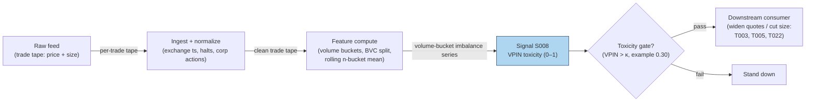

### S12. Sources

- Easley, D., López de Prado, M. M. & O'Hara, M. (2012). "Flow Toxicity and Liquidity
  in a High-Frequency World." *Review of Financial Studies*, 25(5), 1457–1493.
  (Working-paper version) http://www.stern.nyu.edu/sites/default/files/assets/documents/con_035928.pdf
- Andersen, T. G. & Bondarenko, O. (2014). "VPIN and the Flash Crash." *Journal of
  Financial Markets*, 17, 1–46. https://ideas.repec.Org/a/eee/finmar/v17y2014icp1-46.html
- Andersen, T. G. & Bondarenko, O. (2015). "Assessing Measures of Order Flow Toxicity
  and Early Warning Signals for Market Turbulence." *Review of Finance*, 19(1), 1–54.
  https://ideas.repec.Org/a/oup/revfin/v19y2015i1p1-54..html
- Yildiz, S., Van Ness, B. & Van Ness, R. (2020). "VPIN, liquidity, and return
  volatility in the U.S. equity markets." *Global Finance Journal*, 45.
  https://ideas.repec.org/a/eee/glofin/v45y2020ics1044028318302679.html

**Chatbot source log:** chatbot answers pending (checked 2026-09-10) — grok-answers.md
and cursor-answers.md were absent from batches/SB1/.

**Unverified leads**
- Practitioner claims that VPIN "predicted" various post-2010 stress episodes circulate
  in vendor marketing; no checkable replication was found — treated as unverified.

---

## Stage 14/200 — S014: Quoted / effective / realized spread & price-impact decomposition

*Batch SB1 · Signal 14/100 · Provenance [D] · Family A — Microstructure & order flow*

### S1. One-line verdict

| | |
|---|---|
| **What it is** | Per-trade measurement of what liquidity actually cost: quoted vs paid vs kept, split into realized profit and adverse selection. |
| **When it works** | Always — as a cost gate and diagnostic: it tells you which trades, venues, and times are too expensive to touch. |
| **When it dies** | As a directional signal: it measures cost, not alpha; wide spreads predict nothing about direction. |
| **Build-or-buy in one line** | Build the estimator on your own tape; buy Rule 605/TAQ benchmarks to calibrate it. |

Provenance **[D]** (documented) — the decomposition follows the published Huang–Stoll /
Glosten–Harris family and SEC MIDAS conventions. Family **A — Microstructure & order flow**.

### S2. How it works — plain human explanation

Three prices describe every trade, and confusing them is how strategies quietly bleed.
The **quoted spread** is the advertisement: at 9:47:03, AAPL shows bid 231.40 × 800 /
ask 231.41 × 300, so the quoted spread is 1 cent. The **effective spread** is what the
aggressor actually paid: if a buyer lifts the offer at 231.41 while the mid is 231.405,
she paid half a cent over mid — times two, the effective spread is 1 cent. Same here,
but often it isn't: price improvement, midpoint crosses, and odd-lot prints routinely
make effective spreads narrower (or wider) than quoted.

The **realized spread** asks the harder question: of that 1 cent the liquidity provider
collected, how much did she *keep*? If the mid drifts up to 231.415 five minutes later —
because the buyer knew something — the provider's "profit" evaporates: realized spread
near zero (or negative), and the difference went to **price impact**, i.e. adverse
selection. The identity is clean:

> **effective spread = realized spread + price impact**

Why does this matter economically? The quoted spread is what naive cost models charge;
the effective spread is what you actually pay; the realized spread is what a
market-making strategy actually earns; and price impact is the permanent information
content of flow — the part no liquidity provider can avoid. Huang & Stoll (1997) showed
the spread decomposes into order-processing, inventory, and adverse-selection
components; the realized/impact split is the practitioner's version of the same idea,
computable trade by trade. Every strategy in this document that pays the spread is
implicitly betting its edge exceeds the effective spread — this signal is how you check.

**Mental model (3 bullets):**
- Quoted = advertised; effective = paid; realized = kept. Never substitute one for another.
- Effective − realized = price impact = the adverse-selection tax on every aggressive trade.
- This is a *measurement* signal: its job is costing trades and gating strategies, not
  predicting direction.

### S3. The math — exact formula

For a trade at time $t$ with price $P_t$, prevailing quotes $P^b_t$ (bid), $P^a_t$ (ask),
mid $M_t = (P^b_t + P^a_t)/2$, and direction $D_t \in \{+1,-1\}$ ($+1$ = buyer-initiated):

**Quoted spread** (dollars; half-spread in basis points (bps)):
$$S^q_t = P^a_t - P^b_t, \qquad s^q_t = 100 \cdot \frac{P^a_t - P^b_t}{2 M_t}\ \text{bps}$$

**Effective spread** (what the aggressor paid vs the mid):
$$S^e_t = 2 \, D_t \, (P_t - M_t)$$

**Realized spread** (what the liquidity provider kept; $\Delta \approx$ 5 min per the
report — *example — not an institutional standard*):
$$S^r_t = 2 \, D_t \, (P_t - M_{t+\Delta})$$

**Price impact** (adverse selection; the mid's drift against the provider):
$$\mathrm{PI}_t = 2 \, D_t \, (M_{t+\Delta} - M_t) = S^e_t - S^r_t$$

All in dollars per share (multiply by 100 for cents); sign convention: positive $S^r$
means the provider profited, positive $\mathrm{PI}$ means the mid moved against the
provider (information won).

**Causal timing:** $S^e_t$ is known at trade time $t$; $S^r_t$ requires the mid at
$t+\Delta$ and is therefore a *diagnostic*, never a live trigger. A strategy gates on
*trailing averages* of these quantities, computed strictly from closed windows.

| Parameter | Symbol | Typical range | Too small | Too large | Default (example) |
|---|---|---|---|---|---|
| Realized-spread horizon | $\Delta$ | 1–30 min | noise dominates the mid move | mixes in unrelated drift | 5 min *example — not an institutional standard* |
| Aggregation window | $W$ | 30 min – 1 day | single prints dominate | stale costs | 1 trading day *example* |
| Direction rule | $D_t$ | quote rule / tick rule / LR | mis-signing flips $S^e$ sign | — | quote rule on NBBO (National Best Bid and Offer) *example* |

**Normalization choices:** dollar spreads for P&L accounting; bps of mid for cross-symbol
comparison; time-weighted vs trade-weighted vs **dollar-weighted** averaging (dollar-weight
when costing a real book). **Named variants:** (1) **Huang–Stoll (1997) three-component
regression** — $\Delta P_t = \tfrac{S}{2}(Q_t - Q_{t-1}) + (\alpha+\beta)\tfrac{S}{2}Q_t + e_t$,
splitting the spread into order-processing, inventory ($\beta$), and adverse-selection
($\alpha$) shares; (2) **Glosten–Harris (1988) trade-indicator model** — adverse selection
vs transitory (order-processing + inventory) components, with volume-dependent terms;
(3) **Roll (1984) implicit spread** $2\sqrt{-\mathrm{cov}(\Delta P_t, \Delta P_{t-1})}$ —
quote-free, for when you only have a price series (cf. S012).

### S4. Worked example — step-by-step numbers (SYNTHETIC)

**Synthetic** 12-trade tape, random seed 11. Realized spread uses the mid **3 trades
later** ($\Delta = 3$ trades — *example — not an institutional standard*; the report's
convention is $\approx$ 5 minutes). Same data as the S11 chart; cents rounded.

| # | Bid | Ask | Mid | $D$ | Price | Eff. (¢) | Real. (¢) | Impact (¢) |
|---|---|---|---|---|---|---|---|---|
| 1 | 99.990 | 100.010 | 100.000 | +1 | 100.008 | +1.52 | −0.55 | +2.07 |
| 2 | 99.992 | 100.022 | 100.007 | +1 | 100.019 | +2.40 | +1.99 | +0.42 |
| 3 | 100.008 | 100.018 | 100.013 | +1 | 100.018 | +1.01 | +2.35 | −1.34 |
| 4 | 99.996 | 100.026 | 100.011 | −1 | 99.997 | +2.64 | +2.39 | +0.26 |
| 5 | 99.999 | 100.019 | 100.009 | −1 | 99.999 | +2.09 | +2.08 | +0.01 |
| 6 | 99.996 | 100.016 | 100.006 | +1 | 100.015 | +1.70 | +0.44 | +1.26 |
| 7 | 99.994 | 100.024 | 100.009 | −1 | 99.995 | +2.85 | +1.69 | +1.16 |
| 8 | 99.994 | 100.024 | 100.009 | +1 | 100.025 | +3.29 | +2.82 | +0.47 |
| 9 | 99.998 | 100.028 | 100.013 | −1 | 99.997 | +3.12 | +2.74 | +0.38 |
| 10 | 99.993 | 100.013 | 100.003 | −1 | 99.995 | +1.78 | +3.93 | −2.15 |
| 11 | 99.996 | 100.026 | 100.011 | −1 | 99.998 | +2.58 | +3.03 | −0.45 |
| 12 | 99.996 | 100.026 | 100.011 | +1 | 100.025 | +2.92 | +2.75 | +0.16 |

**Step 1 — effective.** Trade 2: $D=+1$, $P=100.019$, $M=100.007$:
$S^e = 2(100.019-100.007) = +0.0240$ = **+2.40¢** — the buyer paid 2.40¢ round-trip
equivalent, wider than the 3.0¢ quoted spread's half (1.5¢) because of the slippage noise.

**Step 2 — realized.** Trade 2's mid 3 trades later (trade 5's mid) $= 100.009$:
$S^r = 2(P - M_{t+\Delta}) = 2(100.019-100.009) = +0.0200$ ≈ **+1.99¢** in the
table (internal mids carry more decimals than printed) — the provider kept
about two cents of the 2.40¢ the taker paid.

**Step 3 — impact.** $\mathrm{PI} = S^e - S^r = 2.40 - 1.99 = \mathbf{+0.41¢}$
(≈ +0.42¢ in the table) — equivalently $2(M_{t+\Delta} - M_t) = 2(100.009-100.007)$:
the mid barely drifted against the provider.

**Step 4 — averages.** Mean effective **+2.33¢**, mean realized **+2.14¢**, mean
impact **+0.19¢**: in this toy tape, liquidity providers collected 2.33¢ per share
and kept 2.14¢ — only 0.19¢ leaked to adverse selection.

**What to notice (and the limits):** the stacked chart makes the identity visual —
every bar's total height is the effective spread, split into kept (green) vs lost to
impact (red). Two honest artifacts of toy data: three price impacts are *negative*
(trades 3, 10, 11: −1.34¢, −2.15¢, −0.45¢ — the mid moved in the provider's
favor after the trade; pure noise here), and trade 1's realized spread is negative
(−0.55¢: the provider lost on that round trip). In real data, persistently negative
realized spreads flag toxic flow; here it's just the random walk. Real tapes also show
price improvement (effective < quoted) far more often than this one. And again: no
fees, no latency, twelve trades — this is arithmetic practice, not a cost study.

### S5. Strategies that use this signal

- **T028 — Spread-Decomposition Router** — primary trigger: routes and holds based on
  quoted/effective/realized spread and the adverse-selection component — this signal
  *is* the strategy's decision variable.
- **T002 — Microprice Fair-Value Scalper** — cost gate (filter): the scalp is taken
  only when the trailing effective spread is below the edge — spread decomposition as veto.
- **T034 — Index Futures Cash-and-Carry** — cost check (filter): basis trades clear
  only after spread-cost accounting on both legs.

### S6. Data required — exact spec

| Field | Type | Granularity | Source tier | Notes |
|---|---|---|---|---|
| Trade price & size | float / int | per-trade event | Tier 0–2 | |
| Prevailing NBBO bid/ask | float | per-trade, as-of (≤1 min old per HS convention) | Tier 1–2 | staleness is the #1 error source |
| Trade direction | ±1 | per-trade | derived | quote rule preferred; tick rule fallback |
| Delayed mid | float | $t+\Delta$ | derived | needs the quote tape, not just trades |

**Collection:** Databento MBP-1 (trades + top-of-book), TAQ, or Polygon SIP; Rule 605
reports give venue-level effective-spread benchmarks for calibration. **Ingest sketch
(≤20 lines, polars):**

```python
import polars as pl
t = pl.scan_parquet("trades_nbbo_*.parquet").sort("ts").collect()  # ts,P,bid,ask
t = t.with_columns(mid=(pl.col("bid") + pl.col("ask")) / 2)
t = t.with_columns(D=pl.when(pl.col("P") >= pl.col("mid")).then(1).otherwise(-1))  # quote rule
DELTA = "5m"   # example — not an institutional standard
t = t.with_columns(mid_fwd=pl.col("mid").shift(-1))  # align: use asof join on ts+Δ in prod
out = t.with_columns(
    eff=2 * pl.col("D") * (pl.col("P") - pl.col("mid")),
    impact=2 * pl.col("D") * (pl.col("mid_fwd") - pl.col("mid")),
).with_columns(rlzd=pl.col("eff") - pl.col("impact"))
```

(Production code replaces the naive `shift` with an as-of join of each trade's
$ts + \Delta$ against the quote tape.)

**Storage:** trades+NBBO ≈ 2–8 GB parquet per symbol-day liquid (`notes/cost-model.md`
§4); aggregated daily spread panels are megabytes. **Data-quality checklist:**
NBBO as-of each trade (never the *next* quote — lookahead); crossed/locked markets
excluded; corporate actions adjusted; halts dropped; odd-lot and sub-penny prints
flagged (they distort effective spreads); SIP-vs-exchange timestamp choice documented;
$\Delta$-horizon kept constant across the sample.

### S7. Local build on M5 Max / 128GB

**Feasibility: feasible (Tier M).** Per-trade arithmetic over a trades+quotes tape —
`notes/cost-model.md` §2 gives polars simple ops at ~10–50M rows/sec, so a full day's
L1 tape for one symbol decomposes in seconds; a Python loop (~100–500k events/sec)
sustains live decomposition for ≤20 symbols. The real work is the as-of join of
trades to NBBO and to the $t+\Delta$ mid — both are sorted merge-asof operations,
cheap in polars. Bottleneck is **I/O on the quote tape**, not compute. **RAM:** one
symbol-day of trades+touch quotes ≈ 0.5–4 GB (§3); 500 symbols × 60 days **does not
fit** (§3) — research on per-symbol daily files, live on a trailing window.
**Stack:** Python+polars for research and live; DuckDB when the tape already lives in
parquet and you want SQL as-of joins; Rust only if this shares a hot loop with
full-depth signals.

**Engineering:** Tier M, 20–60 h (`notes/cost-model.md` §5) — the formulas are an
hour; the as-of alignment harness, direction-rule validation, and Rule 605
calibration are the project. At $150/hr loaded: **$3,000–9,000** *loaded-cost
estimate*, plus Tier-1/2 data ~$30–200/mo (SIP) or ~$200/mo + usage (Databento)
*indicative — verify before budgeting*. **What breaks first at 500 symbols:**
the $t+\Delta$ as-of join across a sharded quote store (pre-aggregate to daily
panels); full OPRA adds the options-tape join.

### S8. Buy vs build

| Option | What you get | Indicative price | Gains | Loses |
|---|---|---|---|---|
| Tier-0 free (Alpaca IEX, Stooq) | Trades only | ~$0 | free prototyping | no NBBO → no effective spread |
| Tier-1 retail (Polygon, Alpaca SIP) | SIP trades + NBBO | ~$30–200/mo | full decomposition possible | SIP quote staleness widens error bars |
| Tier-2 professional (Databento MBP-1) | Exchange trades+quotes | ~$200/mo + usage | cleanest as-of alignment | usage meter on backfills |
| Benchmark route (Rule 605 reports, TAQ) | Published effective/realized spreads | ~$0 (605) / institutional $$$ (TAQ) | calibrate your estimator for free (605) | 605 is monthly, venue-level, not per-trade |

All prices *indicative — verify before budgeting* (per `notes/cost-model.md` §6).
**Verdict: build the estimator, buy the calibration** — the formulas are public and
ten lines long; what you can't build is someone else's venue-level benchmark, so
pull Rule 605 effective spreads (free) and require your estimates to track them.
Crossover: if your backtest's cost assumption ever disagrees with your measured
effective spread by more than ~20%, stop and reconcile before trading.

### S9. Success ratio / efficacy — documented evidence

This signal's "efficacy" is measurement quality and cost discipline, not directional
alpha — the honest evidence table reflects that:

| Study / source | Market & period | Metric | Before/after cost | Caveat |
|---|---|---|---|---|
| Huang & Stoll (1997), "The Components of the Bid-Ask Spread: A General Approach" | NYSE | Two-component split: order processing ≈ 88.6% of spread on large stocks; adverse selection + inventory the smaller remainder; components vary with trade size | n/a (structural estimation) | Large-cap 1990s sample; upstairs market effects |
| Glosten & Harris (1988), "Estimating the Components of the Bid/Ask Spread" | NYSE 1981–1983 | Spread splits into asymmetric-information vs transitory (order-processing + inventory); cannot reject significant information component | n/a (structural estimation) | Old sample; no volume interaction in base model |
| Goyenko, Holden & Trzcinka (2009), "Do liquidity measures measure liquidity?" | US equities, TAQ + Rule 605 benchmarks | Effective/realized-spread measures win the majority of horseraces against spread proxies | n/a (measurement horserace) | Validates the *measures*, not a strategy |
| Practitioner convention (SEC MIDAS / Rule 605) | US equities, ongoing | Effective spread is the regulatory-standard transaction-cost metric | **After-cost by construction** (it *is* the cost) | Monthly/venue-level granularity |

Regimes where it fails as a gate: it is backward-looking — a trailing realized spread
does not warn you that *this* trade is toxic (that's S008's job); during opens, closes,
and news, spreads gap faster than trailing windows adapt. Documented decay: none —
it's accounting, not alpha — but its *components* drift with market structure
(decimalization, tick-size pilot, retail wholesaler price improvement).

**Honest bottom line:** as a standalone directional trigger this is a *null* edge by
design — it was never meant to predict; as a **cost gate and strategy diagnostic**
it is *essential infrastructure*: any intraday strategy chapter in this document that
cannot state its edge net of measured effective spread is not a strategy, it's a hope.

### S10. Failure modes & pitfalls

1. **Quoted/effective confusion** — backtesting with quoted spreads when you pay effective
   (or vice versa). *Mitigation:* always simulate with measured effective spreads (S014);
   quoted is an upper bound, not a cost.
2. **Stale-quote as-of** — joining trades to quotes from the wrong millisecond flips
   $D_t$ and the sign of $S^e$. *Mitigation:* exchange timestamps, as-of (never after),
   drop locked/crossed intervals.
3. **Lookahead in realized spread** — using $M_{t+\Delta}$ as a *live* input.
   *Mitigation:* realized spread is diagnostic-only; live gates use trailing closed windows.
4. **Wrong $\Delta$** — 1-minute realized spread is noise; 30-minute mixes in drift.
   *Mitigation:* fix $\Delta$ = 5 min (*example*), sensitivity-test; match the strategy's
   holding horizon.
5. **Ignoring price improvement** — retail/wholesaler flow prints inside the spread;
   assuming full quoted spread overstates costs. *Mitigation:* measure effective, don't assume.
6. **Survivorship/venue bias** — SIP NBBO misses inverted and venue-specific quotes.
   *Mitigation:* calibrate against Rule 605 venue reports; note the gap.
7. **Cost blowup** — strategies whose gross edge is a fraction of the effective spread
   (the classic S4 arithmetic: +0.49 bps predicted vs 2.33¢ ≈ multi-bps cost).
   *Mitigation:* hard gate — no trade unless modeled edge ≥ 2× measured round-trip cost.
8. **Overfitting the decomposition** — tuning $\Delta$, windows, and direction rules to
   make a favored strategy's costs look small. *Mitigation:* fix conventions up front;
   report both quote-rule and tick-rule variants.

### S11. Visuals


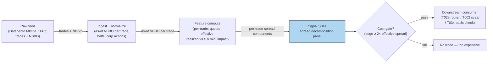

### S12. Sources

- Huang, R. D. & Stoll, H. R. (1997). "The Components of the Bid-Ask Spread: A
  General Approach." *Review of Financial Studies*, 10(4), 995–1034.
  https://ideas.repec.Org/a/oup/rfinst/v10y1997i4p995-1034.html
- Glosten, L. R. & Harris, L. E. (1988). "Estimating the Components of the Bid/Ask
  Spread." *Journal of Financial Economics*, 21(2), 123–142.
  https://business.columbia.edu/faculty/research/estimating-components-bidask-spread
- Goyenko, R. Y., Holden, C. W. & Trzcinka, C. A. (2009). "Do liquidity measures
  measure liquidity?" *Journal of Financial Economics*, 92(2), 153–181.
  https://EconPapers.repec.org/article/eeejfinec/v_3a92_3ay_3a2009_3ai_3a2_p_3a153-181.htm
- U.S. SEC MIDAS / Rule 605 conventions — effective spread as the regulatory
  transaction-cost metric (market-structure reference; no single paper).

**Chatbot source log:** chatbot answers pending (checked 2026-09-10) — grok-answers.md
and cursor-answers.md were absent from batches/SB1/.

**Unverified leads**
- Roll, R. (1984) implicit-spread estimator mentioned as a variant (S012's home
  chapter); not independently sourced here.

---

## Stage 24/200 — S024: VWAP cross & anchored-VWAP continuation

*Batch SB1 · Signal 24/100 · Provenance [SR] · Family B — Intraday momentum & breakout*

### S1. One-line verdict

| Field | Detail |
|---|---|
| **What it is** | A sustained close above (below) session or anchored VWAP on rising volume = institutions have re-accepted value higher (lower); ride it. |
| **When it works** | Trend days with heavy institutional flow: price crosses VWAP early, volume confirms, and price holds the line for several bars. |
| **When it dies** | Choppy range days: price flickers across VWAP repeatedly, volume is thin, and every cross is a whipsaw. |
| **Build-or-buy in one line** | Build the indicator yourself (trivial math); buy a clean 1-min consolidated feed — the edge, if any, is in data hygiene, not the formula. |

Provenance **[SR]** (standard reconstruction): VWAP-cross continuation is a practitioner convention — the exact participation-vs-fade logic inside bank execution algos is proprietary, and no public paper defines a canonical cross rule with published performance. [SR] is **not** upgraded here.

### S2. How it works — plain human explanation

It is 9:36, AAPL. Bid 231.40 × 800, ask 231.41 × 300, and session VWAP — every share traded since 9:30, volume-weighted — sits at 231.28. Price has chopped around it since the open. Now 25,000-share prints hit at 231.40, then 231.44. The next three one-minute bars all close above the rising VWAP, each on larger volume than the last.

A VWAP cross is a bet about *whose* flow is moving the tape. Large desks benchmark execution to VWAP — Berkowitz, Logue & Noser (1988) established it as the institutional transaction-cost benchmark. If price holds above VWAP on rising volume, the institutions buying today are paying up versus their benchmark, and the ones still working orders are incentivized to keep buying into strength: their mandate is "beat VWAP," not "buy the cheapest tick." A sustained cross reads as a regime shift — the market accepted a new value area, and benchmarked flow defends it.

The **anchored** variant moves the anchor: session VWAP starts at the open, but a 10:15 FDA headline is a better anchor for a pharma name. Reset the cumulative sums at the event and ask "where has value been accepted *since the news*?" Same mechanics, different starting bar.

Why should this work economically? Three forces, none mystical:

1. **Benchmarked flow is real and large.** VWAP algorithms slice parent orders across the day following the historical volume curve. When price breaks above VWAP and holds, these algos' schedules tilt toward buying (to avoid trailing their benchmark) — a mechanical, persistent bid. Choi, Larsen & Seppi (2018) model exactly this: TWAP (time-weighted average price)/VWAP order-splitting benchmarks induce predictable intraday price-pressure patterns.
2. **Value-area re-acceptance.** In auction-market terms, a sustained cross means two-sided trade is happening at the new level — it is not a single print. Volume confirmation separates "a block crossed" from "the market moved."
3. **Information revelation.** If the cross follows news, informed traders act strategically in high-volume periods (the same mechanism Gao et al. invoke for intraday momentum) — the cross is the footprint, not the cause.

**Mental model (3 bullets):**
- VWAP is the market's *agreed price so far today*; a sustained cross on volume means the agreement moved.
- The continuation is not the cross itself — it is the benchmarked flow that chases the cross. No volume, no flow, no trade.
- The mirror image (price extended *from* VWAP on fading volume) is mean reversion, not continuation — that is S040. Misclassifying the regime is the expensive mistake.

### S3. The math — exact formula

Session VWAP at bar $t$ (bars indexed from the session open, $i = 1 \dots t$):

$$
\mathrm{VWAP}_t = \frac{\sum_{i=1}^{t} TP_i \cdot V_i}{\sum_{i=1}^{t} V_i},
\qquad TP_i = \frac{H_i + L_i + C_i}{3}
$$

where $H_i, L_i, C_i$ are the bar's high, low, close (currency units, e.g. USD) and $V_i$ is share volume. The anchored variant resets the sums at an anchor bar $A$ (event time, prior close, rolling start):

$$
\mathrm{AVWAP}_t(A) = \frac{\sum_{i=A}^{t} TP_i \cdot V_i}{\sum_{i=A}^{t} V_i},
\qquad t \ge A.
$$

**Cross rule (example construction — not an institutional standard).** Let $s_t = \mathrm{sign}(C_t - \mathrm{VWAP}_t)$. A bullish continuation trigger at bar $t^\*$ requires:

1. $s_{t^\*-1} \le 0$ and $s_{t^\*} > 0$ (the cross, detected at the close of bar $t^\*$),
2. $s_{t^\*+1} = s_{t^\*+2} = \dots = s_{t^\*+N} = +1$ (the $N$ bars *after* the cross bar all hold above VWAP),
3. $V_{t^\*} > \kappa \cdot \bar{V}_{\text{same-slot, 20d}}$ (volume confirmation; $\kappa$ example 1.5).

**Causal timing:** $\mathrm{VWAP}_t$ uses only bars $\le t$; the hold condition needs bars through $t^\*+N$, which only close at the close of bar $t^\*+N$. Earliest tradable fill: the open of bar $t^\*+N+1$. Filling at the cross bar's close while *also* requiring the hold is lookahead — the hold bars are in the future at that point. (An "aggressive variant" that fills at the cross bar's close and uses the hold only as an ex-post filter is a different strategy: it may not claim the hold as an entry condition, and it eats the full whipsaw risk.) Never evaluate a "cross" on a partially-formed bar; the current bar's volume and close are unknown until it closes (a classic lookahead leak).

**Normalization choices:** raw deviation $d_t = (C_t - \mathrm{VWAP}_t)/\mathrm{VWAP}_t$ in basis points is fine for thresholding within one name; cross-name comparison needs $z_t = d_t / \hat{\sigma}_d$ with a rolling $\hat{\sigma}_d$ (S040's engine). The report's signal is unnormalized; normalization is a recommended refinement.

**Parameter table** (every default marked `example — not an institutional standard`):

| Parameter | Symbol | Typical range | Too small | Too large | Default (example) |
|---|---|---|---|---|---|
| Hold bars | $N$ | 2–5 | whipsaw city | misses the move | 3 |
| Volume multiple | $\kappa$ | 1.2–2.0× slot median | admits noise crosses | never triggers | 1.5 |
| Typical price vs close-only | — | TP or $C_i$ | — | — | TP (report formula) |
| VWAP window | — | session / anchored / rolling 60–120 min | rolling loses benchmark meaning | session VWAP slow to react | session + anchored variant |
| Cross tolerance | $\varepsilon$ | 0–5 bps | 0 = flicker triggers | real crosses rejected | 1 bp |

**Named variants:**
1. **Close-only VWAP** ($\mathrm{VWAP}_t$ with $C_i$ replacing $TP_i$) — matches many retail charting platforms; slightly noisier, no intrabar-range information.
2. **Rolling VWAP** (trailing 60–120 min window) — adapts on trend days but loses the "institutional benchmark" interpretation; closer to a moving average.
3. **Event-anchored VWAP** (news, earnings, prior day's close, opening range) — the T067 variant; the anchor is the research decision that matters most.

### S4. Worked example — step-by-step numbers (SYNTHETIC)

All numbers below are **synthetic**, generated with `numpy.random.default_rng(24)` — **seed 24** — and are the exact series plotted in S11. This is an arithmetic illustration, not a backtest: there are no fees, no spread, and the fill is assumed.

| bar | C ($) | V (sh) | TP ($) | ΣTP·V | ΣV | VWAP ($) | AnchVWAP ($) | dev (bps) | above? |
|---|---|---|---|---|---|---|---|---|---|
| 1 | 100.01 | 9,100 | 100.01 | 910,091 | 9,100 | 100.01 | n/a | 0.0 | no |
| 2 | 99.97 | 8,300 | 99.96 | 1,739,759 | 17,400 | 99.99 | n/a | −2.0 | no |
| 3 | 99.93 | 7,600 | 99.94 | 2,499,303 | 25,000 | 99.97 | n/a | −4.0 | no |
| 4 | 99.96 | 9,400 | 99.97 | 3,439,021 | 34,400 | 99.97 | n/a | −1.0 | no |
| 5 | 99.99 | 11,200 | 99.99 | 4,558,909 | 45,600 | 99.98 | 99.99 | +1.0 | **yes** |
| 6 | 100.04 | 14,800 | 100.04 | 6,039,501 | 60,400 | 99.99 | 100.02 | +5.0 | yes |
| 7 | 100.09 | 18,600 | 100.08 | 7,900,989 | 79,000 | 100.01 | 100.04 | +8.0 | yes |
| 8 | 100.12 | 21,900 | 100.12 | 10,093,617 | 100,900 | 100.04 | 100.07 | +8.0 | yes |
| 9 | 100.17 | 23,400 | 100.16 | 12,437,361 | 124,300 | 100.06 | 100.09 | +11.0 | yes |
| 10 | 100.18 | 20,100 | 100.18 | 14,450,979 | 144,400 | 100.08 | 100.11 | +10.0 | yes |
| 11 | 100.21 | 17,800 | 100.21 | 16,234,717 | 162,200 | 100.09 | 100.12 | +12.0 | yes |
| 12 | 100.24 | 16,500 | 100.24 | 17,888,677 | 178,700 | 100.10 | 100.14 | +14.0 | yes |

**Step-by-step:** each bar's typical price $TP = (H+L+C)/3$ is volume-weighted and accumulated; dividing cumulative dollar volume by cumulative shares gives VWAP (bar 5: $4{,}558{,}909 / 45{,}600 = 99.98$). Bars 1–4 close at or below VWAP. At bar 5, close 99.99 exceeds VWAP 99.98 — the cross is **detected** (not yet tradable). Bars 6–8 all close above VWAP ($N = 3$ hold, dev +5.0/+8.0/+8.0 bps) → the hold **confirms at bar 8's close**; earliest honest fill is **bar 9's open** — the first print after confirmation. (An earlier draft of this chapter called bar 6's open the fill; that used bars 6–8 — then still in the future — to authorize the trade. Corrected here: no future bar may authorize an earlier fill.) Anchored VWAP, re-set at the cross bar, tracks the post-cross value area (99.99 → 100.14), rising faster than session VWAP — on a trend day the anchor is the more responsive reference.

**What to notice:** volume builds from 11.2k to 23.4k shares across the cross — the confirmation the rule demands. But the cross itself is a **1 bp** margin at bar 5: inside the spread for most names, which is why production rules add the volume gate ($\kappa$) and tolerance band. The toy tape has no fees, no spread, no partial fills, and no losing days — it demonstrates the arithmetic, nothing more.

### S5. Strategies that use this signal

- **T066 — VWAP-Cross Institutional Follower** — primary entry trigger (direction): sustained cross + RVOL (relative volume) confirmation = the strategy's core entry; also fades *extreme* deviations (the S040 mirror).
- **T067 — Anchored-VWAP Event Trader** — primary trigger (direction): anchors VWAP at news/events instead of the open, then trades the cross/continuation with novelty context.
- **T086 — OFI-Paced Participation Tracker** — execution-benchmark consumer (reference, not alpha): VWAP is the execution target the participation schedule paces toward; S024's level is consumed as the benchmark, OFI paces the child orders.

### S6. Data required — exact spec

| Field | Type | Granularity | Source tier | Notes |
|---|---|---|---|---|
| $H, L, C$ per bar | float | 1-min | Tier 0–2 | Consolidated (SIP) or single-venue; match your execution venue |
| $V$ per bar | int | 1-min | Tier 0–2 | Split-adjusted; auctions flagged separately |
| Corporate actions / splits | factor, date | daily | Tier 0–1 | Unadjusted volume history silently breaks anchored sums |
| Halt / LULD flags | boolean | 1-min | Tier 1–2 | Exclude halted bars from the cumulative sums |
| Event timestamps (anchored variant) | timestamp | event | Tier 2 news / exchange calendar | Anchor placement is the research decision |

**Collection:** Databento `ohlcv-1m` (or XNYS consolidated), Polygon Stocks v3 aggregates (`/v3/aggs/ticker/{t}/range/1/minute/...`), Alpaca bars. **Ingest sketch** (Python/polars, ≤20 lines):

```python
import polars as pl
bars = pl.read_parquet("bars_1m.parquet")          # ts, sym, o,h,l,c, v, halt
bars = bars.filter(~pl.col("halt")).sort(["sym","ts"])
bars = bars.with_columns(tp=(pl.col("h")+pl.col("l")+pl.col("c"))/3)
bars = bars.with_columns(
    cum_pv=(pl.col("tp")*pl.col("v")).cum_sum().over("sym"),
    cum_v =pl.col("v").cum_sum().over("sym"))
sig = bars.with_columns(vwap=pl.col("cum_pv")/pl.col("cum_v"))
sig = sig.with_columns(above=pl.col("c") > pl.col("vwap"))
# hold-N cross: compare shifted 'above' flags within symbol
```

**Storage:** 1-min bars for 500 symbols ≈ 50 MB/day in Parquet (per notes/cost-model.md §4) → ~3 GB for 60 days — archive freely. **Data-quality checklist:** exchange-timestamp normalization (SIP vs direct clock); split/dividend adjustment before any anchored sum; halt and half-day (early close) handling — a 13:00 close shifts every slot median; DST transitions in slot-based volume medians; stale/zero-volume bars excluded from cumulative sums.

### S7. Local build on M5 Max / 128GB

**Feasibility: trivial.** This is cumulative sums over 390 bars/day/symbol — a Tier L build (4–12 h, ~$600–1,800 loaded-cost estimate at $150/hr per cost-model §5).

**Throughput** (per cost-model §2): 500 symbols × 390 bars = 195k bars/day — polars groupby-agg (~10–50M rows/sec) recomputes the universe's session VWAP in well under a second; the real-time per-bar update is O(1) per symbol. Bottleneck: none at 1-min.

**Stack options:**

| Stack | When to pick |
|---|---|
| Python + polars | Default: research and production for 1-min bars; this chapter's sketch is the whole pipeline |
| Rust | Only if you move to tick-level VWAP across hundreds of symbols (Rust event loop ~5–50M events/sec vs Python ~100–500k) |
| DuckDB | Ad-hoc SQL research over archived parquet; fine but polars is simpler here |

**RAM:** 60 days × 500 symbols of 1-min bars ≈ **12 MB** (per §3 table) — trivially inside the 77 GB working budget. Even 10 years of daily bars for 3,000 stocks is ~2–5 GB.

**Engineering band:** Tier L, 4–12 h → **$600–1,800** loaded-cost estimate; the work is the volume-profile medians and the anchored-event plumbing, not the formula. Data: ~$200/mo Tier-1 feed (indicative — verify before budgeting).

**What breaks first at 500 symbols:** nothing at 1-min. It breaks if you demand *tick*-level VWAP for 500 names in real time (~50 symbols × 2k events/s = 100k events/s is already borderline for a Python loop per §2's worked example) — then Rust ingest + polars batching.

### S8. Buy vs build

| Option | What you get | Indicative price | Gains | Loses |
|---|---|---|---|---|
| Tier-0: Stooq / Alpaca IEX | Daily + 1-min-ish bars | ~$0 | Free prototyping | Corporate-action hygiene, no consolidated tape |
| Tier-1: Polygon Stocks Advanced | Real-time SIP 1-min aggregates | ~$30–200/mo | Clean aggregates, splits handled | You still write the rule |
| Tier-2: Databento Standard | L1 + ohlcv-1m, honest timestamps | ~$200/mo + usage | Exchange timestamps, halt flags | Overkill for 1-min VWAP alone |
| Academic: LOBSTER / TAQ | MBO/ITCH replay | hundreds/yr academic | Microstructure honesty for H6 | Cost and complexity for a 1-min signal |

**Verdict — build if** your edge needs custom anchors, custom hold/volume logic, or your own symbol universe (all likely): the math is 20 lines. **Buy if** you need production-grade consolidated bars with split/halt hygiene and don't want to run feed ops. **Crossover:** hybrid is the norm — buy the Tier-1/2 feed, build the indicator. Nobody sells a "VWAP-cross strategy" worth buying; vendors sell the data. All prices above: indicative — verify before budgeting.

### S9. Success ratio / efficacy — documented evidence

| Study / source | Market & period | Metric | Before/after cost | Caveat |
|---|---|---|---|---|
| Haendler, Heston, Korajczyk & Sadka (2025), "The Intra-Day Stock Return Periodicity Puzzle" | US equities, multi-year | VWAP-type trading statistically significant at open/midday intraday intervals | Before-cost (observational) | Documents the *flow*, not a tradable cross rule; working paper (SSRN 5749704) |
| Choi, Larsen & Seppi (2018), "Equilibrium Effects of Intraday Order-Splitting Benchmarks" | Model | VWAP/TWAP benchmarks induce predictable intraday price-pressure patterns | n/a (theory) | Equilibrium model, no live trading statistics; arXiv:1803.08336 |
| Berkowitz, Logue & Noser (1988) | NYSE, 1980s | VWAP established as institutional execution benchmark | Before-cost | Benchmark relevance only — says nothing about cross profitability |
| Kissell (2014), *The Science of Algorithmic Trading* (ch. on VWAP strategies) | Practitioner | VWAP-cross/continuation treated as standard desk tactic | Before-cost (anecdotal) | Book treatment, no published Sharpe; specific flow statistics quoted second-hand are unverified |

**Regimes where it fails:** range days (whipsaw), low-volume names (one block = a fake cross), the open's first minutes (volume curve mis-estimated), and crowded momentum unwinds where everyone fades the same cross. **Documented decay:** none specifically — because there is no published performance series to decay.

**Honest bottom line:** as a standalone trigger this is a **weak-to-unknown edge** — the academic record documents the *mechanism* (benchmarked flow exists and moves prices), not a profitable rule. As a **regime label** (trend-day vs range-day classifier feeding T066/T067) and as an **execution benchmark** it is genuinely useful.

### S10. Failure modes & pitfalls

1. **Partial-bar lookahead** — computing VWAP with the still-forming bar's volume/close, then "trading" the cross at that bar's close. *Mitigation: signals evaluate only on closed bars; fill at t+1.*
2. **Whipsaw on hairline crosses** — 1 bp crosses inside the spread (as in the toy tape's bar 5). *Mitigation: tolerance band ε + volume gate κ + N-bar hold.*
3. **Auction contamination** — opening/closing auction volume distorts the volume profile and the cumulative sums. *Mitigation: flag auction prints; many desks compute VWAP on continuous-session volume only.*
4. **Anchor overfitting (anchored variant)** — trying anchors until one "worked." *Mitigation: pre-register anchors (news time, open, prior close); purged-CV (S088) any selection.*
5. **Trend-day misclassification** — trading continuation into a day that is actually reverting (S040's territory). *Mitigation: estimate the regime (e.g. HMM S079) rather than assuming continuation; T066 explicitly fades extreme deviations.*
6. **Cost blowup** — a 1-min cross strategy turns over several times a day; spread + fees vs a 5–15 bp edge. *Mitigation: model spread+fees+impact per trade (S8 table); require edge ≫ round-trip cost.*
7. **Split/dividend breaks in anchored sums** — a 2:1 split halves price mid-cumsum. *Mitigation: adjusted series only; assert adjustment before computing.*
8. **Feed inconsistency** — the cross fires on SIP's VWAP but not your direct feed's (or vice versa). *Mitigation: compute and trade on the same feed; latency-sensitive claims carry `simulated only — requires MBO/ITCH` (H6).*

### S11. Visuals


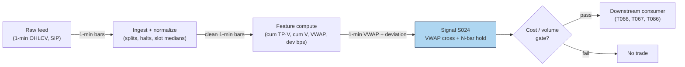

### S12. Sources

1. Berkowitz, S. A., Logue, D. E. & Noser, E. A. (1988). "The Total Cost of Transactions on the NYSE." *Journal of Finance*, 43(1), 97–112. https://repec.udesa.edu.ar/pub/Finanzas/Journals/Journal%20of%20Finance/43/1/2328325.pdf
2. Choi, J. H., Larsen, K. & Seppi, D. J. (2018). "Equilibrium Effects of Intraday Order-Splitting Benchmarks." arXiv:1803.08336. https://ideas.repec.org/p/arx/papers/1803.08336.html
3. Haendler, C., Heston, S., Korajczyk, R. & Sadka, R. (2025). "The Intra-Day Stock Return Periodicity Puzzle." Working paper, SSRN 5749704.
4. Harris, L. (2003). *Trading and Exchanges: Market Microstructure for Practitioners.* Oxford University Press. ISBN 0-19-514470-8. (Ch. on VWAP benchmarks; book, no URL.)

**Unverified leads:** quant-zero knowledge-base claim that a 1% VWAP deviation generates "0.02–0.05% of mean-reverting order flow per minute" and that VWAP algos are "30–40% of institutional flow" — repeated via a GitHub mirror citing Harris/Kissell page numbers, not verified against the originals; do not budget on these. Any blog "VWAP-cross strategy Sharpe" — unverified unless the paper is produced.

**Source log:** chatbot answers (Grok/Cursor) pending — checked 2026-09-10; grok-answers.md and cursor-answers.md absent from batches/SB1/ (duckai-answers.md present but covers S001 only, not this chapter).

---

## Stage 25/200 — S025: Intraday time-series momentum

*Batch SB1 · Signal 25/100 · Provenance [D] · Family B — Intraday momentum & breakout*

### S1. One-line verdict

| Field | Detail |
|---|---|
| **What it is** | Sign of the recent intraday return (10 min to a few hours) predicts the next minutes-to-hours: keep riding the tape. |
| **When it works** | Liquid index/futures names on news-heavy or high-volume days, when informed and day-trader flow persists into the close. |
| **When it dies** | Thin midday chop, single-name noise, and days when the "momentum" is just bid–ask bounce (trade prices mechanically zigzagging between the bid and the ask around a flat mid — apparent movement with no real price change) at the open. |
| **Build-or-buy in one line** | Build: it is sign-of-past-returns on 1-min bars — the research question is window choice and cost survival, not infrastructure. |

Provenance **[D]** (documented): the canonical intraday result is Gao, Han, Li & Zhou (2018) — first-half-hour return predicts the last-half-hour return — plus Heston, Korajczyk & Sadka (2010) on intraday periodicity; the daily/monthly origin is Moskowitz, Ooi & Pedersen (2012). Academic horizons and day-trading horizons are not the same thing; intraday uses are labeled as adaptations where relevant.

### S2. How it works — plain human explanation

It is 10:04, SPY. The first half hour ran from yesterday's close of 512.00 to 513.35 — up about 26 bps (basis points; 1 bps = 0.01%, so 26 bps ≈ 0.26%), with volume running 40% above the slot median (slot = one fixed half-hour bucket of the trading day — 13 in a regular session; the slot median is the typical volume for that same half-hour across recent days). The usual script says mornings mean-revert ("buy the dip"). Intraday time-series momentum says: don't. The tape's early direction has a documented tendency to persist into the *last* half hour of the same session — up mornings lean toward up closes.

Why would the morning's return predict the afternoon's, six hours later? Gao, Han, Li & Zhou propose two mechanisms, both about *who is forced to trade late*:

1. **Day-trader unwinding (disposition effect).** Good morning news pushes prices up; short-horizon liquidity providers who faded the open sit on losers. The disposition effect (Odean 1998; Locke & Mann 2000) says they avoid realizing losses, so they procrastinate — then all unwind in the last half hour, pushing price *further* up. The morning move gets echoed at the close by the losers' capitulation.
2. **Strategic informed trading.** Admati & Pfleiderer (1988): informed traders concentrate where volume is — the open and the close. Morning news gets traded in the first half hour, and the same flow keeps working into the deep liquidity of the close. The morning return is the footprint of information that takes the whole session to digest.

Heston, Korajczyk & Sadka (2010) found a kindred regularity: individual-stock returns persist at the *same half-hour clock slot* across days (up to 40 trading days) — the market has intraday memory, plausibly from predictable institutional patterns (Haendler et al. 2025 tie some of it to VWAP-type and close-benchmarked flow). Moskowitz, Ooi & Pedersen (2012) established the daily/monthly version across asset classes. S025 is the intraday port of that family — same sign-of-past-returns engine, horizons compressed from months to minutes.

**Mental model (3 bullets):**
- Time-series momentum (this signal) asks "did *this* asset go up?" — it is direction-agnostic and self-referential. Cross-sectional momentum asks "did it go up *more than peers*?" Different question, different portfolio.
- The edge, where it exists, lives in *predictable late-day flow* (unwinding day traders, benchmarked rebalancers), not in the morning move being "right."
- One trade a day (enter at 15:30, exit at 16:00) is the cost-efficient expression: turnover is the binding constraint, and this signal's academic form trades exactly once per session.

### S3. The math — exact formula

The report's generic form, with flat or exponential weighting over lookback $L$:

$$
\mathrm{Sig}_t = \mathrm{sign}\!\left(\sum_{i=1}^{L} w_i \, r_{t-i}\right), \qquad
r_{t} = \frac{P_t}{P_{t-1}} - 1
$$

$P_t$ = price at bar $t$ (mid or close; units: currency), $r_t$ = simple bar return (dimensionless), $w_i$ = weights (flat $w_i = 1/L$, or exponential $w_i \propto (1-\lambda)^{i}$). Vol-scaled sizing: $\mathrm{pos}_t = \mathrm{Sig}_t \cdot \sigma_{\text{target}} / \hat{\sigma}_t$ (target-vol scaling, $\hat{\sigma}_t$ = recent realized vol).

The canonical academic instantiation (Gao et al. 2018) is a predictive regression, not a sign rule:

$$
r_{13,t} = \alpha + \beta \, r_{1,t} + \varepsilon_t,
$$

where $r_{1,t}$ = first half-hour return of day $t$ (measured *from the previous day's close*, so it includes the overnight gap) and $r_{13,t}$ = last half-hour return. Estimated $\hat{\beta} > 0$ (scaled-by-100 slope ≈ 6.94, significant at 1%, $R^2$ — the fraction of last-half-hour return variance the regression explains — ≈ 1.6% in-sample) — the tradable version is $\mathrm{Sig}_t = \mathrm{sign}(r_{1,t})$, long/short the last half hour accordingly.

**Causal timing:** $r_{1,t}$ is known at 10:00 ET; the position is entered at the *start* of the last half hour (15:30 ET) and flattened at the close (16:00 ET). Tradable no earlier than the bar after the signal is computed — here, hours after, which is why the signal is nearly immune to the usual microstructure lookahead traps.

**Normalization choices:** raw sign (report default) throws away magnitude information; vol-scaling ($\mathrm{pos} \propto 1/\hat{\sigma}$) is the documented refinement (Moskowitz et al. scale positions by trailing volatility); z-scoring $z_t = \bar{r}_{t-L:t}/\hat{\sigma}$ turns the sign rule into a strength rule. Deseasonalize by time-of-day vol (S067) before thresholding — raw morning returns are mechanically more volatile.

**Parameter table** (defaults marked `example — not an institutional standard`):

| Parameter | Symbol | Typical range | Too small | Too large | Default (example) |
|---|---|---|---|---|---|
| Lookback $L$ | $L$ | 10 min – 3 h (report); academic: 30 min | noise dominates | signal stale by entry | 30 min (first half hour) |
| Weighting | $w_i$ | flat / exponential $\lambda \in [0.8, 0.99]$ | flat ignores decay | overfits to last bar | flat |
| Skip-open | — | 0–30 min | overnight-gap noise | throws away Gao's predictor | include overnight in $r_1$ (academic); skip first 5 min for single names (practitioner example) |
| Vol target | $\sigma_{\text{target}}$ | 5–20% ann. | overlevered on calm days | underplays the signal | 10% (example) |
| Flatten time | — | 15:55–16:00 | overnight gap risk | auction slippage | flat by 15:59 (example) |

**Named variants:**
1. **First-half-hour → last-half-hour** (Gao et al.): one observation per day, enter 15:30, exit 16:00 — the cost-efficient canonical form.
2. **Rolling $L$-minute momentum**: $\mathrm{sign}(\sum_{i=1}^{L} r_{t-i})$ recomputed each bar — higher turnover, more whipsaw, needs explicit cost gating.
3. **Same-clock-slot persistence** (Heston et al. 2010): predict slot $j$ today from slot $j$ over past days — cross-day intraday memory rather than within-day continuation.

### S4. Worked example — step-by-step numbers (SYNTHETIC)

**Synthetic** 13 half-hour slots, one session, `numpy.random.default_rng(25)` — **seed 25**. Returns in bps; midday slots jittered, first and last slots set by hand. Same series as the S11 chart. Not a backtest: no costs, one assumed fill.

| slot | time | ret (bps) | cum (bps) | close ($) |
|---|---|---|---|---|
| 1 | 09:30 | **+42.0** | 42.0 | 100.42 |
| 2 | 10:00 | −0.0 | 42.0 | 100.42 |
| 3 | 10:30 | −3.7 | 38.3 | 100.38 |
| 4 | 11:00 | −16.0 | 22.3 | 100.22 |
| 5 | 11:30 | +0.2 | 22.5 | 100.22 |
| 6 | 12:00 | +6.5 | 29.0 | 100.29 |
| 7 | 12:30 | +7.3 | 36.3 | 100.36 |
| 8 | 13:00 | −3.8 | 32.5 | 100.32 |
| 9 | 13:30 | +15.6 | 48.1 | 100.48 |
| 10 | 14:00 | +13.6 | 61.7 | 100.62 |
| 11 | 14:30 | −1.6 | 60.1 | 100.60 |
| 12 | 15:00 | −1.1 | 59.0 | 100.59 |
| 13 | 15:30 | **+31.0** | 90.0 | 100.90 |

**Step-by-step:** formation return $r_1 = +42.0$ bps (slot 1, includes the overnight gap by construction) → $\mathrm{Sig} = \mathrm{sign}(+42.0) = +1$ → LONG. Wait through the session (the rule trades only the last half hour). Enter at 15:30 at 100.59, exit at the 16:00 close at 100.90: gross $+30.8$ bps, synthetic, before costs. The middle of the day actually sagged (slots 3–4 gave back ~20 bps) — the signal ignores all of it by design.

**What to notice:** the example is hand-tilted (both $r_1$ and $r_{13}$ set positive) to illustrate the mechanism; the academic claim is statistical ($\beta > 0$, $R^2$ 1.6%), not "every up morning ends up." Real frictions are absent: the 15:30 entry competes with other momentum chasers, the fill is assumed at the slot open, and +30.8 bps must survive ~1–3 bps round-trip in SPY (comfortable) versus 10+ bps in a thin single name (fatal). That cost arithmetic is the entire strategy question.


### S5. Strategies that use this signal

- **T006 — Intraday Trend + Vol-Regime Allocator** — primary trigger (direction): rides S025 time-series momentum into the close, position-scaled by HMM vol regime (S079).
- **T098 — Jump-Validated Momentum Ignition** — momentum leg (validated entry): takes S025's directional read only when a Lee–Mykland jump (a statistical test flagging a price move too large to be ordinary diffusion noise) validates the move and RVOL (relative volume: today's volume versus its recent typical level) confirms — a filter *on* this signal.
- **T025 — Trade-Classification Trend Filter** — filter/veto: uses Lee–Ready/BVC signed trade imbalance (Lee–Ready: a rule classifying each trade as buyer- or seller-initiated from the prevailing quote and tick direction; BVC = Bulk Volume Classification, a classifier that signs volume bars instead of individual trades) to confirm or veto S025 momentum entries (signed flow must agree).
- **T053 — HMM Regime-Switching Allocator** — regime gate: allocates to the momentum book (S025 leg) in trending hidden states, to the reversal book (S035 leg) otherwise.

### S6. Data required — exact spec

| Field | Type | Granularity | Source tier | Notes |
|---|---|---|---|---|
| 1-min OHLCV (or half-hour bars) | float/int | 1-min | Tier 0–2 | Futures preferred (less noise, cleaner session); CME via Databento |
| Prior-day close | float | daily | Tier 0–1 | Needed for the overnight-inclusive $r_1$ (academic form) |
| Corporate actions | factor | daily | Tier 1 | Gap-adjusted series or $r_1$ is polluted |
| Vol estimate (for sizing) | float | 1-min/5-min | Tier 1 | Realized vol of $r_1$ or HAR-style (S066) |
| News calendar (optional) | timestamps | event | Tier 2 | Gao et al.: stronger on macro-news days |

**Collection:** Databento futures/equities 1-min, Polygon Stocks Advanced, Alpaca SIP. **Ingest sketch** (polars, ≤20 lines):

```python
import polars as pl
b = pl.read_parquet("bars_1m.parquet").sort(["sym","ts"])
half = b.group_by_dynamic("ts", every="30m", group_by="sym").agg(
    o=pl.col("o").first(), c=pl.col("c").last())
half = half.with_columns(r=pl.col("c")/pl.col("c").shift(1).over("sym")-1)
half = half.with_columns(slot=pl.col("ts").dt.hour()*2+pl.col("ts").dt.minute()//30)
day = half.group_by("sym", pl.col("ts").dt.date()).agg(
    r1=pl.col("r").filter(pl.col("slot")==19).first(),   # 09:30 slot incl. overnight
    rL=pl.col("r").filter(pl.col("slot")==31).first())   # 15:30 slot
sig = day.with_columns(sig=pl.col("r1").sign())
```

**Storage:** 1-min bars, 500 symbols ≈ 50 MB/day (§4) → ~3 GB/60 days. The academic form needs only 2 half-hour returns/day/symbol — kilobytes. **Data-quality checklist:** overnight-gap attribution (prior close vs open); half-days and DST (13 slots becomes 7 — never hardcode 13); futures session definitions (CME settle vs pit close); corporate-action adjustment; exclude days with <500 trades (Gao et al.'s own filter).

### S7. Local build on M5 Max / 128GB

**Feasibility: trivial.** Tier L (4–12 h, ~$600–1,800 loaded-cost estimate per §5). The signal is arithmetic on 13 numbers per symbol per day.

**Throughput** (per §2): the daily batch is ~500 × 390 = 195k bars — polars handles it in milliseconds; even a pure-Python loop is fine. Real-time requirement: one computation at 10:00, one order at 15:30 — a cron job, not a trading system. Bottleneck: none; the constraint is fill quality, not compute.

**Stack options:**

| Stack | When to pick |
|---|---|
| Python + polars | Everything here; the sketch above is production-shaped |
| DuckDB | If you prefer SQL over archived parquet |
| Rust | Unnecessary — no event-rate pressure at this granularity |

**RAM:** 60 days × 500 symbols × 1-min ≈ **12 MB** (§3); the signal's own state is two floats per symbol. Entirely inside the 77 GB working budget — you could hold decades.

**What breaks first at 500 symbols:** nothing computationally. What breaks is *economic*: single-name $r_1$ is mostly noise (Gao et al.'s result is on the *market* ETF and liquid futures), and per-name costs at 15:30 eat a 1.6% $R^2$ edge alive. The failure is in S9/S10, not in the Mac.

### S8. Buy vs build

| Option | What you get | Indicative price | Gains | Loses |
|---|---|---|---|---|
| Tier-0: Stooq daily + Alpaca IEX | Daily bars, some intraday | ~$0 | Free replication of the daily/monthly form | No clean half-hour history |
| Tier-1: Polygon Stocks Advanced | SIP 1-min + aggregates | ~$30–200/mo | Enough for the full academic replication | Futures coverage thinner |
| Tier-1/2: Databento (CME + equities) | Futures 1-min, honest timestamps | ~$200/mo + usage | The report's "futures preferred" data | Usage billing on history pulls |
| Academic: TAQ via WRDS | Tick history | institutional/academic | Deep robustness checks | Access friction, cost |

**Verdict — build if** you want the window/weighting/flatten-time customized (you will): the signal is 10 lines. **Buy** the feed (Tier-1 minimum for intraday history; Databento if futures). **Crossover:** there is nothing to "buy" as a strategy — vendors sell data; the one-trade-a-day rule is yours to implement and cost-check. All prices above: indicative — verify before budgeting.

### S9. Success ratio / efficacy — documented evidence

| Study / source | Market & period | Metric | Before/after cost | Caveat |
|---|---|---|---|---|
| Gao, Han, Li & Zhou (2018) | SPY, 1993–2013 | Timing on sign($r_1$): 6.67%/yr avg, 6.19% vol → **Sharpe 1.08** vs 0.29 buy-and-hold | Before-cost metric; authors report gains *persist after transaction costs* | Published in the *Journal of Financial Economics* (2018); figures from the SSRN working-paper version (SSRN 2552752) — re-verify against the published version before citing precisely |
| Gao et al. (2018), same | SPY, 1993–2013 | Predictive $R^2$ 1.6% in-sample; 1.2% out-of-sample (1.8–2.6% with 12th-half-hour added) | Before-cost (predictive regression) | $R^2$ is statistical, not tradable P&L; OOS (out-of-sample — tested on data the model was never fit on) weaker as expected |
| Moskowitz, Ooi & Pedersen (2012) | 58 instruments, 1985–2009 | Time-series momentum pervasive across asset classes; vol-scaled strategy earns significant risk-adjusted returns (see paper for figures) | Before-cost | **Daily/monthly** horizons — the origin of the family, not intraday evidence |
| Baltussen, Da, Lammers & Martens (2021) | 60+ futures | Intraday momentum confirmed; gamma-hedging mechanism (options market makers buying/selling the underlying to stay delta-neutral as prices move — the "hedging demand" of the paper's title); effect reverts over following days | Before-cost | Via practitioner summary; confirms mechanism + warns the drift is temporary |
| Heston, Korajczyk & Sadka (2010) | US stocks, intraday | Same-clock-slot return persistence up to 40 days | Before-cost | Cross-day periodicity, not the within-day $r_1 \to r_{13}$ trade |

**Regimes where it fails:** low-volume/midday-dominated days (no late flow to ride); single names where $r_1$ is noise; post-2013 decay risk (the paper's sample ends 2013; treat recent efficacy as unverified without your own replication); macro-news days cut both ways (stronger signal per the paper, but wider slippage). The Baltussen et al. finding matters: the drift **reverts over following days** — holding overnight converts momentum into reversal losses.

**Honest bottom line:** as a standalone trigger this is a **documented but thin edge** — Sharpe ~1 before costs on the most liquid instrument on earth, one trade a day, with the authors claiming cost survival. As a **timing overlay** (when to concentrate intraday risk, T006/T015-style) it is more defensible than as a full strategy. Single-name intraday TSMOM without vol scaling is mostly noise — say so in any pitch.

### S10. Failure modes & pitfalls

1. **Overnight-gap misattribution** — $r_1$ includes the gap only if you anchor to the prior close; anchoring to the open measures something else. *Mitigation: define $r_1$ exactly as the paper does; test both.*
2. **Half-day/DST slot drift** — 13 slots is a regular-session assumption. *Mitigation: compute slots from exchange calendar; never hardcode 13.*
3. **Single-name noise** — the documented effect is market/futures-level; per-name $r_1$ has far lower SNR. *Mitigation: restrict universe to index ETFs/liquid futures, or shrink per-name signals.*
4. **Reversion after the close** — Baltussen et al.: the drift reverts over following days. *Mitigation: hard flatten before close; never carry as "momentum" overnight.*
5. **Cost illusion on the toy trade** — +30.8 bps gross means little if your 15:30 entry crosses a 5 bp spread in a thin name. *Mitigation: per-trade cost model (spread + fees + slippage); the one-trade-a-day shape is what makes SPY survive.*
6. **Publication decay** — sample ends 2013; post-publication arbitrage may have compressed it (cf. McLean & Pontiff 2016 on anomaly decay generally). *Mitigation: replicate on your own recent data before sizing; report post-2018 numbers separately.*
7. **Vol-regime blindness** — fixed-size positions on high-vol days take outsized risk. *Mitigation: vol-target sizing ($1/\hat{\sigma}$); T006's HMM gate.*
8. **Lookahead in $r_1$** — using 10:00:00 prints that arrived after your 10:00 signal timestamp (SIP latency). *Mitigation: timestamp discipline; at this horizon it's minor, but keep the t→t+1 rule anyway.*

### S11. Visuals


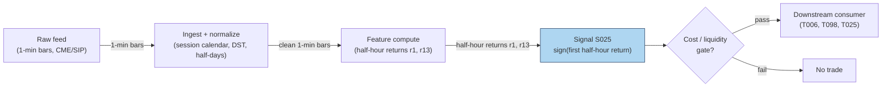

### S12. Sources

1. Gao, L., Han, Y., Li, S. Z. & Zhou, G. (2018). "Intraday Momentum: The First Half-Hour Return Predicts the Last Half-Hour Return." *Journal of Financial Economics*, 2018. https://paperswithbacktest.com/api/paper/intraday-momentum-the-first-half-hour-return-predicts-the-last-half-hour-return/pdf (working-paper version; SSRN 2552752)
2. Moskowitz, T. J., Ooi, T. H. & Pedersen, L. H. (2012). "Time Series Momentum." *Journal of Financial Economics*, 104, 228–250. (Daily/monthly origin of the family; no URL — journal citation.)
3. Heston, S. L., Korajczyk, R. A. & Sadka, R. (2010). "Intraday Patterns in the Cross-section of Stock Returns." *Journal of Finance*, 65(4). SSRN 1107590.
4. Baltussen, G., Da, Z., Lammers, S. & Martens, M. (2021). "Hedging Demand and Market Intraday Momentum." *Journal of Financial Economics*. (Gamma-hedging mechanism; journal citation.)

**Unverified leads:** practitioner replication notes claiming the effect "replicated in several international markets" — plausible, but I did not verify each replication's paper; the Hull-repository China-futures study (1%-significant first-session prediction on 4 commodity futures, SSRN 3493927) is a working paper I did not fully vet — treat as a lead, not evidence.

**Source log:** chatbot answers (Grok/Cursor) pending — checked 2026-09-10; grok-answers.md and cursor-answers.md absent from batches/SB1/ (duckai-answers.md present but covers S001 only, not this chapter).

---

## Stage 35/200 — S035: Short-term reversal — Jegadeesh / Lehmann

*Batch SB1 · Signal 35/100 · Provenance [D] · Family C — Mean reversion & reversal*

### S1. One-line verdict

| Field | Detail |
|---|---|
| **What it is** | Buy recent losers, short recent winners: over 1 week–1 month (and 15 min–1 day intraday), extremes snap back. |
| **When it works** | Broad liquid universes where the reversal is compensation for providing liquidity — not where it is just bid–ask bounce. |
| **When it dies** | After costs (turnover is brutal), in illiquid names (the "reversal" is measurement error), and post-publication as arbitrageurs crowd it. |
| **Build-or-buy in one line** | Build the rank/sort — the signal is arithmetic; buy nothing except clean total-return data, and budget turnover before anything else. |

Provenance **[D]** (documented): Jegadeesh (1990), Lehmann (1990), Lo & MacKinlay (1990). One honesty note carried from the report: Lehmann's exact weekly portfolio weights were **not recoverable from accessible sources** — this chapter uses rank-based long/short deciles and says so. Academic horizons (1 week–1 month) ≠ day-trading horizons; the intraday port is labeled an adaptation.

### S2. How it works — plain human explanation

It is month-end. Across 2,000 US stocks, the worst performers of the past month are down 8–15%; the best are up 10–20%. The short-term reversal signal says: buy the losers, short the winners, hold a month. It feels wrong — that is the point. The claim, documented since Jegadeesh (1990), is that short-horizon extremes contain a transitory component: price pressure, overreaction, and plain illiquidity push prices too far, and they snap back.

The economic "why" has three competing stories, and the literature never fully settled between them:

1. **Liquidity provision / price pressure.** Someone absorbed the selling that made the losers lose. Market makers demand compensation for warehousing that inventory risk; the reversal is their paycheck (Grossman & Miller 1988; Pastor & Stambaugh 2003). Under this story the signal is a *liquidity-provision premium* — real, but earned by whoever actually stands ready, not by a monthly spreadsheet rebalance.
2. **Overreaction and correction.** Investors extrapolate recent news too far (De Bondt & Thaler 1985); prices overshoot and correct. Under this story the edge is behavioral and decays as arbitrageurs learn it.
3. **Measurement error — the bid–ask bounce.** The hostile story, and it matters enormously. If losers' last prints were at the bid and winners' at the ask, next period's "reversal" is just the bounce — no economics at all. Kaul & Nimalendran (1990) showed bid–ask errors are the *predominant* source of apparent short-run reversals in NASDAQ stocks; Atkins & Dyl (1990) found the overreaction after large daily moves is small compared with spreads. Any backtest on closing transaction prices that ignores this is fiction.

Lehmann (1990) ran the weekly version — long last week's losers, short last week's winners — but Lo & MacKinlay (1990) showed a large fraction of contrarian profits comes from **cross-autocorrelation** (large stocks lead small), not from each stock reversing itself. The naive "buy losers" portfolio harvests lead-lag structure as much as mean reversion.

The intraday port — rank by prior 15–60 min return, fade extremes over the next 15 min to a day — is the same engine at higher frequency, where bounce contamination is *worse*. Label it an adaptation, and test it on quote midpoints, not transaction prices.

**Mental model (3 bullets):**
- Short-term reversal = you are paid to absorb someone else's urgency. No urgency absorbed, no premium earned — a monthly rebalance captures the label, not the economics.
- Half of what looks like reversal in transaction-price data is the bid–ask bounce. Midpoints or it didn't happen.
- The signal's enemy is not being wrong about direction — it is turnover: the edge is small, the trading is constant, and costs compound against you every rebalance.

### S3. The math — exact formula

**Jegadeesh (1990) monthly form.** Each month $t$, compute prior-month return $r_{i,t-1}$ for each stock $i$; sort into deciles. Portfolio: long decile 1 (losers), short decile 10 (winners), equal-weighted, hold one month. The reversal shows up as negative serial correlation: $E[r_{i,t} \mid r_{i,t-1} \text{ extreme}]$ leans against $r_{i,t-1}$.

**Lehmann (1990) weekly form (weights as described; exact published weights not recoverable — use rank deciles and state it):**

$$
w_{i,t} = -\frac{1}{N}\,(r_{i,t-1} - r_{m,t-1}),
$$

$w_{i,t}$ = portfolio weight of stock $i$ (dimensionless, sums to zero — dollar-neutral), $r_{i,t-1}$ = prior-week return, $r_{m,t-1}$ = market return, $N$ = universe size. Losers ($r_{i,t-1} < r_{m,t-1}$) get positive weight; winners get negative weight. Because the report's source entry could not recover Lehmann's exact construction from accessible sources, the reproducible version is: **rank-based long/short deciles**, not these analytic weights.

**Residual (Blitz et al. 2013-style) variant:** replace raw $r_{i,t-1}$ with the Fama–French residual $\varepsilon_{i,t-1}$ — reversal in the *idiosyncratic* component, stripping factor drift.

**Intraday port (adaptation — label as such):** rank universe by prior 15–60 min return; long bottom quantile / short top quantile; hold 15 min–1 day; compute everything on **quote midpoints** to suppress bounce.

**Causal timing:** formation return uses data $\le t$; positions formed at $t$'s close trade at $t+1$'s open or later. The classic cheat is forming on month $t$'s return and "trading" at month $t$'s close — one month of lookahead.

**Normalization choices:** raw returns (Jegadeesh) vs market-adjusted (Lehmann) vs residual (Blitz et al.); equal-weight vs return-weighted legs. Volatility-scaling the legs is a practitioner refinement, not in the originals.

**Parameter table** (defaults marked `example — not an institutional standard`):

| Parameter | Symbol | Typical range | Too small | Too large | Default (example) |
|---|---|---|---|---|---|
| Formation window | — | 1 week – 1 month (academic); 15–60 min (intraday port) | bounce dominates | signal washes out | 1 month / 30 min |
| Holding window | — | = formation (academic) | turnover explodes | reversal decays | 1 month / 60 min |
| Sort quantiles | — | deciles / quintiles | noisy legs | weak spread | deciles |
| Return definition | — | total / market-adj. / residual | factor drift pollutes | estimation error | market-adjusted (example) |
| Price basis (intraday) | — | midpoint vs transaction | — | — | **midpoint** (mandatory for intraday) |

**Named variants:**
1. **Jegadeesh monthly deciles** — the documented original; 1-month formation, 1-month hold.
2. **Lehmann weekly contrarian** — analytic weights (not recoverable; use rank deciles and disclose).
3. **Residual reversal** — Fama–French residual sorts; cleaner idiosyncratic mean reversion.

### S4. Worked example — step-by-step numbers (SYNTHETIC)

**Synthetic** 10-stock month, `numpy.random.default_rng(35)` — **seed 35**. Formation returns are random; holding returns are constructed with a mild reversal tilt ($-0.28 \times$ formation + noise) plus pure noise — the *same* data as the S11 chart. Not a backtest: no costs, no borrow fees, one toy month.

| name | formation $(t-1)$ % | holding $(t)$ % | leg |
|---|---|---|---|
| AAA | −6.83 | +0.71 | **LONG** (loser) |
| BBB | +4.63 | −5.42 | **SHORT** (winner) |
| CCC | +6.90 | +2.26 | **SHORT** (winner) |
| DDD | +4.41 | −1.24 | flat |
| EEE | +8.69 | −1.50 | **SHORT** (winner) |
| FFF | +0.02 | −1.28 | flat |
| GGG | −8.54 | +0.74 | **LONG** (loser) |
| HHH | −0.34 | +1.38 | **LONG** (loser) |
| III | +2.90 | +1.09 | flat |
| JJJ | +2.49 | −2.58 | flat |

**Step-by-step:** sort by formation return. Long leg = 3 worst losers (GGG −8.54, AAA −6.83, HHH −0.34); short leg = 3 best winners (EEE +8.69, CCC +6.90, BBB +4.63). Holding-period leg means: long leg $(0.71+0.74+1.38)/3 = +0.94\%$; short leg $(-5.42+2.26-1.50)/3 = -1.55\%$. Dollar-neutral portfolio gross = $+0.94 - (-1.55) = \mathbf{+2.50\%}$ for the toy month, before costs. Correlation(formation, holding) = **−0.302** — the reversal signature.

**What to notice:** CCC formed at +6.90% and *continued* to +2.26% — reversal is statistical, not a law. The toy +2.50% is gross of everything: 200%+ monthly turnover, two-way spread on ten names, borrow fees on the shorts (EEE at +8.69% formation is exactly the crowded winner that is expensive to borrow). The toy table uses clean synthetic "true" returns, so it *overstates* what a transaction-price backtest would honestly show — the Kaul–Nimalendran warning in miniature.


### S5. Strategies that use this signal

- **T011 — Short-Term Reversal + Bounce Timing** — primary entry trigger (direction): the Jegadeesh/Lehmann sort is the strategy's core; S047/S014 time entries at the touch to harvest (not pay) the bounce.
- **T053 — HMM Regime-Switching Allocator** — regime gate: allocates to the reversal book (S035 leg) when the hidden state favors mean reversion, to momentum (S025) otherwise.
- **T100 — Grand Ensemble** — ensemble consumer (diluted weight): S035 is one of 100 inputs; included for completeness, not as a driver.

(Candid note: T040 was checked and does *not* consume S035 — its signals are S080/S039/S078 — and neither does T013 (S042/S043/S045). Only T011 and T053 genuinely list S035; T100 is included as the honest third.)

### S6. Data required — exact spec

| Field | Type | Granularity | Source tier | Notes |
|---|---|---|---|---|
| Total returns (split/div-adjusted) | float | daily (weekly/monthly formation) | Tier 0–1 | CRSP / Polygon / Stooq; **total**, not price, return |
| Quote midpoints (intraday port) | float | 1-min | Tier 1–2 | Transaction prices forbidden for formation (bounce) |
| Borrow/fee data (short leg) | float | daily | Tier 1–3 | Short winners are often hard-to-borrow |
| Market index returns | float | daily | Tier 0 | For market-adjusted weights |
| Delisting returns | float | event | Tier 1 | Survivorship bias otherwise |

**Collection:** Stooq/Polygon daily for the academic form; Databento/Polygon 1-min midpoints for the intraday port. **Ingest sketch** (polars, ≤20 lines):

```python
import polars as pl
d = pl.read_parquet("daily.parquet").sort(["sym","date"])   # adj close, total-return
d = d.with_columns(r=pl.col("adj")/pl.col("adj").shift(1).over("sym")-1)
form = d.group_by("sym").agg(form_r=pl.col("r").tail(21).sum())  # 1-mo formation
ranks = form.with_columns(dec=pl.col("form_r").qcut(10, labels=False).over())
# long decile 0, short decile 9; hold next 21 sessions; rebalance monthly
```

**Storage:** daily bars, 3,000 stocks × 10 y ≈ 60M rows ≈ **2–5 GB** RAM (§3) — fits; parquet on disk 2–4× smaller. Intraday-port midpoints: 1-min, 500 symbols ≈ 50 MB/day (§4). **Data-quality checklist:** total-return (not price) adjustment; delisting returns; midpoint vs transaction discipline; corporate actions; universe point-in-time membership (no survivorship bias); short-sale ban periods flagged.

### S7. Local build on M5 Max / 128GB

**Feasibility: trivial** for the academic form; **feasible** for the intraday port. Tier L (4–12 h, ~$600–1,800 loaded-cost estimate per §5) — it is sorts and groupbys.

**Throughput** (per §2): monthly rebalance over 3,000 stocks × 10 y of daily data = 60M rows — polars simple ops at ~10–50M rows/sec chew through it in seconds. The intraday port (500 symbols × 390 bars/day = 195k bars) is trivial. Bottleneck: none computationally; borrow-data licensing for the short leg.

**Stack options:**

| Stack | When to pick |
|---|---|
| Python + polars | Default for both forms; qcut/decile sorts are one-liners |
| DuckDB | SQL-first researchers over archived parquet |
| Rust | Unnecessary at these granularities |

**RAM:** daily panel ~2–5 GB (§3) — comfortable in the 77 GB budget; the monthly signal state is one float per name. 60 days of 1-min data ≈ 12 MB.

**What breaks first at 500 symbols:** nothing local. What breaks is *economic*: at 500 names the short leg's borrow fees and the monthly 200% turnover mean the strategy's viability is a cost question (S9/S10), not a compute question. Full-universe CRSP-style history wants WRDS access (buy, Tier 3 academic).

### S8. Buy vs build

| Option | What you get | Indicative price | Gains | Loses |
|---|---|---|---|---|
| Tier-0: Stooq / French data library | Daily returns, factors | ~$0 | Free academic replication | No intraday, survivorship caveats |
| Tier-1: Polygon Stocks Advanced | Daily + 1-min, adjusted | ~$30–200/mo | Clean adjustments, midpoints | History depth costs |
| Tier-3 academic: WRDS/CRSP + TAQ | Publication-grade history | hundreds–thousands/yr academic | The actual papers' data | Price, access friction |
| Borrow data: vendor (e.g. S3-style) | Stock-loan fees | $$ | Prices the short leg honestly | Another subscription |

**Verdict — build if** you are replicating or adapting the sort: the signal is ranking arithmetic. **Buy if** you need CRSP-grade delisting/total-return history or borrow panels — you cannot build those. **Crossover:** Tier-0/1 data + your own sorts covers 90% of the research; pay for borrow data the moment the short leg is real money. All prices above: indicative — verify before budgeting.

### S9. Success ratio / efficacy — documented evidence

| Study / source | Market & period | Metric | Before/after cost | Caveat |
|---|---|---|---|---|
| Jegadeesh (1990), as summarized in Cakici & Topyan (2014) | US stocks, 1934–1987 | Short-term reversal ≈ **+2%/month** extra return | **Before-cost** | Pre-decimalization, pre-publication; costs unmodeled; figure via secondary summary |
| Lehmann (1990) | US stocks, weekly | Weekly contrarian portfolios profitable | **Before-cost** | Exact weights not recoverable; see S3 disclosure |
| Lo & MacKinlay (1990) | US stocks | Much contrarian profit = **cross-autocorrelation** (large leads small), not pure reversal | n/a (decomposition) | The "reversal" you trade may be lead-lag structure |
| Kaul & Nimalendran (1990) | NASDAQ | After removing bid–ask errors: **little evidence** of overreaction; returns positively autocorrelated | Measurement correction | The bounce warning: transaction-price backtests overstate |
| Atkins & Dyl (1990) | US stocks, large daily moves | Reversal exists but **small vs bid–ask spreads** | After-cost interpretation | "Consistent with efficiency after transactions costs" |
| McLean & Pontiff (2016) | 97 anomalies | Returns **decay substantially** after publication | After-cost framing | General result; short-term reversal is in the decaying set |

**Regimes where it fails:** illiquid names (bounce dominates); high-vol regimes (spreads widen, borrow spikes); crowded post-publication periods (decay); earnings/announcement drifters (PEAD is continuation — fading it is fading information, S100). **Documented decay:** yes — McLean & Pontiff (2016) is the citation; expect the academic-form premium to be a shadow of the 1934–1987 number.

**Honest bottom line:** as a standalone trigger this is a **documented-but-mostly-arbitraged edge** — the +2%/month is a before-cost museum piece; what survives today is a liquidity-provision premium that accrues to whoever actually provides the liquidity, net of turnover that usually eats it. As a **timing overlay inside a market-making or execution book** (get paid the spread *and* the reversal), it is far more defensible — which is exactly what T011 does.

### S10. Failure modes & pitfalls

1. **Bid–ask bounce contamination** — formation on transaction prices manufactures reversal. *Mitigation: midpoints only (intraday); bounce-adjusted returns (daily); read Kaul & Nimalendran first.*
2. **Lookahead in formation** — sorting on month $t$'s return and trading at $t$'s close. *Mitigation: form at $t$, trade at $t+1$ open; point-in-time universe.*
3. **Turnover/cost blowup** — 200%+ monthly turnover vs a thin edge. *Mitigation: model spread + fees + borrow + impact per rebalance; net-of-cost Sharpe or nothing.*
4. **Short-leg borrow** — winners are crowded shorts; fees and buy-ins. *Mitigation: borrow-aware universe filter; model fees explicitly.*
5. **Survivorship/delisting bias** — losers delist; dropping them inflates the long leg. *Mitigation: include delisting returns (CRSP-style).*
6. **Crowding/decay** — post-publication arbitrage compresses the premium. *Mitigation: expect decay (McLean & Pontiff); monitor live vs academic-form spread.*
7. **Fading information** — reversal into earnings/PEAD drift (S100) fights informed flow. *Mitigation: exclude announcement windows or flip to T078's drift leg.*
8. **Cross-autocorrelation confusion** — you think you're trading reversal, you're trading large-cap lead-lag (Lo & MacKinlay). *Mitigation: residualize (Blitz et al.) and attribute P&L to reversal vs lead-lag.*

### S11. Visuals


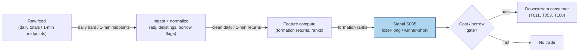

### S12. Sources

1. Jegadeesh, N. (1990). "Evidence of Predictable Behavior of Security Returns." *Journal of Finance*, 45(3), 881–898. (Journal citation; no URL.)
2. Lehmann, B. N. (1990). "Fads, Martingales, and Market Efficiency." *Quarterly Journal of Economics*, 105(1), 1–28. (Journal citation; exact portfolio weights not recoverable — see S3.)
3. Lo, A. W. & MacKinlay, A. C. (1990). "When Are Contrarian Profits Due to Stock Market Overreaction?" *Review of Financial Studies*, 3(2), 175–205. (Journal citation.)
4. Kaul, G. & Nimalendran, M. (1990). "Price Reversals: Bid-Ask Errors or Market Overreaction?" *Journal of Financial Economics*, 28, 67–93. (Journal citation.)
5. Atkins, A. B. & Dyl, E. A. (1990). "Price Reversals, Bid-Ask Spreads, and Market Efficiency." *Journal of Financial and Quantitative Analysis*, 25(4). (Journal citation.)
6. McLean, R. D. & Pontiff, J. (2016). "Does Academic Research Destroy Stock Return Predictability?" *Journal of Finance*, 71(1), 5–32. (Decay reference.)
7. Cakici, N. & Topyan, K. (2014). "Short-Term Reversal." In *Risk and Return in Asian Emerging Markets*, Palgrave Macmillan. https://ideas.repec.org/h/pal/palchp/978-1-137-35907-0_7.html (Secondary summary used for the +2%/month figure attribution.)

**Unverified leads:** Blitz et al. (2013) residual-reversal treatment (cited via the report entry; not independently re-verified here). Any "intraday reversal Sharpe" from blogs or vendor whitepapers — unverified unless the paper is produced.

**Source log:** chatbot answers (Grok/Cursor) pending — checked 2026-09-10; grok-answers.md and cursor-answers.md absent from batches/SB1/ (duckai-answers.md present but covers S001 only, not this chapter).

---

## Stage 40/200 — S040: VWAP-deviation mean reversion

*Batch SB1 · Signal 40/100 · Provenance [SR] · Family C — Mean reversion & reversal*

### S1. One-line verdict

| Field | Detail |
|---|---|
| **What it is** | Price stretched far from session VWAP snaps back: short upside extensions, buy downside ones, as benchmarked algos trade toward their target. |
| **When it works** | Range days and midday lulls where the extension is uninformed flow — a block, a fat finger, a momentum algo overshooting. |
| **When it dies** | Trend days: the deviation is information (S024's territory), and fading it is stepping in front of the benchmarked flow itself. |
| **Build-or-buy in one line** | Build the bands yourself (same VWAP engine as S024, plus a rolling σ); buy nothing — the regime classifier is the product, not the z-score. |

Provenance **[SR]** (standard reconstruction): VWAP ± kσ bands are a practitioner standard; the report's citations are practitioner knowledge bases plus Haendler et al. (2025) for the mechanism. No public paper publishes a canonical VWAP-deviation fade rule with performance. [SR] is **not** upgraded here.

### S2. How it works — plain human explanation

It is 11:20, MSFT. Session VWAP sits at 428.10. A 40,000-share market sell order just swept three levels and printed at 427.55 — 13 bps *below* VWAP — on no news. The VWAP-deviation signal says: buy. Not because 427.55 is "cheap" in any absolute sense, but because of who is about to trade next.

The mechanism is the mirror of S024's. A large share of institutional flow is benchmarked to VWAP (Berkowitz, Logue & Noser 1988, and every execution desk since). A VWAP algorithm that is *behind* its benchmark — it has bought too little while price ran away — must accelerate buying to catch up; one that is *ahead* can slow down. When price stretches far above VWAP, the benchmarked buyers are, on average, ahead of schedule and ease off while benchmarked sellers lean in; the reverse below. The deviation itself summons the flow that erases it — a rubber band powered by other people's mandates. Choi, Larsen & Seppi (2018) formalize this: TWAP/VWAP order-splitting benchmarks induce predictable intraday price-pressure patterns, and deviations from the benchmark path are where the pressure concentrates.

But — and this is the whole game — the rubber band only snaps back if the extension was *uninformed*. If price is 13 bps below VWAP because a real seller knows something, the benchmarked algos' buying is the liquidity the informed seller wanted, and your fade is their exit. That is why the report pairs S040 with S024 as mirrors: extension + fading volume = reversion (this signal); extension + rising volume = continuation (S024). The signal without the regime classifier is a coin flip with costs.

Why should deviations revert *economically*? Three forces:

1. **Benchmark-chasing flow** (above): mechanical, persistent, largest midday when participation schedules are steepest.
2. **Inventory mean reversion of liquidity providers**: the market makers who absorbed the sweep are long inventory they didn't want; they shade quotes to get flat, pulling price back.
3. **Value-area gravity**: VWAP is the volume-weighted consensus price of the day; absent new information, auction logic says trade migrates back to where most volume agreed.

**Mental model (3 bullets):**
- VWAP deviation = distance from the day's consensus; fading it = betting the move was noise, not news.
- The edge is not the z-score — it is *classifying the extension* (uninformed sweep vs informed break). Volume, news, and time-of-day do that work.
- S024 and S040 are one signal with a regime switch, not two signals. Running both without the switch = trading against yourself.

### S3. The math — exact formula

Session VWAP as in S024: $\mathrm{VWAP}_t = \sum_{i\le t} TP_i V_i / \sum_{i\le t} V_i$. Deviation and its z-score:

$$
d_t = \frac{C_t - \mathrm{VWAP}_t}{\mathrm{VWAP}_t}, \qquad
z_t = \frac{d_t}{\hat{\sigma}_{d,t}}, \qquad
\hat{\sigma}_{d,t} = \mathrm{std}(d_{t-W+1 \dots t})
$$

$d_t$ = fractional deviation (dimensionless; ×10⁴ = bps), $\hat{\sigma}_{d,t}$ = rolling standard deviation of the deviation over window $W$ bars. **Example rule (not universal — the report's own words):** enter short when $z_t > +1.5$ (long when $z_t < -1.5$); exit when $|z_t| < 0.25$, on a time stop, or before late-session benchmark flow. VWAP ± k·σ bands are the same engine drawn as bands: $\mathrm{VWAP}_t \pm k\,\hat{\sigma}_{d,t}\,\mathrm{VWAP}_t$.

**Causal timing:** $z_t$ uses only bars $\le t$; the rolling $\hat{\sigma}$ needs $\ge$ ~5 bars before it is anything but noise (see S4's warning). Tradable no earlier than $t+1$'s open. The classic leak: computing $d_t$ with the *current* bar's still-forming volume.

**Normalization choices:** z-score (report's form) adapts to each name's typical deviation scale; raw bps thresholds are simpler but name-specific; rank/percentile of $d_t$ vs its 20-day same-slot distribution deseasonalizes the U-shaped intraday vol (pairs well with S067).

**Parameter table** (defaults marked `example — not an institutional standard`):

| Parameter | Symbol | Typical range | Too small | Too large | Default (example) |
|---|---|---|---|---|---|
| Entry k | $k_{\text{in}}$ | 1.0–2.5 σ | noise trades | never triggers | 1.5 |
| Exit band | $k_{\text{out}}$ | 0–0.5 σ | exits before reversion pays | round-trips back out | 0.25 |
| Rolling σ window | $W$ | 10–60 bars | σ estimate is noise (S4!) | slow to adapt | 30 (example) |
| Min bars for σ | — | 5–20 | z explodes on 3 samples | late entries | 5 (example) |
| Time stop | — | 15–60 min | cuts winners | carries into close flow | 30 min / flat by 15:30 (example) |
| Volume context | — | extension on low vs high vol | fades informed breaks | misses sweeps | require extension volume < slot median (example) |

**Named variants:**
1. **Session-VWAP z-fade** (report's form): deviation vs rolling σ, session anchor.
2. **Band-tag fade**: price tags VWAP ± kσ band drawn from a 20-day same-slot σ — slower, more stable bands.
3. **Anchored-deviation fade**: deviation vs *anchored* VWAP (news anchor) — for post-event overextensions; pairs with T067's anchor.

### S4. Worked example — step-by-step numbers (SYNTHETIC)

**Synthetic** 12-minute tape, `numpy.random.default_rng(40)` — **seed 40**. Price overshoots above VWAP early, then drifts back through it. Same data as the S11 chart. Not a backtest: no costs, fills assumed, one toy episode.

| bar | C ($) | VWAP ($) | dev (bps) | z | event |
|---|---|---|---|---|---|
| 1 | 99.99 | 99.99 | 0.0 | n/a | σ needs ≥5 bars |
| 2 | 100.04 | 100.02 | +2.0 | n/a | |
| 3 | 100.09 | 100.05 | +4.0 | n/a | |
| 4 | 100.17 | 100.08 | +9.0 | n/a | |
| 5 | 100.19 | 100.11 | +8.0 | **+2.08** | **ENTRY SHORT** (example \|z\|>1.5) |
| 6 | 100.17 | 100.12 | +5.0 | +1.45 | inside band |
| 7 | 100.14 | 100.12 | +2.0 | +0.61 | |
| 8 | 100.11 | 100.12 | −1.0 | −0.28 | crossed through VWAP |
| 9 | 100.05 | 100.11 | −6.0 | −1.29 | extension the other way |
| 10 | 100.02 | 100.11 | −9.0 | −1.58 | |
| 11 | 100.00 | 100.10 | −10.0 | −1.48 | |
| 12 | 99.98 | 100.09 | −11.0 | −1.45 | **EXIT: time stop** |

**Step-by-step:** $d_t = (C_t - \mathrm{VWAP}_t)/\mathrm{VWAP}_t$; $\hat{\sigma}_d$ is the rolling 10-bar sample std of $d$ (min 5 bars). At bar 5, $z = +2.08 > 1.5$ → short at 100.19 (earliest honest fill: bar 6 open). The ±0.25 exit band is never re-entered — $z$ falls to −0.28 at bar 8 (close, but $|z| = 0.28 > 0.25$) then stretches negative — so the **time stop** closes the trade at bar 12: $100.19 \to 99.98$ = **+21.0 bps gross**, synthetic, before costs.

**What to notice (and its limits):** three honest artifacts are on display. First, bars 1–4 have no z — the rolling σ needs history, so the *first* valid signal arrives mid-episode; production systems warm-start σ from prior days. Second, the ±0.25 exit never fired and the trade was saved by the time stop — band exits assume smooth decay *through* the band, but real deviations often blow through VWAP and extend the other way (bars 9–12 hit −1.58σ). Third, the toy charges no spread: the bar-5 short would really pay the ask, and +21.0 bps gross shrinks fast against a 2–4 bp round trip plus impact. The example demonstrates the arithmetic and the exit logic's fragility — nothing more.


### S5. Strategies that use this signal

- **T004 — VWAP-Deviation Mean-Reversion** — primary entry trigger (direction): fades extreme session-VWAP deviations, timed by queue imbalance (S003), normalized by diurnal vol (S067).
- **T066 — VWAP-Cross Institutional Follower** — secondary fade leg: follows sustained crosses (S024) but *fades extreme deviations* — S040 is the strategy's contrarian sleeve, gated by RVOL.
- **T086 — OFI-Paced Participation Tracker** — execution-benchmark consumer: VWAP is the participation target; S040-style deviation logic throttles child-order pacing (slow down when ahead of benchmark, accelerate when behind).

### S6. Data required — exact spec

| Field | Type | Granularity | Source tier | Notes |
|---|---|---|---|---|
| 1-min OHLCV | float/int | 1-min | Tier 0–2 | Same engine as S024; share the pipeline |
| Rolling σ warm-up history | float | 1-min | Tier 1–2 | Prior days' deviations to seed $\hat{\sigma}_d$ |
| News/event flags | boolean | event | Tier 2 | Suppress fades into scheduled news (fade noise, not information) |
| Halt flags | boolean | 1-min | Tier 1–2 | Exclude halted bars from σ estimation |

**Collection:** same as S024 (Databento ohlcv-1m, Polygon v3 aggregates, Alpaca). **Ingest sketch** (polars, ≤20 lines — extends the S024 sketch):

```python
import polars as pl
s = pl.read_parquet("bars_1m.parquet").sort(["sym","ts"])   # with vwap col from S024
s = s.with_columns(d=(pl.col("c")-pl.col("vwap"))/pl.col("vwap"))
s = s.with_columns(sig=s["d"].rolling_std(30, min_periods=5).over("sym"))
s = s.with_columns(z=pl.col("d")/pl.col("sig"))
s = s.with_columns(
    short_sig=(pl.col("z") > 1.5),          # example thresholds
    long_sig =(pl.col("z") < -1.5),
    exit_sig=pl.col("z").abs() < 0.25)
```

**Storage:** identical to S024 — 1-min, 500 symbols ≈ 50 MB/day (§4), ~3 GB/60 days; signal state adds two floats per symbol. **Data-quality checklist:** warm-start σ (never z-score on 3 samples); split adjustment before cumulative sums; halt exclusion; news-window suppression list; late-session benchmark flow — many desks *stop fading* after 15:30 when MOC/index flow dominates.

### S7. Local build on M5 Max / 128GB

**Feasibility: trivial.** Same engine as S024 plus a rolling std — Tier L (4–12 h, ~$600–1,800 loaded-cost estimate per §5).

**Throughput** (per §2): 500 × 390 bars/day = 195k bars; polars rolling ops at ~1–10M rows/sec (complex ops) recompute the universe in under a second. Real-time per-bar update is O(W) per symbol — negligible. Bottleneck: none; the regime classifier (if you add S079) dominates cost, not the z-score.

**Stack options:**

| Stack | When to pick |
|---|---|
| Python + polars | Default; the sketch above is the whole signal |
| DuckDB | SQL-first research over parquet archives |
| Rust | Only if you push to tick-level deviation across hundreds of names |

**RAM:** 60 days × 500 symbols 1-min ≈ **12 MB** (§3); warm-up history adds nothing material. Inside the 77 GB budget with room to spare.

**What breaks first at 500 symbols:** nothing at 1-min. It breaks *economically* before it breaks computationally: 500-name fading needs borrow, per-name spread modeling, and a regime switch — the infra is trivial, the risk system is not.

### S8. Buy vs build

| Option | What you get | Indicative price | Gains | Loses |
|---|---|---|---|---|
| Tier-0: Stooq / Alpaca IEX | Bars for prototyping | ~$0 | Free | No corporate-action rigor |
| Tier-1: Polygon Stocks Advanced | SIP 1-min, adjusted | ~$30–200/mo | Clean history for band calibration | You build the regime logic |
| Tier-2: Databento Standard | L1 + 1-min, halt flags | ~$200/mo + usage | Honest timestamps for the σ warm-up | Overkill for the signal alone |
| Practitioner: Kissell (2014) book | VWAP-strategy treatment | book price | The desk-level framing | No code, no parameters |

**Verdict — build if** you want custom bands, anchors, or the regime switch (you do): the signal is a rolling z-score. **Buy** the feed for clean adjusted history. **Crossover:** hybrid — Tier-1/2 data in, your bands and classifier on top. Nobody sells a VWAP-fade *strategy* with audited performance; if they did, the price would tell you the Sharpe. All prices above: indicative — verify before budgeting.

### S9. Success ratio / efficacy — documented evidence

| Study / source | Market & period | Metric | Before/after cost | Caveat |
|---|---|---|---|---|
| Berkowitz, Logue & Noser (1988) | NYSE, 1980s | Institutional execution clusters at VWAP | Before-cost | Benchmark *relevance*, not a fade strategy |
| Choi, Larsen & Seppi (2018) | Model | VWAP order-splitting induces predictable price-pressure patterns | n/a (theory) | Model, no live statistics; arXiv:1803.08336 |
| Haendler et al. (2025) | US equities | VWAP-type trading significant in open/midday periodicity | Before-cost (observational) | Documents the *flow*; SSRN 5749704 |
| Practitioner consensus (Kissell 2014, ch. on VWAP strategies) | Desks | VWAP±bands standard; fades used with discretion | Anecdotal | No published Sharpe; specific flow stats quoted second-hand are **unverified** |

**Regimes where it fails:** trend days (the extension is information — S024's mirror); the last 30 minutes (MOC/index benchmark flow overwhelms); news-driven extensions (fading information); low-liquidity names where "deviation" is just wide spreads. **Documented decay:** none published — there is no performance series to decay, which is itself the warning.

**Honest bottom line:** as a standalone trigger this is a **negligible-to-negative edge after costs** for the naive rule — the report's own caveat, and the literature gives no reason to dispute it: no published Sharpe exists, and the mechanism's profit accrues to whoever provides the liquidity with proper risk controls, not to a z-score rule. As a **timing sleeve inside an execution or market-making book** (T004/T086-style: provide liquidity *at* the band, get paid the spread *and* the snap-back), it is defensible. The regime classifier is the strategy; the z-score is just the ruler.

### S10. Failure modes & pitfalls

1. **Fading information** — the extension is news; benchmarked flow is the informed trader's liquidity. *Mitigation: news-window suppression; volume-context gate (fade only low-volume extensions); T067-style anchor awareness.*
2. **Trend-day misclassification** — running S040 on an S024 day. *Mitigation: regime estimate first (S079 HMM, or simply: rising volume + holding above VWAP = do not fade).*
3. **σ warm-up artifacts** — z-scores on 3–4 samples explode (S4 bars 1–4). *Mitigation: min-periods ≥5; warm-start from prior days; never trade the first valid z blindly.*
4. **Band-exit illusion** — exits assume smooth decay through ±0.25; real deviations blow through (S4 bars 9–12). *Mitigation: always pair with a time stop; consider stop-loss on further extension.*
5. **Late-session benchmark flow** — after ~15:30, MOC and index-rebalance flow dominates and deviations persist into the close. *Mitigation: flatten fades by 15:30 (example); do not fade the close.*
6. **Cost vs edge** — a 1-min fade turns over constantly against 2–4 bp round trips. *Mitigation: per-trade cost model; require expected snap-back ≫ costs; prefer providing liquidity (limit orders) over taking.*
7. **Partial-bar leakage** — deviation computed on forming bars. *Mitigation: closed bars only; t→t+1 fills.*
8. **Crowded bands** — every retail platform draws the same VWAP bands; tags become stop-hunt magnets. *Mitigation: proprietary σ windows/anchors; expect slippage at obvious bands.*

### S11. Visuals


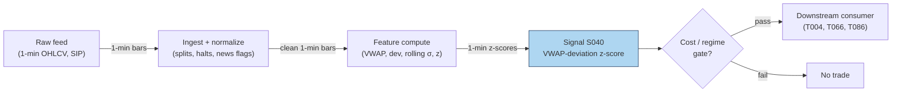

### S12. Sources

1. Berkowitz, S. A., Logue, D. E. & Noser, E. A. (1988). "The Total Cost of Transactions on the NYSE." *Journal of Finance*, 43(1), 97–112. https://repec.udesa.edu.ar/pub/Finanzas/Journals/Journal%20of%20Finance/43/1/2328325.pdf
2. Choi, J. H., Larsen, K. & Seppi, D. J. (2018). "Equilibrium Effects of Intraday Order-Splitting Benchmarks." arXiv:1803.08336. https://ideas.repec.org/p/arx/papers/1803.08336.html
3. Haendler, C., Heston, S., Korajczyk, R. & Sadka, R. (2025). "The Intra-Day Stock Return Periodicity Puzzle." Working paper, SSRN 5749704.
4. Kissell, R. (2014). *The Science of Algorithmic Trading and Portfolio Management.* Academic Press. (Practitioner treatment of VWAP benchmark strategies; book, no URL.)

**Unverified leads:** second-hand statistics on VWAP algo market share ("30–40% of institutional flow") and per-minute reversion flow ("0.02–0.05% per 1% deviation") via a GitHub knowledge-base mirror — not verified against Harris/Kissell originals; excluded from evidence. Vendor whitepapers claiming VWAP-fade performance — unverified unless audited numbers are produced.

**Source log:** chatbot answers (Grok/Cursor) pending — checked 2026-09-10; grok-answers.md and cursor-answers.md absent from batches/SB1/ (duckai-answers.md present but covers S001 only, not this chapter).

---

## Stage 11/200 — S011: Amihud illiquidity ratio

*Batch SB2 · Signal 11/100 · Provenance [D] · Family A — Microstructure & order flow*

### S1. One-line verdict

| Row | Content |
|---|---|
| **What it is** | Daily average of \|return\| per dollar of volume — a low-frequency price-impact (illiquidity) gauge computable from ordinary OHLCV bars. |
| **When it works** | Cross-sectional liquidity ranking, cost-aware sizing, and fading overextended moves in illiquid names. |
| **When it dies** | As a standalone intraday trigger; where volume conventions break (halvings, corporate actions); during volume-regime shifts where a 20-day average is stale. |
| **Build-or-buy in one line** | Build — it is five lines of arithmetic on daily bars; buy history/coverage, never the formula. |

Provenance **[D]** (documented: Amihud 2002). Family **A — Microstructure & order flow**. Worked example is synthetic and watermarked; the chatbot corrections are documented in S4.

### S2. How it works — plain human explanation

**Vignette.** It is 9:47 a.m. Two stocks each trade at $50. Stock X prints a $2M seller and slips 4 cents. Stock Y prints the same $2M seller and falls 40 cents. The Amihud ratio is that observation averaged over days: *how much price moves per dollar traded*. High Amihud = illiquid: each dollar of flow leaves a bigger footprint.

**Why the effect should exist economically.** Three channels:
- *Price impact / adverse selection.* In a thin book a market order walks further down the ladder, so returns per unit volume are larger — the low-frequency cousin of **Kyle's lambda** (S010), which measures impact per share at high frequency.
- *Inventory cost.* Dealers in thin names carry inventory longer and demand compensation as larger price concessions per dollar traded.
- *The illiquidity premium.* Amihud (2002) showed investors demand higher expected returns for illiquid stocks — and that illiquid names mean-revert more, because thin-book moves overshoot fundamentals.

**Mental model (3 bullets):**
- Amihud = the *exchange rate between dollars traded and price moved*, averaged over a window.
- It is a **cost and regime input**, not a direction signal — how expensive a name is to trade and how far its moves are likely to overshoot.
- High ILLIQ names are where temporary-impact fades (T027) hunt and where participation throttles (T026) must be tightest.

### S3. The math — exact formula

For stock *i* over a window of *D* days (day *d* = 1…*D*):

$$\text{ILLIQ}_{i,D} = \frac{1}{D}\sum_{d=1}^{D}\frac{|r_{i,d}|}{\text{DVOL}_{i,d}}$$

where:

- $r_{i,d} = C_{i,d}/C_{i,d-1} - 1$ is the **decimal** daily return (close-to-close; unitless),
- $\text{DVOL}_{i,d} = P_{i,d}\times V_{i,d}$ is **dollar volume** in dollars (price × shares; units $),
- $\text{ILLIQ}$ has units **per dollar** (1/$) — the fraction of price moved per dollar traded.

Because raw values are tiny (∼10⁻¹⁰ per dollar for liquid stocks), the literature reports **ILLIQ × 10⁶** — "return per $1M traded".

**Causal timing.** Computed at the close of day *T* using only closes/volumes on days ≤ *T*. The *D*-day average is complete only after the *D*-th close; tradable no earlier than the next session's open (bar *t* → earliest fill *t+1*).

**Parameter table** (every default below is an *example — not an institutional standard*):

| Parameter | Symbol | Typical range | Too small | Too large | Default example |
|---|---|---|---|---|---|
| Lookback window | *D* | 5–60 days | noisy, one big day dominates | stale, misses regime shifts | 20 days (monitoring); 60 days (smooth ranking) |
| Scaling | — | ×1 (per-$) or ×10⁶ (per-$M) | unreadable tiny numbers | none (cosmetic) | ×10⁶ for reporting |
| Aggregation | — | mean / median / winsorized mean | mean is outlier-sensitive | median hides genuine spikes | winsorized mean (extremes capped at the 1st/99th percentiles) |
| Return convention | — | close-close / open-close | — | — | close-close (classic); open-close (OCAM) variant |
| Intraday analog | — | \|r_bar\|/DVOL_bar per 1–5-min bar, averaged | microstructure noise dominates | converges to daily measure | 5-min bars, RTH only |

**Normalization.** Cross-sectional (across many stocks at one point in time) **rank** or **z-score** (standard deviations from the bucket mean) **within size bucket** is standard practice — raw ILLIQ spans orders of magnitude across market caps. Never compare raw values across a $500M name and a $500B name.

**Named variants:**
1. **CCAM vs OCAM** — classic close-to-close vs open-to-close Amihud (drops the overnight gap from the numerator); research reports OCAM-based liquidity premia roughly double CCAM-based ones (Warwick WP 1211, 2019; see S9).
2. **Intraday-bar analog** — |r_bar|/DVOL_bar on 1–5-min bars, averaged over the session: a slow intraday regime input, not a per-bar trigger.
3. **Winsorized/median ILLIQ** — robust aggregation for names with earnings-jump days that would otherwise dominate the window.

### S4. Worked example — step-by-step numbers (SYNTHETIC)

**Synthetic 10-day tape** (chatbot Q-SB2-1, operator-corrected). **The raw chatbot output contained errors**: its nine daily ILLIQ values were individually correct, but it reported Σ = 6.8216e-9 and average = 7.5796e-10, conflating sum and average in its notation. Corrected values used here: **Σ = 6.3933e-9, average = 7.1037e-10, per-$M = 7.1037e-4**. Tape is hand-specified and deterministic (no RNG draw; plot script records seed 110).

Formula per day: $r_t = C_t/C_{t-1} - 1$; $\text{DVOL}_t = C_t \times V_t$; $\text{ILLIQ}_t = |r_t|/\text{DVOL}_t$.

| Day | Close ($) | Volume (shares) | Return *r* | Dollar vol ($) | ILLIQ (per-$) |
|---|---|---|---|---|---|
| D1 | 100.00 | 100,000 | — | 10,000,000 | — |
| D2 | 101.00 | 120,000 | +0.010000 | 12,120,000 | 8.2508e-10 |
| D3 | 100.50 | 110,000 | −0.004950 | 11,055,000 | 4.4763e-10 |
| D4 | 102.00 | 130,000 | +0.014925 | 13,260,000 | 1.1257e-9 |
| D5 | 101.50 | 100,000 | −0.004902 | 10,150,000 | 4.8296e-10 |
| D6 | 103.00 | 150,000 | +0.014778 | 15,450,000 | 9.5649e-10 |
| D7 | 102.00 | 125,000 | −0.009709 | 12,750,000 | 7.6159e-10 |
| D8 | 101.00 | 140,000 | −0.009804 | 14,140,000 | 6.9320e-10 |
| D9 | 101.50 | 100,000 | +0.004950 | 10,150,000 | 4.8768e-10 |
| D10 | 100.50 | 160,000 | −0.009852 | 16,080,000 | 6.1290e-10 |

**Step-by-step (D2, fully shown):** $r_2 = 101.00/100.00 - 1 = 0.010000$. $\text{DVOL}_2 = 101.00 \times 120{,}000 = \$12{,}120{,}000$. $\text{ILLIQ}_2 = 0.010000 / 12{,}120{,}000 = 8.2508\times10^{-10}$ per dollar. Every other day follows identically.

**Aggregation (corrected):**
$$\bar{\text{ILLIQ}} = \frac{1}{9}\sum_{t=2}^{10}\text{ILLIQ}_t = \frac{6.3933\times10^{-9}}{9} = 7.1037\times10^{-10}\ \text{per dollar}$$
Reported per-$M: $7.1037\times10^{-10}\times10^{6} = \mathbf{7.1037\times10^{-4}}$.

**Chart** (same data — spot-check any bar against the table; see S11 for the figure).

**What to notice.** Illiquidity spikes on D4 (biggest |r| per dollar) and D6 (large move, high dollar volume) — the ratio punishes days where price moved a lot *relative to the dollars that moved it*. **Limits:** no fees, no spread, no corporate actions, a 9-day mean — this demonstrates the arithmetic, not an edge. Never present these numbers as performance.

### S5. Strategies that use this signal

- **T027 — Illiquidity Temporary-Impact Fade (primary trigger).** S011 ranks the universe by illiquidity; overextended intraday moves in high-ILLIQ names are faded on the premise that thin-book moves overshoot and decay on the resiliency half-life (S048; resiliency = how fast the order book refills after a sweep).
- **T026 — Kyle-Lambda Participation Throttle (filter / sizing cap).** Child-order participation rates (own volume ÷ market volume) are capped by Amihud-based illiquidity ceilings: the more illiquid the name, the smaller the allowed fraction of visible depth (displayed limit-order volume).

### S6. Data required — exact spec

| Field | Type | Granularity | Source tier | Notes |
|---|---|---|---|---|
| Close | float $ | daily | Tier 0–1 | split/dividend-adjusted for return continuity |
| Volume | int shares | daily | Tier 0–1 | native (unadjusted) shares; conventions vary by vendor |
| (intraday analog) OHLCV | float/int | 1–5-min bars, RTH (regular trading hours) | Tier 1 | for the bar-analog variant |
| Corporate actions | events | daily | Tier 1 | splits/dividends; mis-adjusted closes corrupt \|r\| |

**Collection.** Named feeds: Stooq (Tier 0, daily), Polygon stocks v3 aggregates (Tier 1), Alpaca (Tier 1), Databento (Tier 2). Schema sketch: `symbol, date, open, high, low, close, volume` + split/div metadata table.

**Ingest sketch (Python/polars, ≤20 lines):**
```python
import polars as pl
daily = pl.scan_parquet("bars/daily_*.parquet")          # symbol,date,close,volume
illiq = (daily.sort("symbol", "date")
    .with_columns(r=pl.col("close") / pl.col("close").shift(1).over("symbol") - 1,
                  dvol=pl.col("close") * pl.col("volume"))
    .with_columns(illiq=pl.col("r").abs() / pl.col("dvol"))
    .filter(pl.col("dvol") > 0)                            # drop zero-volume days
    .group_by("symbol")
    .agg(illiq_20d=pl.col("illiq").tail(20).mean(),
         illiq_med=pl.col("illiq").tail(20).median()))
illiq.sink_parquet("features/illiq_daily.parquet")
```

**Storage.** Per `notes/cost-model.md §4`: daily bars for 3,000 stocks ≈ 5 MB/day total — 60 days ≈ 300 MB, trivial; the derived ILLIQ panel is kilobytes.

**Data-quality checklist:** adjustment consistency (adjusted closes for *r*, native volumes for DVOL — mixing them double-counts splits); halt days (zero volume → drop, don't divide by zero); DST/half-days (intraday analog only); stale corporate-action metadata.

### S7. Local build on M5 Max / 128GB

**Feasibility: trivial.** This is daily-bar arithmetic — a groupby mean over a few million rows.

**Throughput** (per `notes/cost-model.md §2`): polars column ops run ~10–50M rows/sec; the ILLIQ panel for 3,000 stocks × 10 years (~7.5M rows) computes in under a second. Even the intraday analog on 500 symbols × 390 bars × 60 days = 11.7M rows recomputes in seconds. Bottleneck is data licensing, corporate-action handling, and download reliability (cost-model §6).

**Stack options:**

| Stack | When to pick |
|---|---|
| Python + polars | Default; this entire signal is a lazy-frame one-liner |
| DuckDB | If you already keep bars in SQL and want the feature in-query |
| Rust | Only if ILLIQ must run inside a latency-sensitive execution loop (rare) |

**RAM** (per cost-model §3): daily OHLCV for 3,000 stocks × 10 years ≈ 2–5 GB — fits comfortably inside the 77 GB working budget.

**Engineering time:** Tier **L**, 4–12 h → **$600–1,800** at $150/hr loaded-cost estimate (cost-model §5). One line of justification: formula, ingest, and corporate-action handling on daily bars; no event loop, no estimation, no calibration.

**What breaks first at 500 symbols / full OPRA:** nothing — daily bars for 500 symbols are trivial. Scaling to full OPRA is irrelevant (no options input). The real scaling cost is the 500-stock 1-min pipeline around it (106–246 h per the Q-SB2-2 chatbot lead, data-licensing dominated).

### S8. Buy vs build

| Option | What you get | Indicative price | What buying gains | What buying loses |
|---|---|---|---|---|
| Tier-0: Stooq / Alpaca IEX / SEC EDGAR | Free daily OHLCV, delayed quotes | ~$0 | zero marginal cost | IEX-only tape (~2.5% of US volume per chatbot lead — inadequate for volume-sensitive research) |
| Tier-1: Polygon Stocks Advanced | SIP (consolidated-tape feed) 1-min + daily bars, corporate actions, 10y history | ~$30–200/mo | consolidated tape, adjustments handled | none material at this tier |
| Tier-2: Databento Standard | L1/L2 + bars, pay-as-you-go | ~$200/mo + usage | honest intraday for the bar-analog | overkill for the classic daily measure |
| Academic: CRSP / WRDS | Survivorship-bias-free daily history | institutional $$$$ | publication-grade history | cost, access friction |

All prices `indicative — verify before budgeting`. **Verdict: build.** The estimator is five lines; the buy decision is purely about bar history and corporate-action quality. Buy Polygon-grade daily history for a survivorship-aware 10-year panel; build the rolling ILLIQ panel in an afternoon. Crossover: buy the *history*, build the *feature* — precomputed illiquidity factors are poor value because window/winsorization conventions differ.

### S9. Success ratio / efficacy — documented evidence

| Study / source | Market & period | Metric | Before/after cost | Caveat |
|---|---|---|---|---|
| Amihud (2002), J. Financial Markets 5, 31–56 | NYSE, 1964–1997 (cross-section + time series) | Positive return–illiquidity relationship: expected market illiquidity raises ex ante excess returns; strongest in small firms | **Before cost** (asset-pricing premium, not a strategy) | Says nothing about net alpha after trading the illiquid names |
| Warwick Econ. WP 1211 (2019), "The Night and Day of Amihud's Liquidity Measure" | NYSE/AMEX, 1964–2019 | Open-to-close-based liquidity premia roughly **double** close-to-close-based premia; liquidity premia **decline over time** | **Before cost** | Measurement refinement, not a tradable edge |

**Regimes where it fails.** Volume-regime shifts (a 20-day average is stale after a shock); corporate-action misadjustments; the documented secular decline in the illiquidity premium — a 1990s cross-sectional tilt is far weaker today.

**Honest bottom line:** as a standalone intraday trigger: **~zero edge** — no directional information. As a **cost filter and sizing input** it is genuinely useful: it tells you which names will eat your P&L in impact and which overextended moves are likely temporary. Its value is defensive (avoiding bad trades, sizing right), not offensive.

### S10. Failure modes & pitfalls

1. **Lookahead leakage** — trading at *T*'s close before the *D*-day average is complete; mitigate: compute at close, trade at next open.
2. **Corporate-action contamination** — unadjusted splits create fake |r| spikes; mitigate: adjusted closes for returns, native volumes, reconciled action tables.
3. **Zero/low-volume days** — division by ~zero explodes ILLIQ; mitigate: drop zero-volume days, winsorize.
4. **Volume-convention drift** — reporting changes alter DVOL; mitigate: median/winsorized aggregation, monitor the distribution for level shifts.
5. **Stale window after regime shifts** — 20–60-day averages lag volume shocks; mitigate: dual windows (fast 5-day + slow 60-day), flag divergences.
6. **Cross-cap comparison without normalization** — raw ILLIQ is a size proxy in disguise; mitigate: rank/z-score within size or ADV (average daily volume) buckets.
7. **Mistaking the premium for alpha** — the documented premium is before-cost compensation for *holding* illiquidity, not profit from *trading* on it; mitigate: net spread + fees + impact before sizing any ILLIQ-tilted book.
8. **Crowding in "illiquidity factor" trades** — crowded exits in thin names are the blowup scenario; mitigate: hard participation caps (T026) and ADV-based position limits.

### S11. Visuals


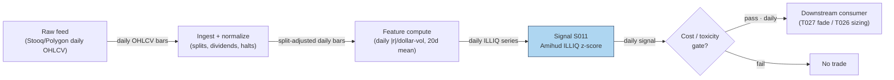

### S12. Sources

1. Amihud, Yakov (2002). "Illiquidity and Stock Returns: Cross-Section and Time-Series Effects." *Journal of Financial Markets* 5(1), 31–56. https://www.cis.upenn.edu/~mkearns/finread/amihud.pdf
2. "The Night and Day of Amihud's (2002) Liquidity Measure." University of Warwick Economics Working Paper 1211 (2019) — documents OCAM vs CCAM premia and the secular decline of the liquidity premium. https://warwick.ac.uk/fac/soc/economics/research/workingpapers/2019/twerp_1211_bernhardt.pdf
3. Duck.ai (bot: GPT-5.6 "Luna", anonymous, reasoning "Fast"), answers to batch SB2 questions Q-SB2-1–Q-SB2-3 (2026-09-10). **Labeled chatbot source**: Amihud formula and 10-day worked example — nine daily ILLIQ values verified individually correct; the model's sum/average were wrong and operator-corrected (Σ = 6.3933e-9, average = 7.1037e-10, per-$M = 7.1037e-4 — corrected values used in S4). Q-SB2-2 pipeline leads inform S7/S8; `notes/cost-model.md` takes precedence — no material conflicts found.
4. Formula/parameter conventions (lookbacks 5–60d, winsorization, per-$M reporting) cross-checked against the Amihud (2002) paper text.

**Unverified leads** (chatbot-only, no checkable source — not used as evidence):
- zerolag.club Amihud formula page (definition matches Amihud 2002; page not independently verified).
- Chatbot Q-SB2-2 vendor plan details (Massive/Polygon Developer $79/mo, Alpaca Algo Trader Plus $99/mo) — leads in S8 with the indicative disclaimer; cost-model §6 bands take precedence.

**Source log:** Duck.ai answered Q-SB2-1–Q-SB2-3 (2026-09-10); Grok/Cursor answers pending (checked 2026-09-10).

---

---
## Stage 13/200 — S013: Corwin–Schultz high-low spread estimator

*Batch SB2 · Signal 13/100 · Provenance [D] · Family A — Microstructure & order flow*

### S1. One-line verdict

| Row | Content |
|---|---|
| **What it is** | Estimates the bid-ask spread from two consecutive days' high-low ranges — volatility scales with interval, the spread does not, so their difference isolates the spread. |
| **When it works** | Daily cost gating and spread context on any OHLC feed; best where true spreads are wide relative to daily volatility. |
| **When it dies** | Overnight gaps, tiny-spread liquid names (negative → floored at 0), intraday use without validation, non-equity samples (documented instability). |
| **Build-or-buy in one line** | Build — ten lines on daily bars; buy TAQ only if you need true quoted spreads. |

Provenance **[D]** (documented: Corwin & Schultz 2012). Family **A — Microstructure & order flow**. Worked example is synthetic; the chatbot correction is documented in S4.

### S2. How it works — plain human explanation

**Vignette.** Tuesday's tape for a mid-cap: high $52.40, low $51.10; Wednesday: high $52.90, low $51.60. No quote data — just four numbers. Hidden inside those ranges is the bid-ask spread, the round-trip tax on every trade. Corwin–Schultz recovers it from one observation: **the day's high is almost always a buy (lifted at the ask) and the low almost always a sell (hit at the bid)**. So each day's high-low range mixes *two* things: the stock's true volatility *plus* one full bid-ask spread.

**The trick.** True volatility grows with the measurement interval — a two-day range carries about twice the variance of a one-day range. The spread component does *not* grow: one day or two, the high is still one ask-print and the low one bid-print. Compare the one-day ranges against the overlapping two-day range and the volatility cancels — what remains is the spread.

**Why it should work economically.** It rests on a market-microstructure regularity: in a limit-order market (trading via posted bid/ask orders), aggressive buyers lift offers and aggressive sellers hit bids, so daily extremes are systematically signed. The estimator's power and its failure modes both come from that signing — it breaks on overnight gaps, one-sided trends, and wide-tick names.

**Mental model (3 bullets):**
- One-day high-low = volatility + spread. Two-day high-low = 2× volatility + spread. Two equations, two unknowns → solve for the spread.
- It is a **cost input**, not a trigger — it tells a strategy how wide the door is before deciding whether the edge fits through it.
- Negative estimates are not "negative spreads"; they are noise, and the estimator floors them at zero.

### S3. The math — exact formula

For two consecutive days *t* and *t+1* with highs $H_t, H_{t+1}$ and lows $L_t, L_{t+1}$ (all in $):

$$\beta_t = \ln^2\!\left(\frac{H_t}{L_t}\right) + \ln^2\!\left(\frac{H_{t+1}}{L_{t+1}}\right), \qquad
\gamma_t = \ln^2\!\left(\frac{\max(H_t,H_{t+1})}{\min(L_t,L_{t+1})}\right)$$

$$\alpha_t = \frac{\sqrt{2\beta_t}-\sqrt{\beta_t}}{\,3-2\sqrt{2}\,} - \sqrt{\frac{\gamma_t}{\,3-2\sqrt{2}\,}}$$

$$S_t = \frac{2\left(e^{\alpha_t}-1\right)}{1+e^{\alpha_t}} = 2\tanh\!\left(\frac{\alpha_t}{2}\right), \qquad
S_t^+ = \max(S_t, 0)$$

- $S_t$ is the estimated spread as a **proportion** of price (unitless); ×10,000 for **basis points**.
- $3 - 2\sqrt{2} = 0.171572875$ comes from the variance-of-range algebra.
- The original paper includes an **overnight-gap adjustment**; the base form above assumes it is handled separately or negligible.

**Causal timing.** The estimate for window (*t*, *t+1*) is complete at the close of day *t+1* using only highs/lows ≤ *t+1*; usable no earlier than the next session open. In practice estimates are averaged over a reporting window (e.g. 20–60 days) to tame noise.

**Parameter table** (defaults are *example — not an institutional standard*):

| Parameter | Symbol | Typical range | Too small | Too large | Default example |
|---|---|---|---|---|---|
| Estimation window | 2 days | fixed by construction | n/a | n/a | 2 consecutive days |
| Reporting window | *W* | 20–60 days | single-window estimates too noisy | stale cost picture | 20-day mean of $S_t^+$ |
| Zero floor | — | on/off | negative "spreads" pollute averages | flooring biases small-spread names upward | on (report raw + floored) |
| Overnight adjustment | — | on/off | gaps inflate γ → negative α | adjustment needs extra params | on for daily estimation |

**Normalization.** Report both the proportion and basis points (1 bp = 0.01%); for cross-sectional use, z-score within liquidity bucket or compare against the strategy's expected edge in the same units (bp vs bp).

**Named variants:**
1. **CS with overnight adjustment** — the paper's full form, scaling for close-to-open gaps; preferred on daily data with material overnight moves.
2. **Abdi–Ranaldo (2017)** — adds the close price; generally the most accurate low-frequency estimator vs TAQ benchmarks, best for less liquid stocks.
3. **Session-block CS** — applied to intraday high-low blocks (e.g. morning vs afternoon); usable only with validation.

### S4. Worked example — step-by-step numbers (SYNTHETIC)

**Synthetic 10-day tape.** The chatbot's worked example (Duck.ai, Q-SB2-1), operator-verified with one correction: **the raw chatbot output's α was correct (α₁ = 0.019797) but its spread was wrong by ~1% — it reported S₁ = 0.019603 (196.03 bp) because it linearized e^α ≈ 1+α (computing 2α/(2+α)). The exact value is S₁ = 2·tanh(α/2) = 0.019796 ≈ 197.96 bp, used everywhere here.** Every day: H = 102, L = 100 (O and C are irrelevant to the base estimator and omitted). Tape is deterministic (no RNG; plot script records seed 130).

**Step-by-step, window W1 (days 1–2):**
1. $h = \ln(102/100) = \ln(1.02) = 0.019802627$; $h^2 = 0.000392144$.
2. $\beta_1 = 0.000392144 + 0.000392144 = 0.000784288$.
3. $\gamma_1 = \ln^2(102/100) = 0.000392144$ (two-day high = 102, two-day low = 100).
4. $\sqrt{\beta_1} = 0.028005$, $\sqrt{2\beta_1} = 0.039605$.
5. First term: $(0.039605 - 0.028005) / 0.171572875 = 0.011600 / 0.171572875 = 0.067606$.
6. Second term: $\sqrt{0.000392144 / 0.171572875} = \sqrt{0.0022856} = 0.047807$.
7. $\alpha_1 = 0.067606 - 0.047807 = \mathbf{0.019797}$ ✓ (verified).
8. $S_1 = 2(e^{0.019797}-1)/(1+e^{0.019797}) = 2(0.0199944)/(2.0199944) = \mathbf{0.019796}$; equivalently $2\tanh(0.0098985) = 0.019796$.
9. In basis points: $0.019796 \times 10{,}000 = \mathbf{197.96\ bp}$ (not the chatbot's 196.03 bp).

All nine windows (W1…W9) are identical → **9-window average ≈ 0.019796 ≈ 197.96 bp**.

**Chart** (same data; see S11 for the figure).

**What to notice.** Estimates are flat because the synthetic tape has constant ranges — the estimator has no variation to chew on. In real data $S_t$ jumps window to window — the 20-day average is the usable number; single-window estimates are noisy and often negative (hence the floor). **Limits:** no fees, no overnight gaps, and a constant-range tape is the least informative input possible — this demonstrates the arithmetic and the linearization correction, not estimation quality.

### S5. Strategies that use this signal

- **T029 — Spread-Estimate Edge Filter (primary).** Trades only when the estimated effective spread (Roll S012 or Corwin–Schultz S013; effective spread = twice the trade price's distance from the quote midpoint) is below the strategy's per-trade edge: the signal *is* the gate.
- **T016 — End-of-Day Drift Rider (context).** Leans into last-hour drift (S027) confirmed by opening-auction imbalance (S033); wide CS estimates shrink size or stand it down into the close.

### S6. Data required — exact spec

| Field | Type | Granularity | Source tier | Notes |
|---|---|---|---|---|
| High / Low | float $ | daily | Tier 0–3 | any OHLCV feed; the *only* required inputs |
| Open / Close | float $ | daily | Tier 0–3 | needed only for the overnight-adjustment variant |
| (validation) TAQ effective spread | float | trade-level | Tier 3 | benchmark for checking your implementation, not for production use |

**Collection.** Any OHLCV vendor: Stooq (Tier 0), Polygon/Tiingo (Tier 1), Databento (Tier 2). Schema sketch: `symbol, date, high, low` (+ `open, close` for the adjusted variant).

**Ingest sketch (Python/polars, ≤20 lines):**
```python
import polars as pl, numpy as np
ohlc = pl.scan_parquet("bars/daily_*.parquet").sort("symbol", "date")
K = 3 - 2*np.sqrt(2)
cs = (ohlc.with_columns(h2=(pl.col("high")/pl.col("low")).log()**2)
    .with_columns(beta=pl.col("h2") + pl.col("h2").shift(-1).over("symbol"),
        gamma=((pl.max_horizontal("high", pl.col("high").shift(-1).over("symbol")) /
                pl.min_horizontal("low",  pl.col("low").shift(-1).over("symbol"))).log()**2))
    .with_columns(alpha=(pl.col("beta")*2).sqrt().sub(pl.col("beta").sqrt()).truediv(K)
                        .sub((pl.col("gamma")/K).sqrt()),
                  S=(2*((pl.col("alpha").exp()-1)/(pl.col("alpha").exp()+1))).clip_min(0))
    .group_by("symbol").agg(cs_20d=pl.col("S").tail(20).mean()))
cs.sink_parquet("features/cs_spread_daily.parquet")
```

**Storage.** Per `notes/cost-model.md §4`: daily bars for 3,000 stocks ≈ 5 MB/day — the CS panel is a rounding error on top.

**Data-quality checklist:** bad ticks in H/L (one erroneous print corrupts both windows touching that day — winsorize log-ranges (cap extremes at percentile bounds)); corporate actions (adjust H/L with closes); half-days/DST (daily estimator unaffected; session-block variant is not); stale H=L=0 rows from dead feeds.

### S7. Local build on M5 Max / 128GB

**Feasibility: trivial.** Ten lines of vectorized math on daily bars.

**Throughput** (per `notes/cost-model.md §2`): numpy vectorized math runs ~50–200M elements/sec; the full CRSP-scale daily panel computes in seconds in polars. Bottleneck is H/L data QA, not compute.

**Stack options:**

| Stack | When to pick |
|---|---|
| Python + polars/numpy | Default; the whole estimator is closed-form |
| DuckDB | If spreads must be computed inside SQL bar pipelines |
| Rust | Never needed for this estimator (no hot loop) |

**RAM** (per cost-model §3): daily OHLCV 3,000 stocks × 10y ≈ 2–5 GB — fits comfortably within the 77 GB working budget; a 60-year panel still fits.

**Engineering time:** Tier **L**, 4–12 h → **$600–1,800** at $150/hr loaded-cost estimate (cost-model §5). Closed-form estimator on daily bars; the hours go to H/L data QA and the overnight-adjustment variant.

**What breaks first at 500 symbols / full OPRA:** nothing — 500 symbols of daily bars are trivial. Full OPRA is irrelevant (no options input). Intraday session-block extension needs clean RTH (regular trading hours) high/low blocks per symbol — still Tier-1, still cheap.

### S8. Buy vs build

| Option | What you get | Indicative price | What buying gains | What buying loses |
|---|---|---|---|---|
| Tier-0: Stooq / exchange delayed | Free daily OHLC | ~$0 | zero cost | no adjustments, shallow history |
| Tier-1: Polygon Stocks Advanced / Tiingo | SIP daily OHLC, corporate actions | ~$30–200/mo | clean adjusted H/L history | none material |
| Tier-2: Databento Standard | Research-grade bars + TAQ-adjacent data | ~$200/mo + usage | validation against better benchmarks | overkill for the estimator itself |
| Academic/institutional: TAQ (WRDS) | True intraday quotes/trades | institutional $$$$ | actual effective spreads — the ground truth | cost; you would not need CS at all |

All prices `indicative — verify before budgeting`. **Verdict: build.** The estimator exists precisely for the situation where you *don't* buy quote data. Buy TAQ only if cost modeling needs true effective spreads — then CS is the cross-check, not the source. Crossover: buy quotes when per-trade cost accuracy is worth more than the data bill; otherwise CS on Tier-1 daily bars is the standard cheap substitute.

### S9. Success ratio / efficacy — documented evidence

| Study / source | Market & period | Metric | Before/after cost | Caveat |
|---|---|---|---|---|
| Corwin & Schultz (2012), *J. Finance* 67, 719–760 — simulation evidence (as summarized in the Brazilian replication study) | Simulated markets under realistic conditions | Correlation between high-low spread estimates and true spreads **≈ 0.9**; std of CS estimates ≈ **one-half** the std of Roll (1984) covariance estimates | n/a — estimator accuracy, not trading P&L | Simulation-based; real-data performance varies with the high=buy/low=sell assumption |
| Abdi & Ranaldo (2017), *RFS* 30, 4437–4480 | US stocks, ~1 century of daily data | Their close/high/low estimator delivers the **highest cross-sectional and average time-series correlations with the TAQ effective-spread benchmark** among low-frequency estimators; most accurate for **less liquid** stocks | n/a — estimator accuracy vs TAQ benchmark | This is the Abdi–Ranaldo extension, not base CS — but it validates the high-low family against ground truth |
| MPRA (2017) estimator horse-race (real + simulated data, equities and FX) | Multi-market | CS "unstable — works well for equities but not the remaining tests"; Abdi–Ranaldo shows high correlation with true spreads but downward bias | n/a — estimator accuracy | Directly limits S013's claimed generality: treat it as an **equities** estimator (chatbot-reported, not re-verified) |

**Regimes where it fails.** Overnight-gap regimes (γ inflated → negative α without adjustment); ultra-liquid names (true spread small vs noise; the floor discards information); trending/one-sided days breaking the high=buy/low=sell signing; non-equity samples (documented instability).

**Honest bottom line:** as a standalone trigger this is a **non-signal** — it estimates a cost, and costs don't point anywhere. As a **cost gate** it is one of the best-documented cheap tools in microstructure — use it when TAQ is not in the budget; the evidence says it tracks true effective spreads well enough to reject trades whose edge doesn't cover the spread.

### S10. Failure modes & pitfalls

1. **Negative α → floored zeros** — noise dominates when spreads are small; mitigate: report raw and floored series, average over the reporting window.
2. **Overnight gaps** — inflate the two-day range, bias α down; mitigate: use the paper's overnight-gap adjustment variant.
3. **Bad H/L prints** — one erroneous tick corrupts two windows; mitigate: winsorize log-ranges, cross-check against a second vendor.
4. **Violations of high=buy/low=sell** — trending or gappy days break the signing assumption; mitigate: distrust single-window spikes, average over 20–60 days.
5. **Intraday session blocks without validation** — the spread-doesn't-scale logic is calibrated to daily intervals; mitigate: validate block-CS against TAQ (Trade and Quote database) on a sample first (labeled `simulated only — requires MBO/ITCH`, i.e. market-by-order / Nasdaq direct-feed data, where latency-sensitive).
6. **Applying outside equities** — documented instability in FX/other samples; mitigate: restrict to equities, or re-validate per asset class.
7. **Comparing CS estimates across regimes** — volatility-regime changes shift the noise floor; mitigate: normalize against contemporaneous volatility or use within-regime ranks.
8. **Forgetting the estimate *is* the cost** — compare edge and spread in the same units (bp) and demand edge > spread × margin (threshold *example — not an institutional standard*).

### S11. Visuals


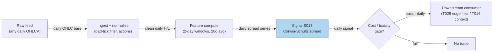

### S12. Sources

1. Corwin, Shane A. & Schultz, Paul (2012). "A Simple Way to Estimate Bid-Ask Spreads from Daily High and Low Prices." *Journal of Finance* 67(2), 719–760. https://afajof.org/issue/volume-67-issue-2/
2. Corwin, Shane A. & Schultz, Paul (2012). Internet Appendix: "Bid-Ask Spreads from Daily High and Low Prices" — robustness analyses and example applications. https://sites.nd.edu/scorwin/files/2019/11/Internet-Appendix_FINAL.pdf
3. Abdi, Farshid & Ranaldo, Angelo (2017). "A Simple Estimation of Bid-Ask Spreads from Daily Close, High, and Low Prices." *Review of Financial Studies* 30(12), 4437–4480. http://ideas.repec.org/a/oup/rfinst/v30y2017i12p4437-4480..html
4. Girão, Martins & Paulo — "Corwin-Schultz Bid-ask Spread Estimator in the Brazilian Stock Market" (summarizes CS simulation results: correlation ≈ 0.9 with true spreads; std ≈ half of Roll's). https://www.scielo.br/j/bar/a/DbHB3rhpfgr8f6qRFKPSMhG/?lang=en
5. Duck.ai (bot: GPT-5.6 "Luna", anonymous), Q-SB2-1 (2026-09-10). **Labeled chatbot source**: CS formulas hand-verified; worked example α₁ = 0.019797 verified, but S₁ = 0.019603 (196.03 bp) was ~1% wrong (linearized e^α ≈ 1+α); corrected S₁ = 0.019796 ≈ 197.96 bp used in S4.

**Unverified leads:**
- ssrn.com / metricgate.com CS formula pages (cited by the chatbot; formulas match Corwin & Schultz 2012, pages themselves not independently verified).
- MPRA 2017 estimator horse-race (CS unstable outside equities) — summarized from the search snippet; full paper not re-verified, used as a caveat lead. https://mpra.ub.uni-muenchen.de/79102/1/MPRA_paper_79102.pdf;h=repec:pra:mprapa:79102

**Source log:** Duck.ai answered Q-SB2-1–Q-SB2-3 (2026-09-10); Grok/Cursor answers pending (checked 2026-09-10).

---

---
## Stage 21/200 — S021: Opening-range breakout — Crabel (1990)

*Batch SB2 · Signal 21/100 · Provenance [D] · Family B — Intraday momentum & breakout*

### S1. One-line verdict

| | |
|---|---|
| **What it is** | Price breaks above/below the high/low of the first N minutes of the session; the break marks acceptance of a new intraday value area. |
| **When it works** | News/catalyst days with abnormal participation ("stocks in play"); tight ranges before the break; small spreads versus expected move. |
| **When it dies** | Range-bound, low-participation days (false breaks); wide spreads relative to the OR width; late entries after the move already printed. |
| **Build-or-buy in one line** | Build: it is ~50 lines of bar arithmetic on 1-minute data you already have; buy nothing. |

Provenance **[D]** (documented — Crabel 1990 framework; ORB profitability studied in Holmberg–Lönnbark–Lundström and Zarattini–Barbon–Aziz) · Family B — Intraday momentum & breakout.

### S2. How it works — plain human explanation

Picture 9:47:03 on a regular Tuesday. XYZ chopped between 99.70 and 100.90 for the first half hour while overnight news got digested — that band is the *opening range* (OR): the market's first draft of today's fair-value zone. Now a buy program lifts the offer through 100.95 and prints trade at 101.10 — above the morning high. The ORB trader reads that as the morning's disagreement resolving: directional commitment has arrived, and the follow-through often travels a multiple of the range's width.

Why should this exist economically? Three overlapping mechanisms. **Overnight-information discovery:** the open is the day's main price-discovery auction, and informed traders who learned something overnight trade aggressively in the first minutes — the range break is their footprint becoming visible. **Inventory and stop cascades:** a break triggers stops resting just outside the range, and stop-loss buying begets more buying — self-reinforcing but temporary. **Behavioral commitment:** breakout traders, momentum algos, and news-followers all condition on the same visible level (the morning high), so the level becomes a coordination point: everyone acts at once, which manufactures the continuation it predicts — until it doesn't.

Mental model (3 bullets):

- The opening range is the market's opening bid/ask for "today's value"; a break is the market rejecting that price.
- Real breaks are *funded* — they come with participation (volume); unfunded breaks are head-fakes.
- You are buying the *second* wave (confirmation), not predicting the first; edge lives in the filter, not the geometry.

### S3. The math — exact formula

Let the session open at time $t_0$ and let the opening range cover the first $m$ intraday bars (e.g. $m=6$ five-minute bars = 30 minutes). With bar $j$ having high $H_j$ and low $L_j$:

$$\text{ORH} = \max_{j=1..m} H_j, \qquad \text{ORL} = \min_{j=1..m} L_j, \qquad W = \text{ORH} - \text{ORL}$$

where ORH/ORL are the opening-range high/low and $W$ is the range width, in price units ($).

**Entry rules** (causal: evaluated at bar close or on tick $t > t_0 + m$, tradable no earlier than $t+1$):

$$\text{Long trigger at } t:\; P_t \ge \text{ORH} + \delta$$
$$\text{Short trigger at } t:\; P_t \le \text{ORL} - \delta$$

$\delta \ge 0$ is an entry offset (price units) that filters marginal touches of the level.

**Crabel's stretch filter.** Per-session opening noise: $\text{Noise}_i = \min(H_i - O_i,\; O_i - L_i)$ ($O_i$ = session open); $\overline{\text{Noise}} = \frac{1}{n}\sum_{i=1}^{n} \text{Noise}_{t-i}$ over $n$ prior sessions. The stretch $\text{Stretch} = q \cdot \overline{\text{Noise}}$ replaces $\delta$ ($q$ an *example* multiplier) — the offset scales with recent open noise. **Optional NR7/NR4 gate:** $\text{Range}_t < \min(\text{Range}_{t-1..t-7})$ (narrowest range in 7 days; NR4 uses 4) — compression-before-expansion regime filter. **Target/stop sketch** (*example*): target $= k \cdot W$ from entry; stop $=$ opposite side of OR.

#### Parameter table

| Parameter | Symbol | Typical range | Too small | Too large | Default example value |
|---|---|---|---|---|---|
| OR length | $m$ (min) | 5–60 | noise; false breaks | late entry | 30 min (`example — not an institutional standard`) |
| Entry offset | $\delta$ | 0–1× $W$ | whipsaw on touches | missed breaks | 0.30 $ on ~100 $ stock (`example`) |
| Stretch mult. | $q$ | 0.5–2.0 | no filtering | filters real breaks | 2.0, $n=10$ (`example`) |
| Noise lookback | $n$ | 5–20 sessions | unstable | stale | 10 sessions (`example`) |
| Bar granularity | — | 1–5 min | noise | coarse, late fills | 5-min bars (`example`) |
| Target multiple | $k$ | 1–3× $W$ | clipped winners | rarely reached | 2× $W$ (`example`) |

**Causality.** ORH/ORL use only bars $\le t_0+m$; the trigger fires at the first event $t > t_0+m$ with a qualifying print. Never assume a bar's close was executable at its high/low — **implementation warning from the source entry**: OHLC bars do not reveal intrabar event ordering, so never assume a stop/target was hit after a same-bar limit fill without finer data or conservative (worst-order) assumptions.

**Normalization choices.** Raw price levels — the geometry is in price space. Cross-stock comparability uses $W/\text{ATR}$ (ATR = average true range) or $W/$ price; RVOL-normalization is the S032 variant. The range is fixed-length-from-open, not rolling.

**Named variants.** (1) *Close-of-bar vs tick trigger* — bar-close beyond the level (fewer false breaks, later entry) vs any tick (faster, noisier). (2) *Stretch vs fixed-$\delta$ offset.* (3) *Both-sides rule* — if both triggers print the same day, define the resolution ex ante (first touch wins / no trade); backtests that ignore this are overstated.

### S4. Worked example — step-by-step numbers (SYNTHETIC)

**Label:** synthetic tape. The example below was reported by a chatbot (GPT-5.6 "Luna" via duck.ai, Q-SB2-1, 2026-09-10) and **each number was independently hand-verified by the batch operator** — used here as an arithmetic walk-through, not market data. Seed 21 is fixed in the plot script (tape values are fixed numbers; no randomness used).

Six 5-minute bars define the 30-minute opening range; bars 7–9 are post-range (bar 9 hosts the t+1 entry fill):

| Bar | O | H | L | C |
|---|---|---|---|---|
| B1 | 100.0 | 100.8 | 99.7 | 100.5 |
| B2 | 100.5 | 100.9 | 100.1 | 100.3 |
| B3 | 100.3 | 100.6 | 99.9 | 100.1 |
| B4 | 100.1 | 100.4 | 99.8 | 100.2 |
| B5 | 100.2 | 100.7 | 100.0 | 100.6 |
| B6 | 100.6 | 100.8 | 100.2 | 100.7 |
| B7 | 100.7 | 101.0 | 100.5 | 100.9 |
| B8 | 100.9 | 101.3 | 100.8 | 101.2 |
| B9 | 101.2 | 101.5 | 101.1 | 101.4 |

Step 1 — opening range: $\text{ORH} = \max(100.8, 100.9, 100.6, 100.4, 100.7, 100.8) = \mathbf{100.9}$ (from B2); $\text{ORL} = \min(99.7, 100.1, 99.9, 99.8, 100.0, 100.2) = \mathbf{99.7}$ (from B1); $W = 1.2$.

Step 2 — triggers with $\delta = 0.30$ (*example*): long $= 100.9 + 0.30 = \mathbf{101.2}$; short $= 99.7 - 0.30 = \mathbf{99.4}$.

Step 3 — evaluate: B7 high 101.0 < 101.2 → **no trigger** (the marginal poke fails the offset — this is the filter earning its keep). B8 high 101.3 ≥ 101.2 → **trigger on bar 8**; the trigger print is only known as bar 8 completes, so the entry is tradable no earlier than the next bar — **long entry fills at the bar-9 open, 101.2** (t→t+1 causality honored: the fill is at B9's open print, not at B8's high).

The chart `images/S021_example.png` plots exactly these 9 bars, the [99.7, 100.9] band, both triggers, and the bar-9 entry marker.

**What to notice.** The δ offset earns its keep: without it, B7's touch of 101.0 (above ORH) would have triggered a dead long. The honesty caveats: we *assumed* a fill at the bar-9 open price of 101.2, but a real fill at the trigger print crosses the spread after the bar-8 high is known — real entry pays slippage versus the tape. This toy tape has no fees, no spread, and no losers; it demonstrates arithmetic, not edge.

### S5. Strategies that use this signal

- **T005 — RVOL-Filtered Opening-Range Breakout** — *primary entry trigger*: ORB geometry supplies the entry; S032 (RVOL) confirms participation and S008 (VPIN) gates toxicity.
- **T003 — VPIN-Gated Breakout Trader** — *breakout leg with toxicity veto*: S021 defines the breakout event; S008 (VPIN) stands the strategy down when order-flow toxicity spikes; S032 sizes/confirms.

### S6. Data required — exact spec

| Field | Type | Granularity | Source tier | Notes |
|---|---|---|---|---|
| O/H/L/C | float | 1-min bars, RTH (regular trading hours) | Tier 0–1 | Regular-hours only; exclude pre/post-market from OR computation |
| Volume | int | 1-min bars | Tier 0–1 | Needed for RVOL/stocks-in-play variant (S032) |
| Exchange calendar | date/bool | daily | Tier 0–1 | Early closes (e.g. day after Thanksgiving) shift the OR window |
| Corporate actions | ratio/date | event | Tier 1 | Splits/dividends must be adjusted or the OR levels are garbage |
| Halts | timestamp | event | Tier 1–2 | A halted open has no valid OR; skip the day |

**Collection.** Polygon stocks v3 aggregates (`/v3/aggs/.../range/1/minute/...`) or Databento XNAS `OHLCV-1m`; Alpaca as a free Tier-0 fallback (IEX-only on free tier — fine for research, not for volume-filtered production).

**Ingest sketch (Python/polars, ≤20 lines):**
```python
import polars as pl, requests
def fetch_or_bars(sym, day, api_key):
    url = f"https://api.polygon.io/v2/aggs/ticker/{sym}/range/1/minute/{day}/{day}"
    r = requests.get(url, params={"apiKey": api_key, "adjusted": "true"}).json()
    df = pl.DataFrame(r["results"]).rename({"t": "ts", "o": "o", "h": "h", "l": "l", "c": "c", "v": "v"})
    df = df.with_columns(pl.from_epoch("ts", time_unit="ms").dt.tz_localize("UTC")
                           .dt.convert_time_zone("America/New_York").alias("ts_et"))
    rth = df.filter(pl.col("ts_et").dt.time().is_between(__import__("datetime").time(9, 30),
                                                        __import__("datetime").time(16, 0)))
    return rth.sort("ts")  # drop partial/halted days: require >= 360 bars
```

**Storage.** Per cost-model §4: 1-min bars for 500 symbols ≈ 50 MB/day total (≈0.1 MB per symbol-day); 60 days ≈ 3 GB — archive freely. The ORB state itself is two floats per symbol per day.

**Data-quality checklist.** (1) Exchange-local timestamps (America/New_York; DST via tz database). (2) Split/dividend-adjusted bars *before* OR levels. (3) Halted or <360-bar days: no valid OR — skip, don't impute. (4) Half-days: scale the window or skip. (5) Zero-volume opening bars are missing data, not a range.

### S7. Local build on M5 Max / 128GB

**Feasibility verdict: trivial.** ORB is two running extrema plus a threshold comparison per bar — the cheapest signal in Family B. Per cost-model §2, 500 symbols × 390 bars = 195k bars/day; polars column ops run ~10–50M rows/sec, so the whole universe recomputes in a sub-second batch each minute. No real-time constraint worth engineering for.

- **Throughput:** signals/sec effectively unbounded for ≤500 symbols; bottleneck is the API download, not compute.
- **Stack:** Python+polars (pick this — no reason for Rust); DuckDB for the bar store if you want SQL.
- **RAM:** <100 MB working set for 60 days across 500 symbols (~12 MB per cost-model §3) — enormous headroom vs the 77 GB budget.
- **Engineering time:** Tier L per cost-model §5 (4–12 h). **$600–$1,800** at $150/hr loaded — bars in, two extrema out; the rest is calendar/halt/adjustment plumbing.
- **What breaks first at 500 symbols or full OPRA:** nothing on bars. It breaks when you add the filters that make it work — real-time RVOL baselines (S032), auction-imbalance feeds (S033), tick-level entries — which move you into Tier M (~20–60 h).

### S8. Buy vs build

| Vendor / option | What you get | Indicative price | Buying gains | Buying loses |
|---|---|---|---|---|
| Tier-0 free: Stooq daily, Alpaca IEX, exchange delayed | Daily/1-min-ish bars, delayed | ~$0 | $0 research start | IEX-only volume (~2.5% of US volume per chatbot lead) — inadequate for volume filters |
| Tier-1: Polygon Stocks Advanced / Alpaca SIP | Real-time SIP 1-min bars, corporate actions, full tape | ~$30–200/mo | Correct consolidated volume for RVOL; official adjustments | Still bars — no tick ordering for intrabar honesty |
| Tier-2: Databento Standard (pay-as-you-go) | Honest L1/L2, MBP-1/10, OPRA research | ~$200/mo + usage | Tick-level entry timing; true queue data | Overkill for pure bar-ORB |
| Academic route: paper + own code | Formulas from Holmberg et al. / Zarattini et al. | ~$0 + eng time | Full parameter control | No data included |

*All prices indicative — verify before budgeting.* **Verdict: build.** The signal is 50 lines of bar math; nothing to buy. Buy the *data* (Tier-1 SIP bars, ~$79/mo Developer-class per the chatbot's Q-SB2-2 lead, inside cost-model §6's Tier-1 band) when you add the RVOL/stocks-in-play filter, because that filter is where consolidated volume becomes load-bearing. Crossover: buy data if you trade it; build analytics always.

### S9. Success ratio / efficacy — documented evidence

| Study / source | Market & period | Metric | Before/after cost | Caveat |
|---|---|---|---|---|
| Zarattini–Barbon–Aziz (2024), "A Profitable Day Trading Strategy for the U.S. Equity Market" (SSRN) | 7,000+ US stocks, 2016–2023, 5-min ORB | Top-20 stocks-in-play: >1,600% total net, Sharpe 2.81, 36% ann. alpha | **After** their cost assumptions | Concentrated, cost-model dependent, sample ends 2023 |
| Zarattini–Barbon–Aziz (2024), same paper, RVOL split | Same universe | RVOL >100% → +0.08R/trade; <100% → −0.02R; 30× → 0.38R | **After** commissions | The ORB edge is really a volume-filter edge |
| Zarattini & Aziz (2023), "Can Day Trading Really Be Profitable?" (SSRN) | QQQ, 5-min ORB, 2016–2023 | Ann. alpha 33% net of commissions; TQQQ version 1,484% total | **After** commissions (not full spread/impact) | Single instrument + leverage; broker caps bind |
| Holmberg–Lönnbark–Lundström (2013), *Finance Research Letters* | Crude-oil futures, intraday ORB | Returns significantly >0 vs a fair game | **Before** modern equity spread/impact | Futures; significance ≠ net tradability |
| Independent replication (Brusco, GitHub, of Zarattini & Aziz 2023) | QQQ, 5-min ORB | Barely survives realistic execution; break-even ≈ 2.2¢/share; 76% of filtered PnL from 2022 | **After** modeled costs | Regime concentration — mostly a 2022 phenomenon |

**When it fails.** Generic "trade every stock every day" ORB has little documented net edge — the duck.ai evidence synthesis (Q-SB2-3, chatbot-reported) puts it bluntly: *evidence in selected implementations, little verifiable evidence Crabel's originals survive modern costs broadly*. Documented killers: false breaks on range days, wide spreads vs. OR width, late entries, small-cap/low-ADV names, and treating the bar high as an executable price. The replication literature shows concentration in volatile regimes (2020–2022); calm-market ORB is mostly churn.

**Honest bottom line.** As a standalone trigger, ORB is a **weak, highly conditional edge** — the documented after-cost success lives in the *stocks-in-play + RVOL* implementation, not the geometry. As a **filter/timing device** (enter only funded breaks; T005/T003 usage), it is a respectable, well-understood component. Don't trade the raw breakout; trade the participation-confirmed breakout.

### S10. Failure modes & pitfalls

1. **Intrabar ordering leakage** — assuming the bar high was tradable after your fill. *Mitigation:* tick data for entries, or conservatively assume stops fill first (the source entry's explicit warning).
2. **False-break whipsaw on range days** — most days have no trend. *Mitigation:* RVOL/stretch filters (S032); skip low-RVOL days.
3. **Late entry** — a 60-min OR break leaves half the move printed. *Mitigation:* shorter OR (5–15 min) with stricter volume filters.
4. **Spread/impact cost blowup** — a 1.2-point OR on a 5¢-spread small-cap is a different trade than on a penny-spread large-cap. *Mitigation:* require expected move ≥ 5–10× spread (*example*); model spread+fees+slippage per trade.
5. **Both-sides-triggered days** — long then short on volatile opens. *Mitigation:* ex-ante rule: first touch / one entry per day (*example*).
6. **Corporate-action/calendar errors** — unadjusted splits shift OR levels; half-days compress the window. *Mitigation:* adjusted bars + exchange calendar; skip invalid days.
7. **Crowding at round levels** — everyone watches the same morning high. *Mitigation:* the δ offset plus volume confirmation so you're not the marginal buyer of a crowded level.
8. **Regime breaks** — ORB thrives in trending/vol regimes, dies in grinding low-vol ones. *Mitigation:* regime-gate on trailing realized vol or VIX (*example*).

### S11. Visuals


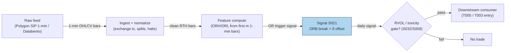

### S12. Sources

- Carlo Zarattini, Andrea Barbon, Andrew Aziz (2024). "A Profitable Day Trading Strategy for the U.S. Equity Market." SSRN. https://papers.ssrn.com/sol3/papers.cfm?abstract_id=4729284
- Carlo Zarattini, Andrew Aziz (2023). "Can Day Trading Really Be Profitable? Evidence of Sustainable Long-term Profits from Opening Range Breakout (ORB) Day Trading Strategy vs. Benchmark in the US Stock Market." SSRN. https://papers.ssrn.com/sol3/papers.cfm?abstract_id=4416622
- Ulf Holmberg, Carl Lönnbark, Christian Lundström (2013). "Assessing the profitability of intraday opening range breakout strategies." *Finance Research Letters* 10:27–33. https://econpapers.repec.org/paper/hhsumnees/0845.htm
- Independent replication & execution stress test of Zarattini & Aziz (2023) QQQ ORB (break-even ≈2.2¢/share; regime concentration). https://github.com/giovannibrusco/zarattini-2023-orb-qqq
- Toby Crabel (1990). *Day Trading with Short Term Price Patterns and Opening Range Breakout.* — the signal's documented origin (book; no stable public URL — cited via the report's entry).

**Unverified leads** (chatbot-reported, no checkable source; do not cite as evidence):
- Duck.ai (GPT-5.6 "Luna", 2026-09-10) Q-SB2-2 pipeline numbers: Massive/Polygon Developer ~$79/mo, Alpaca Algo Trader Plus ~$99/mo, 500-symbol 60-day pipeline 106–246 eng hours — labeled lead, consistent with cost-model §5/§6 bands but vendor pricing is *indicative — verify before budgeting*.
- "Commonly cited illustrative spec: n=10, q=2, 20-day narrow-range lookback" for the Crabel stretch (chatbot-reported via oxfordstrat.com; treated as practitioner folklore, not a documented standard).

**Source log:** Duck.ai answered Q-SB2-1–Q-SB2-3 (2026-09-10); Grok/Cursor answers pending (checked 2026-09-10).

---
## Stage 27/200 — S027: End-of-day momentum / last-hour drift

*Batch SB2 · Signal 27/100 · Provenance [D] · Family B — Intraday momentum & breakout*

### S1. One-line verdict

| | |
|---|---|
| **What it is** | The day's early return predicts the last 30–60 minutes: ride the drift into the close, or fade the overextension — the sign depends on the mechanism. |
| **When it works** | Information trend days (news, macro releases): morning winners keep drifting as slow money rebalances into the close. |
| **When it dies** | Mechanical-flow days (index rebalances, expiry, big MOC imbalances): the "momentum" is temporary price pressure that reverses overnight. |
| **Build-or-buy in one line** | Build on 1-min bars; buy the official imbalance feed only if you trade the auction itself. |

Provenance **[D]** (documented — Gao–Han–Li–Zhou 2018 intraday momentum; Heston–Korajczyk–Sadka 2010 intraday periodicity; Bogousslavsky–Muravyev closing-auction literature) · Family B — Intraday momentum & breakout.

### S2. How it works — plain human explanation

It's 3:31 p.m. XYZ is up 1.4% on the day after strong morning news. Two crowds are about to trade the last half hour. The first is slow money — index funds, pension rebalances, benchmarked managers who must be invested by the close; they lean with the day's trend, pressing winners further. The second is the closing auction itself: market-on-close (MOC) orders, index-rebalance flows, expiry hedging — enormous one-sided volume into the 4:00 p.m. print that can shove price *away* from fair value, pressure that often leaks back overnight.

So "end-of-day momentum" is two effects in one outfit. The academic version (Gao et al. 2018): the first half-hour's return positively predicts the last half-hour's return — day traders and informed traders keep pushing the morning's direction. The microstructure version (Heston et al. 2010): at half-hour intervals that are exact multiples of a day, returns *continue* — institutional rebalancing on a daily clock. And the auction version (Bogousslavsky & Muravyev; Jegadeesh & Wu 2022): closing-auction price pressure is real but mostly temporary, reverting over hours to days. Trade the drift on information days; fade it on mechanical-flow days.

A concrete contrast: 15:32, SPY +0.9% after a hot CPI print — the morning's buyers were informed, laggard allocators are still catching up, and the drift has a fundamental reason to continue. Versus 15:32 on S&P reconstitution Friday — the "momentum" is index funds forced to buy additions at any price; Monday morning gives half of it back.

Mental model (3 bullets):

- The close is where the day's two slowest, largest flows (benchmarked rebalancing, MOC auctions) collide with the fastest (day-trader momentum).
- Direction is set by *who* is trading: information → continuation; mechanical flow → pressure-then-reversal.
- The signal's horizon is 15–90 minutes and it is always flat by the print — this is a timing edge, not a position.

### S3. The math — exact formula

**Base signal (report form — open→15:30 variant; not Gao's exact window).** Let $P_{9:30,t}$, $P_{15:30,t}$, $P_{\text{close},t}$ be prices on day $t$. Define

$$r_{\text{first},t} = \frac{P_{15:30,t}}{P_{9:30,t}} - 1, \qquad r_{\text{last},t} = \frac{P_{\text{close},t}}{P_{15:30,t}} - 1$$

all in decimal returns. The predictive regression that documents the effect:

$$r_{\text{last},t} = \alpha + \beta\, r_{\text{first},t} + \varepsilon_t$$

Gao et al. report $\hat\beta = 0.0694$ (their tables scale by 100, showing 6.94), significant at 1%, $R^2 = 1.6\%$ on SPY 1993–2013. **Window attribution (do not mix):** those statistics attach to Gao's first-half-hour (9:30–10:00) → last-half-hour window — variant (1) in Named variants — and **do not describe** the open→15:30 formation used in this section. The open→15:30 form is this report's own smoother variant; its only numbers are the worked example below and the labeled variants, not Gao's 6.94/1.6%. The tradable signal is the sign rule:

$$s_t = \operatorname{sign}(r_{\text{first},t}), \qquad \text{hold } s_t \text{ from 15:30 to the close}$$

position in *shares* (long if $s_t=+1$, short if $s_t=-1$), flattened at the closing print.

**Cross-sectional periodicity (Heston–Korajczyk–Sadka form).** For stock $i$ and half-hour interval $k$ on day $t$, returns continue at lags that are multiples of one trading day (13 half-hours): $E[r_{i,k,t} \mid r_{i,k,t-1}] > 0$ at the daily lag — strongest in the first and last half-hour intervals.

**Auction-imbalance sibling.** The microstructure sibling trades *with* the published closing-auction imbalance: if the NYSE/Nasdaq imbalance feed shows net buy pressure near the freeze, lean long into the print. This is a different signal (S033 territory) sharing the same window.

#### Parameter table

| Parameter | Symbol | Typical range | Too small | Too large | Default example value |
|---|---|---|---|---|---|
| Formation window | $r_{\text{first}}$ span | 30–210 min | noise dominates | signal arrives too late | 9:30→15:30 (`example — not an institutional standard`) |
| Hold window | $r_{\text{last}}$ span | 15–90 min | spread dominates | overnight gap risk | 15:30→close (`example`) |
| Entry time | — | 14:30–15:45 | more churn | missing the drift | 15:30 (`example`) |
| Universe filter | — | ADV / spread caps | illiquid; impact eats edge | over-filtered | price > $5, ADV > 1M shares (`example`) |
| Sign vs magnitude | — | sign / z-scored | sign ignores conviction | magnitude overfits outliers | sign rule (`example`) |

**Causality.** $r_{\text{first},t}$ is fully known at 15:30; the position is entered at/after 15:30 and held to the close — tradable no earlier than the first print after the signal timestamp. Using the 15:30 *bar close* as the entry price assumes a fill a real order would miss by seconds-to-minutes; conservative backtests enter at 15:31+.

**Normalization choices.** The base form uses raw sign. Cross-stock versions z-score $r_{\text{first}}$ by trailing diurnal volatility (S067) so a 1% move in a calm utility and a 1% move in a biotech aren't treated equally.

**Named variants.** (1) *First-half-hour → last-half-hour* (Gao: formation = 9:30–10:00 only — purer but noisier). (2) *Open→15:30 formation* (report entry's form — smoother). (3) *Auction-imbalance continuation* (S033-style; uses the imbalance feed, not returns). (4) *Reversal twin* (T069): fade the last-30-minute move — same window, opposite sign, for mechanical-flow days.

### S4. Worked example — step-by-step numbers (SYNTHETIC)

**Label:** synthetic tape, random seed 27 (fixed in the plot script). Six synthetic days; prices are invented. No fees, no spread — arithmetic illustration only.

| Day | $P_{9:30}$ | $P_{15:30}$ | $P_{\text{close}}$ | $r_{\text{first}}$ | $r_{\text{last}}$ | $s_t$ | Trade P&L |
|---|---|---|---|---|---|---|---|
| 1 | 100.00 | 101.40 | 101.90 | +1.40% | +0.49% | +1 | **+0.49%** |
| 2 | 101.40 | 100.60 | 100.10 | −0.79% | −0.50% | −1 | **+0.50%** |
| 3 | 99.60 | 100.90 | 101.30 | +1.31% | +0.40% | +1 | **+0.40%** |
| 4 | 100.80 | 101.90 | 102.40 | +1.09% | +0.49% | +1 | **+0.49%** |
| 5 | 102.20 | 100.90 | 100.40 | −1.27% | −0.50% | −1 | **+0.50%** |
| 6 | 100.10 | 100.70 | 100.50 | +0.60% | −0.20% | +1 | −0.20% |

Check day 2 by hand: $r_{\text{first}} = 100.60/101.40 - 1 = -0.00789 \approx -0.79\%$; $s_2 = -1$ (short); $r_{\text{last}} = 100.10/100.60 - 1 = -0.00497 \approx -0.50\%$; P&L $= (-1)\times(-0.50\%) = +0.50\%$. Day 6 is the honest loser: the morning was mildly up, the close faded — the reversal regime the signal cannot distinguish ex ante.

Hit rate 5/6, mean +0.36%/day — **synthetic and before costs**; the chart `images/S027_example.png` plots the same six day-pairs.

**Cost walk (*example* assumptions, SPY-class ETF):** half-spread (half the bid–ask spread — the cost of crossing to take liquidity) ≈ 0.5 bp/leg, where 1 bp (basis point) = 0.01% — so ≈ 1 bp round-trip for the 15:30 entry plus the close exit — plus ≈ $0.001/share per-side fees (≈ 0.2 bp) plus slippage/impact (extra cost when your own order pushes the price against you) ≈ 2 bp on the 15:30 leg, which leans into the auction buildup. Total ≈ 3–4 bp per trade against a mean gross of +36 bp/day → net ≈ **+32 bp/day** in this toy tape. On real small-cap closes the spread alone can exceed the whole drift — which is exactly why Heston et al. find the periodicity loses money after paying the spread.

**What to notice.** The example is deliberately continuation-friendly (5 of 6 days continue). Real data is nothing like this clean: Gao's $R^2$ of 1.6% means the regression explains almost nothing day-to-day — the edge is statistical, harvested across thousands of days, and the spread is a large fraction of a 30-minute drift. Day 6 is the important row: on mechanical-flow days the sign flips and the "momentum" becomes the fade.

### S5. Strategies that use this signal

- **T016 — End-of-Day Drift Rider** — *primary entry trigger*: S027 is the core — lean into last-hour drift, confirmed by opening-auction imbalance read (S033) and spread estimate (S013).
- **T006 — Intraday Trend + Vol-Regime Allocator** — *trend leg*: S027 supplies the into-the-close momentum component, scaled by HMM (hidden Markov model) vol regime (S079) alongside S025.
- **T069 — Late-Day Reversal into Close** — *contrast / veto*: fades last-30-minute overextensions (S038/S041 timing). T069 is the reason S027 must be mechanism-aware — when flow is mechanical, T069's sign is the right one.

### S6. Data required — exact spec

| Field | Type | Granularity | Source tier | Notes |
|---|---|---|---|---|
| O/H/L/C | float | 1-min bars, RTH (regular trading hours) | Tier 0–1 | Only 9:30, 15:30, close anchors strictly needed |
| Volume | int | 1-min bars | Tier 1 | Gao: effect stronger on high-volume days — conditioning variable |
| Official close-imbalance feed | imbalance $/shares | event, 15:30–16:00 | Tier 1–2 | NYSE imbalance feed / Nasdaq NOII (near-freeze snapshots) |
| Exchange calendar | date/bool | daily | Tier 0–1 | Early closes move the "last 30 min" window |
| Corporate actions | ratio/date | event | Tier 1 | Adjusted closes or the day's return is fiction |

**Collection.** Polygon stocks v3 minute aggregates for the bar anchors; the imbalance leg needs the exchange-published closing-auction imbalance messages (NYSE Pillar imbalance feed / Nasdaq TotalView NOII) — typically a Tier-2 add-on or exchange direct feed, *indicative — verify before budgeting*.

**Ingest sketch (Python/polars, ≤20 lines):**
```python
import polars as pl
def session_anchors(bars: pl.DataFrame) -> pl.DataFrame:
    # bars: 1-min RTH bars with ts_et, close
    day = bars.with_columns(pl.col("ts_et").dt.date().alias("d"))
    anchors = (day.group_by("d").agg([
        pl.col("close").filter(pl.col("ts_et").dt.time() == __import__("datetime").time(9, 30)).first().alias("p930"),
        pl.col("close").filter(pl.col("ts_et").dt.time() == __import__("datetime").time(15, 30)).first().alias("p1530"),
        pl.col("close").last().alias("pclose"),
    ]).with_columns(
        ((pl.col("p1530") / pl.col("p930")) - 1).alias("r_first"),
        ((pl.col("pclose") / pl.col("p1530")) - 1).alias("r_last"),
        (((pl.col("p1530") / pl.col("p930")) - 1) > 0).cast(pl.Int8).mul(2).sub(1).alias("signal"),
    ))
    return anchors  # signal known at 15:30; tradable at first print after
```

**Storage.** Anchors are 3 floats/day/symbol — negligible. The underlying 1-min bars: ~0.1 MB per symbol-day per cost-model §4.

**Data-quality checklist.** (1) Anchor timestamps must exist — a missing 15:30 bar (halt) invalidates the day. (2) Adjust for splits/dividends. (3) DST/half-days shift anchors. (4) The "close" for the hold should be the last *regular-session* print, not the auction print, unless you explicitly trade the auction. (5) Stale 15:30 quotes on illiquid names — filter by ADV.

### S7. Local build on M5 Max / 128GB

**Feasibility verdict: trivial.** Three anchor prices per symbol per day, one division, one sign. Per cost-model §2, even the full 500-symbol 1-minute universe (195k bars/day) is a sub-second polars pass; the signal itself is a rounding error on top. The only part with any engineering content is the optional imbalance-feed leg.

- **Throughput:** signals/sec effectively unbounded on bars; bottleneck is feed latency for the imbalance variant (needs the exchange feed, not compute).
- **Stack:** Python+polars (pick this); the imbalance leg is a small streaming parser — still Python-fine at one message/sec per symbol.
- **RAM:** anchors for 500 symbols × 60 days ≈ a few KB; bars per §3 ≈ 12 MB — trivially inside the 77 GB working budget.
- **Engineering time:** Tier L per cost-model §5 (4–12 h; S027 sits in the S021–S048 1-min-bar band). **$600–$1,800** at $150/hr loaded — one line: anchors in, sign out, everything else is the imbalance feed integration if you want it.
- **What breaks first at 500 symbols:** nothing on bars. It breaks if you try to trade *the auction print itself* across 500 names — MOC order management, freeze-time rule changes, and per-symbol imbalance parsing become the project (Tier M, 20–60 h).

### S8. Buy vs build

| Vendor / option | What you get | Indicative price | Buying gains | Buying loses |
|---|---|---|---|---|
| Tier-0 free: Stooq/Alpaca IEX | Daily + coarse intraday bars | ~$0 | $0 prototype of the sign rule | No 15:30 anchor precision; no imbalance data |
| Tier-1: Polygon Stocks Advanced / Alpaca SIP | Full SIP 1-min bars, corporate actions | ~$30–200/mo | Correct anchors + consolidated volume for conditioning | Still no official imbalance feed |
| Tier-2: exchange imbalance feeds (NYSE/Nasdaq) | Official closing-auction imbalance messages | exchange pricing (indicative — verify before budgeting) | Trade the actual auction pressure, not a proxy | Exchange contracts, per-feed cost; only needed for the auction leg |
| Tier-2: Databento Standard | Consolidated bars + imbalance-adjacent data | ~$200/mo + usage | One pipe for bars and auction analytics | Doesn't replace the official imbalance feed |

*All prices indicative — verify before budgeting.* **Verdict: build** the return-based signal (it is 10 lines); **buy** the imbalance feed only if the auction leg is the actual trade. The chatbot's Q-SB2-2 lead is consistent here: buy raw bars (~$79/mo Developer-class), build all analytics — precomputed "EOD momentum" scores are poor value because the formation/hold windows are the strategy. Crossover: you need the paid imbalance feed the day you stop trading the drift and start trading the print.

### S9. Success ratio / efficacy — documented evidence

| Study / source | Market & period | Metric | Before/after cost | Caveat |
|---|---|---|---|---|
| Gao–Han–Li–Zhou (2018), *J. Financial Economics* | SPY + 10 active ETFs, 1993–2013 | First→last half-hour: β̂=6.94 (×100), p<1%, R²=1.6%; stronger on volatile/high-volume/recession/macro-news days | **Before** cost (predictive regression) | Market-level (ETF); R² tiny — edge is high-frequency repetition |
| Heston–Korajczyk–Sadka (2010), *J. Finance* | NYSE, half-hour intervals, 2001–2005 | Continuation at day-multiple half-hour lags, strongest first/last half hour; sub-hour reversals are liquidity/bounce | **After** (honest): periodicity strategies "**lose money after paying the bid/ask spread**" | The continuation is a timing/cost phenomenon, not an arbitrage |
| Jegadeesh–Wu (2022), *J. Financial Economics* | NYSE+Nasdaq closing auctions | Auction volume ≈10% of total at 2019 peak; impact temporary, dissipates over 3–5 days; reversal strategies "significantly profitable" | **Before** full costs | Auction-*reversal* — the opposite sign to the drift; mechanism matters |
| Bogousslavsky–Muravyev (2023), "Who Trades at the Close?" | US equities, auctions | Auctions = 7.5% of daily volume in 2018 (vs 3.1% in 2010); close matches pre-close bid/ask 68%; deviations revert overnight | Descriptive | Auction is cheap for liquidity demanders — being the pressure is costly |
| Haendler–Heston–Korajczyk–Sadka (2025), SSRN | US equities, out-of-sample | Periodicity persists OOS; close leg driven by market-on-close trading | **Before** cost | Institutional-trading explanation — the "momentum" is someone else's benchmark trade |

**When it fails / regime notes.** Index-reconstitution and triple-witching days (mechanical flow dominates); macro-release days can go either way (information vs. positioning); selloffs (the drift becomes a crash and the close gaps); small-cap/low-ADV names where the last-30-minute spread is the whole signal; crowded close-momentum signals (everyone leaning the same way *is* the auction imbalance). The chatbot's Q-SB2-3 synthesis (labeled) is directionally right: last-hour effects are measurable but the sign is not universal — continuation vs. auction-reversal depends on definition and hold.

**Honest bottom line.** As a standalone trigger, EOD momentum is a **thin statistical edge**: real in predictive regressions, largely consumed by the spread at the horizons that matter (Heston et al. say so explicitly). As a **timing overlay** — when to press an existing intraday position, or which sign to take into the close (T016 vs T069) — it is genuinely useful. Never trade it without naming the mechanism (information vs. mechanical) first.

### S10. Failure modes & pitfalls

1. **Sign ambiguity** — continuation and auction-reversal share the same window. *Mitigation:* condition on mechanism: news/macro day → ride (T016); rebalance/expiry day → fade (T069).
2. **Auction impact on entry/exit** — the 15:30–16:00 window *is* the auction buildup; your fills move the print. *Mitigation:* model impact as a multiple of spread (chatbot-reported 0.34× figures are unverified — see S12); participate early or use limits (*example*).
3. **Overnight gap risk** — "always off by the print" per the source entry; a held position faces the overnight gap. *Mitigation:* flatten at the close — no exceptions in the base spec.
4. **Anchor staleness** — illiquid names have no real 15:30 price. *Mitigation:* ADV/spread filters (*example*: ADV > 1M shares).
5. **Macro-event whiplash** — 15:30 positioning ahead of next-morning news reverses. *Mitigation:* skip days with scheduled overnight catalysts (*example* rule).
6. **Crowded close signals** — if every intraday book leans the same way at 15:30, you *are* the imbalance. *Mitigation:* cap participation; watch the imbalance feed divergence.
7. **Lookahead via the close** — using the official close (auction print) as the signal-day return contaminates the formation window. *Mitigation:* formation uses regular-session prints only.
8. **Regime decay** — auction share keeps growing (3.1%→7.5%→~10%), so the mechanical leg strengthens while the information leg is competed away. *Mitigation:* re-estimate the sign mix yearly; don't freeze parameters.

### S11. Visuals


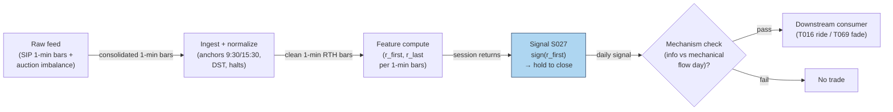

### S12. Sources

- Lei Gao, Yufeng Han, Sophia Zhengzi Li, Guofu Zhou (2018). "Intraday Momentum: The First Half-Hour Return Predicts the Last Half-Hour Return." *Journal of Financial Economics.* https://papers.ssrn.com/sol3/papers.cfm?abstract_id=2552752 — first→last half-hour predictability, SPY 1993–2013.
- Steven L. Heston, Robert A. Korajczyk, Ronnie Sadka (2010). "Intraday Patterns in the Cross-Section of Stock Returns." *Journal of Finance* 65(4):1369–1407. https://bauer.uh.edu/departments/finance/documents/Heston-Korajczyk-Sadka-jf-2010-01-07.pdf
- Vincent Bogousslavsky, Dmitriy Muravyev (2023). "Who Trades at the Close? Implications for Price Discovery and Liquidity." SSRN. https://papers.ssrn.com/sol3/papers.cfm?abstract_id=3485840
- Narasimhan Jegadeesh, Yanbin Wu (2022). "Closing auctions: Nasdaq versus NYSE." *Journal of Financial Economics* 143:1120–1139. https://econpapers.repec.org/article/eeejfinec/v_3a143_3ay_3a2022_3ai_3a3_3ap_3a1120-1139.htm
- Charlotte Haendler, Steven Heston, Robert Korajczyk, Ronnie Sadka (2025). "The intra-day stock return periodicity puzzle." SSRN. https://www.kellogg.northwestern.edu/academics-research/research/detail/2025/the-intra-day-stock-return-periodicity-puzzle/ — periodicity persists out-of-sample; close leg driven by MOC trading.

**Unverified leads** (chatbot-reported, not independently verified; do not cite as evidence):
- Duck.ai Q-SB2-3 auction micro-numbers: closing-auction volume 7.10% of ADV (NYSE+Nasdaq 2012–2021), auction impact ≈0.34× daily average spread, drift to auction price ≈0.6–1.7× spread, overnight 1%-of-ADV ≈40bp round-trip impact under a sqrt model — directionally consistent with the verified sources above, but the exact figures were not independently confirmed.
- "Timing Sharpe ≈1.08 vs 0.29 buy-and-hold" for the Gao et al. strategy (reported in an independent replication write-up, https://github.com/definitelymikey/orb-strategy/blob/HEAD/Market_Intraday_Momentum/CLAUDE.md — not verified against the paper text).
- Baltussen–Da–Lammers–Martens (2021) gamma-hedging mechanism for intraday momentum across 60+ futures (mentioned in the same replication write-up; paper not independently pulled).

**Source log:** Duck.ai answered Q-SB2-1–Q-SB2-3 (2026-09-10); Grok/Cursor answers pending (checked 2026-09-10).

---
## Stage 32/200 — S032: Relative-volume (RVOL) filtered breakout

*Batch SB2 · Signal 32/100 · Provenance [SR] · Family B — Intraday momentum & breakout*

### S1. One-line verdict

| | |
|---|---|
| **What it is** | A breakout is only valid if volume is abnormal *for that time of day*: RVOL = window volume ÷ trailing same-time-of-day mean. |
| **When it works** | As a gate on other entries (ORB, news breakouts): funded breaks continue, unfunded breaks revert. |
| **When it dies** | As a standalone trigger — high RVOL alone is attention, not direction; and on expiry/rebalance days volume is mechanical. |
| **Build-or-buy in one line** | Build: it is a rolling time-of-day mean over bars you already store; the baseline is the whole product. |

Provenance **[SR]** (standard reconstruction — practitioner-standard formula; documented as a *conditioner* in Zarattini–Barbon–Aziz 2024 and as return-predictive abnormal volume in Gervais–Kaniel–Mingelgrin 2001; no single canonical paper defines the intraday RVOL-breakout rule, so the tag stays [SR]) · Family B — Intraday momentum & breakout.

### S2. How it works — plain human explanation

10:05 a.m. XYZ breaks above its opening range high at 101.20. Two versions of this morning exist. In version A, the first-5-minute volume is 260k shares against a 128k trailing norm — RVOL 2.0×. Institutions are repositioning; the break is *funded* and the order flow behind it will keep pressing. In version B, the same price break prints on 95k shares against a 125k norm — RVOL 0.76×. Nobody is behind it; it's a dealer wiggle or a single retail sweep, and the level fails within minutes.

RVOL is the lie detector for breakouts. Raw volume can't do this job because volume has a violent U-shape across the day (S046/S067): the open and close always print huge volume, midday almost none. A "big" 10:00 a.m. bar might be tiny by 9:35 standards. Dividing by the *same-time-of-day* trailing mean strips the diurnal seasonality and leaves the surprise — which is the information.

Why should abnormal volume predict anything? The academic lineage is old and consistent: Blume–Easley–O'Hara (1994) show volume carries information about signal precision that prices alone don't reveal; Llorente–Michaely–Saar–Wang (2002) show volume from speculative/informed trading *continues* while volume from risk-sharing (rebalancing) *reverses*; Gervais–Kaniel–Mingelgrin (2001) find unusually high-volume stocks appreciate over the following month (the "high-volume return premium," via investor visibility). The intraday practitioner version is cruder but the same idea: participation is commitment, and commitment separates acceptance from a head-fake.

Mental model (3 bullets):

- Price tells you *where*; RVOL tells you *who showed up*. Trade the intersection.
- Always divide by the time-of-day norm — raw volume is a clock, not a signal.
- RVOL is a gate, not a trigger: it vetoes bad breakouts and confirms good ones; it rarely initiates a trade by itself.

### S3. The math — exact formula

**Standard reconstruction** (practitioner formula; parameter values below are *examples*, not documented standards). Let $V_{w,t}$ be share volume in window $w$ on day $t$ (e.g. the first 5 minutes, 9:30–9:35), and let $\bar V_{w,t-1:t-N}$ be the trailing mean of the *same window* over the prior $N$ sessions:

$$\text{RVOL}_{w,t} = \frac{V_{w,t}}{\frac{1}{N}\sum_{i=1}^{N} V_{w,t-i}}$$

dimensionless (×). A valid breakout requires the price break **and**

$$\text{RVOL}_{w,t} \ge \theta$$

with $\theta$ an *example* threshold (commonly cited 1.5–2.0×; Zarattini et al. use 100% as the positive/negative split and study up to 30×).

**Baseline variants.** Mean vs median vs winsorized mean (winsorized: tails clipped at the 1st/99th percentiles) of the trailing window — median is robust to the occasional news-day outlier poisoning the baseline; winsorizing at 1/99% is the middle ground. The Zarattini–Barbon–Aziz implementation uses a 14-day mean of the first-5-minute volume.

**Attention-vs-information refinement** (Llorente et al. logic, qualitative): decompose the day's abnormal volume into informed-driven (continues) vs risk-sharing-driven (reverses). In practice this is proxied by conditioning on *why* volume is high — news/catalyst present (S091/S093) versus calendar-mechanical (expiry, rebalance).

#### Parameter table

| Parameter | Symbol | Typical range | Too small | Too large | Default example value |
|---|---|---|---|---|---|
| Measure window | $w$ | 1–30 min | noise; single-sweep artifacts | break already half over | first 5 min (`example — not an institutional standard`) |
| Baseline lookback | $N$ | 10–60 sessions | baseline whipsaws with recent news days | stale; regime changes ignored | 14 sessions (`example`) |
| Baseline statistic | — | mean / median / winsorized | mean is outlier-sensitive | median lags genuine regime shifts | mean (`example`) |
| Threshold | $\theta$ | 1.0–3.0× | lets unfunded breaks through | almost never trades | 1.5× (`example`) |
| Session filter | — | RTH (regular trading hours) only | pre/post-market prints poison the norm | — | RTH-only windows (`example`) |

**Causality.** $\text{RVOL}_{w,t}$ is known at the *end* of window $w$ using only volumes $\le t$; the breakout it validates must occur at or after that timestamp — tradable no earlier than the first print after the window closes. A common leakage bug: using the *full day's* volume in the baseline or comparing against a same-day average that includes future bars.

**Normalization choices.** Time-of-day matching *is* the normalization (it removes the U-shape). Cross-stock comparability needs no further scaling since RVOL is already dimensionless, though conditioning thresholds are sometimes expressed in $z$-scores of log-RVOL for very skewed names.

**Named variants.** (1) *Dollar-volume RVOL* — use $P \times V$ instead of shares (better for comparing across price levels; S032's options-flow cousin in the Stanford CS229 project used volume > 2× daily average AND ≥ 500 contracts). (2) *Tick/dollar-bar RVOL* — abnormal volume per *bar* rather than per clock window (S083 clocks). (3) *Cumulative-session RVOL* — volume-so-far vs expected volume-so-far from the diurnal curve; updates continuously instead of once per window.

### S4. Worked example — step-by-step numbers (SYNTHETIC)

**Label:** synthetic 12-day tape, random seed 32 (fixed in the plot script). OR window = first 5 minutes; baseline = 14-day trailing mean of the same window (synthetic values); threshold $\theta = 1.5$ (*example*); volumes in thousands of shares. No costs — arithmetic illustration only.

| Day | OR vol | Baseline | RVOL | Break | Valid? | Move (R) |
|---|---|---|---|---|---|---|
| 1 | 120 | 130 | 0.92 | — | no | — |
| 2 | 95 | 125 | 0.76 | — | no | — |
| 3 | 260 | 128 | **2.03** | +1 | **yes** | +1.8 |
| 4 | 140 | 122 | 1.15 | — | no | — |
| 5 | 310 | 126 | **2.46** | +1 | **yes** | +2.6 |
| 6 | 110 | 131 | 0.84 | — | no | — |
| 7 | 85 | 129 | 0.66 | — | no | — |
| 8 | 220 | 124 | **1.77** | +1 | **yes** | −0.4 |
| 9 | 130 | 127 | 1.02 | — | no | — |
| 10 | 280 | 125 | **2.24** | −1 | **yes** | +1.9 |
| 11 | 100 | 132 | 0.76 | — | no | — |
| 12 | 150 | 128 | 1.17 | +1 | no (< 1.5) | +1.2 (untraded) |

Check day 3 by hand: $\text{RVOL} = 260/128 = 2.03125 \approx 2.03 \ge 1.5$ with an upside price break → valid long; realized move +1.8R (R = the trade's predefined risk unit, *example*). Day 10: downside break on 2.24× → valid short, +1.9R.

Result: 4 valid trades, 3 winners, mean move +1.48R — **synthetic, before costs**. The chart `images/S032_example.png` plots this exact tape: OR-window volume vs baseline (top) and RVOL with the 1.5× line (bottom), valid days flagged.

**Cost walk (*example* assumptions):** take R = 50¢/share of predefined risk on a $100 stock. Per trade — half-spread (half the bid–ask spread — the cost of crossing to take liquidity) 1¢/leg crossed on entry and exit = 2¢; per-share fees $0.001/share × 2 = 0.2¢; slippage/impact (extra cost when your own order pushes the price against you) ≈ 1¢/leg × 2 = 2¢. Total ≈ 4.2¢/share ≈ **0.084R per trade** → mean net ≈ **+1.40R** per valid trade. On wider-spread names this same stack can exceed the mean move outright — which is why Zarattini et al.'s after-commission numbers, not the gross tape, are the honest benchmark.

**What to notice.** Day 8 is the honest row: RVOL 1.77× validates the break and it still loses (−0.4R) — the filter improves the *mix*, it doesn't certify winners. Day 12 is the filter's cost: a genuine +1.2R break goes untraded because RVOL printed 1.17×. Every filter buys a better win rate with missed trades; θ is where you price that exchange, and 1.5× here is an *example*, not an optimum. This toy tape has no spread, no fees, and hand-picked outcomes — it demonstrates the accounting, not an edge.

### S5. Strategies that use this signal

- **T005 — RVOL-Filtered Opening-Range Breakout** — *primary confirmation*: S032 is the strategy's namesake gate — S021 triggers, S032 validates participation, S008 vetoes toxicity.
- **T029 — Spread-Estimate Edge Filter** — *breakout edge filter*: S032's breakout leg is only taken when estimated effective spread (S012/S013) is below the edge — volume confirmation is necessary but not sufficient.
- **T086 — OFI-Paced Participation Tracker** — *pacing input*: S032 scales execution participation — high RVOL means the tape can absorb size; low RVOL means slow down (with S001 OFI and S067 diurnal norms).

### S6. Data required — exact spec

| Field | Type | Granularity | Source tier | Notes |
|---|---|---|---|---|
| O/H/L/C/V | mixed | 1-min bars, RTH | Tier 0–1 | Volume per bar is the load-bearing field |
| Exchange calendar | date/bool | daily | Tier 0–1 | Half-days must rescale or exclude windows |
| Corporate actions | ratio/date | event | Tier 1 | Splits change share-volume baselines — adjust or use dollar volume |
| News/catalyst flags | bool/event | daily | Tier 1–2 | Optional: separates informed volume from mechanical volume |

**Collection.** Same bar pipe as S021 (Polygon stocks v3, Databento OHLCV-1m, Alpaca): the only extra requirement is *history* — the baseline needs $N$ prior sessions of the same window, so the store must retain ≥ $N$ + warmup days per symbol.

**Ingest sketch (Python/polars, ≤20 lines):**
```python
import polars as pl
def rvol(bars: pl.DataFrame, window_end="09:35", n=14, theta=1.5):
    # bars: 1-min RTH bars with ts_et, v (shares)
    w = (bars.filter(pl.col("ts_et").dt.time() <= __import__("datetime").time(9, 35))
             .group_by(pl.col("ts_et").dt.date().alias("d"))
             .agg(pl.col("v").sum().alias("or_vol")).sort("d"))
    return (w.with_columns(pl.col("or_vol").rolling_mean(n).shift(1).alias("baseline"))
             .with_columns((pl.col("or_vol") / pl.col("baseline")).alias("rvol"))
             .with_columns((pl.col("rvol") >= theta).alias("funded")))
    # tradable only AFTER the window closes; baseline uses strictly prior sessions (shift(1) excludes the current day)
```

**Storage.** Per cost-model §4: 1-min bars ≈ 0.1 MB per symbol-day; the RVOL state is one float per symbol-day. 500 symbols × 60 days ≈ 3 GB of bars — archive freely.

**Data-quality checklist.** (1) Time-of-day alignment across DST — the "first 5 minutes" must be 9:30–9:35 ET, not a fixed UTC offset. (2) Zero-volume bars at the open are missing data, not low RVOL. (3) Splits/dividends: prefer dollar-volume RVOL or adjusted share volume. (4) Half-days: exclude from baseline or rescale. (5) Never include the current day in its own baseline (leakage).

### S7. Local build on M5 Max / 128GB

**Feasibility verdict: trivial.** One groupby-sum per symbol per day plus a rolling mean — per cost-model §2 this is microseconds per symbol in polars; the 500-symbol universe recomputes in well under a second. The only real state is the trailing baseline store.

- **Throughput:** signals/sec effectively unbounded on bars; bottleneck is API download, not compute.
- **Stack:** Python+polars (pick this); DuckDB if you want the baselines queryable in SQL.
- **RAM:** baselines for 500 symbols × 60 days ≈ KBs; bars ≈ 12 MB per cost-model §3 — trivially inside the 77 GB working budget.
- **Engineering time:** Tier L per cost-model §5 (4–12 h; S032 is in the S021–S048 1-min-bar band, plus a little baseline-plumbing). **$600–$1,800** at $150/hr loaded — one line: windowed sums in, rolling means out; the subtlety is calendar/DST correctness, not compute.
- **What breaks first at 500 symbols:** nothing on bars. It breaks if you move to *continuous* cumulative-session RVOL vs a diurnal curve — still Tier L/M — or to tick-level abnormal-volume detection, which is a different (Tier M) project.

### S8. Buy vs build

| Vendor / option | What you get | Indicative price | Buying gains | Buying loses |
|---|---|---|---|---|
| Tier-0 free: Stooq/Alpaca IEX | Daily/coarse bars | ~$0 | $0 prototype | IEX-only volume (~2.5% of US volume per chatbot lead) corrupts the baseline |
| Tier-1: Polygon Stocks Advanced / Alpaca SIP | Full SIP 1-min bars + corporate actions | ~$30–200/mo | Correct consolidated volume — the baseline is only as honest as the volume | Nothing analytical; RVOL math is still yours |
| Tier-2: Databento Standard | L1/L2 + OPRA research | ~$200/mo + usage | Tick-level abnormal-volume variants | Overkill for bar-RVOL |
| Precomputed "unusual volume" screeners | Third-party RVOL flags | varies (indicative — verify before budgeting) | Zero build | Opaque window/baseline/threshold definitions — the chatbot's Q-SB2-2 verdict applies: definitions vary, hidden lookahead rules; poor value |

*All prices indicative — verify before budgeting.* **Verdict: build, on Tier-1 bars.** The formula is public-domain arithmetic; the *baseline hygiene* (time-of-day matching, DST, splits, half-days) is the product, and no vendor sells your hygiene. Buy consolidated SIP bars because IEX-only volume makes RVOL a random number. Crossover: build always; buy data at Tier-1 the moment RVOL gates real money.

### S9. Success ratio / efficacy — documented evidence

| Study / source | Market & period | Metric | Before/after cost | Caveat |
|---|---|---|---|---|
| Zarattini–Barbon–Aziz (2024), SSRN | 7,000+ US stocks, 2016–2023, 5-min ORB × RVOL | First-5-min RVOL >100% → +0.08R/trade; <100% → −0.02R/trade; 30× RVOL → +0.38R/trade | **After** commissions | RVOL as *conditioner* of ORB, not a standalone trigger; cost model is commissions-only |
| Gervais–Kaniel–Mingelgrin (2001), *J. Finance* | US stocks, daily/weekly volume sorts | Unusually high (low) volume → appreciation (depreciation) over the following month | **Before** cost (monthly portfolio sorts; no trading-cost accounting) | Monthly horizon, not intraday; visibility hypothesis, not a breakout rule |
| Llorente–Michaely–Saar–Wang (2002), *R. Financial Studies* | NYSE/AMEX individual stocks | Informed-driven volume → return continuation; risk-sharing volume → reversal | **Before** cost (autocorrelation tests) | Theoretical mechanism paper — supports *why* the filter works, doesn't backtest it |

**What is honestly missing.** There is no peer-reviewed study of the *intraday* "RVOL ≥ 1.5× validates the breakout" rule as a standalone trigger — the documented evidence is for abnormal volume as a *conditioner* (Zarattini et al.) or at daily/monthly horizons (Gervais et al., Llorente et al.). Practitioner evidence (Aziz's "stocks in play" framework) is extensive but not peer-reviewed. The chatbot's Q-SB2-3 synthesis is candid on this point: RVOL's documented role is filtering, and generic volume-breakout evidence is weak.

**Honest bottom line.** As a standalone trigger, RVOL-filtered breakout is an **undocumented edge** — plausible, widely used, but not established net of costs in the literature. As a **filter/veto on breakouts**, it is the best-documented conditioner in this batch (Zarattini et al., after commissions). Build it as a gate; don't backtest it as a strategy and call the result research.

### S10. Failure modes & pitfalls

1. **Baseline poisoning** — a news-day outlier in the trailing window inflates the baseline and suppresses future signals (or vice versa). *Mitigation:* median/winsorized baseline; exclude event days from the norm (*example*).
2. **Mechanical-volume days** — expiry, rebalances, and triple-witching print enormous RVOL with zero information. *Mitigation:* calendar-aware veto; require a catalyst flag for the highest-conviction tier (*example*).
3. **Leakage via same-day baseline** — comparing the window against a norm that includes today's (or future) bars. *Mitigation:* strictly trailing $N$-session baseline; unit-test with shuffled calendars.
4. **DST/offset bugs** — "first 5 minutes" computed in UTC shifts the window seasonally. *Mitigation:* exchange-local timestamps everywhere; test across a DST boundary.
5. **Split-adjusted volume** — unadjusted share volume jumps 2–4× on splits, fabricating RVOL spikes. *Mitigation:* dollar-volume RVOL or adjusted shares.
6. **Threshold overfitting** — 1.5× vs 2.0× tuned on the same sample that "validates" it. *Mitigation:* pick θ on a separate period; report sensitivity (±0.5×) not a point optimum.
7. **Low-ADV names** — RVOL on a 200k-ADV stock is dominated by single prints. *Mitigation:* ADV floor (*example*: 1M shares) before the filter means anything.
8. **Confusing attention with direction** — high RVOL + no price break is just noise getting louder. *Mitigation:* RVOL never triggers alone — it only validates a price event.

### S11. Visuals


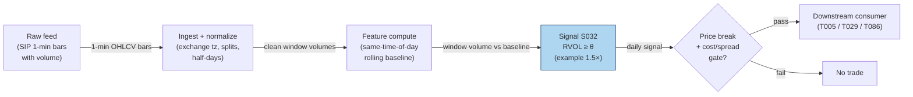

### S12. Sources

- Simon Gervais, Ron Kaniel, Dan H. Mingelgrin (2001). "The High-Volume Return Premium." *Journal of Finance* 56(3):877–919. http://ideas.repec.org/a/bla/jfinan/v56y2001i3p877-919.html
- Guillermo Llorente, Roni Michaely, Gideon Saar, Jiang Wang (2002). "Dynamic Volume-Return Relation of Individual Stocks." *Review of Financial Studies* 15(4):1005–1047. http://ideas.repec.org/a/oup/rfinst/v15y2002i4p1005-1047.html
- Carlo Zarattini, Andrea Barbon, Andrew Aziz (2024). "A Profitable Day Trading Strategy for the U.S. Equity Market." SSRN. https://papers.ssrn.com/sol3/papers.cfm?abstract_id=4729284 (full text: https://www.alexandria.unisg.ch/server/api/core/bitstreams/3c2989c4-688d-4d78-8a71-f02690990d51/content)
- Blume, Easley & O'Hara (1994) theoretical lineage noted via the volume–return literature (see Llorente et al. references therein) — volume carries information about signal precision beyond prices.

**Unverified leads** (chatbot-reported, no checkable source; do not cite as evidence):
- Stanford CS229 project rule cited in the report entry ("unusual options volume: volume > 2× daily average AND ≥ 500 contracts") — practitioner reconstruction, no retrievable citation found in this pass.
- Andrew Aziz "Stocks in Play" framework (Bear Bull Traders practitioner literature) — widely used, not peer-reviewed; treated as practitioner context, not evidence.
- Duck.ai Q-SB2-2 pipeline/eng-hour numbers as they touch RVOL baselines (106–246 h for the full 500-symbol pipeline) — labeled lead; cost-model §5 Tier L band takes precedence for S032 itself.

**Source log:** Duck.ai answered Q-SB2-1–Q-SB2-3 (2026-09-10); Grok/Cursor answers pending (checked 2026-09-10).

---
## Stage 42/200 — S042: RSI / RSI-2 mean reversion (Connors-style)

*Batch SB2 · Signal 42/100 · Provenance [D/SR] · Family C — Mean reversion & reversal*

### S1. One-line verdict

| | |
|---|---|
| **What it is** | A 2-period RSI (Relative Strength Index) oscillator that flags violent 2-day washouts (RSI-2 ≈ 0) as short-horizon mean-reversion longs, gated by a long-term trend filter. |
| **When it works** | Broad index/large-cap ETFs in intact uptrends, where 2-day panics are capitulation rather than information; holds of hours to 2–3 days. |
| **When it dies** | Waterfall declines (RSI-2 pins at 0 while price keeps falling), gap-driven single names, bear regimes below the 200-day SMA (simple moving average), wide-spread small caps. |
| **Build-or-buy in one line** | Build: 30 lines of bar math on data you already own; precomputed vendor variants differ in RSI definition — poor value. |

Provenance **[D/SR]**: Wilder's RSI formula is documented (Wilder 1978); the Connors 2-period rule (practitioner author of short-term mean-reversion systems) and its intraday adaptations are practitioner-documented reconstructions.

### S2. How it works — plain human explanation

Picture 9:47 a.m., SPY bid 588.40 × 900 / ask 588.41 × 400. Yesterday's close was 594.20, the day before 596.05 — two red days of futures-led de-risking, no single-stock news. A 2-period RSI off these closes reads **0**: everything in the last two days was downside. In an intact uptrend, a two-day flush is usually *liquidation* — margin calls, stop runs, ETF redemptions — not fresh information about value. Liquidation is finite; it exhausts, and price snaps back.

Why should the snapback exist? Three overlapping stories. First, **liquidity provision**: dealers left long unwanted inventory mark prices back up to offload it. Second, **behavioral overreaction**: loss-averse selling overshoots fundamental news. Third, **ETF mechanics**: redemption/rebalancing flows push whole baskets together — flow, not information — and revert when the flow stops.

- **Mental model, in three bullets:**
  - RSI-2 is a *capitulation meter*: 0 means "all of the last two days was down", 100 means "all up". Extremes mark exhaustion, not direction.  - The signal is *conditional*, never standalone: it only fires longs when the slow trend (close above the 200-day SMA) says the washout is against an intact uptrend.
  - The edge lives in the *first 1–3 days* of the bounce and dies in downtrends — the regime filter is the strategy, not an accessory.

### S3. The math — exact formula

Wilder's canonical RSI with period *n* (Wilder 1978):

$$\Delta_t = C_t - C_{t-1}, \qquad G_t = \max(\Delta_t, 0), \qquad L_t = \max(-\Delta_t, 0)$$

$$RS_t = \frac{\mathrm{SMMA}_n(G_t)}{\mathrm{SMMA}_n(L_t)}, \qquad \mathrm{RSI}_{n,t} = 100 - \frac{100}{1 + RS_t}$$

where SMMA is Wilder's smoothed moving average ($\alpha = 1/n$, recursive). For the Connors 2-period form used here, the operator-verified working definition is the **simple 2-period mean** (not Wilder's recursive smoothing):

$$\mathrm{RSI}_{2,t} = 100 \cdot \frac{\bar{G}_2}{\bar{G}_2 + \bar{L}_2}, \qquad \bar{G}_2 = \frac{G_t + G_{t-1}}{2}, \;\; \bar{L}_2 = \frac{L_t + L_{t-1}}{2}$$

with the boundary conventions RSI-2 = 100 if $\bar{L}_2 = 0$, RSI-2 = 0 if $\bar{G}_2 = 0$. Prices in $; RSI-2 is dimensionless on [0, 100].

Connors canonical rule (documented practitioner form): **long** when $C_t > \mathrm{SMA}_{200}(C_t)$ **and** RSI-2 < 10; **exit** when $C_t > \mathrm{SMA}_5(C_t)$; stop ≈ 5% adverse (*example — not an institutional standard*).

| Parameter | Symbol | Typical range | Too small / too large | Default (example) |
|---|---|---|---|---|
| RSI period | n | 2–5 | 1: fires on every down bar; >5: lags the 2-day event | 2 |
| Oversold trigger | θ_L | 5–20 | 5: rarer, sharper washouts; 20: frequent, weaker reversion per trade | 10 |
| Overbought trigger | θ_U | 80–95 | mirrors θ_L for shorts | 90 |
| Trend filter | N_slow | 150–250 days | shorter whipsaws the regime gate; longer rarely binds | 200 |
| Exit SMA | N_fast | 3–10 days | 1 exits on noise; 20+ holds into the next drawdown (peak-to-trough decline) | 5 |

*Every default is example — not an institutional standard.* Normalization: RSI-2 is self-normalized to [0, 100], so no z-score is needed; some desks rank RSI-2 cross-sectionally instead of using absolute thresholds. Causal timing: RSI-2 at bar *t* uses only closes ≤ *t*; the earliest tradable fill is bar *t+1*'s open (the worked example uses next-open fills). Variants: (1) **Connors daily** — above, with the 200-day SMA gate; (2) **intraday 5-min RSI** — same construction on 5-min bars with a 50-period intraday MA trend filter [SR]; (3) **CRSI composite** — Connors' 3-component variant (RSI-3 of price, RSI-2 of streak length, 100-day PercentRank — the percentage of the past 100 one-day price changes below today's change — of 1-day ROC (rate of change)), a different signal family, mentioned only to avoid confusion.

### S4. Worked example — step-by-step numbers (SYNTHETIC)

All data below is **synthetic**, hand-specified to reproduce the operator-verified Duck.ai tape (script seed 42; the tape itself is fixed, not drawn). The chart `images/S042_example.png` plots exactly these numbers.

10-day synthetic tape, closes in $:

| Day | Close | Δ_t | Ḡ(2) | L̄(2) | RSI-2 |
|-----|-------|------|------|------|-------|
| D1 | 100.00 | — | — | — | — |
| D2 | 99.00 | −1.00 | — | — | — |
| D3 | 98.00 | −1.00 | 0.00 | 1.00 | 0.0 |
| D4 | 99.00 | +1.00 | 0.50 | 0.50 | 50.0 |
| D5 | 100.00 | +1.00 | 1.00 | 0.00 | 100.0 |
| D6 | 101.00 | +1.00 | 1.00 | 0.00 | 100.0 |
| D7 | 100.00 | −1.00 | 0.50 | 0.50 | 50.0 |
| D8 | 99.00 | −1.00 | 0.00 | 1.00 | 0.0 |
| D9 | 98.00 | −1.00 | 0.00 | 1.00 | 0.0 |
| D10 | 97.00 | −1.00 | 0.00 | 1.00 | 0.0 |

Step-by-step for D4: Δ_4 = 99.00 − 98.00 = +1.00 → G_4 = 1.00, L_4 = 0; Δ_3 = −1.00 → G_3 = 0, L_3 = 1.00. Ḡ = (1.00+0)/2 = 0.50, L̄ = (0+1.00)/2 = 0.50, RSI-2 = 100·0.50/1.00 = **50.0**. D5: Δ_5 = +1.00, Δ_4 = +1.00 → Ḡ = 1.00, L̄ = 0 → **100.0** (boundary rule). D10: two straight −1.00 days → Ḡ = 0 → **0.0**.

Example trade (rule: buy when RSI-2 < 10, exit when RSI-2 ≥ 50 — *example thresholds*, causal t→t+1): D3 closes at 98.00 with RSI-2 = 0 → signal known at the close; **buy 1,000 shares at the D4 open, $98.20** (synthetic open). D4 closes at 99.00 with RSI-2 = 50 → exit signal known at the close; **sell at the D5 open, $99.30**. Gross P&L (profit and loss): (99.30 − 98.20) × 1,000 = +$1,100 (+1.12%). Costs (SPY-class ETF, example: half-spread — half the bid–ask spread, the cost of crossing to take liquidity — ~0.5 bp/leg, where 1 bp (basis point) = 0.01%, + $0.001/share fees + 2 bp slippage — extra cost when your own order pushes the price against you): ≈ $32 round-trip → net ≈ **+$1,068 (+1.09%)**. A second trigger fires at the D8 close (RSI-2 = 0); entry would be the D9 open and the tape ends at D10 with that position open — a Connors practitioner would consult the 200-day SMA gate, omitted from this toy tape, before taking it.

**What to notice:** the indicator is brutally simple and the arithmetic is checkable by hand; the entire "edge" here is one bounce, and D8–D10 show the failure shape (RSI-2 = 0 while price keeps falling) inside the same tape. This is a toy: sketch-level costs, next-open fills, no trend gate, no gap risk. Nothing here is a backtest.

### S5. Strategies that use this signal

- **T013 — RSI-2 / IBS Extreme Fade** — primary entry trigger (direction): the Connors-style oversold/overbought fade combines this signal with S043.
- **T071 — News-Novelty Reversal** — regime qualifier: fades stale-news overreaction where an extreme RSI-2 read confirms exhaustion rather than novel-information drift.

### S6. Data required — exact spec

| Field | Type | Granularity | Source tier | Notes |
|---|---|---|---|---|
| Open/High/Low/Close | float ($) | daily or 1–15 min | Tier 0–1 | Adjusted for splits/dividends; closes must be point-in-time |
| 200-day SMA input | derived | daily | Tier 0 | ~1 year of history per symbol before first signal |
| Session calendar | date/bool | daily | Tier 0–1 | Half-days, holidays, halts must not corrupt the 2-period window |
| Corporate actions | events | daily | Tier 0–1 | Split-adjustment errors inject false Δ_t spikes |

Ingest sketch (Python/polars, ≤20 lines):

```python
import polars as pl
bars = pl.scan_parquet("silver/daily_adjusted/*.parquet")      # split-adjusted OHLCV (open/high/low/close/volume)
sig = (bars
    .with_columns(delta=pl.col("close").diff().over("symbol"))
    .with_columns(g=pl.when(pl.col("delta")>0).then(pl.col("delta")).otherwise(0.0),
                  l=pl.when(pl.col("delta")<0).then(-pl.col("delta")).otherwise(0.0))
    .with_columns(g2=(pl.col("g")+pl.col("g").shift(1)).over("symbol")/2,
                  l2=(pl.col("l")+pl.col("l").shift(1)).over("symbol")/2)
    .with_columns(rsi2=100*pl.col("g2")/(pl.col("g2")+pl.col("l2")))
    .with_columns(sma200=pl.col("close").rolling_mean(200).over("symbol"))
    .filter(pl.col("close")>pl.col("sma200"), pl.col("rsi2")<10)  # example thresholds
    .collect())
```

Storage per symbol-day: daily bars are bytes — trivial (per cost-model §4, 3,000 stocks × daily ≈ 5 MB total). 1-min bars for a 500-symbol intraday variant: ~50 MB/day total (cost-model §4).

Data-quality checklist: timestamp normalization (exchange-local → UTC); corporate-action adjustment (a 2:1 split reads as Δ_t = −50% — a false RSI-2 = 0); halt/half-day bars; DST transitions; stale closes on thinly traded names; survivorship (ETF-only studies exclude delisted products).

### S7. Local build on M5 Max / 128GB

**Feasibility: trivial.** A daily RSI-2 screen over 500 symbols × 10 years ≈ 1.25M rows recomputes in well under a second in polars (cost-model §2: 10–50M rows/sec for simple column ops); a 5-min variant on 500 symbols generates only ~39k bars/day. The bottleneck is data hygiene, not compute. RAM: the full 10-year daily panel is a few MB against the 77GB working budget (cost-model §3). Stack: **Python+polars** (vectorizable, one screen); Rust unjustified; DuckDB only for large alt-data joins. Engineering: **Tier L, 4–12 h ≈ $600–1,800 at $150/hr loaded** (cost-model §5). What breaks first at 500 symbols: nothing on compute; only tick-accurate fill modeling would push this to Tier M+.

### S8. Buy vs build

| Option | What you get | Price | Gains | Loses |
|---|---|---|---|---|
| Tier 0: Stooq / Alpaca IEX daily | Daily OHLCV, long history | ~$0 (indicative — verify before budgeting) | Zero cost; fine for the canonical daily rule | IEX-only intraday; no minute bars for the 5-min variant |
| Tier 1: Polygon Stocks Developer | Minute aggs, trades, 10y history | ~$30–200/mo (indicative — verify before budgeting) | One feed for daily + intraday RSI-2 and the full SB2 signal set | Delayed tier is cheaper but useless for live |
| Tier 2: Databento Standard | SIP-grade (consolidated exchange feed) 1-min bars, corporate actions | ~$200/mo + usage (indicative — verify before budgeting) | Honest timestamps, halts, auction prints | Overkill for a daily oscillator |
| Precomputed analytics vendors | RSI-2 columns on a screener | ~$30–200/mo (indicative — verify before budgeting) | No code | Vendor RSI definitions vary (Wilder vs simple mean) — unverifiable |

**Verdict: build.** Buy the raw bars (Tier 0 daily, Tier 1 intraday), build the 30-line indicator — thresholds and fill assumptions are where the (thin) edge lives or dies.

### S9. Success ratio / efficacy — documented evidence

| Study / source | Market & period | Metric | Before/after cost | Caveat |
|---|---|---|---|---|
| QuantifiedStrategies practitioner backtests (daily SPY) | SPY, multi-year | CRSI(2) buy <15 / sell >85: profit factor ≈ 2.08 over 288 trades | **Before cost** | Practitioner, not peer-reviewed; CRSI ≠ plain RSI-2 |
| Duck.ai bank Q-SB2-3 expectancy lead | — | 75% win / +0.25% avg win / −1.2% avg loss → **−0.1125%/trade** (arithmetic verified) | Before cost | Labeled chatbot lead; illustrates that high win rate ≠ positive expectancy |
| Herberger, Horn & Oehler (2020), *Financial Markets and Portfolio Management* | German blue chips, 5-min bars | Intraday reversal returns statistically significant but **too small to be economically significant** | **After cost** (retail) | Peer-reviewed; reversal family, not RSI-2 specifically |
| Alvarez Esteban (2026, UTU thesis) | US equities 2011–2024, daily | Overnight→intraday reversal gross alpha significant; **net alpha clearly negative** after spreads + commissions | **After cost** | The canonical after-cost collapse of naive fades |
| Desk synthesis (mendozaliner, practitioner) | SPY-class, various | Connors claims ~65–75% win; Price Action Lab (2018) finds the edge indistinguishable from data-mining; decay post-2013 | Mixed (before & after across sources) | Selection-bias warning |

Regimes where it fails: persistent bear trends, volatility cascades (second and third legs arrive after the bounce), gap-driven single names, crowded mean-reversion books. The S&P-class edge weakened after ~2013.

**Honest bottom line:** naive RSI-2 fades are a **negligible-to-negative after-cost edge** standalone; as a conditioned entry (liquid ETF + trend gate + cost-aware sizing), practitioner evidence supports a small, decaying edge. Better as *filter/context* than primary trigger.

### S10. Failure modes & pitfalls

1. **Lookahead leakage** — entering at the trigger bar's close when the signal needs the close; mitigation: next-open fills always.
2. **Trend-regime failure** — RSI-2 = 0 in waterfall declines; mitigation: the 200-day SMA gate is mandatory.
3. **Definition drift** — Wilder SMMA vs simple 2-period mean vs vendor black boxes differ; mitigation: pin one definition in code.
4. **Cost blowup** — 1–3 day holds with 1–2% gross moves are spread-sensitive outside SPY-class names; mitigation: model half-spread + fees per leg, penny-spread ETFs only.
5. **Gap slippage** — overnight gaps move the fill far from the signal close; mitigation: next-open execution, skip gap days.
6. **Survivorship bias** — ETF studies use today's liquid survivors; mitigation: point-in-time universe with delisted products.
7. **Crowding** — the rule is 20 years old and commoditized; mitigation: a feature in a larger book (T013/T071), never standalone.

### S11. Visuals


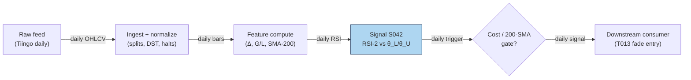

### S12. Sources

- Wilder, J. Welles (1978). *New Concepts in Technical Trading Systems*. Trend Research. (RSI formula; book.)
- QuantifiedStrategies.com. "Connors RSI Trading Strategy: Statistics, Facts, Backtests (75% Win Rate)". https://www.quantifiedstrategies.com/connors-rsi/ — practitioner CRSI(2)/RSI backtests on daily SPY.
- Herberger, T. A., Horn, M., & Oehler, A. (2020). "Are intraday reversal and momentum trading strategies feasible? An analysis for German blue chip stocks." *Financial Markets and Portfolio Management*, 34(2), 179–197. https://ideas.repec.Org/a/kap/fmktpm/v34y2020i2d10.1007_s11408-020-00356-2.html
- Alvarez Esteban, L. (2026). "Overnight Returns and Intraday Reversals." UTU thesis, US equities 2011–2024. https://www.utupub.fi/server/api/core/bitstreams/88057d2a-1ee8-4c05-9592-c535a21b502c/content
- MQL5 (2025). "Day Trading Larry Connors RSI2 Mean-Reversion Strategies." https://www.MQL5.com/en/articles/17636 — Connors RSI2 rule documentation (entry/exit/stop conventions).

**Unverified leads** (chatbot-provided, no checkable source — do not treat as evidence):
- Duck.ai answered Q-SB2-1–Q-SB2-3 (2026-09-10); Grok/Cursor answers pending (checked 2026-09-10).
- Expectancy lead: 75% win / +0.25% avg win / −1.2% avg loss → −0.1125%/trade before costs (arithmetic verified; inputs are unverified practitioner claims).
- "70–90% win" RSI-2/IBS claims are practitioner/vendor, not peer-reviewed (per Q-SB2-3).

---
## Stage 43/200 — S043: Internal Bar Strength (IBS) mean reversion

*Batch SB2 · Signal 43/100 · Provenance [SR] · Family C — Mean reversion & reversal*

### S1. One-line verdict

| | |
|---|---|
| **What it is** | The position of a bar's close inside its own high–low range, IBS = (C−L)/(H−L); extremes (≈0 or ≈1) mark exhausted closes that revert the next bar. |
| **When it works** | Daily bars of broad index ETFs, where end-of-day flow (market-on-close (MOC) imbalances, retail panic, rebalancing) pushes the close to a range extreme disconnected from fundamentals. |
| **When it dies** | Single names with real news in the bar, trending regimes where strong closes persist, low-volume days (the effect vanishes), and anything with a wide spread. |
| **Build-or-buy in one line** | Build: three columns of arithmetic on bars you already store; nothing to buy except the bars. |

Provenance **[SR]**: the construction and practitioner rule are documented in practitioner literature (Pagonidis 2014; Kakushadze & Serur 2018 §4.4); the mean-reversion *effect* is the reconstructed standard interpretation, not a peer-reviewed causal claim.

### S2. How it works — plain human explanation

It is 3:58 p.m. QQQ has traded between 481.10 and 484.30 all session, and it is printing 481.35 — nearly the low of the day — because a wave of market-on-close sell programs and retail stop-outs hit in the last hour. Nothing about the Nasdaq's fundamentals changed since lunch; the close is weak because *flow* was weak. IBS turns that observation into one number: (481.35 − 481.10)/(484.30 − 481.10) ≈ 0.08. A close pinned to the low of the range reads as oversold; a close pinned to the high (≈0.95+) reads as overbought. The bet is that tomorrow, absent new information, the flow-driven extreme partially reverses.

Economically, three forces compress into the close. First, **MOC and rebalancing flow**: index funds, pension rebalances, and ETF creation/redemption print mechanically into the close, indifferent to price — a transient supply/demand shock. Second, **retail panic and profit-taking**: the last hour concentrates discretionary selling after red days and profit-taking after green days, both flow rather than information. Third, **closing-auction mechanics**: the auction clears imbalances at a single price that can sit at a range extreme without representing continuous-session consensus. All three are *temporary pressure*; when pressure is temporary, the next session's open/close drifts back.

- **Mental model, in three bullets:**
  - IBS asks one question: "did the bar close exhausted (near the low) or euphoric (near the high)?" — 0 = exhausted, 1 = euphoric, 0.5 = balanced.
  - It works best where idiosyncratic news is absent (broad ETFs), so the extreme can be attributed to flow.
  - The signal *requires the close*: the entry bar is complete, so execution is always on the **next** bar — this is a feature for honesty, not a bug.

### S3. The math — exact formula

$$\mathrm{IBS}_t = \frac{C_t - L_t}{H_t - L_t} \in [0, 1]$$

$C_t, L_t, H_t$ are the bar's close, low, high in $ (or any price unit). Edge cases: if $H_t = L_t$ (zero-range bar), define IBS = 0.5 (balanced) by convention — *example convention, not an institutional standard*. IBS is already normalized to [0, 1]; no further scaling needed.

Example rule (*example — not an institutional standard*): **long** when IBS_t < 0.2, executed at bar *t+1*'s open; **exit** when IBS ≥ 0.5; the short side mirrors at IBS > 0.8. Pagonidis (2014) instead sorts instruments into IBS buckets and documents threshold behavior near ≈0.4 and ≈0.9 rather than a single hard line.

| Parameter | Symbol | Typical range | Too small / too large | Default (example) |
|---|---|---|---|---|
| Long trigger | θ_long | 0.1–0.3 | 0.1: rare, sharper; 0.3: frequent, diluted edge | 0.2 |
| Short trigger | θ_short | 0.7–0.9 | mirrors θ_long | 0.8 |
| Exit level | θ_exit | 0.4–0.6 | 0.4: exits too fast to capture the bounce; 0.6+: holds through reversal of the reversal | 0.5 |
| Zero-range rule | — | — | must be defined or a flat bar divides by zero | 0.5 |

Causal timing: IBS_t is computable only after bar *t* closes; the earliest tradable fill is bar *t+1*'s open. Named variants: (1) **daily ETF fade** — long IBS < 0.2, exit IBS > 0.5 (Pagonidis form); (2) **cross-sectional rank** — rank a basket of ETFs by IBS each day, long the bottom decile / short the top decile (Kakushadze & Serur §4.4 form); (3) **intraday minute-bar IBS** — documented by practitioners, not established statistically [SR].

### S4. Worked example — step-by-step numbers (SYNTHETIC)

All data is **synthetic**, drawn with `rng = np.random.default_rng(49)` (stated for reproducibility); the chart `images/S043_example.png` plots exactly these numbers.

10-day synthetic tape, prices in $:

| Day | Open | High | Low | Close | IBS |
|-----|-------|-------|-------|-------|-------|
| D1 | 100.00 | 102.21 | 98.60 | 100.51 | 0.529 |
| D2 | 100.51 | 102.28 | 98.81 | 99.50 | 0.199 |
| D3 | 99.50 | 100.29 | 98.50 | 99.30 | 0.447 |
| D4 | 99.30 | 100.32 | 96.22 | 97.51 | 0.315 |
| D5 | 97.51 | 100.22 | 95.46 | 99.32 | 0.811 |
| D6 | 99.32 | 101.00 | 98.55 | 99.49 | 0.384 |
| D7 | 99.49 | 100.45 | 97.28 | 99.13 | 0.584 |
| D8 | 99.13 | 100.84 | 98.37 | 99.24 | 0.352 |
| D9 | 99.24 | 101.84 | 97.13 | 100.78 | 0.775 |
| D10 | 100.78 | 102.97 | 99.71 | 101.25 | 0.472 |

Check D2 by hand: (99.50 − 98.81)/(102.28 − 98.81) = 0.69/3.47 = **0.199** < 0.2 → long signal. D5: (99.32 − 95.46)/(100.22 − 95.46) = 3.86/4.76 = **0.811** ≥ 0.5 → exit signal.

Example trade (rule: buy the open after IBS < 0.2, sell the open after the first bar with IBS ≥ 0.5 — *example*, causal t→t+1): D2 signals; **buy at D3 open, 99.50**; D5's IBS = 0.811 triggers the exit; **sell at D6 open, 99.32**. Gross return: (99.32 − 99.50)/99.50 = **−0.18%** on 1,000 shares (−$180). Costs (ETF: half-spread ~0.5 bp + fees ≈ 2 bp/leg, example): ≈ 4 bp round-trip ≈ $40 → net ≈ **−$220 (−0.22%)**.

**What to notice:** the single worked trade *loses*. That is deliberate and important: IBS is a statistical edge over hundreds of signals (Pagonidis documents +0.35% average next-day return when IBS < 0.2 across equity ETFs, before costs), not a promise on any one tape. The example also shows the asymmetry the literature documents — the D9 exit signal (0.775) fires on a +1.6% up day, the kind of "euphoric close" the short side fades. Toy limits: no real fills, no borrow on the short side, no volume filter (Pagonidis finds the effect disappears on low-volume US ETF days).

### S5. Strategies that use this signal

- **T013 — RSI-2 / IBS Extreme Fade** — primary entry trigger (direction): the Connors-style fade combines S043 with S042 and S045. (RSI-2: 2-day Relative Strength Index, a 0–100 momentum oscillator — see S042.)
- **T100 — Grand Ensemble** — diluted ensemble consumer: S043 is one of ~100 features in the capstone blend; its individual weight is negligible and the fit is thin — cited for completeness, not as a genuine two-signal composition.

### S6. Data required — exact spec

| Field | Type | Granularity | Source tier | Notes |
|---|---|---|---|---|
| High / Low / Close | float ($) | daily (or minute) | Tier 0–1 | Split-adjusted; unadjusted bars inject false range extremes |
| Volume | int (shares) | daily | Tier 0–1 | Volume filter: effect documented to vanish on low-volume days |
| Session calendar | date/bool | daily | Tier 0 | Half-days produce compressed ranges — handle or exclude |

Ingest sketch (Python/polars, ≤20 lines):

```python
import polars as pl
bars = pl.scan_parquet("silver/daily_adjusted/*.parquet")
sig = (bars
    .with_columns(ibs=(pl.col("close")-pl.col("low")) /
                        (pl.col("high")-pl.col("low")).clip_min(1e-9))
    .with_columns(ibs=pl.when(pl.col("high")==pl.col("low")).then(0.5)
                        .otherwise(pl.col("ibs")))
    .with_columns(vol_z=pl.col("volume")/pl.col("volume").rolling_median(20).over("symbol"))
    .filter(pl.col("ibs")<0.2, pl.col("vol_z")>0.8)   # example thresholds
    .select("symbol","date","close","ibs")
    .collect())  # execute at next bar's open — never at the signal bar's close
```

Storage: daily bars are bytes per symbol-day (cost-model §4: 3,000 stocks × daily ≈ 5 MB total). Data-quality checklist: split/dividend adjustment (a split changes H−L scale); zero-range bars (define the 0.5 convention); half-days and early closes; stale prints on illiquid ETFs; volume convention (single-counted vs double-counted).

### S7. Local build on M5 Max / 128GB

**Feasibility: trivial.** IBS is three-column arithmetic: a 500-symbol × 10-year daily screen is ~1.25M rows, a sub-second polars scan (cost-model §2: 10–50M rows/sec simple ops). No real-time loop is needed — the signal updates once per bar close. RAM footprint is megabytes against the 77GB working budget (cost-model §3). **Python+polars** is the obvious pick; Rust buys nothing; DuckDB only if the IBS rank needs to join a large cross-sectional panel. Engineering: **Tier L, 4–12 h ≈ $600–1,800 loaded** (cost-model §5) — nearly all of it is the volume filter, the next-bar execution accounting, and universe hygiene. What breaks first at 500 symbols: nothing computationally; the research breaks first on *data* — unadjusted corporate actions and survivorship-biased ETF universes (universes that drop delisted products, flattering backtests).

### S8. Buy vs build

| Option | What you get | Price | Gains | Loses |
|---|---|---|---|---|
| Tier 0: Stooq / exchange delayed | Daily OHLCV (open/high/low/close/volume) | ~$0 (indicative — verify before budgeting) | Enough for the canonical daily rule | Weak corporate-action metadata |
| Tier 1: Polygon Stocks Developer / Tiingo | Daily + minute bars, splits | ~$30–200/mo (indicative — verify before budgeting) | Clean adjustments; volume field for the low-volume filter | — |
| Tier 2: Databento | SIP-grade (consolidated exchange feed) daily/minute | ~$200/mo + usage (indicative — verify before budgeting) | Point-in-time correctness | Overkill for (C−L)/(H−L) |
| Academic: Pagonidis (2014) paper | Documented thresholds + bucket results | ~$0 (indicative — verify before budgeting) | The closest thing to a specification | Practitioner venue (NAAIM), not peer-reviewed |

**Verdict: build.** The indicator is trivial; the value is in the execution accounting (next-bar fills, volume filter, borrow on the short side). Buy Tier 1 bars if you want minute-bar variants; otherwise Tier 0 suffices.

### S9. Success ratio / efficacy — documented evidence

| Study / source | Market & period | Metric | Before/after cost | Caveat |
|---|---|---|---|---|
| Pagonidis (2014), "The IBS Effect: Mean Reversion in Equity ETFs" (NAAIM) | Equity ETFs, inception–2013 | Avg next-day return **+0.35%** when IBS < 0.2; **−0.13%** when IBS > 0.8; ~30% p.a. alpha for the simple strategy | **Before cost** | Practitioner paper, not peer-reviewed; ETF universe |
| Pandey & Joshi (2023), arXiv | Country ETFs, 10 years | IBS-based mean-reversion "useful for predicting short-term price movements" in their basket | Before cost (implied) | Student report; qualitative headline |
| Desk/practitioner synthesis (finterm notes on Kakushadze & Serur 2018 §4.4) | Broad/country ETFs since 1990s | Rank-by-IBS reversal "documented to work consistently"; strongest with trend filter, high-volume days, Monday→Tuesday window | Before cost | Practitioner summary of a practitioner book |
| Duck.ai Q-SB2-3 (labeled lead) | — | "70–90% win" claims are practitioner/vendor, **not peer-reviewed**; Connors Research presents IBS as concept with no published hit-rate benchmark | n/a | Chatbot lead, qualitative |

Regimes where it fails: single-name news days (the extreme is information, not flow), persistent trends (strong closes keep working), low-volume days (effect disappears for US equity ETFs per Pagonidis), bear-market long side (short side relatively stronger in bears). The IBS effect is also documented as stronger on high-range, high-volatility days and on Mondays ("Turnaround Tuesday").

**Honest bottom line:** as a standalone trigger this is a **small, conditional, before-cost edge** concentrated in liquid ETFs — and the naive daily fade inherits the S040-style caveat: after spreads, fees, and next-open slippage (extra cost when your order pushes the open price against you) on the short side, published-looking returns compress hard. As a filter (rank ETFs by IBS to time entries from other signals), it is better evidenced and cheaper to be wrong about.

### S10. Failure modes & pitfalls

1. **Same-bar execution (lookahead)** — IBS needs the close; trading "at the close" of the signal bar is impossible without MOC access modeled honestly; mitigation: next-bar-open fills, or explicit MOC impact modeling.
2. **News-driven extremes** — a close at the low on genuine bad news is information, not exhaustion; mitigation: skip earnings/event days, or require the ETF (diversified) rather than the single name.
3. **Short-side costs** — borrow fees and next-open slippage on gap days; mitigation: long-only variant, or model borrow explicitly.
4. **Low-volume fade** — the documented effect vanishes on quiet days; mitigation: the volume filter (e.g. volume > 0.8× 20-day median, example).
5. **Zero-range / half-day bars** — division by zero or compressed ranges; mitigation: the 0.5 convention + session-calendar exclusions.
6. **Overfit thresholds** — 0.2/0.5/0.8 mined on the same ETFs; mitigation: fix thresholds a priori, test on post-2013 data the original paper never saw.
7. **Crowding/decay** — the rule is public since 2013–2014; mitigation: expect decay, use as a feature (T013/T100) rather than a book.

### S11. Visuals


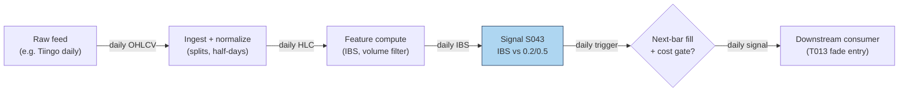

### S12. Sources

- Pagonidis, A. S. (2014). "The IBS Effect: Mean Reversion in Equity ETFs." NAAIM Wagner Award paper. https://www.naaim.org/wp-content/uploads/2014/04/00V_Alexander_Pagonidis_The-IBS-Effect-Mean-Reversion-in-Equity-ETFs-1.pdf
- Pandey, A. & Joshi, K. (2023). "Using Internal Bar Strength as a Key Indicator for Trading Country ETFs." arXiv. http://export.arxiv.org/pdf/2306.12434
- Kakushadze, Z. & Serur, J. A. (2018). *151 Trading Strategies*. Palgrave Macmillan. (§4.4: IBS cross-sectional construction; book.)
- Practitioner synthesis: "ETF Mean Reversion (Internal Bar Strength)" notes. https://github.com/yumima/finterm/blob/HEAD/fincept-qt/resources/knowledge/quant-strategies/etf-mean-reversion-ibs.md — documents the rank-by-IBS strategy and the economic (end-of-day flow) rationale.

**Unverified leads** (chatbot-provided, no checkable source — do not treat as evidence):
- Duck.ai answered Q-SB2-1–Q-SB2-3 (2026-09-10); Grok/Cursor answers pending (checked 2026-09-10).
- "70–90% win" IBS claims are practitioner/vendor, not peer-reviewed; Connors Research presents IBS as concept with no published hit-rate benchmark (per Q-SB2-3).
- Expectancy arithmetic lead (75% win / +0.25% avg win / −1.2% avg loss → −0.1125%/trade before costs): math verified, inputs unverified.

---
## Stage 63/200 — S063: Range-based realized-volatility estimators

*Batch SB2 · Signal 63/100 · Provenance [D] · Family E — Volatility & options-informed*

### S1. One-line verdict

| Row | Content |
|---|---|
| **What it is** | Volatility estimated from each bar's high-low (and open/close) instead of close-to-close returns — 5–8× more efficient per observation. |
| **When it works** | Vol-targeted sizing, dispersion legs, VRP measurement — anywhere a fast, honest read of recent realized vol beats noisy close-to-close. |
| **When it dies** | Overnight gaps (Parkinson), trending drift (Garman–Klass), tick-bound prices (a tick = the minimum price increment), jump days; raw 5-min bars without deseasonalizing. |
| **Build-or-buy in one line** | Build — closed-form on OHLC bars; buy history, never the estimator. |

Provenance **[D]** (documented: Parkinson 1980; Garman & Klass 1980; Rogers & Satchell 1991; Yang & Zhang 2000). Family **E — Volatility & options-informed**. Worked example is synthetic and watermarked (seed 63).

### S2. How it works — plain human explanation

**Vignette.** Tuesday, MSFT. It opens at $512.40, swings $508.10–$517.30 all session, and closes at $512.55 — up three hundredths of a percent. A close-to-close volatility estimate says "nothing happened." A range-based estimator looks at the $9.20 high-low range and says "that was a 1.8% day." The range distills the whole intraday path; close-to-close discards everything between the two prints.

**Why it works statistically.** Under (approximately) Brownian motion (a random walk with normally distributed steps — the standard price model), the high-low range carries far more information about a bar's variance than the open-to-close move — a day that wanders but closes flat has near-zero squared return yet a large range. The classic result: Parkinson ≈ **5× as efficient** as close-to-close (same accuracy from ~80% less data); Garman–Klass reaches **7–8×**. The four estimators trade off which biases they remove:
- **Parkinson** — high/low only; simplest; assumes no drift (no persistent directional trend) and no overnight gap.
- **Garman–Klass** — adds open/close; most efficient under zero drift.
- **Rogers–Satchell** — drift-robust combination; handles trending bars.
- **Yang–Zhang** — blends overnight, open-close, and Rogers–Satchell; drift-independent *and* gap-robust; the minimum-error choice on full OHLC.

Alizadeh, Brandt & Diebold (2002): range-based proxies are approximately Gaussian (bell-curve / normally distributed) and **robust to microstructure noise** — bid-ask bounce (trades alternating between bid and ask prints) inflates the observed range by only about the average spread.

**Mental model (3 bullets):**
- Range estimators are *volatility microscopes*: same bars, 5–8× more information per observation than close-to-close.
- They are **state, not signal** — they measure the weather (how big moves are), they don't predict its direction.
- Pick the estimator by your bias budget: Parkinson for clean intraday bars, Rogers–Satchell when bars trend, Yang–Zhang when overnight gaps matter.

### S3. The math — exact formula

Per-bar variance estimates (log prices; $O, H, L, C$ in $). Average over a window of $N$ bars, then annualize:

$$\hat\sigma^2_{\text{Park}} = \frac{\left[\ln(H/L)\right]^2}{4\ln 2}$$

$$\hat\sigma^2_{\text{GK}} = \tfrac{1}{2}\left[\ln(H/L)\right]^2 - (2\ln 2 - 1)\left[\ln(C/O)\right]^2$$

$$\hat\sigma^2_{\text{RS}} = \ln(H/C)\,\ln(H/O) + \ln(L/C)\,\ln(L/O)$$

$$\hat\sigma^2_{\text{YZ}} = \sigma^2_o + k\,\sigma^2_c + (1-k)\,\sigma^2_{\text{RS}}, \qquad
k = \frac{0.34}{1.34 + (N+1)/(N-1)}$$

where $\sigma^2_o$, $\sigma^2_c$, $\sigma^2_{\text{RS}}$ are overnight (close-to-open), open-to-close, and Rogers–Satchell variances, each averaged over $N$ bars. Annualized: $\hat\sigma_{\text{ann}} = \sqrt{\bar\sigma^2}\times\sqrt{\text{bars/year}}$ (252 daily; $252 \times 78$ for 5-min RTH (regular trading hours) bars).

**Causal timing.** Each bar's estimate uses only that bar's OHLC (complete at the bar close); the $N$-bar average completes at the close of bar $N$; tradable no earlier than bar $N+1$.

**Parameter table** (defaults are *example — not an institutional standard*):

| Parameter | Symbol | Typical range | Too small | Too large | Default example |
|---|---|---|---|---|---|
| Estimation window | *N* | 5–30 days (or 30–78 intraday bars) | noisy, jump-dominated | stale vol regime | 20 days |
| Annualization | bars/year | 252 (daily); 19,656 (5-min RTH) | wrong units | — | 252 for the daily example |
| YZ weight | *k* | 0.1–0.3 (falls with *N*) | over-weights open-close | over-weights overnight | 0.1327 at *N*=10 (see S4) |
| Estimator choice | — | Park / GK / RS / YZ | — | — | YZ for daily; Park/GK for clean intraday bars |

**Normalization.** Use levels for sizing (position ∝ target/σ̂), z-scores vs own history for vol-breakout regimes, or realized/implied ratios for VRP. Never annualize with the wrong bar count — the most common implementation bug.

**Named variants:**
1. **Parkinson (1980)** — high/low only; zero-drift, no-gap; the baseline.
2. **Garman–Klass (1980)** — OHLC; minimum-variance combination under zero drift; most efficient classical estimator.
3. **Rogers–Satchell (1991)** — OHLC; unbiased for arbitrary drift; slightly less efficient than GK at zero drift.
4. **Yang–Zhang (2000)** — overnight + open-close + RS blend; independent of drift and opening jumps; default for gappy daily bars.

### S4. Worked example — step-by-step numbers (SYNTHETIC)

**Synthetic 10-day tape** (`np.random.default_rng(63)`; exactly reproducible). Prices in $:

| Day | Open | High | Low | Close |
|---|---|---|---|---|
| D1 | 100.285 | 103.461 | 99.718 | 102.664 |
| D2 | 103.171 | 105.888 | 102.467 | 104.325 |
| D3 | 104.831 | 109.252 | 103.643 | 107.411 |
| D4 | 107.137 | 107.671 | 103.896 | 105.101 |
| D5 | 105.591 | 106.272 | 104.491 | 105.251 |
| D6 | 105.962 | 106.976 | 105.259 | 106.334 |
| D7 | 106.491 | 108.383 | 105.099 | 107.636 |
| D8 | 108.106 | 110.259 | 107.478 | 108.967 |
| D9 | 108.417 | 108.783 | 106.803 | 108.013 |
| D10 | 107.628 | 109.008 | 107.582 | 108.013 |

**Step-by-step (D1, Parkinson, fully shown):** $\ln(H/L) = \ln(103.461/99.718) = \ln(1.037531) = 0.036848$. Square: $0.00135777$. Divide by $4\ln 2 = 2.772589$: $\hat\sigma^2_{\text{Park},1} = 0.00048964$. The same arithmetic with the GK and RS formulas gives 0.00046635 and 0.00040594.

**Per-day variances (all 10 days):**

| Day | Parkinson | Garman–Klass | Rogers–Satchell |
|---|---|---|---|
| D1 | 0.00048964 | 0.00046635 | 0.00040594 |
| D2 | 0.00038891 | 0.00049132 | 0.00050950 |
| D3 | 0.00100177 | 0.00116030 | 0.00110870 |
| D4 | 0.00045944 | 0.00049471 | 0.00047429 |
| D5 | 0.00010307 | 0.00013888 | 0.00013803 |
| D6 | 0.00009448 | 0.00012623 | 0.00012504 |
| D7 | 0.00034161 | 0.00042938 | 0.00043586 |
| D8 | 0.00023524 | 0.00030181 | 0.00031244 |
| D9 | 0.00012159 | 0.00016319 | 0.00019279 |
| D10 | 0.00006259 | 0.00008185 | 0.00011864 |

**Window aggregation + Yang–Zhang:** 10-day mean variances — Parkinson 0.00032983, GK 0.00038540, RS 0.00038212. Overnight variance $\sigma^2_o = 0.00002008$; open-to-close variance $\sigma^2_c = 0.00018599$; $k = 0.34/(1.34 + 11/9) = 0.1327$; $\hat\sigma^2_{\text{YZ}} = 0.00002008 + 0.1327(0.00018599) + 0.8673(0.00038212) = \mathbf{0.00037618}$. Annualized ($\times\sqrt{252}$): **Parkinson 28.83%, Garman–Klass 31.16%, Rogers–Satchell 31.03%, Yang–Zhang 30.79%**.

**Chart** (same numbers — daily σ = √variance × 100; YZ is window-level, hence horizontal; see S11 for the figure).

**What to notice.** All four agree closely (28.8–31.2% annualized) — on clean synthetic data the bias corrections barely bite; estimator choice matters most on *real* data with gaps and drift. D3 (largest range day) dominates the window — one wild bar moves a 10-day average materially, which is why production windows run 20+ days. **Limits:** synthetic tape, no jumps, no tick discreteness, no fees — this validates the arithmetic and the code path, not any trading edge.

### S5. Strategies that use this signal

- **T058 — Dispersion Trader (primary leg input).** Long single-stock realized vol vs short index vol: S063 measures the *realized-vol leg* — entry/exit and hedge ratios from range-based RV, with S075/S069 context.
- **T035 — Futures Calendar-Spread Carry (sizing).** Harvests term-structure roll yield; S063-based vol forecasts scale size to keep carry positions inside the vol budget as realized vol expands.
- **T010 — Variance-Risk-Premium Harvester (regime/sizing).** Delta-hedged short-vol when implied variance is rich vs forecast: S063 is the "realized" side of the comparison, alongside HAR forecasts (S066) and VRP levels (S069).

### S6. Data required — exact spec

| Field | Type | Granularity | Source tier | Notes |
|---|---|---|---|---|
| Open / High / Low / Close | float $ | daily or 5-min bars | Tier 0–1 | the only inputs |
| Corporate actions | events | daily | Tier 1 | splits corrupt H/L ratios if unadjusted |
| (optional) implied vol | float | daily | Tier 1–2 | for the VRP comparison in T010, not for S063 itself |

**Collection.** Stooq (Tier 0, daily), Polygon stocks v3 (Tier 1, minute bars), Databento (Tier 2). Schema sketch: `symbol, ts, open, high, low, close`.

**Ingest sketch (Python/polars, ≤20 lines):**
```python
import polars as pl, numpy as np
bars = pl.scan_parquet("bars/min5_*.parquet").sort("symbol", "ts")
rv = (bars.with_columns(
        park=(pl.col("high")/pl.col("low")).log()**2 / (4*np.log(2)),
        gk=0.5*(pl.col("high")/pl.col("low")).log()**2
           - (2*np.log(2)-1)*(pl.col("close")/pl.col("open")).log()**2,
        rs=(pl.col("high")/pl.col("close")).log()*(pl.col("high")/pl.col("open")).log()
           + (pl.col("low")/pl.col("close")).log()*(pl.col("low")/pl.col("open")).log())
    .group_by("symbol")
    .agg(park_20d=pl.col("park").tail(20).mean(),   
         gk_20d=pl.col("gk").tail(20).mean(),
         rs_20d=pl.col("rs").tail(20).mean()))
rv.sink_parquet("features/range_rv.parquet")
```

**Storage.** Per `notes/cost-model.md §4`: 1-min bars for 500 symbols ≈ 50 MB/day (~3 GB per 60 days); daily OHLC ≈ 5 MB/day for 3,000 stocks. Derived RV panels are negligible.

**Data-quality checklist:** H/L integrity (H ≥ max(O,C), L ≤ min(O,C)); zero-range bars; corporate actions; DST/half-days (bar-count changes); intraday seasonality — deseasonalize (remove the time-of-day pattern in) 5-min estimates (S067).

### S7. Local build on M5 Max / 128GB

**Feasibility: feasible.** Compute is trivial; the pipeline around it is the work (Plan §6: Family E, 63–70, Tier M).

**Throughput** (per `notes/cost-model.md §2`): numpy ~50–200M elements/sec — four estimators over 500 symbols × 390 5-min bars × 60 days (11.7M rows) compute in ~1–5 s. Bottleneck: I/O and data QA.

**Stack options:**

| Stack | When to pick |
|---|---|
| Python + polars/numpy | Default; closed-form and vectorized |
| DuckDB | If RV must live inside SQL feature pipelines |
| Rust | Only inside a real-time risk loop recomputing vol per tick (rare) |

**RAM** (per cost-model §3): 500 symbols × 60 days of 5-min bars ≈ 3–8 GB eager — inside the 77 GB working budget; daily-bar panels are megabytes.

**Engineering time:** Tier **M**, 20–60 h → **$3,000–9,000** at $150/hr loaded-cost estimate (cost-model §5). The formulas are minutes; a production vol-state pipeline needs window selection, annualization conventions, estimator comparison across history, deseasonalization for intraday bars, and jump-day handling.

**What breaks first at 500 symbols / full OPRA:** 500 symbols are trivial. What breaks is *naive extension*: raw 5-min bars without deseasonalization, or OPRA (Options Price Reporting Authority)-scale options data (~1–2.5 GB/day per underlying, cost-model §3/§4) — a different project.

### S8. Buy vs build

| Option | What you get | Indicative price | What buying gains | What buying loses |
|---|---|---|---|---|
| Tier-0: Stooq daily OHLC | Free daily bars | ~$0 | zero cost | daily only; no adjustments |
| Tier-1: Polygon Stocks Advanced | SIP (consolidated tape) minute + daily bars, actions | ~$30–200/mo | consolidated tape for 5-min RV | none material |
| Tier-2: Databento Standard | Research bars, futures/options | ~$200/mo + usage | honest intraday; OPRA research | overkill for equity daily RV |
| Academic: OptionMetrics / WRDS TAQ | Publication-grade history | ~thousands/yr academic; institutional $$$$ | ground-truth vol benchmarks | cost; still wouldn't replace the estimator |

All prices `indicative — verify before budgeting`. **Verdict: build.** Every estimator here is closed-form on bars you already buy: buy the *bars* (Tier 1 minute bars for intraday RV), build the four estimators and window/annualization logic in days. Crossover: buy precomputed vol only for *implied* vol surfaces — realized vol from OHLC is never worth outsourcing.

### S9. Success ratio / efficacy — documented evidence

| Study / source | Market & period | Metric | Before/after cost | Caveat |
|---|---|---|---|---|
| Empirical volatility-estimator literature (surveyed in the NTHU working paper) | Multi-market simulations + empirical | Parkinson ≈ **5.2×** as efficient as close-to-close; Garman–Klass **7–8×** as efficient ("same accuracy with ~80% less data") | n/a — statistical efficiency | Idealized diffusion; discrete prices bias extremes downward (Beckers 1983) |
| Alizadeh, Brandt & Diebold (2002), *J. Finance* 57, 1047–1091 | FX (theoretical + numerical + empirical) | Range-based vol proxies **highly efficient, approximately Gaussian, robust to microstructure noise**; enable efficient quasi-maximum-likelihood estimation of stochastic-volatility models | n/a — estimation quality | Estimation quality, not a tradable edge; FX sample |
| Saichev & Lapinova (2012), arXiv:1202.4311 | Theoretical | Compares point/interval statistics of Parkinson, Garman–Klass, Rogers–Satchell and bridge estimators; confirms the efficiency ranking and drift-sensitivity trade-offs | n/a — statistical comparison | Real-data choice still depends on gaps/drift regime |

**Regimes where it fails.** Jump days (range explodes — use jump-robust variants, S064, tolerant of discontinuous price jumps); tick-discrete low-priced names; overnight-gap regimes for Parkinson/GK (use YZ); trending bars for GK (use RS); 5-min bars without deseasonalizing the U-shaped pattern.

**Honest bottom line:** as a standalone directional trigger this is a **non-signal by design** — it measures magnitude, not direction. As a **sizing and regime input** it is first-class infrastructure: every vol-targeted strategy, dispersion leg, and VRP comparison here leans on a number like this one. Its "edge" is defensive — right-sizing through vol regimes instead of being sized by them.

### S10. Failure modes & pitfalls

1. **Overnight-gap bias (Parkinson)** — gaps inflate H/L without intraday variance; mitigate: Yang–Zhang on daily bars.
2. **Drift bias (Garman–Klass)** — trending bars bias GK; mitigate: Rogers–Satchell when bars carry drift.
3. **Discrete-price downward bias** — non-continuous observation understates extremes (Beckers 1983); mitigate: treat estimates on tick-bound names as lower bounds.
4. **Jump contamination** — one jump day dominates short windows; mitigate: 20+-day windows or jump-robust alternatives (S064).
5. **Wrong annualization** — mixing daily and intraday bar counts; mitigate: annualize with the exact bar count of the estimation grid, unit-test it.
6. **Intraday seasonality** — raw 5-min RV has a U-shape across the session (RTH = regular trading hours); mitigate: deseasonalize (S067) first.
7. **H=L stale bars** — dead feeds print zero range; mitigate: validate H ≥ max(O,C), L ≤ min(O,C), flag zero-range streaks.
8. **Mistaking efficiency for alpha** — a 5× more efficient estimator still measures the past; mitigate: it sizes positions and sets expectations — it does not predict direction.

### S11. Visuals


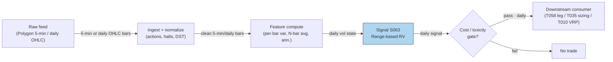

### S12. Sources

1. Alizadeh, Sassan; Brandt, Michael W.; Diebold, Francis X. (2002). "Range-Based Estimation of Stochastic Volatility Models." *Journal of Finance* 57(3), 1047–1091. http://ideas.repec.org/a/bla/jfinan/v57y2002i3p1047-1091.html
2. Saichev, Alexander & Lapinova, Svetlana (2012). "Comparative statistics of Garman-Klass, Parkinson, Roger-Satchell and bridge estimators." arXiv:1202.4311. https://arxiv.org/pdf/1202.4311v1
3. MIT OpenCourseWare 18.642 (Fall 2024), Lecture 17.2 — cites Parkinson (1980), Garman & Klass (1980), Rogers & Satchell (1991), Yang & Zhang (2000) with journal refs. https://ocw.mit.edu/courses/18-642-topics-in-mathematics-with-applications-in-finance-fall-2024/mit18_642_f24_lec17_2.pdf
4. kuant docs, "realizedvol" — practitioner reference for all four estimators incl. efficiency notes (GK ~7.4× vs close-to-close). https://github.com/scramblehub/kuant/blob/HEAD/docs/kernels/stats/realizedvol.md
5. Duck.ai (bot: GPT-5.6 "Luna", anonymous), Q-SB2-1–Q-SB2-2 (2026-09-10). **Labeled chatbot source**: Parkinson/GK/RS formulas hand-verified; Q-SB2-2 leads inform S7/S8; cost-model takes precedence.

**Unverified leads:**
- Efficiency figures "5.2× / 8.4×" from the NTHU empirical-volatility-estimators working paper (search snippet; not fully re-verified — stated as the 7–8× range corroborated by kuant docs). http://mx.nthu.edu.tw/~jtyang/Teaching/Risk_management/Papers/Quant_Methods/Empirical%20Evidence%20on%20Volatility%20Estimators.pdf

**Source log:** Duck.ai answered Q-SB2-1–Q-SB2-3 (2026-09-10); Grok/Cursor answers pending (checked 2026-09-10).

---

---
## Stage 66/200 — S066: HAR realized-volatility forecast

*Batch SB2 · Signal 66/100 · Provenance [D] · Family E — Volatility & options-informed*

### S1. One-line verdict

| | |
|---|---|
| **What it is** | A 3-regressor linear model — HAR (Heterogeneous Autoregressive), Corsi 2009 — forecasting tomorrow's realized variance from today's, this week's, and this month's: the industry workhorse vol forecast. |
| **When it works** | Any market with persistent volatility clustering: forecasts beat GARCH-family models (GARCH: the classic daily-returns volatility model) on out-of-sample loss across equities, FX, futures, commodities. |
| **When it dies** | Structural breaks, jump-dominated days (sudden discontinuous price moves), microstructure-noise-contaminated RV, horizons far from the (1,5,22) design, tiny estimation samples. |
| **Build-or-buy in one line** | Build: OLS (ordinary least squares — plain linear regression) on three features is an afternoon; buy the 5-minute bars, not the model. |

Provenance **[D]**: the model, formula, and empirical claims are documented in Corsi (2009) and follow-up literature.

### S2. How it works — plain human explanation

At 4:00 p.m., the desk needs one number for tomorrow: how volatile will SPY be? The HAR answer says: look at three clocks — what volatility did *today* (day-traders), averaged *this week* (weekly rebalancers), and averaged *this month* (pension funds). Add them with weights: tomorrow's forecast. The deep idea — Corsi's Heterogeneous Market Hypothesis, borrowed from Müller et al. — is that markets are a cascade of agents with different horizons, and volatility at each horizon is driven by the horizons above it. A restricted AR on daily/weekly/monthly components reproduces the *long memory* of volatility (shocks decay slowly, over weeks) without fractional-integration machinery (a heavier technique for modeling slow-decaying memory).

Why does it beat GARCH? GARCH sees only daily returns and must infer volatility from squared daily surprises — a noisy, low-information signal. HAR feeds on **realized** volatility, measured from dozens of intraday returns per day: a far sharper lens. HAR is not cleverer; it is allowed better data. The model is almost embarrassingly linear, which is why it survives production: OLS, three features, positivity clipping (forcing negative forecasts up to a small positive floor), done.

- **Mental model, in three bullets:**
  - Volatility has three gears — daily, weekly, monthly — and tomorrow's vol is a weighted sum of the three.
  - HAR wins by *measurement* (intraday realized variance), not model complexity; a linear model on good data beats a nonlinear model on bad data.
  - It is a **forecast**, not a trade: the edge becomes money only through a consumer (vol targeting, VRP harvesting, execution scheduling).

### S3. The math — exact formula

Build daily realized variance (RV) from M intraday log-returns (5-minute standard, 78 per US equity session):

$$r_{t,j} = \ln P_{t,j} - \ln P_{t,j-1}, \qquad RV_t = \sum_{j=1}^{M} r_{t,j}^2$$

units: variance per day. (Realized *volatility* is √RV — the standard-deviation-scale number in S4 step 5.) The HAR-RV regression (Corsi 2009):

$$RV_{t+1} = \beta_0 + \beta_d\, RV_t + \beta_w\, \overline{RV}_{t}^{(5)} + \beta_m\, \overline{RV}_{t}^{(22)} + \varepsilon_{t+1}$$

$$\overline{RV}_{t}^{(h)} = \frac{1}{h}\sum_{j=1}^{h} RV_{t-j+1} \quad h \in \{5, 22\}$$

the trailing 5-day (weekly) and 22-day (monthly) means. Estimated by OLS on ≥250 days (1,000+ preferred); clip forecasts at a small positive floor since raw-RV HAR can print negative. Common variant: **log-HAR**, $\log RV_{t+1} = c + \beta^{(d)}\log RV_t^{(1)} + \beta^{(w)}\log RV_t^{(5)} + \beta^{(m)}\log RV_t^{(22)} + \varepsilon$, which handles RV's right skew (the recent literature's baseline).

| Parameter | Symbol | Typical range | Too small / too large | Default (example) |
|---|---|---|---|---|
| Intercept | β_0 | 0–1e-4 | negative → negative variance forecasts | 5e-5 |
| Daily weight | β_d | 0.2–0.5 | 0: ignores today's shock; >0.6: overfits noise | 0.40 |
| Weekly weight | β_w | 0.2–0.45 | — | 0.35 |
| Monthly weight | β_m | 0.1–0.3 | 0: loses long memory; too big: sluggish | 0.20 |
| Estimation window | — | 250–1,000+ days | <250: unstable β; rolling 1,000 preferred | 1,000 |
| Intraday sampling | M | 39–78 (5–10 min) | too fine: microstructure noise; too coarse: noisy RV | 78 (5-min) |

*Every default is example — not an institutional standard.* Causal timing: the forecast for day *t+1* uses only RV through day *t*; tradable no earlier than *t+1*'s open. Named variants: (1) **HAR-J / HAR-CJ** — adds jump components via bipower variation (jump-robust volatility estimator; Andersen et al. 2007; Corsi & Renò 2009); (2) **log-HAR** — log transform, positivity-safe; (3) **intraday HAR-D** — rebuilds RV over intraday bins with session/week lags (arXiv 2202.08962) [SR].

### S4. Worked example — step-by-step numbers (SYNTHETIC)

All data is **synthetic** — a hand-specified 22-day daily-RV tape reproducing the operator-verified Duck.ai example (script seed 66; the series is fixed, not drawn). **Correction notice:** the raw chatbot output reported the 22-day sum as 0.014821 (≈10% too high) with everything downstream derived from it; the numbers below are the operator hand-checked corrections. The chart `images/S066_example.png` plots exactly these values.

RV_t (daily realized variance), days 1–22:

0.000400, 0.000441, 0.000484, 0.000529, 0.000576, 0.000625, 0.000676, 0.000729, 0.000784, 0.000841, 0.000900, 0.000841, 0.000784, 0.000729, 0.000676, 0.000625, 0.000576, 0.000529, 0.000484, 0.000441, 0.000400, 0.000361

Step-by-step (example betas β = (0.000050, 0.40, 0.35, 0.20) — *not an institutional standard*):

1. Daily component: RV_22 = **0.000361**.
2. Weekly: mean of the last 5 = (0.000529+0.000484+0.000441+0.000400+0.000361)/5 = **0.000443**.
3. Monthly: 22-day sum = **0.013431** (chatbot said 0.014821 — wrong); RV_22(22) = 0.013431/22 = **0.000610500** (chatbot said 0.000673682 — wrong).
4. Forecast: RV̂_{23|22} = 0.000050 + 0.40×0.000361 + 0.35×0.000443 + 0.20×0.000610500 = 0.000050 + 0.0001444 + 0.00015505 + 0.0001221 = **0.000471550** (chatbot said 0.000484186 — wrong).
5. Vol: σ̂ = √0.000471550 = **0.021716 ≈ 2.1716%/day** (chatbot said 2.2004% — wrong); annualized: 0.021716 × √252 ≈ **34.47%** (chatbot said 34.93% — wrong).

**What to notice:** the arithmetic is OLS-grade trivial — four multiplications — yet every downstream number in the chatbot's answer was corrupted by one bad sum, which is why the operator verification step exists. Economically: the forecast (0.0004716) sits *below* the monthly mean (0.0006105) because the recent days are quiet — the cascade mean-reverts. This is a toy: betas are illustrative, not estimated; real β comes from OLS on hundreds of days. Nothing here is a backtest, and a forecast is not a P&L.

### S5. Strategies that use this signal

- **T041 — HAR Vol-Timing Overlay** — primary sizing input: scales intraday positions by the HAR forecast (S066 with S067, S076).
- **T010 — Variance-Risk-Premium Harvester** — forecast comparator: harvests the gap between implied variance (the market's option-implied volatility forecast) and realized variance by shorting implied when rich versus HAR (with S069, S063).

### S6. Data required — exact spec

| Field | Type | Granularity | Source tier | Notes |
|---|---|---|---|---|
| Intraday prices/returns | float | 5-min bars (78/day) | Tier 1–2 | Polygon minutes, Databento; 1-min resampled to 5-min is standard |
| Corporate actions | events | daily | Tier 1–2 | Overnight jumps contaminate RV; decide open-to-close vs close-to-close |
| Session calendar | date/bool | daily | Tier 1 | Half-days have fewer bins — rescale or exclude |
| Estimation history | derived | daily RV | — | ≥250 days, 1,000+ preferred, before first forecast |

Ingest sketch (Python/polars, ≤20 lines):

```python
import polars as pl, numpy as np
bars = pl.scan_parquet("silver/minutes_5min/*.parquet")      # 5-min OHLCV, split-adjusted
rv = (bars
    .with_columns(r=np.log(pl.col("close")/pl.col("close").shift(1)).over("symbol"))
    .group_by(["symbol","date"]).agg(pl.col("r").pow(2).sum().alias("rv"))
    .with_columns(rv5=pl.col("rv").rolling_mean(5).over("symbol"),
                  rv22=pl.col("rv").rolling_mean(22).over("symbol"))
    .drop_nulls().collect())
X = rv.select(["rv","rv5","rv22"]).to_numpy()                 # OLS: rv_{t+1} ~ rv, rv5, rv22
beta, *_ = np.linalg.lstsq(np.c_[np.ones(len(X)-1), X[:-1]], X[1:,0], rcond=None)
fc = max(beta @ np.r_[1, X[-1]], 1e-8)                        # positivity clip
```

Storage: 5-min bars for 500 symbols ≈ 500 × 78 × 8 bytes × ~10 cols ≈ 3 MB/day — trivial (cost-model §4: 1-min/500 symbols ≈ 50 MB/day). Data-quality checklist: overnight-return treatment (open-to-close avoids close-to-close jumps); half-days; microstructure noise (bid–ask bounce contaminating fine-sampled returns) below 5-min sampling (use realized kernels — noise-robust volatility estimators — or coarser bins); DST; corporate actions; stale bins on illiquid names.

### S7. Local build on M5 Max / 128GB

**Feasibility: feasible (easy).** The daily job: build 500 RV series from 39k 5-min bars, then OLS on 500 × ~1,000-row design matrices — a few seconds of numpy. Planning assumption (cost-model §2): simple Polars ops ~10–50M rows/sec, complex rolling/as-of ops ~1–10M rows/sec; the pipeline research puts 500 rolling HAR fits at 5–30 s (labeled lead). A full daily SB2 refresh (11.7M rows) runs 15–60 s in Polars (labeled lead), so HAR is a rounding error inside it. RAM: the RV panel is ~500 × 1,000 × 8 bytes ≈ 4 MB against the 77GB working budget (cost-model §3). **Python+polars+numpy** is the right stack; Rust unnecessary; the M5 GPU is irrelevant. Engineering: **Tier M, 20–60 h ≈ $3,000–9,000 loaded** (cost-model §5) — the model is an afternoon; the hours are RV construction choices (sampling, overnight treatment, jump filtering), rolling-validation harness, and monitoring. What breaks first at 500 symbols: nothing on this box; production breaks first on *data licensing* (redistributing 5-min history) and regime monitoring (a silent structural break makes every forecast confidently wrong).

### S8. Buy vs build

| Option | What you get | Price | Gains | Loses |
|---|---|---|---|---|
| Tier 1: Polygon Stocks Developer | 5-min/minute aggs, 10y | ~$30–200/mo (indicative — verify before budgeting) | Everything needed for RV + HAR | — |
| Tier 2: Databento Standard | SIP-grade intraday, OPRA research | ~$200/mo + usage (indicative — verify before budgeting) | Honest timestamps; jump-robust extensions need trades | Overkill for plain HAR |
| Tier 3: OptionMetrics IvyDB | Publication-quality options history | ~$thousands/yr academic; institutional $$$$ (indicative — verify before budgeting) | Only if HAR feeds an options book (T010) | Price |
| Precomputed vol forecasts | Vendor RV/HAR series | varies (indicative — verify before budgeting) | No code | Black-box sampling/overnight choices; definitions vary |

**Verdict: build the model, buy the bars.** HAR is four coefficients; what matters is RV construction and the consumer that turns the forecast into size. Buy precomputed only as a validation benchmark.

### S9. Success ratio / efficacy — documented evidence

| Study / source | Market & period | Metric | Before/after cost | Caveat |
|---|---|---|---|---|
| Corsi (2009), *J. Financial Econometrics* | S&P 500 futures, Treasuries FX | "Remarkably good forecasting performance"; reproduces long memory, fat tails (extreme moves more common than a bell curve predicts) | Before cost (forecast loss) | The founding result; in-sample + OOS (out-of-sample — data the model never saw in estimation) |
| Path-dependent HAR paper (arXiv 2503.00851) | SSE (the paper's Shanghai equity sample), rolling 600-day OOS | HAR family **much lower** MSE/MAE/HMSE/HMAE/QLIKE (a volatility forecast loss function — lower is better) than GARCH family; more MCS (model confidence set — a test keeping only models not significantly worse than the best) passes | **Before cost** (forecast accuracy) | Dataset-specific; HAR-PD (path-dependent HAR) variants best |
| Louzis, Xanthopoulos-Sissinis & Refenes (2012), *Economics Bulletin* | S&P 500, incl. 2007–09 | HAR-type-EVT (extreme value theory) beats GARCH-type-EVT on VaR (value-at-risk — a tail-loss risk measure) accuracy and Basel II capital efficiency | Before cost (risk metric) | Economic *utility*, not trading P&L |
| High-frequency enhanced VaR (PMC — PubMed Central) | Multi-asset, 1,242 OOS days | HAR-RV fluctuation test beats univariate GARCH; "all GARCH models less accurate than HAR-RV" | Before cost (forecast loss) | VaR application |
| Practitioner replication (guna-1610) | S&P 500 2011–2026, 2,769 OOS days | HAR-RV QLIKE 0.3824 vs GARCH(1,1) 0.4237, DM (Diebold–Mariano — a test of whether one forecast is significantly better than another) significant | Before cost (forecast loss) | Practitioner, but real data + proper tests |
| Duck.ai Q-SB2-3 (labeled lead) | Literature survey | HAR-type beats GARCH on forecast loss in several settings; **lower loss ≠ tradable edge** | Before cost | Chatbot synthesis; direction matches the papers above |

Regimes where it fails: structural breaks (betas estimated on the old regime), jump-dominated days (use HAR-J), microstructure-noise contamination at too-fine sampling, horizons far from (1,5,22), small estimation samples. No documented after-cost P&L exists for HAR *itself* — it is infrastructure; economic value must be proven through a consumer (vol targeting, VRP) with turnover and utility accounting.

**Honest bottom line:** HAR has the **strongest statistical evidence in this batch** — it forecasts volatility better than GARCH across markets, periods, and loss functions. As a *forecasting* edge it is real; as a *trading* edge it is unproven until a costed consumer exists.

### S10. Failure modes & pitfalls

1. **Forecast ≠ trade** — a 5% better QLIKE earns nothing without a consumer; mitigation: attach HAR to sizing/hedging (T041/T010), evaluate the *strategy* net of costs.
2. **Microstructure noise** — 1-min RV without correction is noise-dominated; mitigation: 5-min sampling, or realized kernels.
3. **Overnight treatment** — open-to-close vs close-to-close changes RV by the overnight share; mitigation: pick one, document it.
4. **Negative forecasts** — raw-RV OLS can print negative variance; mitigation: positivity clip or log-HAR.
5. **Structural breaks** — 2008/2020-style regimes invalidate old betas; mitigation: rolling windows, break monitoring.
6. **Jump contamination** — one flash-crash day dominates the monthly mean; mitigation: HAR-J with bipower variation.
7. **Lookahead in RV** — using revised/corrected bars; mitigation: point-in-time bars, as-of timestamps.
8. **Overfitting via extensions** — HAR-PD, threshold HAR, ML hybrids add parameters; mitigation: MCS/DM tests, embargoed OOS (see S088).

### S11. Visuals


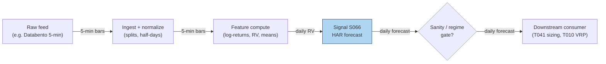

### S12. Sources

- Corsi, F. (2009). "A Simple Approximate Long-Memory Model of Realized Volatility." *Journal of Financial Econometrics*, 7(2), 174–196. http://ideas.repec.org/a/oup/jfinec/v7y2009i2p174-196.html
- "Forecasting realized volatility in the stock market: a path-dependent perspective" (2025). arXiv. https://arxiv.org/pdf/2503.00851 — HAR family vs GARCH family OOS loss + MCS tests.
- Louzis, D. P., Xanthopoulos-Sissinis, S., & Refenes, A. P. (2012). "Stock index Value-at-Risk forecasting: A realized volatility extreme value theory approach." *Economics Bulletin*, 32(1), 981–991. http://ideas.repec.org/a/ebl/ecbull/eb-11-00870.html
- "High-frequency enhanced VaR: A robust univariate realized volatility model" (2024). PMC. http://pmc.ncbi.nlm.nih.gov/articles/PMC11111067/ — HAR-RV vs GARCH fluctuation tests.
- "Volatility Forecasting with Machine Learning and Intraday Commonality" (2022). arXiv. http://arxiv.org/pdf/2202.08962 — intraday HAR-D / SARIMA (seasonal autoregressive integrated moving average) adaptation.

**Unverified leads** (chatbot-provided, no checkable source — do not treat as evidence):
- Duck.ai answered Q-SB2-1–Q-SB2-3 (2026-09-10); Grok/Cursor answers pending (checked 2026-09-10).
- HAR worked-example lead: the raw chatbot output contained a 22-day-sum error (0.014821 vs correct 0.013431); all downstream values used in S4 are the operator-verified corrections.
- Q-SB2-3 survey lead: "HAR-type beats GARCH on forecast loss in several settings" — direction consistent with the cited papers, but the synthesis itself is unverified; lower forecast loss ≠ tradable edge.
- Q-SB2-2 pipeline lead: 500 rolling HAR fits in 5–30 s; full SB2 daily refresh 15–60 s in Polars — labeled chatbot claims, not measured here.

---
## Stage 83/200 — S083: Imbalance/tick/volume/dollar bars

*Batch SB2 · Signal 83/100 · Provenance [D] · Family F — Statistical/ML infrastructure*

### S1. One-line verdict

| | |
|---|---|
| **What it is** | Alternative bar clocks: sample bars by trade count (tick), shares (volume), dollars traded, or signed-flow imbalance instead of wall-clock minutes. |
| **When it works** | Intraday feature pipelines: volume/dollar bars have better statistical properties (closer to Gaussian (bell-curve-shaped), less heteroskedasticity — variance that shifts over time) than minute bars; imbalance bars concentrate information arrival. |
| **When it dies** | Approximating them from minute OHLCV (open/high/low/close/volume — not equivalent to trade-built bars), mis-set imbalance thresholds, or downstream models assuming fixed time spacing. |
| **Build-or-buy in one line** | Build the sampler (an afternoon); buy the tick-trade feed — minute bars cannot reproduce true volume/imbalance bars. |

Provenance **[D]**: Easley, López de Prado & O'Hara (2012); López de Prado, *Advances in Financial Machine Learning* (2018), Ch. 2.

### S2. How it works — plain human explanation

It is 12:40 p.m.: the 12:35–12:40 bar on a liquid name holds 14 trades; the 9:30–9:35 bar held 4,000. A minute-bar pipeline treats those two bars as equals. Information does not arrive on a clock; it arrives with *trading activity*: a **tick bar** closes every N trades, a **volume bar** every V shares, a **dollar bar** every $D traded. At the open, bars fly past in seconds; at lunch, one bar takes minutes.

**Imbalance bars** go further: instead of fixed amounts of *activity*, they sample fixed amounts of *one-sided flow* — accumulate θ_T = Σ b_t·v_t and close when |θ_T| crosses a threshold. A bar now represents a fixed dose of *information* — informed, directional trading — regardless of duration. The economic story is Easley–López de Prado–O'Hara's: markets are not fast or slow, they are busy or quiet.

- **Mental model, in three bullets:**
  - Clock bars oversample quiet periods and undersample busy ones; activity clocks give every bar equal weight.
  - Dollar bars neutralize the *price-level* effect; imbalance bars neutralize the *noise*.
  - This is **infrastructure, not alpha**: bars make downstream statistics cleaner but predict nothing by themselves.

### S3. The math — exact formula

Let trades be indexed by *i* with price P_i, size q_i, and tick-rule sign b_i ∈ {+1, −1} (uptick +1, downtick −1, zero-tick reuses the previous sign).

- **Tick bars:** close every N trades (N *example*: 1,000–10,000 — *not an institutional standard*).
- **Volume bars:** close when Σ q_i ≥ V* (V* *example*: 1% of ADV (average daily volume)).
- **Dollar bars:** close when Σ P_i·q_i ≥ D* (D* *example*: $1M–$10M notional per bar).
- **Imbalance bars (tick):** θ_T = Σ_{i} b_i, close when |θ_T| ≥ E_0[T]·|E_0[θ]| — expected bar length × expected per-trade imbalance, EWMA-estimated (exponentially weighted moving average; mlfinlab implementation).
- **Imbalance bars (volume/dollar):** θ_T = Σ b_i·q_i (or Σ b_i·P_i·q_i), same close rule; the pipeline lead (Q-SB2-2, labeled) states it as: close when |Σθ_i| > E_0[|θ|]·n or a dynamic threshold.

Each bar then emits OHLCV: O = first P, H = max P, L = min P, C = last P, V = Σ q (dollars / shares / counts).

| Parameter | Symbol | Typical range | Too small / too large | Default (example) |
|---|---|---|---|---|
| Ticks per bar | N | 1k–50k | too small: noisy bars; too big: few bars/day | 5,000 |
| Shares per bar | V* | 0.1–2% of ADV | — | 1% of ADV |
| Dollars per bar | D* | $1M–$50M | too small on mega-caps: sub-second bars | $5M |
| Expected imbalance | E_0[θ] | estimated | mis-set: bars too fast (noise) or too slow (stale) | EWMA over 50 bars |
| Tick-rule fallback | — | — | zero ticks mishandled → sign drift | carry-forward (reuse the previous sign) |

*Every default is example — not an institutional standard.* Causal timing: bar *k* is complete only when its close condition fires; features on bar *k* are tradable no earlier than bar *k+1*'s first trade. Named variants: (1) **tick / volume / dollar** — fixed-activity clocks; (2) **tick / volume / dollar imbalance** — fixed-information clocks; (3) **run bars** (AFML — *Advances in Financial Machine Learning* (López de Prado, 2018), Ch. 2) — close on same-sign tick runs.

### S4. Worked example — step-by-step numbers (SYNTHETIC)

All data is **synthetic**: a 15-trade tape drawn with `rng = np.random.default_rng(83)`. `batches/SB2/plot_S083.py` regenerates it, and `images/S083_example.png` plots all 15 trades with the three boundary sets — numbers here and in the chart agree.

Tape (all 15 trades) — $ prices, share sizes, tick-rule sign:

| Trade | Price | Size | Sign | Trade | Price | Size | Sign |
|-------|-------|------|------|-------|-------|------|------|
| T1 | 99.49 | 1000 | +1 | T9 | 98.87 | 1000 | −1 |
| T2 | 99.34 | 300 | −1 | T10 | 98.64 | 1500 | −1 |
| T3 | 99.33 | 1500 | −1 | T11 | 98.88 | 500 | +1 |
| T4 | 99.46 | 800 | +1 | T12 | 99.07 | 1000 | +1 |
| T5 | 99.10 | 300 | −1 | T13 | 99.38 | 500 | +1 |
| T6 | 99.52 | 1500 | +1 | T14 | 99.20 | 200 | −1 |
| T7 | 99.59 | 200 | +1 | T15 | 99.47 | 800 | +1 |
| T8 | 99.41 | 500 | −1 | | | | |

Tick bars (every 5 trades), OHLC in $:

| Bar | O | H | L | C | #trades |
|-----|-------|-------|-------|-------|---------|
| TB1 | 99.49 | 99.49 | 99.10 | 99.10 | 5 |
| TB2 | 99.52 | 99.59 | 98.64 | 98.64 | 5 |
| TB3 | 98.88 | 99.47 | 98.88 | 99.47 | 5 |

Volume bars (every 3,000 shares — *example*):

| Bar | O | H | L | C | #trades |
|-----|-------|-------|-------|-------|---------|
| VB1 | 99.49 | 99.49 | 99.33 | 99.46 | 4 |
| VB2 | 99.10 | 99.59 | 98.87 | 98.87 | 5 |
| VB3 | 98.64 | 99.07 | 98.64 | 99.07 | 3 |

(open: T13–T15, 1,500 shares — the tape ends mid-bar.)

Imbalance bars (θ = Σ tick-sign × shares; close when |θ| ≥ 1,500 — *example*):

| Bar | O | H | L | C | #trades | θ at close |
|-----|-------|-------|-------|-------|---------|------------|
| IB1 | 99.49 | 99.59 | 98.64 | 98.64 | 10 | −1600 |
| IB2 | 98.88 | 99.07 | 98.88 | 99.07 | 2 | +1500 |

(open: T13–T15, θ = +1,100 — the tape ends mid-bar.)

**What to notice:** tick bars are metronomic (5 trades each) but informationally uneven — TB2 spans a 0.88 selloff into 98.64, TB3 the 0.59 snapback. Volume bars vary in trade count (3–5). Imbalance bars show the mechanism’s range: IB1 absorbs 10 trades — including the T6–T7 upticks — before the downtrend pushes θ to −1,600; IB2 closes after just 2 trades on the snapback (θ = +1,500). The tape ends mid-bar (T13–T15, θ = +1,100): carry it forward or discard.

### S5. Strategies that use this signal

- **T081 — Adaptive Bar-Clock Sampler** — primary infrastructure: selects the bar clock by regime for downstream signals (with S090, S067).
- **T044 — Diurnal Deseasonalization (removing the predictable intraday U-shaped activity pattern)** — bar clocks already remove much of the U-shaped seasonality before thresholding (with S067, S046).
- **T008 — Kalman Dynamic-Hedge Pairs** — entry timer: imbalance bars time the legs (with S052, S048).

### S6. Data required — exact spec

| Field | Type | Granularity | Source tier | Notes |
|---|---|---|---|---|
| Trades (price, size, ts) | float/int/ts | tick | Tier 2 | Databento MBP-1 (market-by-price, top of book)/trades; **minute OHLCV cannot reproduce true volume/imbalance bars** (labeled lead) |
| Trade direction/sign | ±1 or exchange flag | tick | Tier 2 | Tick rule when no flag; Lee–Ready (buyer/seller classification from the quote) needs quotes (S007) |
| Session calendar | date/bool | daily | Tier 1 | Overnight gap: reset or carry θ |

Ingest sketch (Python, streaming):

```python
theta, n, bars, V_STAR = 0, 0, [], 3_000_000   # example threshold
for tr in trade_stream(symbol, date):
    theta += tr.sign * tr.size                # imbalance; n += 1 for tick bars
    track_ohlc(tr)                             # running O/H/L/C
    if abs(theta) >= V_STAR:                   # shares/dollars for vol/$ bars
        bars.append(close_bar(theta)); theta, n = 0, 0
        reset_ohlc()
# open bar at session end is incomplete — carry forward, never backfill
```

Storage per symbol-day: liquid-name tick trades ≈ 2–8 GB/day parquet (cost-model §4) — keep per-symbol daily files, never hold 500 × 60 days in RAM. Data-quality checklist: timestamp normalization (exchange vs SIP (consolidated feed)); late/out-of-sequence prints; odd-lot (under 100 shares) and dark-pool (off-exchange) inclusion rules; tick-rule accuracy; splits.

### S7. Local build on M5 Max / 128GB

**Feasibility: feasible.** Bar building is a single streaming pass: Python handles ~100–500k events/sec (cost-model §2) — fine for ≤20 symbols of L1 (level-1: top-of-book quotes and trades); Rust does 5–50M events/sec for full-universe rebuilds. A 60-day, 500-symbol rebuild from per-symbol parquet is I/O-bound at ~1–3 GB/sec (cost-model §2): minutes. RAM: stream per-symbol files; never hold the panel. Stack: **Python** for research, **Rust** for a live-loop sampler. Engineering: **Tier L, 4–12 h ≈ $600–1,800 loaded** (cost-model §5). What breaks first at 500 symbols: tick-trade *storage and licensing*, not compute — 500 names of tick history is terabytes/year (cost-model §4).

### S8. Buy vs build

| Option | What you get | Price | Gains | Loses |
|---|---|---|---|---|
| Tier 2: Databento pay-as-you-go | Tick trades, honest timestamps | ~$200/mo + usage (indicative — verify before budgeting) | The only honest input for true bars | Bulky to archive |
| Tier 1: Polygon minute bars | 1-min OHLCV | ~$30–200/mo (indicative — verify before budgeting) | Cheap | **Cannot reproduce** true volume/dollar/imbalance bars (labeled lead) |
| Open-source: mlfinlab | Reference bar implementations | ~$0 (license check) (indicative — verify before budgeting) | Tested imbalance-bar algorithm | You still need the tick feed |
| Precomputed bars vendors | Bars as a service | varies (indicative — verify before budgeting) | No pipeline | Black-box thresholds; poor value |

**Verdict: build the sampler, buy the trades.** The sampler is an afternoon; the feed is the binding constraint.

### S9. Success ratio / efficacy — documented evidence

Bar clocks are infrastructure: there is no Sharpe (risk-adjusted return) to report. What is documented:

| Study / source | Market & period | Metric | Before/after cost | Caveat |
|---|---|---|---|---|
| Easley, López de Prado & O'Hara (2012), *J. Portfolio Management* | Theory + futures/ETF examples | Volume-clock returns closer to Gaussian, less heteroskedastic than clock-time returns | n/a (statistical property) | Econometric benefit, not a trade |
| VPIN / flash-crash reporting (2010) | E-mini S&P, May 6 2010 | VPIN (volume-clock toxicity metric) hit historic levels an hour+ before the flash crash (a minutes-long collapse and rebound) | n/a | Press account, not a backtest |
| mlfinlab practitioner docs | — | Reference imbalance-bar implementation; bars used "throughout AFML" for features | n/a | Practitioner adoption, not efficacy |

Costs: not applicable to the sampler — but cleaner bars make downstream cost models (spread — the bid–ask spread — and impact) better estimated. Any P&L claim for "bars" alone is a category error.

**Honest bottom line:** a **genuine, documented improvement** in intraday feature quality and a prerequisite for honest microstructure (how orders, quotes, and trades interact at short horizons) work (S008) — but no edge as a standalone "signal".

### S10. Failure modes & pitfalls

1. **Minute-bar approximation** — resampling 1-min OHLCV into "volume bars" is not the same object; mitigation: true bars require trades.
2. **Threshold mis-setting** — too-small thresholds produce noise bars, too large stale ones; mitigation: EWMA-estimated expected imbalance, monitored bar rates.
3. **Open-bar lookahead** — using the incomplete current bar's OHLC as a feature; mitigation: only closed bars enter features; carry the open bar explicitly.
4. **Session-boundary θ** — carrying imbalance overnight mixes regimes; mitigation: reset θ at the open, document the choice.
5. **Tick-rule error** — mis-signed trades corrupt θ; mitigation: prefer exchange flags; fall back to Lee–Ready with quotes (S007).
6. **Storage blowup** — archiving full tick history "just in case"; mitigation: build bars once, archive bars + a trade sample.
7. **Overfitting the clock** — tuning N/V*/D* on the backtest; mitigation: round thresholds a priori; the clock is plumbing, not a parameter to mine.

### S11. Visuals


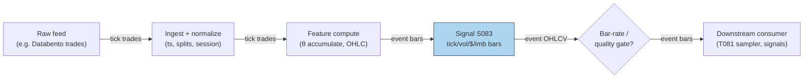

### S12. Sources

- Easley, D., López de Prado, M. M., & O'Hara, M. (2012). "The Volume Clock: Insights into the High-Frequency Paradigm." *Journal of Portfolio Management*, 39(1), 19–29. https://jpm.pm-research.com/content/39/1/19.abstract (manuscript: http://ssrn.com/abstract=2034858)
- López de Prado, M. M. (2018). *Advances in Financial Machine Learning*. Wiley. (Ch. 2: tick/volume/dollar/imbalance bars; book.)
- mlfinlab documentation, "Data Structures" (imbalance-bar algorithm: θ_t = Σ b_t·v_t; close rule |θ_t| ≥ E_0[T]·[2v⁺ − E_0[v_t]]). https://github.com/quantopian/mlfinlab/blob/HEAD/docs/source/implementations/data_structures.rst
- "Stock Market 'Flash' Crashes Now Can be Predicted, Thanks to Cornell Metric" (2010). *Innovations Report*. https://www.innovations-report.com/global-finance/business-and-finance/stock-market-flash-crashes-predicted-cornell-metric-166800/ — VPIN account of the May 2010 flash crash.

**Unverified leads** (chatbot-provided, no checkable source — do not treat as evidence):
- Duck.ai answered Q-SB2-1–Q-SB2-3 (2026-09-10); Grok/Cursor answers pending (checked 2026-09-10).
- Q-SB2-2 pipeline leads: TRUE tick/volume/dollar/imbalance bars need trades — minute OHLCV cannot reproduce them exactly; close when |Σθ_i| > E_0[|θ|]·n or dynamic threshold; 500 × 390 × 60d = 11.7M rows, 15–60 s daily Polars refresh.
- "Practitioner replication (vpin)" lead — volume-time returns closer to normal than chronological-time on crypto (BTC perps) — moved here from the S9 evidence table: no checkable citation was found for it, so it is an unverified lead, not evidence.

---
## Stage 49/200 — S049: Distance-method pairs — Gatev–Goetzmann–Rouwenhorst

*Batch SB3 · Signal 49/100 · Provenance [D] · Family D — Pairs & cross-sectional arbitrage*

### S1. One-line verdict

| | |
|---|---|
| **What it is** | Rank stock pairs by how tightly their normalized price paths tracked over a formation window; trade divergences of the closest pairs as temporary mispricing. |
| **When it works** | Mean-reverting relative mispricing between close economic substitutes, especially in turbulent markets when liquidity-driven dislocations are common. |
| **When it dies** | Crowded post-2002 large-cap US; fundamental breaks (M&A, earnings shocks) that make a divergence permanent; high borrow costs on the short leg. |
| **Build-or-buy in one line** | Build the screen yourself (it is a one-afternoon vectorized job); buy survivorship-clean corporate-action data — that is where the real cost sits. |

### S2. How it works — plain human explanation

Imagine two large regional banks — call them Alpha and Beta. For a year their shares move in lockstep: same rates, same loan-book worries. Then a mutual fund liquidates a chunk of Beta for reasons unrelated to either bank (a redemption wave elsewhere). Beta falls 3% while Alpha barely moves. The pairs trader's read: these are close economic substitutes, the gap is plumbing rather than information, so she sells Alpha (the leader) and buys Beta (the laggard), betting the gap closes. If Beta fell because its loan book actually blew up, she loses — the divergence was real information, not noise.

The economic idea: prices of close substitutes share a common factor, so large *relative* moves are more likely transient supply/demand imbalances than permanent repricing. Arbitrageurs are paid to stand in front of those imbalances. Research adds a second leg: profits are strongest when divergences come from common shocks propagating at different speeds through the two stocks (slow reaction to shared news) rather than from firm-specific news (see S9).

- **Mental model, bullet 1:** Distance pairs = a bet that *relative* prices mean-revert when the two legs are economic substitutes — it is a relative-value trade, not a directional one.
- **Mental model, bullet 2:** The entry trigger is purely statistical (a 2σ spread), so every pair needs an economic sanity story — without one, you are trading noise that may never converge.
- **Mental model, bullet 3:** Costs and borrow decide everything: the gross edge decayed hard after the 1990s, and what survives today lives or dies on execution quality (see S9, S10).

### S3. The math — exact formula

**Normalization.** For each stock *i*, build a normalized price (a cumulative-return index that starts at 1.0 at the beginning of the formation window):

$$\tilde{P}_{i,t} = \prod_{s=1}^{t}(1 + r_{i,s}), \qquad \tilde{P}_{i,0} = 1$$

where $r_{i,s}$ is the total return (price change plus dividends) of stock *i* on day *s*.

**Pair distance.** Over the formation window $F$ (a set of trading days), the distance between stocks *i* and *j* is the sum of squared daily gaps between their normalized paths:

$$D_{ij} = \sum_{t \in F}\left(\tilde{P}_{i,t} - \tilde{P}_{j,t}\right)^2$$

**Selection.** Rank all candidate pairs by $D_{ij}$ ascending and keep the $N$ smallest-distance pairs (Gatev–Goetzmann–Rouwenhorst, henceforth GGR, used $N = 20$), subject to liquidity, borrow-availability, and corporate-action cleanliness screens.

**Trading rule.** For a selected pair $(A, B)$, the spread is $d_t = \tilde{P}_{A,t} - \tilde{P}_{B,t}$. From the formation window compute its mean $\mu_d$ and sample standard deviation $\sigma_d$. The trading signal is the z-score:

$$z_t = \frac{d_t - \mu_d}{\sigma_d}$$

- If $z_t \le -z_{\text{entry}}$: buy A, sell B (long the laggard, short the leader).
- If $z_t \ge +z_{\text{entry}}$: sell A, buy B.
- Close when $|z_t| \le z_{\text{exit}}$ (convergence), or at a maximum holding time, or at an adverse-move stop.

Positions are dollar-neutral 1:1 *on normalized prices* — i.e., equal notional in the two legs at entry.

**Causal timing.** $z_t$ is computed at the close of day *t* using only data $\le t$; the position is tradable no earlier than the *t+1* open. All parameter estimates (the pair list, $\mu_d$, $\sigma_d$) must come from information strictly before the trading interval — this is enforced again in S10.

| Parameter | Symbol | Typical range | Too small | Too large | Default (example) |
|---|---|---|---|---|---|
| Formation window | $T_F$ | 60–252 days | unstable pair list, noisy $\sigma_d$ | stale pairs, regime breaks inside window | 252 days |
| Trading window | $T_{trade}$ | 20–126 days | pairs never get room to converge | holding dead pairs, cost bleed | 126 days |
| Pairs traded | $N$ | 10–100 | idiosyncratic pair risk dominates | dilutes into marginal pairs | 20 |
| Entry threshold | $z_{\text{entry}}$ | 1.5–2.5$\sigma$ | overtrading, cost explosion | almost never trades | 2.0 |
| Exit threshold | $z_{\text{exit}}$ | 0–0.5$\sigma$ | exits before capturing the move | round trips, gives back profits | 0 (zero-cross) |
| Max hold | $H_{\max}$ | 10–60 days | cuts converging trades early | capital stuck in broken pairs | 30 days |

Every default above is `example — not an institutional standard`.

**Named variants.** (1) *Industry-restricted* — pair only within the same sector. (2) *Correlation-prefiltered* — require formation correlation above ~0.7–0.9 first. (3) *Volatility-normalized* (Do–Faff–Hamza style) — scale the spread by relative volatility so triggers are comparable across pairs.

### S4. Worked example — step-by-step numbers (SYNTHETIC)

All numbers below are **synthetic** — a hand-built toy tape, random seed **49**, plotted in `images/S049_example.png`. The chart plots exactly this table's numbers.

**Formation (12 days), normalized prices:**

| Day | A | B | C | A−B spread |
|---|---|---|---|---|
| 1 | 1.000 | 1.000 | 1.000 | 0.000 |
| 2 | 1.020 | 1.015 | 1.050 | 0.005 |
| 3 | 1.010 | 1.025 | 1.100 | −0.015 |
| 4 | 1.030 | 1.020 | 1.080 | 0.010 |
| 5 | 1.050 | 1.045 | 1.150 | 0.005 |
| 6 | 1.040 | 1.055 | 1.200 | −0.015 |
| 7 | 1.060 | 1.050 | 1.180 | 0.010 |
| 8 | 1.080 | 1.075 | 1.250 | 0.005 |
| 9 | 1.070 | 1.085 | 1.300 | −0.015 |
| 10 | 1.090 | 1.080 | 1.280 | 0.010 |
| 11 | 1.110 | 1.100 | 1.350 | 0.010 |
| 12 | 1.100 | 1.105 | 1.400 | −0.005 |

Pair distances: $D_{AB} = 0.001175$, $D_{AC} = 0.327000$, $D_{BC} = 0.325775$. The minimum-distance pair is **(A, B)** — C tracked neither. Formation spread statistics: $\mu_d = 0.000417$, $\sigma_d = 0.010326$ (sample std, 11 d.f.).

**Trading (next 6 days), pair (A, B), $z_{\text{entry}} = 2.0$, $z_{\text{exit}} = 0.5$ (both `example`):**

| Day | A | B | Spread | $z_t$ | Action |
|---|---|---|---|---|---|
| 13 | 1.120 | 1.095 | 0.0250 | +2.381 | **Open:** short 1.0 A, long 1.0 B |
| 14 | 1.130 | 1.105 | 0.0250 | +2.381 | Hold |
| 15 | 1.125 | 1.120 | 0.0050 | +0.444 | **Exit** ($\|z\| \le 0.5$) |
| 16–18 | — | — | 0.0050 | +0.444 | Flat |

**P&L walk (normalized units, gross, no fees):** short A: $1.120 - 1.125 = -0.005$; long B: $1.120 - 1.095 = +0.025$. Net $= +0.0200$ normalized units per unit of notional per leg. (If one normalized unit = $100 of capital, that is $2,000 on $200,000 of gross exposure.)

**Cost model — explicit components (`example`; the chapter's own stack).** Spread, fees, borrow, and impact/slippage are charged on every name, every leg, every round trip. Using the walk's own valuation ($100 per normalized unit → $2,000 gross on $200,000 gross exposure): **spread** (crossing the half-spread on entry and exit, both legs — 4 half-spread crossings ≈ 2 bps of $200,000) ≈ **$40**; **commissions/fees** ≈ **$20** ($5 per leg-side); **borrow** (short leg $100,000 × 50 bps annualized stock-loan × 2 days held) ≈ **$3**; **market impact/slippage** (1 bp of $200,000) ≈ **$20**. All-in ≈ **$83** → **net ≈ $1,917** on the $2,000 gross, i.e. +0.0192 normalized units per unit of per-leg notional. The gross-only walk is illustrative; a tradable S049 pays spread, fees, borrow, and impact on every rotation.

**What to notice.** The pipeline in miniature: the screen picks the sensible pair (A and B, not runaway C), and a liquidity-style shock to B triggers a textbook entry that converges two days later. Limits: the P&L walk above is the *gross* tape only — no fees, no bid–ask, no borrow cost, assumed fills; the tradable P&L is gross minus the explicit cost stack (spread + fees + borrow + impact/slippage) modeled in S10. Formation is 12 days — the real GGR design uses 12 months. No backtest claims are made from these numbers.

### S5. Strategies that use this signal

- **T031 — Distance Pairs + Quality Filter** — primary entry trigger: the distance screen selects the pairs and the z-score rule times entries; S053's zero-crossing quality filter then vets which divergences are worth trading. (Plan §3's explicit Signals list for T100 enumerates S082/S086/S088 only — S049 has no documented T100 role, so T031 is its sole verified consumer.)

### S6. Data required — exact spec

| Field | Type | Granularity | Source tier | Notes |
|---|---|---|---|---|
| Total-return prices (split/dividend adjusted) | float | daily OHLCV (open/high/low/close/volume) | Tier 0–1 | Must be truly adjusted; raw prices + factor files also fine |
| Raw close + corporate-action factors | float/date | daily | Tier 1–2 | For verifying adjustments; delisting returns included |
| Dollar volume / average daily volume (ADV) | float | daily | Tier 1 | Liquidity screen (min dollar volume) |
| Borrow availability / fee | float/bool | daily | Tier 2 | Short-leg feasibility; locate data |
| Ticker history, listing/delist dates | mapping/date | as events | Tier 1–2 | Point-in-time universe — anti-survivorship-bias control |
| 1-min bars | OHLCV | 1-min | Tier 1–2 | Only for the intraday port of the strategy |

**Collection method.** Daily bars from a vendor API (Tiingo EOD, Polygon stocks v3, or Stooq CSVs for Tier-0 prototyping); corporate actions from the vendor's splits/dividends endpoints; delistings from a survivorship-free dataset (S8). Ingest sketch (Python/polars, ≤20 lines):

```python
import polars as pl
bars = pl.read_parquet("raw/daily_bars.parquet")          # date, perm_id, o,h,l,c, volume, div, split
px = (bars.sort(["perm_id","date"])
          .with_columns(adj=pl.col("c") * pl.col("split").cumprod().over("perm_id")
                        + pl.col("div").cumprod().over("perm_id"))  # sketch: apply factors
          .with_columns(ret=pl.col("adj").pct_change().over("perm_id")))
norm = px.with_columns(npx=(1+pl.col("ret").fill_null(0)).cumprod().over("perm_id"))
universe = norm.join(point_in_time_universe, on=["date","perm_id"], how="inner")
universe.write_parquet("clean/daily_panel.parquet")
```

**Storage.** Per `notes/cost-model.md` §4: daily bars for 3,000 stocks ≈ 5 MB/day parquet — trivial; a 10-year panel is a few GB. The 1-min intraday port is ~50 MB/day for 500 symbols — archive selectively.

**Data-quality checklist.** Exchange calendar/DST/half-days; corporate actions — splits, dividends, spinoffs, the #1 silent killer of pairs screens; halts and limit moves; stale quotes on illiquid names; survivorship: the formation-time universe must be knowable *at that time* (point-in-time), or backtested returns are fiction.

### S7. Local build on M5 Max / 128GB

**Feasibility: feasible (Tier M).** The distance screen is one of the cheapest serious screens in quant finance: the whole job is normalization, a pairwise distance matrix, and ranking. A 2,000-stock × 10-year daily panel is ~50–200 MB in memory (labeled lead from the batch's chatbot Q&A; consistent with `notes/cost-model.md` §3's ~40 MB float64 figure for the raw panel), so everything fits comfortably inside the 77 GB working budget (§3).

**Throughput.** The dominant kernel is $X^T X$ for $X$ of shape $2520 \times 2000$: approximately $2 \cdot 2000^2 \cdot 2520 \approx 20.2$ billion multiply-adds full ($\approx 10$B for the upper triangle). **Correction to the batch's chatbot answer, which said "~5 billion multiply-adds" — that is ~4× too low; use the figures above.** Even so, this is a seconds-scale dense BLAS (Basic Linear Algebra Subprograms) call; the full screen (normalization, missing data, ranking, top-$k$) is a minute-scale job at most — a labeled chatbot lead puts the vectorized screen at ~1–10 s. Per cost-model §2, panel ingest is I/O-bound at ~1–3 GB/s parquet read, and 500 symbols × 390 1-min bars/day = 195k bars/day is trivial.

**Bottleneck:** data quality, not compute — corporate actions, delistings, and point-in-time universe construction (the chatbot's 150–300 h full-pipeline prototype estimate is dominated by exactly this; labeled lead, inside cost-model §5's Tier-M-plus-harness range).

| Stack | When to pick |
|---|---|
| Python + polars/numpy | Default: the whole screen is vectorizable; fastest to write and verify |
| DuckDB | If you want the panel queryable by SQL and partitioned by date |
| Rust | Only if you push the screen to 1-min rolling windows across thousands of symbols intraday |

**RAM.** Tens of MB for daily bars (1-day or 60-day); ~3 GB for 500 symbols of 1-min bars (§4) — fits easily in the 77 GB budget (§3).

**Engineering time.** Tier M per cost-model §5: **20–60 h** → **$3,000–$9,000** `loaded-cost estimate` at $150/hr, plus data. The point-in-time security master is the known schedule risk.

**What breaks first at 500 symbols / full OPRA:** nothing on daily bars. What would break is a naive per-pair Python loop over millions of pairs — vectorize or chunk. Full OPRA (Options Price Reporting Authority) is irrelevant to this signal.

### S8. Buy vs build

| Vendor / option | What you get | Indicative price | Buying gains | Buying loses |
|---|---|---|---|---|
| Tier-0: Stooq, Yahoo-style free bars | Daily OHLCV, weak corp-action history | ~$0 | Zero-cost prototyping | No survivorship control; unreliable adjustments |
| Tier-1: Tiingo EOD / EODHD | Adjusted daily bars, splits/dividends (labeled chatbot lead) | ~$20–100/mo `indicative — verify before budgeting` | Cheap, prototype-ready | Manual survivorship handling |
| Tier-1: Polygon Stocks Advanced | 1-min/real-time SIP (Securities Information Processor, the consolidated tape) bars, corp actions | ~$30–200/mo `indicative — verify before budgeting` | Covers the intraday port | History depth costs extra |
| Tier-2: Sharadar (Nasdaq Data Link) | Point-in-time, survivorship-free panel | tens–hundreds/mo `indicative — verify before budgeting` | Solves survivorship properly | Price; you still build the screen |
| Tier-2: Databento | L1/L2 (level-1 top-of-book / level-2 depth), futures, OPRA research | ~$200/mo + usage `indicative — verify before budgeting` | Honest microstructure data | Overkill for a daily screen |

**Verdict: build the screen, buy survivorship-clean data.** The algorithm is ~50 lines of numpy; no vendor sells your thresholds. The crossover: if you cannot verify your vendor's delisting and adjustment methodology, pay for the Tier-2 survivorship-free panel — a backtest on a survivor-only universe is worse than no backtest.

### S9. Success ratio / efficacy — documented evidence

| Study / source | Market & period | Metric | Before/after cost | Caveat |
|---|---|---|---|---|
| Gatev, Goetzmann & Rouwenhorst (2006), RFS | US equities, 1962–2002, top-20 pairs | ~11% ann. excess, self-financing | After conservative cost estimates | Long sample; pre-modern-crowding universe |
| Do & Faff (2010), FAJ | US equities, 1962–2009, top-20 pairs | 0.86%/mo (1962–88) → 0.37%/mo (1989–2002) → 0.24%/mo (2003–09) | Before explicit costs | The decay finding; strong in turbulence (GFC) |
| Rad, Low & Faff (2016), Quant. Finance (accepted ms.) | US equities, 1962–2014, distance method | 0.91%/mo (Sharpe 0.75) before; 0.38%/mo (Sharpe 0.35) after | Both | Their 1–7 bps cost model; 62.53% of trades converged |
| Do & Faff (2012), via Rad et al. | US equities, post-2002 | "Largely unprofitable after 2002" with costs | After costs | Harshest published read; implementation-sensitive |

**Documented decay.** Do & Faff (2010) confirm the decline GGR already noticed late in their sample: roughly a 3× fall in monthly excess return from the 1962–88 regime to 2003–09 — faster reactions, lower spreads, shorting frictions, common-factor shocks, and more pairs diverging without converging. Counterpoint: pairs trading performs strongly during prolonged turbulence (GFC), when dislocations are plentiful and arbitrage capital is constrained.

**Honest bottom line.** As a standalone trigger, plain distance pairs is a *decayed, implementation-sensitive* edge: underwriting a small liquid-large-cap operation at net Sharpe ~0.2–0.7 (labeled chatbot lead) with high uncertainty is the defensible stance; claimed net Sharpe > 1 demands point-in-time universes, delistings, realistic borrow, bid/ask execution, and untouched out-of-sample. As a *filter* inside T031, it remains genuinely useful.

### S10. Failure modes & pitfalls

- **Lookahead leakage** — estimating $\mu_d$, $\sigma_d$, or the pair list on data that overlaps the trading window. Mitigation: hard formation/trading split; the worked example estimates on days 1–12 only; automated leakage tests (permutation of the split).
- **Non-convergence / fundamental risk** — the divergence is real information (fraud, distress, M&A). Mitigation: industry restriction, news/earnings blackout around events, per-pair stop-loss and max-hold.
- **Survivorship bias** — backtesting on today's index members. Mitigation: point-in-time universe with delisting returns included.
- **Borrow cost and short squeezes** — hard-to-borrow names make the short leg punitive or recallable. Mitigation: pre-screen borrow availability/fees; model stock-loan fees explicitly in the cost model.
- **Corporate-action artifacts** — splits/dividends mis-adjustments fabricate "divergences". Mitigation: raw + factor data, cross-validate adjustments against a second source.
- **Crowding / alpha decay** — the documented post-2002 decay. Mitigation: trade less-crowded universes (smaller caps with realistic costs), faster reaction, or use distance only as a filter inside T031.

### S11. Visuals


```mermaid
flowchart LR
    FEED["Raw feed\n(daily bars: CRSP (Center for Research in Security Prices)/Polygon/Stooq)"] -->|"daily OHLCV\n(open/high/low/close/volume)"| ING["Ingest + normalize\n(splits, dividends, delistings)"]
    ING -->|"clean daily panel"| FEAT["Feature compute\n(normalized prices, formation stats)"]
    FEAT -->|"pair-level daily spreads"| SIG["Signal S049\ndistance z-score"]
    SIG -->|"daily z-score breaches"| GATE{"Cost / borrow\ngate?"}
    GATE -->|"pass: pair signal"| OUT["Downstream consumer\n(T031 pairs book)"]
    GATE -->|"fail: no signal"| DROP["No trade"]
    style SIG fill:#aed6f1,stroke:#1f3a5f
```

### S12. Sources

- Gatev, E., Goetzmann, W. N. & Rouwenhorst, K. G. (2006). "Pairs Trading: Performance of a Relative-Value Arbitrage Rule." *Review of Financial Studies*, 19(3), 797–827. https://www.econbiz.de/Record/pairs-trading-performance-of-a-relative-value-arbitrage-rule-gatev-evan/10005564224 (RePEc record; abstract verifies ~11% annualized excess returns, 1962–2002, exceeding conservative transaction-cost estimates)
- Do, B. & Faff, R. (2010). "Does Simple Pairs Trading Still Work?" *Financial Analysts Journal*, 66(4), 83–95. https://ideas.repec.org/a/taf/ufajxx/v66y2010i4p83-95.html (verifies the 0.86 → 0.37 → 0.24 %/mo decay across 1962–88 / 1989–2002 / 2003–09 and strength in turbulence)
- Rad, H., Low, R. K. Y. & Faff, R. (2016). "The profitability of pairs trading strategies: distance, cointegration and copula methods." *Quantitative Finance* (accepted manuscript). https://pure.bond.edu.au/ws/portalfiles/portal/36339487/AM_The_profitability_of_pairs_trading_strategies.pdf (verifies distance-method 0.91%/mo before / 0.38%/mo after costs, 1962–2014)
- Krauss, C. (2017). "Statistical Arbitrage Pairs Trading Strategies: Review and Outlook." *Journal of Economic Surveys*, 31(2), 513–545. https://doi.org/10.1111/joes.12153 (survey of the pairs/statistical-arbitrage literature: methods, distance vs cointegration vs copula, and the documented post-2002 decay)
- Elliott, R. J., van der Hoek, J. & Malcolm, W. P. (2005). "Pairs trading." *Quantitative Finance*, 5(3), 271–276. https://doi.org/10.1080/14697680500149370 (mean-reverting spread model of pairs: formalizes the temporary-divergence/convergence economics behind the S2 mechanism)
- Caldeira, J. F. & Moura, G. V. (2013). "Selection of a Portfolio of Pairs Based on Cointegration: A Statistical Arbitrage Strategy." *Brazilian Review of Finance*, 11(1), 49–80. https://ideas.repec.org/a/bmf/borfin/v11y2013i1p49-80.html (16.38% annual excess return, Sharpe 1.34 on the São Paulo sample — a documented emerging-market counterpoint to the US decay finding)

Duck.ai answered Q-SB3-1–Q-SB3-3 (2026-09-10); Grok/Cursor answers pending (checked 2026-09-10)

**Unverified leads**
- *Unverified chatbot claim* (Duck.ai, GPT-5.6 Luna, 2026-09-10, Q-SB3-3): intraday cointegration-pairs study on S&P 500 minute data reporting ~50.5% annualized return and Sharpe ~8.14 "after its cost model" — the bot itself flags this as an upper-tail, spec-selected backtest; presented here only as an upper tail, never as a base case. No checkable citation obtained.
- *Unverified chatbot claim* (same source, Q-SB3-2): full pairs+HMM (hidden Markov model)+ML stack prototype at 150–300 engineering hours; Tiingo/EODHD ~$20–100/mo adequate for prototyping; Sharadar best for survivorship-free data. Used above only as labeled leads; cost-model numbers take precedence.

---
## Stage 50/200 — S050: Engle–Granger cointegration z-score

*Batch SB3 · Signal 50/100 · Provenance [D] · Family D — Pairs & cross-sectional arbitrage*

### S1. One-line verdict

| | |
|---|---|
| **What it is** | Regress one stock's (log) price on another's; if the residual is stationary (a fixed, finite-variance wobble), trade its z-score as a mean-reverting spread. |
| **When it works** | Two assets tied by a real economic link (same sector, ADR (American Depositary Receipt) pair, futures-spot) whose price gap is stationary over the estimation window. |
| **When it dies** | Structural breaks (mergers, regime changes) that kill the cointegrating relationship; scanning thousands of pairs without multiple-testing correction; intraday microstructure noise. |
| **Build-or-buy in one line** | Build — the two-step estimator is a weekend project; spend the budget on borrow data and a second price source instead. |

### S2. How it works — plain human explanation

Two stocks can both wander randomly — up 40% one year, down 30% the next — and yet never drift too far apart. Think of Coca-Cola and PepsiCo: each follows its own path, but the *gap* between their (log) prices behaves like a rubber band. Economists call this **cointegration**: each series is non-stationary on its own (economists say *integrated of order one*, I(1) — its variance grows with time, like a random walk), but a particular linear combination of them is stationary (I(0) — it wobbles around a fixed mean with finite variance). The Engle–Granger procedure (1987) finds that combination with an ordinary least-squares (OLS) regression, tests the leftover residual for stationarity, and hands you a spread to trade: when the residual stretches far from its mean, bet on the snap-back.

At 2:40 p.m., the z-score of the KO–PEP spread hits −2.3 — 2.3 standard deviations cheap versus recent history. The trader buys the spread (long the cheap leg, short the rich leg in the regression's **hedge ratio**, the shares of B per share of A that keeps the position neutral), and covers when the z-score reverts toward zero. Same economics as S049's distance pairs — temporary mispricing between substitutes — but with a statistically disciplined spread definition and an explicit test that it mean-reverts.

- **Mental model, bullet 1:** Cointegration = a *tested* long-run relationship, not just two lines that happened to move together. The ADF test is what separates this signal from curve-fitted chart-watching.
- **Mental model, bullet 2:** The hedge ratio is estimated, not God-given — and the estimate is only as good as the formation window. Regime breaks silently convert your "stationary" spread into a trending loss.
- **Mental model, bullet 3:** Everything after the regression is plumbing: z-score thresholds, stops, and costs decide whether a statistically beautiful spread is a tradable one.

### S3. The math — exact formula

**Step 1 — cointegrating regression (formation window).** Regress (log) prices:

$$ \log P^A_t = \alpha + \beta \, \log P^B_t + \varepsilon_t $$

(levels $P^A_t = \alpha + \beta P^B_t + \varepsilon_t$ are also used; logs make $\beta$ a clean elasticity). The **hedge ratio** is $\hat{\beta}$: a long-spread position holds 1 unit of A against $\hat{\beta}$ units of B. Dollar neutrality is enforced separately: $q_A P^A_t \approx q_B P^B_t$. **Regression direction matters** — regressing A-on-B is not the same as B-on-A; choose the direction on economic grounds or test both with a pre-specified rule.

**Step 2 — stationarity test.** Run the Augmented Dickey–Fuller (ADF) regression on the residual $\hat{\varepsilon}_t$:

$$ \Delta \hat{\varepsilon}_t = \gamma \, \hat{\varepsilon}_{t-1} + \sum_{j=1}^{p} \phi_j \, \Delta \hat{\varepsilon}_{t-j} + u_t $$

Test $H_0: \gamma = 0$ (no cointegration — the residual has a **unit root**, i.e. it wanders forever) against $H_1: \gamma < 0$ (stationary, mean-reverting). **Use Engle–Granger/MacKinnon critical values, NOT ordinary t-distribution cutoffs** — the residual comes from an estimated regression, so standard tables are too lenient.

**Step 3 — z-score signal.** With rolling mean $\mu_{S,t}(L)$ and standard deviation $\sigma_{S,t}(L)$ of the spread over lookback $L$:

$$ z_t = \frac{S_t - \mu_{S,t}(L)}{\sigma_{S,t}(L)}, \qquad S_t = P^A_t - \hat{\alpha} - \hat{\beta} P^B_t $$

Enter at $|z_t| > z_{\text{entry}}$; exit at $z_t \to 0$ (or $|z_t| \le z_{\text{exit}}$); stop at $|z_t| > z_{\text{stop}}$ or a max holding time. Mandatory: a stop/time-stop, and a **multiple-testing correction** (adjusting significance thresholds when you test many pairs, so lucky coincidences don't flood the book — e.g. Bonferroni/Holm or false discovery rate (FDR) control) when scanning many pairs.

**Causal timing.** $z_t$ is computed at event/close $t$ using only data $\le t$; tradable no earlier than $t+1$. The regression coefficients and the ADF test are estimated on the formation window only — strictly before the trading interval (see S4 and S10).

| Parameter | Symbol | Typical range | Too small | Too large | Default (example) |
|---|---|---|---|---|---|
| Formation window | $T_F$ | 126–504 days | unstable $\hat{\beta}$, weak ADF power | stale relationship, breaks inside window | 252 days |
| z lookback | $L$ | 20–120 days | noisy $\sigma$, whipsaw entries | slow to adapt to new volatility | 60 days |
| Entry | $z_{\text{entry}}$ | 1.5–2.5 | overtrading | never trades | 2.0 |
| Exit | $z_{\text{exit}}$ | 0–0.5 | leaves money on the table | round trips | 0 |
| Stop | $z_{\text{stop}}$ | 2.5–4 | stopped by noise | catastrophic non-convergence | 3.0 |
| Max hold | $H_{\max}$ | 10–60 days | cuts slow convergences | dead capital in broken spreads | 30 days |
| ADF lags | $p$ | 0–5 (AIC/BIC — Akaike/Bayesian information criteria) | residual autocorrelation biases test | over-parameterized, low power | AIC-selected |

Every default is `example — not an institutional standard`.

**Named variants.** (1) *Johansen vector error-correction model (VECM)* (S055) — multivariate, handles $n>2$ legs. (2) *Kalman dynamic hedge* (S052) — the hedge ratio $\beta_t$ adapts over time. (3) *Zero-crossing-gated* (S053) — entries filtered by formation zero-crossing reliability.

### S4. Worked example — step-by-step numbers (SYNTHETIC)

All numbers below are **synthetic** — the hand-verified 20-day tape from the batch's chatbot Q&A (Duck.ai, GPT-5.6 Luna, 2026-09-10), with the operator-verified corrections applied. Random seed **50** pins the plotting script; the tape itself is a deterministic construction: $P^B_t = 100 + t$, $e_t = [-2,-1,0,1,2,1,0,-1,-2,0,2,1,0,-1,-2,-1,0,1,2,0]$, $P^A_t = 2P^B_t + e_t$. The stipulated spread $S_t = P^A_t - 2P^B_t = e_t$ is internally consistent as stipulated.

**Verified corrections to the chatbot's arithmetic** (operator hand-checked, used below): the spread's sum of squares is **32** (the bot said 40 — its listed squares 4,1,0,1,4,1,0,1,4,0,4,1,0,1,4,1,0,1,4,0 do sum to 32); the full-sample standard deviation is **$\sqrt{32/19} \approx 1.298$** (the bot said 1.451); the full-sample day-15 z is **$-2/1.298 \approx -1.541$** (the bot said −1.378). The 1.25-entry threshold still fires on day 15; the 2.0 entry still does not fire — **trade setup and conclusions are unchanged**, only the numbers are corrected.

**Correction to the chatbot's OLS sentence.** The bot claimed its tape implies $\hat{\alpha} \approx 0$, $\hat{\beta} \approx 2.00$ with deviations "uncorrelated with trend to rounding precision" — **wrong**. From its own table: $\sum e_t(t-10.5) = 20$, $\sum (t-10.5)^2 = 665$, so the true OLS estimates are $\hat{\beta} = 2 + 20/665 \approx \mathbf{2.0301}$ and $\hat{\alpha} = 221 - 2.0301 \times 110.5 \approx \mathbf{-3.32}$. The $S_t = P_A - 2P_B$ construction is internally consistent as stipulated; only the OLS-description sentence was inaccurate.

**Causally honest trading version.** In live trading, $\mu$ and $\sigma$ must come from information strictly before the trading interval. So: estimation on days 1–14 ($\mu_{14} = 0.0000$, $\sigma_{14} = 1.3009$), trading from day 15 on. (An ADF test on 20 observations has essentially no power — the two-step procedure is shown for mechanics, not as evidence of stationarity.)

| Day | $P_B$ | $P_A$ | Spread $S_t$ | $z_t$ (vs. days 1–14) | Action |
|---|---|---|---|---|---|
| 1–14 | 101.0 → 114.0 | 200.0 → 227.0 | $e_t$ per tape | −1.537 … +1.537 | **Estimation window only** — no trading |
| 15 | 115.0 | 228.0 | −2 | **−1.537** | **Enter long spread:** long 1 A @ 228.0, short 2 B @ 115.0 |
| 16 | 116.0 | 231.0 | −1 | −0.769 | Hold |
| 17 | 117.0 | 234.0 | 0 | 0.000 | **Exit** (zero-cross) |
| 18 | 118.0 | 237.0 | +1 | +0.769 | Flat |
| 19 | 119.0 | 240.0 | +2 | +1.537 | Flat |
| 20 | 120.0 | 240.0 | 0 | 0.000 | Flat |

Full 20-day tape (every value is plotted in the chart): $P^B_t = 100+t$; $P^A_t$ = 200.0, 203.0, 206.0, 209.0, 212.0, 213.0, 214.0, 215.0, 216.0, 220.0, 224.0, 225.0, 226.0, 227.0, 228.0, 231.0, 234.0, 237.0, 240.0, 240.0; spread $S_t = e_t$ as listed above. Estimation on days 1–14: $\mu_{14} = 0.0000$, $\sigma_{14} = 1.3009$; day-15 full-sample check: $z_{15} = -2/1.2978 \approx -1.541$.

Entry uses the `example` threshold $|z| > 1.25$; the first *trading* day breaching it is day 15 ($z_{15} = -1.537$; full-sample check: $-1.541$). **P&L walk (spread-points, gross, no fees):** A leg: $234.0 - 228.0 = +6.00$; B leg: $2 \times (115.0 - 117.0) = -4.00$. Net **$+2.00$ spread-points** as the spread runs from −2 to 0. `images/S050_example.png` plots exactly this spread with the ±1.25σ/±2σ bands estimated on days 1–14.

**Cost model — explicit components (`example`; the chapter's own stack).** Spread, fees, and impact/slippage are charged on every leg of every round trip. On the +2.00-spread-point gross above, value it at $100 per spread-point so the A leg is ~$22,800, the B leg ~$23,000, gross exposure ≈ $45,800: **spread** (crossing the half-spread on entry and exit, both legs — 4 half-spread crossings ≈ 2 bps of $45,800) ≈ **$9**; **commissions/fees** ≈ **$4** ($1 per leg-side); **borrow** (short B leg $23,000 × 50 bps annualized stock-loan × 2 days held) ≈ **$1**; **market impact/slippage** (1 bp of $45,800) ≈ **$5**. All-in ≈ **$19** → **net ≈ $181** on the $200 gross (+2.00 spread-points), i.e. **+1.81 spread-points**. Any tradable version of S050 pays spread, fees, borrow, and impact on every round trip.

**What to notice.** The tape is a clean laboratory: the spread oscillates with amplitude ~1.5σ, the entry fires on the first eligible trading day, and convergence arrives in two days. Its limits: the spread was *constructed* stationary, so this demonstrates mechanics, not edge — real spreads break. The P&L walk above is the *gross* tape only — no fees, no bid–ask, no borrow cost, assumed fills; the tradable P&L is gross minus the explicit cost stack (spread + fees + borrow + impact/slippage) modeled in S10. No backtest claims are made from these numbers.

### S5. Strategies that use this signal

- **T007 — Cointegration Z-Score Pairs** — primary entry trigger: the EG two-step estimates the hedge ratio and the z-score times entries, with Ornstein–Uhlenbeck (OU) half-life exits and a zero-crossing quality filter.
- **T031 — Distance Pairs + Quality Filter** — confirmatory filter: S050's regression hedge ratio cross-checks distance-selected pairs (S049) so the traded spread is the cointegrating one, not the naive 1:1.

### S6. Data required — exact spec

| Field | Type | Granularity | Source tier | Notes |
|---|---|---|---|---|
| Synchronized mids or lasts | float | daily or 1-min | Tier 1–2 | Same currency; timestamps aligned across legs |
| Corporate actions + delistings | factors/dates | daily/events | Tier 1–2 | Same as S049 — adjustments make or break the regression |
| Dollar volume / average daily volume (ADV) | float | daily | Tier 1 | Liquidity screen before the ADF screen |
| Borrow availability / fee | float/bool | daily | Tier 2 | Short-leg feasibility |
| Ticker history, listing dates | mapping/date | as events | Tier 1–2 | Point-in-time universe |

**Collection method.** Same panel pipeline as S049, plus a synchronization step (asof-join the two legs to common timestamps — critical intraday). Ingest sketch (Python/polars, ≤20 lines):

```python
import polars as pl
bars = pl.read_parquet("clean/daily_panel.parquet")       # from S049 pipeline
a = bars.filter(pl.col("perm_id") == "A").select("date", pl.col("adj").log().alias("la"))
b = bars.filter(pl.col("perm_id") == "B").select("date", pl.col("adj").log().alias("lb"))
pair = a.join(b, on="date", how="inner").sort("date")     # synchronized, same currency
form = pair.head(252)                                      # formation window only
beta = form.select(pl.cov("la","lb")/pl.var("lb")).item()  # OLS hedge ratio
pair = pair.with_columns(spread=pl.col("la") - beta*pl.col("lb"))
```

**Storage.** Same as S049: daily panel trivial (~5 MB/day for 3,000 stocks, cost-model §4); synchronized 1-min pairs for a few hundred candidates are MBs/day.

**Data-quality checklist.** Timestamp synchronization (async prints create fake spreads intraday); same-currency legs; corporate actions on *both* legs; bid–ask bounce contaminating 1-min spreads (use mids); survivorship/point-in-time as in S049.

### S7. Local build on M5 Max / 128GB

**Feasibility: feasible (Tier M).** Pairs screens including the cointegration engine are explicitly Tier M in `notes/cost-model.md` §5. The EG two-step is OLS plus one ADF per candidate — the expensive part is the pair *screen*, so pre-screen 2M pairs by distance/correlation first, then run EG on 10k–100k survivors (labeled chatbot lead, consistent with §2's vectorized rates).

**Throughput.** OLS hedge ratios vectorize across candidates (~50–200M elements/sec per §2); the ADF shortlist is seconds to minutes. Rolling z on a few hundred live pairs is trivial. Bottleneck: data cleaning and the point-in-time security master, not the statistics.

| Stack | When to pick |
|---|---|
| Python + polars/numpy/statsmodels | Default: `statsmodels.tsa.stattools.adfuller` for the shortlist |
| DuckDB | Panel storage + candidate pre-screening in SQL |
| Rust | Only for full-universe rolling EG on 1-min bars |

**RAM.** Panel ~40–200 MB (§3); ADF shortlist negligible. Well inside the 77 GB budget.

**Engineering time.** Tier M, **20–60 h** → **$3,000–$9,000** `loaded-cost estimate` at $150/hr, plus data. Add ~10–20 h for the multiple-testing correction and leakage-test harness if built properly.

**What breaks first at 500 symbols / full OPRA (Options Price Reporting Authority):** running `adfuller` per pair in a Python loop over 2M pairs (hours+). Pre-screen first — liquidity filter → distance/correlation → EG on survivors. OPRA irrelevant to this signal.

### S8. Buy vs build

| Vendor / option | What you get | Indicative price | Buying gains | Buying loses |
|---|---|---|---|---|
| Tier-0: Stooq / free bars | Daily OHLCV (open/high/low/close/volume) | ~$0 | Prototype the regression today | No survivorship control; no borrow data |
| Tier-1: Tiingo / EODHD | Adjusted dailies + corp actions | ~$20–100/mo `indicative — verify before budgeting` | Cheapest adequate prototype stack (labeled lead) | Manual survivorship handling |
| Tier-1: Polygon Stocks Advanced | 1-min SIP (Securities Information Processor, the consolidated tape) bars | ~$30–200/mo `indicative — verify before budgeting` | Synchronized intraday legs | History depth costs extra |
| Tier-2: Sharadar | Survivorship-free point-in-time panel | tens–hundreds/mo `indicative — verify before budgeting` | Solves the delisting problem | Price |
| Precomputed pairs analytics (various) | Candidate pair lists | varies | Idea generation / cross-check | Must verify their universe, window, regression direction, cost treatment — benchmark, not signal engine (labeled lead) |

**Verdict: build the estimator, buy clean data.** The EG two-step is textbook statistics; the value is in *your* formation windows, *your* multiple-testing discipline, and *your* cost model. Never outsource hedge-ratio estimation to a black box you can't audit.

### S9. Success ratio / efficacy — documented evidence

| Study / source | Market & period | Metric | Before/after cost | Caveat |
|---|---|---|---|---|
| Rad, Low & Faff (2016), Quant. Finance (accepted ms.) — cointegration method | US equities, 1962–2014 | 0.85%/mo (Sharpe 0.77) before costs; 0.33%/mo (Sharpe 0.35) after costs | Both, side by side | Their 1–7 bps cost model; 61.35% of trades converged; converged trades averaged 4.37% (Sharpe 1.62) |
| Gatev, Goetzmann & Rouwenhorst (2006) | US equities, 1962–2002 | ~11% ann. excess, self-financing | After conservative cost estimates | Distance-method baseline; the cointegration literature benchmarks against it |
| Do & Faff (2010) | US equities, 1962–2009 | 0.86 → 0.37 → 0.24 %/mo across subperiods | Before explicit costs | The decay finding applies to pairs generally, cointegration included |

**Regimes where it fails.** Earnings and M&A (the cointegrating vector snaps); volatility shocks and auctions intraday; halts and one-leg liquidity loss; borrow recalls; index rebalances. The dominant risk is the spread ceasing to be stationary — which is exactly what the formation-window ADF said wouldn't happen. Intraday adds bid–ask bounce, asynchronous prints, and fragmentation (all labeled per H6 in S10).

**On the high intraday Sharpes in the literature.** One large S&P 500 minute-data study is reported (via the batch's chatbot Q&A) at ~50.5% annualized return and Sharpe ~8.14 "after its cost model" — the bot itself correctly flags this as an **upper-tail, spec-selected backtest**, and no checkable citation could be obtained, so it stays in Unverified leads, **never as a base case**. Conservative underwriting: daily/slow-intraday net Sharpe ~0.2–0.8; 5–30-minute liquid pairs ~0.3–1.0; Sharpe 2+ is exceptional. A net Sharpe ≈ 0.5 is already respectable.

**Honest bottom line.** As a standalone trigger, EG pairs are a *better-defined but unstable, capacity-limited* edge — the hedge ratio is principled, but breaks are the business model risk. As the spread-definition layer inside T007 (with half-life exits) or as T031's confirmation filter, it earns its keep.

### S10. Failure modes & pitfalls

- **Lookahead leakage** — estimating $\hat{\beta}$, the ADF, $\mu$, or $\sigma$ on data overlapping the trading interval; using smoothed (not filtered) regime estimates. Mitigation: hard formation/trading split — the worked example uses days 1–14 for estimation and trades from day 15; purged/embargoed validation (S088).
- **Multiple testing** — scanning 2M pairs at 5% significance manufactures hundreds of "cointegrated" pairs by luck. Mitigation: Bonferroni/Holm or FDR correction (the report entry mandates it); pre-screen economically sensible universes first.
- **Spurious regression** — OLS on two independent random walks *always* finds a "relationship". Mitigation: the ADF step is load-bearing; never trade a pair that fails it.
- **Regression-direction and window instability** — A-on-B ≠ B-on-A; $\hat{\beta}$ drifts across windows. Mitigation: pre-specified direction rule; monitor rolling $\hat{\beta}$; consider the Kalman variant (S052).
- **Cointegration breakdown** — the residual stops being stationary (corporate events, regime change). Mitigation: stop-loss at $z_{\text{stop}}$, max hold, re-estimate on a schedule, news blackout.
- **Intraday microstructure contamination** — bid–ask bounce and async prints fabricate spread wiggles. Mitigation: synchronized mids, 5-min+ bars to start, `simulated only — requires market-by-order (MBO)/ITCH (Nasdaq's ITCH direct feed)` honesty on any latency claim.
- **Cost blowup** — two legs, round trip, plus borrow on the short. Mitigation: all-in cost model per trade; the after-cost rows in S9 are the real benchmark.
- **Staleness** — formation relationships decay; a $\hat{\beta}$ from 2022 may not describe 2026. Mitigation: scheduled re-estimation (daily–monthly), walk-forward discipline.

### S11. Visuals


```mermaid
flowchart LR
    FEED["Raw feed\n(synchronized mids, daily/1-min)"] -->|"daily OHLCV"| ING["Ingest + normalize\n(corp actions, same currency)"]
    ING -->|"clean daily pair panel"| FEAT["Feature compute\n(OLS hedge ratio, ADF, rolling z)"]
    FEAT -->|"daily residual z-series"| SIG["Signal S050\nEG cointegration z-score"]
    SIG -->|"daily z-score breaches"| GATE{"Cost / borrow\ngate?"}
    GATE -->|"pass: pair signal"| OUT["Downstream consumer\n(T007 pairs book)"]
    GATE -->|"fail: no signal"| DROP["No trade"]
    style SIG fill:#aed6f1,stroke:#1f3a5f
```

### S12. Sources

- Engle, R. F. & Granger, C. W. J. (1987). "Co-integration and Error Correction: Representation, Estimation, and Testing." *Econometrica*, 55(2), 251–276. http://ideas.repec.org/a/ecm/emetrp/v55y1987i2p251-76.html (RePEc record verifying the two-step estimator and the cointegration/error-correction representation theorem)
- Rad, H., Low, R. K. Y. & Faff, R. (2016). "The profitability of pairs trading strategies: distance, cointegration and copula methods." *Quantitative Finance* (accepted manuscript). https://pure.bond.edu.au/ws/portalfiles/portal/36339487/AM_The_profitability_of_pairs_trading_strategies.pdf (verifies cointegration-method 0.85%/mo before / 0.33%/mo after costs, Sharpe 0.77/0.35, 1962–2014)
- Schaffer, M. E. (2010, rev. 2022). "EGRANGER: Stata module to perform Engle–Granger cointegration tests." http://ideas.repec.org/c/boc/bocode/s457210.html (documents the EG test procedure and MacKinnon (1990, 2010) critical values used instead of ordinary t-tables)
- Elliott, R. J., van der Hoek, J. & Malcolm, W. P. (2005). "Pairs trading." *Quantitative Finance*, 5(3), 271–276. https://doi.org/10.1080/14697680500149370 (continuous-time mean-reverting spread model: the theoretical counterpart to the discrete EG residual trade)
- Caldeira, J. F. & Moura, G. V. (2013). "Selection of a Portfolio of Pairs Based on Cointegration: A Statistical Arbitrage Strategy." *Brazilian Review of Finance*, 11(1), 49–80. https://ideas.repec.org/a/bmf/borfin/v11y2013i1p49-80.html (cointegration-based pair selection with documented after-cost excess returns on a non-US sample)
- Krauss, C. (2017). "Statistical Arbitrage Pairs Trading Strategies: Review and Outlook." *Journal of Economic Surveys*, 31(2), 513–545. https://doi.org/10.1111/joes.12153 (survey placing the EG two-step among distance/cointegration/copula methods and documenting the post-2002 decay)

Duck.ai answered Q-SB3-1–Q-SB3-3 (2026-09-10); Grok/Cursor answers pending (checked 2026-09-10)

**Unverified leads**
- *Unverified chatbot claim* (Duck.ai, GPT-5.6 Luna, 2026-09-10, Q-SB3-1/Q-SB3-3): worked-example tape and procedure notes — operator hand-verified the arithmetic (sum of squares 32, std ≈ 1.298, day-15 z ≈ −1.541; true OLS $\hat{\beta} \approx 2.0301$, $\hat{\alpha} \approx -3.32$). Verified numbers are used in S4; unverified procedural claims are not promoted to evidence.
- *Unverified chatbot claim* (same source): S&P 500 minute-data intraday pairs study at ~50.5% annualized return, Sharpe ~8.14 "after its cost model" — the bot itself flags this as an upper-tail, spec-selected backtest. Preserved only as an upper tail; not a base case. No checkable citation obtained.
- Vidyamurthy, G. (2004). *Pairs Trading: Quantitative Methods and Analysis* (Wiley) — cited by the report entry as the practitioner reference; no checkable URL obtained, so not listed among the verified sources.

---
## Stage 56/200 — S056: ETF vs basket / iNAV arbitrage

*Batch SB3 · Signal 56/100 · Provenance [D/SR] · Family D — Pairs & cross-sectional arbitrage*

### S1. One-line verdict

| | |
|---|---|
| **What it is** | An exchange-traded fund (ETF) must track its basket; when its market price deviates from intraday NAV (iNAV) beyond creation/redemption costs, authorized participants arbitrage it — everyone else trades the statistical leftovers. |
| **When it works** | Liquid ETFs with clean baskets during orderly markets: deviations are small, frequent, and snap back via the creation/redemption mechanism. |
| **When it dies** | Without authorized-participant (AP) status you cannot create/redeem — you harvest only the crumbs APs leave; during stress, iNAV itself goes stale and the "arb" is a mirage. |
| **Build-or-buy in one line** | Buy the iNAV + basket feed; build the monitor; do not kid yourself that watching a premium on screen equals a tradable arbitrage. |

### S2. How it works — plain human explanation

An ETF is a fund that trades like a stock. It holds a basket of securities (say, the 500 stocks of the S&P 500 in index weights), and throughout the day the exchange publishes its **iNAV** — the *intraday net asset value*, also called the indicative optimized portfolio value (iOPV) — roughly every 15 seconds: the live value of one ETF share's slice of the basket. In a perfect world the ETF's market price would equal iNAV tick for tick.

The world is kept near-perfect by **authorized participants (APs)** — large broker-dealers with a signed agreement letting them transact directly with the ETF issuer. When the ETF trades at a **premium** (market price above iNAV/basket value), an AP buys the underlying basket in index weights, delivers it to the issuer, receives a **creation unit** (a big block of new ETF shares — typically 50,000 shares), and sells those shares into the premium. The extra supply pushes the ETF price back toward fair value, and the AP keeps the difference minus costs. When the ETF trades at a **discount**, the AP does the reverse: buys the cheap ETF shares, tenders them to the issuer (**redemption**), receives the underlying basket, and sells it.

Now the desk at 10:47 a.m.: QTE, a liquid equity ETF, prints $100.15 while its iNAV reads $100.00 — a 15-basis-point (bp; 1 bp = 0.01%) premium. The full loop (buy $5M of basket, pay the creation fee, deliver, sell 50,000 ETF shares) costs about 5 bps all-in. The 15 bps premium clears the cost bound, so the AP desk creates. An hour later QTE shows a 4 bps premium — visible on every screen on the street, but below the 8 bps round-trip cost bound: *visible but not monetizable*. That gap between "deviation exists" and "deviation pays" is the entire signal.

- **Mental model, bullet 1:** The ETF price is tethered to the basket by AP arbitrage, not by magic — the tether's strength equals (creation/redemption costs)⁻¹.
- **Mental model, bullet 2:** iNAV is an *indication*, not a tradable price: stale components, closed foreign markets, and wide-spread constituents all make it lie a little.
- **Mental model, bullet 3:** For non-APs this is a basis trade with basis risk, not an arbitrage — size it like one.

### S3. The math — exact formula

**Premium/discount.** With $P_{\text{ETF},t}$ the ETF's market price and $\text{iNAV}_t$ the intraday NAV at time $t$:

$$ \text{premium}_t = \frac{P_{\text{ETF},t} - \text{iNAV}_t}{\text{iNAV}_t} $$

**Basket residual.** With constituent prices $P_{i,t}$ and index weights $w_i$ from the official **PCF** (portfolio composition file — the issuer's daily recipe of what one creation unit contains):

$$ \text{residual}_t = P_{\text{ETF},t} - \sum_i w_i P_{i,t} $$

**Actionable bound.** Trade only if the deviation clears the all-in cost bound $c$ (`example — not an institutional standard`):

$$ |\text{premium}_t| > c, \qquad c = \text{spread} + \text{fees} + \text{financing} + \text{impact/slippage} + \text{risk reserve} $$

**Creation loop (premium $> c$):** buy the creation basket in index weights → deliver basket to issuer → receive creation units → sell ETF shares. **Redemption loop (discount, $-\text{premium} > c$):** buy ETF shares → tender to issuer → receive basket → sell basket. The non-AP statistical proxy skips the issuer entirely: short the rich leg, buy the cheap leg, exit on convergence.

**Causal timing.** iNAV prints on a ~15-second cadence; the basket leg must be executable at the observed constituent prices. The signal at snapshot $t$ is tradable no earlier than $t+1$ (and only if the basket can actually be assembled — see S10).

| Parameter | Symbol | Typical range | Too small | Too large | Default (example) |
|---|---|---|---|---|---|
| Cost bound | $c$ | 3–20 bps | trades noise, loses to costs | never trades | 8 bps |
| iNAV cadence | — | 15 sec | stale signal | — | 15 sec |
| Creation unit | — | 25,000–100,000 shares | — | capital-intensive per loop | 50,000 shares |
| Exit | — | convergence / end of day | gives back the snap-back | wears overnight basis risk | premium < $c/2$ |

Every default is `example — not an institutional standard`.

**Named variants.** (1) *Full-replication creation arb* — the AP loop above, exact PCF weights. (2) *Statistical ETF-vs-basket* — non-AP proxy with futures or a subset basket as the hedge leg. (3) *ETF-vs-ETF basis* — two ETFs on the same index (Petajisto-style): no basket assembly needed, but the deviation must still clear two-way trading costs.

### S4. Worked example — step-by-step numbers (SYNTHETIC)

All numbers below are **synthetic** — a 12-snapshot tape for a fictitious ETF "QTE", random seed **56**, plotted in `images/S056_example.png`. Actionable cost bound: **8 bps** (`example — not an institutional standard`). Creation unit: **50,000 shares × $100 = $5,000,000 notional** — arithmetic independently verified (VanEck's issuer documentation confirms 50,000-share creation blocks; at 5 bps of notional one creation captures $5{,}000{,}000 \times 0.0005 = \mathbf{\$2{,}500}$ gross).

**P&L walk for the snapshot-6 creation (gross → net):** gross capture = $50{,}000 \times \$100.00 \times 0.0015 = \mathbf{\$7{,}500}$. Costs (`example` schedule — explicit components): **spread** (crossing the bid–ask: basket leg 1.0 bp on $5M = $500; ETF leg 0.75 bp on $5,007,500 ≈ $375) ≈ **$875**; **fees** (creation fee $500 + commissions $125) = **$625**; **market impact/slippage** (adverse basket-assembly drift + execution slippage: basket leg 1.0 bp = $500; ETF leg 0.75 bp ≈ $375) ≈ **$875**; **financing/misc** $125. Total costs ≈ **$2,500** → **net ≈ $5,000** per creation unit. The snapshot-9 episode (+4 bps) would gross $2,000 against the same ~$2,500 cost stack — a certain loss, so no trade.

| Snapshot (5-min) | iNAV | ETF price | Premium (bps) | Action |
|---|---|---|---|---|
| 1 | 100.00 | 100.00 | 0.0 | — |
| 2 | 100.02 | 100.03 | 1.0 | — |
| 3 | 99.98 | 99.99 | 1.0 | — |
| 4 | 100.01 | 100.02 | 1.0 | — |
| 5 | 100.03 | 100.04 | 1.0 | — |
| 6 | 100.00 | 100.15 | **15.0** | **CREATE:** buy $5M basket → deliver → sell 50,000 ETF @ 100.15 |
| 7 | 100.02 | 100.14 | 12.0 | (position on; premium compressing) |
| 8 | 99.99 | 100.00 | 1.0 | Converged |
| 9 | 100.01 | 100.05 | 4.0 | **No trade:** 4 bps < 8 bps bound — visible but not monetizable |
| 10 | 100.00 | 100.01 | 1.0 | — |
| 11 | 100.02 | 100.01 | −1.0 | — |
| 12 | 100.01 | 100.01 | 0.0 | — |


**What to notice.** The example is really about the bound, not the premium: the market prints deviations all day (snapshots 2–5, 9–11), and only one clears costs. Its limits: fills are assumed at printed prices, the basket assembles instantly with no drift, and the creation fee/schedule is illustrative. Real creation economics add adverse basket-assembly drift and tracking error. No backtest claims are made from these numbers.

### S5. Strategies that use this signal

- **T009 — ETF-vs-Basket Arbitrage** — primary trigger: the premium-vs-cost-bound signal fires the creation/redemption loop, confirmed by the futures-spot lead-lag signal (S059).
- **T039 — ETF Creation/Redemption Flow Trader** — primary flow trader: S056's discount/premium dislocations are confirmed by block volume (S094) and relative volume (S032) to trade the AP flow footprint itself.

### S6. Data required — exact spec

| Field | Type | Granularity | Source tier | Notes |
|---|---|---|---|---|
| ETF quotes (bid/ask/last) | float | real-time / 1-sec | Tier 1–2 | Multi-venue preferred; NBBO (national best bid and offer) at minimum |
| iNAV / iOPV | float | ~15-sec | Tier 1–2 (exchange feed) | Indicative only — stale components possible |
| Constituent prices | float | real-time | Tier 1–2 | Same timestamps as the ETF print |
| PCF (portfolio composition file) | weights | daily | Issuer (free) | Official basket recipe per creation unit |
| Creation-unit size + fee schedule | int/float | as published | Issuer | e.g. 50,000 shares; fees vary by fund |
| Corporate actions on constituents | factors | daily/events | Tier 1–2 | Basket must reflect today's composition |

**Collection method.** ETF + constituent quotes from a consolidated feed (Databento multi-venue, Polygon SIP — the Securities Information Processor, the consolidated tape); iNAV from the listing exchange's feed; PCF scraped daily from the issuer site. Ingest sketch (Python/polars, ≤20 lines):

```python
import polars as pl
etf = pl.read_parquet("raw/etf_quotes.parquet")      # ts, bid, ask, last
inav = pl.read_parquet("raw/inav.parquet")           # ts, inav  (~15-sec cadence)
pcf = pl.read_csv("raw/pcf_QTE.csv")                 # constituent, weight
px = (etf.join_asof(inav.sort("ts"), on="ts", strategy="backward", tolerance="15s")
         .with_columns(mid=(pl.col("bid")+pl.col("ask"))/2)
         .with_columns(prem_bps=(pl.col("mid")-pl.col("inav"))/pl.col("inav")*1e4))
signals = px.filter(pl.col("prem_bps").abs() > 8.0)  # 8 bps bound: example
```

**Storage.** Per cost-model §4: 1-min bars for the ETF + a few hundred constituents ≈ tens of MB/day — trivial. Tick-level multi-venue quote storage for a full ETF universe gets heavy fast; monitor a watchlist, archive selectively.

**Data-quality checklist.** iNAV staleness (closed foreign markets, halted components); PCF vs actual basket drift (cash, futures, swaps inside the fund); timestamp alignment across venues; corporate actions; creation-halt/restriction notices from the issuer.

### S7. Local build on M5 Max / 128GB

**Feasibility: feasible (Tier M).** A premium monitor is a streaming join plus arithmetic — computationally trivial. It is Tier M rather than Tier L because of the real-time plumbing: synchronized multi-symbol quote ingestion, PCF management, and a decision loop on 15-second iNAV cadence.

**Throughput.** Per cost-model §2, Python event loops handle ~100–500k events/sec — plenty for an ETF watchlist on L1; the premium panel recompute is microseconds per symbol. Bottleneck: feed latency and quote normalization, not CPU.

| Stack | When to pick |
|---|---|
| Python + polars | Default: the monitor is a streaming join; fastest to verify |
| Rust | If you co-locate and need microsecond quote handling (then you're not really "local" anymore) |
| DuckDB | Historical premium/discount research over archived panels |

**RAM.** Live working set: MBs. 60 days of 1-min bars for 200 ETFs + top constituents: hundreds of MB (§4) — fits easily in the 77 GB budget (§3).

**Engineering time.** Tier M, **20–60 h** for the monitor + cost-bound engine + paper-trading harness → **$3,000–$9,000** `loaded-cost estimate` at $150/hr, plus data. AP connectivity and prime-brokerage setup (if pursued) are a separate institutional project, not included.

**What breaks first at 500 symbols / full OPRA (Options Price Reporting Authority):** *data licensing*, not compute — full-universe constituent-level real-time data plus historical iNAV gets expensive. And none of this buys AP status or low-latency execution; a home Mac cannot compete with co-located AP desks on speed.

### S8. Buy vs build

| Vendor / option | What you get | Indicative price | Buying gains | Buying loses |
|---|---|---|---|---|
| Tier-0: exchange delayed quotes + issuer PCFs | 15-min delayed ETF/iNAV, free basket recipe | ~$0 | Learn the mechanics free | Useless for live signals |
| Tier-1: Polygon / Alpaca SIP | Real-time SIP quotes, 1-min bars | ~$30–200/mo `indicative — verify before budgeting` | Cheapest live premium monitor | SIP latency vs direct feeds; no depth |
| Tier-2: Databento multi-venue | Consolidated L1/L2 (level-1 top-of-book / level-2 depth), futures, OPRA research | ~$200/mo + usage `indicative — verify before budgeting` | Honest synchronized basket pricing | Overkill for a watchlist monitor |
| Academic: exchange TAQ (trades and quotes) / LOBSTER (Limit Order Book System — The Efficient Reconstructor)-style | Replay-grade history | ~hundreds/yr academic `indicative — verify before budgeting` | Proper historical premium research | Not real-time; licensing limits |

**Verdict: buy the feed, build the monitor.** Nobody sells "your cost bound" — the bound depends on your fees, financing, and execution skill, so the signal logic must be yours. The crossover: if you need full-universe historical iNAV for research, price the academic/TAQ route before building a scraper farm. And the hard truth: no vendor sells AP status — without it you are building the *statistical proxy*, so underwrite accordingly (see S9).

### S9. Success ratio / efficacy — documented evidence

| Study / source | Market & period | Metric | Before/after cost | Caveat |
|---|---|---|---|---|
| Petajisto (2017), "Inefficiencies in the Pricing of Exchange-Traded Funds", *Financial Analysts Journal* | US ETFs, multi-asset sample | ETFs with identical portfolios: average price deviation ~100 bps; larger in international/non-Treasury bond funds, minor in diversified US equity and Treasury funds | Before-cost research measurement (deviations, not net P&L) | Metrics as reported by CFA Institute/FPA coverage of the paper; deviations ≠ profits |
| Petajisto (2017), trading-strategy result (same coverage) | High-deviation ETF asset classes | Up to ~16% annual Carhart four-factor alpha from a strategy exploiting pricing inefficiencies | Before-cost backtest (gross alpha) | Requires actually capturing the deviations; APs/MMs (market makers) capture the cleanest ones first |
| "Active Trading in ETFs" (2021), *Financial Analysts Journal* v77n2, via CFA Institute summary | Large ETF sample over time | High-frequency algorithmic trading activity reduces the persistence of ETF mispricing; prices more accurate when HFT present | Research finding (not a P&L number) | Secondary summary; directionally: the easy deviations get arbed away faster over time |
| BIS Quarterly Review (Mar 2018), "Trading mechanisms of ETFs" | Structural | AP creation/redemption + secondary-market arbitrage keep ETF prices near NAV | Mechanism description | Confirms the bound logic of S3; not a return figure |

**The monetizability caveat (preserved).** iNAV ≠ a free arbitrage price: stale prices, closed foreign markets, wide-spread components, futures/swaps inside the fund, corporate actions, creation restrictions, and different trading hours all inject phantom deviations. The batch's chatbot evidence summary puts it bluntly and correctly: *most visible iNAV deviations are not monetizable after costs* — the cleanest dislocations go to APs, ETF market makers, and low-latency prop firms. A small non-AP operation is left with illiquid-ETF dislocations, auction/rebalance effects, ETF-futures basis, cross-venue execution, and event-driven dislocations — lower frequency, smaller bps, execution-exposed, capacity-limited.

**Honest bottom line.** As a *signal*, ETF-vs-basket premium is a real, measurable, economically grounded quantity. As a *standalone P&L source* for a non-AP desk, it is a thin basis trade: underwrite small, trade only clean deviations that clear a conservative bound, and expect the Sharpe to come from discipline (not trading the 4-bps prints) rather than from edge magnitude.

### S10. Failure modes & pitfalls

- **No AP access** — you cannot create/redeem, so the "arbitrage" is a basis trade wearing someone else's convergence. Mitigation: size as a statistical trade; demand wider bounds; track AP flow (T039) instead of pretending to be one.
- **Stale iNAV** — closed foreign markets or halted components make iNAV a stale guess; the premium is fiction. Mitigation: freshness flags per constituent; widen the bound when staleness is high; skip affected funds.
- **Lookahead leakage** — using the published end-of-day NAV or a revised PCF as if known intraday. Mitigation: point-in-time PCFs; all estimates from information strictly before the trading snapshot.
- **Creation restrictions / halts** — issuers can and do restrict creations; the tether snaps exactly when you need it. Mitigation: monitor issuer notices; hard position caps around events.
- **Basket-assembly drift** — by the time your basket is assembled, prices moved against you (adverse drift), plus tracking error vs the PCF. Mitigation: model assembly cost explicitly; prefer liquid large-cap ETFs.
- **Cost-bound optimism** — underestimating impact on 500 names at once. Mitigation: the S4 cost stack is a floor, not a ceiling; stress the bound at 2× before sizing.
- **Latency** — SIP-vs-direct and 15-sec iNAV cadence mean the print you see is not the market you get. Any latency-sensitive claim here is `simulated only — requires MBO (market-by-order)/ITCH (Nasdaq's ITCH direct feed)`.
- **Overfitting the bound** — tuning the 8 bps threshold on history until it "works". Mitigation: bound comes from your actual fee schedule, not from optimization.

### S11. Visuals


```mermaid
flowchart LR
    FEED["Raw feeds\n(ETF quotes, iNAV, PCF weights)"] -->|"15-sec quotes"| ING["Ingest + normalize\n(timezones, halts, PCF join)"]
    ING -->|"aligned 15-sec premium panel"| FEAT["Feature compute\n(premium vs cost bound)"]
    FEAT -->|"15-sec premium bps series"| SIG["Signal S056\nETF-vs-basket premium"]
    SIG -->|"15-sec premium signal"| GATE{"AP access +\ncost gate?"}
    GATE -->|"pass: arb signal"| OUT["Downstream consumer\n(T009 / T039 arb book)"]
    GATE -->|"fail: no signal"| DROP["No trade"]
    style SIG fill:#aed6f1,stroke:#1f3a5f
```

### S12. Sources

- VanEck. "ETF 101/102: The Inner Workings of ETF Creations and Redemptions." https://vaneck.com/us/en/blogs/thematic-investing/etf-102-the-inner-workings-of-etf-creations-and-redemptions (issuer documentation verifying the AP creation/redemption loop and 50,000-share creation blocks)
- ETF.com. "ETF Univ: What Is The Creation/Redemption Mechanism?" https://www.etf.com/sections/etf-report-features/etf-univ-what-creationredemption-mechanism (verifies the premium/discount arbitrage loop and the 50,000-share redemption example)
- Bank for International Settlements. "Trading mechanisms of ETFs compared with other fund types." *BIS Quarterly Review*, March 2018 (extract). https://www.bis.org/publ/qtrpdf/r_qt1803z.htm (verifies APs transacting in primary and secondary markets as the mechanism keeping ETF prices near NAV)
- Jain, A., Jain, C. & Jiang, C. X. (2021). "Active Trading in ETFs: The Role of High-Frequency Algorithmic Trading." *Financial Analysts Journal*, 77(2), 66–82. https://ideas.repec.org/a/taf/ufajxx/v77y2021i2p66-82.html (verifies the S9 finding: higher algorithmic trading reduces ETF price-deviation magnitude and persistence through intraday arbitrage and narrower spreads)
- Petajisto, A. (2017). "Inefficiencies in the Pricing of Exchange-Traded Funds." *Financial Analysts Journal*, 73(1), 24–54 — via CFA Institute coverage: https://www.cfainstitute.org/about/press-room/2018/cfa-institute-financial-analysts-journal-announces-2017-winners and https://www.financialplanningassociation.org/article/journal/SEP17-new-research-wealth-management-and-behavioral-finance-deserves-your-attention (verifies ~100 bps average deviation for identical-portfolio ETFs, larger in international/bond funds, ~16% gross Carhart four-factor alpha result, and the 15-second IIV/iNAV cadence)
- Lettau, M. & Madhavan, A. (2018). "Exchange-Traded Funds 101 for Economists." *Journal of Economic Perspectives*, 32(1), 135–154. https://doi.org/10.1257/jep.32.1.135 (the ETF architecture survey: creation/redemption mechanics, AP incentives, and the liquidity/tax/transparency structure behind the S3 bound logic)
- Ben-David, I., Franzoni, F. & Moussawi, R. (2018). "Do ETFs Increase Volatility?" *Journal of Finance*, 73(6), 2471–2535. https://doi.org/10.1111/jofi.12727 (documents the arbitrage channel's flip side: ETF ownership raises underlying-stock volatility — the stress-regime caveat for basis trades)

Duck.ai answered Q-SB3-1–Q-SB3-3 (2026-09-10); Grok/Cursor answers pending (checked 2026-09-10)

**Unverified leads**
- *Unverified chatbot claim* (Duck.ai, GPT-5.6 Luna, 2026-09-10, Q-SB3-3): creation-unit economics illustration "50,000 × $100 = $5M notional; 5 bps = $2,500 gross/creation" — the arithmetic is independently verified and VanEck confirms 50,000-share blocks, so it is used in S4 as labeled verified arithmetic, not as a third-party statistic.
- *Unverified chatbot claim* (same source): "most visible iNAV deviations are not monetizable after costs" — directionally consistent with Petajisto's findings and the AP-capture structure, but phrased as the bot's synthesis; kept as a labeled lead in S9, not as a sourced statistic.

---
## Stage 79/200 — S079: HMM regime-switching (trend & volatility states)

*Batch SB3 · Signal 79/100 · Provenance [D] · Family F — Statistical/ML infrastructure*

### S1. One-line verdict

| | |
|---|---|
| **What it is** | A hidden Markov model (HMM) that infers the market's latent (unobserved) regime — calm vs. volatile — from returns, and gates other signals by the filtered regime probability. |
| **When it works** | Persistent regimes (days-to-weeks vol states; minutes-to-hours momentum states); used as a risk dial and signal veto. |
| **When it dies** | Fast regime whipsaws, structural breaks the model never saw, and overfit state counts; 1–2 period detection lag at every turn. |
| **Build-or-buy in one line** | Build: the math is textbook and the compute is trivial — buy only the bar data. |

Provenance: **[D]** (documented; Hamilton 1989 lineage; ES-futures intraday HMM paper, Christensen–Godsill–Turner 2020). Family F — Statistical/ML infrastructure.

### S2. How it works — plain human explanation

It is 14:32 and ES (E-mini S&P 500) futures are printing on 5-minute bars. A headline hits and three bars print −40, +55, −70 basis points. A moving-average filter takes several bars to admit the world changed — its lag is mechanical. An HMM instead asks: *given everything seen so far, what is the probability we are now in the "volatile" regime?* Within one or two bars, that probability can jump from 0.1 to 0.9, because the model compares each new return against two candidate distributions (calm: small σ; volatile: large σ) and updates a belief with Bayes' rule.

A few definitions, since the jargon is load-bearing. A **hidden state** is a market condition you cannot observe directly (calm/volatile) — you only see its consequences in returns. The **transition matrix** holds the probabilities of switching states. **Emissions** are the return distributions each state produces. The **forward algorithm** recursively computes **filtered probabilities** — each state's probability using only data up to now. **Baum–Welch** is the EM (expectation–maximization) procedure that estimates the matrix and emissions from history.

Regimes exist because risk appetite is not constant: leverage constraints, dealer hedging, and macro news absorption arrive in episodes, so volatility clusters and return shapes change for days at a time. A regime model captures **volatility clustering** (big moves follow big moves) and **fat tails** (two normals mixed have heavier tails than one) — the facts Ang & Timmermann (2011) survey. The signal is not directional; it is a *meta-signal* telling every other signal how much to trust itself.

- **Mental model:** the market has 2–3 moods; infer the mood from returns with Bayes' rule, never peeking at the future.
- **Mental model:** the output is a probability, not a trade — a position-size dial (scale ∝ 1/σ̂ of the inferred state) or a veto (stand down when P(volatile) is high).
- **Mental model:** states are unlabeled by the math — you name them "calm" and "volatile" by inspecting the estimated σ after fitting.

### S3. The math — exact formula

Let r_t be the log return of bar t and s_t ∈ {1, …, K} the hidden state:

$$r_t \mid s_t = k \sim \mathcal{N}(\mu_k, \sigma_k^2), \qquad \Pr(s_t = j \mid s_{t-1} = i) = A_{ij}$$

Estimation is by Baum–Welch (forward–backward EM); **online inference uses only the forward algorithm**:

$$\alpha_t(j) = f(r_t \mid s_t = j)\sum_{i=1}^{K}\alpha_{t-1}(i)\,A_{ij}, \qquad \Pr(s_t = k \mid r_{1:t}) = \frac{\alpha_t(k)}{\sum_j \alpha_t(j)}$$

where f is the Gaussian density. The one-step-ahead forecast used for gating is P̂_{t+1}(vol) = Σ_i A_{i,vol}·Pr(s_t = i | r_{1:t}), and a position-scale rule from the report entry (Hamilton 1989 vol form): scale ∝ 1/σ̂ of the inferred state.

**Expected state duration** (corrected — the Duck.ai example dropped the fraction; operator-verified fix): E[D_i] = 1/(1 − A_ii) in bars. A calm self-transition of 0.97 implies ≈33-bar calm spells.

| Parameter | Symbol | Typical range | Too small / too large | Default (example) |
|---|---|---|---|---|
| # states | K | 2–3 | 1 = no regimes; ≥4 = overfit, unstable labels | 2 (calm/volatile) |
| State vols | σ_k | 0.2–2.0% per bar | σ̂ gap too small → states unidentifiable | σ = (0.4%, 1.2%) |
| Self-transition | A_ii | 0.90–0.995 | →1: never switches; low: whipsaws | 0.97 / 0.92 |
| Halve-size threshold | τ_half | 0.6–0.8 | low: de-risks on noise; high: too late | 0.7 |
| Suspend threshold | τ_susp | 0.75–0.9 | low: never trades; high: no protection | 0.8 |
| Train window | T_train | 20–120 days of bars | short: noisy A; long: stale regimes | 60 days |
| Refit cadence | — | daily–weekly | intraday refit: overfit churn | weekly |
| Min persistence | — | 3–20 bars | none: flickering gates | 5 bars |

All defaults are *example — not an institutional standard*. **Normalization:** raw log returns are standard; variants standardize by trailing realized vol or feed (r_t, RV_t — realized volatility) pairs as bivariate emissions. **Causal timing:** filtered probability at bar t uses only data ≤ t; any position change is tradable no earlier than bar t+1. Detection lag is 1–2 periods by construction.

Named variants: (1) **2-state vs 3-state** (bull/range/bear, per the report's practitioner form); (2) **time-varying transition probabilities** — Haase & Neuenkirch (2020) drive A with macro principal components; (3) **input-output HMM** — Christensen et al. (2020) condition transitions on side information (RV ratios, intraday seasonality).

### S4. Worked example — step-by-step numbers (SYNTHETIC)

Synthetic 120-bar 5-min tape, **seed 79** (`batches/SB3/plot_S079.py`). True params: calm N(+3 bp, 40 bp), volatile N(−5 bp, 120 bp), A = [[0.97, 0.03],[0.08, 0.92]] → E[D_calm] ≈ 33.3 bars, E[D_vol] = 12.5 bars. The demo filter uses the true parameters (production: Baum–Welch). Thresholds 0.7/0.8 are *example*.

| Bar | r_t (bp) | True state | Filtered P(volatile) | Rule action |
|---|---|---|---|---|
| 40 | +13.99 | calm | 0.7940 | halve size |
| 41 | +16.37 | calm | 0.4926 | full size |
| 42 | +24.15 | calm | 0.2469 | full size |
| 43 | +28.68 | calm | 0.1159 | full size |
| 44 | +218.00 | volatile | 0.9999 | SUSPEND entries |
| 45 | +88.77 | volatile | 0.9657 | SUSPEND entries |
| 46 | +51.02 | calm | 0.8317 | SUSPEND entries |
| 47 | −22.00 | calm | 0.5736 | full size |
| 48 | +47.39 | calm | 0.3975 | full size |
| 49 | −51.16 | calm | 0.3253 | full size |
| 50 | +4.99 | calm | 0.1351 | full size |
| 51 | +74.66 | calm | 0.1905 | full size |

Hand-check of bar 46 (forward update): filtered bar-45 = (calm 0.034339, vol 0.965661). Predict: P̂(vol) = 0.034339×0.03 + 0.965661×0.92 = 0.889438. r_46 = 51.02 bp gives Gaussian likelihoods 48.5243 (calm) and 29.8135 (vol). Numerators: 0.110562×48.5243 = 5.3650 (calm), 0.889438×29.8135 = 26.5172 (vol); total 31.8822 → P(vol) = **0.8317**, matching the table — still above the 0.8 suspend line even though the true state flipped back to calm: the 1–2 period exit lag.

*What to notice:* the filter snaps to 0.9999 within one bar of the +218 bp shock (the lag-free property Christensen et al. emphasize), but exits slowly — a real gate would stay sidelined through bar 46's recovery. Toy tape: no fees, known-true parameters, no label switching — a mechanics demo, not a backtest.

### S5. Strategies that use this signal

- **T053 — primary regime switch**: the HMM state decides which book trades — momentum in trend states, reversal in range states.
- **T006 — vol-regime allocator (sizing/filter)**: scales intraday momentum by 1/σ̂ of the inferred state; stands down above the suspend threshold.
- **T096 — Kalman+HMM adaptive trend (gate)**: HMM regime gates the Kalman fair-value trend — trend-following only when the calm/trend state dominates.
- **T043 — GARCH regime filter (cross-check)**: uses S079 as an independent regime read alongside the GARCH vol regime.

### S6. Data required — exact spec

| Field | Type | Granularity | Source tier | Notes |
|---|---|---|---|---|
| Bar timestamp (exchange) | datetime64 | 1-min or 5-min | Tier 1–2 | normalize to exchange tz; handle DST |
| Open/high/low/close | float | 1-min or 5-min | Tier 1–2 | splits/dividends adjusted |
| Volume | int | 1-min or 5-min | Tier 1–2 | for RV-pair emission variant |
| Session/halt flags | bool | per bar | Tier 1–2 | drop halted bars before fitting |

≤20-line ingest sketch (Polygon 1-min SIP bars — SIP, the Securities Information Processor, is the consolidated tape; research-grade tick → resample via Databento MBP-1 — market-by-price, one level of depth, i.e. top-of-book):

```python
import polars as pl
bars = pl.read_parquet("data/bars_1m/*.parquet")          # ts, sym, o,h,l,c, v
bars = bars.with_columns(
    pl.col("ts").dt.convert_time_zone("America/New_York").alias("ts_et"))
bars = bars.filter(pl.col("ts").dt.time().is_between("09:30", "16:00"))
bars = bars.with_columns(r=pl.col("c").log().diff().over("sym"))  # log returns
bars = bars.drop_nulls().sort(["sym", "ts"])
r5m = bars.group_by_dynamic("ts", every="5m", group_by="sym").agg(
    pl.col("r").sum().alias("r5"))                        # 5-min log returns
```

Storage per cost-model.md §4: 1-min bars, 500 symbols ≈ 50 MB/day parquet (~3 GB per 60 days). Data-quality (DQ) checklist: exchange-timestamp normalization; corp-action adjustment; halt/auction exclusion; DST/half-days; stale-quote filtering.

### S7. Local build on M5 Max / 128GB

**Feasibility: trivial.** The forward filter is O(K²) per bar — microseconds; Baum–Welch on 60 days of 5-min bars is seconds. Per cost-model.md §2, numpy does ~50–200M elements/sec, so the HMM math is never the constraint; a chatbot engineering lead for this batch (Duck.ai 2026-09-10) concurs — "HMM compute negligible" — consistent with the cost model, which governs on any conflict.

- **Throughput:** filter ~10M+ bars/sec vectorized; Baum–Welch refit of one symbol in seconds; 500 symbols refit weekly in minutes, embarrassingly parallel. Bottleneck is bar ingest, never the HMM.
- **Stack:** Python + numpy/pandas or `hmmlearn`; Rust only if the filter must sit inside a microsecond tick loop (rare — bars are slow). Pick Python.
- **RAM:** 500 symbols × 60 days of 1-min bars ≈ 12 MB (§3) — trivial; Baum–Welch temporaries stay under 1 GB. Working set ≪ 77 GB budget (§3).
- **Engineering / scale:** Tier M per cost-model.md §5 (**20–60 h ≈ $3,000–9,000** at $150/hr) — mostly data plumbing and gating harness; nothing in the HMM breaks at 500 symbols (nightly batch refits, intraday forward pass only).

### S8. Buy vs build

| Option | What you get | Indicative price | Buying gains | Buying loses |
|---|---|---|---|---|
| Tier 0: Stooq / Yahoo daily bars + own code | Daily data, DIY (do-it-yourself) HMM | ~$0 | free | daily only |
| Tier 1: Polygon Stocks Advanced / Alpaca SIP | 1-min real-time SIP bars, corp actions | ~$30–200/mo | clean bars + actions | SIP timestamps, no depth |
| Tier 2: Databento Standard | MBP-1 L1 (level-1, top-of-book), futures, OPRA (Options Price Reporting Authority) research | ~$200/mo + usage | honest L1 for tick variants | usage meter on history |
| Academic/institutional: LOBSTER (Limit Order Book System — The Efficient Reconstructor) | MBO (market-by-order)/ITCH (Nasdaq's ITCH direct feed) replay | ~hundreds/yr academic | true event-time research | academic license limits |

All prices *indicative — verify before budgeting*. **Verdict: build.** Data tier ≤ 2, eng Tier M, and the gate thresholds are your own risk parameters — nobody sells your risk dial. Buy the bars (Tier 1), build the filter. Crossover: only consider a vendor "regime product" if you need someone else's audited risk label for compliance reasons.

### S9. Success ratio / efficacy — documented evidence

| Study / source | Market & period | Metric | Before/after cost | Caveat |
|---|---|---|---|---|
| Nystrup, Madsen & Lindström (2017), *Quantitative Finance* — HMM time-varying parameters + model-predictive-control allocation | Major stock indices | Beats static rule and buy-and-hold on return and risk | **After cost** (transaction costs + 1-day delay modeled) | Monthly-ish; tx costs + delay modeled, intraday spread/impact not |
| Haase & Neuenkirch (2020), Univ. of Trier — Markov-switching (MS) models with time-varying transitions + forecast combination, S&P 500 | US, weekly, 1989–2021 (864-week out-of-sample (OOS)) | Regime forecasts timely; beat benchmarks risk-adjusted | **After cost** (lags, revisions, transaction costs in backtest) | Return forecasts did *not* beat benchmarks — regimes yes, returns no |
| Christensen, Godsill & Turner (2020), arXiv:2006.08307 — intraday momentum HMM | ES-style futures (intraday) | Lag-free sign flips at change points vs digital filters | Before-cost (no after-cost trading Sharpe reported) | Offline learning + fast inference; side-information extensions untested live |

Regimes where it fails: volatility spikes faster than the refit window; prolonged low-vol grinds where the two emission distributions overlap and labels flicker; structural breaks (tick-size changes, new participants) that invalidate A.

**Honest bottom line:** as a standalone directional trigger this is a *weak, mostly undocumented* edge; as a **regime gate / sizing dial** it is *documented* (two after-cost allocation studies). Buy it for risk control, not for alpha.

**Cost treatment — n/a with explicit reasoning.** S079 itself places no trades: it is a regime gate and position-size dial, so spread, commissions, market impact, and slippage are not cost components of this layer. The S9 before/after-cost column refers to the cited downstream studies, not to this chapter. Every downstream consumer (T053, T006, T096, T043) must model spread, fees, and impact/slippage on its own executions — a gate that flickers will churn those costs (see S10 §8).

### S10. Failure modes & pitfalls

1. **Smoothed vs filtered lookahead — the big one.** Forward–backward (smoothed) state probabilities use future data; they are for research plots only. **Live signals must use filtered probabilities (forward algorithm only).** (Chatbot-provided honesty rule, Duck.ai 2026-09-10 — verified and kept.) Mitigation: separate `filter_live()` from `smooth_research()`; unit-test that live outputs never call the backward pass.
2. **State label switching:** EM can permute state identities between refits. Mitigation: relabel by estimated σ (ascending) after every fit.
3. **EM local maxima:** Baum–Welch converges to local optima. Mitigation: multiple random inits (the Duck.ai procedure notes this), keep the best likelihood.
4. **Detection lag:** 1–2 periods to enter *and* exit states (bar 46 above). Mitigation: min-persistence + hysteresis bands, rather than pretending the lag away.
5. **Overfit K:** 3+ states on short windows memorize noise. Mitigation: penalized-likelihood / cross-validation (CV) state-count selection (Christensen et al. use three selection methods).
6. **Stale transition matrix:** A estimated in a calm decade misses crisis dynamics. Mitigation: weekly refits, time-varying transitions, or expanding windows with decay.
7. **Emission misspecification:** Gaussian emissions understate within-state tail risk. Mitigation: Student-t or (r, RV) bivariate emissions; stress-test sizing.
8. **Cost blowup:** flicker churns if the gate drives entries. Mitigation: gate as veto/sizer, never the entry trigger.

### S11. Visuals


```mermaid
flowchart LR
    FEED["Raw feed<br/>(Polygon SIP 1-min)"] -->|"1-min OHLCV bars"| ING["Ingest + normalize<br/>(exchange ts, DST, halts)"]
    ING -->|"clean 5-min log returns"| FEAT["Feature compute<br/>(returns, RV pairs)"]
    FEAT -->|"regime prob per bar"| SIG["Signal S079<br/>filtered P(volatile)"]
    SIG -->|"thresholded prob per bar"| GATE{"Cost / toxicity<br/>gate?"}
    GATE -->|"pass: gated sizing signal"| OUT["Downstream consumer<br/>(T053 allocator)"]
    GATE -->|"fail: stand-down flag"| DROP["No trade"]
    style SIG fill:#aed6f1,stroke:#1f3a5f
```

### S12. Sources

1. Nystrup, P., Madsen, H. & Lindström, E. (2017). "Dynamic portfolio optimization across hidden market regimes." *Quantitative Finance*. https://backend.orbit.dtu.dk/ws/files/139272081/Dynamic_Portfolio_Optimization_Across_Hidden_Market_Regimes_ACCEPTED.pdf
2. Haase, F. & Neuenkirch, M. (2020). "Predictability of Bull and Bear Markets: A New Look at Forecasting Stock Market Regimes (and Returns) in the US." *Research Papers in Economics* No. 1/20, University of Trier. https://www.uni-trier.de/fileadmin/fb4/prof/VWL/EWF/Research_Papers/2020-01.pdf
3. Christensen, H., Godsill, S. & Turner, R. E. (2020). "Hidden Markov Models Applied to Intraday Momentum Trading with Side Information." arXiv:2006.08307. https://arxiv.org/abs/2006.08307v1
4. Ang, A. & Timmermann, A. (2011). "Regime Changes and Financial Markets." NBER Working Paper 17182. https://www.nber.org/papers/w17182
5. Hamilton, J. D. (1989). "A New Approach to the Economic Analysis of Nonstationary Time Series and the Business Cycle." *Econometrica*, 57(2), 357–384. https://doi.org/10.2307/1912559 (the Markov-switching foundation: latent regimes in macro/finance time series; the vol-form r_t = μ_{s_t} + σ_{s_t}·ε_t used in S3)
6. Guidolin, M. & Timmermann, A. (2007). "Asset allocation under multivariate regime switching." *Journal of Economic Dynamics and Control*, 31(11), 3503–3544. https://doi.org/10.1016/j.jedc.2006.12.004 (four regimes — crash, slow growth, bull, recovery — drive optimal allocation; ignoring regimes carries substantial welfare costs even after parameter uncertainty)

**Unverified leads** (chatbot-provided, no independent checkable source — do not treat as evidence):
- Duck.ai (GPT-5.6 Luna, 2026-09-10), Q-SB3-1/Q-SB3-2: two-state HMM procedure, Baum–Welch/forward formulas, practical ranges (bars 1–30 min, train 20–120 d, trigger 0.6–0.8); E[D_i] page-render corrected to 1/(1 − A_ii) (operator-verified); "HMM compute negligible" — cost model takes precedence.
- Duck.ai Q-SB3-2: imbalance-bar close rule |Σθ_i| > E_0[|θ|]·n — *unverified chatbot claim*, relevant to bar sampling (S083 family).

*Chatbot source log: Duck.ai answered Q-SB3-1–Q-SB3-3 (2026-09-10); Grok/Cursor answers pending (checked 2026-09-10).*

---
## Stage 81/200 — S081: Hawkes buy/sell intensity imbalance

*Batch SB3 · Signal 81/100 · Provenance [D] · Family A — Microstructure & order flow*

### S1. One-line verdict

| | |
|---|---|
| **What it is** | A bivariate Hawkes model of buy- and sell-trade arrivals; the z-scored intensity gap λᵇ−λˢ forecasts the next trade's side and seconds-ahead price pressure. |
| **When it works** | Clustered, algo-driven order flow (open/close, news absorption); burst regimes where self-excitation dominates. |
| **When it dies** | Two-sided bursts with no directional resolution, stale kernels after regime shifts, and any horizon where spread + fees + impact/slippage exceed the few-bp edge. |
| **Build-or-buy in one line** | Hybrid: buy the signed-trade feed, build the estimator — the kernel parameters are your edge. |

Provenance: **[D]** (documented; Hawkes 1971; Bacry–Muzy applications to order flow). Family A — Microstructure & order flow.

### S2. How it works — plain human explanation

It is 10:15:22 and the AAPL tape prints: buy, buy, sell, buy, buy, buy — six trades in 1.4 seconds, then silence. A Poisson model (trades arrive randomly at a constant rate) calls that cluster a fluke. A **Hawkes process** says the opposite: trades *excite* more trades. Each trade temporarily raises the **intensity** — the expected events per second — of future trades, decaying over seconds. This is **self-excitation**: buy begets buy, sell begets sell, because execution algos split large parent orders into child slices, market makers replenish after being hit, and participants herd.

Split the tape into buys and sells, each with its own intensity, λᵇ_t and λˢ_t. **Cross-excitation** lets a buy also lift the sell intensity a little (someone fading the move). The signal is the z-scored gap between them: when buy intensity towers over sell intensity, the next trade is more likely a buy and the microprice leans up. Three mechanisms make this predictive: (1) **order splitting** — a large buy order drips predictable slices; (2) **adverse selection** — one-sided bursts often carry information, so quotes move to protect; (3) **liquidity replenishment** — the race to refill the book is directional. The horizon is seconds to a few minutes.

- **Mental model:** every trade rings a bell that fades over seconds; count how loudly the buy bell vs the sell bell rings now.
- **Mental model:** the output is a z-score of the intensity gap — a standardized "buy pressure right now" number, comparable across symbols and sessions.
- **Mental model:** spikes flag *bursts*, and bursts flag *adverse selection*: when intensity explodes one-sided, assume the other side of your quote is informed.

### S3. The math — exact formula

Let {tᵇ_i} and {tˢ_j} be buy- and sell-trade timestamps (seconds). With exponential kernels, the buy intensity is:

$$\lambda^b_t = \mu_b + \sum_{t^b_i < t}\alpha_{bb}\,e^{-\beta_{bb}(t-t^b_i)} + \sum_{t^s_j < t}\alpha_{sb}\,e^{-\beta_{sb}(t-t^s_j)}$$

and symmetrically for λˢ_t. The **branching matrix** has entries \(N_{ij}=\alpha_{ij}/\beta_{ij}\) for i,j ∈ {b,s} — each entry is the expected number of type-i child events spawned by one type-j event. **Stationarity of this multivariate spec requires the spectral radius \(\rho(N)<1\)** (subcritical; \(\rho(N) \to 1\) means the market is near-critical). The scalar branching ratio n = α/β (< 1) is the stability condition only for a univariate or diagonal specification — with cross-excitation it is the matrix's largest eigenvalue, not any single kernel's ratio, that must stay below 1. The signal:

$$d_t = \lambda^b_t - \lambda^s_t, \qquad z_t = \frac{d_t - m_t}{s_t}$$

where m_t, s_t are the trailing mean and standard deviation of d (e.g., 5-minute rolling). A burst flag fires at |z_t| > κ. The recursion between events is exact and cheap: λᵇ just before event t_i equals μ_b plus each component decayed by e^{−βΔt}; at the event, add α_bb (own side) or α_sb (cross side).

| Parameter | Symbol | Typical range | Too small / too large | Default (example) |
|---|---|---|---|---|
| Base intensity | μ_b, μ_s | 0.1–2.0 /s | mis-set → z biased by time of day | 0.4 /s per side |
| Self jump | α_bb, α_ss | 0.2–1.5 | overfit → phantom bursts | 0.9 |
| Self decay | β_bb, β_ss | 0.5–5.0 /s | slow: stale; fast: no memory | 1.5 /s |
| Cross jump | α_sb, α_bs | 0–0.5 | 0: ignores fade flow; large: washes out signal | 0.25 |
| z window | — | 1–15 min | short: noisy m,s; long: intraday seasonality leaks in | 5 min |
| Burst κ | κ | 1.5–3.0 | low: false bursts; high: never fires | 2.0 |

All defaults are *example — not an institutional standard*. **Causal timing:** λ at event time t uses only events strictly before t; the z is tradable no earlier than the next event — on SIP (the Securities Information Processor, the consolidated tape)/L1 (level-1, top-of-book) timestamps this is *simulated only — requires MBO (market-by-order)/ITCH (Nasdaq's ITCH direct feed)* for any queue-position or fill claim. **Normalization:** z-score against the trailing window (deseasonalize — intensities follow the U-shaped volume curve). Named variants: (1) **univariate intensity** (S017: total activity, no side split); (2) **power-law kernels** (Bacry et al. find γ ≈ 0 power-law kernels fit Euro-Bund trades better than exponentials over wide scales); (3) **price-jump Hawkes** (Bacry et al. 2013: up/down mid-price jumps instead of signed trades).

### S4. Worked example — step-by-step numbers (SYNTHETIC)

Synthetic 90-second signed-trade tape, **seed 81** (`batches/SB3/plot_S081.py`). Params: μ = 0.4/s per side, α_self = 0.9, β_self = 1.5/s, α_cross = 0.25, β_cross = 1.0/s (branching-matrix entries 0.6 self / 0.25 cross; spectral radius \(\rho(N) = 0.85 < 1\) — subcritical). Table: 12 events around the largest |z| burst (event 75). Sample mean(d) = 0.1458, sd(d) = 1.2217.

| Event | Time (s) | Side | λᵇ (1/s) | λˢ (1/s) | d = λᵇ−λˢ | z |
|---|---|---|---|---|---|---|
| 69 | 7.29 | SELL | 8.805 | 8.780 | 0.025 | −0.10 |
| 70 | 7.46 | SELL | 7.312 | 7.780 | −0.468 | −0.50 |
| 71 | 7.46 | SELL | 7.500 | 8.606 | −1.105 | −1.02 |
| 72 | 7.47 | SELL | 7.641 | 9.363 | −1.722 | −1.53 |
| 73 | 7.50 | SELL | 7.638 | 9.906 | −2.267 | −1.98 |
| 74 | 7.50 | SELL | 7.885 | 10.800 | −2.915 | −2.51 |
| 75 | 7.52 | BUY | 7.967 | 11.431 | −3.463 | −2.95 |
| 76 | 7.53 | SELL | 8.749 | 11.511 | −2.762 | −2.38 |
| 77 | 7.55 | BUY | 8.757 | 12.042 | −3.285 | −2.81 |
| 78 | 7.60 | SELL | 9.075 | 11.497 | −2.421 | −2.10 |
| 79 | 7.73 | SELL | 7.925 | 10.373 | −2.448 | −2.12 |
| 80 | 7.82 | SELL | 7.357 | 10.022 | −2.665 | −2.30 |

Hand-check of event 76: d = 8.749 − 11.511 = −2.762; z = (−2.762 − 0.1458)/1.2217 = −2.9078/1.2217 = **−2.38**, matching the table. The recursion is visible in the λˢ column: event 76 is a sell, so λˢ jumps by α_self = 0.9 at the event (11.511 pre-jump → 12.411 post-jump), then decays to 12.042 by event 77 while cross-excitation from the intervening buy adds a little — exactly the self-plus-cross dynamics of the formula.

*What to notice:* a genuine sell burst builds over ~0.5 s (events 69→75), with z crossing −2 around event 74 — the adverse-selection flag — then mean-reverting as intensities decay. Toy tape: true kernel parameters, no fees, no latency, no trade-classification error; real tapes need the kernel re-estimated and the z deseasonalized.

*Gross-to-net on this tape (illustrative sketch, example assumptions — not a measured result):* the tape carries intensities, not prices, so attach an explicit example: $50 stock, 1¢ quoted spread. Suppose the z < −2 flag at event 74 triggers a 100-share short held ~1 s for an assumed −5 bp adverse move (example assumption, not estimated from this tape). Gross ≈ 5 bp × $50 × 100 = **$2.50**. Cost stack (example): effective half-spread 1¢/share × 100 × 2 sides = $2.00 + commission $0.0035/share × 200 = $0.70 + slippage allowance 1¢/share for trading into the excited book = $1.00 → ≈ **$3.70** all-in. Net ≈ $2.50 − $3.70 = **−$1.20 — net negative at retail costs.** The honest read: a 5 bp edge cannot survive a ~7.4 bp round-trip stack; this flag is a toxicity filter for market-making, not a standalone trigger.

### S5. Strategies that use this signal

- **T023 — primary entry trigger**: the Hawkes Burst Scalper trades self-excitation bursts signed by the intensity imbalance — this signal *is* the entry.
- **T056 — predictor input (filter/feature)**: the Hasbrouck trade–quote VAR (vector autoregression) predictor takes the imbalance as an exogenous state variable — bursts modulate its quote-revision forecast and veto entries when adverse-selection intensity is extreme.

### S6. Data required — exact spec

| Field | Type | Granularity | Source tier | Notes |
|---|---|---|---|---|
| Trade timestamp (exchange) | datetime64 (µs) | per trade | Tier 2–3 | clock-sync across venues; SIP vs direct labeled |
| Trade price / size | float / int | per trade | Tier 2–3 | size optional for volume-weighted variants |
| Trade side sign | ±1 | per trade | derived | Lee–Ready/BVC (bulk volume classification) on quotes; MBO gives aggressor directly |
| Quote book (for signing) | L1/L2 | event | Tier 2–3 | needed when side must be inferred |

Collection: Databento MBO (full-depth, aggressor side known) or LOBSTER (Limit Order Book System — The Efficient Reconstructor; academic MBO/ITCH replay); retail fallback: Polygon trades + SIP quotes with Lee–Ready signing (noisier). ≤20-line ingest sketch:

```python
import polars as pl
tr = pl.read_parquet("data/mbo/*.parquet")            # ts, px, sz, side, sym
tr = (tr.filter(pl.col("sym") == "AAPL")
        .with_columns(pl.col("ts").dt.convert_time_zone("America/New_York").alias("ts_et"))
        .filter(pl.col("ts_et").dt.time().is_between("09:30", "16:00"))
        .sort("ts_et"))
ev = tr.select("ts_et", "side").to_numpy()             # (t, ±1) event stream
# Hawkes recursion over ev: decay components by exp(-beta*dt), add alpha at events
```

Storage per cost-model.md §4: L1 quotes+trades for a liquid name run ~2–8 GB/symbol-day parquet; trades-only is a small fraction — plan on hundreds of MB/symbol-day (planning estimate derived from §4; trades ≈ 10–200/sec busy per §2). Data-quality (DQ) checklist: exchange-vs-SIP timestamp reconciliation; trade-signing accuracy audit; corp actions; halts/auctions excluded; DST/half-days; venue symbology mapping.

### S7. Local build on M5 Max / 128GB

**Feasibility: feasible (Tier M).** Per cost-model.md §5, L1 event pipelines sit in Tier M (**20–60 h ≈ $3,000–9,000** at $150/hr) — the Hawkes MLE (maximum likelihood estimation; likelihood optimization over kernel params) is the heavy part, not the O(events) recursion. (A labeled chatbot lead for this batch suggests imbalance bars with close rule |Σθ_i| > E_0[|θ|]·n as an alternative event clock — *unverified*; the cost model's Tier M band governs on any conflict.)

- **Throughput** (§2): the intensity recursion is O(1) per event — a Python loop handles ~100–500k events/sec (fine for ≤20 symbols of trades); kernel MLE refits are the batch cost (minutes per symbol-day). Rust only for full OPRA (Options Price Reporting Authority) or multi-venue MBO in real time.
- **Stack:** Python + `tick` (Bacry et al.'s Hawkes library) or hand-rolled numpy for the recursion; Rust for the production event loop. Pick Python for research.
- **RAM** (§3): trades-only events for one symbol-day ≈ 0.1–0.5 GB; 60 days of one symbol's trades fits; 500 symbols × 60 days does not — per-symbol daily files + streaming.
- **What breaks first at 500 symbols:** the Python event loop at ~500 × 500 events/sec ≈ 250k/sec is borderline per §2's sizing example — batch the recursion in numpy or move to Rust; MLE refits go nightly.

### S8. Buy vs build

| Option | What you get | Indicative price | Buying gains | Buying loses |
|---|---|---|---|---|
| Tier 0: Alpaca IEX / Stooq | Trades/daily bars, no depth | ~$0 | free | no aggressor side; coarse ts |
| Tier 1: Polygon trades + SIP quotes | Full SIP trades, Lee–Ready signing | ~$30–200/mo | cheap, clean | signing error; SIP latency |
| Tier 2: Databento MBO | Full-depth with aggressor side | ~$200/mo + usage | true event stream | usage meter on history |
| Tier 3: LOBSTER (academic) | MBO/ITCH replay | ~hundreds/yr academic | gold-standard research | academic license; no redistribution |

All prices *indicative — verify before budgeting*. **Verdict: hybrid — buy the feed, build the estimator** (cost-model §6: build when the edge needs custom parameters). Crossover: buy Databento MBO the moment SIP signing error starts flipping your z.

### S9. Success ratio / efficacy — documented evidence

| Study / source | Market & period | Metric | Before/after cost | Caveat |
|---|---|---|---|---|
| Bacry, Delattre, Hoffmann & Muzy (2013), *Quantitative Finance* — 2-D Hawkes on up/down price jumps | Euro-Bund / Euro-Bobl futures | Reproduces microstructure noise (tick-level mean reversion, seconds–minutes) and the Epps effect; fits match data | Before-cost n/a (descriptive fit, not a trading P&L) | Models price jumps, not signed trades; no P&L claimed |
| Sjogren & DeLise (2021), arXiv:2110.07075 — general compound Hawkes for mid-price prediction | Futures and stock LOB (limit order book) data | Predicts mid-price direction and volatility | Before-cost (prediction study, not net trading) | Accuracy ≠ tradable edge after spread/fees |
| Muni Toke & Yoshida (2017) — 8-dim Hawkes on LOB events | XETRA DAX 30, Feb–Apr 2016 | Documents strong self- and cross-excitation structure across event types | Before-cost n/a (structural estimation) | Descriptive; no trading rule evaluated |
| Bacry, Mastromatteo & Muzy (2015) survey, arXiv:1502.04592 | Multi-market review | Catalogues successful uses: transaction-level vol, market-stability/endogeneity measurement, optimal execution, full order-book dynamics | Mixed (survey) | Confirms the framework's validity, not a standalone Sharpe |

Regimes where it fails: two-sided bursts (intensity explodes, direction doesn't resolve); kernel nonstationarity across the session; near-critical branching (n → 1) where bursts blur into noise; sub-second horizons where your latency exceeds the signal's half-life. **No documented after-cost standalone Sharpe exists for the raw intensity-imbalance signal** — the literature documents fit quality and prediction, not net P&L.

**Honest bottom line:** as a standalone trigger this is an *unproven* edge (no after-cost evidence); as a **microstructure feature** — burst detector, adverse-selection flag, input to microprice/VAR models — it is *documented and standard*.

### S10. Failure modes & pitfalls

1. **Latency vs horizon:** the signal lives for seconds; if your reaction time exceeds its half-life you are the liquidity being adversely selected. Mitigation: on SIP data this is *simulated only — requires MBO/ITCH*; trade it only where you measured the latency.
2. **Kernel misspecification:** exponential kernels underfit the long-memory power-law tails Bacry et al. document. Mitigation: test exponential vs power-law kernels out-of-sample; refit per regime.
3. **Nonstationarity:** intensities follow the U-shaped session curve; a static μ biases z at open/close. Mitigation: time-of-day μ or short rolling windows.
4. **Trade-signing error:** Lee–Ready misclassification rises in fast markets — the exact rate depends on venue and era, so audit your own signing accuracy against MBO aggressor data. Mitigation: MBO aggressor side where available; never trade the burst off SIP-signed data alone.
5. **Burst ≠ direction:** the largest |z| events are sometimes two-sided panics. Mitigation: require sign persistence (consecutive same-sign z) before entry.
6. **MLE fragility:** Hawkes likelihoods have local optima and are window-sensitive. Mitigation: multiple inits, penalized likelihood, walk-forward refits.
7. **Cost blowup:** a seconds-horizon signal pays the spread every round trip, and a burst-triggered entry arrives exactly when the book is thinnest. Mitigation: model spread + fees + impact/slippage per trade explicitly (decompose as S094 does: half-spread, commissions, and a slippage allowance for trading into the excited book); most calibrations fail this gate — that is the signal telling you the truth.
8. **Overlapping bursts:** the same parent order excites multiple child bursts; naive aggregation overcounts. Mitigation: parent-order-aware clustering or per-symbol performance accounting.

### S11. Visuals


```mermaid
flowchart LR
    FEED["Raw feed<br/>(Databento MBO)"] -->|"signed trade events"| ING["Ingest + normalize<br/>(clock sync, trade signs)"]
    ING -->|"event timestamps per side"| FEAT["Feature compute<br/>(Hawkes intensities)"]
    FEAT -->|"intensity per event"| SIG["Signal S081<br/>buy/sell imbalance z"]
    SIG -->|"z per event"| GATE{"Cost / toxicity<br/>gate?"}
    GATE -->|"pass: z burst signal"| OUT["Downstream consumer<br/>(T023 scalper)"]
    GATE -->|"fail: no position"| DROP["No trade"]
    style SIG fill:#aed6f1,stroke:#1f3a5f
```

### S12. Sources

1. Bacry, E., Mastromatteo, I. & Muzy, J.-F. (2015). "Hawkes processes in finance." arXiv:1502.04592. https://arxiv.org/abs/1502.04592v2
2. Bacry, E., Delattre, S., Hoffmann, M. & Muzy, J.-F. (2013). "Modeling microstructure noise with mutually exciting point processes." *Quantitative Finance* (arXiv:1101.3422). https://arxiv.org/abs/1101.3422
3. Sjogren, M. & DeLise, T. (2021). "General Compound Hawkes Processes for Mid-Price Prediction." arXiv:2110.07075. https://arxiv.org/abs/2110.07075
4. Muni Toke, I. & Yoshida, N. (2017). "Modelling intensities of order flows in a limit order book using a multivariate Hawkes process." https://hal.science/hal-01512430v1/file/hawkes_Submitted.pdf
5. Lee, C. M. C. & Ready, M. J. (1991). "Inferring Trade Direction from Intraday Data." *Journal of Finance* 46(2), 733–746. https://ideas.repec.org/a/bla/jfinan/v46y1991i2p733-46.html (the quote-test-with-5-second-lag + tick-test classification method used in S3/S4/S8)
6. Hawkes, A. G. (1971). "Spectra of Some Self-Exciting and Mutually Exciting Point Processes." *Biometrika*, 58(1), 83–90. https://www.jstor.org/stable/2334319 (the original Hawkes process paper: defines the intensity dynamics whose stationarity condition \(\rho(N)<1\) is used in S3)

**Unverified leads** (chatbot-provided, no independent checkable source — do not treat as evidence):
- Duck.ai (GPT-5.6 Luna, 2026-09-10), Q-SB3-2: imbalance-bar close rule |Σθ_i| > E_0[|θ|]·n — *unverified chatbot claim*.
- Duck.ai Q-SB3-2: "Hawkes compute" bands and eng-hour estimates for the pairs+HMM+ML stack — cost-model.md takes precedence on conflicts.

*Chatbot source log: Duck.ai answered Q-SB3-1–Q-SB3-3 (2026-09-10); Grok/Cursor answers pending (checked 2026-09-10).*

---
## Stage 85/200 — S085: Triple-barrier labeling

*Batch SB3 · Signal 85/100 · Provenance [D] · Family F — Statistical/ML infrastructure*

### S1. One-line verdict

| | |
|---|---|
| **What it is** | A labeling procedure (not a signal): each candidate trade is labeled +1/−1/0 by whichever barrier — profit, stop, or time — the price path touches first. |
| **When it works** | Training classifiers on realistic trade outcomes; paired with a primary signal that already has an edge (see S086 meta-labeling). |
| **When it dies** | Labels leak the future into features; barriers are overfit; or it is asked to manufacture alpha from a primary with none. |
| **Build-or-buy in one line** | Always build: labeling is research IP, a few dozen lines of code. |

Provenance: **[D]** (documented; López de Prado, *Advances in Financial Machine Learning*, 2018, ch. 3). Family F — Statistical/ML infrastructure.

### S2. How it works — plain human explanation

It is Monday 10:05 and your momentum model flashes long on XYZ at $50.00. The textbook ML approach labels this bar "+1" if the price is higher at some fixed horizon — say, Friday's close. But that label ignores how trading actually works: if XYZ spiked to $52 on Tuesday (your profit target) and then faded to $49 by Friday, the fixed-horizon label says "loser" while your real trade, with a real profit target, was a winner. Conversely, a path that crashes through your stop on Wednesday before recovering is a loser no matter where Friday's close lands. **Fixed-horizon labels ignore the path; triple-barrier labels follow it.**

The procedure, from López de Prado (2018): at each candidate entry, draw three barriers — **profit-taking**, **stop-loss**, and **vertical** (time, at the maximum holding period). Walk the price path forward; whichever barrier is touched first decides the label: +1 (profit), −1 (stop), 0 (time ran out). Two refinements make it practical. First, barrier widths are set in **volatility units** (e.g., ±1 daily σ, estimated from data strictly before the entry) so a 1% move means the same thing in calm and wild regimes. Second, the label is **side-aware**: for a short, "profit" means the lower barrier. Why does this matter economically? Labels are the ground truth your machine-learning (ML) model learns from; labels that reflect executable trade outcomes teach the model to recognize *tradable* setups, while naive next-bar labels teach it to chase noise — the Springer (2025) crypto study documents that next-bar labeling "often leads to excessive trading… transaction costs can quickly erode any potential gains," while triple-barrier labels reflect "a more authentic reflection of the trading reality."

- **Mental model:** stop asking "was the price higher later?" and ask "would my actual trade — with its stop, target, and time limit — have made money?"
- **Mental model:** labels are for *training only*; computing a label requires future data (up to the vertical barrier), so a label must never be a live feature.
- **Mental model:** the barrier is a research choice, not a truth — its parameters are tuned on training folds only, or you are just overfitting the answer key.

### S3. The math — exact formula

For an event at time t_0 with entry price P_{t_0} and side s ∈ {+1 (long), −1 (short)}, with volatility estimate σ̂_{t_0} (e.g., ATR — average true range — or daily σ, computed from data **before** t_0 only) and horizon H bars:

$$\text{upper} = P_{t_0}(1 + k_u\,\hat\sigma_{t_0}), \qquad \text{lower} = P_{t_0}(1 - k_\ell\,\hat\sigma_{t_0}), \qquad \text{vertical} = t_0 + H$$

Scan τ = 1…H: with side-adjusted return r^s_{t_0,τ} = s·log(P_{t_0+τ}/P_{t_0}),

$$y_{t_0} = \begin{cases} +1 & \text{if } r^s \ge k_u\hat\sigma \text{ first (profit)} \\ -1 & \text{if } r^s \le -k_\ell\hat\sigma \text{ first (stop)} \\ 0 & \text{if neither touched by } H \text{ (vertical — de Prado's standard)} \end{cases}$$

**Same-bar touch:** if one bar's range crosses both barriers, use intrabar high/low to decide first touch; on closes-only data adopt a deterministic convention (adverse barrier first is the conservative *example*) or exclude the event as ambiguous.

| Parameter | Symbol | Typical range | Too small / too large | Default (example) |
|---|---|---|---|---|
| Barrier width | k_u, k_ℓ | 0.5–2.0 vol units | tiny: noise labels; huge: everything hits vertical | 1.0 / 1.0 |
| Asymmetry | k_u : k_ℓ | 1:1–1.5:1 | extreme: class imbalance | 1:1 |
| Vol lookback | — | 20–60 bars | short: jumpy σ̂; long: stale | 30 bars |
| Horizon | H | intraday 30 min–2 d; daily 3–20 d | short: all vertical; long: overlapping labels | 5 d (daily) |
| Event spacing | — | 1–10 bars | dense: correlated labels → purge needed | 5 bars |
| Zero-class | — | keep / drop | keep: "hold" class; drop: cleaner binary | drop 0s (example) |

All defaults are *example — not an institutional standard*. **Causal timing:** the label for event t_0 is known only at min(first-touch, t_0+H) — it is a training target, never a live input; tradable n/a. **Normalization:** vol-scaling (barriers ∝ σ̂) is the standard; fixed-bps barriers are the naive variant. Named variants: (1) **symmetric vs asymmetric** profit/stop (1.5:1 reward:risk); (2) **keep vs drop the 0 class** (hold-class vs pure win/loss); (3) **meta-labeling target** (S086: relabel as "was the primary's bet profitable?" — the two-stage use).

### S4. Worked example — step-by-step numbers (SYNTHETIC)

Synthetic 20-day spread tape, **seed 85** (script `batches/SB3/plot_S085.py`). Spread S_t (spread points): −2, −1, 0, 1, 2, 1, 0, −1, −2, 0, 2, 1, 0, −1, −2, −1, 0, 1, 2, 0. Volatility estimate: σ̂ = √(ΣS_t²/19) = √(32/19) ≈ **1.298** (mean ≈ 0).

**Corrected-numbers note:** the raw Duck.ai tape for this batch (2026-09-10) contained z-score arithmetic errors (it reported z_15 ≈ −1.378 from a wrong σ̂). The operator-verified corrections are used here: z_15 = −2/1.2978 ≈ **−1.541**. The triple-barrier label itself was unaffected by those errors.

Event: **day-15 long spread** (side s = +1), entry S_15 = −2.0, profit +1.0 → upper barrier −1.0, stop −1.0 → lower barrier −3.0, horizon 5 d → vertical barrier day 20.

| Day | S_t | z_t | Barrier check |
|---|---|---|---|
| 15 | −2 | −1.541 | entry (long spread) |
| 16 | −1 | −0.771 | **PROFIT HIT** (+1.0) |
| 17 | 0 | +0.000 | — |
| 18 | +1 | +0.771 | — |
| 19 | +2 | +1.541 | — |
| 20 | 0 | +0.000 | vertical barrier (not reached) |

Label: **y_15 = +1**, first touch on day 16, 1-day exit. A fixed-horizon label at day 20 would have scored this trade 0 (S_20 = 0) — the path-aware label correctly records the executable win.

*What to notice:* the label rewards the *path*, not the endpoint. Limits of the toy: real barriers apply to dollar-neutral portfolio mark-to-market (MTM) returns, not raw spread points; same-bar ambiguity is assumed away (daily closes); and this tape has no costs — a real labeler subtracts the round-trip cost from the barriers before declaring +1.

**Cost stack — documented n/a with reasoning.** Triple-barrier labeling executes no trades: it assigns training labels to historical price paths, so spread, fees, market impact, and slippage are not cost components of the procedure itself. The cost discipline lives one layer up: per S10 §7, the round-trip cost (spread + fees + impact/slippage) is subtracted from the profit barrier *before* labeling, so a +1 label means "profitable after costs," not "touched the gross barrier."

### S5. Strategies that use this signal

- **T020 — primary training target**: the Triple-Barrier + Meta-Labeling Overlay uses S085 labels to train the meta-model that vetoes and sizes the primary signal's bets.
- **T087 — validation input**: the Purged-CV Strategy Selector ranks sub-strategies on models trained with S085 labels — the labels are what the selector's purged/embargoed folds validate.

### S6. Data required — exact spec

| Field | Type | Granularity | Source tier | Notes |
|---|---|---|---|---|
| Price path (open/high/low/close) | float | tick or 1-min (execution granularity) | Tier 0–2 | intrabar H/L needed for first-touch honesty |
| Entry timestamps | datetime64 | per event | derived | from the primary signal's triggers |
| Volatility estimate input | float | daily or intraday | Tier 0–2 | ATR/daily σ from data before each event |

Collection: any intraday feed — Stooq daily (Tier 0, coarse), Polygon 1-min (Tier 1), Databento trades (Tier 2, exact first-touch). ≤20-line labeling sketch:

```python
import numpy as np
def triple_barrier(px, t0, side, ku, kl, sig, H):
    up, lo = px[t0]*(1+ku*sig), px[t0]*(1-kl*sig)
    for tau in range(1, H+1):
        r = side*np.log(px[t0+tau]/px[t0])
        if r >= ku*sig: return +1, tau      # profit first
        if r <= -kl*sig: return -1, tau     # stop first
    return 0, H  # vertical barrier first -> 0 (de Prado's standard)
```

Storage per cost-model.md §4: 1-min bars for 500 symbols ≈ 50 MB/day (~3 GB per 60 days) — trivial; labels themselves are a small per-event table. Data-quality checklist: corporate-action adjustment (barriers on adjusted prices); halt/auction handling; DST/half-days; intrabar high/low availability for touch resolution; σ̂ strictly pre-event.

### S7. Local build on M5 Max / 128GB

**Feasibility: trivial (Tier L).** Per cost-model.md §5, labeling (S085/86/88) is Tier L: **4–12 h ≈ $600–1,800** at $150/hr loaded-cost estimate — a vectorized path scan over events. (A labeled chatbot lead for this batch estimated 10–25 h for a triple-barrier prototype; the cost model takes precedence on conflicts, and both agree this is the cheapest layer of the stack.)

- **Throughput** (§2): numpy vectorized math at ~50–200M elements/sec — labeling 100k events is seconds; even tick-level first-touch scans on years of 1-min bars are minutes.
- **Stack:** Python + numpy/polars. Nothing else is justified.
- **RAM** (§3): labels are a per-event table (event id, side, timestamps, label) — megabytes; the price panel for 500 symbols × 60 days of 1-min bars ≈ 12 MB. Working set ≪ 77 GB budget.
- **What breaks first at 500 symbols / full OPRA (Options Price Reporting Authority):** nothing in the labeler — the cost is the tick data volume (§4: L1 (level-1, top-of-book) ~2–8 GB/symbol-day), handled with per-symbol daily files + streaming, not by changing the algorithm.

### S8. Buy vs build

| Option | What you get | Indicative price | Buying gains | Buying loses |
|---|---|---|---|---|
| Tier 0: own code + Stooq daily | Labeling on daily bars | ~$0 | free; full control | coarse first-touch |
| Reference: AFML (*Advances in Financial Machine Learning*) text (ISBN 9781119482086) | The canonical spec, ch. 3 | book price, *indicative — verify before budgeting* | exact procedure | not code |
| Tier 1: Polygon 1-min | Intraday barrier resolution | ~$30–200/mo `indicative — verify before budgeting` | clean 1-min paths | SIP (Securities Information Processor, the consolidated tape) timestamps |
| Tier 2: Databento trades | Tick-exact first touch | ~$200/mo + usage `indicative — verify before budgeting` | honest touch order | usage meter |

**Verdict: always build.** Labeling is a few dozen lines and embodies your research choices (barrier widths, zero-class handling, event definition) — buying it would mean outsourcing your target variable. Buy at most the finer price path (Tier 1/2) for touch accuracy.

### S9. Success ratio / efficacy — documented evidence

| Study / source | Market & period | Metric | Before/after cost | Caveat |
|---|---|---|---|---|
| Springer *Financial Innovation* (2025) — information-driven bars + triple-barrier + deep learning | BTCUSDT, Binance | TBL (triple-barrier labeling) gives "more authentic reflection of trading reality" vs next-bar labeling; next-bar "often leads to excessive trading… costs can quickly erode any potential gains" | Before-cost (labeling-quality comparison, not a net Sharpe) | Crypto; documents label quality, not standalone alpha |
| MDPI *Mathematics* 12(5):780 — genetic-algorithm triple-barrier for crypto pairs | Crypto, 2017–2022 train / 2022–2023 test | HRHP (High Risk and High Profit) labels: +51.42% profitability vs traditional pairs; LRLP (Low Risk and Low Profit): −73.24% max drawdown | Before-cost / cost treatment unclear from abstract | Crypto; baseline ("traditional pairs") loosely specified |
| darufinance AFML (*Advances in Financial Machine Learning*) replication (2026), project 03_meta_labeling — EMA (exponential moving average)-crossover primary + TBL + bagged-tree meta-model, purged CV, 42 instruments | Crypto + US equities + FX | Meta-model lifts profit factor in 38/42 instruments, but **0/42 clear the Deflated Sharpe Ratio (DSR) bar** | After-cost (net-of-cost evaluation; DSR as headline) | Practitioner replication, not peer-reviewed — but methodologically careful |

What de Prado documents the barriers *add* is labeling quality — path-aware, cost-aware targets that stop the model learning untradable wiggles — not alpha. The efficacy of the *stack* (barriers + meta-labeling) is bounded by the primary: the primary supplies the side, meta-labeling filters false positives and sizes bets, and a weak primary cannot be rescued — the darufinance replication found meta-model profit-factor lifts in 38/42 instruments but **0/42 cleared the Deflated Sharpe Ratio (DSR) bar**, so apparent Sharpe jumps in weak-primary stacks are a red flag for leakage, overlapping labels, or contamination.

**Honest bottom line:** as a labeling procedure this is a *documented improvement* over fixed-horizon/next-bar labels; as an alpha source it is *nothing* — it cannot create edge, only reveal whether your primary has one under honest (purged, embargoed, after-cost) validation.

### S10. Failure modes & pitfalls

1. **Label leakage into features:** the label needs data up to t_0+H; any feature using post-entry data (including σ̂ estimated over the label window) leaks. Mitigation: σ̂ and all features from data strictly before t_0.
2. **Overlapping labels:** events spaced closer than H share path data → correlated labels → inflated cross-validation (CV) scores. Mitigation: purge + embargo (S088), event spacing ≥ H where affordable.
3. **Barrier-parameter overfit:** tuning (k_u, k_ℓ, H) on the test set is overfitting the answer key. Mitigation: tune on training folds only; report sensitivity.
4. **Same-bar touch ambiguity:** on coarse bars both barriers can be "hit" in one bar. Mitigation: intrabar H/L resolution; closes-only → adverse-first convention (example) or exclusion.
5. **Zero-class mishandling:** dropping all 0s inflates win rates; keeping them as a third class changes the model. Mitigation: decide by use (meta-labeling usually drops; report the choice).
6. **Vertical-barrier sign noise:** some implementations replace de Prado's 0 with a fallback sign(r_H) — that labels tiny drifts ±1, pure noise. Mitigation: keep the 0 label; if your pipeline needs a signed target, require a minimum |r_H| threshold for ±1, else 0.
7. **Ignoring costs in the label:** a +1 that nets −2 bps after spread/fees teaches the model to love losers. Mitigation: subtract round-trip cost from barriers before labeling.
8. **Survivorship in the event set:** labels only exist for symbols still listed at label time. Mitigation: point-in-time universe (delisted symbols included).

### S11. Visuals


```mermaid
flowchart LR
    FEED["Raw feed<br/>(1-min bars, any vendor)"] -->|"1-min price path"| ING["Ingest + normalize<br/>(splits, halts, tz)"]
    ING -->|"bar path per event"| FEAT["Feature compute<br/>(vol-scaled barriers)"]
    FEAT -->|"per-event barrier labels"| SIG["S085<br/>triple-barrier labels"]
    SIG -->|"labels per event"| GATE{"Purge / embargo<br/>check?"}
    GATE -->|"pass: clean labels"| OUT["Downstream consumer<br/>(meta-label trainer)"]
    GATE -->|"fail: overlapping label"| DROP["Drop event"]
    style SIG fill:#aed6f1,stroke:#1f3a5f
```

### S12. Sources

1. López de Prado, M. (2018). *Advances in Financial Machine Learning*. Wiley, 1st ed., ch. 3 (Labeling). ISBN 9781119482086. https://openlibrary.org/books/OL26950595M/Advances_in_financial_machine_learning
2. Grądzki, P., Wójcik, P. & Lessmann, S. (2025). "Algorithmic crypto trading using information-driven bars, triple barrier labeling and deep learning." *Financial Innovation*. https://link.springer.com/article/10.1186/s40854-025-00866-w (verifies the S9 finding: TBL gives "a more authentic reflection of trading reality" vs next-bar labeling on BTC/ETH tick data)
3. Fu, N., Kang, M., Hong, J. & Kim, S. (2024). "Enhanced Genetic-Algorithm-Driven Triple Barrier Labeling Method and Machine Learning Approach for Pair Trading Strategy in Cryptocurrency Markets." *Mathematics* 12(5):780. https://www.mdpi.com/2227-7390/12/5/780/ (verifies the S9 result — HRHP labels +51.42% profitability vs traditional pairs, LRLP −73.24% max drawdown — and the vertical-barrier → 0 convention in §2.1.2)
4. darufinance (2026). "Triple-barrier labeling and meta-labeling" replication project (purged CV, 42 instruments, DSR headline metric). https://github.com/darufinance/lopez-de-prado-work-review/blob/HEAD/Process%20Over%20Edge/projects/03_meta_labeling/README.md
5. López de Prado, M. & Lewis, M. (2018). "Detection of False Investment Strategies Using Unsupervised Learning Methods." SSRN 3167017. https://ssrn.com/abstract=3167017 (the false-strategy-detection context for DSR: why headline Sharpe jumps on small samples should be distrusted, reinforcing the 0/42-DSR caution in S9)
6. Bailey, D. H., Borwein, J. M., López de Prado, M. & Zhu, Q. J. (2014). "Pseudo-Mathematics and Financial Charlatanism: The Effects of Backtest Overfitting on Out-of-Sample Performance." *Notices of the American Mathematical Society*, 61(5), 458–471. https://doi.org/10.1090/noti1105 (the backtest-overfitting memorandum: optimal in-sample Sharpe decays out of sample as a function of trial count — the documented reason S10 demands purged out-of-sample validation)

**Unverified leads** (chatbot-provided without an independent checkable source — do not treat as evidence):
- Duck.ai (GPT-5.6 Luna, 2026-09-10), Q-SB3-3: the primary supplies the side; meta-labeling filters false positives and sizes bets; "weak primary Sharpe 0.2 → 2.0 = implausible" is a red flag — apparent improvements may be leakage, overlapping labels, or contamination. *Unverified chatbot claim.*
- Duck.ai Q-SB3-2: triple-barrier prototype eng estimate 10–25 h — cost-model.md §5 (Tier L, 4–12 h) takes precedence.

*Chatbot source log: Duck.ai answered Q-SB3-1–Q-SB3-3 (2026-09-10); Grok/Cursor answers pending (checked 2026-09-10).*

---
## Stage 86/200 — S086: Meta-labeling

*Batch SB3 · Signal 86/100 · Provenance [D] · Family F — Statistical/ML infrastructure*

### S1. One-line verdict

| | |
|---|---|
| **What it is** | A second model that predicts whether the *primary* model's bet will win, then sizes or vetoes the bet. |
| **When it works** | A primary with a real but noisy edge (win rate 45–55%); its mistakes cluster in recognizable conditions. |
| **When it dies** | The primary has no edge at all; too few labeled bets; label leakage into the meta-features. |
| **Build-or-buy in one line** | Build — the meta-model must train on *your* primary's mistakes; there is no off-the-shelf substitute. |

Provenance **[D]** (documented: López de Prado, *Advances in Financial Machine Learning*, 2018, ch. 3). Family **F — Statistical/ML infrastructure**. Note: meta-labeling is an *overlay*, not a standalone signal — it produces no direction of its own.

### S2. How it works — plain human explanation

10:14:22 ET. XYZ breaks above its opening range; your primary fires long. The meta-labeler sees flat relative volume, a 1.8-sigma-wide spread, three failed breaks this week — win probability 0.31, below your 0.55 threshold, so you skip. By 10:31 the breakout has failed. The meta-model did not predict direction — it predicted *the primary's reliability*.

That separation is the whole idea. A **primary model** picks the *side* (long or short) and the timing. A **meta-model** answers an easier question: "given the primary just fired, will this bet make money?" It trains on the primary's own history — each past bet labeled win or loss by how a real position would have resolved (the **triple-barrier** method: profit target, stop loss, or a time limit, whichever the price path touches first) — using features available at bet time. In production the primary fires, the meta-model scores the bet, and you trade only above a threshold, optionally sizing by the score.

Why should this work economically? Primary models are optimized for average accuracy, so their errors cluster in **adverse-selection** regimes (thin books, news digestion, volatile opens — moments when the counterparty likely knows more than you). A second model trained on *bet outcomes* can learn the signature of those regimes from features the primary underweighted and stand down exactly when the primary is most likely to be picked off.

**Mental model (3 bullets):**
- The *primary supplies the side*; the *meta supplies the conviction*. Direction and bet-selection are two different jobs.
- Meta-labeling converts a directional signal into a bet-sizing function: skip low-probability bets, size the rest by confidence.
- It cannot create edge — it can only *conserve* it: fewer bad bets, better-sized good ones. Garbage primary in, garbage meta out.

### S3. The math — exact formula

At each bet event $t$ the primary emits a side $s_t \in \{-1, +1\}$. Triple-barrier (S085) resolves the bet: profit barrier $u > 0$, stop barrier $\ell > 0$ (both in units of causal volatility $\hat{\sigma}_{t_0}$), and vertical barrier $h$ define the label

$$y_t = \begin{cases}
1 & \text{if the triple-barrier position on side } s_t \text{ is a win (profit touched first)} \\
0 & \text{otherwise (stop or time barrier touched first)}
\end{cases}$$

The meta-model is a classifier $\hat{f}$ on features $x_t$ available at $t$, plus the side $s_t$:

$$\hat{p}_t = \hat{f}(x_t, s_t) \approx P(y_t = 1 \mid x_t, s_t)$$

Position rule: **veto** — bet $s_t$ only if $\hat{p}_t > \tau$; or **sizing** — position $= s_t \cdot g(\hat{p}_t)$, e.g. a fractional-**Kelly** fraction (Kelly: the bet-size rule maximizing long-run growth for known win probabilities).

| Parameter | Symbol | Typical range | Too small / too large | Default (example) |
|---|---|---|---|---|
| Profit barrier multiple | $u$ | 0.5–2.0 vol units | small: noisy; large: few wins | $1.0$ — *example, not an institutional standard* |
| Stop barrier multiple | $\ell$ | 0.5–2.0 vol units | small: all losses; large: time-barrier dominates | $1.0$ — *example* |
| Vertical barrier (horizon) | $h$ | 30 min–2 days intraday | small: truncated; large: overlapping labels | 1 session — *example* |
| Meta threshold | $\tau$ | 0.5–0.7 | small: no filtering; large: too few bets | $0.55$ — *example* |
| Meta features | $x_t$ | 10–300 | few: underfit; many: overfit on few events | 20–50 — *example* |
| Class weight / sampling | — | — | ignored: predicts the majority class | balance or PR-AUC (area under the precision–recall curve) tuning — *example* |

**Normalization:** z-score continuous features with statistics from training folds only; the side $s_t$ enters as raw $\pm 1$ (or separate per-side models). **Causal timing:** $\hat{p}_t$ uses only data $\le t$ — the label $y_t$ is unknown until the barriers resolve, so it can never be a feature. **Variants:** (1) binary veto vs continuous sizing; (2) side-as-feature vs separate long/short meta-models; (3) per-regime meta-models.

### S4. Worked example — step-by-step numbers (SYNTHETIC)

Synthetic tape, seed **86086**: 12 primary-signal trades with side $s_t$, features (rvol_z, sprd_z — z-scored relative volume and bid–ask spread), triple-barrier outcome $y_t$, meta probability $\hat{p}_t$, and decision at $\tau = 0.55$ (*example*). Economics: win +\$18, loss −\$14, \$2 round-trip cost → taken win nets +\$16, taken loss nets −\$16.

**Cost model — explicit components (`example`; the chapter's own stack).** The \$2 round-trip cost decomposes as: **spread** (crossing the half-spread on entry and exit) \$1.00; **commissions/fees** \$0.50; **market impact/slippage** (adverse selection + execution slippage) \$0.50. Meta-labeling is an overlay — it places no trades of its own, so this stack is the *primary's* cost stack; the overlay's cost discipline is S10 §8: train labels on net-of-cost outcomes (as the replication did with its 2 bp round-trip). All numbers synthetic.

| Trade | Side | rvol_z | sprd_z | Barrier | $\hat{p}$ | Decision | P&L (\$) |
|---|---|---|---|---|---|---|---|
| 1 | −1 | 0.39 | −1.06 | loss | 0.19 | SKIP | −16.0 |
| 2 | −1 | −0.98 | −0.78 | loss | 0.35 | SKIP | −16.0 |
| 3 | +1 | 2.29 | 0.06 | win | 0.94 | BET | +16.0 |
| 4 | −1 | −0.15 | −0.42 | win | 0.92 | BET | +16.0 |
| 5 | −1 | 0.72 | 0.66 | loss | 0.12 | SKIP | −16.0 |
| 6 | +1 | −1.37 | 0.85 | win | 0.84 | BET | +16.0 |
| 7 | +1 | −0.08 | 1.38 | loss | 0.30 | SKIP | −16.0 |
| 8 | +1 | 0.94 | −1.48 | loss | 0.36 | SKIP | −16.0 |
| 9 | −1 | −1.46 | 0.29 | win | 0.70 | BET | +16.0 |
| 10 | +1 | 2.06 | −0.40 | loss | 0.23 | SKIP | −16.0 |
| 11 | +1 | 0.93 | 0.24 | loss | 0.21 | SKIP | −16.0 |
| 12 | −1 | 0.72 | 0.62 | loss | 0.33 | SKIP | −16.0 |

Step-by-step: (1) the primary fires on all 12; raw **precision** (win fraction) = 4/12 = **0.333**; (2) 4 bets clear $\tau = 0.55$ (trades 3, 4, 6, 9); (3) filtered precision = 4/4 = **1.000**; (4) primary takes all 12 → 4×(+16) + 8×(−16) = **−\$64**; filtered takes 4 → **+\$64**. The overlay turned a losing 12-bet sequence into a winning 4-bet sequence by skipping the 8 bets the meta-model distrusted.

**What to notice.** This toy is *suspiciously* clean — a real meta-labeler never reaches 1.000 precision; if yours does, suspect **label leakage** (future information in the features) rather than genius. The P&L sketch is arithmetic, not a backtest. What the example shows honestly is the mechanism: the value comes from the *skips* (8 avoided losses), not from better direction.

### S5. Strategies that use this signal

- **T020 — primary overlay**: triple-barrier labels train a meta-model over any primary signal; the canonical meta-labeling deployment (position sizing + veto).
- **T088 — primary component**: the full-stack ensemble blends S001–S100 with meta-labeling on top and purged-CV validation.
- **T092 — veto**: the PIN (probability of informed trading)/toxicity stand-down rule is itself meta-labeled — the meta-model learns when the stand-down is trustworthy.
- **T025 — filter**: the trade-classification trend filter uses meta-labels to confirm or veto momentum entries.

### S6. Data required — exact spec

| Field | Type | Granularity | Source tier | Notes |
|---|---|---|---|---|
| Primary side $s_t$ | int8 ±1 | event | inherits primary's tier | the *deployed* primary's real signals, not a research version |
| Triple-barrier labels $y_t$ | bool | event | computed locally | causal $\hat{\sigma}$; store event intervals $[t_0, t_1]$ |
| Meta features $x_t$ | float32 | event (from 1-min bars or L1) | Tier 1–2 | spread state, participation, recent primary failure rate, regime |
| Event timestamps | ms int64 | event | Tier 1–2 | exchange timestamps; the label interval end $t_1$ is *not* a feature |
| Corporate actions / halts | calendar | daily/event | Tier 1 | barriers must respect halts and splits |

Ingest sketch (≤20 lines, Python/polars):

```python
import polars as pl
events = pl.read_parquet("labels/events.parquet")        # event_id, t0, side, y
feats  = pl.read_parquet("features/event_features.parquet")  # event_id, feature_ts, ...
df = (events.join(feats, on="event_id", how="inner")
            .filter(pl.col("feature_ts") <= pl.col("t0")))  # causality guard
X = df.select(["rvol_z", "sprd_z", "side"]).to_numpy()
y = df["y"].to_numpy()                                    # 1 = barrier win
# train meta classifier on (X, side) -> y, validate with purged CV (S088)
```

**Storage:** the event table is tiny (~20 MB for 100k events × 50 float32 features); the 1-min bars behind the *feature history* dominate (~50 MB/day for a 500-symbol universe, per `notes/cost-model.md` §4). **Data-quality checklist:** timestamp normalization, corporate actions, halts, DST/half-days, stale quotes in spread features.

### S7. Local build on M5 Max / 128GB

**Feasibility: feasible** — one of the lightest ML workloads in the stack. Training on ~100k events × 50 features takes minutes (`notes/cost-model.md` §2: sklearn/XGBoost at this scale ~1–10 min); inference is microseconds per event.

**Throughput / RAM:** the meta-labeler working set runs 10–600 MB base and 0.5–5 GB with fold/preprocessing copies (a labeled chatbot lead, Duck.ai 2026-09-10 — hence the advice to cap `n_jobs` at 4–6 and use float32). That sits far under the cost-model's ~77 GB live budget (§3): even a sloppy pipeline stays in budget, and 60 days of intraday events scale linearly.

**Stack options:** Python + polars + XGBoost/scikit-learn (AFML — *Advances in Financial Machine Learning* — reference stack); Rust buys nothing here; DuckDB if the event store outgrows RAM. **Engineering time:** Tier **L**, 4–12 h → **\$600–1,800** loaded cost at \$150/hr (per `notes/cost-model.md` §5). *One-line verdict: feasible on the M5 Max (Tier L, ~8 h ≈ \$1.2k eng + the primary's data cost); bottleneck is feature quality, not compute; nothing breaks at 500 symbols.*

### S8. Buy vs build

| Option | What you get | Indicative price | What buying gains | What buying loses |
|---|---|---|---|---|
| Tier-0 free route | Own bars + open-source AFML ports | ~\$0 | Full control; matches your primary | You wire CV, calibration, monitoring |
| Tier-1 retail vendor | Clean 1-min/SIP bars for features (Polygon Stocks Advanced class) | ~\$30–200/mo, *indicative — verify before budgeting* | Corporate actions handled | Retail-grade timestamps |
| Tier-2 professional feed | Honest L1/L2 (level-1 top-of-book / level-2 depth) for microstructure features (Databento class) | ~\$200/mo + usage, *indicative — verify before budgeting* | Microstructure honesty | Usage metering |
| Academic route | *Advances in Financial Machine Learning* (AFML, 2018) + the author's SSRN (Social Science Research Network) lecture notes | Book cost (~tens of \$) | The canonical specification | Still a build, not a product |

**Verdict: build.** The meta-model must train on *your* primary's realized mistakes — a prebuilt meta-labeler trained on someone else's strategy is incoherent. Buy only the data feed for the features. (Per `notes/cost-model.md` §6: build when eng tier ≤ M and the edge needs custom parameters — both true here.)

### S9. Success ratio / efficacy — documented evidence

| Study / source | Market & period | Metric | Before/after cost | Caveat |
|---|---|---|---|---|
| López de Prado, *AFML* (2018), ch. 3 §3.6 | Methodological | Claim: a secondary classifier raises bet precision and enables probability-proportional sizing | **Before cost** (design claim — mechanism presented without a measured return) | The book presents the architecture, not a published Sharpe or hit-rate table |
| Practitioner replication: lopez-de-prado-work-review (GitHub, 2026) | US ETFs, EMA (exponential moving average)(20/60) crossover primary | After a 2 bp round-trip cost, XLF/XLV produced <50 net-profitable bets and were dropped by the minimum-class floor | **After cost** (2 bp) | Not peer-reviewed; the harness acted as a *filter*, rejecting weak primaries rather than manufacturing profit |

**Regimes where it fails:** the primary's error pattern is regime-dependent and the regime shifts (the meta-model learned when the primary was wrong *last year*); event counts are small (a few hundred bets cannot support a 50-feature classifier); the meta-model is tuned on the same folds used to select the primary (double-dipping). **Honest bottom line: as a standalone trigger this is a zero edge — it is an overlay, not a signal; as a filter/sizer it is a conditional, real edge, and the condition is a primary with genuine net-of-cost out-of-sample performance. It cannot manufacture alpha.**

### S10. Failure modes & pitfalls

1. **Garbage primary — the cardinal sin.** Meta-labeling cannot manufacture alpha → *prove the primary is net-positive out-of-sample (purged) before building the meta layer.*
2. **Label leakage into features.** Any feature using data past event $t$ (e.g. volatility including the barrier window) → *causality audit: every feature timestamped ≤ $t$.*
3. **Overlapping labels without purging.** Triple-barrier labels overlap; naive K-fold leaks → *purged/embargoed CV (S088) for all meta validation.*
4. **Meta-overfitting.** Grids mined on a few hundred events → *keep the meta-model simple (shallow trees), tune only inside train folds.*
5. **Class imbalance.** 80% of bets lose → the model predicts "skip everything" → *class weights; judge by PR-AUC (area under the precision–recall curve) and net P&L, never raw accuracy.*
6. **Miscalibrated probabilities.** Sizing on uncalibrated $\hat{p}$ overbets → *calibrate (Platt/isotonic) on out-of-fold predictions.*
7. **Regime shift in the primary's error pattern.** The meta-model memorizes last year's failure modes → *refit on a rolling window; monitor live vs validation precision.*
8. **Cost blindness.** Meta-labels trained on gross barrier outcomes while the desk pays spread+fees → *train labels on net-of-cost outcomes (as the GitHub replication did with 2 bp).*

### S11. Visuals


```mermaid
flowchart LR
    FEED["Raw feed<br/>(1-min bars + primary)"] -->|"1-min bars"| ING["Ingest + normalize<br/>(exchange ts, DST, halts)"]
    ING -->|"clean 1-min bars"| FEAT["Feature compute<br/>(meta features at event t)"]
    FEAT -->|"per-event feature rows"| SIG["Signal S086<br/>meta P(win) overlay"]
    SIG -->|"per-event bet probability"| GATE{"Cost / toxicity<br/>gate?"}
    GATE -->|"pass: trades"| OUT["Downstream consumer<br/>(sizing / execution)"]
    GATE -->|"fail: none"| DROP["No trade"]
    style SIG fill:#aed6f1,stroke:#1f3a5f
```

### S12. Sources

- López de Prado, Marcos (2018). *Advances in Financial Machine Learning*. Wiley. Ch. 3 (§3.6 meta-labeling) and ch. 7 (cross-validation). https://www.wiley.com/go/advancedmachinelearningfinance
- darufinance (2026). "lopez-de-prado-work-review — Project 09" — EMA (exponential moving average)(20/60) primary, triple-barrier labels, bagging meta-labelers, 2 bp cost; XLF/XLV dropped below the 50-net-bet floor. https://github.com/darufinance/lopez-de-prado-work-review/blob/HEAD/projects/09_ensembles_importance/writeup/README.md
- Bailey, D. H., Borwein, J., López de Prado, M., & Zhu, Q. J. (2017). "The Probability of Backtest Overfitting." *Journal of Computational Finance* 20(4). https://scholarworks.wmich.edu/math_pubs/42/
- López de Prado, M. & Lewis, M. (2018). "Detection of False Investment Strategies Using Unsupervised Learning Methods." SSRN 3167017. https://ssrn.com/abstract=3167017 (the false-strategy-detection rationale for vetting meta-model "precision lifts" against the primary's trial count)
- Bailey, D. H., Borwein, J. M., López de Prado, M. & Zhu, Q. J. (2014). "Pseudo-Mathematics and Financial Charlatanism: The Effects of Backtest Overfitting on Out-of-Sample Performance." *Notices of the American Mathematical Society*, 61(5), 458–471. https://doi.org/10.1090/noti1105 (why in-sample precision jumps must survive out-of-sample decay before they count)
- Harvey, C. R. & Liu, Y. (2015). "Backtesting." SSRN 2345489. https://papers.ssrn.com/sol3/papers.cfm?abstract_id=2345489 (Sharpe haircuts under multiple testing: the documented counterpart to S10's demand that meta-model gains be measured net of selection bias)

**Unverified leads** (chatbot-provided, no independent checkable source — do not treat as evidence):
- Duck.ai (GPT-5.6 Luna, 2026-09-10), Q-SB3-2: meta-labeler RAM 10–600 MB base, fold copies 0.5–5 GB, cap `n_jobs` at 4–6 (cost model takes precedence for planning).
- Duck.ai (same), Q-SB3-3: "PRIMARY SUPPLIES THE SIDE"; Sharpe 0.2 → 2.0 via meta-labeling is implausible; triple-barrier/meta-labeling only after the primary shows positive purged OOS (out-of-sample).

*Source log: Duck.ai answered Q-SB3-1–Q-SB3-3 (2026-09-10); Grok/Cursor answers pending (checked 2026-09-10).*

---
## Stage 88/200 — S088: Purged / embargoed cross-validation

*Batch SB3 · Signal 88/100 · Provenance [D] · Family F — Statistical/ML infrastructure*

### S1. One-line verdict

| | |
|---|---|
| **What it is** | A cross-validation scheme that deletes training labels overlapping the test fold (purge) plus a safety buffer (embargo). |
| **When it works** | Labels overlap in time (triple-barrier, fixed-horizon returns); any model selection on financial time series. |
| **When it dies** | Labels never overlap (then it reduces to plain K-fold); embargo so long the folds are empty. |
| **Build-or-buy in one line** | Build — it is ~30 lines of index arithmetic, not a product; nothing to buy. |

Provenance **[D]** (documented: López de Prado, *Advances in Financial Machine Learning* (AFML), 2018, ch. 7). Family **F — Statistical/ML infrastructure**. This is a *validation procedure*, not a signal: it generates no trades, only trustworthy performance estimates.

### S2. How it works — plain human explanation

14:02, and your pairs backtest prints a Sharpe of 2.1 — **Sharpe ratio** meaning annualized mean return over annualized volatility. One question kills it: "How many training labels overlap the test period?" With **triple-barrier** labels (S085), each label spans a *window* of future prices — say 5 days. A Monday training label uses prices through Friday; a Wednesday test label starts Wednesday. The two share Wednesday–Friday prices: the model has peeked at the test answer during training. That is **leakage**, and it inflates backtests like peeking at an answer key.

Standard **K-fold cross-validation** assumes independent samples; financial labels with overlapping horizons are not. Purged K-fold fixes it in two steps. **Purge:** drop every training event whose label interval $[t_0, t_1]$ overlaps the test fold — those labels peek at test-period prices. **Embargo:** drop a further buffer at the boundary, since near-boundary labels still share information through serial correlation. What remains has no label overlap against the test fold.

**Mental model (3 bullets):**
- Overlapping labels make train and test share answers; purging deletes the shared answers from training.
- The embargo is a safety margin at the fold boundary — its length should cover the label horizon.
- Purged CV does not improve your model; it improves your *belief* about your model. Its product is honesty, not alpha.

### S3. The math — exact formula

Each labeled event $i$ has a start time $t_i(0)$ (the bet/event time) and a label-end time $t_i(1)$ (first barrier touch or the vertical barrier), defining the label interval $I_i = [t_i(0), t_i(1)]$. A test fold covers $[T_a, T_b]$.

**Purge rule.** Drop training event $i$ if its label interval intersects the test interval:

$$I_i \cap [T_a, T_b] \neq \emptyset \iff t_i(0) \le T_b \;\; \text{AND} \;\; t_i(1) \ge T_a$$

**Embargo rule.** Additionally drop a buffer of $L_E$ observations at the fold boundary, with $L_E$ at least the maximum label look-forward horizon: $L_E \ge \max_i (t_i(1) - t_i(0))$. Practitioner sizing guidance (*example, not a documented standard*): 0–1% of the sample for short non-overlapping labels; 2–5% for daily 5–10-day horizons; 5–10% for long horizons; 5–20% for highly overlapping intraday labels; always take the larger of the percentage rule and the horizon rule.

**⚠ Convention flag (operator-verified).** This chapter's explicitly chosen convention implements the embargo by removing the *first 3 test events*; de Prado's standard (AFML ch. 7) removes the *last train observations before the test fold*. The arithmetic is identical (3 removed either way; 35 train / 17 test / 8 removed = 60), but the boundary side differs — do not present the chapter's chosen convention as de Prado's standard. The example and chart below follow this chapter's chosen convention and label it; either convention breaks the overlap, but document whichever you use.

| Parameter | Symbol | Typical range | Too small / too large | Default (example) |
|---|---|---|---|---|
| Folds | $K$ | 5–10 | small: coarse estimates; large: heavy purge losses | 5 — *example, not an institutional standard* |
| Embargo length | $L_E$ | see % rules above | small: residual leakage; large: empty folds | 5% of sample — *example* |
| Label horizon | $h$ | strategy-dependent | drives both purge width and embargo floor | must be ≥ max look-forward — *rule, not example* |

**Normalization:** none required — this is index arithmetic on timestamps, applied identically to any feature scaling. **Causal timing:** purging/embargoing is a property of the *validation split*, computed from label intervals only; it uses no prices and introduces no lookahead of its own. **Variants:** (1) purged K-fold (shuffled folds on the remainder); (2) purged walk-forward / **combinatorial purged CV** (CPCV — many train/test paths, the basis of the Probability of Backtest Overfitting (PBO) test); (3) embargo-only (when labels barely overlap).

### S4. Worked example — step-by-step numbers (SYNTHETIC)

Synthetic schedule, seed **88088**: 60 daily events, 5-day label horizons, event $E_i$ → interval $[i, i+5]$. Test fold = $E_{41}$–$E_{60}$ (interval $[41, 65]$). Embargo = 5% of 60 = 3 events.

Step-by-step: (1) **Purge** — training candidates are $E_1$–$E_{40}$; drop any with $t_0 \le 65$ and $t_1 \ge 41$: $E_{36}$ ([36,41]) through $E_{40}$ ([40,45]) — 5 events; (2) **Embargo** (chapter convention, flagged above) — drop the first 3 test events $E_{41}$–$E_{43}$; (3) remainder: train $E_1$–$E_{35}$ (35), test $E_{44}$–$E_{60}$ (17), removed 8. Check: 35 + 17 + 8 = 60 ✓ (arithmetic operator-verified).

| Event | Start day | End day | Status |
|---|---|---|---|
| $E_{33}$–$E_{35}$ | 33–35 | 38–40 | TRAIN (kept) |
| $E_{36}$ | 36 | 41 | **PURGED** (interval touches test day 41) |
| $E_{37}$ | 37 | 42 | **PURGED** |
| $E_{38}$ | 38 | 43 | **PURGED** |
| $E_{39}$ | 39 | 44 | **PURGED** |
| $E_{40}$ | 40 | 45 | **PURGED** |
| $E_{41}$ | 41 | 46 | **EMBARGOED** (this chapter's convention: first 3 *test* events) |
| $E_{42}$ | 42 | 47 | **EMBARGOED** |
| $E_{43}$ | 43 | 48 | **EMBARGOED** |
| $E_{44}$–$E_{60}$ | 44–60 | 49–65 | TEST (17 events) |

Under de Prado's standard convention, the 3 embargoed events would instead be $E_{33}$–$E_{35}$ — the last 3 *train* observations before the test fold — leaving train = $E_1$–$E_{32}$ (32), test = $E_{41}$–$E_{60}$ (20), removed = 8. Same removed count, different boundary side; the chart below annotates this chapter's convention actually plotted.

**What to notice.** The purge is mechanical: any label interval touching the test window goes. Without it, $E_{36}$–$E_{40}$ would let the model train on days 41–45 prices and then be "tested" on labels built from those same prices — the classic phantom Sharpe. This toy is a *schedule*, not a backtest: no prices, no performance claims, only index arithmetic.

### S5. Strategies that use this signal

- **T087 — primary**: the purged-CV strategy selector allocates across sub-strategies by purged/embargoed-CV rank with meta-labels — this chapter's procedure is its engine.
- **T032 — validation**: copula tail-dependence pairs are validated with purged CV before any capital is committed.
- **T052 — validation**: the AR/ARMA (autoregressive / autoregressive–moving-average) innovation trader uses purged CV to validate its trade–quote VAR (vector autoregression) timing.
- **T100 — validation**: the grand 100-signal ensemble is validated with purged CV, meta-labeling, and triple-barrier training together.

### S6. Data required — exact spec

| Field | Type | Granularity | Source tier | Notes |
|---|---|---|---|---|
| Event start $t_0$ | ms int64 | event | inherits the labeled dataset's tier | the bet/trigger time |
| Label end $t_1$ | ms int64 | event | computed locally | first barrier touch or vertical barrier |
| Labels $y$ | bool/float | event | computed locally | any overlapping-horizon label |
| Fold assignment | int8 | event | computed locally | K-fold on the post-purge remainder |
| Features $X$ | float32 | event | inherits primary's tier | purging applies to rows of the feature matrix |

**The one structural requirement** (chatbot Q-SB3-2 lead — *labeled lead*): store every event with an event ID, side, and both timestamps — that makes purging mechanically enforceable.

Ingest sketch (≤20 lines):

```python
import polars as pl
ev = pl.read_parquet("labels/events.parquet")  # event_id, t0, t1
K, EMB = 5, 3                                    # folds; embargo in events (example)
# blocked folds on time-sorted events (contiguous blocks, NOT modulo interleaving)
folds = (ev.sort("t0").with_row_index("k")
           .with_columns((pl.col("k") * K // pl.len()).alias("fold")))
def purged_train(test_fold: int):
    test = folds.filter(pl.col("fold") == test_fold)
    ta, tb = test["t0"].min(), test["t1"].max()     # FULL fold interval [T_a, T_b]
    kept = (folds.filter(pl.col("fold") != test_fold)
                 .filter(~((pl.col("t0") <= tb) & (pl.col("t1") >= ta)))  # purge (S3)
                 .sort("t0"))
    test_kept = test.slice(EMB, None)              # embargo: drop first EMB test events
    return kept, test_kept  # this chapter's convention (35/17/8 in S4); de Prado drops last train rows — S3 flag
```

**Storage:** an event table is kilobytes-to-megabytes; the procedure adds no data beyond fold indices. **Data-quality checklist:** $t_1$ must be the *realized* label end (not the intended horizon, for early barrier touches); timestamps in one timezone; DST/half-days consistent between $t_0$ and $t_1$; corporate actions already reflected in the labels themselves.

### S7. Local build on M5 Max / 128GB

**Feasibility: trivial.** This is index arithmetic on an event table — microseconds to seconds. A full purged/embargoed validation pass runs in seconds-to-minutes for triple-barrier-scale event sets (a labeled chatbot lead, Duck.ai 2026-09-10 — consistent with cost-model §2's 10–50M rows/sec). RAM is negligible: event table plus fold masks are megabytes against the 77 GB working budget (§3).

**Engineering time:** Tier **L**, 4–12 h → **\$600–1,800** loaded cost at \$150/hr (per `notes/cost-model.md` §5, which explicitly lists S085/86/88 in Tier L). The chatbot's higher estimate of 20–45 h prototype / 50–120 h production covers a *full validation harness* (walk-forward orchestration, leakage tests, reporting) — a labeled lead, but on any conflict the cost-model band is the planning number. *One-line verdict: trivially feasible on the M5 Max (Tier L, ~8 h ≈ \$1.2k eng + \$0 data — it operates on labels you already have); bottleneck is discipline (storing $t_1$ correctly), not compute; nothing breaks at any symbol count.*

### S8. Buy vs build

| Option | What you get | Indicative price | What buying gains | What buying loses |
|---|---|---|---|---|
| Hand-roll from AFML ch. 7 snippets | ~30 lines of timestamp arithmetic | ~\$0 | Exact match to your label intervals | You test the edge cases yourself |
| Open-source ports (community AFML implementations) | Tested purge/embargo/CPCV code | ~\$0 | Community edge-case coverage | API churn; verify the embargo convention (see S3 flag) |
| Hosted research platforms (QuantConnect class) | Backtest harness + brokerage | Platform pricing | Execution plumbing | Per the chatbot lead: custom purge/embargo logic is still work; inspect universe/delisting treatment |
| "Buy a validation service" | — | n/a | — | This product does not exist; anyone selling it is selling your own timestamps back to you |

**Verdict: always build.** There is no data to buy and no model to license — only your event timestamps, which never leave your machine. The one real decision is the embargo *convention* (S3 flag): document whichever boundary side you choose.

### S9. Success ratio / efficacy — documented evidence

Purged CV has no "returns" — its documented value is measured in *phantom performance destroyed*: studies where naive validation showed edge and honest validation showed none.

| Study / source | Market & period | Metric | Before/after cost | Caveat |
|---|---|---|---|---|
| López de Prado, *AFML* (2018), ch. 7 | Methodological | Purge + embargo construction; embargo ≥ label horizon | n/a — design claim | Defines the procedure; the performance claims are about *validity*, not returns |
| Bailey, Borwein, López de Prado & Zhu (2017), "The Probability of Backtest Overfitting" | Simulated: random-walk prices with a fake seasonal effect (~4 years daily) | IS (in-sample) Sharpe 1.0–2.2 across optimized configs, yet Probability of Backtest Overfitting (PBO) ≈ 55% — the in-sample-best (IS-best) config lands in the *bottom half* out-of-sample about as often as a coin flip | **Before cost** (diagnostic demonstration) | Demonstrates selection overfitting; the companion example with a *real* injected monthly effect shows PBO near 0 — the test discriminates correctly |
| Practitioner replication: PBO complexity ladder (GitHub, rchhabra17, 2026) | SPY, 2010–2026, moving-average (MA)-crossover configs, Combinatorially Symmetric Cross-Validation (CSCV) S=16, costs held fixed | PBO 0.37–0.57 across complexity rungs; PBO did *not* rise monotonically with parameter count | **Before cost** (costs fixed across rungs) | Single market/single strategy family; shows the diagnostic working, not a trading edge |

**Regimes where it fails:** it cannot fix feature lookahead (purging label overlap while a feature peeks at the future); it cannot fix non-stationarity (use walk-forward, not shuffled folds, when regimes drift); an embargo shorter than the label horizon leaks by construction. **Honest bottom line: as a standalone trigger this is a zero edge — it is not a signal at all; as infrastructure it is the highest-ROI code in the stack, because every phantom Sharpe it kills is a losing strategy you never trade.**

**Cost treatment — n/a with explicit reasoning.** This procedure executes no trades: it produces only validation folds and trust scores, so spread, fees, and impact/slippage are not its cost components. Every strategy evaluated *through* this procedure must still model spread + fees + impact/slippage in its own backtest — purged CV guarantees the folds don't overlap, not that the trades were cheap.

### S10. Failure modes & pitfalls

1. **Purging labels but not features.** A feature computed with post-$t$ data leaks regardless of purging → *causality-audit every feature timestamp, not just labels.*
2. **Embargo shorter than the label horizon.** The buffer must cover the maximum look-forward → *$L_E \ge \max(t_1 - t_0)$ as a hard rule.*
3. **Smoothed instead of filtered states.** Using full-sample-smoothed regime probabilities as features leaks the future (chatbot Q-SB3-1 lead: use *filtered*, not smoothed, states for live signals) → *filter-only features.*
4. **Purging into empty folds.** Long horizons + many folds can delete most of the training set → *reduce K or shorten horizons; check fold sizes.*
5. **Shuffled folds on drifting regimes.** Purged K-fold assumes approximate stationarity → *use purged walk-forward when the data-generating process drifts.*
6. **Tuning the embargo on the test set.** Trying embargo lengths until out-of-sample (OOS) looks good is itself overfitting → *fix the embargo rule before seeing test results.*
7. **Treating it as a strategy.** "Our edge is purged CV" → *it is a measuring instrument; the edge must live in the primary.*

### S11. Visuals


```mermaid
flowchart LR
    FEED["Raw feed<br/>(labeled events)"] -->|"event table (per-event t0/t1 rows)"| ING["Ingest + normalize<br/>(t0, t1 per event)"]
    ING -->|"timed events (per-event intervals)"| FEAT["Feature compute<br/>(purge + embargo masks)"]
    FEAT -->|"per-fold train/test masks"| SIG["Signal S088<br/>leak-free CV folds"]
    SIG -->|"per-fold CV score"| GATE{"Cost / toxicity<br/>gate?"}
    GATE -->|"pass: select"| OUT["Downstream consumer<br/>(strategy selection)"]
    GATE -->|"fail: none"| DROP["No trade"]
    style SIG fill:#aed6f1,stroke:#1f3a5f
```

### S12. Sources

- López de Prado, Marcos (2018). *Advances in Financial Machine Learning*. Wiley. Ch. 7 (cross-validation in finance: purge, embargo, CPCV). https://www.wiley.com/go/advancedmachinelearningfinance
- Bailey, D. H., Borwein, J., López de Prado, M., & Zhu, Q. J. (2017). "The Probability of Backtest Overfitting." *Journal of Computational Finance* 20(4). PDF: https://www.davidhbailey.com/dhbpapers/backtest-prob.pdf ; record: https://scholarworks.wmich.edu/math_pubs/42/
- rchhabra17 (2026). "probability-of-backtest-overfitting" — PBO complexity ladder on SPY 2010–2026 (PBO 0.37–0.57 across rungs). https://github.com/rchhabra17/probability-of-backtest-overfitting/blob/HEAD/README.md
- White, H. (2000). "A Reality Check for Data Snooping." *Econometrica*, 68(5), 1097–1126. https://doi.org/10.1111/1468-0262.00152 (the data-snooping test: why naive k-fold validation on financial series produces spurious significance — the documented motivation for purged/embargoed validation)
- Hansen, P. R. (2005). "A Test for Superior Predictive Ability." *Journal of Business & Economic Statistics*, 23(4), 365–380. https://doi.org/10.1198/073500105000000063 (studentized extension of White's Reality Check with better power — the documented standard for comparing strategies against a benchmark)
- Romano, J. P. & Wolf, M. (2005). "Stepwise Multiple Testing as Formalized Data Snooping." *Econometrica*, 73(4), 1237–1282. https://doi.org/10.1111/j.1468-0262.2005.00615.x (stepwise multiple-testing procedure controlling the familywise error rate when comparing several strategies to a benchmark — the multiplicity control S10 §5's CSCV lacks on its own)

**Unverified leads** (chatbot-provided, no independent checkable source — do not treat as evidence):
- Duck.ai (GPT-5.6 Luna, 2026-09-10), Q-SB3-1: purged/embargoed worked example (60 events; arithmetic operator-verified); embargo % rules (0–1% / 2–5% / 5–10% / 5–20%) with the horizon floor ($L_E \ge$ max look-forward).
- Duck.ai (same), Q-SB3-2: purge/embargo engineering 20–45 h prototype / 50–120 h production; store every event with event ID, side, timestamps.

*Source log: Duck.ai answered Q-SB3-1–Q-SB3-3 (2026-09-10); Grok/Cursor answers pending (checked 2026-09-10).*

---
## Stage 91/200 — S091: Machine-readable news sentiment (first-minute reaction)

*Batch SB3 · Signal 91/100 · Provenance [D] · Family G — Alternative data*

### S1. One-line verdict

| | |
|---|---|
| **What it is** | Signed news flow (sentiment × relevance × novelty) traded in the seconds-to-minutes after the timestamp. |
| **When it works** | Liquid names, scheduled or cleanly-tagged unscheduled news, a fast pipe, and a slower crowd to trade against. |
| **When it dies** | Stale/duplicate timestamps, mega-cap efficiency, headline latency, or spread+slippage wider than the move. |
| **Build-or-buy in one line** | Buy the machine-readable feed; build the scorer — unless free headlines plus public NLP (natural language processing) suffice. |

Provenance **[D]** (documented: Groß-Klußmann & Hautsch 2011; Tetlock 2007; Loughran & McDonald 2011). Family **G — Alternative data**. Horizon: seconds (headline reaction, mostly competed away) to 1–5 days (drift/fade legs).

### S2. How it works — plain human explanation

14:00:03 ET. A newswire flashes: fictional NOVA's Phase 2 readout beat expectations. The vendor's feed tags it in milliseconds: sentiment +0.85, relevance 90 (firm-specific), novelty 80 (not a reprint). Long 500 shares by 14:00:06. Over the next minute the stock climbs 40 **basis points** (bps — hundredths of a percent); humans are still reading the headline. By 14:10 the fast money has digested it and you are out.

Why doesn't the price jump instantly? Three frictions: **limited attention** (information diffuses with a lag); heterogeneous processing (algos in milliseconds, humans in minutes, portfolio managers (PMs) tomorrow — the same news gets priced in waves); overreaction then digestion (the spike overshoots, then **mean-reverts** — Tetlock (2007) documented exactly this at daily frequency: pessimism predicts next-day declines that reverse in 2–5 days).

**Mental model (3 bullets):**
- News moves prices in *waves*: millisecond algos, minute-scale humans, day-scale repositioning — each wave is someone's edge and someone else's noise.
- The tradable object is not the news, it is the *lag between the timestamp and the crowd* — plus the overshoot that follows.
- Timestamps are everything: a signal computed on the publication time instead of the first *available* time is a fantasy.

### S3. The math — exact formula

Per story $i$, the vendor (or your NLP — natural language processing) emits: sentiment $s_i \in [-1, +1]$ (the **Event Sentiment Score**, ESS — RavenPack-style), relevance $rel_i \in [0,100]$ (how firm-specific the story is), and novelty $nov_i \in [0,100]$ (how new vs a reprint). Aggregate per name per time bucket $b$:

$$S_b = \frac{\sum_{i \in b} s_i \cdot rel_i \cdot nov_i}{\sum_{i \in b} rel_i \cdot nov_i}, \qquad
z_b = \frac{S_b - \mu_{trail}}{\sigma_{trail}}$$

Enter with the sign of $S_b$ when $z_b > z_{entry}$ and novelty is high; exit after $h$ minutes as the reaction completes. The classical dictionary version (Tetlock 2007): pessimism $= \frac{\text{# negative words}}{\text{# total words}}$; high pessimism predicts next-day decline. Use the **Loughran–McDonald** finance dictionary, not the Harvard psychosocial dictionary — roughly three-quarters of Harvard "negatives" (liability, tax, cost) are neutral accounting terms in finance (Loughran & McDonald 2011).

| Parameter | Symbol | Typical range | Too small / too large | Default (example) |
|---|---|---|---|---|
| Aggregation bucket | $b$ | 1–15 min | small: noisy; large: the move is over | 1 min — *example, not an institutional standard* |
| Trailing z-window | — | 20–60 days | small: unstable $\sigma$; large: stale regime | 30 days — *example* |
| Relevance floor | $rel_{min}$ | 50–95 | small: sector noise; large: too few events | 80 — *example* |
| Novelty floor | $nov_{min}$ | 50–95 | small: trade stale reprints; large: miss follow-ups | 70 — *example* |
| Entry z | $z_{entry}$ | 1.5–3.0 | small: false positives; large: no trades | 2.0 — *example* |
| Exit horizon | $h$ | 2–30 min | small: noise exits; large: fade eats the profit | 10 min — *example* |

**Normalization:** z-score $S_b$ against its own trailing history per name (news flow intensity differs wildly across names); never compare raw ESS across large- and small-caps. **Causal timing:** computed at the first *available* timestamp $\tau_a$ (when the story hit *your* pipe), not the publication timestamp; tradable no earlier than $\tau_a$ + your latency. **Variants:** (1) first-minute momentum (trade with the sign); (2) stale-news fade (low novelty + extreme $z$ → fade the overreaction, the S093 leg); (3) slow sentiment factor (daily-aggregated $S_b$ held for days — the Tetlock drift leg).

### S4. Worked example — step-by-step numbers (SYNTHETIC)

Synthetic 1-minute path around a positive news event, seed **91091**. Story: ESS = +0.85 (*example*), relevance 90, novelty 80 — clears all floors. First available timestamp at minute 0. Entry: buy 500 shares of fictional NOVA at \$50.00 at $t=0$ + 2 s; exit at $t=10$ min. All prices synthetic.

| Minute | Per-min return (bps) | Cumulative (bps) |
|---|---|---|
| 0 | +39.6 | +39.6 |
| 1 | −3.7 | +36.0 |
| 2 | +7.6 | +43.5 |
| 3 | +4.4 | +48.0 |
| 4 | +11.0 | +58.9 |
| 5 | −19.4 | +39.6 |
| 6 | +13.8 | +53.4 |
| 7 | −10.1 | +43.3 |
| 8 | +3.3 | +46.6 |
| 9 | +4.4 | +51.0 |
| 10 | −5.3 | +45.7 |

Step-by-step: (1) the first minute prints +39.6 bps — the reaction leg; (2) minutes 1–10 add drift and noise, ending at +45.7 bps cumulative; (3) exit at \$50.00 × (1 + 0.00457) = \$50.2285; (4) gross P&L = 500 × \$0.2285 = **\$114.25**; (5) costs (`example` decomposition): spread \$0.01/share round-trip = \$5.00; commissions/fees \$0.005/share round-trip = \$2.50; **impact/slippage = \$0.00 — explicit example assumption** (a 500-share market order in the first minute of a breaking headline is assumed to walk no book; a live implementation must add a slippage line). Total \$7.50 → **net +\$106.75**. (By $t=30$ the path has faded to +30.0 bps — the digestion leg.)

**What to notice.** The per-minute prints are noisy (±19 bps swings) — the only clean number is the first-minute jump, which is exactly the leg a small operation is least likely to capture: it assumes a 2-second reaction to the *available* timestamp with no queue competition and no **adverse selection** (trading against someone faster who already picked the best prices). The P&L is arithmetic on a toy path, not a backtest. The honest lesson of the table is in the fade: hold too long and the edge decays.

### S5. Strategies that use this signal

- **T059 — primary**: news-sentiment first-minute momentum with volume confirmation — this chapter's signal as the entry trigger.
- **T067 — primary**: the anchored-VWAP event trader anchors volume-weighted average price at news/events and trades deviations with novelty context.
- **T049 — confirmation filter**: the unusual-options-activity follower confirms signed options sweeps with news sentiment.
- **T078 — context**: the earnings-drift intraday leg trades post-announcement drift where S091 supplies the sentiment context.

### S6. Data required — exact spec

| Field | Type | Granularity | Source tier | Notes |
|---|---|---|---|---|
| Headline text / story ID | string | event | Tier 1–3 | dedupe key; corrections must supersede originals |
| First *available* timestamp | ms int64 | event | Tier 1–3 | when it hit your pipe — the only timestamp that matters |
| Publication timestamp | ms int64 | event | Tier 1–3 | for diagnostics only; never for signal timing |
| ESS / sentiment $s_i$ | float ∈ [−1,1] | event | Tier 2–3 (vendor) or computed | vendor ESS or own Loughran–McDonald scorer |
| Relevance / novelty | float 0–100 | event | Tier 2–3 | vendor-provided; hard to replicate well yourself |
| Firm tagging | FIGI (Financial Instrument Global Identifier)/permanent ID | event | Tier 1–3 | ticker-only tagging breaks on corporate actions |

Ingest sketch (≤20 lines):

```python
import polars as pl
def on_story(story):  # story: dict from the vendor websocket
    if story["relevance"] < 80 or story["novelty"] < 70:  # example floors
        return
    tau_a = story["available_ts"]          # FIRST available, not published ts
    z = (story["ess"] - trail_mean[story["figi"]]) / trail_sd[story["figi"]]
    if z > 2.0:                            # example entry threshold
        submit(symbol=story["figi"], side=sign(story["ess"]),
               ttype="marketable-limit", valid_until=tau_a + 600_000)  # 10-min exit
```

**Storage:** headlines are tiny (thousands of stories/day ≈ MBs); a multi-year archive with full text runs to low GBs — trivial. **Data-quality checklist:** first-available vs publication timestamp (never backtest on the publication time; log your own receipt time as well); timezone normalization; duplicate/corrected headlines; corporate actions in the tagging; halts (news during halts is untradable); DST/half-days.

### S7. Local build on M5 Max / 128GB

**Feasibility: feasible** — the compute is trivial (thousands of stories/day; scoring is microseconds). What is *not* trivial is latency and licensing, which are the actual constraints. Throughput per `notes/cost-model.md` §2 is a non-issue: even a from-scratch Loughran–McDonald scorer over the full daily news flow runs in seconds on polars. RAM: the working set is megabytes — headlines, a trailing z-score panel, nothing more — far under the 77 GB budget (§3).

**Stack options:** Python + polars for the scorer; the feed arrives by vendor websocket/REST (no choice of stack there); DuckDB for the story archive. There is no GPU workload unless you train your own transformer scorer — unnecessary at this scale. **Engineering time:** Tier **H**, 60–200 h → **\$9,000–30,000** loaded-cost estimate at \$150/hr (per `notes/cost-model.md` §5, which places licensed alt-data G-family pipelines in Tier H — the hours go to timestamp plumbing, dedupe, corporate-action mapping, and latency measurement, not to math). *One-line verdict: feasible on the M5 Max (Tier H, ~100 h ≈ \$15k eng + feed cost); bottleneck is feed latency and timestamp correctness, not compute.*

### S8. Buy vs build

| Option | What you get | Indicative price | What buying gains | What buying loses |
|---|---|---|---|---|
| Tier-0 free route | Free headlines (exchange feeds, SEC EDGAR (Electronic Data Gathering, Analysis, and Retrieval) 8-K (current-report filing)) + public NLP (natural language processing) | ~\$0 | Zero cost; 8-Ks have clean timestamps | Minutes-late for market-moving news |
| Tier-1 retail | Polygon news API / Benzinga-class machine-readable headlines | ~\$30–200/mo (Polygon class); Benzinga Pro ~\$100–200/mo, *indicative — verify before budgeting* | Millisecond timestamps, firm tagging | Retail latency tier; headline coverage gaps |
| Tier-2/3 professional | RavenPack / Bloomberg-class news + sentiment | \$\$\$\$ enterprise, *indicative — verify before budgeting* | Full history, relevance/novelty scores, low latency | Enterprise contracts; **redistribution-license limits** — you generally cannot resell or redistribute derived signals |
| Academic route | Papers + public dictionaries | ~\$0 | The measurement science (Tetlock, LM dictionaries) | No real-time feed |

**Verdict: buy the feed, build the scorer.** The vendor's moat is timestamps, tagging, and history — rebuilding that is re-licensing anyway (per `notes/cost-model.md` §6: buy when the data is licensed redistribution data). Your moat is the aggregation, the z-scoring, and the execution — build those. Crossover: if your holding period is minutes-to-days rather than seconds, the Tier-0/1 route is adequate; sub-minute reaction requires Tier-2/3 latency. Note the license limit explicitly: most news contracts restrict redistribution, so a signal business built on vendor news needs the redistribution rider, not the terminal license.

### S9. Success ratio / efficacy — documented evidence

| Study / source | Market & period | Metric | Before/after cost | Caveat |
|---|---|---|---|---|
| Tetlock (2007), *Journal of Finance* | US market, *Wall Street Journal* (WSJ) "Abreast of the Market" column | High media pessimism (negative-words share) predicts next-day downward pressure, followed by reversion to fundamentals within 2–5 days; extreme pessimism predicts high trading volume | **Before cost** (predictive regression, no tradable implementation) | Daily column, market-level — not a first-minute strategy; the fade leg it documents is the slow cousin of this chapter's signal |
| Groß-Klußmann & Hautsch (2011), *J. Empirical Finance* 18 | Firm-specific Reuters NewsScope sentiment data | Significant high-frequency reactions in returns, volatility, trading intensity, trade sizes, imbalances, spreads and depth to machine-readable sentiment, relevance, and novelty | **Before cost** (event-study measurement, not a strategy) | Documents that the reaction *exists* at high frequency — not that it is capturable after spread |
| Tetlock, Saar-Tsechansky & Macskassy (2008), *Journal of Finance* 63 | Firm-specific news stories | Negative language in news predicts earnings and stock returns (underreaction to linguistic content) | **Before cost** | Supports the slow drift leg; linguistic, not millisecond, predictability |

**Regimes where it fails:** simultaneous macro news; earnings season (everyone's pipe is fast); volatility shocks (spreads widen past the edge); low-float names; pre-positioned leakage (the timestamp was wrong). Documented decay: as feeds commoditized, the first-minute reaction compressed — the consensus is that *existence* of the reaction is robust while *capturability* decays with competition. **Honest bottom line: as a standalone trigger this is a thin, latency-gated edge for a small operation — the first minute belongs to the fastest pipe; as a filter and regime gate (stand down into toxic news, size into clean scheduled news) it is genuinely valuable.**

### S10. Failure modes & pitfalls

1. **Publication timestamp ≠ first available timestamp.** Backtests on publication times are fantasies → *use the vendor's availability timestamp; log your own receipt time.*
2. **Duplicate / corrected headlines.** Reprints retrigger the signal on stale news → *dedupe by story ID; novelty floor; corrections supersede.*
3. **Stale news traded as fresh.** A 2-hour-old story with high ESS is not a signal → *novelty filter + age cutoff.*
4. **Pre-positioned leakage.** Price already moved before $\tau_a$ → *check pre-event drift; skip if the move is mostly done.*
5. **Simultaneous macro news.** Firm sentiment is noise during FOMC/CPI → *macro calendar gate.*
6. **Dictionary mismatch.** Harvard "negatives" misfire on finance text → *Loughran–McDonald dictionary (S3).*
7. **Cost blowup.** Spread + slippage + adverse selection erase mega-cap first-minute moves → *model costs explicitly; prefer less-efficient names where the gross move survives costs.*
8. **Halts and gaps.** News that halts the stock cannot be traded at the signal price → *halt filter; never assume the pre-halt print.*

### S11. Visuals


```mermaid
flowchart LR
    FEED["Raw feed<br/>(machine newswire)"] -->|"headlines (per-story events)"| ING["Ingest + normalize<br/>(avail ts, dedupe)"]
    ING -->|"timestamped stories (per-story)"| FEAT["Feature compute<br/>(ESS x rel x novelty)"]
    FEAT -->|"per-story sentiment scores"| SIG["Signal S091<br/>news z-score"]
    SIG -->|"per-story trade signal"| GATE{"Cost / toxicity<br/>gate?"}
    GATE -->|"pass: trades"| OUT["Downstream consumer<br/>(1-min momentum)"]
    GATE -->|"fail: none"| DROP["No trade"]
    style SIG fill:#aed6f1,stroke:#1f3a5f
```

### S12. Sources

- Tetlock, Paul C. (2007). "Giving Content to Investor Sentiment: The Role of Media in the Stock Market." *Journal of Finance* 62(3), 1139–1168. http://www.columbia.edu/~pt2238/papers/Tetlock_Media_Sentiment_JF.pdf
- Groß-Klußmann, Axel & Hautsch, Nikolaus (2011). "When Machines Read the News: Using Automated Text Analytics to Quantify High Frequency News-Implied Market Reactions." *Journal of Empirical Finance* 18(2), 321–340. https://www.scss.tcd.ie/Khurshid.Ahmad/Research/High_Frequency_Trading/2011_Gross_Klussman_Hautsch_NewsImpactHF_JEmpFin.pdf
- Loughran, Tim & McDonald, Bill (2011). "When Is a Liability Not a Liability? Textual Analysis, Dictionaries, and 10-Ks." *Journal of Finance* 66(1), 35–65. https://econpapers.repec.org/RePEc:bla:jfinan:v:66:y:2011:i:1:p:35-65 — word lists: https://sraf.nd.edu/loughranmcdonald-master-dictionary/
- Boudoukh, J., Feldman, R., Kogan, S. & Richardson, M. (2019). "Information, Trading, and Volatility: Evidence from Firm-Specific News." *The Review of Financial Studies*, 32(3), 992–1033. https://ideas.repec.org/a/oup/rfinst/v32y2019i3p992-1033..html (news-identified fundamental information accounts for 49.6% of overnight idiosyncratic volatility — the documented basis for S3's overnight-releases variant)
- Calomiris, C. W. & Mamaysky, H. (2019). "How News and Its Context Drive Risk and Returns Around the World." *Journal of Financial Economics*, 133(2), 299–336. https://doi.org/10.1016/j.jfineco.2018.11.009 (multi-country news-flow measures drive risk and returns — the documented basis for the global-news coverage claim in S3)
- Keown, A. J. & Pinkerton, J. M. (1981). "Merger Announcements and Insider Trading Activity: An Empirical Investigation." *Journal of Finance*, 36(4), 855–869. https://www.jstor.org/stable/2327551 (significant pre-announcement leakage up to 12 trading days before the first public announcement — the documented reason S10 §1 demands the vendor's availability timestamp, not the publication timestamp)

**Unverified leads** (chatbot-provided, no independent checkable source — do not treat as evidence):
- Duck.ai (GPT-5.6 Luna, anonymous, 2026-09-10), Q-SB3-2: backtests MUST use the first *available* timestamp, not the publication timestamp.
- Duck.ai (same), Q-SB3-3: no universal first-minute drift number; liquid large-cap first-minute response often small; after spread/slippage frequently ≈ 0 for mega-caps; half-lives — scheduled liquid news: minutes to tens of minutes; earnings drift: hours to sessions; slow attention/sentiment: days (low signal-to-noise).

*Source log: Duck.ai answered Q-SB3-1–Q-SB3-3 (2026-09-10); Grok/Cursor answers pending (checked 2026-09-10).*

---
## Stage 94/200 — S094: Unusual intraday volume (RVOL) & signed block-trade pressure

*Batch SB3 · Signal 94/100 · Provenance [SR] · Family B — Intraday momentum & breakout*

### S1. One-line verdict

| | |
|---|---|
| **What it is** | Volume vs its own time-of-day history (RVOL) plus the buy/sell imbalance of large block prints. |
| **When it works** | Liquid names where abnormal volume marks real information arrival or institutional participation. |
| **When it dies** | Op-ex/rebalance volume, retail frenzies, low-float gaps — volume without direction is noise. |
| **Build-or-buy in one line** | Build — it is arithmetic on your own bars and trades; buy only the cleanest trade feed you can afford. |

Provenance **[SR]** (standard reconstruction — the RVOL construction and block-imbalance composite are practitioner-standard, not from a single paper; the Lee–Ready signing step is documented [D] within it). Family **B — Intraday momentum & breakout**. Horizon: minutes to the session.

### S2. How it works — plain human explanation

10:07 ET. Fictional XYZ prints a 45,000-share block at the ask — then another. The 5-minute bin's volume is 3.4× its 20-day average for this time of day: RVOL 3.4, block imbalance +1.0 (all buys). Someone big is accumulating, and they are not hiding it well.

Why should volume predict anything? Two mechanisms. First, **information arrival**: informed traders must trade to profit, and their volume shows up *before* the price fully adjusts — signed prints reveal institutional direction while the adjustment is incomplete (Chan & Lakonishok 1993). Second, **visibility**: Gervais, Kaniel & Mingelgrin (2001) showed unusually high volume stocks appreciate over the following month — the "high-volume return premium". The block intuition is **adverse selection** in reverse: the informed party has revealed its hand, and the absorption pressure hasn't fully decayed.

**Mental model (3 bullets):**
- RVOL answers "is anyone here?" — abnormal participation vs the same time-of-day history.
- Signed blocks answer "which way are they going?" — volume without direction is noise.
- The edge is in the *combination*: participation confirms the move is institutional; the sign gives the direction; the fade comes when the imbalance mean-reverts.

### S3. The math — exact formula

For time-of-day bin $b$ (e.g. 5-minute bins) on day $t$, with $V_{t,b}$ the bin volume:

$$RVOL_{t,b} = \frac{V_{t,b}}{\frac{1}{N}\sum_{d=1}^{N} V_{t-d,b}}, \qquad
z(RVOL_{t,b}) = \frac{RVOL_{t,b} - \mu}{\sigma}$$

Time-of-day matching removes the **U-shape** (the diurnal pattern of high volume at the open and close, thin midday — see S067). Trigger: $RVOL > 2$ or $z(RVOL) > 2$ (*examples — not institutional standards*).

Direction from signed blocks — sign each trade with **Lee–Ready (1991)**: the **quote test** compares the trade price to the *lagged* midquote (the paper's 5-second lag fixes quotes recorded ahead of trades); the **tick test** resolves midquote trades against the previous trade price (uptick = buy, downtick = sell). Block filter: size ≥ threshold (*example:* ≥ 10,000 shares, or top 1% of prints). Then:

$$BlockImb_b = \frac{\text{BuyVol}_{blocks,b} - \text{SellVol}_{blocks,b}}{\text{TotalVol}_{blocks,b}} \in [-1, +1]$$

Trade with the sign of $BlockImb$; fade/exit when it mean-reverts toward zero.

| Parameter | Symbol | Typical range | Too small / too large | Default (example) |
|---|---|---|---|---|
| Baseline window | $N$ | 20–60 days | small: noisy baseline; large: stale (regime drift) | 20 days — *example, not an institutional standard* |
| Bin width | $b$ | 5–30 min | small: noisy; large: the move is over | 5 min — *example* |
| RVOL trigger | — | 1.5–3.0 | small: false positives; large: no trades | 2.0 — *example* |
| Block size threshold | — | 5k–50k shares | small: retail noise; large: no blocks | 10,000 shares — *example* |
| Imbalance window | — | 15–30 min | small: flickers; large: stale direction | 15 min — *example* |

**Normalization:** RVOL is already a ratio (self-normalizing); z-score it per name if you need cross-sectional comparability. **Causal timing:** the bin's RVOL is computed at the bin *close* using only completed bins and completed past days; tradable no earlier than the next bin. **Variants:** (1) session-cumulative RVOL (today's cumulative volume vs average cumulative at the same time); (2) dollar-volume RVOL (shares × price — better across names).

### S4. Worked example — step-by-step numbers (SYNTHETIC)

Synthetic morning tape, seed **94094**: twelve 5-minute bins, 9:30–10:30, fictional XYZ. Baseline = 20-day average volume for the same time-of-day bin (thousands of shares). Two synthetic institutional events: bin 4 prints two buy blocks (25k, 18k shares); bin 9 prints one sell block (30k shares). All numbers synthetic.

| Bin | Time | Baseline (k) | Actual (k) | RVOL | Blocks | Trigger? |
|---|---|---|---|---|---|---|
| 1 | 9:30 | 120 | 133 | 1.11 | — | — |
| 2 | 9:35 | 90 | 78 | 0.87 | — | — |
| 3 | 9:40 | 70 | 83 | 1.19 | — | — |
| 4 | 9:45 | 60 | 206 | 3.43 | 2 buy (25k, 18k) | **YES** |
| 5 | 9:50 | 55 | 87 | 1.58 | — | — |
| 6 | 9:55 | 50 | 44 | 0.88 | — | — |
| 7 | 10:00 | 48 | 46 | 0.96 | — | — |
| 8 | 10:05 | 50 | 63 | 1.26 | — | — |
| 9 | 10:10 | 55 | 157 | 2.85 | 1 sell (30k) | **YES** |
| 10 | 10:15 | 65 | 101 | 1.55 | — | — |
| 11 | 10:20 | 80 | 88 | 1.10 | — | — |
| 12 | 10:25 | 100 | 89 | 0.89 | — | — |

Step-by-step: (1) bin 4: RVOL = 206/60 = **3.43** > 2.0 → trigger; (2) BlockImb = (25+18−0)/43 = **+1.0** → long; (3) enter 2,000 shares at \$40.00 in bin 5; (4) bin 9: RVOL = 157/55 = **2.85**, BlockImb = **−1.0** — imbalance flipped → exit at \$40.35; (5) gross = 2,000 × \$0.35 = **\$700**; (6) costs — explicit components (`example`): **spread** (crossing the half-spread on entry and exit) 2,000 × \$0.01 = \$20; **commissions/fees** \$10; **market impact/slippage** (chasing the block prints) \$20 → total **\$50** → **net +\$650**.

**What to notice.** The signal fired exactly twice — both times on *combinations* of participation and sign, never on volume alone (bin 10's 1.55 RVOL with no blocks is correctly ignored). The toy assumes fills at the bin-4 close with no **market impact** (price concession for demanding immediacy) and no partial fills — in reality, chasing the second block print means paying the impact the block created. The P&L is arithmetic, not a backtest.

### S5. Strategies that use this signal

- **T018 — primary**: the RVOL-gated gap-and-go chases opening gaps only with institutional relative volume and block-pressure footprints.
- **T084 — primary**: the block-trade impact reversion provides liquidity after block trades and exits on the resiliency half-life — the fade leg of this chapter's signal.
- **T039 — confirmation**: the ETF creation/redemption flow trader confirms ETF–basket dislocations with block volume and relative volume.
- **T049 — confirmation**: the unusual-options-activity follower confirms signed options sweeps with equity RVOL.

### S6. Data required — exact spec

| Field | Type | Granularity | Source tier | Notes |
|---|---|---|---|---|
| Tick trades (price, size) | float/int | trade | Tier 1–2 | for Lee–Ready signing and block detection |
| Quotes (bid/ask) | float | L1 (level-1, top-of-book) | Tier 1–2 | lagged midquote for the quote test |
| 1-min OHLCV bars | float/int | 1-min | Tier 0–1 | RVOL baseline can be built from bars alone |
| Corporate actions / halts | calendar | daily/event | Tier 1 | baselines must be split-adjusted; halts excluded |

Ingest sketch (≤20 lines, Python/polars):

```python
import polars as pl
trades = pl.read_parquet("trades/XYZ.parquet")   # ts, price, size
quotes = pl.read_parquet("quotes/XYZ.parquet")   # ts, bid, ask
q = quotes.with_columns(((pl.col("bid") + pl.col("ask")) / 2).alias("mid"))
t = (trades.with_columns(pl.col("ts").sub(pl.duration(seconds=5)).alias("lookup_ts"))
           .join_asof(q, left_on="lookup_ts", right_on="ts", strategy="backward"))  # latest quote ≥ 5 s before the trade
t = t.with_columns(
    pl.when(pl.col("price") > pl.col("mid")).then(1)
     .when(pl.col("price") < pl.col("mid")).then(-1)
     .otherwise(pl.col("price").diff().sign())          # tick test
     .alias("sign"))
blocks = t.filter(pl.col("size") >= 10_000)            # example threshold
```

**Storage:** 1-min bars are trivial (~50 MB/day for 500 symbols, per `notes/cost-model.md` §4); tick trades/quotes for liquid names run ~2–8 GB per symbol-day in parquet (§4) — archive selectively, compute RVOL from bars for history. **Data-quality checklist:** timestamp normalization (SIP vs exchange), bad ticks, splits, halts, DST/half-days, stale quotes (the Lee–Ready lag exists precisely because of quote staleness). Latency/queue-position claims on SIP (the Securities Information Processor, the consolidated tape)/L1 (level-1, top-of-book) are *simulated only — requires MBO (market-by-order)/ITCH (Nasdaq's ITCH direct feed)*.

### S7. Local build on M5 Max / 128GB

**Feasibility: feasible** — this is Tier M plumbing, not heavy compute. Tick-trade rates for liquid names run ~10–200/sec busy (per `notes/cost-model.md` §2): a Python loop handles ≤20 symbols, and polars `join_asof` for Lee–Ready quote matching runs at ~1–10M rows/sec (§2), so the signing step — the actual bottleneck — is comfortable in batch and fine intraday for dozens of symbols.

**Throughput / RAM:** RVOL itself is a grouped ratio — polars does 500 symbols × 390 one-minute bars in milliseconds. The working set that matters is tick data: one symbol-day of trades is tens of MB; 50 symbols × 60 days of ticks does *not* fit the 77 GB working budget (§3) — use per-symbol daily files and stream, or build baselines from 1-min bars (12 MB for 500 symbols × 60 days — trivial, §3). **Stack options:** Python + polars is the default; Rust only if you push full-depth L2 signing in real time; DuckDB for the tick archive. **Engineering time:** Tier **M**, 20–60 h → **\$3,000–9,000** loaded-cost estimate at \$150/hr (per `notes/cost-model.md` §5 — L1 event pipelines; the hours go to the quote-matching and corporate-action plumbing, not the ratio). *One-line verdict: feasible on the M5 Max (Tier M, ~40 h ≈ \$6k eng + ~\$30–200/mo data); bottleneck is Lee–Ready quote matching; at 500 symbols use bars, not raw ticks.*

### S8. Buy vs build

| Option | What you get | Indicative price | What buying gains | What buying loses |
|---|---|---|---|---|
| Tier-0 free route | Alpaca IEX tick trades, delayed quotes | ~\$0 | Zero cost; real prints | IEX-only (not consolidated); no history depth |
| Tier-1 retail | Polygon Stocks Advanced / Alpaca SIP — consolidated trades + quotes | ~\$30–200/mo, *indicative — verify before budgeting* | Consolidated tape; corporate actions | Retail-grade timestamps |
| Tier-2 professional | Databento Standard — honest L1 trades/quotes | ~\$200/mo + usage, *indicative — verify before budgeting* | Microstructure honesty for signing | Usage metering |
| Tier-3 institutional | TAQ (Trades and Quotes, the consolidated tick dataset) / full OPRA (Options Price Reporting Authority) production | Institutional \$\$\$\$, *indicative — verify before budgeting* | The academic gold standard | Cost; overkill for RVOL |

**Verdict: build.** RVOL is a ratio and Lee–Ready is public-domain arithmetic — there is nothing to buy except the raw prints. Spend the budget on the *cleanest trade/quote feed* you can afford, because signing quality is the entire game: garbage quotes in, garbage signs out. (Per `notes/cost-model.md` §6: build when the edge needs custom parameters and microstructure honesty — both true here.)

### S9. Success ratio / efficacy — documented evidence

| Study / source | Market & period | Metric | Before/after cost | Caveat |
|---|---|---|---|---|
| Gervais, Kaniel & Mingelgrin (2001), *J. Finance* 56(3) | US stocks; high/low volume days and weeks | Stocks with unusually high (low) trading volume appreciate (depreciate) over the following month — the high-volume return premium | **Before cost** (cross-sectional return predictability, no strategy implementation) | Monthly horizon and visibility mechanism — supports the *idea* that abnormal volume carries information, not an intraday trigger |
| Chan & Lakonishok (1993), *J. Financial Economics* 33 | 37 institutional managers, 1986–1988 | Institutional trades move prices intraday; market impact and trading cost relate to firm capitalization, relative package size, and manager identity | **Before cost** (execution-cost measurement) | Impact is documented as a *cost* to the institution — the follower's edge is the residual drift, which the paper does not isolate |
| Lee & Ready (1991), *J. Finance* 46(2) | NYSE, 150 firms, 1988 | Trade-classification algorithm (quote test with lag + tick test); documents the quote-ahead-of-trade problem | n/a — methodological | The signing step this chapter depends on; accuracy is imperfect, especially for midquote trades |
| Lee (1992), *J. Financial Economics* 15 | Intraday around earnings news | 'Good'/'bad' news triggers brief, intense buying/selling in *large* trades; persistent anomalous buying in *small* trades regardless of news | **Before cost** | Directional volume reacts to news — but the small-trade anomaly warns that not all signed volume is informed |

**Regimes where it fails:** expiration/rebalance days (mechanical volume); retail-driven spikes (participation without direction); low-float names (blocks gap past any fill); volatility shocks (spreads widen past the drift). **Honest bottom line: as a standalone trigger this is a weak-to-moderate, context-dependent edge — volume alone is noise; as a confirmation and gating filter it is one of the most-used tools in the intraday stack.**

### S10. Failure modes & pitfalls

1. **Volume without direction.** RVOL alone cannot tell accumulation from distribution → *always pair with a sign (blocks or signed return).*
2. **Mechanical volume.** Op-ex, index rebalances, and market-on-close (MOC) flows print huge RVOL with zero information → *calendar filter for expiry/rebalance days.*
3. **Stale-quote signing errors.** The Lee–Ready quote test misfires when quotes lag → *use the lagged midquote (the paper's own fix); consider bulk volume classification (BVC) as a robustness check.*
4. **Continuation vs reversion confusion.** Blocks predict direction *and* their own absorption — entering late means buying the liquidity provider's exit → *enter on the first confirming bin; fade when BlockImb mean-reverts (T084).*
5. **Cost blowup chasing blocks.** The block already moved the price; chasing pays its impact → *model spread + impact explicitly; size so the expected drift exceeds both.*
6. **Low-float gaps.** A 30k block in an illiquid name gaps past any fill → *liquidity floor (average daily volume (ADV) multiple) before arming the trigger.*
7. **Lookahead in the baseline.** Including today (incomplete) in the trailing average biases RVOL → *baseline from completed days only.*

### S11. Visuals


```mermaid
flowchart LR
    FEED["Raw feed<br/>(trades + L1 quotes)"] -->|"per-trade ticks"| ING["Ingest + normalize<br/>(exchange ts, bad ticks)"]
    ING -->|"signed trades (per-trade)"| FEAT["Feature compute<br/>(Lee-Ready, 5-min bins)"]
    FEAT -->|"RVOL + imbalance (per 5-min bin)"| SIG["Signal S094<br/>RVOL + block pressure"]
    SIG -->|"per-bin volume signal"| GATE{"Cost / toxicity<br/>gate?"}
    GATE -->|"pass: trades"| OUT["Downstream consumer<br/>(momentum / fade)"]
    GATE -->|"fail: none"| DROP["No trade"]
    style SIG fill:#aed6f1,stroke:#1f3a5f
```

### S12. Sources

- Lee, Charles M. C. & Ready, Mark J. (1991). "Inferring Trade Direction from Intraday Data." *Journal of Finance* 46(2), 733–746. https://ideas.repec.Org/a/bla/jfinan/v46y1991i2p733-46.html
- Gervais, Simon, Kaniel, Ron & Mingelgrin, Dan H. (2001). "The High-Volume Return Premium." *Journal of Finance* 56(3), 877–919. http://ideas.repec.org/a/bla/jfinan/v56y2001i3p877-919.html
- Chan, Louis K. C. & Lakonishok, Josef (1993). "Institutional Trades and Intraday Stock Price Behavior." *Journal of Financial Economics* 33(2), 173–199. http://ideas.repec.org/a/eee/jfinec/v33y1993i2p173-199.html
- Lee, Charles M. C. (1992). "Earnings News and Small Traders: An Intraday Analysis." *Journal of Financial Economics* 15, 265–302. (Journal citation; no open URL verified — not counted toward the checkable-source minimum.)
- Ellis, K., Michaely, R. & O'Hara, M. (2000). "When the Underwriter Is the Market Maker: An Examination of Trading in the IPO (initial public offering) Aftermarket." *Journal of Finance*, 55(3), 1039–1074. https://doi.org/10.1111/0022-1082.00240 (the Lee–Ready trade-direction algorithm validation: compared against the NYSE's Trades, Orders, Reports, and Quotes (TORQ) database audit-trail truth — the documented accuracy evidence for the signing step in S3)
- Bessembinder, H. (2003). "Quote-Based Competition and Trade Execution Costs in NYSE-Listed Stocks." *Journal of Financial Economics*, 70(3), 385–422. https://doi.org/10.1016/S0304-405X(03)00168-5 (quote competitiveness drives execution quality: competitive quotes cut execution costs — the documented basis for S9's spread assumptions and the S10 cost-blowup mitigation)
- Roll, R. (1984). "A Simple Implicit Measure of the Effective Bid-Ask Spread in an Efficient Market." *Journal of Finance*, 39(4), 1127–1139. https://doi.org/10.1111/j.1540-6261.1984.tb03897.x (implicit spread from serial covariance: the documented basis for spread estimation when direct quote data are unavailable)

**Unverified leads:** one item — *unverified practitioner rule (no checkable citation obtained)*: a Stanford CS229-style options filter on OptionMetrics data — flag an option when its volume exceeds 2× its daily average **and** ≥ 500 contracts. A screening flag for further research, not a documented result. All other quantitative claims above trace to the cited papers or the labeled synthetic example; RVOL trigger levels and block-size thresholds are marked *example* throughout.

*Source log: Duck.ai answered Q-SB3-1–Q-SB3-3 (2026-09-10); Grok/Cursor answers pending (checked 2026-09-10).*

---
## Stage 2/200 — S002: Multi-level / integrated OFI (MLOFI)

*Batch SB4 · Signal 2/100 · Provenance [D] · Family A — Microstructure & order flow*

### S1. One-line verdict

| What it is | When it works | When it dies | Build-or-buy in one line |
|---|---|---|---|
| Event-counted net order flow (bid additions minus ask pressure) per book level, combined into one directional regressor. | Liquid large-tick names, stable regimes, short buckets, Ridge estimation. | Small-tick fast-replenishing books, news shocks, spoofing, SIP-only feeds, horizons > ~1 min. | Build the estimator (one Ridge regression on MBP-10); buy the L2 feed. |

Provenance: **[D]** (documented: Xu–Gould–Howison 2019; Cont–Cucuringu–Zhang 2023).

### S2. How it works — plain human explanation

*Level 1* of a limit order book is the "touch" — the best bid and best ask, what you see on any price screen. *Level 2 and beyond* (L2) are the resting limit orders stacked a few cents behind the touch. (A *tick* is the minimum price increment — one cent for most US stocks; a *large-tick* stock is one whose spread is usually pinned at exactly one tick, like ORCL or CSCO, while a *small-tick* stock like AMZN trades many ticks wide.) The classical order-flow imbalance (OFI, signal S001) watches only level 1: when buyers add bid size and sellers cancel ask size, the mid-price tends to tick up.

Multi-level OFI asks: why throw away levels 2–10? Suppose the touch shows bid 231.40 × 800 / ask 231.41 × 300, mildly bid-heavy. But three cents down, someone just posted 50,000 shares on the bid side, and two cents up, the ask stack thinned by 30,000. That deeper flow is also supply and demand — latent, but real. In large-tick stocks the touch itself barely moves, so *most* price-pressure information lives a few levels deep; in small-tick stocks the touch carries more of it.

The catch, and the reason this needs its own machinery: level OFIs are strongly correlated with each other. Naively regressing the mid-price change on ten level OFIs with plain OLS gives coefficients that slosh around (multicollinearity). Xu, Gould & Howison show the fix is Ridge regression, and Cont, Cucuringu & Zhang show a cleaner one: take the first principal component of the level-OFI vector — the "integrated OFI" — and regress on that single number.

**Mental model:**
- Flow deep in the book is partially *independent* information about supply and demand, not a noisier copy of the touch.
- Deep levels matter *most* where the touch can't move — large-tick names — and least where it can.
- Correlated inputs need regularization: Ridge, or PCA down to one integrated regressor. Never ten raw OLS coefficients.

### S3. The math — exact formula

Let $P^b_{k,t}$, $Q^b_{k,t}$ (resp. $P^a_{k,t}$, $Q^a_{k,t}$) be the price and resting size at level $k$ ($k=1$ = best) on the bid (resp. ask) side after event $t$. An *event* is any order-book update: limit order, cancel, trade.

**Level-$k$ event contribution** (Cont et al., event-time OFI):

$$e_{k,t} = \mathbf{1}\{P^b_{k,t} \ge P^b_{k,t-1}\}\,Q^b_{k,t}
- \mathbf{1}\{P^b_{k,t} \le P^b_{k,t-1}\}\,Q^b_{k,t-1}
- \mathbf{1}\{P^a_{k,t} \le P^a_{k,t-1}\}\,Q^a_{k,t}
+ \mathbf{1}\{P^a_{k,t} \ge P^a_{k,t-1}\}\,Q^a_{k,t-1}$$

in shares. Reading it: if the level-$k$ bid price *rises*, all its current size counts as buying pressure ($+Q^b_{k,t}$); if it *falls*, its old size counts as selling pressure ($-Q^b_{k,t-1}$); if the price is unchanged, only the *size change* $Q^b_{k,t}-Q^b_{k,t-1}$ counts. Mirror image for the ask side (ask price falling = buying pressure). Bucket $B$ (e.g. 1 s or 100 updates):

$$\mathrm{OFI}_{k,B} = \sum_{t \in B} e_{k,t}, \qquad
\mathbf{OFI}_B = [\mathrm{OFI}_{1,B},\dots,\mathrm{OFI}_{L,B}]^\top$$

**Integrated OFI** (Cont–Cucuringu–Zhang): $\mathrm{iOFI}_B = \mathbf{v}_1^\top(\mathbf{OFI}_B - \boldsymbol{\mu})$, where $\mathbf{v}_1$ is the unit eigenvector of the largest eigenvalue of $\mathrm{Cov}(\mathbf{OFI}_B)$, sign-flipped so positive means buying pressure. Price-impact regression: $r_B = \alpha + \beta \cdot \mathrm{iOFI}_B + \varepsilon_B$, with $r_B$ the contemporaneous mid-price change (ticks). Economically: adverse selection — informed flow hits the book (cancels, repriced limits) before it hits the tape — plus inventory: makers skew quotes against one-sided depth (see S089). Variants: equal-weighted sum (crude); inverse-depth weights; full Ridge vector regression (Xu–Gould–Howison). Timing: computed at bucket close using only events ≤ $t$; tradable no earlier than $t{+}1$.

| Parameter | Symbol | Typical range | Too small / too large | Default (example) |
|---|---|---|---|---|
| Levels | $L$ | 5–10 | $<3$ loses deep-book info; $>10$ adds collinear noise | 5 *(example — not an institutional standard)* |
| Bucket | $B$ | 100 ms–5 s or 100–1,000 updates | too short = noise; too long = stale | 1 s *(example)* |
| Ridge penalty | $\lambda$ | $10^1$–$10^4$ | 0 = unstable OLS; huge = kills deep levels | cross-validated *(example)* |
| PCA window | $W$ | 1–20 days rolling | too short = noisy loadings; too long = regime bleed | 5 days *(example)* |

### S4. Worked example — step-by-step numbers (SYNTHETIC)

Synthetic tape, seed **20260902** (all numbers below are the script's output, plotted identically in the chart). Ten 1-second buckets, $L=5$.

First, one event contribution by hand (level 1, bid side): bid price rises 100.00 → 100.01 with size 650 at the new level. Indicators: $\mathbf{1}\{100.01 \ge 100.00\}=1$, $\mathbf{1}\{100.01 \le 100.00\}=0$ → bid contribution $+650$ shares. Same event, ask side: ask price unchanged at 100.02, size 700 → 500: contribution $-(700-500) = -200$ shares. Level-1 event contribution $e_{1,t} = +650 - 200 = +450$ shares.

Aggregating each bucket's events level-wise and summing across levels (equal-weight integration, *example* choice):

| Bucket | OFI L1 | OFI L2 | OFI L3 | OFI L4 | OFI L5 | iOFI (shares) | Δmid (ticks) |
|---|---|---|---|---|---|---|---|
| 1 | −74.4 | −84.4 | −30.7 | −0.9 | −54.8 | −245.2 | −0.46 |
| 2 | 19.6 | −14.4 | −2.5 | −53.7 | 34.7 | −16.3 | 0.32 |
| 3 | 99.2 | 34.6 | 60.9 | 36.7 | 11.9 | 243.3 | 1.26 |
| 4 | −157.3 | −126.6 | −110.9 | −80.6 | −64.0 | −539.4 | −2.03 |
| 5 | −100.2 | −116.6 | −96.2 | −62.2 | −29.6 | −404.8 | −1.86 |
| 6 | −59.2 | −30.0 | −12.8 | −29.6 | −4.8 | −136.4 | −1.06 |
| 7 | 198.0 | 81.5 | 84.3 | 80.5 | 19.6 | 463.9 | 1.91 |
| 8 | −36.8 | −36.3 | −7.4 | −38.5 | −20.7 | −139.7 | −0.70 |
| 9 | −263.9 | −135.7 | −118.9 | −118.5 | −37.2 | −674.2 | −2.42 |
| 10 | −209.5 | −171.6 | −68.6 | −77.7 | −36.5 | −563.9 | −2.42 |

Bucket 5 check (the level-vector chart panel): $-100.2 -116.6 -96.2 -62.2 -29.6 = -404.8$ ✓, and its point $(-404.8, -1.86)$ sits on the scatter ✓.

**What to notice:** deep levels (L3–L5) carry real signal — bucket 9's −674 shares are 45% deep-book flow that touch-only OFI would miss. Limits: this is a *contemporaneous* fit, not a prediction; it includes no spread cost; and the generator is kind to the model by construction. Real level-OFI vectors are far more correlated and need the Ridge/PCA treatment of §S3.

### S5. Strategies that use this signal

- **T030 — primary entry trigger (direction).** T030 (Multi-Level OFI Weighted Predictor) is this signal: integrated OFI across 10 levels, VAR-confirmed.
- **T091 — confirmation filter.** T091 (Multi-Level Book-Pressure Swing) uses MLOFI's *flow* reading to confirm or veto its static-pressure swing, and to scale size.

### S6. Data required — exact spec

| Field | Type | Granularity | Source tier | Notes |
|---|---|---|---|---|
| Level prices/sizes, k=1..10 | float/int | L2 depth events (MBP-10), ~10–50k ev/s busy | Tier 2–3 | Genuine L2 required — the SIP (Securities Information Processor, the consolidated US tape; its NBBO carries only the touch) has no depth, so SIP-derived depth is simulated-only |
| Trade prints (for bucket validation) | int/float | trade events | Tier 1–2 | align timestamps to quotes |
| Symbol reference, corporate actions | strings | daily | Tier 0–1 | splits corrupt level continuity |

MBP-10 (market-by-price) means *aggregated* size per price level — no individual order identity or queue position, unlike MBO/ITCH (individual orders). Ingest sketch (≤20 lines):

```python
import polars as pl
# schema: ts, symbol, action(add/cancel/trade), side, level, price, size
ev = pl.scan_parquet("mbp10/2026-09-10/*.parquet").filter(
    pl.col("symbol") == "AAPL")
# reconstruct per-level state, compute e_{k,t} on each update
def level_ofi(g):  # g: one (symbol, level) event stream, sorted by ts
    dP_b = g["bid_px"].diff(); dQ_b = g["bid_sz"].diff()
    dP_a = g["ask_px"].diff(); dQ_a = g["ask_sz"].diff()
    e = (dP_b > 0) * g["bid_sz"] - (dP_b < 0) * g["bid_sz"].shift(1) \
        + (dP_b == 0) * dQ_b \
        - (dP_a < 0) * g["ask_sz"] + (dP_a > 0) * g["ask_sz"].shift(1) \
        - (dP_a == 0) * dQ_a
    return g.with_columns(e.fill_null(0).alias("e_k"))
```
Storage per symbol-day: L2 MBP-10 ≈ 10–40 GB parquet, per cost-model §4 (research-only archiving). Data-quality checklist: exchange-timestamp normalization, corporate actions/splits, halts, DST/half-days, stale/locked-crossed quotes, sequence gaps.

### S7. Local build on M5 Max / 128GB

**Verdict: feasible, Tier H.** Justification: per cost-model §5, L2/MBO signals are Tier H (60–200 h → $9,000–30,000 loaded-cost estimate at $150/hr) — book-reconstruction, validation, and regularized calibration dominate, not the arithmetic. Throughput per cost-model §2: L2 full depth (MBP-10) runs ~10–50k events/sec busy for top names; a Python event loop (~100–500k events/sec) handles a handful of symbols, but a 50-symbol real-time book engine wants Rust (~5–50M events/sec) or Python ingest + Rust book state. RAM: L2 MBP-10 is ~8–40 GB per symbol-day in RAM (cost-model §3) — 500 symbols × 60 days does **not** fit the 77 GB working budget; use per-symbol daily files plus streaming, computing OFI incrementally. Stack: Rust for the real-time book engine; Python+polars for research recompute; DuckDB for the parquet archive. Engineering band: Tier H 60–200 h. A chatbot build estimate (Duck.ai, labeled lead) puts a *full production L2 research system* at row-sum 520–1,020 h (its printed "600–1,180" contradicts its own rows) — treat that as the L2 platform cost and the cost-model Tier H band as this signal's cost. **What breaks first at 500 symbols:** network decompression and burst handling, not the M5 Max; then SSD write bandwidth for raw L2 retention (~40–120 GB/day compressed for 50 names).

### S8. Buy vs build

| Option | What you get | Indicative price | Buying gains | Buying loses |
|---|---|---|---|---|
| Tier 0: Alpaca IEX / Stooq | L1/trade bars, delayed | ~$0 | free prototyping of touch-only OFI | no genuine depth — MLOFI impossible |
| Tier 1: Polygon Stocks Advanced | real-time SIP bars/trades | ~$30–200/mo | cheap L1 pipeline | SIP ≠ depth; synthetic L2 = model simulation, labeled simulated-only |
| Tier 2: Databento MBP-10 | honest 10-level depth events | ~$200/mo + usage | true input for this signal | usage/licensing scales; no queue identity |
| Tier 3: LOBSTER (academic) | ITCH order-book replay | ~hundreds/yr academic | individual-order (MBO) fidelity | academic license only; not production |

All prices `indicative — verify before budgeting`. **Verdict: build** custom buckets/Ridge/PCA/thresholds (no vendor sells those); **buy** the raw MBP-10 feed — crossover at ~5 symbols of depth history. Synthetic-L2-from-SIP stays labeled model simulation, never traded as depth.

### S9. Success ratio / efficacy — documented evidence

Mandatory framing (Q-SB4-3 chatbot lead, independently consistent with the papers): the literature shows **stronger evidence for short-horizon statistical predictability than for after-cost tradability**. Report both OOS forecast improvement *and* net implementation performance; without the second, these are predictive features, not demonstrated edges.

| Study / source | Market & period | Metric | Before/after cost | Caveat |
|---|---|---|---|---|
| Xu–Gould–Howison 2019, Table 10 (verified against paper's own table) | 6 liquid Nasdaq stocks, 2016 LOBSTER | OOS RMSE reduction, 10-level vs 1-level, Ridge: ~15–30% small-tick (AMZN 17%, TSLA 15%, NFLX 31%), ~65–75% large-tick (ORCL 68%, CSCO 74%, MU 64%); OLS slightly weaker (~5–35% / ~60–70%) | before cost — forecast fit only | Contemporaneous mid-price change, not tradeable P&L; regularization required |
| Cont–Cucuringu–Zhang 2023 (arXiv:2112.13213) | S&P 500 constituents, 2017–2019 | Integrated OFI (PCA) beats best-level OFI in/out-of-sample; lagged cross-asset OFIs improve forward-return $R^2$ | before cost | Cross-impact decays rapidly with horizon |
| Cont–Kukanov–Stoikov 2011 (arXiv:1011.6402) | 50 US stocks, NYSE TAQ 2008 | Linear OFI→price-change relation, slope ∝ 1/depth | before cost | Touch-level OFI only (the S001 ancestor) |

**Bottom line:** as a standalone trigger this is a *promising but not established after-cost* edge — the documented wins are RMSE/R² improvements on mid-price changes, and the hurdle is E[gross move] > spread + fees + slippage + impact. As a *feature inside an execution or market-making model* (T030's VAR confirmation, T091's swing filter), it is the best-evidenced depth signal in Family A. Failure regimes: small-tick fast-replenishment books, spoofing (deep size that never intends to trade), news jumps, and any consolidated/SIP feed (no real depth).

### S10. Failure modes & pitfalls

1. **Collinearity without regularization** — ten level OFIs move together; naive OLS coefficients are unstable. *Mitigate: Ridge or PCA integration, cross-validated.*
2. **Spoofing / non-bona-fide depth** — deep quotes can be bait. *Mitigate: weight by level fill probability; discount cancel-heavy size.*
3. **Lookahead via stale buckets** — computing "contemporaneous" OFI with a mid-price from inside the bucket. *Mitigate: strict event-time bucketing, trade at t+1.*
4. **SIP feed masquerading as depth** — the SIP's NBBO has no levels beyond the touch. *Mitigate: real MBP-10 or label simulated-only.*
5. **Regime breaks** — vol events change depth replenishment. *Mitigate: rolling PCA loadings (1–20 d), regime-gated thresholds.*
6. **Cost blowup** — a 0.1-tick expected move dies against a 1-tick spread. *Mitigate: model spread + fees + slippage + impact explicitly before sizing.*
7. **Overfitting levels/buckets** — grid-searching L and B on one month. *Mitigate: walk-forward OOS, embargo between folds.*
8. **Data errors** — crossed books, sequence gaps, halts. *Mitigate: validation layer that halts signal on gap/lock.*

### S11. Visuals


```mermaid
flowchart LR
    FEED["Raw feed\n(Databento MBP-10)"] -->|"L2 depth events"| ING["Ingest + normalize\n(exchange ts, halts, splits)"]
    ING -->|"per-event level state"| FEAT["Feature compute\ne_{k,t} per level,\nbucketed OFI_{k,B}"]
    FEAT -->|"MLOFI vector (L=5, per 1-s bucket)"| SIG["Signal S002\nintegrated OFI iOFI_B\n(Ridge/PCA)"]
    SIG -->|"per-bucket iOFI"| GATE{"Cost / toxicity\ngate?"}
    GATE -->|pass| OUT["Downstream consumer\n(T030 trigger, T091 filter)"]
    GATE -->|fail| DROP["No trade"]
    style SIG fill:#aed6f1,stroke:#1f3a5f
```

### S12. Sources

- Xu, K., Gould, M. D., & Howison, S. D. (2019). "Multi-Level Order-Flow Imbalance in a Limit Order Book." arXiv:1907.06230 [q-fin.TR]. https://arxiv.org/abs/1907.06230 — Table 10 figures quoted in S9 verified against the paper's own table (Ridge row).
- Cont, R., Cucuringu, M., & Zhang, C. (2023). "Cross-Impact of Order Flow Imbalance in Equity Markets." Quantitative Finance 23(10), 1373–1393. arXiv:2112.13213. https://arxiv.org/abs/2112.13213
- Cont, R., Kukanov, A., & Stoikov, S. (2011). "The Price Impact of Order Book Events." arXiv:1011.6402 [q-fin.TR]. http://arxiv.org/pdf/1011.6402v3
- Chatbot source (labeled): Duck.ai (GPT-5.6 Luna, anonymous) answered Q-SB4-1–Q-SB4-3 (2026-09-10); Grok/Cursor answers pending (checked 2026-09-10). Formulas verified against literature; Q-SB4-2 hour rows used with printed-total discrepancy noted; Q-SB4-3 framing lead adopted.

**Unverified leads**
- Duck.ai's Q-SB4-2 full-pipeline hour bands (L2 rows 520–1,020 h; printed total "600–1,180" contradicts row sums — unverified chatbot claim, use row sums or the cost-model band).
- Any vendor per-symbol depth price for 50 liquid names ($1,000–10,000+/mo range from chat — indicative chatbot claim, verify with Databento/exchange schedules).

---
## Stage 5/200 — S005: Multi-level book pressure (static depth imbalance)

*Batch SB4 · Signal 5/100 · Provenance [SR] · Family A — Microstructure & order flow*

### S1. One-line verdict

| What it is | When it works | When it dies | Build-or-buy in one line |
|---|---|---|---|
| The ratio of resting bid depth to total depth across the first *L* book levels — a still photograph of latent supply vs demand. | Deep, stable books in liquid names; calm sessions where posted size means what it says. | Spoof-heavy or news-driven tapes, thin books, SIP-only feeds (no depth), fast replenishment regimes. | Build the ratio in ten lines; buy (or skip) the L2 feed — the feed is the whole cost, the math is free. |

Provenance: **[SR]** (standard reconstruction — practitioner standard; academic grounding in multi-level OFI, entry 2). Never upgraded without a real citation.

### S2. How it works — plain human explanation

If order-flow imbalance (S001/S002) is a *movie* — it counts orders arriving and leaving — book pressure is a *photograph*. At any instant, the limit order book holds resting buy orders (bids) and resting sell orders (asks) stacked at each price level. Book pressure adds up the bid-side depth across the first *L* levels, adds up the ask-side depth, and takes the normalized difference. A book with 65,000 shares resting on the bid side and 46,000 on the ask side has pressure $+0.17$: latent demand outweighs latent supply.

Why should a still photo predict the next move? Two economic channels. First, *mechanical*: for the mid-price to fall, sellers must chew through the entire bid queue at the touch; a fat bid queue is a wall that takes longer to demolish (Gould & Bonart's queue-imbalance result formalizes exactly this for level 1). Second, *informational*: patient traders post size where they think the price is going — resting depth is a revealed belief, though a noisy and sometimes dishonest one (spoofers post size they never intend to trade). This is the adverse-selection channel: one-sided depth is how informed flow shows up before it prints, and it is why market makers widen or pull quotes when the book tilts.

**Jargon, defined once:** *NBBO* (National Best Bid and Offer) = the best bid/ask across all US exchanges, consolidated by the *SIP* (Securities Information Processor — the official consolidated tape); *MBP-10* = market-by-price data giving aggregate size at each of the top 10 price levels; *basis points* (bps) = hundredths of a percent (1 bp = 0.01%).

**Mental model:**
- Static pressure measures *latent* supply/demand; flow measures *revealed* aggression. They are complements, not substitutes.
- Deep-book pressure matters most when the touch is pinned (large-tick names) — same logic as S002.
- Posted size is a claim, not a fact: always discount for spoofing and cancellation rates.

### S3. The math — exact formula

$$BP_L(t) = \frac{\sum_{l=1}^{L} Q^b_l(t) - \sum_{l=1}^{L} Q^a_l(t)}
{\sum_{l=1}^{L} Q^b_l(t) + \sum_{l=1}^{L} Q^a_l(t)} \in [-1, +1]$$

$Q^b_l(t)$ ($Q^a_l(t)$) = resting bid (ask) size in shares at level $l$ at time $t$; $l=1$ is the touch. Dimensionless. Positive = bid-side pressure (latent buying). Variants: touch-only ($L=1$, = S003 queue imbalance); exponential level weights $w_l = e^{-\eta(l-1)}$ with decay $\eta$ (*example* 0.5); depth-weighted microprice cousin $P^{micro} = \frac{Q^a_1 P^b_1 + Q^b_1 P^a_1}{Q^a_1 + Q^b_1}$ (S004). Timing: snapshot at $t$ from the book state; tradable no earlier than $t{+}1$ (a snapshot is already one step behind the tape).

| Parameter | Symbol | Typical range | Too small / too large | Default (example) |
|---|---|---|---|---|
| Levels | $L$ | 5–10 | $<3$ ≈ touch-only; $>10$ dilutes with stale depth | 5 *(example — not an institutional standard)* |
| Decay | $\eta$ | 0–1.0 | 0 = flat sum (deep noise); >1 ≈ touch-only | 0.5 *(example)* |
| Snapshot cadence | $\Delta t$ | 100 ms–5 s | faster = redundant; slower = stale | 1 s *(example)* |
| Tilt threshold | $\theta$ | 0.1–0.3 | too low = noise trades; too high = never fires | 0.2 *(example)* |

### S4. Worked example — step-by-step numbers (SYNTHETIC)

Synthetic book, seed **20260905**, 8 snapshots × 5 levels (chart plots the same numbers). Hand-computing snapshot 4, the deepest-tilted one:

Bid sizes L1–L5: 1359, 1331, 1319, 1246, 1248 → $\sum Q^b = 6503$ shares.
Ask sizes L1–L5: 792, 1319, 715, 654, 1149 → $\sum Q^a = 4629$ shares.

$$BP = \frac{6503 - 4629}{6503 + 4629} = \frac{1874}{11132} = +0.1683$$

The full 8-snapshot series (BP panel of the chart):

| Snapshot | Σ bid | Σ ask | BP |
|---|---|---|---|
| 1 | 6147 | 6395 | −0.0198 |
| 2 | 5761 | 4905 | +0.0803 |
| 3 | 4797 | 5764 | −0.0916 |
| 4 | 6503 | 4629 | **+0.1683** |
| 5 | 5618 | 4252 | +0.1384 |
| 6 | 5271 | 5033 | +0.0231 |
| 7 | 4691 | 4740 | −0.0052 |
| 8 | 5102 | 4344 | +0.0802 |

Against the *example* ±0.20 tilt band, no snapshot fires a tilt — snapshot 4 at +0.1683 is the closest. That is deliberate: with honest thresholds, a static photo of a synthetic book *should* mostly say "no edge," which is the toy-tape's way of showing how weak this signal is on its own. **What to notice:** BP is smooth and slow-moving relative to event flow — it lags aggression by construction (limits and cancels move first, the photograph updates after). Limits: no fees, no spread, no spoofing in the toy data; real books have all three.

### S5. Strategies that use this signal

- **T091 — primary swing trigger.** T091 (Multi-Level Book-Pressure Swing) is built on this exact quantity: 10-level static book-pressure swing positions with vol-breakout exits.
- **T030 — confirmation filter.** T030 (Multi-Level OFI Weighted Predictor) triggers on *flow* (S002); static pressure confirms the flow isn't leaning into a wall — or vetoes when BP contradicts iOFI.

### S6. Data required — exact spec

| Field | Type | Granularity | Source tier | Notes |
|---|---|---|---|---|
| Level sizes Q^b_l, Q^a_l, l=1..L | int (shares) | L2 depth snapshots or events, ≥1 s cadence | Tier 2–3 | Genuine MBP-10; SIP has no depth |
| Level prices (for decay weights) | float | same | Tier 2–3 | touch price from NBBO suffices for weights |
| Halt/split calendar | strings | daily | Tier 0–1 | splits shift level indexing |

Ingest sketch (≤20 lines):

```python
import polars as pl
# snapshots: ts, symbol, level, bid_sz, ask_sz  (1-second cadence)
snaps = pl.scan_parquet("mbp10_snap/2026-09-10/*.parquet").filter(
    (pl.col("symbol") == "AAPL") & (pl.col("level") <= 5))
eta = 0.5  # example decay — not an institutional standard
w = pl.Series([__import__("math").exp(-eta * (l - 1)) for l in range(1, 6)])
bp = (snaps.group_by(["ts", "symbol"]).agg(
        (pl.col("bid_sz") * w).sum().alias("wb"),
        (pl.col("ask_sz") * w).sum().alias("wa"))
      .with_columns(((pl.col("wb") - pl.col("wa"))
                     / (pl.col("wb") + pl.col("wa"))).alias("BP")))
```
Storage per symbol-day: L2 snapshots ≈ 10–40 GB/day parquet if kept at event granularity (cost-model §4); 1 s snapshots compress to ~1–5 GB/day. Data-quality checklist: exchange timestamps, corporate actions, halts (freeze or drop), DST/half-days, stale snapshots (drop if older than 2× cadence).

### S7. Local build on M5 Max / 128GB

**Verdict: feasible, Tier H (the data, not the math).** The ratio itself is ten lines; the work is the L2 pipeline — per cost-model §5 this is Tier H, 60–200 h ($9,000–30,000 loaded-cost estimate at $150/hr), same band as S002, since both need honest depth. Throughput per cost-model §2: 1 s snapshots are trivial for polars (~10–50M rows/sec simple ops); real-time snapshot maintenance at 50 symbols needs only a light event loop — the L2 cost driver is *retention*, not compute: ~8–40 GB RAM per symbol-day live (cost-model §3), so 60 days of raw depth for 50 names does **not** fit; keep per-symbol daily parquet + rolling in-memory snapshots. Stack: Python+polars for research, Rust only if you maintain sub-second real-time state across many names, DuckDB for the snapshot archive. Chatbot lead (Duck.ai, labeled): build the L1/trade pipeline *first* (~300–500 h production-quality, row-sum 315–650 h — its printed "285–650" contradicts its own rows), and add MBP-10 only with a specific depth hypothesis like this one; 60 days of raw L2 retention is the storage + data-cost problem, not compute. **What breaks first at 500 symbols:** SSD capacity for depth history, then feed-handler CPU on bursts.

### S8. Buy vs build

| Option | What you get | Indicative price | Buying gains | Buying loses |
|---|---|---|---|---|
| Tier 0: Stooq / Alpaca IEX | daily bars, L1 snapshots | ~$0 | free toy prototype | no multi-level depth |
| Tier 1: Polygon Stocks Advanced | real-time SIP NBBO/trades | ~$30–200/mo | cheap, honest L1 | SIP has no depth — any "book pressure" from it is a model simulation |
| Tier 2: Databento MBP-10 | real 10-level depth | ~$200/mo + usage | genuine input | usage + licensing scale with names |
| Tier 3: LOBSTER (academic) | ITCH replay | ~hundreds/yr academic | order-level truth | academic license; not production |

All prices `indicative — verify before budgeting`. **Verdict: build if** your hypothesis is specific (which L, which decay, which tilt threshold — no vendor sells *your* pressure variant); **buy** the raw depth feed. Crossover: the moment you want more than a couple of names of depth history, buy MBP-10; the DIY alternative is re-licensing anyway. Never ship a SIP-derived "depth pressure" number without the **model simulation, NOT observed L2** label — e.g. exponential decay $Q_k = Q_1 e^{-\eta(k-1)}$ invented from the touch is a simulation, and honest labeling (per the Duck.ai build lead) is the difference between a pressure estimate and a fabrication.

### S9. Success ratio / efficacy — documented evidence

| Study / source | Market & period | Metric | Before/after cost | Caveat |
|---|---|---|---|---|
| Gould & Bonart 2015/16 (arXiv:1512.03492) | 10 liquid Nasdaq stocks | Logistic regression: queue imbalance vs direction of *next* mid-price move — strongly statistically significant for all 10; "considerable" binary/probabilistic classification improvement for large-tick stocks, "moderate" for small-tick, vs null model | before cost — classification skill, not P&L | Touch-level (L=1) predictor; the multi-level extension is the [SR] step this chapter takes |
| Xu–Gould–Howison 2019, Table 10 (verified) | 6 Nasdaq stocks, 2016 LOBSTER | OOS RMSE reduction 10-level vs 1-level: Ridge ~15–30% small-tick, ~65–75% large-tick | before cost — forecast fit | Flow (OFI), not static pressure — academic grounding, not direct evidence |
| Q-SB4-3 framing lead (labeled chatbot) | — | "Stronger evidence for short-horizon statistical predictability than for after-cost tradability" | — | No documented after-cost P&L for book-pressure strategies found in this research pass |

**Bottom line:** as a standalone trigger this is a *predictive feature, not a demonstrated edge* — the documented evidence is classification skill and forecast improvement, all before cost; no after-cost study was located. As a *filter inside T091/T030* (veto flow trades leaning into a static wall), it earns its place on mechanism and on the large-tick queue-imbalance literature. Failure regimes: spoofed books (pressure without intent), news jumps (static picture invalidated in milliseconds), thin names (one iceberg order dominates BP), and any SIP-only implementation (simulated depth).

### S10. Failure modes & pitfalls

1. **Spoofing** — posted size that cancels before execution. *Mitigate: discount size by historical cancel rate per level; require flow confirmation (S002).*
2. **Static-vs-flow confusion** — trading a photo as if it were a movie. *Mitigate: pair BP with a flow signal; treat BP as regime/tilt, not trigger.*
3. **SIP-derived pseudo-depth** — exponential-decay depth invented from the touch. *Mitigate: label model simulation, NOT observed L2; never trade it as real depth.*
4. **Lookahead in snapshots** — timestamping the snapshot after the price moved. *Mitigate: exchange timestamps; tradable no earlier than t+1.*
5. **Overfit decay/threshold** — tuning η and θ to one month's noise. *Mitigate: walk-forward validation, embargo.*
6. **Cost blowup** — tilt edges are typically sub-tick. *Mitigate: explicit spread + fees + slippage + impact model; sub-spread expectations → no trade.*
7. **Regime breaks** — depth replenishment changes under stress. *Mitigate: rolling normalization; stand down on vol spikes.*
8. **Thin-book concentration** — one large order dominates the ratio. *Mitigate: cap per-level contribution; require minimum total depth.*

### S11. Visuals


```mermaid
flowchart LR
    FEED["Raw feed\n(Databento MBP-10)"] -->|"L2 depth events"| ING["Ingest + normalize\n(exchange ts, halts, splits)"]
    ING -->|"book snapshots (1 s)"| FEAT["Feature compute\nΣQb_l, ΣQa_l, decay weights"]
    FEAT -->|"book-pressure series (1-s snapshots)"| SIG["Signal S005\nBP_L(t)"]
    SIG -->|"per-snapshot BP_L"| GATE{"Cost / toxicity\ngate?"}
    GATE -->|pass| OUT["Downstream consumer\n(T091 swing, T030 filter)"]
    GATE -->|fail| DROP["No trade"]
    style SIG fill:#aed6f1,stroke:#1f3a5f
```

### S12. Sources

- Gould, M. D., & Bonart, J. (2015). "Queue Imbalance as a One-Tick-Ahead Price Predictor in a Limit Order Book." arXiv:1512.03492 [q-fin.TR]. https://arxiv.org/abs/1512.03492 (published Market Microstructure and Liquidity, 2016).
- Xu, K., Gould, M. D., & Howison, S. D. (2019). "Multi-Level Order-Flow Imbalance in a Limit Order Book." arXiv:1907.06230 [q-fin.TR]. https://arxiv.org/abs/1907.06230
- Cont, R., Kukanov, A., & Stoikov, S. (2011). "The Price Impact of Order Book Events." arXiv:1011.6402 [q-fin.TR]. http://arxiv.org/pdf/1011.6402v3
- Chatbot source (labeled): Duck.ai (GPT-5.6 Luna, anonymous) answered Q-SB4-1–Q-SB4-3 (2026-09-10); Grok/Cursor answers pending (checked 2026-09-10). Q-SB4-2 build-ordering lead ("build L1/trade first; add MBP-10 only with a specific depth hypothesis") and synthetic-L2-from-SIP = model-simulation label adopted; Q-SB4-3 evidence-framing lead adopted.

**Unverified leads**
- Duck.ai Q-SB4-2 production-pipeline hour bands (L1/trade rows 315–650 h vs printed "285–650"; L2 rows 520–1,020 h vs printed "600–1,180" — use row sums; unverified chatbot claims).
- Any named vendor's per-name MBP-10 subscription price — indicative chatbot range only; verify with the vendor.

---
## Stage 7/200 — S007: Trade classification: Lee–Ready & Bulk Volume Classification

*Batch SB4 · Signal 7/100 · Provenance [D] · Family A — Microstructure & order flow*

### S1. One-line verdict

| What it is | When it works | When it dies | Build-or-buy in one line |
|---|---|---|---|
| Labeling each trade (or bar of volume) as buyer- or seller-initiated so every downstream flow signal has a sign. | Clean quote alignment, ordinary spreads, Lee–Ready when you have quotes; BVC when you only have bars. | Fast markets with stale quotes, midpoint-heavy prints, locked/crossed quotes, odd lots, off-exchange prints. | Build both classifiers in an afternoon — the hard part is honest quote alignment, not the formula. |

Provenance: **[D]** (documented: Lee & Ready 1991; Easley, López de Prado & O'Hara 2012).

### S2. How it works — plain human explanation

A trade print says "100 shares changed hands at $100.10." It does *not* say who demanded liquidity and who supplied it — yet nearly every flow signal (OFI, volume delta, VPIN, Kyle's lambda) needs that sign. *Trade classification* infers the initiator: the buyer-initiated side is the aggressor who crossed the spread.

Two canonical methods. **Lee–Ready (1991):** compare the trade price to the quote midpoint. Above the mid → buyer-initiated (+1); below → seller-initiated (−1); exactly at the mid → fall back to the *tick rule* (uptick = buy, downtick = sell, zero-tick inherits the last direction). **Bulk Volume Classification (BVC):** don't classify individual trades at all — take a *volume bar* (a fixed chunk of traded shares), look at its open-to-close price change, and split the bar's volume probabilistically: a strongly up bar is mostly buys, a flat bar is 50/50. BVC is robust to coarse clocks and missing quotes, at the price of per-trade resolution.

*Jargon, defined once:* *NBBO* (National Best Bid and Offer) = the consolidated best bid/ask across exchanges, disseminated by the *SIP* (Securities Information Processor); *midpoint* = (bid+ask)/2; *BVC* = Bulk Volume Classification; *MBO/ITCH* = exchange feeds with individual-order messages; *basis points* (bps) = 0.01%; *ADV* = average daily volume.

**Mental model:**
- Lee–Ready is a *microscope*: per-trade signs, needs good quotes, fragile in fast markets.
- BVC is a *satellite photo*: robust aggregate split, needs only bars, blind to individual trades.
- Misclassification is *concentrated*, not random — errors cluster exactly when flow is most informative (midpoints, fast markets). An "85% accurate" classifier can still badly bias an imbalance.

### S3. The math — exact formula

**Lee–Ready.** Let $m_i = (a_i + b_i)/2$ be the midpoint at (or just before) trade $i$ with price $p_i$:

$$d^Q_i = \begin{cases} +1 & p_i > m_i \quad \text{(quote rule: buy)} \\ -1 & p_i < m_i \quad \text{(quote rule: sell)} \\ 0 & p_i = m_i \quad \text{(unclassified)} \end{cases}$$

For midpoint prints, the tick rule: let $j < i$ be the most recent trade with $p_j \ne p_i$; $d^T_i = +1$ if $p_i > p_j$ else $-1$. Final sign $d_i = d^Q_i$ if nonzero, else $d^T_i$. Signed trade imbalance over bucket $B$: $\mathrm{OFI}^{trade}_B = \sum_{i \in B} d_i v_i$ (shares). The 1991 original used quotes lagged 5 seconds (a fix for 1988-era reporting delays); modern practice uses contemporaneous quotes — the 5-second lag is obsolete and should not be copied.

**BVC.** For volume bar $\tau$ with volume $V_\tau$, open $p_{\tau,o}$, close $p_{\tau,c}$:

$$z_\tau = \frac{p_{\tau,c} - p_{\tau,o}}{\sigma_{\Delta P}}, \qquad
V^B_\tau = V_\tau \cdot \Phi(z_\tau), \qquad
V^S_\tau = V_\tau - V^B_\tau, \qquad
\mathrm{BVC}_\tau = V^B_\tau - V^S_\tau = V_\tau(2\Phi(z_\tau) - 1)$$

$\Phi$ = standard normal CDF (dimensionless), $\sigma_{\Delta P}$ = stdev of bar price changes (price units). BVC allocates *volume probabilistically* — it does **not** classify individual trades.

| Parameter | Symbol | Typical range | Too small / too large | Default (example) |
|---|---|---|---|---|
| Quote lag (LR) | — | 0 (modern) | 5 s is obsolete; 0 with stale SIP quotes mislabels | 0 *(example — not an institutional standard)* |
| Bar volume (BVC) | $V^*$ | 50–500 median trades; 0.1–1% ADV | tiny bars = noise; huge bars = multi-regime mush | 1,000 shares *(example)* |
| $\sigma$ window | — | 50–500 bars | short = jumpy; long = stale | 100 bars *(example)* |
| z cap | — | ±2–3 | uncapped = one bar dominates | ±3 *(example)* |

### S4. Worked example — step-by-step numbers (SYNTHETIC)

Synthetic 12-trade tape, seed **20260907** (the chart plots these prices with the corrected signs). All sizes 10 shares; midpoint $m = 100.00$ constant.

| # | Price | vs mid | Rule applied | Sign |
|---|---|---|---|---|
| 1 | 100.00 | = mid | tick, no prior → +1 convention | **+1** |
| 2 | 100.10 | above | quote | **+1** |
| 3 | 100.10 | above | quote | **+1** |
| 4 | 100.20 | above | quote | **+1** |
| 5 | 100.10 | above | quote | **+1** *(see correction box)* |
| 6 | 100.00 | = mid | tick: downtick from 100.10 | **−1** |
| 7 | 100.00 | = mid | tick: downtick from 100.10 | **−1** |
| 8 | 99.90 | below | quote | **−1** |
| 9 | 100.00 | = mid | tick: uptick from 99.90 | **+1** |
| 10 | 100.10 | above | quote | **+1** |
| 11 | 99.90 | below | quote | **−1** |
| 12 | 100.00 | = mid | tick: uptick from 99.90 | **+1** |

Result: **8 buys / 4 sells**, $\mathrm{OFI}^{trade} = 10 \times (8 - 4) = \mathbf{40}$ shares.

> **⚠ Corrected chatbot error (visible by design).** The Duck.ai worked example labeled trade 5 (price 100.10 > midpoint 100.00) as "−" — under its own quote rule it must be **+1**. Its printed table actually shows 7 buys / 5 sells (OFI = 20 for the printed table ✓) while its prose claimed "eight buys, four sells." This chapter presents the **corrected** tape: trade 5 = +1, 8 buys / 4 sells, OFI_LR = **40**.

**BVC on 3 synthetic volume bars** (40 shares each, $\sigma_{\Delta P} = 0.10$), independently verified:

| Bar | Open | Close | $z$ | $\Phi(z)$ | Buy vol | Sell vol | BVC |
|---|---|---|---|---|---|---|---|
| 1 | 100.00 | 100.20 | +2.0 | 0.97725 | 39.09 | 0.91 | **+38.18** |
| 2 | 100.10 | 99.90 | −2.0 | 0.02275 | 0.91 | 39.09 | **−38.18** |
| 3 | 100.00 | 100.00 | 0.0 | 0.50000 | 20.00 | 20.00 | **0.00** |

Check bar 1: $z = 0.20/0.10 = 2.0$; $40 \times 0.97725 = 39.09$; $39.09 - 0.91 = 38.18$ ✓. Bar 2 mirrors it ✓; the flat bar splits 50/50 ✓. **What to notice:** Lee–Ready gives you 12 individual signs (fragile at midpoints — 4 of 12 trades needed the tick rule); BVC gives you 3 smooth aggregate splits with no per-trade claims. The toy tape has no fees and a perfectly constant midpoint — real tapes have neither.

### S5. Strategies that use this signal

- **T025 — primary confirmation filter.** T025 (Trade-Classification Trend Filter) is built on this: Lee–Ready/BVC signed imbalance confirms or vetoes momentum entries.
- **T056 — model input.** T056 (Hasbrouck Trade–Quote VAR Predictor) consumes the trade-sign series $d_i$ jointly with quote revisions — classification quality directly feeds its estimates.

### S6. Data required — exact spec

| Field | Type | Granularity | Source tier | Notes |
|---|---|---|---|---|
| Trade price + size | float/int | trade events | Tier 1 (SIP) / Tier 2 | TAQ, Databento, Polygon |
| NBBO bid/ask with timestamps | float | quote events | Tier 1–2 | Lee–Ready only; align to trade ts |
| OHLCV bars | float/int | 1 s–1 min (BVC) | Tier 0–1 | BVC needs only bars |

**Ingest sketch** (polars, ≤20 lines):

```python
import polars as pl
trades = pl.scan_parquet("trades.parquet").select("ts", "price", "size")
quotes = pl.scan_parquet("nbbo.parquet").select("ts", "bid", "ask")
tq = trades.join_asof(quotes, on="ts", strategy="backward")  # asof join: latest quote at/before each trade
tq = tq.with_columns(mid=(pl.col("bid") + pl.col("ask")) / 2,
                     prev=pl.col("price").shift(1))
tq = tq.with_columns(
    d=pl.when(pl.col("price") > pl.col("mid")).then(1)       # quote rule
      .when(pl.col("price") < pl.col("mid")).then(-1)
      .when(pl.col("price") > pl.col("prev")).then(1)        # tick rule fallback
      .when(pl.col("price") < pl.col("prev")).then(-1)
      .otherwise(None))
lr = tq.filter(pl.col("d").is_not_null()).select("ts", "price", "size", "d")
```

Lee–Ready ingest: for each trade, asof-join (time-aligned join matching each trade to the latest prior quote) the latest NBBO *at or before* the trade timestamp (exchange timestamps, not SIP, when available), apply quote rule, fall back to tick rule on midpoints — ≤20 lines of polars with an `asof` join. BVC: resample trades into volume bars, compute $z$, apply $\Phi$. Storage: trades-only is tiny (~10–200 events/sec busy per name, cost-model §2); quote-joined series heavier but still L1-scale. Data-quality checklist: timestamp normalization (exchange vs SIP clock), locked/crossed NBBO (drop), corporate actions, halts, odd-lot prints (classify with care — direction is ambiguous), late/corrected reports.

### S7. Local build on M5 Max / 128GB

**Verdict: trivial-to-feasible, Tier M.** Per cost-model §5, L1 event pipelines are Tier M (20–60 h → $3,000–9,000 loaded-cost estimate at $150/hr); classification itself is minutes — the hours go to quote alignment, the asof-join infrastructure, and validation against a reference implementation. Throughput per cost-model §2: a Python per-tick loop does ~100–500k events/sec (fine for ≤20 symbols of L1); trades-only classification for a 500-symbol universe is a polars batch job on 1-min bars — trivial. RAM: one symbol-day of L1 quotes+trades ≈ 0.5–4 GB (cost-model §3); a full day across the liquid universe fits the 77 GB working budget comfortably with per-symbol files. Stack: Python+polars is the right default; reach for Rust only if you classify full-depth MBO streams in real time. **What breaks first at 500 symbols:** nothing in classification — the quote feed's normalization and the asof-join state are the costs.

### S8. Buy vs build

| Option | What you get | Indicative price | Buying gains | Buying loses |
|---|---|---|---|---|
| Tier 0: Stooq / Alpaca IEX | daily/1-min bars | ~$0 | free BVC prototype | no per-trade signs; coarse |
| Tier 1: Polygon / Alpaca SIP | trades + NBBO | ~$30–200/mo | honest Lee–Ready input | SIP quote staleness in fast markets |
| Tier 2: Databento (trades+NBBO) | exchange-timestamped | ~$200/mo + usage | best public quote alignment | cost scales with usage |
| Academic: TAQ via WRDS | research TAQ | institutional/academic | the literature's own data | licensing, not real-time |

All prices `indicative — verify before budgeting`. **Verdict: build** — classification is pure logic on data you already buy for S001–S006; there is nothing to buy except the feed. The one genuine buy decision is quote quality: if your Lee–Ready signs drive execution (T025), exchange-timestamped quotes (Tier 2) beat SIP.

### S9. Success ratio / efficacy — documented evidence

| Study / source | Market & period | Metric | Before/after cost | Caveat |
|---|---|---|---|---|
| Ellis–Michaely–O'Hara (2000), JFQA 35(4) | Nasdaq proprietary data, identified trade direction | Correct classification: quote rule 76.4%, tick rule 77.66%, Lee–Ready **81.05%** | before cost — accuracy, not P&L | "Very limited success" on inside-the-quote trades; mediocre for effective-spread estimation |
| Lee & Ready (1991), J. Finance 46 | 150 NYSE firms, 1988 | Algorithm definition + 5 s lag rationale (quote changes recorded ahead of trades) | before cost | 1988 market structure; the 5 s lag is obsolete |
| Easley–López de Prado–O'Hara (2012), RFS 25(5) | E-mini S&P 500 futures, 2008–2011 | BVC-based VPIN: robust to classification scheme; VPIN > 0.7 preceded the May 2010 flash crash ~60–90 min (labeled practitioner finding) | before cost — toxicity indicator | Andersen & Bondarenko (2014) dispute: VPIN correlates with volume/volatility by construction; control for both |
| Q-SB4-3 evidence lead (labeled chatbot) | — | No single modern instrument-independent accuracy number honestly quotable; error *concentration* is the key limit — misclassification clusters when flow is most active | — | Treat signed-imbalance inputs as noisy, not ground truth |

**Bottom line:** as a standalone trigger this signal has no edge at all — it is *infrastructure*, and its "success ratio" is classification accuracy, which the best documented number puts at ~81% for Lee–Ready in favorable (Nasdaq, ordinary-trade) settings and worse for midpoints, fast markets, and inside-spread prints. Its value is as the sign-maker for every downstream flow signal (T025, T056, S008 VPIN): garbage signs in, garbage imbalance out. BVC's documented role is aggregate toxicity measurement, not per-trade truth — asking it for per-trade accuracy is a category error.

### S10. Failure modes & pitfalls

1. **Stale quotes in fast markets** — SIP NBBO lags the true quote; trades get the wrong sign exactly when it matters. *Mitigate: exchange timestamps; contemporaneous quotes; validate against direct-feed signs.*
2. **Midpoint clustering** — midpoint prints force the tick rule, the weakest rule. *Mitigate: track the fraction of tick-rule classifications as a quality metric.*
3. **Locked/crossed quotes** — midpoint is meaningless. *Mitigate: drop or flag; never classify against a crossed book.*
4. **Error concentration** — 85% accuracy with errors clustered in active flow biases imbalance more than uniform 80%. *Mitigate: model sign uncertainty; shrink imbalance by estimated accuracy.*
5. **Odd lots & off-exchange prints** — ambiguous direction, venue fragmentation. *Mitigate: classify separately; report venue mix.*
6. **The obsolete 5-second lag** — copying Lee–Ready's 1991 lag into modern data misaligns quotes. *Mitigate: lag 0; validate.*
7. **BVC on tiny/poor-vol bars** — $z$ explodes, splits become extreme. *Mitigate: cap $|z|$ at ~3; minimum bar-quality filters.*
8. **Cost blindness** — a signed imbalance says nothing about spread/fees. *Mitigate: every downstream use models spread + fees + slippage + impact explicitly.*

### S11. Visuals


```mermaid
flowchart LR
    FEED["Raw feed\n(TAQ / Databento trades+NBBO)"] -->|"trade + quote events"| ING["Ingest + normalize\n(asof join, exchange ts,\nhalts, odd lots)"]
    ING -->|"aligned trade/quote stream"| FEAT["Feature compute\nquote rule, tick rule,\nvolume bars + z"]
    FEAT -->|"per-trade classified signs"| SIG["Signal S007\nLee–Ready d_i,\nBVC_b"]
    SIG -->|"per-trade sign series"| GATE{"Cost / toxicity\ngate?"}
    GATE -->|pass| OUT["Downstream consumer\n(T025 filter, T056 VAR,\nS008 VPIN)"]
    GATE -->|fail| DROP["No trade"]
    style SIG fill:#aed6f1,stroke:#1f3a5f
```

### S12. Sources

- Lee, C. M. C., & Ready, M. J. (1991). "Inferring Trade Direction from Intraday Data." Journal of Finance 46, 733–746. https://doi.org/10.1111/j.1540-6261.1991.tb02683.x
- Ellis, K., Michaely, R., & O'Hara, M. (2000). "The Accuracy of Trade Classification Rules: Evidence from Nasdaq." Journal of Financial and Quantitative Analysis 35(4), 529–551. https://ideas.repec.org/a/cup/jfinqa/v35y2000i04p529-551_00.html
- Easley, D., López de Prado, M. M., & O'Hara, M. (2012). "Flow Toxicity and Liquidity in a High Frequency World." Review of Financial Studies 25(5), 1457–1493.
- Chatbot source (labeled): Duck.ai (GPT-5.6 Luna, anonymous) answered Q-SB4-1–Q-SB4-3 (2026-09-10); Grok/Cursor answers pending (checked 2026-09-10). Q-SB4-1 formula sections matched standard literature forms (verified — except the Lee–Ready tape error corrected in S4); BVC numbers fully verified as printed.

**Unverified leads**
- Duck.ai's "~80–90% Lee–Ready accuracy in favorable settings" and modern market-structure caveats — directionally consistent with Ellis et al. (2000)'s 81.05% but the modern figure is an unverified chatbot claim.
- Duck.ai's flash-crash-timing phrasing for VPIN — use the ELO (2012) paper's own numbers before quoting.

---
## Stage 10/200 — S010: Kyle's lambda (price impact / illiquidity)

*Batch SB4 · Signal 10/100 · Provenance [D] · Family A — Microstructure & order flow*

### S1. One-line verdict

| | |
|---|---|
| **What it is** | Slope of mid-price change on signed share volume: dollars the price moves per signed share traded — a per-name illiquidity gauge. |
| **When it works** | Stable continuous trading, balanced two-sided flow, liquid names — λ stable enough to throttle participation. |
| **When it dies** | News jumps, auctions, one-sided sweeps, stale quotes, regime breaks — flow stops being informative. |
| **Build-or-buy in one line** | Build the estimator yourself (an OLS slope), buy the trade tape. |
| Provenance | `[D]` — Kyle (1985); empirical forms per Hasbrouck (2009), Goyenko–Holden–Trzcinka (2009). Family A — Microstructure & order flow. |

### S2. How it works — plain human explanation

**Jargon, defined once:** *SIP* (Securities Information Processor — the official consolidated tape); *NBBO* (National Best Bid and Offer — the consolidated best bid/ask across exchanges).

It's 9:47:03. AAPL's best bid is 231.40 × 800, ask 231.41 × 300 — the **midquote** (average of bid and ask, the market's best guess of fair value) sits at 231.405. A seller dumps 2,000 shares at the bid; the midquote ticks to 231.398. Another seller hits for 3,000; it ticks to 231.390. Each share of net selling pressure nudged the price down a little — that "little," dollars of price move per signed share, is Kyle's lambda (λ).

Why does flow move prices? Three costs hide in every quote:

- **Adverse selection**: some traders know more than the market maker. A **market maker** (anyone quoting both sides) loses to better-informed flow, so it shades quotes against incoming flow — that shading *is* price impact.
- **Inventory cost**: a dealer left long 5,000 shares moves quotes down to discourage selling and attract buyers.
- **Order processing**: the fixed cost of standing ready to trade (systems, capital, attention).

Kyle (1985) formalized this: with an informed trader, uninformed **noise traders** (liquidity-motivated flow), and competitive market makers who can't tell the two apart, the equilibrium price is linear in total order flow: P(Q) = v₀ + λQ. λ is higher when informed trading is large relative to noise trading — i.e., when flow is **toxic** (likely informed). Rising λ = thin or toxic book: expensive to trade, dangerous to quote.

**Mental model (3 bullets):**
- λ answers: "if I need to trade Q shares right now, how much worse does my own flow make my price?" — impact̂ ≈ λ̂·Q, first-order only.
- A *state variable*, not a trigger: high λ → trade less, widen quotes, demand more edge; low λ → be more aggressive.
- It is **local**: a linear coefficient fitted on small recent flow. Extrapolating it to large orders is where slippage forecasts go to die.

### S3. The math — exact formula

**Base regression** (through-origin **OLS**, ordinary least-squares, on signed flow):

$$\Delta p_t = \alpha + \lambda\, q_t + \varepsilon_t$$

$$\hat{\lambda} = \frac{\sum_{t=1}^{T} q_t\,\Delta p_t}{\sum_{t=1}^{T} q_t^2}\quad \text{(through-origin; with-intercept form uses demeaned sums)}$$

Symbols and units:

- Δp_t — midquote (or trade-price) change from *t−1* to *t*, in **$**. Midquote changes preferred — they strip out bid–ask bounce.
- q_t = d_t · v_t — **signed volume** in **shares**: d_t ∈ {+1, −1} trade direction (+1 = buyer-initiated), v_t share size. λ̂ thus has units **$ per signed share**.
- α — intercept ($); through-origin sets α = 0 (standard when q̄ ≈ 0 over the window).
- ε_t — residual price move.
- T — window length (trades or bars).

**Parameter table:**

| Parameter | Symbol | Typical range | Too small | Too large | Default (example) |
|---|---|---|---|---|---|
| Estimation window | T | 500–10k trades (HF); 30–240 min (bars); 20–120 d (daily) | noisy, unstable λ̂ | stale, misses regime shifts | 1,000 trades *example — not an institutional standard* |
| Signed-flow normalization | q_t scale | raw shares / ADV / √v | raw incomparable across names | over-normalization hides size effects | q_t/ADV for cross-name panels *example* |
| Price series | Δp_t | midquote changes preferred | trade prices inject bounce noise | midquote lags on stale quotes | midquote Δ, 1-min bars *example* |
| SE correction | — | Newey–West (SEs robust to serial correlation) | understated SEs — flow is autocorrelated | — | Newey–West SEs *example* |

**Normalization:** z-score λ̂ within name/day for ranking; keep raw λ̂ ($/signed-share) for execution. Report units explicitly — **bps** (basis points, 1/100th of a percent) per fraction of daily volume, or $/signed-share — a λ without units is meaningless.

**Causal timing:** λ̂ at event *t* uses trades ≤ *t* only; a decision based on it is tradable no earlier than *t+1*.

**Named variants:**
1. **Square-root form** (desk standard): ΔP_t = α + λ·sign(trade_t)·√|volume_t| + ε_t over a trailing window (e.g., 300 s) — concave impact.
2. **ADV-normalized**: r_t = α + λ·(q_t/ADV) + ε_t, **ADV** = average daily volume (shares) — λ in return per unit of daily volume, comparable across names.
3. **Kyle–Obizhaeva invariance**: impact ∝ σ·√(Q/(V·L)) — for cross-name sizing.

### S4. Worked example — step-by-step numbers (SYNTHETIC)

**Synthetic 8-trade tape** (Δp in $, q in signed shares; seed 10; fully tabulated — exactly reproducible):

| t | Δp_t ($) | q_t (signed shares) | q_t·Δp_t | q_t² |
|---|---|---|---|---|
| 1 | +0.005 | +100 | 0.50 | 10,000 |
| 2 | −0.008 | −200 | 1.60 | 40,000 |
| 3 | +0.006 | +100 | 0.60 | 10,000 |
| 4 | +0.013 | +300 | 3.90 | 90,000 |
| 5 | −0.006 | −100 | 0.60 | 10,000 |
| 6 | +0.011 | +200 | 2.20 | 40,000 |
| 7 | −0.004 | −100 | 0.40 | 10,000 |
| 8 | −0.017 | −300 | 5.10 | 90,000 |
| **Sum** | **0.000** | **0** | **14.90** | **300,000** |

λ̂ = Σq_tΔp_t / Σq_t² = 14.90 / 300,000 = **4.97×10⁻⁵ $/signed-share**. A 10,000-share order has first-order impact̂ ≈ λ̂·Q ≈ **$0.50** — before spread, fees, and nonlinearity.

**Note on the chatbot draft's errors** (Duck.ai Q-SB4-1, 2026-09-10; operator-verified): its direction-unit table had q̄ = **0** (not −0.2; its q vector sums to 0), Σq² = **10** (not 9.60), λ̂ = 0.80/10 = **0.08** (not 0.0833). Worse, q = ±1 were *directions*, not shares — with 10-share units the estimate is **0.008 $/signed-share**, so "0.0833 dollars per signed share" was wrong on units too; and that (q, Δp) series was a *separate* synthetic dataset, not derived from the 12-trade tape. The example above fixes all of this with explicit share units.

**What to notice:** λ̂ is tiny because each trade is small — the *product* λ̂·Q is what matters. This toy tape has no fees, spread, or nonlinearity; a real 10,000-share order costs more. λ̂ is a **ranking/conditioning variable** (which names are expensive to trade), not a slippage forecast.

### S5. Strategies that use this signal

- **T026 — Kyle-Lambda Participation Throttle** — *primary sizing signal*: child-order participation set inversely to rolling λ̂, with Amihud caps; keeps impact̂ ≈ λ̂·Q inside budget.
- **T084 — Block-Trade Impact Reversion** — *filter/sizing*: λ̂ (with S048 resiliency) decides whether a post-block fade is cheap enough to enter; vetoes above the toxicity cap.

### S6. Data required — exact spec

| Field | Type | Granularity | Source tier | Notes |
|---|---|---|---|---|
| Trade price | float $ | tick | Tier 0–2 | SIP ok for daily λ; HF λ wants exchange timestamps |
| Trade size | int shares | tick | Tier 0–2 | odd-lot handling |
| Trade direction d_t | ±1 | tick | Tier 0–2 | Lee–Ready: quote rule on lagged midquote, tick rule at midpoint |
| Quote mid m_t | float $ | tick / 1-min | Tier 1–2 | direct BBO for HF; SIP NBBO usually adequate (S7) |
| ADV (for normalization) | float shares | daily | Tier 0–1 | 20–60 day median volume |

Collection: consolidated trades + NBBO (Databento `trades`+`tbbo`, or Polygon stocks v3). Ingest sketch (≤20 lines, Python/polars):

```python
import polars as pl
trades = pl.scan_parquet("trades_*.parquet")          # ts, price, size, venue
quotes = pl.scan_parquet("tbbo_*.parquet")            # ts, bid, ask (lag ~1s for Lee–Ready)
m = quotes.with_columns(mid=(pl.col("bid")+pl.col("ask"))/2)
signed = trades.join_asof(m, on="ts", strategy="backward", tolerance="1s")
signed = signed.with_columns(
    d=pl.when(pl.col("price")>pl.col("mid")).then(1)
       .when(pl.col("price")<pl.col("mid")).then(-1).otherwise(None),
    q=pl.col("d")*pl.col("size"), dmid=pl.col("mid").diff())
lam = signed.filter(pl.col("d").is_not_null()).select(
    (pl.col("q")*pl.col("dmid")).sum()/ (pl.col("q")**2).sum()).collect()
```

Storage: L1 quotes+trades ≈ 2–8 GB/day per liquid name in Parquet (cost-model §4) — daily files; the λ̂ panels are MBs. Data-quality checklist: timestamp normalization (SIP vs direct skew), splits (adjust price *and* size), halts (exclude auction prints), DST/half-days, stale quotes (drop locked/crossed NBBO).

### S7. Local build on M5 Max / 128GB

**Feasibility: feasible (Tier M).** A rolling OLS slope over signed trade panels — arithmetic, not infrastructure. Per cost-model §2 polars does ~10–50M rows/sec on simple ops; a 1,000-trade rolling λ̂ recomputed per minute over 500 symbols is trivial, and tick-level λ̂ for 50 names (~100k events/sec aggregate) fits in 1–5 s polars batches.

| Stack | When to pick |
|---|---|
| Python + polars | default: batch recompute on bars or 1–5 s snapshots |
| Rust event loop | full-depth / multi-symbol tick real-time (>100k events/sec sustained) |
| DuckDB | ad-hoc research over per-symbol daily Parquet files |

- **Throughput:** ingest ~100–500k events/sec (Python, cost-model §2); signal ~1–10M rows/sec. Bottleneck is trade/quote asof alignment, not the regression.
- **RAM:** one symbol-day of L1 ≈ 0.5–4 GB (cost-model §3); keep rolling windows per symbol, 60 days of bar-level λ̂ (~MBs). 500 symbols × 60 days raw L1 does **not** fit — daily files + streaming.
- **Engineering: Tier M, 20–60 h** (cost-model §5) → $3,000–9,000 at $150/hr loaded. Chatbot lead (Duck.ai Q-SB4-2, 2026-09-10 — unverified): Kyle λ 25–50 h inside a 315–650 h L1/trade pipeline (bot printed "285–650" — contradicts its own rows). Cost-model tiers take precedence.
- **SIP adequacy:** Duck.ai lead (labeled, unverified): Kyle λ *usually* honest on SIP — align timestamps, normalize by ADV, prefer midquote changes; direct feeds better for HF λ.
- **Breaks first at 500 symbols:** the tick-granularity trade/quote asof join (memory bandwidth + cross-venue clock skew).

### S8. Buy vs build

| Option | What you get | Indicative price | Buying gains | Buying loses |
|---|---|---|---|---|
| Tier 0: Alpaca IEX / Stooq | Daily bars, IEX-only trades | ~$0 | free | no consolidated tape; intraday λ impossible |
| Tier 1: Polygon Stocks Advanced / Alpaca SIP | Consolidated real-time trades + NBBO | ~$30–200/mo | one API, corporate actions, enough for 1-min λ | SIP latency/staleness; no queue truth |
| Tier 2: Databento (trades + MBP-1/TBBO) | Exchange-timestamped trades + top-of-book | ~$200/mo + usage | honest HF λ, replay | usage metering |
| Academic: LOBSTER / TAQ (WRDS) | MBO/ITCH replay or TAQ history | ~hundreds/yr academic | ground truth for validation | academic license; not production |

All prices *indicative — verify before budgeting* (cost-model §6). **Verdict: build the estimator, buy the feed.** Your thresholds (participation caps per λ̂ quantile) are the edge — no vendor sells them. **Buy** Databento-grade L1 when HF λ drives live participation; **build** on SIP/Polygon while λ̂ is a daily/1-min variable. Crossover: measured SIP-vs-direct λ̂ divergence above ~10–20% *example — not an institutional standard*.

### S9. Success ratio / efficacy — documented evidence

Honesty first: λ is a **liquidity measurement**, not a strategy. The evidence is about measurement quality and conditioning use — no credible "λ predicts X bps of slippage" literature exists, and none is claimed.

| Study / source | Market & period | Metric | Before/after cost | Caveat |
|---|---|---|---|---|
| Goyenko–Holden–Trzcinka (2009), JFE 92 | US equities, TAQ + Rule 605 (SEC monthly execution-quality disclosure reports) benchmarks | Amihud "does well measuring price impact" vs HF benchmarks | before-cost (measurement accuracy) | Daily frequency; too coarse for single intraday orders |
| Collin-Dufresne & Fos (2012, NBER w18451) | US equities | Informed traders trade *more aggressively when measured price impact is lower* | n/a (documents estimator bias) | λ̂ suffers selection bias: measured flow is conditioned on λ̂ itself |
| Almgren–Chriss (2000) framework | execution literature | Permanent impact γ (linear) separates lasting price moves from temporary liquidity cost η | after-cost (implementation shortfall) | Per-desk calibration; planning input, not forecast |

**Regimes where it fails:** scheduled news (one-sided, uninformative flow), opens/closes and auctions, thin names (a few prints dominate λ̂), and periods where your own flow is a large share of q_t (exclude own fills — self-impact contaminates the estimate).

**Bottom line:** standalone trigger: *zero* edge — λ̂ has no directional content. Filter/sizing input: *real, documented* edge — it ranks where trading is expensive and keeps participation inside an impact budget. Per Duck.ai Q-SB4-3 (labeled chatbot lead): λ is a **local** impact coefficient; impact̂ ≈ λ̂Q is first-order only.

### S10. Failure modes & pitfalls

1. **Unit errors** — regressing on directions (±1) but quoting $/share (the chatbot error in S4). *Mitigation:* assert q in shares; label every λ̂ with units; unit-test on a hand tape.
2. **Lookahead via quote alignment** — signing with contemporaneous quotes leaks the reaction into d_t. *Mitigation:* lag quotes ~1 s (Lee–Ready); backward asof joins.
3. **Bid–ask bounce in Δp** — trade-price changes embed ±s/2 bounce, inflating |λ̂|. *Mitigation:* use midquote changes; if only trades exist, note the upward bias.
4. **Self-impact contamination** — your own fills sit in q_t and push λ̂ up exactly when you trade most. *Mitigation:* flag and exclude own executions from the tape.
5. **Regime breaks / news** — calm-flow λ̂ misprices headline trading. *Mitigation:* freeze or stress-multiply λ̂ around scheduled events.
6. **Nonlinearity at size** — impact̂ ≈ λ̂Q underestimates large-order cost. *Mitigation:* cap participation to the linear region; use the square-root variant for large clips.
7. **Stale quotes on SIP** — delayed NBBO mis-signs trades, attenuating λ̂ toward 0. *Mitigation:* measure SIP-vs-direct λ̂ divergence; upgrade feed past the S8 crossover.
8. **Overfitting the window** — tuning T to maximize backtested savings is parameter mining. *Mitigation:* fix T from λ̂ stability analysis, not from P&L.

### S11. Visuals


```mermaid
flowchart LR
    FEED["Raw feed<br/>(TAQ / Databento trades+TBBO)"] -->|tick trades| ING["Ingest + normalize<br/>(Lee–Ready sign, exchange ts)"]
    ING -->|signed trade events| SIG["Signal S010<br/>(1–30 min windows, Kyle λ̂ OLS)"]
    SIG -->|1–30 min λ̂ estimate| GATE{"λ̂ vs toxicity<br/>cap?"}
    GATE -->|pass: below cap| OUT["Downstream consumer<br/>(T026 participation throttle)"]
    GATE -->|fail: too toxic| DROP["Stand down / widen quotes"]
    style SIG fill:#aed6f1,stroke:#1f3a5f
```

*Diagram note: feature compute is folded into SIG — the 1–30 min Kyle λ̂ OLS runs directly on signed trade events, so there is no separate FEAT node (FEAT→SIG fold).*

### S12. Sources

1. Kyle, A. S. (1985). "Continuous Auctions and Insider Trading." *Econometrica*, 53(6), 1315–1335. — the λ model: P(Q) = v₀ + λQ; λ = σ_v/(2σ_ε). https://doi.org/10.2307/1913210 — λ formula as cited: https://github.com/screamer-labs/screamer/blob/HEAD/docs/functions_micro/RollingKyleLambda.md
2. Goyenko, R. Y., Holden, C. W., & Trzcinka, C. A. (2009). "Do Liquidity Measures Measure Liquidity?" *JFE*, 92(2), 153–181. — Amihud "does well measuring price impact." https://EconPapers.repec.org/article/eeejfinec/v_3a92_3ay_3a2009_3ai_3a2_3ap_3a153-181.htm
3. Collin-Dufresne, P., & Fos, V. (2012). "Insider Trading, Stochastic Liquidity and Equilibrium Prices." NBER WP 18451. — informed traders trade more when measured impact is low (λ̂ selection bias). https://www.nber.org/system/files/working_papers/w18451/w18451.pdf
4. Almgren, R., & Chriss, N. (2000). "Optimal Execution of Portfolio Transactions." *Journal of Risk*. — permanent vs temporary impact; λ-family coefficients as execution planning inputs. https://en.wikipedia.org/wiki/Almgren%E2%80%93Chriss_model

Duck.ai answered Q-SB4-1–Q-SB4-3 (2026-09-10); Grok/Cursor answers pending (checked 2026-09-10).

**Unverified leads** (chatbot-provided, no independent checkable source — do not quote as fact):
- Duck.ai (GPT-5.6 Luna, 2026-09-10) Q-SB4-1: practical windows (500–10k trades HF; 30–240 min; 20–120 d), Newey–West SEs — *unverified chatbot claim*.
- Duck.ai Q-SB4-2: L1/trade pipeline 315–650 h (row sums; printed "285–650" contradicts rows), Kyle λ 25–50 h; SIP "usually" adequate — *unverified chatbot claims*.
- Duck.ai Q-SB4-3: "λ is a local impact coefficient, not a full slippage forecast; no universal 1σ-Amihud → X bps slippage" — *unverified chatbot claim* (consistent with sources above).
- Grok / Cursor answers to Q-SB4-1–Q-SB4-3: pending (checked 2026-09-10).

---
## Stage 12/200 — S012: Roll implied effective spread

*Batch SB4 · Signal 12/100 · Provenance [D] · Family A — Microstructure & order flow*

### S1. One-line verdict

| | |
|---|---|
| **What it is** | Estimates the effective bid–ask spread from transaction prices alone, via the negative lag-1 autocovariance (covariance of each price change with the previous one) that bid–ask bounce induces. |
| **When it works** | Prices bounce between bid and ask with roughly equal buy/sell pressure, stable spread. |
| **When it dies** | Trending flow, informed trading, or positive autocovariance: the estimator is undefined and says nothing. |
| **Build-or-buy in one line** | Build: ten lines of NumPy on any trade tape; nothing to buy. |
| Provenance | `[D]` — Roll (1984); conventions per Harris (1990), Hasbrouck (2009). Family A — Microstructure & order flow. |

### S2. How it works — plain human explanation

**Jargon, defined once:** *SIP* (Securities Information Processor — the official consolidated tape).

Watch a stock trade. Bid 231.40, ask 231.41. A seller hits the bid: print at 231.40. A buyer lifts the ask: 231.41. Another seller: 231.40. If fundamental value never moved, trade prices just *bounce* between 231.40 and 231.41 — consecutive price changes (+0.01, −0.01, +0.01) alternate sign. That negative serial dependence is the fingerprint of the spread.

Roll's (1984) insight: in an efficient market, fundamental value follows a random walk, and the only deviation of *observed* trade prices from a random walk is the bid–ask bounce. So the lag-1 autocovariance of price changes identifies the spread: γ₁ = −s²/4, hence **s = 2√(−γ₁)** — no quotes needed, just a trade tape.

Definitions, since the whole chapter hangs on them:

- **Quoted spread**: ask − bid — what the book *advertises*.
- **Effective spread**: 2·|trade price − midquote| — what a trader *actually* paid vs fair value; often below quoted (price improvement inside the quotes).
- **Realized spread**: the dealer's average round-trip revenue; smaller than quoted when adverse selection moves the midquote against the dealer.
- **Adverse selection**: losses a liquidity provider suffers against better-informed counterparties — the midquote drifts after the trade, shrinking the realized spread.

Roll recovers the *effective* spread — the round-trip cost implied by the bounce — which is why T029 uses it as an edge filter: don't trade unless expected edge exceeds the Roll-implied cost.

**Mental model (3 bullets):**
- Bounce ⇒ negative autocovariance ⇒ spread. No bounce (one-sided flow) ⇒ no information about the spread.
- It's a *cost meter*, not a direction signal: it tells you how expensive the name is, never which way it goes.
- It assumes buys and sells are equally likely and the spread is constant — every violation biases it, and it fails loudly (undefined) rather than quietly.

### S3. The math — exact formula

**Roll model.** Observed price p_t = m_t + (s/2)·I_t, where m_t is the unobserved efficient (mid) price with serially uncorrelated innovations, s is the effective spread, and I_t ∈ {+1, −1} is the trade direction (buy/sell), equally likely and independent of m_t. Then:

$$\Delta p_t = \varepsilon_t + \tfrac{s}{2}(I_t - I_{t-1}),\qquad \mathrm{Cov}(\Delta p_t, \Delta p_{t-1}) = -\frac{s^2}{4}$$

$$\hat{s}_{\text{Roll}} = 2\sqrt{-\hat{\gamma}_1},\qquad \hat{\gamma}_1 = \frac{1}{T-1}\sum_{t=2}^{T}(\Delta p_t - \overline{\Delta p})(\Delta p_{t-1} - \overline{\Delta p})$$

- Δp_t — trade-price change, in **dollars** ($); T = number of price changes in the window.
- γ̂₁ — sample lag-1 autocovariance of price changes, in **$²**; must be **clearly negative** — if γ̂₁ ≥ 0 the estimator is undefined (S4 rule).
- ŝ — implied **effective spread**, in **dollars** ($).

**Parameter table:**

| Parameter | Symbol | Typical range | Too small | Too large | Default (example) |
|---|---|---|---|---|---|
| Estimation window | T | 100–5,000 transactions; 1–15 min bars *(chatbot-suggested range, Duck.ai Q-SB4-1 — unverified)* | γ̂₁ dominated by noise; often ≥ 0 | spread assumed constant over too long; regime mixing | 500 trades *example — not an institutional standard* |
| Sampling | — | tick trades / 1–15 min bars *(chatbot-suggested, unverified)* | tick noise, discreteness | bounce averaged away | 1-min bars *example* |
| γ̂₁ ≥ 0 rule | — | undefined / floor at 0 / \|·\| | fabricating a spread from noise | — | report undefined; lengthen window *example* |

**Normalization:** ŝ in $ or in **bps** (basis points; ŝ/price × 10,000) for cross-name comparison. Harris (1990) uses 2√|γ̂₁| (always defined); Hasbrouck (2009) floors at 0. These are *choices*, not truths; document yours.

**Causal timing:** ŝ over trades ≤ *t* is known at *t*; a gate based on it applies at *t+1* and later.

**Named variants:**
1. **Roll–Hasbrouck Gibbs (Bayesian)**: prior on spread and latent trade directions, posterior sampled — always non-negative, exact in small samples; Hasbrouck (2004, 2009).
2. **Corwin–Schultz (2012)**: spread from daily high/low ratios over 1- and 2-day intervals — needs only OHLC, beats Roll in simulations (S9).
3. **French–Roll bias correction**: adjusts for the small-sample bias of the moment estimator.

### S4. Worked example — step-by-step numbers (SYNTHETIC)

**Synthetic 12-trade tape** (prices in $; random seed 12 in the plot script — fully tabulated, reproducible exactly):

| t | p_t | Δp_t |
|---|---|---|
| 1 | 100.00 | — |
| 2 | 100.10 | +0.10 |
| 3 | 100.10 | 0.00 |
| 4 | 100.20 | +0.10 |
| 5 | 100.10 | −0.10 |
| 6 | 100.00 | −0.10 |
| 7 | 100.00 | 0.00 |
| 8 | 99.90 | −0.10 |
| 9 | 100.00 | +0.10 |
| 10 | 100.10 | +0.10 |
| 11 | 99.90 | −0.20 |
| 12 | 100.00 | +0.10 |

Step-by-step (11 price changes):
1. ΣΔp_t = **0.00** (starts and ends at 100.00 — it must sum to zero), so Δp̄ = **0** exactly.
2. Lag-1 cross-products Δp_t·Δp_{t−1} (t = 2…11): 0, 0, −0.01, +0.01, 0, 0, −0.01, +0.01, −0.02, −0.02 → sum = **−0.04**.
3. γ̂₁ = −0.04/10 = **−0.004** $² (dividing by T−1 = 10 cross-products).
4. ŝ = 2√(−γ̂₁) = 2√0.004 = 2 × 0.06325 ≈ **$0.126**.

**Correction note:** the Duck.ai draft (Q-SB4-1, 2026-09-10) mis-summed this Δp series as −0.10 (mean −0.00909, γ̂₁ = −0.00402, spread $0.127). All three are wrong: the series sums to 0 (start = end price), so the mean is 0, γ̂₁ = −0.004, and the spread is **$0.126**.

**When γ̂₁ ≥ 0 (the Roll failure rule):** report the spread as **undefined** — do not silently take √|γ̂₁|. Then: (a) lengthen the window; (b) switch to slower sampling (1–5 s or 1–15 min bars — chatbot-rated "usually" honest on SIP, labeled lead); (c) cross-check with Corwin–Schultz or the quoted spread. A positive γ̂₁ with adequate sample usually means trending/informed flow, not a zero spread.

**What to notice:** this toy tape has a suspiciously clean bounce and no fees — real tapes mix bounce with drift, which is why γ̂₁ ≥ 0 happens in practice (about half of Roll's own annual samples; S9). A cost screen, never a backtest input: nothing here is a return.

### S5. Strategies that use this signal

- **T029 — Spread-Estimate Edge Filter** — *primary gate*: trade only when the estimated effective spread (Roll / Corwin–Schultz) is below the per-trade edge; Roll is the cheap first-pass screen.
- **T028 — Spread-Decomposition Router** — *cost input*: Roll-implied effective spread feeds the router's quoted/effective/realized spread panel alongside S015's decomposition.
- **T097 — Sub-Hour Microstructure Reversal Scalper** — *timing filter*: reversal entries sized so the harvested bounce exceeds the Roll-implied round-trip cost.

### S6. Data required — exact spec

| Field | Type | Granularity | Source tier | Notes |
|---|---|---|---|---|
| Trade price p_t | float $ | tick (per trade) | Tier 0–2 | any trade tape; Polygon stocks v3, Databento trades, TAQ |
| (optional) Trade timestamp | datetime | tick | Tier 1–2 | needed only for window/bar sampling |
| (cross-check) Daily high/low | float $ | daily | Tier 0 | for Corwin–Schultz fallback |

Collection: the cheapest signal in the book — a trade-price series. `trades` schema from Databento or Polygon; even Stooq daily closes work for a daily-frequency Roll (with the caveat that daily sampling weakens the bounce). Ingest sketch (≤20 lines):

```python
import polars as pl, numpy as np
px = pl.scan_parquet("trades_*.parquet").select("ts","price").sort("ts")
dp = px.with_columns(dp=pl.col("price").diff()).drop_nulls().collect()
T = len(dp)
g1 = ((dp["dp"]-dp["dp"].mean())*(dp["dp"].shift(1)-dp["dp"].mean())).sum()/(T-1)
roll_spread = 2*np.sqrt(-g1) if g1 < 0 else float("nan")  # undefined if >= 0
print(f"γ̂₁={g1:.6f}  Roll spread={roll_spread}")
```

Storage: negligible — a trade-price column (500 symbols × 60 days of 1-min bars ≈ 12 MB, cost-model §3). Data-quality: exclude auction prints and halts (they break the bounce), splits/dividends, DST/half-days, bad ticks (drop prints >10% from rolling median — *example*).

### S7. Local build on M5 Max / 128GB

**Feasibility: feasible (Tier M).** The covariance itself is microseconds of NumPy — but a defensible pipeline (sampling harness, γ̂₁ ≥ 0 rule, Corwin–Schultz cross-check, validation) is what the band prices. Per cost-model §2, numpy vectorized math runs ~50–200M elements/sec; the entire 500-symbol 1-min-bar panel (195k bars/day) computes in milliseconds. The work is in *sampling choices and the γ̂₁ ≥ 0 decision rule*, not compute.

| Stack | When to pick |
|---|---|
| Python + NumPy/polars | default: the whole estimator is one vectorized expression |
| DuckDB | ad-hoc research over daily Parquet trade files |

- **Throughput:** effectively infinite for this signal; bottleneck is data retrieval, not compute.
- **RAM:** 1 symbol-day of 1-min bars ≈ 0.1 MB (cost-model §3); 500 symbols × 60 days ≈ 12 MB — trivial.
- **Engineering: Tier M, 20–60 h** (cost-model §5: S001–S020 ex-L2) → $3,000–9,000 at $150/hr loaded-cost estimate. The narrow covariance prototype is a few hours; the band prices the defensible trade-tape pipeline. Chatbot lead (Duck.ai Q-SB4-2, 2026-09-10 — unverified): Roll component 15–30 h inside a 315–650 h L1/trade pipeline (bot printed "285–650" — contradicts its own rows). Cost-model tiers take precedence.
- **SIP adequacy:** Duck.ai lead (labeled, unverified): Roll is *usually* honest on SIP — use slow sampling (1–5 s or 1–15 min bars) and test sensitivity to the sampling choice. Never treat a SIP-derived Roll as exchange truth at tick granularity.
- **Breaks first at 500 symbols:** nothing about Roll breaks — but tick-level on 500 names makes the trade-tape ingest (not the estimator) the bottleneck; sample to bars.

### S8. Buy vs build

| Option | What you get | Indicative price | Buying gains | Buying loses |
|---|---|---|---|---|
| Tier 0: Stooq / Alpaca IEX / exchange delayed | Daily bars or IEX trades | ~$0 | free; enough for daily Roll | coarse; weak bounce at daily frequency |
| Tier 1: Polygon Stocks Advanced / Alpaca SIP | Real-time consolidated trades | ~$30–200/mo | full tape for tick Roll | nothing material at this price |
| Tier 2: Databento trades | Exchange-timestamped trades, replay | ~$200/mo + usage | provenance, replay | overkill for a covariance |
| Academic: TAQ (WRDS) | Full consolidated history | ~hundreds/yr academic | validation sample | academic license |

All prices *indicative — verify before budgeting* (cost-model §6). **Verdict: build, always.** No vendor product exists — Roll is ten lines of NumPy. Spend the effort on the *sampling and γ̂₁ ≥ 0 rule*; cross-check with Corwin–Schultz (needs only daily high/low) before trusting one estimate. **Buy** a feed only if you lack a trade tape for other signals; never buy data *for* Roll.

### S9. Success ratio / efficacy — documented evidence

Roll is a cost *measurement*; the evidence is about estimator accuracy, not trading profits. No strategy, only a meter.

| Study / source | Market & period | Metric | Before/after cost | Caveat |
|---|---|---|---|---|
| Hasbrouck (2009), *JF* 64(3) | US equities vs transaction-level estimates | Gibbs (Bayesian Roll) achieves **0.965 correlation** with transaction-level effective costs | before-cost (measurement accuracy) | Daily closes; Gibbs heavier than moment Roll |
| Corwin–Schultz (2012), *JF* 67(2) | Simulations (per published summaries) | High–low estimates correlate **~0.9** with true spreads; **half the std dev** of Roll's estimator | before-cost (estimator precision) | Simulation-based; assumes high≈buy/low≈sell |
| Roll (1984) via CEMMAP CWP12/16 | Roll's own annual daily/weekly samples | Positive autocovariance — estimator undefined — in **about half** the cases | n/a (documents failure rate) | Daily/weekly sampling; intraday ticks behave better |

**Regimes where it fails:** one-sided flow (no bounce — γ̂₁ ≥ 0), informed episodes (random-walk assumption breaks), discrete ticks in low-priced names (quantized bounce), after-hours/crossed markets.

**Bottom line:** standalone trigger: *zero* edge (no direction). Cost filter: *documented, honest* edge — it keeps you out of trades whose implied round-trip cost already eats your edge. Prefer Gibbs/Corwin–Schultz over raw moment-Roll on short samples.

### S10. Failure modes & pitfalls

1. **γ̂₁ ≥ 0 — the classic failure** — √|·| or silent flooring fabricates a spread from trend noise. *Mitigation:* report undefined; lengthen window; cross-check (S4).
2. **Lookahead via window choice** — tuning the window until the spread "looks right" is parameter mining. *Mitigation:* fix sampling from stability analysis, not from downstream P&L.
3. **Auction prints and halts** — discontinuous prices inject fake autocovariance. *Mitigation:* exclude opens/closes/auction prints and halted periods.
4. **Tick discreteness** — in low-priced names the bounce is quantized and γ̂₁ is distorted. *Mitigation:* use bps units; prefer midquote-based measures where quotes exist.
5. **Buys/sells equally likely — false** — real flow clusters; one-sided flow biases ŝ down. *Mitigation:* treat Roll as a lower-bound screen under clustered flow; confirm with quoted spreads.
6. **Mixing regimes in one window** — calm morning + news afternoon in a single γ̂₁ mixes two spreads. *Mitigation:* short rolling windows; intraday seasonality awareness (wider at open/close).
7. **Backtest misuse** — "returns net of Roll spread" on a synthetic tape is fabricated realism. *Mitigation:* Roll is a live cost gate; never subtract it from toy P&L.
8. **Small-sample bias** — the moment estimator is biased in short samples. *Mitigation:* French–Roll correction or the Gibbs estimator for short windows.

### S11. Visuals


```mermaid
flowchart LR
    FEED["Raw feed<br/>(any trade tape: Polygon/TAQ)"] -->|tick trades| ING["Ingest + normalize<br/>(drop auctions/halts, splits)"]
    ING -->|per-trade clean trade-price series| SIG["Signal S012<br/>(rolling 100–5,000-trade windows, ŝ = 2√(−γ̂₁))"]
    SIG -->|rolling 100–5,000-trade spread estimate| GATE{"γ̂₁ clearly negative<br/>and ŝ < edge?"}
    GATE -->|pass| OUT["Downstream consumer<br/>(T029 edge filter)"]
    GATE -->|fail| DROP["No trade / lengthen window"]
    style SIG fill:#aed6f1,stroke:#1f3a5f
```

### S12. Sources

1. Roll, R. (1984). "A Simple Implicit Measure of the Effective Bid-Ask Spread in an Efficient Market." *JF*, 39(4), 1127–1139. — ŝ = 2√(−cov); spread from price changes alone. https://repec.udesa.edu.ar/pub/Finanzas/Journals/Journal%20of%20Finance/39/4/2327617.pdf
2. Harris, L. (1990). "Statistical Properties of the Roll Serial Covariance Bid/Ask Spread Estimator." *JF*, 45(2), 579–590. — positive-autocovariance properties; |·| convention. Author's CV: https://msbfile03.usc.edu/digitalmeasures/lharris/pci/Harris-Larry%20CV-1.pdf
3. Hasbrouck, J. (2009). "Trading Costs and Returns for U.S. Equities." *JF*, 64(3), 1445–1477. — Gibbs estimate correlates 0.965 with transaction-level estimates. https://pages.stern.nyu.edu/~jhasbrou/Research/GibbsCurrent/HasbrouckJF.pdf
4. Corwin, S. A., & Schultz, P. (2012). "A Simple Way to Estimate Bid-Ask Spreads from Daily High and Low Prices." *JF*, 67(2), 719–760. — high–low estimator; ~0.9 correlation in simulations, half Roll's std dev. https://afajof.org/issue/volume-67-issue-2/
5. CEMMAP CWP12/16 — "Simple Nonparametric Estimators for the Bid-Ask Spread in the Roll Model." — Roll's positive-autocovariance problem (≈ half his samples); reviews Harris/Hasbrouck fixes. https://www.cemmap.ac.uk/wp-content/uploads/2020/08/CWP1216.pdf

Duck.ai answered Q-SB4-1–Q-SB4-3 (2026-09-10); Grok/Cursor answers pending (checked 2026-09-10).

**Unverified leads** (chatbot-provided, no independent checkable source — do not quote as fact):
- Duck.ai (GPT-5.6 Luna, 2026-09-10) Q-SB4-1: practical windows (100–5,000 transactions; 1–15 min bars), γ̂₁ ≥ 0 handling (undefined / lengthen / corrected estimator) — *unverified chatbot claims* (consistent with Harris/Hasbrouck conventions; kept as labeled leads).
- Duck.ai Q-SB4-2: Roll component 15–30 h inside a 315–650 h L1/trade pipeline (row sums; printed "285–650" contradicts rows); SIP "usually" honest with slow sampling — *unverified chatbot claims*.
- Grok / Cursor answers to Q-SB4-1–Q-SB4-3: pending (checked 2026-09-10).

---
## Stage 15/200 — S015: Spread decomposition — Huang–Stoll

*Batch SB4 · Signal 15/100 · Provenance [D] · Family A — Microstructure & order flow*

### S1. One-line verdict

| | |
|---|---|
| **What it is** | Splits the traded spread into three costs — adverse selection, inventory, order processing — via a trade-indicator regression on quote midpoints. |
| **When it works** | Clean signed trades with lag-aligned quotes; the adverse-selection share becomes a slow-moving toxicity gauge for routing and quoting. |
| **When it dies** | Stale NBBO, mis-signed trades, locked/crossed quotes, short windows — the α/β split is fragile and components blur. |
| **Build-or-buy in one line** | Build the estimator; buy TAQ-grade quote history — alignment is the whole job. |
| Provenance | `[D]` — Huang & Stoll (1997); Glosten–Harris (1988) predecessor; Stoll (1989) covariance family. Family A — Microstructure & order flow. |

### S2. How it works — plain human explanation

**Jargon, defined once:** *NBBO* (National Best Bid and Offer — the consolidated best bid/ask across exchanges); *SIP* (Securities Information Processor — the official consolidated tape); *HFT* (high-frequency trader).

It's 9:47:03. AAPL's book: bid 231.40 × 800, ask 231.41 × 300 — the **quoted spread** (ask − bid) is $0.01. Three costs hide inside that penny:

- **Adverse selection**: risk of trading against the better informed. After a buy lifts the ask, the **midquote** ((bid+ask)/2) is revised *upward*, permanently. The spread fraction for information risk is α.
- **Inventory cost**: risk of holding an unwanted position. After absorbing sells, the midquote drifts down to attract buyers — *transitory*, reversing. Its share is β.
- **Order processing**: the fixed cost of standing ready — systems, capital, attention. Whatever is left: 1 − α − β.

Huang and Stoll's (1997) trick: the three costs leave different footprints in the midquote's response to the *sequence* of trade directions — permanent revision after a buy (adverse selection), decaying revision (inventory), constant trade-price/midquote wedge (order processing). One regression on midquote changes vs current and lagged trade directions separates them.

α is a **toxicity gauge**: high α → informed flow, dangerous to quote into (widen quotes, route defensively); low α → the spread is mostly rent. Consumed by T028 and T083.

**Mental model (3 bullets):**
- The spread is three costs, not one — only the adverse-selection slice predicts your fills will be followed by adverse price moves.
- α̂ is a *state* (toxicity regime), not a trigger: high α̂ → stand down or charge more; low α̂ → provide liquidity.
- The estimator is only as honest as the signing and quote alignment underneath — garbage in, three garbage components out.

### S3. The math — exact formula

**Huang–Stoll (1997) trade-indicator model:**

$$\Delta M_t = \frac{S}{2}\,Q_{t-1} + (\alpha+\beta)\,\frac{S}{2}\,Q_t + e_t$$

- M_t — quote **midpoint** (midquote) at trade *t*, in **$**; ΔM_t in $.
- Q_t ∈ {+1, −1} — **trade indicator** (+1 buyer-initiated, −1 seller-initiated), dimensionless; Lee–Ready signed (quote rule on *lagged* midquote, tick rule at midquote).
- S — traded spread (constant within window), in **$**.
- α — **adverse-selection component**: half-spread fraction compensating information risk (permanent revision).
- β — **inventory component**: half-spread fraction for inventory-holding risk (transitory revision).
- 1 − α − β — **order-processing component** (residual); e_t — public-information innovation + noise.

Estimation: **OLS** (ordinary least-squares; or **GMM**, generalized method of moments, with discreteness corrections) of ΔM_t on Q_{t−1}, Q_t gives ĉ₁ = S/2, ĉ₂ = (α+β)(S/2). Splitting α from β needs a second moment — trade-indicator serial correlation: permanent midquote moves identify α, mean-reverting revisions identify β.

**Predecessor — Glosten–Harris (1988):**

$$\Delta p_t = c_0\,\Delta Q_t + c_1\,\Delta Q_t\,V_t + z_0\,Q_t + z_1\,Q_t\,V_t + \varepsilon_t$$

- z-terms = **adverse selection** (permanent), c-terms = **transitory** (order processing + inventory); V_t = trade size. Glosten–Harris splits permanent vs transitory; Huang–Stoll further splits transitory into inventory vs order processing.

**Parameter table:**

| Parameter | Symbol | Typical range | Too small | Too large | Default (example) |
|---|---|---|---|---|---|
| Estimation window | T | 100s–1000s of trades / intraday blocks *(chatbot-suggested, Duck.ai Q-SB4-1 — unverified)* | α/β unidentified, noisy | components assumed constant over regime shifts | 1 trading day *example — not an institutional standard* |
| Quote lag for signing | — | 0–5 s lag quotes behind trades *(chatbot-suggested — unverified)* | lookahead: quote already reacted | stale quotes mis-sign | 1 s lag *example* |

**Causal timing:** components on trades ≤ *t* describe the toxicity *regime*; usable from *t+1*. Shares move slowly — re-estimate intraday, consume as a slow gauge.

**Named variants:**
1. **Two-component HS** (α+β pooled vs order processing) — more stable; use when α/β won't identify.
2. **Glosten–Harris with size interactions** — components as functions of V_t; for block-heavy flow.
3. **Madhavan–Richardson–Roomans (1997)** — allows correlated order flow; intraday component variation.

### S4. Worked example — step-by-step numbers (SYNTHETIC)

**Synthetic 8-observation regression sample** (9 underlying trades t = 1…9; seed 15; fully tabulated). ΔM_t = 0.020·Q_{t−1} + 0.010·Q_t + e_t, ΔM in $:

| t | Q_t | Q_{t−1} | ΔM_t ($) | e_t ($) |
|---|---|---|---|---|
| 2 | +1 | +1 | +0.032 | +0.002 |
| 3 | −1 | +1 | +0.008 | −0.002 |
| 4 | +1 | −1 | −0.009 | +0.001 |
| 5 | −1 | +1 | +0.009 | −0.001 |
| 6 | −1 | −1 | −0.028 | +0.002 |
| 7 | +1 | −1 | −0.012 | −0.002 |
| 8 | −1 | +1 | +0.011 | +0.001 |
| 9 | +1 | −1 | −0.011 | −0.001 |

OLS of ΔM on x₁ = Q_{t−1}, x₂ = Q_t (demeaned, sums 0):
- Σx₁² = Σx₂² = 8, Σx₁x₂ = −4 → (X′X)⁻¹ = [[1/6, 1/12],[1/12, 1/6]].
- X′y: x₁′y = 0.120, x₂′y = 0.000 (hand-chosen errors orthogonal to x₂ — a property of this constructed tape, not real data).
- ĉ₁ = 0.120/6 = **0.020** → S/2 = $0.020, so S = **$0.04**.
- ĉ₂ = 0.120/12 = **0.010** → (α+β) = ĉ₂/ĉ₁ = **0.50**.

Second stage (set by construction to split the pooled 0.50): **α = 0.30**, **β = 0.20**, order processing = **0.50**. Components of the $0.020 half-spread:

| Component | Share | $ of half-spread |
|---|---|---|
| Adverse selection (α·S/2) | 30% | $0.006 |
| Inventory (β·S/2) | 20% | $0.004 |
| Order processing ((1−α−β)·S/2) | 50% | $0.010 |

Interpretation: half the spread is dealer rent; 30% information risk, 20% inventory risk. α̂ = 0.30 → moderately toxic flow.

**Chatbot cross-check:** the Duck.ai draft's guidance (Q-SB4-1) had **no arithmetic errors** — direction, spread definitions, quote-lag alignment, component split, 60–120 h band; labeled lead.

**What to notice:** the first stage recovers S and α+β, but the α/β *split* is fragile — in real data it hinges on trade-indicator autocorrelation, exactly what stale quotes corrupt. Zero fees, constant spread; nothing is a trading result.

### S5. Strategies that use this signal

- **T028 — Spread-Decomposition Router** — *primary signal*: quoted/effective/realized spreads plus HS shares decide routing — high-α̂ flow routed defensively, low-α̂ worked passively.
- **T083 — Retail-Flow Internalizer Fade** — *pricing input*: prices liquidity provision off the decomposition — fades retail/odd-lot imbalance only when α̂ says the flow is uninformed.

### S6. Data required — exact spec

| Field | Type | Granularity | Source tier | Notes |
|---|---|---|---|---|
| Trade price & size | float $, int shares | tick | Tier 1–2 | TAQ / Databento trades; venue odd-lot rules |
| Bid/ask quotes (BBO) | float $ | tick | Tier 1–2 | must *precede* each trade; lag 1–5 s for Lee–Ready *(chatbot-suggested — unverified)* |
| Trade direction Q_t | ±1 | tick | derived | quote rule then tick rule; 0 allowed at midquote |
| Corporate actions | adjustment factors | daily | Tier 0–1 | splits/dividends break ΔM continuity |

Collection: TAQ-grade quotes + trades (Databento `tbbo`+`trades`, or Polygon quotes/trades v3). The critical job is **quote-lag alignment**: sign each trade against the quote that *prevailed before* it — the chatbot lead (Duck.ai Q-SB4-1, labeled) stresses direction, quote-lag alignment, and the component split as make-or-break. Ingest sketch (≤20 lines):

```python
import polars as pl
tr = pl.scan_parquet("trades_*.parquet").select("ts","price","size").sort("ts")
qb = pl.scan_parquet("tbbo_*.parquet").select("ts","bid","ask").sort("ts")
q = qb.with_columns(mid=(pl.col("bid")+pl.col("ask"))/2,
                    ts_lag=pl.col("ts")+pl.duration(seconds=1))  # lag quotes
s = tr.join_asof(q, left_on="ts", right_on="ts_lag", strategy="backward")
s = s.with_columns(Q=pl.when(pl.col("price")>pl.col("mid")).then(1)
                     .when(pl.col("price")<pl.col("mid")).then(-1).otherwise(0),
                   dM=pl.col("mid").diff())
reg = s.with_columns(Qlag=pl.col("Q").shift(1)).drop_nulls()
# OLS: dM ~ Qlag + Q  ->  c1 = S/2, c2 = (α+β)*S/2
```

Storage: L1 quotes+trades ≈ 2–8 GB/day per liquid name in Parquet (cost-model §4) — daily files; aligned quote history required, not bars. Data-quality: locked/crossed NBBO (drop), stale quotes (age < 5 s — *example*), halts/auctions (exclude), odd-lot rules (venue-dependent), DST/half-days, tick-size changes.

### S7. Local build on M5 Max / 128GB

**Feasibility: feasible (Tier M).** The regression is trivial; the *pipeline* — tick-granularity quote-lag alignment, Lee–Ready signing, robust estimation across hundreds of names — is real data engineering.

| Stack | When to pick |
|---|---|
| Python + polars | default: batch re-estimation on intraday blocks; fastest to build |
| Rust event loop | tick-level real-time signing across many symbols |
| DuckDB | ad-hoc research over per-symbol daily Parquet files |

- **Throughput:** polars asof joins ~1–10M rows/sec (cost-model §2, complex ops); aligning a day of TAQ quotes+trades for 50 names is minutes of batch work. Real-time HS needs incremental signing — Python fine at ≤20 symbols L1, Rust beyond.
- **RAM:** one symbol-day of L1 ≈ 0.5–4 GB (cost-model §3); working set is a rolling quote+trade panel per symbol. 500 symbols × 60 days raw L1 does **not** fit — per-symbol daily files + streaming.
- **Engineering: Tier M, 20–60 h** (cost-model §5: S001–S020 ex-L2) → $3,000–9,000 at $150/hr loaded. Chatbot lead (Duck.ai Q-SB4-2, 2026-09-10 — unverified): **60–120 h for a defensible production build**. Cost-model tiers take precedence.
- **SIP adequacy:** Duck.ai lead (labeled, unverified): HS *mostly* honest on SIP — but stale NBBO, reporting delays, locked/crossed quotes, odd-lot handling bite at short horizons. Validate α̂/β̂ against a direct-feed sample before routing on it.
- **Breaks first at 500 symbols:** the tick-granularity quote-alignment join (bandwidth + clock skew); α/β identification degrades as quote staleness rises.

### S8. Buy vs build

| Option | What you get | Indicative price | Buying gains | Buying loses |
|---|---|---|---|---|
| Tier 0: SIP delayed / Stooq | Daily bars, delayed quotes | ~$0 | free | no tick quotes — HS impossible |
| Tier 1: Polygon / Alpaca SIP | Real-time trades + NBBO | ~$30–200/mo | cheapest viable HS input | stale-NBBO caveats on the α/β split |
| Tier 2: Databento (trades + TBBO) | Exchange-timestamped, replay | ~$200/mo + usage | honest quote-lag alignment | usage metering |
| Tier 3: TAQ via WRDS (academic) | Full consolidated history | ~hundreds/yr academic | validation gold standard | academic license; not production |

All prices *indicative — verify before budgeting* (cost-model §6). **Verdict: build the estimator, buy TAQ-grade quotes.** Nobody sells your toxicity thresholds — the α̂ at which *you* stand down is the edge. **Buy** Databento-grade L1 when the decomposition drives routing (T028) or quoting (T083); **build** on SIP while HS is a research gauge. Crossover: SIP-vs-direct α̂ divergence exceeding your toxicity tolerance *example — not an institutional standard*. Hybrid is normal: buy the raw feed, build the analytics.

### S9. Success ratio / efficacy — documented evidence

HS is a spread *measurement*; the evidence concerns component magnitudes and stability — all before-cost.

| Study / source | Market & period | Metric | Before/after cost | Caveat |
|---|---|---|---|---|
| Huang & Stoll (1997), *RFS* 10(4) | NYSE stocks | "Large order processing, smaller but significant adverse selection and inventory"; shares differ by trade size | before-cost (measurement) | Specialist-era structure; model-dependent |
| Gregoriou & Rhodes (2017) on HS (1997) | Large NYSE stocks | Two-component: order processing ≈ **88.6%** avg; full split: order processing largest, inventory next, information asymmetry **<10%** | before-cost (measurement) | Large liquid names — adverse selection small *there* |
| Bleaney & Li (2014), Nottingham DP 14/03 | FX multi-dealer (Reuters D2000-1) | Asymmetric-information component carries the **biggest weight** in FX | before-cost (measurement) | Different structure — shares are regime/venue-dependent |

**Regimes where it fails:** news/jumps (spread not constant; α̂ spikes after), opens/closes (auctions), thin names (too few trades to split α vs β — use two-component), fragmented markets (the "dealer" is a crowd of HFTs). Shares drift with market structure — re-estimate; don't hard-code 1997 shares.

**Bottom line:** standalone trigger: *zero* edge — HS never gives direction. Toxicity gauge: *documented, honest* — α̂ tells routing/quoting how dangerous the flow is. The ordering is the desk-relevant fact — order processing dominates calm large-caps, adverse selection dominates stressed flow.

### S10. Failure modes & pitfalls

1. **Mis-signed trades** — unlagged quotes leak the quote's reaction into Q_t; tick-rule errors cluster when flow is fastest. *Mitigation:* lag quotes 1–5 s; report the signing-failure rate.
2. **Stale / locked / crossed NBBO** — signing against a stale midquote flips Q_t. *Mitigation:* drop locked/crossed quotes; quote age < 5 s (*example*); direct feeds for routing-grade use.
3. **α/β non-identification** — in short/calm windows the second-stage moment is noise. *Mitigation:* fall back to two-component (α+β pooled); require minimum trade counts.
4. **Spread non-constancy** — S assumed constant; violated at opens, closes, news. *Mitigation:* estimate per intraday block; dummy event windows.
5. **Lookahead in alignment** — any forward tolerance in the trade/quote join leaks. *Mitigation:* strictly backward asof joins.
6. **Overfitting window/lag** — tuning T and lag to make α̂ "look right" is parameter mining. *Mitigation:* fix from stability analysis (α̂ autocorrelation), not downstream P&L.
7. **Treating shares as universal** — quoting "α = 10%" from a 1997 large-cap study on a 2026 small-cap is fabricated precision. *Mitigation:* estimate per name/regime (Bleaney & Li 2014).
8. **Cost-model optimism** — HS measures the *traded* spread's composition; realized cost adds fees, latency, partial fills. *Mitigation:* HS is one input to the cost model, not the whole model.

### S11. Visuals


```mermaid
flowchart LR
    FEED["Raw feed<br/>(TAQ / Databento trades+TBBO)"] -->|tick trades + quotes| ING["Ingest + normalize<br/>(quote-lag align, Lee–Ready)"]
    ING -->|per-trade ΔM_t, Q_t| SIG["Signal S015<br/>(intraday blocks, HS α̂/β̂/OP)"]
    SIG -->|per-window OLS estimates (S, α+β)| GATE{"α̂ toxicity<br/>tolerance?"}
    GATE -->|pass: low α̂| OUT["Downstream consumer<br/>(T028 router / T083 quoter)"]
    GATE -->|fail: high α̂| DROP["Route defensively / stand down"]
    style SIG fill:#aed6f1,stroke:#1f3a5f
```

### S12. Sources

1. Huang, R. D., & Stoll, H. R. (1997). "The Components of the Bid-Ask Spread: A General Approach." *RFS*, 10(4), 995–1034. — three-way trade-indicator decomposition; large order-processing, smaller adverse-selection and inventory components. https://ideas.repec.org/a/oup/rfinst/v10y1997i4p995-1034.html
2. Glosten, L. R., & Harris, L. E. (1988). "Estimating the Components of the Bid/Ask Spread." *JFE*, 21, 123–142. — seminal trade-indicator model; permanent vs transitory split. https://business.columbia.edu/faculty/research/estimating-components-bidask-spread
3. Stoll, H. R. (1989). "Inferring the Components of the Bid-Ask Spread." *JF*, 44(1), 115–134. — covariance-based three-component model; NASDAQ/NMS estimates. https://afajof.org/issue/volume-44-issue-1/
4. Gregoriou, A., & Rhodes, M. (2017). "The Accuracy of Spread Decomposition Models in Capturing Informed Trades." *RBF*. — HS (1997): order processing ≈ 88.6% avg two-component; <10% info asymmetry for large stocks; Stoll (1989): >40%. https://eprints.leedsbeckett.ac.uk/id/eprint/3918/6/Gregoriou%20and%20Rhodes%20RBF%202017.pdf
5. Bleaney, M., & Li, Z. (2014). "Decomposing the Bid-Ask Spread in Multi-Dealer Markets." Nottingham DP 14/03. — asymmetric-information biggest in FX; shares venue-dependent. http://ideas.repec.org/p/not/notecp/14-03.html

Duck.ai answered Q-SB4-1–Q-SB4-3 (2026-09-10); Grok/Cursor answers pending (checked 2026-09-10).

**Unverified leads** (chatbot-provided, no independent checkable source — do not quote as fact):
- Duck.ai (GPT-5.6 Luna, 2026-09-10) Q-SB4-1: implementation guidance — trade direction, spread definitions, quote-lag alignment, component split; 60–120 h defensible implementation — *unverified chatbot claims* (no arithmetic errors; kept as labeled leads).
- Duck.ai Q-SB4-2: 60–120 h within a 315–650 h L1/trade pipeline (row sums; printed "285–650" contradicts rows); SIP "mostly" adequate with stale-NBBO caveats — *unverified chatbot claims*.
- Grok / Cursor answers to Q-SB4-1–Q-SB4-3: pending (checked 2026-09-10).

---
## Stage 17/200 — S017: Hawkes self-excitation intensity of order flow

*Batch SB4 · Signal 17/100 · Provenance [D] · Family A — Microstructure & order flow*

### S1. One-line verdict

| | |
|---|---|
| **What it is** | Conditional event intensity λ(t) that rises after each trade/quote event (self-excitation) and decays; the buy-minus-sell imbalance forecasts near-term activity bursts. |
| **When it works** | Liquid names with clustered, algorithmically sliced flow; ms-to-second horizons; as a probabilistic activity/risk forecast. |
| **When it dies** | Announcements, auctions, halts, regime breaks (nonstationarity); latency beyond a few ms; after spread + fees with marketable orders. |
| **Build-or-buy in one line** | Build the intensity estimator on a bought L1/trade feed — calibration is the work, not the data. |

Provenance **[D]** · Family A — Microstructure & order flow. Signal chapter 17/100.

> **Mandatory framing (operator-verified):** Hawkes models *document clustering and improve probabilistic forecasts of near-term event/price-move risk versus an unconditional/memoryless baseline* — a **weaker** claim than a fee-adjusted strategy. **There is no general documented result that Hawkes-based signals survive fees.** Significant direction accuracy ≠ positive net PnL if the move is < 1 tick or the spread is crossed. Forecast-improvement evidence and net-PnL evidence are kept in separate rows throughout (§S9).

### S2. How it works — plain human explanation

**Jargon, defined once:** *SIP* (Securities Information Processor — the official consolidated tape); *NBBO* (National Best Bid and Offer — the consolidated best bid/ask across exchanges); *MBO* (market-by-order — individual-order messages); *MLE* (maximum likelihood estimation).

**Self-excitation**: an event makes the *next* event more likely for a while. At 9:47:03 a 500-share buy prints, then two more within 80 ms. A memoryless (Poisson) model treats prints as independent; a Hawkes model says the first buy *raised the instantaneous arrival rate* of further buys, decaying away after. Order slicing (S018) and algos reacting to each other's prints produce exactly this clustering.

**Conditional intensity** λ(t) is the expected event rate *right now* given all history. We track λ⁺(t) (buys) and λ⁻(t) (sells); their difference is the signed signal — a λ⁺ spike vs λ⁻ flags a likely burst of buy-side activity and short-run price pressure.

Why this exists: **order splitting** (child orders cluster buys; adverse selection for anyone leaning against them) and **endogenous feedback** (algos reacting to each other's prints). Hawkes separates exogenous baseline flow (μ) from endogenous excited flow (κ) — a market-endogeneity gauge.

**Mental model:** each event injects a decaying pulse of excitation (recent events matter most); the **branching ratio** (fraction of events caused by prior events) measures endogeneity — near 1, nearly unstable; the z-scored imbalance λ⁺−λ⁻ forecasts *flow activity/direction*, not profit after costs.

### S3. The math — exact formula

**Bivariate exponential Hawkes** (buy/sell), the standard order-flow form (operator-verified against the literature; independently confirmed by the multivariate formula in Worrall et al., SORT):

$$\lambda_i(t) = \mu_i + \sum_{j \in \{+,-\}} \int_0^t \phi_{ij}(t-s)\, dN_j(s), \qquad i \in \{+,-\}$$

with exponential kernel $\phi_{ij}(u) = \alpha_{ij} e^{-\beta_{ij} u}\mathbf{1}\{u>0\}$.

- $\lambda_i(t)$ — conditional intensity of side-$i$ events (events/sec); $\mu_i > 0$ — **baseline intensity**, the exogenous rate with no history.
- $N_j(s)$ — counting process of side-$j$ events; the integral sums kernel contributions of all past events.
- $\alpha_{ij} \ge 0$ — excitation jump per side-$j$ event; $\beta_{ij} > 0$ — decay rate (1/sec), half-life $h_{ij} = \ln 2 / \beta_{ij}$.
- Integrated kernel $K_{ij} = \int_0^\infty \phi_{ij}(u)\,du = \alpha_{ij}/\beta_{ij}$ (dimensionless): expected side-$i$ children per side-$j$ event.
- **Stationarity:** spectral radius $\rho(K) < 1$ (univariate: $\alpha/\beta < 1$); otherwise intensity explodes.
- **Branching ratio** $n = \rho(K)$ (univariate $n = \alpha/\beta$): fraction of events endogenously triggered. $n \to 1$ = near-critical, cascade-prone.

**Signal:** $\text{imb}_t = \lambda^+_t - \lambda^-_t$, then $z_t = (\text{imb}_t - \bar{\text{imb}})/\sigma_{\text{imb}}$ over a rolling window. Trade rule example: enter in the direction of $z_t$ when $|z_t| > 2$ (*example — not an institutional standard*).

**Discrete-time recursion** (what you actually code on binned data, bin width $\Delta$):

$$\kappa_{t+1} = d \cdot (\kappa_t + \alpha x_t), \qquad \lambda_t = \mu + \kappa_t$$

- $x_t$ — event mark in bin $t$ (count, signed flow, or 0/1); $d = e^{-\beta \Delta}$ — per-bin decay.
- Causal timing: $\lambda_t$ uses only history through $\kappa_t$; tradable no earlier than bin $t+1$.

**Parameter table:**

| Parameter | Symbol | Typical range | Too small / too large | Default example |
|---|---|---|---|---|
| Baseline intensity | $\mu$ | 0.1–5 events/s per side | misses exogenous flow / never decays to reality | 0.5/bin (*example — not an institutional standard*) |
| Excitation jump | $\alpha$ | 0.1–2.0 | no burst detection / explosive, violates $\alpha/\beta<1$ | 0.6 (*example*) |
| Decay rate | $\beta$ | 0.02–70 /s (half-life 10 ms–30 s) | stale signals / no memory | half-life 30 s (*example*) |
| z threshold | $z^*$ | 1.5–3.0 | whipsaw / never trades | 2.0 (*example — not an institutional standard*) |
| z window | $W$ | 5–60 min rolling | adapts to noise / lags regimes | 15 min (*example*) |

**Normalization:** z-score on the signed imbalance is standard (raw $\lambda^+-\lambda^-$ scales with activity); rank-normalization is a robust alternative. Empirical kernels are closer to power-law than exponential (source entry), so **named variants**: (1) single exponential (fast, Markovian recursion); (2) sum of 2–3 exponentials (fast + slow decay); (3) nonparametric/power-law kernel (best fit, costlier MLE); (4) trade-only vs full book-event (trades + cancels + limit orders) multivariate Hawkes.

### S4. Worked example — step-by-step numbers (SYNTHETIC)

Synthetic 10-minute tape coarsened to 5-second bins (seed **1717**; `batches/SB4/plot_S017.py` regenerates it). Baseline $\mu=0.5$ events/bin/side, $\alpha=0.6$, half-life 30 s → $d = e^{-\ln 2 \cdot 5/30} \approx 0.8909$. A buy burst is injected in bins 60–71. Table shows bins 60–67; $x_b, x_s$ are buy/sell event counts; $\lambda_b, \lambda_s$ intensities; $z$ the full-sample z-scored imbalance.

| t (s) | buys | sells | $\lambda^b_t$ | $\lambda^s_t$ | $z_t$ |
|---|---|---|---|---|---|
| 300 | 9 | 1 | 2.646 | 2.511 | −0.44 |
| 305 | 4 | 1 | 7.223 | 2.826 | +1.32 |
| 310 | 4 | 0 | 8.628 | 3.107 | +1.79 |
| 315 | 7 | 2 | 9.879 | 2.822 | +2.43 |
| 320 | 0 | 0 | 12.598 | 3.638 | +3.21 |
| 325 | 2 | 0 | 11.278 | 3.296 | +2.81 |
| 330 | 3 | 0 | 11.171 | 2.991 | +2.89 |
| 335 | 2 | 0 | 11.610 | 2.719 | +3.19 |

Hand-check (t=300→305): $\kappa^b_{300}=2.646-0.5=2.146$; with $x_b=9$: $\kappa^b_{305}=0.8909(2.146+5.4)=6.723$ → $\lambda^b_{305}=7.223$ ✓.


**What to notice:** buy intensity rises *after* the burst starts (t=300: 9 buys, yet $\lambda^b$=2.65 — the intensity is backward-looking; first events are always a surprise). z crosses +2 at t=315 s (∼15 s irreducible detection lag) and peaks at +3.21 at t=320 s with *zero* events that bin: intensity has memory — the point, and the trap. **Limits:** no fees/spread, perfect classification, hand-injected burst; real MLE calibration on $10^4$–$10^6$ events is fragile near critical branching.

### S5. Strategies that use this signal

- **T023 — Hawkes Burst Scalper — primary entry trigger**: trades self-excitation bursts signed by the buy/sell intensity imbalance $z_t$.
- *Filter role (in principle):* the activity forecast $\lambda^+ + \lambda^-$ can veto slower signals during excitation bursts (adverse-selection filter) — a toxicity-adjacent use, not a standalone edge.

### S6. Data required — exact spec

| Field | Type | Granularity | Source tier | Notes |
|---|---|---|---|---|
| Trade timestamps + side | events | sub-second, per trade | Tier 1–2 | Aggressor side via Lee–Ready (S007) or exchange flag |
| Quote-change events | events | sub-second | Tier 1–2 | For full book-event Hawkes (cancels, limit adds) |
| Mid-price moves | events | sub-second | Tier 1–2 | Optional 4th process (price × trade Hawkes) |

Collection: Databento MBP-1 or SIP trades+NBBO (trades-only Hawkes is honest on L1); full multivariate book Hawkes needs MBO/ITCH (Tier 3). Ingest sketch (≤20 lines):

```python
import databento as db, polars as pl
cli = db.Historical("KEY")
data = cli.timeseries.get_range(dataset="XNAS.ITCH", schema="trades",
        symbols=["AAPL"], start="2026-09-09", end="2026-09-10")
trades = pl.from_pandas(data.to_df())          # ts_event, price, size, side
trades = trades.sort("ts_event").with_columns(
    t_bin=(pl.col("ts_event").dt.epoch("s") // 5).alias("bin"))
binned = trades.group_by("bin").agg(
    x_b=pl.col("size").filter(pl.col("side") == "ask").sum(),   # buys
    x_s=pl.col("size").filter(pl.col("side") == "bid").sum())   # sells
# then apply the kappa recursion from S3 per side
```

Storage: L1 quotes+trades for a liquid name ≈ 2–8 GB/symbol-day parquet (per `notes/cost-model.md` §4); event timestamps alone are far lighter. Data-quality checklist: exchange timestamp normalization, corporate actions, halts, DST/half-days, stale/locked quotes.

### S7. Local build on M5 Max / 128GB

**Feasibility verdict: feasible (Tier M for L1/trade-level; heavy at full MBO multivariate).** The recursion is O(events) with trivial state (one κ per process) — the online intensity update is a few FLOPs per event, so real-time scoring is trivially feasible. The expensive part is *calibration*: MLE over $10^4$–$10^6$ events with a non-convex likelihood, typically refit on rolling windows.

Throughput (per `notes/cost-model.md` §2): a Python event loop handles ~100–500k events/sec — fine for ≤20 symbols of L1. 50 liquid symbols × 2k events/sec = 100k/sec → Python borderline, Rust comfortable; polars batch recompute each minute is trivial. MLE calibration is the bottleneck (CPU-bound likelihood evaluations), not ingest.

Stack: **Python+polars/numpy** (research, L1 scoring); **Rust** (full-depth real-time, 100+ symbols); **DuckDB** (calibration sweeps).

RAM (per cost-model §3): L1 events ≈ 1–10M/day → ~0.5–4 GB RAM per symbol-day; 50 symbols fit the 77 GB working budget; 60 days × 500 symbols does not — per-symbol daily parquet + streaming. Hawkes state itself is kilobytes.

Engineering time: **Tier M, 20–60 h** (per cost-model §5) for L1/trade-level → $3,000–$9,000 loaded-cost estimate at $150/hr. Full MBO multivariate Hawkes is **Tier H, 60–200 h**. Labeled chatbot lead (Duck.ai, 2026-09-10): Hawkes calibration alone estimated at 80–160 h within an L2 build whose **row sums are 520–1,020 h** (bot's printed "600–1,180" contradicts its rows — use row sums; cost-model takes precedence). **What breaks first:** 500 symbols (Python ingest saturates → Rust) or full-depth history (§4: 10–40 GB/symbol-day L2 — archive externally, keep features local).

### S8. Buy vs build

| Option | What you get | Indicative price | Gains | Loses |
|---|---|---|---|---|
| Tier 0: Alpaca IEX / Stooq | Delayed bars | ~$0 | Free prototyping | No sub-second events |
| Tier 1: Polygon Stocks Advanced / Alpaca SIP | Real-time SIP trades + NBBO | ~$30–200/mo | Trades-only Hawkes feasible | SIP latency; no depth/cancel flow |
| Tier 2: Databento Standard (MBP-1/MBP-10) | Honest L1/L2 event streams | ~$200/mo + usage | True event timestamps; depth for full Hawkes | Usage metering on heavy history |
| Tier 3: LOBSTER (academic) | MBO/ITCH order-book replay | ~hundreds/yr academic | Calibration-grade feed | Academic license; not production |

All prices *indicative — verify before budgeting*. **Verdict: build the estimator, buy the feed.** Your calibrated $(\mu,\alpha,\beta)$ is the research — no vendor sells it. Buy raw L1/trade events (Tier 1/2); build the recursion + MLE harness. Tier 3 only if the hypothesis needs cancel/queue-conditioned excitation (a Tier-H project).

### S9. Success ratio / efficacy — documented evidence

Separated as mandated: **forecast-improvement evidence** vs **net-PnL evidence**.

| Study / source | Market & period | Metric | Before/after cost | Caveat |
|---|---|---|---|---|
| Bacry, Mastromatteo & Muzy (2015), survey | Multi-market review to 2015 | Strong self-/cross-excitation of submissions, cancels, market orders; Hawkes beats memoryless baselines on short-horizon event forecasts | Before cost (forecast only) | Survey, not a trading study; no PnL claim |
| Filimonov & Sornette (2015) | E-mini S&P futures | Significant Hawkes fits; elevated endogeneity estimates (exact band not verified in retrieved sources) | Before cost | Fit quality, not tradability |
| Hawkes (1971), Biometrika | Theory | Foundational self-exciting process | n/a | Not a market study |
| Chatbot lead (Duck.ai, 2026-09-10, Q-SB4-3) | General | "Documents clustering; improves probabilistic forecasts of near-term event/price-move risk vs unconditional/memoryless baseline — weaker claim than a fee-adjusted strategy. **No general documented result on fee survival.**" | n/a — labeled lead | *Unverified chatbot claim* unless independently confirmed; kept as lead |
| Net-PnL after spread/fees/latency/realistic fills | — | **No documented row in surveyed literature** | After cost | Absence noted per mandatory Q-SB4-3 bottom line |

**Regimes where it fails:** announcements and opens/closes (exogenous intensity swamps the kernel); auctions, halts; volatility-regime changes; feed changes; near-critical branching ($n \to 1\)); trade-only Hawkes missing queue depletion/cancellations/hidden liquidity.

**Honest bottom line:** as a *probabilistic activity/direction forecast* this is a genuine, documented improvement over memoryless baselines — a real feature. As a *standalone trigger* it is an **undemonstrated** edge: significant direction accuracy ≠ positive net PnL if the predicted move is < 1 tick or the spread is crossed. Report **both** OOS forecast improvement **and** net implementation performance after spread/fees/latency/realistic fills; without the second, call it a predictive feature, not a demonstrated edge (Q-SB4-3 bottom line, labeled chatbot source).

### S10. Failure modes & pitfalls

1. **Near-critical branching** — calibrated $n \approx 0.9$+ amplifies noise into phantom bursts. *Mitigation:* regularize; cap $n$ (bot's 0.8–0.95 stability band is a labeled lead); monitor out-of-sample.
2. **Nonstationarity** — announcements/regime breaks violate constant-$(\mu,\alpha,\beta)$. *Mitigation:* rolling refits; exogenous-event dummies; stand down on scheduled news.
3. **Lookahead leakage** — revised trade records or future quote alignment in calibration. *Mitigation:* as-traded timestamps; purged/embargoed validation (S088).
4. **Misclassified trade signs** — error concentrates exactly when flow is most active (labeled chatbot lead, Q-SB4-3), biasing $\lambda^+ - \lambda^-$ during bursts. *Mitigation:* exchange aggressor flags; sensitivity analysis.
5. **Cost blowup** — burst-chasing with marketable orders pays full spread + adverse selection. *Mitigation:* model net of spread/fees/impact; prefer passive or filter roles.
6. **Overfitting the kernel** — multi-exponential/power-law kernels fit noise on short windows. *Mitigation:* single-exponential baseline first; information criteria for added kernels.
7. **Latency illusion** — historical timestamps assume instant reaction; live latency eats the ms-scale edge. *Mitigation:* lag the signal by measured latency; label SIP-based results *simulated only — requires MBO/ITCH* where queue claims are made.
8. **Microstructure noise vs signal** — flickering quotes inflate event counts without information. *Mitigation:* filter to economically meaningful events; compare trade-only vs full-event specs.

### S11. Visuals


```mermaid
flowchart LR
    FEED["Raw feed\n(Databento MBP-1 / SIP trades)"] -->|L1 trade/quote events| ING["Ingest + normalize\n(exchange ts, halts, splits)"]
    ING -->|cleaned trade events| FEAT["Feature compute\n(5-s event bins, buy/sell counts)"]
    FEAT -->|5-s event-count bins| SIG["Signal S017\nHawkes λ⁺−λ⁻ z-score"]
    SIG -->|per-bin z-score| GATE{"Cost / toxicity\ngate?"}
    GATE -->|pass| OUT["Downstream consumer\n(T023 burst scalper)"]
    GATE -->|fail| DROP["No trade"]
    style SIG fill:#aed6f1,stroke:#1f3a5f
```

### S12. Sources

1. Bacry, E., Mastromatteo, I. & Muzy, J.-F. (2015). "Hawkes processes in finance." *Market Microstructure and Liquidity* (arXiv:1502.04592). https://arxiv.org/abs/1502.04592v2
2. Filimonov, V. & Sornette, D. (2015). "Apparent criticality and calibration issues in the Hawkes self-excited point process model." arXiv:1308.6756. https://arxiv.org/abs/1308.6756
3. Worrall, J. et al. "Fifty years later: new directions in Hawkes processes." *SORT* 46(1) — multivariate intensity formula with exponential kernel, independently confirming the S3 standard form. https://www.Idescat.cat/sort/sort461/46.1.1.Worrall-etal.pdf
4. Hawkes, A. G. (1971). "Spectra of some self-exciting and mutually exciting point processes." *Biometrika*, 58(1), 83–90. (Journal citation; URL not independently verified.)
5. Bowsher, C. G. (2007). "Modelling security market microstructure with Hawkes processes." *Journal of Econometrics*. (Report citation; URL not independently verified.)
6. Chatbot source (labeled): Duck.ai (GPT-5.6 Luna, anonymous, 2026-09-10) answered Q-SB4-1–Q-SB4-3; Grok/Cursor answers pending (checked 2026-09-10). Formula sections verified against standard literature; eng-hour/fee-survival points used as *labeled leads*.

**Unverified leads** (chatbot-only): branching-ratio stability band 0.8–0.95; 1–3 exponentials; 10⁴–10⁶ calibration events; kernel half-life ranges.

---
## Stage 18/200 — S018: Order-sign autocorrelation / sequential trade correlation

*Batch SB4 · Signal 18/100 · Provenance [D] · Family A — Microstructure & order flow*

### S1. One-line verdict

| | |
|---|---|
| **What it is** | Market-order signs (+1 buy / −1 sell) are strongly positively autocorrelated and long-memory: buys follow buys far beyond chance. |
| **When it works** | As a flow-predictability input to execution and market-making models; conditioning momentum entries on sign persistence. |
| **When it dies** | As a standalone price predictor — predictable flow is compensated by liquidity, so prices stay near-unpredictable; dies further under misclassified signs and stale quotes. |
| **Build-or-buy in one line** | Build on any classified trade feed — it is a few lines of statistics, not a data purchase. |

Provenance **[D]** · Family A — Microstructure & order flow. Signal chapter 18/100.

### S2. How it works — plain human explanation

**Jargon, defined once:** *NBBO* (National Best Bid and Offer — the consolidated best bid/ask across exchanges); *SIP* (Securities Information Processor — the official consolidated tape); *co-located* (servers physically at the exchange); *ARFIMA* (autoregressive fractionally integrated moving average); *Hurst exponent* H (≈ 0.5 = random walk; H > 0.5 = persistent/long memory; H < 0.5 = mean-reverting).

Every trade has an **aggressor side**: the trader whose marketable order *initiated* the trade. Label it **+1** if a buyer initiated (a buy market order lifting the ask) and **−1** if a seller initiated. Write down the last 2,000 signs for AAPL at 10:15: `+ + + − + + − − − + + + + …`. If signs were random, the next sign would be a coin flip. It is not: a buy is much more likely to be followed by another buy.

The economic reason is **order splitting**. A fund buying 200,000 shares slices it into hundreds of 300-share child orders executed over the morning. Each child prints +1, so signs cluster. The autocorrelation decays slowly — roughly $C(\tau) \sim \tau^{-\gamma}$, $\gamma \approx 0.5$ — called **long memory**: past signs influence flow for hundreds or thousands of trades, even across days (Lillo & Farmer 2004).

Here is the subtle part: **flow is predictable even when price is not.** When buy signs become more likely, buy orders get *smaller* and buy-side *liquidity* increases — both also long-memory processes. The predictable flow is absorbed by anti-correlated liquidity fluctuations, leaving returns nearly white. So S018 is a superb *flow* forecast and a poor *price* forecast used naively. Its honest uses: (1) execution — lean child orders with persistent flow; (2) market making — persistent one-sided flow is adverse selection, so widen quotes or stand down; (3) conditioning — momentum backed by persistent signs is more likely genuine.

**Mental model:** order splitting clusters signs ($P(\text{buy}|\text{buy})>0.5$ far out); the slow power-law decay ($\gamma\approx0.5$–0.6) is **long memory**; predictable flow ≠ predictable price — monetization needs execution skill.

### S3. The math — exact formula

**Sign autocorrelation function:**

$$C(\tau) = \frac{\mathbb{E}[\varepsilon_t \cdot \varepsilon_{t+\tau}]}{\mathbb{E}[\varepsilon_t^2]}, \qquad \varepsilon_t \in \{+1,-1\}$$

- $\varepsilon_t$ — aggressor sign of trade $t$ (+1 buyer-initiated, −1 seller-initiated), via Lee–Ready quote/tick rule (S007) or exchange aggressor flag.
- $\tau$ — lag in *trades* (event time). Since $\varepsilon_t^2 = 1$, $C(\tau) = \mathbb{E}[\varepsilon_t \varepsilon_{t+\tau}]$ — agreeing minus disagreeing pair fraction at lag $\tau$.
- Empirical law: $C(\tau) \sim \tau^{-\gamma}$, $\gamma \approx 0.5$–$0.6$ (Lillo & Farmer: $\alpha \approx 0.6$; Hurst exponent $H = 1 - \gamma/2 \approx 0.7$).

**Sequential-trade (Markov) form** (Easley & O'Hara 1987): the $2 \times 2$ transition matrix $P(\varepsilon_{t+1} \mid \varepsilon_t)$; their original sample gave $P(\text{buy}\mid\text{buy}) \approx 0.49$, $P(\text{sell}\mid\text{sell}) \approx 0.45$ — mild persistence at lag 1, with the long-memory tail revealed only by the full $C(\tau)$.

**ARFIMA variant:** fit a fractionally-integrated model $\text{ARFIMA}(p,d,q)$ to the sign series; the fractional parameter $d = H - 1/2 \approx 0.2$ captures long memory in one number for regime monitoring.

**Parameter table:**

| Parameter | Symbol | Typical range | Too small / too large | Default example |
|---|---|---|---|---|
| Max lag | $\tau_{\max}$ | 20–500 trades | misses the slow tail / noise dominates far lags | 30 trades (*example — not an institutional standard*) |
| Estimation window | $N$ | 1k–50k trades | noisy $C(\tau)$ / mixes regimes | 2,000 trades (*example*) |
| Power-law exponent | $\gamma$ | 0.4–0.8 | — (estimated, not chosen) | fit, don't fix (*example*) |
| Persistence threshold | $C(1)^*$ | 0.1–0.4 | always "persistent" / never triggers | 0.25 (*example — not an institutional standard*) |

**Normalization:** none needed — $C(\tau)$ is already a correlation in $[-1,1]$. Compare across names directly. **Causal timing:** $C(\tau)$ estimated on trades $\le t$; a persistence-conditioned entry at trade $t$ is tradable no earlier than $t+1$.

**Named variants:** (1) raw trade-time $C(\tau)$; (2) volume-weighted sign autocorrelation (weights by $\sqrt{v_t}$); (3) Markov transition-matrix form (lag-1 only, Easley–O'Hara); (4) ARFIMA($d$) long-memory parameter as a single regime statistic.

### S4. Worked example — step-by-step numbers (SYNTHETIC)

Synthetic 2,000-trade tape (seed **1818**; `batches/SB4/plot_S018.py` regenerates it). Signs follow a Markov chain with $P(\varepsilon_{t+1}=\varepsilon_t) = 0.72$ — deliberately simple so the numbers are hand-checkable; real sign series decay more slowly (power law), which the fitted $\hat\gamma$ below mimics over short lags.

| $\tau$ | $C(\tau)$ |
|---|---|
| 1 | +0.4207 |
| 2 | +0.1852 |
| 3 | +0.0906 |
| 4 | +0.0621 |
| 5 | +0.0396 |
| 6 | +0.0431 |
| 7 | +0.0246 |
| 8 | −0.0141 |
| 9 | −0.0116 |
| 10 | −0.0111 |

Computation: $C(1) = \frac{1}{1999}\sum_{t=1}^{1999} \varepsilon_t \varepsilon_{t+1} = +0.4207$ (theory for this chain: $2 \times 0.72 - 1 = 0.44$; the sample is within noise ✓). Power-law fit on lags 2–30 gives $\hat\gamma = 0.459$ — inside the empirical 0.4–0.8 band.


**What to notice:** $C(1) = +0.42$ is enormous — the next trade's sign is highly predictable. Yet coefficients stay positive-but-shrinking: persistence, not oscillation. **Limits:** this tape is Markov (exponential decay), so the "power-law" fit is only a local description over lags 2–30 — real markets decay genuinely more slowly. No fees, perfect classification, one regime: real tapes mix splitting-driven persistence with news-driven reversals. And the honesty point stands: knowing the next sign is +1 with ~71% probability says nothing about the *price* move — that depends on depth and impact (S010).

### S5. Strategies that use this signal

- **T023 — Hawkes Burst Scalper — supporting input**: T023 consumes S018 alongside S017/S081; sign persistence confirms that an intensity burst is directional flow rather than two-sided noise.
- *Filter role:* in execution algos, persistent signs in the same direction as your parent order argue for patience (flow is with you); persistent opposing signs are an adverse-selection warning to slow down.

### S6. Data required — exact spec

| Field | Type | Granularity | Source tier | Notes |
|---|---|---|---|---|
| Trade price, size, timestamp | events | per trade, sub-second | Tier 1–2 | TAQ / Databento trades |
| NBBO at trade time | events | per trade | Tier 1–2 | For Lee–Ready quote rule (S007) |
| Aggressor flag | boolean | per trade | Tier 2–3 | Exchange-direct feeds; preferred over classification |

Collection: SIP trades + NBBO suffice for Lee–Ready classification; direct-feed aggressor flags are strictly better. Ingest sketch (≤20 lines):

```python
import polars as pl
trades = pl.read_parquet("taq_trades_2026-09-09.parquet").sort("ts")
nbbo = pl.read_parquet("taq_nbbo_2026-09-09.parquet").sort("ts")
t = trades.join_asof(nbbo, on="ts", strategy="backward", tolerance="1s")
t = t.with_columns(mid=(pl.col("ask") + pl.col("bid")) / 2)
t = t.with_columns(eps=pl.when(pl.col("price") > pl.col("mid")).then(1)
                     .when(pl.col("price") < pl.col("mid")).then(-1)
                     .otherwise(None).forward_fill())   # quote rule; tick rule at mid
signs = t["eps"].to_numpy()
C = {tau: float((signs[:-tau] * signs[tau:]).mean()) for tau in range(1, 31)}
```

Storage: trades-only is light — a liquid name prints ~10–200 trades/sec busy; one symbol-day of trades ≈ tens of MB parquet (well under the 2–8 GB L1 quotes+trades figure in `notes/cost-model.md` §4). Data-quality checklist: timestamp normalization (SIP vs exchange), trade corrections/cancels, locked/crossed NBBO, odd-lot quote exclusion pre-2013, DST/half-days, corporate actions.

### S7. Local build on M5 Max / 128GB

**Feasibility verdict: trivial.** Computing $C(\tau)$ is a handful of vectorized operations per window — numpy handles millions of trades per second (per `notes/cost-model.md` §2, ~50–200M elements/sec). The real work is sign *classification* quality, not compute.

Throughput: classification + autocorrelation for 500 symbols × ~50k trades/day = 25M trades/day — seconds of numpy per day, trivially real-time. Bottleneck is ingest/parquet I/O, not the statistic. RAM (per cost-model §3): one symbol-day of classified trades ≈ 10–100 MB; 60 days × 500 symbols of *trades only* fits the 77 GB budget; full L1 quotes would not.

Stack options: **Python+polars/numpy** — pick for everything here; **Rust** — unnecessary unless embedded in a co-located execution loop; **DuckDB** — pick for ad-hoc historical screens.

Engineering time: **Tier M, 20–60 h** (per cost-model §5; L1 event pipeline ex-L2) → $3,000–$9,000 loaded-cost estimate at $150/hr — most of it spent on classification validation (quote alignment, tick-rule fallback logic, exchange-flag reconciliation), not the autocorrelation itself. **What breaks first:** scaling to 500 symbols is fine; full OPRA is irrelevant (equity-trade signal); what actually breaks is *classification honesty* at high frequency — SIP timestamps vs direct feeds (label SIP-based sign studies *simulated only — requires MBO/ITCH* where latency claims are made).

### S8. Buy vs build

| Option | What you get | Indicative price | Gains | Loses |
|---|---|---|---|---|
| Tier 0: Alpaca IEX trades | Recent trade prints | ~$0 | Free prototype | Short history; no NBBO archive |
| Tier 1: Polygon / Alpaca SIP | Full SIP trades + NBBO history | ~$30–200/mo | Everything needed for Lee–Ready | SIP latency; classification error |
| Tier 2: Databento trades+TBBO | Microsecond-stamped trades, direct | ~$200/mo + usage | Cleaner timestamps; aggressor flags on some schemas | Usage metering |
| Exchange direct (Tier 3-ish) | ITCH/PITCH with aggressor side | Institutional $$$$ | Ground-truth signs | Cost; licensing |

All prices *indicative — verify before budgeting*. **Verdict: build, on Tier 1 data.** There is nothing to buy — no vendor sells "sign autocorrelation" as a product; the statistic is five lines. Spend the budget on the cleanest trade+quote timestamps you can afford, because classification error is the entire game (see S10). Crossover: buy direct-feed aggressor flags only if sign accuracy becomes the measured bottleneck in a live execution system.

### S9. Success ratio / efficacy — documented evidence

| Study / source | Market & period | Metric | Before/after cost | Caveat |
|---|---|---|---|---|
| Lillo & Farmer (2004) | LSE, 20 stocks, 1999–2002 | $C(\tau) \sim \tau^{-\alpha}$, $\alpha \approx 0.6$ (range 0.36–0.77), $H \approx 0.7$; holds for market, limit, and cancel orders; persists across days | Before cost (statistical fact) | Flow predictability, not price predictability |
| Bouchaud, Gefen, Potters & Wyart (2004) | Euronext, 2001–2002 | Power-law sign ACF decay for all stocks; implied $H$ ≈ 0.65–0.9 | Before cost | Same caveat; reviewed via Gould–Porter–Howison thesis |
| Lillo, Mike & Farmer (2005) | Theory + LSE | Order-splitting model reproduces the empirical $C(\tau)$ when metaorder sizes are Pareto-tailed — causal mechanism for the persistence | Before cost | Model, not a trading result |
| Chatbot lead (Duck.ai, 2026-09-10, Q-SB4-3) | General | "No single modern instrument-independent [Lee–Ready] accuracy number honestly quotable"; **error concentration**: misclassification clusters exactly when the signal is most active — 85% individual accuracy can still seriously bias HF imbalance | n/a — labeled lead | *Unverified chatbot claim*; used as labeled lead |
| Net-PnL after spread/fees/latency | — | **No documented row**: predictable flow is compensated by liquidity — *why* the sign edge does not convert to price edge | After cost | Empty by mechanism, not oversight |

**Regimes where it fails:** news-driven tapes (signs mean-revert as positions flip); opens/closes and auctions; any period where classification degrades — fast markets, stale quotes, midpoint prints, odd lots, locked/crossed NBBO (the error-concentration lead above).

**Honest bottom line:** as a *flow-predictability statistic* this is among the best-documented facts in microstructure — a strong feature. As a *standalone price trigger* it is a weak-to-nonexistent edge: the market compensates predictable flow with liquidity, so the monetization path runs through execution and market-making, not directional bets. Report **both** OOS forecast improvement **and** net implementation performance after spread/fees/latency/realistic fills; without the second, call it a predictive feature, not a demonstrated edge (Q-SB4-3 bottom line, labeled chatbot source).

### S10. Failure modes & pitfalls

1. **Error concentration** — misclassification clusters exactly when flow is most active (labeled chatbot lead): the statistic is most biased precisely when you most want it. *Mitigation:* exchange aggressor flags; quote-lag sensitivity analysis; distrust burst readings from classified data.
2. **Flow ≠ price confusion** — trading predicted signs as predicted prices. *Mitigation:* always pair with an impact/liquidity model (S010); evaluate on price moves, not sign hit-rate.
3. **Stale-quote classification** — fast markets make the quote rule assign the wrong side. *Mitigation:* lag quotes slightly (the standard Lee–Ready adjustment); tick-rule fallback.
4. **Midpoint prints** — price = mid carries no quote-rule information; tick rule on stale references misleads. *Mitigation:* track the fraction of tick-rule-resolved trades as a quality metric.
5. **Regime mixing** — estimating $C(\tau)$ across opens, news, and calm periods blends different dynamics. *Mitigation:* session-segmented estimation; rolling windows.
6. **Lookahead via corrections** — TAQ corrections applied retroactively change the historical tape. *Mitigation:* use as-traded records for calibration; corrected records only for research marked as such.
7. **Overfitting $\gamma$** — fitting power laws to 30 noisy lags invites story-telling. *Mitigation:* report $C(1)$ and a few fixed lags as primary statistics; $\hat\gamma$ secondary.
8. **Crowding irrelevance** — this is a measurement, not a crowded trade; the failure is misapplication, not decay. *Mitigation:* keep it in execution/MM roles where it belongs.

### S11. Visuals


```mermaid
flowchart LR
    FEED["Raw feed\n(SIP trades + NBBO)"] -->|per-trade prints + NBBO events| ING["Ingest + normalize\n(asof quote join, corrections)"]
    ING -->|quote-aligned trades| FEAT["Feature compute\n(Lee–Ready sign classification)"]
    FEAT -->|per-trade classified signs| SIG["Signal S018\nsign autocorrelation C(τ)"]
    SIG -->|C(τ) curve (lag in trades)| GATE{"Cost / toxicity\ngate?"}
    GATE -->|pass| OUT["Downstream consumer\n(T023 burst scalper)"]
    GATE -->|fail| DROP["No trade"]
    style SIG fill:#aed6f1,stroke:#1f3a5f
```

### S12. Sources

1. Lillo, F. & Farmer, J. D. (2004). "The long memory of the efficient market." *Studies in Nonlinear Dynamics & Econometrics* (arXiv:cond-mat/0311053). https://arxiv.org/abs/cond-mat/0311053v2
2. Farmer, J. D., Gerig, A., Lillo, F. & Waelbroeck, H. (2010). "How efficiency shapes market impact." NBER Market Microstructure meeting — documents positive serial autocorrelation of signed order flow across London, Paris, New York, and Spanish markets and its compensation by liquidity. http://conference.nber.org/confer/2010/MMf10/Farmer_Gerig_Lillo_Waelbroeck.pdf
3. Gould, M. D., Porter, M. A. & Howison, S. D. — thesis review of limit order books: Lillo & Farmer (2004) mean $H \approx 0.7$; Bouchaud et al. (2004) power-law sign autocorrelation with $H$ ≈ 0.65–0.9 on Euronext. https://people.maths.ox.ac.uk/porterm/papers/long-memory-published.pdf
4. INET Oxford (2021). "Prediction on Stock Market Inefficiencies Confirmed" — popular account of Lillo & Farmer (2004) sign-persistence discovery. https://www.inet.ox.ac.uk/news/accuracy-of-2005-financial-economics-model-finally-confirmed
5. Easley, D. & O'Hara, M. (1987). "Price, trade size, and information in securities markets." *Journal of Financial Economics*. (Report citation; URL not independently verified — not fabricated here.)
6. Chatbot source (labeled, per question-bank protocol): Duck.ai (GPT-5.6 Luna, anonymous, 2026-09-10) answered Q-SB4-1–Q-SB4-3; Grok/Cursor answers pending (checked 2026-09-10). Lee–Ready/BVC accuracy discussion and the error-concentration point used above as *labeled leads*.

**Unverified leads** (chatbot-only, not independently confirmed): "~80–90% Lee–Ready accuracy in favorable settings"; BVC bar-volume and σ-window ranges; "85% individual accuracy can still bias HF imbalance" (plausible, unconfirmed numerically).

---
## Stage 20/200 — S020: Retail & odd-lot order imbalance

*Batch SB4 · Signal 20/100 · Provenance [D] · Family A — Microstructure & order flow*

### S1. One-line verdict

| | |
|---|---|
| **What it is** | Signed order imbalance computed on retail-identifiable flow (sub-penny prints) and on odd-lot (<100-share) trades, which carry a different information mix than institutional flow. |
| **When it works** | Around attention events and earnings, where retail flow is directional and persistent; as a contrarian or internalizer's adverse-selection gauge. |
| **When it dies** | Treated as a uniform "dumb money" signal — retail is heterogeneous; after spread/fees on short holds; when odd lots are really algo slices, not people. |
| **Build-or-buy in one line** | Build the classifier on bought TAQ — the identification logic (BJZZ) is public; the data is the cost. |

Provenance **[D]** · Family A — Microstructure & order flow. Signal chapter 20/100.

> **Mandatory framing (operator-verified):** there is **no blanket "retail = uninformed"** result. Retail flow is *heterogeneous*: liquidity-taking/attention-driven, contrarian, pure noise, and informed around earnings/news/specialized situations. Odd lots are **not** automatically noise — they include algo slices, fractional shares, and (for high-priced stocks) economically large trades. After-cost honesty: high turnover plus short holds means spread crossing, adverse selection, and queue priority eat gross edge; midpoint-marked evaluation with marketable-order implementation overstates results.

### S2. How it works — plain human explanation

**Jargon, defined once:** *NBBO* (National Best Bid and Offer — the consolidated best bid/ask across exchanges); *SIP* (Securities Information Processor — the official consolidated tape).

An **odd lot** is any trade for fewer than 100 shares (the traditional **round lot**). Long assumed to be small retail trades and excluded from the consolidated tape (the public trade record), that assumption broke: algos slice orders into sub-100-share pieces, high-priced stocks make 10 shares a $5,000 trade, and fractional shares print odd lots constantly. O'Hara, Yao & Ye (2014): odd lots are ~24% of trades at the median (60%+ in some stocks), contribute ~35% of **price discovery** (how prices incorporate information), and informed traders deliberately use them to avoid detection.

**Retail identification** uses a clever fingerprint. Market makers who **internalize** retail flow — execute it themselves rather than routing to an exchange — typically give tiny **price improvement**: a retail buy at $50.00 executes at $50.001–$50.009 (a *sub-penny* print). Boehmer, Jones, Zhang & Zhang (2021) ("BJZZ") classify trades by sub-penny fraction: (0.6, 1.0] cent → retail buy; (0, 0.4) cent → retail sell (round-penny prints excluded); (0.4, 0.6) excluded as ambiguous. This recovers a retail flow series from public TAQ with no broker feed.

Why predict anything? Three channels, pulling in different directions — which kills the blanket claim. (1) **Attention-driven flow**: retail piles into salient stocks; pressure later reverses — the fade case. (2) **Contrarian liquidity provision**: retail sells strength, buys dips — the *internalizer's* edge. (3) **Informed pockets**: around earnings/news some retail flow is informed, and odd lots can be stealth institutional slices — the follow case. Channel dominance is stock-, event-, and era-specific. Vignette: on an earnings day retail prints −0.28 (selling into the pop) while institutional flow had built +0.18 the day before — that disagreement *is* information.

**Mental model (3 bullets):**
- Odd lots are a *size* category, not a *trader* category: they mix retail, algo slices, and stealth flow.
- BJZZ sub-penny fractions identify marketable retail flow in TAQ; the imbalance is (buys − sells)/(buys + sells).
- Retail is heterogeneous — the signal is conditional (event type, horizon, venue mix), never a uniform "fade the dummies" rule.

### S3. The math — exact formula

**Odd-lot imbalance** (quote-rule classified, 5-minute to daily windows):

$$\text{IMB}^{\text{odd}}_B = \frac{V^{\text{odd,buy}}_B - V^{\text{odd,sell}}_B}{V^{\text{odd,total}}_B}$$

- $B$ — aggregation window (5 min to 1 day).
- $V^{\text{odd,buy}}_B$ — odd-lot (<100 shares) buy volume in $B$, classified by quote rule (S007) or aggressor flag.
- Ranges in $[-1, +1]$; 0 = balanced.

**Retail imbalance (BJZZ)**:

$$f_i = 100p_i - \lfloor 100p_i \rfloor = (100p_i) \bmod 1 \in [0,1) \quad \text{(fractional part of the cent component)}$$

$$\text{retail buy if } f_i \in (0.6, 1.0], \quad \text{retail sell if } f_i \in (0, 0.4), \quad \text{exclude } f_i \in (0.4, 0.6)$$

$$\text{IMB}^{\text{retail}}_B = \frac{V^{\text{rb}}_B - V^{\text{rs}}_B}{V^{\text{rb}}_B + V^{\text{rs}}_B}$$

- $p_i$ — trade price; only sub-penny prints are classifiable — round-penny prints are *not* retail by this method (a coverage gap).
- TRF (Trade Reporting Facility) prints are where internalized retail flow reports.

**Parameter table:**

| Parameter | Symbol | Typical range | Too small / too large | Default example |
|---|---|---|---|---|
| Aggregation window | $B$ | 5 min – 1 day | noise dominates / signal decays, mixes regimes | 1 day (*example — not an institutional standard*) |
| Odd-lot cutoff | — | <100 shares (SEC redefined for some high-priced names) | misses slices / includes real retail | 100 shares (*example*) |
| BJZZ buy band | — | (0.6, 1.0] cent | misclassifies / shrinks sample | (0.6, 1.0] (*example*) |
| BJZZ exclusion band | — | (0.4, 0.6) | ambiguous prints pollute / discards data | (0.4, 0.6) (*example*) |
| Signal threshold | $z^*$ | 1.5–2.5σ | noise trades / never fires | 2.0σ (*example — not an institutional standard*) |

**Normalization:** z-score within stock and window-type (retail participation varies enormously across names); rank-normalization across the cross-section for portfolio use. **Causal timing:** imbalance over window $B$ ending at $t$ is tradable no earlier than $t+1$; daily retail IMB is a next-day signal at best.

**Named variants:** (1) odd-lot IMB (size-based, quote-rule classified); (2) BJZZ retail IMB (sub-penny identification); (3) odd-lot *retail* IMB (intersection — BJZZ-classified odd lots only); (4) retail *buy* vs *sell* imbalance separately (asymmetric informativeness is documented).

### S4. Worked example — step-by-step numbers (SYNTHETIC)

Synthetic 41-day window around an earnings announcement (day 0), seed **2020** (`batches/SB4/plot_S020.py`). Retail IMB is BJZZ-style daily; institutional IMB is a labeled-flow proxy. Table: days −4…+4.

| Day | Retail IMB | Institutional IMB |
|---|---|---|
| −4 | −0.004 | +0.030 |
| −3 | −0.066 | +0.051 |
| −2 | −0.083 | +0.051 |
| −1 | −0.013 | +0.177 |
| 0 | −0.280 | −0.064 |
| +1 | −0.041 | −0.092 |
| +2 | +0.010 | −0.119 |
| +3 | −0.023 | −0.042 |
| +4 | −0.060 | +0.000 |

Hand-check the construction (day 0): retail IMB = (buys − sells)/(buys + sells) = −0.280 means sells exceeded buys by 28% of retail volume — e.g. with total 1,000 shares, buys = 360, sells = 640 → (360−640)/1000 = −0.280 ✓. Institutional +0.177 on day −1 with 1,000 shares → buys ≈ 589, sells ≈ 411 ✓.


**What to notice:** the two series disagree — institutional imbalance builds quietly *before* the event (+0.177 on day −1, the informed-leakage pattern), while retail spikes *on* the event (−0.280, attention-driven selling into the announcement). Fading retail here bets the day−1 institutional build was the informed move. **Limits:** the "institutional" series is a labeled synthetic proxy; the event-day spike is hand-chosen; no fees; and the example encodes one channel mix (informed institutions, reactive retail) — the mandatory framing warns this mix is *not* universal.

### S5. Strategies that use this signal

- **T024 — Informed-Size Tracker / Retail Fade — primary trigger**: follows stealth medium-size informed flow and fades retail/odd-lot flow — this chapter's signal is the fade leg's input.
- **T083 — Retail-Flow Internalizer Fade — primary trigger**: provides liquidity fading retail/odd-lot imbalance, priced via spread decomposition (S015) — the internalizer's version of the same flow.
- *Filter role:* retail-imbalance extremes can veto momentum entries (crowded attention trades reverse) or gate execution (don't cross the spread into one-sided retail flow — adverse selection for the taker).

### S6. Data required — exact spec

| Field | Type | Granularity | Source tier | Notes |
|---|---|---|---|---|
| Trade price, size, timestamp, exchange/TRF code | events | per trade | Tier 1–2 | TAQ or Databento; TRF flag identifies internalized prints |
| NBBO at trade time | events | per trade | Tier 1–2 | For odd-lot quote-rule classification |
| Corporate actions | reference | daily | Tier 0–1 | Splits change the 100-share economics |

Collection: TAQ or Databento; odd-lot trades joined the tape only in December 2013, odd-lot *quotes* long excluded from NBBO — pre-2013 backtests need bias corrections. Ingest sketch (≤20 lines):

```python
import polars as pl
t = pl.read_parquet("taq_trades_2026-09-09.parquet")
t = t.with_columns(frac=(pl.col("price") * 100) % 1)          # sub-penny fraction in [0,1)
retail = t.filter(pl.col("frac") != 0).with_columns(
    side=pl.when(pl.col("frac") > 0.6).then(1)
           .when(pl.col("frac") < 0.4).then(-1)
           .otherwise(None)).drop_nulls("side")                # BJZZ
odd = t.filter(pl.col("size") < 100)                           # odd lots
imb = (retail.group_by("symbol").agg(
    imb_r=(pl.col("size") * pl.col("side")).sum() / pl.col("size").sum()))
```

Storage: TAQ trades ≈ tens of GB/symbol-year for liquid names; a 500-symbol daily-imbalance panel is megabytes. Per `notes/cost-model.md` §4, full L1 quotes+trades run 2–8 GB/symbol-day — for S020, trades-only suffices. Data-quality checklist: pre-2013 odd-lot tape exclusion; sub-penny rounding conventions; TRF vs exchange attribution; splits (the 100-share cutoff's economics change); DST/half-days; locked/crossed NBBO for the quote rule.

### S7. Local build on M5 Max / 128GB

**Feasibility verdict: feasible (Tier M).** The BJZZ classifier is arithmetic on trade records; daily aggregation over a 500-symbol universe is seconds in polars (per `notes/cost-model.md` §2, ~10–50M rows/sec for simple ops).

Throughput: 500 symbols × ~50k trades/day = 25M records/day — one daily polars batch job, trivially real-time capable on 5-min bars. Bottleneck is data licensing and history depth, not compute. RAM (per cost-model §3): one symbol-day of trades ≈ 10–100 MB; a 500-symbol day fits the 77 GB budget; multi-year TAQ history does not — per-symbol parquet + streaming.

Stack: **Python+polars** for all of it; **DuckDB** for screens; **Rust** unnecessary.

Engineering time: **Tier M, 20–60 h** (per cost-model §5) → $3,000–$9,000 loaded-cost estimate at $150/hr — dominated by identification validation (BJZZ band sensitivity, odd-lot quote-rule alignment, pre-2013 bias handling), not the arithmetic. **What breaks first:** *history* — multi-year TAQ licensing and the pre-2013 odd-lot exclusion; 500 symbols of daily math is fine.

### S8. Buy vs build

| Option | What you get | Indicative price | Gains | Loses |
|---|---|---|---|---|
| Tier 0: Alpaca IEX / FINRA | Recent trades; short-interest snapshots | ~$0 | Free prototype | No sub-penny history |
| Tier 1: Polygon / Alpaca SIP | Full SIP trade history with sub-penny prices | ~$30–200/mo | BJZZ feasible historically | SIP timestamps; redistribution limits |
| Tier 2: Databento equities | Microsecond trades, clean corporate actions | ~$200/mo + usage | Research-grade identification | Usage metering on deep history |
| Tier 3: TAQ (institutional) | Academic gold standard | Institutional $$$$ | Publication-grade | Price; access friction |

All prices *indicative — verify before budgeting*. **Verdict: build the classifier, buy Tier 1/2 trade history.** Nobody sells "retail imbalance" as a product — the BJZZ logic is public and short. Buy the cleanest sub-penny history you can afford; TAQ proper is for publication or production-scale internalization, not research.

### S9. Success ratio / efficacy — documented evidence

| Study / source | Market & period | Metric | Before/after cost | Caveat |
|---|---|---|---|---|
| O'Hara, Yao & Ye (2014), *Journal of Finance* | US equities, 2008–2013 | Odd lots: median 24% of trades (60%+ in some stocks); ~35% of price discovery; informed traders use odd lots to avoid detection; omission biases imbalance measures | Before cost (observational) | Information content, not net PnL |
| Boehmer, Jones, Zhang & Zhang (2021), *Journal of Finance* | US equities, 2010–2015 | BJZZ sub-penny identification; median marketable retail trade ≈ $8,000; odd-lot marketable retail ≈ one-third of odd-lot volume | Before cost | Predictive regressions, not fee-adjusted implementation |
| Barber & Odean (2000), *Journal of Finance* | 66,465 US discount-brokerage households, 1991–1996 | Most-active quintile earns 11.4%/yr vs 17.9% market; average household 16.4%; turnover 75%/yr — trading costs drive the shortfall | **After cost** (net of trading costs) | Portfolio-horizon, not intraday; supports heterogeneity (overconfident active traders lose) rather than uniform informativeness |
| Chatbot lead (Duck.ai, 2026-09-10, Q-SB4-3) | General | Retail heterogeneous (attention-driven, contrarian, noise, informed around earnings/news); odd lots ≠ noise (algo slices, fractional, high-priced stocks); after-cost: high turnover + short holds → spread/adverse-selection/queue costs eat gross edge; midpoint-marked evaluation with marketable orders overstates | n/a — labeled lead | *Unverified chatbot claim*; kept as labeled lead per protocol |

**Regimes where it fails:** assuming uniform retail informativeness (the mandatory-framing failure); size-only retail definitions that misclassify algo slices in high-priced stocks; meme/zero-commission eras trained and applied elsewhere; news shocks where retail and institutional flow align; pre-2013 backtests ignoring the odd-lot tape exclusion.

**Honest bottom line:** as a *conditional flow descriptor* this is well-documented; as a *standalone directional edge* it is **overfit-prone and spread-vulnerable** — the after-cost evidence (Barber–Odean) cuts against the retail trader, and the predictive evidence is before-cost. Report **both** OOS forecast improvement **and** net implementation performance after spread/fees/latency/realistic fills; without the second, call it a predictive feature, not a demonstrated edge (Q-SB4-3, labeled chatbot source).

### S10. Failure modes & pitfalls

1. **Uniform-retail assumption** — treating all retail flow as dumb (or smart). *Mitigation:* condition on event type, horizon, and venue; never a single sign rule.
2. **Odd-lot misattribution** — algo slices and fractional shares look "retail" by size. *Mitigation:* prefer BJZZ identification over size-only definitions; flag high-priced stocks.
3. **Midpoint-marked evaluation** — marking at mid while implementing with marketable orders overstates edge (labeled chatbot lead). *Mitigation:* evaluate at effective spread; simulate marketable fills.
4. **Turnover cost blowup** — short-hold retail-fade strategies cross the spread repeatedly. *Mitigation:* explicit spread+fee+impact accounting per round trip; lengthen holds or go passive.
5. **Pre-2013 tape bias** — odd lots absent from the consolidated tape before Dec 2013. *Mitigation:* start backtests after 2013 or model the exclusion.
6. **Sub-penny coverage gaps** — round-penny prints are unclassifiable by BJZZ; internalization practices change. *Mitigation:* report classifiable fraction; monitor for regime shifts in price-improvement conventions.
7. **Era overfitting** — training on the zero-commission/meme era and applying elsewhere (labeled chatbot lead). *Mitigation:* multi-era validation; regime indicators.
8. **Adverse selection for the taker** — fading retail with marketable orders means buying when informed flow may be mixed in. *Mitigation:* internalizer-style passive execution or explicit toxicity filter (S008).

### S11. Visuals


```mermaid
flowchart LR
    FEED["Raw feed\n(TAQ trades + TRF flags)"] -->|per-trade prints, sub-penny prices| ING["Ingest + normalize\n(sub-penny, splits, halts)"]
    ING -->|cleaned trade events| FEAT["Feature compute\n(BJZZ retail / odd-lot IMB)"]
    FEAT -->|daily imbalance bars| SIG["Signal S020\nretail & odd-lot imbalance"]
    SIG -->|daily imbalance z-score| GATE{"Cost / toxicity\ngate?"}
    GATE -->|pass| OUT["Downstream consumer\n(T024 / T083 fade)"]
    GATE -->|fail| DROP["No trade"]
    style SIG fill:#aed6f1,stroke:#1f3a5f
```

### S12. Sources

1. O'Hara, M., Yao, C. & Ye, M. (2014). "What's Not There: Odd Lots and Market Data." *Journal of Finance*, 69(5), 2199–2236. https://ideas.repec.Org/a/bla/jfinan/v69y2014i5p2199-2236.html
2. Boehmer, E., Jones, C. M., Zhang, X. & Zhang, X. (2021). "Tracking Retail Investor Activity." *Journal of Finance*, 76(5). (Tsinghua-hosted copy consulted for BJZZ method details and sample statistics.) https://www.pbcsf.tsinghua.edu.cn/__local/6/B0/AF/2A35AA5BBB6B2C05786716FA0DF_098DC0E7_107C03.pdf?e=.pdf
3. Barber, B. M. & Odean, T. (2000). "Trading Is Hazardous to Your Wealth: The Common Stock Investment Performance of Individual Investors." *Journal of Finance*, 55(2), 773–806. https://onlinelibrary.wiley.com/doi/10.1111/0022-1082.00226
4. Chatbot source (labeled, per question-bank protocol): Duck.ai (GPT-5.6 Luna, 2026-09-10) answered Q-SB4-1–Q-SB4-3; Grok/Cursor answers pending (checked 2026-09-10). Retail-heterogeneity framing, odd-lot caveats, and after-cost warnings used above as *labeled leads*.

**Unverified leads** (chatbot-only, not independently confirmed): precise BJZZ band cutoffs beyond the (0.4,0.6)/(0.6,1.0] structure in the report entry; "marketable retail trades slightly net buying" sample detail; the exact turnover/fee decomposition of retail-fade P&L.

---
## Stage 47/200 — S047: Bid–ask bounce exploitation

*Batch SB4 · Signal 47/100 · Provenance [D] · Family A — Microstructure & order flow*

### S1. One-line verdict

| | |
|---|---|
| **What it is** | Transaction prices oscillate bid↔ask even when the mid is flat; a print at the ask is likelier followed by one at the bid — a mechanical mean reversion in *trade prices*, not value. |
| **When it works** | As a spread estimate (Roll) and as timing for passive entries/exits; as a P&L source only for co-located market makers with queue priority. |
| **When it dies** | As paper-trading alpha: gross edge bounded by the spread; fees, adverse selection, missed fills consume it. |
| **Build-or-buy in one line** | Build the Roll estimator on any trade feed — ten lines; do not build a bounce-harvesting strategy on SIP data. |

Provenance **[D]** · Family A — Microstructure & order flow. Signal chapter 47/100.

> **Honesty note (mandatory):** bounce harvesting *requires* spread estimates (ties to S012 Roll estimator and S014 spread decomposition), and the **gross edge is bounded by the spread itself** — you cannot earn more than the round-trip spread per share before costs. After costs this is an HFT/market-making feature, not paper-trading alpha (source entry).

### S2. How it works — plain human explanation

**Jargon, defined once:** *co-located* (servers physically located at the exchange data center); *SIP* (Securities Information Processor — the official consolidated tape); *NBBO* (National Best Bid and Offer — the consolidated best bid/ask across exchanges); *MBO* (market-by-order — individual-order messages); *HFT* (high-frequency trader).

The **bid**/ask are the best pay/take prices; the **mid** is their average; the **spread** (ask−bid) is the market maker's gross wage. Watch prints: 50.01, 50.01, 49.99, 50.01, 49.99… — the mid sat at 50.00 throughout, but trades bounced bid↔ask with the aggressor side. That oscillation is the **bid–ask bounce**: pure mechanics, zero information.

Two uses. *Measurement*: Roll (1984) showed the bounce's fingerprint — negative serial covariance in price changes — estimates the **effective spread** (the spread actually paid) from *trade prices alone, no quote feed*. *Trading*: after an ask print, the next print is likelier at the bid — a patient trader "fades" it (sell the ask, buy the bid, pocket the spread). That is bounce harvesting.

Why nearly unharvestable for a small operation? Round trip: sell 100 at the ask 50.01, buy back at the bid 49.99 → gross +$2.00. Subtract: exchange/SEC-style fees, **adverse selection** (sometimes the mid moves — the ask print was informed, the bid never comes back), and **queue priority** (your bid limit order waits behind everyone else). Remains: tenths of a cent per share — co-located market makers (Ho–Stoll), not a laptop strategy. For most readers: *cost estimator and execution timer*, not alpha.

**Mental model:** bounce = trade prices mean-revert bid↔ask while the mid stands still (mechanics, not mispricing); Roll turns its negative serial covariance into a spread estimate from prices alone; gross edge ≤ spread per round trip — net edge is a market-maker's game.

### S3. The math — exact formula

**Roll (1984) data-generating process:**

$$\Delta p_t = \frac{s}{2}\,(Q_t - Q_{t-1}) + u_t$$

- $p_t$ — trade price of trade $t$; $\Delta p_t = p_t - p_{t-1}$.
- $s$ — effective spread ($, per share).
- $Q_t \in \{+1,-1\}$ — trade direction (+1 buyer-initiated at ask, −1 seller-initiated at bid); Roll assumes $Q_t$ i.i.d. with $P(Q_t=+1)=1/2$ and independent of the efficient-price innovation $u_t$.
- $u_t$ — public-information shock (mean zero, serially uncorrelated).

**Estimator:** under these assumptions $\text{Cov}(\Delta p_t, \Delta p_{t-1}) = -s^2/4$, hence

$$\hat s = 2\sqrt{-\hat\gamma_1}, \qquad \hat\gamma_1 = \widehat{\text{Cov}}(\Delta p_t, \Delta p_{t-1})$$

- If $\hat\gamma_1 \ge 0$ the estimator is **undefined** (no bounce, or trending) — report undefined, lengthen the window, or bias-correct (Harris 1990: positive for ~half of securities on daily data).
- Sample autocovariance: $\hat\gamma_1 = \frac{1}{T-2}\sum_{t=2}^{T-1}(\Delta p_t - \overline{\Delta p})(\Delta p_{t-1} - \overline{\Delta p})$.

**The fade rule:** after a print at the ask ($Q_t = +1$), post/shade toward the bid expecting reversion; after a bid print, the reverse. Expected gross per round trip $\le s$ per share.

**Parameter table:**

| Parameter | Symbol | Typical range | Too small / too large | Default example |
|---|---|---|---|---|
| Estimation window | $T$ | 100–5,000 trades (or 1–15 min bars) | noisy/positive $\hat\gamma_1$ / mixes regimes | 500 trades (*example — not an institutional standard*) |
| Fade holding | $h$ | 1–20 trades | no fill / adverse move | next opposite-side print (*example*) |
| Participation | — | ≤10% of visible depth | no fills / moves the quote | passive only (*example*) |

**Normalization:** none — $\hat s$ is in price units; compare to quoted spread as a ratio ($\hat s / s_{\text{quoted}}$) for cross-name work. **Causal timing:** $\hat\gamma_1$ over trades $\le t$; a fade entered at $t$ is filled no earlier than $t+1$ — and only if your quote is actually hit (queue honesty).

**Named variants:** (1) Roll on trade prices; (2) Roll on 1–15 min bars; (3) Corwin–Schultz (S013, high-low based); (4) effective/quoted/realized spread decomposition (S014/S015) — the bounce harvester's required companions.

### S4. Worked example — step-by-step numbers (SYNTHETIC)

Synthetic 60-trade tape (seed **4747**; `batches/SB4/plot_S047.py`): mid fixed at $50.00, quoted spread $0.02 (bid 49.99 / ask 50.01), side switches with probability 0.65 (bounce-heavy). First 12 trades:

| Trade | Side | Price ($) |
|---|---|---|
| 1 | ask | 50.01 |
| 2 | ask | 50.01 |
| 3 | ask | 50.01 |
| 4 | bid | 49.99 |
| 5 | ask | 50.01 |
| 6 | ask | 50.01 |
| 7 | ask | 50.01 |
| 8 | bid | 49.99 |
| 9 | bid | 49.99 |
| 10 | ask | 50.01 |
| 11 | bid | 49.99 |
| 12 | ask | 50.01 |

Roll estimation on the full 60-trade tape: $\Delta p \in \{+0.02, 0, -0.02\}$; first-order serial covariance $\hat\gamma_1 = -0.000138$ → $\hat s = 2\sqrt{0.000138} = \$0.0235$ vs quoted $0.02$ — recovered within ~18% on 60 trades (sampling noise; a demonstration, not a calibration claim). Note the estimator *needs* $\hat\gamma_1 < 0$; a trending tape returns undefined.

**Bounce round-trip P&L decomposition** (per share, example costs — *not* an institutional fee schedule):

| Leg | ¢/share |
|---|---|
| Gross (sell ask 50.01, buy bid 49.99) | +2.0 |
| Exchange + regulatory-style fees | −0.4 |
| Adverse selection (mid moves against the fade) | −0.8 |
| Latency / queue (missed or slipped fills) | −0.4 |
| **Net** | **+0.4** |


**What to notice:** the gross edge (+2.0¢) is *exactly* the spread — the theoretical maximum, achieved only with perfect fills at both touches. Even generous example costs leave +0.4¢/share — ~$4 per 1,000-share round trip before the trades where the bid never comes back. **Limits:** flat mid (no adverse moves in the tape — the −0.8¢ is imposed, not observed); no partial fills; no queue-position modeling; SIP-latency-free. Real harvesting lives or dies on queue position and cancels, which this example does not model (*simulated only — requires MBO/ITCH* for any queue claim).

### S5. Strategies that use this signal

- **T097 — Sub-Hour Microstructure Reversal Scalper — primary trigger**: tick-level mean reversion harvesting the bounce with spread estimates (S012).
- **T011 — Short-Term Reversal + Bounce Timing — primary trigger**: Jegadeesh/Lehmann reversal entered *at the touch* — S047 supplies entry timing, S035 the reversal, S014 the cost gate.
- **T083 — Retail-Flow Internalizer Fade — execution input**: the internalizer's edge *is* spread capture against retail flow; S047's bounce mechanics and S015's spread decomposition price the fade.
- *Filter role:* Roll-implied spread as a *veto* — don't run spread-paying strategies when $\hat s$ exceeds the expected edge.

### S6. Data required — exact spec

| Field | Type | Granularity | Source tier | Notes |
|---|---|---|---|---|
| Trade prices + timestamps | events | per trade | Tier 1 | TAQ / Databento / Polygon — Roll needs only this |
| NBBO (for the fade, not the estimator) | events | per trade | Tier 1–2 | Fading blind without quotes is just the estimator |
| Queue/cancel data (for real harvesting) | MBO events | per order | Tier 3 | *Simulated only — requires MBO/ITCH* otherwise |

Collection: the *estimator* is honest on SIP trades; the *harvest* needs direct-feed MBO. Ingest sketch (≤20 lines):

```python
import polars as pl, numpy as np
p = pl.read_parquet("trades_2026-09-09.parquet").sort("ts")["price"].to_numpy()
dp = np.diff(p)
mu = dp.mean()
gamma1 = ((dp[1:-1] - mu) * (dp[:-2] - mu)).mean()   # Cov(dp_t, dp_{t-1})
roll_spread = 2 * np.sqrt(-gamma1) if gamma1 < 0 else np.nan
print(f"Roll implied spread: {roll_spread:.4f}" if gamma1 < 0
      else "undefined: non-negative serial covariance")
```

Storage: trades-only — tens of MB/symbol-day. Data-quality checklist: corrections, out-of-sequence prints, splits, DST/half-days, locked/crossed NBBO.

### S7. Local build on M5 Max / 128GB

**Feasibility verdict: trivial for the estimator; infeasible-locally for real bounce harvesting.** The Roll estimator is O(T) arithmetic — microseconds. Real harvesting needs co-located MBO feeds, queue-position modeling, and cancel logic: a different sport.

Throughput (per `notes/cost-model.md` §2): rolling Roll spreads over 500 symbols × 390 1-min bars — milliseconds in numpy; tick-level rolling estimation across 500 symbols is seconds per day. No bottleneck. RAM (per cost-model §3): trade-price vectors are megabytes; everything fits.

Stack: **Python+numpy** for all estimator work; **Rust** only inside a live MM loop; **DuckDB** for historical spread panels.

Engineering time: **Tier M, 20–60 h** (per cost-model §5) → $3,000–$9,000 loaded-cost estimate at $150/hr — and most of that is the *fade simulator* (fill modeling, queue honesty), not the estimator (an afternoon). A production bounce-harvesting MM system is Tier H+ and co-located — out of scope for local build. **What breaks first:** harvesting on SIP data — no queue visibility makes backtests fictional; label *simulated only — requires MBO/ITCH*.

### S8. Buy vs build

| Option | What you get | Indicative price | Gains | Loses |
|---|---|---|---|---|
| Tier 0: Alpaca IEX | Recent trades | ~$0 | Free prototype | No history depth |
| Tier 1: Polygon / Alpaca SIP | Full trade history | ~$30–200/mo | Estimator fully feasible | Harvest not honest on SIP |
| Tier 2: Databento | Microsecond trades + MBP-1 | ~$200/mo + usage | Cleaner estimation windows | Still no queue position |
| Tier 3: LOBSTER / direct MBO | Order-level replay | ~hundreds/yr academic / institutional $$$$ | The only honest harvest testbed | Cost; complexity |

All prices *indicative — verify before budgeting*. **Verdict: build the estimator on Tier 1; do not "buy" bounce alpha.** No vendor sells harvestable bounce edge — market makers keep it. Buy better data only to improve the *spread estimate* (S012/S014), which gates every other strategy's cost model. Crossover: direct MBO feeds only if you are actually building a quoting system (Tier H, co-located) — otherwise it is an expensive toy.

### S9. Success ratio / efficacy — documented evidence

| Study / source | Market & period | Metric | Before/after cost | Caveat |
|---|---|---|---|---|
| Roll (1984), *Journal of Finance* | US equities (daily/weekly data) | Spread $= 2\sqrt{-\text{cov}}$; implied spreads related to firm size | Before cost (estimator) | Assumes i.i.d. trade direction, constant spread, flow/value independence — all violated intraday |
| Harris (1990), *Journal of Finance* | US equities | Roll estimator **severely downward-biased** (Jensen's inequality); serial covariances positive for ~half of securities → estimator undefined; estimates depend on observation interval | Before cost (estimation critique) | Limits the estimator, let alone harvesting |
| Source entry (report, [D]) | Practitioner consensus | "Live MM bounce capture (queue position, cancels) is proprietary"; "after costs an HFT/MM feature, not paper-trading alpha" | After cost (practitioner verdict) | Qualitative, from the report's own coverage |
| Chatbot lead (Duck.ai, 2026-09-10, Q-SB4-3) | General | Bounce harvesting requires spread estimates (S012/S014); gross edge bounded by the spread itself; profitability consumed by half-spread, queue, fees, latency, missed fills, adverse selection, impact | After cost framing | *Unverified chatbot claim*; kept as labeled lead |
| Net-PnL of a local bounce-harvesting strategy | — | **No documented positive row**; the documented direction is negative-to-zero for non-co-located implementations | After cost | Honest cell: harvesting edge is a market-maker's edge |

**Regimes where it fails:** trending tapes (autocovariance ≥ 0 → undefined estimator); wide-spread / illiquid names (bounce exists but fills don't); news-driven directional flow (fade gets run over — adverse selection); locked/crossed markets; tick-constrained stocks (1-tick spread, fiercest queue competition).

**Honest bottom line:** as a *spread estimator* this is genuine and documented — every serious cost model uses Roll-family estimates. As a *standalone trigger* it is a **near-zero net edge** outside co-located market making: gross is capped at the spread, costs are structural. Report **both** OOS forecast improvement **and** net implementation performance after spread/fees/latency/realistic fills; without the second, call it a predictive feature, not a demonstrated edge (Q-SB4-3, labeled chatbot source).

### S10. Failure modes & pitfalls

1. **Gross ≤ spread arithmetic** — forgetting the edge is capped at the round-trip spread. *Mitigation:* always decompose P&L as in S4 before trading.
2. **Undefined estimator** — $\hat\gamma_1 \ge 0$ on trending tapes; trading anyway. *Mitigation:* report undefined; lengthen window; bias-correct (Harris 1990).
3. **Adverse selection** — the ask print was informed; the bid never comes back. *Mitigation:* condition fades on toxicity (S008); size for the loss case.
4. **Queue-position fiction** — backtests assume your bid gets hit; reality queues you behind. *Mitigation:* model queue explicitly; label SIP backtests *simulated only — requires MBO/ITCH*.
5. **Roll assumption violations** — serially correlated trade direction (S018!) and time-varying spreads break the $-s^2/4$ identity. *Mitigation:* use with S018 awareness; prefer effective-spread measures (S014).
6. **Latency** — by the time a SIP print reaches you, the bounce already happened. *Mitigation:* passive quoting only; never chase prints.
7. **Overtrading** — harvesting invites maximum turnover at minimum edge. *Mitigation:* per-trade cost budget; daily loss stop.
8. **Tick-size trap** — 1-tick-spread stocks look attractive (tiny spread = easy fill) but queue competition is maximal. *Mitigation:* measure realized fill rates, not theoretical edge.

### S11. Visuals


```mermaid
flowchart LR
    FEED["Raw feed\n(SIP trades + NBBO)"] -->|per-trade prints + NBBO events| ING["Ingest + normalize\n(corrections, splits, halts)"]
    ING -->|cleaned trade-price series| FEAT["Feature compute\n(price changes, serial cov)"]
    FEAT -->|per-trade Δp series + Roll ŝ| SIG["Signal S047\nbounce fade / Roll ŝ"]
    SIG -->|per-trade fade signal / spread veto| GATE{"Cost / toxicity\ngate?"}
    GATE -->|pass| OUT["Downstream consumer\n(T097 / T011 timing)"]
    GATE -->|fail| DROP["No trade"]
    style SIG fill:#aed6f1,stroke:#1f3a5f
```

### S12. Sources

1. Roll, R. (1984). "A Simple Implicit Measure of the Effective Bid-Ask Spread in an Efficient Market." *Journal of Finance*, 39(4), 1127–1139. https://authors.library.caltech.edu/records/afwsc-6bb61
2. Harris, L. (1990). "Statistical Properties of the Roll Serial Covariance Bid/Ask Spread Estimator." *Journal of Finance*, 45(2). — severe downward bias; positive serial covariances common; estimator often undefined. https://repec.udesa.edu.ar/pub/Finanzas/Journals/Journal%20of%20Finance/45/2/2328671.pdf
3. Screamer Labs — `RollSpread` practitioner documentation: $2\sqrt{-\text{cov}(\Delta P_t, \Delta P_{t-1})}$ from trade prices alone; undefined (NaN) when serial covariance is non-negative. https://github.com/screamer-labs/screamer/blob/HEAD/docs/functions_micro/RollSpread.md
4. Stoll, H. R. (1989). "Inferring the Components of the Bid-Ask Spread: Theory and Empirical Tests." *Journal of Finance*. / Ho, T. & Stoll, H. R. (1981). Dealer inventory models. (Report citations; URLs not independently verified — not fabricated here.)
5. Chatbot source (labeled, per question-bank protocol): Duck.ai (GPT-5.6 Luna, anonymous, 2026-09-10) answered Q-SB4-1–Q-SB4-3; Grok/Cursor answers pending (checked 2026-09-10). Spread-estimate dependency and gross-edge-bound points used above as *labeled leads*.

**Unverified leads** (chatbot-only, not independently confirmed): Roll window guidance (100–5,000 transactions; 1–15 min bars); "corrected estimator (drift, discreteness, asymmetry)" as remedies for non-negative autocovariance.

---
## Stage 22/200 — S022: First-hour range expansion / initial balance

*Batch SB5 · Signal 22/100 · Provenance [D] · Family B — Intraday Momentum & Breakout*

### S1. One-line verdict

| | |
|---|---|
| **What it is** | First-hour (Initial Balance) high/low; a close or excursion beyond the band marks a likely trend day — trade the expansion. |
| **When it works** | High-conviction news/volatility days where institutions commit directionally after the open. |
| **When it dies** | Chop, low-volume bracket days, and late entries after the expansion leg is spent. |
| **Build-or-buy in one line** | Build: it is a Tier L calculation on 1–5 min bars; buy the bars, not the signal. |

### S2. How it works — plain human explanation

**Initial balance (IB)** is a Market Profile term (Steidlmayer/Dalton): the high and low established during the first hour of regular trading (09:30–10:30 ET), i.e. the first twelve 5-minute bars. **IBH** = Initial Balance High (the hour's highest high); **IBL** = Initial Balance Low (the hour's lowest low); **IBR** = Initial Balance Range (IBH − IBL). Picture it: overnight, thousands of orders pile up — earnings reactions, macro news, portfolio rebalancing. The opening auction clears that backlog, and the first hour is the market's price-discovery session: buyers and sellers negotiate a reference range. If, after 10:30, price pushes *beyond* that range and holds, it means the marginal institutional flow has picked a side. Pit traders called the result a **trend day** — a session where the day's range keeps extending in one direction.

A concrete vignette: 09:47:03, AAPL bid 231.40 × 800 / ask 231.41 × 300. By 10:30 the tape has printed a first-hour high of 232.10 (IBH) and low of 230.55 (IBL). At 11:05, on a sector headline, a 5-minute bar closes at 232.42 — $0.32 above IBH, about 21% of the IB range. The signal says the morning's balance is broken; you enter long on the next bar's open, never at the print that broke the level — in live trading you cannot trade a bar that has already closed.

Why should this work economically? First, **overnight information asymmetry**: informed flow accumulates while the market is closed; the first hour absorbs it, and a break of the resulting range means absorption failed — imbalance remains. Second, **institutional participation**: large desks benchmark to VWAP (volume-weighted average price — the day's volume-weighted average trade price) and commit once the day's direction resolves; their own flow then extends the move. Third, **behavioral anchoring**: the first hour's extremes are visible reference points; breaks trigger stop-loss cascades.

- **Mental model:** the first hour draws a box the market negotiated; a sustained break of the box means the negotiation failed and one side is winning.
- **Mental model:** expansion is a *regime* statement (trend day vs bracket day) first, an entry trigger second — size and hold time should follow the regime call.
- **Mental model:** the edge lives in the *confirmation* (close beyond the band + volume), not in touching the line; touches are noise, closes are commitment.

### S3. The math — exact formula

Let bars 1…K be the first K 5-minute bars of RTH (regular trading hours — the 09:30–16:00 ET equity session; K = 12 for a 60-minute IB), with bar i having high H_i and low L_i, and let C_t be the close of bar t > K.

$$\text{IBH} = \max_{i=1..K} H_i, \qquad \text{IBL} = \min_{i=1..K} L_i, \qquad \text{IBR} = \text{IBH} - \text{IBL}$$

Expansion (bullish) at bar t, with buffer δ ≥ 0 and optional volume multiple m_v:

$$\text{Expand}_t^{\text{up}} = \big[\, C_t > \text{IBH} + \delta \,\big] \;\; \text{AND} \;\; \big[\, V_t > m_v \cdot \bar{V} \,\big]$$

where V_t is bar-t volume and V̄ is the mean volume of the IB bars. Bearish expansion mirrors with C_t < IBL − δ. A common normalization expresses the excursion as a fraction of the range:

$$e_t = \frac{C_t - \text{IBH}}{\text{IBR}} \quad \text{(bullish; } e_t > q \text{ triggers, e.g. } q = 0.25\text{)}$$

The buffer is often set from volatility: δ = q·ATR(A), where **ATR** (Average True Range) is the N-bar mean of True Range TR_i = max(H_i − L_i, |H_i − C_{i−1}|, |L_i − C_{i−1}|). **Causal timing:** IBH/IBL are known only after bar K closes (10:30 ET); the expansion signal is computed at the close of bar t (t > K) using only data ≤ t, and is tradable no earlier than the open of bar t+1.

| Parameter | Symbol | Typical range | Too small | Too large | Default (example) |
|---|---|---|---|---|---|
| IB window | K (5-min bars) | 6–18 bars (30–90 min) | noisy box, whipsaws | late regime call, gives up the move | 12 bars / 60 min, *example — not an institutional standard* |
| Buffer | δ or q | 0–0.5×ATR | false breaks on touches | misses the expansion leg | q = 0.1×ATR(14), *example* |
| Excursion fraction | q_e | 0.1–0.5 of IBR | trades noise | never triggers | 0.25, *example* |
| Volume multiple | m_v | 1.0–2.0× | no confirmation value | filters out real breaks on quiet names | 1.5×, *example* |

**Named variants.** (1) **Crabel ORB** (opening-range breakout; Crabel, 1990): shorter window (15–30 min), breakout of the opening range itself — faster but noisier than IB. (2) **Fisher ACD** (Fisher, 2002): builds "A-up/A-down" pivot points (ACD = Fisher's "A/C down" pivot-entry framework) from the opening range plus N points; a mechanical entry/exit system around the same idea. (3) **IB + squeeze confirmation**: require a volatility squeeze (see S030) during the IB hour — compression before expansion selects for larger trend days.

### S4. Worked example — step-by-step numbers (SYNTHETIC)

Synthetic 30-bar 5-minute tape, seed 22 (volumes jittered with `np.random.default_rng(22)`; OHLC hand-specified). Bars 1–12 are the first hour; bars 13–29 are flat; bar 30 is the expansion bar.

| bar | time | O | H | L | C | Vol |
|---|---|---|---|---|---|---|
| 1 | 09:30 | 100.00 | 100.20 | 99.90 | 100.05 | 858 |
| 2 | 09:35 | 100.05 | 100.35 | 99.95 | 100.15 | 839 |
| 3 | 09:40 | 100.15 | 100.50 | 100.00 | 100.30 | 842 |
| 4 | 09:45 | 100.30 | 100.70 | 100.10 | 100.35 | 821 |
| 5 | 09:50 | 100.35 | 100.60 | 100.20 | 100.40 | 838 |
| 6 | 09:55 | 100.40 | 100.80 | 100.25 | 100.45 | 804 |
| 7 | 10:00 | 100.45 | 100.70 | 100.30 | 100.42 | 804 |
| 8 | 10:05 | 100.42 | 100.60 | 100.10 | 100.30 | 810 |
| 9 | 10:10 | 100.30 | 100.90 | 100.20 | 100.60 | 783 |
| 10 | 10:15 | 100.60 | 101.20 | 100.40 | 100.80 | 791 |
| 11 | 10:20 | 100.00 | 100.80 | 99.80 | 100.20 | 774 |
| 12 | 10:25 | 100.00 | 100.80 | 99.80 | 100.20 | 794 |
| 13–29 | 10:30–11:55 | 100.00 | 100.80 | 99.80 | 100.20 | ~665–777 |
| 30 | 12:00 | 100.20 | 102.50 | 100.00 | 102.00 | 2500 |

Step 1 — IB levels (bars 1–12): IBH = max high = **101.20** (bar 10); IBL = min low = **99.80** (bars 11–12); IBR = 101.20 − 99.80 = **1.40**.

Step 2 — expansion check at bar 30: C_30 = 102.00 > IBH = 101.20 → breakout. Excursion e = (102.00 − 101.20)/1.40 = 0.80/1.40 = **57.14% of IBR**, well above the 25% example threshold. Volume 2500 ≈ 3.5× the IB-hour mean (~810) — confirmation passes at m_v = 1.5.

Step 3 — tradability: signal computed at 12:00 close; entry no earlier than the next 5-minute bar open (~102.00). (These figures reproduce the operator-verified Q-SB5-1 worked example: IBH 101.20, IBL 99.80, IBR 1.40, excursion 0.80 = 57.14% of IBR — all hand-checked, no arithmetic errors.)

**What to notice.** The long flat midday (bars 13–29) is the bracket regime: price sits *inside* the IB box and no signal fires — correctly, the method stays flat. The bar-30 break arrives with a volume surge, the classic expansion signature. **Limits:** no fees, no spread, a single hand-picked expansion bar — real breaks often retest IBH and shake out early entries. Nothing here is a backtest.

### S5. Strategies that use this signal

- **T061 — Initial-Balance Expansion Trader** — *primary entry trigger (direction)*: S022 defines the IB box and fires the expansion entry; S030 (squeeze) confirms compression inside the box; S032 (RVOL — relative volume, i.e. volume vs its time-of-day average) gates for institutional participation.
- **T005 — RVOL-Filtered Opening-Range Breakout** — *conceptual-fit reference (not a plan-defined consumer of S022)*: after 10:30, require price beyond IBH (or below IBL) before taking late ORB entries; veto counter-trend entries while price is trapped inside the IB box.

### S6. Data required — exact spec

| Field | Type | Granularity | Source tier | Notes |
|---|---|---|---|---|
| OHLCV | float/int | 1–5 min bars, RTH | Tier 0–1 | SIP-consolidated (Securities Information Processor); exchange timestamps required |
| Corporate actions | events | daily | Tier 0–1 | splits/dividends; IB levels must be split-adjusted point-in-time |
| Halt/status flags | enum | per bar | Tier 1 | exclude halted bars from the IB window |
| Session calendar | dates | daily | Tier 0 | half-days invalidate a 60-min IB; fall back to 30-min |

Collection: Polygon Stocks Advanced (`/v2/aggs/ticker/{t}/range/5/minute/...`) or Databento `ohlcv-1m`; Alpaca IEX free tier suffices for prototyping. Ingest sketch (≤20 lines, polars):

```python
import polars as pl
bars = pl.read_parquet("bars_1m/*.parquet").filter(
    pl.col("symbol") == "AAPL").sort("ts")                    # exchange ts, RTH only
bars = bars.with_columns(pl.col("ts").dt.date().alias("day"))
ib = bars.group_by("day").agg([                               # first 12 five-min bars
    pl.col("high").head(12).max().alias("IBH"),               # 09:30-10:30 ET
    pl.col("low").head(12).min().alias("IBL")]).with_columns(
    (pl.col("IBH") - pl.col("IBL")).alias("IBR"))
sig = bars.join(ib, on="day").with_columns(
    ((pl.col("close") > pl.col("IBH") + 0.1 * pl.col("atr14"))
     & (pl.col("volume") > 1.5 * pl.col("ib_vol"))).alias("expand_up"))
```

Storage: 1-min bars for 500 symbols ≈ 50 MB/day, ~3 GB per 60 days (per `notes/cost-model.md` §4) — archive freely. **Data-quality checklist:** exchange timestamps (SIP vs direct skew); point-in-time splits/dividends; drop halted bars from the window; DST and early closes (shorten K or skip); reject stale/zero-volume bars.

### S7. Local build on M5 Max / 128GB

**Feasibility: trivial.** IBH/IBL is a 12-bar rolling max/min plus a close comparison — O(1) per bar with running state. Per `notes/cost-model.md` §2, a 500-symbol 1-minute universe produces 500 bars/min (8.33 bars/sec average; design for 500-bar bursts at the minute boundary) — each update is microseconds; the full 60-day feature table (11.7M rows) recomputes in well under a second in polars (~10–50M rows/sec simple ops). The S022 signal alone is Tier L; the Q-SB5-2 chatbot lead prices a *full multi-signal session-pattern engine* far higher (185–385 h prototype / 705–1,530 h research-grade, rows verified to sum exactly), with point-in-time correctness the dominant cost.

| Stack | When to pick |
|---|---|
| Python + polars | Default: IB/ATR/z logic is vectorized rolling ops; fastest to write and audit |
| Rust | Only if you need tick-level break detection across thousands of symbols in real time |
| DuckDB | Ad-hoc research queries over partitioned Parquet history |

RAM: 60 days × 500 symbols of 1-min bars is ~3 GB on disk per cost-model §4 and far less as a compact numeric frame — trivial against the 77 GB working budget (cost-model §3). Engineering: **Tier L, 4–12 h → $600–1,800** at $150/hr loaded-cost estimate (cost-model §5), for the signal plus replay harness; the point-in-time bar store is the real work. **Bottleneck:** data correctness (corporate actions, halt handling), not compute. **Breaks at:** full-universe tick-level expansion monitoring (millions of events/sec) — then move break detection to Rust per cost-model §2 (5–50M events/sec).

### S8. Buy vs build

| Option | What you get | Indicative price | Gains | Loses |
|---|---|---|---|---|
| Tier 0: Alpaca IEX / Stooq | Free 1-min/daily bars | ~$0 | zero cost, fine for prototyping | IEX-only or delayed; no venue detail |
| Tier 1: Polygon Stocks Advanced | SIP 1-min bars, splits, 20+ yrs | ~$30–200/mo | clean history, corp actions | SIP timestamps only |
| Tier 2: Databento Standard | L1 (top-of-book quotes)/L2 (full depth-of-book) + OHLCV schemas, replay | ~$200/mo + usage | honest timestamps, venue data | usage meter runs on history pulls |
| Academic: LOBSTER / TAQ | MBO (market-by-order)/ITCH (Nasdaq's direct-feed order message protocol) replay, TAQ (Trade and Quote — the consolidated equity tick database) history | ~hundreds/yr academic; institutional $$$$ | microstructure-grade research | licensing friction, heavy storage |

All prices *indicative — verify before budgeting*. **Verdict: build.** Data tier ≤ 1, eng Tier L — buy the bars (Tier 1), build the IB logic, thresholds, and replay yourself, per the Q-SB5-2 chatbot verdict (buy normalized data; build bar construction, indicator state, and point-in-time replay). Buy deeper history only if you extend to cross-sectional IB studies.

### S9. Success ratio / efficacy — documented evidence

| Study / source | Market & period | Metric | Before/after cost | Caveat |
|---|---|---|---|---|
| Holmberg, Lönnbark & Lundström (2013), "Assessing the profitability of intraday opening range breakout strategies", *Finance Research Letters* 10(1) | Crude oil futures | ORB returns significantly > 0; success rate above a fair game | Before-cost | Futures, not equities; fixed rule, no regime filter |
| "Enhancing Opening Range Breakout Strategies with LSTM-Based True Range Prediction" (Springer, 2026) | S&P 500 index futures (ES) | LSTM (long short-term memory — a neural-network architecture)-forecast true range: ~+70% cumulative return vs ATR-based ORB baseline | Before-cost; oracle upper-bound labeled | Method paper; ML overlay, not the raw IB signal |

**Regimes where it fails:** range-bound/bracket days (repeated false breaks — the principal failure mode per practitioner sources); low-liquidity names where the "IB" is market-maker noise; news-spike expansions that reverse by midday; late entries after the expansion leg is spent. **Documented decay:** the raw rule is decades old (Crabel 1990) and widely published — expect the naive version to be competed away; conditioning (squeeze, RVOL, higher-timeframe trend) is where any residual edge lives. **Bottom line:** as a standalone trigger, a weak-to-moderate, cost-sensitive edge; as a *regime filter* (trend-day vs bracket-day) feeding sized entries, moderate — the honest use case.

### S10. Failure modes & pitfalls

1. **Mixed bar-inclusion conventions (live-implementation pitfall — mandatory flag).** The Q-SB5-1 worked example mixed conventions: Donchian(20) at bar 30 used *prior* bars only (10–29), while EMA (exponential moving average)/Bollinger/ATR/z windows *included* bar 30 (bars 11–30). In live code this silently moves every threshold: ATR(20) including the expansion bar's TR of 2.50 is 1.075, but a completed-bar convention (TR of bars 10–29) gives 1.00 — an 8% band-width swing from a bookkeeping choice. **Mitigation — one consistent convention:** compute all rolling windows from *fully closed bars only* (at bar t's close, windows cover bars t−N..t−1); monitor the *live* bar for the break; fill at the next bar's open. **Cost:** you surrender the intrabar excursion and pay one bar of lag — the price of zero lookahead and identical live/replay behavior.
2. **Lookahead on IBH/IBL:** using the 10:30 IB levels before 10:30, or re-estimating them with revised bars. Mitigate: freeze the IB at bar-K close; store raw messages and derive bars yourself (Q-SB5-2 verdict).
3. **Late-entry slippage:** entering minutes after the break at the extended price. Mitigate: cap entry at IBH + 0.5×IBR; skip if already extended.
4. **Half-days and news halts:** a 60-min IB on Thanksgiving Friday is meaningless. Mitigate: session calendar; fall back to 30-min IB or stand down.
5. **Overfit IB window/buffer:** mining K ∈ {6,…,18} × q grids on one year. Mitigate: pick K = 60 min for the Market-Profile reason, validate out-of-sample, purge/embargo (see S088).
6. **Cost blowup:** breakout entries cross the spread and chase; on a 1.40-range name with a 2–3 bp spread and 5–10 bp chase slippage, a 30–50 bp excursion target is half consumed. Mitigate: model spread + fees + impact per trade (H5); require excursion target ≥ 3× round-trip cost.
7. **Crowding on round IB levels:** everyone sees the same first-hour high. Mitigate: buffer q > 0, volume confirmation, or time-delay the entry.
8. **Stale corporate-action data:** an unadjusted split halves IBH overnight and fabricates a breakout. Mitigate: point-in-time security master (the Q-SB5-2 "biggest hidden item").

### S11. Visuals


```mermaid
flowchart LR
    FEED["Raw feed\n(Polygon SIP 1-min bars)"] -->|"1-min bars"| ING["Ingest + normalize\n(exchange ts, splits, halts)"]
    ING -->|"clean 1-min bars"| FEAT["Feature compute\n(IBH/IBL over bars 1-12,\nATR(14) rolling)"]
    FEAT -->|"IB levels + expansion state\n(5-min bars)"| SIG["Signal S022\nIB expansion trigger"]
    SIG -->|"signal events (5-min)"| GATE{"Cost / RVOL\ngate?"}
    GATE -->|"pass: entry orders (5-min)"| OUT["Downstream consumer\n(T061 entry / T005 gate)"]
    GATE -->|fail| DROP["No trade"]
    style SIG fill:#aed6f1,stroke:#1f3a5f
```

### S12. Sources

- Crabel, T. (1990). *Day Trading with Short Term Price Patterns and Opening Range Breakout.* Traders Press (ISBN 0934380171). Practitioner source for ORB; computer-tested short-term patterns.
- Steidlmayer, J. P. & Dalton, J. (1992/2007). *Mind Over Markets.* The Initial Balance / Market Profile framework.
- Fisher, M. (2002). *The Logical Trader.* Wiley. ACD method: opening-range-based pivot entries/exits.
- Holmberg, U., Lönnbark, C. & Lundström, C. (2013). "Assessing the profitability of intraday opening range breakout strategies." *Finance Research Letters* 10(1), 27–33. https://www.econbiz.de/Record/assessing-the-profitability-of-intraday-opening-range-breakout-strategies-holmberg-ulf/10010818902
- "Enhancing Opening Range Breakout Strategies with LSTM-Based True Range Prediction." Springer (2026). https://link.springer.com/chapter/10.1007/978-981-92-0074-0_23
- Dalton, J. F., Dalton, R. B. & Jones, E. T. (2007). *Markets in Profile: Profiting from the Auction Process.* Wiley. https://www.econbiz.de/Record/markets-in-profile-profiting-from-the-auction-process-dalton-james/10013489965 — Auction-theory treatment of Market Profile: value-area/fair-price migration and the Initial Balance as the opening auction's balance area, the framework behind IBH/IBL construction in S2.

**Unverified leads**
- Duck.ai (GPT-5.6 Luna) answered Q-SB5-1–Q-SB5-3 (2026-09-10); Grok/Cursor answers pending (checked 2026-09-10). The Q-SB5-1 30-bar example (IBH 101.20 / IBL 99.80 / IBR 1.40 / excursion 57.14% of IBR) was operator-verified with no arithmetic errors; its mixed bar-inclusion convention is flagged in S10. Q-SB5-3's qualitative assessments are research leads, not confirmed facts.

---
## Stage 23/200 — S023: Gap-and-go

*Batch SB5 · Signal 23/100 · Provenance [SR] · Family B — Intraday Momentum & Breakout*

### S1. One-line verdict

| | |
|---|---|
| **What it is** | An overnight gap that holds through the open, then breaks the first minutes' high — a footprint of unfilled institutional demand. |
| **When it works** | News-driven gaps with heavy premarket volume and wide market/sector tailwinds. |
| **When it dies** | Small no-news gaps, thin premarket prints, and extended gaps that mean-revert into the open. |
| **Build-or-buy in one line** | Build the classifier; buy the news feed if you want the news/no-news split that makes it work. |

### S2. How it works — plain human explanation

An **overnight gap** is the difference between today's opening print and yesterday's close: G = (O_t − C_{t−1})/C_{t−1}. Overnight, news accumulates while nobody can trade; the open is where it all reprices at once. **Gap-and-go** says: if a stock gaps up on real news, holds the gap (doesn't immediately fall back to fill it), and then breaks above the high of its first few minutes of trading, the institutions that wanted to buy couldn't finish overnight — they will keep buying into the morning. **Gap fade** is the mirror: small, no-news gaps tend to get "filled" as price drifts back toward the prior close.

A concrete vignette: 08:47, premarket. XYZ closed at 100.00; on an earnings beat it trades 103.00 on 4× its normal premarket volume. At 09:30 the opening print is 103.00 — a +3.0% gap. The first five minutes hold between 103.00 and 103.60. At 09:36 a 1-minute bar closes at 103.65, above the first-5-minute high. Go: the gap held, the opening drive broke upward — buy the continuation, targeting the morning extension, and flatten by lunch if momentum stalls. Contrast: ABC gaps +1.5% to 101.50 on no news with thin premarket volume; by 10:00 it is back at 100.40 — the fade was the trade, not the go.

Why should either leg exist? **Overnight information asymmetry**: news arrives around the clock but can only be traded at the open, so the opening auction is a coarse, liquidity-constrained repricing — large gaps often under-adjust initially, leaving a drift (the go). **Institutional urgency**: desks with VWAP (volume-weighted average price — the day's volume-weighted average trade price) benchmarks or rebalance mandates must complete size during the day, extending the move. Conversely, **liquidity provision**: market makers fade small uninformed gaps, and overnight index-futures noise mean-reverts once cash trading resumes (the fade).

- **Mental model:** the gap is the market's first draft of the news; the first 30 minutes are the editing process — go trades the drafts that get *confirmed*, fade trades the drafts that get *rejected*.
- **Mental model:** there is no universal "gaps continue X% of the time" — continuation probability is a function of gap size (in ATR — Average True Range, the trailing mean of True Range), news, and premarket volume.
- **Mental model:** the go is a positive-skew, low-hit-rate trade; the fade is a high-hit-rate, negative-skew trade — evaluate by expected value net of costs, not by win rate.

### S3. The math — exact formula

Gap and gap size in volatility units (**ATR** = Average True Range, the trailing mean of True Range):

$$G_t = \frac{O_t - C_{t-1}}{C_{t-1}}, \qquad g_t^{\text{ATR}} = \frac{O_t - C_{t-1}}{\text{ATR}_{t-1}(14)}$$

**Hold condition** (up gap; down gap mirrors): the gap is "held" if the low of the first M minutes stays above the prior close: min_{i≤M} L_i > C_{t-1}. **Go trigger**: close of a 1-minute bar above the first-N-minute high:

$$\text{Go}_t = \big[\, g_t^{\text{ATR}} > k \,\big] \;\; \text{AND} \;\; \big[\, \min_{i \le M} L_i > C_{t-1} \,\big] \;\; \text{AND} \;\; \big[\, C_{\tau} > \max_{i \le N} H_i \,\big]$$

for the first bar τ > N. **Fade trigger**: the gap fills, i.e. price touches C_{t-1}, or the first-N-minute low breaks with falling **RVOL** (Relative Volume — the ratio of current volume to the same time-of-day historical average). **Causal timing:** the gap is known at the 09:30 opening print; the hold condition needs M minutes of tape; the trigger is tradable at the close of bar τ, filled at bar τ+1's open at the earliest. Filters: premarket volume multiple, float, news flag, opening spread.

| Parameter | Symbol | Typical range | Too small | Too large | Default (example) |
|---|---|---|---|---|---|
| Gap threshold | k (×ATR) or % | 1.5–2.5×ATR or 2–4% | fades dominate, whipsaws | almost never triggers | 2.0×ATR, *example — not an institutional standard* |
| Hold window | M (min) | 5–15 | gap-fill noise triggers | misses the move | 10 min, *example* |
| Breakout window | N (min) | 1–5 | microstructure noise | late entry | first 5-min high, *example* |
| Premarket vol mult. | m_pm | 2–5× normal | no-news gaps pass | filters real earnings gaps on quiet premarkets | 3×, *example* |
| RVOL gate | m_r | 1.5–3× | weak participation | only mega-caps qualify | 2×, *example* |

**Named variants.** (1) **Earnings-gap go**: require a material-news flag — the highest-conviction subset. (2) **Index-gap fade**: gap driven by overnight index-futures moves with no stock-specific news. (3) **Gap-and-reverse**: gap fills *and* keeps going through the prior close — the fade's trend variant.

### S4. Worked example — step-by-step numbers (SYNTHETIC)

Three synthetic 1-minute scenarios, seed 23 (`np.random.default_rng(23)`; anchor values pinned, small noise between). Prior close C_{t−1} = 100.00; synthetic ATR(14) = 1.50. Prices shown at minutes after the 09:30 open.

| min | A: gap-and-go | B: gap fade | C: gap-and-reverse |
|---|---|---|---|
| 0 (open) | 103.00 | 101.50 | 102.50 |
| 5 | 103.60 | 101.65 | 102.90 |
| 30 | 103.45 | 101.30 | 102.60 |
| 60 | 103.90 | 100.80 | 101.80 |
| 120 | 104.20 | 100.40 | 100.60 |
| 240 | 104.05 | 99.95 | 99.90 |
| 390 (close) | 103.80 | 99.90 | 99.50 |

Step 1 — gap sizes: A: +3.00% = 2.00×ATR (passes the 2.0× example threshold); B: +1.50% = 1.00×ATR (fails — fade candidate); C: +2.50% = 1.67×ATR (borderline).

Step 2 — hold check: A never trades below 103.00 (holds); B's low drifts under the prior close by minute 240 (99.95 — gap filled); C pushes to 102.90 then collapses through the prior close to 99.50 (gap-and-reverse).

Step 3 — go trigger on A: first-5-minute high = 103.60; the first 1-minute close above it prints at minute 6 at **103.65** — entry no earlier than minute 7's open.

**What to notice.** Scenario B is the mandatory lesson: a +1.5% gap on no news fades *through* the prior close — the naive "buy every gap" rule loses on both legs here. Scenario C shows why stops exist: a 2.5% gap that initially pushes higher still ends −0.5% on the day. **Limits:** hand-picked anchors; no spreads (the opening spread is the day's widest — often 5–20 bps (basis points, 1 bp = 0.01%) on mid-caps), no chase slippage, no fees. Mechanics illustration, not a backtest.

Expected-value framing (illustrative *example* parameters, not a claim): a go strategy winning 45% of trades, averaging +1.80% on wins and −1.20% on losses, with 8 bps all-in costs: E[return] = 0.45×1.80 − 0.55×1.20 − 0.08 = **+0.07% per trade**. Report this — not "gaps continue 55% of the time" — because the win rate alone hides the skew.

### S5. Strategies that use this signal

- **T018 — RVOL-Gated Gap-and-Go** — *primary entry trigger (direction)*: S023 defines the gap/hold/break; S032 (RVOL) gates for institutional participation; S094 (block footprints) confirms real size behind the move.
- **T012 — Jump-Filtered Overnight-Gap Fade** — *conceptual-fit reference (not a plan-defined consumer of S023)*: if S023's go conditions confirm (news flag + RVOL + first-minutes high break), veto the fade — the gap is informed and fading it is picking up pennies in front of a steamroller.

### S6. Data required — exact spec

| Field | Type | Granularity | Source tier | Notes |
|---|---|---|---|---|
| Daily OHLC | float | daily | Tier 0–1 | prior close; must be split/dividend-adjusted point-in-time |
| Opening print | float | per day | Tier 1 | official open auction print, not first trade |
| 1-min OHLCV | float/int | 1-min, first 60–90 min | Tier 1 | SIP (Securities Information Processor — the consolidated feed) bars suffice |
| Premarket volume | int | premarket session | Tier 1–2 | not all vendors carry it; verify coverage |
| News flags | events | per symbol-day | Tier 2 | earnings/ guidance/ M&A; Benzinga-class feeds |

Collection: Polygon (`/v2/aggs/...` + premarket flag) or Alpaca (free tier covers SIP bars; premarket volume via extended-hours bars). Ingest sketch (≤20 lines):

```python
import polars as pl
d = pl.read_parquet("daily/*.parquet").sort(["symbol", "day"])
d = d.with_columns((pl.col("open") / pl.col("close").shift(1) - 1).over("symbol").alias("gap"),
    ((pl.col("open") - pl.col("close").shift(1)) / pl.col("atr14")).over("symbol").alias("gap_atr"))
pm = pl.read_parquet("premarket/*.parquet")          # premarket volume per symbol-day
cand = d.join(pm, on=["symbol", "day"]).filter(
    (pl.col("gap_atr") > 2.0) & (pl.col("pm_vol_mult") > 3.0))   # example thresholds
mins = pl.read_parquet("bars_1m/*.parquet")          # first-5-min high, hold check
go = cand.join(mins.group_by(["symbol", "day"]).agg(
    pl.col("high").head(5).max().alias("h5"),
    pl.col("low").head(10).min().alias("l10")), on=["symbol", "day"])
```

Storage: daily bars trivial; 1-min bars for 500 symbols ≈ 50 MB/day, ~3 GB/60 days (per `notes/cost-model.md` §4). **Data-quality checklist:** official opening-auction print (not first trade); point-in-time adjustments (a split fabricates a −50% "gap"); premarket volume comparability across vendors; halted/delayed opens excluded.

### S7. Local build on M5 Max / 128GB

**Feasibility: trivial.** A handful of daily-bar arithmetic plus a first-5-minute high/low scan — O(1) per symbol-day. Per `notes/cost-model.md` §2, the 500-symbol 1-minute universe (195k bars/day) is trivially handled by polars batch ops; the daily gap screen is milliseconds. S023 alone is Tier L; the Q-SB5-2 chatbot lead prices the *full session-pattern engine* at 185–385 h prototype / 705–1,530 h research-grade.

| Stack | When to pick |
|---|---|
| Python + polars | Default: gap screens and first-N-minute stats are trivially vectorized |
| DuckDB | Research queries over partitioned daily/minute history |
| Rust | Unneeded at this granularity |

RAM: daily + 1-min history for 500 symbols over years fits in single-digit GB — far under the 77 GB working budget (cost-model §3). Engineering: **Tier L, 4–12 h → $600–1,800** at $150/hr loaded-cost estimate (cost-model §5) for the signal + replay; the news-flag pipeline is the only part that can push toward Tier M. **Bottleneck:** premarket-volume coverage and news-flag licensing, not compute. **Breaks at:** full-universe real-time premarket scanning across fragmented venues — then the constraint is data licensing, not the M5 Max.

### S8. Buy vs build

| Option | What you get | Indicative price | Gains | Loses |
|---|---|---|---|---|
| Tier 0: Alpaca IEX / Stooq | Free daily + SIP 1-min bars | ~$0 | zero cost | no premarket volume detail, no news flags |
| Tier 1: Polygon Stocks Advanced | SIP bars, premarket, splits | ~$30–200/mo | single-vendor gap pipeline | news flags are an add-on |
| Tier 2: Benzinga Pro-class news | Machine-readable headlines | ~$100–200/mo | the news/no-news split that stratifies gaps | redistribution limits; headline ≠ materiality |
| Tier 2: Databento Standard | L1 (top-of-book quotes) + imbalance + OHLCV | ~$200/mo + usage | honest auction prints, venue detail | overkill for a daily-gap signal |

All prices *indicative — verify before budgeting*. **Verdict: build the classifier, buy the bars; buy the news feed only if the earnings-gap variant is core.** The crossover: if you need licensed redistribution of news (e.g. serving signals to others), you are buying regardless — building means re-licensing anyway (cost-model §6).

### S9. Success ratio / efficacy — documented evidence

| Study / source | Market & period | Metric | Before/after cost | Caveat |
|---|---|---|---|---|
| Stübinger & Schneider (2019), "Statistical Arbitrage with Mean-Reverting Overnight Price Gaps", *J. Risk Financ. Manag.* 12(2):51 | S&P 500 constituents, 1998–2015, high-frequency | Jump-detected overnight-gap strategy: +51.47% p.a., Sharpe 2.38 | **After transaction costs** (authors' model) | This is a **fade**, not a go — the documented edge is mean-reversion of gaps |
| Caporale & Plastun (2017); Plastun et al. (2020); weekend-gap follow-up (MDPI, 2025) | DJIA/NASDAQ, weekend gaps | Prices continue in the gap's direction for several hours after Monday's open | Before-cost, index level | Continuation subsides quickly; varies by index |
| Berkman, Koch & Tuttle (2009), "Dispersion of Opinions, Limits to Arbitrage, and Overnight Returns", SSRN | 3,000 largest US stocks, 9 yrs intraday | Overnight gains reverse during the day, concentrated in high-disagreement / hard-to-short names | Before-cost | Explains the fade leg; limits-to-arbitrage names are the least tradable |

**Regimes where it fails:** low-volume no-news gaps (fade eats the go); gap into a halted/volatile open; crowded first-5-minute-high entries (every retail screener sees the same level); macro-gap days where the *index* mean-reverts and drags single names. **Documented decay:** the simple gap-fade is a decades-old prop-desk staple — heavily competed; the news-conditioned go retains more plausibility because it keys on genuine information events. **Bottom line:** as a standalone trigger, a *conditional* edge — weak unconditionally, plausible when stratified by news × size × volume; as a *classifier* (go vs fade vs reverse) feeding execution, moderate. The honest statistic is E[return] = P(win)·E[win] − P(loss)·E[loss] − costs.

### S10. Failure modes & pitfalls

1. **Entry slippage on gaps:** chasing the open means paying the day's widest spread plus momentum slippage. Mitigate: enter on the confirmed break (minute 6+, not the print), cap chase at 0.5×ATR beyond the trigger.
2. **Lookahead on the opening print:** using a vendor's "open" that is actually a revised or late print. Mitigate: use the official auction print with its publication timestamp; never the first trade.
3. **Auction cutoffs:** MOO/LOO (market/limit-on-open) orders must beat the cutoff; after it, you are a price-taker on the book. Mitigate: model the cutoff explicitly; assume regular-session fills after 09:30:01.
4. **News misclassification:** "no news" gaps that are actually informed. Mitigate: treat unexplained large gaps as informed by default — require the go, never fade blindly.
5. **Halts and delayed opens:** the first-5-minute window is undefined. Mitigate: skip delayed opens and LULD (limit-up/limit-down) halts.
6. **Survivorship bias:** gap-downs that never recover belong to delisted names your universe file dropped. Mitigate: point-in-time universe including delisted securities.
7. **Overfit thresholds:** mining k × M × N grids. Mitigate: fix k from ATR economics (1.5–2.5), validate on untouched years, embargo around earnings seasons.
8. **Cost blowup:** the go's positive skew comes with poor hit rate; two full-stop losses erase a week of small wins. Mitigate: size by the E[return] equation with the full per-trade cost stack (spread + fees + slippage/impact); hard daily loss stop.

### S11. Visuals


```mermaid
flowchart LR
    FEED["Raw feed\n(Polygon daily + 1-min bars,\npremarket volume)"] -->|"daily bars + 1-min bars"| ING["Ingest + normalize\n(auction print, splits,\npremarket coverage)"]
    ING -->|"clean daily + 1-min bars"| FEAT["Feature compute\n(gap %, gap in ATR,\nfirst-5-min high/low)"]
    FEAT -->|"gap features\n(1-min bars)"| SIG["Signal S023\ngo / fade / reverse"]
    SIG -->|"signal events (1-min)"| GATE{"Cost / news /\nRVOL gate?"}
    GATE -->|"pass: entry orders (1-min)"| OUT["Downstream consumer\n(T018 entry / T012 veto)"]
    GATE -->|fail| DROP["No trade"]
    style SIG fill:#aed6f1,stroke:#1f3a5f
```

### S12. Sources

- Stübinger, J. & Schneider, L. (2019). "Statistical Arbitrage with Mean-Reverting Overnight Price Gaps on High-Frequency Data of the S&P 500." *Journal of Risk and Financial Management* 12(2):51. https://www.mdpi.com/1911-8074/12/2/51/ (FAU record: https://open.fau.de/items/4ae97dde-36f5-4c61-965b-3dc87dafe294/full)
- Caporale, G. M. & Plastun, O. (2017) and follow-ups; weekend-gap continuation evidence summarized in "Price Gaps and Volatility: Do Weekend Gaps Tend to Close?" (MDPI, 2025). https://www.mdpi.com/1911-8074/18/3/132
- Berkman, H., Koch, P. D. & Tuttle, L. (2009). "Dispersion of Opinions, Limits to Arbitrage, and Overnight Returns." SSRN. https://papers.ssrn.com/sol3/papers.cfm?abstract_id=1214564
- Crabel, T. (1990). *Day Trading with Short Term Price Patterns and Opening Range Breakout.* Traders Press. Practitioner gap/playbook discussion (source entry's citation).
- Frazzini, A. (2006). "The disposition effect and underreaction to news." *Journal of Finance* 61(4), 2017–2046. http://ideas.repec.org/a/bla/jfinan/v61y2006i4p2017-2046.html — Behavioral mechanism for drift after news-driven gaps: post-announcement drift varies with unrealized capital gains (the disposition effect), motivating the news-conditioned go variant in S4.
- Tetlock, P. C. (2007). "Giving content to investor sentiment: The role of media in the stock market." *Journal of Finance* 62(3), 1139–1168. https://econpapers.repec.org/article/blajfinan/v_3a62_3ay_3a2007_3ai_3a3_3ap_3a1139-1168.htm — Overnight news sentiment predicts downward price pressure followed by reversion; one of the documented drivers of overnight gaps.

**Unverified leads**
- Duck.ai (GPT-5.6 Luna) answered Q-SB5-1–Q-SB5-3 (2026-09-10); Grok/Cursor answers pending (checked 2026-09-10). Q-SB5-3's gap framework (no universal continuation %, stratify by ATR size/news/premarket volume, report E[return]) is used as a *labeled chatbot lead* consistent with the papers above; its qualitative verdicts are not independently confirmed facts. Provenance stays [SR]: practitioner reconstruction, not upgraded.

---
## Stage 26/200 — S026: First half-hour → last half-hour momentum

*Batch SB5 · Signal 26/100 · Provenance [D] · Family B — Intraday Momentum & Breakout*

### S1. One-line verdict

| | |
|---|---|
| **What it is** | The market's first-30-minute return positively predicts its last-30-minute return — a documented intraday time-series momentum. |
| **When it works** | High-volatility, high-volume, and macro-news days, on liquid index ETFs. |
| **When it dies** | Quiet midday-type days, single illiquid names, and after realistic transaction-cost and auction-cutoff modeling. |
| **Build-or-buy in one line** | Build: one regression on 1-minute bars; buy nothing beyond a clean ETF bar feed. |

### S2. How it works — plain human explanation

Divide the trading day into thirteen 30-minute **buckets**: bucket 1 is 09:30–10:00 (including the overnight move from the prior close), bucket 13 is 15:30–16:00. **Time-series momentum** means the market's own past return predicts its own future return (as opposed to **cross-sectional** momentum, where *stocks'* relative returns predict each other). S026 is time-series: if the S&P 500 ETF (SPY) rallies in the first half hour, it tends — statistically — to drift further up in the last half hour.

A concrete vignette: 15:28, SPY bid 512.40 / ask 512.41. The day opened strong on a CPI print: bucket 1 returned +0.45%. The tape has chopped sideways since, but the morning's buyers never got flushed. The rule says: buy SPY now, hold into the close, flatten at 16:00 — the last-half-hour drift should rhyme with the morning's direction. You exit into the **MOC** (market-on-close) auction, not after the closing print, because as a price-taker you cannot trade at a print that has already happened.

Why should this exist? Two documented economic stories (Gao, Han, Li & Zhou, 2018). First, **daytrader unwinding with the disposition effect**: on good-news mornings, liquidity-providing daytraders go short early; reluctant to realize losses, they cover late — their buying lands in the last half hour. Second, **strategic informed trading** (Admati & Pfleiderer, 1988): informed traders concentrate in high-volume periods — the open and the close — so morning information keeps being impounded late in the day. Both stories predict the effect concentrates on high-volume, high-volatility, news-heavy days — which is what the paper finds.

**Mandatory framing.** The closely related Heston–Korajczyk–Sadka (2010) result is *different*: it documents **cross-sectional** half-hour **periodicity** — stocks that outperform in a given half-hour bucket tend to outperform in the *same bucket on subsequent days*, at exact multiples of a trading day, persisting ≥40 trading days. It is *not* a "first-30-minutes predicts last-30-minutes" rule. The two effects share the U-shaped intraday volume clock as a mechanism, but they are different signals with different implementations.

- **Mental model:** the morning sets the day's informational tone; the close is when the slow money finishes reacting to it.
- **Mental model:** this is a *timing* feature (when to be exposed into the close), not a standalone fortune — its authors frame the value partly as execution-cost reduction.
- **Mental model:** predictability concentrates where volume concentrates — the signal is weakest exactly when it is cheapest to trade.

### S3. The math — exact formula

Half-hour returns (p_{0,t} = prior day's 16:00 price, so bucket 1 includes the overnight return):

$$r_{j,t} = \frac{p_{j,t}}{p_{j-1,t}} - 1, \qquad j = 1, \dots, 13$$

Predictive regression (Gao et al., 2018):

$$r_{13,t} = \alpha + \beta \, r_{1,t} + \varepsilon_t$$

with the documented extension adding the twelfth (second-to-last) bucket:

$$r_{13,t} = \alpha + \beta_1 r_{1,t} + \beta_2 r_{12,t} + \varepsilon_t$$

Trading form: at ~15:30 compute the forecast r̂_{13,t} (or simply sign(r_{1,t})); take the position for the final 30 minutes; flatten at the close. HKS (cross-sectional) form, for contrast: sort stocks into deciles on bucket-h return at day t−k and hold through bucket h at day t, for k = 1…40+ days. **Causal timing:** the signal uses data ≤ 15:30 on day t (r_{1,t} is known by 10:00); the earliest fill is 15:30+; the exit must respect MOC/LOC (limit-on-close) auction cutoffs — you cannot exit "at the close" as a price-taker after 16:00.

| Parameter | Symbol | Typical range | Too small | Too large | Default (example) |
|---|---|---|---|---|---|
| Bucket width | — | 15–60 min | microstructure noise dominates | washes out the close effect | 30 min, *example — not an institutional standard* |
| Formation | r_1 window | 1 bucket | misses overnight digestion | overlaps the holding period | bucket 1 incl. overnight, *example* |
| Entry time | — | 15:00–15:30 | pays for dead midday chop | misses the drift | ~15:30, *example* |
| Exit | — | MOC auction / 15:59 | leaves the drift on the table | after-print fills (lookahead) | flatten by 16:00 via MOC/LOC, *example* |
| Vol conditioning | σ̂(r_1) | on/off | trades quiet days with no edge | halves the sample | scale by first-half-hour realized vol, *example* |

**Named variants.** (1) **Sign-only timing**: position = sign(r_{1,t}) — no regression estimation. (2) **Recursive regression forecast**: re-estimate (α, β) on an expanding window each day. (3) **HKS cross-sectional quintile**: rank stocks on prior same-bucket returns; long top / short bottom quintile through the bucket — the periodicity trade, not the morning-to-close trade.

### S4. Worked example — step-by-step numbers (SYNTHETIC)

Synthetic 13-bucket × 60-day panel, seed 26 (`np.random.default_rng(26)`). Design: same-bucket day-to-day AR(1) (first-order autoregressive) persistence φ = 0.35 for buckets 1 and 13, 0.05 elsewhere; U-shaped bucket volatility. The table below is the last 12 days (returns in basis points, 1 bp = 0.01%).

| day | r₁ (first 30 min) | r₁₃ (last 30 min) |
|---|---|---|
| 49 | −12.11 | 126.76 |
| 50 | 55.90 | 35.61 |
| 51 | −72.58 | 50.50 |
| 52 | −46.58 | 182.64 |
| 53 | 1.47 | 103.80 |
| 54 | 40.92 | 97.11 |
| 55 | 18.83 | 130.42 |
| 56 | 21.89 | 69.72 |
| 57 | −9.51 | 6.46 |
| 58 | 40.84 | 47.54 |
| 59 | 9.24 | 29.89 |
| 60 | −15.82 | −81.93 |

Step 1 — means: r̄₁ = 2.71 bps, r̄₁₃ = 66.54 bps. Step 2 — sums: Σ(r₁−r̄₁)² = 15225.4, Σ(r₁−r̄₁)(r₁₃−r̄₁₃) = −2318.4. Step 3 — slope: β̂ = −2318.4/15225.4 = −0.1523, i.e. **β̂×100 = −15.23**; α̂ = 66.96 bps; R² = 0.68%; t-statistic = **−0.26** — statistically indistinguishable from zero.

That negative, insignificant toy estimate is the honest point: **with 12 days you measure noise**. Gao et al. needed SPY 1993–2013 (~5,200 days) to estimate β̂×100 = 6.94 at the 1% level. The heatmap's second panel tells the complementary story on the full 60-day window: same-bucket day-to-day autocorrelations are 0.259 (bucket 1) and 0.271 (bucket 13) against a design truth of 0.35 (standard error ≈ 0.13) — persistence is *visible* once the sample is long enough, invisible in a two-week toy.

**What to notice.** The synthetic design bakes in exactly the HKS-style claim (morning/close buckets persist day-to-day; midday doesn't) and the chart recovers it — but only with 60 days. **Limits:** the AR(1) design *assumes* the effect; nothing here estimates real predictability. No costs, no auction cutoffs, no bid-ask bounce (which mechanically creates short-horizon reversal — HKS's own caveat). This is a mechanics illustration, not evidence.

### S5. Strategies that use this signal

- **T015 — First-Half-Hour → Close Continuation** — *primary entry trigger (direction and timing)*: S026 is the core signal — morning winners held into the last-half-hour drift; S027 (end-of-day momentum) confirms the close leg; S046 (session seasonality) deseasonalizes the entry.
- **T006 — Intraday Trend + Vol-Regime Allocator** — *conceptual-fit reference (not a plan-defined consumer of S026)*: the strategy rides intraday time-series momentum into the close; S026's first-half-hour conditioning decides *whether* to hold the afternoon position, scaled by the HMM (hidden Markov model — a regime-switching model) vol regime (S079).

### S6. Data required — exact spec

| Field | Type | Granularity | Source tier | Notes |
|---|---|---|---|---|
| 1-min OHLCV | float/int | 1-min, RTH (regular trading hours) | Tier 1 | aggregate to 30-min buckets yourself |
| Daily OHLC (adjusted) | float | daily | Tier 0–1 | splits/dividends; bucket 1 spans the close |
| Session calendar | dates | daily | Tier 0 | early closes change bucket boundaries |
| MOC imbalance (optional) | messages | per day | Tier 2 | for exit execution, not the signal |

Collection: Polygon Stocks Advanced 1-min SIP (Securities Information Processor — the consolidated feed) bars for SPY/QQQ/IWM; Alpaca free tier suffices for the ETF-only variant. Ingest sketch (≤20 lines):

```python
import polars as pl
bars = pl.read_parquet("bars_1m/SPY.parquet").sort("ts")     # exchange ts, RTH
b = bars.with_columns(((pl.col("ts").dt.hour() * 60 +
    pl.col("ts").dt.minute() - 570) // 30 + 1).alias("bucket"))  # 9:30->1 ... 15:30->13
hh = b.group_by([pl.col("ts").dt.date().alias("day"), "bucket"]).agg([
    pl.col("open").first().alias("o"), pl.col("close").last().alias("c")])
r = hh.sort(["day", "bucket"]).with_columns(
    (pl.col("c") / pl.col("c").shift(1) - 1).alias("r"))  # lag over full frame: bucket-1 row follows prior day's close, so r1 includes the overnight move
sig = r.filter(pl.col("bucket") == 1).select(["day", pl.col("r").alias("r1")])
```

Storage: 1-min bars for a handful of ETFs are megabytes per year — trivial (per `notes/cost-model.md` §4). **Data-quality checklist:** buckets anchored to 09:30 ET (DST-safe); early-close days re-bucketed or excluded; adjusted closes so splits don't fabricate bucket-1 "gaps"; auction prints flagged separately; one timezone end-to-end.

### S7. Local build on M5 Max / 128GB

**Feasibility: trivial.** Thirteen bucket returns per day and one OLS (ordinary least squares) regression — the entire 20-year SPY history is ~5,200 × 13 numbers; the regression is microseconds in numpy. Per `notes/cost-model.md` §2, even a 500-symbol 1-minute universe (195k bars/day) is trivial for polars batch ops (~10–50M rows/sec). S026 alone is Tier L; the Q-SB5-2 chatbot lead prices the *full session-pattern engine* at 185–385 h prototype / 705–1,530 h research-grade.

| Stack | When to pick |
|---|---|
| Python + polars/numpy | Default: bucketing + regression is a one-liner |
| DuckDB | Cross-sectional HKS extension over thousands of names × 40 days |
| Rust | Unneeded at this granularity |

RAM: the full research dataset (decades of ETF 1-min bars) is < 1 GB — negligible against the 77 GB working budget (cost-model §3). Engineering: **Tier L, 4–12 h → $600–1,800** at $150/hr loaded-cost estimate (cost-model §5) for the signal, replay, and cost accounting; the HKS cross-sectional extension (thousands of names, decile sorts, 40-day lags) stays Tier L/M in polars. **Bottleneck:** transaction-cost and auction-cutoff realism, not compute. **Breaks at:** nothing on this machine — the constraint is statistical (you need decades of data for a 1.6% R²), not computational.

### S8. Buy vs build

| Option | What you get | Indicative price | Gains | Loses |
|---|---|---|---|---|
| Tier 0: Alpaca IEX / Stooq | Free daily + 1-min ETF bars | ~$0 | enough for the Gao et al. replication | IEX-only prints; no auction detail |
| Tier 1: Polygon Stocks Advanced | SIP 1-min, 20+ yrs, splits | ~$30–200/mo | full sample in one pull | SIP timestamps only |
| Tier 2: Databento Standard | L1 (top-of-book quotes) + OHLCV, replay | ~$200/mo + usage | honest open/close auction data | overkill for a 13-bucket signal |
| Academic: TAQ (Trade and Quote — the consolidated equity tick database) via WRDS (Wharton Research Data Services) | Publication-grade intraday | institutional/academic terms | the literature-standard source | access friction |

All prices *indicative — verify before budgeting*. **Verdict: build.** Data Tier ≤ 1, eng Tier L, and the "parameters" are a regression you must estimate yourself — there is nothing to buy except the bars. Buy TAQ-grade history only for the HKS cross-sectional extension.

### S9. Success ratio / efficacy — documented evidence

| Study / source | Market & period | Metric | Before/after cost | Caveat |
|---|---|---|---|---|
| Gao, Han, Li & Zhou (2018), "Intraday Momentum", *Rev. Financ. Stud.* 31(1) | SPY, TAQ (Trade and Quote database), 1993–2013 | r₁₃ on r₁: β̂×100 = 6.94, p < 1%, R² = 1.6% (in-sample) / 1.2% (out-of-sample, OOS); with r₁₂: 2.6% / 1.8%. Timing strategy (sign of r₁): 6.67%/yr, Sharpe **1.08** vs 0.29 buy-and-hold | Before-cost; authors state gains survive "reasonable transaction costs" | Single most-liquid ETF; sample spans pre-decimalization years; SPY-only |
| Heston, Korajczyk & Sadka (2010), *J. Finance* 65(4) | US stocks, post-decimalization intraday | Cross-sectional same-bucket continuation at exact daily multiples, ≥40 trading days; short-horizon reversal from liquidity imbalance + bid-ask bounce | Before-cost (draft: 3.11 bp top-minus-bottom decile, same bucket next day) | **Not** a first→last-30-min rule; authors' economic claim is execution-timing: "timing trades can reduce execution costs by the equivalent of the effective spread" |
| Haendler, Heston, Korajczyk & Sadka (2025), SSRN working paper | US stocks, OOS of 2010 sample | Periodicity persists OOS; open ≈ VWAP (volume-weighted average price)-like trading, close ≈ MOC activity; institutional proxies explain all open + midday periodicity, up to 30% of close | Mechanism decomposition, not a return claim | Working paper (2025); explains *why*, doesn't add tradable alpha |
| Li et al. (2020), *Finance Research Letters* 35 (OOS lead) | Chinese index futures | First-session return predicts last-session return; stronger at 60-min buckets, on high volume/vol/attention days | Before-cost | Futures, different market structure; confirms the time-series pattern travels |

**Regimes where it fails:** low-volatility, low-volume days (Gao et al. show predictability concentrates in high-vol/volume, recession, and macro-news days); single illiquid names (the result is a *market*/liquid-ETF phenomenon); crowded MOC windows where the predictable flow is arbed by execution algos. **Documented decay:** the published sample ends 2013; the 2025 follow-up confirms the *periodicity* persists OOS but attributes it increasingly to institutional execution patterns (VWAP/MOC) — i.e., the mechanism is now the plumbing, and plumbing gets optimized. **Bottom line:** documented statistical predictability (R² ≈ 1–2%) on the most liquid ETF over 20 years; as a *standalone after-cost retail rule* — weak; as an *execution-timing / rebalance feature* — moderate, which is how its discoverers frame it.

### S10. Failure modes & pitfalls

1. **Confusing HKS with a first→last-30min rule.** HKS is cross-sectional periodicity across *days*; Gao et al. is time-series morning→close. Trading one with the other's implementation is a category error. Mitigate: implement each paper's specification separately.
2. **MOC auction cutoff lookahead.** Backtests that "exit at the close" assume the 16:00 print; live, MOC/LOC orders face cutoffs (typically ~15:50–15:58) and imbalance risk. Mitigate: model the cutoff; assume exit at the 15:55 mid or via LOC with non-fill risk.
3. **Transaction-cost decay.** A 1.6% R² on 30-minute returns is a few basis points of edge per day — one extra spread-crossing error kills it. Mitigate: full cost model (spread + fees + impact); the decisive test is point-in-time replay with realistic fills, not close-to-close backtests.
4. **Single-name extrapolation.** Gao et al. is SPY; HKS is a broad cross-section. A mid-cap's bucket-1 return is mostly bid-ask bounce. Mitigate: restrict to liquid ETFs; deseasonalize by bucket volatility.
5. **Bucket misalignment.** Using 16:00 prints in r₁₃ while the signal fires at 15:30, or mixing timezones. Mitigate: fixed 09:30-anchored buckets; the tradable r₁₃ estimate uses data ≤ 15:30 only.
6. **Overfitting bucket width and entry time.** Mining 15/30/60-min × 15:00/15:15/15:30 grids. Mitigate: fix 30-min buckets for the literature reason; one untouched OOS decade.
7. **Regime dependence.** Predictability lives in high-vol/news days; a rule traded every day dilutes the edge with noise days. Mitigate: condition on first-half-hour realized vol (the paper's own interaction).
8. **Survivorship and adjustments.** ETF splits/dividends fabricate bucket returns. Mitigate: adjusted prices, point-in-time corporate actions.

### S11. Visuals


```mermaid
flowchart LR
    FEED["Raw feed\n(Polygon SIP 1-min bars,\nSPY/QQQ)"] -->|"1-min bars"| ING["Ingest + normalize\n(09:30-anchored buckets,\nsplits, early closes)"]
    ING -->|"clean 1-min bars"| FEAT["Feature compute\n(13 half-hour returns/day,\nrealized vol)"]
    FEAT -->|"30-min bars"| SIG["Signal S026\nr13 forecast from r1"]
    SIG -->|"signal events (30-min)"| GATE{"Cost / MOC-cutoff\ngate?"}
    GATE -->|"pass: MOC/LOC orders (30-min)"| OUT["Downstream consumer\n(T015 entry / execution timing)"]
    GATE -->|fail| DROP["No trade"]
    style SIG fill:#aed6f1,stroke:#1f3a5f
```

### S12. Sources

- Gao, L., Han, Y., Li, S. Z. & Zhou, G. (2018). "Intraday Momentum: The First Half-Hour Return Predicts the Last Half-Hour Return." *Review of Financial Studies* 31(1). SSRN 2552752. https://ssrn.com/abstract=2552752 — SPY TAQ 1993–2013; β̂×100 = 6.94 (p < 1%), R² = 1.6% IS / 1.2% OOS; timing Sharpe 1.08 vs 0.29.
- Heston, S. L., Korajczyk, R. A. & Sadka, R. (2010). "Intraday Patterns in the Cross-Section of Stock Returns." *Journal of Finance* 65(4), 1369–1407. https://bauer.uh.edu/departments/finance/documents/Heston-Korajczyk-Sadka-jf-2010-01-07.pdf — cross-sectional half-hour periodicity at exact daily multiples, ≥40 trading days; execution-timing value ≈ effective spread. (Circulated draft with the 3.11 bp decile figure: https://conference.nber.org/confer/2008/mms08/korajczyk.pdf)
- Haendler, C., Heston, S., Korajczyk, R. & Sadka, R. (2025). "The intra-day stock return periodicity puzzle." SSRN working paper. https://www.kellogg.northwestern.edu/academics-research/research/detail/2025/the-intra-day-stock-return-periodicity-puzzle/ — OOS persistence; open ≈ VWAP trading, close ≈ MOC; proxies explain all open/midday and up to 30% of close periodicity.
- Li, Y., Shen, D., Wang, P. & Zhang, W. (2020). "Does intraday time-series momentum exist in Chinese stock index futures market?" *Finance Research Letters* 35. https://ideas.repec.org/a/eee/finlet/v35y2020ics1544612319304337.html — independent OOS confirmation on futures.
- Admati, A. R. & Pfleiderer, P. (1988). "A theory of intraday patterns: Volume and price variability." *Review of Financial Studies* 1(1), 3–40. https://www.gsb.stanford.edu/faculty-research/working-papers/theory-intraday-trading-patterns-volume-price-variability — Canonical model of the U-shaped intraday volume/volatility pattern behind the morning signal window used in S2.
- Wood, R. A., McInish, T. H. & Ord, J. K. (1985). "An investigation of transactions data for NYSE stocks." *Journal of Finance* 40(3), 723–739. http://ideas.repec.org/a/bla/jfinan/v40y1985i3p723-39.html — Early transactions-data evidence on intraday return/volume patterns; empirical foundation for session-bucket analysis.

**Unverified leads**
- Duck.ai (GPT-5.6 Luna) answered Q-SB5-1–Q-SB5-3 (2026-09-10); Grok/Cursor answers pending (checked 2026-09-10). Q-SB5-3's HKS summary figures ("≥40 trading days", "up to 30%") were verified above against the paper abstract and the Kellogg research page before quoting; remaining qualitative chatbot assessments are research leads, not confirmed facts.

---
## Stage 28/200 — S028: Donchian breakout

*Batch SB5 · Signal 28/100 · Provenance [D] · Family B — Intraday Momentum & Breakout*

### S1. One-line verdict

| | |
|---|---|
| **What it is** | Buy/sell signal when price *closes* beyond the highest high or lowest low of the prior N bars. |
| **When it works** | Persistent intraday trends: genuine range expansion with follow-through, rising volume, supportive higher-timeframe trend. |
| **When it dies** | Range-bound chop: repeated false breakouts bleed the account through spread, fees, and slippage. |
| **Build-or-buy in one line** | Build — a rolling max/min over cheap 1-minute bars; nothing to buy. |

Provenance **[D]** (documented: Richard Donchian, 1960s; Turtle rules via Curtis Faith) · Family **B — Intraday Momentum & Breakout**.

### S2. How it works — plain human explanation

Picture 10:15 on a normal Tuesday. A liquid large-cap has spent the morning shuffling between 99.80 and 101.20. The highest *high* of the last twenty 5-minute bars is 101.20, printed at 09:30. The lowest *low* is 99.80. Those two numbers are the **Donchian channel** — the Donchian channel is simply the range bracketed by the N-bar maximum high and the N-bar minimum low; the channel's upper rail is the highest high, its lower rail the lowest low, and its midline is the average of the two. At 10:15 a 5-minute bar closes at 102.00, above the upper rail. That is a **Donchian breakout**: the market just traded somewhere it has not traded in the last N bars.

Why should that predict anything? Three overlapping mechanisms. First, *stop-loss cascades*: resting stop orders cluster just beyond visible highs and lows, so a push through them mechanically becomes buy or sell flow. Second, *participation*: many systematic desks are programmed to add to positions only on confirmed expansion, so the breakout recruits its own follow-through. Third, *information*: a genuine new high often means informed flow (earnings leak, sector move, large buyer) is still working. The dark twin of each mechanism is the **whipsaw** — a false breakout: price pokes through the rail on thin volume, no follow-through arrives, and the bar slumps back inside, trapping everyone who chased.

The economic intuition is therefore conditional, not magical: *range expansion sometimes marks the start of a persistent move and sometimes marks exhaustion*. The signal's job is to timestamp the expansion; the strategy's job (see S5) is to filter the two cases.

**Mental model:**
- The channel is a *memory* of where price has recently been allowed to trade; a close outside it is a *regime-change candidate*.
- Breakouts are *convexity* bets: small frequent losses (failed breaks) paid for occasional large wins (real trends) — the payoff only works if costs and sizing are controlled.
- The midline is free information: it doubles as a natural trailing reference for exits.

### S3. The math — exact formula

Let $H_t, L_t, C_t$ be the high, low, close of bar $t$ (prices in dollars), and $N$ the lookback in bars. The channel is computed on **completed bars only** — the triggering bar $t$ is excluded, so it cannot reference itself:

$$D^U_t(N) = \max_{i \in [t-N,\, t-1]} H_i \qquad
  D^L_t(N) = \min_{i \in [t-N,\, t-1]} L_i \qquad
  M_t = \frac{D^U_t + D^L_t}{2}$$

Entry signals (example thresholds — not an institutional standard):

$$\text{long}_t = \mathbf{1}\{C_t > D^U_t\}, \qquad
  \text{short}_t = \mathbf{1}\{C_t < D^L_t\}$$

where $\mathbf{1}\{\cdot\}$ is the indicator function (1 if true, 0 if false). Causal timing: the signal is fully determined at the **close of bar $t$** and is tradable no earlier than the **open of bar $t+1$**. The one-bar shift is not optional — without it, the triggering bar would be compared against a channel that includes its own high, making a breakout arithmetically impossible (StockCharts' ChartSchool documents exactly this completed-bar convention).

| Parameter | Symbol | Typical range | Too small | Too large | Default (example) |
|---|---|---|---|---|---|
| Lookback | $N$ | 10–55 bars intraday | Constant whipsaws; channel hugs price | Rare signals; exits far from extremes | 20 *(example — not an institutional standard)* |
| Entry trigger | — | close-through vs high/low-through | Close-through is late but cleaner | High-through fires mid-bar (intrabar lookahead risk) | Close-through *(example)* |
| Exit | — | midline touch / opposite break / time stop | Exits inside noise | Gives back open profit | 10-bar time stop or midline *(example)* |

**Normalization choices.** The raw channel is in price units — fine intraday within one symbol, but not comparable across names. Cross-sectional use typically normalizes channel *position*, e.g. $\%\text{position} = (C_t - D^L_t)/(D^U_t - D^L_t)$, or scales the channel width by **ATR** (average true range — the mean of per-bar true ranges; defined in S029) for volatility comparability.

**Named variants.** (1) *Turtle System 1 / System 2* (Faith 2007): 20-day / 55-day Donchian entries with ATR-based unit sizing and pyramiding — the documented ancestor. (2) *Donchian width filter*: require channel width above its recent median before arming the breakout (a volatility-regime gate). (3) *Stop-entry vs close-entry*: place a stop just beyond the rail and let the market trigger it intrabar — earlier fill, worse adverse selection.

### S4. Worked example — step-by-step numbers (SYNTHETIC)

Synthetic 30-bar 5-minute tape, seed 28 (fixed `numpy.random.default_rng(28)`; bars 11–30 hand-specified, bars 1–10 a seeded ramp). All numbers below were hand-verified against the operator-checked worked example; **this tape is synthetic — not market data — and no performance is claimed from it.**

| Bar | Open | High | Low | Close | Volume |
|-----|------|------|-----|-------|--------|
| 22 | 100.00 | 100.80 | 99.80 | 100.20 | 780 |
| 23 | 100.00 | 100.80 | 99.80 | 100.20 | 770 |
| 24 | 100.00 | 100.80 | 99.80 | 100.20 | 760 |
| 25 | 100.00 | 100.80 | 99.80 | 100.20 | 750 |
| 26 | 100.00 | 100.80 | 99.80 | 100.20 | 740 |
| 27 | 100.00 | 100.80 | 99.80 | 100.20 | 730 |
| 28 | 100.00 | 100.80 | 99.80 | 100.20 | 720 |
| 29 | 100.00 | 100.80 | 99.80 | 100.20 | 710 |
| 30 | 100.20 | 102.50 | 100.00 | 102.00 | 2,500 |

(Bars 1–10 ramp 99.70 → 100.50 with bar-10 high 101.20; bars 11–29 flat as above with volume declining 850 → 670.)

**Step 1 — channel at bar 30 (completed-bar convention, prior 20 bars = bars 10–29):**
$D^U_{30} = \max H = 101.20$ (bar 10); $D^L_{30} = \min L = 99.80$; midline $M_{30} = (101.20 + 99.80)/2 = 100.50$.

**Step 2 — breakout test:** $C_{30} = 102.00 > 101.20$ → bullish close-breakout. The high (102.50) also exceeded the rail, but the signal is defined on the close.

**Step 3 — context:** bar-30 volume (2,500) is ~3.3× the bars 11–29 average (~760); bar range 2.50 vs the 1.00 compression range — expansion with participation, exactly the shape the signal is designed to catch.

**Step 4 — causal timing:** the signal is known only at bar 30's close; earliest fill is bar 31's open. Any "backtest" filling at 102.00 is fantasy — the realistic fill is the next bar's open plus spread and slippage (see S10).

**What to notice.** The midline (100.50) sits 1.47% below the breakout close — a natural trailing reference that a strategy can use for exits. The compression (bars 11–29) made the channel narrow, so the breakout needed only a modest move — which is also why choppy markets manufacture false breaks from the same geometry. This toy tape has no fees, no partial fills, and no latency: it demonstrates the *computation*, not profitability.

### S5. Strategies that use this signal

- **T019 — Donchian/Keltner Breakout + Vol Sizing** — primary entry trigger (direction); positions sized by the volatility-breakout regime (S076).
- **T003 — VPIN-Gated Breakout Trader** — *conceptual-fit reference (not a plan-defined consumer of S028)*: Donchian breaks are taken only when order-flow toxicity (VPIN — volume-synchronized probability of informed trading) is low; toxicity spikes veto the trade.

### S6. Data required — exact spec

| Field | Type | Granularity | Source tier | Notes |
|---|---|---|---|---|
| OHLCV (open/high/low/close/volume) bars | float/int | 1–15 min bars (example: 5-min) | Tier 1 | Consolidated or single-venue; venue choice documented |
| Corporate actions | events | as-occurring | Tier 1 | Splits/dividends must adjust the channel or it breaks on ex-dates |
| Session calendar | reference | daily | Tier 0/1 | Half-days, halts, DST — channel spans must skip non-trading gaps |

Ingest + feature sketch (Python/polars, ≤20 lines; the `.shift(1)` is the completed-bar convention):

```python
import polars as pl
bars = pl.read_parquet("bars_5m/*.parquet").sort(["symbol", "ts"])  # [ts,symbol,o,h,l,c,v]
N = 20  # example — not an institutional standard
feat = bars.with_columns([
    pl.col("high").rolling_max(N, min_periods=N).shift(1).over("symbol").alias("donchian_up"),
    pl.col("low").rolling_min(N, min_periods=N).shift(1).over("symbol").alias("donchian_lo"),
])
sig = feat.with_columns([
    (pl.col("donchian_up") + pl.col("donchian_lo")).truediv(2).alias("donchian_mid"),
    (pl.col("close") > pl.col("donchian_up")).alias("long_break"),
    (pl.col("close") < pl.col("donchian_lo")).alias("short_break"),
])
```

**Storage:** 1-min bars run ~0.1 MB per symbol-day in Parquet (500 symbols ≈ 50 MB/day per `notes/cost-model.md` §4); 5-minute bars are ~5× lighter; 60 days × 500 symbols ≈ 3 GB — archive freely. **Data-quality checklist:** timezone/DST normalization; corporate-action adjustment before any rolling max; halt/limit-move bars flagged; late/corrected prints versioned; venue vs consolidated timestamps recorded.

### S7. Local build on M5 Max / 128GB

**Feasibility: trivial.** A Donchian channel is a rolling max/min — O(1) amortized per bar with deques, or a vectorized `rolling_max` at ~10–50M rows/sec in polars (`notes/cost-model.md` §2). A 500-symbol universe produces 500 × 390 = 195k 1-min bars/day; recomputing the whole day's features takes milliseconds. RAM: 500 symbols × 60 days of 1-min bars ≈ 12 MB (`notes/cost-model.md` §3) — three orders of magnitude under the ~77 GB working budget. As the batch's chatbot build review put it: the M5 Max will not be the constraint; data rights, exchange timestamps, and point-in-time correctness will be (labeled chatbot lead — see S12).

| Stack | When to pick it |
|---|---|
| Python + polars | Default: more than fast enough for bar-level channels, best iteration speed |
| Rust | Only if you drop to L1 (top-of-book quotes) tick events across hundreds of symbols (Python loop tops out ~100–500k events/sec per cost-model §2) |
| DuckDB | Ad-hoc research queries over the Parquet archive |

**Engineering band:** Tier L per `notes/cost-model.md` §5 (1-min bar signals) — **4–12 h ≈ $600–1,800** at $150/hr loaded cost. **What breaks first at 500 symbols or full OPRA:** nothing at bar granularity — but a tick-level Donchian (breakout on trade prints) would need Rust and per-symbol state, and full OPRA (Options Price Reporting Authority) is a different project entirely (Tier H).

### S8. Buy vs build

| Option | What you get | Indicative price | Buying gains | Buying loses |
|---|---|---|---|---|
| Tier 0: Stooq / Alpaca IEX / delayed exchange quotes | Daily bars, delayed quotes | ~$0 | Free history for prototyping | No real-time intraday; coarse timestamps |
| Tier 1: Polygon Stocks Advanced / Alpaca SIP (Securities Information Processor consolidated feed) | Real-time 1-min SIP bars, corporate actions | ~$30–200/mo | Clean normalized bars; 7+ yrs history | SIP latency; no venue detail |
| Tier 2: Databento Standard | L1/L2 (Level 1/2 market data; MBP-1/10 = market-by-price), imbalance feeds | ~$200/mo + usage | Honest timestamps; venue granularity | Overkill for bar-level channels |
| Academic: LOBSTER / TAQ (Trade and Quote — the consolidated equity tick database) | MBO (market-by-order)/ITCH (Nasdaq's direct-feed order message protocol) replay, full tick history | ~hundreds/yr academic; institutional $$$$ | True microstructure research | Cost and complexity far beyond the signal's needs |

All prices *indicative — verify before budgeting*. **Verdict: build.** The analytics are three lines; buy only the cheapest normalized bar feed that meets your latency needs (hybrid: buy bars, build channels). The crossover to buying more is venue-specific or sub-bar research — i.e., a different signal, not a better Donchian.

### S9. Success ratio / efficacy — documented evidence

| Study / source | Market & period | Metric | Before/after cost | Caveat |
|---|---|---|---|---|
| Curtis Faith (2007), *Way of the Turtle* — System 1 (20-day) / System 2 (55-day) Donchian entries, ATR unit sizing | Futures, 1983–88 cohort | Cohort track record described in the book; rules fully documented | Before-cost (gross practitioner account) | Daily futures trend-following, not intraday equities; 1980s regime; no portable Sharpe ratio (return per unit of volatility) |
| Rayome, D. L. & Jain, A. (2008), "Do Turtles Have Fat Tails?", *J. of the Academy of Finance* | Soybeans; Donchian 20-day & 55-day systems | Academic examination of Turtle-style Donchian channels | Before-cost | Single-commodity study; tests the construction, not an intraday strategy |

**Regimes where it fails:** range-bound chop (the documented principal failure mode — repeated false breakouts); low-liquidity names where the channel is gamed by wide spreads; crowded breakout levels at round numbers; news-driven spikes that reverse within the bar.

**Honest bottom line:** as a *standalone intraday trigger* this is a weak, unproven edge — "reasonable hypothesis, not documented universal intraday alpha; the edge, if any, is in regime selection and execution, not the channel formula." As a *regime-conditioned trigger* (trend filter + cost gate, e.g. T019) it is plausible; as a *filter* (e.g. vetoing mean-reversion entries when a fresh breakout just fired) it is arguably more valuable than as a trigger.

### S10. Failure modes & pitfalls

- **Lookahead via forming-bar inclusion.** Computing the channel (or any co-feature like ATR/Bollinger) on windows that *include* the triggering bar, while Donchian excludes it, mixes conventions at the same timestamp — backtest fills then assume knowledge only available at the bar's close. *Mitigation:* pick ONE convention — completed-bar (features through $t-1$, signal on bar $t$, fill at $t+1$) or forming-bar estimate (explicitly simulated, fill at $t+1$ open) — and state its fill-timing cost: including the forming bar costs you roughly one full bar of slippage versus the fantasy fill.
- **Whipsaw bleed.** Chop manufactures breakouts that reverse within 1–3 bars. *Mitigation:* volatility-regime gate (trade only when channel width or ADX — average directional index, a 0–100 trend-strength gauge — confirms a trending regime) and a per-day loss stop.
- **Cost blowup.** A 20-bar intraday channel can fire several times a day; each round-trip pays spread + fees + impact. *Mitigation:* model costs per trade explicitly (S3's timing), require expected move > 2–3× round-trip cost before arming.
- **Regime breaks.** Breakouts that worked in a trending tape fail when the market transitions to range-bound. *Mitigation:* higher-timeframe trend-slope filter; stand down after N consecutive failed breaks.
- **Parameter mining.** N=20 vs 21 vs 55 will always have a "best" N in-sample. *Mitigation:* fix N from first principles (session fraction), validate out-of-sample with purged/embargoed splits (validation splits with near-in-time train/test overlap removed to prevent leakage).
- **Data errors.** A bad tick prints a false N-bar high; an unadjusted split collapses the channel. *Mitigation:* bad-tick filters, corporate-action-adjusted series, halt flags.
- **Microstructure noise vs signal.** On thin names the "breakout" is just the spread widening. *Mitigation:* minimum ADV (average daily volume)/liquidity screen; use mid-price or microprice confirmation before arming.

### S11. Visuals


```mermaid
flowchart LR
    FEED["Raw feed<br/>(e.g. Polygon 5-min bars)"] -->|"5-min OHLCV bars"| ING["Ingest + normalize<br/>(tz, corp actions, halts)"]
    ING -->|"5-min bars, cleaned"| FEAT["Feature compute<br/>Donchian(20) prior-bar max/min"]
    FEAT -->|"per-bar channel features (5-min bars)"| SIG["Signal S028<br/>close beyond rail?"]
    SIG -->|"breakout event per completed 5-min bar"| GATE{"Cost / whipsaw<br/>gate?"}
    GATE -->|"pass: order intent (5-min bars)"| OUT["Downstream consumer<br/>(T019 entry; conceptual-fit refs)"]
    GATE -->|"fail: no trade"| DROP["No trade"]
    style SIG fill:#aed6f1,stroke:#1f3a5f
```

### S12. Sources

1. StockCharts ChartSchool — "Price Channels" (Donchian channels): formula, and the completed-bar convention ("the formula doesn't include the most recent period"). https://chartschool.stockcharts.com/table-of-contents/technical-indicators-and-overlays/technical-overlays/price-channels (accessed 2026-09-10).
2. Rayome, D. L. & Jain, A. (2008) — "Do Turtles Have Fat Tails? Donchian Channels and Turtle Trading: The Case of Soybeans," *Journal of the Academy of Finance*, Summer 2008. http://carrels.distantreader.org/journal-journalOfFinanceIssues-ojsoai/cache/jfi-2421.pdf
3. Faith, Curtis M. (2007) — *Way of the Turtle: The Secret Methods that Turned Ordinary People into Legendary Traders*, McGraw-Hill. Documents the Turtle 20-day/55-day Donchian systems and ATR-based sizing.
4. Brock, W., Lakonishok, J. & LeBaron, B. (1992) — "Simple technical trading rules and the stochastic properties of stock returns," *Journal of Finance* 47(5), 1731–1764. https://repository.hkust.edu.hk/ir/bitstream/1783.1-362/1/tech.pdf — Moving-average/breakout rules (including channel breakouts) show forecast power for the DJIA 1897–1986; the benchmark academic test of breakout-style rules.
5. Sullivan, R., Timmermann, A. & White, H. (1999) — "Data-snooping, technical trading rule performance, and the bootstrap," *Journal of Finance* 54(5), 1647–1691. https://econpapers.repec.org/article/blajfinan/v_3a54_3ay_3a1999_3ai_3a5_3ap_3a1647-1691.htm — White's Reality Check over 7,846 rules including channel breakouts: the best rule's profits do not survive data-snooping adjustment out-of-sample — the caution behind the S10 overfitting warnings.
6. Fama, E. F. & Blume, M. E. (1966) — "Filter rules and stock-market trading," *Journal of Business* 39(1), 226–241. https://doi.org/10.1086/294849 — Early evidence that mechanical trading rules (filters, close cousins of breakouts) do not beat buy-and-hold after costs.

**Unverified leads** (chatbot-provided, not independently checkable — do not treat as evidence):
- duck.ai answers Q-SB5-1–Q-SB5-3 (GPT-5.6 Luna, 2026-09-10): the 30-bar worked-example numbers (operator hand-checked, no arithmetic errors); engineering-hour columns for a session-pattern platform (prototype 185–385 h, research-grade 705–1,530 h — column totals verified); evidence framing for intraday Donchian ("reasonable hypothesis, not documented universal intraday alpha").
- A chatbot-cited SSRN study of daily Donchian/ATR on BTC (URL not captured — unverified): reported as positive but highly cost/parameter/regime-sensitive; not evidence of durable intraday US-equity edge.
- A chatbot-cited practitioner article (altrady.com, URL not captured — unverified) identifying range-bound chop as the principal Donchian failure mode.

---
## Stage 29/200 — S029: Keltner / Bollinger breakouts

*Batch SB5 · Signal 29/100 · Provenance [D] · Family B — Intraday Momentum & Breakout*

### S1. One-line verdict

| | |
|---|---|
| **What it is** | Breakout signal when price *closes* outside a volatility envelope: Keltner = EMA (exponential moving average) ± k·ATR (average true range); Bollinger = SMA (simple moving average) ± k·σ (standard deviation of closes). |
| **When it works** | Genuine volatility expansions with directional follow-through; envelopes adapt to the local regime instead of using fixed price levels. |
| **When it dies** | Mean-reverting tapes where band tags get faded; fast markets where the lagging envelope is still catching up. |
| **Build-or-buy in one line** | Build — EMA/ATR/SMA/std on cheap 1–15-minute bars; the only real choice is *which* envelope definition you standardize on. (EMA = exponential moving average; ATR = average true range; SMA = simple moving average; std = standard deviation.) |

Provenance **[D]** (documented: Keltner 1960; Raschke 1980s rework; Bollinger 1980s; Wilder 1978 ATR) · Family **B — Intraday Momentum & Breakout**.

### S2. How it works — plain human explanation

Take the same 10:15 tape as S028. Two different envelopes are drawn around price. The **Keltner channel** (named for Chester Keltner, 1960; modern form popularized by Linda Raschke in the 1980s) centers on an **EMA** — an exponential moving average, which weights recent bars more heavily than old ones — and sets its rails at a multiple of **ATR**, the average true range (the mean per-bar price range including overnight gaps, defined below). The **Bollinger bands** (John Bollinger, 1980s) center on a simple moving average (**SMA** — the plain arithmetic mean) and set their rails at a multiple of **σ** (sigma), the standard deviation of closes — a statistical measure of how spread out recent closes are.

At bar 30, price closes at 102.00. The Keltner upper rail sits at 102.44: *no* close-breakout — only the bar's high (102.50) poked through. The Bollinger upper rail sits at 101.0746: *yes*, a close-breakout. Same bar, same market, two different answers — because Keltner measures volatility with range (ATR) while Bollinger measures it with dispersion of closes (σ), and the two disagree exactly when a single wide bar dominates the window.

The economic idea: a close beyond $k$ standard deviations (or $k$ ATRs) is a tail event under the *local* volatility model — either real information is arriving (trade the expansion, i.e. momentum) or the market just overreacted (fade the tag, i.e. mean reversion; see S041/T014). The envelope itself is direction-agnostic; the *trading rule* layered on top chooses the side. Which is precisely why the worked example's disagreement matters: the "signal" is as much a function of your envelope definition as of the market.

**Mental model:**
- Envelopes are *adaptive rulers*: they rescale the definition of "extreme" to current volatility, unlike fixed-price channels.
- Keltner (range-based) and Bollinger (dispersion-based) are *two different volatility lenses* — they will disagree on wide-range single bars; that disagreement is information about the bar's character.
- A band break is a *volatility event with a sign attached by your rule*, not a verdict from the market.

### S3. The math — exact formula

Let $H_t, L_t, C_t$ be bar $t$'s high, low, close. The **true range** of a bar (Wilder 1978) captures gaps as well as intrabar range:

$$TR_t = \max\big(H_t - L_t,\; |H_t - C_{t-1}|,\; |L_t - C_{t-1}|\big)$$

**ATR** (average true range) smooths it. Two conventions exist and must not be mixed silently: the simple average $ATR_t(N) = \frac{1}{N}\sum_{i} TR_i$ (used in this chapter's worked example), and Wilder's smoothed $ATR_t = \frac{(N-1)\,ATR_{t-1} + TR_t}{N}$.

**Keltner channel** (modern Raschke/StockCharts form; $E_t$ = EMA with $\alpha = 2/(N+1)$, $E_t = \alpha C_t + (1-\alpha)E_{t-1}$):

$$K^{U/L}_t = E_t(N) \;\pm\; m \cdot ATR_t(A)$$

**Bollinger bands** ($\mu_t$ = SMA of closes, $\sigma_t$ = population standard deviation, $k$ = width multiplier):

$$B^{U/L}_t = \mu_t(N) \;\pm\; k \cdot \sigma_t(N)$$

Breakout rule (example — not an institutional standard): long when $C_t > \text{upper}_t$; short when $C_t < \text{lower}_t$; exit on reversion to the midline or a time stop. Causal timing: computed at bar $t$'s close from data $\le t$; tradable no earlier than bar $t+1$'s open.

| Parameter | Symbol | Typical range | Too small | Too large | Default (example) |
|---|---|---|---|---|---|
| Envelope lookback | $N$ | 10–30 bars | Bands hug price; constant tags | Dead-lagging; signals arrive exhausted | 20 *(example — not an institutional standard)* |
| ATR window | $A$ | 10–30 (often = $N$) | Jittery rails | Rails ignore fresh volatility | 20 *(example)* |
| Multiplier | $m$ / $k$ | 1.5–2.5 | Tags on noise | Almost never triggers | 2 *(example)* |

**Normalization choices.** Both envelopes are self-normalizing (volatility-scaled), which is their advantage over fixed channels. For cross-sectional ranking, practitioners often convert the break into a z-like score, e.g. $(C_t - E_t)/ATR_t$ — a volatility-normalized distance from the midline.

**Named variants.** (1) *Original Keltner (1960)*: SMA of **typical price** $(H+L+C)/3$ ± SMA of the plain daily range — no ATR, no EMA, no multiplier. Materially different from the modern form (a measured comparison found ~2.6% median relative difference in the upper band — choosing a variant is choosing a different indicator). (2) *Raschke/StockCharts modern*: EMA ± $m$·ATR, the version used here and in most platforms. (3) *Bollinger %B and bandwidth*: $(C - B^L)/(B^U - B^L)$ locates price inside the bands; bandwidth (see S030) measures their width — both are derived signals, not breakouts.

### S4. Worked example — step-by-step numbers (SYNTHETIC)

Same synthetic 30-bar 5-minute tape as S028, seed 29 (fixed `numpy.random.default_rng(29)`; bars 11–30 hand-specified: bars 11–29 flat at O=100.00/H=100.80/L=99.80/C=100.20, volume 850→670; bar 30: O=100.20/H=102.50/L=100.00/C=102.00, V=2,500). All numbers hand-verified against the operator-checked worked example; **synthetic — not market data — and no performance is claimed.**

**Step 1 — true ranges (bars 11–30).** Bars 11–29: $TR = \max(1.00,\, 0.60,\, 0.40) = 1.00$ each. Bar 30: $TR_{30} = \max(2.50,\, |102.50-100.20|=2.30,\, |100.00-100.20|=0.20) = 2.50$.

**Step 2 — ATR(20), simple average:** $ATR = (19 \times 1.00 + 2.50)/20 = 1.075$.

**Step 3 — Keltner midline:** EMA(20) seeded with the SMA of closes over bars 11–30: $(19 \times 100.20 + 102.00)/20 = 100.29$. (SMA-seeding is an example convenience — production code needs a proper warmup; see S10.)

**Step 4 — Keltner rails:** $100.29 \pm 2 \times 1.075$ → upper **102.44**, lower **98.14**. Verdict: $C_{30} = 102.00 < 102.44$ → **no Keltner close-breakout**; the high (102.50) pierced the rail, but the close did not — a high-through only.

**Step 5 — Bollinger:** $\mu = 100.29$ (same window); deviations $-0.09$ (×19) and $+1.71$; population variance $0.1539$; $\sigma = 0.3923$; bands $100.29 \pm 2(0.3923)$ → upper **101.0746**, lower **99.5054**. Verdict: $C_{30} = 102.00 > 101.0746$ → **Bollinger close-breakout**.

**What to notice.** One bar, two envelopes, opposite verdicts: the wide bar-30 range inflated ATR (range-based) far more than it inflated σ (dispersion-based, 19 of 20 closes identical). This is not a bug — it is the chapter's central lesson: *the breakout is defined by your volatility lens*. A strategy that "trades Bollinger breaks" and one that "trades Keltner breaks" will hold different positions off identical data. Also note the methodology: these windows *include* bar 30, unlike S028's completed-bar Donchian — the mixed-convention pitfall flagged in S10. This toy tape has no fees, no partial fills, no latency.

### S5. Strategies that use this signal

- **T019 — Donchian/Keltner Breakout + Vol Sizing** — primary entry trigger alongside S028; Keltner breaks add the volatility-scaled confirmation leg, sized by the vol-breakout regime (S076).
- **T003 — VPIN-Gated Breakout Trader** — *conceptual-fit reference (not a plan-defined consumer of S029)*: Keltner/Bollinger close-breakouts as breakout-timing candidates, taken only when order-flow toxicity (VPIN — volume-synchronized probability of informed trading) is low; toxicity vetoes the trade.

### S6. Data required — exact spec

| Field | Type | Granularity | Source tier | Notes |
|---|---|---|---|---|
| OHLC (open/high/low/close) bars (high/low required — ATR needs range) | float | 1–15 min bars | Tier 1 | Close-only feeds are insufficient |
| Corporate actions | events | as-occurring | Tier 1 | Unadjusted splits corrupt σ and ATR identically |
| Session calendar | reference | daily | Tier 0/1 | Overnight gaps enter TR via $\|H_t - C_{t-1}\|$ — handle half-days explicitly |

Ingest + feature sketch (Python/polars, ≤20 lines):

```python
import polars as pl
bars = pl.read_parquet("bars_5m/*.parquet").sort(["symbol", "ts"])
N, m = 20, 2.0  # example — not an institutional standard
feat = bars.with_columns([
    pl.max_horizontal(pl.col("high") - pl.col("low"),
        (pl.col("high") - pl.col("close").shift(1).over("symbol")).abs(),
        (pl.col("low") - pl.col("close").shift(1).over("symbol")).abs()).alias("tr"),
    pl.col("close").rolling_mean(N).over("symbol").alias("sma"),
    pl.col("close").rolling_std(N, ddof=0).over("symbol").alias("sd"),
])
sig = feat.with_columns([
    (pl.col("tr").rolling_mean(N).over("symbol")).alias("atr"),
    (pl.col("sma") + 2 * pl.col("sd")).alias("bb_up"),
    (pl.col("sma") - 2 * pl.col("sd")).alias("bb_lo"),
])
# Keltner midline: EMA seeded after warmup; rails = ema ± m*atr
```

**Storage:** ~0.1 MB per symbol-day for 1-min bars in Parquet (500 symbols ≈ 50 MB/day per `notes/cost-model.md` §4); 60 days × 500 symbols ≈ 3 GB. **Data-quality checklist:** high ≥ max(open, close), low ≤ min(open, close) invariants; bad-tick filtering before TR; split-adjustment; warmup bars (≥N) before first valid envelope — no signal on partial windows.

### S7. Local build on M5 Max / 128GB

**Feasibility: trivial.** EMA, SMA, rolling std, and ATR are all O(1)-per-bar streaming updates; a full 500-symbol × 390-bar day recomputes in milliseconds with numpy/polars vectorization (~50–200M elements/sec per `notes/cost-model.md` §2). RAM: 500 symbols × 60 days of 1-min bars ≈ 12 MB (`notes/cost-model.md` §3) vs the ~77 GB working budget. Per the batch's chatbot build review: the machine is not the constraint — point-in-time-correct data, exchange timestamps, and corporate actions are (labeled chatbot lead).

| Stack | When to pick it |
|---|---|
| Python + polars | Default: streaming state per symbol, millisecond 1-min batches |
| Rust | Only for tick-level envelopes across hundreds of symbols in real time |
| DuckDB | Research queries over the Parquet archive |

**Engineering band:** Tier L per `notes/cost-model.md` §5 (1-min bar signals) — **4–12 h ≈ $600–1,800** at $150/hr loaded cost. One line of justification: the math is five rolling statistics; the work is the data-quality layer. **What breaks first at 500 symbols or full OPRA:** nothing at bar granularity; the percentile/squeeze overlay (S030) adds only O(log N) per bar. (OPRA = Options Price Reporting Authority.)

### S8. Buy vs build

| Option | What you get | Indicative price | Buying gains | Buying loses |
|---|---|---|---|---|
| Tier 0: Stooq / Alpaca IEX / delayed quotes | Daily bars, delayed quotes | ~$0 | Free prototyping | No real-time intraday |
| Tier 1: Polygon Stocks Advanced / Alpaca SIP (Securities Information Processor consolidated feed) | Real-time 1–15 min SIP bars, corp actions | ~$30–200/mo | Normalized OHLCV; multi-year history | No venue granularity |
| Tier 2: Databento Standard | MBP-1/10 (market-by-price Level 1/2), futures, OPRA research | ~$200/mo + usage | Exchange timestamps; honest bars-from-trades | Unneeded for envelope breakouts on bars |
| Charting-platform overlays (TradingView etc.) | Pre-built Keltner/Bollinger studies | ~$15–60/mo | Instant visualization | Opaque variant definitions; weak reproducibility |

All prices *indicative — verify before budgeting*. **Verdict: build.** Envelopes are five rolling statistics on cheap bars; the decision that matters — original vs modern Keltner, simple vs Wilder ATR, close vs high-through — is yours to standardize, and no vendor sells you that judgment. Buy the cheapest normalized bar feed that meets latency needs.

### S9. Success ratio / efficacy — documented evidence

| Study / source | Market & period | Metric | Before/after cost | Caveat |
|---|---|---|---|---|
| Keltner (1960), *How to Make Money in Commodities* — "ten-day moving average trading rule": close beyond the band = trend signal | Commodities, 1960s practitioner rule | Rule description; no returns reported | Before-cost (no P&L documented) | Practitioner convention, not a tested strategy |
| Raschke 1980s ATR rework (via TradingView/StockCharts documentation) | Practitioner standard since the 1980s | Widespread adoption as the default envelope | Before-cost (no strategy returns documented) | Popularity ≠ edge; variant confusion is documented (original vs modern differ materially) |

**Regimes where it fails:** low-volatility grinds where tags are faded (the mean-reversion use, S041, is the mirror image); volatility explosions where the lagging envelope is repriced for several bars after the move; correlated triggers — every envelope trader sees the same tag at the same bar.

**Honest bottom line:** as a *standalone intraday trigger*, envelope breakouts inherit S028's verdict — plausible trend-following payoff, no documented universal after-cost alpha; the envelope choice (range- vs dispersion-based, close- vs high-through) moves the trigger more than most parameter tuning. As a *volatility-normalized ruler* feeding sizing, exits, and regime filters, the construction is more defensible than as a raw entry signal.

### S10. Failure modes & pitfalls

- **Mixed bar-inclusion conventions.** S028's Donchian excludes the triggering bar; the Keltner/Bollinger/ATR windows in this chapter's example *include* it. Mixing the two at the same timestamp in one strategy is a live-implementation pitfall: backtest fills assume information only finalized at the bar's close. *Mitigation:* one stated convention per strategy — e.g. all features on completed bars (through $t-1$), signal evaluated on bar $t$, fill at $t+1$ open — and price the fill-timing cost: a forming-bar estimate costs roughly a full bar of slippage versus the close-fill fantasy.
- **EMA seeding / warmup.** Seeding the EMA with an SMA (as the example does) is a convenience; the first ~N bars of any EMA/ATR are contaminated by the seed. *Mitigation:* require ≥N (ideally 2–3×N) warmup bars before arming; never trust backtest P&L from the warmup region.
- **ATR variant mismatch.** Simple-average ATR vs Wilder-smoothed ATR vs EMA-of-TR (some libraries) produce different rails — backtest in one variant, trade in another, and the trigger moves. *Mitigation:* pin the exact smoother in code and in the research log.
- **Close-through vs high-through.** The example shows the two rules disagreeing on the same bar. *Mitigation:* pick one, document it, and never switch mid-research; high-through is earlier but suffers intrabar adverse selection.
- **Lag in fast markets.** Envelopes are moving averages — they lag by construction; in a vertical move the band is repriced *by* the move it was supposed to detect. *Mitigation:* cap the signal's role to confirmation, not discovery, in jump regimes; consider jump filters (S064).
- **Parameter mining across N/m/k.** Three free parameters mine beautifully in-sample. *Mitigation:* fix from session logic (e.g. N = half the RTH (regular trading hours) bar count), validate with purged/embargoed out-of-sample splits (validation splits with near-in-time train/test overlap removed to prevent leakage).
- **Cost blowup on tag clusters.** Bands get tagged repeatedly in choppy tapes. *Mitigation:* cooldown (one signal per N bars), spread + fees + slippage/impact gate per trade.

### S11. Visuals


```mermaid
flowchart LR
    FEED["Raw feed<br/>(e.g. Polygon 1–15 min bars)"] -->|"1–15 min OHLC bars"| ING["Ingest + normalize<br/>(tz, corp actions, bad ticks)"]
    ING -->|"1–15 min bars, cleaned"| FEAT["Feature compute<br/>EMA/ATR/SMA/sigma envelopes"]
    FEAT -->|"per-bar envelope features (1–15 min bars)"| SIG["Signal S029<br/>close beyond rail?"]
    SIG -->|"breakout event per completed 1–15 min bar"| GATE{"Cost / toxicity<br/>gate?"}
    GATE -->|"pass: order intent (1–15 min bars)"| OUT["Downstream consumer<br/>(T019 / conceptual-fit refs)"]
    GATE -->|"fail: no trade"| DROP["No trade"]
    style SIG fill:#aed6f1,stroke:#1f3a5f
```

### S12. Sources

1. Keltner, Chester W. (1960) — *How to Make Money in Commodities*. Original "ten-day moving average trading rule": SMA of typical price ± SMA of daily range.
2. Wikipedia — "Keltner channel": documents the original formula and Linda Raschke's 1980s ATR/EMA rework. https://en.wikipedia.org/wiki/Keltner_channel (accessed 2026-09-10).
3. TradingView — "Keltner Channels (KC)" support article: modern calculation (EMA ± 2×ATR) and history. https://www.tradingview.com/support/solutions/43000502266-keltner-channels-kc/ (accessed 2026-09-10).
4. Wilder, J. Welles Jr. (1978) — *New Concepts in Technical Trading Systems*. Defines True Range and Average True Range.
5. ta-lib proposal drafts, issue #41 — "(KC) Keltner Channels": measured comparison showing the 1960 original, StockCharts/Raschke, and pandas-ta variants differ materially (~2.6% median relative upper-band difference). https://github.com/ta-lib/ta-lib-proposal-drafts/issues/41 (accessed 2026-09-10).
6. Bollinger, John (2001) — *Bollinger on Bollinger Bands*, McGraw-Hill. https://www.amazon.com/dp/0071373683 — The canonical reference for the σ-based envelope the Keltner construction is contrasted against in S4 (Bollinger = SMA ± kσ vs Keltner = EMA ± k·ATR).

**Unverified leads** (chatbot-provided, not independently checkable — do not treat as evidence):
- duck.ai answers Q-SB5-1–Q-SB5-3 (GPT-5.6 Luna, 2026-09-10): the 30-bar worked-example numbers (operator hand-checked, no arithmetic errors; the mixed bar-inclusion convention flagged as a methodology caveat, not an arithmetic error); evidence framing for intraday envelope breakouts.

---
## Stage 30/200 — S030: Bollinger bandwidth squeeze → expansion

*Batch SB5 · Signal 30/100 · Provenance [SR] · Family B — Intraday Momentum & Breakout*

### S1. One-line verdict

| | |
|---|---|
| **What it is** | Volatility-*state* timing: when Bollinger bandwidth sits at a low percentile of its history (the "squeeze"), position for the expansion that statistically follows — *direction comes from the subsequent band break, never from the squeeze itself*. |
| **When it works** | Volatility clustering regimes: quiet tapes that resolve into genuine directional expansions with follow-through. |
| **When it dies** | Dead low-liquidity names that compress indefinitely; news-spike fake expansions; any use of the squeeze as a *directional* signal. |
| **Build-or-buy in one line** | Build — bandwidth and a rolling percentile on cheap bars; vendor "squeeze" overlays add opacity, not edge. |

Provenance **[SR]** (standard reconstruction: Bollinger documented the squeeze concept; the percentile-break rule is a practitioner reconstruction — never upgraded to [D]) · Family **B — Intraday Momentum & Breakout**.

### S2. How it works — plain human explanation

Return to the 10:15 tape. For twenty bars, price barely moved: the **Bollinger bandwidth** — bandwidth is simply the distance between the upper and lower Bollinger bands divided by the midline, i.e. how wide the envelope is *relative* to price, expressed as a percentage — drifted between 0.90% and 1.45%, near the lows of its recent history. Then bar 30 erupts: bandwidth jumps to 1.564%, the highest of the last 20 bars (a **percentile** — the percentage of prior readings at or below the current one — of 100%). The quiet period ended. The squeeze framework says: *compression precedes expansion; the expansion has now begun.*

The economic logic is **volatility clustering** — the well-documented tendency of quiet periods to be followed by active ones and vice versa. When bands pinch, the market is in a low-disagreement equilibrium: market makers are comfortable, nobody is being forced to trade. That equilibrium is fragile. A catalyst — news, a large order, a sector move — breaks it, resting liquidity gets consumed, market makers widen quotes, and realized volatility jumps. The squeeze does not predict the catalyst; it identifies the *loaded spring*.

Here is the mandatory honesty, stated plainly: **the squeeze predicts that *something* will happen, not *which direction* it goes.** Bollinger's own rule is "wait for a squeeze and go with the *first breakout*" — the direction comes from the break, confirmed by a separate directional read (band-break side, momentum, order flow). Any presentation of the squeeze as a directional signal is a misrepresentation. As one market commentator put it about a real S&P 500 bandwidth compression to its lowest since June 2021: a larger swing is likely on the horizon — "the question now is which way the market will move" (Reuters, 2026-09-10).

**Mental model:**
- The squeeze is a *volatility-state* indicator, not a *directional* one — it times *when*, never *which way*.
- Bandwidth percentile converts an absolute width ("1.2%") into a regime-relative statement ("tighter than 90% of recent history").
- The tradable object is the *transition* (compression → expansion + confirmed break), not the compression itself.

### S3. The math — exact formula

Bollinger bands as in S029: midline $\mu_t$ (SMA — simple moving average — of closes, window $N$), $\sigma_t$ (population standard deviation), rails $\mu_t \pm k\sigma_t$. **Bandwidth** (Barchart/Trading Technologies convention, ×100 for percent):

$$BW_t = \frac{B^U_t - B^L_t}{\mu_t} = \frac{2k\,\sigma_t}{\mu_t}$$

so with $k=2$, $BW_t = 4\sigma_t/\mu_t$. The **bandwidth percentile** over trailing window $R$ (prior bars only — the current bar is ranked against history, not against itself):

$$P_t = 100 \times \frac{\#\{j \in [t-R,\, t-1] : BW_j \le BW_t\}}{R}$$

**Squeeze** (all parameters example — not an institutional standard): $P_t \le p$, commonly $p \in \{5, 10, 20\}$. **Entry**: on the first close outside the band *in the break direction* after a squeeze — i.e. the squeeze arms the trade, the band break aims it. Causal timing: squeeze state known at bar $t$'s close; expansion entry no earlier than bar $t+1$.

| Parameter | Symbol | Typical range | Too small | Too large | Default (example) |
|---|---|---|---|---|---|
| Band lookback | $N$ | 15–30 bars | Bands chase noise | Squeeze rarely registers | 20 *(example — not an institutional standard)* |
| Band width | $k$ | 1.5–2.5 | Bands inside normal noise | Squeeze never triggers | 2 *(example)* |
| Percentile window | $R$ | 50–250 bars | Percentile flickers | Ancient regimes pollute the ranking | 125 *(example)* |
| Squeeze threshold | $p$ | 5–20% | Almost never "on" | Always "on" — no information | 20 *(example)* |

**Named variants.** (1) *Bollinger's "simple" squeeze*: current bandwidth at its 6-month minimum (the default he taught). (2) *Bollinger's "complicated" squeeze*: plot the 20-day standard deviation, then 125-day 1.5-σ Bollinger bands *of that standard deviation* — a squeeze triggers when the 20-day σ tags the lower band (Bollinger 2001, p.194). (3) *TTM Squeeze* (TTM — "Trade The Markets," John Carter's firm — via StockCharts): squeeze "on" when **both** Bollinger bands (20, 2σ) sit *inside* the Keltner channels (20-period, 1.5× ATR — average true range; using Keltner's *original 1960* formula, per StockCharts' note), plus a momentum histogram that supplies the missing directional read. TTM is a vendor overlay — reproducible from the published construction, but a black box if bought as a study.

### S4. Worked example — step-by-step numbers (SYNTHETIC)

Synthetic 30-bar bandwidth series, seed 30 (fixed `numpy.random.default_rng(30)`). Prior-20 bandwidth values (bars 10–29) compress from 0.90% to 1.45% (supplied example conveniences, disclosed); bar 30 is the expansion bar. All numbers hand-verified against the operator-checked worked example; **synthetic — not market data — and no performance is claimed.**

| Bar | Bandwidth | Percentile (trailing 20) | State |
|-----|-----------|--------------------------|-------|
| 26 | 1.30% | 100% (rising window) | Expansion underway |
| 27 | 1.36% | 100% | Expansion underway |
| 28 | 1.40% | 100% | Expansion underway |
| 29 | 1.45% | 100% | Expansion underway |
| 30 | **1.564%** | **100%** | **Expansion bar — NOT a squeeze** |

**Step 1 — bandwidth at bar 30:** from the S029 Bollinger computation, $BW_{30} = 4 \times 0.3923 / 100.29 = 0.01564 = 1.564\%$.

**Step 2 — percentile:** all 20 prior values (0.90%…1.45%) are ≤ 1.564%, so $P_{30} = 100 \times 20/20 = 100\%$.

**Step 3 — squeeze test:** with the example threshold $p = 20\%$, $100\% \not\le 20\%$ → **no squeeze at bar 30**. This is the expansion *after* compression — the spring has already released.

**Step 4 — what a squeeze entry would have looked like:** the compression phase (bars 10–20, bandwidth near its local lows) is where $P_t \le 20\%$ would have armed the signal; the profitable question was never "will volatility expand" (it did — 0.90% → 1.564%) but "in which direction, and after costs." The bar-30 close above the Bollinger upper band (101.0746, from S029) is the directional leg: *squeeze armed it, the band break aimed it.*

**What to notice.** Percentile needs $R$ prior bars — with $R=20$ the first valid reading here is bar 21, so squeeze states are always *late by construction*: the indicator confirms compression after it has persisted. Combined with the bar-$t+1$ fill rule, a squeeze system enters expansions, not compressions — anyone describing it as "buying the quiet" is misreading their own indicator. This toy series has no fees and no direction embedded: it demonstrates the *computation*, and specifically the fact that the computation alone yields no directional call.

### S5. Strategies that use this signal

- **T094 — Squeeze Breakout (Options-Confirmed)** — primary trigger: Bollinger squeeze breakouts confirmed by unusual options activity and vol expansion (S076).
- **T014 — Bollinger Reversal + Squeeze Exit** — squeeze as timing/exit filter: covers reversal positions into bandwidth-squeeze expansions and vol breakouts.
- **T061 — Initial-Balance Expansion Trader** — squeeze as confirmation filter: first-hour range breaks confirmed by squeeze state and relative volume.

### S6. Data required — exact spec

| Field | Type | Granularity | Source tier | Notes |
|---|---|---|---|---|
| OHLC (open/high/low/close) bars | float | 1–15 min or daily | Tier 0/1 | Daily bars suffice for the 6-month-minimum variant |
| Corporate actions | events | as-occurring | Tier 1 | Splits corrupt σ and hence bandwidth |
| Session calendar | reference | daily | Tier 0 | Percentile windows must span comparable regimes |

Ingest + feature sketch (Python/polars, ≤20 lines):

```python
import polars as pl
bars = pl.read_parquet("bars_15m/*.parquet").sort(["symbol", "ts"])
N, k, R, p = 20, 2.0, 125, 20  # example — not an institutional standard
feat = bars.with_columns([
    pl.col("close").rolling_mean(N).over("symbol").alias("sma"),
    pl.col("close").rolling_std(N, ddof=0).over("symbol").alias("sd"),
]).with_columns([
    ((4 * pl.col("sd")) / pl.col("sma")).alias("bw"),  # k=2 -> 4*sd/sma
]).with_columns([
    pl.col("bw").rolling_map(lambda s: (s[:-1] <= s[-1]).mean() * 100,
                             window_size=R + 1).over("symbol").alias("bw_pct"),
    (pl.col("bw_pct") <= p).alias("squeeze"),
])
```

**Storage:** ~0.1 MB per symbol-day for 1-min bars in Parquet (500 symbols ≈ 50 MB/day per `notes/cost-model.md` §4); daily bars are negligible. **Data-quality checklist:** percentile needs $R$ valid prior bars — no squeeze state during warmup; bandwidth is meaningless across corporate actions; compare like-with-like regimes (don't rank today's 5-min bandwidth against last month's daily bandwidth).

### S7. Local build on M5 Max / 128GB

**Feasibility: trivial.** Bandwidth is arithmetic on the S029 features; the rolling percentile is O($R$) per bar naive or O(log $R$) with an order-statistic tree — at $R=125$ and 500 symbols × 390 bars/day, even the naive version is microseconds per bar. Throughput and RAM are the S029 story verbatim: milliseconds per full-universe recompute, ~12 MB for 500 symbols × 60 days of 1-min bars (`notes/cost-model.md` §2/§3). The machine is not the constraint; point-in-time correctness of the bandwidth history is (labeled chatbot lead).

| Stack | When to pick it |
|---|---|
| Python + polars | Default: rolling statistics plus percentile in one pipeline |
| Rust | Unneeded at bar granularity |
| DuckDB | Research queries over the Parquet archive |

**Engineering band:** Tier L per `notes/cost-model.md` §5 — **4–12 h ≈ $600–1,800** at $150/hr loaded cost. **What breaks first at 500 symbols or full OPRA (Options Price Reporting Authority):** nothing new — the percentile state per symbol is one small ring buffer; full OPRA only matters if you confirm squeezes with options flow (T094), which is a separate Tier-H project.

### S8. Buy vs build

| Option | What you get | Indicative price | Buying gains | Buying loses |
|---|---|---|---|---|
| Tier 0: Stooq / Alpaca IEX | Daily bars | ~$0 | Enough for the 6-month-minimum squeeze variant | No intraday |
| Tier 1: Polygon / Alpaca SIP (Securities Information Processor consolidated feed) | Real-time 1–15 min bars | ~$30–200/mo | Clean intraday bandwidth series | Nothing material |
| Vendor overlay: TTM Squeeze study (charting platforms) | Pre-built squeeze dots + momentum | ~$15–60/mo platform fee | Instant visualization | Opaque parameters; weak audit trail; the momentum histogram's construction is the actual edge, and you can't inspect it |
| Tier 2: Databento | Normalized bars, imbalance feeds | ~$200/mo + usage | Research-grade history | Overkill for bandwidth math |

All prices *indicative — verify before budgeting*. **Verdict: build.** Bandwidth is one division; the percentile is one rolling rank. Buy the cheapest bar feed that covers your timeframe — and build the indicator yourself, because the squeeze threshold $p$ and window $R$ *are* the strategy, and a vendor will not let you audit theirs.

### S9. Success ratio / efficacy — documented evidence

| Study / source | Market & period | Metric | Before/after cost | Caveat |
|---|---|---|---|---|
| Bollinger (2001), *Bollinger on Bollinger Bands* — squeeze as lowest-volatility regime; "wait for a squeeze and go with the first breakout" | Practitioner framework, multi-market | Timing rule description; no strategy returns reported | Before-cost (no P&L documented) | The rule is volatility-timing, explicitly not a directional edge |
| Reuters / LSEG market technicals (2026-09-10) — S&P 500 Bollinger Bandwidth compressed to lowest since June 2021; prior extreme followed by ~4% rally over 16 sessions | US large-cap, Aug–Sep 2026 | Observed volatility compression → subsequent swing; direction explicitly "unclear" beforehand | Observational (no strategy P&L; before-cost) | Single anecdote, not a backtest; illustrates exactly the direction-neutrality point |

**Regimes where it fails:** dead low-liquidity names where bandwidth sits at "squeeze" levels for months with no expansion; news-spike expansions that reverse within the bar (expansion without follow-through); breaks against the higher-timeframe trend; correlated triggers — every squeeze trader arming the same bar.

**Honest bottom line:** as a *volatility-state timer* the squeeze is the most defensible of the three SB5 chapters — volatility clustering is real and compression-then-expansion is its visible signature. As a *directional edge* it is nothing: the squeeze must be paired with a confirmed break (and ideally a directional filter) and evaluated on **risk-adjusted after-cost returns**, not on whether realized volatility subsequently rose. A system that "predicts" the expansion but loses money trading it has measured meteorology, not alpha.

### S10. Failure modes & pitfalls

- **The direction illusion.** Treating the squeeze itself as a buy/sell signal. It is not — compression resolves up or down with roughly the market's base rates. *Mitigation:* the strategy may only enter on the *confirmed band break* (or a separate directional filter); backtest the squeeze leg and the direction leg separately.
- **Squeeze defined after the move.** Percentile needs $R$ prior bars and the entry needs the break — by the time all conditions are true, part of the expansion is consumed. *Mitigation:* measure entry delay explicitly (bars from percentile trough to fill); size for the *remaining* move, not the full expansion.
- **Mixed bar-inclusion conventions.** Bandwidth/σ windows that include the forming bar, ranked against percentiles of completed bars, mix information sets at one timestamp — the same live-implementation pitfall as S028/S029. *Mitigation:* one stated convention (completed-bar features through $t-1$, signal on bar $t$, fill at $t+1$) and an explicit fill-timing cost.
- **Permanent compression in dead names.** Illiquid stocks show "squeeze" bandwidth for months; the spring never releases because there is no spring. *Mitigation:* minimum ADV (average daily volume) and spread screens; require the expansion to actually begin (band break) rather than betting on compression alone.
- **News-spike fake expansions.** A one-bar volatility spike prints percentile 100% with no follow-through. *Mitigation:* require expansion persistence (e.g. 2–3 bars) or volume/imbalance confirmation before committing.
- **Threshold mining.** $p \in \{5,10,20\}$, $R \in \{50,\dots,250\}$ — a large grid that will always yield a "best" backtest. *Mitigation:* fix $p, R$ from the trading horizon's logic; validate out-of-sample with purged/embargoed splits (validation splits with near-in-time train/test overlap removed to prevent leakage).
- **Correlated triggers and crowding.** Squeeze breakouts are visible to every technician watching the same bands. *Mitigation:* expect slippage at the obvious break bar; consider entering on the retest rather than the break. Model the full round-trip stack (spread + fees + slippage/impact) per trade and require the post-break expected move to clear 2–3× that cost before arming.

### S11. Visuals


```mermaid
flowchart LR
    FEED["Raw feed<br/>(e.g. Polygon 1–15 min bars)"] -->|"1–15 min OHLC bars"| ING["Ingest + normalize<br/>(tz, corp actions, warmup)"]
    ING -->|"1–15 min bars, cleaned"| FEAT["Feature compute<br/>Bollinger bandwidth + percentile"]
    FEAT -->|"per-bar bandwidth percentile (1–15 min bars)"| SIG["Signal S030<br/>squeeze state (vol timing only)"]
    SIG -->|"squeeze state per completed 1–15 min bar"| GATE{"Band break +\ncost gate?"}
    GATE -->|"pass: directional entry intent (1–15 min bars)"| OUT["Downstream consumer<br/>(T094 / T014 / T061)"]
    GATE -->|"fail: no trade"| DROP["No trade"]
    style SIG fill:#aed6f1,stroke:#1f3a5f
```

### S12. Sources

1. Bollinger, John (2001) — *Bollinger on Bollinger Bands*, McGraw-Hill. The squeeze concept: lowest-volatility regime (simple: 6-month bandwidth minimum; complicated: 20-day σ vs 125-day 1.5-σ bands of σ, p.194) and the "wait for a squeeze and go with the first breakout" rule.
2. Barchart — "Bollinger BandWidth": formula $((\text{Upper} - \text{Lower}) / \text{Middle}) \times 100$ and the squeeze theory ("periods of low volatility are followed by periods of high volatility… can foreshadow a significant advance or decline" — direction-neutral). https://Www.Barchart.com/education/technical-indicators/bollinger_squeeze (accessed 2026-09-10).
3. StockCharts ChartSchool — "TTM Squeeze": Carter's construction (Bollinger 20/2 inside Keltner 20/1.5, original 1960 Keltner formula) plus the momentum histogram that supplies the directional read the squeeze itself lacks. https://chartschool.stockcharts.com/table-of-contents/technical-indicators-and-overlays/technical-indicators/ttm-squeeze (accessed 2026-09-10).
4. Trading Technologies — "Bollinger Bandwidth": formula and configuration reference. https://library.tradingtechnologies.com/trade/chrt-ti-bollinger-bandwidth.html (accessed 2026-09-10).
5. Reuters (2026-09-10) — "Mapping the Market: S&P 500 may be ready to break out after quiet period": bandwidth compressed to lowest since June 2021; "the question now is which way the market will move." https://www.reuters.com/markets/us/global-markets-technicals-2026-09-10/ (accessed 2026-09-10).
6. Andersen, T. G., Bollerslev, T., Diebold, F. X. & Labys, P. (2003) — "Modeling and forecasting realized volatility," *Econometrica* 71(2), 579–625. https://www.kellogg.northwestern.edu/academics-research/research/detail/2003/modeling-and-forecasting-realized-volatility/ — Realized-volatility long-memory framework behind the volatility-clustering mechanism the squeeze exploits (compression-then-expansion as the visible signature of clustered volatility).

**Unverified leads** (chatbot-provided, not independently checkable — do not treat as evidence):
- duck.ai answers Q-SB5-1–Q-SB5-3 (GPT-5.6 Luna, 2026-09-10): the 30-bar worked-example numbers (operator hand-checked, no arithmetic errors; bar-30 percentile 100% = expansion after compression, NOT a squeeze); the mandatory framing that the squeeze is volatility-state timing and the testable question is risk-adjusted after-cost returns vs merely predicting realized-vol increase.

---
## Stage 31/200 — S031: Consecutive-bar streaks (runs)

*Batch SB5 · Signal 31/100 · Provenance [SR] · Family B — Intraday Momentum & Breakout*

### S1. One-line verdict

| What it is | When it works | When it dies | Build-or-buy in one line |
|---|---|---|---|
| Counts consecutive same-sign bar returns; trades continuation at streak ≥ k₁ (*example*) or fades exhaustion at streak ≥ k₂ with range/volume confirmation | Strong intraday trends, news-driven drifts, momentum regimes with persistent order flow | Chop, mean-reverting tapes, low-volume grinds where every "streak" is noise | Build: 20 lines of code on any bar feed; nothing to buy |

Provenance: **[SR]** (standard reconstruction — the streak recursion is textbook; thresholds are implementation examples, not institutional standards). Family B — Intraday Momentum & Breakout.

### S2. How it works — plain human explanation

A *streak* (also called a *run*) is simply a count: how many consecutive bars closed in the same direction? At 10:23, a trader watching XYZ sees the last five 5-minute bars all close higher. That is a streak of 5. The signal asks the oldest question in technical trading — Cowles and Jones (1937) were counting exactly these sequences and reversals on stock prices nearly a century ago: does a rise tend to follow a rise?

Economically, two opposite stories both plausibly generate streaks, and the signal deliberately plays both. The **continuation** story is order-flow persistence: institutional flow arrives in waves (a fund working a large buy order prints a sequence of up bars), and herding plus stop-running extends the move — the micro-mechanism behind intraday time-series momentum. The **exhaustion** story is positioning: after six or seven consecutive up bars the marginal buyer is spent, market makers are long and skewing quotes down, and any pause triggers profit-taking — so extreme streaks *fade*.

The practical art is the split: moderate streaks (3–5 bars, *example*) ride; extreme streaks (6+, *example*) fade, ideally confirmed by a range expansion or a volume climax that says "everyone is already in."

**Mental model:**
- A streak is a *coarse, robust* momentum proxy: no parameters to overfit beyond two integer thresholds, computable in O(1) per bar.
- Direction and regime decide the trade: streaks *continue* when flow is institutional and news-backed; they *exhaust* when the move is retail-chased and volume climaxes.
- The signal's real value is as a *trigger with a built-in flip*: ride the run, then fade it when it gets absurd.

### S3. The math — exact formula

Let $r_t = \ln(C_t / C_{t-1})$ be the bar-$t$ log return on closes $C_t$, and define the sign $s_t = \mathrm{sign}(r_t) \in \{+1, -1\}$ (zero returns, *unchanged* bars, are treated as breaking the streak — a live-implementation choice that must be fixed and documented). The streak counter is the recursion:

$$S_t = \begin{cases} S_{t-1} + 1, & s_t = s_{t-1} \\ 1, & s_t \neq s_{t-1} \end{cases} \qquad S_1 = 1$$

The direction of the streak is $s_t$. The two-sided trading rule (*thresholds are examples — not institutional standards*):

$$\text{Continuation: enter with } s_t \text{ when } S_t \ge k_1 \quad\text{(e.g. } k_1 = 3\text{)}$$
$$\text{Exhaustion fade: enter against } s_t \text{ when } S_t \ge k_2 \text{ AND range/volume filter passes} \quad\text{(e.g. } k_2 = 6\text{)}$$

| Parameter | Symbol | Typical range | Too small | Too large | Default (*example*) |
|---|---|---|---|---|---|
| Continuation threshold | $k_1$ | 2–5 bars | Fires on noise; whipsawed by 2-bar wiggles | Never fires; misses the move | 3 |
| Exhaustion threshold | $k_2$ | 5–9 bars | Fades healthy trends mid-run | Only catches once-a-month extremes | 6 |
| Bar grid | — | 1–15 min | Microstructure noise dominates | Signal too slow for intraday | 5-min |
| Zero-return rule | — | break / carry / ignore | (implementation choice — backtest and live must match) | — | break streak |

**Causal timing:** $S_t$ is computed at the close of bar $t$ using only data $\le t$; the earliest tradable fill is the open of bar $t+1$. Entering *inside* bar $t$ on a developing streak is a look-ahead violation (the bar's sign isn't known until it closes).

**Normalization:** streaks are usually raw counts, but a calibrated variant normalizes by the expected streak length under a Bernoulli sign model: under iid signs with up-probability $p$, $P(S \ge k) = p^{k-1}$ for an up-streak — so a 6-bar up-streak with $p = 0.52$ has probability $0.52^5 \approx 3.8\%$, i.e. genuinely unusual. Rank/z normalization across the universe is a cross-sectional variant.

**Named variants:**
1. **Close-sign streaks** (above) vs **range streaks** (consecutive higher highs / lower lows) — range streaks are stricter and rarer.
2. **Volume streaks** — consecutive bars with rising volume in the streak direction; used as the exhaustion *confirmation* (a volume climax at $S_t \ge k_2$).
3. **Above-VWAP streaks** — consecutive bars closing above session VWAP (volume-weighted average price); a trend-quality overlay rather than a pure sign run.

### S4. Worked example — step-by-step numbers (SYNTHETIC)

Synthetic 12-bar 5-minute tape, seed **31**. Prices are hand-designed so the streak pattern is exact; volume jitter comes from `numpy.default_rng(31)`. Zero returns break the streak. This is synthetic data — not market data — and the chart plots exactly these numbers.

| bar | O | H | L | C | vol | sign($r_t$) | $S_t$ | action (*example* thresholds $k_1{=}3$, $k_2{=}6$) |
|---|---|---|---|---|---|---|---|---|
| 1 | 99.95 | 100.03 | 99.92 | 100.00 | 1129 | +1 | 1 | — |
| 2 | 100.00 | 100.18 | 99.97 | 100.15 | 1320 | +1 | 2 | — |
| 3 | 100.15 | 100.35 | 100.12 | 100.32 | 1358 | +1 | 3 | continuation LONG |
| 4 | 100.32 | 100.47 | 100.29 | 100.44 | 1393 | +1 | 4 | continuation LONG |
| 5 | 100.44 | 100.64 | 100.41 | 100.61 | 1614 | +1 | 5 | continuation LONG |
| 6 | 100.61 | 100.82 | 100.58 | 100.79 | 1754 | +1 | 6 | continuation LONG **+ EXHAUSTION fade** |
| 7 | 100.79 | 100.82 | 100.68 | 100.71 | 1035 | −1 | 1 | — |
| 8 | 100.71 | 100.74 | 100.57 | 100.60 | 1234 | −1 | 2 | — |
| 9 | 100.60 | 100.63 | 100.52 | 100.55 | 1330 | −1 | 3 | continuation SHORT |
| 10 | 100.55 | 100.69 | 100.52 | 100.66 | 1155 | +1 | 1 | — |
| 11 | 100.66 | 100.83 | 100.63 | 100.80 | 1279 | +1 | 2 | — |
| 12 | 100.80 | 100.98 | 100.77 | 100.95 | 1267 | +1 | 3 | continuation LONG |

Step-by-step: bar 1's return is measured vs the prior close $C_0 = 99.95$ ($r_1 = \ln(100.00/99.95) > 0$, sign +1, $S_1 = 1$). Each subsequent bar: same sign as the prior bar increments the counter, a flipped sign resets to 1. At bar 3's close $S_3 = 3 \ge k_1$ → continuation long, fillable at bar 4's open (100.32). At bar 6, $S_6 = 6 \ge k_2$ with volume at its tape maximum (1754 shares vs 1129 at bar 1) → the exhaustion flip fires: the strategy would flatten/reverse the long into bar 7's open (100.79). Note the payoff logic: entering at bar 4's open (100.32) and flipping at bar 7's open (100.79) captures +0.47 before costs; entering at bar 3's signal but filling late erodes it — the causal-timing rule is the whole game.

**What to notice:** the volume profile confirms the economics — volume builds through the up-run (institutional participation) and collapses at bar 7. This toy tape has no fees, no spread, and a conveniently clean reversal; in live tapes most $k_2$ hits just consolidate sideways and the fade bleeds on spread. Nothing here is a performance claim.

### S5. Strategies that use this signal

- **T062 — Streak Runner with Exhaustion Flip** — *primary entry trigger (direction)*: rides the $S_t \ge k_1$ continuation leg; *exhaustion filter/flip*: reverses at $S_t \ge k_2$ with range/volume confirmation. This is the signal's home strategy — the chapter's continuation/fade duality maps 1:1 onto T062's two legs.
- No other strategy in the plan's T001–T100 list consumes S031 directly; the natural secondary consumers are regime-gated momentum books (S031 as a trend-quality filter), which the plan does not define — so this chapter claims exactly one T-consumer and does not invent one.

### S6. Data required — exact spec

| Field | Type | Granularity | Source tier | Notes |
|---|---|---|---|---|
| Open, high, low, close | float | 1–15 min bars | Tier 0–1 | Any OHLCV vendor; consolidated SIP (Securities Information Processor — the consolidated feed) is fine |
| Volume | int | same bars | Tier 0–1 | Needed for the exhaustion volume filter |
| Corporate actions / splits | reference | event | Tier 0–1 | Unadjusted splits fabricate sign flips |
| Halt / session calendar | reference | event | Tier 0–1 | Overnight gaps must not continue the streak |

Ingest loop (Python/polars sketch, ≤20 lines):

```python
import polars as pl
bars = pl.read_parquet("bars_1m/*.parquet")          # O,H,L,C,volume,ts,symbol
bars = (bars.sort(["symbol","ts"])
            .with_columns(r = pl.col("C").log() - pl.col("C").log().shift(1).over("symbol"))
            .with_columns(sign = pl.when(pl.col("r")>0).then(1)
                                    .when(pl.col("r")<0).then(-1).otherwise(0))
            .with_columns(sign_chg = (pl.col("sign") != pl.col("sign").shift(1).over("symbol")).cast(pl.Int64))
            .with_columns(run_id = pl.col("sign_chg").cum_sum().over("symbol"))
            .with_columns(streak = pl.int_range(pl.len()).over("symbol", "run_id") + 1))
```

Storage: 1-min bars are tiny — per `notes/cost-model.md` §4, 500 symbols ≈ 50 MB/day in Parquet (≈0.1 MB per symbol-day); a 60-day single-symbol research set is a few MB. Archive freely.

Data-quality checklist: timestamp normalization (exchange vs vendor receipt), split/dividend adjustment before sign computation, half-days and DST transitions, halted symbols (freeze the streak, don't carry it across the halt), stale prints on illiquid names.

### S7. Local build on M5 Max / 128GB

**Feasibility: trivial.** A streak counter is O(1) integer state per symbol per bar. Per cost-model §2, even a pure-Python loop handles ~100–500k events/sec and 500 symbols × 1 bar/min is 8.33 bars/sec average — roughly five orders of magnitude below the Python ceiling; polars column ops run at ~10–50M rows/sec, so a full 60-day recompute over 500 symbols (11.7M rows) finishes in about a second. Bottleneck: none on compute; the only real work is the data-quality layer (splits, halts, timestamps).

Stack: **Python+polars** — pick it; nothing here justifies Rust (no L2 (full depth-of-book)/MBO (market-by-order) event rates). DuckDB only if you want SQL access to the bar archive.

RAM: per cost-model §3, 500 symbols × 60 days of 1-min bars ≈ 12 MB — trivial against the 77 GB working budget.

Engineering: **Tier L, 4–12 h** (cost-model §5) → **$600–1,800** at the $150/hr loaded-cost estimate. One line of justification: bar ingestion + streak recursion + two thresholds is an afternoon's work; the remaining hours are the split/halt hygiene and a point-in-time replay check.

What breaks first at 500 symbols or full OPRA (Options Price Reporting Authority): nothing — this signal doesn't touch options or depth; scaling to the full US universe is still a bars problem, trivial.

### S8. Buy vs build

| Option | What you get | Indicative price | What buying gains | What buying loses |
|---|---|---|---|---|
| Tier-0 free (Stooq delayed, Alpaca IEX) | Daily/15-min bars | ~$0 — *indicative, verify before budgeting* | $0 data for research | Coarse granularity; no 1-min history depth |
| Tier-1 retail (Polygon Stocks Advanced, Alpaca SIP) | 1-min + real-time SIP bars, corporate actions | ~$30–200/mo — *indicative, verify before budgeting* | Clean adjusted bars, full history | Nothing material for this signal |
| Tier-2 professional (Databento) | Normalized OHLCV + venue detail | ~$200/mo + usage — *indicative, verify before budgeting* | Venue-stamped bars if you later care about venue effects | Overkill for close-sign streaks |
| Academic route (CRSP — Center for Research in Security Prices — / TAQ — Trade and Quote, the consolidated equity tick database — via WRDS (Wharton Research Data Services)) | Publication-grade history | institutional — *indicative, verify before budgeting* | Reproducible research archive | Cost and access friction for zero analytic gain |

**Verdict: build.** The signal is ~20 lines on any bar feed; there is no vendor product that adds value beyond the raw bars. Buy Tier-1 bars only because you need reliable 1-min history anyway — the crossover point is "you need more than delayed daily bars," which any serious intraday book already has.

### S9. Success ratio / efficacy — documented evidence

| Study / source | Market & period | Metric | Before/after cost | Caveat |
|---|---|---|---|---|
| Cowles & Jones (1937), "Some a posteriori probabilities in stock market action" | US stocks, historical to 1930s | Sequence-to-reversal ratio deviating from the random-walk null | Before-cost (informational — a statistical regularity, not a P&L) | Daily data from the 1930s; documents that sign sequences carry structure, not that a 5-min streak rule earns money |
| Heston, Korajczyk & Sadka (2010), "Intraday patterns in the cross-section of stock returns", *J. Finance* | US stocks, post-decimalization, half-hour bars | Return continuation at exact multiples of a trading day, persisting ≥40 trading days; timing trades can save ≈ the effective spread | Execution-benefit framing (≈ spread saved); not a standalone after-cost alpha | Cross-sectional portfolio effect, not a per-name streak trigger; the "saving" is a cost reduction, not a return |
| Haendler, Heston, Korajczyk & Sadka (2025), "The intra-day stock return periodicity puzzle" (out-of-sample follow-up) | US stocks, extended sample | Open/midday periodicity fully explained by institutional trading proxies (VWAP-like, MOC — market-on-close); up to 30% of close periodicity | Before-cost (explanatory, not a trading P&L) | Confirms the institutional-flow mechanism behind intraday continuation — supports the continuation story, not a parameter set |

Regimes where it fails: volatility spikes (streaks form and reverse inside one bar — the counter is always one bar late), low-liquidity names (streaks are just wide spreads bouncing), crowded momentum unwinds (every streak system flips the same way). Documented decay: the raw continuation leg is the classic short-horizon momentum that has been arbitraged down for decades; what survives is the *calibration* (which streaks, which names, which volume profile).

**Honest bottom line:** as a standalone trigger this is a *weak, largely undocumented-after-cost* edge — no public study shows a retail 5-minute streak rule surviving spread and fees. As a *calibrated trigger-plus-flip inside T062*, it is a *reasonable structural component*: the value is in the regime logic around the counter, not the counter itself.

### S10. Failure modes & pitfalls

1. **Look-ahead leakage** — entering on a developing bar before its sign is fixed. *Mitigation:* compute at bar close, trade at next bar's open; enforce in replay with bar-completion flags.
2. **Stale/latency effects** — on a delayed feed the "streak" you see is one bar behind the market's. *Mitigation:* timestamp everything at bar publication; paper-trade on the same delayed feed you backtest on.
3. **Crowding / alpha decay** — streak-chasing is the most retail-obvious rule in existence; the continuation leg decays first. *Mitigation:* keep thresholds adaptive (percentile of recent streak distribution, not fixed integers) and gate on volume/flow quality.
4. **Cost blowup** — a 5-bar streak on a 1-min grid can mean 20+ round trips a day; spread alone eats a 2–3 bps (basis points, 1 bp = 0.01%) edge. *Mitigation:* model half-spread + fees + slippage/impact per trade in the trigger test; require expected move > 3× cost.
5. **Regime breaks** — streaks continue in trends and mean-revert in ranges; a fixed $k_1/k_2$ can't tell them apart. *Mitigation:* regime-gate with a vol-regime or trend filter (e.g. only ride streaks with the day's VWAP trend).
6. **Overfitting / parameter mining** — two integer thresholds on one symbol will always "work" in-sample. *Mitigation:* fix $k_1, k_2$ on a calibration universe, validate on untouched symbols and out-of-sample years; prefer the Bernoulli-probability normalization over raw counts.
7. **Data errors** — unadjusted splits print a −50% "bar" that resets every streak and fabricates signals. *Mitigation:* adjust before sign computation; assert no $|r_t| > 20\%$ without a corporate-action record.
8. **Microstructure noise vs signal** — on 1-min bars, bid-ask bounce alone manufactures alternating signs that mask real streaks. *Mitigation:* use 5-min+ grids or mid-price bars for illiquid names.

### S11. Visuals


```mermaid
flowchart LR
    FEED["Raw feed<br/>(1-min OHLCV bars)"] -->|"1-min bars"| ING["Ingest + normalize<br/>(exchange ts, splits, halts)"]
    ING -->|"clean 1-min bars"| FEAT["Feature compute<br/>(bar signs, streak counter)"]
    FEAT -->|"streak S_t, direction (1-min bars)"| SIG["Signal S031<br/>continuation / exhaustion"]
    SIG -->|"signal (1-min bars)"| GATE{"Cost / toxicity<br/>gate?"}
    GATE -->|pass| OUT["Downstream consumer<br/>(T062 Streak Runner)"]
    GATE -->|fail| DROP["No trade"]
    style SIG fill:#aed6f1,stroke:#1f3a5f
```

### S12. Sources

- Cowles, A. & Jones, H.E. (1937). *Some a posteriori probabilities in stock market action.* Econometrica 5(4). PDF: https://www.ploymarket.com/proxy/https/cowles.yale.edu/sites/default/files/2022-08/cowles-posteriori37.pdf
- *The Cowles–Jones test with unspecified upward market probability.* Data Science in Finance and Economics, 3(4), 324–336 (2023). PDF: http://aimspress.com/aimspress-data/dsfe/2023/4/PDF/DSFE-03-04-019.pdf
- Heston, S.L., Korajczyk, R.A. & Sadka, R. (2010). *Intraday patterns in the cross-section of stock returns.* Journal of Finance 65(4), 1369–1407. PDF: https://bauer.uh.edu/departments/finance/documents/Heston-Korajczyk-Sadka-jf-2010-01-07.pdf
- Haendler, C., Heston, S., Korajczyk, R. & Sadka, R. (2025). *The intra-day stock return periodicity puzzle.* https://www.kellogg.northwestern.edu/academics-research/research/detail/2025/the-intra-day-stock-return-periodicity-puzzle/
- Lo, A. W. & MacKinlay, A. C. (1988). *Stock market prices do not follow random walks: Evidence from a simple specification test.* Review of Financial Studies 1(1), 41–66. http://web.mit.edu/Alo/www/Papers/lo-mackinlay-88.html — Variance-ratio rejection of the random walk with positive short-horizon serial correlation: the statistical basis for streak continuation at the bar level.
- Jegadeesh, N. & Titman, S. (1993). *Returns to buying winners and selling losers: Implications for stock market efficiency.* Journal of Finance 48(1), 65–91. https://onlinelibrary.wiley.com/doi/10.1111/j.1540-6261.1993.tb04702.x — Cross-sectional momentum over 3–12-month horizons; the longer-horizon counterpart to the intraday run persistence the streak counter trades.

**Unverified leads** (chatbot-provided, not independently checkable — do not treat as evidence):
- Duck.ai (GPT-5.6 Luna, anonymous, 2026-09-10), Q-SB5-2: 1-min bar engine build estimates — prototype 185–385 eng-hours, research-grade 705–1,530 eng-hours (column totals verified; per-row breakdown unverified). Logged in `batches/SB5/duckai-answers.md`; Grok/Cursor answers pending (checked 2026-09-10).

---
## Stage 33/200 — S033: Open-auction imbalance continuation

*Batch SB5 · Signal 33/100 · Provenance [SR] · Family B — Intraday Momentum & Breakout*

### S1. One-line verdict

| What it is | When it works | When it dies | Build-or-buy in one line |
|---|---|---|---|
| Reads the opening auction's leftover buy/sell pressure from imbalance messages and rides its sign for the first 5–15 minutes of continuous trading | Large, genuine imbalances on liquid names where the auction couldn't fully clear the pressure | Small imbalances, news-driven opens, or any setup where your fill arrives after the pressure is gone | Buy the normalized imbalance feed; build the replay and the message-sequence logic yourself |

Provenance: **[SR]** (standard reconstruction — practitioner-standard signal; no published canonical parameter set). Family B — Intraday Momentum & Breakout.

### S2. How it works — plain human explanation

Every US equity trading day starts with an *opening auction*: between roughly 9:28 and 9:30, the exchange collects buy and sell orders and computes a single *clearing price* — the price at which the most shares can match — then prints the open. During that window the exchange publishes *imbalance messages*. On Nasdaq this feed is called **NOII** (Net Order Imbalance Indicator): each message states the *indicative clearing price* (where the auction would clear if it ran right now), the *paired shares* (how many shares would actually match at that price), the *imbalance* (the leftover buy or sell shares that can't be matched — the side with more demand), a *reference price* (usually the prior close), the *auction status* (e.g. open, final), the *venue*, and *timestamps* (plus updates and corrections as orders arrive or cancel).

The economic intuition: a large buy imbalance with a rising indicative price means real, unresolved demand. Not all of it gets filled in the auction — especially the portion that arrived as market-on-open (MOO) or limit-on-open (LOO) orders with no price protection beyond the cross. When continuous trading starts at 9:30, that leftover demand keeps lifting offers for the first few minutes. The signal is therefore: **trade with the sign of the opening imbalance for the first 5–15 minutes**.

A concrete vignette: at 9:29:30, NOII for XYZ shows indicative $150.46 (up 44 bps — basis points, 1 bp = 0.01% — vs the $149.80 reference), paired shares 695,872, and a buy imbalance of 181,123 shares — 26% of the paired volume with nowhere to go. The auction prints at $150.55; you buy at the first 1-minute close and the residual demand carries the stock for the next five minutes. That drift is the continuation you're harvesting.

But the honest framing, which this chapter will not soften: the *documented* informational content is real, and the *tradable* edge concentrates brutally with the people who have direct, low-latency venue access and auction order types. A retail setup on an M5 Max reading a normalized vendor feed sits at the bottom of that hierarchy — tier (c) below — and most of what it can see is already in the price by the time it can act.

**Mental model:**
- The auction is a scheduled, visible supply/demand shock; the imbalance message is the closest thing to seeing the shock before it lands.
- Continuation exists because auctions ration fills — leftover pressure leaks into the first minutes of the continuous session.
- Your edge is not the *idea* (everyone knows it) but your *position in the latency and order-type hierarchy* — which, for a retail build, is the worst seat in the house.

### S3. The math — exact formula

From each NOII-style message at time $\tau$ in the pre-open window, extract:

- $P^{ind}_\tau$: indicative clearing price (where the auction would clear now)
- $Q^{paired}_\tau$: paired shares (matchable volume at $P^{ind}_\tau$)
- $I_\tau$: signed imbalance in shares ($>0$ = buy imbalance, $<0$ = sell imbalance)
- $P^{ref}$: reference price (prior close)

Two derived features (all thresholds *examples — not institutional standards*):

$$\text{Imbalance ratio:}\quad \rho_\tau = \frac{|I_\tau|}{Q^{paired}_\tau} \qquad\text{(how much of the cross is one-sided)}$$
$$\text{Indicative displacement:}\quad d_\tau = \frac{P^{ind}_\tau - P^{ref}}{P^{ref}} \quad\text{(in bps; direction + magnitude)}$$

The continuation rule:

$$\text{At the open print } P^{open}: \text{ if } \rho_{final} \ge \rho_{min} \text{ (e.g. 15\%) AND } |d_{final}| \ge d_{min} \text{ (e.g. 20 bps),}$$
$$\text{enter with } \mathrm{sign}(I_{final}) \text{ at the first tradable print; exit at } t_{open} + H \text{ (e.g. } H = 10 \text{ min) or on sign flip.}$$

| Parameter | Symbol | Typical range | Too small | Too large | Default (*example*) |
|---|---|---|---|---|---|
| Min imbalance ratio | $\rho_{min}$ | 10–30% | Fires on balanced crosses; pure noise | Only mega-cap news opens qualify | 15% |
| Min displacement | $d_{min}$ | 10–50 bps | Trades opens the market already priced | Misses normal institutional pressure | 20 bps |
| Holding window | $H$ | 5–15 min | Exits before the drift plays out | Holds into the mid-morning reversal | 10 min |
| Message staleness cap | — | 5–30 s | Acts on cancelled imbalances | Misses the final update | 15 s |

**Causal timing — read this twice:** the signal is a *message sequence*, not a snapshot. At decision time $t$ you may use only messages with exchange timestamps $\le t$. And the cardinal sin: **using the final published imbalance to explain trades placed before it was disseminated is look-ahead bias** — the backtest must replay the exact message tape ("what was known at $t$?"), including cancellations and corrections, not the end-of-window snapshot.

**Named variants:**
1. **Final-snapshot rule** (above) vs **trajectory rule** — enter only if the imbalance *grew* over the last 60–90 seconds of the window (filters late cancellations).
2. **Open-print deviation** — no imbalance feed at all: trade the sign of $(P^{open} - P^{ind}_{last})$ or $(P^{open} - P^{ref})$; a cruder proxy for the same pressure.
3. **Close-auction mirror** — the same machinery applied to the closing auction (MOC — market-on-close — / LOC — limit-on-close — imbalance) for the last-15-minutes drift; different cutoff rules, different participants.

### S4. Worked example — step-by-step numbers (SYNTHETIC)

Synthetic Nasdaq-style NOII tape for one stock, seed **33**. Reference price $P^{ref} = 149.80$. Small jitter comes from `numpy.default_rng(33)`; the pattern (growing paired shares, persistent buy imbalance, rising indicative) is designed. Synthetic data — not market data — and the chart plots exactly these messages.

| Time (ET) | Status | Indicative $P^{ind}$ | Paired shares | Buy imbalance $I$ | $\rho = |I|/Q^{paired}$ | $d$ vs ref (bps) |
|---|---|---|---|---|---|---|
| 09:28:00 | Open | 150.18 | 118,045 | 81,453 | 69.0% | +25.3 |
| 09:28:20 | Open | 150.26 | 205,233 | 106,903 | 52.1% | +30.8 |
| 09:28:40 | Open | 150.34 | 342,767 | 142,871 | 41.7% | +36.2 |
| 09:29:00 | Open | 150.40 | 480,257 | 163,742 | 34.1% | +40.2 |
| 09:29:15 | Open | 150.38 | 558,647 | 146,967 | 26.3% | +38.9 |
| 09:29:30 | Open | 150.46 | 695,872 | 181,123 | 26.0% | +43.8 |
| 09:29:45 | Open | 150.53 | 860,114 | 208,556 | 24.2% | +48.6 |
| 09:29:55 | Final | 150.55 | 972,793 | 217,180 | 22.3% | +50.2 |

Step-by-step: the final message (09:29:55) satisfies both gates — $\rho = 22.3\% \ge 15\%$ (*example*) and $d = +50.2\text{ bps} \ge 20\text{ bps}$ (*example*), with a buy imbalance ($I > 0$). The trajectory check passes too: paired shares grew monotonically (118k → 973k) and the indicative price rose into the close of the window, so this is not a late-cancellation artifact. The auction prints at $P^{open} = 150.55$. Enter long at the first 1-minute close, 150.62 (09:31 bar — the earliest fill a non-colocated participant can realistically secure). Hold $H = 10$ min; the 09:30–09:35 closes print 150.62, 150.70, 150.66, 150.74, 150.81.

P&L walk (synthetic, before costs): entry 150.62 at the 09:31 close; exit at the last listed close, 150.81 (09:35 — the example tape lists closes only through 09:35, so the walk stops there rather than at the H = 10 min mark): **+0.19 = +12.6 bps**. Now the honest part: a 1-cent spread crossed on entry and exit costs ~1.3 bps round-trip on a $150 stock, plus fees and slippage from filling at 09:31 rather than the 09:30 print. Net of realistic frictions this toy trade keeps maybe +8–10 bps — and that is the *good* case.

**What to notice:** the imbalance *ratio* falls through the window (69% → 22%) even as the *absolute* imbalance grows — late liquidity arrives to meet the pressure, which is why the ratio gate matters more than the share count. Also notice what the example assumes away: routing to the listing venue's open, fills at the close print, and no news at 09:32. None of those are free.

### S5. Strategies that use this signal

- **T065 — Open-Auction Imbalance Continuation** — *primary entry trigger (direction)*: the strategy is this signal with futures-spot confirmation (S059) and block-pressure confirmation (S094) layered on.
- **T016 — End-of-Day Drift Rider** — *filter/confirmation*: uses the opening-auction imbalance read (with S027 last-hour drift and S013 spread estimates) to confirm the day's directional bias before leaning into the close.
- **T070 — MOC Auction-Pin Trader** — *primary trigger (closing-auction variant)*: applies the same imbalance machinery to the closing auction (MOC/LOC), trading the imbalance into the close with GEX (gamma exposure) context (S074).

### S6. Data required — exact spec

| Field | Type | Granularity | Source tier | Notes |
|---|---|---|---|---|
| NOII / imbalance messages (indicative price, paired shares, buy/sell imbalance, auction status) | message stream | per-message (seconds) | Tier 2–3 | Nasdaq NOII via ITCH (Nasdaq's direct-feed order message protocol); NYSE/NYSE Arca equivalents; Databento Imbalance schema |
| Reference price, venue, auction type (open/close/halt) | message fields | per-message | Tier 2–3 | Must distinguish which auction and which venue — fragmentation matters |
| Exchange timestamp vs vendor receipt timestamp, correction flags | metadata | per-message | Tier 2–3 | The entire edge is "what was known at $t$" — receipt-time-only feeds leak |
| 1-min continuous-session bars | float | 1-min | Tier 1 | For the 5–15 min continuation leg |
| Symbol master / corporate actions | reference | event | Tier 0–1 | Splits near the open corrupt the reference price |

Ingest sketch (≤20 lines) — note the raw-message store, not snapshots:

```python
import polars as pl
# store RAW messages, never just the latest snapshot
msgs = pl.read_parquet("auction_imbalance/date=*/venue=*/**.parquet")
msgs = msgs.with_columns(
    rho = pl.col("imbalance_shares").abs() / pl.col("paired_shares"),
    d_bps = (pl.col("indicative_price") - pl.col("reference_price"))
            / pl.col("reference_price") * 1e4)
# point-in-time replay: as-of join messages to decision times on EXCHANGE ts
decisions = pl.DataFrame({"t": decision_times})
pit = decisions.join_asof(msgs.sort("exchange_ts"), left_on="t", right_on="exchange_ts")
```

Storage: imbalance traffic is far lighter than full tick data — hundreds of MB to a few GB for all updates/corrections/venues over a multi-month window (per the batch's chatbot research lead; treat sizing as indicative). Partition Parquet by `date/` and `venue`/symbol-bucket — not by individual symbol (chatbot Q-SB5-2 lead, verified sensible practice).

Data-quality checklist: exchange timestamp vs receipt timestamp (use exchange for sequencing), correction-vs-new message semantics, "was it actually disseminated then" (some messages are revised), venue attribution (Nasdaq vs NYSE vs Arca imbalances differ), auction-type tagging (open vs close vs halt-reopen), reference-price definition per venue.

### S7. Local build on M5 Max / 128GB

**Feasibility: feasible** — but the difficulty is *data semantics*, not compute. The batch's chatbot research (Q-SB5-2, labeled lead) puts it bluntly: "the 128GB M5 Max will not be the constraint; data rights, historical revisions, exchange semantics, reproducibility will be." Message rates are trivial (a few per second per symbol in the auction window); per cost-model §2 even a pure-Python loop handles ~100–500k events/sec. The real engineering is the point-in-time replay: raw message storage, correction handling, and the as-of join guaranteeing "what was known at $t$."

Stack: **Python+polars** — pick it; the as-of joins and Parquet partitioning are exactly polars' home turf. Rust only if you're also running a colocated L2 (full depth-of-book) book; you aren't.

RAM: imbalance messages for a 500-symbol universe over 60 days fit in single-digit GB — comfortable inside the 77 GB working budget (cost-model §3). The 1-min continuation bars are ~12 MB (cost-model §3 table) — trivial.

Engineering: **Tier M, ~30–50 h → $4,500–7,500** at the $150/hr loaded-cost estimate (cost-model §5, M band 20–60 h). One line of justification: the signal math is an afternoon; the auction-message normalization, correction semantics, and point-in-time replay harness are the other 25–45 hours — the chatbot's eng-hour table independently flags point-in-time correctness as the biggest hidden item (prototype 20–40 h for replay alone; labeled chatbot lead, cost-model takes precedence).

What breaks first at 500 symbols or full OPRA (Options Price Reporting Authority): multi-venue normalization (each venue's imbalance dialect and cutoff rules) and the replay harness's as-of join performance — not the Mac.

### S8. Buy vs build

| Option | What you get | Indicative price | What buying gains | What buying loses |
|---|---|---|---|---|
| Tier-0 free (delayed quotes, SIP (Securities Information Processor — the consolidated feed) snapshots) | No real imbalance feed | ~$0 — *indicative, verify before budgeting* | Nothing | The entire signal — unusable |
| Tier-1 retail (broker API bars) | Price/volume only; some brokers show indicative auction prices | ~$30–200/mo — *indicative, verify before budgeting* | Cheap continuation-leg bars | No message sequence; cannot replay "what was known at $t$" |
| Tier-2 professional (Databento Imbalance schema: paired qty, indicative prices, auction status, reference price) | Normalized multi-venue imbalance messages | ~$200/mo + usage; broader history/multi-venue ~$1,000–5,000+/mo — *indicative, verify before budgeting* (vendor bands per cost-model §6; imbalance pricing per chatbot Q-SB5-2 lead) | Research-grade replayable data without exchange agreements | Still normalized — not the raw ITCH wire; some venue nuance lost |
| Direct exchange (Nasdaq TotalView/NOII, NYSE real-time) | The raw wire, lowest latency | Exchange redistribution fees, small-institutional ~$1,000–10,000+/mo — *indicative, verify before budgeting* (chatbot Q-SB5-2 lead; unverified — confirm with the exchange) | Full fidelity + the latency tier where the edge actually lives | Cost, contracting, and engineering to parse ITCH yourself |

**Verdict: hybrid — buy the normalized feed (Tier 2), build the replay.** The crossover logic: buy raw messages because you cannot reconstruct "what was known at $t$" from snapshots, but build the bar construction, the $\rho/d$ features, and the point-in-time replay yourself — that replay is the strategy's moat and no vendor sells it. Do not use a TradingView-style screener or an opaque vendor pattern API as the research source of record (chatbot Q-SB5-2 lead: weak auction coverage, poor reproducibility).

### S9. Success ratio / efficacy — documented evidence

| Study / source | Market & period | Metric | Before/after cost | Caveat |
|---|---|---|---|---|
| Challet & Gourianov (2018), "Dynamical regularities of US equities opening and closing auctions", arXiv:1802.01921 | US equities, opening + closing auctions | Indicative match price is strongly mean-reverting *because the imbalance is*; the final auction price reacts to a single order placement/cancellation in markedly different ways in the opening vs closing auction | Before-cost (informational — market dynamics, not a P&L) | Documents that imbalance information moves prices; does not show a retail-tradable continuation P&L |
| Morand (Imperial College thesis), "Predicting US stock returns using closing auction imbalance data" | US stocks, closing auction (MOC/LOC cutoff 15:55) | R² ≈ 1% for 2–16 second forward returns from imbalance features; R² negative beyond ~30 s horizon; predictability improves near the 15:55 cutoff | Before-cost (regression R², no spread/impact modeled) | Closing auction, not opening; seconds-scale horizon — far shorter than the 5–15 min continuation rule, and R² ≈ 1% is economically tiny |

Regimes where it fails: news-driven opens (the imbalance is information, not pressure — it doesn't "continue," it *reprices*); thin names where the indicative price is unstable and pre-auction cancellations whip it around; days when you're filled late (the first 60 seconds after the print capture most of the drift — a 2-minute delay can erase it); cross-venue fragmentation (your imbalance read is Nasdaq-only but the pressure clears on Arca).

**Honest bottom line:** as a standalone trigger this is an *informationally documented but barely monetizable* edge for a retail setup — the microstructure literature confirms imbalance information moves prices, and the only quantified forward-return study finds ~1% R² at seconds-scale horizons before costs. As a *directional prior inside T065/T016/T070* — with futures-spot confirmation, spread estimates, and GEX context — it is a *reasonable structural input*. The tradable edge concentrates with (a) direct auction participants, then (b) institutional API users, then (c) retail — and an M5 Max retail build sits squarely in tier (c): delayed/normalized imbalance, MOO/LOO/MOC/LOC via broker, no first-arrival access, no queue priority, no identical timestamps. Size expectations accordingly.

### S10. Failure modes & pitfalls

1. **Look-ahead bias (the cardinal sin)** — backtesting with the *final* imbalance against trades placed *before it was published*. *Mitigation:* replay the literal message sequence with exchange timestamps; assert no feature uses a message with `exchange_ts > decision_t`. Final imbalance predicting earlier trades is the textbook violation — flag any backtest that can't show its as-of join.
2. **Stale snapshots / cancellations** — pre-auction cancellations can erase an imbalance seconds before the cross; a snapshot feed shows you the ghost. *Mitigation:* use the message stream with correction flags; require the trajectory variant (imbalance stable or growing into the window's end).
3. **Queue and latency disadvantage** — by the time a retail fill lands (09:31 in the worked example), tier-(a) participants have already traded the pressure. *Mitigation:* measure fill delay explicitly in replay; kill the signal if simulated delay > 60 s destroys the P&L.
4. **News contamination** — an imbalance caused by an 09:29 headline is repricing, not residual pressure; fading or chasing it blindly is gambling. *Mitigation:* gate on a news filter (halt the signal on halt-reopen auctions and on news-flagged symbols).
5. **Venue fragmentation** — the imbalance you see is one venue's; the pressure may clear elsewhere. *Mitigation:* venue-tag every message; prefer listing-venue opens; be skeptical of imbalances on non-listing venues.
6. **Cost blowup** — the continuation is typically 10–20 bps gross; one wide spread at the open plus fees takes a third of it. *Mitigation:* model the *opening* spread (not the midday spread) + fees + slippage/impact explicitly; require expected drift > 3× round-trip cost.
7. **Indicative-price instability** — Challet & Gourianov document the indicative price whipping as single orders arrive/cancel; a naive "rising indicative" trigger fires on noise. *Mitigation:* smooth over the last 60–90 s of messages; require paired-share growth alongside the price move.
8. **Auction-rule changes** — cutoff times, order types, and tick rules change (e.g. Nasdaq's 15:55 MOC/LOC cutoff for the close). *Mitigation:* version your auction-rule config per date; re-validate the replay after every exchange notice.

### S11. Visuals


```mermaid
flowchart LR
    FEED["Raw feed<br/>(Nasdaq NOII / NYSE imbalance)"] -->|"auction messages (per-second)"| ING["Ingest + normalize<br/>(exchange ts, venue, corrections)"]
    ING -->|"clean auction messages (per-second)"| FEAT["Feature compute<br/>(rho, displacement, trajectory)"]
    FEAT -->|"imbalance features (per-auction)"| SIG["Signal S033<br/>open-auction continuation"]
    SIG -->|"signal (per-auction)"| GATE{"Cost / latency<br/>gate?"}
    GATE -->|pass| OUT["Downstream consumer<br/>(T065 / T016 / T070)"]
    GATE -->|fail| DROP["No trade"]
    style SIG fill:#aed6f1,stroke:#1f3a5f
```

### S12. Sources

- Challet, D. & Gourianov, N. (2018). *Dynamical regularities of US equities opening and closing auctions.* arXiv:1802.01921. https://arxiv.org/abs/1802.01921
- Nasdaq. *Market Model & Functionality — Nasdaq Derivatives Markets* (§5.2.1.2.5, Net Order Imbalance Indicator: equilibrium price, indicative trade volume, imbalance volume dissemination). https://www.nasdaq.com/docs/2024/11/12/NEQD-Market-Model-3.1.6.pdf
- Morand, C. *Predicting US stock returns using closing auction imbalance data.* Imperial College London, MSc thesis (Math-Finance). https://www.imperial.ac.uk/media/imperial-college/faculty-of-natural-sciences/department-of-mathematics/math-finance/MORAND_CLEA_01805978.pdf
- Biais, B., Hillion, P. & Spatt, C. (1995). *An empirical analysis of the limit order book and the order flow in the Paris Bourse.* Journal of Finance 50(5), 1655–1689. https://ideas.repec.Org/a/bla/jfinan/v50y1995i5p1655-89.html — Order flow and book shape predict short-term price shifts: the microstructure basis for reading imbalance messages as directional signal.
- Biais, B., Hillion, P. & Spatt, C. (1999). *Price discovery and learning during the preopening period in the Paris Bourse.* Journal of Political Economy 107(6), 1218–1248. https://IDEAS.REPEC.ORG/e/pbi43.html — Preopening order flow is informative about the opening price: direct precedent for pre-close imbalance predicting the auction print.
- Cao, C., Ghysels, E. & Hatheway, F. (2000). *Price discovery without trading: Evidence from the Nasdaq preopening.* Journal of Finance 55(3), 1339–1365. https://ideas.repec.Org/a/bla/jfinan/v55y2000i3p1339-1365.html — Quote and imbalance dynamics during the Nasdaq preopen reveal the clearing price before trading: the mechanism the imbalance tape tracks into the close.

**Unverified leads** (chatbot-provided, not independently checkable — do not treat as evidence):
- Duck.ai (GPT-5.6 Luna, anonymous, 2026-09-10), Q-SB5-3: auction-imbalance framing — NOII-equivalent field list (paired shares, buy/sell imbalance, indicative clearing price, reference price, auction status, venue, timestamps, updates/corrections); tradability hierarchy (a) direct auction participants > (b) institutional API users > (c) retail; "test MUST use the message sequence ('what was known at t?') — final imbalance predicting earlier trades = look-ahead bias"; decisive-test verdict (point-in-time replay with realistic fills, spread crossing, market impact, borrow constraints, auction cutoffs, delisted securities — not close-to-close/next-bar backtests on vendor-adjusted data). Full text in `batches/SB5/duckai-answers.md`; Grok/Cursor answers pending (checked 2026-09-10).
- Duck.ai Q-SB5-2: imbalance feed pricing — API/vendor ~$100–1,000+/mo, small-institutional ~$1,000–10,000+/mo, direct exchange redistribution "much more" (*indicative — verify before budgeting*; unverified chatbot claim); eng-hour table for the session-pattern engine (prototype 185–385 h, research-grade 705–1,530 h; column totals verified).

---
## Stage 44/200 — S044: Stochastic oscillator & Williams %R

*Batch SB5 · Signal 44/100 · Provenance [D] · Family C — Intraday Mean Reversion & Reversal*

### S1. One-line verdict

| What it is | When it works | When it dies | Build-or-buy in one line |
|---|---|---|---|
| Two bounded (0–100 / −100–0) oscillators measuring where the close sits inside the recent high–low range; fade overbought/oversold extremes on %K/%D crosses | Clean trading ranges where closes oscillate between well-defined highs and lows | Trends (it pins at extremes and fades the whole move), news jumps, and any tape where the "range" is one expanding bar | Build: textbook formulas on any OHLC feed; nothing to buy |

Provenance: **[D]** (documented — George Lane's stochastic oscillator, 1950s; Larry Williams' %R, 1970s; formulas and 14/80/20 conventions are the published standards). Family C — Intraday Mean Reversion & Reversal.

### S2. How it works — plain human explanation

Both indicators answer one question: *where did we close inside the recent trading range?* The **stochastic oscillator**'s raw value, **%K**, is the close's position as a percentage of the last *n* bars' high–low range: 100 means we closed at the very top of the range, 0 at the very bottom. **%D** is just a 3-bar moving average of %K — a smoothing that turns the twitchy %K into a signal line. **Williams %R** is the same idea on an inverted scale from −100 to 0: −100 means the close was the lowest low of the last *n* bars, 0 means it was the highest high. (In fact, %R is algebraically the mirror of raw %K — more on that in S3.)

The trading logic is pure mean-reversion folklore: in a *trading range* — a market bouncing between support and resistance rather than trending — closes that press against the top of the range tend to rotate back down, and closes crushed against the bottom tend to bounce. So the canonical rules: **short when %K crosses down through %D while above 80** (overbought — the market is trading near the top of its range and losing momentum), **long symmetrically when %K crosses up through %D below 20** (oversold). For Williams %R: fade when %R pushes above −20 (overbought) or below −80 (oversold) and turns.

Why should it work at all? In a range, the range boundaries are where resting liquidity sits — sellers reload at resistance, buyers at support — and where short-horizon mean-reversion flows (market-maker inventory, stat-arb) lean hardest. The oscillator is just a normalized way of saying "we're at the edge of the recent range, where the other side usually shows up."

The honest counterweight, stated up front because this chapter must not oversell oscillator edges after costs: in a *trend*, the range keeps expanding in the trend's direction and these oscillators pin at their extremes for bar after bar, generating a fade signal against every new high. The indicator cannot distinguish "overbought in a range" from "strong in a trend" — that distinction has to come from a regime filter outside the indicator.

**Mental model:**
- %K/%D and %R are *position-in-range* gauges, not predictors — they tell you where you are, not where you're going.
- The edge, such as it is, lives entirely in the *range assumption*: right in ranges, systematically wrong in trends.
- Use them as *exhaustion timing* (when to fade) inside a larger structure, never as a standalone directional system.

### S3. The math — exact formula

Over the last $n$ bars, let $H_n = \max H_i$ and $L_n = \min L_i$ be the highest high and lowest low. With close $C_t$:

$$\%K_t = 100 \cdot \frac{C_t - L_n}{H_n - L_n} \qquad \text{(raw / "fast" \%K)}$$

$$\%D_t = \mathrm{SMA}(\%K_t, 3) \;\; \text{(SMA = simple moving average)} = \frac{\%K_t + \%K_{t-1} + \%K_{t-2}}{3}$$

$$\text{Williams } \%R_t = -100 \cdot \frac{H_n - C_t}{H_n - L_n}$$

Note the identity: $\%R_t = \%K_t - 100$. They are the same measurement on a flipped scale — running both is redundancy, not diversification, unless you use different lookbacks.

Trading rules (*thresholds are examples — not institutional standards*; the 14/80/20/−80/−20 conventions are Lane/Williams' published defaults, which is why this chapter keeps [D]):

$$\text{Short fade: } \%K_{t-1} \ge \%D_{t-1} \text{ and } \%K_t < \%D_t \text{ with } \%K_t > 80$$
$$\text{Long fade: } \%K_{t-1} \le \%D_{t-1} \text{ and } \%K_t > \%D_t \text{ with } \%K_t < 20$$
$$\text{\%R fade: short as \%R turns down from above } -20\text{; long as \%R turns up from below } -80$$

| Parameter | Symbol | Typical range | Too small | Too large | Default (*example*) |
|---|---|---|---|---|---|
| Lookback | $n$ | 9–20 bars | Twitchy; whipsaw crosses on noise | Lags; the range includes ancient history | 14 (Lane/Williams default) |
| %D smoothing | — | 3–5 bars | Barely smoother than %K | Signal arrives after the turn | 3 |
| Overbought | — | 70–90 (stoch) / −30–−10 (%R) | Constant false overbought reads | Never fires | 80 / −20 |
| Oversold | — | 10–30 (stoch) / −90–−70 (%R) | Never fires | Fires mid-plunge repeatedly | 20 / −80 |

**Causal timing:** $\%K_t, \%D_t, \%R_t$ are computed at bar $t$'s close using bars $t-n+1 \ldots t$ only; the crossover is confirmed at the close, so the earliest fill is bar $t+1$'s open. Note %D needs 3 bars of %K and %K needs $n$ bars — the first tradable bar is $t \ge n+2$.

**Named variants:**
1. **Fast vs slow stochastic** — "fast" uses raw %K with %D as the signal line; "slow" smooths %K first (typically SMA-3) and then smooths again for %D. Slow generates fewer, later signals; a documented study (S9) found fast outperformed slow in most markets tested.
2. **Stochastic RSI (Relative Strength Index) / %R with different lookbacks** — practitioners often run %R(14) against Stoch(14,3) for confirmation; as shown above they're near-duplicates, so the honest variant is *different* lookbacks, not different names.
3. **Divergence** — price makes a new high but %K doesn't (bearish divergence); a discretionary overlay, not a rule in this chapter's formula.

### S4. Worked example — step-by-step numbers (SYNTHETIC)

Synthetic 24-bar 5-minute tape, seed **44**: an 18-bar grind up (so %D is well established), then a rollover. %K/%D use $n{=}14$, %D = SMA(%K, 3). Synthetic data — not market data; the chart plots exactly these numbers.

| bar | O | H | L | C | %K(14) | %D | %R(14) | signal |
|---|---|---|---|---|---|---|---|---|
| 9 | 101.70 | 102.08 | 101.70 | 101.89 | — | — | — | |
| 10 | 101.96 | 102.29 | 101.96 | 102.12 | — | — | — | |
| 11 | 102.21 | 102.54 | 102.21 | 102.37 | — | — | — | |
| 12 | 102.42 | 102.75 | 102.42 | 102.58 | — | — | — | |
| 13 | 102.67 | 103.04 | 102.67 | 102.84 | — | — | — | |
| 14 | 102.89 | 103.26 | 102.89 | 103.08 | 94.7 | — | −5.3 | |
| 15 | 103.13 | 103.48 | 103.13 | 103.30 | 94.8 | — | −5.2 | |
| 16 | 103.33 | 103.67 | 103.33 | 103.51 | 95.4 | 95.0 | −4.6 | |
| 17 | 103.58 | 103.97 | 103.58 | 103.78 | 94.3 | 94.8 | −5.7 | **SHORT cross** |
| 18 | 103.85 | 104.18 | 103.85 | 104.02 | 95.1 | 94.9 | −4.9 | |
| 19 | 103.61 | 103.61 | 103.23 | 103.42 | 75.9 | 88.4 | −24.1 | |
| 20 | 103.22 | 103.22 | 102.85 | 103.02 | 60.7 | 77.2 | −39.3 | |
| 21 | 102.80 | 102.80 | 102.47 | 102.64 | 43.3 | 60.0 | −56.7 | |
| 22 | 102.48 | 102.48 | 102.10 | 102.28 | 23.5 | 42.5 | −76.5 | |
| 23 | 102.06 | 102.06 | 101.71 | 101.87 | 6.3 | 24.4 | −93.7 | |
| 24 | 101.68 | 101.68 | 101.34 | 101.50 | 5.8 | 11.9 | −94.2 | |

Step-by-step at the trigger bar: at bar 16's close, %K = 95.4 ≥ %D = 95.0 (the 3-bar SMA of the unrounded %K values). At bar 17's close, %K = 94.3 < %D = 94.8 — a cross down, with %K at 94.3 > 80 (*example* overbought line) → **short fade**. Williams %R confirms the overbought read: −5.7, inside the −20 line. Earliest fill: bar 18's open at 103.85. (%R = %K − 100 holds in every row — the check the table invites.)

**The bar-18 adverse move.** The fade does not go straight down. Bar 18 extends *against* the short: it prints H 104.18 (+0.33 above the 103.85 entry) and closes 104.02 — the position is −0.17 underwater at bar 18's close. Only at bar 19 does the rollover begin (O 103.61, C 103.42). Cover example: bar 20's close at 103.02 → gross **+0.83 = +80 bps** (basis points, 1 bp = 0.01%) before costs — the fade survives the adverse excursion and catches the first leg of the rollover. This is why the chapter insists on stops and sizing: a mechanical fade with no adverse-move budget is stopped out exactly at bar 18.

**What to notice:** the cross at bar 17 is *marginal* — %K 94.3 vs %D 94.8, a 0.5-point cross. That's deliberate pedagogy: textbook crosses are often this thin, and a production rule needs a minimum cross magnitude or %R-confirmation to avoid trading dust. Also note %R collapses to −94.2 by bar 24 — deep "oversold" — while price is still falling: the classic pinned-at-the-extreme behavior that punishes mechanical fading without a regime check. This toy tape has no spread, no fees, and a conveniently clean rollover; nothing here is a performance claim.

### S5. Strategies that use this signal

- **T013 — RSI-2 / IBS Extreme Fade** — *primary oscillator-fade consumer (genuine fit)*: Connors-style oversold/overbought fading combining RSI-2 and IBS (internal bar strength); the %K/%D crossover and %R extremes are the natural timing overlay for its fade entries.
- **T062 — Streak Runner with Exhaustion Flip** — *conceptual-fit reference (not a plan-defined consumer — labeled as conceptual)*: a %K-cross-down-above-80 or %R-above-−20 rollover is exactly the kind of exhaustion signature T062's flip leg needs to time its reversal; the fit is conceptual, not specified in the plan.
- Related signals (same family): **S042** (RSI-2) and **S043** (IBS) are the sibling extreme-fade oscillators; **S045** (stretched-move z-score) is the vol-normalized cousin of the same "too far, too fast" idea.

### S6. Data required — exact spec

| Field | Type | Granularity | Source tier | Notes |
|---|---|---|---|---|
| Open, high, low, close | float | 5–15 min bars (intraday) | Tier 0–1 | Any OHLCV vendor; SIP (Securities Information Processor — the consolidated feed) is fine |
| Session calendar / halts | reference | event | Tier 0–1 | Don't span the lookback across halts or overnight gaps |
| Corporate actions | reference | event | Tier 0–1 | Unadjusted splits corrupt $H_n/L_n$ for $n$ bars |

Ingest sketch (≤20 lines):

```python
import polars as pl
N = 14
df = (pl.read_parquet("bars_5m/*.parquet").sort(["symbol","ts"])
        .with_columns(Hn = pl.col("H").rolling_max(N).over("symbol"),
                      Ln = pl.col("L").rolling_min(N).over("symbol")))
df = df.with_columns(pctK = 100*(pl.col("C")-pl.col("Ln"))/(pl.col("Hn")-pl.col("Ln")),
                     pctR = -100*(pl.col("Hn")-pl.col("C"))/(pl.col("Hn")-pl.col("Ln")))
df = df.with_columns(pctD = pl.col("pctK").rolling_mean(3).over("symbol"))
```

Storage: 5-min bars are ~78 bars/day/symbol — per cost-model §4, 500 symbols of 1-min bars is ~50 MB/day; 5-min is ~5× smaller. Trivial; archive freely.

Data-quality checklist: split-adjustment before computing $H_n/L_n$ (one unadjusted split poisons the range for the full lookback), halt handling (freeze, don't bridge), DST/half-day session boundaries, illiquid names where $H_n = L_n$ prints (division by zero — guard it).

### S7. Local build on M5 Max / 128GB

**Feasibility: trivial.** Rolling max/min/mean over 14 bars is O(1)-amortized per bar with deques, or a single polars pass at ~10–50M rows/sec (cost-model §2) — a 60-day, 500-symbol 5-min recompute is milliseconds. The Mac will be idle.

Stack: **Python+polars** — pick it; this is a column-ops problem and nothing here needs Rust or a GPU.

RAM: per cost-model §3, 500 symbols × 60 days of 1-min bars ≈ 12 MB; 5-min bars ≈ 2–3 MB — roughly four orders of magnitude inside the 77 GB working budget.

Engineering: **Tier L, 4–12 h → $600–1,800** at the $150/hr loaded-cost estimate (cost-model §5). One line of justification: the formulas are textbook and the ingest is a rolling-window one-liner; the hours go to split/halt hygiene and deciding the zero-range guard.

What breaks first at 500 symbols or full OPRA (Options Price Reporting Authority): nothing — this signal never touches options or depth; the full US universe on 5-min bars remains a trivially small frame.

### S8. Buy vs build

| Option | What you get | Indicative price | What buying gains | What buying loses |
|---|---|---|---|---|
| Tier-0 free (Stooq, Alpaca IEX delayed) | Daily/15-min OHLC | ~$0 — *indicative, verify before budgeting* | $0 research data | Coarse for intraday crossover timing |
| Tier-1 retail (Polygon Stocks Advanced, Alpaca SIP) | 1-min + real-time SIP bars | ~$30–200/mo — *indicative, verify before budgeting* | Clean 5-min bars with corporate actions | Nothing material |
| Tier-2 professional (Databento) | Normalized OHLCV, venue detail | ~$200/mo + usage — *indicative, verify before budgeting* | Venue-stamped bars if you ever care | Overkill for range oscillators |
| Charting platform (TradingView-style) | Built-in Stochastic / %R studies | ~$15–60/mo — *indicative, verify before budgeting* | Zero-code visualization | Not a research source of record: opaque revisions, no replay, no audit |

**Verdict: build.** Two textbook formulas on bars you already buy for every other signal. The crossover point is simply "you have 5-min bars," which is every tier at or above free. Never pay for the indicator itself — and never use a screener's precomputed oscillator values as research inputs (you can't audit their lookback or bar-revision handling).

### S9. Success ratio / efficacy — documented evidence

| Study / source | Market & period | Metric | Before/after cost | Caveat |
|---|---|---|---|---|
| Chong et al., "Performance of Stochastic Oscillators" (MPRA 80559) | Multiple markets (paper's universe) | Fast stochastic outperformed slow stochastic in most markets studied | As reported in the paper — cost treatment not verified from available materials; treat as before-cost unless the paper states otherwise | Compares indicator *variants*, not oscillator-vs-cash; says nothing about net profitability |
| Paik et al. (2024), "Algorithm-Based Low-Frequency Trading Using a Stochastic Oscillator and William%R", *JRFM* | SPY + MSCI Korea ETF, 2010–2022 | 8 trades in 12 years, 87.5% hit ratio, max gain +28.7%, max drawdown −0.1% | Before-cost as reported — the paper does not model transaction costs (and a reviewer noted the parameter choices lack theoretical basis) | Weekly/low-frequency system (~1.5 trades/year), not intraday; 8 trades is far too few for statistical confidence; index-level, not single-name |

Regimes where it fails: trends (the documented killer — %K pins above 80 through entire legs up, %R pins near 0); news jumps (the range explodes and the oscillator reads "overbought" into a repricing); low-volatility grinds (the range is tiny, so %K whipsaws 0–100 on penny moves); crowded retail symbols where every fade is faded by someone faster.

**Honest bottom line — and this chapter will not oversell it:** there is *no documented after-cost intraday edge* for stochastic/%R fades as a standalone trigger in the sources found. What is documented: the formulas are standard, variant comparisons exist, and one low-frequency paper reports attractive before-cost numbers on 8 trades. As a standalone trigger this is a *weak, unproven-after-cost* edge; as an *exhaustion-timing overlay* inside T013-style fades or T062-style flips — telling you *when* within an already-justified fade — it is a *reasonable, cheap component*.

### S10. Failure modes & pitfalls

1. **Trend-pinning** — the #1 killer: fading every new high in a trend. *Mitigation:* regime-gate — only take fades when a trend filter (e.g. ADX — average directional index, a 0–100 trend-strength gauge — or price within a defined range for N bars) says "range."
2. **Look-ahead on the cross** — acting on a developing bar's %K before the close fixes $H_n/L_n$. *Mitigation:* confirm crosses at bar close; trade next bar's open.
3. **Zero-range division** — $H_n = L_n$ on dead names → division by zero. *Mitigation:* guard: if range is zero, hold the prior value and skip signals.
4. **Parameter mining** — 14/80/20 "works" because everyone uses it; optimizing to 11/73/27 on one symbol is overfitting. *Mitigation:* keep the published defaults or calibrate on a broad universe with out-of-sample validation.
5. **Cost blowup** — oscillators on 1-min bars can fire several times a day; each fade pays the full spread at the worst moment (you're providing liquidity to momentum). *Mitigation:* model full spread-crossing cost + fees + slippage/impact; require expected rotation > 3× cost; prefer 5–15 min grids.
6. **Redundant confirmation** — %R ≈ %K − 100, so "both agree" is one signal counted twice. *Mitigation:* if you want confirmation, use an *independent* input (volume, or S045's vol-normalized z) — not the same range repackaged.
7. **News-jump misreads** — a gap reprices the range; the oscillator screams overbought into a new equilibrium. *Mitigation:* suppress signals for N bars after jumps (S064-style jump filter) or on news-flagged symbols.
8. **Thin-cross trading** — the worked example's 0.5-point cross is typical; trading dust crosses churns. *Mitigation:* require a minimum cross magnitude (e.g. 2 points, *example*) or %R beyond its line as confirmation.

### S11. Visuals


```mermaid
flowchart LR
    FEED["Raw feed<br/>(5-min OHLCV bars)"] -->|"5-min bars"| ING["Ingest + normalize<br/>(splits, halts, sessions)"]
    ING -->|"clean 5-min bars"| FEAT["Feature compute<br/>(Hn, Ln, %K, %D, %R)"]
    FEAT -->|"oscillator values (5-min bars)"| SIG["Signal S044<br/>stochastic / %R fade"]
    SIG -->|"signal (5-min bars)"| GATE{"Cost / regime<br/>gate?"}
    GATE -->|pass| OUT["Downstream consumer<br/>(T013 extreme fade)"]
    GATE -->|fail| DROP["No trade"]
    style SIG fill:#aed6f1,stroke:#1f3a5f
```

### S12. Sources

- Chong, T.T.L. et al. *Performance of Stochastic Oscillators.* MPRA Paper 80559. https://mpra.ub.uni-muenchen.de/80559/1/MPRA_paper_80559.pdf
- Paik, J. et al. (2024). *Algorithm-Based Low-Frequency Trading Using a Stochastic Oscillator and William%R: A Case Study on the U.S. and Korean Indices.* J. Risk Financial Manag. 17(3), 92. https://www.mdpi.com/1911-8074/17/3/92/
- Barchart. *Williams Percent Range — education/technical indicators* (formula, −80/−20 conventions, n=14 default). https://Www.barchart.com/education/technical-indicators/percent_r
- Barchart. *Stochastic Slow — trader help/studies* (raw %K, %K/%D smoothing conventions; "%R is the inverse of fast stochastics"). https://www.barchart.com/trader/help/studies/stoch_s.php
- Jegadeesh, N. (1990). *Evidence of predictable behavior of security returns.* Journal of Finance 45(3), 881–898. http://ideas.repec.org/a/bla/jfinan/v45y1990i3p881-98.html — Significant negative first-order serial correlation in monthly returns: short-term reversal predictability that oscillator overbought/oversold rules attempt to time.
- Lehmann, B. N. (1990). *Fads, martingales, and market efficiency.* Quarterly Journal of Economics 105(1), 1–28. https://econpapers.repec.org/RePEc:oup:qjecon:v:105:y:1990:i:1:p:1-28. — Weekly winners/losers reverse the next week, net of spreads and costs: attributed to inefficiency in the market for liquidity around large price moves, the mechanism behind oscillator fade setups.

**Unverified leads** (chatbot-provided, not independently checkable — do not treat as evidence):
- Duck.ai (GPT-5.6 Luna, anonymous, 2026-09-10), Q-SB5-1: Keltner/Bollinger formulas and the 30-bar worked tape whose verified z-score material (z=+4.36, σ=0.3923) is reused in S045 — arithmetic verified by the operator, not independently re-derived here. Full text in `batches/SB5/duckai-answers.md`; Grok/Cursor answers pending (checked 2026-09-10).

---
## Stage 45/200 — S045: Stretched-move z-score & market-internals extremes

*Batch SB5 · Signal 45/100 · Provenance [SR] · Family C — Intraday Mean Reversion & Reversal*

### S1. One-line verdict

| What it is | When it works | When it dies | Build-or-buy in one line |
|---|---|---|---|
| Measures how many realized-vol units price has stretched from its session anchor (VWAP — volume-weighted average price — or rolling mean); fades multi-sigma moves lacking volume/news, confirmed by market-wide TICK/TRIN extremes | Liquidity-driven excursions in liquid names — fast spike, no news, volume not confirming | News-driven repricings, trending opens, and illiquid names where "3 sigma" is just the spread | Build the z-score on bars you own; buy the internals feed (TICK/TRIN) if you want the market-wide leg |

Provenance: **[SR]** (standard reconstruction — the z-score mean-reversion template is textbook; the VWAP-session anchoring, the 2–3σ thresholds, and all internals levels are desk-specific examples, not institutional standards). Family C — Intraday Mean Reversion & Reversal.

### S2. How it works — plain human explanation

A **z-score** is a distance measured in units of typical wiggle: "price is 3 standard deviations above its anchor" means the move is 3× bigger than the recent norm. The anchor here is usually the session **VWAP** — the volume-weighted average price, i.e. the average price paid by everyone who traded today, weighted by size — or a rolling mean. The ruler is **realized volatility** — volatility measured from actual recent price changes, not implied from options.

The economic story: most violent intraday spikes are *liquidity excursions*, not information. A large seller dumps into thin midday liquidity, price lurches 3 sigma in ten minutes, but nothing fundamental changed — no news, no expanding volume, no market-wide participation. Liquidity providers step back, the order book refills, and price drifts back toward where the day's volume actually traded (VWAP). Fading the stretch — selling the spike, buying the plunge — harvests that snap-back. The confirmation that it's *liquidity* rather than *news* is what keeps you alive: volume should be flat or falling into the extreme, and there should be no headline.

The second leg is **market internals** — market-wide, not single-name, extremes. **TICK** is the number of NYSE stocks ticking up minus the number ticking down, right now: a real-time breadth pulse. Readings beyond ±800 to ±1,000 (*desk-specific example*) mark intraday capitulation. **TRIN** (the Arms index, short for TRading INdex) is (advancing stocks ÷ declining stocks) ÷ (advancing volume ÷ declining volume): above 1.0 means declining volume dominates — bearish; spikes mark panic. When your single-name z-score screams *and* TICK prints −1,000, you're fading a market-wide flush — the highest-probability version of this trade.

A vignette: at 13:42 XYZ spikes from 100.20 to 102.00 in one 5-minute bar on 900 shares — roughly in line with its recent prints. No headline. The 20-bar z-score prints +4.36 while NYSE TICK tags −950. You short the spike: a liquidity air-pocket, with the single-name ruler and the market-wide pulse agreeing it's exhaustion, not repricing.

**Mental model:**
- The z-score separates *big moves* (common) from *statistically unusual moves* (rare) — you only fade the unusual ones.
- "Unusual" is necessary but not sufficient: the *cause* filter (no news, no volume expansion) is what keeps you from fading a genuine repricing.
- Internals turn a single-name guess into a market-structure read: capitulation is a crowd phenomenon, and TICK/TRIN measure the crowd.

### S3. The math — exact formula

**Session-anchored z (source reconstruction):**

$$z_t = \frac{P_t - \mathrm{VWAP}_{session,t}}{\sigma_{realized} \cdot \sqrt{t}}$$

where $P_t$ is the current price (mid or last), $\mathrm{VWAP}_{session,t} = \sum_{i \le t} P_i V_i / \sum_{i \le t} V_i$ is the session volume-weighted average price, $\sigma_{realized}$ is per-bar realized volatility (e.g. the standard deviation of recent 1-min returns, annualized or per-bar consistently), and $t$ is elapsed session time in bars — the $\sqrt{t}$ term scales the ruler for how far price can normally wander by time $t$ under a random walk.

**Rolling z (the worked example's variant):**

$$z_t = \frac{C_t - \mu_t(N)}{\sigma_t(N)}, \qquad \mu_t(N) = \frac{1}{N}\sum_{i=t-N+1}^{t} C_i, \;\; \sigma_t(N) = \sqrt{\frac{1}{N}\sum_{i=t-N+1}^{t}(C_i - \mu_t)^2}$$

(population standard deviation; the window *includes* bar $t$ — the completed-bar convention, with the caveat dissected in S10).

**Trade rule** (*thresholds are examples — not institutional standards*):

$$\text{Fade when } |z_t| > z_{entry} \text{ (e.g. 2.0–3.0) AND volume is NOT expanding AND no news flag;}$$
$$\text{cover when } z_t \to 0 \text{ or at a time stop (e.g. 30–60 min).}$$

**Market internals:**

$$\mathrm{TICK}_t = \#\{\text{NYSE stocks on an uptick}\} - \#\{\text{NYSE stocks on a downtick}\}$$
$$\mathrm{TRIN}_t = \frac{\text{Advances}_t / \text{Declines}_t}{\text{AdvancingVolume}_t / \text{DecliningVolume}_t}$$

Fade triggers (*desk-specific examples*): $|\mathrm{TICK}| > 800$–$1{,}000$; TRIN spiking well above 1.0 (panic selling) or collapsing below ~0.7 into a buying climax.

| Parameter | Symbol | Typical range | Too small | Too large | Default (*example*) |
|---|---|---|---|---|---|
| Entry z | $z_{entry}$ | 1.5–3.0 | Fades normal noise; churns on spread | Waits for once-a-week events | 2.0 |
| Lookback | $N$ | 15–60 bars | Ruler too twitchy; z whipsaws | Ruler stale; misses regime shifts | 20 |
| Anchor | — | session VWAP / rolling mean | — | — | rolling mean (worked ex.) |
| Time stop | — | 15–90 min | Exits before snap-back | Holds a repricing all afternoon | 45 min |
| TICK extreme | — | 500–1,500 | Constant false capitulations | Never fires | ±800 |

**Causal timing:** $z_t$ uses bars $\le t$ only (the VWAP variant needs the session's volume tape to date — no future bars); the fade is entered at bar $t+1$'s open at the earliest. TICK/TRIN are real-time but vendor-delayed — know your feed's latency (often 1–15 minutes on retail feeds, which can make the "confirmation" arrive after the turn).

**Named variants:**
1. **VWAP-session z** (source formula) vs **rolling z** (worked example) — VWAP anchors to the day's actual traded value; rolling mean adapts faster but has no economic anchor.
2. **Return-based z** — $r_t(M) = \ln(C_t/C_{t-M})$, z-scored over its own history; measures *velocity* rather than *displacement*.
3. **Internals composite** — z-score AND (TICK extreme OR TRIN spike); the capitulation filter that upgrades a single-name fade to a market-structure fade.

### S4. Worked example — step-by-step numbers (SYNTHETIC)

This worked example reuses the operator-verified 30-bar synthetic tape (seed **45**; every number below was hand-checked — $\mu_{20} = 100.29$, $\sigma_{20} = 0.3923$, $z_{30} = +4.36$). Construction: bars 1–10 closes ramp 100.00 → 100.50 (step 0.50/9); bars 11–29 close at 100.20 on declining volume; bar 30 prints O 100.20, H 102.50, L 100.00, C 102.00 on 900 shares (in line with the 670–850 recent prints — no volume expansion). Rolling 20-bar z, population std, window *including* the current bar. Synthetic data — not market data; the chart plots exactly this series.

| bar | C | $\mu_{20}$ | $\sigma_{20}$ | z | read |
|---|---|---|---|---|---|
| 20 | 100.20 | 100.2250 | 0.1156 | −0.22 | quiet |
| 21 | 100.20 | 100.2350 | 0.1037 | −0.34 | quiet |
| 22 | 100.20 | 100.2422 | 0.0957 | −0.44 | quiet |
| 23 | 100.20 | 100.2467 | 0.0915 | −0.51 | quiet |
| 24 | 100.20 | 100.2483 | 0.0903 | −0.54 | quiet |
| 25 | 100.20 | 100.2472 | 0.0907 | −0.52 | quiet |
| 26 | 100.20 | 100.2433 | 0.0910 | −0.48 | quiet |
| 27 | 100.20 | 100.2367 | 0.0890 | −0.41 | quiet |
| 28 | 100.20 | 100.2272 | 0.0821 | −0.33 | quiet |
| 29 | 100.20 | 100.2150 | 0.0654 | −0.23 | quiet |
| 30 | 102.00 | 100.2900 | 0.3923 | **+4.36** | **FADE (short)** |

Step-by-step at bar 30: $\mu = (19 \times 100.20 + 102.00)/20 = 100.29$; deviations $-0.09$ (×19, sq 0.0081 each = 0.1539) and $+1.71$ (sq 2.9241); sum 3.0780; population variance $3.0780/20 = 0.1539$; $\sigma = 0.3923$; $z = 1.71/0.3923 = +4.36 > 2.0$ (*example* threshold) → short fade at bar 31's open (102.00). Volume check: 900 shares sits within the tape's 670–850 recent prints — no material volume expansion confirming new information; the fade's no-expansion gate passes; stipulate no news flag. Hypothetical exit (labeled as such — the tape ends at bar 30): cover half at $z \to +1.0$ (~100.68) and the rest on the 45-minute time stop; a full snap-back to 100.68 would be +1.32 ≈ +129 bps (basis points, 1 bp = 0.01%) before costs. The honest version: you'd more likely cover into a partial retrace for +30–60 bps, and sometimes the "excursion" keeps going.

**What to notice:** bars 20–29 show the ruler *shrinking* ($\sigma$ 0.1156 → 0.0654) as the tape goes dead — low-volatility compression is what makes bar 30 read +4.36 rather than +1.5. That's the mechanism *and* the trap: a compressed ruler makes everything look extreme. This toy tape has no fees, no spread, and no bar 31 — the exit is illustrative, not a backtest. Nothing here is a performance claim.

**Methodology caveat (mandatory):** this example computes the window *including* bar 30. Recomputed on a strictly *prior-only* window (bars 10–29): $\mu = 100.2150$, $\sigma = 0.06538$, $z = +27.30$ — a wildly different number from the same bar. Mixing inclusion/exclusion conventions across indicators at the same bar is a live-implementation pitfall: pick one convention (completed-bar including current, or strictly prior), document it, and make the backtest and the live engine match exactly. See S10.

### S5. Strategies that use this signal

- **T063 — Stretched-Move Z-Score Fade** — *primary entry trigger (direction)*: the strategy is this signal — fades multi-sigma intraday moves with resiliency-timed exits (S048) and spread-decomposition cost gating (S014).
- **T013 — RSI-2 / IBS Extreme Fade** — *co-trigger (genuine fit)*: the plan lists S045 among T013's signals — the z-score provides the vol-normalized "how stretched" read alongside RSI-2 (Relative Strength Index)/IBS (internal bar strength) extremes.
- **T048 — Put/Call Ratio Contrarian** — *context input (genuine fit)*: the plan lists S045 as stretched-move/sentiment context for fading extreme put/call readings.

### S6. Data required — exact spec

| Field | Type | Granularity | Source tier | Notes |
|---|---|---|---|---|
| Mid/last price, volume | float/int | 1–5 min bars | Tier 0–1 | Any intraday feed; SIP (Securities Information Processor — the consolidated feed) consolidated fine |
| Session VWAP | derived | per-bar cumulative | Tier 0–1 | Needs the full session volume tape to date |
| Realized vol (per-bar σ) | derived | rolling | Tier 0–1 | From the same bars — no extra feed |
| NYSE TICK | int | real-time tick | Tier 1–2 | dxFeed, Databento, broker feeds; know the delay |
| TRIN / advance-decline + adv/dec volume | float | real-time | Tier 1–2 | Same vendors; definitions vary slightly — pin yours |
| News flag | boolean | event | Tier 2 | Benzinga-class headline feed to enforce the no-news filter |

Ingest sketch (≤20 lines):

```python
import polars as pl
N = 20
b = (pl.read_parquet("bars_1m/*.parquet").sort(["symbol","ts"])
       .with_columns(mu = pl.col("C").rolling_mean(N).over("symbol"),
                     sd = pl.col("C").rolling_std(N, ddof=0).over("symbol")))
b = b.with_columns(z = (pl.col("C") - pl.col("mu")) / pl.col("sd"))
# internals: as-of join the slower TICK feed onto bar times
tick = pl.read_parquet("internals_tick/*.parquet").sort("ts")
b = b.join_asof(tick, on="ts", strategy="backward")  # TICK known at bar close only
```

Storage: 1-min bars per cost-model §4 — 500 symbols ≈ 50 MB/day Parquet, 60 days ≈ 3 GB; internals are a single market-wide series — negligible. Archive freely.

Data-quality checklist: bar timestamp vs internals timestamp alignment (the as-of join is the whole game), vendor TICK delay disclosure, VWAP session-boundary definition (regular session only), corporate actions before z computation, half-day sessions (the $\sqrt{t}$ scaling needs the right $t$).

### S7. Local build on M5 Max / 128GB

**Feasibility: trivial** for the bar-based z-score; **feasible** with the internals leg. Rolling mean/std over 20 bars is O(1)-amortized per bar; per cost-model §2, polars does ~10–50M rows/sec on simple column ops — the entire 500-symbol 60-day 1-min universe (11.7M rows) z-scores in about a second. The internals join is one as-of per bar. Bottleneck: none on compute — it's feed latency on TICK/TRIN that matters, not FLOPS.

Stack: **Python+polars** — pick it. Rust only if you're already running an event-driven book; nothing in this signal needs it.

RAM: per cost-model §3, 500 symbols × 60 days of 1-min bars ≈ 12 MB — four orders of magnitude inside the 77 GB working budget. Even 5 years of 1-min bars for calibrating the $z_{entry}$ threshold fits comfortably.

Engineering: **Tier L, 4–12 h → $600–1,800** at the $150/hr loaded-cost estimate (cost-model §5). One line of justification: the z-score is a rolling-window one-liner; the hours go to the no-news filter wiring, the internals as-of join, and pinning the bar-inclusion convention (S10) identically in research and live.

What breaks first at 500 symbols or full OPRA (Options Price Reporting Authority): the internals leg doesn't scale per-symbol (it's one market-wide series — fine); what breaks is *expectation* — 500 independent z-fades without portfolio-level heat control become one large correlated bet on calm markets.

### S8. Buy vs build

| Option | What you get | Indicative price | What buying gains | What buying loses |
|---|---|---|---|---|
| Tier-0 free (Stooq, Alpaca IEX delayed) | Daily/15-min bars | ~$0 — *indicative, verify before budgeting* | $0 data | Too coarse for a 20-bar intraday z |
| Tier-1 retail (Polygon, Alpaca SIP) | 1-min + real-time SIP bars | ~$30–200/mo — *indicative, verify before budgeting* | Clean bars for the z computation | Usually no TICK/TRIN feed |
| Tier-2 (Databento / dxFeed / broker) | Bars + market-internals (TICK, TRIN, adv/dec) | ~$200/mo + usage — *indicative, verify before budgeting* | The internals leg with timestamps you can audit | Still check the vendor's TICK delay |
| Academic/institutional (TAQ — Trade and Quote, the consolidated equity tick database — + NYSE internals history) | Publication-grade replay | institutional $$$$ — *indicative, verify before budgeting* | Point-in-time internals research | Vast overkill for a Tier-L signal |

**Verdict: hybrid — build the z-score, buy the internals feed.** The crossover: the z-score itself is 5 lines on bars you already own (never pay for it); the TICK/TRIN series you cannot reconstruct from SIP bars, so buy it from a Tier-1/2 vendor once you trade the internals-confirmed variant. Start with the single-name z (Tier-0/1 data, $0–200/mo) and only add the internals subscription when the confirm-filter proves its worth in replay.

### S9. Success ratio / efficacy — documented evidence

| Study / source | Market & period | Metric | Before/after cost | Caveat |
|---|---|---|---|---|
| "Trends and Reversion in Financial Markets on Time Scales from Minutes to Decades" (arXiv:2501.16772, 2025) | Minute-bar data, multiple markets | Intraday mean reversion statistically strong — regression linear coefficient negative with t ≈ −13.6 at short horizons, after discounting tick-size effects | Before-cost (informational regression — not a trading P&L) | Documents the *statistical* phenomenon, not a monetizable rule; says nothing about spread, impact, or timing |
| Wood, Roberts & Zohren (2021), "Slow Momentum with Fast Reversion" (arXiv:2105.13727) | 50 liquid futures, 1995–2020 | Adding a fast mean-reversion module to a time-series-momentum strategy improved Sharpe by ~one-third (≈ two-thirds in 2015–2020) | As reported by the authors — verify the paper's cost treatment before treating as after-cost | Futures portfolio, daily-ish horizon, ML pipeline — supportive of the *idea* that fast reversion adds value, not of any specific z-threshold |

Regimes where it fails: news-driven repricings (the #1 killer — the z-score can't tell a liquidity air-pocket from an earnings surprise; that's what the no-news filter is for); trending opens where "stretched" keeps stretching all day; volatility-regime shifts where the backward-looking $\sigma$ understates the new normal and every z is overstated; illiquid names where 3 sigma is one wide spread.

**Honest bottom line:** the *statistical* fact of intraday mean reversion is well documented — as a standalone trigger this is a *moderate, real-but-thin* edge whose monetization lives or dies on two things the formula doesn't contain: the cause filter (news/volume) and the exit timing (resiliency). Before costs the phenomenon is real; after spread-crossing on entry *and* exit plus the occasional news-driven blowup, the public evidence supports "structural component of T063," not "standalone money machine."

### S10. Failure modes & pitfalls

1. **Bar-inclusion convention mismatch (mandatory caveat)** — the worked example shows it: including-bar-30 gives $z = +4.36$; prior-only gives $z = +27.30$. A backtest on one convention and a live engine on the other is a different strategy. *Mitigation:* pick one convention, document it, assert it in both code paths with a unit test.
2. **Fading news** — the z-score's blindness to *why* is its deepest flaw. *Mitigation:* hard no-news filter (halt-reopen and headline-flagged symbols excluded); require volume *not* expanding.
3. **Compressed-ruler false extremes** — dead tapes shrink $\sigma$ until everything reads extreme. *Mitigation:* floor $\sigma$ at a multiple of the spread or a longer-horizon vol estimate; don't trade z on dormant names.
4. **Stale/vol-of-vol underestimation** — after a regime shift the backward $\sigma$ is too small and z overstates. *Mitigation:* use a vol estimator with faster adaptation (or a vol-regime gate) around events.
5. **Internals latency** — retail TICK feeds can lag 1–15 minutes; the "confirmation" arrives after the turn. *Mitigation:* measure your feed's delay in replay; if the lag kills the P&L, drop the internals leg rather than trading stale confirmation.
6. **Cost blowup (double spread-cross)** — you cross the spread entering *against* momentum and again covering — often 2× the cost of a momentum trade for a smaller expected move. *Mitigation:* model full round-trip spread + fees + impact; require expected snap-back > 4× cost; prefer limit orders on the exit.
7. **Correlated-book risk** — 500 z-fades are one bet on "today is calm"; on a crash day they all trigger together. *Mitigation:* portfolio heat limits and a market-wide kill switch (e.g. halt new fades when |TICK| is extreme *against* your book).
8. **Overfitting $z_{entry}$** — 2.0 vs 2.5 will always "optimize" in-sample. *Mitigation:* calibrate the threshold on a broad universe and out-of-sample years; prefer the economically anchored VWAP variant over the most-tunable rolling one.

### S11. Visuals


```mermaid
flowchart LR
    FEED["Raw feed<br/>(1-min bars + TICK/TRIN)"] -->|"1-min bars; internals ticks"| ING["Ingest + normalize<br/>(sessions, splits, as-of join)"]
    ING -->|"aligned 1-min bars + internals"| FEAT["Feature compute<br/>(VWAP/rolling z, TICK/TRIN)"]
    FEAT -->|"z_t, internals (1-min bars)"| SIG["Signal S045<br/>stretched-move fade"]
    SIG -->|"signal (1-min bars)"| GATE{"Cost / news<br/>gate?"}
    GATE -->|pass| OUT["Downstream consumer<br/>(T063 / T013 / T048)"]
    GATE -->|fail| DROP["No trade"]
    style SIG fill:#aed6f1,stroke:#1f3a5f
```

### S12. Sources

- *Trends and Reversion in Financial Markets on Time Scales from Minutes to Decades.* arXiv:2501.16772 (2025). https://arxiv.org/pdf/2501.16772.pdf
- Wood, K., Roberts, S. & Zohren, S. (2021). *Slow Momentum with Fast Reversion: A Trading Strategy Using Deep Learning and Changepoint Detection.* arXiv:2105.13727. https://arxiv.org/abs/2105.13727v2
- TRIN (Arms index) — definition and formula: (advances/declines) ÷ (advancing volume/declining volume); <1.0 bullish, >1.0 bearish. https://en.wikipedia.org/wiki/TRIN_(finance)
- Nagel, S. (2012). *Evaporating liquidity.* Review of Financial Studies 25(7), 2005–2039. https://ideas.repec.Org/a/oup/rfinst/v25y2012i7p2005-2039.html — Short-term reversal returns proxy liquidity provision; expected reversal profits covary with VIX: explains why the z-score fade is regime-dependent and pays best when liquidity demand spikes.
- Gatev, E., Goetzmann, W. N. & Rouwenhorst, K. G. (2006). *Pairs trading: Performance of a relative-value arbitrage rule.* Review of Financial Studies 19(3), 797–827. https://www.econbiz.de/Record/pairs-trading-performance-of-a-relative-value-arbitrage-rule-gatev-evan/10005564224 — A simple 2σ-deviation convergence rule on close substitutes earns ~11% annualized: the academic benchmark for z-score-style mean reversion.
- Avramov, D., Chordia, T. & Goyal, A. (2006). *Liquidity and autocorrelations in individual stock returns.* Journal of Finance 61(5), 2365–2394. https://www.jstor.org/stable/3699323 — Short-horizon return autocorrelation is concentrated in illiquid, high-turnover stocks: bounds where the intraday z-score fade works and where it is just spread.

**Unverified leads** (chatbot-provided, not independently checkable — do not treat as evidence):
- Duck.ai (GPT-5.6 Luna, anonymous, 2026-09-10), Q-SB5-1: the 30-bar worked tape reused in S4 — arithmetic operator-verified (z=+4.36, σ=0.3923, IBH/IBL=101.20/99.80), with the methodology caveat (mixed bar-inclusion conventions) flagged in S10. Q-SB5-3: "fade works best when the move lacks volume/news confirmation" framing. Full text in `batches/SB5/duckai-answers.md`; Grok/Cursor answers pending (checked 2026-09-10).

---
## Stage 34/200 — S034: Scheduled macro-announcement drift

*Batch SB6 · Signal 34/100 · Provenance [D] · Family C — Intraday Mean Reversion & Reversal*

### S1. One-line verdict

| | |
|---|---|
| **What it is** | Measures drift before a scheduled macro release (FOMC, CPI, payrolls) and continuation right after; trades the event window. |
| **When it works** | High-uncertainty regimes where pre-event risk premia are large; releases with a clear surprise that markets need minutes to digest. |
| **When it dies** | Leaked or fully anticipated prints; surprise sign opposite the pre-drift; crowded event trades; post-2015 the pre-FOMC drift largely disappeared. |
| **Build-or-buy in one line** | Build — the logic is 40 lines; buy the cleanest timestamped 1-min bars + a reliable calendar you can afford. |
| Provenance `[D]` · Family C | Documented in the report; citations: Ederington & Lee (1993). |

### S2. How it works — plain human explanation

**FOMC** (Federal Open Market Committee) is the Federal Reserve body that sets US interest rates; its statements land at a scheduled minute (e.g. 14:00 ET), and **CPI** (Consumer Price Index) and **payrolls** (the monthly US jobs report) land at scheduled minutes too. A **surprise** is the gap between the printed number and what markets expected. **Drift** here means a slow directional price move rather than a jump. **PEAD** (post-earnings-announcement drift) is the older, better-established cousin: after earnings surprises, prices keep drifting in the surprise direction for days (Ball & Brown; Bernard & Thomas).

The market vignette: at 13:00 ET, one hour before an FOMC statement, the S&P 500 e-mini sits at 6000.00 and prices often *drift* into the release — the pre-announcement drift. The story is risk compensation: investors demand a premium for holding inventory through the event. The statement drops at 14:00:00; the bulk of the repricing lands within the first minute (Ederington & Lee 1993), but volatility stays elevated ~15 minutes and prices can keep *continuing* in the surprise direction as the statement, dot plot, and press conference get parsed. That continuation is the signal's second leg.

Three mechanisms drive it: (1) **inventory/risk compensation** — dealers shade prices into scheduled uncertainty, creating drift; (2) **information diffusion** — complex releases take minutes to interpret, so the reaction is a process, not an instant; (3) **positioning cascades** — pre-event hedges unwind after the print, extending the move. The honest caveat, repeated in S9: the pre-announcement premium is *risk compensation with unknown sign* — it is not an exploitable directional prediction.

**Mental model:**
- Scheduled events are the market's few predictable volatility earthquakes — the timing is public, the direction is not.
- Pre-event drift is payment for bearing event risk, and its sign is unreliable; post-event continuation is payment for being the liquidity that absorbs the repricing.
- The first minute belongs to machines (latency race); minutes 2–30 belong to interpretation (this signal's hunting ground); hours later belongs to macro funds.

### S3. The math — exact formula

Let the release time be $\tau$. Define the **pre-window** $[\tau - W_{pre}, \tau)$ and the **post-window** $(\tau, \tau + W_{post}]$, measured in minutes on 1-min bars. Let $P(t)$ be the price at minute $t$.

Pre-announcement drift (log return):
$$R_{pre} = \log P(\tau^-) - \log P(\tau - W_{pre})$$

Announcement surprise proxy (first tradable move; the true surprise needs a survey/consensus feed):
$$R_{jump} = \log P(\tau + 2) - \log P(\tau^-)$$

Post-announcement continuation signal at minute $t > \tau$:
$$s(t) = \mathrm{sign}(R_{jump}) \cdot \mathbf{1}\left\{|R_{jump}| > \kappa \cdot \hat{\sigma}_{diurnal}(t)\right\}$$
where $\hat{\sigma}_{diurnal}(t)$ is the time-of-day-normalized 1-min volatility (see S067 diurnal deseasonalization) and $\kappa$ is a threshold. The traded return over the post-window is:
$$R_{post} = s(\tau{+}1) \cdot \left[\log P(\tau + W_{post}) - \log P(\tau + 1)\right] - \mathrm{costs}$$

**Parameter table** (every default is `example — not an institutional standard`):

| Parameter | Symbol | Typical range | Too small | Too large | Default example |
|---|---|---|---|---|---|
| Pre-window | $W_{pre}$ | 15–120 min (FOMC: 60) | noise dominates | mixes in unrelated trend | 60 min |
| Post-window | $W_{post}$ | 5–60 min | catches only the jump, no continuation | continuation fades, costs compound | 30 min |
| Jump threshold | $\kappa$ | 1.5–4.0 (diurnal σ) | trades noise jumps, churns | misses real surprises | 2.5 |
| Entry delay | — | 1–5 min after $\tau$ | filled at the violent first print | misses the move | 1 min |
| Max hold | — | 15–60 min | cuts continuation short | overnight/event-tail risk | 30 min |

**Normalization:** compare $R_{jump}$ and $R_{pre}$ against the *diurnal* (time-of-day) volatility, not a flat trailing σ — 14:00 on an FOMC day has a different baseline than 14:00 on a quiet Tuesday. A z-score form $z = R / \hat{\sigma}_{diurnal}$ is standard; raw returns are acceptable only inside a single event type.

**Causal timing:** the calendar gives $\tau$ in advance; $R_{pre}$ is computed at $\tau$ from bars $\le \tau$; $R_{jump}$ needs the first post-release prints, so the earliest tradable entry is $\tau + 1$ min. Entering *at* $\tau$ on the pre-drift sign is a different, riskier trade — you are betting the drift survives the release.

**Named variants:** (1) *Pre-drift capture* — trade only $R_{pre}$, flat before the print (avoids the jump). (2) *Post-continuation* — the form above. (3) *Vol-expansion straddle* — buy gamma/vol into the release sized by the expected move instead of direction (the bridge to T068).

### S4. Worked example — step-by-step numbers (SYNTHETIC)

Synthetic 1-min tape, seed **34** (numpy `default_rng(34)`), announcement at $t = 0$ (14:00 ET, FOMC-style). Returns are quoted in **bp** (basis points; 1 bp = 0.01%). All numbers below are exactly what `batches/SB6/plot_S034.py` prints and plots — text and chart agree by construction.

| $t$ (min) | Price | Step | Cumulative log-return from $t{=}{-}60$ |
|---|---|---|---|
| −60 | 5999.99 | start of pre-window | 0.0 bp |
| −45 | 6004.74 | drift building | +7.9 bp |
| −30 | 6010.64 | drift building | +17.7 bp |
| −15 | 6013.95 | drift building | +23.2 bp |
| −5 | 6016.90 | drift building | +28.1 bp |
| 0 | 6009.46 | release minute (last pre-print) | **+15.8 bp** |
| +1 | 6000.34 | surprise repricing | +0.6 bp |
| +2 | 5991.58 | jump completes | −14.0 bp |
| +5 | 5988.54 | continuation | −19.1 bp |
| +10 | 5985.32 | continuation | −24.5 bp |
| +20 | 5978.76 | continuation | −35.4 bp |
| +30 | 5973.49 | exit | −44.3 bp |

Computation steps:
1. Pre-drift: $R_{pre} = \log(6009.46/5999.99) = +0.001578 \approx$ **+15.8 bp** over 60 min — the risk-compensation drift into the event.
2. Announcement jump: $R_{jump} = \log(5991.58/6009.46) = -0.002980 \approx$ **−29.8 bp** in the first 2 minutes (hawkish surprise).
3. Trade (variant 2, post-continuation): short 1 unit at the first tradable print $t{=}{+}1$, $P = 6000.34$; cover at $t{=}{+}30$, $P = 5973.49$. Gross P&L $= 6000.34/5973.49 - 1 = +0.00450 \approx$ **+45.0 bp** before costs.
4. Costs (example — not an institutional standard): index-future half-spread ≈ 0.5 bp each way + 0.5 bp slippage/commission each way → ≈ 2 bp round trip. Net ≈ **+43 bp** on this synthetic tape.

**What to notice:** the pre-drift (+15.8 bp) pointed *up* while the surprise went *down* — the pre-event premium's sign did not predict the release direction, exactly the S2 warning. The post-continuation leg (+45 bp gross) is where this variant's edge lives. Limits: no partial fills, no quote withdrawal at the release, no latency between $\tau$ and the $t{=}{+}1$ fill, one cherry-picked path — arithmetic demonstration, not a backtest.

### S5. Strategies that use this signal

- **T017 — Scheduled Macro-Announcement Drift** — primary entry trigger (direction): the pre-drift and post-continuation rules above are T017's entry logic, sized by the HAR vol forecast (S066) and gated by identified-news drift (S092).
- **T068 — Scheduled-Event Vol Expansion** — event-timing and window input: S034 supplies $\tau$, $W_{pre}$, $W_{post}$ and the diurnal-vol baseline; T068 trades the volatility *expansion* (straddle/implied-move positioning) rather than S034's direction.

### S6. Data required — exact spec

| Field | Type | Granularity | Source tier | Notes |
|---|---|---|---|---|
| 1-min OHLCV (open, high, low, close, volume) bars — index future or ETF (exchange-traded fund) | float/int | 1-min bars | Tier 1–2 | Survive DST (daylight-saving time), half-days; official session flags |
| Economic calendar | event + timestamp | macro calendar events | Tier 0–2 | Release minute $\tau$ in exchange tz; revision flags |
| Consensus vs actual (optional) | float | per release | Tier 2–3 | True surprise; without it use $R_{jump}$ proxy |
| Diurnal vol profile | float | 1-min bins | derived | Rolling median of \|return\| by time-of-day |

Ingest sketch (≤20 lines, Python/polars pseudocode):
```python
import polars as pl
bars = pl.read_parquet("bars/ES_1m.parquet")          # 1-min bars, exchange tz
cal  = pl.read_parquet("calendar/macro.parquet")      # release, tau, importance
bars = bars.with_columns(r=pl.col("close").log().diff())
# attach each bar to the nearest release; keep only event windows
ev = (bars.join_asof(cal.sort("tau"), left_on="time", right_on="tau",
                     strategy="backward", tolerance="90m"))
ev = ev.with_columns(tmin=(pl.col("time") - pl.col("tau")).dt.total_minutes())
pre  = ev.filter((pl.col("tmin") >= -60) & (pl.col("tmin") < 0))
post = ev.filter((pl.col("tmin") > 0) & (pl.col("tmin") <= 30))
```
Storage: 1-min bars for a 500-symbol universe ≈ 50 MB/day parquet → 60 days ≈ 3 GB (per `notes/cost-model.md` §4); the calendar itself is kilobytes. Data-quality checklist: normalize all timestamps to one tz (releases are ET; futures trade CT); corporate actions irrelevant for futures but ETF dividends need adjustment; drop halted/auction-only bars; handle half-days (day after Thanksgiving); flag bars where the feed, not the market, was stale.

### S7. Local build on M5 Max / 128GB

**Verdict: trivial.** A calendar join plus rolling statistics on 1-min bars — Tier L (4–12 h) per `notes/cost-model.md` §5 (S034 is in the S021–S048 1-min group). Throughput (per §2): polars does 10–50M rows/sec; a 10-year multi-event study scans in seconds. RAM (per §3): 60 days of 500-symbol 1-min bars ≈ 3 GB — far inside the 77 GB working budget. Stack: **Python + polars** (no reason for Rust here). Engineering: ~6–10 h ≈ **$900–1,500** loaded-cost estimate. What breaks first: not compute — calendar-feed reliability and corporate-action hygiene (wrong $\tau$ = trading the wrong minute). (Labeled chatbot lead: duck.ai Q-SB6-2 put a full event scanner *prototype including data plumbing* at 40–100 h; the Tier L band covers the signal logic and takes precedence.)

### S8. Buy vs build

| Vendor / option | What you get | Indicative price | Gains | Loses |
|---|---|---|---|---|
| Tier 0: Fed/FRED/BLS calendars + Stooq daily bars | Release schedule, daily history | ~$0 | Free; authoritative $\tau$ | No intraday bars, no consensus series |
| Tier 1: Polygon Stocks Advanced / Alpaca SIP (Securities Information Processor consolidated feed) 1-min | 1-min SIP bars + basic calendar fields | ~$30–200/mo | Cheap, covers S6 fully | SIP timestamps; redistribution limits |
| Tier 2: Databento Standard (pay-as-you-go) | Exchange-native 1-min bars, futures | ~$200/mo + usage | Honest timestamps for the $\tau{+}1$ fill | Usage metering on history pulls |
| Academic route: NBER/Fed working papers + TAQ (Trade and Quote database) via WRDS | Publication-grade history | institutional $$$$ | Reproducible research | Slow access, not for live trading |

**Verdict: build the signal, buy the raw bars.** The crossover is the calendar: if your edge needs consensus-vs-actual *surprise* (not just the $R_{jump}$ proxy), buy a proper economic-surprise feed; otherwise the Tier-0 calendar plus Tier-1 bars is enough. All prices `indicative — verify before budgeting`.

### S9. Success ratio / efficacy — documented evidence

| Study / source | Market & period | Metric | Before/after cost | Caveat |
|---|---|---|---|---|
| Ederington & Lee (1993), J. Finance | Rates/foreign-exchange (FX) futures, scheduled macro releases | Bulk of price adjustment within 1 min; vol elevated ~15 min, slightly elevated for hours | Descriptive (no strategy) | Futures, not equities; documents the *volatility* pattern, not a tradable drift |
| Lucca & Moench (2015), J. Finance (as documented in Kurov, Wolfe & Gilbert 2021) | US equities, Sep 1994–Mar 2011 | +49 bp average in the 24 h before FOMC; ≈80% of annual excess returns | Before cost; premium, not strategy P&L | Sign is risk compensation; the finding is about the *premium*, not a forecastable direction |
| Kurov, Wolfe & Gilbert (2021), Finance Research Letters | US equities extended to Dec 2019 | Pre-FOMC drift disappeared after 2015 (both with and without press conferences) | Before cost | Directly documents decay of the flagship pre-event effect |
| Neuhierl & Weber, "Monetary Momentum", NBER w24748 | CRSP value-weighted index, FOMC days | ≈2.5% return gap pre-announcement between expansionary/contractionary surprises; ≈4.5% including a 15-day post-drift | Before cost | Needs the (unobservable ex ante) policy-surprise sign; a research fact, not a recipe |

**Regimes where it fails:** fully anticipated or leaked releases (no surprise, no continuation); risk-off days where the whole cross-section moves together and the event is noise; post-2015 FOMC calendar (the pre-drift leg has decayed); simultaneous releases (CPI + retail sales) where attribution is ambiguous; data revisions that rewrite the "surprise" after the fact.

**Honest bottom line:** as a *standalone directional trigger* this is a **weak, decayed edge** — the headline premia (49 bp pre-FOMC) are before-cost risk compensation with unknown sign, and the flagship version has weakened since 2015. As a *volatility-timing and event-window framework* (when to widen stops, when to stand down, when T068 should be armed) it is a **solid, durable input**. Do not confuse documented announcement-day premia with exploitable directional prediction.

### S10. Failure modes & pitfalls

1. **Wrong-$\tau$ / timezone bugs** — trading the wrong minute around a release. Mitigation: single canonical tz (ET), unit-test the join on known releases.
2. **Lookahead via revisions** — the "actual" you backtest on is the revised print, not the real-time flash. Mitigation: archive real-time vintages or use the first-print proxy.
3. **Leaked/whisper numbers** — price moves before the embargo lifts. Mitigation: require $R_{jump}$ confirmation; never pre-position on rumor.
4. **Sign flip** — pre-drift up, surprise down (shown in S4). Mitigation: size the pre-leg small or trade only the post-continuation leg.
5. **Spread/quote withdrawal at $\tau$** — the $t{=}{+}1$ fill in the example is fantasy during a volatility halt. Mitigation: model 2–5× normal spread in the event minute; use limit orders.
6. **Overfitting the event set** — ~8 FOMCs/year is a tiny sample; mining $W_{pre}$/$W_{post}$ overfits fast. Mitigation: pool across CPI/payrolls/FOMC with a hierarchical prior; freeze parameters.
7. **Crowding** — the pre-FOMC drift's decay is the exhibit. Mitigation: treat published effects as risk controls, not alpha; monitor live P&L decay.
8. **Microstructure noise vs signal confusion** — a 2-min "jump" can be one bad print. Mitigation: median-filter the release prints; require the move to persist 2+ bars.

### S11. Visuals


```mermaid
flowchart LR
    FEED["Raw feed<br/>(Databento 1-min bars + macro calendar)"]
    FEED -- "1-min bars; macro calendar events" --> ING["Ingest + normalize<br/>(exchange tz, DST, half-days)"]
    ING -- "normalized 1-min bars" --> FEAT["Feature compute<br/>(event windows, diurnal vol)"]
    FEAT -- "event-window returns (1-min)" --> SIG["Signal S034<br/>(pre-drift + post-momentum)"]
    SIG -- "signal z per release (1-min bars)" --> GATE{"Cost / latency<br/>gate?"}
    GATE -->|pass| OUT["Downstream consumer<br/>(T017 entry; T068 timing)"]
    GATE -->|fail| DROP["No trade"]
    style SIG fill:#aed6f1,stroke:#1f3a5f
```

### S12. Sources

1. Ederington, L. H. & Lee, J. H. (1993). "How Markets Process Information: News Releases and Volatility." *Journal of Finance* 48(4), 1161–1191. http://ideas.repec.org/a/bla/jfinan/v48y1993i4p1161-91.html
2. Kurov, A., Wolfe, M. H. & Gilbert, T. (2021). "The Disappearing Pre-FOMC Announcement Drift." *Finance Research Letters* 40. https://pmc.ncbi.nlm.nih.gov/articles/PMC7525326/ — documents Lucca & Moench (2015)'s +49 bp / 24 h pre-FOMC finding (1994–2011, ≈80% of annual returns) and its post-2015 disappearance.
3. Neuhierl, A. & Weber, M. "Monetary Momentum." NBER Working Paper 24748. http://nber.org/system/files/working_papers/w24748/w24748.pdf — pre-announcement drift by policy-surprise sign plus ~15-day post-announcement continuation.

**Unverified leads** (chatbot / secondary, not independently confirmed — do not treat as facts):
- Duck.ai (GPT-5.6 Luna, anonymous, 2026-09-10) answered Q-SB6-1–Q-SB6-3; its macro-drift summary (pre-FOMC premium as risk compensation; HF first-30-second reaction burst; no stable universal post-reaction number) was checked for internal consistency against the named sources but is used here only as research leads, not confirmed facts. Source log: "Duck.ai answered Q-SB6-1–Q-SB6-3 (2026-09-10); Grok/Cursor answers pending (checked 2026-09-10)."
- Guo, Hung & Kontonikas (2021), *Finance Research Letters* — pre-FOMC drift concentrated in high-sentiment/low-uncertainty months (seen only via the duck.ai answer's citation; not independently opened).

---
## Stage 36/200 — S036: Overnight-gap fade (overnight→intraday reversal)

*Batch SB6 · Signal 36/100 · Provenance [D] · Family C — Intraday Mean Reversion & Reversal*

### S1. One-line verdict

| | |
|---|---|
| **What it is** | Fades the overnight gap: if a stock opens well above/below the prior close, bet it drifts back toward the close during the session. |
| **When it works** | Small, no-news gaps in liquid names where the opening print overshoots on thin liquidity and attention-driven order flow. |
| **When it dies** | Earnings/catalyst gaps (they continue), trending markets, illiquid names with wide spreads — and after costs, which often eat the whole edge. |
| **Build-or-buy in one line** | Build in an afternoon; the hard part is the cost model and the news filter, not the arithmetic. |
| Provenance `[D]` · Family C | Documented in the report; citations: Alvarez (2026, unverifiable — see S12), Lou, Polk & Skouras (2019). |

### S2. How it works — plain human explanation

An **overnight gap** is the price jump between yesterday's official close and today's opening print — the market's verdict on everything that happened while the exchange was shut. **Fading** a gap means betting against it: gap up → short, expecting the price to fall back; gap down → buy, expecting a bounce. The **bid–ask bounce** is the mechanical zigzag between the bid and the ask: a buy prints at the ask, a sell at the bid, so transaction prices bounce even when the true value hasn't moved. **Adverse selection** is the risk that the person trading against you knows more than you do — the market maker's nightmare and the reason spreads exist.

The vignette: XYZ closed at $100.00. Overnight, thin pre-market trading and retail chatter push the open to $102.00 — a +2.00% gap on no real news. The fade trader shorts at 9:30:00. Two stories justify it. First, **liquidity overshoot**: the opening auction concentrates overnight demand into one print with limited liquidity on the other side, so the price overshoots; once continuous trading starts, liquidity returns and the price mean-reverts. Second, **attention pressure** (Berkman, Koch, Tuttle & Zhang 2012): retail investors who noticed the stock overnight pile in at the open and push it too far; their pressure unwinds intraday. The mirror risk is **PEAD** — post-earnings-announcement drift: when the gap carries genuine information (earnings, guidance, macro shock), the open is not an overshoot but the first installment, and fading it bleeds. The report's own caveat: the mirror hypothesis (gap continuation) must be estimated per instrument, never assumed away.

**Mental model:**
- The open is the day's least liquid, most emotional print — that is both the opportunity and the trap.
- Small no-news gaps revert (overshoot); large catalyst gaps continue (information). The signal's entire job is telling them apart.
- Fill probability is not expectancy: a 70% win rate with fat losers is a losing strategy.

### S3. The math — exact formula

Overnight and intraday returns (simple returns; log is fine too — pick one and stay consistent):
$$r_{overnight}(t) = \frac{O(t)}{C(t-1)} - 1 \equiv g(t), \qquad
r_{intraday}(t) = \frac{C(t)}{O(t)} - 1$$

The documented panel relationship (Lou, Polk & Skouras 2019 document the offsetting cross-period structure):
$$r_{intraday}(t) = \alpha + \beta \cdot r_{overnight}(t) + \mathrm{FE} + \varepsilon(t), \qquad \beta < 0 \;\; \text{(the fade hypothesis)}$$

Trading form — fade the gap, sized by its magnitude:
$$s(t) = -\mathrm{sign}(g(t)) \cdot \mathbf{1}\{|g(t)| \ge g_{min}\} \cdot \mathbf{1}\{|g(t)| \le g_{max}\}$$
$$R(t,k) = \frac{P(t,k) - O(t)}{O(t)}, \qquad \Pi(t,k) = s(t) \cdot R(t,k) - \mathrm{costs}$$
where $P(t,k)$ is the price $k$ bars/minutes after the open and $\Pi$ is the fade P&L.

**Parameter table** (every default is `example — not an institutional standard`):

| Parameter | Symbol | Typical range | Too small | Too large | Default example |
|---|---|---|---|---|---|
| Min gap | $g_{min}$ | 0.5–2.0% (equities); 0.2–0.8% (futures/foreign-exchange (FX)) | noise gaps, churn | too few trades | 1.0% |
| Max gap | $g_{max}$ | 3–8% | fades genuine information gaps (PEAD leg) | — | 5% |
| Entry delay | — | 1–5 min bars | filled into the opening spike | gives away the reversion | 0 (at open) or 1 bar |
| Hold | $k$ | 5–60 min; or to close | cuts reversion short | gives back the fill to afternoon drift | 10 bars / to close |
| Exit target | — | 25–100% of gap | leaves money on table | never fills, round-trips | 100% (prior close) |
| Stop | — | 25–75% of gap or 0.5–1.5× opening ATR (Average True Range) | stopped by noise | catastrophic gap-continuation days | 50% of gap |

**Normalization:** scale the gap by recent volatility — $|g|/\hat{\sigma}_{daily}$ or vs. the 14-day ATR — so that a 2% gap in a 1%-vol name (huge) and in a 4%-vol name (noise) are not treated equally. A z-scored form $z = g / \hat{\sigma}$ with $|z| \ge 1.5$–$2.0$ is the usual gate.

**Causal timing:** $g(t)$ is known at the opening print; the earliest fill is the open (auction) or the first post-open bar. $R(t,k)$ uses only prices $\le t{+}k$. No lookahead: $C(t{-}1)$ must be the *official* close, split/dividend-adjusted.

**Named variants:** (1) *Open-to-close fade* — enter at the open, exit at the close (the regression form). (2) *Timed fade* — exit after $k$ minutes or at a partial-fill target (the S4 form). (3) *Size-scaled fade* — position $\propto |g(t)|$ below $g_{max}$. (4) *Jump-filtered fade* — fade only when the Lee–Mykland test says the overnight move was *not* a significant jump (S037; T012's form).

### S4. Worked example — step-by-step numbers (SYNTHETIC)

Synthetic tape, seed **36**: prior close $C(t{-}1) = 100.00$, open $O(t) = 102.00$ → gap $g = 102/100 - 1 = \mathbf{+2.00\%}$, which clears the example $g_{min} = 1\%$. Fade: short 1 share at the open.

| Bar | Price | Log-return $r(i)$ | Fade P&L (cumulative, before costs) |
|---|---|---|---|
| open (0) | 102.00 | — (entry) | 0.00% |
| 1 | 101.50 | −0.004914 | +0.49% |
| 2 | 101.1030 | −0.003918 | +0.88% |
| 3 | 100.8055 | −0.002947 | +1.17% |
| 4 | 100.5068 | −0.002967 | +1.46% |
| 5 | 100.1093 | −0.003960 | +1.85% |
| 6 | 99.7115 | −0.003980 | +2.24% |
| 7 | 99.4135 | −0.002994 | +2.54% |
| 8 | 99.2149 | −0.002000 | +2.73% |
| 9 | 99.1157 | −0.001000 | +2.83% |
| 10 | 99.2148 | +0.001000 | **+2.731%** |

Step-by-step:
1. Gap: $g = 102.00/100.00 - 1 = +2.00\%$ → $s = -1$ (short).
2. Exit at bar 10: $\Pi(10) = -(99.2148 - 102.00)/102.00 = 2.7852/102.00 = \mathbf{+2.731\%}$ before costs — the gap more than filled (price fell *through* the prior close).
3. Jump-screen sanity check on the same tape (full treatment is S037, normalized convention): the Lee–Mykland opening test gives $T(\text{open}) = 6.99 > q(0.95) = 2.970$ → **significant jump at 5%** → the fade is **NOT permitted** — the filter vetoes this trade. The sting: on this toy tape the veto deletes what would have been a +2.731% winner — a counterfactual winner the filter deliberately sacrifices, since the filter is a conservative veto, not a profit oracle, and whether deleting such trades helps net is the out-of-sample diff-in-diff question (see S037).
4. Costs (example — not an institutional standard), three-component stack: effective half-spread ≈ 2 bp (basis points; 1 bp = 0.01%) per leg (4 bp round trip, opening print in a very liquid name) + fees ≈ 0.5 bp per leg (1 bp round trip) + slippage/impact allowance ≈ 5 bp per leg (10 bp round trip, opening-auction adverse selection) = ≈ 15 bp round trip. The +2.731% (+273.1 bp) gross nets to ≈ +273.1 − 15 = +258 bp (≈ **+2.58%**) after costs on this tape — but this tape is a cherry-picked illustration, not a backtest. (The ≈ 3–15 bp all-in practitioner envelope is an unverified chatbot claim — see S12 Unverified leads.)

**What to notice:** the tape fills *fast* — most of the 2.73% arrives in the first 6 bars, which is why real implementations exit on partial fills or short holds rather than waiting for the close. Limits: no fees, no partial fills, no bid–ask bounce contamination (mid-price-like closes), exactly one path. The S11 chart plots this same tape; every price above appears on it.

### S5. Strategies that use this signal

- **T012 — Jump-Filtered Overnight-Gap Fade** — primary entry trigger (direction): S036 supplies the fade direction and sizing; S037 gates it (fade only when no significant jump is detected); S100 (earnings drift) vetoes known catalyst days.

### S6. Data required — exact spec

| Field | Type | Granularity | Source tier | Notes |
|---|---|---|---|---|
| Official open & prior close | float | daily bars | Tier 0–1 | Auction prints preferred; adjust for splits/dividends |
| 1-min OHLCV (open, high, low, close, volume) (exit timing) | float/int | 1-min bars | Tier 1–2 | For the $k$-bar exit and partial-fill logic |
| Corporate actions | event | daily | Tier 0–1 | A split masquerading as a gap is the classic bug |
| News/catalyst flag (optional) | boolean | daily | Tier 2 | Earnings calendar; vetoes the fade |

Ingest sketch (≤20 lines):
```python
import polars as pl
d = pl.read_parquet("bars/daily_adj.parquet")      # split/dividend-adjusted
d = d.with_columns(g=pl.col("open")/pl.col("close").shift(1).over("sym") - 1)
cands = d.filter((pl.col("g").abs() >= 0.01) & (pl.col("g").abs() <= 0.05))
m = pl.read_parquet("bars/ES_1m.parquet")           # 1-min bars for exit timing
# per candidate: first 10 post-open bars -> fade P&L
tr = (m.join(cands.select("sym","date","g"), on=["sym","date"], how="inner")
       .with_columns(pl=(pl.col("close")/pl.col("open")-1)))
```
Storage: daily bars for 3,000 stocks × 10 years ≈ 60M rows ≈ 2–5 GB RAM (per `notes/cost-model.md` §3); 1-min exit-timing bars ≈ 50 MB/day for 500 symbols (§4). Data-quality checklist: official vs. consolidated open (they differ); adjusted *and* unadjusted closes; **keep delisted symbols** (anti-survivorship); halt flags; DST (daylight-saving time)/half-day session lengths.

### S7. Local build on M5 Max / 128GB

**Verdict: trivial.** Daily-bar arithmetic plus a 1-min exit timer — Tier L (4–12 h) per `notes/cost-model.md` §5 (S036 is in the S021–S048 1-min group). Throughput (per §2): the daily gap scan is 3,000 rows/day; a 10-year 1-min exit study scans in seconds. RAM (per §3): the daily panel ≈ 2–5 GB; 60 days of 500-symbol 1-min bars ≈ 3 GB — inside the 77 GB budget. Stack: **Python + polars**; DuckDB if you prefer SQL. Engineering: ~4–8 h ≈ **$600–1,200** loaded-cost estimate. What breaks first: not compute — the *news/catalyst filter* (a "no-news" decision at scale needs a real news feed, the Tier-2/3 cost). (Labeled chatbot lead: duck.ai Q-SB6-2 put a full gap-scanner prototype with data plumbing at 40–100 h; the Tier L band covers the signal logic and takes precedence.)

### S8. Buy vs build

| Vendor / option | What you get | Indicative price | Gains | Loses |
|---|---|---|---|---|
| Tier 0: Stooq / Alpaca IEX daily bars | Daily OHLCV, adjusted | ~$0 | Free; enough for the regression form | No 1-min exit timing; survivorship care needed |
| Tier 1: Polygon Stocks Advanced | 1-min SIP (Securities Information Processor consolidated feed) bars, corporate actions | ~$30–200/mo | Full S6 spec, cheap | SIP timestamps adequate at 1-min, not sub-second |
| Tier 2: Databento Standard | Exchange-native bars, imbalance feeds | ~$200/mo + usage | Honest auction prints | Overkill for the daily-bar variant |
| Academic: TAQ (Trade and Quote database) via WRDS | Publication-grade history | institutional $$$$ | Reproducible | Not for live use |

**Verdict: build.** The signal is a ratio of two prices; the money goes to clean corporate-action data and (optionally) a news/catalyst feed for the $g_{max}$/veto logic. Buy the Tier-1 bars; build the scanner. All prices `indicative — verify before budgeting`.

### S9. Success ratio / efficacy — documented evidence

| Study / source | Market & period | Metric | Before/after cost | Caveat |
|---|---|---|---|---|
| Berkman, Koch, Tuttle & Zhang (2012), J. Fin. & Quant. Analysis | US equities, attention-sorted | Positive overnight returns reverse intraday; concentrated in high-attention, hard-to-value stocks; implicit costs of buying at the open often exceed the effective half-spread | Descriptive + cost measurement | Documents the *mechanism* (attention overshoot), not a tradable fade strategy |
| Lou, Polk & Skouras (2019), J. Fin. Economics | US equities 1993–2013 | Strong overnight/intraday firm-level continuation with an offsetting cross-period reversal lasting years | Before cost | Monthly horizon; supports the fade *intuition*, not a daily gap-fade P&L |
| Stübinger & Schneider (2019), J. Risk & Fin. Mgmt (S&P 500, 1998–2015) | S&P 500 constituents, high-frequency | 51.47% p.a., annualized Sharpe 2.38 **after** transaction costs (5 bp/half-turn) for the jump-filtered variant | After cost (authors' model) | Single-team backtest, no independent replication — an upper-bound illustration, not an expectation |

The mandatory honesty framing: **small non-news gaps often partially revert; large catalyst gaps often continue; unconditional fill probability is not positive expectancy; a high win rate can coexist with poor expectancy because the losers are fat**. The practitioner statistic that S&P 500 same-session gap fills run ~60–70% is **descriptive, not an academic constant** (unverified chatbot claim — see S12 Unverified leads) — do not annualize it into a Sharpe. On costs: all-in ≈ 3–15 bp for very liquid names (unverified chatbot claim — see S12 Unverified leads), and a 5–10 bp gross expectancy per trade nets to **≈0 or negative** (unverified chatbot claim — see S12 Unverified leads) — where most gap-fade backtests die. The S4 example stack decomposes the round trip as ≈ 4 bp effective half-spread + ≈ 1 bp fees + ≈ 10 bp slippage/impact.

**Honest bottom line:** as a standalone trigger this is a **fragile, possibly zero-after-cost edge** — the fade exists in the data, but costs, catalyst gaps, and the bid–ask bounce eat most of it. As a *filter/segmentation input* (which gaps to avoid fading, which names revert cleanly) it is **genuinely useful**, and the jump-filtered form (S037/T012) is the only variant with a published after-cost backtest — read with the caveats above.

### S10. Failure modes & pitfalls

1. **Catalyst gaps** — earnings, M&A, FDA: the gap is information, fading it is catching a falling knife. Mitigation: $g_{max}$ cap + earnings-calendar veto (T012's S100 gate).
2. **Bid–ask bounce contamination** — transaction-price "reversion" that is just the quote side flipping. Mitigation: measure on mid-quotes or require the move to exceed the effective spread.
3. **Cost blowup at the open** — the open is the widest-spread minute of the day. Mitigation: model all-in 3–15 bp; enter 1–5 bars late if needed.
4. **Lookahead via adjusted closes** — computing the gap on adjusted data with unadjusted opens (or vice versa). Mitigation: keep adjusted *and* unadjusted series; test the join on known splits.
5. **Survivorship bias** — dropping delisted names flatters the fade (dead stocks gapped down and never reverted). Mitigation: keep delisted symbols in the panel (the Q-SB6-2 chatbot lead, verified sound).
6. **Fat-loser asymmetry** — 70% win rate, −3× average loss on the 30%. Mitigation: hard stop at 25–75% of gap; size by $|g|$ with a cap, never martingale.
7. **Regime breaks** — trending/crisis markets where every gap continues. Mitigation: regime gate (pause when the index trends strongly); daily loss stop.
8. **Overfitting $g_{min}$/$g_{max}$/$k$** — three knobs on a noisy effect. Mitigation: freeze parameters across the pooled sample; report sensitivity, not the optimum.

### S11. Visuals


```mermaid
flowchart LR
    FEED["Raw feed<br/>(Polygon/Databento daily + 1-min)"]
    FEED -- "daily OHLCV bars; 1-min bars" --> ING["Ingest + normalize<br/>(official open, corp actions, halts)"]
    ING -- "adjusted daily bars" --> FEAT["Feature compute<br/>(gap g, diurnal z, news flag)"]
    FEAT -- "gap features (daily)" --> SIG["Signal S036<br/>(gap-fade s = −sign(g))"]
    SIG -- "fade signal per name-day (daily bars)" --> GATE{"Cost / catalyst<br/>gate?"}
    GATE -->|pass| OUT["Downstream consumer<br/>(T012 entry)"]
    GATE -->|fail| DROP["No trade"]
    style SIG fill:#aed6f1,stroke:#1f3a5f
```

### S12. Sources

1. Berkman, H., Koch, P. D., Tuttle, L. & Zhang, Y. J. (2012). "Paying Attention: Overnight Returns and the Hidden Cost of Buying at the Open." *Journal of Financial and Quantitative Analysis* 47(4), 715–741. https://bearworks.missouristate.edu/articles-cob/576/
2. Lou, D., Polk, C. & Skouras, S. (2019). "A Tug of War: Overnight versus Intraday Expected Returns." *Journal of Financial Economics* 134(1), 192–213. https://researchonline.lse.ac.uk/id/eprint/87481/
3. Stübinger, J. & Schneider, L. (2019). "Statistical Arbitrage with Mean-Reverting Overnight Price Gaps on High-Frequency Data of the S&P 500." *Journal of Risk and Financial Management* 12(2). https://www.mdpi.com/1911-8074/12/2/51 — the jump-filtered variant's after-cost backtest (51.47% p.a., Sharpe 2.38), with the replication caveats in S9.

**Unverified leads** (not independently confirmed — do not treat as facts):
- Alvarez (2026), "Overnight Returns and Intraday Reversals" — carried as a citation in the report's source entry; **no matching publication could be verified via web search (checked 2026-09-10)**. The entry's claim (net alpha after costs is negative) is consistent with the cost analysis above but remains an unverified report-carried citation.
- Duck.ai (GPT-5.6 Luna, anonymous, 2026-09-10) answered Q-SB6-1–Q-SB6-3; its gap-fade worked example (S4) was independently recomputed and corrected (single-digit typo noted in S4); its practitioner statistics (S&P 500 same-session fills ~60–70% descriptive; all-in costs 3–15 bp; a live gap-fade edge shrinking to ~5%/yr) are **unverified chatbot claims** used only as labeled practitioner context. Source log: "Duck.ai answered Q-SB6-1–Q-SB6-3 (2026-09-10); Grok/Cursor answers pending (checked 2026-09-10)."

---
## Stage 37/200 — S037: Jump-filtered overnight-gap reversal

*Batch SB6 · Signal 37/100 · Provenance [D] · Family C — Intraday Mean Reversion & Reversal*

### S1. One-line verdict

| | |
|---|---|
| **What it is** | Runs the Lee–Mykland jump test on the overnight move; fades the gap only when the move is *not* a statistically significant jump. |
| **When it works** | When genuine information jumps (earnings, macro shocks) behave differently from liquidity gaps — the filter keeps you out of the former. |
| **When it dies** | When the filter deletes your best trades, when the local-vol window is contaminated, or when you mistake the filter for an alpha source. |
| **Build-or-buy in one line** | Build — the test is 30 lines of numpy; the discipline is in the evaluation, not the code. |
| Provenance `[D]` · Family C | Documented in the report; citations: Stübinger & Schneider (2019) — note the report prints "Stübinger & Endres (2018)"; the journal paper is Stübinger & Schneider (2019), corrected in S12. |

### S2. How it works — plain human explanation

A **jump** is a price discontinuity — a move too large and too sudden to be ordinary minute-to-minute diffusion, the market's signature of real information arriving (an earnings beat, a surprise rate decision). **Bipower variation** is a way to measure "normal" volatility that is robust to jumps: instead of squaring returns (which lets one jump dominate), it multiplies *adjacent* absolute returns, so a lone spike gets diluted by its quiet neighbors. **Extreme-value normalization** rescales the test statistic so that the largest of many noisy observations can be judged against a known distribution — it answers "is this return extreme even allowing for the fact that I looked at 390 minutes today?" The **Lee–Mykland test** (Lee & Mykland 2012) packages this into a formal yes/no: is the return at minute $i$ a jump, at significance level $\alpha$?

The vignette: same setup as S036 — XYZ closed at $100.00, opens at $102.00 (+2.00%). The naïve fade shorts at the open. But was that +2% a *liquidity* gap (thin pre-market, attention buyers — the kind that reverts) or an *information* jump (a leaked takeover bid — the kind that continues)? The Lee–Mykland test scales the overnight return by local bipower-variation volatility, applies the extreme-value normalization, and compares against the 5% critical value 2.970. If $T > 2.970$: jump detected — do *not* fade immediately (stand down). If $T \le 2.970$: no jump — the fade is permitted. Lee & Mykland's empirical finding gives this teeth: individual-stock jumps line up with prescheduled earnings and company news, index jumps with general market news — the test genuinely identifies information-like discontinuities.

The mandatory framing, before any enthusiasm: it is **documented** that the test identifies information-like jumps (Lee & Mykland 2012). It is **not** generally published, across broad US samples, that bolting this filter onto a gap-fade strategy improves net return. The honest prior: sensible risk control and regime segmentation — not assumed alpha creation. The correct evaluation is an out-of-sample difference-in-differences, $\Delta(\text{filter}) = \text{NetReturn}(\text{fade} + \text{filter}) - \text{NetReturn}(\text{fade only})$, with per-trade stats by gap size, catalyst, and vol regime.

**Mental model:**
- Not all gaps are created equal: liquidity gaps revert, information jumps persist — the test is the sorting hat.
- The filter is a veto, not a trigger: it says "don't fade this one," never "buy this one."
- A filter that raises Sharpe by deleting two bad days and leaving 40 trades is not evidence — it's a smaller sample.

### S3. The math — exact formula

Let $p(i) = \log P(i)$ and $r(i) = p(i) - p(i-1)$. Local **bipower variation** over a window of $k$ returns ending at $i$. The sum has $k-1$ adjacent products, and the $1/(k-1)$ local-average normalization is the Lee–Mykland convention — Lee & Mykland (2008)'s exposition writes $\hat{\sigma}^2 = [1/(K-2)](\pi/2)\sum|r_j||r_{j-1}|$, and the S6 code below implements the equivalent averaging via `np.convolve(..., np.ones(k-1)/(k-1))`. Omitting the normalization (as an earlier draft of this chapter did) materially changes the test statistic — see the correction in S4.
$$\hat{V}(i) = \frac{\pi}{2}\cdot\frac{1}{k-1} \sum_{j=i-k+2}^{i} |r(j-1)| \cdot |r(j)|$$

Standardized return:
$$Z(i) = \frac{r(i)}{\sqrt{\hat{V}(i)}}$$

**Extreme-value normalization** (with $\Delta$ the sampling interval as a fraction of the day, e.g. $\Delta = 1/390$ for 1-min bars):
$$T(i) = \frac{|Z(i)| - C(\Delta)}{S(\Delta)}, \quad
C(\Delta) = \sqrt{2\log(1/\Delta)} - \frac{\log\pi + \log\log(1/\Delta)}{2\sqrt{2\log(1/\Delta)}}, \quad
S(\Delta) = \frac{1}{\sqrt{2\log(1/\Delta)}}$$

Decision rule — reject "no jump" at level $\alpha$ when:
$$T(i) > q(1-\alpha), \qquad q(1-\alpha) = -\log(-\log(1-\alpha))$$
with $q(0.95) = 2.970$ and $q(0.99) = 4.600$. Under the null, $\Pr(T(i) \le x) \approx \exp(-e^{-x})$ (Gumbel).

Jump-filtered fade rule: fade only if $|g(t)| \ge g_{min}$ **and** $T(\text{open}) \le q(1-\alpha)$. A detected opening jump means "do NOT fade immediately" — not "reverse and chase."

**Parameter table** (every default is `example — not an institutional standard`):

| Parameter | Symbol | Typical range | Too small | Too large | Default example |
|---|---|---|---|---|---|
| Local window | $k$ | 30–120 1-min returns | $\hat{V}$ noisy, false jumps | stale vol, misses regime shifts | 60 |
| Significance | $\alpha$ | 1–10% | filters everything (no trades) | filters nothing | 5% |
| Sampling | $\Delta$ | 1-min to 5-min | microstructure noise contaminates $\hat{V}$ | jumps blurred into diffusion | 1-min |
| Gap gate | $g_{min}$ | 0.5–2.0% | (see S036) | (see S036) | 1.0% |

**Normalization choices:** the test *is* a normalization — $Z(i)$ scales by local bipower variation rather than a global $\sigma$, which is precisely what makes it robust to volatility regimes. Alternatives: raw $|r(i)|$ thresholds (regime-blind, not recommended), or the Barndorff-Nielsen–Shephard (2004) / Andersen et al. (2010) jump tests (different asymptotics, same idea).

**Causal timing:** computed at the open from returns up to and including the overnight return; tradable no earlier than the first post-open bar. Caveat (verified sound): a 10-minute opening calculation is *illustrative only* — not statistically reliable; production needs the full $k$-return local window.

**Named variants:** (1) *Opening-jump veto* — the form above. (2) *Intraday jump scan* — run $T(i)$ on every bar to catch continuation jumps for early exit. (3) *Two-sided filter* — different $\alpha$ for up vs. down gaps (example choice, not a standard).

### S4. Worked example — step-by-step numbers (SYNTHETIC)

Same synthetic tape as S036 (seed **36** for the tape; the test arithmetic below is hand-computed; the S037 chart script uses numpy `default_rng(37)`): $C(t{-}1) = 100.00$, $O(t) = 102.00$, post-open 1-min closes $101.50, 101.1030, 100.8055, 100.5068, 100.1093, 99.7115, 99.4135, 99.2149, 99.1157, 99.2148$. Log returns: $-0.004914, -0.003918, -0.002947, -0.002967, -0.003960, -0.003980, -0.002994, -0.002000, -0.001000, +0.001000$.

Step-by-step Lee–Mykland at the open:
1. Overnight return: $r(\text{open}) = \log(102/100) = \mathbf{0.019803}$.
2. Adjacent absolute-return products: $0.000019253, 0.000011546, 0.000008744, \mathbf{0.000011749}, 0.000015761, 0.000011916, 0.000005988, 0.000002000, 0.000001000$. (**Correction:** the chatbot printed the fourth product as $0.000011649$ — one digit off; $0.002967 \times 0.003960 = \mathbf{0.000011749}$. Independently recomputed and confirmed.)
3. Sum: $\Sigma = \mathbf{0.000087954}$ (printed $0.000087854$ — corrected).
4. Bipower variation — **with the $(k-1)$ local-average normalization** the published formula and the S6 code require ($k = 10$ returns, 9 adjacent products): $\hat{V} = (\pi/2)\cdot(1/9)\cdot\Sigma = 1.5708 \times 0.000087954/9 = \mathbf{0.0000153509}$; $\sqrt{\hat{V}} = \mathbf{0.0039180}$. (Correction: an earlier draft computed $\hat{V} = (\pi/2)\Sigma = 0.00013816$ with no normalization — contradicting both the S6 code and the published formula. Adding the normalization divides $\hat{V}$ by 9 and flips the conclusion below; the numbers here are the correct, consistent ones.)
5. $Z(\text{open}) = 0.019803/0.0039180 = \mathbf{5.0542}$.
6. With $\Delta = 1/390$: $C(\Delta) = \mathbf{3.031}$, $S(\Delta) = \mathbf{0.2894}$; $T(\text{open}) = (5.0542 - 3.031)/0.2894 = \mathbf{6.99}$.
7. Decision: $6.99 > q(0.95) = \mathbf{2.970}$ → **Lee–Mykland jump at 5%** (also above $q(0.99) = 4.600$) → **do NOT fade — stand down**.
8. Fade P&L (from S036): short at $102.00$, cover at bar 10 at $99.2148$ → $\Pi(10) = \mathbf{+2.731\%}$ before costs. The filter vetoes this trade even though the tape would have profited — the veto is conservative risk control, not a profit oracle; whether deleting such trades helps net is the diff-in-diff question in S2.
9. Costs (example — not an institutional standard): three-component stack for the fade this filter gates — effective half-spread ≈ 2 bp (basis points; 1 bp = 0.01%) per leg (4 bp round trip, opening print in a liquid name) + fees ≈ 0.5 bp per leg (1 bp round trip) + slippage/impact allowance ≈ 5 bp per leg (10 bp round trip, opening-auction adverse selection) = ≈ 15 bp round trip. The $+2.731\%$ ($+273.1$ bp) gross nets to ≈ $+273.1 - 15 = +258$ bp (≈ **+2.58\%**) after costs — *if* the filter permits the trade, which on this tape it does not. A 5–10 bp gross expectancy per trade against a 15 bp stack is ≈ 0 or negative: the fade the filter gates lives or dies on costs, not on the jump test.

**What to notice:** the overnight return looked dramatic (+2.00%), and scaled by local volatility with the correct normalization it *is* extreme — $T = 6.99$ against the 2.970 threshold. That is the filter's value proposition in one number: it keeps you out of the big-gap trade. The honest sting: on this tape the filter deletes a +2.73% winner — a veto is not a profit oracle, and a filter that raises Sharpe by deleting two extreme days while leaving 40 trades is not evidence. Limits: the 10-bar window is illustrative, not statistically reliable; the test itself carries no costs; one test on one tape proves the arithmetic, not the strategy.

### S5. Strategies that use this signal

- **T012 — Jump-Filtered Overnight-Gap Fade** — the filter as gate/veto (primary role): S036 gives the fade direction, S037 vetoes information-like gaps, S100 vetoes known earnings days. This chapter *is* T012's risk engine.
- **T090 — Overnight Inventory Carry Manager** — jump filter as the carry gate: no jump → the overnight position may be carried; jump → flatten or hedge. Combined with borrow awareness (S098) and VIX term-structure context (S068).

### S6. Data required — exact spec

| Field | Type | Granularity | Source tier | Notes |
|---|---|---|---|---|
| 1-min (or finer) prices incl. overnight session | float | 1-min bars | Tier 1–2 | The test needs the overnight return *and* the local window |
| Official open / prior close | float | daily bars | Tier 0–1 | Defines $r(\text{open})$; auction prints preferred |
| Corporate actions | event | daily | Tier 0–1 | Splits look like jumps to the test |
| Trades/quotes (optional, finer) | event | tick/L1 (level-1) | Tier 2 | For sub-minute variants; microstructure noise caveat |

Ingest sketch (≤20 lines):
```python
import polars as pl, numpy as np
m = pl.read_parquet("bars/ES_1m_overnight.parquet")  # incl. pre-open session
r = np.log(m["close"].to_numpy()); r = np.diff(r, prepend=np.nan)
k, alpha = 60, 0.05
def bipower(r, k):
    a = np.abs(r)
    return (np.pi/2) * np.convolve(a[:-1]*a[1:], np.ones(k-1)/(k-1), mode="same")
V = bipower(r[1:], k); Z = r[1:]/np.sqrt(V)
Delta = 1/390; s = np.sqrt(2*np.log(1/Delta))
C = s - (np.log(np.pi)+np.log(np.log(1/Delta)))/(2*s); S = 1/s
T = (np.abs(Z)-C)/S; q = -np.log(-np.log(1-alpha))
jump = T > q   # boolean per bar; fade only where ~jump at the open
```
Storage: same as S036 — daily panel trivial; 1-min bars ≈ 50 MB/day per 500 symbols (per `notes/cost-model.md` §4); the overnight session roughly doubles the bar count for 24-hour instruments. Data-quality checklist: overnight session flags (pre-market vs. RTH (regular trading hours)); the opening auction print vs. first 1-min bar (they differ — use the print for $r(\text{open})$); bad ticks at the illiquid overnight open (median-filter); DST (daylight-saving time) transitions in the overnight session.

### S7. Local build on M5 Max / 128GB

**Verdict: feasible.** The test is vectorized numpy over 1-min returns — Tier L (4–12 h) per `notes/cost-model.md` §5 (S037 is in the S021–S048 1-min group). Throughput (per §2): numpy does ~50–200M elements/sec; the bipower convolution over a 500-symbol 1-min panel is milliseconds per day. RAM (per §3): 60 days × 500 symbols of 1-min bars ≈ 3 GB — inside the 77 GB budget. Stack: **Python + polars/numpy**; nothing here needs Rust or the GPU. Engineering: ~8–12 h ≈ **$1,200–1,800** loaded-cost estimate, most of it in validation (the test is easy; *trusting* it takes the hours — see S10). What breaks first: the multiple-testing burden (millions of $T(i)$/day need FDR (false discovery rate)-style control at $\alpha = 5\%$) and overnight data-quality edge cases. (Labeled chatbot lead: duck.ai Q-SB6-2 estimated jump-filter + validation at 10–25 h prototype; the cost-model Tier L band takes precedence.)

### S8. Buy vs build

| Vendor / option | What you get | Indicative price | Gains | Loses |
|---|---|---|---|---|
| Tier 0: Stooq/Alpaca IEX | Daily + 1-min IEX bars | ~$0 | Free; enough for the daily-open variant | No overnight session detail |
| Tier 1: Polygon Stocks Advanced | Full-session 1-min bars, corp actions | ~$30–200/mo | Covers S6 at 1-min | SIP (Securities Information Processor consolidated feed) timestamps; fine here |
| Tier 2: Databento (TAQ (Trade and Quote database)-like) | Exchange-native intraday, imbalance feeds | ~$200/mo + usage | Honest auction/overnight prints | Cost if you scan full history |
| Academic: LOBSTER / WRDS TAQ | MBO (market-by-order)/ITCH (Nasdaq's direct data-feed protocol) replay, publication history | hundreds/yr academic | Research-grade | Not for live trading |

**Verdict: build the test, buy the bars.** There is no serious vendor product that sells "a Lee–Mykland jump flag" — and you wouldn't want a black box here anyway, because the $\alpha$/$k$ choices are the strategy. Buy Tier-1 full-session bars; the 30 lines of numpy are yours. All prices `indicative — verify before budgeting`.

### S9. Success ratio / efficacy — documented evidence

| Study / source | Market & period | Metric | Before/after cost | Caveat |
|---|---|---|---|---|
| Lee & Mykland (2012), J. Econometrics | US equities, high-frequency | The test identifies information-like jumps: individual-stock jumps associate with earnings/company news; index jumps with market news | Statistical (no strategy) | Validates the *detection*, not any trading rule |
| Stübinger & Schneider (2019), J. Risk & Fin. Mgmt | S&P 500, 1998–2015, high-frequency | Jump-test-based overnight-gap strategy: 51.47% p.a., Sharpe 2.38 **after** costs (5 bp/half-turn; 10 bp round trip) | After cost (authors' model) | Single-team backtest; no independent replication; an upper bound, not an expectation |
| Mykland, Shephard & Sheppard (2012), working paper | Theory/simulation | Blocked multipower variation improves jump-test power and jump-robust vol estimates | Theoretical | Backing for better $\hat{V}$ inside the filter; not a strategy result |

The mandatory evaluation framing: **"removing jumps improves net strategy performance" is not generally published across broad US samples.** The filter helps if jump days have negative fade expectancy; it *hurts* if your biggest profitable fades get classified as jumps, if auction mechanics get misclassified, if the BV window is contaminated, if the jump is followed by partial reversion anyway, if the trade count collapses, or if adverse selection concentrates on the survivors. Evaluate with the out-of-sample difference-in-differences $\Delta(\text{filter}) = \text{NetReturn}(\text{fade}+\text{filter}) - \text{NetReturn}(\text{fade only})$, with per-trade stats by gap size, catalyst, and vol regime. A filter that lifts Sharpe by deleting two extreme losing days but leaves 40 observations is not persuasive.

**Honest bottom line:** as a *detection statistic* this is a **well-documented, genuinely useful test**. As a *strategy component* it is **sensible risk control and segmentation with no general proof of net alpha creation** — evaluate it as a veto via diff-in-diff, never assume it manufactures edge.

### S10. Failure modes & pitfalls

1. **BV-window contamination** — the jump itself (or a nearby one) lands inside the local window, inflating $\hat{V}$ and masking the jump. Mitigation: jump-robust windows (exclude the tested return); try $k \in \{30, 60, 120\}$ and check stability.
2. **Auction/opening-mechanics misclassification** — the opening print's microstructure looks like a jump. Mitigation: use the official auction print deliberately; consider excluding the first 1–5 minutes from the *window* while testing the overnight return.
3. **Multiple testing** — at $\alpha = 5\%$ across 500 names × 390 minutes, false jumps are guaranteed. Mitigation: FDR/Bonferroni-style adjustment for scans; keep $\alpha$ tight for vetoes.
4. **Trade-count collapse** — an aggressive filter leaves too few fades to estimate anything. Mitigation: report the trade count with and without the filter; require a minimum (e.g. ≥200 OOS trades) before believing $\Delta$.
5. **Adverse selection on survivors** — the filter keeps the "clean" gaps, which may be exactly the ones everyone else fades. Mitigation: the diff-in-diff *is* the check; watch for crowding in the survivor set.
6. **$\alpha$/$k$ mining** — tuning the test until the backtest shines. Mitigation: freeze $(\alpha, k)$ from the detection literature; any tuning happens on a validation split with embargo.
7. **Overnight data gaps** — missing pre-market bars make $r(\text{open})$ span an unknown interval. Mitigation: require a minimum overnight bar count; otherwise skip the name-day.
8. **Latency at the open** — computing $T$ on the auction print and getting the fade order in before the reversion starts. Mitigation: pre-compute everything except the final print; the decision is one comparison.

### S11. Visuals


```mermaid
flowchart LR
    FEED["Raw feed<br/>(Databento/TAQ full-session 1-min)"]
    FEED -- "1-min bars incl. overnight session" --> ING["Ingest + normalize<br/>(auction print, bad-tick filter)"]
    ING -- "clean 1-min log returns" --> FEAT["Feature compute<br/>(bipower variation, Z, T)"]
    FEAT -- "T(i) statistics (per bar)" --> SIG["Signal S037<br/>(jump filter: T > q?)"]
    SIG -- "jump flag per name-day (daily bars)" --> GATE{"Fade veto<br/>gate?"}
    GATE -->|no jump| OUT["Downstream consumer<br/>(T012 fade; T090 carry)"]
    GATE -->|jump| DROP["Stand down — no fade"]
    style SIG fill:#aed6f1,stroke:#1f3a5f
```

### S12. Sources

1. Lee, S. S. & Mykland, P. A. (2012). "Jumps in Equilibrium Prices and Market Microstructure Noise." *Journal of Econometrics* 168(2), 396–406. https://ideas.repec.org/a/eee/econom/v168y2012i2p396-406.html — the nonparametric jump test; documents individual jumps ↔ earnings/company news, index jumps ↔ market news.
2. Stübinger, J. & Schneider, L. (2019). "Statistical Arbitrage with Mean-Reverting Overnight Price Gaps on High-Frequency Data of the S&P 500." *Journal of Risk and Financial Management* 12(2). https://www.mdpi.com/1911-8074/12/2/51 — jump-test-based overnight-gap backtest (51.47% p.a., Sharpe 2.38 after costs), with the replication caveats in S9. **Correction:** the report prints "Stübinger & Endres (2018)"; the journal paper is Stübinger & Schneider (2019) — "Stübinger and Endres (2018)" is cited *inside* it as a transaction-cost reference.
3. Mykland, P. A., Shephard, N. & Sheppard, K. (2012). "Efficient and Feasible Inference for the Components of Financial Variation Using Blocked Multipower Variation." Working paper. http://galton.uchicago.edu/~mykland/paperlinks/mss120221.pdf — improved bipower/multipower estimators that raise jump-test power; the theoretical backing for better $\hat{V}$ inside the filter.

**Unverified leads** (not independently confirmed — do not treat as facts):
- Barndorff-Nielsen & Shephard (2004) and Andersen et al. (2010) jump tests — named in the report's source entry as the procedure family; carried as report provenance, not independently opened for this chapter.
- Duck.ai (GPT-5.6 Luna, anonymous, 2026-09-10) answered Q-SB6-1–Q-SB6-3; its Lee–Mykland worked example was independently recomputed — one single-digit typo found and corrected visibly in S4 (conclusion unchanged); its evaluation framing (diff-in-differences $\Delta(\text{filter})$, "sensible risk-control/segmentation, not assumed alpha creation") is used here as a labeled chatbot lead consistent with the published evidence above. Source log: "Duck.ai answered Q-SB6-1–Q-SB6-3 (2026-09-10); Grok/Cursor answers pending (checked 2026-09-10)."

---
## Stage 38/200 — S038: Sub-hour microstructure reversal

*Batch SB6 · Signal 38/100 · Provenance [D] · Family C — Intraday Mean Reversion & Reversal*

### S1. One-line verdict

| | |
|---|---|
| **What it is** | Fade sharp 5–30-minute moves; sub-hour returns negatively autocorrelate, mostly from bid–ask bounce and decaying liquidity pressure. |
| **When it works** | Liquid names, normal two-sided flow, moves wide enough that the bounce is a small fraction; entered passively, exited on resiliency. |
| **When it dies** | Wide spreads, news-driven trends, one-sided flow, fast markets — the "reversal" is a trend in disguise, and costs eat it. |
| **Build-or-buy in one line** | Build: ~1 day of polars work on 1-minute bars; buy only the feed, never the signal. |

Provenance **[D]** (documented): Lehmann (1990); Heston, Korajczyk & Sadka (2010). Family C — Intraday Mean Reversion & Reversal.

### S2. How it works — plain human explanation

It is 9:47:03. A mid-cap stock's quote is bid 50.10 × 800 / ask 50.12 × 300. A seller dumps 5,000 shares; the bid side absorbs them down through 50.08 to 50.06 as the book thins. The last trade prints at 50.06 — the *bid*. Ten minutes later, with no news, the book has refilled and a buyer lifts the offer — the *ask*. The transaction price just "reversed" from 50.06 to 50.10 (+8 cents) while nothing fundamental happened. That round trip is the **bid–ask bounce** (the mechanical zig-zag of trade prices between bid and ask while the true value — the **midquote**, the average of bid and ask — barely moves). On top of the bounce: the seller's pressure pushed the midquote itself down — **temporary impact** (the price concession for absorbing an order, decaying as the book refills) — and liquidity providers get paid as it decays back.

Why should the effect exist? **Adverse selection** (the risk your counterparty knows more than you): makers widen spreads after one-sided flow, then let quotes drift back as the flow proves benign. And **inventory**: dealers who just bought 5,000 unwanted shares shade quotes to shed them; once flat, quotes revert. Both are compensation for **liquidity provision**, not free money.

Mental model:
- Sub-hour reversal = bounce (mechanical, untradable at the touch) + temporary-impact decay (economic, partially tradable if you can be the liquidity provider).
- The trade price lies; the midquote tells the truth. Always measure the signal on both.
- If the reversal only exists in transaction prices and vanishes on midquotes, you have found a measurement artifact, not an edge.

### S3. The math — exact formula

Let P(t) be the transaction price and m(t) = (bid(t) + ask(t)) / 2 the midquote at time t. Work in log prices p(t) = log P(t), μ(t) = log m(t).

**Formation return** over lookback L (5–30 min):

R(t, L) = p(t) − p(t − L)

**Signal** (direction over hold horizon H, e.g. 1–60 min):

s(t) = −sign(R(t, L))

**Scaled version** (z-score — standard deviations from zero, trailing-window estimate):

z(t, L) = R(t, L) / σ̂(t, L), trade if |z| ≥ z* (example threshold z* = 1.5 — *example, not an institutional standard*)

Hold return: Π(t, t+H) = s(t) · (p(t+H) − p(t)) − costs.

**Microstructure decomposition** (mandatory honesty lens; chatbot Q-SB6-1 notation, labeled): p(t) = μ(t) + (S(t)/2)·q(t) + ε(t), with spread S(t) and trade direction q(t) ∈ {+1 (ask print), −1 (bid print)}. If P(0) prints at the ask and P(1) at the bid with μ unchanged, the measured return is log((μ − S/2)/(μ + S/2)) < 0 — a **mechanical negative return with zero efficient-price move**. Any reversal study that does not control for q(t) is measuring this, not economics.

| Parameter | Symbol | Typical range | Too small | Too large | Default (example) |
|---|---|---|---|---|---|
| Formation lookback | L | 1–30 min | noise dominates; you trade the bounce | signal decays; you fade trends | 10 min |
| Hold horizon | H | 1–60 min | you exit inside the bounce | impact fully decayed; drift risk | 30 min |
| Entry threshold | z* | 0.5–2.0 | overtrading, cost bleed | no trades | 1.5 |
| Spread filter | S_max | 2–3× intraday median spread | toxic fills | signal starved | 2× median |

Ranges above are the chatbot's (Duck.ai Q-SB6-1) practical grid — a labeled lead, consistent with the literature's sub-hour concentration. Normalization: z-score of the formation return (preferred — adapts to intraday vol seasonality, see S046) vs raw return (simpler, biased to high-vol buckets). Causal timing: z(t,L) uses data ≤ t; earliest fill t+1 (tick strategies add explicit execution lag). Variants: (1) **trade-price reversal** (raw, bounce-contaminated — diagnostic only); (2) **midquote reversal** (preferred for signal generation); (3) **Lee–Ready-signed reversal** (classifies trades as buyer-/seller-initiated and measures reversal net of the bounce).

### S4. Worked example — step-by-step numbers (SYNTHETIC)

Synthetic tape, seed 42 (`batches/SB6/plot_S038.py`): $100 stock, fixed $0.02 spread, 12 events over 38 minutes. Midquote falls 100.000 → 99.955 (events 0–5, liquidity pressure), then reverts 99.955 → 99.968 (events 5–11, temporary-impact decay):

| ev | t (min) | bid | mid | ask | side | trade |
|---|---|---|---|---|---|---|
| 0 | 0 | 99.990 | 100.000 | 100.010 | ask | 100.010 |
| 1 | 3 | 99.980 | 99.990 | 100.000 | bid | 99.980 |
| 2 | 7 | 99.970 | 99.980 | 99.990 | ask | 99.990 |
| 3 | 10 | 99.965 | 99.975 | 99.985 | bid | 99.965 |
| 4 | 14 | 99.955 | 99.965 | 99.975 | bid | 99.955 |
| 5 | 17 | 99.945 | 99.955 | 99.965 | bid | 99.945 |
| 6 | 21 | 99.940 | 99.950 | 99.960 | ask | 99.960 |
| 7 | 24 | 99.943 | 99.953 | 99.963 | ask | 99.963 |
| 8 | 28 | 99.947 | 99.957 | 99.967 | bid | 99.947 |
| 9 | 31 | 99.951 | 99.961 | 99.971 | ask | 99.971 |
| 10 | 35 | 99.955 | 99.965 | 99.975 | bid | 99.955 |
| 11 | 38 | 99.958 | 99.968 | 99.978 | ask | 99.978 |

Formation leg (ev 0→5): r(trade) = **−0.0650%**; r(mid) = **−0.0450%**. The extra −0.0200% is pure bounce: ask-print start, bid-print end — one full spread of mechanical move. Reversal leg (ev 5→11): r(trade) = **+0.0330%**; r(mid) = **+0.0130%** — the naive backtest overstates the economics by nearly 2× (50.8% vs 28.9% reversal fraction). P(0)=ask → P(1)=bid demo (ev 6→8): r(trade) = **−0.0130%** while r(mid) = **+0.0070%** — opposite signs, zero information, just side alternation.

What to notice: no fees, no queue, a fixed spread — real tapes are uglier. The lesson: size every sub-hour reversal claim on midquotes first, then ask what survives once you must cross the spread to trade it.

### S5. Strategies that use this signal

- **T097 — Sub-Hour Microstructure Reversal Scalper**: primary entry trigger; S038 is the core fade.
- **T069 — Late-Day Reversal into Close**: primary trigger for last-30-minute overextension fades; S038 supplies the timing.

### S6. Data required — exact spec

| Field | Type | Granularity | Source tier | Notes |
|---|---|---|---|---|
| Bid/ask/size | float/int | L1 (level-1) quote events (or 1-min bars) | Tier 1–2 | SIP (Securities Information Processor consolidated feed) bars suffice for research; execution needs direct/L1 |
| Trade price/size/side | float/int | trade events (or 1-min bars) | Tier 1–2 | side via Lee–Ready if aggressor flag absent |
| Corporate actions | adjustments | daily | Tier 1 | splits/dividends poison formation returns |
| Halt/session calendar | timestamps | daily | Tier 1 | exclude halts, half-days, DST (daylight-saving time) transitions |

Collection: Polygon stocks v3 trades/quotes or Databento MBP-1; bar route via Polygon aggregates. Ingest sketch (≤20 lines, polars):

```python
import polars as pl
bars = pl.read_parquet("bars/1min/*.parquet")          # ts, sym, o,h,l,c,v
q = (bars.sort(["sym","ts"])
        .with_columns(r=pl.col("c").log().diff().over("sym")))          # log returns
sig = (q.with_columns(form=pl.col("r").rolling_sum(10).over("sym"))     # L=10 min
          .with_columns(sd=pl.col("r").rolling_std(60).over("sym"))
          .with_columns(z=pl.col("form")/pl.col("sd"))
          .filter(pl.col("z").abs() >= 1.5))                            # example threshold
```

Storage: per `notes/cost-model.md` §4, 1-min bars for 500 symbols ≈ 50 MB/day, ≈3 GB per 60 days — archive freely (§3's ~12 MB cell conflicts with its own per-symbol-day row; §4 is the planning number). L1 quote events are 0.5–4 GB RAM per symbol-day — sample or aggregate; never archive naively. Data-quality checklist: exchange-timestamp normalization, split/dividend adjustment, halt and limit-up/down exclusion, DST (daylight-saving time)/early-close calendars, stale-quote filters.

### S7. Local build on M5 Max / 128GB

**Feasibility: trivial.** 1-minute-bar signal: 500 symbols × 390 bars = 195k rows/day; the 60-day history ≈ 3 GB (`cost-model.md` §4). Per `notes/cost-model.md` §2, polars does ~10–50M rows/sec on simple ops and numpy ~50–200M elements/sec — the daily scan is milliseconds; the bottleneck is feed latency and timestamp hygiene, not compute. RAM: gigabytes against the ~77GB working budget (§3). Stack: Python+polars; Rust only for per-tick event logic across hundreds of symbols; DuckDB optional for the bar archive. Engineering: **Tier L, 4–12 h ≈ $600–1,800** at $150/hr loaded (`cost-model.md` §5) — one day's work for a competent quant-dev, including the bounce diagnostics. (The chatbot's Q-SB6-2 figure of 240–570 h is a labeled lead for a larger three-engine build — gap scanner + lead-lag + L1 resiliency — not this signal; cost-model tiers take precedence.) What breaks first: nothing at 500 symbols — no options leg; at full L1 tick granularity you would outgrow the Python event loop (~100–500k events/sec, §2) and need Rust or per-symbol batching.

### S8. Buy vs build

| Option | What you get | Indicative price | Gains | Loses |
|---|---|---|---|---|
| Tier 0: Stooq / Alpaca IEX | Daily + 15-min bars, IEX-only quotes | ~$0 | free prototyping | no SIP NBBO (national best bid and offer), survivorship gaps |
| Tier 1: Polygon Stocks Advanced / Alpaca SIP | Full SIP 1-min bars, trades+quotes | ~$30–200/mo | honest NBBO, corp actions | — |
| Tier 2: Databento Standard (MBP-1) | Exchange-native L1, imbalance feeds | ~$200/mo + usage | true queue/aggressor data for execution | usage billing on history |
| Academic: TAQ (Trade and Quote database) via WRDS | Publication-grade tick history | institutional $$$ | the literature's own data | slow access, no live |

All prices `indicative — verify before budgeting` (per `notes/cost-model.md` §6 price bands). **Verdict: build.** Buy the Tier-1 SIP bars (or Tier-2 L1 if you will execute passively), build the analytics — no vendor sells your thresholds, your spread filter, or your bounce diagnostics, and those are the entire edge.

### S9. Success ratio / efficacy — documented evidence

| Study / source | Market & period | Metric | Before/after cost | Caveat |
|---|---|---|---|---|
| Lehmann (1990), "Fads, Martingales, and Market Efficiency", QJE | US stocks, weekly, 1962–1985 | contrarian ~1.79%/wk (Quantpedia) | before cost | weekly; pre-decimalization spreads |
| Jegadeesh (1990), "Evidence of Predictable Behavior of Security Returns", J. Finance | US stocks, monthly, 1934–1987 | reversal ~2.49%/mo | before cost | monthly, not intraday |
| Conrad, Gultekin & Kaul (1997), JBES | NYSE/AMEX/NASDAQ daily | bid-price series kills NASDAQ reversal profits; rest dies at trivial costs | **after cost → ~zero/negative** | daily horizon; the honest template for intraday work |
| Heston, Korajczyk & Sadka (2010), J. Finance | US stocks, half-hour bars, 2001–2005 | sub-hour reversal = liquidity imbalances <1h + bounce; periodicity strategies "lose money after paying the bid/ask spread" | **after cost → negative** for naive exploitation | timing trades *saves* ~effective spread for exogenous flow |
| Rif & Utz (2021), QREF 81 | Nasdaq-100, 1-min, 2014–2019 | reversal in the 1-min interval after extreme negative moves; tied to liquidity provision | before cost | crash-conditioned; HFTs are the natural harvesters |

Bottom line: as a standalone trigger, the *transaction-price* version is a strong statistical artifact and a weak-to-negative after-cost edge; the *midquote/liquidity-provision* version is a small, real, capacity-constrained edge. The chatbot's Q-SB6-3 verdict is adopted verbatim as a labeled lead: "strong transaction-price, much smaller after midpoint correction; bounce = major contaminant."

### S10. Failure modes & pitfalls

1. **Bid–ask bounce contamination** — the #1 killer. *Mitigation:* compute formation/reversal on r(trade), r(mid), r(bid), r(ask); signal on midquotes; mark on quote midpoints; charge effective (not quoted) spread; lag execution one bar. "Reversal only in transaction prices = suspect."
2. **Lookahead leakage** — using the bar's close before the bar closes, or contemporaneous spread. *Mitigation:* signal at t uses data ≤ t; earliest fill t+1; exchange-time timestamps; tick logic on SIP bars is labeled `simulated only — requires MBO (market-by-order)/ITCH (Nasdaq direct feed)`.
3. **News-driven trends misread as liquidity** — fading a real repricing. *Mitigation:* news filter (skip earnings/macro days or when a jump detector fires — S037/S034); cap |z| entries during vol spikes.
4. **Cost blowup** — crossing the spread both ways turns +30 bp (basis points; 1 bp = 0.01%) gross into negative net. *Mitigation:* passive limit entries; spread filter (skip if quoted spread > 2× median); model effective spread + fees + slippage.
5. **Adverse selection** — the flow you fade knows something. *Mitigation:* toxicity gate (VPIN S008 / OFI S001 veto); skip extreme, persistent flow imbalance.
6. **Stale quotes / quote flickering** — midpoints that jump on flicker, not economics. *Mitigation:* no-trade/stale filters; minimum quote-life; smooth with microprice (S004).
7. **Regime breaks** — vol spikes widen spreads and stretch impact half-lives. *Mitigation:* vol-regime gate (S065/S079); widen z* or stand down in the top vol decile.
8. **Overfitting the (L, H, z*) grid** — the classic 6×6×4 parameter mine. *Mitigation:* purged/embargoed validation (S088); report the full grid, not the best cell; demand out-of-sample stability.

### S11. Visuals


```mermaid
flowchart LR
    FEED["Raw feed\n(Databento MBP-1 / Polygon T&Q)"] -->|"L1 quote+trade events"| ING["Ingest + normalize\n(exchange ts, DST, halts)"]
    ING -->|"1-min bars"| FEAT["Feature compute\n(formation return, z-score)"]
    FEAT -->|"1-min signal series"| SIG["Signal S038\nsub-hour reversal z"]
    SIG -->|"1-min signal bars"| GATE{"Cost / toxicity\ngate?"}
    GATE -->|"pass: 1-min signal bars"| OUT["Downstream consumer\n(T097 scalper / T069)"]
    GATE -->|fail| DROP["No trade"]
    style SIG fill:#aed6f1,stroke:#1f3a5f
```

### S12. Sources

- Lehmann, B. (1990). "Fads, Martingales, and Market Efficiency." *Quarterly Journal of Economics* 105(1), 1–28. https://doi.org/10.2307/2937816
- Heston, S. L., Korajczyk, R. A., & Sadka, R. (2010). "Intraday Patterns in the Cross-Section of Stock Returns." *Journal of Finance* 65(4), 1369–1407. Draft: https://bauer.uh.edu/departments/finance/documents/Heston_Korajczyk_Sadka_paper_UH.pdf
- Conrad, J., Gultekin, M. N., & Kaul, G. (1997). "Profitability of Short-Term Contrarian Strategies: Implications for Market Efficiency." *Journal of Business & Economic Statistics* 15(3), 379–386. https://doi.org/10.2307/1392341
- Avramov, D., Chordia, T., & Goyal, A. (2006). "Liquidity and Autocorrelations in Individual Stock Returns." *Journal of Finance* 61(5), 2365–2394. https://doi.org/10.1111/j.1540-6261.2006.01060.x
- Rif, A., & Utz, S. (2021). "Short-term stock price reversals after extreme downward price movements." *Quarterly Review of Economics and Finance* 81, 123–133. https://opus.bibliothek.uni-augsburg.de/opus4/frontdoor/deliver/index/docId/94257/file/1-s2.0-S1062976921000922-main.pdf
- Quantpedia — "Reversal" strategy tag (Jegadeesh 1990; Lehmann 1990 summaries). https://quantpedia.com/strategy-tags/reversal/

**Chatbot source (labeled):** Duck.ai (GPT-5.6 Luna via duck.ai, anonymous) answered Q-SB6-1–Q-SB6-3 (2026-09-10); Grok/Cursor answers pending (checked 2026-09-10). Q-SB6-1 supplied the p(t)/R(t,L)/z(t,L) notation and practical grid used in S3; Q-SB6-3 supplied the sub-hour concentration framing and contamination checklist used in S2/S10, verified against Heston et al. (2010) and Conrad et al. (1997) above.

**Unverified leads:** none — all quantitative claims above trace to the cited papers or the labeled synthetic example.

---
## Stage 39/200 — S039: Idiosyncratic (residual) short-term reversal

*Batch SB6 · Signal 39/100 · Provenance [D/SR] · Family C — Intraday Mean Reversion & Reversal*

### S1. One-line verdict

| | |
|---|---|
| **What it is** | Strip market/sector factors out of each stock's return, then fade the leftover *idiosyncratic* (stock-specific) jump — the part the broad market did not cause. |
| **When it works** | Stock-specific liquidity shocks in large caps: the move is real, the market is calm, and the residual mean-reverts as liquidity providers get paid. |
| **When it dies** | Market-wide selloffs (everything moves together — there is no residual to fade), factor-model misspecification, or when the "idiosyncratic" move is actually news. |
| **Build-or-buy in one line** | Build: one regression per stock per bar on 1-minute data; buy the sector-ETF (exchange-traded fund) bars, build the residualizer. |

Provenance **[D/SR]** — documented core (Lehmann 1990 / Jegadeesh 1990 reversal; Heston et al. 2010 sub-hour component) with standard-reconstruction intraday extension (factor residualization on intraday bars). Never upgraded: the intraday residual-reversal strategy specifics remain [SR] until a dedicated intraday citation is added.

### S2. How it works — plain human explanation

It is 10:15. The market (SPY) is flat on the morning. Stock B — a large-cap industrial — suddenly drops 0.50% in 30 minutes on heavy but anonymous volume. Stock A, its sector peer, is down 0.12% — roughly in line with its sector ETF. The residual trader asks: *how much of each move did the market explain?* For A, almost all of it (its **residual** — the return left over after subtracting what the factor model predicts — is only −0.09%). For B, almost none of it (residual −0.47% of the −0.50% move). Only B's drop is **idiosyncratic** (stock-specific, not explained by common factors), so only B is faded.

Why should this exist economically? A **factor model** (a regression that explains each stock's return as a mix of common market/sector factors plus a stock-specific leftover) separates two kinds of price pressure. Market-wide pressure is usually information or risk repricing — it does *not* reliably reverse. Stock-specific pressure with no news is usually a **liquidity shock** (someone needed to trade now and paid for immediacy): the price overshoots, liquidity providers absorb it, and the price decays back as compensation for that service. Residualization is the filter that keeps the second kind and discards the first — which is why residual reversal survives costs that kill naive reversal (Blitz et al., below).

Mental model:
- Raw reversal fades *moves*; residual reversal fades *liquidity shocks*.
- The factor model is a noise-canceling headphone: it removes the market's roar so you can hear the stock's own echo.
- If your "residual" still correlates with the market, your factor model is broken — fix the hedge before trading the signal.

### S3. The math — exact formula

One-factor (market) version; multi-factor adds sector terms. For stock i at bar t:

r(i,t) = α(i) + β(i) · r_mkt(t) + u(i,t)

where r are log returns, β(i) is the stock's **beta** (sensitivity to the market; β=1 moves one-for-one), and u(i,t) is the residual. Estimated over a trailing window (chatbot Q-SB6-1 practical grid, labeled lead: 60–250 daily bars, or 1–6 months of intraday bars; re-estimate betas every 1–20 days):

û(i,t) = r(i,t) − α̂(i) − β̂(i) · r_mkt(t)

**Signal**: cumulate the residual over lookback L (5–60 min intraday):

U(i,t,L) = Σ_{ℓ=0}^{L−1} û(i,t−ℓ),   s(i,t) = −sign(U(i,t,L))

**Scaled**: z(i,t) = U(i,t,L) / (σ̂(u,i,t) · √L), where σ̂ is trailing residual volatility. Trade if |z| ≥ z* (*example* 1.5 — not an institutional standard).

**Portfolio construction** (dollar-neutral cross-section): w(i,t) = −(rank(U(i,t)) − rank̄) / Σ|rank(U) − rank̄| — long the most negative residuals, short the most positive, weights summing to zero net dollars.

| Parameter | Symbol | Typical range | Too small | Too large | Default (example) |
|---|---|---|---|---|---|
| Factor window | W | 60–250 d (or 1–6 mo intraday) | noisy β, hedge leaks | stale β, regime blindness | 120 d |
| Residual lookback | L | 5–60 min | bounce noise | shock already decayed | 30 min |
| Hold | H | 15 min–1 d | exit inside bounce | overnight gap risk | 60 min |
| Entry threshold | z* | 0.5–2.0 | overtrading | no trades | 1.5 |
| Beta refresh | — | 1–20 d | estimation churn | stale hedge | 5 d |

Causal timing: β̂ estimated on data ≤ t−1 (never the formation window — that would regress the shock on itself); U(i,t,L) uses bars ≤ t; earliest fill t+1. Variants: (1) market-only residual (SPY beta); (2) sector+market residual (adds sector ETF — kills industry momentum contamination, cf. Da et al. 2014); (3) PCA (principal component analysis)/statistical-factor residual (S080-style eigenportfolios — no ETF needed, but factors can rotate).

### S4. Worked example — step-by-step numbers (SYNTHETIC)

Synthetic panel, seed 43, from `batches/SB6/plot_S039.py`. One-factor model, six 5-minute buckets (30-min formation), β_A = 1.0, β_B = 0.9, residual vols σ̂_A = 0.05%, σ̂_B = 0.09% per bucket:

| bkt | mkt % | raw A % | resid A % | raw B % | resid B % |
|---|---|---|---|---|---|
| 1 | +0.02 | +0.01 | −0.01 | −0.12 | −0.14 |
| 2 | −0.03 | −0.05 | −0.02 | −0.10 | −0.07 |
| 3 | −0.04 | −0.06 | −0.02 | −0.09 | −0.05 |
| 4 | +0.01 | +0.00 | −0.01 | −0.08 | −0.09 |
| 5 | +0.02 | +0.01 | −0.01 | −0.06 | −0.08 |
| 6 | −0.01 | −0.03 | −0.02 | −0.05 | −0.04 |
| **cum** | | **−0.12** | **−0.09** | **−0.50** | **−0.47** |

z_A = −0.09 / (0.05·√6) = **−0.73**; z_B = −0.47 / (0.09·√6) = **−2.15**. With the example |z| ≥ 1.5 rule: **fade B only** — A is market-driven noise, B is a genuine idiosyncratic leg (95% of its move is residual).

Fade-B trade walk: long B at 99.500 (bucket-6 close, midpoint-marked — see contamination note), exit three buckets later at 99.800 as it reverts (+0.30% raw, +0.30% residual, market flat). Gross **+30.2 bp** (basis points; 1 bp = 0.01%); costs: effective half-spread 3 bp × 2 legs = 6 bp + 1 bp fees + 2 bp slippage/impact allowance (assembling the residual basket, adverse-selection buffer) = 9 bp → **net +21.2 bp** on this toy trade.

What to notice: the example is rigged to be clean — real residuals are noisier, betas drift, and the "market flat" hold never happens. The takeaway is comparative: residualization *ranked* B over A correctly — the entire job of S039. Nothing here is a backtest.

**Bounce-contamination note (mandatory):** this worked example marks entry/exit on midquotes and charges effective-spread costs — the S038 diagnostics apply in full: a residual strategy evaluated on transaction prices with a 1-day lag skipped (to dodge the bounce) is the documented honest configuration (Blitz et al. use a 1-day implementation lag for exactly this reason).

### S5. Strategies that use this signal

- **T038 — Sector Momentum + Idiosyncratic Fade**: primary trigger for the fade leg — long sector momentum while fading idiosyncratic residual extremes (S039 *is* the fade).
- **T040 — PCA Eigenportfolio Residual Reversal**: primary trigger — statistical-factor residuals instead of ETF-based ones; same fade logic.
- **T027 — Illiquidity Temporary-Impact Fade**: S039 as the stock-selection filter — only fade overextended moves whose residual (not raw) component is extreme, exiting on the resiliency half-life.

### S6. Data required — exact spec

| Field | Type | Granularity | Source tier | Notes |
|---|---|---|---|---|
| Stock 1-min OHLCV (open, high, low, close, volume) | float/int | 1-min bars | Tier 1 | formation + hold measurement |
| Market/sector ETF 1-min bars | float | 1-min bars | Tier 1 | SPY + 11 sector SPDRs as factor proxies |
| Corporate actions | adjustments | daily | Tier 1 | splits poison both β and residuals |
| Session/halt calendar | timestamps | daily | Tier 1 | exclude halts, half-days, DST (daylight-saving time) |

Collection: Polygon stocks v3 aggregates (stocks + ETFs, one subscription) or Alpaca SIP (Securities Information Processor consolidated feed). Ingest sketch (≤20 lines, polars):

```python
import polars as pl
bars = pl.read_parquet("bars/1min/*.parquet")      # ts, sym, c
spy  = pl.read_parquet("bars/1min/SPY.parquet").select("ts", mkt="c")
r = (bars.join(spy, on="ts").sort(["sym","ts"])
        .with_columns(r=pl.col("c").log().diff().over("sym"),
                      rm=pl.col("mkt").log().diff()))
# rolling beta vs SPY, 120-bar window, then residual
b = (r.with_columns(b=(pl.col("r").rolling_cov(pl.col("rm"),120)
                      / pl.col("rm").rolling_var(120)).over("sym"))
        .with_columns(u=pl.col("r") - pl.col("b")*pl.col("rm"))
        .with_columns(U=pl.col("u").rolling_sum(6).over("sym")))   # L=30min
```

Storage: per `notes/cost-model.md` §4, 1-min bars for 500 symbols ≈ 50 MB/day, ≈3 GB per 60 days — archive freely (§3's ~12 MB cell conflicts with its own per-symbol-day row; §4 is the planning number); the 11 sector ETFs add ~11 symbol-days, negligible. Data-quality checklist: ETF bars must be dividend-adjusted identically to stocks; beta windows must end before the formation window (no lookahead); delisted symbols retained (survivorship); halt bars excluded from residual sums.

### S7. Local build on M5 Max / 128GB

**Feasibility: trivial.** The workload is S038's 1-minute-bar scan plus one rolling covariance per symbol — still seconds for the 500-symbol daily scan (`cost-model.md` §2). 60 days of history ≈ 3 GB (§4); the 120-day beta window ≈ 6 GB — both inside the ~77GB working budget (§3). Bottleneck: not CPU or RAM, but **factor-model hygiene** — beta staleness and ETF adjustment errors are where this signal silently dies. Stack: Python+polars; no Rust needed. Engineering: **Tier L, 4–12 h ≈ $600–1,800** at $150/hr loaded (§5) — a day's work for the residualizer plus the contamination battery. (Chatbot Q-SB6-2's 240–570 h covers a three-engine institutional build — gap scanner + HY lead-lag + L1 resiliency — and does not describe this signal; cost-model tiers take precedence.) Scaling to 500 symbols changes nothing; scaling to tick-level residuals would need L1 (level-1) storage discipline (per-symbol daily files, §3).

### S8. Buy vs build

| Option | What you get | Indicative price | Gains | Loses |
|---|---|---|---|---|
| Tier 0: Stooq / Alpaca IEX | Daily bars, IEX quotes | ~$0 | free factor-proxy prototyping | no full SIP NBBO (national best bid and offer) |
| Tier 1: Polygon Stocks Advanced | Full SIP 1-min bars incl. ETFs | ~$30–200/mo | one subscription covers stocks+factors | — |
| Tier 2: Databento | L1 (level-1) + reference symbology | ~$200/mo + usage | execution-grade timestamps | overkill for a 1-min residualizer |
| Academic: Barra/Axioma-style risk models | Commercial factor betas | $$$$ | practitioner-grade hedges | cost; licensing |

All prices `indicative — verify before budgeting` (per `notes/cost-model.md` §6 price bands). **Verdict: build.** Buy the Tier-1 SIP bars (stocks + sector ETFs in one feed), build the residualizer — the beta-refresh cadence, the residual lookback, and the z-threshold are the strategy, and no vendor sells them. Buy a commercial risk model only if you scale to portfolio-level hedging where your rolling betas prove unstable.

### S9. Success ratio / efficacy — documented evidence

| Study / source | Market & period | Metric | Before/after cost | Caveat |
|---|---|---|---|---|
| Da, Liu & Schaumburg (2011/2014), "Decomposing Short-Term Return Reversal", FRB NY Staff Report 513 / *Management Science* | US large caps w/ analyst coverage, monthly, 27 yrs | residual-based reversal: 1.57%/mo raw; **1.34%/mo three-factor alpha** (t=9.28), ~4× the standard STR alpha; midpoint-based returns also profitable | before cost (midpoint-robustness shown) | monthly formation — the intraday extension is [SR], not this paper |
| Blitz, Huij, Lansdorp & Verbeek, "Short-Term Residual Reversal" (working paper; Robeco) | US stocks, post-1990, incl. large caps | "statistically and economically significant profits **net of trading costs**, even for large caps post-1990"; ~2× the risk-adjusted return of conventional reversal | **after cost (stated qualitatively)** | working paper; exact bp figures not independently verified — see Unverified leads |
| Avramov, Chordia & Goyal (2006), *J. Finance* | US stocks, monthly | reversals concentrated in illiquid high-turnover names; contrarian profits "smaller than the likely transactions costs" | **after cost → negative** for naive version | motivates residualization: the naive leg is where costs win |
| Da, Liu & Schaumburg (2014), within-industry double sort | same sample | 1.51%/mo raw; 1.26%/mo 3-factor alpha | before cost | cash-flow-news orthogonalization; needs analyst-revision data |

Regimes where it fails: market-wide stress (residuals shrink as correlations → 1; Nagel 2012 shows reversal payoffs co-move with VIX — the premium is compensation for liquidity provision, and it demands capital exactly when capital is scarce); factor-model breakdowns (sector ETF basis vs constituents); crowded quant unwinds (Khandani & Lo 2007 document the strategy's decay episodes). Bottom line: as a standalone trigger this is a **documented, cost-surviving edge in large caps** — but it is a liquidity-provision premium: it loses money in the states of the world where you most want protection.

### S10. Failure modes & pitfalls

1. **Bounce contamination (again)** — residuals computed on transaction prices inherit the S038 artifact. *Mitigation:* midquote marks, 1-day/1-bar implementation lag, effective-spread costing — the full S038 battery.
2. **Hedge leakage** — stale or wrong β leaves market exposure in the "residual". *Mitigation:* refresh betas every 1–20 days; monitor residual–market correlation out of sample; prefer sector+market over market-only.
3. **News masquerading as liquidity** — a −0.47% residual with no *visible* news may still be informed flow. *Mitigation:* earnings/announcement blackout; news-novelty filter (S093); toxicity veto (S008).
4. **Factor-model misspecification** — missing factors (style, industry) create phantom residuals. *Mitigation:* sector terms at minimum; PCA residual cross-check (S080).
5. **Lookahead in beta estimation** — including the formation window in the regression. *Mitigation:* estimation window strictly ends before formation; walk-forward only.
6. **Crowding / quant-unwind risk** — everyone fading the same residuals. *Mitigation:* capacity caps; turnover budgeting; monitor pairwise strategy crowding proxies.
7. **Survivorship bias** — delisted names had the juiciest "reversals". *Mitigation:* point-in-time universe with delisting returns.
8. **Overfitting (L, z*, H)** — same grid-mine as S038. *Mitigation:* purged/embargoed CV (S088); stability across subperiods required.

### S11. Visuals


```mermaid
flowchart LR
    FEED["Raw feed\n(Polygon SIP 1-min, stocks+ETFs)"] -->|"1-min bars"| ING["Ingest + normalize\n(adj closes, halts, DST)"]
    ING -->|"1-min bars"| FEAT["Feature compute\n(rolling beta, residual, z)"]
    FEAT -->|"1-min signal series"| SIG["Signal S039\nidiosyncratic reversal z"]
    SIG -->|"1-min signal bars"| GATE{"Cost / toxicity\ngate?"}
    GATE -->|"pass: 1-min signal bars"| OUT["Downstream consumer\n(T038 / T040 fade legs)"]
    GATE -->|fail| DROP["No trade"]
    style SIG fill:#aed6f1,stroke:#1f3a5f
```

### S12. Sources

- Da, Z., Liu, Q., & Schaumburg, E. (2014). "Decomposing Short-Term Return Reversal." FRB NY Staff Report No. 513 (2011); published version "A Closer Look at the Short-Term Return Reversal," *Management Science* 60(3), 658–674. https://fraser.stlouisfed.org/docs/publications/frbnysr/frbny_sr513.pdf and https://www3.nd.edu/~zda/Reversal.pdf
- Blitz, D., Huij, J., Lansdorp, S., & Verbeek, M. "Short-Term Residual Reversal." Working paper (Robeco / Erasmus). https://efmaefm.org/0EFMSYMPOSIUM/2012/papers/017_update.pdf ; summary https://www.robeco.com/en-int/insights/2011/11/short-term-residual-reversal
- Avramov, D., Chordia, T., & Goyal, A. (2006). "Liquidity and Autocorrelations in Individual Stock Returns." *Journal of Finance* 61(5), 2365–2394. https://doi.org/10.1111/j.1540-6261.2006.01060.x
- Nagel, S. (2012). "Evaporating Liquidity." *Review of Financial Studies* 25(7), 2005–2039. https://doi.org/10.1093/rfs/hhs066

**Chatbot source (labeled):** Duck.ai (GPT-5.6 Luna via duck.ai, anonymous) answered Q-SB6-1–Q-SB6-3 (2026-09-10); Grok/Cursor answers pending (checked 2026-09-10). Q-SB6-1 supplied the r(i,t) = α + βᵀf + u residualization notation and practical grid used in S3; Q-SB6-3 supplied the "residualization separates genuine idiosyncratic reversal from broad-market moves" framing used in S2/S9, verified against Da et al. and Blitz et al. above.

**Unverified leads:**
- Duck.ai Q-SB6-3 literature summary: residual reversal "net ~44bp/mo (largest 500) / ~54bp/mo (largest 100) after costs + 1-day lag" — internally consistent with the cited papers' direction but the exact figures could not be independently verified in this batch's research; do not quote as fact.

---
## Stage 41/200 — S041: Bollinger-band reversal

*Batch SB6 · Signal 41/100 · Provenance [D] · Family C — Intraday Mean Reversion & Reversal*

### S1. One-line verdict

| | |
|---|---|
| **What it is** | Fade price tags of Bollinger bands (SMA ± kσ): a close outside the band that falls back inside is treated as an exhausted ~2σ excursion reverting to the mid. |
| **When it works** | Range-bound, two-sided markets where volatility is stationary — the band means what it says, and tags are liquidity events, not breakouts. |
| **When it dies** | Trends and volatility breakouts ("walking the band"): fading those is stepping in front of a repricing; the squeeze/breakout use (family B) is the opposite trade. |
| **Build-or-buy in one line** | Build: two rolling statistics on any OHLC feed; buy nothing except the bars. |

Provenance **[D]** (documented): Bollinger, *Bollinger on Bollinger Bands* (2001); Fang, Jacobsen & Qin (2014). Family C — Intraday Mean Reversion & Reversal.

### S2. How it works — plain human explanation

It is 11:20. Stock SYN has chopped between 99.50 and 100.50 all morning; its 20-minute average is 100.00, typical wiggle (standard deviation) 0.25. It spikes to 100.62 — above the upper band at 100.50 — on a burst of market buys, then prints 100.40, back inside. The **Bollinger bands** (a moving-average midline ± k standard deviations — a volatility-adaptive envelope) just defined "unusually far, unusually fast." The fade logic says: the impulse failed to *expand* — nobody followed through — so the excursion was impatient liquidity demand, and price should drift back toward the mid.

Economically this is S038 in a different hat: a band tag is a standardized way of detecting a short-horizon liquidity shock. The band's width adapts to recent volatility, so a tag means "large *relative to what this name has been doing*" — the same temporary-impact story (price concession for immediacy, decaying as the book refills). The failure mode is equally familiar: when the tag is the *start* of a volatility breakout — the **squeeze** (bandwidth collapsing to a multi-month low, then price exploding out) — fading it is fading a genuine repricing. Bollinger's own rule: tags alone are not signals; the *confirmation* (close back inside) is the signal.

Mental model:
- Bands = a volatility ruler. A tag = "this move is big for this stock, right now."
- Tag + close back inside = exhausted impulse → fade to the mid. Tag + follow-through = breakout → do not fade (family B, S030).
- After a tag, the band itself is contaminated (the spike inflates σ) — expect wide bands and size down.

### S3. The math — exact formula

For closes P_t, window n, multiplier k:

Mid_t = SMA(n)_t = (1/n) Σ_{i=0}^{n−1} P_{t−i}
σ_t = std(P_{t−n+1..t})   (sample standard deviation, ddof=1)
Upper_t = Mid_t + k·σ_t,   Lower_t = Mid_t − k·σ_t

**Position-in-band** (%b — price position between bands; 0 = lower, 1 = upper):

%b_t = (P_t − Lower_t) / (Upper_t − Lower_t)

**Bandwidth** (normalized band width — the squeeze detector):

Bandwidth_t = (Upper_t − Lower_t) / Mid_t × 100%

**Fade rule (tag-and-reenter):** if P_t < Lower_t (%b_t < 0) and P_{t+1} > Lower_{t+1} (back inside) → long at P_{t+1}; target = Mid; exit on mid touch or after M bars (*example* M = 10 — not an institutional standard). Mirror for upper tags (short). Stop: beyond the tag extreme by a fraction of σ (*example* 0.5σ).

| Parameter | Symbol | Typical range | Too small | Too large | Default (example) |
|---|---|---|---|---|---|
| Window | n | 10–50 bars | bands hug noise; constant tags | sluggish; tags arrive late | 20 |
| Multiplier | k | 1.5–2.5 | tags on every wiggle | almost never tags | 2.0 |
| Exit horizon | M | 5–20 bars | exit inside bounce | give back the reversion | 10 |
| Squeeze filter | bandwidth pct | 5–20th pct | filters everything | filters nothing | <10th pct = skip fades |

Causal timing: Mid_t, σ_t use closes ≤ t; tag confirmed at t+1's close; earliest fill t+1 (enter at P_{t+1}'s close or t+2's open). Variants: (1) **tag-and-reenter** (this chapter — confirmation-based); (2) **pure tag fade** (enter at the tag bar close — earlier, more false positives); (3) **squeeze-breakout** (family B/S030 — trade *with* the expansion, the anti-fade).

### S4. Worked example — step-by-step numbers (SYNTHETIC)

Synthetic 70-bar 1-minute series, seed 44 (`batches/SB6/plot_S041.py`), n=20, k=2; mean-reverting noise plus two engineered excursions. The script selects each side's deepest tag that re-enters the band next bar.

**Lower-tag event (long fade).** Bar 32 tags (close 97.652 < lower 97.999, %b −0.099, bandwidth 3.52%); bar 33 closes back inside (98.736 > lower 97.882) → **long** at 98.736; exit bar 34 at 99.773 on mid touch. P&L = **+1.037/share = +105.0 bp** (basis points; 1 bp = 0.01%) before costs.

**Upper-tag event (short fade).** Bar 54 tags (close 102.132 > upper 101.947, %b 1.063, bandwidth 2.93%); bar 55 closes back inside (100.983 < upper 101.996) → **short** at 100.983; exit bar 56 at 100.022 on mid touch. P&L = **+0.961/share = +95.2 bp** before costs.

**Costs (example — not an institutional standard):** three-component stack per round trip — effective half-spread ≈ 1 bp per leg (2 bp round trip) + fees ≈ 0.5 bp per leg (1 bp round trip) + slippage/impact allowance ≈ 1 bp per leg (2 bp round trip) = 5 bp round trip. Lower-tag event: +105.0 bp gross → **+100.0 bp net**; upper-tag event: +95.2 bp gross → **+90.2 bp net**. The S10 gate (|expected move| > 2× round-trip cost, i.e. > 10 bp here) passes on this engineered tape — on real tapes, where the expected move is 5–10 bp against the same 5 bp stack, that gate is what kills most band fades.

What to notice: both winners are engineered — the excursions were *designed* to revert, so +105bp/+95bp prove the arithmetic, not the edge. The instructive number is bandwidth: 3.5% and 2.9% — the tags inflated σ so badly that %b barely registered (−0.099 on the lower tag). That band-contamination means your "2σ event" was really a ~1σ event against a panicked band — size accordingly, and never present toy-tape P&L as a backtest.

**Bar-level tape (7 bars per event, n=20, k=2):**

| bar | close | SMA20 | σ | lower | upper | %b | bw% | note |
|---|---|---|---|---|---|---|---|---|
| 29 | 100.051 | 100.096 | 0.125 | 99.847 | 100.345 | +0.409 | 0.50 | quiet |
| 30 | 98.808 | 100.028 | 0.312 | 99.403 | 100.652 | −0.476 | 1.25 | dip starts |
| 31 | 97.086 | 99.872 | 0.725 | 98.421 | 101.323 | −0.460 | 2.91 | inside, σ inflating |
| 32 | 97.652 | 99.752 | 0.877 | 97.999 | 101.505 | −0.099 | 3.52 | **tag** (close < lower) |
| 33 | 98.736 | 99.684 | 0.901 | 97.882 | 101.486 | +0.237 | 3.62 | back inside → **long** |
| 34 | 99.773 | 99.663 | 0.893 | 97.876 | 101.450 | +0.531 | 3.59 | mid touched → **exit** |
| 35 | 100.096 | 99.658 | 0.890 | 97.877 | 101.439 | +0.623 | 3.57 | — |
| 51 | 100.010 | 99.981 | 0.655 | 98.671 | 101.290 | +0.511 | 2.62 | quiet |
| 52 | 101.047 | 100.150 | 0.416 | 99.318 | 100.982 | +1.039 | 1.66 | spike starts |
| 53 | 102.857 | 100.356 | 0.639 | 99.078 | 101.635 | +1.478 | 2.55 | inside, σ inflating |
| 54 | 102.132 | 100.474 | 0.736 | 99.002 | 101.947 | +1.063 | 2.93 | **tag** (close > upper) |
| 55 | 100.983 | 100.519 | 0.739 | 99.041 | 101.996 | +0.657 | 2.94 | back inside → **short** |
| 56 | 100.022 | 100.509 | 0.744 | 99.021 | 101.998 | +0.336 | 2.96 | mid touched → **exit** |
| 57 | 99.695 | 100.483 | 0.764 | 98.955 | 102.011 | +0.242 | 3.04 | — |

### S5. Strategies that use this signal

- **T014 — Bollinger Reversal + Squeeze Exit**: primary trigger — fades band tags; covers into bandwidth-squeeze expansions and vol breakouts (the anti-fade escape hatch).
- **T062 — Streak Runner with Exhaustion Flip**: S041 as the exhaustion-flip trigger — a band tag after a consecutive-bar streak.
- **T054 — Hurst/Variance-Ratio Regime Toggle**: S041 as a regime-gated trigger — fade only when Hurst < 0.5 (mean-reverting); stand down when Hurst > 0.5 (trending).
- **T069 — Late-Day Reversal into Close**: S041 as a secondary timing filter for last-30-minute fades.

### S6. Data required — exact spec

| Field | Type | Granularity | Source tier | Notes |
|---|---|---|---|---|
| OHLCV (open, high, low, close, volume) | float/int | 1–15 min bars (or daily) | Tier 0–1 | any vendor; the signal is vendor-agnostic |
| Corporate actions | adjustments | daily | Tier 1 | unadjusted splits create phantom tags |

Collection: any OHLCV vendor — Stooq daily for research, Polygon/Alpaca 1-min for intraday. Ingest sketch (≤20 lines, polars):

```python
import polars as pl
b = pl.read_parquet("bars/1min/SYN.parquet").sort("ts")
s = (b.with_columns(mid=pl.col("c").rolling_mean(20),
                    sd =pl.col("c").rolling_std(20))
        .with_columns(up=pl.col("mid")+2*pl.col("sd"),
                      lo=pl.col("mid")-2*pl.col("sd"))
        .with_columns(pctb=(pl.col("c")-pl.col("lo"))/(pl.col("up")-pl.col("lo")),
                      bw=(pl.col("up")-pl.col("lo"))/pl.col("mid")*100))
tag = (s.with_columns(tagL=(pl.col("c")<pl.col("lo")) & (pl.col("c").shift(1)>=pl.col("lo").shift(1))))
```

Storage: per `notes/cost-model.md` §4, 1-min bars for 500 symbols ≈ 50 MB/day, ≈3 GB per 60 days — archive freely (§3's ~12 MB cell conflicts with its own per-symbol-day row; §4 is the planning number). Data-quality checklist: split/dividend adjustment (phantom tags), half-day/DST (daylight-saving time) calendars, bad-tick filtering (a single bad print tags the band and inflates σ for 20 bars).

### S7. Local build on M5 Max / 128GB

**Feasibility: trivial.** Two rolling statistics over 1-minute bars: 500 symbols × 390 bars = 195k rows/day, milliseconds in polars (~10–50M rows/sec, `cost-model.md` §2). A 60-day 500-symbol archive is ≈3 GB (`cost-model.md` §4) against the ~77GB working budget (§3); even a 10-year daily archive for 3,000 stocks is ~2–5 GB — fits. Bottleneck: none computationally; the real work is parameter-stability analysis (S088 purged validation across the (n, k, M) grid). Stack: Python+polars for everything; this signal never justifies Rust. Engineering: **Tier L, 4–12 h ≈ $600–1,800** at $150/hr loaded (§5) — an afternoon including the squeeze filter and the tag-confirmation variants. (The chatbot's Q-SB6-2 240–570 h figure describes a three-engine institutional build — gap scanner, HY lead-lag, L1 (level-1) resiliency — not a two-rolling-stat signal; cost-model tiers take precedence.) What breaks first at 500 symbols: nothing. Full OPRA (Options Price Reporting Authority consolidated options feed) is irrelevant to this signal.

### S8. Buy vs build

| Option | What you get | Indicative price | Gains | Loses |
|---|---|---|---|---|
| Tier 0: Stooq / broker charts | Daily bars, built-in BB overlays | ~$0 | instant visualization | no intraday, no custom rules |
| Tier 1: Polygon / Alpaca SIP (Securities Information Processor consolidated feed) | 1-min bars for backtest | ~$30–200/mo | full parameter sweeps | — |
| Retail platforms (QuantConnect etc.) | Canned Bollinger strategies | free–$$/mo | quick prototype | black-box rules; no bounce diagnostics |
| Book route: Bollinger (2001) | Canonical methods (squeeze, %b) | ~$40 book | the inventor's own rules | not a backtest |

All prices `indicative — verify before budgeting` (per `notes/cost-model.md` §6 price bands). **Verdict: build, trivially.** The indicator is two lines of code; any edge lives in your confirmation rule, squeeze filter, and cost model — none for sale. Buy nothing beyond the bar feed.

### S9. Success ratio / efficacy — documented evidence

| Study / source | Market & period | Metric | Before/after cost | Caveat |
|---|---|---|---|---|
| Fang, Jacobsen & Qin (2014), "Popularity versus Profitability", SSRN 2484322 | International stock markets, pre/post-1983 | BB signals "extremely profitable" before introduction; predictability "gradually decreased" after the 2001 book; "largely disappeared" in the US first | before cost | documents *decay*, not a tradable edge — the honest headline |
| Hisarli, Lim & Ng (2013/2014), "The Profitability of a Combined Signal Approach: Bollinger Bands and the ADX", IFTA Journal / SSRN 2230499 | 6 large-cap indices (CAC, DAX, FTSE, HSI, KOSPI, NIKKEI), 1995–2012 | BB-only "would underperform a buy and hold strategy in most of the markets studied"; tactical short-horizon use shows positive skew; ADX filter adds little systematically | cost labeling unclear from abstract — treat as before-cost | index-level, daily; the fade variant is not isolated |
| Lento, Gradojevic & Wright (2007), via Wikipedia "Bollinger Bands" summary | Dow Jones + foreign-exchange (FX), from 1995, ~a decade | standard BB: "no evidence of consistent performance over buy and hold"; **contrarian** (reversed) BB: "produced positive returns in a variety of markets" | before cost (tertiary summary) | the contrarian finding is the fade analog — but verify in the original |
| Bollinger (2001), *Bollinger on Bollinger Bands* (McGraw-Hill) | practitioner canon | methods: %b, bandwidth, the Squeeze, M/W patterns, "walking the band" | n/a — method source | not a performance study; the squeeze chapter is the anti-fade manual |

Bottom line: as a standalone trigger the documented record is **decay and disappointment** — the simple rule's edge was arbitraged away as the indicator went mainstream, and "walking the band" episodes are where fade-only traders blow up. As a *conditional* trigger (range-only, squeeze-filtered, confirmation-required, costs modeled) it is a plausible small edge — but the burden of proof is on your out-of-sample test, not the literature.

### S10. Failure modes & pitfalls

1. **Walking the band** — fading a trend's band-tags repeatedly into a repricing. *Mitigation:* squeeze/bandwidth-expansion filter (S030); regime gate (Hurst/VR S090, S054); hard stop beyond the tag extreme.
2. **Band contamination** — the tag inflates σ, so subsequent "tags" are meaningless and %b understates penetration. *Mitigation:* freeze or down-weight bands for n bars after a tag; size on pre-tag σ.
3. **Lookahead** — computing the tag on a bar that hasn't closed. *Mitigation:* signals on closed bars only; fill at next bar.
4. **Parameter mining** — the (n, k, M) grid is a classic overfit surface. *Mitigation:* purged/embargoed CV (S088); pre-commit to (20, 2) as the default and demand the variant beat it out of sample.
5. **Cost blindness** — band fades are short-horizon; spread+fees dominate. *Mitigation:* model effective spread explicitly; require |expected move| > 2× round-trip cost as a gate.
6. **Corporate-action phantom tags** — splits/dividends print fake excursions. *Mitigation:* adjusted closes; corporate-action calendar.
7. **Bad ticks** — one bad print tags the band and poisons σ for n bars. *Mitigation:* bad-tick filters; median-based robust σ variant.
8. **Volatility-regime blindness** — fixed (20, 2) misbehaves when vol doubles. *Mitigation:* normalize thresholds by vol regime; re-validate quarterly.

### S11. Visuals


```mermaid
flowchart LR
    FEED["Raw feed\n(any OHLCV vendor, 1-min)"] -->|"1-min bars"| ING["Ingest + normalize\n(adj closes, bad ticks)"]
    ING -->|"1-min bars"| FEAT["Feature compute\n(SMA20, σ, %b, bandwidth)"]
    FEAT -->|"1-min signal series"| SIG["Signal S041\nBollinger tag-and-fade"]
    SIG -->|"1-min signal bars"| GATE{"Squeeze /\ncost gate?"}
    GATE -->|"pass: 1-min signal bars"| OUT["Downstream consumer\n(T014 fade / T062 flip)"]
    GATE -->|fail| DROP["No trade"]
    style SIG fill:#aed6f1,stroke:#1f3a5f
```

### S12. Sources

- Bollinger, J. (2001). *Bollinger on Bollinger Bands*. McGraw-Hill. ISBN 9780071373685.
- Fang, J., Jacobsen, B., & Qin, Y. (2014). "Popularity versus Profitability: Evidence from Bollinger Bands." SSRN 2484322. https://papers.ssrn.com/sol3/papers.cfm?abstract_id=2484322
- Hisarli, T., Lim, K. J. S., & Ng, S. H. (2013). "The Profitability of a Combined Signal Approach: Bollinger Bands and the ADX." *IFTA Journal*. SSRN 2230499. https://papers.ssrn.com/sol3/papers.cfm?abstract_id=2230499
- Leeds, M. "Bollinger Bands Thirty Years Later." arXiv:1212.4890 — rolling-regression / state-space statistical underpinnings of Bollinger Bands; pairs-trading (BBPT) construction. https://ar5iv.labs.arxiv.org/html/1212.4890
- Wikipedia contributors, "Bollinger Bands" — Lento et al. (2007) contrarian-BB summary. https://en.wikipedia.org/wiki/Bollinger_Bands

**Chatbot source (labeled):** Duck.ai (GPT-5.6 Luna via duck.ai, anonymous) answered Q-SB6-1–Q-SB6-3 (2026-09-10); Grok/Cursor answers pending (checked 2026-09-10). The SB6 question set contained **no S041 material** — Q-SB6-1 covered gap/jump, sub-hour reversal, residual reversal, resiliency, and Hayashi–Yoshida; Q-SB6-3 covered gap fade, jump filtering, short-term reversal, lead-lag, and macro drift. No chatbot arithmetic or literature claims were used in this chapter; the worked example and parameters are the author's own synthetic construction (seed 44).

**Unverified leads:** none — performance claims above trace to the cited papers; the worked example is labeled synthetic throughout.

---
## Stage 46/200 — S046: Intraday seasonality (U-shape) reversal timer

*Batch SB6 · Signal 46/100 · Provenance [D] · Family C — Intraday Mean Reversion & Reversal*

### S1. One-line verdict

| | |
|---|---|
| **What it is** | Use the U-shaped intraday volatility/return profile — wild at the open, dead at lunch, wild at the close — as a *timer and deseasonalizer* for reversal trades: scale signals by what is normal for that bucket, and take reversals when mean reversion is seasonally strongest. |
| **When it works** | Normal trading days with the classic U-profile: lunch-hour dislocations revert as liquidity returns; close-auction dynamics concentrate at known times. |
| **When it dies** | Event days (FOMC, CPI) that flatten or invert the profile; the naive direction ("always fade the open/close move") which is instrument-specific and often untradable after spreads. |
| **Build-or-buy in one line** | Build: 39 bucket means on 1-minute bars; buy nothing — the profile is free once you have the bars. |

Provenance **[D]** (documented): Wood, McInish & Ord (1985); Harris (1986); Andersen & Bollerslev (1997); Heston, Korajczyk & Sadka (2010) on sub-hour reversal interacting with the profile. Family C — Intraday Mean Reversion & Reversal. This is the U-shaped *volatility/return-seasonality* signal — not a duplicate of SB5's periodicity material, which covers cross-day calendar periodicities (day-of-week, turn-of-month), not the within-day bucket profile.

### S2. How it works — plain human explanation

Every trading day has a heartbeat. At 9:30 the open is chaos: overnight news lands, market-on-open orders collide, and the first ten minutes print more volatility than any other bucket of the day. By noon the market is half asleep — spreads widen, volume dies, and a moderate order can push price around precisely because nobody is there to absorb it. At 3:50 the close is chaos again: index funds must match the closing auction, day traders flatten, and volume spikes to its daily peak. Plot average absolute return (or volume) against time of day and you get a **U-shape** (high at both ends, low in the middle) — one of the most replicated facts in market microstructure, documented since Wood, McInish & Ord (1985).

S046 turns that heartbeat into two tools. First, a **timer**: reversal signals (S038, S041, S039) are strongest when liquidity provision is being compensated most — the open's rush of uninformed flow and the lunch hour's thin-book dislocations. Second, a **deseasonalizer**: a 0.14% ten-minute move at noon is a scream; the same 0.14% at 9:35 is a whisper. Dividing the observed move by its bucket's typical size (the **seasonal component** — the predictable time-of-day pattern in volatility) turns raw moves into comparable signals. The trap is trading the profile's *direction* — "the close always reverses" — which is instrument-specific folklore, not a documented edge; the documented edge is using the profile to *time and scale* reversals, not to replace them.

Mental model:
- The U-profile = the market's daily breathing cycle. Reversals = trades that get paid for providing liquidity.
- Take reversals when the breathing is heavy (open/lunch dislocations) and size them by how unusual they are *for that hour*.
- Never trade "bucket 37 always mean-reverts" without a per-instrument, cost-aware backtest — that is the naive version Heston et al. show loses after spreads.

### S3. The math — exact formula

For each 10-minute bucket b ∈ {1..39} and day d, let r(b,d) be the bucket return. Estimate the seasonal profile over D trailing days:

σ̄(b) = (1/D) Σ_{d=1}^{D} |r(b,d)|   (mean absolute bucket return)
V̄(b) = (1/D) Σ_{d=1}^{D} vol(b,d)   (mean bucket volume)

**Deseasonalized move**: z(b,d) = r(b,d) / σ̄(b). A signal fires when |z| ≥ z* (*example* 1.5 — not an institutional standard).

**Reversal timer**: take a base reversal signal s₀(b,d) ∈ {−1,0,+1} (e.g., S038/S041) and weight by the profile:

w(b) = σ̄(b) / mean_b(σ̄(b))   (overweight high-seasonality buckets)
s(b,d) = w(b) · s₀(b,d) · 1[|z(b,d)| ≥ z*]

**Bucket-return variant** (naive, use with care): μ̄(b) = (1/D) Σ_d r(b,d); fade the sign of μ̄(b) — documented only as a descriptive statistic, not a standalone edge.

| Parameter | Symbol | Typical range | Too small | Too large | Default (example) |
|---|---|---|---|---|---|
| Bucket width | — | 5–30 min | noisy profile | profile too coarse | 10 min |
| Profile window | D | 20–60 d | unstable σ̄(b) | regime staleness | 30 d |
| Deseasonalized threshold | z* | 1.0–2.5 | noise trades | no trades | 1.5 |
| Timer weight cap | — | 1.5–3.0 | no timing effect | concentration risk | 2.0 |

Causal timing: σ̄(b) estimated on days ≤ d−1 only; today's bucket return uses bars ≤ the bucket close; earliest fill next bucket. Event-day override: skip or halve size on FOMC/CPI/NFP days (profile inverts). Variants: (1) volatility timer (this chapter); (2) volume-timer (weight by V̄(b) — the close-auction variant for T064); (3) bucket-return fade (T015's domain — instrument-specific, backtest required).

### S4. Worked example — step-by-step numbers (SYNTHETIC)

Synthetic 39-bucket profile, seed 46, from `batches/SB6/plot_S046.py` (U-shape: σ̄ ≈ 17.0 at the 9:30 open → ≈ 8.0 at the lunch lull → ≈ 23.4 into the close; volume index ≈ 0.93 → 0.35 → 1.60, session average 1.0).

**Deseasonalization — the core arithmetic.** Take today's observed absolute bucket moves against the trailing profile (σ̄ from the prior 20 sessions, per the script's printed worked example). Open bucket: r = 0.19% vs typical σ̄ = 0.215% → z = 19.0/21.5 = **0.88** (normal for the open — no signal). Lunch bucket: r = 0.14% vs typical σ̄ = 0.078% → z = 14.0/7.8 = **1.79** ≥ 1.5 → **signal: fade the lunch dislocation**. Close bucket: r = 0.25% vs typical σ̄ = 0.231% → z = 25.0/23.1 = **1.08** (normal close chaos — no signal). The lunch move is the *smallest* raw move and the *largest* deseasonalized one — that inversion is the entire point of S046: without the profile you trade the open's noise; with it you trade the lunch's signal.

**Timer weighting.** w(open) = 21.5/12.8 ≈ 1.68, w(lunch) = 7.8/12.8 ≈ 0.61, w(close) = 23.1/12.8 ≈ 1.80 (mean σ̄ ≈ 12.8 across the 39-bucket synthetic profile). A base reversal signal firing at lunch gets *down-weighted* to 0.61 on raw volatility — but the deseasonalized gate (z ≥ 1.5) is what admits it; the two tools do different jobs: the gate selects *unusual-for-this-bucket* moves, the weight sizes by *bucket importance*. Nothing here is a backtest; the numbers demonstrate the arithmetic, not profitability.

**Bucket-aware cost stack (example — not an institutional standard).** The timer weight w(b) must be net of bucket spreads (S10.8) — so here is the three-component stack it must net against. Per round trip: (1) spread — open/close buckets: effective half-spread ≈ 2 bp (basis points; 1 bp = 0.01%) per leg (4 bp round trip); lunch bucket: ≈ 3 bp per leg (6 bp round trip, thin book); (2) fees — ≈ 0.5 bp per leg (1 bp round trip); (3) slippage/impact allowance — ≈ 1 bp per leg at open/close (2 bp round trip), ≈ 2 bp per leg at lunch (4 bp round trip, size-limited depth). Example: a lunch-bucket fade capturing half the 0.14% dislocation from the deseasonalization example (≈ 14 bp gross) pays ≈ 6 + 1 + 4 = 11 bp round trip → ≈ **+3 bp net**; the same expected move at the open pays ≈ 4 + 1 + 2 = 7 bp round trip → ≈ **+7 bp net**. Before-cost the lunch bucket looks weaker (w = 0.61 vs 1.68); after bucket costs the comparison depends on size — the timer is only meaningful computed on net-of-cost expectations, never on raw w(b).

### S5. Strategies that use this signal

- **T064 — U-Shape Seasonality Timer**: primary trigger — concentrates reversal and liquidity-provision trades in the open/close buckets where the profile says edge lives; lunch-hour variant for thin-book dislocations.
- **T015 — First-Half-Hour → Close Continuation**: S046's μ̄(b) as primary trigger — fades the average bucket return; instrument-specific, requires the cost-aware backtest this chapter demands.
- **T044 — Diurnal Deseasonalization Normalizer**: S046's volume profile V̄(b) as the timer — the close bucket's volume spike defines the auction window.

### S6. Data required — exact spec

| Field | Type | Granularity | Source tier | Notes |
|---|---|---|---|---|
| 1-min OHLCV (open, high, low, close, volume) | float/int | 1-min bars | Tier 1 | aggregated to 10-min buckets |
| Session calendar | timestamps | daily | Tier 1 | open/close times, half-days, DST (daylight-saving time) |
| Event calendar | dates | daily | Tier 0 | FOMC/CPI/NFP override days |

Collection: Polygon/Alpaca 1-min bars; bucketize in ingest. Ingest sketch (≤20 lines, polars):

```python
import polars as pl
b = (pl.read_parquet("bars/1min/*.parquet").sort(["sym","ts"])
       .with_columns(bkt=((pl.col("ts").dt.hour()*60
                           + pl.col("ts").dt.minute() - 570) // 10).clip(0, 38),
                     d=pl.col("ts").dt.date()))
k = (b.group_by(["sym","bkt","d"])
       .agg(r=pl.col("c").last()/pl.col("c").first() - 1,
            v=pl.col("v").sum()).sort(["sym","bkt","d"]))
prof = k.with_columns(sbar=pl.col("r").abs().rolling_mean(30).over(["sym","bkt"]))
```

Storage: per `notes/cost-model.md` §4, 1-min bars for 500 symbols ≈ 50 MB/day, ≈3 GB per 60 days (§3's ~12 MB cell conflicts with its own per-symbol-day row; §4 is the planning number); the 39-bucket profile per symbol is 39 floats — negligible. Data-quality checklist: DST transitions (bucket alignment shifts), half-days (drop or separate profile), corporate actions (adjust before bucketing), halt buckets (exclude).

### S7. Local build on M5 Max / 128GB

**Feasibility: trivial.** Bucketize 195k rows/day (500 symbols × 390 minutes), then 39 means per symbol — polars finishes before you blink (~10–50M rows/sec simple ops, `cost-model.md` §2). 60 days ≈ 3 GB (`cost-model.md` §4) against the ~77GB working budget (§3). Bottleneck: none — the work is statistical (profile stability across regimes, event-day handling), not computational. Stack: Python+polars; no Rust. Engineering: **Tier L, 4–12 h ≈ $600–1,800** at $150/hr loaded (§5) — a day for the profiler, the deseasonalizer, the event-day override, and the timer overlay onto S038/S041. (Chatbot Q-SB6-2's 240–570 h covers a three-engine institutional build — gap scanner, HY lead-lag, L1 (level-1) resiliency — not a bucket-mean profiler; cost-model tiers take precedence.) Scaling: the profile is per-symbol embarrassingly parallel; 5,000 symbols changes nothing.

### S8. Buy vs build

| Option | What you get | Indicative price | Gains | Loses |
|---|---|---|---|---|
| Tier 0–1 bar feeds | 1-min bars (profile inputs) | ~$0–200/mo | everything needed | — |
| Bloomberg intraday-volatility model | Daily vol × periodic component decomposition | terminal $$$$ | practitioner-grade deseasonalizer | cost; black box |
| Academic code (Andersen–Bollerslev style) | FFF seasonal estimation | free (papers) | rigorous profile estimation | research-grade, needs adaptation |

All prices `indicative — verify before budgeting` (per `notes/cost-model.md` §6 price bands). **Verdict: build.** The U-profile is 39 means on bars you already buy for S038–S041; no vendor sells your instrument's bucket-return fade, and the Bloomberg decomposition is overkill for a timer. Buy nothing new.

### S9. Success ratio / efficacy — documented evidence

| Study / source | Market & period | Metric | Before/after cost | Caveat |
|---|---|---|---|---|
| Wood, McInish & Ord (1985), "An Investigation of Transactions Data for NYSE Stocks" | NYSE, intraday transactions | U-shaped intraday pattern in returns/volatility established | descriptive (before-cost by nature) | founding fact, not a strategy |
| Andersen & Bollerslev (1997), "Intraday Periodicity and Volatility Persistence in Financial Markets" | S&P 500, 5-min | average absolute returns ≈ 0.095% at open, 0.055% at noon, 0.105% near close; seasonal filtering (FFF) dramatically improves volatility forecasts | descriptive (before-cost) | the deseasonalizer's theoretical foundation |
| Heston, Korajczyk & Sadka (2010), "Intraday Patterns in Arbitrage Pricing" | US stocks, half-hour | sub-hour reversal tied to temporary liquidity imbalances; naive periodicity strategies lose money after the bid–ask spread | **after cost → naive version negative** | the cautionary row: timing ≠ free money |
| Bloomberg, "Intraday Volatility" (practitioner model) | practitioner | intraday vol = daily level × intraday periodic component; failing to remove seasonality misstates spot vol | n/a — modeling guidance | institutional confirmation of the deseasonalizer |

Bottom line: the U-shape itself is among the best-documented facts in microstructure — that is the [D]. What is *not* documented as a standalone edge is fading bucket-average returns; treat μ̄(b) strategies as [SR] until your own cost-aware backtest says otherwise. The defensible deployment is the timer/deseasonalizer role: scale and gate S038/S039/S041 by the profile.

### S10. Failure modes & pitfalls

1. **Naive bucket-direction trading** — "bucket 3 always reverses" without per-instrument evidence. *Mitigation:* require instrument-level backtest with costs; default to timer use.
2. **Event-day inversion** — FOMC/CPI days flatten or invert the U. *Mitigation:* event calendar override; separate event-day profile or stand down.
3. **Profile staleness** — vol regimes shift; a 2022 profile misprices 2024 buckets. *Mitigation:* 20–60 day trailing window; monitor profile drift.
4. **DST/half-day misalignment** — buckets shift by an hour or the day is truncated. *Mitigation:* session-aware bucketing; separate half-day profile.
5. **Liquidity mirage at lunch** — thin books mean the "dislocation" can't be traded at size. *Mitigation:* size by bucket depth, not just z; impact model per bucket.
6. **Overfitting the 39 buckets** — 39 means × sign choices = a multiple-testing playground. *Mitigation:* pre-commit to the U-shape functional form; shrinkage toward the pooled profile; S088 validation.
7. **Confusing volume and volatility profiles** — the close has huge volume *and* vol; lunch has low volume but tradeable dislocations. *Mitigation:* separate V̄(b) and σ̄(b) profiles; different timers for different strategies.
8. **Spread costs at the open/close** — the most "seasonal" buckets are also the most expensive. *Mitigation:* bucket-specific cost model; the timer weight must be net of bucket spreads.

### S11. Visuals


```mermaid
flowchart LR
    FEED["Raw feed\n(Polygon SIP (Securities Information Processor consolidated feed) 1-min bars)"] -->|"1-min bars"| ING["Ingest + bucketize\n(39×10-min, session-aware)"]
    ING -->|"10-min bucket bars"| FEAT["Feature compute\n(σ̄(b), V̄(b), z, timer w)"]
    FEAT -->|"10-min signal series"| SIG["Signal S046\nU-shape timer/deseasonalizer"]
    SIG -->|"10-min signal bars"| GATE{"Event /\ncost gate?"}
    GATE -->|"pass: 10-min signal bars"| OUT["Downstream consumer\n(T064 / T015 / T044)"]
    GATE -->|fail| DROP["No trade"]
    style SIG fill:#aed6f1,stroke:#1f3a5f
```

### S12. Sources

- Wood, R. A., McInish, T. H., & Ord, J. K. (1985). "An Investigation of Transactions Data for NYSE Stocks." *Journal of Finance* 40(3), 723–739. https://doi.org/10.1111/j.1540-6261.1985.tb04996.x
- Harris, L. (1986). "A Transaction Data Study of Weekly and Intradaily Patterns in Stock Returns." *Journal of Financial Economics* 16(1), 99–117. https://doi.org/10.1016/0304-405X(86)90044-8
- Andersen, T. G., & Bollerslev, T. (1997). "Intraday Periodicity and Volatility Persistence in Financial Markets." *Journal of Empirical Finance* 4(2–3), 115–158. Kellogg summary: https://www.kellogg.northwestern.edu/academics-research/research/detail/1997/intraday-periodicity-and-volatility-persistence-in-financial-markets/
- Heston, S. L., Korajczyk, R. A., & Sadka, R. (2010). "Intraday Patterns in Arbitrage Pricing." https://bauer.uh.edu/departments/finance/documents/Heston_Korajczyk_Sadka_paper_UH.pdf
- Bloomberg Professional Services, "Intraday Volatility" — intraday vol as daily level × periodic component. https://assets.bbhub.io/professional/sites/10/intraday_volatility-3.pdf

**Chatbot source (labeled):** Duck.ai (GPT-5.6 Luna via duck.ai, anonymous) answered Q-SB6-1–Q-SB6-3 (2026-09-10); Grok/Cursor answers pending (checked 2026-09-10). The SB6 question set contained **no S046 material** — Q-SB6-1 covered gap/jump, sub-hour reversal, residual reversal, resiliency, and Hayashi–Yoshida; Q-SB6-3 covered gap fade, jump filtering, short-term reversal, lead-lag, and macro drift. No chatbot arithmetic or literature claims were used in this chapter; the worked example and parameters are the author's own synthetic construction (seed 46).

**Unverified leads:** none — all citations above were verified in this batch's research (Wood et al. title/journal/DOI confirmed via Memphis digital commons, NBER w4743 citation, and RePEc on 2026-09-10); the worked example is labeled synthetic throughout.

---
## Stage 48/200 — S048: LOB resiliency & block-trade temporary-impact reversion

*Batch SB6 · Signal 48/100 · Provenance [D] · Family C — Intraday Mean Reversion & Reversal*

### S1. One-line verdict

| | |
|---|---|
| **What it is** | Measures how fast the limit order book refills after a liquidity shock, and how much of a block trade's price impact is temporary (reverses) vs permanent (stays). |
| **When it works** | Liquid names, normal-vol regimes, shocks that are liquidity-driven rather than news-driven; resiliency is measurable and the temporary leg is large relative to spread costs. |
| **When it dies** | News shocks (impact is information, so no reversion), stress days when the book never refills, illiquid names where half-life exceeds the holding horizon, costs above the reversion leg. |
| **Build-or-buy in one line** | Build the estimator yourself on bought raw L1 (level-1)/tape data — no vendor sells your thresholds, but never try to build the feed plant. |

Provenance **[D]** (documented: Degryse et al. 2005; Keim & Madhavan 1996; Kraus & Stoll 1972). Family C — Intraday Mean Reversion & Reversal.

### S2. How it works — plain human explanation

**Resiliency** (the speed at which a limit order book recovers its depth and spread after being disturbed) is one of the three dimensions of liquidity, alongside tightness (the spread) and depth (visible size). The market vignette: 9:47:03, a stock's book reads bid 231.40 × 800 shares / ask 231.41 × 300. An aggressive seller sweeps the bid with a 1,200-share market sell. The bid collapses to 231.36, the spread widens from 1 cent to 5 cents, and the midquote drops 2.5 cents. What happens next is the signal. In a **resilient** book, patient limit-order traders — people and algorithms who earn the spread by posting passive liquidity — smell the wider spread, judge the compensation for providing liquidity now attractive, and refill the bid within seconds: 231.38 × 500, then 231.40 × 800, then back to 231.40 × 800 by 9:47:19. The midquote recovers. The correct trade was to buy into the shock (provide liquidity) and sell into the refill. In a **non-resilient** book — say the seller knew bad news — nobody refills, the midquote stays down, and the same fade trade loses.

**Block-trade temporary-impact reversion** is the same idea at larger scale. A **block trade** (an unusually large print, e.g. 250,000 shares crossing the tape) pushes the price down (for a seller-initiated block) by more than its information content warrants. The total impact splits into two legs: the **permanent impact** — the part that reflects genuine information (adverse selection: the block trader may know something) and never reverses — and the **temporary impact** — the pure **liquidity impact**, the discount demanded by whoever absorbed the block for taking on inventory risk, which decays as the market digests the trade. The signal fades only the temporary leg, over minutes to hours, net of the direction of the block (a seller-initiated block that pushed price down is bought, expecting partial bounce-back; the permanent leg is respected, not faded).

Why should the effect exist economically? Three forces. First, **inventory risk**: whoever takes the other side of a liquidity shock carries unwanted inventory and charges a concession that unwinds as the position is laid off — classic market-maker economics, so the concession is temporary by construction. Second, **patient-flow refill**: a wider post-shock spread raises the expected profit of posting limit orders, which mechanically attracts refills; this is the mechanism behind the exponential recovery used in the Obizhaeva–Wang (2013) optimal-execution model. Third, **information decomposition** (Kraus & Stoll 1972; Keim & Madhavan 1996): block prints carry both liquidity and information components, and only the liquidity component mean-reverts — so the tradable edge is exactly the temporary fraction, which is why the signal must estimate the split rather than blindly fading every shock.

Mental model:
- A liquidity shock is a *discount sale on immediacy*: the price concession is the market paying you to wait — but only if the shock carried no news.
- **Half-life** (the time for half the temporary impact to decay) is the clock you trade against: entries want fast-κ regimes, exits are timed by the estimated half-life.
- The permanent leg is untouchable: fading information-driven moves is catching a falling knife, so the first job of the signal is classification (liquidity vs information), not timing.

### S3. The math — exact formula

Let a liquidity shock of signed size Q (shares, signed by aggressor direction) arrive at event time t = 0, with m(t) the midquote at t. The **temporary impact** I(t|Q) is the liquidity-driven deviation of the midquote from its pre-shock level m(0⁻):

I(t|Q) = m(t) − m(0⁻) = λQ · e^(−κt)

- λ (lambda): **impact coefficient** per share, in price units per share (e.g. bps (basis points; 1 bp = 0.01%) per 1,000 shares); scales with illiquidity.
- Q: signed shock size (shares; negative for seller-initiated).
- κ (kappa): **mean-reversion speed** (1/time), the resiliency parameter.
- t: seconds since the shock.

**Half-life** — the time for half the temporary impact to decay — is t(1/2) = ln 2 / κ. With a **permanent component** I(∞) (the information leg that never reverses):

I(t|Q) = I(∞) + (I(0) − I(∞)) · e^(−κt)

Spread and depth follow the same reduced form with their own κ (they need not coincide — duck.ai lead, Q-SB6-1, labeled chatbot source):
S(t) = S(∞) + (S(0) − S(∞)) · e^(−κ_S·t); D(t) = D(∞) − (D(∞) − D(0)) · e^(−κ_D·t).
Resiliency(t) = (S(t) − S(∞)) / (S(0) − S(∞)) — fraction of the shock still unrecovered.

**Estimation.** Take observations I(t_j) at snapshots t_j after each shock; OLS (ordinary least squares) on the log form y_j = ln|I(t_j)| = ln|λQ| − κ·t_j + ε_j gives κ̂ = −Σ(t_j − t̄)(y_j − ȳ)/Σ(t_j − t̄)², then t̂(1/2) = ln 2/κ̂. Alternative: **survival analysis** of time-to-recovery (time until spread/depth returns within tolerance of pre-shock level). **Block decomposition**: total impact = permanent + temporary; the temporary fraction reverted over the window = 1 − e^(−κ·H) for holding horizon H.

| Parameter | Symbol | Typical range | Too small | Too large | Default example |
|---|---|---|---|---|---|
| Mean-reversion speed | κ | 0.02–0.5 /s liquid; 0.005–0.05 /s illiquid | Half-life > horizon — nothing reverts before exit | Overfits noise, flips sign | 0.05/s *(example — not an institutional standard)* |
| Impact coefficient | λ | 1–50 bps per 10k shares | Underestimates entry concession | Phantom impact, never fills | 10 bps/shock *(example)* |
| Event window | H | 60–300 s liquid; up to hours for blocks | Truncates the decay tail | Contaminated by new shocks | 120 s *(example)* |
| Snapshot sampling | Δt | 10 ms–1 s message; 1–5 s quotes | Misses fast refill | Noise-dominated first obs | 2 s *(example)* |
| Min events per regime | N | 20–50 shocks per liquidity regime | κ̂ noise-dominated | Stale regimes | 30 *(example)* |
| Entry threshold | θ | temporary fraction ≥ 40–70% of total impact | Fades information shocks | No trades | 50% *(example)* |

**Normalization choices:** always relative to the pre-shock baseline (S(∞), D(∞) estimated from the minute before the shock); midquote-based impact rather than trade-price impact to avoid **bid–ask bounce** contamination (the mechanical negative autocorrelation from bouncing between bid and ask). **Causal timing:** the shock is dated at event time t on exchange timestamps using only data ≤ t; the resiliency estimate and any fade entry are tradable no earlier than t+1 (the first post-shock quote). **Variants:** (1) AR(1) on spread deviations S(t) = ρS(t−1) + ε — κ = −ln(ρ)/Δt; (2) survival/time-to-recovery per shock; (3) multi-exponential or power-law decay (Mu et al. 2010 report power-law decay of spread/volume imbalance after large intraday price changes — descriptive, before-cost). Exponential is a practical reduced form, not a universal law.

### S4. Worked example — step-by-step numbers (SYNTHETIC)

All numbers below are **synthetic**, generated with `rng = np.random.default_rng(48)` per the plot script `batches/SB6/plot_S048.py`. True process: I(t) = 10 bps · e^(−0.05t), so the true half-life is ln 2/0.05 = 13.86 s. Snapshots every 2 s from t = 0 to 60 s, plus iid noise (σ = 0.8 bps).

| t (s) | Observed I(t) (bps) | Fitted Î(t) (bps) |
|---|---|---|
| 0 | 9.754 | 11.162 |
| 6 | 8.533 | 8.036 |
| 12 | 6.176 | 5.786 |
| 18 | 5.002 | 4.165 |
| 24 | 2.168 | 2.999 |
| 30 | 3.304 | 2.159 |
| 36 | 2.539 | 1.554 |
| 42 | 1.157 | 1.119 |
| 48 | 1.013 | 0.806 |
| 54 | 0.454 | 0.580 |
| 60 | 0.160 | 0.418 |

Hand-computation walk-through (the script fits all 31 snapshots; the table shows every 6 s): take logs, e.g. y(0) = ln(9.754) = 2.278, y(30) = ln(3.304) = 1.195, y(60) = ln(0.160) = −1.833. OLS of y on t over the full 31-point sample gives κ̂ = 0.0548/s and ln|λQ|̂ = 2.413 → λQ̂ = 11.162 bps. Fitted half-life t̂(1/2) = ln 2/0.0548 = 12.66 s (chart annotation matches). Reversion fraction after a 30-s hold: 1 − e^(−0.0548·30) = 80.7% of the temporary leg recovered.

**What to notice:** the fit recovers the true half-life (13.86 s) within ~1.2 s despite 0.8 bps noise — the estimator is well-behaved on clean data. But this toy tape has no fees, no spread re-crossing cost, no regime changes, and exactly one isolated shock; real books are hit by overlapping shocks, and the first few observations after a shock are often dominated by feed discreteness (practitioners drop them — duck.ai lead, labeled). The chart `images/S048_example.png` plots the same 31 synthetic points with the true and fitted curves.

### S5. Strategies that use this signal

- **T084 — Block-Trade Impact Reversion** — primary entry trigger: provides liquidity after block prints and exits on the resiliency half-life.
- **T085 — Resiliency Market Maker** — primary quoting logic: skews quotes around the estimated resiliency with Avellaneda–Stoikov inventory control.
- **T027 — Illiquidity Temporary-Impact Fade** — exit timer: fades overextended moves in illiquid names, times exits by the resiliency half-life.
- **T008 — Kalman Dynamic-Hedge Pairs** — filter/veto: skips pair entries when LOB resiliency collapses (wide, non-refilling spreads signal toxic flow).
- **T063 — Stretched-Move Z-Score Fade** — exit timer: uses resiliency-timed exits for multi-sigma fades (per plan §3, T063 consumes S048).

### S6. Data required — exact spec

| Field | Type | Granularity | Source tier | Notes |
|---|---|---|---|---|
| Bid/ask price + size | float/int | L1 (level-1) quote events (or L2 (level-2)) | Tier 2 | Need venue + sequence numbers to order events |
| Trade price/size/aggressor | float/int | tick trades | Tier 2 | Aggressor side = shock direction |
| Exchange timestamps | int64 ns | per event | Tier 2 | SIP (Securities Information Processor consolidated feed) receipt time is *not* sufficient for resiliency (see S7) |
| NBBO (national best bid and offer) | float | per trade | Tier 1/2 | Block detection vs national best |
| Corporate actions / halts | reference | daily/event | Tier 0/1 | Exclude splits, halts, auctions |

Collection: Databento MBP-1 (L1) or MBP-10 (L2: market-by-price, level-2 depth) for the book leg; TAQ (Trade and Quote database) or Databento for the block tape; LOBSTER (academic) for MBO (market-by-order)/ITCH (Nasdaq's direct data-feed protocol) replay. Ingest sketch (≤20 lines, Python/polars):

```python
import polars as pl
quotes = pl.scan_parquet("l1_quotes/*.parquet")          # t_exch, bid, ask, bsz, asz, venue, seq
trades = pl.scan_parquet("trades/*.parquet")             # t_exch, price, size, aggressor
shocks = (trades.filter(pl.col("size") > BLOCK_MIN)       # block prints = shock events
          .with_columns(mid_before=pl.col("price").shift(1)))
book = quotes.with_columns(mid=(pl.col("bid")+pl.col("ask"))/2,
                           spread=pl.col("ask")-pl.col("bid"))
win = book.join_asof(shocks, on="t_exch", strategy="backward")  # align to shock time
decay = win.group_by("shock_id").agg(                       # per-shock decay curve
    pl.col("t_exch").sub(pl.col("t_exch").first()).alias("t"),
    ((pl.col("mid")-pl.col("mid_before"))/pl.col("mid_before")*1e4).alias("impact_bps"))
decay.collect().write_parquet("decay_curves.parquet")
```

Storage: per `notes/cost-model.md` §4, L1 quotes+trades for one liquid symbol run ~2–8 GB/day in parquet — archive per-symbol daily files, never a monolith. Data-quality checklist: normalize all timestamps to exchange time (not vendor receipt); drop crossed/locked quotes; handle corporate actions (splits rescale depth), halts (no resiliency estimable), DST (daylight-saving time) and half-days, stale quotes (no update > 60 s ⇒ exclude from baseline), and block prints at the open/close auctions.

### S7. Local build on M5 Max / 128GB

**Feasibility verdict: feasible (Tier M)** for a research-grade resiliency estimator on ≤20 symbols; heavy toward infeasible-locally for full-universe L2 replay. Justification: the arithmetic (per-shock decay curves + log-OLS) is trivially parallel and memory-light; the difficulty is data plumbing — event ordering, shock labeling, and timestamp normalization — not compute.

Throughput (per `notes/cost-model.md` §2): a Python event loop handles ~100–500k events/sec (GIL-bound, fine for ≤20 symbols L1); polars batch recompute of decay curves runs at ~10–50M rows/sec. Corrected record counts (Q-SB6-2 correction applied): at 10–100 quote updates/sec over a 23,400-second session, one instrument generates ≈2.3×10⁵–2.3×10⁶ records/day — the chatbot's "10⁵–10⁷/day" was a loose envelope; treat the upper bound as burst/extreme, not a per-instrument estimate. The expensive op is quote-to-shock asof joins and event-conditioned decay fits (fit throughput ~100–10,000 events/sec), not the raw parsing.

RAM (cost-model §3): one symbol-day of L1 events is ~0.5–4 GB in RAM — one month of one instrument fits comfortably in the 77 GB working budget; 500 symbols × 60 days of L1 does **not** fit — use per-symbol daily files plus streaming windows. Bottleneck: I/O and join logic, not CPU.

Stack: **Python+polars** for research (when-to-pick: ≤20 symbols, daily refits); **Rust** event loop for real-time multi-symbol (when-to-pick: 5–50M events/sec needed); **DuckDB** for ad-hoc decay-curve SQL over the parquet archive.

Engineering time: **Tier M, 20–60 h** per cost-model §5 (L1 event pipeline) → **$3,000–9,000 loaded-cost estimate** at $150/hr. The chatbot (duck.ai, 2026-09-10, labeled lead) quotes 100–250 h for a production-grade resiliency build including L1 reconstruction and validation — take the cost-model band for the estimator itself and the chatbot figure as the full-plumbing envelope. What breaks first at 500 symbols or full OPRA (Options Price Reporting Authority consolidated options feed): RAM and the asof-join fan-out; move to per-symbol streaming and daily batch refits.

### S8. Buy vs build

| Option | What you get | Indicative price | Buying gains | Buying loses |
|---|---|---|---|---|
| Tier 0: SIP-derived quotes (Alpaca IEX, delayed) | Free L1-ish NBBO | ~$0 | Zero cost for prototyping | **Not honest for resiliency**: SIP latency and aggregation smear the refill dynamics — label any SIP result `simulated only` |
| Tier 1: Polygon Stocks Advanced | Real-time SIP + full-market bars | ~$30–200/mo | Cheap NBBO + bars for block detection | Still SIP timestamps; no depth history |
| Tier 2: Databento (L1/L2, usage-based) | Honest exchange-timestamped MBP-1/10 | ~$200/mo + usage | True event ordering, venue fields | Usage billing on full L2 replay |
| Tier 3: LOBSTER (academic) | MBO/ITCH order-book replay | ~hundreds/yr academic | Message-level ground truth for research | Academic license only; not production |

All prices **indicative — verify before budgeting**. **Verdict: build the estimator, buy the raw data.** Buy exchange-timestamped L1 (Databento) or academic replay (LOBSTER); build the shock-labeling and κ fitting yourself, because resiliency thresholds are regime- and name-specific and no vendor sells them. Crossover: buy precomputed analytics never — there are none worth the opacity; buy the feed when your symbol count × history exceeds what the $200/mo usage tier covers.

### S9. Success ratio / efficacy — documented evidence

| Study / source | Market & period | Metric | Before/after cost | Caveat |
|---|---|---|---|---|
| Degryse, de Jong, van Ravenswaaij & Wuyts (2005), *Review of Finance* | Euronext Paris (pure limit-order market), aggressive orders | Depth and spread return to initial levels within ~20 best-limit updates after the shock | **Before-cost** (descriptive, not a strategy) | 2005 market structure; update counts, not clock time |
| Wuyts (2012), VAR simulation (reported in arXiv 1602.00731) | Simulated aggressive market-order shock | All liquidity dimensions revert to steady state within ~15 orders | **Before-cost** (model-based) | Simulation, not live trading |
| Gomber et al. (2015), intraday event study (reported in arXiv 1602.00731) | Large transactions, electronic LOB | Resiliency to "normal levels" is fast after large transactions | **Before-cost** (descriptive) | "Fast" is regime-dependent |
| Mu et al. (2010), Shenzhen Stock Exchange ultra-high-frequency (reported in arXiv 1602.00731) | Large intraday price changes | Significant price reversal; spread, volume, and imbalance decay slowly as a power law | **Before-cost** (descriptive) | Power-law ≠ exponential — decay form is an open choice |
| Keim & Madhavan (1996), *Review of Financial Studies* | 5,625 upstairs block trades, 1985–1992 | Temporary price impact concave in order size; permanent *and* transitory components significant for small caps | **Before-cost** (measured vs decision-price benchmarks) | Upstairs-market era; leakage effects differ in electronic markets |
| Obizhaeva & Wang (2013), *Journal of Financial Markets* | Model of resilient LOB | Exponential-resilience execution schedule cuts implementation shortfall vs naive schedules | **Before-cost** (model-based) | Assumes the resilient-book model holds |

**Honest bottom line:** as a standalone trigger this is a *thin, cost-fragile* edge — the temporary leg must exceed two half-spreads plus fees, which it often does not in liquid names. As a *filter and exit-timer* (when to provide liquidity, when a fade has overstayed, when flow is toxic) it is the practical, documented use. No credible after-cost Sharpe for naive "fade every shock" exists in the literature surveyed — treat any such claim as an **unverified chatbot claim** unless sourced.

### S10. Failure modes & pitfalls

1. **Lookahead leakage** — dating the shock with post-shock prints or using the recovery path to define the shock window. *Mitigation:* shock timestamp fixed on exchange event time from data ≤ t only.
2. **Staleness / SIP latency** — resiliency measured on SIP or vendor-receipt timestamps misattributes feed delay as slow refill. *Mitigation:* exchange timestamps required for sub-minute κ; label SIP work `simulated only — requires MBO/ITCH`.
3. **Crowding / alpha decay** — every liquidity provider fades the same shocks, compressing the temporary leg. *Mitigation:* estimate κ per name/regime; stand down when the temporary fraction shrinks.
4. **Cost blowup** — spread re-crossing plus fees exceed the reverted leg. *Mitigation:* model half-spread × 2 + fees + slippage explicitly; gate on net-of-cost temporary fraction.
5. **Regime breaks** — stress/vol-spike days: κ → 0, books never refill, "temporary" impact becomes permanent. *Mitigation:* vol-regime gate; hard stop on spread > 3× intraday median.
6. **Overfitting / parameter mining** — grid-searching κ windows and entry thresholds until a backtest glows. *Mitigation:* out-of-sample per regime; purged/embargoed validation (S088).
7. **Data errors** — bad ticks, stub quotes, splits rescaling depth. *Mitigation:* crossed/locked and stub-quote filters; corporate-action adjustment before any baseline.
8. **Microstructure noise vs signal** — feed discreteness dominates the first observations after a shock. *Mitigation:* drop the first few snapshots (duck.ai lead, labeled); fit on the decay body, not the impact instant.
9. **Information misclassification** — fading a news-driven shock (permanent leg). *Mitigation:* news/auction/halt filters; widen the permanent-component estimate on high-uncertainty prints.

### S11. Visuals


```mermaid
flowchart LR
    FEED["Raw feed\n(Databento MBP-1 / LOBSTER)"] -->|L1 quote events + tick trades| ING["Ingest + normalize\n(exchange ts, halts, corp actions)"]
    ING -->|shock-anchored 2-s snapshots| FEAT["Feature compute\n(decay curves, spread/depth paths)"]
    FEAT -->|per-shock impact series| SIG["Signal S048\nκ̂ fit → half-life + temporary fraction"]
    SIG -->|κ̂, t̂(1/2), temporary fraction per shock + regime tag (calm/stressed)| GATE{"Cost / toxicity\ngate?"}
    GATE -->|pass| OUT["Downstream consumer\n(T084 fade entry / T085 quoting / T027 exit)"]
    GATE -->|fail| DROP["No trade"]
    style SIG fill:#aed6f1,stroke:#1f3a5f
```

### S12. Sources

- Degryse, H., de Jong, F., van Ravenswaaij, M. & Wuyts, G. (2005). "Aggressive Orders and the Resiliency of a Limit Order Market." *Review of Finance* 9(2), 201–242. https://feb.kuleuven.be/research/economics/ces/documents/DPS/2002/DPS0210.pdf
- Alfonsi, A., Fruth, A. & Schied, A. (2007). "Optimal execution strategies in limit order books with general shape functions." arXiv:0708.1756. https://ideas.repec.org/p/arx/papers/0708.1756.html
- Keim, D. B. & Madhavan, A. (1996). "The Upstairs Market for Large-Block Transactions: Analysis and Measurement of Price Effects." *Review of Financial Studies* 9(1), 1–36. http://ideas.repec.org/a/oup/rfinst/v9y1996i1p1-36.html
- "Limit order book resiliency after effective market orders: Empirical facts and applications to high-frequency trading" (2016). arXiv:1602.00731. https://web3.arxiv.org/pdf/1602.00731v1
- Kraus, A. & Stoll, H. R. (1972). "Price Impacts of Block Trading on the New York Stock Exchange." *Journal of Finance* 27(3). (Cited in the report; classic temporary/permanent decomposition.)

**Chatbot source (labeled, per question-bank protocol):** Duck.ai answered Q-SB6-1–Q-SB6-3 (GPT-5.6 Luna, anonymous, 2026-09-10; Grok/Cursor answers pending, checked 2026-09-10). Q-SB6-1 supplied the exponential-decay/OLS/half-life formulas and practical ranges used in S3–S4 (lead, not a documented standard); Q-SB6-2 supplied the L1 throughput/record-count leads and the 100–250 h full-build envelope used in S7 (corrected per operator note: ≈2.3×10⁵–2.3×10⁶ records/day/instrument, not 10⁵–10⁷).

**Unverified leads:** the duck.ai-cited arXiv "Limit Order Book Simulations: A Review" (no verified ID captured); the exact 100–250 h resiliency production envelope (chatbot lead, not a documented benchmark).

---
## Stage 59/200 — S059: Futures–spot lead-lag prediction

*Batch SB6 · Signal 59/100 · Provenance [D] · Family D — Pairs & Cross-Sectional Arbitrage*

### S1. One-line verdict

| | |
|---|---|
| **What it is** | Index futures incorporate systematic news before the cash index (whose constituent quotes go stale); the cash leg catches up — trade the laggard directionally, flatten by close. |
| **When it works** | Multi-minute horizons in liquid index products (ES/SPY), systematic news flow, synchronized exchange-timestamped data, residuals that clear two half-spreads plus fees. |
| **When it dies** | Sub-second horizons without colocation and exchange timestamps; macro-announcement volatility; futures rolls; the "lead" being nothing but stale cash-index quotes. |
| **Build-or-buy in one line** | Build the lagged-regression engine yourself; buy clean futures + equity bars — never buy a black-box "lead-lag signal." |

Provenance **[D]** (documented: Kawaller, Koch & Koch 1987; Chan 1992; Hasbrouck 1995). Family D — Pairs & Cross-Sectional Arbitrage. Distinct from cash-and-carry (S057): this is directional prediction from the lead-lag, not fair-value arbitrage of the basis.

### S2. How it works — plain human explanation

The vignette: 10:14:00, a macro headline hits. In milliseconds, E-mini S&P 500 futures (ES) — one liquid contract, traded by macro funds, market makers, and hedgers — tick up 3 points. The S&P 500 **cash index**, meanwhile, is a weighted average of 500 individual stock quotes, many of which have not yet updated: some constituents last traded 40 seconds ago, a few are between quote revisions. The published index value lags. Over the next five minutes, as each constituent's quote refreshes to reflect the same news, the cash index drifts up toward where the futures already are. The signal: observe the futures move, predict the cash catch-up, take the laggard side.

Why should futures lead? **Price discovery** — the process by which new information gets incorporated into prices — migrates to the cheapest, fastest venue. Trading the whole market via one futures contract costs a fraction of trading 500 stocks: lower commissions, tighter effective spreads, leverage, no short-sale constraint on the downside. Informed macro traders therefore express systematic views in futures first (Abhyankar's transaction-cost argument; Chan 1992 shows the lead survives correction for **nonsynchronous trading**, the staleness bias — so it is not *just* stale quotes). The cash leg then catches up through arbitrage and quote revision. Fleming, Ostdiek & Whaley (1996) generalize: across stock, futures, and options markets, price discovery concentrates where trading costs are lowest.

Mental model:
- Futures are the market's *fast-twitch muscle*: systematic news shows up there first because that is where expressing a market view is cheapest.
- The cash index is a *slow average*: 500 stale-ish quotes mechanically lag the one liquid contract.
- The edge is the *catch-up*, not the news itself — you are paid for warehousing the index's staleness for a few minutes, and the payment must exceed your round-trip costs.

**Mandatory framing (applies to this chapter and S060):** Do NOT interpret the maximizing lag as causal — a measured lead can reflect feed-latency differences, async reporting, or common-news timing rather than genuine prediction. Lead-time hierarchy: **5–30 min** is measurable in liquid data; **1–5 min** is measurable but regime-dependent; **1 s** is event-level but timestamp-sensitive; **10–100 ms** needs exchange timestamps, clock sync, and market access. Futures lead = **PRICE DISCOVERY, not an executable signal**: a significant 5-minute regression coefficient does not imply a residual larger than costs. Stress test: if the lead vanishes under ±50–100 ms timestamp shifts, it is a **timestamp artifact, not a monetizable non-colocated edge**.

### S3. The math — exact formula

Let r_f(t) and r_s(t) be futures and cash-index returns on a common grid (midquote returns preferred, to avoid bid–ask bounce). The **lead-lag cross-correlation** at lag ℓ (ℓ > 0 means futures lead):

ρ(ℓ) = Corr( r_s(t), r_f(t − ℓ) ),    ℓ̂ = argmax_ℓ ρ(ℓ)

The **lagged predictive regression** (tradable form):

r_s(t) = α + β · r_f(t − ℓ̂) + ε(t)

Trade rule (long the cash leg when futures moved up ℓ̂ ago, and symmetrically short): enter if |β̂ · r_f(t − ℓ̂)| ≥ c, where c is the cost filter (expected move must clear costs); flatten by close (no overnight basis risk — *example* session rule). **Information share** (Hasbrouck 1995) is the complementary attribution tool: each venue's share of the variance of innovations to the common efficient price — used to confirm the futures market is actually the price-discovery venue before trading the lag.

| Parameter | Symbol | Typical range | Too small | Too large | Default example |
|---|---|---|---|---|---|
| Lead lag | ℓ | 1–30 min (bars); 1 s–5 min (events) | Noise-dominated | Misses the catch-up window | 5 min *(example — not an institutional standard)* |
| Return sampling | Δ | 1 s / 1 min bars | Microstructure noise | Lag unresolvable | 1-min mids *(example)* |
| Estimation window | W | 5–60 sessions | Unstable β̂ | Stale regime | 20 sessions *(example)* |
| Cost filter | c | 2–10 bps (basis points; 1 bp = 0.01%) expected move | Trades noise | No trades | 5 bps *(example)* |
| Max holding | H | 5–60 min; flatten by close | Cuts the catch-up | Overnight basis risk | 30 min *(example)* |

**Normalization:** hedge the cash leg in beta-equivalent units (one ES point ≈ index-point exposure via the multiplier); use midquote returns so the measured "lead" is not the futures bid–ask bounce. **Causal timing:** the regression uses r_f(t − ℓ̂) known at t; the earliest executable cash trade is at t+1 (first post-signal quote). **Variants:** (1) VECM (vector error-correction model) error-correction on (futures, cash) levels — trade the error-correction speed; (2) threshold regression (Tse & Chan 2010) — the lead strengthens with market-wide information; (3) tick-level asof join with the Hayashi–Yoshida estimator (S060) when grids are asynchronous.

### S4. Worked example — step-by-step numbers (SYNTHETIC)

**Synthetic** 120 one-minute bars, `rng = np.random.default_rng(59)` (`batches/SB6/plot_S059.py`): futures 1-min mid returns r_f ~ N(0, 0.0008²); spot r_s(t) = r_f(t − 5) + noise (0.0005) — a built-in 5-minute futures lead. Ten sample rows of the lagged regression r_s(t) = α + β·r_f(t − 5):

| t (min) | x = r_f(t−5) | y = r_s(t) |
|---|---|---|
| 5 | −0.0008056 | −0.0009287 |
| 15 | +0.0008127 | +0.0008922 |
| 25 | −0.0008728 | −0.0009467 |
| 40 | +0.0005474 | +0.0001645 |
| 55 | −0.0019350 | −0.0032708 |
| 70 | −0.0000098 | +0.0000433 |
| 85 | +0.0002650 | −0.0001993 |
| 100 | −0.0008011 | −0.0004747 |
| 110 | −0.0004559 | −0.0013156 |
| 115 | −0.0007586 | −0.0014776 |

OLS (ordinary least squares) on all 115 usable observations: β̂ = Cov(x,y)/Var(x) = **1.0950**, α̂ = ȳ − β̂x̄ = **−0.0000342**, R² = **0.7380**. The cross-correlation function peaks at **lag 5 min with ρ = 0.859** (neighboring lags: 4 min → 0.124, 6 min → 0.084 — the peak is sharp and correctly located). Worked trade: futures jump +10 bps (basis points; 1 bp = 0.01%) five minutes ago → expected spot move ≈ 1.0950 × 10 − 0.342 ≈ **10.6 bps** (α̂ = −0.0000342 = −0.342 bp); against a 5 bps *example* cost filter, this clears and triggers a long-cash entry.

**What to notice:** the estimator nails the planted 5-minute lead — on clean, synchronous, honestly timestamped data this is easy. Real life adds the entire difficulty: SIP (Securities Information Processor consolidated feed) timestamps smear the 1-minute grid, the "spot" is a stale average, and the 10.6 bps expected move must survive two half-spreads, fees, and the slippage of actually assembling the cash basket. This toy has none of those costs — never read it as a backtest.

### S5. Strategies that use this signal

- **T036 — Cross-Asset Lead-Lag (Hayashi–Yoshida)** — primary trigger: trades the laggard from the leader's move with futures-spot confirmation (consumes S060, S059, S083).
- **T009 — ETF (exchange-traded fund)-vs-Basket Arbitrage** — confirmation/cost gate: creation/redemption dislocations are confirmed by the futures-spot lead-lag before execution.
- **T065 — Open-Auction Imbalance Continuation** — confirmation: opening-auction imbalance pressure is confirmed by futures-spot lead-lag.

### S6. Data required — exact spec

| Field | Type | Granularity | Source tier | Notes |
|---|---|---|---|---|
| Index futures trades/quotes | float/int | ticks or 1-s/1-min bars | Tier 2 (CME) | Exchange timestamps; front-month continuous contract |
| Cash index values | float | 1-s/1-min | Tier 1/2 | Know the vendor's staleness/rounding rules |
| Constituent quotes (for basket hedge) | float/int | 1-min bars | Tier 1 | Only if executing the cash leg as a basket |
| Corporate actions / index membership | reference | daily | Tier 0/1 | Rebalances change the cash leg's composition |
| Futures roll calendar | reference | per expiry | Tier 0 | Never estimate ℓ across a roll |

Collection: Databento CME futures + equity feeds (the report's named sources); SIP (Securities Information Processor consolidated feed)-derived 1-min bars (Polygon/Alpaca) acceptable for *exploratory* minute-level work only. Ingest sketch (≤20 lines):

```python
import polars as pl
fut = pl.scan_parquet("cme_es/*.parquet").select("t_exch", "px").with_columns(
    rf=pl.col("px").log().diff().over("session"))
cash = pl.scan_parquet("spx_index/*.parquet").select("t_exch", "idx").with_columns(
    rs=pl.col("idx").log().diff().over("session"))
bars = (fut.group_by_dynamic("t_exch", every="1m").agg(pl.col("rf").sum())
        .join_asof(cash.group_by_dynamic("t_exch", every="1m").agg(pl.col("rs").sum()),
                   on="t_exch", strategy="nearest", tolerance="30s"))
ccf = {l: bars.select(pl.corr("rs", pl.col("rf").shift(l))).item() for l in range(0, 11)}
lead = max(ccf, key=ccf.get)   # argmax lag — then stress-test ±50-100ms shifts
```

Storage: per `notes/cost-model.md` §4, 1-min bars for 500 symbols ≈ 50 MB/day total (~3 GB per 60 days — archive freely); futures L1 (level-1) ≈ 2–8 GB/day per liquid contract — per-symbol daily files. Data-quality checklist: exchange vs SIP vs vendor-receipt timestamps distinguished; futures roll dates excluded from estimation; index rebalances flagged; halts removed; DST/half-days; never use revised (as-published-later) index values — that is lookahead.

### S7. Local build on M5 Max / 128GB

**Feasibility verdict: feasible (Tier L)** for the bar-level engine; **infeasible-locally for sub-second monetization**. Justification: the minute-bar lead-lag regression is a few lines of polars over trivial data volumes; the sub-second version needs exchange timestamps, clock sync, and colocated market access that a Mac cannot buy.

Throughput (cost-model §2): 1-s bars give ~23,400 observations/session per series — a 201-lag CCF (cross-correlation function) grid over one pair runs in well under a second in numpy/polars; 50–100 pairs in seconds per session (duck.ai lead, labeled). RAM (cost-model §3): 1-min bars for the whole exercise are megabytes — the 77 GB working budget is never approached. Bottleneck: data licensing and timestamp quality, not compute.

Stack: **Python+polars** (when-to-pick: everything at bar granularity); **Rust** only if you move to tick-level asof joins across hundreds of pairs; **DuckDB** for ad-hoc CCF exploration over the parquet archive.

Engineering time: **Tier L, 4–12 h** per cost-model §5 (bar signal) → **$600–1,800 loaded-cost estimate** at $150/hr. The chatbot (duck.ai, 2026-09-10, labeled lead) quotes 100–220 h for a production lead-lag engine with validation, timestamp diagnostics, and controls — use the cost-model band for the estimator and the chatbot figure as the full-honesty envelope. **Timestamp hierarchy (duck.ai lead, labeled):** 1-min lead-lag — SIP often adequate for exploration; 1-s — SIP usable directionally, insufficient for credible ms claims; sub-second/execution — exchange-native timestamps required. What breaks first at scale: not compute — the honesty of the timestamps and the cost model.

### S8. Buy vs build

| Option | What you get | Indicative price | Buying gains | Buying loses |
|---|---|---|---|---|
| Tier 0: delayed quotes, exchange websites | Free delayed futures + index | ~$0 | Zero cost | Useless for lead-lag (delayed = the lag) |
| Tier 1: Polygon / Alpaca SIP | Real-time SIP 1-min bars | ~$30–200/mo | Cheap synchronized bars | SIP timestamps — fine for exploration, not for ms claims |
| Tier 2: Databento (CME + equities) | Exchange-timestamped futures + equity T&Q | ~$200/mo + usage | Honest timestamps, the only credible input | Usage billing at tick granularity |
| Academic: TAQ (Trade and Quote database)/CME via university | Research-grade history | institutional/academic | Publication-quality | Not production |

All prices **indicative — verify before budgeting**. **Verdict: build the engine, buy the data layer.** The regression math is trivial — the chatbot's advice (labeled lead) is right: never buy a black-box "lead-lag signal" (opaque timestamps, survivorship and selection rules you cannot audit). Crossover: buy exchange-timestamped data the moment you move below the 1-minute grid or toward anything resembling execution; SIP suffices for exploratory minute-bar research.

### S9. Success ratio / efficacy — documented evidence

| Study / source | Market & period | Metric | Before/after cost | Caveat |
|---|---|---|---|---|
| Kawaller, Koch & Koch (1987) — via Entropy 2022 survey | S&P 500 spot vs futures, intraday minute data | Futures price changes lead index changes by **20–45 min**; index rarely leads futures by more than 1 min | **Before-cost** (price discovery, not a strategy) | 1987 market structure; minute bars |
| Chan (1992), *Review of Financial Studies* | Major Market / S&P 500 futures vs cash, intraday | Strong evidence futures lead cash; weak reverse; survives nonsynchronous-trading correction; stronger with market-wide information | **Before-cost** (lead-lag regression, not traded) | Statistical lead ≠ tradable residual |
| Tse & Chan (2010) | S&P 500 spot vs futures, intraday threshold regression | Futures lead stronger when more market-wide information; short-sale restrictions weaken the cash lead | **Before-cost** | Regime-conditional — the lead is not a constant |
| Fleming, Ostdiek & Whaley (1996) | Stock, futures, options markets | Price discovery concentrates in the lowest-trading-cost venue | **Before-cost** (descriptive) | Explains *why* futures lead; not a trade rule |
| Hasbrouck (1995) | 30 Dow stocks across venues | Information-share framework: median 92.7% of price discovery at NYSE in-sample | **Before-cost** (attribution) | Venue result, not a futures-spot trade |

**Honest bottom line:** the futures lead is among the best-documented facts in market microstructure — and it is **price discovery, not an executable signal**. A significant 5-minute coefficient says the cash index is predictable; it does not say the prediction exceeds the spread, fees, borrow, and slippage of assembling the cash basket. Non-colocated traders: multi-minute residuals are the only plausible hunting ground, they are heavily competed, and **sub-second leads are not monetizable without colocated infrastructure** — say so in every cost model.

### S10. Failure modes & pitfalls

1. **Timestamp artifacts** — the measured "lead" is feed-latency difference, not economics. *Mitigation:* the mandatory stress test — shift timestamps ±50–100 ms; if the lead vanishes, it was never tradable.
2. **SIP vs exchange timestamps** — sub-second inference on SIP data is not credible. *Mitigation:* exchange-native timestamps for anything below the minute grid; label SIP work exploratory.
3. **Stale-quote illusion** — the cash index lags because constituents are stale, and your "signal" is just the index's own construction. *Mitigation:* confirm the lead on tradeable instruments (ETF vs futures), not the published index alone.
4. **Macro-announcement regime** — spreads widen, quotes withdraw, the signal→order→fill chain breaks in the first seconds. *Mitigation:* stand down or widen cost filters around scheduled releases.
5. **Futures rolls** — lead-lag estimated across a front-month switch is garbage. *Mitigation:* roll calendar; estimate per-contract.
6. **Index rebalances / halts** — composition changes and trading halts create fake leads/lags. *Mitigation:* membership and halt filters.
7. **Lookahead in synchronization** — using revised index values or future constituent lists. *Mitigation:* point-in-time values only, vintage-checked.
8. **Lag-grid overfitting** — scanning 200 lags and trading the max. *Mitigation:* pre-specify the grid; out-of-sample confirmation; multiple-testing adjustment.
9. **Cost-model optimism** — the classic: β̂ significant, residual 3 bps, round-trip cost 4 bps. *Mitigation:* cost filter c calibrated to *realized* slippage, not quoted spreads; flatten-by-close enforced.

### S11. Visuals


```mermaid
flowchart LR
    FEED["Raw feed\n(Databento CME + equity T&Q)"] -->|1-s/1-min bars, exchange ts| ING["Ingest + normalize\n(rolls, halts, ts alignment)"]
    ING -->|synchronized 1-min midquote return bars, futures+spot, exchange ts| FEAT["Feature compute\n(lagged returns, CCF grid)"]
    FEAT -->|ρ(ℓ) curve over 201-lag grid (−100…+100 min), β̂ at ℓ̂=5 min| SIG["Signal S059\nlead-lag ℓ̂ + cost filter"]
    SIG -->|laggard direction sign (+1 long / −1 short), 1-min bars| GATE{"Cost / toxicity\ngate?"}
    GATE -->|pass| OUT["Downstream consumer\n(T036 entry / T009, T065 confirm)"]
    GATE -->|fail| DROP["No trade"]
    style SIG fill:#aed6f1,stroke:#1f3a5f
```

### S12. Sources

- Chan, K. (1992). "A Further Analysis of the Lead-Lag Relationship between the Cash Market and Stock Index Futures Market." *Review of Financial Studies* 5(1), 123–152. http://ideas.repec.org/a/oup/rfinst/v5y1992i1p123-52.html
- Kawaller, I. G., Koch, P. D. & Koch, T. W. (1987). "The Temporal Price Relationship between S&P 500 Futures and the S&P 500 Index." *Journal of Finance* 42(5). Lead-lag findings (20–45 min futures lead) summarized in the Entropy 2022 survey: https://pmc.ncbi.nlm.nih.gov/articles/PMC9601484/
- Hasbrouck, J. (1995). "One Security, Many Markets: Determining the Contributions to Price Discovery." *Journal of Finance* 50(4), 1175–1199. https://www.bauer.uh.edu/rsusmel/phd/hasbrouck95.pdf
- Tse, Y.-K. & Chan, W.-S. (2010). "The Lead–Lag Relation Between the S&P 500 Spot and Futures Markets: An Intraday-Data Analysis Using a Threshold Regression Model." https://ideas.repec.Org/a/bla/jecrev/v61y2010i1p133-144.html
- Fleming, J., Ostdiek, B. & Whaley, R. E. (1996). "Trading Costs and the Relative Rates of Price Discovery in Stock, Futures, and Option Markets." *Journal of Futures Markets*. (Cited in the report; the low-cost-venue price-discovery argument.)

**Chatbot source (labeled, per question-bank protocol):** Duck.ai answered Q-SB6-1–Q-SB6-3 (GPT-5.6 Luna, anonymous, 2026-09-10; Grok/Cursor answers pending, checked 2026-09-10). Q-SB6-2 supplied the SIP-vs-exchange timestamp hierarchy and the 100–220 h engine envelope used in S7 (labeled leads); Q-SB6-3 supplied the lead-time monetization hierarchy and the ±50–100 ms timestamp stress test used in S2/S10 (labeled leads; the 5-min-regression claim is a chatbot lead, not a confirmed fact).

**Unverified leads:** arXiv 2501.03171 (calendar-spread lead-lag variant — cited by the chatbot, not independently verified); the aeaweb.org "CME order flow informative for NYSE cash returns in 5-min regressions" summary (chatbot lead).

---
## Stage 60/200 — S060: Cross-asset lead-lag via Hayashi–Yoshida

*Batch SB6 · Signal 60/100 · Provenance [D] · Family D — Pairs & Cross-Sectional Arbitrage*

### S1. One-line verdict

| | |
|---|---|
| **What it is** | Recovers the true co-movement of two asynchronously-traded assets without forcing them onto a common clock, then finds the lag that maximizes it and trades the laggard. |
| **When it works** | Liquid pairs with genuine economic linkage (ETF (exchange-traded fund)–futures, ADR (American depositary receipt)–ordinary), exchange timestamps, leads that survive ±50–100 ms timestamp-shift stress tests. |
| **When it dies** | Microstructure-noise-dominated ticks, SIP (Securities Information Processor consolidated feed) timestamps at sub-second horizons, "leads" that are pure feed-latency or async-reporting artifacts, illiquid legs with stale quotes. |
| **Build-or-buy in one line** | Build the estimator (the math is simple) on bought exchange-timestamped ticks; never buy a black-box lead-lag signal. |

Provenance **[D]** (documented: Hayashi & Yoshida 2005). Family D — Pairs & Cross-Sectional Arbitrage.

### S2. How it works — plain human explanation

Two assets trade at different times — this is **asynchronicity**: asset X prints every second, asset Y prints irregularly, sometimes twice a second, sometimes not for five seconds. If you force both onto a 1-second grid and compute an ordinary covariance, you get a number biased toward zero — the **Epps effect** (as you sample finer, more zero-returns appear from non-trading, and measured correlation collapses). The naive fix — interpolating Y's last price onto X's clock — fabricates data and injects its own bias.

The **Hayashi–Yoshida (HY) estimator** sidesteps the problem entirely: instead of synchronizing, it multiplies each X return by each Y return *only when their time intervals overlap*, and sums those products. No common grid, no interpolation, no fabricated ticks. The vignette: X ticks at whole seconds with returns ΔX = (2, 1, −1, …); Y ticks at half-seconds with returns ΔY = (2, 1, −1, 0, …). X's [1,2]-second return overlaps Y's [0.5,1.5] and [1.5,2.5] returns — both products count; X's [1,2] return does *not* overlap Y's [5.5,6.5] return — that product is excluded. Sum all overlapping products and you have an unbiased estimate of the **integrated covariance** (the true cumulative co-movement over the period).

For trading, shift one series by a lag ℓ and recompute: Ĉ(ℓ) = HY covariance with Y's intervals shifted by ℓ. The lag ℓ̂ that maximizes the HY correlation is the measured lead-lag; the asset that moves first is the leader, and the signal trades the laggard in the leader's direction. Variants in the report: a sector-ETF version (5-minute ETF returns vs constituent residuals — trade constituents whose residual is small in the ETF's direction, hedged with the ETF) and a calendar-spread version (near-month futures lead deferred tick-by-tick; trade the spread toward zero).

**Mandatory framing (same as S059):** Do NOT interpret the maximizing lag as causal — it can reflect latency, async reporting, or common-news timing. Lead-time hierarchy: 5–30 min measurable in liquid data; 1–5 min measurable but regime-dependent; 1 s event-level but timestamp-sensitive; 10–100 ms needs exchange timestamps + clock sync + market access. Futures lead = PRICE DISCOVERY, not an executable signal; a 5-minute coefficient ≠ residual > costs. Stress test: if the lead vanishes under ±50–100 ms timestamp shifts → timestamp artifact, not a monetizable non-colocated edge. **Sub-second lead-lag is not monetizable without colocated infrastructure — stated plainly.**

Mental model:
- HY is a *measuring tape that works on crooked clocks*: it never asks when Y "would have" traded, only which intervals actually overlapped.
- The Epps effect is the *enemy it defeats*: naive fine-grid covariance underestimates true co-movement; HY recovers it.
- The lead-lag step is *S059 without the grid*: shift, re-measure, maximize — then apply every honesty filter from S059 before trading a millisecond of it.

### S3. The math — exact formula

Let X be observed at times t_i^X (i = 0…n) with returns ΔX_i = X(t_i) − X(t_{i−1}) on intervals I_i^X = (t_{i−1}, t_i]; Y observed at t_j^Y with returns ΔY_j on I_j^Y. The **overlap indicator** is 1{I_i^X ∩ I_j^Y ≠ ∅}. The Hayashi–Yoshida covariance estimator:

[X, Y]̂(T, HY) = Σ_i Σ_j ΔX_i · ΔY_j · 1{I_i^X ∩ I_j^Y ≠ ∅}

**Lead-lag HY cross-covariance** at lag ℓ (shift Y's intervals by ℓ):

Ĉ_XY(ℓ) = Σ_i Σ_j ΔX_i · ΔY_j · 1{I_i^X ∩ (I_j^Y + ℓ) ≠ ∅}

with HY variances Ĉ_XX, Ĉ_YY computed the same way (each asset against itself, ℓ = 0). The **HY lead-lag correlation** ρ̂(ℓ) = Ĉ_XY(ℓ)/√(Ĉ_XX · Ĉ_YY), and ℓ̂ = argmax_ℓ ρ̂(ℓ). Trading rule: if ℓ̂ > 0 (X leads), signal on Y = sign(ΔX over the leader's move window), sized by |ρ̂(ℓ̂)| and gated by costs; the mirror rule if ℓ̂ < 0.

Computation is a **two-pointer sweep, O(n + m)** per lag — no O(nm) double loop needed (duck.ai lead, labeled): walk both sorted observation-time arrays once, accumulating products over the overlap band.

| Parameter | Symbol | Typical range | Too small | Too large | Default example |
|---|---|---|---|---|---|
| Lag grid | ℓ | ±5 s (very HF) to ±1 min (bars) | Misses the true lead | Multiple-testing mush | ±30 s, 100 ms steps *(example — not an institutional standard)* |
| Timestamp tolerance | δ | 1–100 ms liquid; 0.1–2 s slow feeds | Drops true overlaps | Admits false overlaps | 10 ms *(example)* |
| Noise handling | — | sparse-sample 1–5 s or pre-average | Noise bias (Voev & Lunde 2007) | Kills the lead | pre-averaged 1-s *(example)* |
| Estimation window | W | 30 min–1 session | Unstable ℓ̂ | Regime mixing | 1 session *(example)* |
| Entry threshold | ρ_min | 0.2–0.6 | Trades noise | No trades | 0.35 *(example)* |

**Normalization:** HY correlation (not raw covariance) so ℓ̂ is comparable across volatility regimes; per-asset HY variance in the denominator. **Causal timing:** the leader's move is measured on intervals ending ≤ t; the laggard entry is tradable no earlier than t+1. **Variants:** (1) pre-averaged/sparse-sampled HY for microstructure noise (Voev & Lunde 2007; Griffin & Oomen); (2) the Hoffmann–Rosenbaum–Yoshida lead-lag estimator (report citation; bias-corrected lead-lag inference); (3) sector-ETF residual variant and calendar-spread variant from the report entry.

### S4. Worked example — step-by-step numbers (SYNTHETIC, operator-verified)

This example's arithmetic was **hand-verified row by row** (all 11 rows; grand sum **[X,Y]̂(HY) = 17 exact**). X: 11 returns ΔX = (2, 1, −1, 1, 2, 0, 0, 2, −1, 1, 1) on intervals [0,1], [1,2], …, [10,11]. Y: 11 returns ΔY = (2, 1, −1, 0, 2, −1, 1, 2, −2, 1, 1) on intervals [0.5,1.5], [1.5,2.5], …, [10.5,11.5].

**Setup caveat (mandatory — flagged, not silently presented):** the source text says "12 observations" but lists 11 Y returns. The table below is internally consistent ONLY under the reading that the [0, 0.5] Y stub return is 0 (omitted) and the listed ΔY are the returns on [0.5,1.5]…[10.5,11.5]. Under that reading, X's [0,1] return overlaps the stub (product 2·0 = 0, contributes nothing) and Y's [0.5,1.5] return. Do not present this as "12 observations" without the caveat.

Each X interval [i−1, i] overlaps Y intervals [i−1.5, i−0.5] and [i−0.5, i+0.5] (for i = 1, the first of these is the zero stub):

| i | X interval | ΔX_i | Overlapping Y returns | Products | Row sum |
|---|---|---|---|---|---|
| 1 | [0,1] | 2 | stub 0 (omitted), 2 | 2·0=0, 2·2=4 | 4 |
| 2 | [1,2] | 1 | 2, 1 | 1·2=2, 1·1=1 | 3 |
| 3 | [2,3] | −1 | 1, −1 | −1·1=−1, −1·−1=1 | 0 |
| 4 | [3,4] | 1 | −1, 0 | 1·−1=−1, 1·0=0 | −1 |
| 5 | [4,5] | 2 | 0, 2 | 2·0=0, 2·2=4 | 4 |
| 6 | [5,6] | 0 | 2, −1 | 0, 0 | 0 |
| 7 | [6,7] | 0 | −1, 1 | 0, 0 | 0 |
| 8 | [7,8] | 2 | 1, 2 | 2·1=2, 2·2=4 | 6 |
| 9 | [8,9] | −1 | 2, −2 | −1·2=−2, −1·−2=2 | 0 |
| 10 | [9,10] | 1 | −2, 1 | 1·−2=−2, 1·1=1 | −1 |
| 11 | [10,11] | 1 | 1, 1 | 1·1=1, 1·1=1 | 2 |

Grand sum: 4 + 3 + 0 − 1 + 4 + 0 + 0 + 6 + 0 − 1 + 2 = **17**. The chart `images/S060_example.png` plots exactly this overlap grid with the row contributions.

**What to notice:** the example verifies the *estimator's arithmetic*, not its tradability — a grand sum of 17 on toy integers says nothing about whether a real ℓ̂ survives costs. The lead-lag trading step (shift Y by ℓ, recompute the grid, maximize ρ̂(ℓ)) is described in S3; on synchronous 1-minute data it collapses to the S059 cross-correlation. Limits of this toy: no microstructure noise (real ticks would need pre-averaging per Voev & Lunde), no timestamp error, and the stub-zero reading above must travel with the example wherever it is quoted.

### S5. Strategies that use this signal

- **T036 — Cross-Asset Lead-Lag (Hayashi–Yoshida)** — primary trigger: trades the laggard from the leader's move with futures-spot confirmation (consumes S060, S059, S083).
- **T037 — ADR (American depositary receipt) / Dual-Listed Premium Convergence** — timing: fades foreign-exchange (FX)-adjusted ADR premiums with HY lead-lag timing across time zones.
- **T093 — Options-to-Equity Lead Trader** — filter/gate: equity entries from options skew and signed flow are gated on the HY lead-lag direction agreeing.

### S6. Data required — exact spec

| Field | Type | Granularity | Source tier | Notes |
|---|---|---|---|---|
| Trade prices, both legs | float | tick trades | Tier 2 | **Exchange timestamps** — the estimator's whole point is honest asynchronicity |
| Quote mids (optional, for noise checks) | float | ticks | Tier 2 | Pre-averaging input; detects noise-dominated regimes |
| Venue / sequence numbers | int | per tick | Tier 2 | Event ordering across venues |
| Corporate actions / splits | reference | daily | Tier 0/1 | Unadjusted ticks corrupt returns |
| FX rates (ADR variant) | float | tick/1-min | Tier 1/2 | Dual-listed premium needs FX (foreign exchange) sync |

Collection: Databento (multi-asset ticks), LOBSTER (equity message data), TAQ (Trade and Quote database) (academic). Ingest sketch (≤20 lines):

```python
import polars as pl
x = pl.scan_parquet("ticks_X/*.parquet").select("t_exch", "px").sort("t_exch")
y = pl.scan_parquet("ticks_Y/*.parquet").select("t_exch", "px").sort("t_exch")
def hy_cov(a, b, lag=0.0):                       # two-pointer overlap sweep, O(n+m)
    ta, pa = a["t_exch"].to_numpy(), a["px"].to_numpy()
    tb, pb = (b["t_exch"] + lag).to_numpy(), b["px"].to_numpy()
    i = j = 0; cov = 0.0
    while i < len(ta) - 1 and j < len(tb) - 1:
        if min(ta[i+1], tb[j+1]) > max(ta[i], tb[j]):   # intervals overlap
            cov += (pa[i+1]-pa[i]) * (pb[j+1]-pb[j])
        if ta[i+1] < tb[j+1]: i += 1
        else: j += 1
    return cov
grid = {l: hy_cov(xc, yc, lag=l) / (hy_cov(xc, xc) * hy_cov(yc, yc)) ** 0.5
        for l in [k * 0.1 for k in range(-300, 301)]}   # ±30 s, 100 ms steps (example)
lead = max(grid, key=lambda l: grid[l])
```

Storage: per `notes/cost-model.md` §4, tick trades ≈ L1 (level-1) quotes+trades at ~2–8 GB/day per liquid symbol in parquet — per-symbol daily files. Data-quality checklist: exchange (not SIP (Securities Information Processor consolidated feed)/vendor-receipt) timestamps; clock-sync across venues; no interpolated ticks; splits/dividends adjusted; halts excluded; FX timestamps aligned for the ADR variant; the ±50–100 ms shift stress test run before any monetization claim.

### S7. Local build on M5 Max / 128GB

**Feasibility verdict: feasible (Tier M)** for the estimator and lag-grid research; **infeasible-locally for monetizing sub-second leads**. Justification: the HY arithmetic is a linear sweep — computationally trivial; the real work is timestamp normalization, noise diagnostics, and the honesty filters, all of which run fine locally. Nothing about the Mac prevents *measuring* lead-lag; only colocation and exchange access enable *trading* the fast end of it.

Throughput (cost-model §2 + duck.ai lead, labeled): one pair, one lag ≈ 1–20M interval comparisons/sec via the two-pointer sweep; a 201-lag grid over one pair-session ≈ 0.1–2 s; 50–100 pairs ≈ 10–120 s/session (duck.ai lead). numpy vectorized math runs ~50–200M elements/sec (cost-model §2) — the estimator is never the bottleneck. RAM (cost-model §3): tick panels for dozens of pairs are GBs at most — trivially inside the 77 GB working budget. Bottleneck: timestamp quality and the multiple-testing burden of the lag grid, not CPU.

Stack: **Python+polars/numpy** (when-to-pick: research and the full lag grid); **Rust** (when-to-pick: tick-level sweeps across hundreds of pairs in real time); **DuckDB** for ad-hoc overlap queries.

Engineering time: **Tier M, 20–60 h** per cost-model §5 (L1 event pipeline class) → **$3,000–9,000 loaded-cost estimate** at $150/hr. The chatbot (duck.ai, 2026-09-10, labeled lead) breaks this into an HY engine (25–50 h prototype) plus lead-lag controls/validation (up to 100–220 h for the full honest engine) — use the cost-model band for the estimator, the chatbot envelope for the production-grade build. What breaks first at 500 pairs or full OPRA (Options Price Reporting Authority consolidated options feed): the lag-grid compute multiplies out and timestamp normalization becomes a data-engineering project — batch it daily, stream only the shortlist.

### S8. Buy vs build

| Option | What you get | Indicative price | Buying gains | Buying loses |
|---|---|---|---|---|
| Tier 0: SIP (Securities Information Processor consolidated feed)-derived bars | Free 1-min bars | ~$0 | Zero cost for learning the estimator | SIP timestamps not credible sub-second |
| Tier 1: Polygon / Alpaca SIP | Real-time SIP T&Q | ~$30–200/mo | Cheap multi-asset ticks | Exchange-vs-SIP latency uncontrolled |
| Tier 2: Databento multi-asset | Exchange-timestamped ticks, CME + equities | ~$200/mo + usage | The only honest input for HY lead-lag | Usage billing at full tick firehose |
| Tier 3: LOBSTER / TAQ (academic) | Message-level replay | ~hundreds/yr academic | Ground truth for research | Academic license; not production |

All prices **indicative — verify before budgeting**. **Verdict: build the estimator, buy the data layer** — the chatbot's architecture advice (labeled lead) is exactly right: buy historical + live exchange-timestamped data into local parquet, build the HY engine plus timestamp diagnostics yourself, and never buy a black-box "lead-lag signal" (opaque timestamps, survivorship and selection rules). Crossover: build in-house while the pair count is in the dozens and the grid is minute-level; the data bill, not engineering, is the binding constraint.

### S9. Success ratio / efficacy — documented evidence

| Study / source | Market & period | Metric | Before/after cost | Caveat |
|---|---|---|---|---|
| Hayashi & Yoshida (2005), *Bernoulli* | Theory + simulations | HY estimator consistent for integrated covariance with no synchronization, free of interpolation bias | **Before-cost** (econometric property, not a strategy) | Noiseless-diffusion setting |
| Voev & Lunde (2007), *J. Financial Econometrics* | Simulations + empirical | HY is **biased under microstructure noise**; proposes bias-corrected subsampled HY | **Before-cost** | The honest limitation: raw HY on noisy ticks overstates/understates |
| Griffin & Oomen, "Covariance measurement…" | Theory + simulations | Closed-form bias/variance for HY vs realized covariance; with high noise, plain realized covariance can be most efficient | **Before-cost** | Estimator choice depends on the noise regime — test yours |
| Chordia, Sarkar & Subrahmanyam (2011), *JFQA* | US stocks, cross-autocorrelations | Large→small lead-lag strengthens with lagged large-stock illiquidity; stronger before macro announcements | **Before-cost** (descriptive) | Daily/horizon effects; not an intraday trade rule |
| "A Note on Asynchronous Challenges…" (2024), arXiv:2404.18233 | Simulations | Documents formulaic bias and data loss in the HY estimator under asynchronicity | **Before-cost** | A caution, not a refutation — know the failure mode |

**Honest bottom line:** HY is a *measurement* breakthrough, not a trading edge — it tells you the lead-lag honestly instead of through a smeared grid. Everything tradable about the result inherits S059's honesty constraints: multi-minute leads are measurable and occasionally harvestable via basket hedges; tick-level leads demand exchange timestamps, the ±50–100 ms stress test, and colocated execution. **A statistically significant ℓ̂ with a 2 bps (basis points; 1 bp = 0.01%) expected residual and 4 bps round-trip costs is a research result, not a strategy.** Cost stack (example — not an institutional standard): spread ≈ 2.5 bps + fees ≈ 0.5 bps + slippage/impact allowance ≈ 1.0 bp = 4.0 bps round trip → net ≈ **−2.0 bps**: the arb loses money on costs.

### S10. Failure modes & pitfalls

1. **The observation-count wording (flagged)** — the source example says "12 observations" but is consistent only with 11 Y returns plus a zero [0,0.5] stub. *Mitigation:* always restate the interval convention explicitly (as in S4); never quote "12 observations" without the stub reading.
2. **Timestamp artifacts** — feed-latency differences masquerading as lead-lag. *Mitigation:* the mandatory ±50–100 ms shift stress test; vanish = artifact.
3. **Microstructure noise bias** — raw HY on noisy ticks is biased (Voev & Lunde 2007). *Mitigation:* pre-averaging or sparse sampling; compare against plain realized covariance (Griffin & Oomen).
4. **Epps-effect misread** — "correlation rises with lag" may just be the bias decaying, not a real lead. *Mitigation:* HY already corrects the bias — confirm the ℓ̂ peak persists on pre-averaged data.
5. **Causality overreach** — max lag read as "X causes Y". *Mitigation:* the mandatory framing — latency, async reporting, and common-news timing all produce leads; report the mechanism, not just the lag.
6. **Lag-grid multiple testing** — scanning hundreds of lags guarantees a spurious max. *Mitigation:* pre-specified grid, out-of-sample ℓ̂ confirmation, economic linkage required.
7. **Illiquid-leg staleness** — the "laggard" is just a stale quote that cannot be traded at the printed price. *Mitigation:* tradeable-instrument check (ETF vs futures, not index prints); quote-freshness filter.
8. **Lookahead in trade-time assignment** — assigning ticks to intervals using later information. *Mitigation:* observation times fixed from the raw feed; no interpolation, ever.
9. **Cost-model optimism** — same as S059: significant ℓ̂, sub-cost residual. *Mitigation:* net-of-cost gate on every ℓ̂; flatten-by-close for the futures-spot variant.

### S11. Visuals


```mermaid
flowchart LR
    FEED["Raw feed\n(Databento ticks / LOBSTER)"] -->|async tick trades, exchange ts| ING["Ingest + normalize\n(clock sync, no interpolation)"]
    ING -->|sorted tick-observation times, pair (leader, laggard), exchange ts| FEAT["Feature compute\n(two-pointer overlap sweep, lag grid)"]
    FEAT -->|ρ̂(ℓ) curve over tick-time lag grid, ℓ in ticks/ms| SIG["Signal S060\nHY lead-lag ℓ̂ + cost gate"]
    SIG -->|laggard direction sign (+1 long / −1 short), tick bars| GATE{"Cost / ts-stress\ngate?"}
    GATE -->|pass| OUT["Downstream consumer\n(T036 entry / T037 timing / T093 filter)"]
    GATE -->|fail| DROP["No trade"]
    style SIG fill:#aed6f1,stroke:#1f3a5f
```

### S12. Sources

- Hayashi, T. & Yoshida, N. (2005). "On covariance estimation of non-synchronously observed diffusion processes." *Bernoulli* 11(2), 359–379. https://projecteuclid.org/journals/bernoulli/volume-11/issue-2/On-covariance-estimation-of-non-synchronously-observed-diffusion-processes/10.3150/bj/1116340299.full
- Voev, V. & Lunde, A. (2007). "Integrated Covariance Estimation using High-frequency Data in the Presence of Noise." *Journal of Financial Econometrics* 5(1), 68–104. https://ideas.Repec.org/a/oup/jfinec/v5y2007i1p68-104.html
- Griffin, J. E. & Oomen, R. C. A. "Covariance measurement in the presence of non-synchronous trading and market microstructure noise." https://core.ac.uk/display/6404551
- "A Note on Asynchronous Challenges: Unveiling Formulaic Bias and Data Loss in the Hayashi-Yoshida Estimator" (2024). arXiv:2404.18233. https://arxiv.org/html/2404.18233v1
- Chordia, T., Sarkar, A. & Subrahmanyam, A. (2011). "Liquidity Dynamics and Cross-Autocorrelations." *Journal of Financial and Quantitative Analysis*. doi:10.1017/S0022109011000081
- Hoffmann, M., Rosenbaum, M. & Yoshida, N. — lead-lag estimator (cited in the report; bibliographic details not independently verified — treat as a research lead).

**Chatbot source (labeled, per question-bank protocol):** Duck.ai answered Q-SB6-1–Q-SB6-3 (GPT-5.6 Luna, anonymous, 2026-09-10; Grok/Cursor answers pending, checked 2026-09-10). Q-SB6-1 supplied the HY overlap formula, the lead-lag Ĉ(ℓ)/ρ̂(ℓ) construction, and the **operator-verified** 11-row worked example (grand sum 17 exact; observation-count caveat flagged in S4/S10). Q-SB6-2 supplied the two-pointer O(n+m) throughput leads and the SIP-vs-exchange timestamp hierarchy used in S7. Q-SB6-3 supplied the lead-time monetization hierarchy and timestamp stress test used in S2/S10 (labeled leads).

**Unverified leads:** arXiv 2501.03171 (calendar-spread near-month-leads-deferred variant — chatbot-cited, not independently verified); the exact Hoffmann–Rosenbaum–Yoshida citation details.

---
## Stage 51/200 — S051: Ornstein–Uhlenbeck half-life trading

*Batch SB7 · Signal 51/100 · Provenance [D] · Family D — Pairs & Cross-Sectional Arbitrage*

### S1. One-line verdict

| | |
|---|---|
| **What it is** | Times pairs entries/exits from the estimated **half-life** — how fast the spread reverts — of a mean-reverting **Ornstein–Uhlenbeck (OU)** spread model. |
| **When it works** | Genuinely cointegrated pairs with a stable, estimable half-life in the 3–60 daily-bar range and round-trip costs well below the expected convergence. |
| **When it dies** | Spreads whose "mean" is drifting or breaking, half-lives shorter than ~2–3 observations (untradeable after costs) or longer than ~50–100 daily bars (weak/unstable reversion). |
| **Build-or-buy in one line** | Build the estimator (an afternoon of AR(1) code); buy the clean corporate-action-adjusted price history it eats. |

Provenance **[D]** (documented: Uhlenbeck & Ornstein 1930; Elliott, Van Der Hoek & Malcolm 2005; Bertram 2010). Family **D** — Pairs & Cross-Sectional Arbitrage.

### S2. How it works — plain human explanation

It is 9:47 on a Tuesday. Coca-Cola (KO) prints at 71.20, PepsiCo (PEP) at 182.10. Your model says the "fair" spread between them — log KO minus 0.83 × log PEP, a **hedge ratio** (units of the second leg per unit of the first that keeps the combination market-neutral) estimated months ago — sits 2.4 **z-scores** above its long-run mean. A **z-score** is distance from the mean in standard deviations. Do you sell the spread now, and — the part most pairs traders wing — *when do you take it off*?

The naive answer is "when the z-score gets back to zero," but that ignores the clock. A spread that reverts in 3 days and one that reverts in 40 days can show the same z-score today, yet they are completely different trades: the first ties up capital for a week, the second for two months — and the second is far more likely to be a broken relationship wearing a mean-reversion costume.

The Ornstein–Uhlenbeck model fixes this by giving the spread a speedometer. An **OU process** is the continuous-time workhorse of mean reversion: the spread is pulled toward its long-run mean with a force proportional to its distance, plus noise. The most tradeable number it produces is the **half-life**: the time for a deviation to decay halfway back to the mean. Half-life 3 days → expect the trade done in 3–6 days; half-life 40 days → you need a capital horizon and cost budget that survive two months of drift.

Why should spreads mean-revert? Common-factor exposure (two beverage stocks share demand, input costs, rate sensitivity), market-maker inventory effects, and behavioral overreaction to idiosyncratic news that later gets arbitraged. None of these guarantee the OU form — a modeling choice, and a fragile one, which is why half of this chapter is about what breaks it.

**Mental model.**
- The half-life turns a statistical property (mean reversion) into trading decisions: how long to hold, whether costs are worth it.
- It is estimated, not observed — via AR(1) — inheriting estimation's sins: noise, window choice, regime breaks.
- It does **not** choose the hedge ratio or prove cointegration. Separate jobs (S050, S052). The OU model takes a spread in and returns a clock.

### S3. The math — exact formula

**Continuous time.** The spread $S_t$ follows

$$dS_t = \kappa(\mu - S_t)\,dt + \sigma\,dW_t,$$

where $S_t$ is the spread (e.g. $S_t = \log P^{(1)}_t - \beta\log P^{(2)}_t$, log-price units or dollars), $\kappa > 0$ the **mean-reversion speed** (larger = faster pull to the mean), $\mu$ the long-run mean, $\sigma > 0$ the noise volatility per $\sqrt{\text{time}}$, and $W_t$ standard Brownian motion.

**Discrete time (what you actually estimate).** Sample at interval $\Delta t$ and run the **AR(1)** regression (**a**uto**r**egression of order 1: today's change regressed on yesterday's level):

$$\Delta S_t = \alpha + \phi S_{t-1} + \varepsilon_t, \qquad \phi = e^{-\kappa\Delta t} - 1 < 0,$$

with $\Delta S_t = S_t - S_{t-1}$; $\hat\kappa = -\ln(1+\hat\phi)/\Delta t$; **half-life** $\hat t_{1/2} = -\Delta t\cdot\ln 2/\ln(1+\hat\phi)$ (days if $\Delta t$ = 1 day); $\hat\mu = -\hat\alpha/\hat\phi$. The stationary (long-run) variance $\sigma^2/(2\kappa)$ sets the entry z-scale: $z_t = (S_t - \hat\mu)/\hat\sigma_{\text{stat}}$.

**Causal timing:** fit the regression on data $\le t$ (rolling window ending at $t$); compute $z_t$ at bar $t$'s close; earliest tradable fill is bar $t+1$'s open.

**Parameter table** (defaults are `example — not an institutional standard`):

| Parameter | Default / range | Too low → | Too high → | Example default |
|---|---|---|---|---|
| $W$ (regression window) | 60–250 daily; 500–5,000 intraday | noisy $\hat\phi$, unstable HL | stale: misses breaks | 120 daily |
| $z_{\text{in}}$ (entry) | 1.5–2.5 $\sigma_{\text{stat}}$ | over-trades noise | rare entries | 2.0 |
| $z_{\text{out}}$ (exit) | 0–0.75 | exits before costs covered | gives back convergence | 0.5 |
| $H_{\max}$ (max hold) | 1–3 half-lives | cuts winners mid-reversion | dead capital on broken pairs | 2 HL |
| $HL_{\min}$ (HL floor) | 2–5 obs | <~2–3 obs untradeable after costs | — | 3 obs |
| $HL_{\max}$ (HL ceiling) | 30–100 daily bars | — | weak/unstable reversion | 60 days |

**Named variants.**
1. **Discrete AR(1)/OLS** (**o**rdinary **l**east **s**quares — the least-squares regression estimator; this chapter's workhorse): fast, transparent, small-sample-biased — the standard.
2. **Continuous-time MLE** (**m**aximum-**l**ikelihood **e**stimation — fitting parameters by maximizing the model's likelihood; exact OU likelihood): less small-sample bias, harder to robustify.
3. **Bertram (2010) optimal stopping**: solves for entry/exit thresholds $(a^*, b^*)$ maximizing expected profit per unit time for a standardized OU spread given cost $c$; optimal thresholds are symmetric about the mean. The research-grade upgrade over fixed z-rules.

### S4. Worked example — step-by-step numbers (SYNTHETIC)

Synthetic spread, **seed 51** (exact geometric decay, zero noise — every step hand-checkable): $S_t = 10(0.8)^{t-1}$, $t = 1\ldots20$. Rows 13–19 follow the same rule and are omitted.

| $t$ | $S_t$ | $S_{t-1}$ | $\Delta S_t$ |
|---|---|---|---|
| 2 | 8.0000 | 10.0000 | −2.0000 |
| 3 | 6.4000 | 8.0000 | −1.6000 |
| 4 | 5.1200 | 6.4000 | −1.2800 |
| 5 | 4.0960 | 5.1200 | −1.0240 |
| 6 | 3.2768 | 4.0960 | −0.8192 |
| 7 | 2.62144 | 3.2768 | −0.65536 |
| 8 | 2.097152 | 2.62144 | −0.524288 |
| 9 | 1.6777216 | 2.097152 | −0.4194304 |
| 10 | 1.34217728 | 1.6777216 | −0.33554432 |
| 11 | 1.073741824 | 1.34217728 | −0.268435456 |
| 12 | 0.8589934592 | 1.073741824 | −0.2147483648 |
| … | … | … | … |
| 20 | 0.1441151881 | 0.1801439851 | −0.0360287970 |

Spot checks (verified): row 5, $5.12 \times (-1.024) = -5.24288$; row 6, $4.096 \times (-0.8192) = -3.3554432$; row 20, $0.1801439851 \times (-0.0360287970) \approx -0.006489$.

**Step 1 — AR(1) fit.** $\Delta S_t = -0.2\,S_{t-1}$ exactly. With $\bar S_L$ the mean of $S_1\ldots S_{19}$, deviation products give $(\Delta S_t - \overline{\Delta S}) = -0.2\,(S_{t-1} - \bar S_L)$, so

$$\hat\phi = \frac{\sum (S_{t-1}-\bar S_L)(\Delta S_t-\overline{\Delta S})}{\sum (S_{t-1}-\bar S_L)^2} = -0.2 \ \text{(exact)}, \qquad \hat\alpha = \overline{\Delta S} - \hat\phi\bar S_L = 0.$$

**Step 2 — OU parameters.** $\hat\kappa = -\ln(1 + \hat\phi)/1 = -\ln(0.8) = 0.2231$ per day; $\hat\mu = -\hat\alpha/\hat\phi = 0$.

**Step 3 — half-life.** $\hat t_{1/2} = -\ln 2/\ln(0.8) = 0.693147/0.223144 = \mathbf{3.1063}$ **days**. (The chatbot-stated 3.1067 carries a small arithmetic slip in the fourth decimal — recomputation gives 3.1063; immaterial economically, corrected here for the record.)

**Step 4 — timing rule (example thresholds).** Enter at $|z| > 2$; expect convergence over ~1–2 half-lives (3.1–6.2 days); exit at $\hat\mu$ or after $\approx 2 \times HL \approx 6.2$ days.

**What to notice.** This toy has zero noise, so $\hat\alpha = 0$ and residuals are nil — real spreads give nonzero intercepts, fat-tailed residuals, and half-lives that wander with the window. The chart plots exactly this table: the left panel marks the half-life point $(1 + 3.1063,\ 5.0)$; the right panel shows the AR(1) scatter lying exactly on the fitted line. Limits: no fees, no borrow, no bid–ask — an arithmetic check, not a backtest.


### S5. Strategies that use this signal

- **T007 — Cointegration Z-Score Pairs** — primary entry/exit timing: the OU half-life sets the hold horizon and exit (exit at $\hat\mu$ or after ~2 half-lives), replacing naive fixed-window exits.
- **T032 — Copula Tail-Dependence Pairs** — sizing/exit filter: half-life scales holding time so tail-dependence trades are not held past the spread's natural convergence clock.
- **T033 — Johansen VECM Basket Arb** — speed diagnostic: each basket residual's OU half-life ranks which cointegrated baskets are worth trading (fast, stable HL first).

### S6. Data required — exact spec

| Field | Type | Granularity | Source tier | Notes |
|---|---|---|---|---|
| Adjusted close, leg A & B | float | daily bars (or 1-min) | Tier 0–1 | split/dividend-adjusted; unadjusted prices break $\hat\mu$ silently |
| Corporate-action history | event log | per event | Tier 1 | point-in-time; back-adjusted series preferred |
| Trading calendar | dates | daily | Tier 0 | align both legs; drop half-days consistently |
| Borrow fee / HTB flag (short leg) | float/bool | daily | Tier 1–2 | pairs short one leg — HTB (**h**ard-**t**o-**b**orrow: scarce, high-fee stock loan) can exceed the edge |

Daily adjusted bars via Polygon stocks v3 or Tier-0 Stooq CSV; 1-min via Databento if intraday timing is needed.

```python
import polars as pl  # ingest sketch: daily bars -> aligned spread panel
a = pl.read_parquet("bars/A.parquet").select(["date","adj_close"]).rename({"adj_close":"pa"})
b = pl.read_parquet("bars/B.parquet").select(["date","adj_close"]).rename({"adj_close":"pb"})
px = a.join(b, on="date", how="inner").sort("date")          # inner = both trading
px = px.with_columns(spread=(pl.col("pa").log() - BETA*pl.col("pb").log()))
px.write_parquet("features/spread_panel.parquet")            # -> AR(1) rolling fit
```

Storage (per `notes/cost-model.md` §4): daily bars for 3,000 stocks ≈ 5 MB/day total — trivial; 1-min bars for 500 symbols ≈ 50 MB/day. A 60-day rolling estimation panel is megabytes.

### S7. Local build on M5 Max / 128GB

**Feasibility: trivial** for daily bars, **feasible** for 1-min. An AR(1) fit is a handful of flops per pair per bar: 500 pairs × 2,000 daily observations is ~16 MB (the `notes/cost-model.md` §2 OU/Kalman sizing note), recomputed in seconds with vectorized numpy/polars (~50–200M elements/sec, §2). The bottleneck is data hygiene (corporate actions, calendar alignment), not compute.

| Stack | When to pick |
|---|---|
| Python + polars/numpy | default — everything this signal needs |
| Rust | only for full L1 tick rates across hundreds of symbols |
| DuckDB | ad-hoc screening queries over parquet archives |

RAM: one day of daily bars ≈ KBs; 60 days × 500 symbols ≈ tens of MB — far under the 77 GB working budget (§3). Engineering: **Tier M, 20–60 h** per `notes/cost-model.md` §5 (pairs estimators), i.e. **~$3,000–9,000** at $150/hr loaded. (The duck.ai engineering lead estimated 40–80 h for an OU+Kalman prototype — overlapping the top of this band; `notes/cost-model.md` takes precedence.) What breaks first at 500 symbols: not the AR(1) math — the multiple-testing burden of screening C(500,2) = 124,750 pairs and the borrow/liquidity filters gating them.

### S8. Buy vs build

| Option | What you get | Indicative price | Gains | Loses |
|---|---|---|---|---|
| Tier-0: Stooq / Alpaca IEX | free daily bars | ~$0 | zero marginal cost | weak corp-action history, survivorship gaps |
| Tier-1: Polygon Stocks Advanced, Tiingo | clean daily/1-min SIP (**S**ecurities **I**nformation **P**rocessor: the consolidated US equity feed) bars + actions | ~$30–200/mo | point-in-time adjustments | SIP-grade, no borrow depth |
| Tier-2: Databento Standard | L1/L2 (**l**evel-1 top-of-book and **l**evel-2 full-depth quotes), futures, OPRA research | ~$200/mo + usage | honest intraday spreads | overkill for a daily-bar signal |
| Academic: CRSP (**C**enter for **R**esearch in **S**ecurity **P**rices: the standard survivorship-free US equity database) via WRDS | publication-quality history | institutional $$$$ | survivorship-clean, citable | price, access friction |

All prices `indicative — verify before budgeting`. **Verdict: build** the estimator (~30 lines; your thresholds are the edge); **buy** the difficult data — adjusted, survivorship-clean history and borrow panels — because a misadjusted series corrupts $\hat\mu$ and the half-life silently. The duck.ai Q-SB7-2 lead's mantra, labeled: "buy the difficult data, build the analytics."

### S9. Success ratio / efficacy — documented evidence

OU half-life timing has almost no standalone published P&L record — it is a *timing overlay* on pairs, so the evidence below is for pairs generally plus the overlay's conditional value.

| Study / source | Market & period | Metric | Before/after cost | Caveat |
|---|---|---|---|---|
| Gatev, Goetzmann & Rouwenhorst (2006) | CRSP US, 1962–2002 | ~11% p.a. excess return, low systematic risk | **before cost** | distance method, not OU timing; via the CIR (**C**entre for **I**nternational **R**esearch) working-paper PT2.5 summary |
| Do & Faff (2010) | US, 1962–2009 | profits concentrated in 1970s–80s; decline after ~1989 | **before cost** | documents decay of the raw edge |
| Do & Faff (2012) | US | transaction costs materially erode pairs profitability | **after cost** | via the published version (MDPI — the open-access publisher of *Risks*) and CIR summaries; the hurdle any overlay must clear |

**Honest bottom line.** As a standalone trigger this signal is a *zero* edge — it generates no entries by itself. As an exit/hold-timing overlay on a cointegrated pair it is a *low-to-moderate after-cost* improvement over naive fixed holding windows, **conditional** on: out-of-sample half-life estimation, a fixed-window benchmark that is equally optimized (when it is, the OU advantage often shrinks sharply), and round-trip costs — **spread + commissions/fees + market impact/slippage + borrow + financing** (~5–25 bps per round trip for liquid large caps, higher for HTB names) staying below expected convergence. OU timing shortens holds and abandons broken relationships earlier — but if it raises turnover, net P&L can fall. A clock, not an alpha switch.

### S10. Failure modes & pitfalls

1. **Lookahead leakage** — fitting the hedge ratio, window, or $z$ thresholds on traded data. *Mitigation:* walk-forward; freeze parameters on formation data only.
2. **Mean shifts** — $\mu$ moves; the filter fades a new equilibrium. *Mitigation:* rolling $\hat\mu$ + break diagnostics; stop when realized convergence stops matching $\hat t_{1/2}$.
3. **Hedge-ratio drift** — $\beta$ wanders while assumed fixed (the OU model does **not** determine the hedge ratio — estimate separately, e.g. S052). *Mitigation:* scheduled $\beta$ re-estimation or dynamic hedge.
4. **Cost blowup** — short holds multiply spread/borrow/commission; HTB fees can exceed the edge. *Mitigation:* per-trade cost budget: trade only if expected convergence > 2–3× round-trip cost.
5. **Heavy tails** — OU assumes Gaussian noise; real spreads jump. *Mitigation:* robust regression, jump filters, wider entries in high-vol regimes.
6. **Parameter mining** — scanning windows/thresholds until the backtest shines. *Mitigation:* purged/embargoed walk-forward (S088); report net returns by half-life bucket.
7. **Too-fast / too-slow half-lives** — <~2–3 obs untradeable after costs; >~50–100 daily bars usually weak/unstable. *Mitigation:* HL floor/ceiling gates (example: 3 obs – 60 days).
8. **Stale corporate actions** — an unadjusted split shifts the spread permanently. *Mitigation:* back-adjusted series + action reconciliation before every run.

### S11. Visuals


```mermaid
flowchart LR
    FEED["Raw feed\n(Polygon stocks v3 / Stooq)"] -->|daily bars| ING["Ingest + normalize\n(adjust, DST, halts, calendars)"]
    ING -->|clean daily bars| FEAT["Feature compute\n(spread, rolling AR(1), half-life)"]
    FEAT -->|half-life + z-score (daily bars)| SIG["Signal S051\nOU half-life timing rule"]
    SIG -->|entry/exit instructions (daily bars)| GATE{"Cost + HL\ngate?"}
    GATE -->|pass| OUT["Downstream consumer\n(T007 / T032 / T033)"]
    GATE -->|fail| DROP["No trade"]
    style SIG fill:#aed6f1,stroke:#1f3a5f
```

### S12. Sources

1. Elliott, R. J., Van Der Hoek, J. & Malcolm, W. P. (2005). "Pairs Trading." *Quantitative Finance*. DOI: 10.1080/14697680500149370. (Gaussian-Markov/OU spread model; Kalman estimation of the hidden state.)
2. "An Application of the Ornstein–Uhlenbeck Process to Pairs Trading." arXiv. https://arxiv.org/html/2412.12458v1
3. "Optimal Mean Reversion Trading." arXiv. https://web3.arxiv.org/pdf/1411.5062v1 (optimal double-stopping under OU; cites Bertram (2010).)
4. "Bertram's Pairs Trading Strategy with Bounded Risk." arXiv. https://arxiv.org/pdf/2102.04160 (entry/exit threshold optimization with transaction costs.)
5. "Optimal Pairs Trading: Static and Dynamic Models." Thesis. https://www.collectionscanada.gc.ca/obj/thesescanada/vol2/OTU/TC-OTU-65615.pdf (Bertram (2010) summary; OU first-passage expectations.)
6. Wharton Statistics — "Pairs Trading: Some Resources." http://www-stat.wharton.upenn.edu/~steele/Courses/434/434Context/PairsTrading/PairsTrading.html

**Unverified leads** (chatbot-provided, not independently checkable — do not cite as evidence):
- Duck.ai (GPT-5.6 Luna, 2026-09-10) Q-SB7-1: verified OU worked arithmetic (with the 3.1067→3.1063 correction noted in S4); practical half-life rules-of-thumb (<~2–3 obs too fast; >~50–100 daily weak); mandatory caveat that the OU model does not determine the hedge ratio.
- Duck.ai Q-SB7-3: "OU timing — moderate conditional gross, low–moderate after-cost"; advantage must be measured against properly optimized fixed-window benchmarks.
- Duck.ai Q-SB7-2: engineering-hour components (OU+Kalman 40–80 h; totals treated as approximate ranges).
- Source log: "Duck.ai answered Q-SB7-1–Q-SB7-3 (2026-09-10); Grok/Cursor answers pending (checked 2026-09-10)".

---

---
## Stage 52/200 — S052: Kalman-filter dynamic hedge ratio

*Batch SB7 · Signal 52/100 · Provenance [D] · Family D — Pairs & Cross-Sectional Arbitrage*

### S1. One-line verdict

| | |
|---|---|
| **What it is** | Estimates the pair's **hedge ratio** (units of leg B per unit of leg A) as a moving target with a **Kalman filter** — a recursive estimator that updates its belief every bar — instead of one frozen OLS number. |
| **When it works** | The true hedge ratio genuinely drifts (sector rotations, changing betas), costs are low, and the filter's adaptivity (Q) is calibrated out-of-sample. |
| **When it dies** | The hedge ratio is actually stable (adaptation = expensive noise), Q is set too high, the pair is illiquid, or borrow/shorting costs dominate. |
| **Build-or-buy in one line** | Build the filter (standard recursion, ~50 lines); buy the clean price/borrow history it consumes. |

Provenance **[D]** (documented: Kalman 1960; Elliott, Van Der Hoek & Malcolm 2005; Chan, *Algorithmic Trading*). Tuning guidance is **[SR]** (standard reconstruction) per the report. Family **D** — Pairs & Cross-Sectional Arbitrage.

### S2. How it works — plain human explanation

March. You are long $1M of KO against short $830k of PEP — the 0.83 **hedge ratio** your Engle–Granger regression estimated in January. By June, KO has quietly become more defensive than PEP: the true ratio is now 0.71. Your "market-neutral" pair is no longer neutral — it carries a hidden $120k directional bet you never approved. The spread you trade is computed with a stale ruler.

A static **OLS** (**o**rdinary **l**east **s**quares — least-squares regression) hedge ratio is a photograph; the relationship is a film. The **Kalman filter** — a **state-space** estimator (a model that tracks unobserved "state" variables from noisy observations) — treats the hedge ratio as a hidden quantity that random-walks a little each bar and updates its estimate every time a new price arrives. Each update blends the old estimate with the new observation, weighted by the **Kalman gain** (how much to trust the new data versus the old belief). When prices are noisy, the gain is small and the estimate barely moves; when the evidence of drift piles up, the gain lets it adapt.

The trading signal is then built not on the raw spread but on the **innovation**: the difference between the observed leg-B price and what the filter predicted. Standardize it by its predicted variance and you get a z-score that already accounts for how uncertain the hedge estimate is. Trade it like any pairs z-score: fade extremes, exit on convergence.

The catch — and the reason this chapter is written in a cautionary register — is that adaptivity is not free. Every wiggle of the hedge ratio re-hedges the book, and re-hedging pays **spread + commissions/fees + market-impact slippage** (stale, asynchronous two-leg fills) every single time. A filter tuned too hot chases noise and trades itself to death. The documented evidence (S9) shows Kalman losing to static OLS after costs in at least one honest walk-forward study. The production rule, quoted from the duck.ai evidence lead: **use Kalman only when estimated hedge-ratio drift exceeds the cost of adapting.**

**Mental model.**
- Static OLS assumes the relationship is fixed; Kalman assumes it drifts — pick the assumption the data supports, out-of-sample.
- The filter's only real knob is Q (how fast you believe the world changes); Q = 0 recovers the static model. Most Kalman failures are Q failures.
- Kalman buys hedge accuracy and often lower drawdowns, paid for in turnover. After costs, that trade is frequently negative.

### S3. The math — exact formula

**State-space model** (2-state form; $\theta_t$ is the hidden state, $y_t$ the observed leg-B price):

$$y_t = \mu_t + \beta_t x_t + \varepsilon_t, \qquad \varepsilon_t \sim N(0, R),$$
$$\theta_t = \begin{bmatrix}\mu_t \\ \beta_t\end{bmatrix}, \quad H_t = \begin{bmatrix}1 & x_t\end{bmatrix}, \quad y_t = H_t\theta_t + \varepsilon_t,$$
$$\theta_t = \theta_{t-1} + \eta_t, \qquad \eta_t \sim N(0, Q), \quad Q = \mathrm{diag}(q_\mu, q_\beta).$$

- $x_t, y_t$: leg prices (or log prices); $R$: **observation-noise** variance (measurement noise);
- $Q$: **process-noise** covariance — how much $\mu_t, \beta_t$ are allowed to drift per bar;
- **Kalman gain** $K_t$: weight placed on new observations (large = trust new data);
- **innovation** $e_t$: prediction error $y_t - \text{predicted } y_t$ — the raw material of the signal.

**Predict–update recursion.**

Predict: $\hat\theta_{t|t-1} = \hat\theta_{t-1|t-1}$, $P_{t|t-1} = P_{t-1|t-1} + Q$.

Update: $e_t = y_t - H_t\hat\theta_{t|t-1}$; $F_t = H_t P_{t|t-1} H_t^\top + R$ (**innovation variance**); $K_t = P_{t|t-1}H_t^\top F_t^{-1}$; $\hat\theta_{t|t} = \hat\theta_{t|t-1} + K_t e_t$; $P_{t|t} = (I - K_tH_t)P_{t|t-1}$.

**Signal.** Estimated spread $\hat S_t = y_t - \hat\mu_t - \hat\beta_t x_t$; standardized $z_t = e_t/\sqrt{F_t}$. Long the spread if $e_t < -c\sqrt{F_t}$, short if $e_t > c\sqrt{F_t}$ ($c = 1.0$–$2.5$, `example`); exit when the innovation falls back inside $0.25$–$0.75\sqrt{F_t}$ (`example`).

**Causal timing:** $\hat\theta_{t|t}$ uses data $\le t$; $z_t$ computed at bar $t$'s close; earliest fill bar $t+1$'s open.

**Parameter table** (defaults `example — not an institutional standard`):

| Parameter | Symbol | Typical range | Too small | Too large | Default (example) |
|---|---|---|---|---|---|
| Process noise, $\beta$ | $q_\beta$ | $\alpha_\beta R/\mathrm{Var}(x_t)$, $\alpha_\beta = 10^{-6}$–$10^{-3}$/obs | never adapts (static OLS) | chases noise, churn | $\alpha_\beta = 10^{-4}$ |
| Process noise, $\mu$ | $q_\mu$ | $0.1R$–$1.0R$ | intercept lags level shifts | mean estimate whipsaws | $0.1R$ |
| Observation noise | $R$ | Var(short-run OLS residual) | over-trusts noisy ticks | filter ignores real moves | 60–250-obs OLS residual var |
| Entry multiple | $c$ | 1.0–2.5 | noise trades | rare entries | 2.0 |
| Calibration | — | MLE (**m**aximum-**l**ikelihood **e**stimation)/**EM** (expectation-maximization) or grid search | — | in-sample overfit | OOS (**o**ut-**o**f-**s**ample) grid on $q_\beta$ |

Diagnostic $\lambda_\beta = q_\beta\,\mathrm{Var}(x_t)/R$: small = stable/slow, large = responsive/noisy. $Q = 0$ reproduces the fixed model — the honest null.

**Named variants.** (1) 2-state $[\mu_t,\beta_t]$ (above) — the standard. (2) 1-state $\beta_t$ with separately estimated $\mu$ (this chapter's worked example — clearer arithmetic; production usually uses the joint form). (3) EM/MLE-tuned $Q$ (e.g. the TU Delft thesis: EM optimization turned a losing filter into the best performer). (4) Kalman-HMM blends (**h**idden **M**arkov **m**odel: latent regime-switching) (regime-switching observation models).

### S4. Worked example — step-by-step numbers (SYNTHETIC)

Synthetic pair, **seed 52**, 400 daily bars: leg A is a stationary AR(1) around 0; leg B follows $y_t = 1.0 + \beta_t x_t + \text{noise}$ with a genuinely drifting hedge ratio $\beta_t = 1.20 + 0.20\sin(2\pi t/150) + \text{random walk}$. Tuning (scale-aware, per the Q/R guidance): $R = 0.10610$ (first-60-obs OLS residual variance), $q_\beta = 10^{-4} R/\mathrm{Var}(x) = 3.021\times10^{-6}$, $\hat\mu = 0.9533$ (formation OLS intercept); 1-state $\beta$ filter, $\beta_0 = 1.20$, $P_0 = 0.04$.

Kalman predict–update steps, $t = 150\ldots159$ (hand-checkable; $e_t = \tilde y_t - \beta_{t-1}x_t$, $\beta_t = \beta_{t-1} + K_t e_t$):

| $t$ | $x_t$ | $\tilde y_t$ | $\beta_{t-1}$ | $e_t$ | $\sqrt{F_t}$ | $K_t$ | $\beta_t$ |
|---|---|---|---|---|---|---|---|
| 150 | 4.1161 | 4.8015 | 1.1571 | +0.0388 | 0.3348 | 0.01299 | 1.1576 |
| 151 | 3.1262 | 3.7386 | 1.1576 | +0.1197 | 0.3308 | 0.00966 | 1.1588 |
| 152 | 3.0224 | 3.3090 | 1.1588 | −0.1932 | 0.3303 | 0.00916 | 1.1570 |
| 153 | 2.7995 | 3.7753 | 1.1570 | +0.5363 | 0.3296 | 0.00837 | 1.1615 |
| 154 | 2.9928 | 3.6008 | 1.1615 | +0.1247 | 0.3301 | 0.00879 | 1.1626 |
| 155 | 1.8027 | 2.0784 | 1.1626 | −0.0173 | 0.3273 | 0.00530 | 1.1625 |
| 156 | 1.7436 | 2.4194 | 1.1625 | +0.3924 | 0.3272 | 0.00513 | 1.1645 |
| 157 | 2.1964 | 2.3158 | 1.1645 | −0.2419 | 0.3281 | 0.00643 | 1.1629 |
| 158 | 1.7944 | 1.8364 | 1.1629 | −0.2504 | 0.3273 | 0.00525 | 1.1616 |
| 159 | 2.0201 | 2.6916 | 1.1616 | +0.3450 | 0.3277 | 0.00590 | 1.1637 |

Check row 153: $e = 3.7753 - 1.1570 \times 2.7995 = 3.7753 - 3.2390 = 0.5363$ ✓; $\beta = 1.1570 + 0.00837 \times 0.5363 = 1.1615$ ✓. Whole-sample static OLS gives $\hat\beta = 1.2052$ — a single frozen number.

**What to notice.** The filter tracks the drifting $\beta_t$ (left chart panel: Kalman hugs the true dashed path; static OLS is a flat line increasingly wrong at the edges). Under the synthetic rule (enter $|z|>2$, exit $|z|<0.5$) the Kalman branch fires **20** trades vs **13** for static OLS over the 400 bars — adaptivity's price, visible even in a toy with zero costs. Note the filter lags the true sine drift slightly: small $Q$ is slow by design; that lag is what "raise $Q$ on persistent out-of-sample adaptation lag" means. Limits: zero costs, one synthetic pair, no borrow — this demonstrates the recursion, not an edge.


### S5. Strategies that use this signal

- **T008 — Kalman Dynamic-Hedge Pairs** — primary hedge engine: S052 supplies the live hedge ratio; imbalance-bar entries (S083) time the trades, resiliency exits (S048) close them.

> S5 note: T007 (Cointegration Z-Score Pairs) was listed here in the draft, but `notes/plan.md` §3 assigns T007 the Signals S050, S051, S053 — not S052 — so T007 is **not** a consumer of this signal; T008 is the valid cross-reference.

### S6. Data required — exact spec

| Field | Type | Granularity | Source tier | Notes |
|---|---|---|---|---|
| Mid/close, leg A & B | float | 1-min or daily bars | Tier 0–1 | sequential mids per the report; same bar clock both legs |
| Corporate-action history | event log | per event | Tier 1 | splits corrupt $\beta$ silently |
| Borrow fee / HTB flag | float/bool | daily | Tier 1–2 | Kalman cannot fix an unborrowable short leg; HTB = **h**ard-**t**o-**b**orrow (scarce, high-fee stock loan) |
| Trading calendar | dates | daily | Tier 0 | align both legs |

```python
import polars as pl  # ingest sketch: sequential mids -> aligned panel
a = pl.read_parquet("mids/A.parquet").select(["ts","mid"]).rename({"mid":"x"})
b = pl.read_parquet("mids/B.parquet").select(["ts","mid"]).rename({"mid":"y"})
px = a.join_asof(b, on="ts", strategy="backward", tolerance="1m").drop_nuls()
px.write_parquet("features/pair_panel.parquet")   # -> Kalman predict/update loop
```

Storage (per `notes/cost-model.md` §4): daily bars for 3,000 stocks ≈ 5 MB/day total; 1-min for 500 symbols ≈ 50 MB/day. A 500-pair Kalman panel is ~16 MB (the §2 OU/Kalman sizing note). Data-quality checklist: common bar clock (asof tolerance); corporate actions; halts; DST/half-days; stale quotes; survivorship.

### S7. Local build on M5 Max / 128GB

**Feasibility: trivial.** The report's own note: 500 daily 2-state Kalman filters are "computationally negligible (pure NumPy seconds or less)." Each bar is a 2×2 matrix update — a few dozen flops. Even 500 symbols × 390 1-min bars/day = 195k updates/day (§2), microseconds of compute. Bottleneck is information-set discipline (point-in-time alignment, borrow data), not CPU/RAM.

| Stack | When to pick |
|---|---|
| Python + numpy/polars | default — the whole filter is vectorizable per bar |
| Numba | only if running thousands of pairs at tick frequency |
| Rust | full L1 multi-symbol real-time; unnecessary for 1-min/daily |

RAM: live panel ≈ tens of MB — far under the 77 GB working budget (§3). Engineering: **Tier M, 20–60 h** per `notes/cost-model.md` §5 (Kalman/HMM tier), i.e. **~$3,000–9,000** at $150/hr loaded; add ~20–40 h for the walk-forward $Q$-calibration and cost-accounting harness that makes the filter honest. What breaks first at 500 symbols: the validation burden (multiple testing over pairs) and borrow/liquidity gating — not the filter math.

### S8. Buy vs build

| Option | What you get | Indicative price | Gains | Loses |
|---|---|---|---|---|
| Tier-0: Stooq / Alpaca IEX (the **I**nvestors **E**xchange retail equity feed) | free daily bars | ~$0 | zero cost | weak corp actions, survivorship gaps |
| Tier-1: Polygon Stocks Advanced | clean daily/1-min bars + actions | ~$30–200/mo | point-in-time adjustments | no borrow depth |
| Tier-2: Databento Standard | L1/L2 (**l**evel-1 top-of-book / **l**evel-2 depth) research, OPRA (**O**ptions **P**rice **R**eporting **A**uthority: the consolidated US options feed) | ~$200/mo + usage | honest intraday mids | overkill for daily calibration |
| Borrow panels: broker / aggregators | current + historical borrow fees | ~$0–5k/mo retail; $10–50k/yr aggregated history | the binding constraint, quantified | expensive; history ≠ executable |

All prices `indicative — verify before budgeting`. **Verdict: build** the filter (your $Q$ and your cost model are the strategy); **buy** the difficult data — borrow/availability history and point-in-time corporate actions — because the filter faithfully tracks garbage inputs. Duck.ai Q-SB7-2 lead, labeled: "buy the difficult data, build the analytics."

### S9. Success ratio / efficacy — documented evidence

| Study / source | Market & period | Metric | Before/after cost | Caveat |
|---|---|---|---|---|
| Nourahmad & Nourahmadi (2023) | Tehran Stock Exchange, auto industry, 2016–2020 | Kalman pairs: CAGR (**c**ompound **a**nnual **g**rowth **r**ate) 0.11, Sharpe 3.06; "superiority over cointegration" | **before cost** (costs unspecified) | single industry, single market; in-sample selection risk |
| TU Delft thesis ("Kalman Filtering for Pairs Trading") | ETH-NEO crypto, 2018–2019 | EM-optimized Kalman $750.83 vs unfiltered $725.73 (4 trades each); unfiltered beat *default* Kalman | **before cost** (explicitly no costs) | single pair, tiny N; shows tuning, not filtering, did the work |
| chiajialin/kalman-hedge-ratio-statarb (GitHub) | ES/NQ, ES/YM, NQ/YM index futures, walk-forward | Kalman best Sharpe 0.28, bootstrap p≈0.25 — not significant | **after cost** | corrected honest result; rolling OLS significant on one pair, strongly negative on another — high-variance estimators |

> S2 note: the purported 2026 walk-forward study (fold-average net Sharpe static OLS ≈ −0.157 vs baseline Kalman ≈ −2.080) is a quarantined **unverified chatbot claim** — it is documented in Unverified leads (S12) and is not part of the evidence table above.

**Honest bottom line.** Kalman is **not reliably superior after costs** — that is the mandatory framing and the evidence supports it: every positive result above is before-cost, small-sample, or statistically insignificant, while the cost-aware walk-forwards are flat-to-negative. As a standalone "alpha switch" it is a *zero-to-negative* edge. Its defensible role is narrower: a hedge-accuracy and drawdown tool for pairs whose $\beta_t$ **materially drifts**, deployed only when estimated drift exceeds the cost of adapting, with $Q$ calibrated out-of-sample and signals suppressed when forecast variance is high. Report $\Delta$Net Sharpe (Kalman − OLS) with turnover, average hold, max DD (**d**raw**d**own: peak-to-trough loss), and $\beta$ drift — never gross Sharpe alone.

### S10. Failure modes & pitfalls

1. **Q too large** — filter chases noise; turnover explodes. *Mitigation:* OOS-calibrated $Q$; start at $\alpha_\beta = 10^{-4}$; monitor $\lambda_\beta$.
2. **Q too small / Q = 0 by accident** — expensive static OLS with extra steps. *Mitigation:* verify $\beta_t$ actually moves; compare against the $Q=0$ null.
3. **Stable-$\beta$ pairs** — adaptation adds nothing but trades. *Mitigation:* pre-test for hedge-ratio drift; use Kalman only where drift exists.
4. **Illiquid pair / wide spreads** — re-hedging costs swamp hedge-accuracy gains. *Mitigation:* liquidity filter; cost breakeven ≈ 6–7 bps one-way (unverified lead — re-estimate).
5. **Borrow dominance** — short-leg fees exceed the spread edge regardless of hedge quality. *Mitigation:* borrow-fee gate before any filter tuning.
6. **Lookahead in $Q$ calibration** — tuning $Q$ on the traded sample. *Mitigation:* walk-forward / purged CV (S088); freeze $Q$ on formation data.
7. **Intercept–slope confounding** — with trending $x_t$, $\mu_t$ and $\beta_t$ are hard to separate (the worked example uses a 1-state filter precisely to dodge this). *Mitigation:* demeaned inputs; monitor $P$'s off-diagonals.
8. **Gaussian assumptions** — real innovations are fat-tailed; the gain overreacts to jumps. *Mitigation:* robustified filters / jump screens; winsorize innovations.

### S11. Visuals


```mermaid
flowchart LR
    FEED["Raw feed\n(Polygon stocks v3)"] -->|1-min or daily bars| ING["Ingest + normalize\n(asof join, actions, halts)"]
    ING -->|aligned pair panel (bars)| FEAT["Feature compute\n(Kalman predict/update, innovation)"]
    FEAT -->|z = innovation / sqrt(F) (per bar)| SIG["Signal S052\nKalman dynamic hedge"]
    SIG -->|entry/exit instructions (per bar)| GATE{"Cost / borrow\ngate?"}
    GATE -->|pass| OUT["Downstream consumer\n(T008)"]
    GATE -->|fail| DROP["No trade"]
    style SIG fill:#aed6f1,stroke:#1f3a5f
```

### S12. Sources

1. Elliott, R. J., Van Der Hoek, J. & Malcolm, W. P. (2005). "Pairs Trading." *Quantitative Finance*. DOI: 10.1080/14697680500149370. (Kalman-filter estimation of the hidden OU spread state.)
2. Montana, G. & Triantafyllopoulos, K. "Dynamic modeling of mean-reverting spreads for statistical arbitrage." https://ar5iv.labs.arxiv.org/html/0808.1710 (dynamic linear models for the spread; trading-rule questions incl. cost-aware entry calibration.)
3. "Kalman Filtering for Pairs Trading." TU Delft thesis. https://repository.tudelft.nl/file/File_932355c5-ccdc-491c-a2e7-d5673cdacb36 (ETH-NEO 2018–2019: EM-optimized Kalman $750.83 vs unfiltered $725.73; default Kalman lost to unfiltered.)
4. Nourahmad, M. J. & Nourahmadi, M. (2023). "Application of Kalman Filter to Estimate Dynamic Hedge Ratio in Pairs Trading Strategy: A Case Study of the Automobile Industry." *Financial Research Journal*, 25(1), 63–87. https://jfr.ut.ac.ir/article_92806_2c471cc3358cb9e9c64b885b08ec6162.pdf
5. chiajialin/kalman-hedge-ratio-statarb (GitHub). https://github.com/chiajialin/kalman-hedge-ratio-statarb (walk-forward, cost-aware: Kalman Sharpe 0.28, p≈0.25 — not significant; honest corrected result.)
6. "A computing platform for pairs-trading online implementation via a blended Kalman-HMM filtering approach." *Journal of Big Data*. https://link.springer.com/article/10.1186/s40537-017-0106-3 (Kalman-HMM hybrid improving on Elliott et al.'s filter in simulation.)

**Unverified leads** (chatbot-provided, not independently checkable — do not cite as evidence):
- Duck.ai (GPT-5.6 Luna, 2026-09-10) Q-SB7-3: 2026 walk-forward study (50 S&P 500, 2020–2024) — fold-average net Sharpe static OLS ≈ −0.157 vs baseline Kalman ≈ −2.080; Kalman −71% max DD, +54% trades; breakeven ≈ 6–7 bps one-way; "use Kalman only when estimated hedge-ratio drift exceeds the cost of adapting"; "not reliably additive after costs… None a standalone 'alpha switch'." Arithmetically checked; study itself unverified.
- Duck.ai Q-SB7-1: Kalman recursion, 2-state form, Q/R scale-aware tuning ($q_\beta = \alpha_\beta R/\mathrm{Var}(x)$, $\alpha_\beta = 10^{-4}$ start), $\lambda_\beta$ diagnostic.
- Duck.ai Q-SB7-2: engineering components (Kalman engine 20–40 h prototype / 40–80 h production; totals approximate).
- Source log: "Duck.ai answered Q-SB7-1–Q-SB7-3 (2026-09-10); Grok/Cursor answers pending (checked 2026-09-10)".

---

---
## Stage 53/200 — S053: Pair-quality filter — zero crossings (Do–Faff)

*Batch SB7 · Signal 53/100 · Provenance [D] · Family D — Pairs & Cross-Sectional Arbitrage*

### S1. One-line verdict

| | |
|---|---|
| **What it is** | A formation-period quality gate: among candidate pairs, trade only those whose spread crossed zero most often — frequent crossings signal reliable, tradeable mean reversion. |
| **When it works** | Large candidate universes where most "**cointegrated**" pairs (two non-stationary price series whose linear combination is stationary — a stable long-run relationship) are statistical mirages; the filter cheaply discards slow, excursion-prone spreads before they cost money. |
| **When it dies** | When the formation regime doesn't carry into trading (structural breaks), or when the filter is tuned so tight the portfolio holds three pairs. |
| **Build-or-buy in one line** | Build — it is a sign-change counter on data you already have; buy nothing new. |

Provenance **[D]** (documented: Do & Faff 2010, 2012 — the zero-crossing quality finding is implemented in arbitragelab's distance approach per Do & Faff (2010, 2012); verified via web research, S12). Family **D** — Pairs & Cross-Sectional Arbitrage.

### S2. How it works — plain human explanation

Your screen just nominated 40 "cointegrated" pairs from the S&P 500. You cannot trade all 40 — borrow, attention, and risk limits say pick 8. The test statistics all passed, so how do you rank them?

Count how often each spread crossed zero during the **formation period** (the historical window where pairs are selected and parameters estimated, before any trading begins). A **zero crossing** is simply a bar where the spread changes sign — it touched its mean and came back. A pair whose spread crossed zero 57 times in a year kept coming home; a pair that crossed once wandered off and stayed away. Do and Faff's finding, as implemented across the literature: the number of formation-period zero crossings has a positive relation to future spread convergence — it is the time-series dimension of pair quality, complementing cross-sectional screens like minimum distance.

The economics are intuitive. Mean reversion is only tradeable if it *completes*: a spread that oscillates tightly around zero generates repeated round-trips (enter at ±2σ, exit at the crossing — the classic Gatev et al. exit). A spread that makes one giant excursion and returns a year later has the same "cointegration" p-value but a completely different P&L distribution: fewer trades, longer dead capital, and catastrophic left tails when the excursion keeps going. Zero crossings measure the *rhythm* of the reversion, which is what the trader actually monetizes.

The gate is brutally simple: rank candidates by crossing count, trade the top slice (top quartile, or count ≥ threshold — `example`), discard the rest. It costs nothing beyond the spread series you already computed, and it fails safe: a rejected pair is just a pair you don't trade.

**Mental model.**
- Cointegration tests answer "does it come back *eventually*"; zero crossings answer "does it come back *often enough to trade*."
- The filter is a screen, not a signal: it never generates an entry by itself — it vetoes candidates.
- Its value is entirely in the left tail: the pairs it rejects are the ones that blow up.

### S3. The math — exact formula

**Zero-crossing count** over a formation window of $T$ bars:

$$ZC = \sum_{t=2}^{T} \mathbf{1}\big[\,\mathrm{sign}(S_{t-1})\cdot\mathrm{sign}(S_t) < 0\,\big],$$

where $S_t$ is the formation spread (normalized, e.g. by formation-period standard deviation) and $\mathbf{1}[\cdot]$ is the indicator function. Bars where $S_t = 0$ exactly are not crossings.

**Ranking rule.** Sort all candidate pairs by $ZC$ descending; trade the top $k$ pairs or all pairs with $ZC \ge ZC_{\min}$ (`example`: top quartile; $ZC_{\min} = 20$ on 250 daily bars). Combine with the entry rules of S049/S050: enter at $|z| > 2$, exit at the next zero crossing (the Gatev et al. exit mechanic the filter is designed around).

**Why crossings measure reversion speed.** For an AR(1) (**a**uto**r**egression of order 1: today's value regressed on yesterday's value) spread with coefficient $\phi$, the expected crossing rate is approximately $\arccos(\phi)/\pi$ per bar (Rice's-formula intuition): $\phi = 0.7$ → ~0.25 crossings/bar (~63/year on daily bars); $\phi = 0.995$ → ~0.03/bar (~8/year). More crossings ⇔ faster, tighter mean reversion ⇔ the OU (**O**rnstein–**U**hlenbeck: the continuous-time mean-reversion model) half-life (S051) is short. The two signals are cousins: S051 estimates the clock parametrically, S053 reads the rhythm non-parametrically.

**Causal timing:** $ZC$ is computed on the formation window only; ranking is frozen before the **trading period** (the subsequent window where the selected pairs are actually traded) begins. No formation data may leak into trading decisions.

**Parameter table** (defaults `example — not an institutional standard`):

| Parameter | Symbol | Typical range | Too small | Too large | Default (example) |
|---|---|---|---|---|---|
| Formation window | $T$ | 6–12 months daily | noisy $ZC$, unstable ranking | stale pairs, regime drift | 12 months |
| Gate threshold | $ZC_{\min}$ | 10–40 on 250 bars | admits excursion-prone pairs | portfolio of 3 pairs | 20 |
| Selection slice | $k$ | top 10–25% of candidates | quality dilution | concentration risk | top quartile |
| Spread normalization | — | formation-period σ | — | — | z-scored spread |

**Named variants.** (1) Raw count gate (this chapter). (2) Count + same-industry pre-screen (arbitragelab implements industry grouping *then* zero-crossing ranking, per Do & Faff). (3) Count + historical-σ screen (high-σ pairs admitted only with high $ZC$). (4) Rolling $ZC$ as a live health monitor: if a traded pair's recent crossing rate collapses, cut it — the formation promise is broken.

### S4. Worked example — step-by-step numbers (SYNTHETIC)

Two synthetic candidates, **formation seed 7**, 250 daily bars. Pair A: fast OU ($\kappa = 0.30$) — many crossings. Pair B: slow OU ($\kappa = 0.005$) — few crossings, huge excursions.

First 12 formation bars of Pair A (sign changes counted by hand):

| $t$ | $s_t$ | sign | crossing? | cum. crossings |
|---|---|---|---|---|
| 1 | +0.0000 | 0 | no | 0 |
| 2 | +0.0012 | +1 | no | 0 |
| 3 | +0.2996 | +1 | no | 0 |
| 4 | −0.0644 | −1 | **YES** | 1 |
| 5 | −0.9357 | −1 | no | 1 |
| 6 | −1.1096 | −1 | no | 1 |
| 7 | −1.7684 | −1 | no | 1 |
| 8 | −1.1777 | −1 | no | 1 |
| 9 | +0.5158 | +1 | **YES** | 2 |
| 10 | −0.1311 | −1 | **YES** | 3 |
| 11 | −0.7123 | −1 | no | 3 |
| 12 | −0.0088 | −1 | no | 3 |

**Full-formation counts:** Pair A **57** crossings; Pair B **1** crossing. Gate ($ZC_{\min} = 20$, `example`): A passes, B is rejected. **Trading period** (seed 99): A's spread keeps oscillating — 52 crossings, trades complete; B's mean shifts +2.5 and its spread makes wild excursions (range −18.90 to +3.32) with only 2 crossings — exactly the left-tail event the gate exists to avoid.

**What to notice.** The filter's whole value is visible in the right chart panel: A keeps coming home, B doesn't. The demo uses zero costs and one synthetic draw — it illustrates the *mechanism* (crossing rhythm predicts convergence rhythm), not a P&L claim. (Cost-stack note: the gate itself has no trade and hence no cost stack — it consumes a spread series that already exists; the trading cost stack — spread, commissions/fees, borrow, market impact/slippage — belongs to the pairs strategy the gate screens for, e.g. S051/S052.) In real data, B's single formation crossing would have been the warning; the trading-period break is what the filter can't foresee — which is why the rolling-$ZC$ health monitor (variant 4) exists.


### S5. Strategies that use this signal

- **T031 — Distance Pairs + Quality Filter** — primary gate: S053 ranks the Gatev-style distance pairs (S049) and only the top-crossing candidates reach the cointegration confirmation (S050) and trading.
- **T007 — Cointegration Z-Score Pairs** — candidate filter: S053 pre-screens the cointegrated universe so S051's half-life timing is only estimated on pairs with demonstrated convergence rhythm.

### S6. Data required — exact spec

| Field | Type | Granularity | Source tier | Notes |
|---|---|---|---|---|
| Adjusted close, both legs | float | daily bars | Tier 0–1 | same as S049/S050 — no new data needed |
| Formation spread series | float | daily bars | derived | z-scored on formation σ |
| Corporate-action history | event log | per event | Tier 1 | splits create false crossings |
| Trading calendar | dates | daily | Tier 0 | aligned formation/trading windows |

```python
import polars as pl, numpy as np  # zero-crossing gate sketch
s = pl.read_parquet("features/spread_panel.parquet")["spread"].to_numpy()
zc = int(((np.sign(s[:-1]) * np.sign(s[1:])) < 0).sum())  # formation only
trade_it = zc >= 20   # example gate
```

Storage (per `notes/cost-model.md` §4): nothing incremental — the spread panel already exists; the gate is a sign-change counter. Data-quality checklist: formation window strictly before trading window (no overlap); corporate actions (a split mid-formation fabricates crossings); half-days/halts handled identically in both windows; survivorship in the candidate screen.

### S7. Local build on M5 Max / 128GB

**Feasibility: trivial.** Counting sign changes is O(T) integer ops per pair — the cheapest step in the entire pairs pipeline. The real work is the pipeline around it (pair screening, spread construction, S049/S050 estimation).

| Stack | When to pick |
|---|---|
| Python + polars/numpy | default — the gate is five lines |
| DuckDB | ranking thousands of candidates with SQL window functions |

RAM: bytes per pair — irrelevant against the 77 GB budget (§3). Engineering: the gate itself is **< 4 h**; the honest band is the pairs-screen bundle, **Tier M, 20–60 h** per `notes/cost-model.md` §5 (pairs D family), i.e. **~$3,000–9,000** at $150/hr loaded, covering screening, spread construction, formation/trading split discipline, and the walk-forward validation that proves the gate adds net value. What breaks first at 500 symbols: C(500,2) = 124,750 candidate pairs make the *screening* (not the gate) the multiple-testing problem; pre-filter by sector/liquidity first.

### S8. Buy vs build

| Option | What you get | Indicative price | Gains | Loses |
|---|---|---|---|---|
| Tier-0: Stooq / Alpaca IEX | free daily bars | ~$0 | zero cost | survivorship gaps in candidate screens |
| Tier-1: Polygon Stocks Advanced | clean daily bars + actions | ~$30–200/mo | point-in-time adjustments | — |
| arbitragelab (open-source) | distance approach incl. zero-crossing selection | ~$0 (code) | reference implementation per Do & Faff | you still validate it yourself |

All prices `indicative — verify before budgeting`. **Verdict: build, always** — there is nothing to buy; the filter is a counter on data you already own. Spend the budget on the difficult data underneath it (survivorship-clean, action-adjusted history), per the duck.ai Q-SB7-2 lead: "buy the difficult data, build the analytics."

### S9. Success ratio / efficacy — documented evidence

The filter has no standalone P&L series in the literature — it is a *screen*, so evidence is for the pairs methods it gates plus the documented quality finding.

| Study / source | Market & period | Metric | Before/after cost | Caveat |
|---|---|---|---|---|
| Gatev, Goetzmann & Rouwenhorst (2006) | CRSP (**C**enter for **R**esearch in **S**ecurity **P**rices: the standard US equity database) US, 1962–2002 | ~11% p.a. excess return; entries at 2σ, exits at the next zero crossing | **before cost** | the exit mechanic this filter is built around; decay after 1989 |
| Do & Faff (2010) | US, 1962–2009 | profitability concentrated in 1970s–80s; marked decline after ~1989 | **before cost** | via the CIR (**C**entre for **I**nternational **R**esearch) working-paper PT2.5 summary; motivates quality gating |
| Do & Faff (2012) | US | transaction costs materially erode pairs profitability | **after cost** | via the published version (MDPI — the open-access publisher of *Risks*) and CIR summaries; the filter must earn its keep net of costs |
| arbitragelab distance-approach docs (implementation evidence) | — | zero-crossing selection implemented per Do & Faff (2010, 2012): "the number of zero crossings in the formation period has a positive relation to the future spread convergence" | n/a (method doc) | practitioner documentation, not a performance claim |

**Honest bottom line.** As a standalone trigger this signal is a *zero* edge — it never fires an entry. As a formation-period quality gate it is a *cheap, sensible screen with documented pedigree but thin standalone after-cost proof*: the value proposition is fewer blow-ups and higher profit-per-trade, which must be demonstrated net of costs in your own walk-forward (the filter that "works" gross but concentrates you into 3 illiquid pairs is a failure). Validate it as what it is — a veto — by comparing gated vs ungated portfolios on net Sharpe, max drawdown, and turnover, not on gross returns.

### S10. Failure modes & pitfalls

1. **Regime breaks** — formation rhythm doesn't carry into trading (the synthetic Pair B). *Mitigation:* rolling-$ZC$ health monitor; cut pairs whose recent crossing rate collapses.
2. **Over-tight gating** — $ZC_{\min}$ too high leaves 3 pairs and concentration risk. *Mitigation:* top-slice (quartile) rather than absolute thresholds; monitor portfolio breadth.
3. **False crossings from noise** — microstructure chop around zero inflates $ZC$. *Mitigation:* count crossings of a lightly smoothed spread, or require minimum excursion between crossings.
4. **Corporate-action artifacts** — a split mid-formation fabricates crossings. *Mitigation:* back-adjusted series; action reconciliation before formation.
5. **Lookahead via window overlap** — formation bleeding into trading. *Mitigation:* strict formation/trading split with an embargo gap.
6. **Crowded quality** — everyone screens on the same statistic; the best pairs are the most traded. *Mitigation:* treat the gate as hygiene, not edge; combine with idiosyncratic screens.
7. **Ignoring costs** — high-$ZC$ pairs can still be untradeable after borrow/spread. *Mitigation:* apply the cost/borrow gate *after* the quality gate, on net expected profit per trade.
8. **Survivorship in screening** — delisted pairs vanish, flattering formation stats. *Mitigation:* point-in-time constituent histories.

### S11. Visuals


```mermaid
flowchart LR
    FEED["Raw feed\n(Polygon stocks v3 / Stooq)"] -->|daily bars| ING["Ingest + normalize\n(adjust, DST, halts, calendars)"]
    ING -->|clean daily bars| FEAT["Feature compute\n(spreads, zero-crossing counts)"]
    FEAT -->|ZC-ranked candidates (daily-bar formation)| SIG["Signal S053\nDo–Faff quality gate"]
    SIG -->|pass / reject (per pair)| GATE{"Top-quartile\nZC?"}
    GATE -->|pass| OUT["Downstream consumer\n(T031 / T007)"]
    GATE -->|fail| DROP["Pair rejected"]
    style SIG fill:#aed6f1,stroke:#1f3a5f
```

### S12. Sources

1. Do, B. & Faff, R. (2010). US pairs-trading evidence, 1962–2009 (as summarized in CIR Working Paper PT2.5). https://www.ucc.ie/en/media/research/centreforinvestmentresearch/wp/PT2.5.pdf (documents post-1989 profitability decline; the quality-filter literature context.)
2. Do, B. & Faff, R. (2012). Pairs-trading profitability accounting for transaction costs (as summarized in MDPI *Risks* 2023). https://www.mdpi.com/2227-9091/11/5/93 (after-cost erosion — the hurdle the filter must clear.)
3. arbitragelab — distance approach docs (Hudson & Thames). https://github.com/hudson-and-thames/arbitragelab/blob/HEAD/docs/source/distance_approach/distance_approach.rst ("The number of zero crossings in the formation period has a positive relation to the future spread convergence according to the work by Do and Faff (2010)"; selection method inspired by Do and Faff (2010, 2012).)
4. "The profitability of pairs trading strategies: distance, cointegration and copula methods." Bond University thesis. https://pure.bond.edu.au/ws/portalfiles/portal/36339487/AM_The_profitability_of_pairs_trading_strategies.pdf (distance-method replication: 2σ entries, zero-crossing exits.)
5. Gatev, E., Goetzmann, W. N. & Rouwenhorst, K. G. (2006). "Pairs Trading: Performance of a Relative-Value Arbitrage Rule." *Review of Financial Studies*. (Via sources 1–3; the 2σ-entry/zero-crossing-exit mechanic.)
6. Rad, H., Low, R. K. Y. & Faff, R. (2016). "The profitability of pairs trading strategies: distance, cointegration and copula methods." *Quantitative Finance*, 16(10), 1541–1558. DOI: 10.1080/14697688.2016.1164337. (Second Do–Faff replication on the full US market 1962–2014: distance/cointegration/copula at 91/85/43 bps mean monthly excess return before costs; documents the post-2009 decline in distance/cointegration trading opportunities — the motivation for quality gating.)

**Unverified leads** (chatbot-provided, not independently checkable — do not cite as evidence):
- Duck.ai (GPT-5.6 Luna, 2026-09-10) Q-SB7-1–Q-SB7-3: general pairs evidence leads ("not reliably additive after costs… None a standalone 'alpha switch'"); Q-SB7-2 engineering components (totals treated as approximate ranges).
- Source log: "Duck.ai answered Q-SB7-1–Q-SB7-3 (2026-09-10); Grok/Cursor answers pending (checked 2026-09-10)".

---

---
## Stage 54/200 — S054: Copula pairs trading

*Batch SB7 · Signal 54/100 · Provenance [D] · Family D — Pairs & Cross-Sectional Arbitrage*

### S1. One-line verdict

| | |
|---|---|
| **What it is** | Pairs trading that replaces linear correlation with a *copula* — a function that models how two assets' returns depend on each other, including extreme co-moves — and trades on conditional probabilities of mispricing. |
| **When it works** | When the pair's dependence is nonlinear or asymmetric (joint crashes, tail co-moves) and you have 250–1,000 clean daily observations to fit the dependence model out-of-sample. |
| **When it dies** | In low-dependence pairs, after transaction costs (turnover eats it), when the copula family is misspecified, or when the dependence regime breaks. |
| **Build-or-buy in one line** | Build the estimator yourself (the edge is in family choice and validation, which you cannot buy), buy the raw return data. |

Provenance **[D]** (documented: Liew & Wu; Xie et al.; Stander, Marais & Botha per the report). Family D — Pairs & Cross-Sectional Arbitrage.

### S2. How it works — plain human explanation

Picture two large-cap banks, A and B. Every morning they wobble around together — when A has a good day, B usually does too. A *copula* is a mathematical gadget that describes this togetherness more honestly than a correlation number. Correlation asks "how much do they move together on average?" A copula asks the full question: "given B had a really bad day (say its 5th-percentile return), what is the probability A also had a really bad day — versus A having a surprisingly good one?" That is a *conditional probability*, and it can see things correlation cannot: maybe A and B barely correlate day-to-day, but on the ten worst days of the year they always crash together (*tail dependence* — the tendency of assets to co-move extremely in the tails of the distribution, where correlations estimated on ordinary days are blind).

The signal works like this. In a formation window you estimate each leg's marginal return distribution (just: what do this stock's own returns look like?) and the copula joining them. Then each new day you convert the two returns into *probability integral transform* (PIT) values — PIT means "where does today's return rank in this stock's own historical distribution," mapped to a uniform number between 0 and 1 — and compute the conditional probability p(A|B): the probability of seeing A's return *given* B's return, under the fitted dependence model. If the model says "given B's return, there was only a 1% chance of seeing A's return this low," the market is pricing a joint outcome the model calls nearly impossible — the pair looks mispriced. You buy the underperformer and short the outperformer (or the reverse on the other tail), and exit when the conditional probability drifts back toward 0.5, i.e. the pair looks "normal" again.

Why should this edge exist economically? Structural, not behavioral: pairs of similar firms share cash-flow drivers, so extreme divergence of *conditional* outcomes is usually a liquidity or flow artifact (an index rebalance, a forced seller in one leg) rather than news about the joint business. The copula is just a sharper detector of "this divergence is abnormal *given how these two actually co-move in extremes*" than a z-score of a price spread, which assumes the dependence is linear and Gaussian.

**Mental model:**
- Correlation is a blurry average of togetherness; the copula is the full photograph, tails included.
- The signal is a conditional probability of today's joint outcome — trade only when it says "nearly impossible."
- The danger is *model risk*: the trigger is a derivative of your fitted copula, so a small tail-dependence error becomes a large probability error near 0 and 1 (the false-extreme problem — see S10).

### S3. The math — exact formula

**Definitions (jargon-free):** A *copula* C(u, v) is a function that joins two uniform-[0,1] variables into a joint distribution — it is the pure dependence structure with each leg's own return distribution stripped out (Sklar's theorem). The *probability integral transform* (PIT) converts an observed return r into u = F(r), where F is that leg's cumulative distribution function; u is uniform on [0,1] by construction. *Tail dependence* is the probability that one leg has an extreme return given the other does — zero for the Gaussian copula, positive for Student-t, Clayton (lower tail), and Gumbel (upper tail).

Setup. Formation window of n returns per leg: r_{A,t}, r_{B,t}. Fit marginals F̂_A, F̂_B (empirical CDF — **c**umulative **d**istribution **f**unction — or parametric), then

u_t = F̂_A(r_{A,t}), v_t = F̂_B(r_{B,t}), clipped at ε = 10⁻⁴–10⁻² (example).

Fit copula C(u, v; θ) on (u_t, v_t) by maximum likelihood. The signal is the conditional probability (the partial derivative of the copula with respect to the conditioning variable):

p_{A|B,t} = ∂C(u_t, v_t)/∂v, p_{B|A,t} = ∂C(u_t, v_t)/∂u.

For the Gaussian copula with dependence parameter ρ this has a closed form. With x1 = Φ⁻¹(u_t), x2 = Φ⁻¹(v_t) (Φ = standard normal CDF):

p_{A|B,t} = Φ( (x1 − ρ·x2) / √(1 − ρ²) ), p_{B|A,t} = Φ( (x2 − ρ·x1) / √(1 − ρ²) ).

For Student-t, Clayton, Gumbel, and Frank copulas the conditional is computed numerically from the fitted CDF. The *mispricing index* M_t = p_{A|B,t} − p_{B|A,t} summarizes directional divergence.

Trading rule (computed at bar t using only data ≤ t; tradable no earlier than t+1):

- Enter long A / short B if p_{A|B,t} < p_L (A abnormally weak given B).
- Enter short A / long B if p_{A|B,t} > p_U (A abnormally strong given B).
- Exit when p_{A|B} crosses back through 0.5 (the pair looks "normal" again).

Thresholds p_L = 0.05, p_U = 0.95 are *example — not an institutional standard*; 0.10/0.90 is a common looser alternative.

**Parameter table**

| Parameter | Symbol | Typical range | Too small / too large | Default (example) |
|---|---|---|---|---|
| Copula family | C(·;θ) | Gaussian, t, Clayton, Gumbel, Frank | One family only → misspecification risk; kitchen-sink → overfitting | Student-t, selected by rolling OOS (**o**ut-**o**f-**s**ample) likelihood (example) |
| Dependence param | ρ (Gaussian/t) | (−1, 1); τ≈0 → weak signals | \|ρ\|≈0 → no signal; ρ≈±1 → overconfident triggers | 0.8 (example) |
| Marginal window | n_m | 250–1,000 daily obs | Short → noisy PITs; long → stale regime | 500 (example) |
| Copula window | n_c | 250–1,000 daily obs | Short → unstable θ; long → misses breaks | 500 (example) |
| Refit frequency | — | weekly–monthly | Daily → churn; yearly → stale | monthly (example) |
| PIT clip | ε | 10⁻⁴–10⁻² | 0 → infinities in Φ⁻¹; large → kills real extremes | 10⁻³ (example) |
| Entry thresholds | p_L / p_U | 0.01–0.10 / 0.90–0.99 | Tight → no trades; loose → noise trades | 0.05 / 0.95 (example) |
| Exit level | — | 0.4–0.6 | 0.5 exactly → slow exits; far → premature exits | 0.5 (example) |

**Normalization choices:** PIT uniforms are inherently normalized (unit-free), which is the point — marginals and dependence are estimated separately. Empirical CDF marginals are robust; parametric (Laplace/Student-t) marginals extrapolate tails but add a modeling assumption. Lookback windows are formation (fit) vs trading (signal) — strictly no overlap in a walk-forward design.

**Named variants:** (1) Gaussian vs t vs Archimedean (Clayton/Gumbel/Frank) families, plus rotated versions for negative pairs; (2) conditional-probability trigger vs mispricing-index trigger (|M_t| beyond an empirical threshold); (3) family selected by in-sample AIC (**A**kaike **i**nformation **c**riterion: model-fit score penalizing complexity) vs rolling out-of-sample log-likelihood — the latter is the honest choice (see S10).

### S4. Worked example — step-by-step numbers (SYNTHETIC)

All numbers below are synthetic, generated with seed **54054** (Gaussian copula, ρ = 0.8 example). Reproduce: `rng = np.random.default_rng(54054)`, draw 10 bivariate normals with correlation 0.8, apply Φ to get (u, v). The chart in S11 plots exactly these values.

Step 1 — formation is assumed done (ρ̂ = 0.8, marginals known). Step 2 — each day's returns become PIT uniforms (u for leg A, v for leg B). Step 3 — convert to normal quantiles z1 = Φ⁻¹(u), z2 = Φ⁻¹(v). Step 4 — conditional probability p(A|B) = Φ((z1 − 0.8·z2)/0.6). Step 5 — compare to the 0.05/0.95 example thresholds.

| Day | u (A) | v (B) | z1 | z2 | p(A\|B) | p(B\|A) | M | Signal (0.05/0.95, example) |
|---|---|---|---|---|---|---|---|---|
| 1 | 0.7640 | 0.3003 | +0.719 | −0.523 | **0.9711** | 0.0335 | +0.938 | ENTER short A / long B |
| 2 | 0.3517 | 0.3065 | −0.381 | −0.506 | 0.5160 | 0.3686 | +0.147 | no trade |
| 3 | 0.7340 | 0.6933 | +0.625 | +0.505 | 0.6435 | 0.5036 | +0.140 | no trade |
| 4 | 0.7570 | 0.4480 | +0.697 | −0.131 | 0.9092 | 0.1257 | +0.784 | no trade |
| 5 | 0.1438 | 0.6433 | −1.063 | +0.367 | **0.0119** | 0.9788 | −0.967 | ENTER long A / short B |
| 6 | 0.2894 | 0.1502 | −0.555 | −1.036 | 0.6756 | 0.1622 | +0.513 | no trade |
| 7 | 0.3358 | 0.7240 | −0.424 | +0.595 | 0.0669 | 0.9402 | −0.873 | no trade |
| 8 | 0.7129 | 0.8346 | +0.562 | +0.973 | 0.3593 | 0.8084 | −0.449 | no trade |
| 9 | 0.0506 | 0.0350 | −1.639 | −1.812 | 0.3759 | 0.2021 | +0.174 | no trade |
| 10 | 0.7256 | 0.7562 | +0.600 | +0.694 | 0.5295 | 0.6396 | −0.110 | no trade |

Hand-check of day 1: z1 = Φ⁻¹(0.7640) = +0.719; z2 = Φ⁻¹(0.3003) = −0.523. p(A|B) = Φ((0.719 − 0.8·(−0.523))/0.6) = Φ((0.719 + 0.418)/0.6) = Φ(1.895) ≈ 0.9711. Since 0.9711 > 0.95 → enter short A / long B (A is abnormally strong given B's weak day). Day 5: p(A|B) = 0.0119 < 0.05 → enter long A / short B (A is abnormally weak given B's strong day). Day 9 is instructive: both legs crashed (u = 0.0506, v = 0.0350) yet p(A|B) = 0.3759 — no signal, because joint crashes are exactly what ρ = 0.8 predicts; the copula trigger fires on *abnormal* joint outcomes, not on big moves per se.

**What to notice (and its limits):** the toy tape has no fees, no borrow cost, no bid–ask spread, and only 10 days — it demonstrates the trigger mechanics, not profitability. The live cost stack this trigger must clear is the full pairs stack: bid–ask **spread** on both legs, **commissions/fees**, **borrow** on the short leg, and **market impact/slippage** on asynchronous two-leg fills. Two entries in 10 days is illustration, not a trade-frequency claim. In real data the marginals must be estimated (PIT error), ρ must be estimated with uncertainty, and the 0.05/0.95 thresholds are example choices, not institutional standards.

### S5. Strategies that use this signal

- **T032 — Copula Tail-Dependence Pairs** — primary entry trigger (direction): trades extreme conditional-quantile divergences of the S054 signal, with purged-CV validation of the copula family choice.

> S5 note: T100 (Grand Ensemble) was listed here in the draft, but `notes/plan.md` §3 assigns T100 the Signals S082, S086, S088 — not S054 — so T100 is **not** a consumer of this signal; T032 is the valid cross-reference.

### S6. Data required — exact spec

| Field | Type | Granularity | Source tier | Notes |
|---|---|---|---|---|
| Adjusted close prices | float | daily bars | Tier 0–1 | Returns; corporate-action-adjusted (splits, dividends) |
| Return series | float | daily or intraday bars | Tier 0–1 | Log returns per leg |
| Borrow/availability (for short leg) | snapshot | daily | Tier 1–2 | Short-sale feasibility; HTB (**h**ard-**t**o-**b**orrow) names kill the trade |

Collection: any OHLCV (**o**pen/**h**igh/**l**ow/**c**lose/**v**olume) vendor (Stooq/Alpaca free daily; Polygon Stocks Advanced ~$30–200/mo indicative — verify before budgeting). Ingest sketch (≤20 lines, Python/polars):

```python
import polars as pl
from scipy.stats import norm
# 1. load adjusted closes, align calendars, drop halts/earnings gaps
px = pl.read_parquet("prices/*.parquet").pivot(index="date", on="sym", values="adj_close")
rets = px.select(pl.all().log().diff().alias("r"))          # log returns
# 2. formation window: empirical-CDF marginals -> PIT uniforms
form = rets.head(500)
u = form.select(pl.all().rank("ordinal") / (len(form) + 1))  # empirical PIT
# 3. fit copula on (u_A, u_B) by MLE; cache params; refit monthly
# 4. daily: new returns -> u_t, v_t -> p(A|B) = Phi((z1 - rho*z2)/sqrt(1-rho^2))
# 5. signal at t tradable at t+1 (next open); apply cost gate before sizing
```

Storage: daily bars for 500 pairs are trivial (~50 MB for 60 days of 1-min bars per cost-model §4; daily far less) — fits comfortably in the 77 GB working budget per cost-model §3. The expensive part is repeated likelihood refits across a pair universe, not the data.

Data-quality checklist: timestamp normalization (exchange time, DST, half-days); corporate actions (splits/dividends applied to the *return* series, not prices); trading halts (drop or carry-forward, never interpolate across halts); stale quotes in illiquid legs (drop days with zero volume); survivorship (formation universe must be point-in-time).

### S7. Local build on M5 Max / 128GB

**Feasibility: feasible (Tier M).** Copula pairs is a daily-bar computation: PIT transforms are rank operations, Gaussian/t conditional probabilities are vectorized normal CDF calls, and refits happen weekly/monthly. Per cost-model §2, numpy vectorized math runs ~50–200M elements/sec — 500 pairs × 1,000 observations of copula likelihood evaluation is milliseconds per refit in pure NumPy; polars simple ops run ~10–50M rows/sec for the ingest. The bottleneck is not CPU: it is the *validation* workload (rolling out-of-sample likelihood across families × pairs) and the discipline of point-in-time fitting. RAM: the full 500-pair return panel and cached uniforms are < 1 GB — trivially inside the 77 GB working budget (cost-model §3). What breaks first at 500 pairs is not the machine but the statistics: C(500,2) = 124,750 candidate pair tests, severe multiple-testing, and refit churn. Engineering band: Tier M per cost-model §5 = **20–60 h ≈ $3,000–9,000** loaded-cost estimate at $150/hr. (Chatbot research lead, Q-SB7-2: a full copula backtester with rolling refits was estimated at 100–180 h — treat as an approximate lead; the cost-model Tier M band takes precedence, and the higher bot figure is consistent with adding a production-grade validation harness.) Stack: Python + polars/NumPy/SciPy is the right pick; Rust is unnecessary (no tick loop); DuckDB for the pair-panel store. Marginal compute cost ≈ $0 (cost-model §1).

### S8. Buy vs build

| Option | What you get | Indicative price | Gains | Loses |
|---|---|---|---|---|
| Tier-0 free route (Stooq daily, Alpaca IEX) | Adjusted daily bars, enough for research | ~$0 | Zero cost; fine for formation windows | No intraday; corp-action quality varies |
| Tier-1 retail (Polygon Stocks Advanced) | Clean SIP daily/1-min bars + corp actions | ~$30–200/mo | Reliable adjustments; good enough for live signals | Indicative — verify before budgeting |
| Tier-2 professional (Databento) | Exchange-direct L1, futures, OPRA for extensions | ~$200/mo + usage | Honest timestamps; one vendor for futures-based pairs | Overkill for a daily copula screen |
| Academic route (WRDS — **W**harton **R**esearch **D**ata **S**ervices, the academic market-data portal — / papers' code) | Replication datasets, published pair lists | institutional | Ground-truth methodology checks | Not a live feed |

**Verdict: build the estimator, buy the data.** Build if you run daily-or-slower pairs research — the edge lives in family selection, rolling OOS validation, and threshold calibration, none of which is purchasable. Buy (Tier 1) if you need reliable corporate-action-adjusted history or intraday PITs. Crossover: if you are screening >1,000 pairs with weekly refits, the engineering is in the validation harness (purged CV, multiple-testing control), and the data cost is still the smaller line item.

### S9. Success ratio / efficacy — documented evidence

| Study / source | Market & period | Metric | Before/after cost | Caveat |
|---|---|---|---|---|
| Xie, Liew, Wu & Zou (2016), "Pairs trading with copulas", *J. of Trading* | US equities (formation/trading windows) | Copula strategy profits > conventional distance method | Before-cost as reported | Small/exploratory sample; cost treatment limited |
| Liew & Wu (2013), as summarized in a 2025 review of copula pairs methods | US equities | Copula signals "more consistent" and more profitable than distance and cointegration methods | Reported as after transaction costs in the review summary | Secondary summary — the primary paper's cost accounting was not independently verified here |

> S2 note: the chatbot research lead (Q-SB7-3) on an adaptive-copula study on crypto perpetual futures (negative net returns at 0.08% baseline round-trip cost) is a quarantined **unverified chatbot claim** — documented in Unverified leads (S12), not part of the evidence table above.

The honest pattern: copula methods consistently show *gross* improvements over distance/correlation pairs in-sample (they use strictly more dependence information), but after-cost evidence is thin and sample-dependent. The crypto-perps lead is the cautionary tale in one line: flexible dependence modeling did not overcome turnover plus costs. Documented failure regimes: low-dependence pairs (τ≈0 → signals are noise), family misspecification (result exists for one family or one threshold → probably model-selection noise), and dependence breaks (2008, 2020-style joint tail events where the copula says "impossible" for weeks). **Bottom line: as a standalone trigger this is a low-to-moderate edge that is model-sensitive; its defensible role is as a tail-aware upgrade to a pairs program that already survives on costs, never as the reason a pairs book exists.**

### S10. Failure modes & pitfalls

1. **Lookahead leakage (formation/trading overlap):** fitting the copula on data that includes the trading window. Mitigation: strict walk-forward — formation ends ≥1 day before the first signal.
2. **Misspecification sensitivity:** the trigger is ∂C/∂v, so small tail-dependence errors → large probability errors near 0/1 → false extremes. Mitigation: family set (Gaussian/t/Clayton/Gumbel/Frank + rotations), rolling OOS likelihood selection, not in-sample AIC alone.
3. **PIT validation skipped:** if the uniforms are not actually uniform, everything downstream is fiction. Mitigation: validate Z_t = Φ⁻¹(P(U≤u|V)) ≈ N(0,1) and serially independent, per the Q-SB7-3 lead.
4. **Cost blowup:** conditional-probability triggers can fire often; each round trip pays spread + fees + borrow + impact. Mitigation: apply the full cost model to every candidate trade; require the expected edge to clear ~5–25 bps round trip for liquid large-caps (chatbot lead, illustrative).
5. **Multiple testing across pairs:** 124,750 pair tests will find "tail dependence" by luck. Mitigation: economic prefilter (sector/geography), multiple-testing control (FDR — **f**alse **d**iscovery **r**ate: expected share of false positives among discoveries), OOS validation of the selected set.
6. **Regime breaks / dependence shifts:** the copula that fit 2019 does not fit March 2020. Mitigation: rolling refits, break diagnostics (rolling OOS likelihood drop → stand down), position-level stop on persistent adverse M_t.
7. **Overfitting via family/threshold mining:** one family + one threshold that "works" in-sample. Mitigation: purged/embargoed CV over the full pipeline; report stability across families.
8. **Stale/illiquid legs:** zero-volume days produce fake PIT ranks. Mitigation: liquidity filter (ADV — **a**verage **d**aily **v**olume — spread cap) before the pair ever enters the screen.

### S11. Visuals


```mermaid
flowchart LR
    FEED["Raw feed<br/>(daily OHLCV bars)"] -->|daily OHLCV bars| ING["Ingest + normalize<br/>(splits, dividends, halts)"]
    ING -->|clean daily returns| FEAT["Feature compute<br/>(empirical marginals, PIT uniforms)"]
    FEAT -->|uniforms u_t, v_t (daily bars)| SIG["Signal S054<br/>copula conditional prob p(A|B)"]
    SIG -->|daily signal + cost model| GATE{"Cost / toxicity<br/>gate?"}
    GATE -->|pass: conditional-prob signal| OUT["Downstream consumer<br/>(T032 pairs engine)"]
    GATE -->|fail| DROP["No trade"]
    style SIG fill:#aed6f1,stroke:#1f3a5f
```

### S12. Sources

1. Xie, W., Liew, R. Q., Wu, Y. & Zou, X. (2016). "Pairs trading with copulas." *The Journal of Trading* 11: 41–52. [https://efmaefm.org/0efmameetings/EFMA ANNUAL MEETINGS/2014-Rome/papers/EFMA2014_0222_FullPaper.pdf](https://efmaefm.org/0efmameetings/EFMA ANNUAL MEETINGS/2014-Rome/papers/EFMA2014_0222_FullPaper.pdf) (EFMA 2014 working-paper version).
2. "Performance of Pairs Trading Strategies Based on Various Copula Methods" (2025 review). *J. Risk Financial Manag.* 18(9): 506. [https://www.mdpi.com/1911-8074/18/9/506](https://www.mdpi.com/1911-8074/18/9/506) — surveys Liew & Wu (2013) and Stander, Marais & Botha (2013) on tail dependence and transaction-cost offsets.
3. Tadi, M. & Witzany, J. (2023). "Copula-Based Trading of Cointegrated Cryptocurrency Pairs." arXiv:2305.06961. [https://arxiv.org/abs/2305.06961](https://arxiv.org/abs/2305.06961).
4. Kakushadze, Z. & Serur, J. A. (2018). *151 Trading Strategies.* Palgrave Macmillan — pairs-trading survey chapter (distance/cointegration/copula taxonomy; cited in the report's coverage).
5. Poon, S.-H. & Granger, C. W. J. (2003). "Forecasting volatility in financial markets: A review." *Journal of Economic Literature*, 41(2), 478–539. DOI: 10.1257/002205103765762743. (Volatility-forecasting review; documents volatility clustering and asymmetric volatility that motivate dependence modeling beyond linear correlation.)
6. Liew, R. Q. & Wu, Y. (2013). "Pairs trading: A copula approach." *Journal of Derivatives and Hedge Funds*, 19(1), 12–30. DOI: 10.1057/jdhf.2013.1. (First systematic copula-based pairs-trading framework on US equities; separates marginal estimation from the dependence structure — the direct methodological ancestor of this signal's trigger.)

- Source log: "Duck.ai answered Q-SB7-1–Q-SB7-3 (2026-09-10); Grok/Cursor answers pending (checked 2026-09-10)".

**Unverified leads** (chatbot-provided, not independently checkable — do not cite as evidence):
- Duck.ai (GPT-5.6 Luna, 2026-09-10), Q-SB7-3: adaptive copula study on crypto perpetual futures — negative net returns at 0.08% round-trip cost; misspecification-sensitivity and validation guidance (rolling OOS likelihood, Z_t diagnostics).
- Duck.ai (GPT-5.6 Luna, 2026-09-10), Q-SB7-1: copula formula reference, family set, window/refit guidance, parameter ranges (used as labeled leads only).
- Duck.ai (GPT-5.6 Luna, 2026-09-10), Q-SB7-2: copula backtester eng-hour band 100–180 h (approximate lead; cost-model Tier M takes precedence).

---
## Stage 55/200 — S055: Johansen VECM cointegration

*Batch SB7 · Signal 55/100 · Provenance [D] · Family D — Pairs & Cross-Sectional Arbitrage*

### S1. One-line verdict

| | |
|---|---|
| **What it is** | The multivariate generalization of Engle–Granger: find *all* cointegrating relations among N legs jointly with Johansen's tests, then trade each stationary spread on its error-correction speed. |
| **When it works** | On small baskets (2–5 legs) of economically linked assets with stable long-run relations and clean, synchronized price histories. |
| **When it dies** | On large N (rank tests break down), with structural breaks, asynchronous/stale prices, or when the "cointegration" is a small-sample artifact. |
| **Build-or-buy in one line** | Build — it is 30 lines of statsmodels plus a validation harness; buy clean synchronized data. |

Provenance **[D]** (documented: Johansen 1988, 1991 per the report). Family D — Pairs & Cross-Sectional Arbitrage.

### S2. How it works — plain human explanation

Engle–Granger cointegration (S050) asks a pairwise question: do these two prices share a long-run equilibrium so their spread mean-reverts? But real baskets have more than two legs — three ETFs tracking overlapping indexes, a stock plus its ADR plus the FX rate, four energy names driven by two common factors. Testing pairs one at a time in a 5-leg basket is like interviewing five suspects separately and never checking whether their stories are consistent: you can "find" three pairwise relations that contradict each other, or miss the one relation that involves all five legs at once.

*Cointegration* means: each leg's price wanders (is non-stationary, a random walk with drift), but some linear combination of the legs is stationary — it wobbles around a fixed equilibrium instead of drifting away. A *vector error-correction model* (VECM) writes the basket's day-to-day changes as a tug-of-war: today's change in each leg = a correction pull toward equilibrium (proportional to how far the basket was from equilibrium yesterday) + short-run momentum terms + noise. The *cointegrating vector* β defines the equilibrium (the spread), and the *adjustment speeds* α say how hard each leg is pulled back per day — the tradeable quantity.

Johansen's contribution is a likelihood-based test for *how many* independent equilibrium relations exist (the *cointegrating rank* r) among N legs, estimated jointly instead of pair-by-pair. A concrete vignette: you hold a 3-ETF basket (legs X1, X2, X3). The Johansen trace test says rank = 1 — there is exactly one stationary combination. The estimated vector is β̂ = [1, −0.71, −0.36]: the spread e_t = X1 − 0.71·X2 − 0.36·X3 mean-reverts with a ±2σ band of about ±1.71 points. When e_t prints +2.19 (day 88 of the example), the basket is stretched — short the basket (sell 1 unit of X1, buy 0.71 of X2, buy 0.36 of X3) and exit when the spread re-crosses toward zero. The adjustment-speed estimates tell you the expected decay rate, which sizes the position and the holding horizon.

Why should the edge exist? Same economics as pairs: linked assets share fundamental drivers (index membership, sector cash flows, creation/redemption mechanics), so deviations from the joint equilibrium are usually inventory or flow dislocations that arbitrageurs lean against. The multivariate version adds value exactly where pairwise tests fail: baskets with two or more common trends, where the true equilibrium involves three-plus legs and no single pair looks tradeable.

**Mental model:**
- One pair → one possible spread; N legs → up to N−1 possible spreads, and only a joint test counts them honestly.
- The VECM splits every day's move into "pull back toward equilibrium" (αβ′X) and "everything else."
- Rank first (how many relations?), vectors second (what are they?), speeds third (how fast do they pay?) — in that order, or you are data-mining.

### S3. The math — exact formula

Let X_t be the N×1 vector of log prices (or prices) at time t. The VECM with k lagged differences:

ΔX_t = Π·X_{t−1} + Σ_{i=1}^{k} Γ_i·ΔX_{t−i} + ε_t, ε_t ~ i.i.d. (**i**ndependent and **i**dentically **d**istributed)(0, Σ).

Π = αβ′, where β is the N×r matrix of *cointegrating vectors* (each column a stationary combination) and α is the N×r matrix of *adjustment speeds* (how strongly each leg corrects toward each equilibrium). The *cointegrating rank* r = rank(Π), 0 ≤ r < N: r = 0 means no cointegration; r = N means the levels are already stationary (test misspecified).

Johansen estimates Π by reduced-rank regression and tests r with two likelihood-ratio statistics built from the ordered eigenvalues λ̂_1 ≥ … ≥ λ̂_N of the generalized eigenvalue problem:

- Trace: λ_trace(r) = −T·Σ_{i=r+1}^{N} ln(1 − λ̂_i), H0: rank ≤ r vs H1: rank > r.
- Max eigenvalue: λ_max(r) = −T·ln(1 − λ̂_{r+1}), H0: rank = r vs H1: rank = r+1.

Test sequentially r = 0, 1, … and stop at the first non-rejection. Each tradeable spread is e_{j,t} = β̂_j′·X_t (centered on its formation mean in practice), with entry/exit on ±κ·σ bands (κ = 2 example) and expected decay governed by α.

Causal timing: the test and β̂ are estimated on the formation window (data ≤ t); the signal e_t uses only data ≤ t and is tradable no earlier than t+1. Re-estimate on a rolling window — a β̂ frozen for a year is a stale-spread machine.

**Parameter table**

| Parameter | Symbol | Typical range | Too small / too large | Default (example) |
|---|---|---|---|---|
| Lag order | k (k_ar_diff) | 1–5 daily | 1 → residual autocorrelation; large → overfit | 1 (example) |
| Deterministic terms | det_order | 0 / 1 (constant) | Wrong spec → distorted critical values | 1 with trending data (example) |
| Formation window | T | 120–500 daily obs | Short → rank over-rejection; long → stale | 250 (example) |
| Test level | — | 1–10% | Loose → spurious rank; tight → misses real relations | 5% (example) |
| Re-estimation | — | monthly–quarterly | Never → breaks silently; daily → churn | monthly (example) |
| Entry band | κ | 1–3 σ | Tight → cost death; wide → no trades | 2σ (example) |
| Max legs | N | 2–5 practical | 10–20 feasible but fragile; 100s inappropriate | 3 (example) |

**Normalization choices:** prices vs log prices (logs keep β interpretable as elasticities); β̂ normalized (e.g. first coefficient = 1) since vectors are identified only up to scale; spreads centered on formation mean and scaled by formation σ. Lag order by AIC (**A**kaike **i**nformation **c**riterion) / BIC (**B**ayesian **i**nformation **c**riterion) — model-fit scores penalizing complexity — on the underlying VAR (**v**ector **a**uto**r**egression: the multi-equation autoregression).

**Named variants:** (1) Johansen trace vs max-eigenvalue (use both; trace is the joint test, max-eig the marginal one); (2) deterministic spec — no constant vs constant in the cointegrating relation vs trend (changes critical values; match the spec to the data); (3) two-step workflow — Engle–Granger fast pass on pairs, Johansen only on the shortlist (the chatbot's recommended pipeline, Q-SB7-2).

### S4. Worked example — step-by-step numbers (SYNTHETIC)

Synthetic 3-leg basket, seed **55055**, N = 120 daily observations, built with exactly one true cointegrating vector β = [1, −0.7, −0.4] (two independent random-walk common trends plus noise). Reproduce: `rng = np.random.default_rng(55055)`; A, B = cumsum of standard normals; X1 = 100 + 0.7A + 0.4B + 0.6·noise; X2 = 50 + A + 0.8·noise; X3 = 30 + B + 0.5·noise. The chart in S11 plots the error-correction series below.

Step 1 — Johansen test (det_order=1, i.e. constant term, since the levels have intercepts; k_ar_diff=1). Eigenvalues λ̂ = [0.3351, 0.0398, 0.0228].

| H0 | Trace stat | 95% crit | Max-eig stat | 95% crit | Decision |
|---|---|---|---|---|---|
| r = 0 | 55.67 | 35.01 | 48.16 | 24.25 | reject — at least 1 relation |
| r ≤ 1 | 7.51 | 18.40 | 4.79 | 17.15 | **accept — rank = 1** |
| r ≤ 2 | 2.72 | 3.84 | 2.72 | 3.84 | accept |

> **Recomputation note (2026-09-10).** The statistics above were regenerated from the stated recipe (seed 55055, N = 120, det_order=1, k_ar_diff=1) with statsmodels 0.15.0. An earlier draft printed 56.61/35.19, 7.63/20.26 (and wrong critical values 9.16/15.89 for the last two hypotheses) — those numbers do not reproduce from the stated recipe and are corrected here; the rank-1 conclusion and β̂ are unchanged. The chart in S11 is generated by `plot_S055.py` from these same numbers, not hard-coded.

Step 2 — cointegrating vector (first eigenvector, normalized β̂_1 = 1): **β̂ = [1, −0.7113, −0.3631]** vs true [1, −0.7, −0.4]. Close, with honest estimation error — this is what real output looks like, not the truth handed back.

Step 3 — error-correction spread e_t = β̂′X_t, centered on the first-50-day mean (standard practice; the raw spread has a nonzero mean from the price-level intercepts). Mean 0.082, σ = 0.856, entry band ±2σ = ±1.712 (example threshold).

| Day | X1 | X2 | X3 | e_t (centered) | Signal (±2σ, example) |
|---|---|---|---|---|---|
| 109 | 101.244 | 49.441 | 36.608 | −0.663 | flat |
| 110 | 102.621 | 50.584 | 35.444 | +0.322 | flat |
| 111 | 102.575 | 51.137 | 34.935 | +0.069 | flat |
| 112 | 102.081 | 51.015 | 33.968 | +0.012 | flat |
| 113 | 103.301 | 53.179 | 34.198 | −0.390 | flat |
| 114 | 102.445 | 52.837 | 34.167 | −0.992 | flat |
| 115 | 104.359 | 52.961 | 34.444 | +0.733 | flat |
| 116 | 105.294 | 55.309 | 34.632 | −0.070 | flat |
| 117 | 105.758 | 55.721 | 34.566 | +0.125 | flat |
| 118 | 104.021 | 53.265 | 33.348 | +0.576 | flat |
| 119 | 105.585 | 55.242 | 34.050 | +0.480 | flat |
| 120 | 106.360 | 56.118 | 33.559 | +0.809 | flat |

Signal events over the full 120 days (marked on the chart): day 14 (+1.73), day 30 (+2.33), **day 88 (+2.19)** breach +2σ → short-basket entries; day 38 (−1.90) breaches −2σ → long-basket entry. A short basket on day 88 means: sell 1.0 unit of X1, buy 0.7113 of X2, buy 0.3631 of X3; exit when e_t re-crosses toward zero.

**What to notice (and its limits):** the toy has no costs, and the truth (rank 1, β = [1, −0.7, −0.4]) is known — real applications never get that comfort. Note what the example teaches anyway: (a) the test correctly found rank 1 here, but with N = 60 on the same recipe the trace statistics are 59.13 > 35.01 and 22.65 > 18.40 — rejecting r ≤ 1 and selecting rank 2 — small samples inflate rank, which is why the ≥120-observation minimum matters; (b) β̂ ≠ β exactly — hedge ratios carry estimation error, and sizing must respect it; (c) the band breach on day 38 (−1.90 vs −1.712) is marginal — real desks demand confirmation (persistence, cost check) rather than trading every touch.

### S5. Strategies that use this signal

- **T033 — Johansen VECM Basket Arb** — primary entry trigger (direction): multi-leg cointegrated baskets traded on the S055 error-correction speed, with the rank test as the basket-selection gate.

> S5 note: T007 (Cointegration Z-Score Pairs) was listed here in the draft, but `notes/plan.md` §3 assigns T007 the Signals S050, S051, S053 — not S055 — so T007 is **not** a consumer of this signal; T033 is the valid cross-reference.

### S6. Data required — exact spec

| Field | Type | Granularity | Source tier | Notes |
|---|---|---|---|---|
| Synchronized prices, N legs | float | daily bars (or intraday) | Tier 0–1 | Same timestamps across legs — non-negotiable; async closes fake cointegration |
| Corporate-action history | events | daily | Tier 1 | Point-in-time adjustments; a split looks like a break |
| Trading calendar | dates | daily | Tier 0 | Common sessions only; drop half-days consistently |

Collection: Stooq/Alpaca (Tier 0, free daily) for research; Polygon (~$30–200/mo indicative — verify before budgeting) for clean adjustments. Ingest sketch (≤20 lines):

```python
import polars as pl
from statsmodels.tsa.vector_ar.vecm import coint_johansen
# 1. load N legs, inner-join on date -> synchronized panel (async rows dropped)
panel = pl.read_parquet("prices/*.parquet").pivot(index="date", on="sym", values="adj_close")
X = panel.drop("date").to_numpy()          # T x N, log or levels
# 2. formation window only (<= t): Johansen rank test
res = coint_johansen(X[:250], det_order=1, k_ar_diff=1)
# 3. trace/max-eig vs 95% crit -> rank r; beta = res.evec[:, :r] normalized
# 4. daily: e_t = beta' X_t (centered); tradable at t+1; cost gate before sizing
# 5. rolling re-estimation monthly; rank drop -> unwind rule
```

Storage: daily panels for 500 symbols × 10 years ≈ 2–5 GB RAM per cost-model §3 — fits comfortably; a 120-day × 5-leg VECM estimation is kilobytes. The cost is compute across the basket universe, not bytes.

Data-quality checklist: synchronized timestamps (the #1 killer — a 15-minute close mismatch creates fake "cointegration"); point-in-time corporate actions; delisting/survivorship (formation universe fixed at formation start); FX (**f**oreign e**x**change) conversion for cross-border legs (convert first, then test); holiday calendars per exchange.

### S7. Local build on M5 Max / 128GB

**Feasibility: feasible (Tier M).** A single VECM estimation is a small eigenvalue problem — microseconds of linear algebra; even a 500-basket monthly screen is seconds in NumPy/SciPy per cost-model §2 (~50–200M elements/sec vectorized). The real workload is the *screening program around it*: economic basket formation, EG fast pass, Johansen on the shortlist, multiple-testing control, and rolling OOS rank validation (the Q-SB7-2 pipeline: economic baskets → pre-screen → EG fast pass → Johansen → multiple-testing control → OOS validation). That pipeline is Tier M: **20–60 h ≈ $3,000–9,000** loaded-cost estimate (cost-model §5). (Chatbot lead Q-SB7-2 put VECM screening at 60–120 h; treat as an approximate lead for a production-grade harness with borrow integration and monitoring — the cost-model band governs the research build.) RAM: the pair/basket panels are < 10 GB even at 500 symbols — fits in the 77 GB working budget (cost-model §3). Bottleneck: none on compute; the binding constraint is statistical — 124,750 pairwise pre-screens invite data mining, and rank tests are fragile above ~10–20 legs. What breaks first at 500 symbols: the validation discipline, not the machine. Stack: Python + polars + statsmodels (coint_johansen) is the entire stack; Rust unnecessary. Marginal compute cost ≈ $0 (cost-model §1).

### S8. Buy vs build

| Option | What you get | Indicative price | Gains | Loses |
|---|---|---|---|---|
| Tier-0 free (Stooq, Alpaca) | Daily bars for basket research | ~$0 | Enough to build and validate the whole pipeline | Adjustment quality uneven; no intraday |
| Tier-1 retail (Polygon) | Adjusted daily/1-min + corp actions | ~$30–200/mo | Trustworthy adjustments; synchronized panels | Indicative — verify before budgeting |
| Tier-2 professional (Databento) | Exchange-direct equities + futures for cross-asset baskets | ~$200/mo + usage | True synchronization; futures legs for basis baskets | Overkill for equity-only baskets |
| Academic (WRDS/CRSP via institution) | Publication-grade history | institutional | Gold-standard adjustments | Not a live feed; access-gated |

**Verdict: build the analytics, buy clean data.** Build if you trade baskets of ≤5 legs on daily data — the code is short and the edge is in basket selection and validation, which no vendor sells. Buy (Tier 1) when your baskets span corporate-action-heavy universes or you need intraday re-estimation. Crossover: the moment a leg is a future, an ADR, or a cross-border listing, the data problems (symbology, rolls, FX, holidays) dominate the VECM math — buy the reference data, build the test.

### S9. Success ratio / efficacy — documented evidence

| Study / source | Market & period | Metric | Before/after cost | Caveat |
|---|---|---|---|---|
| De Bruijn et al. (2019), Erasmus thesis: Johansen-assisted vs EG-only pair selection | Crypto FX pairs, 16 weeks | 6.81%/week (Johansen) vs 5.97%/week (EG2SLS — **E**ngle–**G**ranger **2**-**s**tage **l**east **s**quares), incl. transaction costs | After-cost | Tiny sample (16 weeks); crypto; student thesis, not peer-reviewed |
| "Cointegration-based pairs trading: identifying and exploiting similar ETFs", *J. of Asset Management* (2025) | US ETFs, 2000–2024 | SPY/IVV cointegrated 24 years (Johansen + EG); QQQ/XLK highly correlated but *not* cointegrated | Descriptive (no return claim) | Shows the test discriminates real from spurious relations; not a P&L result |
| Johansen (1988), "Statistical analysis of cointegration vectors", *J. Econ. Dyn. Control* 12: 231–254 | Econometric theory | The rank test itself — the measurement tool | N/A (methodology) | Tells you how to count relations, not whether trading them pays |

No honest source claims "Johansen beats Engle–Granger after costs" as a general result — the test is a *measurement instrument*, and its trading value is entirely downstream of basket quality, costs, and break handling. Documented failure regimes: rank over-rejection in small samples (demonstrated in this chapter's own example: N = 60 over-rejected toward rank 2 on identical data), asynchronous prices manufacturing fake cointegration, and relation breakdowns (the Do & Faff (2012) finding, cited in the ETF study, that most pair relations are transient). **Bottom line: as a standalone trigger the rank test is not an edge at all — it is a filter. Its value is negative: it stops you from trading pairwise artifacts. Used as T033's basket gate with OOS (**o**ut-**o**f-**s**ample) rank validation, it is a moderate, conditional edge; used as a pair-discovery oracle on 124,750 tests, it is a data-mining machine.**

### S10. Failure modes & pitfalls

1. **Small-sample rank over-rejection:** short windows find cointegration everywhere. Mitigation: ≥120 daily obs minimum; confirm rank on a second window before allocating.
2. **Asynchronous prices:** legs closing minutes apart create spurious mean-reversion. Mitigation: synchronized bars only; for intraday, sample on a common grid and drop mismatched prints.
3. **Wrong deterministic spec:** det_order mismatched to the data distorts critical values. Mitigation: inspect for drift/trend first; match the spec; the example used det_order=1 because levels had intercepts.
4. **Structural breaks:** the relation dies and the spread trends. Mitigation: rolling re-estimation; unwind rule when the OOS spread's half-life explodes or rank drops to 0.
5. **β̂ estimation error:** hedge ratios are estimates; sizing as if they were truth over-leverages. Mitigation: shrink or confidence-interval the weights; cap per-basket gross.
6. **Cost blindness:** 3–5 leg baskets pay 3–5 bid–ask spreads, commissions/fees on every leg, borrow on each short leg, and market-impact/slippage on asynchronous multi-leg fills. Mitigation: full multi-leg cost model per trade; legs with HTB (**h**ard-**t**o-**b**orrow) borrow veto the basket.
7. **Lookahead in formation:** including the trading window in the Johansen fit. Mitigation: hard formation/trading split; purged re-estimation schedule.
8. **Large-N fragility:** rank tests on 20+ legs are numerically and statistically fragile. Mitigation: keep N ≤ 5; for wide universes, pre-cluster economically and test within clusters.

### S11. Visuals


```mermaid
flowchart LR
    FEED["Raw feed<br/>(synchronized daily bars)"] -->|synchronized daily bars| ING["Ingest + normalize<br/>(common calendar, FX, actions)"]
    ING -->|aligned N-leg panel (daily bars)| FEAT["Feature compute<br/>(Johansen rank, beta-hat, EC spread)"]
    FEAT -->|EC spread e_t, daily| SIG["Signal S055<br/>VECM error-correction"]
    SIG -->|daily signal + multi-leg costs| GATE{"Cost / borrow<br/>gate?"}
    GATE -->|pass: EC-spread signal| OUT["Downstream consumer<br/>(T033 basket engine)"]
    GATE -->|fail| DROP["No trade"]
    style SIG fill:#aed6f1,stroke:#1f3a5f
```

### S12. Sources

1. Johansen, S. (1988). "Statistical analysis of cointegration vectors." *Journal of Economic Dynamics and Control* 12: 231–254. [https://www.econbiz.de/Record/-/10001269093](https://www.econbiz.de/Record/-/10001269093) (EconBiz record).
2. Johansen, S. (1991). "Estimation and hypothesis testing of cointegration vectors in Gaussian vector autoregressive models." *Econometrica* 59: 1551–1580. (Follow-up: the hypothesis-testing framework; record citation per the report.)
3. "Cointegration-based pairs trading: identifying and exploiting similar exchange-traded funds" (2025). *Journal of Asset Management.* [https://link.springer.com/article/10.1057/s41260-025-00416-0](https://link.springer.com/article/10.1057/s41260-025-00416-0) — SPY/IVV 24-year cointegration vs QQQ/XLK non-cointegration.
4. De Bruijn, A. & Hartman, M. (2019). *Estimating long-term relations of cryptocurrency exchange rates* (Erasmus thesis; Johansen-assisted vs EG2SLS pair selection). [https://thesis.eur.nl/pub/47732/Bruijn-de.pdf](https://thesis.eur.nl/pub/47732/Bruijn-de.pdf).
5. Johansen, S. & Juselius, K. (1990). "Maximum likelihood estimation and inference on cointegration — with applications to the demand for money." *Oxford Bulletin of Economics and Statistics*, 52(2), 137–163. DOI: 10.1111/j.1468-0084.1990.tb00088.x. (The applied companion to the 1988 theory: maximum-likelihood estimation of α and β in the VECM — the exact estimator this chapter's worked example runs.)
6. Engle, R. F. & Granger, C. W. J. (1987). "Co-integration and error correction: representation, estimation, and testing." *Econometrica*, 55(2), 251–276. DOI: 10.2307/1913236. (The pairwise foundation the multivariate test generalizes: the representation theorem linking cointegration to the error-correction form.)

- Source log: "Duck.ai answered Q-SB7-1–Q-SB7-3 (2026-09-10); Grok/Cursor answers pending (checked 2026-09-10)".

**Unverified leads** (chatbot-provided, not independently checkable — do not cite as evidence):
- Duck.ai (GPT-5.6 Luna, 2026-09-10), Q-SB7-2: the economic-baskets → EG fast pass → Johansen shortlist → multiple-testing control → OOS validation pipeline; VECM screening eng-hour band 60–120 h (approximate; cost-model Tier M takes precedence); "500-pair VECM screen easy on Mac; credible 124,750-pair program mainly a data-mining problem."
- Duck.ai (GPT-5.6 Luna, 2026-09-10), Q-SB7-1/3: VECM formula reference; C(500,2) = 124,750 prefilter guidance (labeled lead).

---
## Stage 57/200 — S057: Index futures cash-and-carry arbitrage

*Batch SB7 · Signal 57/100 · Provenance [D] · Family D — Pairs & Cross-Sectional Arbitrage*

### S1. One-line verdict

| | |
|---|---|
| **What it is** | When index futures trade rich or cheap vs their cost-of-carry fair value, buy the cash basket and sell futures (or the reverse) and hold to expiry to lock the *basis*. |
| **When it works** | For desks with cheap balance sheet, efficient financing, and the infrastructure to trade a 500-stock basket in minutes — the mispricing must clear all-in costs. |
| **When it dies** | For small accounts (irreplicable basket, worse financing, commissions eat the basis), in stress (basis widens before converging), or when the "mispricing" is just mismeasured dividends. |
| **Build-or-buy in one line** | Build the fair-value analytics; buy contract-level futures data and borrow/financing access — and rent the balance sheet from a prime broker. |

Provenance **[D]** (documented: cost-of-carry model; MacKinlay & Ramaswamy 1988; index-arbitrage literature per the report). Family D — Pairs & Cross-Sectional Arbitrage.

### S2. How it works — plain human explanation

An index future is a contract to buy the whole index at a later date. There is exactly one price at which that contract is "fair," and it is nailed down by arithmetic, not opinion: if you buy all 500 stocks today and finance the purchase until expiry, your all-in cost is the fair futures price. That all-in cost is the spot price plus financing, minus the dividends you will collect along the way — the *cost of carry*. The *basis* is simply the futures price minus the spot price (or, more precisely, the futures price minus fair value): it is the market's price for carrying the basket.

Now the vignette. It is 9:47 a.m.; the S&P 500 prints 5,000; the 90-day future *should* trade at about 5,039.61 given 5% financing and a 1.8% dividend yield — but it prints 5,088.92. The raw basis is 88.92 points, about 7.21% annualized; 49.31 of those points (4.00% annualized) are mispricing *over fair value*. The textbook trade: buy all 500 stocks (the cash basket), sell the future, finance the basket for 90 days, collect the dividends, deliver into the short future at expiry. The carry math is honest but layered: financing the basket costs 5.00% annualized, dividends give back 1.80%, trading 500 stocks costs ~0.40% in spreads and commissions, market impact/slippage takes ~0.30%, and dividend-forecast error plus operations leak another ~0.30%. Net: **+3.01% annualized** on these synthetic assumptions — the future is genuinely rich here, but the number is a ceiling for an institutional desk with cheap funding and cheap basket execution; a small account's stack is worse at every row. Reverse the trade (short basket, buy futures) when futures trade *cheap* — but shorting 500 stocks means paying borrow fees and facing buy-ins, so the cheap side is usually worse.

Why does the basis deviate at all? Because the marginal arbitrageur is a balance-sheet-constrained dealer, and the apparent premium is compensation for real risks: funding and balance-sheet usage, market-maker inventory, crash risk between now and expiry, dividend uncertainty, and margin liquidity (variation margin on the futures leg must be funded daily even though the basket leg only pays at expiry). In stress, the basis can widen violently before converging — convergence is guaranteed only if you can actually hold both legs to settlement.

**Mental model:**
- Fair value is a financing identity: F* = spot grown at (rate − dividends). Everything else is friction.
- The basis is not a mispricing until it clears *all-in* costs — financing, basket trading, dividends, ops.
- This is a balance-sheet business: the edge accrues to whoever funds cheapest and trades the basket cheapest, not to whoever spots the deviation first.

### S3. The math — exact formula

**Definitions:** *Cost of carry* = financing cost minus income (dividends) of holding the underlying until expiry. *Fair value* F* = the no-arbitrage futures price. *Basis* = F − S (futures minus spot — the raw, pre-carry number; this chapter uses this one definition throughout). *Mispricing* m = F − F* (deviation from fair value — the basis after carry is accounted for). *Contango* = futures above spot; *backwardation* = futures below spot.

Continuous fair value for an index with dividend yield q, risk-free rate r, time to expiry T (years):

F* = S·e^{(r−q)·T}.

Discrete version (as in the report): F* = S·(1 + r·T/365) − PV(**p**resent **v**alue)(dividends to expiry).

Mispricing m = F − F*. Annualized basis signal (report's form): (F − S)/S · (365/DTE) — DTE = **d**ays **t**o **e**xpiry. Trade rule (signal at t, earliest fill t+1; convergence only if held to expiry):

- If m > +bound: buy the cash basket (or replicating portfolio), sell futures, hold to expiry.
- If m < −bound: short the basket, buy futures, hold to expiry.
- bound = round-trip all-in cost (financing + basket spreads/commissions + borrow + ops + margin funding).

Useful inversion: the *implied financing rate* r_impl = (1/T)·ln(F/S) + q tells you what funding cost the market is charging — compare it to your actual funding to see if the trade clears.

**Parameter table**

| Parameter | Symbol | Typical range | Too small / too large | Default (example) |
|---|---|---|---|---|
| Financing rate | r | policy rate ± spread | Underestimate → phantom edge; overestimate → no trades | 5.0% (example) |
| Dividend yield | q | 1–3% (index) | Wrong q → mismeasured F* → fake signals | 1.8% (example) |
| Time to expiry | T | days–months | Near expiry → tiny basis, noise dominates | 90 days (example) |
| Cost bound | bound | 5–50 bps annualized | Tight → trades that lose; wide → never trades | full all-in cost stack (example) |
| Basket replication | — | full 500 vs ETF (**e**xchange-**t**raded **f**und) vs futures-strip | ETF → tracking error; full → expensive | full basket (example) |

**Normalization choices:** express everything annualized for comparability across expiries; compute m in index points for sizing but in percent for the go/no-go. Discrete vs continuous compounding is immaterial at 90 days — pick one and be consistent.

**Named variants:** (1) full-basket vs ETF-substitute cash-and-carry (SPY vs 500 stocks — cheaper, with tracking error); (2) dividend-forecast methods — historical yield vs analyst forecasts vs futures-implied; (3) reverse cash-and-carry (cheap futures: long futures, short basket) — borrow-constrained, rarely the better side.

### S4. Worked example — step-by-step numbers (SYNTHETIC)

Synthetic index setup (no seed needed — deterministic arithmetic; the waterfall chart in S11 plots these exact numbers): S = 5,000; T = 90/365 = 0.2466 yr; r = 5.0%; q = 1.8%.

Step 1 — fair value: F* = 5000·e^{(0.05−0.018)·0.2466} = 5000·e^{0.007890} = 5000·1.0079217 = **5,039.61**.

Step 2 — observed future: F = 5,088.92 (synthetic quote). Raw basis = 5,088.92 − 5,000 = 88.92 points; mispricing over fair m = 5,088.92 − 5,039.61 = 49.31 points.

Step 3 — waterfall, annualized (annualization factor 365/90 = 4.0556; every row hand-checkable). Financing and dividends are charged **exactly once** — F* already embeds (r−q), so there is no second financing row.

| Step | Component | Annualized | Running total |
|---|---|---|---|
| 1 | Raw gross basis (F−S)/S·(365/90) = 88.92/5000·4.0556 | +7.21% | +7.21% |
| 2 | Financing the basket (r = 5.0%) | −5.00% | +2.21% |
| 3 | Dividend income collected (q = 1.8%) | +1.80% | +4.01% |
| 4 | Spreads + commissions/fees (500-name basket + futures leg) | −0.40% | +3.61% |
| 5 | Market impact / slippage (basket execution, async fills) | −0.30% | +3.31% |
| 6 | Ops / dividend leakage (forecast error, corporate actions, fees) | −0.30% | **+3.01%** |
| 7 | **Net** | | **+3.01%** |

7.21 − 5.00 + 1.80 − 0.40 − 0.30 − 0.30 = **3.01%** — hand-verified. Cross-check via the over-fair path: (F−F*)/S·(365/90) = 49.31/5000·4.0556 = 4.00%; 4.00 − 0.40 − 0.30 − 0.30 = 3.00% ≈ 3.01% (rounding) — the two paths agree, as they must.

> **Correction note (2026-09-10).** An earlier draft of this waterfall took the *over-fair* excess (4.00%) as the gross and then subtracted 3.20% financing a second time — double-counting carry, since F* already embeds (r−q) — and printed a 0.10% net. That arithmetic was wrong and the "0.10%" is withdrawn. The rebuilt waterfall above starts from the raw (F−S) basis and charges carry exactly once; the honest net on the stated synthetic assumptions is **+3.01% annualized**.

The trade: buy the $5,000 basket, sell one 90-day future at 5,088.92, finance at 5%, collect ~1.8% dividends, deliver at expiry. In points: raw 88.92; financing 61.64; dividends 22.19; spreads/commissions ≈ 4.93; impact ≈ 3.70; leakage ≈ 3.70; net ≈ 37.1 points (~3.01% annualized on notional).

**What to notice (and its limits):** the future is genuinely rich on these synthetic numbers — the +3.01% is a real (illustrative) edge, not a rounding error. The example assumes you can trade all 500 names at 0.40% all-in, finance at exactly 5.0%, and absorb 90 days of variation margin; a small account finances worse, pays more per ticket, and cannot hold 500 lines — its stack is worse at every row. It also assumes dividends come in at forecast (they will not, exactly) and that you can hold to expiry through any basis widening (variation margin must be funded daily). This is illustration of the cost stack, not a tradable quote.

### S5. Strategies that use this signal

- **T034 — Index Futures Cash-and-Carry** — primary entry trigger (direction): the S057 basis-vs-bound rule drives the full program-trading implementation with borrow-fee and spread-cost checks.
- **T077 — Crypto Basis Cash-and-Carry** — primary trigger in a second market: same cost-of-carry math applied to crypto spot-vs-perpetual/futures basis, where funding rates replace dividends.

### S6. Data required — exact spec

| Field | Type | Granularity | Source tier | Notes |
|---|---|---|---|---|
| Index spot (or basket constituents) | float | real-time quotes | Tier 1–2 | Replicating basket needs all constituents; ETF substitute is coarser |
| Futures quotes, per contract | float | tick / 1-min | Tier 2 | Contract-level settlement + bid/ask ideally — not a continuous series |
| Expiry calendar, multipliers, tick specs | reference | per contract | Tier 1–2 | First-notice, last-trade, settlement conventions |
| Risk-free / funding curve | float | daily | Tier 0–1 | Your *actual* funding rate, not SOFR (**S**ecured **O**vernight **F**inancing **R**ate: the USD overnight benchmark), for the bound |
| Dividend forecasts | float/date | per constituent | Tier 1–2 | The #1 source of fake signals; forecast error = phantom basis |
| Borrow availability/fees (reverse trade) | snapshot | daily | Tier 2 | Short-basket leg feasibility |

**Continuous futures series are INSUFFICIENT for this research** — a rolled continuous series hides the actual relative pricing of individual expiries and manufactures fake basis jumps at roll dates. Research needs contract-level quotes, full expiration curves, and roll rules.

Collection: Databento CME (~$200/mo + usage indicative — verify before budgeting) for contract-level futures; Polygon for the equity basket. Ingest sketch (≤20 lines):

```python
import polars as pl
# 1. per-contract futures quotes + expiries; NEVER a pre-rolled continuous series
fut = pl.read_parquet("futures/ES_contracts.parquet")   # ts, contract, bid, ask, expiry
spot = pl.read_parquet("basket/spot.parquet")           # ts, adj basket value
rates, divs = load_funding_curve(), load_dividend_forecasts()
# 2. fair value per contract: F* = S * exp((r - q) * T)
# 3. mispricing m = mid(F) - F*; annualized basis = m / S * 365/DTE
# 4. bound = financing + basket_cost + borrow + ops (YOUR rates, not textbook)
# 5. signal at t -> earliest fill t+1; hold-to-expiry plan or no trade
```

Storage: contract-level daily settlement panels are kilobytes per day — trivial; tick-level futures for the basket window run to GBs per symbol-day (cost-model §4: L1 (**l**evel-1: top-of-book quotes) liquid ~2–8 GB/symbol-day) — keep per-contract daily files plus a short tick buffer, per cost-model §3's "per-symbol daily files + streaming" pattern.

Data-quality checklist: contract vs continuous series (never the latter); dividend forecasts point-in-time (forecast *as known then*); corporate actions on all 500 legs; expiry/first-notice handling (never hold into delivery unintentionally); funding-rate actually available to you; FX for non-domestic baskets.

### S7. Local build on M5 Max / 128GB

**Feasibility: feasible (Tier M) for the analytics; the balance sheet is not local.** The fair-value math is trivial — the entire signal is closed-form arithmetic on a handful of series; per cost-model §2 even Python loops handle it, and the working set is megabytes (cost-model §3: daily panels ~2–5 GB for 3,000 stocks × 10 years — fits comfortably). Engineering band for the analytics + cost model + monitoring: Tier M **20–60 h ≈ $3,000–9,000** loaded-cost estimate (cost-model §5). (Chatbot lead Q-SB7-2: carry model 30–60 h research / 75–150 h production with borrow integration and alerting — approximate; cost-model band takes precedence.) The honest feasibility verdict: the *computation* is trivial, the *trade* is not — executing a 500-name basket in minutes, financing it, and managing 90 days of variation margin is prime-broker infrastructure, and no M5 Max replicates a funding desk. What breaks first: not CPU or RAM — the data licensing (contract-level history), the borrow book, and the execution plumbing. Stack: Python + polars is the whole analytics stack. Marginal compute cost ≈ $0 (cost-model §1).

### S8. Buy vs build

| Option | What you get | Indicative price | Gains | Loses |
|---|---|---|---|---|
| Tier-0 free (delayed quotes, Stooq) | End-of-day futures + spot for research | ~$0 | Learn the math for free | Useless for live basis (stale, no intraday) |
| Tier-1 retail (Polygon) | Real-time SIP (**S**ecurities **I**nformation **P**rocessor: the consolidated US equity feed) equities + futures snapshots | ~$30–200/mo | Basket pricing in real time | No contract-level depth; indicative — verify before budgeting |
| Tier-2 professional (Databento CME) | Contract-level futures, expiries, specs | ~$200/mo + usage | The actual data the trade needs | Still need basket execution + financing |
| Prime broker / institutional | Financing, borrow, basket execution, margin | negotiated, $$$$ | The balance sheet itself | You are now a client, not a researcher |

**Verdict: build the analytics, buy the data, rent the balance sheet.** Build if you are researching basis behavior or running paper portfolios — the fair-value engine is an afternoon's work. Buy (Tier 2) the moment you price real trades — contract-level data is non-negotiable. The crossover to *trading* it is not a data decision but a capital one: unless you finance near the implied rate and trade the basket near institutional cost, the 3.01% net in the example is your *ceiling*, and retail frictions put you below zero.

### S9. Success ratio / efficacy — documented evidence

| Study / source | Market & period | Metric | Before/after cost | Caveat |
|---|---|---|---|---|
| MacKinlay & Ramaswamy (1988), "Index-Futures Arbitrage and the Behavior of Stock Index Futures Prices", *Rev. Financial Studies* 1: 137–158 | US index futures, 1980s | Documented basis behavior and arbitrage bounds; basis mean-reverts within transaction-cost bands | Before-cost bands | Classic; markets are far more efficient now |
| Roll (UCLA), basis–liquidity dynamics | S&P 500 futures vs cash/SPDR (the **S**tandard & **P**oor's **D**epositary **R**eceipts S&P 500 ETF family) | Speed of basis mean-reversion tied to liquidity; \|basis\| predicts future liquidity; results stronger for the cash index than the ETF basket — trading costs drive it | Empirical, cost-aware interpretation | Working paper; "bidirectional basis–liquidity relation preserved after financing" |
| Zhuo et al. (2012), CSI 300 futures–spot arbitrage (1-min) | China index futures | Arbitrage opportunities exist; mispricing mean-reverts with the strongest effect ~14 minutes after the signal | Before-cost | Single market/period; retail frictions not modeled |

> S2 note: the chatbot's 4.0% → 0.1% net arithmetic (duck.ai Q-SB7-3) was the double-counted version — financing charged twice. The corrected +3.01% net is documented in S4 and Unverified leads (S12); neither belongs in this evidence table.

Time-varying basis premia are documented, but net capture depends on funding and risk capacity — the apparent premium is compensation for funding/balance-sheet usage, market-maker inventory, crash risk, dividend uncertainty, and margin liquidity, not a free lunch. Documented failure regimes: October-1987-style dislocations (the basis blew out as program trading withdrew — the arbitrageur's capital was the binding constraint), dividend-tax changes repricing q, and funding squeezes that raise r above the implied rate. **Bottom line: as a standalone signal this is a real, textbook edge that is almost entirely competed away for anyone without institutional funding and basket-trading scale — moderate for a balance-sheet desk, approximately zero (or negative) for a small account. The institutional version is a balance-sheet business, not a pricing-formula trade.**

### S10. Failure modes & pitfalls

1. **Dividend forecast error:** wrong q → wrong F* → phantom basis. Mitigation: use futures-implied dividends as a cross-check; haircut the bound by historical forecast error.
2. **Continuous-series artifacts:** rolled series fake basis jumps at rolls. Mitigation: contract-level data only; never backtest on a pre-rolled series.
3. **Basis widening before convergence:** the trade is "guaranteed" only at expiry; mark-to-market can breach risk limits first. Mitigation: size for the widening (stress the basis 2–3× the bound); pre-funded variation-margin buffer.
4. **Financing shock:** your funding rate rises above the implied rate mid-trade. Mitigation: term out financing where possible; monitor r_impl vs your rate daily; unwind trigger.
5. **Basket tracking error (ETF substitute):** the ETF diverges from the index it should replicate. Mitigation: full basket for size; if ETF, measure and charge the tracking error to the bound.
6. **Reverse-trade borrow failure:** shorting 500 names invites buy-ins and HTB fees. Mitigation: pre-locate; model borrow as a stochastic cost, not a constant; skip if aggregate borrow > bound.
7. **Expiry/delivery traps:** holding into first-notice or cash-settlement quirks. Mitigation: hard unwind/roll dates before first notice; settlement-convention checklist per contract.
8. **Small-account cost stack:** per-ticket commissions and worse financing flip the sign. Mitigation: honest personal cost model first — if the stack is negative on paper, it is negative live; monitor and paper-trade instead.

**Small-account disadvantages, stated plainly:** the full basket cannot be replicated cheaply; ETF substitutes add tracking error; one futures lot is too big relative to a small account (granularity forces over/under-sizing); bid/ask plus commissions eat a small basis; financing is worse than institutional; dividend taxes and rebalance effects leak; forced liquidation on basis widening turns a paper convergence into a realized loss. For a ≤$1M account this signal is a monitoring and paper-trading exercise — or micro contracts if, and only if, the personal cost stack still clears.

### S11. Visuals


```mermaid
flowchart LR
    FEED["Raw feed<br/>(futures quotes + spot basket)"] -->|per-contract futures quotes, 1-min bars| ING["Ingest + normalize<br/>(expiries, actions, calendars)"]
    ING -->|synchronized panel (per-contract, 1-min bars)| FEAT["Feature compute<br/>(fair value F*, basis, implied rate)"]
    FEAT -->|basis vs bound, daily| SIG["Signal S057<br/>cash-and-carry mispricing"]
    SIG -->|signal + all-in cost stack (daily)| GATE{"Basis clears<br/>bound?"}
    GATE -->|pass: basis-vs-bound signal| OUT["Downstream consumer<br/>(T034 program desk)"]
    GATE -->|fail| DROP["No trade"]
    style SIG fill:#aed6f1,stroke:#1f3a5f
```

### S12. Sources

1. MacKinlay, A. C. & Ramaswamy, K. (1988). "Index-Futures Arbitrage and the Behavior of Stock Index Futures Prices." *Review of Financial Studies* 1(2): 137–158. doi:10.1093/rfs/1.2.137 — [https://doi.org/10.1093/rfs/1.2.137](https://doi.org/10.1093/rfs/1.2.137).
2. Roll, R. — "What is the relation between the S&P 500 futures/cash basis and liquidity?" (UCLA working paper; basis–liquidity dynamics). [http://www.anderson.ucla.edu/documents/areas/fac/finance/one_price.pdf](http://www.anderson.ucla.edu/documents/areas/fac/finance/one_price.pdf).
3. Kakushadze, Z. & Serur, J. A. (2018). *151 Trading Strategies*, §6.2 — index cash-and-carry math in one page; retail infeasibility note. Companion notes: [https://github.com/yumima/finterm/blob/HEAD/fincept-qt/resources/knowledge/quant-strategies/index-cash-and-carry.md](https://github.com/yumima/finterm/blob/HEAD/fincept-qt/resources/knowledge/quant-strategies/index-cash-and-carry.md).
4. McDonald, R. L. *Derivatives Markets* (3e), Ch. 6 — cash-and-carry / reverse cash-and-carry worked examples. [http://bpb-us-w2.wpmucdn.com/sites.udel.edu/dist/e/1233/files/2014/12/McDonald_ISM3e_Chapter-6-2iojrzd.pdf](http://bpb-us-w2.wpmucdn.com/sites.udel.edu/dist/e/1233/files/2014/12/McDonald_ISM3e_Chapter-6-2iojrzd.pdf).
5. Cornell, B. & French, K. R. (1983). "Taxes and the pricing of stock index futures." *Journal of Finance*, 38(3), 675–694. DOI: 10.1111/j.1540-6261.1983.tb02492.x. (Index-futures pricing with tax effects on the cost of carry — the carry model extended to the realistic frictions this chapter's waterfall charges.)
6. Modest, D. M. & Sundaresan, M. (1983). "The relationship between spot and futures prices in stock index futures markets: Some preliminary evidence." *Journal of Futures Markets*, 3(1), 15–41. DOI: 10.1002/fut.3990030103. (Early empirical study of index-futures mispricing and arbitrage bounds — the measurement tradition behind the basis-vs-bound rule.)

- Source log: "Duck.ai answered Q-SB7-1–Q-SB7-3 (2026-09-10); Grok/Cursor answers pending (checked 2026-09-10)".

**Unverified leads** (chatbot-provided, not independently checkable — do not cite as evidence):
- Duck.ai (GPT-5.6 Luna, 2026-09-10), Q-SB7-3: the cash-and-carry arithmetic lead — **corrected 2026-09-10**: the bot's 4.0% → 0.1% version double-counted financing (over-fair excess as gross, then financing subtracted again); the rebuilt waterfall nets **+3.01% annualized** on the stated assumptions (7.21 − 5.00 + 1.80 − 0.40 − 0.30 − 0.30); "apparent premium = compensation for funding/balance-sheet, MM inventory, crash risk, dividend uncertainty, margin liquidity"; small-account disadvantages list; "institutional version = balance-sheet business, not a pricing-formula trade."
- Duck.ai (GPT-5.6 Luna, 2026-09-10), Q-SB7-2: "Continuous futures series INSUFFICIENT for calendar-spread research — hides actual relative pricing of individual expiries"; contract-level data requirements list; carry-model eng-hour bands (approximate; cost-model takes precedence).

---
## Stage 58/200 — S058: Futures calendar spread (term-structure carry)

*Batch SB7 · Signal 58/100 · Provenance [D] · Family D — Pairs & Cross-Sectional Arbitrage*

### S1. One-line verdict

| | |
|---|---|
| **What it is** | Trade the *shape* of the futures curve: when the spread between two expiries deviates from its cost-of-carry fair value, buy one leg and sell the other to harvest the convergence (and the roll yield). |
| **When it works** | When curve dislocations are flow-driven (rolls, inventory, rate moves) and you can finance both legs and survive margin expansion into expiry. |
| **When it dies** | When the curve shape shifts for fundamental reasons (rate regime change, convenience-yield shock), at expiry pinches, or in illiquid deferred contracts. |
| **Build-or-buy in one line** | Build the fair-curve analytics; buy contract-level futures data — a continuous series will hide exactly what you need to see. |

Provenance **[D]** (documented: cost-of-carry model; report coverage G, R1). Family D — Pairs & Cross-Sectional Arbitrage. (Distinct from S060: this is fair-value term-structure trading, not predictive lead-lag.)

### S2. How it works — plain human explanation

Every futures contract on the same underlying has its own price, and together they form the *term structure* — the curve of prices across expiries. In a calm market the curve has a shape dictated by carry: for an equity index future, each further-out contract costs a little more than the near one, because carrying the basket longer costs more financing (this upward slope is *contango* — futures above spot and rising with expiry; the reverse, *backwardation*, dominates in commodities when near-term supply is tight). The fair curve is pinned by the same identity as S057: F*(T) = S·e^{(r−q−y)·T}, where y is the *convenience yield* (the implied benefit of holding the physical asset — zero for equities, the whole story for oil).

A *calendar spread* is long one expiry and short another — say long the 1-month future, short the 2-month. It is (mostly) immune to the outright price of the index: if the market crashes, both legs fall together. What it owns is the *slope* of the curve between those two expiries. The signal: compute the fair spread (fair_2 − fair_1) and compare it to the observed spread (F_2 − F_1). If the observed curve is steeper than fair — the market is charging more for carry than financing justifies — you fade it: sell the rich far leg, buy the cheap near leg, and let the spread converge toward fair as time passes. Along the way you also harvest *roll yield*: as each contract ages toward expiry it slides along the curve toward the spot price, and in contango that slide is a headwind for longs and a tailwind for shorts — the calendar spread is how you isolate that slide from directional risk.

A vignette: the 1-month future trades 99.47, the 2-month 101.03 — an observed spread of 1.57. But with 5% rates and 1.8% dividends, the fair spread between those expiries is only 0.27. The curve is 1.30 points too steep. You sell the 2-month, buy the 1-month. If the steepness was a transient flow imbalance (a large fund rolling its position, dealer inventory), the spread compresses back toward 0.27 and you keep the difference — minus two spreads, two commissions, and the financing of the margin.

Why does the deviation exist? Curve shape is set by the balance of hedgers rolling positions, dealers warehousing inventory, and rate expectations — all of which move the observed curve away from the textbook fair curve temporarily. The trade is compensated risk-taking: you are paid to warehouse curve shape while others are forced to trade it.

**Mental model:**
- Cash-and-carry (S057) trades futures vs spot; calendar spread trades futures vs futures — curve shape, not level.
- The spread is market-neutral to the underlying but fully exposed to rates, curve shape, and expiry mechanics.
- Capital-efficient (margin offsets between the legs) but not risk-free: the curve can stay irrational, and expiry is a hard deadline.

### S3. The math — exact formula

**Definitions:** *Term structure* = futures prices across expiries. *Calendar spread* = long one expiry, short another (F_2 − F_1). *Contango* = upward-sloping curve (further expiries dearer); *backwardation* = downward-sloping. *Roll yield* = the return from a contract aging along the curve toward spot. *Convenience yield* y = implied benefit of holding the physical commodity (zero for financial futures).

Fair price for expiry T (generalizing S057 with convenience yield y):

F*(T) = S·e^{(r−q−y)·T}.

Calendar signal (report's form):

signal = (F_2 − F_1) − (fair_2 − fair_1).

Trade rule (signal at t, earliest fill t+1):

- If signal > +bound: observed curve too steep → sell F_2, buy F_1 (fade the steepening).
- If signal < −bound: observed curve too flat/inverted → buy F_2, sell F_1.
- bound = round-trip cost of both legs (2× spread + 2× commission + market impact/slippage on both legs + margin financing).

Exit: spread reverts to within a tolerance of fair, time stop at front-month expiry approach, or stop-loss on adverse curve-shape shift. Roll-yield accounting: holding the spread across the front contract's expiry means rolling the near leg — the roll cost/gain is part of the P&L, not an afterthought.

**Parameter table**

| Parameter | Symbol | Typical range | Too small / too large | Default (example) |
|---|---|---|---|---|
| Rate / div / conv. yield | r, q, y | market-implied | Stale inputs → fake fair curve | r = 5.0%, q = 1.8%, y = 0 (example) |
| Expiry pair | (T1, T2) | adjacent quarterlies | Far-dated → illiquid; too near expiry → pin risk (adverse settlement mechanics when a contract expires while you hold it) | M1 vs M2 (example) — M1/M2/M3/M6/M9/M12 = front/second/third/sixth/ninth/twelfth listed contract months (generic month labels, not exchange codes) |
| Entry bound | bound | 0.1–1.0 index points | Tight → noise; wide → never trades | 2× round-trip leg costs (example) |
| Exit tolerance | — | 0–50% of entry signal | 0 → never exits; wide → gives back edge | 25% of entry deviation (example) |
| Time stop | — | 5–20 days before front expiry | Late → expiry pinch; early → cuts convergence | 10 days (example) |

**Normalization choices:** express the signal in index points for sizing and as a fraction of the fair spread for cross-expiry comparability; annualize the implied roll yield for comparison with funding costs. Fair curves must be recomputed as r, q, y move — a static fair curve is a stale signal.

**Named variants:** (1) fair-value spread (this signal) vs statistical spread (deviation from the spread's own historical mean — simpler, no rate inputs, but blind to regime shifts); (2) outright calendar vs calendar fly (M1−2·M2+M3 — a *butterfly* of two calendar spreads, i.e. long one front and one far leg against two middle legs, a purer curvature bet); (3) roll-down harvest (hold the near leg long into expiry in backwardation) vs spread convergence.

### S4. Worked example — step-by-step numbers (SYNTHETIC)

Synthetic index future, seed **58058** (fixes the quote-noise pattern below): S0 = 100, r = 5.0%, q = 1.8%, y = 0. Reproduce the quotes: fair = 100·e^{0.032·T}; observed = fair + [−0.80, +0.50, −0.10, +0.20, −0.15, +0.10]. The chart in S11 plots exactly these points.

| Expiry | T (yr) | Fair F*(T) | Observed F (synthetic) | Observed − fair |
|---|---|---|---|---|
| M1 | 0.0833 | 100.2670 | 99.4670 | −0.80 |
| M2 | 0.1667 | 100.5348 | 101.0348 | +0.50 |
| M3 | 0.2500 | 100.8032 | 100.7032 | −0.10 |
| M6 | 0.5000 | 101.6129 | 101.8129 | +0.20 |
| M9 | 0.7500 | 102.4290 | 102.2790 | −0.15 |
| M12 | 1.0000 | 103.2518 | 103.3518 | +0.10 |

Step 1 — fair calendar spread (M1–M2): fair_2 − fair_1 = 100.5348 − 100.2670 = **0.2677**.

Step 2 — observed calendar spread: 101.0348 − 99.4670 = **1.5677**.

Step 3 — signal: 1.5677 − 0.2677 = **+1.30** — the observed curve is 1.30 points steeper than fair. Direction: sell the rich M2, buy the cheap M1 (fade the steepening), provided 1.30 clears the two-leg round-trip bound.

Step 4 — roll-yield context: the fair curve rises 0.27 points per month here (contango from positive carry); a long-M1 holder bleeds ~0.27/month of roll headwind, which is exactly what the short-M1/long-M2 side of this spread harvests if the steepness persists.

**What to notice (and its limits):** the toy has six expiries, no bid–ask spreads, and a conveniently large 1.30-point dislocation — real dislocations this clean are rare and competed over in seconds on electronic venues. The example also freezes r and q; in practice both move and drag the fair curve with them, so part of any "signal" is input noise. It demonstrates the spread-vs-fair computation and the direction logic, not a tradable opportunity.

### S5. Strategies that use this signal

- **T035 — Futures Calendar-Spread Carry** — primary entry trigger (direction): harvests term-structure roll yield with the S058 spread-vs-fair rule, timed by vol forecasts.

### S6. Data required — exact spec

| Field | Type | Granularity | Source tier | Notes |
|---|---|---|---|---|
| Futures quotes, all expiries | float | tick / 1-min, per contract | Tier 2 | Bid/ask ideally; contract-level — never a continuous series |
| Contract specs | reference | per contract | Tier 1–2 | Multiplier, tick, currency, delivery/first-notice/last-trade, hours |
| Full expiration curves | float | daily snapshots | Tier 2 | The whole curve each day, not just the front |
| Rates / funding curve | float | daily | Tier 0–1 | Discounting for the fair curve |
| Dividend / convenience-yield proxies | float | daily | Tier 1–2 | q for equities; storage/insurance/financing for physicals |
| OI (**o**pen **i**nterest: outstanding contracts not yet closed or delivered) / volume per contract | int | daily | Tier 2 | Liquidity per expiry — deferred legs can be untradable |

**Continuous futures series are INSUFFICIENT for calendar-spread research — they hide the actual relative pricing of individual expiries.** A rolled series stitches different contracts together and invents spread jumps at every roll date; the signal *is* the per-expiry relative pricing, so the continuous series destroys the object of study. Research needs contract-level settlement (bid/ask ideally), full expiration curves, and explicit roll rules.

Collection: Databento CME (~$200/mo + usage indicative — verify before budgeting) or CQG/dxFeed for contract-level futures. Ingest sketch (≤20 lines):

```python
import polars as pl
# 1. contract-level quotes; keep contract identity, never pre-roll
fut = pl.read_parquet("futures/curve_contracts.parquet")  # ts, contract, expiry, bid, ask
specs = load_specs()   # multiplier, tick, first_notice, last_trade per contract
# 2. fair curve per timestamp: F*(T) = S * exp((r - q - y) * T)
# 3. calendar signal per adjacent pair: (F2 - F1) - (fair2 - fair1)
# 4. bound = 2 legs' spread + commissions + margin financing (YOUR costs)
# 5. signal at t -> earliest fill t+1; time stop 10d before front expiry
```

Storage: daily full-curve snapshots are kilobytes per day — trivial; tick-level multi-expiry futures run to GBs per day — keep per-contract daily files plus short tick buffers (cost-model §3/§4 pattern: sample or stream, don't archive naively).

Data-quality checklist: contract identity preserved (no silent rolls); expiry/first-notice/last-trade calendars per contract; tick-size changes; settlement vs last-trade price conventions; rate-curve point-in-time; physical-delivery specs (storage, quality, delivery) where relevant.

### S7. Local build on M5 Max / 128GB

**Feasibility: feasible (Tier M) — easy compute, hard data.** The entire signal is closed-form curve arithmetic: per cost-model §2, numpy handles millions of curve evaluations per second, and a full multi-year daily curve panel is megabytes (cost-model §3). The engineering is in the *curve infrastructure*: contract master, expiry calendars, roll rules, fair-curve recomputation as rates move, and the roll-accounting P&L — Tier M **20–60 h ≈ $3,000–9,000** loaded-cost estimate (cost-model §5). (Chatbot lead Q-SB7-2: futures curves + rolls 50–100 h research / 125–250 h production with reconciliation, alerting, and audit — approximate; the cost-model band governs the research build, the higher figure the production harness.) Bottleneck: data licensing and symbology, not CPU or RAM — the working set fits in a fraction of the 77 GB budget. What breaks first: at scale, the number of expiries × underlyings in the curve store and the operational burden of expiry management (this is a calendar-driven strategy — someone or something must act on every expiry). Stack: Python + polars + Parquet date/contract partitions; no GPU, no Rust. Marginal compute cost ≈ $0 (cost-model §1).

### S8. Buy vs build

| Option | What you get | Indicative price | Gains | Loses |
|---|---|---|---|---|
| Tier-0 free (delayed quotes, Stooq) | Daily settlements, some expiries | ~$0 | Learn curve shapes for free | No intraday; incomplete deferred expiries |
| Tier-1 retail (Polygon/futures snapshots) | Daily curves, majors | ~$30–200/mo | Cheap curve history | Indicative — verify before budgeting |
| Tier-2 professional (Databento CME, CQG, dxFeed) | Contract-level quotes, full curves, specs | ~$200/mo + usage | The data the signal actually needs | Still need roll/expiry ops |
| Institutional (full history + derived curves) | Broad institutional curve history | $50–250k+/yr | Production-grade | Absurd for a research build |

**Verdict: build the analytics, buy Tier-2 data.** Build if you research term-structure behavior — the fair-curve engine and roll accounting are the durable assets. Buy (Tier 2) the moment you trade it — contract-level quotes and expiry metadata are not reconstructible from free sources. Crossover: one live calendar spread needs real-time per-contract bid/ask on *both* legs plus expiry ops; that is the buy line. Hybrid (common): buy the raw curve feed, build everything else.

### S9. Success ratio / efficacy — documented evidence

| Study / source | Market & period | Metric | Before/after cost | Caveat |
|---|---|---|---|---|
| CME Group, "Deconstructing futures returns: the role of roll yield" | Futures generally (educational) | Return decomposition: futures return = spot + basis + cumulative roll adjustment; over long horizons the cumulative roll adjustment dominates | Before-cost (decomposition, not a strategy) | Establishes *why* term-structure carry matters, not that it is harvestable |
| Carry literature (Koijen et al. lineage; Pedersen/Jacobs-Levy presentation) | Commodities/cross-asset | Carry predicts futures returns — high-carry contracts outperform (carry predictability) | Before-cost in most published forms | Risk-premium interpretation: you are paid for crash/liquidity risk, not an inefficiency |

The honest framing: term-structure carry is one of the oldest documented risk premia in futures markets, and its existence is not controversial — what is controversial is how much survives costs and timing. The spread in the worked example (+1.30) must clear two full round trips (spreads + commissions + market impact/slippage on both legs) plus margin financing; on electronic venues, visible dislocations are typically inside the bound within seconds. Documented failure regimes: rate-regime shifts repricing the whole fair curve (your "signal" was a stale r), convenience-yield shocks in commodities (curve inverts for fundamental reasons), expiry pinches in the front leg, and illiquid deferred legs where the quoted spread is not executable. **Bottom line: as a standalone signal this is a moderate, well-understood risk premium — real, but harvested by professionals with funding and execution scale. For a small account it is primarily a paper-trading and microstructure-education exercise (micro contracts only if the personal cost stack clears); for an institution it is balance-sheet carry, same family as S057.**

### S10. Failure modes & pitfalls

1. **Stale fair-curve inputs:** r, q, or y move and the "signal" is just an outdated fair curve. Mitigation: recompute fair curves on live inputs; monitor input staleness as a first-class check.
2. **Continuous-series backtests:** rolled series invent spread jumps at rolls. Mitigation: contract-level data only — restated in every section because it is the #1 error.
3. **Curve-shape regime shift:** the curve steepens for a reason (rate shock, inventory glut) and never mean-reverts. Mitigation: time stop; distinguish flow dislocations (fast, mean-reverting) from regime repricing (slow, persistent) via half-life estimation on the spread.
4. **Roll risk:** holding across front-month expiry forces a roll whose cost can exceed the harvested edge. Mitigation: explicit roll accounting in the P&L; time stop ≥10 days before front expiry (example).
5. **Margin expansion:** clearinghouses raise margins into volatility/expiry; the "capital-efficient" spread suddenly needs more capital. Mitigation: size for 2–3× margin; monitor margin schedules per contract.
6. **Liquidity mirage in deferred legs:** the quoted spread is not executable at size. Mitigation: liquidity filter per expiry (OI, volume, quoted depth); participation caps.
7. **Expiry pinch:** front-leg squeezes as shorts cover into delivery. Mitigation: never hold the front leg into the delivery window; hard unwind dates.
8. **Cost optimism:** two legs × (spread + commission) + financing vs a thin signal. Mitigation: bound computed from *your* measured costs, applied before every entry; walk the example's arithmetic on your own fee schedule.

### S11. Visuals


```mermaid
flowchart LR
    FEED["Raw feed<br/>(per-contract futures quotes)"] -->|per-contract quotes, 1-min bars| ING["Ingest + normalize<br/>(expiries, specs, calendars)"]
    ING -->|full curve panel (per-expiry-pair, daily)| FEAT["Feature compute<br/>(fair curve, spread vs fair)"]
    FEAT -->|spread deviation, per expiry pair| SIG["Signal S058<br/>calendar spread vs fair"]
    SIG -->|signal + two-leg cost bound (daily)| GATE{"Deviation clears<br/>bound?"}
    GATE -->|pass: spread-vs-fair signal| OUT["Downstream consumer<br/>(T035 carry engine)"]
    GATE -->|fail| DROP["No trade"]
    style SIG fill:#aed6f1,stroke:#1f3a5f
```

### S12. Sources

1. CME Group. "Deconstructing futures returns: the role of roll yield." [https://www.cmegroup.com/content/dam/cmegroup//education/files/deconstructing-futures-returns-the-role-of-roll-yield.pdf](https://www.cmegroup.com/content/dam/cmegroup//education/files/deconstructing-futures-returns-the-role-of-roll-yield.pdf) — spot/basis/roll-adjustment decomposition.
2. Hagerty, K. (Northwestern Kellogg). Commodity futures lecture notes — calendar-spread formula, full/non-full carry, convenience yield. [https://www.kellogg.northwestern.edu/faculty/hagerty/ftp/D65/lecture/Fall2006/commodity futures_Fall2006.pdf](https://www.kellogg.northwestern.edu/faculty/hagerty/ftp/D65/lecture/Fall2006/commodity futures_Fall2006.pdf).
3. Pedersen, L. H. / Jacobs Levy Center presentation. "Carry" — carry definition, carry predictability, cross-market term-structure carry. [https://jacobslevycenter.wharton.upenn.edu/wp-content/uploads/2014/06/Pedersen_Jacobs_Levy_Conf_2013.pdf](https://jacobslevycenter.wharton.upenn.edu/wp-content/uploads/2014/06/Pedersen_Jacobs_Levy_Conf_2013.pdf).
4. Gorton, G. B., Hayashi, F. & Rouwenhorst, K. G. (2013). "The Fundamentals of Commodity Futures Returns." *Review of Finance*, 17(1), 35–105. DOI: 10.1093/rof/rfs019. (Commodity futures returns decomposed against spot/term-structure; basis and inventory effects on the curve shape this signal trades.)
5. Erb, C. B. & Harvey, C. R. (2006). "The Strategic and Tactical Value of Commodity Futures." *Financial Analysts Journal*, 62(2), 69–97. DOI: 10.2469/faj.v62.n2.4084. (Roll yield as the term-structure component of futures returns — the empirical backdrop for calendar-spread carry.)
6. Miffre, J. & Rallis, G. (2007). "Momentum strategies in commodity futures markets." *Journal of Banking & Finance*, 31(6), 1863–1886. DOI: 10.1016/j.jbankfin.2006.12.010. (Term-structure momentum in commodity futures — adjacent evidence that curve shape carries predictive content.)

- Source log: "Duck.ai answered Q-SB7-1–Q-SB7-3 (2026-09-10); Grok/Cursor answers pending (checked 2026-09-10)".

**Unverified leads** (chatbot-provided, not independently checkable — do not cite as evidence):
- Duck.ai (GPT-5.6 Luna, 2026-09-10), Q-SB7-3: calendar-spread risk list (capital-efficient via margin offsets; curve-shape/roll/margin-expansion/liquidity/expiry risks); "continuous futures series INSUFFICIENT" data requirement.
- Duck.ai (GPT-5.6 Luna, 2026-09-10), Q-SB7-2: futures curves + rolls eng-hour bands 50–100 h research / 125–250 h production (approximate; cost-model Tier M takes precedence); contract-level data requirements list.

---
## Stage 61/200 — S061: ADR / dual-listed premium

*Batch SB7 · Signal 61/100 · Provenance [D/SR] · Family D — Pairs & Cross-Sectional Arbitrage*

### S1. One-line verdict

| | |
|---|---|
| **What it is** | FX (**f**oreign e**x**change)-adjusted price gap between an ADR (a US-listed certificate representing foreign shares) and its home-market shares; trade it toward zero. |
| **When it works** | Liquid dual listings with overlapping sessions, cheap borrow, and no capital controls — premia mean-revert as arbitrageurs convert. |
| **When it dies** | Short-sale bans, hard-to-borrow (HTB) ADR borrow, depositary halting issuance/cancellation, corporate-action ratio changes, capital controls. |
| **Build-or-buy in one line** | Build the parity/z-score monitor yourself on Tier-1 daily+FX data; buy borrow-availability data and corporate-action history rather than recreating them. |

Provenance **[D/SR]**: the ADR-premium literature is documented (Gagnon–Karolyi and the dual-listing
arbitrage body of work); the intraday z-score trading formulation here is a standard reconstruction.

### S2. How it works — plain human explanation

An **ADR** (American Depositary Receipt) is a US-listed security that represents a fixed number —
the **depositary ratio** — of shares of a foreign company. A **premium** means the ADR trades above
the FX-converted value of the home-market shares (parity); a **discount** means it trades below.
**Parity** is the no-arbitrage price: `ADR price = ratio × home price × FX rate`. When the premium
is large, an arbitrageur should buy the cheap leg (home shares), convert via the depositary bank,
and sell the rich ADR — or simply trade the spread — pushing the gap back toward zero.

Picture it: 12:04 ET, a Brazilian telecom's ADR prints $50.20 while its São Paulo shares, converted
at the current BRL/USD rate with the 5-for-1 depositary ratio, imply $49.40 of parity. The 1.6%
gap looks like free money — until you price the round trip: cross the ADR spread, cross the local
spread, pay the depositary's issuance/cancellation fee, pay borrow on the short leg, and hedge the
FX move. The documented lesson of this literature: **a statistically real premium can be
economically untradeable**.

Why should any premium exist at all? Two markets, two investor clienteles, two sets of trading
hours, and conversion frictions (fees, settlement delays, short-sale rules, capital controls).
Premia mean-revert because cross-border arbitrage desks convert when the gap exceeds their
all-in cost — but each desk's cost stack differs, so the "arbitrage bound" is a band, not a line.

Mental model:
- **One economic asset, two prices, one FX rate** — the signal is the residual after FX adjustment.
- **The bound is the edge**: trade only gaps wider than your full cost stack, not wider than zero.
- **Hours and staleness lie**: a premium computed from a closed home market is a data artifact,
  not a signal.

### S3. The math — exact formula

Let `P_ADR,t` be the ADR price (USD), `P_local,t` the home-market share price (local currency),
`X_t` the spot FX rate (local currency per USD), and `n` the depositary ratio (local shares per ADR).

**FX-adjusted premium:**

```
Π_t = P_ADR,t / (n · P_local,t / X_t) − 1
```

equivalently in logs: `ℓ_t = log P_ADR,t − log n − log P_local,t + log X_t`.
`Π_t > 0` is a premium (ADR rich); `Π_t < 0` is a discount. Units: dimensionless (fraction of parity).

**Signal:** z-score (standardize: subtract the mean, divide by the standard deviation)
the premium against a trailing window of length `W`:

```
z_t = (Π_t − mean(Π_{t−W+1..t})) / std(Π_{t−W+1..t})
```

Trade toward zero: short the ADR / buy local when `z_t > +z_entry`; buy the ADR / short local when
`z_t < −z_entry`; exit when `|z_t| < z_exit`. All prices must be **time-aligned**: if sessions do not
overlap, use the last synchronous print (or the Hayashi–Yoshida lead-lag alignment of S060 — the Hayashi–Yoshida estimator is a lead-lag correlation estimator for asynchronously sampled prices, `example` choice) — never mix a live ADR quote with a stale home-market close.

| Parameter | Symbol | Typical range | Too small | Too large | Default (example) |
|---|---|---|---|---|---|
| Lookback window | `W` | 20–120 sessions | noisy mean, false entries | slow to regime shifts | 60 sessions (`example — not an institutional standard`) |
| Entry threshold | `z_entry` | 1.5–3.0 | trades inside the cost band | never trades | 1.5 (`example`) |
| Exit threshold | `z_exit` | 0.25–1.0 | exits before convergence pays costs | gives back the move | 0.5 (`example`) |
| Min premium filter | `Π_min` | 0.3%–1.5% | below round-trip cost | misses real dislocations | 0.5% (`example`) |

Causal timing: `z_t` is computed at the close of bar/session *t* using only data ≤ *t*; the earliest
tradable fill is bar *t+1* (or the next overlapping session).

Variants: (1) **log-premium OU fit** — OU = **O**rnstein–**U**hlenbeck (a mean-reverting stochastic process); AR(1) = **a**uto**r**egressive order-1 (today's value regressed on yesterday's) half-life of `ℓ_t`, size by expected decay (S051);
(2) **quote-based premium** — bid/ask instead of trades, so spread cost sits inside the signal;
(3) **lead-lag timed entry** — weight the home market by its Hasbrouck information share (S016) —
the fraction of efficient-price innovation variance attributable to that market — and fade the
follower, not the leader.

### S4. Worked example — step-by-step numbers (SYNTHETIC)

Fictional dual listing, ratio `n = 5` local shares per ADR, synthetic 30-minute bars over the
US/Brazil overlap session. Random seed **61** (`np.random.default_rng(61)`); reproducible via
`batches/SB7/plot_S061.py`. Prices are synthetic — this is arithmetic illustration, not a backtest.

| Bar (ET) | Local (BRL) | FX (BRL/USD) | Parity (USD) | ADR (USD) | Premium | z |
|---|---|---|---|---|---|---|
| 10:00 | 49.86 | 5.0118 | 49.741 | 49.743 | +0.004% | −1.00 |
| 10:30 | 49.59 | 5.0075 | 49.520 | 49.511 | −0.019% | −1.04 |
| 11:00 | 49.86 | 5.0161 | 49.699 | 49.905 | +0.414% | −0.25 |
| 11:30 | 49.58 | 5.0082 | 49.496 | 49.926 | +0.869% | +0.58 |
| 12:00 | 49.13 | 4.9959 | 49.173 | 49.921 | **+1.523%** | **+1.77** |
| 12:30 | 49.30 | 5.0012 | 49.285 | 49.939 | +1.328% | +1.42 |
| 13:00 | 49.51 | 4.9945 | 49.561 | 50.136 | +1.159% | +1.11 |
| 13:30 | 49.27 | 5.0081 | 49.190 | 49.505 | +0.640% | +0.16 |
| 14:00 | 49.13 | 5.0051 | 49.078 | 49.262 | +0.374% | −0.33 |
| 14:30 | 49.82 | 4.9877 | 49.946 | 50.028 | +0.164% | −0.71 |
| 15:00 | 49.57 | 5.0048 | 49.521 | 49.576 | +0.113% | −0.80 |
| 15:30 | 49.44 | 4.9918 | 49.523 | 49.549 | +0.053% | −0.91 |

Step-by-step for the 12:00 bar: parity = 5 × 49.13 / 4.9959 = 49.173 USD;
premium = 49.921/49.173 − 1 = +1.523%. The z-score (+1.77) exceeds the `example` entry
threshold 1.5 → signal: short ADR at 49.921, buy 5× local shares at 49.13 BRL each
($49.173 of parity). The premium then decays to +0.053% by 15:30 — textbook convergence.

**The after-cost reality** (arithmetic on stated assumptions; cost stack itself is a chatbot-sourced illustration, labeled in S12):
gross premium 1.50% − ADR/local spread 0.30% − fees/commissions 0.20% − borrow (HTB leg) 0.60% −
FX hedge 0.20% − slippage/impact 0.30% = **−0.10% net**. The 1.5% "arb" loses money.

What to notice: the premium path and its decay are exactly what the chart plots (spot-check 12:00
= 1.523%, z = +1.77). The toy tape has no fees, no borrow desk, and no depositary conversion
delay — real frictions are what the waterfall adds.

### S5. Strategies that use this signal

- **T037 — ADR / Dual-Listed Premium Convergence**: primary entry trigger — fades the
  FX-adjusted premium with lead-lag timing (S060) and a spread cost gate (S014).
- **T099 — ADR + Borrow Corporate Arb**: the signal becomes a trade only when the borrow-fee
  and corporate-action screen pass — S061 supplies the dislocation, T099 supplies the
  borrow/cost accounting that decides whether it is tradable.

### S6. Data required — exact spec

| Field | Type | Granularity | Source tier | Notes |
|---|---|---|---|---|
| ADR price (bid/ask/trade) | float | minute or daily bars | Tier 1–2 | US listing; prefer quotes so spread is inside the signal |
| Home-market price | float | minute or daily bars | Tier 1–2 | Local currency; mind session overlap |
| Spot FX (local/USD) | float | tick or minute | Tier 1–2 | Timestamp-aligned to the equity prints |
| Depositary ratio + fee schedule | reference | event-driven | Tier 0–1 | Depositary bank notices; ratio changes are corporate actions |
| Borrow fee / availability (ADR + local) | float | daily | Tier 2–3 | Determines whether the short leg exists at all |
| Corporate actions, holidays, halts | reference | daily | Tier 1 | Splits, ratio changes, local price limits/halts |

Ingest sketch (≤20 lines, Python/polars):

```python
import polars as pl
adr   = pl.read_parquet("bars/adr_XYZ_1m.parquet")      # ts, bid, ask, last
local = pl.read_parquet("bars/local_XYZ3_1m.parquet")   # ts_local, bid_l, ask_l, last_l
fx    = pl.read_parquet("bars/fx_BRLUSD_1m.parquet")     # ts, spot
df = (adr.join_asof(local, on="ts", strategy="backward", tolerance="5m")
         .join_asof(fx, on="ts", strategy="backward", tolerance="5m"))
df = df.with_columns(parity=5.0 * pl.col("last_l") / pl.col("spot"))
df = df.with_columns(premium=pl.col("last") / pl.col("parity") - 1)
df = df.with_columns(z=(pl.col("premium") - pl.col("premium").rolling_mean(60))
                     / pl.col("premium").rolling_std(60))
```

Storage: daily bars for a few hundred ADR pairs ≈ a few MB/day (per notes/cost-model.md §4)
— trivial; minute bars + FX ticks ≈ tens of GB/year, still comfortable.

Data-quality checklist: FX/equity timestamp alignment (never mix live ADR with closed home market);
corporate actions and **depositary ratio changes**; local-market price limits and trading halts;
ex-dividend dates and withholding-tax treatment on both legs; DST and half-day calendars for both
venues.

### S7. Local build on M5 Max / 128GB

**Feasibility: feasible (Tier M, low end).** The parity arithmetic is trivial; the work is data
hygiene — point-in-time corporate actions, dual calendars, FX alignment, and borrow feeds.

- Throughput (per notes/cost-model.md §2): ~500 pairs of daily parity/z-scores are a few
  thousand rows (polars, milliseconds); even 1-minute bars (~200k rows/day) are trivial —
  Python + polars, no Rust/GPU needed.
- RAM (per §3): daily tables < 10 MB live; minute-bar history for 500 pairs × 60 days ≈ tens of GB
  at most — well under the 77 GB working budget.
- Engineering band: **Tier M, 30–50 h** (pairs D-family band is 20–60 h per cost-model §5;
  ADR adds FX alignment + corporate-action handling) → $4,500–7,500 at $150/hr loaded-cost estimate.
- Bottleneck: data licensing and corporate-action quality, not compute (consistent with the
  chatbot lead in Q-SB7-2: "limiting: data licensing, corp-action quality, borrow availability —
  not CPU/RAM").
- Breaks at: nothing compute-side up to thousands of pairs; the operational break is borrow-data
  coverage and depositary-fee reference data, both bought, not built.

### S8. Buy vs build

| Option | What you get | Indicative price | Gains | Loses |
|---|---|---|---|---|
| Tier 0: Stooq daily + ECB/Fed FX + depositary notices | Daily bars, daily FX, ratio data | ~$0 | Free research scaffold | No intraday, no borrow, manual corp actions |
| Tier 1: Polygon Stocks Advanced + FX | 1-min/real-time SIP (**S**ecurities **I**nformation **P**rocessor: the consolidated US equity feed) bars, FX ticks, corp actions | ~$30–200/mo | Clean API, one vendor | Borrow data absent; ADR ratio history thin |
| Tier 2: Databento + borrow-data vendor | L1/L2 (**l**evel-1 top-of-book / **l**evel-2 full order-book depth) + borrow/availability history | ~$200/mo + usage; borrow history ~$10–50k/yr | Honest microstructure + the borrow leg that decides tradability | Cost; borrow history is the expensive part |
| Academic/institutional: TAQ (**T**rade **a**nd **Q**uote: the NYSE's consolidated historical tick database) + OptionMetrics-style refs | Publication-grade history | $$$$ institutional | Point-in-time everything | Overkill for a monitor |

*All prices indicative — verify before budgeting.*

**Verdict: build if** you are running a monitoring + event-driven screen on daily/minute data —
the parity math and z-score are a weekend of Tier-M work. **Buy if** you need historical
borrow/availability (the least substitutable input — "current indicative borrow ≠ historical
executable borrow") or point-in-time corporate-action masters. Hybrid is the norm: buy the
awkward data, build the analytics.

### S9. Success ratio / efficacy — documented evidence

| Study / source | Market & period | Metric | Before/after cost | Caveat |
|---|---|---|---|---|
| Gagnon & Karolyi (2010), "Multi-market trading and arbitrage," JFE 97(1):53–80 | 506 US cross-listed stocks, 35 countries, intraday quotes | Mean deviation from parity **4.9 bps**; deviations positively related to holding-cost proxies after controlling for transaction costs and foreign investment restrictions | Before-cost (descriptive) | 4.9 bps is the *average* — small vs any realistic round-trip stack |
| Pasquariello (2014, NBER conference), law-of-one-price violations | Global cross-listings, 1980–2009 | Violations spike in stress (Oct 2008 peak); largest for EM ADRs, minimal for Canadian ordinaries | Before-cost (descriptive) | Crisis premia coincide with the frictions (controls, borrow) that block harvesting |

Regimes where it fails: 2008-style stress (violations widen but convertibility and borrow vanish);
markets with short-sale restrictions or capital controls; depositary suspending issuance/cancellation;
corporate-action ratio changes. Documented decay: the literature consensus is that *average*
deviations are small and the exploitable tail is friction-bound — the edge has not "decayed" so
much as it was never harvestable at small scale.

Honest bottom line: **as a standalone trigger this is a weak-to-nonexistent edge for a small
account after costs; as a monitoring + event-driven filter it is a legitimate, low-frequency
input.** Statistically real premium ≠ economically tradable premium.

### S10. Failure modes & pitfalls

1. **Stale-price false premium** — home market closed while ADR trades. *Mitigation:* compute
   premia only on synchronous prints; gate on both venues being open.
2. **False half-life** — closing prices from two markets create false premium *and* false
   half-life. *Mitigation:* intraday synchronous sampling; half-life estimated on overlap-session data only.
3. **Observed decay ≠ convergence** — observed premium decay = true convergence + FX adjustment +
   stale-price correction + hours alignment. *Mitigation:* decompose the move before sizing.
4. **Borrow failure** — ADR borrow goes HTB or local shorting is restricted. *Mitigation:*
   pre-trade borrow check; size to available borrow, not to the signal.
5. **Depositary / corp-action events** — issuance/cancellation suspended, ratio changed, fees raised.
   *Mitigation:* reference-data feed for depositary notices; halt the pair on events.
6. **Capital controls / repatriation risk** — local leg cannot be converted or proceeds cannot
   leave. *Mitigation:* country whitelist maintained from compliance data.
7. **Local price limits / halts** — home shares limit-locked while ADR keeps trading.
   *Mitigation:* halt flag from the local feed; treat limit-locked prints as non-tradable.
8. **FX slippage** — the FX leg moves between the equity fills. *Mitigation:* execute FX with the
   equity legs or model the FX hedge cost explicitly (the 0.20% in the waterfall).

### S11. Visuals


```mermaid
flowchart LR
    FEED["Raw feeds<br/>(ADR quotes + local quotes + FX ticks)"] -->|per-session bars, 1-min FX ticks| ING["Ingest + normalize<br/>(dual calendars, DST, halts, ratio changes)"]
    ING -->|"minute bars, ADR + local + FX"| FEAT["Parity compute<br/>(Π_t, z_t vs 60-session window)"]
    FEAT -->|"daily/minute premium z-scores"| SIG["Signal S061<br/>ADR premium z"]
    SIG -->|signal + cost/borrow gate (per-session)| GATE{"Cost / borrow / hours<br/>gate?"}
    GATE -->|pass| OUT["Downstream consumer<br/>(T037 entry / T099 screen)"]
    GATE -->|fail| DROP["No trade"]
    style SIG fill:#aed6f1,stroke:#1f3a5f
```

### S12. Sources

1. Gagnon, L. & Karolyi, G. A. (2010). "Multi-market trading and arbitrage."
   *Journal of Financial Economics*, 97(1), 53–80.
   https://ideas.repec.org/a/eee/jfinec/v97y2010i1p53-80.html
   (Handle: RePEc:eee:jfinec:v:97:y:2010:i:1:p:53-80):
   506 US cross-listed stocks from 35 countries; deviations from price parity average an
   economically small 4.9 bps but are volatile with large extremes; deviations and their daily
   changes are positively related to holding-cost proxies after controlling for transaction costs
   and foreign investment restrictions.
2. Pasquariello, P. (2014) — "The Law of One Price in the Global Stock Market" (NBER
   conference paper): absolute ADR parity violations peak in October 2008; most pronounced for
   European, Australian, and emerging-market ADRs; least for Canadian ordinaries; Gagnon–Karolyi
   (2010) finding that US order-flow price impact is positively related to relative ADR parity
   violations.
   http://conference.nber.org/confer/2014/MMf14/Pasquariello.pdf
3. "Stock – ADR Arbitrage: Microstructure Risk" (PhD thesis, University of Liverpool):
   literature survey documenting that price discovery is home-market-led (Howe & Ragan 2002;
   Grammig et al. 2005 on German ADRs; Eun & Sabherwal 2003 on US/Canada) and the practical
   factors — costs, taxes, conversion rules — that impede ADR arbitrage.
   https://livrepository.liverpool.ac.uk/3052904/1/StockADRPaperLE.pdf
4. Foerster, S. R. & Karolyi, G. A. (1999). "The effects of market segmentation and investor
   recognition on asset prices: Evidence from foreign stocks listing in the US." *Journal of
   Finance*, 54(3), 981–1013. DOI: 10.1111/0022-1082.00134. (Cross-listing announcement effects —
   the pricing context in which ADR premia arise.)
5. Karolyi, G. A. (2006). "The world of cross-listings and cross-listings of the world:
   Challenging conventional wisdom." *Review of Finance*, 10(1), 99–152. DOI:
   10.1007/s10679-006-6980-8. (Survey of the cross-listing literature — the segmentation and
   arbitrage-friction backdrop for ADR premium trading.)
6. Eun, C. S. & Sabherwal, S. (2003). "Cross-border listings and price discovery: Evidence
   from U.S.-listed Canadian stocks." *Journal of Finance*, 58(2), 549–575. DOI:
   10.1111/1540-6261.00537. (Where price discovery happens for cross-listed pairs — supports the
   lead-lag timing in this signal's variants.)

**Unverified leads**
- Duck.ai (GPT-5.6 Luna, 2026-09-10), Q-SB7-1–Q-SB7-3: ADR parity formulas, premium half-life
  via AR(1), the after-cost waterfall (arithmetic operator-verified; cost stack itself is a
  chatbot illustration), and the failure-mode list. Source log:
  "Duck.ai answered Q-SB7-1–Q-SB7-3 (2026-09-10); Grok/Cursor answers pending (checked 2026-09-10)"
  (see `batches/SB7/question-log.md`).

---
## Stage 62/200 — S062: Sector momentum

*Batch SB7 · Signal 62/100 · Provenance [D/SR] · Family D — Pairs & Cross-Sectional Arbitrage*

### S1. One-line verdict

| | |
|---|---|
| **What it is** | Buy past-winning industries/sectors, short past-losing ones — momentum lives in industries, not just stocks. |
| **When it works** | Intermediate horizons (1–12 months) in the literature; intraday, as a remainder-of-session continuation tilt on sector ETFs (**e**xchange-**t**raded **f**unds). |
| **When it dies** | Momentum crashes (sharp reversals after panics), crowded factor rotations, and — intraday — the close, when you must flatten. |
| **Build-or-buy in one line** | Build the ranker in an afternoon on daily/minute sector-ETF bars; buy nothing until you need point-in-time industry classifications. |

Provenance **[D/SR]**: industry momentum is documented (Moskowitz–Grinblatt 1999); the
intraday sector-ETF adaptation (rank by open-to-midday return, trade the rest of the session) is a
standard reconstruction — the literature version is **not** a day-trading strategy.

### S2. How it works — plain human explanation

**Momentum** is the tendency of past winners to keep winning and past losers to keep losing over
intermediate horizons. **Industry (sector) momentum** is the same effect computed on industry
portfolios rather than individual stocks: Moskowitz and Grinblatt's 1999 finding was that much of
what looks like individual-stock momentum is actually *industry* momentum — control for industries
and the stock-level effect shrinks dramatically.

Picture it: it is 12:00 ET (**E**astern **T**ime). Over the morning, the ten sector ETFs have scattered: energy +0.4% on
an oil headline, materials −1.2% on China data. Sector momentum says the dispersion is not noise to
fade but information diffusing slowly — analysts, sector funds, and hedgers rotate with a lag, so
the morning's winners tend to keep drifting into the close. You rank the sectors, buy the top
group, short the bottom group, and flatten everything at the bell.

Why should it exist? Slow information diffusion across firms in an industry, correlated analyst
revisions, institutional sector-rotation flows that execute over days, and behavioral
underreaction — the same mechanisms as stock momentum, aggregated to a level where idiosyncratic
noise partly cancels.

Mental model:
- **Industries are the signal; stocks are the noise** — aggregate before you rank.
- **The literature is monthly; the tradable intraday form is a tilt**, not a standalone book.
- **Flatten at the close** — this signal has no overnight thesis in its intraday form.

### S3. The math — exact formula

**Literature form.** Form `N` value-weighted (by market capitalization) industry portfolios (Moskowitz–Grinblatt use 20
industries). Rank by cumulative return over the formation period `F`; long the top `K`, short the
bottom `K` (documented: **top/bottom 3 of 20 industries**; 6-month formation in the original,
1-month formation/holding in factor-momentum work):

```
R_p = (1/K) Σ_{i ∈ winners} R_i − (1/K) Σ_{i ∈ losers} R_i
```

**Intraday adaptation [SR].** At ranking time `t_r` (e.g. 12:00 ET), rank `M` sector ETFs
(XLK, XLF, XLE, …) by open-to-`t_r` return; hold the continuation (long top `k` / short bottom `k`,
or the ETFs themselves) from `t_r` to the close; flatten at 16:00 ET.

| Parameter | Symbol | Typical range | Too small | Too large | Default (example) |
|---|---|---|---|---|---|
| Formation window (lit.) | `F` | 1–12 months | microstructure noise dominates | stale ranking | 6 months (`example — not an institutional standard`) |
| Winners/losers (lit.) | `K` | 2–5 of ~20 | concentration risk | dilutes the spread | 3 (`example`) |
| Intraday rank time | `t_r` | 11:00–14:00 ET | formation too noisy | no holding time left | 12:00 ET (`example`) |
| Intraday legs | `k` | 2–4 of ~10 ETFs | idiosyncratic ETF noise | weak dispersion | 3 (`example`) |

Causal timing: the ranking at `t_r` uses only returns through `t_r`; the earliest fill is the bar
after `t_r`; positions are closed before the closing auction — no overnight carry.

Variants: (1) **residual sector momentum** — strip each sector's market beta first, rank the
residuals; (2) **industry-neutral factor rotation** (Ehsani–Linnainmaa direction) — rotate
*characteristic factors* on prior-month returns rather than industries; (3) **overnight-aware
form** — rank on prior close-to-open + first hour, exploiting the documented open/close split in
intraday momentum.

### S4. Worked example — step-by-step numbers (SYNTHETIC)

Ten fictional sector ETFs, seed **62** (`np.random.default_rng(62)`), reproducible via
`batches/SB7/plot_S062.py`. Formation leg: open → 12:00 ET. Holding leg: 12:00 → 16:00 ET,
flatten at close. Synthetic — arithmetic illustration, not a backtest.

| Sector | Formation (open→12:00) | Holding (12:00→16:00) | Leg |
|---|---|---|---|
| MATR | −1.194% | −0.337% | SHORT |
| FINL | −0.756% | −0.301% | SHORT |
| COMM | −0.545% | +0.009% | SHORT |
| TECH | −0.417% | −0.421% | — |
| INDU | −0.338% | −0.104% | — |
| ENRG | −0.002% | +0.404% | — |
| HLTH | +0.030% | −0.306% | — |
| CONS | +0.131% | +0.175% | LONG |
| UTIL | +0.165% | −0.080% | LONG |
| REAL | +0.193% | −0.191% | LONG |

Step-by-step: rank the formation column; the bottom 3 (MATR, FINL, COMM) are the short leg, the
top 3 (CONS, UTIL, REAL) the long leg. Holding-leg averages: long leg = (+0.175 − 0.080 − 0.191)/3
= **−0.032%**; short leg = (−0.337 − 0.301 + 0.009)/3 = **−0.209%**; long-short spread = −0.032 −
(−0.209) = **+0.178%** before costs.

What to notice: on this synthetic day the spread is positive only because the *loser* leg kept
losing — the winner leg itself drifted slightly negative. That is the honest anatomy of
continuation trades: the edge often lives in the short leg, which is also the expensive leg to
borrow. The chart's right panel plots the same leg closes (winner −0.03%, loser −0.21%, spread
+0.18% — spot-check against the table). The toy tape has no spreads, no borrow fees, and exactly
one convenient day — a real evaluation needs thousands of days and the short-leg cost stack.

**The explicit cost stack** (per half-day trade, illustrative — spread, fees/commissions, borrow, and impact/slippage, all named): (1) bid–ask **spread** on six ETF legs, ~0.02–0.05% each; (2) **commissions/fees** per ticket; (3) **borrow** on the three-ETF short leg — prorated over the half-day hold this is small for easy-to-borrow ETFs, but hard-to-borrow sector ETFs can run several percent annualized and flip the sign; (4) **market impact/slippage** entering all six legs at 12:00 ET into the same midday liquidity. The +0.178% before-cost spread must clear all four. Net of a realistic stack the toy day is roughly flat to negative — which is exactly why the intraday adaptation is stated as *unproven* in S9.

### S5. Strategies that use this signal

- **T038 — Sector Momentum + Idiosyncratic Fade**: primary trigger — long sector-momentum
  winners while fading idiosyncratic residual extremes (S039) on the constituents.

### S6. Data required — exact spec

| Field | Type | Granularity | Source tier | Notes |
|---|---|---|---|---|
| Sector ETF prices (XLK, XLF, …) | float | 1-min or daily bars | Tier 0–1 | The tradable implementation needs only ~10 ETFs |
| Industry classifications (GICS/SIC) | reference | event-driven | Tier 0–1 | GICS = Global Industry Classification Standard; SIC = **S**tandard **I**ndustrial **C**lassification; for the literature form; CRSP/Compustat (the **C**enter for **R**esearch in **S**ecurity **P**rices stock database / S&P's fundamental database, the academic standard) in academia |
| Constituent returns (lit. form) | float | daily bars | Tier 0–1 | Value-weighting within industries |
| Corporate actions | reference | daily | Tier 1 | Splits/dividends on ETFs |

Ingest sketch (≤20 lines, Python/polars):

```python
import polars as pl
etfs = ["XLK","XLF","XLE","XLV","XLI","XLP","XLU","XLB","XLC","XLRE"]
bars = pl.read_parquet("bars/sector_etf_1m.parquet")          # ts, sym, open, close
morn = (bars.filter(pl.col("ts").dt.time() <= pl.time(12,0))
            .group_by("sym").agg((pl.col("close").last()/pl.col("open").first()-1)
                                .alias("form_ret")))
rank = morn.with_columns(pl.col("form_ret").rank("ordinal").alias("rk"))
longs  = rank.filter(pl.col("rk") >  len(etfs)-3)["sym"].to_list()
shorts = rank.filter(pl.col("rk") <= 3)["sym"].to_list()      # trade 12:00 -> close
```

Storage: 10 ETFs × 390 minute-bars/day ≈ 4k rows/day — trivial (per notes/cost-model.md §4,
1-min bars for 500 symbols ≈ 50 MB/day total); daily-bar history is megabytes.

Data-quality checklist: ETF open-price reliability (first-minute auction noise — consider
open-to-`t_r` from the 9:35 bar); corporate actions on ETFs; sector reclassifications
(GICS changes move constituents); half-days and early closes (flatten logic must know them).

### S7. Local build on M5 Max / 128GB

**Feasibility: trivial (Tier L).** Ten ETFs, one ranking, one holding window — this is a spreadsheet
with a data feed.

- Throughput (per notes/cost-model.md §2): the whole daily computation is ~4k rows; even the
  literature form (20 industries × thousands of stocks × daily bars) is a few million rows —
  polars does it in well under a second.
- RAM (per §3): everything fits in megabytes; the 60-day working set is noise against the 77 GB budget.
- Engineering band: **Tier L, 8–12 h** (1-min/daily bar signals per cost-model §5: 4–12 h;
  two sessions of logic — ranker + flatten-at-close executor) → $1,200–1,800 at $150/hr
  loaded-cost estimate.
- Bottleneck: none on compute; the binding constraint is borrow availability on the short leg
  and the discipline to flatten daily.
- Breaks at: it doesn't, computationally — scale to the full literature form (all CRSP industries)
  and it is still a batch job.

### S8. Buy vs build

| Option | What you get | Indicative price | Gains | Loses |
|---|---|---|---|---|
| Tier 0: Stooq/Yahoo daily + GICS mappings | Daily sector-ETF bars, free classifications | ~$0 | Zero cost to prototype the literature form | No intraday, survivorship quirks |
| Tier 1: Polygon Stocks Advanced | 1-min sector-ETF bars, corporate actions | ~$30–200/mo | The intraday adaptation needs exactly this | Nothing material at this scale |
| Tier 2: Databento | L1 (**l**evel-1: top-of-book quotes) for precise open/close prints | ~$200/mo + usage | Cleaner auction/open handling | Unnecessary precision for a ranking signal |
| Academic: CRSP/Compustat | Publication-grade industry histories | Institutional $$$$ | Matches the literature exactly | Irrelevant for the tradable ETF form |

*All prices indicative — verify before budgeting.*

**Verdict: build, always, at this scale.** The signal is a ranking; no vendor sells a better one.
The crossover point where buying matters is the *literature replication* (point-in-time industry
histories) — not the tradable sector-ETF version.

### S9. Success ratio / efficacy — documented evidence

| Study / source | Market & period | Metric | Before/after cost | Caveat |
|---|---|---|---|---|
| Moskowitz & Grinblatt (1999), "Do Industries Explain Momentum?", J. Finance | US stocks, 1963–1995 | Industry momentum strategies "highly profitable" after controlling for size, book-to-market, individual-stock momentum, and microstructure; individual-stock momentum "up to 12% abnormal return per dollar long per year" but much weaker once industry momentum is controlled | Before-cost | Pre-1995 sample; equal-weighted industry portfolios; no transaction-cost accounting |
| Ehsani & Linnainmaa (2020, AEA preliminary), "Factor Momentum and the Momentum Factor" | US, 1964–2015 | Replicated industry momentum: 0.35%/month (t ≈ 2.09); factor momentum (rotating 51 factors on prior-month returns): 0.35%/month (t ≈ 7.05), subsumes industry momentum | Before-cost | Factor momentum ≠ industry momentum; the spanning result argues the industry effect rides factor exposures |
| Quantpedia (Dujava), "Sectoral Intramonth Momentum Cycle" | US sector ETFs | Three-phase intramonth cycle composited: 5.99% annualized, Sharpe ratio 0.55 (return per unit of volatility), long-short, invested < half the trading days | Costs unstated (treat as before-cost) | Practitioner research, not peer-reviewed |

Regimes where it fails: momentum crashes — sharp reversals after market panics invert the ranking
violently (the short leg squeezes); crowded factor rotations whipsaw monthly rebalances; intraday,
any day the morning dispersion is macro-news noise rather than slow diffusion. Documented decay:
industry momentum's raw premium has attenuated since the 1990s sample as the anomaly became known;
Ehsani–Linnainmaa's spanning result further suggests part of the "industry" premium was factor
timing in disguise.

Honest bottom line: **as a standalone trigger the literature documents a real but cost-sensitive
and crash-exposed premium at monthly horizons; as an intraday tilt it is an unproven adaptation —
a modest continuation overlay with a hard flatten-at-close, not a book.**

### S10. Failure modes & pitfalls

1. **Momentum crashes** — post-panic reversals flip winners/losers violently. *Mitigation:*
   vol-scaled sizing; skip ranking days after extreme market moves.
2. **Short-leg borrow costs** — the loser leg is where the continuation often lives and the
   hardest to borrow. *Mitigation:* model borrow explicitly; long-only variant if borrow is punitive.
3. **Morning noise misread as signal** — macro headlines at the open create dispersion that
   reverses, not continues. *Mitigation:* delay `t_r`; require formation breadth, not one outlier ETF.
4. **Overnight gap risk (literature form)** — monthly holds carry earnings/macro gaps.
   *Mitigation:* the intraday form flattens daily; the monthly form needs position-level stops.
5. **Crowded rotations** — known anomaly, correlated unwinds. *Mitigation:* cap the sleeve's
   capital; monitor pairwise crowding proxies.
6. **Reclassification drift** — GICS changes move constituents between sectors silently.
   *Mitigation:* point-in-time classification table; the ETF form sidesteps this entirely.
7. **Lookahead in formation** — using revised index membership or restated data.
   *Mitigation:* as-traded ETF prices only, timestamped membership.
8. **Overfitting the rank time** — `t_r` tuned on a handful of years. *Mitigation:* pick `t_r`
   from market-structure reasoning (post-open auction, pre-close), not from a grid search.

### S11. Visuals


```mermaid
flowchart LR
    FEED["Raw feed<br/>(sector ETF 1-min bars, Tier 1)"] -->|1-min bars, 10 sector ETFs| ING["Ingest + normalize<br/>(open-auction filter, corp actions, half-days)"]
    ING -->|"1-min bars, 10 sector ETFs"| FEAT["Formation compute<br/>(open to t_r return, rank)"]
    FEAT -->|"ranked list at t_r"| SIG["Signal S062<br/>sector momentum rank"]
    SIG -->|ranked legs + cost stack (at t_r)| GATE{"Borrow / cost /<br/>flatten-time gate?"}
    GATE -->|pass| OUT["Downstream consumer<br/>(T038 primary)"]
    GATE -->|fail| DROP["No trade"]
    style SIG fill:#aed6f1,stroke:#1f3a5f
```

### S12. Sources

1. Moskowitz, T.J. & Grinblatt, M. (1999) — "Do Industries Explain Momentum?", *Journal of
   Finance* 54(4), 1249–1290: industry momentum is strong and prevalent and accounts for much
   of the individual-stock momentum anomaly; industry momentum strategies (top/bottom 3 of 20
   industries by past value-weighted return) remain profitable after controlling for size,
   book-to-market, individual-stock momentum, and microstructure effects.
   http://www-stat.wharton.upenn.edu/~steele/Courses/956/Resource/Momentum/MoskowitzGrinblatt99.pdf
2. Ehsani, S. & Linnainmaa, J. (2020, AEA preliminary) — "Factor Momentum and the Momentum
   Factor": industries exhibit return momentum strongest at the one-month horizon; rotating 51
   factors on prior one-month returns earns 0.35%/month (t ≈ 7.05); factor momentum fully
   subsumes industry momentum; replicated industry momentum 0.35%/month (t ≈ 2.09).
   https://www.aeaweb.org/conference/2020/preliminary/paper/RHhbnykd
3. Dujava, C. (Quantpedia) — "Sectoral Intramonth Momentum Cycle: Exploiting Turn-of-the-Month
   Patterns in Sector ETF Strategies": three-phase intramonth momentum cycle at the sector-ETF
   level (momentum D+1, reversal D+2–D+3, renewed momentum D−10 to D−5); composited long-short
   5.99% annualized, 0.55 Sharpe on liquid US sector ETFs (practitioner research).
   https://quantpedia.com/sectoral-intramonth-momentum-cycle/
4. Jegadeesh, N. & Titman, S. (1993). "Returns to Buying Winners and Selling Losers:
   Implications for Stock Market Efficiency." *Journal of Finance*, 48(1), 65–91. DOI:
   10.1111/j.1540-6261.1993.tb04702.x. (The momentum origin paper — the cross-sectional
   continuation phenomenon this signal's sector form is built on.)
5. Lewellen, J. (2002). "Momentum and autocorrelation in stock returns." *Review of Financial
   Studies*, 15(2), 533–564. DOI: 10.1093/rfs/15.2.533. (Momentum decomposed across size,
   book-to-market, and industry portfolios — the industry-momentum anatomy behind this signal.)
6. Daniel, K. & Moskowitz, T. J. (2016). "Momentum crashes." *Journal of Financial Economics*,
   122(2), 221–247. DOI: 10.1016/j.jfineco.2016.03.003. (Sharp momentum reversals after panics —
   the documented crash regime in this chapter's failure modes.)

**Unverified leads**
- Duck.ai (GPT-5.6 Luna, 2026-09-10), Q-SB7-2: sector/industry build-cost context folded into
  the M5 Max discussion (cost-model §5 takes precedence). Q-SB7-3: no sector-momentum-specific
  after-cost numbers were provided by the bot. Source log:
  "Duck.ai answered Q-SB7-1–Q-SB7-3 (2026-09-10); Grok/Cursor answers pending (checked 2026-09-10)"
  (see `batches/SB7/question-log.md`).

---
## Stage 90/200 — S090: Variance-ratio / Hurst regime toggle

*Batch SB7 · Signal 90/100 · Provenance [D/SR] · Family F — Statistical/ML Infrastructure*

### S1. One-line verdict

| | |
|---|---|
| **What it is** | Measures whether the tape is trending or choppy — variance ratio > 1 / Hurst > 0.5 means persistence (use momentum), the reverse means anti-persistence (use reversal). |
| **When it works** | As a slow regime label over rolling windows with confidence intervals (CI: the range of values statistically consistent with the data) — it conditions *which* strategy family gets risk, not when to enter. |
| **When it dies** | Used as a standalone entry trigger on short samples: finite-sample noise, horizon contradictions, and vol clustering make the label flip meaninglessly. |
| **Build-or-buy in one line** | Build it — it is thirty lines of numpy on 1-minute returns; there is nothing to buy. |

Provenance **[D/SR]**: Lo–MacKinlay (1988) variance ratio and Hurst (1951) rescaled-range analysis are
documented statistical methods (D); the regime-toggle *trading* use is practitioner reconstruction (SR).

### S2. How it works — plain human explanation

A **variance ratio** (VR) asks a simple question: does a 4-bar return vary 4× as much as a 1-bar
return? If price changes are a **random walk** — each step independent, no memory — then yes,
variance scales linearly with time, and VR = 1. If the market is **trending** (winners keep
winning over the window), multi-bar returns swing more than the random-walk benchmark: VR > 1.
If it is **choppy/mean-reverting** (up bars cancel down bars), multi-bar returns swing less:
VR < 1.

The **Hurst exponent** H is the same idea in different clothing, from hydrology (Hurst 1951
studied Nile river levels): it measures long-range dependence. H = 0.5 is a random walk,
H > 0.5 is **persistence** (trends continue), H < 0.5 is **anti-persistence** (reversals dominate).

Picture it: 10:15, your momentum book is bleeding on a choppy open. A rolling VR(4) on 1-minute
returns reads 0.6 — the tape is anti-persistent, so momentum entries are fighting the regime. The
toggle says: stand the momentum book down, or hand the risk to the mean-reversion sleeve. The
mandated framing of this chapter: **that is the defensible use — a risk/exposure modifier, not an
entry trigger.** A VR-toggle strategy that flips between momentum and reversal entries "can look
attractive in-sample but lose after turnover."

Why should regimes exist at all? Order-flow regimes (institutional VWAP (**v**olume-**w**eighted **a**verage **p**rice: executing in line with the day's volume profile) execution vs. retail
noise), volatility clustering (vol shocks look like trend breaks), and intraday seasonality
(open/close trendiness vs. midday chop) all change the short-horizon autocorrelation structure —
and the VR is just a standardized way to read that structure.

Mental model:
- **VR/Hurst is a thermometer, not a trade** — it reads the regime; it does not time entries.
- **Horizons disagree** — k=2 can say "trend" while k=4 says "revert" on the *same* tape.
- **Costs eat toggles** — every regime flip is turnover; the turnover cost stack (bid–ask **spread**, **commissions/fees**, **market impact/slippage** on the book rotation) must sit inside the toggle decision, and the label must be stable to be worth trading.

### S3. The math — exact formula

Let `r_t` be 1-period returns and `r_t(k) = Σ_{j=0}^{k−1} r_{t−j}` the overlapping k-period return.
The Lo–MacKinlay **variance ratio**:

```
VR(k) = Var(r_t(k)) / (k · Var(r_t))
```

VR(k) ≈ 1 → random walk; > 1 → momentum/persistence; < 1 → oscillation/mean reversion. The
heteroscedasticity-robust z-statistic `Z(k) = (VR(k) − 1) / √Var̂[VR(k)]` tests the deviation
statistically (Lo–MacKinlay's contribution was making this robust to time-varying volatility).

The **Hurst mapping** (from `Var(r_t(k)) ∝ k^{2H}`):

```
Ĥ(k) = (1/2) · [1 + ln VR(k) / ln k]
```

H ≈ 0.5 → random walk; > 0.5 → persistence; < 0.5 → anti-persistence. Classical Hurst comes from
**R/S analysis** (rescaled range): `E[R(n)/S(n)] = C·n^H`, where R(n) is the range of cumulative
deviations and S(n) the standard deviation over span n; Lo (1991) modified it with a Newey–West
denominator (a heteroscedasticity- and autocorrelation-consistent variance estimator) to discount
short-range autocorrelation.

| Parameter | Symbol | Typical range | Too small | Too large | Default (example) |
|---|---|---|---|---|---|
| Horizon | `k` | 2–20 bars | noise-dominated, microstructure bias | mixes regimes | {2, 4, 8} (`example — not an institutional standard`) |
| Rolling window | `W` | 100–500 obs | label whipsaws | stale regime | 250 1-min bars (`example`) |
| Momentum band | `VR_hi` | 1.05–1.20 | false trend labels | never labels | 1.10 (`example`) |
| Reversion band | `VR_lo` | 0.80–0.95 | false reversion labels | never labels | 0.90 (`example`) |

Causal timing: VR/Hurst at time *t* uses returns through *t* only; the regime label gates entries
from *t+1* onward. Overlapping k-period returns induce serial correlation in the estimator itself —
use the heteroscedasticity-robust standard errors, not naive ones.

Variants: (1) **multiscale VR** — the full VR(k) curve as a feature vector instead of one k;
(2) **Lo's modified R/S** — the formal long-memory test with bandwidth parameter q;
(3) **DFA (detrended fluctuation analysis)** — a more robust H estimator used in the econophysics
literature.

### S4. Worked example — step-by-step numbers (SYNTHETIC)

Chatbot-provided tiny synthetic tape (Duck.ai, Q-SB7-1); arithmetic **operator-verified
2026-09-10 with one correction** (see below). Hand-specified tape — no RNG draws;
`batches/SB7/plot_S090.py` sets `np.random.default_rng(7)` for reproducibility. This is a
hand-computable illustration, not a backtest — eleven-ish points cannot support any trading
conclusion, which is itself the lesson.

One-period returns: `r = (1, 1, 1, −1, −1, −1, 1, 1, 1)`, mean = 1/3.
Sum of squared deviations = 6·(2/3)² + 3·(−4/3)² = 24/9 + 48/9 = 8; `s_1² = 8/8 = 1.0` ✓ (verified).

Two-period overlapping returns: `(2, 2, 0, −2, −2, 0, 2, 2)`, mean 0.5.
Squared deviations: 4×(1.5)² = 9, 2×(−2.5)² = **12.5**, 2×(−0.5)² = 0.5 → Σ = **22.0**;
`s_2² = 22.0/7 = 3.142857`; **VR(2) = 3.142857/(2·1.0) = 1.5714**;
**Ĥ(2) = (1/2)[1 + ln(1.5714)/ln 2] ≈ 0.826** → persistence.

⚠️ **The bot's error, corrected:** the chatbot wrote 2(−2.5)² = 12 (wrong — 2×6.25 = 12.5),
which cascaded to Σ = 21.5, s_2² = 3.07143, VR(2) = 1.5357, Ĥ(2) = 0.808. The corrected chain
above (22.0 → 3.142857 → 1.5714 → 0.826) is operator-verified. The qualitative reading is
unchanged: VR(2) > 1, H > 0.5 → short-horizon persistence.

⚠️ **The bot's second error, corrected 2026-09-10:** the chatbot also printed a k=4 block of
VR(4) = 0.5667, Ĥ(4) ≈ 0.295, and an earlier draft of this chapter repeated it as "verified."
It was **false** — operator re-verification of the same tape gives: overlapping 4-period returns
(2, 0, −2, −2, 0, 2), mean 0; squared deviations 4+0+4+4+0+4 = 16; s_4² = 16/5 = 3.2;
**VR(4) = 3.2/(4·1.0) = 0.8000**; **Ĥ(4) = (1/2)[1 + ln(0.8)/ln 4] = (1/2)[1 − 0.16096] ≈
0.4195** → still anti-persistence at k = 4, but materially less extreme than the false 0.295.
The 0.5667/0.295 block is withdrawn; the chapter's earlier claim of having verified it was
wrong.

What to notice — the chart's punchline: **the same tape says momentum at k=2 (Ĥ=0.826) and
reversal at k=4 (Ĥ=0.4195)**. A single short sample contradicts itself across horizons, which is
why VR/Hurst is a *diagnostic*, not a standalone rule. Real use needs rolling windows,
confidence intervals, and multiple horizons.

### S5. Strategies that use this signal

- **T054 — Hurst/Variance-Ratio Regime Toggle**: primary consumer — trend-following when the
  Hurst/VR regime reads persistence, mean reversion otherwise. (S090 is the regime label; the
  chapter's honesty section applies in full.)
- **T043 — GARCH Regime Filter**: regime gate — S090's persistence label cross-checks the
  GARCH vol-regime classification before momentum/reversal books are activated.
- **T057 — Fractional-Differentiation Memory Trader**: memory input — the fractional
  differencing order and the VR/Hurst label jointly parameterize how much memory the
  return series retains.
- **T081 — Adaptive Bar-Clock Sampler**: regime input — the VR/Hurst label helps choose the
  bar clock (tick/volume/dollar/imbalance) matched to the current regime.

### S6. Data required — exact spec

| Field | Type | Granularity | Source tier | Notes |
|---|---|---|---|---|
| Returns (any liquid instrument) | float | 1-min bars (or ticks) | Tier 0–1 | Any intraday feed; the statistic is feed-agnostic |
| Session calendar | reference | daily | Tier 0–1 | Overnight gaps must not enter the return series raw |

Ingest sketch (≤20 lines, Python/numpy):

```python
import numpy as np, polars as pl
bars = pl.read_parquet("bars/SPY_1m.parquet").filter(
    pl.col("ts").dt.time().is_between(pl.time(9,35), pl.time(15,59)))
r = np.log(bars["close"].to_numpy()[1:] / bars["close"].to_numpy()[:-1])  # 1-min log returns
def vr(r, k):
    rk = np.array([r[i:i+k].sum() for i in range(len(r)-k+1)])
    return rk.var(ddof=1) / (k * r.var(ddof=1))
vrs = {k: vr(r[-250:], k) for k in (2, 4, 8, 16)}   # rolling window W=250, example
hs  = {k: 0.5*(1 + np.log(v)/np.log(k)) for k, v in vrs.items()}
```

Storage: 1-min bars for one symbol ≈ 0.1 MB/day (per notes/cost-model.md §4, 1-min bars for
500 symbols ≈ 50 MB/day total); a 250-bar rolling window is kilobytes live.

Data-quality checklist: exclude overnight gaps from the return series (or model them separately —
they dominate VR at long k); corporate-action-adjusted prices; half-days (short sessions change
the effective window); DST transitions; stale/zero-volume minutes (forward-fill, don't
zero-fill — zeros fake mean reversion).

### S7. Local build on M5 Max / 128GB

**Feasibility: trivial (Tier M at most, Tier L for the core).** Thirty lines of numpy; the
research cost is validation design (purged comparisons, multiple horizons), not compute.

- Throughput (per notes/cost-model.md §2): numpy does ~50–200M elements/sec; a rolling VR over
  250 bars × 4 horizons for 500 symbols recomputed every minute is microseconds of work.
- RAM (per §3): the rolling window is kilobytes; even a full 60-day 1-min panel for 500 symbols
  is ~12 MB — the 77 GB budget is never approached.
- Engineering band: **Tier M, 25–40 h** for a properly validated toggle (overlapping-variance
  standard errors, multi-horizon, purged toggle-vs-baseline comparison, monitoring); the bare
  estimator alone is Tier L, ~4 h. → $3,750–6,000 at $150/hr loaded-cost estimate.
- Bottleneck: research discipline (multiple-testing control across horizons/windows), not hardware.
- Breaks at: nothing — this scales to every symbol you have bars for.

### S8. Buy vs build

| Option | What you get | Indicative price | Gains | Loses |
|---|---|---|---|---|
| Tier 0: Stooq/Alpaca daily + any minute bars | Returns to compute VR/Hurst | ~$0 | Sufficient for the statistic itself | Nothing — the statistic needs no vendor |
| Tier 1: Polygon Stocks Advanced | Clean 1-min bars, corporate actions | ~$30–200/mo | Adjusted prices, fewer bad ticks | Still just an input |
| Build (numpy/polars, 25–40 h) | Your own VR/Hurst + toggle harness | $3,750–6,000 eng | Full control of horizons, CIs, purge logic | You own the validation burden |
| Buy a "regime indicator" product | A black-box label | varies | None for research purposes | Opaque horizons, no purging, unverifiable |

*All prices indicative — verify before budgeting.*

**Verdict: build.** There is no vendor version worth buying — the value is entirely in *your*
horizon/window/threshold choices and *your* purged validation, which no product can do for you.

### S9. Success ratio / efficacy — documented evidence

| Study / source | Market & period | Metric | Before/after cost | Caveat |
|---|---|---|---|---|
| Lo & MacKinlay (1988), "Stock market prices do not follow random walks", *RFS* | US weekly returns, 1962–1985 | Random walk **strongly rejected** for all subperiods and size-sorted portfolios; rejection driven by positive short-horizon serial correlation; not attributable to infrequent trading or time-varying volatilities | N/A — specification test, not a trading strategy | Rejection ≠ tradability; the authors note it does not support a mean-reverting model either |
| This chapter's worked example (corrected 2026-09-10) | Synthetic 9-return tape | k=2 → VR=1.5714, Ĥ=0.826 (momentum label); k=4 → VR=0.8000, Ĥ=0.4195 (reversal label) — the label contradicts itself | N/A — toy | Demonstrates why single-sample VR is a diagnostic, not a rule |

Regimes where it fails: volatility shocks (VR collapses as vol-of-vol dominates); market closures
and price limits (stale prints fake persistence); thin trading (microstructure noise fakes
anti-persistence); regime transitions (the label identifies the *consequence* of a regime after
the opportunity has passed).

Honest bottom line: **as a standalone trigger this is a weak edge — no documented after-cost
strategy returns were located, and the documented failure list is long; as a filter it is a
legitimate, modest sizing modifier.** The most defensible use is the exposure scaler
`w_t = w_base · g(VR_t, Ĥ_t)` with an illustrative `g` (0.5 if VR(4) > 1.10 for a mean-reversion
strategy, 1.0 if 0.90–1.10, 1.25 if < 0.90 — *illustrative; estimate without look-ahead*),
validated against no-toggle, MA (**m**oving-**a**verage)-trend-filter, and vol-only-gating baselines under the same
information set.

### S10. Failure modes & pitfalls

1. **Finite-sample noise** — VR on 100–250 bars has wide confidence bands; the label is often
   statistically indistinguishable from 1. *Mitigation:* heteroscedasticity-robust CIs; act only
   outside them.
2. **Horizon contradiction** — k=2 and k=4 disagree on the same tape (this chapter's example).
   *Mitigation:* multi-horizon voting; never trade a single-k label.
3. **Hurst bias from short memory + vol clustering** — AR(1)-type (first-order autoregressive)
   short memory and GARCH (volatility-clustering model) effects bias naive H estimates. *Mitigation:* Lo's modified R/S or DFA; deseasonalize and de-vol first.
4. **Structural breaks mimic long memory** — a level shift looks like H > 0.5.
   *Mitigation:* break tests before interpreting H; rolling windows bounded in length.
5. **Microstructure noise → apparent anti-persistence** — bid-ask bounce (trades alternating
   between the bid and the ask, creating spurious negative autocorrelation) at high frequency
   fakes H < 0.5. *Mitigation:* sample at 1-min+, not ticks; use quote midpoints.
6. **Horizon/window mining** — scanning k ∈ {2,…,64} × W ∈ {100,…,500} until a "regime" appears.
   *Mitigation:* pre-commit horizons; purged/embargoed validation (S088).
7. **Discovered-after-testing bias** — the toggle is tuned on the same history it "predicts."
   *Mitigation:* walk-forward with frozen parameters; compare against random/lagged labels.
8. **Turnover bleed** — regime flips trigger book rotations whose costs exceed the timing gain.
   *Mitigation:* hysteresis bands (the label must move well past the threshold before the
   regime flips, preventing whipsaw); the sizing-modifier framing (small g moves, not
   binary flips).

### S11. Visuals


```mermaid
flowchart LR
    FEED["Raw feed<br/>(1-min bars, any vendor)"] -->|1-min bars| ING["Ingest + normalize<br/>(drop overnight gaps, adjust corp actions)"]
    ING -->|"1-min log returns, RTH (**r**egular **t**rading **h**ours) only"| FEAT["Rolling VR/Hurst<br/>(k=2,4,8, W=250, robust SEs)"]
    FEAT -->|"VR(k), H^(k) per bar"| SIG["Signal S090<br/>VR/Hurst regime label"]
    SIG -->|regime label + CI (per bar)| GATE{"Stable label +<br/>outside CI? toggling cheap?"}
    GATE -->|pass| OUT["Downstream consumer<br/>(T054 toggle / T043 gate / sizing g())"]
    GATE -->|fail| DROP["Hold prior regime"]
    style SIG fill:#aed6f1,stroke:#1f3a5f
```

### S12. Sources

1. Lo, A.W. & MacKinlay, A.C. (1988) — "Stock Market Prices Do Not Follow Random Walks:
   Evidence from a Simple Specification Test", *Review of Financial Studies* 1(1), 41–66:
   variance-ratio test of the random-walk hypothesis on weekly US returns 1962–1985; strong
   rejection across subperiods and size-sorted portfolios, driven by positive short-run serial
   correlation, not by infrequent trading or time-varying volatilities.
   http://web.mit.edu/Alo/www/Papers/lo-mackinlay-88.html
2. Hurst, H.E. (1951) — rescaled-range analysis of long-term dependence (Nile reservoir
   studies); H ∈ (0.5, 1] long-term positive autocorrelation, H ∈ [0, 0.5) switching/anti-
   persistence, H = 0.5 short memory. Definitions per the checkable encyclopedia entry:
   http://en.wikipedia.org/wiki/Hurst_exponent
3. "The long memory of the efficient market" (arXiv:cond-mat/0311053): discusses four Hurst
   estimators (periodogram, R/S, DFA, autocorrelation fit), the difficulty of H estimation,
   and the stringency of Lo's modified rescaled-range test (Taqqu et al.: even synthetic H=0.6
   series can fail to reject short-range dependence).
   https://arxiv.org/pdf/cond-mat/0311053v1
4. Lo, A. W. (1991). "Long-term memory in stock market prices." *Econometrica*, 59(5),
   1279–1313. DOI: 10.2307/2938368. (Modified rescaled-range test with a Newey–West
   denominator — the formal long-memory test this chapter's S3 describes.)
5. Taqqu, M. S., Teverovsky, V. & Willinger, W. (1995). "Estimators for long-range
   dependence: an empirical study." *Fractals*, 3(4), 785–798. DOI:
   10.1142/S0218348X95000692. (Empirical comparison of Hurst estimators — the estimation
   difficulty behind this chapter's finite-sample warnings.)
6. Wright, J. H. (2000). "Alternative variance-ratio tests using ranks and signs."
   *Journal of Business & Economic Statistics*, 18(1), 1–9. DOI:
   10.1080/07350015.2000.10524842. (Rank- and sign-based variance-ratio tests robust to
   non-normality — the inference toolkit for the VR(k) curve this signal uses.)

**Unverified leads**
- Duck.ai (GPT-5.6 Luna, 2026-09-10), Q-SB7-1: the variance-ratio worked example reproduced in
  S4 (one arithmetic error corrected and disclosed; rest operator-verified 2026-09-10);
  illustrative toggle sizing `g` (0.5/1.0/1.25 bands — illustrative, estimate without look-ahead).
  Q-SB7-3: VR-toggle after-cost claims ("attractive in-sample, lose after turnover"; standalone
  weakness list) — chatbot literature summaries, no checkable citations. Source log:
  "Duck.ai answered Q-SB7-1–Q-SB7-3 (2026-09-10); Grok/Cursor answers pending (checked 2026-09-10)"
  (see `batches/SB7/question-log.md`).

---
## Stage 64/200 — S064: Jump-robust realized variance (RV / bipower / Lee–Mykland)

*Batch SB8 · Signal 64/100 · Provenance [D] · Family E — Volatility & Options-Informed*

### S1. One-line verdict

| | |
|---|---|
| **What it is** | Splits daily realized variance into a smooth (continuous) part — via **bipower variation** (BV) — and a jump part, plus a per-bar Lee–Mykland jump test. |
| **When it works** | As a measurement and gating layer: jump-filtered vol series are cleaner inputs to every forecast, and jump flags veto trades that would walk into news bursts. |
| **When it dies** | As a standalone alpha: it measures volatility, it does not predict direction. On raw 1-minute returns without deseasonalizing, microstructure noise (ultra-high-frequency frictions such as bid–ask bounce) corrupts the split. |
| **Build-or-buy in one line** | Build — ~30 lines of numpy on 5-minute returns; the only thing you can buy is cleaner input data. |

Provenance **[D]**: bipower variation (Barndorff-Nielsen & Shephard 2004) and the Lee–Mykland
jump test (Lee & Mykland 2008) are documented, peer-reviewed methods. The *trading* uses of the
jump series (gating, momentum-ignition flags — where "ignition" is a sharp price burst that may
start a trend) are practitioner reconstructions.

### S2. How it works — plain human explanation

At 14:02 on a Fed-day (Federal Reserve FOMC rate-announcement day) afternoon, SPY prints a +0.9% bar in five minutes, then drifts back. A
naive **realized variance** (RV) — the sum of squared intraday returns — treats that bar the same
as eighteen +0.2% bars. Your volatility forecast spikes, your position sizer cuts risk, your
"vol spike" strategy fires. But the two situations are economically different: one was a single
discontinuous repricing on news, the other was genuinely elevated diffusive (smooth, continuous, non-jump) trading.

**Jump-robust realized variance** answers a simple question: *how much of today's variance came
from smooth continuous wiggling, and how much from jumps?* The trick, from Barndorff-Nielsen &
Shephard (2004), is that jumps are rare and isolated. A squared return `r²` is contaminated by a
jump — the square of the jump lands in full. But the product of two *adjacent* absolute returns
`|r_{i−1}|·|r_i|` is not: if a jump sits in bar *i*, it can only poison the two products that
touch bar *i*, while all other products measure the background diffusion. With enough bars, the
jump contamination washes out.

That gives **bipower variation** (BV): an estimator of the same integrated variance that RV
targets, but robust to isolated jumps. The difference `RV − BV` is then — up to estimation
error — the jump component of the day's quadratic variation. Lee & Mykland (2008) take the idea
one step further and test *each individual bar*: is this bar's return too large relative to a
local bipower-based vol estimate to be a draw from a diffusion? If yes, flag a jump arrival and
measure its size.

Why should jumps matter economically? Informed/news bursts arrive discontinuously — earnings,
macro prints (scheduled economic-data releases), block repricings (abrupt moves triggered by large block trades) — and the literature finds individual-stock jumps cluster on
prescheduled announcements (Lee & Mykland 2008). Jumps are "highly prevalent and distinctly
less persistent than the continuous sample path variation" (Andersen, Bollerslev & Diebold 2007 — "ABD"), so a forecast that
mixes the two regimes forecasts worse.

Mental model:
- **BV is the calm-weather vol; RV − BV is the storm ledger** — one diffuses, the other jumps.
- **Products of neighbors kill jumps; squares of singles don't** — that asymmetry is the whole trick.
- **Lee–Mykland names the guilty bar** — daily decomposition tells you *how much* jumped; LM tells you *when*.

### S3. The math — exact formula

Let `r_{t,i}` be the log return of day *t* over intraday interval *i* = 1…*M* (evenly spaced grid,
5-minute sampling is the standard starting point).

**Realized variance (RV)** — the sum of squared returns:
```
RV_t = Σ_{i=1..M} r_{t,i}²            (dimensionless variance units)
```
RV is a consistent estimator of the day's total **quadratic variation** = integrated variance
∫σ²ds plus the sum of squared jumps Σξ² (Andersen et al. 2003).

**Bipower variation (BV)** — products of adjacent absolute returns, scaled:
```
BV_t = (π/2) · Σ_{i=2..M} |r_{t,i−1}| · |r_{t,i}|
```
The scaling: for a standard normal Z, E|Z| = μ₁ = √(2/π), so 1/μ₁² = π/2 makes BV consistent for
∫σ²ds alone (Barndorff-Nielsen & Shephard 2004). BV is "somewhat robust to rare jumps" because
adjacent-return products are less affected than squared returns (mandatory framing).

**Jump component:**
```
J_t  = max(RV_t − BV_t, 0)
RJ_t = (RV_t − BV_t) / RV_t
```
(truncation is a practical fix; negative finite-sample estimates are clamped at zero —
Barndorff-Nielsen & Shephard 2004)

**Lee–Mykland (2008) per-bar jump test.** Local instantaneous-vol estimate from the K−2
preceding intervals:
```
σ̂²_{t,i} = (1/(K−2)) · Σ_{j=i−K+2..i−1} |r_{t,j−1}| · |r_{t,j}|
L_{t,i}   = |r_{t,i}| / σ̂_{t,i}
```
Reject "no jump in interval i" at level α when
```
(L_{t,i} − C_MT) / S_MT  >  −log(−log(1 − α))
C_MT = √(2·log(MT))/c − (log π + log(log MT)) / (2·c·√(2·log MT))
S_MT = 1 / (c·√(2·log MT)),   c = √(2/π),   T = number of days
```
— the Gumbel (extreme-value) critical value. Suggested practice: 5-minute intervals, window
K = 240 (per LM 2008 and follow-ups).

| Parameter | Symbol | Typical range | Too small → | Too large → | Default (example) |
|---|---|---|---|---|---|
| Sampling grid | Δ | 1–15 min | microstructure noise inflates RV | jumps diluted, fewer bars | 5 min — *example* |
| Intervals/day | M | 26–390 | power loss | noise | 78 (5-min, RTH = regular trading hours) — *example* |
| LM window | K | 100–300 | σ̂ noisy, false flags | slow to adapt to regime | 240 — *example* |
| Significance | α | 0.5–5% | missed real jumps | flag diffusion tails | 1% — *example* |

All defaults are `example — not an institutional standard`.

**Causal timing:** computed at interval *i* using returns ≤ *i*; the daily RV/BV/J_t split is
available at the close — tradable no earlier than the next open (*t+1*). Intraday LM flags are
tradable no earlier than bar *i+1*.

**Named variants:**
1. *Multipower / tripower variation* — products of 3+ adjacent returns for stronger robustness
   (Barndorff-Nielsen & Shephard 2006).
2. *Threshold BV / Mancini threshold estimator* — pre-truncate returns above a volatility-scaled
   threshold; asymptotically efficient (uses BV only to set the threshold).
3. *Staggered (h-skip) BV* — products |r_i|·|r_{i+h}| with h > 1 to dodge residual microstructure
   correlation.

**Batch flag (formula render warnings, from the Q-SB8-3 verification pass):** two SB8 chatbot
formulas rendered ambiguously and must be re-confirmed from canonical sources before coding:
(a) `VRP_t^σ = IVol_t − √(RV)` — ambiguous on the square root; (b) the 25Δ tolerance
"±0.5 to ±1.0 delta points" — partially garbled. Both concern sibling signals (S069/S071),
not S064; flagged here explicitly so no downstream worker treats them as confirmed.

### S4. Worked example — step-by-step numbers (SYNTHETIC)

**All numbers below are synthetic — the tape was constructed to contain one obvious +1% jump so
the arithmetic is hand-checkable. Nothing here is a backtest (a simulated trade history on past data).** Script:
`batches/SB8/plot_S064.py`, **seed 64** (the tape itself is a fixed 12-return sequence; the seed
drives only script machinery).

The 12 synthetic 5-min returns:
```
r = (0.001, −0.002, 0.0015, 0.0005, −0.001, 0.010,
     −0.0008, 0.0012, −0.0015, 0.0007, 0.0003, −0.0009)
```

Step 1 — RV summands (×10⁻⁶): 1.00, 4.00, 2.25, 0.25, 1.00, **100.00**, 0.64, 1.44, 2.25, 0.49,
0.09, 0.81 → Σ = 114.22×10⁻⁶, so **RV = 0.00011422** ✓ (hand-verified in duckai-answers Q-SB8-1).

Step 2 — BV summands, adjacent products (×10⁻⁶): 2.00, 3.00, 0.75, 0.50, 10.00, 8.00, 0.96,
1.80, 1.05, 0.21, 0.27 → Σ = 28.54×10⁻⁶. **BV = (π/2)(28.54×10⁻⁶) = 44.83×10⁻⁶ =
0.00004483** ✓ (28.54 × 1.5707963 = 44.83).

Step 3 — jump component: **RV − BV = 69.39×10⁻⁶**, so **J_t = 69.39×10⁻⁶** (positive, no
truncation needed) and **RJ = 69.39/114.22 = 60.8%** of the day's variance came from the jump.

The chart (`images/S064_example.png`) plots exactly these numbers: the top panel shows the
12-return tape with the +1% bar highlighted; the bottom panel shows the RV vs BV summands per
interval, with the totals annotated.

**What to notice:** the jump bar contributes 100×10⁻⁶ of the 114.22×10⁻⁶ RV total — the square
of the jump dominates RV — while in BV it appears only inside two adjacent products (10.00 and
8.00), diluted against 44.83×10⁻⁶. That dilution is the robustness in action. The limits: with
only 12 bars this is a toy — in production you need M ≈ 78+ for the asymptotics to bite, and the
toy has no fees, no bid–ask bounce (prices oscillating between bid and ask, creating
spurious measured volatility), and no microstructure noise, all of which inflate RV on real
1–5-minute data.

### S5. Strategies that use this signal

- **T042 — Jump-Robust Vol Spike Trader (primary):** enters short-horizon vol-spike trades only
  when the RV move survives the BV filter — i.e., trades the *continuous* vol spike, not the
  jump (T042 also consumes S065).
- **T098 — Jump-Validated Momentum Ignition (primary):** requires a Lee–Mykland jump flag on the
  ignition bar before chasing momentum — ignition without a jump is treated as noise.
- **T079 — Post-Announcement Vol Fade (filter/veto):** after an earnings/announcement event,
  fades realized vol back toward the BV-implied continuous level; the RV−BV split sizes the fade.

### S6. Data required — exact spec

| Field | Type | Granularity | Source tier | Notes |
|---|---|---|---|---|
| Trade/quote-derived log returns | float | 1–5 min bars | Tier 0–1 | Evenly spaced grid required; fill short gaps, drop halted symbols |
| Corporate-action adjustments | float | event | Tier 0–1 | Splits/dividends must be adjusted *before* return computation or every split looks like a jump |
| Trading-halt flags | bool | bar | Tier 1 | Zero-volume bars are not jumps |

Ingest sketch (≤20 lines, polars):
```python
import polars as pl
bars = pl.read_parquet("bars_5m.parquet")          # t, symbol, open, high, low, close
r = (bars.with_columns(
        pl.col("close").log().diff().over("symbol").alias("r"))
     .filter(pl.col("r").is_not_null()))
rv = r.group_by(["date","symbol"]).agg(pl.col("r").pow(2).sum().alias("RV"))
bv = (r.with_columns((pl.col("r").abs() * pl.col("r").abs().shift(1)
        .over("symbol")).alias("adj"))
      .group_by(["date","symbol"])
      .agg((1.5707963 * pl.col("adj").sum()).alias("BV")))
j = rv.join(bv, on=["date","symbol"]).with_columns(
        (pl.col("RV")-pl.col("BV")).clip(0).alias("J"),
        ((pl.col("RV")-pl.col("BV"))/pl.col("RV")).alias("RJ"))
```
Storage: 1-min bars ≈ **~0.1 MB per symbol-day** (per `notes/cost-model.md` §3); 5-minute
returns are a fraction of that — the RV/BV/J series are three floats per symbol-day, negligible.
**Data-quality checklist:** timestamp normalization (exchange time, DST), corporate actions
(splits are fake jumps), halts/suspensions, half-days, stale/zero-volume bars.

### S7. Local build on M5 Max / 128GB

**Feasibility: trivial.** RV/BV/LM are closed-form numpy/polars reductions over 5-minute
returns — no optimization, no training, no GPU. The pipeline is: 1-min or 5-min bars →
returns → RV/BV per symbol-day → Lee–Mykland per-bar flags.

Throughput (per `notes/cost-model.md` §2): numpy vectorized math ≈ 50–200M elements/sec; the
daily RV/BV for 500 symbols × 78 five-min bars = 39k elements — microseconds. Even full
history: 500 symbols × 390 min × 252 days × 20 years ≈ 982.8M returns ≈ 7.9 GB float64
(chatbot-verified arithmetic) fits in RAM with room; in practice keep it in partitioned Parquet
and compute per-day — cost-model §3's 77 GB working budget is never stressed.

| Stack | When to pick |
|---|---|
| Python + polars/numpy | Default — the whole estimator is groupby-agg; recompute daily in seconds |
| Rust | Only if you need the per-bar LM flag in the hot path at sub-millisecond latency |
| DuckDB | Research store for the RV/BV/J panel across symbols/days |

RAM: 1 day of 5-min returns for 500 symbols ≈ 39k floats ≈ 0.3 MB; 60 days ≈ 20 MB — trivial
(per cost-model §3 rule of thumb `rows × cols × 8`). 60-day rolling LM window needs only the
same returns.

Engineering time: cost-model §5 **Tier M, 20–60 h** for vol estimators (RV/bipower is at the
easy end of M; the Lee–Mykland test with the Gumbel critical value and edge handling is the
harder half). At $150/hr loaded: **$3,000–9,000** engineering. The SB8 chatbot's per-component
estimate for range+bipower was 20–50 h prototype (labeled chatbot lead) — consistent with Tier
M. Data: Tier 0–1 (Stooq/Polygon/Alpaca ~$0–200/mo, indicative — verify before budgeting).
Bottleneck: none computationally — data cleaning (corporate actions, halts) is the real work.

**What breaks first at 500 symbols / full OPRA (Options Price Reporting Authority, the consolidated US options tape):** nothing breaks for RV/BV on 5-min bars —
500 symbols is trivial. Scaling to full **L1** (top-of-book) event-driven per-tick LM flags would need Rust; and
the jump logic adds nothing to the options-data cost curve (S071–S074), which is where the real
money goes.

### S8. Buy vs build

| Option | What you get | Indicative price | Gains | Loses |
|---|---|---|---|---|
| Tier 0: Stooq / Alpaca IEX daily+15-min | Free bars for RV/BV on coarse grids | ~$0 | $0 cost, instant start | 1-min/5-min granularity gaps; no corporate-action guarantees |
| Tier 1: Polygon Stocks Advanced / Alpaca SIP | Clean 1-min bars + corporate actions (SIP = Securities Information Processor, the consolidated tape) | ~$30–200/mo | Reliable 5-min grid, splits handled | Nothing material for this signal |
| Tier 2: Databento Standard (MBP-1) | L1 quotes+trades for exact bar builds (MBP-1 = market-by-price level 1, i.e. top-of-book quotes and trades) | ~$200/mo + usage | Honest microstructure, your own grid | Overkill if you only need 5-min RV |
| Academic route: LOBSTER / WRDS TAQ | Replay-grade data for research (TAQ = the NYSE Trades and Quotes database) | ~hundreds/yr academic | Publication-grade replication | Access friction, not real-time |

**Verdict: build.** The estimator is 30 lines; what you might *buy* is data cleanliness (Tier 1
for corporate actions and halt flags). Buy a better feed if — and only if — your jump flags will
gate real money (T042/T098), where a split mislabeled as a jump is a trading error, not a
research artifact.

### S9. Success ratio / efficacy — documented evidence

Mandated framing for this chapter: **documented conditional value, but published effects much
weaker than raw backtests once realistic execution/timing/selection/regime controls are
imposed.** S064 is measurement infrastructure — the "efficacy" literature is about forecast
quality and empirical regularities, not trading Sharpe ratio (mean excess return ÷ volatility). There is no credible after-cost trading
Sharpe for "the bipower signal" as a standalone trigger, and none is claimed.

| Study / source | Market & period | Metric | Before/after cost | Caveat |
|---|---|---|---|---|
| Andersen, Bollerslev & Diebold (2007), *Rev. Econ. & Stat.* — the HAR-RV-CJ model (HAR = heterogeneous autoregression; CJ = continuous + jump components) separating continuous/jump components | DM/$ (deutsche mark per US dollar), S&P 500, 30-yr Treasury yield | Significant out-of-sample (evaluated on data not used to fit the model) volatility-forecast improvements; almost all predictability from the *non-jump* component | Before cost (forecast evaluation, not a profit-and-loss (P&L) backtest) | Forecast-accuracy metric, not tradable P&L; gains are in the continuous component you *keep*, not the jump you removed |
| Lee & Mykland (2008), *Rev. Financial Studies* — LM jump test on US equities | US individual stocks & S&P 500 | Individual-stock jumps associated with prescheduled earnings announcements and company news; index jumps with market news | Before cost (empirical regularity) | Descriptive association, not a trading rule; the test detects the jump *after* the news moved the price |
| **IHSG** (Indeks Harga Saham Gabungan — the Jakarta Composite index) intraday study (2025–2026), 5-min bars, 93 days — bipower decomposition of the Jakarta Composite | Indonesia, Dec 2025–May 2026 | Jump component ≈ 11.77% of daily RV on average; 32.3% of days show significant jumps; share rises to 16.36% on stress days | Before cost (descriptive) | Single emerging market, short sample; not an out-of-sample trading test |

Regimes where it fails: illiquid names where bid–ask bounce masquerades as jumps (use 5-min+
sampling); adjacent jumps (re-contaminate the products — use tripower); scheduled-announcement
clusters where jumps are expected and priced; vol-of-vol (volatility-of-volatility) regimes where the Gumbel critical
value miscalibrates.

**Honest bottom line:** as a standalone trigger this is not an edge at all — it is a
measurement. As a filter/gate (stand down when J_t is extreme; validate ignition with LM
flags), its conditional value is documented: jump-robust vol forecasts beat raw RV forecasts
out-of-sample, and news-day gating is standard practice on institutional desks.

### S10. Failure modes & pitfalls

1. **Microstructure noise masquerading as jumps** — on 1-min raw returns, bid–ask bounce
   inflates RV−BV. Mitigation: 5-minute (or coarser) sampling; noise-robust pre-averaging
   (smoothing returns over short windows to damp microstructure noise) variants.
2. **Lookahead in corporate actions** — an unadjusted split prints a giant "jump." Mitigation:
   adjust prices before return computation; validate against the corporate-action calendar.
3. **Adjacent/overlapping jumps** — products of neighbors re-contaminate. Mitigation: tripower
   variation or the Mancini threshold estimator for jump-dense tapes.
4. **Lee–Mykland over-detection under seasonality** — a strong diurnal (daily-recurring) U-shape makes the test
   over-flag jumps in high-vol periods of the day (documented in the modified-LM literature).
   Mitigation: deseasonalize first (S067) — LM on `r̃ = r/s_b`.
5. **Halt/zero-volume bars** — flat prices then a reopening gap look like a diffusion tail.
   Mitigation: drop halted symbols from the panel; treat reopenings as scheduled events.
6. **Interpreting the jump as tradable alpha** — the flag fires *after* the price moved.
   Mitigation: use it as a gate/filter (T042/T098/T079), never as a direction signal.
7. **Truncation bias** — max(RV−BV, 0) biases small-sample jump estimates upward. Mitigation:
   use formal tests (LM or the BNS z-test — Barndorff-Nielsen & Shephard's 2004 test of
   "no jumps" against "jumps present") for significance, not raw truncation.
8. **Parameter mining the window/grid** — K, Δ, α chosen to flatter a backtest. Mitigation:
   fix 5-min/K=240/α=1% from literature defaults; report sensitivity, not optima.

### S11. Visuals


```mermaid
flowchart LR
    FEED["Raw feed\n(1-min bars, Tier 0-1)"] -->|"1-min bars\n(Tier 0–1)"| ING["Ingest + normalize\n(adjust splits, drop halts)"]
    ING -->|"5-min log returns"| FEAT["Feature compute\n(RV, BV, J_t, RJ_t)"]
    FEAT -->|"RV/BV/J series + LM flags\n(per-bar granularity)"| SIG["Signal S064\njump component + LM flags"]
    SIG -->|"jump flags + J_t series\n(per-bar granularity)"| GATE{"Cost / news\ngate?"}
    GATE -->|pass| OUT["Downstream consumer\n(T042 vol-spike, T098 ignition)"]
    GATE -->|fail| DROP["No trade — jump/news day"]
    style SIG fill:#aed6f1,stroke:#1f3a5f
```

### S12. Sources

1. Barndorff-Nielsen, O. E. & Shephard, N. (2004). "Power and Bipower Variation with Stochastic
   Volatility and Jumps." *Journal of Financial Econometrics*, 2(1), 1–37.
   https://public.econ.duke.edu/~get/browse/courses/883/Spr16/COURSE-MATERIALS/Z_Papers/BNSJFEC2004.pdf
2. Lee, S. S. & Mykland, P. A. (2008). "Jumps in Financial Markets: A New Nonparametric Test and
   Jump Dynamics." *Review of Financial Studies*, 21(6), 2535–2563.
   http://ideas.repec.org/a/oup/rfinst/v21y2008i6p2535-2563.html
3. Andersen, T. G., Bollerslev, T. & Diebold, F. X. (2007). "Roughing It Up: Including Jump
   Components in the Measurement, Modeling, and Forecasting of Return Volatility." *Review of
   Economics and Statistics*.
   https://www.sas.upenn.edu/~fdiebold/papers/paper56/abd_081605.pdf
4. Andersen, T. G., Bollerslev, T., Diebold, F. X. & Labys, P. (2003). "Modeling and Forecasting
   Realized Volatility." *Econometrica*, 71(2), 579–625.
   https://papers.ssrn.com/sol3/papers.cfm?abstract_id=262720&rec=1&srcabs=2120094&pos=2
5. IHSG intraday bipower study (2025–2026) — 93 days of 5-minute bars on the Jakarta Composite
   (IHSG); the source of the 11.77% / 32.3% / 16.36% statistics in S9.
   https://doi.org/10.47747/fmiic.v1i3.3561

**Chatbot material (labeled, per question-bank protocol):**
- Duck.ai (GPT-5.6 Luna, anonymous, 2026-09-10) answered Q-SB8-1–Q-SB8-3. The 12-return
  RV/BV worked example (RV = 0.00011422, BV = 0.00004483, RV−BV = 69.39×10⁻⁶) was
  operator-verified arithmetic and is used in S4. Practical leads (5-min sampling; J_t
  truncation; K = 240 for LM) are research leads — formulas come from the cited papers.
  Source log: "Duck.ai answered Q-SB8-1–Q-SB8-3 (2026-09-10); Grok/Cursor answers pending
  (checked 2026-09-10)."

**Unverified leads:**
- Modified Lee–Mykland test adjusting for intraday seasonality (Boudt et al.; conference
  abstract noting LM over/under-detects jumps under strong seasonality):
  https://www.bayes.citystgeorges.ac.uk/__data/assets/pdf_file/0020/67025/Abstracts.pdf —
  cited as a research lead; confirm the published version before implementation.

---
## Stage 65/200 — S065: GARCH(1,1) intraday volatility

*Batch SB8 · Signal 65/100 · Provenance [D] · Family E — Volatility & Options-Informed*

### S1. One-line verdict

| | |
|---|---|
| **What it is** | A parametric conditional-variance recursion — **GARCH** (Generalized Autoregressive Conditional Heteroskedasticity): today's variance is a weighted mix of yesterday's variance and yesterday's squared shock, fitted on deseasonalized intraday returns. |
| **When it works** | As a fast, always-on one-bar-ahead vol forecast for position sizing, leverage caps, and VaR (value-at-risk) gates — wherever you need a number, not a story. |
| **When it dies** | On raw intraday returns without diurnal adjustment (the U-shape breaks it — see S067); as a standalone trading trigger, where it adds nothing beyond "vol clusters." |
| **Build-or-buy in one line** | Build — any stats library fits GARCH(1,1) in milliseconds; buy only the clean intraday bars it eats. |

Provenance **[D]**: **ARCH** (Autoregressive Conditional Heteroskedasticity; Engle 1982) and GARCH (Bollerslev 1986) are documented, Nobel-cited
methods. The *intraday* application — plain GARCH fitted on 5–30-minute returns with diurnal
adjustment — is a practitioner adaptation, not a paper result; the source report flags this
explicitly and so does this chapter.

### S2. How it works — plain human explanation

Volatility clusters. A +2% down-bar is usually followed by more big bars, not by silence; a
quiet Tuesday is usually followed by a quiet Wednesday. **GARCH** (Generalized Autoregressive
Conditional Heteroskedasticity — **conditional** variance = the variance we expect *given* what
just happened) is the workhorse parametric model of that clustering.

The intuition is a thermostat with memory. There are two forces: yesterday's *realized shock*
(the squared residual — big move → raise the forecast) and yesterday's *forecast* (don't move
too fast). The GARCH(1,1) equation blends them:
tomorrow's variance = ω (a floor) + α × (yesterday's squared shock) + β × (yesterday's
variance). The sum **α + β is persistence** — how slowly the forecast forgets. Practitioners
typically see α + β ≈ 0.90–0.99 on financial returns (illustrative band, per the chatbot
research lead — treated as a starting guess, not a standard).

Intraday, there is a catch that kills the naive version. Returns at the open are ~1.4–1.5× as
volatile as midday returns — the diurnal U-shape (S067). If you fit GARCH on *raw* 5-minute
returns, the model sees the 9:35 bar, concludes "huge shock, raise vol," and is fooled by the
clock, not the market. The honest intraday setup, following Andersen & Bollerslev (1997), is to
**deseasonalize first, then GARCH**: write each return as `r_{t,i} = s_i · ε_{t,i}` where `s_i`
is the deterministic time-of-day scale (estimated once from history, mean 1), and fit GARCH on
the deseasonalized residuals. Alternatively, fit GARCH on daily data and scale the daily σ by
the diurnal U-shape for intraday horizons.

Economically, GARCH works as a sizing input because of **adverse selection** (trading against
better-informed counterparties) **and inventory risk** (accumulating unwanted positions): spreads widen and algos slow down when conditional vol is high, so expected slippage
(execution price worse than the decision-time mid) scales with σ. Picture it: 11:20, NVDA prints three −40 bp bars (bp = basis points; 1 bp = 0.01%) in a row. Your GARCH σ steps
up; your participation cap (maximum share of market volume your orders may take) drops from 15% to 8%; overnight carry
(positions held through the close) is cut before the close.
No alpha was generated — but the bleed was contained.

Mental model:
- **GARCH is a thermostat, not a trader** — it forecasts how hot the tape runs, not which way it moves.
- **α is the reflex, β is the memory** — big α reacts to each shock; big β keeps yesterday's level.
- **Seasonality first, dynamics second** — intraday GARCH without S067 deseasonalization is misspecified.

### S3. The math — exact formula

Let `r_{t,i}` be the intraday return and decompose it as
```
r_{t,i} = μ_{t,i} + ε_{t,i},      ε_{t,i} = σ_{t,i} · z_{t,i},     z_{t,i} ~ iid(0,1)
```
(**iid** = independent and identically distributed.) Where **σ²_{t,i}** is the
*conditional variance* (the variance of the next return given all
information up to now). The **GARCH(1,1)** recursion:
```
σ²_{t,i} = ω + α · ε²_{t,i−1} + β · σ²_{t,i−1}
```
with ω > 0, α ≥ 0, β ≥ 0. **Covariance-stationarity** (finite long-run variance) requires
**α + β < 1**, and the **unconditional (long-run) variance** is:
```
Var(r) = ω / (1 − α − β)
```
The **persistence** α + β controls mean reversion speed: half-life of a vol shock ≈
−log(2)/log(α+β) bars (e.g. α+β = 0.95 on 5-min bars ≈ 13.5 bars ≈ ~1 hour).

**Time-of-day seasonality** (intraday setup, Andersen–Bollerslev form):
```
r_{t,i} = s_i · ε_{t,i},      s_i = intraday seasonal scale factor (mean 1)
```
Estimate `s_i` from the U-shape (S067), then fit GARCH on `ε̃ = r/s_i`. The final one-bar-ahead
forecast is `σ̂²_{t,i+1} = s²_{i+1} · σ̂²_GARCH`.

**Leverage-asymmetry extensions** (variants, standard in the literature):
- **GJR-GARCH** (Glosten–Jagannathan–Runkle GARCH): σ² = ω + α·ε²_{t−1} + γ·ε²_{t−1}·1{ε_{t−1}<0} + β·σ²_{t−1} — bad news hits harder.
- **EGARCH** (exponential GARCH): `ln σ²_t = ω + α(|z_{t−1}| − E|z|) + γ·z_{t−1} + β·ln σ²_{t−1}` — log form, no
  positivity constraints; γ < 0 is the leverage effect.

| Parameter | Symbol | Typical range | Too small → | Too large → | Default (example) |
|---|---|---|---|---|---|
| Floor | ω | 1e-8–1e-5 (5-min var units) | σ collapses toward 0 after calm spells | vol never mean-reverts down | 2.0e-7 — *example* |
| Shock weight | α | 0.02–0.15 | sluggish reaction to real vol breaks | jumpy σ, whipsaws sizing | 0.06 — *example* |
| Persistence | β | 0.80–0.95 | forgets regimes too fast | α+β→1, integrated (nonstationary) | 0.89 — *example* |
| Persistence sum | α+β | < 1 required | — | ≥1 → infinite long-run var | 0.95 — *example* |
| Estimation window | — | 10–120 days of 5-min bars | noisy estimates | stale to regime breaks | 20–60 days — *example, chatbot lead* |

All defaults are `example — not an institutional standard`. Heavy-tailed returns → use
**Student-t innovations** (Bollerslev 1987) instead of Gaussian `z`; intraday residuals are
decidedly non-Gaussian.

**Causal timing:** σ̂²_{t,i} uses only returns through bar *i−1* — tradable (as a sizing input)
for bar *i* onward, and positions using it fill at *i* or later.

**Named variants:**
1. *Multiplicative-component GARCH* (Engle & Sokalska 2012): r = σ_t · s_i · z — daily GARCH
   level × deterministic diurnal × stochastic component; pooled cross-sectional estimation.
2. *mcsGARCH* (Diao & Tong 2015): daily × diurnal × stochastic decomposition for intraday VaR.
3. ***FIGARCH** (fractionally integrated GARCH) / long-memory* intraday models: persistence
   decays slower than geometric; some studies
   find it matches or beats short-memory GARCH on FX (before-cost forecast comparisons,
   evaluated with superior predictive ability and Diebold–Mariano tests — statistical tests of
   whether two competing forecasts have equal accuracy).

### S4. Worked example — step-by-step numbers (SYNTHETIC)

**Synthetic throughout — one simulated RTH (regular trading hours) session of 78 five-minute bins, used only to show
how the three pieces (season × GARCH → σ path → returns) assemble. Not a backtest (a simulated trade history on past data).**
Script: `batches/SB8/plot_S065.py`, **seed 65**.

Setup (example parameters — not institutional standards):
- Diurnal scale: `s_i = 1 + 0.55·u²`, u ∈ [−1, +1] across the session, renormalized to mean 1 →
  open/close bins ≈ 1.3× midday.
- GARCH(1,1): ω = 2.0×10⁻⁷, α = 0.06, β = 0.89 → persistence 0.95; unconditional σ =
  √(ω/(1−0.95)) = √(4.0×10⁻⁶) = 20.0 bp per 5-min bar.
- Simulate: h₀ = ω/(1−α−β); then h_i = ω + α·ε²_{i−1} + β·h_{i−1}; final σ_i = s_i·√h_i.

Hand-checkable steps (script's actual seed-65 output — corrected 2026-09-10): h₀ = 4.0×10⁻⁶
(20.0 bp). The seed-65 first Gaussian draw is z₀ = −1.1125, so ε₀ = √h₀·z₀ and
ε₀² = (−1.1125 × 20.0 bp)² ≈ 4.9507×10⁻⁶. Then:
```
h₁ = 2.0×10⁻⁷ + 0.06×4.9507×10⁻⁶ + 0.89×4.0×10⁻⁶
   = 2.000×10⁻⁷ + 2.970×10⁻⁷ + 3.560×10⁻⁶
   ≈ 4.0570×10⁻⁶  (20.14 bp)
```
— the persistence (β·h₀) term dominates, as it should with β = 0.89. **Correction note:**
the previous draft of this paragraph claimed z₀ ≈ −0.28 and h₁ ≈ 3.78×10⁻⁶ — that
hand-arithmetic was wrong and contradicted the script. The numbers above are the script's
true output (re-run and re-verified 2026-09-10); the chart plots exactly this simulation.

The chart (`images/S065_example.png`) plots exactly this simulation: top panel shows the
U-shaped seasonal scale `s_i`, the pure GARCH path, and the combined σ_{t,i} = s_i·√h_i
(mean ≈ 21.2 bp); bottom panel shows the synthetic 5-min returns drawn from it. You can see
the open/close vol elevation *and* the stochastic GARCH wander riding underneath it.

**What to notice:** the seasonal component is deterministic and knowable before the session
starts; the GARCH component adapts to realized shocks. Their product is what a sizer should
consume. The limits: this is one simulated path — real intraday residuals have heavier tails
(use Student-t), real α/β need fitting (not hand-picked), and the toy ignores the bid–ask
bounce (prices oscillating between bid and ask) that inflates real 5-minute σ estimates.

### S5. Strategies that use this signal

- **T043 — GARCH Regime Filter (primary):** the canonical consumer — momentum strategies run
  when the GARCH forecast is below its own trailing median; reversal books take over above it.
- **T042 — Jump-Robust Vol Spike Trader (also uses S065):** pairs the S064 jump split with the
  S065 σ forecast — a "vol spike" is defined as realized vol exceeding the GARCH forecast by a
  margin, after removing jumps.

### S6. Data required — exact spec

| Field | Type | Granularity | Source tier | Notes |
|---|---|---|---|---|
| Log returns | float | 5–30 min bars (intraday) or daily | Tier 0–1 | Must be deseasonalized before fitting (S067) |
| Diurnal scale s_i | float | per intraday bin | computed | Estimated from 20+ days of history |
| Corporate-action adjustments | float | event | Tier 0–1 | Splits corrupt the GARCH recursion otherwise |

Ingest sketch (≤20 lines):
```python
import polars as pl, numpy as np
from arch import arch_model          # pip install arch
bars = pl.read_parquet("bars_5m.parquet")
r = bars.with_columns(pl.col("close").log().diff().over("symbol").alias("r")).drop_nans()
# deseasonalize with the S067 scale, then fit per symbol
s = pl.read_parquet("diurnal_scale.parquet")      # bin -> s_b, mean 1
x = r.join(s, on="bin").with_columns((pl.col("r")/pl.col("s_b")).alias("e"))
fit = arch_model(x.filter(symbol="AAPL")["e"].to_numpy(),
                 vol="Garch", p=1, q=1, dist="t").fit(disp="off")
print(fit.params)          # omega, alpha, beta (+ nu for Student-t)
forecast = fit.forecast(horizon=1).variance.values[-1, 0]
```
Storage: 1-min bars ≈ **~0.1 MB per symbol-day** (per `notes/cost-model.md` §3); the GARCH
parameters are 4 floats per symbol — nothing. **Data-quality checklist:** deseasonalize first
(the #1 failure), adjust corporate actions, handle half-days (shorter bin count), exclude
halted symbols from the seasonal estimation.

### S7. Local build on M5 Max / 128GB

**Feasibility: trivial.** GARCH(1,1) maximum-likelihood on a few thousand 5-minute
observations fits in milliseconds per symbol in `arch`/`statsmodels`; refitting a 500-symbol
universe intraday is seconds. No GPU, no distributed anything.

Throughput (per `notes/cost-model.md` §2): numpy ≈ 50–200M elements/sec; sklearn-class
optimization on 1M rows ≈ 1–10 min — a per-symbol GARCH fit on 2,000–5,000 five-minute obs is
far below that. 500 symbols × 78 bins/day of 5-min returns ≈ 39k floats/day; the full 20-year
history ≈ 982.8M returns ≈ 7.9 GB float64 (chatbot-verified) fits the 77 GB working budget
with room — though in practice you stream per-symbol daily files (cost-model §3).

| Stack | When to pick |
|---|---|
| Python + `arch` package | Default — tested optimizers, Student-t built in |
| Python + polars/numpy hand-rolled | If you need the recursion inside a hot loop (performance-critical inner execution path) with custom likelihoods |
| Rust | Only for tick-level (trade-by-trade) per-event σ updates in the execution path |

RAM: 1 day / 60 days of 5-min returns ≈ 0.3 MB / 20 MB for 500 symbols (cost-model §3 rule of
thumb) — trivial.

Engineering time: cost-model §5 **Tier M, 20–60 h** (intraday GARCH sits mid-M: the recursion
is easy, the deseasonalization, Student-t fitting, and forecast plumbing are the real work).
At $150/hr loaded: **$3,000–9,000**. The SB8 chatbot's per-component band for intraday GARCH
was 30–80 h prototype / 100–220 h production — labeled chatbot lead; the cost-model band takes
precedence and sits inside the prototype range. Data: Tier 0–1 (~$0–200/mo, indicative —
verify before budgeting).

**What breaks first at 500 symbols:** nothing in compute — but refitting per symbol per day
with Student-t likelihoods gets slow in pure Python loops; vectorize or fit in batch, and
consider the multiplicative-component form (one pooled diurnal + per-symbol daily GARCH) to
cut the parameter count.

### S8. Buy vs build

| Option | What you get | Indicative price | Gains | Loses |
|---|---|---|---|---|
| Tier 0: Stooq / Alpaca IEX | Free daily + coarse intraday bars | ~$0 | $0 start for daily GARCH | Intraday granularity insufficient for the 5-min recursion |
| Tier 1: Polygon Stocks Advanced / Alpaca SIP | Clean 1-min SIP (Securities Information Processor, the consolidated tape) bars + actions | ~$30–200/mo | The right input for deseasonalization + fitting | Nothing material |
| Library route: `arch` / `statsmodels` (open source) | Tested GARCH optimizers, t-dist | ~$0 | Don't re-derive the likelihood | You still own the diurnal layer |
| Tier 2: Databento | L1 (top-of-book) for exact bar construction | ~$200/mo + usage | Microstructure-honest bars | Overkill for a daily refit |

**Verdict: build, with open-source estimation.** The model is a commodity; the edge — if any —
is in the deseasonalization and the plumbing (refit cadence, forecast horizon, how sizing
consumes σ̂). Buy Tier-1 bars once the GARCH forecast gates real risk; the free tier suffices
while you prototype.

### S9. Success ratio / efficacy — documented evidence

Mandated framing: **documented conditional value, but published effects much weaker than raw
backtests once realistic execution/timing/selection/regime controls are imposed.** GARCH is a
forecasting technology, not a trading signal — its literature measures forecast accuracy
(R², likelihood, VaR coverage), not Sharpe ratio (mean excess return ÷ volatility). Treating a vol forecast as a standalone entry
trigger has no documented edge.

| Study / source | Market & period | Metric | Before/after cost | Caveat |
|---|---|---|---|---|
| Andersen & Bollerslev (1997), *J. Empirical Finance* — explicit periodic (diurnal) modeling of 5-min DM/$ (deutsche mark per US dollar) and S&P 500 futures | FX + US equities, 1992–93 / 1986–89 | "Most of the distortions attributable to the intraday volatility cycle may be eliminated" by modeling seasonality; raw intraday GARCH persistence estimates were wildly irregular across sampling frequencies, stabilizing after adjustment | Before cost (model diagnostics, not P&L) | Demonstrates misspecification of raw intraday GARCH, not a trading edge |
| Diao & Tong (2015), *Applied Economics Letters* — multiplicative-component GARCH on CSI 300 5-min returns | China CSI 300 | Diurnal component confirmed (notably *not* U-shaped under China's T+1 trading rule — shares cannot be sold the same day they are bought); model "performs well" out-of-sample (evaluated on data not used to fit the model) for intraday vol and VaR forecasting | Before cost (forecast evaluation) | Single market; "performs well" is a forecast-accuracy claim |
| "Forecasting exchange rate volatility using high-frequency data: Is the euro different?" — intraday GARCH vs FIGARCH, out-of-sample battery (superior predictive ability / Diebold-Mariano tests — statistical tests
   comparing the forecast accuracy of two models), deseasonalized 15-min data | EUR FX | Intraday FIGARCH "always outperforms" plain intraday GARCH; both enhanced by high-frequency data vs daily models | Before cost (forecast comparison) | FX-specific; the winner (FIGARCH) is long-memory, not the plain GARCH of this chapter |

**Honest bottom line:** as a standalone trigger this is not an edge at all — it is a
measurement. As a filter (T043's regime gate; T042's spike definition; VaR and participation
caps), its conditional value is documented: deseasonalized intraday GARCH-class models beat
raw or daily alternatives out-of-sample, and every serious intraday desk runs something in
this family for risk — not for entries.

### S10. Failure modes & pitfalls

1. **Fitting on raw (non-deseasonalized) returns** — the U-shape masquerades as clustering;
   α inflates, persistence misestimates. Mitigation: always deseasonalize via S067 first.
2. **α + β ≥ 1 (integrated/nonstationary)** — forecasts never mean-revert; long-run variance
   undefined. Mitigation: constrain the optimizer; monitor the persistence sum in production.
3. **Gaussian innovations on fat-tailed residuals** — underestimates tail σ, VaR breaches.
   Mitigation: Student-t innovations; backtest VaR coverage (Kupiec/Christoffersen VaR-coverage tests).
4. **Jumps contaminating the recursion** — a single jump bar permanently lifts σ̂. Mitigation:
   winsorize (clip extreme values at a percentile threshold) or jump-filter (S064) the input residuals; consider GJR/EGARCH for asymmetry.
5. **Stale parameters across regimes** — 60-day fit is blind to today's vol break. Mitigation:
   shorter windows (10–20 days) or exponentially weighted refits in fast markets; monitor
   forecast errors.
6. **Overfitting via model mining** — GARCH vs EGARCH vs GJR vs FIGARCH chosen by in-sample
   (fit-period) likelihood. Mitigation: fix the family a priori; compare out-of-sample on a frozen test set.
7. **Microstructure noise at fine grids** — 1-min σ̂ inflated by bid–ask bounce. Mitigation:
   5-min minimum sampling (chatbot lead), or noise-robust returns.
8. **Using the forecast as a direction signal** — the classic category error. Mitigation:
   restrict GARCH to sizing/gates (T043); entries come from directional signals.

### S11. Visuals


```mermaid
flowchart LR
    FEED["Raw feed\n(1-min bars, Tier 0-1)"] -->|"1-min bars\n(Tier 0–1)"| ING["Ingest + normalize\n(deseasonalize via S067)"]
    ING -->|"deseasonalized 5-min returns"| FEAT["Feature compute\n(GARCH(1,1) fit + 1-bar forecast)"]
    FEAT -->|"sigma_{t,i+1} forecast\n(per-bar granularity)"| SIG["Signal S065\nintraday GARCH sigma"]
    SIG -->|"sigma_{t,i+1} forecast\n(per-bar granularity)"| GATE{"Sizing / regime\ngate?"}
    GATE -->|pass| OUT["Downstream consumer\n(T043 regime filter, T042 sizing)"]
    GATE -->|fail| DROP["Cut risk / stand down"]
    style SIG fill:#aed6f1,stroke:#1f3a5f
```

### S12. Sources

1. Andersen, T. G. & Bollerslev, T. (1997). "Intraday Periodicity and Volatility Persistence in
   Financial Markets." *Journal of Empirical Finance*, 4(2–3), 115–158.
   https://www.kellogg.northwestern.edu/academics-research/research/detail/1997/intraday-periodicity-and-volatility-persistence-in-financial-markets/
2. Diao, X. & Tong, B. (2015). "Forecasting intraday volatility and VaR using multiplicative
   component GARCH model." *Applied Economics Letters*, 22(18), 1457–1464.
   http://ideas.repec.org/a/taf/apeclt/v22y2015i18p1457-1464.html
3. "Forecasting exchange rate volatility using high-frequency data: Is the euro different?"
   *International Journal of Forecasting* (intraday GARCH vs FIGARCH out-of-sample comparison,
   deseasonalized 15-min data).
   https://www.sciencedirect.com/science/article/abs/pii/S0169207011000069
4. Engle, R. F. & Sokalska, M. E. (2012). "Forecasting intraday volatility of individual stocks:
   a multiplicative component GARCH." Referenced in the practitioner intraday-volatility
   literature (see source 5's survey of the decomposition r = daily × diurnal × stochastic).
   https://assets.bbhub.io/professional/sites/10/intraday_volatility-3.pdf
5. Canonical origins (report citations; journal references confirmed, no URL spot-checked):
   Engle, R. F. (1982). "Autoregressive Conditional Heteroskedasticity with Estimates of the
   Variance of United Kingdom Inflation." *Econometrica*, 50(4), 987–1007; Bollerslev, T.
   (1986). "Generalized Autoregressive Conditional Heteroskedasticity." *Journal of
   Econometrics*, 31, 307–327.

**Chatbot material (labeled, per question-bank protocol):**
- Duck.ai (GPT-5.6 Luna, anonymous, 2026-09-10) answered Q-SB8-1–Q-SB8-3. The intraday
  GARCH(1,1) formulation (σ²_{t,i} = ω + αε²_{t,i−1} + βσ²_{t,i−1}, α+β<1), the seasonal
  decomposition r_{t,i} = s_i·ε_{t,i}, the persistence band α+β ≈ 0.90–0.99 (illustrative),
  the 20–60-day estimation window, and Student-t innovations are chatbot research leads —
  consistent with the cited literature above; parameter values in S3/S4 are marked
  `example — not an institutional standard`. Source log: "Duck.ai answered Q-SB8-1–Q-SB8-3
  (2026-09-10); Grok/Cursor answers pending (checked 2026-09-10)."
- Batch formula flags (from Q-SB8-3 verification): (a) the volatility-premium line
  `VRP_t^σ = IVol_t − √(RV)` was ambiguous on the square root in the chatbot's render;
  (b) the 25Δ tolerance "±0.5 to ±1.0 delta points" was partially garbled. Neither is used
  in this chapter; both are cited here only as explicit flags for sibling chapters (S069,
  S071).

**Unverified leads:**
- Score-driven intraday extensions of GARCH (report cites arXiv 2211.12376) — confirm the
  arXiv ID from a canonical source before citing in production.
- "Volatility around the clock" (arXiv:1211.2961) reports up to 50% improvements in
  realized-volatility forecasts from a Bayesian intraday model with seasonal components:
  https://arxiv.org/abs/1211.2961v1 — a single-study forecast metric, not a trading result;
  treat as unverified until the full paper's evaluation is read.

---
## Stage 67/200 — S067: Intraday vol seasonality / diurnal deseasonalization

*Batch SB8 · Signal 67/100 · Provenance [D] · Family E — Volatility & Options-Informed*

### S1. One-line verdict

| | |
|---|---|
| **What it is** | The **diurnal** (daily-recurring) **U-shape** in intraday volatility — high at the open, low midday, high at the close — estimated as a per-bin scale factor and divided out before any intraday model is fit. |
| **When it works** | Always as a preprocessing layer: every intraday vol or momentum model on raw returns is misspecified without it. |
| **When it dies** | Treated as a trading signal (it is clock, not information); copied across markets where the shape differs (FX — foreign exchange — follows geographic sessions, not a U). |
| **Build-or-buy in one line** | Build — median |r| per time bin over a few weeks; nothing to buy except the bars. |

Provenance **[D]**: the U-shaped intraday pattern is documented across NYSE, London, and Tokyo
equities and Chicago futures (Wood, McInish & Ord 1985; Andersen & Bollerslev 1997), with
noted exceptions (FX session structure; China's T+1 market — under T+1, shares cannot be sold
the same day they are bought). Deseasonalization itself is
standard practitioner methodology.

### S2. How it works — plain human explanation

**Diurnal** means "recurring within the day." **U-shape** is the picture: plot average
volatility against the time of day for US equities and you get a bathtub — elevated at the
9:30 open (overnight news gets priced in), sagging through the midday lull, rising again into
the 16:00 close (benchmarked funds and MOC (market-on-close) flows rush to finish). This pattern is not
information arriving — it is the *clock*. The same stock, same news environment, is simply
more volatile at 9:35 than at 12:35.

That distinction is load-bearing for every other vol signal in this family. A **GARCH** model
(S065) fitted on raw 5-minute returns sees the open spike and "learns" that volatility is
clustering — when really it is just 9:30 being 9:30. A jump test (S064) sees the close bar and
flags a jump that was really the scheduled end-of-day auction pressure. **Deseasonalization**
removes the clock before the model sees the data: estimate a deterministic scale factor `s_b`
for each time-of-day bin *b* (scaled so its average is 1), then work with adjusted returns
`r̃ = r / s_b`. A 30-bp bar (bp = basis points; 1 bp = 0.01%) at the open with s_open = 1.4 becomes a 21-bp adjusted bar —
comparable to a 21-bp midday bar. What remains is the *stochastic* volatility: the part the
market actually did not schedule.

Why does the U-shape exist economically? The open concentrates overnight information
processing (adverse selection is highest when informed traders act on accumulated news);
midday, liquidity provision dominates and spreads tighten; the close concentrates uninformed
benchmark flow (indexers, VWAP (volume-weighted average price) completions, **MOC** — market-on-close — imbalances) which is price-insensitive and
pushes volume up. Different mechanisms, same shape — which is why it is stable enough to
estimate from history and divide out.

But the shape is not universal, and that is a documented fact, not a footnote. In FX, the
pattern follows geographic sessions — Ito & Hashimoto (2006) found U-shaped intraday activity
for Tokyo and London participants but *not* for New York participants. In China's CSI 300,
the diurnal pattern is not U-shaped at all under the T+1 trading rule (Diao & Tong 2015).
Estimate per market; never import a shape.

Mental model:
- **The clock is not the market** — divide out the predictable U before modeling the unpredictable wiggle.
- **s_b is a ruler, not a signal** — it normalizes other signals; it never triggers a trade by itself.
- **Every market has its own shape** — estimate it locally, re-estimate it when structure changes.

### S3. The math — exact formula

For each time-of-day bin *b* (e.g. 78 five-minute bins of the US RTH — regular trading
hours — session), estimate the
deterministic **diurnal factor**:
```
s_b = median(|r_{t,b}| over days t) / mean_b(median(|r_{t,b}|))     (mean 1 by construction)
```
Alternatives: mean RV share per bin, or a Fourier/parametric fit. Then **deseasonalize**:
```
r̃_{t,b} = r_{t,b} / s_b
```
All downstream models (GARCH, HAR (Heterogeneous Autoregressive), jump tests) are fitted on `r̃`, not `r`.

**Andersen–Bollerslev (1997) multiplicative form** (the canonical decomposition):
```
R_{t,n} = E(R_{t,n})/√N + σ_t · s_{t,n} · Z_{t,n}
```
where `R_{t,n}` is the *n*th intraday return of day *t*, `σ_t` is the daily stochastic vol
level, `s_{t,n}` is the periodic (deterministic) component scaled to mean 1, and `Z` is
iid (independent and identically distributed) noise. Estimation: regress `log|r|`-type measures on time-of-day dummies
(one indicator variable per time bin) plus the daily
vol level (their flexible Fourier/indicator procedure), or the simpler median-|r| estimator
above.

| Parameter | Symbol | Typical range | Too small → | Too large → | Default (example) |
|---|---|---|---|---|---|
| Bins/day | — | 13–390 | coarse shape, open/close spikes smeared | noisy s_b, overfitting the clock | 78 (5-min) — *example* |
| Estimation window | — | 2–12 weeks | s_b noisy, day-of-week effects leak | stale after structural change | 20 days (~4 weeks) — *example* |
| Estimator | — | median\|r\| / RV share / Fourier | mean\|r\| is jump-sensitive | over-parameterized | median\|r\| — *example* |

All defaults are `example — not an institutional standard`.

**Causal timing:** `s_b` is estimated on history strictly before day *t* (rolling window); the
adjusted return `r̃_{t,b}` is available at bar *b* — tradable no earlier than *b+1*. Never
estimate `s_b` on the same day you trade it.

**Named variants:**
1. *Fourier-flexible form* (Andersen & Bollerslev 1997): sin/cos terms in time-of-day instead
   of per-bin dummies — smoother, fewer parameters.
2. *Announcement-aware seasonality* (Andersen & Bollerslev 1998): add macro-announcement
   dummies — scheduled news has its own deterministic vol bump on top of the U.
3. *Multiplicative-component GARCH* (Engle & Sokalska 2012): daily GARCH × deterministic
   diurnal × stochastic intraday — the production-grade descendant of this chapter.

### S4. Worked example — step-by-step numbers (SYNTHETIC)

**Synthetic — 20 simulated days × 78 five-minute bins, built with a known U-shape so the
estimator can be checked against truth. Not market data, not a backtest.** Script:
`batches/SB8/plot_S067.py`, **seed 67**.

Construction: true scale `s_true(b) = 1 + 0.60·u²` (u ∈ [−1,+1] across the session),
renormalized to mean 1 → open/close bins ≈ 1.33×, midday bins ≈ 0.83× (a mild U-shape, so
recovery is a real test, not a giveaway). Each day's returns:
`r_{t,b} = s_true(b) · σ_t · z`, with random daily level σ_t and standard-normal z.

Estimation step (the part you would run in production): `ŝ_b = median_t|r_{t,b}| /
mean_b(median_t|r_{t,b}|)`. The script's output: mean(ŝ) = 1.000000 exactly (by
construction), and the estimated profile recovers the hidden U-shape — noisily at the
midday minimum, where small medians amplify sampling noise over only 20 days (a production
window would use more history or Fourier smoothing).

Deseasonalization on the illustrative day-1 tape: the raw open bar was −21.8 bp; divided by
ŝ_open ≈ 1.41 → adjusted −15.4 bp. The script prints `raw_open_bin1_bp=-21.8
adj_open_bin1_bp=-15.4` — the open "spike" is flattened to a level comparable with midday
bars, which is exactly the point: after adjustment, a 15-bp bar means the same thing at
9:35 and at 12:35.

The chart (`images/S067_example.png`): top panel shows the true U-shape (hidden from the
estimator) against the estimated ŝ_b — they track closely; bottom panel shows raw vs
deseasonalized 5-minute returns for the illustrative day.

**What to notice:** the estimator needs no knowledge of the truth — median |r| per bin over
20 days is enough. The limits: 20 days is the *example* window; real estimation must exclude
event days (FOMC — Federal Open Market Committee; CPI — Consumer Price Index) whose deterministic bumps are not the daily U, and must handle
half-days (fewer bins). Also note what this chapter does *not* do: it never says whether the
market will go up or down — it only makes the ruler honest.

### S5. Strategies that use this signal

- **T044 — Diurnal Deseasonalization Normalizer (primary):** the canonical consumer —
  normalizes *every* signal's thresholds by time-of-day vol before any entry decision
  (consumes S067 with S046, S083).
- **T004 — VWAP-Deviation Mean-Reversion (uses S067):** the VWAP-deviation z-score's
  denominator is the deseasonalized vol — without S067, open/close deviations would look
  artificially stretched.
- **T041 — HAR Vol-Timing Overlay (uses S067):** scales positions by **HAR**
  (Heterogeneous Autoregressive) realized-volatility forecasts that are
  fitted on deseasonalized returns; the overlay's intraday timing leg runs on S067-adjusted
  series.

### S6. Data required — exact spec

| Field | Type | Granularity | Source tier | Notes |
|---|---|---|---|---|
| Log returns | float | 5-min bars (or finer) | Tier 0–1 | 20+ trading days of history minimum |
| Session calendar | — | day | Tier 0–1 | Half-days need their own (shorter) shape |
| Announcement calendar | — | event | Tier 0–2 | FOMC/CPI days excluded from s_b estimation |

Ingest sketch (≤20 lines):
```python
import polars as pl
bars = pl.read_parquet("bars_5m.parquet")          # t, symbol, bin (1..78), close
r = (bars.with_columns(pl.col("close").log().diff().over("symbol").alias("r"))
     .filter(pl.col("r").is_not_null()))
# exclude event days from the seasonal estimation
calm = r.join(event_days, on="date", how="anti")
s = (calm.group_by(["symbol","bin"])
     .agg(pl.col("r").abs().median().alias("med_abs"))
     .with_columns((pl.col("med_abs")/pl.col("med_abs").mean().over("symbol")).alias("s_b")))
adj = r.join(s, on=["symbol","bin"]).with_columns((pl.col("r")/pl.col("s_b")).alias("r_adj"))
```
Storage: 1-min bars ≈ **~0.1 MB per symbol-day** (per `notes/cost-model.md` §3); the `s_b`
table is 78 floats per symbol — nothing. **Data-quality checklist:** exclude scheduled-event
days from estimation (they have their own shape); separate half-day sessions; drop halted
symbols; re-estimate the shape periodically (quarterly is a common *example* cadence).

### S7. Local build on M5 Max / 128GB

**Feasibility: trivial.** Median-|r| per bin over 20 days × 78 bins is a groupby-aggregation —
the cheapest operation in the cost model (polars ≈ 10–50M rows/sec, `notes/cost-model.md` §2).
The whole S067 pipeline for a 500-symbol universe runs in seconds on one core.

Throughput: 500 symbols × 78 bins × 20 days = 780k rows — microseconds of compute. Even the
full 20-year history (982.8M returns ≈ 7.9 GB float64, chatbot-verified) is a streaming
groupby, never held whole — far inside the 77 GB working budget (cost-model §3).

| Stack | When to pick |
|---|---|
| Python + polars | Default — the estimator is literally a groupby |
| DuckDB | If the bar history already lives in a research DB |
| Rust | Never needed for this signal alone |

RAM: 60 days of 5-min returns for 500 symbols ≈ 20 MB (cost-model §3 rule of thumb) —
trivial.

Engineering time: cost-model §5 — deseasonalization is a **Tier L/M boundary task, ~4–12 h**
(Tier L band: 1-min bar signals) to **20 h** if you add the Fourier form and the
announcement-aware variant. At $150/hr loaded: **$600–3,000**. Data: Tier 0–1 (~$0–200/mo,
indicative — verify before budgeting).

**What breaks first at 500 symbols / full OPRA (Options Price Reporting Authority, the consolidated US options tape):** nothing — this is the cheapest chapter in
the batch. The only scaling cost is conceptual: per-symbol shapes for 500 symbols need
per-symbol corporate-action-clean bars, and options-side deseasonalization (S071–S074) needs
the full-chain data that dominates that sub-batch's budget.

### S8. Buy vs build

| Option | What you get | Indicative price | Gains | Loses |
|---|---|---|---|---|
| Tier 0: Stooq / Alpaca IEX | Free bars | ~$0 | Enough to prototype the U-shape | Coarse granularity; action-adjustment risk |
| Tier 1: Polygon / Alpaca SIP | Clean 1-min bars + actions (SIP = Securities Information Processor, the consolidated tape) | ~$30–200/mo | Reliable per-bin medians | Nothing material |
| Build on vendor "intraday seasonality" analytics | Precomputed profiles | varies | Saves an afternoon | You inherit their binning, window, and event handling |

**Verdict: build, always.** This is a fifteen-line groupby. Buying a precomputed seasonal
profile means trusting someone else's bin definitions, event exclusions, and re-estimation
cadence on the single most load-bearing preprocessing step in your vol stack — never worth
it.

### S9. Success ratio / efficacy — documented evidence

Mandated framing: **documented conditional value, but published effects much weaker than raw
backtests once realistic execution/timing/selection/regime controls are imposed.** S067 is
pure infrastructure — its "efficacy" is measured in model-misspecification removed, not in
Sharpe. Nobody trades the U-shape; everybody who models intraday vol must condition on it.

| Study / source | Market & period | Metric | Before/after cost | Caveat |
|---|---|---|---|---|
| Andersen & Bollerslev (1997), *J. Empirical Finance* — explicit periodic modeling of 5-min DM/$ (deutsche mark per US dollar) and S&P 500 futures | FX + US equities, 1992–93 / 1986–89 | "Most of the distortions attributable to the intraday volatility cycle may be eliminated"; raw intraday GARCH persistence estimates collapsed or exploded across sampling frequencies without the adjustment | Before cost (model diagnostics) | Diagnostic evidence, not a trading result |
| Andersen & Bollerslev (1998), *J. Finance* — DM/$ 5-min with announcement dummies | FX, 1 year of 5-min | Intraday activity patterns + macro announcements + ARCH persistence "separately quantified and shown to account for a substantial fraction of return variability, both at the intraday and daily level" | Before cost (variance decomposition) | FX market; decomposition ≠ trade |
| Shape non-universality: Ito & Hashimoto (2006) via MDPI survey — U-shaped activity for Tokyo/London participants, *not* for New York; Diao & Tong (2015) — CSI 300 diurnal *not* U-shaped under T+1 | FX, China equities | The U is a market-structure artifact, not a law | Before cost (descriptive) | Directly limits portability — estimate per market |

Regimes where deseasonalization fails: structural breaks (tick-size — minimum price increment — changes, session-hour
changes, the move to 24-hour trading) that shift the shape — a stale `s_b` then
*mis*-normalizes; event days (FOMC/CPI/earnings) with their own deterministic bumps; and
markets where the "shape" is driven by scheduled auctions rather than continuous flow.

**Honest bottom line:** as a standalone trigger this is a zero edge — it is a ruler, not a
trade. As a preprocessing layer its conditional value is as documented as anything in this
document: skip it and your GARCH persistence, your jump flags, and your HAR forecasts are
all measuring the clock instead of the market.

### S10. Failure modes & pitfalls

1. **Estimating s_b on event days** — FOMC/CPI bumps are deterministic but not daily; they
   inflate the U. Mitigation: exclude scheduled-event days from estimation.
2. **Stale shape after structural change** — tick-size, hours, or regime changes move the U.
   Mitigation: re-estimate on a rolling window; monitor ŝ_b drift.
3. **Importing another market's shape** — FX follows sessions, China isn't U-shaped.
   Mitigation: estimate per market, per symbol class; never copy.
4. **Mean-|r| instead of median-|r|** — jumps corrupt the mean estimator. Mitigation: robust
   estimators (median); winsorize (clip extreme values at a percentile threshold) first.
5. **Half-days and holidays** — fewer bins, different shape. Mitigation: separate shape or
   exclude.
6. **Lookahead: estimating on the trading day** — s_b must come from history strictly before
   *t*. Mitigation: rolling window ending at *t−1*; freeze the table pre-open.
7. **Over-granular bins** — 1-min bins give noisy s_b that overfits the clock. Mitigation:
   5-min minimum (chatbot lead), or Fourier smoothing.
8. **Treating the season as a signal** — "vol is high at the open, therefore fade" is clock
   trading. Mitigation: S067 normalizes other signals; it never triggers (T044 is the
   consumer, not the trader).

### S11. Visuals


```mermaid
flowchart LR
    FEED["Raw feed\n(1-min bars, Tier 0-1)"] -->|"1-min bars\n(Tier 0–1)"| ING["Ingest + normalize\n(exclude event days, half-days)"]
    ING -->|"5-min log returns\n(20+ day history)"| FEAT["Feature compute\n(s_b = median|r| per bin, mean 1)"]
    FEAT -->|"diurnal scale s_b + r_tilde = r/s_b\n(per-bin granularity)"| SIG["Signal S067\ndiurnal deseasonalizer"]
    SIG -->|"deseasonalized returns r_tilde\n(per-bin granularity)"| GATE{"Downstream model\nneeds raw or adjusted?"}
    GATE -->|adjusted| OUT["Downstream consumer\n(S064, S065, S066, T041, T044)"]
    GATE -->|raw| DROP["Use raw only with documented reason"]
    style SIG fill:#aed6f1,stroke:#1f3a5f
```

### S12. Sources

1. Andersen, T. G. & Bollerslev, T. (1997). "Intraday Periodicity and Volatility Persistence in
   Financial Markets." *Journal of Empirical Finance*, 4(2–3), 115–158.
   https://www.kellogg.northwestern.edu/academics-research/research/detail/1997/intraday-periodicity-and-volatility-persistence-in-financial-markets/
2. Andersen, T. G. & Bollerslev, T. (1998). "Deutsche Mark–Dollar Volatility: Intraday Activity
   Patterns, Macroeconomic Announcements, and Longer Run Dependencies." *Journal of Finance*,
   53(1), 219–265.
   https://www.kellogg.northwestern.edu/academics-research/research/detail/1998/deutsche-mark-dollar-volatility-intraday-activity-patterns-macroeconomic-announcements/
3. Diao, X. & Tong, B. (2015). "Forecasting intraday volatility and VaR using multiplicative
   component GARCH model." *Applied Economics Letters*, 22(18), 1457–1464. (Documents the
   non-U-shaped CSI 300 diurnal under T+1.)
   http://ideas.repec.org/a/taf/apeclt/v22y2015i18p1457-1464.html
4. "Instantaneous Volatility Seasonality of High-Frequency Markets in Directional-Change
   Intrinsic Time." *Journal of Risk and Financial Management*, 12(2), 54. (Surveys U-shape
   evidence incl. Ito & Hashimoto (2006): U-shape for Tokyo/London, not New York participants.)
   https://www.mdpi.com/1911-8074/12/2/54/html
5. Canonical origin (report citation; journal reference confirmed, no URL spot-checked):
   Wood, R. A., McInish, T. H. & Ord, J. K. (1985). Documented U-shaped intraday patterns in
   NYSE equities — the original U-shape evidence this chapter's estimator operationalizes.

**Chatbot material (labeled, per question-bank protocol):**
- Duck.ai (GPT-5.6 Luna, anonymous, 2026-09-10) answered Q-SB8-1–Q-SB8-3. The Andersen–
  Bollerslev decomposition `R_{t,n} = E(R_{t,n})/√N + σ_t·s_{t,n}·Z_{t,n}`, the deseasonalize-
  first rule (`r̃ = r/s_b`), and the estimation-window guidance are chatbot research leads
  consistent with sources 1–2 above. Source log: "Duck.ai answered Q-SB8-1–Q-SB8-3
  (2026-09-10); Grok/Cursor answers pending (checked 2026-09-10)."
- Batch formula flags (from Q-SB8-3 verification): (a) the volatility-premium line
  `VRP_t^σ = IVol_t − √(RV)` was ambiguous on the square root in the chatbot's render;
  (b) the 25Δ tolerance "±0.5 to ±1.0 delta points" was partially garbled. Neither is used
  in this chapter; both are cited here only as explicit flags for sibling chapters (S069,
  S071).

**Unverified leads:** none beyond the chatbot items above — all efficacy claims in S9 trace
to the checkable sources listed.

---
## Stage 68/200 — S068: VIX term structure

*Batch SB8 · Signal 68/100 · Provenance [D] · Family E — Volatility & Options-Informed*

### S1. One-line verdict

| | |
|---|---|
| **What it is** | The slope (and curvature) of the VIX futures curve — how 30-day implied volatility changes with expiry — read as a stress gauge and a carry signal. |
| **When it works** | Calm regimes where the curve sits in *contango* (upward-sloping) and mean-reverts; used as a regime gate and roll-yield harvest. |
| **When it dies** | Vol spikes and regime breaks: the curve inverts (*backwardation*), carry trades get run over, and slope flips faster than daily rebalances. |
| **Build-or-buy in one line** | Buy the VIX/VX futures feed; build the analytics yourself — the math is public and the edge is in timing, not the formula. |

Provenance [D] (documented: Cboe VIX methodology, variance-risk-premium literature). Family E — Volatility & Options-Informed.

### S2. How it works — plain human explanation

The **VIX index** is the market's annualized forecast of S&P 500 volatility over the next 30 days, computed from S&P 500 option prices (more on the formula in S3). It is a *spot* number. But options exist for many expiries, so there is also a *term structure*: VIX futures (ticker VX, traded on CFE — Cboe Futures Exchange) expiring in 1 month, 2 months, 3 months, and so on. The *slope* of this curve is the signal.

Picture a Tuesday morning, 9:47. The VIX prints 17.2. The front-month VX future trades at 17.9, the second-month at 18.6. The curve slopes upward — **contango** (future prices above spot), the normal state: traders demand compensation for bearing volatility risk over longer horizons. Flip to a stress morning: VIX 34, front-month future 35.6, second-month only 32.4 — the curve slopes *downward*, **backwardation**: front-month protection is bid up because everyone wants insurance *now*.

Why should the slope be a tradable signal? Two economic mechanisms. First, **carry/roll-down**: in contango, a short front-month VX position profits mechanically as the future converges down toward spot at settlement (the "roll yield" that has historically made long-VIX ETPs (exchange-traded products) bleed in calm stretches). Second, **stress inversion**: backwardation is one of the cleanest real-time gauges of market stress, and a fast return from backwardation to contango has historically marked stress exhaustion.

Mental model:
- The VIX futures curve prices *when* the market wants volatility insurance; its slope = whether fear is now or later.
- Contango pays carry to short-vol sellers in calm regimes — and charges it violently when stress arrives.
- Backwardation is a stress alarm: the edge is in the *transition* back, not in the level.

### S3. The math — exact formula

**VIX (spot level).** The Cboe computes the VIX as the square root of a *model-free implied variance* — an average of out-of-the-money (strike below spot for puts, above spot for calls) S&P 500 option prices weighted by 1/K², interpolated between the two expiries straddling 30 days (Demeterfi et al., 1999; Britten-Jones & Neuberger, 2000; Cboe white paper). The core formula, for one expiry T (in years):

$$\sigma^2(T) = \frac{2e^{rT}}{T}\left[\sum_{K_i < K_0}\frac{\Delta K_i}{K_i^2}P(K_i) + \sum_{K_i > K_0}\frac{\Delta K_i}{K_i^2}C(K_i)\right] - \frac{1}{T}\left(\frac{F}{K_0} - 1\right)^2$$

where Kᵢ are strike prices (dollars), P(Kᵢ)/C(Kᵢ) are out-of-the-money put/call mid-prices, ΔKᵢ is half the distance to adjacent strikes, F is the forward index level, K₀ is the first strike at or below F, r is the risk-free rate, and VIX = 100 × √[interpolated σ² at 30 days].

**Term-structure signals (the S068 features).** With VXₘ = price of the VIX future expiring in m months (points):

- Level: VIX itself (30-day spot implied vol).
- 1×2 slope: S₁ₓ₂ = VX₂ − VX₁ (points). Example value: +0.7 = contango; −3.2 = backwardation.
- Relative slope: VX₂/VX₁ − 1 (percent). Example: +4.2% contango; −9.0% backwardation.
- Short-vs-long: VIX − VIX3M (VIX3M = Cboe 3-Month Volatility Index), or VIX9D (Cboe 9-Day Volatility Index) vs VIX (9-day vs 30-day: front of the *spot* curve).
- Variance-risk-premium proxy (VRVP): VIX − E[RV], where E[RV] is a realized-vol forecast (e.g. HAR — Heterogeneous Autoregressive — , S066). Positive = options rich vs history.

| Parameter | Symbol | Typical range | Too small | Too large | Default (example — not an institutional standard) |
|---|---|---|---|---|---|
| Futures legs | VX₁, VX₂ | 1–6 months | single leg = no slope | far legs illiquid | 1×2 spread |
| Smoothing | z-score lookback | 20–120 days | noisy flips | stale in breaks | 60 days |
| Inversion trigger | slope < τ | −0.5 to −2.0 pts | false alarms | misses stress | slope < −1.0 (example) |
| Horizon | holding period | 1 day – 4 weeks | noise | curve drifts | 1–2 weeks |

Normalization: z-score the slope against its trailing history (rank works too when the distribution is skewed by crisis spikes); raw slope is regime-biased because contango depth varies with the vol level. Timing is causal by construction: the curve at close *t* uses only quotes ≤ *t*; a position is entered no earlier than *t+1* (next open).

Variants: (1) **VX 1×2 calendar** — the pure slope trade; (2) **VIX vs VIX3M inversion flag** — front vs 3-month inversion as a stress regime feature (no futures needed); (3) **intraday VX-vs-ES basis** (ES = E-mini S&P 500 futures) — VX futures vs S&P 500 futures for same-day stress timing.

### S4. Worked example — step-by-step numbers (SYNTHETIC)

Synthetic 10-day tape (seed **68**), all levels in index points. The chart `images/S068_example.png` plots exactly these numbers.

| Day | VIX | VIX9D | VX₁ | VX₂ | Slope VX₂−VX₁ | F₂/F₁ − 1 | Regime |
|---|---|---|---|---|---|---|---|
| 1 | 16.2 | 14.1 | 16.8 | 17.5 | +0.7 | +4.2% | contango |
| 2 | 16.8 | 14.6 | 17.4 | 18.1 | +0.7 | +4.0% | contango |
| 3 | 15.9 | 13.8 | 16.4 | 17.1 | +0.7 | +4.3% | contango |
| 4 | 17.1 | 15.0 | 17.8 | 18.5 | +0.7 | +3.9% | contango |
| 5 | 17.6 | 15.4 | 18.2 | 18.9 | +0.7 | +3.9% | contango |
| 6 | 18.0 | 15.8 | 18.6 | 19.3 | +0.7 | +3.8% | contango |
| 7 | 28.4 | 25.9 | 29.9 | 28.1 | −1.8 | −6.0% | backwardation |
| 8 | 33.7 | 30.8 | 35.6 | 32.4 | −3.2 | −9.0% | backwardation |
| 9 | 21.2 | 19.4 | 22.3 | 21.9 | −0.4 | −1.8% | backwardation |
| 10 | 18.3 | 16.5 | 19.0 | 19.4 | +0.4 | +2.1% | contango |

Step-by-step (day 1): slope = VX₂ − VX₁ = 17.5 − 16.8 = **+0.7 points** → positive → contango. Relative: 17.5/16.8 − 1 = 0.0417 → **+4.2%**. Day 8 (stress): slope = 32.4 − 35.6 = **−3.2 points** → negative → backwardation; relative: 32.4/35.6 − 1 = −0.0899 → **−9.0%**. Day 10 (normalization): slope = 19.4 − 19.0 = **+0.4** → curve re-steepening into contango as stress fades.

What to notice: days 1–6 show the textbook contango grind; the day-7/8 shock inverts the curve hard; day 10 shows the transition back. This toy tape has no fees, no bid/ask, and no settlement calendar effects — in production the VX₁/VX₂ roll and the Wednesday-morning settlement print move these numbers by tenths that matter at scale.

### S5. Strategies that use this signal

- **T045 — VIX Term-Structure Carry (primary entry trigger):** trades the 1×2 slope and the variance-risk-premium level directly — long contango carry, flat or long front vol on inversion.
- **T095 — Dispersion + GEX Regime Switch (regime gate):** uses the S068 inversion flag to veto dispersion trades when the curve is backwardated (stress breaks correlation assumptions).
- **T090 — Overnight Inventory Carry Manager (risk filter):** widens gap-risk haircuts (extra risk deductions for overnight price gaps) and reduces overnight carry when backwardation signals elevated event risk.

### S6. Data required — exact spec

| Field | Type | Granularity | Source tier | Notes |
|---|---|---|---|---|
| VIX, VIX9D index levels | float (points) | 1-min / daily | Tier 0–1 | Cboe delayed free; real-time via vendors |
| VX futures quotes (all expiries) | float (points) | 1-min / daily | Tier 1–2 | CFE; Databento futures feed |
| Risk-free rate (T-bill — US Treasury bill — curve) | float (%) | daily | Tier 0 | FRED (Federal Reserve Economic Data); for VIX replication checks |
| S&P 500 options chain (for own VIX replication) | quotes | daily snapshots | Tier 2–3 | Only if replicating the index yourself |

Ingest sketch (Python/polars, ≤20 lines):

```python
import polars as pl
def ingest_vx_day(path: str) -> pl.DataFrame:
    # CFE VX futures 1-min bars: ts, expiry, open/high/low/close, volume
    df = (pl.scan_parquet(path)
            .filter(pl.col("symbol").str.starts_with("VX"))
            .with_columns(ts=pl.col("ts").dt.replace_time_zone("America/Chicago"))
            .sort(["expiry", "ts"]).collect())
    front = df.filter(pl.col("expiry") == df["expiry"].min())
    second = df.filter(pl.col("expiry") == df["expiry"].sort().unique()[1])
    return front.join(second, on="ts", suffix="_2")  # compute slope = close_2 - close
```

Storage per symbol-day (per `notes/cost-model.md` §4): VX futures 1-min bars are a handful of contracts — kilobytes per day; a full VIX/VX daily history is megabytes. This signal's data footprint is **trivial** next to any options-chain analytics.

Data-quality checklist: CFE holiday calendar vs equity calendar; VX Wednesday-morning settlement (special opening print); VIX9D/VIX methodology changes; delayed-vs-real-time licensing flags.

### S7. Local build on M5 Max / 128GB

**Feasibility: trivial-to-feasible (Tier M, low end).** The signal is a few arithmetic operations on a tiny feed. Per `notes/cost-model.md` §2, polars handles ~10–50M rows/sec on simple ops; a day of VX 1-min data is a few thousand rows. RAM: a decade of daily VIX/VX history is <10 MB, against the ~77GB working budget (cost-model §3).

Throughput/bottleneck: ingest runs a few hundred quote updates/sec per contract; signal recompute on every tick is still trivially fast in pure Python (cost-model §2: 100–500k events/sec). The bottleneck is **data licensing, not compute** — real-time CFE quotes cost money; the math costs nothing.

Stack: Python + polars (default; whole pipeline is batch-friendly); DuckDB for the research archive; Rust unnecessary. Engineering band: Tier M per cost-model §5 (vol estimators S063–S070), low end — **~25–45 h ≈ $3,750–6,750 at $150/hr loaded-cost estimate**, plus ~$200/mo Tier-2 futures data (indicative — verify before budgeting). What breaks first at 500 symbols or full OPRA: nothing about this signal breaks — it covers one underlying (SPX). Scaling means adding single-name IV term structures, at which point you inherit the OPRA (Options Price Reporting Authority, the consolidated US options tape) firehose costs of S069–S071.

### S8. Buy vs build

| Option | What you get | Indicative price | Buying gains | Buying loses |
|---|---|---|---|---|
| Tier-0 free (Cboe delayed VIX/VIX9D, Stooq) | Daily index levels, delayed futures | ~$0 | Zero cost, fine for daily regime flags | No intraday slope, no real-time inversion timing |
| Tier-1 retail (Polygon Stocks Advanced / Alpaca SIP) | Real-time SIP (Securities Information Processor, the consolidated tape) bars on VIX-linked ETPs | ~$30–200/mo | Cheap intraday proxy | ETPs ≠ futures curve; tracking error in stress |
| Tier-2 professional (Databento futures/CFE) | Real-time VX futures, full expiry strip | ~$200/mo + usage | True curve, intraday slope, settlement data | Still need your own analytics |
| Tier-3 academic/institutional (OptionMetrics IvyDB) | Publication-quality options history | ~$thousands/yr academic; institutional $$$$ | Research-grade replication of the VIX formula itself | Overkill if you only trade the slope |

Verdict: **build the analytics, buy the feed.** The formulas are public and the code is an afternoon; money buys lower latency and more expiries. Crossover: buy Tier-2 CFE data the moment you trade the slope intraday — a daily delayed curve cannot time an inversion; stay on free data if the signal is only a daily regime flag. All prices indicative — verify before budgeting.

### S9. Success ratio / efficacy — documented evidence

Mandated framing: **documented conditional value, but published effects much weaker than raw
backtests once realistic execution/timing/selection/regime controls are imposed.** The evidence below is about return-predictability and curve arithmetic, not about a standalone trading edge.

| Study / source | Market & period | Metric | Before/after cost | Caveat |
|---|---|---|---|---|
| Bollerslev, Tauchen & Zhou (2009), "Expected Stock Returns and Variance Risk Premia," *Review of Financial Studies* 22:4463–4492 | US equities, 1990–2008 | VRP predicts ~3-month excess returns; strongest at the intermediate (quarterly) horizon, dominating P/E (price–earnings ratio), default spread (corporate yield minus Treasury yield), CAY (consumption–wealth ratio) | Before-cost (regression R² — share of variance explained — evidence, not a traded P&L) | Return-predictability, not a pure term-structure trade; horizon is months, not intraday |
| FRB (Federal Reserve Board), "The Variance Risk Premium Around the World" (International Finance Discussion Papers 1035) | US + international equities | VRP large and time-varying; predicts equity returns internationally | Before-cost | Confirms the premium is not a US-only artifact |
| Practitioner term-structure literature (Cboe VIX methodology; dealer/ETP research) | VIX futures since 2004 | Persistent contango funds roll yield for short-front-vol positions in calm regimes | Before-cost (roll arithmetic) | Well-known and crowded; fails exactly when the hedge is needed most |

No credible published source reports an after-cost Sharpe ratio (mean excess return ÷ volatility) for a standalone intraday VIX-slope strategy. Honest bottom line: **as a standalone trigger this is a weak, crowded edge**; **as a regime gate and stress timer it is a genuinely useful filter** — inversion flags carry real information about near-term realized-vol regimes, which is why T095 and T090 consume it.

### S10. Failure modes & pitfalls

- **Lookahead leakage:** using the official VIX close before it is disseminated; settlement prints known only Wednesday morning — timestamp everything in exchange time.
- **Staleness/latency:** delayed (15-min) VIX data makes "intraday inversion" signals fire on stale prints — label Tier-0 builds daily-only.
- **Crowding/alpha decay:** short-contango is one of the most crowded vol trades in history — size it as carry, not alpha.
- **Cost blowup:** VX bid/ask widens in stress exactly when you want to trade the inversion; model 0.05–0.15 point spreads, wider on spikes. Fees: VX round-trip commissions plus exchange/clearing fees — per-contract, e.g. ~$1.50–3.00 round-trip at retail (indicative — verify before budgeting). Impact/slippage: fading an inversion means trading into the stress flow — expect bid/ask 2–5× the quoted normal spread at size, partial fills, and slippage beyond the quoted mid; size down as the curve inverts.
- **Regime breaks:** backwardation can persist for weeks (2008, 2020); "fade the inversion" without a time stop is picking up pennies in front of a steamroller.
- **Overfitting/parameter mining:** slope z-score lookbacks 20 vs 60 days flip signals; pick from the economics (one earnings cycle ≈ 60 days), not a grid search.
- **Data errors:** VX contract rolls, holiday calendars, and the VIX9D/VIX methodology revisions create fake slope jumps — maintain a corporate-action-style calendar for the curve.
- **Microstructure confusion:** front-month futures can trade below spot VIX (negative basis) without backwardation — compare like with like (futures vs futures).

### S11. Visuals


```mermaid
flowchart LR
    FEED["Raw feed\n(CFE VX futures, Cboe VIX)"] -->|1-min bars, daily index levels| ING["Ingest + normalize\n(exchange tz, settlement calendar)"]
    ING -->|"1-min aligned futures strip"| FEAT["Feature compute\n(slope, F2/F1-1, z-scores)"]
    FEAT -->|"daily slope series\n(from 1-min bars)"| SIG["Signal S068\nterm-structure slope / inversion flag"]
    SIG -->|"daily slope + VRP level"| GATE{"Cost / toxicity\ngate?"}
    GATE -->|pass| OUT["Downstream consumer\n(T045 carry, T095/T090 regime gate)"]
    GATE -->|fail| DROP["No trade"]
    style SIG fill:#aed6f1,stroke:#1f3a5f
```

### S12. Sources

- Cboe — "Cboe VIX White Paper" (model-free 30-day implied variance methodology; formula reference via the R.MFIV implementation: https://rdrr.io/github/m-g-h/R.MFIV/src/R/CBOE_VIX.R).
- Demeterfi, K., Derman, E., Kamal, M., Zou, J. (1999). "More Than You Ever Wanted To Know About Volatility Swaps." Goldman Sachs Quantitative Strategies Research Notes. https://www.realvol.com/volatilityblog/?p=516
- Bollerslev, T., Tauchen, G., Zhou, H. (2009). "Expected Stock Returns and Variance Risk Premia." *Review of Financial Studies*, 22:4463–4492. (Working-paper version: Federal Reserve FEDS 2007-11.)
- Federal Reserve Board — "The Variance Risk Premium Around the World." International Finance Discussion Papers 1035. https://www.Federalreserve.gov/pubs/ifdp/2011/1035/ifdp1035.htm
- NBER Working Paper 16884 — "Simple Variance Swaps" (replication of variance swaps from option strips; Carr–Madan/Neuberger lineage). https://www.nber.org/system/files/working_papers/w16884/w16884.pdf

**Chatbot material (labeled, per question-bank protocol):**
- Duck.ai (GPT-5.6 Luna, anonymous, 2026-09-10) answered Q-SB8-1–Q-SB8-3. The model-free implied-variance formula (Q-SB8-1 #3, attributed to the Federal Reserve Board) and the volatility-premium decomposition are chatbot research leads — the VIX construction is cross-checked against the Cboe VIX white paper and the R.MFIV implementation cited above; no chatbot numbers are used as evidence. Source log: "Duck.ai answered Q-SB8-1–Q-SB8-3 (2026-09-10); Grok/Cursor answers pending (checked 2026-09-10)."

**Unverified leads:** Carr & Wu (2006) term-structure work — cited in the report entry but no checkable URL verified; chatbot claims about specific VIX-slope Sharpe ratios or hit rates are unverified and were excluded from S9.

---
## Stage 69/200 — S069: Implied-vs-realized spread / variance risk premium

*Batch SB8 · Signal 69/100 · Provenance [D] · Family E — Volatility & Options-Informed*

### S1. One-line verdict

| | |
|---|---|
| **What it is** | The **variance risk premium** (VRP): option-implied variance minus expected realized variance — the price investors pay to insure against volatility. |
| **When it works** | At weekly-to-multi-month horizons, where index implied variance systematically exceeds subsequently realized variance on average. |
| **When it dies** | Intraday (microstructure noise dominates), and in jump/crisis episodes when realized variance overshoots implied — the insurance pays out. |
| **Build-or-buy in one line** | Build the realized-variance engine yourself; buy clean implied-variance surfaces — IV inversion (backing out implied volatility from observed option prices) is the expensive part. |

Provenance [D] (documented: Bollerslev–Tauchen–Zhou 2009; variance-swap replication literature). Family E — Volatility & Options-Informed.

### S2. How it works — plain human explanation

**Implied variance** is the market's forecast of future volatility, read off option prices. **Realized variance** is what actually happened, measured from price changes after the fact. The **variance risk premium** is the gap between them: implied minus realized. On average, for equity indices, implied exceeds realized — option sellers collect a premium for bearing volatility and crash risk, the same way insurers collect premiums for bearing fire risk.

Vignette: it's the first trading day of the month. The 30-day S&P 500 implied volatility from the options market is 16.1% annualized. Your forecast of realized volatility over the next 30 days — from a HAR (Heterogeneous Autoregressive) model on 5-minute returns — is 13.9%. The spread is +2.2 vol points, or in variance units 16.1² − 13.9² = 66 variance points. That positive gap is the market paying you to be short volatility: sell the variance, delta-hedge (continuously offsetting directional exposure as the underlying moves), and harvest the difference as realized vol comes in below implied.

Why does the premium exist? Three forces: (1) **crash aversion** — investors overpay for downside protection; (2) **rebalancing demand** — structured products and dealers are structurally short gamma (negative convexity — losses accelerate when the underlying moves) and pay up to hedge; (3) **volatility-of-volatility risk** — variance itself is volatile, and bearing that risk demands compensation. None is an arbitrage: the premium compensates a risk that periodically realizes against you (2008, 2020).

Mental model:
- VRP is an insurance premium, not a mispricing: positive on average because the insured event (a vol spike) is rare and nasty.
- The signal is *richness vs your own forecast*, not vs today's realized vol — compare implied against expected future realized over a matched horizon.
- Intraday "VRP" is mostly bid/ask bounce (prices oscillating between bid and ask) and stale quotes; the documented premium lives at weekly and longer horizons.

### S3. The math — exact formula

Let IVₜᵃⁿⁿ be the annualized implied volatility at time t for horizon T (e.g. 30 days), and Eₜ[RVₜ,ₜ₊ₜᵃⁿⁿ] the time-t forecast of annualized realized volatility over the same window.

**Variance units (canonical):**
$$\mathrm{VRP}_t = (\mathrm{IV}_t^{\mathrm{ann}})^2 - \mathbb{E}_t\big[(\mathrm{RV}_{t,T}^{\mathrm{ann}})^2\big] \quad \text{(variance points)}$$

**Volatility units (desk shorthand):**
$$\mathrm{VRP}_t^{\sigma} = \mathrm{IV}_t^{\mathrm{ann}} - \mathbb{E}_t\big[\mathrm{RV}_{t,T}^{\mathrm{ann}}\big] \quad \text{(vol points)}$$

**Ex-post (measurable after the fact):** VRPₜᵉˣ⁻ᵖᵒˢᵗ = (IVₜᵃⁿⁿ)² − (RVₜ,ₜ₊ₜᵃⁿⁿ)², with realized variance computed from 5-minute log returns: RV = 252 × Σᵢ rᵢ², annualized in percent.

**Implied variance (model-free, per the Federal Reserve Board definition used in the literature):**
$$\mathrm{IV}_t^{\mathrm{ann}} = \frac{2e^{rT}}{T}\left[\sum_{K_i<K_0}\frac{\Delta K_i}{K_i^2}P(K_i) + \sum_{K_i>K_0}\frac{\Delta K_i}{K_i^2}C(K_i)\right] - \frac{1}{T}\left(\frac{F_t}{K_0}-1\right)^2$$
with T in years, r the continuous risk-free rate, Fₜ the forward price, K₀ the first strike at or below Fₜ, and ΔKᵢ strike spacing. Two practical rules: interpolate **total variance** w(K,T) = σᵢᵥ²(K,T)·T across maturities — never raw vol — and interpolate across strikes in log-moneyness k = ln(K/F).

> **Flag (garbled render, do NOT code as confirmed):** one source line rendered the volatility-points analog as IVolₜ − √(RVₜ,ₜ₊ₜᵃⁿⁿ) — the page render was ambiguous about whether the square root applies. Re-confirm from a canonical source before coding the vol-points variant; the variance-points form above is the verified one.

| Parameter | Symbol | Typical range | Too small | Too large | Default (example — not an institutional standard) |
|---|---|---|---|---|---|
| Horizon | T | 7–90 days | microstructure noise | stale, overlapping windows | 30 calendar days |
| RV sampling | Δ | 1–15 min | noise-dominated | misses intraday jumps | 5-min log returns |
| Forecast | E[RV] | HAR / GARCH / lagged RV | jump-contaminated | model risk | HAR on 5-min RV |
| Entry z-score | z | 1.0–2.5σ vs history | overtrading | never trades | z > 1.5 (example) |

Normalization: z-score VRP against its trailing 6–12 month history (it is strongly regime-dependent); raw VRP is meaningless across regimes. Timing: compute at close *t* from options ≤ *t* and RV forecasts ≤ *t*; tradable no earlier than *t+1*.

Variants: (1) **variance-swap VRP** — IV² from the model-free strip vs HAR forecast, traded with variance swaps; (2) **vol-points VRP** — IV − RV for straddle (call + put at the same strike)-based trading (see flag above); (3) **forward VRP** — forward-starting implied variance vs forward realized forecast, isolating specific windows (e.g. around FOMC — Federal Open Market Committee).

### S4. Worked example — step-by-step numbers (SYNTHETIC)

Synthetic 12-month tape (seed **69**): IVᵃⁿⁿ = 30-day implied vol at month start; RVᵃⁿⁿ = realized vol over the matched 30-day window. The chart `images/S069_example.png` plots exactly these numbers.

| Month | IVᵃⁿⁿ (%) | RVᵃⁿⁿ (%) | VRP (vol pts) | VRP (variance pts) |
|---|---|---|---|---|
| 1 | 15.2 | 12.4 | +2.8 | +77 |
| 2 | 16.1 | 13.9 | +2.2 | +66 |
| 3 | 14.8 | 11.7 | +3.1 | +82 |
| 4 | 17.3 | 14.2 | +3.1 | +98 |
| 5 | 28.6 | 34.1 | −5.5 | −345 |
| 6 | 19.4 | 15.3 | +4.1 | +142 |
| 7 | 16.9 | 13.1 | +3.8 | +114 |
| 8 | 15.8 | 12.0 | +3.8 | +106 |
| 9 | 24.7 | 27.8 | −3.1 | −163 |
| 10 | 18.2 | 14.9 | +3.3 | +109 |
| 11 | 15.5 | 12.8 | +2.7 | +76 |
| 12 | 16.4 | 13.5 | +2.9 | +87 |

Step-by-step (month 1): VRP in vol points = 15.2 − 12.4 = **+2.8**; in variance points = 15.2² − 12.4² = 231.04 − 153.76 = **+77** — implied was rich vs what realized. Month 5 (stress): 28.6 − 34.1 = **−5.5** vol points; 28.6² − 34.1² = **−345** variance points — realized overshot implied and short-vol would have lost. Mean VRP over the 12 months is positive in both units, but the two negative months show the tail risk.

What to notice: the premium is *lumpy* — ten calm months of +2 to +4 vol points, two stress months of −3 to −5.5. This is why the academic evidence is strongest at weekly-to-multi-month horizons: the premium is a statistical property of many months, invisible in any single day, and intraday "VRP" is dominated by bid/ask bounce and non-synchronous prices (options and underlying printed at different timestamps) — a market-state feature, not the established premium. This toy example has no trading costs; a real short-vol position pays the full option bid/ask (see S070's 20%/2% arithmetic).

### S5. Strategies that use this signal

- **T010 — Variance-Risk-Premium Harvester (primary entry trigger):** delta-hedged short-vol positions when implied variance is rich vs the HAR forecast — this signal is the trade.
- **T045 — VIX Term-Structure Carry (regime context):** uses the VRP level to scale curve-carry sizing — richer premium, larger carry allocation.
- **T046 — Straddle-Implied Move Fade (filter):** requires the VRP to be positive before fading event straddles (never short rich-looking premium into a negative-VRP regime).
- **T058 — Dispersion Trader (sizing input):** index-vs-single-stock VRP gap scales the dispersion book's short-index-vol leg.

### S6. Data required — exact spec

| Field | Type | Granularity | Source tier | Notes |
|---|---|---|---|---|
| Options quotes (full chain) | bid/ask, volume, OI (open interest) | intraday snapshots / EOD (end-of-day) | Tier 1–2 | OPRA (Options Price Reporting Authority, the consolidated US options tape) via Databento/Cboe LiveVol; Tier 0 Cboe delayed for prototyping |
| 30-day IV surface | float (%) | daily | Tier 1–2 | Vendor surfaces $200–5,000/mo (indicative) |
| Underlying 5-min bars | OHLCV (open/high/low/close/volume) | 5-min | Tier 0–1 | For RV computation; 1-min bars cheaper than options data |
| Risk-free / dividend curves | float | daily | Tier 0 | FRED (Federal Reserve Economic Data); needed for forward Fₜ and IV inversion |

Ingest sketch (Python/polars, ≤20 lines):

```python
import polars as pl, numpy as np
def monthly_vrp(iv_surface: pl.DataFrame, bars5m: pl.DataFrame) -> pl.DataFrame:
    # iv_surface: date, expiry, strike, iv ; bars5m: ts, close
    r = np.log(bars5m["close"][1:] / bars5m["close"][:-1])
    rv = (252 * (r ** 2).sum()) ** 0.5 * 100          # annualized realized vol %
    iv30 = iv_surface.filter(pl.col("days_to_expiry").is_between(28, 32))["iv"].mean()
    return pl.DataFrame({"iv_ann": [iv30], "rv_ann": [rv],
                         "vrp_vol": [iv30 - rv], "vrp_var": [iv30**2 - rv**2]})
```

Storage per symbol-day (per `notes/cost-model.md` §4): 5-min equity bars are trivial (~0.1 MB/day/symbol at 1-min); options snapshots dominate — an SPX full-chain snapshot runs ~100–300 MB in RAM, ~1–3 GB/day on disk as parquet. Keep live working set under the ~77GB budget (cost-model §3): snapshots for a handful of underlyings fit; full OPRA history does not — use per-underlying daily files.

Data-quality checklist: timestamp normalization (options vs equity clocks), corporate actions on the underlying, halts (stale IV prints), DST/half-days, stale quotes (zero-bid chains must be excluded from the model-free sum), American-exercise (early-exercise-allowed) conventions for single names.

### S7. Local build on M5 Max / 128GB

**Feasibility: feasible (Tier M).** Per cost-model §2, numpy vectorized math runs ~50–200M elements/sec; the expensive ops are quote normalization and IV inversion across the chain, not the VRP arithmetic. A 30-day HAR forecast on 5-min bars is milliseconds; inverting a full SPX chain snapshot (a few thousand contracts) is seconds in vectorized numpy. Plan §6 places vol estimators (S063–S070) in Tier M: **20–60 h ≈ $3,000–9,000 at $150/hr loaded-cost estimate**, plus IV-surface data $200–5,000/mo or OPRA research access (indicative — verify before budgeting).

RAM: one SPX snapshot 20–100 MB practical; a rolling year of daily snapshots fits comfortably in the 77GB budget; 60 days of 5-min bars for 500 symbols ≈ 195k bars/day ≈ megabytes. Bottleneck: **IV inversion + surface fitting**, then historical joins. Stack: Python + polars/numpy (default), DuckDB for the research archive, Rust only if you push to full-OPRA tick processing. What breaks first at 500 symbols or full OPRA: the options side — per cost-model §3/§4, full OPRA snapshots run 1–3 GB/day for SPX-like underlyings; selective underlyings only, or you drown in storage.

### S8. Buy vs build

| Option | What you get | Indicative price | Buying gains | Buying loses |
|---|---|---|---|---|
| Tier-0 free (Cboe delayed, Stooq, FRED) | Delayed IV, daily bars, rates | ~$0 | Zero cost; fine for monthly VRP research | No intraday, coarse chains |
| Tier-1 retail (Polygon Options, Alpaca) | Queryable chains, 1-min bars | ~$30–200/mo | Cheap prototyping of the full pipeline | Incomplete chains, rate limits, inconsistent OI |
| Tier-2 professional (Databento OPRA research, Cboe LiveVol, IV surfaces) | Normalized chains, Greeks (delta, gamma, vega, theta, rho), history | ~$200–5,000/mo | Research-grade IV without building inversion | Still need your own RV forecasts and backtests |
| Tier-3 academic/institutional (OptionMetrics IvyDB; full OPRA) | Publication-quality options history | ~$thousands/yr academic; institutional $$$$ | The dataset the papers used | Cost; redistribution limits |

Verdict: **hybrid — buy the normalized chain/IV surface, build the RV engine and the VRP analytics.** The crossover: buy Tier-2 the moment you need historical chains for a real backtest (rebuilding a decade of IV surfaces from raw quotes is a 200–500 h job per the chatbot's IV-inversion component — labeled chatbot lead, cost-model takes precedence); build everything if you only need index-level monthly VRP, where delayed Cboe data suffices. All prices indicative — verify before budgeting.

### S9. Success ratio / efficacy — documented evidence

| Study / source | Market & period | Metric | Before/after cost | Caveat |
|---|---|---|---|---|
| Bollerslev, Tauchen & Zhou (2009), *Review of Financial Studies* 22:4463–4492 | US equities, 1990–2008 | VRP predicts excess returns; predictability strongest at the **intermediate 3-month horizon**, dominating P/E (price–earnings ratio), default spread (corporate yield minus Treasury yield), CAY (consumption–wealth ratio) | Before-cost (predictive regressions) | Return predictability, not a traded short-vol P&L; horizon is months |
| FRB (Federal Reserve Board), "The Variance Risk Premium Around the World" (IFDP — International Finance Discussion Papers — 1035) | US + international, 1990–2008 | VRP large, time-varying (mean ~18 variance pts in the US sample), predicts returns internationally | Before-cost | Confirms pervasiveness; no execution costs modeled |
| Practitioner variance-swap desk literature | Equity indices, 2000s–2020s | Systematic short variance earns positive average carry punctuated by large drawdowns (2008, 2020) | Before-cost in most published accounts | After-cost numbers exist only in institutional marketing; treat as unverified |

Honest horizon note (mandatory): the strongest documented evidence is at weekly → monthly → multi-month horizons — **not intraday**. Honest bottom line: **as a standalone swing factor the VRP is one of the most robust findings in the vol literature; as an intraday trigger it is a different, much weaker animal.**

### S10. Failure modes & pitfalls

- **Lookahead leakage:** using settlement IV or corrected OI from after the signal timestamp — pin the actual chain vintage at time *t*.
- **Staleness/latency:** stale zero-bid quotes poison the model-free sum — exclude them per the Cboe selection rule.
- **Crowding/alpha decay:** short-VRP is the most crowded vol trade in existence; persistent vol trends compress the premium for years.
- **Cost blowup:** shorting variance means paying the option spread twice (entry/exit) plus delta-hedging costs — see the S070 arithmetic (20% of premium on cheap options). Fees: per-contract commissions and exchange/clearing fees on *both* the option leg and the delta-hedge legs — e.g. ~$0.65/contract plus ~$1–3 per hedge-leg execution at retail (indicative — verify before budgeting). Impact/slippage: entering short-vol in size moves the implied level against you (the trade itself depresses IV), and stress exits gap beyond the quoted spread — model the full round-trip spread plus a slippage haircut of 25–100% of the spread in stress.
- **Regime breaks:** earnings/CPI (Consumer Price Index)/FOMC jumps, vol panics, and equity-risk-premium shifts flip the sign — never size short-vol without a jump filter (S064).
- **Overfitting/parameter mining:** horizon (7 vs 30 vs 90 days) and RV estimator choice move results; pre-commit to matched horizons.
- **Microstructure confusion:** intraday VRP wiggles from non-sync prices and auction effects are not tradeable premium — enforce the horizon floor.

### S11. Visuals


```mermaid
flowchart LR
    FEED["Raw feed\n(OPRA options, 5-min equity bars)"] -->|intraday option quotes, 5-min bars| ING["Ingest + normalize\n(exchange ts, corp actions, halts)"]
    ING -->|"intraday clean chains\n+ 5-min return series"| FEAT["Feature compute\n(model-free IV, 5-min RV, HAR forecast)"]
    FEAT -->|"daily 30-day IV surface\n+ daily RV forecast"| SIG["Signal S069\nVRP = IV² − E[RV²]"]
    SIG -->|"daily VRP z-score vs history"| GATE{"Cost / toxicity\ngate?"}
    GATE -->|pass| OUT["Downstream consumer\n(T010 harvester, T045/T058 sizing)"]
    GATE -->|fail| DROP["No trade"]
    style SIG fill:#aed6f1,stroke:#1f3a5f
```

### S12. Sources

- Bollerslev, T., Tauchen, G., Zhou, H. (2009). "Expected Stock Returns and Variance Risk Premia." *Review of Financial Studies*, 22:4463–4492. (FEDS 2007-11 working version, Federal Reserve Board.)
- Federal Reserve Board — "The Variance Risk Premium Around the World." International Finance Discussion Papers 1035. https://www.Federalreserve.gov/pubs/ifdp/2011/1035/ifdp1035.htm
- Federal Reserve Board — "Expected Stock Returns and Variance Risk Premia" (Finance and Economics Discussion Series; model-free implied variance definition). Referenced via https://www.federalreserve.gov/Pubs/feds/2011/201145/201145pap.pdf (bibliography entry for BTZ 2009/2007).
- Demeterfi, K., Derman, E., Kamal, M., Zou, J. (1999). "More Than You Ever Wanted To Know About Volatility Swaps." Goldman Sachs. https://www.realvol.com/volatilityblog/?p=516
- NBER Working Paper 16884 — "Simple Variance Swaps" (variance-swap replication from option strips). https://www.nber.org/system/files/working_papers/w16884/w16884.pdf

**Chatbot material (labeled, per question-bank protocol):**
- Duck.ai (GPT-5.6 Luna, anonymous, 2026-09-10) answered Q-SB8-1–Q-SB8-3. The variance-points and vol-points VRP formulas and the model-free implied-variance definition (Q-SB8-1 #3, attributed to the Federal Reserve Board) are chatbot research leads — the variance-points formula is verified in-chapter and cross-checked against the cited papers; the vol-points square-root render was garbled (flagged in S3, do NOT code as confirmed). IV-inversion build-cost components are labeled chatbot leads (the cost-model bands take precedence). Source log: "Duck.ai answered Q-SB8-1–Q-SB8-3 (2026-09-10); Grok/Cursor answers pending (checked 2026-09-10)."

**Unverified leads:** the volatility-points VRP line rendered ambiguously on the square root (flagged in S3 — re-confirm before coding); "Exploring the Variance Risk Premium Across Assets" (afajof.org) was cited by the chatbot but no checkable URL was verified; any specific after-cost Sharpe for traded VRP strategies is an unverified chatbot claim.

---
## Stage 70/200 — S070: Straddle-implied move vs realized

*Batch SB8 · Signal 70/100 · Provenance [SR] · Family E — Volatility & Options-Informed*

### S1. One-line verdict

| | |
|---|---|
| **What it is** | The **at-the-money straddle price** (call + put at the same strike) read as the market's expected move; fade the event when realized moves systematically under- or over-shoot it. |
| **When it works** | Around scheduled events (earnings, CPI — Consumer Price Index — , FOMC — Federal Open Market Committee — ) where implied volatility is systematically elevated pre-announcement and realized moves come in below implied *on average*. |
| **When it dies** | Genuine information shocks (guidance changes, macro overlap), crowded short-vol positioning, and illiquid chains where the "implied move" is a stale midpoint. |
| **Build-or-buy in one line** | Build the comparator yourself on bought chains — the formula is a desk standard; the edge is in execution and selection, not the math. |

Provenance [SR] — standard desk reconstruction: the trading rule (fade realized vs straddle-implied moves) is practitioner-standard, but no single canonical published formula was verified, so the tag stays [SR] and is not upgraded. Family E — Volatility & Options-Informed.

### S2. How it works — plain human explanation

A **straddle** is buying (or selling) a call and a put at the same strike and expiry — a bet that pays off if the stock moves a lot in either direction. An **at-the-money (ATM)** straddle — strike near the current stock price — is the market's cleanest statement of how big a move it expects: divide the straddle's price by the stock price and you get the **implied move** in percent. If a $100 stock's ATM straddle costs $6.20, the market is pricing roughly a ±6.2% move.

Vignette: 3:58 PM, the day before earnings. XYZ closes at $100. The ATM straddle expiring Friday trades at $6.20 bid / $6.60 ask — implied move ≈ 6.4% at mid (the midpoint between bid and ask). Your database of XYZ's last 12 earnings shows an average absolute move of 4.1%. The market is charging for 6.4% and history delivered 4.1%: the straddle looks rich, so you sell it (the "fade"). After the announcement XYZ moves 3.8% — below the implied 6.4% — and the straddle collapses to $4.10. You buy it back: gross profit ≈ $2.30 per share pair before costs. The well-known **IV crush** — implied volatility falling sharply once the event passes — is the same phenomenon seen through the vol lens: pre-event IV is elevated, post-event it falls, and the realized move often lands below what was priced.

Why should this work *on average*? Event implied vol embeds a risk premium (S069's VRP concentrated into one day): market makers charge extra for taking event risk, and hedgers overpay for certainty into the print (the announcement release). But it is emphatically not universal — "fade every straddle" is a losing rule. The edge is conditional: broad liquid samples, high IV percentile into the event, no overlapping macro catalyst, and execution at real bid/ask.

Mental model:
- The straddle price is a consensus forecast of the event move, plus an insurance markup.
- You are not predicting the event's direction — you are betting the markup exceeds the surprise.
- The P&L (profit and loss) is decided in dollars after the spread, not in vol points: a 60% hit rate with 20% round-trip costs can still lose money.

### S3. The math — exact formula

**Implied move** (standard desk reconstruction — [SR]):
$$\text{ImpliedMove} = \frac{C_{\mathrm{ATM}} + P_{\mathrm{ATM}}}{S}$$
where C_ATM, P_ATM are the at-the-money call and put prices for the expiry covering the event (dollars), and S is the underlying price (dollars). Result is a fraction; ×100 for percent. (A forward-consistent variant divides by the forward F instead of S.)

**Signal:** compare against the subsequent realized move M_realized = |S_after − S_before|/S_before (or high-frequency realized vol over the event window):
$$\text{edge}_t = \text{ImpliedMove}_t - M_{\text{realized},t}, \qquad z_t = \frac{\text{edge}_t - \mu_L}{\sigma_L}$$
with μ_L, σ_L the trailing-L-event mean and standard deviation of the edge. Fade (sell straddle) when z_t is large positive; the reverse (buy realized / long straddle) when implied looks cheap vs history.

| Parameter | Symbol | Typical range | Too small | Too large | Default (example — not an institutional standard) |
|---|---|---|---|---|---|
| Event window | — | 1–3 days | misses drift | dilutes the event | announcement ± 1 day |
| History lookback | L | 8–20 events | noisy z-score | regime-stale | 12 events |
| Fade threshold | z* | 0.5–2.0σ | overtrading | no trades | z > 1.0 (example) |
| IV percentile gate | — | 50th–90th pct | thin edge | no trades | > 70th pct (example) |

Normalization: z-score the edge vs the name's own event history — a 6% implied move is rich for a utility and cheap for a biotech. Timing: compute from the chain snapshot *before* the event close; the position is opened pre-announcement and the realized move is measured after — strictly causal, no lookahead, but the signal only resolves at *t+1* (post-print).

Variants: (1) **straddle/forward** — divide by F for rate-sensitive underlyings; (2) **ex-event IV** — strip the event premium from the term structure (à la ORATS) and compare residual richness; (3) **post-announcement vol fade** — the T079 variant: sell vol *after* realization when IV stays bid.

### S4. Worked example — step-by-step numbers (SYNTHETIC)

Synthetic 10-event tape (seed **70**), fictional tickers E1–E10. Implied move = ATM straddle mid / stock price; realized move = |post-earnings return|. The chart `images/S070_example.png` plots exactly these numbers.

| Event | Implied move (%) | Realized move (%) | Fade wins? (realized < implied) |
|---|---|---|---|
| E1 | 6.2 | 3.8 | yes |
| E2 | 8.5 | 9.7 | no |
| E3 | 4.1 | 5.2 | no |
| E4 | 11.0 | 7.9 | yes |
| E5 | 5.4 | 2.9 | yes |
| E6 | 9.8 | 13.1 | no |
| E7 | 3.6 | 2.2 | yes |
| E8 | 12.4 | 10.6 | yes |
| E9 | 7.1 | 4.4 | yes |
| E10 | 5.9 | 6.8 | no |

Hit rate = 6/10 = **60% (SYNTHETIC — not a real backtest)**. Step-by-step (E1): edge = 6.2 − 3.8 = **+2.4 percentage points** in the seller's favor. Dollar walk on a $100 stock: straddle mid = $6.20; sell the fade at the bid ≈ $6.00. Post-event the stock moves 3.8%; buy the straddle back at the ask ≈ $4.00. Gross P&L ≈ 6.00 − 4.00 = **+$2.00 per straddle before commissions**. E2 (the loss): sell at ≈ $8.30, stock moves 9.7%, buy back ≈ $9.90 → **−$1.60**.

After-cost arithmetic (verified): a $0.40 option with a $0.08 spread costs 2 × $0.04 = **$0.08 = 20% of premium** per round trip; a $5.00 option with a $0.10 spread costs 2 × $0.05 = **$0.10 = 2% of premium**. Cheap far-wing event options live in the 20% world; liquid ATM straddles in the 2% world. "Event-vol strategies must be evaluated in dollar P&L, not vol points or hit rate %": a 60% hit rate with small average edge is erased by a 5–10% option round trip.

What to notice: even in this friendly toy tape, 4 of 10 events lose — E2, E3, E6, E10 are the genuine-shock cases where realized exceeded implied. The example has no partial fills, no early assignment (the option buyer exercising before expiry), no macro overlap, and uses mid-based implied moves; a real backtest must execute both legs at bid/ask and report the worst decile alongside the mean.

### S5. Strategies that use this signal

- **T046 — Straddle-Implied Move Fade (primary entry trigger):** fades overpriced event moves, confirmed by unusual-options-activity (S073) and gated by the VRP level (S069).
- **T050 — GEX Pin / Dealer-Positioning Fade (context input):** uses the implied move to size pinning fades into expiry — the expected-move radius sets the fade zone.
- **T068 — Scheduled-Event Vol Expansion (veto/positioning):** goes the other way pre-event when the implied move is *cheap* vs history; S070's edge series is the pricing input.
- **T079 — Post-Announcement Vol Fade (downstream leg):** sells event volatility after realization is known — S070 identifies the candidates, T079 times the exit.

### S6. Data required — exact spec

| Field | Type | Granularity | Source tier | Notes |
|---|---|---|---|---|
| Options quotes (ATM chain) | bid/ask | intraday snapshots / EOD (end-of-day) | Tier 1–2 | OPRA (Options Price Reporting Authority, the consolidated US options tape) via Databento/Cboe LiveVol; delayed Cboe for prototyping |
| Underlying price | float ($) | 1-min / daily | Tier 0–1 | For implied-move denominator and realized move |
| Earnings/macro calendar | dates | daily | Tier 0–1 | SEC (Securities and Exchange Commission) EDGAR (Electronic Data Gathering, Analysis, and Retrieval), vendor calendars |
| Historical event moves | float (%) | per event | Tier 1–2 | Built from bars; vendor series available |

Ingest sketch (Python/polars, ≤20 lines):

```python
import polars as pl
def implied_move(chain: pl.DataFrame, spot: float) -> pl.DataFrame:
    # chain: ts, expiry, strike, cp, bid, ask ; spot: underlying price
    atm = (chain.with_columns(mid=(pl.col("bid") + pl.col("ask")) / 2,
                             dist=(pl.col("strike") - spot).abs())
                .sort("dist").head(2))  # nearest call + put
    straddle = atm["mid"].sum()
    return pl.DataFrame({"ts": [chain["ts"][0]], "spot": [spot],
                         "straddle_mid": [straddle],
                         "implied_move": [straddle / spot]})
```

Storage per symbol-day (per `notes/cost-model.md` §4): ATM-chain snapshots are small — a few MB/day per name for the strikes near the money; the full-chain archive is what costs (1–3 GB/day SPX-like). For event studies, store only the ATM strip + spot series: trivial.

Data-quality checklist: snapshot the *actual* chain at the signal timestamp (no closing-chain lookahead), remove stale quotes, handle early close/half-days, corporate actions shifting strikes, American-exercise (early-exercise-allowed) premium on single names.

### S7. Local build on M5 Max / 128GB

**Feasibility: feasible (Tier M, low end).** The signal is arithmetic on a handful of quotes per event. Per cost-model §2, even a pure-Python loop handles this universe; polars does it in milliseconds. RAM: a decade of ATM-strip snapshots for 500 names is a few GB — far under the ~77GB working budget (cost-model §3).

Engineering band: Tier M per cost-model §5 (vol estimators), low end — **~20–40 h ≈ $3,000–6,000 at $150/hr loaded-cost estimate**, plus chain data $200–2,000/mo for a research-grade OPRA slice (indicative — verify before budgeting). Bottleneck: **event-study hygiene** (calendar alignment, chain vintages, bid/ask execution), not compute. Stack: Python + polars + DuckDB. What breaks first at 500 symbols or full OPRA: nothing in the signal — but a production scanner across all names × all events needs the full real-time chain (Tier C OPRA $2,000–20,000+/mo, indicative), which is a data cost, not a compute wall.

### S8. Buy vs build

| Option | What you get | Indicative price | Buying gains | Buying loses |
|---|---|---|---|---|
| Tier-0 free (Cboe delayed, EDGAR calendars) | Delayed chains, event dates | ~$0 | Zero cost; fine for EOD event studies | No intraday timing, coarse bid/ask |
| Tier-1 retail (Polygon Options, Cboe delayed products) | Queryable chains, Greeks (delta, gamma, vega, theta, rho) | ~$0–200/mo | Cheap full pipeline prototype | Incomplete expiries, rate limits |
| Tier-2 professional (Databento OPRA research, LiveVol) | Full historical chains, bid/ask history | ~$200–2,000/mo | Realistic backtest with executable quotes | Still need your own event-study code |
| Tier-3 institutional (OptionMetrics IvyDB; Cboe implied-earnings-move data) | Publication-quality history; vendor implied-move series | ~$thousands/yr academic; institutional $$$$ | The dataset papers use; Cboe's own implied-move spec exists | Cost; may not cover your exact event set |

Verdict: **build the comparator, buy the chains.** The formula is a one-liner; the work is the event calendar, chain vintages, and bid/ask-aware backtesting. Crossover: buy Tier-2 the day you backtest seriously — midpoint-based event studies on free data systematically overstate the edge (the spread *is* the edge in the 20%-of-premium world). All prices indicative — verify before budgeting.

### S9. Success ratio / efficacy — documented evidence

| Study / source | Market & period | Metric | Before/after cost | Caveat |
|---|---|---|---|---|
| Journal of Risk — "Earnings moves and pre-earnings implied volatility" | Listed US stocks, 3 calendar years | Options market predicts the *magnitude* of earnings moves well in most cases, with significant outliers; return distribution symmetric | Before-cost (forecast accuracy, not traded P&L) | Describes pricing accuracy, not a fade strategy's P&L |
| ORATS methodology (LULU example, 8/2018) | Single name, last 12 earnings | Implied earnings move 10.93% vs average actual move 11.698% | Before-cost (practitioner measurement) | One name, one window — illustrative, not a statistical claim |
| Nasdaq practitioner literature (IV-crush explainers) | US equity options | IV systematically elevated pre-announcement, collapses after; straddle sellers profit when realized < implied | Before-cost (educational) | No hit rates or P&L reported |

Honest bottom line (mandatory framing): IV is elevated pre-announcement and falls after; realized moves come in below implied **on average — not universally**. Published-style hit rates in the **mid-50s to low-60s** for broad liquid samples are a chatbot lead (unverified — see Unverified leads), and a 60% hit rate is not automatically attractive: a 5–10% option round trip can erase a small average edge. **As a standalone trigger this is a modest, cost-sensitive edge; as a conditional event filter (high IV percentile, liquid chains, no macro overlap) it is a documented and usable one.** Evaluate in dollar P&L.

### S10. Failure modes & pitfalls

- **Lookahead leakage:** using the post-event chain or corrected prints to price the pre-event straddle — pin the snapshot vintage.
- **Staleness/latency:** illiquid chains show midpoint "implied moves" that no one can trade — require two-sided quotes with size.
- **Crowding/alpha decay:** the earnings fade is textbook; crowded shorts get carried out on genuine beats — condition on IV percentile, not habit.
- **Cost blowup:** the 20%-of-premium arithmetic above — cheap wings are untradeable after costs; model both legs at bid/ask plus fees (per-contract commissions and exchange/clearing fees, e.g. ~$0.65/contract/side at retail — indicative, verify before budgeting). Impact/slippage: pre-event straddle bid/ask widens as the event approaches and liquidity providers pull quotes — expect to cross 1.5–2× the normal spread on entry, and a large fade moves the mid against you on exit; model explicit slippage of 10–50% of the spread per leg rather than assuming mid fills.
- **Regime breaks:** macro overlap (CPI on earnings day), guidance shocks, sector-wide repricing — exclude or separately model overlapping events.
- **Overfitting/parameter mining:** z-thresholds and lookbacks tuned on a handful of events per name — pool across names or accept wide error bars.
- **Data errors:** wrong expiry (weekly vs monthly), early-close calendars, special dividends shifting the straddle.
- **Microstructure confusion:** the straddle mid moves with the underlying into the print — measure the move consistently or delta-hedge (continuously offset directional exposure as the underlying moves).

### S11. Visuals


```mermaid
flowchart LR
    FEED["Raw feed\n(OPRA chains, equity bars, event calendar)"] -->|ATM chain snapshots, 1-min bars| ING["Ingest + normalize\n(chain vintage, event tz, halts)"]
    ING -->|"intraday ATM strip\n+ 1-min spot series"| FEAT["Feature compute\n(straddle/S, realized |return|, z-score)"]
    FEAT -->|"per-event edge series\n(per announcement)"| SIG["Signal S070\nimplied-vs-realized edge"]
    SIG -->|"per-event edge z-score\n+ IV percentile"| GATE{"Cost / toxicity\ngate?"}
    GATE -->|pass| OUT["Downstream consumer\n(T046 fade, T050/T068/T079 context)"]
    GATE -->|fail| DROP["No trade"]
    style SIG fill:#aed6f1,stroke:#1f3a5f
```

### S12. Sources

- "Earnings moves and pre-earnings implied volatility." *Journal of Risk*. https://www.risk.net/journal-of-risk/7960706/earnings-moves-and-pre-earnings-implied-volatility
- Nasdaq — "Understanding Earnings Crush Implied Volatility." https://www.nasdaq.com/articles/understanding-earnings-crush-implied-volatility
- Nasdaq — "What an Implied Volatility Crush is and How to Avoid It." https://www.nasdaq.com/articles/what-an-implied-volatility-crush-is-and-how-to-avoid-it-2021-07-09
- ORATS — "How ORATS Removes Earnings Effect from Implied Volatility." https://orats.com/blog/how-orats-removes-earnings-effect-from-implied-volatility
- Cboe DataShop — "Implied Earnings Move Specification" (vendor implied-move methodology). https://datashop.cboe.com/documents/ft_products/ImpliedEarningsMove_Specifications.pdf

**Chatbot material (labeled, per question-bank protocol):**
- Duck.ai (GPT-5.6 Luna, anonymous, 2026-09-10) answered Q-SB8-1–Q-SB8-3. The straddle-implied-vs-realized framing (Q-SB8-3 #2), the per-round-trip spread arithmetic ($0.40/$0.08 = 20%, $5.00/$0.10 = 2%), and the "evaluate in dollar P&L" guidance are chatbot research leads — the arithmetic is operator-verified in S4; the mid-50s–low-60s hit-rate band (tradingview.com) is cited as an *unverified* chatbot lead, never as a published finding. Source log: "Duck.ai answered Q-SB8-1–Q-SB8-3 (2026-09-10); Grok/Cursor answers pending (checked 2026-09-10)."

**Unverified leads:** published hit rates in the mid-50s–low-60s for broad liquid samples (chatbot lead, tradingview.com — not independently verified); any specific after-cost Sharpe ratio (mean excess return ÷ volatility) for straddle-fade strategies is an unverified chatbot claim. The [SR] formula itself is a standard desk reconstruction, not a cited paper.

---
## Stage 71/200 — S071: 25-delta risk reversal / skew change

*Batch SB8 · Signal 71/100 · Provenance [D] · Family E — Volatility & Options-Informed*

### S1. One-line verdict

| | |
|---|---|
| **What it is** | The **25-delta risk reversal**: the implied-volatility gap between a 25-delta call and a 25-delta put — a real-time gauge of crash fear vs upside chase. |
| **When it works** | As a regime/tail-risk feature: sudden steepening of put skew flags institutional hedging demand hours to days before downside episodes. |
| **When it dies** | Thin/illiquid chains (the 25Δ points are noise), expiry weeks (skew deforms), and calm grinds where skew mean-reverts without any equity follow-through. |
| **Build-or-buy in one line** | Buy clean intraday IV surfaces; build the delta-solver and the change-detection — the quoting conventions are the trap, not the arithmetic. |

Provenance [D] (documented: FX-options market convention — Malz; Reiswich–Wystup; equity analog in Bakshi–Kapadia–Madan skew literature). Family E — Volatility & Options-Informed.

### S2. How it works — plain human explanation

**Implied volatility (IV)** is the volatility number that makes an option-pricing formula reproduce the market price. Plot IV against strike and you get the **volatility smile** (or, for equities, the **smirk/skew**: IV much higher for downside puts than upside calls). **Delta** measures how much an option's price moves when the underlying moves $1 — a 25-delta (25Δ) put is an out-of-the-money (strike below the current price for a put, above the current price for a call) put whose price moves about $0.25 per $1 drop in the stock.

A **risk reversal** (RR) is the IV of the 25Δ call minus the IV of the 25Δ put (FX — foreign exchange — market convention). If downside puts trade at 26.5% IV while equidistant upside calls trade at 16.9%, the risk reversal is 16.9 − 26.5 = −9.6 vol points: puts are much richer — the market is paying up for crash protection. Equity desks often flip the sign (put − call, so positive = fear); always state your convention. The **butterfly** — IV(call) + IV(put) − 2·IV(ATM — at-the-money) — measures the smile's curvature (kurtosis — tail-fatness — pricing) separately from its tilt.

Vignette: 10:15 AM. The S&P is flat, but your skew monitor flashes: the 30-day 25Δ put IV just jumped from 24.5% to 26.5% while the 25Δ call IV didn't move. The risk reversal dropped two vol points in an hour. Nobody panicked in the stock — yet — but somebody with size (a large institutional order) just paid up for downside protection. That *change* in skew, z-scored against its history, is the S071 signal.

Why should it work? Skew steepening reflects **informed hedging demand**: institutions buy puts before known risks and before portfolio de-risking. The options market aggregates that demand faster than the equity market aggregates the selling — hence "options-to-equity lead" (T093). The effect is a *change* signal: the level of skew is a permanent feature of equity markets; its sudden shifts carry the information.

Mental model:
- The risk reversal prices the market's fear asymmetry: rich puts = someone is scared, rich calls = someone is chasing.
- Trade the *change* in skew, not the level — level is a permanent risk premium; change is news.
- Always name the delta convention (spot delta — the strike found from the spot-price delta; forward delta — from the forward-price delta; premium-adjusted delta — the option premium subtracted from the price input) — the same "25Δ" can mean three different strikes.

### S3. The math — exact formula

**25-delta risk reversal (FX/desk convention, verified):**
$$\mathrm{RR}_{25} = \sigma_{\mathrm{IV}}^{\mathrm{call},\,25\Delta} - \sigma_{\mathrm{IV}}^{\mathrm{put},\,25\Delta}$$
Negative = downside puts richer (crash fear); positive = upside calls richer. Equity desks frequently quote the flip, σ(put) − σ(call), so that positive = fear — state the sign convention explicitly.

**Black–Scholes deltas with dividend yield q (verified):**
$$\Delta_C = e^{-qT}N(d_1), \qquad \Delta_P = e^{-qT}\,[N(d_1)-1], \qquad d_1 = \frac{\ln(S/K) + (r-q+\tfrac{1}{2}\sigma^2)T}{\sigma\sqrt{T}}$$
The 25Δ call strike K_C solves Δ_C(K_C) = +0.25; the 25Δ put strike K_P solves Δ_P(K_P) = −0.25 (numerical root search). For futures options use the Black-76 (Fischer Black's 1976 futures-options pricing model) forward-delta convention — keep it consistent.

**Butterfly (smile curvature):**
$$\mathrm{BF}_{25} = \sigma_{\mathrm{IV}}^{\mathrm{call},\,25\Delta} + \sigma_{\mathrm{IV}}^{\mathrm{put},\,25\Delta} - 2\,\sigma_{\mathrm{IV}}^{\mathrm{ATM}}$$

**Smile-construction quote convention** (simple-smile convention): σ_call = σ_ATM + σ_BF + ½σ_RR, σ_put = σ_ATM + σ_BF − ½σ_RR (the broker convention — the market-standard interpretation of RR/BF quotes — needs a numerical solver).

Two implementation rules: interpolate **total variance** w(K,T) = σᵢᵥ²(K,T)·T across maturities — never raw vol — and across strikes interpolate in log-moneyness k = ln(K/F).

> **Flag (garbled render, do NOT code as confirmed):** the chatbot's practical note gave the 25Δ strike-matching tolerance as "±0.5 to ±1.0 delta points," but the render was partially garbled. Re-confirm the tolerance from a canonical source (Reiswich–Wystup) before coding the root-search stopping rule.

| Parameter | Symbol | Typical range | Too small | Too large | Default (example — not an institutional standard) |
|---|---|---|---|---|---|
| Delta pillar | — | 10Δ / 15Δ / 25Δ | noisy wings | insensitive | 25Δ |
| Expiry | T | 1 week – 3 months | expiry noise | stale macro view | 30 days |
| Change lookback | — | 1 hour – 5 days | microstructure | signal decayed | 1 day vs 20-day median |
| Shock threshold | z* | 1.0–3.0σ | false alarms | misses hedging waves | z > 2.0 (example) |

Normalization: z-score the *change* in RR against its trailing 20–60 day history of changes; raw RR level is regime-biased. Timing: compute on each IV-surface snapshot using quotes ≤ *t*; equity response is expected over hours–days, so entries at *t+1* are fine.

Variants: (1) **10Δ RR** — deeper wings, more tail-sensitive, noisier; (2) **25Δ butterfly momentum** — curvature change as a vol-of-vol (volatility-of-volatility) signal; (3) **RR z-score vs ATM** — skew steepening relative to the vol level, so a vol spike alone doesn't fake a signal.

### S4. Worked example — step-by-step numbers (SYNTHETIC)

Synthetic 30-day equity skew (seed **71**), S = 100, T = 30 days, q = 1.5%. BS deltas are illustrative example inputs for this expiry (puts below spot, calls above). The chart `images/S071_example.png` plots exactly these IV points with the 25Δ markers.

| Moneyness K/S | IV (%) | BS delta | Marker |
|---|---|---|---|
| 0.80 | 34.0 | −0.08 | |
| 0.85 | 30.0 | −0.15 | |
| 0.90 | 26.5 | −0.25 | 25Δ put |
| 0.95 | 22.0 | −0.40 | |
| 1.00 | 19.5 | +0.50 | ATM |
| 1.05 | 17.8 | +0.38 | |
| 1.10 | 16.9 | +0.25 | 25Δ call |
| 1.15 | 16.5 | +0.14 | |
| 1.20 | 16.3 | +0.08 | |

Step-by-step: the 25Δ put is the −0.25-delta row → moneyness 0.90, IV = **26.5%**. The 25Δ call is the +0.25-delta row → moneyness 1.10, IV = **16.9%**. Risk reversal (call − put) = 16.9 − 26.5 = **−9.6 vol points** — downside puts richer by nearly ten vol points, a steep fear skew. Equity-desk flip (put − call) = **+9.6**. Butterfly = 16.9 + 26.5 − 2×19.5 = 43.4 − 39.0 = **+4.4 vol points** of wing curvature.

What to notice: the smirk shape (IV falling with moneyness) is the permanent equity feature; the *signal* would be this RR_25 moving, say, from −7.0 to −9.6 in a day (z-scored). The toy uses hand-placed deltas — production solves Δ_C(K) = 0.25 numerically per snapshot, and the delta-tolerance stopping rule is the garbled item flagged in S3. No trading costs modeled.

### S5. Strategies that use this signal

- **T047 — Risk-Reversal Skew Momentum (primary entry trigger):** follows 25Δ risk-reversal shifts with options-flow confirmation — this signal is the trigger.
- **T093 — Options-to-Equity Lead Trader (primary directional input):** trades equity from options skew and signed flow with cross-asset lead-lag — S071 provides the skew leg.

### S6. Data required — exact spec

| Field | Type | Granularity | Source tier | Notes |
|---|---|---|---|---|
| Options quotes (full chain) | bid/ask | intraday snapshots (15-min–hourly) | Tier 2 | OPRA (Options Price Reporting Authority, the consolidated US options tape) via Databento/Cboe LiveVol; Tier 0 delayed for EOD (end-of-day) research |
| IV surface (vendor or own) | float (%) | intraday snapshots | Tier 1–2 | Vendor surfaces $200–5,000/mo (indicative); own inversion needs full chain |
| Underlying price + dividends | float | 1-min / daily | Tier 0–1 | For moneyness and the q in delta formulas |
| Rates curve | float (%) | daily | Tier 0 | FRED (Federal Reserve Economic Data); r in d₁ |

Ingest sketch (Python/polars, ≤20 lines):

```python
import polars as pl
from scipy.stats import norm
from scipy.optimize import brentq
import numpy as np
def delta_call(K, S, T, r, q, sig):
    d1 = (np.log(S / K) + (r - q + 0.5 * sig**2) * T) / (sig * np.sqrt(T))
    return np.exp(-q * T) * norm.cdf(d1)
def strike_at_delta(target, S, T, r, q, sig, cp):
    f = lambda K: (delta_call(K, S, T, r, q, sig) if cp == "C"
                   else delta_call(K, S, T, r, q, sig) - 1) - target
    return brentq(f, 0.3 * S, 3.0 * S)   # then read IV at that strike
```

Storage per symbol-day (per `notes/cost-model.md` §4): intraday IV snapshots dominate — an SPX snapshot is ~100–300 MB in RAM; 8 snapshots/day ≈ 1–2.5 GB/day on disk. RR needs no full-chain OI, but the IV surface needs clean quotes across strikes. Keep the working set under ~77GB (cost-model §3).

Data-quality checklist: document the delta convention per vendor (spot vs forward vs premium-adjusted — they differ); stale quotes on the wings corrupt the 25Δ read; corporate actions shift strikes; expiry-week skew deformation.

### S7. Local build on M5 Max / 128GB

**Feasibility: feasible but heavy (Tier H).** Plan §6 places full-OPRA analytics (S071–S073) in Tier H: **60–200 h ≈ $9,000–30,000 at $150/hr loaded-cost estimate**, plus chain/surface data $200–5,000/mo (Tier B queryable API) up to $2,000–20,000+/mo for full real-time OPRA (indicative — verify before budgeting).

Why heavy: per-snapshot delta-solving across the chain, IV inversion, surface fitting, and snapshot alignment — per cost-model §2, numpy vectorizes the math (~50–200M elements/sec) but quote normalization and historical joins dominate. RAM: intraday snapshots for 2–3 underlyings fit the 77GB budget (cost-model §3); a 500-name intraday skew monitor does not — selective underlyings only. Stack: Python + polars/numpy default; Rust if you process the raw OPRA tick firehose. What breaks first at 500 symbols or full OPRA: the snapshot pipeline — full real-time OPRA is a message firehose (normalization, sequencing, packet recovery), and a specialized vendor's normalized chains are usually cheaper operationally than direct OPRA.

### S8. Buy vs build

| Option | What you get | Indicative price | Buying gains | Buying loses |
|---|---|---|---|---|
| Tier-0 free (Cboe delayed options data) | Delayed chains, coarse Greeks (delta, gamma, vega, theta, rho) | ~$0–50/mo | Zero cost; EOD skew research | No intraday 25Δ changes — the signal itself |
| Tier-1 retail (Polygon Options) | Queryable real-time chains | ~$30–200/mo | Cheap intraday skew prototype | Incomplete wings, rate limits, inconsistent conventions |
| Tier-2 professional (Databento OPRA research, IV surfaces $200–5,000/mo) | Normalized chains, Greeks, history | ~$200–5,000/mo | Research-grade skew without building inversion | Still need delta-solver + change detection |
| Tier-3 academic/institutional (OptionMetrics IvyDB; full OPRA Tier C) | Publication-quality history; full firehose (Tier C = full real-time consolidated feed: quotes + trades + exchange IDs + quote updates + admin messages) | ~$thousands/yr academic; $2,000–20,000+/mo institutional | The datasets the papers used | Cost; redistribution limits |

Verdict: **buy the surface, build the signal.** The quoting conventions and the delta-solver are where implementations die — buy clean IV data (Tier 2) and put engineering into change-detection and convention documentation. Crossover: buy Tier-2 surfaces the moment you need intraday RR changes; delayed data suffices only for EOD regime research. All prices indicative — verify before budgeting.

### S9. Success ratio / efficacy — documented evidence

| Study / source | Market & period | Metric | Before/after cost | Caveat |
|---|---|---|---|---|
| Conrad, Dittmar & Ghysels (2009), "Ex Ante Skewness and Expected Stock Returns" | US individual equities, options-implied moments | More negatively (positively) skewed risk-neutral returns → subsequent higher (lower) returns; volatility negatively related to returns cross-sectionally | Before-cost (cross-sectional regressions) | Skew *level* predicts returns cross-sectionally — supports the economics, not an intraday RR-change trade |
| Kim & Park (2018), "Is stock return predictability of option-implied skewness affected by the market state?", *J. Futures Markets* | US equities | Negative relation between option-implied skewness and subsequent returns, significant only in low-market-return / high-sentiment regimes; predictive power attributed to market state | Before-cost | Regime-dependent, not a fixed-threshold rule — matches the "change + context" framing |
| Bakshi, Kapadia & Madan (2003), *Review of Financial Studies* 16:101–143 | Methodology | Model-free risk-neutral skewness from option strips — the measurement toolkit under the signal | N/A (methodology) | Measurement paper, no trading results |

Honest bottom line: **as a standalone intraday trigger the 25Δ RR is a weak, noisy edge; as a tail-risk regime feature feeding defensive tilts and options-to-equity lead strategies it is a documented and sensible one.** The academic evidence supports skew *levels* predicting returns cross-sectionally and in regimes — the intraday *change* application is a practitioner adaptation with thinner documentation. Never trade it without the delta-convention audit.

### S10. Failure modes & pitfalls

- **Lookahead leakage:** using end-of-day corrected IV surfaces for an intraday signal timestamp — pin the snapshot vintage.
- **Staleness/latency:** wide/zero-bid wings make the 25Δ IV a stale quote, not a market view — require two-sided size at the pillar strikes.
- **Crowding/alpha decay:** skew steepening into known events is consensus; the fade-the-hedger trade is crowded — condition on *unexpected* changes.
- **Cost blowup:** trading skew means trading wings, where spreads run 5–15% of premium (see S070) — the RR signal is often cheaper to express via the underlying. Fees: per-contract commissions and exchange/clearing fees on each wing — e.g. ~$0.65/contract/side at retail (indicative — verify before budgeting). Impact/slippage: wing quotes thin out exactly when skew moves fastest (dealers widen quotes into the hedge flow) — model 2–3× the quoted spread at size, expect partial fills, and consider that expressing the view via the underlying or a liquid ATM option often halves the cost.
- **Regime breaks:** skew can stay steep for months in bear markets — a "fade the fear" rule bleeds; use changes, not levels.
- **Overfitting/parameter mining:** 10Δ vs 25Δ, hourly vs daily changes, z-thresholds — pre-commit from the economics (hedging flows are daily).
- **Data errors:** vendor delta-convention mismatches (spot vs forward vs premium-adjusted) silently move your pillars — document and test the convention.
- **Microstructure confusion:** expiry-week and dividend-date skew deformations look like hedging demand but aren't — exclude them or code them with indicator variables.

### S11. Visuals


```mermaid
flowchart LR
    FEED["Raw feed\n(OPRA chains, equity bars)"] -->|intraday option quotes, 1-min bars| ING["Ingest + normalize\n(delta convention, corp actions, halts)"]
    ING -->|"intraday clean chain snapshots"| FEAT["Feature compute\n(IV surface, 25Δ pillar solve)"]
    FEAT -->|"daily 30-day IV surface\n+ daily RR series"| SIG["Signal S071\nΔRR_25 z-score"]
    SIG -->|"daily skew-change z-score"| GATE{"Cost / toxicity\ngate?"}
    GATE -->|pass| OUT["Downstream consumer\n(T047 skew momentum, T093 equity lead)"]
    GATE -->|fail| DROP["No trade"]
    style SIG fill:#aed6f1,stroke:#1f3a5f
```

### S12. Sources

- Reiswich, D., Wystup, U. (2012). "FX Volatility Smile Construction." *Wilmott*. (25Δ risk-reversal quoting conventions; strike–volatility extraction.) https://www.econstor.eu/bitstream/10419/40186/1/613825101.pdf
- "Market-consistent FX volatility surfaces" (RR/BF simple-smile vs broker conventions; Malz quadratic smile seed). https://arxiv.org/html/2512.19621
- Bakshi, G., Kapadia, N., Madan, D. (2003). "Stock Return Characteristics, Skew Laws, and the Differential Pricing of Individual Equity Options." *Review of Financial Studies*, 16:101–143. (Risk-neutral moment estimators; related error analysis: https://acfr.aut.ac.nz/__data/assets/pdf_file/0008/328931/Pakorn-Bakshi,-Kapadia,-and-Madan-2003-Risk-Neutral-Moment-Estimators.pdf)
- Conrad, J., Dittmar, R., Ghysels, E. (2009). "Ex Ante Skewness and Expected Stock Returns." https://pages.stern.nyu.edu/~dbackus/Disasters/ConradDittmarGhysels skewness Dec 09.PDF
- Kim, T. S., Park, H. (2018). "Is stock return predictability of option‐implied skewness affected by the market state?" *Journal of Futures Markets*, 38(9):1024–1042. http://ideas.repec.org/a/wly/jfutmk/v38y2018i9p1024-1042.html

**Chatbot material (labeled, per question-bank protocol):**
- Duck.ai (GPT-5.6 Luna, anonymous, 2026-09-10) answered Q-SB8-1–Q-SB8-3. The RR_25 formula, the Black–Scholes delta equations, and the Black-76 forward-delta convention (Q-SB8-1 #4) are chatbot research leads — the risk-reversal quoting convention itself is verified against Reiswich–Wystup (2012) above; the 25Δ strike-matching tolerance was partially garbled in the source render (flagged in S3, do NOT code as confirmed). Source log: "Duck.ai answered Q-SB8-1–Q-SB8-3 (2026-09-10); Grok/Cursor answers pending (checked 2026-09-10)."

**Unverified leads:** the 25Δ strike-matching tolerance was partially garbled in the source render — flagged in S3, not coded; Malz (1997) is cited in the report entry but no checkable URL was verified; any specific intraday RR-change hit rate or Sharpe ratio (mean excess return ÷ volatility) is an unverified chatbot claim.

---
## Stage 72/200 — S072: Put/call ratio

*Batch SB8 · Signal 72/100 · Provenance [D] · Family E — Volatility & Options-Informed*

### S1. One-line verdict

| | |
|---|---|
| **What it is** | Ratio of put to call trading (by volume or by open interest); a crowding and hedge-demand gauge read contrarian at extremes. |
| **When it works** | Fear/panic extremes in index options, when the reading is a sentiment state conditioned on regime, not a standalone rule. |
| **When it dies** | Persistent bear markets, vol breakouts, and regimes where the ratio is driven by institutional hedging rather than speculation. |
| **Build-or-buy in one line** | Build the normalization and analytics yourself; buy the chain data (free EOD (end-of-day) from Cboe, OPRA (Options Price Reporting Authority, the consolidated US options tape) if you need intraday). |

Provenance **[D]** (documented): the ratio is an industry-standard series (Cboe daily market statistics) with peer-reviewed evidence behind its sentiment content. Family E — Volatility & Options-Informed.

### S2. How it works — plain human explanation

A **put option** is a contract giving the right (not the obligation) to sell the underlying stock at a fixed **strike price**; a **call option** gives the right to buy. The **put/call ratio (PCR)** divides put trading by call trading — either by **volume** (contracts traded today) or by **open interest (OI)** (contracts outstanding, i.e. opened but not yet closed, exercised, or expired).

Picture 9:47 on a Tuesday. SPX put volume is running 1.8× call volume while the equity-only PCR sits at 0.6. One market is buying crash insurance; the other is trading single-name calls. That split is the signal's whole point: index options carry the systematic hedge bid, equity options carry more speculation.

Why should it work economically? Three channels. First, **hedging demand**: protective puts are the standard portfolio-insurance product, so a rising PCR often means institutions paying up for downside protection — fear, measurable in contracts. Second, **behavioral crowding**: at sentiment extremes the marginal trader is panicked or euphoric, and prices made at extremes tend to reverse — the classic **contrarian** read (contrarian = bet against the crowd). Third, **adverse selection** (trading against someone who knows more): informed traders prefer options for embedded **leverage** (small premium, large notional) — the case made by Black (1975) and formalized by Easley, O'Hara & Srinivas (1998), who showed *signed* (classified as buyer-initiated vs seller-initiated) option volume predicts returns while raw volume does not.

The honest version the evidence supports: PCR is **better as a conditional sentiment-state variable than as a standalone buy/sell signal**. A high PCR can mean panic near a low, rational pre-crash hedging, a persistent bearish regime, or systematic put overwriting (selling puts against an existing position to collect premium) — same number, four worlds. The ratio gives the room's mood; the trade needs regime conditioning.

Mental model:
- PCR measures who is paying for what insurance, not where the stock goes next by itself.
- Index PCR (hedging) and equity PCR (speculation) are different instruments — never blend them blindly.
- Extremes mark sentiment states; the trade comes from conditioning on the state, never from a fixed threshold.

### S3. The math — exact formula

Let $V^P_t, V^C_t$ be put and call **volume** (contracts) on day $t$, and $OI^P_t, OI^C_t$ be put and call **open interest** at the close of day $t$. Let $\Delta_{j,t}$ be the option **delta** of contract $j$ (delta = the option's price sensitivity to a $1 move in the underlying, between −1 and +1; $|\Delta|$ measures how option-like the exposure is).

$$\text{PCR}^{vol}_t = \frac{V^P_t}{V^C_t}, \qquad
\text{PCR}^{OI}_t = \frac{OI^P_t}{OI^C_t}, \qquad
\text{PCR}^{|\Delta|}_t = \frac{\sum_{j \in \text{puts}} V_{j,t}\,|\Delta_{j,t}|}{\sum_{j \in \text{calls}} V_{j,t}\,|\Delta_{j,t}|}$$

The delta-weighted form (often more informative than raw counts, because it weights contracts by economic exposure) and a smoothed/standardized read:

$$\overline{\text{PCR}}_t = \frac{1}{n}\sum_{k=0}^{n-1}\text{PCR}_{t-k}, \qquad
z_t = \frac{\text{PCR}_t - \mathrm{median}(\text{PCR}_{t-L:t-1})}{1.4826 \cdot \mathrm{MAD}_{t-L:t-1}}$$

where MAD is the median absolute deviation over the trailing $L$-day window, and $1.4826$ rescales MAD to a standard-deviation equivalent under normality. A percentile form is also common: rank today's PCR in its trailing 1-year distribution and fade readings above the 90th / below the 10th percentile.

**Parameter table** (defaults are `example — not an institutional standard`):

| Parameter | Symbol | Typical range | Too small | Too large | Default (example) |
|---|---|---|---|---|---|
| Smoothing window | $n$ | 3–20 days | noisy, whipsaws | lags turning points | 5 |
| Robust lookback | $L$ | 20–252 days | unstable median | stale regime | 60 |
| z threshold | $|z|$ | 1.5–3.0 | too many flags | misses extremes | 2.0 |
| Percentile band | — | 80/20–95/5 | noise | rare signals | 90/10 |

**Normalization choices.** Raw PCR drifts with market structure (0DTE flow — options expiring the same day — was roughly half of SPX volume by 2023). Always normalize: z-score vs trailing median/MAD or trailing percentile rank. Volume PCR reacts fast; OI PCR is slow-moving positioning.

**Causal timing.** Computed at the close of day $t$ using only data $\le t$; tradable no earlier than the open of $t+1$. Intraday 0DTE-aware variants recompute on rolling windows with wider bands.

**Named variants.** (1) Volume PCR vs OI PCR vs delta-weighted PCR. (2) Equity-only vs index-only (Cboe publishes the split; index PCR > 1 is normal because of the structural put-hedge bid, equity PCR < 1 is normal because of call speculation). (3) 0DTE-aware intraday PCR for expiry-day sessions.

### S4. Worked example — step-by-step numbers (SYNTHETIC)

Synthetic 30-day daily PCR tape for fictional name "ABC" (seed **72**, `np.random.default_rng(72)`); the chart plots this same series. Trailing 20-day median and robust z-score, $L=20$ (`example`).

| Day | PCR (put vol / call vol) | Trailing 20d median | z-score | Note |
|---|---|---|---|---|
| 19 | 0.71 | — | — | warm-up, insufficient history |
| 20 | 0.83 | — | — | warm-up, insufficient history |
| 21 | 0.90 | 0.83 | +0.61 | normal |
| 22 | 1.95 | 0.85 | +9.49 | **extreme** (z > 2, example band) |
| 23 | 1.58 | 0.85 | +5.33 | **extreme** |
| 24 | 0.88 | 0.85 | +0.25 | normalizes |
| 25 | 0.97 | 0.86 | +0.84 | normal |
| 26 | 0.88 | 0.86 | +0.16 | normal |
| 27 | 1.02 | 0.86 | +1.01 | normal |
| 28 | 1.01 | 0.86 | +0.98 | normal |
| 29 | 0.96 | 0.86 | +0.67 | normal |
| 30 | 1.00 | 0.86 | +0.90 | normal |

Steps: (1) compute daily PCR = put contracts ÷ call contracts; (2) trailing 20-day median of PCR; (3) MAD over the same window, rescaled by 1.4826; (4) $z_{22} = (1.95 - 0.85)/(1.4826 \times \mathrm{MAD}) = +9.49$. The chart's dashed bands mark $z=\pm 2$ at PCR ≈ 1.18 / 0.53.

**What to notice.** Day 22's spike is unmistakable *because* the trailing MAD was compressed — in live data, volatility-of-PCR itself clusters, so a fixed z-band calibrated in a calm window will over-fire when regime shifts. Also note day 23 stays extreme: fear unwinds over days, not minutes, which is why the documented horizon is 1–10 days, not intraday. Limits of this toy: no fees, no bid/ask on the hedge, and the "fear spike" was injected by hand — nothing here is a backtest.

### S5. Strategies that use this signal

- **T048 — Put/Call Ratio Contrarian** — primary entry trigger: fades extreme PCR z-scores with stretched-move and sentiment context.
- **T047 — Risk-Reversal Skew Momentum** — secondary/confirming input: PCR state conditions whether a 25-delta risk-reversal skew shift is faded or followed.

### S6. Data required — exact spec

| Field | Type | Granularity | Source tier | Notes |
|---|---|---|---|---|
| Put/call volume by product | int (contracts) | daily | Tier 0 | Cboe daily market statistics (free); split equity / index / ETP (exchange-traded product) |
| Put/call open interest | int (contracts) | daily | Tier 0 | same source; EOD (end-of-day) snapshot |
| Per-contract volume + Greeks (delta, gamma, vega, theta, rho) | float/int | intraday (OPRA — Options Price Reporting Authority, the consolidated US options tape) | Tier 1–2 | needed for delta-weighted PCR and 0DTE variants |
| Underlying price | float | daily / 1-min | Tier 0–1 | regime conditioning (trend, VIX — Cboe Volatility Index — level) |

**Collection.** Tier-0 route: scrape or download the Cboe daily market statistics page (total/index/equity/ETP PCR published daily, free). Intraday route: OPRA via Databento or Polygon Options — full trade tape with per-contract volume.

```python
import polars as pl
# ingest loop sketch: daily Cboe PCR statistics -> normalized series
rows = fetch_cboe_daily_stats()          # date, equity_pcr, index_pcr, etp_pcr
df = (pl.DataFrame(rows)
        .with_columns(date=pl.col("date").str.to_date())
        .sort("date")
        .with_columns(
            pcr_eq_smooth=pl.col("equity_pcr").rolling_mean(5),          # example window
            med=pl.col("equity_pcr").rolling_median(60),                  # example lookback
        )
        .with_columns(z=(pl.col("equity_pcr") - pl.col("med"))
                      / (1.4826 * (pl.col("equity_pcr") - pl.col("med")).abs().rolling_median(60)))
store_parquet(df, "data/s072_pcr_daily.parquet")   # date-partitioned, append-only
```

**Storage.** Daily PCR series: kilobytes per symbol-year — trivial. Full EOD chain snapshots (for the delta-weighted form): per cost-model §3, an SPX-class snapshot is ~100–300 MB in RAM, far less in parquet; selective underlyings only. **Data-quality checklist:** exchange timestamps; corporate-action adjustments; halts (zero-volume days aren't zero sentiment); DST (daylight-saving time)/half-days; stale quotes if you mix quote-derived deltas with trade volume.

### S7. Local build on M5 Max / 128GB

**Feasibility: trivial for the daily series; feasible for the intraday variant.** The documented signal is a daily ratio off a public statistics page — a spreadsheet could compute it. The engineering lives in the intraday/delta-weighted reconstruction: normalizing OPRA trades and attaching Greeks per contract.

**Throughput** (per cost-model §2): daily PCR on 500 symbols is a few thousand rows — polars handles it in milliseconds. Intraday delta-weighted PCR on OPRA prints for 50 liquid names: ~100k events/sec at busy times is borderline for a pure-Python loop, comfortable in Rust, and trivial as a per-minute polars batch recompute. Bottleneck is I/O and symbol-mastering (mapping vendor contract symbols to a canonical contract master), not compute.

**Stack options:**

| Stack | When to pick |
|---|---|
| Python + polars | default; daily and per-minute batch recompute |
| Rust | full OPRA firehose, real-time intraday PCR across many underlyings |
| DuckDB | research queries over the historical PCR panel |

**RAM.** Daily panel for 3,000 symbols × 10 years ≈ tens of MB — fits comfortably. Per cost-model §3's 77 GB working budget, even a 60-day intraday OPRA slice for a handful of names fits with care; archive the rest as per-symbol daily parquet files.

**Engineering time.** Cost-model §5 Tier M (vol estimators, S049–S070 class): **20–60 h ≈ $3,000–9,000** at the $150/hr loaded-cost estimate. The chatbot's component lead (labeled `unverified chatbot claim`, cost-model takes precedence) put PCR at 10–25 h prototype / 30–70 h production. **What breaks first at 500 symbols or full OPRA:** the Greeks join — attaching a fresh delta to every print needs an IV surface per underlying per timestamp; precompute Greeks on a grid and interpolate. Full-OPRA processing means handling the firehose (the full real-time message stream: quotes, trades, admin messages).

### S8. Buy vs build

| Option | What you get | Indicative price | Buying gains | Buying loses |
|---|---|---|---|---|
| Tier 0: Cboe daily market statistics | Daily PCR (total/index/equity/ETP), OI | ~$0 | free, authoritative, zero eng | EOD only; no per-contract detail; no delta weighting |
| Tier 1: Polygon / Alpaca options | Per-contract volume, chains, Greeks | ~$30–200/mo | cheap intraday PCR | API rate limits; OI timing inconsistent |
| Tier 2: Databento OPRA | Full consolidated trades/quotes/OI | ~$200/mo + usage | honest intraday + delta-weighted PCR | usage costs scale with symbols |
| Academic: OptionMetrics IvyDB | Publication-quality history | ~$thousands/yr academic | clean history for research | institutional $$$$; not real-time |

All prices `indicative — verify before budgeting`. **Verdict: build if** you only need the daily sentiment-state series (Tier 0 is free and the math is 20 lines); **buy if** you need intraday or delta-weighted PCR across many names; **hybrid (common)**: buy the normalized chain feed, build the z-score analytics with your own thresholds.

### S9. Success ratio / efficacy — documented evidence

| Study / source | Market & period | Metric | Before/after cost | Caveat |
|---|---|---|---|---|
| Pan & Poteshman (2006), Rev. Financ. Stud. | US equities, CBOE (Chicago Board Options Exchange) 1990–2001 | Low-PCR stocks beat high-PCR by >40 bps (basis points; 1 bp = 0.01%) next day, >1% next week (risk-adjusted — adjusted for market beta/factor exposure) | **before-cost**; no trading frictions modeled | Needs buy-to-open (new positions being opened, vs closed) flags (CBOE proprietary data); public-volume replication is weaker |
| Webb, Simon & Wiggins (2001), J. Futures Markets | S&P 500 futures, 1989–1999 | PCR as contrarian sentiment indicator: statistically and economically significant forecasting power at 10/20/30-day horizons; OOS (out-of-sample) simulations enhanced profits | **before-cost** | Sample ends 1999 — pre-0DTE, pre-ETF (exchange-traded fund)-dominance regime |
| Cao, Li, Zhan & Zhou (2022), J. Financ. Quant. Anal. | US market, CBOE 2005–2020 | Aggregate call order imbalance negatively forecasts the market risk premium; individual-level imbalance positively predicts cross-section (informed) | **before-cost** | Dual nature: informed at the stock level, sentiment-driven in aggregate |

**Regimes where it fails.** Sustained bear markets (high PCR stays high while prices fall), credit-stress episodes (hedging is rational, not fear), vol breakouts, and expiry weeks (OI distortions). The 0DTE regime has compressed intraday PCR dynamics; folklore thresholds (0.7/1.0) were never estimated rules.

**Honest bottom line.** As a standalone trigger this is a *weak, regime-dependent* edge; as a conditional sentiment-state filter (T048) it is *documented and useful* — but only with conditioning.

### S10. Failure modes & pitfalls

1. **Hedge-vs-speculation confusion** — put volume includes collars (a long put + short call combination that brackets the position) and overwriting, not just fear. *Mitigation:* split index vs equity PCR; delta-weight to emphasize speculative strikes.
2. **Lookahead leakage** — OI is published with a lag; using "final" OI at signal time is lookahead. *Mitigation:* timestamp every field; use only data available at $t$.
3. **Fixed-threshold overfitting** — 0.7/1.0 folklore is not estimated. *Mitigation:* percentile/z normalization, re-estimated on rolling windows; mark defaults `example`.
4. **Regime breaks** — 0DTE and ETF flows changed PCR's meaning. *Mitigation:* condition on VIX level and trend regime; revalidate yearly.
5. **Staleness/latency** — EOD PCR misses intraday reversals. *Mitigation:* intraday OPRA variant with wider bands, or accept the 1–10 day horizon.
6. **Cost blowup** — fading extremes means trading into wide spreads during stress. *Mitigation:* model spread + fees + impact; size down when spreads widen.
7. **Crowding/alpha decay** — sentiment indicators are the most-crowded signals in existence. *Mitigation:* use as a filter, not a trigger; combine with non-sentiment signals.
8. **Microstructure noise** — single-day PCR prints are noisy. *Mitigation:* smooth (5–10 day SMA — simple moving average) and require multi-day confirmation.

### S11. Visuals


```mermaid
flowchart LR
    FEED["Raw feed<br/>(Cboe daily market stats;<br/>Databento OPRA intraday)"] -->|daily chains + OI, EOD| ING["Ingest + normalize<br/>(exchange ts, DST, halts)"]
    ING -->|clean daily series| FEAT["Feature compute<br/>(PCR_vol, PCR_OI, z_t)"]
    FEAT -->|daily features| SIG["Signal S072<br/>PCR sentiment-state z-score"]
    SIG -->|daily signal| GATE{"Cost / toxicity<br/>gate?"}
    GATE -->|pass| OUT["Downstream consumer<br/>(T048, T047)"]
    GATE -->|fail| DROP["No trade"]
    style SIG fill:#aed6f1,stroke:#1f3a5f
```

### S12. Sources

1. Pan, J. & Poteshman, A.M. (2006). "The Information in Option Volume for Future Stock Prices." *Review of Financial Studies* 19(3):871–908. https://ideas.repec.Org/a/oup/rfinst/v19y2006i3p871-908.html
2. Webb, R.I., Simon, D.P. & Wiggins, R.A. III (2001). "S&P futures returns and contrary sentiment indicators." *Journal of Futures Markets* 21(5):447–462. https://ideas.repec.Org/a/wly/jfutmk/v21y2001i5p447-462.html
3. Cao, J., Li, G., Zhan, X. & Zhou, G. (2022). "Betting Against the Crowd: Option Trading and Market Risk Premium." *Journal of Financial and Quantitative Analysis*. https://papers.ssrn.com/sol3/papers.cfm?abstract_id=4301015
4. Cboe — U.S. Options Daily Market Statistics (industry data source; daily put/call ratios by product). https://www.cboe.com/us/options/market_statistics/daily/?dt=2023-06-02

**Chatbot material (labeled, per question-bank protocol):**
- Duck.ai (GPT-5.6 Luna, anonymous, 2026-09-10) answered Q-SB8-1–Q-SB8-3. The put/call-contrarian evidence summary (Q-SB8-3 #5 — "statistically meaningful but generally modest, heterogeneous, strongest over short horizons") and the PCR build-cost components are chatbot research leads, cited as such and never as published findings; Pan & Poteshman (2006) and the Cboe statistics are independently verified above. Source log: "Duck.ai answered Q-SB8-1–Q-SB8-3 (2026-09-10); Grok/Cursor answers pending (checked 2026-09-10)."

**Unverified leads** (chatbot-provided, not independently checkable — do not treat as evidence): component engineering-hour ranges for a PCR build (prototype 10–25 h, production 30–70 h); folklore threshold values 0.7/1.0.

---
## Stage 73/200 — S073: Unusual options activity

*Batch SB8 · Signal 73/100 · Provenance [D/SR] · Family E — Volatility & Options-Informed*

### S1. One-line verdict

| | |
|---|---|
| **What it is** | Contracts trading far above their normal volume or standing open interest, read as possible fresh informed positioning — direction inferred, never observed. |
| **When it works** | Short-horizon (hours to days) event detection: earnings, M&A (mergers and acquisitions), news — when a real informed trader needs leverage fast. |
| **When it dies** | When the "unusual" print is a spread leg (one side of a multi-leg options strategy), a closing trade, dealer (market-maker) hedging, or index/ETF (exchange-traded fund) hedging flow rather than a directional bet. |
| **Build-or-buy in one line** | Buy normalized OPRA (Options Price Reporting Authority, the consolidated US options tape) trades/quotes (the normalization is the product); build the ranking, filters, and alerts yourself. |

Provenance **[D/SR]**: the informed-options-volume concept is documented (Pan & Poteshman 2006); the signed-volume *reconstruction* from public OPRA data is a standard reconstruction — true bought-to-open needs open/close flags that OPRA lacks. Family E — Volatility & Options-Informed.

### S2. How it works — plain human explanation

**Unusual options activity (UOA)** is the options-market equivalent of a Brinks truck at a bank: a contract that normally trades 2,000 lots (blocks of contracts) suddenly prints (executes and reports) 9,800, or volume exceeds the entire standing **open interest** (outstanding contracts). A **sweep** executes across multiple exchanges nearly simultaneously — someone wants size *now* and pays the spread on every venue. That urgency smells like information.

The economic logic: an informed trader with a short-lived edge wants maximum **leverage** (payoff per dollar at risk) without moving the stock. Options give both. Easley, O'Hara & Srinivas (1998) showed *signed* option volume — calls bought or puts sold (positive-news) versus puts bought or calls sold (negative-news) — predicts stock returns while raw volume does not. Pan & Poteshman (2006) showed put-call ratios from buyer-initiated *opening* volume predict next-day and next-week returns, sourced to private information rather than inefficiency.

Now the central honesty problem of this chapter — read it twice: **the crucial data problem is the open/close flag.** A trade record gives contract, price, size, timestamp, exchange, sometimes the aggressor side (the side that crossed the spread to initiate the trade) — but usually not whether the trade opened or closed a position. A large call buy can be: (a) an opening bullish bet, (b) a *closing* purchase by someone short calls, (c) one leg of a spread, (d) a dealer's hedge. Same print, four opposite meanings. OI changes help only after the fact, at EOD (end-of-day) granularity. So **signed delta flow ≈ Σ_j q_j Δ_j M_j is signed traded exposure, NOT confirmed customer opening** — a proxy, never observed positioning.

Mental model:
- UOA is a ranking and event-detection feature, not a binary "call buying = stock up" rule.
- Urgency (sweeps, premium paid) is more informative than size alone.
- Without the open/close flag, every directional read is a hypothesis with named alternatives.

### S3. The math — exact formula

For contract $i$ on day/session $t$, with trailing median daily volume $\mathrm{med}(V_{i,\cdot})$:

$$U_{i,t} = \frac{V_{i,t}}{\mathrm{median}(V_{i,t-20:t-1})} \qquad \text{(unusual-volume score, `example` window)}$$

**UOA flag (documented rule, Stanford CS229 project on OptionMetrics data):** flag when $V_{i,t} > 2 \times$ daily average **and** $V_{i,t} \ge 500$ contracts (institutional-size block rule) — thresholds are `example — not an institutional standard`. Volume-vs-OI form: flag when $V_{i,t}/OI_{i,t} > 1.5$–$3$ (`example`).

**Signed delta flow (proxy):** for each print $j$ with signed quantity $q_j$ (+1 buy-initiated, −1 sell-initiated via the quote rule — classifying a trade as buyer- or seller-initiated by comparing the trade price to the prevailing bid/ask), delta $\Delta_j$, multiplier $M_j$ (100 shares per contract):

$$F_t = \sum_j q_j \, \Delta_j \, M_j \qquad \text{= signed traded delta exposure (PROXY, not confirmed opening)}$$

Direction mapping (hypotheses, not facts): net call buying + high $F_t$ → bullish hypothesis; net put buying → bearish hypothesis; follow for 1–3 sessions (`example` holding window).

**Parameter table** (`example` defaults throughout):

| Parameter | Symbol | Typical range | Too small | Too large | Default (example) |
|---|---|---|---|---|---|
| History window | — | 10–60 days | unstable median | stale baseline | 20 |
| U threshold | $U$ | 1.5–5× | noise | misses events | 2.0× |
| Block size | — | 250–1,000 contracts | retail noise | only mega-prints | 500 |
| Vol/OI threshold | — | 1.0–3.0× | flags roll days | misses fresh opens | 1.5× |
| Follow horizon | — | 1–5 sessions | cuts winners | signal decays | 1–3 |

**Normalization choices.** $U_{i,t}$ vs trailing median (robust) or mean (the documented 2× rule uses average); per-contract vs aggregated to the underlying; delta-weighting so deep-OTM (out-of-the-money — strike far from the current price) lottery tickets don't dominate. **Causal timing:** the print at time $t$ is known at $t$; the *interpretation* (open vs close) is not fully known until next-day OI — score at $t$, confirm at $t+1$, trade no earlier than $t+1$ on the confirmed read. **Variants:** volume-vs-history ($U$), volume-vs-OI, sweep detection (multi-exchange urgency), signed delta flow, premium-weighted flow.

### S4. Worked example — step-by-step numbers (SYNTHETIC)

Synthetic one-session scan for fictional name "ABC", 8 contracts (seed **73**, `np.random.default_rng(73)`); ranked by $U$; the chart plots these same bars. The open/close flag is **missing** — that absence is the point of the example.

| Contract | Type | Volume | OI | Trailing-20d median vol | $U$ | Vol/OI | Premium ($k) |
|---|---|---|---|---|---|---|---|
| ABC 100C | C | 9,800 | 8,200 | 2,100 | 4.67× | 1.20 | 186.0 |
| ABC 95P | P | 7,100 | 5,400 | 2,300 | 3.09× | 1.31 | 128.0 |
| ABC 97P | P | 2,200 | 4,200 | 2,000 | 1.10× | 0.52 | 33.0 |
| ABC 105C | C | 2,600 | 3,100 | 2,400 | 1.08× | 0.84 | 41.0 |
| ABC 102C | C | 5,100 | 6,600 | 4,800 | 1.06× | 0.77 | 97.0 |
| ABC 90P | P | 1,600 | 2,900 | 1,700 | 0.94× | 0.55 | 24.0 |
| ABC 85P | P | 610 | 1,200 | 900 | 0.68× | 0.51 | 8.0 |
| ABC 110C | C | 340 | 1,500 | 1,500 | 0.23× | 0.23 | 6.0 |

Steps: (1) $U = V/\mathrm{median}$: ABC 100C gives $9{,}800/2{,}100 = 4.67$; (2) vol/OI: $9{,}800/8{,}200 = 1.20$; (3) rank by $U$; (4) the 2×-and-500 rule flags ABC 100C (4.67×, 9,800 ≥ 500) and ABC 95P (3.09×, 7,100 ≥ 500).

**What to notice.** The top hit fails the volume/OI > 1.5 rule (1.20) while passing the $U$ rule (4.67×) — the two standard screens *disagree*, which is normal: $U$ says "unusual versus its own history," vol/OI says "not obviously fresh versus standing positions." And the directional read is genuinely ambiguous: 9,800 calls could be informed opening buying — or a fund closing a short-call book, or one leg of a spread. This toy has no fees, no multi-leg linkage, and no aggressor-side classification error — three things the real tape has in abundance. Treat the output as a ranked alert queue, not a signal with a sign.

### S5. Strategies that use this signal

- **T049 — Unusual Options Activity Follower** — primary entry trigger: follows signed options sweeps confirmed by equity RVOL (relative volume — today's volume vs its historical average) and news sentiment.
- **T046 — Straddle-Implied Move Fade** — confirming filter: unusual activity confirms whether an overpriced event move has informed sponsorship behind it.
- **T094 — Squeeze Breakout (Options-Confirmed)** — confirming filter: unusual call activity confirms Bollinger-squeeze (Bollinger Band contraction signaling a volatility breakout) breakouts.

### S6. Data required — exact spec

| Field | Type | Granularity | Source tier | Notes |
|---|---|---|---|---|
| Options trades (price, size, exchange, ts) | mixed | trade-by-trade (OPRA) | Tier 1–2 | Databento OPRA / Polygon Options; sweep detection needs exchange IDs |
| Options quotes (bid/ask) | float | tick (every quote update) | Tier 1–2 | quote rule for signing prints; needs synchronized timestamps |
| Open interest by contract | int | daily (EOD) | Tier 1–2 | next-day confirmation of open vs close; lagged |
| Underlying price | float | 1-min / tick | Tier 0–1 | delta computation, event context |

**Collection.** OPRA is the consolidated US listed-options feed (quotes, trades, OI, EOD summaries). Vendor APIs (Databento, Polygon) normalize it; raw OPRA direct is a message firehose (the full real-time message stream) requiring symbol mastering (mapping vendor contract symbols to a canonical contract master) and sequence-gap (missing packet/message detection and recovery) handling.

```python
import polars as pl
# ingest sketch: sign prints via quote rule, aggregate signed delta flow
trades = load_opra_trades("ABC", date)          # ts, contract, price, size, exch
quotes = load_opra_quotes("ABC", date)          # ts, contract, bid, ask
t = trades.join_asof(quotes, on="ts", by="contract")   # causal: quote <= trade ts
t = t.with_columns(
    side=pl.when(pl.col("price") >= (pl.col("bid")+pl.col("ask"))/2).then(1).otherwise(-1),
    delta=bs_delta(pl.col("contract"), pl.col("underlying"), pl.col("iv")),  # per-contract
)
flow = t.group_by("contract").agg(
    U=(pl.col("size").sum() / pl.col("hist_median_vol").first()),
    signed_delta=(pl.col("side")*pl.col("delta")*pl.col("size")*100).sum(),  # PROXY
)
```

**Storage.** Per cost-model §4, full OPRA chain snapshots run ~1–3 GB/day (SPX-like) in parquet — selective underlyings only. **Data-quality checklist:** quote/trade timestamp sync (stale quotes mis-sign prints); corporate actions; OI corrections (use as-of — point-in-time, unrevised — vintages, not revised); spread legs look like independent prints — the feed has no multi-leg linkage; expiry-day volume spikes are calendar effects, not information.

### S7. Local build on M5 Max / 128GB

**Feasibility: feasible (Tier H per cost-model §5, the S071–S074 OPRA-analytics class) — the math is simple, the data plumbing is the project.** Scanning is arithmetic; honest signing needs synchronized quotes, per-contract Greeks (the option risk sensitivities — delta, gamma, vega, theta), and next-day OI reconciliation.

**Throughput** (per cost-model §2): a per-minute batch scan over 50 names is trivial in polars (~10–50M rows/sec). Real-time sweep detection across full OPRA wants Rust (~5–50M events/sec); a Python loop (~100–500k/sec) covers ≤20 symbols. Bottleneck: quote normalization and the Greeks join.

| Stack | When to pick |
|---|---|
| Python + polars | default; batch scans, research, alerting |
| Rust | real-time sweep detection on the full OPRA firehose |
| DuckDB | historical UOA panel queries |

**RAM.** Per cost-model §3, an SPX-class chain snapshot is ~100–300 MB live; a 60-day panel for 30–50 names fits inside the 77 GB working budget — per-symbol daily files, never the whole OPRA archive in RAM.

**Engineering time.** Cost-model §5 Tier H: **60–200 h ≈ $9,000–30,000** at the $150/hr loaded-cost estimate — most of it data quality and ops. The chatbot's component lead (labeled `unverified chatbot claim`; cost-model takes precedence) put the unusual-activity scanner at 40–100 h prototype / 150–350 h production. **What breaks first at 500 symbols or full OPRA:** signing — quote-rule accuracy collapses on stale quotes, and vendor aggressor-side misclassification becomes the dominant error.

### S8. Buy vs build

| Option | What you get | Indicative price | Buying gains | Buying loses |
|---|---|---|---|---|
| Tier 0: exchange delayed quotes | Coarse chain snapshots | ~$0 | free prototyping | no real-time scans; incomplete chains |
| Tier 1: Polygon Options / broker APIs | Trades, quotes, chains | ~$30–200/mo | cheap scanner feed | rate limits; inconsistent OI timing; restricted redistribution |
| Tier 2: Databento OPRA | Normalized full trades/quotes/OI | ~$200/mo + usage | honest signing + sweep detection | usage scales; you still build the ranking |
| Tier 3: full OPRA direct / historical archive | Raw firehose + history | $$$$ institutional | complete | normalization is a full-time job |

All prices `indicative — verify before budgeting`. **Verdict: hybrid (the standard answer)** — buy normalized trades/quotes/OI, build the ranking, filters, and alerts. Building the *feed normalization* only pays if OPRA-direct economics beat the vendor at your scale; the *analytics* are always yours, because your thresholds are the edge.

### S9. Success ratio / efficacy — documented evidence

| Study / source | Market & period | Metric | Before/after cost | Caveat |
|---|---|---|---|---|
| Pan & Poteshman (2006), Rev. Financ. Stud. | US equities, CBOE (Chicago Board Options Exchange) 1990–2001 | Buyer-initiated opening PCR: low-minus-high spread >40 bps (basis points; 1 bp = 0.01%) next day, >1% next week (risk-adjusted — adjusted for market beta/factor exposure) | **before-cost** | Needs buy-to-open (new positions opened, vs closed) flags (CBOE proprietary); public-volume replication is weaker |
| Johnson & So (2012), J. Financ. Econ. | US equities, 1996–2009 approx. | Lowest O/S (option-to-stock volume) decile (tenth of the sorted sample) beats highest by 1.47%/month, risk-adjusted | **before-cost** | Unsigned volume; their model attributes the negative relation to stock short-sale costs, not pure informed flow |
| Ge, Lin & Pearson (2016), J. Financ. Econ. | US equities, signed CBOE volume | Purchases of calls that *open* new positions are the strongest return predictor; embedded leverage is the key channel | **before-cost** | Again needs signed + open/close data; confirms the flag is where the information lives |

The literature's own summary: option volume and signed flow *can* predict returns — statistically meaningful but generally modest, heterogeneous, strongest over short horizons. Nothing here is a "call buying = stock up" rule, and the strongest effects come from the papers using the flags retail data doesn't have.

**Regimes where it fails.** Spread-dominated prints, index/ETF hedging flows, liquid fast-diffusion names, near-expiry calendar effects, stale quotes, prints after the stock already moved.

**Honest bottom line.** As a standalone directional trigger this is a *modest, fragile* edge whose documented strength lives in data you probably don't have; as a ranked event-detection feature (T049, T094) it is *genuinely useful* — with the open/close caveat on every output.

### S10. Failure modes & pitfalls

1. **Open/close ambiguity** — the central failure: direction inferred, never observed. *Mitigation:* score at $t$, confirm with next-day OI change, and publish the alternative hypotheses alongside every alert.
2. **Spread legs masquerading as directional flow** — multi-leg prints look like conviction. *Mitigation:* cluster prints by timestamp/underlying/expiry; discount offsetting legs.
3. **Aggressor-side misclassification** — quote rule fails on stale quotes and midpoint prints. *Mitigation:* drop prints where the quote is older than N ms (`example`); track your own mis-sign rate.
4. **Lookahead via revised OI** — OI gets corrected; backtests on final OI overstate. *Mitigation:* as-of vintages only; embargo (withhold from the sample a buffer window around the event) the confirmation leg.
5. **Dealer hedging mistaken for informed flow** — customer flow begets dealer hedging prints. *Mitigation:* separate customer-vs-dealer flow if classified; otherwise widen holding windows.
6. **Cost blowup** — following sweeps means crossing the spread (paying the full bid/ask cost to execute immediately) after the informed trader did. *Mitigation:* model full round-trip spread + fees + impact; the edge must survive paying what the sweep paid.
7. **Event-selection bias** — UOA clusters around scheduled events where straddles are already rich. *Mitigation:* condition on the implied move (S070).
8. **Overfitting the flag definition** — tuning thresholds on the events you trade. *Mitigation:* freeze the screen out-of-sample (on data not used to choose the thresholds); purged/embargoed (training samples whose labels overlap the event window are removed, plus an embargo buffer) validation (S088).

### S11. Visuals


```mermaid
flowchart LR
    FEED["Raw feed<br/>(OPRA trades+quotes;<br/>Databento/Polygon)"] -->|trade-by-trade prints + tick quotes| ING["Ingest + normalize<br/>(quote sync, corp actions)"]
    ING -->|"trade-by-trade signed prints\n(per-contract)"| FEAT["Feature compute<br/>(U score, signed delta flow)"]
    FEAT -->|ranked alerts, 1-min bars| SIG["Signal S073<br/>UOA rank + direction proxy"]
    SIG -->|"ranked alerts\n(per-session)"| GATE{"Cost / toxicity<br/>gate?"}
    GATE -->|pass| OUT["Downstream consumer<br/>(T049, T046, T094)"]
    GATE -->|fail| DROP["No trade"]
    style SIG fill:#aed6f1,stroke:#1f3a5f
```

### S12. Sources

1. Pan, J. & Poteshman, A.M. (2006). "The Information in Option Volume for Future Stock Prices." *Review of Financial Studies* 19(3):871–908. https://ideas.repec.Org/a/oup/rfinst/v19y2006i3p871-908.html
2. Johnson, T.L. & So, E.C. (2012). "The Option to Stock Volume Ratio and Future Returns." *Journal of Financial Economics* 106(2):262–286. https://doi.org/10.1016/j.jfineco.2012.05.008
3. Ge, L., Lin, T.-C. & Pearson, N.D. (2016). "Why does the option to stock volume ratio predict stock returns?" *Journal of Financial Economics* 120(3):601–622. https://ideas.repec.Org/a/eee/jfinec/v120y2016i3p601-622.html
4. Easley, D., O'Hara, M. & Srinivas, P.S. (1998). "Option Volume and Stock Prices: Evidence on Where Informed Traders Trade." *Journal of Finance* 53(2):431–465. https://afajof.org/issue/volume-53-issue-2/

**Chatbot material (labeled, per question-bank protocol):**
- Duck.ai (GPT-5.6 Luna, anonymous, 2026-09-10) answered Q-SB8-1–Q-SB8-3. The UOA-direction evidence summary (Q-SB8-3 #3 — "statistically meaningful but generally modest, heterogeneous, strongest over short horizons") and the scanner cost/price components are chatbot research leads, cited as such and never as published findings; Pan & Poteshman (2006) is independently verified above. Source log: "Duck.ai answered Q-SB8-1–Q-SB8-3 (2026-09-10); Grok/Cursor answers pending (checked 2026-09-10)."

**Unverified leads** (chatbot-provided, not independently checkable — do not treat as evidence): unusual-activity scanner build hours (prototype 40–100 h, production 150–350 h); unusual-activity data pricing band ($500–10,000+/mo); the Stanford CS229 2×-volume/500-contract rule is cited from the signal's source entry, not re-verified against the original project page.

---
## Stage 74/200 — S074: Gamma exposure (GEX) & dealer positioning

*Batch SB8 · Signal 74/100 · Provenance [SR] · Family E — Volatility & Options-Informed*

### S1. One-line verdict

| | |
|---|---|
| **What it is** | An estimate of how much stock dealers must buy or sell to stay delta-hedged (their option-book delta — the sensitivity of position value to the underlying — kept near zero) after a 1% move, built from public open interest under an assumed dealer-positioning sign convention. |
| **When it works** | As an intraday *regime context* (positive-gamma = dampened moves, negative-gamma = amplified moves) near large, fresh option expiries. |
| **When it dies** | Whenever you lack full-chain open interest, trust a single sign convention, or expect gamma walls to forecast direction out-of-sample. |
| **Build-or-buy in one line** | Buy the full-chain OI feed (you cannot build this honestly without it); build the estimator — but label it a proxy, never observed positioning. |

Provenance **[SR]** (standard reconstruction): true dealer books are proprietary; every public GEX number is a practitioner reconstruction from open interest plus a positioning assumption. Family E — Volatility & Options-Informed.

### S2. How it works — plain human explanation

**Gamma** (Γ) is how fast an option's **delta** (price sensitivity to the stock) changes as the stock moves — how fast the hedge ratio runs away from the hedger. **Dealers** (options market makers) sit opposite customer trades and keep books **delta-neutral** (offsetting stock so small moves don't change book value); when the stock moves they re-hedge — net long gamma damps moves (buy dips/sell rips), net short gamma amplifies them. **Gamma exposure (GEX)** estimates that dollar hedging flow: per strike, gamma × **open interest** (outstanding contracts), scaled to the P&L of a 1% underlying move, summed across strikes. A **gamma wall** is a strike with peak |GEX| (largest hedging flow); the **zero-gamma flip** is where cumulative net GEX changes sign (popularized extension — see S12); **max pain** minimizes total option-holder payout at expiry; **pinning** is price clustering at strikes near expiry (Ni, Pearson & Poteshman 2005).

Now the honesty core of this chapter, stated plainly: **you cannot honestly claim a reliable dealer-positioning or GEX estimator from quotes and trades alone. Full-chain open interest is required — and even full OI does not reveal the dealer side.** OI tells you contracts exist; not who holds them. The standard move — calls positive, puts negative (or the reverse), i.e. "customers are net long options" — is an *assumption*, not an accounting identity. A strike's OI was built from weeks of both buying and selling; netting it to one sign invents information. Without full-chain OI you cannot honestly build: full-chain GEX by strike, total GEX, gamma walls or zero-gamma levels, historical GEX time series, OI-adjusted unusual activity, or reliable dealer-positioning estimates. Anything built without it is a **PROXY** — "OI-based gamma exposure," never "dealer gamma."

And the effect size, from the literature: pinning exists but is **modest — cents or a small fraction of a percent, NOT a reliable intraday magnet**. Gamma walls are **visually impressive and have little out-of-sample (data the model was not tuned on) forecasting value**.

Mental model:
- GEX estimates a hedging *impulse*, not a price target; it describes how moves propagate, not where they go.
- The sign convention is the model — change it and the "walls" move; publish multiple conventions or none.
- Full-chain OI is the entry ticket; without it you are drawing pictures, not measuring.

**Chatbot material (labeled, per question-bank protocol):**
- Duck.ai (GPT-5.6 Luna, anonymous, 2026-09-10) answered Q-SB8-1–Q-SB8-3. The gamma-hedging research summary (Q-SB8-3 #4 — "statistically meaningful but generally modest, heterogeneous, strongest over short horizons") and the GEX-engine cost/price components are chatbot research leads, cited as such and never as published findings; Ni, Pearson & Poteshman (2005) is independently verified above. Source log: "Duck.ai answered Q-SB8-1–Q-SB8-3 (2026-09-10); Grok/Cursor answers pending (checked 2026-09-10)."

### S3. The math — exact formula

For strike $K$, with Black–Scholes (BS) gamma $\Gamma(K)$, net open interest $OI^{net}(K) = OI^C(K) - OI^P(K)$ (**sign convention = ASSUMPTION**), multiplier $M$ (100 for equity options), spot $S$ (current underlying price):

$$\Gamma(K) = \frac{e^{-qT}\,\phi(d_1)}{S\,\sigma\sqrt{T}}, \qquad
\mathrm{GEX}(K) = \Gamma(K)\cdot OI^{net}(K)\cdot M\cdot S^2\cdot 0.01$$

where $q$ is the dividend yield, $T$ time to expiry in years, $\sigma$ implied volatility (IV — the volatility implied by the option's market price), $\phi$ the standard normal density, and $d_1 = [\ln(S/K) + (r - q + \sigma^2/2)T]/(\sigma\sqrt{T})$. The factor $M\cdot S^2\cdot 0.01$ converts per-contract gamma into **dollars of P&L (profit and loss) for a 1% spot move**. Total exposure: $\mathrm{GEX}_{total} = \sum_K \mathrm{GEX}(K)$ (sum over strikes *and* expiries).

**Named variants.** (1) Aggregate GEX (SqueezeMetrics original: one number). (2) Per-strike GEX with flip/walls (popularized extension). (3) Charm/vanna-adjusted intraday hedging flow (charm $= \partial\Delta/\partial t$, vanna $= \partial\Delta/\partial\sigma$). (4) DDOI-based dealer-directional OI (SqueezeMetrics' own dealer-side model) — DDOI = dealer-directional open interest, their proprietary estimate of which side the dealer book sits on.

Attribution honesty: the $S^2 \times 0.01$ normalization is a *charting-tool convention*; the original SqueezeMetrics whitepaper (2016/2017) computes $\Gamma \cdot OI \cdot 100$ as a *single aggregate* across all strikes and expiries — the per-strike flip is a popularized extension. Its dealer assumption is also narrower than "customers buy, dealers sell": investors net-*sell* calls via overwriting (selling calls against an existing long position) and net-*buy* puts for protection.

**Parameter table** (`example` defaults; every choice changes the answer):

| Parameter | Symbol | Typical range | Too small | Too large | Default (example) |
|---|---|---|---|---|---|
| Strike window | — | ±10–20% of spot | misses wing gamma | illiquid-wing noise | ±15% |
| Expiries included | — | nearest weekly → 6–12M | misses term gamma | stale far-dated OI dominates | all listed |
| Sign convention | — | C−P / P−C / DDOI | — | — | publish ≥2 (`example`) |
| Gamma input | $\sigma$ | per-contract IV | surface noise | stale vol | per-contract IV, own $T$ |

**Causal timing.** OI publishes EOD (end-of-day) with corrections — GEX stamped 16:00 on "final" OI is lookahead (using data that was not yet available at the decision time); honest intraday GEX uses the last *as-of* (point-in-time, unrevised) vintage, tradable no earlier than the next bar after the snapshot completes.

**Named variants.** (1) Aggregate GEX (SqueezeMetrics original: one number). (2) Per-strike GEX with flip/walls (popularized extension). (3) Charm/vanna-adjusted intraday hedging flow.

### S4. Worked example — step-by-step numbers (SYNTHETIC)

Verified 5-strike synthetic chain, $S=100$, $M=100$, so $M\cdot S^2\cdot 0.01 = 10{,}000$ (seed **74**; gamma values are illustrative inputs; the chart plots these same bars).

$$\mathrm{GEX}(K) = \Gamma(K)\times OI^{net}(K)\times 10{,}000$$

| Strike | Γ (illustrative) | Net OI ($OI^C - OI^P$, assumed) | GEX ($ per 1% move) |
|---|---|---|---|
| 90 | 0.020 | +800 | $0.020 \times 800 \times 10{,}000 = \mathbf{+\$160{,}000}$ |
| 95 | 0.025 | −500 | $0.025 \times (-500) \times 10{,}000 = \mathbf{-\$125{,}000}$ |
| 100 | 0.030 | +300 | $0.030 \times 300 \times 10{,}000 = \mathbf{+\$90{,}000}$ |
| 105 | 0.028 | −200 | $0.028 \times (-200) \times 10{,}000 = \mathbf{-\$56{,}000}$ |
| 110 | 0.022 | +100 | $0.022 \times 100 \times 10{,}000 = \mathbf{+\$22{,}000}$ |
| **Total** | | | **$\mathbf{+\$91{,}000}$** |

Largest positive: K90 (+$160k). Largest negative: K95 (−$125k). Gamma walls (top-2 by |GEX|, `example` rule): K90, K95. Cumulative net GEX from low strikes: +160k → +35k → +125k → +69k → +91k — never changes sign, so there is **no zero-gamma flip inside this strike range** under this convention; a good reminder that the flip is not guaranteed to exist.

**What to notice.** The arithmetic is clean; the economics are not. Flip the sign convention and K95 becomes +$125k, K90 −$160k, total −$91k — the *regime label inverts* while the OI data never changed. Five near-the-money strikes are a toy — real estimation needs the full chain, since missing far-wing (strikes far from the current price), short-dated, or index positions can flip the aggregate sign. And nothing here is tradable evidence: pinning runs to cents or small fractions of a percent, walls have little OOS (out-of-sample) value.

### S5. Strategies that use this signal

- **T050 — GEX Pin / Dealer-Positioning Fade** — primary trigger/regime: fades moves away from gamma walls into expiry, conditioned on the net-GEX sign.
- **T095 — Dispersion + GEX Regime Switch** — regime gate: runs dispersion only when the dealer-gamma regime is supportive.
- **T070 — MOC (market-on-close) Auction-Pin Trader** — context input: GEX levels inform the closing-auction pin read.

### S6. Data required — exact spec

| Field | Type | Granularity | Source tier | Notes |
|---|---|---|---|---|
| Full option chain + OI by strike/expiry | mixed | EOD snapshot minimum; intraday delayed for live | Tier 2–3 | **Non-negotiable**: all strikes, all expiries incl. weeklies (weekly-expiring options), index options (SPX — S&P 500 index options) |
| C/P classification, multiplier, style | categorical/int | per contract | Tier 2–3 | American (exercisable any time) vs European (exercisable at expiry) exercise changes gamma |
| Spot/forward, $T$, IV or gamma inputs | float | per snapshot | Tier 2–3 | use each option's own IV and $T$ for Γ; spot = current price, forward = delivery price |
| Corporate actions / adjustments | events | as-of (point-in-time, unrevised) | Tier 2–3 | adjusted strikes otherwise corrupt the strike map |

**Full-chain OI is non-negotiable.** An NTM (near-the-money) chain alone **cannot** support total-GEX, zero-gamma, or dominant-wall claims. Confirm before paying: OI included (not just volume), *all* strikes, *all* expiries including weeklies, index options (SPX), historical snapshots, commercial/non-display rights.

```python
import polars as pl
# ingest sketch: chain snapshot -> per-strike GEX (sign convention explicit)
chain = load_chain_snapshot("SPX", ts)   # strike, expiry, cp, oi, iv, T, mult
g = (chain.with_columns(gamma=bs_gamma(pl.col("strike"), S, pl.col("T"), pl.col("iv"), pl.col("cp")))
          .with_columns(net_oi=pl.when(pl.col("cp")=="C").then(pl.col("oi"))
                                   .otherwise(-pl.col("oi")))   # ASSUMPTION: document it
          .with_columns(gex=pl.col("gamma")*pl.col("net_oi")*pl.col("mult")*S**2*0.01))
per_strike = g.group_by("strike").agg(pl.col("gex").sum())
total = per_strike["gex"].sum()          # "OI-based gamma exposure" -- NEVER "dealer gamma"
```

**Storage.** Per cost-model §4, OPRA (Options Price Reporting Authority, the consolidated US options tape) full-chain snapshots run ~1–3 GB/day (SPX-like) in parquet — selective underlyings only; historical full-chain archives are a Tier-3 purchase. **Data-quality checklist:** OI vintages (as-of, never revised); listing/delisting gaps; index settlement conventions (AM (morning) vs PM (afternoon) settlement); vendor Greek conventions (delta, gamma, vega, theta, rho inputs: rate/dividend/forward/American-exercise) — validate, don't assume.

### S7. Local build on M5 Max / 128GB

**Feasibility: feasible (Tier H per cost-model §5, the S071–S074 OPRA-analytics class) — with the giant asterisk that the compute is trivial and the data is the project.** Greeks (the option risk sensitivities — delta, gamma, vega, theta) for 300,000 contracts vectorize in NumPy in milliseconds; the expensive operations are quote normalization, IV inversion, and historical OI joins.

**Throughput** (per cost-model §2): numpy vectorized math runs ~50–200M elements/sec — a full SPX snapshot's Greeks compute in well under a second. Keep the working set under cost-model §3's 77 GB budget with per-symbol daily files.

**Stack options:**

| Stack | When to pick |
|---|---|
| Python + polars/numpy | default; snapshot GEX, research, dashboards |
| Rust | tick-level hedging-flow replay, full OPRA |
| DuckDB | historical GEX time-series queries |

**RAM.** One SPX snapshot ≈ 10,000 contracts × 40 fields ≈ 3.2 MB raw numeric (verified arithmetic), 20–100 MB working — fits comfortably. A 60-day watchlist panel fits with care under the 77 GB budget; full-history tick archives stream, never load.

**Engineering time.** Cost-model §5 Tier H: **60–200 h ≈ $9,000–30,000** at the $150/hr loaded-cost estimate — "large range mostly from data quality + ops, not formulas." The chatbot's component lead (labeled `unverified chatbot claim`; cost-model takes precedence) put the GEX engine at 50–120 h prototype / 180–450 h production. **What breaks first at 500 symbols or full OPRA:** the OI join — historical full-chain OI by contract and date is the licensed asset you cannot scrape, and without it there is no estimator.

### S8. Buy vs build

| Option | What you get | Indicative price | Buying gains | Buying loses |
|---|---|---|---|---|
| Tier 0/1: Cboe delayed / broker APIs | Coarse chains, delayed OI | ~$0–50/mo | free prototyping | incomplete chains — **cannot support wall/flip claims** |
| Tier 1: queryable real-time chain API | Current chains on request | ~$500–5,000/mo | usable for live GEX | confirm: all strikes/expiries, OI included, history, redistribution rights |
| Tier 2: Databento OPRA / vendor chains | Normalized full chains + Greeks + history | ~$200/mo + usage | honest inputs | usage costs; still your assumptions |
| Tier 3: historical full-chain archive | Historical quotes/trades/OI/Greeks | ~$5,000–50,000+/yr | backtestable GEX | institutional pricing |

All prices `indicative — verify before budgeting` (chatbot bands: OI-based GEX data $500–20,000+/mo; historical GEX custom or $2,000–25,000+/mo). **Verdict: buy the data, build the estimator** — the GEX *calculation* is always worth building (your conventions, your audit trail); the full-chain OI *feed* is virtually never worth building (you would be re-licensing OPRA).

### S9. Success ratio / efficacy — documented evidence

| Study / source | Market & period | Metric | Before/after cost | Caveat |
|---|---|---|---|---|
| Ni, Pearson & Poteshman (2005), J. Financ. Econ. | US optionable stocks, 1996–2002 | Expiration-day closes cluster at strikes; returns altered ≥16.5 bps (basis points; 1 bp = 0.01%) avg (~$9B market-cap — market capitalization — shifts); market-maker hedge rebalancing contributes | **before-cost** | Expiration-day only; basis points, not a standalone trading edge |
| Barbon, Beckmeyer, Buraschi & Moerke (work. paper) | US equities, intraday | Large negative (positive) gamma imbalance vs avg dollar volume → significant end-of-day momentum (reversal); reverts at next open | **before-cost** | The next-open reversion is what makes it hard to monetize after costs |

The verified research brief's framing, kept verbatim because it is the honest summary: pinning exists but effect sizes are **modest — cents or a small fraction of a percent, NOT a reliable intraday magnet**; gamma walls are **visually impressive with little out-of-sample forecasting value**; published effects shrink once realistic execution, timing, selection, and regime controls are imposed.

**Regimes where it fails.** Spot far from any wall; macro-event days; gaps across strikes; too far from expiry (gamma too diffuse); stale or corrected OI; incomplete chains; OTC/structured hedges dominating the listed book; wrong dealer-sign assumption; trending-vol regimes where charm/vanna dominate.

**Honest bottom line.** As a standalone directional trigger this is a *weak* edge with small, hard-to-capture effects; as an intraday *regime context* (T050/T095) it is *defensible* — provided every number is labeled "OI-based gamma exposure under an assumed sign convention," never dealer positioning.

### S10. Failure modes & pitfalls

1. **Sign-convention risk** — the #1 failure: one assumption flip inverts every wall and the regime. *Mitigation:* publish ≥2 conventions.
2. **Incomplete chain** — NTM-only or missing weeklies/index positions can flip the aggregate sign. *Mitigation:* full-chain coverage check; refuse walls on partial chains.
3. **Stale/corrected OI** — backtests on final prints overstate. *Mitigation:* as-of vintages; embargo the series.
4. **Lookahead on snapshot timing** — stamping intraday GEX with EOD OI. *Mitigation:* timestamp the OI vintage on every number.
5. **Over-interpreting walls** — compelling visuals, little OOS (out-of-sample) value. *Mitigation:* regime context, not entry triggers; validate wall rules out-of-sample.
6. **Cost blowup** — fading into walls means trading options with 1–15% round-trip spreads (verified: a $0.40 option with a $0.08 spread costs 20% round-trip before fees). **Explicit cost stack:** bid/ask spread (round-trip) + per-contract commissions/exchange/clearing fees + impact/slippage (price moves against you while executing) and stress widening of spreads on macro days. *Mitigation:* evaluate in dollar P&L; buy at ask/sell at bid in backtests.
7. **OTC (over-the-counter)/structured dominance** — listed OI may be the minority of the real hedge book. *Mitigation:* treat listed GEX as a lower bound; widen uncertainty bands.
8. **0DTE (options expiring the same day)/charm regime shifts** — near-expiry charm/vanna flows can dominate gamma. *Mitigation:* include charm/vanna aggregates; condition on days-to-expiry.

### S11. Visuals


```mermaid
flowchart LR
    FEED["Raw feed<br/>(full-chain OI;<br/>OPRA/vendor chains)"] -->|full chain + OI by strike/expiry, EOD| ING["Ingest + normalize<br/>(as-of OI vintages, adjustments)"]
    ING -->|"EOD clean chain snapshots"| FEAT["Feature compute<br/>(BS gamma, GEX per strike)"]
    FEAT -->|per-strike GEX, daily| SIG["Signal S074<br/>OI-based gamma exposure"]
    SIG -->|daily regime read| GATE{"Cost / toxicity<br/>gate?"}
    GATE -->|pass| OUT["Downstream consumer<br/>(T050, T095, T070)"]
    GATE -->|fail| DROP["No trade"]
    style SIG fill:#aed6f1,stroke:#1f3a5f
```

### S12. Sources

1. Ni, S.X., Pearson, N.D. & Poteshman, A.M. (2005). "Stock price clustering on option expiration dates." *Journal of Financial Economics* 77(2):249–274. https://optionmetrics.com/research/s-xiaoyan-ni-n-d-pearson-and-a-m-poteshman-stock-price-clustering-on-option-expiration-dates/
2. Barbon, A., Beckmeyer, H., Buraschi, A. & Moerke, M. "The Role of Leveraged ETFs and Option Market Imbalances on End-of-Day Price Dynamics." Working paper. https://www.alexandria.unisg.ch/server/api/core/bitstreams/5a99db31-0d37-4f86-9502-8cb0f3bff4fe/content
3. SqueezeMetrics (2016, rev. 2017). "GEX — Gamma Exposure" methodology guide (practitioner construction; aggregate GEX, DDOI dealer-direction model). https://squeezemetrics.com/monitor/static/guide.pdf

**Unverified leads** (chatbot-provided, not independently checkable — do not treat as evidence): GEX engine build hours (prototype 50–120 h, production 180–450 h); chain-normalization hours (60–150 / 200–500 h); OI-based GEX data ($500–20,000+/mo) and historical GEX ($2,000–25,000+/mo) pricing bands; the "cents or small fraction of a percent" effect-size framing (kept as a qualitative caution, not a measured statistic).

---
## Stage 16/200 — S016: Hasbrouck (1995) information share — venue price discovery

*Batch SB9 · Signal 16/100 · Provenance [D] · Family A — Microstructure & Order Flow*

### S1. One-line verdict

| | |
|---|---|
| **What it is** | For one security trading on several venues, the **information share (IS)** decomposes the innovation in the common *efficient price* across venues — it measures *where price discovery happens*, not what the price does next. |
| **When it works** | Fragmented markets (US equities, cross-listed stocks, FX): attributing price discovery across venues, routing market-data spend, and building cross-venue lead–lag features. |
| **When it dies** | As a directional trading signal — high IS is descriptive, not predictive; and when innovation correlation is high, Cholesky-ordering bounds swallow any point estimate. |
| **Build-or-buy in one line** | Build the VECM-to-IS pipeline (a day's work); buy synchronized multi-venue mids (TAQ/Databento) — garbage synchronization in, garbage attribution out. |

Provenance **[D]** (Hasbrouck 1995, *Journal of Finance*); never upgraded. The central honesty rule of this chapter: **report bounds, not one number** — the Cholesky ordering sensitivity below is the rule, not an artifact.

### S2. How it works — plain human explanation

**Price discovery** is the incorporation of new information into a security's price. The **efficient price** is the unobservable "true" value common to all venues — each venue's quote is the efficient price plus venue-specific noise. **Cointegration** keeps the venue prices from drifting apart (one long-run anchor), but *which* venue moves first when news arrives is an empirical question.

**Information share** answers it: fit a **VECM** (vector error-correction model — a VAR for cointegrated prices that includes each venue's pull back toward the common anchor), convert it to its moving-average form, and read off the **long-run impact vector** $\psi$ — how much a shock to each venue's price permanently moves the common efficient price. Combine with the **innovation covariance** $\Omega$ (how the venues' unexpected moves co-vary) via a **Cholesky decomposition** $\Omega = FF'$ (a way of attributing correlated shocks to venues one at a time, in a chosen order), and venue $j$'s share is $IS_j = ([\psi F]_j)^2 / (\psi\Omega\psi^\top)$: the proportion of the efficient price's permanent innovation attributable to venue $j$.

Picture three venues quoting the same stock. Venue A's mid ticks up 2¢, B and C follow 300 ms later. The VECM sees A's innovation *leading* the common move and credits A with most of the permanent innovation — A is where price discovery happened. But IS does *not* say the price goes up next (the innovation already happened), it doesn't say A's lead survives your latency and fees, and it doesn't distinguish "A had the informed traders" from "A reacts fastest to public news" or "B and C copy A." A high IS can mean faster public-info reaction, more informed flow, better liquidity, lower latency — or mechanical following. **The information-share statistic alone is descriptive, not predictive.**

- **Mental model 1:** Five thermometers in one room; IS tells you which thermometer's reading the room's "true temperature" follows — not what the temperature will be tomorrow.
- **Mental model 2:** The Cholesky ordering is a seating chart for correlated shocks: whoever sits first gets credit for the shared movement. Change the seating, change the credit — hence bounds, not point estimates.
- **Mental model 3:** This is a *routing and monitoring* tool that becomes a trading input only inside a conditional lead–lag model tested out-of-sample (T082, T089).

### S3. The math — exact formula

Let $p_t = (p_{1,t}, \dots, p_{n,t})^\top$ be the log mid-prices on $n$ venues (dollars in logs), cointegrated with known cointegrating vectors $\beta$ (e.g. pairwise spreads $p_1 - p_j$). The VECM:

$$\Delta p_t = c + \alpha\, \beta' p_{t-1} + \sum_{i=1}^{k-1} \Gamma_i\, \Delta p_{t-i} + \varepsilon_t, \qquad \Omega = \mathrm{Cov}(\varepsilon_t).$$

The moving-average form gives the common **long-run impact row vector** $\psi$ ($1 \times n$) — how much a shock to each venue's price permanently moves the efficient price. With the Cholesky factor $F$ ($\Omega = FF'$, lower triangular, for a given venue ordering), the **information share** of venue $j$ is:

$$IS_j = \frac{([\psi F]_j)^2}{\psi\,\Omega\,\psi^\top}, \qquad \sum_j IS_j = 1.$$

Because $F$ depends on the ordering, compute $IS_j$ for **all $n!$ orderings** and report $[\min, \max]$ bounds per venue. Complement: the **Gonzalo–Granger component share** (permanent–transitory decomposition weight) — a second attribution that agrees with IS when VECM residuals are uncorrelated and diverges otherwise.

| Parameter | Symbol | Typical range | Too small / too large | Default (example) |
|---|---|---|---|---|
| Venues | $n$ | 2–5 | Too many: $n!$ orderings explode; too few: misses the fragmenting venue | 3 *— example, not an institutional standard* |
| Sampling | $\Delta t$ | ≤1 s bars (example) | Too fine: asynchrony distorts $\Omega$; too coarse: the lead is arbitraged | 1-s synchronized mids *— example* |
| Estimation window | $T$ | minutes–days | Too short: $\psi$, $\Omega$ noisy; too long: structural breaks | 1 session *— example* |
| VECM lags | $k$ | 1–5 | Too few: residual autocorrelation biases $\Omega$; too many: overfit | 2 *— example* |

**Normalization:** log mid-prices, synchronized to a common clock (venue timestamps, millisecond-aligned). **Causal timing:** IS is estimated on a *history* window and used as a slow-moving venue attribute — not a per-bar trigger; any lead–lag trade built on it executes no earlier than $t+1$. **Variants:** (1) *trade-vs-quote decomposition* (Pascual et al. 2006); (2) *Hasbrouck lower/upper bounds* (min/max over orderings — the mandated default); (3) *time-varying IS* on rolling windows.

### S4. Worked example — step-by-step numbers (SYNTHETIC)

All numbers below are **synthetic** (seed **84**); the chart plots exactly these numbers. DGP: a common efficient price (random walk, $\sigma = \$0.01$) plus venue transitory noise with different persistence — Venue A fast/tight ($\rho = 0.10$, leads), Venue B medium ($\rho = 0.50$), Venue C slow/noisy ($\rho = 0.90$, lags); 5,000 one-second bars; VECM with known $\beta$ (pairwise spreads) and 1 lag of $\Delta p$.

**Step 1 — estimate.** The VECM yields $\psi = [0.2963,\ 0.2768,\ 0.2825]$ (nearly equal — the common efficient price loads on all venues) and $\Omega = [[0.000613,\ 0.000172,\ 0.000121],[0.000172,\ 0.000524,\ 0.000101],[0.000121,\ 0.000101,\ 0.000499]]$ (strong off-diagonals — the venues share the shock contemporaneously), with $\psi\Omega\psi^\top = 0.00019818$.

**Step 2 — one ordering.** For ordering (A, B, C), the Cholesky factor is $F = [[0.024763,\ 0,\ 0],[0.006953,\ 0.021815,\ 0],[0.004889,\ 0.003083,\ 0.021571]]$. Then $[\psi F]_A = 0.0106431$, and $IS_A = 0.0106431^2 / 0.00019818 = 0.5716 \approx \mathbf{0.572}$; likewise $IS_B = 0.241$, $IS_C = 0.187$.

**Step 3 — all six orderings: the bounds.** 

| Ordering | A | B | C |
|---|---|---|---|
| (A,B,C) | 0.572 | 0.241 | 0.187 |
| (A,C,B) | 0.572 | 0.180 | 0.248 |
| (B,A,C) | 0.326 | 0.486 | 0.187 |
| (B,C,A) | 0.240 | 0.486 | 0.274 |
| (C,A,B) | 0.395 | 0.180 | 0.424 |
| (C,B,A) | 0.240 | 0.336 | 0.424 |

**Venue bounds (the honest answer): A: 0.240–0.572 (avg 0.391); B: 0.180–0.486 (avg 0.318); C: 0.187–0.424 (avg 0.291).** The chart shows these as bars with whiskers.

**What to notice:** A was *designed* as the leader and averages highest — yet its bounds (24–57%) overlap B's and C's completely. A point estimate like "A = 39%" is spurious precision; the bounds are the result. **Limits:** synthetic; real venues have halts and tick-size differences, and this example has no latency.

### S5. Strategies that use this signal

- **T082 — Information-Share Venue Router** — primary trigger: routes orders to the price-discovering venue and avoids toxic venues — IS bounds are the routing table.
- **T089 — Quote-Matcher (SIP-vs-Direct)** — attribution input: micro-arbitrage on venue/SIP quote differences; IS identifies which venue's quotes lead so the matcher knows which side is stale.

### S6. Data required — exact spec

| Field | Type | Granularity | Source tier | Notes |
|---|---|---|---|---|
| Venue mid-prices (all $n$ venues) | numeric | ≤1-s, synchronized | Tier 2–3 | TAQ multi-exchange quotes or Databento multi-venue; venue (not SIP) timestamps |
| Venue trade prints (optional) | event | tick | Tier 2–3 | For the trade-vs-quote IS decomposition |
| Corporate actions / halts | reference | daily | Tier 0–1 | A halted venue drops out of the panel — handle explicitly |
| FX rates (cross-listed only) | numeric | matched frequency | Tier 1 | Convert to common currency before the VECM |

Ingest sketch (Python/polars, ≤20 lines):

```python
import polars as pl
frames = []
for venue in ["A", "B", "C"]:
    q = pl.read_parquet(f"quotes_{venue}.parquet")
    q = q.with_columns(mid=(pl.col("bid")+pl.col("ask"))/2,
                       ts=(pl.col("venue_ts").dt.round("1s")))
    frames.append(q.group_by("ts").agg(pl.col("mid").last().alias(venue)))
panel = frames[0]
for f in frames[1:]:
    panel = panel.join(f, on="ts", how="inner")   # common clock
panel = panel.with_columns(pl.all().exclude("ts").log().name.suffix("_log"))
```

Storage (per `notes/cost-model.md` §4): IS needs *tick* quotes per venue — L1 quotes+trades ≈ 2–8 GB/symbol-day parquet per venue feed; keep per-symbol-per-venue daily files and estimate on 1-s bars. Data-quality checklist: venue (never SIP) timestamps, millisecond alignment; locked/crossed quotes filtered; halts remove the venue for that interval; DST/half-days; tick-size differences across venues.

### S7. Local build on M5 Max / 128GB

**Feasibility: feasible** (Tier M — the VECM is small; the pain is synchronization). Per `notes/cost-model.md` §2, polars asof/rolling joins run ~1–10M rows/sec — synchronizing three venue quote streams to 1-s bars for a Dow-30-style panel is seconds; the VECM is OLS plus a $3 \times 3$ eigendecomposition per window — milliseconds in numpy. RAM: a 1-s bar panel for 30 symbols × 3 venues × 1 session is megabytes (§3); raw tick panels stay in per-symbol daily files. Engineering (per §5): Tier M, **20–60 h** ≈ **$3,000–9,000** at $150/hr loaded-cost estimate (multi-venue sync, VECM, Cholesky-bounds machinery, rolling leadership monitor). What breaks first at 500 symbols or full OPRA: the synchronization join across venues (Rust or pre-aggregated 1-s bars), and the $n!$ ordering combinatorics — cap $n$ or sample orderings.

| Stack | When to pick |
|---|---|
| Python + polars/numpy | Default: sync, VECM, IS bounds, leadership monitoring |
| Rust | Only for tick-level multi-venue sync at full universe scale |
| DuckDB | Ad-hoc IS studies over archived multi-venue panels |

### S8. Buy vs build

Vendor price bands per `notes/cost-model.md` §6.

| Option | What you get | Indicative price | Gains | Loses |
|---|---|---|---|---|
| Tier-0/1 (SIP consolidated) | One NBBO tape | ~$0–200/mo *indicative — verify before budgeting* | Cheap | No per-venue attribution possible — IS needs venue-identified quotes |
| Tier-2 (Databento multi-venue) | Per-venue L1 with venue timestamps | ~$200/mo + usage *indicative — verify before budgeting* | Honest synchronization for IS | Usage meter on full universes |
| Tier-3 (TAQ via WRDS) | Full multi-exchange history | institutional/academic *indicative — verify before budgeting* | Gold-standard replay | Licensing friction |
| Build the estimator | VECM → $\psi$, $\Omega$ → IS bounds | eng time only | Your own orderings, windows, decompositions | — |

**Verdict: build the pipeline, buy venue-identified data.** The econometrics is a day's work and must be yours; SIP data cannot answer "which venue" by construction. Crossover: for a *single* venue's lead–lag vs the SIP, Tier-1 plus a lead–lag regression (S059/S060) is cheaper than multi-venue IS.

### S9. Success ratio / efficacy — documented evidence

| Study / source | Market & period | Metric | Before/after cost | Caveat |
|---|---|---|---|---|
| Hasbrouck (1995), *J. Finance* | 30 Dow stocks | Median **92.7%** information share for the NYSE | Before-cost (descriptive) | 1995 fragmentation; specialist era — magnitudes not portable |
| Su & Chong (2007), *Pacific-Basin Finance J.* | Chinese NYSE/SEHK cross-listings | SEHK **89.4%** IS (81.6% Gonzalo–Granger PT) vs NYSE | Before-cost (descriptive) | Cross-listed, overlapping-hours subsample |
| Pascual, Pascual-Fuster & Climent (2006), *J. Financial Markets* | Spanish cross-listed stocks, 2-hr overlap | NYSE contribution decomposed into trade-related vs trade-unrelated informative shocks | Before-cost (descriptive) | Working-paper version; overlap-window only |

Regimes where it fails: leadership changes (the "dominant" venue of 1995 is not the dominant venue of 2026); high correlation regimes where bounds go uninformative; sampling asynchrony manufacturing spurious leads; news regimes where all venues react to the same public signal. **Honest bottom line:** as a standalone directional signal this has no documented edge — the evidence base is *attribution*, and every number above is before-cost and descriptive. As a venue-routing input (T082) and quote-staleness detector (T089), it earns its keep: knowing *where* discovery happens tells you which feed to buy, which quotes to trust, and which venue's moves deserve a response.

### S10. Failure modes & pitfalls

1. **Cholesky-ordering shopping** (reporting the ordering most favorable to your venue) → mitigate: always report min/max bounds over all $n!$ orderings.
2. **Sampling asynchrony** (stale prints look like a "lag") → mitigate: venue timestamps, common-clock bars, drop bars where any venue is stale.
3. **Cointegration failure** (halts, tick-size regimes, FX moves break the anchor) → mitigate: test cointegration per window; suspend attribution when it fails.
4. **Structural breaks in leadership** → mitigate: rolling windows; change-point monitoring on the bounds.
5. **Endogeneity** (all venues react to the same news) → mitigate: news-time controls; don't trade the lead without a conditional model tested out-of-sample.
6. **Latency erasing the lead** (measured lead 300 ms; your round trip 800 ms) → mitigate: compare the lead horizon against measured latency + fees before any trading claim.
7. **Over-interpreting a high IS** → mitigate: remember the four readings of high IS — the statistic doesn't choose among them.

### S11. Visuals


```mermaid
flowchart LR
    FEED["Raw feed<br/>(TAQ multi-exchange / Databento)"] -- "per-venue tick quotes<br/>(venue timestamps)" --> ING["Ingest + normalize<br/>(common clock, halts)"]
    ING -- "synchronized 1-s<br/>log-mid panel" --> FEAT["Feature compute<br/>(VECM → ψ, Ω)"]
    FEAT -- "IS bounds per venue<br/>(per estimation window)" --> SIG["Signal S016<br/>information shares"]
    SIG -- "venue ranking + bounds<br/>(per window)" --> GATE{"Lead > latency<br/>+ cost gate?"}
    GATE -- "pass (per window)" --> OUT["Downstream consumer<br/>(T082 router / T089 matcher)"]
    GATE -- "fail" --> DROP["No trade"]
    style SIG fill:#aed6f1,stroke:#1f3a5f
```

### S12. Sources

1. Hasbrouck, Joel (1995). "One Security, Many Markets: Determining the Contributions to Price Discovery." *Journal of Finance* 50(4): 1175–1199. http://ideas.repec.org/a/bla/jfinan/v50y1995i4p1175-99.html
2. Su, Qian & Chong, Terence Tai-Leung (2007). "Determining the contributions to price discovery for Chinese cross-listed stocks." *Pacific-Basin Finance Journal* 15(2): 140–153. https://www.sciencedirect.com/science/article/abs/pii/S0927538X06000643
3. Pascual, Roberto, Pascual-Fuster, Bartolomé & Climent, Francisco (2006). "Cross-listing, price discovery and the informativeness of the trading process." *Journal of Financial Markets* 9: 144–161. (Stable URL not captured this batch.)
4. Gonzalo, Jesús & Granger, Clive W. J. (1995). "Estimation of common long-memory components in cointegrated systems." *Journal of Business & Economic Statistics* 13: 27–35. (Component-share complement.)
5. Federal Reserve Bank of New York. Staff Report on FX market price discovery and the shifting locus of trading (working-paper PDF captured in this batch's research notes). https://www.newyorkfed.org/medialibrary/media/research/staff_reports/sr624.pdf

**Unverified leads** (batch-research claims without an independently checkable source this batch):
- Duck.ai Q-SB9-3 information-share summary (verified formula): $IS_j = ([\psi F]_j)^2/(\psi\Omega\psi^\top)$; "descriptive, not predictive"; the six limitations (Cholesky ordering, cointegration assumption, sampling sensitivity, structural breaks, endogeneity, latency).
- NY Fed FX price-discovery staff study findings as summarized by the bot — working-paper PDF captured above; treat the summary as a lead.
- Source log: Duck.ai answered Q-SB9-1–Q-SB9-3 (2026-09-10); Grok/Cursor answers pending (checked 2026-09-10).

---
## Stage 75/200 — S075: Dispersion trading

*Batch SB9 · Signal 75/100 · Provenance [D] · Family E — Volatility & Options-Informed*

### S1. One-line verdict

| | |
|---|---|
| **What it is** | Harvests the gap between index option-implied correlation and realized constituent correlation (long constituent vol, short index vol, or reverse). |
| **When it works** | Calm-to-moderate regimes where implied correlation mean-reverts and realized correlations stay dispersed. |
| **When it dies** | Correlation spikes (2008-style): correlations → 1, index IV explodes, constituent hedges go illiquid. |
| **Build-or-buy in one line** | Build the analytics yourself, but you must *buy* the options data — there is no free full-chain OPRA feed. |

Provenance **[D]** · Family E — Volatility & Options-Informed.

### S2. How it works — plain human explanation

**Dispersion** is the tendency of index volatility and the volatilities of the index's constituents to disagree. A **variance swap** is a contract paying the difference between realized variance over its life and a fixed strike variance — its fair strike is roughly the market's expectation of future variance. **Implied volatility (IV)** is the volatility number that makes an option's market price equal its model price. **Implied correlation** is the single correlation number that makes the index's implied variance consistent with the constituents' implied variances.

Picture a calm Tuesday: the S&P 500's 1-month implied volatility sits at 24% while the average single-stock IV is 35%. The index options imply a correlation of only 0.39 — but realized correlation has been running 0.30. The classic dispersion trade *sells* index volatility (short index straddles or variance swaps — a **straddle** is a call plus a put at the same strike, a pure volatility position) and *buys* constituent volatility (long single-stock straddles), **delta-hedging** both legs (neutralizing directional exposure by trading the underlying against the option position). If realized correlation comes in below the implied correlation you sold, the index leg decays faster than the constituent legs, and the spread earns money.

Why should the edge exist? Two competing stories. (1) **Correlation-risk compensation**: the premium is payment for bearing correlation risk — correlations spike exactly when you are short index vol, so the premium is earned risk compensation. (2) **Market inefficiency**: structural supply/demand (institutional put buying vs. dealer/hedge-fund single-stock option selling) misprices the index-vs-constituent volatility surface. Deng (2008) tests these against each other using the late-1999/2000 institutional changes in the US options market as a natural experiment, and finds the profitability *changed* when market structure changed — supporting inefficiency over a stable risk premium (label: research lead — see S9/S12).

- **Mental model 1:** You are an insurance company selling correlation insurance — small steady premiums, occasional catastrophic claims.
- **Mental model 2:** Index puts are structurally overbought; single-stock options are structurally oversold. Dispersion arbitrages the spread between those two clienteles.
- **Mental model 3:** Net delta near zero understates risk: your true exposure is to correlation and to index vega (sensitivity to IV changes), not direction.

The honest core, straight from the literature: the premium "is compensation for correlation + liquidity risk." The 2008-style break — correlations → 1, index puts extremely expensive, constituent hedges illiquid — is precisely the wrong environment for a small account: margin expands, spreads widen, forced hedging at worst prices.

### S3. The math — exact formula

Index variance decomposes into constituent variances plus pairwise correlation terms:

$$\sigma_I^2 = \sum_{i=1}^{n} w_i^2 \sigma_i^2 + 2\sum_{i<j} w_i w_j \rho_{ij}\, \sigma_i \sigma_j$$

where $\sigma_I$ = index implied volatility, $\sigma_i$ = constituent $i$ implied volatility, $w_i$ = index weight of constituent $i$ (weights sum to 1), and $\rho_{ij}$ = implied pairwise correlation.

Solving for one common pairwise correlation gives the **implied correlation**:

$$\rho_{\text{impl}} = \frac{\sigma_I^2 - \sum_i w_i^2 \sigma_i^2}{\sum_{i \ne j} w_i w_j\, \sigma_i \sigma_j}$$

and the signal is its spread vs. realized correlation:

$$\text{signal}_t = \rho_{\text{impl},t} - \rho_{\text{real},t}(W)$$

with $\rho_{\text{real},t}(W)$ the average pairwise realized constituent correlation over window $W$. Classic direction: **long constituent variance / short index variance** when $\text{signal}_t > +\kappa$ (*example* $\kappa \approx 0.10$–$0.15$ — *not an institutional standard*); reverse or stand down when the spread is negative or realized correlation is spiking. Computed at day $t$'s close on data $\le t$; tradable no earlier than $t+1$.

| Parameter | Symbol | Typical range | Too small | Too large | Default (example) |
|---|---|---|---|---|---|
| Entry spread threshold | $\kappa$ | 0.05–0.20 | Overtrading, costs dominate | Never trades | 0.10 |
| Realized-corr window | $W$ | 20–60 trading days | Noisy $\rho_{\text{real}}$ | Stale, misses regime shifts | 30 days |
| Constituent count | $n$ | 30–100 | Idiosyncratic noise | Hedging cost explosion | 50 |
| Option tenor | $T$ | 1–3 months | Gamma/transaction churn | Vega-dominant, slow | 1 month |
| Delta-hedge frequency | — | daily–intraday | Gamma bleed | Trading costs | daily |

*All defaults are examples — not institutional standards.*

**Normalization:** work in correlation *spread* units (dimensionless), or z-score the spread against its own 1-year history. **Variants:** straddle-based (listed options) vs. variance-swap-based (OTC, cleaner math); equally-weighted vs. index-weighted legs; vega-neutral vs. gamma-weighted sizing. The Cboe Implied Correlation Index (tickers KCJ/ICJ) disseminates the market price of expected 1-year SPX constituent correlation — a ready-made dispersion-regime gauge.

### S4. Worked example — step-by-step numbers (SYNTHETIC)

All numbers below are **synthetic** — a hand-built 10-day illustration, not market data and not a backtest. Random seed **75** (`np.random.default_rng(75)`; only the filler bars use it). Equal weights, three stocks A/B/C with IVs 33/35/37.

Day 1 check: $\sigma_I^2 = 27^2 = 729$; $\sum w^2\sigma_i^2 = (33^2+35^2+37^2)/9 = 409.22$; $\sum_{i\ne j} w_iw_j\sigma_i\sigma_j = 2(33{\cdot}35+33{\cdot}37+35{\cdot}37)/9 = 815.78$; so $\rho_{\text{impl}} = (729-409.22)/815.78 = \mathbf{0.3920}$.

Daily P&L uses two illustrative scalings, both stated as examples: **$1,000 per correlation point** on the $\rho_{\text{impl}} - \rho_{\text{real}}$ spread, and **−$1,000 per vol point** of index-IV increase on the short index leg (vega bleed).

| Day | Index IV | $\rho_{\text{impl}}$ | $\rho_{\text{real}}$ | Spread P&L ($) | Index vega P&L ($) | Daily total ($) | Cumulative ($) |
|---|---|---|---|---|---|---|---|
| 1 | 27.0 | 0.3920 | 0.30 | +92.0 | 0 | +92.0 | +92.0 |
| 2 | 27.0 | 0.3920 | 0.28 | +112.0 | 0 | +112.0 | +204.0 |
| 3 | 27.0 | 0.3920 | 0.32 | +72.0 | 0 | +72.0 | +276.0 |
| 4 | 27.0 | 0.3920 | 0.29 | +102.0 | 0 | +102.0 | +378.0 |
| 5 | 27.0 | 0.3920 | 0.31 | +82.0 | 0 | +82.0 | +460.0 |
| 6 | 27.0 | 0.3920 | 0.30 | +92.0 | 0 | +92.0 | +551.9 |
| 7 | 30.0 | 0.6016 | 0.55 | +51.6 | −3,000 | −2,948.4 | −2,396.4 |
| 8 | 33.0 | 0.8333 | 0.75 | +83.3 | −3,000 | −2,916.7 | −5,313.2 |
| 9 | 38.0 | 0.8536 | 0.92 | −66.4 | −5,000 | −5,066.4 | −10,379.5 |
| 10 | 40.0 | 1.0000 | 0.97 | +30.0 | −2,000 | −1,970.0 | −12,349.5 |

**What to notice:** days 1–6 earn a slow, steady +$552 while realized correlation sits below implied — the insurance-premium phase. On day 7 stress arrives: implied correlation rises (the market *sees* the correlation risk coming), but the damage comes from the index-IV repricing on the short leg, not the correlation spread itself. By day 10 implied correlation hits 1.0000 and six days of gains are buried under −$12,350. Limits of this toy: fixed scalings, no option bid–ask, no delta-hedging cost, no margin calls, 3 names. It illustrates the payoff shape, not profitability.

### S5. Strategies that use this signal

- **T058 — Dispersion Trader** — primary trigger: long single-stock realized vol vs. short index vol, VRP-aware (uses S075, S063, S069). This signal *is* the strategy's entry logic.
- **T095 — Dispersion + GEX Regime Switch** — runs dispersion only when the dealer-gamma regime is supportive (uses S075, S074, S068). S075 supplies the correlation-spread trigger; S074 (GEX) acts as the regime gate/veto — dispersion is stood down when dealer positioning makes correlation spikes likely.

### S6. Data required — exact spec

| Field | Type | Granularity | Source tier | Notes |
|---|---|---|---|---|
| Index option chain (IV by strike/tenor) | float (IV, OI, volume) | daily EOD snapshots (intraday for hedging) | Tier 2 | OPRA; SPX/OEX or ETF (SPY) chains |
| Constituent option chains | float | daily EOD snapshots | Tier 2 | 30–100 underlyings; OI filter for liquidity |
| Index weights | float | daily | Tier 0/1 | Index factsheet or vendor |
| Dividends / borrow rates | float | daily | Tier 1/2 | For variance-swap fair value; hard-to-borrow names distort |
| Underlying prices (hedging) | float | 1-min bars | Tier 1 | For daily delta hedging |

Collection (Databento OPRA example, ≤20-line sketch):

```python
import databento as db
client = db.Historical("YOUR_KEY")          # key via approved credential flow
job = client.timeseries.get_range(
    dataset="OPRA.PILLAR",                  # OPRA full chain
    symbols=["SPX.OPT", "AAPL.OPT"],        # index + constituents
    schema="definition",                    # chain definitions
    start="2026-08-01", end="2026-09-10")
store = job.to_parquet("opra_chains.parquet")
# downstream: fit IV surface per underlying -> compute rho_impl daily
```

Storage per cost-model §4: OPRA full-chain snapshots ≈ **1–3 GB/day (SPX-like)** — selective underlyings only; 60 days of the 50-name chain ≈ 60–180 GB on disk.

**Data-quality checklist:** chain timestamps in exchange time; corporate actions adjusted before IV fitting; halts → drop the underlying that day; OI/volume liquidity filter on single-name tenors; borrow-rate spikes flagged; DST/half-day calendars.

### S7. Local build on M5 Max / 128GB

**Feasibility: feasible for research, heavy for production** (Tier H per cost-model §5: 60–200 h ≈ **$9,000–$30,000** loaded-cost estimate at $150/hr — full-chain OPRA analytics, surface fitting, and multi-leg hedging sit in the H tier).

- **Throughput** (cost-model §2): IV-surface fitting is numpy-vectorized (~50–200M elements/sec); a 50-name daily chain refit takes seconds. Intraday delta hedging on 1-min bars for 50 names = 19,500 bars/day — trivial for polars (~10–50M rows/sec). Bottleneck is **data I/O and licensing**, not arithmetic.
- **RAM** (cost-model §3): one SPX-like chain snapshot ≈ 100–300 MB; 8 snapshots/day ≈ 1–2.5 GB/day live — fits inside the 77 GB working budget if you keep fitted surfaces, not raw ticks. 60 days of fitted surfaces ≈ tens of GB — fits with care.
- **Stack:** Python + polars + numpy for research; DuckDB for the chain archive. Rust only for intraday chain streaming.
- **What breaks first at 500 symbols:** the OPRA feed itself — full-chain real-time for 500 underlyings is institutional $$$$ data and TB-scale storage (cost-model §4 warns: do not archive naively). Breakage order: data bill → disk → your ability to delta-hedge, long before the M5 Max's CPU.

### S8. Buy vs build

| Option | What you get | Indicative price | Gains | Loses |
|---|---|---|---|---|
| Tier-0 free route | Stooq daily bars, Cboe delayed quotes page | ~$0 | Regime gauges (KCJ/ICJ levels), weights | No chains, no history, no backtest |
| Tier-1 retail (Cboe delayed options data) | Coarse Greeks, straddle moves | ~$0–50/mo | Cheap signal prototyping | Too coarse for real implied-corr math |
| Tier-2 professional (Databento OPRA) | Full chain snapshots, research-grade | ~$200/mo + usage | Honest IV surfaces, real backtests | Usage meter runs on full-universe pulls |
| Academic/institutional (OptionMetrics IvyDB) | Publication-quality options history | ~$thousands/yr academic; institutional $$$$ | Clean adjusted history | Price; redistribution limits |

*All prices indicative — verify before budgeting.*

**Verdict: build if** you need custom correlation estimators, your own hedging rules, or microstructure honesty around which tenors are actually tradeable. **Buy if** you need full OPRA chain history or borrow/term-structure panels — building those means re-licensing anyway. **Crossover:** buy Databento OPRA for the raw chains (~$200/mo + usage, indicative), build the implied-correlation engine yourself.

### S9. Success ratio / efficacy — documented evidence

| Study / source | Market & period | Metric | Before/after cost | Caveat |
|---|---|---|---|---|
| Deng (2008), "Volatility Dispersion Trading", SSRN | US index + single-stock options; natural experiment of late-1999/2000 institutional changes | Dispersion profitability *changed* after structural options-market changes → supports inefficiency over stable risk premium | Before-cost (cost detail not in available abstract) | Research lead: abstract-level; full text paywalled |
| Ferrari, Poy, Abate (2019), S&P 100 options backtest | S&P 100 options | Risk-adjusted return beat buy-and-hold; low market correlation | Before-cost (costs not detailed in available summary) | Research lead: timing + Bollinger overlay; model-dependent |
| Variance-swap dispersion study (MPRA 22318) | EuroStoxx 50, Jan 2005–Dec 2006 | Systematic short index variance / long constituents: positive mean 3-month returns | Explicitly **before-cost** (zero transaction costs assumed) | Author notes the market got more efficient and later profits were lower than historically |
| Quantpedia literature summary (unverified lead) | 1996–2007 backtest summary | "15.39% return" cited | Before/after-cost unknown | **Historical, model-dependent, NOT expected return** — quarantined as a research lead |

Regimes where it fails: correlation spikes (2008-style: correlations → 1, index puts extremely expensive, constituent hedges illiquid, dealers and funds hedging simultaneously) and volatility-of-volatility explosions. Documented decay: Deng measures a sharp decrease in performance since 2000; the MPRA study notes declining profits as the market got more efficient.

**Honest bottom line:** as a standalone trigger this is a *structural but capacity-constrained* edge — the index-vs-single-name vol/correlation premium is real in the historical record, but it is compensation for correlation and liquidity risk that realizes violently. As a regime-gated harvester (cf. T095) it is more defensible. For a ≤$1M paper operation the capital intensity (index leg + dozens of constituent option legs + daily delta hedging + short-option margin + stress collateral) makes it one of the hardest signals in this document to run small.

### S10. Failure modes & pitfalls

1. **Correlation-spike break (and hidden vega)** — correlations → 1, short index leg detonates; near-zero net delta hides the real exposure. *Mitigation:* hard cap on index vega; stand down when KCJ/ICJ or realized correlation spikes (T095's GEX gate); risk-report on $\partial\sigma_I^2/\partial\rho_{ij} = 2w_iw_j\sigma_i\sigma_j$, not delta.
2. **Liquidity illusion in constituent hedges** — single-name options go one-sided in stress. *Mitigation:* OI/volume liquidity filters; fewer, more-liquid names.
3. **Margin expansion** — short-option margin and stress collateral spike exactly when P&L is worst. *Mitigation:* pre-fund stress collateral; size to stressed margin, not current.
4. **Discrete-rebalance error** — variance-swap math assumes continuous hedging; daily hedging leaks P&L. *Mitigation:* model discrete hedging explicitly; widen the required edge by the slippage estimate.
5. **Dividend/borrow distortion** — special dividends and hard-to-borrow names corrupt IV. *Mitigation:* borrow-rate feed; exclude or haircut affected names.
6. **Surface model risk** — implied correlation depends on your IV interpolation. *Mitigation:* compute with two surface methods; trade only when they agree.
7. **Crowding** — every vol desk runs dispersion; unwinds correlate. *Mitigation:* monitor dealer positioning (S074); reduce into crowded regimes.

### S11. Visuals


```mermaid
flowchart LR
    FEED["Raw feed<br/>(OPRA chains + index weights)"] -->|"daily options chains"| ING["Ingest + normalize<br/>(exchange ts, corp actions, halts)"]
    ING -->|"clean daily chains"| FEAT["Feature compute<br/>(IV surfaces, rho_impl, rho_real)"]
    FEAT -->|"daily correlation series"| SIG["Signal S075<br/>implied - realized corr spread"]
    SIG -->|"daily signal"| GATE{"Cost / margin<br/>gate?"}
    GATE -->|"pass"| OUT["Downstream consumer<br/>(T058 / T095 sizing)"]
    GATE -->|"fail"| DROP["No trade"]
    style SIG fill:#aed6f1,stroke:#1f3a5f
```

### S12. Sources

1. Bakshi, G. & Kapadia, N. (2003). "Delta-Hedged Gains and the Negative Market Volatility Risk Premium." *Journal of Derivatives*, Fall 2003. http://people.umass.edu/nkapadia/docs/Bakshi_Kapadia_JoD_Fall_2003.pdf — negative market volatility risk premium: index options priced above subsequently realized volatility; foundational for the index-leg richness dispersion harvests.
2. Deng, Q. (2008). "Volatility Dispersion Trading." SSRN. https://papers.ssrn.com/sol3/papers.cfm?abstract_id=1156620 — profitability changed after the late-1999/2000 structural options-market changes, supporting the inefficiency hypothesis over a stable risk premium.
3. Ferrari, P., Poy, G. & Abate, G. (2019). "Dispersion trading: an empirical analysis on the S&P 100 options." *Investment Management and Financial Innovations*, 16(1), 178–188. http://dx.doi.org/10.21511/imfi.16(1).2019.14 — S&P 100 backtest; risk-adjusted return beat buy-and-hold with low market correlation.
4. "Dispersion Trading Based on the Explanatory Power of S&P 500 Stock Returns." *Mathematics* (MDPI), 2020. https://www.mdpi.com/2227-7390/8/9/1627 — net buying pressure on index options vs. net selling pressure on single-stock options creates the IV mispricing.
5. Dispersion P&L decomposition (variance-swap gamma P&L = correlation exposure + vega/volga/vanna terms). http://arxiv.org/pdf/1004.0125v1 — formalizes the split into a correlation-spread term and a volatility term.

**Unverified leads** (chatbot-provided or second-hand; not confirmed facts — verify before use):
- Quantpedia literature summary citing a "15.39% return 1996–2007 backtest" for dispersion — historical, model-dependent summary; NOT an expected return.
- Driessen, Maenhout & Vilkov (2009): large negative *index* variance risk premium with no evidence of a negative premium on *individual* variance risk — cited as summarized in an NYU Stern survey document (https://www.stern.nyu.edu/sites/default/files/assets/documents/con_040081.pdf); full text not independently opened.

---

---
## Stage 76/200 — S076: Volatility breakout / squeeze positioning

*Batch SB9 · Signal 76/100 · Provenance [D/SR] · Family E — Volatility & Options-Informed*

### S1. One-line verdict

| | |
|---|---|
| **What it is** | Positions for volatility expansion: enters when a bar's range explodes past its recent average, or when Bollinger bandwidth has squeezed to a historic low. |
| **When it works** | Genuine regime shifts — scheduled events, breakouts with follow-through — where realized volatility actually expands after the signal. |
| **When it dies** | Choppy, mean-reverting regimes: the breakout reverses, the time stop exits at a loss, and costs compound. |
| **Build-or-buy in one line** | Build — it is a few dozen lines on 1-min bars; nothing worth buying. |

Provenance **[D/SR]** · Family E — Volatility & Options-Informed.

### S2. How it works — plain human explanation

A **range-expansion** bar is a bar whose high–low range is a large multiple of its recent average — the market suddenly moving much more than it has been. A **Bollinger bandwidth squeeze** is the opposite setup: **Bollinger Bands** (a moving average plus/minus two standard deviations) pinch to their narrowest width in months, meaning volatility has compressed to an extreme. **Realized volatility** is volatility that actually happened (measured from price changes); the premise of the squeeze is volatility clustering — quiet periods are followed by loud ones, a fact documented since Engle (1982).

Picture 9:47 AM: a stock has chopped between $100.20 and $100.28 for two hours, bandwidth at its 5th percentile of the last six months. Then a headline hits; the next 1-minute bar prints $100.05–$100.59 — a range 7× its 10-bar average — and closes above the upper band. The signal says: volatility regime has changed; position for expansion in the bar's direction with a **time stop** (exit after a fixed number of bars, because the edge, if any, is short-lived).

Why should it work? Two mechanisms. First, genuine information arrival: scheduled events and real breakouts produce persistent directional range expansion. Second, positioning cascades: a volatility breakout forces hedgers and stop-losses to trade, extending the move. But the honest framing, confirmed by large-scale testing: the squeeze tells you *that* a move is coming, not *which way*. Volatility clustering predicts the magnitude of future movement, not its direction. A **false breakout** (or **whipsaw**) — the bar breaks out, you enter, price reverses — is the modal outcome in range-bound regimes, and each one costs spread plus fees plus the time stop's giveback.

- **Mental model 1:** The squeeze is a coiled spring detector — it measures compression, not aim.
- **Mental model 2:** Range expansion is a regime-change alarm — it fires on real news and on noise alike; the time stop is what keeps the noise affordable.
- **Mental model 3:** You are buying realized volatility after it starts expanding — you will always be late; the question is whether the move has a second leg.

### S3. The math — exact formula

**Range expansion.** Let $R_t = H_t - L_t$ be bar $t$'s range and $\bar{R}_{t-1}^{(N)} = \frac{1}{N}\sum_{i=1}^{N} R_{t-i}$ its trailing mean. Signal when:

$$\frac{R_t}{\bar{R}_{t-1}^{(N)}} > k \quad \text{(enter in the direction of bar } t\text{'s close vs. open)}$$

with $k \approx 1.5$–$2.0$ (*example — not an institutional standard*; the worked example uses $k = 1.75$).

**Bollinger bandwidth squeeze.** With $N$-bar moving average $\text{MA}_t^{(N)}$ and standard deviation $\sigma_t^{(N)}$:

$$\text{BW}_t = \frac{(\text{MA}_t^{(N)} + 2\sigma_t^{(N)}) - (\text{MA}_t^{(N)} - 2\sigma_t^{(N)})}{\text{MA}_t^{(N)}} = \frac{4\sigma_t^{(N)}}{\text{MA}_t^{(N)}}$$

Squeeze when $\text{BW}_t$ is at or below the $p$-th percentile of its trailing $M$-bar history (*example:* $p = 10$, $M \approx 126$ trading days ≈ 6 months — the practitioner standard; Bollinger's own definition is the lowest bandwidth in the past 125 periods). The combined signal: **squeeze armed** (bandwidth percentile ≤ $p$) **and then** an expansion bar or a close outside the bands → enter in the breakout direction; exit on a time stop of $H$ bars (*example:* 3–6 bars).

Causal timing: computed at bar $t$'s close using only data $\le t$; tradable no earlier than bar $t+1$'s open.

| Parameter | Symbol | Typical range | Too small | Too large | Default (example) |
|---|---|---|---|---|---|
| Expansion multiple | $k$ | 1.5–2.5 | Noise triggers, overtrading | Misses real expansions | 1.75 |
| Range lookback | $N$ | 10–20 bars | Jumpy reference | Slow to adapt | 10 |
| Band lookback | $N$ (bands) | 10–20 bars | Twitchy bands | Squeeze never registers intraday | 10 |
| Squeeze percentile | $p$ | 5–15% | Almost never armed | Not a real squeeze | 10% |
| Squeeze history | $M$ | 60–180 days | Percentile meaningless | Ancient regimes pollute | 126 days |
| Time stop | $H$ | 3–10 bars | Chops winners early | Gives back the move | 6 bars |

*All defaults are examples — not institutional standards.*

**Normalization:** bandwidth percentile is already normalized; the range ratio is self-normalizing. **Variants:** expansion-only (no squeeze arming — more trades, lower quality); squeeze + close-outside-band (Bollinger's original); Crabel-style opening-range expansion; close-position filter (close in top/bottom quartile of the expansion bar).

### S4. Worked example — step-by-step numbers (SYNTHETIC)

**Synthetic** 60-bar 1-minute series, random seed **76** (`np.random.default_rng(76)`; only filler bars 51–59 use randomness — all signal bars are fixed). 10-bar, 2σ bands (*example* parameter); bandwidth percentile over a trailing 20-bar window (*illustrative short window — practitioner standard is 6 months*); range ratio vs. 10-bar average range with $k = 1.75$.

**Tape A — squeeze → true breakout (bars 27–32):**

| Bar | O | H | L | C | Range | 10-bar avg range | Ratio | BW pct | Upper | Lower |
|---|---|---|---|---|---|---|---|---|---|---|
| 27 | 100.24 | 100.26 | 100.21 | 100.23 | 0.05 | 0.086 | 0.62 | 5.3% | 100.25 | 100.16 |
| 28 | 100.24 | 100.27 | 100.21 | 100.24 | 0.05 | 0.081 | 0.67 | 5.0% | 100.25 | 100.17 |
| 29 | 100.24 | 100.27 | 100.21 | 100.24 | 0.05 | 0.077 | 0.70 | 5.0% | 100.25 | 100.18 |
| 30 | 100.26 | 100.74 | 100.20 | 100.67 | 0.54 | 0.073 | **7.37** | 100% | 100.55 | 99.99 |
| 31 | 100.70 | 100.91 | 100.57 | 100.77 | 0.34 | 0.118 | 2.88 | 100% | 100.74 | 99.91 |
| 32 | 100.77 | 101.01 | 100.65 | 100.86 | 0.35 | 0.143 | 2.46 | 100% | 100.92 | 99.86 |

Bar 29: squeeze armed (BW at 5th percentile). Bar 30: range 7.37× average, close 100.67 > upper band 100.55 → expansion signal. Entry bar 31 open 100.70; 6-bar time stop → exit bar 36 close 101.21. Gross +$0.510/share; costs (half-spread $0.01 + fee $0.003 per side, an *example* schedule) = $0.026/share → **net +$0.484/share (+$242 on 500 shares)**.

**Tape B — expansion false breakout (bars 44–49):**

| Bar | O | H | L | C | Range | 10-bar avg range | Ratio | BW pct | Upper | Lower |
|---|---|---|---|---|---|---|---|---|---|---|
| 44 | 100.81 | 100.86 | 100.76 | 100.80 | 0.09 | 0.192 | 0.50 | 50% | 101.22 | 100.65 |
| 45 | 100.80 | 100.85 | 100.75 | 100.79 | 0.09 | 0.169 | 0.56 | 35% | 101.16 | 100.64 |
| 46 | 100.81 | 101.46 | 101.00 | 101.32 | 0.46 | 0.148 | **3.12** | 55% | 101.24 | 100.59 |
| 47 | 101.35 | 101.48 | 101.11 | 101.22 | 0.37 | 0.164 | 2.25 | 60% | 101.31 | 100.56 |
| 48 | 101.22 | 101.37 | 100.96 | 101.08 | 0.41 | 0.174 | 2.33 | 60% | 101.33 | 100.56 |
| 49 | 101.08 | 101.21 | 100.87 | 100.97 | 0.33 | 0.200 | 1.68 | 55% | 101.34 | 100.57 |

Bar 46: range 3.12× average and close 101.32 > upper band 101.24 — but note the *weaker* setup: no squeeze arming (BW percentile 35–55%, not ≤10%) and the band break is only $0.08 vs. $0.12 on the true breakout. Entry bar 47 open 101.35; price reverses; 3-bar time stop → exit bar 49 close 100.97. Gross −$0.380/share → **net −$0.406/share (−$203 on 500 shares)**.

**What to notice:** the two trades net +$39 combined — the winner barely covers the loser plus costs. That *is* the lesson: expansion signals are roughly coin-flips on direction; profitability comes entirely from (a) requiring squeeze arming, (b) sizing the time stop to the regime, and (c) costs staying small relative to the average expansion move. This toy has no partial fills, no slippage beyond the spread, and hand-picked bars — it demonstrates mechanics, not profitability.

### S5. Strategies that use this signal

- **T042 — Jump-Robust Vol Spike Trader** — primary trigger: trades bipower-variation / Lee–Mykland jump-filtered vol spikes (uses S064, S065, S076). S076 supplies the raw expansion trigger; S064/S065 veto the jumps that are microstructure noise rather than regime change.
- **T014 — Bollinger Reversal + Squeeze Exit** — exit/cover leg: fades band tags but *covers into bandwidth-squeeze expansions and vol breakouts* (uses S041, S030, S076). S076 acts as the adverse-regime veto — when expansion fires, the reversal book stands down.
- **T041 — HAR Vol-Timing Overlay** — regime input: scales all intraday positions by HAR realized-vol forecasts (uses S066, S067, S076). S076 flags expansion regimes where the overlay cuts size.
- **T050 — GEX Pin / Dealer-Positioning Fade** — context leg (uses S074, S070, S076): S076's expansion signal tells the pin-fade when the pinning regime has broken.
- **T019 — Donchian/Keltner Breakout + Vol Sizing** — sizing leg (uses S028, S029, S076): S076 gates position size by volatility-breakout regime.

### S6. Data required — exact spec

| Field | Type | Granularity | Source tier | Notes |
|---|---|---|---|---|
| OHLCV bars | float/int | 1–5 min bars | Tier 1 | Any OHLCV vendor; RTH session filter |
| Corporate actions | adjustment factors | daily | Tier 1 | Splits/dividends before band computation |

Collection (Polygon example, ≤20-line sketch):

```python
import requests, polars as pl
resp = requests.get(                                   # key via approved credential flow
  "https://api.polygon.io/v2/aggs/ticker/SPY/range/1/minute/2026-09-09/2026-09-10",
  params={"apiKey": "YOUR_KEY", "limit": 50000}).json()
bars = pl.DataFrame(resp["results"]).with_columns(
  pl.from_epoch("t", "ms").dt.convert_time_zone("America/New_York").alias("ts"))
# downstream: rolling(10) mean/std -> bands; rolling range ratio; bandwidth percentile
```

Storage per cost-model §4: 1-min bars for 500 symbols ≈ **50 MB/day** total; 60 days ≈ 3 GB — archive freely.

**Data-quality checklist:** timestamps in exchange time (DST/half-days); corporate actions adjusted; halts → exclude bars; zero-range RTH bars flagged; late prints not used for signal bars.

### S7. Local build on M5 Max / 128GB

**Feasibility: trivial** (per cost-model §5 this is Tier L: 4–12 h ≈ **$600–$1,800** loaded-cost estimate at $150/hr — justified: 1-min bar signals with rolling statistics are the textbook Tier-L workload).

- **Throughput** (cost-model §2): 500 symbols × 390 bars = **195,000 bars/day**; polars rolling aggregations run at ~10–50M rows/sec — the full universe recomputes in milliseconds. A Python event loop at ~100–500k events/sec is also ample. Bottleneck: none locally; data-vendor rate limits, if anything.
- **RAM** (cost-model §3): 1-min OHLCV for 500 symbols × 60 days ≈ **12 MB** — four orders of magnitude inside the 77 GB working budget.
- **Stack:** Python + polars (pick this; nothing else needed). Rust/DuckDB only if this becomes one feature among thousands in a shared engine.
- **What breaks first at 500 symbols:** nothing about compute — the failure mode is *signal* quality: 500-symbol expansion screens generate correlated false breakouts on macro headlines, so the breakage is portfolio heat, not hardware.

### S8. Buy vs build

| Option | What you get | Indicative price | Gains | Loses |
|---|---|---|---|---|
| Tier-0 free (Stooq, Alpaca IEX) | Daily/15-min bars | ~$0 | Free prototyping | Too coarse for true 1-min squeeze timing |
| Tier-1 retail (Polygon Stocks Advanced, Alpaca SIP) | 1-min/real-time SIP bars | ~$30–200/mo | Everything this signal needs | SIP-vs-direct latency nuance (irrelevant at this horizon) |
| Tier-2 professional (Databento) | L1/L2 + bars, clean symbology | ~$200/mo + usage | Corporate-action-clean history | Overkill for this signal alone |
| Academic route | LOBSTER academic samples | ~hundreds/yr academic | Microstructure truth | Unnecessary — bars suffice |

*All prices indicative — verify before budgeting.*

**Verdict: build, always.** The entire signal is two rolling computations; the only real decision is the data tier. **Buy** Tier-1 1-min bars (~$30–200/mo, indicative) the moment you trade more than a toy universe; **build** the estimator regardless — you cannot buy your own thresholds, and the squeeze percentile window is the whole edge.

### S9. Success ratio / efficacy — documented evidence

| Study / source | Market & period | Metric | Before/after cost | Caveat |
|---|---|---|---|---|
| Fang, Jacobsen & Qin (2014), "Popularity versus Profitability: Evidence from Bollinger Bands" (summarized by CXO Advisory) | 14 international stock indexes, 1885–2014 | Basic Bollinger volatility-breakout avg daily gross buy–sell spread: **0.45% pre-1983 → 0.00% post-2001**; squeeze refinement = band width at 6-month minimum + close outside band | **Before-cost** (gross spread) | Decay coincides with rising media coverage — popularity extinguished the edge |
| EdgeTools, "Buy the Panic" — ~20M Bollinger backtests | CME_MINI:ES1! futures | Squeeze breakout longs −0.10pp edge, shorts +0.15pp — economically negligible, statistically zero after Bonferroni correction; squeeze predicts future *volatility*, not *direction* | Before-cost (cost treatment undisclosed — treat as research lead) | Practitioner study, not peer-reviewed; confirms the "magnitude not direction" framing |

Regimes where it fails: low-volatility chop (false breakouts dominate); macro-headline whipsaws (expansion fires on noise); crowded retail hours where everyone trades the same band break. Documented decay: the Fang et al. result is the key fact — the naive breakout edge decayed to zero as the indicator became popular.

**Honest bottom line:** as a standalone directional trigger this is a *weak-to-zero* edge in modern data — the documented record shows decay to nothing and large-scale tests find no directional edge. As a *volatility-regime detector* (squeeze = expansion is coming) and as a *veto/exit* (T014, T041) it is genuinely useful: it tells you when your other edges are about to be stressed. Trade it for the regime information, not the direction.

### S10. Failure modes & pitfalls

1. **False breakouts in chop** — the modal outcome in range-bound regimes. *Mitigation:* require squeeze arming (BW percentile ≤ 10%) before taking expansion entries.
2. **Direction coin-flip** — clustering predicts magnitude, not direction. *Mitigation:* pair with a directional filter (trend, order flow); never size as if direction were signaled.
3. **Realized vol doesn't follow** — band break without follow-through; the move dies in 2 bars. *Mitigation:* short time stops (3–6 bars); exit on range contraction.
4. **Cost blowup** — frequent small losses each pay spread + fees; turnover kills the book. *Mitigation:* require expected move > 3× round-trip cost, modeled explicitly.
5. **Lookahead in the percentile** — computing the "6-month low" with data past the signal bar. *Mitigation:* strictly trailing window; point-in-time bandwidth history.
6. **Parameter mining** — $k$, $N$, $p$, $H$ are many degrees of freedom on 1-min data. *Mitigation:* fix parameters from the literature first (1.75 / 10 / 10% / 6); sensitivity-check, don't optimize.
7. **Overnight/event gaps** — bars spanning announcements print artificial expansion. *Mitigation:* session filters; treat scheduled-event windows as a separate regime (S034).
8. **Correlated signals** — macro headlines fire expansion on all 500 names at once. *Mitigation:* portfolio-level heat cap; de-duplicate by residualizing market beta.

### S11. Visuals


```mermaid
flowchart LR
    FEED["Raw feed<br/>(e.g. Polygon 1-min bars)"] -->|"1-min OHLCV bars"| ING["Ingest + normalize<br/>(exchange ts, DST, halts)"]
    ING -->|"clean 1-min bars"| FEAT["Feature compute<br/>(bandwidth, range ratios)"]
    FEAT -->|"1-min feature series"| SIG["Signal S076<br/>squeeze + expansion"]
    SIG -->|"bar-close signal"| GATE{"Cost / regime<br/>gate?"}
    GATE -->|"pass"| OUT["Downstream consumer<br/>(T042 entry / T014 exit)"]
    GATE -->|"fail"| DROP["No trade"]
    style SIG fill:#aed6f1,stroke:#1f3a5f
```

### S12. Sources

1. Fang, J., Jacobsen, B. & Qin, Y. (2014). "Popularity versus Profitability: Evidence from Bollinger Bands." https://www.cxoadvisory.com/big-ideas/when-bollinger-bands-snapped/ (CXO Advisory summary) — 14 international indexes, 1885–2014: basic Bollinger breakout gross edge decayed 0.45%/day pre-1983 → 0.00% post-2001; defines the squeeze refinement as band width at a six-month minimum plus a close outside the band.
2. EdgeTools. "Buy the Panic: What 20 Million Bollinger Tests Found for CME_MINI:ES1!" https://www.tradingview.com/chart/ES1!/FwfqO55g-Buy-the-Panic-What-20-Million-Bollinger-Tests-Found/ — ~20M backtests: squeeze-breakout directional edge ≈ 0 (−0.10pp long / +0.15pp short, insignificant after Bonferroni); squeeze forecasts future volatility, not direction.
3. Bollinger Band squeeze definition (lowest bandwidth in the past 125 periods; squeeze = volatility compression precedes expansion). https://www.tradingview.com/scripts/bollingerbands/page-4/?script_type=indicators&sort=recent — documents the indicator's squeeze/bulge semantics and the 125-period convention.

**Unverified leads** (not confirmed facts — verify before use):
- TheStreet (2015) practitioner note on squeeze + failed-breakout confirmation — https://www.thestreet.com/investing/stocks/this-technical-tool-can-tell-you-when-a-stock-will-break-out-13283064 — anecdotal, single-stock examples.

---

---
## Stage 77/200 — S077: Kalman-filtered fair value (local-level trend)

*Batch SB9 · Signal 77/100 · Provenance [D] · Family F — Statistical/ML Infrastructure*

### S1. One-line verdict

| | |
|---|---|
| **What it is** | Splits each observed price into a latent "efficient" (fair-value) price plus microstructure noise, using the Kalman filter; trades the gap or the fair-value trend. |
| **When it works** | When microstructure noise is large relative to true price movement (illiquid names, wide spreads) and the Q/R calibration is honest. |
| **When it dies** | When Q/R is miscalibrated — too smooth and you lag every turn; too fast and you just chase noise — or when the "trend" was noise all along. |
| **Build-or-buy in one line** | Build — the filter is ~20 lines; the calibration (Q, R) is the entire product and cannot be bought. |

Provenance **[D]** · Family F — Statistical/ML Infrastructure.

### S2. How it works — plain human explanation

A **Kalman filter** is a recursive estimator for a hidden quantity observed through noise. A **state-space model** writes the world as two equations: how the hidden state evolves (the *state* equation) and how observations relate to it (the *observation* equation). The **local-level model** is the simplest useful state space: the hidden fair value follows a random walk, and each observed price equals the fair value plus noise.

Picture 9:47:03: AAPL's mid-price flickers 231.40 → 231.41 → 231.39 → 231.42 within two seconds. Is the "true" price moving, or is this just **microstructure noise** — bid–ask bounce and quote flicker around a stable efficient price? The Kalman filter answers with a weighted average: each new observation moves the fair-value estimate by the **Kalman gain** $K_t$ times the surprise. The gain comes from the ratio of **process noise** $Q$ (how much the true price moves per step) to **observation noise** $R$ (how noisy each print is). Large $Q/R$ → trust the tape, react fast. Small $Q/R$ → trust the model, smooth heavily. The filter also outputs $P_{t|t}$, the variance of its own estimate — a built-in confidence meter no moving average gives you.

This differs from **S052** (define-on-first-use distinction): S052 uses the Kalman filter to estimate a time-varying *hedge ratio* $\beta_t$ between *two* cointegrated prices (a pairs-trading parameter). S077 uses it to estimate the latent *efficient price of a single price* — fair value vs. hedge ratio. Same machinery, different estimand.

Economically: at short horizons, much price variance is transient (bounce, flicker) rather than information. Filtering it out gives a cleaner trend with less lag than any moving average of comparable smoothness — and the filter's confidence output lets you size positions by how much you actually know.

- **Mental model 1:** A thermostat for price — the filter separates the room's true temperature (fair value) from the thermometer's jitter (noise).
- **Mental model 2:** $Q/R$ is the only real parameter — everything else is bookkeeping. It sets where you live on the smooth↔fast frontier.
- **Mental model 3:** The residual $e_t = y_t - \hat{x}_{t|t}$ is the trade: fade it (mean reversion to fair value) or ride $\Delta\hat{x}$ (fair-value momentum) — but never both at once without a regime rule.

### S3. The math — exact formula

Local-level state space (log-prices $y_t$, latent fair value $x_t$):

$$x_t = x_{t-1} + \eta_t, \quad \eta_t \sim \mathcal{N}(0, Q) \qquad \text{(state)}$$
$$y_t = x_t + \varepsilon_t, \quad \varepsilon_t \sim \mathcal{N}(0, R) \qquad \text{(observation)}$$

**Predict:** $\hat{x}_{t|t-1} = \hat{x}_{t-1|t-1}$, $\quad P_{t|t-1} = P_{t-1|t-1} + Q$

**Update:** $K_t = \dfrac{P_{t|t-1}}{P_{t|t-1} + R}, \quad \hat{x}_{t|t} = \hat{x}_{t|t-1} + K_t\,(y_t - \hat{x}_{t|t-1}), \quad P_{t|t} = (1 - K_t)\,P_{t|t-1}$

**Signals:** residual (fade) $e_t = y_t - \hat{x}_{t|t}$; or fair-value momentum on $\Delta\hat{x}_{t|t} = \hat{x}_{t|t} - \hat{x}_{t-1|t-1}$; or the one-step-ahead surprise $s_t = y_t - \hat{x}_{t|t-1}$. The scale-free tuning knob is $\lambda = Q/R$.

| Parameter | Symbol | Typical range | Too small | Too large | Default (example) |
|---|---|---|---|---|---|
| Process-noise variance | $Q$ | $10^{-6}$–$10^{-2}$ (price²) | Filter never moves; lags turns | Chases every tick; no smoothing | 0.04 |
| Observation-noise variance | $R$ | $10^{-5}$–$10^{-1}$ (price²) | Overfits bounce | Ignores real moves | 0.16 |
| Smooth↔fast ratio | $Q/R$ | $10^{-4}$–$1$ | Glacial | Noise-chasing | 0.25 |
| Initial variance | $P_0$ | $R$, $10R$, or $100R$ (diffuse) | Overconfident start | Slow burn-in | $R$ |

*All defaults are examples — not institutional standards.*

**Calibration (the actual work):** $R$ from bid–ask bounce / quote-revision variance at the shortest horizon; $Q$ from low-frequency price-change variance *minus* the noise component; or joint maximum-likelihood/EM on a training window. **Normalization:** z-score the residual by $\sqrt{P_{t|t} + R}$ for a scale-free fade signal. Causal timing: the update at $t$ uses only data $\le t$; tradable no earlier than $t+1$.

**Variants:** local *linear* trend (adds a slope state — faster but twitchier); pairs form: $y_t = \beta_t x_t + \mu_t + \varepsilon_t$ with $\theta_t = [\beta_t, \mu_t]^\top$ random-walking — the S052 bridge, signal on the z-scored spread $s_t = y_t - \hat{\beta}_t x_t - \hat{\mu}_t$; **innovation**-gated entries (trade only when $|e_t|$ exceeds a multiple of its predicted std).

### S4. Worked example — step-by-step numbers (SYNTHETIC)

**Operator-verified** recursion (duck.ai answers, hand-checked 2026-09-10 — 4th-decimal rounding noise only, no material errors). Synthetic 10-observation series; $Q = 0.04$, $R = 0.16$, $\hat{x}_{0|0} = 100.00$, $P_{0|0} = 0.16$. Seed **77** recorded for the plot script (`np.random.default_rng(77)`); the series itself is fixed, not random.

Update 1 ($y_1 = 100.40$): $P_{1|0} = 0.16 + 0.04 = 0.20$; $K_1 = 0.20/(0.20+0.16) = 0.5556$; surprise $\nu_1 = 0.40$; $\hat{x}_{1|1} = 100.00 + 0.5556 \times 0.40 = \mathbf{100.2222}$; $P_{1|1} = (1-0.5556)\times0.20 = \mathbf{0.0889}$.

Update 2 ($y_2 = 99.80$): $P_{2|1} = 0.1289$; $K_2 = 0.4462$; $\nu_2 = -0.4222$; $\hat{x}_{2|2} = \mathbf{100.0338}$; $P_{2|2} = \mathbf{0.0714}$.

Update 3 ($y_3 = 100.20$): $P_{3|2} = 0.1114$; $K_3 = 0.4104$; $\nu_3 = 0.1662$; $\hat{x}_{3|3} = \mathbf{100.1020}$; $P_{3|3} = \mathbf{0.0657}$; $e_3 = 100.20 - 100.1020 = \mathbf{0.0980}$.

Full table (matches `images/S077_example.png` exactly):

| $t$ | $y_t$ | $\hat{x}_{t\|t-1}$ | $P_{t\|t-1}$ | $K_t$ | $\hat{x}_{t\|t}$ | $P_{t\|t}$ | $e_t = y_t - \hat{x}_{t\|t}$ |
|---|---|---|---|---|---|---|---|
| 1 | 100.40 | 100.0000 | 0.2000 | 0.5556 | 100.2222 | 0.0889 | +0.1778 |
| 2 | 99.80 | 100.2222 | 0.1289 | 0.4462 | 100.0338 | 0.0714 | −0.2338 |
| 3 | 100.20 | 100.0338 | 0.1114 | 0.4104 | 100.1020 | 0.0657 | +0.0980 |
| 4 | 100.60 | 100.1020 | 0.1057 | 0.3977 | 100.3001 | 0.0636 | +0.2999 |
| 5 | 100.30 | 100.3001 | 0.1036 | 0.3931 | 100.3001 | 0.0629 | −0.0001 |
| 6 | 100.90 | 100.3001 | 0.1029 | 0.3914 | 100.5349 | 0.0626 | +0.3651 |
| 7 | 101.10 | 100.5349 | 0.1026 | 0.3908 | 100.7557 | 0.0625 | +0.3443 |
| 8 | 100.80 | 100.7557 | 0.1025 | 0.3905 | 100.7730 | 0.0625 | +0.0270 |
| 9 | 101.20 | 100.7730 | 0.1025 | 0.3904 | 100.9397 | 0.0625 | +0.2603 |

**What to notice:** the gain $K_t$ decays 0.5556 → 0.3904 and $P_{t|t}$ converges toward its steady state (~0.0625) — the filter "learns" how much to trust the tape within a handful of observations. The residual $e_t$ is the tradeable object: a fade rule would sell $t=6$'s +0.3651 print; a fair-value-momentum rule would buy the rising $\hat{x}_{t|t}$ path. Note $t=5$: the filter barely moves ($\hat{x}$ unchanged to 4 decimals) because the observation confirmed the prediction — exactly the behavior a moving average cannot replicate. Limits: Gaussianity assumed, $Q/R$ fixed by fiat here, and 10 points prove nothing about profitability.

### S5. Strategies that use this signal

- **T051 — Kalman Fair-Value Trend** — primary trigger: local-level trend following with dynamic confidence from the Kalman filter (uses S077, S078, S079). S077 *is* the entry logic — position direction from $\Delta\hat{x}_{t|t}$, sized by $1/\sqrt{P_{t|t}}$.
- **T096 — Kalman + HMM Adaptive Trend** — regime-gated variant (uses S077, S079, S078): fair-value trend entries from S077, gated by the HMM regime state (S079) — trend-following only when the hidden state says "trending" — with AR-innovation timing (S078).

### S6. Data required — exact spec

| Field | Type | Granularity | Source tier | Notes |
|---|---|---|---|---|
| Trade/quote prices | float | tick or 1-min bars | Tier 1 | Any intraday feed; mid-prices preferred over last prints |
| Bid–ask spread | float | 1-min | Tier 1 | For $R$ calibration from bounce |
| Pair leg prices (pairs form) | float | 1-min bar closes | Tier 1 | Two cointegrated names |

Collection (1-min bars → filter loop, ≤20-line sketch):

```python
import polars as pl, numpy as np
bars = pl.read_parquet("bars_1min.parquet").sort("ts")   # Tier-1 vendor, key via approved flow
y = bars["mid"].to_numpy(); Q, R = 0.04, 0.16            # example calibration
x, P = y[0], R
xs, Ps = [], []
for yt in y:                                             # causal: uses only data <= t
    Pp = P + Q; K = Pp/(Pp+R)
    x = x + K*(yt-x); P = (1-K)*Pp
    xs.append(x); Ps.append(P)
bars = bars.with_columns(pl.Series("fair", xs), pl.Series("conf", Ps))
```

Storage per cost-model §4: 1-min bars for 500 symbols ≈ **50 MB/day** total; 500 × 390 = **195,000 bars/day**; 60 days ≈ 3 GB — archive freely. Panel RAM for a 500 × 252 estimation window: 500×252×8 ≈ **0.96 MiB**; the 500×500 covariance ≈ **1.91 MiB** (both operator-verified byte arithmetic).

**Data-quality checklist:** use mid-prices (last prints inject bounce into $y_t$); timestamp normalization; corporate actions adjusted; halts excluded; calibration window separated from the trading window (no lookahead in $Q/R$).

### S7. Local build on M5 Max / 128GB

**Feasibility: trivial-to-feasible** (per cost-model §5 this is Tier M: 20–60 h ≈ **$3,000–$9,000** loaded-cost estimate at $150/hr — justified: the filter loop is simple, but honest $Q/R$ calibration with walk-forward validation is the real work).

- **Throughput** (cost-model §2): 500 scalar Kalman updates run in <10 ms compiled; a 500-symbol 1-min batch update is ~1–20 ms vectorized. Polars/numpy handle the universe in real time with enormous headroom. Bottleneck: none — calibration design, not compute.
- **RAM** (cost-model §3): the filter state is two floats per symbol; even a 500 × 252 estimation panel is ~1 MiB. Fits trivially inside the 77 GB working budget.
- **Stack:** Python + numpy/polars (pick this). Rust only if the filter sits inside a tick-level execution loop.
- **What breaks first at 500 symbols:** calibration discipline — estimating honest per-symbol $Q/R$ on 500 names without overfitting needs purged walk-forward (S088) machinery, not more hardware.

### S8. Buy vs build

| Option | What you get | Indicative price | Gains | Loses |
|---|---|---|---|---|
| Tier-0 free (Stooq daily) | Daily bars | ~$0 | Free local-level on daily data | Useless for intraday fair value |
| Tier-1 retail (Polygon/Alpaca SIP) | 1-min/real-time bars | ~$30–200/mo | Everything the filter needs | — |
| Tier-2 professional (Databento) | L1 quotes, imbalance feeds | ~$200/mo + usage | True quote-mid inputs, better $R$ calibration | Overkill for the basic filter |
| Academic route | Textbooks (Harvey), LOBSTER samples | ~$0–hundreds/yr | Canonical state-space theory | No production feed |

*All prices indicative — verify before budgeting.*

**Verdict: build, immediately.** The filter is twenty lines; no vendor sells your $Q/R$. **Buy** Tier-1 1-min bars (~$30–200/mo, indicative) and spend the budget on calibration rigor — walk-forward $Q/R$ selection with purged validation — instead of fancier data.

### S9. Success ratio / efficacy — documented evidence

| Study / source | Market & period | Metric | Before/after cost | Caveat |
|---|---|---|---|---|
| Benhamou (2016), "Trend Without Hiccups — A Kalman Filter Approach", SSRN | S&P 500 mini-future | 4 KF models: models 1–2 ≈ $20k net/1yr; model 4 (short/long-term split + extremum term) ≈ **$40k net/1yr**, max drawdown −$7.3k → −$2.6k | Reported "net", cost detail unavailable — **research lead** | Parameters "obtained by general optimization… best possible choice" = in-sample optimization; overfit risk explicitly flagged by the paper itself |
| Bel Hadj Ayed et al. (2015), "Forecasting trends with asset prices", arXiv:1504.03934 | Latent trend as unobservable OU process | Closed-form likelihood + online estimation; quantifies damage from **bad calibration** of a misspecified Kalman filter | N/A — methodology, not a P&L backtest | Confirms the chapter's core warning: calibration is the product |
| Bruder, Dao, Richard & Roncalli (2011), "Trend Filtering Methods for Momentum Strategies", SSRN | Multi-asset momentum | Trend-filtering (incl. Kalman-type) methods improve momentum strategy construction | Before/after-cost detail unverified — **research lead** | Cited via reference list; full text not independently opened |

Regimes where it fails: high-noise chop where $Q/R$ is set too fast (filter chases bounce and whipsaws); regime shifts where the calibrated $Q/R$ no longer describes the market (volatility regime change → recalibrate); jump-driven moves the Gaussian local-level model cannot represent (pair with S064 jump filters). Documented decay: none specific to the filter — but the Benhamou caveat generalizes: any edge found by optimizing filter parameters in-sample should be assumed overstated until walk-forwarded.

**Honest bottom line:** as a standalone trigger this is a *calibration-dependent smoothing edge* — the filter demonstrably beats moving averages on lag *given correct parameters*, and its confidence output ($P_{t|t}$) is genuinely useful for sizing. As infrastructure (fair-value input to T051/T096, or the pairs-form spread in S052-style books) it is more defensible than as a lone signal. For a ≤$1M paper operation it is one of the cheapest signals in this document to run honestly.

### S10. Failure modes & pitfalls

1. **Q/R miscalibration** — the single dominant failure; too smooth lags turns, too fast chases noise. *Mitigation:* calibrate $R$ from bounce, $Q$ from low-frequency variance minus noise; walk-forward the ratio.
2. **In-sample parameter optimism** — optimizing $Q/R$ on the test period (the Benhamou caveat). *Mitigation:* purged/embargoed walk-forward (S088); never select $Q/R$ on the evaluation window.
3. **Gaussianity violation** — jumps break the linear-Gaussian assumptions. *Mitigation:* jump-robust pre-filtering (S064); robustified update or regime switch.
4. **Microstructure regime change** — spread/tick-size changes alter $R$ silently. *Mitigation:* re-estimate $R$ on rolling windows; monitor the innovation variance.
5. **Stale-quote inputs** — filtering last prints instead of mids injects bounce into the state. *Mitigation:* mid-price or microprice inputs only.
6. **Overfitting via variants** — local-level vs. local-linear-trend vs. pairs form = model mining. *Mitigation:* pick the variant *a priori* from the horizon; report all tried.
7. **Latency illusion** — "zero lag" claims assume the print is tradeable; SIP latency still applies. *Mitigation:* label backtests on SIP data as `simulated only — requires MBO/ITCH` for any latency-sensitive claim.
8. **Confidence misread** — $P_{t|t}$ measures *estimation* uncertainty, not *prediction* uncertainty; price can leave the ±2σ band freely. *Mitigation:* size on $P_{t|t}$, stop-loss on realized P&L.

### S11. Visuals


```mermaid
flowchart LR
    FEED["Raw feed<br/>(e.g. Polygon 1-min bars)"] -->|"1-min bars / tick prices"| ING["Ingest + normalize<br/>(mids, exchange ts, halts)"]
    ING -->|"clean 1-min price series"| FEAT["Feature compute<br/>(Kalman predict/update)"]
    FEAT -->|"1-min fair-value + confidence series"| SIG["Signal S077<br/>residual / fair-value trend"]
    SIG -->|"bar-close signal"| GATE{"Cost / confidence<br/>gate?"}
    GATE -->|"pass"| OUT["Downstream consumer<br/>(T051 / T096)"]
    GATE -->|"fail"| DROP["No trade"]
    style SIG fill:#aed6f1,stroke:#1f3a5f
```

### S12. Sources

1. Benhamou, E. (2016). "Trend Without Hiccups — A Kalman Filter Approach." SSRN. https://papers.ssrn.com/sol3/papers.cfm?abstract_id=2747102 — 4 KF models on the S&P 500 mini-future; the combined smoothing+extremum model roughly doubles reported net profit vs. basic models while cutting max drawdown; parameters optimized in-sample (overfit caveat).
2. Bel Hadj Ayed, A. et al. (2015). "Forecasting trends with asset prices." arXiv:1504.03934. https://arxiv.org/abs/1504.03934v1 — latent trend as unobservable Ornstein–Uhlenbeck process; closed-form likelihood and the cost of bad calibration in a misspecified filter.
3. Bruder, B., Dao, T.-L., Richard, J.-C. & Roncalli, T. (2011). "Trend Filtering Methods for Momentum Strategies." SSRN. http://papers.ssrn.com/sol3/papers.cfm?abstract_id=2289097 — trend-filtering methods (including Kalman-type filters) applied to momentum strategy construction.

**Unverified leads** (not confirmed facts — verify before use):
- Kalman, R.E. (1960) original filter paper and Harvey, A.C. (1989) *Forecasting, Structural Time Series Models and the Kalman Filter* — canonical references per the signal report; specific editions/URLs not verified in this pass.
- HF stat-arb reference arXiv 2210.15448 cited in the signal report — not independently opened.

---

---
## Stage 78/200 — S078: AR(1)/ARMA short-horizon return forecast & innovation

*Batch SB9 · Signal 78/100 · Provenance [D/SR] · Family F — Statistical/ML Infrastructure*

### S1. One-line verdict

| | |
|---|---|
| **What it is** | AR(1)/ARMA forecast of 1–5 min mid-price returns; trades the forecast direction or the standardized forecast error (**innovation**). |
| **When it works** | When short-horizon return autocorrelation is stable and larger than the round-trip cost: calm, liquid, trend-persistent minutes. |
| **When it dies** | When the per-bar edge is below spread+fees; when the fitted φ flips sign in regime breaks; when you run it on trade prices without removing the bid–ask bounce. |
| **Build-or-buy in one line** | Build: the model is a dozen lines of OLS (ordinary least squares); buy only the 1-min bar feed. |

Provenance: the AR/ARMA forecasting machinery is **[D]** (documented: Box–Jenkins; Tsay); the **innovation-trading rule** (long z < −2, short z > +2, exit at 0) is **[SR]** — a research framing, not a documented paper rule.

### S2. How it works — plain human explanation

It is 9:47:03 and AAPL's mid-price is 231.405. The last three 1-minute returns were +1.8, +0.9, −0.4 basis points. An **AR(1)** model — **autoregressive** of order 1: today's value is a linear function of last bar's value plus noise — fitted over the last hour says: r_t ≈ 0.28·r_{t−1} + noise. The one-step forecast is 0.28 × (−0.4) = −0.11 bp against a ~2.5 bp round-trip cost — twenty times smaller. The signal does nothing, and that restraint is the whole point.

The economic story: at 1–5 minute horizons, mid-price returns carry small but measurable autocorrelation. Part of it is mechanical (the bid–ask bounce induces *negative* serial covariance in trade prices — Roll 1984), part of it is structural (large orders are split into autocorrelated sequences of child orders; market-maker inventory cycles push and pull the mid back). An AR(1) or ARMA(p,q) (**autoregressive moving-average**: AR terms on past returns plus **MA** terms on past forecast errors) separates the *predictable* component from the *surprise*. Two ways to trade it:

1. **Forecast trading**: take the sign of the forecast, but only when |forecast| clears the cost threshold.
2. **Innovation trading** ([SR] framing): standardize the forecast error — the **innovation**, the part of the return the model did *not* predict — as z_t = ε̂_t/σ̂_ε, and bet that huge unexplained shocks partially reverse (long z < −2, short z > +2, exit at 0).

Why should any of this exist economically? Order flow is not white noise: split orders arrive in autocorrelated sequences (Bouchaud et al. 2004 document long-range correlated market orders), so signed flow — and hence the mid — drifts persistently over a few minutes, while market-maker inventory cycles pull the mid back after one-sided flow. The AR coefficient φ is the net of these two forces. The edge is tiny precisely because both forces are well known — which is why honest cost gating kills most candidate trades.

**Mental model:**
- Short-horizon returns = a small predictable part + a dominant surprise; the model exists to isolate the surprise.
- You are not predicting the market; you are measuring whether the market's own short memory is currently stronger than your cost to trade it.
- The trade gate (|forecast| > cost) fires rarely by design; a frequently-firing AR(1) signal at 1-minute is almost certainly a cost model bug or look-ahead.

### S3. The math — exact formula

**AR(1) (documented [D]):**

r_t = c + φ·r_{t−1} + ε_t,   ε_t white noise, E[ε_t] = 0, Var(ε_t) = σ²_ε

**ARMA(p,q) (documented [D]):**

r_t = c + Σᵢ₌₁ᵖ φᵢ·r_{t−i} + Σⱼ₌₁ᵍ θⱼ·ε_{t−j} + ε_t

One-step forecast (causal: computed at event/bar *t* using only data ≤ *t*; tradable no earlier than *t+1*):

f̂_t = c + Σᵢ φᵢ·r_{t−i}

**Innovation** and its standardization:

ε̂_t = r_t − f̂_t   (the surprise),   z_t = ε̂_t / σ̂_ε

**Forecast-direction rule [D form]**: direction = sign(f̂_t) **only if** |f̂_t| > c_thr, where c_thr is the example round-trip cost threshold.

**Innovation rule [SR — research framing, not a paper rule]**: long when z_t < −2, short when z_t > +2, exit when z_t crosses 0. Parameters re-estimated on rolling windows; model order chosen by AIC/BIC (**Akaike/Bayesian information criteria**: penalized fit measures that trade off likelihood against number of parameters).

**Bid–ask bounce (Roll 1984) — why trade prices need cleaning:** under a constant spread s, trade prices follow Δp_t = m_t + (s/2)(q_t − q_{t−1}) with q_t ∈ {+1,−1} the trade sign, so Cov(Δp_t, Δp_{t−1}) = −s²/4. The AR(1) coefficient on *trade* prices is mechanically negative; running the signal on trade prices without de-bouncing confuses the bounce with predictability. Use mid-prices (or quote midpoints).

**Parameter table** (every default marked `example — not an institutional standard`):

| Parameter | Symbol | Typical range | Too small | Too large | Default example |
|---|---|---|---|---|---|
| AR order | p | 1–3 | underfits persistent flow | fits noise; unstable | p = 1 |
| MA order | q | 0–2 | misses bounce/MA structure | over-parameterized | q = 0 |
| Estimation window | W | 30–240 bars | noisy φ̂, whipsaws | stale through regime breaks | W = 60 1-min bars |
| Cost threshold | c_thr | 1–5 bp | trades below cost | never fires | c_thr = 2.5 bp |
| Innovation z-entry | z_entry | 1.5–3 | constant trading, cost bleed | never trades | ±2 [SR] |
| AIC/BIC selection | — | p,q ∈ {0..3} | picks noise | picks inertia | re-check weekly [example] |

**Normalization**: fit on mid-price *returns* (or spreads), never raw prices (non-stationary — φ̂ drifts to 1); z-score the innovation (z_t) for cross-name comparability; causal timing "computed at bar *t* using only data ≤ *t*; tradable no earlier than *t+1*". **Variants**: (a) AR(1) on mid returns (directional); (b) ARMA(1,1) on trade prices with the MA term absorbing the bounce; (c) innovation trading ([SR]) vs forecast trading; (d) calendar-time 1-min bars vs event-time bars.

### S4. Worked example — step-by-step numbers (SYNTHETIC)

Synthetic 12-bar tape, 1-min mid returns in **basis points**, generated with **seed 78** (`rng = np.random.default_rng(78)`). Model: r_t = 0.28·r_{t−1} + ε_t, ε ~ N(0, 4.5 bp). The coefficient φ̂ = 0.28 is *assumed already estimated* on a prior 60-bar window — this example does not pretend to fit it from 12 bars. Forecast f_t = 0.28·r_{t−1}; innovation ε̂_t = r_t − f_t; gate |f_t| > 2.5 bp (example threshold).

| t | r_t (bp) | f_t (bp) | innovation ε̂_t (bp) | \|f_t\| > 2.5? | Action |
|---|---|---|---|---|---|
| 0 | −3.04 | — | −3.04 | no data | NONE |
| 1 | +0.93 | −0.85 | +1.78 | no | NONE |
| 2 | −1.46 | +0.26 | −1.72 | no | NONE |
| 3 | −5.33 | −0.41 | −4.92 | no | NONE |
| 4 | +1.70 | −1.49 | +3.19 | no | NONE |
| 5 | −1.07 | +0.48 | −1.55 | no | NONE |
| 6 | −0.09 | −0.30 | +0.21 | no | NONE |
| 7 | +3.23 | −0.03 | +3.25 | no | NONE |
| 8 | +12.29 | +0.90 | +11.39 | no | NONE |
| 9 | +1.28 | +3.44 | −2.16 | **yes** | **BUY** (forecast +3.44 bp > 2.5) |
| 10 | +2.74 | +0.36 | +2.38 | no | NONE |
| 11 | +4.77 | +0.77 | +4.00 | no | NONE |

Hand-check of bar 9: f_9 = 0.28 × 12.29 = +3.44 bp ✓; |3.44| > 2.5 → BUY, tradable at bar 10's open. Bar 8's +12.29 bp realized return produced a +11.39 bp innovation — the surprise was nine times the forecast, and the model *did not trade it*: the forecast rule only fires at bar 9. (The matching chart — forecast vs realized with the cost gate — appears in §S11.)

**What to notice:** the gate fired once in 12 bars. That is the honest signature of this signal: with φ = 0.28 and 4.5 bp noise, the typical forecast is ~1 bp, well inside a 2.5 bp cost band. This toy tape has no fees, no latency, no partial fills, and a *known* φ — a real deployment estimates φ with error, which shrinks the edge further. Do not read this as a backtest.

### S5. Strategies that use this signal

- **T052 — AR/ARMA Innovation Trader**: *primary trigger* — trades forecast innovations (surprises) per the [SR] z-rule, validated by the trade–quote VAR (vector autoregression; S084).
- **T040 — PCA Eigenportfolio Residual Reversal**: uses S078 for *timing* — AR-innovation timing of residual-reversal entries (signal T040 composes S080, S039, S078).
- **T051 — Kalman Fair-Value Trend**: uses S078 as a *timing/refinement input* alongside the Kalman fair-value deviation (S077).
- **T096 — Kalman + HMM Adaptive Trend**: uses S078 for AR-innovation-timed entries inside the HMM regime book.
- **T057 — Fractional-Differentiation Memory Trader**: uses S078 to time entries on fractionally-differenced series.

### S6. Data required — exact spec

| Field | Type | Granularity | Source tier | Notes |
|---|---|---|---|---|
| Mid price / quote midpoint | float | 1-min bars (or 5-min) | Tier 1–2 | Prefer NBBO (national best bid and offer) midpoint over trade price (de-bounced) |
| Bid–ask spread series | float (bp) | 1-min bars | Tier 1–2 | For the cost gate c_thr; intraday, not static |
| Corporate actions / splits | events | daily | Tier 0–1 | Adjust returns; splits break AR continuity |
| Halt / auction flags | bool | 1-min bars | Tier 1–2 | Exclude halt bars from estimation window |

Collection: Polygon Stocks Advanced (`/v2/aggs/ticker/{t}/range/1/minute/...`) or Databento MBP-1 (`dbn` schema, `midpoint` from best bid/ask), ≤20-line sketch:

```python
import polars as pl, numpy as np
bars = pl.read_parquet("aapl_1min.parquet").sort("ts")          # mid, spread_bps
r = (bars["mid"] / bars["mid"].shift(1) - 1) * 1e4              # bp returns
W, phi = 60, None
for t in range(W, len(r)):                                     # rolling refit (example cadence)
    y, x = r[t-W:t].to_numpy()[1:], r[t-W:t].to_numpy()[:-1]
    phi = float(np.polyfit(x, y, 1)[0])                        # OLS AR(1); AIC/BIC for (p,q)
    f = phi * r[t-1]                                           # causal forecast, tradable at t+1
    if abs(f) > 2.5:                                           # example cost gate
        submit("BUY" if f > 0 else "SELL", tradable_at=t+1)
```

Storage per symbol-day (cost-model §4): 1-min bars, 500 symbols ≈ 50 MB total/day → **~0.1 MB per symbol-day** (parquet). Data-quality checklist: timestamp normalization, corporate actions, halts/auctions, DST and half-days, stale quotes (frozen NBBO fakes autocorrelation).

### S7. Local build on M5 Max / 128GB

**Feasibility: trivial.** AR(1)/ARMA on 1-min bars is pure vectorized numpy/polars: refitting an AR(1) on 60-bar windows for 500 symbols is a few million flops — sub-millisecond per full-universe refit (cost-model §2: numpy ~50–200M elements/sec; polars simple ops ~10–50M rows/sec). RAM: 500 symbols × 60 days of 1-min bars ≈ 12 MB (cost-model §3) — noise against the 77 GB working budget. Bottleneck is the **feed**, not compute. What breaks first at 500 symbols: the refit scheduler and corporate-action pipeline, not the math.

Engineering band: single-symbol AR(1) prototype is Tier L (4–12 h, cost-model §5); a 500-symbol rolling harness with cost gate, regime monitoring, and the trade–quote VAR validation is **Tier M (20–60 h)** — budget **20–60 h ≈ $3,000–9,000** loaded-cost estimate at $150/hr.

### S8. Buy vs build

| Option | What you get | Indicative price | Gains | Loses |
|---|---|---|---|---|
| Tier-0 free (Stooq, Alpaca IEX daily) | Daily bars | ~$0 | Free | No 1-min bars — insufficient |
| Tier-1 retail (Polygon Stocks Advanced, Alpaca SIP) | 1-min/real-time SIP (Securities Information Processor — the consolidated US quote feed) bars + actions | ~$30–200/mo | Cheap, good enough for 1-min mid returns | SIP latency; NBBO only |
| Tier-2 professional (Databento Standard) | Honest L1 MBP-1, futures | ~$200/mo + usage | Cleaner timestamps, depth for spread series | Overkill for AR(1) alone |
| Academic route | TAQ via WRDS (if affiliated) | ~institutional | Publication-grade | Access friction |

*Indicative — verify before budgeting.* **Verdict: build.** The estimator is ~15 lines; the edge lives in your cost gate and your regime filter, which no vendor sells. **Buy** the Tier-1 feed (the crossover: buy the 1-min bars, build everything else).

### S9. Success ratio / efficacy — documented evidence

| Study / source | Market & period | Metric | Before/after cost | Caveat |
|---|---|---|---|---|
| Roll (1984), *J. Finance* 39(4) | US equities, trade prices | Bid–ask bounce ⇒ negative first-order serial covariance; spread = 2√(−cov) | Before-cost (it *is* a cost estimator) | Positive sample covariances break the estimator (imaginary spreads) |
| Hasbrouck (1991), *J. Finance* 46(1) | NYSE issues | Trade **innovations** (not raw volume) forecast quote revisions with protracted lag; VAR(p) with 5–30 lags | Before-cost (documents impact, not P&L) | Information content ≠ tradable profit; impact is concave in size |
| Bouchaud, Gefen, Potters & Wyart (2004), *Quant. Finance* 4(2) | Paris Bourse | Market orders long-range correlated (persistence); limit orders mean-reverting — the tension AR models exploit | Before-cost (structural fact) | Describes order flow, not an AR(1) trading rule |

**Honest bottom line:** the literature documents the *autocorrelation structure*, not a profitable AR(1) trading rule. No source in this chapter's set reports a live, after-cost Sharpe for AR(1) forecast trading — the standalone per-bar edge is usually smaller than the spread. As a **standalone trigger**, weak/borderline; as a **filter and innovation extractor** (the surprise series fed to T052/T051), genuinely useful. The [SR] innovation rule has no documented efficacy and must be validated out-of-sample, e.g. with the trade–quote VAR (S084) per T052.

### S10. Failure modes & pitfalls

1. **Bounce contamination** (trade prices, not mids) → always use mid/quote-midpoint returns; sanity-check φ̂ sign against Roll's prediction.
2. **Look-ahead in refit** → forecast at *t* uses only data ≤ *t*; tradable no earlier than *t+1*; refit on a strictly lagged window.
3. **Cost-gate optimism** → model spread + fees + slippage explicitly; the gate must use *effective* round-trip cost, not the quoted half-spread.
4. **Regime flips of φ** → φ̂ estimated in a calm window goes stale in a vol event; monitor φ̂ stability and stand down on breaks.
5. **Overfitting (p,q) by AIC/BIC mining** → cap (p,q) ≤ 3, require stability across sub-periods, prefer p = 1.
6. **Halt/auction/split bars** → exclude from estimation; a split bar looks like a −50% "return" to a naive AR.
7. **Microstructure noise vs signal** → at 1-min the noise dominates; the signal's job is to *measure* that, not to wish it away.
8. **Crowding of the innovation fade** → the [SR] z-rule fades the same shocks everyone else's models see; size it as a timing overlay, not a book.

### S11. Visuals


```mermaid
flowchart LR
    FEED["Raw feed<br/>(Polygon / Databento MBP-1)"] -- "1-min quote bars" --> ING["Ingest + normalize<br/>(ts, splits, halts)"]
    ING -- "1-min mid returns (bp)" --> FEAT["Feature compute<br/>(rolling AR(1)/ARMA fit)"]
    FEAT -- "1-min forecast + innovation z" --> SIG["Signal S078<br/>forecast gate / z-rule"]
    SIG -- "trade decision (1-min cadence)" --> GATE{"Cost / toxicity<br/>gate?"}
    GATE -->|pass| OUT["Downstream consumer<br/>(T052 / T051 / execution)"]
    GATE -->|fail| DROP["No trade"]
    style SIG fill:#aed6f1,stroke:#1f3a5f
```

### S12. Sources

- Roll, R. (1984). "A Simple Implicit Measure of the Effective Bid-Ask Spread in an Efficient Market." *Journal of Finance*, 39(4), 1127–1139. https://authors.library.caltech.edu/records/afwsc-6bb61
- Hasbrouck, J. (1991). "Measuring the Information Content of Stock Trades." *Journal of Finance*, 46(1), 179–207. http://ideas.repec.org/a/bla/jfinan/v46y1991i1p179-207.html
- Bouchaud, J.-P., Gefen, Y., Potters, M. & Wyart, M. (2004). "Fluctuations and response in financial markets: the subtle nature of 'random' price changes." *Quantitative Finance*, 4(2), 176–190. http://ideas.repec.org/p/arx/papers/cond-mat-0307332.html
- Box, G.E.P. & Jenkins, G.M. (1970). *Time Series Analysis: Forecasting and Control*. Holden-Day. (Canonical AR/ARMA reference per report entry; cited for the documented [D] machinery.)
- Tsay, R.S. (2005). *Analysis of Financial Time Series*. Wiley. (Canonical intraday time-series reference per report entry.)

**Unverified leads** (chatbot-provided, not independently checkable — do not cite as fact):
- Duck.ai Q-SB9-1 verified the Kalman worked example to 4th-decimal accuracy but found the PCA worked example internally inconsistent (see S080 disclosure).
- Duck.ai Q-SB9-2 planning ranges: Kalman/HMM/ARMA prototype 40–80 h; data $50–2,000/mo illustrative (indicative — verify before budgeting).

*Research provenance note — source log: Duck.ai answered Q-SB9-1–Q-SB9-3 (2026-09-10); Grok/Cursor answers pending (checked 2026-09-10).*

---
## Stage 80/200 — S080: PCA / statistical-factor residual reversal (incl. eigenportfolios)

*Batch SB9 · Signal 80/100 · Provenance [D] · Family F — Statistical/ML Infrastructure*

### S1. One-line verdict

| | |
|---|---|
| **What it is** | **PCA** (principal component analysis) splits panel returns into a few shared statistical factors plus **residuals**; the residual is the purest mean-reverting component — trade it market-neutral. |
| **When it works** | When residuals are genuinely idiosyncratic and mean-revert faster than costs eat them: calm markets, uncrowded names, shortable universe. |
| **When it dies** | Crowded unwinds (2007-style), factor breaks, borrow recalls, turnover that exceeds the per-trade edge; or when "residual" is just mismeasured beta. |
| **Build-or-buy in one line** | Build: PCA is one `eigh` call; buy only broad daily/intraday bar coverage. |

Provenance **[D]** (Avellaneda & Lee 2010; restated per report entry).

### S2. How it works — plain human explanation

It is 9:47:03. Two correlated stocks, A and B, both track the market, but in the last hour A drifted +1.5 standard deviations above what B (and the market) would imply, while nothing happened to either company. **PCA** — principal component analysis: a rotation of the return panel into orthogonal directions (**principal components**) ranked by variance explained — says most of what moves A and B together is one shared factor. Subtract it and what remains is the **residual**: the stock's own idiosyncratic wiggle.

An **eigenportfolio** (Avellaneda–Lee 2010) is simply a tradeable version of one principal component: weight each stock by its eigenvector entry divided by its volatility, so the portfolio's return *is* the factor's return. The residual of stock i is then its return minus its loadings on the top few eigenportfolios. Residuals of liquid stocks often behave like an **OU process** — **Ornstein–Uhlenbeck**, the mathematical name for noisy mean reversion: dX = κ(μ−X)dt + σdW, pulled toward μ at speed κ while being buffeted by noise. The signal fades stretched residuals: short the stock whose residual is far above its OU-implied equilibrium, buy the one far below, hedge the factor exposure away so the book is market-neutral.

Why should residuals mean-revert? Mostly microstructure and inventory: a burst of one-sided flow pushes a stock away from its statistical peers; liquidity providers lean against it; the peer relationship reasserts. The catch — the 2007 quant-unwind lesson — is that *everyone* estimates similar factors and fades the same residuals. Then "idiosyncratic alpha" is a crowded trade, and when many desks cut risk at once, the residuals don't revert; they gap.

**Mental model:**
- Returns = a few shared factors + your stock's own noise; PCA finds the factors without needing to name them.
- The residual is the only part of a stock's move that is *its*, so it is the only part you can bet on mean-reverting.
- A residual trade is a bet that the peer relationship holds *and* that you are not standing in a crowded exit with fifty other desks.

### S3. The math — exact formula

**Factor decomposition (documented [D]):**

R_{i,t} = Σⱼ₌₁ᵐ β_{ij}·F_{j,t} + R̃_{i,t}

where R_{i,t} is stock i's (standardized) return, F_{j,t} are the m statistical factors, β_{ij} the loadings, and R̃_{i,t} the residual. Causal timing: factors and loadings are estimated on a window ending at *t*; the residual at *t* is tradable no earlier than *t+1* — **no look-ahead**: only information through *t* may enter.

**PCA estimation:** standardize z_{i,t} = (r_{i,t} − r̄_i)/s_i over window W; Σ = (1/(W−1))·Z^⊤Z; solve Σ·v_j = λ_j·v_j (**eigenvalues** λ_j = variance along direction j; **eigenvectors** v_j = the directions). m-factor reconstruction ẑ_t = Σⱼ₌₁ᵐ v_j(v_j^⊤z_t); residual u_t = z_t − ẑ_t, i.e. u_{i,t} = z_{i,t} − Σⱼ₌₁ᵐ v_{j,i}(v_j^⊤z_t). Signal = −u_{i,t}/σ̂_{u_i}; enter when |u/σ̂| > 1.5–2.5 (example thresholds).

**Eigenportfolio form (Avellaneda–Lee 2010 [D]):** eigendecompose the *correlation* matrix ρ = Σ_k λ_k v_k v_k^⊤. Eigenportfolio weights Q_{ki} = v_{ki}/σ_i; factor returns F_{kt} = Σ_i Q_{ki} r_{it}; residuals X_{it} = r_{it} − Σ_k β_{ik}F_{kt}. Fit OU to each residual; the **s-score** s_{it} = (X_{it} − μ_i)/(σ_i/√(2κ_i)); allocate −1 if s > c_thresh **and** R²_OU > c_crit, +1 if s < −c_thresh, else 0 (c's are examples).

**Parameter table** (every default `example — not an institutional standard`):

| Parameter | Symbol | Typical range | Too small | Too large | Default example |
|---|---|---|---|---|---|
| Estimation window | W | 60–250 d (daily); 500–10,000 (intraday) | noisy eigenvectors | stale factors | W = 252 d |
| # factors | m | 1–5 or 50–80% variance explained | leaves factor in "residual" | fits noise as factors | m = 3 |
| Residual half-life target | ln2/κ | 2–20 observations | untradable turnover | factor drift eats it | 5 obs |
| s-score entry | c_thresh | 1.5–2.5 | cost bleed | never trades | 2.0 |
| OU fit quality | c_crit (R²_OU) | 0.3–0.7 | trades non-MR noise | filters everything | 0.5 |

**Normalization**: standardize by trailing volatility (correlation PCA) so large-vol names don't dominate the eigenvectors; the Avellaneda–Lee eigenportfolio form divides eigenvector weights by σ_i for the same reason. **Variants**: (a) covariance PCA vs correlation PCA (eigenportfolio); (b) sector-neutral residuals (PCA within sectors); (c) s-score trading vs raw −u/σ̂ trading; (d) daily eigenportfolios (1–5 day horizon) vs intraday PCA residuals (minutes–hours).

### S4. Worked example — step-by-step numbers (SYNTHETIC)

> **Disclosure — the research material was wrong here, and this chapter does not repeat the error.** The duck.ai chatbot's worked example printed a 10×3 return panel claiming each column had mean zero, alongside a covariance matrix with diagonal 1.0833 and off-diagonal 0.9722. Recomputed from the printed panel: column A sums to 3.5 (mean **0.35**, not zero), column B sums to −6.5 (mean **−0.65**, not zero) — the "mean zero" claim is **false**. The sample covariances (÷9) are Σ_AA ≈ 1.3611 and Σ_BB ≈ 1.6944, **not** the displayed 1.0833. Only the off-diagonal Σ_AB = 8.75/9 ≈ 0.9722 matches. The printed panel is **not** re-used. What *is* verified: **given the stated Σ** — exact fractions 13/12 and 35/36, displayed rounded as 1.0833/0.9722 — the eigendecomposition (λ_1 = 2.0556, v_1 = (1/√2)[1,1,0]^⊤), the residual derivation u_{A,t} = (A_t − B_t)/2, and the day-1 arithmetic (Â_1 = 0.5, u_{A,1} = 0.5) are all correct. This chapter therefore uses the **stated-Σ route**: Σ is given below, never re-estimated from the bad panel.

**Stated covariance** (3 assets; C is uncorrelated with A, B):

Σ = [[1.0833, 0.9722, 0], [0.9722, 1.0833, 0], [0, 0, 1.0833]]

**Eigendecomposition** (verified): λ_1 = 2.0556, v_1 = (1/√2)[1,1,0]^⊤; λ_2 = 1.0833; λ_3 = 0.1111. Variance explained: 63.25% / 33.33% / 3.42%. The dominant factor is the A–B pair moving together (the "market"); C stands alone.

**Residual construction:** with m = 1 factor, the reconstruction of A is Â_t = (A_t + B_t)/2 (since v_1A·(v_1^⊤z_t) = (A_t+B_t)/2), so the residual is u_{A,t} = A_t − (A_t+B_t)/2 = **(A_t − B_t)/2**. (Symmetrically u_{B,t} = −u_{A,t}: the trade is implicitly a pair.)

**Synthetic panel** — 10 days of *standardized* returns for A and B, **seed 80** (`rng = np.random.default_rng(80)`); day 1 is fixed to the verified arithmetic A_1 = 1.0, B_1 = 0.0 ⇒ Â_1 = 0.500, u_{A,1} = 0.500. Residual z-score uses σ̂_u = 0.72 estimated on these 10 days (pedagogical only — production uses 60–250 days); fade rule: |z| > 2.0 → trade against the residual (example threshold).

| day | A_t | B_t | Â_t = (A+B)/2 | u_{A,t} = (A−B)/2 | z_t | Signal |
|---|---|---|---|---|---|---|
| 1 | +1.000 | +0.000 | +0.500 | +0.500 | +0.69 | NONE |
| 2 | −0.411 | −0.986 | −0.699 | +0.287 | +0.40 | NONE |
| 3 | −0.580 | +0.425 | −0.078 | −0.502 | −0.70 | NONE |
| 4 | −1.199 | −0.673 | −0.936 | −0.263 | −0.37 | NONE |
| 5 | −1.177 | +0.928 | −0.125 | −1.053 | −1.46 | NONE |
| 6 | +2.553 | −0.510 | +1.021 | +1.532 | **+2.13** | **SHORT A** (fade +residual) |
| 7 | +0.133 | −0.918 | −0.393 | +0.526 | +0.73 | NONE |
| 8 | +0.112 | −0.256 | −0.072 | +0.184 | +0.26 | NONE |
| 9 | +0.867 | −0.825 | +0.021 | +0.846 | +1.17 | NONE |
| 10 | +0.291 | −0.052 | +0.119 | +0.172 | +0.24 | NONE |

Hand-check day 6: u_{A,6} = (2.553 − (−0.510))/2 = 3.063/2 = +1.532 ✓; z = 1.532/0.72 = +2.13 > 2.0 → SHORT A, expecting the residual to mean-revert toward 0. Day 1 reproduces the verified arithmetic exactly (Â_1 = 0.500, u_{A,1} = 0.500 ✓). (The matching chart — stated-Σ eigendecomposition and the residual fade series — appears in §S11.)

**What to notice:** one signal in ten days — the gate is selective by construction. The residual's z-score is measured against σ̂_u from only 10 observations, which is statistically meaningless; this example teaches the *arithmetic*, not estimation. Real Σ estimation needs hundreds of observations, and even then eigenvectors wobble — which is why crowded residual trades unwind together. No borrow costs, no short-sale constraints, no market impact: do not read this as a backtest.

### S5. Strategies that use this signal

- **T040 — PCA Eigenportfolio Residual Reversal**: *primary trigger* — statistical-factor residual mean reversion with AR-innovation timing (S080 primary, with S039, S078).
- **T033 — Johansen VECM Basket Arb**: uses S080 residuals as a complementary factor-residual input to cointegrated multi-leg baskets (S055, S080, S051).
- **T038 — Sector Momentum + Idiosyncratic Fade**: uses S080 to identify and fade idiosyncratic residual extremes while riding sector momentum (S062, S039, S080).

### S6. Data required — exact spec

| Field | Type | Granularity | Source tier | Notes |
|---|---|---|---|---|
| Return panel (broad universe) | float | daily bars (eigenportfolio); intraday bars (PCA residuals) | Tier 1–2 | 500–3000 names; survivorship-bias-free history matters |
| Volatility estimates | float | daily | Tier 1 | For correlation-PCA standardization and Q_{ki} = v_{ki}/σ_i |
| Borrow availability / fees | float/bool | daily | Tier 2–3 | Short leg feasibility; recalls kill the trade |
| Corporate actions, delistings | events | daily | Tier 0–1 | Point-in-time universe; dead names bias eigenvectors |

Collection: any intraday vendor with broad coverage (Polygon, Databento, Alpaca SIP); daily panel via Stooq/Tiingo for prototyping, ≤20-line sketch:

```python
import polars as pl, numpy as np
px = pl.read_parquet("panel_daily.parquet").sort(["sym","ts"])   # point-in-time, split-adj
rets = px.with_columns((pl.col("close")/pl.col("close").shift(1)-1).over("sym").alias("r"))
Z = rets.pivot("ts","sym","r").fill_null(0).to_numpy()            # T x N
z = (Z - Z[-252:].mean(0)) / Z[-252:].std(0)                      # standardize, causal window
Sigma = np.cov(z[-252:].T)                                       # /(W-1)
lam, V = np.linalg.eigh(Sigma); k = np.argsort(lam)[::-1][:3]    # top-m factors
F = z[-1:] @ V[:, k]                                             # factor returns at t
u = z[-1:] - F @ V[:, k].T                                       # residuals, tradable at t+1
```

Storage per symbol-day (cost-model §4): daily bars for 3,000 stocks ≈ 5 MB total/day — **trivial**; the PCA panel itself is 500×252×8 ≈ 0.96 MiB and the covariance 500×500×8 ≈ 1.91 MiB (byte arithmetic verified). Data-quality checklist: survivorship bias, point-in-time membership, corporate actions, borrow/HTB (hard-to-borrow) flags, cross-panel timestamp alignment.

### S7. Local build on M5 Max / 128GB

**Feasibility: feasible, borderline trivial for daily.** A 500×500 eigendecomposition takes ~10–100 ms optimized (cost-model §2; naïve Python 0.5–5 s is an implementation problem, not hardware), the covariance update is sub-millisecond. RAM: panel + covariance ≈ 5–20 MB dense, 0.1–2 GB with cached rolling windows (duck.ai planning estimate) — far under the 77 GB working budget (cost-model §3). Bottleneck: **universe hygiene** (point-in-time membership, delistings), not arithmetic.

Engineering band: basic rolling PCA is **Tier M (20–60 h, cost-model §5)**; a sector-neutral, vol-scaled, point-in-time production version is 100–220 h (duck.ai planning estimate). Budget **~40–60 h ≈ $6,000–9,000 loaded-cost estimate** at $150/hr for a honest research-grade build.

### S8. Buy vs build

| Option | What you get | Indicative price | Gains | Loses |
|---|---|---|---|---|
| Tier-0 (Stooq daily) | Daily bars, broad | ~$0 | Free prototyping | Survivorship bias risk; no borrow data |
| Tier-1 (Tiingo/Polygon) | Daily + 1-min, actions | ~$30–200/mo | Clean actions, broad coverage | Borrow/HTB data thin |
| Tier-2 (Databento) | Intraday L1 for residual timing | ~$200/mo + usage | Honest intraday residuals | Overkill for daily eigenportfolios |
| Borrow data (specialized) | HTB flags, fees | ~$$$ | Tells you if the short leg exists | Expensive for a first build |

*Indicative — verify before budgeting.* **Verdict: build.** PCA is one eigendecomposition; the edge is in universe hygiene, the OU fit, and the cost model — none of which are for sale. **Buy** the broad bar coverage (Tier-1) and, before sizing anything real, the borrow data.

### S9. Success ratio / efficacy — documented evidence

| Study / source | Market & period | Metric | Before/after cost | Caveat |
|---|---|---|---|---|
| Avellaneda & Lee (2010), *Quant. Finance* 10(7) | US equities, 1997–2007 (PCA window from 1996) | Eigenportfolio + OU s-score stat-arb; reported attractive historical risk-adjusted performance | Before-cost reference (canonical in-sample result, NOT a live number) | Pre-publication sample; no borrow/turnover stress; later performance is universe- and cost-dependent |
| Liew & Roberts (2013), *Risks* 1(3) | US equities, 2001-01-02 → 2010-05-27 | Avellaneda–Lee + Black–Litterman (a Bayesian method for blending views into portfolio weights) blend: **+45% Sharpe vs the unblended AL strategy** | Cost treatment not stated — treat as before-cost | Improvement over a baseline, not an absolute return claim |
| Epstein, Wang, Choi & Pelger (2025), arXiv:2510.11616 | Largest US equities, Jan 1998–Dec 2021 | PCA + OU-threshold benchmark (K=10): gross Sharpe **0.80 → net Sharpe −4.32 after transaction costs** | **After-cost (documented negative net)** | One study's construction and cost model — but it is the honest shape of the problem |

**Regimes where it fails:** vol spikes (factor correlations jump; eigenvectors estimated in calm regimes mis-hedge), crowded unwinds (2007 quant unwind: correlated long-short books deleveraging together — Marquette review of the episode), low-liquidity names (residual "reversion" is just stale pricing), borrow recalls. Documented decay: post-publication crowding compresses residual premia; the 2025 study above shows a textbook PCA+OU construction going deeply negative net of costs.

**Honest bottom line:** as a **standalone trigger**, PCA residual reversal is historically documented but fragile — attractive in-sample, routinely disappointing net of realistic frictions. As a **residual-extraction technology** (the factor model inside T040/T033/T038), it is indispensable. The after-cost backtest must be R_net = R_gross − Σc_i|Δw_i| − borrow − financing − impact, stressed at 2× spreads, ½ liquidity, borrow recalls, and a 2008-style shock. And remember the documented shape (unverified lead): ~6%/yr can coexist with a ~49% max drawdown — positive mean is not a livable ride.

### S10. Failure modes & pitfalls

1. **Look-ahead in the panel** → estimate Σ only on data ≤ *t*; residuals tradable at *t+1*; keep delisted names in history *as of* each date.
2. **Mismeasured beta dressed as alpha** → too few factors leaves market exposure in the "residual"; check residual correlation with the market factor.
3. **Crowding** → many desks estimate similar factors and cut risk in the same vol events; monitor crowding proxies and size down when residual autocorrelation rises.
4. **Cost blowup** → residuals mean-revert a few bps; turnover at 10 bp round-trip kills the gross edge (see the −4.32 net Sharpe above); model Σc_i|Δw_i| + borrow + financing + impact explicitly.
5. **Regime breaks** → one-day correlation spikes invalidate the hedge; stress-test and keep a kill switch on factor-vol.
6. **Short-sale constraints** → HTB names, recalls, buy-ins; gate the universe on borrow availability.
7. **Overfitting m and thresholds** → cap factors, validate on purged walk-forward splits.
8. **Stale-price residuals** → in illiquid names the residual is nonsynchronous pricing, not mispricing; restrict to liquid names.

### S11. Visuals


```mermaid
flowchart LR
    FEED["Raw feed<br/>(Polygon / Databento, broad)"] -- "daily bars, 500–3000 names" --> ING["Ingest + normalize<br/>(PIT = point-in-time universe, actions, delists)"]
    ING -- "standardized return panel (daily)" --> FEAT["Feature compute<br/>(rolling PCA / eigenportfolios)"]
    FEAT -- "residuals + OU s-scores (daily)" --> SIG["Signal S080<br/>residual fade, |z|>2"]
    SIG -- "market-neutral orders (daily)" --> GATE{"Cost / borrow<br/>gate?"}
    GATE -->|pass| OUT["Downstream consumer<br/>(T040 / T033 / T038)"]
    GATE -->|fail| DROP["No trade"]
    style SIG fill:#aed6f1,stroke:#1f3a5f
```

### S12. Sources

- Avellaneda, M. & Lee, J.H. (2010). "Statistical Arbitrage in the U.S. Equities Market." *Quantitative Finance*, 10(7), 761–782. Working paper: https://math.nyu.edu/~avellane/AvellanedaLeeStatArb20090616.pdf
- Liew, J. & Roberts, R. (2013). "U.S. Equity Mean-Reversion Examined." *Risks*, 1(3), 162–175. https://ideas.repec.org/a/gam/jrisks/v1y2013i3p162-175d31043.html
- Epstein, E.L., Wang, R., Choi, J. & Pelger, M. (2025). "Attention Factors for Statistical Arbitrage." arXiv:2510.11616. https://arxiv.org/abs/2510.11616v1
- Connor, G. & Korajczyk, R.A. (1988). "Risk and return in an equilibrium APT: Application of a new test methodology." *Journal of Financial Economics*, 21(1), 341–360. (Asymptotic PCA — canonical reference per report entry; listed for the documented [D] machinery.)

**Unverified leads** (chatbot-provided, not independently checkable — do not cite as fact):
- "PCA strategies Sharpe ≈ 0.90–0.95 under 10bp round-trip, 1998–2021" — specific model/universe, NOT universal; not independently verified.
- Public implementation "~6%/yr 2010–2019 with ~49% max drawdown" (QuantConnect) — could not verify the page; kept as a lead.
- Duck.ai Q-SB9-2 planning figures: rolling PCA per-window ms (optimized) / seconds naïve; 5–20 MB dense, 0.1–2 GB with cache; 100–220 h build (indicative — verify before budgeting).

*Research provenance note — source log: Duck.ai answered Q-SB9-1–Q-SB9-3 (2026-09-10); Grok/Cursor answers pending (checked 2026-09-10).*

---
## Stage 82/200 — S082: Deep learning on the LOB (DeepLOB + classical ML features)

*Batch SB9 · Signal 82/100 · Provenance [D/SR] · Family F — Statistical/ML Infrastructure*

### S1. One-line verdict

| | |
|---|---|
| **What it is** | **DeepLOB** (**deep** neural network on the **limit order book**: **CNN** spatial filters + **LSTM** temporal memory) predicts the next mid-price move from 100 LOB snapshots; a cheaper cousin uses hand-built features in logistic/**GBM** (gradient-boosted machine) models. |
| **When it works** | When you have synchronized, high-quality event data and the model beats a GBT (gradient-boosted trees) baseline *net of* fees, latency, queue, and turnover — horizons longer than your execution latency, labels on executable prices. |
| **When it dies** | When 55% accuracy meets a spread ten times the edge; mid-price evaluation traded at bid/ask; assumed fills with no queue model; FI-2010-style (the public LOB benchmark: 5 NASDAQ-Nordic stocks, 10 days — see §S9) toy benchmarks. |
| **Build-or-buy in one line** | Buy the L2 (level-2: full depth-of-book) data and replay; build the model only after a non-deep baseline, and only if the neural net improves *net-of-cost* consistently. |

Provenance **[D/SR]**: the deep form is documented [D] (Zhang, Zohren & Roberts 2019; Sirignano & Cont 2019); the classical feature-stack form is a standard reconstruction [SR].

> **The central sentence of this chapter, from the research:** *"Accuracy, Sharpe, and gross backtest return are NOT interchangeable with executable profit."* Everything below is an elaboration of it.

### S2. How it works — plain human explanation

It is 9:47:03.000. AAPL's book shows 800 shares bid at 231.40 and 300 offered at 231.41, with similar stacks ten levels deep on each side. The **LOB** — limit order book — is the full ladder of resting limit orders, price by price, size by size. The **microprice** (size-weighted midpoint) sits a hair above the mid: the book is bid-heavy, so the next move is slightly more likely up. That single observation is the entire classical program: hand-built features (imbalance, queue depth, spread, short-horizon return) fed into logistic regression or gradient-boosted trees (**GBT**: ensembles of decision trees like LightGBM/XGBoost, the tabular-data workhorse).

**DeepLOB** (Zhang, Zohren & Roberts 2019) skips the hand-building. It feeds the last 100 ten-level snapshots — a 100×40 tensor (100 events × 10 levels × price+size × bid+ask) — into **convolutional** filters (**CNN**: a layer sliding small weight patterns across an input to find local structure — here, *across book levels*) stacked with **LSTM** modules (**long short-term memory**: a recurrent layer remembering patterns *across time*). Out comes a **softmax** — a normalized probability vector — over {up, flat, down} at horizons of 10/20/50/100 events. Trade the predicted direction above a confidence threshold.

Why should the book predict the next move? Because the book *is* the supply/demand schedule: heavy bid queues mean more buyers waiting than sellers, so the mid drifts toward the heavy side. The deep network's bet is that nonlinear interactions across levels and time carry information that linear features miss. Sirignano & Cont (2019) add a striking finding: a model trained *pooled across ~1,000 stocks* beats per-stock models — the price-formation mechanism is universal, not asset-specific — and long price/order-flow history helps (path dependence).

The honest counterweight: a classifier does not pay the spread. The worked example (§S4) shows a 55%-accurate model losing 0.049 pence per trade, because the expected move is smaller than the half-spread it must cross. *"AUC (area under the ROC curve) does not estimate any of those terms. Even a statistically significant forecast can have negative net P&L if the expected move is smaller than the effective round-trip cost."*

**Mental model:**
- The LOB is a photograph of supply and demand; DeepLOB learns to read nonlinear patterns in a stack of 100 photographs.
- Classification accuracy is measured on mid-prices; profit is made at bid/ask — the two live in different currencies.
- The development sequence is fixed: logistic/trees → feature-rich trees → compact neural → DeepLOB only if neural wins *net-of-cost* → Transformer only if it survives strict walk-forward plus regime tests.

### S3. The math — exact formula

**DeepLOB input [D]:** X_t ∈ ℝ^{100×40}: the 100 most recent 10-level LOB snapshots in *event time* (price and size at each of 10 bid and 10 ask levels = 40 features per snapshot), normalized (z-score per feature in the paper's protocol).

**Labels [D]:** with m_−(t) = average mid over the past k events and m_+(t) = average mid over the next k events, l_t = (m_+(t) − m_−(t))/m_−(t). Class: up if l_t > +α, down if l_t < −α, flat otherwise, at horizons k ∈ {10, 20, 50, 100} events. α is an example threshold (the paper uses small multiples of tick-relative moves — `example — not an institutional standard`).

**Architecture [D]:** convolutional layers over the (time × level) grid extract spatial book features (early filters reconstruct microprice-like quantities across all 10 levels), then LSTM layers for temporal dependence, then a softmax: P(y ∈ {up, flat, down} | X_t). **Trade rule [SR framing]:** trade the argmax direction only if max_c P(c) > p_conf (example: 0.6) *and* the expected move clears the spread-cost filter — calibrate on executable prices, not mid-price labels.

**Classical feature-stack form [SR] (the Kercheval–Zhang-style setup — note the correction: the report entry cites "Kercheval & Seemann," but the published paper is Kercheval & Zhang 2015):** per-bar features — microprice deviation (S004), OFI (order flow imbalance; S001), bid/ask depth ratio, spread, queue imbalance at levels 1–5, short-term return, Lee–Ready (the standard quote-rule algorithm for signing trades as buyer- or seller-initiated) trade-sign imbalance; label = sign of mid change over the next N events; model P(up | features) via logistic regression or GBM; trade when |P − 0.5| > threshold (example) with a spread-cost filter. **Caution [D/SR]:** a published research pipeline, not a plug-and-play rule; reproducing it needs full LOB reconstruction and heavy compute.

**Evaluation metrics:** directional accuracy is misleading on imbalanced 3-class labels — use **balanced accuracy** (1/3)·Σ_c(correct_c/obs_c); for binary reductions use ROC-**AUC** (**area under the receiver-operating curve**: probability a random positive scores above a random negative) or PR-AUC. *"AUC does not estimate any of those terms"* in the net-P&L decomposition: Net P&L = forecast-driven move + captured spread − spread crossed − fees − slippage − adverse selection − impact − infra costs.

**Parameter table** (every default `example — not an institutional standard`):

| Parameter | Symbol | Typical range | Too small | Too large | Default example |
|---|---|---|---|---|---|
| Snapshots | T | 50–200 | misses temporal context | compute blowup, stale | T = 100 |
| Book depth | L | 5–20 levels | misses deep-book info | noise, sparse levels | L = 10 |
| Horizons | k | 10–100 events | sub-spread noise | signal decay | {10, 20, 50, 100} |
| Label band | α | 0–3 bp-equiv | label noise | class imbalance → flat | 1 bp-equiv |
| Confidence | p_conf | 0.5–0.8 | trades noise | never trades | 0.6 |
| Retrain cadence | — | weekly–quarterly | regime drift | compute cost | monthly |

**Variants:** (a) DeepLOB CNN–LSTM (documented); (b) LSTM-on-events / universal pooled model (Sirignano & Cont); (c) classical GBM on hand-built features [SR]; (d) Transformer/TransLOB successors (higher F1 — harmonic mean of precision and recall — on FI-2010 reported by some — unverified lead — but some report *no trading simulation*, so classification gain ≠ economic value).

### S4. Worked example — step-by-step numbers (SYNTHETIC)

**Setup (stated, hand-checkable):** a classifier with **55% directional accuracy** at a horizon longer than execution latency. When correct, the mid moves **0.06 pence** in our favor; when wrong, 0.06 pence against. We trade with market orders, paying **half the 0.10 p spread = 0.05 p** plus **0.005 p** fees+slippage per trade. (Pence units echo the LSE review lead in §S12; these numbers are synthetic and stated, not measured.) **Reproducibility:** `rng = np.random.default_rng(82)` — the arithmetic below is fully deterministic (no sampling), so the seed fixes the chart-generation environment and is stated so any re-run is byte-identical.

| Outcome | Prob | Mid move (p) | Spread paid (p) | Fees+slip (p) | Net per trade (p) |
|---|---|---|---|---|---|
| Correct call | 0.55 | +0.06 | −0.05 | −0.005 | **+0.005** |
| Wrong call | 0.45 | −0.06 | −0.05 | −0.005 | **−0.115** |
| **Expected** | 1.00 | +0.006 | −0.05 | −0.005 | **−0.049** |

Hand-check: expected mid move = 0.55×0.06 − 0.45×0.06 = +0.006 p ✓; net = 0.006 − 0.05 − 0.005 = −0.049 p/trade ✓. Correct-call net = 0.06 − 0.055 = +0.005 ✓; wrong-call net = −0.06 − 0.055 = −0.115 ✓. (The matching chart — waterfall of expected per-trade P&L — appears in §S11.)

**What to notice — the accuracy-vs-cost gap:** 55% accuracy *sounds* tradable; the arithmetic says each trade loses 0.049 pence because the expected move (+0.006 p) is an order of magnitude smaller than the half-spread it must cross (0.05 p). This is the review's lead: median simulated gross ≈ **0.01 p/trade** against a Tesco spread of **0.10 p — the spread is exactly 10× the gross edge** (unverified research lead, not asserted as fact). The 55% model is *useless* here for every reason the research lists: the edge is below the spread-crossing cost, turnover multiplies the bleed, and mid-price evaluation flatters what bid/ask trading would pay. This toy assumes fills happen; a real queue model would make it worse. Do not read this as a backtest.

### S5. Strategies that use this signal

- **T055 — DeepLOB + Feature-Stack Classifier**: *primary trigger* — deep learning on LOB sequences stacked with OFI and classical microstructure features (S082 primary, with S083, S001).
- **T088 — Full-Stack Signal Ensemble**: uses S082 as one base classifier blended with meta-labeling and purged-CV validation (S086, S082, S088).

### S6. Data required — exact spec

| Field | Type | Granularity | Source tier | Notes |
|---|---|---|---|---|
| LOB snapshots (10–20 levels, price+size) | float/int | **L2 event stream** (per order-book event) | Tier 2–3 | Full reconstruction; SIP L1 is insufficient for the deep form |
| Trade prints (for labels/signing) | struct | **L2 event stream** | Tier 2–3 | Lee–Ready signing for the classical form |
| Corporate actions | events | daily | Tier 0–1 | Price-level features must be split-adjusted |
| Timestamp sync map | metadata | per session | Tier 2–3 | Exchange vs capture clock; label leakage lives here |

Collection: LOBSTER (NASDAQ TotalView-ITCH reconstructions; selectable depth) or Databento MBP-10 (`dbn` schema, 10-deep), ≤20-line sketch:

```python
import databento as db, polars as pl, numpy as np
dl = db.Historical(); dl.batch.download("XNAS-20260102.mbp-10.dbn.zst", ...)
book = pl.read_parquet("snapshots.parquet").sort("ts_event")  # 40 cols: bid/ask px+sz x10
X = np.lib.stride_tricks.sliding_window_view(                 # 100-snapshot tensor
        book.select(px_sz_cols).to_numpy(), (100, 40)).squeeze(1)
k, alpha = 50, 0.0001                                          # horizon + label band (examples)
m_mid = book["mid"].to_numpy()
up = (m_mid[k:].mean() ...)                                    # label vs smoothed mids (vectorize!)
# CAUSAL: labels use only events > t; features only <= t. Leakage check mandatory.
```

Storage per symbol-day (cost-model §4): L2 MBP-10 liquid name ≈ **10–40 GB parquet** — research-only; never archive naively. Data-quality checklist: timestamp normalization (exchange vs capture), full vs truncated depth, auction/cross events, halts, corporate actions, synchronized clocks across venues (label leakage otherwise).

### S7. Local build on M5 Max / 128GB

**Feasibility: heavy — feasible for research, not for production training.** The verified byte arithmetic: a DeepLOB input tensor (batch 256 × 100 × 40 float32) = **4.096 MB input only**; activations/gradients/optimizer multiply that 10–50×, and a training cache of 1–5M examples runs 20–400 GB — training streams from NVMe, it does not sit in RAM (duck.ai planning figures). One liquid name's L2 day is 8–40 GB RAM (cost-model §3) — two names threaten the 77 GB working budget: **use per-symbol daily files + streaming**. Inference on the M5 GPU (planning estimates, not measured): compact DeepLOB 1–10 ms per sequence — adequate for research cadence; *"do NOT put Python preprocessing + GPU sync + deep recurrent model on the critical path"* of any live tick loop.

Engineering band: **Tier H (60–200 h, cost-model §5)** — reproduce DeepLOB 100–250 h; clean pipeline + reproducible training 250–500 h; full L3 replay + queue model + execution sim 1,000–2,000+ h (duck.ai planning estimates). Budget **~150 h ≈ $22,500 loaded-cost estimate** at $150/hr for a faithful reproduction — *after* the GBT baseline exists.

### S8. Buy vs build

| Option | What you get | Indicative price | Gains | Loses |
|---|---|---|---|---|
| Tier-0 / academic (LOBSTER academic) | MBO (market-by-order — per-order data)/ITCH (NASDAQ's direct order-feed protocol) replay, selectable depth | ~hundreds/yr academic | The honest data at research prices | Academic license limits; NASDAQ-only |
| Tier-2 (Databento Standard) | MBP-10 L2, OPRA research | ~$200/mo + usage | Clean schemas, broad venues | Usage meter runs fast at L2 |
| Tier-3 commercial historical L2/L3 | Multi-year, multi-venue depth | several thousand → **$100,000+/yr** | Production-grade history | Budget-destroying for a first build |
| FI-2010 (public benchmark) | 10 days, 5 stocks, 10 levels, normalized | ~$0 | Free, comparable | **NOT adequate for production validation** |

*Indicative — verify before budgeting.* **Verdict: buy the data, build the model — in the right order.** Crossover: buy L2/replay (building means re-licensing exchange data anyway); build the model **only** after logistic/GBT baselines, and promote to DeepLOB only if the neural net improves *net-of-cost* consistently. Without synchronized high-quality event data and a demonstrated incremental edge after fees/latency/queue/turnover, **GBT is the better cost/performance choice**.

### S9. Success ratio / efficacy — documented evidence

| Study / source | Market & period | Metric | Before/after cost | Caveat |
|---|---|---|---|---|
| Zhang, Zohren & Roberts (2019), *IEEE Trans. Signal Processing* 67(11) | FI-2010 (5 NASDAQ-Nordic stocks, 10 days) + 1-yr LSE | Beats SVM/MLP/other CNNs on FI-2010 classification; stable OOS (out-of-sample) accuracy on LSE incl. untrained instruments | **Before-cost** (accuracy metric, not P&L) | The v1 preprint's "good profits in a simple trading simulation" is a before-cost simulation only; label definition dominates accuracy |
| Sirignano & Cont (2019), *Quant. Finance* 19(9) | US equities, billions of quotes/trades | Pooled universal model beats per-stock linear/nonlinear models OOS on *direction* of price moves; stable across time and sectors | **Before-cost** (direction accuracy, not executable P&L) | Documents predictability of direction, not profitability after spread/fees |
| Kercheval & Zhang (2015), *Quantitative Finance* 15(8) | High-frequency LOB data | SVM classification of price-move direction from limit-order-book features — the classical feature-stack program in published form | **Before-cost** (classification accuracy, not P&L) | Label/feature design dominates results; no executable after-cost P&L reported |

**FI-2010 limits (documented):** Ntakaris et al. (2017), *Journal of Forecasting* — 10 consecutive days, 5 stocks, 10 levels, horizons 10/20/30/50/100 — "NOT adequate for production validation": downsampled, pre-normalized, one illiquid-ish market. Successor papers (e.g. TransLOB) report higher F1 on FI-2010, but a survey notes some report **no trading simulation** — classification gain ≠ economic value (unverified lead).

**Honest bottom line:** DeepLOB is a genuine classification advance — the strongest documented OOS benchmark gains in this batch — and simultaneously the clearest example of the accuracy≠profit gap: *"AUC (area under the ROC curve) does not estimate any of those terms. Even a statistically significant forecast can have negative net P&L if the expected move is smaller than the effective round-trip cost."* As a standalone trigger it is a research-grade edge that usually dies at the spread; as the top of the development sequence (after GBT baselines earn their keep) it is the right tool. Credible deployment requires: horizon > execution latency, labels on executable prices with spread+fees, chronological cross-regime OOS, queue-aware conservative fills, and net-of-everything P&L.

### S10. Failure modes & pitfalls

1. **Mid-price evaluation, bid/ask trading** → evaluate on executable prices; mid-price accuracy flatters by ~half the spread per trade.
2. **No queue model** → assumed fills overstate capture; use conservative queue-aware fill simulation.
3. **Label leakage** → features at *t* use only events ≤ *t*; one future timestamp in normalization invalidates everything.
4. **FI-2010 overfitting** → 10 days, 5 stocks is a toy; require chronological, cross-regime, cross-instrument OOS.
5. **Turnover bleed** → predictions flipping every 50 events multiply costs; gate on confidence *and* minimum hold.
6. **Latency illusion** → inference + features must fit inside the horizon; `simulated only — requires MBO/ITCH` for queue-position claims.
7. **Skipping the GBT baseline** → if trees match the net net-of-cost, the deep model is pure complexity risk; enforce the development sequence.
8. **Regime drift** → book dynamics change with vol regimes; monitor live accuracy vs backtest and retrain on schedule.

### S11. Visuals


```mermaid
flowchart LR
    FEED["Raw feed<br/>(LOBSTER / Databento MBP-10)"] -- "L2 event stream (10-level snaps)" --> ING["Ingest + normalize<br/>(ts sync, depth, halts)"]
    ING -- "100×40 snapshot tensors (event time)" --> FEAT["Feature compute<br/>(tensors + classical features)"]
    FEAT -- "softmax P(up/flat/down) (event cadence)" --> SIG["Signal S082<br/>DeepLOB / GBM stack"]
    SIG -- "direction + confidence (event cadence)" --> GATE{"Spread-cost +<br/>confidence gate?"}
    GATE -->|pass| OUT["Downstream consumer<br/>(T055 / T088 / execution)"]
    GATE -->|fail| DROP["No trade"]
    style SIG fill:#aed6f1,stroke:#1f3a5f
```

### S12. Sources

- Zhang, Z., Zohren, S. & Roberts, S. (2019). "DeepLOB: Deep Convolutional Neural Networks for Limit Order Books." *IEEE Transactions on Signal Processing*, 67(11), 3001–3012. arXiv:1808.03668. https://arxiv.org/abs/1808.03668v6
- Sirignano, J. & Cont, R. (2019). "Universal features of price formation in financial markets: perspectives from deep learning." *Quantitative Finance*, 19(9), 1449–1459. arXiv:1803.06917. https://arxiv.org/abs/1803.06917?context=stat.ML
- Ntakaris, A., Magris, M., Kanniainen, J., Gabbouj, M. & Iosifidis, A. (2017). "Benchmark Dataset for Mid-Price Forecasting of Limit Order Book Data with Machine Learning Methods." *Journal of Forecasting*. arXiv:1705.03233. https://arxiv.org/abs/1705.03233v4
- Kercheval, A.N. & Zhang, Y. (2015). "Modelling high-frequency limit order book dynamics with support vector machines." *Quantitative Finance*, 15(8), 1315–1329. https://ideas.repec.Org/a/taf/quantf/v15y2015i8p1315-1329.html
- Gould, M.D., Porter, M.A., Williams, S., McDonald, M., Fenn, D.J. & Howison, S. (2013). "Limit Order Books." arXiv:1012.0349. https://arxiv.org/abs/1012.0349v2 (Survey: the LOB background this chapter assumes.)

**Unverified leads** (chatbot-provided, not independently checkable — do not cite as fact):
- Simulated profit/trade ≈ −0.01–0.03 pence, median ~0.01 p; Tesco spread ~0.1 p (exactly 10×) — internally consistent arithmetic, underlying figures not independently verified.
- DeepLOB commercial historical L2/L3 data "several thousand → $100,000+/yr"; academic free/low-cost (indicative — verify before budgeting).
- Successor models (TransLOB): higher F1 on FI-2010; survey notes some report no trading simulation.
- DeepLOB inference/training planning figures (indicative): compact 1–10 ms inference; 1–8 h/epoch moderate training; 500–1,200 h multi-symbol build.

*Research provenance note — source log: Duck.ai answered Q-SB9-1–Q-SB9-3 (2026-09-10); Grok/Cursor answers pending (checked 2026-09-10).*

---
## Stage 84/200 — S084: Hasbrouck (1991) trade–quote VAR

*Batch SB9 · Signal 84/100 · Provenance [D] · Family F — Statistical/ML Infrastructure*

### S1. One-line verdict

| | |
|---|---|
| **What it is** | A vector autoregression (VAR) on the joint dynamics of quote revisions and signed trades; the impulse response of quotes to a trade *innovation* measures that trade's permanent price impact (its information content). |
| **When it works** | Liquid single-name equities with clean synchronized trade/quote data; used to measure information share of trades, calibrate transaction-cost models, and gate directional signals on trade informativeness. |
| **When it dies** | Thin, gappy, or mis-synchronized tapes; regime breaks (vol spikes, news); long-memory order flow where a short-lag VAR is misspecified; any venue where you cannot sign trades accurately. |
| **Build-or-buy in one line** | Build — it is ~50 lines of OLS plus closed-form impulse responses; the hard part is the synchronized tape, which you buy (TAQ/Databento). |

Provenance **[D]** (Hasbrouck 1991, *Journal of Finance*); never upgraded — the formulas below are the paper's, verified against the replication material in this batch's research notes.

### S2. How it works — plain human explanation

A **VAR** (vector autoregression) is a system of regressions where each variable is predicted from *past values of all variables in the system*. A **quote revision** is the change in the mid-price (average of best bid and best ask) from one observation to the next. A **signed trade** is a trade stamped +1 if the buyer initiated it and −1 if the seller initiated it. A **trade innovation** is the *unexpected* part of the signed trade.

Picture 9:47:03: bid $231.40 × 800 / ask $231.41 × 300. A 500-share market buy lifts the ask; the mid moves +$0.005. Was that half-cent *information* or *mechanics* (thin ask side)? Hasbrouck's idea: model the whole joint dance of trades and quote revisions as a VAR, then ask: "if a completely unexpected buy arrives right now, how much does the quote *permanently* move?" The answer is the **impulse response function (IRF)** — the cumulative quote revision after a trade shock — and its limit is the **long-run impact (LRI)**, the trade's permanent price impact. That permanent component is the trade's *information content*: transitory wiggles wash out, but information stays in the price.

Why should this work economically? Two forces. First, **adverse selection**: when an informed trader buys, the book reprices upward — the trade *causes* a permanent revision. Second, **inventory mechanics**: even uninformed flow moves quotes temporarily as liquidity providers manage inventory, and those moves decay. The VAR separates the two: permanent = information, transitory = plumbing. Only the *unexpected* trade moves the needle — expected, autocorrelated order flow is already in the price.

- **Mental model 1:** Trades and quotes are two dancers; the VAR is the choreography sheet. A step that *surprises* (innovation) moves the whole routine permanently; a rehearsed step doesn't.
- **Mental model 2:** Every trade's price impact has a permanent (information) half-life of forever and a transitory (inventory) half-life of seconds — the IRF draws the boundary between them.
- **Mental model 3:** This is a *measurement device first, trading signal second*. Its day job is telling you how informative your flow is; T056 turns that measurement into a predictor.

### S3. The math — exact formula

Let $m_t = (a_t + b_t)/2$ be the mid-price (average of best ask $a_t$ and best bid $b_t$, in dollars), $\Delta m_t = m_t - m_{t-1}$ the quote revision, and $q_t$ the signed trade ($+1$ buyer-initiated, $-1$ seller-initiated, or signed size). Stack $x_t = (\Delta m_t, q_t)^\top$. The **VAR(p)** with $p$ lags is:

$$x_t = c + \sum_{\ell=1}^{p} A_\ell\, x_{t-\ell} + u_t,$$

where $c$ is a $2 \times 1$ intercept, each $A_\ell$ is a $2 \times 2$ coefficient matrix, and $u_t$ is the 2-vector of *innovations* (one-step-ahead forecast errors), with $u_t = (u_{m,t}, u_{q,t})^\top$.

The **impulse response function** to a unit trade innovation $e_q = (0,1)^\top$ traces the cumulative quote revision:

$$\mathrm{IRF}(H) = \sum_{h=0}^{H} \Psi_h\, e_q, \qquad \Psi_0 = I,\;\; \Psi_h = \sum_{\ell=1}^{\min(h,p)} A_\ell \Psi_{h-\ell},$$

and the **long-run impact (LRI)** — the permanent price impact of one unexpected trade — is the closed form

$$\mathrm{LRI} = e_m^\top \Bigl(I - \sum_{\ell=1}^{p} A_\ell\Bigr)^{-1} e_q, \qquad e_m = (1,0)^\top.$$

A trade of size $q$ has permanent impact $\approx \mathrm{LRI} \times q$.

| Parameter | Symbol | Typical range | Too small / too large | Default (example) |
|---|---|---|---|---|
| Lags | $p$ | 5–30 | Too few: long-memory flow missed, IRF biased; too many: overfit, noisy LRI | 10 *— example, not an institutional standard* |
| Sampling | $\Delta t$ | 1 s – 5 min | Too fine: microstructure noise dominates; too coarse: impact already absorbed | 1-s bars *— example* |
| IRF horizon | $H$ | 50–500 events | Too short: IRF hasn't converged; too long: adds estimation noise | 100 *— example* |
| Size transform | $q_t$ | sign / signed shares / signed dollars / $\mathrm{sign}(q)\lvert q\rvert^\beta$ | Raw shares: dominated by prints; sign-only: discards size concavity | signed shares *— example* |

**Normalization:** quote revisions in dollars (or log-mid changes); trade variable as sign, signed shares, or signed dollars. **Causal timing:** the VAR is estimated on data $\le t$; the IRF/LRI at bar $t$ uses only history, so "the next unexpected buy moves the mid by LRI" is tradable no earlier than $t+1$. **Variants:** (1) *duration-augmented VAR* (Dufour & Engle 2000) adds $\ln(T_i)$ inter-trade durations; (2) *asymmetric VEC* (Escribano & Pascual 2006) lets bid and ask respond differently to buys vs sells; (3) *multi-variable VAR* adding spread/depth.

### S4. Worked example — step-by-step numbers (SYNTHETIC)

All numbers below are **synthetic**, generated with seed **42** (`rng = np.random.default_rng(42)`), and the chart plots exactly these numbers. DGP: a VAR(1) in $(\Delta m_t, q_t)$ with true $A_1 = [[0.10, 0.012],[0.05, 0.60]]$ ($\Delta m$ in dollars, $q = \pm 1$), 5,000 events.

First, 6 events of the synthetic tape ($q$ = trade sign):

| t | bid | ask | mid | $\Delta m$ | q |
|---|---|---|---|---|---|
| 0 | 99.9932 | 100.0032 | 99.9982 | −0.0018 | +1 |
| 1 | 100.0048 | 100.0148 | 100.0098 | +0.0116 | +1 |
| 2 | 100.0057 | 100.0157 | 100.0107 | +0.0010 | +1 |
| 3 | 100.0152 | 100.0252 | 100.0202 | +0.0095 | +1 |
| 4 | 100.0380 | 100.0480 | 100.0430 | +0.0228 | +1 |
| 5 | 100.0340 | 100.0440 | 100.0390 | −0.0040 | −1 |

Estimating the VAR(1) by OLS on all 5,000 events gives $\hat A_1 = [[0.1046,\ 0.0120],[0.1479,\ 0.5958]]$ (close to the true DGP). Hand-check: $\mathrm{IRF}(1) = \hat A_1[0,1] = 0.0120$ dollars = **1.20 cents** per unexpected buy. Cumulating: IRF(2) = 2.04¢, IRF(3) = 2.55¢, IRF(5) = 3.05¢, IRF(10) = 3.31¢, converging to the closed-form LRI $= e_m^\top(I-\hat A_1)^{-1}e_q =$ **3.33 cents** — the permanent impact of one unexpected buy innovation, reached by about event 20 (chart).

**What to notice:** the IRF starts at 0 and *builds* — Hasbrouck's "protracted lag" finding is visible right here. **Limits:** no fees, no spread cost, and the DGP is a clean VAR(1) — real order flow has long memory a 1-lag VAR cannot capture, and the LRI is a measurement of information content, not a backtested profit.

### S5. Strategies that use this signal

- **T056 — Hasbrouck Trade–Quote VAR Predictor** — primary trigger: predicts quote revisions from joint trade–quote dynamics; the IRF *is* the forecast.
- **T052 — AR/ARMA Innovation Trader** — filter/validator: trades forecast innovations (surprises), validated by the trade–quote VAR — only innovations the VAR deems information-bearing pass.
- **T030 — Multi-Level OFI Weighted Predictor** — confirmatory: integrated 10-level OFI as directional trigger, VAR-confirmed (the VAR's LRI weights how much of the OFI impulse is permanent).

### S6. Data required — exact spec

| Field | Type | Granularity | Source tier | Notes |
|---|---|---|---|---|
| Trades (price, size, exchange ts) | event | tick | Tier 2–3 | TAQ or Databento; exchange timestamps, not SIP-processed |
| Quotes (bid/ask, sizes, exchange ts) | event | tick | Tier 2–3 | Same session as trades; NBBO or direct |
| Corporate actions / halts | reference | daily | Tier 0–1 | Splits/dividends rescale mids; halt bars excluded |
| Derived: signed trade $q_t$, mid $m_t$ | computed | 1-s bars (example) | — | Lee–Ready or quote-rule signing; asof-join trades to prevailing quotes |

Ingest sketch (Python/polars, ≤20 lines):

```python
import polars as pl
tr = pl.read_parquet("taq_trades.parquet")
qu = pl.read_parquet("taq_quotes.parquet").with_columns(
    mid=(pl.col("bid")+pl.col("ask"))/2)
trq = tr.join_asof(qu.sort("ts"), on="ts", strategy="backward")
trq = trq.with_columns(q=pl.when(pl.col("price")>pl.col("mid")).then(1)
                          .when(pl.col("price")<pl.col("mid")).then(-1)
                          .otherwise(None))                    # quote rule
bars = trq.group_by_dynamic("ts", every="1s").agg(
    pl.col("mid").last().alias("m"), pl.col("q").sum().alias("qbar"))
bars = bars.with_columns(dm=pl.col("m").diff())       # VAR input: (dm, qbar)
```

Storage (per `notes/cost-model.md` §4): L1 quotes+trades for one liquid symbol ≈ 2–8 GB/day parquet; 60 days ≈ 120–480 GB for a single name — per-symbol daily files, never a 500-symbol panel in RAM. Data-quality checklist: exchange vs SIP timestamp normalization; corporate-action adjustment; halted-session exclusion; DST/half-day calendars; stale-quote filtering.

### S7. Local build on M5 Max / 128GB

**Feasibility: feasible** (Tier M). The VAR itself is OLS on a few thousand 2×2 observations per refit — microseconds in numpy; the cost is all in tick ingest and the signing/asof join. Per `notes/cost-model.md` §2, a Python event loop handles ~100–500k events/sec (fine for ≤20 symbols of L1), and polars batch recompute (group_by_dynamic + rolling OLS) runs at ~1–10M rows/sec — refitting a 10-lag VAR on 5,000 one-second bars per symbol is milliseconds. RAM: one symbol-day of 1-s bars is kilobytes; even 60 days of 1-s bars for 500 symbols is trivial — the footprint rule of §3 only bites if you keep raw tick panels resident (don't). Engineering (per §5): Tier M, **20–60 h** ≈ **$3,000–9,000** at $150/hr loaded-cost estimate (ingest + signing + rolling VAR + IRF/LRI + monitoring). What breaks first at 500 symbols or full OPRA: the Python per-tick loop — move signing/join to Rust or pre-aggregated bars, and refit on a cadence rather than per event.

| Stack | When to pick |
|---|---|
| Python + polars | Default: ingest, signing, 1-s bars, rolling OLS, IRF analytics — everything in this chapter |
| Rust | >100 symbols tick-level, or sub-millisecond refit cadence |
| DuckDB | Ad-hoc research over multi-month tick archives without a cluster |

### S8. Buy vs build

Vendor price bands per `notes/cost-model.md` §6.

| Option | What you get | Indicative price | Gains | Loses |
|---|---|---|---|---|
| Tier-0 free route (Alpaca IEX / Stooq) | Daily/1-min bars, no real tick quotes | ~$0 | $0 | Cannot sign trades or synchronize quotes — VAR impossible |
| Tier-1 retail (Polygon Stocks Advanced, Alpaca SIP) | SIP trades+quotes, 1-min/real-time | ~$30–200/mo *indicative — verify before budgeting* | Cheap synchronized tape | SIP latency; no depth; signing noise |
| Tier-2 professional (Databento Standard) | Exchange-timestamped L1/L2 (MBP-1/10) | ~$200/mo + usage *indicative — verify before budgeting* | Honest timestamps for signing/VAR | Usage meter runs on full universes |
| Academic/institutional (TAQ via WRDS; LOBSTER) | Publication-grade tick history | hundreds/yr academic *indicative — verify before budgeting* | Gold-standard replay | Academic licensing; delayed |

**Verdict: build the estimator, buy the tape.** The VAR/IRF math is 50 lines and needs your own lags, horizons, and size transforms, but synthesizing exchange-timestamped trades+quotes yourself is re-licensing TAQ — buy Databento or TAQ access. Crossover: if SIP 1-s bars suffice for your horizon (minutes, not seconds), the Tier-1 route wins on cost.

### S9. Success ratio / efficacy — documented evidence

| Study / source | Market & period | Metric | Before/after cost | Caveat |
|---|---|---|---|---|
| Hasbrouck (1991), *J. Finance* | NYSE issues | Permanent impact positive & concave in size; full impact arrives with protracted lag; large trades widen spreads; wide-spread trades more informative; stronger asymmetries in small firms | Before-cost (measurement) | 1991 market structure — magnitudes not portable |
| Dufour & Engle (2000), via CFS working-paper discussion | NYSE (duration-augmented VAR) | Shorter inter-trade durations → more informative trades | Before-cost (measurement) | Requires accurate trade-time stamps |
| Escribano & Pascual (2006), *Empirical Economics* | Multiple microstructures | Buys more informative than sells; bid/ask adjust asymmetrically; symmetry likelihood rises with volatility | Before-cost (measurement) | Model-dependent asymmetries |

Regimes where it fails: volatility spikes (parameters unstable); news jumps (revisions are jump-driven); thin names (signing error dominates); crowded periods where everyone trades the same innovation proxy. **Honest bottom line:** as a standalone trigger this is a *measurement* edge, not a documented net-of-cost alpha — the literature documents the *existence and shape* of trade informativeness, not a tradable Sharpe. As a filter/validator (T052) and cost-model input it is genuinely useful.

### S10. Failure modes & pitfalls

1. **Trade-signing error** (Lee–Ready/quote-rule mislabels mid-spread prints) → mitigate: exchange timestamps, tick-test fallback, report signing-agreement rates.
2. **Lookahead via quote synchronization** (using the quote *after* the trade to sign it, then predicting that same quote) → mitigate: strict backward asof joins; trade at $t$ sees quotes $\le t$.
3. **Lag misspecification** (too few lags on long-memory flow) → mitigate: AIC/BIC lag selection per symbol, rolling refits.
4. **Regime breaks** (FOMC, earnings, vol spikes change $A_\ell$ intraday) → mitigate: regime-gated refits; suspend thresholds in jumps.
5. **Microstructure noise vs signal confusion** (bid–ask bounce looks like mean-reverting "information") → mitigate: mid-prices only, never trade prices, in the VAR.
6. **Overfitting the horizon/size transform** (tuning $H$, $\beta$ until the IRF "looks nice") → mitigate: fix transforms a priori; validate LRI stability out-of-sample.
7. **Cost blindness** (3.33¢ permanent impact means nothing if the spread is 5¢) → mitigate: net the IRF against effective spread + fees before any trading claim.

### S11. Visuals


```mermaid
flowchart LR
    FEED["Raw feed<br/>(TAQ / Databento MBP-1)"] -- "tick trades + L1 quotes" --> ING["Ingest + normalize<br/>(exchange ts, signing, halts)"]
    ING -- "synchronized 1-s trade/quote bars" --> FEAT["Feature compute<br/>(Δm_t, q_t; VAR(p) OLS refit)"]
    FEAT -- "VAR coefficient matrices<br/>(per refit window)" --> SIG["Signal S084<br/>IRF(H) / LRI"]
    SIG -- "IRF/LRI signal<br/>(per bar)" --> GATE{"Cost / toxicity<br/>gate?"}
    GATE -- "pass (per signal)" --> OUT["Downstream consumer<br/>(T056 predictor / T052 filter)"]
    GATE -- "fail" --> DROP["No trade"]
    style SIG fill:#aed6f1,stroke:#1f3a5f
```

### S12. Sources

1. Hasbrouck, Joel (1991). "Measuring the Information Content of Stock Trades." *Journal of Finance* 46(1): 179–207. http://ideas.repec.org/a/bla/jfinan/v46y1991i1p179-207.html
2. Escribano, Álvaro & Pascual, Roberto (2006). "Asymmetries in bid and ask responses to innovations in the trading process." *Empirical Economics* 30(4): 913–946. http://ideas.repec.org/a/spr/empeco/v30y2006i4p913-946.html
3. Campigli, F., Bormetti, G. & Lillo, F. "Time and the Price Impact of a Trade." (Structural-VAR extension; documents S-VAR misspecification pitfalls.) https://www.researchgate.net/publication/227532807_Time_and_the_Price_Impact_of_A_Trade
4. *Journal of Finance*, Vol. 46, Issue 1 (March 1991) — issue listing confirming the Hasbrouck (1991) publication record. https://afajof.org/issue/volume-46-issue-1/

**Unverified leads** (chatbot/batch-research claims without an independently checkable source this batch; do not cite as evidence):
- Duck.ai Q-SB9-1 formula summary (verified arithmetic): VAR(p), IRF, LRI forms used in §S3; "the informative component = UNEXPECTED trade innovation, not total volume."
- Dufour & Engle (2000) duration findings as summarized in a CFS working-paper discussion (shorter durations → more informative trades) — widely cited, URL not captured this batch.
- Source log: Duck.ai answered Q-SB9-1–Q-SB9-3 (2026-09-10); Grok/Cursor answers pending (checked 2026-09-10).

---
## Stage 87/200 — S087: Fractional differentiation (memory-retaining stationarization)

*Batch SB9 · Signal 87/100 · Provenance [D] · Family F — Statistical/ML Infrastructure*

### S1. One-line verdict

| | |
|---|---|
| **What it is** | A preprocessing transform: differentiate a price series to a *fractional* order $d$ — just enough to make it stationary (stable mean/variance) while preserving the long memory that integer differencing (returns) destroys. |
| **When it works** | As a feature-engineering step feeding ML models: stationary inputs that still correlate with price levels, fitted leakage-safely on training data. |
| **When it dies** | Applied naively with $d$ fitted on the full sample (lookahead); $d$ too high (memory erased) or too low (nonstationary inputs break the model); structural breaks the ADF test cannot see. |
| **Build-or-buy in one line** | Build — it is a 15-line binomial-weight filter; nothing to buy except the price feed. |

Provenance **[D]** (López de Prado, *Advances in Financial Machine Learning*, 2018, Ch. 5); formulas verified against this batch's hand-checked research notes.

### S2. How it works — plain human explanation

**Stationarity** means a series' statistical properties (mean, variance) don't drift over time — most ML models and statistical tests quietly assume it. A **unit root** is the classic violation: a random-walk price whose level wanders. **Fractional differentiation** generalizes "take returns" to a continuous dial: instead of differencing to integer order 1 (returns: memory erased) or 0 (levels: nonstationary), you differentiate to a *fraction* $d$ between 0 and 1.

The economic intuition: integer differencing is a sledgehammer. A return series is essentially *uncorrelated with the price level it came from* — the entire history of "where we are" is thrown away. López de Prado's resolution: find the *smallest* $d$ (call it $d^*$) at which an **ADF test** (Augmented Dickey–Fuller — a statistical test for the presence of a unit root) first rejects nonstationarity, while the transformed series still correlates strongly with the original log prices. You get stationarity *and* keep most of the memory.

The mechanics are a weighted sum of past log prices with **binomial weights** that decay but never reach zero for $0 < d < 1$ — unlike returns, where the weights are $(1, -1, 0, 0, \dots)$ and history is cut off after one lag. Because the weights never vanish, the window must be **truncated**: drop weights below a tolerance $\tau$ (the **fixed-width window**, FFD), giving a causal, fixed-length filter. **Leakage-safe** means: $d^*$ and the truncation are chosen on *training data only*, and the filter is applied rolling — the value at bar $t$ uses only bars $\le t$.

- **Mental model 1:** Returns are amnesia; levels are a fever dream (nonstationary). Fractional $d$ is the dimmer switch between them — turn it up just until the ADF test says "stationary."
- **Mental model 2:** The weights are a fading memory: yesterday matters a lot, last month a little, and — unlike returns — last month still matters *at all*.
- **Mental model 3:** This is plumbing, not alpha. It never generates a trading signal by itself; it makes the *inputs* to your models well-behaved.

### S3. The math — exact formula

The fractional difference operator $(1-L)^d$ (where $L$ is the lag operator, $Lx_t = x_{t-1}$) expands as an infinite weighted sum:

$$(1-L)^d x_t = \sum_{k=0}^{\infty} w_k\, x_{t-k}, \qquad w_0 = 1,\;\; w_k = -w_{k-1}\,\frac{d-k+1}{k}.$$

The **fixed-width** version truncates at lag $L-1$, the first lag with $\lvert w_{L-1}\rvert < \tau$:

$$\tilde x_t(d, L) = \sum_{k=0}^{L-1} w_k\, x_{t-k}.$$

Boundary cases: $d = 0$ gives $\tilde x_t = x_t$ (identity); $d = 1$ gives weights $(1, -1, 0, \dots)$, i.e. first differences. For $d \in (0,1)$, weights satisfy $-1 < w_k < 0$ for all $k > 0$ — the alternation that keeps the filtered series stationary while memory decays.

| Parameter | Symbol | Typical range | Too small / too large | Default (example) |
|---|---|---|---|---|
| Fractional order | $d$ | 0.1–0.4 memory-retaining; 0.4–0.8 stronger stationarization; $>1$ usually unnecessary | Too small: ADF fails, inputs nonstationary; too large: correlation with levels collapses — you've reinvented returns | smallest $d$ with ADF $p < 0.05$ *— example rule, not an institutional standard* |
| Truncation tolerance | $\tau$ | $10^{-3}$–$10^{-5}$ (illustrative) | Too large: fixed window too short, memory cut; too small: enormous $L$, wasted compute | $10^{-5}$ *— example* |
| Window / input | $x_t$ | log prices | Raw prices with splits/dividends: jumps corrupt weights | log prices *— example* |

**Normalization:** apply to log prices (never raw prices across corporate actions). **Causal timing:** $\tilde x_t$ uses only $x_{t}, \dots, x_{t-L+1}$ — tradable no earlier than $t+1$ is automatic since this is a feature transform, but $d^*$ must be selected on a strictly-prior training window (purged/embargoed per S088). **Variants:** (1) *expanding window* (weights grow with $t$ — early points carry different memory; deprecated in favor of FFD); (2) *ARFIMA-style* estimation of $d$ via the fractional-integration parameter; (3) *per-regime $d$* refit on rolling windows.

### S4. Worked example — step-by-step numbers (SYNTHETIC)

All numbers below are **synthetic** (seed **2**, `rng = np.random.default_rng(2)`); the chart plots exactly these numbers. DGP: a 5,000-bar random-walk log-price series (a pure unit root — the hard case).

**Step 1 — the weights.** For $d = 0.4$, the recursion gives (truncation tolerance $\tau = 10^{-3}$, illustrative):

| $k$ | 0 | 1 | 2 | 3 | 4 | 5 | 6 | 7 | 8 | 9 |
|---|---|---|---|---|---|---|---|---|---|---|
| $w_k$ | 1.000000 | −0.400000 | −0.120000 | −0.064000 | −0.041600 | −0.029952 | −0.022963 | −0.018371 | −0.015156 | −0.012798 |

Hand-check: $w_1 = -0.4$; $w_2 = -(-0.4)(0.4-1)/2 = -0.12$; $w_3 = -(-0.12)(0.4-2)/3 = -0.064$. ✓. Applied to the five values $100, 99, 98, 97, 96$ at lags 0–4: $\tilde x = 100 - 0.4(99) - 0.12(98) - 0.064(97) - 0.0416(96) = 100 - 39.6 - 11.76 - 6.208 - 3.9936 = \mathbf{38.438}$. (Caution: at least one popular online explainer prints 30.576 for this arithmetic — recompute it yourself; the recursion above is correct.) Sanity boundaries: $d = 0$ returns the input unchanged (123.45 → 123.45); $d = 1$ returns the first difference (100, 99 → 1.00).

**Step 2 — truncation.** At $\tau = 10^{-5}$ the fixed-width lag is $L = 3382$ for $d = 0.2$, $L = 927$ for $d = 0.5$, and $L = 228$ for $d = 0.8$ — smaller $d$ means slower weight decay means a longer fixed window. The chart's left panel shows this decay.

**Step 3 — the tradeoff.** Scanning $d$ from 0 to 1 on the synthetic random walk:

| $d$ | ADF $p$-value | corr($\tilde x$, log-price) |
|---|---|---|
| 0.00 | 0.7354 (nonstationary) | 1.000 |
| 0.25 | 0.2070 (nonstationary) | 0.889 |
| **0.30** | **0.0267 — first rejection → $d^*$** | **0.882** |
| 0.50 | 0.0000 | 0.549 |
| 1.00 | 0.0000 | 0.015 (memory gone) |

**What to notice:** at $d^* = 0.30$ the series is stationary (ADF $p = 0.0267 < 0.05$) yet still 88% correlated with the price level — compare with returns ($d = 1$), whose correlation with levels is 0.015: pure amnesia. **Limits:** this is a clean random walk; real prices have breaks and regime shifts the ADF test can miss, and $d^*$ is sample-dependent — refit it only on training data, never the evaluation window.

### S5. Strategies that use this signal

- **T057 — Fractional-Differentiation Memory Trader** — primary trigger: trades fractionally-differenced series preserving long memory, AR-timed — this signal *is* the feature pipeline.
- **T088 — Full-Stack Signal Ensemble** — feature preprocessing: blends all S001–S100 with meta-labeling; FFD is the memory-retaining stationarization applied to price-based ML inputs before the ensemble (a preprocessing role, not a trigger — stated honestly).

### S6. Data required — exact spec

| Field | Type | Granularity | Source tier | Notes |
|---|---|---|---|---|
| Log prices (any symbol) | numeric | any frequency (1-min bars used here) | Tier 0–2 | Any price feed; corporate-action-adjusted |
| ADF test statistics | computed | per $d$ candidate | — | statsmodels or hand-rolled |
| $d^*$, truncation lag $L$ | fitted | per training window | — | Fitted on training data only |

Ingest/feature sketch (Python, ≤20 lines):

```python
import numpy as np
def ffd_weights(d, tau=1e-5):
    w = [1.0]
    while abs(w[-1]) >= tau or len(w) == 1:
        k = len(w)
        w.append(-w[-1] * (d - k + 1) / k)   # binomial recursion
    return np.array(w[:-1])
def ffd(logp, d, tau=1e-5):
    w = ffd_weights(d, tau)                   # fixed-width, causal
    y = np.convolve(logp, w, mode="full")[:len(logp)]
    return y, len(w) - 1                      # drop first L-1 as warmup
# select d*: smallest d with ADF p < 0.05 on TRAINING window only
```

Storage (per `notes/cost-model.md` §4): 1-min bars for 500 symbols ≈ 50 MB/day parquet; a 60-day panel ≈ 3 GB — archive freely. FFD adds one float column per $d$; the weights vector is kilobytes. Data-quality checklist: corporate-action-adjusted log prices; no forward-filled gaps longer than $L$; session calendars consistent between fitting and application windows.

### S7. Local build on M5 Max / 128GB

**Feasibility: trivial** (Tier M, low end — the transform is a convolution). Per `notes/cost-model.md` §2, numpy vectorized math runs ~50–200M elements/sec: a 500-symbol × 252-bar panel convolved with a 1,000-weight kernel is sub-millisecond to a few milliseconds — this batch's own research notes put FFD at "sub-ms/500 symbols." The real work is the $d^*$ search (one ADF per $d$ candidate per symbol per refit), still seconds for a full universe. RAM: tens of MB (§3); the weights are negligible. Engineering (per §5): Tier M low end, **~20–40 h** ≈ **$3,000–6,000** at $150/hr loaded-cost estimate — the standalone filter is an afternoon; the leakage-safe rolling version with stationarity testing, purged $d^*$ selection, and a feature-store integration is the rest. What breaks first at 500 symbols: nothing in compute — what breaks is *discipline*: refitting $d^*$ on overlapping windows without purging (see S088).

| Stack | When to pick |
|---|---|
| Python + numpy | Everything in this chapter — the reference implementation |
| Python + polars | When FFD is one of many rolling features over a bar panel |
| Rust | Only if FFD sits inside a tick-level hot loop (rare) |

### S8. Buy vs build

Vendor price bands per `notes/cost-model.md` §6.

| Option | What you get | Indicative price | Gains | Loses |
|---|---|---|---|---|
| Tier-0 free (Stooq, Alpaca IEX) | Daily bars | ~$0 | $0 start for daily-frequency FFD research | Coarse frequency only |
| Tier-1 retail (Polygon, Tiingo) | 1-min/real-time SIP bars | ~$30–200/mo *indicative — verify before budgeting* | Cheap intraday panels for $d^*$ search | — |
| Build the transform | 15-line filter + ADF search | eng time only | Your own $d^*$, $\tau$, rolling discipline | — |
| Academic route | The AFML book itself (Wiley, 2018) | book price *indicative — verify before budgeting* | Canonical reference | — |

**Verdict: always build the transform; buy only the price feed.** There is nothing to license — FFD is a published formula. The crossover question is not build-vs-buy but *which frequency of bars to buy* for the $d^*$ search: daily bars (free) suffice to learn the method; 1-min bars (Tier 1) for production features.

### S9. Success ratio / efficacy — documented evidence

| Study / source | Market & period | Metric | Before/after cost | Caveat |
|---|---|---|---|---|
| López de Prado (2018), *AFML* Ch. 5 | Equities/FX (book examples) | $d^*$ typically well below 1 (often ~0.3–0.6), with high correlation to the original level at $d^*$ | N/A (feature transform) | Book examples, not a trading backtest |
| Practitioner reproduction at scale (Binance USD-M perpetuals, 568 pairs, hourly) | Crypto, hourly | FFD reproduced causally with no lookahead; fixed-width truncation stable across the cross-section | N/A (replication) | Crypto cross-section; method validation, not P&L |
| Ritchie Ng / RAPIDS explainer | Illustrative | Hand-worked weight arithmetic for $d = 0.4$ | N/A | Pedagogical; recompute the arithmetic yourself (see §S4 erratum note) |

No documented standalone Sharpe exists for "fractional differentiation" — it is not a signal, it is a *preprocessing step*, and the literature treats it that way. Regimes where it fails: structural breaks (a break makes $d^*$ meaningless); ultra-short windows where $L$ exceeds the available history; assets whose "memory" is spurious (then FFD preserves noise, beautifully stationary noise). **Honest bottom line:** as a standalone trigger this has no edge and claims none; as a feature transform it is the disciplined alternative to returns — the evidence is methodological (stationarity + retained memory), and its trading value flows entirely through the models it feeds (T057, T088).

### S10. Failure modes & pitfalls

1. **Lookahead in $d^*$ selection** (choosing $d$ on the full sample, then "predicting" in-sample) → mitigate: select $d^*$ on a strictly prior training window with purging/embargo (S088).
2. **$d$ too high** (memory erased — you've built expensive returns) → mitigate: monitor corr($\tilde x$, log-price) at $d^*$; if it collapses, the transform adds nothing.
3. **$d$ too low** (ADF fails — nonstationary inputs silently break downstream models) → mitigate: hard gate on the ADF $p$-value before the features enter any model.
4. **Truncation too aggressive** (large $\tau$ cuts the long tail that *is* the memory) → mitigate: keep $\tau \le 10^{-5}$ unless you can show the tail is numerically irrelevant.
5. **Corporate actions / unadjusted prices** (a split looks like a permanent shock the weights smear across $L$ bars) → mitigate: log prices from an adjusted feed, always.
6. **Refitting $d^*$ on overlapping windows** (churn and implicit lookahead) → mitigate: refit on a fixed cadence on non-overlapping training blocks.
7. **ADF test fragility** (size/power issues, heteroskedasticity, breaks) → mitigate: complement with a KPSS check; never let one test statistic be the only gate.

### S11. Visuals


```mermaid
flowchart LR
    FEED["Raw feed<br/>(any price feed)"] -- "log-price bars<br/>(1-min, adjusted)" --> ING["Ingest + normalize<br/>(corp actions, calendars)"]
    ING -- "clean log-price series<br/>(per symbol)" --> FEAT["Feature compute<br/>(FFD weights, ADF d* search)"]
    FEAT -- "stationary FFD features<br/>(per bar, causal)" --> SIG["Signal S087<br/>FFD(d*) series"]
    SIG -- "feature vector<br/>(per bar)" --> GATE{"Stationarity +<br/>leakage gate?"}
    GATE -- "pass (per bar)" --> OUT["Downstream consumer<br/>(T057 / T088 ML inputs)"]
    GATE -- "fail" --> DROP["No trade"]
    style SIG fill:#aed6f1,stroke:#1f3a5f
```

### S12. Sources

1. López de Prado, Marcos (2018). *Advances in Financial Machine Learning.* Wiley, Chapter 5 "Fractionally Differentiated Features." ISBN 978-1-119-48208-6. https://biblio.com.au/9781119482086
2. Practitioner reproduction: "Fractional Differentiation at Scale (López de Prado, AFML Ch. 5)" — FFD reproduced on 568 Binance USD-M perpetuals, causal, no lookahead. https://github.com/darufinance/lopez-de-prado-work-review/blob/HEAD/projects/02_fractional_differentiation/writeup/README.md
3. Ng, Ritchie. "Fractional Differencing to Minimize Memory Loss While Making a Time Series Stationary." *RAPIDS AI* (Medium). https://medium.com/rapids-ai/rapid-fractional-differencing-to-minimize-memory-loss-while-making-a-time-series-stationary-2052f6c060a4
4. AFML practitioner skill summary (transformation guidance: minimum fractional-differencing order for stationarity; fit order and threshold within training data). https://github.com/nutdnuy/afml-book-skill/blob/HEAD/.github/skills/lopez-de-prado-financial-ml/SKILL.md

**Unverified leads** (batch-research claims without an independently checkable source this batch):
- Duck.ai Q-SB9-1 formula summary (verified arithmetic): $(1-L)^d$ expansion, $w_k$ recursion, fixed-width form, truncation rule, $d$ bands (0.1–0.4 / 0.4–0.8), "smallest $d$ passing stationarity while retaining price correlation."
- "d\* often ~0.3–0.6 on equities/FX" per the reproduction README's summary of the book — literature summary, not an independent measurement.
- Source log: Duck.ai answered Q-SB9-1–Q-SB9-3 (2026-09-10); Grok/Cursor answers pending (checked 2026-09-10).

---
## Stage 89/200 — S089: Avellaneda–Stoikov inventory-skew market making

*Batch SB9 · Signal 89/100 · Provenance [D] · Family F — Statistical/ML Infrastructure*

### S1. One-line verdict

| | |
|---|---|
| **What it is** | The closed-form optimal market-making rule: quote around a *reservation price* (mid-price shifted against your inventory) at an *optimal spread* set by volatility, risk aversion, and book depth. |
| **When it works** | As a quoting framework for inventory control in simulation and in live market making with real microstructure infrastructure (colocation, queue priority, fee-tier access). |
| **When it dies** | Retail/small-account live trading: no colocation, poor queue position, adverse selection, and inventory limits you can't absorb — the paper's assumptions do not survive contact with a real book. |
| **Build-or-buy in one line** | Build the math (closed form, an afternoon); buy the connectivity, colocation, and market-data — and paper-trade for months before risking capital. |

Provenance **[D]** (Avellaneda & Stoikov 2008, *Quantitative Finance*); formulas use the corrected $\ln(1+\gamma/\kappa)$ form per this batch's verified extraction notes. **The paper does NOT document that a live trader will earn the theoretical spread** — keep that sentence in mind for the entire chapter.

### S2. How it works — plain human explanation

A **market maker** continuously posts both a bid and an ask, earning the **spread** (the gap between them) when both sides get hit. **Inventory** is the position accumulated along the way — long 500 shares you didn't want is inventory. **Risk aversion** ($\gamma$) is how much you dislike holding that inventory overnight. **Adverse selection** is the market maker's nightmare: the traders who hit your quotes often know more than you, so your fills predict the price moving against you.

Avellaneda and Stoikov's insight: quote around a **reservation price** instead — your *personal* fair value, the mid-price *minus* a penalty proportional to your inventory. Long inventory? Your reservation price drops below the mid, so both quotes drop: your ask gets cheaper (inviting sellers to take you out of the long) and your bid backs away. The quotes *breathe* with the position, constantly leaning toward flat.

The **optimal spread** balances two forces: quote tighter and you get filled more often but earn less per fill; quote wider and each fill pays more but fills arrive rarely (**Poisson arrivals** — fill rates decaying exponentially in distance from the mid). Volatility widens the spread; more time left in the session widens it too.

Now the small-account reality, which the paper's math assumes away: **continuous prices, Brownian mid-price, Poisson arrivals, no queue priority, no latency, no market impact, simplified fees**. In a real book your quote sits behind fifty others at the same price, a faster trader reprices before your cancel arrives, and the fill that arrives is disproportionately the informed one. **A fill is not necessarily good news.** For a small account there is no colocation and poor queue priority. The real objective is **survival-adjusted net P&L**: hard inventory limits, kill switches, volatility-triggered spread widening, stale-quote cancels, conservative sizing.

- **Mental model 1:** The reservation price is a thermostat: inventory is the temperature, and the quotes are the heating/cooling that push it back toward zero.
- **Mental model 2:** The spread is the wage you demand for standing in front of informed flow — volatility and time-to-close set the wage; the book's depth sets how fast the work arrives.
- **Mental model 3:** The formula is the *starting point of an engineering project*, not a strategy. The edge, if any, lives in queue position, latency, fees, and risk controls — none of which are in the equations.

### S3. The math — exact formula

Let $s$ be the mid-price (dollars), $q$ the inventory (shares, positive = long), $\gamma$ the risk-aversion coefficient (per dollar²), $\sigma$ the mid-price volatility over the horizon (dollars), $T-t$ the time remaining (same time units as $\sigma$), and $\kappa$ the order-book depth parameter (per dollar) governing how fast fill arrivals decay with quote distance. The **reservation price** is:

$$r(s,q,t) = s - q\,\gamma\sigma^2(T-t).$$

The **optimal total spread** (corrected form — $\ln(1+\gamma/\kappa)$, *not* $\ln(1+\gamma\kappa)$) is:

$$\delta_a + \delta_b = \gamma\sigma^2(T-t) + \frac{2}{\gamma}\ln\!\left(1+\frac{\gamma}{\kappa}\right), \qquad \delta^* = \tfrac{1}{2}\bigl[\gamma\sigma^2(T-t) + \tfrac{2}{\gamma}\ln(1+\gamma/\kappa)\bigr],$$

with quotes $p_a = r + \delta^*$ and $p_b = r - \delta^*$. Fill **arrival intensities** decay exponentially in distance from the mid:

$$\lambda_a = A e^{-\kappa(p_a - s)}, \qquad \lambda_b = A e^{-\kappa(s - p_b)},$$

where $A$ is the baseline fill intensity at the mid, calibrated from empirical fill counts.

| Parameter | Symbol | Typical range (consistent units) | Too small / too large | Default (example) |
|---|---|---|---|---|
| Risk aversion | $\gamma$ | $10^{-3}$–$1$ per $² | Too small: inventory balloons, ruin risk; too large: quotes too wide, no fills | 0.1 *— example, not an institutional standard* |
| Book depth | $\kappa$ | 0.1–10 per $ | Too small: fills assumed too easy; too large: spread explodes via $\ln(1+\gamma/\kappa)$ | 1.5 *— example* |
| Volatility | $\sigma$ | per-horizon $ | Mismatched horizon vs $T-t$: spread mispriced | 0.3 $/session *— example* |
| Horizon | $T-t$ | one execution cycle → one session | Too long: over-wide spreads; too short: underprices inventory risk | 1 session *— example* |
| Baseline intensity | $A$ | from empirical fill counts | Invented $A$: fill-rate forecasts are fiction | 140/session *— example* |

**Causal timing:** $r$ and $\delta^*$ are recomputed on every quote update from the *current* mid, inventory, and vol estimate — every input must be $\le t$ (stale inputs = picked off). **Variants:** (1) *infinite-horizon* (drop the $T-t$ terms); (2) *asymmetric $\delta_a \ne \delta_b$* (the full HJB solution skews each side separately); (3) *volatility-regime A-S* (widen $\gamma$ or $\sigma$ inputs in stress).

### S4. Worked example — step-by-step numbers (SYNTHETIC)

All numbers below are **synthetic** (seed **21**); the chart plots exactly these numbers. Parameters: $s = 100.00$, $\gamma = 0.1$, $\sigma = 0.3$, $T-t = 1$, $\kappa = 1.5$, $A = 140$.

**Step 1 — the spread.** $\gamma\sigma^2(T-t) = 0.009000$; $(2/\gamma)\ln(1+\gamma/\kappa) = 20 \times \ln(1.066667) = 1.290770$. Total spread $= 1.299770$; half-spread $\delta^* = 0.649885$.

**Step 2 — quotes vs inventory.** $r(q) = 100 - 0.009\,q$ (hand-check: $r(20) = 100 - 0.18 = 99.82$ ✓):

| $q$ (shares) | $r(q)$ | bid $p_b$ | ask $p_a$ | $\lambda_b$ | $\lambda_a$ |
|---|---|---|---|---|---|
| −20 | 100.1800 | 99.5301 | 100.8299 | 69.19 | 40.32 |
| 0 | 100.0000 | 99.3501 | 100.6499 | 52.82 | 52.82 |
| +20 | 99.8200 | 99.1701 | 100.4699 | 40.32 | 69.19 |

At $q = +20$: the reservation price drops to $99.82$, the ask drops to $100.4699$ (cheaper — inviting sellers to lift your long), and $\lambda_a$ rises to 69.19/session while $\lambda_b$ falls to 40.32. The skew is doing its job — *in the model*. (The chart plots the full −20…+20 sweep.)

**Step 3 — fills are random, and randomness is the risk.** Simulating 200 sessions of Poisson fills at $q = 0$ on the ask ($\lambda_a = 52.82$/session, seed 21): mean **53.34** fills (theory 52.82), std **7.43** (theory 7.27), range 29–73. Hand-check: $\lambda_a(0) = 140\,e^{-1.5 \times 0.649885} = 52.82$ ✓.

**What to notice:** the reservation-price line is beautifully linear and the skew logic is airtight — and none of it includes queue position, latency, or the fact that the 53 fills are disproportionately the informed ones. At $q = 0$ your bid is $99.3501$ — you "earn" $\delta^* = 0.65$ when lifted; if the mid then falls $1.00$ on news your fill front-ran, that fill *cost* you $0.35$ net. **Limits:** no fees/rebates, no partial fills, no latency — and the paper documents none of this as live P&L.

### S5. Strategies that use this signal

- **T021 — Avellaneda–Stoikov Inventory Skew MM** — primary trigger: quotes skewed by inventory around a microprice/OFI fair value — this signal *is* the quoting engine's brain.
- **T085 — Resiliency Market Maker** — core mechanism: quotes around LOB resiliency with A-S inventory skew — the skew from this chapter modulates a resiliency-based quoting grid.

### S6. Data required — exact spec

| Field | Type | Granularity | Source tier | Notes |
|---|---|---|---|---|
| Mid-price $s$ | numeric | tick (quoting cadence) | Tier 1–2 | Low-latency direct feed for live; any intraday feed for research |
| Inventory $q$ | internal | per fill | — | Your own execution system — must be exact, not estimated |
| Vol estimate $\sigma$ | computed | per refit (e.g. 5-min) | — | Short-horizon realized vol; stale $\sigma$ = mispriced spread |
| Fill counts → $A$, $\kappa$ | calibrated | per symbol/venue | — | From your own fill history or message-level replay |
| Fees/rebates schedule | reference | per venue | — | Taker/maker fees, tier thresholds — the model's blind spot |

Ingest/quote-loop sketch (Python — research version; live belongs in Rust/C++):

```python
import numpy as np
def as_quotes(s, q, gamma=0.1, sigma=0.3, Tt=1.0, kappa=1.5):
    r = s - q * gamma * sigma**2 * Tt
    dstar = 0.5 * (gamma*sigma**2*Tt + (2/gamma)*np.log(1+gamma/kappa))
    return r - dstar, r + dstar
for update in book_stream:                       # tick events
    s = update.mid
    sigma = vol_estimator.recent()               # must be fresh
    bid, ask = as_quotes(s, inventory.q)
    if risk_checks(q=inventory.q, sigma=sigma).ok:
        venue.replace_quotes(bid, ask)           # risk gate FIRST, always
```

Storage (per `notes/cost-model.md` §4): quoting research needs message-level books — L2 MBP-10 ≈ 10–40 GB/symbol-day parquet; keep per-symbol daily files and replay, don't archive naively. Data-quality checklist: exchange timestamps (not SIP) for live; versioned fee/rebate schedule; corporate actions; halt handling (cancel-all on halt); clock sync (PTP).

### S7. Local build on M5 Max / 128GB

**Feasibility: feasible for research and simulation; the live loop is a different machine.** The A-S math itself is microseconds (this batch's research notes: <10 µs in C++/Rust, 10–100 µs in well-written Python per tick) — per `notes/cost-model.md` §2 a Python event loop at ~100–500k events/sec handles a few symbols' quoting cadence, and the M5 Max is "an excellent research/medium-throughput machine, NOT a substitute for colocated hardware." **Build the model, simulator, and risk layer on the Mac; the live quoting engine needs colocation you cannot buy in this budget.** No Python preprocessing + GPU sync + deep recurrent model on the critical quoting path — the book handler updates features asynchronously, the model scores at cadence, the quoting engine stays deterministic. RAM: <100 MB for quoting state (§3). Engineering (per §5): **180–400 h** ≈ **$27,000–60,000** at $150/hr loaded-cost estimate for event-driven quoting + inventory/risk (Tier H-adjacent); exchange adapter + certification is another 400–1,000+ h *per venue*.

Python + numpy/polars is the default for formula research, Monte Carlo fill simulation, and parameter sweeps; Rust/C++ for any live or realistic replay quoting loop; an hftbacktest-style replay for message-level backtests with queue-aware fills before paper trading.

### S8. Buy vs build

Vendor price bands per `notes/cost-model.md` §6.

| Option | What you get | Indicative price | Gains | Loses |
|---|---|---|---|---|
| Build the math (this chapter) | Closed-form quotes, simulator | eng time only | Full control of $\gamma$, $\kappa$, skew | — |
| Buy pro feed (Databento) | Exchange-timestamped L1/L2 | ~$200/mo + usage *indicative — verify before budgeting* | Honest replay for queue-aware fill simulation | Still not colocation |
| Serious multi-venue MM data/connectivity | Direct feeds, colocated servers | $10,000–100,000+/yr *indicative — verify before budgeting* | The actual infrastructure A-S assumes | Institutional budget |

**Verdict: build the model, buy the connectivity — and don't go live until the replay says so.** The formula is free; the *prerequisites* (colocation, queue priority, fee tiers, message-level replay with conservative queue-aware fills) are what cost $10k–$100k+/yr. Crossover: paper-trade the A-S quoter on message-level replay for months; if net-of-everything P&L (spread captured − adverse selection − inventory liquidation − fees/rebates mismatch − latency loss − queue loss − hedging cost) isn't positive, there is no live business.

### S9. Success ratio / efficacy — documented evidence

| Study / source | Market & period | Metric | Before/after cost | Caveat |
|---|---|---|---|---|
| Avellaneda & Stoikov (2008), *Quant. Finance* | Theory + simulations | Closed-form optimal quotes; simulations show positive P&L *under the model's own assumptions* | Before-cost (theoretical) | **Does NOT document that a live trader will earn the theoretical spread** |
| Independent reproduction (Monte Carlo + hftbacktest on real Binance L2 + Hummingbot paper-trade) | Crypto ETF 1-min bars, 2023–2026 (196,415 bars) | Inventory-skewed quoting: 12,652 fills, inventory std 2.58 vs symmetric 9,901 fills, std 11.82; 3–9× inventory-variance reduction across all three tracks | Before-cost (simulation/paper) | Not live capital; crypto market structure |

Regimes where it fails: volatility explosions, one-sided informed flow, fee-tier changes, latency shocks. **Honest bottom line:** as a standalone "strategy" this is an *optimization framework with no documented live net-of-cost edge* — the paper is primarily theoretical, and the replications confirm inventory control, not profitability. Its value is the quoting discipline inside T021/T085, wrapped in risk controls the paper doesn't discuss.

### S10. Failure modes & pitfalls

1. **Adverse selection** (fills predict moves against you) → mitigate: toxicity filters (VPIN/S008), widen on informed-flow proxies.
2. **Queue-position blindness** (model assumes fills arrive at rate $\lambda(\delta)$; reality: you're last in line) → mitigate: message-level replay with *conservative* queue-aware fills; assume zero price improvement.
3. **Latency / stale quotes** (mid moves, your quote doesn't) → mitigate: colocate or don't play; stale-quote cancel on every book update.
4. **Inventory blowout** (one-sided flow overwhelms the skew) → mitigate: hard inventory limits + kill switches *outside* the formula — the formula never says "stop."
5. **Volatility misestimation** (stale $\sigma$ → mispriced spread) → mitigate: short-horizon vol estimator, regime-triggered widening, halt in jumps.
6. **Fee/rebate mismatch** (maker rebates assumed; taker fees realized on hedges) → mitigate: model the *actual* venue fee schedule, including tier minimums you can't reach.
7. **Overfit $\gamma$/$\kappa$** (tuned on a calm month, deployed into a storm) → mitigate: calibrate on stressed periods; prefer conservative parameters.

### S11. Visuals


```mermaid
flowchart LR
    FEED["Raw feed<br/>(direct L1/L2 + fills)"] -- "tick quotes + own fills<br/>(per event)" --> ING["Ingest + normalize<br/>(exchange ts, fee schedule)"]
    ING -- "mid, inventory q,<br/>vol estimate (per tick)" --> FEAT["Feature compute<br/>(r(q), δ*, λ(δ))"]
    FEAT -- "bid/ask quotes<br/>(per quote update)" --> SIG["Signal S089<br/>A-S skew quoter"]
    SIG -- "quotes<br/>(per update)" --> GATE{"Risk / inventory<br/>gate?"}
    GATE -- "pass (per update)" --> OUT["Downstream consumer<br/>(T021 / T085 quoting engine)"]
    GATE -- "fail" --> DROP["Cancel all / kill switch"]
    style SIG fill:#aed6f1,stroke:#1f3a5f
```

### S12. Sources

1. Avellaneda, Marco & Stoikov, Sasha (2008). "High-frequency trading in a limit order book." *Quantitative Finance* 8(3): 217–224. https://doi.org/10.1080/14697680701381228
2. Analytical and Monte Carlo replication of Avellaneda–Stoikov (2008) — closed-form verification, reservation-price surfaces, inventory-vs-symmetric experiments. https://github.com/quantcodeautomata/qca-analytical-replication-of-the-avellaneda-stoikov-m
3. A-S reproduction via Monte Carlo, hftbacktest on real Binance L2, and Hummingbot paper-trade — 3–9× inventory-variance reduction; inventory std 2.58 vs 11.82. https://github.com/ericxuzhesheng/avellaneda-stoikov-reproduction
4. Market-making simulator comparing A-S vs fixed-spread strategies on simulated price/fill processes (documents the model equations used). https://github.com/marek-hubar/market-making-simulation

**Unverified leads** (batch-research claims without an independently checkable source this batch):
- Duck.ai Q-SB9-1/Q-SB9-3 formula and framing summaries (verified arithmetic): reservation price, corrected $\ln(1+\gamma/\kappa)$ spread, fill intensities, parameter bands, the MM P&L decomposition, and the small-account reality notes.
- Source log: Duck.ai answered Q-SB9-1–Q-SB9-3 (2026-09-10); Grok/Cursor answers pending (checked 2026-09-10).

---
<!-- SIGNAL CHAPTERS APPEND BELOW -->

## Part II — Strategy deep dives (T001–T100)

<!-- STRATEGY CHAPTERS APPEND BELOW -->
