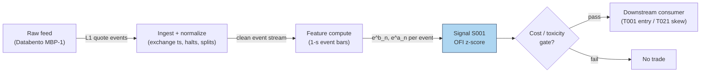

## Stage 1/200 — S001: Order-flow imbalance — Cont–Kukanov–Stoikov

*Batch SB1 · Signal 1/100 · Provenance [D] · Family A — Microstructure & order flow*

### S1. One-line verdict

| | |
|---|---|
| **What it is** | Net order-flow pressure at the best bid/ask (adds − cancels − executions), whose sign and depth-scaled size drive short-horizon mid-price moves. |
| **When it works** | Liquid, tight-spread names on direct feeds with stable depth; seconds-to-minutes horizons; as an adverse-selection gauge for quoting. |
| **When it dies** | Wide spreads, thin books, SIP-latency races, spoofable queues; any attempt to trade it standalone with market orders at retail latency. |
| **Build-or-buy in one line** | Build the estimator in Python+polars on a bought L1 feed (Databento MBP-1); buy only if you need historical L2/MBO or multi-venue coverage. |

Provenance: **[D]** — Cont, Kukanov & Stoikov (2014), arXiv:1011.6402. The caveat from the source entry carries forward unchanged: the original result is a *contemporaneous price-impact regression*, not by itself a forward trading rule; forward use needs a lead-lag/AR extension.

### S2. How it works — plain human explanation

At 9:47:03.214 the book reads bid 231.40 × 800, ask 231.41 × 300. A buy limit order for 500 joins the bid; 200 are cancelled from the ask; a market sell executes 100 against the bid. Net pressure: +600 shares of demand at the touch — that running tally, event by event, is order-flow imbalance (OFI).

The logic is queue mechanics plus adverse selection: prices move when one side's queue depletes, and persistent buying pressure chews through the ask queue first, ratcheting the mid up. Cont, Kukanov & Stoikov showed the relation is approximately *linear*: mid-price change ≈ OFI / (2 × depth). Deep books absorb flow; thin books lurch.

Why not trade volume? Trade imbalance ignores what doesn't print: a 5,000-share bid stacked then cancelled moves no volume but moves the market. OFI counts adds, cancels, and executions together — which is why it beats trade volume (the paper's §4: the volume relation is "noisy and less robust").

Three-bullet mental model:

- **OFI is a flow, not a level.** It accumulates pressure from every book event at the touch; the *level* of the book is S003/S005 territory.
- **Depth is the denominator.** Never trade raw OFI without depth normalization.
- **Contemporaneous ≠ predictive.** The 2014 result explains the move happening *now*; a forward trade needs a lead-lag extension the paper does not provide.

### S3. The math — exact formula

Per best-quote event *n*, let P^b_n, q^b_n be the best bid price and displayed size; P^a_n, q^a_n the best ask price and size. Define the bid-side and ask-side contributions (report convention, matching Cont–Kukanov–Stoikov):

$$e^b_n = \begin{cases} q^b_n, & P^b_n > P^b_{n-1} \ (\text{bid up: whole new queue counts}) \\ q^b_n - q^b_{n-1}, & P^b_n = P^b_{n-1} \ (\text{size change only}) \\ -q^b_{n-1}, & P^b_n < P^b_{n-1} \ (\text{bid down: whole old queue vanishes}) \end{cases}$$

$$e^a_n = \begin{cases} q^a_{\,n-1}, & P^a_n > P^a_{n-1} \ (\text{ask up: selling pressure eased}) \\ -(q^a_n - q^a_{n-1}), & P^a_n = P^a_{n-1} \ (\text{note the minus sign}) \\ -q^a_n, & P^a_n < P^a_{n-1} \ (\text{ask down: new selling pressure}) \end{cases}$$

Per-event OFI and windowed OFI:

$$\Delta\mathrm{OFI}_n = e^b_n + e^a_n, \qquad \mathrm{OFI}_k = \sum_{n \in T_k} \Delta\mathrm{OFI}_n$$

The price-impact relation (contemporaneous regression):

$$\Delta m_k = \alpha + \beta\,\frac{\mathrm{OFI}_k}{D_k} + \varepsilon_k,$$

where *m_k* is the mid-price change over interval *T_k* and *D_k* a depth scale (e.g. average top-of-book depth). The stylized model behind it: ΔP ≈ OFI/(2D) — linear impact with slope inversely proportional to depth.

Parameter table (every default marked as example):

| Parameter | Symbol | Typical range | Too small | Too large | Default (example) |
|---|---|---|---|---|---|
| Aggregation window | T_k | 100 ms – 5 s, or 50–1,000 events | noise dominates; flickering quotes | signal decays; mixes regimes | *1 s bars — example, not an institutional standard* |
| Book depth level | — | touch only (original) → top 3/5/10 | misses deep-book info | stale, gameable size | *touch only — example* |
| Depth normalizer | D_k | rolling mean top-of-book depth, 1–10 min | OFI not comparable across names | lags real depth shocks | *5-min rolling mean — example* |
| Signal form | — | raw / depth-normed / z-score / percentile | raw not comparable across regimes | z-score lags in jumps | *depth-normed z-score — example* |
| Forecast horizon | h | 100 ms – a few seconds | latency eats it | edge decays (CCZ 2023: rapid decay) | *500 ms — example* |

Normalization: raw OFI is in shares — meaningless across names. Depth-normalized OFI (OFI/D) is canonical; a rolling z-score handles diurnal depth seasonality. Causal timing: OFI at event *t* uses only events ≤ *t*; earliest reaction is *t+1*.

Named variants: (1) **touch-only OFI** — the original CKS measure; (2) **integrated OFI** — Cont, Cucuringu & Zhang (2023) combine per-level OFIs over the top 10 levels by PCA, beating best-level OFI in- and out-of-sample; (3) **event-time vs time-bar aggregation** — summing over *N* events is more stable when arrival rates swing.

### S4. Worked example — step-by-step numbers (SYNTHETIC)

All numbers **synthetic** (`batches/SB1/plot_S001.py`, `seed 42`). Initial book: bid 231.40 × 635 / ask 231.41 × 432. No fees, no latency, no hidden liquidity — arithmetic illustration, not a backtest.

| ev | bid | qb | ask | qa | e^b | e^a | ΔOFI_n | cum OFI | mid |
|---|---|---|---|---|---|---|---|---|---|
| 1 | 231.40 | 1048 | 231.41 | 432 | +413 | 0 | +413 | +413 | 231.405 |
| 2 | 231.40 | 1048 | 231.41 | 234 | 0 | +198 | +198 | +611 | 231.405 |
| 3 | 231.41 | 260 | 231.41 | 234 | +260 | 0 | +260 | +871 | 231.410 |
| 4 | 231.41 | 260 | 231.42 | 688 | 0 | +234 | +234 | +1,105 | 231.415 |
| 5 | 231.41 | 260 | 231.42 | 946 | 0 | −258 | −258 | +847 | 231.415 |
| 6 | 231.41 | 153 | 231.42 | 946 | −107 | 0 | −107 | +740 | 231.415 |
| 7 | 231.40 | 715 | 231.42 | 946 | −153 | 0 | −153 | +587 | 231.410 |
| 8 | 231.40 | 715 | 231.42 | 486 | 0 | +460 | +460 | +1,047 | 231.410 |
| 9 | 231.40 | 1002 | 231.42 | 486 | +287 | 0 | +287 | +1,334 | 231.410 |
| 10 | 231.40 | 1002 | 231.43 | 732 | 0 | +486 | +486 | +1,820 | 231.415 |

Hand-checks: ev3 — bid price up, e^b = q^b_3 = +260. ev5 — ask size 688 → 946 at same price, e^a = −(946−688) = −258. ev10 — ask price up, e^a = +q^a_9 = +486.

**What to notice.** Cumulative OFI climbs +413 → +1,820 while the mid moves one tick (231.405 → 231.415) — the depth denominator at work. The mid moves that *do* occur (events 3, 4, 7, 10) coincide with quote-price events, each contributing the largest single-event OFI prints. That is the CKS finding as arithmetic — and why the toy tape flatters OFI: real books have hidden liquidity, fleeting quotes, and adverse fills this table omits.

### S5. Strategies that use this signal

- **T001 — OFI + Queue-Imbalance Directional Scalper** — primary entry trigger (direction); queue imbalance S003 confirms.
- **T021 — Avellaneda–Stoikov Inventory Skew MM** — adverse-selection filter / quote-skew input (OFI shifts the reservation price away from toxic flow).
- **T086 — OFI-Paced Participation Tracker** — execution filter: pace child orders faster when OFI runs with you, slow down when it runs against you.

### S6. Data required — exact spec

| Field | Type | Granularity | Source tier | Notes |
|---|---|---|---|---|
| Best bid price/size | float / int | every quote event (L1) | Tier 2 | needs *displayed* size per price move |
| Best ask price/size | float / int | every quote event (L1) | Tier 2 | same |
| Exchange timestamps | int64 ns | per event | Tier 2 | SIP timestamps add 10s of µs jitter — label SIP work *simulated only — requires MBO/ITCH* for latency claims |
| Corporate actions / halts | reference | daily + intraday halt feed | Tier 1 | price-move contributions are garbage across a split or halt reopen |

Collection: Databento MBP-1 (`XNAS`/`XNYS`); Polygon v3; TAQ history. Ingest sketch (polars, per symbol-day):

```python
import polars as pl, databento as db
cli = db.Historical("API_KEY")
data = cli.timeseries.get_range("XNAS.MBP-1", "AAPL",
        start="2026-09-09", end="2026-09-10")          # 1: fetch MBP-1 deltas
q = (pl.scan_parquet("aapl_mbp1.parquet")              # 2: best-level only
       .filter(pl.col("action").is_in(["A","C","T"]))   #    (adds/cancels/trades)
       .sort("ts_event")                               # 3: exchange-time order
       .with_columns(pb=pl.col("bid_px_00"),           # 4: lagged book state
                     qb=pl.col("bid_sz_00"),
                     pa=pl.col("ask_px_00"),
                     qa=pl.col("ask_sz_00"))
       .with_columns(pb_l=pl.col("pb").shift(1), ...)   # 5: e^b/e^a per §S3
       .with_columns(ofi=pl.when(...).then(...))        # 6: piecewise contributions
       .group_by_dynamic("ts_event", every="1s")       # 7: 1-s event bars (example)
       .agg(ofi_sum=pl.col("ofi").sum()))
```

Storage: `notes/cost-model.md` §4: L1 ≈ 2–8 GB/symbol-day parquet. Quality checklist: exchange timestamps (not SIP arrival); drop crossed/locked quotes; halt/auction/DST/half-day masks; split-adjust before price-move contributions; dedupe retransmits.

### S7. Local build on M5 Max / 128GB

**Feasibility: feasible.** OFI is a stateful O(1)-per-event scan: a Python loop does ~100–500k events/sec (`notes/cost-model.md` §2) vs ~50–500 L1 events/sec average for one liquid name (busy bursts ~1–5k/sec). Sizing from §2: 50 symbols × 2k events/sec = 100k/sec → Python borderline, Rust (5–50M/sec) comfortable; polars batch recompute every second is trivial. Bottleneck is I/O and timestamp normalization, not the arithmetic.

Stack options:

| Stack | When to pick |
|---|---|
| Python + polars | research, daily recompute, ≤20 symbols live |
| Rust ingest → polars analyze | >20 symbols live, or direct-feed decode |
| DuckDB | ad-hoc history queries over parquet |

RAM (§3): one symbol-day L1 ≈ 0.5–4 GB — fine for a few symbols; 60 days (~30–240 GB) **does not fit** the 77 GB budget — stream per-symbol daily parquet. 1-min bars trivial (~12 MB for 500 symbols × 60 days).

Engineering time: Tier M (plan §6) → **20–60 h** ≈ $3,000–9,000 loaded-cost estimate at $150/hr (event-state machine + timestamp/halt handling + depth normalizer + reference validation). Breaks first at 500 symbols: the GIL-bound Python loop; move to Rust ingest + streaming.

### S8. Buy vs build

| Option | What you get | Indicative price | Gains | Loses |
|---|---|---|---|---|
| Tier 0: exchange delayed quotes / Alpaca IEX | free delayed L1 | ~$0 — *indicative, verify before budgeting* | $0 to prototype | 15-min delay; useless for live OFI |
| Tier 1: Polygon Stocks Advanced / Alpaca SIP | real-time SIP L1, history | ~$30–200/mo — *indicative, verify before budgeting* | cheap, easy API | SIP timestamps; latency claims *simulated only — requires MBO/ITCH* |
| Tier 2: Databento Standard MBP-1 | exchange-timestamped L1/L2, pay-as-you-go | ~$200/mo + usage — *indicative, verify before budgeting* | honest timestamps, history | usage meter runs on full universes |
| Tier 3: LOBSTER (academic) | MBO/ITCH replay | ~hundreds/yr academic — *indicative, verify before budgeting* | true queue dynamics | academic license, limited symbols |

Verdict: **build the estimator, buy the feed.** OFI is ~40 lines; the value is your normalization, windows, and lead-lag calibration — none of which a vendor sells. Buy Databento MBP-1 history to validate, Tier-1 SIP for live research, and direct/MBO only after the signal survives realistic costs.

### S9. Success ratio / efficacy — documented evidence

| Study / source | Market & period | Metric | Before/after cost | Caveat |
|---|---|---|---|---|
| Cont, Kukanov & Stoikov (2014) | 50 US stocks, NYSE TAQ, 2008 | linear OFI↔ΔP, slope ∝ 1/(2·depth); stable across time scales, seasonality, stocks | before-cost; **contemporaneous regression, not a trading rule** | no forward P&L; no Sharpe; volume-based impact noisy by comparison |
| Cont, Cucuringu & Zhang (2023), arXiv:2112.13213 | US equities, multi-asset | integrated (PCA, top-10-level) OFI beats best-level OFI in- and out-of-sample; lagged cross-asset OFIs improve future-return forecasts, decaying rapidly | before-cost (R², not P&L) | forecasting exercise, not an after-cost strategy |
| Third-party replication (GitHub `xecuterisaquant/replication-cont-ofi`) | TAQ/NBBO, 1-s grid | OLS ΔP ~ β·OFI_norm, mean R² ≈ 14.2% after sign-fix | before-cost; contemporaneous | code repo, not peer-reviewed; replication quality unverified |

Fails in: vol spikes (depth evaporates, 1/(2D) explodes), wide-spread names (flickering quotes), retail books (odd-lot noise), crowded periods (fleeting/spoofed quotes).

Honest bottom line: as a *standalone trigger* this is weak and latency-dominated — the literature documents explanatory power, not after-cost P&L, and I found **no published after-cost Sharpe for a naive OFI scalper**. As a *filter* (adverse-selection gauge for quoting, execution pacing) it is a strong, well-documented input — "one feature in a microstructure model, not a standalone rule" (Duck.ai phrasing, kept labeled).

### S10. Failure modes & pitfalls

1. **Contemporaneous≠forward** — treating the CKS regression as a trading rule. Mitigation: forward-shift one event; report lead-lag R², not contemporaneous.
2. **Lookahead leakage** — bar-close OFI traded inside the same bar. Mitigation: event-*t* → trade-*t+1* causality audit.
3. **Staleness/latency** — SIP timestamps make OFI a museum piece in a colocated race. Mitigation: label SIP work *simulated only — requires MBO/ITCH*; add measured latency to costs.
4. **Fleeting quotes / spoofing** — displayed size cancels before execution. Mitigation: down-weight sub-50 ms quote lifetimes (example).
5. **Cost blowup** — spread + fees + impact on sub-second round trips. Mitigation: per-trade bps budget; fee-covering entry gate.
6. **Regime breaks** — depth collapses in stress; the linear model misprices impact. Mitigation: depth/vol-conditioned scaling; stand down past a spread multiple.
7. **Overfitting** — window, normalizer, z-threshold mined on one month. Mitigation: purged/embargoed validation (S088); per-symbol shrinkage.
8. **Data errors** — bad ticks, splits, halts create phantom contributions. Mitigation: S6 checklist; drop crossed/locked quotes; halt-aware masks.

### S11. Visuals




### S12. Sources

1. Cont, R., Kukanov, A. & Stoikov, S. (2014). "The Price Impact of Order Book Events." *Journal of Financial Econometrics* 12(1): 47–88. arXiv:1011.6402 — https://arxiv.org/abs/1011.6402 (canonical OFI definition; contemporaneous regression — not a forward rule).
2. Cont, R., Cucuringu, M. & Zhang, C. (2023). "Cross-Impact of Order Flow Imbalance in Equity Markets." *Quantitative Finance*; arXiv:2112.13213 — https://arxiv.org/abs/2112.13213 (integrated multi-level OFI via PCA; lagged cross-asset OFIs improve short-horizon return forecasts).
3. Replication: `xecuterisaquant/replication-cont-ofi` — https://github.com/xecuterisaquant/replication-cont-ofi (third-party CKS replication on TAQ/NBBO 1-s grid; OLS R² ≈ 14.2% after sign correction; code repo, not peer-reviewed).

**Chatbot source log.** Duck.ai (GPT-5.6 Luna, anonymous, web-search assisted, 2026-09-10; `batches/SB1/duckai-answers.md`) answered Q-SB1-1–Q-SB1-3. Q-SB1-1 confirms the CKS formula structure and the contemporaneous-not-forward caveat. **Operator verification of the chatbot's own worked OFI example found 2 arithmetic errors** (event 5 used the wrong ask size; event 7 wrongly added a price-effect term): the correct cumulative OFI sequence is 0, 4, 12, 23, 18, 13, 0, 6, 11, **19** — the model reported 29. The chapter's worked example uses its own script-generated tape (seed 42), never the chatbot's numbers; the chatbot's parameter/throughput/pricing tables were self-flagged as illustrative estimates and are NOT promoted to documented facts. This is exactly why chatbot output is treated as leads, never facts. Source log: Duck.ai answered Q-SB1-1 (OFI portion), Q-SB1-2, Q-SB1-3; Grok/Cursor answers pending (checked 2026-09-10).

**Unverified leads** (chatbot-only — never in Sources):
- Duck.ai Q-SB1-1 worked example: raw output contained the 2 arithmetic errors above (correct final cumulative OFI = 19, not 29) — kept here as a caution, not used.
- Duck.ai: "Polars 1–10M events/s; Python loop 0.1–1M/s; Rust 5–30M+/s" — model-flagged estimates; cost-model §2 used instead.
- Duck.ai: vendor bands ("free–$50–300/mo retail; $500–10,000+/mo institutional") — model-flagged estimates; cost-model §6 used instead.
- Duck.ai: execution heuristics ("+OFI → waiting riskier; OFI burst → cross spread") — plausible, no checkable source; hypotheses only.
- Duck.ai Q-SB1-2/Q-SB1-3: vendor shortlist (Databento US Equities Mini ~$100–500/mo, TotalView-ITCH ~$300–2,000+/mo, etc.) and engineering-hour bands (prototype 40–70 h, research-grade 120–220 h) — model-flagged estimates; cost-model §5/§6 used in S7/S8 instead.
