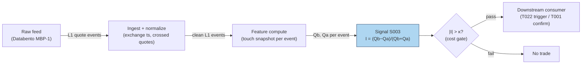

## Stage 3/200 — S003: Queue (depth) imbalance — Gould–Bonart

*Batch SB1 · Signal 3/100 · Provenance [D] · Family A — Microstructure & order flow*

### S1. One-line verdict

| | |
|---|---|
| **What it is** | The normalized difference between displayed size at the best bid and best ask; predicts the direction of the next mid-price tick via queue-depletion. |
| **When it works** | Large-tick, deep-queue stocks where the next move is a race between two visible queues; sub-second to seconds horizons. |
| **When it dies** | Small-tick names with flickering quotes, spoofed/layered books, hidden-liquidity dominance; any SIP-latency queue race. |
| **Build-or-buy in one line** | Build — it is one division on data you already have for S001; buy nothing extra unless you need historical L2. |

Provenance: **[D]** — Gould & Bonart (2016), arXiv:1512.03492; Cao, Hansch & Wang (2009), *Journal of Futures Markets* 29(1): 16–41.

### S2. How it works — plain human explanation

At 9:47:03.214 the book reads bid 231.40 × 1,048, ask 231.41 × 234. Forget prices for a moment and look at the two queues: 1,048 shares want to buy at the touch, only 234 want to sell. Which queue gets eaten first? The ask queue is four times thinner — a single 300-share market sell order barely dents the bid, while a 300-share market buy wipes out the entire ask queue and the ask price ticks up. The mid-price follows the thinner queue.

That is the whole signal: relative queue length forecasts the next tick because prices move when a queue depletes, and the shorter queue usually depletes first. Formally this is *queue-depletion dynamics* — the same mechanical core as S001's OFI, but a snapshot (a *level*) rather than a flow. Where OFI accumulates pressure over events, queue imbalance reads the current standoff: big bid queue + small ask queue = the next move is more likely up.

The economics are adverse selection in miniature. A lopsided book means informed or impatient flow has been leaning on one side; market makers see the thin queue, infer they are about to be adversely selected, and reprice before the queue is gone. Gould & Bonart's contribution was to test this as a literal classifier: feed the imbalance into a logistic regression, predict the next mid-price move, and find a strongly significant relationship — "considerable improvement" over a null model for large-tick stocks, moderate for small-tick ones.

Three-bullet mental model:

- **Imbalance is a snapshot; OFI is the movie.** S003 reads the book's current state; S001 reads how it got there. They are cousins, not substitutes.
- **It predicts *direction*, not magnitude.** The next tick is up or down; how far depends on depth behind the touch (S005 territory).
- **Large-tick is its home turf.** When the spread is one tick and queues are deep, the race is clean. When the spread flickers across ticks, the signal drowns in quote noise.

### S3. The math — exact formula

$$I_t = \frac{Q^b_t - Q^a_t}{Q^b_t + Q^a_t} \in [-1,\, 1],$$

where Q^b_t, Q^a_t are the displayed sizes at the best bid and best ask at time *t* (in shares; both non-negative, not both zero). Trade in the direction of *I* when |I_t| exceeds a fee-covering threshold κ (example — not an institutional standard).

N-level extension (static book pressure):

$$I^{(N)}_t = \frac{\sum_{i=1}^{N}\,(Q^b_{i,t} - Q^a_{i,t})}{\sum_{i=1}^{N}\,(Q^b_{i,t} + Q^a_{i,t})},$$

with *i* indexing price levels from the touch outward. *N* = 1 is the Gould–Bonart measure; *N* = 5–10 is the S005 book-pressure family.

A useful exact identity linking S003 to S004 (verified algebra): with spread *s_t = P^a_t − P^b_t*,

$$P_{\mu,t} - m_t = \frac{s_t}{2}\,I_t,$$

i.e. the microprice deviation from mid equals half the spread times the queue imbalance. The two signals share a touch-level core; they diverge when you add flow history (S001) or deeper levels / dynamics (full microprice).

Parameter table:

| Parameter | Symbol | Typical range | Too small | Too large | Default (example) |
|---|---|---|---|---|---|
| Entry threshold | κ | 0.3 – 0.7 | trades noise, fees eat you | never triggers | *±0.5 — example, not an institutional standard* |
| Levels | N | 1 (touch) – 10 | misses deep liquidity | stale/gameable size | *1 — example* |
| Smoothing | — | raw snapshot, or 100 ms–1 s EWMA | flicker whipsaws | lags the depletion | *raw — example* |
| Horizon | — | next 1–20 ticks / 100 ms – seconds | — | edge decays | *next tick — example* |

Causal timing: *I_t* is computed from the book snapshot at event *t* using only data ≤ *t*; a trade reacting to it can execute no earlier than *t+1*. Variants: (1) touch-only (canonical); (2) N-level book pressure; (3) time-averaged imbalance over a short window (kills flicker, adds lag).

### S4. Worked example — step-by-step numbers (SYNTHETIC)

Same synthetic tape as S001 (`batches/SB1/plot_S003.py`, `seed 42`), snapshots after each event. All numbers **synthetic** — no fees, no latency, no hidden liquidity; an arithmetic illustration, not a backtest.

| ev | bid | qb | ask | qa | I_t | mid |
|---|---|---|---|---|---|---|
| 0 | 231.40 | 635 | 231.41 | 432 | +0.1903 | 231.405 |
| 1 | 231.40 | 1048 | 231.41 | 432 | +0.4162 | 231.405 |
| 2 | 231.40 | 1048 | 231.41 | 234 | +0.6349 | 231.405 |
| 3 | 231.41 | 260 | 231.41 | 234 | +0.0526 | 231.410 |
| 4 | 231.41 | 260 | 231.42 | 688 | −0.4515 | 231.415 |
| 5 | 231.41 | 260 | 231.42 | 946 | −0.5688 | 231.415 |
| 6 | 231.41 | 153 | 231.42 | 946 | −0.7216 | 231.415 |
| 7 | 231.40 | 715 | 231.42 | 946 | −0.1391 | 231.410 |
| 8 | 231.40 | 715 | 231.42 | 486 | +0.1907 | 231.410 |
| 9 | 231.40 | 1002 | 231.42 | 486 | +0.3468 | 231.410 |
| 10 | 231.40 | 1002 | 231.43 | 732 | +0.1557 | 231.415 |

Hand-checks: ev2: (1048 − 234)/(1048 + 234) = 814/1282 = +0.6349. ev6: (153 − 946)/(153 + 946) = −793/1099 = −0.7216. ev10: (1002 − 732)/1734 = +0.1557. With the example threshold κ = ±0.5, the trigger fires at ev2 (long, +0.63) and ev5/ev6 (short, −0.57/−0.72).

**What to notice.** The imbalance leads the tape's two real mid moves: the +0.63 print at ev2 precedes the uptick at ev3 (231.405 → 231.410), and the −0.72 at ev6 precedes the downtick at ev7 (231.415 → 231.410). That is the queue-depletion story working as advertised — but this is a 10-event synthetic anecdote with hand-designed event types, not evidence of tradability. Note also ev3: after the bid stepped up, both queues reset small and *I* collapses to +0.05 — price-move events destroy the very queues the signal reads, which is why the signal must be recomputed every event and why stale snapshots are worthless.

### S5. Strategies that use this signal

- **T022 — Queue-Imbalance Maker with Toxicity Cancel** — primary trigger: posts at the touch when the queue favors your side; cancels on imbalance reversal or VPIN spike.
- **T001 — OFI + Queue-Imbalance Directional Scalper** — confirmation filter on the OFI entry (both must agree).
- **T004 — VWAP-Deviation Mean-Reversion** — timing filter: enter the fade only when the touch queue favors the fade direction.

### S6. Data required — exact spec

| Field | Type | Granularity | Source tier | Notes |
|---|---|---|---|---|
| Best bid/ask sizes | int (shares) | every quote event (L1) | Tier 2 | the entire signal; odd-lot handling matters |
| Best bid/ask prices | float | every quote event (L1) | Tier 2 | for the mid and the S004 identity |
| Exchange timestamps | int64 ns | per event | Tier 2 | queue races are decided in µs — SIP timestamps make live trading *simulated only — requires MBO/ITCH* |
| Halt/auction flags | bool | per event | Tier 1 | imbalance is meaningless across halts |

Collection: same feed as S001 (Databento MBP-1, Polygon L2 per the report entry). Ingest sketch (≤20 lines):

```python
import polars as pl
q = (pl.scan_parquet("aapl_mbp1.parquet")          # 1: L1 deltas, exchange-time sorted
       .sort("ts_event")
       .with_columns(qb=pl.col("bid_sz_00"),       # 2: touch sizes
                     qa=pl.col("ask_sz_00"),
                     bid=pl.col("bid_px_00"),
                     ask=pl.col("ask_px_00"))
       .filter((pl.col("qb") + pl.col("qa")) > 0)  # 3: guard empty book
sig = q.with_columns(                              # 4: the whole signal: one division
        imb=(pl.col("qb") - pl.col("qa")) /
            (pl.col("qb") + pl.col("qa"))).collect()
long  = sig.filter(pl.col("imb") >  0.5)           # 5: example threshold
short = sig.filter(pl.col("imb") < -0.5)
```

Storage: identical to S001 — L1 quotes+trades ≈ 2–8 GB/symbol-day parquet (`notes/cost-model.md` §4); the signal itself adds one float column. Data-quality checklist: drop crossed/locked quotes; normalize timestamps to exchange time; exclude auction prints and halt periods; watch for odd-lot-only quotes on some feeds.

### S7. Local build on M5 Max / 128GB

**Feasibility: trivial.** The signal is one division per quote event — O(1), stateless. A pure-Python loop at ~100–500k events/sec (`notes/cost-model.md` §2) covers a 50-symbol universe (~100k events/sec busy) with headroom; polars vectorized recompute (~10–50M rows/sec, §2) does a full day in seconds. Bottleneck: none for the math — the constraint is feed latency and timestamp quality, not compute.

Stack options:

| Stack | When to pick |
|---|---|
| Python + polars | everything up to live 50-symbol scanning |
| Rust | only if you are already writing the S001 Rust ingest — no standalone need |
| DuckDB | historical screening over parquet |

RAM: per §3, one symbol-day of L1 ≈ 0.5–4 GB working set; trivial for intraday windows. Sixty days for one symbol does not fit the 77 GB budget — stream per-symbol daily files. Engineering time: Tier M per plan §6, but at the light end — **20–40 h** ≈ $3,000–6,000 loaded-cost estimate at $150/hr, mostly feed plumbing and the threshold/toxicity gating shared with S001. What breaks first at 500 symbols: nothing in the math — the feed bill and the staleness of your quotes do.

### S8. Buy vs build

| Option | What you get | Indicative price | Gains | Loses |
|---|---|---|---|---|
| Tier 0: delayed quotes | free L1, 15-min delay | ~$0 — *indicative, verify before budgeting* | $0 research prototype | no live signal |
| Tier 1: Polygon Stocks Advanced / Alpaca SIP | real-time SIP L1 | ~$30–200/mo — *indicative, verify before budgeting* | cheap live data | queue races on SIP are *simulated only — requires MBO/ITCH* |
| Tier 2: Databento MBP-1 | exchange-timestamped L1 | ~$200/mo + usage — *indicative, verify before budgeting* | honest event order | usage meter on wide universes |

Verdict: **build, always** — the signal is a one-line transform of data you already buy for S001. There is no credible "precomputed queue imbalance" product worth paying for; the only buy decision is the feed tier, and the honest crossover is latency: if you intend to *trade* the next tick rather than study it, SIP timestamps are not enough and you are in Tier 2/3 with colocation-class infrastructure, which a Mac on a home connection cannot honestly emulate.

### S9. Success ratio / efficacy — documented evidence

| Study / source | Market & period | Metric | Before/after cost | Caveat |
|---|---|---|---|---|
| Gould & Bonart (2016), arXiv:1512.03492 | 10 liquid Nasdaq stocks, LOB data | logistic regression I → next mid move: strongly significant; considerable improvement over null for large-tick stocks, moderate for small-tick (binary + probabilistic) | before-cost (classification, not P&L) | predicts direction only; no trading costs, no Sharpe |
| Cao, Hansch & Wang (2009), *J. Futures Markets* 29(1) | Australian Stock Exchange | order imbalances between demand/supply schedules significantly related to future short-term returns, controlling for return autocorrelation, inside spread, trade imbalance; book ≈ 22% of price discovery | before-cost (return regression) | 2000s ASX; explanatory, not a strategy |
| Kercheval & Zhang (2015), *Quant. Finance* 15(8) | US equities, real LOB data | SVM on LOB-state features (incl. book imbalance): effective short-term price-movement forecasts | before-cost (classification) | ML wrapper; no after-cost P&L |

Only before-cost numbers exist in what I could verify — every row above is a classification or regression result, none is an after-cost trading Sharpe. Regimes where it fails: small-tick names (Gould–Bonart's own "moderate" result), spoofed/layered books where displayed size is a lie, hidden-liquidity-heavy venues, and any latency regime where you see the imbalance after the queue is already gone.

Honest bottom line: as a *standalone trigger* this is a real but tiny and latency-bound edge — documented as direction prediction, never as after-cost profit in the sources I found. As a *filter/veto* (T022's toxicity cancel, T001's confirmation) and as a *quoting input* (lean your limit orders to the heavy-queue side) it is one of the best-evidenced microstructure features in the literature.

### S10. Failure modes & pitfalls

1. **Spoofing / fleeting quotes** — displayed size vanishes before execution. Mitigation: weight by quote lifetime or filter sub-50 ms quotes (example).
2. **Hidden liquidity** — the visible queue is not the real queue. Mitigation: treat *I* as a noisy proxy; never size on it alone.
3. **Small-tick flicker** — spread bouncing across ticks randomizes the signal. Mitigation: restrict to large-tick names or time-average the imbalance.
4. **Lookahead leakage** — using the post-move snapshot to "predict" the move. Mitigation: strict event-*t* → trade-*t+1* causality.
5. **Latency illusion on SIP** — your imbalance print arrives after the race is over. Mitigation: label SIP work *simulated only — requires MBO/ITCH*.
6. **Cost blowup** — crossing the spread to chase a one-tick prediction. Mitigation: fee-covering threshold κ; prefer passive posting (T022) over taking.
7. **Overfitting κ** — threshold tuned to one month's microstructure. Mitigation: per-symbol calibration, walk-forward, shrinkage toward 0.5.
8. **Regime breaks** — imbalance–direction relation weakens in stress/crowding. Mitigation: toxicity overlay (VPIN, S008); stand down on spread multiples.

### S11. Visuals




### S12. Sources

1. Gould, M. D. & Bonart, J. (2016). "Queue Imbalance as a One-Tick-Ahead Price Predictor in a Limit Order Book." arXiv:1512.03492 — https://arxiv.org/abs/1512.03492 (logistic-regression evidence; large-tick vs small-tick result).
2. Cao, C., Hansch, O. & Wang, X. (2009). "The information content of an open limit-order book." *Journal of Futures Markets* 29(1): 16–41 — https://ideas.Repec.org/a/wly/jfutmk/v29y2009i1p16-41.html (order imbalances → future short-term returns; ~22% price-discovery contribution).
3. Kercheval, A. N. & Zhang, Y. (2015). "Modelling high-frequency limit order book dynamics with support vector machines." *Quantitative Finance* 15(8): 1315–1329 — https://ideas.repec.Org/a/taf/quantf/v15y2015i8p1315-1329.html (LOB-state features effective for short-term forecasts on real data).

**Chatbot source log.** Q-SB1-1 asked for queue imbalance alongside OFI and microprice, but the Duck.ai answer (GPT-5.6 Luna, 2026-09-10) covered only the OFI portion — no usable queue-imbalance content was returned. Source log: Duck.ai answered Q-SB1-1 (OFI portion only — not the queue-imbalance portion); Grok/Cursor answers pending (checked 2026-09-10).

**Unverified leads:** none specific to S003 beyond the general SB1 chatbot caveats — no chatbot made a checkable queue-imbalance claim in this batch.
