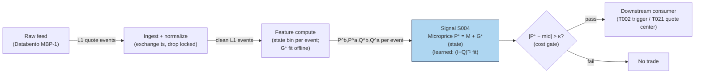

## Stage 4/200 — S004: Microprice (Stoikov)

*Batch SB1 · Signal 4/100 · Provenance [D] · Family A — Microstructure & order flow*

### S1. One-line verdict

| | |
|---|---|
| **What it is** | Stoikov's learned fair-price estimator: the limiting expected mid-price conditional on the book-imbalance state, estimated from a Markov chain over discretized (imbalance, spread) states — a martingale by construction. |
| **When it works** | As a fair-value anchor for quoting and for fading transient mid deviations; tight-spread, visible-book names. |
| **When it dies** | Spoofed books, dominant hidden liquidity, one-tick-wide flickering spreads — anywhere displayed size lies. |
| **Build-or-buy in one line** | Build — the estimator is a small batch fit plus a per-event table lookup on your S001/S003 feed. |

Provenance: **[D]** — Stoikov (2018), "The micro-price: a high-frequency estimator of future prices," *Quantitative Finance* 18(12): 1959–1966 (working paper Nov 2017). Definition: $P_t^{\text{micro}} = \lim_{i\to\infty} \mathbb{E}[M_{\tau_i} \mid \mathcal{F}_t]$ — the limit of expected mid-prices at the successive mid-price-change times $\tau_1, \tau_2, \dots$ — estimated in practice by discretizing (imbalance, spread) into states and fitting the transition matrices $Q, R_1, R_2$ (paper §3). The cross-weighted mid $W = I\cdot P^a + (1-I)\cdot P^b$ is the paper's Appendix-B degenerate special case (no learning) and appears in this chapter ONLY as the naive baseline — it is not the microprice. Do not double-count with S003: the microprice's state *is* the touch imbalance S003 uses, passed through the learned adjustment.

### S2. How it works — plain human explanation

At 9:47:03.214 the book reads bid 231.40 × 1,048, ask 231.41 × 234, mid 231.405. The plain mid says "fair value is 231.405." But look at the queues: 1,048 shares bid vs 234 offered. The next trade is far more likely to be a buy chewing through that thin ask — printing at 231.41 — than a sell. So is 231.405 really the best guess of where the price is going? No: the *expected* next price leans toward the ask.

Stoikov's question is sharper than "which way does it lean": **given that the book looks like this, where will the mid-price be on average, far into the future?** That limiting expected mid-price *is* the microprice — a martingale by construction, which is the mathematical way of saying "this is what 'fair' means once you condition on the book." And crucially, it is not a formula you write down from one snapshot. It is **learned**: discretize the imbalance into bins, watch thousands of quote events to see what the mid does after each bin, and compute the expected long-run mid per bin. Each new event is then a table lookup — mid plus the learned adjustment for its bin.

The construction, in one paragraph: the state of the book at each quote event is the pair (imbalance bin, spread bin). From history you estimate three transition matrices — $Q$ (quote updates where the mid doesn't move), $R_1$ (the distribution of the next mid-price move), $R_2$ (state transitions coincident with a mid-price move). From them you compute the per-state adjustment $G^* = G_1 + B G_1 + B^2 G_1 + \cdots$ (the §3 math), and the microprice is $P^{\text{micro}} = M + G^*(\text{state})$. Because the matrices are fit per symbol from its own history, the estimator adapts to each name's microstructure — a large-tick stock and a small-tick stock get different adjustments, which no closed form can do.

Where does the familiar cross-weighted mid $W = I\cdot P^a + (1-I)\cdot P^b$ fit? It is the **no-learning baseline**: the straight-line adjustment $(I-\tfrac12)\cdot S$ you get if you skip the estimation and simply *impose* that the current imbalance tells the whole story. Stoikov derives it as a degenerate special case (Appendix B: imbalance as a Brownian motion with particular boundary behavior) and shows empirically it falls short — the learned adjustments come out flatter, always inside half the spread, and predict short-term prices better than the mid *or* the weighted mid (BAC/CVX, March 2011).

Why "micro"? Because it lives at the tick scale and updates every quote event — and because taking expectations far into the future filters out the microstructure noise in the mid-price itself.

Three-bullet mental model:

- **The microprice is a learned function of the book state, not a closed form.** Fit transition matrices on history; each event is then mid + a looked-up adjustment. No fit, no microprice — just the baseline.
- **It is a fair-value estimator, not a trade.** You fade deviations from it (buy below, sell above) or center your quotes on it — you don't "buy the microprice."
- **The cross-weighted mid is the naive baseline, not the estimator.** Same inputs, imposed straight-line adjustment, zero learning. Benchmark the learned microprice against it — and never present the baseline as the microprice.

### S3. The math — exact formula

**Definition** (Stoikov 2017 §2, 2018): with $\tau_1, \tau_2, \dots$ the successive
mid-price-change times and $\mathcal{F}_t$ the order-book information at $t$,

$$P^{\text{micro}}_t = \lim_{i\to\infty} \mathbb{E}[M_{\tau_i} \mid \mathcal{F}_t].$$

Write $P^{\text{micro}} = M + g(I, S)$ with $M$ the mid-price,
$I = Q^b/(Q^b+Q^a)$ the imbalance, $S = P^a - P^b$ the spread. The paper's
program is to **estimate the adjustment function $g$ from data**. The $i$-th
mid-price prediction decomposes as

$$P_i = M_t + \sum_{k=1}^{i} g_k(I_t, S_t),$$

with the first-order adjustment $g_1(I,S) = \mathbb{E}[M_{\tau_1} - M_t \mid I_t = I, S_t = S]$
(the expected move to the *next* mid-price change) and the recursion
$g_{i+1}(I,S) = \mathbb{E}[g_i(I_{\tau_1}, S_{\tau_1}) \mid I_t = I, S_t = S]$.

**Finite-state estimator** (paper §3 — the implementable version): discretize
imbalance into $n$ bins ($I_t = x$ iff $(x-1)/n < I \le x/n$) and spread into $m$
tick values; the book state is $x = (i, s)$ ($nm$ states). From quote history
estimate:

- $Q_{xy} = P(M_{t+1}-M_t = 0 \;\land\; X_{t+1} = y \mid X_t = x)$ — transient
  quote updates, $nm \times nm$;
- $R^1_{xk} = P(M_{t+1}-M_t = k \mid X_t = x)$ — one-step mid-move distribution
  over $K = \{-0.01, -0.005, 0.005, 0.01\}$ (half-ticks), $nm \times 4$;
- $R^2_{xy} = P(M_{t+1}-M_t \ne 0 \;\land\; X_{t+1} = y \mid X_t = x)$ — state
  transitions coincident with a mid-price move, $nm \times nm$.

Then, with $K$ as a column vector:

$$G_1 = (I - Q)^{-1} R^1 K, \qquad B = (I - Q)^{-1} R^2,$$

$$G^* = G_1 + B G_1 + B^2 G_1 + \cdots \quad\text{(converges fast in practice)},$$

$$P^{\text{micro}}_t = M_t + G^*(X_t).$$

Convergence is guaranteed (Thm 3.1) when the data are **symmetrized** — every
observation $(I, S, \dots)$ mirrored by $(1-I, S, \dots)$ — so that $B^* G_1 = 0$.
Inference per event is a bin lookup plus an addition; all the work is the fit.

**Naive baseline — NOT the microprice.** The cross-weighted mid

$$W = I\cdot P^a + (1-I)\cdot P^b, \qquad W - M = \left(I-\tfrac12\right) S,$$

is the closed form the paper derives as the degenerate Appendix-B special case
and compares *against*. Carry it only as the no-learning benchmark.

The signal is the deviation:

$$s_t = P^{\text{micro}}_t - M_t = G^*(X_t).$$

Parameter table:

| Parameter | Symbol | Typical range | Too small | Too large | Default (example) |
|---|---|---|---|---|---|
| Imbalance bins | n | 4–10 | 1 = no state information | 20+ = sparse transition counts | *4 — example, not an institutional standard* |
| Spread bins | m | 1–5 ticks | misses spread interaction | sparse | *1 — example* |
| Estimation window | — | 1–4 weeks of quotes | regime change mid-fit | stale microstructure | *1 month — example* |
| Symmetrization | — | on | series can diverge (Thm 3.1) | — | *on* |
| Entry threshold | κ | 0.1 – 0.5 × spread | fee death by a thousand fills | never trades | *0.25 × spread — example* |
| Holding horizon | h | seconds | noise | deviation mean-reverts away | *5 s — example* |

Causal timing: the state $X_t$ comes from the snapshot at event $t$ using only
data ≤ $t$; $G^*$ is fit on history strictly *before* the evaluation window
(never in-sample transitions); tradable no earlier than $t+1$. Variants:
(1) touch microprice ($n$ bins × $m = 1$, canonical); (2) N-level imbalance
states (the paper notes the Level-II extension); (3) the closed-form baseline
$W$ — for benchmarking the learned estimator, never as the signal itself.

### S4. Worked example — step-by-step numbers (SYNTHETIC)

A synthetic run of the §3 estimator (`batches/SB1/plot_S004.py`, `seed 42`).
Imbalance $I = Q^b/(Q^b+Q^a)$ in $n = 4$ bins, spread fixed at 1 tick ($m = 1$),
mid-price move grid $K = \{-0.01, -0.005, 0.005, 0.01\}$. The "estimated"
transition matrices $Q, R_1, R_2$ are invented (reversal-symmetric, i.e.
symmetrized as Thm 3.1 requires) — they demonstrate the machinery, not a real
fit. The 10-event tape holds bid/ask fixed at 231.40/231.41 with sizes at the
bin centers; states are drawn from the chain. All numbers **synthetic**; no
fees, no latency — arithmetic illustration, not a backtest. Deviation in basis
points (bps): $(P^{\text{micro}} - \text{mid})/\text{mid} \times 10^4$. $W$ is
the cross-weighted-mid **baseline** (not the microprice).

Fitted adjustments: $G_1 = (-0.0649, -0.0253, +0.0253, +0.0649)$¢,
$G^* = (-0.0761, -0.0305, +0.0305, +0.0761)$¢ per bin 1–4; max $|B|$
eigenvalue $0.50 < 1$, so the series converges in a handful of terms.

| ev | bin | bid | qb | ask | qa | mid | G\* (¢) | P\* | W (baseline) | dev\* (bps) |
|---|---|---|---|---|---|---|---|---|---|---|
| 0 | 1 | 231.40 | 125 | 231.41 | 875 | 231.4050 | −0.076 | 231.4042 | 231.4013 | −0.03 |
| 1 | 1 | 231.40 | 125 | 231.41 | 875 | 231.4050 | −0.076 | 231.4042 | 231.4013 | −0.03 |
| 2 | 2 | 231.40 | 375 | 231.41 | 625 | 231.4050 | −0.030 | 231.4047 | 231.4038 | −0.01 |
| 3 | 2 | 231.40 | 375 | 231.41 | 625 | 231.4050 | −0.030 | 231.4047 | 231.4038 | −0.01 |
| 4 | 1 | 231.40 | 125 | 231.41 | 875 | 231.4050 | −0.076 | 231.4042 | 231.4013 | −0.03 |
| 5 | 4 | 231.40 | 875 | 231.41 | 125 | 231.4050 | +0.076 | 231.4058 | 231.4087 | +0.03 |
| 6 | 4 | 231.40 | 875 | 231.41 | 125 | 231.4050 | +0.076 | 231.4058 | 231.4087 | +0.03 |
| 7 | 4 | 231.40 | 875 | 231.41 | 125 | 231.4050 | +0.076 | 231.4058 | 231.4087 | +0.03 |
| 8 | 3 | 231.40 | 625 | 231.41 | 375 | 231.4050 | +0.030 | 231.4053 | 231.4062 | +0.01 |
| 9 | 3 | 231.40 | 625 | 231.41 | 375 | 231.4050 | +0.030 | 231.4053 | 231.4062 | +0.01 |

Hand-check ev5: bin 4 → $G^* = +0.0761$¢, so
$P^* = 231.4050 + 0.000761 = 231.4058$. Baseline: $I = 875/1000 = 0.875$,
$W = 0.875 \times 231.41 + 0.125 \times 231.40 = 231.4087$ — deviation
$+0.16$ bps vs the learned $+0.03$ bps. Note $G^* - G_1 = 0.0761 - 0.0649 =
0.0112$¢ on bin 4: the higher-order Markov terms ($B G_1 + B^2 G_1 + \cdots$)
add about a seventh on top of the first-order adjustment.

**What to notice.** The learned adjustments are roughly a *fifth* of the
baseline's (0.076¢ vs 0.375¢ at the extreme bin) — exactly the paper's
Figure-3 pattern for BAC/CVX: the learned curve sits between the mid (flat)
and the weighted-mid line (steep), always inside half the spread. That is the
point and the warning: the edge per event is a *fraction of a fraction* of the
spread, so it only survives as a quoting advantage (better limit placement,
less adverse selection), never as a market-order scalp after fees. The
baseline column is there so you can see what "no learning" would have claimed
— steeper, noisier, and wrong about the magnitude.

### S5. Strategies that use this signal

- **T002 — Microprice Fair-Value Scalper** — primary trigger: trades toward the microprice-implied fair value with volume-delta confirmation and a spread-decomposition cost gate.
- **T021 — Avellaneda–Stoikov Inventory Skew MM** — fair-value anchor: quotes are skewed around the microprice (not the mid) so the book's asymmetry is priced in.
- **T085 — Resiliency Market Maker** — quoting anchor alongside LOB resiliency: re-center quotes on P^micro after temporary-impact dislocations.

### S6. Data required — exact spec

| Field | Type | Granularity | Source tier | Notes |
|---|---|---|---|---|
| Best bid/ask prices + sizes | float / int | every quote event (L1); L2 for N-level | Tier 2 | same feed as S001/S003 |
| Exchange timestamps | int64 ns | per event | Tier 2 | fair-value staleness = adverse selection |
| Halt/auction flags | bool | per event | Tier 1 | drop locked/crossed books (cf. ev3) |

Collection: any L1 feed (Databento MBP-1 per the report entry; N-level states need MBP-10). Ingest sketch (≤20 lines):

```python
import polars as pl
import numpy as np
q = (pl.scan_parquet("aapl_mbp1.parquet")          # 1: L1 deltas, exchange-time order
       .sort("ts_event")
       .with_columns(mid=(pl.col("bid_px_00") + pl.col("ask_px_00")) / 2,
                     imb=pl.col("bid_sz_00") /
                         (pl.col("bid_sz_00") + pl.col("ask_sz_00")),
                     spr=pl.col("ask_px_00") - pl.col("bid_px_00"))
       .filter(pl.col("spr") > 0)                  # 2: drop locked/crossed
       .with_columns(state=(pl.col("imb") * 4).ceil().cast(pl.Int64))  # 3: imbalance bin
       .collect())
# --- offline fit on history strictly before evaluation: count transitions ->
# Q, R1, R2; symmetrize; G1 = (I-Q)^-1 R1 K; B = (I-Q)^-1 R2;
# Gstar = G1 + B@G1 + B^2@G1 + ...  (minutes in numpy)
Gstar = np.load("microprice_Gstar_aapl.npy")       # 4: learned adjustment ($)
mp = q.with_columns(
    micro=pl.col("mid") + Gstar[pl.col("state") - 1],            # 5: the estimator: lookup
    w_base=pl.col("imb") * pl.col("ask_px_00") +                 # baseline only — not the microprice
           (1 - pl.col("imb")) * pl.col("bid_px_00"))
```

Storage: same as S001/S003 — L1 ≈ 2–8 GB/symbol-day parquet (`notes/cost-model.md` §4); the signal is two float columns (micro + baseline). Data-quality checklist: exchange timestamps, drop crossed/locked books, halt/auction masks, split adjustments, odd-lot quote handling, **fit window strictly before the evaluation window** (no in-sample transitions), symmetrized counts with a convergence check on the $G^*$ series.

### S7. Local build on M5 Max / 128GB

**Feasibility: trivial at inference.** One bin lookup and an addition per quote event — cheaper than S003's division. Python+polars handles a 50-symbol universe live without noticing; the §2 sizing (100k events/sec → Python borderline, Rust comfortable) applies unchanged, with the microprice adding negligible marginal cost over the S001 ingest you already run. The **fit** is the only real compute: counting transitions over ~1 month of quotes and one $nm \times nm$ matrix inverse — minutes in numpy/polars for $n = 4$–$10$, $m = 1$–$3$ — then walk-forward refits on a schedule.

Stack options:

| Stack | When to pick |
|---|---|
| Python + polars | everything, including live — the math is O(1) |
| Rust | only as part of a shared S001/S003 Rust ingest |
| N-level variant | needs MBP-10; same stacks, ~10× the event rate |

RAM: per §3, L1 touch quotes ≈ 0.5–4 GB/symbol-day working set — trivial for intraday; 60-day single-symbol history does not fit the 77 GB budget, stream per-symbol daily files.

Engineering time: Tier M per plan §6, light end — **20–40 h** ≈ $3,000–6,000 loaded-cost estimate at $150/hr, shared almost entirely with S001/S003 plumbing; the genuinely new work is the fit harness (transition counting, symmetrization, the $G^*$ convergence check, walk-forward refits) — budget ~8 h of the band for it. What breaks first at 500 symbols: nothing in the math — the feed bill, and the honesty of your timestamps.

### S8. Buy vs build

| Option | What you get | Indicative price | Gains | Loses |
|---|---|---|---|---|
| Tier 0: delayed quotes | free L1 | ~$0 — *indicative, verify before budgeting* | $0 prototype | no live fair value |
| Tier 1: Polygon / Alpaca SIP | real-time SIP L1 | ~$30–200/mo — *indicative, verify before budgeting* | cheap live data | stale microprice in a race — *simulated only — requires MBO/ITCH* for quoting claims |
| Tier 2: Databento MBP-1/10 | exchange-timestamped L1/L2 | ~$200/mo + usage — *indicative, verify before budgeting* | honest snapshots; N-level needs MBP-10 | usage meter |

Verdict: **build.** Inference is a table lookup on data you already buy, and no vendor can sell you your symbols' fitted transition matrices — the fit is in-house by construction. The decision is feed tier (SIP vs direct), governed by whether you quote live or research offline. Crossover: none on cost.

### S9. Success ratio / efficacy — documented evidence

| Study / source | Market & period | Metric | Before/after cost | Caveat |
|---|---|---|---|---|
| Stoikov (2018), *Quant. Finance* 18(12) | high-frequency equity data | microprice empirically a better predictor of short-term prices than the mid-price or the weighted mid-price | before-cost (prediction accuracy, not P&L) | martingale construction; no trading costs, no Sharpe |
| Stanford MS&E 448 (2021), "High Frequency Trading Strategies" course report, AAPL dataset | US equity, student replication | compares naive/mid/weighted-mid/microprice fair-value constructions on real data | before-cost (practitioner reconstruction) | coursework, not peer-reviewed |

Only before-cost numbers exist in what I could verify — both rows are prediction-accuracy results, not after-cost trading P&L. I found **no published after-cost Sharpe for a microprice-deviation scalper**; the literature positions the microprice as a *fair-value input to quoting* (adverse-selection reduction), where the "return" shows up as lower effective spread paid, not as a strategy Sharpe.

Honest bottom line: as a *standalone trigger* this is a sub-spread edge — the worked example's max learned deviation was 0.03 bps (the naive baseline reached 0.16 bps), and crossing the spread to chase it is arithmetic suicide. As a *filter / quoting anchor* (T021, T085: center quotes on P^micro instead of mid) it is one of the cheapest genuine improvements in market microstructure — the value is measured in reduced adverse selection, which is exactly what Stoikov's construction targets.

### S10. Failure modes & pitfalls

1. **Sub-spread edge vs full-spread cost** — learned deviations are a fraction of the spread (the §4 fit: ≤0.08¢ on a 1¢ spread); market orders lose by construction. Mitigation: use only for passive quoting / fill improvement, never for taking.
2. **Spoofed displayed size** — the state binning trusts the queues. Mitigation: lifetime-weighted sizes; toxicity overlay (S008).
3. **Hidden liquidity** — invisible size breaks the binning. Mitigation: treat P^micro as a noisy proxy; shrink adjustments toward zero in dark-heavy names.
4. **Locked/crossed books** — bins are meaningless on non-positive spreads. Mitigation: drop those snapshots before computing (cf. the S6 filter).
5. **Lookahead leakage** — computing the state from the post-trade book, or fitting $G^*$ on the evaluation window's own transitions. Mitigation: event-*t* snapshot → earliest action *t+1*; fit window strictly before evaluation.
6. **Overfitting the learned estimator** — transition matrices fit on one regime; $nm$ states with sparse counts. Mitigation: walk-forward refits; symmetrization; compare against the closed-form baseline that cannot overfit.
7. **Double-counting S003** — the microprice's state *is* the S003 touch imbalance, passed through the learned $G^*$; stacking raw imbalance and the microprice as "independent" features double-counts. Mitigation: use one, or orthogonalize.
8. **Latency/staleness** — a stale microprice is a worse fair value than a fresh mid. Mitigation: direct-feed timestamps; SIP work labeled *simulated only — requires MBO/ITCH*.

### S11. Visuals




### S12. Sources

1. Stoikov, S. (2018). "The micro-price: a high-frequency estimator of future prices." *Quantitative Finance* 18(12): 1959–1966 — https://econpapers.repec.org/article/tafquantf/v_3a18_3ay_3a2018_3ai_3a12_3ap_3a1959-1966.htm (martingale construction; beats mid and weighted mid as a short-term predictor).
2. Stoikov, S. (2017). "The Micro-Price: A High Frequency Estimator of Future Prices." Working paper (Nov 2017) — https://github.com/shaileshkakkar/MicroPriceIndicator/raw/refs/heads/master/Micro-Price%20Indicator.pdf (full definition, limit-of-expected-midprices construction).
3. Sasson, J., Ho, W. H. & Samson, F. (2021). "High Frequency Trading Strategies." Stanford MS&E 448 course final report — http://stanford.edu/class/msande448/2021/Final_reports/gr1.pdf (practitioner reconstruction comparing mid, weighted mid, and microprice fair-value estimators on an AAPL dataset).

**Chatbot source log.** Q-SB1-1 asked for the microprice alongside OFI and queue imbalance, but the Duck.ai answer (GPT-5.6 Luna, 2026-09-10) covered only the OFI portion — no usable microprice content was returned. Source log: Duck.ai answered Q-SB1-1 (OFI portion only — not the microprice portion); Grok/Cursor answers pending (checked 2026-09-10).

**Unverified leads:**
- Practitioner note (GitHub `jy447/vpin-model` README): the closed-form cross-weighted mid is a *first-order* approximation of Stoikov's full estimator; an author's reference implementation exists at `github.com/sstoikov/microprice` — I did not verify that repository resolves, so it stays here, not in Sources.
- Cartea, Jaimungal & Penalva (2015), *Algorithmic and High-Frequency Trading*, Cambridge University Press, §10 — the report's cited corroboration for the N-level/weighted-mid construction; no public URL verified, kept as a lead rather than a checked source.
