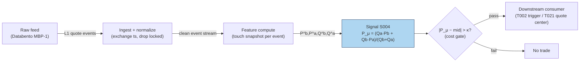

## Stage 4/200 — S004: Microprice (Stoikov)

*Batch SB1 · Signal 4/100 · Provenance [D] · Family A — Microstructure & order flow*

### S1. One-line verdict

| | |
|---|---|
| **What it is** | A size-weighted (cross-weighted) mid-price: an unbiased short-horizon estimator of the "true" price, better than the plain mid. |
| **When it works** | As a fair-value anchor for quoting and for fading transient mid deviations; tight-spread, visible-book names. |
| **When it dies** | Spoofed books, dominant hidden liquidity, one-tick-wide flickering spreads — anywhere displayed size lies. |
| **Build-or-buy in one line** | Build — two multiplications and a division on your S001/S003 feed; the full Markov-chain estimator is the only part worth licensing time for. |

Provenance: **[D]** — Stoikov (2018), "The micro-price: a high-frequency estimator of future prices," *Quantitative Finance* 18(12): 1959–1966. Note carried from the source entry: the closed-form weighted mid below is the common implementation; Stoikov's full state-transition microprice derives the adjustment from imbalance-state dynamics — do not double-count with S003.

### S2. How it works — plain human explanation

At 9:47:03.214 the book reads bid 231.40 × 1,048, ask 231.41 × 234, mid 231.405. The plain mid says "fair value is 231.405." But look at the queues: 1,048 shares bid vs 234 offered. The next trade is far more likely to be a buy chewing through that thin ask — printing at 231.41 — than a sell. So is 231.405 really the best guess of where the price is going? No: the *expected* next price leans toward the ask.

The microprice formalizes that lean. Instead of weighting both quotes equally (the mid), it cross-weights: the bid price gets the *ask's* size as its weight and vice versa. Heavy bid queue → the estimate slides toward the ask price. The intuition: the side with more resting size is the side less likely to be consumed, so the efficient price sits closer to the *opposite* quote — the price the next marketable order will most likely print at.

Why "micro"? Because it lives at the tick scale and updates every quote event. Stoikov showed it is a martingale by construction — the limit of expected future mid-prices — which is the mathematical way of saying "this is what 'fair' means once you condition on the book." Empirically (2018 paper): it predicts short-term prices better than the mid-price *or* the ordinary weighted mid-price.

Three-bullet mental model:

- **The mid assumes symmetry; the book is never symmetric.** Microprice corrects the mid for the one asymmetry you can see: queue sizes.
- **It is a fair-value estimator, not a trade.** You fade deviations from it (buy below, sell above) or center your quotes on it — you don't "buy the microprice."
- **Closed form ≈ first order.** The one-line formula is the implementable approximation; Stoikov's full estimator learns the imbalance→price transition from data. Don't confuse the two when you benchmark.

### S3. The math — exact formula

$$P_{\mu} = \frac{Q^a \cdot P^b + Q^b \cdot P^a}{Q^b + Q^a},$$

with P^b, P^a the best bid/ask prices and Q^b, Q^a the displayed sizes at the touch. The signal is the deviation:

$$s_t = P_{\mu,t} - m_t, \qquad m_t = \frac{P^b_t + P^a_t}{2}.$$

Cross-weighting means: bid price × ask size. When the bid queue dominates (Q^b ≫ Q^a), P_μ → P^a — the estimate leans to the ask, exactly the queue-depletion logic of S003. Indeed the identity (verified algebra):

$$P_{\mu} - m = \frac{s}{2}\cdot I, \qquad s = P^a - P^b,\;\; I = \frac{Q^b - Q^a}{Q^b + Q^a}.$$

The microprice deviation is half the spread times the S003 imbalance — on the touch, S003 and S004 are the same information in different units. They diverge with the N-level extension and with Stoikov's dynamic (Markov-chain) estimator.

N-level version: replace Q^b, Q^a with cumulative sizes over the top *N* levels (prices stay the touch quotes):

$$P^{(N)}_{\mu} = \frac{\left(\sum_{i=1}^{N} Q^a_i\right) P^b + \left(\sum_{i=1}^{N} Q^b_i\right) P^a}{\sum_{i=1}^{N} (Q^b_i + Q^a_i)}.$$

Parameter table:

| Parameter | Symbol | Typical range | Too small | Too large | Default (example) |
|---|---|---|---|---|---|
| Levels | N | 1 (touch) – 5 | misses deep book | stale/gameable size | *1 — example, not an institutional standard* |
| Entry threshold | κ | 0.1 – 0.5 × spread | fee death by a thousand fills | never trades | *0.25 × spread — example* |
| Holding horizon | h | seconds | noise | deviation mean-reverts away | *5 s — example* |
| Smoothing | — | raw or short EWMA | flicker | lag | *raw — example* |

Causal timing: computed from the snapshot at event *t* using only data ≤ *t*; tradable no earlier than *t+1*. Variants: (1) touch microprice (canonical closed form); (2) N-level cumulative; (3) Stoikov's full learned estimator — imbalance-state Markov chain fit on history, strictly richer, needs a training pipeline.

### S4. Worked example — step-by-step numbers (SYNTHETIC)

Same synthetic tape as S001/S003 (`batches/SB1/plot_S004.py`, `seed 42`). All numbers **synthetic**; no fees, no latency — arithmetic illustration, not a backtest. Deviation in basis points: (P_μ − mid)/mid × 10⁴.

| ev | bid | qb | ask | qa | mid | P_μ | dev (bps) |
|---|---|---|---|---|---|---|---|
| 0 | 231.40 | 635 | 231.41 | 432 | 231.4050 | 231.4060 | +0.04 |
| 1 | 231.40 | 1048 | 231.41 | 432 | 231.4050 | 231.4071 | +0.09 |
| 2 | 231.40 | 1048 | 231.41 | 234 | 231.4050 | 231.4082 | +0.14 |
| 3 | 231.41 | 260 | 231.41 | 234 | 231.4100 | 231.4100 | +0.00 |
| 4 | 231.41 | 260 | 231.42 | 688 | 231.4150 | 231.4127 | −0.10 |
| 5 | 231.41 | 260 | 231.42 | 946 | 231.4150 | 231.4122 | −0.12 |
| 6 | 231.41 | 153 | 231.42 | 946 | 231.4150 | 231.4114 | −0.16 |
| 7 | 231.40 | 715 | 231.42 | 946 | 231.4100 | 231.4086 | −0.06 |
| 8 | 231.40 | 715 | 231.42 | 486 | 231.4100 | 231.4119 | +0.08 |
| 9 | 231.40 | 1002 | 231.42 | 486 | 231.4100 | 231.4135 | +0.15 |
| 10 | 231.40 | 1002 | 231.43 | 732 | 231.4150 | 231.4173 | +0.10 |

Hand-check ev6: (946 × 231.41 + 153 × 231.42)/1099 = (218,913.86 + 35,407.26)/1099 = 254,321.12/1099 = 231.4114. Deviation: (231.4114 − 231.415)/231.415 × 10⁴ = −0.16 bps. Check the identity on ev2: s = 0.01, I = +0.6349 → (0.01/2)(0.6349) = 0.00317; P_μ − mid = 231.4082 − 231.405 = 0.0032 ✓.

**What to notice.** The deviations are tiny — at most 0.16 bps — because a 1-cent spread on a $231 stock is itself only ~0.43 bps; the microprice can never stray further than half the spread from mid. That is the point and the warning: the edge per event is a *fraction of the spread*, so it only survives as a quoting advantage (better limit placement, less adverse selection), never as a market-order scalp after fees. Note ev3: spread collapsed to zero (bid = ask = 231.41 in this synthetic tape — a locked book the S6 checklist would drop) and P_μ = mid exactly.

### S5. Strategies that use this signal

- **T002 — Microprice Fair-Value Scalper** — primary trigger: trades toward the microprice-implied fair value with volume-delta confirmation and a spread-decomposition cost gate.
- **T021 — Avellaneda–Stoikov Inventory Skew MM** — fair-value anchor: quotes are skewed around the microprice (not the mid) so the book's asymmetry is priced in.
- **T085 — Resiliency Market Maker** — quoting anchor alongside LOB resiliency: re-center quotes on P_μ after temporary-impact dislocations.

### S6. Data required — exact spec

| Field | Type | Granularity | Source tier | Notes |
|---|---|---|---|---|
| Best bid/ask prices + sizes | float / int | every quote event (L1); L2 for N-level | Tier 2 | same feed as S001/S003 |
| Exchange timestamps | int64 ns | per event | Tier 2 | fair-value staleness = adverse selection |
| Halt/auction flags | bool | per event | Tier 1 | drop locked/crossed books (cf. ev3) |

Collection: any L1 feed (Databento MBP-1 per the report entry; N-level needs MBP-10). Ingest sketch (≤20 lines):

```python
import polars as pl
mp = (pl.scan_parquet("aapl_mbp1.parquet")        # 1: L1 deltas, exchange-time order
        .sort("ts_event")
        .with_columns(qb=pl.col("bid_sz_00"),     # 2: touch state
                      qa=pl.col("ask_sz_00"),
                      bid=pl.col("bid_px_00"),
                      ask=pl.col("ask_px_00"))
        .filter((pl.col("ask") > pl.col("bid")))  # 3: drop locked/crossed
        .with_columns(                            # 4: the estimator: one formula
            mid=(pl.col("bid") + pl.col("ask")) / 2,
            pmu=(pl.col("qa") * pl.col("bid") +
                 pl.col("qb") * pl.col("ask")) /
                (pl.col("qb") + pl.col("qa")))
        .with_columns(dev_bps=(pl.col("pmu") - pl.col("mid"))
                      / pl.col("mid") * 1e4)      # 5: signal in bps
        .collect())
```

Storage: same as S001/S003 — L1 ≈ 2–8 GB/symbol-day parquet (`notes/cost-model.md` §4); the signal is two float columns. Data-quality checklist: exchange timestamps, drop crossed/locked books, halt/auction masks, split adjustments, odd-lot quote handling.

### S7. Local build on M5 Max / 128GB

**Feasibility: trivial.** Two multiplications and a division per quote event — cheaper than S003's division. Python+polars handles a 50-symbol universe live without noticing; the §2 sizing (100k events/sec → Python borderline, Rust comfortable) applies unchanged, with the microprice adding negligible marginal cost over the S001 ingest you already run.

Stack options:

| Stack | When to pick |
|---|---|
| Python + polars | everything, including live — the math is O(1) |
| Rust | only as part of a shared S001/S003 Rust ingest |
| N-level variant | needs MBP-10; same stacks, ~10× the event rate |

RAM: per §3, L1 touch quotes ≈ 0.5–4 GB/symbol-day working set — trivial for intraday; 60-day single-symbol history does not fit the 77 GB budget, stream per-symbol daily files. The *full* Stoikov estimator (Markov chain over imbalance states) is the only version with real compute: fitting transition matrices per symbol is a small batch job (minutes in polars/numpy), inference stays O(1).

Engineering time: Tier M per plan §6, light end — **20–40 h** ≈ $3,000–6,000 loaded-cost estimate at $150/hr, shared almost entirely with S001/S003 plumbing; add ~4 h for the learned-estimator prototype if you want the full version. What breaks first at 500 symbols: nothing in the math — the feed bill, and the honesty of your timestamps.

### S8. Buy vs build

| Option | What you get | Indicative price | Gains | Loses |
|---|---|---|---|---|
| Tier 0: delayed quotes | free L1 | ~$0 — *indicative, verify before budgeting* | $0 prototype | no live fair value |
| Tier 1: Polygon / Alpaca SIP | real-time SIP L1 | ~$30–200/mo — *indicative, verify before budgeting* | cheap live data | stale microprice in a race — *simulated only — requires MBO/ITCH* for quoting claims |
| Tier 2: Databento MBP-1/10 | exchange-timestamped L1/L2 | ~$200/mo + usage — *indicative, verify before budgeting* | honest snapshots; N-level needs MBP-10 | usage meter |

Verdict: **build.** The closed form is three lines on data you already buy; no vendor sells a better touch microprice than your own arithmetic. The one legitimate buy consideration is the *learned* estimator — but even that is a small in-house fit, not a product. Crossover: none on cost; the decision is feed tier (SIP vs direct), governed by whether you quote live or research offline.

### S9. Success ratio / efficacy — documented evidence

| Study / source | Market & period | Metric | Before/after cost | Caveat |
|---|---|---|---|---|
| Stoikov (2018), *Quant. Finance* 18(12) | high-frequency equity data | microprice empirically a better predictor of short-term prices than the mid-price or the weighted mid-price | before-cost (prediction accuracy, not P&L) | martingale construction; no trading costs, no Sharpe |
| Stanford MS&E 448 course report (2021), AAPL dataset | US equity, student replication | compares naive/mid/weighted-mid/microprice fair-value constructions on real data | before-cost (practitioner reconstruction) | coursework, not peer-reviewed |

Only before-cost numbers exist in what I could verify — both rows are prediction-accuracy results, not after-cost trading P&L. I found **no published after-cost Sharpe for a microprice-deviation scalper**; the literature positions the microprice as a *fair-value input to quoting* (adverse-selection reduction), where the "return" shows up as lower effective spread paid, not as a strategy Sharpe.

Honest bottom line: as a *standalone trigger* this is a sub-spread edge — the worked example's max deviation was 0.16 bps, and crossing the spread to chase it is arithmetic suicide. As a *filter / quoting anchor* (T021, T085: center quotes on P_μ instead of mid) it is one of the cheapest genuine improvements in market microstructure — the value is measured in reduced adverse selection, which is exactly what Stoikov's construction targets.

### S10. Failure modes & pitfalls

1. **Sub-spread edge vs full-spread cost** — deviation ≤ half the spread; market orders lose by construction. Mitigation: use only for passive quoting / fill improvement, never for taking.
2. **Spoofed displayed size** — the cross-weighting trusts the queues. Mitigation: lifetime-weighted sizes; toxicity overlay (S008).
3. **Hidden liquidity** — invisible size breaks the weighting. Mitigation: treat P_μ as a noisy proxy; shrink deviations toward zero in dark-heavy names.
4. **Locked/crossed books** — formula degenerates (cf. ev3). Mitigation: drop non-positive-spread snapshots before computing.
5. **Lookahead leakage** — computing P_μ from the post-trade book. Mitigation: event-*t* snapshot → earliest action *t+1*.
6. **Overfitting the learned estimator** — Markov-chain transition matrices fit on one regime. Mitigation: walk-forward refits; compare against the closed form as a baseline that cannot overfit.
7. **Double-counting S003** — on the touch, (s/2)·I *is* the deviation; stacking both as "independent" features. Mitigation: use one, or orthogonalize.
8. **Latency/staleness** — a stale microprice is a worse fair value than a fresh mid. Mitigation: direct-feed timestamps; SIP work labeled *simulated only — requires MBO/ITCH*.

### S11. Visuals




### S12. Sources

1. Stoikov, S. (2018). "The micro-price: a high-frequency estimator of future prices." *Quantitative Finance* 18(12): 1959–1966 — https://econpapers.repec.org/article/tafquantf/v_3a18_3ay_3a2018_3ai_3a12_3ap_3a1959-1966.htm (martingale construction; beats mid and weighted mid as a short-term predictor).
2. Stoikov, S. (2017). "The Micro-Price: A High Frequency Estimator of Future Prices." Working paper (Nov 2017) — https://github.com/shaileshkakkar/MicroPriceIndicator/raw/refs/heads/master/Micro-Price%20Indicator.pdf (full definition, limit-of-expected-midprices construction).
3. Stanford MS&E 448 (2021), course final report — http://stanford.edu/class/msande448/2021/Final_reports/gr1.pdf (practitioner reconstruction comparing mid, weighted mid, and microprice fair-value estimators on an AAPL dataset).

**Chatbot source log.** Q-SB1-1 asked for the microprice alongside OFI and queue imbalance, but the Duck.ai answer (GPT-5.6 Luna, 2026-09-10) covered only the OFI portion — no usable microprice content was returned. Source log: Duck.ai answered Q-SB1-1 (OFI portion only — not the microprice portion); Grok/Cursor answers pending (checked 2026-09-10).

**Unverified leads:**
- Practitioner note (GitHub `jy447/vpin-model` README): the closed-form cross-weighted mid is a *first-order* approximation of Stoikov's full estimator; an author's reference implementation exists at `github.com/sstoikov/microprice` — I did not verify that repository resolves, so it stays here, not in Sources.
- Cartea, Jaimungal & Penalva (2015), *Algorithmic and High-Frequency Trading*, Cambridge University Press, §10 — the report's cited corroboration for the N-level/weighted-mid construction; no public URL verified, kept as a lead rather than a checked source.
