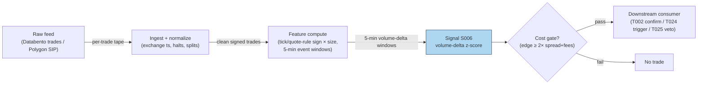

## Stage 6/200 — S006: Signed trade imbalance (volume delta)

*Batch SB1 · Signal 6/100 · Provenance [SR] · Family A — Microstructure & order flow*

### S1. One-line verdict

| | |
|---|---|
| **What it is** | Net aggressive buy-minus-sell share volume over a window — the signed footprint of who hit whom. |
| **When it works** | When order flow is autocorrelated (institutions splitting orders) and you act within seconds-to-minutes of the imbalance print. |
| **When it dies** | News-driven flow everyone sees; thin tapes where one print dominates; after the imbalance is already in the price. |
| **Build-or-buy in one line** | Build: it is one classification rule plus a rolling sum — the feed is the only real cost. |

Provenance **[SR]** (standard reconstruction) — the report tags this signal [SR]; the formula
below is the textbook reconstruction of the trade-sign literature, not a quoted implementation.
Family **A — Microstructure & order flow**.

### S2. How it works — plain human explanation

Picture 9:47:03 on a normal Tuesday. AAPL's book sits at bid 231.40 × 800 / ask 231.41 × 300.
Over the next 40 seconds, fourteen prints hit the tape: twelve lift the offer for 4,100 shares
total, two hit the bid for 600. Nobody needs a PhD to feel the asymmetry — buyers are paying
up, sellers are standing aside. Signed trade imbalance (often called **volume delta**) is just
that feeling, formalized: every trade gets a sign, +1 if the buyer was the aggressor, −1 if the
seller was, multiply by size, add it up. A window reading +3,500 shares says aggressive demand
just exceeded aggressive supply by 3,500 shares; the market makers who absorbed it are now long
inventory they did not want, and the standard inventory story says they shade quotes upward to
work it off — which is price pressure you can trade against, or ride.

Why should this predict anything at all? Two economic channels:

- **Adverse selection.** Some aggressive flow is informed. The counterparty who keeps getting
  lifted eventually concludes the buyer knows something, and revises the mid upward. The
  imbalance is the observable trace of that learning.
- **Inventory.** Even uninformed flow moves prices: a dealer who just bought 3,500 shares from
  panicky sellers lowers both bid and ask to attract buyers and discourage more sellers
  (the classic Stoll inventory logic). While the inventory is being worked off, the drift
  continues — and order splitting means today's imbalance predicts tomorrow's, because the
  same institution is still working the order.

Both channels point the same way short-term: signed imbalance today, price drift in the same
direction over the next seconds-to-minutes, then partial reversal as pressure dissipates.

**Mental model (3 bullets):**
- Volume delta is the *realized* demand shock — the bill the market just handed liquidity providers.
- It works because flow is sticky (order splitting) and counterparties shade quotes while they digest it.
- It is a *flow* measure, not a *value* measure: it says nothing about fair value, only about who is in a hurry.

### S3. The math — exact formula

Let trades in window $t$ be indexed $i = 1,\dots,N_t$, each with price $P_i$ and size $V_i$
(shares). Assign an aggressor sign $\varepsilon_i \in \{+1,-1\}$ ($+1$ = buyer-initiated):

**Raw imbalance (shares):**
$$\mathrm{TI}_t = \sum_{i=1}^{N_t} \varepsilon_i \, V_i$$

**Normalized delta (dimensionless, −1 to +1):**
$$\Delta_t = \frac{V^{\text{buy}}_t - V^{\text{sell}}_t}{V^{\text{buy}}_t + V^{\text{sell}}_t}
= \frac{\mathrm{TI}_t}{\sum_i V_i}$$

**Signal form (z-score against trailing window of length $L$):**
$$z_t = \frac{\Delta_t - \mu_{t-L:t-1}}{\sigma_{t-L:t-1}}$$

**Predictive regression form** (the Chordia–Subrahmanyam style specification):
$$r_{t+1} = a + b \cdot \mathrm{OIB}_t + \gamma' X_t + u_{t+1}$$
where $r_{t+1}$ is the next-window return, $\mathrm{OIB}_t$ is the imbalance, and $X_t$ are
controls (lagged return, volume, spread).

**Trade signing — the tick rule** (Lee–Ready style, no quote data needed): with previous
trade price $P_{i-1}$,
$$\varepsilon_i = \begin{cases}
+1 & P_i > P_{i-1} \\
-1 & P_i < P_{i-1} \\
\varepsilon_{i-1} & P_i = P_{i-1}\ \text{(carry forward)}
\end{cases}$$
With contemporaneous quotes available, prefer the quote rule: $\varepsilon_i = +1$ if
$P_i$ is closer to the ask (or at/above the mid), $-1$ if closer to the bid; exchange
aggressor flags (where available, e.g. futures) beat both.

**Causal timing:** computed at event $t$ using only trades with timestamps $\le t$;
a strategy may trade on it no earlier than event $t+1$ (in practice, one event plus
your wire latency later).

| Parameter | Symbol | Typical range | Too small | Too large | Default (example) |
|---|---|---|---|---|---|
| Aggregation window | $N_t$ / time $W$ | 30 s – 30 min, or 50–1000 trades | noise dominates; single prints whip the sign | stale; the move already happened | 5-min rolling *example — not an institutional standard* |
| Z-score lookback | $L$ | 20–100 windows | unstable $\sigma$, false triggers | slow to adapt to regime/vol changes | 50 windows *example* |
| Entry threshold | $z^*$ | 1.0–2.5 | churn on noise | misses the trade | 1.5 *example — not an institutional standard* |
| Signing method | — | tick rule / quote rule / aggressor flag | misclassification on locked/crossed or midpoint prints | n/a (flags unavailable on equities) | quote rule where NBBO exists *example* |

**Normalization choices:** raw $\mathrm{TI}_t$ (shares) is only comparable within one symbol
and one vol regime; normalized $\Delta_t$ compares across symbols; z-score compares across
regimes. Practitioners usually trade the z-score. **Variants:** (1) trade-count imbalance
($\sum \varepsilon_i$, unweighted — robust to block prints); (2) dollar imbalance
($\varepsilon_i P_i V_i$ — comparable across price levels); (3) volume-clock aggregation
(imbalance per 1,000-share bucket — cf. S008 VPIN's bucketing).

### S4. Worked example — step-by-step numbers (SYNTHETIC)

All numbers below are **synthetic** (random seed 42), hand-computable, and identical to the
data plotted in S11. Prices were fixed by hand; sizes drawn from the seed.

| # | Price ($) | Size | $\varepsilon$ (tick rule) | Signed vol | Cumul. TI |
|---|---|---|---|---|---|
| 1 | 100.00 | 171 | +1 (vs prior 99.99) | +171 | +171 |
| 2 | 100.02 | 719 | +1 | +719 | +890 |
| 3 | 100.01 | 623 | −1 | −623 | +267 |
| 4 | 100.01 | 451 | −1 (zero tick, carry) | −451 | −184 |
| 5 | 100.03 | 446 | +1 | +446 | +262 |
| 6 | 100.05 | 786 | +1 | +786 | +1,048 |
| 7 | 100.04 | 168 | −1 | −168 | +880 |
| 8 | 100.06 | 657 | +1 | +657 | +1,537 |
| 9 | 100.08 | 261 | +1 | +261 | +1,798 |
| 10 | 100.07 | 175 | −1 | −175 | +1,623 |
| 11 | 100.09 | 521 | +1 | +521 | +2,144 |
| 12 | 100.11 | 880 | +1 | +880 | +3,024 |

**Step 1 — sign each trade.** Trade 4 prints at the same price as trade 3, so the tick rule
carries forward $\varepsilon_3 = -1$. Everything else signs by uptick/downtick.

**Step 2 — window deltas.** In 3-trade windows:
- W1 (trades 1–3): $(171+719-623)/(171+719+623) = 267/1513 = +0.1765$
- W2 (trades 4–6): $(-451+446+786)/1683 = 781/1683 = +0.4641$
- W3 (trades 7–9): $(-168+657+261)/1086 = 750/1086 = +0.6906$
- W4 (trades 10–12): $(-175+521+880)/1576 = 1226/1576 = +0.7779$

**Step 3 — z-score.** Mean of the four deltas $= 0.5273$, sample std $= 0.2692$;
$z_{W4} = (0.7779 - 0.5273)/0.2692 = \mathbf{+0.93}$. Against an *example* entry
threshold of $z^* = 1.5$ (*example — not an institutional standard*), this toy print
does **not** trigger — the imbalance is visibly one-sided yet not extreme versus its
own short history, a useful reminder that "big raw number" ≠ "big signal".

**Step 4 — predictive sketch (illustration only).** With an illustrative coefficient
$b = 0.4$ bps of next-window return per 1,000 imbalance shares (*example — not a fitted
value*): $\hat r = 0.4 \times 1.226 = +0.49$ bps. This is arithmetic, not evidence.

**What to notice (and the limits):** the cumulative line climbs almost monotonically —
in this toy tape, buyers lifted the offer on 9 of 12 prints and the price rose 11 cents,
exactly the textbook pattern. Real tapes are not this clean: the equal-price print at
trade 4 shows why signing is never perfect (a midpoint cross would be worse), block
prints can flip a window's sign without meaning anything, and — critically — this toy
tape has **no fees, no spread cost, and no latency**: the +0.49 bps "prediction" is
smaller than a single half-spread on most names. Never read toy arithmetic as a backtest.

### S5. Strategies that use this signal

- **T024 — Informed-Size Tracker / Retail Fade** — primary entry trigger (direction): sustained
  signed-delta breakouts mark the stealth institutional flow this strategy follows.
- **T002 — Microprice Fair-Value Scalper** — confirmation: the volume-delta sign must agree
  with the microprice deviation before a scalp is taken (flow confirms value).
- **T025 — Trade-Classification Trend Filter** — filter/veto: extreme signed imbalance
  against the intended momentum entry vetoes the trade (flow disagrees → stand down).

### S6. Data required — exact spec

| Field | Type | Granularity | Source tier | Notes |
|---|---|---|---|---|
| Trade price | float (USD) | per-trade event | Tier 0–2 | need exchange timestamps, not SIP receipt time |
| Trade size | int (shares) | per-trade event | Tier 0–2 | odd lots included or excluded — pick one and be consistent |
| Prevailing bid/ask | float | per-trade (as-of event) | Tier 1–2 | required for quote-rule signing; else tick rule |
| Aggressor flag | bool | per-trade | Tier 2 (futures/CME) | best signing; unavailable on US equities consolidated tape |

**Collection:** Databento `trades` schema (live) or Polygon `stocks v3` trades endpoint;
1-minute SIP bars suffice only for the coarsest (unclassified) variant — real delta needs
the trade tape. **Ingest sketch (≤20 lines, polars):**

```python
import polars as pl
tape = pl.scan_parquet("trades_*.parquet")          # ts, price, size, bid, ask
signed = (tape
    .sort("ts")
    .with_columns(
        eps=pl.when(pl.col("price") > pl.col("price").shift(1)).then(1)
              .when(pl.col("price") < pl.col("price").shift(1)).then(-1)
              .otherwise(None).forward_fill().fill_null(1),   # tick rule w/ carry
    )
    .with_columns(svol=pl.col("eps") * pl.col("size"))
    .group_by_dynamic("ts", every="5m")               # event-time window
    .agg(ti=pl.col("svol").sum(), vol=pl.col("size").sum()))
delta = signed.with_columns(delta=pl.col("ti") / pl.col("vol"))
```

**Storage:** trade tape for a liquid name ≈ 2–8 GB parquet per symbol-day
(per `notes/cost-model.md` §4); the derived 5-min delta series is kilobytes.
**Data-quality checklist:** normalize to exchange timestamps (SIP latency skews signing);
adjust for splits/dividends; drop halted periods (prints during halts mis-sign);
handle DST and half-days in rolling windows; flag crossed/locked NBBO intervals where
quote-rule signing is undefined; stale prints (odd-lot, late reports) excluded or labeled.

### S7. Local build on M5 Max / 128GB

**Feasibility: feasible (Tier M).** The compute is a rolling sum over a trade tape —
the work is ingest, timestamp normalization, and signing, not math. Per
`notes/cost-model.md` §2, a Python event loop handles ~100–500k events/sec
(GIL-bound; fine for ≤20 symbols of L1/trade flow), while polars batch recompute
(10–50M rows/sec simple ops) easily covers minute-bar recomputation for hundreds of
symbols. Liquid-name trade flow runs ~10–200 trades/sec busy (§2), so a single Python
process sustains ~50–100 symbols in real time; beyond that, move signing to Rust
(5–50M events/sec, §2) or aggregate to 1-min bars. Bottleneck is **I/O and timestamp
handling**, not CPU. **RAM:** one symbol-day of trade events ≈ 0.5–4 GB (§3);
keep the live working set to a few dozen symbol-days and archive the rest as
per-symbol parquet — 500 symbols × 60 days of raw events **does not fit** (§3),
so research uses sampled windows or bar-aggregated history. **Stack:** Python+polars
for research and ≤50-symbol live; Rust for the full-universe event loop; DuckDB for
ad-hoc tape forensics.

**Engineering:** Tier M, 20–60 h (`notes/cost-model.md` §5) — most of it is the
signing/validation harness and the corporate-action/halt filters, not the formula.
At $150/hr loaded: **$3,000–9,000** *loaded-cost estimate*, plus data (Tier 1
~$30–200/mo *indicative — verify before budgeting*). **What breaks first at
500 symbols:** the Python loop (switch to Rust or bar aggregation); at full OPRA
scale, ingest bandwidth and parquet write throughput.

### S8. Buy vs build

| Option | What you get | Indicative price | Gains | Loses |
|---|---|---|---|---|
| Tier-0 free (Alpaca IEX trades, Stooq) | Trade tape, delayed/IEX-only | ~$0 | $0 cost, fine for prototyping | IEX-only prints mis-sign vs NBBO; no history depth |
| Tier-1 retail (Polygon Stocks Advanced, Alpaca SIP) | Full SIP trade tape + NBBO | ~$30–200/mo | proper quote-rule signing, corporate actions | SIP timestamps, no depth, no aggressor flags |
| Tier-2 professional (Databento) | Exchange-stamped trades+quotes | ~$200/mo + usage | exchange timestamps, cleanest signing | usage meter runs on full-universe backfill |
| Academic/institutional (TAQ via WRDS) | Gold-standard research tape | institutional $$$ | publication-grade history | access friction, cost |

All prices *indicative — verify before budgeting* (per `notes/cost-model.md` §6).
**Verdict: build if** you need custom windows, signing choices, or symbol-specific
thresholds (you cannot buy your own z-score lookback); **buy the feed, never the
signal** — no vendor sells "volume delta alpha", they sell the tape. Crossover:
build the estimator on a Tier-1 SIP feed; upgrade to Tier-2 only when timestamp
accuracy demonstrably changes your fill simulation.

### S9. Success ratio / efficacy — documented evidence

| Study / source | Market & period | Metric | Before/after cost | Caveat |
|---|---|---|---|---|
| Chordia & Subrahmanyam (2004), "Order Imbalance and Individual Stock Returns" | NYSE, daily, 1988–1998 | Imbalance-based strategies: statistically significant returns | **Before-cost** (gross; paper notes magnitudes are "moderate", consistent with intermediary equilibrium) | Daily horizon, not intraday; Lee–Ready signing on 1990s tape |
| Chordia, Roll & Subrahmanyam (2002), "Order imbalance, liquidity, and market returns" | NYSE market-wide, daily | Contemporaneous + lagged imbalances strongly move market returns | **Before-cost** (market-level regression, not a strategy) | Aggregate, not a tradeable signal per name |
| Evans & Lyons (2002), "Order Flow and Exchange Rate Dynamics" | FX (DEM/USD), daily | Order-flow regression $R^2 > 60\%$; $1bn net buys → +0.5\%$ price | **Before-cost** (contemporaneous fit, not a strategy) | FX interdealer market; contemporaneous, not predictive |
| Hasbrouck (1991), "Measuring the Information Content of Stock Trades" | NYSE | Trade innovations have protracted, concave-in-size price impact | **Before-cost** (VAR impulse response) | Confirms the mechanism (signed flow moves quotes); no strategy P&L |

Regimes where it fails: macro-news flow (imbalance is public information, instantly
priced); one-print-dominated windows in illiquid names; the post-2010s electronification
that shortened the half-life of simple flow signals (documented anomaly-decay pattern,
e.g. McLean & Pontiff 2016). No checkable published source was found reporting an
after-cost Sharpe for a standalone volume-delta intraday strategy — that absence is
itself information.

**Honest bottom line:** as a standalone directional trigger this is a *weak, heavily
competed* edge before costs and roughly zero after costs at retail scale; as a
**confirmation filter** on a fair-value or momentum entry (the T002/T025 roles), it is
a defensible, cheap, well-understood screen.

### S10. Failure modes & pitfalls

1. **Lookahead leakage** — signing with quotes timestamped after the trade (SIP skew).
   *Mitigation:* as-of joins on exchange timestamps; lag the quote by your measured feed delay.
2. **Staleness/latency** — a 5-min window computed on a 2-min-delayed feed is a history lesson.
   *Mitigation:* measure end-to-end latency; shorten windows to exceed it or don't trade it.
3. **Crowding/alpha decay** — every HFT desk computes this; half-lives compressed post-2010.
   *Mitigation:* treat as filter, not edge; re-estimate the predictive coefficient quarterly.
4. **Cost blowup** — predicted moves are often sub-half-spread (as in S4's +0.49 bps sketch).
   *Mitigation:* model spread+fees explicitly (S014); require predicted edge ≥ 2× round-trip cost.
5. **Regime breaks** — news days flip the sign logic (imbalance chases price, not vice versa).
   *Mitigation:* gate on a news/vol regime filter; stand down in the first minutes after scheduled releases.
6. **Overfitting/parameter mining** — window × lookback × threshold grids will always find a
   "good" backtest. *Mitigation:* fix parameters from the literature ranges in S3; validate on
   purged/embargoed splits (S088).
7. **Data errors** — bad prints, late reports, split-unadjusted prices corrupt signing.
   *Mitigation:* corporate-action adjustment, price/spread sanity filters, drop crossed markets.
8. **Microstructure noise vs signal** — bid-ask bounce creates spurious signed "flow" on the
   tick rule. *Mitigation:* prefer quote-rule signing; exclude sub-spread price changes.

### S11. Visuals




### S12. Sources

- Chordia, T. & Subrahmanyam, A. (2004). "Order Imbalance and Individual Stock Returns:
  Theory and Evidence." *Journal of Financial Markets*, 7(2), 111–130.
  https://papers.ssrn.com/sol3/papers.cfm?abstract_id=354122
- Chordia, T., Roll, R. & Subrahmanyam, A. (2002). "Order imbalance, liquidity, and
  market returns." *Journal of Financial Economics*, 65(1), 111–130.
  https://dl.icdst.org/pdfs/files/910bb6cf2390c9809f5ddc743b83ff92.pdf
- Evans, M. D. D. & Lyons, R. K. (2002). "Order Flow and Exchange Rate Dynamics."
  *Journal of Political Economy*, 110(1), 170–180.
  https://ideas.repec.Org/a/ucp/jpolec/v110y2002i1p170-180.html
- Hasbrouck, J. (1991). "Measuring the Information Content of Stock Trades."
  *Journal of Finance*, 46(1), 179–207.
  http://ideas.repec.org/a/bla/jfinan/v46y1991i1p179-207.html
- Kyle, A. S. (1985). "Continuous Auctions and Insider Trading." *Econometrica*,
  53(6), 1315–1335. (Theoretical origin; report citation, no URL verified.)

**Chatbot source log:** chatbot answers pending (checked 2026-09-10) — grok-answers.md
and cursor-answers.md were absent from batches/SB1/.

**Unverified leads**
- Cont, R., Kukanov, A. & Stoikov, S. — "The Price Impact of Order Book Events"
  (reported arXiv:1011.6402 in the batch question log; not independently verified by
  this chapter) — relevant to the OFI price-impact regression variant.
