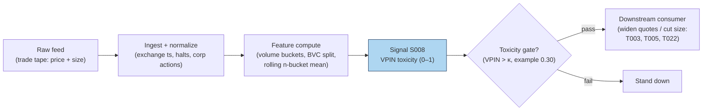

## Stage 8/200 — S008: VPIN (flow toxicity)

*Batch SB1 · Signal 8/100 · Provenance [D] · Family A — Microstructure & order flow*

### S1. One-line verdict

| | |
|---|---|
| **What it is** | Volume-clocked buy/sell imbalance averaged over buckets — a real-time proxy for how "toxic" (adversely selective) order flow is. |
| **When it works** | As a regime gate: widening quotes / cutting size when toxicity spikes keeps market-making books alive through stress episodes. |
| **When it dies** | As a directional trigger: it has no documented directional edge, and its famous flash-crash prediction did not survive replication. |
| **Build-or-buy in one line** | Build: fifty lines on a trade tape; the classification choice matters more than the code. |

Provenance **[D]** (documented) — the construction below follows Easley, López de Prado &
O'Hara's published VPIN specification, with the documented critiques carried alongside.
Family **A — Microstructure & order flow**.

> Standing caveat for this chapter: VPIN is a **toxicity/regime gate, not a standalone
> directional trigger**. Nothing in the replicated literature supports trading its level
> for direction; the honest use is defensive — quoting, sizing, and stand-down rules.

### S2. How it works — plain human explanation

A market maker is an insurance company that doesn't get to underwrite. All day, strangers
arrive wanting to trade; some are uninformed (rebalancing, noise), some know something the
maker doesn't. When the informed share of flow is high, the maker systematically loses —
this is **adverse selection**, and Easley–O'Hara's word for its intensity is **flow toxicity**.
The problem: toxicity isn't observable trade by trade. VPIN is an attempt to see it in the
rear-view mirror fast enough to act.

The trick is the clock. In calendar time, a frantic minute and a dead minute look the same
length; in **volume time**, each "bucket" holds the same number of shares, so buckets
arrive fast when the market is frantic and slow when it's dead — automatically adjusting
for pace. Inside each bucket, trades are split into buy volume and sell volume
(**bulk volume classification**, BVC, from each trade's price change). If buys and sells
roughly balance, flow looks uninformed; if one side dominates bucket after bucket, someone
may know something. VPIN averages that one-sidedness over a rolling window of buckets.

Vignette: 10:15, ES futures. The last four 50,000-contract buckets printed imbalances of
31%, 8%, 44%, 12% — VPIN ≈ 0.24, elevated. The desk's rule (*example — not an institutional
standard*): above 0.30, halve quote size and widen the spread by 50%. At 10:31 a macro
headline hits; the desk is already small. Whether the headline was "predicted" is
irrelevant — the book survived because it was defensive when flow looked toxic. That is
the entire honest bull case for VPIN.

**Mental model (3 bullets):**
- VPIN measures *one-sidedness of flow in volume time* — a proxy for the probability
  you're trading against someone better informed.
- It is defensive infrastructure (a smoke detector), not an offensive weapon (a compass):
  it tells you when to be careful, never which way to bet.
- Its value lives or dies on the classification step: garbage buy/sell splits in,
  garbage toxicity out.

### S3. The math — exact formula

Partition the tape into **equal-volume buckets** $\tau = 1, 2, \dots$, each holding
$V$ shares (Easley–López de Prado–O'Hara's default: $V = \mathrm{ADV}/50$, i.e. 50
buckets per day — *example — not an institutional standard*).

**Bulk volume classification (BVC):** for trade $i$ in bucket $\tau$ with price change
$\Delta P_i = P_i - P_{i-1}$ and size $v_i$, with $\sigma_{\Delta P}$ the recent std of
price changes:
$$V^B_\tau = \sum_{i \in \tau} v_i \, \Phi\!\left(\frac{\Delta P_i}{\sigma_{\Delta P}}\right),
\qquad V^S_\tau = V - V^B_\tau$$
where $\Phi$ is the standard normal CDF. (A rising print allocates most of its size to
buys; a flat print splits 50/50.)

**Per-bucket order imbalance:**
$$\mathrm{OI}_\tau = \big|V^B_\tau - V^S_\tau\big|$$

**VPIN** over a rolling window of $n$ buckets (ELO default $n = 50$ — *example*):
$$\mathrm{VPIN}_t = \frac{\sum_{\tau=t-n+1}^{t} \mathrm{OI}_\tau}{n \cdot V}$$

This is a $[0,1]$ number: 0 = perfectly balanced flow, 1 = every bucket one-sided.

**Causal timing:** bucket $\tau$ closes when its $V$-th share prints; VPIN at that moment
uses only closed buckets; any defensive action applies to buckets $\tau+1$ onward —
never retroactively.

| Parameter | Symbol | Typical range | Too small | Too large | Default (example) |
|---|---|---|---|---|---|
| Bucket size | $V$ | ADV/100 – ADV/20 | noisy OI, whipsaw gates | sluggish; stress is over before the gate fires | ADV/50 *example — not an institutional standard* |
| Rolling window | $n$ | 10–100 buckets | single toxic bucket dominates | dilutes the signal into irrelevance | 50 buckets *example* |
| Toxicity threshold | $\kappa$ | 0.2–0.5 | permanent stand-down | never fires | 0.30 *example — not an institutional standard* |
| Classification | — | BVC / tick rule / quote rule | BVC smears midpoint noise (see critiques) | — | BVC per ELO; tick rule as robustness check |

**Normalization choices:** VPIN is already normalized to $[0,1]$ by construction; cross-asset
comparison still needs care because "normal" VPIN differs by venue and ADV share.
**Variants:** (1) **TR-VPIN** — tick-rule classification instead of BVC (Andersen–Bondarenko
show the choice flips behavior); (2) quote-rule VPIN on L1 data; (3) multi-asset / futures
VPIN on the most liquid venue as a market-wide stress gauge.

### S4. Worked example — step-by-step numbers (SYNTHETIC)

**Synthetic** 10-bucket tape, random seed 7 (6 trades per bucket; BVC with
$\sigma_{\Delta P} = 0.01334$ from the seed). Same data as the S11 chart.

| Bucket | $V$ (shares) | $V^B$ | $V^S$ | $\|\mathrm{OI}\|$ | $\|\mathrm{OI}\|/V$ |
|---|---|---|---|---|---|
| 1 | 560 | 203.4 | 356.6 | 153.2 | 0.274 |
| 2 | 385 | 218.1 | 166.9 | 51.2 | 0.133 |
| 3 | 566 | 246.4 | 319.6 | 73.2 | 0.129 |
| 4 | 424 | 120.9 | 303.1 | 182.3 | 0.430 |
| 5 | 522 | 205.4 | 316.6 | 111.1 | 0.213 |
| 6 | 697 | 228.0 | 469.0 | 241.1 | 0.346 |
| 7 | 489 | 241.4 | 247.6 | 6.1 | 0.013 |
| 8 | 414 | 210.6 | 203.4 | 7.3 | 0.018 |
| 9 | 533 | 285.7 | 247.3 | 38.4 | 0.072 |
| 10 | 454 | 291.0 | 163.0 | 128.0 | 0.282 |

**Step 1 — classify.** Each trade's size is split by $\Phi(\Delta P/\sigma)$; e.g. bucket 4's
prints were mostly downticks, so only 120.9 of 424 shares classify as buys.

**Step 2 — bucket imbalance.** $|\mathrm{OI}_4| = |120.9 - 303.1| = 182.3$ shares,
ratio $182.3/424 = 0.430$ — the most one-sided bucket.

**Step 3 — rolling VPIN ($n=4$, *example*):**
- ending bucket 4: $(153.2+51.2+73.2+182.3)/(560+385+566+424) = 459.9/1935 = \mathbf{0.2377}$
- ending bucket 5: $417.8/1897 = \mathbf{0.2203}$
- ending bucket 6: $607.7/2209 = \mathbf{0.2751}$
- ending bucket 7: $495.6/1954 = \mathbf{0.2536}$
- ending bucket 8: $365.6/2122 = \mathbf{0.1723}$
- ending bucket 9: $292.9/2133 = \mathbf{0.1373}$
- ending bucket 10: $179.8/1890 = \mathbf{0.0951}$

**Step 4 — gate decision.** Against an *example* toxicity threshold $\kappa = 0.30$
(*example — not an institutional standard*): the maximum reading is 0.2751 — the gate
**never fires** in this toy run. Flow looks briefly one-sided (buckets 4–6) then
normalizes (buckets 7–9 are nearly balanced).

**What to notice (and the limits):** VPIN here behaves exactly as designed — a smooth,
lagging average of one-sidedness that rises into the toxic patch and decays after. But
notice what it *doesn't* do: it says nothing about direction (buckets 4–6 were
sell-heavy, yet the series gives no short signal — correctly, per the caveat), and the
bucket-7 reading of 0.013 shows how fast "toxicity" can vanish. This toy has no fees,
no latency, and — most importantly — no informed traders at all: the "toxicity" is pure
sampling noise, which is precisely Andersen–Bondarenko's warning that VPIN can cry wolf.

### S5. Strategies that use this signal

- **T003 — VPIN-Gated Breakout Trader** — regime gate (primary control): breakouts are
  taken only when VPIN is below the toxicity cap; the gate is the strategy's core risk control.
- **T022 — Queue-Imbalance Maker with Toxicity Cancel** — veto: resting quotes are
  cancelled when VPIN spikes (defensive exit from adverse selection).
- **T005 — RVOL-Filtered Opening-Range Breakout** — filter: ORB entries are skipped
  when opening flow prints toxic.

### S6. Data required — exact spec

| Field | Type | Granularity | Source tier | Notes |
|---|---|---|---|---|
| Trade price | float | per-trade | Tier 0–2 | BVC needs the full price path, not just closes |
| Trade size | int | per-trade | Tier 0–2 | bucketing is by shares |
| (Optional) bid/ask | float | per-trade as-of | Tier 1–2 | only for tick/quote-rule robustness variants |

**Collection:** Databento trades, Polygon stocks v3, Alpaca SIP, or TAQ — VPIN needs
nothing fancier than a trade tape with price and size, which is why it became popular.
**Ingest sketch (≤20 lines, polars):**

```python
import polars as pl
from math import erf, sqrt
Phi = lambda x: 0.5 * (1 + erf(x / sqrt(2)))
tape = pl.scan_parquet("trades_*.parquet").sort("ts").collect()
dp = tape["price"].diff()
sigma = dp.std()
buy_frac = [Phi(d / sigma) for d in dp.fill_null(0)]
tape = tape.with_columns(buy_frac=pl.Series(buy_frac),
                         buy_vol=pl.Series(buy_frac) * tape["size"])
# volume-clock buckets of V shares (V = ADV/50, example)
V = int(tape["size"].sum() / 50)
tape = tape.with_columns(bucket=(tape["size"].cum_sum() // V))
b = tape.group_by("bucket").agg(v=pl.col("size").sum(),
                                vb=pl.col("buy_vol").sum())
b = b.with_columns(oi=(pl.col("vb") - (pl.col("v") - pl.col("vb"))).abs())
vpin = (b["oi"].rolling_sum(50) / (50 * V)).alias("vpin")   # n=50 example
```

**Storage:** trade tape ≈ 2–8 GB parquet per symbol-day for liquid names
(per `notes/cost-model.md` §4); the VPIN series itself is one float per bucket —
negligible. **Data-quality checklist:** exchange (not SIP-receipt) timestamps so
buckets close in true event order; corporate actions adjusted; halts excluded
(buckets spanning a halt mix regimes); DST/half-days rescale ADV; odd-lot and
late-reported prints flagged; BVC validated against tick-rule on a sample —
if the two disagree violently, trust neither blindly.

### S7. Local build on M5 Max / 128GB

**Feasibility: feasible, near-trivial compute (Tier M for the pipeline).** VPIN is
arithmetic over a trade tape — per `notes/cost-model.md` §2, a Python loop at
~100–500k events/sec covers ≤20 symbols live, and polars batch recomputation
(10–50M rows/sec) handles a full day's tape for hundreds of symbols in seconds.
Liquid-name trade flow is only ~10–200 trades/sec busy (§2); the bottleneck is
**feed handling and bucket bookkeeping**, not math. **RAM:** one symbol-day of trades
≈ 0.5–4 GB (§3) — keep the live window to the trailing day or two per symbol and
archive the rest; 500 symbols × 60 days of raw trades **does not fit** (§3), so
research history lives as per-symbol parquet or pre-aggregated bucket series.
**Stack:** Python+polars for research and live single-book; Rust only if VPIN must
share an event loop with heavier L1 signals; DuckDB for tape forensics.

**Engineering:** Tier M, 20–60 h (`notes/cost-model.md` §5) — the formula is an
afternoon; the hours go to the BVC-vs-tick-rule validation harness, the gate
integration (quote-widening / size-cutting / kill-switch wiring), and regime
bookkeeping. At $150/hr loaded: **$3,000–9,000** *loaded-cost estimate*, plus a
Tier-1 feed ~$30–200/mo *indicative — verify before budgeting*.
**What breaks first at 500 symbols:** Python per-trade BVC (vectorize with polars/numpy
or pre-aggregate); at full OPRA scale, the trade tape itself.

### S8. Buy vs build

| Option | What you get | Indicative price | Gains | Loses |
|---|---|---|---|---|
| Tier-0 free (Alpaca IEX, Stooq) | Trade tape | ~$0 | prototype the gate for free | IEX-only flow mis-measures toxicity |
| Tier-1 retail (Polygon, Alpaca SIP) | Full SIP tape | ~$30–200/mo | proper bucketing, history | SIP timestamps blur bucket edges |
| Tier-2 professional (Databento) | Exchange-stamped tape | ~$200/mo + usage | cleanest event ordering | usage cost on full-universe backfill |
| Academic (LOBSTER/TAQ via university) | Research-grade replay | ~hundreds/yr academic | best history for validation | not a production feed |

All prices *indicative — verify before budgeting* (per `notes/cost-model.md` §6).
**Verdict: build, always** — no vendor sells "your toxicity gate"; they sell the tape,
and the ELO specification is public. Buy the cheapest feed whose timestamps you trust,
spend the budget on the classification-robustness harness instead (BVC vs tick rule —
Andersen–Bondarenko show this choice is the whole ballgame).

### S9. Success ratio / efficacy — documented evidence

| Study / source | Market & period | Metric | Before/after cost | Caveat |
|---|---|---|---|---|
| Easley, López de Prado & O'Hara (2012), "Flow Toxicity and Liquidity in a High-Frequency World" | E-mini S&P 500, incl. May 6 2010 | VPIN hit historic highs ~1h before the flash crash; correlated with short-term volatility | n/a (not a strategy; event study) | Single-venue, single-event narrative; BVC-based |
| Andersen & Bondarenko (2014), "VPIN and the Flash Crash" | E-mini S&P 500 | VPIN is a **poor** predictor of short-run volatility; did **not** peak before the flash crash but after; predictive content is mechanical (correlates with trading intensity) | n/a (replication study) | Directly contradicts the ELO flash-crash claim |
| Andersen & Bondarenko (2015), "Assessing Measures of Order Flow Toxicity…" | E-mini S&P 500, CME BBO "perfect" classification | BVC classification inferior to a simple tick rule; with accurate classification VPIN behaves oppositely; BVC-VPIN's volatility-forecast power comes from **classification errors** correlated with volume/volatility | n/a (measurement study) | Devastating for BVC-VPIN as a toxicity measure |
| Yildiz, Van Ness & Van Ness (2020), "VPIN, liquidity, and return volatility in the U.S. equity markets" | US equities | VPIN informative about liquidity and return volatility **ex ante**; useful risk-management tool for market makers/regulators | n/a (forecasting regressions, not a strategy) | Supportive but modest; risk-tool framing, not alpha |

No checkable source was found reporting a Sharpe, hit rate, or bps/trade for a VPIN
strategy — before *or* after cost. The literature tests VPIN as a volatility/liquidity
forecaster, never as a directional trigger, which is exactly why this chapter refuses
to present it as one.

**Honest bottom line:** as a standalone directional trigger this is a *zero-documented*
edge — do not trade it for direction; as a **toxicity/regime gate** for quoting and
sizing it is a *plausible, cheap, contested* risk control — the supportive evidence
(Yildiz et al. 2020) and the hostile replications (Andersen–Bondarenko 2014/2015) both
deserve weight, and any deployment should reproduce the BVC-vs-tick-rule check on its
own venue before trusting the gate.

### S10. Failure modes & pitfalls

1. **Classification error (the big one)** — BVC systematically misclassifies in fast
   markets, and the errors correlate with volatility, manufacturing fake "toxicity".
   *Mitigation:* run tick-rule VPIN in parallel; if they disagree, investigate before gating.
2. **Treating it as directional** — high VPIN does not mean "price will fall/rise".
   *Mitigation:* wire it only to sizing/quoting/stand-down logic, never to entries.
3. **Mechanical correlation with intensity** — VPIN rises when volume rises, so it
   "predicts" volatility the way a speedometer "predicts" arrival. *Mitigation:*
   benchmark the gate against a raw volume/intensity gate; keep whichever earns its keep.
4. **Parameter fragility** — bucket size and window are *examples*, not standards; results
   move with them. *Mitigation:* fix from ELO defaults, sensitivity-test ±2×, don't optimize.
5. **Stale ADV** — bucket size from last month's ADV mis-buckets this week's regime.
   *Mitigation:* rolling ADV estimate; re-bucket on corporate actions and volume regime shifts.
6. **Latency** — a toxicity gate computed on a delayed feed fires after the damage.
   *Mitigation:* measure feed delay; the gate's reaction time must beat your quote lifetime.
7. **Overfitting the threshold** — tuning $\kappa$ on the flash crash is a one-observation fit.
   *Mitigation:* threshold from out-of-sample stress episodes; prefer smooth size-scaling
   over binary stand-down.
8. **False comfort** — a low VPIN does not mean flow is safe, only that it was balanced.
   *Mitigation:* keep independent risk limits (S088-style); VPIN is one input, not the book.

### S11. Visuals




### S12. Sources

- Easley, D., López de Prado, M. M. & O'Hara, M. (2012). "Flow Toxicity and Liquidity
  in a High-Frequency World." *Review of Financial Studies*, 25(5), 1457–1493.
  (Working-paper version) http://www.stern.nyu.edu/sites/default/files/assets/documents/con_035928.pdf
- Andersen, T. G. & Bondarenko, O. (2014). "VPIN and the Flash Crash." *Journal of
  Financial Markets*, 17, 1–46. https://ideas.repec.Org/a/eee/finmar/v17y2014icp1-46.html
- Andersen, T. G. & Bondarenko, O. (2015). "Assessing Measures of Order Flow Toxicity
  and Early Warning Signals for Market Turbulence." *Review of Finance*, 19(1), 1–54.
  https://ideas.repec.Org/a/oup/revfin/v19y2015i1p1-54..html
- Yildiz, S., Van Ness, B. & Van Ness, R. (2020). "VPIN, liquidity, and return
  volatility in the U.S. equity markets." *Global Finance Journal*, 45.
  https://ideas.repec.org/a/eee/glofin/v45y2020ics1044028318302679.html

**Chatbot source log:** chatbot answers pending (checked 2026-09-10) — grok-answers.md
and cursor-answers.md were absent from batches/SB1/.

**Unverified leads**
- Practitioner claims that VPIN "predicted" various post-2010 stress episodes circulate
  in vendor marketing; no checkable replication was found — treated as unverified.
