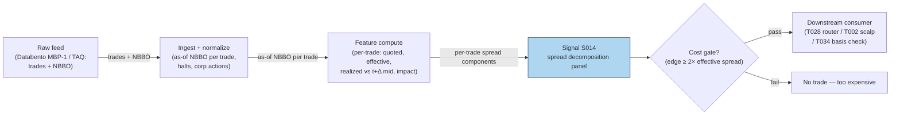

## Stage 14/200 — S014: Quoted / effective / realized spread & price-impact decomposition

*Batch SB1 · Signal 14/100 · Provenance [D] · Family A — Microstructure & order flow*

### S1. One-line verdict

| | |
|---|---|
| **What it is** | Per-trade measurement of what liquidity actually cost: quoted vs paid vs kept, split into realized profit and adverse selection. |
| **When it works** | Always — as a cost gate and diagnostic: it tells you which trades, venues, and times are too expensive to touch. |
| **When it dies** | As a directional signal: it measures cost, not alpha; wide spreads predict nothing about direction. |
| **Build-or-buy in one line** | Build the estimator on your own tape; buy Rule 605/TAQ benchmarks to calibrate it. |

Provenance **[D]** (documented) — the decomposition follows the published Huang–Stoll /
Glosten–Harris family and SEC MIDAS conventions. Family **A — Microstructure & order flow**.

### S2. How it works — plain human explanation

Three prices describe every trade, and confusing them is how strategies quietly bleed.
The **quoted spread** is the advertisement: at 9:47:03, AAPL shows bid 231.40 × 800 /
ask 231.41 × 300, so the quoted spread is 1 cent. The **effective spread** is what the
aggressor actually paid: if a buyer lifts the offer at 231.41 while the mid is 231.405,
she paid half a cent over mid — times two, the effective spread is 1 cent. Same here,
but often it isn't: price improvement, midpoint crosses, and odd-lot prints routinely
make effective spreads narrower (or wider) than quoted.

The **realized spread** asks the harder question: of that 1 cent the liquidity provider
collected, how much did she *keep*? If the mid drifts up to 231.415 five minutes later —
because the buyer knew something — the provider's "profit" evaporates: realized spread
near zero (or negative), and the difference went to **price impact**, i.e. adverse
selection. The identity is clean:

> **effective spread = realized spread + price impact**

Why does this matter economically? The quoted spread is what naive cost models charge;
the effective spread is what you actually pay; the realized spread is what a
market-making strategy actually earns; and price impact is the permanent information
content of flow — the part no liquidity provider can avoid. Huang & Stoll (1997) showed
the spread decomposes into order-processing, inventory, and adverse-selection
components; the realized/impact split is the practitioner's version of the same idea,
computable trade by trade. Every strategy in this document that pays the spread is
implicitly betting its edge exceeds the effective spread — this signal is how you check.

**Mental model (3 bullets):**
- Quoted = advertised; effective = paid; realized = kept. Never substitute one for another.
- Effective − realized = price impact = the adverse-selection tax on every aggressive trade.
- This is a *measurement* signal: its job is costing trades and gating strategies, not
  predicting direction.

### S3. The math — exact formula

For a trade at time $t$ with price $P_t$, prevailing quotes $P^b_t$ (bid), $P^a_t$ (ask),
mid $M_t = (P^b_t + P^a_t)/2$, and direction $D_t \in \{+1,-1\}$ ($+1$ = buyer-initiated):

**Quoted spread** (dollars; half-spread in basis points (bps)):
$$S^q_t = P^a_t - P^b_t, \qquad s^q_t = 100 \cdot \frac{P^a_t - P^b_t}{2 M_t}\ \text{bps}$$

**Effective spread** (what the aggressor paid vs the mid):
$$S^e_t = 2 \, D_t \, (P_t - M_t)$$

**Realized spread** (what the liquidity provider kept; $\Delta \approx$ 5 min per the
report — *example — not an institutional standard*):
$$S^r_t = 2 \, D_t \, (P_t - M_{t+\Delta})$$

**Price impact** (adverse selection; the mid's drift against the provider):
$$\mathrm{PI}_t = 2 \, D_t \, (M_{t+\Delta} - M_t) = S^e_t - S^r_t$$

All in dollars per share (multiply by 100 for cents); sign convention: positive $S^r$
means the provider profited, positive $\mathrm{PI}$ means the mid moved against the
provider (information won).

**Causal timing:** $S^e_t$ is known at trade time $t$; $S^r_t$ requires the mid at
$t+\Delta$ and is therefore a *diagnostic*, never a live trigger. A strategy gates on
*trailing averages* of these quantities, computed strictly from closed windows.

| Parameter | Symbol | Typical range | Too small | Too large | Default (example) |
|---|---|---|---|---|---|
| Realized-spread horizon | $\Delta$ | 1–30 min | noise dominates the mid move | mixes in unrelated drift | 5 min *example — not an institutional standard* |
| Aggregation window | $W$ | 30 min – 1 day | single prints dominate | stale costs | 1 trading day *example* |
| Direction rule | $D_t$ | quote rule / tick rule / LR | mis-signing flips $S^e$ sign | — | quote rule on NBBO (National Best Bid and Offer) *example* |

**Normalization choices:** dollar spreads for P&L accounting; bps of mid for cross-symbol
comparison; time-weighted vs trade-weighted vs **dollar-weighted** averaging (dollar-weight
when costing a real book). **Named variants:** (1) **Huang–Stoll (1997) three-component
regression** — $\Delta P_t = \tfrac{S}{2}(Q_t - Q_{t-1}) + (\alpha+\beta)\tfrac{S}{2}Q_t + e_t$,
splitting the spread into order-processing, inventory ($\beta$), and adverse-selection
($\alpha$) shares; (2) **Glosten–Harris (1988) trade-indicator model** — adverse selection
vs transitory (order-processing + inventory) components, with volume-dependent terms;
(3) **Roll (1984) implicit spread** $2\sqrt{-\mathrm{cov}(\Delta P_t, \Delta P_{t-1})}$ —
quote-free, for when you only have a price series (cf. S012).

### S4. Worked example — step-by-step numbers (SYNTHETIC)

**Synthetic** 12-trade tape, random seed 11. Realized spread uses the mid **3 trades
later** ($\Delta = 3$ trades — *example — not an institutional standard*; the report's
convention is $\approx$ 5 minutes). Same data as the S11 chart; cents rounded.

| # | Bid | Ask | Mid | $D$ | Price | Eff. (¢) | Real. (¢) | Impact (¢) |
|---|---|---|---|---|---|---|---|---|
| 1 | 99.990 | 100.010 | 100.000 | +1 | 100.008 | +1.52 | +2.07 | −0.55 |
| 2 | 99.992 | 100.022 | 100.007 | +1 | 100.019 | +2.40 | +1.99 | +0.42 |
| 3 | 100.008 | 100.018 | 100.013 | +1 | 100.018 | +1.01 | +2.35 | −1.34 |
| 4 | 99.996 | 100.026 | 100.011 | −1 | 99.997 | +2.64 | +2.39 | +0.26 |
| 5 | 99.999 | 100.019 | 100.009 | −1 | 99.999 | +2.09 | +2.08 | +0.01 |
| 6 | 99.996 | 100.016 | 100.006 | +1 | 100.015 | +1.70 | +0.44 | +1.26 |
| 7 | 99.994 | 100.024 | 100.009 | −1 | 99.995 | +2.85 | +1.69 | +1.16 |
| 8 | 99.994 | 100.024 | 100.009 | +1 | 100.025 | +3.29 | +2.82 | +0.47 |
| 9 | 99.998 | 100.028 | 100.013 | −1 | 99.997 | +3.12 | +2.74 | +0.38 |
| 10 | 99.993 | 100.013 | 100.003 | −1 | 99.995 | +1.78 | +3.93 | −2.15 |
| 11 | 99.996 | 100.026 | 100.011 | −1 | 99.998 | +2.58 | +3.03 | −0.45 |
| 12 | 99.996 | 100.026 | 100.011 | +1 | 100.025 | +2.92 | +2.75 | +0.16 |

**Step 1 — effective.** Trade 2: $D=+1$, $P=100.019$, $M=100.007$:
$S^e = 2(100.019-100.007) = +0.0240$ = **+2.40¢** — the buyer paid 2.40¢ round-trip
equivalent, wider than the 3.0¢ quoted spread's half (1.5¢) because of the slippage noise.

**Step 2 — realized.** Trade 2's mid 3 trades later (trade 5's mid) $= 100.009$:
$S^r = 2(P - M_{t+\Delta}) = 2(100.019-100.009) = +0.0200$ ≈ **+1.99¢** in the
table (internal mids carry more decimals than printed) — the provider kept
about two cents of the 2.40¢ the taker paid.

**Step 3 — impact.** $\mathrm{PI} = S^e - S^r = 2.40 - 1.99 = \mathbf{+0.41¢}$
(≈ +0.42¢ in the table) — equivalently $2(M_{t+\Delta} - M_t) = 2(100.009-100.007)$:
the mid barely drifted against the provider.

**Step 4 — averages.** Mean effective **+2.33¢**, mean realized **+2.14¢**, mean
impact **+0.19¢**: in this toy tape, liquidity providers collected 2.33¢ per share
and kept 2.14¢ — only 0.19¢ leaked to adverse selection.

**What to notice (and the limits):** the stacked chart makes the identity visual —
every bar's total height is the effective spread, split into kept (green) vs lost to
impact (red). Two honest artifacts of toy data: four price impacts are *negative*
(trades 1, 3, 10, 11: −0.55¢, −1.34¢, −2.15¢, −0.45¢ — the mid moved in the provider's
favor after the trade; pure noise here), and trade 1's realized spread is negative
(−0.55¢: the provider lost on that round trip). In real data, persistently negative
realized spreads flag toxic flow; here it's just the random walk. Real tapes also show
price improvement (effective < quoted) far more often than this one. And again: no
fees, no latency, twelve trades — this is arithmetic practice, not a cost study.

### S5. Strategies that use this signal

- **T028 — Spread-Decomposition Router** — primary trigger: routes and holds based on
  quoted/effective/realized spread and the adverse-selection component — this signal
  *is* the strategy's decision variable.
- **T002 — Microprice Fair-Value Scalper** — cost gate (filter): the scalp is taken
  only when the trailing effective spread is below the edge — spread decomposition as veto.
- **T034 — Index Futures Cash-and-Carry** — cost check (filter): basis trades clear
  only after spread-cost accounting on both legs.

### S6. Data required — exact spec

| Field | Type | Granularity | Source tier | Notes |
|---|---|---|---|---|
| Trade price & size | float / int | per-trade event | Tier 0–2 | |
| Prevailing NBBO bid/ask | float | per-trade, as-of (≤1 min old per HS convention) | Tier 1–2 | staleness is the #1 error source |
| Trade direction | ±1 | per-trade | derived | quote rule preferred; tick rule fallback |
| Delayed mid | float | $t+\Delta$ | derived | needs the quote tape, not just trades |

**Collection:** Databento MBP-1 (trades + top-of-book), TAQ, or Polygon SIP; Rule 605
reports give venue-level effective-spread benchmarks for calibration. **Ingest sketch
(≤20 lines, polars):**

```python
import polars as pl
t = pl.scan_parquet("trades_nbbo_*.parquet").sort("ts").collect()  # ts,P,bid,ask
t = t.with_columns(mid=(pl.col("bid") + pl.col("ask")) / 2)
t = t.with_columns(D=pl.when(pl.col("P") >= pl.col("mid")).then(1).otherwise(-1))  # quote rule
DELTA = "5m"   # example — not an institutional standard
t = t.with_columns(mid_fwd=pl.col("mid").shift(-1))  # align: use asof join on ts+Δ in prod
out = t.with_columns(
    eff=2 * pl.col("D") * (pl.col("P") - pl.col("mid")),
    impact=2 * pl.col("D") * (pl.col("mid_fwd") - pl.col("mid")),
).with_columns(rlzd=pl.col("eff") - pl.col("impact"))
```

(Production code replaces the naive `shift` with an as-of join of each trade's
$ts + \Delta$ against the quote tape.)

**Storage:** trades+NBBO ≈ 2–8 GB parquet per symbol-day liquid (`notes/cost-model.md`
§4); aggregated daily spread panels are megabytes. **Data-quality checklist:**
NBBO as-of each trade (never the *next* quote — lookahead); crossed/locked markets
excluded; corporate actions adjusted; halts dropped; odd-lot and sub-penny prints
flagged (they distort effective spreads); SIP-vs-exchange timestamp choice documented;
$\Delta$-horizon kept constant across the sample.

### S7. Local build on M5 Max / 128GB

**Feasibility: feasible (Tier M).** Per-trade arithmetic over a trades+quotes tape —
`notes/cost-model.md` §2 gives polars simple ops at ~10–50M rows/sec, so a full day's
L1 tape for one symbol decomposes in seconds; a Python loop (~100–500k events/sec)
sustains live decomposition for ≤20 symbols. The real work is the as-of join of
trades to NBBO and to the $t+\Delta$ mid — both are sorted merge-asof operations,
cheap in polars. Bottleneck is **I/O on the quote tape**, not compute. **RAM:** one
symbol-day of trades+touch quotes ≈ 0.5–4 GB (§3); 500 symbols × 60 days **does not
fit** (§3) — research on per-symbol daily files, live on a trailing window.
**Stack:** Python+polars for research and live; DuckDB when the tape already lives in
parquet and you want SQL as-of joins; Rust only if this shares a hot loop with
full-depth signals.

**Engineering:** Tier M, 20–60 h (`notes/cost-model.md` §5) — the formulas are an
hour; the as-of alignment harness, direction-rule validation, and Rule 605
calibration are the project. At $150/hr loaded: **$3,000–9,000** *loaded-cost
estimate*, plus Tier-1/2 data ~$30–200/mo (SIP) or ~$200/mo + usage (Databento)
*indicative — verify before budgeting*. **What breaks first at 500 symbols:**
the $t+\Delta$ as-of join across a sharded quote store (pre-aggregate to daily
panels); full OPRA adds the options-tape join.

### S8. Buy vs build

| Option | What you get | Indicative price | Gains | Loses |
|---|---|---|---|---|
| Tier-0 free (Alpaca IEX, Stooq) | Trades only | ~$0 | free prototyping | no NBBO → no effective spread |
| Tier-1 retail (Polygon, Alpaca SIP) | SIP trades + NBBO | ~$30–200/mo | full decomposition possible | SIP quote staleness widens error bars |
| Tier-2 professional (Databento MBP-1) | Exchange trades+quotes | ~$200/mo + usage | cleanest as-of alignment | usage meter on backfills |
| Benchmark route (Rule 605 reports, TAQ) | Published effective/realized spreads | ~$0 (605) / institutional $$$ (TAQ) | calibrate your estimator for free (605) | 605 is monthly, venue-level, not per-trade |

All prices *indicative — verify before budgeting* (per `notes/cost-model.md` §6).
**Verdict: build the estimator, buy the calibration** — the formulas are public and
ten lines long; what you can't build is someone else's venue-level benchmark, so
pull Rule 605 effective spreads (free) and require your estimates to track them.
Crossover: if your backtest's cost assumption ever disagrees with your measured
effective spread by more than ~20%, stop and reconcile before trading.

### S9. Success ratio / efficacy — documented evidence

This signal's "efficacy" is measurement quality and cost discipline, not directional
alpha — the honest evidence table reflects that:

| Study / source | Market & period | Metric | Before/after cost | Caveat |
|---|---|---|---|---|
| Huang & Stoll (1997), "The Components of the Bid-Ask Spread: A General Approach" | NYSE | Two-component split: order processing ≈ 88.6% of spread on large stocks; adverse selection + inventory the smaller remainder; components vary with trade size | n/a (structural estimation) | Large-cap 1990s sample; upstairs market effects |
| Glosten & Harris (1988), "Estimating the Components of the Bid/Ask Spread" | NYSE 1981–1983 | Spread splits into asymmetric-information vs transitory (order-processing + inventory); cannot reject significant information component | n/a (structural estimation) | Old sample; no volume interaction in base model |
| Goyenko, Holden & Trzcinka (2009), "Do liquidity measures measure liquidity?" | US equities, TAQ + Rule 605 benchmarks | Effective/realized-spread measures win the majority of horseraces against spread proxies | n/a (measurement horserace) | Validates the *measures*, not a strategy |
| Practitioner convention (SEC MIDAS / Rule 605) | US equities, ongoing | Effective spread is the regulatory-standard transaction-cost metric | **After-cost by construction** (it *is* the cost) | Monthly/venue-level granularity |

Regimes where it fails as a gate: it is backward-looking — a trailing realized spread
does not warn you that *this* trade is toxic (that's S008's job); during opens, closes,
and news, spreads gap faster than trailing windows adapt. Documented decay: none —
it's accounting, not alpha — but its *components* drift with market structure
(decimalization, tick-size pilot, retail wholesaler price improvement).

**Honest bottom line:** as a standalone directional trigger this is a *null* edge by
design — it was never meant to predict; as a **cost gate and strategy diagnostic**
it is *essential infrastructure*: any intraday strategy chapter in this document that
cannot state its edge net of measured effective spread is not a strategy, it's a hope.

### S10. Failure modes & pitfalls

1. **Quoted/effective confusion** — backtesting with quoted spreads when you pay effective
   (or vice versa). *Mitigation:* always simulate with measured effective spreads (S014);
   quoted is an upper bound, not a cost.
2. **Stale-quote as-of** — joining trades to quotes from the wrong millisecond flips
   $D_t$ and the sign of $S^e$. *Mitigation:* exchange timestamps, as-of (never after),
   drop locked/crossed intervals.
3. **Lookahead in realized spread** — using $M_{t+\Delta}$ as a *live* input.
   *Mitigation:* realized spread is diagnostic-only; live gates use trailing closed windows.
4. **Wrong $\Delta$** — 1-minute realized spread is noise; 30-minute mixes in drift.
   *Mitigation:* fix $\Delta$ = 5 min (*example*), sensitivity-test; match the strategy's
   holding horizon.
5. **Ignoring price improvement** — retail/wholesaler flow prints inside the spread;
   assuming full quoted spread overstates costs. *Mitigation:* measure effective, don't assume.
6. **Survivorship/venue bias** — SIP NBBO misses inverted and venue-specific quotes.
   *Mitigation:* calibrate against Rule 605 venue reports; note the gap.
7. **Cost blowup** — strategies whose gross edge is a fraction of the effective spread
   (the classic S4 arithmetic: +0.49 bps predicted vs 2.33¢ ≈ multi-bps cost).
   *Mitigation:* hard gate — no trade unless modeled edge ≥ 2× measured round-trip cost.
8. **Overfitting the decomposition** — tuning $\Delta$, windows, and direction rules to
   make a favored strategy's costs look small. *Mitigation:* fix conventions up front;
   report both quote-rule and tick-rule variants.

### S11. Visuals




### S12. Sources

- Huang, R. D. & Stoll, H. R. (1997). "The Components of the Bid-Ask Spread: A
  General Approach." *Review of Financial Studies*, 10(4), 995–1034.
  https://ideas.repec.Org/a/oup/rfinst/v10y1997i4p995-1034.html
- Glosten, L. R. & Harris, L. E. (1988). "Estimating the Components of the Bid/Ask
  Spread." *Journal of Financial Economics*, 21(2), 123–142.
  https://business.columbia.edu/faculty/research/estimating-components-bidask-spread
- Goyenko, R. Y., Holden, C. W. & Trzcinka, C. A. (2009). "Do liquidity measures
  measure liquidity?" *Journal of Financial Economics*, 92(2), 153–181.
  https://EconPapers.repec.org/article/eeejfinec/v_3a92_3ay_3a2009_3ai_3a2_p_3a153-181.htm
- U.S. SEC MIDAS / Rule 605 conventions — effective spread as the regulatory
  transaction-cost metric (market-structure reference; no single paper).

**Chatbot source log:** chatbot answers pending (checked 2026-09-10) — grok-answers.md
and cursor-answers.md were absent from batches/SB1/.

**Unverified leads**
- Roll, R. (1984) implicit-spread estimator mentioned as a variant (S012's home
  chapter); not independently sourced here.
