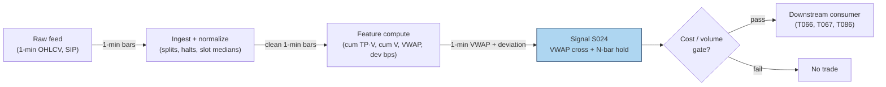

## Stage 24/200 — S024: VWAP cross & anchored-VWAP continuation

*Batch SB1 · Signal 24/100 · Provenance [SR] · Family B — Intraday momentum & breakout*

### S1. One-line verdict

| Field | Detail |
|---|---|
| **What it is** | A sustained close above (below) session or anchored VWAP on rising volume = institutions have re-accepted value higher (lower); ride it. |
| **When it works** | Trend days with heavy institutional flow: price crosses VWAP early, volume confirms, and price holds the line for several bars. |
| **When it dies** | Choppy range days: price flickers across VWAP repeatedly, volume is thin, and every cross is a whipsaw. |
| **Build-or-buy in one line** | Build the indicator yourself (trivial math); buy a clean 1-min consolidated feed — the edge, if any, is in data hygiene, not the formula. |

Provenance **[SR]** (standard reconstruction): VWAP-cross continuation is a practitioner convention — the exact participation-vs-fade logic inside bank execution algos is proprietary, and no public paper defines a canonical cross rule with published performance. [SR] is **not** upgraded here.

### S2. How it works — plain human explanation

It is 9:36, AAPL. Bid 231.40 × 800, ask 231.41 × 300, and session VWAP — every share traded since 9:30, volume-weighted — sits at 231.28. Price has chopped around it since the open. Now 25,000-share prints hit at 231.40, then 231.44. The next three one-minute bars all close above the rising VWAP, each on larger volume than the last.

A VWAP cross is a bet about *whose* flow is moving the tape. Large desks benchmark execution to VWAP — Berkowitz, Logue & Noser (1988) established it as the institutional transaction-cost benchmark. If price holds above VWAP on rising volume, the institutions buying today are paying up versus their benchmark, and the ones still working orders are incentivized to keep buying into strength: their mandate is "beat VWAP," not "buy the cheapest tick." A sustained cross reads as a regime shift — the market accepted a new value area, and benchmarked flow defends it.

The **anchored** variant moves the anchor: session VWAP starts at the open, but a 10:15 FDA headline is a better anchor for a pharma name. Reset the cumulative sums at the event and ask "where has value been accepted *since the news*?" Same mechanics, different starting bar.

Why should this work economically? Three forces, none mystical:

1. **Benchmarked flow is real and large.** VWAP algorithms slice parent orders across the day following the historical volume curve. When price breaks above VWAP and holds, these algos' schedules tilt toward buying (to avoid trailing their benchmark) — a mechanical, persistent bid. Choi, Larsen & Seppi (2018) model exactly this: TWAP (time-weighted average price)/VWAP order-splitting benchmarks induce predictable intraday price-pressure patterns.
2. **Value-area re-acceptance.** In auction-market terms, a sustained cross means two-sided trade is happening at the new level — it is not a single print. Volume confirmation separates "a block crossed" from "the market moved."
3. **Information revelation.** If the cross follows news, informed traders act strategically in high-volume periods (the same mechanism Gao et al. invoke for intraday momentum) — the cross is the footprint, not the cause.

**Mental model (3 bullets):**
- VWAP is the market's *agreed price so far today*; a sustained cross on volume means the agreement moved.
- The continuation is not the cross itself — it is the benchmarked flow that chases the cross. No volume, no flow, no trade.
- The mirror image (price extended *from* VWAP on fading volume) is mean reversion, not continuation — that is S040. Misclassifying the regime is the expensive mistake.

### S3. The math — exact formula

Session VWAP at bar $t$ (bars indexed from the session open, $i = 1 \dots t$):

$$
\mathrm{VWAP}_t = \frac{\sum_{i=1}^{t} TP_i \cdot V_i}{\sum_{i=1}^{t} V_i},
\qquad TP_i = \frac{H_i + L_i + C_i}{3}
$$

where $H_i, L_i, C_i$ are the bar's high, low, close (currency units, e.g. USD) and $V_i$ is share volume. The anchored variant resets the sums at an anchor bar $A$ (event time, prior close, rolling start):

$$
\mathrm{AVWAP}_t(A) = \frac{\sum_{i=A}^{t} TP_i \cdot V_i}{\sum_{i=A}^{t} V_i},
\qquad t \ge A.
$$

**Cross rule (example construction — not an institutional standard).** Let $s_t = \mathrm{sign}(C_t - \mathrm{VWAP}_t)$. A bullish continuation trigger at bar $t^\*$ requires:

1. $s_{t^\*-1} \le 0$ and $s_{t^\*} > 0$ (the cross, detected at the close of bar $t^\*$),
2. $s_{t^\*+1} = s_{t^\*+2} = \dots = s_{t^\*+N} = +1$ (the $N$ bars *after* the cross bar all hold above VWAP),
3. $V_{t^\*} > \kappa \cdot \bar{V}_{\text{same-slot, 20d}}$ (volume confirmation; $\kappa$ example 1.5).

**Causal timing:** $\mathrm{VWAP}_t$ uses only bars $\le t$; the hold condition needs bars through $t^\*+N$, which only close at the close of bar $t^\*+N$. Earliest tradable fill: the open of bar $t^\*+N+1$. Filling at the cross bar's close while *also* requiring the hold is lookahead — the hold bars are in the future at that point. (An "aggressive variant" that fills at the cross bar's close and uses the hold only as an ex-post filter is a different strategy: it may not claim the hold as an entry condition, and it eats the full whipsaw risk.) Never evaluate a "cross" on a partially-formed bar; the current bar's volume and close are unknown until it closes (a classic lookahead leak).

**Normalization choices:** raw deviation $d_t = (C_t - \mathrm{VWAP}_t)/\mathrm{VWAP}_t$ in basis points is fine for thresholding within one name; cross-name comparison needs $z_t = d_t / \hat{\sigma}_d$ with a rolling $\hat{\sigma}_d$ (S040's engine). The report's signal is unnormalized; normalization is a recommended refinement.

**Parameter table** (every default marked `example — not an institutional standard`):

| Parameter | Symbol | Typical range | Too small | Too large | Default (example) |
|---|---|---|---|---|---|
| Hold bars | $N$ | 2–5 | whipsaw city | misses the move | 3 |
| Volume multiple | $\kappa$ | 1.2–2.0× slot median | admits noise crosses | never triggers | 1.5 |
| Typical price vs close-only | — | TP or $C_i$ | — | — | TP (report formula) |
| VWAP window | — | session / anchored / rolling 60–120 min | rolling loses benchmark meaning | session VWAP slow to react | session + anchored variant |
| Cross tolerance | $\varepsilon$ | 0–5 bps | 0 = flicker triggers | real crosses rejected | 1 bp |

**Named variants:**
1. **Close-only VWAP** ($\mathrm{VWAP}_t$ with $C_i$ replacing $TP_i$) — matches many retail charting platforms; slightly noisier, no intrabar-range information.
2. **Rolling VWAP** (trailing 60–120 min window) — adapts on trend days but loses the "institutional benchmark" interpretation; closer to a moving average.
3. **Event-anchored VWAP** (news, earnings, prior day's close, opening range) — the T067 variant; the anchor is the research decision that matters most.

### S4. Worked example — step-by-step numbers (SYNTHETIC)

All numbers below are **synthetic**, generated with `numpy.random.default_rng(24)` — **seed 24** — and are the exact series plotted in S11. This is an arithmetic illustration, not a backtest: there are no fees, no spread, and the fill is assumed.

| bar | C ($) | V (sh) | TP ($) | ΣTP·V | ΣV | VWAP ($) | AnchVWAP ($) | dev (bps) | above? |
|---|---|---|---|---|---|---|---|---|---|
| 1 | 100.01 | 9,100 | 100.01 | 910,091 | 9,100 | 100.01 | n/a | 0.0 | no |
| 2 | 99.97 | 8,300 | 99.96 | 1,739,759 | 17,400 | 99.99 | n/a | −2.0 | no |
| 3 | 99.93 | 7,600 | 99.94 | 2,499,303 | 25,000 | 99.97 | n/a | −4.0 | no |
| 4 | 99.96 | 9,400 | 99.97 | 3,439,021 | 34,400 | 99.97 | n/a | −1.0 | no |
| 5 | 99.99 | 11,200 | 99.99 | 4,558,909 | 45,600 | 99.98 | 99.99 | +1.0 | **yes** |
| 6 | 100.04 | 14,800 | 100.04 | 6,039,501 | 60,400 | 99.99 | 100.02 | +5.0 | yes |
| 7 | 100.09 | 18,600 | 100.08 | 7,900,989 | 79,000 | 100.01 | 100.04 | +8.0 | yes |
| 8 | 100.12 | 21,900 | 100.12 | 10,093,617 | 100,900 | 100.04 | 100.07 | +8.0 | yes |
| 9 | 100.17 | 23,400 | 100.16 | 12,437,361 | 124,300 | 100.06 | 100.09 | +11.0 | yes |
| 10 | 100.18 | 20,100 | 100.18 | 14,450,979 | 144,400 | 100.08 | 100.11 | +10.0 | yes |
| 11 | 100.21 | 17,800 | 100.21 | 16,234,717 | 162,200 | 100.09 | 100.12 | +12.0 | yes |
| 12 | 100.24 | 16,500 | 100.24 | 17,888,677 | 178,700 | 100.10 | 100.14 | +14.0 | yes |

**Step-by-step:** each bar's typical price $TP = (H+L+C)/3$ is volume-weighted and accumulated; dividing cumulative dollar volume by cumulative shares gives VWAP (bar 5: $4{,}558{,}909 / 45{,}600 = 99.98$). Bars 1–4 close at or below VWAP. At bar 5, close 99.99 exceeds VWAP 99.98 — the cross is **detected** (not yet tradable). Bars 6–8 all close above VWAP ($N = 3$ hold, dev +5.0/+8.0/+8.0 bps) → the hold **confirms at bar 8's close**; earliest honest fill is **bar 9's open** — the first print after confirmation. (An earlier draft of this chapter called bar 6's open the fill; that used bars 6–8 — then still in the future — to authorize the trade. Corrected here: no future bar may authorize an earlier fill.) Anchored VWAP, re-set at the cross bar, tracks the post-cross value area (99.99 → 100.14), rising faster than session VWAP — on a trend day the anchor is the more responsive reference.

**What to notice:** volume builds from 11.2k to 23.4k shares across the cross — the confirmation the rule demands. But the cross itself is a **1 bp** margin at bar 5: inside the spread for most names, which is why production rules add the volume gate ($\kappa$) and tolerance band. The toy tape has no fees, no spread, no partial fills, and no losing days — it demonstrates the arithmetic, nothing more.

### S5. Strategies that use this signal

- **T066 — VWAP-Cross Institutional Follower** — primary entry trigger (direction): sustained cross + RVOL (relative volume) confirmation = the strategy's core entry; also fades *extreme* deviations (the S040 mirror).
- **T067 — Anchored-VWAP Event Trader** — primary trigger (direction): anchors VWAP at news/events instead of the open, then trades the cross/continuation with novelty context.
- **T086 — OFI-Paced Participation Tracker** — execution-benchmark consumer (reference, not alpha): VWAP is the execution target the participation schedule paces toward; S024's level is consumed as the benchmark, OFI paces the child orders.

### S6. Data required — exact spec

| Field | Type | Granularity | Source tier | Notes |
|---|---|---|---|---|
| $H, L, C$ per bar | float | 1-min | Tier 0–2 | Consolidated (SIP) or single-venue; match your execution venue |
| $V$ per bar | int | 1-min | Tier 0–2 | Split-adjusted; auctions flagged separately |
| Corporate actions / splits | factor, date | daily | Tier 0–1 | Unadjusted volume history silently breaks anchored sums |
| Halt / LULD flags | boolean | 1-min | Tier 1–2 | Exclude halted bars from the cumulative sums |
| Event timestamps (anchored variant) | timestamp | event | Tier 2 news / exchange calendar | Anchor placement is the research decision |

**Collection:** Databento `ohlcv-1m` (or XNYS consolidated), Polygon Stocks v3 aggregates (`/v3/aggs/ticker/{t}/range/1/minute/...`), Alpaca bars. **Ingest sketch** (Python/polars, ≤20 lines):

```python
import polars as pl
bars = pl.read_parquet("bars_1m.parquet")          # ts, sym, o,h,l,c, v, halt
bars = bars.filter(~pl.col("halt")).sort(["sym","ts"])
bars = bars.with_columns(tp=(pl.col("h")+pl.col("l")+pl.col("c"))/3)
bars = bars.with_columns(
    cum_pv=(pl.col("tp")*pl.col("v")).cum_sum().over("sym"),
    cum_v =pl.col("v").cum_sum().over("sym"))
sig = bars.with_columns(vwap=pl.col("cum_pv")/pl.col("cum_v"))
sig = sig.with_columns(above=pl.col("c") > pl.col("vwap"))
# hold-N cross: compare shifted 'above' flags within symbol
```

**Storage:** 1-min bars for 500 symbols ≈ 50 MB/day in Parquet (per notes/cost-model.md §4) → ~3 GB for 60 days — archive freely. **Data-quality checklist:** exchange-timestamp normalization (SIP vs direct clock); split/dividend adjustment before any anchored sum; halt and half-day (early close) handling — a 13:00 close shifts every slot median; DST transitions in slot-based volume medians; stale/zero-volume bars excluded from cumulative sums.

### S7. Local build on M5 Max / 128GB

**Feasibility: trivial.** This is cumulative sums over 390 bars/day/symbol — a Tier L build (4–12 h, ~$600–1,800 loaded-cost estimate at $150/hr per cost-model §5).

**Throughput** (per cost-model §2): 500 symbols × 390 bars = 195k bars/day — polars groupby-agg (~10–50M rows/sec) recomputes the universe's session VWAP in well under a second; the real-time per-bar update is O(1) per symbol. Bottleneck: none at 1-min.

**Stack options:**

| Stack | When to pick |
|---|---|
| Python + polars | Default: research and production for 1-min bars; this chapter's sketch is the whole pipeline |
| Rust | Only if you move to tick-level VWAP across hundreds of symbols (Rust event loop ~5–50M events/sec vs Python ~100–500k) |
| DuckDB | Ad-hoc SQL research over archived parquet; fine but polars is simpler here |

**RAM:** 60 days × 500 symbols of 1-min bars ≈ **12 MB** (per §3 table) — trivially inside the 77 GB working budget. Even 10 years of daily bars for 3,000 stocks is ~2–5 GB.

**Engineering band:** Tier L, 4–12 h → **$600–1,800** loaded-cost estimate; the work is the volume-profile medians and the anchored-event plumbing, not the formula. Data: ~$200/mo Tier-1 feed (indicative — verify before budgeting).

**What breaks first at 500 symbols:** nothing at 1-min. It breaks if you demand *tick*-level VWAP for 500 names in real time (~50 symbols × 2k events/s = 100k events/s is already borderline for a Python loop per §2's worked example) — then Rust ingest + polars batching.

### S8. Buy vs build

| Option | What you get | Indicative price | Gains | Loses |
|---|---|---|---|---|
| Tier-0: Stooq / Alpaca IEX | Daily + 1-min-ish bars | ~$0 | Free prototyping | Corporate-action hygiene, no consolidated tape |
| Tier-1: Polygon Stocks Advanced | Real-time SIP 1-min aggregates | ~$30–200/mo | Clean aggregates, splits handled | You still write the rule |
| Tier-2: Databento Standard | L1 + ohlcv-1m, honest timestamps | ~$200/mo + usage | Exchange timestamps, halt flags | Overkill for 1-min VWAP alone |
| Academic: LOBSTER / TAQ | MBO/ITCH replay | hundreds/yr academic | Microstructure honesty for H6 | Cost and complexity for a 1-min signal |

**Verdict — build if** your edge needs custom anchors, custom hold/volume logic, or your own symbol universe (all likely): the math is 20 lines. **Buy if** you need production-grade consolidated bars with split/halt hygiene and don't want to run feed ops. **Crossover:** hybrid is the norm — buy the Tier-1/2 feed, build the indicator. Nobody sells a "VWAP-cross strategy" worth buying; vendors sell the data. All prices above: indicative — verify before budgeting.

### S9. Success ratio / efficacy — documented evidence

| Study / source | Market & period | Metric | Before/after cost | Caveat |
|---|---|---|---|---|
| Haendler, Heston, Korajczyk & Sadka (2025), "The Intra-Day Stock Return Periodicity Puzzle" | US equities, multi-year | VWAP-type trading statistically significant at open/midday intraday intervals | Before-cost (observational) | Documents the *flow*, not a tradable cross rule; working paper (SSRN 5749704) |
| Choi, Larsen & Seppi (2018), "Equilibrium Effects of Intraday Order-Splitting Benchmarks" | Model | VWAP/TWAP benchmarks induce predictable intraday price-pressure patterns | n/a (theory) | Equilibrium model, no live trading statistics; arXiv:1803.08336 |
| Berkowitz, Logue & Noser (1988) | NYSE, 1980s | VWAP established as institutional execution benchmark | Before-cost | Benchmark relevance only — says nothing about cross profitability |
| Kissell (2014), *The Science of Algorithmic Trading* (ch. on VWAP strategies) | Practitioner | VWAP-cross/continuation treated as standard desk tactic | Before-cost (anecdotal) | Book treatment, no published Sharpe; specific flow statistics quoted second-hand are unverified |

**Regimes where it fails:** range days (whipsaw), low-volume names (one block = a fake cross), the open's first minutes (volume curve mis-estimated), and crowded momentum unwinds where everyone fades the same cross. **Documented decay:** none specifically — because there is no published performance series to decay.

**Honest bottom line:** as a standalone trigger this is a **weak-to-unknown edge** — the academic record documents the *mechanism* (benchmarked flow exists and moves prices), not a profitable rule. As a **regime label** (trend-day vs range-day classifier feeding T066/T067) and as an **execution benchmark** it is genuinely useful.

### S10. Failure modes & pitfalls

1. **Partial-bar lookahead** — computing VWAP with the still-forming bar's volume/close, then "trading" the cross at that bar's close. *Mitigation: signals evaluate only on closed bars; fill at t+1.*
2. **Whipsaw on hairline crosses** — 1 bp crosses inside the spread (as in the toy tape's bar 5). *Mitigation: tolerance band ε + volume gate κ + N-bar hold.*
3. **Auction contamination** — opening/closing auction volume distorts the volume profile and the cumulative sums. *Mitigation: flag auction prints; many desks compute VWAP on continuous-session volume only.*
4. **Anchor overfitting (anchored variant)** — trying anchors until one "worked." *Mitigation: pre-register anchors (news time, open, prior close); purged-CV (S088) any selection.*
5. **Trend-day misclassification** — trading continuation into a day that is actually reverting (S040's territory). *Mitigation: estimate the regime (e.g. HMM S079) rather than assuming continuation; T066 explicitly fades extreme deviations.*
6. **Cost blowup** — a 1-min cross strategy turns over several times a day; spread + fees vs a 5–15 bp edge. *Mitigation: model spread+fees+impact per trade (S8 table); require edge ≫ round-trip cost.*
7. **Split/dividend breaks in anchored sums** — a 2:1 split halves price mid-cumsum. *Mitigation: adjusted series only; assert adjustment before computing.*
8. **Feed inconsistency** — the cross fires on SIP's VWAP but not your direct feed's (or vice versa). *Mitigation: compute and trade on the same feed; latency-sensitive claims carry `simulated only — requires MBO/ITCH` (H6).*

### S11. Visuals




### S12. Sources

1. Berkowitz, S. A., Logue, D. E. & Noser, E. A. (1988). "The Total Cost of Transactions on the NYSE." *Journal of Finance*, 43(1), 97–112. https://repec.udesa.edu.ar/pub/Finanzas/Journals/Journal%20of%20Finance/43/1/2328325.pdf
2. Choi, J. H., Larsen, K. & Seppi, D. J. (2018). "Equilibrium Effects of Intraday Order-Splitting Benchmarks." arXiv:1803.08336. https://ideas.repec.org/p/arx/papers/1803.08336.html
3. Haendler, C., Heston, S., Korajczyk, R. & Sadka, R. (2025). "The Intra-Day Stock Return Periodicity Puzzle." Working paper, SSRN 5749704.
4. Harris, L. (2003). *Trading and Exchanges: Market Microstructure for Practitioners.* Oxford University Press. ISBN 0-19-514470-8. (Ch. on VWAP benchmarks; book, no URL.)

**Unverified leads:** quant-zero knowledge-base claim that a 1% VWAP deviation generates "0.02–0.05% of mean-reverting order flow per minute" and that VWAP algos are "30–40% of institutional flow" — repeated via a GitHub mirror citing Harris/Kissell page numbers, not verified against the originals; do not budget on these. Any blog "VWAP-cross strategy Sharpe" — unverified unless the paper is produced.

**Source log:** chatbot answers (Grok/Cursor) pending — checked 2026-09-10; grok-answers.md and cursor-answers.md absent from batches/SB1/ (duckai-answers.md present but covers S001 only, not this chapter).
