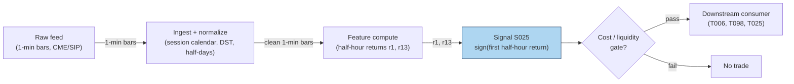

## Stage 25/200 — S025: Intraday time-series momentum

*Batch SB1 · Signal 25/100 · Provenance [D] · Family B — Intraday momentum & breakout*

### S1. One-line verdict

| Field | Detail |
|---|---|
| **What it is** | Sign of the recent intraday return (10 min to a few hours) predicts the next minutes-to-hours: keep riding the tape. |
| **When it works** | Liquid index/futures names on news-heavy or high-volume days, when informed and day-trader flow persists into the close. |
| **When it dies** | Thin midday chop, single-name noise, and days when the "momentum" is just bid–ask bounce at the open. |
| **Build-or-buy in one line** | Build: it is sign-of-past-returns on 1-min bars — the research question is window choice and cost survival, not infrastructure. |

Provenance **[D]** (documented): the canonical intraday result is Gao, Han, Li & Zhou (2018) — first-half-hour return predicts the last-half-hour return — plus Heston, Korajczyk & Sadka (2010) on intraday periodicity; the daily/monthly origin is Moskowitz, Ooi & Pedersen (2012). Academic horizons and day-trading horizons are not the same thing; intraday uses are labeled as adaptations where relevant.

### S2. How it works — plain human explanation

It is 10:04, SPY. The first half hour ran from yesterday's close of 512.00 to 513.35 — up about 26 bps, with volume running 40% above the slot median. The usual script says mornings mean-revert ("buy the dip"). Intraday time-series momentum says: don't. The tape's early direction has a documented tendency to persist into the *last* half hour of the same session — up mornings lean toward up closes.

Why would the morning's return predict the afternoon's, six hours later? Gao, Han, Li & Zhou propose two mechanisms, both about *who is forced to trade late*:

1. **Day-trader unwinding (disposition effect).** Good morning news pushes prices up; short-horizon liquidity providers who faded the open sit on losers. The disposition effect (Odean 1998; Locke & Mann 2000) says they avoid realizing losses, so they procrastinate — then all unwind in the last half hour, pushing price *further* up. The morning move gets echoed at the close by the losers' capitulation.
2. **Strategic informed trading.** Admati & Pfleiderer (1988): informed traders concentrate where volume is — the open and the close. Morning news gets traded in the first half hour, and the same flow keeps working into the deep liquidity of the close. The morning return is the footprint of information that takes the whole session to digest.

Heston, Korajczyk & Sadka (2010) found a kindred regularity: individual-stock returns persist at the *same half-hour clock slot* across days (up to 40 trading days) — the market has intraday memory, plausibly from predictable institutional patterns (Haendler et al. 2025 tie some of it to VWAP-type and close-benchmarked flow). Moskowitz, Ooi & Pedersen (2012) established the daily/monthly version across asset classes. S025 is the intraday port of that family — same sign-of-past-returns engine, horizons compressed from months to minutes.

**Mental model (3 bullets):**
- Time-series momentum (this signal) asks "did *this* asset go up?" — it is direction-agnostic and self-referential. Cross-sectional momentum asks "did it go up *more than peers*?" Different question, different portfolio.
- The edge, where it exists, lives in *predictable late-day flow* (unwinding day traders, benchmarked rebalancers), not in the morning move being "right."
- One trade a day (enter at 15:30, exit at 16:00) is the cost-efficient expression: turnover is the binding constraint, and this signal's academic form trades exactly once per session.

### S3. The math — exact formula

The report's generic form, with flat or exponential weighting over lookback $L$:

$$
\mathrm{Sig}_t = \mathrm{sign}\!\left(\sum_{i=1}^{L} w_i \, r_{t-i}\right), \qquad
r_{t} = \frac{P_t}{P_{t-1}} - 1
$$

$P_t$ = price at bar $t$ (mid or close; units: currency), $r_t$ = simple bar return (dimensionless), $w_i$ = weights (flat $w_i = 1/L$, or exponential $w_i \propto (1-\lambda)^{i}$). Vol-scaled sizing: $\mathrm{pos}_t = \mathrm{Sig}_t \cdot \sigma_{\text{target}} / \hat{\sigma}_t$ (target-vol scaling, $\hat{\sigma}_t$ = recent realized vol).

The canonical academic instantiation (Gao et al. 2018) is a predictive regression, not a sign rule:

$$
r_{13,t} = \alpha + \beta \, r_{1,t} + \varepsilon_t,
$$

where $r_{1,t}$ = first half-hour return of day $t$ (measured *from the previous day's close*, so it includes the overnight gap) and $r_{13,t}$ = last half-hour return. Estimated $\hat{\beta} > 0$ (scaled-by-100 slope ≈ 6.94, significant at 1%, $R^2$ ≈ 1.6% in-sample) — the tradable version is $\mathrm{Sig}_t = \mathrm{sign}(r_{1,t})$, long/short the last half hour accordingly.

**Causal timing:** $r_{1,t}$ is known at 10:00 ET; the position is entered at the *start* of the last half hour (15:30 ET) and flattened at the close (16:00 ET). Tradable no earlier than the bar after the signal is computed — here, hours after, which is why the signal is nearly immune to the usual microstructure lookahead traps.

**Normalization choices:** raw sign (report default) throws away magnitude information; vol-scaling ($\mathrm{pos} \propto 1/\hat{\sigma}$) is the documented refinement (Moskowitz et al. scale positions by trailing volatility); z-scoring $z_t = \bar{r}_{t-L:t}/\hat{\sigma}$ turns the sign rule into a strength rule. Deseasonalize by time-of-day vol (S067) before thresholding — raw morning returns are mechanically more volatile.

**Parameter table** (defaults marked `example — not an institutional standard`):

| Parameter | Symbol | Typical range | Too small | Too large | Default (example) |
|---|---|---|---|---|---|
| Lookback $L$ | $L$ | 10 min – 3 h (report); academic: 30 min | noise dominates | signal stale by entry | 30 min (first half hour) |
| Weighting | $w_i$ | flat / exponential $\lambda \in [0.8, 0.99]$ | flat ignores decay | overfits to last bar | flat |
| Skip-open | — | 0–30 min | overnight-gap noise | throws away Gao's predictor | include overnight in $r_1$ (academic); skip first 5 min for single names (practitioner example) |
| Vol target | $\sigma_{\text{target}}$ | 5–20% ann. | overlevered on calm days | underplays the signal | 10% (example) |
| Flatten time | — | 15:55–16:00 | overnight gap risk | auction slippage | flat by 15:59 (example) |

**Named variants:**
1. **First-half-hour → last-half-hour** (Gao et al.): one observation per day, enter 15:30, exit 16:00 — the cost-efficient canonical form.
2. **Rolling $L$-minute momentum**: $\mathrm{sign}(\sum_{i=1}^{L} r_{t-i})$ recomputed each bar — higher turnover, more whipsaw, needs explicit cost gating.
3. **Same-clock-slot persistence** (Heston et al. 2010): predict slot $j$ today from slot $j$ over past days — cross-day intraday memory rather than within-day continuation.

### S4. Worked example — step-by-step numbers (SYNTHETIC)

**Synthetic** 13 half-hour slots, one session, `numpy.random.default_rng(25)` — **seed 25**. Returns in bps; midday slots jittered, first and last slots set by hand. Same series as the S11 chart. Not a backtest: no costs, one assumed fill.

| slot | time | ret (bps) | cum (bps) | close ($) |
|---|---|---|---|---|
| 1 | 09:30 | **+42.0** | 42.0 | 100.42 |
| 2 | 10:00 | −0.0 | 42.0 | 100.42 |
| 3 | 10:30 | −3.7 | 38.3 | 100.38 |
| 4 | 11:00 | −16.0 | 22.3 | 100.22 |
| 5 | 11:30 | +0.2 | 22.5 | 100.22 |
| 6 | 12:00 | +6.5 | 29.0 | 100.29 |
| 7 | 12:30 | +7.3 | 36.3 | 100.36 |
| 8 | 13:00 | −3.8 | 32.5 | 100.32 |
| 9 | 13:30 | +15.6 | 48.1 | 100.48 |
| 10 | 14:00 | +13.6 | 61.7 | 100.62 |
| 11 | 14:30 | −1.6 | 60.1 | 100.60 |
| 12 | 15:00 | −1.1 | 59.0 | 100.59 |
| 13 | 15:30 | **+31.0** | 90.0 | 100.90 |

**Step-by-step:** formation return $r_1 = +42.0$ bps (slot 1, includes the overnight gap by construction) → $\mathrm{Sig} = \mathrm{sign}(+42.0) = +1$ → LONG. Wait through the session (the rule trades only the last half hour). Enter at 15:30 at 100.59, exit at the 16:00 close at 100.90: gross $+30.8$ bps, synthetic, before costs. The middle of the day actually sagged (slots 3–4 gave back ~20 bps) — the signal ignores all of it by design.

**What to notice:** the example is hand-tilted (both $r_1$ and $r_{13}$ set positive) to illustrate the mechanism; the academic claim is statistical ($\beta > 0$, $R^2$ 1.6%), not "every up morning ends up." Real frictions are absent: the 15:30 entry competes with other momentum chasers, the fill is assumed at the slot open, and +30.8 bps must survive ~1–3 bps round-trip in SPY (comfortable) versus 10+ bps in a thin single name (fatal). That cost arithmetic is the entire strategy question.


### S5. Strategies that use this signal

- **T006 — Intraday Trend + Vol-Regime Allocator** — primary trigger (direction): rides S025 time-series momentum into the close, position-scaled by HMM vol regime (S079).
- **T098 — Jump-Validated Momentum Ignition** — momentum leg (validated entry): takes S025's directional read only when a Lee–Mykland jump validates the move and RVOL confirms — a filter *on* this signal.
- **T025 — Trade-Classification Trend Filter** — filter/veto: uses Lee–Ready/BVC signed trade imbalance to confirm or veto S025 momentum entries (signed flow must agree).
- **T053 — HMM Regime-Switching Allocator** — regime gate: allocates to the momentum book (S025 leg) in trending hidden states, to the reversal book (S035 leg) otherwise.

### S6. Data required — exact spec

| Field | Type | Granularity | Source tier | Notes |
|---|---|---|---|---|
| 1-min OHLCV (or half-hour bars) | float/int | 1-min | Tier 0–2 | Futures preferred (less noise, cleaner session); CME via Databento |
| Prior-day close | float | daily | Tier 0–1 | Needed for the overnight-inclusive $r_1$ (academic form) |
| Corporate actions | factor | daily | Tier 1 | Gap-adjusted series or $r_1$ is polluted |
| Vol estimate (for sizing) | float | 1-min/5-min | Tier 1 | Realized vol of $r_1$ or HAR-style (S066) |
| News calendar (optional) | timestamps | event | Tier 2 | Gao et al.: stronger on macro-news days |

**Collection:** Databento futures/equities 1-min, Polygon Stocks Advanced, Alpaca SIP. **Ingest sketch** (polars, ≤20 lines):

```python
import polars as pl
b = pl.read_parquet("bars_1m.parquet").sort(["sym","ts"])
half = b.group_by_dynamic("ts", every="30m", group_by="sym").agg(
    o=pl.col("o").first(), c=pl.col("c").last())
half = half.with_columns(r=pl.col("c")/pl.col("c").shift(1).over("sym")-1)
half = half.with_columns(slot=pl.col("ts").dt.hour()*2+pl.col("ts").dt.minute()//30)
day = half.group_by("sym", pl.col("ts").dt.date()).agg(
    r1=pl.col("r").filter(pl.col("slot")==19).first(),   # 09:30 slot incl. overnight
    rL=pl.col("r").filter(pl.col("slot")==31).first())   # 15:30 slot
sig = day.with_columns(sig=pl.col("r1").sign())
```

**Storage:** 1-min bars, 500 symbols ≈ 50 MB/day (§4) → ~3 GB/60 days. The academic form needs only 2 half-hour returns/day/symbol — kilobytes. **Data-quality checklist:** overnight-gap attribution (prior close vs open); half-days and DST (13 slots becomes 7 — never hardcode 13); futures session definitions (CME settle vs pit close); corporate-action adjustment; exclude days with <500 trades (Gao et al.'s own filter).

### S7. Local build on M5 Max / 128GB

**Feasibility: trivial.** Tier L (4–12 h, ~$600–1,800 loaded-cost estimate per §5). The signal is arithmetic on 13 numbers per symbol per day.

**Throughput** (per §2): the daily batch is ~500 × 390 = 195k bars — polars handles it in milliseconds; even a pure-Python loop is fine. Real-time requirement: one computation at 10:00, one order at 15:30 — a cron job, not a trading system. Bottleneck: none; the constraint is fill quality, not compute.

**Stack options:**

| Stack | When to pick |
|---|---|
| Python + polars | Everything here; the sketch above is production-shaped |
| DuckDB | If you prefer SQL over archived parquet |
| Rust | Unnecessary — no event-rate pressure at this granularity |

**RAM:** 60 days × 500 symbols × 1-min ≈ **12 MB** (§3); the signal's own state is two floats per symbol. Entirely inside the 77 GB working budget — you could hold decades.

**What breaks first at 500 symbols:** nothing computationally. What breaks is *economic*: single-name $r_1$ is mostly noise (Gao et al.'s result is on the *market* ETF and liquid futures), and per-name costs at 15:30 eat a 1.6% $R^2$ edge alive. The failure is in S9/S10, not in the Mac.

### S8. Buy vs build

| Option | What you get | Indicative price | Gains | Loses |
|---|---|---|---|---|
| Tier-0: Stooq daily + Alpaca IEX | Daily bars, some intraday | ~$0 | Free replication of the daily/monthly form | No clean half-hour history |
| Tier-1: Polygon Stocks Advanced | SIP 1-min + aggregates | ~$30–200/mo | Enough for the full academic replication | Futures coverage thinner |
| Tier-1/2: Databento (CME + equities) | Futures 1-min, honest timestamps | ~$200/mo + usage | The report's "futures preferred" data | Usage billing on history pulls |
| Academic: TAQ via WRDS | Tick history | institutional/academic | Deep robustness checks | Access friction, cost |

**Verdict — build if** you want the window/weighting/flatten-time customized (you will): the signal is 10 lines. **Buy** the feed (Tier-1 minimum for intraday history; Databento if futures). **Crossover:** there is nothing to "buy" as a strategy — vendors sell data; the one-trade-a-day rule is yours to implement and cost-check. All prices above: indicative — verify before budgeting.

### S9. Success ratio / efficacy — documented evidence

| Study / source | Market & period | Metric | Before/after cost | Caveat |
|---|---|---|---|---|
| Gao, Han, Li & Zhou (2018) | SPY, 1993–2013 | Timing on sign($r_1$): 6.67%/yr avg, 6.19% vol → **Sharpe 1.08** vs 0.29 buy-and-hold | Before-cost metric; authors report gains *persist after transaction costs* | Published in the *Journal of Financial Economics* (2018); figures from the SSRN working-paper version (SSRN 2552752) — re-verify against the published version before citing precisely |
| Gao et al. (2018), same | SPY, 1993–2013 | Predictive $R^2$ 1.6% in-sample; 1.2% out-of-sample (1.8–2.6% with 12th-half-hour added) | Before-cost (predictive regression) | $R^2$ is statistical, not tradable P&L; OOS weaker as expected |
| Moskowitz, Ooi & Pedersen (2012) | 58 instruments, 1985–2009 | Time-series momentum pervasive across asset classes; vol-scaled strategy earns significant risk-adjusted returns (see paper for figures) | Before-cost | **Daily/monthly** horizons — the origin of the family, not intraday evidence |
| Baltussen, Da, Lammers & Martens (2021) | 60+ futures | Intraday momentum confirmed; gamma-hedging mechanism; effect reverts over following days | Before-cost | Via practitioner summary; confirms mechanism + warns the drift is temporary |
| Heston, Korajczyk & Sadka (2010) | US stocks, intraday | Same-clock-slot return persistence up to 40 days | Before-cost | Cross-day periodicity, not the within-day $r_1 \to r_{13}$ trade |

**Regimes where it fails:** low-volume/midday-dominated days (no late flow to ride); single names where $r_1$ is noise; post-2013 decay risk (the paper's sample ends 2013; treat recent efficacy as unverified without your own replication); macro-news days cut both ways (stronger signal per the paper, but wider slippage). The Baltussen et al. finding matters: the drift **reverts over following days** — holding overnight converts momentum into reversal losses.

**Honest bottom line:** as a standalone trigger this is a **documented but thin edge** — Sharpe ~1 before costs on the most liquid instrument on earth, one trade a day, with the authors claiming cost survival. As a **timing overlay** (when to concentrate intraday risk, T006/T015-style) it is more defensible than as a full strategy. Single-name intraday TSMOM without vol scaling is mostly noise — say so in any pitch.

### S10. Failure modes & pitfalls

1. **Overnight-gap misattribution** — $r_1$ includes the gap only if you anchor to the prior close; anchoring to the open measures something else. *Mitigation: define $r_1$ exactly as the paper does; test both.*
2. **Half-day/DST slot drift** — 13 slots is a regular-session assumption. *Mitigation: compute slots from exchange calendar; never hardcode 13.*
3. **Single-name noise** — the documented effect is market/futures-level; per-name $r_1$ has far lower SNR. *Mitigation: restrict universe to index ETFs/liquid futures, or shrink per-name signals.*
4. **Reversion after the close** — Baltussen et al.: the drift reverts over following days. *Mitigation: hard flatten before close; never carry as "momentum" overnight.*
5. **Cost illusion on the toy trade** — +30.8 bps gross means little if your 15:30 entry crosses a 5 bp spread in a thin name. *Mitigation: per-trade cost model (spread + fees + slippage); the one-trade-a-day shape is what makes SPY survive.*
6. **Publication decay** — sample ends 2013; post-publication arbitrage may have compressed it (cf. McLean & Pontiff 2016 on anomaly decay generally). *Mitigation: replicate on your own recent data before sizing; report post-2018 numbers separately.*
7. **Vol-regime blindness** — fixed-size positions on high-vol days take outsized risk. *Mitigation: vol-target sizing ($1/\hat{\sigma}$); T006's HMM gate.*
8. **Lookahead in $r_1$** — using 10:00:00 prints that arrived after your 10:00 signal timestamp (SIP latency). *Mitigation: timestamp discipline; at this horizon it's minor, but keep the t→t+1 rule anyway.*

### S11. Visuals




### S12. Sources

1. Gao, L., Han, Y., Li, S. Z. & Zhou, G. (2018). "Intraday Momentum: The First Half-Hour Return Predicts the Last Half-Hour Return." *Journal of Financial Economics*, 2018. https://paperswithbacktest.com/api/paper/intraday-momentum-the-first-half-hour-return-predicts-the-last-half-hour-return/pdf (working-paper version; SSRN 2552752)
2. Moskowitz, T. J., Ooi, T. H. & Pedersen, L. H. (2012). "Time Series Momentum." *Journal of Financial Economics*, 104, 228–250. (Daily/monthly origin of the family; no URL — journal citation.)
3. Heston, S. L., Korajczyk, R. A. & Sadka, R. (2010). "Intraday Patterns in the Cross-section of Stock Returns." *Journal of Finance*, 65(4). SSRN 1107590.
4. Baltussen, G., Da, Z., Lammers, S. & Martens, M. (2021). "Hedging Demand and Market Intraday Momentum." *Journal of Financial Economics*. (Gamma-hedging mechanism; journal citation.)

**Unverified leads:** practitioner replication notes claiming the effect "replicated in several international markets" — plausible, but I did not verify each replication's paper; the Hull-repository China-futures study (1%-significant first-session prediction on 4 commodity futures, SSRN 3493927) is a working paper I did not fully vet — treat as a lead, not evidence.

**Source log:** chatbot answers (Grok/Cursor) pending — checked 2026-09-10; grok-answers.md and cursor-answers.md absent from batches/SB1/ (duckai-answers.md present but covers S001 only, not this chapter).
