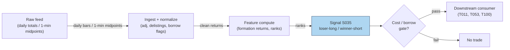

## Stage 35/200 — S035: Short-term reversal — Jegadeesh / Lehmann

*Batch SB1 · Signal 35/100 · Provenance [D] · Family C — Mean reversion & reversal*

### S1. One-line verdict

| Field | Detail |
|---|---|
| **What it is** | Buy recent losers, short recent winners: over 1 week–1 month (and 15 min–1 day intraday), extremes snap back. |
| **When it works** | Broad liquid universes where the reversal is compensation for providing liquidity — not where it is just bid–ask bounce. |
| **When it dies** | After costs (turnover is brutal), in illiquid names (the "reversal" is measurement error), and post-publication as arbitrageurs crowd it. |
| **Build-or-buy in one line** | Build the rank/sort — the signal is arithmetic; buy nothing except clean total-return data, and budget turnover before anything else. |

Provenance **[D]** (documented): Jegadeesh (1990), Lehmann (1990), Lo & MacKinlay (1990). One honesty note carried from the report: Lehmann's exact weekly portfolio weights were **not recoverable from accessible sources** — this chapter uses rank-based long/short deciles and says so. Academic horizons (1 week–1 month) ≠ day-trading horizons; the intraday port is labeled an adaptation.

### S2. How it works — plain human explanation

It is month-end. Across 2,000 US stocks, the worst performers of the past month are down 8–15%; the best are up 10–20%. The short-term reversal signal says: buy the losers, short the winners, hold a month. It feels wrong — that is the point. The claim, documented since Jegadeesh (1990), is that short-horizon extremes contain a transitory component: price pressure, overreaction, and plain illiquidity push prices too far, and they snap back.

The economic "why" has three competing stories, and the literature never fully settled between them:

1. **Liquidity provision / price pressure.** Someone absorbed the selling that made the losers lose. Market makers demand compensation for warehousing that inventory risk; the reversal is their paycheck (Grossman & Miller 1988; Pastor & Stambaugh 2003). Under this story the signal is a *liquidity-provision premium* — real, but earned by whoever actually stands ready, not by a monthly spreadsheet rebalance.
2. **Overreaction and correction.** Investors extrapolate recent news too far (De Bondt & Thaler 1985); prices overshoot and correct. Under this story the edge is behavioral and decays as arbitrageurs learn it.
3. **Measurement error — the bid–ask bounce.** The hostile story, and it matters enormously. If losers' last prints were at the bid and winners' at the ask, next period's "reversal" is just the bounce — no economics at all. Kaul & Nimalendran (1990) showed bid–ask errors are the *predominant* source of apparent short-run reversals in NASDAQ stocks; Atkins & Dyl (1990) found the overreaction after large daily moves is small compared with spreads. Any backtest on closing transaction prices that ignores this is fiction.

Lehmann (1990) ran the weekly version — long last week's losers, short last week's winners — but Lo & MacKinlay (1990) showed a large fraction of contrarian profits comes from **cross-autocorrelation** (large stocks lead small), not from each stock reversing itself. The naive "buy losers" portfolio harvests lead-lag structure as much as mean reversion.

The intraday port — rank by prior 15–60 min return, fade extremes over the next 15 min to a day — is the same engine at higher frequency, where bounce contamination is *worse*. Label it an adaptation, and test it on quote midpoints, not transaction prices.

**Mental model (3 bullets):**
- Short-term reversal = you are paid to absorb someone else's urgency. No urgency absorbed, no premium earned — a monthly rebalance captures the label, not the economics.
- Half of what looks like reversal in transaction-price data is the bid–ask bounce. Midpoints or it didn't happen.
- The signal's enemy is not being wrong about direction — it is turnover: the edge is small, the trading is constant, and costs compound against you every rebalance.

### S3. The math — exact formula

**Jegadeesh (1990) monthly form.** Each month $t$, compute prior-month return $r_{i,t-1}$ for each stock $i$; sort into deciles. Portfolio: long decile 1 (losers), short decile 10 (winners), equal-weighted, hold one month. The reversal shows up as negative serial correlation: $E[r_{i,t} \mid r_{i,t-1} \text{ extreme}]$ leans against $r_{i,t-1}$.

**Lehmann (1990) weekly form (weights as described; exact published weights not recoverable — use rank deciles and state it):**

$$
w_{i,t} = -\frac{1}{N}\,(r_{i,t-1} - r_{m,t-1}),
$$

$w_{i,t}$ = portfolio weight of stock $i$ (dimensionless, sums to zero — dollar-neutral), $r_{i,t-1}$ = prior-week return, $r_{m,t-1}$ = market return, $N$ = universe size. Losers ($r_{i,t-1} < r_{m,t-1}$) get positive weight; winners get negative weight. Because the report's source entry could not recover Lehmann's exact construction from accessible sources, the reproducible version is: **rank-based long/short deciles**, not these analytic weights.

**Residual (Blitz et al. 2013-style) variant:** replace raw $r_{i,t-1}$ with the Fama–French residual $\varepsilon_{i,t-1}$ — reversal in the *idiosyncratic* component, stripping factor drift.

**Intraday port (adaptation — label as such):** rank universe by prior 15–60 min return; long bottom quantile / short top quantile; hold 15 min–1 day; compute everything on **quote midpoints** to suppress bounce.

**Causal timing:** formation return uses data $\le t$; positions formed at $t$'s close trade at $t+1$'s open or later. The classic cheat is forming on month $t$'s return and "trading" at month $t$'s close — one month of lookahead.

**Normalization choices:** raw returns (Jegadeesh) vs market-adjusted (Lehmann) vs residual (Blitz et al.); equal-weight vs return-weighted legs. Volatility-scaling the legs is a practitioner refinement, not in the originals.

**Parameter table** (defaults marked `example — not an institutional standard`):

| Parameter | Symbol | Typical range | Too small | Too large | Default (example) |
|---|---|---|---|---|---|
| Formation window | — | 1 week – 1 month (academic); 15–60 min (intraday port) | bounce dominates | signal washes out | 1 month / 30 min |
| Holding window | — | = formation (academic) | turnover explodes | reversal decays | 1 month / 60 min |
| Sort quantiles | — | deciles / quintiles | noisy legs | weak spread | deciles |
| Return definition | — | total / market-adj. / residual | factor drift pollutes | estimation error | market-adjusted (example) |
| Price basis (intraday) | — | midpoint vs transaction | — | — | **midpoint** (mandatory for intraday) |

**Named variants:**
1. **Jegadeesh monthly deciles** — the documented original; 1-month formation, 1-month hold.
2. **Lehmann weekly contrarian** — analytic weights (not recoverable; use rank deciles and disclose).
3. **Residual reversal** — Fama–French residual sorts; cleaner idiosyncratic mean reversion.

### S4. Worked example — step-by-step numbers (SYNTHETIC)

**Synthetic** 10-stock month, `numpy.random.default_rng(35)` — **seed 35**. Formation returns are random; holding returns are constructed with a mild reversal tilt ($-0.28 \times$ formation + noise) plus pure noise — the *same* data as the S11 chart. Not a backtest: no costs, no borrow fees, one toy month.

| name | formation $(t-1)$ % | holding $(t)$ % | leg |
|---|---|---|---|
| AAA | −6.83 | +0.71 | **LONG** (loser) |
| BBB | +4.63 | −5.42 | **SHORT** (winner) |
| CCC | +6.90 | +2.26 | **SHORT** (winner) |
| DDD | +4.41 | −1.24 | flat |
| EEE | +8.69 | −1.50 | **SHORT** (winner) |
| FFF | +0.02 | −1.28 | flat |
| GGG | −8.54 | +0.74 | **LONG** (loser) |
| HHH | −0.34 | +1.38 | **LONG** (loser) |
| III | +2.90 | +1.09 | flat |
| JJJ | +2.49 | −2.58 | flat |

**Step-by-step:** sort by formation return. Long leg = 3 worst losers (GGG −8.54, AAA −6.83, HHH −0.34); short leg = 3 best winners (EEE +8.69, CCC +6.90, BBB +4.63). Holding-period leg means: long leg $(0.71+0.74+1.38)/3 = +0.94\%$; short leg $(-5.42+2.26-1.50)/3 = -1.55\%$. Dollar-neutral portfolio gross = $+0.94 - (-1.55) = \mathbf{+2.50\%}$ for the toy month, before costs. Correlation(formation, holding) = **−0.302** — the reversal signature.

**What to notice:** CCC formed at +6.90% and *continued* to +2.26% — reversal is statistical, not a law. The toy +2.50% is gross of everything: 200%+ monthly turnover, two-way spread on ten names, borrow fees on the shorts (EEE at +8.69% formation is exactly the crowded winner that is expensive to borrow). The toy table uses clean synthetic "true" returns, so it *overstates* what a transaction-price backtest would honestly show — the Kaul–Nimalendran warning in miniature.


### S5. Strategies that use this signal

- **T011 — Short-Term Reversal + Bounce Timing** — primary entry trigger (direction): the Jegadeesh/Lehmann sort is the strategy's core; S047/S014 time entries at the touch to harvest (not pay) the bounce.
- **T053 — HMM Regime-Switching Allocator** — regime gate: allocates to the reversal book (S035 leg) when the hidden state favors mean reversion, to momentum (S025) otherwise.
- **T100 — Grand Ensemble** — ensemble consumer (diluted weight): S035 is one of 100 inputs; included for completeness, not as a driver.

(Candid note: T040 was checked and does *not* consume S035 — its signals are S080/S039/S078 — and neither does T013 (S042/S043/S045). Only T011 and T053 genuinely list S035; T100 is included as the honest third.)

### S6. Data required — exact spec

| Field | Type | Granularity | Source tier | Notes |
|---|---|---|---|---|
| Total returns (split/div-adjusted) | float | daily (weekly/monthly formation) | Tier 0–1 | CRSP / Polygon / Stooq; **total**, not price, return |
| Quote midpoints (intraday port) | float | 1-min | Tier 1–2 | Transaction prices forbidden for formation (bounce) |
| Borrow/fee data (short leg) | float | daily | Tier 1–3 | Short winners are often hard-to-borrow |
| Market index returns | float | daily | Tier 0 | For market-adjusted weights |
| Delisting returns | float | event | Tier 1 | Survivorship bias otherwise |

**Collection:** Stooq/Polygon daily for the academic form; Databento/Polygon 1-min midpoints for the intraday port. **Ingest sketch** (polars, ≤20 lines):

```python
import polars as pl
d = pl.read_parquet("daily.parquet").sort(["sym","date"])   # adj close, total-return
d = d.with_columns(r=pl.col("adj")/pl.col("adj").shift(1).over("sym")-1)
form = d.group_by("sym").agg(form_r=pl.col("r").tail(21).sum())  # 1-mo formation
ranks = form.with_columns(dec=pl.col("form_r").qcut(10, labels=False).over())
# long decile 0, short decile 9; hold next 21 sessions; rebalance monthly
```

**Storage:** daily bars, 3,000 stocks × 10 y ≈ 60M rows ≈ **2–5 GB** RAM (§3) — fits; parquet on disk 2–4× smaller. Intraday-port midpoints: 1-min, 500 symbols ≈ 50 MB/day (§4). **Data-quality checklist:** total-return (not price) adjustment; delisting returns; midpoint vs transaction discipline; corporate actions; universe point-in-time membership (no survivorship bias); short-sale ban periods flagged.

### S7. Local build on M5 Max / 128GB

**Feasibility: trivial** for the academic form; **feasible** for the intraday port. Tier L (4–12 h, ~$600–1,800 loaded-cost estimate per §5) — it is sorts and groupbys.

**Throughput** (per §2): monthly rebalance over 3,000 stocks × 10 y of daily data = 60M rows — polars simple ops at ~10–50M rows/sec chew through it in seconds. The intraday port (500 symbols × 390 bars/day = 195k bars) is trivial. Bottleneck: none computationally; borrow-data licensing for the short leg.

**Stack options:**

| Stack | When to pick |
|---|---|
| Python + polars | Default for both forms; qcut/decile sorts are one-liners |
| DuckDB | SQL-first researchers over archived parquet |
| Rust | Unnecessary at these granularities |

**RAM:** daily panel ~2–5 GB (§3) — comfortable in the 77 GB budget; the monthly signal state is one float per name. 60 days of 1-min data ≈ 12 MB.

**What breaks first at 500 symbols:** nothing local. What breaks is *economic*: at 500 names the short leg's borrow fees and the monthly 200% turnover mean the strategy's viability is a cost question (S9/S10), not a compute question. Full-universe CRSP-style history wants WRDS access (buy, Tier 3 academic).

### S8. Buy vs build

| Option | What you get | Indicative price | Gains | Loses |
|---|---|---|---|---|
| Tier-0: Stooq / French data library | Daily returns, factors | ~$0 | Free academic replication | No intraday, survivorship caveats |
| Tier-1: Polygon Stocks Advanced | Daily + 1-min, adjusted | ~$30–200/mo | Clean adjustments, midpoints | History depth costs |
| Tier-3 academic: WRDS/CRSP + TAQ | Publication-grade history | hundreds–thousands/yr academic | The actual papers' data | Price, access friction |
| Borrow data: vendor (e.g. S3-style) | Stock-loan fees | $$ | Prices the short leg honestly | Another subscription |

**Verdict — build if** you are replicating or adapting the sort: the signal is ranking arithmetic. **Buy if** you need CRSP-grade delisting/total-return history or borrow panels — you cannot build those. **Crossover:** Tier-0/1 data + your own sorts covers 90% of the research; pay for borrow data the moment the short leg is real money. All prices above: indicative — verify before budgeting.

### S9. Success ratio / efficacy — documented evidence

| Study / source | Market & period | Metric | Before/after cost | Caveat |
|---|---|---|---|---|
| Jegadeesh (1990), as summarized in Cakici & Topyan (2014) | US stocks, 1934–1987 | Short-term reversal ≈ **+2%/month** extra return | **Before-cost** | Pre-decimalization, pre-publication; costs unmodeled; figure via secondary summary |
| Lehmann (1990) | US stocks, weekly | Weekly contrarian portfolios profitable | **Before-cost** | Exact weights not recoverable; see S3 disclosure |
| Lo & MacKinlay (1990) | US stocks | Much contrarian profit = **cross-autocorrelation** (large leads small), not pure reversal | n/a (decomposition) | The "reversal" you trade may be lead-lag structure |
| Kaul & Nimalendran (1990) | NASDAQ | After removing bid–ask errors: **little evidence** of overreaction; returns positively autocorrelated | Measurement correction | The bounce warning: transaction-price backtests overstate |
| Atkins & Dyl (1990) | US stocks, large daily moves | Reversal exists but **small vs bid–ask spreads** | After-cost interpretation | "Consistent with efficiency after transactions costs" |
| McLean & Pontiff (2016) | 97 anomalies | Returns **decay substantially** after publication | After-cost framing | General result; short-term reversal is in the decaying set |

**Regimes where it fails:** illiquid names (bounce dominates); high-vol regimes (spreads widen, borrow spikes); crowded post-publication periods (decay); earnings/announcement drifters (PEAD is continuation — fading it is fading information, S100). **Documented decay:** yes — McLean & Pontiff (2016) is the citation; expect the academic-form premium to be a shadow of the 1934–1987 number.

**Honest bottom line:** as a standalone trigger this is a **documented-but-mostly-arbitraged edge** — the +2%/month is a before-cost museum piece; what survives today is a liquidity-provision premium that accrues to whoever actually provides the liquidity, net of turnover that usually eats it. As a **timing overlay inside a market-making or execution book** (get paid the spread *and* the reversal), it is far more defensible — which is exactly what T011 does.

### S10. Failure modes & pitfalls

1. **Bid–ask bounce contamination** — formation on transaction prices manufactures reversal. *Mitigation: midpoints only (intraday); bounce-adjusted returns (daily); read Kaul & Nimalendran first.*
2. **Lookahead in formation** — sorting on month $t$'s return and trading at $t$'s close. *Mitigation: form at $t$, trade at $t+1$ open; point-in-time universe.*
3. **Turnover/cost blowup** — 200%+ monthly turnover vs a thin edge. *Mitigation: model spread + fees + borrow + impact per rebalance; net-of-cost Sharpe or nothing.*
4. **Short-leg borrow** — winners are crowded shorts; fees and buy-ins. *Mitigation: borrow-aware universe filter; model fees explicitly.*
5. **Survivorship/delisting bias** — losers delist; dropping them inflates the long leg. *Mitigation: include delisting returns (CRSP-style).*
6. **Crowding/decay** — post-publication arbitrage compresses the premium. *Mitigation: expect decay (McLean & Pontiff); monitor live vs academic-form spread.*
7. **Fading information** — reversal into earnings/PEAD drift (S100) fights informed flow. *Mitigation: exclude announcement windows or flip to T078's drift leg.*
8. **Cross-autocorrelation confusion** — you think you're trading reversal, you're trading large-cap lead-lag (Lo & MacKinlay). *Mitigation: residualize (Blitz et al.) and attribute P&L to reversal vs lead-lag.*

### S11. Visuals




### S12. Sources

1. Jegadeesh, N. (1990). "Evidence of Predictable Behavior of Security Returns." *Journal of Finance*, 45(3), 881–898. (Journal citation; no URL.)
2. Lehmann, B. N. (1990). "Fads, Martingales, and Market Efficiency." *Quarterly Journal of Economics*, 105(1), 1–28. (Journal citation; exact portfolio weights not recoverable — see S3.)
3. Lo, A. W. & MacKinlay, A. C. (1990). "When Are Contrarian Profits Due to Stock Market Overreaction?" *Review of Financial Studies*, 3(2), 175–205. (Journal citation.)
4. Kaul, G. & Nimalendran, M. (1990). "Price Reversals: Bid-Ask Errors or Market Overreaction?" *Journal of Financial Economics*, 28, 67–93. (Journal citation.)
5. Atkins, A. B. & Dyl, E. A. (1990). "Price Reversals, Bid-Ask Spreads, and Market Efficiency." *Journal of Financial and Quantitative Analysis*, 25(4). (Journal citation.)
6. McLean, R. D. & Pontiff, J. (2016). "Does Academic Research Destroy Stock Return Predictability?" *Journal of Finance*, 71(1), 5–32. (Decay reference.)
7. Cakici, N. & Topyan, K. (2014). "Short-Term Reversal." In *Risk and Return in Asian Emerging Markets*, Palgrave Macmillan. https://ideas.repec.org/h/pal/palchp/978-1-137-35907-0_7.html (Secondary summary used for the +2%/month figure attribution.)

**Unverified leads:** Blitz et al. (2013) residual-reversal treatment (cited via the report entry; not independently re-verified here). Any "intraday reversal Sharpe" from blogs or vendor whitepapers — unverified unless the paper is produced.

**Source log:** chatbot answers (Grok/Cursor) pending — checked 2026-09-10; grok-answers.md and cursor-answers.md absent from batches/SB1/ (duckai-answers.md present but covers S001 only, not this chapter).
