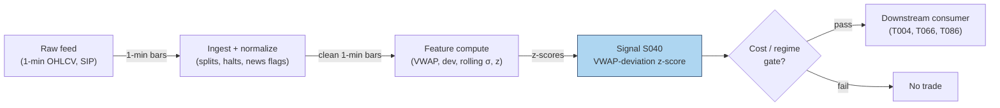

## Stage 40/200 — S040: VWAP-deviation mean reversion

*Batch SB1 · Signal 40/100 · Provenance [SR] · Family C — Mean reversion & reversal*

### S1. One-line verdict

| Field | Detail |
|---|---|
| **What it is** | Price stretched far from session VWAP snaps back: short upside extensions, buy downside ones, as benchmarked algos trade toward their target. |
| **When it works** | Range days and midday lulls where the extension is uninformed flow — a block, a fat finger, a momentum algo overshooting. |
| **When it dies** | Trend days: the deviation is information (S024's territory), and fading it is stepping in front of the benchmarked flow itself. |
| **Build-or-buy in one line** | Build the bands yourself (same VWAP engine as S024, plus a rolling σ); buy nothing — the regime classifier is the product, not the z-score. |

Provenance **[SR]** (standard reconstruction): VWAP ± kσ bands are a practitioner standard; the report's citations are practitioner knowledge bases plus Haendler et al. (2025) for the mechanism. No public paper publishes a canonical VWAP-deviation fade rule with performance. [SR] is **not** upgraded here.

### S2. How it works — plain human explanation

It is 11:20, MSFT. Session VWAP sits at 428.10. A 40,000-share market sell order just swept three levels and printed at 427.55 — 13 bps *below* VWAP — on no news. The VWAP-deviation signal says: buy. Not because 427.55 is "cheap" in any absolute sense, but because of who is about to trade next.

The mechanism is the mirror of S024's. A large share of institutional flow is benchmarked to VWAP (Berkowitz, Logue & Noser 1988, and every execution desk since). A VWAP algorithm that is *behind* its benchmark — it has bought too little while price ran away — must accelerate buying to catch up; one that is *ahead* can slow down. When price stretches far above VWAP, the benchmarked buyers are, on average, ahead of schedule and ease off while benchmarked sellers lean in; the reverse below. The deviation itself summons the flow that erases it — a rubber band powered by other people's mandates. Choi, Larsen & Seppi (2018) formalize this: TWAP/VWAP order-splitting benchmarks induce predictable intraday price-pressure patterns, and deviations from the benchmark path are where the pressure concentrates.

But — and this is the whole game — the rubber band only snaps back if the extension was *uninformed*. If price is 13 bps below VWAP because a real seller knows something, the benchmarked algos' buying is the liquidity the informed seller wanted, and your fade is their exit. That is why the report pairs S040 with S024 as mirrors: extension + fading volume = reversion (this signal); extension + rising volume = continuation (S024). The signal without the regime classifier is a coin flip with costs.

Why should deviations revert *economically*? Three forces:

1. **Benchmark-chasing flow** (above): mechanical, persistent, largest midday when participation schedules are steepest.
2. **Inventory mean reversion of liquidity providers**: the market makers who absorbed the sweep are long inventory they didn't want; they shade quotes to get flat, pulling price back.
3. **Value-area gravity**: VWAP is the volume-weighted consensus price of the day; absent new information, auction logic says trade migrates back to where most volume agreed.

**Mental model (3 bullets):**
- VWAP deviation = distance from the day's consensus; fading it = betting the move was noise, not news.
- The edge is not the z-score — it is *classifying the extension* (uninformed sweep vs informed break). Volume, news, and time-of-day do that work.
- S024 and S040 are one signal with a regime switch, not two signals. Running both without the switch = trading against yourself.

### S3. The math — exact formula

Session VWAP as in S024: $\mathrm{VWAP}_t = \sum_{i\le t} TP_i V_i / \sum_{i\le t} V_i$. Deviation and its z-score:

$$
d_t = \frac{C_t - \mathrm{VWAP}_t}{\mathrm{VWAP}_t}, \qquad
z_t = \frac{d_t}{\hat{\sigma}_{d,t}}, \qquad
\hat{\sigma}_{d,t} = \mathrm{std}(d_{t-W+1 \dots t})
$$

$d_t$ = fractional deviation (dimensionless; ×10⁴ = bps), $\hat{\sigma}_{d,t}$ = rolling standard deviation of the deviation over window $W$ bars. **Example rule (not universal — the report's own words):** enter short when $z_t > +1.5$ (long when $z_t < -1.5$); exit when $|z_t| < 0.25$, on a time stop, or before late-session benchmark flow. VWAP ± k·σ bands are the same engine drawn as bands: $\mathrm{VWAP}_t \pm k\,\hat{\sigma}_{d,t}\,\mathrm{VWAP}_t$.

**Causal timing:** $z_t$ uses only bars $\le t$; the rolling $\hat{\sigma}$ needs $\ge$ ~5 bars before it is anything but noise (see S4's warning). Tradable no earlier than $t+1$'s open. The classic leak: computing $d_t$ with the *current* bar's still-forming volume.

**Normalization choices:** z-score (report's form) adapts to each name's typical deviation scale; raw bps thresholds are simpler but name-specific; rank/percentile of $d_t$ vs its 20-day same-slot distribution deseasonalizes the U-shaped intraday vol (pairs well with S067).

**Parameter table** (defaults marked `example — not an institutional standard`):

| Parameter | Symbol | Typical range | Too small | Too large | Default (example) |
|---|---|---|---|---|---|
| Entry k | $k_{\text{in}}$ | 1.0–2.5 σ | noise trades | never triggers | 1.5 |
| Exit band | $k_{\text{out}}$ | 0–0.5 σ | exits before reversion pays | round-trips back out | 0.25 |
| Rolling σ window | $W$ | 10–60 bars | σ estimate is noise (S4!) | slow to adapt | 30 (example) |
| Min bars for σ | — | 5–20 | z explodes on 3 samples | late entries | 5 (example) |
| Time stop | — | 15–60 min | cuts winners | carries into close flow | 30 min / flat by 15:30 (example) |
| Volume context | — | extension on low vs high vol | fades informed breaks | misses sweeps | require extension volume < slot median (example) |

**Named variants:**
1. **Session-VWAP z-fade** (report's form): deviation vs rolling σ, session anchor.
2. **Band-tag fade**: price tags VWAP ± kσ band drawn from a 20-day same-slot σ — slower, more stable bands.
3. **Anchored-deviation fade**: deviation vs *anchored* VWAP (news anchor) — for post-event overextensions; pairs with T067's anchor.

### S4. Worked example — step-by-step numbers (SYNTHETIC)

**Synthetic** 12-minute tape, `numpy.random.default_rng(40)` — **seed 40**. Price overshoots above VWAP early, then drifts back through it. Same data as the S11 chart. Not a backtest: no costs, fills assumed, one toy episode.

| bar | C ($) | VWAP ($) | dev (bps) | z | event |
|---|---|---|---|---|---|
| 1 | 99.99 | 99.99 | 0.0 | n/a | σ needs ≥5 bars |
| 2 | 100.04 | 100.02 | +2.0 | n/a | |
| 3 | 100.09 | 100.05 | +4.0 | n/a | |
| 4 | 100.17 | 100.08 | +9.0 | n/a | |
| 5 | 100.19 | 100.11 | +8.0 | **+2.08** | **ENTRY SHORT** (example \|z\|>1.5) |
| 6 | 100.17 | 100.12 | +5.0 | +1.45 | inside band |
| 7 | 100.14 | 100.12 | +2.0 | +0.61 | |
| 8 | 100.11 | 100.12 | −1.0 | −0.28 | crossed through VWAP |
| 9 | 100.05 | 100.11 | −6.0 | −1.29 | extension the other way |
| 10 | 100.02 | 100.11 | −9.0 | −1.58 | |
| 11 | 100.00 | 100.10 | −10.0 | −1.48 | |
| 12 | 99.98 | 100.09 | −11.0 | −1.45 | **EXIT: time stop** |

**Step-by-step:** $d_t = (C_t - \mathrm{VWAP}_t)/\mathrm{VWAP}_t$; $\hat{\sigma}_d$ is the rolling 10-bar sample std of $d$ (min 5 bars). At bar 5, $z = +2.08 > 1.5$ → short at 100.19 (earliest honest fill: bar 6 open). The ±0.25 exit band is never re-entered — $z$ falls to −0.28 at bar 8 (close, but $|z| = 0.28 > 0.25$) then stretches negative — so the **time stop** closes the trade at bar 12: $100.19 \to 99.98$ = **+21.0 bps gross**, synthetic, before costs.

**What to notice (and its limits):** three honest artifacts are on display. First, bars 1–4 have no z — the rolling σ needs history, so the *first* valid signal arrives mid-episode; production systems warm-start σ from prior days. Second, the ±0.25 exit never fired and the trade was saved by the time stop — band exits assume smooth decay *through* the band, but real deviations often blow through VWAP and extend the other way (bars 9–12 hit −1.58σ). Third, the toy charges no spread: the bar-5 short would really pay the ask, and +21.0 bps gross shrinks fast against a 2–4 bp round trip plus impact. The example demonstrates the arithmetic and the exit logic's fragility — nothing more.


### S5. Strategies that use this signal

- **T004 — VWAP-Deviation Mean-Reversion** — primary entry trigger (direction): fades extreme session-VWAP deviations, timed by queue imbalance (S003), normalized by diurnal vol (S067).
- **T066 — VWAP-Cross Institutional Follower** — secondary fade leg: follows sustained crosses (S024) but *fades extreme deviations* — S040 is the strategy's contrarian sleeve, gated by RVOL.
- **T086 — OFI-Paced Participation Tracker** — execution-benchmark consumer: VWAP is the participation target; S040-style deviation logic throttles child-order pacing (slow down when ahead of benchmark, accelerate when behind).

### S6. Data required — exact spec

| Field | Type | Granularity | Source tier | Notes |
|---|---|---|---|---|
| 1-min OHLCV | float/int | 1-min | Tier 0–2 | Same engine as S024; share the pipeline |
| Rolling σ warm-up history | float | 1-min | Tier 1–2 | Prior days' deviations to seed $\hat{\sigma}_d$ |
| News/event flags | boolean | event | Tier 2 | Suppress fades into scheduled news (fade noise, not information) |
| Halt flags | boolean | 1-min | Tier 1–2 | Exclude halted bars from σ estimation |

**Collection:** same as S024 (Databento ohlcv-1m, Polygon v3 aggregates, Alpaca). **Ingest sketch** (polars, ≤20 lines — extends the S024 sketch):

```python
import polars as pl
s = pl.read_parquet("bars_1m.parquet").sort(["sym","ts"])   # with vwap col from S024
s = s.with_columns(d=(pl.col("c")-pl.col("vwap"))/pl.col("vwap"))
s = s.with_columns(sig=s["d"].rolling_std(30, min_periods=5).over("sym"))
s = s.with_columns(z=pl.col("d")/pl.col("sig"))
s = s.with_columns(
    short_sig=(pl.col("z") > 1.5),          # example thresholds
    long_sig =(pl.col("z") < -1.5),
    exit_sig=pl.col("z").abs() < 0.25)
```

**Storage:** identical to S024 — 1-min, 500 symbols ≈ 50 MB/day (§4), ~3 GB/60 days; signal state adds two floats per symbol. **Data-quality checklist:** warm-start σ (never z-score on 3 samples); split adjustment before cumulative sums; halt exclusion; news-window suppression list; late-session benchmark flow — many desks *stop fading* after 15:30 when MOC/index flow dominates.

### S7. Local build on M5 Max / 128GB

**Feasibility: trivial.** Same engine as S024 plus a rolling std — Tier L (4–12 h, ~$600–1,800 loaded-cost estimate per §5).

**Throughput** (per §2): 500 × 390 bars/day = 195k bars; polars rolling ops at ~1–10M rows/sec (complex ops) recompute the universe in under a second. Real-time per-bar update is O(W) per symbol — negligible. Bottleneck: none; the regime classifier (if you add S079) dominates cost, not the z-score.

**Stack options:**

| Stack | When to pick |
|---|---|
| Python + polars | Default; the sketch above is the whole signal |
| DuckDB | SQL-first research over parquet archives |
| Rust | Only if you push to tick-level deviation across hundreds of names |

**RAM:** 60 days × 500 symbols 1-min ≈ **12 MB** (§3); warm-up history adds nothing material. Inside the 77 GB budget with room to spare.

**What breaks first at 500 symbols:** nothing at 1-min. It breaks *economically* before it breaks computationally: 500-name fading needs borrow, per-name spread modeling, and a regime switch — the infra is trivial, the risk system is not.

### S8. Buy vs build

| Option | What you get | Indicative price | Gains | Loses |
|---|---|---|---|---|
| Tier-0: Stooq / Alpaca IEX | Bars for prototyping | ~$0 | Free | No corporate-action rigor |
| Tier-1: Polygon Stocks Advanced | SIP 1-min, adjusted | ~$30–200/mo | Clean history for band calibration | You build the regime logic |
| Tier-2: Databento Standard | L1 + 1-min, halt flags | ~$200/mo + usage | Honest timestamps for the σ warm-up | Overkill for the signal alone |
| Practitioner: Kissell (2014) book | VWAP-strategy treatment | book price | The desk-level framing | No code, no parameters |

**Verdict — build if** you want custom bands, anchors, or the regime switch (you do): the signal is a rolling z-score. **Buy** the feed for clean adjusted history. **Crossover:** hybrid — Tier-1/2 data in, your bands and classifier on top. Nobody sells a VWAP-fade *strategy* with audited performance; if they did, the price would tell you the Sharpe. All prices above: indicative — verify before budgeting.

### S9. Success ratio / efficacy — documented evidence

| Study / source | Market & period | Metric | Before/after cost | Caveat |
|---|---|---|---|---|
| Berkowitz, Logue & Noser (1988) | NYSE, 1980s | Institutional execution clusters at VWAP | Before-cost | Benchmark *relevance*, not a fade strategy |
| Choi, Larsen & Seppi (2018) | Model | VWAP order-splitting induces predictable price-pressure patterns | n/a (theory) | Model, no live statistics; arXiv:1803.08336 |
| Haendler et al. (2025) | US equities | VWAP-type trading significant in open/midday periodicity | Before-cost (observational) | Documents the *flow*; SSRN 5749704 |
| Practitioner consensus (Kissell 2014, ch. on VWAP strategies) | Desks | VWAP±bands standard; fades used with discretion | Anecdotal | No published Sharpe; specific flow stats quoted second-hand are **unverified** |

**Regimes where it fails:** trend days (the extension is information — S024's mirror); the last 30 minutes (MOC/index benchmark flow overwhelms); news-driven extensions (fading information); low-liquidity names where "deviation" is just wide spreads. **Documented decay:** none published — there is no performance series to decay, which is itself the warning.

**Honest bottom line:** as a standalone trigger this is a **negligible-to-negative edge after costs** for the naive rule — the report's own caveat, and the literature gives no reason to dispute it: no published Sharpe exists, and the mechanism's profit accrues to whoever provides the liquidity with proper risk controls, not to a z-score rule. As a **timing sleeve inside an execution or market-making book** (T004/T086-style: provide liquidity *at* the band, get paid the spread *and* the snap-back), it is defensible. The regime classifier is the strategy; the z-score is just the ruler.

### S10. Failure modes & pitfalls

1. **Fading information** — the extension is news; benchmarked flow is the informed trader's liquidity. *Mitigation: news-window suppression; volume-context gate (fade only low-volume extensions); T067-style anchor awareness.*
2. **Trend-day misclassification** — running S040 on an S024 day. *Mitigation: regime estimate first (S079 HMM, or simply: rising volume + holding above VWAP = do not fade).*
3. **σ warm-up artifacts** — z-scores on 3–4 samples explode (S4 bars 1–4). *Mitigation: min-periods ≥5; warm-start from prior days; never trade the first valid z blindly.*
4. **Band-exit illusion** — exits assume smooth decay through ±0.25; real deviations blow through (S4 bars 9–12). *Mitigation: always pair with a time stop; consider stop-loss on further extension.*
5. **Late-session benchmark flow** — after ~15:30, MOC and index-rebalance flow dominates and deviations persist into the close. *Mitigation: flatten fades by 15:30 (example); do not fade the close.*
6. **Cost vs edge** — a 1-min fade turns over constantly against 2–4 bp round trips. *Mitigation: per-trade cost model; require expected snap-back ≫ costs; prefer providing liquidity (limit orders) over taking.*
7. **Partial-bar leakage** — deviation computed on forming bars. *Mitigation: closed bars only; t→t+1 fills.*
8. **Crowded bands** — every retail platform draws the same VWAP bands; tags become stop-hunt magnets. *Mitigation: proprietary σ windows/anchors; expect slippage at obvious bands.*

### S11. Visuals




### S12. Sources

1. Berkowitz, S. A., Logue, D. E. & Noser, E. A. (1988). "The Total Cost of Transactions on the NYSE." *Journal of Finance*, 43(1), 97–112. https://repec.udesa.edu.ar/pub/Finanzas/Journals/Journal%20of%20Finance/43/1/2328325.pdf
2. Choi, J. H., Larsen, K. & Seppi, D. J. (2018). "Equilibrium Effects of Intraday Order-Splitting Benchmarks." arXiv:1803.08336. https://ideas.repec.org/p/arx/papers/1803.08336.html
3. Haendler, C., Heston, S., Korajczyk, R. & Sadka, R. (2025). "The Intra-Day Stock Return Periodicity Puzzle." Working paper, SSRN 5749704.
4. Kissell, R. (2014). *The Science of Algorithmic Trading and Portfolio Management.* Academic Press. (Practitioner treatment of VWAP benchmark strategies; book, no URL.)

**Unverified leads:** second-hand statistics on VWAP algo market share ("30–40% of institutional flow") and per-minute reversion flow ("0.02–0.05% per 1% deviation") via a GitHub knowledge-base mirror — not verified against Harris/Kissell originals; excluded from evidence. Vendor whitepapers claiming VWAP-fade performance — unverified unless audited numbers are produced.

**Source log:** chatbot answers (Grok/Cursor) pending — checked 2026-09-10; grok-answers.md and cursor-answers.md absent from batches/SB1/ (duckai-answers.md present but covers S001 only, not this chapter).
