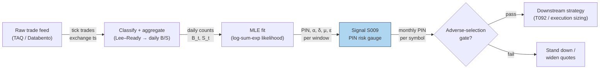

## Stage 9/200 — S009: PIN (probability of informed trading)

*Batch SB10 · Signal 9/100 · Provenance [D] · Family A — Microstructure & order flow*

### S1. One-line verdict

| | |
|---|---|
| **What it is** | Structural estimate of the fraction of trades coming from informed traders, from daily buy/sell counts. |
| **When it works** | As a slow adverse-selection gauge: flagging names/regimes where uninformed flow is likely to lose to informed flow. |
| **When it dies** | As a real-time or daily timing signal; in thin/erratic tapes, after trade-misclassification, or when arrival rates drift. |
| **Build-or-buy in one line** | Build the MLE estimator yourself (the math is public); buy or borrow *classified* trade history if you need depth. |

### S2. How it works — plain human explanation

Imagine a stock on a quiet Tuesday: buys and sells arrive in roughly balanced dribs and drabs — say 40 buyer-initiated and 40 seller-initiated trades. Now imagine a different Tuesday: 90 buys against 40 sells, all morning. Something may be afoot — someone may know something. **PIN (probability of informed trading)** formalizes that intuition. It is the output of a small structural model of *who trades when*: on any given day, either nothing special happens and only **uninformed** traders (liquidity seekers, indexers, noise) show up, or an **information event** occurs — good news or bad news — and **informed** traders pile in on one side.

A concrete vignette. 9:47:03, fictitious ticker ACME: bid 50.00 × 800 / ask 50.02 × 300. Over the next hour the tape prints 60 buyer-initiated trades and 12 seller-initiated trades. A **buyer-initiated** trade is one where the aggressor bought — the trade printed at (or lifted) the ask; a **seller-initiated** trade printed at (or hit) the bid. (Determining which side was the aggressor is called **trade classification**; more in S6.) PIN asks: given today's counts of buyer- and seller-initiated trades, what fraction of total expected order flow is informed?

Why should the effect exist economically? **Adverse selection**: when you trade against someone who knows more than you, you lose on average — the market maker widens the **spread** (the gap between bid and ask) to compensate, and prices move against liquidity providers after the trade. High PIN means a high expected share of informed flow, hence wider spreads, larger price impact, and — in the cross-section — investors demanding a higher expected return to hold the stock. Note the direction carefully: high PIN does not mean the stock goes up. An informed seller with bad news produces a high PIN and a falling price.

Mental model, three bullets:

- **PIN is a characteristic, not a trigger.** It describes the *composition* of trading over a window (tens of days), like a credit rating describes a borrower — slow-moving, not a timing device.
- **It is estimated, not observed.** Nobody sees "informed" stamped on a trade; PIN backs the number out of buy/sell imbalances via a **maximum-likelihood estimator (MLE)** — the parameter values that make the observed counts most probable.
- **High PIN ≠ positive return.** It means high adverse-selection risk. The informed side can be selling.

### S3. The math — exact formula

Each day *t* the market is in one of three states. Let *B_t* = buyer-initiated trades, *S_t* = seller-initiated trades (counts, not dollars — standard PIN uses counts):

- No news, probability (1−α): *B_t* ~ Poisson(ε_b), *S_t* ~ Poisson(ε_s)
- Good news, probability αδ: *B_t* ~ Poisson(μ+ε_b), *S_t* ~ Poisson(ε_s)
- Bad news, probability α(1−δ): *B_t* ~ Poisson(ε_b), *S_t* ~ Poisson(μ+ε_s)

A **Poisson** distribution models counts of random arrivals: Poisson(λ) has mean λ. **MLE** = maximum likelihood estimation: choose parameters maximizing the probability of the observed data.

The day-*t* likelihood is the three-state **mixture**:

$$L_t(\theta) = \alpha\delta\cdot \mathrm{Po}(B_t\mid\mu+\varepsilon_b)\mathrm{Po}(S_t\mid\varepsilon_s) + \alpha(1-\delta)\cdot \mathrm{Po}(B_t\mid\varepsilon_b)\mathrm{Po}(S_t\mid\mu+\varepsilon_s) + (1-\alpha)\cdot \mathrm{Po}(B_t\mid\varepsilon_b)\mathrm{Po}(S_t\mid\varepsilon_s)$$

with θ = (α, δ, ε_b, ε_s, μ), 0 < α, δ < 1, ε_b, ε_s, μ > 0. The log-likelihood over a window of *T* days is ℓ(θ) = Σ_t log L_t(θ). Because Poisson terms like e^{−900}·900^{900}/900! **underflow** (collapse to zero) in floating point, compute in log space with the **log-sum-exp** stabilization: log Σ_j w_j e^{x_j} = m + log Σ_j w_j e^{x_j − m}, m = max_j x_j.

PIN itself is the ratio of expected informed arrivals to expected total arrivals:

$$\mathrm{PIN} = \frac{\alpha\mu}{\alpha\mu + \varepsilon_b + \varepsilon_s}$$

| Parameter | Symbol | Typical range | Too small / too large | Default (example — not an institutional standard) |
|---|---|---|---|---|
| P(information event) | α | 0.1–0.6 | →0: model says never news; →1: every day is an event, identification collapses | 0.40 |
| P(good news \| event) | δ | 0.3–0.7 | boundary (0/1): optimizer stuck; implies one-sided info flow only | 0.50 |
| Informed arrival rate | μ | 10–500/day | implausibly large vs counts → boundary/overflow | 50/day |
| Uninformed buy/sell rates | ε_b, ε_s | 10–1000/day | 0 → division pathologies; huge → PIN → 0 | 40/day each |
| Estimation window | T | 60–250 trading days (illustrative) | <60: weak identification, local maxima; >250: stale, rates drift | 120 days |

**Causal timing.** PIN is computed at the end of window *T* using only data ≤ *T*; it characterizes the *past* window. It is tradable no earlier than *T*+1 — and even then only as a slow risk gauge. Never present a daily PIN change as a clean information shock: the estimator needs tens of days to identify α and μ.

**Named variants.** (1) **Standard daily PIN** (Easley–Kiefer–O'Hara–Paperman 1996): as above, daily counts, multi-start constrained MLE. (2) **Factorized / stabilized likelihood** (Easley et al. rearrangement; Lin–Ke factorization): algebraically rearranged likelihood that avoids underflow and reduces boundary bias — same model, numerically safer optimizer target. (3) **Time-varying arrival rates** (Easley–Engle–O'Hara–Wu 2008): α, μ, ε evolve rather than staying constant — addresses the stale-window critique at the cost of complexity. (4) **Intraday/short-window adaptations**: re-estimate on intraday buckets; these are structural-model extensions, *not* evidence PIN is observable in real time — treat as experimental.

### S4. Worked example — step-by-step numbers (SYNTHETIC)

**All numbers below are synthetic** (operator-verified fixed tape; seed 9 recorded for script reproducibility). Real PIN estimation needs 60+ days; this 10-day tape is a teaching toy — the standard errors on a 10-day fit would be enormous.

| Day | B_t | S_t | Imbalance (B−S)/(B+S) | Inferred state (example rule \|B−S\| ≥ 40) |
|---|---|---|---|---|
| 1 | 90 | 40 | +0.3846 | good-news event |
| 2 | 40 | 90 | −0.3846 | bad-news event |
| 3 | 42 | 38 | +0.0500 | no news |
| 4 | 39 | 41 | −0.0250 | no news |
| 5 | 40 | 40 | +0.0000 | no news |
| 6 | 88 | 42 | +0.3538 | good-news event |
| 7 | 41 | 87 | −0.3594 | bad-news event |
| 8 | 38 | 42 | −0.0500 | no news |
| 9 | 40 | 39 | +0.0127 | no news |
| 10 | 41 | 40 | +0.0123 | no news |

Step 1 — means: ΣB = 499, ΣS = 499, so B̄ = S̄ = 49.9.

Step 2 — moment-matched parameters (illustrative; a real fit runs the MLE optimizer): event days = 4/10 → α̂ = 0.40. Good-news share of events = 2/4 → δ̂ = 0.50. No-news days average B = S = 240/6 = 40.0 → ε̂_b = ε̂_s = 40. Good-news buy average = (90+88)/2 = 89 → μ̂ ≈ 89 − 40 = 49 ≈ 50 (rounded, as verified).

Step 3 — PIN: α̂μ̂ = 0.40 × 50 = 20; ε̂_b + ε̂_s = 80; **PIN = 20/(20+80) = 0.20 = 20%**.

Step 4 — the likelihood on day 1 (B=90, S=40), showing why log-sum-exp matters. Log-terms (weight included): good-news −7.5447, bad-news −48.0912, no-news −29.4298. In linear space: 5.289×10⁻⁴, 1.30×10⁻²¹, 1.655×10⁻¹³ — the bad-news term is 17 orders of magnitude smaller than the leading term, and with larger counts such terms underflow to exactly 0.0, silently corrupting the sum. Log-sum-exp: log L_1 = m + log Σ w_j e^{x_j−m} = **−7.5447**, with posterior P(good news | day 1) ≈ 1.0000. The chart plots this tape: daily B/S bars with event days shaded, plus the arrival-rate decomposition 20 vs 80.

**What to notice.** Days 3–5, 8–10 sit near balance (the uninformed baseline ≈ 40/40); the four event days scream imbalance — that contrast is what identifies α and μ. Limits: no fees or spreads enter anywhere; a 10-day window cannot separate α from μ reliably (they enter PIN only as the product αμ, which is exactly why PIN is better identified than its components); and the "event" labels above used a hand rule, not the optimizer.


### S5. Strategies that use this signal

- **T092 — PIN-gated informed-flow avoidance**: primary conditioning variable — the strategy stands down (no new risk) when PIN/toxicity is high and meta-labels the stand-down rule.
- **T021 — Avellaneda–Stoikov inventory-skew market maker**: PIN as an adverse-selection filter — widen quotes / shrink size when PIN is elevated (veto on aggressive quoting).
- **T003 — VPIN-gated breakout trader**: the intraday cousin — uses VPIN (S008) rather than PIN for the same toxicity-gating job at minutes-to-hours horizons.
- Context: **S008 (VPIN)** is the real-time toxicity measure to reach for when PIN is too slow; **S086 (meta-labeling)** can learn *when* the PIN stand-down actually pays.

### S6. Data required — exact spec

| Field | Type | Granularity | Source tier | Notes |
|---|---|---|---|---|
| Trade price, size, timestamp | float, int, ts | tick | Tier 1–3 | Needs exchange timestamps for honest signing |
| Aggressor flag (buy/sell-initiated) | boolean | tick | Tier 2–3 | If absent, classify via Lee–Ready/quote rule |
| Daily B_t, S_t counts | int | daily | derived | Aggregate of the above; the MLE input |
| Corporate-action / halt calendar | table | daily | Tier 1 | Splits don't change counts but change the universe |

Collection: raw trades → classify each trade (exchange aggressor flag; else **Lee–Ready (1991)** rule: trade above the prevailing midquote = buy, below = sell, at the mid = tick test against prior price) → aggregate to daily (B_t, S_t) → store. Ingest sketch (≤20 lines):

```python
import polars as pl
trades = pl.read_parquet("raw/trades_2026-09-10.parquet")          # ts, price, size, bid, ask, aggressor
q = (trades.with_columns(mid=(pl.col("bid") + pl.col("ask")) / 2)
     .with_columns(side=pl.when(pl.col("aggressor").is_not_null())
                   .then(pl.col("aggressor"))
                   .when(pl.col("price") > pl.col("mid")).then(pl.lit(1))   # Lee–Ready quote rule
                   .when(pl.col("price") < pl.col("mid")).then(pl.lit(-1))
                   .otherwise(pl.lit(0))))                                   # tick test omitted for brevity
daily = (q.filter(pl.col("side") != 0).group_by(pl.col("ts").dt.date().alias("date"))
         .agg(B=(pl.col("side") == 1).sum(), S=(pl.col("side") == -1).sum()))
daily.write_parquet("curated/daily_bs.parquet")
```

Storage: daily B/S counts are bytes per symbol-day — negligible. Per `notes/cost-model.md` §4, daily bars for 3,000 stocks are ~5 MB/day total; a decade of B/S counts is ~0.1–2 GB. **Data-quality checklist:** exchange vs SIP timestamps (classification flips on stale quotes); corporate actions and listing changes (window composition); halts (zero-count days are not "no-news" days); DST/half-days; and classification-method consistency across the whole window — switching methods mid-window biases α.

### S7. Local build on M5 Max / 128GB

**Feasibility verdict: feasible — the compute is trivial; the data acquisition is the project.** Fitting one PIN window is milliseconds to seconds of optimizer time; 500 symbols × one 120-day window is minutes in optimized Python (per `notes/cost-model.md` §2, polars simple ops run ~10–50M rows/sec and the daily-count panel is tiny). The bottleneck is not CPU — it is obtaining clean, consistently classified trade history.

- **Throughput:** MLE compute ~ms–s per symbol-window; a 500-symbol monthly refresh is a coffee break, not a cluster job. Bottleneck: trade-classification data licensing and backfill.
- **Stack options:** Python+polars for classification/aggregation plus scipy for the constrained MLE (pick this — the likelihood is five parameters, no need for more); Rust only if you are already classifying billions of ticks in a streaming loop; DuckDB for the curated B/S panel.
- **RAM:** working arrays < 1 GB; 60 days of daily counts for 500 symbols is kilobytes; even 10 years is ~0.1–2 GB (per cost-model §3 working-budget rule, keep < ~77 GB — PIN uses a rounding error of it).
- **Engineering band:** Tier H per plan §6 (PIN is explicitly listed there): **60–200 h → $9,000–30,000** at the $150/hr loaded-cost estimate. One line of justification: signing pipeline + multi-start MLE with boundary diagnostics + rolling-window orchestration + validation is a real estimation project, not a formula transcription.
- **What breaks first at 500 symbols or full OPRA:** not the MLE — the trade-classification backfill and the corporate-action-aware universe maintenance. PIN on options flow is out of scope; full OPRA is irrelevant to this signal.

### S8. Buy vs build

| Option | What you get | Indicative price | Gains | Loses |
|---|---|---|---|---|
| Self-classify SIP trades (Alpaca SIP / Polygon Stocks Advanced, Tier 1) | Raw trades; you run Lee–Ready | ~$30–200/mo, *indicative — verify before budgeting* | Cheap, full control | Classification error biases PIN downward (Grammig–Theissen); SIP timestamps |
| Databento (Tier 2) | MBP-1/trades with aggressor flags on supported schemas | ~$200/mo + usage, *indicative — verify before budgeting* | Exchange timestamps, honest flags where available | Usage metering on history backfill |
| TAQ via WRDS / LOBSTER (academic, Tier 3) | Full historical trades with exchange flags | ~hundreds/yr academic, *indicative — verify before budgeting* | Gold-standard history | Academic licensing, no commercial redistribution |
| Precomputed PIN series (vendor analytics) | A PIN number per symbol | vendor-quoted | Zero engineering | Black-box methodology; you can't audit the estimator |

**Verdict: build the estimator, buy (or borrow) the classified data.** The MLE is public math — there is no edge in re-deriving it. The edge, if any, is in classification quality and window hygiene. Crossover: if you need >5 years of consistently classified history across the full US universe, the academic TAQ route or a Tier-2 backfill beats hand-rolling SIP classification.

### S9. Success ratio / efficacy — documented evidence

| Study / source | Market & period | Metric | Before/after cost | Caveat |
|---|---|---|---|---|
| Easley–Hvidkjaer–O'Hara (2002) | NYSE, 1983–1998 | 10pp PIN difference → +2.5%/yr expected return; high–low PIN decile ≈ 7.5% annualized | **Before cost** — cross-sectional pricing regression, not a traded strategy | Original sample; contested since |
| Duarte–Young (2009) | US, extended sample | PIN's *illiquidity* component is priced; the *asymmetry* component is not | **Before cost** | PIN premium may be a liquidity premium in disguise |
| Mohanram–Rajgopal (2009) | NYSE, extended | PIN premium significant in only one 5-year subperiod of the original sample | **Before cost** | Not robust to period/specification |
| Lai–Ng–Zhang (2014) | 47 countries, 30,095 firms | No positive PIN effect on expected returns internationally | **Before cost** | Market-structure dependence |
| Grammig–Theissen (2007) | Simulations | Trade misclassification biases PIN **downward**; bias scales with trading intensity | n/a — methodological | Your PIN is only as good as your signing |

Regimes where it fails: thin/erratic tapes (weak identification — the optimizer sits on boundaries), market-structure changes mid-window (tick-size pilots, venue shifts), fast-moving news regimes where constant arrival rates are a fiction, and crisis windows with halts and erratic prints.

**Honest bottom line:** after costs, PIN is more credible as a risk-control or cross-sectional conditioning variable than as a standalone alpha signal. High PIN ≠ positive return — a high-PIN stock can realize negative returns when the informed side is selling or the news is bad. As a standalone trigger this is a *weak, slow* edge; as a filter (stand down / widen quotes / shrink size when PIN is high) it is *defensible*. Cost-model note (H5): the PIN gauge itself generates no trades, so spread+fees+impact are n/a at the signal level; costs enter when PIN gates a strategy (T092), where that strategy's explicit cost model applies.

### S10. Failure modes & pitfalls

- **Lookahead leakage:** computing PIN on a window that includes the "future" relative to the decision date — mitigate by strictly rolling windows ending at *t*, signal usable at *t*+1.
- **Weak identification in short windows:** α and μ enter only as the product αμ — mitigate with ≥60-day windows, multi-start optimization, and flagging boundary solutions.
- **Likelihood underflow/overflow:** naive likelihood collapses on active names — mitigate with log-sum-exp / factorized likelihood (non-negotiable).
- **Trade-misclassification bias:** Lee–Ready errors bias PIN downward — mitigate with exchange aggressor flags where available; document the classifier.
- **Staleness:** arrival rates drift; a 250-day window describes a regime that no longer exists — mitigate by comparing 60/120/250-day estimates and flagging disagreement.
- **Cost blowup:** spreads on high-PIN names are wide — the very names PIN flags are the most expensive to trade; mitigate by using PIN as a *veto*, not an entry trigger.
- **Overfitting the window:** tuning window length to maximize an in-sample premium — mitigate by fixing windows ex ante.
- **Microstructure noise vs signal:** quote flicker and odd-lot prints masquerading as informed flow — mitigate with minimum-price and minimum-activity screens.

### S11. Visuals




### S12. Sources

Source log: Duck.ai answered Q-SB10-1–Q-SB10-3 (2026-09-10); Grok answers pending (checked 2026-09-10). The PIN formula, likelihood, and worked example A are operator-verified (task spec); remaining chatbot material is treated as research leads.

1. Easley, D., Kiefer, N. M., O'Hara, M., Paperman, J. B. (1996). "Liquidity, Information, and Infrequently Traded Stocks." *Journal of Finance* 51(4), 1405–1436. http://ideas.repec.org/a/bla/jfinan/v51y1996i4p1405-36.html — the original PIN model and estimator.
2. Easley, D., Hvidkjaer, S., O'Hara, M. (2002). "Is Information Risk a Determinant of Asset Returns?" *Journal of Finance* 57(5), 2185–2221. http://ideas.repec.org/a/bla/jfinan/v57y2002i5p2185-2221.html — PIN return premium (~7.5% annualized, 1983–1998; before cost).
3. Duarte, J., Young, L. (2009). "Why is PIN priced?" *Journal of Financial Economics* 91(2), 119–138. https://ideas.Repec.org/a/eee/jfinec/v91y2009i2p119-138.html — the priced component is illiquidity, not asymmetry.
4. Mohanram, P., Rajgopal, S. (2009). "Is PIN priced risk?" *Journal of Accounting and Economics* 47(3), 226–243. http://ideas.repec.org/a/eee/jaecon/v47y2009i3p226-243.html — premium not robust across periods/specifications.
5. Lai, S., Ng, L., Zhang, B. (2014). "Does PIN affect equity prices around the world?" *Journal of Financial Economics* 114(1), 178–195. https://ideas.Repec.org/a/eee/jfinec/v114y2014i1p178-195.html — no PIN pricing effect in 47-country sample.
6. Boehmer, E., Grammig, J., Theissen, E. (2007). "Estimating the probability of informed trading — does trade misclassification matter?" *Journal of Financial Markets* 10(1), 26–47. Working-paper version: https://ideas.repec.Org/p/zbw/bonedp/372002.html — misclassification biases PIN downward.
7. `notes/cost-model.md` §§2–6 — throughput, RAM, engineering-band, and vendor price-band planning numbers used in S6–S8.

**Unverified leads** (chatbot-only, no checkable source captured): the multi-start grid recipe (α ∈ {0.2,0.4,0.6,0.8}, δ ∈ {0.25,0.5,0.75} starts; μ from high-vs-low-activity-day difference; ε from median daily counts) and the 60/120/250-day window comparison protocol — plausible practitioner procedure, treat as illustrative until sourced; the "FRDS PIN documentation" and "JBF 2012 factorized likelihood via RePEc" pointers — not verified, do not cite.
