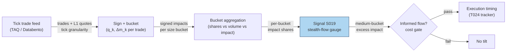

## Stage 19/200 — S019: Stealth trading (trade-size informedness)

*Batch SB10 · Signal 19/100 · Provenance [D] · Family A — Microstructure & order flow*

### S1. One-line verdict

| | |
|---|---|
| **What it is** | The finding that medium-size trades carry a disproportionate share of cumulative price impact — informed traders hiding in the middle of the size distribution. |
| **When it works** | As an execution-timing and market-impact input: unusual medium-size impact flags informed/urgent flow; quiet medium flow flags absorbable liquidity. |
| **When it dies** | As a fixed "medium = $X" rule ported across names, venues, or eras; in fragmented markets where size prints are shredded. |
| **Build-or-buy in one line** | Build the bucket-impact monitor yourself on any tick-trade feed; there is nothing to buy except the data. |

### S2. How it works — plain human explanation

An informed trader faces a dilemma. Trade too small and the profit doesn't cover costs; trade too big and the trade itself screams "I know something," moving the price before the position is built. The **stealth-trading hypothesis** says the rational camouflage is the middle: split the informed bet into **medium-size** trades that blend into normal flow. If that's true, then most of a stock's cumulative price movement should happen on medium-size trades — out of proportion to their share of trades or volume.

A concrete vignette. 10:23:11, fictitious ticker ACME at $50.00. The tape prints: 200 shares buyer-initiated (+1¢ on the mid), 150 shares seller-initiated (−1¢), then 2,500 shares buyer-initiated (+2¢), 3,000 shares buyer-initiated (+3¢), then a 25,000-share block that barely nudges the mid (+0.5¢ — it was pre-negotiated upstairs). The two mid-size prints moved the price more, per dollar, than the block. A **midprice** (or **midquote**) is simply (bid+ask)/2 — the market's instantaneous fair-value estimate; its changes are the cleanest measure of **price impact** (how much a trade moves the market's valuation, stripped of the mechanical bid–ask bounce).

Why should the effect exist? Two-sided economics. Informed traders optimize *stealth per dollar*: medium sizes maximize information traded per unit of price revelation. Market makers, meanwhile, learn that medium-size flow is the most toxic and shade quotes against it — which is exactly why the measured impact concentrates there. The effect is a **documented empirical regularity, not a fixed cutoff**: what counts as "medium" in a mega-cap is block-size in a micro-cap.

Mental model, three bullets:

- **Size is information.** The *distribution* of price impact across trade sizes reveals who is informed; the middle of the distribution is where informed flow hides.
- **"Medium" is relative.** Calibrate buckets to the name's own median dollar volume, quoted depth, and volatility — never to a fixed dollar number.
- **Execution signal first, alpha signal second.** Knowing flow is informed tells you *how* to trade (patiently, or not at all), more reliably than *which direction* to bet.

### S3. The math — exact formula

Bucket every trade by size (small / medium / large — cutoffs are *examples*, calibrated per name). For trade *k* with signed size *q_k* (+shares if buyer-initiated, −shares if seller-initiated) and midprice change Δ*m_k* around the trade, the bucket's cumulative signed impact is Σ_{k∈bucket} q_k·Δm_k. The diagnostic compares **impact share** against **trade share** and **volume share**:

$$\text{impact share}_b = \frac{\sum_{k \in b}\, \lvert q_k\,\Delta m_k\rvert}{\sum_{\text{all }k}\, \lvert q_k\,\Delta m_k\rvert}, \quad \text{trade share}_b = \frac{N_b}{N}, \quad \text{volume share}_b = \frac{V_b}{V}$$

The **stealth signature** is impact share_medium ≫ trade share_medium and ≫ volume share_medium. The modern percentile form (per the research record) replaces fixed buckets with size percentiles:

$$PI_q = \frac{\sum_{\text{size} \in q}\, \lvert r_{t,t+\Delta}\rvert}{\sum\, \lvert r\rvert}$$

over size percentiles (1–5, 5–25, 25–75, 75–95, top 5%), where *r_{t,t+Δ}* is the return over a short horizon Δ after the trade. Signed versions (keeping the sign of *q_k*) give direction; absolute versions measure information intensity regardless of direction.

| Parameter | Symbol | Typical range | Too small / too large | Default (example — not an institutional standard) |
|---|---|---|---|---|
| Bucket cutoffs | — | calibrated to median $ volume | fixed $ cutoff: meaningless across caps | small <$10k, medium $10k–$50k, large >$50k |
| Impact horizon | Δ | seconds–minutes | too short: quote flicker; too long: confounded by other flow | 1–5 min |
| Sample window | — | 1–20 days | too short: noisy shares; too long: regime mixes | 5 days |
| Signed vs absolute | — | — | signed only: offsetting buys/sells cancel and hide intensity | report both |

**Causal timing.** Computed at event *t* using only trades ≤ *t*; a live gauge updates per trade, and any trading decision off it executes no earlier than *t*+1. (The academic results are retrospective bucket statistics, not a real-time signal — porting them to real time is the engineering task.)

**Named variants.** (1) **Barclay–Warner 3-bucket**: small/medium/large by share count (500–9,999 shares = medium in the 1980s NYSE sample); cumulative price change per bucket. (2) **Percentile PI_q**: the modern form above — portable across names because buckets are relative. (3) **Signed impact**: Σ q_k Δm_k keeps direction for trade-timing (informed buying vs selling). (4) **Institution/individual split** (Chakravarty 2001): same buckets computed separately for institutional vs individual prints — the stealth signature lives in institutional medium trades.

### S4. Worked example — step-by-step numbers (SYNTHETIC)

**All numbers below are synthetic** (fixed tape; seed 19 recorded for script reproducibility). Bucket cutoffs (<$10k / $10k–$50k / >$50k) are illustrative examples, not standards. Prices are $50-scale; q_k Δm_k is in dollars.

| # | Notional | Side | Δm | q_k·Δm_k | Bucket |
|---|---|---|---|---|---|
| 1 | $3,000 | buy | +$0.010 | +$30 | small |
| 2 | $2,500 | sell | +$0.012 | −$30 | small |
| 3 | $4,000 | buy | −$0.008 | −$32 | small |
| 4 | $2,000 | sell | −$0.010 | +$20 | small |
| 5 | $20,000 | buy | +$0.020 | +$400 | medium |
| 6 | $15,000 | buy | +$0.025 | +$375 | medium |
| 7 | $30,000 | buy | +$0.015 | +$450 | medium |
| 8 | $12,000 | buy | +$0.030 | +$360 | medium |
| 9 | $25,000 | buy | +$0.010 | +$250 | medium |
| 10 | $80,000 | buy | +$0.005 | +$400 | large |
| 11 | $120,000 | sell | +$0.004 | −$480 | large |
| 12 | $60,000 | buy | −$0.006 | −$360 | large |

Bucket aggregates (absolute cumulative impact Σ|q_k Δm_k|; totals: 12 trades, $373,500 volume, $3,187 impact):

| Bucket | Trades | Volume | Σ\|impact\| | Trade share | Volume share | Impact share |
|---|---|---|---|---|---|---|
| small | 4 | $11,500 | $112 | 33.3% | 3.1% | 3.5% |
| **medium** | **5** | **$102,000** | **$1,835** | **41.7%** | **27.3%** | **57.6%** |
| large | 3 | $260,000 | $1,240 | 25.0% | 69.6% | 38.9% |

The stealth signature: the medium bucket drives **57.6% of cumulative absolute impact** from only 41.7% of trades and 27.3% of volume — an excess of **+15.9pp vs trade share** and **+30.3pp vs volume share**. Note the large bucket: 69.6% of volume but only 38.9% of impact — the block (trade 11) was pre-positioned and barely moved the mid. The chart plots exactly these three share bars per bucket.

**What to notice.** The toy tape was built so medium prints cluster with persistent signed impact while small/large prints offset — that is the regularity, exaggerated for legibility. Limits: no fees; 12 trades cannot support a statistical claim (the papers use months of audit-trail data); and the example's absolute-impact convention is one choice — signed impact would show direction but let offsetting flow cancel.


### S5. Strategies that use this signal

- **T024 — Informed-size tracker / retail fade**: primary trigger — follows stealth medium-size informed flow (this signal) while fading retail/odd-lot flow (S020), with volume-delta (S006) confirmation.
- **T025 — Trade-classification trend filter**: S019 as a conditioning filter — signed medium-bucket impact confirms or vetoes momentum entries classified by Lee–Ready/BVC (S007).
- **T026 — Kyle-lambda participation throttle**: cousin via impact — sizes child orders from impact estimates; unusual medium-bucket impact raises the participation throttle's caution.
- Context: **S020 (retail/odd-lot flow)** is the flow this signal fades against; **S007 (trade classification)** is the signing input both depend on.

### S6. Data required — exact spec

| Field | Type | Granularity | Source tier | Notes |
|---|---|---|---|---|
| Trade price, size, timestamp | float, int, ts | tick | Tier 1–3 | Exchange timestamps preferred |
| Prevailing bid/ask (for signing + Δm) | float | tick (L1) | Tier 1–2 | SIP NBBO acceptable; direct feed better |
| Signed trade (q_k) | ±shares | tick | derived | Lee–Ready/quote rule or aggressor flag |
| Bucket calibration stats | float | daily | derived | Median $ volume, quoted depth, ADV |

Collection: tick trades + quotes → sign each trade (aggressor flag; else Lee–Ready) → compute Δm around the trade → bucket by notional → accumulate per-bucket shares over the window. Ingest sketch (≤20 lines):

```python
import polars as pl
t = pl.read_parquet("raw/trades_quotes.parquet")          # ts, price, size, bid, ask
q = (t.with_columns(mid=(pl.col("bid") + pl.col("ask")) / 2,
                    prev_mid=pl.col("mid").shift(1))
     .with_columns(side=pl.when(pl.col("price") > pl.col("mid")).then(1)
                   .when(pl.col("price") < pl.col("mid")).then(-1).otherwise(0),
                   dm=pl.col("mid") - pl.col("prev_mid"),
                   notional=pl.col("price") * pl.col("size")))
q = q.with_columns(bucket=pl.when(pl.col("notional") < 10_000).then(pl.lit("S"))
                   .when(pl.col("notional") <= 50_000).then(pl.lit("M"))
                   .otherwise(pl.lit("L")))               # EXAMPLE cutoffs — calibrate per name
out = q.group_by("bucket").agg(n=pl.len(), vol=pl.col("notional").sum(),
      impact=(pl.col("side") * pl.col("notional") * pl.col("dm")).abs().sum())
```

Storage: tick trades+quotes per liquid symbol-day run ~2–8 GB parquet (per `notes/cost-model.md` §4); the bucket aggregates are kilobytes. Keep per-symbol daily files; do not archive raw L2 naively. **Data-quality checklist:** timestamp normalization (exchange vs SIP — signing flips on stale quotes); corporate actions; halts; DST/half-days; odd-lot and upstairs prints flagged separately (they break the size story); venue mix changes (fragmentation shifts the size distribution).

### S7. Local build on M5 Max / 128GB

**Feasibility verdict: feasible (Tier M).** This is a tick-aggregation pipeline, not a model-training project: sign, bucket, accumulate. Per `notes/cost-model.md` §2, a Python event loop handles ~100–500k events/sec (fine for ≤20 symbols of L1/trades), and polars batch recompute over the day's tape is seconds.

- **Throughput:** trades-only tape ≈ 10–200 events/sec per liquid name (cost-model §2) — Python+polars comfortable to ~50 symbols; Rust only if you add full-depth L2. Bottleneck: quote-join for signing at scale (I/O + asof joins), not the bucket math.
- **Stack options:** Python+polars (pick this — the whole signal is groupbys); Rust if streaming full depth; DuckDB for the per-symbol daily bucket panels.
- **RAM:** trade-only working set is a fraction of the L1 0.5–4 GB/symbol-day rule of thumb (cost-model §3); the 60-day bucket panel is megabytes. Well inside the 77 GB working budget.
- **Engineering band:** Tier M per plan §6 (L1 event pipelines S001–S020 ex-L2): **20–60 h → $3,000–9,000** at the $150/hr loaded-cost estimate. One line of justification: signing correctness + per-name bucket calibration + venue-mix monitoring is the work; the formula is an afternoon.
- **What breaks first at 500 symbols or full OPRA:** the quote-join for signing 500 names intraday (needs streaming, not batch) — and OPRA is irrelevant here; this is an equity-trade signal.

### S8. Buy vs build

| Option | What you get | Indicative price | Gains | Loses |
|---|---|---|---|---|
| Polygon Stocks Advanced / Alpaca SIP (Tier 1) | Tick trades + NBBO quotes | ~$30–200/mo, *indicative — verify before budgeting* | Cheapest honest input | You own signing; SIP timestamps |
| Databento (Tier 2) | Trades + MBP-1 with aggressor flags | ~$200/mo + usage, *indicative — verify before budgeting* | Cleaner signing, exchange ts | Usage-metered history |
| TAQ via WRDS (academic, Tier 3) | Full historical tick trades | ~hundreds/yr academic, *indicative — verify before budgeting* | Deep history for calibration | Academic license terms |
| Precomputed "informed flow" analytics | Vendor black-box scores | vendor-quoted | Zero build | Can't audit buckets — defeats the purpose |

**Verdict: build the monitor, buy the cheapest adequate tick feed.** There is no vendor product that *is* this signal — the value is entirely in per-name bucket calibration, which no vendor can do for your universe. Crossover: buy Databento over SIP when signing accuracy (not cost) is the binding constraint — mis-signed trades don't just add noise, they move prints across buckets.

### S9. Success ratio / efficacy — documented evidence

| Study / source | Market & period | Metric | Before/after cost | Caveat |
|---|---|---|---|---|
| Barclay–Warner (1993) | 108 NYSE tender offers, 1981–1984 | Medium trades (500–9,999 sh) ≈ 92.8% of cumulative pre-announcement price change | **Before cost** — statistical attribution, not a traded strategy | 1980s dealer market; fixed share-count buckets |
| Chakravarty (2001) | 97 NYSE firms, TORQ audit trail, Nov 1990–Jan 1991 | Medium-size *institutional* trades have the most significant per-transaction impact; institutions drive the stealth result | **Before cost** | Audit-trail sample; dealer market |
| China-market extension | Chinese stocks, high-frequency sample | Medium *and* large trades disproportionate; large trades had the largest effect on cumulative price *increases* | **Before cost** | Market-structure dependence — stealth is not universal |

Regimes where it fails: stale buckets (a 2019 calibration on 2026 flow), fragmented venues where algos shred parent orders into small prints (the "medium" print disappears into the small bucket), news-driven tapes where *all* sizes move together, and wide-spread names where quote flicker masquerades as impact.

**Honest bottom line:** more likely to improve execution timing and market-impact models than to generate standalone directional alpha. As a standalone trigger this is a *weak* edge — the papers document *attribution*, not a trading rule. As an execution input (slow down / demand price improvement when medium-bucket impact is hot; lean in when it is quiet) it is *the* documented use.

### S10. Failure modes & pitfalls

- **Non-portable buckets:** $25k is a block in one small-cap and noise in a large-cap — mitigate by calibrating to median $ volume, quoted depth, volatility, tick size, and venue, per name, refreshed.
- **Order shredding:** algos split parents into small prints, draining the medium bucket — mitigate with percentile buckets (PI_q) and venue-aware aggregation.
- **Signing error:** misclassified trades corrupt both bucket assignment and Δm — mitigate with aggressor flags where available; document the fallback rule.
- **News confounds:** on news days all buckets move — mitigate by conditioning on a news flag (see S092) or excluding event windows from calibration.
- **Lookahead in calibration:** buckets calibrated on the same window being traded — mitigate with trailing-only calibration windows.
- **Spread flicker as "impact":** wide-spread names show large Δm from quote bounce, not information — mitigate with minimum-spread/liquidity screens.
- **Cost blowup:** the signal fires most on names where spread+impact are worst — mitigate by using it to *time* execution, not to *trigger* directional bets.
- **Overfitting bucket edges:** tuning cutoffs to maximize in-sample excess — mitigate by fixing percentile definitions ex ante.

### S11. Visuals




### S12. Sources

Source log: Duck.ai answered Q-SB10-1–Q-SB10-3 (2026-09-10); Grok answers pending (checked 2026-09-10). The bucket-impact formula and PI_q form are operator-verified (task spec); remaining chatbot material is treated as research leads.

1. Barclay, M. J., Warner, J. B. (1993). "Stealth trading and volatility: Which trades move prices?" *Journal of Financial Economics* 34(3), 281–305. — the stealth-trading hypothesis; medium trades and cumulative price change.
2. Chakravarty, S. (2001). "Stealth-trading: Which traders' trades move stock prices?" *Journal of Financial Economics* 61(2), 289–307. http://ideas.repec.org/a/eee/jfinec/v61y2001i2p289-307.html — audit-trail evidence; institutions drive the medium-size impact.
3. Chakravarty, S. (2002). "Stealth-Trading: Which Traders' Trades Move Stock Prices?" Working-paper version (PDF). https://econwpa.ub.uni-muenchen.de/econ-wp/fin/papers/0201/0201003.pdf — full text of (2).
4. Lee, C. M. C., Ready, M. J. (1991). "Inferring Trade Direction from Intraday Data." *Journal of Finance* 46(1), 35–109. — the trade-classification rule used for signing.
5. "Which trades move prices in emerging markets? Evidence from China's stock market." https://www.sciencedirect.com/science/article/abs/pii/S0927538X06000485 — extension of Barclay–Warner; large trades dominate in that market (structure-dependence).
6. Market-microstructure syllabus citing Barclay–Warner (1993), JFE 34, 281–305. https://www.hse.ru/data/2012/09/25/1245533849/Investment%20Management.pdf — independent confirmation of the citation.
7. `notes/cost-model.md` §§2–6 — throughput, RAM, engineering-band, and vendor price-band planning numbers used in S6–S8.

**Unverified leads** (chatbot-only, no checkable source captured): the exact modern percentile grid (1–5, 5–25, 25–75, 75–95, top 5%) for PI_q — plausible, treat as an illustrative example until sourced; "signed > absolute for direction" as a documented practitioner preference — sensible but unsourced.
