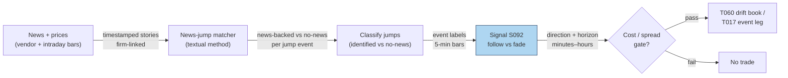

## Stage 92/200 — S092: Identified-news vs no-news drift decomposition

*Batch SB10 · Signal 92/100 · Provenance [D] · Family G — News, attention & alt-data*

### S1. One-line verdict

| | |
|---|---|
| **What it is** | Split intraday price jumps into news-backed (identified firm news) vs no-news moves; follow the former, fade the latter. |
| **When it works** | When news linkage is timestamp-clean and the move is genuinely information-driven — drift continues; when a big move has no news behind it — reversion is the base rate. |
| **When it dies** | On stale/mis-timestamped news, in names where "news" is just repackaged price action, and after spread+fees on small jumps. |
| **Build-or-buy in one line** | Buy the licensed news feed and the intraday bars; build the timestamp matcher yourself — the matching is the product. |

### S2. How it works — plain human explanation

Two stocks each jump 2% in five minutes. One just printed an FDA approval headline; the other moved on nothing anyone can find. Should you trade them the same way? The documented answer is no. A **news-backed** jump carries real information that the market digests gradually — prices tend to **drift** further in the jump's direction over minutes to hours as slower participants catch up. A **no-news** jump is more likely **noise** — an overreaction, a fat finger, a liquidity air-pocket — and tends to **revert**.

A concrete vignette. 10:04:13, fictitious ticker ACME jumps from $50.00 to $50.90 (+1.8%) in four minutes on 8× normal volume. Your news monitor shows an earnings headline stamped 10:03:58, firm-matched to ACME by ticker tag. That is an **identified-news** jump: the rule says *follow* — hold long into the drift. Contrast 13:02: ACME spikes +2.4% in five minutes; the news monitor shows nothing firm-specific within the match window. That is a **no-news** jump: the rule says *fade* — short the spike, betting on reversion.

Why should this work economically? Two mechanisms. **Slow information diffusion**: genuine news takes time to reach all participants (attention is scarce, mandates are slow), so prices underreact initially and drift. **Overreaction to noise**: uninformed flow pushes prices away from value with no fundamental anchor, and liquidity providers fade it back. **Timestamped news** means a story with a reliable publication time; **firm linkage** means the story is actually about this company (not a sector-mate or a ticker collision).

Mental model, three bullets:

- **Decompose first, trade second.** Every jump gets a label — news-backed or no-news — and the label, not the jump size, picks the trade.
- **News-backed → follow; no-news → fade.** Drift is the follow leg; reversion is the fade leg. That asymmetry is the whole signal.
- **The matcher is the edge.** Anyone can see the jump; the money is in knowing, within seconds, whether real news caused it.

### S3. The math — exact formula

This signal is a **procedure**, not a single equation. Three steps, each with explicit parameters:

**Step 1 — jump detection.** Flag intraday jumps on a return series (example: 5-minute bars):

$$J_t = 1 \iff \frac{|r_{t}|}{\hat{\sigma}_t} > c$$

where *r_t* is the 5-minute return, *σ̂_t* the trailing volatility estimate (example: 20-day rolling 5-minute standard deviation), and *c* an **example** threshold (e.g., *c* = 3.5). Alternatives: the **Lee–Mykland** jump test (a formal statistic comparing the return to local bipower variation) — use it if you want a citable test rather than a z-rule.

**Step 2 — news matching (the Boudoukh–Feldman–Kogan–Richardson textual method).** For each jump at time τ on firm *i*, search the news archive for stories *s* with firm(*s*) = *i* and |t_s − τ| ≤ *w* (example match window *w* = 15 minutes), scored by textual/entity relevance. Boudoukh et al. (2019) use **textual analysis** — natural-language processing of story text — to identify which news carries fundamental firm information, separating genuine firm-specific news from noise and from stories that merely mention the ticker.

**Step 3 — the rule.**

$$\text{identified\_news}_e = 1\{\exists\, s : \text{firm}(s) = i_e,\; |t_s - \tau_e| \le w,\; \text{relevance}(s) \ge \rho\}$$

- If identified_news = 1 → **follow**: trade in the jump direction, hold minutes–hours (the drift leg).
- If identified_news = 0 → **fade**: trade against the jump, hold minutes–hours (the reversion leg).

| Parameter | Symbol | Typical range | Too small / too large | Default (example — not an institutional standard) |
|---|---|---|---|---|
| Jump threshold | c | 3–5 (z) | too low: noise flagged; too high: only crashes | 3.5 |
| Match window | w | 5–30 min | too tight: miss lagged stamps; too wide: false matches | 15 min |
| Relevance cutoff | ρ | method-dependent | too low: sector noise labeled "news" | entity+ticker match |
| Holding horizon | h | minutes–hours | too short: spread dominates; too long: drift decays | 60 min |
| Minimum jump size | — | 1–3% | below costs: untradable | 1.5% |

**Causal timing.** Jump detected at *t* on data ≤ *t*; news match must use stories timestamped ≤ *t* (never match on a story published after the jump — that is lookahead); earliest fill *t*+1. The first minutes after the jump are the most latency-sensitive leg of any news strategy in this document.

**Named variants.** (1) **Scheduled vs unscheduled**: earnings/macro (scheduled — see T017) get wider match windows and pre-positioning; unscheduled headlines get the tight ±15-minute treatment. (2) **Headline-only vs full-text**: headline tags are faster; full-text relevance scoring is more precise. (3) **ML news classifier**: train a model to predict "will this story move the stock" from text features — the industrial version of Step 2.

### S4. Worked example — step-by-step numbers (SYNTHETIC)

**All numbers below are synthetic** (fixed event tape; seed 92 recorded for script reproducibility). Thresholds (z > 3.5, ±15-min match window, 60-min hold, $10,000 notional, 5 bps all-in cost = 2 spread + 1 fees + 2 slippage, *examples*) are illustrative. **Outcomes are illustrative mechanics, not a backtest — this example proves the procedure runs, not that it earns.**

| Time | Jump | z | News (≤ jump time) | Label | Action | Next-60-min |
|---|---|---|---|---|---|---|
| 10:04 | +1.8% | +4.2 | earnings headline 10:03 | news-backed | FOLLOW long | +0.6% |
| 10:41 | −2.1% | −4.8 | none | no-news | FADE (buy) | +0.9% |
| 11:15 | +1.5% | +3.6 | analyst upgrade 11:12 | news-backed | FOLLOW long | −0.2% |
| 13:02 | +2.4% | +5.1 | none | no-news | FADE (short) | −1.1% |
| 14:20 | −1.6% | −3.8 | FDA headline 14:18 | news-backed | FOLLOW short | +0.3% |
| 15:30 | +1.9% | +4.4 | none | no-news | FADE (short) | −0.7% |

Step-by-step on event 1 (10:04): 5-min return +1.8% vs trailing σ̂ gives z = +4.2 > 3.5 → jump flagged. News search ±15 min finds the 10:03 earnings headline, firm-matched → identified_news = 1 → FOLLOW long at ~$50.90. Next-60-min return +0.6% on $10,000 = +$60 gross; minus $5.00 all-in cost = **+$55 net**. Event 4 (13:02): z = +5.1 → jump; no story within ±15 min → identified_news = 0 → FADE short at the spike; −1.1% next hour = +$110 gross, **+$105 net**. Events 3 and 5 are the losers every honest example needs: follow-long into −0.2% (net −$25) and follow-short into +0.3% (net −$35).

Totals: 4 wins, 2 losses, **+$250 net on $60,000 deployed** — a synthetic illustration of the accounting, not evidence of profitability. The chart plots each event's jump (grey) against its next-60-min return, colored by news-backed vs no-news.

**What to notice.** The two legs behave as the framing predicts *in this constructed tape*: news-backed events drift, no-news events revert — but two of six still lose, and the $5/event cost line is what separates a toy from a tradable result. Limits: fills assumed at the signal price with no partials, no latency between detection and fill, and six hand-picked events. A real evaluation needs thousands of events, purged/embargoed validation (training labels purged of any data overlapping test events in time, plus an embargo buffer — see S088), and borrow-cost accounting on the short legs.


### S5. Strategies that use this signal

- **T060 — Identified-news drift portfolio**: primary trigger — holds identified-news drifters and fades no-news drift, with earnings-drift (S100) context; this signal is the decomposition engine.
- **T017 — Scheduled macro-announcement drift**: S092 as a conditioning filter — the same follow/fade logic applied to scheduled releases (S034), sized by vol forecasts (S066).
- **T059 — News-sentiment first-minute momentum**: S092 as a confirmation input — sentiment reaction (S091) plus volume confirmation (S094), where the news/no-news label gates which reactions to chase.
- Context: **S093 (news novelty)** separates *new* from *stale* news inside the news-backed leg; **S100 (earnings drift)** is the scheduled-earnings cousin.

### S6. Data required — exact spec

| Field | Type | Granularity | Source tier | Notes |
|---|---|---|---|---|
| Intraday prices (OHLCV/trades) | float | 1-min or finer | Tier 1–2 | Any intraday feed; 5-min bars minimum |
| Timestamped news archive | text + ts | per story | Tier 2–3 | Firm linkage (ticker/entity tags) required |
| News relevance metadata | score/tags | per story | derived or vendor | Entity match, novelty, event type |
| Corporate-action calendar | table | daily | Tier 1 | Splits corrupt jump z-scores |

Collection: intraday bars → rolling z-score jump detector → for each jump, query the news store for firm-matched stories in [τ−w, τ+w] → textual relevance filter → label → emit signal. Ingest sketch (≤20 lines):

```python
import polars as pl
bars = pl.read_parquet("curated/bars_5min.parquet")            # ts, sym, ret
sig = bars.with_columns(z=pl.col("ret") / pl.col("ret").rolling_std(20 * 78).over("sym"))
jumps = sig.filter(pl.col("z").abs() > 3.5)                    # EXAMPLE threshold
news = pl.read_parquet("curated/news.parquet")                # ts, sym, text, entities
hits = jumps.join_asof(news.sort("ts"), left_on="ts", right_on="ts",
                       by="sym", strategy="backward", tolerance="15m")  # EXAMPLE window
labeled = hits.with_columns(identified=pl.col("text").is_not_null())
```

Storage: 1-min bars for 500 symbols ≈ 50 MB/day total (per `notes/cost-model.md` §4); news *metadata* is small (1–10 GB/yr), full *text* archives run 20–300 GB/yr (cost-model §6 news pipeline notes). **Data-quality checklist:** news timestamp precision (vendor stamps vs actual wire time — minutes of skew flip labels); ticker/entity disambiguation (ticker collisions, subsidiaries); story deduplication (the same wire story reprinted 40× is one event); DST/half-days; survivorship in the news archive.

### S7. Local build on M5 Max / 128GB

**Feasibility verdict: feasible, Tier H — the pipeline is easy, the licensed news is the project.** Jump detection on 1-min bars is trivial compute; the textual news matcher runs fine locally (sentence-transformer-class models fit in CPU RAM); the binding constraint is lawful, timestamped, firm-linked news text at scale.

- **Throughput:** 500 symbols × 390 1-min bars/day = 195k bars/day — seconds in polars (cost-model §2: ~10–50M rows/sec simple ops). News matching is a join, not a model-training job. Bottleneck: news-feed licensing and timestamp hygiene, not compute.
- **Stack options:** Python+polars + DuckDB for bars and the news store (pick this); a local embedding model for relevance scoring; Rust unnecessary.
- **RAM:** bars ~50 MB/day; news metadata + embeddings for a 500-name universe fit in single-digit GB; full-text archive is the only large object (tens of GB/yr) — inside the 77 GB working budget per cost-model §3.
- **Engineering band:** Tier H per plan §6 (licensed alt-data G-family): **60–200 h → $9,000–30,000** at the $150/hr loaded-cost estimate. One line of justification: vendor integration + timestamp normalization + dedup/entity-linking + matcher evaluation is a data-engineering project; the z-score detector is an afternoon.
- **What breaks first at 500 symbols or full OPRA:** nothing in compute — what breaks is news *coverage*: thin names have no timestamped news, so the signal silently becomes "fade everything," which is a different (worse) strategy.

### S8. Buy vs build

| Option | What you get | Indicative price | Gains | Loses |
|---|---|---|---|---|
| GDELT / RSS / publisher feeds (Tier 0) | Free news text/metadata | ~$0–low, *indicative — verify before budgeting* | Zero data cost | Timestamp quality varies; redistribution limits; check license terms |
| Benzinga Pro / similar (Tier 2) | Machine-readable headlines | ~$100–200/mo, *indicative — verify before budgeting* | Fast, tagged | Redistribution limits; quote-based pricing for APIs |
| RavenPack (Tier 3) | Full licensed news + sentiment | $$$$ enterprise / academic via WRDS, *indicative — verify before budgeting* | Research-grade timestamps | Enterprise pricing |
| Any intraday bar feed (Tier 1–2) | 1-min bars for jump detection | ~$30–200/mo, *indicative — verify before budgeting* | Commodity | None — this part is trivial |

**Verdict: buy the news rights and the feed; build the matcher.** You cannot buy someone else's news↔jump matching tuned to your universe and latency — and you should not build your own news *corpus* by scraping: licensing, not engineering, is the moat. Crossover: if you only need a research prototype, GDELT + RSS plus a Tier-1 bar feed gets you a working matcher for ~$30–200/mo before you commit to a licensed vendor.

### S9. Success ratio / efficacy — documented evidence

| Study / source | Market & period | Metric | Before/after cost | Caveat |
|---|---|---|---|---|
| Boudoukh–Feldman–Kogan–Richardson (2019) | US stocks, textual news ID | Fundamental firm news accounts for 49.6% of overnight idiosyncratic volatility vs 12.4% in trading hours | **Before cost** — variance attribution, not a traded strategy | Documents *association*; the fade/follow rule is a practitioner extension, not their result |
| Chan (2003) | US, monthly returns | Drift after bad news; reversal after extreme *no-news* moves; effects mainly in smaller, illiquid stocks | **Before cost** | Monthly horizon; small-cap concentrated; pre-cost |
| Practitioner extension (this chapter's rule) | — | No documented intraday fade/follow P&L found in the cited papers | n/a | Treat the trading rule as [SR]-style reconstruction |

Regimes where it fails: stale or lagged news timestamps (label flips), "news" that is just repackaged price action (churnalism), thin names with no coverage (the signal degrades to unconditional fading), and crowded attention events where the drift is arbed out in seconds.

**Honest bottom line:** no-news momentum is more likely to revert; identified-news drift is the follow leg. That is the documented pattern. As a standalone intraday trigger this is an *unproven* edge — the papers document return *patterns*, not net-of-cost trading profits. As a decomposition layer inside a news strategy (T060) or an event filter (T017), it is *the* correct first cut: never trade a jump without asking whether news caused it.

### S10. Failure modes & pitfalls

- **Lookahead in matching:** using a story published after the jump to "explain" it — mitigate by enforcing story-ts ≤ jump-ts in the join.
- **Timestamp skew:** vendor stamp ≠ wire time — mitigate by measuring and correcting per-vendor lag; minutes of skew flip labels.
- **Entity errors:** ticker collisions, subsidiaries, sector-mates — mitigate with entity disambiguation, not raw ticker substring match.
- **Duplicate stories:** one wire story reprinted 40× looks like 40 news events — mitigate with dedup (textual similarity) before matching.
- **Churnalism:** "news" that merely reports the price move — mitigate with novelty scoring (see S093); never match on price-derived stories.
- **Cost blowup:** 1.5% jumps on wide-spread names are untradable after spread+fees+slippage — mitigate with a minimum-jump-size gate and the explicit 5-bps-style cost model.
- **Coverage gaps:** thin names have no news — mitigate by tracking match-rate per name; a "fade everything" fallback is a different strategy, label it.
- **Overfitting the window:** tuning *w*, *c*, *h* to maximize in-sample P&L on hundreds of events — mitigate with purged/embargoed validation (S088) and frozen parameters.

### S11. Visuals




### S12. Sources

Source log: Duck.ai answered Q-SB10-1–Q-SB10-3 (2026-09-10); Grok answers pending (checked 2026-09-10). The follow/fade procedure and framing are operator-verified (task spec); remaining chatbot material is treated as research leads.

1. Boudoukh, J., Feldman, R., Kogan, S., Richardson, M. (2019). "Information, Trading, and Volatility: Evidence from Firm-Specific News." *The Review of Financial Studies* 32(3), 992–1033. https://ideas.repec.org/a/oup/rfinst/v32y2019i3p992-1033..html — textual identification of fundamental news; 49.6% of overnight idiosyncratic volatility.
2. Boudoukh, J. — author CV confirming the RFS 2019 publication. https://www.runi.ac.il/media/xd0h1iq5/profilecv-en-us.pdf — independent authorship check.
3. Chan, W. S. (2003). "Stock price reaction to news and no-news: Drift and reversal after headlines." *Journal of Financial Economics* 70. PDF: https://test.elitetrader.com/et/attachments/chan2003-pdf.72890/ — drift after bad news; reversal after extreme no-news moves; small/illiquid concentration.
4. Chan (2003) — ResearchGate record. https://www.researchgate.net/publication/222535436_Stock_Price_Reaction_to_News_and_No-News_Drift_and_Reversal_after_Headlines — second checkable record.
5. *The Handbook of News Analytics in Finance* (O'Reilly), §6.2, citing Chan (2003). https://www.oreilly.com/library/view/the-handbook-of/9780470666791/p02chap01-sec002.html — news/no-news return differences persist excluding earnings news.
6. `notes/cost-model.md` §§2–6 — throughput, RAM, engineering-band, and vendor price-band planning numbers used in S6–S8.

**Unverified leads** (chatbot-only, no checkable source captured): Savor (2012)-style finding that price shocks with information drift while shocks without information reverse — consistent with Chan (2003) but not independently verified here; vendor pricing specifics beyond the cost-model bands; the novelty-scoring formula Novelty_i = 1 − max cos(e_i, e_j) — plausible, treat as illustrative.
