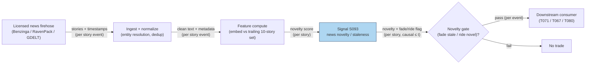

## Stage 93/200 — S093: News novelty / staleness reversal

*Batch SB10 · Signal 93/100 · Provenance [D] · Family G — Alternative data & attention*

### S1. One-line verdict

| | |
|---|---|
| **What it is** | Measures how *new* a news story is (textual distance from the firm's recent news) and fades big price moves on *stale* (recycled) news, which reverse within ~a week. |
| **When it works** | Liquid large-caps with dense news flow and a strong retail presence; event windows of 1–5 days where recycled headlines trigger overreaction. |
| **When it dies** | Thin news coverage (similarity undefined); genuine novel disclosures (fade the wrong leg); regime where the novelty signal is crowded or the story never reaches a priced timestamp. |
| **Build-or-buy in one line** | Build the novelty math and features in-house (cheap); buy the news *text rights* — you cannot legally scrape your way to a licensed feed. |

Provenance **[D]** (Tetlock 2011, *Review of Financial Studies* 24(5): 1481–1512; DOI 10.1093/rfs/hhq141 — note: the Review of Financial Studies, not the Journal of Finance). Family letter G (alternative-data family).

### S2. How it works — plain human explanation

A **news wire story** is any timestamped headline + body about a firm. **Staleness** is the degree to which a story's *text* repeats what the firm's previous stories already said — Tetlock (2011) defines it as the story's textual similarity to the previous ten stories about the same firm. **Novelty** is the inverse: 1 minus that similarity. A **drift** is a price move that continues in the same direction after news; a **reversal** is a move that unwinds.

The economic mechanism is asymmetric attention. Markets **under-react to genuinely new news**: information diffuses slowly through prices (documented drift after news; Chan 2003), so the informed play is to *ride* novel-news drift. Markets simultaneously **over-react to stale news**: a recycled headline looks like new information to investors who never read the original — individual investors trade more aggressively when news is stale (Tetlock 2011) — pushing the price on no genuinely new information. That push has nothing under it, so it **reverses over the following week**. The signal therefore has two legs: *fade* (trade against) large moves on low-novelty news; *follow* (trade with) moves on high-novelty news.

Concrete vignette: 9:47:03, ticker XYZ (fictional). A headline crosses: *"XYZ Corp downgraded to Sell on valuation concerns."* Your pipeline embeds the story text and computes cosine similarity between the story's embedding and the trailing-10-story centroid $\bar{c}_i$. $\cos = 0.97$ — this is the fourth near-identical downgrade story this month; novelty $= 1 - 0.97 = 0.03$. The stock drops 2.8% in 20 minutes on heavy retail volume. The S093 read: no new information, retail overreaction — fade the spike, expect reversal over 1–5 days. Contrast: same headline, cosine to the centroid $= 0.12$ (a first-ever fraud allegation) — novelty $= 0.88$, drift leg: the move is information, don't fade it.

- **Mental model 1:** Novelty is a freshness date-stamp on price moves — stale moves rot back; fresh moves keep going.
- **Mental model 2:** The retail overreaction to recycled news is the fuel; the reversal is the engine; the novelty score decides which direction the engine runs.
- **Mental model 3:** The hard part is never the embedding math — it is obtaining lawful, timestamped full text at scale.

### S3. The math — exact formula

Let story $i$ have embedding (or TF-IDF — term frequency–inverse document frequency — vector) $e_i$, and let $P_i$ be the comparison set of prior stories about the same firm (Tetlock 2011: the previous 10 stories; this batch's reconstruction uses a 24-hour or 30-day window — *example*). The **staleness** is the cosine similarity of the story's embedding to the trailing-10-story centroid $\bar{c}_i = \tfrac{1}{10}\sum_{j \in P_i} e_j$; the **novelty** is its complement:

$$\mathrm{Staleness}_i = \cos(e_i, \bar{c}_i), \qquad
\mathrm{Novelty}_i = 1 - \cos(e_i, \bar{c}_i),$$

with $\bar{c}_i = \tfrac{1}{10}\sum_{j \in P_i} e_j$ the trailing-10-story centroid and $\cos(u,v) = \frac{u \cdot v}{\|u\|\,\|v\|}$. In production form:

$$N_i \propto (1 - \cos(e_i,\bar{c}_i)) \cdot \log(1 + \text{source diversity}) \cdot w_{\text{event-type}}$$

where the source-diversity term rewards the same *information* arriving from many independent outlets, and $w_{\text{event-type}}$ up-weights event types (fraud, merger) with historically stronger drift/reversal — *all weight choices are example, not institutional standards*.

| Parameter | Symbol | Typical range | Too small / too large | Default (example) |
|---|---|---|---|---|
| Comparison set | $P_i$ | 10 stories (Tetlock 2011) or 24h–30d window | Too small: false "novel" flags on merely unrepeated-this-week news; too large: old regime stories contaminate | 10 stories, same firm *— example, not an institutional standard* |
| Embedding | $e_i$ | TF-IDF / sentence-transformer vectors | TF-IDF misses paraphrase (stale rewrites slip through); embeddings need a licensed text pipeline | sentence-transformer, cosine *— example* |
| Staleness gate | $\tau$ | novelty < 0.3–0.5 → "stale" leg | Too tight: fades real news; too loose: fades nothing | novelty < 0.5 → fade candidate *— example* |
| Reversal horizon | $h$ | 1–5 trading days (reversal leg) | Intraday-only: misses the documented weekly reversal; too long: drift noise | 5 days *— example* |

**Causal timing:** novelty is computed at story arrival $t$ using only stories with timestamps $\le t$ (trailing set); tradable no earlier than the first quote after $t+1$ that the venue's timestamps honestly support. **Variants:** (1) *nearest-prior (max-similarity)* — $\mathrm{Novelty}_i = 1 - \max_j \cos(e_i, e_j)$, the Duck.ai chatbot lead form: sharper on near-duplicates but more outlier-driven (a single near-identical rewrite dominates); (2) *event-type-conditional* — separate novelty models per event type (earnings vs legal vs analyst); (3) *cross-source novelty* — penalize stories that merely repeat what another outlet reported first (wire-speed dedup).

### S4. Worked example — step-by-step numbers (SYNTHETIC)

All numbers below are **synthetic** (seed **93**); the chart plots exactly these numbers. Fictional firm "Northstar Energy" (NSE). Term space: {earnings, lawsuit, merger, downgrade, dividend, fraud}; TF-IDF-style count vectors.

**Step 1 — hand-computed novelty (centroid form).** Ten prior stories (the trailing-10 rule from S3): $A=[1,0,0,1,0,0]$ (earnings+downgrade), $B=[1,0,0,1,0,0]$ (same, rewritten), $C=[1,0,0,0,1,0]$ (earnings+dividend), $D=[0,1,0,0,0,1]$ (lawsuit+fraud), $E_1=[1,0,0,0,0,0]$ (earnings), $F_1=[0,0,0,1,0,0]$ (downgrade), $G=[1,1,0,0,0,0]$ (earnings+lawsuit), $H=[0,0,0,0,1,1]$ (dividend+fraud), $I=[1,0,1,0,0,0]$ (earnings+merger), $J=[0,0,0,1,1,0]$ (downgrade+dividend). Column sums: earnings 6, lawsuit 2, merger 1, downgrade 4, dividend 3, fraud 2 — so the trailing-10 centroid $\\bar{c} = \\tfrac{1}{10}\\sum = [0.60,0.20,0.10,0.40,0.30,0.20]$.

Focal story $E$ (a stale downgrade rewrite): $[1,0,0,1,0,0]$. $\\cos(E,\\bar{c}) = \\frac{0.60+0.40}{\\sqrt{2}\\cdot 0.8367} = \\frac{1.00}{1.1832} = 0.8452$ ✓ (hand-check: dot $=1.00$; $\\|\\bar{c}\\| = \\sqrt{0.36+0.04+0.01+0.16+0.09+0.04} = \\sqrt{0.70} = 0.8367$). $\\mathrm{Novelty}_E = 1 - 0.8452 = \\mathbf{0.15}$ → stale.

Focal story $F$ (first-ever merger rumor): $[0,0,1,0,0,0]$. $\\cos(F,\\bar{c}) = \\frac{0.10}{1\\cdot 0.8367} = 0.1195$ ✓ (hand-check: dot $=0.10$). $\\mathrm{Novelty}_F = 1 - 0.1195 = \\mathbf{0.88}$ → novel.

**Step 2 — 10-event pattern.** Synthetic events $E1$–$E10$ (novelty from seed 93; day-0 move and next-5-day return generated with stale-overreaction + reversal baked in):

| Event | Novelty | Day-0 move % | Next-5-day % | Read |
|---|---|---|---|---|
| E1 | 0.97 | −1.64 | −0.25 | Novel: drift, no fade |
| E2 | 0.56 | −2.66 | +0.62 | Borderline: partial reversal |
| E3 | 0.48 | +1.03 | −0.28 | Stale-ish: fades |
| E4 | 0.45 | +2.25 | −0.58 | Stale: fades |
| E5 | 0.67 | +2.13 | −0.40 | Novel-leaning: small reversal |
| E6 | 0.10 | −3.58 | +1.67 | Very stale: strong reversal (+46% unwind) |
| E7 | 0.95 | −0.74 | −0.08 | Novel: no fade |
| E8 | 0.46 | +1.14 | −0.04 | Stale-ish: fades |
| E9 | 0.76 | +2.07 | −0.20 | Novel: drift |
| E10 | 0.08 | +1.08 | −0.36 | Very stale: reverses −33% of the move |

Hand-check on E6: novelty 0.10 → staleness 0.90; day-0 move −3.58%; reversal +1.67% = $-0.45 \times (-3.58) \times 0.90 \approx +1.45\%$ plus noise ✓ (chart plots the same numbers).

**What to notice:** reversal concentrates in low-novelty events (E6, E4, E10 unwind 33–46% of the day-0 move; high-novelty E1/E7/E9 barely reverse). **Limits of the toy:** reversal *magnitude* is assumed by construction here, not discovered; no fees, no bid–ask spread, no timestamp uncertainty, and the novelty scores are drawn, not embedded.

### S5. Strategies that use this signal

- **T071 — News-Novelty Reversal** — *primary trigger*: fades stale-news overreaction (S093 is the gate), follows novel-news drift; S097/S042 confirm.
- **T060 — Identified-News Drift Portfolio** — *filter*: novelty separates ride-the-drift stories (S093) from no-news drift to fade.
- **T067 — Anchored-VWAP Event Trader** — *context*: S093 novelty decides whether to trade the deviation as drift or fade.
- **T080 — Multi-Source Attention Composite** — *input*: novelty is one of three blended attention factors (with ASVI S099 and social S097).

### S6. Data required — exact spec

| Field | Type | Granularity | Source tier | Notes |
|---|---|---|---|---|
| Story text + timestamp | text + UTC ts | per story event | Tier 3 (licensed) / Tier 0 (GDELT, RSS) | Exchange/authoritative ts; dedup across wires |
| Firm entity mapping | reference | per story | Tier 1–2 | Ticker↔entity resolution; renames/spin-offs |
| Trailing story set $P_i$ | derived | per story | — | 10-story or 24h–30d window, same firm |
| Embeddings $e_i$ | vector | per story | — | TF-IDF or sentence-transformer; store normalized |
| Price/quote for $r_{t,t+h}$ | numeric | 1-min or daily | Tier 0–1 | Event-study returns; dividend/split adjusted |
| Event-type labels | categorical | per story | — | Optional: fraud/merger/earnings classifier |

Ingest/novelty sketch (Python, ≤20 lines):

```python
import numpy as np
from sentence_transformers import SentenceTransformer
model = SentenceTransformer("all-MiniLM-L6-v2")  # example — not a standard
def novelty(story_text, prior_texts):            # prior_texts: trailing set P_i, ts <= t
    e = model.encode([story_text] + prior_texts, normalize_embeddings=True)
    cbar = e[1:].mean(axis=0); cbar /= np.linalg.norm(cbar)  # centroid c-bar
    cos = float(e[0] @ cbar)                  # cosine vs centroid
    return 1.0 - cos                          # Novelty_i = 1 - cos(e_i, c-bar_i)
# per story event: text = licensed feed only (see licensing note)
```

Storage (per `notes/cost-model.md` §4): news metadata is light (1–10 GB/yr for 500 symbols); full text 20–300 GB/yr; embeddings 5–100 GB/yr — license and archive cost dominate compute. Data-quality checklist: story timestamps in UTC with source latency noted; entity resolution audit; dedup identical wire copies; halt/suspension flags so event returns aren't polluted; DST/half-day alignment of the return window.

**Licensing (mandatory):** you may build dedup/novelty/entity/sentiment/event features on news you are licensed to read; you **cannot legally build a commercial redistributable news product from scraping** — news text rights must be bought (Benzinga/RavenPack quote-based; RavenPack academic via WRDS). Scraping is not a valid substitute for a license.

### S7. Local build on M5 Max / 128GB

**Feasibility: feasible — Tier H, but the binding constraint is data licensing, not the Mac.** Per `notes/cost-model.md` §5, licensed alt-data pipelines sit in Tier H (**60–200 h** ≈ **$9,000–30,000** at $150/hr loaded-cost estimate); a vendor-backed news+novelty build is ~120–180 h in that band, one line of justification: embedding inference and cosine ANN are light, entity/dedup/normalization and license integration are the work. Throughput: sentence-transformer embedding on CPU is 4–16 GB RAM and CPU-sufficient per this batch's research (inference is not the bottleneck); a 500-symbol daily batch is minutes; the ANN novelty lookup over trailing sets is milliseconds per story (§2: numpy ~50–200M elements/sec). RAM: metadata 1–4 GB, full text 4–16 GB, embeddings 4–16 GB, vector index 4–32 GB — all inside the 77 GB working budget (§3). What breaks first at 500 symbols / full firehose: full-text archival and license cost, then vector-index RAM if you keep raw embeddings for everything instead of a compressed index.

| Stack | When to pick |
|---|---|
| Python + sentence-transformers + polars | The default: embed, dedup, novelty, event study — all on the Mac |
| DuckDB / Postgres + pgvector-style ANN | When trailing-set lookup must serve live stories |
| Vendor event API (RavenPack-style) | When you want pre-tagged event types and don't want to train classifiers |

### S8. Buy vs build

| Option | What you get | Indicative price | Gains | Loses |
|---|---|---|---|---|
| GDELT / RSS / publisher feeds | Free headlines, global coverage | ~$0 *indicative — verify before budgeting* | Zero cost; lawful headlines | No redistribution rights for full text; ts quality uneven |
| Benzinga Pro / similar | Machine-readable headlines | ~$100–200/mo *indicative — verify before budgeting* | Low-latency headlines, entity tags | Redistribution limits; full text rights extra |
| RavenPack academic (via WRDS) | Research news + sentiment archive | institution-dependent *indicative — verify before budgeting* | Saves 50–150 eng hours; backtest-ready | Academic-only; no commercial use |
| RavenPack commercial / Bloomberg-class | Full licensed news + sentiment | $$$$ enterprise (thousands–tens of thousands+/yr — bot-sourced, unverified; *verify before budgeting*) | Redistribution rights; audit-grade timestamps | Enterprise budget |
| Build novelty stack in-house | Embeddings, dedup, novelty, event study | eng time only (Tier H above) | Full control of comparison sets and thresholds | Still needs a licensed text source |

**Verdict: buy the text rights, build the analytics.** The novelty formula is an afternoon; lawful, timestamped, entity-resolved full text at scale is the product you cannot build. Crossover: if you only need headlines + GDELT-level coverage for research, the Tier-0 route suffices; the moment the pipeline feeds production signals or any redistribution, buy the license (Benzinga quote-based or RavenPack).

### S9. Success ratio / efficacy — documented evidence

| Study / source | Market & period | Metric | Before/after cost | Caveat |
|---|---|---|---|---|
| Tetlock (2011), *RFS* | US stocks, DJNS news archive | Returns respond less to stale news; day-of-stale-news return **negatively predicts the following week's return** | Before-cost (event study) | Magnitude conditional on the staleness measure; individual-investor channel |
| Chan (2003), *JFE* | US stocks, headlines | Drift after *news* headlines; reversal after *no-news* price moves | Before-cost | Supports the under-react-to-news / over-react-to-noise asymmetry behind S093 |
| Tetlock, Saar-Tsechansky & Macskassy (2008), *JF* | US stocks, WSJ | Negative language in firm news predicts fundamentals and returns | Before-cost | Sentiment leg, not novelty — included to anchor the news family |
| FININ (Wang, Cohen & Ma 2024, *Findings of EMNLP*) | 2.7M articles, S&P 500 + Nasdaq 100 | News *interactions* and delayed pricing; sentiment alone leaves power on the table | Before-cost (model) | Supports interaction/propagation features beyond bag-of-words |

Regimes where it fails: thin-coverage names (similarity undefined → false "novel"); crowded novelty factors (everyone fades the same stale spike, reversal front-run); wire-latency regimes where your timestamp is minutes behind the market; event types where "stale" is misclassified (an old story with genuinely new detail). **Honest bottom line:** as a standalone trigger this is a *documented-association, conditional* edge — the reversal is peer-reviewed but magnitude and after-cost tradability are implementation-specific. As a *filter/gate* inside T071/T067/T080 (which news to fade vs ride), it is the most defensible use.

### S10. Failure modes & pitfalls

1. **Lookahead leakage** (future stories in the comparison set) → mitigate: comparison set strictly ts ≤ t; store source latency per story.
2. **Paraphrase evasion** (TF-IDF misses rewrites) → mitigate: embedding-based similarity, not keyword overlap.
3. **Entity mismatch** (story about the wrong "XYZ") → mitigate: audited ticker↔entity mapping; renames and spin-offs versioned.
4. **Timestamp uncertainty** (story ts vs market ts) → mitigate: causal rule — tradable no earlier than the first honest quote after t+1; measure source latency.
5. **Thin news** (fewer than 10 prior stories) → mitigate: minimum-set-size rule; fall back to no-signal rather than a noisy score.
6. **Cost blowup** (spread+fees+slippage on 1–5-day fades) → mitigate: model effective spread explicitly (H5); size on expected reversal net of round-trip cost.
7. **Crowded fade** (everyone shorts the same stale spike) → mitigate: monitor crowding proxies; reversal may front-run and invert.
8. **Event-type confusion** (novel detail inside an old story arc) → mitigate: event-type-conditional novelty; human audit of the largest signals.

### S11. Visuals




### S12. Sources

1. Tetlock, Paul C. (2011). "All the News That's Fit to Reprint: Do Investors React to Stale Information?" *Review of Financial Studies* 24(5): 1481–1512. https://ideas.repec.Org/a/oup/rfinst/v24y2011i5p1481-1512.html (DOI 10.1093/rfs/hhq141)
2. Tetlock, Paul C. (2010). "All the News That's Fit to Reprint" — working-paper version (Oct 2010), Columbia. https://business.columbia.edu/sites/default/files-efs/pubfiles/3099/Tetlock%20Fit%20to%20Reprint%2010%2010.pdf
3. Chan, Wesley S. (2003). "Stock price reaction to news and nonews: drift and reversal after headlines." *Journal of Financial Economics* 70: 223–260. (syllabus record) https://www.hbs.edu/ris/Profile%20Files/syllabus_ad4dd213-071a-470d-8c7f-61a1281ea23d.pdf
4. Tetlock, Paul C., Saar-Tsechansky, Maytal & Macskassy, Sofus (2008). "More Than Words: Quantifying Language to Measure Firms' Fundamentals." *Journal of Finance* 63: 1437–1467. (recorded in Tetlock CV) https://business.columbia.edu/sites/default/files-efs/person/cv/Tetlock_CV_26.pdf
5. Wang, Mengyu, Cohen, Shay B. & Ma, Tiejun (2024). "Modeling News Interactions and Influence for Financial Market Prediction." *Findings of EMNLP 2024*. https://aclanthology.org/2024.findings-emnlp.189/
6. RavenPack — licensed news analytics vendor. https://www.ravenpack.com/
7. GDELT Project — free global news database (Tier-0 route). https://www.gdeltproject.org/

**Unverified leads** (batch-research claims without an independently checkable source this batch):
- Duck.ai Q-SB10-1/Q-SB10-3 novelty formulas: Novelty_i = 1 − max cos(e_i,e_j) over 24h/30d sets; production N_i ∝ (1−max cos)·log(1+source diversity)·w_event-type (verified arithmetic, framing unverified). **This max-similarity form is the demoted nearest-prior variant — the chapter's primary formula is the centroid form** $\mathrm{Novelty}_i = 1 - \cos(e_i, \bar{c}_i)$.
- Duck.ai Q-SB10-2 vendor specifics: Benzinga self-serve price unavailable (quote-based business pricing); RavenPack commercial "thousands–tens of thousands+/yr"; news eng 155–370h; restricted-without-license list (full-text storage, derived feeds, republishing headlines, model training on licensed text). Research leads — never confirmed facts.
- Source log: Duck.ai answered Q-SB10-1–Q-SB10-3 (2026-09-10); Grok answers pending (checked 2026-09-10).
