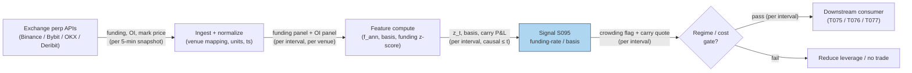

## Stage 95/200 — S095: Crypto funding-rate / basis

*Batch SB10 · Signal 95/100 · Provenance [SR] · Family H — Crypto & perpetual markets*

### S1. One-line verdict

| | |
|---|---|
| **What it is** | Reads perpetual-futures *funding rates* (the long↔short cash flow that pegs perps to spot) and the *basis* (perp−spot gap) as a crowding/leverage gauge — and prices the cash-and-carry that harvests them. |
| **When it works** | As a regime detector and leverage governor: extreme funding marks crowded one-sided leverage worth respecting or reducing; persistent funding > costs marks genuine cash-and-carry. |
| **When it dies** | As an unconditional contrarian trigger — extreme funding persists through strong trends and fading it mechanically is how accounts get liquidated. |
| **Build-or-buy in one line** | Build the funding/open-interest (OI) ingestion on free exchange APIs yourself; buy aggregated history only if you need multi-year cross-venue normalization. |

Provenance **[SR]** (standard reconstruction of exchange-documented mechanics + practitioner heuristics). Family letter H (crypto/perpetuals family).

### S2. How it works — plain human explanation

A **perpetual future** (perp) is a crypto derivative that never expires but tracks the spot price. The tracking mechanism is the **funding rate**: a periodic cash flow between longs and shorts. When the perp trades *above* spot (positive funding), **longs pay shorts**; when below spot (negative funding), shorts pay longs. The rate is set by the exchange from the premium (perp−spot gap) and, on many venues, an interest-rate component. **Funding payments** are exchanged directly peer-to-peer — the exchange is not the counterparty.

**Basis** is the perp−spot gap: $\mathrm{basis} = (P_{\mathrm{perp}} - S_{\mathrm{spot}})/S_{\mathrm{spot}}$. **Open interest (OI)** is the total outstanding contracts. **Cash-and-carry** is the classic arb: buy spot, short the perp (delta-neutral), and collect positive funding while the basis converges.

Why should funding predict anything? Extreme positive funding means the market is *crowded long on leverage* — longs are paying heavily to stay long. That is a fragility marker: if price dips, leveraged longs face margin calls, forced selling pushes price down, more margin calls trigger — a **liquidation cascade** (see S096). So the contrarian read says: extreme funding → crowded → fade. But here is the mandatory warning: **funding can remain extreme during strong trends; fading extreme funding unconditionally is a reliable way to lose money.** The trend that makes funding extreme can run for weeks while the contrarian bleeds funding payments and eats adverse moves. The defensible use is **regime detection and leverage reduction** — shrink risk when the crowd is maximally levered one way — and, separately, *harvesting* funding via cash-and-carry when the rate persistently exceeds fees, borrow, and slippage.

Concrete vignette: BTC spot $67,000 (synthetic), perp $67,050, 8h funding +0.05% — roughly 5× a calm baseline. OI at a 30-day high. Your book is long crypto beta. S095's honest read: the market is maximally crowded long; *reduce leverage*, tighten stops, don't add. It does NOT say "short now" — the trend can grind another +8% while you pay +0.05% every 8 hours.

- **Mental model 1:** Funding is the market's rent for leveraged conviction — high rent means a crowded house.
- **Mental model 2:** The contrarian fade is a fire extinguisher, not a fire alarm — it works after the blaze (S096's cascade), not during the buildup.
- **Mental model 3:** The displayed funding rate is a gross coupon; the trade is net of fees, borrow, slippage, basis, and holding period.

### S3. The math — exact formula

Let $N_j$ be the position notional in interval $j$, $f_j$ the funding rate for that interval (length $h_j$ hours), $H$ total holding hours, $q = H/h$ the equivalent number of intervals. The **funding payment** in interval $j$:

$$F_j = N_j \, f_j,$$

positive $f_j$ = longs pay shorts (a delta-neutral long-spot/short-perp carry *receives* $\approx N_j f_j$). **Annualization** (simple convention, the transparent one):

$$f_{\mathrm{ann}} \approx \frac{8760}{h}\,\bar{f} \qquad\text{(e.g. 8h intervals: } 1095 \times \bar{f}\text{)},$$

with the compound alternative $f_{\mathrm{ann}} = (1+\bar{f})^{8760/h} - 1$ noted but not used — simple is not a guaranteed yield, funding can flip sign. **Basis**: $\mathrm{basis} = (P_{\mathrm{perp}} - S_{\mathrm{spot}})/S_{\mathrm{spot}}$. **Funding z-score** (crowding gauge):

$$z_t = \frac{f_t - \mu_{t,W}}{\sigma_{t,W}},$$

$\mu_{t,W}, \sigma_{t,W}$ = rolling mean/sd over window $W$. Extreme positive $z$ → crowded longs → *short/reduce*; extreme negative → reverse.

Cash-and-carry P&L: $\Pi_{\mathrm{gross}} \approx \sum_j N_j f_j + \Pi_{\mathrm{basis}}$ with $\Pi_{\mathrm{basis}} = (S_1-S_0) + (P_0-P_1)$ per matched dollar (zero if basis unchanged); net: $\Pi_{\mathrm{net}} = \Pi_{\mathrm{gross}} - N_{\mathrm{spot}}(c_{\mathrm{entry}}+c_{\mathrm{exit}}) - N_{\mathrm{perp}}(c_{\mathrm{entry}}+c_{\mathrm{exit}}) - \mathrm{borrow} - \mathrm{margin} - \mathrm{slippage}$.

| Parameter | Symbol | Typical range | Too small / too large | Default (example) |
|---|---|---|---|---|
| Funding interval | $h$ | 1h / 4h / 8h (venue-specific) | Wrong $h$: annualization garbage | 8h *— example, not an institutional standard* |
| Z-score window | $W$ | 7–30 days of funding prints | Too short: every print is "extreme"; too long: regime shifts missed | 14 days *— example* |
| Contrarian trigger | $\|z\|$ | 2–3 sd | Too low: noise trades; too high: never fires | $z > +2.5$ reduce / $z < -2.5$ cover *— example* |
| Fee per leg | $c$ | 0.01–0.10% | Ignored: carry looks free | 0.04% *— example* |
| Slippage per leg | — | 0.00–0.20% normal | Zero in backtests: phantom edge | venue-measured *— example* |

**Causal timing:** funding prints at the interval timestamp; the next interval's rate is often *forecastable* from the premium — using the forecast is legitimate only if computed from data ≤ t; position changes execute no earlier than t+1. **Variants:** (1) *basis-only carry* — enter on annualized basis vs borrow, ignore funding z; (2) *funding-spread carry* — long the venue with low funding, short the venue with high funding (cross-venue, adds transfer risk); (3) *regime-gated fade* — contrarian only when OI is simultaneously extreme and rising (S096 confirmation).

### S4. Worked example — step-by-step numbers (SYNTHETIC)

All numbers below are **synthetic** (seed **95**); the chart plots exactly these numbers. Operator-verified **Worked Example B**: $10,000 long spot + $10,000 short perp, held 24h, 8h funding intervals.

**Step 1 — funding received.** Rates: 0.020%, 0.015%, 0.025% → $F = 10{,}000 \times (0.00020 + 0.00015 + 0.00025) = 10{,}000 \times 0.00060 = \mathbf{\$6.00}$ ✓ (chart bars: $2.00, $1.50, $2.50).

**Step 2 — gross rates.** $R_{24h} = 0.00060 = \mathbf{0.060\%}$ ✓. Simple annualization: $\bar{f} = 0.00020$ per 8h; $f_{\mathrm{ann}} = (8760/8) \times 0.00020 = 1095 \times 0.00020 = \mathbf{21.9\%}$ ✓ (equivalently $0.00060 \times 365$).

**Step 3 — net of costs.** Fees: 4 legs × $10{,}000$ × 0.0004 = **$16.00** ✓ (chart: −$8 entry, −$8 exit). $\Pi_{\mathrm{net}} = 6.00 - 16.00 = \mathbf{-\$10.00}$, i.e. **−0.10%** on $10k ✓ (chart: cumulative net steps −8 → −6 → −4.50 → −2.00 → −10.00).

**Step 4 — z-score illustration (same example family).** Six consecutive 8h prints (synthetic): 0.010%, 0.012%, 0.011%, 0.013%, 0.012%, **0.050%**. Mean of first five = 0.0116%, sample sd ≈ 0.00114%; $z = (0.050 - 0.0116)/0.00114 \approx \mathbf{+33.7}$ — an unmistakable crowding print: *reduce leverage*, not "short everything."

**What to notice:** **Gross 21.9% annualized loses money over 1 day** — evaluate funding strategies on realized rates, basis, fees, slippage, holding period, not the displayed funding rate alone. **Limits:** no basis movement (assumed zero), no borrow cost, no slippage, no liquidation risk on either leg, no venue transfer delay — every one of those can flip the sign in production.

### S5. Strategies that use this signal

- **T075 — Crypto Funding-Rate Reversal** — *primary trigger*: fades crowded leverage extremes, basis-aware; S095 is the entry gauge, S096 the cascade confirmation.
- **T076 — Liquidation-Cascade Fade** — *context/regime*: S095's funding z flags the crowded setup; S096 times the post-cascade entry.
- **T077 — Crypto Basis Cash-and-Carry** — *primary trigger*: harvests funding/basis convergence with explicit spread-cost accounting.

### S6. Data required — exact spec

| Field | Type | Granularity | Source tier | Notes |
|---|---|---|---|---|
| Funding rate $f_j$ | numeric | per interval (1h/4h/8h) | Tier 0 (exchange APIs) | Venue-specific interval, caps, settlement rules |
| Next-funding timestamp | ts | per interval | Tier 0 | Needed for accrual timing |
| Mark / index price | numeric | per interval | Tier 0 | Premium = f(mark, index) on some venues |
| Open interest | numeric (contracts + USD) | 5-min snapshots | Tier 0–1 | Units differ by venue — normalize |
| Reported liquidations | numeric, side-tagged | per minute | Tier 0–1 | **Censored — lower bound only** (see S096) |
| Spot price (carry leg) | numeric | per interval | Tier 0 | Same-venue spot preferred |
| Fee schedule / borrow | reference | per venue | — | Taker 0.01–0.10%/leg; funding not the only cost |

Ingest sketch (Python, ≤20 lines):

```python
import ccxt, polars as pl
ex = ccxt.binanceusdm()                      # example venue
def poll(symbol="BTC/USDT:USDT"):
    fr = ex.fetch_funding_rate(symbol)       # f_j, next timestamp
    oi = ex.fetch_open_interest(symbol)      # contracts
    return {"ts": ex.milliseconds(), "funding": fr["fundingRate"],
            "interval_h": fr.get("fundingIntervalHours", 8),
            "oi_contracts": oi["openInterestAmount"]}
# loop: poll every 5 min -> append parquet; z-score on rolling 14d
```

Storage (per `notes/cost-model.md` §4): 20 perps × 4 venues × 1-min snapshots ≈ 115k rows/day — trivial; normalized DB 0.5–10 GB/month; raw WS retention 0.05–0.5 GB/month. Data-quality checklist: UTC timestamps with ingest-vs-exchange ts; venue symbol mapping (BTCUSDT vs BTC-PERP); contract multiplier and margin currency; funding caps/formula changes versioned; OI unit normalization; WS-gap backfill.

### S7. Local build on M5 Max / 128GB

**Feasibility: trivial-to-feasible — the Mac is far more than adequate; data licensing is not the constraint here, engineering time is.** Funding/OI/liquidation ingestion for 20 perps across 3–4 venues is a polling loop: per `notes/cost-model.md` §2, Python handles ~100–500k events/sec and the whole day's snapshots (115k rows) recompute in polars in well under a second. RAM: collectors 0.5–2 GB, normalized DB 0.5–4 GB, research 4–16 GB — deep inside the 77 GB working budget (§3). Engineering: **Tier M, ~40–60 h ≈ $6,000–9,000** at $150/hr loaded-cost estimate — one line of justification: connectors + normalization + timestamp/rate-limit/backfill discipline are the work; the math is a z-score. Bottleneck: none locally — backfill depth and venue API rate limits. What breaks first at 500 symbols or full OPRA-scale: nothing on this signal; the firehose version (full WS order-flow) is a different project (Tier H).

| Stack | When to pick |
|---|---|
| Python + ccxt + polars + parquet | Default: funding/OI polling, z-scores, carry accounting |
| DuckDB / Postgres | When the funding panel must be queryable historically across venues |
| Aggregator API (CoinGlass-style) | When you want cross-checked history without building backfill |

### S8. Buy vs build

| Option | What you get | Indicative price | Gains | Loses |
|---|---|---|---|---|
| Exchange APIs (Binance/Bybit/OKX/Deribit) | Funding, OI, liquidation streams, full history endpoints | ~$0 (rate-limited) *indicative — verify before budgeting* | Primary source; free | Own symbol mapping, reconnects, backfill |
| ccxt unified layer | Same, normalized across 100+ venues | ~$0 (open source) *indicative — verify before budgeting* | One schema, many venues | Still your infra |
| CoinGlass / aggregator tiers | Normalized funding/OI/liquidation + heatmaps | tens–hundreds $/mo *indicative — verify before budgeting* | Cross-venue consistency; history without backfill | Reported (censored) data dressed as complete |
| Tardis.dev | Tick-level historical crypto data | hundreds–thousands $/mo *indicative — verify before budgeting* | Honest replay for cascade research | Institutional budget |
| Kaiko / CoinDesk Data institutional | Research-grade normalized history | custom institutional *indicative — verify before budgeting* | Audit-grade; multi-year | Enterprise pricing |

**Verdict: build direct ingestion for 3–4 major venues; buy an aggregator only for cross-check/backfill and multi-year consistency.** The signal math is free and the primary data is free — paying is about *history depth* and *normalization*, never about the funding formula. Crossover: if you need 3+ years of normalized cross-venue funding for training, the aggregator's tens–hundreds $/mo beats 30–60 h of backfill engineering.

### S9. Success ratio / efficacy — documented evidence

| Study / source | Market & period | Metric | Before/after cost | Caveat |
|---|---|---|---|---|
| Makarov & Schoar (2020), *JFE* | Cross-exchange crypto, 2017–2018 | Large, recurrent arbitrage deviations across exchanges; persistent over days–weeks | Before-cost (documented deviations) | Cross-exchange basis, not funding carry — included for the basis family |
| Exchange funding docs (Binance Futures API) | Perpetuals, ongoing | Mechanism: funding keeps perp pegged to spot; longs pay shorts when premium > 0 | Mechanism (not a return) | Documents the instrument, not tradability |
| CoinGlass practitioner docs (API/heatmap READMEs) | Crypto perps, 2024–2026 | Rule-of-thumb: funding > 0.1% ≈ crowded longs; large long liquidations mark local panic | Practitioner heuristic | Not a backtest; thresholds venue/regime-dependent |

Regimes where it fails: strong trends (funding stays extreme for weeks — the fade bleeds); basis widening against the carry; hedge-leg liquidation (perp leg margin-called despite the spot hedge); funding caps/formula changes; exchange outages during the cascade; spreads/slippage exploding exactly when the signal fires. **Honest bottom line:** as a standalone contrarian trigger this is a *negative-expectation-after-cost* trade in the hands of most implementers — no peer-reviewed after-cost Sharpe exists for the naive fade. As a **regime detector and leverage governor** (and, separately, as a carefully costed cash-and-carry when funding persistently exceeds all-in costs), it is one of the most honest tools in crypto.

### S10. Failure modes & pitfalls

1. **Unconditional fading** (short every z > 2.5) → mitigate: gate on regime; use for leverage reduction, not contrarian entries.
2. **Funding persistence** (extreme for weeks in a trend) → mitigate: time-in-extreme as an *anti*-signal; never fade on z alone.
3. **Basis blowout** (perp−spot widens against the carry) → mitigate: monitor basis continuously; predefine the unwind trigger.
4. **Hedge-leg liquidation** (perp margin call despite the spot hedge) → mitigate: cross-margin awareness; size the perp leg to liquidation distance.
5. **Fee/slippage optimism** (the worked example's −$10 lesson) → mitigate: model 4+ legs of fees, slippage 0.00–0.20%/leg, borrow — always.
6. **Formula/cap changes** (venue changes funding mechanics) → mitigate: version the venue's formula; alert on methodology changes.
7. **Censored liquidation inputs** (reported < true forced flow) → mitigate: label everything reported_*; never calibrate tail risk on public feeds (see S096).
8. **Simple-annualization illusion** (21.9% "yield" that flips sign) → mitigate: quote expected carry over the *holding period*, net, with sign-flip scenarios.

### S11. Visuals




### S12. Sources

1. Makarov, Igor & Schoar, Antoinette (2020). "Trading and Arbitrage in Cryptocurrency Markets." *Journal of Financial Economics* 135(2): 293–319. http://eprints.lse.ac.uk/100409/1/Cryptocurrency_Markets_JFE_final_v4.pdf (DOI 10.1016/j.jfineco.2019.07.001)
2. Binance Futures API documentation — "Get Funding Rate History" (primary source for funding mechanics and intervals). https://binance-docs.github.io/apidocs/futures/en/#get-funding-rate-history
3. ccxt documentation — unified funding-rate endpoints across 100+ venues. https://docs.ccxt.com/#/?id=funding-rates
4. CoinGlass — cross-venue funding, OI, and liquidation aggregation (retail-standard dashboard + API). https://www.coinglass.com/
5. Laevitas — institutional crypto derivatives analytics (funding, basis, OI). https://laevitas.ch
6. CoinDesk Data — cryptocurrency derivatives datasets (funding rate and index tick history). https://data.coindesk.com/derivatives
7. ue/awesome-derivatives-data — curated list of crypto derivatives data resources (funding, OI, basis, liquidations, microstructure). https://github.com/ue/awesome-derivatives-data

**Unverified leads** (batch-research claims without an independently checkable source this batch):
- Duck.ai Q-SB10-1 Worked Example B (verified arithmetic in this chapter): $10k carry, $6.00 funding, 21.9% simple annualization, $16 fees, −$10.00 net; annualization conventions f_ann ≈ (8760/h)·f̄ vs compound.
- Duck.ai Q-SB10-3 funding claims (bot summaries — research leads, never confirmed facts): "funding carry positive before costs; reversal can perform strongly in stress; distribution highly skewed; small frequent gains wiped by basis widening, hedge-leg liquidation, exchange failure"; contrarian regression r_{t+h} = a + b·z(f_t) + c·z(ΔOI_t) + d·z(LIQ_t) + ε with b<0 only conditionally; R_net = R_funding + R_basis − R_fees − R_slippage − R_borrow − R_liquidation/financing.
- Duck.ai Q-SB10-2 vendor/eng specifics (bot summaries): exchange APIs $0 rate-limited; aggregators tens–hundreds $/mo; CoinGlass custom tens–hundreds+/mo; Tardis.dev hundreds–thousands/mo; crypto pipeline eng 115–230h direct / 35–80h via aggregator.
- CoinGlass MCP practitioner thresholds ("funding > 0.1% = crowded longs") — practitioner heuristic, not a backtest. https://github.com/aviman1109/coinglass_mcp
- Source log: Duck.ai answered Q-SB10-1–Q-SB10-3 (2026-09-10); Grok answers pending (checked 2026-09-10).
