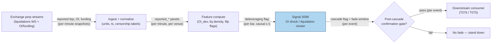

## Stage 96/200 — S096: Crypto OI shocks & liquidation clusters

*Batch SB10 · Signal 96/100 · Provenance [SR] · Family H — Crypto & perpetual markets*

### S1. One-line verdict

| | |
|---|---|
| **What it is** | Detects forced-selling cascades in crypto perps: open-interest collapses, *reported* liquidations spike, funding flips sign — then fades the exhaustion move on minutes-to-hours. |
| **When it works** | After genuine deleveraging events: crowded leverage (S095 flags the setup) meets a price shock, forced flow clears the book, and the move exhausts into thin liquidity. |
| **When it dies** | When the "cascade" is just the start of real selling; when your liquidation feed missed the largest prints (censored data); when spreads gap wider than the fade's edge. |
| **Build-or-buy in one line** | Build the cascade detector on free exchange streams; buy historical liquidation depth only if your backtest needs more than the censored public record — and never treat that record as complete. |

Provenance **[SR]** (heuristic family — standard reconstruction; no peer-reviewed specification of this exact rule exists). Family letter H (crypto/perpetuals family).

### S2. How it works — plain human explanation

**Open interest (OI)** is the total number of outstanding perpetual contracts. **Leverage** lets traders control large positions with small margin. A **liquidation** is the exchange forcibly closing a leveraged position whose margin fell below the maintenance level. A **liquidation cascade** is the reflexive loop: price drops → leveraged longs breach margin → forced selling → price drops further → more margin breaches. A **liquidation heatmap** is the public visualization of where leveraged positions would be liquidated at each price — clusters of it mark where the cascade fuel sits.

The mechanism is pure forced flow, not information. Crowded one-sided leverage (S095's extreme funding + high OI) is dry tinder. A price shock strikes the match. The first liquidations are market sells into a falling book, which widens the damage, which triggers the next tranche. The cascade ends when the fuel is spent: OI has collapsed, the liquidation prints slow, funding flips sign (the crowd is now net short / the longs are gone), and bid depth — which evaporated during the panic — starts to rebuild. The S096 rule: **after a liquidation-volume spike + bid-depth collapse + funding flip, fade the exhaustion move on minutes-to-hours** — buy the washed-out long liquidation, short the squeezed short liquidation.

Mandatory honesty, stated explicitly: **public liquidation feeds are censored — a LOWER BOUND on true forced flow, not market-wide truth.** Exchanges report only what they choose to report: internal risk-engine liquidations, venues with no public feed, sub-threshold prints, and grouped events never appear. Every field in this chapter is therefore `reported_liquidations`, `reported_open_interest`, `reported_funding` — never "the market's" liquidations. **Strategies calibrated on reported liquidations underestimate tail risk**, because the largest, ugliest forced flow is exactly what gets censored.

Concrete vignette (synthetic): BTC perp, 03:12 UTC. Funding has been +0.06%/8h for a week (S095: crowded longs). Price slips 1.6% in an hour; reported OI drops 6%; reported long liquidations print $8.5M in one hour — 40× baseline; reported funding flips to −0.03%. S096 reads: the long book just got forcibly cleared — the *sellers* were liquidations, not information. Fade: scale into a long for the exhaustion bounce over the next 2–6 hours, with a hard stop in case the selling is real.

- **Mental model 1:** A cascade is a forest fire running out of trees — the signal is the *absence* of remaining fuel, not the flames.
- **Mental model 2:** Your liquidation feed is a smoke detector with dead batteries in some rooms — it tells you there was a fire, never how big.
- **Mental model 3:** The fade is a mean-reversion bet on *flow exhaustion*, valid for hours; it says nothing about the next day's trend.

### S3. The math — exact formula

Let $OI_t$ be **reported** open interest, $L^{long}_t / L^{short}_t$ **reported** liquidation volume by side, $f_t$ **reported** funding, $D_t$ visible bid depth. The **OI deviation**:

$$OI\_dev_t = \frac{OI_t - MA_{180d}(OI_t)}{\mathrm{std}(OI_t)},$$

($MA_{180d}$ = 180-day moving average — *example* lookback). The **deleveraging flag** fires when OI drops sharply through its long moving average **and** reported funding flips sign:

$$\mathrm{Deleveraging}_t = \mathbf{1}\left[OI_t < MA_{180d}(OI_t) - k\,\mathrm{std}(OI_t)\ \ \cap\ \ \mathrm{sign}(f_t) \neq \mathrm{sign}(f_{t-1})\right],$$

$k$ = *example* threshold (e.g. 2). **Liquidation density** (the public "liquidation heatmap" methodology, reconstructed): combine reported OI, the leverage distribution, and mark-price distance to estimate, per price level $p$, the notional that would liquidate if price reached $p$:

$$\mathrm{Density}(p) \;\approx\; \sum_{\text{positions}} \mathrm{notional} \cdot \mathbf{1}[\,\mathrm{liq\_price} \in [p-\delta, p+\delta]\,],$$

computed from *reported* inputs only — a lower bound by construction. **Post-cascade rule** (heuristic): after a reported-liquidation-volume spike ($L_t > m \times$ baseline median, $m$ *example* e.g. 5) **and** bid-depth collapse **and** funding sign flip → fade the exhaustion move, minutes-to-hours horizon, with a hard stop.

| Parameter | Symbol | Typical range | Too small / too large | Default (example) |
|---|---|---|---|---|
| OI lookback | $MA_{180d}$ | 90–365 days | Too short: every unwind looks extreme; too long: regime drift | 180 days *— example, not an institutional standard* |
| Deleveraging $k$ | $k$ | 1.5–3 sd | Too low: noise flags; too high: fires after the bounce | 2 *— example* |
| Liquidation spike $m$ | $m$ | 3–10× median | Too low: normal prints look like cascades; too high: misses real ones | 5× hourly median *— example* |
| Fade horizon | — | minutes–hours | Too long: trend risk; too short: spread eats it | 2–6 hours *— example* |
| Depth-collapse bar | — | 30–70% bid-depth drop | Ignored: fades into a still-falling book | 50% *— example* |

**Causal timing:** cascade flags are computed at bar $t$ from reported prints with timestamps ≤ $t$; the fade entry executes no earlier than $t+1$ — and reported liquidations arrive with venue latency, so "real-time" is really "minutes late" (see failure modes). **Variants:** (1) *OI-only deleveraging* — skip liquidations entirely, trade the OI collapse (fewer censored inputs); (2) *heatmap-front-run* — position *before* the cluster using the density map (needs honest depth data); (3) *cross-venue cascade* — require the flag on ≥2 venues (filters venue-specific noise).

### S4. Worked example — step-by-step numbers (SYNTHETIC)

All numbers below are **synthetic** (seed **96**); the chart plots exactly these numbers. Synthetic 72-hour BTC-perp window; cascade designed at hours 50–52. **All fields are reported_*, i.e. censored lower bounds.**

| Hour | Mark price | Reported OI ($B) | Reported funding | Reported long liq ($M) | Reported short liq ($M) | Read |
|---|---|---|---|---|---|---|
| 45 | 100.77 | 0.963 | +0.00002 | 0.02 | 0.15 | calm |
| 46 | 100.82 | 0.968 | +0.00033 | 0.05 | 0.04 | calm |
| 47 | 100.60 | 0.959 | +0.00023 | 0.01 | 0.10 | calm |
| 48 | 100.70 | 0.953 | +0.00040 | 0.32 | 0.31 | funding rising |
| 49 | 100.86 | 0.949 | +0.00060 | 0.23 | 0.12 | crowded (S095 setup) |
| 50 | 99.23 | 0.891 | +0.00080 | 2.80 | 0.24 | shock: −1.6% price, −6.1% OI |
| 51 | 99.65 | 0.920 | +0.00060 | 8.50 | 0.04 | **cascade peak** |
| 52 | 100.35 | 0.936 | +0.00020 | 4.20 | 0.05 | forced flow slowing |
| 53 | 100.83 | 0.953 | **−0.00030** | 0.33 | 0.09 | **funding flips sign** |
| 54 | 100.66 | 0.952 | −0.00006 | 0.33 | 1.90 | weak hands shaken both ways |
| 55 | 100.46 | 0.956 | +0.00007 | 0.06 | 0.19 | normalizing |
| 56 | 100.34 | 0.957 | −0.00005 | 0.31 | 0.00 | normalizing |

Hand-checks: OI drop h49→h50 = $(0.891-0.949)/0.949 = \mathbf{-6.1\%}$ ✓. Price drop h49→h50 = $(99.23-100.86)/100.86 = \mathbf{-1.62\%}$ ✓. Cascade-peak long liquidations $8.5M vs baseline ~$0.2M ≈ 40× ✓. Funding flip h52→h53: +0.00020 → −0.00030 ✓. The fade window (h53–h57, green band on the chart): price recovers 99.23 → 100.83 = **+1.61%** from the cascade low — the exhaustion bounce the rule harvests.

**What to notice:** the flag sequence is *ordered* — crowded setup (h48–49) → shock (h50) → reported-liq spike (h51) → flow slows (h52) → funding flips (h53) → fade. Entering at h51's low without the h53 flip confirmation is catching a falling knife; the flip is the cheapest confirmation. **Limits:** all inputs are reported_* (the true forced flow was larger); no bid–ask spread or slippage in the +1.61%; no guarantee the selling was "only" liquidations — real information-driven selling does not bounce.

### S5. Strategies that use this signal

- **T076 — Liquidation-Cascade Fade** — *primary trigger*: buys crypto liquidation clusters with funding context — this chapter *is* its entry logic.
- **T075 — Crypto Funding-Rate Reversal** — *confirmation/setup*: S096's cascade validates the crowded-leverage regime S095 measures.
- **T045**-family note: not applicable — S096's listed strategies per plan are T076 (primary), T075; S045 (stretched-move z-score) is the equities analog of the exhaustion fade.

### S6. Data required — exact spec

| Field | Type | Granularity | Source tier | Notes |
|---|---|---|---|---|
| Reported liquidations (side, size) | numeric | per minute (WS) / hourly (API) | Tier 0–1 | **Censored lower bound** — label reported_liquidations |
| Reported open interest | numeric | 5-min snapshots | Tier 0–1 | Venue/unit normalization; label reported_open_interest |
| Reported funding | numeric | per interval | Tier 0 | Label reported_funding; caps venue-specific |
| Mark / index price | numeric | per minute | Tier 0 | Liquidation-distance math needs the mark |
| Visible bid/ask depth | numeric | per minute | Tier 1–2 | Depth-collapse confirmation; SIP insufficient |
| Long/short account ratios | numeric | hourly | Tier 1 | Crowding context (Binance/Bybit publish) |

Ingest sketch (Python, ≤20 lines):

```python
import ccxt, polars as pl
ex = ccxt.binanceusdm()                       # example venue
def cascade_snapshot(symbol="BTC/USDT:USDT"):
    return {"ts": ex.milliseconds(),
            "rpt_liq": ex.fetch_liquidations(symbol),   # censored feed
            "rpt_oi": ex.fetch_open_interest(symbol)["openInterestAmount"],
            "rpt_funding": ex.fetch_funding_rate(symbol)["fundingRate"],
            "mark": ex.fetch_ticker(symbol)["markPrice"]}
# per-minute loop -> parquet; flags computed on reported_* only
```

Storage (per `notes/cost-model.md` §4): per-minute reported series for 20 perps ≈ rows/day in the low hundreds of thousands — trivial; history is the constraint (public liquidation history is shallow — that's the buy case). Data-quality checklist: UTC ts with venue-vs-ingest latency; venue symbol mapping; OI unit normalization; funding-cap versioning; WS-gap backfill and gap flags; **censorship audit**: compare reported totals across venues and note the missing mass.

### S7. Local build on M5 Max / 128GB

**Feasibility: feasible — Tier M.** Per `notes/cost-model.md` §5, this is an M-tier event pipeline: **~40–60 h ≈ $6,000–9,000** at $150/hr loaded-cost estimate — one line of justification: the detector is arithmetic on small panels; the work is venue connectors, censorship-aware labeling, and validating flags against real cascades. Throughput (§2): per-minute snapshots for 20 perps are thousands of rows/day — polars recomputes the whole panel in milliseconds; Python polling is 100× over-provisioned. RAM: <1 GB working (§3). Bottleneck: none locally — the constraint is *feed completeness*, which no Mac fixes. What breaks first at 500 symbols: nothing computationally; but cascade detection on 500 illiquid alts is noise — the signal belongs on the majors.

| Stack | When to pick |
|---|---|
| Python + ccxt + polars | Default: snapshot loop, flags, heatmap reconstruction |
| Exchange WS (forceOrder-style streams) | When you need per-print liquidation latency, not hourly aggregates |
| Aggregator (CoinGlass-style) | Cross-venue reported totals without per-venue plumbing |

### S8. Buy vs build

| Option | What you get | Indicative price | Gains | Loses |
|---|---|---|---|---|
| Exchange APIs/WS (Binance/Bybit/OKX) | Reported liquidations, OI, funding | ~$0 (rate-limited) *indicative — verify before budgeting* | Primary, free, lowest latency | Censored; own backfill |
| CoinGlass (aggregated) | Cross-venue reported liqs + heatmaps | tens–hundreds $/mo *indicative — verify before budgeting* | One schema; history without plumbing | Still reported-only; dressed as complete |
| Tardis.dev | Tick-level historical crypto data | hundreds–thousands $/mo *indicative — verify before budgeting* | Honest replay of *your* recorded window | Can't backfill what was never published |
| Kaiko / CoinDesk Data | Research-grade normalized history | custom institutional *indicative — verify before budgeting* | Multi-year consistency | Enterprise pricing; censorship unchanged |

**Verdict: build the detector on direct feeds; buy history only for the backtest — and discount every backtest for censorship.** No vendor sells the *true* forced flow; anyone implying completeness is selling the lower bound with better charts. Crossover: pay for history when you need multi-year cross-venue reported series for training the flags; never pay expecting "complete" liquidations.

### S9. Success ratio / efficacy — documented evidence

| Study / source | Market & period | Metric | Before/after cost | Caveat |
|---|---|---|---|---|
| CoinGlass API docs (ckaraca/coinglass-apiv3) | Crypto perps, ongoing | Documents reported liquidation/OI/heatmap endpoints — the measurement infrastructure | Infrastructure (not a return) | Endpoints serve *reported* data |
| Laevitas CLI + docs | Crypto derivatives, ongoing | Terminal/streaming derivatives data incl. liquidations | Infrastructure | Practitioner tooling, not an efficacy study |
| TradingView derivatives-indicators documentation | Multi-venue crypto, 2025–2026 | Defines funding/OI/liquidation semantics for charting | Definitional | No performance claims |
| Makarov & Schoar (2020), *JFE* | Cross-exchange crypto | Large recurrent dislocations; limits to arbitrage | Before-cost | Context for why dislocations persist — not cascade returns |

Regimes where it fails: information-driven selloffs (no bounce — the fade is run over); censored prints hiding the real cascade size (flag fires late or never); spread/slippage explosion during the event exceeding the exhaustion edge; venue outages mid-cascade; short-squeeze cascades (mirror image — fading the wrong side). **Honest bottom line:** as a standalone trigger this is a *heuristic risk/flow tool with no peer-reviewed after-cost efficacy* — its documented value is descriptive (the feeds exist, the mechanics are real). As a *post-stress entry timer* inside T076, gated by S095's crowding setup and a funding flip, it is the most defensible contrarian use in crypto — sized small, stopped hard.

### S10. Failure modes & pitfalls

1. **Censored data** (reported ≪ true forced flow) → mitigate: label everything reported_*; size as if the true cascade were 2–5× larger.
2. **Real selling, not forced** (information, not liquidation) → mitigate: require the full flag sequence (crowding → spike → flip), not price action alone.
3. **Late flags** (venue latency on reported prints) → mitigate: measure feed latency; the fade is minutes-to-hours, never seconds.
4. **Spread explosion** (the bounce is smaller than the cross) → mitigate: model effective spread at stress, not at calm (H5).
5. **Single-venue mirage** (one venue's cascade, others fine) → mitigate: require ≥2 venues or treat as venue-specific noise.
6. **Mirror-image risk** (short cascades squeeze up) → mitigate: symmetric rules; the fade direction follows the liquidated side.
7. **Overfit thresholds** ($k$, $m$ tuned on two famous cascades) → mitigate: out-of-sample across venues/years; prefer robust ranges.
8. **Feed outage mid-event** (WS drops during the cascade) → mitigate: gap flags; safe-mode = no new fades on stale inputs.

### S11. Visuals




### S12. Sources

1. CoinGlass API v3 endpoint documentation — `/futures/liquidation/*`, `/futures/open-interest/*`, liquidation heatmap endpoints (documents the *reported* data infrastructure). https://github.com/ckaraca/coinglass-apiv3
2. CoinGlass — cross-venue crypto derivatives dashboards (funding, OI, liquidations). https://www.coinglass.com/
3. Laevitas CLI — terminal derivatives data: futures, perpetuals, liquidations, funding/carry/basis. https://github.com/Laevitas/cli
4. Laevitas — institutional crypto derivatives analytics. https://laevitas.ch
5. august-andersen/trading-hypothesis-workflow DATA.md — practitioner notes: Binance `forceOrder` WS, Data Vision bulk liquidation history, CoinGlass Pro, Tardis.dev, Kaiko. https://github.com/august-andersen/trading-hypothesis-workflow/blob/HEAD/docs/DATA.md
6. ue/awesome-perp-trading — curated perpetuals resources: liquidation trackers, funding tools, analytics. https://github.com/ue/awesome-perp-trading
7. TradingView — crypto derivatives indicators documentation (funding, liquidations, long/short ratios, OI across venues). https://www.tradingview.com/blog/en/indicators-for-bitget-htx-kraken-deribit-bitmex-coinbase-derivatives-53708/

**Unverified leads** (batch-research claims without an independently checkable source this batch):
- Duck.ai Q-SB10-2/Q-SB10-3 censored-data caveat (verified as *stated explicitly* in the source, framing unverified): public liquidation feeds = reported, venue-specific, size-thresholded subset = LOWER BOUND; excluded: private/internal risk-engine liquidations, venues without public feeds, partial fills, grouped events, WS-gap losses, exchange minimum-size thresholds, DEX/regional venues; aggregated OI venue-limited, delayed, unit-dependent, snapshot-based; funding more reliable (scheduled exchange field) but interval/mark-price/caps/settlement venue-specific.
- Duck.ai Q-SB10-3 cascade claims (bot summaries — research leads, never confirmed facts): cascade loop ΔP → margin breach → forced flow → ΔP_{t+1}; nonlinear (crowded stable for weeks, then minutes-long move at clustered thresholds); contrarian regression r_{t+h} = a + b·z(f_t) + c·z(ΔOI_t) + d·z(LIQ_t) + ε with b<0 only conditionally; "more defensible use is regime detection and leverage reduction, not unconditional contrarian trading."
- Duck.ai Q-SB10-2 liquidation-vendor/eng specifics (bot summaries): CoinGlass custom tens–hundreds+/mo; Tardis.dev hundreds–thousands/mo; Kaiko custom institutional; Apify/community from ~$1/1,000 requests; liquidations component eng 15–30h.
- Source log: Duck.ai answered Q-SB10-1–Q-SB10-3 (2026-09-10); Grok answers pending (checked 2026-09-10).
