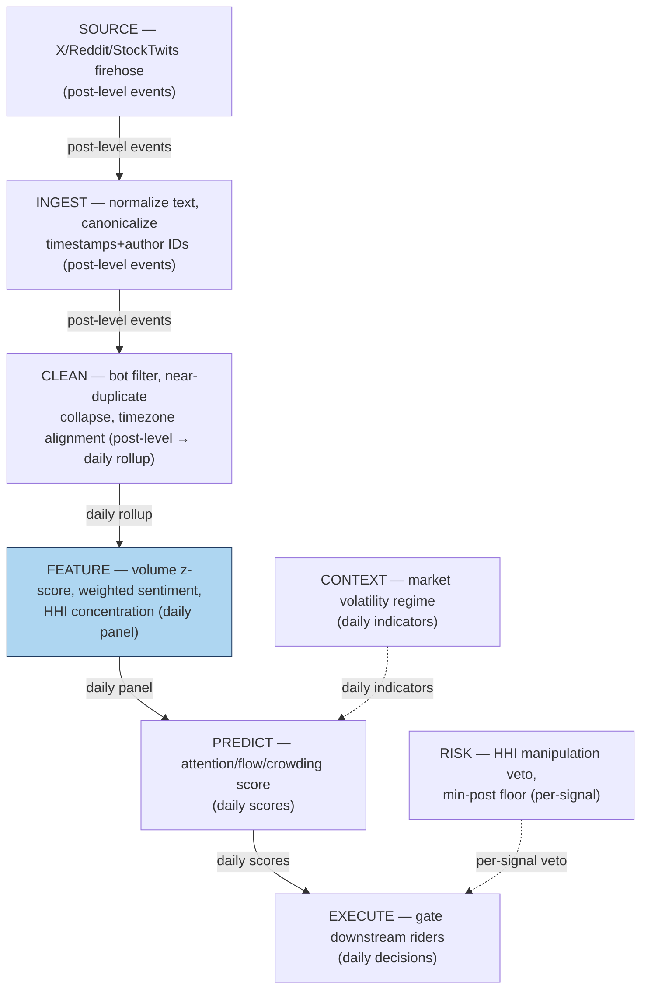

## Stage 97/200 — S097: Social and media sentiment

*Batch SB10 · Signal 97/100 · Provenance [SR] · Family G — Alternative data*

### S1. One-line verdict

| | |
|---|---|
| **What it is** | A composite of **message volume** and **signed sentiment** from social/media posts — a *model feature* (short-horizon attention/flow, volatility, crowding), not a standalone trading signal. |
| **When it works** | When the composite is volume-weighted, bot-penalized, and author-deduplicated, combined with price, volume, news, and order flow — flagging attention shocks (retail pile-ins, coordinated promotion) that precede volume and volatility, not alpha. |
| **When it dies** | When read naively as direction. Least defensible: *"bullish sentiment = buy."* Raw bullishness on a bot campaign is a mark, not a signal. |
| **Build-or-buy in one line** | Buy the firehose (X/Reddit/StockTwits APIs or an aggregator); build the scoring and manipulation diagnostics yourself — the vendor's black-box score is not your edge. |

Provenance **[SR]** (Chen et al. 2014, *RFS*; Antweiler & Frank 2004, *JoF*); never upgraded. Central honesty rule: most defensible as a short-horizon attention/flow, volatility, and crowding feature combined with price, volume, news, and order flow — not a directional signal on its own.

### S2. How it works — plain human explanation

A **lexicon** scores text from a word list (each word carries a sign and weight); a **transformer** (a FinBERT-class neural language model) scores from context, handling negation and sarcasm better. Neither is the signal. The signal is the *composite*: signed per-post scores aggregated with weights rewarding unique human authors and original posts, penalizing bots, duplicates, and engagement-farm concentration.

Two quantities matter. **Message volume** — posts per bucket, standardized as a z-score against its trailing mean — captures attention. **Signed sentiment** — the weighted mean score in [−1, +1] — captures direction. The composite multiplies them: only attention shocks with extreme signed sentiment earn a model's attention.

Social media is a battleground, not a sensor: pump campaigns and bot nets manufacture volume and bullishness. Hence the third quantity, the **manipulation diagnostic** — the Herfindahl–Hirschman index (**HHI**, the sum of squared post shares across accounts). When a handful of accounts produce most posts, the sentiment is the campaign's, not the crowd's: down-weight or veto.

### S3. The math — exact formula

There is no canonical published formula for the full composite — it is a reconstruction from the literature's components (Antweiler & Frank 2004: message counts and a bullishness index; Chen et al. 2014: author-influence weighting). The defensible reconstruction, stated exactly:

$$Sentiment_t = \frac{\sum_{u \in U_t} w_u\,q_u\,Sentiment(post_u)}{\sum_{u \in U_t} w_u\,q_u}$$

where $U_t$ is the post set in bucket $t$, $Sentiment(post_u) \in [-1,+1]$ the signed per-post score, $w_u$ a user-quality weight (account age, follower quality, historical informativeness), and $q_u \in (0,1]$ an originality adjustment (near-duplicates and suspected bots get $q_u \ll 1$).

The volume leg is a trailing z-score (sample sd, denominator $W-1$):

$$z^{vol}_t = \frac{posts_t - \bar{posts}_{t-W:t-1}}{s_{t-W:t-1}}, \qquad W = 5 \text{ days}$$

The composite feature is $z^{vol}_t \times Sentiment_t$ (only above a minimum-post floor), gated by the manipulation diagnostic:

$$Concentration_t = \sum_u \left(\frac{posts_{u,t}}{posts_t}\right)^2$$

If $Concentration_t$ exceeds threshold (e.g., 0.25 — the §S4 hand example gives 0.317), the bucket is flagged campaign-dominated and the sentiment leg is vetoed or shrunk toward zero.

**Variants:** (a) lexicon scoring (fast, transparent; Loughran & McDonald 2011: finance text needs domain dictionaries); (b) transformer scoring (better context; ~1–50 ms/sequence); (c) volume-only attention (Barber & Odean 2008); (d) engagement-weighted sentiment (gameable); (e) author-persistence features (Chen et al. 2014).

### S4. Worked example — step-by-step numbers (SYNTHETIC)

All numbers below are **synthetic** — a hand-constructed 10-day tape for a fictional ticker, seed **97** (baseline jitter on post counts is the only random element). An illustration of the mechanics, **not a backtest and not real performance**.

| day | posts | unique authors | raw mean sentiment | weighted sentiment | HHI concentration | volume z (5-day) |
|----:|------:|---------------:|-------------------:|-------------------:|------------------:|-----------------:|
| 1 | 123 | 101 | +0.050 | +0.040 | 0.021 | n/a |
| 2 | 143 | 104 | −0.020 | −0.020 | 0.023 | n/a |
| 3 | 117 | 90 | +0.080 | +0.070 | 0.022 | n/a |
| 4 | 138 | 105 | +0.030 | +0.020 | 0.020 | n/a |
| 5 | 132 | 97 | −0.050 | −0.040 | 0.024 | n/a |
| 6 | 410 | 152 | +0.250 | +0.120 | 0.090 | **+26.25** |
| 7 | 980 | 210 | +0.450 | +0.064 | 0.317 | +6.36 |
| 8 | 720 | 268 | +0.180 | +0.100 | 0.180 | +0.99 |
| 9 | 392 | 203 | −0.100 | −0.060 | 0.075 | −0.23 |
| 10 | 181 | 141 | −0.020 | −0.020 | 0.030 | −1.05 |

Hand-check day-6 z: window [123, 143, 117, 138, 132]; mean = 130.60; squared deviations sum to 453.2; sample variance = 113.3; sd = 10.6442; z = (410 − 130.60)/10.6442 = **26.25**.

Day-7 manipulation autopsy — eight posts with user-quality $w$, originality $q$, signed score $s$:

| post | $w$ | $q$ | $s$ | $w·q$ | $w·q·s$ |
|------|-----|-----|-----|-------|---------|
| bot_1 | 0.2 | 0.1 | +1.0 | 0.02 | +0.020 |
| bot_2 | 0.2 | 0.1 | +1.0 | 0.02 | +0.020 |
| bot_3 | 0.3 | 0.2 | +0.8 | 0.06 | +0.048 |
| promoter | 0.4 | 0.3 | +0.9 | 0.12 | +0.108 |
| analyst | 0.9 | 0.9 | +0.2 | 0.81 | +0.162 |
| retail_1 | 0.6 | 0.7 | +0.3 | 0.42 | +0.126 |
| retail_2 | 0.6 | 0.6 | −0.2 | 0.36 | −0.072 |
| skeptic | 0.8 | 0.8 | −0.4 | 0.64 | −0.256 |
| **total** | | | | **2.45** | **0.156** |

Unweighted mean = 3.6/8 = **+0.450** (the naive "everyone is bullish — buy"). Weighted = 0.156/2.45 = **+0.064** — bots and promoter carry almost no weight once $w$, $q$ apply. Concentration: one account posts 55%, four more 8/6/5/4%, rest over ~205 authors: HHI = 0.55² + 0.08² + 0.06² + 0.05² + 0.04² + 205×(0.22/205)² = **0.317** — campaign territory.

**What to notice:** volume z fires day 6 (+26.25); raw sentiment peaks day 7 (+0.45) — but HHI flags day 7 as bot-dominated (0.317) and weighted sentiment (+0.064) refuses to confirm. The desk gate ($z^{vol} > 3$, |weighted sentiment| > 0.15, HHI < 0.25) fails on concentration: **no trade** — the veto is the signal's most valuable output here.

**Cost of the hypothetical unvetoed trade** (spread + fees + impact/slippage, explicit): $50,000 in a $40 stock = 1,250 shares. Half-spread both ways at 2¢ = $50. Fees $0.0035/share × 2 legs = $8.75. Impact/slippage 3 bps = $15. Total ≈ **$74 ≈ 15 bps round trip** — the edge the signal would have to clear.

### S5. Strategies that use this signal

Cross-references verified against plan.md \u00a73; each names the relationship.

- **T072 — Social-sentiment ignition rider (primary).** Uses S097 (with S032, S099): a volume-z spike with confirmed weighted sentiment, HHI-gated, as an *entry-timing rider* on an existing position — never the position's thesis.
- **T048 — Put/call contrarian fade.** Uses S097 as a *filter/veto*: extreme bullish social sentiment is a contrarian crowding input to options-flow positioning — it tells you who is crowded, not what to buy.
- **T071 — News-novelty reversal.** Uses S097 (with S093, S042) as a *confirming feature*: chatter merely echoing priced news (high volume, no original-post share) is faded, not followed.
- **T080 — Multi-source attention composite.** Uses S097 (with S099, S093) as one leg: social, search, and news attention combined so no single manipulable source fires the composite alone.

### S6. Data required — exact spec

| Dataset | Granularity | History | Source / vendor | Notes |
|---|---|---|---|---|
| Social posts (X, Reddit, StockTwits, forums) | post-level (author, timestamp, text, engagement) | 2+ years | X API; Reddit commercial API; StockTwits; or aggregator | Author IDs and timestamps are load-bearing; text is secondary |
| Bot/duplicate labels or features | post-level | rolling | built in-house | No vendor sells your manipulation filter |
| Sentiment scorer | post-level → daily rollup | — | finance lexicon or FinBERT-class transformer | Lexicon for speed; transformer for accuracy |
| Price/volume (gates & alignment) | daily bars minimum | matches post history | Polygon-class, Databento | Timestamps must be exchange-timezone aligned |
| News flow ("echo vs original" test) | article-level | 1+ year | Benzinga-class newswire | Original-post share is computed against this |

Minimum viable: 2 years of post-level data for one universe with author IDs and millisecond timestamps. The killer failure mode is timestamp ambiguity — wrong timezones, or delayed ingestion presented as real-time.

### S7. Local build on M5 Max / 128GB

Feasibility: **feasible** — Tier **H** (cost-model: 60–200 engineering hours, ≈ $9,000–30,000 at $150/hr). The work is ingestion, normalization, and bot filtering, not compute: small-transformer scoring at the cost-model planning range (~1–50 ms/sequence) makes 10M posts/day an overnight batch job, and daily rollups are gigabytes — far under the ~77 GB ceiling. Polars-class joins run ~1–10M rows/sec.

Build sequence: (1) ingest the firehose with author IDs and canonicalized timestamps; (2) dedupe text, flag bot-like accounts (posting-rate, text-similarity, account-age); (3) score with a finance lexicon first — graduate to a transformer only if a hand-labeled sample justifies it; (4) compute daily z-scores, weighted sentiment, HHI; (5) lead-vs-follow test vs price/volume before risking capital — if sentiment doesn't lead volume or volatility out-of-sample, it's coincident, not predictive.

### S8. Buy vs build

| Component | Buy (indicative — verify before budgeting) | Build |
|---|---|---|
| Post firehose | X API pay-per-use (bot-reported lead — see Unverified leads); Reddit commercial API (metered — bot-reported lead); StockTwits API | — (cannot build someone else's firehose) |
| Aggregated social metrics | LunarCrush / Santiment (bot-reported lead — see Unverified leads); Benzinga-class news ~$100–200/mo | Daily rollups from raw posts |
| Sentiment scoring | Vendor black-box scores (not recommended) | Finance lexicon (free) → FinBERT-class transformer self-hosted |
| Manipulation filter | Not for sale at any price that matters | In-house: the only defensible moat here |
| Price/volume alignment | Polygon-class ~$30–200/mo; Databento ~$200/mo + usage | Corporate-action adjustment, timezone alignment |

Recommendation: buy the raw firehose, build everything downstream. A vendor's sentiment score as your signal is a commodity edge.

### S9. Success ratio / efficacy — documented evidence

All effects below are documented as **before-cost** and mostly descriptive or predictive in-sample; none is a net-of-cost trading result.

| Study | Sample / design | Documented finding | Honest caveat |
|---|---|---|---|
| Antweiler & Frank (2004) | Yahoo! Finance boards, 2000 | Volume predicts volume/volatility; return predictability weak and contested | Early internet; descriptive, before-cost |
| Chen, De, Hu & Hwang (2014) | Seeking Alpha articles/views | Author track records and views predict returns and earnings surprises | Before-cost; single-platform |
| Das & Chen (2007) | Web small-talk sentiment | Sentiment classifiers extract usable signal from noisy web text | Methodology, not a trading result |
| Bollen, Mao & Zeng (2011) | Twitter mood vs DJIA | Reported 87.6% directional accuracy on DJIA moves | Heavily critiqued; failed to replicate — not net performance |
| Barber & Odean (2008) | Retail attention and news | Attention drives retail buying behavior — the mechanism behind attention shocks | Behavioral mechanism, not a signal |
| Tetlock (2007) | Media sentiment and the market | Media pessimism predicts short-horizon returns and volatility | Media, not social; before-cost |

**Literature bottom line:** the record supports social sentiment as an *attention and flow variable* — it moves volume, volatility, and retail order flow — not as a standalone directional signal. The post-2021 meme-stock episode confirms the attention mechanism at scale and the manipulation problem with it: the loudest sentiment was often the most manufactured.

### S10. Failure modes & pitfalls

1. **Coordinated promotion / pump campaigns** → mitigate: the HHI concentration gate (§S3); veto or shrink sentiment above threshold.
2. **Bot and duplicate inflation** → mitigate: $q_u$ originality weights, near-duplicate clustering, account-age and posting-rate features; never score raw counts.
3. **Lexicon misfires** (sarcasm, negation, finance jargon) → mitigate: finance-specific dictionaries (Loughran & McDonald 2011); transformer scoring only with a hand-labeled validation set.
4. **Platform API changes and survivorship** → mitigate: multi-platform sourcing; archive raw posts, never just the aggregates.
5. **Low-count noise** (thinly discussed names) → mitigate: minimum-post floor per bucket; no composite below it.
6. **Crowding** — every desk's social signal fires on the same meme name → mitigate: use S097 as a *crowding measure* (T048) as often as a timing input.
7. **Timestamp lookahead** — delayed ingestion stamped as real-time → mitigate: measure ingestion lag; backtest on *as-received* timestamps.
8. **Regime change** (platform migration) → mitigate: monitor platform-share of volume; recalibrate baselines when the mix shifts.

### S11. Visuals

### S12. Sources

1. Antweiler, Werner & Frank, Murray Z. (2004). "Is All That Talk Just Noise? The Information Content of Internet Stock Message Boards." *Journal of Finance* 59(3): 1259–1294. https://doi.org/10.1111/j.1540-6261.2004.00662.x
2. Chen, Hailiang, De, Prabuddha, Hu, Yu & Hwang, Byoung-Hyoun (2014). "Wisdom of Crowds: The Value of Stock Opinions Transmitted Through Social Media." *Review of Financial Studies* 27(5): 1367–1403. https://doi.org/10.1093/rfs/hhu001
3. Bollen, Johan, Mao, Huina & Zeng, Xiaojun (2011). "Twitter Mood Predicts the Stock Market." *Journal of Computational Science* 2(1): 1–8. https://doi.org/10.1016/j.jocs.2010.12.007 (preprint: https://arxiv.org/abs/1010.3003)
4. Das, Sanjiv R. & Chen, Mike Y. (2007). "Yahoo! for Amazon: Sentiment Extraction from Small Talk on the Web." *Management Science* 53(9): 1375–1388. https://doi.org/10.1287/mnsc.1070.0704
5. Barber, Brad M. & Odean, Terrance (2008). "All That Glitters: The Effect of Attention and News on the Buying Behavior of Individual and Institutional Investors." *Review of Financial Studies* 21(2): 785–818. https://doi.org/10.1093/rfs/hhm079
6. Tetlock, Paul C. (2007). "Giving Content to Investor Sentiment: The Role of Media in the Stock Market." *Journal of Finance* 62(3): 1139–1168. https://doi.org/10.1111/j.1540-6261.2007.01232.x
7. Loughran, Tim & McDonald, Bill (2011). "When Is a Liability Not a Liability? Textual Analysis, Dictionaries, and 10-Ks." *Journal of Finance* 66(1): 35–65. https://doi.org/10.1111/j.1540-6261.2010.01625.x
8. Hasso, Tim, Müller, Daniel, Pelster, Matthias & Warkulat, Sonja (2022). "Who participated in the GameStop frenzy? Evidence from brokerage accounts." *Finance Research Letters* 44: 102636. https://doi.org/10.1016/j.frl.2021.102636
9. Renault, Thomas (2017). "Intraday online investor sentiment and return patterns in the U.S. stock market." *Journal of Banking & Finance* 84: 25–40. https://doi.org/10.1016/j.jbankfin.2017.07.002

**Unverified leads** (batch-research claims without an independently checkable source this batch):
- X API (~$0.005/post read), Reddit commercial API (metered), LunarCrush/Santiment (~$50–1,000+/mo) — bot-summarized; treat all pricing as leads, indicative only.
- The 175–445 h social-plus-trends build estimate (bot) — the cost-model Tier H band (60–200 h) is used for planning instead.
- Post-2021 meme-stock attention literature beyond the GameStop study — relevant papers exist; full citations not captured this batch.
- Source log: Duck.ai answered Q-SB10-1–Q-SB10-3 (2026-09-10); Grok answers pending (checked 2026-09-10).
