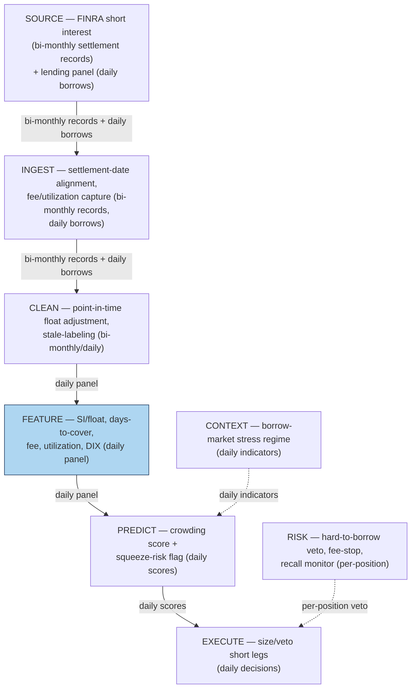

## Stage 98/200 — S098: Short interest, borrow fees & days-to-cover

*Batch SB10 · Signal 98/100 · Provenance [SR] · Family G — Alternative data*

### S1. One-line verdict

| | |
|---|---|
| **What it is** | A crowding and squeeze-risk panel: **short interest / float**, **days-to-cover**, **borrow utilization**, the **indicative borrow fee**, plus a dark-pool buying proxy. A risk-management and timing input, not a standalone long/short signal. |
| **When it works** | When it separates *crowding* from *direction*: high SI with a rising fee = crowded and expensive; fee spikes while SI stays high = squeeze risk; the fee itself is the cost model for any short leg. |
| **When it dies** | When SI is read as "bearish = short more." High SI means expensive borrow, a crowded trade, and maximum squeeze asymmetry (unbounded upside loss). |
| **Build-or-buy in one line** | Free FINRA data for the slow-moving SI level; license a daily lending panel (Markit/S3-class) for fees and utilization — the fee is where the money is. |

Provenance **[SR]** (Asquith et al. 2005, *JFE*; Cohen et al. 2007, *JoF*); never upgraded. Central honesty rule: **no canonical combined formula exists** — every crowding composite here is desk-specific and labeled as such.

### S2. How it works — plain human explanation

**Short interest (SI)** is the shares currently sold short — borrowed, sold, to be bought back. **Float** is the shares actually tradeable (outstanding minus locked-up/insider holdings). SI/float is the fraction of tradeable supply that must one day be repurchased.

**Average daily volume (ADV)** is normal daily share volume. **Days-to-cover (DTC)** = SI / ADV: how many normal-volume days all shorts need to cover — a DTC of 9 means no quiet exit. **Utilization** is the fraction of lendable shares on loan (97% = the lending desk is nearly empty). The **indicative borrow fee** is the annualized rate shorts pay to stay borrowed — 42%/ann bleeds ~11.5 bps/day. **Borrow fees are negative carry for shorts**: a cost compounding against you every day the thesis doesn't pay.

The **DIX** (a dark-pool buying proxy popularized by SqueezeMetrics) is defined here as dark-pool buy volume over total consolidated volume — a practitioner proxy, not an academic statistic.

The data comes in two speeds. Exchange/FINRA short interest is **lagged, bi-monthly** — where crowding *was* two weeks ago. Professional lending panels (Markit, S3-class) are **daily**: fee, utilization, availability. Level from the slow data; timing from the fast data.

The three mandatory interpretations: **high SI plus a rising fee indicates crowding.** **Squeeze risk rises when fees spike while SI remains high** — shorts pay more to stay, so a buying panic meets no natural sellers but panicking shorts. And **borrow fees are negative carry for shorts** — at 42%/ann, the stock must fall 3.45% in 30 days just to break even on carry.

### S3. The math — exact formula

The components are exact; the composite is not. Definitions:

$$SI/float_t = \frac{SI_t}{Float_t}, \qquad days\text{-}to\text{-}cover_t = \frac{SI_t}{ADV_t}$$

$$Utilization_t = \frac{shares\ on\ loan_t}{lendable\ shares_t}, \qquad Fee_t = \text{indicative borrow fee (\%/ann)}$$

$$DIX_t = \frac{dark\ pool\ buy\ volume_t}{total\ consolidated\ volume_t}$$

**No canonical combined formula exists** — the literature studies these variables separately (Asquith et al. on SI×institutional ownership; Cohen et al. on fee-implied demand shifts; D'Avolio on the borrow market). Any desk composite is proprietary. The worked example below uses an explicitly illustrative crowding score — the sum of cross-sectional z-scores of SI/float, days-to-cover, and fee — labeled as a **desk-specific example, not an institutional standard**:

$$Crowding^{example}_i = z(SI/float_i) + z(DTC_i) + z(Fee_i)$$

**Variants:** (a) SI × (1 − institutional ownership) — the Asquith et al. constrained subset; (b) fee-*change* not fee-level (Cohen et al.'s demand-shift identification); (c) utilization-only screens (availability → 0 as the hard gate); (d) DTC on median volume (spike-robust); (e) DIX-style dark-pool flow as squeeze confirmation, not a short input.

### S4. Worked example — step-by-step numbers (SYNTHETIC)

All numbers below are **synthetic** — a hand-constructed 6-stock panel with fictional tickers, generated with seed **98**. This is an illustration of the mechanics, **not a backtest and not real performance**.

| ticker | SI (M) | float (M) | ADV (M) | SI/float (%) | DTC (days) | fee (%/ann) | util (%) | DIX (%) | crowding (z-sum, example) | 30-day borrow drag on $1M short (%) |
|--------|-------:|----------:|--------:|-------------:|-----------:|------------:|---------:|--------:|--------------------------:|-----------------------------------:|
| ZQTA | 6 | 400 | 12.0 | 1.50 | 0.50 | 0.4 | 8.0 | 7.5 | −2.54 | 0.03 |
| KLVR | 18 | 220 | 3.0 | 8.18 | 6.00 | 8.5 | 61.0 | 9.2 | +0.12 | 0.70 |
| NORD | 9 | 180 | 6.0 | 5.00 | 1.50 | 1.2 | 22.0 | 8.1 | −1.90 | 0.10 |
| **MEMEQ** | **42** | **150** | **4.5** | **28.00** | **9.33** | **42.0** | **97.0** | **16.0** | **+4.72** | **3.45** |
| PWRS | 30 | 120 | 15.0 | 25.00 | 2.00 | 28.0 | 92.0 | 13.5 | +1.51 | 2.30 |
| DLTA | 3 | 90 | 1.5 | 3.33 | 2.00 | 0.8 | 15.0 | 7.0 | −1.91 | 0.07 |

Hand-check MEMEQ: SI/float = 42/150 = **28.0%**; days-to-cover = 42/4.5 = **9.33 days**; 30-day borrow drag = 42 × 30/365 = **3.45%**. The crowding z-sum is the illustrative §S3 composite — MEMEQ tops it at +4.72.

**What to notice:** MEMEQ sits in the squeeze-risk corner — 28% of float short, 9.3 days to cover, 42%/ann fee, 97% utilization, elevated 16% DIX (dark-pool buyers absorbing the tape). PWRS is the contrast: high SI (25%) and fee (28%) but only 2.0 DTC — crowded and expensive, but shorts *can* exit, so the squeeze geometry is weaker. KLVR is the opposite trap: 6 DTC on moderate SI — illiquidity masquerading as crowding. ZQTA/NORD/DLTA are the control group.

**Full cost of shorting $1M of MEMEQ for 30 days** (spread + fees + impact/slippage + borrow, explicit): 16,667 shares at $60. Half-spread both ways at 3¢ = $1,000. Fees $0.0035/share × 2 legs = $116.67. Impact/slippage 5 bps = $500. Borrow at 42%/ann × 30/365 = **$34,521**. Total ≈ **$36,138 ≈ 3.61% of notional** — $34,521 of it the fee. The stock must fall 3.6% in a month just to cover being short: "borrow fees are negative carry" in dollars.

### S5. Strategies that use this signal

Cross-references verified against plan.md \u00a73; each names the relationship.

- **T074 — Short-interest squeeze rider (primary).** Uses S098 (with S025, S094): fee-spike-while-SI-high as a *squeeze-risk overlay* — sizes down or exits existing shorts; for the specialized desk, structures the long squeeze leg.
- **T034 — Index-futures cash-and-carry.** Uses S098 (with S057, S014) as a *cost input*: the borrow fee enters the carry computation directly — a "cheap" basis trade on a hard-to-borrow name is not cheap.
- **T090 — Overnight inventory carry.** Uses S098 (with S037, S068) as a *veto*: high DTC plus spiking fees veto short inventory overnight — asymmetric gap risk, negative carry.
- **T099 — ADR + borrow cross-check.** Uses S098 (with S061, S014) as a *borrow-availability input*: confirm the ADR leg's borrow in the lending panel before sizing.

### S6. Data required — exact spec

| Dataset | Granularity | History | Source / vendor | Notes |
|---|---|---|---|---|
| Short interest (exchange/FINRA) | bi-monthly settlement records (mid-month and month-end) | 5+ years | FINRA short-interest reports (Tier-0, free) | Lagged ~2 weeks; the slow-moving level |
| Securities-lending panel | daily borrows: fee, utilization, availability | 2+ years | IHS Markit Securities Finance / S3-class (institutional, $$$$) | The fast-moving timing; fee is the money variable |
| Float / shares outstanding | per corporate-action event | point-in-time | Compustat-class or vendor corporate actions | SI/float dies on splits if float isn't adjusted |
| ADV | daily bars | 60+ trading days | Polygon-class, Databento | Use median volume for spike-robust DTC |
| Dark-pool volume | daily, venue-type split | 1+ year | FINRA ATS / vendor dark-pool tapes | DIX proxy input; lit-vs-dark classification varies by vendor |
| Institutional ownership | quarterly (13F) | 5+ years | 13F filings / vendor aggregation | For the Asquith et al. constrained-subset variant |

Minimum viable: FINRA SI (free) + a lending panel for fees + point-in-time float. Without the daily fee, you have the crowding level but no timing and no cost model — which is most of the chapter's value.

### S7. Local build on M5 Max / 128GB

Feasibility: **feasible** — Tier **M** (cost-model: 20–60 engineering hours, ≈ $3,000–9,000 at $150/hr). The analytics are megabytes: a daily panel of thousands of tickers × a handful of features; the point-in-time join is a Polars afternoon at ~1–10M rows/sec. The binding constraint is data licensing, not compute — the daily lending panel is institutional-priced, and that price decides whether the fast leg exists.

Build sequence: (1) ingest FINRA SI bi-monthly; forward-fill between settlements *labeled as stale* — never interpolate as fresh; (2) join the daily lending panel (fee/utilization/availability); (3) point-in-time float for splits/buybacks; (4) SI/float, DTC (median-volume variant), illustrative crowding composite; (5) backtest the *risk* use first — does the fee-spike flag precede squeezes? — before any alpha claim.

### S8. Buy vs build

| Component | Buy (indicative — verify before budgeting) | Build |
|---|---|---|
| Short interest (lagged) | FINRA reports: ~$0 (Tier-0) | Scheduled ingestion + stale-labeling |
| Daily lending panel (fee, utilization) | IHS Markit Securities Finance / S3-class: enterprise $$$$ (institutional pricing — request a quote) | Cannot build — this is someone else's panel data |
| Dark-pool buying proxy | SqueezeMetrics DIX-style feeds (vendor pricing varies) | DIX proxy from FINRA ATS tapes if you license them |
| Float / corporate actions | Compustat-class or Polygon corporate actions (~$30–200/mo) | Point-in-time adjustment logic |
| Crowding composite & squeeze flags | No vendor sells your risk overlay | In-house: the desk-specific composite of §S3 |

Recommendation: never pay for what FINRA gives away (the SI level); pay for the daily fee panel if you run short legs at all — the fee is both your timing variable and your cost model, and one avoided squeeze pays for years of data.

### S9. Success ratio / efficacy — documented evidence

All effects below are documented as **before-cost** — gross of the borrow fees this chapter insists on modeling.

| Study | Sample / design | Documented finding | Honest caveat |
|---|---|---|---|
| Asquith, Pathak & Ritter (2005) | US stocks 1988–2002, SI × institutional ownership | Constrained stocks (high SI, low IO) underperform ~215 bps/month equal-weighted; ~39 bps and insignificant value-weighted | Before-cost; value-weighted insignificance is what desks live with |
| Cohen, Diether & Malloy (2007) | Proprietary lending data, demand shifts | Identified increase in shorting demand → −2.98% abnormal return next month | Before-cost; the identification (not the fee level) is the contribution |
| D'Avolio (2002) | 18-month lender panel | Institutional ownership explains ~55% of lendable-supply variation; fees concentrate in a small set of specials | Market-structure paper, not a trading result |
| Jones & Lamont (2002) | NYSE 1926–1933 loan crowd | Stocks entering the loan crowd (high borrowing cost) underperform | Historical sample; before-cost |
| Engelberg, Reed & Ringgenberg (2018) | Short-selling risk | Shorting risk (not just cost) predicts returns — risk, not just carry, is priced | Before-cost; risk-factor framing |
| Desai et al. (2002) | Nasdaq short interest | High SI predicts negative future returns and captures information beyond other signals | Before-cost; Nasdaq sample |

**Literature bottom line:** the record supports short-interest variables as *crowding and constraint measures* — high SI with low institutional ownership or rising borrow demand marks stocks the market struggles to short. The tradable takeaway is risk management: fee spikes while SI stays high warn of squeezes, and the fee is negative carry on every short leg.

### S10. Failure modes & pitfalls

1. **SI staleness** — bi-monthly settlement is two weeks old on arrival → mitigate: label stale explicitly; timing from the daily lending panel, level from FINRA.
2. **Recalls and buy-ins** — the lender can take shares back → mitigate: monitor availability daily; size shorts so a buy-in is an annoyance, not an event.
3. **Fee spikes** — the fee can go from 2% to 200%/ann → mitigate: fee is a *position input*; hard cap on fee-at-entry and a fee-stop on existing shorts.
4. **Corporate actions** — splits/buybacks distort SI/float → mitigate: point-in-time float; never compute on unadjusted shares.
5. **Squeeze asymmetry** — short losses are unbounded → mitigate: S098 as a squeeze *veto/overlay* (T074, T090), never a reason to add to a short.
6. **DIX proxy mismeasurement** — dark-pool classification varies by vendor → mitigate: confirmation only, never a trigger; watch methodology changes.
7. **Borrow-panel coverage gaps** — small caps may lack lendable-supply data → mitigate: coverage flag per name; no fee data = no short, not a zero fee.

### S11. Visuals

### S12. Sources

1. Asquith, Paul, Pathak, Parag A. & Ritter, Jay R. (2005). "Short Interest, Institutional Ownership, and Stock Returns." *Journal of Financial Economics* 78(2): 243–276. https://site.warrington.ufl.edu/ritter/files/2015/04/Short-interest-institutional-ownership-and-stock-returns-2005-08.pdf
2. Cohen, Lauren, Diether, Karl B. & Malloy, Christopher J. (2007). "Supply and Demand Shifts in the Shorting Market." *Journal of Finance* 62(5): 2061–2096. https://doi.org/10.1111/j.1540-6261.2007.01269.x
3. D'Avolio, Gene (2002). "The Market for Borrowing Stock." *Journal of Financial Economics* 66(2–3): 271–306. https://doi.org/10.1016/S0304-405X(02)00206-4
4. Jones, Charles M. & Lamont, Owen A. (2002). "Short-Sale Constraints and Stock Returns." *Journal of Financial Economics* 66(2–3): 207–239. https://doi.org/10.1016/S0304-405X(02)00224-6
5. Engelberg, Joseph E., Reed, Adam V. & Ringgenberg, Matthew C. (2018). "Short-Selling Risk." *Journal of Finance* 73(2): 755–786. https://doi.org/10.1111/jofi.12601
6. Desai, Hemang, Ramesh, K., Thiagarajan, S. Ramu & Balachandran, Bala V. (2002). "An Investigation of the Informational Role of Short Interest in the Nasdaq Market." *Journal of Finance* 57(5): 2263–2287. (Stable URL not captured this batch.)
7. Diether, Karl B., Lee, Kuan-Hui & Werner, Ingrid M. (2009). "Short-Sale Strategies and Return Predictability." *Review of Financial Studies* 22(2): 575–607. (Stable URL not captured this batch.)
8. Geczy, Christopher C., Musto, David K. & Reed, Adam V. (2002). "Stocks are special too: an analysis of the equity lending market." *Journal of Financial Economics* 66(2–3): 241–269. (Stable URL not captured this batch.)

**Unverified leads** (batch-research claims without an independently checkable source this batch):
- FINRA short-interest report navigation and SqueezeMetrics DIX methodology pages — described from practitioner knowledge; deep URLs not captured this batch, so no guessed links are given.
- Institutional pricing for IHS Markit Securities Finance and S3-class lending panels — request quotes; treated as enterprise $$$$.
- Source log: Duck.ai answered Q-SB10-1–Q-SB10-3 (2026-09-10); Grok answers pending (checked 2026-09-10).
