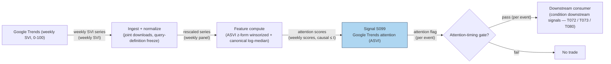

## Stage 99/200 — S099: Google Trends attention (ASVI)

*Batch SB10 · Signal 99/100 · Provenance [D] · Family G — Alternative data*

### S1. One-line verdict

| | |
|---|---|
| **What it is** | **ASVI** (abnormal search volume index): how unusually hard people are searching for a ticker, from Google Trends' weekly **SVI** (0–100). An *attention* variable — eyeballs, not opinions. |
| **When it works** | As a cross-sectional attention filter or event-confirmation variable: flagging names under unusual retail attention so earnings/news/order-flow signals can be conditioned on whether anyone is watching. |
| **When it dies** | As a standalone signal on the original 2011 magnitudes. Query definitions, Trends normalization, market adoption, and arbitrage have all changed — do not carry the original effect size forward. |
| **Build-or-buy in one line** | Nothing to buy: Trends is free (Tier-0), the computation is an afternoon. Build the download hygiene (joint downloads, rescaling discipline) — that *is* the product. |

Provenance **[D]** (Da, Engelberg & Gao 2011, *JoF*); never upgraded. Central honesty rule: the log-median form is the canonical 2011 definition — and its documented magnitudes belong to 2004–2008, not today.

### S2. How it works — plain human explanation

Google Trends reports **SVI**, a 0–100 index of weekly search intensity, normalized so the peak week in your download equals 100. **ASVI** standardizes it: is this week's search interest abnormal vs the ticker's own recent baseline? High ASVI = unusual attention — retail investors looking up a ticker they normally ignore.

The canonical construction (Da, Engelberg & Gao 2011) compares log search volume to the log of the *median* of the prior eight weeks — medians resist spikes that means don't. A desk reconstruction instead uses a rolling z-score (trailing mean and sample sd). Both are "abnormal search volume" with different robustness; §S4 shows they can disagree violently on the same data.

Why attention matters: Barber & Odean (2008) document that attention drives retail buying — search is the eye's paper trail. The mechanism is buying pressure from newly attentive retail investors, then reversal as attention fades. Hence ASVI as an *attention filter*: which names have the retail wind at their back this week, so earnings/news signals can be sized accordingly.

Decay honesty: the original sample is the Russell 3000, 2004–2008 — before the paper, before "Google Trends signal" was a product, before arbitrage had fifteen years. Query definitions and Trends normalization have changed. The *direction* (attention → short-horizon buying pressure → eventual reversal) is the durable part; the *magnitude* is not portable to today.

### S3. The math — exact formula

Two forms. The reconstruction (rolling z-score, sample standard deviation with denominator $W-1$):

$$ASVI^{z}_t = \frac{SVI_t - \bar{SVI}_{t,W}}{s_{t,W}}, \qquad s_{t,W} = \sqrt{\frac{\sum_{k=1}^{W}(SVI_{t-k} - \bar{SVI}_{t,W})^2}{W-1}}$$

The canonical Da–Engelberg–Gao (2011) form — **this is the 2011 paper's definition**:

$$ASVI^{DEG}_t = \log(SVI_t) - \log\left(\operatorname{median}(SVI_{t-1}, \ldots, SVI_{t-8})\right)$$

Both reference the prior $W=8$ weeks *excluding* the current week — no lookahead. The z-form is then typically winsorized (capped) at ±5, because a quiet baseline makes the denominator tiny and the z-score explosive (the §S4 example produces +27.1 before winsorization — a tiny-denominator artifact, not information).

**Variants:** (a) ticker-symbol vs company-name queries (different searcher populations); (b) finance-category-restricted Trends; (c) daily SVI where available (noisier, finer); (d) the "sum of all fears" aggregate-sentiment cousin (Da et al. 2015); (e) institutional-attention variants on Bloomberg search data (Ben-Rephael et al. 2017).

The separate-download warning, stated exactly: **separately downloaded Trends series are not cross-sectionally comparable.** Each download is normalized to its own maximum (=100), so "88" for ticker A and "88" for ticker B are different quantities. A cross-sectional ASVI panel must use **one joint download** (all tickers in the same query, sharing one normalization) or a **common comparison term** (every ticker downloaded against the same benchmark term, e.g., "stocks", and rescaled). The demo table in §S4 shows the same searches reading 88 vs 35 depending on download construction.

### S4. Worked example — step-by-step numbers (SYNTHETIC)

All numbers below are **synthetic** — a hand-constructed 10-week Google Trends tape for a fictional ticker "XYZQ", generated with seed **99**. This is an illustration of the mechanics, **not a backtest and not real performance**.

| week | SVI | ASVI z-form (raw) | ASVI z-form (winsorized ±5) | ASVI canonical log-median (DEG) |
|-----:|----:|------------------:|---------------------------:|--------------------------------:|
| 1 | 18 | n/a | n/a | n/a |
| 2 | 22 | n/a | n/a | n/a |
| 3 | 19 | n/a | n/a | n/a |
| 4 | 25 | n/a | n/a | n/a |
| 5 | 21 | n/a | n/a | n/a |
| 6 | 24 | n/a | n/a | n/a |
| 7 | 23 | n/a | n/a | n/a |
| 8 | 20 | n/a | n/a | n/a |
| 9 | 88 | **+27.15** | **+5.00** | **+1.41** |
| 10 | 64 | +1.44 | +1.44 | +1.05 |

Hand-check week 9 (window = weeks 1–8): mean = 172/8 = 21.50; squared deviations sum to 42.0; sample variance = 6.0; sd = 2.4495; z = (88 − 21.50)/2.4495 = **27.15**. Canonical: median = 21.5; ln(88) − ln(21.5) = **1.4093**.

Hand-check week 10 (window = weeks 2–9): mean = 30.25; sd = 23.4201; z = **1.44**; median = 22.5; ln(64) − ln(22.5) = **1.0454**.

**What to notice:** the same shock reads +27.1 (z-form) vs +1.41 (canonical). The z-form explodes on an *extremely quiet* baseline (sd 2.45) — a tiny denominator, not a huge shock; winsorization at ±5 contains it. Week 10: the z-form's window now *contains* the week-9 spike (sd 23.42, z = +1.44) while the median-based DEG form still reads +1.05 — the median resists the spike, the mean doesn't. That is the canonical form's robustness argument, shown numerically.

Separate-download demo (same searches, different download construction):

| week | ticker downloaded alone (own-max = 100) | ticker downloaded jointly vs "stocks" benchmark |
|-----:|----------------------------------------:|------------------------------------------------:|
| 1 | 30 | 12 |
| 2 | 88 | 35 |
| 3 | 64 | 26 |

Week 2 reads 88 in one download and 35 in the other — *incomparable scales from the same searches* (z-scores: 0.94 vs 0.92). Rule: one joint download per panel, or a common comparison term, or the cross-section is fiction.

**Cost of acting on the week-9 flag** (spread + fees + impact/slippage, explicit): $50,000 in a $100 stock = 500 shares. Half-spread both ways at 4¢ = $40. Fees $0.0035/share × 2 legs = $3.50. Impact/slippage 3 bps = $15. Total ≈ **$58.50 ≈ 12 bps round trip**. Because the documented effect includes *reversal*, the holding period (days, not minutes) decides whether this cost is paid once against a two-week drift or churned weekly against noise.

### S5. Strategies that use this signal

Cross-references below are genuine links verified against the plan's trigger graph (plan.md §3); each names the relationship.

- **T073 — ASVI attention-reversal rider (primary).** Uses S099 (with S045, S094): winsorized ASVI beyond ±3 as an *attention-timing input* — the documented pattern is buying pressure over ~2 weeks then reversal within a year, so the rider is a fade of the attention spike, not a chase, and only with the decay honesty of §S2.
- **T072 — Social-sentiment ignition rider.** Uses S099 (with S072's S097, S032) as a *confirming leg*: search attention confirming social-media attention — two independent attention sources agreeing is the filter; either alone is weaker.
- **T080 — Multi-source attention composite.** Uses S099 (with S097, S093) as one of three attention legs: search, social, and news attention combined so that no single source's normalization quirks can fire the composite.

### S6. Data required — exact spec

| Dataset | Granularity | History | Source / vendor | Notes |
|---|---|---|---|---|
| Google Trends SVI | weekly (0–100), per query | 5+ years (2004+ for the original sample) | Google Trends, Tier-0 free; `pytrends` for scripted pulls | One joint download per panel — see §S3 warning |
| Query definitions | per ticker: symbol, company name, variants | fixed at research start | researcher-defined | Changing the query mid-sample breaks the series |
| Price/volume (for conditioning) | daily bars | matches Trends history | Polygon-class, Databento | ASVI conditions other signals; it needs their data |
| Event calendar (for confirmation use) | event-level | 1+ year | earnings/news calendars | The event-confirmation framing needs the events |

Minimum viable: 5 years of weekly SVI for one universe, downloaded jointly (or against a common comparison term), with query definitions frozen and documented. The failure mode that kills most builds is silent re-downloading: a panel assembled from separate downloads over several days is not a panel.

### S7. Local build on M5 Max / 128GB

Feasibility: **trivial** — Tier **L–M** (cost-model: ~8–20 engineering hours, ≈ $1,200–3,000 at $150/hr). Trends is free; a weekly panel of thousands of tickers is kilobytes per week — the 5-year history fits in memory many times over. Two rolling statistics per ticker-week; no GPU, no memory pressure (orders of magnitude under the ~77 GB ceiling).

Build sequence: (1) freeze query definitions per ticker (documented); (2) one joint Trends download per panel (or vs a common benchmark, rescaled); (3) compute both ASVI forms — their disagreement (§S4) is itself a diagnostic; (4) validate download hygiene by re-pulling a sample; (5) condition, don't trade: use ASVI as a cross-sectional filter and measure the *interaction* before any standalone claim.

### S8. Buy vs build

| Component | Buy (indicative — verify before budgeting) | Build |
|---|---|---|
| Trends data | Google Trends: ~$0 (Tier-0) | Scripted pulls (`pytrends`), joint-download discipline |
| ASVI computation | Nothing to buy — any vendor selling "ASVI" is selling arithmetic | Both forms in an afternoon (this chapter's §S3) |
| Query-definition research | — | In-house: which queries actually capture investor attention per ticker |
| Price/volume for conditioning | Polygon-class ~$30–200/mo; Databento ~$200/mo + usage | Alignment and corporate-action handling |
| Institutional attention (Bloomberg-search class) | Enterprise data licenses ($$$$) | Not buildable — different data entirely |

Recommendation: build everything. There is no buy option because there is nothing scarce — the scarce input is download hygiene and query-definition judgment, which cannot be purchased.

### S9. Success ratio / efficacy — documented evidence

All effects below are documented as **before-cost**; magnitudes are the original papers', not today's.

| Study | Sample / design | Documented finding | Honest caveat |
|---|---|---|---|
| Da, Engelberg & Gao (2011) | Russell 3000, 2004–2008 | Higher SVI predicts higher prices over the next 2 weeks, with reversal within a year | Original documented evidence only — do not carry the magnitude forward (§S2 decay honesty) |
| Preis, Moat & Stanley (2013) | Google Trends vs market moves | Search-volume changes serve as early-warning signals of market moves | Before-cost; weekly granularity; descriptive |
| Bordino et al. (2012) | Web search queries vs trading volume | Search queries predict stock *volumes* | Volume, not returns — supports the attention mechanism |
| Ben-Rephael, Da & Israelsen (2017) | Institutional (Bloomberg) search | Institutional attention relates to underreaction to news | Different search population (institutions, not retail) |
| Drake, Roulstone & Thornock (2012) | Google searches around earnings | Search spikes around earnings announcements; demand for information is event-driven | Supports the event-confirmation framing |
| Lazer et al. (2014) | Google Flu autopsy | Platform search series break when the platform changes — "big data hubris" | A caution about Trends data itself |

**Literature bottom line:** the record supports ASVI as an *attention measure with a documented short-horizon buying-pressure pattern and eventual reversal* — in its original sample. The honest use today is the chapter's mandatory conclusion: **more promising as a cross-sectional attention filter or event-confirmation variable than as a standalone signal.** Re-estimate everything on current data before sizing anything.

### S10. Failure modes & pitfalls

1. **Query-definition drift** — Google changes what a query matches; your series breaks silently → mitigate: freeze queries, log definitions, monitor for level shifts.
2. **Normalization non-comparability** — separate downloads can't be pooled → mitigate: one joint download per panel or a common comparison term (§S3, §S4 demo).
3. **Tiny-denominator z explosion** — quiet baselines produce absurd z-scores → mitigate: winsorize at ±5; prefer the median-based canonical form.
4. **Platform/algorithm changes** — Trends' sampling and normalization evolve → mitigate: Lazer et al.'s (2014) lesson — monitor the data-generating process, not just the data; re-pull validation samples.
5. **Effect decay** — the 2011 magnitudes are not today's → mitigate: re-estimate on recent data; trade the *filtered* use (attention conditioning), not the original coefficients.
6. **Weekly granularity too coarse** — a week is a long time in an attention spike → mitigate: use ASVI for weekly filtering/event confirmation, not intraday timing.
7. **Ticker ambiguity** — "CAT" is an animal, "A" is a letter → mitigate: test symbol vs company-name queries; finance-category restriction; drop ambiguous tickers rather than guessing.

### S11. Visuals

### S12. Sources

1. Da, Zhi, Engelberg, Joseph & Gao, Pengjie (2011). "In Search of Attention." *Journal of Finance* 66(5): 1461–1499. https://doi.org/10.1111/j.1540-6261.2011.01679.x
2. Da, Zhi, Engelberg, Joseph & Gao, Pengjie (2015). "The Sum of All FEARS: Investor Sentiment and Asset Prices." *Review of Financial Studies* 28(1): 1–32. (Stable URL not captured this batch.)
3. Preis, Tobias, Moat, Helen Susannah & Stanley, H. Eugene (2013). "Quantifying Trading Behavior in Financial Markets Using Google Trends." *Scientific Reports* 3: 1684. https://doi.org/10.1038/srep01684
4. Lazer, David, Kennedy, Ryan, King, Gary & Vespignani, Alessandro (2014). "The Parable of Google Flu: Traps in Big Data Analysis." *Science* 343(6176): 1203–1205. https://doi.org/10.1126/science.1248506
5. Bordino, Ilaria, Battiston, Stefano, Caldarelli, Guido, Cristelli, Matthieu, Ukkonen, Antti & Weber, Ingmar (2012). "Web Search Queries Can Predict Stock Market Volumes." *PLoS ONE* 7(7): e40014. https://doi.org/10.1371/journal.pone.0040014
6. Choi, Hyunyoung & Varian, Hal (2012). "Predicting the Present with Google Trends." *Economic Record* 88(s1): 2–9. https://doi.org/10.1111/j.1475-4932.2012.00809.x
7. Ben-Rephael, Azi, Da, Zhi & Israelsen, Ryan D. (2017). "It Depends on Where You Search: Institutional Investor Attention and Underreaction to News." *Review of Financial Studies* 30(9): 3009–3047. (Stable URL not captured this batch.)
8. Drake, Michael S., Roulstone, Darren T. & Thornock, Jacob R. (2012). "Investor Information Demand: Evidence from Google Searches Around Earnings Announcements." *Journal of Accounting Research* 50(4): 1001–1040. (Stable URL not captured this batch.)

**Unverified leads** (batch-research claims without an independently checkable source this batch):
- The AFA-meeting summary of Da, Engelberg & Gao (2011) — Russell 3000, 2004–2008, two-week buying pressure with reversal within a year — used here only as the paper's documented finding, not as a current magnitude.
- `pytrends` as the scripted-pull library — practitioner-standard; API stability not verified this batch.
- Source log: Duck.ai answered Q-SB10-1–Q-SB10-3 (2026-09-10); Grok answers pending (checked 2026-09-10).
