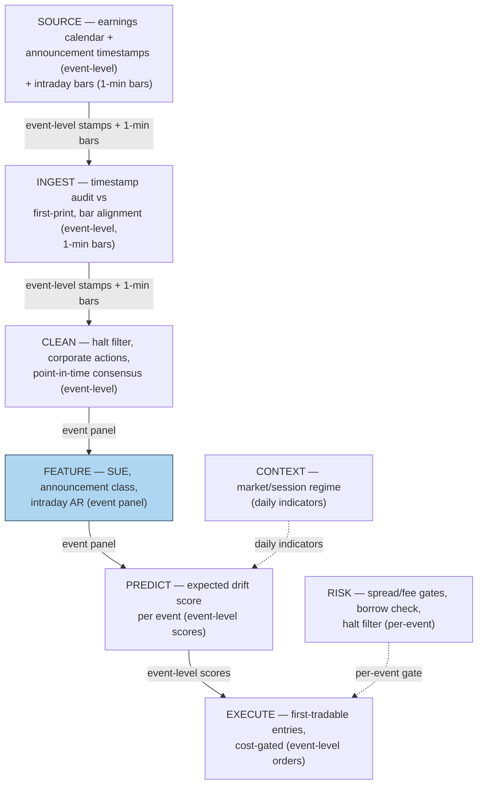

## Stage 100/200 — S100: Earnings surprise (SUE) / PEAD intraday leg

*Batch SB10 · Signal 100/100 · Provenance [D] · Family G — Alternative data*

### S1. One-line verdict

| | |
|---|---|
| **What it is** | **SUE** (standardized unexpected earnings): the earnings surprise scaled by the stock's own historical surprise volatility — sorted into deciles, long high, short low. **PEAD** (post-earnings-announcement drift) is the documented post-announcement drift in the surprise's direction. This chapter implements the *intraday leg*: drift measured from the first tradable price after the announcement timestamp. |
| **When it works** | In a carefully screened liquid universe with precise timestamps: clean surprise measurement, first-tradable entries, costs modeled — not in a broad cross-sectional screen on close-to-close returns. |
| **When it dies** | When close-to-close event-study returns are mistaken for tradable returns. The literature measured drift over months from closes; once implementation enters *intraday*, entry price, spread, and timestamp error dominate. |
| **Build-or-buy in one line** | Buy precise announcement timestamps and intraday bars (the timestamp is the product); build the SUE computation and the event-alignment logic yourself — the formula is public, the timestamp hygiene is not. |

Provenance **[D]** (Foster et al. 1984, *Accounting Review*; Bernard & Thomas 1989, *JAR*); never upgraded. Central honesty rule: **do not infer tradability from close-to-close event-study returns when implementation enters intraday** — and this is not a pure day trade as originally published; the drift was documented over months, the intraday leg is how a modern desk *enters* it.

### S2. How it works — plain human explanation

An **earnings surprise** is actual EPS minus expected EPS. **SUE** standardizes it: divide by the stock's own historical surprise volatility (σ of past surprises) — a $0.25 beat means more for a steady utility than a volatile biotech. Sort by SUE into **deciles** (the example uses quintiles — ten stocks); long the top, short the bottom.

**PEAD** is the anomaly: after the announcement-day reaction, prices kept drifting in the surprise's direction for weeks to months. The catch: the literature measured this drift **close-to-close**, from the announcement day's close — a close you cannot trade. A real implementation enters at the first *tradable* price after the announcement *timestamp*, and the timestamp's precision is everything.

The **intraday leg** is this chapter's implementation-aware version — the event return from the first tradable price:

$$R_{i,\tau_0,\tau_1} = \ln(P_{i,\tau_1} / P_{i,\tau_0^-}), \qquad AR = R - R_{market}$$

where $\tau_0^-$ is the last price *before* entry and $\tau_1$ the exit; the **abnormal return (AR)** subtracts the same-window market return. Entry rules:

- **Before the open** → opening auction (first tradable quote).
- **Intraday** → first quote after the announcement timestamp.
- **After the close** → next open, or the first 15/30-minute return.

A "before-open" announcement traded at the prior close is fiction — the stock may gap 5% at the open, and that gap is the market's, not yours. The timestamp audit (07:30:00 vs "sometime before the open") is the difference between a backtest and a fantasy.

### S3. The math — exact formula

The chosen form, stated exactly:

$$SUE = \frac{EPS_{actual} - E[EPS]}{\sigma(\text{past surprises})}$$

where $E[EPS]$ is the consensus expectation and $\sigma(\text{past surprises})$ is the standard deviation of the stock's own past earnings surprises (typically 8 quarters). This is followed by high/low **decile sorting**: long decile 10 (highest SUE), short decile 1 (lowest SUE). The worked example below uses quintiles (5 groups of 2) because the synthetic panel has 10 stocks; production uses deciles over thousands of names.

The intraday event measurement:

$$R_{i,\tau_0,\tau_1} = \ln(P_{i,\tau_1} / P_{i,\tau_0^-}), \qquad AR_{i} = R_{i} - R_{market}$$

with the entry-timing rules of §S2. The PEAD intraday leg return is mean(high-SUE ARs) − mean(low-SUE ARs) over the event window.

**Variants:** (a) analyst-forecast vs time-series SUE (Livnat & Mendenhall 2006 compare both); (b) SUE scaled by price instead of surprise volatility; (c) revenue surprise as a companion sort; (d) Friday-announcement inattention (DellaVigna & Pollet 2009); (e) overnight-gap vs intraday-drift decomposition of the event return.

### S4. Worked example — step-by-step numbers (SYNTHETIC)

All numbers below are **synthetic** — a hand-constructed 10-stock earnings panel with fictional tickers, generated with seed **100**. This is an illustration of the mechanics, **not a backtest and not real performance**.

**Step 1 — SUE computation** (σ = std dev of the stock's past 8 quarterly surprises):

| ticker | EPS actual | E[EPS] | σ (past surprises) | SUE |
|--------|----------:|-------:|-------------------:|----:|
| A | 1.45 | 1.20 | 0.10 | **+2.50** |
| B | 0.82 | 0.90 | 0.08 | −1.00 |
| C | 2.10 | 2.05 | 0.15 | +0.33 |
| D | 0.55 | 0.70 | 0.12 | −1.25 |
| E | 3.20 | 2.80 | 0.25 | +1.60 |
| F | 1.05 | 1.05 | 0.09 | 0.00 |
| G | 0.30 | 0.45 | 0.10 | **−1.50** |
| H | 1.80 | 1.60 | 0.12 | **+1.67** |
| I | 0.95 | 1.10 | 0.11 | **−1.36** |
| J | 2.60 | 2.30 | 0.20 | +1.50 |

Hand-check: A: (1.45 − 1.20)/0.10 = **2.50**; G: (0.30 − 0.45)/0.10 = **−1.50**. Sorted: G(−1.50), I(−1.36), D(−1.25), B(−1.00), F(0.00), C(+0.33), J(+1.50), E(+1.60), H(+1.67), A(+2.50). Quintiles: Q1 = {G, I}, Q5 = {H, A}.

**Step 2 — intraday event leg** (entry per the §S2 timing rules; AR = ln(P₁/P₀) − market return):

| ticker | announced | entry (τ₀) | exit (τ₁) | R | market R | AR |
|--------|-----------|----------:|---------:|--:|---------:|---:|
| A (long) | 07:30 ET, before open | $50.00 (open auction) | $51.40 (close) | +2.76% | +0.30% | **+2.46%** |
| H (long) | 16:45 ET, after close | $30.10 (next open) | $30.55 (+30 min) | +1.48% | +0.10% | **+1.38%** |
| G (short) | 10:15 ET, intraday | $20.05 (first quote after stamp) | $19.72 (close) | −1.66% | −0.20% | **−1.46%** |
| I (short) | 07:15 ET, before open | $12.00 (open auction) | $11.80 (close) | −1.68% | +0.20% | **−1.88%** |

Hand-check: A: ln(51.40/50.00) = 2.76% − 0.30% = **2.46%**. G: ln(19.72/20.05) = −1.66% − (−0.20%) = **−1.46%**. Quintile mean ARs: Q1 **−1.67%**, Q2 −0.88%, Q3 +0.05%, Q4 +0.92%, Q5 **+1.92%** — monotonic in SUE. PEAD leg = 1.92% − (−1.67%) = **+3.59%** gross.

**Step 3 — the cost walk** (spread + fees + impact/slippage + borrow, explicit; $50,000 per name):

| name | side | gross $ | spread $ | fees $ | impact $ | borrow $ | net $ |
|------|------|--------:|---------:|-------:|---------:|---------:|------:|
| A | long | 1,230.76 | 20.00 | 7.00 | 10.00 | 0.00 | 1,193.76 |
| H | long | 691.98 | 33.22 | 11.63 | 10.00 | 0.00 | 637.13 |
| G | short | 729.79 | 49.88 | 17.46 | 10.00 | 4.11 | 648.35 |
| I | short | 940.36 | 83.33 | 29.17 | 10.00 | 4.11 | 813.75 |
| **total** | | **3,592.88** | | | | | **3,292.98** |

Cost anatomy (hand-check A: 1,250 shares at $50; spread 2¢ × 1,250 = $20; fees $7; impact 2 bps × $50k = $10; net 1,230.76 − 37 = 1,193.76). Shorts add 1-day borrow at 3%/ann ($4.11). Total costs **$299.90 = 8.3% of gross** — modest *in this toy* (liquid names, large moves); on a broad screen with smaller surprises and wider spreads, costs eat the leg first.

**What to notice:** the example works because every input is screened — liquid names, exact timestamps, first-tradable entries. Change any one (a vague stamp traded at the prior close, a 50¢ spread) and the 3.59% gross leg collapses. That is the chapter's thesis in numbers.

### S5. Strategies that use this signal

Cross-references verified against plan.md \u00a73; each names the relationship.

- **T078 — Earnings-drift intraday leg (primary).** Uses S100 (with S025, S091): the SUE decile sort with first-tradable intraday entries — this chapter *is* the signal spec for that trigger.
- **T060 — Identified-news drift rider.** Uses S100 (with S092, S093) as a *confirming sort*: the surprise must be *identified* (clean timestamp, no confounding news) before the drift is trusted.
- **T012 — Jump-filtered overnight-gap fade.** Uses S100 (with S036, S037) as a *filter*: the SUE-explained gap component is the drift to ride; the unexplained jump is the fade candidate.

### S6. Data required — exact spec

| Dataset | Granularity | History | Source / vendor | Notes |
|---|---|---|---|---|
| Earnings announcement timestamps | event-level (minute/second) | 10+ years | IBES/Compustat via WRDS; Benzinga calendar (~$100–200/mo); Polygon (~$30–200/mo) — all indicative, verify before budgeting | Binding constraint — minute precision minimum |
| Actual vs expected EPS | event-level | 10+ years | IBES (analyst) / Compustat (reported) | Point-in-time consensus; no restatements |
| Intraday bars | 1-minute | matches events | Databento (~$200/mo + usage); LOBSTER (hundreds/yr) — indicative, verify before budgeting | First-tradable-quote needs sub-minute or auction data |
| Daily bars + corporate actions | daily | 10+ years | Polygon-class | SUE history, universe screening |
| Market return (for AR) | 1-minute / daily | matches | index futures or ETF | Same-window market return, not close-to-close |

Minimum viable: 10 years of minute-precision timestamps + 1-minute bars for a liquid universe. A 500-symbol 1-minute universe is ~195,000 bars/day ≈ 3 GB per 60 days (cost-model); the timestamp join is where the engineering hours go.

### S7. Local build on M5 Max / 128GB

Feasibility: **feasible** — Tier **M** (cost-model: 20–60 engineering hours, ≈ $3,000–9,000 at $150/hr). Data is modest (500-symbol 1-minute universe ≈ 3 GB/60 days; the 10-year event panel is thousands of rows); SUE is a grouped rolling standardization at ~1–10M rows/sec in Polars — far under the ~77 GB ceiling. The hours go to timestamp hygiene: auditing stamps against first-print times, handling halts, aligning to exchange time.

Build sequence: (1) ingest minute-precision timestamps; audit against newswire first-prints on a sample; (2) point-in-time SUE panel (8-quarter rolling σ, no restatements); (3) join intraday bars; implement the three entry rules; (4) compute event ARs and the decile leg; (5) cost-model every event with entry-time spreads before any Sharpe is quoted.

### S8. Buy vs build

| Component | Buy (indicative — verify before budgeting) | Build |
|---|---|---|
| Announcement timestamps | IBES/Compustat via WRDS (academic); Benzinga earnings calendar ~$100–200/mo; Polygon corporate actions ~$30–200/mo | Timestamp audit logic (first-print cross-check) |
| Actual/expected EPS | IBES / Compustat (licensed) | SUE computation, decile sorts |
| Intraday bars | Databento ~$200/mo + usage; LOBSTER hundreds/yr | Entry-rule engine, auction/first-quote identification |
| Event-study analytics | — | In-house: the implementation-aware leg of §S3 |

Recommendation: buy the timestamps and the bars; build everything else. The timestamp is the only input you cannot reconstruct — a wrong stamp invalidates every return downstream of it.

### S9. Success ratio / efficacy — documented evidence

All effects below are **before-cost**, from the original papers — close-to-close, over weeks to months.

| Study | Sample / design | Documented finding | Honest caveat |
|---|---|---|---|
| Foster, Olsen & Shevlin (1984) | Earnings releases, 1970s | SUE sorts predict post-announcement returns | Foundational; before-cost; close-to-close |
| Bernard & Thomas (1989) | Post-earnings drift | Drift is a delayed price response, not a risk premium | Before-cost; the risk-vs-mispricing debate it settled |
| Bernard & Thomas (1990) | Naïve expectations model | Top-minus-bottom SUE decile drift ≈ 8% over 12 months (before-cost, Table 2) | Before-cost; 1974–1986 sample; close-to-close — not an implementable return |
| Ball & Brown (1968) | Accounting income numbers | The original earnings-announcement anomaly | Foundational; pre-dates drift literature |
| Livnat & Mendenhall (2006) | Analyst vs time-series SUE | Both SUE constructions predict drift | Before-cost; construction-choice matters |
| DellaVigna & Pollet (2009) | Friday announcements | Friday earnings drift more — investor inattention | Before-cost; supports attention-aware implementation |

**Literature bottom line:** PEAD is among the most replicated anomalies — the published drift is ~8% top-minus-bottom over 12 months before costs in the classic sample. But every one of those numbers is close-to-close and before-cost. The implementable version — this chapter's intraday leg — must survive the timestamp audit, the first-tradable entry, the entry-time spread, and the short-leg borrow. It is more likely to work in a carefully screened liquid universe with precise timestamps than as a broad cross-sectional screen.

### S10. Failure modes & pitfalls

1. **Timestamp error** — the binding constraint: a stamp off by minutes invalidates the entry → mitigate: audit stamps against newswire first-prints; drop events with ambiguous timing.
2. **Trading halts / delayed opens** — the "first tradable quote" may be far from the stamp → mitigate: halt filter; entry only on confirmed tradable prints.
3. **Close-to-close illusion** — backtesting from the announcement close you couldn't trade → mitigate: always enter at the §S2 first-tradable price; never at the pre-announcement close.
4. **Earnings-day spreads and fees** — spreads widen and borrow tightens exactly when you need them → mitigate: cost-model with entry-time spreads; borrow-availability check on every short (links to S098).
5. **Stale consensus** — the "expected" EPS is revised after your snapshot → mitigate: point-in-time consensus only; timestamp the expectation like the announcement.
6. **Small-cap illiquidity** — the drift is strongest where it's least tradable → mitigate: screened liquid universe; the chapter's framing is explicit about this.
7. **Confounding news** — guidance, buybacks, macro news in the same window → mitigate: identified-news filter (T060); unattributed drift is not SUE drift.

### S11. Visuals

### S12. Sources

1. Foster, George, Olsen, Chris & Shevlin, Terry (1984). "Earnings Releases, Anomalies, and the Behavior of Security Returns." *The Accounting Review* 59(4): 574–603. (Stable URL not captured this batch.)
2. Bernard, Victor L. & Thomas, Jacob K. (1989). "Post-Earnings-Announcement Drift: Delayed Price Response or Risk Premium?" *Journal of Accounting Research* 27 (Supplement). (Stable URL not captured this batch.)
3. Bernard, Victor L. & Thomas, Jacob K. (1990). "Evidence That Stock Prices Do Not Fully Reflect the Implications of Current Earnings for Future Earnings." *Journal of Accounting and Economics* 13(4): 305–340. (Stable URL not captured this batch.)
4. Ball, Ray & Brown, Philip (1968). "An Empirical Evaluation of Accounting Income Numbers." *Journal of Accounting Research* 6(2): 159–178. (Stable URL not captured this batch.)
5. Livnat, Joshua & Mendenhall, Richard R. (2006). "Comparing the Post–Earnings Announcement Drift for Surprises Calculated from Analyst and Time Series Forecasts." *Journal of Accounting Research* 44(1): 177–205. https://doi.org/10.1111/j.1475-679X.2006.00194.x
6. Sadka, Ronnie (2006). "Momentum and Post-Earnings-Announcement Drift Anomalies: The Role of Liquidity Risk." *Journal of Financial Economics* 80(3): 309–349. https://doi.org/10.1016/j.jfineco.2005.05.005
7. DellaVigna, Stefano & Pollet, Joshua M. (2009). "Investor Inattention and Friday Earnings Announcements." *Journal of Finance* 64(2): 709–749. (Stable URL not captured this batch.)

**Unverified leads** (batch-research claims without an independently checkable source this batch):
- Modern PEAD intraday implementation details (auction entry, first-quote identification) — practitioner knowledge; dedicated published sources not captured this batch.
- Benzinga calendar (~$100–200/mo), Polygon (~$30–200/mo), Databento intraday (~$200/mo + usage) per the cost model — indicative, verify before budgeting.
- Source log: Duck.ai answered Q-SB10-1–Q-SB10-3 (2026-09-10); Grok answers pending (checked 2026-09-10).
