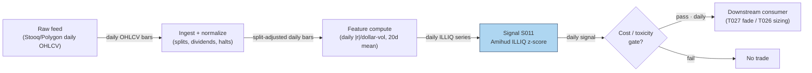

## Stage 11/200 — S011: Amihud illiquidity ratio

*Batch SB2 · Signal 11/100 · Provenance [D] · Family A — Microstructure & order flow*

### S1. One-line verdict

| Row | Content |
|---|---|
| **What it is** | Daily average of \|return\| per dollar of volume — a low-frequency price-impact (illiquidity) gauge computable from ordinary OHLCV bars. |
| **When it works** | Cross-sectional liquidity ranking, cost-aware sizing, and fading overextended moves in illiquid names. |
| **When it dies** | As a standalone intraday trigger; where volume conventions break (halvings, corporate actions); during volume-regime shifts where a 20-day average is stale. |
| **Build-or-buy in one line** | Build — it is five lines of arithmetic on daily bars; buy history/coverage, never the formula. |

Provenance **[D]** (documented: Amihud 2002). Family **A — Microstructure & order flow**. Worked example is synthetic and watermarked; the chatbot corrections are documented in S4.

### S2. How it works — plain human explanation

**Vignette.** It is 9:47 a.m. Two stocks each trade at $50. Stock X prints a $2M seller and slips 4 cents. Stock Y prints the same $2M seller and falls 40 cents. The Amihud ratio is that observation averaged over days: *how much price moves per dollar traded*. High Amihud = illiquid: each dollar of flow leaves a bigger footprint.

**Why the effect should exist economically.** Three channels:
- *Price impact / adverse selection.* In a thin book a market order walks further down the ladder, so returns per unit volume are larger — the low-frequency cousin of **Kyle's lambda** (S010), which measures impact per share at high frequency.
- *Inventory cost.* Dealers in thin names carry inventory longer and demand compensation as larger price concessions per dollar traded.
- *The illiquidity premium.* Amihud (2002) showed investors demand higher expected returns for illiquid stocks — and that illiquid names mean-revert more, because thin-book moves overshoot fundamentals.

**Mental model (3 bullets):**
- Amihud = the *exchange rate between dollars traded and price moved*, averaged over a window.
- It is a **cost and regime input**, not a direction signal — how expensive a name is to trade and how far its moves are likely to overshoot.
- High ILLIQ names are where temporary-impact fades (T027) hunt and where participation throttles (T026) must be tightest.

### S3. The math — exact formula

For stock *i* over a window of *D* days (day *d* = 1…*D*):

$$\text{ILLIQ}_{i,D} = \frac{1}{D}\sum_{d=1}^{D}\frac{|r_{i,d}|}{\text{DVOL}_{i,d}}$$

where:

- $r_{i,d} = C_{i,d}/C_{i,d-1} - 1$ is the **decimal** daily return (close-to-close; unitless),
- $\text{DVOL}_{i,d} = P_{i,d}\times V_{i,d}$ is **dollar volume** in dollars (price × shares; units $),
- $\text{ILLIQ}$ has units **per dollar** (1/$) — the fraction of price moved per dollar traded.

Because raw values are tiny (∼10⁻¹⁰ per dollar for liquid stocks), the literature reports **ILLIQ × 10⁶** — "return per $1M traded".

**Causal timing.** Computed at the close of day *T* using only closes/volumes on days ≤ *T*. The *D*-day average is complete only after the *D*-th close; tradable no earlier than the next session's open (bar *t* → earliest fill *t+1*).

**Parameter table** (every default below is an *example — not an institutional standard*):

| Parameter | Symbol | Typical range | Too small | Too large | Default example |
|---|---|---|---|---|---|
| Lookback window | *D* | 5–60 days | noisy, one big day dominates | stale, misses regime shifts | 20 days (monitoring); 60 days (smooth ranking) |
| Scaling | — | ×1 (per-$) or ×10⁶ (per-$M) | unreadable tiny numbers | none (cosmetic) | ×10⁶ for reporting |
| Aggregation | — | mean / median / winsorized mean | mean is outlier-sensitive | median hides genuine spikes | winsorized mean (extremes capped at the 1st/99th percentiles) |
| Return convention | — | close-close / open-close | — | — | close-close (classic); open-close (OCAM) variant |
| Intraday analog | — | \|r_bar\|/DVOL_bar per 1–5-min bar, averaged | microstructure noise dominates | converges to daily measure | 5-min bars, RTH only |

**Normalization.** Cross-sectional (across many stocks at one point in time) **rank** or **z-score** (standard deviations from the bucket mean) **within size bucket** is standard practice — raw ILLIQ spans orders of magnitude across market caps. Never compare raw values across a $500M name and a $500B name.

**Named variants:**
1. **CCAM vs OCAM** — classic close-to-close vs open-to-close Amihud (drops the overnight gap from the numerator); research reports OCAM-based liquidity premia roughly double CCAM-based ones (Warwick WP 1211, 2019; see S9).
2. **Intraday-bar analog** — |r_bar|/DVOL_bar on 1–5-min bars, averaged over the session: a slow intraday regime input, not a per-bar trigger.
3. **Winsorized/median ILLIQ** — robust aggregation for names with earnings-jump days that would otherwise dominate the window.

### S4. Worked example — step-by-step numbers (SYNTHETIC)

**Synthetic 10-day tape** (chatbot Q-SB2-1, operator-corrected). **The raw chatbot output contained errors**: its nine daily ILLIQ values were individually correct, but it reported Σ = 6.8216e-9 and average = 7.5796e-10, conflating sum and average in its notation. Corrected values used here: **Σ = 6.3933e-9, average = 7.1037e-10, per-$M = 7.1037e-4**. Tape is hand-specified and deterministic (no RNG draw; plot script records seed 110).

Formula per day: $r_t = C_t/C_{t-1} - 1$; $\text{DVOL}_t = C_t \times V_t$; $\text{ILLIQ}_t = |r_t|/\text{DVOL}_t$.

| Day | Close ($) | Volume (shares) | Return *r* | Dollar vol ($) | ILLIQ (per-$) |
|---|---|---|---|---|---|
| D1 | 100.00 | 100,000 | — | 10,000,000 | — |
| D2 | 101.00 | 120,000 | +0.010000 | 12,120,000 | 8.2508e-10 |
| D3 | 100.50 | 110,000 | −0.004950 | 11,055,000 | 4.4763e-10 |
| D4 | 102.00 | 130,000 | +0.014925 | 13,260,000 | 1.1257e-9 |
| D5 | 101.50 | 100,000 | −0.004902 | 10,150,000 | 4.8296e-10 |
| D6 | 103.00 | 150,000 | +0.014778 | 15,450,000 | 9.5649e-10 |
| D7 | 102.00 | 125,000 | −0.009709 | 12,750,000 | 7.6159e-10 |
| D8 | 101.00 | 140,000 | −0.009804 | 14,140,000 | 6.9320e-10 |
| D9 | 101.50 | 100,000 | +0.004950 | 10,150,000 | 4.8768e-10 |
| D10 | 100.50 | 160,000 | −0.009852 | 16,080,000 | 6.1290e-10 |

**Step-by-step (D2, fully shown):** $r_2 = 101.00/100.00 - 1 = 0.010000$. $\text{DVOL}_2 = 101.00 \times 120{,}000 = \$12{,}120{,}000$. $\text{ILLIQ}_2 = 0.010000 / 12{,}120{,}000 = 8.2508\times10^{-10}$ per dollar. Every other day follows identically.

**Aggregation (corrected):**
$$\bar{\text{ILLIQ}} = \frac{1}{9}\sum_{t=2}^{10}\text{ILLIQ}_t = \frac{6.3933\times10^{-9}}{9} = 7.1037\times10^{-10}\ \text{per dollar}$$
Reported per-$M: $7.1037\times10^{-10}\times10^{6} = \mathbf{7.1037\times10^{-4}}$.

**Chart** (same data — spot-check any bar against the table; see S11 for the figure).

**What to notice.** Illiquidity spikes on D4 (biggest |r| per dollar) and D6 (large move, high dollar volume) — the ratio punishes days where price moved a lot *relative to the dollars that moved it*. **Limits:** no fees, no spread, no corporate actions, a 9-day mean — this demonstrates the arithmetic, not an edge. Never present these numbers as performance.

### S5. Strategies that use this signal

- **T027 — Illiquidity Temporary-Impact Fade (primary trigger).** S011 ranks the universe by illiquidity; overextended intraday moves in high-ILLIQ names are faded on the premise that thin-book moves overshoot and decay on the resiliency half-life (S048; resiliency = how fast the order book refills after a sweep).
- **T026 — Kyle-Lambda Participation Throttle (filter / sizing cap).** Child-order participation rates (own volume ÷ market volume) are capped by Amihud-based illiquidity ceilings: the more illiquid the name, the smaller the allowed fraction of visible depth (displayed limit-order volume).

### S6. Data required — exact spec

| Field | Type | Granularity | Source tier | Notes |
|---|---|---|---|---|
| Close | float $ | daily | Tier 0–1 | split/dividend-adjusted for return continuity |
| Volume | int shares | daily | Tier 0–1 | native (unadjusted) shares; conventions vary by vendor |
| (intraday analog) OHLCV | float/int | 1–5-min bars, RTH (regular trading hours) | Tier 1 | for the bar-analog variant |
| Corporate actions | events | daily | Tier 1 | splits/dividends; mis-adjusted closes corrupt \|r\| |

**Collection.** Named feeds: Stooq (Tier 0, daily), Polygon stocks v3 aggregates (Tier 1), Alpaca (Tier 1), Databento (Tier 2). Schema sketch: `symbol, date, open, high, low, close, volume` + split/div metadata table.

**Ingest sketch (Python/polars, ≤20 lines):**
```python
import polars as pl
daily = pl.scan_parquet("bars/daily_*.parquet")          # symbol,date,close,volume
illiq = (daily.sort("symbol", "date")
    .with_columns(r=pl.col("close") / pl.col("close").shift(1).over("symbol") - 1,
                  dvol=pl.col("close") * pl.col("volume"))
    .with_columns(illiq=pl.col("r").abs() / pl.col("dvol"))
    .filter(pl.col("dvol") > 0)                            # drop zero-volume days
    .group_by("symbol")
    .agg(illiq_20d=pl.col("illiq").tail(20).mean(),
         illiq_med=pl.col("illiq").tail(20).median()))
illiq.sink_parquet("features/illiq_daily.parquet")
```

**Storage.** Per `notes/cost-model.md §4`: daily bars for 3,000 stocks ≈ 5 MB/day total — 60 days ≈ 300 MB, trivial; the derived ILLIQ panel is kilobytes.

**Data-quality checklist:** adjustment consistency (adjusted closes for *r*, native volumes for DVOL — mixing them double-counts splits); halt days (zero volume → drop, don't divide by zero); DST/half-days (intraday analog only); stale corporate-action metadata.

### S7. Local build on M5 Max / 128GB

**Feasibility: trivial.** This is daily-bar arithmetic — a groupby mean over a few million rows.

**Throughput** (per `notes/cost-model.md §2`): polars column ops run ~10–50M rows/sec; the ILLIQ panel for 3,000 stocks × 10 years (~7.5M rows) computes in under a second. Even the intraday analog on 500 symbols × 390 bars × 60 days = 11.7M rows recomputes in seconds. Bottleneck is data licensing, corporate-action handling, and download reliability (cost-model §6).

**Stack options:**

| Stack | When to pick |
|---|---|
| Python + polars | Default; this entire signal is a lazy-frame one-liner |
| DuckDB | If you already keep bars in SQL and want the feature in-query |
| Rust | Only if ILLIQ must run inside a latency-sensitive execution loop (rare) |

**RAM** (per cost-model §3): daily OHLCV for 3,000 stocks × 10 years ≈ 2–5 GB — fits comfortably inside the 77 GB working budget.

**Engineering time:** Tier **L**, 4–12 h → **$600–1,800** at $150/hr loaded-cost estimate (cost-model §5). One line of justification: formula, ingest, and corporate-action handling on daily bars; no event loop, no estimation, no calibration.

**What breaks first at 500 symbols / full OPRA:** nothing — daily bars for 500 symbols are trivial. Scaling to full OPRA is irrelevant (no options input). The real scaling cost is the 500-stock 1-min pipeline around it (106–246 h per the Q-SB2-2 chatbot lead, data-licensing dominated).

### S8. Buy vs build

| Option | What you get | Indicative price | What buying gains | What buying loses |
|---|---|---|---|---|
| Tier-0: Stooq / Alpaca IEX / SEC EDGAR | Free daily OHLCV, delayed quotes | ~$0 | zero marginal cost | IEX-only tape (~2.5% of US volume per chatbot lead — inadequate for volume-sensitive research) |
| Tier-1: Polygon Stocks Advanced | SIP (consolidated-tape feed) 1-min + daily bars, corporate actions, 10y history | ~$30–200/mo | consolidated tape, adjustments handled | none material at this tier |
| Tier-2: Databento Standard | L1/L2 + bars, pay-as-you-go | ~$200/mo + usage | honest intraday for the bar-analog | overkill for the classic daily measure |
| Academic: CRSP / WRDS | Survivorship-bias-free daily history | institutional $$$$ | publication-grade history | cost, access friction |

All prices `indicative — verify before budgeting`. **Verdict: build.** The estimator is five lines; the buy decision is purely about bar history and corporate-action quality. Buy Polygon-grade daily history for a survivorship-aware 10-year panel; build the rolling ILLIQ panel in an afternoon. Crossover: buy the *history*, build the *feature* — precomputed illiquidity factors are poor value because window/winsorization conventions differ.

### S9. Success ratio / efficacy — documented evidence

| Study / source | Market & period | Metric | Before/after cost | Caveat |
|---|---|---|---|---|
| Amihud (2002), J. Financial Markets 5, 31–56 | NYSE, 1964–1997 (cross-section + time series) | Positive return–illiquidity relationship: expected market illiquidity raises ex ante excess returns; strongest in small firms | **Before cost** (asset-pricing premium, not a strategy) | Says nothing about net alpha after trading the illiquid names |
| Warwick Econ. WP 1211 (2019), "The Night and Day of Amihud's Liquidity Measure" | NYSE/AMEX, 1964–2019 | Open-to-close-based liquidity premia roughly **double** close-to-close-based premia; liquidity premia **decline over time** | **Before cost** | Measurement refinement, not a tradable edge |

**Regimes where it fails.** Volume-regime shifts (a 20-day average is stale after a shock); corporate-action misadjustments; the documented secular decline in the illiquidity premium — a 1990s cross-sectional tilt is far weaker today.

**Honest bottom line:** as a standalone intraday trigger: **~zero edge** — no directional information. As a **cost filter and sizing input** it is genuinely useful: it tells you which names will eat your P&L in impact and which overextended moves are likely temporary. Its value is defensive (avoiding bad trades, sizing right), not offensive.

### S10. Failure modes & pitfalls

1. **Lookahead leakage** — trading at *T*'s close before the *D*-day average is complete; mitigate: compute at close, trade at next open.
2. **Corporate-action contamination** — unadjusted splits create fake |r| spikes; mitigate: adjusted closes for returns, native volumes, reconciled action tables.
3. **Zero/low-volume days** — division by ~zero explodes ILLIQ; mitigate: drop zero-volume days, winsorize.
4. **Volume-convention drift** — reporting changes alter DVOL; mitigate: median/winsorized aggregation, monitor the distribution for level shifts.
5. **Stale window after regime shifts** — 20–60-day averages lag volume shocks; mitigate: dual windows (fast 5-day + slow 60-day), flag divergences.
6. **Cross-cap comparison without normalization** — raw ILLIQ is a size proxy in disguise; mitigate: rank/z-score within size or ADV (average daily volume) buckets.
7. **Mistaking the premium for alpha** — the documented premium is before-cost compensation for *holding* illiquidity, not profit from *trading* on it; mitigate: net spread + fees + impact before sizing any ILLIQ-tilted book.
8. **Crowding in "illiquidity factor" trades** — crowded exits in thin names are the blowup scenario; mitigate: hard participation caps (T026) and ADV-based position limits.

### S11. Visuals




### S12. Sources

1. Amihud, Yakov (2002). "Illiquidity and Stock Returns: Cross-Section and Time-Series Effects." *Journal of Financial Markets* 5(1), 31–56. https://www.cis.upenn.edu/~mkearns/finread/amihud.pdf
2. "The Night and Day of Amihud's (2002) Liquidity Measure." University of Warwick Economics Working Paper 1211 (2019) — documents OCAM vs CCAM premia and the secular decline of the liquidity premium. https://warwick.ac.uk/fac/soc/economics/research/workingpapers/2019/twerp_1211_bernhardt.pdf
3. Duck.ai (bot: GPT-5.6 "Luna", anonymous, reasoning "Fast"), answers to batch SB2 questions Q-SB2-1–Q-SB2-3 (2026-09-10). **Labeled chatbot source**: Amihud formula and 10-day worked example — nine daily ILLIQ values verified individually correct; the model's sum/average were wrong and operator-corrected (Σ = 6.3933e-9, average = 7.1037e-10, per-$M = 7.1037e-4 — corrected values used in S4). Q-SB2-2 pipeline leads inform S7/S8; `notes/cost-model.md` takes precedence — no material conflicts found.
4. Formula/parameter conventions (lookbacks 5–60d, winsorization, per-$M reporting) cross-checked against the Amihud (2002) paper text.

**Unverified leads** (chatbot-only, no checkable source — not used as evidence):
- zerolag.club Amihud formula page (definition matches Amihud 2002; page not independently verified).
- Chatbot Q-SB2-2 vendor plan details (Massive/Polygon Developer $79/mo, Alpaca Algo Trader Plus $99/mo) — leads in S8 with the indicative disclaimer; cost-model §6 bands take precedence.

**Source log:** Duck.ai answered Q-SB2-1–Q-SB2-3 (2026-09-10); Grok/Cursor answers pending (checked 2026-09-10).

---
