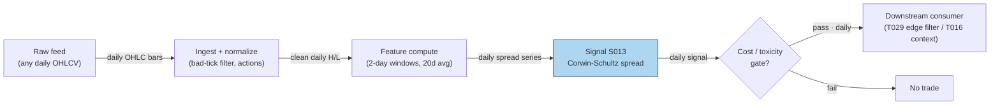

## Stage 13/200 — S013: Corwin–Schultz high-low spread estimator

*Batch SB2 · Signal 13/100 · Provenance [D] · Family A — Microstructure & order flow*

### S1. One-line verdict

| Row | Content |
|---|---|
| **What it is** | Estimates the bid-ask spread from two consecutive days' high-low ranges — volatility scales with interval, the spread does not, so their difference isolates the spread. |
| **When it works** | Daily cost gating and spread context on any OHLC feed; best where true spreads are wide relative to daily volatility. |
| **When it dies** | Overnight gaps, tiny-spread liquid names (negative → floored at 0), intraday use without validation, non-equity samples (documented instability). |
| **Build-or-buy in one line** | Build — ten lines on daily bars; buy TAQ only if you need true quoted spreads. |

Provenance **[D]** (documented: Corwin & Schultz 2012). Family **A — Microstructure & order flow**. Worked example is synthetic; the chatbot correction is documented in S4.

### S2. How it works — plain human explanation

**Vignette.** Tuesday's tape for a mid-cap: high $52.40, low $51.10; Wednesday: high $52.90, low $51.60. No quote data — just four numbers. Hidden inside those ranges is the bid-ask spread, the round-trip tax on every trade. Corwin–Schultz recovers it from one observation: **the day's high is almost always a buy (lifted at the ask) and the low almost always a sell (hit at the bid)**. So each day's high-low range mixes *two* things: the stock's true volatility *plus* one full bid-ask spread.

**The trick.** True volatility grows with the measurement interval — a two-day range carries about twice the variance of a one-day range. The spread component does *not* grow: one day or two, the high is still one ask-print and the low one bid-print. Compare the one-day ranges against the overlapping two-day range and the volatility cancels — what remains is the spread.

**Why it should work economically.** It rests on a market-microstructure regularity: in a limit-order market (trading via posted bid/ask orders), aggressive buyers lift offers and aggressive sellers hit bids, so daily extremes are systematically signed. The estimator's power and its failure modes both come from that signing — it breaks on overnight gaps, one-sided trends, and wide-tick names.

**Mental model (3 bullets):**
- One-day high-low = volatility + spread. Two-day high-low = 2× volatility + spread. Two equations, two unknowns → solve for the spread.
- It is a **cost input**, not a trigger — it tells a strategy how wide the door is before deciding whether the edge fits through it.
- Negative estimates are not "negative spreads"; they are noise, and the estimator floors them at zero.

### S3. The math — exact formula

For two consecutive days *t* and *t+1* with highs $H_t, H_{t+1}$ and lows $L_t, L_{t+1}$ (all in $):

$$\beta_t = \ln^2\!\left(\frac{H_t}{L_t}\right) + \ln^2\!\left(\frac{H_{t+1}}{L_{t+1}}\right), \qquad
\gamma_t = \ln^2\!\left(\frac{\max(H_t,H_{t+1})}{\min(L_t,L_{t+1})}\right)$$

$$\alpha_t = \frac{\sqrt{2\beta_t}-\sqrt{\beta_t}}{\,3-2\sqrt{2}\,} - \sqrt{\frac{\gamma_t}{\,3-2\sqrt{2}\,}}$$

$$S_t = \frac{2\left(e^{\alpha_t}-1\right)}{1+e^{\alpha_t}} = 2\tanh\!\left(\frac{\alpha_t}{2}\right), \qquad
S_t^+ = \max(S_t, 0)$$

- $S_t$ is the estimated spread as a **proportion** of price (unitless); ×10,000 for **basis points**.
- $3 - 2\sqrt{2} = 0.171572875$ comes from the variance-of-range algebra.
- The original paper includes an **overnight-gap adjustment**; the base form above assumes it is handled separately or negligible.

**Causal timing.** The estimate for window (*t*, *t+1*) is complete at the close of day *t+1* using only highs/lows ≤ *t+1*; usable no earlier than the next session open. In practice estimates are averaged over a reporting window (e.g. 20–60 days) to tame noise.

**Parameter table** (defaults are *example — not an institutional standard*):

| Parameter | Symbol | Typical range | Too small | Too large | Default example |
|---|---|---|---|---|---|
| Estimation window | 2 days | fixed by construction | n/a | n/a | 2 consecutive days |
| Reporting window | *W* | 20–60 days | single-window estimates too noisy | stale cost picture | 20-day mean of $S_t^+$ |
| Zero floor | — | on/off | negative "spreads" pollute averages | flooring biases small-spread names upward | on (report raw + floored) |
| Overnight adjustment | — | on/off | gaps inflate γ → negative α | adjustment needs extra params | on for daily estimation |

**Normalization.** Report both the proportion and basis points (1 bp = 0.01%); for cross-sectional use, z-score within liquidity bucket or compare against the strategy's expected edge in the same units (bp vs bp).

**Named variants:**
1. **CS with overnight adjustment** — the paper's full form, scaling for close-to-open gaps; preferred on daily data with material overnight moves.
2. **Abdi–Ranaldo (2017)** — adds the close price; generally the most accurate low-frequency estimator vs TAQ benchmarks, best for less liquid stocks.
3. **Session-block CS** — applied to intraday high-low blocks (e.g. morning vs afternoon); usable only with validation.

### S4. Worked example — step-by-step numbers (SYNTHETIC)

**Synthetic 10-day tape.** The chatbot's worked example (Duck.ai, Q-SB2-1), operator-verified with one correction: **the raw chatbot output's α was correct (α₁ = 0.019797) but its spread was wrong by ~1% — it reported S₁ = 0.019603 (196.03 bp) because it linearized e^α ≈ 1+α (computing 2α/(2+α)). The exact value is S₁ = 2·tanh(α/2) = 0.019796 ≈ 197.96 bp, used everywhere here.** Every day: H = 102, L = 100 (O and C are irrelevant to the base estimator and omitted). Tape is deterministic (no RNG; plot script records seed 130).

**Step-by-step, window W1 (days 1–2):**
1. $h = \ln(102/100) = \ln(1.02) = 0.019802627$; $h^2 = 0.000392144$.
2. $\beta_1 = 0.000392144 + 0.000392144 = 0.000784288$.
3. $\gamma_1 = \ln^2(102/100) = 0.000392144$ (two-day high = 102, two-day low = 100).
4. $\sqrt{\beta_1} = 0.028005$, $\sqrt{2\beta_1} = 0.039605$.
5. First term: $(0.039605 - 0.028005) / 0.171572875 = 0.011600 / 0.171572875 = 0.067606$.
6. Second term: $\sqrt{0.000392144 / 0.171572875} = \sqrt{0.0022856} = 0.047807$.
7. $\alpha_1 = 0.067606 - 0.047807 = \mathbf{0.019797}$ ✓ (verified).
8. $S_1 = 2(e^{0.019797}-1)/(1+e^{0.019797}) = 2(0.0199944)/(2.0199944) = \mathbf{0.019796}$; equivalently $2\tanh(0.0098985) = 0.019796$.
9. In basis points: $0.019796 \times 10{,}000 = \mathbf{197.96\ bp}$ (not the chatbot's 196.03 bp).

All nine windows (W1…W9) are identical → **9-window average ≈ 0.019796 ≈ 197.96 bp**.

**Chart** (same data; see S11 for the figure).

**What to notice.** Estimates are flat because the synthetic tape has constant ranges — the estimator has no variation to chew on. In real data $S_t$ jumps window to window — the 20-day average is the usable number; single-window estimates are noisy and often negative (hence the floor). **Limits:** no fees, no overnight gaps, and a constant-range tape is the least informative input possible — this demonstrates the arithmetic and the linearization correction, not estimation quality.

### S5. Strategies that use this signal

- **T029 — Spread-Estimate Edge Filter (primary).** Trades only when the estimated effective spread (Roll S012 or Corwin–Schultz S013; effective spread = twice the trade price's distance from the quote midpoint) is below the strategy's per-trade edge: the signal *is* the gate.
- **T016 — End-of-Day Drift Rider (context).** Leans into last-hour drift (S027) confirmed by opening-auction imbalance (S033); wide CS estimates shrink size or stand it down into the close.

### S6. Data required — exact spec

| Field | Type | Granularity | Source tier | Notes |
|---|---|---|---|---|
| High / Low | float $ | daily | Tier 0–3 | any OHLCV feed; the *only* required inputs |
| Open / Close | float $ | daily | Tier 0–3 | needed only for the overnight-adjustment variant |
| (validation) TAQ effective spread | float | trade-level | Tier 3 | benchmark for checking your implementation, not for production use |

**Collection.** Any OHLCV vendor: Stooq (Tier 0), Polygon/Tiingo (Tier 1), Databento (Tier 2). Schema sketch: `symbol, date, high, low` (+ `open, close` for the adjusted variant).

**Ingest sketch (Python/polars, ≤20 lines):**
```python
import polars as pl, numpy as np
ohlc = pl.scan_parquet("bars/daily_*.parquet").sort("symbol", "date")
K = 3 - 2*np.sqrt(2)
cs = (ohlc.with_columns(h2=(pl.col("high")/pl.col("low")).log()**2)
    .with_columns(beta=pl.col("h2") + pl.col("h2").shift(-1).over("symbol"),
        gamma=((pl.max_horizontal("high", pl.col("high").shift(-1).over("symbol")) /
                pl.min_horizontal("low",  pl.col("low").shift(-1).over("symbol"))).log()**2))
    .with_columns(alpha=(pl.col("beta")*2).sqrt().sub(pl.col("beta").sqrt()).truediv(K)
                        .sub((pl.col("gamma")/K).sqrt()),
                  S=(2*((pl.col("alpha").exp()-1)/(pl.col("alpha").exp()+1))).clip_min(0))
    .group_by("symbol").agg(cs_20d=pl.col("S").tail(20).mean()))
cs.sink_parquet("features/cs_spread_daily.parquet")
```

**Storage.** Per `notes/cost-model.md §4`: daily bars for 3,000 stocks ≈ 5 MB/day — the CS panel is a rounding error on top.

**Data-quality checklist:** bad ticks in H/L (one erroneous print corrupts both windows touching that day — winsorize log-ranges (cap extremes at percentile bounds)); corporate actions (adjust H/L with closes); half-days/DST (daily estimator unaffected; session-block variant is not); stale H=L=0 rows from dead feeds.

### S7. Local build on M5 Max / 128GB

**Feasibility: trivial.** Ten lines of vectorized math on daily bars.

**Throughput** (per `notes/cost-model.md §2`): numpy vectorized math runs ~50–200M elements/sec; the full CRSP-scale daily panel computes in seconds in polars. Bottleneck is H/L data QA, not compute.

**Stack options:**

| Stack | When to pick |
|---|---|
| Python + polars/numpy | Default; the whole estimator is closed-form |
| DuckDB | If spreads must be computed inside SQL bar pipelines |
| Rust | Never needed for this estimator (no hot loop) |

**RAM** (per cost-model §3): daily OHLCV 3,000 stocks × 10y ≈ 2–5 GB — fits comfortably within the 77 GB working budget; a 60-year panel still fits.

**Engineering time:** Tier **L**, 4–12 h → **$600–1,800** at $150/hr loaded-cost estimate (cost-model §5). Closed-form estimator on daily bars; the hours go to H/L data QA and the overnight-adjustment variant.

**What breaks first at 500 symbols / full OPRA:** nothing — 500 symbols of daily bars are trivial. Full OPRA is irrelevant (no options input). Intraday session-block extension needs clean RTH (regular trading hours) high/low blocks per symbol — still Tier-1, still cheap.

### S8. Buy vs build

| Option | What you get | Indicative price | What buying gains | What buying loses |
|---|---|---|---|---|
| Tier-0: Stooq / exchange delayed | Free daily OHLC | ~$0 | zero cost | no adjustments, shallow history |
| Tier-1: Polygon Stocks Advanced / Tiingo | SIP daily OHLC, corporate actions | ~$30–200/mo | clean adjusted H/L history | none material |
| Tier-2: Databento Standard | Research-grade bars + TAQ-adjacent data | ~$200/mo + usage | validation against better benchmarks | overkill for the estimator itself |
| Academic/institutional: TAQ (WRDS) | True intraday quotes/trades | institutional $$$$ | actual effective spreads — the ground truth | cost; you would not need CS at all |

All prices `indicative — verify before budgeting`. **Verdict: build.** The estimator exists precisely for the situation where you *don't* buy quote data. Buy TAQ only if cost modeling needs true effective spreads — then CS is the cross-check, not the source. Crossover: buy quotes when per-trade cost accuracy is worth more than the data bill; otherwise CS on Tier-1 daily bars is the standard cheap substitute.

### S9. Success ratio / efficacy — documented evidence

| Study / source | Market & period | Metric | Before/after cost | Caveat |
|---|---|---|---|---|
| Corwin & Schultz (2012), *J. Finance* 67, 719–760 — simulation evidence (as summarized in the Brazilian replication study) | Simulated markets under realistic conditions | Correlation between high-low spread estimates and true spreads **≈ 0.9**; std of CS estimates ≈ **one-half** the std of Roll (1984) covariance estimates | n/a — estimator accuracy, not trading P&L | Simulation-based; real-data performance varies with the high=buy/low=sell assumption |
| Abdi & Ranaldo (2017), *RFS* 30, 4437–4480 | US stocks, ~1 century of daily data | Their close/high/low estimator delivers the **highest cross-sectional and average time-series correlations with the TAQ effective-spread benchmark** among low-frequency estimators; most accurate for **less liquid** stocks | n/a — estimator accuracy vs TAQ benchmark | This is the Abdi–Ranaldo extension, not base CS — but it validates the high-low family against ground truth |
| MPRA (2017) estimator horse-race (real + simulated data, equities and FX) | Multi-market | CS "unstable — works well for equities but not the remaining tests"; Abdi–Ranaldo shows high correlation with true spreads but downward bias | n/a — estimator accuracy | Directly limits S013's claimed generality: treat it as an **equities** estimator (chatbot-reported, not re-verified) |

**Regimes where it fails.** Overnight-gap regimes (γ inflated → negative α without adjustment); ultra-liquid names (true spread small vs noise; the floor discards information); trending/one-sided days breaking the high=buy/low=sell signing; non-equity samples (documented instability).

**Honest bottom line:** as a standalone trigger this is a **non-signal** — it estimates a cost, and costs don't point anywhere. As a **cost gate** it is one of the best-documented cheap tools in microstructure — use it when TAQ is not in the budget; the evidence says it tracks true effective spreads well enough to reject trades whose edge doesn't cover the spread.

### S10. Failure modes & pitfalls

1. **Negative α → floored zeros** — noise dominates when spreads are small; mitigate: report raw and floored series, average over the reporting window.
2. **Overnight gaps** — inflate the two-day range, bias α down; mitigate: use the paper's overnight-gap adjustment variant.
3. **Bad H/L prints** — one erroneous tick corrupts two windows; mitigate: winsorize log-ranges, cross-check against a second vendor.
4. **Violations of high=buy/low=sell** — trending or gappy days break the signing assumption; mitigate: distrust single-window spikes, average over 20–60 days.
5. **Intraday session blocks without validation** — the spread-doesn't-scale logic is calibrated to daily intervals; mitigate: validate block-CS against TAQ (Trade and Quote database) on a sample first (labeled `simulated only — requires MBO/ITCH`, i.e. market-by-order / Nasdaq direct-feed data, where latency-sensitive).
6. **Applying outside equities** — documented instability in FX/other samples; mitigate: restrict to equities, or re-validate per asset class.
7. **Comparing CS estimates across regimes** — volatility-regime changes shift the noise floor; mitigate: normalize against contemporaneous volatility or use within-regime ranks.
8. **Forgetting the estimate *is* the cost** — compare edge and spread in the same units (bp) and demand edge > spread × margin (threshold *example — not an institutional standard*).

### S11. Visuals




### S12. Sources

1. Corwin, Shane A. & Schultz, Paul (2012). "A Simple Way to Estimate Bid-Ask Spreads from Daily High and Low Prices." *Journal of Finance* 67(2), 719–760. https://afajof.org/issue/volume-67-issue-2/
2. Corwin, Shane A. & Schultz, Paul (2012). Internet Appendix: "Bid-Ask Spreads from Daily High and Low Prices" — robustness analyses and example applications. https://sites.nd.edu/scorwin/files/2019/11/Internet-Appendix_FINAL.pdf
3. Abdi, Farshid & Ranaldo, Angelo (2017). "A Simple Estimation of Bid-Ask Spreads from Daily Close, High, and Low Prices." *Review of Financial Studies* 30(12), 4437–4480. http://ideas.repec.org/a/oup/rfinst/v30y2017i12p4437-4480..html
4. Girão, Martins & Paulo — "Corwin-Schultz Bid-ask Spread Estimator in the Brazilian Stock Market" (summarizes CS simulation results: correlation ≈ 0.9 with true spreads; std ≈ half of Roll's). https://www.scielo.br/j/bar/a/DbHB3rhpfgr8f6qRFKPSMhG/?lang=en
5. Duck.ai (bot: GPT-5.6 "Luna", anonymous), Q-SB2-1 (2026-09-10). **Labeled chatbot source**: CS formulas hand-verified; worked example α₁ = 0.019797 verified, but S₁ = 0.019603 (196.03 bp) was ~1% wrong (linearized e^α ≈ 1+α); corrected S₁ = 0.019796 ≈ 197.96 bp used in S4.

**Unverified leads:**
- ssrn.com / metricgate.com CS formula pages (cited by the chatbot; formulas match Corwin & Schultz 2012, pages themselves not independently verified).
- MPRA 2017 estimator horse-race (CS unstable outside equities) — summarized from the search snippet; full paper not re-verified, used as a caveat lead. https://mpra.ub.uni-muenchen.de/79102/1/MPRA_paper_79102.pdf;h=repec:pra:mprapa:79102

**Source log:** Duck.ai answered Q-SB2-1–Q-SB2-3 (2026-09-10); Grok/Cursor answers pending (checked 2026-09-10).

---
