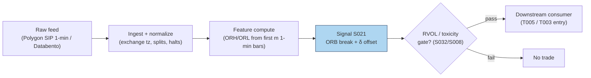

## Stage 21/200 — S021: Opening-range breakout — Crabel (1990)

*Batch SB2 · Signal 21/100 · Provenance [D] · Family B — Intraday momentum & breakout*

### S1. One-line verdict

| | |
|---|---|
| **What it is** | Price breaks above/below the high/low of the first N minutes of the session; the break marks acceptance of a new intraday value area. |
| **When it works** | News/catalyst days with abnormal participation ("stocks in play"); tight ranges before the break; small spreads versus expected move. |
| **When it dies** | Range-bound, low-participation days (false breaks); wide spreads relative to the OR width; late entries after the move already printed. |
| **Build-or-buy in one line** | Build: it is ~50 lines of bar arithmetic on 1-minute data you already have; buy nothing. |

Provenance **[D]** (documented — Crabel 1990 framework; ORB profitability studied in Holmberg–Lönnbark–Lundström and Zarattini–Barbon–Aziz) · Family B — Intraday momentum & breakout.

### S2. How it works — plain human explanation

Picture 9:47:03 on a regular Tuesday. XYZ opened at 100.00, chopped between 99.70 and 100.90 for the first half hour while overnight news got digested by the market — some traders selling into the open, others accumulating. That 30-minute band is the *opening range* (OR): the market's first draft of today's fair-value zone. Now a large buy program lifts the offer at 100.92, then 100.95, then trades print at 101.10 — above the morning high. The opening range just broke *upward*. The ORB trader reads that as: the morning's disagreement is resolving; directional commitment has arrived; the move that follows often travels a multiple of the range's width.

Why should this exist economically? Three overlapping mechanisms:

- **Overnight-information discovery.** The open is the day's main price-discovery auction. Informed traders who learned something overnight trade aggressively in the first minutes; the range break is their footprint becoming visible.
- **Inventory and stop cascades.** Dealers and market makers are short gamma into the open; a break triggers stops resting just outside the range, and stop-loss buying begets more buying — a self-reinforcing but temporary cascade.
- **Behavioral commitment.** Breakout traders, momentum algos, and news-followers all condition on the same visible level (the morning high), so the level becomes a coordination point: everyone acts at once, which manufactures the continuation it predicts — until it doesn't.

Mental model (3 bullets):

- The opening range is the market's opening bid/ask for "today's value"; a break is the market rejecting that price.
- Real breaks are *funded* — they come with participation (volume); unfunded breaks are head-fakes.
- You are buying the *second* wave (confirmation), not predicting the first; edge lives in the filter, not the geometry.

### S3. The math — exact formula

Let the session open at time $t_0$ and let the opening range cover the first $m$ intraday bars (e.g. $m=6$ five-minute bars = 30 minutes). With bar $j$ having high $H_j$ and low $L_j$:

$$\text{ORH} = \max_{j=1..m} H_j, \qquad \text{ORL} = \min_{j=1..m} L_j, \qquad W = \text{ORH} - \text{ORL}$$

where ORH/ORL are the opening-range high/low and $W$ is the range width, in price units ($).

**Entry rules** (causal: evaluated at bar close or on tick $t > t_0 + m$, tradable no earlier than $t+1$):

$$\text{Long trigger at } t:\; P_t \ge \text{ORH} + \delta$$
$$\text{Short trigger at } t:\; P_t \le \text{ORL} - \delta$$

$\delta \ge 0$ is an entry offset (price units) that filters marginal touches of the level.

**Crabel's stretch filter.** Opening noise is measured per session as

$$\text{Noise}_i = \min(H_i - O_i,\; O_i - L_i), \qquad \overline{\text{Noise}} = \frac{1}{n}\sum_{i=1}^{n} \text{Noise}_{t-i}$$

over $n$ prior sessions ($O_i$ = session open). The stretch is $\text{Stretch} = q \cdot \overline{\text{Noise}}$ and is used in place of $\delta$ ($q$ an *example* multiplier). The point: the entry offset scales with how noisy recent opens have been.

**Optional NR7/NR4 setup filter.** Let $\text{Range}_d = H_d - L_d$ be the daily range. NR7 requires $\text{Range}_t < \min(\text{Range}_{t-1..t-7})$ — today is the narrowest range in 7 days (compression before expansion); NR4 uses 4 days. This is a *regime gate*, not part of the trigger.

**Target/stop sketch** (*example*): target $= k \cdot W$ measured from entry, stop $=$ opposite side of OR (or $0.5W$). All multiples are illustrative choices.

#### Parameter table

| Parameter | Symbol | Typical range | Too small | Too large | Default example value |
|---|---|---|---|---|---|
| OR length | $m$ (min) | 5–60 | noise dominates; false breaks | late entry; most of the move already printed | 30 min (`example — not an institutional standard`) |
| Entry offset | $\delta$ | 0–1× $W$ | marginal touches trigger; whipsaw | missed breaks; fill far from level | 0.30 $ on a ~100 $ stock (`example`) |
| Stretch mult. | $q$ | 0.5–2.0 | offset ≈ noise; no filtering | filters out genuine breaks | 2.0 with $n=10$ (`example`) |
| Noise lookback | $n$ | 5–20 sessions | unstable stretch | stale, regime-blind | 10 sessions (`example`) |
| Bar granularity | — | 1–5 min | microstructure noise | coarse levels, late fills | 5-min bars (`example`) |
| Target multiple | $k$ | 1–3× $W$ | clipped winners, negative expectancy | rarely reached; mean reversion eats it | 2× $W$ (`example`) |

**Causality.** ORH/ORL use only bars $\le t_0+m$; the trigger fires at the first event $t > t_0+m$ with a qualifying print. No bar's close may be assumed executable at its high/low — **implementation warning from the source entry**: OHLC bars do not reveal intrabar event ordering, so never assume a stop/target was hit after a same-bar limit fill without finer data or conservative ordering assumptions (assume the worst order).

**Normalization choices.** Raw price levels (no normalization) — the geometry is in price space. Cross-stock comparability uses $W/\text{ATR}$ or $W/$ price; RVOL-normalization is the S032 variant. Lookbacks: the range is fixed-length-from-open (not rolling).

**Named variants.** (1) *Close-of-bar vs tick trigger* — require a bar close beyond the level (fewer false breaks, later entry) versus any tick (faster, noisier). (2) *Stretch vs fixed-$\delta$ offset.* (3) *Both-sides-triggered rule* — if both triggers print the same day, define the resolution explicitly (first touch wins / no trade / bias to the larger move); backtests that ignore this are overstated.

### S4. Worked example — step-by-step numbers (SYNTHETIC)

**Label:** this tape is synthetic. The worked example below was reported by a chatbot (GPT-5.6 "Luna" via duck.ai, Q-SB2-1, 2026-09-10) and **each number was independently hand-verified by the batch operator** before inclusion; it is used here as an illustrative arithmetic walk-through, not as market data. Random seed 21 is fixed in the plot script (the tape values themselves are fixed numbers, no randomness used).

Six 5-minute bars define the 30-minute opening range; bars 7–8 are post-range:

| Bar | O | H | L | C |
|---|---|---|---|---|
| B1 | 100.0 | 100.8 | 99.7 | 100.5 |
| B2 | 100.5 | 100.9 | 100.1 | 100.3 |
| B3 | 100.3 | 100.6 | 99.9 | 100.1 |
| B4 | 100.1 | 100.4 | 99.8 | 100.2 |
| B5 | 100.2 | 100.7 | 100.0 | 100.6 |
| B6 | 100.6 | 100.8 | 100.2 | 100.7 |
| B7 | 100.7 | 101.0 | 100.5 | 100.9 |
| B8 | 100.9 | 101.3 | 100.8 | 101.2 |

Step 1 — opening range: $\text{ORH} = \max(100.8, 100.9, 100.6, 100.4, 100.7, 100.8) = \mathbf{100.9}$ (from B2); $\text{ORL} = \min(99.7, 100.1, 99.9, 99.8, 100.0, 100.2) = \mathbf{99.7}$ (from B1); $W = 1.2$.

Step 2 — triggers with $\delta = 0.30$ (*example*): long $= 100.9 + 0.30 = \mathbf{101.2}$; short $= 99.7 - 0.30 = \mathbf{99.4}$.

Step 3 — evaluate: B7 high 101.0 < 101.2 → **no trigger** (the marginal poke fails the offset — this is the filter earning its keep). B8 high 101.3 ≥ 101.2 → **long entry at 101.2 on bar 8**.

The chart `images/S021_example.png` plots exactly these 8 bars, the [99.7, 100.9] band, both triggers, and the bar-8 entry marker.

**What to notice.** The δ offset is doing real work: without it, B7's touch of 101.0 (above ORH 100.9) would have triggered a long that went nowhere. The example also shows the asymmetry the honesty rules demand: we *assumed* a fill at 101.2; in a real tape the bar high is not an executable price — you would cross the spread after the print, paying slippage. This toy tape has no fees, no spread, and no losing trades; it demonstrates arithmetic, not edge.

### S5. Strategies that use this signal

- **T005 — RVOL-Filtered Opening-Range Breakout** — *primary entry trigger*: ORB geometry supplies the entry; S032 (RVOL) confirms participation and S008 (VPIN) gates toxicity.
- **T003 — VPIN-Gated Breakout Trader** — *breakout leg with toxicity veto*: S021 defines the breakout event; S008 (VPIN) stands the strategy down when order-flow toxicity spikes; S032 sizes/confirms.

### S6. Data required — exact spec

| Field | Type | Granularity | Source tier | Notes |
|---|---|---|---|---|
| O/H/L/C | float | 1-min bars, RTH | Tier 0–1 | Regular-hours only; exclude pre/post-market from OR computation |
| Volume | int | 1-min bars | Tier 0–1 | Needed for RVOL/stocks-in-play variant (S032) |
| Exchange calendar | date/bool | daily | Tier 0–1 | Early closes (e.g. day after Thanksgiving) shift the OR window |
| Corporate actions | ratio/date | event | Tier 1 | Splits/dividends must be adjusted or the OR levels are garbage |
| Halts | timestamp | event | Tier 1–2 | A halted open has no valid OR; skip the day |

**Collection.** Polygon stocks v3 aggregates (`/v3/aggs/ticker/{sym}/range/1/minute/{from}/{to}`) or Databento XNAS `OHLCV-1m`; Alpaca market data as a free Tier-0 fallback (IEX-only on free tier — fine for research, not for volume-filtered production). Endpoint returns timestamped O/H/L/C/V per minute.

**Ingest sketch (Python/polars, ≤20 lines):**
```python
import polars as pl, requests
def fetch_or_bars(sym, day, api_key):
    url = f"https://api.polygon.io/v2/aggs/ticker/{sym}/range/1/minute/{day}/{day}"
    r = requests.get(url, params={"apiKey": api_key, "adjusted": "true"}).json()
    df = pl.DataFrame(r["results"]).rename({"t": "ts", "o": "o", "h": "h", "l": "l", "c": "c", "v": "v"})
    df = df.with_columns(pl.from_epoch("ts", time_unit="ms").dt.tz_localize("UTC")
                           .dt.convert_time_zone("America/New_York").alias("ts_et"))
    rth = df.filter(pl.col("ts_et").dt.time().is_between(__import__("datetime").time(9, 30),
                                                        __import__("datetime").time(16, 0)))
    return rth.sort("ts")  # drop partial/halted days: require >= 360 bars
```

**Storage.** Per cost-model §4: 1-min bars for 500 symbols ≈ 50 MB/day total (≈0.1 MB per symbol-day); 60 days ≈ 3 GB — archive freely. The ORB state itself is two floats per symbol per day.

**Data-quality checklist.** (1) Normalize all timestamps to exchange-local (America/New_York; DST handled by tz database). (2) Adjust for splits/dividends *before* computing OR levels. (3) Detect halts/gaps: no valid OR on halted or <360-bar days — skip, don't impute. (4) Half-days: scale the OR window or skip. (5) Stale quotes: minute bars with zero volume at the open are not a range.

### S7. Local build on M5 Max / 128GB

**Feasibility verdict: trivial.** ORB is two running extrema plus a threshold comparison per bar — the cheapest signal in the Family B set. Per cost-model §2, 1-minute bars for a 500-symbol universe are 500 × 390 = 195k bars/day; polars column ops run at ~10–50M rows/sec, so the entire universe's ORB computation is a sub-second batch, and a Python per-bar loop is idle 99% of the time. There is no real-time constraint worth engineering for: you can recompute the whole day's signals in one vectorized pass each minute.

- **Throughput:** ingest trivial; signals/sec effectively unbounded for ≤500 symbols (polars batch); bottleneck is the API download, not compute.
- **Stack:** Python+polars (pick this — no reason for Rust here); DuckDB for the bar store if you want SQL access; skip kdb unless you already run it.
- **RAM:** <100 MB working set for 60 days of 1-min bars across 500 symbols (~12 MB per cost-model §3) — fits with enormous headroom against the 77 GB working budget.
- **Engineering time:** Tier L per cost-model §5 (4–12 h: ORB is explicitly in the S021–S048 1-min-bar tier). At $150/hr loaded: **$600–$1,800** — one line justifies it: bars in, two extrema out, everything else is plumbing (calendar, halts, adjustments).
- **What breaks first at 500 symbols or full OPRA:** nothing at 500 symbols on bars. It breaks when you add the *filters that make it work* — real-time RVOL baselines (S032), auction-imbalance feeds (S033), or tick-level entry timing, which move you into Tier M L1-event territory (~20–60 h).

### S8. Buy vs build

| Vendor / option | What you get | Indicative price | Buying gains | Buying loses |
|---|---|---|---|---|
| Tier-0 free: Stooq daily, Alpaca IEX, exchange delayed | Daily/1-min-ish bars, delayed | ~$0 | $0 research start | IEX-only volume (~2.5% of US volume per chatbot lead) — inadequate for volume filters |
| Tier-1: Polygon Stocks Advanced / Alpaca SIP | Real-time SIP 1-min bars, corporate actions, full tape | ~$30–200/mo | Correct consolidated volume for RVOL; official adjustments | Still bars — no tick ordering for intrabar honesty |
| Tier-2: Databento Standard (pay-as-you-go) | Honest L1/L2, MBP-1/10, OPRA research | ~$200/mo + usage | Tick-level entry timing; true queue data | Overkill for pure bar-ORB |
| Academic route: paper + own code | Formulas from Holmberg et al. / Zarattini et al. | ~$0 + eng time | Full parameter control | No data included |

*All prices indicative — verify before budgeting.* **Verdict: build.** The signal is 50 lines of bar math; nothing to buy. Buy the *data* (Tier-1 SIP bars, ~$79/mo Developer-class per the chatbot's Q-SB2-2 lead, consistent with cost-model §6 Tier-1 band) when you add the RVOL/stocks-in-play filter, because that filter is where consolidated volume becomes load-bearing. Crossover: buy data if you trade it; build analytics always.

### S9. Success ratio / efficacy — documented evidence

| Study / source | Market & period | Metric | Before/after cost | Caveat |
|---|---|---|---|---|
| Zarattini–Barbon–Aziz (2024), "A Profitable Day Trading Strategy for the U.S. Equity Market" (SSRN) | 7,000+ US stocks, 2016–2023, 5-min ORB | Top-20 stocks-in-play portfolio: >1,600% total net return, Sharpe 2.81, 36% annualized alpha | **After** their transaction-cost assumptions | Conditional strategy: concentration (top-20), cost-model dependent, sample ends 2023 |
| Zarattini–Barbon–Aziz (2024), same paper, RVOL split | Same universe | RVOL >100% in first 5 min → +0.08R/trade; RVOL <100% → −0.02R/trade; 30× RVOL → 0.38R/trade | **After** commissions | Shows the ORB edge is really a volume-filter edge |
| Zarattini & Aziz (2023), "Can Day Trading Really Be Profitable?" (SSRN) | QQQ, 5-min ORB, 2016–2023 | Annualized alpha 33% net of commissions; TQQQ version 1,484% total | **After** commissions (not full spread/impact) | Single instrument + leverage; broker leverage caps bind |
| Holmberg–Lönnbark–Lundström (2013), *Finance Research Letters* | Crude-oil futures, intraday ORB | Returns significantly >0 vs a fair game; elevated success rate | **Before** modern equity spread/impact accounting | Futures, not equities; statistical significance ≠ net tradability |
| Independent replication (Brusco, GitHub, Zarattini & Aziz 2023 QQQ ORB) | QQQ, 5-min ORB | Edge barely survives realistic execution; break-even ≈ 2.2¢/share slippage; 76% of filtered PnL from 2022 alone | **After** modeled execution costs | Regime concentration — mostly a 2022 phenomenon |

**When it fails.** Generic "trade every stock every day" ORB has little documented net edge — the duck.ai evidence synthesis (Q-SB2-3, chatbot-reported) puts it bluntly: *evidence in selected implementations, little verifiable evidence Crabel's originals survive modern costs broadly*. Documented killers: false breaks on range days, wide spreads vs. OR width, late entries, small-cap/low-ADV names, and treating the bar high as an executable price. Documented decay: the replication literature shows concentration in volatile regimes (2020–2022); calm-market ORB is mostly churn.

**Honest bottom line.** As a standalone trigger, ORB is a **weak, highly conditional edge** — the documented after-cost success lives in the *stocks-in-play + RVOL* implementation, not in the geometry. As a **filter/timing device** (enter only funded breaks; T005/T003 usage), it is a respectable, well-understood component. Do not trade the raw breakout; trade the participation-confirmed breakout.

### S10. Failure modes & pitfalls

1. **Intrabar ordering leakage** — assuming the bar high was tradable after your fill. *Mitigation:* use tick data for entries, or conservatively assume stops fill first (the source entry's explicit warning).
2. **False-break whipsaw on range days** — most days have no trend; the OR breaks and reverts. *Mitigation:* RVOL/stretch filters (S032); skip low-RVOL days entirely.
3. **Late entry** — by the time a 60-min OR breaks, the day's move is half over. *Mitigation:* shorter OR (5–15 min) with stricter volume filters.
4. **Spread/impact cost blowup** — a 1.2-point OR on a 5¢-spread small-cap is a different trade than on a penny-spread large-cap. *Mitigation:* require expected move ≥ 5–10× spread (*example* threshold); model spread+fees+slippage per trade.
5. **Both-sides-triggered days** — long then short (or vice versa) on volatile opens. *Mitigation:* define the rule ex ante (first touch / one entry per day, *example*).
6. **Corporate-action/ calendar errors** — unadjusted splits shift OR levels; half-days compress the window. *Mitigation:* adjusted bars + exchange calendar; skip invalid days.
7. **Crowding at round levels** — everyone watches the same morning high. *Mitigation:* use the offset δ and volume confirmation so you're not the marginal buyer of a crowded level.
8. **Regime breaks** — ORB thrives in trending/vol regimes and dies in grinding low-vol regimes. *Mitigation:* regime-gate on trailing realized vol or VIX level (*example*).

### S11. Visuals




### S12. Sources

- Carlo Zarattini, Andrea Barbon, Andrew Aziz (2024). "A Profitable Day Trading Strategy for the U.S. Equity Market." SSRN Electronic Journal. https://papers.ssrn.com/sol3/papers.cfm?abstract_id=4729284 — 7,000+ US stocks 2016–2023; stocks-in-play + RVOL-conditioned 5-min ORB results.
- Carlo Zarattini, Andrew Aziz (2023). "Can Day Trading Really Be Profitable? Evidence of Sustainable Long-term Profits from Opening Range Breakout (ORB) Day Trading Strategy vs. Benchmark in the US Stock Market." SSRN. https://papers.ssrn.com/sol3/papers.cfm?abstract_id=4416622 — QQQ 5-min ORB, 33% annualized alpha net of commissions.
- Ulf Holmberg, Carl Lönnbark, Christian Lundström (2013). "Assessing the profitability of intraday opening range breakout strategies." *Finance Research Letters* 10:27–33. https://econpapers.repec.org/paper/hhsumnees/0845.htm — mechanical ORB rules, returns significantly above a fair game (crude-oil futures).
- Independent replication & execution stress test of Zarattini & Aziz (2023) QQQ ORB (break-even ≈2.2¢/share; regime concentration). https://github.com/giovannibrusco/zarattini-2023-orb-qqq
- Toby Crabel (1990). *Day Trading with Short Term Price Patterns and Opening Range Breakout.* — the signal's documented origin (book; no stable public URL — cited via the report's entry).

**Unverified leads** (chatbot-reported, no checkable source; do not cite as evidence):
- Duck.ai (GPT-5.6 "Luna", 2026-09-10) Q-SB2-2 pipeline numbers: Massive/Polygon Developer ~$79/mo, Alpaca Algo Trader Plus ~$99/mo, 500-symbol 60-day pipeline 106–246 eng hours — labeled lead, consistent with cost-model §5/§6 bands but vendor pricing is *indicative — verify before budgeting*.
- "Commonly cited illustrative spec: n=10, q=2, 20-day narrow-range lookback" for the Crabel stretch (chatbot-reported via oxfordstrat.com; treated as practitioner folklore, not a documented standard).

**Source log:** Duck.ai answered Q-SB2-1–Q-SB2-3 (2026-09-10); Grok/Cursor answers pending (checked 2026-09-10).
