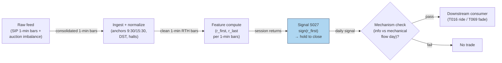

## Stage 27/200 — S027: End-of-day momentum / last-hour drift

*Batch SB2 · Signal 27/100 · Provenance [D] · Family B — Intraday momentum & breakout*

### S1. One-line verdict

| | |
|---|---|
| **What it is** | The day's early return predicts the last 30–60 minutes: ride the drift into the close, or fade the overextension — the sign depends on the mechanism. |
| **When it works** | Information trend days (news, macro releases): morning winners keep drifting as slow money rebalances into the close. |
| **When it dies** | Mechanical-flow days (index rebalances, expiry, big MOC imbalances): the "momentum" is temporary price pressure that reverses overnight. |
| **Build-or-buy in one line** | Build on 1-min bars; buy the official imbalance feed only if you trade the auction itself. |

Provenance **[D]** (documented — Gao–Han–Li–Zhou 2018 intraday momentum; Heston–Korajczyk–Sadka 2010 intraday periodicity; Bogousslavsky–Muravyev closing-auction literature) · Family B — Intraday momentum & breakout.

### S2. How it works — plain human explanation

It's 3:31 p.m. XYZ is up 1.4% on the day after strong morning news. Two crowds are about to trade the last half hour. The first is slow money — index funds, pension rebalances, benchmarked managers who must be invested by the close; they lean with the day's trend, pressing winners further. The second is the closing auction itself: market-on-close (MOC) orders, index-rebalance flows, expiry hedging — enormous one-sided volume into the 4:00 p.m. print that can shove price *away* from fair value, pressure that often leaks back overnight.

So "end-of-day momentum" is two effects in one outfit. The academic version (Gao et al. 2018): the first half-hour's return positively predicts the last half-hour's return — day traders and informed traders keep pushing the morning's direction. The microstructure version (Heston et al. 2010): at half-hour intervals that are exact multiples of a day, returns *continue* — institutional rebalancing on a daily clock. And the auction version (Bogousslavsky & Muravyev; Jegadeesh & Wu 2022): closing-auction price pressure is real but mostly temporary, reverting over hours to days. Trade the drift on information days; fade it on mechanical-flow days.

A concrete contrast: 15:32, SPY +0.9% after a hot CPI print — the morning's buyers were informed, laggard allocators are still catching up, and the drift has a fundamental reason to continue. Versus 15:32 on S&P reconstitution Friday — the "momentum" is index funds forced to buy additions at any price; Monday morning gives half of it back.

Mental model (3 bullets):

- The close is where the day's two slowest, largest flows (benchmarked rebalancing, MOC auctions) collide with the fastest (day-trader momentum).
- Direction is set by *who* is trading: information → continuation; mechanical flow → pressure-then-reversal.
- The signal's horizon is 15–90 minutes and it is always flat by the print — this is a timing edge, not a position.

### S3. The math — exact formula

**Base signal (report form — open→15:30 variant; not Gao's exact window).** Let $P_{9:30,t}$, $P_{15:30,t}$, $P_{\text{close},t}$ be prices on day $t$. Define

$$r_{\text{first},t} = \frac{P_{15:30,t}}{P_{9:30,t}} - 1, \qquad r_{\text{last},t} = \frac{P_{\text{close},t}}{P_{15:30,t}} - 1$$

all in decimal returns. The predictive regression that documents the effect:

$$r_{\text{last},t} = \alpha + \beta\, r_{\text{first},t} + \varepsilon_t$$

Gao et al. report $\hat\beta = 0.0694$ (their tables scale by 100, showing 6.94), significant at 1%, $R^2 = 1.6\%$ on SPY 1993–2013. **Window attribution (do not mix):** those statistics attach to Gao's first-half-hour (9:30–10:00) → last-half-hour window — variant (1) in Named variants — and **do not describe** the open→15:30 formation used in this section. The open→15:30 form is this report's own smoother variant; its only numbers are the worked example below and the labeled variants, not Gao's 6.94/1.6%. The tradable signal is the sign rule:

$$s_t = \operatorname{sign}(r_{\text{first},t}), \qquad \text{hold } s_t \text{ from 15:30 to the close}$$

position in *shares* (long if $s_t=+1$, short if $s_t=-1$), flattened at the closing print.

**Cross-sectional periodicity (Heston–Korajczyk–Sadka form).** For stock $i$ and half-hour interval $k$ on day $t$, returns continue at lags that are multiples of one trading day (13 half-hours): $E[r_{i,k,t} \mid r_{i,k,t-1}] > 0$ at the daily lag — strongest in the first and last half-hour intervals.

**Auction-imbalance sibling.** The microstructure sibling trades *with* the published closing-auction imbalance: if the NYSE/Nasdaq imbalance feed shows net buy pressure near the freeze, lean long into the print. This is a different signal (S033 territory) sharing the same window.

#### Parameter table

| Parameter | Symbol | Typical range | Too small | Too large | Default example value |
|---|---|---|---|---|---|
| Formation window | $r_{\text{first}}$ span | 30–210 min | noise dominates | signal arrives too late | 9:30→15:30 (`example — not an institutional standard`) |
| Hold window | $r_{\text{last}}$ span | 15–90 min | spread dominates | overnight gap risk | 15:30→close (`example`) |
| Entry time | — | 14:30–15:45 | more churn | missing the drift | 15:30 (`example`) |
| Universe filter | — | ADV / spread caps | illiquid; impact eats edge | over-filtered | price > $5, ADV > 1M shares (`example`) |
| Sign vs magnitude | — | sign / z-scored | sign ignores conviction | magnitude overfits outliers | sign rule (`example`) |

**Causality.** $r_{\text{first},t}$ is fully known at 15:30; the position is entered at/after 15:30 and held to the close — tradable no earlier than the first print after the signal timestamp. Using the 15:30 *bar close* as the entry price assumes a fill a real order would miss by seconds-to-minutes; conservative backtests enter at 15:31+.

**Normalization choices.** The base form uses raw sign. Cross-stock versions z-score $r_{\text{first}}$ by trailing diurnal volatility (S067) so a 1% move in a calm utility and a 1% move in a biotech aren't treated equally.

**Named variants.** (1) *First-half-hour → last-half-hour* (Gao: formation = 9:30–10:00 only — purer but noisier). (2) *Open→15:30 formation* (report entry's form — smoother). (3) *Auction-imbalance continuation* (S033-style; uses the imbalance feed, not returns). (4) *Reversal twin* (T069): fade the last-30-minute move — same window, opposite sign, for mechanical-flow days.

### S4. Worked example — step-by-step numbers (SYNTHETIC)

**Label:** synthetic tape, random seed 27 (fixed in the plot script). Six synthetic days; prices are invented. No fees, no spread — arithmetic illustration only.

| Day | $P_{9:30}$ | $P_{15:30}$ | $P_{\text{close}}$ | $r_{\text{first}}$ | $r_{\text{last}}$ | $s_t$ | Trade P&L |
|---|---|---|---|---|---|---|---|
| 1 | 100.00 | 101.40 | 101.90 | +1.40% | +0.49% | +1 | **+0.49%** |
| 2 | 101.40 | 100.60 | 100.10 | −0.79% | −0.50% | −1 | **+0.50%** |
| 3 | 99.60 | 100.90 | 101.30 | +1.31% | +0.40% | +1 | **+0.40%** |
| 4 | 100.80 | 101.90 | 102.40 | +1.09% | +0.49% | +1 | **+0.49%** |
| 5 | 102.20 | 100.90 | 100.40 | −1.27% | −0.50% | −1 | **+0.50%** |
| 6 | 100.10 | 100.70 | 100.50 | +0.60% | −0.20% | +1 | −0.20% |

Check day 2 by hand: $r_{\text{first}} = 100.60/101.40 - 1 = -0.00789 \approx -0.79\%$; $s_2 = -1$ (short); $r_{\text{last}} = 100.10/100.60 - 1 = -0.00497 \approx -0.50\%$; P&L $= (-1)\times(-0.50\%) = +0.50\%$. Day 6 is the honest loser: the morning was mildly up, the close faded — the reversal regime the signal cannot distinguish ex ante.

Hit rate 5/6, mean +0.36%/day — **synthetic and before costs**; the chart `images/S027_example.png` plots the same six day-pairs.

**Cost walk (*example* assumptions, SPY-class ETF):** half-spread (half the bid–ask spread — the cost of crossing to take liquidity) ≈ 0.5 bp/leg, where 1 bp (basis point) = 0.01% — so ≈ 1 bp round-trip for the 15:30 entry plus the close exit — plus ≈ $0.001/share per-side fees (≈ 0.2 bp) plus slippage/impact (extra cost when your own order pushes the price against you) ≈ 2 bp on the 15:30 leg, which leans into the auction buildup. Total ≈ 3–4 bp per trade against a mean gross of +36 bp/day → net ≈ **+32 bp/day** in this toy tape. On real small-cap closes the spread alone can exceed the whole drift — which is exactly why Heston et al. find the periodicity loses money after paying the spread.

**What to notice.** The example is deliberately continuation-friendly (5 of 6 days continue). Real data is nothing like this clean: Gao's $R^2$ of 1.6% means the regression explains almost nothing day-to-day — the edge is statistical, harvested across thousands of days, and the spread is a large fraction of a 30-minute drift. Day 6 is the important row: on mechanical-flow days the sign flips and the "momentum" becomes the fade.

### S5. Strategies that use this signal

- **T016 — End-of-Day Drift Rider** — *primary entry trigger*: S027 is the core — lean into last-hour drift, confirmed by opening-auction imbalance read (S033) and spread estimate (S013).
- **T006 — Intraday Trend + Vol-Regime Allocator** — *trend leg*: S027 supplies the into-the-close momentum component, scaled by HMM (hidden Markov model) vol regime (S079) alongside S025.
- **T069 — Late-Day Reversal into Close** — *contrast / veto*: fades last-30-minute overextensions (S038/S041 timing). T069 is the reason S027 must be mechanism-aware — when flow is mechanical, T069's sign is the right one.

### S6. Data required — exact spec

| Field | Type | Granularity | Source tier | Notes |
|---|---|---|---|---|
| O/H/L/C | float | 1-min bars, RTH (regular trading hours) | Tier 0–1 | Only 9:30, 15:30, close anchors strictly needed |
| Volume | int | 1-min bars | Tier 1 | Gao: effect stronger on high-volume days — conditioning variable |
| Official close-imbalance feed | imbalance $/shares | event, 15:30–16:00 | Tier 1–2 | NYSE imbalance feed / Nasdaq NOII (near-freeze snapshots) |
| Exchange calendar | date/bool | daily | Tier 0–1 | Early closes move the "last 30 min" window |
| Corporate actions | ratio/date | event | Tier 1 | Adjusted closes or the day's return is fiction |

**Collection.** Polygon stocks v3 minute aggregates for the bar anchors; the imbalance leg needs the exchange-published closing-auction imbalance messages (NYSE Pillar imbalance feed / Nasdaq TotalView NOII) — typically a Tier-2 add-on or exchange direct feed, *indicative — verify before budgeting*.

**Ingest sketch (Python/polars, ≤20 lines):**
```python
import polars as pl
def session_anchors(bars: pl.DataFrame) -> pl.DataFrame:
    # bars: 1-min RTH bars with ts_et, close
    day = bars.with_columns(pl.col("ts_et").dt.date().alias("d"))
    anchors = (day.group_by("d").agg([
        pl.col("close").filter(pl.col("ts_et").dt.time() == __import__("datetime").time(9, 30)).first().alias("p930"),
        pl.col("close").filter(pl.col("ts_et").dt.time() == __import__("datetime").time(15, 30)).first().alias("p1530"),
        pl.col("close").last().alias("pclose"),
    ]).with_columns(
        ((pl.col("p1530") / pl.col("p930")) - 1).alias("r_first"),
        ((pl.col("pclose") / pl.col("p1530")) - 1).alias("r_last"),
        (((pl.col("p1530") / pl.col("p930")) - 1) > 0).cast(pl.Int8).mul(2).sub(1).alias("signal"),
    ))
    return anchors  # signal known at 15:30; tradable at first print after
```

**Storage.** Anchors are 3 floats/day/symbol — negligible. The underlying 1-min bars: ~0.1 MB per symbol-day per cost-model §4.

**Data-quality checklist.** (1) Anchor timestamps must exist — a missing 15:30 bar (halt) invalidates the day. (2) Adjust for splits/dividends. (3) DST/half-days shift anchors. (4) The "close" for the hold should be the last *regular-session* print, not the auction print, unless you explicitly trade the auction. (5) Stale 15:30 quotes on illiquid names — filter by ADV.

### S7. Local build on M5 Max / 128GB

**Feasibility verdict: trivial.** Three anchor prices per symbol per day, one division, one sign. Per cost-model §2, even the full 500-symbol 1-minute universe (195k bars/day) is a sub-second polars pass; the signal itself is a rounding error on top. The only part with any engineering content is the optional imbalance-feed leg.

- **Throughput:** signals/sec effectively unbounded on bars; bottleneck is feed latency for the imbalance variant (needs the exchange feed, not compute).
- **Stack:** Python+polars (pick this); the imbalance leg is a small streaming parser — still Python-fine at one message/sec per symbol.
- **RAM:** anchors for 500 symbols × 60 days ≈ a few KB; bars per §3 ≈ 12 MB — trivially inside the 77 GB working budget.
- **Engineering time:** Tier L per cost-model §5 (4–12 h; S027 sits in the S021–S048 1-min-bar band). **$600–$1,800** at $150/hr loaded — one line: anchors in, sign out, everything else is the imbalance feed integration if you want it.
- **What breaks first at 500 symbols:** nothing on bars. It breaks if you try to trade *the auction print itself* across 500 names — MOC order management, freeze-time rule changes, and per-symbol imbalance parsing become the project (Tier M, 20–60 h).

### S8. Buy vs build

| Vendor / option | What you get | Indicative price | Buying gains | Buying loses |
|---|---|---|---|---|
| Tier-0 free: Stooq/Alpaca IEX | Daily + coarse intraday bars | ~$0 | $0 prototype of the sign rule | No 15:30 anchor precision; no imbalance data |
| Tier-1: Polygon Stocks Advanced / Alpaca SIP | Full SIP 1-min bars, corporate actions | ~$30–200/mo | Correct anchors + consolidated volume for conditioning | Still no official imbalance feed |
| Tier-2: exchange imbalance feeds (NYSE/Nasdaq) | Official closing-auction imbalance messages | exchange pricing (indicative — verify before budgeting) | Trade the actual auction pressure, not a proxy | Exchange contracts, per-feed cost; only needed for the auction leg |
| Tier-2: Databento Standard | Consolidated bars + imbalance-adjacent data | ~$200/mo + usage | One pipe for bars and auction analytics | Doesn't replace the official imbalance feed |

*All prices indicative — verify before budgeting.* **Verdict: build** the return-based signal (it is 10 lines); **buy** the imbalance feed only if the auction leg is the actual trade. The chatbot's Q-SB2-2 lead is consistent here: buy raw bars (~$79/mo Developer-class), build all analytics — precomputed "EOD momentum" scores are poor value because the formation/hold windows are the strategy. Crossover: you need the paid imbalance feed the day you stop trading the drift and start trading the print.

### S9. Success ratio / efficacy — documented evidence

| Study / source | Market & period | Metric | Before/after cost | Caveat |
|---|---|---|---|---|
| Gao–Han–Li–Zhou (2018), *J. Financial Economics* | SPY + 10 active ETFs, 1993–2013 | First→last half-hour: β̂=6.94 (×100), p<1%, R²=1.6%; stronger on volatile/high-volume/recession/macro-news days | **Before** cost (predictive regression) | Market-level (ETF); R² tiny — edge is high-frequency repetition |
| Heston–Korajczyk–Sadka (2010), *J. Finance* | NYSE, half-hour intervals, 2001–2005 | Continuation at day-multiple half-hour lags, strongest first/last half hour; sub-hour reversals are liquidity/bounce | **After** (honest): periodicity strategies "**lose money after paying the bid/ask spread**" | The continuation is a timing/cost phenomenon, not an arbitrage |
| Jegadeesh–Wu (2022), *J. Financial Economics* | NYSE+Nasdaq closing auctions | Auction volume ≈10% of total at 2019 peak; impact temporary, dissipates over 3–5 days; reversal strategies "significantly profitable" | **Before** full costs | Auction-*reversal* — the opposite sign to the drift; mechanism matters |
| Bogousslavsky–Muravyev (2023), "Who Trades at the Close?" | US equities, auctions | Auctions = 7.5% of daily volume in 2018 (vs 3.1% in 2010); close matches pre-close bid/ask 68%; deviations revert overnight | Descriptive | Auction is cheap for liquidity demanders — being the pressure is costly |
| Haendler–Heston–Korajczyk–Sadka (2025), SSRN | US equities, out-of-sample | Periodicity persists OOS; close leg driven by market-on-close trading | **Before** cost | Institutional-trading explanation — the "momentum" is someone else's benchmark trade |

**When it fails / regime notes.** Index-reconstitution and triple-witching days (mechanical flow dominates); macro-release days can go either way (information vs. positioning); selloffs (the drift becomes a crash and the close gaps); small-cap/low-ADV names where the last-30-minute spread is the whole signal; crowded close-momentum signals (everyone leaning the same way *is* the auction imbalance). The chatbot's Q-SB2-3 synthesis (labeled) is directionally right: last-hour effects are measurable but the sign is not universal — continuation vs. auction-reversal depends on definition and hold.

**Honest bottom line.** As a standalone trigger, EOD momentum is a **thin statistical edge**: real in predictive regressions, largely consumed by the spread at the horizons that matter (Heston et al. say so explicitly). As a **timing overlay** — when to press an existing intraday position, or which sign to take into the close (T016 vs T069) — it is genuinely useful. Never trade it without naming the mechanism (information vs. mechanical) first.

### S10. Failure modes & pitfalls

1. **Sign ambiguity** — continuation and auction-reversal share the same window. *Mitigation:* condition on mechanism: news/macro day → ride (T016); rebalance/expiry day → fade (T069).
2. **Auction impact on entry/exit** — the 15:30–16:00 window *is* the auction buildup; your fills move the print. *Mitigation:* model impact as a multiple of spread (chatbot-reported 0.34× figures are unverified — see S12); participate early or use limits (*example*).
3. **Overnight gap risk** — "always off by the print" per the source entry; a held position faces the overnight gap. *Mitigation:* flatten at the close — no exceptions in the base spec.
4. **Anchor staleness** — illiquid names have no real 15:30 price. *Mitigation:* ADV/spread filters (*example*: ADV > 1M shares).
5. **Macro-event whiplash** — 15:30 positioning ahead of next-morning news reverses. *Mitigation:* skip days with scheduled overnight catalysts (*example* rule).
6. **Crowded close signals** — if every intraday book leans the same way at 15:30, you *are* the imbalance. *Mitigation:* cap participation; watch the imbalance feed divergence.
7. **Lookahead via the close** — using the official close (auction print) as the signal-day return contaminates the formation window. *Mitigation:* formation uses regular-session prints only.
8. **Regime decay** — auction share keeps growing (3.1%→7.5%→~10%), so the mechanical leg strengthens while the information leg is competed away. *Mitigation:* re-estimate the sign mix yearly; don't freeze parameters.

### S11. Visuals




### S12. Sources

- Lei Gao, Yufeng Han, Sophia Zhengzi Li, Guofu Zhou (2018). "Intraday Momentum: The First Half-Hour Return Predicts the Last Half-Hour Return." *Journal of Financial Economics.* https://papers.ssrn.com/sol3/papers.cfm?abstract_id=2552752 — first→last half-hour predictability, SPY 1993–2013.
- Steven L. Heston, Robert A. Korajczyk, Ronnie Sadka (2010). "Intraday Patterns in the Cross-Section of Stock Returns." *Journal of Finance* 65(4):1369–1407. https://bauer.uh.edu/departments/finance/documents/Heston-Korajczyk-Sadka-jf-2010-01-07.pdf
- Vincent Bogousslavsky, Dmitriy Muravyev (2023). "Who Trades at the Close? Implications for Price Discovery and Liquidity." SSRN. https://papers.ssrn.com/sol3/papers.cfm?abstract_id=3485840
- Narasimhan Jegadeesh, Yanbin Wu (2022). "Closing auctions: Nasdaq versus NYSE." *Journal of Financial Economics* 143:1120–1139. https://econpapers.repec.org/article/eeejfinec/v_3a143_3ay_3a2022_3ai_3a3_3ap_3a1120-1139.htm
- Charlotte Haendler, Steven Heston, Robert Korajczyk, Ronnie Sadka (2025). "The intra-day stock return periodicity puzzle." SSRN. https://www.kellogg.northwestern.edu/academics-research/research/detail/2025/the-intra-day-stock-return-periodicity-puzzle/ — periodicity persists out-of-sample; close leg driven by MOC trading.

**Unverified leads** (chatbot-reported, not independently verified; do not cite as evidence):
- Duck.ai Q-SB2-3 auction micro-numbers: closing-auction volume 7.10% of ADV (NYSE+Nasdaq 2012–2021), auction impact ≈0.34× daily average spread, drift to auction price ≈0.6–1.7× spread, overnight 1%-of-ADV ≈40bp round-trip impact under a sqrt model — directionally consistent with the verified sources above, but the exact figures were not independently confirmed.
- "Timing Sharpe ≈1.08 vs 0.29 buy-and-hold" for the Gao et al. strategy (reported in an independent replication write-up, https://github.com/definitelymikey/orb-strategy/blob/HEAD/Market_Intraday_Momentum/CLAUDE.md — not verified against the paper text).
- Baltussen–Da–Lammers–Martens (2021) gamma-hedging mechanism for intraday momentum across 60+ futures (mentioned in the same replication write-up; paper not independently pulled).

**Source log:** Duck.ai answered Q-SB2-1–Q-SB2-3 (2026-09-10); Grok/Cursor answers pending (checked 2026-09-10).
