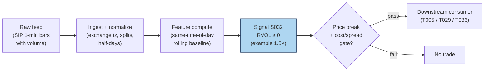

## Stage 32/200 — S032: Relative-volume (RVOL) filtered breakout

*Batch SB2 · Signal 32/100 · Provenance [SR] · Family B — Intraday momentum & breakout*

### S1. One-line verdict

| | |
|---|---|
| **What it is** | A breakout is only valid if volume is abnormal *for that time of day*: RVOL = window volume ÷ trailing same-time-of-day mean. |
| **When it works** | As a gate on other entries (ORB, news breakouts): funded breaks continue, unfunded breaks revert. |
| **When it dies** | As a standalone trigger — high RVOL alone is attention, not direction; and on expiry/rebalance days volume is mechanical. |
| **Build-or-buy in one line** | Build: it is a rolling time-of-day mean over bars you already store; the baseline is the whole product. |

Provenance **[SR]** (standard reconstruction — practitioner-standard formula; documented as a *conditioner* in Zarattini–Barbon–Aziz 2024 and as return-predictive abnormal volume in Gervais–Kaniel–Mingelgrin 2001; no single canonical paper defines the intraday RVOL-breakout rule, so the tag stays [SR]) · Family B — Intraday momentum & breakout.

### S2. How it works — plain human explanation

10:05 a.m. XYZ breaks above its opening range high at 101.20. Two versions of this morning exist. In version A, the first-5-minute volume is 260k shares against a 128k trailing norm — RVOL 2.0×. Institutions are repositioning; the break is *funded* and the order flow behind it will keep pressing. In version B, the same price break prints on 95k shares against a 125k norm — RVOL 0.76×. Nobody is behind it; it's a dealer wiggle or a single retail sweep, and the level fails within minutes.

RVOL is the lie detector for breakouts. Raw volume can't do this job because volume has a violent U-shape across the day (S046/S067): the open and close always print huge volume, midday almost none. A "big" 10:00 a.m. bar might be tiny by 9:35 standards. Dividing by the *same-time-of-day* trailing mean strips the diurnal seasonality and leaves the surprise — which is the information.

Why should abnormal volume predict anything? The academic lineage is old and consistent: Blume–Easley–O'Hara (1994) show volume carries information about signal precision that prices alone don't reveal; Llorente–Michaely–Saar–Wang (2002) show volume from speculative/informed trading *continues* while volume from risk-sharing (rebalancing) *reverses*; Gervais–Kaniel–Mingelgrin (2001) find unusually high-volume stocks appreciate over the following month (the "high-volume return premium," via investor visibility). The intraday practitioner version is cruder but the same idea: participation is commitment, and commitment separates acceptance from a head-fake.

Mental model (3 bullets):

- Price tells you *where*; RVOL tells you *who showed up*. Trade the intersection.
- Always divide by the time-of-day norm — raw volume is a clock, not a signal.
- RVOL is a gate, not a trigger: it vetoes bad breakouts and confirms good ones; it rarely initiates a trade by itself.

### S3. The math — exact formula

**Standard reconstruction** (practitioner formula; parameter values below are *examples*, not documented standards). Let $V_{w,t}$ be share volume in window $w$ on day $t$ (e.g. the first 5 minutes, 9:30–9:35), and let $\bar V_{w,t-1:t-N}$ be the trailing mean of the *same window* over the prior $N$ sessions:

$$\text{RVOL}_{w,t} = \frac{V_{w,t}}{\frac{1}{N}\sum_{i=1}^{N} V_{w,t-i}}$$

dimensionless (×). A valid breakout requires the price break **and**

$$\text{RVOL}_{w,t} \ge \theta$$

with $\theta$ an *example* threshold (commonly cited 1.5–2.0×; Zarattini et al. use 100% as the positive/negative split and study up to 30×).

**Baseline variants.** Mean vs median vs winsorized mean of the trailing window — median is robust to the occasional news-day outlier poisoning the baseline; winsorizing at 1/99% is the middle ground. The Zarattini–Barbon–Aziz implementation uses a 14-day mean of the first-5-minute volume.

**Attention-vs-information refinement** (Llorente et al. logic, qualitative): decompose the day's abnormal volume into informed-driven (continues) vs risk-sharing-driven (reverses). In practice this is proxied by conditioning on *why* volume is high — news/catalyst present (S091/S093) versus calendar-mechanical (expiry, rebalance).

#### Parameter table

| Parameter | Symbol | Typical range | Too small | Too large | Default example value |
|---|---|---|---|---|---|
| Measure window | $w$ | 1–30 min | noise; single-sweep artifacts | break already half over | first 5 min (`example — not an institutional standard`) |
| Baseline lookback | $N$ | 10–60 sessions | baseline whipsaws with recent news days | stale; regime changes ignored | 14 sessions (`example`) |
| Baseline statistic | — | mean / median / winsorized | mean is outlier-sensitive | median lags genuine regime shifts | mean (`example`) |
| Threshold | $\theta$ | 1.0–3.0× | lets unfunded breaks through | almost never trades | 1.5× (`example`) |
| Session filter | — | RTH only | pre/post-market prints poison the norm | — | RTH-only windows (`example`) |

**Causality.** $\text{RVOL}_{w,t}$ is known at the *end* of window $w$ using only volumes $\le t$; the breakout it validates must occur at or after that timestamp — tradable no earlier than the first print after the window closes. A common leakage bug: using the *full day's* volume in the baseline or comparing against a same-day average that includes future bars.

**Normalization choices.** Time-of-day matching *is* the normalization (it removes the U-shape). Cross-stock comparability needs no further scaling since RVOL is already dimensionless, though conditioning thresholds are sometimes expressed in $z$-scores of log-RVOL for very skewed names.

**Named variants.** (1) *Dollar-volume RVOL* — use $P \times V$ instead of shares (better for comparing across price levels; S032's options-flow cousin in the Stanford CS229 project used volume > 2× daily average AND ≥ 500 contracts). (2) *Tick/dollar-bar RVOL* — abnormal volume per *bar* rather than per clock window (S083 clocks). (3) *Cumulative-session RVOL* — volume-so-far vs expected volume-so-far from the diurnal curve; updates continuously instead of once per window.

### S4. Worked example — step-by-step numbers (SYNTHETIC)

**Label:** synthetic 12-day tape, random seed 32 (fixed in the plot script). OR window = first 5 minutes; baseline = 14-day trailing mean of the same window (synthetic values); threshold $\theta = 1.5$ (*example*); volumes in thousands of shares. No costs — arithmetic illustration only.

| Day | OR vol | Baseline | RVOL | Break | Valid? | Move (R) |
|---|---|---|---|---|---|---|
| 1 | 120 | 130 | 0.92 | — | no | — |
| 2 | 95 | 125 | 0.76 | — | no | — |
| 3 | 260 | 128 | **2.03** | +1 | **yes** | +1.8 |
| 4 | 140 | 122 | 1.15 | — | no | — |
| 5 | 310 | 126 | **2.46** | +1 | **yes** | +2.6 |
| 6 | 110 | 131 | 0.84 | — | no | — |
| 7 | 85 | 129 | 0.66 | — | no | — |
| 8 | 220 | 124 | **1.77** | +1 | **yes** | −0.4 |
| 9 | 130 | 127 | 1.02 | — | no | — |
| 10 | 280 | 125 | **2.24** | −1 | **yes** | +1.9 |
| 11 | 100 | 132 | 0.76 | — | no | — |
| 12 | 150 | 128 | 1.17 | +1 | no (< 1.5) | +1.2 (untraded) |

Check day 3 by hand: $\text{RVOL} = 260/128 = 2.03125 \approx 2.03 \ge 1.5$ with an upside price break → valid long; realized move +1.8R (R = the trade's predefined risk unit, *example*). Day 10: downside break on 2.24× → valid short, +1.9R.

Result: 4 valid trades, 3 winners, mean move +1.48R — **synthetic, before costs**. The chart `images/S032_example.png` plots this exact tape: OR-window volume vs baseline (top) and RVOL with the 1.5× line (bottom), valid days flagged.

**What to notice.** Day 8 is the honest row: RVOL 1.77× validates the break and it still loses (−0.4R) — the filter improves the *mix*, it doesn't certify winners. Day 12 is the filter's cost: a genuine +1.2R break goes untraded because RVOL printed 1.17×. Every filter buys a better win rate with missed trades; θ is where you price that exchange, and 1.5× here is an *example*, not an optimum. This toy tape has no spread, no fees, and hand-picked outcomes — it demonstrates the accounting, not an edge.

### S5. Strategies that use this signal

- **T005 — RVOL-Filtered Opening-Range Breakout** — *primary confirmation*: S032 is the strategy's namesake gate — S021 triggers, S032 validates participation, S008 vetoes toxicity.
- **T029 — Spread-Estimate Edge Filter** — *breakout edge filter*: S032's breakout leg is only taken when estimated effective spread (S012/S013) is below the edge — volume confirmation is necessary but not sufficient.
- **T086 — OFI-Paced Participation Tracker** — *pacing input*: S032 scales execution participation — high RVOL means the tape can absorb size; low RVOL means slow down (with S001 OFI and S067 diurnal norms).

### S6. Data required — exact spec

| Field | Type | Granularity | Source tier | Notes |
|---|---|---|---|---|
| O/H/L/C/V | mixed | 1-min bars, RTH | Tier 0–1 | Volume per bar is the load-bearing field |
| Exchange calendar | date/bool | daily | Tier 0–1 | Half-days must rescale or exclude windows |
| Corporate actions | ratio/date | event | Tier 1 | Splits change share-volume baselines — adjust or use dollar volume |
| News/catalyst flags | bool/event | daily | Tier 1–2 | Optional: separates informed volume from mechanical volume |

**Collection.** Same bar pipe as S021 (Polygon stocks v3, Databento OHLCV-1m, Alpaca): the only extra requirement is *history* — the baseline needs $N$ prior sessions of the same window, so the store must retain ≥ $N$ + warmup days per symbol.

**Ingest sketch (Python/polars, ≤20 lines):**
```python
import polars as pl
def rvol(bars: pl.DataFrame, window_end="09:35", n=14, theta=1.5):
    # bars: 1-min RTH bars with ts_et, v (shares)
    w = (bars.filter(pl.col("ts_et").dt.time() <= __import__("datetime").time(9, 35))
             .group_by(pl.col("ts_et").dt.date().alias("d"))
             .agg(pl.col("v").sum().alias("or_vol")).sort("d"))
    return (w.with_columns(pl.col("or_vol").rolling_mean(n).alias("baseline"))
             .with_columns((pl.col("or_vol") / pl.col("baseline")).alias("rvol"))
             .with_columns((pl.col("rvol") >= theta).alias("funded")))
    # tradable only AFTER the window closes; baseline uses strictly prior sessions
```

**Storage.** Per cost-model §4: 1-min bars ≈ 0.1 MB per symbol-day; the RVOL state is one float per symbol-day. 500 symbols × 60 days ≈ 3 GB of bars — archive freely.

**Data-quality checklist.** (1) Time-of-day alignment across DST — the "first 5 minutes" must be 9:30–9:35 ET, not a fixed UTC offset. (2) Zero-volume bars at the open are missing data, not low RVOL. (3) Splits/dividends: prefer dollar-volume RVOL or adjusted share volume. (4) Half-days: exclude from baseline or rescale. (5) Never include the current day in its own baseline (leakage).

### S7. Local build on M5 Max / 128GB

**Feasibility verdict: trivial.** One groupby-sum per symbol per day plus a rolling mean — per cost-model §2 this is microseconds per symbol in polars; the 500-symbol universe recomputes in well under a second. The only real state is the trailing baseline store.

- **Throughput:** signals/sec effectively unbounded on bars; bottleneck is API download, not compute.
- **Stack:** Python+polars (pick this); DuckDB if you want the baselines queryable in SQL.
- **RAM:** baselines for 500 symbols × 60 days ≈ KBs; bars ≈ 12 MB per cost-model §3 — trivially inside the 77 GB working budget.
- **Engineering time:** Tier L per cost-model §5 (4–12 h; S032 is in the S021–S048 1-min-bar band, plus a little baseline-plumbing). **$600–$1,800** at $150/hr loaded — one line: windowed sums in, rolling means out; the subtlety is calendar/DST correctness, not compute.
- **What breaks first at 500 symbols:** nothing on bars. It breaks if you move to *continuous* cumulative-session RVOL vs a diurnal curve — still Tier L/M — or to tick-level abnormal-volume detection, which is a different (Tier M) project.

### S8. Buy vs build

| Vendor / option | What you get | Indicative price | Buying gains | Buying loses |
|---|---|---|---|---|
| Tier-0 free: Stooq/Alpaca IEX | Daily/coarse bars | ~$0 | $0 prototype | IEX-only volume (~2.5% of US volume per chatbot lead) corrupts the baseline |
| Tier-1: Polygon Stocks Advanced / Alpaca SIP | Full SIP 1-min bars + corporate actions | ~$30–200/mo | Correct consolidated volume — the baseline is only as honest as the volume | Nothing analytical; RVOL math is still yours |
| Tier-2: Databento Standard | L1/L2 + OPRA research | ~$200/mo + usage | Tick-level abnormal-volume variants | Overkill for bar-RVOL |
| Precomputed "unusual volume" screeners | Third-party RVOL flags | varies (indicative — verify before budgeting) | Zero build | Opaque window/baseline/threshold definitions — the chatbot's Q-SB2-2 verdict applies: definitions vary, hidden lookahead rules; poor value |

*All prices indicative — verify before budgeting.* **Verdict: build, on Tier-1 bars.** The formula is public-domain arithmetic; the *baseline hygiene* (time-of-day matching, DST, splits, half-days) is the product, and no vendor sells your hygiene. Buy consolidated SIP bars because IEX-only volume makes RVOL a random number. Crossover: build always; buy data at Tier-1 the moment RVOL gates real money.

### S9. Success ratio / efficacy — documented evidence

| Study / source | Market & period | Metric | Before/after cost | Caveat |
|---|---|---|---|---|
| Zarattini–Barbon–Aziz (2024), SSRN | 7,000+ US stocks, 2016–2023, 5-min ORB × RVOL | First-5-min RVOL >100% → +0.08R/trade; <100% → −0.02R/trade; 30× RVOL → +0.38R/trade | **After** commissions | RVOL as *conditioner* of ORB, not a standalone trigger; cost model is commissions-only |
| Gervais–Kaniel–Mingelgrin (2001), *J. Finance* | US stocks, daily/weekly volume sorts | Unusually high (low) volume → appreciation (depreciation) over the following month | **Before** cost (monthly portfolio sorts; no trading-cost accounting) | Monthly horizon, not intraday; visibility hypothesis, not a breakout rule |
| Llorente–Michaely–Saar–Wang (2002), *R. Financial Studies* | NYSE/AMEX individual stocks | Informed-driven volume → return continuation; risk-sharing volume → reversal | **Before** cost (autocorrelation tests) | Theoretical mechanism paper — supports *why* the filter works, doesn't backtest it |

**What is honestly missing.** There is no peer-reviewed study of the *intraday* "RVOL ≥ 1.5× validates the breakout" rule as a standalone trigger — the documented evidence is for abnormal volume as a *conditioner* (Zarattini et al.) or at daily/monthly horizons (Gervais et al., Llorente et al.). Practitioner evidence (Aziz's "stocks in play" framework) is extensive but not peer-reviewed. The chatbot's Q-SB2-3 synthesis is candid on this point: RVOL's documented role is filtering, and generic volume-breakout evidence is weak.

**Honest bottom line.** As a standalone trigger, RVOL-filtered breakout is an **undocumented edge** — plausible, widely used, but not established net of costs in the literature. As a **filter/veto on breakouts**, it is the best-documented conditioner in this batch (Zarattini et al., after commissions). Build it as a gate; don't backtest it as a strategy and call the result research.

### S10. Failure modes & pitfalls

1. **Baseline poisoning** — a news-day outlier in the trailing window inflates the baseline and suppresses future signals (or vice versa). *Mitigation:* median/winsorized baseline; exclude event days from the norm (*example*).
2. **Mechanical-volume days** — expiry, rebalances, and triple-witching print enormous RVOL with zero information. *Mitigation:* calendar-aware veto; require a catalyst flag for the highest-conviction tier (*example*).
3. **Leakage via same-day baseline** — comparing the window against a norm that includes today's (or future) bars. *Mitigation:* strictly trailing $N$-session baseline; unit-test with shuffled calendars.
4. **DST/offset bugs** — "first 5 minutes" computed in UTC shifts the window seasonally. *Mitigation:* exchange-local timestamps everywhere; test across a DST boundary.
5. **Split-adjusted volume** — unadjusted share volume jumps 2–4× on splits, fabricating RVOL spikes. *Mitigation:* dollar-volume RVOL or adjusted shares.
6. **Threshold overfitting** — 1.5× vs 2.0× tuned on the same sample that "validates" it. *Mitigation:* pick θ on a separate period; report sensitivity (±0.5×) not a point optimum.
7. **Low-ADV names** — RVOL on a 200k-ADV stock is dominated by single prints. *Mitigation:* ADV floor (*example*: 1M shares) before the filter means anything.
8. **Confusing attention with direction** — high RVOL + no price break is just noise getting louder. *Mitigation:* RVOL never triggers alone — it only validates a price event.

### S11. Visuals




### S12. Sources

- Simon Gervais, Ron Kaniel, Dan H. Mingelgrin (2001). "The High-Volume Return Premium." *Journal of Finance* 56(3):877–919. http://ideas.repec.org/a/bla/jfinan/v56y2001i3p877-919.html
- Guillermo Llorente, Roni Michaely, Gideon Saar, Jiang Wang (2002). "Dynamic Volume-Return Relation of Individual Stocks." *Review of Financial Studies* 15(4):1005–1047. http://ideas.repec.org/a/oup/rfinst/v15y2002i4p1005-1047.html
- Carlo Zarattini, Andrea Barbon, Andrew Aziz (2024). "A Profitable Day Trading Strategy for the U.S. Equity Market." SSRN. https://papers.ssrn.com/sol3/papers.cfm?abstract_id=4729284 (full text: https://www.alexandria.unisg.ch/server/api/core/bitstreams/3c2989c4-688d-4d78-8a71-f02690990d51/content)
- Blume, Easley & O'Hara (1994) theoretical lineage noted via the volume–return literature (see Llorente et al. references therein) — volume carries information about signal precision beyond prices.

**Unverified leads** (chatbot-reported, no checkable source; do not cite as evidence):
- Stanford CS229 project rule cited in the report entry ("unusual options volume: volume > 2× daily average AND ≥ 500 contracts") — practitioner reconstruction, no retrievable citation found in this pass.
- Andrew Aziz "Stocks in Play" framework (Bear Bull Traders practitioner literature) — widely used, not peer-reviewed; treated as practitioner context, not evidence.
- Duck.ai Q-SB2-2 pipeline/eng-hour numbers as they touch RVOL baselines (106–246 h for the full 500-symbol pipeline) — labeled lead; cost-model §5 Tier L band takes precedence for S032 itself.

**Source log:** Duck.ai answered Q-SB2-1–Q-SB2-3 (2026-09-10); Grok/Cursor answers pending (checked 2026-09-10).
