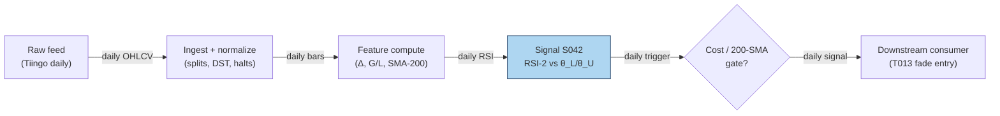

## Stage 42/200 — S042: RSI / RSI-2 mean reversion (Connors-style)

*Batch SB2 · Signal 42/100 · Provenance [D/SR] · Family C — Mean reversion & reversal*

### S1. One-line verdict

| | |
|---|---|
| **What it is** | A 2-period RSI (Relative Strength Index) oscillator that flags violent 2-day washouts (RSI-2 ≈ 0) as short-horizon mean-reversion longs, gated by a long-term trend filter. |
| **When it works** | Broad index/large-cap ETFs in intact uptrends, where 2-day panics are capitulation rather than information; holds of hours to 2–3 days. |
| **When it dies** | Waterfall declines (RSI-2 pins at 0 while price keeps falling), gap-driven single names, bear regimes below the 200-day SMA (simple moving average), wide-spread small caps. |
| **Build-or-buy in one line** | Build: 30 lines of bar math on data you already own; precomputed vendor variants differ in RSI definition — poor value. |

Provenance **[D/SR]**: Wilder's RSI formula is documented (Wilder 1978); the Connors 2-period rule (practitioner author of short-term mean-reversion systems) and its intraday adaptations are practitioner-documented reconstructions.

### S2. How it works — plain human explanation

Picture 9:47 a.m., SPY bid 588.40 × 900 / ask 588.41 × 400. Yesterday's close was 594.20, the day before 596.05 — two red days of futures-led de-risking, no single-stock news. A 2-period RSI off these closes reads **0**: everything in the last two days was downside. In an intact uptrend, a two-day flush is usually *liquidation* — margin calls, stop runs, ETF redemptions — not fresh information about value. Liquidation is finite; it exhausts, and price snaps back.

Why should the snapback exist? Three overlapping stories. First, **liquidity provision**: dealers left long unwanted inventory mark prices back up to offload it. Second, **behavioral overreaction**: loss-averse selling overshoots fundamental news. Third, **ETF mechanics**: redemption/rebalancing flows push whole baskets together — flow, not information — and revert when the flow stops.

- **Mental model, in three bullets:**
  - RSI-2 is a *capitulation meter*: 0 means "all of the last two days was down", 100 means "all up". Extremes mark exhaustion, not direction.  - The signal is *conditional*, never standalone: it only fires longs when the slow trend (close above the 200-day SMA) says the washout is against an intact uptrend.
  - The edge lives in the *first 1–3 days* of the bounce and dies in downtrends — the regime filter is the strategy, not an accessory.

### S3. The math — exact formula

Wilder's canonical RSI with period *n* (Wilder 1978):

$$\Delta_t = C_t - C_{t-1}, \qquad G_t = \max(\Delta_t, 0), \qquad L_t = \max(-\Delta_t, 0)$$

$$RS_t = \frac{\mathrm{SMMA}_n(G_t)}{\mathrm{SMMA}_n(L_t)}, \qquad \mathrm{RSI}_{n,t} = 100 - \frac{100}{1 + RS_t}$$

where SMMA is Wilder's smoothed moving average ($\alpha = 1/n$, recursive). For the Connors 2-period form used here, the operator-verified working definition is the **simple 2-period mean** (not Wilder's recursive smoothing):

$$\mathrm{RSI}_{2,t} = 100 \cdot \frac{\bar{G}_2}{\bar{G}_2 + \bar{L}_2}, \qquad \bar{G}_2 = \frac{G_t + G_{t-1}}{2}, \;\; \bar{L}_2 = \frac{L_t + L_{t-1}}{2}$$

with the boundary conventions RSI-2 = 100 if $\bar{L}_2 = 0$, RSI-2 = 0 if $\bar{G}_2 = 0$. Prices in $; RSI-2 is dimensionless on [0, 100].

Connors canonical rule (documented practitioner form): **long** when $C_t > \mathrm{SMA}_{200}(C_t)$ **and** RSI-2 < 10; **exit** when $C_t > \mathrm{SMA}_5(C_t)$; stop ≈ 5% adverse (*example — not an institutional standard*).

| Parameter | Symbol | Typical range | Too small / too large | Default (example) |
|---|---|---|---|---|
| RSI period | n | 2–5 | 1: fires on every down bar; >5: lags the 2-day event | 2 |
| Oversold trigger | θ_L | 5–20 | 5: rarer, sharper washouts; 20: frequent, weaker reversion per trade | 10 |
| Overbought trigger | θ_U | 80–95 | mirrors θ_L for shorts | 90 |
| Trend filter | N_slow | 150–250 days | shorter whipsaws the regime gate; longer rarely binds | 200 |
| Exit SMA | N_fast | 3–10 days | 1 exits on noise; 20+ holds into the next drawdown (peak-to-trough decline) | 5 |

*Every default is example — not an institutional standard.* Normalization: RSI-2 is self-normalized to [0, 100], so no z-score is needed; some desks rank RSI-2 cross-sectionally instead of using absolute thresholds. Causal timing: RSI-2 at bar *t* uses only closes ≤ *t*; the earliest tradable fill is bar *t+1*'s open (the worked example uses next-open fills). Variants: (1) **Connors daily** — above, with the 200-day SMA gate; (2) **intraday 5-min RSI** — same construction on 5-min bars with a 50-period intraday MA trend filter [SR]; (3) **CRSI composite** — Connors' 3-component variant (RSI-3 of price, RSI-2 of streak length, 100-day PercentRank of 1-day ROC), a different signal family, mentioned only to avoid confusion.

### S4. Worked example — step-by-step numbers (SYNTHETIC)

All data below is **synthetic**, hand-specified to reproduce the operator-verified Duck.ai tape (script seed 42; the tape itself is fixed, not drawn). The chart `images/S042_example.png` plots exactly these numbers.

10-day synthetic tape, closes in $:

| Day | Close | Δ_t | Ḡ(2) | L̄(2) | RSI-2 |
|-----|-------|------|------|------|-------|
| D1 | 100.00 | — | — | — | — |
| D2 | 99.00 | −1.00 | — | — | — |
| D3 | 98.00 | −1.00 | 0.00 | 1.00 | 0.0 |
| D4 | 99.00 | +1.00 | 0.50 | 0.50 | 50.0 |
| D5 | 100.00 | +1.00 | 1.00 | 0.00 | 100.0 |
| D6 | 101.00 | +1.00 | 1.00 | 0.00 | 100.0 |
| D7 | 100.00 | −1.00 | 0.50 | 0.50 | 50.0 |
| D8 | 99.00 | −1.00 | 0.00 | 1.00 | 0.0 |
| D9 | 98.00 | −1.00 | 0.00 | 1.00 | 0.0 |
| D10 | 97.00 | −1.00 | 0.00 | 1.00 | 0.0 |

Step-by-step for D4: Δ_4 = 99.00 − 98.00 = +1.00 → G_4 = 1.00, L_4 = 0; Δ_3 = −1.00 → G_3 = 0, L_3 = 1.00. Ḡ = (1.00+0)/2 = 0.50, L̄ = (0+1.00)/2 = 0.50, RSI-2 = 100·0.50/1.00 = **50.0**. D5: Δ_5 = +1.00, Δ_4 = +1.00 → Ḡ = 1.00, L̄ = 0 → **100.0** (boundary rule). D10: two straight −1.00 days → Ḡ = 0 → **0.0**.

Example trade (rule: buy when RSI-2 < 10, exit when RSI-2 ≥ 50 — *example thresholds*, causal t→t+1): D3 closes at 98.00 with RSI-2 = 0 → signal known at the close; **buy 1,000 shares at the D4 open, $98.20** (synthetic open). D4 closes at 99.00 with RSI-2 = 50 → exit signal known at the close; **sell at the D5 open, $99.30**. Gross P&L (profit and loss): (99.30 − 98.20) × 1,000 = +$1,100 (+1.12%). Costs (SPY-class ETF, example: half-spread — half the bid–ask spread, the cost of crossing to take liquidity — ~0.5 bp/leg, where 1 bp (basis point) = 0.01%, + $0.001/share fees + 2 bp slippage — extra cost when your own order pushes the price against you): ≈ $32 round-trip → net ≈ **+$1,068 (+1.09%)**. A second trigger fires at the D8 close (RSI-2 = 0); entry would be the D9 open and the tape ends at D10 with that position open — a Connors practitioner would consult the 200-day SMA gate, omitted from this toy tape, before taking it.

**What to notice:** the indicator is brutally simple and the arithmetic is checkable by hand; the entire "edge" here is one bounce, and D8–D10 show the failure shape (RSI-2 = 0 while price keeps falling) inside the same tape. This is a toy: sketch-level costs, next-open fills, no trend gate, no gap risk. Nothing here is a backtest.

### S5. Strategies that use this signal

- **T013 — RSI-2 / IBS Extreme Fade** — primary entry trigger (direction): the Connors-style oversold/overbought fade combines this signal with S043.
- **T071 — News-Novelty Reversal** — regime qualifier: fades stale-news overreaction where an extreme RSI-2 read confirms exhaustion rather than novel-information drift.

### S6. Data required — exact spec

| Field | Type | Granularity | Source tier | Notes |
|---|---|---|---|---|
| Open/High/Low/Close | float ($) | daily or 1–15 min | Tier 0–1 | Adjusted for splits/dividends; closes must be point-in-time |
| 200-day SMA input | derived | daily | Tier 0 | ~1 year of history per symbol before first signal |
| Session calendar | date/bool | daily | Tier 0–1 | Half-days, holidays, halts must not corrupt the 2-period window |
| Corporate actions | events | daily | Tier 0–1 | Split-adjustment errors inject false Δ_t spikes |

Ingest sketch (Python/polars, ≤20 lines):

```python
import polars as pl
bars = pl.scan_parquet("silver/daily_adjusted/*.parquet")      # split-adjusted OHLCV (open/high/low/close/volume)
sig = (bars
    .with_columns(delta=pl.col("close").diff().over("symbol"))
    .with_columns(g=pl.when(pl.col("delta")>0).then(pl.col("delta")).otherwise(0.0),
                  l=pl.when(pl.col("delta")<0).then(-pl.col("delta")).otherwise(0.0))
    .with_columns(g2=(pl.col("g")+pl.col("g").shift(1)).over("symbol")/2,
                  l2=(pl.col("l")+pl.col("l").shift(1)).over("symbol")/2)
    .with_columns(rsi2=100*pl.col("g2")/(pl.col("g2")+pl.col("l2")))
    .with_columns(sma200=pl.col("close").rolling_mean(200).over("symbol"))
    .filter(pl.col("close")>pl.col("sma200"), pl.col("rsi2")<10)  # example thresholds
    .collect())
```

Storage per symbol-day: daily bars are bytes — trivial (per cost-model §4, 3,000 stocks × daily ≈ 5 MB total). 1-min bars for a 500-symbol intraday variant: ~50 MB/day total (cost-model §4).

Data-quality checklist: timestamp normalization (exchange-local → UTC); corporate-action adjustment (a 2:1 split reads as Δ_t = −50% — a false RSI-2 = 0); halt/half-day bars; DST transitions; stale closes on thinly traded names; survivorship (ETF-only studies exclude delisted products).

### S7. Local build on M5 Max / 128GB

**Feasibility: trivial.** A daily RSI-2 screen over 500 symbols × 10 years ≈ 1.25M rows recomputes in well under a second in polars (cost-model §2: 10–50M rows/sec for simple column ops); a 5-min variant on 500 symbols generates only ~39k bars/day. The bottleneck is data hygiene, not compute. RAM: the full 10-year daily panel is a few MB against the 77GB working budget (cost-model §3). Stack: **Python+polars** (vectorizable, one screen); Rust unjustified; DuckDB only for large alt-data joins. Engineering: **Tier L, 4–12 h ≈ $600–1,800 at $150/hr loaded** (cost-model §5). What breaks first at 500 symbols: nothing on compute; only tick-accurate fill modeling would push this to Tier M+.

### S8. Buy vs build

| Option | What you get | Price | Gains | Loses |
|---|---|---|---|---|
| Tier 0: Stooq / Alpaca IEX daily | Daily OHLCV, long history | ~$0 (indicative — verify before budgeting) | Zero cost; fine for the canonical daily rule | IEX-only intraday; no minute bars for the 5-min variant |
| Tier 1: Polygon Stocks Developer | Minute aggs, trades, 10y history | ~$30–200/mo (indicative — verify before budgeting) | One feed for daily + intraday RSI-2 and the full SB2 signal set | Delayed tier is cheaper but useless for live |
| Tier 2: Databento Standard | SIP-grade (consolidated exchange feed) 1-min bars, corporate actions | ~$200/mo + usage (indicative — verify before budgeting) | Honest timestamps, halts, auction prints | Overkill for a daily oscillator |
| Precomputed analytics vendors | RSI-2 columns on a screener | ~$30–200/mo (indicative — verify before budgeting) | No code | Vendor RSI definitions vary (Wilder vs simple mean) — unverifiable |

**Verdict: build.** Buy the raw bars (Tier 0 daily, Tier 1 intraday), build the 30-line indicator — thresholds and fill assumptions are where the (thin) edge lives or dies.

### S9. Success ratio / efficacy — documented evidence

| Study / source | Market & period | Metric | Before/after cost | Caveat |
|---|---|---|---|---|
| QuantifiedStrategies practitioner backtests (daily SPY) | SPY, multi-year | CRSI(2) buy <15 / sell >85: profit factor ≈ 2.08 over 288 trades | **Before cost** | Practitioner, not peer-reviewed; CRSI ≠ plain RSI-2 |
| Duck.ai bank Q-SB2-3 expectancy lead | — | 75% win / +0.25% avg win / −1.2% avg loss → **−0.1125%/trade** (arithmetic verified) | Before cost | Labeled chatbot lead; illustrates that high win rate ≠ positive expectancy |
| Herberger, Horn & Oehler (2020), *Financial Markets and Portfolio Management* | German blue chips, 5-min bars | Intraday reversal returns statistically significant but **too small to be economically significant** | **After cost** (retail) | Peer-reviewed; reversal family, not RSI-2 specifically |
| Alvarez Esteban (2026, UTU thesis) | US equities 2011–2024, daily | Overnight→intraday reversal gross alpha significant; **net alpha clearly negative** after spreads + commissions | **After cost** | The canonical after-cost collapse of naive fades |
| Desk synthesis (mendozaliner, practitioner) | SPY-class, various | Connors claims ~65–75% win; Price Action Lab (2018) finds the edge indistinguishable from data-mining; decay post-2013 | Mixed (before & after across sources) | Selection-bias warning |

Regimes where it fails: persistent bear trends, volatility cascades (second and third legs arrive after the bounce), gap-driven single names, crowded mean-reversion books. The S&P-class edge weakened after ~2013.

**Honest bottom line:** naive RSI-2 fades are a **negligible-to-negative after-cost edge** standalone; as a conditioned entry (liquid ETF + trend gate + cost-aware sizing), practitioner evidence supports a small, decaying edge. Better as *filter/context* than primary trigger.

### S10. Failure modes & pitfalls

1. **Lookahead leakage** — entering at the trigger bar's close when the signal needs the close; mitigation: next-open fills always.
2. **Trend-regime failure** — RSI-2 = 0 in waterfall declines; mitigation: the 200-day SMA gate is mandatory.
3. **Definition drift** — Wilder SMMA vs simple 2-period mean vs vendor black boxes differ; mitigation: pin one definition in code.
4. **Cost blowup** — 1–3 day holds with 1–2% gross moves are spread-sensitive outside SPY-class names; mitigation: model half-spread + fees per leg, penny-spread ETFs only.
5. **Gap slippage** — overnight gaps move the fill far from the signal close; mitigation: next-open execution, skip gap days.
6. **Survivorship bias** — ETF studies use today's liquid survivors; mitigation: point-in-time universe with delisted products.
7. **Crowding** — the rule is 20 years old and commoditized; mitigation: a feature in a larger book (T013/T071), never standalone.

### S11. Visuals




### S12. Sources

- Wilder, J. Welles (1978). *New Concepts in Technical Trading Systems*. Trend Research. (RSI formula; book.)
- QuantifiedStrategies.com. "Connors RSI Trading Strategy: Statistics, Facts, Backtests (75% Win Rate)". https://www.quantifiedstrategies.com/connors-rsi/ — practitioner CRSI(2)/RSI backtests on daily SPY.
- Herberger, T. A., Horn, M., & Oehler, A. (2020). "Are intraday reversal and momentum trading strategies feasible? An analysis for German blue chip stocks." *Financial Markets and Portfolio Management*, 34(2), 179–197. https://ideas.repec.Org/a/kap/fmktpm/v34y2020i2d10.1007_s11408-020-00356-2.html
- Alvarez Esteban, L. (2026). "Overnight Returns and Intraday Reversals." UTU thesis, US equities 2011–2024. https://www.utupub.fi/server/api/core/bitstreams/88057d2a-1ee8-4c05-9592-c535a21b502c/content
- MQL5 (2025). "Day Trading Larry Connors RSI2 Mean-Reversion Strategies." https://www.MQL5.com/en/articles/17636 — Connors RSI2 rule documentation (entry/exit/stop conventions).

**Unverified leads** (chatbot-provided, no checkable source — do not treat as evidence):
- Duck.ai answered Q-SB2-1–Q-SB2-3 (2026-09-10); Grok/Cursor answers pending (checked 2026-09-10).
- Expectancy lead: 75% win / +0.25% avg win / −1.2% avg loss → −0.1125%/trade before costs (arithmetic verified; inputs are unverified practitioner claims).
- "70–90% win" RSI-2/IBS claims are practitioner/vendor, not peer-reviewed (per Q-SB2-3).
