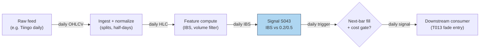

## Stage 43/200 — S043: Internal Bar Strength (IBS) mean reversion

*Batch SB2 · Signal 43/100 · Provenance [SR] · Family C — Mean reversion & reversal*

### S1. One-line verdict

| | |
|---|---|
| **What it is** | The position of a bar's close inside its own high–low range, IBS = (C−L)/(H−L); extremes (≈0 or ≈1) mark exhausted closes that revert the next bar. |
| **When it works** | Daily bars of broad index ETFs, where end-of-day flow (market-on-close (MOC) imbalances, retail panic, rebalancing) pushes the close to a range extreme disconnected from fundamentals. |
| **When it dies** | Single names with real news in the bar, trending regimes where strong closes persist, low-volume days (the effect vanishes), and anything with a wide spread. |
| **Build-or-buy in one line** | Build: three columns of arithmetic on bars you already store; nothing to buy except the bars. |

Provenance **[SR]**: the construction and practitioner rule are documented in practitioner literature (Pagonidis 2014; Kakushadze & Serur 2018 §4.4); the mean-reversion *effect* is the reconstructed standard interpretation, not a peer-reviewed causal claim.

### S2. How it works — plain human explanation

It is 3:58 p.m. QQQ has traded between 481.10 and 484.30 all session, and it is printing 481.35 — nearly the low of the day — because a wave of market-on-close sell programs and retail stop-outs hit in the last hour. Nothing about the Nasdaq's fundamentals changed since lunch; the close is weak because *flow* was weak. IBS turns that observation into one number: (481.35 − 481.10)/(484.30 − 481.10) ≈ 0.08. A close pinned to the low of the range reads as oversold; a close pinned to the high (≈0.95+) reads as overbought. The bet is that tomorrow, absent new information, the flow-driven extreme partially reverses.

Economically, three forces compress into the close. First, **MOC and rebalancing flow**: index funds, pension rebalances, and ETF creation/redemption print mechanically into the close, indifferent to price — a transient supply/demand shock. Second, **retail panic and profit-taking**: the last hour concentrates discretionary selling after red days and profit-taking after green days, both flow rather than information. Third, **closing-auction mechanics**: the auction clears imbalances at a single price that can sit at a range extreme without representing continuous-session consensus. All three are *temporary pressure*; when pressure is temporary, the next session's open/close drifts back.

- **Mental model, in three bullets:**
  - IBS asks one question: "did the bar close exhausted (near the low) or euphoric (near the high)?" — 0 = exhausted, 1 = euphoric, 0.5 = balanced.
  - It works best where idiosyncratic news is absent (broad ETFs), so the extreme can be attributed to flow.
  - The signal *requires the close*: the entry bar is complete, so execution is always on the **next** bar — this is a feature for honesty, not a bug.

### S3. The math — exact formula

$$\mathrm{IBS}_t = \frac{C_t - L_t}{H_t - L_t} \in [0, 1]$$

$C_t, L_t, H_t$ are the bar's close, low, high in $ (or any price unit). Edge cases: if $H_t = L_t$ (zero-range bar), define IBS = 0.5 (balanced) by convention — *example convention, not an institutional standard*. IBS is already normalized to [0, 1]; no further scaling needed.

Example rule (*example — not an institutional standard*): **long** when IBS_t < 0.2, executed at bar *t+1*'s open; **exit** when IBS ≥ 0.5; the short side mirrors at IBS > 0.8. Pagonidis (2014) instead sorts instruments into IBS buckets and documents threshold behavior near ≈0.4 and ≈0.9 rather than a single hard line.

| Parameter | Symbol | Typical range | Too small / too large | Default (example) |
|---|---|---|---|---|
| Long trigger | θ_long | 0.1–0.3 | 0.1: rare, sharper; 0.3: frequent, diluted edge | 0.2 |
| Short trigger | θ_short | 0.7–0.9 | mirrors θ_long | 0.8 |
| Exit level | θ_exit | 0.4–0.6 | 0.4: exits too fast to capture the bounce; 0.6+: holds through reversal of the reversal | 0.5 |
| Zero-range rule | — | — | must be defined or a flat bar divides by zero | 0.5 |

Causal timing: IBS_t is computable only after bar *t* closes; the earliest tradable fill is bar *t+1*'s open. Named variants: (1) **daily ETF fade** — long IBS < 0.2, exit IBS > 0.5 (Pagonidis form); (2) **cross-sectional rank** — rank a basket of ETFs by IBS each day, long the bottom decile / short the top decile (Kakushadze & Serur §4.4 form); (3) **intraday minute-bar IBS** — documented by practitioners, not established statistically [SR].

### S4. Worked example — step-by-step numbers (SYNTHETIC)

All data is **synthetic**, drawn with `rng = np.random.default_rng(49)` (stated for reproducibility); the chart `images/S043_example.png` plots exactly these numbers.

10-day synthetic tape, prices in $:

| Day | Open | High | Low | Close | IBS |
|-----|-------|-------|-------|-------|-------|
| D1 | 100.00 | 102.21 | 98.60 | 100.51 | 0.529 |
| D2 | 100.51 | 102.28 | 98.81 | 99.50 | 0.199 |
| D3 | 99.50 | 100.29 | 98.50 | 99.30 | 0.447 |
| D4 | 99.30 | 100.32 | 96.22 | 97.51 | 0.315 |
| D5 | 97.51 | 100.22 | 95.46 | 99.32 | 0.811 |
| D6 | 99.32 | 101.00 | 98.55 | 99.49 | 0.384 |
| D7 | 99.49 | 100.45 | 97.28 | 99.13 | 0.584 |
| D8 | 99.13 | 100.84 | 98.37 | 99.24 | 0.352 |
| D9 | 99.24 | 101.84 | 97.13 | 100.78 | 0.775 |
| D10 | 100.78 | 102.97 | 99.71 | 101.25 | 0.472 |

Check D2 by hand: (99.50 − 98.81)/(102.28 − 98.81) = 0.69/3.47 = **0.199** < 0.2 → long signal. D5: (99.32 − 95.46)/(100.22 − 95.46) = 3.86/4.76 = **0.811** ≥ 0.5 → exit signal.

Example trade (rule: buy the open after IBS < 0.2, sell the open after the first bar with IBS ≥ 0.5 — *example*, causal t→t+1): D2 signals; **buy at D3 open, 99.50**; D5's IBS = 0.811 triggers the exit; **sell at D6 open, 99.32**. Gross return: (99.32 − 99.50)/99.50 = **−0.18%** on 1,000 shares (−$180). Costs (ETF: half-spread ~0.5 bp + fees ≈ 2 bp/leg, example): ≈ 4 bp round-trip ≈ $40 → net ≈ **−$220 (−0.22%)**.

**What to notice:** the single worked trade *loses*. That is deliberate and important: IBS is a statistical edge over hundreds of signals (Pagonidis documents +0.35% average next-day return when IBS < 0.2 across equity ETFs, before costs), not a promise on any one tape. The example also shows the asymmetry the literature documents — the D9 exit signal (0.775) fires on a +1.6% up day, the kind of "euphoric close" the short side fades. Toy limits: no real fills, no borrow on the short side, no volume filter (Pagonidis finds the effect disappears on low-volume US ETF days).

### S5. Strategies that use this signal

- **T013 — RSI-2 / IBS Extreme Fade** — primary entry trigger (direction): the Connors-style fade combines S043 with S042 and S045. (RSI-2: 2-day Relative Strength Index, a 0–100 momentum oscillator — see S042.)
- **T100 — Grand Ensemble** — diluted ensemble consumer: S043 is one of ~100 features in the capstone blend; its individual weight is negligible and the fit is thin — cited for completeness, not as a genuine two-signal composition.

### S6. Data required — exact spec

| Field | Type | Granularity | Source tier | Notes |
|---|---|---|---|---|
| High / Low / Close | float ($) | daily (or minute) | Tier 0–1 | Split-adjusted; unadjusted bars inject false range extremes |
| Volume | int (shares) | daily | Tier 0–1 | Volume filter: effect documented to vanish on low-volume days |
| Session calendar | date/bool | daily | Tier 0 | Half-days produce compressed ranges — handle or exclude |

Ingest sketch (Python/polars, ≤20 lines):

```python
import polars as pl
bars = pl.scan_parquet("silver/daily_adjusted/*.parquet")
sig = (bars
    .with_columns(ibs=(pl.col("close")-pl.col("low")) /
                        (pl.col("high")-pl.col("low")).clip_min(1e-9))
    .with_columns(ibs=pl.when(pl.col("high")==pl.col("low")).then(0.5)
                        .otherwise(pl.col("ibs")))
    .with_columns(vol_z=pl.col("volume")/pl.col("volume").rolling_median(20).over("symbol"))
    .filter(pl.col("ibs")<0.2, pl.col("vol_z")>0.8)   # example thresholds
    .select("symbol","date","close","ibs")
    .collect())  # execute at next bar's open — never at the signal bar's close
```

Storage: daily bars are bytes per symbol-day (cost-model §4: 3,000 stocks × daily ≈ 5 MB total). Data-quality checklist: split/dividend adjustment (a split changes H−L scale); zero-range bars (define the 0.5 convention); half-days and early closes; stale prints on illiquid ETFs; volume convention (single-counted vs double-counted).

### S7. Local build on M5 Max / 128GB

**Feasibility: trivial.** IBS is three-column arithmetic: a 500-symbol × 10-year daily screen is ~1.25M rows, a sub-second polars scan (cost-model §2: 10–50M rows/sec simple ops). No real-time loop is needed — the signal updates once per bar close. RAM footprint is megabytes against the 77GB working budget (cost-model §3). **Python+polars** is the obvious pick; Rust buys nothing; DuckDB only if the IBS rank needs to join a large cross-sectional panel. Engineering: **Tier L, 4–12 h ≈ $600–1,800 loaded** (cost-model §5) — nearly all of it is the volume filter, the next-bar execution accounting, and universe hygiene. What breaks first at 500 symbols: nothing computationally; the research breaks first on *data* — unadjusted corporate actions and survivorship-biased ETF universes (universes that drop delisted products, flattering backtests).

### S8. Buy vs build

| Option | What you get | Price | Gains | Loses |
|---|---|---|---|---|
| Tier 0: Stooq / exchange delayed | Daily OHLCV (open/high/low/close/volume) | ~$0 (indicative — verify before budgeting) | Enough for the canonical daily rule | Weak corporate-action metadata |
| Tier 1: Polygon Stocks Developer / Tiingo | Daily + minute bars, splits | ~$30–200/mo (indicative — verify before budgeting) | Clean adjustments; volume field for the low-volume filter | — |
| Tier 2: Databento | SIP-grade (consolidated exchange feed) daily/minute | ~$200/mo + usage (indicative — verify before budgeting) | Point-in-time correctness | Overkill for (C−L)/(H−L) |
| Academic: Pagonidis (2014) paper | Documented thresholds + bucket results | ~$0 (indicative — verify before budgeting) | The closest thing to a specification | Practitioner venue (NAAIM), not peer-reviewed |

**Verdict: build.** The indicator is trivial; the value is in the execution accounting (next-bar fills, volume filter, borrow on the short side). Buy Tier 1 bars if you want minute-bar variants; otherwise Tier 0 suffices.

### S9. Success ratio / efficacy — documented evidence

| Study / source | Market & period | Metric | Before/after cost | Caveat |
|---|---|---|---|---|
| Pagonidis (2014), "The IBS Effect: Mean Reversion in Equity ETFs" (NAAIM) | Equity ETFs, inception–2013 | Avg next-day return **+0.35%** when IBS < 0.2; **−0.13%** when IBS > 0.8; ~30% p.a. alpha for the simple strategy | **Before cost** | Practitioner paper, not peer-reviewed; ETF universe |
| Pandey & Joshi (2023), arXiv | Country ETFs, 10 years | IBS-based mean-reversion "useful for predicting short-term price movements" in their basket | Before cost (implied) | Student report; qualitative headline |
| Desk/practitioner synthesis (finterm notes on Kakushadze & Serur 2018 §4.4) | Broad/country ETFs since 1990s | Rank-by-IBS reversal "documented to work consistently"; strongest with trend filter, high-volume days, Monday→Tuesday window | Before cost | Practitioner summary of a practitioner book |
| Duck.ai Q-SB2-3 (labeled lead) | — | "70–90% win" claims are practitioner/vendor, **not peer-reviewed**; Connors Research presents IBS as concept with no published hit-rate benchmark | n/a | Chatbot lead, qualitative |

Regimes where it fails: single-name news days (the extreme is information, not flow), persistent trends (strong closes keep working), low-volume days (effect disappears for US equity ETFs per Pagonidis), bear-market long side (short side relatively stronger in bears). The IBS effect is also documented as stronger on high-range, high-volatility days and on Mondays ("Turnaround Tuesday").

**Honest bottom line:** as a standalone trigger this is a **small, conditional, before-cost edge** concentrated in liquid ETFs — and the naive daily fade inherits the S040-style caveat: after spreads, fees, and next-open slippage (extra cost when your order pushes the open price against you) on the short side, published-looking returns compress hard. As a filter (rank ETFs by IBS to time entries from other signals), it is better evidenced and cheaper to be wrong about.

### S10. Failure modes & pitfalls

1. **Same-bar execution (lookahead)** — IBS needs the close; trading "at the close" of the signal bar is impossible without MOC access modeled honestly; mitigation: next-bar-open fills, or explicit MOC impact modeling.
2. **News-driven extremes** — a close at the low on genuine bad news is information, not exhaustion; mitigation: skip earnings/event days, or require the ETF (diversified) rather than the single name.
3. **Short-side costs** — borrow fees and next-open slippage on gap days; mitigation: long-only variant, or model borrow explicitly.
4. **Low-volume fade** — the documented effect vanishes on quiet days; mitigation: the volume filter (e.g. volume > 0.8× 20-day median, example).
5. **Zero-range / half-day bars** — division by zero or compressed ranges; mitigation: the 0.5 convention + session-calendar exclusions.
6. **Overfit thresholds** — 0.2/0.5/0.8 mined on the same ETFs; mitigation: fix thresholds a priori, test on post-2013 data the original paper never saw.
7. **Crowding/decay** — the rule is public since 2013–2014; mitigation: expect decay, use as a feature (T013/T100) rather than a book.

### S11. Visuals




### S12. Sources

- Pagonidis, A. S. (2014). "The IBS Effect: Mean Reversion in Equity ETFs." NAAIM Wagner Award paper. https://www.naaim.org/wp-content/uploads/2014/04/00V_Alexander_Pagonidis_The-IBS-Effect-Mean-Reversion-in-Equity-ETFs-1.pdf
- Pandey, A. & Joshi, K. (2023). "Using Internal Bar Strength as a Key Indicator for Trading Country ETFs." arXiv. http://export.arxiv.org/pdf/2306.12434
- Kakushadze, Z. & Serur, J. A. (2018). *151 Trading Strategies*. Palgrave Macmillan. (§4.4: IBS cross-sectional construction; book.)
- Practitioner synthesis: "ETF Mean Reversion (Internal Bar Strength)" notes. https://github.com/yumima/finterm/blob/HEAD/fincept-qt/resources/knowledge/quant-strategies/etf-mean-reversion-ibs.md — documents the rank-by-IBS strategy and the economic (end-of-day flow) rationale.

**Unverified leads** (chatbot-provided, no checkable source — do not treat as evidence):
- Duck.ai answered Q-SB2-1–Q-SB2-3 (2026-09-10); Grok/Cursor answers pending (checked 2026-09-10).
- "70–90% win" IBS claims are practitioner/vendor, not peer-reviewed; Connors Research presents IBS as concept with no published hit-rate benchmark (per Q-SB2-3).
- Expectancy arithmetic lead (75% win / +0.25% avg win / −1.2% avg loss → −0.1125%/trade before costs): math verified, inputs unverified.
