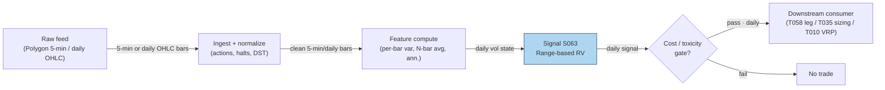

## Stage 63/200 — S063: Range-based realized-volatility estimators

*Batch SB2 · Signal 63/100 · Provenance [D] · Family E — Volatility & options-informed*

### S1. One-line verdict

| Row | Content |
|---|---|
| **What it is** | Volatility estimated from each bar's high-low (and open/close) instead of close-to-close returns — 5–8× more efficient per observation. |
| **When it works** | Vol-targeted sizing, dispersion legs, VRP measurement — anywhere a fast, honest read of recent realized vol beats noisy close-to-close. |
| **When it dies** | Overnight gaps (Parkinson), trending drift (Garman–Klass), tick-bound prices (a tick = the minimum price increment), jump days; raw 5-min bars without deseasonalizing. |
| **Build-or-buy in one line** | Build — closed-form on OHLC bars; buy history, never the estimator. |

Provenance **[D]** (documented: Parkinson 1980; Garman & Klass 1980; Rogers & Satchell 1991; Yang & Zhang 2000). Family **E — Volatility & options-informed**. Worked example is synthetic and watermarked (seed 63).

### S2. How it works — plain human explanation

**Vignette.** Tuesday, MSFT. It opens at $512.40, swings $508.10–$517.30 all session, and closes at $512.55 — up three hundredths of a percent. A close-to-close volatility estimate says "nothing happened." A range-based estimator looks at the $9.20 high-low range and says "that was a 1.8% day." The range distills the whole intraday path; close-to-close discards everything between the two prints.

**Why it works statistically.** Under (approximately) Brownian motion (a random walk with normally distributed steps — the standard price model), the high-low range carries far more information about a bar's variance than the open-to-close move — a day that wanders but closes flat has near-zero squared return yet a large range. The classic result: Parkinson ≈ **5× as efficient** as close-to-close (same accuracy from ~80% less data); Garman–Klass reaches **7–8×**. The four estimators trade off which biases they remove:
- **Parkinson** — high/low only; simplest; assumes no drift (no persistent directional trend) and no overnight gap.
- **Garman–Klass** — adds open/close; most efficient under zero drift.
- **Rogers–Satchell** — drift-robust combination; handles trending bars.
- **Yang–Zhang** — blends overnight, open-close, and Rogers–Satchell; drift-independent *and* gap-robust; the minimum-error choice on full OHLC.

Alizadeh, Brandt & Diebold (2002): range-based proxies are approximately Gaussian (bell-curve / normally distributed) and **robust to microstructure noise** — bid-ask bounce (trades alternating between bid and ask prints) inflates the observed range by only about the average spread.

**Mental model (3 bullets):**
- Range estimators are *volatility microscopes*: same bars, 5–8× more information per observation than close-to-close.
- They are **state, not signal** — they measure the weather (how big moves are), they don't predict its direction.
- Pick the estimator by your bias budget: Parkinson for clean intraday bars, Rogers–Satchell when bars trend, Yang–Zhang when overnight gaps matter.

### S3. The math — exact formula

Per-bar variance estimates (log prices; $O, H, L, C$ in $). Average over a window of $N$ bars, then annualize:

$$\hat\sigma^2_{\text{Park}} = \frac{\left[\ln(H/L)\right]^2}{4\ln 2}$$

$$\hat\sigma^2_{\text{GK}} = \tfrac{1}{2}\left[\ln(H/L)\right]^2 - (2\ln 2 - 1)\left[\ln(C/O)\right]^2$$

$$\hat\sigma^2_{\text{RS}} = \ln(H/C)\,\ln(H/O) + \ln(L/C)\,\ln(L/O)$$

$$\hat\sigma^2_{\text{YZ}} = \sigma^2_o + k\,\sigma^2_c + (1-k)\,\sigma^2_{\text{RS}}, \qquad
k = \frac{0.34}{1.34 + (N+1)/(N-1)}$$

where $\sigma^2_o$, $\sigma^2_c$, $\sigma^2_{\text{RS}}$ are overnight (close-to-open), open-to-close, and Rogers–Satchell variances, each averaged over $N$ bars. Annualized: $\hat\sigma_{\text{ann}} = \sqrt{\bar\sigma^2}\times\sqrt{\text{bars/year}}$ (252 daily; $252 \times 78$ for 5-min RTH (regular trading hours) bars).

**Causal timing.** Each bar's estimate uses only that bar's OHLC (complete at the bar close); the $N$-bar average completes at the close of bar $N$; tradable no earlier than bar $N+1$.

**Parameter table** (defaults are *example — not an institutional standard*):

| Parameter | Symbol | Typical range | Too small | Too large | Default example |
|---|---|---|---|---|---|
| Estimation window | *N* | 5–30 days (or 30–78 intraday bars) | noisy, jump-dominated | stale vol regime | 20 days |
| Annualization | bars/year | 252 (daily); 19,656 (5-min RTH) | wrong units | — | 252 for the daily example |
| YZ weight | *k* | 0.1–0.3 (falls with *N*) | over-weights open-close | over-weights overnight | 0.1327 at *N*=10 (see S4) |
| Estimator choice | — | Park / GK / RS / YZ | — | — | YZ for daily; Park/GK for clean intraday bars |

**Normalization.** Use levels for sizing (position ∝ target/σ̂), z-scores vs own history for vol-breakout regimes, or realized/implied ratios for VRP. Never annualize with the wrong bar count — the most common implementation bug.

**Named variants:**
1. **Parkinson (1980)** — high/low only; zero-drift, no-gap; the baseline.
2. **Garman–Klass (1980)** — OHLC; minimum-variance combination under zero drift; most efficient classical estimator.
3. **Rogers–Satchell (1991)** — OHLC; unbiased for arbitrary drift; slightly less efficient than GK at zero drift.
4. **Yang–Zhang (2000)** — overnight + open-close + RS blend; independent of drift and opening jumps; default for gappy daily bars.

### S4. Worked example — step-by-step numbers (SYNTHETIC)

**Synthetic 10-day tape** (`np.random.default_rng(63)`; exactly reproducible). Prices in $:

| Day | Open | High | Low | Close |
|---|---|---|---|---|
| D1 | 100.285 | 103.461 | 99.718 | 102.664 |
| D2 | 103.171 | 105.888 | 102.467 | 104.325 |
| D3 | 104.831 | 109.252 | 103.643 | 107.411 |
| D4 | 107.137 | 107.671 | 103.896 | 105.101 |
| D5 | 105.591 | 106.272 | 104.491 | 105.251 |
| D6 | 105.962 | 106.976 | 105.259 | 106.334 |
| D7 | 106.491 | 108.383 | 105.099 | 107.636 |
| D8 | 108.106 | 110.259 | 107.478 | 108.967 |
| D9 | 108.417 | 108.783 | 106.803 | 108.013 |
| D10 | 107.628 | 109.008 | 107.582 | 108.013 |

**Step-by-step (D1, Parkinson, fully shown):** $\ln(H/L) = \ln(103.461/99.718) = \ln(1.037531) = 0.036848$. Square: $0.00135777$. Divide by $4\ln 2 = 2.772589$: $\hat\sigma^2_{\text{Park},1} = 0.00048964$. The same arithmetic with the GK and RS formulas gives 0.00046635 and 0.00040594.

**Per-day variances (all 10 days):**

| Day | Parkinson | Garman–Klass | Rogers–Satchell |
|---|---|---|---|
| D1 | 0.00048964 | 0.00046635 | 0.00040594 |
| D2 | 0.00038891 | 0.00049132 | 0.00050950 |
| D3 | 0.00100177 | 0.00116030 | 0.00110870 |
| D4 | 0.00045944 | 0.00049471 | 0.00047429 |
| D5 | 0.00010307 | 0.00013888 | 0.00013803 |
| D6 | 0.00009448 | 0.00012623 | 0.00012504 |
| D7 | 0.00034161 | 0.00042938 | 0.00043586 |
| D8 | 0.00023524 | 0.00030181 | 0.00031244 |
| D9 | 0.00012159 | 0.00016319 | 0.00019279 |
| D10 | 0.00006259 | 0.00008185 | 0.00011864 |

**Window aggregation + Yang–Zhang:** 10-day mean variances — Parkinson 0.00032983, GK 0.00038540, RS 0.00038212. Overnight variance $\sigma^2_o = 0.00002008$; open-to-close variance $\sigma^2_c = 0.00018599$; $k = 0.34/(1.34 + 11/9) = 0.1327$; $\hat\sigma^2_{\text{YZ}} = 0.00002008 + 0.1327(0.00018599) + 0.8673(0.00038212) = \mathbf{0.00037618}$. Annualized ($\times\sqrt{252}$): **Parkinson 28.83%, Garman–Klass 31.16%, Rogers–Satchell 31.03%, Yang–Zhang 30.79%**.

**Chart** (same numbers — daily σ = √variance × 100; YZ is window-level, hence horizontal; see S11 for the figure).

**What to notice.** All four agree closely (28.8–31.2% annualized) — on clean synthetic data the bias corrections barely bite; estimator choice matters most on *real* data with gaps and drift. D3 (largest range day) dominates the window — one wild bar moves a 10-day average materially, which is why production windows run 20+ days. **Limits:** synthetic tape, no jumps, no tick discreteness, no fees — this validates the arithmetic and the code path, not any trading edge.

### S5. Strategies that use this signal

- **T058 — Dispersion Trader (primary leg input).** Long single-stock realized vol vs short index vol: S063 measures the *realized-vol leg* — entry/exit and hedge ratios from range-based RV, with S075/S069 context.
- **T035 — Futures Calendar-Spread Carry (sizing).** Harvests term-structure roll yield; S063-based vol forecasts scale size to keep carry positions inside the vol budget as realized vol expands.
- **T010 — Variance-Risk-Premium Harvester (regime/sizing).** Delta-hedged short-vol when implied variance is rich vs forecast: S063 is the "realized" side of the comparison, alongside HAR forecasts (S066) and VRP levels (S069).

### S6. Data required — exact spec

| Field | Type | Granularity | Source tier | Notes |
|---|---|---|---|---|
| Open / High / Low / Close | float $ | daily or 5-min bars | Tier 0–1 | the only inputs |
| Corporate actions | events | daily | Tier 1 | splits corrupt H/L ratios if unadjusted |
| (optional) implied vol | float | daily | Tier 1–2 | for the VRP comparison in T010, not for S063 itself |

**Collection.** Stooq (Tier 0, daily), Polygon stocks v3 (Tier 1, minute bars), Databento (Tier 2). Schema sketch: `symbol, ts, open, high, low, close`.

**Ingest sketch (Python/polars, ≤20 lines):**
```python
import polars as pl, numpy as np
bars = pl.scan_parquet("bars/min5_*.parquet").sort("symbol", "ts")
rv = (bars.with_columns(
        park=(pl.col("high")/pl.col("low")).log()**2 / (4*np.log(2)),
        gk=0.5*(pl.col("high")/pl.col("low")).log()**2
           - (2*np.log(2)-1)*(pl.col("close")/pl.col("open")).log()**2,
        rs=(pl.col("high")/pl.col("close")).log()*(pl.col("high")/pl.col("open")).log()
           + (pl.col("low")/pl.col("close")).log()*(pl.col("low")/pl.col("open")).log())
    .group_by("symbol")
    .agg(park_20d=pl.col("park").tail(20).mean(),   
         gk_20d=pl.col("gk").tail(20).mean(),
         rs_20d=pl.col("rs").tail(20).mean()))
rv.sink_parquet("features/range_rv.parquet")
```

**Storage.** Per `notes/cost-model.md §4`: 1-min bars for 500 symbols ≈ 50 MB/day (~3 GB per 60 days); daily OHLC ≈ 5 MB/day for 3,000 stocks. Derived RV panels are negligible.

**Data-quality checklist:** H/L integrity (H ≥ max(O,C), L ≤ min(O,C)); zero-range bars; corporate actions; DST/half-days (bar-count changes); intraday seasonality — deseasonalize (remove the time-of-day pattern in) 5-min estimates (S067).

### S7. Local build on M5 Max / 128GB

**Feasibility: feasible.** Compute is trivial; the pipeline around it is the work (Plan §6: Family E, 63–70, Tier M).

**Throughput** (per `notes/cost-model.md §2`): numpy ~50–200M elements/sec — four estimators over 500 symbols × 390 5-min bars × 60 days (11.7M rows) compute in ~1–5 s. Bottleneck: I/O and data QA.

**Stack options:**

| Stack | When to pick |
|---|---|
| Python + polars/numpy | Default; closed-form and vectorized |
| DuckDB | If RV must live inside SQL feature pipelines |
| Rust | Only inside a real-time risk loop recomputing vol per tick (rare) |

**RAM** (per cost-model §3): 500 symbols × 60 days of 5-min bars ≈ 3–8 GB eager — inside the 77 GB working budget; daily-bar panels are megabytes.

**Engineering time:** Tier **M**, 20–60 h → **$3,000–9,000** at $150/hr loaded-cost estimate (cost-model §5). The formulas are minutes; a production vol-state pipeline needs window selection, annualization conventions, estimator comparison across history, deseasonalization for intraday bars, and jump-day handling.

**What breaks first at 500 symbols / full OPRA:** 500 symbols are trivial. What breaks is *naive extension*: raw 5-min bars without deseasonalization, or OPRA (Options Price Reporting Authority)-scale options data (~1–2.5 GB/day per underlying, cost-model §3/§4) — a different project.

### S8. Buy vs build

| Option | What you get | Indicative price | What buying gains | What buying loses |
|---|---|---|---|---|
| Tier-0: Stooq daily OHLC | Free daily bars | ~$0 | zero cost | daily only; no adjustments |
| Tier-1: Polygon Stocks Advanced | SIP (consolidated tape) minute + daily bars, actions | ~$30–200/mo | consolidated tape for 5-min RV | none material |
| Tier-2: Databento Standard | Research bars, futures/options | ~$200/mo + usage | honest intraday; OPRA research | overkill for equity daily RV |
| Academic: OptionMetrics / WRDS TAQ | Publication-grade history | ~thousands/yr academic; institutional $$$$ | ground-truth vol benchmarks | cost; still wouldn't replace the estimator |

All prices `indicative — verify before budgeting`. **Verdict: build.** Every estimator here is closed-form on bars you already buy: buy the *bars* (Tier 1 minute bars for intraday RV), build the four estimators and window/annualization logic in days. Crossover: buy precomputed vol only for *implied* vol surfaces — realized vol from OHLC is never worth outsourcing.

### S9. Success ratio / efficacy — documented evidence

| Study / source | Market & period | Metric | Before/after cost | Caveat |
|---|---|---|---|---|
| Empirical volatility-estimator literature (surveyed in the NTHU working paper) | Multi-market simulations + empirical | Parkinson ≈ **5.2×** as efficient as close-to-close; Garman–Klass **7–8×** as efficient ("same accuracy with ~80% less data") | n/a — statistical efficiency | Idealized diffusion; discrete prices bias extremes downward (Beckers 1983) |
| Alizadeh, Brandt & Diebold (2002), *J. Finance* 57, 1047–1091 | FX (theoretical + numerical + empirical) | Range-based vol proxies **highly efficient, approximately Gaussian, robust to microstructure noise**; enable efficient quasi-maximum-likelihood estimation of stochastic-volatility models | n/a — estimation quality | Estimation quality, not a tradable edge; FX sample |
| Saichev & Lapinova (2012), arXiv:1202.4311 | Theoretical | Compares point/interval statistics of Parkinson, Garman–Klass, Rogers–Satchell and bridge estimators; confirms the efficiency ranking and drift-sensitivity trade-offs | n/a — statistical comparison | Real-data choice still depends on gaps/drift regime |

**Regimes where it fails.** Jump days (range explodes — use jump-robust variants, S064, tolerant of discontinuous price jumps); tick-discrete low-priced names; overnight-gap regimes for Parkinson/GK (use YZ); trending bars for GK (use RS); 5-min bars without deseasonalizing the U-shaped pattern.

**Honest bottom line:** as a standalone directional trigger this is a **non-signal by design** — it measures magnitude, not direction. As a **sizing and regime input** it is first-class infrastructure: every vol-targeted strategy, dispersion leg, and VRP comparison here leans on a number like this one. Its "edge" is defensive — right-sizing through vol regimes instead of being sized by them.

### S10. Failure modes & pitfalls

1. **Overnight-gap bias (Parkinson)** — gaps inflate H/L without intraday variance; mitigate: Yang–Zhang on daily bars.
2. **Drift bias (Garman–Klass)** — trending bars bias GK; mitigate: Rogers–Satchell when bars carry drift.
3. **Discrete-price downward bias** — non-continuous observation understates extremes (Beckers 1983); mitigate: treat estimates on tick-bound names as lower bounds.
4. **Jump contamination** — one jump day dominates short windows; mitigate: 20+-day windows or jump-robust alternatives (S064).
5. **Wrong annualization** — mixing daily and intraday bar counts; mitigate: annualize with the exact bar count of the estimation grid, unit-test it.
6. **Intraday seasonality** — raw 5-min RV has a U-shape across the session (RTH = regular trading hours); mitigate: deseasonalize (S067) first.
7. **H=L stale bars** — dead feeds print zero range; mitigate: validate H ≥ max(O,C), L ≤ min(O,C), flag zero-range streaks.
8. **Mistaking efficiency for alpha** — a 5× more efficient estimator still measures the past; mitigate: it sizes positions and sets expectations — it does not predict direction.

### S11. Visuals




### S12. Sources

1. Alizadeh, Sassan; Brandt, Michael W.; Diebold, Francis X. (2002). "Range-Based Estimation of Stochastic Volatility Models." *Journal of Finance* 57(3), 1047–1091. http://ideas.repec.org/a/bla/jfinan/v57y2002i3p1047-1091.html
2. Saichev, Alexander & Lapinova, Svetlana (2012). "Comparative statistics of Garman-Klass, Parkinson, Roger-Satchell and bridge estimators." arXiv:1202.4311. https://arxiv.org/pdf/1202.4311v1
3. MIT OpenCourseWare 18.642 (Fall 2024), Lecture 17.2 — cites Parkinson (1980), Garman & Klass (1980), Rogers & Satchell (1991), Yang & Zhang (2000) with journal refs. https://ocw.mit.edu/courses/18-642-topics-in-mathematics-with-applications-in-finance-fall-2024/mit18_642_f24_lec17_2.pdf
4. kuant docs, "realizedvol" — practitioner reference for all four estimators incl. efficiency notes (GK ~7.4× vs close-to-close). https://github.com/scramblehub/kuant/blob/HEAD/docs/kernels/stats/realizedvol.md
5. Duck.ai (bot: GPT-5.6 "Luna", anonymous), Q-SB2-1–Q-SB2-2 (2026-09-10). **Labeled chatbot source**: Parkinson/GK/RS formulas hand-verified; Q-SB2-2 leads inform S7/S8; cost-model takes precedence.

**Unverified leads:**
- Efficiency figures "5.2× / 8.4×" from the NTHU empirical-volatility-estimators working paper (search snippet; not fully re-verified — stated as the 7–8× range corroborated by kuant docs). http://mx.nthu.edu.tw/~jtyang/Teaching/Risk_management/Papers/Quant_Methods/Empirical%20Evidence%20on%20Volatility%20Estimators.pdf

**Source log:** Duck.ai answered Q-SB2-1–Q-SB2-3 (2026-09-10); Grok/Cursor answers pending (checked 2026-09-10).

---
