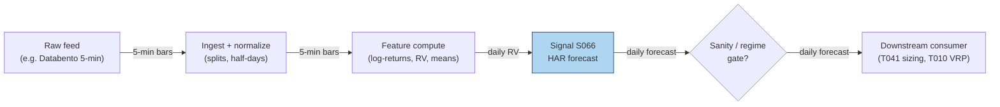

## Stage 66/200 — S066: HAR realized-volatility forecast

*Batch SB2 · Signal 66/100 · Provenance [D] · Family E — Volatility & options-informed*

### S1. One-line verdict

| | |
|---|---|
| **What it is** | A 3-regressor linear model — HAR (Heterogeneous Autoregressive), Corsi 2009 — forecasting tomorrow's realized variance from today's, this week's, and this month's: the industry workhorse vol forecast. |
| **When it works** | Any market with persistent volatility clustering: forecasts beat GARCH-family models (GARCH: the classic daily-returns volatility model) on out-of-sample loss across equities, FX, futures, commodities. |
| **When it dies** | Structural breaks, jump-dominated days (sudden discontinuous price moves), microstructure-noise-contaminated RV, horizons far from the (1,5,22) design, tiny estimation samples. |
| **Build-or-buy in one line** | Build: OLS (ordinary least squares — plain linear regression) on three features is an afternoon; buy the 5-minute bars, not the model. |

Provenance **[D]**: the model, formula, and empirical claims are documented in Corsi (2009) and follow-up literature.

### S2. How it works — plain human explanation

At 4:00 p.m., the desk needs one number for tomorrow: how volatile will SPY be? The HAR answer says: look at three clocks — what volatility did *today* (day-traders), averaged *this week* (weekly rebalancers), and averaged *this month* (pension funds). Add them with weights: tomorrow's forecast. The deep idea — Corsi's Heterogeneous Market Hypothesis, borrowed from Müller et al. — is that markets are a cascade of agents with different horizons, and volatility at each horizon is driven by the horizons above it. A restricted AR on daily/weekly/monthly components reproduces the *long memory* of volatility (shocks decay slowly, over weeks) without fractional-integration machinery (a heavier technique for modeling slow-decaying memory).

Why does it beat GARCH? GARCH sees only daily returns and must infer volatility from squared daily surprises — a noisy, low-information signal. HAR feeds on **realized** volatility, measured from dozens of intraday returns per day: a far sharper lens. HAR is not cleverer; it is allowed better data. The model is almost embarrassingly linear, which is why it survives production: OLS, three features, positivity clipping (forcing negative forecasts up to a small positive floor), done.

- **Mental model, in three bullets:**
  - Volatility has three gears — daily, weekly, monthly — and tomorrow's vol is a weighted sum of the three.
  - HAR wins by *measurement* (intraday realized variance), not model complexity; a linear model on good data beats a nonlinear model on bad data.
  - It is a **forecast**, not a trade: the edge becomes money only through a consumer (vol targeting, VRP harvesting, execution scheduling).

### S3. The math — exact formula

Build daily realized variance (RV) from M intraday log-returns (5-minute standard, 78 per US equity session):

$$r_{t,j} = \ln P_{t,j} - \ln P_{t,j-1}, \qquad RV_t = \sum_{j=1}^{M} r_{t,j}^2$$

units: variance per day. (Realized *volatility* is √RV — the standard-deviation-scale number in S4 step 5.) The HAR-RV regression (Corsi 2009):

$$RV_{t+1} = \beta_0 + \beta_d\, RV_t + \beta_w\, \overline{RV}_{t}^{(5)} + \beta_m\, \overline{RV}_{t}^{(22)} + \varepsilon_{t+1}$$

$$\overline{RV}_{t}^{(h)} = \frac{1}{h}\sum_{j=1}^{h} RV_{t-j+1} \quad h \in \{5, 22\}$$

the trailing 5-day (weekly) and 22-day (monthly) means. Estimated by OLS on ≥250 days (1,000+ preferred); clip forecasts at a small positive floor since raw-RV HAR can print negative. Common variant: **log-HAR**, $\log RV_{t+1} = c + \beta^{(d)}\log RV_t^{(1)} + \beta^{(w)}\log RV_t^{(5)} + \beta^{(m)}\log RV_t^{(22)} + \varepsilon$, which handles RV's right skew (the recent literature's baseline).

| Parameter | Symbol | Typical range | Too small / too large | Default (example) |
|---|---|---|---|---|
| Intercept | β_0 | 0–1e-4 | negative → negative variance forecasts | 5e-5 |
| Daily weight | β_d | 0.2–0.5 | 0: ignores today's shock; >0.6: overfits noise | 0.40 |
| Weekly weight | β_w | 0.2–0.45 | — | 0.35 |
| Monthly weight | β_m | 0.1–0.3 | 0: loses long memory; too big: sluggish | 0.20 |
| Estimation window | — | 250–1,000+ days | <250: unstable β; rolling 1,000 preferred | 1,000 |
| Intraday sampling | M | 39–78 (5–10 min) | too fine: microstructure noise; too coarse: noisy RV | 78 (5-min) |

*Every default is example — not an institutional standard.* Causal timing: the forecast for day *t+1* uses only RV through day *t*; tradable no earlier than *t+1*'s open. Named variants: (1) **HAR-J / HAR-CJ** — adds jump components via bipower variation (jump-robust volatility estimator; Andersen et al. 2007; Corsi & Renò 2009); (2) **log-HAR** — log transform, positivity-safe; (3) **intraday HAR-D** — rebuilds RV over intraday bins with session/week lags (arXiv 2202.08962) [SR].

### S4. Worked example — step-by-step numbers (SYNTHETIC)

All data is **synthetic** — a hand-specified 22-day daily-RV tape reproducing the operator-verified Duck.ai example (script seed 66; the series is fixed, not drawn). **Correction notice:** the raw chatbot output reported the 22-day sum as 0.014821 (≈10% too high) with everything downstream derived from it; the numbers below are the operator hand-checked corrections. The chart `images/S066_example.png` plots exactly these values.

RV_t (daily realized variance), days 1–22:

0.000400, 0.000441, 0.000484, 0.000529, 0.000576, 0.000625, 0.000676, 0.000729, 0.000784, 0.000841, 0.000900, 0.000841, 0.000784, 0.000729, 0.000676, 0.000625, 0.000576, 0.000529, 0.000484, 0.000441, 0.000400, 0.000361

Step-by-step (example betas β = (0.000050, 0.40, 0.35, 0.20) — *not an institutional standard*):

1. Daily component: RV_22 = **0.000361**.
2. Weekly: mean of the last 5 = (0.000529+0.000484+0.000441+0.000400+0.000361)/5 = **0.000443**.
3. Monthly: 22-day sum = **0.013431** (chatbot said 0.014821 — wrong); RV_22(22) = 0.013431/22 = **0.000610500** (chatbot said 0.000673682 — wrong).
4. Forecast: RV̂_{23|22} = 0.000050 + 0.40×0.000361 + 0.35×0.000443 + 0.20×0.000610500 = 0.000050 + 0.0001444 + 0.00015505 + 0.0001221 = **0.000471550** (chatbot said 0.000484186 — wrong).
5. Vol: σ̂ = √0.000471550 = **0.021716 ≈ 2.1716%/day** (chatbot said 2.2004% — wrong); annualized: 0.021716 × √252 ≈ **34.47%** (chatbot said 34.93% — wrong).

**What to notice:** the arithmetic is OLS-grade trivial — four multiplications — yet every downstream number in the chatbot's answer was corrupted by one bad sum, which is why the operator verification step exists. Economically: the forecast (0.0004716) sits *below* the monthly mean (0.0006105) because the recent days are quiet — the cascade mean-reverts. This is a toy: betas are illustrative, not estimated; real β comes from OLS on hundreds of days. Nothing here is a backtest, and a forecast is not a P&L.

### S5. Strategies that use this signal

- **T041 — HAR Vol-Timing Overlay** — primary sizing input: scales intraday positions by the HAR forecast (S066 with S067, S076).
- **T010 — Variance-Risk-Premium Harvester** — forecast comparator: harvests the gap between implied variance (the market's option-implied volatility forecast) and realized variance by shorting implied when rich versus HAR (with S069, S063).

### S6. Data required — exact spec

| Field | Type | Granularity | Source tier | Notes |
|---|---|---|---|---|
| Intraday prices/returns | float | 5-min bars (78/day) | Tier 1–2 | Polygon minutes, Databento; 1-min resampled to 5-min is standard |
| Corporate actions | events | daily | Tier 1–2 | Overnight jumps contaminate RV; decide open-to-close vs close-to-close |
| Session calendar | date/bool | daily | Tier 1 | Half-days have fewer bins — rescale or exclude |
| Estimation history | derived | daily RV | — | ≥250 days, 1,000+ preferred, before first forecast |

Ingest sketch (Python/polars, ≤20 lines):

```python
import polars as pl, numpy as np
bars = pl.scan_parquet("silver/minutes_5min/*.parquet")      # 5-min OHLCV, split-adjusted
rv = (bars
    .with_columns(r=np.log(pl.col("close")/pl.col("close").shift(1)).over("symbol"))
    .group_by(["symbol","date"]).agg(pl.col("r").pow(2).sum().alias("rv"))
    .with_columns(rv5=pl.col("rv").rolling_mean(5).over("symbol"),
                  rv22=pl.col("rv").rolling_mean(22).over("symbol"))
    .drop_nulls().collect())
X = rv.select(["rv","rv5","rv22"]).to_numpy()                 # OLS: rv_{t+1} ~ rv, rv5, rv22
beta, *_ = np.linalg.lstsq(np.c_[np.ones(len(X)-1), X[:-1]], X[1:,0], rcond=None)
fc = max(beta @ np.r_[1, X[-1]], 1e-8)                        # positivity clip
```

Storage: 5-min bars for 500 symbols ≈ 500 × 78 × 8 bytes × ~10 cols ≈ 3 MB/day — trivial (cost-model §4: 1-min/500 symbols ≈ 50 MB/day). Data-quality checklist: overnight-return treatment (open-to-close avoids close-to-close jumps); half-days; microstructure noise (bid–ask bounce contaminating fine-sampled returns) below 5-min sampling (use realized kernels — noise-robust volatility estimators — or coarser bins); DST; corporate actions; stale bins on illiquid names.

### S7. Local build on M5 Max / 128GB

**Feasibility: feasible (easy).** The daily job: build 500 RV series from 39k 5-min bars, then OLS on 500 × ~1,000-row design matrices — a few seconds of numpy. Planning assumption (cost-model §2): simple Polars ops ~10–50M rows/sec, complex rolling/as-of ops ~1–10M rows/sec; the pipeline research puts 500 rolling HAR fits at 5–30 s (labeled lead). A full daily SB2 refresh (11.7M rows) runs 15–60 s in Polars (labeled lead), so HAR is a rounding error inside it. RAM: the RV panel is ~500 × 1,000 × 8 bytes ≈ 4 MB against the 77GB working budget (cost-model §3). **Python+polars+numpy** is the right stack; Rust unnecessary; the M5 GPU is irrelevant. Engineering: **Tier M, 20–60 h ≈ $3,000–9,000 loaded** (cost-model §5) — the model is an afternoon; the hours are RV construction choices (sampling, overnight treatment, jump filtering), rolling-validation harness, and monitoring. What breaks first at 500 symbols: nothing on this box; production breaks first on *data licensing* (redistributing 5-min history) and regime monitoring (a silent structural break makes every forecast confidently wrong).

### S8. Buy vs build

| Option | What you get | Price | Gains | Loses |
|---|---|---|---|---|
| Tier 1: Polygon Stocks Developer | 5-min/minute aggs, 10y | ~$30–200/mo (indicative — verify before budgeting) | Everything needed for RV + HAR | — |
| Tier 2: Databento Standard | SIP-grade intraday, OPRA research | ~$200/mo + usage (indicative — verify before budgeting) | Honest timestamps; jump-robust extensions need trades | Overkill for plain HAR |
| Tier 3: OptionMetrics IvyDB | Publication-quality options history | ~$thousands/yr academic; institutional $$$$ (indicative — verify before budgeting) | Only if HAR feeds an options book (T010) | Price |
| Precomputed vol forecasts | Vendor RV/HAR series | varies (indicative — verify before budgeting) | No code | Black-box sampling/overnight choices; definitions vary |

**Verdict: build the model, buy the bars.** HAR is four coefficients; what matters is RV construction and the consumer that turns the forecast into size. Buy precomputed only as a validation benchmark.

### S9. Success ratio / efficacy — documented evidence

| Study / source | Market & period | Metric | Before/after cost | Caveat |
|---|---|---|---|---|
| Corsi (2009), *J. Financial Econometrics* | S&P 500 futures, Treasuries FX | "Remarkably good forecasting performance"; reproduces long memory, fat tails (extreme moves more common than a bell curve predicts) | Before cost (forecast loss) | The founding result; in-sample + OOS (out-of-sample — data the model never saw in estimation) |
| Path-dependent HAR paper (arXiv 2503.00851) | SSE (the paper's Shanghai equity sample), rolling 600-day OOS | HAR family **much lower** MSE/MAE/HMSE/HMAE/QLIKE (a volatility forecast loss function — lower is better) than GARCH family; more MCS (model confidence set — a test keeping only models not significantly worse than the best) passes | **Before cost** (forecast accuracy) | Dataset-specific; HAR-PD variants best |
| Louzis, Xanthopoulos-Sissinis & Refenes (2012), *Economics Bulletin* | S&P 500, incl. 2007–09 | HAR-type-EVT (extreme value theory) beats GARCH-type-EVT on VaR (value-at-risk — a tail-loss risk measure) accuracy and Basel II capital efficiency | Before cost (risk metric) | Economic *utility*, not trading P&L |
| High-frequency enhanced VaR (PMC) | Multi-asset, 1,242 OOS days | HAR-RV fluctuation test beats univariate GARCH; "all GARCH models less accurate than HAR-RV" | Before cost (forecast loss) | VaR application |
| Practitioner replication (guna-1610) | S&P 500 2011–2026, 2,769 OOS days | HAR-RV QLIKE 0.3824 vs GARCH(1,1) 0.4237, DM (Diebold–Mariano — a test of whether one forecast is significantly better than another) significant | Before cost (forecast loss) | Practitioner, but real data + proper tests |
| Duck.ai Q-SB2-3 (labeled lead) | Literature survey | HAR-type beats GARCH on forecast loss in several settings; **lower loss ≠ tradable edge** | Before cost | Chatbot synthesis; direction matches the papers above |

Regimes where it fails: structural breaks (betas estimated on the old regime), jump-dominated days (use HAR-J), microstructure-noise contamination at too-fine sampling, horizons far from (1,5,22), small estimation samples. No documented after-cost P&L exists for HAR *itself* — it is infrastructure; economic value must be proven through a consumer (vol targeting, VRP) with turnover and utility accounting.

**Honest bottom line:** HAR has the **strongest statistical evidence in this batch** — it forecasts volatility better than GARCH across markets, periods, and loss functions. As a *forecasting* edge it is real; as a *trading* edge it is unproven until a costed consumer exists.

### S10. Failure modes & pitfalls

1. **Forecast ≠ trade** — a 5% better QLIKE earns nothing without a consumer; mitigation: attach HAR to sizing/hedging (T041/T010), evaluate the *strategy* net of costs.
2. **Microstructure noise** — 1-min RV without correction is noise-dominated; mitigation: 5-min sampling, or realized kernels.
3. **Overnight treatment** — open-to-close vs close-to-close changes RV by the overnight share; mitigation: pick one, document it.
4. **Negative forecasts** — raw-RV OLS can print negative variance; mitigation: positivity clip or log-HAR.
5. **Structural breaks** — 2008/2020-style regimes invalidate old betas; mitigation: rolling windows, break monitoring.
6. **Jump contamination** — one flash-crash day dominates the monthly mean; mitigation: HAR-J with bipower variation.
7. **Lookahead in RV** — using revised/corrected bars; mitigation: point-in-time bars, as-of timestamps.
8. **Overfitting via extensions** — HAR-PD, threshold HAR, ML hybrids add parameters; mitigation: MCS/DM tests, embargoed OOS (see S088).

### S11. Visuals




### S12. Sources

- Corsi, F. (2009). "A Simple Approximate Long-Memory Model of Realized Volatility." *Journal of Financial Econometrics*, 7(2), 174–196. http://ideas.repec.org/a/oup/jfinec/v7y2009i2p174-196.html
- "Forecasting realized volatility in the stock market: a path-dependent perspective" (2025). arXiv. https://arxiv.org/pdf/2503.00851 — HAR family vs GARCH family OOS loss + MCS tests.
- Louzis, D. P., Xanthopoulos-Sissinis, S., & Refenes, A. P. (2012). "Stock index Value-at-Risk forecasting: A realized volatility extreme value theory approach." *Economics Bulletin*, 32(1), 981–991. http://ideas.repec.org/a/ebl/ecbull/eb-11-00870.html
- "High-frequency enhanced VaR: A robust univariate realized volatility model" (2024). PMC. http://pmc.ncbi.nlm.nih.gov/articles/PMC11111067/ — HAR-RV vs GARCH fluctuation tests.
- "Volatility Forecasting with Machine Learning and Intraday Commonality" (2022). arXiv. http://arxiv.org/pdf/2202.08962 — intraday HAR-D / SARIMA adaptation.

**Unverified leads** (chatbot-provided, no checkable source — do not treat as evidence):
- Duck.ai answered Q-SB2-1–Q-SB2-3 (2026-09-10); Grok/Cursor answers pending (checked 2026-09-10).
- HAR worked-example lead: the raw chatbot output contained a 22-day-sum error (0.014821 vs correct 0.013431); all downstream values used in S4 are the operator-verified corrections.
- Q-SB2-3 survey lead: "HAR-type beats GARCH on forecast loss in several settings" — direction consistent with the cited papers, but the synthesis itself is unverified; lower forecast loss ≠ tradable edge.
- Q-SB2-2 pipeline lead: 500 rolling HAR fits in 5–30 s; full SB2 daily refresh 15–60 s in Polars — labeled chatbot claims, not measured here.
