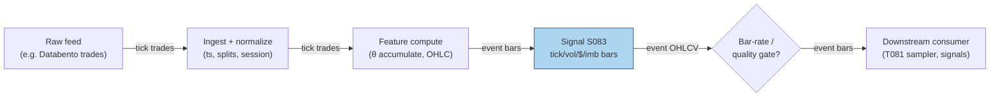

## Stage 83/200 — S083: Imbalance/tick/volume/dollar bars

*Batch SB2 · Signal 83/100 · Provenance [D] · Family F — Statistical/ML infrastructure*

### S1. One-line verdict

| | |
|---|---|
| **What it is** | Alternative bar clocks: sample bars by trade count (tick), shares (volume), dollars traded, or signed-flow imbalance instead of wall-clock minutes. |
| **When it works** | Intraday feature pipelines: volume/dollar bars have better statistical properties (closer to Gaussian (bell-curve-shaped), less heteroskedasticity — variance that shifts over time) than minute bars; imbalance bars concentrate information arrival. |
| **When it dies** | Approximating them from minute OHLCV (open/high/low/close/volume — not equivalent to trade-built bars), mis-set imbalance thresholds, or downstream models assuming fixed time spacing. |
| **Build-or-buy in one line** | Build the sampler (an afternoon); buy the tick-trade feed — minute bars cannot reproduce true volume/imbalance bars. |

Provenance **[D]**: Easley, López de Prado & O'Hara (2012); López de Prado, *Advances in Financial Machine Learning* (2018), Ch. 2.

### S2. How it works — plain human explanation

It is 12:40 p.m.: the 12:35–12:40 bar on a liquid name holds 14 trades; the 9:30–9:35 bar held 4,000. A minute-bar pipeline treats those two bars as equals. Information does not arrive on a clock; it arrives with *trading activity*: a **tick bar** closes every N trades, a **volume bar** every V shares, a **dollar bar** every $D traded. At the open, bars fly past in seconds; at lunch, one bar takes minutes.

**Imbalance bars** go further: instead of fixed amounts of *activity*, they sample fixed amounts of *one-sided flow* — accumulate θ_T = Σ b_t·v_t and close when |θ_T| crosses a threshold. A bar now represents a fixed dose of *information* — informed, directional trading — regardless of duration. The economic story is Easley–López de Prado–O'Hara's: markets are not fast or slow, they are busy or quiet.

- **Mental model, in three bullets:**
  - Clock bars oversample quiet periods and undersample busy ones; activity clocks give every bar equal weight.
  - Dollar bars neutralize the *price-level* effect; imbalance bars neutralize the *noise*.
  - This is **infrastructure, not alpha**: bars make downstream statistics cleaner but predict nothing by themselves.

### S3. The math — exact formula

Let trades be indexed by *i* with price P_i, size q_i, and tick-rule sign b_i ∈ {+1, −1} (uptick +1, downtick −1, zero-tick reuses the previous sign).

- **Tick bars:** close every N trades (N *example*: 1,000–10,000 — *not an institutional standard*).
- **Volume bars:** close when Σ q_i ≥ V* (V* *example*: 1% of ADV (average daily volume)).
- **Dollar bars:** close when Σ P_i·q_i ≥ D* (D* *example*: $1M–$10M notional per bar).
- **Imbalance bars (tick):** θ_T = Σ_{i} b_i, close when |θ_T| ≥ E_0[T]·|E_0[θ]| — expected bar length × expected per-trade imbalance, EWMA-estimated (exponentially weighted moving average; mlfinlab implementation).
- **Imbalance bars (volume/dollar):** θ_T = Σ b_i·q_i (or Σ b_i·P_i·q_i), same close rule; the pipeline lead (Q-SB2-2, labeled) states it as: close when |Σθ_i| > E_0[|θ|]·n or a dynamic threshold.

Each bar then emits OHLCV: O = first P, H = max P, L = min P, C = last P, V = Σ q (dollars / shares / counts).

| Parameter | Symbol | Typical range | Too small / too large | Default (example) |
|---|---|---|---|---|
| Ticks per bar | N | 1k–50k | too small: noisy bars; too big: few bars/day | 5,000 |
| Shares per bar | V* | 0.1–2% of ADV | — | 1% of ADV |
| Dollars per bar | D* | $1M–$50M | too small on mega-caps: sub-second bars | $5M |
| Expected imbalance | E_0[θ] | estimated | mis-set: bars too fast (noise) or too slow (stale) | EWMA over 50 bars |
| Tick-rule fallback | — | — | zero ticks mishandled → sign drift | carry-forward (reuse the previous sign) |

*Every default is example — not an institutional standard.* Causal timing: bar *k* is complete only when its close condition fires; features on bar *k* are tradable no earlier than bar *k+1*'s first trade. Named variants: (1) **tick / volume / dollar** — fixed-activity clocks; (2) **tick / volume / dollar imbalance** — fixed-information clocks; (3) **run bars** (AFML — *Advances in Financial Machine Learning* (López de Prado, 2018), Ch. 2) — close on same-sign tick runs.

### S4. Worked example — step-by-step numbers (SYNTHETIC)

All data is **synthetic**: a 15-trade tape drawn with `rng = np.random.default_rng(83)`. `batches/SB2/plot_S083.py` regenerates it, and `images/S083_example.png` plots all 15 trades with the three boundary sets — numbers here and in the chart agree.

Tape (all 15 trades) — $ prices, share sizes, tick-rule sign:

| Trade | Price | Size | Sign | Trade | Price | Size | Sign |
|-------|-------|------|------|-------|-------|------|------|
| T1 | 99.49 | 1000 | +1 | T9 | 98.87 | 1000 | −1 |
| T2 | 99.34 | 300 | −1 | T10 | 98.64 | 1500 | −1 |
| T3 | 99.33 | 1500 | −1 | T11 | 98.88 | 500 | +1 |
| T4 | 99.46 | 800 | +1 | T12 | 99.07 | 1000 | +1 |
| T5 | 99.10 | 300 | −1 | T13 | 99.38 | 500 | +1 |
| T6 | 99.52 | 1500 | +1 | T14 | 99.20 | 200 | −1 |
| T7 | 99.59 | 200 | +1 | T15 | 99.47 | 800 | +1 |
| T8 | 99.41 | 500 | −1 | | | | |

Tick bars (every 5 trades), OHLC in $:

| Bar | O | H | L | C | #trades |
|-----|-------|-------|-------|-------|---------|
| TB1 | 99.49 | 99.49 | 99.10 | 99.10 | 5 |
| TB2 | 99.52 | 99.59 | 98.64 | 98.64 | 5 |
| TB3 | 98.88 | 99.47 | 98.88 | 99.47 | 5 |

Volume bars (every 3,000 shares — *example*):

| Bar | O | H | L | C | #trades |
|-----|-------|-------|-------|-------|---------|
| VB1 | 99.49 | 99.49 | 99.33 | 99.46 | 4 |
| VB2 | 99.10 | 99.59 | 98.87 | 98.87 | 5 |
| VB3 | 98.64 | 99.07 | 98.64 | 99.07 | 3 |

(open: T13–T15, 1,500 shares — the tape ends mid-bar.)

Imbalance bars (θ = Σ tick-sign × shares; close when |θ| ≥ 1,500 — *example*):

| Bar | O | H | L | C | #trades | θ at close |
|-----|-------|-------|-------|-------|---------|------------|
| IB1 | 99.49 | 99.59 | 98.64 | 98.64 | 10 | −1600 |
| IB2 | 98.88 | 99.07 | 98.88 | 99.07 | 2 | +1500 |

(open: T13–T15, θ = +1,100 — the tape ends mid-bar.)

**What to notice:** tick bars are metronomic (5 trades each) but informationally uneven — TB2 spans a 0.88 selloff into 98.64, TB3 the 0.59 snapback. Volume bars vary in trade count (3–5). Imbalance bars show the mechanism’s range: IB1 absorbs 10 trades — including the T6–T7 upticks — before the downtrend pushes θ to −1,600; IB2 closes after just 2 trades on the snapback (θ = +1,500). The tape ends mid-bar (T13–T15, θ = +1,100): carry it forward or discard.

### S5. Strategies that use this signal

- **T081 — Adaptive Bar-Clock Sampler** — primary infrastructure: selects the bar clock by regime for downstream signals (with S090, S067).
- **T044 — Diurnal Deseasonalization (removing the predictable intraday U-shaped activity pattern)** — bar clocks already remove much of the U-shaped seasonality before thresholding (with S067, S046).
- **T008 — Kalman Dynamic-Hedge Pairs** — entry timer: imbalance bars time the legs (with S052, S048).

### S6. Data required — exact spec

| Field | Type | Granularity | Source tier | Notes |
|---|---|---|---|---|
| Trades (price, size, ts) | float/int/ts | tick | Tier 2 | Databento MBP-1 (market-by-price, top of book)/trades; **minute OHLCV cannot reproduce true volume/imbalance bars** (labeled lead) |
| Trade direction/sign | ±1 or exchange flag | tick | Tier 2 | Tick rule when no flag; Lee–Ready (buyer/seller classification from the quote) needs quotes (S007) |
| Session calendar | date/bool | daily | Tier 1 | Overnight gap: reset or carry θ |

Ingest sketch (Python, streaming):

```python
theta, n, bars, V_STAR = 0, 0, [], 3_000_000   # example threshold
for tr in trade_stream(symbol, date):
    theta += tr.sign * tr.size                # imbalance; n += 1 for tick bars
    track_ohlc(tr)                             # running O/H/L/C
    if abs(theta) >= V_STAR:                   # shares/dollars for vol/$ bars
        bars.append(close_bar(theta)); theta, n = 0, 0
        reset_ohlc()
# open bar at session end is incomplete — carry forward, never backfill
```

Storage per symbol-day: liquid-name tick trades ≈ 2–8 GB/day parquet (cost-model §4) — keep per-symbol daily files, never hold 500 × 60 days in RAM. Data-quality checklist: timestamp normalization (exchange vs SIP (consolidated feed)); late/out-of-sequence prints; odd-lot (under 100 shares) and dark-pool (off-exchange) inclusion rules; tick-rule accuracy; splits.

### S7. Local build on M5 Max / 128GB

**Feasibility: feasible.** Bar building is a single streaming pass: Python handles ~100–500k events/sec (cost-model §2) — fine for ≤20 symbols of L1 (level-1: top-of-book quotes and trades); Rust does 5–50M events/sec for full-universe rebuilds. A 60-day, 500-symbol rebuild from per-symbol parquet is I/O-bound at ~1–3 GB/sec (cost-model §2): minutes. RAM: stream per-symbol files; never hold the panel. Stack: **Python** for research, **Rust** for a live-loop sampler. Engineering: **Tier L, 4–12 h ≈ $600–1,800 loaded** (cost-model §5). What breaks first at 500 symbols: tick-trade *storage and licensing*, not compute — 500 names of tick history is terabytes/year (cost-model §4).

### S8. Buy vs build

| Option | What you get | Price | Gains | Loses |
|---|---|---|---|---|
| Tier 2: Databento pay-as-you-go | Tick trades, honest timestamps | ~$200/mo + usage (indicative — verify before budgeting) | The only honest input for true bars | Bulky to archive |
| Tier 1: Polygon minute bars | 1-min OHLCV | ~$30–200/mo (indicative — verify before budgeting) | Cheap | **Cannot reproduce** true volume/dollar/imbalance bars (labeled lead) |
| Open-source: mlfinlab | Reference bar implementations | ~$0 (license check) (indicative — verify before budgeting) | Tested imbalance-bar algorithm | You still need the tick feed |
| Precomputed bars vendors | Bars as a service | varies (indicative — verify before budgeting) | No pipeline | Black-box thresholds; poor value |

**Verdict: build the sampler, buy the trades.** The sampler is an afternoon; the feed is the binding constraint.

### S9. Success ratio / efficacy — documented evidence

Bar clocks are infrastructure: there is no Sharpe (risk-adjusted return) to report. What is documented:

| Study / source | Market & period | Metric | Before/after cost | Caveat |
|---|---|---|---|---|
| Easley, López de Prado & O'Hara (2012), *J. Portfolio Management* | Theory + futures/ETF examples | Volume-clock returns closer to Gaussian, less heteroskedastic than clock-time returns | n/a (statistical property) | Econometric benefit, not a trade |
| VPIN / flash-crash reporting (2010) | E-mini S&P, May 6 2010 | VPIN (volume-clock toxicity metric) hit historic levels an hour+ before the flash crash (a minutes-long collapse and rebound) | n/a | Press account, not a backtest |
| mlfinlab practitioner docs | — | Reference imbalance-bar implementation; bars used "throughout AFML" for features | n/a | Practitioner adoption, not efficacy |

Costs: not applicable to the sampler — but cleaner bars make downstream cost models (spread — the bid–ask spread — and impact) better estimated. Any P&L claim for "bars" alone is a category error.

**Honest bottom line:** a **genuine, documented improvement** in intraday feature quality and a prerequisite for honest microstructure (how orders, quotes, and trades interact at short horizons) work (S008) — but no edge as a standalone "signal".

### S10. Failure modes & pitfalls

1. **Minute-bar approximation** — resampling 1-min OHLCV into "volume bars" is not the same object; mitigation: true bars require trades.
2. **Threshold mis-setting** — too-small thresholds produce noise bars, too large stale ones; mitigation: EWMA-estimated expected imbalance, monitored bar rates.
3. **Open-bar lookahead** — using the incomplete current bar's OHLC as a feature; mitigation: only closed bars enter features; carry the open bar explicitly.
4. **Session-boundary θ** — carrying imbalance overnight mixes regimes; mitigation: reset θ at the open, document the choice.
5. **Tick-rule error** — mis-signed trades corrupt θ; mitigation: prefer exchange flags; fall back to Lee–Ready with quotes (S007).
6. **Storage blowup** — archiving full tick history "just in case"; mitigation: build bars once, archive bars + a trade sample.
7. **Overfitting the clock** — tuning N/V*/D* on the backtest; mitigation: round thresholds a priori; the clock is plumbing, not a parameter to mine.

### S11. Visuals




### S12. Sources

- Easley, D., López de Prado, M. M., & O'Hara, M. (2012). "The Volume Clock: Insights into the High-Frequency Paradigm." *Journal of Portfolio Management*, 39(1), 19–29. https://jpm.pm-research.com/content/39/1/19.abstract (manuscript: http://ssrn.com/abstract=2034858)
- López de Prado, M. M. (2018). *Advances in Financial Machine Learning*. Wiley. (Ch. 2: tick/volume/dollar/imbalance bars; book.)
- mlfinlab documentation, "Data Structures" (imbalance-bar algorithm: θ_t = Σ b_t·v_t; close rule |θ_t| ≥ E_0[T]·[2v⁺ − E_0[v_t]]). https://github.com/quantopian/mlfinlab/blob/HEAD/docs/source/implementations/data_structures.rst
- "Stock Market 'Flash' Crashes Now Can be Predicted, Thanks to Cornell Metric" (2010). *Innovations Report*. https://www.innovations-report.com/global-finance/business-and-finance/stock-market-flash-crashes-predicted-cornell-metric-166800/ — VPIN account of the May 2010 flash crash.

**Unverified leads** (chatbot-provided, no checkable source — do not treat as evidence):
- Duck.ai answered Q-SB2-1–Q-SB2-3 (2026-09-10); Grok/Cursor answers pending (checked 2026-09-10).
- Q-SB2-2 pipeline leads: TRUE tick/volume/dollar/imbalance bars need trades — minute OHLCV cannot reproduce them exactly; close when |Σθ_i| > E_0[|θ|]·n or dynamic threshold; 500 × 390 × 60d = 11.7M rows, 15–60 s daily Polars refresh.
- "Practitioner replication (vpin)" lead — volume-time returns closer to normal than chronological-time on crypto (BTC perps) — moved here from the S9 evidence table: no checkable citation was found for it, so it is an unverified lead, not evidence.
