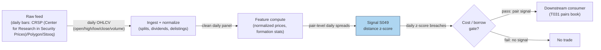

## Stage 49/200 — S049: Distance-method pairs — Gatev–Goetzmann–Rouwenhorst

*Batch SB3 · Signal 49/100 · Provenance [D] · Family D — Pairs & cross-sectional arbitrage*

### S1. One-line verdict

| | |
|---|---|
| **What it is** | Rank stock pairs by how tightly their normalized price paths tracked over a formation window; trade divergences of the closest pairs as temporary mispricing. |
| **When it works** | Mean-reverting relative mispricing between close economic substitutes, especially in turbulent markets when liquidity-driven dislocations are common. |
| **When it dies** | Crowded post-2002 large-cap US; fundamental breaks (M&A, earnings shocks) that make a divergence permanent; high borrow costs on the short leg. |
| **Build-or-buy in one line** | Build the screen yourself (it is a one-afternoon vectorized job); buy survivorship-clean corporate-action data — that is where the real cost sits. |

### S2. How it works — plain human explanation

Imagine two large regional banks — call them Alpha and Beta. For a year their shares move in lockstep: same rates, same loan-book worries. Then a mutual fund liquidates a chunk of Beta for reasons unrelated to either bank (a redemption wave elsewhere). Beta falls 3% while Alpha barely moves. The pairs trader's read: these are close economic substitutes, the gap is plumbing rather than information, so she sells Alpha (the leader) and buys Beta (the laggard), betting the gap closes. If Beta fell because its loan book actually blew up, she loses — the divergence was real information, not noise.

The economic idea: prices of close substitutes share a common factor, so large *relative* moves are more likely transient supply/demand imbalances than permanent repricing. Arbitrageurs are paid to stand in front of those imbalances. Research adds a second leg: profits are strongest when divergences come from common shocks propagating at different speeds through the two stocks (slow reaction to shared news) rather than from firm-specific news (see S9).

- **Mental model, bullet 1:** Distance pairs = a bet that *relative* prices mean-revert when the two legs are economic substitutes — it is a relative-value trade, not a directional one.
- **Mental model, bullet 2:** The entry trigger is purely statistical (a 2σ spread), so every pair needs an economic sanity story — without one, you are trading noise that may never converge.
- **Mental model, bullet 3:** Costs and borrow decide everything: the gross edge decayed hard after the 1990s, and what survives today lives or dies on execution quality (see S9, S10).

### S3. The math — exact formula

**Normalization.** For each stock *i*, build a normalized price (a cumulative-return index that starts at 1.0 at the beginning of the formation window):

$$\tilde{P}_{i,t} = \prod_{s=1}^{t}(1 + r_{i,s}), \qquad \tilde{P}_{i,0} = 1$$

where $r_{i,s}$ is the total return (price change plus dividends) of stock *i* on day *s*.

**Pair distance.** Over the formation window $F$ (a set of trading days), the distance between stocks *i* and *j* is the sum of squared daily gaps between their normalized paths:

$$D_{ij} = \sum_{t \in F}\left(\tilde{P}_{i,t} - \tilde{P}_{j,t}\right)^2$$

**Selection.** Rank all candidate pairs by $D_{ij}$ ascending and keep the $N$ smallest-distance pairs (Gatev–Goetzmann–Rouwenhorst, henceforth GGR, used $N = 20$), subject to liquidity, borrow-availability, and corporate-action cleanliness screens.

**Trading rule.** For a selected pair $(A, B)$, the spread is $d_t = \tilde{P}_{A,t} - \tilde{P}_{B,t}$. From the formation window compute its mean $\mu_d$ and sample standard deviation $\sigma_d$. The trading signal is the z-score:

$$z_t = \frac{d_t - \mu_d}{\sigma_d}$$

- If $z_t \le -z_{\text{entry}}$: buy A, sell B (long the laggard, short the leader).
- If $z_t \ge +z_{\text{entry}}$: sell A, buy B.
- Close when $|z_t| \le z_{\text{exit}}$ (convergence), or at a maximum holding time, or at an adverse-move stop.

Positions are dollar-neutral 1:1 *on normalized prices* — i.e., equal notional in the two legs at entry.

**Causal timing.** $z_t$ is computed at the close of day *t* using only data $\le t$; the position is tradable no earlier than the *t+1* open. All parameter estimates (the pair list, $\mu_d$, $\sigma_d$) must come from information strictly before the trading interval — this is enforced again in S10.

| Parameter | Symbol | Typical range | Too small | Too large | Default (example) |
|---|---|---|---|---|---|
| Formation window | $T_F$ | 60–252 days | unstable pair list, noisy $\sigma_d$ | stale pairs, regime breaks inside window | 252 days |
| Trading window | $T_{trade}$ | 20–126 days | pairs never get room to converge | holding dead pairs, cost bleed | 126 days |
| Pairs traded | $N$ | 10–100 | idiosyncratic pair risk dominates | dilutes into marginal pairs | 20 |
| Entry threshold | $z_{\text{entry}}$ | 1.5–2.5$\sigma$ | overtrading, cost explosion | almost never trades | 2.0 |
| Exit threshold | $z_{\text{exit}}$ | 0–0.5$\sigma$ | exits before capturing the move | round trips, gives back profits | 0 (zero-cross) |
| Max hold | $H_{\max}$ | 10–60 days | cuts converging trades early | capital stuck in broken pairs | 30 days |

Every default above is `example — not an institutional standard`.

**Named variants.** (1) *Industry-restricted* — pair only within the same sector. (2) *Correlation-prefiltered* — require formation correlation above ~0.7–0.9 first. (3) *Volatility-normalized* (Do–Faff–Hamza style) — scale the spread by relative volatility so triggers are comparable across pairs.

### S4. Worked example — step-by-step numbers (SYNTHETIC)

All numbers below are **synthetic** — a hand-built toy tape, random seed **49**, plotted in `images/S049_example.png`. The chart plots exactly this table's numbers.

**Formation (12 days), normalized prices:**

| Day | A | B | C | A−B spread |
|---|---|---|---|---|
| 1 | 1.000 | 1.000 | 1.000 | 0.000 |
| 2 | 1.020 | 1.015 | 1.050 | 0.005 |
| 3 | 1.010 | 1.025 | 1.100 | −0.015 |
| 4 | 1.030 | 1.020 | 1.080 | 0.010 |
| 5 | 1.050 | 1.045 | 1.150 | 0.005 |
| 6 | 1.040 | 1.055 | 1.200 | −0.015 |
| 7 | 1.060 | 1.050 | 1.180 | 0.010 |
| 8 | 1.080 | 1.075 | 1.250 | 0.005 |
| 9 | 1.070 | 1.085 | 1.300 | −0.015 |
| 10 | 1.090 | 1.080 | 1.280 | 0.010 |
| 11 | 1.110 | 1.100 | 1.350 | 0.010 |
| 12 | 1.100 | 1.105 | 1.400 | −0.005 |

Pair distances: $D_{AB} = 0.001175$, $D_{AC} = 0.327000$, $D_{BC} = 0.325775$. The minimum-distance pair is **(A, B)** — C tracked neither. Formation spread statistics: $\mu_d = 0.000417$, $\sigma_d = 0.010326$ (sample std, 11 d.f.).

**Trading (next 6 days), pair (A, B), $z_{\text{entry}} = 2.0$, $z_{\text{exit}} = 0.5$ (both `example`):**

| Day | A | B | Spread | $z_t$ | Action |
|---|---|---|---|---|---|
| 13 | 1.120 | 1.095 | 0.0250 | +2.381 | **Open:** short 1.0 A, long 1.0 B |
| 14 | 1.130 | 1.105 | 0.0250 | +2.381 | Hold |
| 15 | 1.125 | 1.120 | 0.0050 | +0.444 | **Exit** ($\|z\| \le 0.5$) |
| 16–18 | — | — | 0.0050 | +0.444 | Flat |

**P&L walk (normalized units, gross, no fees):** short A: $1.120 - 1.125 = -0.005$; long B: $1.120 - 1.095 = +0.025$. Net $= +0.0200$ normalized units per unit of notional per leg. (If one normalized unit = $100 of capital, that is $2,000 on $200,000 of gross exposure.)

**Cost model — explicit components (`example`; the chapter's own stack).** Spread, fees, borrow, and impact/slippage are charged on every name, every leg, every round trip. Using the walk's own valuation ($100 per normalized unit → $2,000 gross on $200,000 gross exposure): **spread** (crossing the half-spread on entry and exit, both legs — 4 half-spread crossings ≈ 2 bps of $200,000) ≈ **$40**; **commissions/fees** ≈ **$20** ($5 per leg-side); **borrow** (short leg $100,000 × 50 bps annualized stock-loan × 2 days held) ≈ **$3**; **market impact/slippage** (1 bp of $200,000) ≈ **$20**. All-in ≈ **$83** → **net ≈ $1,917** on the $2,000 gross, i.e. +0.0192 normalized units per unit of per-leg notional. The gross-only walk is illustrative; a tradable S049 pays spread, fees, borrow, and impact on every rotation.

**What to notice.** The pipeline in miniature: the screen picks the sensible pair (A and B, not runaway C), and a liquidity-style shock to B triggers a textbook entry that converges two days later. Limits: the P&L walk above is the *gross* tape only — no fees, no bid–ask, no borrow cost, assumed fills; the tradable P&L is gross minus the explicit cost stack (spread + fees + borrow + impact/slippage) modeled in S10. Formation is 12 days — the real GGR design uses 12 months. No backtest claims are made from these numbers.

### S5. Strategies that use this signal

- **T031 — Distance Pairs + Quality Filter** — primary entry trigger: the distance screen selects the pairs and the z-score rule times entries; S053's zero-crossing quality filter then vets which divergences are worth trading. (Plan §3's explicit Signals list for T100 enumerates S082/S086/S088 only — S049 has no documented T100 role, so T031 is its sole verified consumer.)

### S6. Data required — exact spec

| Field | Type | Granularity | Source tier | Notes |
|---|---|---|---|---|
| Total-return prices (split/dividend adjusted) | float | daily OHLCV (open/high/low/close/volume) | Tier 0–1 | Must be truly adjusted; raw prices + factor files also fine |
| Raw close + corporate-action factors | float/date | daily | Tier 1–2 | For verifying adjustments; delisting returns included |
| Dollar volume / average daily volume (ADV) | float | daily | Tier 1 | Liquidity screen (min dollar volume) |
| Borrow availability / fee | float/bool | daily | Tier 2 | Short-leg feasibility; locate data |
| Ticker history, listing/delist dates | mapping/date | as events | Tier 1–2 | Point-in-time universe — anti-survivorship-bias control |
| 1-min bars | OHLCV | 1-min | Tier 1–2 | Only for the intraday port of the strategy |

**Collection method.** Daily bars from a vendor API (Tiingo EOD, Polygon stocks v3, or Stooq CSVs for Tier-0 prototyping); corporate actions from the vendor's splits/dividends endpoints; delistings from a survivorship-free dataset (S8). Ingest sketch (Python/polars, ≤20 lines):

```python
import polars as pl
bars = pl.read_parquet("raw/daily_bars.parquet")          # date, perm_id, o,h,l,c, volume, div, split
px = (bars.sort(["perm_id","date"])
          .with_columns(adj=pl.col("c") * pl.col("split").cumprod().over("perm_id")
                        + pl.col("div").cumprod().over("perm_id"))  # sketch: apply factors
          .with_columns(ret=pl.col("adj").pct_change().over("perm_id")))
norm = px.with_columns(npx=(1+pl.col("ret").fill_null(0)).cumprod().over("perm_id"))
universe = norm.join(point_in_time_universe, on=["date","perm_id"], how="inner")
universe.write_parquet("clean/daily_panel.parquet")
```

**Storage.** Per `notes/cost-model.md` §4: daily bars for 3,000 stocks ≈ 5 MB/day parquet — trivial; a 10-year panel is a few GB. The 1-min intraday port is ~50 MB/day for 500 symbols — archive selectively.

**Data-quality checklist.** Exchange calendar/DST/half-days; corporate actions — splits, dividends, spinoffs, the #1 silent killer of pairs screens; halts and limit moves; stale quotes on illiquid names; survivorship: the formation-time universe must be knowable *at that time* (point-in-time), or backtested returns are fiction.

### S7. Local build on M5 Max / 128GB

**Feasibility: feasible (Tier M).** The distance screen is one of the cheapest serious screens in quant finance: the whole job is normalization, a pairwise distance matrix, and ranking. A 2,000-stock × 10-year daily panel is ~50–200 MB in memory (labeled lead from the batch's chatbot Q&A; consistent with `notes/cost-model.md` §3's ~40 MB float64 figure for the raw panel), so everything fits comfortably inside the 77 GB working budget (§3).

**Throughput.** The dominant kernel is $X^T X$ for $X$ of shape $2520 \times 2000$: approximately $2 \cdot 2000^2 \cdot 2520 \approx 20.2$ billion multiply-adds full ($\approx 10$B for the upper triangle). **Correction to the batch's chatbot answer, which said "~5 billion multiply-adds" — that is ~4× too low; use the figures above.** Even so, this is a seconds-scale dense BLAS (Basic Linear Algebra Subprograms) call; the full screen (normalization, missing data, ranking, top-$k$) is a minute-scale job at most — a labeled chatbot lead puts the vectorized screen at ~1–10 s. Per cost-model §2, panel ingest is I/O-bound at ~1–3 GB/s parquet read, and 500 symbols × 390 1-min bars/day = 195k bars/day is trivial.

**Bottleneck:** data quality, not compute — corporate actions, delistings, and point-in-time universe construction (the chatbot's 150–300 h full-pipeline prototype estimate is dominated by exactly this; labeled lead, inside cost-model §5's Tier-M-plus-harness range).

| Stack | When to pick |
|---|---|
| Python + polars/numpy | Default: the whole screen is vectorizable; fastest to write and verify |
| DuckDB | If you want the panel queryable by SQL and partitioned by date |
| Rust | Only if you push the screen to 1-min rolling windows across thousands of symbols intraday |

**RAM.** Tens of MB for daily bars (1-day or 60-day); ~3 GB for 500 symbols of 1-min bars (§4) — fits easily in the 77 GB budget (§3).

**Engineering time.** Tier M per cost-model §5: **20–60 h** → **$3,000–$9,000** `loaded-cost estimate` at $150/hr, plus data. The point-in-time security master is the known schedule risk.

**What breaks first at 500 symbols / full OPRA:** nothing on daily bars. What would break is a naive per-pair Python loop over millions of pairs — vectorize or chunk. Full OPRA (Options Price Reporting Authority) is irrelevant to this signal.

### S8. Buy vs build

| Vendor / option | What you get | Indicative price | Buying gains | Buying loses |
|---|---|---|---|---|
| Tier-0: Stooq, Yahoo-style free bars | Daily OHLCV, weak corp-action history | ~$0 | Zero-cost prototyping | No survivorship control; unreliable adjustments |
| Tier-1: Tiingo EOD / EODHD | Adjusted daily bars, splits/dividends (labeled chatbot lead) | ~$20–100/mo `indicative — verify before budgeting` | Cheap, prototype-ready | Manual survivorship handling |
| Tier-1: Polygon Stocks Advanced | 1-min/real-time SIP bars, corp actions | ~$30–200/mo `indicative — verify before budgeting` | Covers the intraday port | History depth costs extra |
| Tier-2: Sharadar (Nasdaq Data Link) | Point-in-time, survivorship-free panel | tens–hundreds/mo `indicative — verify before budgeting` | Solves survivorship properly | Price; you still build the screen |
| Tier-2: Databento | L1/L2, futures, OPRA research | ~$200/mo + usage `indicative — verify before budgeting` | Honest microstructure data | Overkill for a daily screen |

**Verdict: build the screen, buy survivorship-clean data.** The algorithm is ~50 lines of numpy; no vendor sells your thresholds. The crossover: if you cannot verify your vendor's delisting and adjustment methodology, pay for the Tier-2 survivorship-free panel — a backtest on a survivor-only universe is worse than no backtest.

### S9. Success ratio / efficacy — documented evidence

| Study / source | Market & period | Metric | Before/after cost | Caveat |
|---|---|---|---|---|
| Gatev, Goetzmann & Rouwenhorst (2006), RFS | US equities, 1962–2002, top-20 pairs | ~11% ann. excess, self-financing | After conservative cost estimates | Long sample; pre-modern-crowding universe |
| Do & Faff (2010), FAJ | US equities, 1962–2009, top-20 pairs | 0.86%/mo (1962–88) → 0.37%/mo (1989–2002) → 0.24%/mo (2003–09) | Before explicit costs | The decay finding; strong in turbulence (GFC) |
| Rad, Low & Faff (2016), Quant. Finance (accepted ms.) | US equities, 1962–2014, distance method | 0.91%/mo (Sharpe 0.75) before; 0.38%/mo (Sharpe 0.35) after | Both | Their 1–7 bps cost model; 62.53% of trades converged |
| Do & Faff (2012), via Rad et al. | US equities, post-2002 | "Largely unprofitable after 2002" with costs | After costs | Harshest published read; implementation-sensitive |

**Documented decay.** Do & Faff (2010) confirm the decline GGR already noticed late in their sample: roughly a 3× fall in monthly excess return from the 1962–88 regime to 2003–09 — faster reactions, lower spreads, shorting frictions, common-factor shocks, and more pairs diverging without converging. Counterpoint: pairs trading performs strongly during prolonged turbulence (GFC), when dislocations are plentiful and arbitrage capital is constrained.

**Honest bottom line.** As a standalone trigger, plain distance pairs is a *decayed, implementation-sensitive* edge: underwriting a small liquid-large-cap operation at net Sharpe ~0.2–0.7 (labeled chatbot lead) with high uncertainty is the defensible stance; claimed net Sharpe > 1 demands point-in-time universes, delistings, realistic borrow, bid/ask execution, and untouched out-of-sample. As a *filter* inside T031, it remains genuinely useful.

### S10. Failure modes & pitfalls

- **Lookahead leakage** — estimating $\mu_d$, $\sigma_d$, or the pair list on data that overlaps the trading window. Mitigation: hard formation/trading split; the worked example estimates on days 1–12 only; automated leakage tests (permutation of the split).
- **Non-convergence / fundamental risk** — the divergence is real information (fraud, distress, M&A). Mitigation: industry restriction, news/earnings blackout around events, per-pair stop-loss and max-hold.
- **Survivorship bias** — backtesting on today's index members. Mitigation: point-in-time universe with delisting returns included.
- **Borrow cost and short squeezes** — hard-to-borrow names make the short leg punitive or recallable. Mitigation: pre-screen borrow availability/fees; model stock-loan fees explicitly in the cost model.
- **Corporate-action artifacts** — splits/dividends mis-adjustments fabricate "divergences". Mitigation: raw + factor data, cross-validate adjustments against a second source.
- **Crowding / alpha decay** — the documented post-2002 decay. Mitigation: trade less-crowded universes (smaller caps with realistic costs), faster reaction, or use distance only as a filter inside T031.

### S11. Visuals




### S12. Sources

- Gatev, E., Goetzmann, W. N. & Rouwenhorst, K. G. (2006). "Pairs Trading: Performance of a Relative-Value Arbitrage Rule." *Review of Financial Studies*, 19(3), 797–827. https://www.econbiz.de/Record/pairs-trading-performance-of-a-relative-value-arbitrage-rule-gatev-evan/10005564224 (RePEc record; abstract verifies ~11% annualized excess returns, 1962–2002, exceeding conservative transaction-cost estimates)
- Do, B. & Faff, R. (2010). "Does Simple Pairs Trading Still Work?" *Financial Analysts Journal*, 66(4), 83–95. https://ideas.repec.org/a/taf/ufajxx/v66y2010i4p83-95.html (verifies the 0.86 → 0.37 → 0.24 %/mo decay across 1962–88 / 1989–2002 / 2003–09 and strength in turbulence)
- Rad, H., Low, R. K. Y. & Faff, R. (2016). "The profitability of pairs trading strategies: distance, cointegration and copula methods." *Quantitative Finance* (accepted manuscript). https://pure.bond.edu.au/ws/portalfiles/portal/36339487/AM_The_profitability_of_pairs_trading_strategies.pdf (verifies distance-method 0.91%/mo before / 0.38%/mo after costs, 1962–2014)
- Krauss, C. (2017). "Statistical Arbitrage Pairs Trading Strategies: Review and Outlook." *Journal of Economic Surveys*, 31(2), 513–545. https://doi.org/10.1111/joes.12153 (survey of the pairs/statistical-arbitrage literature: methods, distance vs cointegration vs copula, and the documented post-2002 decay)
- Elliott, R. J., van der Hoek, J. & Malcolm, W. P. (2005). "Pairs trading." *Quantitative Finance*, 5(3), 271–276. https://doi.org/10.1080/14697680500149370 (mean-reverting spread model of pairs: formalizes the temporary-divergence/convergence economics behind the S2 mechanism)
- Caldeira, J. F. & Moura, G. V. (2013). "Selection of a Portfolio of Pairs Based on Cointegration: A Statistical Arbitrage Strategy." *Brazilian Review of Finance*, 11(1), 49–80. https://ideas.repec.org/a/bmf/borfin/v11y2013i1p49-80.html (16.38% annual excess return, Sharpe 1.34 on the São Paulo sample — a documented emerging-market counterpoint to the US decay finding)

Duck.ai answered Q-SB3-1–Q-SB3-3 (2026-09-10); Grok/Cursor answers pending (checked 2026-09-10)

**Unverified leads**
- *Unverified chatbot claim* (Duck.ai, GPT-5.6 Luna, 2026-09-10, Q-SB3-3): intraday cointegration-pairs study on S&P 500 minute data reporting ~50.5% annualized return and Sharpe ~8.14 "after its cost model" — the bot itself flags this as an upper-tail, spec-selected backtest; presented here only as an upper tail, never as a base case. No checkable citation obtained.
- *Unverified chatbot claim* (same source, Q-SB3-2): full pairs+HMM (hidden Markov model)+ML stack prototype at 150–300 engineering hours; Tiingo/EODHD ~$20–100/mo adequate for prototyping; Sharadar best for survivorship-free data. Used above only as labeled leads; cost-model numbers take precedence.
