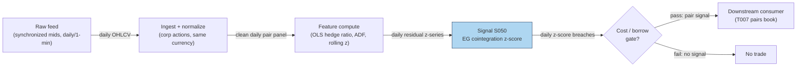

## Stage 50/200 — S050: Engle–Granger cointegration z-score

*Batch SB3 · Signal 50/100 · Provenance [D] · Family D — Pairs & cross-sectional arbitrage*

### S1. One-line verdict

| | |
|---|---|
| **What it is** | Regress one stock's (log) price on another's; if the residual is stationary (a fixed, finite-variance wobble), trade its z-score as a mean-reverting spread. |
| **When it works** | Two assets tied by a real economic link (same sector, ADR pair, futures-spot) whose price gap is stationary over the estimation window. |
| **When it dies** | Structural breaks (mergers, regime changes) that kill the cointegrating relationship; scanning thousands of pairs without multiple-testing correction; intraday microstructure noise. |
| **Build-or-buy in one line** | Build — the two-step estimator is a weekend project; spend the budget on borrow data and a second price source instead. |

### S2. How it works — plain human explanation

Two stocks can both wander randomly — up 40% one year, down 30% the next — and yet never drift too far apart. Think of Coca-Cola and PepsiCo: each follows its own path, but the *gap* between their (log) prices behaves like a rubber band. Economists call this **cointegration**: each series is non-stationary on its own (economists say *integrated of order one*, I(1) — its variance grows with time, like a random walk), but a particular linear combination of them is stationary (I(0) — it wobbles around a fixed mean with finite variance). The Engle–Granger procedure (1987) finds that combination with an ordinary least-squares (OLS) regression, tests the leftover residual for stationarity, and hands you a spread to trade: when the residual stretches far from its mean, bet on the snap-back.

At 2:40 p.m., the z-score of the KO–PEP spread hits −2.3 — 2.3 standard deviations cheap versus recent history. The trader buys the spread (long the cheap leg, short the rich leg in the regression's **hedge ratio**, the shares of B per share of A that keeps the position neutral), and covers when the z-score reverts toward zero. Same economics as S049's distance pairs — temporary mispricing between substitutes — but with a statistically disciplined spread definition and an explicit test that it mean-reverts.

- **Mental model, bullet 1:** Cointegration = a *tested* long-run relationship, not just two lines that happened to move together. The ADF test is what separates this signal from curve-fitted chart-watching.
- **Mental model, bullet 2:** The hedge ratio is estimated, not God-given — and the estimate is only as good as the formation window. Regime breaks silently convert your "stationary" spread into a trending loss.
- **Mental model, bullet 3:** Everything after the regression is plumbing: z-score thresholds, stops, and costs decide whether a statistically beautiful spread is a tradable one.

### S3. The math — exact formula

**Step 1 — cointegrating regression (formation window).** Regress (log) prices:

$$ \log P^A_t = \alpha + \beta \, \log P^B_t + \varepsilon_t $$

(levels $P^A_t = \alpha + \beta P^B_t + \varepsilon_t$ are also used; logs make $\beta$ a clean elasticity). The **hedge ratio** is $\hat{\beta}$: a long-spread position holds 1 unit of A against $\hat{\beta}$ units of B. Dollar neutrality is enforced separately: $q_A P^A_t \approx q_B P^B_t$. **Regression direction matters** — regressing A-on-B is not the same as B-on-A; choose the direction on economic grounds or test both with a pre-specified rule.

**Step 2 — stationarity test.** Run the Augmented Dickey–Fuller (ADF) regression on the residual $\hat{\varepsilon}_t$:

$$ \Delta \hat{\varepsilon}_t = \gamma \, \hat{\varepsilon}_{t-1} + \sum_{j=1}^{p} \phi_j \, \Delta \hat{\varepsilon}_{t-j} + u_t $$

Test $H_0: \gamma = 0$ (no cointegration — the residual has a **unit root**, i.e. it wanders forever) against $H_1: \gamma < 0$ (stationary, mean-reverting). **Use Engle–Granger/MacKinnon critical values, NOT ordinary t-distribution cutoffs** — the residual comes from an estimated regression, so standard tables are too lenient.

**Step 3 — z-score signal.** With rolling mean $\mu_{S,t}(L)$ and standard deviation $\sigma_{S,t}(L)$ of the spread over lookback $L$:

$$ z_t = \frac{S_t - \mu_{S,t}(L)}{\sigma_{S,t}(L)}, \qquad S_t = P^A_t - \hat{\alpha} - \hat{\beta} P^B_t $$

Enter at $|z_t| > z_{\text{entry}}$; exit at $z_t \to 0$ (or $|z_t| \le z_{\text{exit}}$); stop at $|z_t| > z_{\text{stop}}$ or a max holding time. Mandatory: a stop/time-stop, and a **multiple-testing correction** (adjusting significance thresholds when you test many pairs, so lucky coincidences don't flood the book — e.g. Bonferroni/Holm or false discovery rate (FDR) control) when scanning many pairs.

**Causal timing.** $z_t$ is computed at event/close $t$ using only data $\le t$; tradable no earlier than $t+1$. The regression coefficients and the ADF test are estimated on the formation window only — strictly before the trading interval (see S4 and S10).

| Parameter | Symbol | Typical range | Too small | Too large | Default (example) |
|---|---|---|---|---|---|
| Formation window | $T_F$ | 126–504 days | unstable $\hat{\beta}$, weak ADF power | stale relationship, breaks inside window | 252 days |
| z lookback | $L$ | 20–120 days | noisy $\sigma$, whipsaw entries | slow to adapt to new volatility | 60 days |
| Entry | $z_{\text{entry}}$ | 1.5–2.5 | overtrading | never trades | 2.0 |
| Exit | $z_{\text{exit}}$ | 0–0.5 | leaves money on the table | round trips | 0 |
| Stop | $z_{\text{stop}}$ | 2.5–4 | stopped by noise | catastrophic non-convergence | 3.0 |
| Max hold | $H_{\max}$ | 10–60 days | cuts slow convergences | dead capital in broken spreads | 30 days |
| ADF lags | $p$ | 0–5 (AIC/BIC — Akaike/Bayesian information criteria) | residual autocorrelation biases test | over-parameterized, low power | AIC-selected |

Every default is `example — not an institutional standard`.

**Named variants.** (1) *Johansen vector error-correction model (VECM)* (S055) — multivariate, handles $n>2$ legs. (2) *Kalman dynamic hedge* (S052) — the hedge ratio $\beta_t$ adapts over time. (3) *Zero-crossing-gated* (S053) — entries filtered by formation zero-crossing reliability.

### S4. Worked example — step-by-step numbers (SYNTHETIC)

All numbers below are **synthetic** — the hand-verified 20-day tape from the batch's chatbot Q&A (Duck.ai, GPT-5.6 Luna, 2026-09-10), with the operator-verified corrections applied. Random seed **50** pins the plotting script; the tape itself is a deterministic construction: $P^B_t = 100 + t$, $e_t = [-2,-1,0,1,2,1,0,-1,-2,0,2,1,0,-1,-2,-1,0,1,2,0]$, $P^A_t = 2P^B_t + e_t$. The stipulated spread $S_t = P^A_t - 2P^B_t = e_t$ is internally consistent as stipulated.

**Verified corrections to the chatbot's arithmetic** (operator hand-checked, used below): the spread's sum of squares is **32** (the bot said 40 — its listed squares 4,1,0,1,4,1,0,1,4,0,4,1,0,1,4,1,0,1,4,0 do sum to 32); the full-sample standard deviation is **$\sqrt{32/19} \approx 1.298$** (the bot said 1.451); the full-sample day-15 z is **$-2/1.298 \approx -1.541$** (the bot said −1.378). The 1.25-entry threshold still fires on day 15; the 2.0 entry still does not fire — **trade setup and conclusions are unchanged**, only the numbers are corrected.

**Correction to the chatbot's OLS sentence.** The bot claimed its tape implies $\hat{\alpha} \approx 0$, $\hat{\beta} \approx 2.00$ with deviations "uncorrelated with trend to rounding precision" — **wrong**. From its own table: $\sum e_t(t-10.5) = 20$, $\sum (t-10.5)^2 = 665$, so the true OLS estimates are $\hat{\beta} = 2 + 20/665 \approx \mathbf{2.0301}$ and $\hat{\alpha} = 221 - 2.0301 \times 110.5 \approx \mathbf{-3.32}$. The $S_t = P_A - 2P_B$ construction is internally consistent as stipulated; only the OLS-description sentence was inaccurate.

**Causally honest trading version.** In live trading, $\mu$ and $\sigma$ must come from information strictly before the trading interval. So: estimation on days 1–14 ($\mu_{14} = 0.0000$, $\sigma_{14} = 1.3009$), trading from day 15 on. (An ADF test on 20 observations has essentially no power — the two-step procedure is shown for mechanics, not as evidence of stationarity.)

| Day | $P_B$ | $P_A$ | Spread $S_t$ | $z_t$ (vs. days 1–14) | Action |
|---|---|---|---|---|---|
| 1–14 | 101.0 → 114.0 | 200.0 → 227.0 | $e_t$ per tape | −1.537 … +1.537 | **Estimation window only** — no trading |
| 15 | 115.0 | 228.0 | −2 | **−1.537** | **Enter long spread:** long 1 A @ 228.0, short 2 B @ 115.0 |
| 16 | 116.0 | 231.0 | −1 | −0.769 | Hold |
| 17 | 117.0 | 234.0 | 0 | 0.000 | **Exit** (zero-cross) |
| 18 | 118.0 | 237.0 | +1 | +0.769 | Flat |
| 19 | 119.0 | 240.0 | +2 | +1.537 | Flat |
| 20 | 120.0 | 240.0 | 0 | 0.000 | Flat |

Full 20-day tape (every value is plotted in the chart): $P^B_t = 100+t$; $P^A_t$ = 200.0, 203.0, 206.0, 209.0, 212.0, 213.0, 214.0, 215.0, 216.0, 220.0, 224.0, 225.0, 226.0, 227.0, 228.0, 231.0, 234.0, 237.0, 240.0, 240.0; spread $S_t = e_t$ as listed above. Estimation on days 1–14: $\mu_{14} = 0.0000$, $\sigma_{14} = 1.3009$; day-15 full-sample check: $z_{15} = -2/1.2978 \approx -1.541$.

Entry uses the `example` threshold $|z| > 1.25$; the first *trading* day breaching it is day 15 ($z_{15} = -1.537$; full-sample check: $-1.541$). **P&L walk (spread-points, gross, no fees):** A leg: $234.0 - 228.0 = +6.00$; B leg: $2 \times (115.0 - 117.0) = -4.00$. Net **$+2.00$ spread-points** as the spread runs from −2 to 0. `images/S050_example.png` plots exactly this spread with the ±1.25σ/±2σ bands estimated on days 1–14.

**Cost model — explicit components (`example`; the chapter's own stack).** Spread, fees, and impact/slippage are charged on every leg of every round trip. On the +2.00-spread-point gross above, value it at $100 per spread-point so the A leg is ~$22,800, the B leg ~$23,000, gross exposure ≈ $45,800: **spread** (crossing the half-spread on entry and exit, both legs — 4 half-spread crossings ≈ 2 bps of $45,800) ≈ **$9**; **commissions/fees** ≈ **$4** ($1 per leg-side); **borrow** (short B leg $23,000 × 50 bps annualized stock-loan × 2 days held) ≈ **$1**; **market impact/slippage** (1 bp of $45,800) ≈ **$5**. All-in ≈ **$19** → **net ≈ $181** on the $200 gross (+2.00 spread-points), i.e. **+1.81 spread-points**. Any tradable version of S050 pays spread, fees, borrow, and impact on every round trip.

**What to notice.** The tape is a clean laboratory: the spread oscillates with amplitude ~1.5σ, the entry fires on the first eligible trading day, and convergence arrives in two days. Its limits: the spread was *constructed* stationary, so this demonstrates mechanics, not edge — real spreads break. There are no fees, no bid–ask, no borrow cost, and fills are assumed. No backtest claims are made from these numbers.

### S5. Strategies that use this signal

- **T007 — Cointegration Z-Score Pairs** — primary entry trigger: the EG two-step estimates the hedge ratio and the z-score times entries, with Ornstein–Uhlenbeck (OU) half-life exits and a zero-crossing quality filter.
- **T031 — Distance Pairs + Quality Filter** — confirmatory filter: S050's regression hedge ratio cross-checks distance-selected pairs (S049) so the traded spread is the cointegrating one, not the naive 1:1.

### S6. Data required — exact spec

| Field | Type | Granularity | Source tier | Notes |
|---|---|---|---|---|
| Synchronized mids or lasts | float | daily or 1-min | Tier 1–2 | Same currency; timestamps aligned across legs |
| Corporate actions + delistings | factors/dates | daily/events | Tier 1–2 | Same as S049 — adjustments make or break the regression |
| Dollar volume / ADV | float | daily | Tier 1 | Liquidity screen before the ADF screen |
| Borrow availability / fee | float/bool | daily | Tier 2 | Short-leg feasibility |
| Ticker history, listing dates | mapping/date | as events | Tier 1–2 | Point-in-time universe |

**Collection method.** Same panel pipeline as S049, plus a synchronization step (asof-join the two legs to common timestamps — critical intraday). Ingest sketch (Python/polars, ≤20 lines):

```python
import polars as pl
bars = pl.read_parquet("clean/daily_panel.parquet")       # from S049 pipeline
a = bars.filter(pl.col("perm_id") == "A").select("date", pl.col("adj").log().alias("la"))
b = bars.filter(pl.col("perm_id") == "B").select("date", pl.col("adj").log().alias("lb"))
pair = a.join(b, on="date", how="inner").sort("date")     # synchronized, same currency
form = pair.head(252)                                      # formation window only
beta = form.select(pl.cov("la","lb")/pl.var("lb")).item()  # OLS hedge ratio
pair = pair.with_columns(spread=pl.col("la") - beta*pl.col("lb"))
```

**Storage.** Same as S049: daily panel trivial (~5 MB/day for 3,000 stocks, cost-model §4); synchronized 1-min pairs for a few hundred candidates are MBs/day.

**Data-quality checklist.** Timestamp synchronization (async prints create fake spreads intraday); same-currency legs; corporate actions on *both* legs; bid–ask bounce contaminating 1-min spreads (use mids); survivorship/point-in-time as in S049.

### S7. Local build on M5 Max / 128GB

**Feasibility: feasible (Tier M).** Pairs screens including the cointegration engine are explicitly Tier M in `notes/cost-model.md` §5. The EG two-step is OLS plus one ADF per candidate — the expensive part is the pair *screen*, so pre-screen 2M pairs by distance/correlation first, then run EG on 10k–100k survivors (labeled chatbot lead, consistent with §2's vectorized rates).

**Throughput.** OLS hedge ratios vectorize across candidates (~50–200M elements/sec per §2); the ADF shortlist is seconds to minutes. Rolling z on a few hundred live pairs is trivial. Bottleneck: data cleaning and the point-in-time security master, not the statistics.

| Stack | When to pick |
|---|---|
| Python + polars/numpy/statsmodels | Default: `statsmodels.tsa.stattools.adfuller` for the shortlist |
| DuckDB | Panel storage + candidate pre-screening in SQL |
| Rust | Only for full-universe rolling EG on 1-min bars |

**RAM.** Panel ~40–200 MB (§3); ADF shortlist negligible. Well inside the 77 GB budget.

**Engineering time.** Tier M, **20–60 h** → **$3,000–$9,000** `loaded-cost estimate` at $150/hr, plus data. Add ~10–20 h for the multiple-testing correction and leakage-test harness if built properly.

**What breaks first at 500 symbols / full OPRA:** running `adfuller` per pair in a Python loop over 2M pairs (hours+). Pre-screen first — liquidity filter → distance/correlation → EG on survivors. OPRA irrelevant to this signal.

### S8. Buy vs build

| Vendor / option | What you get | Indicative price | Buying gains | Buying loses |
|---|---|---|---|---|
| Tier-0: Stooq / free bars | Daily OHLCV | ~$0 | Prototype the regression today | No survivorship control; no borrow data |
| Tier-1: Tiingo / EODHD | Adjusted dailies + corp actions | ~$20–100/mo `indicative — verify before budgeting` | Cheapest adequate prototype stack (labeled lead) | Manual survivorship handling |
| Tier-1: Polygon Stocks Advanced | 1-min SIP bars | ~$30–200/mo `indicative — verify before budgeting` | Synchronized intraday legs | History depth costs extra |
| Tier-2: Sharadar | Survivorship-free point-in-time panel | tens–hundreds/mo `indicative — verify before budgeting` | Solves the delisting problem | Price |
| Precomputed pairs analytics (various) | Candidate pair lists | varies | Idea generation / cross-check | Must verify their universe, window, regression direction, cost treatment — benchmark, not signal engine (labeled lead) |

**Verdict: build the estimator, buy clean data.** The EG two-step is textbook statistics; the value is in *your* formation windows, *your* multiple-testing discipline, and *your* cost model. Never outsource hedge-ratio estimation to a black box you can't audit.

### S9. Success ratio / efficacy — documented evidence

| Study / source | Market & period | Metric | Before/after cost | Caveat |
|---|---|---|---|---|
| Rad, Low & Faff (2016), Quant. Finance (accepted ms.) — cointegration method | US equities, 1962–2014 | 0.85%/mo (Sharpe 0.77) before costs; 0.33%/mo (Sharpe 0.35) after costs | Both, side by side | Their 1–7 bps cost model; 61.35% of trades converged; converged trades averaged 4.37% (Sharpe 1.62) |
| Gatev, Goetzmann & Rouwenhorst (2006) | US equities, 1962–2002 | ~11% ann. excess, self-financing | After conservative cost estimates | Distance-method baseline; the cointegration literature benchmarks against it |
| Do & Faff (2010) | US equities, 1962–2009 | 0.86 → 0.37 → 0.24 %/mo across subperiods | Before explicit costs | The decay finding applies to pairs generally, cointegration included |

**Regimes where it fails.** Earnings and M&A (the cointegrating vector snaps); volatility shocks and auctions intraday; halts and one-leg liquidity loss; borrow recalls; index rebalances. The dominant risk is the spread ceasing to be stationary — which is exactly what the formation-window ADF said wouldn't happen. Intraday adds bid–ask bounce, asynchronous prints, and fragmentation (all labeled per H6 in S10).

**On the high intraday Sharpes in the literature.** One large S&P 500 minute-data study is reported (via the batch's chatbot Q&A) at ~50.5% annualized return and Sharpe ~8.14 "after its cost model" — the bot itself correctly flags this as an **upper-tail, spec-selected backtest**, and no checkable citation could be obtained, so it stays in Unverified leads, **never as a base case**. Conservative underwriting: daily/slow-intraday net Sharpe ~0.2–0.8; 5–30-minute liquid pairs ~0.3–1.0; Sharpe 2+ is exceptional. A net Sharpe ≈ 0.5 is already respectable.

**Honest bottom line.** As a standalone trigger, EG pairs are a *better-defined but unstable, capacity-limited* edge — the hedge ratio is principled, but breaks are the business model risk. As the spread-definition layer inside T007 (with half-life exits) or as T031's confirmation filter, it earns its keep.

### S10. Failure modes & pitfalls

- **Lookahead leakage** — estimating $\hat{\beta}$, the ADF, $\mu$, or $\sigma$ on data overlapping the trading interval; using smoothed (not filtered) regime estimates. Mitigation: hard formation/trading split — the worked example uses days 1–14 for estimation and trades from day 15; purged/embargoed validation (S088).
- **Multiple testing** — scanning 2M pairs at 5% significance manufactures hundreds of "cointegrated" pairs by luck. Mitigation: Bonferroni/Holm or FDR correction (the report entry mandates it); pre-screen economically sensible universes first.
- **Spurious regression** — OLS on two independent random walks *always* finds a "relationship". Mitigation: the ADF step is load-bearing; never trade a pair that fails it.
- **Regression-direction and window instability** — A-on-B ≠ B-on-A; $\hat{\beta}$ drifts across windows. Mitigation: pre-specified direction rule; monitor rolling $\hat{\beta}$; consider the Kalman variant (S052).
- **Cointegration breakdown** — the residual stops being stationary (corporate events, regime change). Mitigation: stop-loss at $z_{\text{stop}}$, max hold, re-estimate on a schedule, news blackout.
- **Intraday microstructure contamination** — bid–ask bounce and async prints fabricate spread wiggles. Mitigation: synchronized mids, 5-min+ bars to start, `simulated only — requires MBO/ITCH` honesty on any latency claim.
- **Cost blowup** — two legs, round trip, plus borrow on the short. Mitigation: all-in cost model per trade; the after-cost rows in S9 are the real benchmark.
- **Staleness** — formation relationships decay; a $\hat{\beta}$ from 2022 may not describe 2026. Mitigation: scheduled re-estimation (daily–monthly), walk-forward discipline.

### S11. Visuals




### S12. Sources

- Engle, R. F. & Granger, C. W. J. (1987). "Co-integration and Error Correction: Representation, Estimation, and Testing." *Econometrica*, 55(2), 251–276. http://ideas.repec.org/a/ecm/emetrp/v55y1987i2p251-76.html (RePEc record verifying the two-step estimator and the cointegration/error-correction representation theorem)
- Rad, H., Low, R. K. Y. & Faff, R. (2016). "The profitability of pairs trading strategies: distance, cointegration and copula methods." *Quantitative Finance* (accepted manuscript). https://pure.bond.edu.au/ws/portalfiles/portal/36339487/AM_The_profitability_of_pairs_trading_strategies.pdf (verifies cointegration-method 0.85%/mo before / 0.33%/mo after costs, Sharpe 0.77/0.35, 1962–2014)
- Schaffer, M. E. (2010, rev. 2022). "EGRANGER: Stata module to perform Engle–Granger cointegration tests." http://ideas.repec.org/c/boc/bocode/s457210.html (documents the EG test procedure and MacKinnon (1990, 2010) critical values used instead of ordinary t-tables)
- Elliott, R. J., van der Hoek, J. & Malcolm, W. P. (2005). "Pairs trading." *Quantitative Finance*, 5(3), 271–276. https://doi.org/10.1080/14697680500149370 (continuous-time mean-reverting spread model: the theoretical counterpart to the discrete EG residual trade)
- Caldeira, J. F. & Moura, G. V. (2013). "Selection of a Portfolio of Pairs Based on Cointegration: A Statistical Arbitrage Strategy." *Brazilian Review of Finance*, 11(1), 49–80. https://ideas.repec.org/a/bmf/borfin/v11y2013i1p49-80.html (cointegration-based pair selection with documented after-cost excess returns on a non-US sample)
- Krauss, C. (2017). "Statistical Arbitrage Pairs Trading Strategies: Review and Outlook." *Journal of Economic Surveys*, 31(2), 513–545. https://doi.org/10.1111/joes.12153 (survey placing the EG two-step among distance/cointegration/copula methods and documenting the post-2002 decay)

Duck.ai answered Q-SB3-1–Q-SB3-3 (2026-09-10); Grok/Cursor answers pending (checked 2026-09-10)

**Unverified leads**
- *Unverified chatbot claim* (Duck.ai, GPT-5.6 Luna, 2026-09-10, Q-SB3-1/Q-SB3-3): worked-example tape and procedure notes — operator hand-verified the arithmetic (sum of squares 32, std ≈ 1.298, day-15 z ≈ −1.541; true OLS $\hat{\beta} \approx 2.0301$, $\hat{\alpha} \approx -3.32$). Verified numbers are used in S4; unverified procedural claims are not promoted to evidence.
- *Unverified chatbot claim* (same source): S&P 500 minute-data intraday pairs study at ~50.5% annualized return, Sharpe ~8.14 "after its cost model" — the bot itself flags this as an upper-tail, spec-selected backtest. Preserved only as an upper tail; not a base case. No checkable citation obtained.
- Vidyamurthy, G. (2004). *Pairs Trading: Quantitative Methods and Analysis* (Wiley) — cited by the report entry as the practitioner reference; no checkable URL obtained, so not listed among the verified sources.
