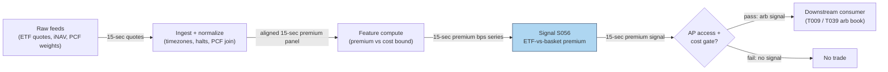

## Stage 56/200 — S056: ETF vs basket / iNAV arbitrage

*Batch SB3 · Signal 56/100 · Provenance [D/SR] · Family D — Pairs & cross-sectional arbitrage*

### S1. One-line verdict

| | |
|---|---|
| **What it is** | An exchange-traded fund (ETF) must track its basket; when its market price deviates from intraday NAV (iNAV) beyond creation/redemption costs, authorized participants arbitrage it — everyone else trades the statistical leftovers. |
| **When it works** | Liquid ETFs with clean baskets during orderly markets: deviations are small, frequent, and snap back via the creation/redemption mechanism. |
| **When it dies** | Without authorized-participant (AP) status you cannot create/redeem — you harvest only the crumbs APs leave; during stress, iNAV itself goes stale and the "arb" is a mirage. |
| **Build-or-buy in one line** | Buy the iNAV + basket feed; build the monitor; do not kid yourself that watching a premium on screen equals a tradable arbitrage. |

### S2. How it works — plain human explanation

An ETF is a fund that trades like a stock. It holds a basket of securities (say, the 500 stocks of the S&P 500 in index weights), and throughout the day the exchange publishes its **iNAV** — the *intraday net asset value*, also called the indicative optimized portfolio value (iOPV) — roughly every 15 seconds: the live value of one ETF share's slice of the basket. In a perfect world the ETF's market price would equal iNAV tick for tick.

The world is kept near-perfect by **authorized participants (APs)** — large broker-dealers with a signed agreement letting them transact directly with the ETF issuer. When the ETF trades at a **premium** (market price above iNAV/basket value), an AP buys the underlying basket in index weights, delivers it to the issuer, receives a **creation unit** (a big block of new ETF shares — typically 50,000 shares), and sells those shares into the premium. The extra supply pushes the ETF price back toward fair value, and the AP keeps the difference minus costs. When the ETF trades at a **discount**, the AP does the reverse: buys the cheap ETF shares, tenders them to the issuer (**redemption**), receives the underlying basket, and sells it.

Now the desk at 10:47 a.m.: QTE, a liquid equity ETF, prints $100.15 while its iNAV reads $100.00 — a 15-basis-point (bp; 1 bp = 0.01%) premium. The full loop (buy $5M of basket, pay the creation fee, deliver, sell 50,000 ETF shares) costs about 5 bps all-in. The 15 bps premium clears the cost bound, so the AP desk creates. An hour later QTE shows a 4 bps premium — visible on every screen on the street, but below the 8 bps round-trip cost bound: *visible but not monetizable*. That gap between "deviation exists" and "deviation pays" is the entire signal.

- **Mental model, bullet 1:** The ETF price is tethered to the basket by AP arbitrage, not by magic — the tether's strength equals (creation/redemption costs)⁻¹.
- **Mental model, bullet 2:** iNAV is an *indication*, not a tradable price: stale components, closed foreign markets, and wide-spread constituents all make it lie a little.
- **Mental model, bullet 3:** For non-APs this is a basis trade with basis risk, not an arbitrage — size it like one.

### S3. The math — exact formula

**Premium/discount.** With $P_{\text{ETF},t}$ the ETF's market price and $\text{iNAV}_t$ the intraday NAV at time $t$:

$$ \text{premium}_t = \frac{P_{\text{ETF},t} - \text{iNAV}_t}{\text{iNAV}_t} $$

**Basket residual.** With constituent prices $P_{i,t}$ and index weights $w_i$ from the official **PCF** (portfolio composition file — the issuer's daily recipe of what one creation unit contains):

$$ \text{residual}_t = P_{\text{ETF},t} - \sum_i w_i P_{i,t} $$

**Actionable bound.** Trade only if the deviation clears the all-in cost bound $c$ (`example — not an institutional standard`):

$$ |\text{premium}_t| > c, \qquad c = \text{spread} + \text{fees} + \text{financing} + \text{impact/slippage} + \text{risk reserve} $$

**Creation loop (premium $> c$):** buy the creation basket in index weights → deliver basket to issuer → receive creation units → sell ETF shares. **Redemption loop (discount, $-\text{premium} > c$):** buy ETF shares → tender to issuer → receive basket → sell basket. The non-AP statistical proxy skips the issuer entirely: short the rich leg, buy the cheap leg, exit on convergence.

**Causal timing.** iNAV prints on a ~15-second cadence; the basket leg must be executable at the observed constituent prices. The signal at snapshot $t$ is tradable no earlier than $t+1$ (and only if the basket can actually be assembled — see S10).

| Parameter | Symbol | Typical range | Too small | Too large | Default (example) |
|---|---|---|---|---|---|
| Cost bound | $c$ | 3–20 bps | trades noise, loses to costs | never trades | 8 bps |
| iNAV cadence | — | 15 sec | stale signal | — | 15 sec |
| Creation unit | — | 25,000–100,000 shares | — | capital-intensive per loop | 50,000 shares |
| Exit | — | convergence / end of day | gives back the snap-back | wears overnight basis risk | premium < $c/2$ |

Every default is `example — not an institutional standard`.

**Named variants.** (1) *Full-replication creation arb* — the AP loop above, exact PCF weights. (2) *Statistical ETF-vs-basket* — non-AP proxy with futures or a subset basket as the hedge leg. (3) *ETF-vs-ETF basis* — two ETFs on the same index (Petajisto-style): no basket assembly needed, but the deviation must still clear two-way trading costs.

### S4. Worked example — step-by-step numbers (SYNTHETIC)

All numbers below are **synthetic** — a 12-snapshot tape for a fictitious ETF "QTE", random seed **56**, plotted in `images/S056_example.png`. Actionable cost bound: **8 bps** (`example — not an institutional standard`). Creation unit: **50,000 shares × $100 = $5,000,000 notional** — arithmetic independently verified (VanEck's issuer documentation confirms 50,000-share creation blocks; at 5 bps of notional one creation captures $5{,}000{,}000 \times 0.0005 = \mathbf{\$2{,}500}$ gross).

**P&L walk for the snapshot-6 creation (gross → net):** gross capture = $50{,}000 \times \$100.00 \times 0.0015 = \mathbf{\$7{,}500}$. Costs (`example` schedule — explicit components): **spread** (crossing the bid–ask: basket leg 1.0 bp on $5M = $500; ETF leg 0.75 bp on $5,007,500 ≈ $375) ≈ **$875**; **fees** (creation fee $500 + commissions $125) = **$625**; **market impact/slippage** (adverse basket-assembly drift + execution slippage: basket leg 1.0 bp = $500; ETF leg 0.75 bp ≈ $375) ≈ **$875**; **financing/misc** $125. Total costs ≈ **$2,500** → **net ≈ $5,000** per creation unit. The snapshot-9 episode (+4 bps) would gross $2,000 against the same ~$2,500 cost stack — a certain loss, so no trade.

| Snapshot (5-min) | iNAV | ETF price | Premium (bps) | Action |
|---|---|---|---|---|
| 1 | 100.00 | 100.00 | 0.0 | — |
| 2 | 100.02 | 100.03 | 1.0 | — |
| 3 | 99.98 | 99.99 | 1.0 | — |
| 4 | 100.01 | 100.02 | 1.0 | — |
| 5 | 100.03 | 100.04 | 1.0 | — |
| 6 | 100.00 | 100.15 | **15.0** | **CREATE:** buy $5M basket → deliver → sell 50,000 ETF @ 100.15 |
| 7 | 100.02 | 100.14 | 12.0 | (position on; premium compressing) |
| 8 | 99.99 | 100.00 | 1.0 | Converged |
| 9 | 100.01 | 100.05 | 4.0 | **No trade:** 4 bps < 8 bps bound — visible but not monetizable |
| 10 | 100.00 | 100.01 | 1.0 | — |
| 11 | 100.02 | 100.01 | −1.0 | — |
| 12 | 100.01 | 100.01 | 0.0 | — |


**What to notice.** The example is really about the bound, not the premium: the market prints deviations all day (snapshots 2–5, 9–11), and only one clears costs. Its limits: fills are assumed at printed prices, the basket assembles instantly with no drift, and the creation fee/schedule is illustrative. Real creation economics add adverse basket-assembly drift and tracking error. No backtest claims are made from these numbers.

### S5. Strategies that use this signal

- **T009 — ETF-vs-Basket Arbitrage** — primary trigger: the premium-vs-cost-bound signal fires the creation/redemption loop, confirmed by the futures-spot lead-lag signal (S059).
- **T039 — ETF Creation/Redemption Flow Trader** — primary flow trader: S056's discount/premium dislocations are confirmed by block volume (S094) and relative volume (S032) to trade the AP flow footprint itself.

### S6. Data required — exact spec

| Field | Type | Granularity | Source tier | Notes |
|---|---|---|---|---|
| ETF quotes (bid/ask/last) | float | real-time / 1-sec | Tier 1–2 | Multi-venue preferred; NBBO (national best bid and offer) at minimum |
| iNAV / iOPV | float | ~15-sec | Tier 1–2 (exchange feed) | Indicative only — stale components possible |
| Constituent prices | float | real-time | Tier 1–2 | Same timestamps as the ETF print |
| PCF (portfolio composition file) | weights | daily | Issuer (free) | Official basket recipe per creation unit |
| Creation-unit size + fee schedule | int/float | as published | Issuer | e.g. 50,000 shares; fees vary by fund |
| Corporate actions on constituents | factors | daily/events | Tier 1–2 | Basket must reflect today's composition |

**Collection method.** ETF + constituent quotes from a consolidated feed (Databento multi-venue, Polygon SIP — the Securities Information Processor, the consolidated tape); iNAV from the listing exchange's feed; PCF scraped daily from the issuer site. Ingest sketch (Python/polars, ≤20 lines):

```python
import polars as pl
etf = pl.read_parquet("raw/etf_quotes.parquet")      # ts, bid, ask, last
inav = pl.read_parquet("raw/inav.parquet")           # ts, inav  (~15-sec cadence)
pcf = pl.read_csv("raw/pcf_QTE.csv")                 # constituent, weight
px = (etf.join_asof(inav.sort("ts"), on="ts", strategy="backward", tolerance="15s")
         .with_columns(mid=(pl.col("bid")+pl.col("ask"))/2)
         .with_columns(prem_bps=(pl.col("mid")-pl.col("inav"))/pl.col("inav")*1e4))
signals = px.filter(pl.col("prem_bps").abs() > 8.0)  # 8 bps bound: example
```

**Storage.** Per cost-model §4: 1-min bars for the ETF + a few hundred constituents ≈ tens of MB/day — trivial. Tick-level multi-venue quote storage for a full ETF universe gets heavy fast; monitor a watchlist, archive selectively.

**Data-quality checklist.** iNAV staleness (closed foreign markets, halted components); PCF vs actual basket drift (cash, futures, swaps inside the fund); timestamp alignment across venues; corporate actions; creation-halt/restriction notices from the issuer.

### S7. Local build on M5 Max / 128GB

**Feasibility: feasible (Tier M).** A premium monitor is a streaming join plus arithmetic — computationally trivial. It is Tier M rather than Tier L because of the real-time plumbing: synchronized multi-symbol quote ingestion, PCF management, and a decision loop on 15-second iNAV cadence.

**Throughput.** Per cost-model §2, Python event loops handle ~100–500k events/sec — plenty for an ETF watchlist on L1; the premium panel recompute is microseconds per symbol. Bottleneck: feed latency and quote normalization, not CPU.

| Stack | When to pick |
|---|---|
| Python + polars | Default: the monitor is a streaming join; fastest to verify |
| Rust | If you co-locate and need microsecond quote handling (then you're not really "local" anymore) |
| DuckDB | Historical premium/discount research over archived panels |

**RAM.** Live working set: MBs. 60 days of 1-min bars for 200 ETFs + top constituents: hundreds of MB (§4) — fits easily in the 77 GB budget (§3).

**Engineering time.** Tier M, **20–60 h** for the monitor + cost-bound engine + paper-trading harness → **$3,000–$9,000** `loaded-cost estimate` at $150/hr, plus data. AP connectivity and prime-brokerage setup (if pursued) are a separate institutional project, not included.

**What breaks first at 500 symbols / full OPRA:** *data licensing*, not compute — full-universe constituent-level real-time data plus historical iNAV gets expensive. And none of this buys AP status or low-latency execution; a home Mac cannot compete with co-located AP desks on speed.

### S8. Buy vs build

| Vendor / option | What you get | Indicative price | Buying gains | Buying loses |
|---|---|---|---|---|
| Tier-0: exchange delayed quotes + issuer PCFs | 15-min delayed ETF/iNAV, free basket recipe | ~$0 | Learn the mechanics free | Useless for live signals |
| Tier-1: Polygon / Alpaca SIP | Real-time SIP quotes, 1-min bars | ~$30–200/mo `indicative — verify before budgeting` | Cheapest live premium monitor | SIP latency vs direct feeds; no depth |
| Tier-2: Databento multi-venue | Consolidated L1/L2 (level-1 top-of-book / level-2 depth), futures, OPRA research | ~$200/mo + usage `indicative — verify before budgeting` | Honest synchronized basket pricing | Overkill for a watchlist monitor |
| Academic: exchange TAQ (trades and quotes) / LOBSTER (Limit Order Book System — The Efficient Reconstructor)-style | Replay-grade history | ~hundreds/yr academic `indicative — verify before budgeting` | Proper historical premium research | Not real-time; licensing limits |

**Verdict: buy the feed, build the monitor.** Nobody sells "your cost bound" — the bound depends on your fees, financing, and execution skill, so the signal logic must be yours. The crossover: if you need full-universe historical iNAV for research, price the academic/TAQ route before building a scraper farm. And the hard truth: no vendor sells AP status — without it you are building the *statistical proxy*, so underwrite accordingly (see S9).

### S9. Success ratio / efficacy — documented evidence

| Study / source | Market & period | Metric | Before/after cost | Caveat |
|---|---|---|---|---|
| Petajisto (2017), "Inefficiencies in the Pricing of Exchange-Traded Funds", *Financial Analysts Journal* | US ETFs, multi-asset sample | ETFs with identical portfolios: average price deviation ~100 bps; larger in international/non-Treasury bond funds, minor in diversified US equity and Treasury funds | Before-cost research measurement (deviations, not net P&L) | Metrics as reported by CFA Institute/FPA coverage of the paper; deviations ≠ profits |
| Petajisto (2017), trading-strategy result (same coverage) | High-deviation ETF asset classes | Up to ~16% annual Carhart four-factor alpha from a strategy exploiting pricing inefficiencies | Before-cost backtest (gross alpha) | Requires actually capturing the deviations; APs/MMs (market makers) capture the cleanest ones first |
| "Active Trading in ETFs" (2021), *Financial Analysts Journal* v77n2, via CFA Institute summary | Large ETF sample over time | High-frequency algorithmic trading activity reduces the persistence of ETF mispricing; prices more accurate when HFT present | Research finding (not a P&L number) | Secondary summary; directionally: the easy deviations get arbed away faster over time |
| BIS Quarterly Review (Mar 2018), "Trading mechanisms of ETFs" | Structural | AP creation/redemption + secondary-market arbitrage keep ETF prices near NAV | Mechanism description | Confirms the bound logic of S3; not a return figure |

**The monetizability caveat (preserved).** iNAV ≠ a free arbitrage price: stale prices, closed foreign markets, wide-spread components, futures/swaps inside the fund, corporate actions, creation restrictions, and different trading hours all inject phantom deviations. The batch's chatbot evidence summary puts it bluntly and correctly: *most visible iNAV deviations are not monetizable after costs* — the cleanest dislocations go to APs, ETF market makers, and low-latency prop firms. A small non-AP operation is left with illiquid-ETF dislocations, auction/rebalance effects, ETF-futures basis, cross-venue execution, and event-driven dislocations — lower frequency, smaller bps, execution-exposed, capacity-limited.

**Honest bottom line.** As a *signal*, ETF-vs-basket premium is a real, measurable, economically grounded quantity. As a *standalone P&L source* for a non-AP desk, it is a thin basis trade: underwrite small, trade only clean deviations that clear a conservative bound, and expect the Sharpe to come from discipline (not trading the 4-bps prints) rather than from edge magnitude.

### S10. Failure modes & pitfalls

- **No AP access** — you cannot create/redeem, so the "arbitrage" is a basis trade wearing someone else's convergence. Mitigation: size as a statistical trade; demand wider bounds; track AP flow (T039) instead of pretending to be one.
- **Stale iNAV** — closed foreign markets or halted components make iNAV a stale guess; the premium is fiction. Mitigation: freshness flags per constituent; widen the bound when staleness is high; skip affected funds.
- **Lookahead leakage** — using the published end-of-day NAV or a revised PCF as if known intraday. Mitigation: point-in-time PCFs; all estimates from information strictly before the trading snapshot.
- **Creation restrictions / halts** — issuers can and do restrict creations; the tether snaps exactly when you need it. Mitigation: monitor issuer notices; hard position caps around events.
- **Basket-assembly drift** — by the time your basket is assembled, prices moved against you (adverse drift), plus tracking error vs the PCF. Mitigation: model assembly cost explicitly; prefer liquid large-cap ETFs.
- **Cost-bound optimism** — underestimating impact on 500 names at once. Mitigation: the S4 cost stack is a floor, not a ceiling; stress the bound at 2× before sizing.
- **Latency** — SIP-vs-direct and 15-sec iNAV cadence mean the print you see is not the market you get. Any latency-sensitive claim here is `simulated only — requires MBO (market-by-order)/ITCH (Nasdaq's ITCH direct feed)`.
- **Overfitting the bound** — tuning the 8 bps threshold on history until it "works". Mitigation: bound comes from your actual fee schedule, not from optimization.

### S11. Visuals




### S12. Sources

- VanEck. "ETF 101/102: The Inner Workings of ETF Creations and Redemptions." https://vaneck.com/us/en/blogs/thematic-investing/etf-102-the-inner-workings-of-etf-creations-and-redemptions (issuer documentation verifying the AP creation/redemption loop and 50,000-share creation blocks)
- ETF.com. "ETF Univ: What Is The Creation/Redemption Mechanism?" https://www.etf.com/sections/etf-report-features/etf-univ-what-creationredemption-mechanism (verifies the premium/discount arbitrage loop and the 50,000-share redemption example)
- Bank for International Settlements. "Trading mechanisms of ETFs compared with other fund types." *BIS Quarterly Review*, March 2018 (extract). https://www.bis.org/publ/qtrpdf/r_qt1803z.htm (verifies APs transacting in primary and secondary markets as the mechanism keeping ETF prices near NAV)
- Jain, A., Jain, C. & Jiang, C. X. (2021). "Active Trading in ETFs: The Role of High-Frequency Algorithmic Trading." *Financial Analysts Journal*, 77(2), 66–82. https://ideas.repec.org/a/taf/ufajxx/v77y2021i2p66-82.html (verifies the S9 finding: higher algorithmic trading reduces ETF price-deviation magnitude and persistence through intraday arbitrage and narrower spreads)
- Petajisto, A. (2017). "Inefficiencies in the Pricing of Exchange-Traded Funds." *Financial Analysts Journal*, 73(1), 24–54 — via CFA Institute coverage: https://www.cfainstitute.org/about/press-room/2018/cfa-institute-financial-analysts-journal-announces-2017-winners and https://www.financialplanningassociation.org/article/journal/SEP17-new-research-wealth-management-and-behavioral-finance-deserves-your-attention (verifies ~100 bps average deviation for identical-portfolio ETFs, larger in international/bond funds, ~16% gross Carhart four-factor alpha result, and the 15-second IIV/iNAV cadence)
- Lettau, M. & Madhavan, A. (2018). "Exchange-Traded Funds 101 for Economists." *Journal of Economic Perspectives*, 32(1), 135–154. https://doi.org/10.1257/jep.32.1.135 (the ETF architecture survey: creation/redemption mechanics, AP incentives, and the liquidity/tax/transparency structure behind the S3 bound logic)
- Ben-David, I., Franzoni, F. & Moussawi, R. (2018). "Do ETFs Increase Volatility?" *Journal of Finance*, 73(6), 2471–2535. https://doi.org/10.1111/jofi.12727 (documents the arbitrage channel's flip side: ETF ownership raises underlying-stock volatility — the stress-regime caveat for basis trades)

Duck.ai answered Q-SB3-1–Q-SB3-3 (2026-09-10); Grok/Cursor answers pending (checked 2026-09-10)

**Unverified leads**
- *Unverified chatbot claim* (Duck.ai, GPT-5.6 Luna, 2026-09-10, Q-SB3-3): creation-unit economics illustration "50,000 × $100 = $5M notional; 5 bps = $2,500 gross/creation" — the arithmetic is independently verified and VanEck confirms 50,000-share blocks, so it is used in S4 as labeled verified arithmetic, not as a third-party statistic.
- *Unverified chatbot claim* (same source): "most visible iNAV deviations are not monetizable after costs" — directionally consistent with Petajisto's findings and the AP-capture structure, but phrased as the bot's synthesis; kept as a labeled lead in S9, not as a sourced statistic.
