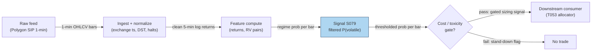

## Stage 79/200 — S079: HMM regime-switching (trend & volatility states)

*Batch SB3 · Signal 79/100 · Provenance [D] · Family F — Statistical/ML infrastructure*

### S1. One-line verdict

| | |
|---|---|
| **What it is** | A hidden Markov model (HMM) that infers the market's latent (unobserved) regime — calm vs. volatile — from returns, and gates other signals by the filtered regime probability. |
| **When it works** | Persistent regimes (days-to-weeks vol states; minutes-to-hours momentum states); used as a risk dial and signal veto. |
| **When it dies** | Fast regime whipsaws, structural breaks the model never saw, and overfit state counts; 1–2 period detection lag at every turn. |
| **Build-or-buy in one line** | Build: the math is textbook and the compute is trivial — buy only the bar data. |

Provenance: **[D]** (documented; Hamilton 1989 lineage; ES-futures intraday HMM paper, Christensen–Godsill–Turner 2020). Family F — Statistical/ML infrastructure.

### S2. How it works — plain human explanation

It is 14:32 and ES futures are printing on 5-minute bars. A headline hits and three bars print −40, +55, −70 basis points. A moving-average filter takes several bars to admit the world changed — its lag is mechanical. An HMM instead asks: *given everything seen so far, what is the probability we are now in the "volatile" regime?* Within one or two bars, that probability can jump from 0.1 to 0.9, because the model compares each new return against two candidate distributions (calm: small σ; volatile: large σ) and updates a belief with Bayes' rule.

A few definitions, since the jargon is load-bearing. A **hidden state** is a market condition you cannot observe directly (calm/volatile) — you only see its consequences in returns. The **transition matrix** holds the probabilities of switching states. **Emissions** are the return distributions each state produces. The **forward algorithm** recursively computes **filtered probabilities** — each state's probability using only data up to now. **Baum–Welch** is the EM procedure that estimates the matrix and emissions from history.

Regimes exist because risk appetite is not constant: leverage constraints, dealer hedging, and macro news absorption arrive in episodes, so volatility clusters and return shapes change for days at a time. A regime model captures **volatility clustering** (big moves follow big moves) and **fat tails** (two normals mixed have heavier tails than one) — the facts Ang & Timmermann (2011) survey. The signal is not directional; it is a *meta-signal* telling every other signal how much to trust itself.

- **Mental model:** the market has 2–3 moods; infer the mood from returns with Bayes' rule, never peeking at the future.
- **Mental model:** the output is a probability, not a trade — a position-size dial (scale ∝ 1/σ̂ of the inferred state) or a veto (stand down when P(volatile) is high).
- **Mental model:** states are unlabeled by the math — you name them "calm" and "volatile" by inspecting the estimated σ after fitting.

### S3. The math — exact formula

Let r_t be the log return of bar t and s_t ∈ {1, …, K} the hidden state:

$$r_t \mid s_t = k \sim \mathcal{N}(\mu_k, \sigma_k^2), \qquad \Pr(s_t = j \mid s_{t-1} = i) = A_{ij}$$

Estimation is by Baum–Welch (forward–backward EM); **online inference uses only the forward algorithm**:

$$\alpha_t(j) = f(r_t \mid s_t = j)\sum_{i=1}^{K}\alpha_{t-1}(i)\,A_{ij}, \qquad \Pr(s_t = k \mid r_{1:t}) = \frac{\alpha_t(k)}{\sum_j \alpha_t(j)}$$

where f is the Gaussian density. The one-step-ahead forecast used for gating is P̂_{t+1}(vol) = Σ_i A_{i,vol}·Pr(s_t = i | r_{1:t}), and a position-scale rule from the report entry (Hamilton 1989 vol form): scale ∝ 1/σ̂ of the inferred state.

**Expected state duration** (corrected — the Duck.ai example dropped the fraction; operator-verified fix): E[D_i] = 1/(1 − A_ii) in bars. A calm self-transition of 0.97 implies ≈33-bar calm spells.

| Parameter | Symbol | Typical range | Too small / too large | Default (example) |
|---|---|---|---|---|
| # states | K | 2–3 | 1 = no regimes; ≥4 = overfit, unstable labels | 2 (calm/volatile) |
| State vols | σ_k | 0.2–2.0% per bar | σ̂ gap too small → states unidentifiable | σ = (0.4%, 1.2%) |
| Self-transition | A_ii | 0.90–0.995 | →1: never switches; low: whipsaws | 0.97 / 0.92 |
| Halve-size threshold | τ_half | 0.6–0.8 | low: de-risks on noise; high: too late | 0.7 |
| Suspend threshold | τ_susp | 0.75–0.9 | low: never trades; high: no protection | 0.8 |
| Train window | T_train | 20–120 days of bars | short: noisy A; long: stale regimes | 60 days |
| Refit cadence | — | daily–weekly | intraday refit: overfit churn | weekly |
| Min persistence | — | 3–20 bars | none: flickering gates | 5 bars |

All defaults are *example — not an institutional standard*. **Normalization:** raw log returns are standard; variants standardize by trailing realized vol or feed (r_t, RV_t) pairs as bivariate emissions. **Causal timing:** filtered probability at bar t uses only data ≤ t; any position change is tradable no earlier than bar t+1. Detection lag is 1–2 periods by construction.

Named variants: (1) **2-state vs 3-state** (bull/range/bear, per the report's practitioner form); (2) **time-varying transition probabilities** — Haase & Neuenkirch (2020) drive A with macro principal components; (3) **input-output HMM** — Christensen et al. (2020) condition transitions on side information (RV ratios, intraday seasonality).

### S4. Worked example — step-by-step numbers (SYNTHETIC)

Synthetic 120-bar 5-min tape, **seed 79** (`batches/SB3/plot_S079.py`). True params: calm N(+3 bp, 40 bp), volatile N(−5 bp, 120 bp), A = [[0.97, 0.03],[0.08, 0.92]] → E[D_calm] ≈ 33.3 bars, E[D_vol] = 12.5 bars. The demo filter uses the true parameters (production: Baum–Welch). Thresholds 0.7/0.8 are *example*.

| Bar | r_t (bp) | True state | Filtered P(volatile) | Rule action |
|---|---|---|---|---|
| 40 | +13.99 | calm | 0.7940 | halve size |
| 41 | +16.37 | calm | 0.4926 | full size |
| 42 | +24.15 | calm | 0.2469 | full size |
| 43 | +28.68 | calm | 0.1159 | full size |
| 44 | +218.00 | volatile | 0.9999 | SUSPEND entries |
| 45 | +88.77 | volatile | 0.9657 | SUSPEND entries |
| 46 | +51.02 | calm | 0.8317 | SUSPEND entries |
| 47 | −22.00 | calm | 0.5736 | full size |
| 48 | +47.39 | calm | 0.3975 | full size |
| 49 | −51.16 | calm | 0.3253 | full size |
| 50 | +4.99 | calm | 0.1351 | full size |
| 51 | +74.66 | calm | 0.1905 | full size |

Hand-check of bar 46 (forward update): filtered bar-45 = (calm 0.034339, vol 0.965661). Predict: P̂(vol) = 0.034339×0.03 + 0.965661×0.92 = 0.889438. r_46 = 51.02 bp gives Gaussian likelihoods 48.5243 (calm) and 29.8135 (vol). Numerators: 0.110562×48.5243 = 5.3650 (calm), 0.889438×29.8135 = 26.5172 (vol); total 31.8822 → P(vol) = **0.8317**, matching the table — still above the 0.8 suspend line even though the true state flipped back to calm: the 1–2 period exit lag.

*What to notice:* the filter snaps to 0.9999 within one bar of the +218 bp shock (the lag-free property Christensen et al. emphasize), but exits slowly — a real gate would stay sidelined through bar 46's recovery. Toy tape: no fees, known-true parameters, no label switching — a mechanics demo, not a backtest.

### S5. Strategies that use this signal

- **T053 — primary regime switch**: the HMM state decides which book trades — momentum in trend states, reversal in range states.
- **T006 — vol-regime allocator (sizing/filter)**: scales intraday momentum by 1/σ̂ of the inferred state; stands down above the suspend threshold.
- **T096 — Kalman+HMM adaptive trend (gate)**: HMM regime gates the Kalman fair-value trend — trend-following only when the calm/trend state dominates.
- **T043 — GARCH regime filter (cross-check)**: uses S079 as an independent regime read alongside the GARCH vol regime.

### S6. Data required — exact spec

| Field | Type | Granularity | Source tier | Notes |
|---|---|---|---|---|
| Bar timestamp (exchange) | datetime64 | 1-min or 5-min | Tier 1–2 | normalize to exchange tz; handle DST |
| Open/high/low/close | float | 1-min or 5-min | Tier 1–2 | splits/dividends adjusted |
| Volume | int | 1-min or 5-min | Tier 1–2 | for RV-pair emission variant |
| Session/halt flags | bool | per bar | Tier 1–2 | drop halted bars before fitting |

≤20-line ingest sketch (Polygon 1-min SIP bars; research-grade tick → resample via Databento MBP-1):

```python
import polars as pl
bars = pl.read_parquet("data/bars_1m/*.parquet")          # ts, sym, o,h,l,c, v
bars = bars.with_columns(
    pl.col("ts").dt.convert_time_zone("America/New_York").alias("ts_et"))
bars = bars.filter(pl.col("ts").dt.time().is_between("09:30", "16:00"))
bars = bars.with_columns(r=pl.col("c").log().diff().over("sym"))  # log returns
bars = bars.drop_nulls().sort(["sym", "ts"])
r5m = bars.group_by_dynamic("ts", every="5m", group_by="sym").agg(
    pl.col("r").sum().alias("r5"))                        # 5-min log returns
```

Storage per cost-model.md §4: 1-min bars, 500 symbols ≈ 50 MB/day parquet (~3 GB per 60 days). DQ checklist: exchange-timestamp normalization; corp-action adjustment; halt/auction exclusion; DST/half-days; stale-quote filtering.

### S7. Local build on M5 Max / 128GB

**Feasibility: trivial.** The forward filter is O(K²) per bar — microseconds; Baum–Welch on 60 days of 5-min bars is seconds. Per cost-model.md §2, numpy does ~50–200M elements/sec, so the HMM math is never the constraint; a chatbot engineering lead for this batch (Duck.ai 2026-09-10) concurs — "HMM compute negligible" — consistent with the cost model, which governs on any conflict.

- **Throughput:** filter ~10M+ bars/sec vectorized; Baum–Welch refit of one symbol in seconds; 500 symbols refit weekly in minutes, embarrassingly parallel. Bottleneck is bar ingest, never the HMM.
- **Stack:** Python + numpy/pandas or `hmmlearn`; Rust only if the filter must sit inside a microsecond tick loop (rare — bars are slow). Pick Python.
- **RAM:** 500 symbols × 60 days of 1-min bars ≈ 12 MB (§3) — trivial; Baum–Welch temporaries stay under 1 GB. Working set ≪ 77 GB budget (§3).
- **Engineering / scale:** Tier M per cost-model.md §5 (**20–60 h ≈ $3,000–9,000** at $150/hr) — mostly data plumbing and gating harness; nothing in the HMM breaks at 500 symbols (nightly batch refits, intraday forward pass only).

### S8. Buy vs build

| Option | What you get | Indicative price | Buying gains | Buying loses |
|---|---|---|---|---|
| Tier 0: Stooq / Yahoo daily bars + own code | Daily data, DIY HMM | ~$0 | free | daily only |
| Tier 1: Polygon Stocks Advanced / Alpaca SIP | 1-min real-time SIP bars, corp actions | ~$30–200/mo | clean bars + actions | SIP timestamps, no depth |
| Tier 2: Databento Standard | MBP-1 L1, futures, OPRA research | ~$200/mo + usage | honest L1 for tick variants | usage meter on history |
| Academic/institutional: LOBSTER | MBO/ITCH replay | ~hundreds/yr academic | true event-time research | academic license limits |

All prices *indicative — verify before budgeting*. **Verdict: build.** Data tier ≤ 2, eng Tier M, and the gate thresholds are your own risk parameters — nobody sells your risk dial. Buy the bars (Tier 1), build the filter. Crossover: only consider a vendor "regime product" if you need someone else's audited risk label for compliance reasons.

### S9. Success ratio / efficacy — documented evidence

| Study / source | Market & period | Metric | Before/after cost | Caveat |
|---|---|---|---|---|
| Nystrup, Madsen & Lindström (2017), *Quantitative Finance* — HMM time-varying parameters + model-predictive-control allocation | Major stock indices | Beats static rule and buy-and-hold on return and risk | **After cost** (transaction costs + 1-day delay modeled) | Monthly-ish; tx costs + delay modeled, intraday spread/impact not |
| Haase & Neuenkirch (2020), Univ. of Trier — MS models with time-varying transitions + forecast combination, S&P 500 | US, weekly, 1989–2021 (864-week OOS) | Regime forecasts timely; beat benchmarks risk-adjusted | **After cost** (lags, revisions, transaction costs in backtest) | Return forecasts did *not* beat benchmarks — regimes yes, returns no |
| Christensen, Godsill & Turner (2020), arXiv:2006.08307 — intraday momentum HMM | ES-style futures (intraday) | Lag-free sign flips at change points vs digital filters | Before-cost (no after-cost trading Sharpe reported) | Offline learning + fast inference; side-information extensions untested live |

Regimes where it fails: volatility spikes faster than the refit window; prolonged low-vol grinds where the two emission distributions overlap and labels flicker; structural breaks (tick-size changes, new participants) that invalidate A.

**Honest bottom line:** as a standalone directional trigger this is a *weak, mostly undocumented* edge; as a **regime gate / sizing dial** it is *documented* (two after-cost allocation studies). Buy it for risk control, not for alpha.

### S10. Failure modes & pitfalls

1. **Smoothed vs filtered lookahead — the big one.** Forward–backward (smoothed) state probabilities use future data; they are for research plots only. **Live signals must use filtered probabilities (forward algorithm only).** (Chatbot-provided honesty rule, Duck.ai 2026-09-10 — verified and kept.) Mitigation: separate `filter_live()` from `smooth_research()`; unit-test that live outputs never call the backward pass.
2. **State label switching:** EM can permute state identities between refits. Mitigation: relabel by estimated σ (ascending) after every fit.
3. **EM local maxima:** Baum–Welch converges to local optima. Mitigation: multiple random inits (the Duck.ai procedure notes this), keep the best likelihood.
4. **Detection lag:** 1–2 periods to enter *and* exit states (bar 46 above). Mitigation: min-persistence + hysteresis bands, rather than pretending the lag away.
5. **Overfit K:** 3+ states on short windows memorize noise. Mitigation: penalized-likelihood / CV state-count selection (Christensen et al. use three selection methods).
6. **Stale transition matrix:** A estimated in a calm decade misses crisis dynamics. Mitigation: weekly refits, time-varying transitions, or expanding windows with decay.
7. **Emission misspecification:** Gaussian emissions understate within-state tail risk. Mitigation: Student-t or (r, RV) bivariate emissions; stress-test sizing.
8. **Cost blowup:** flicker churns if the gate drives entries. Mitigation: gate as veto/sizer, never the entry trigger.

### S11. Visuals




### S12. Sources

1. Nystrup, P., Madsen, H. & Lindström, E. (2017). "Dynamic portfolio optimization across hidden market regimes." *Quantitative Finance*. https://backend.orbit.dtu.dk/ws/files/139272081/Dynamic_Portfolio_Optimization_Across_Hidden_Market_Regimes_ACCEPTED.pdf
2. Haase, F. & Neuenkirch, M. (2020). "Predictability of Bull and Bear Markets: A New Look at Forecasting Stock Market Regimes (and Returns) in the US." *Research Papers in Economics* No. 1/20, University of Trier. https://www.uni-trier.de/fileadmin/fb4/prof/VWL/EWF/Research_Papers/2020-01.pdf
3. Christensen, H., Godsill, S. & Turner, R. E. (2020). "Hidden Markov Models Applied to Intraday Momentum Trading with Side Information." arXiv:2006.08307. https://arxiv.org/abs/2006.08307v1
4. Ang, A. & Timmermann, A. (2011). "Regime Changes and Financial Markets." NBER Working Paper 17182. https://www.nber.org/papers/w17182

**Unverified leads** (chatbot-provided, no independent checkable source — do not treat as evidence):
- Duck.ai (GPT-5.6 Luna, 2026-09-10), Q-SB3-1/Q-SB3-2: two-state HMM procedure, Baum–Welch/forward formulas, practical ranges (bars 1–30 min, train 20–120 d, trigger 0.6–0.8); E[D_i] page-render corrected to 1/(1 − A_ii) (operator-verified); "HMM compute negligible" — cost model takes precedence.
- Duck.ai Q-SB3-2: imbalance-bar close rule |Σθ_i| > E_0[|θ|]·n — *unverified chatbot claim*, relevant to bar sampling (S083 family).

*Chatbot source log: Duck.ai answered Q-SB3-1–Q-SB3-3 (2026-09-10); Grok/Cursor answers pending (checked 2026-09-10).*
