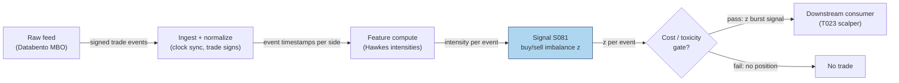

## Stage 81/200 — S081: Hawkes buy/sell intensity imbalance

*Batch SB3 · Signal 81/100 · Provenance [D] · Family A — Microstructure & order flow*

### S1. One-line verdict

| | |
|---|---|
| **What it is** | A bivariate Hawkes model of buy- and sell-trade arrivals; the z-scored intensity gap λᵇ−λˢ forecasts the next trade's side and seconds-ahead price pressure. |
| **When it works** | Clustered, algo-driven order flow (open/close, news absorption); burst regimes where self-excitation dominates. |
| **When it dies** | Two-sided bursts with no directional resolution, stale kernels after regime shifts, and any horizon where spread + fees + impact/slippage exceed the few-bp edge. |
| **Build-or-buy in one line** | Hybrid: buy the signed-trade feed, build the estimator — the kernel parameters are your edge. |

Provenance: **[D]** (documented; Hawkes 1971; Bacry–Muzy applications to order flow). Family A — Microstructure & order flow.

### S2. How it works — plain human explanation

It is 10:15:22 and the AAPL tape prints: buy, buy, sell, buy, buy, buy — six trades in 1.4 seconds, then silence. A Poisson model (trades arrive randomly at a constant rate) calls that cluster a fluke. A **Hawkes process** says the opposite: trades *excite* more trades. Each trade temporarily raises the **intensity** — the expected events per second — of future trades, decaying over seconds. This is **self-excitation**: buy begets buy, sell begets sell, because execution algos split large parent orders into child slices, market makers replenish after being hit, and participants herd.

Split the tape into buys and sells, each with its own intensity, λᵇ_t and λˢ_t. **Cross-excitation** lets a buy also lift the sell intensity a little (someone fading the move). The signal is the z-scored gap between them: when buy intensity towers over sell intensity, the next trade is more likely a buy and the microprice leans up. Three mechanisms make this predictive: (1) **order splitting** — a large buy order drips predictable slices; (2) **adverse selection** — one-sided bursts often carry information, so quotes move to protect; (3) **liquidity replenishment** — the race to refill the book is directional. The horizon is seconds to a few minutes.

- **Mental model:** every trade rings a bell that fades over seconds; count how loudly the buy bell vs the sell bell rings now.
- **Mental model:** the output is a z-score of the intensity gap — a standardized "buy pressure right now" number, comparable across symbols and sessions.
- **Mental model:** spikes flag *bursts*, and bursts flag *adverse selection*: when intensity explodes one-sided, assume the other side of your quote is informed.

### S3. The math — exact formula

Let {tᵇ_i} and {tˢ_j} be buy- and sell-trade timestamps (seconds). With exponential kernels, the buy intensity is:

$$\lambda^b_t = \mu_b + \sum_{t^b_i < t}\alpha_{bb}\,e^{-\beta_{bb}(t-t^b_i)} + \sum_{t^s_j < t}\alpha_{sb}\,e^{-\beta_{sb}(t-t^s_j)}$$

and symmetrically for λˢ_t. The **branching matrix** has entries \(N_{ij}=\alpha_{ij}/\beta_{ij}\) for i,j ∈ {b,s} — each entry is the expected number of type-i child events spawned by one type-j event. **Stationarity of this multivariate spec requires the spectral radius \(\rho(N)<1\)** (subcritical; \(\rho(N) \to 1\) means the market is near-critical). The scalar branching ratio n = α/β (< 1) is the stability condition only for a univariate or diagonal specification — with cross-excitation it is the matrix's largest eigenvalue, not any single kernel's ratio, that must stay below 1. The signal:

$$d_t = \lambda^b_t - \lambda^s_t, \qquad z_t = \frac{d_t - m_t}{s_t}$$

where m_t, s_t are the trailing mean and standard deviation of d (e.g., 5-minute rolling). A burst flag fires at |z_t| > κ. The recursion between events is exact and cheap: λᵇ just before event t_i equals μ_b plus each component decayed by e^{−βΔt}; at the event, add α_bb (own side) or α_sb (cross side).

| Parameter | Symbol | Typical range | Too small / too large | Default (example) |
|---|---|---|---|---|
| Base intensity | μ_b, μ_s | 0.1–2.0 /s | mis-set → z biased by time of day | 0.4 /s per side |
| Self jump | α_bb, α_ss | 0.2–1.5 | overfit → phantom bursts | 0.9 |
| Self decay | β_bb, β_ss | 0.5–5.0 /s | slow: stale; fast: no memory | 1.5 /s |
| Cross jump | α_sb, α_bs | 0–0.5 | 0: ignores fade flow; large: washes out signal | 0.25 |
| z window | — | 1–15 min | short: noisy m,s; long: intraday seasonality leaks in | 5 min |
| Burst κ | κ | 1.5–3.0 | low: false bursts; high: never fires | 2.0 |

All defaults are *example — not an institutional standard*. **Causal timing:** λ at event time t uses only events strictly before t; the z is tradable no earlier than the next event — on SIP (the Securities Information Processor, the consolidated tape)/L1 (level-1, top-of-book) timestamps this is *simulated only — requires MBO (market-by-order)/ITCH (Nasdaq's ITCH direct feed)* for any queue-position or fill claim. **Normalization:** z-score against the trailing window (deseasonalize — intensities follow the U-shaped volume curve). Named variants: (1) **univariate intensity** (S017: total activity, no side split); (2) **power-law kernels** (Bacry et al. find γ ≈ 0 power-law kernels fit Euro-Bund trades better than exponentials over wide scales); (3) **price-jump Hawkes** (Bacry et al. 2013: up/down mid-price jumps instead of signed trades).

### S4. Worked example — step-by-step numbers (SYNTHETIC)

Synthetic 90-second signed-trade tape, **seed 81** (`batches/SB3/plot_S081.py`). Params: μ = 0.4/s per side, α_self = 0.9, β_self = 1.5/s, α_cross = 0.25, β_cross = 1.0/s (branching-matrix entries 0.6 self / 0.25 cross; spectral radius \(\rho(N) = 0.85 < 1\) — subcritical). Table: 12 events around the largest |z| burst (event 75). Sample mean(d) = 0.1458, sd(d) = 1.2217.

| Event | Time (s) | Side | λᵇ (1/s) | λˢ (1/s) | d = λᵇ−λˢ | z |
|---|---|---|---|---|---|---|
| 69 | 7.29 | SELL | 8.805 | 8.780 | 0.025 | −0.10 |
| 70 | 7.46 | SELL | 7.312 | 7.780 | −0.468 | −0.50 |
| 71 | 7.46 | SELL | 7.500 | 8.606 | −1.105 | −1.02 |
| 72 | 7.47 | SELL | 7.641 | 9.363 | −1.722 | −1.53 |
| 73 | 7.50 | SELL | 7.638 | 9.906 | −2.267 | −1.98 |
| 74 | 7.50 | SELL | 7.885 | 10.800 | −2.915 | −2.51 |
| 75 | 7.52 | BUY | 7.967 | 11.431 | −3.463 | −2.95 |
| 76 | 7.53 | SELL | 8.749 | 11.511 | −2.762 | −2.38 |
| 77 | 7.55 | BUY | 8.757 | 12.042 | −3.285 | −2.81 |
| 78 | 7.60 | SELL | 9.075 | 11.497 | −2.421 | −2.10 |
| 79 | 7.73 | SELL | 7.925 | 10.373 | −2.448 | −2.12 |
| 80 | 7.82 | SELL | 7.357 | 10.022 | −2.665 | −2.30 |

Hand-check of event 76: d = 8.749 − 11.511 = −2.762; z = (−2.762 − 0.1458)/1.2217 = −2.9078/1.2217 = **−2.38**, matching the table. The recursion is visible in the λˢ column: event 76 is a sell, so λˢ jumps by α_self = 0.9 at the event (11.511 pre-jump → 12.411 post-jump), then decays to 12.042 by event 77 while cross-excitation from the intervening buy adds a little — exactly the self-plus-cross dynamics of the formula.

*What to notice:* a genuine sell burst builds over ~0.5 s (events 69→75), with z crossing −2 around event 74 — the adverse-selection flag — then mean-reverting as intensities decay. Toy tape: true kernel parameters, no fees, no latency, no trade-classification error; real tapes need the kernel re-estimated and the z deseasonalized.

### S5. Strategies that use this signal

- **T023 — primary entry trigger**: the Hawkes Burst Scalper trades self-excitation bursts signed by the intensity imbalance — this signal *is* the entry.
- **T056 — predictor input (filter/feature)**: the Hasbrouck trade–quote VAR (vector autoregression) predictor takes the imbalance as an exogenous state variable — bursts modulate its quote-revision forecast and veto entries when adverse-selection intensity is extreme.

### S6. Data required — exact spec

| Field | Type | Granularity | Source tier | Notes |
|---|---|---|---|---|
| Trade timestamp (exchange) | datetime64 (µs) | per trade | Tier 2–3 | clock-sync across venues; SIP vs direct labeled |
| Trade price / size | float / int | per trade | Tier 2–3 | size optional for volume-weighted variants |
| Trade side sign | ±1 | per trade | derived | Lee–Ready/BVC (bulk volume classification) on quotes; MBO gives aggressor directly |
| Quote book (for signing) | L1/L2 | event | Tier 2–3 | needed when side must be inferred |

Collection: Databento MBO (full-depth, aggressor side known) or LOBSTER (Limit Order Book System — The Efficient Reconstructor; academic MBO/ITCH replay); retail fallback: Polygon trades + SIP quotes with Lee–Ready signing (noisier). ≤20-line ingest sketch:

```python
import polars as pl
tr = pl.read_parquet("data/mbo/*.parquet")            # ts, px, sz, side, sym
tr = (tr.filter(pl.col("sym") == "AAPL")
        .with_columns(pl.col("ts").dt.convert_time_zone("America/New_York").alias("ts_et"))
        .filter(pl.col("ts_et").dt.time().is_between("09:30", "16:00"))
        .sort("ts_et"))
ev = tr.select("ts_et", "side").to_numpy()             # (t, ±1) event stream
# Hawkes recursion over ev: decay components by exp(-beta*dt), add alpha at events
```

Storage per cost-model.md §4: L1 quotes+trades for a liquid name run ~2–8 GB/symbol-day parquet; trades-only is a small fraction — plan on hundreds of MB/symbol-day (planning estimate derived from §4; trades ≈ 10–200/sec busy per §2). Data-quality (DQ) checklist: exchange-vs-SIP timestamp reconciliation; trade-signing accuracy audit; corp actions; halts/auctions excluded; DST/half-days; venue symbology mapping.

### S7. Local build on M5 Max / 128GB

**Feasibility: feasible (Tier M).** Per cost-model.md §5, L1 event pipelines sit in Tier M (**20–60 h ≈ $3,000–9,000** at $150/hr) — the Hawkes MLE (maximum likelihood estimation; likelihood optimization over kernel params) is the heavy part, not the O(events) recursion. (A labeled chatbot lead for this batch suggests imbalance bars with close rule |Σθ_i| > E_0[|θ|]·n as an alternative event clock — *unverified*; the cost model's Tier M band governs on any conflict.)

- **Throughput** (§2): the intensity recursion is O(1) per event — a Python loop handles ~100–500k events/sec (fine for ≤20 symbols of trades); kernel MLE refits are the batch cost (minutes per symbol-day). Rust only for full OPRA or multi-venue MBO in real time.
- **Stack:** Python + `tick` (Bacry et al.'s Hawkes library) or hand-rolled numpy for the recursion; Rust for the production event loop. Pick Python for research.
- **RAM** (§3): trades-only events for one symbol-day ≈ 0.1–0.5 GB; 60 days of one symbol's trades fits; 500 symbols × 60 days does not — per-symbol daily files + streaming.
- **What breaks first at 500 symbols:** the Python event loop at ~500 × 500 events/sec ≈ 250k/sec is borderline per §2's sizing example — batch the recursion in numpy or move to Rust; MLE refits go nightly.

### S8. Buy vs build

| Option | What you get | Indicative price | Buying gains | Buying loses |
|---|---|---|---|---|
| Tier 0: Alpaca IEX / Stooq | Trades/daily bars, no depth | ~$0 | free | no aggressor side; coarse ts |
| Tier 1: Polygon trades + SIP quotes | Full SIP trades, Lee–Ready signing | ~$30–200/mo | cheap, clean | signing error; SIP latency |
| Tier 2: Databento MBO | Full-depth with aggressor side | ~$200/mo + usage | true event stream | usage meter on history |
| Tier 3: LOBSTER (academic) | MBO/ITCH replay | ~hundreds/yr academic | gold-standard research | academic license; no redistribution |

All prices *indicative — verify before budgeting*. **Verdict: hybrid — buy the feed, build the estimator** (cost-model §6: build when the edge needs custom parameters). Crossover: buy Databento MBO the moment SIP signing error starts flipping your z.

### S9. Success ratio / efficacy — documented evidence

| Study / source | Market & period | Metric | Before/after cost | Caveat |
|---|---|---|---|---|
| Bacry, Delattre, Hoffmann & Muzy (2013), *Quantitative Finance* — 2-D Hawkes on up/down price jumps | Euro-Bund / Euro-Bobl futures | Reproduces microstructure noise (tick-level mean reversion, seconds–minutes) and the Epps effect; fits match data | Before-cost n/a (descriptive fit, not a trading P&L) | Models price jumps, not signed trades; no P&L claimed |
| Sjogren & DeLise (2021), arXiv:2110.07075 — general compound Hawkes for mid-price prediction | Futures and stock LOB (limit order book) data | Predicts mid-price direction and volatility | Before-cost (prediction study, not net trading) | Accuracy ≠ tradable edge after spread/fees |
| Muni Toke & Yoshida (2017) — 8-dim Hawkes on LOB events | XETRA DAX 30, Feb–Apr 2016 | Documents strong self- and cross-excitation structure across event types | Before-cost n/a (structural estimation) | Descriptive; no trading rule evaluated |
| Bacry, Mastromatteo & Muzy (2015) survey, arXiv:1502.04592 | Multi-market review | Catalogues successful uses: transaction-level vol, market-stability/endogeneity measurement, optimal execution, full order-book dynamics | Mixed (survey) | Confirms the framework's validity, not a standalone Sharpe |

Regimes where it fails: two-sided bursts (intensity explodes, direction doesn't resolve); kernel nonstationarity across the session; near-critical branching (n → 1) where bursts blur into noise; sub-second horizons where your latency exceeds the signal's half-life. **No documented after-cost standalone Sharpe exists for the raw intensity-imbalance signal** — the literature documents fit quality and prediction, not net P&L.

**Honest bottom line:** as a standalone trigger this is an *unproven* edge (no after-cost evidence); as a **microstructure feature** — burst detector, adverse-selection flag, input to microprice/VAR models — it is *documented and standard*.

### S10. Failure modes & pitfalls

1. **Latency vs horizon:** the signal lives for seconds; if your reaction time exceeds its half-life you are the liquidity being adversely selected. Mitigation: on SIP data this is *simulated only — requires MBO/ITCH*; trade it only where you measured the latency.
2. **Kernel misspecification:** exponential kernels underfit the long-memory power-law tails Bacry et al. document. Mitigation: test exponential vs power-law kernels out-of-sample; refit per regime.
3. **Nonstationarity:** intensities follow the U-shaped session curve; a static μ biases z at open/close. Mitigation: time-of-day μ or short rolling windows.
4. **Trade-signing error:** Lee–Ready misclassification rises in fast markets — the exact rate depends on venue and era, so audit your own signing accuracy against MBO aggressor data. Mitigation: MBO aggressor side where available; never trade the burst off SIP-signed data alone.
5. **Burst ≠ direction:** the largest |z| events are sometimes two-sided panics. Mitigation: require sign persistence (consecutive same-sign z) before entry.
6. **MLE fragility:** Hawkes likelihoods have local optima and are window-sensitive. Mitigation: multiple inits, penalized likelihood, walk-forward refits.
7. **Cost blowup:** a seconds-horizon signal pays the spread every round trip, and a burst-triggered entry arrives exactly when the book is thinnest. Mitigation: model spread + fees + impact/slippage per trade explicitly (decompose as S094 does: half-spread, commissions, and a slippage allowance for trading into the excited book); most calibrations fail this gate — that is the signal telling you the truth.
8. **Overlapping bursts:** the same parent order excites multiple child bursts; naive aggregation overcounts. Mitigation: parent-order-aware clustering or per-symbol performance accounting.

### S11. Visuals




### S12. Sources

1. Bacry, E., Mastromatteo, I. & Muzy, J.-F. (2015). "Hawkes processes in finance." arXiv:1502.04592. https://arxiv.org/abs/1502.04592v2
2. Bacry, E., Delattre, S., Hoffmann, M. & Muzy, J.-F. (2013). "Modeling microstructure noise with mutually exciting point processes." *Quantitative Finance* (arXiv:1101.3422). https://arxiv.org/abs/1101.3422
3. Sjogren, M. & DeLise, T. (2021). "General Compound Hawkes Processes for Mid-Price Prediction." arXiv:2110.07075. https://arxiv.org/abs/2110.07075
4. Muni Toke, I. & Yoshida, N. (2017). "Modelling intensities of order flows in a limit order book using a multivariate Hawkes process." https://hal.science/hal-01512430v1/file/hawkes_Submitted.pdf
5. Lee, C. M. C. & Ready, M. J. (1991). "Inferring Trade Direction from Intraday Data." *Journal of Finance* 46(2), 733–746. https://ideas.repec.org/a/bla/jfinan/v46y1991i2p733-46.html (the quote-test-with-5-second-lag + tick-test classification method used in S3/S4/S8)
6. Hawkes, A. G. (1971). "Spectra of Some Self-Exciting and Mutually Exciting Point Processes." *Biometrika*, 58(1), 83–90. https://www.jstor.org/stable/2334319 (the original Hawkes process paper: defines the intensity dynamics whose stationarity condition \(\rho(N)<1\) is used in S3)

**Unverified leads** (chatbot-provided, no independent checkable source — do not treat as evidence):
- Duck.ai (GPT-5.6 Luna, 2026-09-10), Q-SB3-2: imbalance-bar close rule |Σθ_i| > E_0[|θ|]·n — *unverified chatbot claim*.
- Duck.ai Q-SB3-2: "Hawkes compute" bands and eng-hour estimates for the pairs+HMM+ML stack — cost-model.md takes precedence on conflicts.

*Chatbot source log: Duck.ai answered Q-SB3-1–Q-SB3-3 (2026-09-10); Grok/Cursor answers pending (checked 2026-09-10).*
