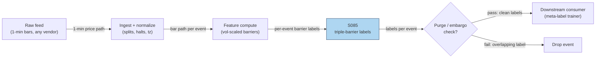

## Stage 85/200 — S085: Triple-barrier labeling

*Batch SB3 · Signal 85/100 · Provenance [D] · Family F — Statistical/ML infrastructure*

### S1. One-line verdict

| | |
|---|---|
| **What it is** | A labeling procedure (not a signal): each candidate trade is labeled +1/−1/0 by whichever barrier — profit, stop, or time — the price path touches first. |
| **When it works** | Training classifiers on realistic trade outcomes; paired with a primary signal that already has an edge (see S086 meta-labeling). |
| **When it dies** | Labels leak the future into features; barriers are overfit; or it is asked to manufacture alpha from a primary with none. |
| **Build-or-buy in one line** | Always build: labeling is research IP, a few dozen lines of code. |

Provenance: **[D]** (documented; López de Prado, *Advances in Financial Machine Learning*, 2018, ch. 3). Family F — Statistical/ML infrastructure.

### S2. How it works — plain human explanation

It is Monday 10:05 and your momentum model flashes long on XYZ at $50.00. The textbook ML approach labels this bar "+1" if the price is higher at some fixed horizon — say, Friday's close. But that label ignores how trading actually works: if XYZ spiked to $52 on Tuesday (your profit target) and then faded to $49 by Friday, the fixed-horizon label says "loser" while your real trade, with a real profit target, was a winner. Conversely, a path that crashes through your stop on Wednesday before recovering is a loser no matter where Friday's close lands. **Fixed-horizon labels ignore the path; triple-barrier labels follow it.**

The procedure, from López de Prado (2018): at each candidate entry, draw three barriers — **profit-taking**, **stop-loss**, and **vertical** (time, at the maximum holding period). Walk the price path forward; whichever barrier is touched first decides the label: +1 (profit), −1 (stop), 0 (time ran out). Two refinements make it practical. First, barrier widths are set in **volatility units** (e.g., ±1 daily σ, estimated from data strictly before the entry) so a 1% move means the same thing in calm and wild regimes. Second, the label is **side-aware**: for a short, "profit" means the lower barrier. Why does this matter economically? Labels are the ground truth your machine-learning (ML) model learns from; labels that reflect executable trade outcomes teach the model to recognize *tradable* setups, while naive next-bar labels teach it to chase noise — the Springer (2025) crypto study documents that next-bar labeling "often leads to excessive trading… transaction costs can quickly erode any potential gains," while triple-barrier labels reflect "a more authentic reflection of the trading reality."

- **Mental model:** stop asking "was the price higher later?" and ask "would my actual trade — with its stop, target, and time limit — have made money?"
- **Mental model:** labels are for *training only*; computing a label requires future data (up to the vertical barrier), so a label must never be a live feature.
- **Mental model:** the barrier is a research choice, not a truth — its parameters are tuned on training folds only, or you are just overfitting the answer key.

### S3. The math — exact formula

For an event at time t_0 with entry price P_{t_0} and side s ∈ {+1 (long), −1 (short)}, with volatility estimate σ̂_{t_0} (e.g., ATR — average true range — or daily σ, computed from data **before** t_0 only) and horizon H bars:

$$\text{upper} = P_{t_0}(1 + k_u\,\hat\sigma_{t_0}), \qquad \text{lower} = P_{t_0}(1 - k_\ell\,\hat\sigma_{t_0}), \qquad \text{vertical} = t_0 + H$$

Scan τ = 1…H: with side-adjusted return r^s_{t_0,τ} = s·log(P_{t_0+τ}/P_{t_0}),

$$y_{t_0} = \begin{cases} +1 & \text{if } r^s \ge k_u\hat\sigma \text{ first (profit)} \\ -1 & \text{if } r^s \le -k_\ell\hat\sigma \text{ first (stop)} \\ 0 & \text{if neither touched by } H \text{ (vertical — de Prado's standard)} \end{cases}$$

**Same-bar touch:** if one bar's range crosses both barriers, use intrabar high/low to decide first touch; on closes-only data adopt a deterministic convention (adverse barrier first is the conservative *example*) or exclude the event as ambiguous.

| Parameter | Symbol | Typical range | Too small / too large | Default (example) |
|---|---|---|---|---|
| Barrier width | k_u, k_ℓ | 0.5–2.0 vol units | tiny: noise labels; huge: everything hits vertical | 1.0 / 1.0 |
| Asymmetry | k_u : k_ℓ | 1:1–1.5:1 | extreme: class imbalance | 1:1 |
| Vol lookback | — | 20–60 bars | short: jumpy σ̂; long: stale | 30 bars |
| Horizon | H | intraday 30 min–2 d; daily 3–20 d | short: all vertical; long: overlapping labels | 5 d (daily) |
| Event spacing | — | 1–10 bars | dense: correlated labels → purge needed | 5 bars |
| Zero-class | — | keep / drop | keep: "hold" class; drop: cleaner binary | drop 0s (example) |

All defaults are *example — not an institutional standard*. **Causal timing:** the label for event t_0 is known only at min(first-touch, t_0+H) — it is a training target, never a live input; tradable n/a. **Normalization:** vol-scaling (barriers ∝ σ̂) is the standard; fixed-bps barriers are the naive variant. Named variants: (1) **symmetric vs asymmetric** profit/stop (1.5:1 reward:risk); (2) **keep vs drop the 0 class** (hold-class vs pure win/loss); (3) **meta-labeling target** (S086: relabel as "was the primary's bet profitable?" — the two-stage use).

### S4. Worked example — step-by-step numbers (SYNTHETIC)

Synthetic 20-day spread tape, **seed 85** (script `batches/SB3/plot_S085.py`). Spread S_t (spread points): −2, −1, 0, 1, 2, 1, 0, −1, −2, 0, 2, 1, 0, −1, −2, −1, 0, 1, 2, 0. Volatility estimate: σ̂ = √(ΣS_t²/19) = √(32/19) ≈ **1.298** (mean ≈ 0).

**Corrected-numbers note:** the raw Duck.ai tape for this batch (2026-09-10) contained z-score arithmetic errors (it reported z_15 ≈ −1.378 from a wrong σ̂). The operator-verified corrections are used here: z_15 = −2/1.2978 ≈ **−1.541**. The triple-barrier label itself was unaffected by those errors.

Event: **day-15 long spread** (side s = +1), entry S_15 = −2.0, profit +1.0 → upper barrier −1.0, stop −1.0 → lower barrier −3.0, horizon 5 d → vertical barrier day 20.

| Day | S_t | z_t | Barrier check |
|---|---|---|---|
| 15 | −2 | −1.541 | entry (long spread) |
| 16 | −1 | −0.771 | **PROFIT HIT** (+1.0) |
| 17 | 0 | +0.000 | — |
| 18 | +1 | +0.771 | — |
| 19 | +2 | +1.541 | — |
| 20 | 0 | +0.000 | vertical barrier (not reached) |

Label: **y_15 = +1**, first touch on day 16, 1-day exit. A fixed-horizon label at day 20 would have scored this trade 0 (S_20 = 0) — the path-aware label correctly records the executable win.

*What to notice:* the label rewards the *path*, not the endpoint. Limits of the toy: real barriers apply to dollar-neutral portfolio mark-to-market (MTM) returns, not raw spread points; same-bar ambiguity is assumed away (daily closes); and this tape has no costs — a real labeler subtracts the round-trip cost from the barriers before declaring +1.

**Cost stack — documented n/a with reasoning.** Triple-barrier labeling executes no trades: it assigns training labels to historical price paths, so spread, fees, market impact, and slippage are not cost components of the procedure itself. The cost discipline lives one layer up: per S10 §7, the round-trip cost (spread + fees + impact/slippage) is subtracted from the profit barrier *before* labeling, so a +1 label means "profitable after costs," not "touched the gross barrier."

### S5. Strategies that use this signal

- **T020 — primary training target**: the Triple-Barrier + Meta-Labeling Overlay uses S085 labels to train the meta-model that vetoes and sizes the primary signal's bets.
- **T087 — validation input**: the Purged-CV Strategy Selector ranks sub-strategies on models trained with S085 labels — the labels are what the selector's purged/embargoed folds validate.

### S6. Data required — exact spec

| Field | Type | Granularity | Source tier | Notes |
|---|---|---|---|---|
| Price path (open/high/low/close) | float | tick or 1-min (execution granularity) | Tier 0–2 | intrabar H/L needed for first-touch honesty |
| Entry timestamps | datetime64 | per event | derived | from the primary signal's triggers |
| Volatility estimate input | float | daily or intraday | Tier 0–2 | ATR/daily σ from data before each event |

Collection: any intraday feed — Stooq daily (Tier 0, coarse), Polygon 1-min (Tier 1), Databento trades (Tier 2, exact first-touch). ≤20-line labeling sketch:

```python
import numpy as np
def triple_barrier(px, t0, side, ku, kl, sig, H):
    up, lo = px[t0]*(1+ku*sig), px[t0]*(1-kl*sig)
    for tau in range(1, H+1):
        r = side*np.log(px[t0+tau]/px[t0])
        if r >= ku*sig: return +1, tau      # profit first
        if r <= -kl*sig: return -1, tau     # stop first
    return 0, H  # vertical barrier first -> 0 (de Prado's standard)
```

Storage per cost-model.md §4: 1-min bars for 500 symbols ≈ 50 MB/day (~3 GB per 60 days) — trivial; labels themselves are a small per-event table. Data-quality checklist: corporate-action adjustment (barriers on adjusted prices); halt/auction handling; DST/half-days; intrabar high/low availability for touch resolution; σ̂ strictly pre-event.

### S7. Local build on M5 Max / 128GB

**Feasibility: trivial (Tier L).** Per cost-model.md §5, labeling (S085/86/88) is Tier L: **4–12 h ≈ $600–1,800** at $150/hr loaded-cost estimate — a vectorized path scan over events. (A labeled chatbot lead for this batch estimated 10–25 h for a triple-barrier prototype; the cost model takes precedence on conflicts, and both agree this is the cheapest layer of the stack.)

- **Throughput** (§2): numpy vectorized math at ~50–200M elements/sec — labeling 100k events is seconds; even tick-level first-touch scans on years of 1-min bars are minutes.
- **Stack:** Python + numpy/polars. Nothing else is justified.
- **RAM** (§3): labels are a per-event table (event id, side, timestamps, label) — megabytes; the price panel for 500 symbols × 60 days of 1-min bars ≈ 12 MB. Working set ≪ 77 GB budget.
- **What breaks first at 500 symbols / full OPRA:** nothing in the labeler — the cost is the tick data volume (§4: L1 ~2–8 GB/symbol-day), handled with per-symbol daily files + streaming, not by changing the algorithm.

### S8. Buy vs build

| Option | What you get | Indicative price | Buying gains | Buying loses |
|---|---|---|---|---|
| Tier 0: own code + Stooq daily | Labeling on daily bars | ~$0 | free; full control | coarse first-touch |
| Reference: AFML (*Advances in Financial Machine Learning*) text (ISBN 9781119482086) | The canonical spec, ch. 3 | book price, *indicative — verify before budgeting* | exact procedure | not code |
| Tier 1: Polygon 1-min | Intraday barrier resolution | ~$30–200/mo `indicative — verify before budgeting` | clean 1-min paths | SIP timestamps |
| Tier 2: Databento trades | Tick-exact first touch | ~$200/mo + usage `indicative — verify before budgeting` | honest touch order | usage meter |

**Verdict: always build.** Labeling is a few dozen lines and embodies your research choices (barrier widths, zero-class handling, event definition) — buying it would mean outsourcing your target variable. Buy at most the finer price path (Tier 1/2) for touch accuracy.

### S9. Success ratio / efficacy — documented evidence

| Study / source | Market & period | Metric | Before/after cost | Caveat |
|---|---|---|---|---|
| Springer *Financial Innovation* (2025) — information-driven bars + triple-barrier + deep learning | BTCUSDT, Binance | TBL gives "more authentic reflection of trading reality" vs next-bar labeling; next-bar "often leads to excessive trading… costs can quickly erode any potential gains" | Before-cost (labeling-quality comparison, not a net Sharpe) | Crypto; documents label quality, not standalone alpha |
| MDPI *Mathematics* 12(5):780 — genetic-algorithm triple-barrier for crypto pairs | Crypto, 2017–2022 train / 2022–2023 test | HRHP (High Risk and High Profit) labels: +51.42% profitability vs traditional pairs; LRLP (Low Risk and Low Profit): −73.24% max drawdown | Before-cost / cost treatment unclear from abstract | Crypto; baseline ("traditional pairs") loosely specified |
| darufinance AFML (*Advances in Financial Machine Learning*) replication (2026), project 03_meta_labeling — EMA (exponential moving average)-crossover primary + TBL + bagged-tree meta-model, purged CV, 42 instruments | Crypto + US equities + FX | Meta-model lifts profit factor in 38/42 instruments, but **0/42 clear the Deflated Sharpe Ratio (DSR) bar** | After-cost (net-of-cost evaluation; DSR as headline) | Practitioner replication, not peer-reviewed — but methodologically careful |

What de Prado documents the barriers *add* is labeling quality — path-aware, cost-aware targets that stop the model learning untradable wiggles — not alpha. The efficacy of the *stack* (barriers + meta-labeling) is bounded by the primary: the primary supplies the side, meta-labeling filters false positives and sizes bets, and a weak primary cannot be rescued — the darufinance replication found meta-model profit-factor lifts in 38/42 instruments but **0/42 cleared the Deflated Sharpe Ratio (DSR) bar**, so apparent Sharpe jumps in weak-primary stacks are a red flag for leakage, overlapping labels, or contamination.

**Honest bottom line:** as a labeling procedure this is a *documented improvement* over fixed-horizon/next-bar labels; as an alpha source it is *nothing* — it cannot create edge, only reveal whether your primary has one under honest (purged, embargoed, after-cost) validation.

### S10. Failure modes & pitfalls

1. **Label leakage into features:** the label needs data up to t_0+H; any feature using post-entry data (including σ̂ estimated over the label window) leaks. Mitigation: σ̂ and all features from data strictly before t_0.
2. **Overlapping labels:** events spaced closer than H share path data → correlated labels → inflated cross-validation (CV) scores. Mitigation: purge + embargo (S088), event spacing ≥ H where affordable.
3. **Barrier-parameter overfit:** tuning (k_u, k_ℓ, H) on the test set is overfitting the answer key. Mitigation: tune on training folds only; report sensitivity.
4. **Same-bar touch ambiguity:** on coarse bars both barriers can be "hit" in one bar. Mitigation: intrabar H/L resolution; closes-only → adverse-first convention (example) or exclusion.
5. **Zero-class mishandling:** dropping all 0s inflates win rates; keeping them as a third class changes the model. Mitigation: decide by use (meta-labeling usually drops; report the choice).
6. **Vertical-barrier sign noise:** some implementations replace de Prado's 0 with a fallback sign(r_H) — that labels tiny drifts ±1, pure noise. Mitigation: keep the 0 label; if your pipeline needs a signed target, require a minimum |r_H| threshold for ±1, else 0.
7. **Ignoring costs in the label:** a +1 that nets −2 bps after spread/fees teaches the model to love losers. Mitigation: subtract round-trip cost from barriers before labeling.
8. **Survivorship in the event set:** labels only exist for symbols still listed at label time. Mitigation: point-in-time universe (delisted symbols included).

### S11. Visuals




### S12. Sources

1. López de Prado, M. (2018). *Advances in Financial Machine Learning*. Wiley, 1st ed., ch. 3 (Labeling). ISBN 9781119482086. https://openlibrary.org/books/OL26950595M/Advances_in_financial_machine_learning
2. Grądzki, P., Wójcik, P. & Lessmann, S. (2025). "Algorithmic crypto trading using information-driven bars, triple barrier labeling and deep learning." *Financial Innovation*. https://link.springer.com/article/10.1186/s40854-025-00866-w (verifies the S9 finding: TBL gives "a more authentic reflection of trading reality" vs next-bar labeling on BTC/ETH tick data)
3. Fu, N., Kang, M., Hong, J. & Kim, S. (2024). "Enhanced Genetic-Algorithm-Driven Triple Barrier Labeling Method and Machine Learning Approach for Pair Trading Strategy in Cryptocurrency Markets." *Mathematics* 12(5):780. https://www.mdpi.com/2227-7390/12/5/780/ (verifies the S9 result — HRHP labels +51.42% profitability vs traditional pairs, LRLP −73.24% max drawdown — and the vertical-barrier → 0 convention in §2.1.2)
4. darufinance (2026). "Triple-barrier labeling and meta-labeling" replication project (purged CV, 42 instruments, DSR headline metric). https://github.com/darufinance/lopez-de-prado-work-review/blob/HEAD/Process%20Over%20Edge/projects/03_meta_labeling/README.md
5. López de Prado, M. & Lewis, M. (2018). "Detection of False Investment Strategies Using Unsupervised Learning Methods." SSRN 3167017. https://ssrn.com/abstract=3167017 (the false-strategy-detection context for DSR: why headline Sharpe jumps on small samples should be distrusted, reinforcing the 0/42-DSR caution in S9)
6. Bailey, D. H., Borwein, J. M., López de Prado, M. & Zhu, Q. J. (2014). "Pseudo-Mathematics and Financial Charlatanism: The Effects of Backtest Overfitting on Out-of-Sample Performance." *Notices of the American Mathematical Society*, 61(5), 458–471. https://doi.org/10.1090/noti1105 (the backtest-overfitting memorandum: optimal in-sample Sharpe decays out of sample as a function of trial count — the documented reason S10 demands purged out-of-sample validation)

**Unverified leads** (chatbot-provided without an independent checkable source — do not treat as evidence):
- Duck.ai (GPT-5.6 Luna, 2026-09-10), Q-SB3-3: the primary supplies the side; meta-labeling filters false positives and sizes bets; "weak primary Sharpe 0.2 → 2.0 = implausible" is a red flag — apparent improvements may be leakage, overlapping labels, or contamination. *Unverified chatbot claim.*
- Duck.ai Q-SB3-2: triple-barrier prototype eng estimate 10–25 h — cost-model.md §5 (Tier L, 4–12 h) takes precedence.

*Chatbot source log: Duck.ai answered Q-SB3-1–Q-SB3-3 (2026-09-10); Grok/Cursor answers pending (checked 2026-09-10).*
