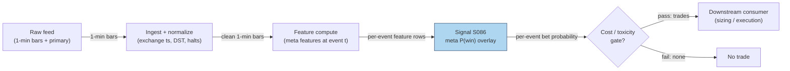

## Stage 86/200 — S086: Meta-labeling

*Batch SB3 · Signal 86/100 · Provenance [D] · Family F — Statistical/ML infrastructure*

### S1. One-line verdict

| | |
|---|---|
| **What it is** | A second model that predicts whether the *primary* model's bet will win, then sizes or vetoes the bet. |
| **When it works** | A primary with a real but noisy edge (win rate 45–55%); its mistakes cluster in recognizable conditions. |
| **When it dies** | The primary has no edge at all; too few labeled bets; label leakage into the meta-features. |
| **Build-or-buy in one line** | Build — the meta-model must train on *your* primary's mistakes; there is no off-the-shelf substitute. |

Provenance **[D]** (documented: López de Prado, *Advances in Financial Machine Learning*, 2018, ch. 3). Family **F — Statistical/ML infrastructure**. Note: meta-labeling is an *overlay*, not a standalone signal — it produces no direction of its own.

### S2. How it works — plain human explanation

10:14:22 ET. XYZ breaks above its opening range; your primary fires long. The meta-labeler sees flat relative volume, a 1.8-sigma-wide spread, three failed breaks this week — win probability 0.31, below your 0.55 threshold, so you skip. By 10:31 the breakout has failed. The meta-model did not predict direction — it predicted *the primary's reliability*.

That separation is the whole idea. A **primary model** picks the *side* (long or short) and the timing. A **meta-model** answers an easier question: "given the primary just fired, will this bet make money?" It trains on the primary's own history — each past bet labeled win or loss by how a real position would have resolved (the **triple-barrier** method: profit target, stop loss, or a time limit, whichever the price path touches first) — using features available at bet time. In production the primary fires, the meta-model scores the bet, and you trade only above a threshold, optionally sizing by the score.

Why should this work economically? Primary models are optimized for average accuracy, so their errors cluster in **adverse-selection** regimes (thin books, news digestion, volatile opens — moments when the counterparty likely knows more than you). A second model trained on *bet outcomes* can learn the signature of those regimes from features the primary underweighted and stand down exactly when the primary is most likely to be picked off.

**Mental model (3 bullets):**
- The *primary supplies the side*; the *meta supplies the conviction*. Direction and bet-selection are two different jobs.
- Meta-labeling converts a directional signal into a bet-sizing function: skip low-probability bets, size the rest by confidence.
- It cannot create edge — it can only *conserve* it: fewer bad bets, better-sized good ones. Garbage primary in, garbage meta out.

### S3. The math — exact formula

At each bet event $t$ the primary emits a side $s_t \in \{-1, +1\}$. Triple-barrier (S085) resolves the bet: profit barrier $u > 0$, stop barrier $\ell > 0$ (both in units of causal volatility $\hat{\sigma}_{t_0}$), and vertical barrier $h$ define the label

$$y_t = \begin{cases}
1 & \text{if the triple-barrier position on side } s_t \text{ is a win (profit touched first)} \\
0 & \text{otherwise (stop or time barrier touched first)}
\end{cases}$$

The meta-model is a classifier $\hat{f}$ on features $x_t$ available at $t$, plus the side $s_t$:

$$\hat{p}_t = \hat{f}(x_t, s_t) \approx P(y_t = 1 \mid x_t, s_t)$$

Position rule: **veto** — bet $s_t$ only if $\hat{p}_t > \tau$; or **sizing** — position $= s_t \cdot g(\hat{p}_t)$, e.g. a fractional-**Kelly** fraction (Kelly: the bet-size rule maximizing long-run growth for known win probabilities).

| Parameter | Symbol | Typical range | Too small / too large | Default (example) |
|---|---|---|---|---|
| Profit barrier multiple | $u$ | 0.5–2.0 vol units | small: noisy; large: few wins | $1.0$ — *example, not an institutional standard* |
| Stop barrier multiple | $\ell$ | 0.5–2.0 vol units | small: all losses; large: time-barrier dominates | $1.0$ — *example* |
| Vertical barrier (horizon) | $h$ | 30 min–2 days intraday | small: truncated; large: overlapping labels | 1 session — *example* |
| Meta threshold | $\tau$ | 0.5–0.7 | small: no filtering; large: too few bets | $0.55$ — *example* |
| Meta features | $x_t$ | 10–300 | few: underfit; many: overfit on few events | 20–50 — *example* |
| Class weight / sampling | — | — | ignored: predicts the majority class | balance or PR-AUC (area under the precision–recall curve) tuning — *example* |

**Normalization:** z-score continuous features with statistics from training folds only; the side $s_t$ enters as raw $\pm 1$ (or separate per-side models). **Causal timing:** $\hat{p}_t$ uses only data $\le t$ — the label $y_t$ is unknown until the barriers resolve, so it can never be a feature. **Variants:** (1) binary veto vs continuous sizing; (2) side-as-feature vs separate long/short meta-models; (3) per-regime meta-models.

### S4. Worked example — step-by-step numbers (SYNTHETIC)

Synthetic tape, seed **86086**: 12 primary-signal trades with side $s_t$, features (rvol_z, sprd_z — z-scored relative volume and bid–ask spread), triple-barrier outcome $y_t$, meta probability $\hat{p}_t$, and decision at $\tau = 0.55$ (*example*). Economics: win +\$18, loss −\$14, \$2 round-trip cost → taken win nets +\$16, taken loss nets −\$16.

**Cost model — explicit components (`example`; the chapter's own stack).** The \$2 round-trip cost decomposes as: **spread** (crossing the half-spread on entry and exit) \$1.00; **commissions/fees** \$0.50; **market impact/slippage** (adverse selection + execution slippage) \$0.50. Meta-labeling is an overlay — it places no trades of its own, so this stack is the *primary's* cost stack; the overlay's cost discipline is S10 §8: train labels on net-of-cost outcomes (as the replication did with its 2 bp round-trip). All numbers synthetic.

| Trade | Side | rvol_z | sprd_z | Barrier | $\hat{p}$ | Decision | P&L (\$) |
|---|---|---|---|---|---|---|---|
| 1 | −1 | 0.39 | −1.06 | loss | 0.19 | SKIP | −16.0 |
| 2 | −1 | −0.98 | −0.78 | loss | 0.35 | SKIP | −16.0 |
| 3 | +1 | 2.29 | 0.06 | win | 0.94 | BET | +16.0 |
| 4 | −1 | −0.15 | −0.42 | win | 0.92 | BET | +16.0 |
| 5 | −1 | 0.72 | 0.66 | loss | 0.12 | SKIP | −16.0 |
| 6 | +1 | −1.37 | 0.85 | win | 0.84 | BET | +16.0 |
| 7 | +1 | −0.08 | 1.38 | loss | 0.30 | SKIP | −16.0 |
| 8 | +1 | 0.94 | −1.48 | loss | 0.36 | SKIP | −16.0 |
| 9 | −1 | −1.46 | 0.29 | win | 0.70 | BET | +16.0 |
| 10 | +1 | 2.06 | −0.40 | loss | 0.23 | SKIP | −16.0 |
| 11 | +1 | 0.93 | 0.24 | loss | 0.21 | SKIP | −16.0 |
| 12 | −1 | 0.72 | 0.62 | loss | 0.33 | SKIP | −16.0 |

Step-by-step: (1) the primary fires on all 12; raw **precision** (win fraction) = 4/12 = **0.333**; (2) 4 bets clear $\tau = 0.55$ (trades 3, 4, 6, 9); (3) filtered precision = 4/4 = **1.000**; (4) primary takes all 12 → 4×(+16) + 8×(−16) = **−\$64**; filtered takes 4 → **+\$64**. The overlay turned a losing 12-bet sequence into a winning 4-bet sequence by skipping the 8 bets the meta-model distrusted.

**What to notice.** This toy is *suspiciously* clean — a real meta-labeler never reaches 1.000 precision; if yours does, suspect **label leakage** (future information in the features) rather than genius. The P&L sketch is arithmetic, not a backtest. What the example shows honestly is the mechanism: the value comes from the *skips* (8 avoided losses), not from better direction.

### S5. Strategies that use this signal

- **T020 — primary overlay**: triple-barrier labels train a meta-model over any primary signal; the canonical meta-labeling deployment (position sizing + veto).
- **T088 — primary component**: the full-stack ensemble blends S001–S100 with meta-labeling on top and purged-CV validation.
- **T092 — veto**: the PIN (probability of informed trading)/toxicity stand-down rule is itself meta-labeled — the meta-model learns when the stand-down is trustworthy.
- **T025 — filter**: the trade-classification trend filter uses meta-labels to confirm or veto momentum entries.

### S6. Data required — exact spec

| Field | Type | Granularity | Source tier | Notes |
|---|---|---|---|---|
| Primary side $s_t$ | int8 ±1 | event | inherits primary's tier | the *deployed* primary's real signals, not a research version |
| Triple-barrier labels $y_t$ | bool | event | computed locally | causal $\hat{\sigma}$; store event intervals $[t_0, t_1]$ |
| Meta features $x_t$ | float32 | event (from 1-min bars or L1) | Tier 1–2 | spread state, participation, recent primary failure rate, regime |
| Event timestamps | ms int64 | event | Tier 1–2 | exchange timestamps; the label interval end $t_1$ is *not* a feature |
| Corporate actions / halts | calendar | daily/event | Tier 1 | barriers must respect halts and splits |

Ingest sketch (≤20 lines, Python/polars):

```python
import polars as pl
events = pl.read_parquet("labels/events.parquet")        # event_id, t0, side, y
feats  = pl.read_parquet("features/event_features.parquet")  # event_id, feature_ts, ...
df = (events.join(feats, on="event_id", how="inner")
            .filter(pl.col("feature_ts") <= pl.col("t0")))  # causality guard
X = df.select(["rvol_z", "sprd_z", "side"]).to_numpy()
y = df["y"].to_numpy()                                    # 1 = barrier win
# train meta classifier on (X, side) -> y, validate with purged CV (S088)
```

**Storage:** the event table is tiny (~20 MB for 100k events × 50 float32 features); the 1-min bars behind the *feature history* dominate (~50 MB/day for a 500-symbol universe, per `notes/cost-model.md` §4). **Data-quality checklist:** timestamp normalization, corporate actions, halts, DST/half-days, stale quotes in spread features.

### S7. Local build on M5 Max / 128GB

**Feasibility: feasible** — one of the lightest ML workloads in the stack. Training on ~100k events × 50 features takes minutes (`notes/cost-model.md` §2: sklearn/XGBoost at this scale ~1–10 min); inference is microseconds per event.

**Throughput / RAM:** the meta-labeler working set runs 10–600 MB base and 0.5–5 GB with fold/preprocessing copies (a labeled chatbot lead, Duck.ai 2026-09-10 — hence the advice to cap `n_jobs` at 4–6 and use float32). That sits far under the cost-model's ~77 GB live budget (§3): even a sloppy pipeline stays in budget, and 60 days of intraday events scale linearly.

**Stack options:** Python + polars + XGBoost/scikit-learn (AFML — *Advances in Financial Machine Learning* — reference stack); Rust buys nothing here; DuckDB if the event store outgrows RAM. **Engineering time:** Tier **L**, 4–12 h → **\$600–1,800** loaded cost at \$150/hr (per `notes/cost-model.md` §5). *One-line verdict: feasible on the M5 Max (Tier L, ~8 h ≈ \$1.2k eng + the primary's data cost); bottleneck is feature quality, not compute; nothing breaks at 500 symbols.*

### S8. Buy vs build

| Option | What you get | Indicative price | What buying gains | What buying loses |
|---|---|---|---|---|
| Tier-0 free route | Own bars + open-source AFML ports | ~\$0 | Full control; matches your primary | You wire CV, calibration, monitoring |
| Tier-1 retail vendor | Clean 1-min/SIP bars for features (Polygon Stocks Advanced class) | ~\$30–200/mo, *indicative — verify before budgeting* | Corporate actions handled | Retail-grade timestamps |
| Tier-2 professional feed | Honest L1/L2 (level-1 top-of-book / level-2 depth) for microstructure features (Databento class) | ~\$200/mo + usage, *indicative — verify before budgeting* | Microstructure honesty | Usage metering |
| Academic route | *Advances in Financial Machine Learning* (AFML, 2018) + the author's SSRN (Social Science Research Network) lecture notes | Book cost (~tens of \$) | The canonical specification | Still a build, not a product |

**Verdict: build.** The meta-model must train on *your* primary's realized mistakes — a prebuilt meta-labeler trained on someone else's strategy is incoherent. Buy only the data feed for the features. (Per `notes/cost-model.md` §6: build when eng tier ≤ M and the edge needs custom parameters — both true here.)

### S9. Success ratio / efficacy — documented evidence

| Study / source | Market & period | Metric | Before/after cost | Caveat |
|---|---|---|---|---|
| López de Prado, *AFML* (2018), ch. 3 §3.6 | Methodological | Claim: a secondary classifier raises bet precision and enables probability-proportional sizing | **Before cost** (design claim — mechanism presented without a measured return) | The book presents the architecture, not a published Sharpe or hit-rate table |
| Practitioner replication: lopez-de-prado-work-review (GitHub, 2026) | US ETFs, EMA (exponential moving average)(20/60) crossover primary | After a 2 bp round-trip cost, XLF/XLV produced <50 net-profitable bets and were dropped by the minimum-class floor | **After cost** (2 bp) | Not peer-reviewed; the harness acted as a *filter*, rejecting weak primaries rather than manufacturing profit |

**Regimes where it fails:** the primary's error pattern is regime-dependent and the regime shifts (the meta-model learned when the primary was wrong *last year*); event counts are small (a few hundred bets cannot support a 50-feature classifier); the meta-model is tuned on the same folds used to select the primary (double-dipping). **Honest bottom line: as a standalone trigger this is a zero edge — it is an overlay, not a signal; as a filter/sizer it is a conditional, real edge, and the condition is a primary with genuine net-of-cost out-of-sample performance. It cannot manufacture alpha.**

### S10. Failure modes & pitfalls

1. **Garbage primary — the cardinal sin.** Meta-labeling cannot manufacture alpha → *prove the primary is net-positive out-of-sample (purged) before building the meta layer.*
2. **Label leakage into features.** Any feature using data past event $t$ (e.g. volatility including the barrier window) → *causality audit: every feature timestamped ≤ $t$.*
3. **Overlapping labels without purging.** Triple-barrier labels overlap; naive K-fold leaks → *purged/embargoed CV (S088) for all meta validation.*
4. **Meta-overfitting.** Grids mined on a few hundred events → *keep the meta-model simple (shallow trees), tune only inside train folds.*
5. **Class imbalance.** 80% of bets lose → the model predicts "skip everything" → *class weights; judge by PR-AUC (area under the precision–recall curve) and net P&L, never raw accuracy.*
6. **Miscalibrated probabilities.** Sizing on uncalibrated $\hat{p}$ overbets → *calibrate (Platt/isotonic) on out-of-fold predictions.*
7. **Regime shift in the primary's error pattern.** The meta-model memorizes last year's failure modes → *refit on a rolling window; monitor live vs validation precision.*
8. **Cost blindness.** Meta-labels trained on gross barrier outcomes while the desk pays spread+fees → *train labels on net-of-cost outcomes (as the GitHub replication did with 2 bp).*

### S11. Visuals




### S12. Sources

- López de Prado, Marcos (2018). *Advances in Financial Machine Learning*. Wiley. Ch. 3 (§3.6 meta-labeling) and ch. 7 (cross-validation). https://www.wiley.com/go/advancedmachinelearningfinance
- darufinance (2026). "lopez-de-prado-work-review — Project 09" — EMA (exponential moving average)(20/60) primary, triple-barrier labels, bagging meta-labelers, 2 bp cost; XLF/XLV dropped below the 50-net-bet floor. https://github.com/darufinance/lopez-de-prado-work-review/blob/HEAD/projects/09_ensembles_importance/writeup/README.md
- Bailey, D. H., Borwein, J., López de Prado, M., & Zhu, Q. J. (2017). "The Probability of Backtest Overfitting." *Journal of Computational Finance* 20(4). https://scholarworks.wmich.edu/math_pubs/42/
- López de Prado, M. & Lewis, M. (2018). "Detection of False Investment Strategies Using Unsupervised Learning Methods." SSRN 3167017. https://ssrn.com/abstract=3167017 (the false-strategy-detection rationale for vetting meta-model "precision lifts" against the primary's trial count)
- Bailey, D. H., Borwein, J. M., López de Prado, M. & Zhu, Q. J. (2014). "Pseudo-Mathematics and Financial Charlatanism: The Effects of Backtest Overfitting on Out-of-Sample Performance." *Notices of the American Mathematical Society*, 61(5), 458–471. https://doi.org/10.1090/noti1105 (why in-sample precision jumps must survive out-of-sample decay before they count)
- Harvey, C. R. & Liu, Y. (2015). "Backtesting." SSRN 2345489. https://papers.ssrn.com/sol3/papers.cfm?abstract_id=2345489 (Sharpe haircuts under multiple testing: the documented counterpart to S10's demand that meta-model gains be measured net of selection bias)

**Unverified leads** (chatbot-provided, no independent checkable source — do not treat as evidence):
- Duck.ai (GPT-5.6 Luna, 2026-09-10), Q-SB3-2: meta-labeler RAM 10–600 MB base, fold copies 0.5–5 GB, cap `n_jobs` at 4–6 (cost model takes precedence for planning).
- Duck.ai (same), Q-SB3-3: "PRIMARY SUPPLIES THE SIDE"; Sharpe 0.2 → 2.0 via meta-labeling is implausible; triple-barrier/meta-labeling only after the primary shows positive purged OOS (out-of-sample).

*Source log: Duck.ai answered Q-SB3-1–Q-SB3-3 (2026-09-10); Grok/Cursor answers pending (checked 2026-09-10).*
