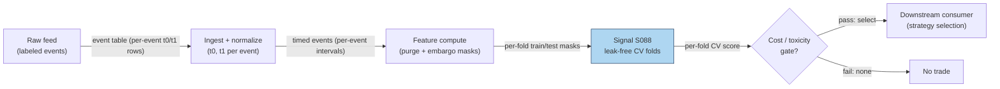

## Stage 88/200 — S088: Purged / embargoed cross-validation

*Batch SB3 · Signal 88/100 · Provenance [D] · Family F — Statistical/ML infrastructure*

### S1. One-line verdict

| | |
|---|---|
| **What it is** | A cross-validation scheme that deletes training labels overlapping the test fold (purge) plus a safety buffer (embargo). |
| **When it works** | Labels overlap in time (triple-barrier, fixed-horizon returns); any model selection on financial time series. |
| **When it dies** | Labels never overlap (then it reduces to plain K-fold); embargo so long the folds are empty. |
| **Build-or-buy in one line** | Build — it is ~30 lines of index arithmetic, not a product; nothing to buy. |

Provenance **[D]** (documented: López de Prado, *Advances in Financial Machine Learning* (AFML), 2018, ch. 7). Family **F — Statistical/ML infrastructure**. This is a *validation procedure*, not a signal: it generates no trades, only trustworthy performance estimates.

### S2. How it works — plain human explanation

14:02, and your pairs backtest prints a Sharpe of 2.1 — **Sharpe ratio** meaning annualized mean return over annualized volatility. One question kills it: "How many training labels overlap the test period?" With **triple-barrier** labels (S085), each label spans a *window* of future prices — say 5 days. A Monday training label uses prices through Friday; a Wednesday test label starts Wednesday. The two share Wednesday–Friday prices: the model has peeked at the test answer during training. That is **leakage**, and it inflates backtests like peeking at an answer key.

Standard **K-fold cross-validation** assumes independent samples; financial labels with overlapping horizons are not. Purged K-fold fixes it in two steps. **Purge:** drop every training event whose label interval $[t_0, t_1]$ overlaps the test fold — those labels peek at test-period prices. **Embargo:** drop a further buffer at the boundary, since near-boundary labels still share information through serial correlation. What remains has no label overlap against the test fold.

**Mental model (3 bullets):**
- Overlapping labels make train and test share answers; purging deletes the shared answers from training.
- The embargo is a safety margin at the fold boundary — its length should cover the label horizon.
- Purged CV does not improve your model; it improves your *belief* about your model. Its product is honesty, not alpha.

### S3. The math — exact formula

Each labeled event $i$ has a start time $t_i(0)$ (the bet/event time) and a label-end time $t_i(1)$ (first barrier touch or the vertical barrier), defining the label interval $I_i = [t_i(0), t_i(1)]$. A test fold covers $[T_a, T_b]$.

**Purge rule.** Drop training event $i$ if its label interval intersects the test interval:

$$I_i \cap [T_a, T_b] \neq \emptyset \iff t_i(0) \le T_b \;\; \text{AND} \;\; t_i(1) \ge T_a$$

**Embargo rule.** Additionally drop a buffer of $L_E$ observations at the fold boundary, with $L_E$ at least the maximum label look-forward horizon: $L_E \ge \max_i (t_i(1) - t_i(0))$. Practitioner sizing guidance (*example, not a documented standard*): 0–1% of the sample for short non-overlapping labels; 2–5% for daily 5–10-day horizons; 5–10% for long horizons; 5–20% for highly overlapping intraday labels; always take the larger of the percentage rule and the horizon rule.

**⚠ Convention flag (operator-verified).** This chapter's explicitly chosen convention implements the embargo by removing the *first 3 test events*; de Prado's standard (AFML ch. 7) removes the *last train observations before the test fold*. The arithmetic is identical (3 removed either way; 35 train / 17 test / 8 removed = 60), but the boundary side differs — do not present the chapter's chosen convention as de Prado's standard. The example and chart below follow this chapter's chosen convention and label it; either convention breaks the overlap, but document whichever you use.

| Parameter | Symbol | Typical range | Too small / too large | Default (example) |
|---|---|---|---|---|
| Folds | $K$ | 5–10 | small: coarse estimates; large: heavy purge losses | 5 — *example, not an institutional standard* |
| Embargo length | $L_E$ | see % rules above | small: residual leakage; large: empty folds | 5% of sample — *example* |
| Label horizon | $h$ | strategy-dependent | drives both purge width and embargo floor | must be ≥ max look-forward — *rule, not example* |

**Normalization:** none required — this is index arithmetic on timestamps, applied identically to any feature scaling. **Causal timing:** purging/embargoing is a property of the *validation split*, computed from label intervals only; it uses no prices and introduces no lookahead of its own. **Variants:** (1) purged K-fold (shuffled folds on the remainder); (2) purged walk-forward / **combinatorial purged CV** (CPCV — many train/test paths, the basis of the Probability of Backtest Overfitting (PBO) test); (3) embargo-only (when labels barely overlap).

### S4. Worked example — step-by-step numbers (SYNTHETIC)

Synthetic schedule, seed **88088**: 60 daily events, 5-day label horizons, event $E_i$ → interval $[i, i+5]$. Test fold = $E_{41}$–$E_{60}$ (interval $[41, 65]$). Embargo = 5% of 60 = 3 events.

Step-by-step: (1) **Purge** — training candidates are $E_1$–$E_{40}$; drop any with $t_0 \le 65$ and $t_1 \ge 41$: $E_{36}$ ([36,41]) through $E_{40}$ ([40,45]) — 5 events; (2) **Embargo** (chapter convention, flagged above) — drop the first 3 test events $E_{41}$–$E_{43}$; (3) remainder: train $E_1$–$E_{35}$ (35), test $E_{44}$–$E_{60}$ (17), removed 8. Check: 35 + 17 + 8 = 60 ✓ (arithmetic operator-verified).

| Event | Start day | End day | Status |
|---|---|---|---|
| $E_{33}$–$E_{35}$ | 33–35 | 38–40 | TRAIN (kept) |
| $E_{36}$ | 36 | 41 | **PURGED** (interval touches test day 41) |
| $E_{37}$ | 37 | 42 | **PURGED** |
| $E_{38}$ | 38 | 43 | **PURGED** |
| $E_{39}$ | 39 | 44 | **PURGED** |
| $E_{40}$ | 40 | 45 | **PURGED** |
| $E_{41}$ | 41 | 46 | **EMBARGOED** (bot convention: first 3 *test* events) |
| $E_{42}$ | 42 | 47 | **EMBARGOED** |
| $E_{43}$ | 43 | 48 | **EMBARGOED** |
| $E_{44}$–$E_{60}$ | 44–60 | 49–65 | TEST (17 events) |

Under de Prado's standard convention, the 3 embargoed events would instead be $E_{33}$–$E_{35}$ — the last 3 *train* observations before the test fold — leaving train = $E_1$–$E_{32}$ (32), test = $E_{41}$–$E_{60}$ (20), removed = 8. Same removed count, different boundary side; the chart below annotates the chatbot convention actually plotted.

**What to notice.** The purge is mechanical: any label interval touching the test window goes. Without it, $E_{36}$–$E_{40}$ would let the model train on days 41–45 prices and then be "tested" on labels built from those same prices — the classic phantom Sharpe. This toy is a *schedule*, not a backtest: no prices, no performance claims, only index arithmetic.

### S5. Strategies that use this signal

- **T087 — primary**: the purged-CV strategy selector allocates across sub-strategies by purged/embargoed-CV rank with meta-labels — this chapter's procedure is its engine.
- **T032 — validation**: copula tail-dependence pairs are validated with purged CV before any capital is committed.
- **T052 — validation**: the AR/ARMA innovation trader uses purged CV to validate its trade–quote VAR timing.
- **T100 — validation**: the grand 100-signal ensemble is validated with purged CV, meta-labeling, and triple-barrier training together.

### S6. Data required — exact spec

| Field | Type | Granularity | Source tier | Notes |
|---|---|---|---|---|
| Event start $t_0$ | ms int64 | event | inherits the labeled dataset's tier | the bet/trigger time |
| Label end $t_1$ | ms int64 | event | computed locally | first barrier touch or vertical barrier |
| Labels $y$ | bool/float | event | computed locally | any overlapping-horizon label |
| Fold assignment | int8 | event | computed locally | K-fold on the post-purge remainder |
| Features $X$ | float32 | event | inherits primary's tier | purging applies to rows of the feature matrix |

**The one structural requirement** (chatbot Q-SB3-2 lead — *labeled lead*): store every event with an event ID, side, and both timestamps — that makes purging mechanically enforceable.

Ingest sketch (≤20 lines):

```python
import polars as pl
ev = pl.read_parquet("labels/events.parquet")  # event_id, t0, t1
K, EMB = 5, 3                                    # folds; embargo in events (example)
# blocked folds on time-sorted events (contiguous blocks, NOT modulo interleaving)
folds = (ev.sort("t0").with_row_index("k")
           .with_columns((pl.col("k") * K // pl.len()).alias("fold")))
def purged_train(test_fold: int):
    test = folds.filter(pl.col("fold") == test_fold)
    ta, tb = test["t0"].min(), test["t1"].max()     # FULL fold interval [T_a, T_b]
    kept = (folds.filter(pl.col("fold") != test_fold)
                 .filter(~((pl.col("t0") <= tb) & (pl.col("t1") >= ta)))  # purge (S3)
                 .sort("t0"))
    test_kept = test.slice(EMB, None)              # embargo: drop first EMB test events
    return kept, test_kept  # chatbot convention (35/17/8 in S4); de Prado drops last train rows — S3 flag
```

**Storage:** an event table is kilobytes-to-megabytes; the procedure adds no data beyond fold indices. **Data-quality checklist:** $t_1$ must be the *realized* label end (not the intended horizon, for early barrier touches); timestamps in one timezone; DST/half-days consistent between $t_0$ and $t_1$; corporate actions already reflected in the labels themselves.

### S7. Local build on M5 Max / 128GB

**Feasibility: trivial.** This is index arithmetic on an event table — microseconds to seconds. A full purged/embargoed validation pass runs in seconds-to-minutes for triple-barrier-scale event sets (a labeled chatbot lead, Duck.ai 2026-09-10 — consistent with cost-model §2's 10–50M rows/sec). RAM is negligible: event table plus fold masks are megabytes against the 77 GB working budget (§3).

**Engineering time:** Tier **L**, 4–12 h → **\$600–1,800** loaded cost at \$150/hr (per `notes/cost-model.md` §5, which explicitly lists S085/86/88 in Tier L). The chatbot's higher estimate of 20–45 h prototype / 50–120 h production covers a *full validation harness* (walk-forward orchestration, leakage tests, reporting) — a labeled lead, but on any conflict the cost-model band is the planning number. *One-line verdict: trivially feasible on the M5 Max (Tier L, ~8 h ≈ \$1.2k eng + \$0 data — it operates on labels you already have); bottleneck is discipline (storing $t_1$ correctly), not compute; nothing breaks at any symbol count.*

### S8. Buy vs build

| Option | What you get | Indicative price | What buying gains | What buying loses |
|---|---|---|---|---|
| Hand-roll from AFML ch. 7 snippets | ~30 lines of timestamp arithmetic | ~\$0 | Exact match to your label intervals | You test the edge cases yourself |
| Open-source ports (community AFML implementations) | Tested purge/embargo/CPCV code | ~\$0 | Community edge-case coverage | API churn; verify the embargo convention (see S3 flag) |
| Hosted research platforms (QuantConnect class) | Backtest harness + brokerage | Platform pricing | Execution plumbing | Per the chatbot lead: custom purge/embargo logic is still work; inspect universe/delisting treatment |
| "Buy a validation service" | — | n/a | — | This product does not exist; anyone selling it is selling your own timestamps back to you |

**Verdict: always build.** There is no data to buy and no model to license — only your event timestamps, which never leave your machine. The one real decision is the embargo *convention* (S3 flag): document whichever boundary side you choose.

### S9. Success ratio / efficacy — documented evidence

Purged CV has no "returns" — its documented value is measured in *phantom performance destroyed*: studies where naive validation showed edge and honest validation showed none.

| Study / source | Market & period | Metric | Before/after cost | Caveat |
|---|---|---|---|---|
| López de Prado, *AFML* (2018), ch. 7 | Methodological | Purge + embargo construction; embargo ≥ label horizon | n/a — design claim | Defines the procedure; the performance claims are about *validity*, not returns |
| Bailey, Borwein, López de Prado & Zhu (2017), "The Probability of Backtest Overfitting" | Simulated: random-walk prices with a fake seasonal effect (~4 years daily) | IS Sharpe 1.0–2.2 across optimized configs, yet Probability of Backtest Overfitting (PBO) ≈ 55% — the IS-best config lands in the *bottom half* out-of-sample about as often as a coin flip | **Before cost** (diagnostic demonstration) | Demonstrates selection overfitting; the companion example with a *real* injected monthly effect shows PBO near 0 — the test discriminates correctly |
| Practitioner replication: PBO complexity ladder (GitHub, rchhabra17, 2026) | SPY, 2010–2026, moving-average (MA)-crossover configs, Combinatorially Symmetric Cross-Validation (CSCV) S=16, costs held fixed | PBO 0.37–0.57 across complexity rungs; PBO did *not* rise monotonically with parameter count | **Before cost** (costs fixed across rungs) | Single market/single strategy family; shows the diagnostic working, not a trading edge |

**Regimes where it fails:** it cannot fix feature lookahead (purging label overlap while a feature peeks at the future); it cannot fix non-stationarity (use walk-forward, not shuffled folds, when regimes drift); an embargo shorter than the label horizon leaks by construction. **Honest bottom line: as a standalone trigger this is a zero edge — it is not a signal at all; as infrastructure it is the highest-ROI code in the stack, because every phantom Sharpe it kills is a losing strategy you never trade.**

**Cost treatment — n/a with explicit reasoning.** This procedure executes no trades: it produces only validation folds and trust scores, so spread, fees, and impact/slippage are not its cost components. Every strategy evaluated *through* this procedure must still model spread + fees + impact/slippage in its own backtest — purged CV guarantees the folds don't overlap, not that the trades were cheap.

### S10. Failure modes & pitfalls

1. **Purging labels but not features.** A feature computed with post-$t$ data leaks regardless of purging → *causality-audit every feature timestamp, not just labels.*
2. **Embargo shorter than the label horizon.** The buffer must cover the maximum look-forward → *$L_E \ge \max(t_1 - t_0)$ as a hard rule.*
3. **Smoothed instead of filtered states.** Using full-sample-smoothed regime probabilities as features leaks the future (chatbot Q-SB3-1 lead: use *filtered*, not smoothed, states for live signals) → *filter-only features.*
4. **Purging into empty folds.** Long horizons + many folds can delete most of the training set → *reduce K or shorten horizons; check fold sizes.*
5. **Shuffled folds on drifting regimes.** Purged K-fold assumes approximate stationarity → *use purged walk-forward when the data-generating process drifts.*
6. **Tuning the embargo on the test set.** Trying embargo lengths until out-of-sample (OOS) looks good is itself overfitting → *fix the embargo rule before seeing test results.*
7. **Treating it as a strategy.** "Our edge is purged CV" → *it is a measuring instrument; the edge must live in the primary.*

### S11. Visuals




### S12. Sources

- López de Prado, Marcos (2018). *Advances in Financial Machine Learning*. Wiley. Ch. 7 (cross-validation in finance: purge, embargo, CPCV). https://www.wiley.com/go/advancedmachinelearningfinance
- Bailey, D. H., Borwein, J., López de Prado, M., & Zhu, Q. J. (2017). "The Probability of Backtest Overfitting." *Journal of Computational Finance* 20(4). PDF: https://www.davidhbailey.com/dhbpapers/backtest-prob.pdf ; record: https://scholarworks.wmich.edu/math_pubs/42/
- rchhabra17 (2026). "probability-of-backtest-overfitting" — PBO complexity ladder on SPY 2010–2026 (PBO 0.37–0.57 across rungs). https://github.com/rchhabra17/probability-of-backtest-overfitting/blob/HEAD/README.md
- White, H. (2000). "A Reality Check for Data Snooping." *Econometrica*, 68(5), 1097–1126. https://doi.org/10.1111/1468-0262.00152 (the data-snooping test: why naive k-fold validation on financial series produces spurious significance — the documented motivation for purged/embargoed validation)
- Hansen, P. R. (2005). "A Test for Superior Predictive Ability." *Journal of Business & Economic Statistics*, 23(4), 365–380. https://doi.org/10.1198/073500105000000063 (studentized extension of White's Reality Check with better power — the documented standard for comparing strategies against a benchmark)
- Romano, J. P. & Wolf, M. (2005). "Stepwise Multiple Testing as Formalized Data Snooping." *Econometrica*, 73(4), 1237–1282. https://doi.org/10.1111/j.1468-0262.2005.00615.x (stepwise multiple-testing procedure controlling the familywise error rate when comparing several strategies to a benchmark — the multiplicity control S10 §5's CSCV lacks on its own)

**Unverified leads** (chatbot-provided, no independent checkable source — do not treat as evidence):
- Duck.ai (GPT-5.6 Luna, 2026-09-10), Q-SB3-1: purged/embargoed worked example (60 events; arithmetic operator-verified); embargo % rules (0–1% / 2–5% / 5–10% / 5–20%) with the horizon floor ($L_E \ge$ max look-forward).
- Duck.ai (same), Q-SB3-2: purge/embargo engineering 20–45 h prototype / 50–120 h production; store every event with event ID, side, timestamps.

*Source log: Duck.ai answered Q-SB3-1–Q-SB3-3 (2026-09-10); Grok/Cursor answers pending (checked 2026-09-10).*
