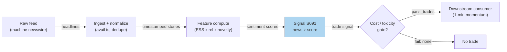

## Stage 91/200 — S091: Machine-readable news sentiment (first-minute reaction)

*Batch SB3 · Signal 91/100 · Provenance [D] · Family G — Alternative data*

### S1. One-line verdict

| | |
|---|---|
| **What it is** | Signed news flow (sentiment × relevance × novelty) traded in the seconds-to-minutes after the timestamp. |
| **When it works** | Liquid names, scheduled or cleanly-tagged unscheduled news, a fast pipe, and a slower crowd to trade against. |
| **When it dies** | Stale/duplicate timestamps, mega-cap efficiency, headline latency, or spread+slippage wider than the move. |
| **Build-or-buy in one line** | Buy the machine-readable feed; build the scorer — unless free headlines plus public NLP suffice. |

Provenance **[D]** (documented: Groß-Klußmann & Hautsch 2011; Tetlock 2007; Loughran & McDonald 2011). Family **G — Alternative data**. Horizon: seconds (headline reaction, mostly competed away) to 1–5 days (drift/fade legs).

### S2. How it works — plain human explanation

14:00:03 ET. A newswire flashes: fictional NOVA's Phase 2 readout beat expectations. The vendor's feed tags it in milliseconds: sentiment +0.85, relevance 90 (firm-specific), novelty 80 (not a reprint). Long 500 shares by 14:00:06. Over the next minute the stock climbs 40 **basis points** (bps — hundredths of a percent); humans are still reading the headline. By 14:10 the fast money has digested it and you are out.

Why doesn't the price jump instantly? Three frictions: **limited attention** (information diffuses with a lag); heterogeneous processing (algos in milliseconds, humans in minutes, PMs tomorrow — the same news gets priced in waves); overreaction then digestion (the spike overshoots, then **mean-reverts** — Tetlock (2007) documented exactly this at daily frequency: pessimism predicts next-day declines that reverse in 2–5 days).

**Mental model (3 bullets):**
- News moves prices in *waves*: millisecond algos, minute-scale humans, day-scale repositioning — each wave is someone's edge and someone else's noise.
- The tradable object is not the news, it is the *lag between the timestamp and the crowd* — plus the overshoot that follows.
- Timestamps are everything: a signal computed on the publication time instead of the first *available* time is a fantasy.

### S3. The math — exact formula

Per story $i$, the vendor (or your NLP) emits: sentiment $s_i \in [-1, +1]$ (the **Event Sentiment Score**, ESS — RavenPack-style), relevance $rel_i \in [0,100]$ (how firm-specific the story is), and novelty $nov_i \in [0,100]$ (how new vs a reprint). Aggregate per name per time bucket $b$:

$$S_b = \frac{\sum_{i \in b} s_i \cdot rel_i \cdot nov_i}{\sum_{i \in b} rel_i \cdot nov_i}, \qquad
z_b = \frac{S_b - \mu_{trail}}{\sigma_{trail}}$$

Enter with the sign of $S_b$ when $z_b > z_{entry}$ and novelty is high; exit after $h$ minutes as the reaction completes. The classical dictionary version (Tetlock 2007): pessimism $= \frac{\text{# negative words}}{\text{# total words}}$; high pessimism predicts next-day decline. Use the **Loughran–McDonald** finance dictionary, not the Harvard psychosocial dictionary — roughly three-quarters of Harvard "negatives" (liability, tax, cost) are neutral accounting terms in finance (Loughran & McDonald 2011).

| Parameter | Symbol | Typical range | Too small / too large | Default (example) |
|---|---|---|---|---|
| Aggregation bucket | $b$ | 1–15 min | small: noisy; large: the move is over | 1 min — *example, not an institutional standard* |
| Trailing z-window | — | 20–60 days | small: unstable $\sigma$; large: stale regime | 30 days — *example* |
| Relevance floor | $rel_{min}$ | 50–95 | small: sector noise; large: too few events | 80 — *example* |
| Novelty floor | $nov_{min}$ | 50–95 | small: trade stale reprints; large: miss follow-ups | 70 — *example* |
| Entry z | $z_{entry}$ | 1.5–3.0 | small: false positives; large: no trades | 2.0 — *example* |
| Exit horizon | $h$ | 2–30 min | small: noise exits; large: fade eats the profit | 10 min — *example* |

**Normalization:** z-score $S_b$ against its own trailing history per name (news flow intensity differs wildly across names); never compare raw ESS across large- and small-caps. **Causal timing:** computed at the first *available* timestamp $\tau_a$ (when the story hit *your* pipe), not the publication timestamp; tradable no earlier than $\tau_a$ + your latency. **Variants:** (1) first-minute momentum (trade with the sign); (2) stale-news fade (low novelty + extreme $z$ → fade the overreaction, the S093 leg); (3) slow sentiment factor (daily-aggregated $S_b$ held for days — the Tetlock drift leg).

### S4. Worked example — step-by-step numbers (SYNTHETIC)

Synthetic 1-minute path around a positive news event, seed **91091**. Story: ESS = +0.85 (*example*), relevance 90, novelty 80 — clears all floors. First available timestamp at minute 0. Entry: buy 500 shares of fictional NOVA at \$50.00 at $t=0$ + 2 s; exit at $t=10$ min. All prices synthetic.

| Minute | Per-min return (bps) | Cumulative (bps) |
|---|---|---|
| 0 | +39.6 | +39.6 |
| 1 | −3.7 | +36.0 |
| 2 | +7.6 | +43.5 |
| 3 | +4.4 | +48.0 |
| 4 | +11.0 | +58.9 |
| 5 | −19.4 | +39.6 |
| 6 | +13.8 | +53.4 |
| 7 | −10.1 | +43.3 |
| 8 | +3.3 | +46.6 |
| 9 | +4.4 | +51.0 |
| 10 | −5.3 | +45.7 |

Step-by-step: (1) the first minute prints +39.6 bps — the reaction leg; (2) minutes 1–10 add drift and noise, ending at +45.7 bps cumulative; (3) exit at \$50.00 × (1 + 0.00457) = \$50.2285; (4) gross P&L = 500 × \$0.2285 = **\$114.25**; (5) costs: \$0.01/share spread + \$0.005/share fees round-trip = \$7.50 → **net +\$106.75**. (By $t=30$ the path has faded to +30.0 bps — the digestion leg.)

**What to notice.** The per-minute prints are noisy (±19 bps swings) — the only clean number is the first-minute jump, which is exactly the leg a small operation is least likely to capture: it assumes a 2-second reaction to the *available* timestamp with no queue competition and no **adverse selection** (trading against someone faster who already picked the best prices). The P&L is arithmetic on a toy path, not a backtest. The honest lesson of the table is in the fade: hold too long and the edge decays.

### S5. Strategies that use this signal

- **T059 — primary**: news-sentiment first-minute momentum with volume confirmation — this chapter's signal as the entry trigger.
- **T067 — primary**: the anchored-VWAP event trader anchors volume-weighted average price at news/events and trades deviations with novelty context.
- **T049 — confirmation filter**: the unusual-options-activity follower confirms signed options sweeps with news sentiment.
- **T078 — context**: the earnings-drift intraday leg trades post-announcement drift where S091 supplies the sentiment context.

### S6. Data required — exact spec

| Field | Type | Granularity | Source tier | Notes |
|---|---|---|---|---|
| Headline text / story ID | string | event | Tier 1–3 | dedupe key; corrections must supersede originals |
| First *available* timestamp | ms int64 | event | Tier 1–3 | when it hit your pipe — the only timestamp that matters |
| Publication timestamp | ms int64 | event | Tier 1–3 | for diagnostics only; never for signal timing |
| ESS / sentiment $s_i$ | float ∈ [−1,1] | event | Tier 2–3 (vendor) or computed | vendor ESS or own Loughran–McDonald scorer |
| Relevance / novelty | float 0–100 | event | Tier 2–3 | vendor-provided; hard to replicate well yourself |
| Firm tagging | FIGI/permanent ID | event | Tier 1–3 | ticker-only tagging breaks on corporate actions |

Ingest sketch (≤20 lines):

```python
import polars as pl
def on_story(story):  # story: dict from the vendor websocket
    if story["relevance"] < 80 or story["novelty"] < 70:  # example floors
        return
    tau_a = story["available_ts"]          # FIRST available, not published ts
    z = (story["ess"] - trail_mean[story["figi"]]) / trail_sd[story["figi"]]
    if z > 2.0:                            # example entry threshold
        submit(symbol=story["figi"], side=sign(story["ess"]),
               ttype="marketable-limit", valid_until=tau_a + 600_000)  # 10-min exit
```

**Storage:** headlines are tiny (thousands of stories/day ≈ MBs); a multi-year archive with full text runs to low GBs — trivial. **Data-quality checklist:** first-available vs publication timestamp (the batch's chatbot lead, Q-SB3-2, stresses this belongs in every implementation); timezone normalization; duplicate/corrected headlines; corporate actions in the tagging; halts (news during halts is untradable); DST/half-days.

### S7. Local build on M5 Max / 128GB

**Feasibility: feasible** — the compute is trivial (thousands of stories/day; scoring is microseconds). What is *not* trivial is latency and licensing, which are the actual constraints. Throughput per `notes/cost-model.md` §2 is a non-issue: even a from-scratch Loughran–McDonald scorer over the full daily news flow runs in seconds on polars. RAM: the working set is megabytes — headlines, a trailing z-score panel, nothing more — far under the 77 GB budget (§3).

**Stack options:** Python + polars for the scorer; the feed arrives by vendor websocket/REST (no choice of stack there); DuckDB for the story archive. There is no GPU workload unless you train your own transformer scorer — unnecessary at this scale. **Engineering time:** Tier **H**, 60–200 h → **\$9,000–30,000** loaded-cost estimate at \$150/hr (per `notes/cost-model.md` §5, which places licensed alt-data G-family pipelines in Tier H — the hours go to timestamp plumbing, dedupe, corporate-action mapping, and latency measurement, not to math). *One-line verdict: feasible on the M5 Max (Tier H, ~100 h ≈ \$15k eng + feed cost); bottleneck is feed latency and timestamp correctness, not compute.*

### S8. Buy vs build

| Option | What you get | Indicative price | What buying gains | What buying loses |
|---|---|---|---|---|
| Tier-0 free route | Free headlines (exchange feeds, SEC EDGAR 8-K) + public NLP | ~\$0 | Zero cost; 8-Ks have clean timestamps | Minutes-late for market-moving news |
| Tier-1 retail | Polygon news API / Benzinga-class machine-readable headlines | ~\$30–200/mo (Polygon class); Benzinga Pro ~\$100–200/mo, *indicative — verify before budgeting* | Millisecond timestamps, firm tagging | Retail latency tier; headline coverage gaps |
| Tier-2/3 professional | RavenPack / Bloomberg-class news + sentiment | \$\$\$\$ enterprise, *indicative — verify before budgeting* | Full history, relevance/novelty scores, low latency | Enterprise contracts; **redistribution-license limits** — you generally cannot resell or redistribute derived signals |
| Academic route | Papers + public dictionaries | ~\$0 | The measurement science (Tetlock, LM dictionaries) | No real-time feed |

**Verdict: buy the feed, build the scorer.** The vendor's moat is timestamps, tagging, and history — rebuilding that is re-licensing anyway (per `notes/cost-model.md` §6: buy when the data is licensed redistribution data). Your moat is the aggregation, the z-scoring, and the execution — build those. Crossover: if your holding period is minutes-to-days rather than seconds, the Tier-0/1 route is adequate; sub-minute reaction requires Tier-2/3 latency. Note the license limit explicitly: most news contracts restrict redistribution, so a signal business built on vendor news needs the redistribution rider, not the terminal license.

### S9. Success ratio / efficacy — documented evidence

| Study / source | Market & period | Metric | Before/after cost | Caveat |
|---|---|---|---|---|
| Tetlock (2007), *Journal of Finance* | US market, WSJ "Abreast of the Market" column | High media pessimism (negative-words share) predicts next-day downward pressure, followed by reversion to fundamentals within 2–5 days; extreme pessimism predicts high trading volume | **Before cost** (predictive regression, no tradable implementation) | Daily column, market-level — not a first-minute strategy; the fade leg it documents is the slow cousin of this chapter's signal |
| Groß-Klußmann & Hautsch (2011), *J. Empirical Finance* 18 | Firm-specific Reuters NewsScope sentiment data | Significant high-frequency reactions in returns, volatility, trading intensity, trade sizes, imbalances, spreads and depth to machine-readable sentiment, relevance, and novelty | **Before cost** (event-study measurement, not a strategy) | Documents that the reaction *exists* at high frequency — not that it is capturable after spread |
| Tetlock, Saar-Tsechansky & Macskassy (2008), *Journal of Finance* 63 | Firm-specific news stories | Negative language in news predicts earnings and stock returns (underreaction to linguistic content) | **Before cost** | Supports the slow drift leg; linguistic, not millisecond, predictability |
| Chatbot leads Q-SB3-3 (Duck.ai, GPT-5.6 Luna, 2026-09-10) | General practitioner guidance | No universal first-minute drift; liquid large-cap first-minute raw response often small; after spread/**slippage** (execution cost beyond the quoted spread) frequently ≈ 0 for mega-caps; half-lives: scheduled liquid news minutes–tens of minutes, earnings drift hours–sessions | n/a | *Unverified chatbot claims* — labeled as such; directionally consistent with the literature |

**Regimes where it fails:** simultaneous macro news; earnings season (everyone's pipe is fast); volatility shocks (spreads widen past the edge); low-float names; pre-positioned leakage (the timestamp was wrong). Documented decay: as feeds commoditized, the first-minute reaction compressed — the consensus is that *existence* of the reaction is robust while *capturability* decays with competition. **Honest bottom line: as a standalone trigger this is a thin, latency-gated edge for a small operation — the first minute belongs to the fastest pipe; as a filter and regime gate (stand down into toxic news, size into clean scheduled news) it is genuinely valuable.**

### S10. Failure modes & pitfalls

1. **Publication timestamp ≠ first available timestamp.** Backtests on publication times are fantasies → *use the vendor's availability timestamp; log your own receipt time (chatbot Q-SB3-2 lead).*
2. **Duplicate / corrected headlines.** Reprints retrigger the signal on stale news → *dedupe by story ID; novelty floor; corrections supersede.*
3. **Stale news traded as fresh.** A 2-hour-old story with high ESS is not a signal → *novelty filter + age cutoff.*
4. **Pre-positioned leakage.** Price already moved before $\tau_a$ → *check pre-event drift; skip if the move is mostly done.*
5. **Simultaneous macro news.** Firm sentiment is noise during FOMC/CPI → *macro calendar gate.*
6. **Dictionary mismatch.** Harvard "negatives" misfire on finance text → *Loughran–McDonald dictionary (S3).*
7. **Cost blowup.** Spread + slippage + adverse selection erase mega-cap first-minute moves → *model costs explicitly; prefer less-efficient names where the gross move survives costs.*
8. **Halts and gaps.** News that halts the stock cannot be traded at the signal price → *halt filter; never assume the pre-halt print.*

### S11. Visuals




### S12. Sources

- Tetlock, Paul C. (2007). "Giving Content to Investor Sentiment: The Role of Media in the Stock Market." *Journal of Finance* 62(3), 1139–1168. http://www.columbia.edu/~pt2238/papers/Tetlock_Media_Sentiment_JF.pdf
- Groß-Klußmann, Axel & Hautsch, Nikolaus (2011). "When Machines Read the News: Using Automated Text Analytics to Quantify High Frequency News-Implied Market Reactions." *Journal of Empirical Finance* 18(1), 321–340. https://www.scss.tcd.ie/Khurshid.Ahmad/Research/High_Frequency_Trading/2011_Gross_Klussman_Hautsch_NewsImpactHF_JEmpFin.pdf
- Loughran, Tim & McDonald, Bill (2011). "When Is a Liability Not a Liability? Textual Analysis, Dictionaries, and 10-Ks." *Journal of Finance* 66(1), 35–65. https://econpapers.repec.org/RePEc:bla:jfinan:v:66:y:2011:i:1:p:35-65 — word lists: https://sraf.nd.edu/loughranmcdonald-master-dictionary/

**Unverified leads** (chatbot-provided, no independent checkable source — do not treat as evidence):
- Duck.ai (GPT-5.6 Luna, anonymous, 2026-09-10), Q-SB3-2: backtests MUST use the first *available* timestamp, not the publication timestamp.
- Duck.ai (same), Q-SB3-3: no universal first-minute drift number; liquid large-cap first-minute response often small; after spread/slippage frequently ≈ 0 for mega-caps; half-lives — scheduled liquid news: minutes to tens of minutes; earnings drift: hours to sessions; slow attention/sentiment: days (low signal-to-noise).

*Source log: Duck.ai answered Q-SB3-1–Q-SB3-3 (2026-09-10); Grok/Cursor answers pending (checked 2026-09-10).*
