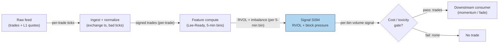

## Stage 94/200 — S094: Unusual intraday volume (RVOL) & signed block-trade pressure

*Batch SB3 · Signal 94/100 · Provenance [SR] · Family B — Intraday momentum & breakout*

### S1. One-line verdict

| | |
|---|---|
| **What it is** | Volume vs its own time-of-day history (RVOL) plus the buy/sell imbalance of large block prints. |
| **When it works** | Liquid names where abnormal volume marks real information arrival or institutional participation. |
| **When it dies** | Op-ex/rebalance volume, retail frenzies, low-float gaps — volume without direction is noise. |
| **Build-or-buy in one line** | Build — it is arithmetic on your own bars and trades; buy only the cleanest trade feed you can afford. |

Provenance **[SR]** (standard reconstruction — the RVOL construction and block-imbalance composite are practitioner-standard, not from a single paper; the Lee–Ready signing step is documented [D] within it). Family **B — Intraday momentum & breakout**. Horizon: minutes to the session.

### S2. How it works — plain human explanation

10:07 ET. Fictional XYZ prints a 45,000-share block at the ask — then another. The 5-minute bin's volume is 3.4× its 20-day average for this time of day: RVOL 3.4, block imbalance +1.0 (all buys). Someone big is accumulating, and they are not hiding it well.

Why should volume predict anything? Two mechanisms. First, **information arrival**: informed traders must trade to profit, and their volume shows up *before* the price fully adjusts — signed prints reveal institutional direction while the adjustment is incomplete (Chan & Lakonishok 1993). Second, **visibility**: Gervais, Kaniel & Mingelgrin (2001) showed unusually high volume stocks appreciate over the following month — the "high-volume return premium". The block intuition is **adverse selection** in reverse: the informed party has revealed its hand, and the absorption pressure hasn't fully decayed.

**Mental model (3 bullets):**
- RVOL answers "is anyone here?" — abnormal participation vs the same time-of-day history.
- Signed blocks answer "which way are they going?" — volume without direction is noise.
- The edge is in the *combination*: participation confirms the move is institutional; the sign gives the direction; the fade comes when the imbalance mean-reverts.

### S3. The math — exact formula

For time-of-day bin $b$ (e.g. 5-minute bins) on day $t$, with $V_{t,b}$ the bin volume:

$$RVOL_{t,b} = \frac{V_{t,b}}{\frac{1}{N}\sum_{d=1}^{N} V_{t-d,b}}, \qquad
z(RVOL_{t,b}) = \frac{RVOL_{t,b} - \mu}{\sigma}$$

Time-of-day matching removes the **U-shape** (the diurnal pattern of high volume at the open and close, thin midday — see S067). Trigger: $RVOL > 2$ or $z(RVOL) > 2$ (*examples — not institutional standards*).

Direction from signed blocks — sign each trade with **Lee–Ready (1991)**: the **quote test** compares the trade price to the *lagged* midquote (the paper's 5-second lag fixes quotes recorded ahead of trades); the **tick test** resolves midquote trades against the previous trade price (uptick = buy, downtick = sell). Block filter: size ≥ threshold (*example:* ≥ 10,000 shares, or top 1% of prints). Then:

$$BlockImb_b = \frac{\text{BuyVol}_{blocks,b} - \text{SellVol}_{blocks,b}}{\text{TotalVol}_{blocks,b}} \in [-1, +1]$$

Trade with the sign of $BlockImb$; fade/exit when it mean-reverts toward zero.

| Parameter | Symbol | Typical range | Too small / too large | Default (example) |
|---|---|---|---|---|
| Baseline window | $N$ | 20–60 days | small: noisy baseline; large: stale (regime drift) | 20 days — *example, not an institutional standard* |
| Bin width | $b$ | 5–30 min | small: noisy; large: the move is over | 5 min — *example* |
| RVOL trigger | — | 1.5–3.0 | small: false positives; large: no trades | 2.0 — *example* |
| Block size threshold | — | 5k–50k shares | small: retail noise; large: no blocks | 10,000 shares — *example* |
| Imbalance window | — | 15–30 min | small: flickers; large: stale direction | 15 min — *example* |

**Normalization:** RVOL is already a ratio (self-normalizing); z-score it per name if you need cross-sectional comparability. **Causal timing:** the bin's RVOL is computed at the bin *close* using only completed bins and completed past days; tradable no earlier than the next bin. **Variants:** (1) session-cumulative RVOL (today's cumulative volume vs average cumulative at the same time); (2) dollar-volume RVOL (shares × price — better across names); (3) options variant — an *unverified practitioner rule* (a Stanford CS229-style filter on OptionMetrics data; no checkable citation obtained — see Unverified leads): flag an option when volume > 2× its daily average **and** ≥ 500 contracts.

### S4. Worked example — step-by-step numbers (SYNTHETIC)

Synthetic morning tape, seed **94094**: twelve 5-minute bins, 9:30–10:30, fictional XYZ. Baseline = 20-day average volume for the same time-of-day bin (thousands of shares). Two synthetic institutional events: bin 4 prints two buy blocks (25k, 18k shares); bin 9 prints one sell block (30k shares). All numbers synthetic.

| Bin | Time | Baseline (k) | Actual (k) | RVOL | Blocks | Trigger? |
|---|---|---|---|---|---|---|
| 1 | 9:30 | 120 | 133 | 1.11 | — | — |
| 2 | 9:35 | 90 | 78 | 0.87 | — | — |
| 3 | 9:40 | 70 | 83 | 1.19 | — | — |
| 4 | 9:45 | 60 | 206 | 3.43 | 2 buy (25k, 18k) | **YES** |
| 5 | 9:50 | 55 | 87 | 1.58 | — | — |
| 6 | 9:55 | 50 | 44 | 0.88 | — | — |
| 7 | 10:00 | 48 | 46 | 0.96 | — | — |
| 8 | 10:05 | 50 | 63 | 1.26 | — | — |
| 9 | 10:10 | 55 | 157 | 2.85 | 1 sell (30k) | **YES** |
| 10 | 10:15 | 65 | 101 | 1.55 | — | — |
| 11 | 10:20 | 80 | 88 | 1.10 | — | — |
| 12 | 10:25 | 100 | 89 | 0.89 | — | — |

Step-by-step: (1) bin 4: RVOL = 206/60 = **3.43** > 2.0 → trigger; (2) BlockImb = (25+18−0)/43 = **+1.0** → long; (3) enter 2,000 shares at \$40.00 in bin 5; (4) bin 9: RVOL = 157/55 = **2.85**, BlockImb = **−1.0** — imbalance flipped → exit at \$40.35; (5) gross = 2,000 × \$0.35 = **\$700**; (6) costs — explicit components (`example`): **spread** (crossing the half-spread on entry and exit) 2,000 × \$0.01 = \$20; **commissions/fees** \$10; **market impact/slippage** (chasing the block prints) \$20 → total **\$50** → **net +\$650**.

**What to notice.** The signal fired exactly twice — both times on *combinations* of participation and sign, never on volume alone (bin 10's 1.55 RVOL with no blocks is correctly ignored). The toy assumes fills at the bin-4 close with no **market impact** (price concession for demanding immediacy) and no partial fills — in reality, chasing the second block print means paying the impact the block created. The P&L is arithmetic, not a backtest.

### S5. Strategies that use this signal

- **T018 — primary**: the RVOL-gated gap-and-go chases opening gaps only with institutional relative volume and block-pressure footprints.
- **T084 — primary**: the block-trade impact reversion provides liquidity after block trades and exits on the resiliency half-life — the fade leg of this chapter's signal.
- **T039 — confirmation**: the ETF creation/redemption flow trader confirms ETF–basket dislocations with block volume and relative volume.
- **T049 — confirmation**: the unusual-options-activity follower confirms signed options sweeps with equity RVOL.

### S6. Data required — exact spec

| Field | Type | Granularity | Source tier | Notes |
|---|---|---|---|---|
| Tick trades (price, size) | float/int | trade | Tier 1–2 | for Lee–Ready signing and block detection |
| Quotes (bid/ask) | float | L1 (level-1, top-of-book) | Tier 1–2 | lagged midquote for the quote test |
| 1-min OHLCV bars | float/int | 1-min | Tier 0–1 | RVOL baseline can be built from bars alone |
| Corporate actions / halts | calendar | daily/event | Tier 1 | baselines must be split-adjusted; halts excluded |

Ingest sketch (≤20 lines, Python/polars):

```python
import polars as pl
trades = pl.read_parquet("trades/XYZ.parquet")   # ts, price, size
quotes = pl.read_parquet("quotes/XYZ.parquet")   # ts, bid, ask
q = (quotes.with_columns(((pl.col("bid") + pl.col("ask")) / 2).alias("mid"))
             .with_columns(pl.col("ts").sub(pl.duration(seconds=5)).alias("ts_lag")))
t = trades.join_asof(q, left_on="ts", right_on="ts_lag", strategy="backward")  # quote 5 s before the trade
t = t.with_columns(
    pl.when(pl.col("price") > pl.col("mid")).then(1)
     .when(pl.col("price") < pl.col("mid")).then(-1)
     .otherwise(pl.col("price").diff().sign())          # tick test
     .alias("sign"))
blocks = t.filter(pl.col("size") >= 10_000)            # example threshold
```

**Storage:** 1-min bars are trivial (~50 MB/day for 500 symbols, per `notes/cost-model.md` §4); tick trades/quotes for liquid names run ~2–8 GB per symbol-day in parquet (§4) — archive selectively, compute RVOL from bars for history. **Data-quality checklist:** timestamp normalization (SIP vs exchange), bad ticks, splits, halts, DST/half-days, stale quotes (the Lee–Ready lag exists precisely because of quote staleness). Latency/queue-position claims on SIP (the Securities Information Processor, the consolidated tape)/L1 (level-1, top-of-book) are *simulated only — requires MBO (market-by-order)/ITCH (Nasdaq's ITCH direct feed)*.

### S7. Local build on M5 Max / 128GB

**Feasibility: feasible** — this is Tier M plumbing, not heavy compute. Tick-trade rates for liquid names run ~10–200/sec busy (per `notes/cost-model.md` §2): a Python loop handles ≤20 symbols, and polars `join_asof` for Lee–Ready quote matching runs at ~1–10M rows/sec (§2), so the signing step — the actual bottleneck — is comfortable in batch and fine intraday for dozens of symbols.

**Throughput / RAM:** RVOL itself is a grouped ratio — polars does 500 symbols × 390 one-minute bars in milliseconds. The working set that matters is tick data: one symbol-day of trades is tens of MB; 50 symbols × 60 days of ticks does *not* fit the 77 GB working budget (§3) — use per-symbol daily files and stream, or build baselines from 1-min bars (12 MB for 500 symbols × 60 days — trivial, §3). **Stack options:** Python + polars is the default; Rust only if you push full-depth L2 signing in real time; DuckDB for the tick archive. **Engineering time:** Tier **M**, 20–60 h → **\$3,000–9,000** loaded-cost estimate at \$150/hr (per `notes/cost-model.md` §5 — L1 event pipelines; the hours go to the quote-matching and corporate-action plumbing, not the ratio). *One-line verdict: feasible on the M5 Max (Tier M, ~40 h ≈ \$6k eng + ~\$30–200/mo data); bottleneck is Lee–Ready quote matching; at 500 symbols use bars, not raw ticks.*

### S8. Buy vs build

| Option | What you get | Indicative price | What buying gains | What buying loses |
|---|---|---|---|---|
| Tier-0 free route | Alpaca IEX tick trades, delayed quotes | ~\$0 | Zero cost; real prints | IEX-only (not consolidated); no history depth |
| Tier-1 retail | Polygon Stocks Advanced / Alpaca SIP — consolidated trades + quotes | ~\$30–200/mo, *indicative — verify before budgeting* | Consolidated tape; corporate actions | Retail-grade timestamps |
| Tier-2 professional | Databento Standard — honest L1 trades/quotes | ~\$200/mo + usage, *indicative — verify before budgeting* | Microstructure honesty for signing | Usage metering |
| Tier-3 institutional | TAQ / full OPRA production | Institutional \$\$\$\$, *indicative — verify before budgeting* | The academic gold standard | Cost; overkill for RVOL |

**Verdict: build.** RVOL is a ratio and Lee–Ready is public-domain arithmetic — there is nothing to buy except the raw prints. Spend the budget on the *cleanest trade/quote feed* you can afford, because signing quality is the entire game: garbage quotes in, garbage signs out. (Per `notes/cost-model.md` §6: build when the edge needs custom parameters and microstructure honesty — both true here.)

### S9. Success ratio / efficacy — documented evidence

| Study / source | Market & period | Metric | Before/after cost | Caveat |
|---|---|---|---|---|
| Gervais, Kaniel & Mingelgrin (2001), *J. Finance* 56(3) | US stocks; high/low volume days and weeks | Stocks with unusually high (low) trading volume appreciate (depreciate) over the following month — the high-volume return premium | **Before cost** (cross-sectional return predictability, no strategy implementation) | Monthly horizon and visibility mechanism — supports the *idea* that abnormal volume carries information, not an intraday trigger |
| Chan & Lakonishok (1993), *J. Financial Economics* 33 | 37 institutional managers, 1986–1988 | Institutional trades move prices intraday; market impact and trading cost relate to firm capitalization, relative package size, and manager identity | **Before cost** (execution-cost measurement) | Impact is documented as a *cost* to the institution — the follower's edge is the residual drift, which the paper does not isolate |
| Lee & Ready (1991), *J. Finance* 46(2) | NYSE, 150 firms, 1988 | Trade-classification algorithm (quote test with lag + tick test); documents the quote-ahead-of-trade problem | n/a — methodological | The signing step this chapter depends on; accuracy is imperfect, especially for midquote trades |
| Lee (1992), *J. Financial Economics* 15 | Intraday around earnings news | 'Good'/'bad' news triggers brief, intense buying/selling in *large* trades; persistent anomalous buying in *small* trades regardless of news | **Before cost** | Directional volume reacts to news — but the small-trade anomaly warns that not all signed volume is informed |

**Regimes where it fails:** expiration/rebalance days (mechanical volume); retail-driven spikes (participation without direction); low-float names (blocks gap past any fill); volatility shocks (spreads widen past the drift). **Honest bottom line: as a standalone trigger this is a weak-to-moderate, context-dependent edge — volume alone is noise; as a confirmation and gating filter it is one of the most-used tools in the intraday stack.**

### S10. Failure modes & pitfalls

1. **Volume without direction.** RVOL alone cannot tell accumulation from distribution → *always pair with a sign (blocks or signed return).*
2. **Mechanical volume.** Op-ex, index rebalances, and MOC flows print huge RVOL with zero information → *calendar filter for expiry/rebalance days.*
3. **Stale-quote signing errors.** The Lee–Ready quote test misfires when quotes lag → *use the lagged midquote (the paper's own fix); consider bulk volume classification (BVC) as a robustness check.*
4. **Continuation vs reversion confusion.** Blocks predict direction *and* their own absorption — entering late means buying the liquidity provider's exit → *enter on the first confirming bin; fade when BlockImb mean-reverts (T084).*
5. **Cost blowup chasing blocks.** The block already moved the price; chasing pays its impact → *model spread + impact explicitly; size so the expected drift exceeds both.*
6. **Low-float gaps.** A 30k block in an illiquid name gaps past any fill → *liquidity floor (ADV multiple) before arming the trigger.*
7. **Lookahead in the baseline.** Including today (incomplete) in the trailing average biases RVOL → *baseline from completed days only.*
8. **Options-variant confusion.** Option volume spikes can be hedging, not direction → *the 2×/500-contract rule is an *unverified* practitioner flag (no checkable citation; see Unverified leads), not a signal; confirm with equity prints.*

### S11. Visuals




### S12. Sources

- Lee, Charles M. C. & Ready, Mark J. (1991). "Inferring Trade Direction from Intraday Data." *Journal of Finance* 46(2), 733–746. https://ideas.repec.Org/a/bla/jfinan/v46y1991i2p733-46.html
- Gervais, Simon, Kaniel, Ron & Mingelgrin, Dan H. (2001). "The High-Volume Return Premium." *Journal of Finance* 56(3), 877–919. http://ideas.repec.org/a/bla/jfinan/v56y2001i3p877-919.html
- Chan, Louis K. C. & Lakonishok, Josef (1993). "Institutional Trades and Intraday Stock Price Behavior." *Journal of Financial Economics* 33(2), 173–199. http://ideas.repec.org/a/eee/jfinec/v33y1993i2p173-199.html
- Lee, Charles M. C. (1992). "Earnings News and Small Traders: An Intraday Analysis." *Journal of Financial Economics* 15, 265–302. (Journal citation; no open URL verified — not counted toward the checkable-source minimum.)

**Unverified leads:** one item — *unverified practitioner rule (no checkable citation obtained)*: a Stanford CS229-style options filter on OptionMetrics data — flag an option when its volume exceeds 2× its daily average **and** ≥ 500 contracts. A screening flag for further research, not a documented result. All other quantitative claims above trace to the cited papers or the labeled synthetic example; RVOL trigger levels and block-size thresholds are marked *example* throughout.

*Source log: Duck.ai answered Q-SB3-1–Q-SB3-3 (2026-09-10); Grok/Cursor answers pending (checked 2026-09-10).*
