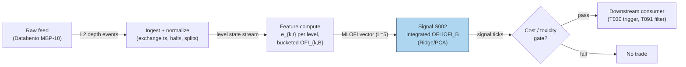

## Stage 2/200 — S002: Multi-level / integrated OFI (MLOFI)

*Batch SB4 · Signal 2/100 · Provenance [D] · Family A — Microstructure & order flow*

### S1. One-line verdict

| What it is | When it works | When it dies | Build-or-buy in one line |
|---|---|---|---|
| Event-counted net order flow (bid additions minus ask pressure) per book level, combined into one directional regressor. | Liquid large-tick names, stable regimes, short buckets, Ridge estimation. | Small-tick fast-replenishing books, news shocks, spoofing, SIP-only feeds, horizons > ~1 min. | Build the estimator (one Ridge regression on MBP-10); buy the L2 feed. |

Provenance: **[D]** (documented: Xu–Gould–Howison 2019; Cont–Cucuringu–Zhang 2023).

### S2. How it works — plain human explanation

*Level 1* of a limit order book is the "touch" — the best bid and best ask, what you see on any price screen. *Level 2 and beyond* (L2) are the resting limit orders stacked a few cents behind the touch. (A *tick* is the minimum price increment — one cent for most US stocks; a *large-tick* stock is one whose spread is usually pinned at exactly one tick, like ORCL or CSCO, while a *small-tick* stock like AMZN trades many ticks wide.) The classical order-flow imbalance (OFI, signal S001) watches only level 1: when buyers add bid size and sellers cancel ask size, the mid-price tends to tick up.

Multi-level OFI asks: why throw away levels 2–10? Suppose the touch shows bid 231.40 × 800 / ask 231.41 × 300, mildly bid-heavy. But three cents down, someone just posted 50,000 shares on the bid side, and two cents up, the ask stack thinned by 30,000. That deeper flow is also supply and demand — latent, but real. In large-tick stocks the touch itself barely moves, so *most* price-pressure information lives a few levels deep; in small-tick stocks the touch carries more of it.

The catch, and the reason this needs its own machinery: level OFIs are strongly correlated with each other. Naively regressing the mid-price change on ten level OFIs with plain OLS gives coefficients that slosh around (multicollinearity). Xu, Gould & Howison show the fix is Ridge regression, and Cont, Cucuringu & Zhang show a cleaner one: take the first principal component of the level-OFI vector — the "integrated OFI" — and regress on that single number.

**Mental model:**
- Flow deep in the book is partially *independent* information about supply and demand, not a noisier copy of the touch.
- Deep levels matter *most* where the touch can't move — large-tick names — and least where it can.
- Correlated inputs need regularization: Ridge, or PCA down to one integrated regressor. Never ten raw OLS coefficients.

### S3. The math — exact formula

Let $P^b_{k,t}$, $Q^b_{k,t}$ (resp. $P^a_{k,t}$, $Q^a_{k,t}$) be the price and resting size at level $k$ ($k=1$ = best) on the bid (resp. ask) side after event $t$. An *event* is any order-book update: limit order, cancel, trade.

**Level-$k$ event contribution** (Cont et al., event-time OFI):

$$e_{k,t} = \mathbf{1}\{P^b_{k,t} \ge P^b_{k,t-1}\}\,Q^b_{k,t}
- \mathbf{1}\{P^b_{k,t} \le P^b_{k,t-1}\}\,Q^b_{k,t-1}
- \mathbf{1}\{P^a_{k,t} \le P^a_{k,t-1}\}\,Q^a_{k,t}
+ \mathbf{1}\{P^a_{k,t} \ge P^a_{k,t-1}\}\,Q^a_{k,t-1}$$

in shares. Reading it: if the level-$k$ bid price *rises*, all its current size counts as buying pressure ($+Q^b_{k,t}$); if it *falls*, its old size counts as selling pressure ($-Q^b_{k,t-1}$); if the price is unchanged, only the *size change* $Q^b_{k,t}-Q^b_{k,t-1}$ counts. Mirror image for the ask side (ask price falling = buying pressure). Bucket $B$ (e.g. 1 s or 100 updates):

$$\mathrm{OFI}_{k,B} = \sum_{t \in B} e_{k,t}, \qquad
\mathbf{OFI}_B = [\mathrm{OFI}_{1,B},\dots,\mathrm{OFI}_{L,B}]^\top$$

**Integrated OFI** (Cont–Cucuringu–Zhang): $\mathrm{iOFI}_B = \mathbf{v}_1^\top(\mathbf{OFI}_B - \boldsymbol{\mu})$, where $\mathbf{v}_1$ is the unit eigenvector of the largest eigenvalue of $\mathrm{Cov}(\mathbf{OFI}_B)$, sign-flipped so positive means buying pressure. Price-impact regression: $r_B = \alpha + \beta \cdot \mathrm{iOFI}_B + \varepsilon_B$, with $r_B$ the contemporaneous mid-price change (ticks). Economically: adverse selection — informed flow hits the book (cancels, repriced limits) before it hits the tape — plus inventory: makers skew quotes against one-sided depth (see S089). Variants: equal-weighted sum (crude); inverse-depth weights; full Ridge vector regression (Xu–Gould–Howison). Timing: computed at bucket close using only events ≤ $t$; tradable no earlier than $t{+}1$.

| Parameter | Symbol | Typical range | Too small / too large | Default (example) |
|---|---|---|---|---|
| Levels | $L$ | 5–10 | $<3$ loses deep-book info; $>10$ adds collinear noise | 5 *(example — not an institutional standard)* |
| Bucket | $B$ | 100 ms–5 s or 100–1,000 updates | too short = noise; too long = stale | 1 s *(example)* |
| Ridge penalty | $\lambda$ | $10^1$–$10^4$ | 0 = unstable OLS; huge = kills deep levels | cross-validated *(example)* |
| PCA window | $W$ | 1–20 days rolling | too short = noisy loadings; too long = regime bleed | 5 days *(example)* |

### S4. Worked example — step-by-step numbers (SYNTHETIC)

Synthetic tape, seed **20260902** (all numbers below are the script's output, plotted identically in the chart). Ten 1-second buckets, $L=5$.

First, one event contribution by hand (level 1, bid side): bid price rises 100.00 → 100.01 with size 650 at the new level. Indicators: $\mathbf{1}\{100.01 \ge 100.00\}=1$, $\mathbf{1}\{100.01 \le 100.00\}=0$ → bid contribution $+650$ shares. Same event, ask side: ask price unchanged at 100.02, size 700 → 500: contribution $-(700-500) = -200$ shares. Level-1 event contribution $e_{1,t} = +650 - 200 = +450$ shares.

Aggregating each bucket's events level-wise and summing across levels (equal-weight integration, *example* choice):

| Bucket | OFI L1 | OFI L2 | OFI L3 | OFI L4 | OFI L5 | iOFI (shares) | Δmid (ticks) |
|---|---|---|---|---|---|---|---|
| 1 | −74.4 | −84.4 | −30.7 | −0.9 | −54.8 | −245.2 | −0.46 |
| 2 | 19.6 | −14.4 | −2.5 | −53.7 | 34.7 | −16.3 | 0.32 |
| 3 | 99.2 | 34.6 | 60.9 | 36.7 | 11.9 | 243.3 | 1.26 |
| 4 | −157.3 | −126.6 | −110.9 | −80.6 | −64.0 | −539.4 | −2.03 |
| 5 | −100.2 | −116.6 | −96.2 | −62.2 | −29.6 | −404.8 | −1.86 |
| 6 | −59.2 | −30.0 | −12.8 | −29.6 | −4.8 | −136.4 | −1.06 |
| 7 | 198.0 | 81.5 | 84.3 | 80.5 | 19.6 | 463.9 | 1.91 |
| 8 | −36.8 | −36.3 | −7.4 | −38.5 | −20.7 | −139.7 | −0.70 |
| 9 | −263.9 | −135.7 | −118.9 | −118.5 | −37.2 | −674.2 | −2.42 |
| 10 | −209.5 | −171.6 | −68.6 | −77.7 | −36.5 | −563.9 | −2.42 |

Bucket 5 check (the level-vector chart panel): $-100.2 -116.6 -96.2 -62.2 -29.6 = -404.8$ ✓, and its point $(-404.8, -1.86)$ sits on the scatter ✓.

**What to notice:** deep levels (L3–L5) carry real signal — bucket 9's −674 shares are 45% deep-book flow that touch-only OFI would miss. Limits: this is a *contemporaneous* fit, not a prediction; it includes no spread cost; and the generator is kind to the model by construction. Real level-OFI vectors are far more correlated and need the Ridge/PCA treatment of §S3.

### S5. Strategies that use this signal

- **T030 — primary entry trigger (direction).** T030 (Multi-Level OFI Weighted Predictor) is this signal: integrated OFI across 10 levels, VAR-confirmed.
- **T091 — confirmation filter.** T091 (Multi-Level Book-Pressure Swing) uses MLOFI's *flow* reading to confirm or veto its static-pressure swing, and to scale size.

### S6. Data required — exact spec

| Field | Type | Granularity | Source tier | Notes |
|---|---|---|---|---|
| Level prices/sizes, k=1..10 | float/int | L2 depth events (MBP-10), ~10–50k ev/s busy | Tier 2–3 | Genuine L2 required — the SIP (Securities Information Processor, the consolidated US tape; its NBBO carries only the touch) has no depth, so SIP-derived depth is simulated-only |
| Trade prints (for bucket validation) | int/float | trade events | Tier 1–2 | align timestamps to quotes |
| Symbol reference, corporate actions | strings | daily | Tier 0–1 | splits corrupt level continuity |

MBP-10 (market-by-price) means *aggregated* size per price level — no individual order identity or queue position, unlike MBO/ITCH (individual orders). Ingest sketch (≤20 lines):

```python
import polars as pl
# schema: ts, symbol, action(add/cancel/trade), side, level, price, size
ev = pl.scan_parquet("mbp10/2026-09-10/*.parquet").filter(
    pl.col("symbol") == "AAPL")
# reconstruct per-level state, compute e_{k,t} on each update
def level_ofi(g):  # g: one (symbol, level) event stream, sorted by ts
    dP_b = g["bid_px"].diff(); dQ_b = g["bid_sz"].diff()
    dP_a = g["ask_px"].diff(); dQ_a = g["ask_sz"].diff()
    e = (dP_b > 0) * g["bid_sz"] - (dP_b < 0) * g["bid_sz"].shift(1) \
        + (dP_b == 0) * dQ_b \
        - (dP_a < 0) * g["ask_sz"] + (dP_a > 0) * g["ask_sz"].shift(1) \
        - (dP_a == 0) * dQ_a
    return g.with_columns(e.fill_null(0).alias("e_k"))
```
Storage per symbol-day: L2 MBP-10 ≈ 10–40 GB parquet, per cost-model §4 (research-only archiving). Data-quality checklist: exchange-timestamp normalization, corporate actions/splits, halts, DST/half-days, stale/locked-crossed quotes, sequence gaps.

### S7. Local build on M5 Max / 128GB

**Verdict: feasible, Tier H.** Justification: per cost-model §5, L2/MBO signals are Tier H (60–200 h → $9,000–30,000 loaded-cost estimate at $150/hr) — book-reconstruction, validation, and regularized calibration dominate, not the arithmetic. Throughput per cost-model §2: L2 full depth (MBP-10) runs ~10–50k events/sec busy for top names; a Python event loop (~100–500k events/sec) handles a handful of symbols, but a 50-symbol real-time book engine wants Rust (~5–50M events/sec) or Python ingest + Rust book state. RAM: L2 MBP-10 is ~8–40 GB per symbol-day in RAM (cost-model §3) — 500 symbols × 60 days does **not** fit the 77 GB working budget; use per-symbol daily files plus streaming, computing OFI incrementally. Stack: Rust for the real-time book engine; Python+polars for research recompute; DuckDB for the parquet archive. Engineering band: Tier H 60–200 h. A chatbot build estimate (Duck.ai, labeled lead) puts a *full production L2 research system* at row-sum 520–1,020 h (its printed "600–1,180" contradicts its own rows) — treat that as the L2 platform cost and the cost-model Tier H band as this signal's cost. **What breaks first at 500 symbols:** network decompression and burst handling, not the M5 Max; then SSD write bandwidth for raw L2 retention (~40–120 GB/day compressed for 50 names).

### S8. Buy vs build

| Option | What you get | Indicative price | Buying gains | Buying loses |
|---|---|---|---|---|
| Tier 0: Alpaca IEX / Stooq | L1/trade bars, delayed | ~$0 | free prototyping of touch-only OFI | no genuine depth — MLOFI impossible |
| Tier 1: Polygon Stocks Advanced | real-time SIP bars/trades | ~$30–200/mo | cheap L1 pipeline | SIP ≠ depth; synthetic L2 = model simulation, labeled simulated-only |
| Tier 2: Databento MBP-10 | honest 10-level depth events | ~$200/mo + usage | true input for this signal | usage/licensing scales; no queue identity |
| Tier 3: LOBSTER (academic) | ITCH order-book replay | ~hundreds/yr academic | individual-order (MBO) fidelity | academic license only; not production |

All prices `indicative — verify before budgeting`. **Verdict: build** custom buckets/Ridge/PCA/thresholds (no vendor sells those); **buy** the raw MBP-10 feed — crossover at ~5 symbols of depth history. Synthetic-L2-from-SIP stays labeled model simulation, never traded as depth.

### S9. Success ratio / efficacy — documented evidence

Mandatory framing (Q-SB4-3 chatbot lead, independently consistent with the papers): the literature shows **stronger evidence for short-horizon statistical predictability than for after-cost tradability**. Report both OOS forecast improvement *and* net implementation performance; without the second, these are predictive features, not demonstrated edges.

| Study / source | Market & period | Metric | Before/after cost | Caveat |
|---|---|---|---|---|
| Xu–Gould–Howison 2019, Table 10 (verified against paper's own table) | 6 liquid Nasdaq stocks, 2016 LOBSTER | OOS RMSE reduction, 10-level vs 1-level, Ridge: ~15–30% small-tick (AMZN 17%, TSLA 15%, NFLX 31%), ~65–75% large-tick (ORCL 68%, CSCO 74%, MU 64%); OLS slightly weaker (~5–35% / ~60–70%) | before cost — forecast fit only | Contemporaneous mid-price change, not tradeable P&L; regularization required |
| Cont–Cucuringu–Zhang 2023 (arXiv:2112.13213) | S&P 500 constituents, 2017–2019 | Integrated OFI (PCA) beats best-level OFI in/out-of-sample; lagged cross-asset OFIs improve forward-return $R^2$ | before cost | Cross-impact decays rapidly with horizon |
| Cont–Kukanov–Stoikov 2011 (arXiv:1011.6402) | 50 US stocks, NYSE TAQ 2008 | Linear OFI→price-change relation, slope ∝ 1/depth | before cost | Touch-level OFI only (the S001 ancestor) |

**Bottom line:** as a standalone trigger this is a *promising but not established after-cost* edge — the documented wins are RMSE/R² improvements on mid-price changes, and the hurdle is E[gross move] > spread + fees + slippage + impact. As a *feature inside an execution or market-making model* (T030's VAR confirmation, T091's swing filter), it is the best-evidenced depth signal in Family A. Failure regimes: small-tick fast-replenishment books, spoofing (deep size that never intends to trade), news jumps, and any consolidated/SIP feed (no real depth).

### S10. Failure modes & pitfalls

1. **Collinearity without regularization** — ten level OFIs move together; naive OLS coefficients are unstable. *Mitigate: Ridge or PCA integration, cross-validated.*
2. **Spoofing / non-bona-fide depth** — deep quotes can be bait. *Mitigate: weight by level fill probability; discount cancel-heavy size.*
3. **Lookahead via stale buckets** — computing "contemporaneous" OFI with a mid-price from inside the bucket. *Mitigate: strict event-time bucketing, trade at t+1.*
4. **SIP feed masquerading as depth** — the SIP's NBBO has no levels beyond the touch. *Mitigate: real MBP-10 or label simulated-only.*
5. **Regime breaks** — vol events change depth replenishment. *Mitigate: rolling PCA loadings (1–20 d), regime-gated thresholds.*
6. **Cost blowup** — a 0.1-tick expected move dies against a 1-tick spread. *Mitigate: model spread + fees + slippage + impact explicitly before sizing.*
7. **Overfitting levels/buckets** — grid-searching L and B on one month. *Mitigate: walk-forward OOS, embargo between folds.*
8. **Data errors** — crossed books, sequence gaps, halts. *Mitigate: validation layer that halts signal on gap/lock.*

### S11. Visuals




### S12. Sources

- Xu, K., Gould, M. D., & Howison, S. D. (2019). "Multi-Level Order-Flow Imbalance in a Limit Order Book." arXiv:1907.06230 [q-fin.TR]. https://arxiv.org/abs/1907.06230 — Table 10 figures quoted in S9 verified against the paper's own table (Ridge row).
- Cont, R., Cucuringu, M., & Zhang, C. (2023). "Cross-Impact of Order Flow Imbalance in Equity Markets." Quantitative Finance 23(10), 1373–1393. arXiv:2112.13213. https://arxiv.org/abs/2112.13213
- Cont, R., Kukanov, A., & Stoikov, S. (2011). "The Price Impact of Order Book Events." arXiv:1011.6402 [q-fin.TR]. http://arxiv.org/pdf/1011.6402v3
- Chatbot source (labeled): Duck.ai (GPT-5.6 Luna, anonymous) answered Q-SB4-1–Q-SB4-3 (2026-09-10); Grok/Cursor answers pending (checked 2026-09-10). Formulas verified against literature; Q-SB4-2 hour rows used with printed-total discrepancy noted; Q-SB4-3 framing lead adopted.

**Unverified leads**
- Duck.ai's Q-SB4-2 full-pipeline hour bands (L2 rows 520–1,020 h; printed total "600–1,180" contradicts row sums — unverified chatbot claim, use row sums or the cost-model band).
- Any vendor per-symbol depth price for 50 liquid names ($1,000–10,000+/mo range from chat — indicative chatbot claim, verify with Databento/exchange schedules).
