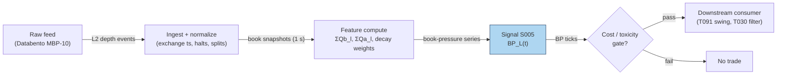

## Stage 5/200 — S005: Multi-level book pressure (static depth imbalance)

*Batch SB4 · Signal 5/100 · Provenance [SR] · Family A — Microstructure & order flow*

### S1. One-line verdict

| What it is | When it works | When it dies | Build-or-buy in one line |
|---|---|---|---|
| The ratio of resting bid depth to total depth across the first *L* book levels — a still photograph of latent supply vs demand. | Deep, stable books in liquid names; calm sessions where posted size means what it says. | Spoof-heavy or news-driven tapes, thin books, SIP-only feeds (no depth), fast replenishment regimes. | Build the ratio in ten lines; buy (or skip) the L2 feed — the feed is the whole cost, the math is free. |

Provenance: **[SR]** (standard reconstruction — practitioner standard; academic grounding in multi-level OFI, entry 2). Never upgraded without a real citation.

### S2. How it works — plain human explanation

If order-flow imbalance (S001/S002) is a *movie* — it counts orders arriving and leaving — book pressure is a *photograph*. At any instant, the limit order book holds resting buy orders (bids) and resting sell orders (asks) stacked at each price level. Book pressure adds up the bid-side depth across the first *L* levels, adds up the ask-side depth, and takes the normalized difference. A book with 65,000 shares resting on the bid side and 46,000 on the ask side has pressure $+0.17$: latent demand outweighs latent supply.

Why should a still photo predict the next move? Two economic channels. First, *mechanical*: for the mid-price to fall, sellers must chew through the entire bid queue at the touch; a fat bid queue is a wall that takes longer to demolish (Gould & Bonart's queue-imbalance result formalizes exactly this for level 1). Second, *informational*: patient traders post size where they think the price is going — resting depth is a revealed belief, though a noisy and sometimes dishonest one (spoofers post size they never intend to trade). This is the adverse-selection channel: one-sided depth is how informed flow shows up before it prints, and it is why market makers widen or pull quotes when the book tilts.

**Jargon, defined once:** *NBBO* (National Best Bid and Offer) = the best bid/ask across all US exchanges, consolidated by the *SIP* (Securities Information Processor — the official consolidated tape); *MBP-10* = market-by-price data giving aggregate size at each of the top 10 price levels; *basis points* (bps) = hundredths of a percent (1 bp = 0.01%).

**Mental model:**
- Static pressure measures *latent* supply/demand; flow measures *revealed* aggression. They are complements, not substitutes.
- Deep-book pressure matters most when the touch is pinned (large-tick names) — same logic as S002.
- Posted size is a claim, not a fact: always discount for spoofing and cancellation rates.

### S3. The math — exact formula

$$BP_L(t) = \frac{\sum_{l=1}^{L} Q^b_l(t) - \sum_{l=1}^{L} Q^a_l(t)}
{\sum_{l=1}^{L} Q^b_l(t) + \sum_{l=1}^{L} Q^a_l(t)} \in [-1, +1]$$

$Q^b_l(t)$ ($Q^a_l(t)$) = resting bid (ask) size in shares at level $l$ at time $t$; $l=1$ is the touch. Dimensionless. Positive = bid-side pressure (latent buying). Variants: touch-only ($L=1$, = S003 queue imbalance); exponential level weights $w_l = e^{-\eta(l-1)}$ with decay $\eta$ (*example* 0.5); depth-weighted microprice cousin $P^{micro} = \frac{Q^a_1 P^b_1 + Q^b_1 P^a_1}{Q^a_1 + Q^b_1}$ (S004). Timing: snapshot at $t$ from the book state; tradable no earlier than $t{+}1$ (a snapshot is already one step behind the tape).

| Parameter | Symbol | Typical range | Too small / too large | Default (example) |
|---|---|---|---|---|
| Levels | $L$ | 5–10 | $<3$ ≈ touch-only; $>10$ dilutes with stale depth | 5 *(example — not an institutional standard)* |
| Decay | $\eta$ | 0–1.0 | 0 = flat sum (deep noise); >1 ≈ touch-only | 0.5 *(example)* |
| Snapshot cadence | $\Delta t$ | 100 ms–5 s | faster = redundant; slower = stale | 1 s *(example)* |
| Tilt threshold | $\theta$ | 0.1–0.3 | too low = noise trades; too high = never fires | 0.2 *(example)* |

### S4. Worked example — step-by-step numbers (SYNTHETIC)

Synthetic book, seed **20260905**, 8 snapshots × 5 levels (chart plots the same numbers). Hand-computing snapshot 4, the deepest-tilted one:

Bid sizes L1–L5: 1359, 1331, 1319, 1246, 1248 → $\sum Q^b = 6503$ shares.
Ask sizes L1–L5: 792, 1319, 715, 654, 1149 → $\sum Q^a = 4629$ shares.

$$BP = \frac{6503 - 4629}{6503 + 4629} = \frac{1874}{11132} = +0.1683$$

The full 8-snapshot series (BP panel of the chart):

| Snapshot | Σ bid | Σ ask | BP |
|---|---|---|---|
| 1 | 6147 | 6395 | −0.0198 |
| 2 | 5761 | 4905 | +0.0803 |
| 3 | 4797 | 5764 | −0.0916 |
| 4 | 6503 | 4629 | **+0.1683** |
| 5 | 5618 | 4252 | +0.1384 |
| 6 | 5271 | 5033 | +0.0231 |
| 7 | 4691 | 4740 | −0.0052 |
| 8 | 5102 | 4344 | +0.0802 |

Against the *example* ±0.20 tilt band, no snapshot fires a tilt — snapshot 4 at +0.1683 is the closest. That is deliberate: with honest thresholds, a static photo of a synthetic book *should* mostly say "no edge," which is the toy-tape's way of showing how weak this signal is on its own. **What to notice:** BP is smooth and slow-moving relative to event flow — it lags aggression by construction (limits and cancels move first, the photograph updates after). Limits: no fees, no spread, no spoofing in the toy data; real books have all three.

### S5. Strategies that use this signal

- **T091 — primary swing trigger.** T091 (Multi-Level Book-Pressure Swing) is built on this exact quantity: 10-level static book-pressure swing positions with vol-breakout exits.
- **T030 — confirmation filter.** T030 (Multi-Level OFI Weighted Predictor) triggers on *flow* (S002); static pressure confirms the flow isn't leaning into a wall — or vetoes when BP contradicts iOFI.

### S6. Data required — exact spec

| Field | Type | Granularity | Source tier | Notes |
|---|---|---|---|---|
| Level sizes Q^b_l, Q^a_l, l=1..L | int (shares) | L2 depth snapshots or events, ≥1 s cadence | Tier 2–3 | Genuine MBP-10; SIP has no depth |
| Level prices (for decay weights) | float | same | Tier 2–3 | touch price from NBBO suffices for weights |
| Halt/split calendar | strings | daily | Tier 0–1 | splits shift level indexing |

Ingest sketch (≤20 lines):

```python
import polars as pl
# snapshots: ts, symbol, level, bid_sz, ask_sz  (1-second cadence)
snaps = pl.scan_parquet("mbp10_snap/2026-09-10/*.parquet").filter(
    (pl.col("symbol") == "AAPL") & (pl.col("level") <= 5))
eta = 0.5  # example decay — not an institutional standard
w = pl.Series([__import__("math").exp(-eta * (l - 1)) for l in range(1, 6)])
bp = (snaps.group_by(["ts", "symbol"]).agg(
        (pl.col("bid_sz") * w).sum().alias("wb"),
        (pl.col("ask_sz") * w).sum().alias("wa"))
      .with_columns(((pl.col("wb") - pl.col("wa"))
                     / (pl.col("wb") + pl.col("wa"))).alias("BP")))
```
Storage per symbol-day: L2 snapshots ≈ 10–40 GB/day parquet if kept at event granularity (cost-model §4); 1 s snapshots compress to ~1–5 GB/day. Data-quality checklist: exchange timestamps, corporate actions, halts (freeze or drop), DST/half-days, stale snapshots (drop if older than 2× cadence).

### S7. Local build on M5 Max / 128GB

**Verdict: feasible, Tier H (the data, not the math).** The ratio itself is ten lines; the work is the L2 pipeline — per cost-model §5 this is Tier H, 60–200 h ($9,000–30,000 loaded-cost estimate at $150/hr), same band as S002, since both need honest depth. Throughput per cost-model §2: 1 s snapshots are trivial for polars (~10–50M rows/sec simple ops); real-time snapshot maintenance at 50 symbols needs only a light event loop — the L2 cost driver is *retention*, not compute: ~8–40 GB RAM per symbol-day live (cost-model §3), so 60 days of raw depth for 50 names does **not** fit; keep per-symbol daily parquet + rolling in-memory snapshots. Stack: Python+polars for research, Rust only if you maintain sub-second real-time state across many names, DuckDB for the snapshot archive. Chatbot lead (Duck.ai, labeled): build the L1/trade pipeline *first* (~300–500 h production-quality, row-sum 315–650 h — its printed "285–650" contradicts its own rows), and add MBP-10 only with a specific depth hypothesis like this one; 60 days of raw L2 retention is the storage + data-cost problem, not compute. **What breaks first at 500 symbols:** SSD capacity for depth history, then feed-handler CPU on bursts.

### S8. Buy vs build

| Option | What you get | Indicative price | Buying gains | Buying loses |
|---|---|---|---|---|
| Tier 0: Stooq / Alpaca IEX | daily bars, L1 snapshots | ~$0 | free toy prototype | no multi-level depth |
| Tier 1: Polygon Stocks Advanced | real-time SIP NBBO/trades | ~$30–200/mo | cheap, honest L1 | SIP has no depth — any "book pressure" from it is a model simulation |
| Tier 2: Databento MBP-10 | real 10-level depth | ~$200/mo + usage | genuine input | usage + licensing scale with names |
| Tier 3: LOBSTER (academic) | ITCH replay | ~hundreds/yr academic | order-level truth | academic license; not production |

All prices `indicative — verify before budgeting`. **Verdict: build if** your hypothesis is specific (which L, which decay, which tilt threshold — no vendor sells *your* pressure variant); **buy** the raw depth feed. Crossover: the moment you want more than a couple of names of depth history, buy MBP-10; the DIY alternative is re-licensing anyway. Never ship a SIP-derived "depth pressure" number without the **model simulation, NOT observed L2** label — e.g. exponential decay $Q_k = Q_1 e^{-\eta(k-1)}$ invented from the touch is a simulation, and honest labeling (per the Duck.ai build lead) is the difference between a pressure estimate and a fabrication.

### S9. Success ratio / efficacy — documented evidence

| Study / source | Market & period | Metric | Before/after cost | Caveat |
|---|---|---|---|---|
| Gould & Bonart 2015/16 (arXiv:1512.03492) | 10 liquid Nasdaq stocks | Logistic regression: queue imbalance vs direction of *next* mid-price move — strongly statistically significant for all 10; "considerable" binary/probabilistic classification improvement for large-tick stocks, "moderate" for small-tick, vs null model | before cost — classification skill, not P&L | Touch-level (L=1) predictor; the multi-level extension is the [SR] step this chapter takes |
| Xu–Gould–Howison 2019, Table 10 (verified) | 6 Nasdaq stocks, 2016 LOBSTER | OOS RMSE reduction 10-level vs 1-level: Ridge ~15–30% small-tick, ~65–75% large-tick | before cost — forecast fit | Flow (OFI), not static pressure — academic grounding, not direct evidence |
| Q-SB4-3 framing lead (labeled chatbot) | — | "Stronger evidence for short-horizon statistical predictability than for after-cost tradability" | — | No documented after-cost P&L for book-pressure strategies found in this research pass |

**Bottom line:** as a standalone trigger this is a *predictive feature, not a demonstrated edge* — the documented evidence is classification skill and forecast improvement, all before cost; no after-cost study was located. As a *filter inside T091/T030* (veto flow trades leaning into a static wall), it earns its place on mechanism and on the large-tick queue-imbalance literature. Failure regimes: spoofed books (pressure without intent), news jumps (static picture invalidated in milliseconds), thin names (one iceberg order dominates BP), and any SIP-only implementation (simulated depth).

### S10. Failure modes & pitfalls

1. **Spoofing** — posted size that cancels before execution. *Mitigate: discount size by historical cancel rate per level; require flow confirmation (S002).*
2. **Static-vs-flow confusion** — trading a photo as if it were a movie. *Mitigate: pair BP with a flow signal; treat BP as regime/tilt, not trigger.*
3. **SIP-derived pseudo-depth** — exponential-decay depth invented from the touch. *Mitigate: label model simulation, NOT observed L2; never trade it as real depth.*
4. **Lookahead in snapshots** — timestamping the snapshot after the price moved. *Mitigate: exchange timestamps; tradable no earlier than t+1.*
5. **Overfit decay/threshold** — tuning η and θ to one month's noise. *Mitigate: walk-forward validation, embargo.*
6. **Cost blowup** — tilt edges are typically sub-tick. *Mitigate: explicit spread + fees + slippage + impact model; sub-spread expectations → no trade.*
7. **Regime breaks** — depth replenishment changes under stress. *Mitigate: rolling normalization; stand down on vol spikes.*
8. **Thin-book concentration** — one large order dominates the ratio. *Mitigate: cap per-level contribution; require minimum total depth.*

### S11. Visuals




### S12. Sources

- Gould, M. D., & Bonart, J. (2015). "Queue Imbalance as a One-Tick-Ahead Price Predictor in a Limit Order Book." arXiv:1512.03492 [q-fin.TR]. https://arxiv.org/abs/1512.03492 (published Market Microstructure and Liquidity, 2016).
- Xu, K., Gould, M. D., & Howison, S. D. (2019). "Multi-Level Order-Flow Imbalance in a Limit Order Book." arXiv:1907.06230 [q-fin.TR]. https://arxiv.org/abs/1907.06230
- Cont, R., Kukanov, A., & Stoikov, S. (2011). "The Price Impact of Order Book Events." arXiv:1011.6402 [q-fin.TR]. http://arxiv.org/pdf/1011.6402v3
- Chatbot source (labeled): Duck.ai (GPT-5.6 Luna, anonymous) answered Q-SB4-1–Q-SB4-3 (2026-09-10); Grok/Cursor answers pending (checked 2026-09-10). Q-SB4-2 build-ordering lead ("build L1/trade first; add MBP-10 only with a specific depth hypothesis") and synthetic-L2-from-SIP = model-simulation label adopted; Q-SB4-3 evidence-framing lead adopted.

**Unverified leads**
- Duck.ai Q-SB4-2 production-pipeline hour bands (L1/trade rows 315–650 h vs printed "285–650"; L2 rows 520–1,020 h vs printed "600–1,180" — use row sums; unverified chatbot claims).
- Any named vendor's per-name MBP-10 subscription price — indicative chatbot range only; verify with the vendor.
