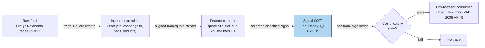

## Stage 7/200 — S007: Trade classification: Lee–Ready & Bulk Volume Classification

*Batch SB4 · Signal 7/100 · Provenance [D] · Family A — Microstructure & order flow*

### S1. One-line verdict

| What it is | When it works | When it dies | Build-or-buy in one line |
|---|---|---|---|
| Labeling each trade (or bar of volume) as buyer- or seller-initiated so every downstream flow signal has a sign. | Clean quote alignment, ordinary spreads, Lee–Ready when you have quotes; BVC when you only have bars. | Fast markets with stale quotes, midpoint-heavy prints, locked/crossed quotes, odd lots, off-exchange prints. | Build both classifiers in an afternoon — the hard part is honest quote alignment, not the formula. |

Provenance: **[D]** (documented: Lee & Ready 1991; Easley, López de Prado & O'Hara 2012).

### S2. How it works — plain human explanation

A trade print says "100 shares changed hands at $100.10." It does *not* say who demanded liquidity and who supplied it — yet nearly every flow signal (OFI, volume delta, VPIN, Kyle's lambda) needs that sign. *Trade classification* infers the initiator: the buyer-initiated side is the aggressor who crossed the spread.

Two canonical methods. **Lee–Ready (1991):** compare the trade price to the quote midpoint. Above the mid → buyer-initiated (+1); below → seller-initiated (−1); exactly at the mid → fall back to the *tick rule* (uptick = buy, downtick = sell, zero-tick inherits the last direction). **Bulk Volume Classification (BVC):** don't classify individual trades at all — take a *volume bar* (a fixed chunk of traded shares), look at its open-to-close price change, and split the bar's volume probabilistically: a strongly up bar is mostly buys, a flat bar is 50/50. BVC is robust to coarse clocks and missing quotes, at the price of per-trade resolution.

*Jargon, defined once:* *NBBO* (National Best Bid and Offer) = the consolidated best bid/ask across exchanges, disseminated by the *SIP* (Securities Information Processor); *midpoint* = (bid+ask)/2; *BVC* = Bulk Volume Classification; *MBO/ITCH* = exchange feeds with individual-order messages; *basis points* (bps) = 0.01%; *ADV* = average daily volume.

**Mental model:**
- Lee–Ready is a *microscope*: per-trade signs, needs good quotes, fragile in fast markets.
- BVC is a *satellite photo*: robust aggregate split, needs only bars, blind to individual trades.
- Misclassification is *concentrated*, not random — errors cluster exactly when flow is most informative (midpoints, fast markets). An "85% accurate" classifier can still badly bias an imbalance.

### S3. The math — exact formula

**Lee–Ready.** Let $m_i = (a_i + b_i)/2$ be the midpoint at (or just before) trade $i$ with price $p_i$:

$$d^Q_i = \begin{cases} +1 & p_i > m_i \quad \text{(quote rule: buy)} \\ -1 & p_i < m_i \quad \text{(quote rule: sell)} \\ 0 & p_i = m_i \quad \text{(unclassified)} \end{cases}$$

For midpoint prints, the tick rule: let $j < i$ be the most recent trade with $p_j \ne p_i$; $d^T_i = +1$ if $p_i > p_j$ else $-1$. Final sign $d_i = d^Q_i$ if nonzero, else $d^T_i$. Signed trade imbalance over bucket $B$: $\mathrm{OFI}^{trade}_B = \sum_{i \in B} d_i v_i$ (shares). The 1991 original used quotes lagged 5 seconds (a fix for 1988-era reporting delays); modern practice uses contemporaneous quotes — the 5-second lag is obsolete and should not be copied.

**BVC.** For volume bar $\tau$ with volume $V_\tau$, open $p_{\tau,o}$, close $p_{\tau,c}$:

$$z_\tau = \frac{p_{\tau,c} - p_{\tau,o}}{\sigma_{\Delta P}}, \qquad
V^B_\tau = V_\tau \cdot \Phi(z_\tau), \qquad
V^S_\tau = V_\tau - V^B_\tau, \qquad
\mathrm{BVC}_\tau = V^B_\tau - V^S_\tau = V_\tau(2\Phi(z_\tau) - 1)$$

$\Phi$ = standard normal CDF (dimensionless), $\sigma_{\Delta P}$ = stdev of bar price changes (price units). BVC allocates *volume probabilistically* — it does **not** classify individual trades.

| Parameter | Symbol | Typical range | Too small / too large | Default (example) |
|---|---|---|---|---|
| Quote lag (LR) | — | 0 (modern) | 5 s is obsolete; 0 with stale SIP quotes mislabels | 0 *(example — not an institutional standard)* |
| Bar volume (BVC) | $V^*$ | 50–500 median trades; 0.1–1% ADV | tiny bars = noise; huge bars = multi-regime mush | 1,000 shares *(example)* |
| $\sigma$ window | — | 50–500 bars | short = jumpy; long = stale | 100 bars *(example)* |
| z cap | — | ±2–3 | uncapped = one bar dominates | ±3 *(example)* |

### S4. Worked example — step-by-step numbers (SYNTHETIC)

Synthetic 12-trade tape, seed **20260907** (the chart plots these prices with the corrected signs). All sizes 10 shares; midpoint $m = 100.00$ constant.

| # | Price | vs mid | Rule applied | Sign |
|---|---|---|---|---|
| 1 | 100.00 | = mid | tick, no prior → +1 convention | **+1** |
| 2 | 100.10 | above | quote | **+1** |
| 3 | 100.10 | above | quote | **+1** |
| 4 | 100.20 | above | quote | **+1** |
| 5 | 100.10 | above | quote | **+1** *(see correction box)* |
| 6 | 100.00 | = mid | tick: downtick from 100.10 | **−1** |
| 7 | 100.00 | = mid | tick: downtick from 100.10 | **−1** |
| 8 | 99.90 | below | quote | **−1** |
| 9 | 100.00 | = mid | tick: uptick from 99.90 | **+1** |
| 10 | 100.10 | above | quote | **+1** |
| 11 | 99.90 | below | quote | **−1** |
| 12 | 100.00 | = mid | tick: uptick from 99.90 | **+1** |

Result: **8 buys / 4 sells**, $\mathrm{OFI}^{trade} = 10 \times (8 - 4) = \mathbf{40}$ shares.

> **⚠ Corrected chatbot error (visible by design).** The Duck.ai worked example labeled trade 5 (price 100.10 > midpoint 100.00) as "−" — under its own quote rule it must be **+1**. Its printed table actually shows 7 buys / 5 sells (OFI = 20 for the printed table ✓) while its prose claimed "eight buys, four sells." This chapter presents the **corrected** tape: trade 5 = +1, 8 buys / 4 sells, OFI_LR = **40**.

**BVC on 3 synthetic volume bars** (40 shares each, $\sigma_{\Delta P} = 0.10$), independently verified:

| Bar | Open | Close | $z$ | $\Phi(z)$ | Buy vol | Sell vol | BVC |
|---|---|---|---|---|---|---|---|
| 1 | 100.00 | 100.20 | +2.0 | 0.97725 | 39.09 | 0.91 | **+38.18** |
| 2 | 100.10 | 99.90 | −2.0 | 0.02275 | 0.91 | 39.09 | **−38.18** |
| 3 | 100.00 | 100.00 | 0.0 | 0.50000 | 20.00 | 20.00 | **0.00** |

Check bar 1: $z = 0.20/0.10 = 2.0$; $40 \times 0.97725 = 39.09$; $39.09 - 0.91 = 38.18$ ✓. Bar 2 mirrors it ✓; the flat bar splits 50/50 ✓. **What to notice:** Lee–Ready gives you 12 individual signs (fragile at midpoints — 4 of 12 trades needed the tick rule); BVC gives you 3 smooth aggregate splits with no per-trade claims. The toy tape has no fees and a perfectly constant midpoint — real tapes have neither.

### S5. Strategies that use this signal

- **T025 — primary confirmation filter.** T025 (Trade-Classification Trend Filter) is built on this: Lee–Ready/BVC signed imbalance confirms or vetoes momentum entries.
- **T056 — model input.** T056 (Hasbrouck Trade–Quote VAR Predictor) consumes the trade-sign series $d_i$ jointly with quote revisions — classification quality directly feeds its estimates.

### S6. Data required — exact spec

| Field | Type | Granularity | Source tier | Notes |
|---|---|---|---|---|
| Trade price + size | float/int | trade events | Tier 1 (SIP) / Tier 2 | TAQ, Databento, Polygon |
| NBBO bid/ask with timestamps | float | quote events | Tier 1–2 | Lee–Ready only; align to trade ts |
| OHLCV bars | float/int | 1 s–1 min (BVC) | Tier 0–1 | BVC needs only bars |

**Ingest sketch** (polars, ≤20 lines):

```python
import polars as pl
trades = pl.scan_parquet("trades.parquet").select("ts", "price", "size")
quotes = pl.scan_parquet("nbbo.parquet").select("ts", "bid", "ask")
tq = trades.join_asof(quotes, on="ts", strategy="backward")  # asof join: latest quote at/before each trade
tq = tq.with_columns(mid=(pl.col("bid") + pl.col("ask")) / 2,
                     prev=pl.col("price").shift(1))
tq = tq.with_columns(
    d=pl.when(pl.col("price") > pl.col("mid")).then(1)       # quote rule
      .when(pl.col("price") < pl.col("mid")).then(-1)
      .when(pl.col("price") > pl.col("prev")).then(1)        # tick rule fallback
      .when(pl.col("price") < pl.col("prev")).then(-1)
      .otherwise(None))
lr = tq.filter(pl.col("d").is_not_null()).select("ts", "price", "size", "d")
```

Lee–Ready ingest: for each trade, asof-join (time-aligned join matching each trade to the latest prior quote) the latest NBBO *at or before* the trade timestamp (exchange timestamps, not SIP, when available), apply quote rule, fall back to tick rule on midpoints — ≤20 lines of polars with an `asof` join. BVC: resample trades into volume bars, compute $z$, apply $\Phi$. Storage: trades-only is tiny (~10–200 events/sec busy per name, cost-model §2); quote-joined series heavier but still L1-scale. Data-quality checklist: timestamp normalization (exchange vs SIP clock), locked/crossed NBBO (drop), corporate actions, halts, odd-lot prints (classify with care — direction is ambiguous), late/corrected reports.

### S7. Local build on M5 Max / 128GB

**Verdict: trivial-to-feasible, Tier M.** Per cost-model §5, L1 event pipelines are Tier M (20–60 h → $3,000–9,000 loaded-cost estimate at $150/hr); classification itself is minutes — the hours go to quote alignment, the asof-join infrastructure, and validation against a reference implementation. Throughput per cost-model §2: a Python per-tick loop does ~100–500k events/sec (fine for ≤20 symbols of L1); trades-only classification for a 500-symbol universe is a polars batch job on 1-min bars — trivial. RAM: one symbol-day of L1 quotes+trades ≈ 0.5–4 GB (cost-model §3); a full day across the liquid universe fits the 77 GB working budget comfortably with per-symbol files. Stack: Python+polars is the right default; reach for Rust only if you classify full-depth MBO streams in real time. **What breaks first at 500 symbols:** nothing in classification — the quote feed's normalization and the asof-join state are the costs.

### S8. Buy vs build

| Option | What you get | Indicative price | Buying gains | Buying loses |
|---|---|---|---|---|
| Tier 0: Stooq / Alpaca IEX | daily/1-min bars | ~$0 | free BVC prototype | no per-trade signs; coarse |
| Tier 1: Polygon / Alpaca SIP | trades + NBBO | ~$30–200/mo | honest Lee–Ready input | SIP quote staleness in fast markets |
| Tier 2: Databento (trades+NBBO) | exchange-timestamped | ~$200/mo + usage | best public quote alignment | cost scales with usage |
| Academic: TAQ via WRDS | research TAQ | institutional/academic | the literature's own data | licensing, not real-time |

All prices `indicative — verify before budgeting`. **Verdict: build** — classification is pure logic on data you already buy for S001–S006; there is nothing to buy except the feed. The one genuine buy decision is quote quality: if your Lee–Ready signs drive execution (T025), exchange-timestamped quotes (Tier 2) beat SIP.

### S9. Success ratio / efficacy — documented evidence

| Study / source | Market & period | Metric | Before/after cost | Caveat |
|---|---|---|---|---|
| Ellis–Michaely–O'Hara (2000), JFQA 35(4) | Nasdaq proprietary data, identified trade direction | Correct classification: quote rule 76.4%, tick rule 77.66%, Lee–Ready **81.05%** | before cost — accuracy, not P&L | "Very limited success" on inside-the-quote trades; mediocre for effective-spread estimation |
| Lee & Ready (1991), J. Finance 46 | 150 NYSE firms, 1988 | Algorithm definition + 5 s lag rationale (quote changes recorded ahead of trades) | before cost | 1988 market structure; the 5 s lag is obsolete |
| Easley–López de Prado–O'Hara (2012), RFS 25(5) | E-mini S&P 500 futures, 2008–2011 | BVC-based VPIN: robust to classification scheme; VPIN > 0.7 preceded the May 2010 flash crash ~60–90 min (labeled practitioner finding) | before cost — toxicity indicator | Andersen & Bondarenko (2014) dispute: VPIN correlates with volume/volatility by construction; control for both |
| Q-SB4-3 evidence lead (labeled chatbot) | — | No single modern instrument-independent accuracy number honestly quotable; error *concentration* is the key limit — misclassification clusters when flow is most active | — | Treat signed-imbalance inputs as noisy, not ground truth |

**Bottom line:** as a standalone trigger this signal has no edge at all — it is *infrastructure*, and its "success ratio" is classification accuracy, which the best documented number puts at ~81% for Lee–Ready in favorable (Nasdaq, ordinary-trade) settings and worse for midpoints, fast markets, and inside-spread prints. Its value is as the sign-maker for every downstream flow signal (T025, T056, S008 VPIN): garbage signs in, garbage imbalance out. BVC's documented role is aggregate toxicity measurement, not per-trade truth — asking it for per-trade accuracy is a category error.

### S10. Failure modes & pitfalls

1. **Stale quotes in fast markets** — SIP NBBO lags the true quote; trades get the wrong sign exactly when it matters. *Mitigate: exchange timestamps; contemporaneous quotes; validate against direct-feed signs.*
2. **Midpoint clustering** — midpoint prints force the tick rule, the weakest rule. *Mitigate: track the fraction of tick-rule classifications as a quality metric.*
3. **Locked/crossed quotes** — midpoint is meaningless. *Mitigate: drop or flag; never classify against a crossed book.*
4. **Error concentration** — 85% accuracy with errors clustered in active flow biases imbalance more than uniform 80%. *Mitigate: model sign uncertainty; shrink imbalance by estimated accuracy.*
5. **Odd lots & off-exchange prints** — ambiguous direction, venue fragmentation. *Mitigate: classify separately; report venue mix.*
6. **The obsolete 5-second lag** — copying Lee–Ready's 1991 lag into modern data misaligns quotes. *Mitigate: lag 0; validate.*
7. **BVC on tiny/poor-vol bars** — $z$ explodes, splits become extreme. *Mitigate: cap $|z|$ at ~3; minimum bar-quality filters.*
8. **Cost blindness** — a signed imbalance says nothing about spread/fees. *Mitigate: every downstream use models spread + fees + slippage + impact explicitly.*

### S11. Visuals




### S12. Sources

- Lee, C. M. C., & Ready, M. J. (1991). "Inferring Trade Direction from Intraday Data." Journal of Finance 46, 733–746. https://doi.org/10.1111/j.1540-6261.1991.tb02683.x
- Ellis, K., Michaely, R., & O'Hara, M. (2000). "The Accuracy of Trade Classification Rules: Evidence from Nasdaq." Journal of Financial and Quantitative Analysis 35(4), 529–551. https://ideas.repec.org/a/cup/jfinqa/v35y2000i04p529-551_00.html
- Easley, D., López de Prado, M. M., & O'Hara, M. (2012). "Flow Toxicity and Liquidity in a High Frequency World." Review of Financial Studies 25(5), 1457–1493.
- Chatbot source (labeled): Duck.ai (GPT-5.6 Luna, anonymous) answered Q-SB4-1–Q-SB4-3 (2026-09-10); Grok/Cursor answers pending (checked 2026-09-10). Q-SB4-1 formula sections matched standard literature forms (verified — except the Lee–Ready tape error corrected in S4); BVC numbers fully verified as printed.

**Unverified leads**
- Duck.ai's "~80–90% Lee–Ready accuracy in favorable settings" and modern market-structure caveats — directionally consistent with Ellis et al. (2000)'s 81.05% but the modern figure is an unverified chatbot claim.
- Duck.ai's flash-crash-timing phrasing for VPIN — use the ELO (2012) paper's own numbers before quoting.
