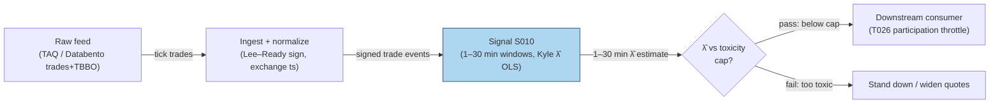

## Stage 10/200 — S010: Kyle's lambda (price impact / illiquidity)

*Batch SB4 · Signal 10/100 · Provenance [D] · Family A — Microstructure & order flow*

### S1. One-line verdict

| | |
|---|---|
| **What it is** | Slope of mid-price change on signed share volume: dollars the price moves per signed share traded — a per-name illiquidity gauge. |
| **When it works** | Stable continuous trading, balanced two-sided flow, liquid names — λ stable enough to throttle participation. |
| **When it dies** | News jumps, auctions, one-sided sweeps, stale quotes, regime breaks — flow stops being informative. |
| **Build-or-buy in one line** | Build the estimator yourself (an OLS slope), buy the trade tape. |
| Provenance | `[D]` — Kyle (1985); empirical forms per Hasbrouck (2009), Goyenko–Holden–Trzcinka (2009). Family A — Microstructure & order flow. |

### S2. How it works — plain human explanation

**Jargon, defined once:** *SIP* (Securities Information Processor — the official consolidated tape); *NBBO* (National Best Bid and Offer — the consolidated best bid/ask across exchanges).

It's 9:47:03. AAPL's best bid is 231.40 × 800, ask 231.41 × 300 — the **midquote** (average of bid and ask, the market's best guess of fair value) sits at 231.405. A seller dumps 2,000 shares at the bid; the midquote ticks to 231.398. Another seller hits for 3,000; it ticks to 231.390. Each share of net selling pressure nudged the price down a little — that "little," dollars of price move per signed share, is Kyle's lambda (λ).

Why does flow move prices? Three costs hide in every quote:

- **Adverse selection**: some traders know more than the market maker. A **market maker** (anyone quoting both sides) loses to better-informed flow, so it shades quotes against incoming flow — that shading *is* price impact.
- **Inventory cost**: a dealer left long 5,000 shares moves quotes down to discourage selling and attract buyers.
- **Order processing**: the fixed cost of standing ready to trade (systems, capital, attention).

Kyle (1985) formalized this: with an informed trader, uninformed **noise traders** (liquidity-motivated flow), and competitive market makers who can't tell the two apart, the equilibrium price is linear in total order flow: P(Q) = v₀ + λQ. λ is higher when informed trading is large relative to noise trading — i.e., when flow is **toxic** (likely informed). Rising λ = thin or toxic book: expensive to trade, dangerous to quote.

**Mental model (3 bullets):**
- λ answers: "if I need to trade Q shares right now, how much worse does my own flow make my price?" — impact̂ ≈ λ̂·Q, first-order only.
- A *state variable*, not a trigger: high λ → trade less, widen quotes, demand more edge; low λ → be more aggressive.
- It is **local**: a linear coefficient fitted on small recent flow. Extrapolating it to large orders is where slippage forecasts go to die.

### S3. The math — exact formula

**Base regression** (through-origin **OLS**, ordinary least-squares, on signed flow):

$$\Delta p_t = \alpha + \lambda\, q_t + \varepsilon_t$$

$$\hat{\lambda} = \frac{\sum_{t=1}^{T} q_t\,\Delta p_t}{\sum_{t=1}^{T} q_t^2}\quad \text{(through-origin; with-intercept form uses demeaned sums)}$$

Symbols and units:

- Δp_t — midquote (or trade-price) change from *t−1* to *t*, in **$**. Midquote changes preferred — they strip out bid–ask bounce.
- q_t = d_t · v_t — **signed volume** in **shares**: d_t ∈ {+1, −1} trade direction (+1 = buyer-initiated), v_t share size. λ̂ thus has units **$ per signed share**.
- α — intercept ($); through-origin sets α = 0 (standard when q̄ ≈ 0 over the window).
- ε_t — residual price move.
- T — window length (trades or bars).

**Parameter table:**

| Parameter | Symbol | Typical range | Too small | Too large | Default (example) |
|---|---|---|---|---|---|
| Estimation window | T | 500–10k trades (HF); 30–240 min (bars); 20–120 d (daily) | noisy, unstable λ̂ | stale, misses regime shifts | 1,000 trades *example — not an institutional standard* |
| Signed-flow normalization | q_t scale | raw shares / ADV / √v | raw incomparable across names | over-normalization hides size effects | q_t/ADV for cross-name panels *example* |
| Price series | Δp_t | midquote changes preferred | trade prices inject bounce noise | midquote lags on stale quotes | midquote Δ, 1-min bars *example* |
| SE correction | — | Newey–West (SEs robust to serial correlation) | understated SEs — flow is autocorrelated | — | Newey–West SEs *example* |

**Normalization:** z-score λ̂ within name/day for ranking; keep raw λ̂ ($/signed-share) for execution. Report units explicitly — **bps** (basis points, 1/100th of a percent) per fraction of daily volume, or $/signed-share — a λ without units is meaningless.

**Causal timing:** λ̂ at event *t* uses trades ≤ *t* only; a decision based on it is tradable no earlier than *t+1*.

**Named variants:**
1. **Square-root form** (desk standard): ΔP_t = α + λ·sign(trade_t)·√|volume_t| + ε_t over a trailing window (e.g., 300 s) — concave impact.
2. **ADV-normalized**: r_t = α + λ·(q_t/ADV) + ε_t, **ADV** = average daily volume (shares) — λ in return per unit of daily volume, comparable across names.
3. **Kyle–Obizhaeva invariance**: impact ∝ σ·√(Q/(V·L)) — for cross-name sizing.

### S4. Worked example — step-by-step numbers (SYNTHETIC)

**Synthetic 8-trade tape** (Δp in $, q in signed shares; seed 10; fully tabulated — exactly reproducible):

| t | Δp_t ($) | q_t (signed shares) | q_t·Δp_t | q_t² |
|---|---|---|---|---|
| 1 | +0.005 | +100 | 0.50 | 10,000 |
| 2 | −0.008 | −200 | 1.60 | 40,000 |
| 3 | +0.006 | +100 | 0.60 | 10,000 |
| 4 | +0.013 | +300 | 3.90 | 90,000 |
| 5 | −0.006 | −100 | 0.60 | 10,000 |
| 6 | +0.011 | +200 | 2.20 | 40,000 |
| 7 | −0.004 | −100 | 0.40 | 10,000 |
| 8 | −0.017 | −300 | 5.10 | 90,000 |
| **Sum** | **0.000** | **0** | **14.90** | **300,000** |

λ̂ = Σq_tΔp_t / Σq_t² = 14.90 / 300,000 = **4.97×10⁻⁵ $/signed-share**. A 10,000-share order has first-order impact̂ ≈ λ̂·Q ≈ **$0.50** — before spread, fees, and nonlinearity.

**Note on the chatbot draft's errors** (Duck.ai Q-SB4-1, 2026-09-10; operator-verified): its direction-unit table had q̄ = **0** (not −0.2; its q vector sums to 0), Σq² = **10** (not 9.60), λ̂ = 0.80/10 = **0.08** (not 0.0833). Worse, q = ±1 were *directions*, not shares — with 10-share units the estimate is **0.008 $/signed-share**, so "0.0833 dollars per signed share" was wrong on units too; and that (q, Δp) series was a *separate* synthetic dataset, not derived from the 12-trade tape. The example above fixes all of this with explicit share units.

**What to notice:** λ̂ is tiny because each trade is small — the *product* λ̂·Q is what matters. This toy tape has no fees, spread, or nonlinearity; a real 10,000-share order costs more. λ̂ is a **ranking/conditioning variable** (which names are expensive to trade), not a slippage forecast.

### S5. Strategies that use this signal

- **T026 — Kyle-Lambda Participation Throttle** — *primary sizing signal*: child-order participation set inversely to rolling λ̂, with Amihud caps; keeps impact̂ ≈ λ̂·Q inside budget.
- **T084 — Block-Trade Impact Reversion** — *filter/sizing*: λ̂ (with S048 resiliency) decides whether a post-block fade is cheap enough to enter; vetoes above the toxicity cap.

### S6. Data required — exact spec

| Field | Type | Granularity | Source tier | Notes |
|---|---|---|---|---|
| Trade price | float $ | tick | Tier 0–2 | SIP ok for daily λ; HF λ wants exchange timestamps |
| Trade size | int shares | tick | Tier 0–2 | odd-lot handling |
| Trade direction d_t | ±1 | tick | Tier 0–2 | Lee–Ready: quote rule on lagged midquote, tick rule at midpoint |
| Quote mid m_t | float $ | tick / 1-min | Tier 1–2 | direct BBO for HF; SIP NBBO usually adequate (S7) |
| ADV (for normalization) | float shares | daily | Tier 0–1 | 20–60 day median volume |

Collection: consolidated trades + NBBO (Databento `trades`+`tbbo`, or Polygon stocks v3). Ingest sketch (≤20 lines, Python/polars):

```python
import polars as pl
trades = pl.scan_parquet("trades_*.parquet")          # ts, price, size, venue
quotes = pl.scan_parquet("tbbo_*.parquet")            # ts, bid, ask (lag ~1s for Lee–Ready)
m = quotes.with_columns(mid=(pl.col("bid")+pl.col("ask"))/2)
signed = trades.join_asof(m, on="ts", strategy="backward", tolerance="1s")
signed = signed.with_columns(
    d=pl.when(pl.col("price")>pl.col("mid")).then(1)
       .when(pl.col("price")<pl.col("mid")).then(-1).otherwise(None),
    q=pl.col("d")*pl.col("size"), dmid=pl.col("mid").diff())
lam = signed.filter(pl.col("d").is_not_null()).select(
    (pl.col("q")*pl.col("dmid")).sum()/ (pl.col("q")**2).sum()).collect()
```

Storage: L1 quotes+trades ≈ 2–8 GB/day per liquid name in Parquet (cost-model §4) — daily files; the λ̂ panels are MBs. Data-quality checklist: timestamp normalization (SIP vs direct skew), splits (adjust price *and* size), halts (exclude auction prints), DST/half-days, stale quotes (drop locked/crossed NBBO).

### S7. Local build on M5 Max / 128GB

**Feasibility: feasible (Tier M).** A rolling OLS slope over signed trade panels — arithmetic, not infrastructure. Per cost-model §2 polars does ~10–50M rows/sec on simple ops; a 1,000-trade rolling λ̂ recomputed per minute over 500 symbols is trivial, and tick-level λ̂ for 50 names (~100k events/sec aggregate) fits in 1–5 s polars batches.

| Stack | When to pick |
|---|---|
| Python + polars | default: batch recompute on bars or 1–5 s snapshots |
| Rust event loop | full-depth / multi-symbol tick real-time (>100k events/sec sustained) |
| DuckDB | ad-hoc research over per-symbol daily Parquet files |

- **Throughput:** ingest ~100–500k events/sec (Python, cost-model §2); signal ~1–10M rows/sec. Bottleneck is trade/quote asof alignment, not the regression.
- **RAM:** one symbol-day of L1 ≈ 0.5–4 GB (cost-model §3); keep rolling windows per symbol, 60 days of bar-level λ̂ (~MBs). 500 symbols × 60 days raw L1 does **not** fit — daily files + streaming.
- **Engineering: Tier M, 20–60 h** (cost-model §5) → $3,000–9,000 at $150/hr loaded. Chatbot lead (Duck.ai Q-SB4-2, 2026-09-10 — unverified): Kyle λ 25–50 h inside a 315–650 h L1/trade pipeline (bot printed "285–650" — contradicts its own rows). Cost-model tiers take precedence.
- **SIP adequacy:** Duck.ai lead (labeled, unverified): Kyle λ *usually* honest on SIP — align timestamps, normalize by ADV, prefer midquote changes; direct feeds better for HF λ.
- **Breaks first at 500 symbols:** the tick-granularity trade/quote asof join (memory bandwidth + cross-venue clock skew).

### S8. Buy vs build

| Option | What you get | Indicative price | Buying gains | Buying loses |
|---|---|---|---|---|
| Tier 0: Alpaca IEX / Stooq | Daily bars, IEX-only trades | ~$0 | free | no consolidated tape; intraday λ impossible |
| Tier 1: Polygon Stocks Advanced / Alpaca SIP | Consolidated real-time trades + NBBO | ~$30–200/mo | one API, corporate actions, enough for 1-min λ | SIP latency/staleness; no queue truth |
| Tier 2: Databento (trades + MBP-1/TBBO) | Exchange-timestamped trades + top-of-book | ~$200/mo + usage | honest HF λ, replay | usage metering |
| Academic: LOBSTER / TAQ (WRDS) | MBO/ITCH replay or TAQ history | ~hundreds/yr academic | ground truth for validation | academic license; not production |

All prices *indicative — verify before budgeting* (cost-model §6). **Verdict: build the estimator, buy the feed.** Your thresholds (participation caps per λ̂ quantile) are the edge — no vendor sells them. **Buy** Databento-grade L1 when HF λ drives live participation; **build** on SIP/Polygon while λ̂ is a daily/1-min variable. Crossover: measured SIP-vs-direct λ̂ divergence above ~10–20% *example — not an institutional standard*.

### S9. Success ratio / efficacy — documented evidence

Honesty first: λ is a **liquidity measurement**, not a strategy. The evidence is about measurement quality and conditioning use — no credible "λ predicts X bps of slippage" literature exists, and none is claimed.

| Study / source | Market & period | Metric | Before/after cost | Caveat |
|---|---|---|---|---|
| Goyenko–Holden–Trzcinka (2009), JFE 92 | US equities, TAQ + Rule 605 (SEC monthly execution-quality disclosure reports) benchmarks | Amihud "does well measuring price impact" vs HF benchmarks | before-cost (measurement accuracy) | Daily frequency; too coarse for single intraday orders |
| Collin-Dufresne & Fos (2012, NBER w18451) | US equities | Informed traders trade *more aggressively when measured price impact is lower* | n/a (documents estimator bias) | λ̂ suffers selection bias: measured flow is conditioned on λ̂ itself |
| Almgren–Chriss (2000) framework | execution literature | Permanent impact γ (linear) separates lasting price moves from temporary liquidity cost η | after-cost (implementation shortfall) | Per-desk calibration; planning input, not forecast |

**Regimes where it fails:** scheduled news (one-sided, uninformative flow), opens/closes and auctions, thin names (a few prints dominate λ̂), and periods where your own flow is a large share of q_t (exclude own fills — self-impact contaminates the estimate).

**Bottom line:** standalone trigger: *zero* edge — λ̂ has no directional content. Filter/sizing input: *real, documented* edge — it ranks where trading is expensive and keeps participation inside an impact budget. Per Duck.ai Q-SB4-3 (labeled chatbot lead): λ is a **local** impact coefficient; impact̂ ≈ λ̂Q is first-order only.

### S10. Failure modes & pitfalls

1. **Unit errors** — regressing on directions (±1) but quoting $/share (the chatbot error in S4). *Mitigation:* assert q in shares; label every λ̂ with units; unit-test on a hand tape.
2. **Lookahead via quote alignment** — signing with contemporaneous quotes leaks the reaction into d_t. *Mitigation:* lag quotes ~1 s (Lee–Ready); backward asof joins.
3. **Bid–ask bounce in Δp** — trade-price changes embed ±s/2 bounce, inflating |λ̂|. *Mitigation:* use midquote changes; if only trades exist, note the upward bias.
4. **Self-impact contamination** — your own fills sit in q_t and push λ̂ up exactly when you trade most. *Mitigation:* flag and exclude own executions from the tape.
5. **Regime breaks / news** — calm-flow λ̂ misprices headline trading. *Mitigation:* freeze or stress-multiply λ̂ around scheduled events.
6. **Nonlinearity at size** — impact̂ ≈ λ̂Q underestimates large-order cost. *Mitigation:* cap participation to the linear region; use the square-root variant for large clips.
7. **Stale quotes on SIP** — delayed NBBO mis-signs trades, attenuating λ̂ toward 0. *Mitigation:* measure SIP-vs-direct λ̂ divergence; upgrade feed past the S8 crossover.
8. **Overfitting the window** — tuning T to maximize backtested savings is parameter mining. *Mitigation:* fix T from λ̂ stability analysis, not from P&L.

### S11. Visuals




*Diagram note: feature compute is folded into SIG — the 1–30 min Kyle λ̂ OLS runs directly on signed trade events, so there is no separate FEAT node (FEAT→SIG fold).*

### S12. Sources

1. Kyle, A. S. (1985). "Continuous Auctions and Insider Trading." *Econometrica*, 53(6), 1315–1335. — the λ model: P(Q) = v₀ + λQ; λ = σ_v/(2σ_ε). https://doi.org/10.2307/1913210 — λ formula as cited: https://github.com/screamer-labs/screamer/blob/HEAD/docs/functions_micro/RollingKyleLambda.md
2. Goyenko, R. Y., Holden, C. W., & Trzcinka, C. A. (2009). "Do Liquidity Measures Measure Liquidity?" *JFE*, 92(2), 153–181. — Amihud "does well measuring price impact." https://EconPapers.repec.org/article/eeejfinec/v_3a92_3ay_3a2009_3ai_3a2_3ap_3a153-181.htm
3. Collin-Dufresne, P., & Fos, V. (2012). "Insider Trading, Stochastic Liquidity and Equilibrium Prices." NBER WP 18451. — informed traders trade more when measured impact is low (λ̂ selection bias). https://www.nber.org/system/files/working_papers/w18451/w18451.pdf
4. Almgren, R., & Chriss, N. (2000). "Optimal Execution of Portfolio Transactions." *Journal of Risk*. — permanent vs temporary impact; λ-family coefficients as execution planning inputs. https://en.wikipedia.org/wiki/Almgren%E2%80%93Chriss_model

Duck.ai answered Q-SB4-1–Q-SB4-3 (2026-09-10); Grok/Cursor answers pending (checked 2026-09-10).

**Unverified leads** (chatbot-provided, no independent checkable source — do not quote as fact):
- Duck.ai (GPT-5.6 Luna, 2026-09-10) Q-SB4-1: practical windows (500–10k trades HF; 30–240 min; 20–120 d), Newey–West SEs — *unverified chatbot claim*.
- Duck.ai Q-SB4-2: L1/trade pipeline 315–650 h (row sums; printed "285–650" contradicts rows), Kyle λ 25–50 h; SIP "usually" adequate — *unverified chatbot claims*.
- Duck.ai Q-SB4-3: "λ is a local impact coefficient, not a full slippage forecast; no universal 1σ-Amihud → X bps slippage" — *unverified chatbot claim* (consistent with sources above).
- Grok / Cursor answers to Q-SB4-1–Q-SB4-3: pending (checked 2026-09-10).
