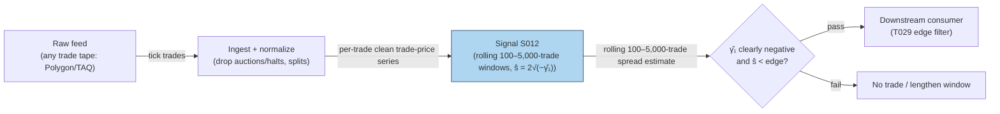

## Stage 12/200 — S012: Roll implied effective spread

*Batch SB4 · Signal 12/100 · Provenance [D] · Family A — Microstructure & order flow*

### S1. One-line verdict

| | |
|---|---|
| **What it is** | Estimates the effective bid–ask spread from transaction prices alone, via the negative lag-1 autocovariance (covariance of each price change with the previous one) that bid–ask bounce induces. |
| **When it works** | Prices bounce between bid and ask with roughly equal buy/sell pressure, stable spread. |
| **When it dies** | Trending flow, informed trading, or positive autocovariance: the estimator is undefined and says nothing. |
| **Build-or-buy in one line** | Build: ten lines of NumPy on any trade tape; nothing to buy. |
| Provenance | `[D]` — Roll (1984); conventions per Harris (1990), Hasbrouck (2009). Family A — Microstructure & order flow. |

### S2. How it works — plain human explanation

**Jargon, defined once:** *SIP* (Securities Information Processor — the official consolidated tape).

Watch a stock trade. Bid 231.40, ask 231.41. A seller hits the bid: print at 231.40. A buyer lifts the ask: 231.41. Another seller: 231.40. If fundamental value never moved, trade prices just *bounce* between 231.40 and 231.41 — consecutive price changes (+0.01, −0.01, +0.01) alternate sign. That negative serial dependence is the fingerprint of the spread.

Roll's (1984) insight: in an efficient market, fundamental value follows a random walk, and the only deviation of *observed* trade prices from a random walk is the bid–ask bounce. So the lag-1 autocovariance of price changes identifies the spread: γ₁ = −s²/4, hence **s = 2√(−γ₁)** — no quotes needed, just a trade tape.

Definitions, since the whole chapter hangs on them:

- **Quoted spread**: ask − bid — what the book *advertises*.
- **Effective spread**: 2·|trade price − midquote| — what a trader *actually* paid vs fair value; often below quoted (price improvement inside the quotes).
- **Realized spread**: the dealer's average round-trip revenue; smaller than quoted when adverse selection moves the midquote against the dealer.
- **Adverse selection**: losses a liquidity provider suffers against better-informed counterparties — the midquote drifts after the trade, shrinking the realized spread.

Roll recovers the *effective* spread — the round-trip cost implied by the bounce — which is why T029 uses it as an edge filter: don't trade unless expected edge exceeds the Roll-implied cost.

**Mental model (3 bullets):**
- Bounce ⇒ negative autocovariance ⇒ spread. No bounce (one-sided flow) ⇒ no information about the spread.
- It's a *cost meter*, not a direction signal: it tells you how expensive the name is, never which way it goes.
- It assumes buys and sells are equally likely and the spread is constant — every violation biases it, and it fails loudly (undefined) rather than quietly.

### S3. The math — exact formula

**Roll model.** Observed price p_t = m_t + (s/2)·I_t, where m_t is the unobserved efficient (mid) price with serially uncorrelated innovations, s is the effective spread, and I_t ∈ {+1, −1} is the trade direction (buy/sell), equally likely and independent of m_t. Then:

$$\Delta p_t = \varepsilon_t + \tfrac{s}{2}(I_t - I_{t-1}),\qquad \mathrm{Cov}(\Delta p_t, \Delta p_{t-1}) = -\frac{s^2}{4}$$

$$\hat{s}_{\text{Roll}} = 2\sqrt{-\hat{\gamma}_1},\qquad \hat{\gamma}_1 = \frac{1}{T-1}\sum_{t=2}^{T}(\Delta p_t - \overline{\Delta p})(\Delta p_{t-1} - \overline{\Delta p})$$

- Δp_t — trade-price change, in **dollars** ($); T = number of price changes in the window.
- γ̂₁ — sample lag-1 autocovariance of price changes, in **$²**; must be **clearly negative** — if γ̂₁ ≥ 0 the estimator is undefined (S4 rule).
- ŝ — implied **effective spread**, in **dollars** ($).

**Parameter table:**

| Parameter | Symbol | Typical range | Too small | Too large | Default (example) |
|---|---|---|---|---|---|
| Estimation window | T | 100–5,000 transactions; 1–15 min bars *(chatbot-suggested range, Duck.ai Q-SB4-1 — unverified)* | γ̂₁ dominated by noise; often ≥ 0 | spread assumed constant over too long; regime mixing | 500 trades *example — not an institutional standard* |
| Sampling | — | tick trades / 1–15 min bars *(chatbot-suggested, unverified)* | tick noise, discreteness | bounce averaged away | 1-min bars *example* |
| γ̂₁ ≥ 0 rule | — | undefined / floor at 0 / \|·\| | fabricating a spread from noise | — | report undefined; lengthen window *example* |

**Normalization:** ŝ in $ or in **bps** (basis points; ŝ/price × 10,000) for cross-name comparison. Harris (1990) uses 2√|γ̂₁| (always defined); Hasbrouck (2009) floors at 0. These are *choices*, not truths; document yours.

**Causal timing:** ŝ over trades ≤ *t* is known at *t*; a gate based on it applies at *t+1* and later.

**Named variants:**
1. **Roll–Hasbrouck Gibbs (Bayesian)**: prior on spread and latent trade directions, posterior sampled — always non-negative, exact in small samples; Hasbrouck (2004, 2009).
2. **Corwin–Schultz (2012)**: spread from daily high/low ratios over 1- and 2-day intervals — needs only OHLC, beats Roll in simulations (S9).
3. **French–Roll bias correction**: adjusts for the small-sample bias of the moment estimator.

### S4. Worked example — step-by-step numbers (SYNTHETIC)

**Synthetic 12-trade tape** (prices in $; random seed 12 in the plot script — fully tabulated, reproducible exactly):

| t | p_t | Δp_t |
|---|---|---|
| 1 | 100.00 | — |
| 2 | 100.10 | +0.10 |
| 3 | 100.10 | 0.00 |
| 4 | 100.20 | +0.10 |
| 5 | 100.10 | −0.10 |
| 6 | 100.00 | −0.10 |
| 7 | 100.00 | 0.00 |
| 8 | 99.90 | −0.10 |
| 9 | 100.00 | +0.10 |
| 10 | 100.10 | +0.10 |
| 11 | 99.90 | −0.20 |
| 12 | 100.00 | +0.10 |

Step-by-step (11 price changes):
1. ΣΔp_t = **0.00** (starts and ends at 100.00 — it must sum to zero), so Δp̄ = **0** exactly.
2. Lag-1 cross-products Δp_t·Δp_{t−1} (t = 2…11): 0, 0, −0.01, +0.01, 0, 0, −0.01, +0.01, −0.02, −0.02 → sum = **−0.04**.
3. γ̂₁ = −0.04/10 = **−0.004** $² (dividing by T−1 = 10 cross-products).
4. ŝ = 2√(−γ̂₁) = 2√0.004 = 2 × 0.06325 ≈ **$0.126**.

**Correction note:** the Duck.ai draft (Q-SB4-1, 2026-09-10) mis-summed this Δp series as −0.10 (mean −0.00909, γ̂₁ = −0.00402, spread $0.127). All three are wrong: the series sums to 0 (start = end price), so the mean is 0, γ̂₁ = −0.004, and the spread is **$0.126**.

**When γ̂₁ ≥ 0 (the Roll failure rule):** report the spread as **undefined** — do not silently take √|γ̂₁|. Then: (a) lengthen the window; (b) switch to slower sampling (1–5 s or 1–15 min bars — chatbot-rated "usually" honest on SIP, labeled lead); (c) cross-check with Corwin–Schultz or the quoted spread. A positive γ̂₁ with adequate sample usually means trending/informed flow, not a zero spread.

**What to notice:** this toy tape has a suspiciously clean bounce and no fees — real tapes mix bounce with drift, which is why γ̂₁ ≥ 0 happens in practice (about half of Roll's own annual samples; S9). A cost screen, never a backtest input: nothing here is a return.

### S5. Strategies that use this signal

- **T029 — Spread-Estimate Edge Filter** — *primary gate*: trade only when the estimated effective spread (Roll / Corwin–Schultz) is below the per-trade edge; Roll is the cheap first-pass screen.
- **T028 — Spread-Decomposition Router** — *cost input*: Roll-implied effective spread feeds the router's quoted/effective/realized spread panel alongside S015's decomposition.
- **T097 — Sub-Hour Microstructure Reversal Scalper** — *timing filter*: reversal entries sized so the harvested bounce exceeds the Roll-implied round-trip cost.

### S6. Data required — exact spec

| Field | Type | Granularity | Source tier | Notes |
|---|---|---|---|---|
| Trade price p_t | float $ | tick (per trade) | Tier 0–2 | any trade tape; Polygon stocks v3, Databento trades, TAQ |
| (optional) Trade timestamp | datetime | tick | Tier 1–2 | needed only for window/bar sampling |
| (cross-check) Daily high/low | float $ | daily | Tier 0 | for Corwin–Schultz fallback |

Collection: the cheapest signal in the book — a trade-price series. `trades` schema from Databento or Polygon; even Stooq daily closes work for a daily-frequency Roll (with the caveat that daily sampling weakens the bounce). Ingest sketch (≤20 lines):

```python
import polars as pl, numpy as np
px = pl.scan_parquet("trades_*.parquet").select("ts","price").sort("ts")
dp = px.with_columns(dp=pl.col("price").diff()).drop_nulls().collect()
T = len(dp)
g1 = ((dp["dp"]-dp["dp"].mean())*(dp["dp"].shift(1)-dp["dp"].mean())).sum()/(T-1)
roll_spread = 2*np.sqrt(-g1) if g1 < 0 else float("nan")  # undefined if >= 0
print(f"γ̂₁={g1:.6f}  Roll spread={roll_spread}")
```

Storage: negligible — a trade-price column (500 symbols × 60 days of 1-min bars ≈ 12 MB, cost-model §3). Data-quality: exclude auction prints and halts (they break the bounce), splits/dividends, DST/half-days, bad ticks (drop prints >10% from rolling median — *example*).

### S7. Local build on M5 Max / 128GB

**Feasibility: feasible (Tier M).** The covariance itself is microseconds of NumPy — but a defensible pipeline (sampling harness, γ̂₁ ≥ 0 rule, Corwin–Schultz cross-check, validation) is what the band prices. Per cost-model §2, numpy vectorized math runs ~50–200M elements/sec; the entire 500-symbol 1-min-bar panel (195k bars/day) computes in milliseconds. The work is in *sampling choices and the γ̂₁ ≥ 0 decision rule*, not compute.

| Stack | When to pick |
|---|---|
| Python + NumPy/polars | default: the whole estimator is one vectorized expression |
| DuckDB | ad-hoc research over daily Parquet trade files |

- **Throughput:** effectively infinite for this signal; bottleneck is data retrieval, not compute.
- **RAM:** 1 symbol-day of 1-min bars ≈ 0.1 MB (cost-model §3); 500 symbols × 60 days ≈ 12 MB — trivial.
- **Engineering: Tier M, 20–60 h** (cost-model §5: S001–S020 ex-L2) → $3,000–9,000 at $150/hr loaded-cost estimate. The narrow covariance prototype is a few hours; the band prices the defensible trade-tape pipeline. Chatbot lead (Duck.ai Q-SB4-2, 2026-09-10 — unverified): Roll component 15–30 h inside a 315–650 h L1/trade pipeline (bot printed "285–650" — contradicts its own rows). Cost-model tiers take precedence.
- **SIP adequacy:** Duck.ai lead (labeled, unverified): Roll is *usually* honest on SIP — use slow sampling (1–5 s or 1–15 min bars) and test sensitivity to the sampling choice. Never treat a SIP-derived Roll as exchange truth at tick granularity.
- **Breaks first at 500 symbols:** nothing about Roll breaks — but tick-level on 500 names makes the trade-tape ingest (not the estimator) the bottleneck; sample to bars.

### S8. Buy vs build

| Option | What you get | Indicative price | Buying gains | Buying loses |
|---|---|---|---|---|
| Tier 0: Stooq / Alpaca IEX / exchange delayed | Daily bars or IEX trades | ~$0 | free; enough for daily Roll | coarse; weak bounce at daily frequency |
| Tier 1: Polygon Stocks Advanced / Alpaca SIP | Real-time consolidated trades | ~$30–200/mo | full tape for tick Roll | nothing material at this price |
| Tier 2: Databento trades | Exchange-timestamped trades, replay | ~$200/mo + usage | provenance, replay | overkill for a covariance |
| Academic: TAQ (WRDS) | Full consolidated history | ~hundreds/yr academic | validation sample | academic license |

All prices *indicative — verify before budgeting* (cost-model §6). **Verdict: build, always.** No vendor product exists — Roll is ten lines of NumPy. Spend the effort on the *sampling and γ̂₁ ≥ 0 rule*; cross-check with Corwin–Schultz (needs only daily high/low) before trusting one estimate. **Buy** a feed only if you lack a trade tape for other signals; never buy data *for* Roll.

### S9. Success ratio / efficacy — documented evidence

Roll is a cost *measurement*; the evidence is about estimator accuracy, not trading profits. No strategy, only a meter.

| Study / source | Market & period | Metric | Before/after cost | Caveat |
|---|---|---|---|---|
| Hasbrouck (2009), *JF* 64(3) | US equities vs transaction-level estimates | Gibbs (Bayesian Roll) achieves **0.965 correlation** with transaction-level effective costs | before-cost (measurement accuracy) | Daily closes; Gibbs heavier than moment Roll |
| Corwin–Schultz (2012), *JF* 67(2) | Simulations (per published summaries) | High–low estimates correlate **~0.9** with true spreads; **half the std dev** of Roll's estimator | before-cost (estimator precision) | Simulation-based; assumes high≈buy/low≈sell |
| Roll (1984) via CEMMAP CWP12/16 | Roll's own annual daily/weekly samples | Positive autocovariance — estimator undefined — in **about half** the cases | n/a (documents failure rate) | Daily/weekly sampling; intraday ticks behave better |

**Regimes where it fails:** one-sided flow (no bounce — γ̂₁ ≥ 0), informed episodes (random-walk assumption breaks), discrete ticks in low-priced names (quantized bounce), after-hours/crossed markets.

**Bottom line:** standalone trigger: *zero* edge (no direction). Cost filter: *documented, honest* edge — it keeps you out of trades whose implied round-trip cost already eats your edge. Prefer Gibbs/Corwin–Schultz over raw moment-Roll on short samples.

### S10. Failure modes & pitfalls

1. **γ̂₁ ≥ 0 — the classic failure** — √|·| or silent flooring fabricates a spread from trend noise. *Mitigation:* report undefined; lengthen window; cross-check (S4).
2. **Lookahead via window choice** — tuning the window until the spread "looks right" is parameter mining. *Mitigation:* fix sampling from stability analysis, not from downstream P&L.
3. **Auction prints and halts** — discontinuous prices inject fake autocovariance. *Mitigation:* exclude opens/closes/auction prints and halted periods.
4. **Tick discreteness** — in low-priced names the bounce is quantized and γ̂₁ is distorted. *Mitigation:* use bps units; prefer midquote-based measures where quotes exist.
5. **Buys/sells equally likely — false** — real flow clusters; one-sided flow biases ŝ down. *Mitigation:* treat Roll as a lower-bound screen under clustered flow; confirm with quoted spreads.
6. **Mixing regimes in one window** — calm morning + news afternoon in a single γ̂₁ mixes two spreads. *Mitigation:* short rolling windows; intraday seasonality awareness (wider at open/close).
7. **Backtest misuse** — "returns net of Roll spread" on a synthetic tape is fabricated realism. *Mitigation:* Roll is a live cost gate; never subtract it from toy P&L.
8. **Small-sample bias** — the moment estimator is biased in short samples. *Mitigation:* French–Roll correction or the Gibbs estimator for short windows.

### S11. Visuals




### S12. Sources

1. Roll, R. (1984). "A Simple Implicit Measure of the Effective Bid-Ask Spread in an Efficient Market." *JF*, 39(4), 1127–1139. — ŝ = 2√(−cov); spread from price changes alone. https://repec.udesa.edu.ar/pub/Finanzas/Journals/Journal%20of%20Finance/39/4/2327617.pdf
2. Harris, L. (1990). "Statistical Properties of the Roll Serial Covariance Bid/Ask Spread Estimator." *JF*, 45(2), 579–590. — positive-autocovariance properties; |·| convention. Author's CV: https://msbfile03.usc.edu/digitalmeasures/lharris/pci/Harris-Larry%20CV-1.pdf
3. Hasbrouck, J. (2009). "Trading Costs and Returns for U.S. Equities." *JF*, 64(3), 1445–1477. — Gibbs estimate correlates 0.965 with transaction-level estimates. https://pages.stern.nyu.edu/~jhasbrou/Research/GibbsCurrent/HasbrouckJF.pdf
4. Corwin, S. A., & Schultz, P. (2012). "A Simple Way to Estimate Bid-Ask Spreads from Daily High and Low Prices." *JF*, 67(2), 719–760. — high–low estimator; ~0.9 correlation in simulations, half Roll's std dev. https://afajof.org/issue/volume-67-issue-2/
5. CEMMAP CWP12/16 — "Simple Nonparametric Estimators for the Bid-Ask Spread in the Roll Model." — Roll's positive-autocovariance problem (≈ half his samples); reviews Harris/Hasbrouck fixes. https://www.cemmap.ac.uk/wp-content/uploads/2020/08/CWP1216.pdf

Duck.ai answered Q-SB4-1–Q-SB4-3 (2026-09-10); Grok/Cursor answers pending (checked 2026-09-10).

**Unverified leads** (chatbot-provided, no independent checkable source — do not quote as fact):
- Duck.ai (GPT-5.6 Luna, 2026-09-10) Q-SB4-1: practical windows (100–5,000 transactions; 1–15 min bars), γ̂₁ ≥ 0 handling (undefined / lengthen / corrected estimator) — *unverified chatbot claims* (consistent with Harris/Hasbrouck conventions; kept as labeled leads).
- Duck.ai Q-SB4-2: Roll component 15–30 h inside a 315–650 h L1/trade pipeline (row sums; printed "285–650" contradicts rows); SIP "usually" honest with slow sampling — *unverified chatbot claims*.
- Grok / Cursor answers to Q-SB4-1–Q-SB4-3: pending (checked 2026-09-10).
